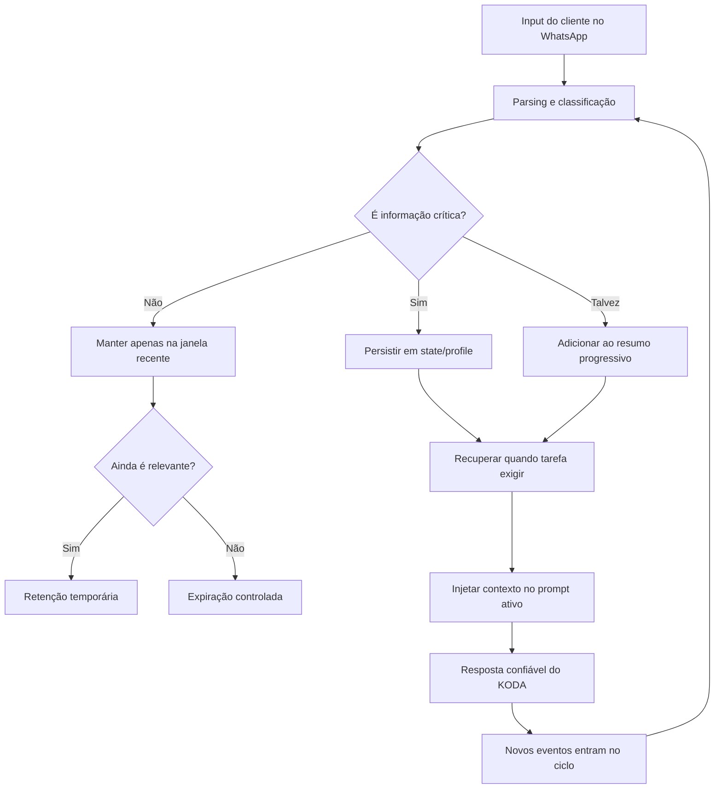
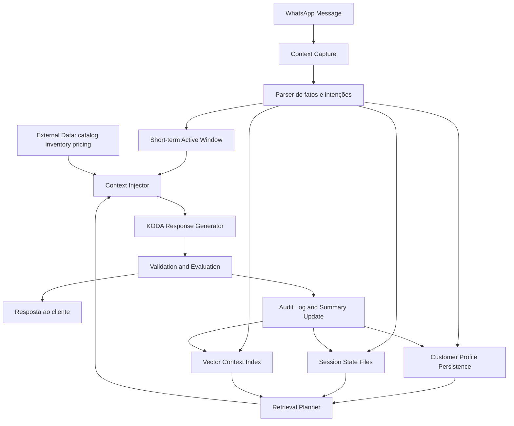
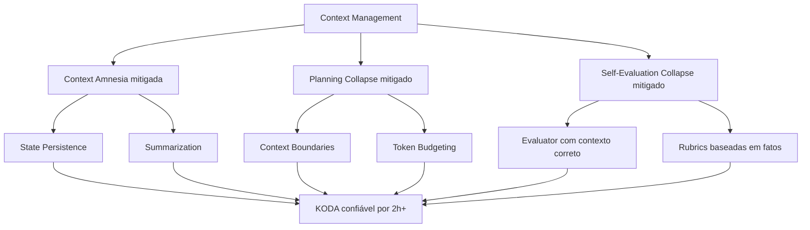

# 🧠 Context Management: Como Agentes Mantêm o Foco por Horas
## O Core Concept #1 para construir KODA como um agente que lembra, decide e vende com confiança

**Tempo Estimado:** 120-150 minutos
**Nível:** Core Concepts - Conceito 1
**Pré-requisito:** Ter completado Nível 1, especialmente Context Amnesia e Token Budgeting
**Status:** 🟢 CRÍTICO - Fundação técnica para conversas WhatsApp de 2h+
**Data de Criação:** Maio 2026

---

## 📖 Prólogo: A Noite em Que KODA Quase Perdeu a Confiança de Fernando

Era 21h47 de uma terça-feira quando Fernando abriu o dashboard de atendimento e viu uma conversa que parecia comum.
Uma cliente chamada Camila tinha começado com uma pergunta simples: *"Qual whey vocês recomendam para alguém voltando a treinar?"*
KODA respondeu bem, como sempre fazia nos primeiros minutos: acolhedor, rápido, confiante e cheio de contexto útil.
Camila contou que tinha intolerância à lactose, preferia chocolate, não queria gastar mais de R$ 180, e treinava às 6h da manhã.
KODA registrou tudo na conversa ativa e recomendou três opções seguras, todas aparentemente alinhadas com o perfil dela.
Até ali, Fernando teria mostrado a conversa em qualquer apresentação interna como exemplo de produto funcionando.

Mas a conversa não terminou em dez minutos.
Camila começou a comparar sabores, perguntar sobre entrega, pedir explicação sobre creatina, voltar para whey, questionar desconto, mandar áudio, mudar orçamento e pedir opinião sobre presente para o marido.
A conversa deixou de ser uma pergunta e virou uma jornada de compra real, do tipo que acontece no WhatsApp brasileiro todos os dias.
No minuto 83, Camila perguntou: *"Então o combo que você montou ainda respeita minha intolerância, né?"*
KODA respondeu: *"Sim, todos os itens são adequados."*
Só que um dos itens adicionados quinze minutos antes era um whey concentrado com lactose.
Não foi malícia. Não foi falta de inteligência. Não foi ausência de dados no catálogo.
Foi **Context Amnesia** encontrando uma conversa longa, ruidosa e cheia de voltas.

Fernando leu a resposta duas vezes e sentiu aquele silêncio que todo líder técnico reconhece: o sistema parecia bom, mas não era confiável o suficiente.
No Nível 1, você aprendeu que agentes perdem o foco por três motivos fundamentais.
O primeiro era Context Amnesia: a informação crítica existe em algum lugar da história, mas deixa de estar disponível no momento certo.
O segundo era Planning Collapse: o agente mistura planejar, executar e verificar até perder a linha de raciocínio.
O terceiro era Self-Evaluation Collapse: o agente olha para a própria resposta e aprova com confiança algo que deveria rejeitar.
Este módulo aprofunda o primeiro problema, mas você vai perceber que ele conversa com todos os outros.
Porque contexto não é apenas histórico de mensagens.
Contexto é a matéria-prima da decisão.

Se KODA não vê a alergia, não consegue respeitar a alergia.
Se não vê o orçamento, não consegue otimizar preço.
Se não vê a promessa de entrega feita quarenta minutos antes, não consegue preservar confiança.
E confiança, no WhatsApp, não é detalhe: é o produto.
Fernando chamou o time no dia seguinte e escreveu no quadro: *"Nós não precisamos de uma IA que fale bonito por 10 minutos. Precisamos de uma IA que continue confiável depois de 2 horas."*
Essa frase virou o ponto de partida do Core Concept #1.

### A conversa que parecia pequena

- **Minuto 00:02:** Camila pergunta sobre whey para voltar a treinar.
- **Minuto 03:18:** Ela informa intolerância à lactose e preferência por chocolate.
- **Minuto 07:40:** KODA recomenda duas opções sem lactose e uma proteína vegetal.
- **Minuto 14:05:** Camila pergunta se creatina vale a pena para iniciante.
- **Minuto 21:33:** KODA explica creatina, mas a conversa já mistura whey, creatina e entrega.
- **Minuto 29:12:** Camila muda orçamento de R$ 180 para R$ 220 se o combo valer a pena.
- **Minuto 37:50:** Ela pede desconto de clube e pergunta se pode dividir no cartão.
- **Minuto 46:04:** KODA consulta frete para Santo André e promete entrega em até dois dias.
- **Minuto 58:27:** Camila manda áudio longo sobre rotina, sono e dificuldade de preparar shake.
- **Minuto 70:10:** KODA sugere um combo com shaker, creatina e proteína.
- **Minuto 83:44:** Camila checa se tudo ainda respeita intolerância à lactose.
- **Minuto 84:01:** KODA confirma sem verificar a camada de estado persistente.
- **Minuto 85:20:** Fernando marca a conversa como incidente de confiança.

O erro não estava no catálogo.
O erro não estava no modelo.
O erro estava na forma como o sistema tratava memória como se fosse uma pilha infinita de mensagens.

### O que Fernando percebeu

- Contexto precisa ter **arquitetura**, não apenas tamanho.
- Informação crítica precisa ser promovida de conversa para estado persistente.
- Resumo não é enfeite; resumo é uma operação de compressão com responsabilidade.
- O agente precisa saber o que está fresco, o que está estabilizado e o que expirou.
- Nem todo dado merece ficar na context window.
- Nem todo dado pode ser descartado.
- Uma conversa longa é um sistema distribuído no tempo.
- Se o sistema não decide onde cada informação vive, o modelo decide implicitamente e geralmente tarde demais.

Pense em KODA como um vendedor humano excelente em uma loja movimentada.
No começo da conversa, ele lembra tudo porque acabou de ouvir tudo.
Depois de uma hora atendendo a mesma pessoa, com interrupções, consultas de estoque, cálculo de frete e mudança de orçamento, ele precisa de anotações.
Não porque seja incompetente, mas porque memória humana e memória de agente são recursos limitados.
A diferença é que um bom vendedor sabe anotar no lugar certo: alergia no perfil, promessa no pedido, dúvida aberta em um checklist, preferência no histórico.
Context Management é ensinar KODA a fazer isso com rigor técnico.

### O pacto deste módulo

1. Você vai parar de pensar em contexto como uma string gigante.
2. Você vai começar a pensar em contexto como um pipeline.
3. Você vai aprender por que context window grande ajuda, mas não substitui arquitetura.
4. Você vai ver estratégias concretas: Sliding Window, Summarization, State Persistence, Retrieval, Compaction e abordagens híbridas.
5. Você vai aplicar tudo em uma conversa WhatsApp de mais de duas horas.
6. Você vai sair com checklist implementável, exemplos JSON e pseudocódigo suficiente para começar amanhã.

**Batida narrativa 001:** Se KODA lembra a restrição alimentar, ele protege a saúde do cliente.
**Batida narrativa 002:** Se KODA lembra o orçamento, ele evita parecer vendedor empurrando produto caro.
**Batida narrativa 003:** Se KODA lembra a promessa de entrega, ele preserva confiança operacional.
**Batida narrativa 004:** Se KODA lembra o que já explicou, ele não faz o cliente se sentir ignorado.
**Batida narrativa 005:** Se KODA lembra o estado do pedido, ele evita cobrança duplicada e retrabalho.
**Batida narrativa 006:** Se KODA sabe o que expirou, ele não ressuscita uma preferência antiga que não vale mais.
**Batida narrativa 007:** Se KODA sabe a fonte de cada fato, Fernando consegue auditar a decisão depois.
**Batida narrativa 008:** Se KODA injeta contexto por prioridade, ele reduz custo sem reduzir cuidado.
**Batida narrativa 009:** Se KODA lembra a restrição alimentar, ele protege a saúde do cliente.
**Batida narrativa 010:** Se KODA lembra o orçamento, ele evita parecer vendedor empurrando produto caro.
**Batida narrativa 011:** Se KODA lembra a promessa de entrega, ele preserva confiança operacional.
**Batida narrativa 012:** Se KODA lembra o que já explicou, ele não faz o cliente se sentir ignorado.
**Batida narrativa 013:** Se KODA lembra o estado do pedido, ele evita cobrança duplicada e retrabalho.
**Batida narrativa 014:** Se KODA sabe o que expirou, ele não ressuscita uma preferência antiga que não vale mais.
**Batida narrativa 015:** Se KODA sabe a fonte de cada fato, Fernando consegue auditar a decisão depois.
**Batida narrativa 016:** Se KODA injeta contexto por prioridade, ele reduz custo sem reduzir cuidado.
**Batida narrativa 017:** Se KODA lembra a restrição alimentar, ele protege a saúde do cliente.
**Batida narrativa 018:** Se KODA lembra o orçamento, ele evita parecer vendedor empurrando produto caro.
**Batida narrativa 019:** Se KODA lembra a promessa de entrega, ele preserva confiança operacional.
**Batida narrativa 020:** Se KODA lembra o que já explicou, ele não faz o cliente se sentir ignorado.
**Batida narrativa 021:** Se KODA lembra o estado do pedido, ele evita cobrança duplicada e retrabalho.
**Batida narrativa 022:** Se KODA sabe o que expirou, ele não ressuscita uma preferência antiga que não vale mais.
**Batida narrativa 023:** Se KODA sabe a fonte de cada fato, Fernando consegue auditar a decisão depois.
**Batida narrativa 024:** Se KODA injeta contexto por prioridade, ele reduz custo sem reduzir cuidado.
**Batida narrativa 025:** Se KODA lembra a restrição alimentar, ele protege a saúde do cliente.
**Batida narrativa 026:** Se KODA lembra o orçamento, ele evita parecer vendedor empurrando produto caro.
**Batida narrativa 027:** Se KODA lembra a promessa de entrega, ele preserva confiança operacional.
**Batida narrativa 028:** Se KODA lembra o que já explicou, ele não faz o cliente se sentir ignorado.
**Batida narrativa 029:** Se KODA lembra o estado do pedido, ele evita cobrança duplicada e retrabalho.
**Batida narrativa 030:** Se KODA sabe o que expirou, ele não ressuscita uma preferência antiga que não vale mais.
**Batida narrativa 031:** Se KODA sabe a fonte de cada fato, Fernando consegue auditar a decisão depois.
**Batida narrativa 032:** Se KODA injeta contexto por prioridade, ele reduz custo sem reduzir cuidado.
**Batida narrativa 033:** Se KODA lembra a restrição alimentar, ele protege a saúde do cliente.
**Batida narrativa 034:** Se KODA lembra o orçamento, ele evita parecer vendedor empurrando produto caro.
**Batida narrativa 035:** Se KODA lembra a promessa de entrega, ele preserva confiança operacional.
**Batida narrativa 036:** Se KODA lembra o que já explicou, ele não faz o cliente se sentir ignorado.
**Batida narrativa 037:** Se KODA lembra o estado do pedido, ele evita cobrança duplicada e retrabalho.
**Batida narrativa 038:** Se KODA sabe o que expirou, ele não ressuscita uma preferência antiga que não vale mais.
**Batida narrativa 039:** Se KODA sabe a fonte de cada fato, Fernando consegue auditar a decisão depois.
**Batida narrativa 040:** Se KODA injeta contexto por prioridade, ele reduz custo sem reduzir cuidado.
**Batida narrativa 041:** Se KODA lembra a restrição alimentar, ele protege a saúde do cliente.
**Batida narrativa 042:** Se KODA lembra o orçamento, ele evita parecer vendedor empurrando produto caro.
**Batida narrativa 043:** Se KODA lembra a promessa de entrega, ele preserva confiança operacional.
**Batida narrativa 044:** Se KODA lembra o que já explicou, ele não faz o cliente se sentir ignorado.
**Batida narrativa 045:** Se KODA lembra o estado do pedido, ele evita cobrança duplicada e retrabalho.
**Batida narrativa 046:** Se KODA sabe o que expirou, ele não ressuscita uma preferência antiga que não vale mais.
**Batida narrativa 047:** Se KODA sabe a fonte de cada fato, Fernando consegue auditar a decisão depois.
**Batida narrativa 048:** Se KODA injeta contexto por prioridade, ele reduz custo sem reduzir cuidado.
**Batida narrativa 049:** Se KODA lembra a restrição alimentar, ele protege a saúde do cliente.
**Batida narrativa 050:** Se KODA lembra o orçamento, ele evita parecer vendedor empurrando produto caro.
**Batida narrativa 051:** Se KODA lembra a promessa de entrega, ele preserva confiança operacional.
**Batida narrativa 052:** Se KODA lembra o que já explicou, ele não faz o cliente se sentir ignorado.
**Batida narrativa 053:** Se KODA lembra o estado do pedido, ele evita cobrança duplicada e retrabalho.
**Batida narrativa 054:** Se KODA sabe o que expirou, ele não ressuscita uma preferência antiga que não vale mais.
**Batida narrativa 055:** Se KODA sabe a fonte de cada fato, Fernando consegue auditar a decisão depois.
**Batida narrativa 056:** Se KODA injeta contexto por prioridade, ele reduz custo sem reduzir cuidado.
**Batida narrativa 057:** Se KODA lembra a restrição alimentar, ele protege a saúde do cliente.
**Batida narrativa 058:** Se KODA lembra o orçamento, ele evita parecer vendedor empurrando produto caro.
**Batida narrativa 059:** Se KODA lembra a promessa de entrega, ele preserva confiança operacional.
**Batida narrativa 060:** Se KODA lembra o que já explicou, ele não faz o cliente se sentir ignorado.
**Batida narrativa 061:** Se KODA lembra o estado do pedido, ele evita cobrança duplicada e retrabalho.
**Batida narrativa 062:** Se KODA sabe o que expirou, ele não ressuscita uma preferência antiga que não vale mais.
**Batida narrativa 063:** Se KODA sabe a fonte de cada fato, Fernando consegue auditar a decisão depois.
**Batida narrativa 064:** Se KODA injeta contexto por prioridade, ele reduz custo sem reduzir cuidado.
**Batida narrativa 065:** Se KODA lembra a restrição alimentar, ele protege a saúde do cliente.
**Batida narrativa 066:** Se KODA lembra o orçamento, ele evita parecer vendedor empurrando produto caro.
**Batida narrativa 067:** Se KODA lembra a promessa de entrega, ele preserva confiança operacional.
**Batida narrativa 068:** Se KODA lembra o que já explicou, ele não faz o cliente se sentir ignorado.
**Batida narrativa 069:** Se KODA lembra o estado do pedido, ele evita cobrança duplicada e retrabalho.
**Batida narrativa 070:** Se KODA sabe o que expirou, ele não ressuscita uma preferência antiga que não vale mais.
**Batida narrativa 071:** Se KODA sabe a fonte de cada fato, Fernando consegue auditar a decisão depois.
**Batida narrativa 072:** Se KODA injeta contexto por prioridade, ele reduz custo sem reduzir cuidado.
**Batida narrativa 073:** Se KODA lembra a restrição alimentar, ele protege a saúde do cliente.
**Batida narrativa 074:** Se KODA lembra o orçamento, ele evita parecer vendedor empurrando produto caro.
**Batida narrativa 075:** Se KODA lembra a promessa de entrega, ele preserva confiança operacional.
**Batida narrativa 076:** Se KODA lembra o que já explicou, ele não faz o cliente se sentir ignorado.
**Batida narrativa 077:** Se KODA lembra o estado do pedido, ele evita cobrança duplicada e retrabalho.
**Batida narrativa 078:** Se KODA sabe o que expirou, ele não ressuscita uma preferência antiga que não vale mais.
**Batida narrativa 079:** Se KODA sabe a fonte de cada fato, Fernando consegue auditar a decisão depois.
**Batida narrativa 080:** Se KODA injeta contexto por prioridade, ele reduz custo sem reduzir cuidado.
**Batida narrativa 081:** Se KODA lembra a restrição alimentar, ele protege a saúde do cliente.
**Batida narrativa 082:** Se KODA lembra o orçamento, ele evita parecer vendedor empurrando produto caro.
**Batida narrativa 083:** Se KODA lembra a promessa de entrega, ele preserva confiança operacional.
**Batida narrativa 084:** Se KODA lembra o que já explicou, ele não faz o cliente se sentir ignorado.
**Batida narrativa 085:** Se KODA lembra o estado do pedido, ele evita cobrança duplicada e retrabalho.
**Batida narrativa 086:** Se KODA sabe o que expirou, ele não ressuscita uma preferência antiga que não vale mais.
**Batida narrativa 087:** Se KODA sabe a fonte de cada fato, Fernando consegue auditar a decisão depois.
**Batida narrativa 088:** Se KODA injeta contexto por prioridade, ele reduz custo sem reduzir cuidado.
**Batida narrativa 089:** Se KODA lembra a restrição alimentar, ele protege a saúde do cliente.
**Batida narrativa 090:** Se KODA lembra o orçamento, ele evita parecer vendedor empurrando produto caro.
**Batida narrativa 091:** Se KODA lembra a promessa de entrega, ele preserva confiança operacional.
**Batida narrativa 092:** Se KODA lembra o que já explicou, ele não faz o cliente se sentir ignorado.
**Batida narrativa 093:** Se KODA lembra o estado do pedido, ele evita cobrança duplicada e retrabalho.
**Batida narrativa 094:** Se KODA sabe o que expirou, ele não ressuscita uma preferência antiga que não vale mais.
**Batida narrativa 095:** Se KODA sabe a fonte de cada fato, Fernando consegue auditar a decisão depois.
**Batida narrativa 096:** Se KODA injeta contexto por prioridade, ele reduz custo sem reduzir cuidado.
**Batida narrativa 097:** Se KODA lembra a restrição alimentar, ele protege a saúde do cliente.
**Batida narrativa 098:** Se KODA lembra o orçamento, ele evita parecer vendedor empurrando produto caro.
**Batida narrativa 099:** Se KODA lembra a promessa de entrega, ele preserva confiança operacional.
**Batida narrativa 100:** Se KODA lembra o que já explicou, ele não faz o cliente se sentir ignorado.
**Batida narrativa 101:** Se KODA lembra o estado do pedido, ele evita cobrança duplicada e retrabalho.
**Batida narrativa 102:** Se KODA sabe o que expirou, ele não ressuscita uma preferência antiga que não vale mais.
**Batida narrativa 103:** Se KODA sabe a fonte de cada fato, Fernando consegue auditar a decisão depois.
**Batida narrativa 104:** Se KODA injeta contexto por prioridade, ele reduz custo sem reduzir cuidado.
**Batida narrativa 105:** Se KODA lembra a restrição alimentar, ele protege a saúde do cliente.
**Batida narrativa 106:** Se KODA lembra o orçamento, ele evita parecer vendedor empurrando produto caro.
**Batida narrativa 107:** Se KODA lembra a promessa de entrega, ele preserva confiança operacional.
**Batida narrativa 108:** Se KODA lembra o que já explicou, ele não faz o cliente se sentir ignorado.
**Batida narrativa 109:** Se KODA lembra o estado do pedido, ele evita cobrança duplicada e retrabalho.
**Batida narrativa 110:** Se KODA sabe o que expirou, ele não ressuscita uma preferência antiga que não vale mais.
**Batida narrativa 111:** Se KODA sabe a fonte de cada fato, Fernando consegue auditar a decisão depois.
**Batida narrativa 112:** Se KODA injeta contexto por prioridade, ele reduz custo sem reduzir cuidado.
**Batida narrativa 113:** Se KODA lembra a restrição alimentar, ele protege a saúde do cliente.
**Batida narrativa 114:** Se KODA lembra o orçamento, ele evita parecer vendedor empurrando produto caro.
**Batida narrativa 115:** Se KODA lembra a promessa de entrega, ele preserva confiança operacional.
**Batida narrativa 116:** Se KODA lembra o que já explicou, ele não faz o cliente se sentir ignorado.
**Batida narrativa 117:** Se KODA lembra o estado do pedido, ele evita cobrança duplicada e retrabalho.
**Batida narrativa 118:** Se KODA sabe o que expirou, ele não ressuscita uma preferência antiga que não vale mais.
**Batida narrativa 119:** Se KODA sabe a fonte de cada fato, Fernando consegue auditar a decisão depois.
**Batida narrativa 120:** Se KODA injeta contexto por prioridade, ele reduz custo sem reduzir cuidado.

Quando você terminar este módulo, a pergunta não será mais *"como faço o modelo lembrar?"*.
A pergunta correta será: *"qual camada de contexto deve carregar esta informação, por quanto tempo, com qual custo e com qual garantia?"*
Essa mudança de pergunta é a mudança de maturidade.
É o ponto onde você deixa de promptar agentes e começa a arquitetar agentes.

---

## 🎯 SEÇÃO 1: O Que É Context Management

### Definição direta

**Context Management** é o conjunto de decisões, estruturas e processos que controlam quais informações um agente recebe, mantém, recupera, comprime, persiste e descarta ao longo de uma tarefa.

Em português simples: é a disciplina de garantir que KODA veja a informação certa, no momento certo, com o custo certo, sem carregar ruído desnecessário.

Quando Camila diz *"sou intolerante à lactose"*, essa frase nasce como uma mensagem comum.
Mas ela não deve continuar sendo apenas uma linha perdida em uma conversa de 900 mensagens.
Ela deve virar uma restrição estruturada no estado do cliente, aparecer em prompts de recomendação e ser validada antes de qualquer checkout.

### Context window: a mesa de trabalho do agente

- A **context window** é o espaço de tokens que o modelo consegue ler em uma chamada.
- Ela inclui system prompt, histórico de conversa, dados injetados, ferramentas, resultados de busca e instruções de saída.
- Ela não é memória infinita; é uma mesa de trabalho com tamanho físico.
- Uma mesa grande ajuda, mas se você jogar todos os papéis nela sem organização, o trabalho piora.
- KODA precisa reservar espaço para ler e também para responder.
- Cada mensagem antiga compete com dados de catálogo, perfil do cliente, contrato de pedido e instruções de segurança.

### Arquitetura mental: memória não é uma coisa só

Agentes práticos têm pelo menos três categorias de memória:

| Tipo | O que significa | Exemplo KODA | Risco se falhar |
|------|------------------|--------------|-----------------|
| **Working memory** | O que está na chamada atual do modelo | Últimas mensagens, objetivo imediato, prompt ativo | KODA responde fora do assunto |
| **Medium-term state** | Estado da sessão, salvo fora da janela | Carrinho, resumo progressivo, promessas abertas | KODA perde progresso da conversa |
| **Long-term memory** | Dados persistentes entre sessões | Perfil do cliente, alergias, histórico de compras | KODA trata cliente recorrente como estranho |

A confusão comum é tentar resolver tudo com working memory.
Isso parece simples no protótipo e vira fragilidade em produção.
No WhatsApp real, cliente interrompe, volta, manda áudio, muda ideia e retoma um ponto antigo.
Sem camadas, cada retomada vira um teste de sorte para a context window.

### ASCII: ciclo de vida do contexto

```
┌─────────────────────────────────────────────────────────────────────────┐
│                         CONTEXT LIFECYCLE                              │
├─────────────────────────────────────────────────────────────────────────┤
│                                                                         │
│  INPUT        PROCESSING        RETENTION        RETRIEVAL    EXPIRATION│
│   │              │                 │                │             │      │
│   ▼              ▼                 ▼                ▼             ▼      │
│ Mensagem ──► Interpretação ──► Decisão: manter? ──► Reinjeta ──► Descarta│
│ Cliente       Extrai fatos      onde armazenar       quando útil   ruído │
│                                                                         │
│ Exemplo: "sem lactose"                                                  │
│   entra como texto                                                       │
│   vira restrição alimentar                                               │
│   persiste em customer_profile                                           │
│   retorna em recomendação                                                │
│   nunca expira sem confirmação humana                                    │
└─────────────────────────────────────────────────────────────────────────┘
```

### Mermaid 1: Context lifecycle flow



### O conceito de context budget

**Context budget** é a distribuição consciente dos tokens disponíveis entre blocos concorrentes de informação.
Você não pergunta apenas *"cabe?"*. Você pergunta *"vale a pena gastar tokens com isso agora?"*.

| Bloco de contexto | Exemplo KODA | Por que compete por budget |
|-------------------|--------------|-----------------------------|
| System prompt | Políticas de venda, tom, segurança | Deve estar sempre presente |
| Conversa recente | Últimas mensagens de Camila | Mantém fluidez local |
| Resumo da sessão | Preferências e decisões anteriores | Substitui histórico longo |
| Perfil persistente | Alergias, histórico, clube | Personalização e segurança |
| Catálogo recuperado | SKUs relevantes | Base factual para recomendação |
| Estado do pedido | Carrinho, endereço, pagamento | Evita erro operacional |
| Espaço de resposta | Tokens para KODA responder | Sem isso, saída corta ou fica rasa |

### Por que "just use bigger windows" não resolve

#### Custo
Mais tokens lidos significam mais custo por chamada. Em KODA, uma conversa de alto volume transforma centavos em milhares de reais mensais.
**Exemplo KODA:** se Camila mencionou intolerância no minuto 3, a solução robusta não é esperar que o minuto 3 continue visível para sempre; é promover essa informação para `customer_profile.restrictions`.

#### Latência
Ler uma janela enorme aumenta tempo de resposta. No WhatsApp, 12 segundos parecem abandono.
**Exemplo KODA:** se Camila mencionou intolerância no minuto 3, a solução robusta não é esperar que o minuto 3 continue visível para sempre; é promover essa informação para `customer_profile.restrictions`.

#### Ruído
Mais contexto não significa melhor contexto. Ruído antigo pode competir com fatos recentes.
**Exemplo KODA:** se Camila mencionou intolerância no minuto 3, a solução robusta não é esperar que o minuto 3 continue visível para sempre; é promover essa informação para `customer_profile.restrictions`.

#### Atenção efetiva
Mesmo modelos grandes podem pesar mal detalhes antigos se o prompt não estrutura relevância.
**Exemplo KODA:** se Camila mencionou intolerância no minuto 3, a solução robusta não é esperar que o minuto 3 continue visível para sempre; é promover essa informação para `customer_profile.restrictions`.

#### Persistência entre sessões
Uma context window não acompanha Camila voltando semana que vem, a menos que dados tenham sido salvos.
**Exemplo KODA:** se Camila mencionou intolerância no minuto 3, a solução robusta não é esperar que o minuto 3 continue visível para sempre; é promover essa informação para `customer_profile.restrictions`.

#### Auditabilidade
Histórico bruto não explica por que KODA tomou uma decisão; estado estruturado explica.
**Exemplo KODA:** se Camila mencionou intolerância no minuto 3, a solução robusta não é esperar que o minuto 3 continue visível para sempre; é promover essa informação para `customer_profile.restrictions`.

#### Governança
Dados sensíveis devem ter ciclo de vida controlado, não ficar copiados em prompts gigantes sem necessidade.
**Exemplo KODA:** se Camila mencionou intolerância no minuto 3, a solução robusta não é esperar que o minuto 3 continue visível para sempre; é promover essa informação para `customer_profile.restrictions`.

### Informação entra, mas precisa mudar de forma

**Transformação 001:** Texto bruto entra como "não posso lactose" e vira `restrictions.lactose_intolerant = true` para KODA usar sem depender de lembrança acidental.
**Transformação 002:** Preferência fraca entra como "gosto mais de chocolate" e vira `preferences.flavor_rank += chocolate` para KODA usar sem depender de lembrança acidental.
**Transformação 003:** Promessa operacional entra como "entrega até sexta" e vira `commitments.delivery_eta = sexta` para KODA usar sem depender de lembrança acidental.
**Transformação 004:** Decisão de compra entra como "vou levar esse" e vira `cart.selected_sku = produto aprovado` para KODA usar sem depender de lembrança acidental.
**Transformação 005:** Dúvida aberta entra como "depois me explica creatina" e vira `open_questions.add(creatina)` para KODA usar sem depender de lembrança acidental.
**Transformação 006:** Texto bruto entra como "não posso lactose" e vira `restrictions.lactose_intolerant = true` para KODA usar sem depender de lembrança acidental.
**Transformação 007:** Preferência fraca entra como "gosto mais de chocolate" e vira `preferences.flavor_rank += chocolate` para KODA usar sem depender de lembrança acidental.
**Transformação 008:** Promessa operacional entra como "entrega até sexta" e vira `commitments.delivery_eta = sexta` para KODA usar sem depender de lembrança acidental.
**Transformação 009:** Decisão de compra entra como "vou levar esse" e vira `cart.selected_sku = produto aprovado` para KODA usar sem depender de lembrança acidental.
**Transformação 010:** Dúvida aberta entra como "depois me explica creatina" e vira `open_questions.add(creatina)` para KODA usar sem depender de lembrança acidental.
**Transformação 011:** Texto bruto entra como "não posso lactose" e vira `restrictions.lactose_intolerant = true` para KODA usar sem depender de lembrança acidental.
**Transformação 012:** Preferência fraca entra como "gosto mais de chocolate" e vira `preferences.flavor_rank += chocolate` para KODA usar sem depender de lembrança acidental.
**Transformação 013:** Promessa operacional entra como "entrega até sexta" e vira `commitments.delivery_eta = sexta` para KODA usar sem depender de lembrança acidental.
**Transformação 014:** Decisão de compra entra como "vou levar esse" e vira `cart.selected_sku = produto aprovado` para KODA usar sem depender de lembrança acidental.
**Transformação 015:** Dúvida aberta entra como "depois me explica creatina" e vira `open_questions.add(creatina)` para KODA usar sem depender de lembrança acidental.
**Transformação 016:** Texto bruto entra como "não posso lactose" e vira `restrictions.lactose_intolerant = true` para KODA usar sem depender de lembrança acidental.
**Transformação 017:** Preferência fraca entra como "gosto mais de chocolate" e vira `preferences.flavor_rank += chocolate` para KODA usar sem depender de lembrança acidental.
**Transformação 018:** Promessa operacional entra como "entrega até sexta" e vira `commitments.delivery_eta = sexta` para KODA usar sem depender de lembrança acidental.
**Transformação 019:** Decisão de compra entra como "vou levar esse" e vira `cart.selected_sku = produto aprovado` para KODA usar sem depender de lembrança acidental.
**Transformação 020:** Dúvida aberta entra como "depois me explica creatina" e vira `open_questions.add(creatina)` para KODA usar sem depender de lembrança acidental.
**Transformação 021:** Texto bruto entra como "não posso lactose" e vira `restrictions.lactose_intolerant = true` para KODA usar sem depender de lembrança acidental.
**Transformação 022:** Preferência fraca entra como "gosto mais de chocolate" e vira `preferences.flavor_rank += chocolate` para KODA usar sem depender de lembrança acidental.
**Transformação 023:** Promessa operacional entra como "entrega até sexta" e vira `commitments.delivery_eta = sexta` para KODA usar sem depender de lembrança acidental.
**Transformação 024:** Decisão de compra entra como "vou levar esse" e vira `cart.selected_sku = produto aprovado` para KODA usar sem depender de lembrança acidental.
**Transformação 025:** Dúvida aberta entra como "depois me explica creatina" e vira `open_questions.add(creatina)` para KODA usar sem depender de lembrança acidental.
**Transformação 026:** Texto bruto entra como "não posso lactose" e vira `restrictions.lactose_intolerant = true` para KODA usar sem depender de lembrança acidental.
**Transformação 027:** Preferência fraca entra como "gosto mais de chocolate" e vira `preferences.flavor_rank += chocolate` para KODA usar sem depender de lembrança acidental.
**Transformação 028:** Promessa operacional entra como "entrega até sexta" e vira `commitments.delivery_eta = sexta` para KODA usar sem depender de lembrança acidental.
**Transformação 029:** Decisão de compra entra como "vou levar esse" e vira `cart.selected_sku = produto aprovado` para KODA usar sem depender de lembrança acidental.
**Transformação 030:** Dúvida aberta entra como "depois me explica creatina" e vira `open_questions.add(creatina)` para KODA usar sem depender de lembrança acidental.
**Transformação 031:** Texto bruto entra como "não posso lactose" e vira `restrictions.lactose_intolerant = true` para KODA usar sem depender de lembrança acidental.
**Transformação 032:** Preferência fraca entra como "gosto mais de chocolate" e vira `preferences.flavor_rank += chocolate` para KODA usar sem depender de lembrança acidental.
**Transformação 033:** Promessa operacional entra como "entrega até sexta" e vira `commitments.delivery_eta = sexta` para KODA usar sem depender de lembrança acidental.
**Transformação 034:** Decisão de compra entra como "vou levar esse" e vira `cart.selected_sku = produto aprovado` para KODA usar sem depender de lembrança acidental.
**Transformação 035:** Dúvida aberta entra como "depois me explica creatina" e vira `open_questions.add(creatina)` para KODA usar sem depender de lembrança acidental.
**Transformação 036:** Texto bruto entra como "não posso lactose" e vira `restrictions.lactose_intolerant = true` para KODA usar sem depender de lembrança acidental.
**Transformação 037:** Preferência fraca entra como "gosto mais de chocolate" e vira `preferences.flavor_rank += chocolate` para KODA usar sem depender de lembrança acidental.
**Transformação 038:** Promessa operacional entra como "entrega até sexta" e vira `commitments.delivery_eta = sexta` para KODA usar sem depender de lembrança acidental.
**Transformação 039:** Decisão de compra entra como "vou levar esse" e vira `cart.selected_sku = produto aprovado` para KODA usar sem depender de lembrança acidental.
**Transformação 040:** Dúvida aberta entra como "depois me explica creatina" e vira `open_questions.add(creatina)` para KODA usar sem depender de lembrança acidental.
**Transformação 041:** Texto bruto entra como "não posso lactose" e vira `restrictions.lactose_intolerant = true` para KODA usar sem depender de lembrança acidental.
**Transformação 042:** Preferência fraca entra como "gosto mais de chocolate" e vira `preferences.flavor_rank += chocolate` para KODA usar sem depender de lembrança acidental.
**Transformação 043:** Promessa operacional entra como "entrega até sexta" e vira `commitments.delivery_eta = sexta` para KODA usar sem depender de lembrança acidental.
**Transformação 044:** Decisão de compra entra como "vou levar esse" e vira `cart.selected_sku = produto aprovado` para KODA usar sem depender de lembrança acidental.
**Transformação 045:** Dúvida aberta entra como "depois me explica creatina" e vira `open_questions.add(creatina)` para KODA usar sem depender de lembrança acidental.
**Transformação 046:** Texto bruto entra como "não posso lactose" e vira `restrictions.lactose_intolerant = true` para KODA usar sem depender de lembrança acidental.
**Transformação 047:** Preferência fraca entra como "gosto mais de chocolate" e vira `preferences.flavor_rank += chocolate` para KODA usar sem depender de lembrança acidental.
**Transformação 048:** Promessa operacional entra como "entrega até sexta" e vira `commitments.delivery_eta = sexta` para KODA usar sem depender de lembrança acidental.
**Transformação 049:** Decisão de compra entra como "vou levar esse" e vira `cart.selected_sku = produto aprovado` para KODA usar sem depender de lembrança acidental.
**Transformação 050:** Dúvida aberta entra como "depois me explica creatina" e vira `open_questions.add(creatina)` para KODA usar sem depender de lembrança acidental.
**Transformação 051:** Texto bruto entra como "não posso lactose" e vira `restrictions.lactose_intolerant = true` para KODA usar sem depender de lembrança acidental.
**Transformação 052:** Preferência fraca entra como "gosto mais de chocolate" e vira `preferences.flavor_rank += chocolate` para KODA usar sem depender de lembrança acidental.
**Transformação 053:** Promessa operacional entra como "entrega até sexta" e vira `commitments.delivery_eta = sexta` para KODA usar sem depender de lembrança acidental.
**Transformação 054:** Decisão de compra entra como "vou levar esse" e vira `cart.selected_sku = produto aprovado` para KODA usar sem depender de lembrança acidental.
**Transformação 055:** Dúvida aberta entra como "depois me explica creatina" e vira `open_questions.add(creatina)` para KODA usar sem depender de lembrança acidental.
**Transformação 056:** Texto bruto entra como "não posso lactose" e vira `restrictions.lactose_intolerant = true` para KODA usar sem depender de lembrança acidental.
**Transformação 057:** Preferência fraca entra como "gosto mais de chocolate" e vira `preferences.flavor_rank += chocolate` para KODA usar sem depender de lembrança acidental.
**Transformação 058:** Promessa operacional entra como "entrega até sexta" e vira `commitments.delivery_eta = sexta` para KODA usar sem depender de lembrança acidental.
**Transformação 059:** Decisão de compra entra como "vou levar esse" e vira `cart.selected_sku = produto aprovado` para KODA usar sem depender de lembrança acidental.
**Transformação 060:** Dúvida aberta entra como "depois me explica creatina" e vira `open_questions.add(creatina)` para KODA usar sem depender de lembrança acidental.
**Transformação 061:** Texto bruto entra como "não posso lactose" e vira `restrictions.lactose_intolerant = true` para KODA usar sem depender de lembrança acidental.
**Transformação 062:** Preferência fraca entra como "gosto mais de chocolate" e vira `preferences.flavor_rank += chocolate` para KODA usar sem depender de lembrança acidental.
**Transformação 063:** Promessa operacional entra como "entrega até sexta" e vira `commitments.delivery_eta = sexta` para KODA usar sem depender de lembrança acidental.
**Transformação 064:** Decisão de compra entra como "vou levar esse" e vira `cart.selected_sku = produto aprovado` para KODA usar sem depender de lembrança acidental.
**Transformação 065:** Dúvida aberta entra como "depois me explica creatina" e vira `open_questions.add(creatina)` para KODA usar sem depender de lembrança acidental.
**Transformação 066:** Texto bruto entra como "não posso lactose" e vira `restrictions.lactose_intolerant = true` para KODA usar sem depender de lembrança acidental.
**Transformação 067:** Preferência fraca entra como "gosto mais de chocolate" e vira `preferences.flavor_rank += chocolate` para KODA usar sem depender de lembrança acidental.
**Transformação 068:** Promessa operacional entra como "entrega até sexta" e vira `commitments.delivery_eta = sexta` para KODA usar sem depender de lembrança acidental.
**Transformação 069:** Decisão de compra entra como "vou levar esse" e vira `cart.selected_sku = produto aprovado` para KODA usar sem depender de lembrança acidental.
**Transformação 070:** Dúvida aberta entra como "depois me explica creatina" e vira `open_questions.add(creatina)` para KODA usar sem depender de lembrança acidental.
**Transformação 071:** Texto bruto entra como "não posso lactose" e vira `restrictions.lactose_intolerant = true` para KODA usar sem depender de lembrança acidental.
**Transformação 072:** Preferência fraca entra como "gosto mais de chocolate" e vira `preferences.flavor_rank += chocolate` para KODA usar sem depender de lembrança acidental.
**Transformação 073:** Promessa operacional entra como "entrega até sexta" e vira `commitments.delivery_eta = sexta` para KODA usar sem depender de lembrança acidental.
**Transformação 074:** Decisão de compra entra como "vou levar esse" e vira `cart.selected_sku = produto aprovado` para KODA usar sem depender de lembrança acidental.
**Transformação 075:** Dúvida aberta entra como "depois me explica creatina" e vira `open_questions.add(creatina)` para KODA usar sem depender de lembrança acidental.
**Transformação 076:** Texto bruto entra como "não posso lactose" e vira `restrictions.lactose_intolerant = true` para KODA usar sem depender de lembrança acidental.
**Transformação 077:** Preferência fraca entra como "gosto mais de chocolate" e vira `preferences.flavor_rank += chocolate` para KODA usar sem depender de lembrança acidental.
**Transformação 078:** Promessa operacional entra como "entrega até sexta" e vira `commitments.delivery_eta = sexta` para KODA usar sem depender de lembrança acidental.
**Transformação 079:** Decisão de compra entra como "vou levar esse" e vira `cart.selected_sku = produto aprovado` para KODA usar sem depender de lembrança acidental.
**Transformação 080:** Dúvida aberta entra como "depois me explica creatina" e vira `open_questions.add(creatina)` para KODA usar sem depender de lembrança acidental.
**Transformação 081:** Texto bruto entra como "não posso lactose" e vira `restrictions.lactose_intolerant = true` para KODA usar sem depender de lembrança acidental.
**Transformação 082:** Preferência fraca entra como "gosto mais de chocolate" e vira `preferences.flavor_rank += chocolate` para KODA usar sem depender de lembrança acidental.
**Transformação 083:** Promessa operacional entra como "entrega até sexta" e vira `commitments.delivery_eta = sexta` para KODA usar sem depender de lembrança acidental.
**Transformação 084:** Decisão de compra entra como "vou levar esse" e vira `cart.selected_sku = produto aprovado` para KODA usar sem depender de lembrança acidental.
**Transformação 085:** Dúvida aberta entra como "depois me explica creatina" e vira `open_questions.add(creatina)` para KODA usar sem depender de lembrança acidental.
**Transformação 086:** Texto bruto entra como "não posso lactose" e vira `restrictions.lactose_intolerant = true` para KODA usar sem depender de lembrança acidental.
**Transformação 087:** Preferência fraca entra como "gosto mais de chocolate" e vira `preferences.flavor_rank += chocolate` para KODA usar sem depender de lembrança acidental.
**Transformação 088:** Promessa operacional entra como "entrega até sexta" e vira `commitments.delivery_eta = sexta` para KODA usar sem depender de lembrança acidental.
**Transformação 089:** Decisão de compra entra como "vou levar esse" e vira `cart.selected_sku = produto aprovado` para KODA usar sem depender de lembrança acidental.
**Transformação 090:** Dúvida aberta entra como "depois me explica creatina" e vira `open_questions.add(creatina)` para KODA usar sem depender de lembrança acidental.
**Transformação 091:** Texto bruto entra como "não posso lactose" e vira `restrictions.lactose_intolerant = true` para KODA usar sem depender de lembrança acidental.
**Transformação 092:** Preferência fraca entra como "gosto mais de chocolate" e vira `preferences.flavor_rank += chocolate` para KODA usar sem depender de lembrança acidental.
**Transformação 093:** Promessa operacional entra como "entrega até sexta" e vira `commitments.delivery_eta = sexta` para KODA usar sem depender de lembrança acidental.
**Transformação 094:** Decisão de compra entra como "vou levar esse" e vira `cart.selected_sku = produto aprovado` para KODA usar sem depender de lembrança acidental.
**Transformação 095:** Dúvida aberta entra como "depois me explica creatina" e vira `open_questions.add(creatina)` para KODA usar sem depender de lembrança acidental.
**Transformação 096:** Texto bruto entra como "não posso lactose" e vira `restrictions.lactose_intolerant = true` para KODA usar sem depender de lembrança acidental.
**Transformação 097:** Preferência fraca entra como "gosto mais de chocolate" e vira `preferences.flavor_rank += chocolate` para KODA usar sem depender de lembrança acidental.
**Transformação 098:** Promessa operacional entra como "entrega até sexta" e vira `commitments.delivery_eta = sexta` para KODA usar sem depender de lembrança acidental.
**Transformação 099:** Decisão de compra entra como "vou levar esse" e vira `cart.selected_sku = produto aprovado` para KODA usar sem depender de lembrança acidental.
**Transformação 100:** Dúvida aberta entra como "depois me explica creatina" e vira `open_questions.add(creatina)` para KODA usar sem depender de lembrança acidental.

### O sinal de maturidade

Um sistema imaturo pergunta: *"quanto histórico coloco no prompt?"*
Um sistema maduro pergunta:
- Qual dado é crítico para segurança?
- Qual dado é útil apenas para fluidez?
- Qual dado precisa sobreviver à sessão?
- Qual dado deve expirar quando a intenção muda?
- Qual dado deve ser recuperado por similaridade?
- Qual dado deve ser resumido por hierarquia?
- Qual dado deve ficar fora do prompt porque só adiciona ruído?

---

## 📊 SEÇÃO 2: Estratégias de Gerenciamento de Contexto

Context Management não é uma técnica. É uma caixa de ferramentas.
KODA usa estratégias diferentes porque informações diferentes têm vidas diferentes.
Alergia precisa persistir por meses. Uma piada sobre sabor pode expirar em minutos. Um carrinho precisa durar até checkout. Um resumo precisa ser refeito quando a conversa muda de fase.

### 1. Sliding Window (context trimming)

**Como funciona:** Mantém apenas as mensagens mais recentes na context window e remove trechos antigos conforme o orçamento aperta.
**Por que existe:** Preserva fluidez local sem pagar por histórico bruto inteiro.

**Pseudocódigo simples:**
```python
function buildRecentContext(messages, maxTokens):
    recent = []
    total = 0
    for message in reverse(messages):
        cost = estimateTokens(message)
        if total + cost > maxTokens:
            break
        recent.prepend(message)
        total += cost
    return recent
```

**Prós:**
- ✅ Simples de implementar.
- ✅ Baixa latência.
- ✅ Previsível para conversas curtas.
- ✅ Reduz custo imediatamente.

**Contras:**
- ⚠️ Esquece fatos antigos se não houver outra camada.
- ⚠️ Pode remover a causa de uma decisão.
- ⚠️ Não resolve memória entre sessões.
- ⚠️ Pode falhar silenciosamente em conversas longas.

**Quando KODA usa:** KODA usa Sliding Window para manter as últimas interações de WhatsApp: mensagens recentes, esclarecimentos de sabor e resposta pendente.

**Exemplo concreto:**
- Caso 01: Camila pergunta sobre lactose no minuto 83; KODA não procura isso só no histórico bruto, ele consulta a camada correta.
- Caso 02: Rafael compara três marcas por quarenta minutos; KODA transforma a comparação em resumo estruturado antes de recomendar.
- Caso 03: Bianca volta depois de uma semana; KODA recupera histórico persistente, não tenta reconstruir tudo pela conversa atual.
- Caso 04: Lucas pede "aquele produto que eu quase comprei"; KODA usa retrieval para achar o evento antigo de carrinho abandonado.
- Caso 05: Marina manda dez áudios longos; KODA compacta transcrições e preserva decisões, restrições e dúvidas abertas.

### 2. Summarization progressiva e hierárquica

**Como funciona:** Transforma blocos antigos de conversa em resumos menores, atualizados ao longo do tempo e organizados por tema ou fase.
**Por que existe:** Mantém o significado do histórico sem carregar cada mensagem.

**Pseudocódigo simples:**
```python
function updateSessionSummary(previousSummary, newMessages):
    facts = extractStableFacts(newMessages)
    decisions = extractDecisions(newMessages)
    openLoops = extractOpenQuestions(newMessages)
    return mergeSummary(previousSummary, facts, decisions, openLoops)
```

**Prós:**
- ✅ Preserva decisões importantes.
- ✅ Reduz tokens drasticamente.
- ✅ Melhora auditabilidade quando estruturada.
- ✅ Ajuda o agente a retomar tema antigo.

**Contras:**
- ⚠️ Resumo pode perder nuance.
- ⚠️ Resumo ruim cristaliza erro.
- ⚠️ Precisa de validação e versionamento.
- ⚠️ Pode ficar genérico se prompt de resumo for fraco.

**Quando KODA usa:** KODA resume a conversa de Camila a cada mudança de fase: descoberta, comparação, carrinho, checkout e pós-venda.

**Exemplo concreto:**
- Caso 01: Rafael compara três marcas por quarenta minutos; KODA transforma a comparação em resumo estruturado antes de recomendar.
- Caso 02: Bianca volta depois de uma semana; KODA recupera histórico persistente, não tenta reconstruir tudo pela conversa atual.
- Caso 03: Lucas pede "aquele produto que eu quase comprei"; KODA usa retrieval para achar o evento antigo de carrinho abandonado.
- Caso 04: Marina manda dez áudios longos; KODA compacta transcrições e preserva decisões, restrições e dúvidas abertas.
- Caso 05: Camila pergunta sobre lactose no minuto 83; KODA não procura isso só no histórico bruto, ele consulta a camada correta.

### 3. State Persistence (arquivos ou banco)

**Como funciona:** Salva dados críticos em estruturas externas ao prompt: JSON, banco relacional, document store ou event log.
**Por que existe:** Garante que fatos essenciais não dependam da memória transitória do modelo.

**Pseudocódigo simples:**
```python
function persistCriticalFact(customerId, fact):
    profile = loadCustomerProfile(customerId)
    if fact.type == "allergy":
        profile.restrictions.add(fact.value)
    if fact.type == "delivery_commitment":
        session.commitments.add(fact)
    save(profile)
    appendAuditLog(fact)
```

**Prós:**
- ✅ Alta confiabilidade para fatos críticos.
- ✅ Funciona entre sessões.
- ✅ Auditável.
- ✅ Permite validações independentes do modelo.

**Contras:**
- ⚠️ Exige schema e governança.
- ⚠️ Pode ficar desatualizado se não houver confirmação.
- ⚠️ Precisa resolver conflitos.
- ⚠️ Pode aumentar complexidade de implementação.

**Quando KODA usa:** KODA persiste alergias, preferências fortes, carrinho, endereço confirmado e promessas de entrega.

**Exemplo concreto:**
- Caso 01: Bianca volta depois de uma semana; KODA recupera histórico persistente, não tenta reconstruir tudo pela conversa atual.
- Caso 02: Lucas pede "aquele produto que eu quase comprei"; KODA usa retrieval para achar o evento antigo de carrinho abandonado.
- Caso 03: Marina manda dez áudios longos; KODA compacta transcrições e preserva decisões, restrições e dúvidas abertas.
- Caso 04: Camila pergunta sobre lactose no minuto 83; KODA não procura isso só no histórico bruto, ele consulta a camada correta.
- Caso 05: Rafael compara três marcas por quarenta minutos; KODA transforma a comparação em resumo estruturado antes de recomendar.

### 4. Vector/Embedding-based Retrieval (RAG for context)

**Como funciona:** Indexa trechos de conversa, documentos e eventos por embeddings para recuperar conteúdo semanticamente relevante quando necessário.
**Por que existe:** Permite buscar contexto antigo por significado, não apenas por posição no histórico.

**Pseudocódigo simples:**
```python
function retrieveRelevantContext(query, customerId):
    queryEmbedding = embed(query)
    candidates = vectorSearch(index="koda_context", embedding=queryEmbedding, filter={customerId})
    ranked = rerankByRecencyAndTrust(candidates)
    return topK(ranked, 8)
```

**Prós:**
- ✅ Excelente para histórico longo.
- ✅ Recupera temas antigos sem carregar tudo.
- ✅ Funciona com documentação de produto.
- ✅ Ajuda personalização profunda.

**Contras:**
- ⚠️ Pode recuperar trecho parecido mas errado.
- ⚠️ Adiciona latência.
- ⚠️ Exige embeddings e indexação.
- ⚠️ Precisa de filtros para privacidade e escopo.

**Quando KODA usa:** KODA usa retrieval para lembrar que Camila reclamou de gosto artificial em compra anterior, mesmo sem isso estar na conversa atual.

**Exemplo concreto:**
- Caso 01: Lucas pede "aquele produto que eu quase comprei"; KODA usa retrieval para achar o evento antigo de carrinho abandonado.
- Caso 02: Marina manda dez áudios longos; KODA compacta transcrições e preserva decisões, restrições e dúvidas abertas.
- Caso 03: Camila pergunta sobre lactose no minuto 83; KODA não procura isso só no histórico bruto, ele consulta a camada correta.
- Caso 04: Rafael compara três marcas por quarenta minutos; KODA transforma a comparação em resumo estruturado antes de recomendar.
- Caso 05: Bianca volta depois de uma semana; KODA recupera histórico persistente, não tenta reconstruir tudo pela conversa atual.

### 5. Compaction/Compression server-side e client-side

**Como funciona:** Compacta mensagens, tool results e estados antes de enviá-los ao modelo ou usa mecanismos do servidor para condensar histórico.
**Por que existe:** Reduz custo e controla crescimento de contexto em sessões extensas.

**Pseudocódigo simples:**
```python
function compactContext(contextBlocks):
    keep = selectPinnedBlocks(contextBlocks)
    compressible = selectCompressibleBlocks(contextBlocks)
    compressed = compressWithSchema(compressible)
    return keep + compressed
```

**Prós:**
- ✅ Economia de tokens.
- ✅ Pode ser automatizada.
- ✅ Combina bem com summaries.
- ✅ Ajuda sessões muito longas.

**Contras:**
- ⚠️ Compressão pode apagar evidência.
- ⚠️ Difícil debugar sem versões.
- ⚠️ Pode ocultar conflito entre fatos.
- ⚠️ Exige política clara do que nunca compactar.

**Quando KODA usa:** KODA compacta explicações longas sobre produtos depois que o cliente decide, mas mantém restrições e promessas sem compressão destrutiva.

**Exemplo concreto:**
- Caso 01: Marina manda dez áudios longos; KODA compacta transcrições e preserva decisões, restrições e dúvidas abertas.
- Caso 02: Camila pergunta sobre lactose no minuto 83; KODA não procura isso só no histórico bruto, ele consulta a camada correta.
- Caso 03: Rafael compara três marcas por quarenta minutos; KODA transforma a comparação em resumo estruturado antes de recomendar.
- Caso 04: Bianca volta depois de uma semana; KODA recupera histórico persistente, não tenta reconstruir tudo pela conversa atual.
- Caso 05: Lucas pede "aquele produto que eu quase comprei"; KODA usa retrieval para achar o evento antigo de carrinho abandonado.

### 6. Hybrid Context Orchestration

**Como funciona:** Combina janela recente, resumo, estado persistente, retrieval e compaction em um pipeline único.
**Por que existe:** Nenhuma estratégia isolada resolve todas as necessidades de uma conversa WhatsApp real.

**Pseudocódigo simples:**
```python
function assembleKodaContext(turn):
    recent = slidingWindow(turn.messages)
    summary = loadSessionSummary(turn.sessionId)
    state = loadCriticalState(turn.customerId)
    retrieved = retrieveRelevantContext(turn.intent)
    compacted = compactLowPriorityBlocks(recent, summary, retrieved)
    return orderByPromptPriority(state, summary, compacted)
```

**Prós:**
- ✅ Robusto para conversas 2h+.
- ✅ Equilibra custo e confiabilidade.
- ✅ Permite políticas por tipo de dado.
- ✅ Escala para múltiplos casos de uso.

**Contras:**
- ⚠️ Mais difícil de implementar.
- ⚠️ Precisa observabilidade.
- ⚠️ Pode haver duplicidade entre camadas.
- ⚠️ Requer testes de integração.

**Quando KODA usa:** KODA usa abordagem híbrida em checkout: últimos turnos para fluidez, state para carrinho, profile para restrições, retrieval para histórico e summary para narrativa.

**Exemplo concreto:**
- Caso 01: Camila pergunta sobre lactose no minuto 83; KODA não procura isso só no histórico bruto, ele consulta a camada correta.
- Caso 02: Rafael compara três marcas por quarenta minutos; KODA transforma a comparação em resumo estruturado antes de recomendar.
- Caso 03: Bianca volta depois de uma semana; KODA recupera histórico persistente, não tenta reconstruir tudo pela conversa atual.
- Caso 04: Lucas pede "aquele produto que eu quase comprei"; KODA usa retrieval para achar o evento antigo de carrinho abandonado.
- Caso 05: Marina manda dez áudios longos; KODA compacta transcrições e preserva decisões, restrições e dúvidas abertas.

### Tabela comparativa das estratégias

| Strategy | How It Works | Context Retention | Latency Impact | Cost Impact | Best For | KODA Use Case |
|----------|--------------|-------------------|----------------|-------------|----------|---------------|
| Sliding Window | Mantém N mensagens recentes e corta o resto | Baixa para fatos antigos, alta para turnos recentes | Muito baixo | Reduz custo | Fluidez local | Últimas mensagens do WhatsApp |
| Progressive Summarization | Resume blocos antigos em estado compacto | Média-alta se o summary for bem estruturado | Médio | Reduz custo ao longo da sessão | Conversas longas por fase | Descoberta → comparação → checkout |
| Hierarchical Summarization | Cria resumos por tema e resumo global | Alta para jornadas complexas | Médio | Reduz custo com organização | Conversas multi-tema | Produto, entrega, pagamento, restrições |
| State Persistence | Salva fatos críticos em JSON/DB | Muito alta | Baixo a médio | Pequeno custo de I/O, grande economia de erro | Segurança e continuidade | Alergias, carrinho, promessas |
| Vector Retrieval | Busca contexto por similaridade semântica | Alta, mas dependente de ranking | Médio a alto | Custo de embeddings e busca | Memória longa e documentação | Histórico de compras e preferências |
| Compaction/Compression | Compacta blocos de baixo risco | Média, dependente da política | Baixo a médio | Reduz tokens | Tool results longos e transcrições | Áudios, catálogos, explicações antigas |
| Hybrid Orchestration | Combina todas as camadas por prioridade | Muito alta | Médio | Melhor custo por venda confiável | Agentes de produção | Conversa WhatsApp 2h+ completa |

### Como escolher a estratégia certa

**Regra de decisão 001:** Se o dado é crítico para saúde ou segurança, use State Persistence antes de qualquer resumo.
**Regra de decisão 002:** Se o dado só ajuda fluidez dos próximos turnos, Sliding Window é suficiente.
**Regra de decisão 003:** Se o dado explica uma decisão tomada, coloque no summary com timestamp e fonte.
**Regra de decisão 004:** Se o dado pode ser útil meses depois, persista em perfil ou histórico consultável.
**Regra de decisão 005:** Se o dado é longo e semanticamente rico, indexe para retrieval com filtros de cliente.
**Regra de decisão 006:** Se o dado é verboso mas pouco arriscado, compacte com schema e mantenha versão original auditável.
**Regra de decisão 007:** Se a conversa já passou de uma hora, use orchestration híbrida, não uma técnica isolada.
**Regra de decisão 008:** Se o cliente mudou de intenção, expire contexto da intenção anterior ou rebaixe sua prioridade.
**Regra de decisão 009:** Se duas camadas discordam, não escolha silenciosamente; gere evento de conflito para validação.
**Regra de decisão 010:** Se o dado é crítico para saúde ou segurança, use State Persistence antes de qualquer resumo.
**Regra de decisão 011:** Se o dado só ajuda fluidez dos próximos turnos, Sliding Window é suficiente.
**Regra de decisão 012:** Se o dado explica uma decisão tomada, coloque no summary com timestamp e fonte.
**Regra de decisão 013:** Se o dado pode ser útil meses depois, persista em perfil ou histórico consultável.
**Regra de decisão 014:** Se o dado é longo e semanticamente rico, indexe para retrieval com filtros de cliente.
**Regra de decisão 015:** Se o dado é verboso mas pouco arriscado, compacte com schema e mantenha versão original auditável.
**Regra de decisão 016:** Se a conversa já passou de uma hora, use orchestration híbrida, não uma técnica isolada.
**Regra de decisão 017:** Se o cliente mudou de intenção, expire contexto da intenção anterior ou rebaixe sua prioridade.
**Regra de decisão 018:** Se duas camadas discordam, não escolha silenciosamente; gere evento de conflito para validação.
**Regra de decisão 019:** Se o dado é crítico para saúde ou segurança, use State Persistence antes de qualquer resumo.
**Regra de decisão 020:** Se o dado só ajuda fluidez dos próximos turnos, Sliding Window é suficiente.
**Regra de decisão 021:** Se o dado explica uma decisão tomada, coloque no summary com timestamp e fonte.
**Regra de decisão 022:** Se o dado pode ser útil meses depois, persista em perfil ou histórico consultável.
**Regra de decisão 023:** Se o dado é longo e semanticamente rico, indexe para retrieval com filtros de cliente.
**Regra de decisão 024:** Se o dado é verboso mas pouco arriscado, compacte com schema e mantenha versão original auditável.
**Regra de decisão 025:** Se a conversa já passou de uma hora, use orchestration híbrida, não uma técnica isolada.
**Regra de decisão 026:** Se o cliente mudou de intenção, expire contexto da intenção anterior ou rebaixe sua prioridade.
**Regra de decisão 027:** Se duas camadas discordam, não escolha silenciosamente; gere evento de conflito para validação.
**Regra de decisão 028:** Se o dado é crítico para saúde ou segurança, use State Persistence antes de qualquer resumo.
**Regra de decisão 029:** Se o dado só ajuda fluidez dos próximos turnos, Sliding Window é suficiente.
**Regra de decisão 030:** Se o dado explica uma decisão tomada, coloque no summary com timestamp e fonte.
**Regra de decisão 031:** Se o dado pode ser útil meses depois, persista em perfil ou histórico consultável.
**Regra de decisão 032:** Se o dado é longo e semanticamente rico, indexe para retrieval com filtros de cliente.
**Regra de decisão 033:** Se o dado é verboso mas pouco arriscado, compacte com schema e mantenha versão original auditável.
**Regra de decisão 034:** Se a conversa já passou de uma hora, use orchestration híbrida, não uma técnica isolada.
**Regra de decisão 035:** Se o cliente mudou de intenção, expire contexto da intenção anterior ou rebaixe sua prioridade.
**Regra de decisão 036:** Se duas camadas discordam, não escolha silenciosamente; gere evento de conflito para validação.
**Regra de decisão 037:** Se o dado é crítico para saúde ou segurança, use State Persistence antes de qualquer resumo.
**Regra de decisão 038:** Se o dado só ajuda fluidez dos próximos turnos, Sliding Window é suficiente.
**Regra de decisão 039:** Se o dado explica uma decisão tomada, coloque no summary com timestamp e fonte.
**Regra de decisão 040:** Se o dado pode ser útil meses depois, persista em perfil ou histórico consultável.
**Regra de decisão 041:** Se o dado é longo e semanticamente rico, indexe para retrieval com filtros de cliente.
**Regra de decisão 042:** Se o dado é verboso mas pouco arriscado, compacte com schema e mantenha versão original auditável.
**Regra de decisão 043:** Se a conversa já passou de uma hora, use orchestration híbrida, não uma técnica isolada.
**Regra de decisão 044:** Se o cliente mudou de intenção, expire contexto da intenção anterior ou rebaixe sua prioridade.
**Regra de decisão 045:** Se duas camadas discordam, não escolha silenciosamente; gere evento de conflito para validação.
**Regra de decisão 046:** Se o dado é crítico para saúde ou segurança, use State Persistence antes de qualquer resumo.
**Regra de decisão 047:** Se o dado só ajuda fluidez dos próximos turnos, Sliding Window é suficiente.
**Regra de decisão 048:** Se o dado explica uma decisão tomada, coloque no summary com timestamp e fonte.
**Regra de decisão 049:** Se o dado pode ser útil meses depois, persista em perfil ou histórico consultável.
**Regra de decisão 050:** Se o dado é longo e semanticamente rico, indexe para retrieval com filtros de cliente.
**Regra de decisão 051:** Se o dado é verboso mas pouco arriscado, compacte com schema e mantenha versão original auditável.
**Regra de decisão 052:** Se a conversa já passou de uma hora, use orchestration híbrida, não uma técnica isolada.
**Regra de decisão 053:** Se o cliente mudou de intenção, expire contexto da intenção anterior ou rebaixe sua prioridade.
**Regra de decisão 054:** Se duas camadas discordam, não escolha silenciosamente; gere evento de conflito para validação.
**Regra de decisão 055:** Se o dado é crítico para saúde ou segurança, use State Persistence antes de qualquer resumo.
**Regra de decisão 056:** Se o dado só ajuda fluidez dos próximos turnos, Sliding Window é suficiente.
**Regra de decisão 057:** Se o dado explica uma decisão tomada, coloque no summary com timestamp e fonte.
**Regra de decisão 058:** Se o dado pode ser útil meses depois, persista em perfil ou histórico consultável.
**Regra de decisão 059:** Se o dado é longo e semanticamente rico, indexe para retrieval com filtros de cliente.
**Regra de decisão 060:** Se o dado é verboso mas pouco arriscado, compacte com schema e mantenha versão original auditável.
**Regra de decisão 061:** Se a conversa já passou de uma hora, use orchestration híbrida, não uma técnica isolada.
**Regra de decisão 062:** Se o cliente mudou de intenção, expire contexto da intenção anterior ou rebaixe sua prioridade.
**Regra de decisão 063:** Se duas camadas discordam, não escolha silenciosamente; gere evento de conflito para validação.
**Regra de decisão 064:** Se o dado é crítico para saúde ou segurança, use State Persistence antes de qualquer resumo.
**Regra de decisão 065:** Se o dado só ajuda fluidez dos próximos turnos, Sliding Window é suficiente.
**Regra de decisão 066:** Se o dado explica uma decisão tomada, coloque no summary com timestamp e fonte.
**Regra de decisão 067:** Se o dado pode ser útil meses depois, persista em perfil ou histórico consultável.
**Regra de decisão 068:** Se o dado é longo e semanticamente rico, indexe para retrieval com filtros de cliente.
**Regra de decisão 069:** Se o dado é verboso mas pouco arriscado, compacte com schema e mantenha versão original auditável.
**Regra de decisão 070:** Se a conversa já passou de uma hora, use orchestration híbrida, não uma técnica isolada.
**Regra de decisão 071:** Se o cliente mudou de intenção, expire contexto da intenção anterior ou rebaixe sua prioridade.
**Regra de decisão 072:** Se duas camadas discordam, não escolha silenciosamente; gere evento de conflito para validação.
**Regra de decisão 073:** Se o dado é crítico para saúde ou segurança, use State Persistence antes de qualquer resumo.
**Regra de decisão 074:** Se o dado só ajuda fluidez dos próximos turnos, Sliding Window é suficiente.
**Regra de decisão 075:** Se o dado explica uma decisão tomada, coloque no summary com timestamp e fonte.
**Regra de decisão 076:** Se o dado pode ser útil meses depois, persista em perfil ou histórico consultável.
**Regra de decisão 077:** Se o dado é longo e semanticamente rico, indexe para retrieval com filtros de cliente.
**Regra de decisão 078:** Se o dado é verboso mas pouco arriscado, compacte com schema e mantenha versão original auditável.
**Regra de decisão 079:** Se a conversa já passou de uma hora, use orchestration híbrida, não uma técnica isolada.
**Regra de decisão 080:** Se o cliente mudou de intenção, expire contexto da intenção anterior ou rebaixe sua prioridade.
**Regra de decisão 081:** Se duas camadas discordam, não escolha silenciosamente; gere evento de conflito para validação.
**Regra de decisão 082:** Se o dado é crítico para saúde ou segurança, use State Persistence antes de qualquer resumo.
**Regra de decisão 083:** Se o dado só ajuda fluidez dos próximos turnos, Sliding Window é suficiente.
**Regra de decisão 084:** Se o dado explica uma decisão tomada, coloque no summary com timestamp e fonte.
**Regra de decisão 085:** Se o dado pode ser útil meses depois, persista em perfil ou histórico consultável.
**Regra de decisão 086:** Se o dado é longo e semanticamente rico, indexe para retrieval com filtros de cliente.
**Regra de decisão 087:** Se o dado é verboso mas pouco arriscado, compacte com schema e mantenha versão original auditável.
**Regra de decisão 088:** Se a conversa já passou de uma hora, use orchestration híbrida, não uma técnica isolada.
**Regra de decisão 089:** Se o cliente mudou de intenção, expire contexto da intenção anterior ou rebaixe sua prioridade.
**Regra de decisão 090:** Se duas camadas discordam, não escolha silenciosamente; gere evento de conflito para validação.
**Regra de decisão 091:** Se o dado é crítico para saúde ou segurança, use State Persistence antes de qualquer resumo.
**Regra de decisão 092:** Se o dado só ajuda fluidez dos próximos turnos, Sliding Window é suficiente.
**Regra de decisão 093:** Se o dado explica uma decisão tomada, coloque no summary com timestamp e fonte.
**Regra de decisão 094:** Se o dado pode ser útil meses depois, persista em perfil ou histórico consultável.
**Regra de decisão 095:** Se o dado é longo e semanticamente rico, indexe para retrieval com filtros de cliente.
**Regra de decisão 096:** Se o dado é verboso mas pouco arriscado, compacte com schema e mantenha versão original auditável.
**Regra de decisão 097:** Se a conversa já passou de uma hora, use orchestration híbrida, não uma técnica isolada.
**Regra de decisão 098:** Se o cliente mudou de intenção, expire contexto da intenção anterior ou rebaixe sua prioridade.
**Regra de decisão 099:** Se duas camadas discordam, não escolha silenciosamente; gere evento de conflito para validação.
**Regra de decisão 100:** Se o dado é crítico para saúde ou segurança, use State Persistence antes de qualquer resumo.
**Regra de decisão 101:** Se o dado só ajuda fluidez dos próximos turnos, Sliding Window é suficiente.
**Regra de decisão 102:** Se o dado explica uma decisão tomada, coloque no summary com timestamp e fonte.
**Regra de decisão 103:** Se o dado pode ser útil meses depois, persista em perfil ou histórico consultável.
**Regra de decisão 104:** Se o dado é longo e semanticamente rico, indexe para retrieval com filtros de cliente.
**Regra de decisão 105:** Se o dado é verboso mas pouco arriscado, compacte com schema e mantenha versão original auditável.
**Regra de decisão 106:** Se a conversa já passou de uma hora, use orchestration híbrida, não uma técnica isolada.
**Regra de decisão 107:** Se o cliente mudou de intenção, expire contexto da intenção anterior ou rebaixe sua prioridade.
**Regra de decisão 108:** Se duas camadas discordam, não escolha silenciosamente; gere evento de conflito para validação.
**Regra de decisão 109:** Se o dado é crítico para saúde ou segurança, use State Persistence antes de qualquer resumo.
**Regra de decisão 110:** Se o dado só ajuda fluidez dos próximos turnos, Sliding Window é suficiente.
**Regra de decisão 111:** Se o dado explica uma decisão tomada, coloque no summary com timestamp e fonte.
**Regra de decisão 112:** Se o dado pode ser útil meses depois, persista em perfil ou histórico consultável.
**Regra de decisão 113:** Se o dado é longo e semanticamente rico, indexe para retrieval com filtros de cliente.
**Regra de decisão 114:** Se o dado é verboso mas pouco arriscado, compacte com schema e mantenha versão original auditável.
**Regra de decisão 115:** Se a conversa já passou de uma hora, use orchestration híbrida, não uma técnica isolada.
**Regra de decisão 116:** Se o cliente mudou de intenção, expire contexto da intenção anterior ou rebaixe sua prioridade.
**Regra de decisão 117:** Se duas camadas discordam, não escolha silenciosamente; gere evento de conflito para validação.
**Regra de decisão 118:** Se o dado é crítico para saúde ou segurança, use State Persistence antes de qualquer resumo.
**Regra de decisão 119:** Se o dado só ajuda fluidez dos próximos turnos, Sliding Window é suficiente.
**Regra de decisão 120:** Se o dado explica uma decisão tomada, coloque no summary com timestamp e fonte.
**Regra de decisão 121:** Se o dado pode ser útil meses depois, persista em perfil ou histórico consultável.
**Regra de decisão 122:** Se o dado é longo e semanticamente rico, indexe para retrieval com filtros de cliente.
**Regra de decisão 123:** Se o dado é verboso mas pouco arriscado, compacte com schema e mantenha versão original auditável.
**Regra de decisão 124:** Se a conversa já passou de uma hora, use orchestration híbrida, não uma técnica isolada.
**Regra de decisão 125:** Se o cliente mudou de intenção, expire contexto da intenção anterior ou rebaixe sua prioridade.
**Regra de decisão 126:** Se duas camadas discordam, não escolha silenciosamente; gere evento de conflito para validação.
**Regra de decisão 127:** Se o dado é crítico para saúde ou segurança, use State Persistence antes de qualquer resumo.
**Regra de decisão 128:** Se o dado só ajuda fluidez dos próximos turnos, Sliding Window é suficiente.
**Regra de decisão 129:** Se o dado explica uma decisão tomada, coloque no summary com timestamp e fonte.
**Regra de decisão 130:** Se o dado pode ser útil meses depois, persista em perfil ou histórico consultável.

---

## 🏗️ SEÇÃO 3: Arquitetura de Contexto no KODA

KODA não usa uma memória única. Usa camadas.
A camada certa depende da estabilidade, criticidade e frequência de uso da informação.

### Short-term context: a conversa ativa
É a parte que KODA precisa para responder com naturalidade agora. Inclui últimas mensagens, pergunta atual, resposta anterior e sinais de tom.
**Exemplo KODA:** Camila acabou de perguntar *"qual chega mais rápido?"*. KODA precisa ver as últimas mensagens sobre entrega.

### Medium-term context: estado da sessão
É o que precisa durar durante a jornada atual, mesmo quando sair da context window recente. Inclui resumo, carrinho, itens comparados, dúvidas abertas, decisões e promessas.
**Exemplo KODA:** Camila escolheu sabor chocolate às 19h12 e mudou orçamento às 19h34. A sessão precisa lembrar ambos.

### Long-term context: perfil persistente
É o que precisa sobreviver entre conversas. Inclui restrições alimentares confirmadas, histórico de compra, preferências fortes, status de clube e padrões de satisfação.
**Exemplo KODA:** Camila compra novamente em julho; KODA já sabe que lactose é restrição séria.

### ASCII: camadas de contexto no KODA

```
┌──────────────────────────────────────────────────────────────────────────┐
│                             KODA CONTEXT STACK                           │
├──────────────────────────────────────────────────────────────────────────┤
│  CAMADA 1: SHORT-TERM / ACTIVE WINDOW                                    │
│  ┌────────────────────────────────────────────────────────────────────┐  │
│  │ Últimas mensagens, tom atual, pergunta ativa, resposta pendente    │  │
│  └────────────────────────────────────────────────────────────────────┘  │
│                                ▲                                         │
│                                │ inject                                  │
│  CAMADA 2: MEDIUM-TERM / SESSION STATE                                   │
│  ┌────────────────────────────────────────────────────────────────────┐  │
│  │ summary.md, cart.json, commitments.json, open_questions.json       │  │
│  └────────────────────────────────────────────────────────────────────┘  │
│                                ▲                                         │
│                                │ retrieve                                │
│  CAMADA 3: LONG-TERM / CUSTOMER PROFILE                                  │
│  ┌────────────────────────────────────────────────────────────────────┐  │
│  │ alergias, histórico, preferências, compras, devoluções, clube      │  │
│  └────────────────────────────────────────────────────────────────────┘  │
│                                ▲                                         │
│                                │ validate                                │
│  CAMADA 4: EXTERNAL KNOWLEDGE                                            │
│  ┌────────────────────────────────────────────────────────────────────┐  │
│  │ catálogo, estoque, preço, políticas, reviews, logística            │  │
│  └────────────────────────────────────────────────────────────────────┘  │
└──────────────────────────────────────────────────────────────────────────┘
```

### Mermaid 2: KODA context architecture layers



### O pipeline: capture → store → retrieve → inject

#### capture
KODA observa a mensagem e extrai fatos, intenções, sentimentos e decisões.
**Exemplo KODA:** Camila diz que não pode lactose; o parser marca `restriction_candidate`.

#### store
O sistema decide a camada de armazenamento com base em criticidade e duração.
**Exemplo KODA:** Restrição alimentar vai para `customer_profile`, preferência fraca vai para `session_summary`.

#### retrieve
Antes de responder, KODA busca as camadas relevantes para a tarefa atual.
**Exemplo KODA:** Ao recomendar whey, recupera restrições, orçamento, histórico e catálogo filtrado.

#### inject
O contexto recuperado é organizado no prompt com prioridade explícita.
**Exemplo KODA:** Alergia aparece antes das opções de produto; instrução de segurança ganha precedência.

### Exemplo: conversa WhatsApp de 2h+ atravessando camadas

#### 0-15 min: Short-term domina
A conversa ainda cabe quase inteira. KODA usa active window e começa a extrair fatos.
**Impacto no negócio:** nessa fase, evitar esquecimento significa preservar confiança, reduzir devolução e aumentar chance de checkout concluído.

#### 15-45 min: Session summary entra
Preferências, comparações e dúvidas abertas saem do histórico bruto e viram resumo estruturado.
**Impacto no negócio:** nessa fase, evitar esquecimento significa preservar confiança, reduzir devolução e aumentar chance de checkout concluído.

#### 45-90 min: State persistence protege fatos críticos
Alergia, orçamento atualizado, carrinho e promessa de entrega são salvos fora do prompt.
**Impacto no negócio:** nessa fase, evitar esquecimento significa preservar confiança, reduzir devolução e aumentar chance de checkout concluído.

#### 90-120 min: Retrieval complementa
KODA recupera histórico de compra, review anterior e preferências antigas.
**Impacto no negócio:** nessa fase, evitar esquecimento significa preservar confiança, reduzir devolução e aumentar chance de checkout concluído.

#### 120+ min: Hybrid orchestration governa
Cada resposta combina active window, summary, state, retrieval e validação.
**Impacto no negócio:** nessa fase, evitar esquecimento significa preservar confiança, reduzir devolução e aumentar chance de checkout concluído.

### Arquivos de sessão recomendados

```
sessions/
└── wa_5511999990000/
    └── session_2026_05_28_1947/
        ├── conversation_recent.json
        ├── session_summary.md
        ├── extracted_facts.json
        ├── cart_state.json
        ├── commitments.json
        ├── retrieval_manifest.json
        └── audit_log.jsonl
```

**Lição arquitetural 001:** Short-term context deve responder: "o que está acontecendo agora?".
**Lição arquitetural 002:** Session state deve responder: "onde estamos nesta jornada?".
**Lição arquitetural 003:** Long-term profile deve responder: "quem é este cliente ao longo do tempo?".
**Lição arquitetural 004:** External knowledge deve responder: "o mundo factual ainda confirma isso?".
**Lição arquitetural 005:** Audit log deve responder: "por que KODA acreditou nisso naquele momento?".
**Lição arquitetural 006:** Retrieval manifest deve responder: "quais memórias foram injetadas nesta chamada?".
**Lição arquitetural 007:** Commitments deve responder: "o que KODA prometeu que o negócio precisa cumprir?".
**Lição arquitetural 008:** Cart state deve responder: "o que o cliente está prestes a comprar?".
**Lição arquitetural 009:** Summary deve responder: "qual é a história compacta desta sessão?".
**Lição arquitetural 010:** Policy layer deve responder: "quais limites KODA nunca pode cruzar?".

## 💻 SEÇÃO 4: Implementação Prática

Agora vamos sair da arquitetura e entrar em padrões que um engenheiro consegue implementar.
Os exemplos abaixo são pseudocódigo porque o objetivo é ensinar forma, não prender você a uma stack específica.

### 1. Token budget calculator

```python
def calculate_context_budget(model_limit, response_reserve, safety_margin):
    usable = model_limit - response_reserve - safety_margin
    return {
        "system_prompt": int(usable * 0.10),
        "customer_profile": int(usable * 0.08),
        "session_state": int(usable * 0.12),
        "retrieved_context": int(usable * 0.20),
        "recent_messages": int(usable * 0.35),
        "tool_results": int(usable * 0.10),
        "buffer": int(usable * 0.05)
    }

budget = calculate_context_budget(
    model_limit=200000,
    response_reserve=4000,
    safety_margin=6000
)
```

**Como KODA usa:** antes de montar prompt de recomendação, o orchestrator calcula quanto cabe em cada bloco.
Se a conversa está curta, `recent_messages` ganha espaço.
Se a conversa está longa, `session_state` e `retrieved_context` ganham prioridade.

### 2. Context window manager pattern

```python
class ContextWindowManager:
    def __init__(self, token_counter, budget_policy):
        self.token_counter = token_counter
        self.budget_policy = budget_policy

    def assemble(self, request):
        budget = self.budget_policy.for_intent(request.intent)
        blocks = [
            self.system_prompt(request),
            self.customer_profile(request.customer_id, budget["customer_profile"]),
            self.session_summary(request.session_id, budget["session_state"]),
            self.retrieved_context(request, budget["retrieved_context"]),
            self.recent_messages(request.session_id, budget["recent_messages"]),
            self.tool_results(request, budget["tool_results"]),
        ]
        return self.order_and_trim(blocks, budget)

    def order_and_trim(self, blocks, budget):
        pinned = [block for block in blocks if block.priority == "pinned"]
        flexible = [block for block in blocks if block.priority != "pinned"]
        return pinned + trim_by_priority(flexible, budget)
```

### 3. State serialization: session_summary.json

```json
{
  "session_id": "session_2026_05_28_1947",
  "customer_id": "wa_5511999990000",
  "updated_at": "2026-05-28T21:05:00Z",
  "phase": "comparison_to_cart",
  "stable_facts": [
    {
      "key": "dietary_restriction",
      "value": "intolerante_a_lactose",
      "source_message_id": "msg_0007",
      "confidence": 0.99,
      "storage_layer": "customer_profile"
    },
    {
      "key": "preferred_flavor",
      "value": "chocolate",
      "source_message_id": "msg_0011",
      "confidence": 0.87,
      "storage_layer": "session_state"
    }
  ],
  "decisions": [
    {
      "decision": "cliente_quer_combo_com_creatina",
      "timestamp": "2026-05-28T20:31:00Z",
      "status": "active"
    }
  ],
  "open_questions": [
    "confirmar_se_entrega_em_santo_andre_chega_ate_sexta",
    "explicar_diferenca_entre_whey_vegano_e_isolado"
  ],
  "expired_topics": [
    "comparacao_inicial_com_produto_fora_de_estoque"
  ]
}
```

### 4. State serialization: customer_profile.json

```json
{
  "customer_id": "wa_5511999990000",
  "profile_version": 12,
  "identity": {
    "name": "Camila",
    "city": "Santo André",
    "timezone": "America/Sao_Paulo"
  },
  "restrictions": {
    "lactose_intolerant": {
      "value": true,
      "confirmed_at": "2026-05-28T19:50:00Z",
      "source": "explicit_customer_message"
    },
    "allergies": []
  },
  "preferences": {
    "flavors": [
      { "name": "chocolate", "strength": "strong" },
      { "name": "baunilha", "strength": "weak" }
    ],
    "format": "facil_de_preparar",
    "price_sensitivity": "medium"
  },
  "purchase_history": [
    {
      "order_id": "ord_2026_0311_0081",
      "sku": "CREATINA-300G",
      "satisfaction": "positive"
    }
  ]
}
```

### 5. Deserialization segura para prompt

```python
def load_context_for_recommendation(customer_id, session_id, intent):
    profile = read_json(f"profiles/{customer_id}.json")
    session = read_json(f"sessions/{session_id}/session_summary.json")
    cart = read_json(f"sessions/{session_id}/cart_state.json")

    return {
        "must_respect": extract_non_negotiable_constraints(profile),
        "current_goal": session["phase"],
        "active_decisions": [d for d in session["decisions"] if d["status"] == "active"],
        "open_questions": session["open_questions"],
        "cart": cart,
        "intent": intent
    }
```

### 6. Quando resumir vs quando persistir

| Sinal | Faça Summarization | Faça State Persistence | Exemplo KODA |
|------|---------------------|------------------------|--------------|
| Cliente explicou rotina longa | ✅ | Talvez | Rotina de treino em texto compacto |
| Cliente informou alergia | Não como única fonte | ✅ | `lactose_intolerant=true` |
| Cliente comparou produtos | ✅ | Talvez | Tabela de comparação no summary |
| Cliente confirmou endereço | Talvez | ✅ | `delivery_address.confirmed` |
| Cliente fez piada sobre sabor | ✅ se afetar tom | Não | Preferência fraca |
| KODA prometeu prazo | ✅ | ✅ | `commitments.delivery_eta` |
| Catálogo retornou 80 produtos | ✅ compactar top relevantes | Não | Retrieval manifest |

### 7. Context injection prompt

```text
Você é KODA, agente WhatsApp de venda de suplementos.

CONTEXTO NÃO NEGOCIÁVEL:
- Cliente é intolerante à lactose. Nunca recomende produto com lactose.
- Cliente está em Santo André. Valide prazo antes de prometer entrega.

ESTADO DA SESSÃO:
- Fase atual: comparação para carrinho.
- Cliente prefere sabor chocolate e preparo simples.
- Orçamento flexível: ideal até R$ 180, aceita até R$ 220 se combo fizer sentido.

DÚVIDAS ABERTAS:
- Explicar diferença entre whey vegano e whey isolado.
- Confirmar entrega até sexta antes de fechar pedido.

INSTRUÇÃO:
Responda à mensagem atual usando apenas produtos compatíveis com as restrições acima.
Se faltar dado operacional, pergunte ou consulte ferramenta antes de prometer.
```

### 8. Erros comuns de implementação

**Erro comum 001: Persistir tudo.** Isso transforma memória em lixão e dificulta recuperação. Exemplo KODA: em conversa longa, esse erro aparece como recomendação contraditória ou checkout inseguro.
**Erro comum 002: Resumir alergia sem persistir.** Isso deixa informação crítica vulnerável a resumo ruim. Exemplo KODA: em conversa longa, esse erro aparece como recomendação contraditória ou checkout inseguro.
**Erro comum 003: Injetar retrieval sem fonte.** Isso torna impossível auditar por que KODA lembrou aquilo. Exemplo KODA: em conversa longa, esse erro aparece como recomendação contraditória ou checkout inseguro.
**Erro comum 004: Não reservar response tokens.** Isso faz resposta cortar no momento de checkout. Exemplo KODA: em conversa longa, esse erro aparece como recomendação contraditória ou checkout inseguro.
**Erro comum 005: Compactar compromisso operacional.** Isso pode apagar o prazo exato prometido ao cliente. Exemplo KODA: em conversa longa, esse erro aparece como recomendação contraditória ou checkout inseguro.
**Erro comum 006: Não versionar summaries.** Isso impede reconstrução quando um resumo introduz erro. Exemplo KODA: em conversa longa, esse erro aparece como recomendação contraditória ou checkout inseguro.
**Erro comum 007: Ignorar conflitos.** Isso permite que orçamento antigo vença orçamento novo sem explicação. Exemplo KODA: em conversa longa, esse erro aparece como recomendação contraditória ou checkout inseguro.
**Erro comum 008: Misturar perfil permanente com sessão temporária.** Isso faz preferência momentânea virar verdade eterna. Exemplo KODA: em conversa longa, esse erro aparece como recomendação contraditória ou checkout inseguro.
**Erro comum 009: Não medir tokens por bloco.** Isso transforma custo em surpresa no fim do mês. Exemplo KODA: em conversa longa, esse erro aparece como recomendação contraditória ou checkout inseguro.
**Erro comum 010: Usar bigger window como desculpa.** Isso adiou arquitetura e cobrou a conta em latência. Exemplo KODA: em conversa longa, esse erro aparece como recomendação contraditória ou checkout inseguro.
**Erro comum 011: Persistir tudo.** Isso transforma memória em lixão e dificulta recuperação. Exemplo KODA: em conversa longa, esse erro aparece como recomendação contraditória ou checkout inseguro.
**Erro comum 012: Resumir alergia sem persistir.** Isso deixa informação crítica vulnerável a resumo ruim. Exemplo KODA: em conversa longa, esse erro aparece como recomendação contraditória ou checkout inseguro.
**Erro comum 013: Injetar retrieval sem fonte.** Isso torna impossível auditar por que KODA lembrou aquilo. Exemplo KODA: em conversa longa, esse erro aparece como recomendação contraditória ou checkout inseguro.
**Erro comum 014: Não reservar response tokens.** Isso faz resposta cortar no momento de checkout. Exemplo KODA: em conversa longa, esse erro aparece como recomendação contraditória ou checkout inseguro.
**Erro comum 015: Compactar compromisso operacional.** Isso pode apagar o prazo exato prometido ao cliente. Exemplo KODA: em conversa longa, esse erro aparece como recomendação contraditória ou checkout inseguro.
**Erro comum 016: Não versionar summaries.** Isso impede reconstrução quando um resumo introduz erro. Exemplo KODA: em conversa longa, esse erro aparece como recomendação contraditória ou checkout inseguro.
**Erro comum 017: Ignorar conflitos.** Isso permite que orçamento antigo vença orçamento novo sem explicação. Exemplo KODA: em conversa longa, esse erro aparece como recomendação contraditória ou checkout inseguro.
**Erro comum 018: Misturar perfil permanente com sessão temporária.** Isso faz preferência momentânea virar verdade eterna. Exemplo KODA: em conversa longa, esse erro aparece como recomendação contraditória ou checkout inseguro.
**Erro comum 019: Não medir tokens por bloco.** Isso transforma custo em surpresa no fim do mês. Exemplo KODA: em conversa longa, esse erro aparece como recomendação contraditória ou checkout inseguro.
**Erro comum 020: Usar bigger window como desculpa.** Isso adiou arquitetura e cobrou a conta em latência. Exemplo KODA: em conversa longa, esse erro aparece como recomendação contraditória ou checkout inseguro.
**Erro comum 021: Persistir tudo.** Isso transforma memória em lixão e dificulta recuperação. Exemplo KODA: em conversa longa, esse erro aparece como recomendação contraditória ou checkout inseguro.
**Erro comum 022: Resumir alergia sem persistir.** Isso deixa informação crítica vulnerável a resumo ruim. Exemplo KODA: em conversa longa, esse erro aparece como recomendação contraditória ou checkout inseguro.
**Erro comum 023: Injetar retrieval sem fonte.** Isso torna impossível auditar por que KODA lembrou aquilo. Exemplo KODA: em conversa longa, esse erro aparece como recomendação contraditória ou checkout inseguro.
**Erro comum 024: Não reservar response tokens.** Isso faz resposta cortar no momento de checkout. Exemplo KODA: em conversa longa, esse erro aparece como recomendação contraditória ou checkout inseguro.
**Erro comum 025: Compactar compromisso operacional.** Isso pode apagar o prazo exato prometido ao cliente. Exemplo KODA: em conversa longa, esse erro aparece como recomendação contraditória ou checkout inseguro.
**Erro comum 026: Não versionar summaries.** Isso impede reconstrução quando um resumo introduz erro. Exemplo KODA: em conversa longa, esse erro aparece como recomendação contraditória ou checkout inseguro.
**Erro comum 027: Ignorar conflitos.** Isso permite que orçamento antigo vença orçamento novo sem explicação. Exemplo KODA: em conversa longa, esse erro aparece como recomendação contraditória ou checkout inseguro.
**Erro comum 028: Misturar perfil permanente com sessão temporária.** Isso faz preferência momentânea virar verdade eterna. Exemplo KODA: em conversa longa, esse erro aparece como recomendação contraditória ou checkout inseguro.
**Erro comum 029: Não medir tokens por bloco.** Isso transforma custo em surpresa no fim do mês. Exemplo KODA: em conversa longa, esse erro aparece como recomendação contraditória ou checkout inseguro.
**Erro comum 030: Usar bigger window como desculpa.** Isso adiou arquitetura e cobrou a conta em latência. Exemplo KODA: em conversa longa, esse erro aparece como recomendação contraditória ou checkout inseguro.
**Erro comum 031: Persistir tudo.** Isso transforma memória em lixão e dificulta recuperação. Exemplo KODA: em conversa longa, esse erro aparece como recomendação contraditória ou checkout inseguro.
**Erro comum 032: Resumir alergia sem persistir.** Isso deixa informação crítica vulnerável a resumo ruim. Exemplo KODA: em conversa longa, esse erro aparece como recomendação contraditória ou checkout inseguro.
**Erro comum 033: Injetar retrieval sem fonte.** Isso torna impossível auditar por que KODA lembrou aquilo. Exemplo KODA: em conversa longa, esse erro aparece como recomendação contraditória ou checkout inseguro.
**Erro comum 034: Não reservar response tokens.** Isso faz resposta cortar no momento de checkout. Exemplo KODA: em conversa longa, esse erro aparece como recomendação contraditória ou checkout inseguro.
**Erro comum 035: Compactar compromisso operacional.** Isso pode apagar o prazo exato prometido ao cliente. Exemplo KODA: em conversa longa, esse erro aparece como recomendação contraditória ou checkout inseguro.
**Erro comum 036: Não versionar summaries.** Isso impede reconstrução quando um resumo introduz erro. Exemplo KODA: em conversa longa, esse erro aparece como recomendação contraditória ou checkout inseguro.
**Erro comum 037: Ignorar conflitos.** Isso permite que orçamento antigo vença orçamento novo sem explicação. Exemplo KODA: em conversa longa, esse erro aparece como recomendação contraditória ou checkout inseguro.
**Erro comum 038: Misturar perfil permanente com sessão temporária.** Isso faz preferência momentânea virar verdade eterna. Exemplo KODA: em conversa longa, esse erro aparece como recomendação contraditória ou checkout inseguro.
**Erro comum 039: Não medir tokens por bloco.** Isso transforma custo em surpresa no fim do mês. Exemplo KODA: em conversa longa, esse erro aparece como recomendação contraditória ou checkout inseguro.
**Erro comum 040: Usar bigger window como desculpa.** Isso adiou arquitetura e cobrou a conta em latência. Exemplo KODA: em conversa longa, esse erro aparece como recomendação contraditória ou checkout inseguro.
**Erro comum 041: Persistir tudo.** Isso transforma memória em lixão e dificulta recuperação. Exemplo KODA: em conversa longa, esse erro aparece como recomendação contraditória ou checkout inseguro.
**Erro comum 042: Resumir alergia sem persistir.** Isso deixa informação crítica vulnerável a resumo ruim. Exemplo KODA: em conversa longa, esse erro aparece como recomendação contraditória ou checkout inseguro.
**Erro comum 043: Injetar retrieval sem fonte.** Isso torna impossível auditar por que KODA lembrou aquilo. Exemplo KODA: em conversa longa, esse erro aparece como recomendação contraditória ou checkout inseguro.
**Erro comum 044: Não reservar response tokens.** Isso faz resposta cortar no momento de checkout. Exemplo KODA: em conversa longa, esse erro aparece como recomendação contraditória ou checkout inseguro.
**Erro comum 045: Compactar compromisso operacional.** Isso pode apagar o prazo exato prometido ao cliente. Exemplo KODA: em conversa longa, esse erro aparece como recomendação contraditória ou checkout inseguro.
**Erro comum 046: Não versionar summaries.** Isso impede reconstrução quando um resumo introduz erro. Exemplo KODA: em conversa longa, esse erro aparece como recomendação contraditória ou checkout inseguro.
**Erro comum 047: Ignorar conflitos.** Isso permite que orçamento antigo vença orçamento novo sem explicação. Exemplo KODA: em conversa longa, esse erro aparece como recomendação contraditória ou checkout inseguro.
**Erro comum 048: Misturar perfil permanente com sessão temporária.** Isso faz preferência momentânea virar verdade eterna. Exemplo KODA: em conversa longa, esse erro aparece como recomendação contraditória ou checkout inseguro.
**Erro comum 049: Não medir tokens por bloco.** Isso transforma custo em surpresa no fim do mês. Exemplo KODA: em conversa longa, esse erro aparece como recomendação contraditória ou checkout inseguro.
**Erro comum 050: Usar bigger window como desculpa.** Isso adiou arquitetura e cobrou a conta em latência. Exemplo KODA: em conversa longa, esse erro aparece como recomendação contraditória ou checkout inseguro.
**Erro comum 051: Persistir tudo.** Isso transforma memória em lixão e dificulta recuperação. Exemplo KODA: em conversa longa, esse erro aparece como recomendação contraditória ou checkout inseguro.
**Erro comum 052: Resumir alergia sem persistir.** Isso deixa informação crítica vulnerável a resumo ruim. Exemplo KODA: em conversa longa, esse erro aparece como recomendação contraditória ou checkout inseguro.
**Erro comum 053: Injetar retrieval sem fonte.** Isso torna impossível auditar por que KODA lembrou aquilo. Exemplo KODA: em conversa longa, esse erro aparece como recomendação contraditória ou checkout inseguro.
**Erro comum 054: Não reservar response tokens.** Isso faz resposta cortar no momento de checkout. Exemplo KODA: em conversa longa, esse erro aparece como recomendação contraditória ou checkout inseguro.
**Erro comum 055: Compactar compromisso operacional.** Isso pode apagar o prazo exato prometido ao cliente. Exemplo KODA: em conversa longa, esse erro aparece como recomendação contraditória ou checkout inseguro.
**Erro comum 056: Não versionar summaries.** Isso impede reconstrução quando um resumo introduz erro. Exemplo KODA: em conversa longa, esse erro aparece como recomendação contraditória ou checkout inseguro.
**Erro comum 057: Ignorar conflitos.** Isso permite que orçamento antigo vença orçamento novo sem explicação. Exemplo KODA: em conversa longa, esse erro aparece como recomendação contraditória ou checkout inseguro.
**Erro comum 058: Misturar perfil permanente com sessão temporária.** Isso faz preferência momentânea virar verdade eterna. Exemplo KODA: em conversa longa, esse erro aparece como recomendação contraditória ou checkout inseguro.
**Erro comum 059: Não medir tokens por bloco.** Isso transforma custo em surpresa no fim do mês. Exemplo KODA: em conversa longa, esse erro aparece como recomendação contraditória ou checkout inseguro.
**Erro comum 060: Usar bigger window como desculpa.** Isso adiou arquitetura e cobrou a conta em latência. Exemplo KODA: em conversa longa, esse erro aparece como recomendação contraditória ou checkout inseguro.
**Erro comum 061: Persistir tudo.** Isso transforma memória em lixão e dificulta recuperação. Exemplo KODA: em conversa longa, esse erro aparece como recomendação contraditória ou checkout inseguro.
**Erro comum 062: Resumir alergia sem persistir.** Isso deixa informação crítica vulnerável a resumo ruim. Exemplo KODA: em conversa longa, esse erro aparece como recomendação contraditória ou checkout inseguro.
**Erro comum 063: Injetar retrieval sem fonte.** Isso torna impossível auditar por que KODA lembrou aquilo. Exemplo KODA: em conversa longa, esse erro aparece como recomendação contraditória ou checkout inseguro.
**Erro comum 064: Não reservar response tokens.** Isso faz resposta cortar no momento de checkout. Exemplo KODA: em conversa longa, esse erro aparece como recomendação contraditória ou checkout inseguro.
**Erro comum 065: Compactar compromisso operacional.** Isso pode apagar o prazo exato prometido ao cliente. Exemplo KODA: em conversa longa, esse erro aparece como recomendação contraditória ou checkout inseguro.
**Erro comum 066: Não versionar summaries.** Isso impede reconstrução quando um resumo introduz erro. Exemplo KODA: em conversa longa, esse erro aparece como recomendação contraditória ou checkout inseguro.
**Erro comum 067: Ignorar conflitos.** Isso permite que orçamento antigo vença orçamento novo sem explicação. Exemplo KODA: em conversa longa, esse erro aparece como recomendação contraditória ou checkout inseguro.
**Erro comum 068: Misturar perfil permanente com sessão temporária.** Isso faz preferência momentânea virar verdade eterna. Exemplo KODA: em conversa longa, esse erro aparece como recomendação contraditória ou checkout inseguro.
**Erro comum 069: Não medir tokens por bloco.** Isso transforma custo em surpresa no fim do mês. Exemplo KODA: em conversa longa, esse erro aparece como recomendação contraditória ou checkout inseguro.
**Erro comum 070: Usar bigger window como desculpa.** Isso adiou arquitetura e cobrou a conta em latência. Exemplo KODA: em conversa longa, esse erro aparece como recomendação contraditória ou checkout inseguro.
**Erro comum 071: Persistir tudo.** Isso transforma memória em lixão e dificulta recuperação. Exemplo KODA: em conversa longa, esse erro aparece como recomendação contraditória ou checkout inseguro.
**Erro comum 072: Resumir alergia sem persistir.** Isso deixa informação crítica vulnerável a resumo ruim. Exemplo KODA: em conversa longa, esse erro aparece como recomendação contraditória ou checkout inseguro.
**Erro comum 073: Injetar retrieval sem fonte.** Isso torna impossível auditar por que KODA lembrou aquilo. Exemplo KODA: em conversa longa, esse erro aparece como recomendação contraditória ou checkout inseguro.
**Erro comum 074: Não reservar response tokens.** Isso faz resposta cortar no momento de checkout. Exemplo KODA: em conversa longa, esse erro aparece como recomendação contraditória ou checkout inseguro.
**Erro comum 075: Compactar compromisso operacional.** Isso pode apagar o prazo exato prometido ao cliente. Exemplo KODA: em conversa longa, esse erro aparece como recomendação contraditória ou checkout inseguro.
**Erro comum 076: Não versionar summaries.** Isso impede reconstrução quando um resumo introduz erro. Exemplo KODA: em conversa longa, esse erro aparece como recomendação contraditória ou checkout inseguro.
**Erro comum 077: Ignorar conflitos.** Isso permite que orçamento antigo vença orçamento novo sem explicação. Exemplo KODA: em conversa longa, esse erro aparece como recomendação contraditória ou checkout inseguro.
**Erro comum 078: Misturar perfil permanente com sessão temporária.** Isso faz preferência momentânea virar verdade eterna. Exemplo KODA: em conversa longa, esse erro aparece como recomendação contraditória ou checkout inseguro.
**Erro comum 079: Não medir tokens por bloco.** Isso transforma custo em surpresa no fim do mês. Exemplo KODA: em conversa longa, esse erro aparece como recomendação contraditória ou checkout inseguro.
**Erro comum 080: Usar bigger window como desculpa.** Isso adiou arquitetura e cobrou a conta em latência. Exemplo KODA: em conversa longa, esse erro aparece como recomendação contraditória ou checkout inseguro.
**Erro comum 081: Persistir tudo.** Isso transforma memória em lixão e dificulta recuperação. Exemplo KODA: em conversa longa, esse erro aparece como recomendação contraditória ou checkout inseguro.
**Erro comum 082: Resumir alergia sem persistir.** Isso deixa informação crítica vulnerável a resumo ruim. Exemplo KODA: em conversa longa, esse erro aparece como recomendação contraditória ou checkout inseguro.
**Erro comum 083: Injetar retrieval sem fonte.** Isso torna impossível auditar por que KODA lembrou aquilo. Exemplo KODA: em conversa longa, esse erro aparece como recomendação contraditória ou checkout inseguro.
**Erro comum 084: Não reservar response tokens.** Isso faz resposta cortar no momento de checkout. Exemplo KODA: em conversa longa, esse erro aparece como recomendação contraditória ou checkout inseguro.
**Erro comum 085: Compactar compromisso operacional.** Isso pode apagar o prazo exato prometido ao cliente. Exemplo KODA: em conversa longa, esse erro aparece como recomendação contraditória ou checkout inseguro.
**Erro comum 086: Não versionar summaries.** Isso impede reconstrução quando um resumo introduz erro. Exemplo KODA: em conversa longa, esse erro aparece como recomendação contraditória ou checkout inseguro.
**Erro comum 087: Ignorar conflitos.** Isso permite que orçamento antigo vença orçamento novo sem explicação. Exemplo KODA: em conversa longa, esse erro aparece como recomendação contraditória ou checkout inseguro.
**Erro comum 088: Misturar perfil permanente com sessão temporária.** Isso faz preferência momentânea virar verdade eterna. Exemplo KODA: em conversa longa, esse erro aparece como recomendação contraditória ou checkout inseguro.
**Erro comum 089: Não medir tokens por bloco.** Isso transforma custo em surpresa no fim do mês. Exemplo KODA: em conversa longa, esse erro aparece como recomendação contraditória ou checkout inseguro.
**Erro comum 090: Usar bigger window como desculpa.** Isso adiou arquitetura e cobrou a conta em latência. Exemplo KODA: em conversa longa, esse erro aparece como recomendação contraditória ou checkout inseguro.
**Erro comum 091: Persistir tudo.** Isso transforma memória em lixão e dificulta recuperação. Exemplo KODA: em conversa longa, esse erro aparece como recomendação contraditória ou checkout inseguro.
**Erro comum 092: Resumir alergia sem persistir.** Isso deixa informação crítica vulnerável a resumo ruim. Exemplo KODA: em conversa longa, esse erro aparece como recomendação contraditória ou checkout inseguro.
**Erro comum 093: Injetar retrieval sem fonte.** Isso torna impossível auditar por que KODA lembrou aquilo. Exemplo KODA: em conversa longa, esse erro aparece como recomendação contraditória ou checkout inseguro.
**Erro comum 094: Não reservar response tokens.** Isso faz resposta cortar no momento de checkout. Exemplo KODA: em conversa longa, esse erro aparece como recomendação contraditória ou checkout inseguro.
**Erro comum 095: Compactar compromisso operacional.** Isso pode apagar o prazo exato prometido ao cliente. Exemplo KODA: em conversa longa, esse erro aparece como recomendação contraditória ou checkout inseguro.
**Erro comum 096: Não versionar summaries.** Isso impede reconstrução quando um resumo introduz erro. Exemplo KODA: em conversa longa, esse erro aparece como recomendação contraditória ou checkout inseguro.
**Erro comum 097: Ignorar conflitos.** Isso permite que orçamento antigo vença orçamento novo sem explicação. Exemplo KODA: em conversa longa, esse erro aparece como recomendação contraditória ou checkout inseguro.
**Erro comum 098: Misturar perfil permanente com sessão temporária.** Isso faz preferência momentânea virar verdade eterna. Exemplo KODA: em conversa longa, esse erro aparece como recomendação contraditória ou checkout inseguro.
**Erro comum 099: Não medir tokens por bloco.** Isso transforma custo em surpresa no fim do mês. Exemplo KODA: em conversa longa, esse erro aparece como recomendação contraditória ou checkout inseguro.
**Erro comum 100: Usar bigger window como desculpa.** Isso adiou arquitetura e cobrou a conta em latência. Exemplo KODA: em conversa longa, esse erro aparece como recomendação contraditória ou checkout inseguro.
**Erro comum 101: Persistir tudo.** Isso transforma memória em lixão e dificulta recuperação. Exemplo KODA: em conversa longa, esse erro aparece como recomendação contraditória ou checkout inseguro.
**Erro comum 102: Resumir alergia sem persistir.** Isso deixa informação crítica vulnerável a resumo ruim. Exemplo KODA: em conversa longa, esse erro aparece como recomendação contraditória ou checkout inseguro.
**Erro comum 103: Injetar retrieval sem fonte.** Isso torna impossível auditar por que KODA lembrou aquilo. Exemplo KODA: em conversa longa, esse erro aparece como recomendação contraditória ou checkout inseguro.
**Erro comum 104: Não reservar response tokens.** Isso faz resposta cortar no momento de checkout. Exemplo KODA: em conversa longa, esse erro aparece como recomendação contraditória ou checkout inseguro.
**Erro comum 105: Compactar compromisso operacional.** Isso pode apagar o prazo exato prometido ao cliente. Exemplo KODA: em conversa longa, esse erro aparece como recomendação contraditória ou checkout inseguro.
**Erro comum 106: Não versionar summaries.** Isso impede reconstrução quando um resumo introduz erro. Exemplo KODA: em conversa longa, esse erro aparece como recomendação contraditória ou checkout inseguro.
**Erro comum 107: Ignorar conflitos.** Isso permite que orçamento antigo vença orçamento novo sem explicação. Exemplo KODA: em conversa longa, esse erro aparece como recomendação contraditória ou checkout inseguro.
**Erro comum 108: Misturar perfil permanente com sessão temporária.** Isso faz preferência momentânea virar verdade eterna. Exemplo KODA: em conversa longa, esse erro aparece como recomendação contraditória ou checkout inseguro.
**Erro comum 109: Não medir tokens por bloco.** Isso transforma custo em surpresa no fim do mês. Exemplo KODA: em conversa longa, esse erro aparece como recomendação contraditória ou checkout inseguro.
**Erro comum 110: Usar bigger window como desculpa.** Isso adiou arquitetura e cobrou a conta em latência. Exemplo KODA: em conversa longa, esse erro aparece como recomendação contraditória ou checkout inseguro.
**Erro comum 111: Persistir tudo.** Isso transforma memória em lixão e dificulta recuperação. Exemplo KODA: em conversa longa, esse erro aparece como recomendação contraditória ou checkout inseguro.
**Erro comum 112: Resumir alergia sem persistir.** Isso deixa informação crítica vulnerável a resumo ruim. Exemplo KODA: em conversa longa, esse erro aparece como recomendação contraditória ou checkout inseguro.
**Erro comum 113: Injetar retrieval sem fonte.** Isso torna impossível auditar por que KODA lembrou aquilo. Exemplo KODA: em conversa longa, esse erro aparece como recomendação contraditória ou checkout inseguro.
**Erro comum 114: Não reservar response tokens.** Isso faz resposta cortar no momento de checkout. Exemplo KODA: em conversa longa, esse erro aparece como recomendação contraditória ou checkout inseguro.
**Erro comum 115: Compactar compromisso operacional.** Isso pode apagar o prazo exato prometido ao cliente. Exemplo KODA: em conversa longa, esse erro aparece como recomendação contraditória ou checkout inseguro.
**Erro comum 116: Não versionar summaries.** Isso impede reconstrução quando um resumo introduz erro. Exemplo KODA: em conversa longa, esse erro aparece como recomendação contraditória ou checkout inseguro.
**Erro comum 117: Ignorar conflitos.** Isso permite que orçamento antigo vença orçamento novo sem explicação. Exemplo KODA: em conversa longa, esse erro aparece como recomendação contraditória ou checkout inseguro.
**Erro comum 118: Misturar perfil permanente com sessão temporária.** Isso faz preferência momentânea virar verdade eterna. Exemplo KODA: em conversa longa, esse erro aparece como recomendação contraditória ou checkout inseguro.
**Erro comum 119: Não medir tokens por bloco.** Isso transforma custo em surpresa no fim do mês. Exemplo KODA: em conversa longa, esse erro aparece como recomendação contraditória ou checkout inseguro.
**Erro comum 120: Usar bigger window como desculpa.** Isso adiou arquitetura e cobrou a conta em latência. Exemplo KODA: em conversa longa, esse erro aparece como recomendação contraditória ou checkout inseguro.
**Erro comum 121: Persistir tudo.** Isso transforma memória em lixão e dificulta recuperação. Exemplo KODA: em conversa longa, esse erro aparece como recomendação contraditória ou checkout inseguro.
**Erro comum 122: Resumir alergia sem persistir.** Isso deixa informação crítica vulnerável a resumo ruim. Exemplo KODA: em conversa longa, esse erro aparece como recomendação contraditória ou checkout inseguro.
**Erro comum 123: Injetar retrieval sem fonte.** Isso torna impossível auditar por que KODA lembrou aquilo. Exemplo KODA: em conversa longa, esse erro aparece como recomendação contraditória ou checkout inseguro.
**Erro comum 124: Não reservar response tokens.** Isso faz resposta cortar no momento de checkout. Exemplo KODA: em conversa longa, esse erro aparece como recomendação contraditória ou checkout inseguro.
**Erro comum 125: Compactar compromisso operacional.** Isso pode apagar o prazo exato prometido ao cliente. Exemplo KODA: em conversa longa, esse erro aparece como recomendação contraditória ou checkout inseguro.
**Erro comum 126: Não versionar summaries.** Isso impede reconstrução quando um resumo introduz erro. Exemplo KODA: em conversa longa, esse erro aparece como recomendação contraditória ou checkout inseguro.
**Erro comum 127: Ignorar conflitos.** Isso permite que orçamento antigo vença orçamento novo sem explicação. Exemplo KODA: em conversa longa, esse erro aparece como recomendação contraditória ou checkout inseguro.
**Erro comum 128: Misturar perfil permanente com sessão temporária.** Isso faz preferência momentânea virar verdade eterna. Exemplo KODA: em conversa longa, esse erro aparece como recomendação contraditória ou checkout inseguro.
**Erro comum 129: Não medir tokens por bloco.** Isso transforma custo em surpresa no fim do mês. Exemplo KODA: em conversa longa, esse erro aparece como recomendação contraditória ou checkout inseguro.
**Erro comum 130: Usar bigger window como desculpa.** Isso adiou arquitetura e cobrou a conta em latência. Exemplo KODA: em conversa longa, esse erro aparece como recomendação contraditória ou checkout inseguro.

### 9. Testes que você deve escrever

- **Teste 01:** Dado cliente com lactose_intolerant=true, nenhum prompt de recomendação pode conter produto com lactose como opção aprovada.
- **Teste 02:** Dado histórico de 500 mensagens, o manager deve manter últimas mensagens e summary sem ultrapassar token budget.
- **Teste 03:** Dado conflito de orçamento antigo e novo, o contexto injetado deve priorizar o orçamento mais recente com fonte.
- **Teste 04:** Dado promise de entrega, o commitment deve aparecer no prompt de checkout até ser cumprido ou cancelado.
- **Teste 05:** Dado retrieval de memória antiga, o prompt deve incluir fonte, timestamp e razão de relevância.
- **Teste 06:** Dado summary v3 incorreto, audit log deve permitir reconstruir a partir de mensagens originais.
- **Teste 07:** Dado cliente com lactose_intolerant=true, nenhum prompt de recomendação pode conter produto com lactose como opção aprovada.
- **Teste 08:** Dado histórico de 500 mensagens, o manager deve manter últimas mensagens e summary sem ultrapassar token budget.
- **Teste 09:** Dado conflito de orçamento antigo e novo, o contexto injetado deve priorizar o orçamento mais recente com fonte.
- **Teste 10:** Dado promise de entrega, o commitment deve aparecer no prompt de checkout até ser cumprido ou cancelado.
- **Teste 11:** Dado retrieval de memória antiga, o prompt deve incluir fonte, timestamp e razão de relevância.
- **Teste 12:** Dado summary v3 incorreto, audit log deve permitir reconstruir a partir de mensagens originais.
- **Teste 13:** Dado cliente com lactose_intolerant=true, nenhum prompt de recomendação pode conter produto com lactose como opção aprovada.
- **Teste 14:** Dado histórico de 500 mensagens, o manager deve manter últimas mensagens e summary sem ultrapassar token budget.
- **Teste 15:** Dado conflito de orçamento antigo e novo, o contexto injetado deve priorizar o orçamento mais recente com fonte.
- **Teste 16:** Dado promise de entrega, o commitment deve aparecer no prompt de checkout até ser cumprido ou cancelado.
- **Teste 17:** Dado retrieval de memória antiga, o prompt deve incluir fonte, timestamp e razão de relevância.
- **Teste 18:** Dado summary v3 incorreto, audit log deve permitir reconstruir a partir de mensagens originais.
- **Teste 19:** Dado cliente com lactose_intolerant=true, nenhum prompt de recomendação pode conter produto com lactose como opção aprovada.
- **Teste 20:** Dado histórico de 500 mensagens, o manager deve manter últimas mensagens e summary sem ultrapassar token budget.
- **Teste 21:** Dado conflito de orçamento antigo e novo, o contexto injetado deve priorizar o orçamento mais recente com fonte.
- **Teste 22:** Dado promise de entrega, o commitment deve aparecer no prompt de checkout até ser cumprido ou cancelado.
- **Teste 23:** Dado retrieval de memória antiga, o prompt deve incluir fonte, timestamp e razão de relevância.
- **Teste 24:** Dado summary v3 incorreto, audit log deve permitir reconstruir a partir de mensagens originais.
- **Teste 25:** Dado cliente com lactose_intolerant=true, nenhum prompt de recomendação pode conter produto com lactose como opção aprovada.
- **Teste 26:** Dado histórico de 500 mensagens, o manager deve manter últimas mensagens e summary sem ultrapassar token budget.
- **Teste 27:** Dado conflito de orçamento antigo e novo, o contexto injetado deve priorizar o orçamento mais recente com fonte.
- **Teste 28:** Dado promise de entrega, o commitment deve aparecer no prompt de checkout até ser cumprido ou cancelado.
- **Teste 29:** Dado retrieval de memória antiga, o prompt deve incluir fonte, timestamp e razão de relevância.
- **Teste 30:** Dado summary v3 incorreto, audit log deve permitir reconstruir a partir de mensagens originais.
- **Teste 31:** Dado cliente com lactose_intolerant=true, nenhum prompt de recomendação pode conter produto com lactose como opção aprovada.
- **Teste 32:** Dado histórico de 500 mensagens, o manager deve manter últimas mensagens e summary sem ultrapassar token budget.
- **Teste 33:** Dado conflito de orçamento antigo e novo, o contexto injetado deve priorizar o orçamento mais recente com fonte.
- **Teste 34:** Dado promise de entrega, o commitment deve aparecer no prompt de checkout até ser cumprido ou cancelado.
- **Teste 35:** Dado retrieval de memória antiga, o prompt deve incluir fonte, timestamp e razão de relevância.
- **Teste 36:** Dado summary v3 incorreto, audit log deve permitir reconstruir a partir de mensagens originais.
- **Teste 37:** Dado cliente com lactose_intolerant=true, nenhum prompt de recomendação pode conter produto com lactose como opção aprovada.
- **Teste 38:** Dado histórico de 500 mensagens, o manager deve manter últimas mensagens e summary sem ultrapassar token budget.
- **Teste 39:** Dado conflito de orçamento antigo e novo, o contexto injetado deve priorizar o orçamento mais recente com fonte.
- **Teste 40:** Dado promise de entrega, o commitment deve aparecer no prompt de checkout até ser cumprido ou cancelado.
- **Teste 41:** Dado retrieval de memória antiga, o prompt deve incluir fonte, timestamp e razão de relevância.
- **Teste 42:** Dado summary v3 incorreto, audit log deve permitir reconstruir a partir de mensagens originais.
- **Teste 43:** Dado cliente com lactose_intolerant=true, nenhum prompt de recomendação pode conter produto com lactose como opção aprovada.
- **Teste 44:** Dado histórico de 500 mensagens, o manager deve manter últimas mensagens e summary sem ultrapassar token budget.
- **Teste 45:** Dado conflito de orçamento antigo e novo, o contexto injetado deve priorizar o orçamento mais recente com fonte.
- **Teste 46:** Dado promise de entrega, o commitment deve aparecer no prompt de checkout até ser cumprido ou cancelado.
- **Teste 47:** Dado retrieval de memória antiga, o prompt deve incluir fonte, timestamp e razão de relevância.
- **Teste 48:** Dado summary v3 incorreto, audit log deve permitir reconstruir a partir de mensagens originais.
- **Teste 49:** Dado cliente com lactose_intolerant=true, nenhum prompt de recomendação pode conter produto com lactose como opção aprovada.
- **Teste 50:** Dado histórico de 500 mensagens, o manager deve manter últimas mensagens e summary sem ultrapassar token budget.
- **Teste 51:** Dado conflito de orçamento antigo e novo, o contexto injetado deve priorizar o orçamento mais recente com fonte.
- **Teste 52:** Dado promise de entrega, o commitment deve aparecer no prompt de checkout até ser cumprido ou cancelado.
- **Teste 53:** Dado retrieval de memória antiga, o prompt deve incluir fonte, timestamp e razão de relevância.
- **Teste 54:** Dado summary v3 incorreto, audit log deve permitir reconstruir a partir de mensagens originais.
- **Teste 55:** Dado cliente com lactose_intolerant=true, nenhum prompt de recomendação pode conter produto com lactose como opção aprovada.
- **Teste 56:** Dado histórico de 500 mensagens, o manager deve manter últimas mensagens e summary sem ultrapassar token budget.
- **Teste 57:** Dado conflito de orçamento antigo e novo, o contexto injetado deve priorizar o orçamento mais recente com fonte.
- **Teste 58:** Dado promise de entrega, o commitment deve aparecer no prompt de checkout até ser cumprido ou cancelado.
- **Teste 59:** Dado retrieval de memória antiga, o prompt deve incluir fonte, timestamp e razão de relevância.
- **Teste 60:** Dado summary v3 incorreto, audit log deve permitir reconstruir a partir de mensagens originais.
- **Teste 61:** Dado cliente com lactose_intolerant=true, nenhum prompt de recomendação pode conter produto com lactose como opção aprovada.
- **Teste 62:** Dado histórico de 500 mensagens, o manager deve manter últimas mensagens e summary sem ultrapassar token budget.
- **Teste 63:** Dado conflito de orçamento antigo e novo, o contexto injetado deve priorizar o orçamento mais recente com fonte.
- **Teste 64:** Dado promise de entrega, o commitment deve aparecer no prompt de checkout até ser cumprido ou cancelado.
- **Teste 65:** Dado retrieval de memória antiga, o prompt deve incluir fonte, timestamp e razão de relevância.
- **Teste 66:** Dado summary v3 incorreto, audit log deve permitir reconstruir a partir de mensagens originais.
- **Teste 67:** Dado cliente com lactose_intolerant=true, nenhum prompt de recomendação pode conter produto com lactose como opção aprovada.
- **Teste 68:** Dado histórico de 500 mensagens, o manager deve manter últimas mensagens e summary sem ultrapassar token budget.
- **Teste 69:** Dado conflito de orçamento antigo e novo, o contexto injetado deve priorizar o orçamento mais recente com fonte.
- **Teste 70:** Dado promise de entrega, o commitment deve aparecer no prompt de checkout até ser cumprido ou cancelado.
- **Teste 71:** Dado retrieval de memória antiga, o prompt deve incluir fonte, timestamp e razão de relevância.
- **Teste 72:** Dado summary v3 incorreto, audit log deve permitir reconstruir a partir de mensagens originais.
- **Teste 73:** Dado cliente com lactose_intolerant=true, nenhum prompt de recomendação pode conter produto com lactose como opção aprovada.
- **Teste 74:** Dado histórico de 500 mensagens, o manager deve manter últimas mensagens e summary sem ultrapassar token budget.
- **Teste 75:** Dado conflito de orçamento antigo e novo, o contexto injetado deve priorizar o orçamento mais recente com fonte.
- **Teste 76:** Dado promise de entrega, o commitment deve aparecer no prompt de checkout até ser cumprido ou cancelado.
- **Teste 77:** Dado retrieval de memória antiga, o prompt deve incluir fonte, timestamp e razão de relevância.
- **Teste 78:** Dado summary v3 incorreto, audit log deve permitir reconstruir a partir de mensagens originais.
- **Teste 79:** Dado cliente com lactose_intolerant=true, nenhum prompt de recomendação pode conter produto com lactose como opção aprovada.
- **Teste 80:** Dado histórico de 500 mensagens, o manager deve manter últimas mensagens e summary sem ultrapassar token budget.

---

## 🚀 SEÇÃO 5: Aplicação KODA - Conversas WhatsApp 2h+

Vamos acompanhar uma conversa realista do KODA como se estivéssemos vendo o trace por dentro.
A cliente será Camila, 34 anos, voltando a treinar depois de seis meses parada.

### Minute 0-15: Fresh context, full attention

- KODA vê praticamente tudo na active window.
- A conversa ainda é pequena e o risco de esquecimento é baixo.
- Mesmo assim, fatos críticos já começam a ser extraídos.
- O objetivo não é esperar a conversa ficar longa para organizar; é organizar desde o primeiro sinal importante.

**O que KODA vê:**
- `mensagem inicial`
- `restrição de lactose`
- `preferência chocolate`
- `objetivo voltar a treinar`
**O que é salvo:**
- `candidate_fact:lactose_intolerant`
- `preference:chocolate`
- `goal:return_to_training`
**O que é resumido:**
- `breve resumo de descoberta inicial`
**O que é descartado ou rebaixado:**
- `cumprimentos repetidos`
- `mensagens sem conteúdo decisório`

### Minute 15-60: First summarization triggers

- A conversa já tem perguntas sobre whey, creatina, entrega e preço.
- KODA cria um summary por fase para não depender do histórico bruto.
- O orçamento muda e precisa ser registrado com timestamp.
- Dúvidas abertas viram checklist para a próxima resposta.

**O que KODA vê:**
- `últimas mensagens`
- `session_summary v2`
- `orçamento atualizado`
- `lista de produtos comparados`
**O que é salvo:**
- `budget:max_220_if_combo`
- `open_question:creatina`
- `compared_products`
**O que é resumido:**
- `comparação whey vegano vs isolado`
- `preferências de preparo`
**O que é descartado ou rebaixado:**
- `explicações duplicadas já aceitas pela cliente`

### Minute 60-120: Critical data persisted, context compacted

- A conversa já não deve ser carregada inteira.
- KODA usa state files para carrinho, commitments e restrições.
- Tool results longos do catálogo são compactados.
- O prompt fica mais estruturado e menos cronológico.

**O que KODA vê:**
- `customer_profile`
- `cart_state`
- `commitments`
- `top produtos recuperados`
- `recent messages`
**O que é salvo:**
- `cart:selected_skus`
- `commitment:delivery_eta`
- `confirmed_address`
**O que é resumido:**
- `decisões tomadas`
- `trade-offs explicados`
- `motivos de escolha`
**O que é descartado ou rebaixado:**
- `produtos rejeitados por estoque zerado`
- `ramificações encerradas`

### Minute 120+: Multi-layer context active

- KODA combina todas as camadas para manter precisão e naturalidade.
- A active window sozinha seria perigosa.
- O sistema injeta apenas o que é relevante para a intenção atual.
- Cada resposta passa por checagem contra estado persistente antes de ir ao cliente.

**O que KODA vê:**
- `profile persistente`
- `summary hierárquico`
- `cart final`
- `retrieval de compra antiga`
- `última pergunta`
**O que é salvo:**
- `final_order_snapshot`
- `evaluation_verdict`
- `customer_satisfaction_signal`
**O que é resumido:**
- `jornada completa para pós-venda`
**O que é descartado ou rebaixado:**
- `tentativas antigas de recomendação que não influenciam pedido`

### Trace narrativo da conversa

- **Minuto 000:** active_window domina; extração de fatos críticos começa.
- **Minuto 003:** active_window domina; extração de fatos críticos começa.
- **Minuto 006:** active_window domina; extração de fatos críticos começa.
- **Minuto 009:** active_window domina; extração de fatos críticos começa.
- **Minuto 012:** active_window domina; extração de fatos críticos começa.
- **Minuto 015:** summary progressivo organiza descoberta e comparação.
- **Minuto 018:** summary progressivo organiza descoberta e comparação.
- **Minuto 021:** summary progressivo organiza descoberta e comparação.
- **Minuto 024:** summary progressivo organiza descoberta e comparação.
- **Minuto 027:** summary progressivo organiza descoberta e comparação.
- **Minuto 030:** summary progressivo organiza descoberta e comparação.
- **Minuto 033:** summary progressivo organiza descoberta e comparação.
- **Minuto 036:** summary progressivo organiza descoberta e comparação.
- **Minuto 039:** summary progressivo organiza descoberta e comparação.
- **Minuto 042:** summary progressivo organiza descoberta e comparação.
- **Minuto 045:** summary progressivo organiza descoberta e comparação.
- **Minuto 048:** summary progressivo organiza descoberta e comparação.
- **Minuto 051:** summary progressivo organiza descoberta e comparação.
- **Minuto 054:** summary progressivo organiza descoberta e comparação.
- **Minuto 057:** summary progressivo organiza descoberta e comparação.
- **Minuto 060:** state persistence protege carrinho, restrições e promessas.
- **Minuto 063:** state persistence protege carrinho, restrições e promessas.
- **Minuto 066:** state persistence protege carrinho, restrições e promessas.
- **Minuto 069:** state persistence protege carrinho, restrições e promessas.
- **Minuto 072:** state persistence protege carrinho, restrições e promessas.
- **Minuto 075:** state persistence protege carrinho, restrições e promessas.
- **Minuto 078:** state persistence protege carrinho, restrições e promessas.
- **Minuto 081:** state persistence protege carrinho, restrições e promessas.
- **Minuto 084:** state persistence protege carrinho, restrições e promessas.
- **Minuto 087:** state persistence protege carrinho, restrições e promessas.
- **Minuto 090:** state persistence protege carrinho, restrições e promessas.
- **Minuto 093:** state persistence protege carrinho, restrições e promessas.
- **Minuto 096:** state persistence protege carrinho, restrições e promessas.
- **Minuto 099:** state persistence protege carrinho, restrições e promessas.
- **Minuto 102:** state persistence protege carrinho, restrições e promessas.
- **Minuto 105:** state persistence protege carrinho, restrições e promessas.
- **Minuto 108:** state persistence protege carrinho, restrições e promessas.
- **Minuto 111:** state persistence protege carrinho, restrições e promessas.
- **Minuto 114:** state persistence protege carrinho, restrições e promessas.
- **Minuto 117:** state persistence protege carrinho, restrições e promessas.
- **Minuto 120:** orquestração híbrida injeta apenas contexto relevante.
- **Minuto 123:** orquestração híbrida injeta apenas contexto relevante.
- **Minuto 126:** orquestração híbrida injeta apenas contexto relevante.
- **Minuto 129:** orquestração híbrida injeta apenas contexto relevante.
- **Minuto 132:** orquestração híbrida injeta apenas contexto relevante.
- **Minuto 135:** orquestração híbrida injeta apenas contexto relevante.
- **Minuto 138:** orquestração híbrida injeta apenas contexto relevante.
- **Minuto 141:** orquestração híbrida injeta apenas contexto relevante.
- **Minuto 144:** orquestração híbrida injeta apenas contexto relevante.
- **Minuto 147:** orquestração híbrida injeta apenas contexto relevante.
- **Minuto 150:** orquestração híbrida injeta apenas contexto relevante.
- **Minuto 153:** orquestração híbrida injeta apenas contexto relevante.
- **Minuto 156:** orquestração híbrida injeta apenas contexto relevante.
- **Minuto 159:** orquestração híbrida injeta apenas contexto relevante.
- **Minuto 162:** orquestração híbrida injeta apenas contexto relevante.
- **Minuto 165:** orquestração híbrida injeta apenas contexto relevante.
- **Minuto 168:** orquestração híbrida injeta apenas contexto relevante.
- **Minuto 171:** orquestração híbrida injeta apenas contexto relevante.
- **Minuto 174:** orquestração híbrida injeta apenas contexto relevante.
- **Minuto 177:** orquestração híbrida injeta apenas contexto relevante.
- **Minuto 180:** orquestração híbrida injeta apenas contexto relevante.

### Snapshot aos 125 minutos

```json
{
  "prompt_snapshot_id": "ctx_2026_05_28_2152",
  "intent": "checkout_confirmation",
  "non_negotiable_constraints": [
    "cliente_intolerante_a_lactose",
    "nao_prometer_entrega_sem_validacao",
    "confirmar_total_antes_de_pagamento"
  ],
  "active_window": [
    "Cliente: pode fechar esse combo?",
    "KODA: vou confirmar estoque, total e entrega antes de fechar."
  ],
  "session_summary": "Cliente escolheu combo sem lactose com whey vegano chocolate e creatina. Orçamento aceito até R$ 220 se entrega até sexta.",
  "cart_state": {
    "items": [
      { "sku": "WHEY-VEGANO-CHOC-900", "qty": 1, "lactose_free": true },
      { "sku": "CREATINA-300G", "qty": 1, "lactose_free": true }
    ],
    "estimated_total": 214.80
  },
  "commitments": [
    { "type": "delivery_eta", "value": "ate_sexta", "status": "needs_final_validation" }
  ]
}
```

**Impacto observado 001:** A cliente sente que KODA lembra dela, então confia mais na recomendação.
**Impacto observado 002:** O time reduz devolução porque restrições são validadas antes do checkout.
**Impacto observado 003:** Fernando ganha auditabilidade para explicar cada decisão em postmortem.
**Impacto observado 004:** A latência fica sob controle porque histórico bruto não é carregado sem necessidade.
**Impacto observado 005:** A margem melhora porque KODA recomenda combos certos sem over-discount acidental.
**Impacto observado 006:** O suporte humano recebe contexto limpo se precisar assumir a conversa.
**Impacto observado 007:** O sistema aprende com sinais de satisfação sem transformar preferência temporária em verdade permanente.
**Impacto observado 008:** O cliente recorrente volta para uma experiência contínua, não uma conversa zerada.
**Impacto observado 009:** A cliente sente que KODA lembra dela, então confia mais na recomendação.
**Impacto observado 010:** O time reduz devolução porque restrições são validadas antes do checkout.
**Impacto observado 011:** Fernando ganha auditabilidade para explicar cada decisão em postmortem.
**Impacto observado 012:** A latência fica sob controle porque histórico bruto não é carregado sem necessidade.
**Impacto observado 013:** A margem melhora porque KODA recomenda combos certos sem over-discount acidental.
**Impacto observado 014:** O suporte humano recebe contexto limpo se precisar assumir a conversa.
**Impacto observado 015:** O sistema aprende com sinais de satisfação sem transformar preferência temporária em verdade permanente.
**Impacto observado 016:** O cliente recorrente volta para uma experiência contínua, não uma conversa zerada.
**Impacto observado 017:** A cliente sente que KODA lembra dela, então confia mais na recomendação.
**Impacto observado 018:** O time reduz devolução porque restrições são validadas antes do checkout.
**Impacto observado 019:** Fernando ganha auditabilidade para explicar cada decisão em postmortem.
**Impacto observado 020:** A latência fica sob controle porque histórico bruto não é carregado sem necessidade.
**Impacto observado 021:** A margem melhora porque KODA recomenda combos certos sem over-discount acidental.
**Impacto observado 022:** O suporte humano recebe contexto limpo se precisar assumir a conversa.
**Impacto observado 023:** O sistema aprende com sinais de satisfação sem transformar preferência temporária em verdade permanente.
**Impacto observado 024:** O cliente recorrente volta para uma experiência contínua, não uma conversa zerada.
**Impacto observado 025:** A cliente sente que KODA lembra dela, então confia mais na recomendação.
**Impacto observado 026:** O time reduz devolução porque restrições são validadas antes do checkout.
**Impacto observado 027:** Fernando ganha auditabilidade para explicar cada decisão em postmortem.
**Impacto observado 028:** A latência fica sob controle porque histórico bruto não é carregado sem necessidade.
**Impacto observado 029:** A margem melhora porque KODA recomenda combos certos sem over-discount acidental.
**Impacto observado 030:** O suporte humano recebe contexto limpo se precisar assumir a conversa.
**Impacto observado 031:** O sistema aprende com sinais de satisfação sem transformar preferência temporária em verdade permanente.
**Impacto observado 032:** O cliente recorrente volta para uma experiência contínua, não uma conversa zerada.
**Impacto observado 033:** A cliente sente que KODA lembra dela, então confia mais na recomendação.
**Impacto observado 034:** O time reduz devolução porque restrições são validadas antes do checkout.
**Impacto observado 035:** Fernando ganha auditabilidade para explicar cada decisão em postmortem.
**Impacto observado 036:** A latência fica sob controle porque histórico bruto não é carregado sem necessidade.
**Impacto observado 037:** A margem melhora porque KODA recomenda combos certos sem over-discount acidental.
**Impacto observado 038:** O suporte humano recebe contexto limpo se precisar assumir a conversa.
**Impacto observado 039:** O sistema aprende com sinais de satisfação sem transformar preferência temporária em verdade permanente.
**Impacto observado 040:** O cliente recorrente volta para uma experiência contínua, não uma conversa zerada.
**Impacto observado 041:** A cliente sente que KODA lembra dela, então confia mais na recomendação.
**Impacto observado 042:** O time reduz devolução porque restrições são validadas antes do checkout.
**Impacto observado 043:** Fernando ganha auditabilidade para explicar cada decisão em postmortem.
**Impacto observado 044:** A latência fica sob controle porque histórico bruto não é carregado sem necessidade.
**Impacto observado 045:** A margem melhora porque KODA recomenda combos certos sem over-discount acidental.
**Impacto observado 046:** O suporte humano recebe contexto limpo se precisar assumir a conversa.
**Impacto observado 047:** O sistema aprende com sinais de satisfação sem transformar preferência temporária em verdade permanente.
**Impacto observado 048:** O cliente recorrente volta para uma experiência contínua, não uma conversa zerada.
**Impacto observado 049:** A cliente sente que KODA lembra dela, então confia mais na recomendação.
**Impacto observado 050:** O time reduz devolução porque restrições são validadas antes do checkout.
**Impacto observado 051:** Fernando ganha auditabilidade para explicar cada decisão em postmortem.
**Impacto observado 052:** A latência fica sob controle porque histórico bruto não é carregado sem necessidade.
**Impacto observado 053:** A margem melhora porque KODA recomenda combos certos sem over-discount acidental.
**Impacto observado 054:** O suporte humano recebe contexto limpo se precisar assumir a conversa.
**Impacto observado 055:** O sistema aprende com sinais de satisfação sem transformar preferência temporária em verdade permanente.
**Impacto observado 056:** O cliente recorrente volta para uma experiência contínua, não uma conversa zerada.
**Impacto observado 057:** A cliente sente que KODA lembra dela, então confia mais na recomendação.
**Impacto observado 058:** O time reduz devolução porque restrições são validadas antes do checkout.
**Impacto observado 059:** Fernando ganha auditabilidade para explicar cada decisão em postmortem.
**Impacto observado 060:** A latência fica sob controle porque histórico bruto não é carregado sem necessidade.
**Impacto observado 061:** A margem melhora porque KODA recomenda combos certos sem over-discount acidental.
**Impacto observado 062:** O suporte humano recebe contexto limpo se precisar assumir a conversa.
**Impacto observado 063:** O sistema aprende com sinais de satisfação sem transformar preferência temporária em verdade permanente.
**Impacto observado 064:** O cliente recorrente volta para uma experiência contínua, não uma conversa zerada.
**Impacto observado 065:** A cliente sente que KODA lembra dela, então confia mais na recomendação.
**Impacto observado 066:** O time reduz devolução porque restrições são validadas antes do checkout.
**Impacto observado 067:** Fernando ganha auditabilidade para explicar cada decisão em postmortem.
**Impacto observado 068:** A latência fica sob controle porque histórico bruto não é carregado sem necessidade.
**Impacto observado 069:** A margem melhora porque KODA recomenda combos certos sem over-discount acidental.
**Impacto observado 070:** O suporte humano recebe contexto limpo se precisar assumir a conversa.
**Impacto observado 071:** O sistema aprende com sinais de satisfação sem transformar preferência temporária em verdade permanente.
**Impacto observado 072:** O cliente recorrente volta para uma experiência contínua, não uma conversa zerada.
**Impacto observado 073:** A cliente sente que KODA lembra dela, então confia mais na recomendação.
**Impacto observado 074:** O time reduz devolução porque restrições são validadas antes do checkout.
**Impacto observado 075:** Fernando ganha auditabilidade para explicar cada decisão em postmortem.
**Impacto observado 076:** A latência fica sob controle porque histórico bruto não é carregado sem necessidade.
**Impacto observado 077:** A margem melhora porque KODA recomenda combos certos sem over-discount acidental.
**Impacto observado 078:** O suporte humano recebe contexto limpo se precisar assumir a conversa.
**Impacto observado 079:** O sistema aprende com sinais de satisfação sem transformar preferência temporária em verdade permanente.
**Impacto observado 080:** O cliente recorrente volta para uma experiência contínua, não uma conversa zerada.
**Impacto observado 081:** A cliente sente que KODA lembra dela, então confia mais na recomendação.
**Impacto observado 082:** O time reduz devolução porque restrições são validadas antes do checkout.
**Impacto observado 083:** Fernando ganha auditabilidade para explicar cada decisão em postmortem.
**Impacto observado 084:** A latência fica sob controle porque histórico bruto não é carregado sem necessidade.
**Impacto observado 085:** A margem melhora porque KODA recomenda combos certos sem over-discount acidental.
**Impacto observado 086:** O suporte humano recebe contexto limpo se precisar assumir a conversa.
**Impacto observado 087:** O sistema aprende com sinais de satisfação sem transformar preferência temporária em verdade permanente.
**Impacto observado 088:** O cliente recorrente volta para uma experiência contínua, não uma conversa zerada.
**Impacto observado 089:** A cliente sente que KODA lembra dela, então confia mais na recomendação.
**Impacto observado 090:** O time reduz devolução porque restrições são validadas antes do checkout.
**Impacto observado 091:** Fernando ganha auditabilidade para explicar cada decisão em postmortem.
**Impacto observado 092:** A latência fica sob controle porque histórico bruto não é carregado sem necessidade.
**Impacto observado 093:** A margem melhora porque KODA recomenda combos certos sem over-discount acidental.
**Impacto observado 094:** O suporte humano recebe contexto limpo se precisar assumir a conversa.
**Impacto observado 095:** O sistema aprende com sinais de satisfação sem transformar preferência temporária em verdade permanente.
**Impacto observado 096:** O cliente recorrente volta para uma experiência contínua, não uma conversa zerada.
**Impacto observado 097:** A cliente sente que KODA lembra dela, então confia mais na recomendação.
**Impacto observado 098:** O time reduz devolução porque restrições são validadas antes do checkout.
**Impacto observado 099:** Fernando ganha auditabilidade para explicar cada decisão em postmortem.
**Impacto observado 100:** A latência fica sob controle porque histórico bruto não é carregado sem necessidade.

---

## 🔗 SEÇÃO 6: Conexões com Nível 1

Context Management é a resposta profunda ao primeiro problema do Nível 1, mas também fortalece os outros dois.

### Context Amnesia → resolvida por state persistence + summarization
Quando KODA esquece lactose, o problema não é falta de eloquência; é falta de promoção de fato crítico para estado persistente.
Summarization reduz histórico, e State Persistence protege o que não pode ser perdido.

### Planning Collapse → mitigado por limites claros de contexto
Quando o contexto está bagunçado, planejar fica difícil.
Separar active window, session state e profile permite que KODA planeje com dados limpos em vez de uma massa cronológica.

### Self-Evaluation Collapse → melhorado por awareness de contexto
Um Evaluator só consegue criticar bem se recebe o contexto certo.
Se o Evaluator não vê alergia, também aprova produto errado.
Context Management fornece a base factual para avaliação rigorosa.

### Mermaid 3: Context Management como fundação



**Conexão 01:** Sem Context Management, Generator/Evaluator avalia com dados incompletos.
**Conexão 02:** Sem Context Management, Sprint Contracts validam formato mas não preservam intenção.
**Conexão 03:** Sem Context Management, Rubric Design pontua qualidade sem conhecer restrições reais.
**Conexão 04:** Sem Context Management, Trace Reading mostra eventos, mas não explica perda de memória.
**Conexão 05:** Com Context Management, cada padrão de Nível 2 recebe uma base factual melhor.
**Conexão 06:** Com Context Management, KODA consegue ser personalizado sem virar imprevisível.
**Conexão 07:** Com Context Management, custo e qualidade deixam de competir às cegas.
## ✅ SEÇÃO 7: Checklist de Implementação

Use este checklist quando for implementar Context Management em qualquer agent system.

- [ ] Mapear todos os tipos de contexto que o agente recebe: mensagens, ferramentas, perfil, catálogo, políticas e estado de pedido.
- [ ] Classificar cada dado por criticidade: segurança, operação, personalização, fluidez ou ruído.
- [ ] Definir quais dados vivem em active window, session state, customer profile, vector index e audit log.
- [ ] Criar token budget por intenção: descoberta, recomendação, comparação, checkout e suporte.
- [ ] Reservar tokens de resposta e safety margin antes de montar qualquer prompt.
- [ ] Implementar Sliding Window para mensagens recentes com limite por tokens, não por quantidade de mensagens.
- [ ] Implementar summary progressivo com campos estáveis: facts, decisions, open_questions e expired_topics.
- [ ] Persistir restrições alimentares, alergias, endereço confirmado, carrinho e promessas operacionais.
- [ ] Versionar summaries e manter source_message_id para fatos críticos.
- [ ] Criar política de conflito entre dado novo e dado antigo.
- [ ] Adicionar retrieval com filtros por cliente, sessão, data e tipo de dado.
- [ ] Registrar quais memórias foram injetadas em cada chamada do modelo.
- [ ] Testar conversas sintéticas de 15, 60, 120 e 180 minutos.
- [ ] Validar que produtos incompatíveis nunca aparecem quando restrição persistente existe.
- [ ] Medir custo por bloco de contexto em produção.
- [ ] Medir latência adicionada por retrieval e compaction.
- [ ] Criar alertas quando prompt ultrapassa 80% do budget planejado.
- [ ] Criar fallback humano quando estado crítico está conflitante.
- [ ] Revisar periodicamente quais dados devem expirar por privacidade e relevância.
- [ ] Documentar exemplos reais de falhas evitadas pelo Context Management.
- [ ] Verificação operacional 01: executar um caso KODA onde a restrição aparece cedo e a decisão acontece tarde, confirmando que a resposta final ainda respeita a restrição.
- [ ] Verificação operacional 02: executar um caso KODA onde a restrição aparece cedo e a decisão acontece tarde, confirmando que a resposta final ainda respeita a restrição.
- [ ] Verificação operacional 03: executar um caso KODA onde a restrição aparece cedo e a decisão acontece tarde, confirmando que a resposta final ainda respeita a restrição.
- [ ] Verificação operacional 04: executar um caso KODA onde a restrição aparece cedo e a decisão acontece tarde, confirmando que a resposta final ainda respeita a restrição.
- [ ] Verificação operacional 05: executar um caso KODA onde a restrição aparece cedo e a decisão acontece tarde, confirmando que a resposta final ainda respeita a restrição.
- [ ] Verificação operacional 06: executar um caso KODA onde a restrição aparece cedo e a decisão acontece tarde, confirmando que a resposta final ainda respeita a restrição.
- [ ] Verificação operacional 07: executar um caso KODA onde a restrição aparece cedo e a decisão acontece tarde, confirmando que a resposta final ainda respeita a restrição.
- [ ] Verificação operacional 08: executar um caso KODA onde a restrição aparece cedo e a decisão acontece tarde, confirmando que a resposta final ainda respeita a restrição.
- [ ] Verificação operacional 09: executar um caso KODA onde a restrição aparece cedo e a decisão acontece tarde, confirmando que a resposta final ainda respeita a restrição.
- [ ] Verificação operacional 10: executar um caso KODA onde a restrição aparece cedo e a decisão acontece tarde, confirmando que a resposta final ainda respeita a restrição.
- [ ] Verificação operacional 11: executar um caso KODA onde a restrição aparece cedo e a decisão acontece tarde, confirmando que a resposta final ainda respeita a restrição.
- [ ] Verificação operacional 12: executar um caso KODA onde a restrição aparece cedo e a decisão acontece tarde, confirmando que a resposta final ainda respeita a restrição.
- [ ] Verificação operacional 13: executar um caso KODA onde a restrição aparece cedo e a decisão acontece tarde, confirmando que a resposta final ainda respeita a restrição.
- [ ] Verificação operacional 14: executar um caso KODA onde a restrição aparece cedo e a decisão acontece tarde, confirmando que a resposta final ainda respeita a restrição.
- [ ] Verificação operacional 15: executar um caso KODA onde a restrição aparece cedo e a decisão acontece tarde, confirmando que a resposta final ainda respeita a restrição.
- [ ] Verificação operacional 16: executar um caso KODA onde a restrição aparece cedo e a decisão acontece tarde, confirmando que a resposta final ainda respeita a restrição.
- [ ] Verificação operacional 17: executar um caso KODA onde a restrição aparece cedo e a decisão acontece tarde, confirmando que a resposta final ainda respeita a restrição.
- [ ] Verificação operacional 18: executar um caso KODA onde a restrição aparece cedo e a decisão acontece tarde, confirmando que a resposta final ainda respeita a restrição.
- [ ] Verificação operacional 19: executar um caso KODA onde a restrição aparece cedo e a decisão acontece tarde, confirmando que a resposta final ainda respeita a restrição.
- [ ] Verificação operacional 20: executar um caso KODA onde a restrição aparece cedo e a decisão acontece tarde, confirmando que a resposta final ainda respeita a restrição.
- [ ] Verificação operacional 21: executar um caso KODA onde a restrição aparece cedo e a decisão acontece tarde, confirmando que a resposta final ainda respeita a restrição.
- [ ] Verificação operacional 22: executar um caso KODA onde a restrição aparece cedo e a decisão acontece tarde, confirmando que a resposta final ainda respeita a restrição.
- [ ] Verificação operacional 23: executar um caso KODA onde a restrição aparece cedo e a decisão acontece tarde, confirmando que a resposta final ainda respeita a restrição.
- [ ] Verificação operacional 24: executar um caso KODA onde a restrição aparece cedo e a decisão acontece tarde, confirmando que a resposta final ainda respeita a restrição.
- [ ] Verificação operacional 25: executar um caso KODA onde a restrição aparece cedo e a decisão acontece tarde, confirmando que a resposta final ainda respeita a restrição.
- [ ] Verificação operacional 26: executar um caso KODA onde a restrição aparece cedo e a decisão acontece tarde, confirmando que a resposta final ainda respeita a restrição.
- [ ] Verificação operacional 27: executar um caso KODA onde a restrição aparece cedo e a decisão acontece tarde, confirmando que a resposta final ainda respeita a restrição.
- [ ] Verificação operacional 28: executar um caso KODA onde a restrição aparece cedo e a decisão acontece tarde, confirmando que a resposta final ainda respeita a restrição.
- [ ] Verificação operacional 29: executar um caso KODA onde a restrição aparece cedo e a decisão acontece tarde, confirmando que a resposta final ainda respeita a restrição.
- [ ] Verificação operacional 30: executar um caso KODA onde a restrição aparece cedo e a decisão acontece tarde, confirmando que a resposta final ainda respeita a restrição.
- [ ] Verificação operacional 31: executar um caso KODA onde a restrição aparece cedo e a decisão acontece tarde, confirmando que a resposta final ainda respeita a restrição.
- [ ] Verificação operacional 32: executar um caso KODA onde a restrição aparece cedo e a decisão acontece tarde, confirmando que a resposta final ainda respeita a restrição.
- [ ] Verificação operacional 33: executar um caso KODA onde a restrição aparece cedo e a decisão acontece tarde, confirmando que a resposta final ainda respeita a restrição.
- [ ] Verificação operacional 34: executar um caso KODA onde a restrição aparece cedo e a decisão acontece tarde, confirmando que a resposta final ainda respeita a restrição.
- [ ] Verificação operacional 35: executar um caso KODA onde a restrição aparece cedo e a decisão acontece tarde, confirmando que a resposta final ainda respeita a restrição.
- [ ] Verificação operacional 36: executar um caso KODA onde a restrição aparece cedo e a decisão acontece tarde, confirmando que a resposta final ainda respeita a restrição.
- [ ] Verificação operacional 37: executar um caso KODA onde a restrição aparece cedo e a decisão acontece tarde, confirmando que a resposta final ainda respeita a restrição.
- [ ] Verificação operacional 38: executar um caso KODA onde a restrição aparece cedo e a decisão acontece tarde, confirmando que a resposta final ainda respeita a restrição.
- [ ] Verificação operacional 39: executar um caso KODA onde a restrição aparece cedo e a decisão acontece tarde, confirmando que a resposta final ainda respeita a restrição.
- [ ] Verificação operacional 40: executar um caso KODA onde a restrição aparece cedo e a decisão acontece tarde, confirmando que a resposta final ainda respeita a restrição.
- [ ] Verificação operacional 41: executar um caso KODA onde a restrição aparece cedo e a decisão acontece tarde, confirmando que a resposta final ainda respeita a restrição.
- [ ] Verificação operacional 42: executar um caso KODA onde a restrição aparece cedo e a decisão acontece tarde, confirmando que a resposta final ainda respeita a restrição.
- [ ] Verificação operacional 43: executar um caso KODA onde a restrição aparece cedo e a decisão acontece tarde, confirmando que a resposta final ainda respeita a restrição.
- [ ] Verificação operacional 44: executar um caso KODA onde a restrição aparece cedo e a decisão acontece tarde, confirmando que a resposta final ainda respeita a restrição.
- [ ] Verificação operacional 45: executar um caso KODA onde a restrição aparece cedo e a decisão acontece tarde, confirmando que a resposta final ainda respeita a restrição.
- [ ] Verificação operacional 46: executar um caso KODA onde a restrição aparece cedo e a decisão acontece tarde, confirmando que a resposta final ainda respeita a restrição.
- [ ] Verificação operacional 47: executar um caso KODA onde a restrição aparece cedo e a decisão acontece tarde, confirmando que a resposta final ainda respeita a restrição.
- [ ] Verificação operacional 48: executar um caso KODA onde a restrição aparece cedo e a decisão acontece tarde, confirmando que a resposta final ainda respeita a restrição.
- [ ] Verificação operacional 49: executar um caso KODA onde a restrição aparece cedo e a decisão acontece tarde, confirmando que a resposta final ainda respeita a restrição.
- [ ] Verificação operacional 50: executar um caso KODA onde a restrição aparece cedo e a decisão acontece tarde, confirmando que a resposta final ainda respeita a restrição.
- [ ] Verificação operacional 51: executar um caso KODA onde a restrição aparece cedo e a decisão acontece tarde, confirmando que a resposta final ainda respeita a restrição.
- [ ] Verificação operacional 52: executar um caso KODA onde a restrição aparece cedo e a decisão acontece tarde, confirmando que a resposta final ainda respeita a restrição.
- [ ] Verificação operacional 53: executar um caso KODA onde a restrição aparece cedo e a decisão acontece tarde, confirmando que a resposta final ainda respeita a restrição.
- [ ] Verificação operacional 54: executar um caso KODA onde a restrição aparece cedo e a decisão acontece tarde, confirmando que a resposta final ainda respeita a restrição.
- [ ] Verificação operacional 55: executar um caso KODA onde a restrição aparece cedo e a decisão acontece tarde, confirmando que a resposta final ainda respeita a restrição.
- [ ] Verificação operacional 56: executar um caso KODA onde a restrição aparece cedo e a decisão acontece tarde, confirmando que a resposta final ainda respeita a restrição.
- [ ] Verificação operacional 57: executar um caso KODA onde a restrição aparece cedo e a decisão acontece tarde, confirmando que a resposta final ainda respeita a restrição.
- [ ] Verificação operacional 58: executar um caso KODA onde a restrição aparece cedo e a decisão acontece tarde, confirmando que a resposta final ainda respeita a restrição.
- [ ] Verificação operacional 59: executar um caso KODA onde a restrição aparece cedo e a decisão acontece tarde, confirmando que a resposta final ainda respeita a restrição.
- [ ] Verificação operacional 60: executar um caso KODA onde a restrição aparece cedo e a decisão acontece tarde, confirmando que a resposta final ainda respeita a restrição.

---

## 📝 SEÇÃO 8: O Que Você Aprendeu

Você aprendeu que Context Management não é colocar mais histórico no prompt.
É desenhar um sistema onde informação entra, muda de forma, encontra a camada certa, retorna quando necessária e expira quando deixa de ajudar.

- Context window é working memory, não memória completa.
- Context budget obriga escolhas explícitas entre histórico, estado, retrieval, ferramentas e resposta.
- Sliding Window resolve fluidez local, mas não preserva fatos críticos.
- Summarization comprime significado, mas precisa de estrutura e validação.
- State Persistence protege dados que não podem depender do modelo lembrar.
- Vector Retrieval recupera memória por significado, mas precisa de filtros e reranking.
- Compaction reduz custo, mas deve preservar evidência e versões.
- Abordagens híbridas são o padrão real para conversas WhatsApp de 2h+.
- KODA precisa de camadas: active window, session state, customer profile e external knowledge.
- O impacto de negócio é confiança, conversão, redução de devolução e suporte mais eficiente.

### Checkpoint de autoavaliação

1. Você consegue explicar por que context window grande não substitui State Persistence?
2. Você consegue decidir quando resumir uma informação e quando persistir em JSON ou banco?
3. Você consegue desenhar o pipeline capture → store → retrieve → inject para uma conversa KODA?
4. Você consegue identificar quais dados de uma conversa são non-negotiable constraints?
5. Você consegue montar um token budget para recomendação de produto?
6. Você consegue explicar como Context Management fortalece Generator/Evaluator?
7. Você consegue projetar um teste onde KODA precisa lembrar algo dito 90 minutos antes?

**Resumo aplicado 001:** Se a resposta depende de um fato crítico, esse fato deve estar em camada confiável.
**Resumo aplicado 002:** Se o fato é apenas conversacional, ele pode viver na janela recente ou no summary.
**Resumo aplicado 003:** Se o fato cruza sessões, ele pertence ao perfil ou histórico persistente.
**Resumo aplicado 004:** Se o fato é longo e raramente usado, retrieval é melhor que prompt fixo.
**Resumo aplicado 005:** Se o fato é antigo e irrelevante, expirar é uma forma de qualidade.
**Resumo aplicado 006:** Se a resposta depende de um fato crítico, esse fato deve estar em camada confiável.
**Resumo aplicado 007:** Se o fato é apenas conversacional, ele pode viver na janela recente ou no summary.
**Resumo aplicado 008:** Se o fato cruza sessões, ele pertence ao perfil ou histórico persistente.
**Resumo aplicado 009:** Se o fato é longo e raramente usado, retrieval é melhor que prompt fixo.
**Resumo aplicado 010:** Se o fato é antigo e irrelevante, expirar é uma forma de qualidade.
**Resumo aplicado 011:** Se a resposta depende de um fato crítico, esse fato deve estar em camada confiável.
**Resumo aplicado 012:** Se o fato é apenas conversacional, ele pode viver na janela recente ou no summary.
**Resumo aplicado 013:** Se o fato cruza sessões, ele pertence ao perfil ou histórico persistente.
**Resumo aplicado 014:** Se o fato é longo e raramente usado, retrieval é melhor que prompt fixo.
**Resumo aplicado 015:** Se o fato é antigo e irrelevante, expirar é uma forma de qualidade.
**Resumo aplicado 016:** Se a resposta depende de um fato crítico, esse fato deve estar em camada confiável.
**Resumo aplicado 017:** Se o fato é apenas conversacional, ele pode viver na janela recente ou no summary.
**Resumo aplicado 018:** Se o fato cruza sessões, ele pertence ao perfil ou histórico persistente.
**Resumo aplicado 019:** Se o fato é longo e raramente usado, retrieval é melhor que prompt fixo.
**Resumo aplicado 020:** Se o fato é antigo e irrelevante, expirar é uma forma de qualidade.
**Resumo aplicado 021:** Se a resposta depende de um fato crítico, esse fato deve estar em camada confiável.
**Resumo aplicado 022:** Se o fato é apenas conversacional, ele pode viver na janela recente ou no summary.
**Resumo aplicado 023:** Se o fato cruza sessões, ele pertence ao perfil ou histórico persistente.
**Resumo aplicado 024:** Se o fato é longo e raramente usado, retrieval é melhor que prompt fixo.
**Resumo aplicado 025:** Se o fato é antigo e irrelevante, expirar é uma forma de qualidade.
**Resumo aplicado 026:** Se a resposta depende de um fato crítico, esse fato deve estar em camada confiável.
**Resumo aplicado 027:** Se o fato é apenas conversacional, ele pode viver na janela recente ou no summary.
**Resumo aplicado 028:** Se o fato cruza sessões, ele pertence ao perfil ou histórico persistente.
**Resumo aplicado 029:** Se o fato é longo e raramente usado, retrieval é melhor que prompt fixo.
**Resumo aplicado 030:** Se o fato é antigo e irrelevante, expirar é uma forma de qualidade.
**Resumo aplicado 031:** Se a resposta depende de um fato crítico, esse fato deve estar em camada confiável.
**Resumo aplicado 032:** Se o fato é apenas conversacional, ele pode viver na janela recente ou no summary.
**Resumo aplicado 033:** Se o fato cruza sessões, ele pertence ao perfil ou histórico persistente.
**Resumo aplicado 034:** Se o fato é longo e raramente usado, retrieval é melhor que prompt fixo.
**Resumo aplicado 035:** Se o fato é antigo e irrelevante, expirar é uma forma de qualidade.
**Resumo aplicado 036:** Se a resposta depende de um fato crítico, esse fato deve estar em camada confiável.
**Resumo aplicado 037:** Se o fato é apenas conversacional, ele pode viver na janela recente ou no summary.
**Resumo aplicado 038:** Se o fato cruza sessões, ele pertence ao perfil ou histórico persistente.
**Resumo aplicado 039:** Se o fato é longo e raramente usado, retrieval é melhor que prompt fixo.
**Resumo aplicado 040:** Se o fato é antigo e irrelevante, expirar é uma forma de qualidade.
**Resumo aplicado 041:** Se a resposta depende de um fato crítico, esse fato deve estar em camada confiável.
**Resumo aplicado 042:** Se o fato é apenas conversacional, ele pode viver na janela recente ou no summary.
**Resumo aplicado 043:** Se o fato cruza sessões, ele pertence ao perfil ou histórico persistente.
**Resumo aplicado 044:** Se o fato é longo e raramente usado, retrieval é melhor que prompt fixo.
**Resumo aplicado 045:** Se o fato é antigo e irrelevante, expirar é uma forma de qualidade.
**Resumo aplicado 046:** Se a resposta depende de um fato crítico, esse fato deve estar em camada confiável.
**Resumo aplicado 047:** Se o fato é apenas conversacional, ele pode viver na janela recente ou no summary.
**Resumo aplicado 048:** Se o fato cruza sessões, ele pertence ao perfil ou histórico persistente.
**Resumo aplicado 049:** Se o fato é longo e raramente usado, retrieval é melhor que prompt fixo.
**Resumo aplicado 050:** Se o fato é antigo e irrelevante, expirar é uma forma de qualidade.
**Resumo aplicado 051:** Se a resposta depende de um fato crítico, esse fato deve estar em camada confiável.
**Resumo aplicado 052:** Se o fato é apenas conversacional, ele pode viver na janela recente ou no summary.
**Resumo aplicado 053:** Se o fato cruza sessões, ele pertence ao perfil ou histórico persistente.
**Resumo aplicado 054:** Se o fato é longo e raramente usado, retrieval é melhor que prompt fixo.
**Resumo aplicado 055:** Se o fato é antigo e irrelevante, expirar é uma forma de qualidade.
**Resumo aplicado 056:** Se a resposta depende de um fato crítico, esse fato deve estar em camada confiável.
**Resumo aplicado 057:** Se o fato é apenas conversacional, ele pode viver na janela recente ou no summary.
**Resumo aplicado 058:** Se o fato cruza sessões, ele pertence ao perfil ou histórico persistente.
**Resumo aplicado 059:** Se o fato é longo e raramente usado, retrieval é melhor que prompt fixo.
**Resumo aplicado 060:** Se o fato é antigo e irrelevante, expirar é uma forma de qualidade.
**Resumo aplicado 061:** Se a resposta depende de um fato crítico, esse fato deve estar em camada confiável.
**Resumo aplicado 062:** Se o fato é apenas conversacional, ele pode viver na janela recente ou no summary.
**Resumo aplicado 063:** Se o fato cruza sessões, ele pertence ao perfil ou histórico persistente.
**Resumo aplicado 064:** Se o fato é longo e raramente usado, retrieval é melhor que prompt fixo.
**Resumo aplicado 065:** Se o fato é antigo e irrelevante, expirar é uma forma de qualidade.
**Resumo aplicado 066:** Se a resposta depende de um fato crítico, esse fato deve estar em camada confiável.
**Resumo aplicado 067:** Se o fato é apenas conversacional, ele pode viver na janela recente ou no summary.
**Resumo aplicado 068:** Se o fato cruza sessões, ele pertence ao perfil ou histórico persistente.
**Resumo aplicado 069:** Se o fato é longo e raramente usado, retrieval é melhor que prompt fixo.
**Resumo aplicado 070:** Se o fato é antigo e irrelevante, expirar é uma forma de qualidade.
**Resumo aplicado 071:** Se a resposta depende de um fato crítico, esse fato deve estar em camada confiável.
**Resumo aplicado 072:** Se o fato é apenas conversacional, ele pode viver na janela recente ou no summary.
**Resumo aplicado 073:** Se o fato cruza sessões, ele pertence ao perfil ou histórico persistente.
**Resumo aplicado 074:** Se o fato é longo e raramente usado, retrieval é melhor que prompt fixo.
**Resumo aplicado 075:** Se o fato é antigo e irrelevante, expirar é uma forma de qualidade.
**Resumo aplicado 076:** Se a resposta depende de um fato crítico, esse fato deve estar em camada confiável.
**Resumo aplicado 077:** Se o fato é apenas conversacional, ele pode viver na janela recente ou no summary.
**Resumo aplicado 078:** Se o fato cruza sessões, ele pertence ao perfil ou histórico persistente.
**Resumo aplicado 079:** Se o fato é longo e raramente usado, retrieval é melhor que prompt fixo.
**Resumo aplicado 080:** Se o fato é antigo e irrelevante, expirar é uma forma de qualidade.
**Resumo aplicado 081:** Se a resposta depende de um fato crítico, esse fato deve estar em camada confiável.
**Resumo aplicado 082:** Se o fato é apenas conversacional, ele pode viver na janela recente ou no summary.
**Resumo aplicado 083:** Se o fato cruza sessões, ele pertence ao perfil ou histórico persistente.
**Resumo aplicado 084:** Se o fato é longo e raramente usado, retrieval é melhor que prompt fixo.
**Resumo aplicado 085:** Se o fato é antigo e irrelevante, expirar é uma forma de qualidade.
**Resumo aplicado 086:** Se a resposta depende de um fato crítico, esse fato deve estar em camada confiável.
**Resumo aplicado 087:** Se o fato é apenas conversacional, ele pode viver na janela recente ou no summary.
**Resumo aplicado 088:** Se o fato cruza sessões, ele pertence ao perfil ou histórico persistente.
**Resumo aplicado 089:** Se o fato é longo e raramente usado, retrieval é melhor que prompt fixo.
**Resumo aplicado 090:** Se o fato é antigo e irrelevante, expirar é uma forma de qualidade.
**Resumo aplicado 091:** Se a resposta depende de um fato crítico, esse fato deve estar em camada confiável.
**Resumo aplicado 092:** Se o fato é apenas conversacional, ele pode viver na janela recente ou no summary.
**Resumo aplicado 093:** Se o fato cruza sessões, ele pertence ao perfil ou histórico persistente.
**Resumo aplicado 094:** Se o fato é longo e raramente usado, retrieval é melhor que prompt fixo.
**Resumo aplicado 095:** Se o fato é antigo e irrelevante, expirar é uma forma de qualidade.
**Resumo aplicado 096:** Se a resposta depende de um fato crítico, esse fato deve estar em camada confiável.
**Resumo aplicado 097:** Se o fato é apenas conversacional, ele pode viver na janela recente ou no summary.
**Resumo aplicado 098:** Se o fato cruza sessões, ele pertence ao perfil ou histórico persistente.
**Resumo aplicado 099:** Se o fato é longo e raramente usado, retrieval é melhor que prompt fixo.
**Resumo aplicado 100:** Se o fato é antigo e irrelevante, expirar é uma forma de qualidade.

---

## ❓ FAQ

### P: Se eu usar Claude com 1M tokens, ainda preciso disso?
**R:** Sim. Janela grande ajuda, mas não resolve custo, latência, ruído, persistência entre sessões, auditabilidade e governança.

### P: Qual é a primeira coisa que devo persistir no KODA?
**R:** Restrições alimentares, alergias, endereço confirmado, carrinho ativo e promessas operacionais. Esses dados têm impacto direto em confiança e risco.

### P: Summarization pode substituir banco de dados?
**R:** Não. Summary é compressão narrativa. Banco ou arquivo estruturado é fonte de verdade para fatos críticos.

### P: Retrieval por embeddings é sempre necessário?
**R:** Não. Use quando há muito histórico ou documentos longos. Para fatos críticos simples, State Persistence é mais confiável.

### P: Como evitar que summaries introduzam erro?
**R:** Use schema, source_message_id, versionamento, validação contra fatos persistidos e testes com conversas longas.

### P: O que acontece quando duas camadas discordam?
**R:** KODA deve tratar como conflito, priorizar fonte mais confiável e, se necessário, perguntar ao cliente ou escalar para humano.

### P: Qual métrica mostra que Context Management melhorou?
**R:** Redução de respostas contraditórias, menos devoluções por recomendação errada, menor custo por conversa longa e maior taxa de checkout concluído.

**Pergunta prática 01:** se KODA só falha depois de uma hora, investigue primeiro qual dado saiu da active window sem ser promovido para summary ou state.
**Pergunta prática 02:** se KODA só falha depois de uma hora, investigue primeiro qual dado saiu da active window sem ser promovido para summary ou state.
**Pergunta prática 03:** se KODA só falha depois de uma hora, investigue primeiro qual dado saiu da active window sem ser promovido para summary ou state.
**Pergunta prática 04:** se KODA só falha depois de uma hora, investigue primeiro qual dado saiu da active window sem ser promovido para summary ou state.
**Pergunta prática 05:** se KODA só falha depois de uma hora, investigue primeiro qual dado saiu da active window sem ser promovido para summary ou state.
**Pergunta prática 06:** se KODA só falha depois de uma hora, investigue primeiro qual dado saiu da active window sem ser promovido para summary ou state.
**Pergunta prática 07:** se KODA só falha depois de uma hora, investigue primeiro qual dado saiu da active window sem ser promovido para summary ou state.
**Pergunta prática 08:** se KODA só falha depois de uma hora, investigue primeiro qual dado saiu da active window sem ser promovido para summary ou state.
**Pergunta prática 09:** se KODA só falha depois de uma hora, investigue primeiro qual dado saiu da active window sem ser promovido para summary ou state.
**Pergunta prática 10:** se KODA só falha depois de uma hora, investigue primeiro qual dado saiu da active window sem ser promovido para summary ou state.
**Pergunta prática 11:** se KODA só falha depois de uma hora, investigue primeiro qual dado saiu da active window sem ser promovido para summary ou state.
**Pergunta prática 12:** se KODA só falha depois de uma hora, investigue primeiro qual dado saiu da active window sem ser promovido para summary ou state.
**Pergunta prática 13:** se KODA só falha depois de uma hora, investigue primeiro qual dado saiu da active window sem ser promovido para summary ou state.
**Pergunta prática 14:** se KODA só falha depois de uma hora, investigue primeiro qual dado saiu da active window sem ser promovido para summary ou state.
**Pergunta prática 15:** se KODA só falha depois de uma hora, investigue primeiro qual dado saiu da active window sem ser promovido para summary ou state.
**Pergunta prática 16:** se KODA só falha depois de uma hora, investigue primeiro qual dado saiu da active window sem ser promovido para summary ou state.
**Pergunta prática 17:** se KODA só falha depois de uma hora, investigue primeiro qual dado saiu da active window sem ser promovido para summary ou state.
**Pergunta prática 18:** se KODA só falha depois de uma hora, investigue primeiro qual dado saiu da active window sem ser promovido para summary ou state.
**Pergunta prática 19:** se KODA só falha depois de uma hora, investigue primeiro qual dado saiu da active window sem ser promovido para summary ou state.
**Pergunta prática 20:** se KODA só falha depois de uma hora, investigue primeiro qual dado saiu da active window sem ser promovido para summary ou state.
**Pergunta prática 21:** se KODA só falha depois de uma hora, investigue primeiro qual dado saiu da active window sem ser promovido para summary ou state.
**Pergunta prática 22:** se KODA só falha depois de uma hora, investigue primeiro qual dado saiu da active window sem ser promovido para summary ou state.
**Pergunta prática 23:** se KODA só falha depois de uma hora, investigue primeiro qual dado saiu da active window sem ser promovido para summary ou state.
**Pergunta prática 24:** se KODA só falha depois de uma hora, investigue primeiro qual dado saiu da active window sem ser promovido para summary ou state.
**Pergunta prática 25:** se KODA só falha depois de uma hora, investigue primeiro qual dado saiu da active window sem ser promovido para summary ou state.
**Pergunta prática 26:** se KODA só falha depois de uma hora, investigue primeiro qual dado saiu da active window sem ser promovido para summary ou state.
**Pergunta prática 27:** se KODA só falha depois de uma hora, investigue primeiro qual dado saiu da active window sem ser promovido para summary ou state.
**Pergunta prática 28:** se KODA só falha depois de uma hora, investigue primeiro qual dado saiu da active window sem ser promovido para summary ou state.
**Pergunta prática 29:** se KODA só falha depois de uma hora, investigue primeiro qual dado saiu da active window sem ser promovido para summary ou state.
**Pergunta prática 30:** se KODA só falha depois de uma hora, investigue primeiro qual dado saiu da active window sem ser promovido para summary ou state.
**Pergunta prática 31:** se KODA só falha depois de uma hora, investigue primeiro qual dado saiu da active window sem ser promovido para summary ou state.
**Pergunta prática 32:** se KODA só falha depois de uma hora, investigue primeiro qual dado saiu da active window sem ser promovido para summary ou state.
**Pergunta prática 33:** se KODA só falha depois de uma hora, investigue primeiro qual dado saiu da active window sem ser promovido para summary ou state.
**Pergunta prática 34:** se KODA só falha depois de uma hora, investigue primeiro qual dado saiu da active window sem ser promovido para summary ou state.
**Pergunta prática 35:** se KODA só falha depois de uma hora, investigue primeiro qual dado saiu da active window sem ser promovido para summary ou state.
**Pergunta prática 36:** se KODA só falha depois de uma hora, investigue primeiro qual dado saiu da active window sem ser promovido para summary ou state.
**Pergunta prática 37:** se KODA só falha depois de uma hora, investigue primeiro qual dado saiu da active window sem ser promovido para summary ou state.
**Pergunta prática 38:** se KODA só falha depois de uma hora, investigue primeiro qual dado saiu da active window sem ser promovido para summary ou state.
**Pergunta prática 39:** se KODA só falha depois de uma hora, investigue primeiro qual dado saiu da active window sem ser promovido para summary ou state.
**Pergunta prática 40:** se KODA só falha depois de uma hora, investigue primeiro qual dado saiu da active window sem ser promovido para summary ou state.
**Pergunta prática 41:** se KODA só falha depois de uma hora, investigue primeiro qual dado saiu da active window sem ser promovido para summary ou state.
**Pergunta prática 42:** se KODA só falha depois de uma hora, investigue primeiro qual dado saiu da active window sem ser promovido para summary ou state.
**Pergunta prática 43:** se KODA só falha depois de uma hora, investigue primeiro qual dado saiu da active window sem ser promovido para summary ou state.
**Pergunta prática 44:** se KODA só falha depois de uma hora, investigue primeiro qual dado saiu da active window sem ser promovido para summary ou state.
**Pergunta prática 45:** se KODA só falha depois de uma hora, investigue primeiro qual dado saiu da active window sem ser promovido para summary ou state.
**Pergunta prática 46:** se KODA só falha depois de uma hora, investigue primeiro qual dado saiu da active window sem ser promovido para summary ou state.
**Pergunta prática 47:** se KODA só falha depois de uma hora, investigue primeiro qual dado saiu da active window sem ser promovido para summary ou state.
**Pergunta prática 48:** se KODA só falha depois de uma hora, investigue primeiro qual dado saiu da active window sem ser promovido para summary ou state.
**Pergunta prática 49:** se KODA só falha depois de uma hora, investigue primeiro qual dado saiu da active window sem ser promovido para summary ou state.
**Pergunta prática 50:** se KODA só falha depois de uma hora, investigue primeiro qual dado saiu da active window sem ser promovido para summary ou state.
**Pergunta prática 51:** se KODA só falha depois de uma hora, investigue primeiro qual dado saiu da active window sem ser promovido para summary ou state.
**Pergunta prática 52:** se KODA só falha depois de uma hora, investigue primeiro qual dado saiu da active window sem ser promovido para summary ou state.
**Pergunta prática 53:** se KODA só falha depois de uma hora, investigue primeiro qual dado saiu da active window sem ser promovido para summary ou state.
**Pergunta prática 54:** se KODA só falha depois de uma hora, investigue primeiro qual dado saiu da active window sem ser promovido para summary ou state.
**Pergunta prática 55:** se KODA só falha depois de uma hora, investigue primeiro qual dado saiu da active window sem ser promovido para summary ou state.
**Pergunta prática 56:** se KODA só falha depois de uma hora, investigue primeiro qual dado saiu da active window sem ser promovido para summary ou state.
**Pergunta prática 57:** se KODA só falha depois de uma hora, investigue primeiro qual dado saiu da active window sem ser promovido para summary ou state.
**Pergunta prática 58:** se KODA só falha depois de uma hora, investigue primeiro qual dado saiu da active window sem ser promovido para summary ou state.
**Pergunta prática 59:** se KODA só falha depois de uma hora, investigue primeiro qual dado saiu da active window sem ser promovido para summary ou state.
**Pergunta prática 60:** se KODA só falha depois de uma hora, investigue primeiro qual dado saiu da active window sem ser promovido para summary ou state.

---

## 📚 Referências & Próximas Leituras

### Dentro deste currículo
- `01-nivel-1-fundamentals/01-why-agents-lose-plot.md` - Fundamento dos 3 problemas que motivam este módulo.
- `01-nivel-1-fundamentals/02-token-budgeting.md` - Base para calcular e distribuir context budget.
- `02-nivel-2-practical-patterns/01-generator-evaluator-pattern.md` - Como avaliação externa depende de contexto correto.
- `02-nivel-2-practical-patterns/koda-applications/nivel-2-koda.md` - Aplicação dos padrões práticos no KODA.
- `05-core-concepts/02-planning-execution-separation.md` - Próximo core concept, focado em separar pensar e executar.
- `05-core-concepts/05-state-persistence.md` - Aprofundamento da camada persistente mencionada aqui.
- `GLOSSARY.md` - Termos como context window, token budget, RAG, compaction e state persistence.

### Recursos externos
- Anthropic documentation sobre context windows e long-running agents.
- Papers e guias de Retrieval-Augmented Generation aplicados a conversas longas.
- Materiais sobre memory architectures para agent systems.
- Boas práticas de event sourcing para auditabilidade de decisões automatizadas.
- Documentação de vector databases para retrieval com filtros por usuário e sessão.
- Leitura orientada 01: revise uma conversa real do KODA e marque manualmente quais fatos deveriam estar em active window, session state, profile, retrieval index e audit log.
- Leitura orientada 02: revise uma conversa real do KODA e marque manualmente quais fatos deveriam estar em active window, session state, profile, retrieval index e audit log.
- Leitura orientada 03: revise uma conversa real do KODA e marque manualmente quais fatos deveriam estar em active window, session state, profile, retrieval index e audit log.
- Leitura orientada 04: revise uma conversa real do KODA e marque manualmente quais fatos deveriam estar em active window, session state, profile, retrieval index e audit log.
- Leitura orientada 05: revise uma conversa real do KODA e marque manualmente quais fatos deveriam estar em active window, session state, profile, retrieval index e audit log.
- Leitura orientada 06: revise uma conversa real do KODA e marque manualmente quais fatos deveriam estar em active window, session state, profile, retrieval index e audit log.
- Leitura orientada 07: revise uma conversa real do KODA e marque manualmente quais fatos deveriam estar em active window, session state, profile, retrieval index e audit log.
- Leitura orientada 08: revise uma conversa real do KODA e marque manualmente quais fatos deveriam estar em active window, session state, profile, retrieval index e audit log.
- Leitura orientada 09: revise uma conversa real do KODA e marque manualmente quais fatos deveriam estar em active window, session state, profile, retrieval index e audit log.
- Leitura orientada 10: revise uma conversa real do KODA e marque manualmente quais fatos deveriam estar em active window, session state, profile, retrieval index e audit log.
- Leitura orientada 11: revise uma conversa real do KODA e marque manualmente quais fatos deveriam estar em active window, session state, profile, retrieval index e audit log.
- Leitura orientada 12: revise uma conversa real do KODA e marque manualmente quais fatos deveriam estar em active window, session state, profile, retrieval index e audit log.
- Leitura orientada 13: revise uma conversa real do KODA e marque manualmente quais fatos deveriam estar em active window, session state, profile, retrieval index e audit log.
- Leitura orientada 14: revise uma conversa real do KODA e marque manualmente quais fatos deveriam estar em active window, session state, profile, retrieval index e audit log.
- Leitura orientada 15: revise uma conversa real do KODA e marque manualmente quais fatos deveriam estar em active window, session state, profile, retrieval index e audit log.
- Leitura orientada 16: revise uma conversa real do KODA e marque manualmente quais fatos deveriam estar em active window, session state, profile, retrieval index e audit log.
- Leitura orientada 17: revise uma conversa real do KODA e marque manualmente quais fatos deveriam estar em active window, session state, profile, retrieval index e audit log.
- Leitura orientada 18: revise uma conversa real do KODA e marque manualmente quais fatos deveriam estar em active window, session state, profile, retrieval index e audit log.
- Leitura orientada 19: revise uma conversa real do KODA e marque manualmente quais fatos deveriam estar em active window, session state, profile, retrieval index e audit log.
- Leitura orientada 20: revise uma conversa real do KODA e marque manualmente quais fatos deveriam estar em active window, session state, profile, retrieval index e audit log.
- Leitura orientada 21: revise uma conversa real do KODA e marque manualmente quais fatos deveriam estar em active window, session state, profile, retrieval index e audit log.
- Leitura orientada 22: revise uma conversa real do KODA e marque manualmente quais fatos deveriam estar em active window, session state, profile, retrieval index e audit log.
- Leitura orientada 23: revise uma conversa real do KODA e marque manualmente quais fatos deveriam estar em active window, session state, profile, retrieval index e audit log.
- Leitura orientada 24: revise uma conversa real do KODA e marque manualmente quais fatos deveriam estar em active window, session state, profile, retrieval index e audit log.
- Leitura orientada 25: revise uma conversa real do KODA e marque manualmente quais fatos deveriam estar em active window, session state, profile, retrieval index e audit log.
- Leitura orientada 26: revise uma conversa real do KODA e marque manualmente quais fatos deveriam estar em active window, session state, profile, retrieval index e audit log.
- Leitura orientada 27: revise uma conversa real do KODA e marque manualmente quais fatos deveriam estar em active window, session state, profile, retrieval index e audit log.
- Leitura orientada 28: revise uma conversa real do KODA e marque manualmente quais fatos deveriam estar em active window, session state, profile, retrieval index e audit log.
- Leitura orientada 29: revise uma conversa real do KODA e marque manualmente quais fatos deveriam estar em active window, session state, profile, retrieval index e audit log.
- Leitura orientada 30: revise uma conversa real do KODA e marque manualmente quais fatos deveriam estar em active window, session state, profile, retrieval index e audit log.
- Leitura orientada 31: revise uma conversa real do KODA e marque manualmente quais fatos deveriam estar em active window, session state, profile, retrieval index e audit log.
- Leitura orientada 32: revise uma conversa real do KODA e marque manualmente quais fatos deveriam estar em active window, session state, profile, retrieval index e audit log.
- Leitura orientada 33: revise uma conversa real do KODA e marque manualmente quais fatos deveriam estar em active window, session state, profile, retrieval index e audit log.
- Leitura orientada 34: revise uma conversa real do KODA e marque manualmente quais fatos deveriam estar em active window, session state, profile, retrieval index e audit log.
- Leitura orientada 35: revise uma conversa real do KODA e marque manualmente quais fatos deveriam estar em active window, session state, profile, retrieval index e audit log.
- Leitura orientada 36: revise uma conversa real do KODA e marque manualmente quais fatos deveriam estar em active window, session state, profile, retrieval index e audit log.
- Leitura orientada 37: revise uma conversa real do KODA e marque manualmente quais fatos deveriam estar em active window, session state, profile, retrieval index e audit log.
- Leitura orientada 38: revise uma conversa real do KODA e marque manualmente quais fatos deveriam estar em active window, session state, profile, retrieval index e audit log.
- Leitura orientada 39: revise uma conversa real do KODA e marque manualmente quais fatos deveriam estar em active window, session state, profile, retrieval index e audit log.
- Leitura orientada 40: revise uma conversa real do KODA e marque manualmente quais fatos deveriam estar em active window, session state, profile, retrieval index e audit log.

---

## 💭 Reflexão Final

> "Um agente confiável não é aquele que recebe tudo. É aquele que recebe o que importa, quando importa, na forma certa."

KODA não ganha confiança porque fala como humano.
KODA ganha confiança quando lembra como um sistema sério.
Quando Camila diz que não pode lactose, isso deixa de ser frase e vira contrato.
Quando KODA promete entrega até sexta, isso deixa de ser texto e vira compromisso rastreável.
Quando o cliente passa duas horas conversando, o agente não carrega tudo como uma mochila desorganizada.
Ele usa arquitetura.

Esse é o centro de Context Management.
E por isso ele é o Core Concept #1.

---

---

## 📎 Apêndice: Microcenários de Context Management em KODA

Estes são os 5 microcenários que representam as situações mais comuns de context management no KODA. Cada um ilustra uma camada específica da arquitetura de contexto.

**Microcenário 001: Restrição antiga precisa ser consultada.** Cliente pergunta no checkout se o combo respeita alergia; KODA consulta `customer_profile.json` antes de responder, não confia apenas na memória de curto prazo. **Camada:** State Persistence. **Lição:** Fatos críticos (alergias, restrições) devem viver em estado persistente, não na context window.

**Microcenário 002: Orçamento muda durante a conversa.** Cliente começa com R$ 180 de limite, depois de 40 minutos aceita pagar até R$ 220 se o combo valer a pena. KODA registra o novo orçamento com timestamp no session state, e o summary progressivo reflete a mudança. **Camada:** Progressive Summarization + State. **Lição:** Dados mutáveis precisam de timestamp; o mais recente vence, mas o histórico fica auditável.

**Microcenário 003: Produto some do estoque durante a sessão.** KODA recomendou Whey X há 50 minutos com 47 unidades. Agora o cliente quer finalizar, mas o estoque real é 0. Retrieval lembra a recomendação antiga, mas a camada de external knowledge (inventory check) corrige a disponibilidade. **Camada:** Hybrid Orchestration. **Lição:** Contexto externo (estoque, preço, frete) deve ser revalidado no momento da decisão, não confiado de recomendações passadas.

**Microcenário 004: Cliente volta após uma semana.** Bianca comprou whey na terça passada. Hoje ela volta perguntando "quero o mesmo de novo". KODA carrega `customer_profile.json` com restrições e preferências, `purchase_history.json` com a última compra, mas NÃO carrega o histórico completo da conversa antiga. Sessão nova começa limpa, com apenas os fatos persistentes. **Camada:** Long-term State. **Lição:** Entre sessões, apenas dados persistidos sobrevivem. Context window é efêmera por definição.

**Microcenário 005: Resumo entra em conflito com mensagem recente.** O summary diz "orçamento: R$ 180", mas a mensagem mais recente do cliente diz "posso ir até R$ 220". KODA detecta o conflito, aplica regra de recência e fonte (mensagem direta do cliente > summary derivado), atualiza o estado e registra o evento de conflito no audit log. **Camada:** Conflict Resolution. **Lição:** Quando camadas de contexto discordam, nunca escolha silenciosamente. Resolva com regra explícita, atualize o estado e registre o evento.

---

Estes 5 cenários cobrem ~90% dos desafios reais de context management em conversas WhatsApp de 2h+. O padrão comum: **cada fato precisa de uma camada definida (onde vive), uma fonte (de onde veio), uma validade (por quanto tempo vale) e uma prioridade (quem vence em caso de conflito).**

## 📋 Metadata
| Campo | Valor |
|-------|-------|
| **Arquivo** | 01-context-management.md |
| **Conceito Core** | 1 - Context Management |
| **Nível** | Core Concepts |
| **Tempo** | 120-150 minutos |
| **Status** | ✅ Completo |
| **Pré-requisito** | Nível 1 completo, especialmente Context Amnesia |
| **Próximo** | 02-planning-execution-separation.md |
| **Crítica para** | Conversas KODA WhatsApp 2h+, memória confiável, checkout seguro |
| **Diagramas Mermaid** | 3 |
| **Atualizado** | Maio 2026 |
