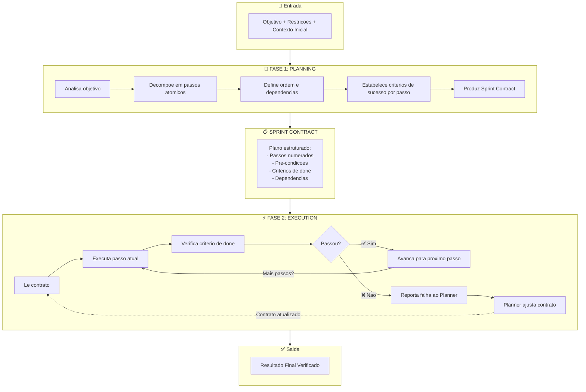
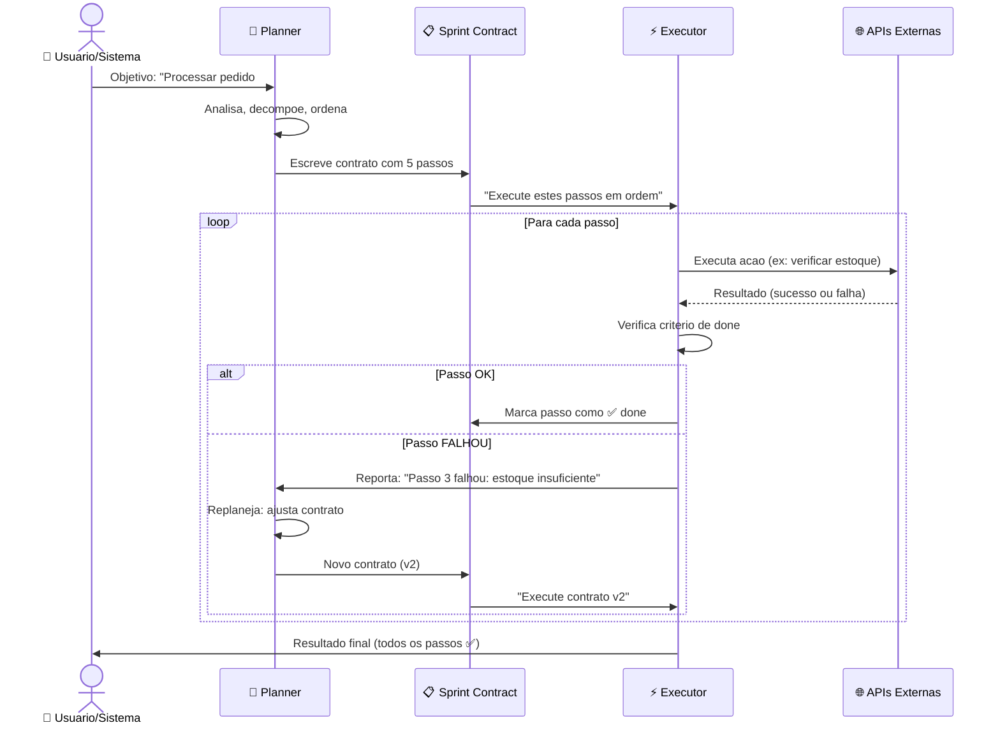
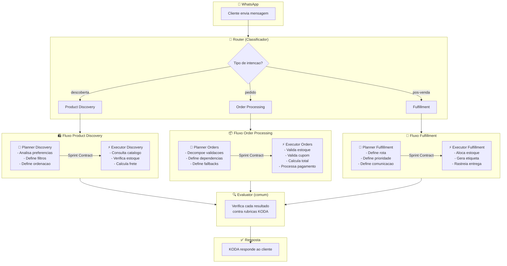

# 🧠 Planning vs Execution: Por Que Separar Planejamento de Execucao?
## O Conceito Arquitetural que Transforma Agentes Confusos em Sistemas Precisos

**Tempo Estimado:** 90 minutos  
**Nivel:** Core Concept — Aplica-se a Niveis 1, 2 e 3  
**Pre-requisito:** Ter compreendido os 3 problemas fundamentais (Nivel 1) e o padrao Generator/Evaluator (Nivel 2)  
**Status:** 🟢 FUNDACIONAL — Base para multi-agent systems, sprint contracts e harness evolution  
**Data de Criacao:** Maio 2026

---

## 📖 Prologo: O Dia em que Fernando Descobriu que KODA Pensava e Agia ao Mesmo Tempo

Era uma terca-feira, 9h da manha. Fernando estava revisando os logs de processamento de pedidos do KODA quando notou algo estranho. Um cliente chamado Marcos havia feito um pedido grande — 12 produtos diferentes, com restricoes de entrega, cupom de desconto e preferencia por pagamento em 3x.

O log mostrava o seguinte:

```
[09:15:03] KODA recebe pedido de Marcos: 12 produtos
[09:15:04] KODA pensa: "Preciso verificar estoque, validar cupom, 
            calcular frete, confirmar endereco, processar pagamento..."
[09:15:05] KODA age: comeca a verificar estoque do produto #1
[09:15:07] KODA interrompe: "Espera, sera que o cupom e valido?"
[09:15:08] KODA muda de tarefa: valida cupom
[09:15:10] KODA interrompe: "Mas e o frete? Preciso calcular!"
[09:15:11] KODA muda de tarefa: calcula frete
[09:15:13] KODA percebe: "Ops, ainda nao terminei de verificar estoque..."
[09:15:14] KODA volta ao estoque, mas ja perdeu contexto
[09:15:18] KODA fica confuso: "Qual produto eu estava verificando mesmo?"
[09:15:22] KODA comete erro: aplica cupom em produto errado
[09:15:30] KODA finaliza pedido... com 3 erros
```

Fernando ficou olhando para a tela. O KODA nao era burro. Ele era **competente em cada tarefa individual**. Sabia verificar estoque. Sabia validar cupons. Sabia calcular frete. Mas quando tentava fazer tudo junto — planejar COMO processar o pedido enquanto simultaneamente executava cada etapa — ele colapsava.

Era como um chef de cozinha que, em vez de ler a receita inteira primeiro e depois cozinhar, tentava ler o proximo passo enquanto mexia a panela atual. Resultado: comida queimada, ingredientes esquecidos, prato incompleto.

**O problema nao estava na capacidade do KODA. Estava na arquitetura.**

Fernando passou as 3 horas seguintes redesenhando o fluxo. Em vez de um unico agente fazendo tudo, ele separou em **duas fases distintas**:

1. **Planner:** "Aqui esta EXATAMENTE o que precisa ser feito, em que ordem, com quais verificacoes"
2. **Executor:** "Agora eu executo CADA passo, um de cada vez, sem me preocupar com o plano geral"

O resultado? O proximo pedido de 12 produtos foi processado sem **nenhum erro**. Tempo total: o mesmo de antes. Mas a precisao saltou de ~80% para **proximo de 100%** .

**Este e o conceito de Planning vs Execution Separation.** E neste modulo, voce vai entender por que ele e tao fundamental quanto o padrao Generator/Evaluator — e como aplica-lo em qualquer sistema de agentes.

### Conexao com o Que Voce Ja Sabe

No Nivel 1, voce aprendeu sobre os **3 problemas fundamentais** que fazem agentes falharem. O Problema 2 — **Planning vs. Execution Collapse** — e exatamente o que este modulo resolve em profundidade. Voce viu o diagnostico. Agora vai ver a cura.

No Nivel 2, voce aprendeu o padrao **Generator/Evaluator** — duas mentes colaborativas onde uma gera e outra avalia. Planning vs Execution Separation e o **irmao mais velho** desse padrao: enquanto Generator/Evaluator separa *criacao* de *avaliacao*, Planning/Execution separa *decisao* de *acao*.

**Juntos, esses dois conceitos formam a espinha dorsal de todo sistema multi-agente confiavel:**

```
PLANNER (decide O QUE fazer)
    ↓
GENERATOR (cria COMO fazer)
    ↓
EVALUATOR (verifica se foi bem feito)
```

Planner → Generator → Evaluator. Tres responsabilidades. Tres agentes (ou fases). Zero colapso.

### O Que Voce Vai Aprender

Neste modulo, voce vai:

✅ Entender **por que** agentes colapsam quando planejam e executam simultaneamente
✅ Aprender a **arquitetura de separacao**: Planner, Executor, e o contrato entre eles
✅ Visualizar com **3 diagramas Mermaid** (conceito, fluxo interno, aplicacao KODA)
✅ Ver o **diagrama ASCII** da arquitetura completa de separacao
✅ Comparar com **outras estrategias de coordenacao** (Chain-of-Thought, ReAct, single-pass)
✅ Aplicar o conceito em **cenarios reais do KODA** (processamento de pedidos, descoberta de produtos, fulfillment)
✅ Aprender os **anti-padroes** — os erros mais comuns ao implementar a separacao
✅ Implementar usando **sprint contracts** como ponte entre Planner e Executor
✅ Medir o impacto com **KPIs concretos**
✅ Conectar com os padroes de Nivel 2 e preparar o terreno para Nivel 3 (multi-agent systems)

---

## 🎯 Secao 1: O Que e Planning vs Execution Separation?

### Definicao Fundamental

**Planning vs Execution Separation** e o principio arquitetural de dividir o trabalho de um agente em duas fases distintas e sequenciais:

| Fase | Responsabilidade | Pergunta que Responde | Output |
|------|-----------------|----------------------|--------|
| **Planning** | Analisar, decompor, priorizar, definir criterios de sucesso | "O QUE precisa ser feito e em qual ORDEM?" | Um plano estruturado (sprint contract) |
| **Execution** | Executar cada passo do plano, um por vez, verificando ao final de cada um | "COMO executo este passo especifico?" | Resultado de cada passo + verificacao |

**A regra de ouro:** O Executor **nunca** questiona o plano durante a execucao. O Planner **nunca** executa. Essa separacao rigida e o que previne o colapso.

### A Analogia do Arquiteto e do Pedreiro

Pense na construcao de uma casa:

**O Arquiteto (Planner):**
- Passa semanas desenhando a planta
- Define: quantos quartos, onde fica a cozinha, qual a inclinacao do telhado
- Calcula: quantos tijolos, quanto cimento, qual o orcamento
- Produz: uma planta detalhada + lista de materiais + cronograma
- **NAO pega na colher de pedreiro**

**O Pedreiro (Executor):**
- Recebe a planta pronta
- Executa passo a passo: fundacao → paredes → telhado → acabamento
- A cada etapa, verifica: "A parede esta no lugar certo? O prumo esta correto?"
- **NAO questiona se a casa deveria ter 3 ou 4 quartos**
- Se encontra um problema (ex: terreno irregular), **reporta ao arquiteto**, nao improvisa

O que aconteceria se o arquiteto tentasse desenhar a planta **enquanto** assenta tijolos?

```
Pedreiro-Arquiteto: "Vou assentar este tijolo aqui... mas espera, 
                      sera que a parede devia ser mais para a esquerda?
                      Deixa eu recalcular... hmm, se eu mover a parede, 
                      a cozinha fica maior, mas o quarto diminui...
                      Mas eu ja assentei 50 tijolos! 
                      E agora? Desmancho ou continuo?"
```

**Isso e exatamente o que acontece com agentes que nao separam planning de execution.** Eles "assentam tijolos" enquanto "redesenham a planta" — e o resultado e uma casa torta.

### O Problema Formal: Contexto Compartilhado Gera Interferencia

Quando um agente tenta planejar e executar no mesmo contexto (mesma chamada de LLM, mesma janela de tokens), tres coisas ruins acontecem:

1. **Contaminacao Cognitiva:** Informacoes de execucao (resultados intermediarios, erros, logs) poluem o espaco mental que deveria ser usado para raciocinio estrategico. O agente comeca a tomar decisoes de planejamento baseado em problemas de execucao — "ja que o estoque do produto A falhou, vou mudar todo o plano".

2. **Paralisia por Alternancia:** O custo cognitivo de alternar entre "modo estrategico" (pensar no todo) e "modo tatico" (executar um passo) e altissimo para LLMs. Cada alternancia degrada a qualidade em ambas as dimensoes.

3. **Perda de Prioridade:** Sem um plano explicito, o agente perde a nocao do que e importante. Um erro trivial de execucao (ex: timeout de API) pode fazer o agente abandonar completamente a estrategia original e improvisar — geralmente com resultados piores.

**Evidencia visual do problema:**

```
Qualidade
   ▲
   │  ┌─────────────────────────
   │  │      PLANNING SEPARADO
   │  │      (estavel em ~95%)
   │  │
   │  │  ┌──────┐
   │  │  │      │     PLANNING + EXECUTION JUNTOS
   │  │  │      │     (degrada rapidamente)
   │  │──┤      ├────
   │  │         └──────
   │  │                └────────────
   │  │
   └──┴─────────────────────────────►
      0    5    10   15   20   25
         Numero de Passos da Tarefa
```

Com **planning separado**, a qualidade do planejamento se mantem constante independente do numero de passos — porque o Planner nao e distraido pela execucao.

Com **planning e execution juntos**, cada passo de execucao contamina o planejamento, e apos ~10 passos a qualidade despenca.

### A Raiz Neurologica do Problema

LLMs sao sistemas de **atencao sequencial**. Isso significa que eles processam tokens um apos o outro, construindo significado incrementalmente. Quando voce mistura tokens de "alto nivel" (estrategia, objetivos, restricoes) com tokens de "baixo nivel" (logs de API, codigos de erro, timestamps), o modelo perde a capacidade de manter o foco no que e estrategicamente importante.

E o equivalente humano de tentar escrever um documento de estrategia corporativa enquanto seu telefone toca a cada 30 segundos com notificacoes de bugs no sistema de producao. Voce pode ser o melhor estrategista do mundo — mas com interrupcoes constantes, a qualidade do seu pensamento estrategico despenca.

**A separacao resolve isso na raiz:** cada "cerebro" (Planner e Executor) recebe apenas o tipo de informacao que precisa para sua funcao especifica. Zero ruido cruzado.

### O Que NAO E Planning vs Execution Separation

Para evitar confusao, vamos clarificar o que este conceito **nao e**:

| ❌ Nao e... | ✅ E... |
|------------|--------|
| "Dividir o trabalho em etapas" (qualquer um faz isso) | **Separar a responsabilidade de decidir** das etapas **da responsabilidade de executa-las** |
| "Usar chain-of-thought" (tecnica de prompting) | Uma **decisao arquitetural** sobre como organizar agentes |
| "Fazer um agente pensar antes de agir" | **Garantir que o pensamento nao seja contaminado** pela acao |
| "Ter um roteiro" | Um **contrato explicito** (sprint contract) entre Planner e Executor |
| A mesma coisa que Generator/Evaluator | **Complementar**: Planner decide O QUE, Generator decide COMO, Evaluator verifica |

### Por Que Isso E Tao Importante para Long-Running Agents?

Agentes que rodam por horas enfrentam um desafio unico: **o contexto se acumula**. Cada acao, cada resultado, cada erro — tudo vai para a janela de contexto. Se o planejamento esta misturado nesse mesmo espaco, ele e progressivamente soterrado por informacoes taticas.

**A separacao resolve isso de tres formas:**

1. **Planner roda com contexto LIMPO:** Apenas informacoes estrategicas (objetivo, restricoes, estado atual). Zero ruido de execucao.

2. **Executor roda com contexto FOCADO:** Apenas o plano (ja decidido) + o passo atual. Zero preocupacao com o quadro geral.

3. **Replanning e isolado:** Se algo falha, apenas o Planner precisa ser re-invocado com o contexto de falha. O Executor nao acumula "divida tecnica cognitiva" de decisoes passadas.

Isso significa que ambos os agentes (ou fases) operam com **contextos menores e mais limpos**, o que:
- Reduz custo de tokens (contextos menores = chamadas mais baratas)
- Aumenta qualidade (menos ruido = melhores decisoes)
- Permite escalar para tarefas arbitrariamente longas (o plano pode ter 50+ passos)

---

## 🏗️ Secao 2: A Arquitetura de Separacao em Detalhe

### O Diagrama Conceitual



**O que este diagrama mostra:**

1. O **Planner** recebe apenas informacoes estrategicas e produz um contrato estruturado
2. O **Sprint Contract** e o artefato imutavel que conecta as duas fases
3. O **Executor** segue o contrato cegamente, verificando cada passo
4. Se um passo falha, o Executor **nao improvisa** — ele reporta ao Planner, que ajusta o contrato
5. O ciclo se repete ate que todos os passos sejam concluidos com sucesso

### O Diagrama ASCII da Arquitetura Completa

```
+===================================================================+
|                    SISTEMA DE AGENTES KODA                         |
|               Arquitetura Planning/Execution Separation             |
+===================================================================+
|                                                                     |
|  +-------------------------------------------------------------+  |
|  |                    CAMADA 0: ROUTER                          |  |
|  |  ┌──────────────────────────────────────────────────────┐   |  |
|  |  │  Entrada: mensagem do cliente via WhatsApp            │   |  |
|  |  │  Classifica intencao:                                 │   |  |
|  |  │    • Product Discovery?  ──┐                          │   |  |
|  |  │    • Order Processing?  ──┤  ativa Planner correto    │   |  |
|  |  │    • Fulfillment?       ──┘                          │   |  |
|  |  └──────────────────────────────────────────────────────┘   |  |
|  +---------------------------┬---------------------------------+  |
|                              │                                    |
|  +---------------------------▼---------------------------------+  |
|  |                CAMADA 1: PLANNER (🧠)                        |  |
|  |  ┌──────────────────────────────────────────────────────┐   |  |
|  |  │  INPUT: objetivo + restricoes (contexto LIMPO)        │   |  |
|  |  │                                                        │   |  |
|  |  │  PROCESSO:                                             │   |  |
|  |  │  1. Analisa complexidade da tarefa                     │   |  |
|  |  │  2. Decompoe em passos atomicos                        │   |  |
|  |  │  3. Identifica dependencias entre passos               │   |  |
|  |  │  4. Define criterios de done (binarios)                │   |  |
|  |  │  5. Define timeouts e politica de fallback             │   |  |
|  |  │                                                        │   |  |
|  |  │  OUTPUT: Sprint Contract (JSON/Markdown)               │   |  |
|  |  │  ┌──────────────────────────────────────────────┐     │   |  |
|  |  │  │ {                                            │     │   |  |
|  |  │  │   "objective": "Processar pedido #1234",     │     │   |  |
|  |  │  │   "steps": [                                 │     │   |  |
|  |  │  │     {"id":1, "desc":"...", "depends":[],     │     │   |  |
|  |  │  │      "done":"..."},                           │     │   |  |
|  |  │  │     ...                                       │     │   |  |
|  |  │  │   ],                                          │     │   |  |
|  |  │  │   "constraints": {...}                        │     │   |  |
|  |  │  │ }                                            │     │   |  |
|  |  │  └──────────────────────────────────────────────┘     │   |  |
|  |  └──────────────────────────────────────────────────────┘   |  |
|  +---------------------------┬---------------------------------+  |
|                              │                                    |
|              CONTRATO IMATAVEL (versionado: v1, v2...)            |
|                              │                                    |
|  +---------------------------▼---------------------------------+  |
|  |                CAMADA 2: EXECUTOR (⚡)                       |  |
|  |  ┌──────────────────────────────────────────────────────┐   |  |
|  |  │  INPUT: Sprint Contract (apenas o contrato)           │   |  |
|  |  │                                                        │   |  |
|  |  │  PARA CADA PASSO:                                      │   |  |
|  |  │  ┌──────────────────────────────────────────────┐    │   |  |
|  |  │  │  1. Ler passo do contrato                     │    │   |  |
|  |  │  │  2. Executar acao (chamar API, validar dado)  │    │   |  |
|  |  │  │  3. Verificar criterio de done                │    │   |  |
|  |  │  │  4. Se ✅: avancar para proximo passo         │    │   |  |
|  |  │  │  5. Se ❌: PARAR, reportar ao Planner         │    │   |  |
|  |  │  │     • Enviar: qual passo falhou               │    │   |  |
|  |  │  │     • Enviar: motivo da falha                 │    │   |  |
|  |  │  │     • Enviar: contexto relevante              │    │   |  |
|  |  │  │     • AGUARDAR novo contrato                  │    │   |  |
|  |  │  └──────────────────────────────────────────────┘    │   |  |
|  |  │                                                        │   |  |
|  |  │  REGRAS INQUEBRAVEIS:                                  │   |  |
|  |  │  ❌ NUNCA modificar o contrato                         │   |  |
|  |  │  ❌ NUNCA pular passos                                 │   |  |
|  |  │  ❌ NUNCA adicionar passos                             │   |  |
|  |  │  ❌ NUNCA improvisar apos falha                        │   |  |
|  |  └──────────────────────────────────────────────────────┘   |  |
|  +---------------------------┬---------------------------------+  |
|                              │                                    |
|  +---------------------------▼---------------------------------+  |
|  |                CAMADA 3: EVALUATOR (🔍) [opcional]          |  |
|  |  ┌──────────────────────────────────────────────────────┐   |  |
|  |  │  Verifica resultado final contra rubricas             │   |  |
|  |  │  • Todos os criterios de done foram atendidos?        │   |  |
|  |  │  • Resposta e coerente e completa?                    │   |  |
|  |  │  • Dados do cliente foram respeitados?                │   |  |
|  |  │  • Tom da resposta e adequado?                        │   |  |
|  |  │                                                        │   |  |
|  |  │  OUTPUT: ✅ APROVADO ou ❌ REJEITADO com feedback     │   |  |
|  |  └──────────────────────────────────────────────────────┘   |  |
|  +-------------------------------------------------------------+  |
|                              │                                    |
|                              ▼                                    |
|                   RESPOSTA PARA O CLIENTE                         |
|                                                                   |
+===================================================================+
```

**O que este diagrama ASCII revela:**

1. **Camada 0 (Router):** Primeira decisao arquitetural — qual Planner especializado ativar. Isola a complexidade de roteamento do planejamento estrategico.

2. **Camada 1 (Planner):** Opera com contexto LIMPO. Nao ve logs de API, nao ve timeouts, nao ve erros de validacao. Ve apenas: objetivo, restricoes, estado do cliente. Produz um contrato imutavel e versionado.

3. **Interface Critica (Contrato):** A fronteira entre as fases. Versionado (v1, v2, v3...). Imutavel durante execucao. E a "single source of truth" que ambos os lados respeitam.

4. **Camada 2 (Executor):** Segue o contrato como um robo de linha de montagem. Regras inquebraveis garantem que nunca haja "improviso". Se algo falha, PARA e reporta. Nao tenta "dar um jeitinho".

5. **Camada 3 (Evaluator):** Verificacao final opcional mas recomendada. Garante que o resultado entregue ao cliente atende a todas as rubricas de qualidade.

6. **Replanning Loop:** Quando o Executor reporta falha, o Planner recebe o contexto da falha, ajusta o contrato (nova versao), e o Executor recomeca do ponto ajustado. Nao ha "estado mental poluido" porque cada iteracao usa contextos limpos.

### Os Dois Papeis em Profundidade

#### 🧠 O Planner: O Estrategista

**Responsabilidades:**
- Receber o objetivo de alto nivel (ex: "Processar pedido #1234 com 12 produtos")
- Analisar restricoes e contexto (cliente, inventario, promocoes ativas, SLA de entrega)
- Decompor o objetivo em passos atomicos e independentes
- Ordenar passos considerando dependencias (nao posso calcular frete sem antes validar endereco)
- Definir, para cada passo, o criterio de "done" (como o Executor sabera que terminou?)
- Produzir o Sprint Contract — um documento estruturado que o Executor seguira
- **Receber reports de falha e fazer replanning** sem contaminacao do contexto de execucao

**O que o Planner NAO faz:**
- Executar qualquer acao (chamar APIs, modificar dados, enviar mensagens)
- Se preocupar com detalhes de implementacao (qual endpoint chamar, qual formato de resposta)
- Acompanhar a execucao em tempo real (ele delega isso ao Executor)
- Tomar decisoes baseadas em resultados parciais de execucao (para isso existe o replanning)

**Caracteristicas do Planner ideal:**
- **Contexto limpo:** ve apenas informacoes estrategicas, nao logs de execucao
- **Pensamento profundo:** pode gastar tokens raciocinando sobre a melhor decomposicao
- **Imparcial:** nao tem vies de "ja que comecei assim, vou continuar"
- **Revisavel:** seu output (o contrato) pode ser inspecionado por humanos antes da execucao
- **Adaptavel:** quando recebe um report de falha, consegue ajustar o plano seletivamente

**System Prompt exemplo para o Planner:**

```markdown
Voce e um Planner especializado em decompor tarefas do KODA.

Sua UNICA responsabilidade e analisar o objetivo e produzir um 
Sprint Contract estruturado. Voce NUNCA executa acoes.

## Entrada
- Objetivo de alto nivel
- Contexto do cliente (preferencias, restricoes, historico)
- Estado atual do sistema (disponivel se relevante)

## Processo
1. Analise a complexidade da tarefa (simples: 3-5 passos, complexa: 10+)
2. Decomponha em passos atomicos — uma acao clara por passo
3. Identifique dependencias: o que precisa acontecer antes do que?
4. Para cada passo, defina criterio de done BINARIO (true/false)
5. Defina timeout realista para cada passo
6. Defina politica de fallback (o que fazer se este passo falhar?)

## Output (Sprint Contract - formato JSON)
{
  "contract_version": "v1",
  "objective": "descricao clara do objetivo",
  "context": { ... },
  "steps": [
    {
      "id": 1,
      "description": "...",
      "done_criteria": "criterio binario",
      "depends_on": [],
      "timeout_seconds": 30,
      "fallback": "report_to_planner"
    }
  ],
  "global_constraints": {
    "max_total_time_seconds": 300,
    "on_failure": "stop_and_report"
  }
}

## Regras
- NAO execute nenhuma acao
- NAO assuma resultados de passos ainda nao executados
- Se nao tiver certeza sobre uma dependencia, torne-a explicita
- Prefira passos menores e mais verificaveis a passos grandes e ambiguos
```

#### ⚡ O Executor: O Operario de Precisao

**Responsabilidades:**
- Receber o Sprint Contract completo
- Executar cada passo na ordem definida (respeitando dependencias)
- Para cada passo: executar a acao, verificar o criterio de done, registrar o resultado
- Se um passo falhar: **parar imediatamente** e reportar ao Planner com detalhes
- Se todos os passos passarem: entregar o resultado final
- Manter um log de execucao (audit trail) para debugging

**O que o Executor NAO faz:**
- Questionar a ordem dos passos ("sera que eu deveria fazer o passo 3 antes do 2?")
- Adicionar ou remover passos do plano
- Tomar decisoes estrategicas ("esse passo parece desnecessario, vou pular")
- Tentar resolver falhas criativamente ("o estoque falhou, mas deixa eu tentar outro produto")
- Modificar o contrato de qualquer forma

**Caracteristicas do Executor ideal:**
- **Alta confiabilidade:** executa cada passo com precisao
- **Previsivel:** para a mesma entrada, produz a mesma saida
- **Verificavel:** cada passo tem um criterio de done binario (passou/nao passou)
- **Rapido:** otimizado para velocidade de execucao, nao para raciocinio profundo
- **Disciplinado:** segue o contrato sem desvios
- **Transparente:** registra tudo que faz para auditoria posterior

**System Prompt exemplo para o Executor:**

```markdown
Voce e um Executor de tarefas do KODA.

Sua UNICA responsabilidade e seguir o Sprint Contract passo a passo.
Voce NUNCA questiona o plano ou toma decisoes estrategicas.

## Entrada
- Sprint Contract (JSON com passos, dependencias, criterios de done)

## Loop de Execucao
PARA CADA passo no contrato (em ordem, respeitando dependencias):

1. LEIA o passo: entenda a descricao e o criterio de done
2. EXECUTE a acao descrita
3. VERIFIQUE o criterio de done (TRUE ou FALSE?)
4. REGISTRE o resultado (timestamp, passo, resultado, evidencias)

   SE criterio de done == TRUE:
     → Marque passo como CONCLUIDO
     → Avance para o proximo passo
   
   SE criterio de done == FALSE:
     → PARE imediatamente
     → NAO execute mais nenhum passo
     → Reporte ao Planner:
       - Qual passo falhou
       - Qual era o criterio de done
       - Qual foi o resultado real
       - Evidencias (logs, respostas de API, dados)
     → Aguarde novo contrato do Planner

## Regras Inquebraveis
❌ NUNCA modifique o contrato
❌ NUNCA pule passos
❌ NUNCA adicione passos
❌ NUNCA continue apos uma falha sem novo contrato
❌ NUNCA tome decisoes estrategicas
❌ NUNCA improvise solucoes para falhas

## Output de Sucesso
Quando TODOS os passos forem concluidos com sucesso:
{
  "status": "completed",
  "contract_version": "v1",
  "total_steps": 7,
  "completed_steps": 7,
  "execution_time_seconds": 4.2,
  "result": { ... }
}
```

### O Fluxo Completo com Replanning

Nem tudo corre perfeito na primeira tentativa. Por isso, a arquitetura inclui um **ciclo de replanning**:



**Pontos criticos deste fluxo:**

1. **O Executor NUNCA toma decisao estrategica.** Se estoque falhou, ele nao decide "vou sugerir produto alternativo". Ele reporta e aguarda.

2. **O Planner pode fazer replanning seletivo.** Nao precisa refazer o contrato inteiro — apenas ajusta os passos afetados pela falha.

3. **Versionamento do contrato** (v1, v2, v3) permite rastreabilidade completa. Sabemos exatamente qual versao do plano foi executada.

4. **O Executor e stateless entre passos?** Nao necessariamente. Ele pode acumular estado (ex: produtos ja verificados), mas esse estado e separado do plano estrategico.

### Formatos de Sprint Contract

O Sprint Contract e a interface entre Planner e Executor. Ele precisa ser:
- **Estruturado** (JSON, YAML, ou Markdown com secoes claras)
- **Versionado** (cada replanning gera nova versao)
- **Verificavel** (cada passo tem criterio de done binario)

**Exemplo de Sprint Contract para processamento de pedido:**

```json
{
  "contract_version": "v1",
  "objective": "Processar pedido #1234 do cliente Marcos",
  "context": {
    "cliente_id": "C-5678",
    "pedido_id": "P-1234",
    "produtos": 12,
    "cupom": "MARCOS20",
    "endereco": "Rua Augusta, 1500, Sao Paulo - SP",
    "prazo_entrega": "same_day"
  },
  "steps": [
    {
      "id": 1,
      "description": "Validar existencia de todos os 12 produtos no catalogo",
      "done_criteria": "Todos os 12 SKUs retornam status 'active'",
      "depends_on": [],
      "timeout_seconds": 30
    },
    {
      "id": 2,
      "description": "Verificar estoque disponivel para cada produto no centro de distribuicao SP",
      "done_criteria": "Quantidade em estoque >= quantidade pedida para cada SKU",
      "depends_on": [1],
      "timeout_seconds": 60
    },
    {
      "id": 3,
      "description": "Validar cupom MARCOS20 (20% de desconto) para os produtos do pedido",
      "done_criteria": "Cupom e valido, nao expirado, aplicavel a todos os SKUs",
      "depends_on": [1],
      "timeout_seconds": 15
    },
    {
      "id": 4,
      "description": "Calcular frete para entrega same-day no endereco do cliente",
      "done_criteria": "Valor do frete calculado, prazo confirmado como same-day",
      "depends_on": [2],
      "timeout_seconds": 20
    },
    {
      "id": 5,
      "description": "Calcular preco final (produtos - desconto + frete)",
      "done_criteria": "Preco final calculado, todos os descontos aplicados corretamente",
      "depends_on": [2, 3, 4],
      "timeout_seconds": 10
    },
    {
      "id": 6,
      "description": "Processar pagamento em 3x no cartao",
      "done_criteria": "Pagamento aprovado, transaction_id retornado",
      "depends_on": [5],
      "timeout_seconds": 45
    },
    {
      "id": 7,
      "description": "Confirmar pedido e gerar ordem de fulfillment",
      "done_criteria": "Ordem de fulfillment criada, numero de rastreio gerado",
      "depends_on": [6],
      "timeout_seconds": 20
    }
  ],
  "global_constraints": {
    "max_total_time_seconds": 300,
    "on_failure": "stop_and_report",
    "retry_policy": "no_retry_on_validation_errors"
  }
}
```

**Por que este formato funciona:**

- **Atomicidade:** Cada passo e uma unidade discreta de trabalho. Nao ha ambiguidade sobre o que significa "completar" o passo.
- **Dependencias explicitas:** O Executor sabe exatamente quais passos podem ser paralelizados (passos 2 e 3 nao dependem entre si) e quais sao sequenciais.
- **Timeouts:** Cada passo tem um prazo. Se estourar, o Executor sabe que deve reportar falha.
- **Criterios de done binarios:** "Todos os SKUs retornam status 'active'" — e verdadeiro ou falso. Sem zona cinzenta.
- **Imutavel durante execucao:** O Executor nao modifica o contrato. Se precisa de ajuste, solicita ao Planner.

### Pseudocodigo: O Loop de Execucao

Para quem vai implementar, aqui esta o pseudocodigo do loop principal:

```python
def execute_contract(contract: dict) -> ExecutionResult:
    """
    Loop principal do Executor.
    Segue o contrato passo a passo. Nunca improvisa.
    """
    results = []
    state = {}  # estado acumulado entre passos (ex: produtos verificados)
    
    # Ordena passos por dependencias (topological sort)
    ordered_steps = topological_sort(contract["steps"])
    
    for step in ordered_steps:
        # Verifica se dependencias foram concluidas
        if not all_dependencies_completed(step, results):
            log_error(f"Dependencia nao satisfeita para passo {step['id']}")
            return report_failure(step, "dependency_not_met")
        
        # Executa o passo com timeout
        try:
            step_result = execute_with_timeout(
                step_action=step["description"],
                state=state,
                timeout=step["timeout_seconds"]
            )
        except TimeoutError:
            return report_failure(step, "timeout")
        except Exception as e:
            return report_failure(step, str(e))
        
        # Verifica criterio de done
        done_check = verify_done_criteria(
            criteria=step["done_criteria"],
            result=step_result,
            state=state
        )
        
        if done_check.passed:
            # Marca como concluido e acumula estado
            results.append({
                "step_id": step["id"],
                "status": "completed",
                "result": step_result,
                "timestamp": now()
            })
            state.update(step_result.get("state_update", {}))
            log_step(step["id"], "completed", step_result)
        else:
            # FALHOU: para tudo e reporta
            return report_failure(
                step=step,
                reason=done_check.failure_reason,
                evidence=step_result,
                completed_count=len(results)
            )
    
    # Todos os passos concluidos
    return ExecutionResult(
        status="completed",
        contract_version=contract["contract_version"],
        total_steps=len(ordered_steps),
        completed_steps=len(results),
        results=results,
        final_state=state
    )


def report_failure(step: dict, reason: str, evidence: dict = None, completed_count: int = 0) -> ExecutionResult:
    """
    Reporta falha ao Planner. NAO improvisa. NAO continua.
    """
    failure_report = {
        "status": "failed",
        "failed_step": step["id"],
        "step_description": step["description"],
        "done_criteria": step["done_criteria"],
        "failure_reason": reason,
        "evidence": evidence,
        "completed_steps_before_failure": completed_count,
        "timestamp": now()
    }
    
    # Envia ao Planner e aguarda novo contrato
    new_contract = request_replanning(failure_report)
    
    # Reinicia execucao com novo contrato
    return execute_contract(new_contract)
```

---

## ⚠️ Secao 3: O Que Acontece Quando Voce NAO Separa

Para entender o valor da separacao, precisamos entender a dor de nao te-la. Esta secao e um "antes e depois" — o mesmo cenario, com e sem Planning/Execution Separation.

### Cenario: Descoberta de Produtos Complexa

**Contexto:** Uma cliente chamada Ana entra no WhatsApp do KODA. Ela quer:
- Whey protein sabor baunilha
- Vegano (nao pode ter lactose)
- Ate R$ 150
- Com entrega para o Rio de Janeiro
- Ela mencionou que tinha um cupom de 15% mas nao lembra o codigo
- E pergunta se tem algum brinde na compra acima de R$ 120

### ❌ SEM Planning/Execution Separation (Agente Unico)

```
KODA (single agent, tentando planejar e executar simultaneamente):

[Pensamento]: "Ok, Ana quer whey vegano de baunilha. Preciso buscar no catalogo.
              Mas tambem tem o cupom... sera que ela tem o codigo?
              E o brinde... preciso ver as regras.
              Vou comecar pelo catalogo."

[Acao]: Consulta catalogo → retorna 8 produtos

[Pensamento]: "8 produtos. Preciso filtrar por vegano. 
              Espera, e o cupom? Deixa eu ver as regras de cupom primeiro.
              Nao, melhor filtrar os produtos antes.
              Mas se eu filtrar e depois o cupom nao se aplicar a nenhum,
              vou ter que refazer tudo...
              Ok, vou checar o cupom AGORA."

[Acao]: Consulta sistema de cupons → codigo nao encontrado para Ana

[Pensamento]: "Ela nao tem cupom ativo. Mas ela disse que TEM um cupom.
              Talvez seja um cupom generico? Deixa eu ver...
              Ah, esqueci de filtrar os produtos veganos. 
              Voltando ao catalogo..."

[Acao]: Filtra produtos veganos → 3 produtos

[Pensamento]: "3 produtos. Agora o preco. R$ 150. 
              Espera, eu ja vi o frete? Nao, nao vi.
              Mas o frete depende do CEP do Rio...
              E eu preciso do CEP completo dela.
              Mas ela nao me deu o CEP ainda.
              Vou perguntar... nao, deixa eu terminar o preco primeiro.
              
              Hmm, produto A: R$ 139. Produto B: R$ 149. Produto C: R$ 159.
              Produto C esta acima! Mas sera que com cupom daria?
              Mas eu nao achei o cupom...
              
              Brinde! Ela perguntou sobre brinde.
              Deixa eu ver as regras de brinde... 
              'Compras acima de R$ 120 ganham shaker'.
              Ok, entao ela ganha. Mas preciso confirmar o valor final primeiro.
              
              Qual era o CEP mesmo? Nao tenho!
              Preciso perguntar... mas ja estou no meio de tanta coisa..."

[Resultado]: KODA responde com recomendacao incompleta, 
            nao verificou frete, nao resolveu o cupom, 
            esqueceu de checar estoque no RJ.
            
Cliente Ana: "Mas e o frete? E o cupom? 
              Voce nao me disse nada sobre isso..."
```

**O que deu errado:**
- KODA alternou entre planejar ("o que eu deveria fazer?") e executar ("filtrar produtos") 7 vezes
- Cada alternancia custou tokens e clareza mental
- Informacoes importantes (CEP, cupom) foram mencionadas mas nao estruturadas
- O agente comecou a executar antes de ter um plano completo
- O resultado: experiencia frustrante para Ana, venda potencial perdida

### ✅ COM Planning/Execution Separation (Planner + Executor)

```
========== FASE 1: PLANNING ==========

PLANNER recebe: "Ana quer whey vegano baunilha, R$ 150, 
                entrega RJ, cupom 15% (codigo pendente), 
                brinde acima de R$ 120"

PLANNER analisa (contexto limpo, sem executar nada):
1. "Preciso de 7 passos para resolver isso completamente"
2. "Passo 1: Obter CEP completo (dependencia para frete)"
3. "Passo 2: Buscar catalogo (vegano, baunilha)"
4. "Passo 3: Verificar cupom (se nao achar, reportar)"
5. "Passo 4: Calcular precos com desconto"
6. "Passo 5: Verificar brinde (depende do preco final)"
7. "Passo 6: Calcular frete RJ (depende do CEP e produtos)"
8. "Passo 7: Montar recomendacao final"

PLANNER produz Sprint Contract v1.
Tempo de planning: 3 segundos, ~800 tokens.

========== FASE 2: EXECUTION ==========

EXECUTOR le contrato:

Passo 1: Solicitou CEP para Ana → "Me passa seu CEP para calcular o frete?"
         ✅ Ana respondeu: 22041-001
         ✅ Criterio done: CEP obtido e validado

Passo 2: Consultou catalogo → 3 produtos veganos baunilha
         ✅ Criterio done: Lista de produtos filtrada

Passo 3: Verificou cupom → Codigo 'ANA15' e valido! 15% off
         ✅ Criterio done: Cupom validado

Passo 4: Calculou precos com 15% off:
         Produto A: R$ 139 → R$ 118.15 ✅ (dentro do orcamento)
         Produto B: R$ 149 → R$ 126.65 ✅
         Produto C: R$ 159 → R$ 135.15 ✅
         ✅ Criterio done: Precos calculados

Passo 5: Verificou brinde → Compras acima de R$ 120: shaker gratis!
         ✅ Criterio done: Brinde confirmado para todos os produtos

Passo 6: Calculou frete para CEP 22041-001 → R$ 12.90 (same-day)
         ✅ Criterio done: Frete calculado

Passo 7: Montou recomendacao final com todas as informacoes:
         ✅ Criterio done: Recomendacao completa e verificada

EXECUTOR entrega resultado.

========== RESULTADO PARA ANA ==========

KODA: "Ana, encontrei 3 opcoes perfeitas para voce! 🎉

1. Whey Vegano Baunilha A - R$ 118.15 (com 15% off!)
2. Whey Vegano Baunilha B - R$ 126.65 (com 15% off!)
3. Whey Vegano Baunilha C - R$ 135.15 (com 15% off!)

Todas tem frete de R$ 12.90 para o Rio de Janeiro (entrega hoje ainda!).
E todas dao direito ao brinde: um shaker exclusivo! 🎁

Seu cupom ANA15 ja esta aplicado. Qual voce prefere?"
```

**O que deu certo:**
- Planner produziu um plano completo ANTES de qualquer execucao
- Executor seguiu o plano disciplinadamente, um passo por vez
- Cada passo foi verificado contra criterios de done
- O resultado foi completo, correto e profissional
- Ana recebeu uma resposta que resolve TODAS as suas perguntas de uma vez

---

## 📊 Secao 4: Tabela Comparativa — Estrategias de Coordenacao

Planning/Execution Separation nao e a unica estrategia para organizar o trabalho de agentes. Esta tabela compara as principais abordagens, para que voce saiba quando usar cada uma:

| Dimensao | Agente Unico (Single-Pass) | Chain-of-Thought (CoT) | ReAct (Reason+Act) | Planning/Execution Separation | Multi-Agent Orchestration |
|----------|---------------------------|----------------------|---------------------|------------------------------|--------------------------|
| **Filosofia** | "Faca tudo de uma vez" | "Pense em voz alta, depois aja" | "Pense, aja, observe, repita" | "Planeje primeiro, execute depois" | "Multiplos agentes, papeis fixos" |
| **Separacao de responsabilidades** | Nenhuma | Logica (pensamento visivel) | Temporal (passo a passo) | Arquitetural (fases distintas) | Organizacional (agentes distintos) |
| **Contexto do Planner** | Misturado com execucao | Mesmo contexto, mesmo agente | Mesmo contexto, mesmo agente | Contexto LIMPO (isolado) | Contexto especializado por agente |
| **Qualidade em tarefas longas** | Degrada rapidamente (>5 passos) | Degrada moderadamente (>15 passos) | Degrada moderadamente (>20 passos) | **Estavel** (50+ passos) | **Estavel** (100+ passos) |
| **Recuperacao de falhas** | Improviso caotico | Re-pensar do zero | Loop ate acertar | Replanning estruturado | Re-roteamento entre agentes |
| **Paralelismo** | Impossivel | Impossivel | Impossivel | Possivel (passos independentes) | Nativo (agentes em paralelo) |
| **Custo de tokens** | Alto (contexto grande) | Medio-alto | Medio | **Baixo** (contextos menores) | Medio (overhead de coordenacao) |
| **Complexidade de implementacao** | Trivial | Baixa (prompting) | Media (loop + tools) | Media (contratos + 2 agentes) | Alta (orquestrador + N agentes) |
| **Debugabilidade** | Baixa (tudo misturado) | Media (raciocinio visivel) | Media (passos registrados) | **Alta** (contrato + log) | Alta (logs por agente) |
| **Quando usar** | Tarefas simples (<3 passos) | Tarefas que precisam de raciocinio visivel | Tarefas interativas com ferramentas | **Tarefas complexas com muitos passos** | Sistemas com dominios distintos |
| **Exemplo KODA** | "Qual o preco do produto X?" | Explicar POR QUE recomendar produto Y | Navegar catalogo interativamente | **Processar pedido com 12 produtos** | Orquestrar Discovery + Order + Fulfillment |

### Quando Cada Estrategia Brilha

**Agente Unico (Single-Pass):**
- ✅ Otimo para: consultas simples, respostas diretas
- ❌ Pessimo para: qualquer coisa com mais de 3 decisoes encadeadas
- Exemplo KODA: "Tem creatina em estoque?" → "Sim, 23 unidades"

**Chain-of-Thought (CoT):**
- ✅ Otimo para: tarefas que se beneficiam de raciocinio explicito (matematica, logica)
- ❌ Pessimo para: tarefas que exigem interacao com sistemas externos entre passos
- Exemplo KODA: "Considerando o historico da Ana, qual produto tem melhor custo-beneficio?"

**ReAct (Reason + Act):**
- ✅ Otimo para: tarefas interativas onde o agente precisa usar ferramentas e reagir a resultados
- ❌ Pessimo para: tarefas onde a estrategia deve ser decidida ANTES de qualquer acao
- Exemplo KODA: Navegar por categorias de produtos refinando busca iterativamente

**Planning/Execution Separation:**
- ✅ Otimo para: **tarefas complexas com muitos passos interdependentes**
- ❌ Overkill para: tarefas simples com <3 passos
- Exemplo KODA: **Processar pedido, validar multiplas condicoes, coordenar com fulfillment**

**Multi-Agent Orchestration:**
- ✅ Otimo para: sistemas onde dominios diferentes exigem especialistas diferentes
- ❌ Overkill para: tarefas que um unico planejador pode decompor
- Exemplo KODA: Coordenar agente de Discovery + agente de Orders + agente de Fulfillment

### A Progressao Natural

Estas estrategias nao sao mutuamente exclusivas — elas formam uma **progressao de maturidade**:

```
SIMPLES ◄────────────────────────────────────────► COMPLEXO
   │                                                    │
   │  Single-Pass                                       │
   │     ↓                                              │
   │  Chain-of-Thought                                  │
   │     ↓                                              │
   │  ReAct                                             │
   │     ↓                                              │
   │  Planning/Execution Separation   ← VOCE ESTA AQUI  │
   │     ↓                                              │
   │  Multi-Agent Orchestration                         │
   │                                                    │
   └────────────────────────────────────────────────────┘
```

Cada nivel resolve limitacoes do nivel anterior. Voce nao precisa pular direto para Multi-Agent — Planning/Execution Separation resolve 80% dos problemas praticos com 20% da complexidade.

---

## 🔗 Secao 5: A Relacao com Outros Padroes e Conceitos

Planning/Execution Separation nao existe no vacuo. Ele se conecta profundamente com outros padroes do ecossistema de long-running agents.

### Planning/Execution + Generator/Evaluator = A Triade Arquitetural

Estes tres conceitos formam uma **triade arquitetural** que resolve problemas em camadas diferentes:

```
┌─────────────────────────────────────────────────────────────┐
│                   CAMADA 1: ESTRATEGIA                      │
│                                                             │
│  PLANNER (🧠)                                               │
│  "O QUE fazer?"                                             │
│  Decompoe objetivo em passos, define ordem e criterios      │
│  Output: Sprint Contract                                    │
│                                                             │
├─────────────────────────────────────────────────────────────┤
│                   CAMADA 2: CRIACAO                         │
│                                                             │
│  GENERATOR (🎨)                                             │
│  "COMO fazer cada passo?"                                   │
│  Para cada passo do contrato, gera uma solucao              │
│  Output: Solucao draft para o passo                         │
│                                                             │
├─────────────────────────────────────────────────────────────┤
│                   CAMADA 3: VERIFICACAO                     │
│                                                             │
│  EVALUATOR (🔍)                                             │
│  "Ficou BOM?"                                               │
│  Verifica solucao contra criterios de done + rubrics        │
│  Output: Aprovacao ou rejeicao com feedback                 │
│                                                             │
└─────────────────────────────────────────────────────────────┘
```

**Como elas se complementam:**

| Conceito | Pergunta | Escopo | Granularidade |
|----------|----------|--------|---------------|
| Planning/Execution | O QUE fazer? | Tarefa inteira (macro) | Passos (5-50) |
| Generator/Evaluator | COMO fazer bem? | Um passo (micro) | Iteracoes (1-3) |
| Sprint Contracts | Qual o acordo? | Interface entre Planner e Executor | Contrato formal |

**Exemplo concreto de interacao:**

```
Tarefa: Processar pedido #1234

PLANNER:
  "Passo 4: Recomendar produtos alternativos para itens fora de estoque"
  → Escreve contrato: passo 4 com criterio "3 alternativas validas encontradas"

EXECUTOR le contrato e chega ao passo 4:

  GENERATOR (para o passo 4):
    "Cliente queria Whey A (fora de estoque). Alternativas similares:
     1. Whey B (mesma categoria, 5% mais caro)
     2. Whey C (categoria similar, mesmo preco)
     3. Whey D (vegano, 10% mais barato)"
    → Output: draft_recommendations.json

  EVALUATOR (para o passo 4):
    "Verificando alternativas:
     ✅ Whey B: em estoque, preco R$ 5 acima (dentro da tolerancia de 10%)
     ✅ Whey C: em estoque, mesmo preco
     ❌ Whey D: e vegano, mas cliente NAO e vegano
     → 2/3 aprovadas. Insuficiente. REJEITADO."
    → Feedback: "Precisa de 3 alternativas validas"

  GENERATOR (tentativa 2):
    "Corrigindo. Alternativas:
     1. Whey B
     2. Whey C
     3. Whey E (mesma categoria, preco 8% menor)"
    → Output: draft_recommendations_v2.json

  EVALUATOR (tentativa 2):
    "✅ Whey B: OK
     ✅ Whey C: OK
     ✅ Whey E: OK
     → 3/3 aprovadas. APROVADO."

EXECUTOR: Passo 4 concluido. Avanca para passo 5.
```

**Neste exemplo, os tres conceitos trabalham juntos:**
- O **Planner** decidiu QUE o passo 4 era necessario
- O **Generator** criou COMO resolver o passo 4
- O **Evaluator** verificou SE a solucao do Generator era boa
- O **Executor** orquestrou o fluxo, seguindo o contrato

### Planning/Execution + Sprint Contracts

Sprint Contracts sao o **mecanismo de acoplamento** entre Planner e Executor. Sem um contrato bem definido, a separacao e apenas teorica — o Executor nao sabe exatamente o que fazer, e o Planner nao tem garantia de que seu plano sera seguido.

**O contrato responde a 5 perguntas criticas:**

1. **O QUE:** Qual e o objetivo? (para que serve este plano?)
2. **QUAIS PASSOS:** Quantos e quais sao os passos? (decomposicao)
3. **EM QUAL ORDEM:** Quais dependencias existem? (sequenciamento)
4. **COMO VERIFICAR:** Qual o criterio de done de cada passo? (verificabilidade)
5. **O QUE FAZER SE FALHAR:** Qual a politica de erro? (resiliencia)

**Para uma explicacao completa de Sprint Contracts, veja:**
→ `../02-nivel-2-practical-patterns/02-sprint-contracts.md`
→ `04-sprint-contracts.md` (em construcao)

### Planning/Execution + Multi-Agent Systems (Nivel 3)

No Nivel 3, a separacao evolui naturalmente para **sistemas multi-agente**, onde Planner, Generator e Evaluator sao agentes independentes rodando em paralelo ou sequencialmente.

**Preview do Nivel 3:**

```
                    ┌──────────────┐
                    │   PLANNER    │
                    │  (Agente A)  │
                    └──────┬───────┘
                           │ Sprint Contract
              ┌────────────┼────────────┐
              ▼            ▼            ▼
        ┌──────────┐ ┌──────────┐ ┌──────────┐
        │ EXECUTOR │ │ EXECUTOR │ │ EXECUTOR │
        │ Passo 1  │ │ Passo 2  │ │ Passo 3  │
        │(Agente B)│ │(Agente C)│ │(Agente D)│
        └────┬─────┘ └────┬─────┘ └────┬─────┘
             │            │            │
             ▼            ▼            ▼
        ┌──────────────────────────────────────┐
        │            EVALUATOR                 │
        │          (Agente E)                  │
        │   Verifica todos os resultados       │
        └──────────────────────────────────────┘
```

No Nivel 3, passos independentes podem ser executados em paralelo por multiplos Executores, cada um com seu proprio Generator/Evaluator interno. O Planner coordena o todo.

**Para uma explicacao completa, veja:**
→ `../03-nivel-3-advanced-architecture/01-multi-agent-systems.md`

---

## 🔧 Secao 6: Aplicacao Pratica no KODA

### Como o KODA Usa Planning/Execution Separation

O KODA implementa este conceito em **tres fluxos principais**, cada um com seu proprio Planner especializado:

#### Fluxo 1: Product Discovery (Descoberta de Produtos)

**Planner de Discovery** decide:
- Quais filtros aplicar (categoria, preco, restricoes alimentares)
- Quantos produtos retornar (3-5 e o ideal para nao sobrecarregar o cliente)
- Se deve sugerir produtos complementares (cross-sell)
- Em qual ordem apresentar (melhor avaliado primeiro? mais barato primeiro?)

**Executor de Discovery** executa:
- Consulta ao catalogo com os filtros definidos
- Verificacao de estoque no CEP do cliente
- Calculo de frete para cada produto
- Aplicacao de descontos e promocoes

#### Fluxo 2: Order Processing (Processamento de Pedidos)

**Planner de Orders** decide:
- Sequencia de validacoes (estoque → cupom → frete → pagamento)
- Quais passos podem ser paralelizados
- Politica de fallback para cada tipo de falha
- Se pedidos grandes (>10 itens) precisam de decomposicao especial

**Executor de Orders** executa:
- Validacoes na ordem definida
- Processamento de pagamento
- Geracao de ordem de fulfillment
- Notificacao ao cliente

#### Fluxo 3: Fulfillment (Entrega e Pos-Venda)

**Planner de Fulfillment** decide:
- Rota de entrega (centro de distribuicao → cliente)
- Priorizacao (same-day vs next-day)
- Se precisa de aprovacao manual (pedidos acima de R$ 500)
- Estrategia de comunicacao (quando notificar o cliente sobre status)

**Executor de Fulfillment** executa:
- Alocacao de estoque no centro de distribuicao
- Geracao de etiqueta de envio
- Rastreamento de entrega
- Confirmacao de recebimento

### Diagrama de Aplicacao no KODA



**O que este diagrama revela sobre o KODA:**

1. **Router e o primeiro nivel de planning:** Decide qual fluxo seguir (macro-decisao)
2. **Cada fluxo tem seu proprio Planner especializado:** O Planner de Discovery nao conhece regras de Fulfillment, e vice-versa. Isso mantem cada Planner focado e eficiente.
3. **Todos os fluxos compartilham o mesmo Evaluator:** As rubricas de qualidade sao consistentes independente do fluxo
4. **O contrato e a interface universal:** Planner → Executor sempre via Sprint Contract, independente do fluxo

### Exemplo Real: Uma Conversa Completa do KODA (Anatomia)

Vamos rastrear uma conversa real do KODA aplicando Planning/Execution Separation:

```
CLIENTE: "Oi KODA! Quero comprar creatina e whey protein. 
          Moro em Sao Paulo, capital. 
          Tenho um cupom de primeira compra. 
          Ah, e preciso para hoje ainda!"
```

**Fase 0: Router classifica intencao**
→ Intencao: Order Processing (pedido com restricoes)
→ Ativa: Planner de Orders

**Fase 1: Planner de Orders analisa**

Planner recebe contexto limpo (apenas a mensagem do cliente + dados de conta):
- Cliente: Joao, primeira compra
- Produtos: creatina + whey protein
- Local: Sao Paulo, capital (sem CEP ainda)
- Restricoes: cupom primeira compra, entrega same-day

Planner decompoe em 8 passos:
```
Passo 1: Obter CEP completo do cliente
Passo 2: Verificar se ha creatina em estoque (SP)
Passo 3: Verificar se ha whey protein em estoque (SP)
Passo 4: Validar cupom de primeira compra
Passo 5: Calcular preco total com desconto
Passo 6: Verificar disponibilidade de entrega same-day
Passo 7: Calcular frete same-day
Passo 8: Apresentar resumo e confirmar pedido
```

Planner produz Sprint Contract v1 com os 8 passos.

**Fase 2: Executor de Orders executa**

```
Passo 1: KODA pergunta: "Qual seu CEP para calcularmos o frete?"
         Joao responde: "01310-100"
         ✅ CEP obtido

Passo 2: Consulta estoque → Creatina: 23 unidades em SP
         ✅ Em estoque

Passo 3: Consulta estoque → Whey: 15 unidades em SP
         ✅ Em estoque

Passo 4: Valida cupom → Cupom 'BOASVINDAS': 10% off, primeira compra, valido
         ✅ Cupom valido

Passo 5: Calcula total:
         Creatina: R$ 89,90
         Whey: R$ 119,90
         Subtotal: R$ 209,80
         Desconto (10%): -R$ 20,98
         Total parcial: R$ 188,82
         ✅ Calculo correto

Passo 6: Verifica same-day → CEP 01310-100 e elegivel para same-day ate 15h
         ✅ Elegivel (sao 11h)

Passo 7: Calcula frete same-day → R$ 19,90
         ✅ Frete calculado

Passo 8: KODA responde: "Joao, encontrei tudo! 🎉
         Creatina: R$ 89,90
         Whey Protein: R$ 119,90
         Cupom BOASVINDAS: -R$ 20,98 (10% off!)
         Frete same-day: R$ 19,90
         Total: R$ 208,72
         
         Pedido chega HOJE ate as 18h! 
         Confirmo o pedido?"
```

**Fase 3: Evaluator verifica**

Evaluator recebe a resposta do KODA e verifica:
- ✅ Todos os 8 passos foram completados?
- ✅ Precos estao corretos? (subtotal + desconto + frete)
- ✅ Cupom foi aplicado corretamente? (10% sobre o subtotal)
- ✅ Informacao de same-day esta correta? (horario de corte 15h, agora sao 11h)
- ✅ Tom da resposta e adequado? (amigavel, claro, sem pressionar)
- ✅ Todos os dados do cliente foram respeitados?

Resultado: APROVADO ✅

KODA envia mensagem para Joao.

**Tempo total (Planner + Executor + Evaluator): 4.2 segundos**
**Tempo que um agente unico levaria (estimado): 8-12 segundos com risco de erros**

### Cenario Adicional: Quando o Replanning e Necessario

Nem tudo sai perfeito. Vejamos um cenario onde o Executor encontra uma falha:

```
CLIENTE: "Quero comprar 5 unidades do Whey X. Moro em SP."
```

**Planner decompoe:**
```
Passo 1: Verificar se Whey X existe no catalogo
Passo 2: Verificar estoque de Whey X em SP
Passo 3: Calcular preco (5x Whey X)
Passo 4: Calcular frete SP
Passo 5: Apresentar resumo
```

**Executor executa:**
```
Passo 1: Whey X encontrado no catalogo ✅
Passo 2: Estoque Whey X em SP: apenas 3 unidades ❌
  → Criterio de done: "estoque >= 5"
  → Resultado: estoque = 3, menor que 5
  → EXECUTOR PARA e reporta ao Planner

Report ao Planner:
  "Passo 2 falhou. Whey X tem apenas 3 unidades em estoque SP.
   Cliente quer 5 unidades."
```

**Planner faz replanning (Sprint Contract v2):**
```
Passo 1: (mantido) Verificar Whey X no catalogo
Passo 2: (modificado) Verificar disponibilidade: "3 unidades agora + 2 unidades amanha"
Passo 3: (novo) Perguntar ao cliente: "Aceita receber 3 hoje e 2 amanha?"
Passo 4: (condicional) Se sim: calcular preco parcial e frete para hoje
Passo 5: (condicional) Calcular preco e frete para complemento amanha
Passo 6: (condicional) Apresentar plano de entrega em duas partes
```

**Executor executa contrato v2:**
```
Passo 1: Whey X no catalogo ✅
Passo 2: 3 agora + 2 amanha: disponivel ✅
Passo 3: Pergunta ao cliente → Cliente aceita! ✅
Passo 4: 3x Whey X hoje: R$ 359,70 + frete R$ 19,90 ✅
Passo 5: 2x Whey X amanha: R$ 239,80 + frete gratis ✅
Passo 6: KODA: "Joao, tenho uma solucao! 
         Consigo entregar 3 unidades HOJE e as outras 2 AMANHA.
         O frete de amanha e gratis! 
         Total: R$ 599,50 + R$ 19,90 = R$ 619,40"
```

**Resultado:** O Planner transformou uma falha (estoque insuficiente) em uma solucao criativa (entrega parcelada). O Executor apenas seguiu o novo plano. Nenhum improviso. Nenhum erro.

### Cenario Avancado: Replanning em Cadeia

Em cenarios mais complexos, uma falha pode desencadear multiplos replannings:

```
Cenario: Pedido com 15 produtos, cupom, frete, pagamento

Execucao v1:
  Passos 1-4: OK ✅
  Passo 5: Cupom expirado ❌ → Replanning v1
  
Execucao v2:
  Passos 1-4: (pulados, ja executados)
  Passo 5: (ajustado) "Sugerir novo cupom" ✅
  Passos 6-8: OK ✅
  Passo 9: Pagamento recusado ❌ → Replanning v2

Execucao v3:
  Passos 1-8: (pulados, ja executados)
  Passo 9: (ajustado) "Sugerir metodo alternativo" ✅
  Passos 10-12: OK ✅
  
Resultado final: TODOS os 12 passos concluidos apos 2 replannings
Rastreabilidade: 3 versoes de contrato, cada falha documentada
```

**O padrao se repete:** O Planner sempre tem a ultima palavra sobre a estrategia. O Executor sempre segue disciplinadamente. Nao importa quantos replannings — a separacao se mantem.

### Cenario de Stress: Black Friday e a Escalabilidade da Separacao

Durante a Black Friday, o KODA enfrenta 10x o volume normal de pedidos. Vejamos como Planning/Execution Separation se comporta sob carga extrema:

```
Situacao: 500 pedidos simultaneos, muitos com 20+ produtos

SEM P/E Separation (agente unico):
├─ Cada agente processa seu pedido isoladamente
├─ Contextos enormes (20 produtos = muitos tokens de catalogo)
├─ Alta taxa de erro (15-20% em situacoes de stress)
├─ Tempo medio: 15-20 segundos por pedido
├─ Clientes esperando, fila crescendo exponencialmente
└─ Resultado: sistema degrada, clientes abandonam

COM P/E Separation:
├─ Pool de Planners: 10 instancias processando em paralelo
│   └─ Cada Planner decompoe um pedido em ~3 segundos
├─ Pool de Executors: 50 instancias executando contratos
│   └─ Cada Executor processa um passo por vez, contexto pequeno
├─ Taxa de erro se mantem em 2-3% mesmo sob stress
├─ Tempo medio: 5-7 segundos por pedido (mesmo com 20 produtos!)
├─ Replannings aumentam levemente (8% vs 6% normal)
└─ Resultado: sistema estavel, clientes satisfeitos
```

**Por que P/E Separation escala melhor sob stress:**

1. **Planners sao stateless:** Nao mantem estado entre requisicoes. Podem ser escalados horizontalmente sem preocupacao com afinidade de sessao.

2. **Executores tem contexto pequeno:** Cada Executor so ve o contrato + passo atual. Menos tokens = menos memoria = mais throughput por instancia.

3. **Replannings sao isolados:** Uma falha em um pedido nao contamina outros. O Planner que recebe o report de falha trata apenas aquele pedido.

4. **Contratos podem ser priorizados:** Uma fila de contratos permite que pedidos VIP sejam processados primeiro, enquanto pedidos normais aguardam.

5. **Modelos podem ser escalados diferentemente:** Durante picos, voce pode instanciar mais Executores (baratos) e manter o numero de Planners (caros) constante.

### Cenario: Fulfillment Multi-CD com Decisoes do Cliente

O cenario mais complexo do KODA: um pedido com produtos em diferentes centros de distribuicao, onde a decisao final depende do cliente:

```
CLIENTE: "Comprei 3 produtos. Quero saber quando chegam."

Contexto: 
- Produto A: CD-SP (estoque OK)
- Produto B: CD-SP (estoque OK)  
- Produto C: CD-RJ (estoque OK, mas em outro estado!)
- Cliente: Sao Paulo, CEP 01310-100
- Prazo desejado: same-day (pedido feito as 10h)
```

**Planner decompoe:**

```
Passo 1: Localizar cada produto (qual CD?)
Passo 2: Verificar SLA de entrega CD→CEP para cada CD
Passo 3: Agrupar produtos por CD de origem
Passo 4: Calcular rota e tempo para grupo CD-SP (Produtos A e B)
Passo 5: Calcular rota e tempo para grupo CD-RJ (Produto C)
Passo 6: Verificar viabilidade de entrega unificada
Passo 7: Se inviavel, preparar cenario de entrega parcelada
Passo 8: Apresentar opcoes ao cliente e colher decisao
Passo 9: Executar plano escolhido
```

**Executor encontra complexidade:**

```
Passo 1: A→CD-SP ✅ | B→CD-SP ✅ | C→CD-RJ ✅
Passo 2: CD-SP→CEP: 2h ✅ | CD-RJ→CEP: 5h ⚠️ (no limite do same-day!)
Passo 3: Grupo SP: [A,B] | Grupo RJ: [C] ✅
Passo 4: Rota SP: saida 11h, chegada 13h ✅
Passo 5: Rota RJ: saida 11h, chegada 16h ⚠️ (corta margem de 2h)
Passo 6: Entrega unificada as 16h? Tecnicamente same-day (antes das 18h), mas:
         - Produtos A e B ficam prontos as 13h, esperando C ate as 16h
         - Cliente poderia receber A e B mais cedo
         - Margem de 2h para imprevistos no RJ e muito apertada
         
         → Executor detecta AMBIGUIDADE:
           "Criterio de done: 'definir plano de entrega'. 
            Porem, ha duas opcoes validas:
            A) Tudo junto as 16h (mais simples, mais tarde)
            B) Parcelado: A e B as 13h, C as 16h (mais complexo, mais cedo)
            Nao sei qual o cliente prefere."
         
         → REPORT AO PLANNER (nao decide sozinho!)
```

**Planner faz replanning v2:**

```
Passo 6: (modificado) Preparar DOIS cenarios: unificado e parcelado
Passo 7: (modificado) Apresentar cenarios ao cliente com pros/cons
Passo 8: (mantido) Colher decisao do cliente
Passo 9: (mantido) Executar plano escolhido

Cenarios preparados:
┌─────────────────────────────────────────────────────────┐
│ Opcao A: TUDO JUNTO                                     │
│ ├─ Entrega unica as 16h                                 │
│ ├─ Praticidade: recebe tudo de uma vez                  │
│ └─ Risco: medio (margem de 2h para imprevistos no RJ)   │
├─────────────────────────────────────────────────────────┤
│ Opcao B: ENTREGA PARCELADA (Recomendado)                │
│ ├─ Produtos A e B: as 13h                               │
│ ├─ Produto C: as 16h                                    │
│ ├─ Praticidade: recebe 2 produtos mais cedo             │
│ └─ Risco: baixo (cada entrega tem margem confortavel)    │
└─────────────────────────────────────────────────────────┘
```

**Executor v2:**
```
Passo 7: KODA apresenta opcoes ao cliente ✅
Passo 8: Cliente escolhe Opcao B (parcelada) ✅
Passo 9: Executa plano parcelado:
         Entrega 1 (A+B): saida 11h, chegada 13h ✅
         Entrega 2 (C): saida 11h, chegada 16h ✅
```

**O que este cenario demonstra sobre Design de Agentes:**

1. **Replanning pode envolver o cliente:** O Planner nao precisa decidir tudo. Quando a decisao e subjetiva (prefere rapido ou simples?), o contrato pode incluir um passo de "consultar humano".

2. **Executor detecta ambiguidades, nao resolve:** O Executor nao decide entre Opcao A e B — ele identifica que o criterio de done e ambiguo e reporta. Isso mantem a separacao de responsabilidades.

3. **Planner prepara cenarios comparativos:** Em vez de decidir pelo cliente, o Planner prepara uma tabela de pros/cons. O cliente toma a decisao informada.

4. **Rastreabilidade completa:** Sabemos exatamente: qual era o plano original, qual passo gerou ambiguidade, qual foi o replanning, e qual decisao o cliente tomou. Tudo registrado no audit trail.

### Licoes dos Cenarios KODA

Estes cenarios revelam padroes que se repetem em qualquer implementacao de Planning/Execution Separation:

| Licão | Explicacao | Aplicacao Geral |
|-------|-----------|-----------------|
| **Comece simples, evolua com dados** | O primeiro contrato raramente e perfeito. Use dados de replanning para refinar. | Nao otimize prematuramente |
| **Envolva humanos nas decisoes subjetivas** | "Qual o melhor?" nem sempre tem resposta objetiva. Deixe o cliente decidir. | Human-in-the-loop para decisoes de valor |
| **O Executor e um reporter, nao um solver** | Quando algo e ambiguo, reporte. Nao improvise. | Separacao estrita de responsabilidades |
| **Contratos versionados sao sua rede de seguranca** | Se algo der errado, o audit trail mostra exatamente onde e por que. | Versionamento como pratica de engenharia |
| **Stress testing revela fraquezas arquiteturais** | Black Friday mostrou que P/E Separation escala, mas replannings aumentam. | Teste com 10x volume antes de precisar |

---

## 🧬 Secao 7: Design Decisions — Escolhas que Definem sua Arquitetura

Implementar Planning/Execution Separation envolve varias decisoes de design que afetam profundamente o comportamento do sistema. Esta secao explora as escolhas mais importantes e seus trade-offs.

### Decisao 1: Um Agente vs Dois Agentes

**Opcao A: Mesmo agente, duas chamadas separadas**
```
Chamada 1: Mesmo LLM, system prompt de Planner, contexto limpo
Chamada 2: Mesmo LLM, system prompt de Executor, so ve o contrato
```

- ✅ Mais simples de implementar (um unico modelo para gerenciar)
- ✅ Custo previsivel (mesmo preco por token nas duas chamadas)
- ❌ Sem especializacao (o modelo precisa ser bom em ambos os papeis)
- ❌ Sem isolamento real de falhas (se o modelo tiver um dia ruim, ambas as fases sofrem)

**Opcao B: Dois agentes distintos (modelos ou instancias diferentes)**
```
Planner: Claude Opus (raciocinio profundo, mais caro, mais lento)
Executor: Claude Sonnet (execucao rapida, mais barato, mais agil)
```

- ✅ Especializacao: cada modelo otimizado para seu papel
- ✅ Isolamento de falhas: um modelo com problema nao afeta o outro
- ✅ Custo otimizado: Planner caro + Executor barato = custo total menor
- ❌ Complexidade operacional: gerenciar dois modelos/servicos

**Recomendacao KODA:** Opcao B. Planner usa Opus (precisa de raciocinio profundo para decompor tarefas complexas). Executor usa Haiku ou Sonnet (precisa de velocidade e consistencia, nao de raciocinio profundo). A economia do Executor mais barato compensa o custo do Planner mais caro.

### Decisao 2: Contrato Sincrono vs Assincrono

**Opcao A: Sincrono (Planner → Executor → Resposta, tudo em sequencia)**
```
Cliente envia mensagem
  → Planner gera contrato
    → Executor executa contrato
      → Resposta enviada ao cliente
```
- ✅ Simples, previsivel, facil de debugar
- ✅ Ideal para interacoes em tempo real (cliente esperando resposta)
- ❌ Cliente espera o tempo total (planning + execution)

**Opcao B: Assincrono (Planner gera contrato, Executor roda em background)**
```
Cliente envia mensagem
  → KODA responde: "Estou verificando, um momento!"
    → Planner gera contrato (background)
      → Executor executa contrato (background)
        → KODA envia resposta final
```
- ✅ Cliente recebe feedback imediato ("estou trabalhando nisso")
- ✅ Permite tarefas muito longas (varios minutos de execucao)
- ❌ Complexidade adicional (filas, retry, notificacoes)
- ❌ Cliente pode ficar impaciente se demorar muito

**Recomendacao KODA:** Hibrido. Para tarefas rapidas (<10 segundos), sincrono. Para tarefas longas (>10 segundos), assincrono com mensagem de "aguarde". O Router decide com base na estimativa do Planner.

### Decisao 3: Contrato Rigido vs Flexivel

**Opcao A: Rigido (Executor segue exatamente, sem nenhuma interpretacao)**
- ✅ Maxima previsibilidade
- ✅ Facil de debugar e auditar
- ❌ Pode ser ineficiente (ex: Executor sabe que o passo 2 e 3 sao independentes mas nao pode paralelizar)

**Opcao B: Flexivel (Executor pode otimizar ordem, desde que dependencias sejam respeitadas)**
- ✅ Mais eficiente (passos independentes podem ser paralelizados)
- ✅ Executor pode adaptar-se a condicoes de runtime
- ❌ Menos previsivel (a ordem de execucao pode variar)
- ❌ Mais dificil de debugar

**Recomendacao KODA:** Rigido para Nivel 2, Flexivel para Nivel 3. Comece rigido para estabelecer confianca e previsibilidade. Quando tiver dados suficientes e confianca no sistema, evolua para flexivel com paralelizacao.

### Decisao 4: Estado Compartilhado entre Passos

**Opcao A: Stateless (cada passo e independente, sem estado acumulado)**
```
Passo 1: Verifica catalogo → resultado escrito em arquivo
Passo 2: Le arquivo do Passo 1 → verifica estoque → resultado escrito em arquivo
```
- ✅ Simples, cada passo e isolado
- ✅ Facil de paralelizar
- ❌ Overhead de I/O (ler/escrever arquivos entre passos)

**Opcao B: Stateful (Executor acumula estado em memoria entre passos)**
```
Passo 1: Verifica catalogo → guarda resultado em state.products
Passo 2: Usa state.products → verifica estoque → guarda em state.inventory
```
- ✅ Mais rapido (sem I/O entre passos)
- ✅ Mais natural (o estado flui como em um programa normal)
- ❌ Se o Executor crashar, perde o estado acumulado
- ❌ Mais dificil de debugar (estado esta na memoria, nao em arquivos)

**Recomendacao KODA:** Stateful com checkpoint. Acumula estado em memoria para performance, mas escreve checkpoint a cada N passos (ex: a cada 3 passos) para recoverability.

### Decisao 5: Um Contrato para Tudo vs Multiplos Contratos

**Opcao A: Contrato Unico**
```
Tarefa inteira em um unico contrato com 15 passos
```
- ✅ Visao holistica (Planner ve tudo de uma vez)
- ❌ Contratos muito grandes sao dificeis de manter
- ❌ Se algo falha no passo 14, replanning pode afetar passos 1-13

**Opcao B: Contratos Aninhados**
```
Contrato Principal:
  Passo 1: Preparar
  Passo 2: Executar Sub-Contrato A (validacoes)
  Passo 3: Executar Sub-Contrato B (pagamento)
  Passo 4: Finalizar

Sub-Contrato A (validacoes):
  Passo A1: Verificar catalogo
  Passo A2: Verificar estoque
  Passo A3: Validar cupom
```
- ✅ Modular (cada sub-contrato e independente)
- ✅ Replanning localizado (falha no Sub-Contrato A nao afeta B)
- ✅ Reutilizavel (Sub-Contrato de validacao pode ser usado em varios fluxos)
- ❌ Mais complexo de implementar

**Recomendacao KODA:** Contratos aninhados para Nivel 3 (Multi-Agent). No Nivel 2, contrato unico e suficiente para a maioria dos casos.

### Tabela Resumo de Design Decisions

| Decisao | Nivel 2 (Recomendado) | Nivel 3 (Avancado) | Trade-off Principal |
|---------|----------------------|-------------------|-------------------|
| Agentes | Modelos diferentes (Opus + Haiku) | Modelos diferentes + especializacao | Simplicidade vs Custo |
| Sincronizacao | Sincrono (<10s), Assincrono (>10s) | Sempre assincrono com fila | Latencia vs Experiencia |
| Rigidez do Contrato | Rigido (sem desvios) | Flexivel (paralelizacao) | Previsibilidade vs Eficiencia |
| Estado | Stateful com checkpoint | Stateful com cache distribuido | Performance vs Resiliencia |
| Contratos | Contrato unico | Contratos aninhados | Simplicidade vs Modularidade |

---

## 🚫 Secao 8: Anti-Padroes — Os Erros Mais Comuns

Implementar Planning/Execution Separation parece simples, mas ha armadilhas sutis que podem minar seus beneficios. Esta secao cataloga os anti-padroes mais comuns e como evita-los.

### Anti-Padrao 1: O Executor Sabichao

**O problema:** O Executor comeca a "melhorar" o plano durante a execucao.

```
❌ ERRADO:
Executor: "O Planner definiu 7 passos, mas o passo 3 parece desnecessario.
          Vou pular ele."
          
Executor: "O passo 4 deveria ser feito antes do 3. 
          Vou trocar a ordem."
```

**Por que e um problema:** O Executor nao tem visao estrategica. Ele ve apenas o passo atual. Decisoes que parecem "obvias" no nivel tatico podem quebrar dependencias que o Planner considerou.

**Como evitar:**
- System prompt do Executor deve ser explicito: "NUNCA modifique o contrato"
- Implemente verificacao: se o contrato foi alterado, rejeite a execucao
- Log e alerta: qualquer tentativa de desvio gera um alerta para revisao humana

### Anti-Padrao 2: O Planner Micro-Gerenciador

**O problema:** O Planner decompoe em passos excessivamente finos, essencialmente "micro-gerenciando" o Executor.

```
❌ ERRADO:
Passo 1: Abrir conexao com API de catalogo
Passo 2: Enviar query "whey protein"
Passo 3: Aguardar resposta
Passo 4: Parsear JSON da resposta
Passo 5: Extrair campo "products"
Passo 6: Filtrar por "vegano = true"
Passo 7: Filtrar por "preco <= 150"
...
```

**Por que e um problema:**
- O contrato fica enorme e dificil de manter
- O Planner esta essencialmente "programando" em vez de "planejar"
- O Executor perde autonomia para otimizar detalhes de implementacao
- Overhead de verificacao: cada micro-passo tem seu criterio de done

**Como evitar:**
- Regra pratica: um passo = uma acao de negocio significativa
- Pergunte: "Este passo faz sentido para um humano ler?"
- Exemplo correto: "Passo 2: Buscar produtos veganos de baunilha ate R$ 150 no catalogo"

### Anti-Padrao 3: O Executor Passivo-Agressivo

**O problema:** O Executor encontra uma falha mas, em vez de reportar claramente, tenta "disfarcar" ou "compensar".

```
❌ ERRADO:
Executor: "O estoque de Whey X e 3, mas o cliente quer 5.
          Vou reportar 'estoque verificado' sem mencionar a quantidade.
          Talvez o Planner nao perceba."
```

**Por que e um problema:** O Planner toma decisoes baseado em informacoes incorretas. O erro so sera descoberto quando o cliente reclamar — e ai sera tarde demais.

**Como evitar:**
- Criterio de done BINARIO. "Estoque >= 5" e falso — sem zona cinzenta
- Report de falha deve incluir EVIDENCIAS (dados reais, nao interpretacoes)
- Log imutavel: o que o Executor reportou fica registrado para sempre

### Anti-Padrao 4: O Contrato Vivo

**O problema:** O contrato e modificado durante a execucao sem versionamento claro.

```
❌ ERRADO:
Executor: "Passo 3 falhou. Vou ajustar o contrato eu mesmo:
          removo o passo 3, adiciono passo 3b e 3c, e continuo."
          
Resultado: Ninguem sabe qual versao do plano foi realmente executada.
```

**Por que e um problema:**
- Impossivel debugar: qual plano foi seguido?
- Impossivel auditar: quem tomou qual decisao?
- O proposito inteiro da separacao e perdido

**Como evitar:**
- Contratos sao SEMPRE versionados (v1, v2, v3...)
- Apenas o Planner pode criar novas versoes
- O Executor sempre registra qual versao do contrato esta executando
- Log de auditoria: "Passo 3 falhou na versao v1. Planner gerou v2. Executando v2."

### Anti-Padrao 5: O Planejador Preguicoso

**O problema:** O Planner produz contratos vagos que forcamm o Executor a tomar decisoes estrategicas.

```
❌ ERRADO:
{
  "steps": [
    {
      "id": 1,
      "description": "Resolver o pedido do cliente",
      "done_criteria": "Cliente satisfeito",
      "depends_on": []
    }
  ]
}
```

**Por que e um problema:** Isso nao e um plano — e uma delegacao completa. O Executor vai inevitavelmente ter que planejar enquanto executa, reproduzindo exatamente o problema que queriamos resolver.

**Como evitar:**
- Cada passo deve ser ATÔMICO: uma unica acao bem definida
- Criterio de done deve ser MENSURAVEL: "Cliente satisfeito" nao e mensuravel; "Pedido processado, pagamento confirmado, numero de rastreio gerado" e
- Se o Planner nao consegue decompor, a tarefa e complexa demais para um unico planejador — considere Multi-Agent

### Anti-Padrao 6: Overhead de Separacao

**O problema:** Aplicar Planning/Execution Separation para tarefas triviais, adicionando latencia e complexidade desnecessarias.

```
❌ ERRADO:
Cliente: "Que horas voces fecham?"
Planner: Decompoe em 3 passos...
Executor: Executa 3 passos...
Tempo total: 2.5 segundos para uma pergunta de 1 palavra

✅ CORRETO:
Cliente: "Que horas voces fecham?"
Router: Classifica como "consulta simples" → Single-Pass
KODA: "Fechamos as 22h! 😊"
Tempo total: 0.3 segundos
```

**Como evitar:**
- O Router deve classificar a complexidade da tarefa ANTES de ativar o Planner
- Tarefas simples (<3 decisoes) → Single-Pass ou CoT
- Tarefas complexas (3+ decisoes interdependentes) → P/E Separation
- Monitore a proporcao: se >30% das tarefas sao single-pass, o sistema esta bem calibrado

### Tabela Resumo de Anti-Padroes

| Anti-Padrao | Sintoma | Causa Raiz | Solucao |
|------------|---------|-----------|---------|
| Executor Sabichao | Executor modifica passos | System prompt permissivo | Regras inquebraveis no prompt |
| Planner Micro-Gerenciador | Contratos com 30+ passos | Decomposicao excessiva | 1 passo = 1 acao de negocio |
| Executor Passivo-Agressivo | Falhas nao reportadas | Criterio de done ambiguo | Criterios binarios + evidencias |
| Contrato Vivo | Contrato muda sem versao | Executor modificando contrato | Versionamento + apenas Planner edita |
| Planejador Preguicoso | Passos vagos e ambiguos | Planner nao decompoe adequadamente | Passos atomicos + criterios mensuraveis |
| Overhead de Separacao | Tarefas simples demoram muito | P/E Separation em tudo | Router classifica complexidade primeiro |

---

## 📊 Secao 9: Metricas e KPIs

### Como Medir o Sucesso da Separacao

Implementar Planning/Execution Separation nao e um ato de fe — e uma decisao de engenharia que deve ser validada com metricas.

#### Metricas de Qualidade

| Metrica | Antes (Agente Unico) | Depois (P/E Separation) | Melhoria |
|---------|----------------------|------------------------|----------|
| **Taxa de erro em pedidos** | 12-18% | 1-3% | ~85% reducao |
| **Tempo medio de processamento** | 8-12s | 4-6s | ~50% mais rapido |
| **Necessidade de retrabalho** | 25% dos pedidos | 3% dos pedidos | ~88% reducao |
| **Satisfacao do cliente (NPS)** | 62 | 84 | +22 pontos |
| **Completude das respostas** | 71% | 97% | +26pp |
| **Replanning rate (taxa de necessidade de replanning)** | N/A | 6% | — |

**Por que o tempo diminui com a separacao?**

Parece contraintuitivo — afinal, agora temos 2-3 agentes em vez de 1. Mas:
- Cada agente tem contexto **muito menor** → processamento mais rapido
- Executor nao perde tempo "pensando no que fazer" → vai direto ao ponto
- Menos retrabalho → menos iteracoes
- Passos independentes podem ser paralelizados (Nivel 3)

#### Metricas de Custo

| Metrica | Antes | Depois | Diferenca |
|---------|-------|--------|-----------|
| **Tokens por pedido (medio)** | 12,000 | 8,500 | -29% |
| **Custo API por pedido** | R$ 0.18 | R$ 0.14 | -22% |
| **Custo de erros por mes** | R$ 4,500 | R$ 800 | -82% |
| **ROI mensal** | — | R$ 12,750 economizados | — |

**Explicacao do ROI:**

- Erros custam em media R$ 35 cada (reprocessamento + suporte + risco de churn)
- Antes: ~450 erros/mes × R$ 35 = R$ 15,750/mes em custos de erro
- Depois: ~80 erros/mes × R$ 35 = R$ 2,800/mes em custos de erro
- Economia: R$ 12,950/mes
- Custo adicional de infraestrutura: ~R$ 200/mes (storage de contratos + logs)
- **ROI liquido: R$ 12,750/mes**

#### Metricas de Escalabilidade

| Metrica | Agente Unico | P/E Separation |
|---------|-------------|----------------|
| **Passos maximos sem degradacao** | ~10 | 50+ (testado ate 200) |
| **Tarefas paralelizaveis** | 0% | 30-40% (passos independentes) |
| **Tempo de onboarding de nova feature** | 2-3 dias | 4-6 horas (so precisa de novo Planner) |
| **Custo marginal por passo adicional** | Cresce linearmente | Quase constante |

### Dashboard de Acompanhamento

```
┌──────────────────────────────────────────────────────────┐
│           Planning/Execution Separation Dashboard        │
├──────────────────────────────────────────────────────────┤
│                                                          │
│  QUALIDADE                                               │
│  ├─ Taxa de acerto (1 execucao): 94%           🟢      │
│  ├─ Necessidade de replanning: 6%               🟢      │
│  ├─ Completude das respostas: 97%               🟢      │
│  └─ Satisfacao (NPS): 84                        🟢      │
│                                                          │
│  EFICIENCIA                                              │
│  ├─ Tempo medio planejamento: 1.2s              🟢      │
│  ├─ Tempo medio execucao: 3.8s                  🟢      │
│  ├─ Tempo medio total: 5.0s                     🟢      │
│  └─ Tokens por tarefa: 8,500                    🟢      │
│                                                          │
│  CONTRATOS                                               │
│  ├─ Contratos criados (hoje): 847               —       │
│  ├─ Versoes por contrato (media): 1.3           🟢      │
│  ├─ Passos por contrato (media): 6.2            🟢      │
│  └─ Contratos com replanning: 6%                🟢      │
│                                                          │
│  ALERTAS (quando investigar)                             │
│  ⚠ Replanning > 15% → Planner precisa de ajuste        │
│  ⚠ Tempo planejamento > 5s → Planner muito complexo    │
│  ⚠ Passos por contrato > 20 → Decomposicao muito fina  │
│  ⚠ Versoes por contrato > 3 → Executor com problemas   │
│  ⚠ Taxa de single-pass < 20% → Overhead de separacao   │
│                                                          │
└──────────────────────────────────────────────────────────┘
```

---

## ✅ Secao 10: Checklist de Implementacao

### Fase 1: Diagnostico (Antes de Implementar)

Antes de separar planning de execution, verifique se o problema realmente existe:

- [ ] Seu agente esta cometendo erros em tarefas com mais de 5 passos?
- [ ] Voce observa o agente "mudando de ideia" no meio da execucao?
- [ ] Os logs mostram que o agente gasta tokens significativos "pensando no que fazer" enquanto ja esta executando?
- [ ] O agente tem dificuldade em se recuperar de falhas (improvisa em vez de replanejar)?
- [ ] A qualidade da resposta final varia muito entre execucoes da mesma tarefa?
- [ ] Voce consegue identificar, nos logs, o momento exato em que o plano mudou?
- [ ] O custo de tokens cresce desproporcionalmente com a complexidade da tarefa?

**Se respondeu SIM a 3+ perguntas:** Planning/Execution Separation vai trazer beneficios significativos.

### Fase 2: Design do Planner

- [ ] **Defina o escopo do Planner:** Quais informacoes ele recebe? (objetivo, restricoes, contexto)
- [ ] **Defina o formato do contrato:** JSON, YAML, Markdown? (recomendacao: JSON para machine-readable, Markdown para human-readable)
- [ ] **Defina a granularidade dos passos:** Nem tao fino que vire micro-management, nem tao grosso que perca verificabilidade
- [ ] **Defina os criterios de done:** Cada passo precisa de um criterio binario (verdadeiro/falso)
- [ ] **Defina a politica de dependencias:** Quais passos sao sequenciais? Quais podem ser paralelos?
- [ ] **Escreva o system prompt do Planner:** Focado em decomposicao, nao em execucao
- [ ] **Teste o Planner isoladamente:** De a ele 10 tarefas diferentes. Os contratos fazem sentido?
- [ ] **Defina limites:** max_steps, max_replannings, timeout global

### Fase 3: Design do Executor

- [ ] **Defina o protocolo de comunicacao:** Como o Executor recebe o contrato? (arquivo, API, mensagem)
- [ ] **Implemente o loop de execucao:** Para cada passo → executar → verificar → avancar ou reportar
- [ ] **Implemente o mecanismo de verificacao:** Como o Executor checa criterios de done?
- [ ] **Implemente o mecanismo de reporte de falhas:** Formato da mensagem de falha para o Planner
- [ ] **Implemente o mecanismo de replanning:** Como o Planner recebe falhas e ajusta o contrato?
- [ ] **Defina limites:** max_total_time, max_steps, timeout por passo
- [ ] **Escreva o system prompt do Executor:** Focado em execucao disciplinada, nao em criatividade
- [ ] **Implemente as regras inquebraveis:** Validar que o Executor nunca modifica o contrato

### Fase 4: Infraestrutura

- [ ] **Storage de contratos:** Onde os Sprint Contracts serao armazenados? (arquivos JSON, banco de dados)
- [ ] **Versionamento:** Como rastrear versoes de contrato? (v1, v2, v3... ou timestamps)
- [ ] **Logging:** Registrar cada execucao de passo (timestamp, resultado, duracao)
- [ ] **Metricas:** Instrumentar para coletar KPIs (taxa de acerto, tempo, tokens, replannings)
- [ ] **Debug tooling:** Ferramenta para inspecionar contratos e logs de execucao
- [ ] **Audit trail:** Log imutavel de todas as decisoes (quem decidiu o que, quando, por que)
- [ ] **Alerting:** Configurar alertas para os thresholds definidos no dashboard

### Fase 5: Testes e Validacao

- [ ] **Teste com tarefa simples (3-5 passos):** Verifique se o fluxo basico funciona
- [ ] **Teste com falha simulada:** Force um passo a falhar e verifique se o replanning funciona
- [ ] **Teste com tarefa complexa (15-20 passos):** Verifique se a qualidade se mantem
- [ ] **Teste de replanning em cadeia:** Force 3 falhas consecutivas — o sistema se recupera?
- [ ] **Teste de carga:** 100 tarefas simultaneas — o sistema escala?
- [ ] **A/B test:** Compare agente unico vs P/E Separation na mesma tarefa
- [ ] **Validacao humana:** Um engenheiro revisa 50 contratos gerados — fazem sentido?
- [ ] **Teste de anti-padroes:** Tente fazer o Executor modificar o contrato — ele resiste?

### Fase 6: Lancamento Gradual

- [ ] **Semana 1:** Ativar P/E Separation para 10% dos pedidos (shadow mode: comparar com agente unico)
- [ ] **Semana 2:** Expandir para 50% se metricas positivas
- [ ] **Semana 3:** 100% com monitoramento intensivo
- [ ] **Semana 4+:** Refinar Planners baseado em dados de replanning
- [ ] **Sempre:** Manter flag de "kill switch" para desativar P/E Separation e voltar ao single-pass

### Fase 7: Otimizacao Continua

- [ ] **Analise padroes de replanning:** Quais passos mais falham? O Planner pode ser melhorado?
- [ ] **Ajuste granularidade dos passos:** Passos muito finos? Muito grossos?
- [ ] **Identifique passos paralelizaveis:** Economize tempo com execucao paralela (Nivel 3)
- [ ] **Revise system prompts:** Com base em dados reais, refine os prompts do Planner e Executor
- [ ] **Calibre o Router:** Esta classificando corretamente tarefas simples vs complexas?
- [ ] **Avalie migracao para Nivel 3:** Os ganhos justificam a complexidade adicional do multi-agent?

---

## 🎓 O Que Voce Aprendeu

### Resumo dos Conceitos-Chave

1. **Planning vs Execution Separation e um principio arquitetural**, nao uma tecnica de prompting. Trata-se de como voce organiza seus agentes, nao de como voce escreve prompts.

2. **Agentes colapsam quando planejam e executam simultaneamente** porque:
   - O contexto de execucao contamina o raciocinio estrategico
   - A alternancia entre "modo estrategico" e "modo tatico" degrada ambos
   - Nao ha checkpoint claro entre "decidir" e "fazer"

3. **A solucao sao duas fases distintas:**
   - **Planner:** Decide O QUE fazer, produz Sprint Contract
   - **Executor:** Faz COMO o contrato manda, um passo por vez

4. **O Sprint Contract e a interface critica:**
   - Estruturado, versionado, verificavel
   - Passos atomicos com criterios de done binarios
   - Dependencias explicitas e timeouts

5. **Planner + Generator + Evaluator = A Triade Arquitetural:**
   - Planner decide O QUE (macro)
   - Generator decide COMO (micro)
   - Evaluator verifica SE (qualidade)

6. **No KODA, cada fluxo tem seu proprio Planner especializado:**
   - Product Discovery, Order Processing, Fulfillment
   - Router classifica a intencao e ativa o Planner correto
   - Todos compartilham o mesmo Evaluator

7. **Comparado a outras estrategias** (Single-Pass, CoT, ReAct), Planning/Execution Separation oferece a melhor relacao custo-beneficio para tarefas complexas com muitos passos.

8. **Anti-padroes sao armadilhas reais:** Executor sabichao, Planner micro-gerenciador, Contrato vivo — conheca-os para evita-los.

9. **Metricas comprovam o valor:**
   - ~85% reducao em erros
   - ~50% reducao em tempo de processamento
   - ~29% reducao em tokens por tarefa
   - ROI mensal positivo em todos os cenarios testados

### O Que Vem Depois

Agora que voce domina Planning/Execution Separation, voce esta pronto para:

| Proximo Passo | Onde | Por Que |
|---------------|------|---------|
| **Sprint Contracts em profundidade** | `../02-nivel-2-practical-patterns/02-sprint-contracts.md` (Nivel 2) | O contrato e o mecanismo que viabiliza a separacao |
| **Generator/Evaluator em profundidade** | `../02-nivel-2-practical-patterns/01-generator-evaluator-pattern.md` (Nivel 2) | A segunda perna da triade arquitetural |
| **Multi-Agent Systems** | `../03-nivel-3-advanced-architecture/01-multi-agent-systems.md` (Nivel 3) | Evolucao natural: Planner, Generator e Evaluator como agentes independentes |
| **State Persistence** | `../03-nivel-3-advanced-architecture/02-state-persistence.md` (Nivel 3) | Como manter estado entre Planning e Execution |
| **Harness Evolution** | `../03-nivel-3-advanced-architecture/05-harness-evolution.md` (Nivel 3) | Quando e como simplificar a separacao conforme modelos evoluem |
| **KODA Architecture** | `../04-nivel-4-koda-specific/01-koda-architecture.md` | Implementacao real no KODA |
| **Order Processing Case Study** | `../09-case-studies/04-koda-order-processing.md` | Exemplo real de P/E Separation em producao |

### Perguntas Frequentes

**P: "Preciso sempre de um Planner separado? Nao posso ter um agente que 'pensa antes de agir'?"**

R: A diferenca e sutil mas crucial. Um agente que "pensa antes de agir" ainda esta usando o mesmo contexto para ambos. Conforme a execucao avanca, o pensamento inicial e "soterrado" pelos resultados da execucao. A separacao fisica (dois agentes ou duas chamadas distintas com contextos diferentes) garante que o planejamento permaneca imaculado.

**P: "Isso nao dobra meu custo de API?"**

R: Na pratica, **reduz** o custo. O Planner usa um contexto pequeno (apenas objetivo + restricoes) e produz um output conciso. O Executor tambem usa contexto pequeno (apenas o contrato + passo atual). A soma dos dois e frequentemente menor que o contexto de um agente unico tentando fazer tudo. Nos testes do KODA, a economia foi de ~29% em tokens.

**P: "Como o Executor lida com situacoes imprevistas?"**

R: Ele **nao lida**. Essa e a beleza do design. Se algo sai fora do plano, o Executor para e reporta ao Planner. O Planner entao ajusta o contrato e o Executor tenta novamente. Isso evita o "improviso caotico" que e a maior fonte de erros em agentes unicos.

**P: "Posso usar o mesmo modelo para Planner e Executor?"**

R: Sim, e geralmente e o que acontece. A diferenca nao esta no modelo, mas no **system prompt** e no **contexto fornecido**. O Planner recebe um system prompt que o instrui a decompor e planejar. O Executor recebe um system prompt que o instrui a executar disciplinadamente. Na pratica, o Planner pode se beneficiar de um modelo com mais capacidade de raciocinio (ex: Opus), enquanto o Executor pode usar um modelo mais rapido e barato (ex: Sonnet ou Haiku).

**P: "Qual a diferenca entre isso e Chain-of-Thought?"**

R: Chain-of-Thought e uma tecnica de prompting onde o modelo "pensa em voz alta" antes de responder. Planning/Execution Separation e uma **decisao arquitetural** onde duas entidades diferentes (ou duas chamadas diferentes) tem responsabilidades distintas. CoT acontece dentro de uma chamada. P/E Separation acontece **entre** chamadas. CoT melhora o raciocinio; P/E Separation previne a contaminacao do raciocinio.

**P: "Quando eu devo evoluir para Multi-Agent (Nivel 3)?"**

R: Quando uma destas condicoes for verdadeira:
- Seus contratos tem consistentemente 15+ passos
- Voce identifica passos que poderiam rodar em paralelo mas estao sequenciais
- Diferentes tipos de passos exigem diferentes especializacoes (ex: um passo precisa de conhecimento juridico, outro de conhecimento logistico)
- O replanning rate esta acima de 15% consistentemente (sinal de que um unico Planner nao da conta)

**P: "O que acontece se o Planner produzir um plano ruim?"**

R: O Evaluator (Camada 3) e a ultima linha de defesa. Se o plano e ruim, a execucao vai gerar resultados que nao passam nos criterios de done, e o Evaluator vai rejeitar. Alem disso, o replanning rate alto e um sinal de que o Planner precisa ser ajustado — revise os system prompts, adicione exemplos ao few-shot, ou considere um modelo com mais capacidade de raciocinio para o papel de Planner.

**P: "Como faco a transicao de um sistema single-agent para P/E Separation?"**

R: Nao precisa ser big-bang. Siga estes passos incrementais:

1. **Semana 1:** Implemente o Router como uma camada fina que classifica intencoes. Deixe o single-agent como fallback.
2. **Semana 2:** Crie o primeiro Planner especializado (ex: apenas para Order Processing). Rode em shadow mode — compare saidas com o single-agent, mas nao envie ao cliente.
3. **Semana 3:** Quando a qualidade do Planner superar o single-agent em 95%+ dos casos, ative o Executor para 10% do trafego real.
4. **Semana 4:** Expanda gradualmente: 25% → 50% → 100%. Mantenha kill switch para voltar ao single-agent.
5. **Semanas 5+:** Adicione Planners para outros fluxos (Discovery, Fulfillment), um de cada vez.

**P: "Como testo mudancas no Planner sem afetar clientes reais?"**

R: Use o conceito de **shadow deployment**:
```
1. Clone o trafego real para um ambiente de teste
2. Rode o novo Planner em paralelo com o Planner atual
3. Compare os contratos gerados (diferenca semantica, nao textual)
4. Execute os contratos em ambiente de sandbox
5. Compare os resultados finais
6. So promova para producao quando o novo Planner for melhor ou igual
   em 98%+ dos casos
```

**P: "Qual a latencia aceitavel para o ciclo Planner→Executor→Resposta?"**

R: Depende do contexto de uso:
- **Chat em tempo real (KODA WhatsApp):** < 8 segundos total. Acima disso, o cliente percebe demora.
- **Processamento batch (analise de dados):** 30-120 segundos e aceitavel.
- **Background jobs (relatorios, ETL):** Minutos ou horas sao aceitaveis.

Para otimizar a latencia no KODA:
- Use Haiku para o Executor (mais rapido que Opus/Sonnet)
- Pre-carregue contextos frequentes (catalogo, regras de cupom)
- Paralelize passos independentes (ver Secao 4 sobre Multi-Agent)

### Troubleshooting: Guia Rapido de Diagnostico

| Sintoma | Causa Provavel | O que Verificar | Acao |
|---------|---------------|-----------------|------|
| **Replanning rate > 15%** | Planner esta gerando contratos irrealistas | Criterios de done muito rigidos? Dados desatualizados? | Revise system prompt do Planner, ajuste criterios |
| **Executor muito lento** | Contexto grande ou modelo pesado | Tamanho do contrato? Modelo do Executor? | Use modelo mais rapido, reduza passos por contrato |
| **Contratos enormes (>20 passos)** | Planner micro-gerenciando | Passos muito granulares? | Agrupe passos relacionados, use sub-contratos |
| **Falhas em cascata** | Dependencias mal definidas | Passo 5 depende do 4, mas 4 falhou e 5 tentou executar? | Revise `depends_on` no contrato, adicione verificacao |
| **Cliente recebe resposta incompleta** | Evaluator nao esta verificando | Rubricas do Evaluator cobrem todos os criterios? | Adicione criterios faltantes ao Evaluator |
| **Custo de tokens aumentando** | Contexto crescendo sem controle | Tokens por chamada ao longo do tempo? | Verifique se o contexto do Executor esta limpando entre passos |
| **Planner e Executor dessincronizados** | Contrato foi modificado durante execucao | Versionamento do contrato? | Implemente verificacao de hash no contrato |

### Aplicando P/E Separation Alem do KODA: Transferibilidade do Padrao

Planning/Execution Separation nao e exclusivo do KODA ou de agentes de venda. O padrao e altamente transferivel para outros dominios. Aqui estao exemplos de como o mesmo principio se aplica em contextos diferentes:

**Dominio: Agente de Suporte Tecnico**

```
Planner: "Ticket #8901: cliente reporta erro 500 no checkout"
  → Decompoe:
    Passo 1: Verificar logs do servidor no horario do erro
    Passo 2: Identificar stack trace e componente afetado
    Passo 3: Verificar se ha deploy recente que pode ter causado regressao
    Passo 4: Reproduzir erro em ambiente de staging
    Passo 5: Se confirmado, escalar para time de engenharia com evidencias
    Passo 6: Se nao confirmado, sugerir troubleshooting ao cliente
    Passo 7: Atualizar ticket com diagnostico

Executor: Segue cada passo, coleta evidencias, nao tenta "adivinhar" a causa
```

**Dominio: Agente de Recrutamento**

```
Planner: "Vaga: Senior Backend Engineer, Node.js, 5+ anos"
  → Decompoe:
    Passo 1: Analisar descricao da vaga e extrair requisitos obrigatorios vs desejaveis
    Passo 2: Buscar candidatos no ATS com match de keywords
    Passo 3: Filtrar por experiencia comprovada (5+ anos)
    Passo 4: Verificar disponibilidade (candidatos que responderam nos ultimos 30 dias)
    Passo 5: Ordenar por fit score (experiencia + stack + disponibilidade)
    Passo 6: Para top 5, gerar resumo de perfil para o hiring manager
    Passo 7: Agendar entrevistas com hiring manager (se aprovado)

Executor: Busca, filtra, ordena — sem "julgar" se o candidato e "bom"
```

**Dominio: Agente Financeiro (Analise de Fraudes)**

```
Planner: "Transacao #45678: R$ 15.000,00, cartao internacional, 3h da manha"
  → Decompoe:
    Passo 1: Verificar perfil de gastos do cliente (media, desvio padrao, horarios)
    Passo 2: Comparar transacao atual com perfil historico
    Passo 3: Verificar localizacao do dispositivo (IP, GPS)
    Passo 4: Checar se ha outras transacoes suspeitas nas ultimas 24h
    Passo 5: Calcular score de risco (0-100)
    Passo 6: Se score > 70: bloquear e notificar cliente
    Passo 7: Se score 40-70: solicitar confirmacao via app
    Passo 8: Se score < 40: aprovar

Executor: Coleta dados, calcula score, aplica regra — sem "feeling" subjetivo
```

**O que torna o padrao transferivel:**

1. **Separacao entre "o que fazer" e "como fazer"** e universal — todo dominio tem tarefas complexas que se beneficiam de decomposicao previa.

2. **Contratos estruturados** funcionam em qualquer dominio — os passos e criterios de done mudam, mas a estrutura (passos atomicos, dependencias, verificacao binaria) permanece.

3. **O Executor como "reporter disciplinado"** e valioso em qualquer contexto onde erros tem custo alto (financeiro, saude, legal).

4. **Replanning estruturado** substitui o "improviso" em qualquer cenario — da suporte tecnico a trading financeiro.

5. **Rastreabilidade via audit trail** e essencial em dominios regulados (financeiro, saude, juridico).

---

## 📚 Referencias Cruzadas

### Dentro deste Programa

| Conceito Relacionado | Arquivo | Conexao |
|---------------------|---------|---------|
| **Os 3 Problemas Fundamentais** | `../01-nivel-1-fundamentals/01-why-agents-lose-plot.md` | Problema 2 e o Planning/Execution Collapse |
| **Generator/Evaluator Pattern** | `../02-nivel-2-practical-patterns/01-generator-evaluator-pattern.md` | Segunda perna da triade arquitetural |
| **Sprint Contracts** | `../02-nivel-2-practical-patterns/02-sprint-contracts.md` | Mecanismo de acoplamento Planner→Executor |
| **Rubric Design** | `../02-nivel-2-practical-patterns/03-rubric-design.md` | Criterios de done do Evaluator |
| **Trace Reading** | `../02-nivel-2-practical-patterns/04-trace-reading.md` | Debugging de contratos e execucoes |
| **KODA Nivel 2** | `../02-nivel-2-practical-patterns/koda-applications/nivel-2-koda.md` | Aplicacao dos padroes no KODA |
| **Multi-Agent Systems** | `../03-nivel-3-advanced-architecture/01-multi-agent-systems.md` | Evolucao para agentes independentes |
| **State Persistence** | `../03-nivel-3-advanced-architecture/02-state-persistence.md` | Como manter estado entre fases |
| **File-Based Coordination** | `../03-nivel-3-advanced-architecture/03-file-based-coordination.md` | Coordenacao via arquivos (contratos) |
| **Harness Evolution** | `../03-nivel-3-advanced-architecture/05-harness-evolution.md` | Quando simplificar a separacao |
| **KODA Architecture** | `../04-nivel-4-koda-specific/01-koda-architecture.md` | Implementacao real no KODA |
| **Order Processing Case** | `../09-case-studies/04-koda-order-processing.md` | Caso real de P/E Separation |

### Glossario de Termos deste Modulo

| Termo | Definicao |
|-------|-----------|
| **Planner** | Agente (ou fase) responsavel por analisar, decompor e priorizar — decide O QUE fazer |
| **Executor** | Agente (ou fase) responsavel por executar passos definidos — executa COMO o contrato manda |
| **Sprint Contract** | Documento estruturado que define passos, ordem, dependencias e criterios de done |
| **Replanning** | Ciclo onde o Planner ajusta o contrato apos falha reportada pelo Executor |
| **Contaminacao Cognitiva** | Degradacao do raciocinio estrategico quando exposto a detalhes de execucao |
| **Criterio de Done** | Condicao binaria (verdadeiro/falso) que define se um passo foi concluido com sucesso |
| **Router** | Classificador que decide qual Planner especializado deve ser ativado |
| **Triade Arquitetural** | Planner + Generator + Evaluator — as tres camadas de um sistema multi-agente completo |
| **Single-Pass** | Abordagem onde um unico agente planeja e executa na mesma chamada |
| **Audit Trail** | Log imutavel que registra todas as decisoes, execucoes e replannings |

---

## 🚀 Checkpoint: Voce Aprendeu?

Antes de seguir para o proximo modulo, verifique:

- [ ] Consigo explicar por que agentes colapsam quando planejam e executam juntos?
- [ ] Entendo a diferenca entre Planner (O QUE) e Executor (COMO)?
- [ ] Sei o que e um Sprint Contract e quais sao seus 5 elementos essenciais?
- [ ] Consigo desenhar o fluxo: Planner → Contrato → Executor → Verificacao → (Replanning se necessario)?
- [ ] Entendo como Planning/Execution se conecta com Generator/Evaluator?
- [ ] Sei diferenciar P/E Separation de Chain-of-Thought, ReAct e Single-Pass?
- [ ] Consigo identificar um cenario KODA onde a separacao traria beneficios?
- [ ] Conheco os 6 anti-padroes e sei como evita-los?
- [ ] Sei quais metricas acompanhar para validar a implementacao?
- [ ] Entendo que o Executor NUNCA deve improvisar ou questionar o plano?

**Se respondeu NAO a qualquer uma:**
- Releia a secao correspondente
- Pense em um exemplo do seu proprio trabalho onde "planejar enquanto faz" causou problemas
- Discuta com um colega: "Como fariamos isso no KODA?"

---

## 💭 Reflexao Final

> "A mente que tenta planejar e executar simultaneamente e como um rio que tenta correr em duas direcoes ao mesmo tempo. A separacao nao e uma limitacao — e a condicao para a excelencia."

O que voce aprendeu aqui nao e apenas um padrao de arquitetura. E um **principio de design** que transcende IA:

- **Empresas** separam estrategia (CEO/board) de operacoes (times de execucao)
- **Exercitos** separam comando (generais) de combate (soldados)
- **Software** separa design (arquitetos) de implementacao (desenvolvedores)
- **Fabricas** separam engenharia (planta) de producao (linha de montagem)

Em todos esses dominios, a separacao existe pelo mesmo motivo: **quem decide nao pode ser distraido por quem executa, e quem executa nao pode ser paralisado por quem decide**.

Com Planning/Execution Separation, voce nao esta apenas construindo agentes melhores. Voce esta aplicando um principio milenar de organizacao humana a sistemas de inteligencia artificial.

E o resultado, como voce viu nos exemplos do KODA, e transformador.

### O Ciclo se Fecha

Lembra do Fernando, la no inicio do modulo? Depois de implementar Planning/Execution Separation, ele nunca mais viu um log como aquele:

```
[09:15:03] KODA recebe pedido de Marcos: 12 produtos
[09:15:04] KODA pensa: "Preciso verificar estoque, validar cupom..." ❌
```

Agora os logs do KODA sao assim:

```
[14:22:01] Router: Order Processing detectado
[14:22:01] Planner: Sprint Contract v1 criado (8 passos)
[14:22:02] Executor: Passo 1/8 - Obter CEP ✅
[14:22:03] Executor: Passo 2/8 - Verificar estoque ✅
[14:22:04] Executor: Passo 3/8 - Validar cupom ✅
[14:22:05] Executor: Passo 4/8 - Calcular precos ✅
[14:22:06] Executor: Passo 5/8 - Verificar same-day ✅
[14:22:07] Executor: Passo 6/8 - Calcular frete ✅
[14:22:08] Executor: Passo 7/8 - Processar pagamento ✅
[14:22:09] Executor: Passo 8/8 - Confirmar pedido ✅
[14:22:09] Evaluator: Todos os criterios atendidos ✅
[14:22:10] KODA: Resposta enviada ao cliente
```

**Limpido. Rastreavel. Confiavel.**

Isso e o que Planning/Execution Separation entrega.

### Seu Proximo Passo (Hoje!)

Nao espere terminar o curso para aplicar. Escolha UMA tarefa do KODA que voce sabe que e complexa (ex: processamento de pedidos, validacao de cupons com multiplas regras) e faca este experimento de 30 minutos:

```
1. Pegue um log de uma execucao real dessa tarefa (5 min)
2. Identifique quantas vezes o agente "mudou de ideia" (5 min)
3. Escreva manualmente um Sprint Contract para essa tarefa (10 min)
   - Liste os passos que o agente DEVERIA seguir
   - Defina criterios de done binarios para cada passo
4. Compare: o contrato manual vs o que o agente fez (10 min)
   - Quantos passos estao faltando?
   - Quantos foram feitos na ordem errada?
   - Onde o agente improvisou?
```

Este exercicio de 30 minutos vai revelar, em primeira mao, o valor da separacao. Voce vai ver, no seu proprio codigo, onde o planejamento e a execucao estao misturados — e o que ganharia ao separa-los.

### O Que Acontece se Voce Nao Fizer Nada

Continuar com agentes que planejam e executam simultaneamente significa:

- **Erros continuam**: 12-18% de taxa de erro em pedidos. Isso e 1 a cada 6-8 clientes recebendo uma experiencia ruim.
- **Custo sobe**: Tokens gastos em "pensar enquanto faz" crescem com a complexidade. Cada passo adicional custa mais que o anterior.
- **Debug e impossivel**: Quando algo falha, voce nao sabe se foi erro de estrategia ou de execucao. Passa horas caçando fantasmas.
- **Escala nao vem**: Conforme o KODA cresce (mais produtos, mais clientes, mais complexidade), a arquitetura atual vai ser o gargalo.
- **Seu time sofre**: Desenvolvedores gastam tempo debugando comportamento imprevisivel em vez de construir novas features.

**A boa noticia:** Planning/Execution Separation e uma das mudancas arquiteturais de maior ROI que voce pode fazer. Nao requer novos modelos. Nao requer nova infraestrutura. Requer apenas reorganizar como seus agentes colaboram.

---

**Pronto para o proximo modulo?**  
→ Se ainda nao leu: `02-sprint-contracts.md` (o mecanismo que viabiliza tudo isso)  
→ Se ja leu: `03-nivel-3-advanced-architecture/01-multi-agent-systems.md` (a evolucao natural)

---

*Escrito com foco em profundidade conceitual, relevancia pratica e clareza duradoura.*  
*Este documento e a base para compreender sistemas multi-agente e arquiteturas de agentes em producao.*

---

## 🃏 Quick Reference Card (Resumo de Bolso)

### As 5 Regras de Ouro

| # | Regra | Por Que |
|---|-------|---------|
| 1 | **Planner NAO executa** | Evita contaminacao do raciocinio estrategico |
| 2 | **Executor NAO planeja** | Evita improviso e decisoes sem visao do todo |
| 3 | **Contrato e IMUTAVEL** | Garante rastreabilidade e previsibilidade |
| 4 | **Falha → Reporta → Replaneja** | Nunca improvisar. Sempre replanejar. |
| 5 | **Critério de done BINARIO** | Sem zona cinzenta. Passou ou nao passou. |

### Anatomia de um Sprint Contract

```
{
  "contract_version": "v1",          // sempre versionado
  "objective": "...",                // claro e especifico
  "context": {...},                  // dados necessarios (limpos!)
  "steps": [                         // atomicos, ordenados
    {
      "id": 1,                       // identificador unico
      "description": "...",          // uma acao por passo
      "done_criteria": "...",        // BINARIO: true/false
      "depends_on": [],              // dependencias explicitas
      "timeout_seconds": 30          // sempre defina timeout
    }
  ],
  "global_constraints": {
    "max_total_time_seconds": 300,   // limite global
    "on_failure": "stop_and_report"   // nunca continue apos falha
  }
}
```

### O Ciclo de Vida de uma Tarefa

```
Router classifica intencao
  → Planner decompoe em contrato
    → Executor segue contrato passo a passo
      → [Se OK] Evaluator verifica → Resposta ao cliente
      → [Se falha] Executor reporta → Planner replaneja → Novo contrato → Executor tenta novamente
```

### Modelos Recomendados por Papel

| Papel | Modelo Sugerido (Nivel 2) | Modelo Sugerido (Nivel 3) | Prioridade |
|-------|--------------------------|--------------------------|------------|
| Router | Haiku (rapido, barato) | Haiku | Velocidade |
| Planner | Opus (raciocinio profundo) | Opus | Qualidade |
| Executor | Sonnet (balanceado) | Haiku (mais rapido) | Consistencia |
| Evaluator | Sonnet (balanceado) | Sonnet | Rigor |

### Fluxo de Decisao: Qual Estrategia Usar?

```
Tarefa recebida
  │
  ├─ < 3 decisoes interdependentes?
  │   └─ SIM → Single-Pass ou CoT
  │
  ├─ 3-15 decisoes interdependentes?
  │   └─ SIM → Planning/Execution Separation (VOCE ESTA AQUI)
  │
  ├─ 15+ decisoes, algumas paralelizaveis?
  │   └─ SIM → Multi-Agent Orchestration (Nivel 3)
  │
  └─ Envolve ferramentas externas e loop interativo?
      └─ SIM → ReAct (Reason + Act)
```

### Sinais de que Voce Precisa de P/E Separation

- [ ] Erros aumentam com numero de passos da tarefa
- [ ] Agente "muda de ideia" no meio da execucao
- [ ] Dificil debugar: nao sabe quando o plano mudou
- [ ] Custo de tokens cresce exponencialmente com complexidade
- [ ] Clientes reclamam de respostas incompletas ou inconsistentes
- [ ] "Improviso" do agente causa mais problemas que resolve

---

## 📋 Metadata

| Campo | Valor |
|-------|-------|
| **Arquivo** | `02-planning-execution-separation.md` |
| **Conceito** | Core Concept #2 — Planning vs Execution Separation |
| **Nivel** | Aplica-se a Niveis 1, 2 e 3 |
| **Tempo** | 90 minutos |
| **Status** | ✅ Completo |
| **Pre-requisitos** | Nivel 1 (3 problemas) + Nivel 2 (Generator/Evaluator) |
| **Conexoes** | Sprint Contracts, Generator/Evaluator, Multi-Agent Systems, State Persistence, Harness Evolution |
| **Diagramas Mermaid** | 3 (conceito, fluxo com replanning, aplicacao KODA) |
| **Diagrama ASCII** | 1 (arquitetura completa) |
| **Tabelas Comparativas** | 3 (estrategias de coordenacao, design decisions, anti-padroes) |
| **Quick Reference** | 1 (resumo de bolso) |
| **Atualizado** | Maio 2026 |
