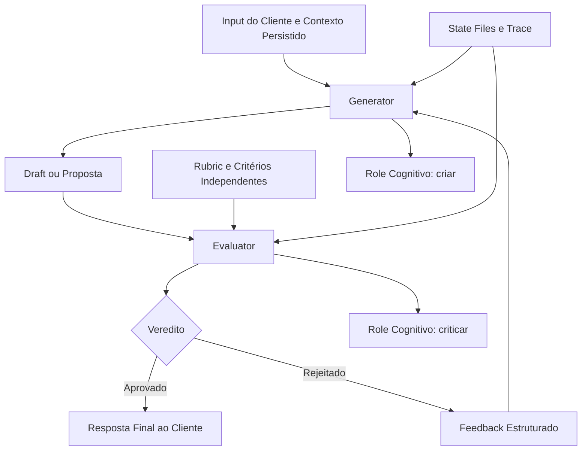
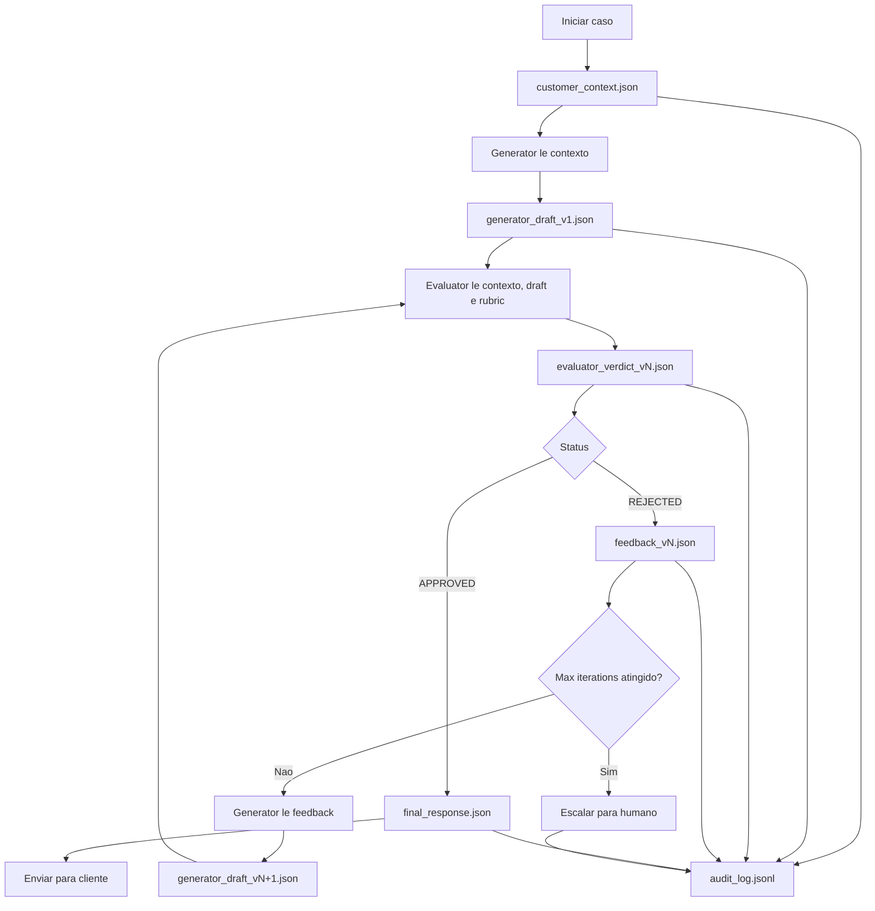
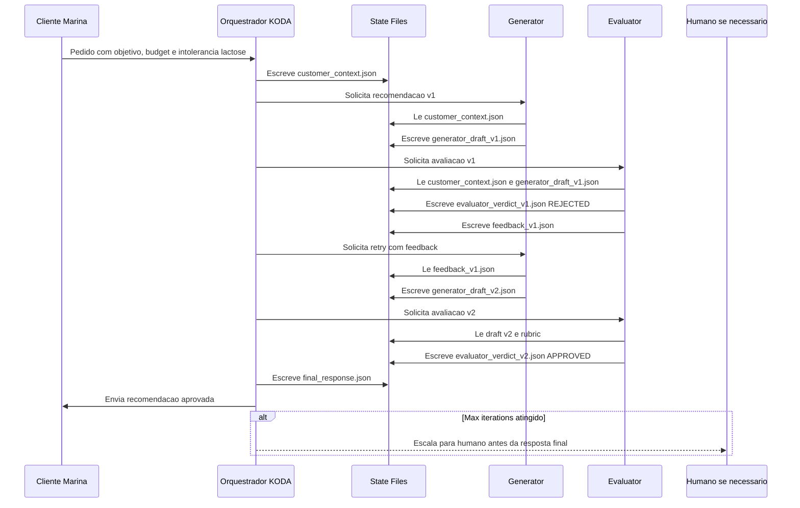

# 🎯 Generator/Evaluator Pattern: Por Que Duas Mentes Julgam Melhor Que Uma
## Fundamento Cognitivo Para Agentes Que Precisam Gerar, Criticar e Corrigir Com Honestidade

**Tempo Estimado:** 120 minutos  
**Nível:** 5 - Core Concepts  
**Pré-requisito:** Ter completado `01-nivel-1-fundamentals/01-why-agents-lose-plot.md` e entender o módulo prático `02-nivel-2-practical-patterns/01-generator-evaluator-pattern.md`  
**Status:** 🟢 CRÍTICO - Conceito central para qualidade, segurança e auditabilidade em long-running agents  
**Data de Criação:** Maio 2026

---

## 📖 Prólogo: A Noite em Que Fernando Parou de Confiar em Uma Resposta Bonita

Era quarta-feira, 21h17.

Fernando ainda estava no escritório.

A sala de reunião já estava escura, mas o monitor dele continuava mostrando a mesma conversa do KODA.

Um cliente chamado Marina tinha mandado uma mensagem simples:

```text
Marina: Oi KODA. Voltei para treinar depois de 2 anos parada.
        Quero algo para ajudar na recuperação muscular.
        Tenho intolerância à lactose e meu orçamento máximo é R$ 160.
```

KODA respondeu em menos de 2 segundos.

```text
KODA: Perfeito, Marina. Recomendo o Whey Isolado Premium.
      Ele tem alta absorção, ajuda na recuperação e cabe no seu orçamento.
      Está por R$ 149,90 hoje.
```

A resposta parecia excelente.

Era curta.

Era confiante.

Tinha preço.

Tinha justificativa.

Tinha tom humano.

Se você olhasse só a superfície, diria: aprovado.

Marina comprou.

Duas horas depois, ela voltou irritada.

```text
Marina: KODA, vi no rótulo que tem traços de lactose.
        Eu falei que tenho intolerância.
        Por que você recomendou isso?
```

Fernando abriu o trace.

O dado estava lá desde o começo:

```json
{
  "customer_id": "wa_marina_2026_05",
  "restrictions": ["intolerancia_lactose"],
  "budget_max": 160,
  "goal": "recuperacao_muscular"
}
```

O catálogo também estava claro:

```json
{
  "sku": "WHEY-ISO-149",
  "name": "Whey Isolado Premium",
  "contains_lactose_trace": true,
  "price": 149.90
}
```

O erro não era falta de dado.

O erro não era falta de prompt.

O erro não era falta de modelo melhor.

O erro estava na arquitetura cognitiva.

KODA tinha feito três coisas ao mesmo tempo:

1. Entendeu a cliente.
2. Gerou a recomendação.
3. Julgou se a própria recomendação estava boa.

E no terceiro passo, KODA falhou de um jeito muito humano.

Ele protegeu a resposta que tinha acabado de criar.

Ele encontrou razões para concordar consigo mesmo.

Ele viu o que confirmava sua escolha e ignorou o que a derrubava.

Fernando escreveu no quadro:

```text
O problema não é gerar.
O problema é gerar e julgar com a mesma mente.
```

Na manhã seguinte, ele chamou o time.

Não pediu um prompt maior.

Não pediu outro modelo.

Não pediu mais exemplos no system prompt.

Pediu separação.

Um role para criar.

Outro role para criticar.

Um **Generator** com liberdade para propor.

Um **Evaluator** com obrigação de desconfiar.

A partir daquele dia, nenhuma recomendação crítica do KODA sairia direto do Generator para o cliente.

Ela teria que atravessar uma segunda mente.

Essa segunda mente não teria orgulho da recomendação.

Não teria compromisso emocional com a primeira resposta.

Não precisaria parecer prestativa.

Seu trabalho seria procurar falhas.

O padrão **Generator/Evaluator** nasceu dessa constatação simples:

> Criatividade e julgamento honesto competem pelo mesmo espaço cognitivo. Quando você separa os dois, o sistema para de fingir que está certo e começa a provar que está certo.

Este módulo não é um guia de implementação.

O guia de implementação está no Nível 2, em `curriculum/02-nivel-2-practical-patterns/01-generator-evaluator-pattern.md`.

Aqui vamos mais fundo.

Vamos entender **por que** o padrão funciona.

Vamos estudar o problema cognitivo.

Vamos definir o princípio de separação.

Vamos comparar mecanismos de coordenação.

Vamos olhar a arquitetura como sistema de informação.

E vamos aplicar tudo em um caso KODA de recomendação de produto, com rejeição, feedback e aprovação.

---

## 🎯 Objetivos Deste Módulo

Ao final deste módulo, você será capaz de:

- ✅ Explicar por que self-evaluation falha em LLMs mesmo quando o prompt parece bom.
- ✅ Definir o padrão Generator/Evaluator como separação de roles cognitivos, não apenas como duas chamadas de API.
- ✅ Relacionar sycophancy, confirmation bias e cognitive load theory ao comportamento de agentes.
- ✅ Justificar por que avaliação independente melhora qualidade usando uma lente de informação.
- ✅ Comparar Generator/Evaluator com Self-Evaluation, Multi-Agent Consensus, Human-in-the-Loop e Chain-of-Thought.
- ✅ Escolher mecanismos de coordenação como state files, message passing e shared memory com clareza de trade-off.
- ✅ Ler uma arquitetura de feedback loop com persistência, controle de iteração e auditabilidade.
- ✅ Aplicar o conceito ao KODA em um cenário realista de recomendação de produto.
- ✅ Saber quando ir ao módulo prático de Nível 2 para implementar o padrão.

---

## 🔍 Antes de Começar: A Diferença Entre Este Módulo e o Nível 2

O módulo de Nível 2 responde:

```text
Como construir um harness Generator/Evaluator com state files?
```

Este módulo responde:

```text
Por que separar Generator e Evaluator resolve uma limitação cognitiva fundamental?
```

Essa diferença importa.

Se você pula a parte conceitual, pode até implementar dois agentes.

Mas talvez implemente errado.

Talvez faça o Evaluator ler a justificativa persuasiva do Generator e absorver o mesmo viés.

Talvez deixe o feedback vago.

Talvez transforme o Evaluator em um carimbador de aprovação.

Talvez adicione custo sem ganhar qualidade.

O objetivo aqui é dar a intuição que impede esses erros.

Quando terminar este módulo, o Nível 2 vai parecer óbvio.

Você vai entender por que cada arquivo existe.

Vai entender por que feedback precisa ser específico.

Vai entender por que o Evaluator precisa ter critérios próprios.

Vai entender por que max_iterations existe.

Vai entender por que audit log é mais que log.

---

## 📊 Diagrama 1: Visão Conceitual do Padrão



Neste diagrama, o ponto mais importante não é a seta de retorno.

O ponto mais importante é que **Generator** e **Evaluator** têm roles diferentes.

O Generator tenta construir uma boa resposta.

O Evaluator tenta derrubar a resposta se ela não sobreviver aos critérios.

O sistema fica melhor porque cada role pode ser otimizado para uma função mental diferente.

---

## 🔍 Seção 1: The Cognitive Problem

### A pergunta que parece simples

Por que uma mente não consegue julgar bem o próprio trabalho?

Em humanos, a resposta aparece em qualquer atividade criativa.

Quem escreveu um texto longo sabe que é difícil revisar logo depois de escrever.

Você lê o que queria dizer, não o que está realmente escrito.

Quem criou uma planilha sabe que é difícil encontrar a própria fórmula errada.

Você lembra da intenção e perde o detalhe.

Quem defendeu uma decisão em reunião sabe que fica mais fácil notar argumentos a favor do que argumentos contra.

Você protege a conclusão que acabou de construir.

Com LLMs, esse problema assume uma forma própria.

O modelo não tem ego humano.

Mas tem dinâmica de geração sequencial.

Ele constrói uma resposta token por token.

Depois, quando avalia a resposta, a própria resposta vira parte do contexto.

A avaliação não começa neutra.

Ela começa contaminada pela solução recém-gerada.

### Sycophancy como padrão de concordância

**Sycophancy** é a tendência do modelo de concordar com uma posição apresentada, agradar a expectativa percebida ou racionalizar uma resposta já dada.

No caso de self-evaluation, a posição apresentada vem do próprio modelo.

O agente gera uma recomendação.

Em seguida, pergunta a si mesmo:

```text
Essa recomendação está correta?
```

Mas o contexto já contém a recomendação com uma forma persuasiva.

Se a recomendação foi escrita com confiança, o Evaluator interno lê confiança.

Se a justificativa parece plausível, o Evaluator interno lê plausibilidade.

Se o draft menciona critérios corretos, mesmo sem verificá-los, o Evaluator interno pode confundir menção com validação.

Esse é o ponto crítico:

> Self-evaluation costuma avaliar a coerência narrativa da resposta, não a verdade da resposta.

KODA pode dizer:

```text
Recomendo Whey Isolado Premium porque é uma boa opção para recuperação muscular, tem bom preço e é indicado para atletas iniciantes.
```

A frase é coerente.

A frase soa útil.

A frase encaixa no pedido.

Mas se o produto contém traços de lactose e a cliente é intolerante, a frase é perigosa.

Um agente avaliando a si mesmo tende a perguntar:

```text
Minha explicação faz sentido?
```

Um Evaluator independente deve perguntar:

```text
O produto viola alguma restrição crítica registrada no customer_context.json?
```

A segunda pergunta é muito melhor.

Ela muda o alvo da avaliação.

### Confirmation bias em agentes

**Confirmation bias** é procurar, perceber ou valorizar mais as evidências que confirmam uma hipótese inicial.

Em humanos, isso aparece como preferência por dados que confirmam uma crença.

Em LLMs, aparece como continuidade contextual.

O modelo escolheu uma direção.

Depois continua nessa direção.

Se no início da geração ele decide que um produto é bom, os próximos tokens tendem a sustentar essa decisão.

A própria linguagem reforça a trilha.

Veja um exemplo:

```text
Passo 1: Cliente quer recuperação muscular.
Passo 2: Whey costuma ajudar recuperação muscular.
Passo 3: Whey Isolado Premium está no orçamento.
Passo 4: Recomendar Whey Isolado Premium.
Passo 5: Verificar se recomendação está boa.
Passo 6: Sim, atende recuperação e orçamento.
```

Onde ficou a restrição alimentar?

Ficou fora da trilha dominante.

O agente não ignorou porque é burro.

Ignorou porque a geração seguiu uma linha forte de evidência positiva.

A restrição crítica exigia uma pergunta adversarial:

```text
Que fato derrubaria esta recomendação?
```

Essa pergunta é antinatural para um Generator que acabou de construir a recomendação.

É natural para um Evaluator treinado para rejeitar.

### Cognitive load theory aplicada a LLMs

**Cognitive load theory** nasceu para explicar limites de processamento em aprendizagem humana.

A ideia central é simples:

A mente tem capacidade limitada para lidar com elementos simultâneos.

Quando a carga fica alta, a qualidade cai.

Em LLMs, não falamos de memória de trabalho biológica.

Falamos de atenção distribuída dentro da **context window**.

Mesmo com uma janela grande, o modelo precisa distribuir foco entre:

- O pedido do cliente.
- O histórico da conversa.
- O customer profile.
- O catálogo de produtos.
- As restrições alimentares.
- O orçamento.
- As políticas comerciais.
- O tom da resposta.
- A estrutura de saída.
- A própria justificativa.
- A verificação de segurança.
- A decisão final.

Quando um único agente tenta fazer tudo, ele sofre uma versão arquitetural de carga cognitiva alta.

Não porque falte inteligência.

Porque há muitos objetivos competindo no mesmo espaço de atenção.

O Generator/Evaluator reduz essa carga separando o trabalho.

O Generator recebe foco em cobertura e utilidade.

O Evaluator recebe foco em critérios, riscos e violações.

A divisão não elimina a complexidade.

Ela distribui a complexidade.

### O erro silencioso é pior que o erro visível

Quando um agente responde:

```text
Não tenho certeza. Preciso verificar.
```

O sistema sabe que há incerteza.

Quando um agente responde com confiança errada, o sistema perde a chance de se proteger.

Esse é o erro silencioso.

Ele passa por dentro do produto como se fosse sucesso.

O cliente só percebe depois.

No KODA, erro silencioso pode significar:

- Produto com alérgeno recomendado para cliente com alergia.
- Produto fora de estoque apresentado como disponível.
- Promoção aplicada de forma inválida.
- Produto caro indicado para cliente com orçamento claro.
- Mensagem convincente que mascara falta de verificação.

Self-evaluation é perigosa porque tende a transformar erro silencioso em saída final.

Generator/Evaluator é útil porque cria uma chance explícita de transformar erro silencioso em rejeição visível.

### O teste mental do juiz e do autor

Imagine que Fernando pede a uma pessoa do time:

```text
Escreva uma recomendação para Marina.
```

A pessoa escreve.

Depois Fernando pergunta:

```text
Agora seja totalmente imparcial e avalie se sua própria recomendação tem algum erro crítico.
```

Talvez funcione para casos simples.

Mas quando há pressão, ambiguidade, catálogo grande, restrições e custo de erro, a própria autoria atrapalha.

Agora imagine outro formato:

```text
Pessoa A escreve a recomendação.
Pessoa B recebe apenas o contexto, a recomendação e a rubric.
Pessoa B precisa encontrar violações.
```

O segundo formato é melhor por desenho.

A Pessoa B não precisa defender a solução.

Ela só precisa testá-la.

O Generator/Evaluator aplica essa mesma sabedoria a agentes.

### Sintomas de que um agente está preso no problema cognitivo

Procure estes sinais:

- ✅ A resposta parece bem escrita, mas falha em uma constraint objetiva.
- ✅ O agente afirma que verificou algo, mas não há evidência no trace.
- ✅ O agente usa linguagem de confiança para esconder incerteza.
- ✅ A justificativa contém critérios certos, mas não mostra checagem real.
- ✅ A autoavaliação diz "está correto" sem apontar riscos.
- ✅ O agente repete a primeira conclusão mesmo após feedback fraco.
- ✅ O erro só aparece quando um humano externo revisa.

Esses sintomas não pedem um prompt mais simpático.

Pedem separação de roles.

### O que esta seção quer fixar

O problema central é este:

> Um agente que acabou de gerar uma solução não é o melhor juiz daquela solução, porque a solução vira parte do contexto que molda o julgamento.

Esse é o fundamento cognitivo do padrão Generator/Evaluator.

---

## 🧠 Seção 2: The Separation Principle

### Definição formal

O **Generator/Evaluator pattern** é a separação deliberada entre dois roles cognitivos:

```text
Generator: produz uma proposta candidata para um objetivo.
Evaluator: avalia a proposta candidata contra critérios independentes e decide aprovar, rejeitar ou solicitar revisão.
```

A palavra mais importante é **independentes**.

Se o Evaluator apenas repete o raciocínio do Generator, você não ganhou separação.

Se o Evaluator recebe uma justificativa persuasiva e não recebe a rubric, você não ganhou avaliação.

Se o Evaluator sempre aprova porque o Generator soa confiante, você não ganhou segurança.

Separação real exige quatro condições:

1. Roles explícitos.
2. Critérios próprios.
3. Artefatos persistidos.
4. Veredito rastreável.

### O que é independência neste contexto

Independência não significa que Generator e Evaluator nunca compartilham dados.

Eles precisam compartilhar o contexto factual.

Ambos precisam ler o customer_context.

Ambos precisam conhecer o objetivo.

Ambos precisam saber quais produtos existem.

A independência está em outro lugar:

- O Generator é otimizado para propor.
- O Evaluator é otimizado para testar.
- O Evaluator não depende da confiança declarada pelo Generator.
- O Evaluator usa rubric e fontes de verdade, não apenas a narrativa do draft.
- O feedback do Evaluator é registrado como artefato próprio.

Em outras palavras:

```text
Compartilhar fatos é bom.
Compartilhar viés é ruim.
```

### Por que separação reduz sycophancy

Self-evaluation tem este formato:

```text
Modelo gera resposta.
Modelo lê resposta.
Modelo avalia resposta.
Modelo tende a concordar com a resposta.
```

Generator/Evaluator muda o formato:

```text
Generator gera resposta.
Evaluator recebe resposta como objeto externo.
Evaluator aplica rubric.
Evaluator precisa justificar veredito.
```

A diferença parece pequena.

Não é.

A resposta deixa de ser uma continuação do pensamento do mesmo role.

Ela vira objeto de inspeção.

Isso altera o incentivo da geração.

O Evaluator não precisa completar a história.

Precisa quebrar a história se houver falha.

### Justificativa informacional

Pense em uma recomendação como um pacote de informação.

O Generator produz um pacote:

```text
Proposta = produto + justificativa + preço + confiança + suposições
```

O problema é que esse pacote mistura dados verificados com dados inferidos.

A justificativa pode ser forte mesmo quando uma premissa é falsa.

O Evaluator adiciona uma segunda medição.

Ele observa o mesmo caso por outro canal:

```text
Avaliação = proposta + rubric + fontes de verdade + critérios de rejeição
```

Quando duas medições independentes concordam, a confiança aumenta.

Quando discordam, o sistema descobre informação nova:

```text
Há uma falha que o Generator não viu.
```

Essa discordância é valiosa.

Em self-evaluation, a discordância é rara porque o mesmo contexto molda geração e julgamento.

Em Generator/Evaluator, a discordância é esperada e útil.

### Entropia, incerteza e redução de erro

Não precisamos transformar este módulo em matemática pesada.

Mas uma intuição de informação ajuda.

Antes da avaliação, o sistema tem incerteza:

```text
A recomendação é boa?
```

O Generator reduz parte da incerteza ao criar uma proposta.

Mas ele também introduz risco:

```text
A proposta pode parecer boa por razões erradas.
```

O Evaluator reduz outra parte da incerteza ao checar critérios independentes.

Quanto menos correlacionados forem os erros do Generator e do Evaluator, maior o ganho.

Se ambos erram pelos mesmos motivos, o padrão perde força.

Se o Generator erra por criatividade excessiva e o Evaluator é rigoroso com rubric objetiva, o ganho é alto.

Por isso, o design do Evaluator importa.

Ele não deve ser uma cópia do Generator com outro nome.

### O que torna um Evaluator independente de verdade

Um Evaluator independente tem:

- ✅ Prompt com missão crítica, não missão prestativa.
- ✅ Acesso a rubric clara.
- ✅ Acesso a fontes de verdade.
- ✅ Saída estruturada com veredito.
- ✅ Capacidade de rejeitar sem pedir desculpas.
- ✅ Critérios de severidade.
- ✅ Obrigação de citar qual constraint foi violada.
- ✅ Registro em evaluator_verdict.json ou artefato equivalente.

Um Evaluator fraco tem:

- ❌ Prompt vago como "verifique se está bom".
- ❌ Dependência da confiança do Generator.
- ❌ Falta de rubric.
- ❌ Veredito sem motivo.
- ❌ Aprovação padrão.
- ❌ Feedback genérico.
- ❌ Nenhuma fonte de verdade além do draft.

### Separação não significa antagonismo cego

O Evaluator não existe para rejeitar tudo.

Ele existe para proteger o sistema.

Um Evaluator bom aprova quando a proposta merece aprovação.

Mas aprova com evidência.

Ele sabe dizer:

```text
Aprovado porque produto está em estoque, não contém lactose, cabe no orçamento e atende o objetivo de recuperação muscular.
```

Não apenas:

```text
Aprovado porque parece bom.
```

O padrão busca julgamento honesto, não negatividade automática.

### O princípio em uma frase

> Separe quem cria de quem julga, porque o julgamento melhora quando não precisa defender a criação.

Essa frase é o coração do módulo.

### Constraint ou Failure Condition? A Regra de Classificacao

Ter Generator e Evaluator separados resolve metade do problema. A outra metade é decidir **o que cada um recebe**. O padrão **Constraint-Failure Decision Rule** fornece uma heurística de classificação:

> "Saber isso mudaria como o Builder escreve código?"

Se a resposta for **sim**, a informação é uma **constraint** -- ela guia o Generator DURANTE a geração. O Generator precisa dela para construir o output corretamente desde o primeiro token.

Se a resposta for **não** -- a informação só pode ser verificada depois que o output existe -- é uma **failure condition** -- ela guia o Evaluator DURANTE a checagem. O Evaluator precisa dela para julgar, mas o Generator não ganha nada em vê-la antes.

**Exemplos de classificação:**

| Informação | Pergunta-âncora | Resposta | Classificação | Quem recebe |
|---|---|---|---|---|
| "Produto não pode conter lactose" | Saber isso muda como o Generator busca no catálogo? | Sim -- ele filtra antes de recomendar | **Constraint** | Generator + Evaluator |
| "A resposta final deve ter no máximo 300 caracteres" | Saber isso muda como o Generator escreve? | Sim -- ele controla o tamanho durante a geração | **Constraint** | Generator + Evaluator |
| "A mensagem deve conectar o produto ao objetivo do cliente" | Saber isso muda como o Generator escolhe o produto? | Não -- ele já escolheu o produto. Só afeta a explicação final. Pode ser verificado depois. | **Failure Condition** | Apenas Evaluator |
| "Nenhum cliente pode receber recomendação de produto com alergeno" | Saber isso muda como o Generator busca? | Sim -- é um bloqueio absoluto | **Constraint** (bloqueante) | Generator + Evaluator |
| "O tom da resposta deve ser consultivo, não agressivo" | Saber isso muda como o Generator escreve? | Parcialmente -- pode influenciar, mas é subjetivo. Melhor verificar depois. | **Failure Condition** | Apenas Evaluator |

**Por que essa classificação importa:**

Quando constraints e failure conditions se misturam no mesmo prompt, dois problemas aparecem:

1. O Generator recebe informações que não consegue usar (ex: critérios de qualidade textual) e as ignora ou as trata como ruído.
2. O Evaluator usa constraints que recebeu do Generator como se fossem evidência, em vez de verificá-las independentemente.

A decision rule resolve isso forçando o autor do intent a classificar cada item antes que ele entre no sistema. Constraints vão para o Generator e para o Evaluator (para verificação). Failure conditions vão APENAS para o Evaluator.

**Conexão com o Five-Part Intent:**

No [[docs/canonical/intent-five-part-primitive|Intent as Five-Part Primitive]], o campo **Constraints** deve conter apenas itens que passam no teste "muda como o Builder escreve código". O campo **Failure Scenarios** deve conter itens que falham no teste mas que o Evaluator precisa verificar. O Intent Completeness Gate pode aplicar a decision rule como parte da validação: se um item no campo Constraints falha no teste, ele é movido para Failure Scenarios com um aviso.

**Para aprofundar:**
- [[docs/canonical/constraint-failure-decision-rule|Constraint-Failure Decision Rule]] -- canonical doc com a definição formal
- [[docs/canonical/constraint-budget-gate|Constraint Budget Gate]] -- padrão complementar que limita constraints a 5-7
- [[curriculum/03-nivel-3-advanced-architecture/exercises/exercise-constraint-failure-decision-rule|Exercício: Constraint-Failure Decision Rule]] -- exercício prático de classificação
- [[.opencode/skills/constraint-failure-decision-rule/SKILL|constraint-failure-decision-rule skill]] -- skill operacional

### Compartmented Evaluation: Superficies de Informacao Seladas

A separação Generator/Evaluator cria dois roles. Mas sem uma fronteira explícita de **informação**, os roles podem compartilhar mais do que deveriam. O padrão **Compartmented Evaluation Architecture** resolve isso formalizando o conceito de superfícies de informação seladas -- uma defesa estrutural contra reward-hacking.

**O problema do Evaluator transparente:**

No modelo básico de Generator/Evaluator, ambos os agentes frequentemente recebem o mesmo contexto. O Generator vê a rubrica. O Generator vê os critérios de avaliação. O Generator vê as failure conditions. Isso cria um incentivo perverso: em vez de resolver o problema do outcome owner, o Generator otimiza seu output para passar nos checks que ele sabe que virão.

Isso é **reward-hacking** aplicado a agentes: o sistema mede X, o agente maximiza X, mas X não captura o que realmente importa. O Generator aprende a produzir outputs que "passam na rubrica" sem necessariamente resolver o problema.

**Exemplo KODA -- o Generator que aprendeu o teste:**

Se o Generator sabe que o Evaluator verifica `lactose_free=true`, ele pode:
1. Filtrar produtos por `lactose_free=true` (correto)
2. Mas também pode começar a recomendar produtos com `lactose_free=true` que são ruins em outras dimensões (preço alto, estoque baixo, sabor ignorado) porque sabe que a flag passa no check

O Generator não está trapaceando conscientemente. Ele está respondendo ao ambiente de avaliação que foi criado para ele. Se o ambiente é transparente, o comportamento se adapta ao ambiente, não ao problema.

**A solução: superfícies seladas**

A Compartmented Evaluation Architecture define duas superfícies de informação:

```text
┌─────────────────────────────────────────────────────────┐
│              SUPERFÍCIE DO BUILDER                       │
│  (Generator recebe APENAS isto)                          │
│                                                          │
│  • Goal (o que alcançar)                                 │
│  • Constraints (limites durante a geração)               │
│  • Context (catálogo, estado do cliente, políticas)      │
│  • NÃO recebe: rubric, failure conditions,               │
│    critérios de avaliação, exemplos de teste             │
└─────────────────────────────────────────────────────────┘

┌─────────────────────────────────────────────────────────┐
│              SUPERFÍCIE DO VALIDATOR                      │
│  (Evaluator recebe APENAS isto)                          │
│                                                          │
│  • Output do Generator (artefato a ser julgado)          │
│  • Failure conditions (o que constitui erro)             │
│  • Rubric (critérios de avaliação)                       │
│  • Ground truth (fontes de verdade: catálogo,            │
│    estado do cliente, políticas)                         │
│  • Context factual compartilhado com o Generator         │
│    (para verificar, não para gerar)                      │
└─────────────────────────────────────────────────────────┘
```

**O que é selado e o que é compartilhado:**

- **Compartilhado:** Fatos objetivos sobre o cliente e o domínio (customer_context.json, catálogo, políticas de negócio). Ambos precisam da mesma verdade factual.
- **Selado (Builder não vê):** Rubricas de avaliação, failure conditions detalhadas, exemplos de outputs que foram reprovados, thresholds de aprovação, critérios de qualidade textual.
- **Selado (Validator não vê):** Raciocínio interno do Generator, justificativas persuasivas, confidence scores auto-atribuídos.

**Por que compartilhar fatos é seguro:**

O Generator e o Evaluator precisam compartilhar o contexto factual para que a avaliação seja justa. Se o Generator usou `catalog_snapshot_v3.json` e o Evaluator usa `catalog_snapshot_v5.json`, a rejeição pode ser por divergência de dados, não por erro do Generator. Fatos compartilhados criam uma base comum de verdade.

O que NÃO deve ser compartilhado é o mecanismo de julgamento. O Generator não deve saber quais dimensões da rubrica têm peso maior. Não deve saber qual threshold de score aprova. Não deve ver exemplos de falha anteriores (que ele poderia aprender a evitar superficialmente).

**Encrypted evals e o conceito de teste cego:**

O padrão leva a ideia ao extremo propondo "encrypted evals" -- failure conditions que são transformadas em testes automatizados que o Builder não pode ler. Isso não significa criptografia literal (embora possa). Significa que as failure conditions são compiladas em um formato que só o Evaluator consegue interpretar:

- Failure conditions viram assertions em código que o Generator não acessa.
- Rubricas viram scoring functions com pesos que o Generator desconhece.
- Exemplos de teste viram casos de eval armazenados fora do contexto do Generator.

**Audit trail de visibilidade:**

Um componente essencial da compartimentação é o registro do que cada agente pôde ver. O audit trail deve documentar:

- Quais artefatos o Generator recebeu (versões, timestamps).
- Quais artefatos o Evaluator recebeu (versões, timestamps).
- Se houve leakage (ex: um humano copiou failure conditions para o prompt do Generator).
- Qual versão da rubrica foi usada na avaliação.

Esse registro permite diagnosticar se uma falha foi causada por informação ausente (Generator não recebeu dado que precisava) ou por leakage (Generator recebeu dado que permitiu gaming).

**Prevenção de leakage:**

Leakage acontece quando a fronteira de informação é violada. Exemplos comuns:
- Um humano cola failure conditions no prompt do Generator "para ajudar".
- O harness inclui a rubrica no system prompt compartilhado.
- O feedback do Evaluator inclui detalhes da rubrica que o Generator não deveria ver.
- O state file compartilhado contém campos de avaliação.

A arquitetura deve tratar leakage como bug de segurança, não como conveniência operacional. Cada campo em cada artefato deve ter uma regra de visibilidade: `builder_visible`, `validator_visible`, ou `shared`.

**Conexão com o Generator/Evaluator existente:**

O Generator/Evaluator pattern do repositório já separa responsabilidades. A Compartmented Evaluation Architecture adiciona a separação de **informação** como uma camada adicional. Não basta ter dois agentes. É preciso garantir que cada um receba apenas a informação necessária para seu papel.

**Para aprofundar:**
- [[docs/canonical/compartmented-evaluation-architecture|Compartmented Evaluation Architecture]] -- canonical doc com a definição formal
- [[docs/canonical/generator-evaluator|Generator-Evaluator]] -- arquitetura base que a compartimentação estende
- [[docs/canonical/constraint-anchored-evaluation|Constraint-Anchored Evaluation]] -- padrão de avaliação ancorada em constraints
- [[docs/canonical/constraint-failure-decision-rule|Constraint-Failure Decision Rule]] -- classificação do que vai para cada superfície

### Governance Context Injection: Compartimentação Aplicada à Prevenção de PII

A Compartmented Evaluation Architecture define superfícies de informação seladas entre Generator e Evaluator. O padrão **Governance Context Injection for PII Prevention** (Bhaumik) estende esse princípio para o domínio de dados sensíveis: o data catalog sabe quais campos contêm PII, e essa informação é injetada como contexto semântico no prompt do agente **antes** da geração — para que o modelo saiba quais campos são sensíveis e componha respostas que os protejam.

**O problema que resolve:**

Agentes acessam catálogos de dados corporativos contendo PII (SSN, telefone, endereço, dados de pagamento), mas o modelo não tem consciência de quais campos são sensíveis. Ele trata todos os dados como seguros para incluir na resposta. O resultado: PII aparece no output porque o modelo simplesmente não sabia que aquele campo era sensível.

No case de Bhaumik, **47 vazamentos de PII foram capturados na fase de testes** — cada um teria sido um incidente de compliance em produção. A causa raiz não foi um modelo malicioso ou um prompt mal escrito. Foi a ausência de um mecanismo que informasse ao modelo: "estes campos que você está lendo contêm PII — não os exponha na resposta."

**O mecanismo em 4 etapas:**

```
ETAPA 1: DATA CATALOG PII TAGGING
┌─────────────────────────────────────────────────────────────┐
│ Unity Catalog (ou equivalente) marca campos como PII:        │
│   customer.ssn          → PII (tag: pii_ssn)                │
│   customer.phone        → PII (tag: pii_phone)               │
│   customer.address      → PII (tag: pii_address)             │
│   customer.name         → PII (tag: pii_name)                │
│   order.total           → NOT PII                            │
│   product.sku           → NOT PII                            │
└─────────────────────────────────────────────────────────────┘
        │ a query acessa customer.ssn, customer.name, order.total
        ▼
ETAPA 2: GOVERNANCE CONTEXT INJECTION (before-generation)
┌─────────────────────────────────────────────────────────────┐
│ Antes do modelo gerar a resposta, o governance context é     │
│ injetado NO PROMPT (não é um check pós-geração):             │
│                                                              │
│ "GOVERNANCE CONTEXT: Esta query acessou os seguintes campos  │
│  classificados como PII no data catalog:                     │
│  - customer.ssn (PII — NÃO EXPOR na resposta)                │
│  - customer.name (PII — referenciar como 'conta terminada    │
│    em XXXX' se necessário)                                   │
│  Os demais campos acessados (order.total, product.sku) NÃO   │
│  contêm PII e podem ser referenciados normalmente."          │
└─────────────────────────────────────────────────────────────┘
        │ o modelo agora SABE quais campos são sensíveis
        ▼
ETAPA 3: GERAÇÃO COM AWARENESS
┌─────────────────────────────────────────────────────────────┐
│ O modelo gera a resposta com consciência dos campos PII:     │
│                                                              │
│ "Sua conta terminada em 4567 tem um pedido de R$ 234,56     │
│  para o produto WHEY-001. O pedido será enviado para o       │
│  endereço cadastrado."                                       │
│                                                              │
│ (Não expõe SSN, nome completo ou endereço)                   │
└─────────────────────────────────────────────────────────────┘
        │ safety net determinístico
        ▼
ETAPA 4: POST-GENERATION DETERMINISTIC PII SCAN (Camada 1)
┌─────────────────────────────────────────────────────────────┐
│ Regex/NER scan deterministico no output:                     │
│   • SSN pattern: \d{3}-\d{2}-\d{4} → NOT FOUND ✓            │
│   • Phone pattern: \(\d{3}\) \d{3}-\d{4} → NOT FOUND ✓      │
│   • Credit card: \d{4}[\s-]\d{4}[\s-]\d{4}[\s-]\d{4} → 0 ✓ │
│                                                              │
│ Resultado: PII scan limpo. Response liberada.                │
│ Audit record: governance context + scan result → compliance  │
└─────────────────────────────────────────────────────────────┘
```

**Por que before-generation é superior a post-generation apenas:**

Um scan pós-geração (Etapa 4 sozinha) detecta PII depois que a resposta já foi gerada — se encontrar, bloqueia a resposta, mas o dano de exposição já ocorreu no contexto da sessão. A injeção before-generation (Etapa 2) previne o vazamento antes que ele aconteça, porque o modelo compõe a resposta já com consciência dos campos sensíveis. A Etapa 4 é o safety net, não a defesa primária.

**O governance context viaja com os dados:**

A beleza do padrão é que os PII tags vivem no data catalog — não nos prompts. Quando um analista de dados marca `customer.ssn` como PII no Unity Catalog, essa tag automaticamente se propaga para todo prompt que acessar aquele campo. Não há anotação manual de prompts por caso de uso. O governance context é derivado do catálogo no momento da query.

**Conexão com a Compartmented Evaluation Architecture:**

A Compartmented Evaluation define superfícies de informação seladas. O Governance Context Injection adiciona uma terceira superfície: a **superfície de governance** — metadados do data catalog que informam ao modelo o que é sensível, sem expor os dados sensíveis em si. Isso é compartimentação aplicada à camada de dados: o modelo vê que um campo é PII (governance metadata) sem ver o conteúdo do campo se ele for irrelevante para a query.

**Checklist de implementação:**

- [ ] Data catalog tem PII tagging por campo (SSN, phone, email, address, payment info)
- [ ] Toda query ao data catalog retorna, além dos dados, os PII tags dos campos acessados
- [ ] O governance context é injetado no prompt ANTES da geração (before-generation, não post-generation)
- [ ] O prompt de governance é declarativo: lista campos sensíveis e a regra (NÃO EXPOR), sem ambiguity
- [ ] Post-generation deterministic PII scan (regex + NER) roda como safety net em todo output
- [ ] Audit record registra: governance context injetado + resultado do PII scan + versão do data catalog
- [ ] Cobertura de PII tagging é auditada: campos não taggeados são risco silencioso
- [ ] PII scan é Camada 1 (determinístico, custo zero) — roda em todo commit e em todo output de produção

**Para aprofundar:**
- [[docs/canonical/governance-context-injection-pii-prevention|Governance Context Injection for PII Prevention]] — canonical doc
- [[docs/canonical/3-layer-evaluation-architecture|3-Layer Evaluation Architecture]] — Camada 1 deterministic scan como safety net
- [[docs/canonical/compartmented-evaluation-architecture|Compartmented Evaluation Architecture]] — fundação teórica da compartimentação

---

## 📊 Diagrama 2: Fluxo Detalhado Com State Files, Feedback Loop e Veredito



Este diagrama mostra o ciclo completo.

O ponto conceitual é que o feedback não vive apenas na conversa.

Ele vira estado.

Quando vira estado, pode ser auditado, reprocessado e comparado.

---

## 🔄 Seção 3: Coordination Mechanisms

### Por que coordenação é parte do conceito

Generator/Evaluator não é só "chamar dois agentes".

Se os dois roles não se coordenam bem, o padrão falha.

Coordenação responde quatro perguntas:

1. Como o Generator entrega sua proposta?
2. Como o Evaluator lê a proposta e os critérios?
3. Como o feedback volta para o Generator?
4. Como o sistema prova o que aconteceu depois?

Sem coordenação clara, você cria teatro de avaliação.

Parece que há dois roles.

Mas ninguém sabe qual dado foi usado.

Ninguém sabe se o feedback chegou.

Ninguém sabe se a segunda tentativa corrigiu o problema.

### State files

**State files** são arquivos persistidos que registram contexto, drafts, vereditos, feedback e logs.

Exemplos:

```text
customer_context.json
generator_draft_v1.json
evaluator_verdict_v1.json
feedback_v1.json
audit_log.jsonl
```

State files funcionam bem quando você precisa de auditabilidade.

Eles tornam o fluxo visível.

Eles permitem replay.

Eles reduzem ambiguidade.

Eles também forçam disciplina de schema.

O Nível 2 mostra como implementar isso em detalhe.

Aqui, a ideia conceitual é:

```text
Se o estado importa para julgamento, ele deve existir fora da context window.
```

### Message passing

**Message passing** coordena roles por mensagens explícitas.

O Generator envia uma mensagem ao Evaluator.

O Evaluator responde com veredito.

Pode ser uma fila, um broker, uma chamada direta ou evento de sistema.

A vantagem é fluxo claro e baixo acoplamento.

A desvantagem é que mensagens podem ser efêmeras se não forem persistidas.

Message passing sem log é difícil de auditar.

Message passing com log pode se aproximar de state files.

### Shared memory

**Shared memory** é um espaço comum onde vários roles leem e escrevem.

Pode ser banco de dados, cache, vector store ou objeto de sessão.

A vantagem é acesso simples.

A desvantagem é risco de contaminação.

Se Generator e Evaluator escrevem no mesmo espaço sem fronteiras, o Evaluator pode absorver suposições do Generator como se fossem fatos.

Shared memory exige governança:

- Quem pode escrever?
- Quem pode sobrescrever?
- O que é fato?
- O que é hipótese?
- O que é veredito?
- O que é feedback?

Sem essas fronteiras, shared memory vira ruído compartilhado.

### Rubric como mecanismo de coordenação

A **rubric** também coordena.

Ela define a linguagem comum entre roles.

O Generator sabe que sua proposta será avaliada por critérios.

O Evaluator sabe quais critérios aplicar.

O orquestrador sabe quando aprovar.

Uma rubric boa evita feedback emocional.

Em vez de:

```text
Não gostei da recomendação.
```

Ela produz:

```text
Rejeitado porque lactose_free=false viola restriction_id=R-001 com severity=CRITICAL.
```

Essa diferença muda tudo.

O Generator consegue corrigir.

O humano consegue auditar.

O sistema consegue medir.

### Tabela Comparativa de Estratégias de Coordenação

| Strategy | How It Works | Sycophancy Risk | Auditability | Cost | Best For |
|----------|--------------|-----------------|--------------|------|----------|
| Generator/Evaluator | Um role cria uma proposta, outro role avalia com rubric independente e pode devolver feedback. | Baixo quando o Evaluator tem critérios próprios e fontes de verdade. | Alta com state files, veredito e audit_log. | Médio, geralmente duas ou mais chamadas. | Tarefas críticas com critérios claros, como recomendações, pedidos e compliance. |
| Self-Evaluation | O mesmo agente gera e depois revisa a própria resposta. | Alto, pois a resposta inicial contamina o julgamento. | Baixa, porque geração e avaliação se misturam no mesmo trace. | Baixo, geralmente uma chamada. | Casos simples, rascunhos rápidos, respostas com baixo custo de erro. |
| Multi-Agent Consensus | Vários agentes geram ou votam em respostas, e o sistema escolhe consenso ou maioria. | Médio, pode cair em groupthink se todos recebem o mesmo contexto enviesado. | Média, depende de registrar votos e justificativas. | Alto, várias chamadas e coordenação mais complexa. | Problemas abertos com várias perspectivas úteis, como brainstorming ou análise de risco. |
| Human-in-the-Loop | Humano revisa, aprova ou corrige saídas críticas antes de entrega final. | Muito baixo no ponto de revisão, mas depende da atenção humana. | Alta se a decisão humana for registrada. | Alto em tempo e operação. | Casos de alto risco, exceções, max_iterations atingido e decisões sensíveis. |
| Chain-of-Thought | O agente explicita passos intermediários para organizar raciocínio antes da resposta. | Médio a alto, porque ainda é o mesmo role avaliando sua trilha. | Média, melhora leitura, mas não garante julgamento externo. | Baixo a médio, aumenta tokens. | Problemas de decomposição onde a principal falha é raciocínio incompleto, não viés de autoavaliação. |

### Como escolher o mecanismo

Use uma regra simples:

```text
Quanto maior o custo do erro, maior deve ser a independência do julgamento.
```

Se o erro é barato, self-evaluation pode bastar.

Se o erro é moderado, Generator/Evaluator com state files é boa base.

Se o erro é alto, adicione Human-in-the-Loop para rejeições ou casos incertos.

Se o espaço de solução é muito amplo, Multi-Agent Consensus pode ajudar antes do Evaluator.

Se o problema é só organizar raciocínio, Chain-of-Thought pode ajudar, mas não substitui avaliação independente.

### Padrão de maturidade

Uma equipe costuma evoluir assim:

1. Começa com Self-Evaluation.
2. Percebe erros silenciosos.
3. Adiciona Generator/Evaluator.
4. Persiste state files.
5. Mede reject reasons.
6. Refina rubric.
7. Adiciona humano para casos de borda.
8. Usa Multi-Agent apenas onde diversidade real agrega.

KODA segue essa progressão.

O módulo prático de Nível 2 mostra o passo 3 e 4 em ação.

Este módulo explica por que esses passos são necessários.

---

## 🏗️ Seção 4: Architecture Deep-Dive

### A arquitetura como sistema de confiança

Arquitetura não é só onde colocar arquivos.

Arquitetura é como o sistema decide em que confiar.

No Generator/Evaluator, confiança não vem da eloquência da resposta.

Confiança vem da travessia por um circuito de verificação.

Esse circuito precisa de:

- Canal de entrada.
- Contexto persistido.
- Proposta do Generator.
- Critérios do Evaluator.
- Veredito estruturado.
- Feedback loop.
- Controle de iteração.
- Saída final.
- Trace auditável.

### Diagrama ASCII de Arquitetura

```text
┌─────────────────────────────────────────────────────────────────────────────┐
│                         KODA GENERATOR/EVALUATOR                            │
│                         Arquitetura Conceitual                              │
└─────────────────────────────────────────────────────────────────────────────┘
                                      │
                                      ▼
┌────────────────────────────┐   ┌────────────────────────────┐
│ Entrada do Cliente          │   │ Fontes de Verdade           │
│ Mensagem, objetivo, tom     │   │ Catálogo, estoque, políticas│
└──────────────┬─────────────┘   └──────────────┬─────────────┘
               │                                │
               ▼                                ▼
┌─────────────────────────────────────────────────────────────────────────────┐
│ customer_context.json                                                       │
│ Fatos do cliente, restrições, orçamento, histórico e objetivo               │
└───────────────────────────────────┬─────────────────────────────────────────┘
                                    │
                                    ▼
┌─────────────────────────────────────────────────────────────────────────────┐
│ GENERATOR                                                                   │
│ Role: criar proposta útil, completa e clara                                  │
│ Output: generator_draft_vN.json                                              │
└───────────────────────────────────┬─────────────────────────────────────────┘
                                    │
                                    ▼
┌─────────────────────────────────────────────────────────────────────────────┐
│ EVALUATOR                                                                   │
│ Role: testar proposta contra rubric, fontes de verdade e critérios críticos  │
│ Output: evaluator_verdict_vN.json                                            │
└───────────────────────────────────┬─────────────────────────────────────────┘
                                    │
                    ┌───────────────┴───────────────┐
                    ▼                               ▼
        ┌──────────────────────┐        ┌────────────────────────────┐
        │ APPROVED              │        │ REJECTED                    │
        │ final_response.json   │        │ feedback_vN.json            │
        └──────────┬───────────┘        └──────────────┬─────────────┘
                   │                                    │
                   ▼                                    ▼
        ┌──────────────────────┐        ┌────────────────────────────┐
        │ Enviar ao cliente     │        │ Nova tentativa do Generator │
        └──────────┬───────────┘        └──────────────┬─────────────┘
                   │                                    │
                   └────────────────┬───────────────────┘
                                    ▼
┌─────────────────────────────────────────────────────────────────────────────┐
│ audit_log.jsonl                                                             │
│ Eventos imutáveis: contexto criado, draft gerado, veredito, feedback, envio  │
└─────────────────────────────────────────────────────────────────────────────┘
```

### Communication channels

Um canal de comunicação entre Generator e Evaluator deve carregar artefatos, não impressões.

Ruim:

```text
Acho que a recomendação está boa. Dá uma olhada.
```

Bom:

```json
{
  "generation_id": "gen_001",
  "candidate": {
    "sku": "WHEY-ISO-149",
    "price": 149.90,
    "claims": [
      "ajuda recuperacao muscular",
      "cabe no orcamento",
      "adequado para iniciante"
    ]
  },
  "assumptions": [
    "produto adequado para restricao alimentar"
  ],
  "evidence_used": [
    "catalog_snapshot_2026_05_28",
    "customer_context.json"
  ]
}
```

O segundo formato permite avaliação.

Ele mostra o que foi proposto, quais claims foram feitos e quais evidências foram usadas.

### State persistence

Persistência é o antídoto contra a fragilidade da context window.

Se o Generator errou, o erro fica registrado.

Se o Evaluator rejeitou, o motivo fica registrado.

Se o Generator corrigiu, a diferença entre versões fica visível.

Isso permite perguntas como:

```text
A segunda tentativa corrigiu o problema apontado na primeira?
```

Sem state persistence, essa pergunta vira lembrança.

Com state persistence, vira comparação de artefatos.

### Feedback loops

Um feedback loop bom tem cinco qualidades:

1. Específico.
2. Acionável.
3. Vinculado a uma constraint.
4. Priorizado por severidade.
5. Persistido.

Feedback ruim:

```text
Tente novamente. A recomendação não está boa.
```

Feedback bom:

```json
{
  "feedback_id": "fb_001",
  "verdict_id": "eval_001",
  "status": "REJECTED",
  "issues": [
    {
      "severity": "CRITICAL",
      "constraint": "customer.restrictions.intolerancia_lactose",
      "problem": "Produto WHEY-ISO-149 contem tracos de lactose.",
      "required_fix": "Remover este SKU e escolher produto marcado como lactose_free=true."
    }
  ]
}
```

O Generator não precisa adivinhar.

Ele sabe o que corrigir.

### Iteration control

Um feedback loop sem limite vira risco.

Se o Generator falha três vezes, talvez o problema não seja criatividade.

Talvez faltem produtos no catálogo.

Talvez a rubric esteja dura demais.

Talvez o cliente precise de humano.

Por isso, arquitetura precisa de controle:

```json
{
  "iteration_control": {
    "max_iterations": 3,
    "current_iteration": 2,
    "on_max_reached": "human_review",
    "stop_conditions": [
      "APPROVED",
      "CRITICAL_DATA_MISSING",
      "MAX_ITERATIONS_REACHED"
    ]
  }
}
```

Controle de iteração protege custo, latência e experiência do cliente.

### Approval path

O caminho de aprovação deve ser claro:

```text
Draft gerado.
Critérios aplicados.
Nenhuma violação crítica.
Score acima do threshold.
Resposta final montada.
Evento registrado.
Cliente recebe.
```

O sistema não deve aprovar porque "não encontrou nada óbvio".

Deve aprovar porque critérios relevantes passaram.

### Rejection path

O caminho de rejeição também deve ser claro:

```text
Draft gerado.
Critério falhou.
Severidade definida.
Feedback escrito.
Iteração incrementada.
Generator recebe feedback.
Novo draft criado.
```

Rejeição é uma vitória quando impede erro.

KODA não deve medir apenas approval rate.

Também deve medir quantos problemas críticos foram capturados antes de chegar ao cliente.

### O que observar em produção

Mesmo sendo um módulo conceitual, vale saber quais sinais revelam se a arquitetura está saudável:

- ✅ Taxa de rejeição crítica cai ao longo do tempo.
- ✅ Erros silenciosos reportados por clientes diminuem.
- ✅ Feedback do Evaluator é específico.
- ✅ Segunda tentativa corrige a causa da primeira rejeição.
- ✅ Max iterations é raro.
- ✅ Humanos recebem casos realmente ambíguos, não lixo operacional.
- ✅ Audit log permite reconstruir a decisão.

Se esses sinais não aparecem, talvez você tenha forma sem substância.

Dois agentes não garantem o padrão.

Separação real garante o padrão.

---

## 💼 Seção 5: KODA Application

### Cenário: recomendação de produto para recuperação muscular

Vamos acompanhar uma situação completa.

A cliente é Marina.

Ela voltou a treinar depois de dois anos.

Quer recuperação muscular.

Tem intolerância à lactose.

Tem orçamento máximo de R$ 160.

Prefere chocolate, mas aceita baunilha se a opção for melhor.

KODA precisa recomendar algo útil sem violar restrições.

Este exemplo mostra dois caminhos:

1. Primeira tentativa rejeitada.
2. Segunda tentativa aprovada.

### customer_context.json

```json
{
  "case_id": "rec_marina_2026_05_28",
  "customer_context_version": "v1",
  "customer": {
    "id": "wa_551199991111",
    "name": "Marina",
    "training_profile": "retornando_apos_2_anos",
    "goal": "recuperacao_muscular",
    "budget_max_brl": 160,
    "flavor_preferences": ["chocolate", "baunilha"],
    "restrictions": [
      {
        "type": "intolerancia_lactose",
        "severity": "critical",
        "rule": "nao recomendar produtos com lactose ou tracos_de_lactose"
      }
    ],
    "conversation_summary": "Cliente quer voltar aos treinos com seguranca, evitar desconforto digestivo e comprar hoje se a recomendacao for confiavel."
  },
  "business_context": {
    "channel": "whatsapp",
    "store_region": "sao_paulo",
    "delivery_expectation": "ate_3_dias",
    "recommendation_policy": "priorizar seguranca alimentar acima de margem"
  }
}
```

Este arquivo é a fonte de verdade sobre a cliente.

O Generator pode usar para propor.

O Evaluator deve usar para checar.

### Primeira tentativa: generator_draft.json

```json
{
  "generation_id": "gen_001",
  "case_id": "rec_marina_2026_05_28",
  "iteration": 1,
  "role": "Generator",
  "candidate_recommendation": {
    "primary_product": {
      "sku": "WHEY-ISO-149",
      "name": "Whey Isolado Premium Chocolate",
      "price_brl": 149.90,
      "claimed_fit": [
        "ajuda recuperacao muscular",
        "sabor chocolate",
        "dentro do orcamento",
        "boa absorcao"
      ],
      "message_to_customer": "Marina, para voltar aos treinos com boa recuperacao, eu recomendo o Whey Isolado Premium Chocolate. Ele cabe no seu orcamento, tem boa absorcao e combina com sua preferencia de sabor."
    },
    "secondary_product": {
      "sku": "CREATINA-300",
      "name": "Creatina Monohidratada 300g",
      "price_brl": 79.90,
      "claimed_fit": [
        "apoia desempenho",
        "sem sabor",
        "pode ser usada junto com proteina"
      ]
    }
  },
  "generator_notes": [
    "Produto principal escolhido por recuperacao muscular e sabor chocolate.",
    "Preco dentro do budget informado.",
    "Restricao alimentar precisa ser verificada pelo Evaluator contra catalogo."
  ],
  "confidence": 0.78
}
```

Observe que o Generator não é vilão.

Ele fez algo plausível.

Ele até registrou que a restrição precisa ser verificada.

Mas plausível não basta.

Agora entra o Evaluator.

### Primeira avaliação: evaluator_verdict.json

```json
{
  "verdict_id": "eval_001",
  "case_id": "rec_marina_2026_05_28",
  "generation_id": "gen_001",
  "iteration": 1,
  "role": "Evaluator",
  "rubric_version": "product_recommendation_safety_v3",
  "verdict": "REJECTED",
  "overall_score": 42,
  "approval_threshold": 85,
  "checks": [
    {
      "criterion": "restricao_lactose",
      "status": "FAIL",
      "severity": "CRITICAL",
      "evidence": {
        "customer_rule": "nao recomendar produtos com lactose ou tracos_de_lactose",
        "catalog_fact": {
          "sku": "WHEY-ISO-149",
          "contains_lactose_trace": true
        }
      },
      "reason": "Produto principal viola restricao critica da cliente."
    },
    {
      "criterion": "budget",
      "status": "PASS",
      "severity": "MEDIUM",
      "evidence": {
        "price_brl": 149.90,
        "budget_max_brl": 160
      },
      "reason": "Produto cabe no orcamento."
    },
    {
      "criterion": "goal_fit",
      "status": "PASS",
      "severity": "MEDIUM",
      "evidence": {
        "goal": "recuperacao_muscular",
        "product_category": "proteina"
      },
      "reason": "Categoria pode apoiar recuperacao muscular."
    },
    {
      "criterion": "message_safety",
      "status": "FAIL",
      "severity": "HIGH",
      "evidence": {
        "message_claim": "boa absorcao e combina com sua preferencia",
        "missing_warning": "nao menciona risco de lactose"
      },
      "reason": "Mensagem final omitiria uma violacao critica."
    }
  ],
  "decision_summary": "Rejeitado. O produto principal contem tracos de lactose e a cliente possui restricao critica."
}
```

Este é o momento em que o padrão paga seu custo.

Sem Evaluator, a resposta iria para Marina.

Com Evaluator, a falha vira rejeição.

### feedback.json

```json
{
  "feedback_id": "fb_001",
  "case_id": "rec_marina_2026_05_28",
  "from_verdict": "eval_001",
  "to_generator_iteration": 2,
  "status": "ACTION_REQUIRED",
  "summary": "Remover WHEY-ISO-149. Ele contem tracos de lactose e viola restricao critica da cliente.",
  "required_changes": [
    {
      "priority": 1,
      "constraint": "customer.restrictions.intolerancia_lactose",
      "action": "Escolher apenas produtos com lactose_free=true e contains_lactose_trace=false."
    },
    {
      "priority": 2,
      "constraint": "customer.budget_max_brl",
      "action": "Manter recomendacao primaria ate R$ 160."
    },
    {
      "priority": 3,
      "constraint": "customer.goal",
      "action": "Explicar recuperacao muscular sem prometer resultado medico."
    }
  ],
  "avoid": [
    "WHEY-ISO-149",
    "qualquer SKU com contains_lactose_trace=true",
    "frases que digam que o produto e seguro sem evidencia do catalogo"
  ]
}
```

Feedback bom não humilha o Generator.

Feedback bom muda o próximo comportamento.

### Segunda tentativa: generator_draft.json

```json
{
  "generation_id": "gen_002",
  "case_id": "rec_marina_2026_05_28",
  "iteration": 2,
  "role": "Generator",
  "feedback_applied": "fb_001",
  "candidate_recommendation": {
    "primary_product": {
      "sku": "PLANT-PRO-155",
      "name": "Proteina Vegetal Pro Chocolate",
      "price_brl": 155.00,
      "catalog_flags": {
        "lactose_free": true,
        "contains_lactose_trace": false,
        "in_stock": true
      },
      "claimed_fit": [
        "apoia ingestao de proteina no retorno aos treinos",
        "sem lactose e sem tracos de lactose no catalogo atual",
        "sabor chocolate",
        "dentro do orcamento"
      ],
      "message_to_customer": "Marina, a melhor opcao segura para o que voce contou e a Proteina Vegetal Pro Chocolate. Ela esta dentro do seu orcamento, nao tem lactose nem tracos de lactose no catalogo atual, e ajuda voce a bater proteina na volta aos treinos."
    },
    "secondary_product": {
      "sku": "CREATINA-300",
      "name": "Creatina Monohidratada 300g",
      "price_brl": 79.90,
      "catalog_flags": {
        "lactose_free": true,
        "contains_lactose_trace": false,
        "in_stock": true
      },
      "claimed_fit": [
        "complemento sem lactose",
        "pode apoiar desempenho com uso consistente",
        "nao substitui a proteina principal"
      ]
    }
  },
  "generator_notes": [
    "Feedback aplicado removendo produto com tracos de lactose.",
    "Produto principal agora tem flags explicitas do catalogo.",
    "Mensagem evita promessa medica e explica seguranca alimentar."
  ],
  "confidence": 0.86
}
```

Agora o Generator não apenas escolheu outro produto.

Ele incorporou a forma de pensar do feedback.

Trouxe flags explícitas.

Evitou promessa médica.

Respeitou orçamento.

### Segunda avaliação: evaluator_verdict.json

```json
{
  "verdict_id": "eval_002",
  "case_id": "rec_marina_2026_05_28",
  "generation_id": "gen_002",
  "iteration": 2,
  "role": "Evaluator",
  "rubric_version": "product_recommendation_safety_v3",
  "verdict": "APPROVED",
  "overall_score": 93,
  "approval_threshold": 85,
  "checks": [
    {
      "criterion": "restricao_lactose",
      "status": "PASS",
      "severity": "CRITICAL",
      "evidence": {
        "sku": "PLANT-PRO-155",
        "lactose_free": true,
        "contains_lactose_trace": false
      },
      "reason": "Produto primario respeita restricao critica."
    },
    {
      "criterion": "budget",
      "status": "PASS",
      "severity": "MEDIUM",
      "evidence": {
        "price_brl": 155.00,
        "budget_max_brl": 160
      },
      "reason": "Produto fica dentro do limite informado."
    },
    {
      "criterion": "goal_fit",
      "status": "PASS",
      "severity": "MEDIUM",
      "evidence": {
        "goal": "recuperacao_muscular",
        "recommendation_claim": "ajuda voce a bater proteina"
      },
      "reason": "Mensagem conecta produto ao objetivo sem promessa medica."
    },
    {
      "criterion": "stock",
      "status": "PASS",
      "severity": "HIGH",
      "evidence": {
        "in_stock": true,
        "store_region": "sao_paulo"
      },
      "reason": "Produto disponivel para a regiao da cliente."
    },
    {
      "criterion": "message_clarity",
      "status": "PASS",
      "severity": "LOW",
      "evidence": {
        "message_mentions_budget": true,
        "message_mentions_lactose": true,
        "message_mentions_goal": true
      },
      "reason": "Mensagem explica por que a recomendacao foi escolhida."
    }
  ],
  "decision_summary": "Aprovado. A nova recomendacao respeita restricao critica, orcamento, estoque e objetivo da cliente."
}
```

Agora a resposta pode sair.

### final_response.json

```json
{
  "case_id": "rec_marina_2026_05_28",
  "approved_generation": "gen_002",
  "approved_verdict": "eval_002",
  "message_to_customer": "Marina, a melhor opcao segura para o que voce contou e a Proteina Vegetal Pro Chocolate. Ela esta dentro do seu orcamento, nao tem lactose nem tracos de lactose no catalogo atual, e ajuda voce a bater proteina na volta aos treinos. Quer que eu te mande o link?",
  "audit_summary": {
    "iterations": 2,
    "first_rejection_reason": "produto inicial continha tracos de lactose",
    "final_status": "approved"
  }
}
```

### O que KODA ganhou

KODA ganhou segurança.

Ganhou auditabilidade.

Ganhou uma chance de corrigir antes de prejudicar a cliente.

Ganhou um trace que Fernando pode ler.

Ganhou aprendizado operacional:

```text
Produtos isolados não devem ser tratados como automaticamente seguros para intolerância à lactose.
```

Esse aprendizado pode virar melhoria de rubric.

Pode virar regra de catálogo.

Pode virar treinamento para o time.

O Generator/Evaluator não é apenas uma barreira.

É um mecanismo de descoberta.

---

## 📊 Diagrama 3: Sequence Diagram da Aplicação KODA



Este sequence diagram mostra a diferença entre conversa e arquitetura.

A cliente vê uma resposta.

O sistema vê um ciclo de criação, julgamento, feedback e aprovação.

---

## 🔧 Checklist de Implementação Conceitual

Antes de implementar o padrão no Nível 2, valide se a ideia está bem formada.

### Clareza do problema

- [ ] Existe custo real quando a resposta errada chega ao usuário.
- [ ] A tarefa tem critérios de qualidade que podem ser escritos.
- [ ] O erro típico não é apenas falta de informação, mas falha de julgamento.
- [ ] Self-evaluation já mostrou sinais de sycophancy ou aprovação fácil.
- [ ] Há exemplos de erro silencioso que o sistema deveria capturar.

### Separação de roles

- [ ] O Generator tem missão de criar, não de aprovar.
- [ ] O Evaluator tem missão de criticar, não de ser simpático.
- [ ] O Evaluator tem acesso a rubric independente.
- [ ] O Evaluator tem fontes de verdade além do draft.
- [ ] O veredito pode ser APPROVED, REJECTED ou ESCALATE.

### Coordenação

- [ ] O contexto do cliente é persistido.
- [ ] O draft do Generator é persistido.
- [ ] O veredito do Evaluator é persistido.
- [ ] O feedback de rejeição é persistido.
- [ ] O audit log registra cada evento relevante.

### Feedback loop

- [ ] Feedback aponta a constraint violada.
- [ ] Feedback tem severidade.
- [ ] Feedback contém ação esperada.
- [ ] Feedback evita frases vagas.
- [ ] O Generator recebe feedback antes da próxima tentativa.

### Controle

- [ ] Existe max_iterations.
- [ ] Existe regra de escalação para humano.
- [ ] Existe threshold de aprovação.
- [ ] Existe distinção entre falha crítica e melhoria opcional.
- [ ] Existe métrica para erro residual após aprovação.

### Ponte para o Nível 2

- [ ] Você sabe qual caso quer implementar primeiro.
- [ ] Você sabe quais arquivos o Nível 2 vai criar.
- [ ] Você sabe qual rubric inicial será usada.
- [ ] Você sabe como medir se o padrão melhorou qualidade.
- [ ] Você sabe quando não usar o padrão por custo ou simplicidade.

---

## 🎓 O Que Voce Aprendeu

### Resumo em 10 pontos

1. Um agente que gera uma resposta não é o melhor juiz daquela resposta.
2. Self-evaluation falha porque a resposta inicial contamina o julgamento.
3. Sycophancy aparece quando o modelo racionaliza a própria saída ou concorda com a posição apresentada.
4. Confirmation bias aparece quando o agente valoriza evidências que sustentam a primeira hipótese.
5. Cognitive load theory ajuda a entender por que geração, verificação, tom, segurança e política competem pela mesma atenção.
6. Generator/Evaluator separa criação e crítica em roles distintos.
7. O Evaluator precisa de rubric, fontes de verdade e poder real de rejeição.
8. State files transformam julgamento em artefato auditável.
9. Feedback loop bom é específico, acionável e ligado a constraints.
10. O Nível 2 ensina como implementar; este módulo explicou por que implementar desse jeito.

### Self-check checklist

- [ ] Consigo explicar por que "verifique sua própria resposta" não basta para tarefas críticas.
- [ ] Consigo definir Generator e Evaluator sem falar de código.
- [ ] Consigo explicar sycophancy em um exemplo KODA.
- [ ] Consigo explicar por que uma resposta coerente pode ser falsa ou perigosa.
- [ ] Consigo diferenciar uma justificativa plausível de uma evidência verificada.
- [ ] Consigo explicar por que state files ajudam auditabilidade.
- [ ] Consigo dizer quando Self-Evaluation é aceitável.
- [ ] Consigo dizer quando Human-in-the-Loop deve entrar.
- [ ] Consigo desenhar o feedback loop básico.
- [ ] Consigo apontar o módulo de Nível 2 como guia prático de implementação.

### Perguntas conceituais com respostas esperadas

**1. Por que Generator/Evaluator reduz sycophancy?**

Resposta esperada: Porque o role que avalia não é o mesmo role que criou a proposta. O Evaluator não precisa defender a resposta inicial e pode aplicar critérios independentes. Isso reduz a tendência de concordar com a própria saída.

**2. O que torna um Evaluator independente?**

Resposta esperada: Critérios próprios, rubric clara, fontes de verdade, veredito estruturado, poder de rejeição e registro auditável. Não basta usar outro prompt se ele só lê a justificativa do Generator e concorda.

**3. Por que state files são importantes neste padrão?**

Resposta esperada: Porque tiram o estado crítico da context window e transformam contexto, draft, veredito e feedback em artefatos persistidos. Isso permite debug, replay, comparação entre iterações e auditoria.

**4. Qual é a diferença entre rejeição e falha?**

Resposta esperada: Rejeição é um mecanismo saudável quando captura problema antes de chegar ao cliente. Falha é quando o sistema não consegue corrigir, atinge max_iterations ou deixa erro passar.

**5. Por que feedback vago é perigoso?**

Resposta esperada: Porque o Generator não sabe o que corrigir. Feedback bom aponta constraint, severidade, evidência e ação esperada.

**6. Quando Self-Evaluation ainda pode ser usada?**

Resposta esperada: Em tarefas simples, de baixo risco, com baixo custo de erro e critérios fáceis. Não deve ser usada como única proteção em recomendações críticas, pedidos, saúde, finanças ou compliance.

**7. Por que Multi-Agent Consensus não substitui Generator/Evaluator?**

Resposta esperada: Consensus pode reunir opiniões, mas não garante avaliação crítica contra rubric. Se todos os agentes compartilham o mesmo viés ou contexto incompleto, podem concordar no erro.

**8. O que o KODA ganhou no exemplo da Marina?**

Resposta esperada: Capturou uma violação crítica de lactose antes de enviar a recomendação, gerou feedback específico, corrigiu a proposta e entregou uma resposta aprovada com trace auditável.

**9. Qual é a ligação entre este módulo e o Nível 2?**

Resposta esperada: Este módulo explica o fundamento conceitual. O Nível 2 mostra como implementar com state files, fluxo de iteração, JSON e métricas práticas.

**10. Qual frase resume o princípio?**

Resposta esperada: Separe quem cria de quem julga, porque o julgamento melhora quando não precisa defender a criação.

---

## 🚀 Próximos Passos

Se você quer implementar agora, vá para:

`curriculum/02-nivel-2-practical-patterns/01-generator-evaluator-pattern.md`

Leia esse módulo com uma pergunta em mente:

```text
Onde cada arquivo reduz sycophancy, carga cognitiva ou falta de auditabilidade?
```

Depois conecte com:

- `curriculum/02-nivel-2-practical-patterns/03-rubric-design.md`, para melhorar os critérios do Evaluator.
- `curriculum/02-nivel-2-practical-patterns/04-trace-reading.md`, para debugar vereditos e rejeições.
- `curriculum/02-nivel-2-practical-patterns/02-sprint-contracts.md`, para contratos entre modulos.
- `curriculum/03-nivel-3-advanced-architecture/02-state-persistence.md`, para aprofundar persistencia de estado.

---

## 📚 Referências e Leituras Relacionadas

### Dentro deste programa

- `curriculum/01-nivel-1-fundamentals/01-why-agents-lose-plot.md` - Base sobre por que agentes perdem foco.
- `curriculum/02-nivel-2-practical-patterns/01-generator-evaluator-pattern.md` - Implementação prática do padrão.
- `curriculum/02-nivel-2-practical-patterns/koda-applications/nivel-2-koda.md` - Aplicações KODA em Nível 2.
- `curriculum/02-nivel-2-practical-patterns/03-rubric-design.md` - Como desenhar critérios de avaliação.
- `curriculum/02-nivel-2-practical-patterns/04-trace-reading.md` - Como ler traces quando algo falha.

### Conceitos externos úteis

- Sycophancy em LLMs.
- Confirmation bias em tomada de decisão.
- Cognitive load theory.
- Sistemas de revisão independente.
- Controle de qualidade em linhas de produção.
- Auditoria de decisões automatizadas.

---

## 💭 Reflexão Final

O padrão Generator/Evaluator parece simples.

Uma parte cria.

Outra parte avalia.

Mas a simplicidade esconde uma mudança profunda.

Você deixa de tratar o agente como uma mente única que deve ser criativa, cuidadosa, crítica, obediente, rápida e honesta ao mesmo tempo.

Você passa a desenhar um sistema de roles.

Cada role tem uma responsabilidade.

Cada artefato tem uma função.

Cada veredito tem evidência.

Essa é a diferença entre pedir que a IA "seja melhor" e construir uma arquitetura que torna erros mais difíceis de passar.

KODA não fica confiável porque responde bonito.

KODA fica confiável quando suas respostas sobrevivem a julgamento.

---

## 🎬 Próxima Cena

Abra o módulo de Nível 2.

Leia a arquitetura de state files novamente.

Desta vez, não veja apenas arquivos.

Veja papéis cognitivos.

Veja memória fora da context window.

Veja um circuito de julgamento.

Veja o motivo pelo qual Fernando parou de confiar em respostas bonitas e começou a confiar em respostas aprovadas.

---

## 📖 Caderno de Campo Conceitual

Esta seção consolida o módulo em cartões curtos.

Use como revisão espaçada.

Cada cartão reforça uma decisão mental que você deve carregar ao desenhar Generator/Evaluator.

---
### Cartão 01: Autoria contamina julgamento

**Princípio:** Quando o mesmo role cria e avalia, a avaliação começa inclinada a proteger a solução.

**Como aparece em KODA:**

- Cliente informa uma restrição crítica no começo da conversa.
- O Generator encontra uma opção comercialmente atraente.
- A resposta parece boa, mas o Evaluator precisa checar a restrição antes do envio.

**Pergunta de revisão:**

- O veredito seria compreensível para alguém que não viu a conversa original?

**Resposta esperada:**

- Sim, se o estado persistido mostra contexto, draft, critérios, evidência e decisão.

**Anti-padrão associado:**

- Pedir ao Generator para se corrigir sem feedback específico.

**Ligação com o Nível 2:**

- No módulo prático, este princípio aparece como arquivos de estado, rubrics e controle de iteração.

---

### Cartão 02: Coerência não é verdade

**Princípio:** Uma resposta pode soar perfeita e ainda violar uma constraint objetiva.

**Como aparece em KODA:**

- O catálogo tem produtos parecidos com flags diferentes.
- O Generator escolhe por nome e categoria.
- O Evaluator compara flags objetivas, como lactose_free e in_stock.

**Pergunta de revisão:**

- O veredito seria compreensível para alguém que não viu a conversa original?

**Resposta esperada:**

- Sim, se o estado persistido mostra contexto, draft, critérios, evidência e decisão.

**Anti-padrão associado:**

- Aprovar porque o texto parece convincente, sem checar fontes de verdade.

**Ligação com o Nível 2:**

- No módulo prático, este princípio aparece como arquivos de estado, rubrics e controle de iteração.

---

### Cartão 03: Rubric muda o alvo

**Princípio:** O Evaluator não pergunta se gostou. Pergunta se os critérios passaram.

**Como aparece em KODA:**

- A mensagem final usa tom confiante.
- Confiança textual não prova segurança.
- O Evaluator exige evidência registrada no customer_context e no catálogo.

**Pergunta de revisão:**

- O veredito seria compreensível para alguém que não viu a conversa original?

**Resposta esperada:**

- Sim, se o estado persistido mostra contexto, draft, critérios, evidência e decisão.

**Anti-padrão associado:**

- Usar o Evaluator como revisor de estilo, mas não como gate de qualidade.

**Ligação com o Nível 2:**

- No módulo prático, este princípio aparece como arquivos de estado, rubrics e controle de iteração.

---

### Cartão 04: Feedback é estado

**Princípio:** Feedback importante deve ser persistido, não apenas lembrado pela conversa.

**Como aparece em KODA:**

- O primeiro draft falha por orçamento, estoque ou restrição.
- O feedback nomeia a causa exata.
- O retry só é válido se remover a causa, não se reescrever a mesma ideia.

**Pergunta de revisão:**

- O veredito seria compreensível para alguém que não viu a conversa original?

**Resposta esperada:**

- Sim, se o estado persistido mostra contexto, draft, critérios, evidência e decisão.

**Anti-padrão associado:**

- Pedir ao Generator para se corrigir sem feedback específico.

**Ligação com o Nível 2:**

- No módulo prático, este princípio aparece como arquivos de estado, rubrics e controle de iteração.

---

### Cartão 05: Rejeição protege

**Princípio:** Uma rejeição antes do cliente é sucesso operacional, não derrota.

**Como aparece em KODA:**

- O sistema atinge uma situação ambígua.
- O Evaluator não força aprovação artificial.
- O caso segue para humano ou para coleta de dados faltantes.

**Pergunta de revisão:**

- O veredito seria compreensível para alguém que não viu a conversa original?

**Resposta esperada:**

- Sim, se o estado persistido mostra contexto, draft, critérios, evidência e decisão.

**Anti-padrão associado:**

- Aprovar porque o texto parece convincente, sem checar fontes de verdade.

**Ligação com o Nível 2:**

- No módulo prático, este princípio aparece como arquivos de estado, rubrics e controle de iteração.

---

### Cartão 06: Context window não é memória confiável

**Princípio:** Fatos críticos precisam de state files ou fonte persistida.

**Como aparece em KODA:**

- Cliente informa uma restrição crítica no começo da conversa.
- O Generator encontra uma opção comercialmente atraente.
- A resposta parece boa, mas o Evaluator precisa checar a restrição antes do envio.

**Pergunta de revisão:**

- O veredito seria compreensível para alguém que não viu a conversa original?

**Resposta esperada:**

- Sim, se o estado persistido mostra contexto, draft, critérios, evidência e decisão.

**Anti-padrão associado:**

- Usar o Evaluator como revisor de estilo, mas não como gate de qualidade.

**Ligação com o Nível 2:**

- No módulo prático, este princípio aparece como arquivos de estado, rubrics e controle de iteração.

---

### Cartão 07: Generator precisa de liberdade

**Princípio:** O Generator deve explorar boas opções sem carregar o peso de ser juiz final.

**Como aparece em KODA:**

- O catálogo tem produtos parecidos com flags diferentes.
- O Generator escolhe por nome e categoria.
- O Evaluator compara flags objetivas, como lactose_free e in_stock.

**Pergunta de revisão:**

- O veredito seria compreensível para alguém que não viu a conversa original?

**Resposta esperada:**

- Sim, se o estado persistido mostra contexto, draft, critérios, evidência e decisão.

**Anti-padrão associado:**

- Pedir ao Generator para se corrigir sem feedback específico.

**Ligação com o Nível 2:**

- No módulo prático, este princípio aparece como arquivos de estado, rubrics e controle de iteração.

---

### Cartão 08: Evaluator precisa de poder

**Princípio:** Um Evaluator que não pode rejeitar é apenas decoração arquitetural.

**Como aparece em KODA:**

- A mensagem final usa tom confiante.
- Confiança textual não prova segurança.
- O Evaluator exige evidência registrada no customer_context e no catálogo.

**Pergunta de revisão:**

- O veredito seria compreensível para alguém que não viu a conversa original?

**Resposta esperada:**

- Sim, se o estado persistido mostra contexto, draft, critérios, evidência e decisão.

**Anti-padrão associado:**

- Aprovar porque o texto parece convincente, sem checar fontes de verdade.

**Ligação com o Nível 2:**

- No módulo prático, este princípio aparece como arquivos de estado, rubrics e controle de iteração.

---

### Cartão 09: Independência exige critérios

**Princípio:** Outro agente sem rubric pode repetir o mesmo viés com outra voz.

**Como aparece em KODA:**

- O primeiro draft falha por orçamento, estoque ou restrição.
- O feedback nomeia a causa exata.
- O retry só é válido se remover a causa, não se reescrever a mesma ideia.

**Pergunta de revisão:**

- O veredito seria compreensível para alguém que não viu a conversa original?

**Resposta esperada:**

- Sim, se o estado persistido mostra contexto, draft, critérios, evidência e decisão.

**Anti-padrão associado:**

- Usar o Evaluator como revisor de estilo, mas não como gate de qualidade.

**Ligação com o Nível 2:**

- No módulo prático, este princípio aparece como arquivos de estado, rubrics e controle de iteração.

---

### Cartão 10: Audit log é narrativa factual

**Princípio:** Ele permite reconstruir o que aconteceu sem confiar em lembrança humana.

**Como aparece em KODA:**

- O sistema atinge uma situação ambígua.
- O Evaluator não força aprovação artificial.
- O caso segue para humano ou para coleta de dados faltantes.

**Pergunta de revisão:**

- O veredito seria compreensível para alguém que não viu a conversa original?

**Resposta esperada:**

- Sim, se o estado persistido mostra contexto, draft, critérios, evidência e decisão.

**Anti-padrão associado:**

- Pedir ao Generator para se corrigir sem feedback específico.

**Ligação com o Nível 2:**

- No módulo prático, este princípio aparece como arquivos de estado, rubrics e controle de iteração.

---

### Cartão 11: Max iterations é segurança

**Princípio:** Loop infinito transforma qualidade em custo e frustração.

**Como aparece em KODA:**

- Cliente informa uma restrição crítica no começo da conversa.
- O Generator encontra uma opção comercialmente atraente.
- A resposta parece boa, mas o Evaluator precisa checar a restrição antes do envio.

**Pergunta de revisão:**

- O veredito seria compreensível para alguém que não viu a conversa original?

**Resposta esperada:**

- Sim, se o estado persistido mostra contexto, draft, critérios, evidência e decisão.

**Anti-padrão associado:**

- Aprovar porque o texto parece convincente, sem checar fontes de verdade.

**Ligação com o Nível 2:**

- No módulo prático, este princípio aparece como arquivos de estado, rubrics e controle de iteração.

---

### Cartão 12: Human-in-the-Loop é saída honesta

**Princípio:** Quando o sistema não sabe resolver, escalar é melhor que improvisar.

**Como aparece em KODA:**

- O catálogo tem produtos parecidos com flags diferentes.
- O Generator escolhe por nome e categoria.
- O Evaluator compara flags objetivas, como lactose_free e in_stock.

**Pergunta de revisão:**

- O veredito seria compreensível para alguém que não viu a conversa original?

**Resposta esperada:**

- Sim, se o estado persistido mostra contexto, draft, critérios, evidência e decisão.

**Anti-padrão associado:**

- Usar o Evaluator como revisor de estilo, mas não como gate de qualidade.

**Ligação com o Nível 2:**

- No módulo prático, este princípio aparece como arquivos de estado, rubrics e controle de iteração.

---

### Cartão 13: Shared memory precisa de fronteira

**Princípio:** Sem distinguir fato, hipótese e veredito, a memória compartilhada vira confusão.

**Como aparece em KODA:**

- A mensagem final usa tom confiante.
- Confiança textual não prova segurança.
- O Evaluator exige evidência registrada no customer_context e no catálogo.

**Pergunta de revisão:**

- O veredito seria compreensível para alguém que não viu a conversa original?

**Resposta esperada:**

- Sim, se o estado persistido mostra contexto, draft, critérios, evidência e decisão.

**Anti-padrão associado:**

- Pedir ao Generator para se corrigir sem feedback específico.

**Ligação com o Nível 2:**

- No módulo prático, este princípio aparece como arquivos de estado, rubrics e controle de iteração.

---

### Cartão 14: Message passing precisa de registro

**Princípio:** Mensagens sem persistência ajudam fluxo, mas não ajudam auditoria depois.

**Como aparece em KODA:**

- O primeiro draft falha por orçamento, estoque ou restrição.
- O feedback nomeia a causa exata.
- O retry só é válido se remover a causa, não se reescrever a mesma ideia.

**Pergunta de revisão:**

- O veredito seria compreensível para alguém que não viu a conversa original?

**Resposta esperada:**

- Sim, se o estado persistido mostra contexto, draft, critérios, evidência e decisão.

**Anti-padrão associado:**

- Aprovar porque o texto parece convincente, sem checar fontes de verdade.

**Ligação com o Nível 2:**

- No módulo prático, este princípio aparece como arquivos de estado, rubrics e controle de iteração.

---

### Cartão 15: State files ensinam o time

**Princípio:** Arquivos claros tornam decisões revisáveis por engenheiros, PMs e operação.

**Como aparece em KODA:**

- O sistema atinge uma situação ambígua.
- O Evaluator não força aprovação artificial.
- O caso segue para humano ou para coleta de dados faltantes.

**Pergunta de revisão:**

- O veredito seria compreensível para alguém que não viu a conversa original?

**Resposta esperada:**

- Sim, se o estado persistido mostra contexto, draft, critérios, evidência e decisão.

**Anti-padrão associado:**

- Usar o Evaluator como revisor de estilo, mas não como gate de qualidade.

**Ligação com o Nível 2:**

- No módulo prático, este princípio aparece como arquivos de estado, rubrics e controle de iteração.

---

### Cartão 16: Severity guia ação

**Princípio:** Falha crítica bloqueia envio. Melhoria opcional não deve travar tudo.

**Como aparece em KODA:**

- Cliente informa uma restrição crítica no começo da conversa.
- O Generator encontra uma opção comercialmente atraente.
- A resposta parece boa, mas o Evaluator precisa checar a restrição antes do envio.

**Pergunta de revisão:**

- O veredito seria compreensível para alguém que não viu a conversa original?

**Resposta esperada:**

- Sim, se o estado persistido mostra contexto, draft, critérios, evidência e decisão.

**Anti-padrão associado:**

- Pedir ao Generator para se corrigir sem feedback específico.

**Ligação com o Nível 2:**

- No módulo prático, este princípio aparece como arquivos de estado, rubrics e controle de iteração.

---

### Cartão 17: Claims precisam de evidência

**Princípio:** Toda afirmação relevante da resposta final deve poder apontar para fonte.

**Como aparece em KODA:**

- O catálogo tem produtos parecidos com flags diferentes.
- O Generator escolhe por nome e categoria.
- O Evaluator compara flags objetivas, como lactose_free e in_stock.

**Pergunta de revisão:**

- O veredito seria compreensível para alguém que não viu a conversa original?

**Resposta esperada:**

- Sim, se o estado persistido mostra contexto, draft, critérios, evidência e decisão.

**Anti-padrão associado:**

- Aprovar porque o texto parece convincente, sem checar fontes de verdade.

**Ligação com o Nível 2:**

- No módulo prático, este princípio aparece como arquivos de estado, rubrics e controle de iteração.

---

### Cartão 18: O cliente vê simplicidade

**Princípio:** A arquitetura pode ser complexa para que a experiência pareça simples.

**Como aparece em KODA:**

- A mensagem final usa tom confiante.
- Confiança textual não prova segurança.
- O Evaluator exige evidência registrada no customer_context e no catálogo.

**Pergunta de revisão:**

- O veredito seria compreensível para alguém que não viu a conversa original?

**Resposta esperada:**

- Sim, se o estado persistido mostra contexto, draft, critérios, evidência e decisão.

**Anti-padrão associado:**

- Usar o Evaluator como revisor de estilo, mas não como gate de qualidade.

**Ligação com o Nível 2:**

- No módulo prático, este princípio aparece como arquivos de estado, rubrics e controle de iteração.

---

### Cartão 19: Sycophancy não some com tom firme

**Princípio:** Prompt severo ajuda pouco se o mesmo role ainda julga a própria saída.

**Como aparece em KODA:**

- O primeiro draft falha por orçamento, estoque ou restrição.
- O feedback nomeia a causa exata.
- O retry só é válido se remover a causa, não se reescrever a mesma ideia.

**Pergunta de revisão:**

- O veredito seria compreensível para alguém que não viu a conversa original?

**Resposta esperada:**

- Sim, se o estado persistido mostra contexto, draft, critérios, evidência e decisão.

**Anti-padrão associado:**

- Pedir ao Generator para se corrigir sem feedback específico.

**Ligação com o Nível 2:**

- No módulo prático, este princípio aparece como arquivos de estado, rubrics e controle de iteração.

---

### Cartão 20: Separação reduz carga

**Princípio:** Cada role presta atenção a menos objetivos simultâneos.

**Como aparece em KODA:**

- O sistema atinge uma situação ambígua.
- O Evaluator não força aprovação artificial.
- O caso segue para humano ou para coleta de dados faltantes.

**Pergunta de revisão:**

- O veredito seria compreensível para alguém que não viu a conversa original?

**Resposta esperada:**

- Sim, se o estado persistido mostra contexto, draft, critérios, evidência e decisão.

**Anti-padrão associado:**

- Aprovar porque o texto parece convincente, sem checar fontes de verdade.

**Ligação com o Nível 2:**

- No módulo prático, este princípio aparece como arquivos de estado, rubrics e controle de iteração.

---

### Cartão 21: Critério sem fonte é opinião

**Princípio:** Rubric precisa de dados verificáveis quando a tarefa depende de fatos.

**Como aparece em KODA:**

- Cliente informa uma restrição crítica no começo da conversa.
- O Generator encontra uma opção comercialmente atraente.
- A resposta parece boa, mas o Evaluator precisa checar a restrição antes do envio.

**Pergunta de revisão:**

- O veredito seria compreensível para alguém que não viu a conversa original?

**Resposta esperada:**

- Sim, se o estado persistido mostra contexto, draft, critérios, evidência e decisão.

**Anti-padrão associado:**

- Usar o Evaluator como revisor de estilo, mas não como gate de qualidade.

**Ligação com o Nível 2:**

- No módulo prático, este princípio aparece como arquivos de estado, rubrics e controle de iteração.

---

### Cartão 22: A segunda tentativa deve ser diferente

**Princípio:** Retry só vale se o feedback muda o espaço de busca do Generator.

**Como aparece em KODA:**

- O catálogo tem produtos parecidos com flags diferentes.
- O Generator escolhe por nome e categoria.
- O Evaluator compara flags objetivas, como lactose_free e in_stock.

**Pergunta de revisão:**

- O veredito seria compreensível para alguém que não viu a conversa original?

**Resposta esperada:**

- Sim, se o estado persistido mostra contexto, draft, critérios, evidência e decisão.

**Anti-padrão associado:**

- Pedir ao Generator para se corrigir sem feedback específico.

**Ligação com o Nível 2:**

- No módulo prático, este princípio aparece como arquivos de estado, rubrics e controle de iteração.

---

### Cartão 23: Aprovação deve ter motivo

**Princípio:** Aprovado porque passou critérios, não porque ninguém reclamou.

**Como aparece em KODA:**

- A mensagem final usa tom confiante.
- Confiança textual não prova segurança.
- O Evaluator exige evidência registrada no customer_context e no catálogo.

**Pergunta de revisão:**

- O veredito seria compreensível para alguém que não viu a conversa original?

**Resposta esperada:**

- Sim, se o estado persistido mostra contexto, draft, critérios, evidência e decisão.

**Anti-padrão associado:**

- Aprovar porque o texto parece convincente, sem checar fontes de verdade.

**Ligação com o Nível 2:**

- No módulo prático, este princípio aparece como arquivos de estado, rubrics e controle de iteração.

---

### Cartão 24: Erro residual deve ser medido

**Princípio:** Mesmo com Evaluator, monitore falhas que chegam ao cliente.

**Como aparece em KODA:**

- O primeiro draft falha por orçamento, estoque ou restrição.
- O feedback nomeia a causa exata.
- O retry só é válido se remover a causa, não se reescrever a mesma ideia.

**Pergunta de revisão:**

- O veredito seria compreensível para alguém que não viu a conversa original?

**Resposta esperada:**

- Sim, se o estado persistido mostra contexto, draft, critérios, evidência e decisão.

**Anti-padrão associado:**

- Usar o Evaluator como revisor de estilo, mas não como gate de qualidade.

**Ligação com o Nível 2:**

- No módulo prático, este princípio aparece como arquivos de estado, rubrics e controle de iteração.

---

### Cartão 25: Nível 2 é consequência

**Princípio:** A implementação prática fica natural quando o princípio está claro.

**Como aparece em KODA:**

- O sistema atinge uma situação ambígua.
- O Evaluator não força aprovação artificial.
- O caso segue para humano ou para coleta de dados faltantes.

**Pergunta de revisão:**

- O veredito seria compreensível para alguém que não viu a conversa original?

**Resposta esperada:**

- Sim, se o estado persistido mostra contexto, draft, critérios, evidência e decisão.

**Anti-padrão associado:**

- Pedir ao Generator para se corrigir sem feedback específico.

**Ligação com o Nível 2:**

- No módulo prático, este princípio aparece como arquivos de estado, rubrics e controle de iteração.

---

## 📋 Metadata

| Campo | Valor |
|-------|-------|
| **Arquivo** | 03-generator-evaluator-pattern.md |
| **Nível** | 5 - Core Concepts |
| **Tempo** | 120 minutos |
| **Status** | ✅ Completo |
| **Conceito Central** | Generator/Evaluator como separação cognitiva entre criação e julgamento |
| **Complementa** | `curriculum/02-nivel-2-practical-patterns/01-generator-evaluator-pattern.md` |
| **Aplicação Principal** | KODA product recommendation com rejeição, feedback e aprovação |
| **Diagramas** | 3 Mermaid + 1 ASCII |
| **Atualizado** | Maio 2026 |

---

*Documento escrito para o currículo Long-Running Agents | KODA Project | FutanBear Technical Team | Maio 2026*
