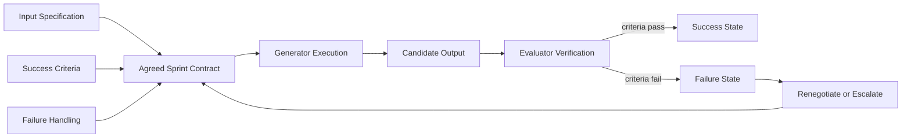
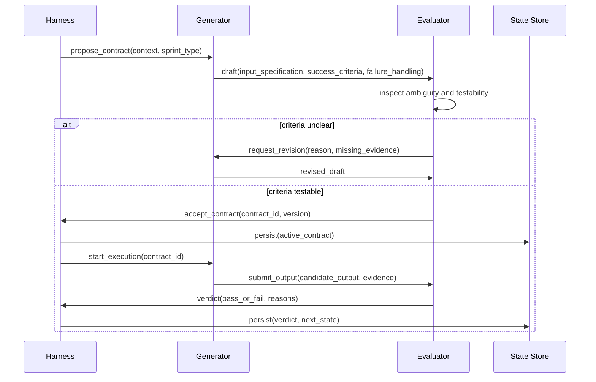
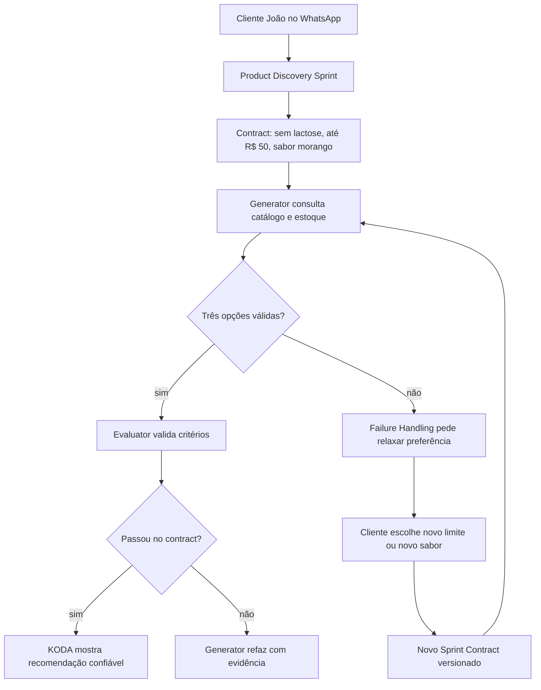

# 🎯 Sprint Contracts: Contratos Testáveis para Agentes de Longa Duração
## Como transformar intenção vaga em acordo explícito, verificável e evolutivo

**Tempo Estimado:** 120 minutos  
**Nível:** Core Concepts - Conceito #4  
**Pré-requisito:** Nível 1 completo, familiaridade com Generator/Evaluator e leitura do panorama de Harness Patterns  
**Status:** 🟢 COMPLETO - Referência conceitual definitiva para Sprint Contracts  
**Data de Criação:** Maio 2026

---

## 📖 Prólogo: O Acordo Que Faltava na Sala do KODA

Fernando entrou na sala antes das nove.

Na tela grande, havia uma conversa de WhatsApp aberta.

O cliente era João Silva, identificado pelo canal `wa_5511987654321`.

João não parecia irritado no começo.

Ele parecia apenas confuso.

A conversa tinha começado como tantas outras conversas do KODA.

João queria um suplemento para voltar a treinar.

Ele tinha intolerância à lactose.

Também tinha limite de orçamento.

Preferia sabor morango.

Não queria cápsulas grandes.

Tinha medo de comprar algo que causasse desconforto.

KODA respondeu bem nos primeiros minutos.

Fez perguntas úteis.

Reconheceu a intolerância.

Consultou o catálogo.

Apresentou opções compatíveis.

Tudo parecia sob controle.

Depois de quarenta minutos, João mudou um detalhe.

Ele não queria mais apenas whey.

Queria entender se BCAA fazia mais sentido para o objetivo dele.

KODA continuou respondendo.

A conversa parecia fluida.

Só que, por baixo da fluidez, a arquitetura estava perdendo forma.

A restrição de lactose ainda estava em algum lugar do contexto.

O orçamento também.

A preferência por morango aparecia em trechos antigos.

A mudança de categoria, de whey para BCAA, estava mais recente.

Nenhuma dessas informações tinha sido esquecida completamente.

O problema era mais sutil.

Elas já não tinham a mesma autoridade.

Para o modelo, tudo era texto.

Para o cliente, algumas frases eram compromisso.

Fernando apontou para uma parte da conversa.

KODA havia dito: "vou recomendar apenas produtos sem lactose e abaixo de R$ 50".

Quarenta minutos depois, KODA recomendou um produto de R$ 60.

Não por malícia.

Não por falta de inteligência.

Não porque o catálogo estava errado.

KODA falhou porque não havia um acordo formal sobre o que aquela etapa da conversa precisava preservar.

A equipe tinha bons prompts.

Tinha um Generator.

Tinha um Evaluator.

Tinha rubricas.

Tinha logs.

Tinha gente competente.

Mesmo assim, a conversa escorregou.

O motivo era estrutural.

O sistema validava outputs, mas não negociava compromisso antes da execução.

Ele corrigia depois, quando o dano já tinha aparecido.

Ele media qualidade, mas não definia com precisão o que a qualidade significava naquela etapa.

Ele tratava uma conversa longa como uma sequência de respostas, quando deveria tratá-la como uma sequência de acordos.

Foi nesse momento que Fernando escreveu no quadro:

```text
Antes de executar, negociar.
Antes de validar, definir.
Antes de continuar, saber o que conta como pronto.
```

Essa é a raiz dos Sprint Contracts.

Um Sprint Contract não é mais um prompt bonito.

Também não é uma checklist solta.

É um acordo explícito entre quem produz e quem avalia.

Ele diz o que entra.

Diz o que precisa sair.

Diz como a falha será tratada.

Diz quando uma mudança de requisito invalida o trabalho atual.

Mais importante, ele dá peso arquitetural a algo que conversas humanas tratam naturalmente, mas agentes perdem com facilidade: compromisso.

No Nível 1, você viu por que agentes perdem o foco.

Eles sofrem com context amnesia.

Eles misturam planejamento e execução.

Eles operam dentro de harnesses fracos.

No Nível 2, você viu como padrões práticos reduzem esse risco.

Generator/Evaluator separa criação de julgamento.

Rubric Design torna avaliação mais objetiva.

Trace Reading permite entender o que aconteceu depois.

Sprint Contracts ocupam um lugar diferente.

Eles não perguntam apenas se o output ficou bom.

Eles perguntam se o trabalho começou com um acordo bom.

Essa diferença muda tudo.

Quando um agente trabalha sem contract, ele interpreta sucesso em tempo real.

Quando trabalha com contract, ele executa contra uma definição compartilhada de sucesso.

Quando um evaluator recebe um output sem contract, ele julga com base em critérios que podem estar implícitos.

Quando recebe um output com contract, ele julga contra um pacto registrado.

Sem contract, a conversa depende de memória e boa vontade.

Com contract, a conversa depende de estrutura.

E estrutura é o que torna long-running agents confiáveis por horas.

---

## 🎯 O Que São Sprint Contracts?

### Definição formal

Um **Sprint Contract** é um acordo explícito, versionado e testável que define a unidade de trabalho de um agente antes da execução.

Ele especifica o input autorizado.

Ele especifica os success criteria.

Ele especifica o failure handling.

Ele define quem propõe.

Define quem valida.

Define quando o sprint pode começar.

Define quando o sprint deve parar.

Define o que acontece quando o mundo muda durante o sprint.

Em termos arquiteturais, um Sprint Contract é a interface entre intenção e execução.

Em termos de coordenação, é o protocolo que alinha Generator e Evaluator antes que tokens sejam gastos.

Em termos de confiabilidade, é a fonte de verdade sobre o significado de "pronto".

Em termos humanos, é a pergunta simples que bons engenheiros fazem antes de começar:

> "Como vamos saber que isso deu certo?"

A resposta precisa ser registrada de forma que outro agente consiga testar.

Se outro agente não consegue testar, ainda é apenas intenção.

Se o Generator não consegue usar para decidir o próximo passo, ainda é apenas documentação.

Se o Evaluator não consegue aprovar ou rejeitar com base nele, ainda é apenas preferência.

Um Sprint Contract se torna real quando orienta decisão durante execução.

### A forma conceitual mínima

Todo Sprint Contract contém três perguntas centrais.

1. O que exatamente entra neste sprint?
2. O que exatamente conta como sucesso?
3. O que exatamente acontece se não houver sucesso?

Essas perguntas parecem simples.

A dificuldade está em transformar respostas humanas vagas em critérios computáveis.

"Recomende algo bom" não é contract.

"Recomende três produtos em estoque, sem lactose, abaixo de R$ 50, com justificativa ligada ao objetivo do cliente" começa a ser contract.

"Se menos de três produtos forem encontrados, explique a limitação e peça ao cliente para relaxar orçamento ou preferência de sabor" fecha o contract.

A diferença não é estética.

A diferença é operacional.

No primeiro caso, o agente precisa adivinhar.

No segundo, o agente precisa cumprir.

### Os 3 pilares fundamentais

#### Pilar 1: Input Specification

Input Specification define o material legítimo de trabalho.

Ele responde: "com quais dados o sprint pode operar?"

Para KODA, isso inclui mensagem do cliente, preferências persistidas, catálogo, estoque, regras comerciais e estado da conversa.

Também inclui limites.

O sprint pode usar histórico completo?

Pode consultar dados externos?

Pode inferir alergia a partir de conversa antiga?

Pode ignorar uma preferência porque parece pouco relevante?

Input Specification reduz ambiguidade antes que ela vire erro.

Ele separa contexto disponível de contexto autorizado.

Essa diferença é crítica.

Um agente pode ter acesso a muitas informações.

Nem todas devem influenciar a decisão atual.

Por exemplo, João comprou whey de chocolate no mês passado.

Hoje ele diz que prefere morango.

O histórico está disponível.

A preferência atual deve ter maior autoridade.

Um bom Input Specification define essa prioridade.

Ele não só lista dados.

Ele declara precedência.

Ele declara frescor.

Ele declara limites de interpretação.

Ele declara o que deve ser ignorado.

#### Pilar 2: Success Criteria

Success Criteria define o significado verificável de sucesso.

Ele responde: "o que precisa ser verdadeiro no fim do sprint?"

O termo importante é verificável.

Um critério como "a resposta deve ser boa" não ajuda.

Um critério como "toda recomendação deve respeitar lactose intolerance, allergy constraints e budget limit" ajuda.

Um critério como "a explicação deve conectar cada produto a pelo menos uma necessidade declarada do cliente" ajuda mais.

Success Criteria não precisam ser todos binários.

Podem incluir thresholds.

Podem incluir ranking.

Podem incluir julgamento qualitativo do Evaluator.

Mas precisam ter forma suficiente para reprovar um output ruim.

Se um critério nunca reprova nada, ele não é critério.

É decoração.

Success Criteria também definem quando parar.

Agentes longos tendem a continuar pesquisando.

Ou param cedo demais.

Um contract bem desenhado declara a condição de parada.

Exemplo: "pare quando encontrar três opções válidas ou quando todas as categorias permitidas tiverem sido examinadas".

Isso protege tokens.

Protege latência.

Protege consistência.

#### Pilar 3: Failure Handling

Failure Handling define a resposta arquitetural ao desvio.

Ele responde: "o que acontece quando o sprint não consegue cumprir o contract?"

Sem Failure Handling, falha vira improviso.

O agente pede desculpas.

Tenta de novo.

Muda os critérios sem avisar.

Esconde a lacuna.

Ou entrega algo ruim com confiança.

Com Failure Handling, a falha vira estado conhecido.

Ela pode ser renegotiated.

Pode abrir um novo sprint.

Pode pedir input ao cliente.

Pode escalar para humano.

Pode gerar audit log.

Pode bloquear checkout.

Failure Handling é onde a arquitetura mostra maturidade.

Sistemas frágeis tentam parecer certos.

Sistemas confiáveis sabem falhar de forma explícita.

### Analogia 1: contratos legais

Um contrato legal não existe porque as pessoas esperam brigar.

Ele existe porque pessoas sérias sabem que memória e expectativa mudam.

O contrato registra obrigações.

Registra escopo.

Registra exceções.

Registra consequências.

Quando há conflito, todos voltam ao texto acordado.

Sprint Contracts fazem isso para agentes.

O Generator pode dizer: "eu cumpri o que foi pedido".

O Evaluator pode responder: "não, o critério três não passou".

Ambos não discutem sensação.

Discutem cláusula.

Essa mudança reduz conflito improdutivo.

### Analogia 2: especificações de construção

Ninguém manda construir uma ponte com a frase "faça uma ponte boa".

Há carga máxima.

Há material.

Há tolerância.

Há inspeção.

Há norma.

Há aceite.

A ponte não fica boa porque o engenheiro é inspirado.

Ela fica segura porque há especificação e verificação.

Um agente que processa checkout também precisa de especificação.

Ele lida com pagamento.

Endereço.

Estoque.

Frete.

Consentimento do cliente.

Uma falha pequena pode virar cobrança duplicada ou venda errada.

Sprint Contracts trazem mentalidade de engenharia civil para workflows de IA.

### Analogia 3: software API contracts

Uma API contract define entradas, saídas, erros e invariantes.

Clientes da API não precisam conhecer a implementação.

Eles precisam confiar que o contrato será respeitado.

Sprint Contracts aplicam a mesma ideia a agentes.

O Evaluator não precisa saber cada pensamento do Generator.

Ele precisa saber qual contract governa a execução.

O harness não precisa confiar no humor do modelo.

Ele precisa validar a interface.

Essa analogia também explica versioning.

Quando a API muda, consumidores precisam saber.

Quando um Sprint Contract muda, Generator, Evaluator, tests e audit logs precisam entender a versão.

### Por que negociação antes de execução muda tudo

Negociação antes de execução altera o custo da ambiguidade.

Sem negociação, ambiguidade aparece tarde.

Ela aparece quando o output já foi gerado.

Aparece quando tokens já foram gastos.

Aparece quando o cliente já recebeu uma resposta confusa.

Aparece quando o Evaluator reprova algo que o Generator achava correto.

Com negociação, ambiguidade aparece cedo.

Ela aparece antes do sprint.

Aparece enquanto o custo de corrigir ainda é baixo.

Aparece quando o Generator pode ajustar plano.

Aparece quando o Evaluator pode declarar critérios.

Essa inversão é a grande força dos Sprint Contracts.

Eles não tornam agentes infalíveis.

Eles tornam falhas mais baratas, mais visíveis e mais controláveis.

### O que Sprint Contracts não são

Um Sprint Contract não é uma rubrica genérica.

A rubrica pode avaliar qualidade em muitos casos.

O contract governa uma unidade concreta de trabalho.

Um Sprint Contract não é apenas um prompt maior.

Prompt fala com o modelo.

Contract fala com o sistema.

Um Sprint Contract não é um plano completo de projeto.

Ele é menor.

Ele governa um sprint específico.

Um Sprint Contract não é burocracia.

Burocracia adiciona etapas sem reduzir risco.

Contract adiciona estrutura para reduzir erro, custo e retrabalho.

### A teoria por trás do padrão

Sprint Contracts funcionam por quatro motivos teóricos.

Primeiro, eles reduzem espaço de busca.

O Generator não precisa explorar todas as respostas possíveis.

Ele explora apenas respostas compatíveis com o contract.

Segundo, eles alinham incentivos.

O Generator sabe que será avaliado contra critérios explícitos.

O Evaluator sabe que não deve inventar critérios depois.

Terceiro, eles criam common knowledge.

Na teoria de jogos, common knowledge é aquilo que todos sabem, todos sabem que todos sabem, e todos sabem que todos sabem que todos sabem.

Um contract registrado cria common knowledge entre agentes.

Quarto, eles transformam falha em transição de estado.

Sem contract, falha é discussão.

Com contract, falha é evento.

Evento pode ser registrado.

Pode ser medido.

Pode ser melhorado.

### A regra de ouro

Se uma unidade de trabalho pode causar dano quando interpretada de duas formas diferentes, ela merece um Sprint Contract.

Isso vale para recomendação de produto.

Vale para checkout.

Vale para atendimento.

Vale para fulfillment.

Vale para handoff humano.

Vale para qualquer parte do KODA onde o cliente espera continuidade.

### Atlas conceitual de Sprint Contracts

Esta seção aprofunda o conceito por ângulos curtos e independentes.
Ela serve como referência de leitura, revisão e discussão em equipe.
Cada bloco descreve uma decisão arquitetural que aparece quando contracts saem do papel e entram no KODA.

#### Nota 001: Escopo em contracts reais

- Situação: em KODA, escopo claro impede que Product Discovery vire Checkout sem perceber.
- Decisão de contract: declarar essa regra antes do Generator gastar tokens.
- Efeito esperado: o agente sabe quando continuar e quando abrir novo sprint.
- Pergunta de revisão: o Evaluator conseguiria testar essa regra sem pedir contexto extra?
- Sinal de maturidade: a regra aparece no contract, no state store e no audit log.
- Risco se ignorar: o agente pode parecer útil enquanto viola uma promessa importante.

#### Nota 002: Autoridade do dado em contracts reais

- Situação: em KODA, mensagem atual de João deve ter precedência sobre preferência antiga quando houver conflito.
- Decisão de contract: declarar essa regra antes do Generator gastar tokens.
- Efeito esperado: o contract evita que memória persistida atropele intenção recente.
- Pergunta de revisão: o Evaluator conseguiria testar essa regra sem pedir contexto extra?
- Sinal de maturidade: a regra aparece no contract, no state store e no audit log.
- Risco se ignorar: o agente pode parecer útil enquanto viola uma promessa importante.

#### Nota 003: Critério testável em contracts reais

- Situação: em KODA, um Evaluator precisa reprovar com evidência, não com sensação.
- Decisão de contract: declarar essa regra antes do Generator gastar tokens.
- Efeito esperado: o time reduz discussão subjetiva depois da falha.
- Pergunta de revisão: o Evaluator conseguiria testar essa regra sem pedir contexto extra?
- Sinal de maturidade: a regra aparece no contract, no state store e no audit log.
- Risco se ignorar: o agente pode parecer útil enquanto viola uma promessa importante.

#### Nota 004: Falha honesta em contracts reais

- Situação: em KODA, quando não há produto compatível, KODA deve dizer isso com clareza.
- Decisão de contract: declarar essa regra antes do Generator gastar tokens.
- Efeito esperado: confiança cresce porque o sistema não finge certeza.
- Pergunta de revisão: o Evaluator conseguiria testar essa regra sem pedir contexto extra?
- Sinal de maturidade: a regra aparece no contract, no state store e no audit log.
- Risco se ignorar: o agente pode parecer útil enquanto viola uma promessa importante.

#### Nota 005: Renegociação em contracts reais

- Situação: em KODA, mudança de whey para BCAA altera o espaço de solução.
- Decisão de contract: declarar essa regra antes do Generator gastar tokens.
- Efeito esperado: novo contract impede que critérios antigos contaminem decisão nova.
- Pergunta de revisão: o Evaluator conseguiria testar essa regra sem pedir contexto extra?
- Sinal de maturidade: a regra aparece no contract, no state store e no audit log.
- Risco se ignorar: o agente pode parecer útil enquanto viola uma promessa importante.

#### Nota 006: Budget em contracts reais

- Situação: em KODA, limite de R$ 50 não é sugestão se foi declarado como restrição.
- Decisão de contract: declarar essa regra antes do Generator gastar tokens.
- Efeito esperado: o contract impede recomendação acima do combinado.
- Pergunta de revisão: o Evaluator conseguiria testar essa regra sem pedir contexto extra?
- Sinal de maturidade: a regra aparece no contract, no state store e no audit log.
- Risco se ignorar: o agente pode parecer útil enquanto viola uma promessa importante.

#### Nota 007: Segurança em contracts reais

- Situação: em KODA, lactose intolerance deve vencer preferência de sabor.
- Decisão de contract: declarar essa regra antes do Generator gastar tokens.
- Efeito esperado: o sistema protege o cliente antes de otimizar satisfação.
- Pergunta de revisão: o Evaluator conseguiria testar essa regra sem pedir contexto extra?
- Sinal de maturidade: a regra aparece no contract, no state store e no audit log.
- Risco se ignorar: o agente pode parecer útil enquanto viola uma promessa importante.

#### Nota 008: Evidência em contracts reais

- Situação: em KODA, cada recomendação precisa trazer produto, preço, estoque e motivo.
- Decisão de contract: declarar essa regra antes do Generator gastar tokens.
- Efeito esperado: o Evaluator consegue verificar sem adivinhar.
- Pergunta de revisão: o Evaluator conseguiria testar essa regra sem pedir contexto extra?
- Sinal de maturidade: a regra aparece no contract, no state store e no audit log.
- Risco se ignorar: o agente pode parecer útil enquanto viola uma promessa importante.

#### Nota 009: Estado em contracts reais

- Situação: em KODA, contract ativo precisa sobreviver a compaction e restart.
- Decisão de contract: declarar essa regra antes do Generator gastar tokens.
- Efeito esperado: long-running agents dependem de memória fora do prompt.
- Pergunta de revisão: o Evaluator conseguiria testar essa regra sem pedir contexto extra?
- Sinal de maturidade: a regra aparece no contract, no state store e no audit log.
- Risco se ignorar: o agente pode parecer útil enquanto viola uma promessa importante.

#### Nota 010: Auditabilidade em contracts reais

- Situação: em KODA, cada verdict deve registrar cláusula aprovada ou reprovada.
- Decisão de contract: declarar essa regra antes do Generator gastar tokens.
- Efeito esperado: trace reading fica mais rápido e menos opinativo.
- Pergunta de revisão: o Evaluator conseguiria testar essa regra sem pedir contexto extra?
- Sinal de maturidade: a regra aparece no contract, no state store e no audit log.
- Risco se ignorar: o agente pode parecer útil enquanto viola uma promessa importante.

#### Nota 011: Versioning em contracts reais

- Situação: em KODA, mudanças em criteria precisam preservar histórico.
- Decisão de contract: declarar essa regra antes do Generator gastar tokens.
- Efeito esperado: métricas antigas continuam interpretáveis.
- Pergunta de revisão: o Evaluator conseguiria testar essa regra sem pedir contexto extra?
- Sinal de maturidade: a regra aparece no contract, no state store e no audit log.
- Risco se ignorar: o agente pode parecer útil enquanto viola uma promessa importante.

#### Nota 012: Retry em contracts reais

- Situação: em KODA, retry só faz sentido quando o contract continua válido.
- Decisão de contract: declarar essa regra antes do Generator gastar tokens.
- Efeito esperado: o sistema evita repetir execução contra premissa quebrada.
- Pergunta de revisão: o Evaluator conseguiria testar essa regra sem pedir contexto extra?
- Sinal de maturidade: a regra aparece no contract, no state store e no audit log.
- Risco se ignorar: o agente pode parecer útil enquanto viola uma promessa importante.

#### Nota 013: Escala em contracts reais

- Situação: em KODA, multi-agent handoff precisa carregar contract, não apenas resumo.
- Decisão de contract: declarar essa regra antes do Generator gastar tokens.
- Efeito esperado: agentes diferentes compartilham a mesma promessa.
- Pergunta de revisão: o Evaluator conseguiria testar essa regra sem pedir contexto extra?
- Sinal de maturidade: a regra aparece no contract, no state store e no audit log.
- Risco se ignorar: o agente pode parecer útil enquanto viola uma promessa importante.

#### Nota 014: Custo em contracts reais

- Situação: em KODA, contract reduz tokens ao limitar fontes e tentativas.
- Decisão de contract: declarar essa regra antes do Generator gastar tokens.
- Efeito esperado: o investimento inicial retorna em menos retrabalho.
- Pergunta de revisão: o Evaluator conseguiria testar essa regra sem pedir contexto extra?
- Sinal de maturidade: a regra aparece no contract, no state store e no audit log.
- Risco se ignorar: o agente pode parecer útil enquanto viola uma promessa importante.

#### Nota 015: Latência em contracts reais

- Situação: em KODA, negociação curta antes evita loops longos depois.
- Decisão de contract: declarar essa regra antes do Generator gastar tokens.
- Efeito esperado: cliente recebe resposta mais confiável.
- Pergunta de revisão: o Evaluator conseguiria testar essa regra sem pedir contexto extra?
- Sinal de maturidade: a regra aparece no contract, no state store e no audit log.
- Risco se ignorar: o agente pode parecer útil enquanto viola uma promessa importante.

#### Nota 016: Produto em contracts reais

- Situação: em KODA, feature crítica merece contract antes de polish de prompt.
- Decisão de contract: declarar essa regra antes do Generator gastar tokens.
- Efeito esperado: arquitetura protege o valor principal.
- Pergunta de revisão: o Evaluator conseguiria testar essa regra sem pedir contexto extra?
- Sinal de maturidade: a regra aparece no contract, no state store e no audit log.
- Risco se ignorar: o agente pode parecer útil enquanto viola uma promessa importante.

#### Nota 017: Observabilidade em contracts reais

- Situação: em KODA, contract dá nomes aos eventos.
- Decisão de contract: declarar essa regra antes do Generator gastar tokens.
- Efeito esperado: dashboards podem mostrar falha por critério.
- Pergunta de revisão: o Evaluator conseguiria testar essa regra sem pedir contexto extra?
- Sinal de maturidade: a regra aparece no contract, no state store e no audit log.
- Risco se ignorar: o agente pode parecer útil enquanto viola uma promessa importante.

#### Nota 018: Operação em contracts reais

- Situação: em KODA, support humano precisa ver o contract ativo.
- Decisão de contract: declarar essa regra antes do Generator gastar tokens.
- Efeito esperado: handoff humano começa com contexto confiável.
- Pergunta de revisão: o Evaluator conseguiria testar essa regra sem pedir contexto extra?
- Sinal de maturidade: a regra aparece no contract, no state store e no audit log.
- Risco se ignorar: o agente pode parecer útil enquanto viola uma promessa importante.

#### Nota 019: Aprendizado em contracts reais

- Situação: em KODA, contracts rejeitados revelam onde a feature é ambígua.
- Decisão de contract: declarar essa regra antes do Generator gastar tokens.
- Efeito esperado: o time melhora design de produto.
- Pergunta de revisão: o Evaluator conseguiria testar essa regra sem pedir contexto extra?
- Sinal de maturidade: a regra aparece no contract, no state store e no audit log.
- Risco se ignorar: o agente pode parecer útil enquanto viola uma promessa importante.

#### Nota 020: Disciplina em contracts reais

- Situação: em KODA, não se deve relaxar critério em silêncio.
- Decisão de contract: declarar essa regra antes do Generator gastar tokens.
- Efeito esperado: qualquer exceção vira renegotiation registrada.
- Pergunta de revisão: o Evaluator conseguiria testar essa regra sem pedir contexto extra?
- Sinal de maturidade: a regra aparece no contract, no state store e no audit log.
- Risco se ignorar: o agente pode parecer útil enquanto viola uma promessa importante.

#### Nota 021: Escopo em contracts reais

- Situação: em KODA, escopo claro impede que Product Discovery vire Checkout sem perceber.
- Decisão de contract: declarar essa regra antes do Generator gastar tokens.
- Efeito esperado: o agente sabe quando continuar e quando abrir novo sprint.
- Pergunta de revisão: o Evaluator conseguiria testar essa regra sem pedir contexto extra?
- Sinal de maturidade: a regra aparece no contract, no state store e no audit log.
- Risco se ignorar: o agente pode parecer útil enquanto viola uma promessa importante.

#### Nota 022: Autoridade do dado em contracts reais

- Situação: em KODA, mensagem atual de João deve ter precedência sobre preferência antiga quando houver conflito.
- Decisão de contract: declarar essa regra antes do Generator gastar tokens.
- Efeito esperado: o contract evita que memória persistida atropele intenção recente.
- Pergunta de revisão: o Evaluator conseguiria testar essa regra sem pedir contexto extra?
- Sinal de maturidade: a regra aparece no contract, no state store e no audit log.
- Risco se ignorar: o agente pode parecer útil enquanto viola uma promessa importante.

#### Nota 023: Critério testável em contracts reais

- Situação: em KODA, um Evaluator precisa reprovar com evidência, não com sensação.
- Decisão de contract: declarar essa regra antes do Generator gastar tokens.
- Efeito esperado: o time reduz discussão subjetiva depois da falha.
- Pergunta de revisão: o Evaluator conseguiria testar essa regra sem pedir contexto extra?
- Sinal de maturidade: a regra aparece no contract, no state store e no audit log.
- Risco se ignorar: o agente pode parecer útil enquanto viola uma promessa importante.

#### Nota 024: Falha honesta em contracts reais

- Situação: em KODA, quando não há produto compatível, KODA deve dizer isso com clareza.
- Decisão de contract: declarar essa regra antes do Generator gastar tokens.
- Efeito esperado: confiança cresce porque o sistema não finge certeza.
- Pergunta de revisão: o Evaluator conseguiria testar essa regra sem pedir contexto extra?
- Sinal de maturidade: a regra aparece no contract, no state store e no audit log.
- Risco se ignorar: o agente pode parecer útil enquanto viola uma promessa importante.

#### Nota 025: Renegociação em contracts reais

- Situação: em KODA, mudança de whey para BCAA altera o espaço de solução.
- Decisão de contract: declarar essa regra antes do Generator gastar tokens.
- Efeito esperado: novo contract impede que critérios antigos contaminem decisão nova.
- Pergunta de revisão: o Evaluator conseguiria testar essa regra sem pedir contexto extra?
- Sinal de maturidade: a regra aparece no contract, no state store e no audit log.
- Risco se ignorar: o agente pode parecer útil enquanto viola uma promessa importante.

#### Nota 026: Budget em contracts reais

- Situação: em KODA, limite de R$ 50 não é sugestão se foi declarado como restrição.
- Decisão de contract: declarar essa regra antes do Generator gastar tokens.
- Efeito esperado: o contract impede recomendação acima do combinado.
- Pergunta de revisão: o Evaluator conseguiria testar essa regra sem pedir contexto extra?
- Sinal de maturidade: a regra aparece no contract, no state store e no audit log.
- Risco se ignorar: o agente pode parecer útil enquanto viola uma promessa importante.

#### Nota 027: Segurança em contracts reais

- Situação: em KODA, lactose intolerance deve vencer preferência de sabor.
- Decisão de contract: declarar essa regra antes do Generator gastar tokens.
- Efeito esperado: o sistema protege o cliente antes de otimizar satisfação.
- Pergunta de revisão: o Evaluator conseguiria testar essa regra sem pedir contexto extra?
- Sinal de maturidade: a regra aparece no contract, no state store e no audit log.
- Risco se ignorar: o agente pode parecer útil enquanto viola uma promessa importante.

#### Nota 028: Evidência em contracts reais

- Situação: em KODA, cada recomendação precisa trazer produto, preço, estoque e motivo.
- Decisão de contract: declarar essa regra antes do Generator gastar tokens.
- Efeito esperado: o Evaluator consegue verificar sem adivinhar.
- Pergunta de revisão: o Evaluator conseguiria testar essa regra sem pedir contexto extra?
- Sinal de maturidade: a regra aparece no contract, no state store e no audit log.
- Risco se ignorar: o agente pode parecer útil enquanto viola uma promessa importante.

#### Nota 029: Estado em contracts reais

- Situação: em KODA, contract ativo precisa sobreviver a compaction e restart.
- Decisão de contract: declarar essa regra antes do Generator gastar tokens.
- Efeito esperado: long-running agents dependem de memória fora do prompt.
- Pergunta de revisão: o Evaluator conseguiria testar essa regra sem pedir contexto extra?
- Sinal de maturidade: a regra aparece no contract, no state store e no audit log.
- Risco se ignorar: o agente pode parecer útil enquanto viola uma promessa importante.

#### Nota 030: Auditabilidade em contracts reais

- Situação: em KODA, cada verdict deve registrar cláusula aprovada ou reprovada.
- Decisão de contract: declarar essa regra antes do Generator gastar tokens.
- Efeito esperado: trace reading fica mais rápido e menos opinativo.
- Pergunta de revisão: o Evaluator conseguiria testar essa regra sem pedir contexto extra?
- Sinal de maturidade: a regra aparece no contract, no state store e no audit log.
- Risco se ignorar: o agente pode parecer útil enquanto viola uma promessa importante.

#### Nota 031: Versioning em contracts reais

- Situação: em KODA, mudanças em criteria precisam preservar histórico.
- Decisão de contract: declarar essa regra antes do Generator gastar tokens.
- Efeito esperado: métricas antigas continuam interpretáveis.
- Pergunta de revisão: o Evaluator conseguiria testar essa regra sem pedir contexto extra?
- Sinal de maturidade: a regra aparece no contract, no state store e no audit log.
- Risco se ignorar: o agente pode parecer útil enquanto viola uma promessa importante.

#### Nota 032: Retry em contracts reais

- Situação: em KODA, retry só faz sentido quando o contract continua válido.
- Decisão de contract: declarar essa regra antes do Generator gastar tokens.
- Efeito esperado: o sistema evita repetir execução contra premissa quebrada.
- Pergunta de revisão: o Evaluator conseguiria testar essa regra sem pedir contexto extra?
- Sinal de maturidade: a regra aparece no contract, no state store e no audit log.
- Risco se ignorar: o agente pode parecer útil enquanto viola uma promessa importante.

#### Nota 033: Escala em contracts reais

- Situação: em KODA, multi-agent handoff precisa carregar contract, não apenas resumo.
- Decisão de contract: declarar essa regra antes do Generator gastar tokens.
- Efeito esperado: agentes diferentes compartilham a mesma promessa.
- Pergunta de revisão: o Evaluator conseguiria testar essa regra sem pedir contexto extra?
- Sinal de maturidade: a regra aparece no contract, no state store e no audit log.
- Risco se ignorar: o agente pode parecer útil enquanto viola uma promessa importante.

#### Nota 034: Custo em contracts reais

- Situação: em KODA, contract reduz tokens ao limitar fontes e tentativas.
- Decisão de contract: declarar essa regra antes do Generator gastar tokens.
- Efeito esperado: o investimento inicial retorna em menos retrabalho.
- Pergunta de revisão: o Evaluator conseguiria testar essa regra sem pedir contexto extra?
- Sinal de maturidade: a regra aparece no contract, no state store e no audit log.
- Risco se ignorar: o agente pode parecer útil enquanto viola uma promessa importante.

#### Nota 035: Latência em contracts reais

- Situação: em KODA, negociação curta antes evita loops longos depois.
- Decisão de contract: declarar essa regra antes do Generator gastar tokens.
- Efeito esperado: cliente recebe resposta mais confiável.
- Pergunta de revisão: o Evaluator conseguiria testar essa regra sem pedir contexto extra?
- Sinal de maturidade: a regra aparece no contract, no state store e no audit log.
- Risco se ignorar: o agente pode parecer útil enquanto viola uma promessa importante.

#### Nota 036: Produto em contracts reais

- Situação: em KODA, feature crítica merece contract antes de polish de prompt.
- Decisão de contract: declarar essa regra antes do Generator gastar tokens.
- Efeito esperado: arquitetura protege o valor principal.
- Pergunta de revisão: o Evaluator conseguiria testar essa regra sem pedir contexto extra?
- Sinal de maturidade: a regra aparece no contract, no state store e no audit log.
- Risco se ignorar: o agente pode parecer útil enquanto viola uma promessa importante.

#### Nota 037: Observabilidade em contracts reais

- Situação: em KODA, contract dá nomes aos eventos.
- Decisão de contract: declarar essa regra antes do Generator gastar tokens.
- Efeito esperado: dashboards podem mostrar falha por critério.
- Pergunta de revisão: o Evaluator conseguiria testar essa regra sem pedir contexto extra?
- Sinal de maturidade: a regra aparece no contract, no state store e no audit log.
- Risco se ignorar: o agente pode parecer útil enquanto viola uma promessa importante.

#### Nota 038: Operação em contracts reais

- Situação: em KODA, support humano precisa ver o contract ativo.
- Decisão de contract: declarar essa regra antes do Generator gastar tokens.
- Efeito esperado: handoff humano começa com contexto confiável.
- Pergunta de revisão: o Evaluator conseguiria testar essa regra sem pedir contexto extra?
- Sinal de maturidade: a regra aparece no contract, no state store e no audit log.
- Risco se ignorar: o agente pode parecer útil enquanto viola uma promessa importante.

#### Nota 039: Aprendizado em contracts reais

- Situação: em KODA, contracts rejeitados revelam onde a feature é ambígua.
- Decisão de contract: declarar essa regra antes do Generator gastar tokens.
- Efeito esperado: o time melhora design de produto.
- Pergunta de revisão: o Evaluator conseguiria testar essa regra sem pedir contexto extra?
- Sinal de maturidade: a regra aparece no contract, no state store e no audit log.
- Risco se ignorar: o agente pode parecer útil enquanto viola uma promessa importante.

#### Nota 040: Disciplina em contracts reais

- Situação: em KODA, não se deve relaxar critério em silêncio.
- Decisão de contract: declarar essa regra antes do Generator gastar tokens.
- Efeito esperado: qualquer exceção vira renegotiation registrada.
- Pergunta de revisão: o Evaluator conseguiria testar essa regra sem pedir contexto extra?
- Sinal de maturidade: a regra aparece no contract, no state store e no audit log.
- Risco se ignorar: o agente pode parecer útil enquanto viola uma promessa importante.

#### Nota 041: Escopo em contracts reais

- Situação: em KODA, escopo claro impede que Product Discovery vire Checkout sem perceber.
- Decisão de contract: declarar essa regra antes do Generator gastar tokens.
- Efeito esperado: o agente sabe quando continuar e quando abrir novo sprint.
- Pergunta de revisão: o Evaluator conseguiria testar essa regra sem pedir contexto extra?
- Sinal de maturidade: a regra aparece no contract, no state store e no audit log.
- Risco se ignorar: o agente pode parecer útil enquanto viola uma promessa importante.

#### Nota 042: Autoridade do dado em contracts reais

- Situação: em KODA, mensagem atual de João deve ter precedência sobre preferência antiga quando houver conflito.
- Decisão de contract: declarar essa regra antes do Generator gastar tokens.
- Efeito esperado: o contract evita que memória persistida atropele intenção recente.
- Pergunta de revisão: o Evaluator conseguiria testar essa regra sem pedir contexto extra?
- Sinal de maturidade: a regra aparece no contract, no state store e no audit log.
- Risco se ignorar: o agente pode parecer útil enquanto viola uma promessa importante.

#### Nota 043: Critério testável em contracts reais

- Situação: em KODA, um Evaluator precisa reprovar com evidência, não com sensação.
- Decisão de contract: declarar essa regra antes do Generator gastar tokens.
- Efeito esperado: o time reduz discussão subjetiva depois da falha.
- Pergunta de revisão: o Evaluator conseguiria testar essa regra sem pedir contexto extra?
- Sinal de maturidade: a regra aparece no contract, no state store e no audit log.
- Risco se ignorar: o agente pode parecer útil enquanto viola uma promessa importante.

#### Nota 044: Falha honesta em contracts reais

- Situação: em KODA, quando não há produto compatível, KODA deve dizer isso com clareza.
- Decisão de contract: declarar essa regra antes do Generator gastar tokens.
- Efeito esperado: confiança cresce porque o sistema não finge certeza.
- Pergunta de revisão: o Evaluator conseguiria testar essa regra sem pedir contexto extra?
- Sinal de maturidade: a regra aparece no contract, no state store e no audit log.
- Risco se ignorar: o agente pode parecer útil enquanto viola uma promessa importante.

#### Nota 045: Renegociação em contracts reais

- Situação: em KODA, mudança de whey para BCAA altera o espaço de solução.
- Decisão de contract: declarar essa regra antes do Generator gastar tokens.
- Efeito esperado: novo contract impede que critérios antigos contaminem decisão nova.
- Pergunta de revisão: o Evaluator conseguiria testar essa regra sem pedir contexto extra?
- Sinal de maturidade: a regra aparece no contract, no state store e no audit log.
- Risco se ignorar: o agente pode parecer útil enquanto viola uma promessa importante.

#### Nota 046: Budget em contracts reais

- Situação: em KODA, limite de R$ 50 não é sugestão se foi declarado como restrição.
- Decisão de contract: declarar essa regra antes do Generator gastar tokens.
- Efeito esperado: o contract impede recomendação acima do combinado.
- Pergunta de revisão: o Evaluator conseguiria testar essa regra sem pedir contexto extra?
- Sinal de maturidade: a regra aparece no contract, no state store e no audit log.
- Risco se ignorar: o agente pode parecer útil enquanto viola uma promessa importante.

#### Nota 047: Segurança em contracts reais

- Situação: em KODA, lactose intolerance deve vencer preferência de sabor.
- Decisão de contract: declarar essa regra antes do Generator gastar tokens.
- Efeito esperado: o sistema protege o cliente antes de otimizar satisfação.
- Pergunta de revisão: o Evaluator conseguiria testar essa regra sem pedir contexto extra?
- Sinal de maturidade: a regra aparece no contract, no state store e no audit log.
- Risco se ignorar: o agente pode parecer útil enquanto viola uma promessa importante.

#### Nota 048: Evidência em contracts reais

- Situação: em KODA, cada recomendação precisa trazer produto, preço, estoque e motivo.
- Decisão de contract: declarar essa regra antes do Generator gastar tokens.
- Efeito esperado: o Evaluator consegue verificar sem adivinhar.
- Pergunta de revisão: o Evaluator conseguiria testar essa regra sem pedir contexto extra?
- Sinal de maturidade: a regra aparece no contract, no state store e no audit log.
- Risco se ignorar: o agente pode parecer útil enquanto viola uma promessa importante.

#### Nota 049: Estado em contracts reais

- Situação: em KODA, contract ativo precisa sobreviver a compaction e restart.
- Decisão de contract: declarar essa regra antes do Generator gastar tokens.
- Efeito esperado: long-running agents dependem de memória fora do prompt.
- Pergunta de revisão: o Evaluator conseguiria testar essa regra sem pedir contexto extra?
- Sinal de maturidade: a regra aparece no contract, no state store e no audit log.
- Risco se ignorar: o agente pode parecer útil enquanto viola uma promessa importante.

#### Nota 050: Auditabilidade em contracts reais

- Situação: em KODA, cada verdict deve registrar cláusula aprovada ou reprovada.
- Decisão de contract: declarar essa regra antes do Generator gastar tokens.
- Efeito esperado: trace reading fica mais rápido e menos opinativo.
- Pergunta de revisão: o Evaluator conseguiria testar essa regra sem pedir contexto extra?
- Sinal de maturidade: a regra aparece no contract, no state store e no audit log.
- Risco se ignorar: o agente pode parecer útil enquanto viola uma promessa importante.

#### Nota 051: Versioning em contracts reais

- Situação: em KODA, mudanças em criteria precisam preservar histórico.
- Decisão de contract: declarar essa regra antes do Generator gastar tokens.
- Efeito esperado: métricas antigas continuam interpretáveis.
- Pergunta de revisão: o Evaluator conseguiria testar essa regra sem pedir contexto extra?
- Sinal de maturidade: a regra aparece no contract, no state store e no audit log.
- Risco se ignorar: o agente pode parecer útil enquanto viola uma promessa importante.

#### Nota 052: Retry em contracts reais

- Situação: em KODA, retry só faz sentido quando o contract continua válido.
- Decisão de contract: declarar essa regra antes do Generator gastar tokens.
- Efeito esperado: o sistema evita repetir execução contra premissa quebrada.
- Pergunta de revisão: o Evaluator conseguiria testar essa regra sem pedir contexto extra?
- Sinal de maturidade: a regra aparece no contract, no state store e no audit log.
- Risco se ignorar: o agente pode parecer útil enquanto viola uma promessa importante.

#### Nota 053: Escala em contracts reais

- Situação: em KODA, multi-agent handoff precisa carregar contract, não apenas resumo.
- Decisão de contract: declarar essa regra antes do Generator gastar tokens.
- Efeito esperado: agentes diferentes compartilham a mesma promessa.
- Pergunta de revisão: o Evaluator conseguiria testar essa regra sem pedir contexto extra?
- Sinal de maturidade: a regra aparece no contract, no state store e no audit log.
- Risco se ignorar: o agente pode parecer útil enquanto viola uma promessa importante.

#### Nota 054: Custo em contracts reais

- Situação: em KODA, contract reduz tokens ao limitar fontes e tentativas.
- Decisão de contract: declarar essa regra antes do Generator gastar tokens.
- Efeito esperado: o investimento inicial retorna em menos retrabalho.
- Pergunta de revisão: o Evaluator conseguiria testar essa regra sem pedir contexto extra?
- Sinal de maturidade: a regra aparece no contract, no state store e no audit log.
- Risco se ignorar: o agente pode parecer útil enquanto viola uma promessa importante.

#### Nota 055: Latência em contracts reais

- Situação: em KODA, negociação curta antes evita loops longos depois.
- Decisão de contract: declarar essa regra antes do Generator gastar tokens.
- Efeito esperado: cliente recebe resposta mais confiável.
- Pergunta de revisão: o Evaluator conseguiria testar essa regra sem pedir contexto extra?
- Sinal de maturidade: a regra aparece no contract, no state store e no audit log.
- Risco se ignorar: o agente pode parecer útil enquanto viola uma promessa importante.

#### Nota 056: Produto em contracts reais

- Situação: em KODA, feature crítica merece contract antes de polish de prompt.
- Decisão de contract: declarar essa regra antes do Generator gastar tokens.
- Efeito esperado: arquitetura protege o valor principal.
- Pergunta de revisão: o Evaluator conseguiria testar essa regra sem pedir contexto extra?
- Sinal de maturidade: a regra aparece no contract, no state store e no audit log.
- Risco se ignorar: o agente pode parecer útil enquanto viola uma promessa importante.

#### Nota 057: Observabilidade em contracts reais

- Situação: em KODA, contract dá nomes aos eventos.
- Decisão de contract: declarar essa regra antes do Generator gastar tokens.
- Efeito esperado: dashboards podem mostrar falha por critério.
- Pergunta de revisão: o Evaluator conseguiria testar essa regra sem pedir contexto extra?
- Sinal de maturidade: a regra aparece no contract, no state store e no audit log.
- Risco se ignorar: o agente pode parecer útil enquanto viola uma promessa importante.

#### Nota 058: Operação em contracts reais

- Situação: em KODA, support humano precisa ver o contract ativo.
- Decisão de contract: declarar essa regra antes do Generator gastar tokens.
- Efeito esperado: handoff humano começa com contexto confiável.
- Pergunta de revisão: o Evaluator conseguiria testar essa regra sem pedir contexto extra?
- Sinal de maturidade: a regra aparece no contract, no state store e no audit log.
- Risco se ignorar: o agente pode parecer útil enquanto viola uma promessa importante.

#### Nota 059: Aprendizado em contracts reais

- Situação: em KODA, contracts rejeitados revelam onde a feature é ambígua.
- Decisão de contract: declarar essa regra antes do Generator gastar tokens.
- Efeito esperado: o time melhora design de produto.
- Pergunta de revisão: o Evaluator conseguiria testar essa regra sem pedir contexto extra?
- Sinal de maturidade: a regra aparece no contract, no state store e no audit log.
- Risco se ignorar: o agente pode parecer útil enquanto viola uma promessa importante.

#### Nota 060: Disciplina em contracts reais

- Situação: em KODA, não se deve relaxar critério em silêncio.
- Decisão de contract: declarar essa regra antes do Generator gastar tokens.
- Efeito esperado: qualquer exceção vira renegotiation registrada.
- Pergunta de revisão: o Evaluator conseguiria testar essa regra sem pedir contexto extra?
- Sinal de maturidade: a regra aparece no contract, no state store e no audit log.
- Risco se ignorar: o agente pode parecer útil enquanto viola uma promessa importante.

#### Nota 061: Escopo em contracts reais

- Situação: em KODA, escopo claro impede que Product Discovery vire Checkout sem perceber.
- Decisão de contract: declarar essa regra antes do Generator gastar tokens.
- Efeito esperado: o agente sabe quando continuar e quando abrir novo sprint.
- Pergunta de revisão: o Evaluator conseguiria testar essa regra sem pedir contexto extra?
- Sinal de maturidade: a regra aparece no contract, no state store e no audit log.
- Risco se ignorar: o agente pode parecer útil enquanto viola uma promessa importante.

#### Nota 062: Autoridade do dado em contracts reais

- Situação: em KODA, mensagem atual de João deve ter precedência sobre preferência antiga quando houver conflito.
- Decisão de contract: declarar essa regra antes do Generator gastar tokens.
- Efeito esperado: o contract evita que memória persistida atropele intenção recente.
- Pergunta de revisão: o Evaluator conseguiria testar essa regra sem pedir contexto extra?
- Sinal de maturidade: a regra aparece no contract, no state store e no audit log.
- Risco se ignorar: o agente pode parecer útil enquanto viola uma promessa importante.

#### Nota 063: Critério testável em contracts reais

- Situação: em KODA, um Evaluator precisa reprovar com evidência, não com sensação.
- Decisão de contract: declarar essa regra antes do Generator gastar tokens.
- Efeito esperado: o time reduz discussão subjetiva depois da falha.
- Pergunta de revisão: o Evaluator conseguiria testar essa regra sem pedir contexto extra?
- Sinal de maturidade: a regra aparece no contract, no state store e no audit log.
- Risco se ignorar: o agente pode parecer útil enquanto viola uma promessa importante.

#### Nota 064: Falha honesta em contracts reais

- Situação: em KODA, quando não há produto compatível, KODA deve dizer isso com clareza.
- Decisão de contract: declarar essa regra antes do Generator gastar tokens.
- Efeito esperado: confiança cresce porque o sistema não finge certeza.
- Pergunta de revisão: o Evaluator conseguiria testar essa regra sem pedir contexto extra?
- Sinal de maturidade: a regra aparece no contract, no state store e no audit log.
- Risco se ignorar: o agente pode parecer útil enquanto viola uma promessa importante.

#### Nota 065: Renegociação em contracts reais

- Situação: em KODA, mudança de whey para BCAA altera o espaço de solução.
- Decisão de contract: declarar essa regra antes do Generator gastar tokens.
- Efeito esperado: novo contract impede que critérios antigos contaminem decisão nova.
- Pergunta de revisão: o Evaluator conseguiria testar essa regra sem pedir contexto extra?
- Sinal de maturidade: a regra aparece no contract, no state store e no audit log.
- Risco se ignorar: o agente pode parecer útil enquanto viola uma promessa importante.

#### Nota 066: Budget em contracts reais

- Situação: em KODA, limite de R$ 50 não é sugestão se foi declarado como restrição.
- Decisão de contract: declarar essa regra antes do Generator gastar tokens.
- Efeito esperado: o contract impede recomendação acima do combinado.
- Pergunta de revisão: o Evaluator conseguiria testar essa regra sem pedir contexto extra?
- Sinal de maturidade: a regra aparece no contract, no state store e no audit log.
- Risco se ignorar: o agente pode parecer útil enquanto viola uma promessa importante.

#### Nota 067: Segurança em contracts reais

- Situação: em KODA, lactose intolerance deve vencer preferência de sabor.
- Decisão de contract: declarar essa regra antes do Generator gastar tokens.
- Efeito esperado: o sistema protege o cliente antes de otimizar satisfação.
- Pergunta de revisão: o Evaluator conseguiria testar essa regra sem pedir contexto extra?
- Sinal de maturidade: a regra aparece no contract, no state store e no audit log.
- Risco se ignorar: o agente pode parecer útil enquanto viola uma promessa importante.

#### Nota 068: Evidência em contracts reais

- Situação: em KODA, cada recomendação precisa trazer produto, preço, estoque e motivo.
- Decisão de contract: declarar essa regra antes do Generator gastar tokens.
- Efeito esperado: o Evaluator consegue verificar sem adivinhar.
- Pergunta de revisão: o Evaluator conseguiria testar essa regra sem pedir contexto extra?
- Sinal de maturidade: a regra aparece no contract, no state store e no audit log.
- Risco se ignorar: o agente pode parecer útil enquanto viola uma promessa importante.

#### Nota 069: Estado em contracts reais

- Situação: em KODA, contract ativo precisa sobreviver a compaction e restart.
- Decisão de contract: declarar essa regra antes do Generator gastar tokens.
- Efeito esperado: long-running agents dependem de memória fora do prompt.
- Pergunta de revisão: o Evaluator conseguiria testar essa regra sem pedir contexto extra?
- Sinal de maturidade: a regra aparece no contract, no state store e no audit log.
- Risco se ignorar: o agente pode parecer útil enquanto viola uma promessa importante.

#### Nota 070: Auditabilidade em contracts reais

- Situação: em KODA, cada verdict deve registrar cláusula aprovada ou reprovada.
- Decisão de contract: declarar essa regra antes do Generator gastar tokens.
- Efeito esperado: trace reading fica mais rápido e menos opinativo.
- Pergunta de revisão: o Evaluator conseguiria testar essa regra sem pedir contexto extra?
- Sinal de maturidade: a regra aparece no contract, no state store e no audit log.
- Risco se ignorar: o agente pode parecer útil enquanto viola uma promessa importante.

#### Nota 071: Versioning em contracts reais

- Situação: em KODA, mudanças em criteria precisam preservar histórico.
- Decisão de contract: declarar essa regra antes do Generator gastar tokens.
- Efeito esperado: métricas antigas continuam interpretáveis.
- Pergunta de revisão: o Evaluator conseguiria testar essa regra sem pedir contexto extra?
- Sinal de maturidade: a regra aparece no contract, no state store e no audit log.
- Risco se ignorar: o agente pode parecer útil enquanto viola uma promessa importante.

#### Nota 072: Retry em contracts reais

- Situação: em KODA, retry só faz sentido quando o contract continua válido.
- Decisão de contract: declarar essa regra antes do Generator gastar tokens.
- Efeito esperado: o sistema evita repetir execução contra premissa quebrada.
- Pergunta de revisão: o Evaluator conseguiria testar essa regra sem pedir contexto extra?
- Sinal de maturidade: a regra aparece no contract, no state store e no audit log.
- Risco se ignorar: o agente pode parecer útil enquanto viola uma promessa importante.

#### Nota 073: Escala em contracts reais

- Situação: em KODA, multi-agent handoff precisa carregar contract, não apenas resumo.
- Decisão de contract: declarar essa regra antes do Generator gastar tokens.
- Efeito esperado: agentes diferentes compartilham a mesma promessa.
- Pergunta de revisão: o Evaluator conseguiria testar essa regra sem pedir contexto extra?
- Sinal de maturidade: a regra aparece no contract, no state store e no audit log.
- Risco se ignorar: o agente pode parecer útil enquanto viola uma promessa importante.

#### Nota 074: Custo em contracts reais

- Situação: em KODA, contract reduz tokens ao limitar fontes e tentativas.
- Decisão de contract: declarar essa regra antes do Generator gastar tokens.
- Efeito esperado: o investimento inicial retorna em menos retrabalho.
- Pergunta de revisão: o Evaluator conseguiria testar essa regra sem pedir contexto extra?
- Sinal de maturidade: a regra aparece no contract, no state store e no audit log.
- Risco se ignorar: o agente pode parecer útil enquanto viola uma promessa importante.

#### Nota 075: Latência em contracts reais

- Situação: em KODA, negociação curta antes evita loops longos depois.
- Decisão de contract: declarar essa regra antes do Generator gastar tokens.
- Efeito esperado: cliente recebe resposta mais confiável.
- Pergunta de revisão: o Evaluator conseguiria testar essa regra sem pedir contexto extra?
- Sinal de maturidade: a regra aparece no contract, no state store e no audit log.
- Risco se ignorar: o agente pode parecer útil enquanto viola uma promessa importante.

#### Nota 076: Produto em contracts reais

- Situação: em KODA, feature crítica merece contract antes de polish de prompt.
- Decisão de contract: declarar essa regra antes do Generator gastar tokens.
- Efeito esperado: arquitetura protege o valor principal.
- Pergunta de revisão: o Evaluator conseguiria testar essa regra sem pedir contexto extra?
- Sinal de maturidade: a regra aparece no contract, no state store e no audit log.
- Risco se ignorar: o agente pode parecer útil enquanto viola uma promessa importante.

#### Nota 077: Observabilidade em contracts reais

- Situação: em KODA, contract dá nomes aos eventos.
- Decisão de contract: declarar essa regra antes do Generator gastar tokens.
- Efeito esperado: dashboards podem mostrar falha por critério.
- Pergunta de revisão: o Evaluator conseguiria testar essa regra sem pedir contexto extra?
- Sinal de maturidade: a regra aparece no contract, no state store e no audit log.
- Risco se ignorar: o agente pode parecer útil enquanto viola uma promessa importante.

#### Nota 078: Operação em contracts reais

- Situação: em KODA, support humano precisa ver o contract ativo.
- Decisão de contract: declarar essa regra antes do Generator gastar tokens.
- Efeito esperado: handoff humano começa com contexto confiável.
- Pergunta de revisão: o Evaluator conseguiria testar essa regra sem pedir contexto extra?
- Sinal de maturidade: a regra aparece no contract, no state store e no audit log.
- Risco se ignorar: o agente pode parecer útil enquanto viola uma promessa importante.

#### Nota 079: Aprendizado em contracts reais

- Situação: em KODA, contracts rejeitados revelam onde a feature é ambígua.
- Decisão de contract: declarar essa regra antes do Generator gastar tokens.
- Efeito esperado: o time melhora design de produto.
- Pergunta de revisão: o Evaluator conseguiria testar essa regra sem pedir contexto extra?
- Sinal de maturidade: a regra aparece no contract, no state store e no audit log.
- Risco se ignorar: o agente pode parecer útil enquanto viola uma promessa importante.

#### Nota 080: Disciplina em contracts reais

- Situação: em KODA, não se deve relaxar critério em silêncio.
- Decisão de contract: declarar essa regra antes do Generator gastar tokens.
- Efeito esperado: qualquer exceção vira renegotiation registrada.
- Pergunta de revisão: o Evaluator conseguiria testar essa regra sem pedir contexto extra?
- Sinal de maturidade: a regra aparece no contract, no state store e no audit log.
- Risco se ignorar: o agente pode parecer útil enquanto viola uma promessa importante.

#### Nota 081: Escopo em contracts reais

- Situação: em KODA, escopo claro impede que Product Discovery vire Checkout sem perceber.
- Decisão de contract: declarar essa regra antes do Generator gastar tokens.
- Efeito esperado: o agente sabe quando continuar e quando abrir novo sprint.
- Pergunta de revisão: o Evaluator conseguiria testar essa regra sem pedir contexto extra?
- Sinal de maturidade: a regra aparece no contract, no state store e no audit log.
- Risco se ignorar: o agente pode parecer útil enquanto viola uma promessa importante.

#### Nota 082: Autoridade do dado em contracts reais

- Situação: em KODA, mensagem atual de João deve ter precedência sobre preferência antiga quando houver conflito.
- Decisão de contract: declarar essa regra antes do Generator gastar tokens.
- Efeito esperado: o contract evita que memória persistida atropele intenção recente.
- Pergunta de revisão: o Evaluator conseguiria testar essa regra sem pedir contexto extra?
- Sinal de maturidade: a regra aparece no contract, no state store e no audit log.
- Risco se ignorar: o agente pode parecer útil enquanto viola uma promessa importante.

#### Nota 083: Critério testável em contracts reais

- Situação: em KODA, um Evaluator precisa reprovar com evidência, não com sensação.
- Decisão de contract: declarar essa regra antes do Generator gastar tokens.
- Efeito esperado: o time reduz discussão subjetiva depois da falha.
- Pergunta de revisão: o Evaluator conseguiria testar essa regra sem pedir contexto extra?
- Sinal de maturidade: a regra aparece no contract, no state store e no audit log.
- Risco se ignorar: o agente pode parecer útil enquanto viola uma promessa importante.

#### Nota 084: Falha honesta em contracts reais

- Situação: em KODA, quando não há produto compatível, KODA deve dizer isso com clareza.
- Decisão de contract: declarar essa regra antes do Generator gastar tokens.
- Efeito esperado: confiança cresce porque o sistema não finge certeza.
- Pergunta de revisão: o Evaluator conseguiria testar essa regra sem pedir contexto extra?
- Sinal de maturidade: a regra aparece no contract, no state store e no audit log.
- Risco se ignorar: o agente pode parecer útil enquanto viola uma promessa importante.

#### Nota 085: Renegociação em contracts reais

- Situação: em KODA, mudança de whey para BCAA altera o espaço de solução.
- Decisão de contract: declarar essa regra antes do Generator gastar tokens.
- Efeito esperado: novo contract impede que critérios antigos contaminem decisão nova.
- Pergunta de revisão: o Evaluator conseguiria testar essa regra sem pedir contexto extra?
- Sinal de maturidade: a regra aparece no contract, no state store e no audit log.
- Risco se ignorar: o agente pode parecer útil enquanto viola uma promessa importante.

#### Nota 086: Budget em contracts reais

- Situação: em KODA, limite de R$ 50 não é sugestão se foi declarado como restrição.
- Decisão de contract: declarar essa regra antes do Generator gastar tokens.
- Efeito esperado: o contract impede recomendação acima do combinado.
- Pergunta de revisão: o Evaluator conseguiria testar essa regra sem pedir contexto extra?
- Sinal de maturidade: a regra aparece no contract, no state store e no audit log.
- Risco se ignorar: o agente pode parecer útil enquanto viola uma promessa importante.

#### Nota 087: Segurança em contracts reais

- Situação: em KODA, lactose intolerance deve vencer preferência de sabor.
- Decisão de contract: declarar essa regra antes do Generator gastar tokens.
- Efeito esperado: o sistema protege o cliente antes de otimizar satisfação.
- Pergunta de revisão: o Evaluator conseguiria testar essa regra sem pedir contexto extra?
- Sinal de maturidade: a regra aparece no contract, no state store e no audit log.
- Risco se ignorar: o agente pode parecer útil enquanto viola uma promessa importante.

#### Nota 088: Evidência em contracts reais

- Situação: em KODA, cada recomendação precisa trazer produto, preço, estoque e motivo.
- Decisão de contract: declarar essa regra antes do Generator gastar tokens.
- Efeito esperado: o Evaluator consegue verificar sem adivinhar.
- Pergunta de revisão: o Evaluator conseguiria testar essa regra sem pedir contexto extra?
- Sinal de maturidade: a regra aparece no contract, no state store e no audit log.
- Risco se ignorar: o agente pode parecer útil enquanto viola uma promessa importante.

#### Nota 089: Estado em contracts reais

- Situação: em KODA, contract ativo precisa sobreviver a compaction e restart.
- Decisão de contract: declarar essa regra antes do Generator gastar tokens.
- Efeito esperado: long-running agents dependem de memória fora do prompt.
- Pergunta de revisão: o Evaluator conseguiria testar essa regra sem pedir contexto extra?
- Sinal de maturidade: a regra aparece no contract, no state store e no audit log.
- Risco se ignorar: o agente pode parecer útil enquanto viola uma promessa importante.

#### Nota 090: Auditabilidade em contracts reais

- Situação: em KODA, cada verdict deve registrar cláusula aprovada ou reprovada.
- Decisão de contract: declarar essa regra antes do Generator gastar tokens.
- Efeito esperado: trace reading fica mais rápido e menos opinativo.
- Pergunta de revisão: o Evaluator conseguiria testar essa regra sem pedir contexto extra?
- Sinal de maturidade: a regra aparece no contract, no state store e no audit log.
- Risco se ignorar: o agente pode parecer útil enquanto viola uma promessa importante.

#### Nota 091: Versioning em contracts reais

- Situação: em KODA, mudanças em criteria precisam preservar histórico.
- Decisão de contract: declarar essa regra antes do Generator gastar tokens.
- Efeito esperado: métricas antigas continuam interpretáveis.
- Pergunta de revisão: o Evaluator conseguiria testar essa regra sem pedir contexto extra?
- Sinal de maturidade: a regra aparece no contract, no state store e no audit log.
- Risco se ignorar: o agente pode parecer útil enquanto viola uma promessa importante.

#### Nota 092: Retry em contracts reais

- Situação: em KODA, retry só faz sentido quando o contract continua válido.
- Decisão de contract: declarar essa regra antes do Generator gastar tokens.
- Efeito esperado: o sistema evita repetir execução contra premissa quebrada.
- Pergunta de revisão: o Evaluator conseguiria testar essa regra sem pedir contexto extra?
- Sinal de maturidade: a regra aparece no contract, no state store e no audit log.
- Risco se ignorar: o agente pode parecer útil enquanto viola uma promessa importante.

#### Nota 093: Escala em contracts reais

- Situação: em KODA, multi-agent handoff precisa carregar contract, não apenas resumo.
- Decisão de contract: declarar essa regra antes do Generator gastar tokens.
- Efeito esperado: agentes diferentes compartilham a mesma promessa.
- Pergunta de revisão: o Evaluator conseguiria testar essa regra sem pedir contexto extra?
- Sinal de maturidade: a regra aparece no contract, no state store e no audit log.
- Risco se ignorar: o agente pode parecer útil enquanto viola uma promessa importante.

#### Nota 094: Custo em contracts reais

- Situação: em KODA, contract reduz tokens ao limitar fontes e tentativas.
- Decisão de contract: declarar essa regra antes do Generator gastar tokens.
- Efeito esperado: o investimento inicial retorna em menos retrabalho.
- Pergunta de revisão: o Evaluator conseguiria testar essa regra sem pedir contexto extra?
- Sinal de maturidade: a regra aparece no contract, no state store e no audit log.
- Risco se ignorar: o agente pode parecer útil enquanto viola uma promessa importante.

#### Nota 095: Latência em contracts reais

- Situação: em KODA, negociação curta antes evita loops longos depois.
- Decisão de contract: declarar essa regra antes do Generator gastar tokens.
- Efeito esperado: cliente recebe resposta mais confiável.
- Pergunta de revisão: o Evaluator conseguiria testar essa regra sem pedir contexto extra?
- Sinal de maturidade: a regra aparece no contract, no state store e no audit log.
- Risco se ignorar: o agente pode parecer útil enquanto viola uma promessa importante.

#### Nota 096: Produto em contracts reais

- Situação: em KODA, feature crítica merece contract antes de polish de prompt.
- Decisão de contract: declarar essa regra antes do Generator gastar tokens.
- Efeito esperado: arquitetura protege o valor principal.
- Pergunta de revisão: o Evaluator conseguiria testar essa regra sem pedir contexto extra?
- Sinal de maturidade: a regra aparece no contract, no state store e no audit log.
- Risco se ignorar: o agente pode parecer útil enquanto viola uma promessa importante.

#### Nota 097: Observabilidade em contracts reais

- Situação: em KODA, contract dá nomes aos eventos.
- Decisão de contract: declarar essa regra antes do Generator gastar tokens.
- Efeito esperado: dashboards podem mostrar falha por critério.
- Pergunta de revisão: o Evaluator conseguiria testar essa regra sem pedir contexto extra?
- Sinal de maturidade: a regra aparece no contract, no state store e no audit log.
- Risco se ignorar: o agente pode parecer útil enquanto viola uma promessa importante.

#### Nota 098: Operação em contracts reais

- Situação: em KODA, support humano precisa ver o contract ativo.
- Decisão de contract: declarar essa regra antes do Generator gastar tokens.
- Efeito esperado: handoff humano começa com contexto confiável.
- Pergunta de revisão: o Evaluator conseguiria testar essa regra sem pedir contexto extra?
- Sinal de maturidade: a regra aparece no contract, no state store e no audit log.
- Risco se ignorar: o agente pode parecer útil enquanto viola uma promessa importante.

#### Nota 099: Aprendizado em contracts reais

- Situação: em KODA, contracts rejeitados revelam onde a feature é ambígua.
- Decisão de contract: declarar essa regra antes do Generator gastar tokens.
- Efeito esperado: o time melhora design de produto.
- Pergunta de revisão: o Evaluator conseguiria testar essa regra sem pedir contexto extra?
- Sinal de maturidade: a regra aparece no contract, no state store e no audit log.
- Risco se ignorar: o agente pode parecer útil enquanto viola uma promessa importante.

#### Nota 100: Disciplina em contracts reais

- Situação: em KODA, não se deve relaxar critério em silêncio.
- Decisão de contract: declarar essa regra antes do Generator gastar tokens.
- Efeito esperado: qualquer exceção vira renegotiation registrada.
- Pergunta de revisão: o Evaluator conseguiria testar essa regra sem pedir contexto extra?
- Sinal de maturidade: a regra aparece no contract, no state store e no audit log.
- Risco se ignorar: o agente pode parecer útil enquanto viola uma promessa importante.

#### Nota 101: Escopo em contracts reais

- Situação: em KODA, escopo claro impede que Product Discovery vire Checkout sem perceber.
- Decisão de contract: declarar essa regra antes do Generator gastar tokens.
- Efeito esperado: o agente sabe quando continuar e quando abrir novo sprint.
- Pergunta de revisão: o Evaluator conseguiria testar essa regra sem pedir contexto extra?
- Sinal de maturidade: a regra aparece no contract, no state store e no audit log.
- Risco se ignorar: o agente pode parecer útil enquanto viola uma promessa importante.

#### Nota 102: Autoridade do dado em contracts reais

- Situação: em KODA, mensagem atual de João deve ter precedência sobre preferência antiga quando houver conflito.
- Decisão de contract: declarar essa regra antes do Generator gastar tokens.
- Efeito esperado: o contract evita que memória persistida atropele intenção recente.
- Pergunta de revisão: o Evaluator conseguiria testar essa regra sem pedir contexto extra?
- Sinal de maturidade: a regra aparece no contract, no state store e no audit log.
- Risco se ignorar: o agente pode parecer útil enquanto viola uma promessa importante.

#### Nota 103: Critério testável em contracts reais

- Situação: em KODA, um Evaluator precisa reprovar com evidência, não com sensação.
- Decisão de contract: declarar essa regra antes do Generator gastar tokens.
- Efeito esperado: o time reduz discussão subjetiva depois da falha.
- Pergunta de revisão: o Evaluator conseguiria testar essa regra sem pedir contexto extra?
- Sinal de maturidade: a regra aparece no contract, no state store e no audit log.
- Risco se ignorar: o agente pode parecer útil enquanto viola uma promessa importante.

#### Nota 104: Falha honesta em contracts reais

- Situação: em KODA, quando não há produto compatível, KODA deve dizer isso com clareza.
- Decisão de contract: declarar essa regra antes do Generator gastar tokens.
- Efeito esperado: confiança cresce porque o sistema não finge certeza.
- Pergunta de revisão: o Evaluator conseguiria testar essa regra sem pedir contexto extra?
- Sinal de maturidade: a regra aparece no contract, no state store e no audit log.
- Risco se ignorar: o agente pode parecer útil enquanto viola uma promessa importante.

#### Nota 105: Renegociação em contracts reais

- Situação: em KODA, mudança de whey para BCAA altera o espaço de solução.
- Decisão de contract: declarar essa regra antes do Generator gastar tokens.
- Efeito esperado: novo contract impede que critérios antigos contaminem decisão nova.
- Pergunta de revisão: o Evaluator conseguiria testar essa regra sem pedir contexto extra?
- Sinal de maturidade: a regra aparece no contract, no state store e no audit log.
- Risco se ignorar: o agente pode parecer útil enquanto viola uma promessa importante.

#### Nota 106: Budget em contracts reais

- Situação: em KODA, limite de R$ 50 não é sugestão se foi declarado como restrição.
- Decisão de contract: declarar essa regra antes do Generator gastar tokens.
- Efeito esperado: o contract impede recomendação acima do combinado.
- Pergunta de revisão: o Evaluator conseguiria testar essa regra sem pedir contexto extra?
- Sinal de maturidade: a regra aparece no contract, no state store e no audit log.
- Risco se ignorar: o agente pode parecer útil enquanto viola uma promessa importante.

#### Nota 107: Segurança em contracts reais

- Situação: em KODA, lactose intolerance deve vencer preferência de sabor.
- Decisão de contract: declarar essa regra antes do Generator gastar tokens.
- Efeito esperado: o sistema protege o cliente antes de otimizar satisfação.
- Pergunta de revisão: o Evaluator conseguiria testar essa regra sem pedir contexto extra?
- Sinal de maturidade: a regra aparece no contract, no state store e no audit log.
- Risco se ignorar: o agente pode parecer útil enquanto viola uma promessa importante.

#### Nota 108: Evidência em contracts reais

- Situação: em KODA, cada recomendação precisa trazer produto, preço, estoque e motivo.
- Decisão de contract: declarar essa regra antes do Generator gastar tokens.
- Efeito esperado: o Evaluator consegue verificar sem adivinhar.
- Pergunta de revisão: o Evaluator conseguiria testar essa regra sem pedir contexto extra?
- Sinal de maturidade: a regra aparece no contract, no state store e no audit log.
- Risco se ignorar: o agente pode parecer útil enquanto viola uma promessa importante.

#### Nota 109: Estado em contracts reais

- Situação: em KODA, contract ativo precisa sobreviver a compaction e restart.
- Decisão de contract: declarar essa regra antes do Generator gastar tokens.
- Efeito esperado: long-running agents dependem de memória fora do prompt.
- Pergunta de revisão: o Evaluator conseguiria testar essa regra sem pedir contexto extra?
- Sinal de maturidade: a regra aparece no contract, no state store e no audit log.
- Risco se ignorar: o agente pode parecer útil enquanto viola uma promessa importante.

#### Nota 110: Auditabilidade em contracts reais

- Situação: em KODA, cada verdict deve registrar cláusula aprovada ou reprovada.
- Decisão de contract: declarar essa regra antes do Generator gastar tokens.
- Efeito esperado: trace reading fica mais rápido e menos opinativo.
- Pergunta de revisão: o Evaluator conseguiria testar essa regra sem pedir contexto extra?
- Sinal de maturidade: a regra aparece no contract, no state store e no audit log.
- Risco se ignorar: o agente pode parecer útil enquanto viola uma promessa importante.

#### Nota 111: Versioning em contracts reais

- Situação: em KODA, mudanças em criteria precisam preservar histórico.
- Decisão de contract: declarar essa regra antes do Generator gastar tokens.
- Efeito esperado: métricas antigas continuam interpretáveis.
- Pergunta de revisão: o Evaluator conseguiria testar essa regra sem pedir contexto extra?
- Sinal de maturidade: a regra aparece no contract, no state store e no audit log.
- Risco se ignorar: o agente pode parecer útil enquanto viola uma promessa importante.

#### Nota 112: Retry em contracts reais

- Situação: em KODA, retry só faz sentido quando o contract continua válido.
- Decisão de contract: declarar essa regra antes do Generator gastar tokens.
- Efeito esperado: o sistema evita repetir execução contra premissa quebrada.
- Pergunta de revisão: o Evaluator conseguiria testar essa regra sem pedir contexto extra?
- Sinal de maturidade: a regra aparece no contract, no state store e no audit log.
- Risco se ignorar: o agente pode parecer útil enquanto viola uma promessa importante.

#### Nota 113: Escala em contracts reais

- Situação: em KODA, multi-agent handoff precisa carregar contract, não apenas resumo.
- Decisão de contract: declarar essa regra antes do Generator gastar tokens.
- Efeito esperado: agentes diferentes compartilham a mesma promessa.
- Pergunta de revisão: o Evaluator conseguiria testar essa regra sem pedir contexto extra?
- Sinal de maturidade: a regra aparece no contract, no state store e no audit log.
- Risco se ignorar: o agente pode parecer útil enquanto viola uma promessa importante.

#### Nota 114: Custo em contracts reais

- Situação: em KODA, contract reduz tokens ao limitar fontes e tentativas.
- Decisão de contract: declarar essa regra antes do Generator gastar tokens.
- Efeito esperado: o investimento inicial retorna em menos retrabalho.
- Pergunta de revisão: o Evaluator conseguiria testar essa regra sem pedir contexto extra?
- Sinal de maturidade: a regra aparece no contract, no state store e no audit log.
- Risco se ignorar: o agente pode parecer útil enquanto viola uma promessa importante.

#### Nota 115: Latência em contracts reais

- Situação: em KODA, negociação curta antes evita loops longos depois.
- Decisão de contract: declarar essa regra antes do Generator gastar tokens.
- Efeito esperado: cliente recebe resposta mais confiável.
- Pergunta de revisão: o Evaluator conseguiria testar essa regra sem pedir contexto extra?
- Sinal de maturidade: a regra aparece no contract, no state store e no audit log.
- Risco se ignorar: o agente pode parecer útil enquanto viola uma promessa importante.

#### Nota 116: Produto em contracts reais

- Situação: em KODA, feature crítica merece contract antes de polish de prompt.
- Decisão de contract: declarar essa regra antes do Generator gastar tokens.
- Efeito esperado: arquitetura protege o valor principal.
- Pergunta de revisão: o Evaluator conseguiria testar essa regra sem pedir contexto extra?
- Sinal de maturidade: a regra aparece no contract, no state store e no audit log.
- Risco se ignorar: o agente pode parecer útil enquanto viola uma promessa importante.

#### Nota 117: Observabilidade em contracts reais

- Situação: em KODA, contract dá nomes aos eventos.
- Decisão de contract: declarar essa regra antes do Generator gastar tokens.
- Efeito esperado: dashboards podem mostrar falha por critério.
- Pergunta de revisão: o Evaluator conseguiria testar essa regra sem pedir contexto extra?
- Sinal de maturidade: a regra aparece no contract, no state store e no audit log.
- Risco se ignorar: o agente pode parecer útil enquanto viola uma promessa importante.

#### Nota 118: Operação em contracts reais

- Situação: em KODA, support humano precisa ver o contract ativo.
- Decisão de contract: declarar essa regra antes do Generator gastar tokens.
- Efeito esperado: handoff humano começa com contexto confiável.
- Pergunta de revisão: o Evaluator conseguiria testar essa regra sem pedir contexto extra?
- Sinal de maturidade: a regra aparece no contract, no state store e no audit log.
- Risco se ignorar: o agente pode parecer útil enquanto viola uma promessa importante.

#### Nota 119: Aprendizado em contracts reais

- Situação: em KODA, contracts rejeitados revelam onde a feature é ambígua.
- Decisão de contract: declarar essa regra antes do Generator gastar tokens.
- Efeito esperado: o time melhora design de produto.
- Pergunta de revisão: o Evaluator conseguiria testar essa regra sem pedir contexto extra?
- Sinal de maturidade: a regra aparece no contract, no state store e no audit log.
- Risco se ignorar: o agente pode parecer útil enquanto viola uma promessa importante.

#### Nota 120: Disciplina em contracts reais

- Situação: em KODA, não se deve relaxar critério em silêncio.
- Decisão de contract: declarar essa regra antes do Generator gastar tokens.
- Efeito esperado: qualquer exceção vira renegotiation registrada.
- Pergunta de revisão: o Evaluator conseguiria testar essa regra sem pedir contexto extra?
- Sinal de maturidade: a regra aparece no contract, no state store e no audit log.
- Risco se ignorar: o agente pode parecer útil enquanto viola uma promessa importante.

#### Nota 121: Escopo em contracts reais

- Situação: em KODA, escopo claro impede que Product Discovery vire Checkout sem perceber.
- Decisão de contract: declarar essa regra antes do Generator gastar tokens.
- Efeito esperado: o agente sabe quando continuar e quando abrir novo sprint.
- Pergunta de revisão: o Evaluator conseguiria testar essa regra sem pedir contexto extra?
- Sinal de maturidade: a regra aparece no contract, no state store e no audit log.
- Risco se ignorar: o agente pode parecer útil enquanto viola uma promessa importante.

#### Nota 122: Autoridade do dado em contracts reais

- Situação: em KODA, mensagem atual de João deve ter precedência sobre preferência antiga quando houver conflito.
- Decisão de contract: declarar essa regra antes do Generator gastar tokens.
- Efeito esperado: o contract evita que memória persistida atropele intenção recente.
- Pergunta de revisão: o Evaluator conseguiria testar essa regra sem pedir contexto extra?
- Sinal de maturidade: a regra aparece no contract, no state store e no audit log.
- Risco se ignorar: o agente pode parecer útil enquanto viola uma promessa importante.

#### Nota 123: Critério testável em contracts reais

- Situação: em KODA, um Evaluator precisa reprovar com evidência, não com sensação.
- Decisão de contract: declarar essa regra antes do Generator gastar tokens.
- Efeito esperado: o time reduz discussão subjetiva depois da falha.
- Pergunta de revisão: o Evaluator conseguiria testar essa regra sem pedir contexto extra?
- Sinal de maturidade: a regra aparece no contract, no state store e no audit log.
- Risco se ignorar: o agente pode parecer útil enquanto viola uma promessa importante.

#### Nota 124: Falha honesta em contracts reais

- Situação: em KODA, quando não há produto compatível, KODA deve dizer isso com clareza.
- Decisão de contract: declarar essa regra antes do Generator gastar tokens.
- Efeito esperado: confiança cresce porque o sistema não finge certeza.
- Pergunta de revisão: o Evaluator conseguiria testar essa regra sem pedir contexto extra?
- Sinal de maturidade: a regra aparece no contract, no state store e no audit log.
- Risco se ignorar: o agente pode parecer útil enquanto viola uma promessa importante.

#### Nota 125: Renegociação em contracts reais

- Situação: em KODA, mudança de whey para BCAA altera o espaço de solução.
- Decisão de contract: declarar essa regra antes do Generator gastar tokens.
- Efeito esperado: novo contract impede que critérios antigos contaminem decisão nova.
- Pergunta de revisão: o Evaluator conseguiria testar essa regra sem pedir contexto extra?
- Sinal de maturidade: a regra aparece no contract, no state store e no audit log.
- Risco se ignorar: o agente pode parecer útil enquanto viola uma promessa importante.

#### Nota 126: Budget em contracts reais

- Situação: em KODA, limite de R$ 50 não é sugestão se foi declarado como restrição.
- Decisão de contract: declarar essa regra antes do Generator gastar tokens.
- Efeito esperado: o contract impede recomendação acima do combinado.
- Pergunta de revisão: o Evaluator conseguiria testar essa regra sem pedir contexto extra?
- Sinal de maturidade: a regra aparece no contract, no state store e no audit log.
- Risco se ignorar: o agente pode parecer útil enquanto viola uma promessa importante.

#### Nota 127: Segurança em contracts reais

- Situação: em KODA, lactose intolerance deve vencer preferência de sabor.
- Decisão de contract: declarar essa regra antes do Generator gastar tokens.
- Efeito esperado: o sistema protege o cliente antes de otimizar satisfação.
- Pergunta de revisão: o Evaluator conseguiria testar essa regra sem pedir contexto extra?
- Sinal de maturidade: a regra aparece no contract, no state store e no audit log.
- Risco se ignorar: o agente pode parecer útil enquanto viola uma promessa importante.

#### Nota 128: Evidência em contracts reais

- Situação: em KODA, cada recomendação precisa trazer produto, preço, estoque e motivo.
- Decisão de contract: declarar essa regra antes do Generator gastar tokens.
- Efeito esperado: o Evaluator consegue verificar sem adivinhar.
- Pergunta de revisão: o Evaluator conseguiria testar essa regra sem pedir contexto extra?
- Sinal de maturidade: a regra aparece no contract, no state store e no audit log.
- Risco se ignorar: o agente pode parecer útil enquanto viola uma promessa importante.

#### Nota 129: Estado em contracts reais

- Situação: em KODA, contract ativo precisa sobreviver a compaction e restart.
- Decisão de contract: declarar essa regra antes do Generator gastar tokens.
- Efeito esperado: long-running agents dependem de memória fora do prompt.
- Pergunta de revisão: o Evaluator conseguiria testar essa regra sem pedir contexto extra?
- Sinal de maturidade: a regra aparece no contract, no state store e no audit log.
- Risco se ignorar: o agente pode parecer útil enquanto viola uma promessa importante.

#### Nota 130: Auditabilidade em contracts reais

- Situação: em KODA, cada verdict deve registrar cláusula aprovada ou reprovada.
- Decisão de contract: declarar essa regra antes do Generator gastar tokens.
- Efeito esperado: trace reading fica mais rápido e menos opinativo.
- Pergunta de revisão: o Evaluator conseguiria testar essa regra sem pedir contexto extra?
- Sinal de maturidade: a regra aparece no contract, no state store e no audit log.
- Risco se ignorar: o agente pode parecer útil enquanto viola uma promessa importante.

#### Nota 131: Versioning em contracts reais

- Situação: em KODA, mudanças em criteria precisam preservar histórico.
- Decisão de contract: declarar essa regra antes do Generator gastar tokens.
- Efeito esperado: métricas antigas continuam interpretáveis.
- Pergunta de revisão: o Evaluator conseguiria testar essa regra sem pedir contexto extra?
- Sinal de maturidade: a regra aparece no contract, no state store e no audit log.
- Risco se ignorar: o agente pode parecer útil enquanto viola uma promessa importante.

#### Nota 132: Retry em contracts reais

- Situação: em KODA, retry só faz sentido quando o contract continua válido.
- Decisão de contract: declarar essa regra antes do Generator gastar tokens.
- Efeito esperado: o sistema evita repetir execução contra premissa quebrada.
- Pergunta de revisão: o Evaluator conseguiria testar essa regra sem pedir contexto extra?
- Sinal de maturidade: a regra aparece no contract, no state store e no audit log.
- Risco se ignorar: o agente pode parecer útil enquanto viola uma promessa importante.

#### Nota 133: Escala em contracts reais

- Situação: em KODA, multi-agent handoff precisa carregar contract, não apenas resumo.
- Decisão de contract: declarar essa regra antes do Generator gastar tokens.
- Efeito esperado: agentes diferentes compartilham a mesma promessa.
- Pergunta de revisão: o Evaluator conseguiria testar essa regra sem pedir contexto extra?
- Sinal de maturidade: a regra aparece no contract, no state store e no audit log.
- Risco se ignorar: o agente pode parecer útil enquanto viola uma promessa importante.

#### Nota 134: Custo em contracts reais

- Situação: em KODA, contract reduz tokens ao limitar fontes e tentativas.
- Decisão de contract: declarar essa regra antes do Generator gastar tokens.
- Efeito esperado: o investimento inicial retorna em menos retrabalho.
- Pergunta de revisão: o Evaluator conseguiria testar essa regra sem pedir contexto extra?
- Sinal de maturidade: a regra aparece no contract, no state store e no audit log.
- Risco se ignorar: o agente pode parecer útil enquanto viola uma promessa importante.

#### Nota 135: Latência em contracts reais

- Situação: em KODA, negociação curta antes evita loops longos depois.
- Decisão de contract: declarar essa regra antes do Generator gastar tokens.
- Efeito esperado: cliente recebe resposta mais confiável.
- Pergunta de revisão: o Evaluator conseguiria testar essa regra sem pedir contexto extra?
- Sinal de maturidade: a regra aparece no contract, no state store e no audit log.
- Risco se ignorar: o agente pode parecer útil enquanto viola uma promessa importante.

#### Nota 136: Produto em contracts reais

- Situação: em KODA, feature crítica merece contract antes de polish de prompt.
- Decisão de contract: declarar essa regra antes do Generator gastar tokens.
- Efeito esperado: arquitetura protege o valor principal.
- Pergunta de revisão: o Evaluator conseguiria testar essa regra sem pedir contexto extra?
- Sinal de maturidade: a regra aparece no contract, no state store e no audit log.
- Risco se ignorar: o agente pode parecer útil enquanto viola uma promessa importante.

#### Nota 137: Observabilidade em contracts reais

- Situação: em KODA, contract dá nomes aos eventos.
- Decisão de contract: declarar essa regra antes do Generator gastar tokens.
- Efeito esperado: dashboards podem mostrar falha por critério.
- Pergunta de revisão: o Evaluator conseguiria testar essa regra sem pedir contexto extra?
- Sinal de maturidade: a regra aparece no contract, no state store e no audit log.
- Risco se ignorar: o agente pode parecer útil enquanto viola uma promessa importante.

#### Nota 138: Operação em contracts reais

- Situação: em KODA, support humano precisa ver o contract ativo.
- Decisão de contract: declarar essa regra antes do Generator gastar tokens.
- Efeito esperado: handoff humano começa com contexto confiável.
- Pergunta de revisão: o Evaluator conseguiria testar essa regra sem pedir contexto extra?
- Sinal de maturidade: a regra aparece no contract, no state store e no audit log.
- Risco se ignorar: o agente pode parecer útil enquanto viola uma promessa importante.

#### Nota 139: Aprendizado em contracts reais

- Situação: em KODA, contracts rejeitados revelam onde a feature é ambígua.
- Decisão de contract: declarar essa regra antes do Generator gastar tokens.
- Efeito esperado: o time melhora design de produto.
- Pergunta de revisão: o Evaluator conseguiria testar essa regra sem pedir contexto extra?
- Sinal de maturidade: a regra aparece no contract, no state store e no audit log.
- Risco se ignorar: o agente pode parecer útil enquanto viola uma promessa importante.

#### Nota 140: Disciplina em contracts reais

- Situação: em KODA, não se deve relaxar critério em silêncio.
- Decisão de contract: declarar essa regra antes do Generator gastar tokens.
- Efeito esperado: qualquer exceção vira renegotiation registrada.
- Pergunta de revisão: o Evaluator conseguiria testar essa regra sem pedir contexto extra?
- Sinal de maturidade: a regra aparece no contract, no state store e no audit log.
- Risco se ignorar: o agente pode parecer útil enquanto viola uma promessa importante.

#### Nota 141: Escopo em contracts reais

- Situação: em KODA, escopo claro impede que Product Discovery vire Checkout sem perceber.
- Decisão de contract: declarar essa regra antes do Generator gastar tokens.
- Efeito esperado: o agente sabe quando continuar e quando abrir novo sprint.
- Pergunta de revisão: o Evaluator conseguiria testar essa regra sem pedir contexto extra?
- Sinal de maturidade: a regra aparece no contract, no state store e no audit log.
- Risco se ignorar: o agente pode parecer útil enquanto viola uma promessa importante.

#### Nota 142: Autoridade do dado em contracts reais

- Situação: em KODA, mensagem atual de João deve ter precedência sobre preferência antiga quando houver conflito.
- Decisão de contract: declarar essa regra antes do Generator gastar tokens.
- Efeito esperado: o contract evita que memória persistida atropele intenção recente.
- Pergunta de revisão: o Evaluator conseguiria testar essa regra sem pedir contexto extra?
- Sinal de maturidade: a regra aparece no contract, no state store e no audit log.
- Risco se ignorar: o agente pode parecer útil enquanto viola uma promessa importante.

#### Nota 143: Critério testável em contracts reais

- Situação: em KODA, um Evaluator precisa reprovar com evidência, não com sensação.
- Decisão de contract: declarar essa regra antes do Generator gastar tokens.
- Efeito esperado: o time reduz discussão subjetiva depois da falha.
- Pergunta de revisão: o Evaluator conseguiria testar essa regra sem pedir contexto extra?
- Sinal de maturidade: a regra aparece no contract, no state store e no audit log.
- Risco se ignorar: o agente pode parecer útil enquanto viola uma promessa importante.

#### Nota 144: Falha honesta em contracts reais

- Situação: em KODA, quando não há produto compatível, KODA deve dizer isso com clareza.
- Decisão de contract: declarar essa regra antes do Generator gastar tokens.
- Efeito esperado: confiança cresce porque o sistema não finge certeza.
- Pergunta de revisão: o Evaluator conseguiria testar essa regra sem pedir contexto extra?
- Sinal de maturidade: a regra aparece no contract, no state store e no audit log.
- Risco se ignorar: o agente pode parecer útil enquanto viola uma promessa importante.

#### Nota 145: Renegociação em contracts reais

- Situação: em KODA, mudança de whey para BCAA altera o espaço de solução.
- Decisão de contract: declarar essa regra antes do Generator gastar tokens.
- Efeito esperado: novo contract impede que critérios antigos contaminem decisão nova.
- Pergunta de revisão: o Evaluator conseguiria testar essa regra sem pedir contexto extra?
- Sinal de maturidade: a regra aparece no contract, no state store e no audit log.
- Risco se ignorar: o agente pode parecer útil enquanto viola uma promessa importante.

#### Nota 146: Budget em contracts reais

- Situação: em KODA, limite de R$ 50 não é sugestão se foi declarado como restrição.
- Decisão de contract: declarar essa regra antes do Generator gastar tokens.
- Efeito esperado: o contract impede recomendação acima do combinado.
- Pergunta de revisão: o Evaluator conseguiria testar essa regra sem pedir contexto extra?
- Sinal de maturidade: a regra aparece no contract, no state store e no audit log.
- Risco se ignorar: o agente pode parecer útil enquanto viola uma promessa importante.

#### Nota 147: Segurança em contracts reais

- Situação: em KODA, lactose intolerance deve vencer preferência de sabor.
- Decisão de contract: declarar essa regra antes do Generator gastar tokens.
- Efeito esperado: o sistema protege o cliente antes de otimizar satisfação.
- Pergunta de revisão: o Evaluator conseguiria testar essa regra sem pedir contexto extra?
- Sinal de maturidade: a regra aparece no contract, no state store e no audit log.
- Risco se ignorar: o agente pode parecer útil enquanto viola uma promessa importante.

#### Nota 148: Evidência em contracts reais

- Situação: em KODA, cada recomendação precisa trazer produto, preço, estoque e motivo.
- Decisão de contract: declarar essa regra antes do Generator gastar tokens.
- Efeito esperado: o Evaluator consegue verificar sem adivinhar.
- Pergunta de revisão: o Evaluator conseguiria testar essa regra sem pedir contexto extra?
- Sinal de maturidade: a regra aparece no contract, no state store e no audit log.
- Risco se ignorar: o agente pode parecer útil enquanto viola uma promessa importante.

#### Nota 149: Estado em contracts reais

- Situação: em KODA, contract ativo precisa sobreviver a compaction e restart.
- Decisão de contract: declarar essa regra antes do Generator gastar tokens.
- Efeito esperado: long-running agents dependem de memória fora do prompt.
- Pergunta de revisão: o Evaluator conseguiria testar essa regra sem pedir contexto extra?
- Sinal de maturidade: a regra aparece no contract, no state store e no audit log.
- Risco se ignorar: o agente pode parecer útil enquanto viola uma promessa importante.

#### Nota 150: Auditabilidade em contracts reais

- Situação: em KODA, cada verdict deve registrar cláusula aprovada ou reprovada.
- Decisão de contract: declarar essa regra antes do Generator gastar tokens.
- Efeito esperado: trace reading fica mais rápido e menos opinativo.
- Pergunta de revisão: o Evaluator conseguiria testar essa regra sem pedir contexto extra?
- Sinal de maturidade: a regra aparece no contract, no state store e no audit log.
- Risco se ignorar: o agente pode parecer útil enquanto viola uma promessa importante.

#### Nota 151: Versioning em contracts reais

- Situação: em KODA, mudanças em criteria precisam preservar histórico.
- Decisão de contract: declarar essa regra antes do Generator gastar tokens.
- Efeito esperado: métricas antigas continuam interpretáveis.
- Pergunta de revisão: o Evaluator conseguiria testar essa regra sem pedir contexto extra?
- Sinal de maturidade: a regra aparece no contract, no state store e no audit log.
- Risco se ignorar: o agente pode parecer útil enquanto viola uma promessa importante.

#### Nota 152: Retry em contracts reais

- Situação: em KODA, retry só faz sentido quando o contract continua válido.
- Decisão de contract: declarar essa regra antes do Generator gastar tokens.
- Efeito esperado: o sistema evita repetir execução contra premissa quebrada.
- Pergunta de revisão: o Evaluator conseguiria testar essa regra sem pedir contexto extra?
- Sinal de maturidade: a regra aparece no contract, no state store e no audit log.
- Risco se ignorar: o agente pode parecer útil enquanto viola uma promessa importante.

#### Nota 153: Escala em contracts reais

- Situação: em KODA, multi-agent handoff precisa carregar contract, não apenas resumo.
- Decisão de contract: declarar essa regra antes do Generator gastar tokens.
- Efeito esperado: agentes diferentes compartilham a mesma promessa.
- Pergunta de revisão: o Evaluator conseguiria testar essa regra sem pedir contexto extra?
- Sinal de maturidade: a regra aparece no contract, no state store e no audit log.
- Risco se ignorar: o agente pode parecer útil enquanto viola uma promessa importante.

#### Nota 154: Custo em contracts reais

- Situação: em KODA, contract reduz tokens ao limitar fontes e tentativas.
- Decisão de contract: declarar essa regra antes do Generator gastar tokens.
- Efeito esperado: o investimento inicial retorna em menos retrabalho.
- Pergunta de revisão: o Evaluator conseguiria testar essa regra sem pedir contexto extra?
- Sinal de maturidade: a regra aparece no contract, no state store e no audit log.
- Risco se ignorar: o agente pode parecer útil enquanto viola uma promessa importante.

#### Nota 155: Latência em contracts reais

- Situação: em KODA, negociação curta antes evita loops longos depois.
- Decisão de contract: declarar essa regra antes do Generator gastar tokens.
- Efeito esperado: cliente recebe resposta mais confiável.
- Pergunta de revisão: o Evaluator conseguiria testar essa regra sem pedir contexto extra?
- Sinal de maturidade: a regra aparece no contract, no state store e no audit log.
- Risco se ignorar: o agente pode parecer útil enquanto viola uma promessa importante.

#### Nota 156: Produto em contracts reais

- Situação: em KODA, feature crítica merece contract antes de polish de prompt.
- Decisão de contract: declarar essa regra antes do Generator gastar tokens.
- Efeito esperado: arquitetura protege o valor principal.
- Pergunta de revisão: o Evaluator conseguiria testar essa regra sem pedir contexto extra?
- Sinal de maturidade: a regra aparece no contract, no state store e no audit log.
- Risco se ignorar: o agente pode parecer útil enquanto viola uma promessa importante.

#### Nota 157: Observabilidade em contracts reais

- Situação: em KODA, contract dá nomes aos eventos.
- Decisão de contract: declarar essa regra antes do Generator gastar tokens.
- Efeito esperado: dashboards podem mostrar falha por critério.
- Pergunta de revisão: o Evaluator conseguiria testar essa regra sem pedir contexto extra?
- Sinal de maturidade: a regra aparece no contract, no state store e no audit log.
- Risco se ignorar: o agente pode parecer útil enquanto viola uma promessa importante.

#### Nota 158: Operação em contracts reais

- Situação: em KODA, support humano precisa ver o contract ativo.
- Decisão de contract: declarar essa regra antes do Generator gastar tokens.
- Efeito esperado: handoff humano começa com contexto confiável.
- Pergunta de revisão: o Evaluator conseguiria testar essa regra sem pedir contexto extra?
- Sinal de maturidade: a regra aparece no contract, no state store e no audit log.
- Risco se ignorar: o agente pode parecer útil enquanto viola uma promessa importante.

#### Nota 159: Aprendizado em contracts reais

- Situação: em KODA, contracts rejeitados revelam onde a feature é ambígua.
- Decisão de contract: declarar essa regra antes do Generator gastar tokens.
- Efeito esperado: o time melhora design de produto.
- Pergunta de revisão: o Evaluator conseguiria testar essa regra sem pedir contexto extra?
- Sinal de maturidade: a regra aparece no contract, no state store e no audit log.
- Risco se ignorar: o agente pode parecer útil enquanto viola uma promessa importante.

#### Nota 160: Disciplina em contracts reais

- Situação: em KODA, não se deve relaxar critério em silêncio.
- Decisão de contract: declarar essa regra antes do Generator gastar tokens.
- Efeito esperado: qualquer exceção vira renegotiation registrada.
- Pergunta de revisão: o Evaluator conseguiria testar essa regra sem pedir contexto extra?
- Sinal de maturidade: a regra aparece no contract, no state store e no audit log.
- Risco se ignorar: o agente pode parecer útil enquanto viola uma promessa importante.

### Matriz de tradeoffs conceituais

Sprint Contracts sempre trocam uma forma de custo por outra.
A equipe paga custo de design para reduzir custo de falha.
A matriz abaixo registra tradeoffs recorrentes em decisões de arquitetura.

#### Tradeoff 001: mais critérios

- Benefício: aumenta proteção.
- Custo: aumenta chance de rejeição por rigidez.
- Decisão recomendada: escolha o lado que reduz o risco dominante da feature.
- Para Product Discovery, segurança e confiança normalmente vencem velocidade pura.
- Para exploração interna, velocidade pode vencer formalidade.
- O contract deve tornar essa escolha explícita para que o time não rediscuta a cada incidente.

#### Tradeoff 002: menos critérios

- Benefício: aumenta velocidade inicial.
- Custo: aumenta ambiguidade no fim.
- Decisão recomendada: escolha o lado que reduz o risco dominante da feature.
- Para Product Discovery, segurança e confiança normalmente vencem velocidade pura.
- Para exploração interna, velocidade pode vencer formalidade.
- O contract deve tornar essa escolha explícita para que o time não rediscuta a cada incidente.

#### Tradeoff 003: contract genérico

- Benefício: reduz manutenção.
- Custo: pode ignorar contexto específico do cliente.
- Decisão recomendada: escolha o lado que reduz o risco dominante da feature.
- Para Product Discovery, segurança e confiança normalmente vencem velocidade pura.
- Para exploração interna, velocidade pode vencer formalidade.
- O contract deve tornar essa escolha explícita para que o time não rediscuta a cada incidente.

#### Tradeoff 004: contract específico

- Benefício: aumenta fit com o caso.
- Custo: exige geração e validação mais cuidadosas.
- Decisão recomendada: escolha o lado que reduz o risco dominante da feature.
- Para Product Discovery, segurança e confiança normalmente vencem velocidade pura.
- Para exploração interna, velocidade pode vencer formalidade.
- O contract deve tornar essa escolha explícita para que o time não rediscuta a cada incidente.

#### Tradeoff 005: failure handling detalhado

- Benefício: reduz improviso.
- Custo: exige prever caminhos de falha.
- Decisão recomendada: escolha o lado que reduz o risco dominante da feature.
- Para Product Discovery, segurança e confiança normalmente vencem velocidade pura.
- Para exploração interna, velocidade pode vencer formalidade.
- O contract deve tornar essa escolha explícita para que o time não rediscuta a cada incidente.

#### Tradeoff 006: failure handling simples

- Benefício: facilita adoção.
- Custo: pode deixar lacunas em produção.
- Decisão recomendada: escolha o lado que reduz o risco dominante da feature.
- Para Product Discovery, segurança e confiança normalmente vencem velocidade pura.
- Para exploração interna, velocidade pode vencer formalidade.
- O contract deve tornar essa escolha explícita para que o time não rediscuta a cada incidente.

#### Tradeoff 007: versioning rigoroso

- Benefício: protege auditoria.
- Custo: aumenta disciplina operacional.
- Decisão recomendada: escolha o lado que reduz o risco dominante da feature.
- Para Product Discovery, segurança e confiança normalmente vencem velocidade pura.
- Para exploração interna, velocidade pode vencer formalidade.
- O contract deve tornar essa escolha explícita para que o time não rediscuta a cada incidente.

#### Tradeoff 008: versioning informal

- Benefício: parece rápido.
- Custo: quebra comparação histórica.
- Decisão recomendada: escolha o lado que reduz o risco dominante da feature.
- Para Product Discovery, segurança e confiança normalmente vencem velocidade pura.
- Para exploração interna, velocidade pode vencer formalidade.
- O contract deve tornar essa escolha explícita para que o time não rediscuta a cada incidente.

#### Tradeoff 009: negotiation longa

- Benefício: descobre ambiguidade cedo.
- Custo: pode elevar latência.
- Decisão recomendada: escolha o lado que reduz o risco dominante da feature.
- Para Product Discovery, segurança e confiança normalmente vencem velocidade pura.
- Para exploração interna, velocidade pode vencer formalidade.
- O contract deve tornar essa escolha explícita para que o time não rediscuta a cada incidente.

#### Tradeoff 010: negotiation curta

- Benefício: reduz overhead.
- Custo: pode deixar critério fraco.
- Decisão recomendada: escolha o lado que reduz o risco dominante da feature.
- Para Product Discovery, segurança e confiança normalmente vencem velocidade pura.
- Para exploração interna, velocidade pode vencer formalidade.
- O contract deve tornar essa escolha explícita para que o time não rediscuta a cada incidente.

#### Tradeoff 011: mais critérios

- Benefício: aumenta proteção.
- Custo: aumenta chance de rejeição por rigidez.
- Decisão recomendada: escolha o lado que reduz o risco dominante da feature.
- Para Product Discovery, segurança e confiança normalmente vencem velocidade pura.
- Para exploração interna, velocidade pode vencer formalidade.
- O contract deve tornar essa escolha explícita para que o time não rediscuta a cada incidente.

#### Tradeoff 012: menos critérios

- Benefício: aumenta velocidade inicial.
- Custo: aumenta ambiguidade no fim.
- Decisão recomendada: escolha o lado que reduz o risco dominante da feature.
- Para Product Discovery, segurança e confiança normalmente vencem velocidade pura.
- Para exploração interna, velocidade pode vencer formalidade.
- O contract deve tornar essa escolha explícita para que o time não rediscuta a cada incidente.

#### Tradeoff 013: contract genérico

- Benefício: reduz manutenção.
- Custo: pode ignorar contexto específico do cliente.
- Decisão recomendada: escolha o lado que reduz o risco dominante da feature.
- Para Product Discovery, segurança e confiança normalmente vencem velocidade pura.
- Para exploração interna, velocidade pode vencer formalidade.
- O contract deve tornar essa escolha explícita para que o time não rediscuta a cada incidente.

#### Tradeoff 014: contract específico

- Benefício: aumenta fit com o caso.
- Custo: exige geração e validação mais cuidadosas.
- Decisão recomendada: escolha o lado que reduz o risco dominante da feature.
- Para Product Discovery, segurança e confiança normalmente vencem velocidade pura.
- Para exploração interna, velocidade pode vencer formalidade.
- O contract deve tornar essa escolha explícita para que o time não rediscuta a cada incidente.

#### Tradeoff 015: failure handling detalhado

- Benefício: reduz improviso.
- Custo: exige prever caminhos de falha.
- Decisão recomendada: escolha o lado que reduz o risco dominante da feature.
- Para Product Discovery, segurança e confiança normalmente vencem velocidade pura.
- Para exploração interna, velocidade pode vencer formalidade.
- O contract deve tornar essa escolha explícita para que o time não rediscuta a cada incidente.

#### Tradeoff 016: failure handling simples

- Benefício: facilita adoção.
- Custo: pode deixar lacunas em produção.
- Decisão recomendada: escolha o lado que reduz o risco dominante da feature.
- Para Product Discovery, segurança e confiança normalmente vencem velocidade pura.
- Para exploração interna, velocidade pode vencer formalidade.
- O contract deve tornar essa escolha explícita para que o time não rediscuta a cada incidente.

#### Tradeoff 017: versioning rigoroso

- Benefício: protege auditoria.
- Custo: aumenta disciplina operacional.
- Decisão recomendada: escolha o lado que reduz o risco dominante da feature.
- Para Product Discovery, segurança e confiança normalmente vencem velocidade pura.
- Para exploração interna, velocidade pode vencer formalidade.
- O contract deve tornar essa escolha explícita para que o time não rediscuta a cada incidente.

#### Tradeoff 018: versioning informal

- Benefício: parece rápido.
- Custo: quebra comparação histórica.
- Decisão recomendada: escolha o lado que reduz o risco dominante da feature.
- Para Product Discovery, segurança e confiança normalmente vencem velocidade pura.
- Para exploração interna, velocidade pode vencer formalidade.
- O contract deve tornar essa escolha explícita para que o time não rediscuta a cada incidente.

#### Tradeoff 019: negotiation longa

- Benefício: descobre ambiguidade cedo.
- Custo: pode elevar latência.
- Decisão recomendada: escolha o lado que reduz o risco dominante da feature.
- Para Product Discovery, segurança e confiança normalmente vencem velocidade pura.
- Para exploração interna, velocidade pode vencer formalidade.
- O contract deve tornar essa escolha explícita para que o time não rediscuta a cada incidente.

#### Tradeoff 020: negotiation curta

- Benefício: reduz overhead.
- Custo: pode deixar critério fraco.
- Decisão recomendada: escolha o lado que reduz o risco dominante da feature.
- Para Product Discovery, segurança e confiança normalmente vencem velocidade pura.
- Para exploração interna, velocidade pode vencer formalidade.
- O contract deve tornar essa escolha explícita para que o time não rediscuta a cada incidente.

#### Tradeoff 021: mais critérios

- Benefício: aumenta proteção.
- Custo: aumenta chance de rejeição por rigidez.
- Decisão recomendada: escolha o lado que reduz o risco dominante da feature.
- Para Product Discovery, segurança e confiança normalmente vencem velocidade pura.
- Para exploração interna, velocidade pode vencer formalidade.
- O contract deve tornar essa escolha explícita para que o time não rediscuta a cada incidente.

#### Tradeoff 022: menos critérios

- Benefício: aumenta velocidade inicial.
- Custo: aumenta ambiguidade no fim.
- Decisão recomendada: escolha o lado que reduz o risco dominante da feature.
- Para Product Discovery, segurança e confiança normalmente vencem velocidade pura.
- Para exploração interna, velocidade pode vencer formalidade.
- O contract deve tornar essa escolha explícita para que o time não rediscuta a cada incidente.

#### Tradeoff 023: contract genérico

- Benefício: reduz manutenção.
- Custo: pode ignorar contexto específico do cliente.
- Decisão recomendada: escolha o lado que reduz o risco dominante da feature.
- Para Product Discovery, segurança e confiança normalmente vencem velocidade pura.
- Para exploração interna, velocidade pode vencer formalidade.
- O contract deve tornar essa escolha explícita para que o time não rediscuta a cada incidente.

#### Tradeoff 024: contract específico

- Benefício: aumenta fit com o caso.
- Custo: exige geração e validação mais cuidadosas.
- Decisão recomendada: escolha o lado que reduz o risco dominante da feature.
- Para Product Discovery, segurança e confiança normalmente vencem velocidade pura.
- Para exploração interna, velocidade pode vencer formalidade.
- O contract deve tornar essa escolha explícita para que o time não rediscuta a cada incidente.

#### Tradeoff 025: failure handling detalhado

- Benefício: reduz improviso.
- Custo: exige prever caminhos de falha.
- Decisão recomendada: escolha o lado que reduz o risco dominante da feature.
- Para Product Discovery, segurança e confiança normalmente vencem velocidade pura.
- Para exploração interna, velocidade pode vencer formalidade.
- O contract deve tornar essa escolha explícita para que o time não rediscuta a cada incidente.

#### Tradeoff 026: failure handling simples

- Benefício: facilita adoção.
- Custo: pode deixar lacunas em produção.
- Decisão recomendada: escolha o lado que reduz o risco dominante da feature.
- Para Product Discovery, segurança e confiança normalmente vencem velocidade pura.
- Para exploração interna, velocidade pode vencer formalidade.
- O contract deve tornar essa escolha explícita para que o time não rediscuta a cada incidente.

#### Tradeoff 027: versioning rigoroso

- Benefício: protege auditoria.
- Custo: aumenta disciplina operacional.
- Decisão recomendada: escolha o lado que reduz o risco dominante da feature.
- Para Product Discovery, segurança e confiança normalmente vencem velocidade pura.
- Para exploração interna, velocidade pode vencer formalidade.
- O contract deve tornar essa escolha explícita para que o time não rediscuta a cada incidente.

#### Tradeoff 028: versioning informal

- Benefício: parece rápido.
- Custo: quebra comparação histórica.
- Decisão recomendada: escolha o lado que reduz o risco dominante da feature.
- Para Product Discovery, segurança e confiança normalmente vencem velocidade pura.
- Para exploração interna, velocidade pode vencer formalidade.
- O contract deve tornar essa escolha explícita para que o time não rediscuta a cada incidente.

#### Tradeoff 029: negotiation longa

- Benefício: descobre ambiguidade cedo.
- Custo: pode elevar latência.
- Decisão recomendada: escolha o lado que reduz o risco dominante da feature.
- Para Product Discovery, segurança e confiança normalmente vencem velocidade pura.
- Para exploração interna, velocidade pode vencer formalidade.
- O contract deve tornar essa escolha explícita para que o time não rediscuta a cada incidente.

#### Tradeoff 030: negotiation curta

- Benefício: reduz overhead.
- Custo: pode deixar critério fraco.
- Decisão recomendada: escolha o lado que reduz o risco dominante da feature.
- Para Product Discovery, segurança e confiança normalmente vencem velocidade pura.
- Para exploração interna, velocidade pode vencer formalidade.
- O contract deve tornar essa escolha explícita para que o time não rediscuta a cada incidente.

#### Tradeoff 031: mais critérios

- Benefício: aumenta proteção.
- Custo: aumenta chance de rejeição por rigidez.
- Decisão recomendada: escolha o lado que reduz o risco dominante da feature.
- Para Product Discovery, segurança e confiança normalmente vencem velocidade pura.
- Para exploração interna, velocidade pode vencer formalidade.
- O contract deve tornar essa escolha explícita para que o time não rediscuta a cada incidente.

#### Tradeoff 032: menos critérios

- Benefício: aumenta velocidade inicial.
- Custo: aumenta ambiguidade no fim.
- Decisão recomendada: escolha o lado que reduz o risco dominante da feature.
- Para Product Discovery, segurança e confiança normalmente vencem velocidade pura.
- Para exploração interna, velocidade pode vencer formalidade.
- O contract deve tornar essa escolha explícita para que o time não rediscuta a cada incidente.

#### Tradeoff 033: contract genérico

- Benefício: reduz manutenção.
- Custo: pode ignorar contexto específico do cliente.
- Decisão recomendada: escolha o lado que reduz o risco dominante da feature.
- Para Product Discovery, segurança e confiança normalmente vencem velocidade pura.
- Para exploração interna, velocidade pode vencer formalidade.
- O contract deve tornar essa escolha explícita para que o time não rediscuta a cada incidente.

#### Tradeoff 034: contract específico

- Benefício: aumenta fit com o caso.
- Custo: exige geração e validação mais cuidadosas.
- Decisão recomendada: escolha o lado que reduz o risco dominante da feature.
- Para Product Discovery, segurança e confiança normalmente vencem velocidade pura.
- Para exploração interna, velocidade pode vencer formalidade.
- O contract deve tornar essa escolha explícita para que o time não rediscuta a cada incidente.

#### Tradeoff 035: failure handling detalhado

- Benefício: reduz improviso.
- Custo: exige prever caminhos de falha.
- Decisão recomendada: escolha o lado que reduz o risco dominante da feature.
- Para Product Discovery, segurança e confiança normalmente vencem velocidade pura.
- Para exploração interna, velocidade pode vencer formalidade.
- O contract deve tornar essa escolha explícita para que o time não rediscuta a cada incidente.

#### Tradeoff 036: failure handling simples

- Benefício: facilita adoção.
- Custo: pode deixar lacunas em produção.
- Decisão recomendada: escolha o lado que reduz o risco dominante da feature.
- Para Product Discovery, segurança e confiança normalmente vencem velocidade pura.
- Para exploração interna, velocidade pode vencer formalidade.
- O contract deve tornar essa escolha explícita para que o time não rediscuta a cada incidente.

#### Tradeoff 037: versioning rigoroso

- Benefício: protege auditoria.
- Custo: aumenta disciplina operacional.
- Decisão recomendada: escolha o lado que reduz o risco dominante da feature.
- Para Product Discovery, segurança e confiança normalmente vencem velocidade pura.
- Para exploração interna, velocidade pode vencer formalidade.
- O contract deve tornar essa escolha explícita para que o time não rediscuta a cada incidente.

#### Tradeoff 038: versioning informal

- Benefício: parece rápido.
- Custo: quebra comparação histórica.
- Decisão recomendada: escolha o lado que reduz o risco dominante da feature.
- Para Product Discovery, segurança e confiança normalmente vencem velocidade pura.
- Para exploração interna, velocidade pode vencer formalidade.
- O contract deve tornar essa escolha explícita para que o time não rediscuta a cada incidente.

#### Tradeoff 039: negotiation longa

- Benefício: descobre ambiguidade cedo.
- Custo: pode elevar latência.
- Decisão recomendada: escolha o lado que reduz o risco dominante da feature.
- Para Product Discovery, segurança e confiança normalmente vencem velocidade pura.
- Para exploração interna, velocidade pode vencer formalidade.
- O contract deve tornar essa escolha explícita para que o time não rediscuta a cada incidente.

#### Tradeoff 040: negotiation curta

- Benefício: reduz overhead.
- Custo: pode deixar critério fraco.
- Decisão recomendada: escolha o lado que reduz o risco dominante da feature.
- Para Product Discovery, segurança e confiança normalmente vencem velocidade pura.
- Para exploração interna, velocidade pode vencer formalidade.
- O contract deve tornar essa escolha explícita para que o time não rediscuta a cada incidente.

#### Tradeoff 041: mais critérios

- Benefício: aumenta proteção.
- Custo: aumenta chance de rejeição por rigidez.
- Decisão recomendada: escolha o lado que reduz o risco dominante da feature.
- Para Product Discovery, segurança e confiança normalmente vencem velocidade pura.
- Para exploração interna, velocidade pode vencer formalidade.
- O contract deve tornar essa escolha explícita para que o time não rediscuta a cada incidente.

#### Tradeoff 042: menos critérios

- Benefício: aumenta velocidade inicial.
- Custo: aumenta ambiguidade no fim.
- Decisão recomendada: escolha o lado que reduz o risco dominante da feature.
- Para Product Discovery, segurança e confiança normalmente vencem velocidade pura.
- Para exploração interna, velocidade pode vencer formalidade.
- O contract deve tornar essa escolha explícita para que o time não rediscuta a cada incidente.

#### Tradeoff 043: contract genérico

- Benefício: reduz manutenção.
- Custo: pode ignorar contexto específico do cliente.
- Decisão recomendada: escolha o lado que reduz o risco dominante da feature.
- Para Product Discovery, segurança e confiança normalmente vencem velocidade pura.
- Para exploração interna, velocidade pode vencer formalidade.
- O contract deve tornar essa escolha explícita para que o time não rediscuta a cada incidente.

#### Tradeoff 044: contract específico

- Benefício: aumenta fit com o caso.
- Custo: exige geração e validação mais cuidadosas.
- Decisão recomendada: escolha o lado que reduz o risco dominante da feature.
- Para Product Discovery, segurança e confiança normalmente vencem velocidade pura.
- Para exploração interna, velocidade pode vencer formalidade.
- O contract deve tornar essa escolha explícita para que o time não rediscuta a cada incidente.

#### Tradeoff 045: failure handling detalhado

- Benefício: reduz improviso.
- Custo: exige prever caminhos de falha.
- Decisão recomendada: escolha o lado que reduz o risco dominante da feature.
- Para Product Discovery, segurança e confiança normalmente vencem velocidade pura.
- Para exploração interna, velocidade pode vencer formalidade.
- O contract deve tornar essa escolha explícita para que o time não rediscuta a cada incidente.

#### Tradeoff 046: failure handling simples

- Benefício: facilita adoção.
- Custo: pode deixar lacunas em produção.
- Decisão recomendada: escolha o lado que reduz o risco dominante da feature.
- Para Product Discovery, segurança e confiança normalmente vencem velocidade pura.
- Para exploração interna, velocidade pode vencer formalidade.
- O contract deve tornar essa escolha explícita para que o time não rediscuta a cada incidente.

#### Tradeoff 047: versioning rigoroso

- Benefício: protege auditoria.
- Custo: aumenta disciplina operacional.
- Decisão recomendada: escolha o lado que reduz o risco dominante da feature.
- Para Product Discovery, segurança e confiança normalmente vencem velocidade pura.
- Para exploração interna, velocidade pode vencer formalidade.
- O contract deve tornar essa escolha explícita para que o time não rediscuta a cada incidente.

#### Tradeoff 048: versioning informal

- Benefício: parece rápido.
- Custo: quebra comparação histórica.
- Decisão recomendada: escolha o lado que reduz o risco dominante da feature.
- Para Product Discovery, segurança e confiança normalmente vencem velocidade pura.
- Para exploração interna, velocidade pode vencer formalidade.
- O contract deve tornar essa escolha explícita para que o time não rediscuta a cada incidente.

#### Tradeoff 049: negotiation longa

- Benefício: descobre ambiguidade cedo.
- Custo: pode elevar latência.
- Decisão recomendada: escolha o lado que reduz o risco dominante da feature.
- Para Product Discovery, segurança e confiança normalmente vencem velocidade pura.
- Para exploração interna, velocidade pode vencer formalidade.
- O contract deve tornar essa escolha explícita para que o time não rediscuta a cada incidente.

#### Tradeoff 050: negotiation curta

- Benefício: reduz overhead.
- Custo: pode deixar critério fraco.
- Decisão recomendada: escolha o lado que reduz o risco dominante da feature.
- Para Product Discovery, segurança e confiança normalmente vencem velocidade pura.
- Para exploração interna, velocidade pode vencer formalidade.
- O contract deve tornar essa escolha explícita para que o time não rediscuta a cada incidente.

#### Tradeoff 051: mais critérios

- Benefício: aumenta proteção.
- Custo: aumenta chance de rejeição por rigidez.
- Decisão recomendada: escolha o lado que reduz o risco dominante da feature.
- Para Product Discovery, segurança e confiança normalmente vencem velocidade pura.
- Para exploração interna, velocidade pode vencer formalidade.
- O contract deve tornar essa escolha explícita para que o time não rediscuta a cada incidente.

#### Tradeoff 052: menos critérios

- Benefício: aumenta velocidade inicial.
- Custo: aumenta ambiguidade no fim.
- Decisão recomendada: escolha o lado que reduz o risco dominante da feature.
- Para Product Discovery, segurança e confiança normalmente vencem velocidade pura.
- Para exploração interna, velocidade pode vencer formalidade.
- O contract deve tornar essa escolha explícita para que o time não rediscuta a cada incidente.

#### Tradeoff 053: contract genérico

- Benefício: reduz manutenção.
- Custo: pode ignorar contexto específico do cliente.
- Decisão recomendada: escolha o lado que reduz o risco dominante da feature.
- Para Product Discovery, segurança e confiança normalmente vencem velocidade pura.
- Para exploração interna, velocidade pode vencer formalidade.
- O contract deve tornar essa escolha explícita para que o time não rediscuta a cada incidente.

#### Tradeoff 054: contract específico

- Benefício: aumenta fit com o caso.
- Custo: exige geração e validação mais cuidadosas.
- Decisão recomendada: escolha o lado que reduz o risco dominante da feature.
- Para Product Discovery, segurança e confiança normalmente vencem velocidade pura.
- Para exploração interna, velocidade pode vencer formalidade.
- O contract deve tornar essa escolha explícita para que o time não rediscuta a cada incidente.

#### Tradeoff 055: failure handling detalhado

- Benefício: reduz improviso.
- Custo: exige prever caminhos de falha.
- Decisão recomendada: escolha o lado que reduz o risco dominante da feature.
- Para Product Discovery, segurança e confiança normalmente vencem velocidade pura.
- Para exploração interna, velocidade pode vencer formalidade.
- O contract deve tornar essa escolha explícita para que o time não rediscuta a cada incidente.

#### Tradeoff 056: failure handling simples

- Benefício: facilita adoção.
- Custo: pode deixar lacunas em produção.
- Decisão recomendada: escolha o lado que reduz o risco dominante da feature.
- Para Product Discovery, segurança e confiança normalmente vencem velocidade pura.
- Para exploração interna, velocidade pode vencer formalidade.
- O contract deve tornar essa escolha explícita para que o time não rediscuta a cada incidente.

#### Tradeoff 057: versioning rigoroso

- Benefício: protege auditoria.
- Custo: aumenta disciplina operacional.
- Decisão recomendada: escolha o lado que reduz o risco dominante da feature.
- Para Product Discovery, segurança e confiança normalmente vencem velocidade pura.
- Para exploração interna, velocidade pode vencer formalidade.
- O contract deve tornar essa escolha explícita para que o time não rediscuta a cada incidente.

#### Tradeoff 058: versioning informal

- Benefício: parece rápido.
- Custo: quebra comparação histórica.
- Decisão recomendada: escolha o lado que reduz o risco dominante da feature.
- Para Product Discovery, segurança e confiança normalmente vencem velocidade pura.
- Para exploração interna, velocidade pode vencer formalidade.
- O contract deve tornar essa escolha explícita para que o time não rediscuta a cada incidente.

#### Tradeoff 059: negotiation longa

- Benefício: descobre ambiguidade cedo.
- Custo: pode elevar latência.
- Decisão recomendada: escolha o lado que reduz o risco dominante da feature.
- Para Product Discovery, segurança e confiança normalmente vencem velocidade pura.
- Para exploração interna, velocidade pode vencer formalidade.
- O contract deve tornar essa escolha explícita para que o time não rediscuta a cada incidente.

#### Tradeoff 060: negotiation curta

- Benefício: reduz overhead.
- Custo: pode deixar critério fraco.
- Decisão recomendada: escolha o lado que reduz o risco dominante da feature.
- Para Product Discovery, segurança e confiança normalmente vencem velocidade pura.
- Para exploração interna, velocidade pode vencer formalidade.
- O contract deve tornar essa escolha explícita para que o time não rediscuta a cada incidente.

#### Tradeoff 061: mais critérios

- Benefício: aumenta proteção.
- Custo: aumenta chance de rejeição por rigidez.
- Decisão recomendada: escolha o lado que reduz o risco dominante da feature.
- Para Product Discovery, segurança e confiança normalmente vencem velocidade pura.
- Para exploração interna, velocidade pode vencer formalidade.
- O contract deve tornar essa escolha explícita para que o time não rediscuta a cada incidente.

#### Tradeoff 062: menos critérios

- Benefício: aumenta velocidade inicial.
- Custo: aumenta ambiguidade no fim.
- Decisão recomendada: escolha o lado que reduz o risco dominante da feature.
- Para Product Discovery, segurança e confiança normalmente vencem velocidade pura.
- Para exploração interna, velocidade pode vencer formalidade.
- O contract deve tornar essa escolha explícita para que o time não rediscuta a cada incidente.

#### Tradeoff 063: contract genérico

- Benefício: reduz manutenção.
- Custo: pode ignorar contexto específico do cliente.
- Decisão recomendada: escolha o lado que reduz o risco dominante da feature.
- Para Product Discovery, segurança e confiança normalmente vencem velocidade pura.
- Para exploração interna, velocidade pode vencer formalidade.
- O contract deve tornar essa escolha explícita para que o time não rediscuta a cada incidente.

#### Tradeoff 064: contract específico

- Benefício: aumenta fit com o caso.
- Custo: exige geração e validação mais cuidadosas.
- Decisão recomendada: escolha o lado que reduz o risco dominante da feature.
- Para Product Discovery, segurança e confiança normalmente vencem velocidade pura.
- Para exploração interna, velocidade pode vencer formalidade.
- O contract deve tornar essa escolha explícita para que o time não rediscuta a cada incidente.

#### Tradeoff 065: failure handling detalhado

- Benefício: reduz improviso.
- Custo: exige prever caminhos de falha.
- Decisão recomendada: escolha o lado que reduz o risco dominante da feature.
- Para Product Discovery, segurança e confiança normalmente vencem velocidade pura.
- Para exploração interna, velocidade pode vencer formalidade.
- O contract deve tornar essa escolha explícita para que o time não rediscuta a cada incidente.

#### Tradeoff 066: failure handling simples

- Benefício: facilita adoção.
- Custo: pode deixar lacunas em produção.
- Decisão recomendada: escolha o lado que reduz o risco dominante da feature.
- Para Product Discovery, segurança e confiança normalmente vencem velocidade pura.
- Para exploração interna, velocidade pode vencer formalidade.
- O contract deve tornar essa escolha explícita para que o time não rediscuta a cada incidente.

#### Tradeoff 067: versioning rigoroso

- Benefício: protege auditoria.
- Custo: aumenta disciplina operacional.
- Decisão recomendada: escolha o lado que reduz o risco dominante da feature.
- Para Product Discovery, segurança e confiança normalmente vencem velocidade pura.
- Para exploração interna, velocidade pode vencer formalidade.
- O contract deve tornar essa escolha explícita para que o time não rediscuta a cada incidente.

#### Tradeoff 068: versioning informal

- Benefício: parece rápido.
- Custo: quebra comparação histórica.
- Decisão recomendada: escolha o lado que reduz o risco dominante da feature.
- Para Product Discovery, segurança e confiança normalmente vencem velocidade pura.
- Para exploração interna, velocidade pode vencer formalidade.
- O contract deve tornar essa escolha explícita para que o time não rediscuta a cada incidente.

#### Tradeoff 069: negotiation longa

- Benefício: descobre ambiguidade cedo.
- Custo: pode elevar latência.
- Decisão recomendada: escolha o lado que reduz o risco dominante da feature.
- Para Product Discovery, segurança e confiança normalmente vencem velocidade pura.
- Para exploração interna, velocidade pode vencer formalidade.
- O contract deve tornar essa escolha explícita para que o time não rediscuta a cada incidente.

#### Tradeoff 070: negotiation curta

- Benefício: reduz overhead.
- Custo: pode deixar critério fraco.
- Decisão recomendada: escolha o lado que reduz o risco dominante da feature.
- Para Product Discovery, segurança e confiança normalmente vencem velocidade pura.
- Para exploração interna, velocidade pode vencer formalidade.
- O contract deve tornar essa escolha explícita para que o time não rediscuta a cada incidente.

#### Tradeoff 071: mais critérios

- Benefício: aumenta proteção.
- Custo: aumenta chance de rejeição por rigidez.
- Decisão recomendada: escolha o lado que reduz o risco dominante da feature.
- Para Product Discovery, segurança e confiança normalmente vencem velocidade pura.
- Para exploração interna, velocidade pode vencer formalidade.
- O contract deve tornar essa escolha explícita para que o time não rediscuta a cada incidente.

#### Tradeoff 072: menos critérios

- Benefício: aumenta velocidade inicial.
- Custo: aumenta ambiguidade no fim.
- Decisão recomendada: escolha o lado que reduz o risco dominante da feature.
- Para Product Discovery, segurança e confiança normalmente vencem velocidade pura.
- Para exploração interna, velocidade pode vencer formalidade.
- O contract deve tornar essa escolha explícita para que o time não rediscuta a cada incidente.

#### Tradeoff 073: contract genérico

- Benefício: reduz manutenção.
- Custo: pode ignorar contexto específico do cliente.
- Decisão recomendada: escolha o lado que reduz o risco dominante da feature.
- Para Product Discovery, segurança e confiança normalmente vencem velocidade pura.
- Para exploração interna, velocidade pode vencer formalidade.
- O contract deve tornar essa escolha explícita para que o time não rediscuta a cada incidente.

#### Tradeoff 074: contract específico

- Benefício: aumenta fit com o caso.
- Custo: exige geração e validação mais cuidadosas.
- Decisão recomendada: escolha o lado que reduz o risco dominante da feature.
- Para Product Discovery, segurança e confiança normalmente vencem velocidade pura.
- Para exploração interna, velocidade pode vencer formalidade.
- O contract deve tornar essa escolha explícita para que o time não rediscuta a cada incidente.

#### Tradeoff 075: failure handling detalhado

- Benefício: reduz improviso.
- Custo: exige prever caminhos de falha.
- Decisão recomendada: escolha o lado que reduz o risco dominante da feature.
- Para Product Discovery, segurança e confiança normalmente vencem velocidade pura.
- Para exploração interna, velocidade pode vencer formalidade.
- O contract deve tornar essa escolha explícita para que o time não rediscuta a cada incidente.

#### Tradeoff 076: failure handling simples

- Benefício: facilita adoção.
- Custo: pode deixar lacunas em produção.
- Decisão recomendada: escolha o lado que reduz o risco dominante da feature.
- Para Product Discovery, segurança e confiança normalmente vencem velocidade pura.
- Para exploração interna, velocidade pode vencer formalidade.
- O contract deve tornar essa escolha explícita para que o time não rediscuta a cada incidente.

#### Tradeoff 077: versioning rigoroso

- Benefício: protege auditoria.
- Custo: aumenta disciplina operacional.
- Decisão recomendada: escolha o lado que reduz o risco dominante da feature.
- Para Product Discovery, segurança e confiança normalmente vencem velocidade pura.
- Para exploração interna, velocidade pode vencer formalidade.
- O contract deve tornar essa escolha explícita para que o time não rediscuta a cada incidente.

#### Tradeoff 078: versioning informal

- Benefício: parece rápido.
- Custo: quebra comparação histórica.
- Decisão recomendada: escolha o lado que reduz o risco dominante da feature.
- Para Product Discovery, segurança e confiança normalmente vencem velocidade pura.
- Para exploração interna, velocidade pode vencer formalidade.
- O contract deve tornar essa escolha explícita para que o time não rediscuta a cada incidente.

#### Tradeoff 079: negotiation longa

- Benefício: descobre ambiguidade cedo.
- Custo: pode elevar latência.
- Decisão recomendada: escolha o lado que reduz o risco dominante da feature.
- Para Product Discovery, segurança e confiança normalmente vencem velocidade pura.
- Para exploração interna, velocidade pode vencer formalidade.
- O contract deve tornar essa escolha explícita para que o time não rediscuta a cada incidente.

#### Tradeoff 080: negotiation curta

- Benefício: reduz overhead.
- Custo: pode deixar critério fraco.
- Decisão recomendada: escolha o lado que reduz o risco dominante da feature.
- Para Product Discovery, segurança e confiança normalmente vencem velocidade pura.
- Para exploração interna, velocidade pode vencer formalidade.
- O contract deve tornar essa escolha explícita para que o time não rediscuta a cada incidente.

#### Tradeoff 081: mais critérios

- Benefício: aumenta proteção.
- Custo: aumenta chance de rejeição por rigidez.
- Decisão recomendada: escolha o lado que reduz o risco dominante da feature.
- Para Product Discovery, segurança e confiança normalmente vencem velocidade pura.
- Para exploração interna, velocidade pode vencer formalidade.
- O contract deve tornar essa escolha explícita para que o time não rediscuta a cada incidente.

#### Tradeoff 082: menos critérios

- Benefício: aumenta velocidade inicial.
- Custo: aumenta ambiguidade no fim.
- Decisão recomendada: escolha o lado que reduz o risco dominante da feature.
- Para Product Discovery, segurança e confiança normalmente vencem velocidade pura.
- Para exploração interna, velocidade pode vencer formalidade.
- O contract deve tornar essa escolha explícita para que o time não rediscuta a cada incidente.

#### Tradeoff 083: contract genérico

- Benefício: reduz manutenção.
- Custo: pode ignorar contexto específico do cliente.
- Decisão recomendada: escolha o lado que reduz o risco dominante da feature.
- Para Product Discovery, segurança e confiança normalmente vencem velocidade pura.
- Para exploração interna, velocidade pode vencer formalidade.
- O contract deve tornar essa escolha explícita para que o time não rediscuta a cada incidente.

#### Tradeoff 084: contract específico

- Benefício: aumenta fit com o caso.
- Custo: exige geração e validação mais cuidadosas.
- Decisão recomendada: escolha o lado que reduz o risco dominante da feature.
- Para Product Discovery, segurança e confiança normalmente vencem velocidade pura.
- Para exploração interna, velocidade pode vencer formalidade.
- O contract deve tornar essa escolha explícita para que o time não rediscuta a cada incidente.

#### Tradeoff 085: failure handling detalhado

- Benefício: reduz improviso.
- Custo: exige prever caminhos de falha.
- Decisão recomendada: escolha o lado que reduz o risco dominante da feature.
- Para Product Discovery, segurança e confiança normalmente vencem velocidade pura.
- Para exploração interna, velocidade pode vencer formalidade.
- O contract deve tornar essa escolha explícita para que o time não rediscuta a cada incidente.

#### Tradeoff 086: failure handling simples

- Benefício: facilita adoção.
- Custo: pode deixar lacunas em produção.
- Decisão recomendada: escolha o lado que reduz o risco dominante da feature.
- Para Product Discovery, segurança e confiança normalmente vencem velocidade pura.
- Para exploração interna, velocidade pode vencer formalidade.
- O contract deve tornar essa escolha explícita para que o time não rediscuta a cada incidente.

#### Tradeoff 087: versioning rigoroso

- Benefício: protege auditoria.
- Custo: aumenta disciplina operacional.
- Decisão recomendada: escolha o lado que reduz o risco dominante da feature.
- Para Product Discovery, segurança e confiança normalmente vencem velocidade pura.
- Para exploração interna, velocidade pode vencer formalidade.
- O contract deve tornar essa escolha explícita para que o time não rediscuta a cada incidente.

#### Tradeoff 088: versioning informal

- Benefício: parece rápido.
- Custo: quebra comparação histórica.
- Decisão recomendada: escolha o lado que reduz o risco dominante da feature.
- Para Product Discovery, segurança e confiança normalmente vencem velocidade pura.
- Para exploração interna, velocidade pode vencer formalidade.
- O contract deve tornar essa escolha explícita para que o time não rediscuta a cada incidente.

#### Tradeoff 089: negotiation longa

- Benefício: descobre ambiguidade cedo.
- Custo: pode elevar latência.
- Decisão recomendada: escolha o lado que reduz o risco dominante da feature.
- Para Product Discovery, segurança e confiança normalmente vencem velocidade pura.
- Para exploração interna, velocidade pode vencer formalidade.
- O contract deve tornar essa escolha explícita para que o time não rediscuta a cada incidente.

#### Tradeoff 090: negotiation curta

- Benefício: reduz overhead.
- Custo: pode deixar critério fraco.
- Decisão recomendada: escolha o lado que reduz o risco dominante da feature.
- Para Product Discovery, segurança e confiança normalmente vencem velocidade pura.
- Para exploração interna, velocidade pode vencer formalidade.
- O contract deve tornar essa escolha explícita para que o time não rediscuta a cada incidente.

#### Tradeoff 091: mais critérios

- Benefício: aumenta proteção.
- Custo: aumenta chance de rejeição por rigidez.
- Decisão recomendada: escolha o lado que reduz o risco dominante da feature.
- Para Product Discovery, segurança e confiança normalmente vencem velocidade pura.
- Para exploração interna, velocidade pode vencer formalidade.
- O contract deve tornar essa escolha explícita para que o time não rediscuta a cada incidente.

#### Tradeoff 092: menos critérios

- Benefício: aumenta velocidade inicial.
- Custo: aumenta ambiguidade no fim.
- Decisão recomendada: escolha o lado que reduz o risco dominante da feature.
- Para Product Discovery, segurança e confiança normalmente vencem velocidade pura.
- Para exploração interna, velocidade pode vencer formalidade.
- O contract deve tornar essa escolha explícita para que o time não rediscuta a cada incidente.

#### Tradeoff 093: contract genérico

- Benefício: reduz manutenção.
- Custo: pode ignorar contexto específico do cliente.
- Decisão recomendada: escolha o lado que reduz o risco dominante da feature.
- Para Product Discovery, segurança e confiança normalmente vencem velocidade pura.
- Para exploração interna, velocidade pode vencer formalidade.
- O contract deve tornar essa escolha explícita para que o time não rediscuta a cada incidente.

#### Tradeoff 094: contract específico

- Benefício: aumenta fit com o caso.
- Custo: exige geração e validação mais cuidadosas.
- Decisão recomendada: escolha o lado que reduz o risco dominante da feature.
- Para Product Discovery, segurança e confiança normalmente vencem velocidade pura.
- Para exploração interna, velocidade pode vencer formalidade.
- O contract deve tornar essa escolha explícita para que o time não rediscuta a cada incidente.

#### Tradeoff 095: failure handling detalhado

- Benefício: reduz improviso.
- Custo: exige prever caminhos de falha.
- Decisão recomendada: escolha o lado que reduz o risco dominante da feature.
- Para Product Discovery, segurança e confiança normalmente vencem velocidade pura.
- Para exploração interna, velocidade pode vencer formalidade.
- O contract deve tornar essa escolha explícita para que o time não rediscuta a cada incidente.

#### Tradeoff 096: failure handling simples

- Benefício: facilita adoção.
- Custo: pode deixar lacunas em produção.
- Decisão recomendada: escolha o lado que reduz o risco dominante da feature.
- Para Product Discovery, segurança e confiança normalmente vencem velocidade pura.
- Para exploração interna, velocidade pode vencer formalidade.
- O contract deve tornar essa escolha explícita para que o time não rediscuta a cada incidente.

#### Tradeoff 097: versioning rigoroso

- Benefício: protege auditoria.
- Custo: aumenta disciplina operacional.
- Decisão recomendada: escolha o lado que reduz o risco dominante da feature.
- Para Product Discovery, segurança e confiança normalmente vencem velocidade pura.
- Para exploração interna, velocidade pode vencer formalidade.
- O contract deve tornar essa escolha explícita para que o time não rediscuta a cada incidente.

#### Tradeoff 098: versioning informal

- Benefício: parece rápido.
- Custo: quebra comparação histórica.
- Decisão recomendada: escolha o lado que reduz o risco dominante da feature.
- Para Product Discovery, segurança e confiança normalmente vencem velocidade pura.
- Para exploração interna, velocidade pode vencer formalidade.
- O contract deve tornar essa escolha explícita para que o time não rediscuta a cada incidente.

#### Tradeoff 099: negotiation longa

- Benefício: descobre ambiguidade cedo.
- Custo: pode elevar latência.
- Decisão recomendada: escolha o lado que reduz o risco dominante da feature.
- Para Product Discovery, segurança e confiança normalmente vencem velocidade pura.
- Para exploração interna, velocidade pode vencer formalidade.
- O contract deve tornar essa escolha explícita para que o time não rediscuta a cada incidente.

#### Tradeoff 100: negotiation curta

- Benefício: reduz overhead.
- Custo: pode deixar critério fraco.
- Decisão recomendada: escolha o lado que reduz o risco dominante da feature.
- Para Product Discovery, segurança e confiança normalmente vencem velocidade pura.
- Para exploração interna, velocidade pode vencer formalidade.
- O contract deve tornar essa escolha explícita para que o time não rediscuta a cada incidente.

#### Tradeoff 101: mais critérios

- Benefício: aumenta proteção.
- Custo: aumenta chance de rejeição por rigidez.
- Decisão recomendada: escolha o lado que reduz o risco dominante da feature.
- Para Product Discovery, segurança e confiança normalmente vencem velocidade pura.
- Para exploração interna, velocidade pode vencer formalidade.
- O contract deve tornar essa escolha explícita para que o time não rediscuta a cada incidente.

#### Tradeoff 102: menos critérios

- Benefício: aumenta velocidade inicial.
- Custo: aumenta ambiguidade no fim.
- Decisão recomendada: escolha o lado que reduz o risco dominante da feature.
- Para Product Discovery, segurança e confiança normalmente vencem velocidade pura.
- Para exploração interna, velocidade pode vencer formalidade.
- O contract deve tornar essa escolha explícita para que o time não rediscuta a cada incidente.

#### Tradeoff 103: contract genérico

- Benefício: reduz manutenção.
- Custo: pode ignorar contexto específico do cliente.
- Decisão recomendada: escolha o lado que reduz o risco dominante da feature.
- Para Product Discovery, segurança e confiança normalmente vencem velocidade pura.
- Para exploração interna, velocidade pode vencer formalidade.
- O contract deve tornar essa escolha explícita para que o time não rediscuta a cada incidente.

#### Tradeoff 104: contract específico

- Benefício: aumenta fit com o caso.
- Custo: exige geração e validação mais cuidadosas.
- Decisão recomendada: escolha o lado que reduz o risco dominante da feature.
- Para Product Discovery, segurança e confiança normalmente vencem velocidade pura.
- Para exploração interna, velocidade pode vencer formalidade.
- O contract deve tornar essa escolha explícita para que o time não rediscuta a cada incidente.

#### Tradeoff 105: failure handling detalhado

- Benefício: reduz improviso.
- Custo: exige prever caminhos de falha.
- Decisão recomendada: escolha o lado que reduz o risco dominante da feature.
- Para Product Discovery, segurança e confiança normalmente vencem velocidade pura.
- Para exploração interna, velocidade pode vencer formalidade.
- O contract deve tornar essa escolha explícita para que o time não rediscuta a cada incidente.

#### Tradeoff 106: failure handling simples

- Benefício: facilita adoção.
- Custo: pode deixar lacunas em produção.
- Decisão recomendada: escolha o lado que reduz o risco dominante da feature.
- Para Product Discovery, segurança e confiança normalmente vencem velocidade pura.
- Para exploração interna, velocidade pode vencer formalidade.
- O contract deve tornar essa escolha explícita para que o time não rediscuta a cada incidente.

#### Tradeoff 107: versioning rigoroso

- Benefício: protege auditoria.
- Custo: aumenta disciplina operacional.
- Decisão recomendada: escolha o lado que reduz o risco dominante da feature.
- Para Product Discovery, segurança e confiança normalmente vencem velocidade pura.
- Para exploração interna, velocidade pode vencer formalidade.
- O contract deve tornar essa escolha explícita para que o time não rediscuta a cada incidente.

#### Tradeoff 108: versioning informal

- Benefício: parece rápido.
- Custo: quebra comparação histórica.
- Decisão recomendada: escolha o lado que reduz o risco dominante da feature.
- Para Product Discovery, segurança e confiança normalmente vencem velocidade pura.
- Para exploração interna, velocidade pode vencer formalidade.
- O contract deve tornar essa escolha explícita para que o time não rediscuta a cada incidente.

#### Tradeoff 109: negotiation longa

- Benefício: descobre ambiguidade cedo.
- Custo: pode elevar latência.
- Decisão recomendada: escolha o lado que reduz o risco dominante da feature.
- Para Product Discovery, segurança e confiança normalmente vencem velocidade pura.
- Para exploração interna, velocidade pode vencer formalidade.
- O contract deve tornar essa escolha explícita para que o time não rediscuta a cada incidente.

#### Tradeoff 110: negotiation curta

- Benefício: reduz overhead.
- Custo: pode deixar critério fraco.
- Decisão recomendada: escolha o lado que reduz o risco dominante da feature.
- Para Product Discovery, segurança e confiança normalmente vencem velocidade pura.
- Para exploração interna, velocidade pode vencer formalidade.
- O contract deve tornar essa escolha explícita para que o time não rediscuta a cada incidente.

#### Tradeoff 111: mais critérios

- Benefício: aumenta proteção.
- Custo: aumenta chance de rejeição por rigidez.
- Decisão recomendada: escolha o lado que reduz o risco dominante da feature.
- Para Product Discovery, segurança e confiança normalmente vencem velocidade pura.
- Para exploração interna, velocidade pode vencer formalidade.
- O contract deve tornar essa escolha explícita para que o time não rediscuta a cada incidente.

#### Tradeoff 112: menos critérios

- Benefício: aumenta velocidade inicial.
- Custo: aumenta ambiguidade no fim.
- Decisão recomendada: escolha o lado que reduz o risco dominante da feature.
- Para Product Discovery, segurança e confiança normalmente vencem velocidade pura.
- Para exploração interna, velocidade pode vencer formalidade.
- O contract deve tornar essa escolha explícita para que o time não rediscuta a cada incidente.

#### Tradeoff 113: contract genérico

- Benefício: reduz manutenção.
- Custo: pode ignorar contexto específico do cliente.
- Decisão recomendada: escolha o lado que reduz o risco dominante da feature.
- Para Product Discovery, segurança e confiança normalmente vencem velocidade pura.
- Para exploração interna, velocidade pode vencer formalidade.
- O contract deve tornar essa escolha explícita para que o time não rediscuta a cada incidente.

#### Tradeoff 114: contract específico

- Benefício: aumenta fit com o caso.
- Custo: exige geração e validação mais cuidadosas.
- Decisão recomendada: escolha o lado que reduz o risco dominante da feature.
- Para Product Discovery, segurança e confiança normalmente vencem velocidade pura.
- Para exploração interna, velocidade pode vencer formalidade.
- O contract deve tornar essa escolha explícita para que o time não rediscuta a cada incidente.

#### Tradeoff 115: failure handling detalhado

- Benefício: reduz improviso.
- Custo: exige prever caminhos de falha.
- Decisão recomendada: escolha o lado que reduz o risco dominante da feature.
- Para Product Discovery, segurança e confiança normalmente vencem velocidade pura.
- Para exploração interna, velocidade pode vencer formalidade.
- O contract deve tornar essa escolha explícita para que o time não rediscuta a cada incidente.

#### Tradeoff 116: failure handling simples

- Benefício: facilita adoção.
- Custo: pode deixar lacunas em produção.
- Decisão recomendada: escolha o lado que reduz o risco dominante da feature.
- Para Product Discovery, segurança e confiança normalmente vencem velocidade pura.
- Para exploração interna, velocidade pode vencer formalidade.
- O contract deve tornar essa escolha explícita para que o time não rediscuta a cada incidente.

#### Tradeoff 117: versioning rigoroso

- Benefício: protege auditoria.
- Custo: aumenta disciplina operacional.
- Decisão recomendada: escolha o lado que reduz o risco dominante da feature.
- Para Product Discovery, segurança e confiança normalmente vencem velocidade pura.
- Para exploração interna, velocidade pode vencer formalidade.
- O contract deve tornar essa escolha explícita para que o time não rediscuta a cada incidente.

#### Tradeoff 118: versioning informal

- Benefício: parece rápido.
- Custo: quebra comparação histórica.
- Decisão recomendada: escolha o lado que reduz o risco dominante da feature.
- Para Product Discovery, segurança e confiança normalmente vencem velocidade pura.
- Para exploração interna, velocidade pode vencer formalidade.
- O contract deve tornar essa escolha explícita para que o time não rediscuta a cada incidente.

#### Tradeoff 119: negotiation longa

- Benefício: descobre ambiguidade cedo.
- Custo: pode elevar latência.
- Decisão recomendada: escolha o lado que reduz o risco dominante da feature.
- Para Product Discovery, segurança e confiança normalmente vencem velocidade pura.
- Para exploração interna, velocidade pode vencer formalidade.
- O contract deve tornar essa escolha explícita para que o time não rediscuta a cada incidente.

#### Tradeoff 120: negotiation curta

- Benefício: reduz overhead.
- Custo: pode deixar critério fraco.
- Decisão recomendada: escolha o lado que reduz o risco dominante da feature.
- Para Product Discovery, segurança e confiança normalmente vencem velocidade pura.
- Para exploração interna, velocidade pode vencer formalidade.
- O contract deve tornar essa escolha explícita para que o time não rediscuta a cada incidente.

### Vocabulário operacional

Os termos abaixo aparecem em conversas de arquitetura sobre Sprint Contracts.
A definição curta ajuda a equipe a falar a mesma língua.

#### Termo 001: `active_contract`

- Definição: contract aceito e usado para governar o sprint atual.
- Uso em KODA: aparece no fluxo de Product Discovery, Checkout ou Support quando há promessa que precisa ser preservada.
- Erro comum: tratar o termo como detalhe de implementação, quando ele representa uma decisão de coordenação.
- Boa prática: registrar o termo no contract ou no audit log quando ele afeta comportamento visível ao cliente.

#### Termo 002: `candidate_output`

- Definição: resultado produzido pelo Generator antes de aprovação.
- Uso em KODA: aparece no fluxo de Product Discovery, Checkout ou Support quando há promessa que precisa ser preservada.
- Erro comum: tratar o termo como detalhe de implementação, quando ele representa uma decisão de coordenação.
- Boa prática: registrar o termo no contract ou no audit log quando ele afeta comportamento visível ao cliente.

#### Termo 003: `contract_draft`

- Definição: proposta ainda não aceita pelo Evaluator.
- Uso em KODA: aparece no fluxo de Product Discovery, Checkout ou Support quando há promessa que precisa ser preservada.
- Erro comum: tratar o termo como detalhe de implementação, quando ele representa uma decisão de coordenação.
- Boa prática: registrar o termo no contract ou no audit log quando ele afeta comportamento visível ao cliente.

#### Termo 004: `contract_id`

- Definição: identificador único do acordo concreto.
- Uso em KODA: aparece no fluxo de Product Discovery, Checkout ou Support quando há promessa que precisa ser preservada.
- Erro comum: tratar o termo como detalhe de implementação, quando ele representa uma decisão de coordenação.
- Boa prática: registrar o termo no contract ou no audit log quando ele afeta comportamento visível ao cliente.

#### Termo 005: `contract_template`

- Definição: forma reutilizável que gera contracts concretos.
- Uso em KODA: aparece no fluxo de Product Discovery, Checkout ou Support quando há promessa que precisa ser preservada.
- Erro comum: tratar o termo como detalhe de implementação, quando ele representa uma decisão de coordenação.
- Boa prática: registrar o termo no contract ou no audit log quando ele afeta comportamento visível ao cliente.

#### Termo 006: `evidence_required`

- Definição: lista de provas que o output precisa carregar.
- Uso em KODA: aparece no fluxo de Product Discovery, Checkout ou Support quando há promessa que precisa ser preservada.
- Erro comum: tratar o termo como detalhe de implementação, quando ele representa uma decisão de coordenação.
- Boa prática: registrar o termo no contract ou no audit log quando ele afeta comportamento visível ao cliente.

#### Termo 007: `failure_reason`

- Definição: motivo específico de reprovação ou bloqueio.
- Uso em KODA: aparece no fluxo de Product Discovery, Checkout ou Support quando há promessa que precisa ser preservada.
- Erro comum: tratar o termo como detalhe de implementação, quando ele representa uma decisão de coordenação.
- Boa prática: registrar o termo no contract ou no audit log quando ele afeta comportamento visível ao cliente.

#### Termo 008: `fulfilled`

- Definição: estado final quando o contract foi cumprido.
- Uso em KODA: aparece no fluxo de Product Discovery, Checkout ou Support quando há promessa que precisa ser preservada.
- Erro comum: tratar o termo como detalhe de implementação, quando ele representa uma decisão de coordenação.
- Boa prática: registrar o termo no contract ou no audit log quando ele afeta comportamento visível ao cliente.

#### Termo 009: `input_precedence`

- Definição: regra que decide qual dado vence em conflito.
- Uso em KODA: aparece no fluxo de Product Discovery, Checkout ou Support quando há promessa que precisa ser preservada.
- Erro comum: tratar o termo como detalhe de implementação, quando ele representa uma decisão de coordenação.
- Boa prática: registrar o termo no contract ou no audit log quando ele afeta comportamento visível ao cliente.

#### Termo 010: `negotiation_round`

- Definição: troca entre Generator e Evaluator antes do aceite.
- Uso em KODA: aparece no fluxo de Product Discovery, Checkout ou Support quando há promessa que precisa ser preservada.
- Erro comum: tratar o termo como detalhe de implementação, quando ele representa uma decisão de coordenação.
- Boa prática: registrar o termo no contract ou no audit log quando ele afeta comportamento visível ao cliente.

#### Termo 011: `renegotiated`

- Definição: estado quando mudança exige novo acordo.
- Uso em KODA: aparece no fluxo de Product Discovery, Checkout ou Support quando há promessa que precisa ser preservada.
- Erro comum: tratar o termo como detalhe de implementação, quando ele representa uma decisão de coordenação.
- Boa prática: registrar o termo no contract ou no audit log quando ele afeta comportamento visível ao cliente.

#### Termo 012: `success_threshold`

- Definição: limiar mínimo para aprovação.
- Uso em KODA: aparece no fluxo de Product Discovery, Checkout ou Support quando há promessa que precisa ser preservada.
- Erro comum: tratar o termo como detalhe de implementação, quando ele representa uma decisão de coordenação.
- Boa prática: registrar o termo no contract ou no audit log quando ele afeta comportamento visível ao cliente.

#### Termo 013: `verdict`

- Definição: decisão do Evaluator com razões.
- Uso em KODA: aparece no fluxo de Product Discovery, Checkout ou Support quando há promessa que precisa ser preservada.
- Erro comum: tratar o termo como detalhe de implementação, quando ele representa uma decisão de coordenação.
- Boa prática: registrar o termo no contract ou no audit log quando ele afeta comportamento visível ao cliente.

#### Termo 014: `version_policy`

- Definição: regra que define quando contract muda de versão.
- Uso em KODA: aparece no fluxo de Product Discovery, Checkout ou Support quando há promessa que precisa ser preservada.
- Erro comum: tratar o termo como detalhe de implementação, quando ele representa uma decisão de coordenação.
- Boa prática: registrar o termo no contract ou no audit log quando ele afeta comportamento visível ao cliente.

#### Termo 015: `customer_visible_commitment`

- Definição: promessa feita ao cliente e preservada pelo sistema.
- Uso em KODA: aparece no fluxo de Product Discovery, Checkout ou Support quando há promessa que precisa ser preservada.
- Erro comum: tratar o termo como detalhe de implementação, quando ele representa uma decisão de coordenação.
- Boa prática: registrar o termo no contract ou no audit log quando ele afeta comportamento visível ao cliente.

#### Termo 016: `active_contract`

- Definição: contract aceito e usado para governar o sprint atual.
- Uso em KODA: aparece no fluxo de Product Discovery, Checkout ou Support quando há promessa que precisa ser preservada.
- Erro comum: tratar o termo como detalhe de implementação, quando ele representa uma decisão de coordenação.
- Boa prática: registrar o termo no contract ou no audit log quando ele afeta comportamento visível ao cliente.

#### Termo 017: `candidate_output`

- Definição: resultado produzido pelo Generator antes de aprovação.
- Uso em KODA: aparece no fluxo de Product Discovery, Checkout ou Support quando há promessa que precisa ser preservada.
- Erro comum: tratar o termo como detalhe de implementação, quando ele representa uma decisão de coordenação.
- Boa prática: registrar o termo no contract ou no audit log quando ele afeta comportamento visível ao cliente.

#### Termo 018: `contract_draft`

- Definição: proposta ainda não aceita pelo Evaluator.
- Uso em KODA: aparece no fluxo de Product Discovery, Checkout ou Support quando há promessa que precisa ser preservada.
- Erro comum: tratar o termo como detalhe de implementação, quando ele representa uma decisão de coordenação.
- Boa prática: registrar o termo no contract ou no audit log quando ele afeta comportamento visível ao cliente.

#### Termo 019: `contract_id`

- Definição: identificador único do acordo concreto.
- Uso em KODA: aparece no fluxo de Product Discovery, Checkout ou Support quando há promessa que precisa ser preservada.
- Erro comum: tratar o termo como detalhe de implementação, quando ele representa uma decisão de coordenação.
- Boa prática: registrar o termo no contract ou no audit log quando ele afeta comportamento visível ao cliente.

#### Termo 020: `contract_template`

- Definição: forma reutilizável que gera contracts concretos.
- Uso em KODA: aparece no fluxo de Product Discovery, Checkout ou Support quando há promessa que precisa ser preservada.
- Erro comum: tratar o termo como detalhe de implementação, quando ele representa uma decisão de coordenação.
- Boa prática: registrar o termo no contract ou no audit log quando ele afeta comportamento visível ao cliente.

#### Termo 021: `evidence_required`

- Definição: lista de provas que o output precisa carregar.
- Uso em KODA: aparece no fluxo de Product Discovery, Checkout ou Support quando há promessa que precisa ser preservada.
- Erro comum: tratar o termo como detalhe de implementação, quando ele representa uma decisão de coordenação.
- Boa prática: registrar o termo no contract ou no audit log quando ele afeta comportamento visível ao cliente.

#### Termo 022: `failure_reason`

- Definição: motivo específico de reprovação ou bloqueio.
- Uso em KODA: aparece no fluxo de Product Discovery, Checkout ou Support quando há promessa que precisa ser preservada.
- Erro comum: tratar o termo como detalhe de implementação, quando ele representa uma decisão de coordenação.
- Boa prática: registrar o termo no contract ou no audit log quando ele afeta comportamento visível ao cliente.

#### Termo 023: `fulfilled`

- Definição: estado final quando o contract foi cumprido.
- Uso em KODA: aparece no fluxo de Product Discovery, Checkout ou Support quando há promessa que precisa ser preservada.
- Erro comum: tratar o termo como detalhe de implementação, quando ele representa uma decisão de coordenação.
- Boa prática: registrar o termo no contract ou no audit log quando ele afeta comportamento visível ao cliente.

#### Termo 024: `input_precedence`

- Definição: regra que decide qual dado vence em conflito.
- Uso em KODA: aparece no fluxo de Product Discovery, Checkout ou Support quando há promessa que precisa ser preservada.
- Erro comum: tratar o termo como detalhe de implementação, quando ele representa uma decisão de coordenação.
- Boa prática: registrar o termo no contract ou no audit log quando ele afeta comportamento visível ao cliente.

#### Termo 025: `negotiation_round`

- Definição: troca entre Generator e Evaluator antes do aceite.
- Uso em KODA: aparece no fluxo de Product Discovery, Checkout ou Support quando há promessa que precisa ser preservada.
- Erro comum: tratar o termo como detalhe de implementação, quando ele representa uma decisão de coordenação.
- Boa prática: registrar o termo no contract ou no audit log quando ele afeta comportamento visível ao cliente.

#### Termo 026: `renegotiated`

- Definição: estado quando mudança exige novo acordo.
- Uso em KODA: aparece no fluxo de Product Discovery, Checkout ou Support quando há promessa que precisa ser preservada.
- Erro comum: tratar o termo como detalhe de implementação, quando ele representa uma decisão de coordenação.
- Boa prática: registrar o termo no contract ou no audit log quando ele afeta comportamento visível ao cliente.

#### Termo 027: `success_threshold`

- Definição: limiar mínimo para aprovação.
- Uso em KODA: aparece no fluxo de Product Discovery, Checkout ou Support quando há promessa que precisa ser preservada.
- Erro comum: tratar o termo como detalhe de implementação, quando ele representa uma decisão de coordenação.
- Boa prática: registrar o termo no contract ou no audit log quando ele afeta comportamento visível ao cliente.

#### Termo 028: `verdict`

- Definição: decisão do Evaluator com razões.
- Uso em KODA: aparece no fluxo de Product Discovery, Checkout ou Support quando há promessa que precisa ser preservada.
- Erro comum: tratar o termo como detalhe de implementação, quando ele representa uma decisão de coordenação.
- Boa prática: registrar o termo no contract ou no audit log quando ele afeta comportamento visível ao cliente.

#### Termo 029: `version_policy`

- Definição: regra que define quando contract muda de versão.
- Uso em KODA: aparece no fluxo de Product Discovery, Checkout ou Support quando há promessa que precisa ser preservada.
- Erro comum: tratar o termo como detalhe de implementação, quando ele representa uma decisão de coordenação.
- Boa prática: registrar o termo no contract ou no audit log quando ele afeta comportamento visível ao cliente.

#### Termo 030: `customer_visible_commitment`

- Definição: promessa feita ao cliente e preservada pelo sistema.
- Uso em KODA: aparece no fluxo de Product Discovery, Checkout ou Support quando há promessa que precisa ser preservada.
- Erro comum: tratar o termo como detalhe de implementação, quando ele representa uma decisão de coordenação.
- Boa prática: registrar o termo no contract ou no audit log quando ele afeta comportamento visível ao cliente.

#### Termo 031: `active_contract`

- Definição: contract aceito e usado para governar o sprint atual.
- Uso em KODA: aparece no fluxo de Product Discovery, Checkout ou Support quando há promessa que precisa ser preservada.
- Erro comum: tratar o termo como detalhe de implementação, quando ele representa uma decisão de coordenação.
- Boa prática: registrar o termo no contract ou no audit log quando ele afeta comportamento visível ao cliente.

#### Termo 032: `candidate_output`

- Definição: resultado produzido pelo Generator antes de aprovação.
- Uso em KODA: aparece no fluxo de Product Discovery, Checkout ou Support quando há promessa que precisa ser preservada.
- Erro comum: tratar o termo como detalhe de implementação, quando ele representa uma decisão de coordenação.
- Boa prática: registrar o termo no contract ou no audit log quando ele afeta comportamento visível ao cliente.

#### Termo 033: `contract_draft`

- Definição: proposta ainda não aceita pelo Evaluator.
- Uso em KODA: aparece no fluxo de Product Discovery, Checkout ou Support quando há promessa que precisa ser preservada.
- Erro comum: tratar o termo como detalhe de implementação, quando ele representa uma decisão de coordenação.
- Boa prática: registrar o termo no contract ou no audit log quando ele afeta comportamento visível ao cliente.

#### Termo 034: `contract_id`

- Definição: identificador único do acordo concreto.
- Uso em KODA: aparece no fluxo de Product Discovery, Checkout ou Support quando há promessa que precisa ser preservada.
- Erro comum: tratar o termo como detalhe de implementação, quando ele representa uma decisão de coordenação.
- Boa prática: registrar o termo no contract ou no audit log quando ele afeta comportamento visível ao cliente.

#### Termo 035: `contract_template`

- Definição: forma reutilizável que gera contracts concretos.
- Uso em KODA: aparece no fluxo de Product Discovery, Checkout ou Support quando há promessa que precisa ser preservada.
- Erro comum: tratar o termo como detalhe de implementação, quando ele representa uma decisão de coordenação.
- Boa prática: registrar o termo no contract ou no audit log quando ele afeta comportamento visível ao cliente.

#### Termo 036: `evidence_required`

- Definição: lista de provas que o output precisa carregar.
- Uso em KODA: aparece no fluxo de Product Discovery, Checkout ou Support quando há promessa que precisa ser preservada.
- Erro comum: tratar o termo como detalhe de implementação, quando ele representa uma decisão de coordenação.
- Boa prática: registrar o termo no contract ou no audit log quando ele afeta comportamento visível ao cliente.

#### Termo 037: `failure_reason`

- Definição: motivo específico de reprovação ou bloqueio.
- Uso em KODA: aparece no fluxo de Product Discovery, Checkout ou Support quando há promessa que precisa ser preservada.
- Erro comum: tratar o termo como detalhe de implementação, quando ele representa uma decisão de coordenação.
- Boa prática: registrar o termo no contract ou no audit log quando ele afeta comportamento visível ao cliente.

#### Termo 038: `fulfilled`

- Definição: estado final quando o contract foi cumprido.
- Uso em KODA: aparece no fluxo de Product Discovery, Checkout ou Support quando há promessa que precisa ser preservada.
- Erro comum: tratar o termo como detalhe de implementação, quando ele representa uma decisão de coordenação.
- Boa prática: registrar o termo no contract ou no audit log quando ele afeta comportamento visível ao cliente.

#### Termo 039: `input_precedence`

- Definição: regra que decide qual dado vence em conflito.
- Uso em KODA: aparece no fluxo de Product Discovery, Checkout ou Support quando há promessa que precisa ser preservada.
- Erro comum: tratar o termo como detalhe de implementação, quando ele representa uma decisão de coordenação.
- Boa prática: registrar o termo no contract ou no audit log quando ele afeta comportamento visível ao cliente.

#### Termo 040: `negotiation_round`

- Definição: troca entre Generator e Evaluator antes do aceite.
- Uso em KODA: aparece no fluxo de Product Discovery, Checkout ou Support quando há promessa que precisa ser preservada.
- Erro comum: tratar o termo como detalhe de implementação, quando ele representa uma decisão de coordenação.
- Boa prática: registrar o termo no contract ou no audit log quando ele afeta comportamento visível ao cliente.

#### Termo 041: `renegotiated`

- Definição: estado quando mudança exige novo acordo.
- Uso em KODA: aparece no fluxo de Product Discovery, Checkout ou Support quando há promessa que precisa ser preservada.
- Erro comum: tratar o termo como detalhe de implementação, quando ele representa uma decisão de coordenação.
- Boa prática: registrar o termo no contract ou no audit log quando ele afeta comportamento visível ao cliente.

#### Termo 042: `success_threshold`

- Definição: limiar mínimo para aprovação.
- Uso em KODA: aparece no fluxo de Product Discovery, Checkout ou Support quando há promessa que precisa ser preservada.
- Erro comum: tratar o termo como detalhe de implementação, quando ele representa uma decisão de coordenação.
- Boa prática: registrar o termo no contract ou no audit log quando ele afeta comportamento visível ao cliente.

#### Termo 043: `verdict`

- Definição: decisão do Evaluator com razões.
- Uso em KODA: aparece no fluxo de Product Discovery, Checkout ou Support quando há promessa que precisa ser preservada.
- Erro comum: tratar o termo como detalhe de implementação, quando ele representa uma decisão de coordenação.
- Boa prática: registrar o termo no contract ou no audit log quando ele afeta comportamento visível ao cliente.

#### Termo 044: `version_policy`

- Definição: regra que define quando contract muda de versão.
- Uso em KODA: aparece no fluxo de Product Discovery, Checkout ou Support quando há promessa que precisa ser preservada.
- Erro comum: tratar o termo como detalhe de implementação, quando ele representa uma decisão de coordenação.
- Boa prática: registrar o termo no contract ou no audit log quando ele afeta comportamento visível ao cliente.

#### Termo 045: `customer_visible_commitment`

- Definição: promessa feita ao cliente e preservada pelo sistema.
- Uso em KODA: aparece no fluxo de Product Discovery, Checkout ou Support quando há promessa que precisa ser preservada.
- Erro comum: tratar o termo como detalhe de implementação, quando ele representa uma decisão de coordenação.
- Boa prática: registrar o termo no contract ou no audit log quando ele afeta comportamento visível ao cliente.

#### Termo 046: `active_contract`

- Definição: contract aceito e usado para governar o sprint atual.
- Uso em KODA: aparece no fluxo de Product Discovery, Checkout ou Support quando há promessa que precisa ser preservada.
- Erro comum: tratar o termo como detalhe de implementação, quando ele representa uma decisão de coordenação.
- Boa prática: registrar o termo no contract ou no audit log quando ele afeta comportamento visível ao cliente.

#### Termo 047: `candidate_output`

- Definição: resultado produzido pelo Generator antes de aprovação.
- Uso em KODA: aparece no fluxo de Product Discovery, Checkout ou Support quando há promessa que precisa ser preservada.
- Erro comum: tratar o termo como detalhe de implementação, quando ele representa uma decisão de coordenação.
- Boa prática: registrar o termo no contract ou no audit log quando ele afeta comportamento visível ao cliente.

#### Termo 048: `contract_draft`

- Definição: proposta ainda não aceita pelo Evaluator.
- Uso em KODA: aparece no fluxo de Product Discovery, Checkout ou Support quando há promessa que precisa ser preservada.
- Erro comum: tratar o termo como detalhe de implementação, quando ele representa uma decisão de coordenação.
- Boa prática: registrar o termo no contract ou no audit log quando ele afeta comportamento visível ao cliente.

#### Termo 049: `contract_id`

- Definição: identificador único do acordo concreto.
- Uso em KODA: aparece no fluxo de Product Discovery, Checkout ou Support quando há promessa que precisa ser preservada.
- Erro comum: tratar o termo como detalhe de implementação, quando ele representa uma decisão de coordenação.
- Boa prática: registrar o termo no contract ou no audit log quando ele afeta comportamento visível ao cliente.

#### Termo 050: `contract_template`

- Definição: forma reutilizável que gera contracts concretos.
- Uso em KODA: aparece no fluxo de Product Discovery, Checkout ou Support quando há promessa que precisa ser preservada.
- Erro comum: tratar o termo como detalhe de implementação, quando ele representa uma decisão de coordenação.
- Boa prática: registrar o termo no contract ou no audit log quando ele afeta comportamento visível ao cliente.

#### Termo 051: `evidence_required`

- Definição: lista de provas que o output precisa carregar.
- Uso em KODA: aparece no fluxo de Product Discovery, Checkout ou Support quando há promessa que precisa ser preservada.
- Erro comum: tratar o termo como detalhe de implementação, quando ele representa uma decisão de coordenação.
- Boa prática: registrar o termo no contract ou no audit log quando ele afeta comportamento visível ao cliente.

#### Termo 052: `failure_reason`

- Definição: motivo específico de reprovação ou bloqueio.
- Uso em KODA: aparece no fluxo de Product Discovery, Checkout ou Support quando há promessa que precisa ser preservada.
- Erro comum: tratar o termo como detalhe de implementação, quando ele representa uma decisão de coordenação.
- Boa prática: registrar o termo no contract ou no audit log quando ele afeta comportamento visível ao cliente.

#### Termo 053: `fulfilled`

- Definição: estado final quando o contract foi cumprido.
- Uso em KODA: aparece no fluxo de Product Discovery, Checkout ou Support quando há promessa que precisa ser preservada.
- Erro comum: tratar o termo como detalhe de implementação, quando ele representa uma decisão de coordenação.
- Boa prática: registrar o termo no contract ou no audit log quando ele afeta comportamento visível ao cliente.

#### Termo 054: `input_precedence`

- Definição: regra que decide qual dado vence em conflito.
- Uso em KODA: aparece no fluxo de Product Discovery, Checkout ou Support quando há promessa que precisa ser preservada.
- Erro comum: tratar o termo como detalhe de implementação, quando ele representa uma decisão de coordenação.
- Boa prática: registrar o termo no contract ou no audit log quando ele afeta comportamento visível ao cliente.

#### Termo 055: `negotiation_round`

- Definição: troca entre Generator e Evaluator antes do aceite.
- Uso em KODA: aparece no fluxo de Product Discovery, Checkout ou Support quando há promessa que precisa ser preservada.
- Erro comum: tratar o termo como detalhe de implementação, quando ele representa uma decisão de coordenação.
- Boa prática: registrar o termo no contract ou no audit log quando ele afeta comportamento visível ao cliente.

#### Termo 056: `renegotiated`

- Definição: estado quando mudança exige novo acordo.
- Uso em KODA: aparece no fluxo de Product Discovery, Checkout ou Support quando há promessa que precisa ser preservada.
- Erro comum: tratar o termo como detalhe de implementação, quando ele representa uma decisão de coordenação.
- Boa prática: registrar o termo no contract ou no audit log quando ele afeta comportamento visível ao cliente.

#### Termo 057: `success_threshold`

- Definição: limiar mínimo para aprovação.
- Uso em KODA: aparece no fluxo de Product Discovery, Checkout ou Support quando há promessa que precisa ser preservada.
- Erro comum: tratar o termo como detalhe de implementação, quando ele representa uma decisão de coordenação.
- Boa prática: registrar o termo no contract ou no audit log quando ele afeta comportamento visível ao cliente.

#### Termo 058: `verdict`

- Definição: decisão do Evaluator com razões.
- Uso em KODA: aparece no fluxo de Product Discovery, Checkout ou Support quando há promessa que precisa ser preservada.
- Erro comum: tratar o termo como detalhe de implementação, quando ele representa uma decisão de coordenação.
- Boa prática: registrar o termo no contract ou no audit log quando ele afeta comportamento visível ao cliente.

#### Termo 059: `version_policy`

- Definição: regra que define quando contract muda de versão.
- Uso em KODA: aparece no fluxo de Product Discovery, Checkout ou Support quando há promessa que precisa ser preservada.
- Erro comum: tratar o termo como detalhe de implementação, quando ele representa uma decisão de coordenação.
- Boa prática: registrar o termo no contract ou no audit log quando ele afeta comportamento visível ao cliente.

#### Termo 060: `customer_visible_commitment`

- Definição: promessa feita ao cliente e preservada pelo sistema.
- Uso em KODA: aparece no fluxo de Product Discovery, Checkout ou Support quando há promessa que precisa ser preservada.
- Erro comum: tratar o termo como detalhe de implementação, quando ele representa uma decisão de coordenação.
- Boa prática: registrar o termo no contract ou no audit log quando ele afeta comportamento visível ao cliente.

#### Termo 061: `active_contract`

- Definição: contract aceito e usado para governar o sprint atual.
- Uso em KODA: aparece no fluxo de Product Discovery, Checkout ou Support quando há promessa que precisa ser preservada.
- Erro comum: tratar o termo como detalhe de implementação, quando ele representa uma decisão de coordenação.
- Boa prática: registrar o termo no contract ou no audit log quando ele afeta comportamento visível ao cliente.

#### Termo 062: `candidate_output`

- Definição: resultado produzido pelo Generator antes de aprovação.
- Uso em KODA: aparece no fluxo de Product Discovery, Checkout ou Support quando há promessa que precisa ser preservada.
- Erro comum: tratar o termo como detalhe de implementação, quando ele representa uma decisão de coordenação.
- Boa prática: registrar o termo no contract ou no audit log quando ele afeta comportamento visível ao cliente.

#### Termo 063: `contract_draft`

- Definição: proposta ainda não aceita pelo Evaluator.
- Uso em KODA: aparece no fluxo de Product Discovery, Checkout ou Support quando há promessa que precisa ser preservada.
- Erro comum: tratar o termo como detalhe de implementação, quando ele representa uma decisão de coordenação.
- Boa prática: registrar o termo no contract ou no audit log quando ele afeta comportamento visível ao cliente.

#### Termo 064: `contract_id`

- Definição: identificador único do acordo concreto.
- Uso em KODA: aparece no fluxo de Product Discovery, Checkout ou Support quando há promessa que precisa ser preservada.
- Erro comum: tratar o termo como detalhe de implementação, quando ele representa uma decisão de coordenação.
- Boa prática: registrar o termo no contract ou no audit log quando ele afeta comportamento visível ao cliente.

#### Termo 065: `contract_template`

- Definição: forma reutilizável que gera contracts concretos.
- Uso em KODA: aparece no fluxo de Product Discovery, Checkout ou Support quando há promessa que precisa ser preservada.
- Erro comum: tratar o termo como detalhe de implementação, quando ele representa uma decisão de coordenação.
- Boa prática: registrar o termo no contract ou no audit log quando ele afeta comportamento visível ao cliente.

#### Termo 066: `evidence_required`

- Definição: lista de provas que o output precisa carregar.
- Uso em KODA: aparece no fluxo de Product Discovery, Checkout ou Support quando há promessa que precisa ser preservada.
- Erro comum: tratar o termo como detalhe de implementação, quando ele representa uma decisão de coordenação.
- Boa prática: registrar o termo no contract ou no audit log quando ele afeta comportamento visível ao cliente.

#### Termo 067: `failure_reason`

- Definição: motivo específico de reprovação ou bloqueio.
- Uso em KODA: aparece no fluxo de Product Discovery, Checkout ou Support quando há promessa que precisa ser preservada.
- Erro comum: tratar o termo como detalhe de implementação, quando ele representa uma decisão de coordenação.
- Boa prática: registrar o termo no contract ou no audit log quando ele afeta comportamento visível ao cliente.

#### Termo 068: `fulfilled`

- Definição: estado final quando o contract foi cumprido.
- Uso em KODA: aparece no fluxo de Product Discovery, Checkout ou Support quando há promessa que precisa ser preservada.
- Erro comum: tratar o termo como detalhe de implementação, quando ele representa uma decisão de coordenação.
- Boa prática: registrar o termo no contract ou no audit log quando ele afeta comportamento visível ao cliente.

#### Termo 069: `input_precedence`

- Definição: regra que decide qual dado vence em conflito.
- Uso em KODA: aparece no fluxo de Product Discovery, Checkout ou Support quando há promessa que precisa ser preservada.
- Erro comum: tratar o termo como detalhe de implementação, quando ele representa uma decisão de coordenação.
- Boa prática: registrar o termo no contract ou no audit log quando ele afeta comportamento visível ao cliente.

#### Termo 070: `negotiation_round`

- Definição: troca entre Generator e Evaluator antes do aceite.
- Uso em KODA: aparece no fluxo de Product Discovery, Checkout ou Support quando há promessa que precisa ser preservada.
- Erro comum: tratar o termo como detalhe de implementação, quando ele representa uma decisão de coordenação.
- Boa prática: registrar o termo no contract ou no audit log quando ele afeta comportamento visível ao cliente.

#### Termo 071: `renegotiated`

- Definição: estado quando mudança exige novo acordo.
- Uso em KODA: aparece no fluxo de Product Discovery, Checkout ou Support quando há promessa que precisa ser preservada.
- Erro comum: tratar o termo como detalhe de implementação, quando ele representa uma decisão de coordenação.
- Boa prática: registrar o termo no contract ou no audit log quando ele afeta comportamento visível ao cliente.

#### Termo 072: `success_threshold`

- Definição: limiar mínimo para aprovação.
- Uso em KODA: aparece no fluxo de Product Discovery, Checkout ou Support quando há promessa que precisa ser preservada.
- Erro comum: tratar o termo como detalhe de implementação, quando ele representa uma decisão de coordenação.
- Boa prática: registrar o termo no contract ou no audit log quando ele afeta comportamento visível ao cliente.

#### Termo 073: `verdict`

- Definição: decisão do Evaluator com razões.
- Uso em KODA: aparece no fluxo de Product Discovery, Checkout ou Support quando há promessa que precisa ser preservada.
- Erro comum: tratar o termo como detalhe de implementação, quando ele representa uma decisão de coordenação.
- Boa prática: registrar o termo no contract ou no audit log quando ele afeta comportamento visível ao cliente.

#### Termo 074: `version_policy`

- Definição: regra que define quando contract muda de versão.
- Uso em KODA: aparece no fluxo de Product Discovery, Checkout ou Support quando há promessa que precisa ser preservada.
- Erro comum: tratar o termo como detalhe de implementação, quando ele representa uma decisão de coordenação.
- Boa prática: registrar o termo no contract ou no audit log quando ele afeta comportamento visível ao cliente.

#### Termo 075: `customer_visible_commitment`

- Definição: promessa feita ao cliente e preservada pelo sistema.
- Uso em KODA: aparece no fluxo de Product Discovery, Checkout ou Support quando há promessa que precisa ser preservada.
- Erro comum: tratar o termo como detalhe de implementação, quando ele representa uma decisão de coordenação.
- Boa prática: registrar o termo no contract ou no audit log quando ele afeta comportamento visível ao cliente.

#### Termo 076: `active_contract`

- Definição: contract aceito e usado para governar o sprint atual.
- Uso em KODA: aparece no fluxo de Product Discovery, Checkout ou Support quando há promessa que precisa ser preservada.
- Erro comum: tratar o termo como detalhe de implementação, quando ele representa uma decisão de coordenação.
- Boa prática: registrar o termo no contract ou no audit log quando ele afeta comportamento visível ao cliente.

#### Termo 077: `candidate_output`

- Definição: resultado produzido pelo Generator antes de aprovação.
- Uso em KODA: aparece no fluxo de Product Discovery, Checkout ou Support quando há promessa que precisa ser preservada.
- Erro comum: tratar o termo como detalhe de implementação, quando ele representa uma decisão de coordenação.
- Boa prática: registrar o termo no contract ou no audit log quando ele afeta comportamento visível ao cliente.

#### Termo 078: `contract_draft`

- Definição: proposta ainda não aceita pelo Evaluator.
- Uso em KODA: aparece no fluxo de Product Discovery, Checkout ou Support quando há promessa que precisa ser preservada.
- Erro comum: tratar o termo como detalhe de implementação, quando ele representa uma decisão de coordenação.
- Boa prática: registrar o termo no contract ou no audit log quando ele afeta comportamento visível ao cliente.

#### Termo 079: `contract_id`

- Definição: identificador único do acordo concreto.
- Uso em KODA: aparece no fluxo de Product Discovery, Checkout ou Support quando há promessa que precisa ser preservada.
- Erro comum: tratar o termo como detalhe de implementação, quando ele representa uma decisão de coordenação.
- Boa prática: registrar o termo no contract ou no audit log quando ele afeta comportamento visível ao cliente.

#### Termo 080: `contract_template`

- Definição: forma reutilizável que gera contracts concretos.
- Uso em KODA: aparece no fluxo de Product Discovery, Checkout ou Support quando há promessa que precisa ser preservada.
- Erro comum: tratar o termo como detalhe de implementação, quando ele representa uma decisão de coordenação.
- Boa prática: registrar o termo no contract ou no audit log quando ele afeta comportamento visível ao cliente.

#### Termo 081: `evidence_required`

- Definição: lista de provas que o output precisa carregar.
- Uso em KODA: aparece no fluxo de Product Discovery, Checkout ou Support quando há promessa que precisa ser preservada.
- Erro comum: tratar o termo como detalhe de implementação, quando ele representa uma decisão de coordenação.
- Boa prática: registrar o termo no contract ou no audit log quando ele afeta comportamento visível ao cliente.

#### Termo 082: `failure_reason`

- Definição: motivo específico de reprovação ou bloqueio.
- Uso em KODA: aparece no fluxo de Product Discovery, Checkout ou Support quando há promessa que precisa ser preservada.
- Erro comum: tratar o termo como detalhe de implementação, quando ele representa uma decisão de coordenação.
- Boa prática: registrar o termo no contract ou no audit log quando ele afeta comportamento visível ao cliente.

#### Termo 083: `fulfilled`

- Definição: estado final quando o contract foi cumprido.
- Uso em KODA: aparece no fluxo de Product Discovery, Checkout ou Support quando há promessa que precisa ser preservada.
- Erro comum: tratar o termo como detalhe de implementação, quando ele representa uma decisão de coordenação.
- Boa prática: registrar o termo no contract ou no audit log quando ele afeta comportamento visível ao cliente.

#### Termo 084: `input_precedence`

- Definição: regra que decide qual dado vence em conflito.
- Uso em KODA: aparece no fluxo de Product Discovery, Checkout ou Support quando há promessa que precisa ser preservada.
- Erro comum: tratar o termo como detalhe de implementação, quando ele representa uma decisão de coordenação.
- Boa prática: registrar o termo no contract ou no audit log quando ele afeta comportamento visível ao cliente.

#### Termo 085: `negotiation_round`

- Definição: troca entre Generator e Evaluator antes do aceite.
- Uso em KODA: aparece no fluxo de Product Discovery, Checkout ou Support quando há promessa que precisa ser preservada.
- Erro comum: tratar o termo como detalhe de implementação, quando ele representa uma decisão de coordenação.
- Boa prática: registrar o termo no contract ou no audit log quando ele afeta comportamento visível ao cliente.

#### Termo 086: `renegotiated`

- Definição: estado quando mudança exige novo acordo.
- Uso em KODA: aparece no fluxo de Product Discovery, Checkout ou Support quando há promessa que precisa ser preservada.
- Erro comum: tratar o termo como detalhe de implementação, quando ele representa uma decisão de coordenação.
- Boa prática: registrar o termo no contract ou no audit log quando ele afeta comportamento visível ao cliente.

#### Termo 087: `success_threshold`

- Definição: limiar mínimo para aprovação.
- Uso em KODA: aparece no fluxo de Product Discovery, Checkout ou Support quando há promessa que precisa ser preservada.
- Erro comum: tratar o termo como detalhe de implementação, quando ele representa uma decisão de coordenação.
- Boa prática: registrar o termo no contract ou no audit log quando ele afeta comportamento visível ao cliente.

#### Termo 088: `verdict`

- Definição: decisão do Evaluator com razões.
- Uso em KODA: aparece no fluxo de Product Discovery, Checkout ou Support quando há promessa que precisa ser preservada.
- Erro comum: tratar o termo como detalhe de implementação, quando ele representa uma decisão de coordenação.
- Boa prática: registrar o termo no contract ou no audit log quando ele afeta comportamento visível ao cliente.

#### Termo 089: `version_policy`

- Definição: regra que define quando contract muda de versão.
- Uso em KODA: aparece no fluxo de Product Discovery, Checkout ou Support quando há promessa que precisa ser preservada.
- Erro comum: tratar o termo como detalhe de implementação, quando ele representa uma decisão de coordenação.
- Boa prática: registrar o termo no contract ou no audit log quando ele afeta comportamento visível ao cliente.

#### Termo 090: `customer_visible_commitment`

- Definição: promessa feita ao cliente e preservada pelo sistema.
- Uso em KODA: aparece no fluxo de Product Discovery, Checkout ou Support quando há promessa que precisa ser preservada.
- Erro comum: tratar o termo como detalhe de implementação, quando ele representa uma decisão de coordenação.
- Boa prática: registrar o termo no contract ou no audit log quando ele afeta comportamento visível ao cliente.

### Heurísticas para revisão em equipe

Use estas heurísticas em review de arquitetura.
Elas ajudam a decidir se um contract está pronto para produção.

#### Heurística 001

- Pergunta: Se o cliente pudesse ler o contract, ele reconheceria a promessa feita?
- Interpretação: uma resposta insegura indica que o contract ainda depende de memória humana.
- Ação: ajuste input specification, success criteria ou failure handling antes de liberar.
- Evidência esperada: o contract mostra a regra sem precisar consultar conversa paralela.

#### Heurística 002

- Pergunta: Se o Generator falhar, o Evaluator sabe apontar a cláusula exata?
- Interpretação: uma resposta insegura indica que o contract ainda depende de memória humana.
- Ação: ajuste input specification, success criteria ou failure handling antes de liberar.
- Evidência esperada: o contract mostra a regra sem precisar consultar conversa paralela.

#### Heurística 003

- Pergunta: Se o cliente mudar de ideia, o sistema sabe diferenciar retry de renegotiation?
- Interpretação: uma resposta insegura indica que o contract ainda depende de memória humana.
- Ação: ajuste input specification, success criteria ou failure handling antes de liberar.
- Evidência esperada: o contract mostra a regra sem precisar consultar conversa paralela.

#### Heurística 004

- Pergunta: Se o catálogo estiver incompleto, o failure handling protege confiança?
- Interpretação: uma resposta insegura indica que o contract ainda depende de memória humana.
- Ação: ajuste input specification, success criteria ou failure handling antes de liberar.
- Evidência esperada: o contract mostra a regra sem precisar consultar conversa paralela.

#### Heurística 005

- Pergunta: Se a conversa for compactada, o contract continua disponível?
- Interpretação: uma resposta insegura indica que o contract ainda depende de memória humana.
- Ação: ajuste input specification, success criteria ou failure handling antes de liberar.
- Evidência esperada: o contract mostra a regra sem precisar consultar conversa paralela.

#### Heurística 006

- Pergunta: Se a versão mudar, métricas antigas continuam comparáveis?
- Interpretação: uma resposta insegura indica que o contract ainda depende de memória humana.
- Ação: ajuste input specification, success criteria ou failure handling antes de liberar.
- Evidência esperada: o contract mostra a regra sem precisar consultar conversa paralela.

#### Heurística 007

- Pergunta: Se um humano assumir, ele entende o acordo em menos de um minuto?
- Interpretação: uma resposta insegura indica que o contract ainda depende de memória humana.
- Ação: ajuste input specification, success criteria ou failure handling antes de liberar.
- Evidência esperada: o contract mostra a regra sem precisar consultar conversa paralela.

#### Heurística 008

- Pergunta: Se um output passar, há evidência suficiente para explicar o porquê?
- Interpretação: uma resposta insegura indica que o contract ainda depende de memória humana.
- Ação: ajuste input specification, success criteria ou failure handling antes de liberar.
- Evidência esperada: o contract mostra a regra sem precisar consultar conversa paralela.

#### Heurística 009

- Pergunta: Se não houver produto perfeito, o sistema pede escolha em vez de inventar?
- Interpretação: uma resposta insegura indica que o contract ainda depende de memória humana.
- Ação: ajuste input specification, success criteria ou failure handling antes de liberar.
- Evidência esperada: o contract mostra a regra sem precisar consultar conversa paralela.

#### Heurística 010

- Pergunta: Se dois critérios conflitarem, a precedência está declarada?
- Interpretação: uma resposta insegura indica que o contract ainda depende de memória humana.
- Ação: ajuste input specification, success criteria ou failure handling antes de liberar.
- Evidência esperada: o contract mostra a regra sem precisar consultar conversa paralela.

#### Heurística 011

- Pergunta: Se o cliente pudesse ler o contract, ele reconheceria a promessa feita?
- Interpretação: uma resposta insegura indica que o contract ainda depende de memória humana.
- Ação: ajuste input specification, success criteria ou failure handling antes de liberar.
- Evidência esperada: o contract mostra a regra sem precisar consultar conversa paralela.

#### Heurística 012

- Pergunta: Se o Generator falhar, o Evaluator sabe apontar a cláusula exata?
- Interpretação: uma resposta insegura indica que o contract ainda depende de memória humana.
- Ação: ajuste input specification, success criteria ou failure handling antes de liberar.
- Evidência esperada: o contract mostra a regra sem precisar consultar conversa paralela.

#### Heurística 013

- Pergunta: Se o cliente mudar de ideia, o sistema sabe diferenciar retry de renegotiation?
- Interpretação: uma resposta insegura indica que o contract ainda depende de memória humana.
- Ação: ajuste input specification, success criteria ou failure handling antes de liberar.
- Evidência esperada: o contract mostra a regra sem precisar consultar conversa paralela.

#### Heurística 014

- Pergunta: Se o catálogo estiver incompleto, o failure handling protege confiança?
- Interpretação: uma resposta insegura indica que o contract ainda depende de memória humana.
- Ação: ajuste input specification, success criteria ou failure handling antes de liberar.
- Evidência esperada: o contract mostra a regra sem precisar consultar conversa paralela.

#### Heurística 015

- Pergunta: Se a conversa for compactada, o contract continua disponível?
- Interpretação: uma resposta insegura indica que o contract ainda depende de memória humana.
- Ação: ajuste input specification, success criteria ou failure handling antes de liberar.
- Evidência esperada: o contract mostra a regra sem precisar consultar conversa paralela.

#### Heurística 016

- Pergunta: Se a versão mudar, métricas antigas continuam comparáveis?
- Interpretação: uma resposta insegura indica que o contract ainda depende de memória humana.
- Ação: ajuste input specification, success criteria ou failure handling antes de liberar.
- Evidência esperada: o contract mostra a regra sem precisar consultar conversa paralela.

#### Heurística 017

- Pergunta: Se um humano assumir, ele entende o acordo em menos de um minuto?
- Interpretação: uma resposta insegura indica que o contract ainda depende de memória humana.
- Ação: ajuste input specification, success criteria ou failure handling antes de liberar.
- Evidência esperada: o contract mostra a regra sem precisar consultar conversa paralela.

#### Heurística 018

- Pergunta: Se um output passar, há evidência suficiente para explicar o porquê?
- Interpretação: uma resposta insegura indica que o contract ainda depende de memória humana.
- Ação: ajuste input specification, success criteria ou failure handling antes de liberar.
- Evidência esperada: o contract mostra a regra sem precisar consultar conversa paralela.

#### Heurística 019

- Pergunta: Se não houver produto perfeito, o sistema pede escolha em vez de inventar?
- Interpretação: uma resposta insegura indica que o contract ainda depende de memória humana.
- Ação: ajuste input specification, success criteria ou failure handling antes de liberar.
- Evidência esperada: o contract mostra a regra sem precisar consultar conversa paralela.

#### Heurística 020

- Pergunta: Se dois critérios conflitarem, a precedência está declarada?
- Interpretação: uma resposta insegura indica que o contract ainda depende de memória humana.
- Ação: ajuste input specification, success criteria ou failure handling antes de liberar.
- Evidência esperada: o contract mostra a regra sem precisar consultar conversa paralela.

#### Heurística 021

- Pergunta: Se o cliente pudesse ler o contract, ele reconheceria a promessa feita?
- Interpretação: uma resposta insegura indica que o contract ainda depende de memória humana.
- Ação: ajuste input specification, success criteria ou failure handling antes de liberar.
- Evidência esperada: o contract mostra a regra sem precisar consultar conversa paralela.

#### Heurística 022

- Pergunta: Se o Generator falhar, o Evaluator sabe apontar a cláusula exata?
- Interpretação: uma resposta insegura indica que o contract ainda depende de memória humana.
- Ação: ajuste input specification, success criteria ou failure handling antes de liberar.
- Evidência esperada: o contract mostra a regra sem precisar consultar conversa paralela.

#### Heurística 023

- Pergunta: Se o cliente mudar de ideia, o sistema sabe diferenciar retry de renegotiation?
- Interpretação: uma resposta insegura indica que o contract ainda depende de memória humana.
- Ação: ajuste input specification, success criteria ou failure handling antes de liberar.
- Evidência esperada: o contract mostra a regra sem precisar consultar conversa paralela.

#### Heurística 024

- Pergunta: Se o catálogo estiver incompleto, o failure handling protege confiança?
- Interpretação: uma resposta insegura indica que o contract ainda depende de memória humana.
- Ação: ajuste input specification, success criteria ou failure handling antes de liberar.
- Evidência esperada: o contract mostra a regra sem precisar consultar conversa paralela.

#### Heurística 025

- Pergunta: Se a conversa for compactada, o contract continua disponível?
- Interpretação: uma resposta insegura indica que o contract ainda depende de memória humana.
- Ação: ajuste input specification, success criteria ou failure handling antes de liberar.
- Evidência esperada: o contract mostra a regra sem precisar consultar conversa paralela.

#### Heurística 026

- Pergunta: Se a versão mudar, métricas antigas continuam comparáveis?
- Interpretação: uma resposta insegura indica que o contract ainda depende de memória humana.
- Ação: ajuste input specification, success criteria ou failure handling antes de liberar.
- Evidência esperada: o contract mostra a regra sem precisar consultar conversa paralela.

#### Heurística 027

- Pergunta: Se um humano assumir, ele entende o acordo em menos de um minuto?
- Interpretação: uma resposta insegura indica que o contract ainda depende de memória humana.
- Ação: ajuste input specification, success criteria ou failure handling antes de liberar.
- Evidência esperada: o contract mostra a regra sem precisar consultar conversa paralela.

#### Heurística 028

- Pergunta: Se um output passar, há evidência suficiente para explicar o porquê?
- Interpretação: uma resposta insegura indica que o contract ainda depende de memória humana.
- Ação: ajuste input specification, success criteria ou failure handling antes de liberar.
- Evidência esperada: o contract mostra a regra sem precisar consultar conversa paralela.

#### Heurística 029

- Pergunta: Se não houver produto perfeito, o sistema pede escolha em vez de inventar?
- Interpretação: uma resposta insegura indica que o contract ainda depende de memória humana.
- Ação: ajuste input specification, success criteria ou failure handling antes de liberar.
- Evidência esperada: o contract mostra a regra sem precisar consultar conversa paralela.

#### Heurística 030

- Pergunta: Se dois critérios conflitarem, a precedência está declarada?
- Interpretação: uma resposta insegura indica que o contract ainda depende de memória humana.
- Ação: ajuste input specification, success criteria ou failure handling antes de liberar.
- Evidência esperada: o contract mostra a regra sem precisar consultar conversa paralela.

#### Heurística 031

- Pergunta: Se o cliente pudesse ler o contract, ele reconheceria a promessa feita?
- Interpretação: uma resposta insegura indica que o contract ainda depende de memória humana.
- Ação: ajuste input specification, success criteria ou failure handling antes de liberar.
- Evidência esperada: o contract mostra a regra sem precisar consultar conversa paralela.

#### Heurística 032

- Pergunta: Se o Generator falhar, o Evaluator sabe apontar a cláusula exata?
- Interpretação: uma resposta insegura indica que o contract ainda depende de memória humana.
- Ação: ajuste input specification, success criteria ou failure handling antes de liberar.
- Evidência esperada: o contract mostra a regra sem precisar consultar conversa paralela.

#### Heurística 033

- Pergunta: Se o cliente mudar de ideia, o sistema sabe diferenciar retry de renegotiation?
- Interpretação: uma resposta insegura indica que o contract ainda depende de memória humana.
- Ação: ajuste input specification, success criteria ou failure handling antes de liberar.
- Evidência esperada: o contract mostra a regra sem precisar consultar conversa paralela.

#### Heurística 034

- Pergunta: Se o catálogo estiver incompleto, o failure handling protege confiança?
- Interpretação: uma resposta insegura indica que o contract ainda depende de memória humana.
- Ação: ajuste input specification, success criteria ou failure handling antes de liberar.
- Evidência esperada: o contract mostra a regra sem precisar consultar conversa paralela.

#### Heurística 035

- Pergunta: Se a conversa for compactada, o contract continua disponível?
- Interpretação: uma resposta insegura indica que o contract ainda depende de memória humana.
- Ação: ajuste input specification, success criteria ou failure handling antes de liberar.
- Evidência esperada: o contract mostra a regra sem precisar consultar conversa paralela.

#### Heurística 036

- Pergunta: Se a versão mudar, métricas antigas continuam comparáveis?
- Interpretação: uma resposta insegura indica que o contract ainda depende de memória humana.
- Ação: ajuste input specification, success criteria ou failure handling antes de liberar.
- Evidência esperada: o contract mostra a regra sem precisar consultar conversa paralela.

#### Heurística 037

- Pergunta: Se um humano assumir, ele entende o acordo em menos de um minuto?
- Interpretação: uma resposta insegura indica que o contract ainda depende de memória humana.
- Ação: ajuste input specification, success criteria ou failure handling antes de liberar.
- Evidência esperada: o contract mostra a regra sem precisar consultar conversa paralela.

#### Heurística 038

- Pergunta: Se um output passar, há evidência suficiente para explicar o porquê?
- Interpretação: uma resposta insegura indica que o contract ainda depende de memória humana.
- Ação: ajuste input specification, success criteria ou failure handling antes de liberar.
- Evidência esperada: o contract mostra a regra sem precisar consultar conversa paralela.

#### Heurística 039

- Pergunta: Se não houver produto perfeito, o sistema pede escolha em vez de inventar?
- Interpretação: uma resposta insegura indica que o contract ainda depende de memória humana.
- Ação: ajuste input specification, success criteria ou failure handling antes de liberar.
- Evidência esperada: o contract mostra a regra sem precisar consultar conversa paralela.

#### Heurística 040

- Pergunta: Se dois critérios conflitarem, a precedência está declarada?
- Interpretação: uma resposta insegura indica que o contract ainda depende de memória humana.
- Ação: ajuste input specification, success criteria ou failure handling antes de liberar.
- Evidência esperada: o contract mostra a regra sem precisar consultar conversa paralela.

#### Heurística 041

- Pergunta: Se o cliente pudesse ler o contract, ele reconheceria a promessa feita?
- Interpretação: uma resposta insegura indica que o contract ainda depende de memória humana.
- Ação: ajuste input specification, success criteria ou failure handling antes de liberar.
- Evidência esperada: o contract mostra a regra sem precisar consultar conversa paralela.

#### Heurística 042

- Pergunta: Se o Generator falhar, o Evaluator sabe apontar a cláusula exata?
- Interpretação: uma resposta insegura indica que o contract ainda depende de memória humana.
- Ação: ajuste input specification, success criteria ou failure handling antes de liberar.
- Evidência esperada: o contract mostra a regra sem precisar consultar conversa paralela.

#### Heurística 043

- Pergunta: Se o cliente mudar de ideia, o sistema sabe diferenciar retry de renegotiation?
- Interpretação: uma resposta insegura indica que o contract ainda depende de memória humana.
- Ação: ajuste input specification, success criteria ou failure handling antes de liberar.
- Evidência esperada: o contract mostra a regra sem precisar consultar conversa paralela.

#### Heurística 044

- Pergunta: Se o catálogo estiver incompleto, o failure handling protege confiança?
- Interpretação: uma resposta insegura indica que o contract ainda depende de memória humana.
- Ação: ajuste input specification, success criteria ou failure handling antes de liberar.
- Evidência esperada: o contract mostra a regra sem precisar consultar conversa paralela.

#### Heurística 045

- Pergunta: Se a conversa for compactada, o contract continua disponível?
- Interpretação: uma resposta insegura indica que o contract ainda depende de memória humana.
- Ação: ajuste input specification, success criteria ou failure handling antes de liberar.
- Evidência esperada: o contract mostra a regra sem precisar consultar conversa paralela.

#### Heurística 046

- Pergunta: Se a versão mudar, métricas antigas continuam comparáveis?
- Interpretação: uma resposta insegura indica que o contract ainda depende de memória humana.
- Ação: ajuste input specification, success criteria ou failure handling antes de liberar.
- Evidência esperada: o contract mostra a regra sem precisar consultar conversa paralela.

#### Heurística 047

- Pergunta: Se um humano assumir, ele entende o acordo em menos de um minuto?
- Interpretação: uma resposta insegura indica que o contract ainda depende de memória humana.
- Ação: ajuste input specification, success criteria ou failure handling antes de liberar.
- Evidência esperada: o contract mostra a regra sem precisar consultar conversa paralela.

#### Heurística 048

- Pergunta: Se um output passar, há evidência suficiente para explicar o porquê?
- Interpretação: uma resposta insegura indica que o contract ainda depende de memória humana.
- Ação: ajuste input specification, success criteria ou failure handling antes de liberar.
- Evidência esperada: o contract mostra a regra sem precisar consultar conversa paralela.

#### Heurística 049

- Pergunta: Se não houver produto perfeito, o sistema pede escolha em vez de inventar?
- Interpretação: uma resposta insegura indica que o contract ainda depende de memória humana.
- Ação: ajuste input specification, success criteria ou failure handling antes de liberar.
- Evidência esperada: o contract mostra a regra sem precisar consultar conversa paralela.

#### Heurística 050

- Pergunta: Se dois critérios conflitarem, a precedência está declarada?
- Interpretação: uma resposta insegura indica que o contract ainda depende de memória humana.
- Ação: ajuste input specification, success criteria ou failure handling antes de liberar.
- Evidência esperada: o contract mostra a regra sem precisar consultar conversa paralela.

#### Heurística 051

- Pergunta: Se o cliente pudesse ler o contract, ele reconheceria a promessa feita?
- Interpretação: uma resposta insegura indica que o contract ainda depende de memória humana.
- Ação: ajuste input specification, success criteria ou failure handling antes de liberar.
- Evidência esperada: o contract mostra a regra sem precisar consultar conversa paralela.

#### Heurística 052

- Pergunta: Se o Generator falhar, o Evaluator sabe apontar a cláusula exata?
- Interpretação: uma resposta insegura indica que o contract ainda depende de memória humana.
- Ação: ajuste input specification, success criteria ou failure handling antes de liberar.
- Evidência esperada: o contract mostra a regra sem precisar consultar conversa paralela.

#### Heurística 053

- Pergunta: Se o cliente mudar de ideia, o sistema sabe diferenciar retry de renegotiation?
- Interpretação: uma resposta insegura indica que o contract ainda depende de memória humana.
- Ação: ajuste input specification, success criteria ou failure handling antes de liberar.
- Evidência esperada: o contract mostra a regra sem precisar consultar conversa paralela.

#### Heurística 054

- Pergunta: Se o catálogo estiver incompleto, o failure handling protege confiança?
- Interpretação: uma resposta insegura indica que o contract ainda depende de memória humana.
- Ação: ajuste input specification, success criteria ou failure handling antes de liberar.
- Evidência esperada: o contract mostra a regra sem precisar consultar conversa paralela.

#### Heurística 055

- Pergunta: Se a conversa for compactada, o contract continua disponível?
- Interpretação: uma resposta insegura indica que o contract ainda depende de memória humana.
- Ação: ajuste input specification, success criteria ou failure handling antes de liberar.
- Evidência esperada: o contract mostra a regra sem precisar consultar conversa paralela.

#### Heurística 056

- Pergunta: Se a versão mudar, métricas antigas continuam comparáveis?
- Interpretação: uma resposta insegura indica que o contract ainda depende de memória humana.
- Ação: ajuste input specification, success criteria ou failure handling antes de liberar.
- Evidência esperada: o contract mostra a regra sem precisar consultar conversa paralela.

#### Heurística 057

- Pergunta: Se um humano assumir, ele entende o acordo em menos de um minuto?
- Interpretação: uma resposta insegura indica que o contract ainda depende de memória humana.
- Ação: ajuste input specification, success criteria ou failure handling antes de liberar.
- Evidência esperada: o contract mostra a regra sem precisar consultar conversa paralela.

#### Heurística 058

- Pergunta: Se um output passar, há evidência suficiente para explicar o porquê?
- Interpretação: uma resposta insegura indica que o contract ainda depende de memória humana.
- Ação: ajuste input specification, success criteria ou failure handling antes de liberar.
- Evidência esperada: o contract mostra a regra sem precisar consultar conversa paralela.

#### Heurística 059

- Pergunta: Se não houver produto perfeito, o sistema pede escolha em vez de inventar?
- Interpretação: uma resposta insegura indica que o contract ainda depende de memória humana.
- Ação: ajuste input specification, success criteria ou failure handling antes de liberar.
- Evidência esperada: o contract mostra a regra sem precisar consultar conversa paralela.

#### Heurística 060

- Pergunta: Se dois critérios conflitarem, a precedência está declarada?
- Interpretação: uma resposta insegura indica que o contract ainda depende de memória humana.
- Ação: ajuste input specification, success criteria ou failure handling antes de liberar.
- Evidência esperada: o contract mostra a regra sem precisar consultar conversa paralela.

#### Heurística 061

- Pergunta: Se o cliente pudesse ler o contract, ele reconheceria a promessa feita?
- Interpretação: uma resposta insegura indica que o contract ainda depende de memória humana.
- Ação: ajuste input specification, success criteria ou failure handling antes de liberar.
- Evidência esperada: o contract mostra a regra sem precisar consultar conversa paralela.

#### Heurística 062

- Pergunta: Se o Generator falhar, o Evaluator sabe apontar a cláusula exata?
- Interpretação: uma resposta insegura indica que o contract ainda depende de memória humana.
- Ação: ajuste input specification, success criteria ou failure handling antes de liberar.
- Evidência esperada: o contract mostra a regra sem precisar consultar conversa paralela.

#### Heurística 063

- Pergunta: Se o cliente mudar de ideia, o sistema sabe diferenciar retry de renegotiation?
- Interpretação: uma resposta insegura indica que o contract ainda depende de memória humana.
- Ação: ajuste input specification, success criteria ou failure handling antes de liberar.
- Evidência esperada: o contract mostra a regra sem precisar consultar conversa paralela.

#### Heurística 064

- Pergunta: Se o catálogo estiver incompleto, o failure handling protege confiança?
- Interpretação: uma resposta insegura indica que o contract ainda depende de memória humana.
- Ação: ajuste input specification, success criteria ou failure handling antes de liberar.
- Evidência esperada: o contract mostra a regra sem precisar consultar conversa paralela.

#### Heurística 065

- Pergunta: Se a conversa for compactada, o contract continua disponível?
- Interpretação: uma resposta insegura indica que o contract ainda depende de memória humana.
- Ação: ajuste input specification, success criteria ou failure handling antes de liberar.
- Evidência esperada: o contract mostra a regra sem precisar consultar conversa paralela.

#### Heurística 066

- Pergunta: Se a versão mudar, métricas antigas continuam comparáveis?
- Interpretação: uma resposta insegura indica que o contract ainda depende de memória humana.
- Ação: ajuste input specification, success criteria ou failure handling antes de liberar.
- Evidência esperada: o contract mostra a regra sem precisar consultar conversa paralela.

#### Heurística 067

- Pergunta: Se um humano assumir, ele entende o acordo em menos de um minuto?
- Interpretação: uma resposta insegura indica que o contract ainda depende de memória humana.
- Ação: ajuste input specification, success criteria ou failure handling antes de liberar.
- Evidência esperada: o contract mostra a regra sem precisar consultar conversa paralela.

#### Heurística 068

- Pergunta: Se um output passar, há evidência suficiente para explicar o porquê?
- Interpretação: uma resposta insegura indica que o contract ainda depende de memória humana.
- Ação: ajuste input specification, success criteria ou failure handling antes de liberar.
- Evidência esperada: o contract mostra a regra sem precisar consultar conversa paralela.

#### Heurística 069

- Pergunta: Se não houver produto perfeito, o sistema pede escolha em vez de inventar?
- Interpretação: uma resposta insegura indica que o contract ainda depende de memória humana.
- Ação: ajuste input specification, success criteria ou failure handling antes de liberar.
- Evidência esperada: o contract mostra a regra sem precisar consultar conversa paralela.

#### Heurística 070

- Pergunta: Se dois critérios conflitarem, a precedência está declarada?
- Interpretação: uma resposta insegura indica que o contract ainda depende de memória humana.
- Ação: ajuste input specification, success criteria ou failure handling antes de liberar.
- Evidência esperada: o contract mostra a regra sem precisar consultar conversa paralela.

#### Heurística 071

- Pergunta: Se o cliente pudesse ler o contract, ele reconheceria a promessa feita?
- Interpretação: uma resposta insegura indica que o contract ainda depende de memória humana.
- Ação: ajuste input specification, success criteria ou failure handling antes de liberar.
- Evidência esperada: o contract mostra a regra sem precisar consultar conversa paralela.

#### Heurística 072

- Pergunta: Se o Generator falhar, o Evaluator sabe apontar a cláusula exata?
- Interpretação: uma resposta insegura indica que o contract ainda depende de memória humana.
- Ação: ajuste input specification, success criteria ou failure handling antes de liberar.
- Evidência esperada: o contract mostra a regra sem precisar consultar conversa paralela.

#### Heurística 073

- Pergunta: Se o cliente mudar de ideia, o sistema sabe diferenciar retry de renegotiation?
- Interpretação: uma resposta insegura indica que o contract ainda depende de memória humana.
- Ação: ajuste input specification, success criteria ou failure handling antes de liberar.
- Evidência esperada: o contract mostra a regra sem precisar consultar conversa paralela.

#### Heurística 074

- Pergunta: Se o catálogo estiver incompleto, o failure handling protege confiança?
- Interpretação: uma resposta insegura indica que o contract ainda depende de memória humana.
- Ação: ajuste input specification, success criteria ou failure handling antes de liberar.
- Evidência esperada: o contract mostra a regra sem precisar consultar conversa paralela.

#### Heurística 075

- Pergunta: Se a conversa for compactada, o contract continua disponível?
- Interpretação: uma resposta insegura indica que o contract ainda depende de memória humana.
- Ação: ajuste input specification, success criteria ou failure handling antes de liberar.
- Evidência esperada: o contract mostra a regra sem precisar consultar conversa paralela.

#### Heurística 076

- Pergunta: Se a versão mudar, métricas antigas continuam comparáveis?
- Interpretação: uma resposta insegura indica que o contract ainda depende de memória humana.
- Ação: ajuste input specification, success criteria ou failure handling antes de liberar.
- Evidência esperada: o contract mostra a regra sem precisar consultar conversa paralela.

#### Heurística 077

- Pergunta: Se um humano assumir, ele entende o acordo em menos de um minuto?
- Interpretação: uma resposta insegura indica que o contract ainda depende de memória humana.
- Ação: ajuste input specification, success criteria ou failure handling antes de liberar.
- Evidência esperada: o contract mostra a regra sem precisar consultar conversa paralela.

#### Heurística 078

- Pergunta: Se um output passar, há evidência suficiente para explicar o porquê?
- Interpretação: uma resposta insegura indica que o contract ainda depende de memória humana.
- Ação: ajuste input specification, success criteria ou failure handling antes de liberar.
- Evidência esperada: o contract mostra a regra sem precisar consultar conversa paralela.

#### Heurística 079

- Pergunta: Se não houver produto perfeito, o sistema pede escolha em vez de inventar?
- Interpretação: uma resposta insegura indica que o contract ainda depende de memória humana.
- Ação: ajuste input specification, success criteria ou failure handling antes de liberar.
- Evidência esperada: o contract mostra a regra sem precisar consultar conversa paralela.

#### Heurística 080

- Pergunta: Se dois critérios conflitarem, a precedência está declarada?
- Interpretação: uma resposta insegura indica que o contract ainda depende de memória humana.
- Ação: ajuste input specification, success criteria ou failure handling antes de liberar.
- Evidência esperada: o contract mostra a regra sem precisar consultar conversa paralela.

#### Heurística 081

- Pergunta: Se o cliente pudesse ler o contract, ele reconheceria a promessa feita?
- Interpretação: uma resposta insegura indica que o contract ainda depende de memória humana.
- Ação: ajuste input specification, success criteria ou failure handling antes de liberar.
- Evidência esperada: o contract mostra a regra sem precisar consultar conversa paralela.

#### Heurística 082

- Pergunta: Se o Generator falhar, o Evaluator sabe apontar a cláusula exata?
- Interpretação: uma resposta insegura indica que o contract ainda depende de memória humana.
- Ação: ajuste input specification, success criteria ou failure handling antes de liberar.
- Evidência esperada: o contract mostra a regra sem precisar consultar conversa paralela.

#### Heurística 083

- Pergunta: Se o cliente mudar de ideia, o sistema sabe diferenciar retry de renegotiation?
- Interpretação: uma resposta insegura indica que o contract ainda depende de memória humana.
- Ação: ajuste input specification, success criteria ou failure handling antes de liberar.
- Evidência esperada: o contract mostra a regra sem precisar consultar conversa paralela.

#### Heurística 084

- Pergunta: Se o catálogo estiver incompleto, o failure handling protege confiança?
- Interpretação: uma resposta insegura indica que o contract ainda depende de memória humana.
- Ação: ajuste input specification, success criteria ou failure handling antes de liberar.
- Evidência esperada: o contract mostra a regra sem precisar consultar conversa paralela.

#### Heurística 085

- Pergunta: Se a conversa for compactada, o contract continua disponível?
- Interpretação: uma resposta insegura indica que o contract ainda depende de memória humana.
- Ação: ajuste input specification, success criteria ou failure handling antes de liberar.
- Evidência esperada: o contract mostra a regra sem precisar consultar conversa paralela.

#### Heurística 086

- Pergunta: Se a versão mudar, métricas antigas continuam comparáveis?
- Interpretação: uma resposta insegura indica que o contract ainda depende de memória humana.
- Ação: ajuste input specification, success criteria ou failure handling antes de liberar.
- Evidência esperada: o contract mostra a regra sem precisar consultar conversa paralela.

#### Heurística 087

- Pergunta: Se um humano assumir, ele entende o acordo em menos de um minuto?
- Interpretação: uma resposta insegura indica que o contract ainda depende de memória humana.
- Ação: ajuste input specification, success criteria ou failure handling antes de liberar.
- Evidência esperada: o contract mostra a regra sem precisar consultar conversa paralela.

#### Heurística 088

- Pergunta: Se um output passar, há evidência suficiente para explicar o porquê?
- Interpretação: uma resposta insegura indica que o contract ainda depende de memória humana.
- Ação: ajuste input specification, success criteria ou failure handling antes de liberar.
- Evidência esperada: o contract mostra a regra sem precisar consultar conversa paralela.

#### Heurística 089

- Pergunta: Se não houver produto perfeito, o sistema pede escolha em vez de inventar?
- Interpretação: uma resposta insegura indica que o contract ainda depende de memória humana.
- Ação: ajuste input specification, success criteria ou failure handling antes de liberar.
- Evidência esperada: o contract mostra a regra sem precisar consultar conversa paralela.

#### Heurística 090

- Pergunta: Se dois critérios conflitarem, a precedência está declarada?
- Interpretação: uma resposta insegura indica que o contract ainda depende de memória humana.
- Ação: ajuste input specification, success criteria ou failure handling antes de liberar.
- Evidência esperada: o contract mostra a regra sem precisar consultar conversa paralela.

#### Heurística 091

- Pergunta: Se o cliente pudesse ler o contract, ele reconheceria a promessa feita?
- Interpretação: uma resposta insegura indica que o contract ainda depende de memória humana.
- Ação: ajuste input specification, success criteria ou failure handling antes de liberar.
- Evidência esperada: o contract mostra a regra sem precisar consultar conversa paralela.

#### Heurística 092

- Pergunta: Se o Generator falhar, o Evaluator sabe apontar a cláusula exata?
- Interpretação: uma resposta insegura indica que o contract ainda depende de memória humana.
- Ação: ajuste input specification, success criteria ou failure handling antes de liberar.
- Evidência esperada: o contract mostra a regra sem precisar consultar conversa paralela.

#### Heurística 093

- Pergunta: Se o cliente mudar de ideia, o sistema sabe diferenciar retry de renegotiation?
- Interpretação: uma resposta insegura indica que o contract ainda depende de memória humana.
- Ação: ajuste input specification, success criteria ou failure handling antes de liberar.
- Evidência esperada: o contract mostra a regra sem precisar consultar conversa paralela.

#### Heurística 094

- Pergunta: Se o catálogo estiver incompleto, o failure handling protege confiança?
- Interpretação: uma resposta insegura indica que o contract ainda depende de memória humana.
- Ação: ajuste input specification, success criteria ou failure handling antes de liberar.
- Evidência esperada: o contract mostra a regra sem precisar consultar conversa paralela.

#### Heurística 095

- Pergunta: Se a conversa for compactada, o contract continua disponível?
- Interpretação: uma resposta insegura indica que o contract ainda depende de memória humana.
- Ação: ajuste input specification, success criteria ou failure handling antes de liberar.
- Evidência esperada: o contract mostra a regra sem precisar consultar conversa paralela.

#### Heurística 096

- Pergunta: Se a versão mudar, métricas antigas continuam comparáveis?
- Interpretação: uma resposta insegura indica que o contract ainda depende de memória humana.
- Ação: ajuste input specification, success criteria ou failure handling antes de liberar.
- Evidência esperada: o contract mostra a regra sem precisar consultar conversa paralela.

#### Heurística 097

- Pergunta: Se um humano assumir, ele entende o acordo em menos de um minuto?
- Interpretação: uma resposta insegura indica que o contract ainda depende de memória humana.
- Ação: ajuste input specification, success criteria ou failure handling antes de liberar.
- Evidência esperada: o contract mostra a regra sem precisar consultar conversa paralela.

#### Heurística 098

- Pergunta: Se um output passar, há evidência suficiente para explicar o porquê?
- Interpretação: uma resposta insegura indica que o contract ainda depende de memória humana.
- Ação: ajuste input specification, success criteria ou failure handling antes de liberar.
- Evidência esperada: o contract mostra a regra sem precisar consultar conversa paralela.

#### Heurística 099

- Pergunta: Se não houver produto perfeito, o sistema pede escolha em vez de inventar?
- Interpretação: uma resposta insegura indica que o contract ainda depende de memória humana.
- Ação: ajuste input specification, success criteria ou failure handling antes de liberar.
- Evidência esperada: o contract mostra a regra sem precisar consultar conversa paralela.

#### Heurística 100

- Pergunta: Se dois critérios conflitarem, a precedência está declarada?
- Interpretação: uma resposta insegura indica que o contract ainda depende de memória humana.
- Ação: ajuste input specification, success criteria ou failure handling antes de liberar.
- Evidência esperada: o contract mostra a regra sem precisar consultar conversa paralela.

---

## 🏗️ Arquitetura de Sprint Contracts

### Visão geral

A arquitetura de Sprint Contracts separa seis momentos.

Proposal.

Negotiation.

Agreement.

Execution.

Verification.

Success ou Failure.

Cada momento tem uma responsabilidade.

Cada responsabilidade tem artefatos.

Cada artefato pode ser registrado.

O objetivo não é tornar a conversa pesada.

O objetivo é tornar a coordenação explícita.

### Diagrama ASCII do lifecycle completo

```text
┌──────────────────────────────────────────────────────────────────────────────┐
│                         SPRINT CONTRACT LIFECYCLE                            │
└──────────────────────────────────────────────────────────────────────────────┘

┌──────────────┐
│  Proposal    │
│              │
│ Generator    │
│ propõe       │
│ escopo,      │
│ input e      │
│ critérios    │
└──────┬───────┘
       │
       │ contract_draft
       ▼
┌──────────────────────────────────────────────────────────────────────────────┐
│                              Negotiation                                     │
│                                                                              │
│  ┌──────────────────────┐        questions        ┌──────────────────────┐   │
│  │ Generator             │ ─────────────────────► │ Evaluator             │   │
│  │ explica intenção      │                         │ testa ambiguidade     │   │
│  │ declara limites       │ ◄───────────────────── │ pede ajuste           │   │
│  └──────────────────────┘        revisions        └──────────────────────┘   │
│                                                                              │
│  Saída: draft sem contradições, critérios testáveis, falhas mapeadas          │
└────────────────────────────────────┬─────────────────────────────────────────┘
                                     │ agreed_contract
                                     ▼
┌──────────────────────────────────────────────────────────────────────────────┐
│                                Agreement                                     │
│                                                                              │
│  ┌──────────────────┐   ┌──────────────────┐   ┌──────────────────────────┐ │
│  │ Contract Schema  │   │ Validator        │   │ State Store              │ │
│  │ versão, campos   │   │ regras estáticas │   │ contract_id, state       │ │
│  └────────┬─────────┘   └────────┬─────────┘   └────────────┬─────────────┘ │
│           │                      │                          │               │
│           └──────────────┬───────┴──────────────┬───────────┘               │
│                          ▼                      ▼                           │
│                  ┌────────────────────────────────────┐                      │
│                  │ Audit Log                          │                      │
│                  │ quem aceitou, quando, por quê       │                      │
│                  └────────────────────────────────────┘                      │
└────────────────────────────────────┬─────────────────────────────────────────┘
                                     │ active_contract
                                     ▼
┌──────────────────────────────────────────────────────────────────────────────┐
│                                Execution                                     │
│                                                                              │
│  Generator executa dentro dos limites do contract                            │
│  Harness monitora budget, estado e mudanças de requisito                     │
│  State Store registra decisões intermediárias                                │
│  Audit Log registra eventos relevantes                                       │
└────────────────────────────────────┬─────────────────────────────────────────┘
                                     │ candidate_output
                                     ▼
┌──────────────────────────────────────────────────────────────────────────────┐
│                              Verification                                    │
│                                                                              │
│  ┌──────────────────────┐       output + contract      ┌──────────────────┐ │
│  │ Evaluator             │ ◄────────────────────────── │ Validator         │ │
│  │ julga critérios       │                             │ checa schema      │ │
│  │ aponta evidência      │ ──────────────────────────► │ checa invariants  │ │
│  └──────────┬───────────┘        verdict               └──────────────────┘ │
└─────────────┼────────────────────────────────────────────────────────────────┘
              │
              ├───────────────────────────────┐
              │                               │
              ▼                               ▼
┌──────────────────────────────┐   ┌──────────────────────────────────────────┐
│ Success                      │   │ Failure                                  │
│                              │   │                                          │
│ Contract fulfilled           │   │ Criteria failed                          │
│ Output can be shown          │   │ Requirement changed                      │
│ State advances               │   │ Missing input                            │
│ Metrics updated              │   │ Escalation or renegotiation              │
└──────────────────────────────┘   └──────────────────────────────────────────┘
```

### Component breakdown

#### Contract Schema

Contract Schema é a forma estrutural do contract.

Ele define campos obrigatórios.

Define tipos.

Define enumerações.

Define versão.

Define estados permitidos.

Define como um contract referencia dados externos.

Sem schema, cada contract vira um documento artesanal.

Com schema, contracts podem ser validados, comparados e versionados.

Um schema maduro diferencia quatro camadas.

A camada de identidade contém `contract_id`, `version`, `feature` e `sprint_type`.

A camada de input contém `input_specification`, fontes autorizadas e precedência.

A camada de avaliação contém `success_criteria`, thresholds e evidências exigidas.

A camada operacional contém `failure_handling`, `timeouts`, `token_budget` e `audit_policy`.

Essa separação impede um erro comum.

Muitos times misturam critério de sucesso com instrução de execução.

Exemplo ruim: "busque no catálogo e responda de forma simpática".

Exemplo melhor: "fonte autorizada: catálogo atual; critério: produtos em estoque; estilo de resposta: friendly, sem alterar fatos".

#### Validator

Validator é o componente que protege a integridade do contract.

Ele roda antes da execução.

Ele também pode rodar depois.

Antes, verifica se o contract é bem formado.

Depois, verifica se o output tem formato e evidência suficientes para avaliação.

Validator não substitui Evaluator.

Validator checa estrutura.

Evaluator julga qualidade e adequação.

Essa divisão evita confundir regra mecânica com julgamento semântico.

Um Validator pode afirmar que há três produtos no output.

Um Evaluator decide se as justificativas realmente conectam produto e necessidade do cliente.

#### State Store

State Store guarda o estado do contract.

Um contract passa por estados.

`draft`.

`negotiating`.

`active`.

`verifying`.

`fulfilled`.

`failed`.

`renegotiated`.

`cancelled`.

Esses estados importam porque long-running agents não vivem em uma única chamada.

Uma conversa de duas horas atravessa múltiplos turns.

Sem State Store, o contract existe apenas no prompt atual.

Com State Store, o contract permanece como referência estável.

State Store também guarda decisões intermediárias.

Por exemplo, "budget confirmado: R$ 50".

Ou "cliente aceitou substituir sabor morango por chocolate se produto sem lactose for mais barato".

Essas decisões não são detalhe.

Elas mudam os critérios.

#### Audit Log

Audit Log registra eventos com intenção de rastreabilidade.

Ele responde: "por que o sistema fez isso?"

Um bom audit log registra contract criado.

Registra negotiation question.

Registra accepted criteria.

Registra output candidate.

Registra evaluator verdict.

Registra failure reason.

Registra renegotiation.

Registra customer-visible response.

Audit Log é essencial para trace reading.

Sem ele, debug depende de reconstrução mental.

Com ele, debug segue eventos.

Para KODA, audit log também protege confiança.

Se João questiona por que recebeu uma recomendação, a equipe consegue explicar.

Não com "o modelo achou".

Com "o contract exigia sem lactose, abaixo de R$ 50, em estoque, e este produto cumpria esses critérios".

### Protocolo de comunicação entre Generator e Evaluator

Sprint Contracts exigem um protocolo.

Não basta ter dois agentes.

Eles precisam trocar mensagens em formato previsível.

O protocolo mínimo tem cinco mensagens.

`propose_contract`.

`request_revision`.

`accept_contract`.

`submit_output`.

`issue_verdict`.

A mensagem `propose_contract` vem do Generator ou do harness.

Ela declara escopo e critérios.

A mensagem `request_revision` vem do Evaluator.

Ela aponta ambiguidade antes da execução.

A mensagem `accept_contract` sela o acordo.

A mensagem `submit_output` entrega resultado com evidência.

A mensagem `issue_verdict` aprova, rejeita ou pede renegotiation.

Esse protocolo cria um loop curto de alinhamento.

O importante é que o Evaluator não espere o fim para dizer que critérios estavam ruins.

Ele participa antes.

Essa participação não compromete independência.

Ela define independência de forma mais justa.

O Evaluator continua crítico.

Mas agora critica com base no que aceitou.

### Contract versioning e evolução

Contracts evoluem.

Isso é saudável.

O erro é deixar evolução ser invisível.

Quando KODA aprende que muitos clientes confundem lactose intolerance com milk allergy, o Product Discovery contract pode mudar.

Talvez passe a exigir pergunta de confirmação.

Talvez passe a separar lactose, milk protein e general dairy avoidance.

Essa mudança não deve sobrescrever histórico.

Outputs antigos foram julgados contra contract antigo.

Outputs novos devem ser julgados contra contract novo.

Por isso, todo contract precisa de version.

A versão protege auditabilidade.

Protege experimentos.

Protege métricas.

Protege rollback.

Uma boa política de versioning segue quatro regras.

Mudança que adiciona campo opcional pode ser minor version.

Mudança que altera success criteria deve ser major version.

Mudança que altera failure handling deve ser major version se afeta comportamento visível ao cliente.

Mudança textual sem efeito operacional pode ser patch version.

### Onde contracts vivem na arquitetura

Sprint Contracts podem viver em arquivos.

Podem viver em banco.

Podem ser gerados sob demanda.

Podem ser templates com parâmetros.

O local importa menos que a garantia.

Eles precisam ser recuperáveis.

Precisam ser versionados.

Precisam ser testáveis.

Precisam ser visíveis para Generator, Evaluator e harness.

Em KODA, uma organização comum é manter templates por feature.

`product_discovery`.

`order_checkout`.

`fulfillment_update`.

`customer_support_escalation`.

Cada template gera contracts concretos para clientes e conversas.

O template diz a forma.

O contract concreto diz o acordo daquele momento.

### Princípios arquiteturais

Princípio 1: contract antes de execution.

Princípio 2: criteria antes de judgment.

Princípio 3: failure path antes de failure.

Princípio 4: version antes de evolution.

Princípio 5: audit antes de blame.

Princípio 6: state antes de memory.

Princípio 7: negotiation antes de optimization.

Esses princípios parecem óbvios quando escritos.

São raros em sistemas de agentes.

A maioria dos sistemas começa com prompt.

Depois adiciona validação.

Depois adiciona logs.

Depois descobre que não sabe qual promessa estava tentando cumprir.

Sprint Contracts invertem a ordem.

Promessa primeiro.

Execução depois.

---

## 📊 Estratégias de Coordenação: Tabela Comparativa

A comparação cobre Sprint Contracts vs Generator/Evaluator vs Rubric Design vs Trace Reading vs Harness Patterns vs Ad-hoc prompts.

| Estratégia | Quando Usar | Ponto Forte | Ponto Fraco | Custo (tokens) | Complexidade | Previsibilidade |
|---|---|---|---|---|---|---|
| Sprint Contracts | Use quando a unidade de trabalho tem risco, múltiplos critérios, mudança de requisito ou handoff entre agentes | Alinha Generator e Evaluator antes da execução e reduz erro por ambiguidade | Exige desenho inicial e disciplina de versioning | Médio no início, baixo em retrabalho | Média | Alta |
| Generator/Evaluator | Use quando output precisa de julgamento independente depois de produzido | Separa criação de avaliação e reduz sycophancy | Pode descobrir ambiguidade tarde se não houver contract | Médio | Média | Média alta |
| Rubric Design | Use quando muitos outputs precisam ser avaliados com padrão comum | Torna julgamento consistente e comparável | Pode ficar genérica demais para um sprint específico | Baixo a médio | Baixa a média | Média |
| Trace Reading | Use depois de falhas, regressões ou comportamento inesperado | Explica o que aconteceu e revela causas | É reativo, não previne sozinho | Médio a alto | Média | Média |
| Harness Patterns | Use para estruturar memória, validação, tool use, budget e controle de fluxo | Dá infraestrutura para agent workflows durarem horas | Sem contracts, pode validar processos sem saber a promessa exata | Médio | Alta | Média alta |
| Ad-hoc prompts | Use para exploração rápida, protótipo ou tarefa sem risco | Rápido, flexível, barato de começar | Ambíguo, difícil de auditar, frágil em conversas longas | Baixo no começo, alto em retrabalho | Baixa | Baixa |

### Como ler a tabela

A tabela não diz que Sprint Contracts substituem tudo.

Ela mostra onde cada estratégia tem maior retorno.

Generator/Evaluator ainda é necessário.

Rubric Design ainda é útil.

Trace Reading continua essencial.

Harness Patterns continuam sendo a base operacional.

Sprint Contracts conectam essas peças em torno de um acordo.

Sem contract, cada peça melhora uma parte do sistema.

Com contract, elas colaboram em torno da mesma promessa.

### Quando evitar Sprint Contracts

Evite Sprint Contracts para tarefas descartáveis.

Evite quando não há risco real em interpretação vaga.

Evite quando o output é puramente exploratório.

Evite quando a conversa ainda está em discovery humano e nenhum compromisso foi assumido.

Evite quando o contract custaria mais que a falha.

Essa última regra é prática.

Arquitetura madura não significa formalizar tudo.

Significa formalizar o que machuca quando falha.

### Quando Sprint Contracts são obrigatórios

Use Sprint Contracts quando há dinheiro.

Use quando há saúde, alergia, intolerância ou restrição corporal.

Use quando há pagamento.

Use quando há estoque.

Use quando há promessa de entrega.

Use quando há handoff entre agentes.

Use quando há conversa longa.

Use quando há alteração de requisito no meio.

Use quando o Evaluator precisa reprovar com base em fatos claros.

Para KODA, isso torna Product Discovery e Checkout candidatos naturais.

---

## 🔄 Diagramas Mermaid

### Diagrama 1: Conceito



### Diagrama 2: Fluxo de Negociação



### Diagrama 3: Aplicação KODA



### Como os diagramas se complementam

O primeiro diagrama mostra a forma conceitual.

Input, criteria e failure handling entram antes da execução.

O segundo mostra a negociação.

Generator e Evaluator não esperam o final para discordar.

O terceiro mostra KODA.

A conversa com João vira um workflow governado por estados.

Esses três níveis são necessários.

Conceito sem protocolo vira filosofia.

Protocolo sem aplicação vira arquitetura abstrata.

Aplicação sem conceito vira receita difícil de adaptar.

---

## 💼 Aplicação no KODA: Contrato de Feature

### Feature escolhida: Product Discovery

Product Discovery é uma das features mais sensíveis do KODA.

O cliente quer encontrar suplemento adequado.

O agente precisa considerar objetivo.

Precisa considerar restrições.

Precisa considerar orçamento.

Precisa considerar sabor.

Precisa considerar estoque.

Precisa explicar sem inventar.

Esse é o ambiente natural de Sprint Contracts.

A recomendação parece simples.

Mas o espaço de erro é grande.

Se KODA ignora lactose intolerance, há risco real.

Se ignora budget, quebra confiança.

Se recomenda fora de estoque, gera frustração.

Se muda critério no meio, o cliente sente que não foi ouvido.

### Cenário KODA

Cliente: João Silva.

Canal: `wa_5511987654321`.

Objetivo: voltar a treinar com suplemento de proteína.

Restrição: lactose intolerance.

Preferência: sabor morango.

Budget limit: R$ 50.

Contexto adicional: aberto a alternativas se whey sem lactose não couber no orçamento.

Feature: Product Discovery.

Sprint goal: apresentar recomendações confiáveis e explicáveis.

### Sprint Contract em YAML

```yaml
contract_id: koda.product_discovery.wa_5511987654321.2026-05-28.001
contract_version: 1.0.0
feature: product_discovery
sprint_type: recommendation_discovery
customer:
  id: wa_5511987654321
  name: João Silva
  channel: whatsapp
input_specification:
  authorized_sources:
    - current_customer_message
    - persisted_customer_preferences
    - product_catalog_snapshot
    - inventory_snapshot
    - pricing_snapshot
  declared_customer_needs:
    primary_goal: voltar a treinar com suporte de proteína
    dietary_constraints:
      - lactose_intolerance
    allergies: []
    budget_limit_brl: 50
    preferred_flavor: morango
    acceptable_tradeoffs:
      - pode considerar alternativa a whey se cumprir restrição e orçamento
  precedence_rules:
    - current_customer_message_overrides_persisted_preferences
    - safety_constraints_override_flavor_preferences
    - budget_limit_cannot_be_relaxed_without_customer_confirmation
    - unavailable_inventory_cannot_be_recommended
success_criteria:
  minimum_recommendations: 1
  target_recommendations: 3
  required_conditions:
    - every_recommendation_is_in_stock
    - every_recommendation_is_lactose_free
    - every_recommendation_price_is_lte_50_brl
    - every_recommendation_has_customer_visible_reason
    - recommendation_text_mentions_tradeoff_if_flavor_is_not_morango
  evidence_required:
    - product_id
    - price_brl
    - stock_status
    - lactose_free_flag
    - reason_linked_to_customer_need
failure_handling:
  no_product_matches_all_constraints:
    action: ask_customer_to_relax_one_constraint
    customer_message_must_include:
      - constraint_that_blocked_match
      - available_alternatives
      - request_for_choice
  customer_changes_budget_or_product_category:
    action: renegotiate_contract
    new_contract_required: true
  evaluator_rejects_output:
    action: return_to_generator_with_reasons
    max_retries: 2
  max_retries_exceeded:
    action: escalate_to_human_or_safe_fallback
operational_limits:
  token_budget: 12000
  max_catalog_queries: 3
  max_customer_questions_before_recommendation: 2
state_policy:
  persist_contract: true
  persist_verdict: true
  persist_customer_visible_commitments: true
audit_policy:
  record:
    - contract_created
    - contract_accepted
    - catalog_snapshot_id
    - candidate_output
    - evaluator_verdict
    - customer_visible_response
```

### O mesmo contract em JSON resumido

```json
{
  "contract_id": "koda.product_discovery.wa_5511987654321.2026-05-28.001",
  "contract_version": "1.0.0",
  "feature": "product_discovery",
  "sprint_type": "recommendation_discovery",
  "input_specification": {
    "budget_limit_brl": 50,
    "dietary_constraints": ["lactose_intolerance"],
    "preferred_flavor": "morango",
    "authorized_sources": [
      "current_customer_message",
      "persisted_customer_preferences",
      "product_catalog_snapshot",
      "inventory_snapshot",
      "pricing_snapshot"
    ]
  },
  "success_criteria": {
    "minimum_recommendations": 1,
    "target_recommendations": 3,
    "required_conditions": [
      "in_stock",
      "lactose_free",
      "price_lte_50_brl",
      "customer_visible_reason"
    ]
  },
  "failure_handling": {
    "no_product_matches_all_constraints": "ask_customer_to_relax_one_constraint",
    "customer_changes_budget_or_product_category": "renegotiate_contract",
    "evaluator_rejects_output": "return_to_generator_with_reasons"
  }
}
```

### Walkthrough do lifecycle

#### Proposal

O harness detecta intenção de Product Discovery.

Ele coleta mensagem atual.

Ele recupera preferências persistidas.

Ele busca snapshot de catálogo, estoque e preço.

Ele propõe um contract com restrições declaradas.

A proposta já inclui budget, lactose intolerance e sabor.

#### Negotiation

O Evaluator verifica se os critérios são testáveis.

Ele pergunta se lactose intolerance está representada como flag confiável no catálogo.

Ele pergunta se budget inclui frete ou apenas produto.

Ele pergunta se sabor morango é obrigatório ou preferência.

Essas perguntas acontecem antes da recomendação.

A equipe pode decidir que budget vale apenas para produto.

Pode decidir que sabor é preferência.

Pode decidir que lactose é restrição obrigatória.

O contract é ajustado.

#### Agreement

Generator e Evaluator aceitam o contract.

State Store registra `active_contract`.

Audit Log registra versão e fontes autorizadas.

A conversa agora tem uma promessa formal.

#### Execution

Generator consulta catálogo e estoque.

Ele encontra produtos candidatos.

Remove produtos com lactose.

Remove produtos acima de R$ 50.

Remove produtos sem estoque.

Ordena candidatos por fit com objetivo e sabor.

Prepara resposta com evidência.

#### Verification

Evaluator recebe output e contract.

Ele checa cada recomendação.

Confirma estoque.

Confirma `lactose_free_flag`.

Confirma preço.

Confirma justificativa.

Confirma que tradeoff de sabor foi explicado, se houver.

Se passar, aprova.

Se falhar, rejeita com razões específicas.

#### Success

KODA responde a João com recomendações confiáveis.

O estado avança para próximo sprint.

Se João decidir comprar, Checkout ganha novo contract.

Product Discovery não invade Checkout.

Cada sprint tem sua promessa.

#### Failure

Se não houver produto compatível, KODA não inventa.

Ele diz que não encontrou opção que cumpra todas as condições.

Ele informa qual restrição bloqueou.

Ele pede escolha: aumentar orçamento, aceitar outro sabor, ou receber alerta de estoque.

Isso mantém confiança.

A falha é honesta.

### Métricas antes e depois

As métricas devem ser lidas como sinais arquiteturais, não como promessa universal.

No Nível 2, o currículo registra que Generator/Evaluator elevou precisão de recomendações de 75% para 98%.

Também registra que Sprint Contracts ajudam a reduzir erros em fluxos longos, com referência a 40% de redução de erros no contexto do issue.

Aqui, o ponto conceitual é o mecanismo.

Antes de contracts, KODA dependia de memória contextual e prompts.

Depois de contracts, KODA passa a depender de critérios acordados e auditáveis.

| Dimensão | Antes de Sprint Contracts | Depois de Sprint Contracts | Por que muda |
|---|---|---|---|
| Ambiguidade de escopo | Alta em conversas longas | Menor, porque input é especificado | O contract declara fontes e limites |
| Critérios de pronto | Implícitos ou espalhados | Explícitos e testáveis | Evaluator julga contra acordo |
| Mudança de requisito | Misturada ao sprint atual | Gatilho de renegotiation | Evita carregar decisão obsoleta |
| Falha | Improviso conversacional | Estado com ação definida | Failure Handling vira protocolo |
| Debug | Leitura de conversa inteira | Leitura de contract, verdict e audit log | Trace fica orientado por eventos |
| Precisão com G/E | 75% antes do padrão, 98% com separação de avaliação | Contracts ajudam a preservar esse ganho em sprints longos | G/E julga melhor quando sabe o acordo |
| Erro em fluxos com ambiguidade | Pode aparecer em até 40% de interações problemáticas | Redução esperada quando contracts cobrem os pontos críticos | Ambiguidade é resolvida antes |

### Pseudocódigo de validação conceitual

Este pseudocódigo não é a implementação prática do Nível 2.

Ele mostra a lógica conceitual.

Para código Python detalhado, consulte `curriculum/02-nivel-2-practical-patterns/02-sprint-contracts.md`.

```python
def validate_product_discovery_output(contract, output):
    failures = []

    recommendations = output.get("recommendations", [])
    minimum = contract["success_criteria"]["minimum_recommendations"]

    if len(recommendations) < minimum:
        failures.append("not_enough_recommendations")

    for item in recommendations:
        if item["stock_status"] != "in_stock":
            failures.append(f"{item['product_id']}:not_in_stock")

        if item["lactose_free_flag"] is not True:
            failures.append(f"{item['product_id']}:contains_lactose")

        if item["price_brl"] > contract["input_specification"]["budget_limit_brl"]:
            failures.append(f"{item['product_id']}:over_budget")

        if not item.get("reason_linked_to_customer_need"):
            failures.append(f"{item['product_id']}:missing_reason")

    if failures:
        return {
            "verdict": "fail",
            "reasons": failures,
            "next_action": contract["failure_handling"]["evaluator_rejects_output"]
        }

    return {
        "verdict": "pass",
        "reasons": [],
        "next_action": "show_recommendations_to_customer"
    }
```

### Como evitar duplicar o Nível 2

Este documento explica por que o contract existe.

O Nível 2 mostra como desenhar e aplicar na prática.

Aqui, o foco é arquitetura, teoria, tradeoff e estratégia.

Lá, o foco é exercício, implementação, casos e código operacional.

Você deve ler os dois em sequência.

Este arquivo responde: "qual é o modelo mental correto?"

O arquivo prático responde: "como eu aplico isso amanhã?"

---

## 🔗 Conexões com o Currículo

### Conexão com Nível 1: Token Budgeting

Token Budgeting ensina que contexto é recurso finito.

Sprint Contracts usam essa lição para reduzir exploração desnecessária.

Um contract bom limita fontes.

Limita perguntas.

Limita tentativas.

Limita o que precisa ser carregado no prompt.

Em vez de mandar todo o histórico para o agente, o harness pode mandar contract ativo, decisões relevantes e evidência necessária.

Isso reduz tokens sem perder compromisso.

### Conexão com Nível 1: Context Management

Context Management ensina que memória precisa ser organizada.

Sprint Contracts dizem qual parte da memória governa o sprint atual.

Nem todo contexto tem a mesma autoridade.

Mensagem atual pode sobrepor preferência antiga.

Restrição de segurança pode sobrepor preferência de sabor.

Contract torna essa hierarquia explícita.

### Conexão com Nível 1: Harness Patterns

Harness Patterns dão estrutura externa ao agente.

Sprint Contracts são uma das promessas que o harness aplica.

O harness inicia contract.

Persiste contract.

Envia contract ao Generator.

Envia contract ao Evaluator.

Bloqueia avanço quando o contract falha.

Sem harness, contract vira texto.

Com harness, contract vira controle de fluxo.

### Conexão com Nível 2: Generator/Evaluator

Generator/Evaluator separa criação de julgamento.

Sprint Contracts melhoram essa separação.

O Generator sabe o alvo antes de criar.

O Evaluator sabe o padrão antes de julgar.

No módulo `curriculum/02-nivel-2-practical-patterns/01-generator-evaluator-pattern.md`, a precisão sobe de 75% para 98% porque o julgamento fica independente.

Sprint Contracts ajudam a manter essa precisão quando a conversa cresce e muda.

### Conexão com Nível 2: Rubric Design

Rubric Design cria critérios de avaliação.

Sprint Contracts selecionam quais critérios valem para uma unidade de trabalho.

Uma rubrica pode dizer como avaliar recomendação.

Um contract diz que, para João, budget de R$ 50 e lactose intolerance são obrigatórios agora.

Rubric é repertório.

Contract é acordo situado.

### Conexão com Nível 2: Trace Reading

Trace Reading explica falhas depois que acontecem.

Sprint Contracts tornam traces mais legíveis.

Você não lê apenas mensagens.

Você lê contract.

Lê state transition.

Lê evaluator verdict.

Lê failure handling.

Isso reduz tempo de debug.

Também reduz discussão subjetiva.

### Conexão com Nível 2: `02-sprint-contracts.md`

O arquivo `curriculum/02-nivel-2-practical-patterns/02-sprint-contracts.md` é o complemento prático deste conceito.

Ele mostra casos detalhados de Discover, Checkout e Long Conversation.

Ele traz código Python com validação prática.

Ele mostra exercícios e aplicação direta.

Este arquivo deve ser lido antes ou junto dele quando a equipe precisa entender o porquê profundo.

Depois, o Nível 2 deve ser usado para praticar.

### Conexão com Nível 3: Multi-Agent Coordination

Multi-Agent Coordination escala a ideia.

Em vez de um Generator e um Evaluator, você pode ter vários agentes.

Product agent.

Pricing agent.

Inventory agent.

Checkout agent.

Support agent.

Cada handoff precisa de contract.

Sem contract, multi-agent vira telefone sem fio.

Com contract, cada agente sabe o que recebe, o que entrega e como será avaliado.

### Conexão com Nível 3: State Persistence

State Persistence mantém informação entre turns, sessões e processos.

Sprint Contracts precisam disso para durar.

Um contract ativo deve sobreviver a compaction.

Deve sobreviver a restart.

Deve sobreviver a troca de agente.

Deve ser recuperado quando João volta no dia seguinte.

Sem persistence, contract é frágil.

Com persistence, contract vira parte do sistema.

### Conexão com Nível 3: Harness Evolution

Harness Evolution trata de melhorar o sistema ao longo do tempo.

Contracts fornecem dados para evolução.

Quais criteria falham mais?

Quais failure paths são mais comuns?

Quais contracts geram maior retrabalho?

Quais versões reduziram erro?

Essas perguntas transformam contracts em instrumento de aprendizado arquitetural.

---

## ✅ Checklist de Implementação

### Fase 1: Design

- [ ] Identifique o sprint que merece contract por risco, custo ou ambiguidade.
- [ ] Nomeie o sprint com uma intenção clara, como `product_discovery` ou `checkout_confirmation`.
- [ ] Defina quem é o Generator e quem é o Evaluator.
- [ ] Liste as fontes autorizadas de input.
- [ ] Defina precedência entre mensagem atual, memória persistida, catálogo e regras de negócio.
- [ ] Escreva success criteria que possam reprovar um output ruim.
- [ ] Separe critérios obrigatórios de preferências negociáveis.
- [ ] Defina failure handling para ausência de dados, mudança de requisito e reprovação do Evaluator.
- [ ] Escolha uma política de versioning antes do primeiro uso.
- [ ] Declare quais eventos entram no Audit Log.

### Fase 2: Implementation

- [ ] Crie um Contract Schema com campos obrigatórios e tipos claros.
- [ ] Crie validação estrutural para impedir contract incompleto.
- [ ] Persista `contract_id`, `version`, `state` e `customer_visible_commitments`.
- [ ] Faça o harness enviar o contract ao Generator antes da execução.
- [ ] Faça o harness enviar o contract e o output ao Evaluator na verificação.
- [ ] Garanta que o Generator entregue evidência, não apenas resposta final.
- [ ] Bloqueie avanço quando o Evaluator retornar `fail`.
- [ ] Implemente renegotiation quando o cliente mudar budget, categoria ou restrição crítica.
- [ ] Registre cada verdict no Audit Log.
- [ ] Evite espalhar critérios em prompts soltos fora do contract.

### Fase 3: Validation

- [ ] Teste um caso feliz com todos os critérios cumpridos.
- [ ] Teste produto fora de estoque.
- [ ] Teste produto acima do budget.
- [ ] Teste produto incompatível com lactose intolerance.
- [ ] Teste mudança de requisito no meio do sprint.
- [ ] Teste ausência de produtos compatíveis.
- [ ] Teste output com evidência incompleta.
- [ ] Verifique se failure handling produz próxima ação segura.
- [ ] Verifique se Audit Log permite reconstruir a decisão.
- [ ] Compare resultados com a versão sem contract.

### Fase 4: Deployment

- [ ] Comece com uma feature crítica antes de generalizar.
- [ ] Monitore taxa de reprovação por criterion.
- [ ] Monitore retry count por contract type.
- [ ] Monitore token cost antes e depois.
- [ ] Monitore incidentes de inconsistência em conversas longas.
- [ ] Revise contracts rejeitados em retrospectiva semanal.
- [ ] Promova mudanças de criteria com versioning explícito.
- [ ] Documente exemplos aprovados e reprovados.
- [ ] Treine a equipe para ler contract antes de debugar prompt.
- [ ] Só expanda para outras features quando o primeiro contract estiver estável.

---

## 🎓 O Que Você Aprendeu

### Recapitulando os insights centrais

- Sprint Contracts transformam intenção em acordo testável.
- O ponto central é negociar antes de executar.
- Input Specification define quais dados entram e qual precedência eles têm.
- Success Criteria define o que conta como pronto.
- Failure Handling define como falhar sem improviso.
- Contracts reduzem ambiguidade cedo, quando corrigir ainda é barato.
- Generator/Evaluator fica mais forte quando ambos compartilham o mesmo contract.
- Rubrics ajudam a julgar, mas contracts situam o julgamento em um sprint real.
- Trace Reading fica mais eficaz quando há contract, state e audit log.
- State Store torna o contract durável em conversas longas.
- Audit Log transforma decisões em eventos rastreáveis.
- Versioning protege métricas, rollback e evolução.
- KODA precisa de contracts especialmente em Product Discovery, Checkout e handoffs.
- Contracts não substituem bom design de prompts, mas impedem que prompts virem a única fonte de verdade.
- Arquitetura confiável nasce quando promessas ficam explícitas.

### Perguntas de verificação conceitual

1. Qual é a diferença entre uma rubrica e um Sprint Contract?
2. Por que negotiation antes da execução reduz custo de erro?
3. Quando um input disponível não deve ser considerado input autorizado?
4. Como Success Criteria ajudam o Generator e o Evaluator de formas diferentes?
5. Por que Failure Handling precisa ser definido antes da falha acontecer?
6. Em que momento uma mudança de requisito deve gerar novo contract?
7. Por que versioning é necessário mesmo quando o contract parece simples?
8. Como Audit Log muda o processo de trace reading?
9. Qual é o risco de usar Sprint Contracts em tarefas exploratórias demais?
10. Como Sprint Contracts ajudam a preservar a precisão obtida com Generator/Evaluator?

### Você domina este conceito quando consegue

- Explicar Sprint Contracts sem reduzir o padrão a prompt engineering.
- Desenhar os três pilares para uma feature nova do KODA.
- Identificar criteria que são vagos demais para avaliação.
- Separar restrição obrigatória de preferência negociável.
- Definir failure handling seguro sem esconder falha do cliente.
- Dizer quando renegotiation é melhor que retry.
- Ler um trace e localizar qual cláusula do contract falhou.
- Propor versioning para uma mudança de critério.
- Defender quando não usar Sprint Contracts.
- Conectar contracts a Generator/Evaluator, Rubric Design, Trace Reading e State Persistence.

---

## 📚 Referências & Próximas Leituras

### Leituras anteriores recomendadas

- `curriculum/01-nivel-1-fundamentals/01-why-agents-lose-plot.md`
- `curriculum/01-nivel-1-fundamentals/02-token-budgeting.md`
- `curriculum/01-nivel-1-fundamentals/03-basic-harness-patterns.md`

### Leituras práticas relacionadas

- `curriculum/02-nivel-2-practical-patterns/01-generator-evaluator-pattern.md`
- `curriculum/02-nivel-2-practical-patterns/02-sprint-contracts.md`
- `curriculum/02-nivel-2-practical-patterns/03-rubric-design.md`
- `curriculum/02-nivel-2-practical-patterns/04-trace-reading.md`
- `curriculum/02-nivel-2-practical-patterns/koda-applications/nivel-2-koda.md`

### Leituras avançadas

- `curriculum/03-nivel-3-advanced-architecture/01-multi-agent-systems.md`
- `curriculum/03-nivel-3-advanced-architecture/02-state-persistence.md`
- `curriculum/03-nivel-3-advanced-architecture/05-harness-evolution.md`

### Como usar este arquivo com o Nível 2

Leia este documento para formar o modelo mental.

Depois leia o Nível 2 para praticar.

Volte a este arquivo quando precisar decidir se uma feature merece contract.

Use o Nível 2 quando precisar escrever código, testes e exercícios.

---

*Escrito com foco em clareza, relevância prática e profundidade conceitual.*  
*Conceito Core #4: Sprint Contracts - Parte do programa Long-Running Agents.*

---

## 📋 Metadata

| Campo | Valor |
|-------|-------|
| **Arquivo** | 04-sprint-contracts.md |
| **Nível** | Core Concepts - Conceito #4 |
| **Tempo** | 120 minutos |
| **Status** | ✅ Completo |
| **Próximo** | 05-state-persistence.md |
| **Crítica para** | Nível 2, Nível 3, Product Discovery, Checkout e Multi-Agent Coordination |
| **Atualizado** | Maio 2026 |
