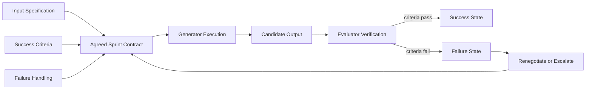
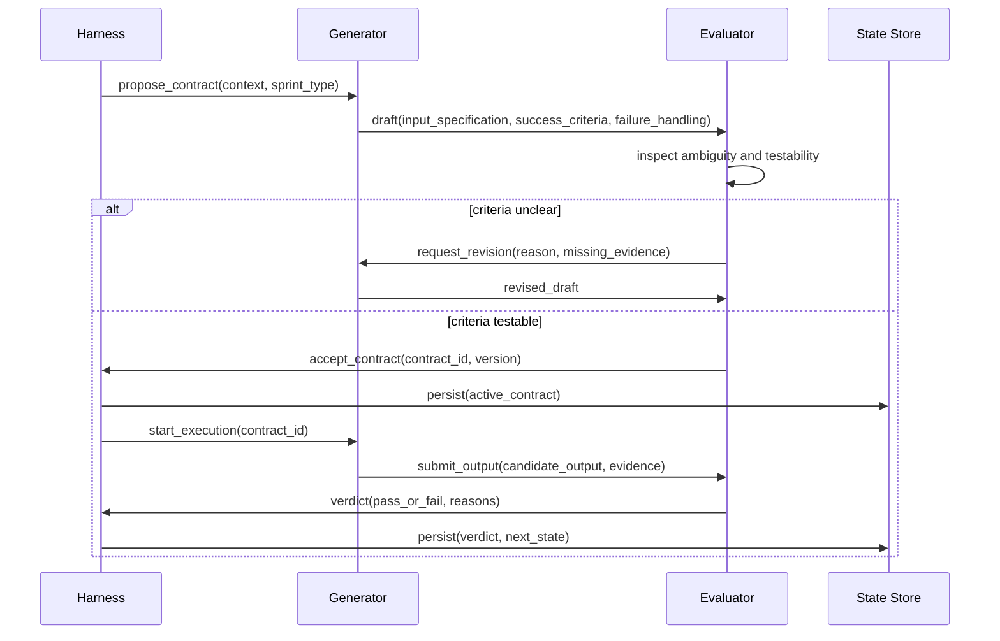
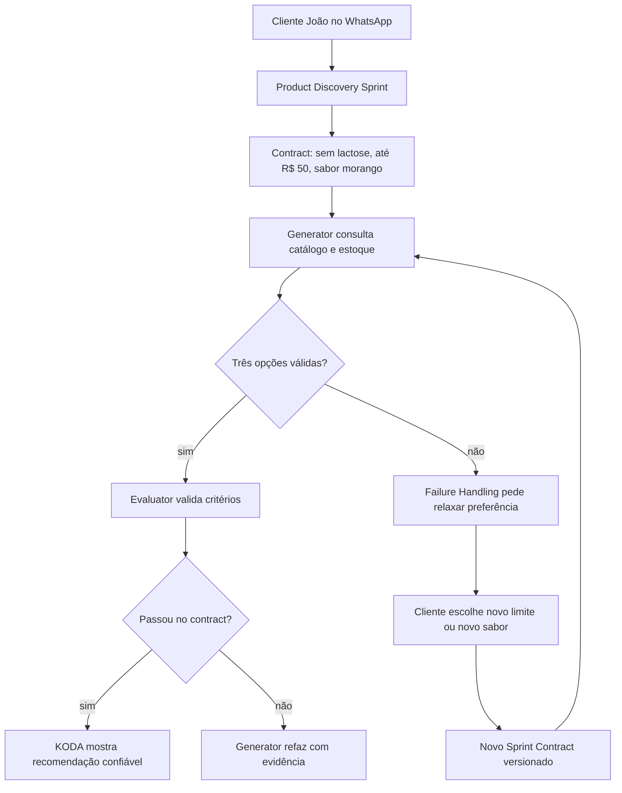

# 🎯 Sprint Contracts: Contratos Testáveis para Agentes de Longa Duração
## Como transformar intenção vaga em acordo explícito, verificável e evolutivo

**Tempo Estimado:** 120 minutos  
**Nível:** Core Concepts - Conceito #4  
**Pré-requisito:** Nível 1 completo, familiaridade com Generator/Evaluator e leitura do panorama de Harness Patterns  
**Status:** 🟢 COMPLETO - Referência conceitual definitiva para Sprint Contracts  
**Data de Criação:** Maio 2026

---

## 📖 Prólogo: O Acordo Que Faltava na Sala do KODA

Fernando entrou na sala antes das nove.

Na tela grande, havia uma conversa de WhatsApp aberta.

O cliente era João Silva, identificado pelo canal `wa_5511987654321`.

João não parecia irritado no começo.

Ele parecia apenas confuso.

A conversa tinha começado como tantas outras conversas do KODA.

João queria um suplemento para voltar a treinar.

Ele tinha intolerância à lactose.

Também tinha limite de orçamento.

Preferia sabor morango.

Não queria cápsulas grandes.

Tinha medo de comprar algo que causasse desconforto.

KODA respondeu bem nos primeiros minutos.

Fez perguntas úteis.

Reconheceu a intolerância.

Consultou o catálogo.

Apresentou opções compatíveis.

Tudo parecia sob controle.

Depois de quarenta minutos, João mudou um detalhe.

Ele não queria mais apenas whey.

Queria entender se BCAA fazia mais sentido para o objetivo dele.

KODA continuou respondendo.

A conversa parecia fluida.

Só que, por baixo da fluidez, a arquitetura estava perdendo forma.

A restrição de lactose ainda estava em algum lugar do contexto.

O orçamento também.

A preferência por morango aparecia em trechos antigos.

A mudança de categoria, de whey para BCAA, estava mais recente.

Nenhuma dessas informações tinha sido esquecida completamente.

O problema era mais sutil.

Elas já não tinham a mesma autoridade.

Para o modelo, tudo era texto.

Para o cliente, algumas frases eram compromisso.

Fernando apontou para uma parte da conversa.

KODA havia dito: "vou recomendar apenas produtos sem lactose e abaixo de R$ 50".

Quarenta minutos depois, KODA recomendou um produto de R$ 60.

Não por malícia.

Não por falta de inteligência.

Não porque o catálogo estava errado.

KODA falhou porque não havia um acordo formal sobre o que aquela etapa da conversa precisava preservar.

A equipe tinha bons prompts.

Tinha um Generator.

Tinha um Evaluator.

Tinha rubricas.

Tinha logs.

Tinha gente competente.

Mesmo assim, a conversa escorregou.

O motivo era estrutural.

O sistema validava outputs, mas não negociava compromisso antes da execução.

Ele corrigia depois, quando o dano já tinha aparecido.

Ele media qualidade, mas não definia com precisão o que a qualidade significava naquela etapa.

Ele tratava uma conversa longa como uma sequência de respostas, quando deveria tratá-la como uma sequência de acordos.

Foi nesse momento que Fernando escreveu no quadro:

```text
Antes de executar, negociar.
Antes de validar, definir.
Antes de continuar, saber o que conta como pronto.
```

Essa é a raiz dos Sprint Contracts.

Um Sprint Contract não é mais um prompt bonito.

Também não é uma checklist solta.

É um acordo explícito entre quem produz e quem avalia.

Ele diz o que entra.

Diz o que precisa sair.

Diz como a falha será tratada.

Diz quando uma mudança de requisito invalida o trabalho atual.

Mais importante, ele dá peso arquitetural a algo que conversas humanas tratam naturalmente, mas agentes perdem com facilidade: compromisso.

No Nível 1, você viu por que agentes perdem o foco.

Eles sofrem com context amnesia.

Eles misturam planejamento e execução.

Eles operam dentro de harnesses fracos.

No Nível 2, você viu como padrões práticos reduzem esse risco.

Generator/Evaluator separa criação de julgamento.

Rubric Design torna avaliação mais objetiva.

Trace Reading permite entender o que aconteceu depois.

Sprint Contracts ocupam um lugar diferente.

Eles não perguntam apenas se o output ficou bom.

Eles perguntam se o trabalho começou com um acordo bom.

Essa diferença muda tudo.

Quando um agente trabalha sem contract, ele interpreta sucesso em tempo real.

Quando trabalha com contract, ele executa contra uma definição compartilhada de sucesso.

Quando um evaluator recebe um output sem contract, ele julga com base em critérios que podem estar implícitos.

Quando recebe um output com contract, ele julga contra um pacto registrado.

Sem contract, a conversa depende de memória e boa vontade.

Com contract, a conversa depende de estrutura.

E estrutura é o que torna long-running agents confiáveis por horas.

---

## 🎯 O Que São Sprint Contracts?

### Definição formal

Um **Sprint Contract** é um acordo explícito, versionado e testável que define a unidade de trabalho de um agente antes da execução.

Ele especifica o input autorizado.

Ele especifica os success criteria.

Ele especifica o failure handling.

Ele define quem propõe.

Define quem valida.

Define quando o sprint pode começar.

Define quando o sprint deve parar.

Define o que acontece quando o mundo muda durante o sprint.

Em termos arquiteturais, um Sprint Contract é a interface entre intenção e execução.

Em termos de coordenação, é o protocolo que alinha Generator e Evaluator antes que tokens sejam gastos.

Em termos de confiabilidade, é a fonte de verdade sobre o significado de "pronto".

Em termos humanos, é a pergunta simples que bons engenheiros fazem antes de começar:

> "Como vamos saber que isso deu certo?"

A resposta precisa ser registrada de forma que outro agente consiga testar.

Se outro agente não consegue testar, ainda é apenas intenção.

Se o Generator não consegue usar para decidir o próximo passo, ainda é apenas documentação.

Se o Evaluator não consegue aprovar ou rejeitar com base nele, ainda é apenas preferência.

Um Sprint Contract se torna real quando orienta decisão durante execução.

### A forma conceitual mínima

Todo Sprint Contract contém três perguntas centrais.

1. O que exatamente entra neste sprint?
2. O que exatamente conta como sucesso?
3. O que exatamente acontece se não houver sucesso?

Essas perguntas parecem simples.

A dificuldade está em transformar respostas humanas vagas em critérios computáveis.

"Recomende algo bom" não é contract.

"Recomende três produtos em estoque, sem lactose, abaixo de R$ 50, com justificativa ligada ao objetivo do cliente" começa a ser contract.

"Se menos de três produtos forem encontrados, explique a limitação e peça ao cliente para relaxar orçamento ou preferência de sabor" fecha o contract.

A diferença não é estética.

A diferença é operacional.

No primeiro caso, o agente precisa adivinhar.

No segundo, o agente precisa cumprir.

### Os 3 pilares fundamentais

#### Pilar 1: Input Specification

Input Specification define o material legítimo de trabalho.

Ele responde: "com quais dados o sprint pode operar?"

Para KODA, isso inclui mensagem do cliente, preferências persistidas, catálogo, estoque, regras comerciais e estado da conversa.

Também inclui limites.

O sprint pode usar histórico completo?

Pode consultar dados externos?

Pode inferir alergia a partir de conversa antiga?

Pode ignorar uma preferência porque parece pouco relevante?

Input Specification reduz ambiguidade antes que ela vire erro.

Ele separa contexto disponível de contexto autorizado.

Essa diferença é crítica.

Um agente pode ter acesso a muitas informações.

Nem todas devem influenciar a decisão atual.

Por exemplo, João comprou whey de chocolate no mês passado.

Hoje ele diz que prefere morango.

O histórico está disponível.

A preferência atual deve ter maior autoridade.

Um bom Input Specification define essa prioridade.

Ele não só lista dados.

Ele declara precedência.

Ele declara frescor.

Ele declara limites de interpretação.

Ele declara o que deve ser ignorado.

#### Pilar 2: Success Criteria

Success Criteria define o significado verificável de sucesso.

Ele responde: "o que precisa ser verdadeiro no fim do sprint?"

O termo importante é verificável.

Um critério como "a resposta deve ser boa" não ajuda.

Um critério como "toda recomendação deve respeitar lactose intolerance, allergy constraints e budget limit" ajuda.

Um critério como "a explicação deve conectar cada produto a pelo menos uma necessidade declarada do cliente" ajuda mais.

Success Criteria não precisam ser todos binários.

Podem incluir thresholds.

Podem incluir ranking.

Podem incluir julgamento qualitativo do Evaluator.

Mas precisam ter forma suficiente para reprovar um output ruim.

Se um critério nunca reprova nada, ele não é critério.

É decoração.

Success Criteria também definem quando parar.

Agentes longos tendem a continuar pesquisando.

Ou param cedo demais.

Um contract bem desenhado declara a condição de parada.

Exemplo: "pare quando encontrar três opções válidas ou quando todas as categorias permitidas tiverem sido examinadas".

Isso protege tokens.

Protege latência.

Protege consistência.

#### Pilar 3: Failure Handling

Failure Handling define a resposta arquitetural ao desvio.

Ele responde: "o que acontece quando o sprint não consegue cumprir o contract?"

Sem Failure Handling, falha vira improviso.

O agente pede desculpas.

Tenta de novo.

Muda os critérios sem avisar.

Esconde a lacuna.

Ou entrega algo ruim com confiança.

Com Failure Handling, a falha vira estado conhecido.

Ela pode ser renegotiated.

Pode abrir um novo sprint.

Pode pedir input ao cliente.

Pode escalar para humano.

Pode gerar audit log.

Pode bloquear checkout.

Failure Handling é onde a arquitetura mostra maturidade.

Sistemas frágeis tentam parecer certos.

Sistemas confiáveis sabem falhar de forma explícita.

### Analogia 1: contratos legais

Um contrato legal não existe porque as pessoas esperam brigar.

Ele existe porque pessoas sérias sabem que memória e expectativa mudam.

O contrato registra obrigações.

Registra escopo.

Registra exceções.

Registra consequências.

Quando há conflito, todos voltam ao texto acordado.

Sprint Contracts fazem isso para agentes.

O Generator pode dizer: "eu cumpri o que foi pedido".

O Evaluator pode responder: "não, o critério três não passou".

Ambos não discutem sensação.

Discutem cláusula.

Essa mudança reduz conflito improdutivo.

### Analogia 2: especificações de construção

Ninguém manda construir uma ponte com a frase "faça uma ponte boa".

Há carga máxima.

Há material.

Há tolerância.

Há inspeção.

Há norma.

Há aceite.

A ponte não fica boa porque o engenheiro é inspirado.

Ela fica segura porque há especificação e verificação.

Um agente que processa checkout também precisa de especificação.

Ele lida com pagamento.

Endereço.

Estoque.

Frete.

Consentimento do cliente.

Uma falha pequena pode virar cobrança duplicada ou venda errada.

Sprint Contracts trazem mentalidade de engenharia civil para workflows de IA.

### Analogia 3: software API contracts

Uma API contract define entradas, saídas, erros e invariantes.

Clientes da API não precisam conhecer a implementação.

Eles precisam confiar que o contrato será respeitado.

Sprint Contracts aplicam a mesma ideia a agentes.

O Evaluator não precisa saber cada pensamento do Generator.

Ele precisa saber qual contract governa a execução.

O harness não precisa confiar no humor do modelo.

Ele precisa validar a interface.

Essa analogia também explica versioning.

Quando a API muda, consumidores precisam saber.

Quando um Sprint Contract muda, Generator, Evaluator, tests e audit logs precisam entender a versão.

### Por que negociação antes de execução muda tudo

Negociação antes de execução altera o custo da ambiguidade.

Sem negociação, ambiguidade aparece tarde.

Ela aparece quando o output já foi gerado.

Aparece quando tokens já foram gastos.

Aparece quando o cliente já recebeu uma resposta confusa.

Aparece quando o Evaluator reprova algo que o Generator achava correto.

Com negociação, ambiguidade aparece cedo.

Ela aparece antes do sprint.

Aparece enquanto o custo de corrigir ainda é baixo.

Aparece quando o Generator pode ajustar plano.

Aparece quando o Evaluator pode declarar critérios.

Essa inversão é a grande força dos Sprint Contracts.

Eles não tornam agentes infalíveis.

Eles tornam falhas mais baratas, mais visíveis e mais controláveis.

### O que Sprint Contracts não são

Um Sprint Contract não é uma rubrica genérica.

A rubrica pode avaliar qualidade em muitos casos.

O contract governa uma unidade concreta de trabalho.

Um Sprint Contract não é apenas um prompt maior.

Prompt fala com o modelo.

Contract fala com o sistema.

Um Sprint Contract não é um plano completo de projeto.

Ele é menor.

Ele governa um sprint específico.

Um Sprint Contract não é burocracia.

Burocracia adiciona etapas sem reduzir risco.

Contract adiciona estrutura para reduzir erro, custo e retrabalho.

### A teoria por trás do padrão

Sprint Contracts funcionam por quatro motivos teóricos.

Primeiro, eles reduzem espaço de busca.

O Generator não precisa explorar todas as respostas possíveis.

Ele explora apenas respostas compatíveis com o contract.

Segundo, eles alinham incentivos.

O Generator sabe que será avaliado contra critérios explícitos.

O Evaluator sabe que não deve inventar critérios depois.

Terceiro, eles criam common knowledge.

Na teoria de jogos, common knowledge é aquilo que todos sabem, todos sabem que todos sabem, e todos sabem que todos sabem que todos sabem.

Um contract registrado cria common knowledge entre agentes.

Quarto, eles transformam falha em transição de estado.

Sem contract, falha é discussão.

Com contract, falha é evento.

Evento pode ser registrado.

Pode ser medido.

Pode ser melhorado.

### A regra de ouro

Se uma unidade de trabalho pode causar dano quando interpretada de duas formas diferentes, ela merece um Sprint Contract.

Isso vale para recomendação de produto.

Vale para checkout.

Vale para atendimento.

Vale para fulfillment.

Vale para handoff humano.

Vale para qualquer parte do KODA onde o cliente espera continuidade.


## 📥 Os Três Pilares em Profundidade

Os três pilares de um Sprint Contract parecem simples quando aparecem em uma lista.
Input Specification.
Success Criteria.
Failure Handling.
Mas a profundidade do padrão está justamente no que cada pilar impede.
Input Specification impede que o agente trabalhe com material errado.
Success Criteria impede que o agente confunda output com resultado.
Failure Handling impede que o sistema improvise no momento em que mais precisa de disciplina.
Em KODA, esses três pilares aparecem toda vez que uma conversa deixa de ser casual e passa a carregar uma promessa.
Quando João diz que tem lactose intolerance, isso não é apenas contexto.
É uma restrição.
Quando João diz que só pode gastar R$ 50, isso não é apenas preferência.
É um limite operacional.
Quando João prefere morango, isso não tem a mesma força que uma restrição de saúde.
É uma preferência negociável.
Um Sprint Contract existe para não deixar essas categorias se misturarem.

### 📥 Input Specification: o que pode entrar no sprint

Input Specification define quais informações têm permissão para influenciar a execução.
Essa frase parece burocrática.
Na prática, ela protege o cliente.
Um Generator sem Input Specification tende a usar tudo que vê.
Histórico antigo.
Preferência persistida.
Mensagem recente.
Suposição sobre perfil de cliente.
Trecho de catálogo.
Memória comprimida.
Tudo vira material de decisão.
Isso é perigoso porque long-running agents vivem cercados de informação parcialmente correta.
Uma preferência antiga pode ter sido superada.
Um produto pode ter mudado de preço.
Um snapshot de estoque pode estar vencido.
Uma inferência do agente pode parecer plausível, mas nunca foi confirmada pelo cliente.
Input Specification separa informação disponível de informação autorizada.
Essa distinção é uma das bases da confiança.
Para KODA, informação disponível pode incluir meses de histórico do cliente.
Informação autorizada para o sprint atual pode ser apenas a mensagem atual, o perfil persistido relevante, o catálogo vigente e as regras de negócio de segurança.
Se João comprou whey de chocolate em janeiro, isso pode ser útil.
Se hoje João diz que quer morango, a mensagem atual vence.
Se o catálogo antigo dizia que um produto era sem lactose, mas o catálogo atual não confirma, o produto não deve passar.
O contract precisa dizer isso antes da recomendação.

#### Fontes autorizadas

Uma fonte autorizada é uma fonte que o Generator pode usar sem pedir permissão adicional.
No Product Discovery do KODA, fontes típicas incluem a mensagem atual do WhatsApp.
Incluem preferências persistidas do cliente.
Incluem snapshot de catálogo.
Incluem snapshot de preço.
Incluem snapshot de estoque.
Incluem políticas comerciais vigentes.
Incluem regras de segurança, como não recomendar produto incompatível com restrição declarada.
A lista parece óbvia.
O valor está nas exclusões.
O Generator não deve inventar margem de preço.
Não deve usar produto fora do snapshot.
Não deve considerar estoque antigo como se fosse atual.
Não deve tratar uma inferência sobre objetivo de treino como fato confirmado.
Não deve decidir que uma restrição de saúde é flexível só porque dificulta encontrar produtos.
Input Specification também define se o Generator pode perguntar mais ao cliente.
Em alguns sprints, a resposta certa é recomendar.
Em outros, é fazer uma pergunta de clarificação.
Essa decisão não deve ser improvisada.
Se o contract permite no máximo duas perguntas antes de recomendar, o Generator sabe quando parar de perguntar.
Se o contract exige confirmação de alergia antes de recomendar, o Generator sabe que não pode pular esse passo.

#### Precedence rules

Precedence rules dizem qual fonte vence quando duas fontes entram em conflito.
Esse é um dos pontos mais importantes do contract.
Conflito de dados é normal em conversas reais.
João pode ter perfil antigo dizendo "prefere chocolate".
Hoje ele escreve "dessa vez quero morango".
O histórico e a mensagem atual entram em conflito.
Sem precedence rule, o modelo decide com base em saliência textual.
Com precedence rule, o sistema decide com base em arquitetura.
Uma regra saudável para KODA é: mensagem atual vence preferência persistida quando o assunto é preferência negociável.
Outra regra saudável é: restrição de segurança vence preferência de sabor.
Outra é: catálogo atual vence memória do agente.
Outra é: budget confirmado vence sugestão promocional.
Precedence rules também precisam tratar ausência de dado.
Se o cliente não informou budget, o Generator pode recomendar por faixa de preço ou deve perguntar?
Se o cliente informou lactose intolerance, mas o catálogo só tem campo `contains_milk`, como mapear?
Se a informação de estoque está indisponível, a recomendação pode avançar?
A resposta depende do risco.
Para suplemento, restrição alimentar e estoque são críticos.
Um contract maduro escolhe o lado seguro.

#### Quando restringir o que o Generator pode ver

Pode parecer estranho esconder informação do Generator.
A intuição comum diz: quanto mais contexto, melhor.
Em long-running agents, isso nem sempre é verdade.
Mais contexto pode significar mais ruído.
Mais ruído pode significar mais chance de misturar compromissos antigos com objetivos novos.
Restringir contexto é útil quando o sprint precisa de foco.
No Checkout, o Generator não precisa rever toda a conversa de Product Discovery.
Ele precisa do produto aprovado, preço aprovado, endereço, método de pagamento e confirmação do cliente.
No Support, o agente não precisa reabrir recomendações antigas se o cliente pergunta apenas sobre status de entrega.
No Fulfillment, o agente não precisa inferir novas preferências de sabor.
Ele precisa cumprir o pedido aceito.
Input Specification permite essa redução.
Ele cria um pacote mínimo suficiente para a tarefa.
Isso economiza tokens.
Também reduz interferência.
O objetivo não é deixar o Generator cego.
É impedir que ele use informação que não deveria governar aquele sprint.

#### Dados conflitantes e dados ambíguos

Dados conflitantes dizem coisas incompatíveis.
Dados ambíguos dizem algo incompleto.
Os dois precisam de tratamento diferente.
Se João diz "até R$ 50" e o perfil antigo diz "costuma comprar premium", há conflito.
A mensagem atual deve vencer.
Se João diz "não posso com leite" e o catálogo diferencia lactose, whey isolate, caseína e milk protein, há ambiguidade.
O sistema talvez precise perguntar ou aplicar default seguro.
Um bom Input Specification classifica esses casos.
Conflito resolvível por precedência não precisa parar o sprint.
Ambiguidade de segurança pode exigir clarificação.
Ambiguidade de preferência pode virar tradeoff explicado.
Por exemplo, se não há morango sem lactose abaixo de R$ 50, KODA pode perguntar se João aceita chocolate.
Mas não pode perguntar se João aceita lactose.
A diferença é moral e operacional.
O contract precisa capturar essa diferença.

### ✅ Success Criteria: o que conta como pronto

Success Criteria são a parte mais visível do contract.
Eles dizem como o Evaluator decide se o output passou.
Mas o erro comum é escrever criteria como uma lista de desejos.
"A resposta deve ser útil."
"A recomendação deve ser boa."
"O cliente deve entender."
Essas frases apontam uma intenção correta.
Ainda não são critérios testáveis.
Um critério testável permite duas coisas.
Permite que o Generator planeje.
Permite que o Evaluator reprove.
Se ninguém consegue reprovar, não há critério.
Há decoração.

#### Critérios binários

Critérios binários passam ou falham.
Eles são essenciais para restrições duras.
Produto está em estoque.
Preço é menor ou igual a R$ 50.
Produto é marcado como sem lactose.
Resposta não inclui produto fora do catálogo.
Cliente confirmou intenção de compra antes de Checkout.
Esses critérios são bons porque reduzem debate.
Eles também são bons porque protegem invariantes.
Quando um critério binário falha, o sprint não deve seguir como se nada tivesse acontecido.
Se o produto tem lactose, não importa que seja barato.
Se está fora de estoque, não importa que combine com sabor.
Se o cliente não confirmou endereço, não importa que o resto do checkout esteja pronto.
Critérios binários formam a linha de segurança.

#### Critérios pontuados

Nem tudo é binário.
Uma recomendação pode ser tecnicamente válida, mas pouco útil.
Um produto pode respeitar budget e lactose, mas não combinar bem com objetivo.
Uma explicação pode ser factual, mas confusa.
Nesses casos, criteria pontuados ajudam.
Um Evaluator pode avaliar clareza de explicação em uma escala.
Pode avaliar fit com objetivo.
Pode avaliar qualidade do tradeoff apresentado.
Pode avaliar se a resposta é curta o suficiente para WhatsApp.
Critérios pontuados exigem cuidado.
Eles não devem substituir critérios binários de segurança.
Devem complementar.
Uma boa regra é separar gate criteria de quality criteria.
Gate criteria decidem se o output pode ser mostrado.
Quality criteria decidem se o output precisa melhorar antes de ser ideal.
Para KODA, gate criteria incluem lactose, estoque, preço e consentimento.
Quality criteria incluem clareza, empatia, ordem de recomendação e explicação de tradeoff.

#### O produto existe vs a recomendação ajuda

Um erro frequente é confundir validade factual com utilidade.
"O produto existe" é necessário.
Não é suficiente.
"O produto está em estoque" é necessário.
Não é suficiente.
"O produto cabe no orçamento" é necessário.
Não é suficiente.
Uma recomendação genuinamente útil conecta o produto ao problema do cliente.
Se João quer voltar a treinar, KODA precisa explicar por que aquela opção faz sentido.
Se a opção não é morango, KODA precisa dizer o tradeoff.
Se só há uma opção, KODA precisa explicar que os critérios restringiram o conjunto.
Isso muda o Evaluator.
Ele não deve apenas checar campos.
Deve checar relação entre fatos.
Produto, restrição, objetivo e explicação precisam formar uma linha coerente.
Essa é a diferença entre catalog search e consultative recommendation.
KODA não é apenas uma busca de catálogo.
KODA promete orientação.
Success Criteria devem proteger essa promessa.

#### Critérios mínimos e critérios alvo

Nem todo contract deve exigir o ideal para passar.
Em conversas reais, há situações em que o ideal não existe.
Talvez não haja três produtos sem lactose abaixo de R$ 50.
Talvez haja apenas um.
Talvez nenhum tenha sabor morango.
Se o contract exige três opções sempre, ele força falha quando uma resposta honesta seria melhor.
Por isso, é útil separar minimum criteria e target criteria.
Minimum criteria definem o que precisa ser verdade para avançar.
Target criteria definem o resultado preferido.
No Product Discovery, minimum pode ser uma opção válida com explicação clara.
Target pode ser três opções ordenadas por fit.
Se o target não for atingido, KODA ainda pode responder, desde que explique a limitação.
Essa distinção reduz rigidez desnecessária.
Também evita que o agente invente opções para cumprir número.
Um contract maduro prefere uma recomendação honesta a três recomendações fabricadas.

#### Evidência como parte do output

Success Criteria exigem evidência.
Sem evidência, o Evaluator precisa confiar no Generator.
Isso desfaz a separação de responsabilidades.
A evidência pode ser simples.
`product_id`.
Preço.
Status de estoque.
Flag de lactose.
Motivo conectado ao objetivo.
Tradeoff declarado.
Fonte do dado.
Timestamp do snapshot.
Evidência não precisa aparecer inteira para o cliente.
Mas precisa estar disponível para avaliação.
O cliente recebe uma resposta limpa.
O Evaluator recebe o material de verificação.
O Audit Log guarda a razão.
Essa separação permite qualidade sem poluir a experiência de WhatsApp.

### ⚠️ Failure Handling: o caminho quando o contract não fecha

Failure Handling não é apêndice.
Failure Handling é parte central do contract.
Na prática, ele define a diferença entre sistema confiável e sistema que improvisa bonito.
Todo sprint importante deve assumir que pode falhar.
Não porque a equipe é pessimista.
Porque o mundo real não se encaixa sempre no template.
Produto acaba.
Preço muda.
Cliente muda de ideia.
Catálogo fica incompleto.
Pagamento falha.
Mensagem chega ambígua.
Modelo gera output incompleto.
Evaluator rejeita.
Se o contract não diz o que acontece nesses casos, o agente vai decidir sozinho no pior momento possível.

#### Graceful degradation

Graceful degradation é quando o sistema reduz ambição sem trair o cliente.
Se não há três recomendações, entregar uma recomendação válida e explicar a limitação pode ser aceitável.
Se não há morango, oferecer chocolate sem lactose abaixo de R$ 50 pode ser aceitável.
Se estoque está incerto, pedir confirmação ou avisar que precisa checar pode ser aceitável.
Graceful degradation preserva confiança porque não esconde a limitação.
O ponto é degradar dimensão negociável, não restrição crítica.
Sabor pode degradar.
Quantidade de opções pode degradar.
Estilo da explicação pode degradar.
Segurança alimentar não deve degradar.
Consentimento de pagamento não deve degradar.

Endereço de entrega não deve ser inferido em checkout sem confirmação.

#### Hard fail

Hard fail é quando o sistema deve parar.

Não é fracasso do produto.

É proteção.

Se uma recomendação viola lactose intolerance, hard fail.

Se Checkout não tem confirmação explícita, hard fail.

Se preço mudou depois da confirmação e ficou acima do budget, hard fail ou renegotiation.

Se o Evaluator não consegue verificar uma condição crítica, hard fail.

Hard fail precisa ser customer-safe.

KODA não deve responder com erro técnico.

Deve explicar de forma humana.

"Não encontrei uma opção que cumpra tudo com segurança. Posso buscar alternativas se você quiser ajustar sabor ou orçamento."

Essa resposta é muito melhor que uma recomendação arriscada.

#### Retry, renegotiation e escalation

Retry significa tentar de novo dentro do mesmo contract.

Use retry quando o contract continua correto, mas o output falhou.

Exemplo: o Generator esqueceu de incluir evidência de estoque.

O Evaluator rejeita.

O Generator refaz com a evidência.

Renegotiation significa criar ou ajustar o contract porque a premissa mudou.

Use renegotiation quando João troca whey por BCAA.

Use quando o budget muda.

Use quando o cliente aceita abrir mão de morango.

Use quando uma fonte autorizada fica indisponível e a resposta segura exige nova escolha.

Escalation significa mover para humano ou fluxo superior.

Use quando o sistema não consegue resolver com segurança.

Use quando há conflito de saúde.

Use quando pagamento falha de forma ambígua.

Use quando o cliente está irritado e a próxima ação automatizada pode piorar.

A distinção é simples.

Retry corrige execução.

Renegotiation corrige acordo.

Escalation corrige autoridade.

#### Safe defaults

Safe defaults são decisões conservadoras quando falta informação.

Em KODA, o default seguro para restrição alimentar é não recomendar produto duvidoso.

O default seguro para budget é não ultrapassar sem confirmação.

O default seguro para checkout é não cobrar sem consentimento claro.

O default seguro para estoque é não prometer disponibilidade sem confirmação.

Safe defaults precisam estar no contract.

Se ficarem apenas na cultura do time, vão falhar quando o sistema crescer.

Um default seguro não precisa tornar a experiência fria.

Ele pode ser comunicado com cuidado.

"Para não te indicar algo incompatível, preciso confirmar uma coisa."

Essa frase protege o cliente e mantém tom consultivo.

O contract define a disciplina.

A resposta final define a experiência.

---

## 🤝 O Lifecycle de Negociação

Um Sprint Contract não nasce pronto.

Ele passa por um lifecycle.

Esse lifecycle transforma contexto em acordo.

A diferença entre um contract maduro e um prompt longo está nessa sequência.

Prompt longo tenta antecipar tudo em uma instrução.

Contract negociado permite crítica antes da execução.

O processo não precisa ser lento.

Em muitos casos, negotiation acontece em poucos turnos internos.

O importante é que cada etapa tenha uma pergunta distinta.

Proposal pergunta: qual é o acordo inicial?

Critique pergunta: esse acordo é testável?

Revision pergunta: o que precisa mudar para ficar seguro?

Seal pergunta: todos aceitam a versão ativa?

Execution pergunta: o Generator está trabalhando dentro do acordo?

Verification pergunta: o output cumpriu o acordo?

Resolution pergunta: qual é o próximo estado?

### 🧾 Proposal

Proposal é o rascunho inicial do contract.

Ele pode ser criado pelo Generator.

Pode ser criado pelo harness.

Pode ser criado por um template preenchido com dados da conversa.

Em KODA, o harness costuma ter boa posição para iniciar a proposta porque vê feature, cliente e estado.

Quando João pede suplemento sem lactose até R$ 50, o harness reconhece Product Discovery.

Ele seleciona o template de Product Discovery.

Preenche slots com restrição, budget, preferência e canal.

Adiciona fontes autorizadas.

Adiciona failure paths conhecidos.

O Generator pode então revisar se a proposta faz sentido para execução.

Uma boa proposal não tenta ser perfeita.

Ela tenta ser criticável.

Isso é importante.

Se a proposta é vaga, o Evaluator não consegue criticar.

Se é excessivamente fechada, o Generator perde autonomia antes de entender o problema.

A proposta boa tem granularidade suficiente para discussão.

### 🔍 Critique

Critique é o momento em que o Evaluator procura ambiguidade.

Ele não está avaliando o output.

Ainda não existe output.

Ele está avaliando o contract.

O Evaluator pergunta se cada critério pode ser testado.

Pergunta se há conflito entre critérios.

Pergunta se falta fonte para algum dado.

Pergunta se failure handling cobre os casos prováveis.

Pergunta se o contract deixa espaço para o Generator burlar a intenção.

No caso de João, o Evaluator pode questionar: budget de R$ 50 inclui frete?

Pode questionar: lactose intolerance está representada no catálogo com confiança?

Pode questionar: sabor morango é obrigatório ou preferencial?

Pode questionar: se houver apenas uma opção válida, isso é sucesso parcial ou falha?

Essas perguntas são valiosas porque aparecem antes da recomendação.

O custo de responder agora é pequeno.

O custo de descobrir depois pode ser perda de confiança.

### ✍️ Revision

Revision é o ajuste do contract depois da crítica.

O Generator ou harness incorpora decisões.

Budget passa a ser definido como preço do produto, não frete, se essa for a regra de negócio.

Lactose vira restrição obrigatória.

Morango vira preferência negociável.

Uma opção válida vira minimum.

Três opções viram target.

Sem opção válida vira failure handling com pergunta ao cliente.

Revision deve alterar o contract, não apenas a conversa interna.

Se a decisão não entra no artefato, ela se perde.

Esse é um erro comum em times.

A equipe discute, concorda, mas o contract continua vago.

Depois o agente segue o texto vago.

Revision só está completa quando o artefato ativo reflete a decisão.

### 🔏 Seal

Seal é o aceite.

O contract deixa de ser draft.

Vira documento governante.

Esse momento precisa ser explícito.

Não precisa ser teatral.

Mas precisa deixar rastro.

State Store deve registrar versão.

Audit Log deve registrar quem aceitou ou qual componente aceitou.

O contract deve receber status ativo.

A partir desse ponto, o Generator não está apenas respondendo.

Ele está cumprindo um acordo.

O Evaluator não está apenas opinando.

Ele está julgando contra o acordo aceito.

Seal também protege contra moving target.

Depois que o contract está ativo, critérios não devem mudar silenciosamente.

Se a realidade muda, o sistema renegocia.

Não reescreve o passado.

### ⚙️ Execution

Execution é o trabalho do Generator sob restrição.

O Generator consulta fontes autorizadas.

Ignora fontes não autorizadas.

Coleta evidência.

Constrói candidate output.

Respeita token budget.

Respeita limites de perguntas ao cliente.

Respeita critérios de parada.

A execução boa não é a mais criativa possível.

É a mais criativa dentro do contract.

Isso preserva autonomia sem perder controle.

O Generator ainda pode escolher ordem de recomendações.

Pode escolher tom.

Pode explicar tradeoffs.

Pode decidir entre produtos válidos.

Mas não pode relaxar lactose.

Não pode inventar estoque.

Não pode ultrapassar budget sem renegotiation.

Esse é o equilíbrio certo.

Contract não elimina inteligência.

Contract canaliza inteligência.

### 🧪 Verification

Verification é onde o Evaluator compara output e contract.

Ele não deve avaliar contra preferência pessoal.

Não deve inventar critério novo.

Não deve aprovar porque a resposta parece boa.

Deve verificar cláusulas.

Primeiro, estrutura.

O output contém recomendações?

Contém evidência?

Contém justificativa?

Depois, invariantes.

Cada produto está em estoque?

Cada preço está dentro do limite?

Cada produto respeita lactose intolerance?

Depois, qualidade.

A explicação conecta produto e objetivo?

O tradeoff foi transparente?

A resposta cabe no contexto de WhatsApp?

A verificação deve produzir verdict.

Pass.

Fail.

Needs renegotiation.

Escalate.

O verdict deve incluir razões.

Razões vagas quebram o loop.

"Ruim" não ajuda.

"Produto `sku_123` custa R$ 60 e viola budget de R$ 50" ajuda.

### 🧭 Resolution

Resolution decide o próximo estado.

Se passou, KODA pode responder ao cliente.

Se falhou por execução incompleta, volta para retry.

Se falhou por requisito alterado, abre renegotiation.

Se falhou por risco não resolvido, escala.

Resolution é onde contracts protegem long-running conversations.

Sem resolution clara, o sistema fica preso em loop.

Ou pior, avança apesar de falha.

Um bom contract declara max retries.

Declara quando parar de tentar.

Declara quando pedir input ao cliente.

Declara quando chamar humano.

Isso evita que o agente transforme incerteza em insistência.

Em KODA, insistência pode parecer pressão de venda.

Contracts ajudam a manter a postura de consultor confiável.

---

## 🧠 Analogias & Mental Models

Sprint Contracts ficam intuitivos quando você os compara com sistemas que já usam acordos antes da execução.

A ideia não nasceu em IA.

Ela aparece em construção, direito, APIs e cozinhas profissionais.

Essas analogias ajudam porque mostram um padrão humano antigo.

Quando o custo de erro é alto, pessoas sérias definem critérios antes de agir.

### 🏗️ Construção: arquiteto, construtor e inspetor

Imagine uma reforma.

O arquiteto desenha o projeto.

O construtor executa.

O inspetor verifica.

Ninguém trabalha com a instrução "faça uma casa boa".

Há planta.

Há medidas.

Há materiais.

Há tolerâncias.

Há normas.

Há vistoria.

Se o construtor usa material diferente, não basta dizer que ficou bonito.

O inspetor compara com especificação.

Se a especificação estava ambígua, a equipe precisa esclarecer antes de construir a próxima parte.

Em KODA, o contract é a planta do sprint.

Generator é construtor.

Evaluator é inspetor.

Harness coordena o canteiro.

State Store guarda a versão da planta.

Audit Log registra vistorias.

A analogia também mostra um limite.

Você não precisa de planta completa para cada parafuso.

Mas precisa de planta para paredes estruturais.

Da mesma forma, KODA não precisa de contract pesado para frase casual.

Precisa de contract para recomendação, checkout, fulfillment e escalation.

### ⚖️ Contratos legais: partes, obrigações e remédios

Um contrato legal define partes.

Define obrigações.

Define condições.

Define remedies quando algo falha.

O ponto dos remedies é importante.

Contrato não diz apenas o que deve acontecer se tudo der certo.

Diz o que acontece quando não dá.

Sprint Contracts funcionam do mesmo jeito.

Input Specification define objeto e escopo.

Success Criteria definem obrigação de entrega.

Failure Handling define remedy.

Se não houver produto válido, o remedy pode ser pedir relaxamento de preferência.

Se pagamento falhar, o remedy pode ser pedir outro método.

Se houver risco de saúde, o remedy pode ser escalation.

Essa analogia também ensina que contrato sem consequência é fraco.

Se o Evaluator rejeita e nada muda, o contract é simbólico.

Se failure handling não altera fluxo, ele não governa.

Um contract real muda o que o sistema faz.

### 🔌 API contracts: interface antes de implementação

Em software, uma API contract define como componentes conversam.

OpenAPI descreve endpoints, payloads, responses e errors.

Interface segregation evita que consumidores dependam de detalhes desnecessários.

O consumidor não precisa saber como o serviço calcula.

Precisa saber o que enviar e o que receber.

Sprint Contracts fazem isso entre agentes.

O Evaluator não precisa ler todos os pensamentos do Generator.

Precisa receber candidate output com evidência no formato esperado.

O Generator não precisa saber a implementação interna do Evaluator.

Precisa saber quais criteria serão aplicados.

Essa analogia fortalece a ideia de versioning.

Quando uma API muda contrato, clientes precisam se adaptar.

Quando um Sprint Contract muda criteria, Generator, Evaluator, tests e metrics precisam saber.

Sem versioning, você compara outputs julgados por regras diferentes como se fossem iguais.

Isso distorce aprendizado.

### 🍽️ Cozinha de restaurante: o ticket como contract

Em um restaurante bom, o salão não grita instruções vagas para a cozinha.

O pedido vira ticket.

O ticket diz prato.

Diz ponto da carne.

Diz restrições.

Diz mesa.

Diz observações.

Se o cliente tem alergia, isso aparece destacado.

A cozinha executa contra o ticket.

O expediter confere antes de sair.

Se falta algo, o prato não vai para a mesa.

O ticket é um contract operacional.

Ele não contém a história inteira do cliente.

Contém o que a cozinha precisa para entregar certo.

Essa é uma excelente imagem para KODA.

A conversa inteira com João pode ser longa.

O Product Discovery sprint precisa de um ticket claro.

Sem lactose.

Até R$ 50.

Preferência por morango.

Objetivo de treino.

Estoque atual.

Se a cozinha não tem morango, ela não inventa.

Ela avisa o salão.

O salão volta ao cliente.

Isso é failure handling.

### 🧭 O mental model principal

O mental model mais útil é este: Sprint Contract é uma promessa operacional.

Não é documento decorativo.

Não é comentário.

Não é checklist solta.

É a coisa que decide o próximo passo quando há dúvida.

Se duas pessoas leem o contract e ainda discordam sobre o que fazer, o contract está fraco.

Se o Generator precisa adivinhar, o contract está fraco.

Se o Evaluator não consegue reprovar, o contract está fraco.

Se a falha não muda o fluxo, o contract está fraco.

Um contract forte reduz interpretação justamente nos pontos de maior risco.

---

## 🧱 Design Principles & Anti-Patterns

Sprint Contracts devem ser desenhados com parcimônia.

O objetivo é clareza operacional, não formalismo por formalismo.

Um contract bom dá liberdade onde a liberdade melhora o resultado.

E impõe limite onde liberdade vira risco.

Essa seção separa princípios de anti-patterns.

Os princípios ajudam a criar contracts úteis.

Os anti-patterns mostram como contracts viram teatro se forem mal aplicados.

### ✅ Princípio 1: Testability first

Escreva criteria pensando no Evaluator.

Se o Evaluator não consegue testar, o Generator não consegue confiar.

Testability first muda a forma de escrever.

Em vez de "resposta completa", escreva quais elementos precisam estar presentes.

Em vez de "produto adequado", escreva quais restrições tornam o produto adequado.

Em vez de "tom bom", escreva limites de comunicação quando houver risco.

Testability não significa reduzir tudo a boolean.

Significa deixar claro como julgamento acontece.

Um critério qualitativo pode ser testável se tiver evidência e escala.

Por exemplo: "a explicação conecta cada recomendação a pelo menos uma necessidade declarada do cliente".

Isso ainda exige julgamento.

Mas o julgamento tem alvo.

### ✅ Princípio 2: explicit over implicit

Agentes falham em long-running workflows porque o implícito se perde.

O humano acha que está claro.

O modelo vê texto concorrente.

O Evaluator julga tarde.

O harness não sabe qual promessa preservar.

O contract deve explicitar o que seria perigoso deixar subentendido.

Se budget é limite, diga.

Se sabor é preferência, diga.

Se lactose é restrição obrigatória, diga.

Se mudança de categoria exige novo sprint, diga.

Se uma opção válida é aceitável quando três não existem, diga.

O explícito reduz elegância aparente.

Aumenta confiabilidade real.

### ✅ Princípio 3: scope confinement

Um sprint precisa ter fronteira.

Product Discovery não deve fazer checkout escondido.

Checkout não deve redesenhar recomendação.

Support não deve alterar pedido sem autorização.

Fulfillment não deve prometer prazo sem fonte logística.

Scope confinement impede que uma boa intenção gere efeito colateral.

O Generator pode querer ajudar mais.

O contract lembra qual ajuda é permitida agora.

Isso é especialmente importante em WhatsApp.

Conversas são fluidas.

Cliente muda assunto.

Agente tenta acompanhar.

Sem fronteira, o sistema mistura estados.

Com contract, mudança de assunto pode virar renegotiation ou novo sprint.

### ✅ Princípio 4: version everything

Todo contract que governa comportamento precisa de versão.

Versão não é burocracia.

É memória institucional.

Quando a equipe muda criterion, precisa saber quando mudou.

Quando métrica melhora, precisa saber qual contract estava ativo.

Quando incidente acontece, precisa saber qual versão falhou.

Versioning também protege rollout gradual.

Você pode testar Product Discovery contract v1.1 com parte dos clientes.

Pode comparar com v1.0.

Pode rollback se aumento de rejeições prejudicar experiência.

Sem versão, você tem apenas sensação.

Com versão, você tem engenharia.

### ✅ Princípio 5: preserve useful autonomy

Contract não deve transformar agente em formulário morto.

O Generator ainda precisa raciocinar.

Precisa ordenar opções.

Precisa explicar tradeoffs.

Precisa adaptar linguagem.

Precisa decidir quando uma pergunta adicional ajuda.

O contract deve restringir o que não pode ser violado.

Não deve prescrever cada palavra.

Se você especifica demais, perde a vantagem do modelo.

Se especifica de menos, perde confiabilidade.

O desenho bom fica no meio.

Ele dá guardrails para fatos, segurança e estado.

Ele dá autonomia para síntese, empatia e comunicação.

### ❌ Anti-pattern: contract by hope

Contract by hope é um contract que parece sério, mas não decide nada.

Ele diz "faça recomendação de alta qualidade".

Diz "considere restrições do cliente".

Diz "seja útil".

Diz "evite erros".

Essas frases são verdadeiras.

Mas não são suficientes.

Elas não dizem quais restrições.

Não dizem quais erros bloqueiam.

Não dizem qual evidência é necessária.

Não dizem o que fazer quando não houver opção.

Contract by hope cria falsa segurança.

O time acha que formalizou.

Na hora da falha, o Evaluator continua julgando por intuição.

### ❌ Anti-pattern: moving target

Moving target acontece quando criteria mudam durante o sprint sem renegotiation.

O Generator começa buscando três opções abaixo de R$ 50.

No meio, alguém decide aceitar até R$ 60 porque está difícil.

Depois o Evaluator rejeita porque o budget original era R$ 50.

Ou aprova porque gostou da resposta.

O problema não é mudar critério.

Mudança pode ser necessária.

O problema é mudar sem registrar novo acordo.

Moving target destrói confiança entre agentes.

Também destrói métricas.

Você não sabe se o output falhou por execução ruim ou por contract instável.

A cura é simples.

Se criteria mudam, renegotiate.

Se renegotiate, versione.

Se versionou, registre.

### ❌ Anti-pattern: rubber stamp

Rubber stamp é o Evaluator que nunca rejeita.

Ele existe no diagrama.

Não existe na prática.

Aprova outputs incompletos.

Aceita evidência ausente.

Transforma falha em comentário leve.

Diz "looks good" quando deveria bloquear.

Esse anti-pattern é comum quando o time mede apenas velocidade.

Evaluator que rejeita parece atrapalhar.

Mas em sistema crítico, rejeição correta é recurso de qualidade.

Se nada é rejeitado, o contract não governa.

Para evitar rubber stamp, acompanhe taxa de rejeição por criterion.

Uma taxa zero por muito tempo pode indicar perfeição.

Mais provavelmente indica avaliação fraca.

### ❌ Anti-pattern: contract waterfall

Contract waterfall é o oposto do contract by hope.

O time tenta especificar tudo antes de aprender.

Cria contracts enormes.

Prevê exceções raras.

Bloqueia execução por detalhe secundário.

Transforma cada sprint em cerimônia.

Isso mata adoção.

Sprint Contracts devem começar onde há risco claro.

Depois evoluir com evidência.

Não tente formalizar toda conversa do KODA no primeiro dia.

Comece por Product Discovery ou Checkout.

Observe falhas reais.

Ajuste templates.

Expanda quando o padrão provar valor.

### Quando não usar contracts

Não use Sprint Contracts para brainstorming interno sem risco.

Não use para pergunta casual que não muda estado.

Não use quando o objetivo é explorar possibilidades antes de definir compromisso.

Não use quando a formalidade custaria mais que a falha.

Não use para substituir conversa humana de descoberta.

Não use para esconder incerteza atrás de formato.

Contracts são melhores quando há promessa, risco e verificação.

Sem esses três elementos, um prompt simples pode ser suficiente.

A maturidade está em saber diferenciar.

---

## 🧩 Contract Templates & Reusability

Um contract concreto governa um sprint específico.

Um template governa a criação de muitos contracts parecidos.

Essa distinção permite escala.

KODA não deve escrever um Product Discovery contract do zero para cada cliente.

Também não deve usar um texto fixo que ignora contexto.

A solução é template parametrizado.

O template define estrutura.

Os parâmetros definem caso.

### Biblioteca de templates

Uma template library é um conjunto de contract templates por feature.

Product Discovery.

Checkout.

Fulfillment.

Support escalation.

Payment recovery.

Inventory substitution.

Cada template contém slots.

Slots de cliente.

Slots de restrição.

Slots de budget.

Slots de feature.

Slots de fontes autorizadas.

Slots de failure handling.

A biblioteca evita reinvenção.

Também melhora governança.

Quando a equipe aprende algo sobre lactose intolerance, atualiza o Product Discovery template.

Quando aprende algo sobre cobrança duplicada, atualiza Checkout.

Quando aprende algo sobre prazo de entrega, atualiza Fulfillment.

### Parametrização para clientes e contextos

Parameterization é onde o template vira contract real.

Para João, o slot `customer_id` recebe `wa_5511987654321`.

O slot `budget_limit_brl` recebe `50`.

O slot `dietary_constraints` recebe `lactose_intolerance`.

O slot `preferred_flavor` recebe `morango`.

O slot `minimum_recommendations` pode receber `1`.

O slot `target_recommendations` pode receber `3`.

Esses valores não são apenas preenchimento.

Eles governam execução.

Se João depois aceita orçamento de R$ 60, isso não deve editar silenciosamente o contract antigo.

Deve gerar nova versão ou novo contract.

A parametrização precisa preservar histórico.

### Template versioning

Templates também têm versão.

Isso é diferente da versão do contract concreto.

Template version diz qual molde foi usado.

Contract version diz qual acordo específico governou aquele sprint.

Imagine que Product Discovery template v1.0 trata lactose intolerance como boolean simples.

Depois a equipe descobre que precisa diferenciar lactose, milk protein e dairy avoidance.

Cria template v2.0.

Contracts antigos continuam ligados a v1.0.

Contracts novos usam v2.0.

Quando uma métrica melhora, você sabe se foi por mudança de template.

Quando uma falha acontece, você sabe se o problema já foi corrigido em versão nova.

### Exemplo de template conceitual

```yaml
template_id: koda.product_discovery.template
version: 1.0.0
slots:
  customer_id: required
  current_goal: required
  dietary_constraints: required
  allergies: optional
  budget_limit_brl: optional
  preferred_flavor: optional
  catalog_snapshot_id: required
  inventory_snapshot_id: required
input_rules:
  current_message_overrides_persisted_preferences: true
  safety_constraints_override_preferences: true
  catalog_snapshot_required: true
success_rules:
  minimum_recommendations: slot_or_default
  target_recommendations: slot_or_default
  every_product_must_be_in_stock: true
  every_product_must_respect_dietary_constraints: true
failure_rules:
  no_match: ask_to_relax_negotiable_constraint
  safety_ambiguity: ask_clarifying_question_or_escalate
  customer_changes_goal: create_new_contract
```

Esse template não é o contract de João.

É o molde.

O contract de João nasce quando slots recebem valores e o Evaluator aceita a versão ativa.

### Reutilização sem generalização vazia

O risco de templates é ficar genérico demais.

Um template que serve para tudo geralmente não protege nada.

Product Discovery e Checkout têm riscos diferentes.

Product Discovery lida com fit, restrição e estoque.

Checkout lida com consentimento, preço final, pagamento e endereço.

Support lida com histórico, tom e escalation.

Templates devem compartilhar conceitos, não critérios cegamente.

A biblioteca ideal tem vocabulário comum e policies específicas.

Isso permite reuso sem apagar diferença de domínio.

---

## 🔬 Theory & First Principles

Sprint Contracts funcionam porque atacam um problema fundamental de coordenação.

Agentes não compartilham intenção da mesma forma que humanos em uma sala.

Mesmo humanos falham nisso.

A frase "todo mundo sabe o que pronto significa" quase sempre é falsa.

Em sistemas de IA, é mais falsa ainda.

O contract existe porque significado operacional precisa ser externalizado.

### Common knowledge problem

Common knowledge não é apenas algo que todos sabem.

É algo que todos sabem, todos sabem que todos sabem, e todos sabem que todos sabem que todos sabem.

Em uma equipe humana pequena, isso às vezes surge pela convivência.

Mesmo assim, falha.

Em agentes, não surge automaticamente.

O Generator pode interpretar "boa recomendação" como melhor fit nutricional.

O Evaluator pode interpretar como menor risco de reclamação.

O harness pode interpretar como resposta dentro do token budget.

O cliente pode interpretar como produto que respeita budget.

Todos usam a mesma palavra.

Ninguém compartilha exatamente o mesmo significado.

Sprint Contract cria common knowledge artificial.

Ele coloca o significado fora da cabeça dos participantes.

Agora todos podem apontar para o mesmo artefato.

Isso reduz coordenação implícita.

### Contract como coordination artifact

Um coordination artifact é um objeto que permite trabalho conjunto sem alinhamento constante.

Mapas são coordination artifacts.

Tickets de cozinha são coordination artifacts.

Pull requests são coordination artifacts.

Runbooks são coordination artifacts.

Sprint Contracts entram nessa família.

Eles permitem que Generator, Evaluator, harness e humano compartilhem estado de compromisso.

O artefato não precisa conter tudo.

Precisa conter o suficiente para coordenar decisão.

Essa é a diferença entre documentação e contract.

Documentação explica.

Contract governa.

Se o artefato não muda comportamento, ele ainda é documentação.

Quando muda execução, verificação e failure handling, ele vira contract.

### Redução de custo de coordenação

Coordenação custa tokens.

Custa latência.

Custa atenção humana.

Custa retrabalho.

Sem contract, cada etapa precisa reinterpretar intenção.

O Generator interpreta.

O Evaluator reinterpreta.

O humano reinterpreta no debug.

O próximo sprint reinterpreta o resumo.

Cada reinterpretação é chance de drift.

Com contract, a interpretação principal acontece uma vez, antes da execução.

Depois o sistema referencia o artefato.

Isso não elimina custo.

Move custo para o início.

Esse movimento é vantajoso quando erro tardio é caro.

Em Product Discovery, erro tardio pode quebrar confiança.

Em Checkout, erro tardio pode virar cobrança errada.

Em Fulfillment, erro tardio pode virar promessa falsa de entrega.

Contracts são investimento contra custo de desalinhamento.

### Specificity vs autonomy

Há uma tensão central em Sprint Contracts.

Quanto mais específico o contract, menor a chance de interpretação errada.

Quanto mais específico, menor a autonomia do agente.

Quanto mais aberto o contract, maior a autonomia.

Quanto mais aberto, maior o risco de drift.

O ponto ideal depende do risco.

Para restrição alimentar, especificidade alta.

Para tom de mensagem, autonomia maior.

Para preço final de checkout, especificidade alta.

Para explicação consultiva, autonomia moderada.

Para brainstorming interno, autonomia alta.

Essa calibragem é design.

Não existe resposta universal.

O erro de times iniciantes é tratar todos os critérios com a mesma força.

Um contract maduro diferencia invariants, preferences e guidance.

Invariants não podem ser violados.

Preferences podem ser negociadas.

Guidance orienta qualidade sem bloquear todo output.

### Incentivos e accountability

Sprint Contracts também mudam incentivos.

O Generator sabe que será avaliado contra criteria explícitos.

Isso reduz a tendência de produzir resposta bonita mas inválida.

O Evaluator sabe que aceitou o contract.

Isso reduz a tendência de inventar critérios depois.

O harness sabe qual estado deve avançar.

Isso reduz decisões escondidas no código.

A equipe sabe qual versão estava ativa.

Isso reduz blame difuso.

Accountability não significa procurar culpado.

Significa conseguir dizer qual parte do sistema precisa melhorar.

Se o contract era ambíguo, melhore contract.

Se o Generator violou criteria claro, melhore execução.

Se o Evaluator aprovou errado, melhore evaluation.

Se failure handling não cobriu caso real, melhore template.

Sem contract, tudo vira "o agente errou".

Com contract, erro ganha anatomia.

### O primeiro princípio prático

O primeiro princípio prático é simples.

Defina a promessa antes de gastar tokens tentando cumpri-la.

Essa frase resume o padrão.

Ela também resume a maturidade de long-running agents.

Agentes que trabalham por horas não falham apenas porque esquecem.

Falham porque compromissos ficam implícitos.

Sprint Contracts tornam compromissos explícitos, verificáveis e evolutivos.

Essa é a ponte entre intenção humana e execução autônoma.


---

## 🏗️ Arquitetura de Sprint Contracts

### Visão geral

A arquitetura de Sprint Contracts separa seis momentos.

Proposal.

Negotiation.

Agreement.

Execution.

Verification.

Success ou Failure.

Cada momento tem uma responsabilidade.

Cada responsabilidade tem artefatos.

Cada artefato pode ser registrado.

O objetivo não é tornar a conversa pesada.

O objetivo é tornar a coordenação explícita.

### Diagrama ASCII do lifecycle completo

```text
┌──────────────────────────────────────────────────────────────────────────────┐
│                         SPRINT CONTRACT LIFECYCLE                            │
└──────────────────────────────────────────────────────────────────────────────┘

┌──────────────┐
│  Proposal    │
│              │
│ Generator    │
│ propõe       │
│ escopo,      │
│ input e      │
│ critérios    │
└──────┬───────┘
       │
       │ contract_draft
       ▼
┌──────────────────────────────────────────────────────────────────────────────┐
│                              Negotiation                                     │
│                                                                              │
│  ┌──────────────────────┐        questions        ┌──────────────────────┐   │
│  │ Generator             │ ─────────────────────► │ Evaluator             │   │
│  │ explica intenção      │                         │ testa ambiguidade     │   │
│  │ declara limites       │ ◄───────────────────── │ pede ajuste           │   │
│  └──────────────────────┘        revisions        └──────────────────────┘   │
│                                                                              │
│  Saída: draft sem contradições, critérios testáveis, falhas mapeadas          │
└────────────────────────────────────┬─────────────────────────────────────────┘
                                     │ agreed_contract
                                     ▼
┌──────────────────────────────────────────────────────────────────────────────┐
│                                Agreement                                     │
│                                                                              │
│  ┌──────────────────┐   ┌──────────────────┐   ┌──────────────────────────┐ │
│  │ Contract Schema  │   │ Validator        │   │ State Store              │ │
│  │ versão, campos   │   │ regras estáticas │   │ contract_id, state       │ │
│  └────────┬─────────┘   └────────┬─────────┘   └────────────┬─────────────┘ │
│           │                      │                          │               │
│           └──────────────┬───────┴──────────────┬───────────┘               │
│                          ▼                      ▼                           │
│                  ┌────────────────────────────────────┐                      │
│                  │ Audit Log                          │                      │
│                  │ quem aceitou, quando, por quê       │                      │
│                  └────────────────────────────────────┘                      │
└────────────────────────────────────┬─────────────────────────────────────────┘
                                     │ active_contract
                                     ▼
┌──────────────────────────────────────────────────────────────────────────────┐
│                                Execution                                     │
│                                                                              │
│  Generator executa dentro dos limites do contract                            │
│  Harness monitora budget, estado e mudanças de requisito                     │
│  State Store registra decisões intermediárias                                │
│  Audit Log registra eventos relevantes                                       │
└────────────────────────────────────┬─────────────────────────────────────────┘
                                     │ candidate_output
                                     ▼
┌──────────────────────────────────────────────────────────────────────────────┐
│                              Verification                                    │
│                                                                              │
│  ┌──────────────────────┐       output + contract      ┌──────────────────┐ │
│  │ Evaluator             │ ◄────────────────────────── │ Validator         │ │
│  │ julga critérios       │                             │ checa schema      │ │
│  │ aponta evidência      │ ──────────────────────────► │ checa invariants  │ │
│  └──────────┬───────────┘        verdict               └──────────────────┘ │
└─────────────┼────────────────────────────────────────────────────────────────┘
              │
              ├───────────────────────────────┐
              │                               │
              ▼                               ▼
┌──────────────────────────────┐   ┌──────────────────────────────────────────┐
│ Success                      │   │ Failure                                  │
│                              │   │                                          │
│ Contract fulfilled           │   │ Criteria failed                          │
│ Output can be shown          │   │ Requirement changed                      │
│ State advances               │   │ Missing input                            │
│ Metrics updated              │   │ Escalation or renegotiation              │
└──────────────────────────────┘   └──────────────────────────────────────────┘
```

### Component breakdown

#### Contract Schema

Contract Schema é a forma estrutural do contract.

Ele define campos obrigatórios.

Define tipos.

Define enumerações.

Define versão.

Define estados permitidos.

Define como um contract referencia dados externos.

Sem schema, cada contract vira um documento artesanal.

Com schema, contracts podem ser validados, comparados e versionados.

Um schema maduro diferencia quatro camadas.

A camada de identidade contém `contract_id`, `version`, `feature` e `sprint_type`.

A camada de input contém `input_specification`, fontes autorizadas e precedência.

A camada de avaliação contém `success_criteria`, thresholds e evidências exigidas.

A camada operacional contém `failure_handling`, `timeouts`, `token_budget` e `audit_policy`.

Essa separação impede um erro comum.

Muitos times misturam critério de sucesso com instrução de execução.

Exemplo ruim: "busque no catálogo e responda de forma simpática".

Exemplo melhor: "fonte autorizada: catálogo atual; critério: produtos em estoque; estilo de resposta: friendly, sem alterar fatos".

#### Validator

Validator é o componente que protege a integridade do contract.

Ele roda antes da execução.

Ele também pode rodar depois.

Antes, verifica se o contract é bem formado.

Depois, verifica se o output tem formato e evidência suficientes para avaliação.

Validator não substitui Evaluator.

Validator checa estrutura.

Evaluator julga qualidade e adequação.

Essa divisão evita confundir regra mecânica com julgamento semântico.

Um Validator pode afirmar que há três produtos no output.

Um Evaluator decide se as justificativas realmente conectam produto e necessidade do cliente.

#### State Store

State Store guarda o estado do contract.

Um contract passa por estados.

`draft`.

`negotiating`.

`active`.

`verifying`.

`fulfilled`.

`failed`.

`renegotiated`.

`cancelled`.

Esses estados importam porque long-running agents não vivem em uma única chamada.

Uma conversa de duas horas atravessa múltiplos turns.

Sem State Store, o contract existe apenas no prompt atual.

Com State Store, o contract permanece como referência estável.

State Store também guarda decisões intermediárias.

Por exemplo, "budget confirmado: R$ 50".

Ou "cliente aceitou substituir sabor morango por chocolate se produto sem lactose for mais barato".

Essas decisões não são detalhe.

Elas mudam os critérios.

#### Audit Log

Audit Log registra eventos com intenção de rastreabilidade.

Ele responde: "por que o sistema fez isso?"

Um bom audit log registra contract criado.

Registra negotiation question.

Registra accepted criteria.

Registra output candidate.

Registra evaluator verdict.

Registra failure reason.

Registra renegotiation.

Registra customer-visible response.

Audit Log é essencial para trace reading.

Sem ele, debug depende de reconstrução mental.

Com ele, debug segue eventos.

Para KODA, audit log também protege confiança.

Se João questiona por que recebeu uma recomendação, a equipe consegue explicar.

Não com "o modelo achou".

Com "o contract exigia sem lactose, abaixo de R$ 50, em estoque, e este produto cumpria esses critérios".

### Protocolo de comunicação entre Generator e Evaluator

Sprint Contracts exigem um protocolo.

Não basta ter dois agentes.

Eles precisam trocar mensagens em formato previsível.

O protocolo mínimo tem cinco mensagens.

`propose_contract`.

`request_revision`.

`accept_contract`.

`submit_output`.

`issue_verdict`.

A mensagem `propose_contract` vem do Generator ou do harness.

Ela declara escopo e critérios.

A mensagem `request_revision` vem do Evaluator.

Ela aponta ambiguidade antes da execução.

A mensagem `accept_contract` sela o acordo.

A mensagem `submit_output` entrega resultado com evidência.

A mensagem `issue_verdict` aprova, rejeita ou pede renegotiation.

Esse protocolo cria um loop curto de alinhamento.

O importante é que o Evaluator não espere o fim para dizer que critérios estavam ruins.

Ele participa antes.

Essa participação não compromete independência.

Ela define independência de forma mais justa.

O Evaluator continua crítico.

Mas agora critica com base no que aceitou.

### Contract versioning e evolução

Contracts evoluem.

Isso é saudável.

O erro é deixar evolução ser invisível.

Quando KODA aprende que muitos clientes confundem lactose intolerance com milk allergy, o Product Discovery contract pode mudar.

Talvez passe a exigir pergunta de confirmação.

Talvez passe a separar lactose, milk protein e general dairy avoidance.

Essa mudança não deve sobrescrever histórico.

Outputs antigos foram julgados contra contract antigo.

Outputs novos devem ser julgados contra contract novo.

Por isso, todo contract precisa de version.

A versão protege auditabilidade.

Protege experimentos.

Protege métricas.

Protege rollback.

Uma boa política de versioning segue quatro regras.

Mudança que adiciona campo opcional pode ser minor version.

Mudança que altera success criteria deve ser major version.

Mudança que altera failure handling deve ser major version se afeta comportamento visível ao cliente.

Mudança textual sem efeito operacional pode ser patch version.

### Onde contracts vivem na arquitetura

Sprint Contracts podem viver em arquivos.

Podem viver em banco.

Podem ser gerados sob demanda.

Podem ser templates com parâmetros.

O local importa menos que a garantia.

Eles precisam ser recuperáveis.

Precisam ser versionados.

Precisam ser testáveis.

Precisam ser visíveis para Generator, Evaluator e harness.

Em KODA, uma organização comum é manter templates por feature.

`product_discovery`.

`order_checkout`.

`fulfillment_update`.

`customer_support_escalation`.

Cada template gera contracts concretos para clientes e conversas.

O template diz a forma.

O contract concreto diz o acordo daquele momento.

### Princípios arquiteturais

Princípio 1: contract antes de execution.

Princípio 2: criteria antes de judgment.

Princípio 3: failure path antes de failure.

Princípio 4: version antes de evolution.

Princípio 5: audit antes de blame.

Princípio 6: state antes de memory.

Princípio 7: negotiation antes de optimization.

Esses princípios parecem óbvios quando escritos.

São raros em sistemas de agentes.

A maioria dos sistemas começa com prompt.

Depois adiciona validação.

Depois adiciona logs.

Depois descobre que não sabe qual promessa estava tentando cumprir.

Sprint Contracts invertem a ordem.

Promessa primeiro.

Execução depois.

---

## 📊 Estratégias de Coordenação: Tabela Comparativa

A comparação cobre Sprint Contracts vs Generator/Evaluator vs Rubric Design vs Trace Reading vs Harness Patterns vs Ad-hoc prompts.

| Estratégia | Quando Usar | Ponto Forte | Ponto Fraco | Custo (tokens) | Complexidade | Previsibilidade |
|---|---|---|---|---|---|---|
| Sprint Contracts | Use quando a unidade de trabalho tem risco, múltiplos critérios, mudança de requisito ou handoff entre agentes | Alinha Generator e Evaluator antes da execução e reduz erro por ambiguidade | Exige desenho inicial e disciplina de versioning | Médio no início, baixo em retrabalho | Média | Alta |
| Generator/Evaluator | Use quando output precisa de julgamento independente depois de produzido | Separa criação de avaliação e reduz sycophancy | Pode descobrir ambiguidade tarde se não houver contract | Médio | Média | Média alta |
| Rubric Design | Use quando muitos outputs precisam ser avaliados com padrão comum | Torna julgamento consistente e comparável | Pode ficar genérica demais para um sprint específico | Baixo a médio | Baixa a média | Média |
| Trace Reading | Use depois de falhas, regressões ou comportamento inesperado | Explica o que aconteceu e revela causas | É reativo, não previne sozinho | Médio a alto | Média | Média |
| Harness Patterns | Use para estruturar memória, validação, tool use, budget e controle de fluxo | Dá infraestrutura para agent workflows durarem horas | Sem contracts, pode validar processos sem saber a promessa exata | Médio | Alta | Média alta |
| Ad-hoc prompts | Use para exploração rápida, protótipo ou tarefa sem risco | Rápido, flexível, barato de começar | Ambíguo, difícil de auditar, frágil em conversas longas | Baixo no começo, alto em retrabalho | Baixa | Baixa |

### Como ler a tabela

A tabela não diz que Sprint Contracts substituem tudo.

Ela mostra onde cada estratégia tem maior retorno.

Generator/Evaluator ainda é necessário.

Rubric Design ainda é útil.

Trace Reading continua essencial.

Harness Patterns continuam sendo a base operacional.

Sprint Contracts conectam essas peças em torno de um acordo.

Sem contract, cada peça melhora uma parte do sistema.

Com contract, elas colaboram em torno da mesma promessa.

### Quando evitar Sprint Contracts

Evite Sprint Contracts para tarefas descartáveis.

Evite quando não há risco real em interpretação vaga.

Evite quando o output é puramente exploratório.

Evite quando a conversa ainda está em discovery humano e nenhum compromisso foi assumido.

Evite quando o contract custaria mais que a falha.

Essa última regra é prática.

Arquitetura madura não significa formalizar tudo.

Significa formalizar o que machuca quando falha.

### Quando Sprint Contracts são obrigatórios

Use Sprint Contracts quando há dinheiro.

Use quando há saúde, alergia, intolerância ou restrição corporal.

Use quando há pagamento.

Use quando há estoque.

Use quando há promessa de entrega.

Use quando há handoff entre agentes.

Use quando há conversa longa.

Use quando há alteração de requisito no meio.

Use quando o Evaluator precisa reprovar com base em fatos claros.

Para KODA, isso torna Product Discovery e Checkout candidatos naturais.

---

## 🔄 Diagramas Mermaid

### Diagrama 1: Conceito



### Diagrama 2: Fluxo de Negociação



### Diagrama 3: Aplicação KODA



### Como os diagramas se complementam

O primeiro diagrama mostra a forma conceitual.

Input, criteria e failure handling entram antes da execução.

O segundo mostra a negociação.

Generator e Evaluator não esperam o final para discordar.

O terceiro mostra KODA.

A conversa com João vira um workflow governado por estados.

Esses três níveis são necessários.

Conceito sem protocolo vira filosofia.

Protocolo sem aplicação vira arquitetura abstrata.

Aplicação sem conceito vira receita difícil de adaptar.

---

## 💼 Aplicação no KODA: Contrato de Feature

### Feature escolhida: Product Discovery

Product Discovery é uma das features mais sensíveis do KODA.

O cliente quer encontrar suplemento adequado.

O agente precisa considerar objetivo.

Precisa considerar restrições.

Precisa considerar orçamento.

Precisa considerar sabor.

Precisa considerar estoque.

Precisa explicar sem inventar.

Esse é o ambiente natural de Sprint Contracts.

A recomendação parece simples.

Mas o espaço de erro é grande.

Se KODA ignora lactose intolerance, há risco real.

Se ignora budget, quebra confiança.

Se recomenda fora de estoque, gera frustração.

Se muda critério no meio, o cliente sente que não foi ouvido.

### Cenário KODA

Cliente: João Silva.

Canal: `wa_5511987654321`.

Objetivo: voltar a treinar com suplemento de proteína.

Restrição: lactose intolerance.

Preferência: sabor morango.

Budget limit: R$ 50.

Contexto adicional: aberto a alternativas se whey sem lactose não couber no orçamento.

Feature: Product Discovery.

Sprint goal: apresentar recomendações confiáveis e explicáveis.

### Sprint Contract em YAML

```yaml
contract_id: koda.product_discovery.wa_5511987654321.2026-05-28.001
contract_version: 1.0.0
feature: product_discovery
sprint_type: recommendation_discovery
customer:
  id: wa_5511987654321
  name: João Silva
  channel: whatsapp
input_specification:
  authorized_sources:
    - current_customer_message
    - persisted_customer_preferences
    - product_catalog_snapshot
    - inventory_snapshot
    - pricing_snapshot
  declared_customer_needs:
    primary_goal: voltar a treinar com suporte de proteína
    dietary_constraints:
      - lactose_intolerance
    allergies: []
    budget_limit_brl: 50
    preferred_flavor: morango
    acceptable_tradeoffs:
      - pode considerar alternativa a whey se cumprir restrição e orçamento
  precedence_rules:
    - current_customer_message_overrides_persisted_preferences
    - safety_constraints_override_flavor_preferences
    - budget_limit_cannot_be_relaxed_without_customer_confirmation
    - unavailable_inventory_cannot_be_recommended
success_criteria:
  minimum_recommendations: 1
  target_recommendations: 3
  required_conditions:
    - every_recommendation_is_in_stock
    - every_recommendation_is_lactose_free
    - every_recommendation_price_is_lte_50_brl
    - every_recommendation_has_customer_visible_reason
    - recommendation_text_mentions_tradeoff_if_flavor_is_not_morango
  evidence_required:
    - product_id
    - price_brl
    - stock_status
    - lactose_free_flag
    - reason_linked_to_customer_need
failure_handling:
  no_product_matches_all_constraints:
    action: ask_customer_to_relax_one_constraint
    customer_message_must_include:
      - constraint_that_blocked_match
      - available_alternatives
      - request_for_choice
  customer_changes_budget_or_product_category:
    action: renegotiate_contract
    new_contract_required: true
  evaluator_rejects_output:
    action: return_to_generator_with_reasons
    max_retries: 2
  max_retries_exceeded:
    action: escalate_to_human_or_safe_fallback
operational_limits:
  token_budget: 12000
  max_catalog_queries: 3
  max_customer_questions_before_recommendation: 2
state_policy:
  persist_contract: true
  persist_verdict: true
  persist_customer_visible_commitments: true
audit_policy:
  record:
    - contract_created
    - contract_accepted
    - catalog_snapshot_id
    - candidate_output
    - evaluator_verdict
    - customer_visible_response
```

### O mesmo contract em JSON resumido

```json
{
  "contract_id": "koda.product_discovery.wa_5511987654321.2026-05-28.001",
  "contract_version": "1.0.0",
  "feature": "product_discovery",
  "sprint_type": "recommendation_discovery",
  "input_specification": {
    "budget_limit_brl": 50,
    "dietary_constraints": ["lactose_intolerance"],
    "preferred_flavor": "morango",
    "authorized_sources": [
      "current_customer_message",
      "persisted_customer_preferences",
      "product_catalog_snapshot",
      "inventory_snapshot",
      "pricing_snapshot"
    ]
  },
  "success_criteria": {
    "minimum_recommendations": 1,
    "target_recommendations": 3,
    "required_conditions": [
      "in_stock",
      "lactose_free",
      "price_lte_50_brl",
      "customer_visible_reason"
    ]
  },
  "failure_handling": {
    "no_product_matches_all_constraints": "ask_customer_to_relax_one_constraint",
    "customer_changes_budget_or_product_category": "renegotiate_contract",
    "evaluator_rejects_output": "return_to_generator_with_reasons"
  }
}
```

### Walkthrough do lifecycle

#### Proposal

O harness detecta intenção de Product Discovery.

Ele coleta mensagem atual.

Ele recupera preferências persistidas.

Ele busca snapshot de catálogo, estoque e preço.

Ele propõe um contract com restrições declaradas.

A proposta já inclui budget, lactose intolerance e sabor.

#### Negotiation

O Evaluator verifica se os critérios são testáveis.

Ele pergunta se lactose intolerance está representada como flag confiável no catálogo.

Ele pergunta se budget inclui frete ou apenas produto.

Ele pergunta se sabor morango é obrigatório ou preferência.

Essas perguntas acontecem antes da recomendação.

A equipe pode decidir que budget vale apenas para produto.

Pode decidir que sabor é preferência.

Pode decidir que lactose é restrição obrigatória.

O contract é ajustado.

#### Agreement

Generator e Evaluator aceitam o contract.

State Store registra `active_contract`.

Audit Log registra versão e fontes autorizadas.

A conversa agora tem uma promessa formal.

#### Execution

Generator consulta catálogo e estoque.

Ele encontra produtos candidatos.

Remove produtos com lactose.

Remove produtos acima de R$ 50.

Remove produtos sem estoque.

Ordena candidatos por fit com objetivo e sabor.

Prepara resposta com evidência.

#### Verification

Evaluator recebe output e contract.

Ele checa cada recomendação.

Confirma estoque.

Confirma `lactose_free_flag`.

Confirma preço.

Confirma justificativa.

Confirma que tradeoff de sabor foi explicado, se houver.

Se passar, aprova.

Se falhar, rejeita com razões específicas.

#### Success

KODA responde a João com recomendações confiáveis.

O estado avança para próximo sprint.

Se João decidir comprar, Checkout ganha novo contract.

Product Discovery não invade Checkout.

Cada sprint tem sua promessa.

#### Failure

Se não houver produto compatível, KODA não inventa.

Ele diz que não encontrou opção que cumpra todas as condições.

Ele informa qual restrição bloqueou.

Ele pede escolha: aumentar orçamento, aceitar outro sabor, ou receber alerta de estoque.

Isso mantém confiança.

A falha é honesta.

### Métricas antes e depois

As métricas devem ser lidas como sinais arquiteturais, não como promessa universal.

No Nível 2, o currículo registra que Generator/Evaluator elevou precisão de recomendações de 75% para 98%.

Também registra que Sprint Contracts ajudam a reduzir erros em fluxos longos, com referência a 40% de redução de erros no contexto do issue.

Aqui, o ponto conceitual é o mecanismo.

Antes de contracts, KODA dependia de memória contextual e prompts.

Depois de contracts, KODA passa a depender de critérios acordados e auditáveis.

| Dimensão | Antes de Sprint Contracts | Depois de Sprint Contracts | Por que muda |
|---|---|---|---|
| Ambiguidade de escopo | Alta em conversas longas | Menor, porque input é especificado | O contract declara fontes e limites |
| Critérios de pronto | Implícitos ou espalhados | Explícitos e testáveis | Evaluator julga contra acordo |
| Mudança de requisito | Misturada ao sprint atual | Gatilho de renegotiation | Evita carregar decisão obsoleta |
| Falha | Improviso conversacional | Estado com ação definida | Failure Handling vira protocolo |
| Debug | Leitura de conversa inteira | Leitura de contract, verdict e audit log | Trace fica orientado por eventos |
| Precisão com G/E | 75% antes do padrão, 98% com separação de avaliação | Contracts ajudam a preservar esse ganho em sprints longos | G/E julga melhor quando sabe o acordo |
| Erro em fluxos com ambiguidade | Pode aparecer em até 40% de interações problemáticas | Redução esperada quando contracts cobrem os pontos críticos | Ambiguidade é resolvida antes |

### Pseudocódigo de validação conceitual

Este pseudocódigo não é a implementação prática do Nível 2.

Ele mostra a lógica conceitual.

Para código Python detalhado, consulte `curriculum/02-nivel-2-practical-patterns/02-sprint-contracts.md`.

```python
def validate_product_discovery_output(contract, output):
    failures = []

    recommendations = output.get("recommendations", [])
    minimum = contract["success_criteria"]["minimum_recommendations"]

    if len(recommendations) < minimum:
        failures.append("not_enough_recommendations")

    for item in recommendations:
        if item["stock_status"] != "in_stock":
            failures.append(f"{item['product_id']}:not_in_stock")

        if item["lactose_free_flag"] is not True:
            failures.append(f"{item['product_id']}:contains_lactose")

        if item["price_brl"] > contract["input_specification"]["budget_limit_brl"]:
            failures.append(f"{item['product_id']}:over_budget")

        if not item.get("reason_linked_to_customer_need"):
            failures.append(f"{item['product_id']}:missing_reason")

    if failures:
        return {
            "verdict": "fail",
            "reasons": failures,
            "next_action": contract["failure_handling"]["evaluator_rejects_output"]
        }

    return {
        "verdict": "pass",
        "reasons": [],
        "next_action": "show_recommendations_to_customer"
    }
```

### Como evitar duplicar o Nível 2

Este documento explica por que o contract existe.

O Nível 2 mostra como desenhar e aplicar na prática.

Aqui, o foco é arquitetura, teoria, tradeoff e estratégia.

Lá, o foco é exercício, implementação, casos e código operacional.

Você deve ler os dois em sequência.

Este arquivo responde: "qual é o modelo mental correto?"

O arquivo prático responde: "como eu aplico isso amanhã?"

---

## 🔗 Conexões com o Currículo

### Conexão com Nível 1: Token Budgeting

Token Budgeting ensina que contexto é recurso finito.

Sprint Contracts usam essa lição para reduzir exploração desnecessária.

Um contract bom limita fontes.

Limita perguntas.

Limita tentativas.

Limita o que precisa ser carregado no prompt.

Em vez de mandar todo o histórico para o agente, o harness pode mandar contract ativo, decisões relevantes e evidência necessária.

Isso reduz tokens sem perder compromisso.

### Conexão com Nível 1: Context Management

Context Management ensina que memória precisa ser organizada.

Sprint Contracts dizem qual parte da memória governa o sprint atual.

Nem todo contexto tem a mesma autoridade.

Mensagem atual pode sobrepor preferência antiga.

Restrição de segurança pode sobrepor preferência de sabor.

Contract torna essa hierarquia explícita.

### Conexão com Nível 1: Harness Patterns

Harness Patterns dão estrutura externa ao agente.

Sprint Contracts são uma das promessas que o harness aplica.

O harness inicia contract.

Persiste contract.

Envia contract ao Generator.

Envia contract ao Evaluator.

Bloqueia avanço quando o contract falha.

Sem harness, contract vira texto.

Com harness, contract vira controle de fluxo.

### Conexão com Nível 2: Generator/Evaluator

Generator/Evaluator separa criação de julgamento.

Sprint Contracts melhoram essa separação.

O Generator sabe o alvo antes de criar.

O Evaluator sabe o padrão antes de julgar.

No módulo `curriculum/02-nivel-2-practical-patterns/01-generator-evaluator-pattern.md`, a precisão sobe de 75% para 98% porque o julgamento fica independente.

Sprint Contracts ajudam a manter essa precisão quando a conversa cresce e muda.

### Conexão com Nível 2: Rubric Design

Rubric Design cria critérios de avaliação.

Sprint Contracts selecionam quais critérios valem para uma unidade de trabalho.

Uma rubrica pode dizer como avaliar recomendação.

Um contract diz que, para João, budget de R$ 50 e lactose intolerance são obrigatórios agora.

Rubric é repertório.

Contract é acordo situado.

### Conexão com Nível 2: Trace Reading

Trace Reading explica falhas depois que acontecem.

Sprint Contracts tornam traces mais legíveis.

Você não lê apenas mensagens.

Você lê contract.

Lê state transition.

Lê evaluator verdict.

Lê failure handling.

Isso reduz tempo de debug.

Também reduz discussão subjetiva.

### Conexão com Nível 2: `02-sprint-contracts.md`

O arquivo `curriculum/02-nivel-2-practical-patterns/02-sprint-contracts.md` é o complemento prático deste conceito.

Ele mostra casos detalhados de Discover, Checkout e Long Conversation.

Ele traz código Python com validação prática.

Ele mostra exercícios e aplicação direta.

Este arquivo deve ser lido antes ou junto dele quando a equipe precisa entender o porquê profundo.

Depois, o Nível 2 deve ser usado para praticar.

### Conexão com Nível 3: Multi-Agent Coordination

Multi-Agent Coordination escala a ideia.

Em vez de um Generator e um Evaluator, você pode ter vários agentes.

Product agent.

Pricing agent.

Inventory agent.

Checkout agent.

Support agent.

Cada handoff precisa de contract.

Sem contract, multi-agent vira telefone sem fio.

Com contract, cada agente sabe o que recebe, o que entrega e como será avaliado.

### Conexão com Nível 3: State Persistence

State Persistence mantém informação entre turns, sessões e processos.

Sprint Contracts precisam disso para durar.

Um contract ativo deve sobreviver a compaction.

Deve sobreviver a restart.

Deve sobreviver a troca de agente.

Deve ser recuperado quando João volta no dia seguinte.

Sem persistence, contract é frágil.

Com persistence, contract vira parte do sistema.

### Conexão com Nível 3: Harness Evolution

Harness Evolution trata de melhorar o sistema ao longo do tempo.

Contracts fornecem dados para evolução.

Quais criteria falham mais?

Quais failure paths são mais comuns?

Quais contracts geram maior retrabalho?

Quais versões reduziram erro?

Essas perguntas transformam contracts em instrumento de aprendizado arquitetural.

---

## ✅ Checklist de Implementação

### Fase 1: Design

- [ ] Identifique o sprint que merece contract por risco, custo ou ambiguidade.
- [ ] Nomeie o sprint com uma intenção clara, como `product_discovery` ou `checkout_confirmation`.
- [ ] Defina quem é o Generator e quem é o Evaluator.
- [ ] Liste as fontes autorizadas de input.
- [ ] Defina precedência entre mensagem atual, memória persistida, catálogo e regras de negócio.
- [ ] Escreva success criteria que possam reprovar um output ruim.
- [ ] Separe critérios obrigatórios de preferências negociáveis.
- [ ] Defina failure handling para ausência de dados, mudança de requisito e reprovação do Evaluator.
- [ ] Escolha uma política de versioning antes do primeiro uso.
- [ ] Declare quais eventos entram no Audit Log.

### Fase 2: Implementation

- [ ] Crie um Contract Schema com campos obrigatórios e tipos claros.
- [ ] Crie validação estrutural para impedir contract incompleto.
- [ ] Persista `contract_id`, `version`, `state` e `customer_visible_commitments`.
- [ ] Faça o harness enviar o contract ao Generator antes da execução.
- [ ] Faça o harness enviar o contract e o output ao Evaluator na verificação.
- [ ] Garanta que o Generator entregue evidência, não apenas resposta final.
- [ ] Bloqueie avanço quando o Evaluator retornar `fail`.
- [ ] Implemente renegotiation quando o cliente mudar budget, categoria ou restrição crítica.
- [ ] Registre cada verdict no Audit Log.
- [ ] Evite espalhar critérios em prompts soltos fora do contract.

### Fase 3: Validation

- [ ] Teste um caso feliz com todos os critérios cumpridos.
- [ ] Teste produto fora de estoque.
- [ ] Teste produto acima do budget.
- [ ] Teste produto incompatível com lactose intolerance.
- [ ] Teste mudança de requisito no meio do sprint.
- [ ] Teste ausência de produtos compatíveis.
- [ ] Teste output com evidência incompleta.
- [ ] Verifique se failure handling produz próxima ação segura.
- [ ] Verifique se Audit Log permite reconstruir a decisão.
- [ ] Compare resultados com a versão sem contract.

### Fase 4: Deployment

- [ ] Comece com uma feature crítica antes de generalizar.
- [ ] Monitore taxa de reprovação por criterion.
- [ ] Monitore retry count por contract type.
- [ ] Monitore token cost antes e depois.
- [ ] Monitore incidentes de inconsistência em conversas longas.
- [ ] Revise contracts rejeitados em retrospectiva semanal.
- [ ] Promova mudanças de criteria com versioning explícito.
- [ ] Documente exemplos aprovados e reprovados.
- [ ] Treine a equipe para ler contract antes de debugar prompt.
- [ ] Só expanda para outras features quando o primeiro contract estiver estável.

---

## 🎓 O Que Você Aprendeu

### Recapitulando os insights centrais

- Sprint Contracts transformam intenção em acordo testável.
- O ponto central é negociar antes de executar.
- Input Specification define quais dados entram e qual precedência eles têm.
- Success Criteria define o que conta como pronto.
- Failure Handling define como falhar sem improviso.
- Contracts reduzem ambiguidade cedo, quando corrigir ainda é barato.
- Generator/Evaluator fica mais forte quando ambos compartilham o mesmo contract.
- Rubrics ajudam a julgar, mas contracts situam o julgamento em um sprint real.
- Trace Reading fica mais eficaz quando há contract, state e audit log.
- State Store torna o contract durável em conversas longas.
- Audit Log transforma decisões em eventos rastreáveis.
- Versioning protege métricas, rollback e evolução.
- KODA precisa de contracts especialmente em Product Discovery, Checkout e handoffs.
- Contracts não substituem bom design de prompts, mas impedem que prompts virem a única fonte de verdade.
- Arquitetura confiável nasce quando promessas ficam explícitas.

### Perguntas de verificação conceitual

1. Qual é a diferença entre uma rubrica e um Sprint Contract?
2. Por que negotiation antes da execução reduz custo de erro?
3. Quando um input disponível não deve ser considerado input autorizado?
4. Como Success Criteria ajudam o Generator e o Evaluator de formas diferentes?
5. Por que Failure Handling precisa ser definido antes da falha acontecer?
6. Em que momento uma mudança de requisito deve gerar novo contract?
7. Por que versioning é necessário mesmo quando o contract parece simples?
8. Como Audit Log muda o processo de trace reading?
9. Qual é o risco de usar Sprint Contracts em tarefas exploratórias demais?
10. Como Sprint Contracts ajudam a preservar a precisão obtida com Generator/Evaluator?

### Você domina este conceito quando consegue

- Explicar Sprint Contracts sem reduzir o padrão a prompt engineering.
- Desenhar os três pilares para uma feature nova do KODA.
- Identificar criteria que são vagos demais para avaliação.
- Separar restrição obrigatória de preferência negociável.
- Definir failure handling seguro sem esconder falha do cliente.
- Dizer quando renegotiation é melhor que retry.
- Ler um trace e localizar qual cláusula do contract falhou.
- Propor versioning para uma mudança de critério.
- Defender quando não usar Sprint Contracts.
- Conectar contracts a Generator/Evaluator, Rubric Design, Trace Reading e State Persistence.

---

## 📚 Referências & Próximas Leituras

### Leituras anteriores recomendadas

- `curriculum/01-nivel-1-fundamentals/01-why-agents-lose-plot.md`
- `curriculum/01-nivel-1-fundamentals/02-token-budgeting.md`
- `curriculum/01-nivel-1-fundamentals/03-basic-harness-patterns.md`

### Leituras práticas relacionadas

- `curriculum/02-nivel-2-practical-patterns/01-generator-evaluator-pattern.md`
- `curriculum/02-nivel-2-practical-patterns/02-sprint-contracts.md`
- `curriculum/02-nivel-2-practical-patterns/03-rubric-design.md`
- `curriculum/02-nivel-2-practical-patterns/04-trace-reading.md`
- `curriculum/02-nivel-2-practical-patterns/koda-applications/nivel-2-koda.md`

### Leituras avançadas

- `curriculum/03-nivel-3-advanced-architecture/01-multi-agent-systems.md`
- `curriculum/03-nivel-3-advanced-architecture/02-state-persistence.md`
- `curriculum/03-nivel-3-advanced-architecture/05-harness-evolution.md`

### Como usar este arquivo com o Nível 2

Leia este documento para formar o modelo mental.

Depois leia o Nível 2 para praticar.

Volte a este arquivo quando precisar decidir se uma feature merece contract.

Use o Nível 2 quando precisar escrever código, testes e exercícios.

---

*Escrito com foco em clareza, relevância prática e profundidade conceitual.*  
*Conceito Core #4: Sprint Contracts - Parte do programa Long-Running Agents.*

---

## 📋 Metadata

| Campo | Valor |
|-------|-------|
| **Arquivo** | 04-sprint-contracts.md |
| **Nível** | Core Concepts - Conceito #4 |
| **Tempo** | 120 minutos |
| **Status** | ✅ Completo |
| **Próximo** | 05-state-persistence.md |
| **Crítica para** | Nível 2, Nível 3, Product Discovery, Checkout e Multi-Agent Coordination |
| **Atualizado** | Maio 2026 |
