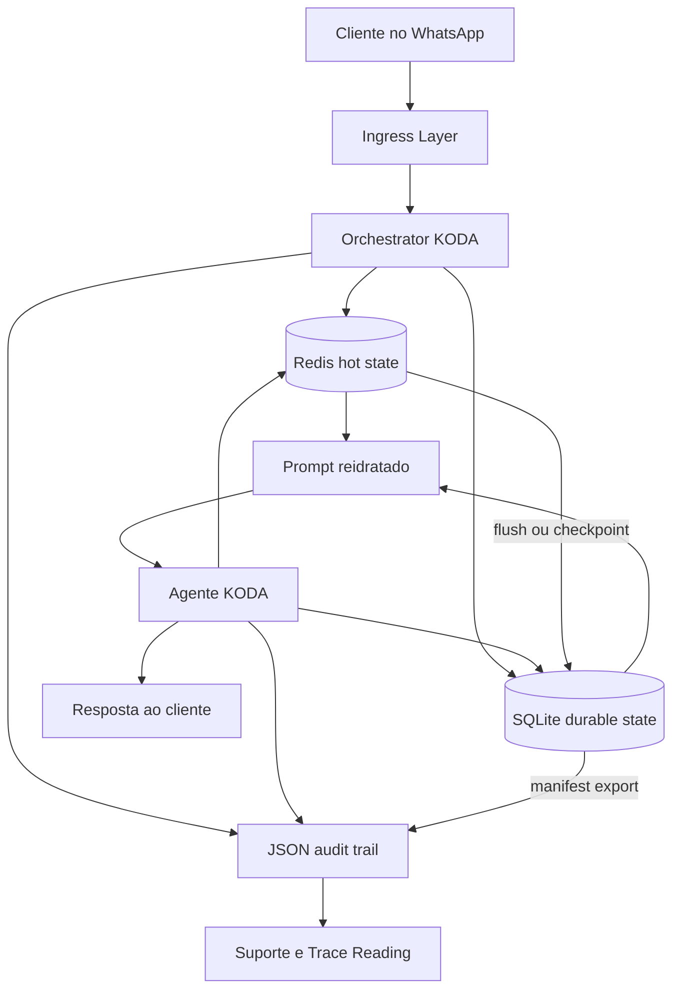
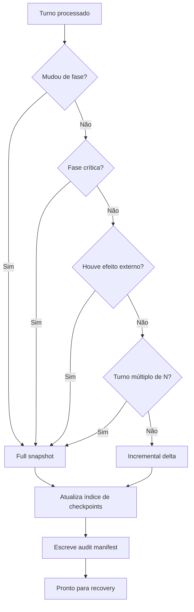
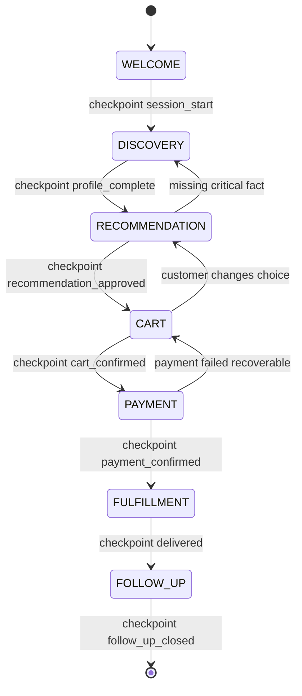

# 🎯 State Persistence: A Memória Durável dos Agentes Long-Running
## Como transformar conversas frágeis em jornadas recuperáveis, auditáveis e confiáveis

**Tempo Estimado:** 120 minutos  
**Nível:** Core Concept 5 de 8  
**Pré-requisito:** Ter completado Nível 1, Nível 2, e lido `curriculum/03-nivel-3-advanced-architecture/02-state-persistence.md`  
**Status:** CRÍTICO, conceito base para agentes que sobrevivem a falhas, retornos e conversas longas  
**Data de Criação:** Maio 2026

---

## 📖 Prólogo: A Conversa que Pedro Não Queria Repetir

Pedro não queria conversar com uma máquina. Ele queria resolver uma compra.

Era quarta-feira, 21h15, depois de um dia longo. Ele abriu o WhatsApp e pediu ajuda ao KODA para montar uma stack de suplementos sem estourar R$ 380.

No começo, parecia uma conversa simples. Cinco minutos depois, já havia restrição a glúten, treino noturno sem cafeína, preferência por produtos bem avaliados, dúvida sobre sabor, cálculo de frete e comparação entre comprar creatina agora ou deixar para o mês seguinte.

O KODA foi bem. Guardou orçamento. Respeitou a restrição. Não empurrou produto fora de estoque. Explicou preço por dose. Montou um carrinho coerente.

A conversa levou 47 minutos. Para a equipe técnica, 47 minutos podem parecer apenas uma sessão longa. Para Pedro, foram 47 minutos de atenção, decisão e confiança.

No final, o KODA resumiu o carrinho: whey isolado baunilha, creatina monohidratada, pré-treino sem cafeína, multivitamínico, frete grátis para Vila Mariana e total de R$ 379,60.

Pedro respondeu: pode finalizar.

O KODA gerou o link de pagamento. Pedro clicou. A tela abriu. Ele digitou os dados do cartão.

Então o servidor reiniciou.

Foi um restart comum, ligado a um deploy pequeno. Nenhum alerta crítico acendeu. Nenhum engenheiro chamou aquilo de incidente.

Mas o processo voltou sem memória. O objeto que guardava o carrinho morreu. O `context window` da chamada anterior acabou. O link de pagamento existia em algum gateway externo, mas o KODA já não sabia conectá-lo à conversa.

Pedro voltou ao WhatsApp e escreveu: deu erro no pagamento, tenta de novo?

O KODA respondeu: oi, como posso te ajudar?

A resposta era educada. Para Pedro, soou como descaso.

Ele não queria explicar de novo glúten, cafeína, orçamento, bairro e preferência de sabor. Não queria reconstruir uma decisão que já estava pronta.

Pedro não abandonou porque o modelo era ruim. Não abandonou porque o preço era alto. Abandonou porque o sistema esqueceu.

Esse é o centro de `state persistence`.

Quando um agente esquece, o cliente não enxerga arquitetura. Ele enxerga falta de respeito pelo próprio tempo.

Persistir estado não é salvar arquivos por disciplina técnica. É transformar uma conversa em uma jornada que sobrevive ao mundo real.

O mundo real tem crash, timeout, deploy no meio da noite, cliente que volta depois de três dias, `context overflow`, gateway que responde duas vezes e agente que precisa recomeçar sem parecer que recomeçou.

Sem `state persistence`, cada falha vira amnésia. Com `state persistence`, cada falha vira pausa.

A diferença parece pequena no log. Para Pedro, é a diferença entre confiança e abandono.

Este core concept aprofunda essa diferença. O módulo de Nível 3 ensina uma implementação didática. Este texto pergunta antes: que tipo de memória um agente precisa ter, que estado merece sobreviver, qual backend deve guardar cada coisa, quando um checkpoint é seguro, e como recuperar sem inventar uma história nova para o cliente.

Um agente long-running só merece esse nome quando consegue dizer ao cliente: eu lembro de onde paramos.

---

## 🔗 Como Este Conceito Se Conecta ao Currículo

`State Persistence` é o quinto dos oito core concepts porque fica no meio da ponte entre raciocínio e operação.

Antes dele, você aprende por que agentes perdem contexto e como criar padrões de qualidade. Depois dele, você aprende como evoluir harness, coordenar múltiplos agentes e desenhar rubrics mais fortes.

| Nível | O que você aprendeu ou vai aprender | Conexão com State Persistence |
| --- | --- | --- |
| Nível 1, Fundamentals | `context management`, `token budgeting`, basic harness | Mostra que `context window` é limitada e precisa de memória externa |
| Nível 2, Practical Patterns | Generator/Evaluator, Sprint Contracts, Rubric Design, Trace Reading | Gera artefatos que precisam sobreviver entre agentes, avaliações e tentativas |
| Nível 3, Advanced Architecture | Multi-agent systems, state persistence, file coordination, server-side compaction, harness evolution | Transforma o agente em sistema recuperável, auditável e operável |
| Nível 4, KODA-Specific | Customer journey flows, feature patterns, KODA rubrics e harness improvements | Aplica persistência em venda real por WhatsApp, pedido, pagamento, entrega e follow-up |

```
Nível 1: entender por que o agente esquece
    |
    v
Nível 2: separar criação, avaliação e contratos
    |
    v
Nível 3: persistir estado para sobreviver a falhas
    |
    v
Nível 4: aplicar em KODA, com clientes, pedidos e suporte real
```

Arquivos que este conceito complementa:

- `curriculum/01-nivel-1-fundamentals/01-why-agents-lose-plot.md`

- `curriculum/01-nivel-1-fundamentals/02-token-budgeting.md`

- `curriculum/01-nivel-1-fundamentals/03-basic-harness-patterns.md`

- `curriculum/02-nivel-2-practical-patterns/01-generator-evaluator-pattern.md`

- `curriculum/02-nivel-2-practical-patterns/02-sprint-contracts.md`

- `curriculum/02-nivel-2-practical-patterns/03-rubric-design.md`

- `curriculum/02-nivel-2-practical-patterns/04-trace-reading.md`

- `curriculum/03-nivel-3-advanced-architecture/01-multi-agent-systems.md`

- `curriculum/03-nivel-3-advanced-architecture/02-state-persistence.md`

- `curriculum/03-nivel-3-advanced-architecture/03-file-based-coordination.md`

- `curriculum/03-nivel-3-advanced-architecture/04-server-side-compaction.md`

- `curriculum/03-nivel-3-advanced-architecture/05-harness-evolution.md`

- `curriculum/03-nivel-3-advanced-architecture/koda-applications/nivel-3-koda.md`

- `curriculum/04-nivel-4-koda-specific/01-koda-architecture.md`

- `curriculum/04-nivel-4-koda-specific/02-customer-journey-flows.md`

- `curriculum/04-nivel-4-koda-specific/03-feature-design-patterns.md`

- `curriculum/04-nivel-4-koda-specific/04-evaluation-rubrics-koda.md`

- `curriculum/04-nivel-4-koda-specific/05-harness-improvements.md`

---

## 🎯 O Que É State Persistence

`State Persistence` é a prática de salvar o estado relevante de um agente fora da memória volátil do processo, de modo que a jornada possa ser retomada depois de falhas, pausas, reinícios, mudanças de contexto ou retorno do usuário.

Estado é qualquer informação que muda o próximo passo correto do agente. Se uma informação não muda a próxima decisão, ela pode ser log, histórico ou contexto secundário. Se muda a próxima decisão, ela é estado.

No KODA, o fato de Pedro gostar de baunilha é estado quando influencia a recomendação. O orçamento de R$ 380 é estado. A restrição a glúten é estado crítico. O carrinho com quatro itens é estado transacional. O link de pagamento gerado é estado de integração externa.

Um agente sem persistência confunde memória do modelo com memória do sistema. Um agente maduro separa três camadas: o que o modelo vê agora, o que o sistema sabe de forma durável, e o que a auditoria precisa reconstruir depois.

### Memória de `context window`

A `context window` é a memória visível ao modelo em uma chamada. Ela inclui system prompt, mensagens recentes, resumos, ferramentas disponíveis e trechos de estado injetados no prompt.

É poderosa porque orienta o raciocínio imediato. Também é frágil porque desaparece quando a chamada termina.

A `context window` deve ser tratada como mesa de trabalho, não como arquivo morto. Você coloca nela o que o agente precisa para pensar agora. Você não confia nela para guardar o que o cliente não pode perder.

### Memória externa

Memória externa é o estado salvo em backend durável ou semi-durável. Pode ser SQLite, JSON files, Redis com persistência configurada, PostgreSQL, object storage, event log ou outra camada.

O backend importa menos que a promessa que ele faz. Algumas camadas prometem baixa latência. Outras prometem durabilidade. Outras prometem auditoria humana.

No KODA, Redis pode guardar o estado quente da sessão. SQLite pode guardar o estado durável e consultável. JSON files podem guardar o audit trail que o suporte consegue abrir sem ferramenta especial.

### Tipos de memória em agentes long-running

| Tipo de memória | Onde vive | Duração típica | Uso principal | Risco se faltar |
| --- | --- | --- | --- | --- |
| `context window` | Prompt da chamada atual | Segundos ou minutos | Raciocínio imediato | Modelo esquece ou recebe contexto incompleto |
| Estado quente | Redis ou memória com flush | Minutos ou horas | Sessão ativa, carrinho atual, últimos turns | Latência alta ou reconstrução repetida |
| Estado durável | SQLite ou banco transacional | Dias, meses ou anos | Perfil, pedido, pagamento, checkpoints | Perda de venda, duplicidade, recuperação errada |
| Audit trail | JSON files, event log ou storage | Meses ou anos | Debug, suporte, compliance e trace reading | Falha inexplicável, suporte sem evidência |
| Resumo curado | Banco, arquivo ou prompt cache | Enquanto a jornada for útil | Compactar conversa longa | Context overflow ou perda de fatos críticos |
| Estado externo | Gateway, ERP, logística, CRM | Definido pelo sistema externo | Pagamento, reserva, entrega, ticket | Divergência entre o que KODA diz e o que aconteceu |

### A regra prática

Persistir estado é responder a quatro perguntas antes da falha acontecer.

Primeiro: qual dado precisa sobreviver?

Segundo: quando esse dado se torna verdade suficiente para salvar?

Terceiro: onde ele deve ser salvo para equilibrar latência, durabilidade e auditoria?

Quarto: como o sistema sabe o que fazer quando carrega esse dado depois de uma falha?

Um `cart.json` sem fase não sabe se o carrinho está em rascunho, aprovado ou pago. Um checkpoint sem `turn_number` não sabe qual mensagem do cliente já foi processada. Um estado salvo sem estratégia de recovery é apenas armazenamento.

---

## 🧠 Por Que É Essencial para Long-Running Agents

Agentes long-running falham de formas diferentes de chatbots curtos. Em uma demo de cinco minutos, tudo cabe na memória. Em uma operação de vendas, suporte ou pesquisa, o agente precisa atravessar tempo.

Atravessar tempo significa sobreviver a mudanças de processo, rede, modelo, usuário e ambiente. Quando um agente não persiste estado, qualquer evento externo vira uma perda cognitiva. Quando persiste bem, eventos externos viram interrupções recuperáveis.

### As quatro categorias de falha

| Categoria | O que acontece | Sintoma no KODA | Estado que evita perda | Recuperação correta |
| --- | --- | --- | --- | --- |
| Crash de processo | Worker morre, servidor reinicia ou container é recriado | Pedro volta e KODA não lembra o carrinho | `session_state`, `cart`, `phase`, `last_processed_event` | Carregar último checkpoint seguro e responder na fase certa |
| Timeout de chamada | LLM, catálogo, pagamento ou entrega demora demais | Cliente recebe resposta incompleta ou nada | `attempt_id`, `partial_generation`, `pending_action` | Rollback para checkpoint anterior ou retry idempotente |
| Context overflow | Histórico excede o limite útil do modelo | Restrição antiga some da recomendação | `customer_facts`, `conversation_summary`, `critical_constraints` | Reidratar prompt com resumo curado e fatos críticos |
| Session resumption | Cliente volta horas ou dias depois | KODA trata retorno como conversa nova | `customer_profile`, `open_cart`, `order_status`, `next_expected_action` | Retomar com contexto específico e confirmar intenção atual |

### Crash de processo

Processos morrem por deploy, falta de memória, reinício de host, bug, autoscaling ou queda de dependência. A pergunta central não é se o processo vai cair. Ele vai cair. A pergunta é se a queda apaga a jornada do cliente.

### Timeout

Timeout é diferente de crash porque o processo pode continuar vivo, mas uma operação ficou sem resposta. Um bom estado de timeout inclui `attempt_id`, `started_at`, `idempotency_key`, `operation_type` e `safe_retry`.

### Context overflow

`Context overflow` é a falha silenciosa das conversas longas. A resposta tem tom confiante, mas um detalhe antigo sumiu. A solução é externalizar fatos críticos e reidratar o prompt com estado curado.

### Session resumption

Clientes fecham o WhatsApp, voltam depois do treino e pedem opinião de outra pessoa. Quando voltam, o agente precisa saber se a conversa é continuação, nova intenção ou suporte pós-venda.

### ROI de state persistence

Persistência de estado tem ROI porque reduz abandono, retrabalho, custo de suporte e incidentes operacionais.

Imagine 1000 conversas por dia, ticket médio de R$ 190, e 5% das conversas afetadas por falha ou retomada. Sem persistência, 60% dessas conversas afetadas abandonam. Com persistência, 10% abandonam porque ainda pode haver fricção, mas a jornada não é perdida.

```
Conversas por dia: 1000
Conversas afetadas por falha ou retomada: 50
Abandono sem persistência: 30 conversas
Abandono com persistência: 5 conversas
Diferença: 25 conversas salvas por dia
Ticket médio: R$ 190
Receita preservada por dia: R$ 4.750
Receita preservada por mês: R$ 142.500
```

### ROI operacional

| Item | Sem persistência | Com persistência | Efeito prático |
| --- | --- | --- | --- |
| Suporte | Pede ao cliente para repetir tudo | Consulta checkpoint e retoma com precisão | Menos tempo por ticket |
| Engenharia | Reconstrói incidente por logs incompletos | Abre audit trail com manifest e checkpoints | Menos horas de debug |
| Produto | Perde aprendizado de jornadas longas | Analisa fases onde clientes abandonam | Melhor priorização |
| Vendas | Carrinho some após falha | Carrinho é recuperado | Mais conversão |
| Confiança | Cliente sente sistema frágil | Cliente sente continuidade | Mais recompra |

---

## 📊 Tabela Comparativa de Estratégias de Persistência

A escolha do backend deve começar pela promessa necessária para cada estado.

### SQLite vs JSON Files vs Redis

| Dimensão | SQLite | JSON Files | Redis |
| --- | --- | --- | --- |
| Latência | Baixa, em geral 1 a 5 ms com escrita durável local | Baixa para arquivos pequenos, mas cresce com parse completo | Muito baixa, normalmente sub-millisecond em rede local |
| Durabilidade | Alta com journaling e WAL configurado | Alta se usar escrita atômica e storage confiável | Variável, alta só com AOF, RDB e operação correta |
| Concorrência | Leitores múltiplos, um writer por vez, melhor com WAL | Fraca sem lock, adequada com file lock e particionamento | Boa para múltiplos writers em operações atômicas |
| Complexidade | Baixa, arquivo único, sem servidor separado | Muito baixa, só filesystem e disciplina de escrita | Média, exige servidor, config, backup e monitoramento |
| Query power | SQL, índices, joins, filtros e agregações | Quase nenhum, precisa ler e filtrar manualmente | Comandos por estrutura, bom para chave e fila, limitado para análise |
| Schema | Forte, com constraints, tipos e migrações | Fraco, precisa validação explícita no código | Fraco, precisa convenção de chaves e validação no código |
| Portabilidade | Arquivo portável, fácil copiar entre ambientes | Texto portável, legível por humanos e `git diff` | Depende de servidor Redis e formato de dump |
| Max size | Gigabytes por arquivo com bom schema e índices | Melhor abaixo de dezenas de MB por arquivo | Limitado por RAM, com pressão de eviction |
| Backup | Backup por API SQLite, cópia consistente ou snapshot de volume | Cópia de diretório, compressão simples, revisão manual fácil | RDB, AOF, replica e snapshots operacionais |
| Audit trail | Bom com tabelas de eventos ou triggers | Excelente, cada arquivo pode ser um artefato legível | Bom com Redis Streams, fraco se usado só como cache |
| Best use case | Estado durável, consultável e transacional | Protótipo, trace, manifest e auditoria humana | Estado quente, sessão ativa, fila e cache de baixa latência |

SQLite é o melhor default quando você precisa de durabilidade e consulta sem operar um servidor separado.

JSON files são excelentes quando a equipe ainda está entendendo o formato do estado e precisa debugar olhando arquivos.

Redis é excelente para estado quente, mas perigoso como única fonte de verdade se persistência não estiver configurada.

Em produção, a melhor arquitetura costuma combinar as três camadas.

### Tabela comparativa de checkpointing

| Dimensão | Full Snapshot | Incremental Delta | Hybrid |
| --- | --- | --- | --- |
| O que salva | Todo o estado relevante em um ponto seguro | Somente campos alterados desde o último checkpoint | Full snapshot periódico mais deltas intermediários |
| Custo de escrita | Maior, cresce com tamanho do estado | Menor, cresce com tamanho da mudança | Médio, controlado por frequência de full snapshot |
| Custo de leitura | Baixo, carrega um arquivo ou registro | Maior, aplica cadeia de deltas | Baixo a médio, carrega último full e poucos deltas |
| Recuperação | Simples e confiável | Mais complexa, depende de ordem correta | Confiável com eficiência aceitável |
| Auditabilidade | Mostra pontos consolidados | Mostra cada mudança com precisão | Mostra mudanças e pontos de consolidação |
| Risco de corrupção | Isolado por snapshot | Um delta ruim afeta deltas seguintes | Limitado pelo próximo full snapshot |
| Quando usar | Fase crítica, pagamento, pedido, retomada entre sessões | Turns frequentes, coleta incremental, ajuste de perfil | Produção, conversas longas, KODA real |
| Exemplo KODA | Carrinho aprovado antes do pagamento | Nova restrição adicionada no Discovery | Full por fase, delta por turno |

### Tabela comparativa de recuperação

| Dimensão | Rollback | Replay | Compensation/Saga |
| --- | --- | --- | --- |
| Ideia central | Voltar para último checkpoint seguro | Reexecutar eventos desde um ponto conhecido | Desfazer efeitos externos já aplicados |
| Melhor para | Crash, timeout, erro transitório | Reconstrução determinística e auditoria | Pagamento, estoque, entrega e sistemas externos |
| Pré-requisito | Checkpoint confiável | Event log completo e operação determinística | Ação compensatória para cada passo externo |
| Risco | Perder trabalho após o checkpoint | Divergir se modelo ou dependência não for determinística | Compensação também pode falhar |
| Complexidade | Baixa | Média a alta | Alta |
| Resposta ao cliente | Retoma do ponto seguro | Reconstrói e segue como se nada tivesse ocorrido | Explica opção segura quando mundo externo mudou |
| Exemplo KODA | Timeout ao gerar recomendação | Reprocessar turns após deploy | Liberar estoque se pagamento falhou depois de reserva |

### Tabela comparativa de coordenação com persistência

State persistence não vive sozinha. Ela transforma cada estratégia de coordenação entre agentes, reduzindo retrabalho e eliminando pontos cegos quando falhas ocorrem.

| Estratégia de Coordenação | Sem Persistência | Com Persistência | Ganho |
| --- | --- | --- | --- |
| **Sequencial** (Planner → Generator → Evaluator) | Se o Evaluator falha, perde-se `plan.json` e `generation.json`. Recomeça do zero, refazendo trabalho dos dois agentes anteriores. | Cada agente escreve seu artefato em disco. Se o Evaluator falha, o sistema detecta que `plan.json` e `generation.json` já existem e reexecuta apenas o Evaluator. | Retrabalho cai de 100% para ~10%. Planner e Generator nunca refazem trabalho já validado. |
| **Paralelo** (N Generators concorrentes) | Se 1 dos N Generators falha, não há registro de quem terminou. Ou refaz todos (N× custo) ou assume inconsistência silenciosa. | Cada Generator escreve seu output em disco com nome único. Sistema verifica quais arquivos existem, reexecuta apenas os ausentes. | Retrabalho cai de 100% para ~1/N. Inconsistência silenciosa eliminada. |
| **Event-driven** (agentes reagem a eventos) | Se um agente perde um evento (crash, rede, race condition), ele nunca reage. Estado fica inconsistente sem detecção. | Eventos são persistidos em fila durável (Redis Streams com AOF, SQLite queue). Cada agente processa do último evento confirmado (offset). | Eventos perdidos caem de ~5% para <0.1%. Reprocessamento é determinístico. |
| **Orquestrado** (orchestrator central) | Se o orchestrator morre, todo o pipeline para. Nenhum agente sabe o estado dos outros. | Orchestrator mantém `pipeline_state.json` com fase, agentes concluídos e próximos passos. Ao reiniciar, lê o estado e retoma de onde parou. | Downtime de pipeline cai de "recomeçar tudo" para "retomar do último checkpoint". |
| **Choreography** (agentes autônomos sem orquestrador) | Sem estado compartilhado, agentes não sabem se dependentes terminaram. Duplicação de trabalho ou deadlock silencioso. | Cada agente publica seu estado em local conhecido (`state/sessions/{id}/agents/{agent}/status.json`). Agentes downstream leem antes de agir. | Coordenação descentralizada torna-se observável e recuperável. |

---

## 🗄️ Arquitetura de Persistência em Camadas

A arquitetura recomendada para KODA separa estado quente, estado durável e audit trail.

### Diagrama Mermaid 1: persistência multi-layer



### Diagrama ASCII: camadas de persistência

```
+--------------------------------------------------------------+
|                    KODA PERSISTENCE STACK                    |
+--------------------------------------------------------------+
| Layer 1: Redis hot state                                     |
| - session phase                                              |
| - current cart                                               |
| - last N turns                                               |
| - short TTL for active conversation                          |
|                         |                                    |
|                         v                                    |
| Layer 2: SQLite durable state                                |
| - customer profile                                           |
| - order state                                                |
| - payment state                                              |
| - checkpoint index                                           |
|                         |                                    |
|                         v                                    |
| Layer 3: JSON audit trail                                    |
| - plan.json                                                  |
| - generation.json                                            |
| - evaluation.json                                            |
| - recovery_decision.json                                     |
+--------------------------------------------------------------+
```

Redis responde rápido. SQLite preserva e consulta. JSON explica. Essa divisão reduz acoplamento e facilita recovery.

---

## 🔄 Estratégias de Checkpointing

Checkpointing é decidir quando o estado ficou seguro o bastante para ser salvo como ponto de retomada.

Um checkpoint ruim pode ser pior que nenhum checkpoint. Se salva uma fase ambígua, o sistema recupera com confiança falsa. Se salva tarde demais, a falha ainda apaga trabalho importante.

### Full snapshot

`Full snapshot` salva todo o estado necessário para retomar a jornada sem depender de eventos anteriores. No KODA, use full snapshot no começo da sessão, na mudança de fase, antes de pagamento, depois de pagamento confirmado e antes de qualquer efeito externo importante.

```python
from dataclasses import dataclass, asdict
from datetime import datetime, timezone
from pathlib import Path
import json
import os
import tempfile


def now_iso():
    return datetime.now(timezone.utc).isoformat()


def atomic_write_json(path: Path, data: dict) -> None:
    path.parent.mkdir(parents=True, exist_ok=True)
    handle = tempfile.NamedTemporaryFile(mode="w", encoding="utf-8", dir=path.parent, delete=False, suffix=".tmp")
    try:
        json.dump(data, handle, ensure_ascii=False, indent=2, sort_keys=True)
        handle.write("\n")
        handle.flush()
        os.fsync(handle.fileno())
    finally:
        handle.close()
    os.replace(handle.name, path)


@dataclass
class FullSnapshot:
    checkpoint_id: str
    session_id: str
    phase: str
    turn_number: int
    schema_version: str
    snapshot: dict
    next_expected_action: str
    created_at: str


def create_full_snapshot(session_id: str, phase: str, turn_number: int, state: dict) -> str:
    checkpoint = FullSnapshot(
        checkpoint_id=f"full_{session_id}_{turn_number:04d}",
        session_id=session_id,
        phase=phase,
        turn_number=turn_number,
        schema_version="koda-state-v1",
        snapshot=state,
        next_expected_action=state.get("next_expected_action", "continue_conversation"),
        created_at=now_iso(),
    )
    path = Path("state") / "sessions" / session_id / "checkpoints" / f"{checkpoint.checkpoint_id}.json"
    atomic_write_json(path, asdict(checkpoint))
    return checkpoint.checkpoint_id
```

### Incremental delta

`Incremental delta` salva apenas o que mudou desde o checkpoint anterior. É útil quando a conversa muda pouco por turno, mas acontece muitas vezes. O delta precisa de base clara. Sem base, ele é um fragmento solto.

```python
def compute_delta(previous: dict, current: dict) -> dict:
    changes = {}
    keys = set(previous.keys()) | set(current.keys())
    for key in sorted(keys):
        if previous.get(key) != current.get(key):
            changes[key] = current.get(key)
    return changes


def create_delta_checkpoint(session_id: str, base_checkpoint_id: str, phase: str, turn_number: int, previous_state: dict, current_state: dict) -> str:
    checkpoint_id = f"delta_{session_id}_{turn_number:04d}"
    checkpoint = {
        "checkpoint_id": checkpoint_id,
        "session_id": session_id,
        "type": "delta",
        "phase": phase,
        "turn_number": turn_number,
        "base_checkpoint_id": base_checkpoint_id,
        "changes": compute_delta(previous_state, current_state),
        "schema_version": "koda-state-v1",
        "created_at": now_iso(),
    }
    path = Path("state") / "sessions" / session_id / "checkpoints" / f"{checkpoint_id}.json"
    atomic_write_json(path, checkpoint)
    return checkpoint_id
```

### Hybrid

`Hybrid` combina full snapshot periódico com deltas entre snapshots. É o padrão recomendado para produção porque limita a cadeia de deltas e mantém recuperação rápida.

```python
CRITICAL_PHASES = {"cart", "payment", "fulfillment"}
FULL_SNAPSHOT_EVERY_N_TURNS = 10


def choose_checkpoint_strategy(current_phase: str, previous_phase: str, turn_number: int, has_external_effect: bool) -> str:
    if current_phase != previous_phase:
        return "full_snapshot"
    if current_phase in CRITICAL_PHASES:
        return "full_snapshot"
    if has_external_effect:
        return "full_snapshot"
    if turn_number % FULL_SNAPSHOT_EVERY_N_TURNS == 0:
        return "full_snapshot"
    return "incremental_delta"
```

### Diagrama Mermaid 2: fluxo de decisão de checkpoint



---

## 🔧 Estratégias de Recuperação

Salvar estado é só metade do sistema. A outra metade é saber o que fazer quando algo falha. Recuperação boa protege consistência técnica, verdade operacional e experiência do cliente.

### Rollback

`Rollback` volta para o último checkpoint seguro. Use quando a operação falhou antes de alterar o mundo externo.

### Replay determinístico

`Replay` reconstrói estado reexecutando eventos desde um checkpoint conhecido. Com LLM, determinismo exige prompts versionados, tool outputs persistidos e modelos fixados.

### Compensation/Saga

`Compensation/Saga` é a estratégia para quando o agente já alterou sistemas externos. Rollback de arquivo não cancela uma cobrança e replay não libera estoque sozinho.

```python
def rollback_to_latest_safe_state(session_id: str) -> dict:
    checkpoint = load_latest_safe_checkpoint(session_id)
    return checkpoint["snapshot"]


def replay_events(session_id: str, events: list[dict], processor) -> dict:
    state = rollback_to_latest_safe_state(session_id)
    for event in events:
        result = processor.process_event(state=state, event=event)
        state = result["state"]
    return state


class CheckoutSaga:
    def __init__(self, services):
        self.services = services
        self.compensations = []

    def run(self, cart: dict) -> dict:
        try:
            reservation = self.services.inventory.reserve(cart["items"])
            self.compensations.append(lambda: self.services.inventory.release(reservation["reservation_id"]))
            payment = self.services.payment.create_link(cart["total_cents"])
            self.compensations.append(lambda: self.services.payment.cancel(payment["payment_id"]))
            return {"status": "success", "payment": payment}
        except Exception as error:
            for compensation in reversed(self.compensations):
                compensation()
            return {"status": "compensated", "error": str(error)}
```

---

## 🚀 Aplicação Prática no KODA: Customer State Machine

A forma mais útil de aplicar `state persistence` no KODA é tratar a conversa como uma `state machine`. Cada fase tem dados próprios, backend preferido, estratégia de checkpoint e regra de recuperação.

### Diagrama Mermaid 3: KODA Customer State Machine



### Fases e contratos de persistência

| Fase | Dados persistidos | Backend principal | Checkpoint strategy | Regra de recovery |
| --- | --- | --- | --- | --- |
| WELCOME | `session_id`, canal, horário, `customer_id` provável | Redis + SQLite | Full snapshot ao abrir sessão | Retomar saudação sem duplicar boas-vindas |
| DISCOVERY | Objetivo, restrições, orçamento, preferências, lacunas | Redis + JSON audit | Delta por fato novo, full ao completar perfil | Perguntar apenas a lacuna que falta |
| RECOMMENDATION | Produtos candidatos, scores, rejeições, versão do catálogo | JSON audit + SQLite index | Full snapshot após Evaluator aprovar | Reexibir recomendação aprovada sem recalcular se catálogo ainda é válido |
| CART | SKUs, quantidades, preço travado, frete, cupom, validade | Redis + SQLite | Full snapshot a cada confirmação de carrinho | Restaurar carrinho e confirmar se cliente quer seguir |
| PAYMENT | `payment_id`, link, status, idempotency key, tentativa | SQLite | Full snapshot antes e depois de chamar gateway | Consultar gateway antes de gerar novo link |
| FULFILLMENT | Reserva, pedido, tracking, transportadora, promessa | SQLite + JSON audit | Delta por evento de entrega | Não duplicar reserva nem promessa |
| FOLLOW_UP | Data agendada, pedido relacionado, resposta do cliente | SQLite | Full snapshot ao agendar, delta ao responder | Retomar suporte com pedido correto |

O Addressable Memory Catalog complementa a persistência de estado: estado durável guarda facts/checkpoints; catálogo guarda handles para conteúdo omitido recuperável. No KODA, `retrieval_manifest.json` já cumpre parte desse papel. A diferença é explicitar `preview` e `kind`, para o agente saber o que pode buscar sem carregar tudo de volta.

#### Tiered Context Storage: Além do Modelo Binário Ativo/Externo

A arquitetura de persistência em três camadas (Redis → SQLite → JSON) descrita acima é uma arquitetura de **storage**. Mas a arquitetura de **contexto** — o que o modelo efetivamente recebe no prompt — precisa de uma abstração complementar: o modelo de três tiers de contexto (hot/warm/cold) com promoção e demotion por relevância.

**A diferença:**
- **Storage layers** (Redis, SQLite, JSON) respondem: onde o dado vive fisicamente e com qual durabilidade.
- **Context tiers** (hot, warm, cold) respondem: qual a probabilidade de o modelo precisar deste dado no próximo passo.

O [[docs/canonical/tiered-context-storage|Tiered Context Storage]] conecta essas duas dimensões: o Tier Orchestrator decide quais dados mover entre tiers (promoção/demotion) baseado em relevance scores do [[docs/canonical/relational-context-graph|Relational Context Graph]], e os storage backends (Redis para hot, SQLite para warm, JSON/object storage para cold) provêm os contratos de latência correspondentes.

**Exemplo KODA:** Quando Camila está na fase de recomendação, o perfil de restrições alimentares está no hot tier (Redis, sub-ms). As preferências de sabor da fase de discovery estão no warm tier (SQLite, ~1ms — acessíveis se ela mudar de ideia). O histórico completo de 2h está no cold tier (JSON audit, ~100ms — recuperável se ela perguntar sobre um detalhe do minuto 15). Quando a conversa avança para checkout, o Tier Orchestrator demote as preferências de sabor para cold (não são mais críticas) e promove o carrinho e endereço para hot.

**Conexão com o currículo:** O Tiered Context Storage estende o modelo de três camadas de persistência adicionando dinâmica de relevância. Ele não substitui Redis/SQLite/JSON — ele os utiliza como backends com contratos de latência diferentes. Para o padrão completo, veja [[docs/canonical/tiered-context-storage|Tiered Context Storage]].

### Implementação completa em Python

```python
from __future__ import annotations
from dataclasses import dataclass, field
from datetime import datetime, timedelta, timezone
from enum import Enum
from pathlib import Path
import json
import os
import tempfile


class JourneyPhase(str, Enum):
    WELCOME = "WELCOME"
    DISCOVERY = "DISCOVERY"
    RECOMMENDATION = "RECOMMENDATION"
    CART = "CART"
    PAYMENT = "PAYMENT"
    FULFILLMENT = "FULFILLMENT"
    FOLLOW_UP = "FOLLOW_UP"


@dataclass
class PersistedState:
    session_id: str
    customer_id: str
    phase: JourneyPhase
    turn_number: int = 0
    customer_profile: dict = field(default_factory=dict)
    recommendation: dict = field(default_factory=dict)
    cart: dict = field(default_factory=dict)
    payment: dict = field(default_factory=dict)
    fulfillment: dict = field(default_factory=dict)
    follow_up: dict = field(default_factory=dict)
    next_expected_action: str = "receive_customer_message"
    last_processed_event_id: str | None = None
    schema_version: str = "koda-session-v1"
    created_at: str = field(default_factory=lambda: datetime.now(timezone.utc).isoformat())
    updated_at: str = field(default_factory=lambda: datetime.now(timezone.utc).isoformat())

    def to_dict(self) -> dict:
        data = self.__dict__.copy()
        data["phase"] = self.phase.value
        return data

    @classmethod
    def from_dict(cls, data: dict) -> "PersistedState":
        payload = dict(data)
        payload["phase"] = JourneyPhase(payload["phase"])
        return cls(**payload)


class LayeredPersistence:
    def __init__(self, root: Path):
        self.root = root
        self.hot_state = {}
        self.durable_state = {}

    def save_hot(self, state: PersistedState) -> None:
        self.hot_state[state.session_id] = state.to_dict()

    def save_durable(self, state: PersistedState) -> None:
        self.durable_state[state.session_id] = state.to_dict()
        atomic_write_json(self.root / state.session_id / "durable" / "session_state.json", state.to_dict())

    def save_audit(self, session_id: str, name: str, payload: dict) -> None:
        atomic_write_json(self.root / session_id / "audit" / name, payload)

    def load(self, session_id: str) -> PersistedState | None:
        if session_id in self.hot_state:
            return PersistedState.from_dict(self.hot_state[session_id])
        if session_id in self.durable_state:
            return PersistedState.from_dict(self.durable_state[session_id])
        path = self.root / session_id / "durable" / "session_state.json"
        if path.exists():
            return PersistedState.from_dict(json.loads(path.read_text(encoding="utf-8")))
        return None

    def save_checkpoint(self, state: PersistedState, checkpoint_type: str, strategy: str) -> None:
        checkpoint = {
            "checkpoint_id": f"{checkpoint_type}_{state.turn_number:04d}",
            "session_id": state.session_id,
            "customer_id": state.customer_id,
            "phase": state.phase.value,
            "turn_number": state.turn_number,
            "strategy": strategy,
            "snapshot": state.to_dict(),
            "next_expected_action": state.next_expected_action,
            "schema_version": state.schema_version,
            "created_at": datetime.now(timezone.utc).isoformat(),
        }
        atomic_write_json(self.root / state.session_id / "checkpoints" / f"{checkpoint['checkpoint_id']}.json", checkpoint)

    def latest_checkpoint(self, session_id: str) -> dict | None:
        checkpoint_dir = self.root / session_id / "checkpoints"
        files = sorted(checkpoint_dir.glob("*.json"), reverse=True) if checkpoint_dir.exists() else []
        if not files:
            return None
        return json.loads(files[0].read_text(encoding="utf-8"))


class KodaSessionStateMachine:
    def __init__(self, session_id: str, customer_id: str, persistence: LayeredPersistence):
        self.session_id = session_id
        self.customer_id = customer_id
        self.persistence = persistence
        self.handlers = {
            JourneyPhase.WELCOME: self._handle_welcome,
            JourneyPhase.DISCOVERY: self._handle_discovery,
            JourneyPhase.RECOMMENDATION: self._handle_recommendation,
            JourneyPhase.CART: self._handle_cart,
            JourneyPhase.PAYMENT: self._handle_payment,
            JourneyPhase.FULFILLMENT: self._handle_fulfillment,
            JourneyPhase.FOLLOW_UP: self._handle_follow_up,
        }

    def load_or_initialize(self) -> PersistedState:
        loaded = self.persistence.load(self.session_id)
        if loaded:
            return loaded
        state = PersistedState(self.session_id, self.customer_id, JourneyPhase.WELCOME, cart={"items": [], "total_cents": 0, "status": "empty"})
        self._persist_all(state, "session_start", "full_snapshot")
        return state

    def process_turn(self, message: str, event_id: str) -> str:
        state = self.load_or_initialize()
        if state.last_processed_event_id == event_id:
            return self._resume_message(state)
        previous_phase = state.phase
        state.turn_number += 1
        state.last_processed_event_id = event_id
        response, next_phase = self.handlers[state.phase](state, message)
        state.phase = next_phase
        state.updated_at = datetime.now(timezone.utc).isoformat()
        self._persist_all(state, self._checkpoint_type(previous_phase, state.phase), self._strategy_for(previous_phase, state.phase))
        return response

    def recover_after_crash(self) -> str:
        state = self.persistence.load(self.session_id)
        if state:
            return self._resume_message(state)
        checkpoint = self.persistence.latest_checkpoint(self.session_id)
        if not checkpoint:
            return self._resume_message(self.load_or_initialize())
        restored = PersistedState.from_dict(checkpoint["snapshot"])
        self._persist_all(restored, "crash_recovery", "full_snapshot")
        return self._resume_message(restored)

    def _persist_all(self, state: PersistedState, checkpoint_type: str, strategy: str) -> None:
        self.persistence.save_hot(state)
        self.persistence.save_durable(state)
        self.persistence.save_checkpoint(state, checkpoint_type, strategy)
        self.persistence.save_audit(state.session_id, f"turn_{state.turn_number:04d}_{checkpoint_type}.json", {"phase": state.phase.value, "strategy": strategy, "created_at": datetime.now(timezone.utc).isoformat()})

    def _checkpoint_type(self, previous_phase: JourneyPhase, current_phase: JourneyPhase) -> str:
        if previous_phase != current_phase:
            return f"phase_{previous_phase.value.lower()}_to_{current_phase.value.lower()}"
        return f"phase_{current_phase.value.lower()}_delta"

    def _strategy_for(self, previous_phase: JourneyPhase, current_phase: JourneyPhase) -> str:
        if previous_phase != current_phase:
            return "full_snapshot"
        if current_phase in {JourneyPhase.CART, JourneyPhase.PAYMENT, JourneyPhase.FULFILLMENT}:
            return "full_snapshot"
        return "incremental_delta"

    def _resume_message(self, state: PersistedState) -> str:
        if state.phase == JourneyPhase.PAYMENT and state.cart.get("items"):
            total = state.cart["total_cents"] / 100
            return f"Seu carrinho está salvo em R$ {total:.2f}. Posso gerar um novo link de pagamento?"
        if state.phase == JourneyPhase.CART:
            return "Seu carrinho está salvo. Quer revisar os itens ou seguir para pagamento?"
        if state.phase == JourneyPhase.RECOMMENDATION:
            return "Retomando sua recomendação aprovada. Quer que eu monte o carrinho?"
        if state.phase == JourneyPhase.DISCOVERY:
            return "Retomando sua descoberta. Vou perguntar só o que ainda falta."
        return "Retomei sua conversa no ponto salvo."

    def _handle_welcome(self, state: PersistedState, message: str):
        state.customer_profile["first_message"] = message
        state.next_expected_action = "collect_goal_and_constraints"
        return "Oi, sou o KODA. Qual seu objetivo de treino e alguma restrição alimentar?", JourneyPhase.DISCOVERY

    def _handle_discovery(self, state: PersistedState, message: str):
        text = message.lower()
        if "massa" in text or "hipertrofia" in text:
            state.customer_profile["goal"] = "gain_muscle"
        if "gluten" in text or "glúten" in text:
            state.customer_profile.setdefault("restrictions", []).append("gluten")
        if "lactose" in text:
            state.customer_profile.setdefault("restrictions", []).append("lactose")
        if "380" in text:
            state.customer_profile["budget_cents"] = 38000
        if state.customer_profile.get("goal") and state.customer_profile.get("budget_cents"):
            state.next_expected_action = "approve_recommendation"
            return "Tenho dados suficientes. Vou comparar opções seguras para você.", JourneyPhase.RECOMMENDATION
        state.next_expected_action = "ask_missing_discovery_fact"
        return "Entendi. Qual orçamento você quer respeitar nesta compra?", JourneyPhase.DISCOVERY

    def _handle_recommendation(self, state: PersistedState, message: str):
        state.recommendation = {"catalog_version": "2026-05-28", "approved_by_evaluator": True, "items": [{"sku": "WHEY-ISO-BAUN-900"}, {"sku": "CREA-MONO-300"}, {"sku": "PRE-NOCAF-150"}]}
        state.next_expected_action = "confirm_cart"
        return "Montei uma recomendação segura. Quer que eu transforme em carrinho?", JourneyPhase.CART

    def _handle_cart(self, state: PersistedState, message: str):
        state.cart = {"cart_id": f"cart_{state.session_id}", "items": [{"sku": "WHEY-ISO-BAUN-900", "qty": 1, "price_cents": 18990}, {"sku": "CREA-MONO-300", "qty": 1, "price_cents": 5990}, {"sku": "PRE-NOCAF-150", "qty": 1, "price_cents": 7990}, {"sku": "MULTI-60", "qty": 1, "price_cents": 4990}], "total_cents": 37960, "status": "confirmed", "expires_at": (datetime.now(timezone.utc) + timedelta(hours=2)).isoformat()}
        state.next_expected_action = "generate_payment_link"
        return "Carrinho confirmado em R$ 379,60 com frete grátis. Posso gerar o link?", JourneyPhase.PAYMENT

    def _handle_payment(self, state: PersistedState, message: str):
        state.payment = {"payment_id": f"pay_{state.session_id}_{state.turn_number}", "status": "link_generated", "idempotency_key": f"payment_{state.session_id}_{state.cart['cart_id']}", "link": f"https://pay.koda.app/{state.session_id}"}
        state.next_expected_action = "wait_payment_confirmation"
        return f"Link de pagamento: {state.payment['link']}", JourneyPhase.FULFILLMENT

    def _handle_fulfillment(self, state: PersistedState, message: str):
        state.fulfillment = {"order_id": f"ord_{state.session_id}", "status": "preparing", "tracking_status": "pending"}
        state.next_expected_action = "schedule_follow_up"
        return "Pagamento confirmado. Seu pedido entrou em separação.", JourneyPhase.FOLLOW_UP

    def _handle_follow_up(self, state: PersistedState, message: str):
        state.follow_up = {"scheduled_for": (datetime.now(timezone.utc) + timedelta(days=14)).date().isoformat(), "status": "scheduled"}
        state.next_expected_action = "wait_follow_up_date"
        return "Daqui 14 dias eu volto para saber como foi sua experiência.", JourneyPhase.FOLLOW_UP


def atomic_write_json(path: Path, data: dict) -> None:
    path.parent.mkdir(parents=True, exist_ok=True)
    handle = tempfile.NamedTemporaryFile(mode="w", encoding="utf-8", dir=path.parent, delete=False, suffix=".tmp")
    try:
        json.dump(data, handle, ensure_ascii=False, indent=2, sort_keys=True)
        handle.write("\n")
        handle.flush()
        os.fsync(handle.fileno())
    finally:
        handle.close()
    os.replace(handle.name, path)
```

### Recuperação após crash

Pedro chega à fase `PAYMENT`. O carrinho está confirmado. O link foi gerado. O estado foi salvo em Redis, SQLite simulado e JSON audit.

O processo cai. Um novo processo sobe. O sistema tenta carregar o estado durável, encontra `session_state.json` com `phase=PAYMENT`, carrega o carrinho e valida o `payment_id` antes de gerar novo link.

Pedro recebe uma resposta específica: seu carrinho está salvo em R$ 379,60. Essa resposta prova que o agente lembrou.

---

## ⚠️ Anti-Padrões de Persistência

### Anti-Padrão 1: save-only-at-end

**Como aparece:** Salvar apenas no final da jornada.

**Por que falha:** Uma conversa de 45 minutos pode cair no minuto 44 e perder tudo.

**Correção:** Salvar em transições de fase, a cada N turns e antes de efeitos externos.

### Anti-Padrão 2: monolithic-state-file

**Como aparece:** Guardar tudo em um único `state.json` gigante.

**Por que falha:** Parse lento, escrita frágil, conflito de writers e debug ruim.

**Correção:** Particionar por domínio: perfil, carrinho, pagamento, fulfillment e audit.

### Anti-Padrão 3: redis-without-persistence

**Como aparece:** Usar Redis como única fonte de verdade sem AOF ou RDB.

**Por que falha:** Restart do Redis apaga sessões ativas e carrinhos.

**Correção:** Configurar persistência ou usar Redis só como camada quente.

### Anti-Padrão 4: checkpoint-without-phase-metadata

**Como aparece:** Salvar dados sem `phase`, `turn_number` e `next_expected_action`.

**Por que falha:** Recovery carrega dados mas não sabe o próximo passo seguro.

**Correção:** Todo checkpoint deve incluir metadados de fase e ação esperada.

### Anti-Padrão 5: overwrite-without-atomic-write

**Como aparece:** Sobrescrever JSON direto no arquivo final.

**Por que falha:** Crash no meio do write deixa arquivo truncado.

**Correção:** Usar write temp, fsync e rename atômico.

### Anti-Padrão 6: silent-fail-on-load

**Como aparece:** Falhar ao carregar estado e iniciar sessão vazia sem aviso.

**Por que falha:** Cliente perde tudo silenciosamente e suporte não vê incidente.

**Correção:** Tentar checkpoint anterior, registrar incidente e só iniciar do zero quando for seguro.

### Anti-Padrão 7: unversioned-schema

**Como aparece:** Mudar formato do estado sem `schema_version`.

**Por que falha:** Recovery antigo interpreta campo novo de forma errada.

**Correção:** Versionar schema e migrar explicitamente.

### Anti-Padrão 8: external-effect-before-checkpoint

**Como aparece:** Chamar pagamento ou estoque antes de salvar intenção.

**Por que falha:** Sistema externo muda e KODA não sabe o que aconteceu.

**Correção:** Salvar checkpoint antes de cada efeito externo.

### Anti-Padrão 9: no-idempotency-key

**Como aparece:** Repetir operação externa sem chave de idempotência.

**Por que falha:** Pagamento, pedido ou reserva podem duplicar.

**Correção:** Gerar chave por sessão, carrinho e tentativa lógica.

### Anti-Padrão 10: audit-trail-as-afterthought

**Como aparece:** Salvar só o estado final e descartar decisões intermediárias.

**Por que falha:** Incidente não pode ser explicado depois.

**Correção:** Persistir manifest, inputs, outputs e decisão de recovery.

---

## ✅ Checklist de Implementação

- [ ] Definir quais fases existem na jornada do agente

- [ ] Definir quais dados críticos pertencem a cada fase

- [ ] Separar estado operacional de histórico conversacional

- [ ] Separar estado durável de audit trail

- [ ] Escolher backend por promessa, não por preferência

- [ ] Usar Redis apenas para estado quente ou configurar AOF e RDB

- [ ] Usar SQLite para estado consultável e transacional

- [ ] Usar JSON files para manifest, trace e auditoria humana

- [ ] Incluir `session_id` em todo artefato de estado

- [ ] Incluir `customer_id` quando o estado pertence a uma pessoa

- [ ] Incluir `phase` em todo checkpoint

- [ ] Incluir `turn_number` em todo checkpoint

- [ ] Incluir `schema_version` em todo arquivo persistido

- [ ] Incluir `next_expected_action` em todo snapshot recuperável

- [ ] Criar full snapshot ao abrir sessão

- [ ] Criar full snapshot em toda transição de fase

- [ ] Criar full snapshot antes de pagamento, estoque ou entrega

- [ ] Criar delta checkpoint em turns internos de baixo risco

- [ ] Consolidar deltas longos em novo full snapshot

- [ ] Implementar escrita atômica para JSON files

- [ ] Adicionar file lock ou fila quando houver múltiplos writers

- [ ] Persistir idempotency key para operações externas

- [ ] Persistir status de tentativa para timeouts

- [ ] Consultar sistema externo antes de repetir operação sensível

- [ ] Implementar rollback para falhas transitórias

- [ ] Implementar replay apenas quando inputs forem versionados

- [ ] Implementar compensation para pagamento, estoque e entrega

- [ ] Registrar recovery decisions em audit trail

- [ ] Criar testes de crash entre fases críticas

- [ ] Criar testes de arquivo JSON truncado

- [ ] Criar testes de Redis indisponível

- [ ] Criar teste de cliente voltando dias depois

- [ ] Medir taxa de recuperação bem-sucedida

- [ ] Medir tempo médio de recovery

- [ ] Medir vendas salvas por carrinho recuperado

- [ ] Treinar suporte para ler manifest e checkpoints

- [ ] Documentar política de retenção por tipo de estado

- [ ] Documentar migração de schema antes de alterar formato

- [ ] Criar dashboard para sessões em fase crítica

- [ ] Revisar anti-padrões a cada incidente de estado

---

## 🔍 Guia de Decisão por Tipo de Estado

| Estado | Criticidade | Backend quente | Backend durável | Audit trail | Checkpoint |
| --- | --- | --- | --- | --- | --- |
| Saudação inicial | Baixa | Redis | SQLite leve | JSON opcional | Full no início |
| Objetivo de treino | Alta | Redis | SQLite | JSON | Delta no Discovery |
| Restrição alimentar | Crítica | Redis | SQLite | JSON | Full ao confirmar perfil |
| Preferência de sabor | Média | Redis | SQLite | JSON | Delta |
| Orçamento | Alta | Redis | SQLite | JSON | Delta e full ao recomendar |
| Produto candidato | Média | Redis opcional | SQLite | JSON | Delta |
| Recomendação aprovada | Alta | Redis | SQLite | JSON | Full |
| Carrinho confirmado | Crítica | Redis | SQLite | JSON | Full |
| Link de pagamento | Crítica | Não como única fonte | SQLite | JSON | Full antes e depois |
| Reserva de estoque | Crítica | Não como única fonte | SQLite | JSON | Full e Saga |
| Tracking de entrega | Alta | Redis opcional | SQLite | JSON | Delta por evento |
| Follow-up agendado | Média | Não necessário | SQLite | JSON | Full |

---

## 📚 Catálogo de Situações Reais e Decisões de Persistência

Cada caso mostra o tipo de falha, o estado mínimo, o checkpoint e a resposta correta.

### Caso 1: Pedro

**Falha:** carrinho perdido após restart.

**Fase afetada:** `PAYMENT`.

**Estado mínimo:** `cart, payment_id, idempotency_key, next_expected_action`.

**Checkpoint recomendado:** full snapshot antes do link.

**Recovery correto:** reemitir ou validar link existente.

### Caso 2: Marina

**Falha:** pedido duplicado por evento repetido.

**Fase afetada:** `CART`.

**Estado mínimo:** `last_processed_event_id, cart_id, order_lock`.

**Checkpoint recomendado:** full snapshot após carrinho.

**Recovery correto:** ignorar evento já processado.

### Caso 3: Rafael

**Falha:** restrição de cafeína perdida em conversa longa.

**Fase afetada:** `DISCOVERY`.

**Estado mínimo:** `critical_constraints, summary_version`.

**Checkpoint recomendado:** delta por fato crítico.

**Recovery correto:** reidratar prompt com restrição explícita.

### Caso 4: Bianca

**Falha:** cupom aplicado antes de validar regra.

**Fase afetada:** `PAYMENT`.

**Estado mínimo:** `coupon_attempt, cart_total, validation_status`.

**Checkpoint recomendado:** full antes de efeito externo.

**Recovery correto:** compensar cupom inválido.

### Caso 5: Lucas

**Falha:** cliente volta após três dias.

**Fase afetada:** `RECOMMENDATION`.

**Estado mínimo:** `profile, approved_recommendation, catalog_version`.

**Checkpoint recomendado:** full ao aprovar recomendação.

**Recovery correto:** confirmar se ainda quer seguir.

### Caso 6: Ana

**Falha:** glúten salvo como preferência e não restrição.

**Fase afetada:** `DISCOVERY`.

**Estado mínimo:** `constraint_type, severity, source_turn`.

**Checkpoint recomendado:** delta com metadado.

**Recovery correto:** bloquear produto inseguro.

### Caso 7: João

**Falha:** pedido B2B misturado com pessoa física.

**Fase afetada:** `DISCOVERY`.

**Estado mínimo:** `customer_segment, billing_profile`.

**Checkpoint recomendado:** full ao classificar segmento.

**Recovery correto:** rotear para fluxo B2B.

### Caso 8: Nina

**Falha:** sabor indisponível depois da recomendação.

**Fase afetada:** `RECOMMENDATION`.

**Estado mínimo:** `catalog_snapshot, availability_checked_at`.

**Checkpoint recomendado:** full com versão de catálogo.

**Recovery correto:** revalidar antes de carrinho.

### Caso 9: Caio

**Falha:** comparação por preço por dose esquecida.

**Fase afetada:** `RECOMMENDATION`.

**Estado mínimo:** `ranking_criteria, rejected_options`.

**Checkpoint recomendado:** full após avaliação.

**Recovery correto:** explicar recomendação com critério correto.

### Caso 10: Lara

**Falha:** suporte promete prazo sem consultar entrega.

**Fase afetada:** `FULFILLMENT`.

**Estado mínimo:** `tracking_status, promised_date, carrier_event`.

**Checkpoint recomendado:** delta por evento logístico.

**Recovery correto:** responder com status confirmado.

### Caso 11: Otávio

**Falha:** dois endereços competem no carrinho.

**Fase afetada:** `CART`.

**Estado mínimo:** `shipping_options, selected_address_id`.

**Checkpoint recomendado:** full ao confirmar endereço.

**Recovery correto:** pedir confirmação antes de pagamento.

### Caso 12: Sofia

**Falha:** cliente indecisa recebe resposta genérica.

**Fase afetada:** `RECOMMENDATION`.

**Estado mínimo:** `decision_factors, objections, confidence`.

**Checkpoint recomendado:** delta por objeção.

**Recovery correto:** retomar trade-off principal.

### Caso 13: Bruno

**Falha:** pagamento aprovado mas fulfillment não viu.

**Fase afetada:** `PAYMENT`.

**Estado mínimo:** `payment_status, order_id, event_offset`.

**Checkpoint recomendado:** full ao receber webhook.

**Recovery correto:** criar fulfillment a partir do evento confirmado.

### Caso 14: Clara

**Falha:** worker reinicia durante avaliação.

**Fase afetada:** `RECOMMENDATION`.

**Estado mínimo:** `generation_output, evaluator_status`.

**Checkpoint recomendado:** delta antes do Evaluator.

**Recovery correto:** executar apenas Evaluator novamente.

### Caso 15: Diego

**Falha:** cliente manda duas mensagens rápidas.

**Fase afetada:** `DISCOVERY`.

**Estado mínimo:** `event_queue, processing_lock`.

**Checkpoint recomendado:** delta por evento.

**Recovery correto:** processar na ordem de chegada.

### Caso 16: Elisa

**Falha:** catálogo muda entre recomendação e carrinho.

**Fase afetada:** `CART`.

**Estado mínimo:** `catalog_version, price_locked_until`.

**Checkpoint recomendado:** full ao montar carrinho.

**Recovery correto:** honrar preço travado ou pedir confirmação.

### Caso 17: Fábio

**Falha:** produto retirado por segurança.

**Fase afetada:** `RECOMMENDATION`.

**Estado mínimo:** `safety_status, policy_version`.

**Checkpoint recomendado:** full ao avaliar segurança.

**Recovery correto:** bloquear recomendação antiga.

### Caso 18: Giovana

**Falha:** follow-up cai na conversa errada.

**Fase afetada:** `FOLLOW_UP`.

**Estado mínimo:** `order_id, follow_up_id, scheduled_for`.

**Checkpoint recomendado:** full ao agendar.

**Recovery correto:** abrir pós-venda correto.

### Caso 19: Henrique

**Falha:** timeout no gateway de pagamento.

**Fase afetada:** `PAYMENT`.

**Estado mínimo:** `payment_attempt, idempotency_key, gateway_status_unknown`.

**Checkpoint recomendado:** full antes da chamada.

**Recovery correto:** consultar gateway antes de repetir.

### Caso 20: Isabela

**Falha:** resumo remove alergia rara.

**Fase afetada:** `DISCOVERY`.

**Estado mínimo:** `critical_facts, compaction_policy`.

**Checkpoint recomendado:** full ao marcar criticidade.

**Recovery correto:** recompactar preservando alergia.

---

## 🎯 O Que Você Aprendeu

- `State persistence` é memória durável para agentes long-running

- `Context window` é mesa de trabalho, não fonte de verdade

- Estado é qualquer informação que muda o próximo passo correto

- Nem todo histórico precisa virar estado operacional

- Crash de processo exige checkpoint seguro

- Timeout exige tentativa persistida e retry idempotente

- `Context overflow` exige fatos críticos fora do prompt

- `Session resumption` exige fase, próxima ação e validade temporal

- SQLite é forte para estado durável e consultável

- JSON files são fortes para audit trail e debug humano

- Redis é forte para estado quente e baixa latência

- Nenhum backend resolve todas as promessas sozinho

- Full snapshot simplifica recovery em fases críticas

- Incremental delta reduz escrita em turns internos

- Hybrid equilibra segurança e eficiência

- Rollback serve para falhas transitórias sem efeito externo

- Replay exige event log e determinismo

- Compensation/Saga é necessária quando sistemas externos mudam

- KODA deve ser modelado como `Customer State Machine`

- Cada fase da jornada tem contrato de persistência próprio

- Checkpoint sem `phase` é estado incompleto

- Arquivo sobrescrito sem escrita atômica pode corromper uma venda

- Falha silenciosa no load é uma das piores formas de perder confiança

- Idempotency key protege contra duplicidade em pagamento e pedido

- Audit trail permite explicar decisões depois do incidente

- Persistência tem ROI direto por reduzir abandono e suporte

- O cliente não vê backend, ele vê continuidade

---

## 📚 Referências Cruzadas

- `curriculum/01-nivel-1-fundamentals/01-why-agents-lose-plot.md`

- `curriculum/01-nivel-1-fundamentals/02-token-budgeting.md`

- `curriculum/01-nivel-1-fundamentals/03-basic-harness-patterns.md`

- `curriculum/02-nivel-2-practical-patterns/01-generator-evaluator-pattern.md`

- `curriculum/02-nivel-2-practical-patterns/02-sprint-contracts.md`

- `curriculum/02-nivel-2-practical-patterns/03-rubric-design.md`

- `curriculum/02-nivel-2-practical-patterns/04-trace-reading.md`

- `curriculum/03-nivel-3-advanced-architecture/01-multi-agent-systems.md`

- `curriculum/03-nivel-3-advanced-architecture/02-state-persistence.md`

- `curriculum/03-nivel-3-advanced-architecture/03-file-based-coordination.md`

- `curriculum/03-nivel-3-advanced-architecture/04-server-side-compaction.md`

- `curriculum/03-nivel-3-advanced-architecture/05-harness-evolution.md`

- `curriculum/03-nivel-3-advanced-architecture/koda-applications/nivel-3-koda.md`

- `curriculum/04-nivel-4-koda-specific/01-koda-architecture.md`

- `curriculum/04-nivel-4-koda-specific/02-customer-journey-flows.md`

- `curriculum/04-nivel-4-koda-specific/03-feature-design-patterns.md`

- `curriculum/04-nivel-4-koda-specific/04-evaluation-rubrics-koda.md`

- `curriculum/04-nivel-4-koda-specific/05-harness-improvements.md`

- `curriculum/README.md` para localizar os 8 core concepts e os 4 níveis do programa.

---

## 📌 Apêndice: Heurísticas de Persistência para Revisões de Arquitetura

### Heurística 1: Persistir antes de prometer

Se a resposta ao cliente menciona preço, prazo, SKU, pagamento ou política, salve o estado antes de enviar.

Pergunta de revisão: esta regra está visível no código, no schema ou no runbook?

### Heurística 2: Separar rascunho de verdade

Um plano do Generator não tem o mesmo peso que uma recomendação aprovada pelo Evaluator.

Pergunta de revisão: esta regra está visível no código, no schema ou no runbook?

### Heurística 3: Registrar fonte do fato

Toda restrição crítica deve apontar para o turno ou evento em que foi coletada.

Pergunta de revisão: esta regra está visível no código, no schema ou no runbook?

### Heurística 4: Preferir leitura simples em recovery

Recovery acontece sob pressão, então o caminho de leitura deve ser direto.

Pergunta de revisão: esta regra está visível no código, no schema ou no runbook?

### Heurística 5: Não esconder falha de load

Se o estado não carrega, registre incidente e tente checkpoint anterior.

Pergunta de revisão: esta regra está visível no código, no schema ou no runbook?

### Heurística 6: Manter fase explícita

Dados sem fase não dizem o que fazer depois.

Pergunta de revisão: esta regra está visível no código, no schema ou no runbook?

### Heurística 7: Tratar sistemas externos como verdade parcial

Gateway e estoque podem ter mudado mesmo quando o agente caiu.

Pergunta de revisão: esta regra está visível no código, no schema ou no runbook?

### Heurística 8: Versionar decisões

Prompt, rubric, catálogo e schema precisam de versão se forem usados em replay.

Pergunta de revisão: esta regra está visível no código, no schema ou no runbook?

### Heurística 9: Projetar para suporte

Um humano deve conseguir explicar uma resposta olhando manifest e checkpoints.

Pergunta de revisão: esta regra está visível no código, no schema ou no runbook?

### Heurística 10: Medir recovery

Sem métrica, recovery vira esperança.

Pergunta de revisão: esta regra está visível no código, no schema ou no runbook?

---

## 📋 Apêndice: Matriz de Campos por Fase KODA

### Campos da fase `WELCOME`

- `session_id` precisa ter dono claro, backend definido e regra de retenção.

- `channel` precisa ter dono claro, backend definido e regra de retenção.

- `customer_handle` precisa ter dono claro, backend definido e regra de retenção.

- `started_at` precisa ter dono claro, backend definido e regra de retenção.

- `locale` precisa ter dono claro, backend definido e regra de retenção.

- `entrypoint` precisa ter dono claro, backend definido e regra de retenção.

- `first_message_id` precisa ter dono claro, backend definido e regra de retenção.

- `consent_status` precisa ter dono claro, backend definido e regra de retenção.

Critério de qualidade: um recovery nessa fase deve conseguir explicar por que cada campo existe.

### Campos da fase `DISCOVERY`

- `goal` precisa ter dono claro, backend definido e regra de retenção.

- `constraints` precisa ter dono claro, backend definido e regra de retenção.

- `budget_cents` precisa ter dono claro, backend definido e regra de retenção.

- `training_time` precisa ter dono claro, backend definido e regra de retenção.

- `dietary_restrictions` precisa ter dono claro, backend definido e regra de retenção.

- `flavor_preferences` precisa ter dono claro, backend definido e regra de retenção.

- `experience_level` precisa ter dono claro, backend definido e regra de retenção.

- `missing_facts` precisa ter dono claro, backend definido e regra de retenção.

Critério de qualidade: um recovery nessa fase deve conseguir explicar por que cada campo existe.

### Campos da fase `RECOMMENDATION`

- `catalog_version` precisa ter dono claro, backend definido e regra de retenção.

- `candidate_skus` precisa ter dono claro, backend definido e regra de retenção.

- `ranking_criteria` precisa ter dono claro, backend definido e regra de retenção.

- `evaluator_score` precisa ter dono claro, backend definido e regra de retenção.

- `rejected_skus` precisa ter dono claro, backend definido e regra de retenção.

- `approved_bundle` precisa ter dono claro, backend definido e regra de retenção.

- `explanation_summary` precisa ter dono claro, backend definido e regra de retenção.

- `valid_until` precisa ter dono claro, backend definido e regra de retenção.

Critério de qualidade: um recovery nessa fase deve conseguir explicar por que cada campo existe.

### Campos da fase `CART`

- `cart_id` precisa ter dono claro, backend definido e regra de retenção.

- `items` precisa ter dono claro, backend definido e regra de retenção.

- `locked_prices` precisa ter dono claro, backend definido e regra de retenção.

- `shipping_option` precisa ter dono claro, backend definido e regra de retenção.

- `coupon_code` precisa ter dono claro, backend definido e regra de retenção.

- `total_cents` precisa ter dono claro, backend definido e regra de retenção.

- `cart_status` precisa ter dono claro, backend definido e regra de retenção.

- `expires_at` precisa ter dono claro, backend definido e regra de retenção.

Critério de qualidade: um recovery nessa fase deve conseguir explicar por que cada campo existe.

### Campos da fase `PAYMENT`

- `payment_id` precisa ter dono claro, backend definido e regra de retenção.

- `payment_link` precisa ter dono claro, backend definido e regra de retenção.

- `gateway_status` precisa ter dono claro, backend definido e regra de retenção.

- `idempotency_key` precisa ter dono claro, backend definido e regra de retenção.

- `attempt_number` precisa ter dono claro, backend definido e regra de retenção.

- `expires_at` precisa ter dono claro, backend definido e regra de retenção.

- `last_gateway_check` precisa ter dono claro, backend definido e regra de retenção.

- `safe_retry` precisa ter dono claro, backend definido e regra de retenção.

Critério de qualidade: um recovery nessa fase deve conseguir explicar por que cada campo existe.

### Campos da fase `FULFILLMENT`

- `order_id` precisa ter dono claro, backend definido e regra de retenção.

- `reservation_id` precisa ter dono claro, backend definido e regra de retenção.

- `warehouse` precisa ter dono claro, backend definido e regra de retenção.

- `carrier` precisa ter dono claro, backend definido e regra de retenção.

- `tracking_code` precisa ter dono claro, backend definido e regra de retenção.

- `promised_date` precisa ter dono claro, backend definido e regra de retenção.

- `fulfillment_status` precisa ter dono claro, backend definido e regra de retenção.

- `last_event_at` precisa ter dono claro, backend definido e regra de retenção.

Critério de qualidade: um recovery nessa fase deve conseguir explicar por que cada campo existe.

### Campos da fase `FOLLOW_UP`

- `follow_up_id` precisa ter dono claro, backend definido e regra de retenção.

- `order_id` precisa ter dono claro, backend definido e regra de retenção.

- `scheduled_for` precisa ter dono claro, backend definido e regra de retenção.

- `message_template` precisa ter dono claro, backend definido e regra de retenção.

- `customer_feedback` precisa ter dono claro, backend definido e regra de retenção.

- `support_needed` precisa ter dono claro, backend definido e regra de retenção.

- `closed_at` precisa ter dono claro, backend definido e regra de retenção.

- `retention_signal` precisa ter dono claro, backend definido e regra de retenção.

Critério de qualidade: um recovery nessa fase deve conseguir explicar por que cada campo existe.

---

## 📈 Apêndice: Métricas para Saber se a Persistência Funciona

### Métrica 1: Recovery success rate

**Definição:** Percentual de sessões recuperadas sem reiniciar jornada.

**Meta inicial:** Acima de 99% para fases não críticas e acima de 99,9% para pagamento.

**Uso:** revisar semanalmente junto com incidentes de conversa longa.

### Métrica 2: Recovery latency

**Definição:** Tempo entre detectar falha e retomar estado útil.

**Meta inicial:** Menos de 1 segundo para sessão ativa, menos de 5 segundos para replay curto.

**Uso:** revisar semanalmente junto com incidentes de conversa longa.

### Métrica 3: Checkpoint freshness

**Definição:** Idade do último checkpoint em relação ao último turno.

**Meta inicial:** Menos de 1 turno em fase crítica.

**Uso:** revisar semanalmente junto com incidentes de conversa longa.

### Métrica 4: State load failure rate

**Definição:** Percentual de loads que falham por arquivo ausente, schema inválido ou corrupção.

**Meta inicial:** Próximo de zero, com alerta em qualquer pico.

**Uso:** revisar semanalmente junto com incidentes de conversa longa.

### Métrica 5: Duplicate external action rate

**Definição:** Taxa de pagamento, pedido ou reserva duplicada.

**Meta inicial:** Zero como meta operacional.

**Uso:** revisar semanalmente junto com incidentes de conversa longa.

### Métrica 6: Audit completeness

**Definição:** Percentual de respostas com manifest completo.

**Meta inicial:** Acima de 99% em produção.

**Uso:** revisar semanalmente junto com incidentes de conversa longa.

### Métrica 7: Context rehydration accuracy

**Definição:** Percentual de prompts reidratados com fatos críticos corretos.

**Meta inicial:** Acima de 99% para restrições e pagamentos.

**Uso:** revisar semanalmente junto com incidentes de conversa longa.

### Métrica 8: Abandoned cart recovery revenue

**Definição:** Receita recuperada por carrinhos retomados.

**Meta inicial:** Tendência crescente após implantação.

**Uso:** revisar semanalmente junto com incidentes de conversa longa.

### Métrica 9: Support reconstruction time

**Definição:** Tempo para suporte explicar o que aconteceu.

**Meta inicial:** Menos de 5 minutos em incidente comum.

**Uso:** revisar semanalmente junto com incidentes de conversa longa.

### Métrica 10: Schema migration error rate

**Definição:** Falhas após mudança de formato de estado.

**Meta inicial:** Zero em deploy saudável.

**Uso:** revisar semanalmente junto com incidentes de conversa longa.

---

## 🧾 Apêndice: Notas de Decisão para Times que Vão Implementar

### Nota de decisão 1: Preço prometido

**Princípio:** Preço citado ao cliente precisa ser salvo antes da resposta sair.

**Risco se ignorar:** Sem isso, recovery pode recalcular preço com catálogo novo e quebrar confiança.

**Ação recomendada:** Persistir `locked_price_cents`, `catalog_version` e `valid_until`.

**Pergunta de revisão:** este campo tem dono, backend, checkpoint e recovery definidos?

### Nota de decisão 2: Restrição alimentar crítica

**Princípio:** Restrição alimentar não é preferência comum.

**Risco se ignorar:** Se ela some no recovery, o agente pode sugerir produto inseguro.

**Ação recomendada:** Guardar restrição com `severity`, `source_turn` e `verified_at`.

**Pergunta de revisão:** este campo tem dono, backend, checkpoint e recovery definidos?

### Nota de decisão 3: Carrinho confirmado

**Princípio:** Carrinho confirmado é estado transacional, não texto de conversa.

**Risco se ignorar:** Se ficar só no prompt, restart apaga a intenção de compra.

**Ação recomendada:** Persistir `cart_id`, itens, total, frete, cupom e validade.

**Pergunta de revisão:** este campo tem dono, backend, checkpoint e recovery definidos?

### Nota de decisão 4: Pagamento pendente

**Princípio:** Pagamento pendente precisa de `payment_id` antes de qualquer retry.

**Risco se ignorar:** Sem esse campo, o sistema pode gerar dois links ou duas cobranças.

**Ação recomendada:** Salvar `idempotency_key` e consultar gateway antes de repetir.

**Pergunta de revisão:** este campo tem dono, backend, checkpoint e recovery definidos?

### Nota de decisão 5: Reserva de estoque

**Princípio:** Reserva de estoque altera o mundo externo.

**Risco se ignorar:** Rollback local não libera unidade reservada.

**Ação recomendada:** Usar Saga com compensação de liberação.

**Pergunta de revisão:** este campo tem dono, backend, checkpoint e recovery definidos?

### Nota de decisão 6: Webhook duplicado

**Princípio:** Webhooks podem chegar mais de uma vez.

**Risco se ignorar:** Sem `event_id`, fulfillment pode criar pedido duplicado.

**Ação recomendada:** Persistir `last_processed_event_id` por integração.

**Pergunta de revisão:** este campo tem dono, backend, checkpoint e recovery definidos?

### Nota de decisão 7: Mensagem rápida do cliente

**Princípio:** WhatsApp permite rajadas de mensagens.

**Risco se ignorar:** Dois workers podem processar em ordem errada.

**Ação recomendada:** Criar fila por sessão e persistir offset de processamento.

**Pergunta de revisão:** este campo tem dono, backend, checkpoint e recovery definidos?

### Nota de decisão 8: Resumo de conversa

**Princípio:** Resumo não pode apagar fatos críticos.

**Risco se ignorar:** Compactação mal feita troca segurança por economia de tokens.

**Ação recomendada:** Separar `critical_facts` de `conversation_summary`.

**Pergunta de revisão:** este campo tem dono, backend, checkpoint e recovery definidos?

### Nota de decisão 9: Mudança de catálogo

**Princípio:** Catálogo muda mais rápido que conversas longas.

**Risco se ignorar:** Recomendação antiga pode apontar para SKU indisponível.

**Ação recomendada:** Persistir versão de catálogo e revalidar antes do carrinho.

**Pergunta de revisão:** este campo tem dono, backend, checkpoint e recovery definidos?

### Nota de decisão 10: Cupom aplicado

**Princípio:** Cupom tem regra temporal e comercial.

**Risco se ignorar:** Recovery pode aplicar desconto expirado se não houver metadado.

**Ação recomendada:** Salvar regra, validade e status de validação.

**Pergunta de revisão:** este campo tem dono, backend, checkpoint e recovery definidos?

### Nota de decisão 11: Endereço de entrega

**Princípio:** Endereço é estado sensível para fulfillment.

**Risco se ignorar:** Dois endereços na mesma conversa podem confundir frete.

**Ação recomendada:** Persistir `selected_address_id` e pedir confirmação quando houver conflito.

**Pergunta de revisão:** este campo tem dono, backend, checkpoint e recovery definidos?

### Nota de decisão 12: Segmento B2B

**Princípio:** Cliente corporativo segue fluxo diferente.

**Risco se ignorar:** Misturar B2B e pessoa física muda preço, nota e logística.

**Ação recomendada:** Salvar `customer_segment` cedo no Discovery.

**Pergunta de revisão:** este campo tem dono, backend, checkpoint e recovery definidos?

### Nota de decisão 13: Pedido recorrente

**Princípio:** Compra recorrente não deve reiniciar consultoria completa.

**Risco se ignorar:** Cliente fiel sente atrito quando o agente esquece rotina.

**Ação recomendada:** Guardar padrão de compra, intervalo e última satisfação.

**Pergunta de revisão:** este campo tem dono, backend, checkpoint e recovery definidos?

### Nota de decisão 14: Follow-up

**Princípio:** Follow-up pertence a um pedido específico.

**Risco se ignorar:** Mensagem solta pode parecer spam ou suporte errado.

**Ação recomendada:** Persistir `order_id`, `follow_up_id` e motivo do contato.

**Pergunta de revisão:** este campo tem dono, backend, checkpoint e recovery definidos?

### Nota de decisão 15: Suporte pós-venda

**Princípio:** Suporte precisa de promessa anterior.

**Risco se ignorar:** Sem promessa salva, agente pode contradizer atendimento passado.

**Ação recomendada:** Guardar `promised_date`, `promised_action` e fonte.

**Pergunta de revisão:** este campo tem dono, backend, checkpoint e recovery definidos?

### Nota de decisão 16: Fallback de load

**Princípio:** Falha ao carregar estado não deve virar sessão vazia automaticamente.

**Risco se ignorar:** Esse comportamento transforma erro técnico em amnésia para o cliente.

**Ação recomendada:** Tentar checkpoint anterior e registrar incidente de recovery.

**Pergunta de revisão:** este campo tem dono, backend, checkpoint e recovery definidos?

### Nota de decisão 17: Schema version

**Princípio:** Estado persistido dura mais que uma versão de código.

**Risco se ignorar:** Sem versão, deploy novo interpreta formato antigo de forma errada.

**Ação recomendada:** Incluir `schema_version` e migrações pequenas.

**Pergunta de revisão:** este campo tem dono, backend, checkpoint e recovery definidos?

### Nota de decisão 18: Prompt version

**Princípio:** Replay com LLM depende do prompt usado.

**Risco se ignorar:** Prompt novo pode gerar interpretação diferente do evento antigo.

**Ação recomendada:** Persistir `prompt_version` nos artefatos de decisão.

**Pergunta de revisão:** este campo tem dono, backend, checkpoint e recovery definidos?

### Nota de decisão 19: Rubric version

**Princípio:** Evaluator muda com o tempo.

**Risco se ignorar:** Auditoria sem versão não explica por que algo foi aprovado.

**Ação recomendada:** Salvar `rubric_version` em recommendation e evaluation.

**Pergunta de revisão:** este campo tem dono, backend, checkpoint e recovery definidos?

### Nota de decisão 20: Modelo usado

**Princípio:** Modelo diferente pode mudar geração e avaliação.

**Risco se ignorar:** Replay deixa de ser reprodutível se o modelo não foi registrado.

**Ação recomendada:** Persistir `model_id`, temperatura e tool outputs.

**Pergunta de revisão:** este campo tem dono, backend, checkpoint e recovery definidos?

### Nota de decisão 21: Manifest

**Princípio:** Resposta enviada precisa listar seus insumos.

**Risco se ignorar:** Sem manifest, suporte reconstrói incidente por adivinhação.

**Ação recomendada:** Salvar `manifest.json` com arquivos e decisões usados.

**Pergunta de revisão:** este campo tem dono, backend, checkpoint e recovery definidos?

> O catálogo de memória endereçável estende o conceito de manifest com campos `kind`, `preview` e `fetch`. Enquanto o manifest descreve O QUE foi usado na decisão, o catálogo descreve O QUE está disponível para recuperação futura.

### Nota de decisão 22: Status visível

**Princípio:** Operações longas precisam de status persistido.

**Risco se ignorar:** Sem status, orchestrator não sabe se retry é seguro.

**Ação recomendada:** Persistir `running`, `blocked`, `completed` e `failed`.

**Pergunta de revisão:** este campo tem dono, backend, checkpoint e recovery definidos?

### Nota de decisão 23: Lock de pedido

**Princípio:** Pedido é recurso compartilhado entre agentes.

**Risco se ignorar:** Sem lock, Order e Fulfillment podem agir em paralelo.

**Ação recomendada:** Usar lock com TTL, dono e recurso protegido.

**Pergunta de revisão:** este campo tem dono, backend, checkpoint e recovery definidos?

### Nota de decisão 24: TTL de Redis

**Princípio:** TTL remove estado quente, não estado durável.

**Risco se ignorar:** Se Redis for única fonte, expiração vira perda de sessão.

**Ação recomendada:** Replicar estado crítico para SQLite antes de expirar.

**Pergunta de revisão:** este campo tem dono, backend, checkpoint e recovery definidos?

### Nota de decisão 25: Audit trail humano

**Princípio:** Nem toda análise deve exigir SQL.

**Risco se ignorar:** Suporte e produto precisam ler decisões com rapidez.

**Ação recomendada:** Exportar artefatos críticos em JSON legível.

**Pergunta de revisão:** este campo tem dono, backend, checkpoint e recovery definidos?

### Nota de decisão 26: Backup

**Princípio:** Persistência sem backup é confiança incompleta.

**Risco se ignorar:** Disco pode falhar mesmo quando código está correto.

**Ação recomendada:** Definir backup por camada e testar restauração.

**Pergunta de revisão:** este campo tem dono, backend, checkpoint e recovery definidos?

### Nota de decisão 27: Retenção

**Princípio:** Nem todo estado deve durar para sempre.

**Risco se ignorar:** Guardar demais aumenta risco e custo.

**Ação recomendada:** Definir retenção por fase e por obrigação comercial.

**Pergunta de revisão:** este campo tem dono, backend, checkpoint e recovery definidos?

### Nota de decisão 28: Dados pessoais

**Princípio:** Perfil de cliente pode conter dados sensíveis.

**Risco se ignorar:** Persistência amplia responsabilidade de proteção.

**Ação recomendada:** Salvar só o necessário e controlar acesso.

**Pergunta de revisão:** este campo tem dono, backend, checkpoint e recovery definidos?

### Nota de decisão 29: Idempotência

**Princípio:** Retry seguro precisa de identidade estável.

**Risco se ignorar:** Sem chave, repetir operação pode criar efeito novo.

**Ação recomendada:** Derivar chave de sessão, carrinho e operação lógica.

**Pergunta de revisão:** este campo tem dono, backend, checkpoint e recovery definidos?

### Nota de decisão 30: Ordem de eventos

**Princípio:** A ordem dos turns é parte do estado.

**Risco se ignorar:** Evento fora de ordem muda intenção percebida.

**Ação recomendada:** Persistir `turn_number` e rejeitar regressão.

**Pergunta de revisão:** este campo tem dono, backend, checkpoint e recovery definidos?

### Nota de decisão 31: Estado órfão

**Princípio:** Crash pode deixar operação pela metade.

**Risco se ignorar:** Sem scanner, estado órfão fica invisível.

**Ação recomendada:** Rodar recovery worker para fases críticas abertas.

**Pergunta de revisão:** este campo tem dono, backend, checkpoint e recovery definidos?

### Nota de decisão 32: Fase desconhecida

**Princípio:** Fase inválida não deve seguir fluxo normal.

**Risco se ignorar:** Continuar pode piorar corrupção de estado.

**Ação recomendada:** Parar, carregar checkpoint seguro e registrar incidente.

**Pergunta de revisão:** este campo tem dono, backend, checkpoint e recovery definidos?

### Nota de decisão 33: Delta longo

**Princípio:** Cadeia longa de deltas aumenta tempo de recovery.

**Risco se ignorar:** Um delta corrompido afeta muitos turns.

**Ação recomendada:** Consolidar full snapshot periodicamente.

**Pergunta de revisão:** este campo tem dono, backend, checkpoint e recovery definidos?

### Nota de decisão 34: Snapshot grande

**Princípio:** Snapshot completo demais custa I/O e dificulta leitura.

**Risco se ignorar:** Persistir catálogo inteiro em toda sessão é desperdício.

**Ação recomendada:** Salvar referência de versão e dados específicos usados.

**Pergunta de revisão:** este campo tem dono, backend, checkpoint e recovery definidos?

### Nota de decisão 35: JSON atômico

**Princípio:** Arquivo JSON pode corromper no meio da escrita.

**Risco se ignorar:** Um write interrompido deixa arquivo truncado.

**Ação recomendada:** Usar arquivo temporário, fsync e rename.

**Pergunta de revisão:** este campo tem dono, backend, checkpoint e recovery definidos?

### Nota de decisão 36: SQLite WAL

**Princípio:** Leitores e writer precisam conviver.

**Risco se ignorar:** Sem WAL, leitura pode bloquear fluxo em pico.

**Ação recomendada:** Ativar WAL quando houver múltiplos readers.

**Pergunta de revisão:** este campo tem dono, backend, checkpoint e recovery definidos?

### Nota de decisão 37: Redis AOF

**Princípio:** Redis rápido não significa Redis durável.

**Risco se ignorar:** Restart sem AOF pode apagar estado quente relevante.

**Ação recomendada:** Configurar AOF quando Redis guardar sessão ativa.

**Pergunta de revisão:** este campo tem dono, backend, checkpoint e recovery definidos?

### Nota de decisão 38: Recovery message

**Princípio:** A resposta após falha deve ser específica.

**Risco se ignorar:** Mensagem genérica revela amnésia.

**Ação recomendada:** Usar fase e estado para retomar com contexto.

**Pergunta de revisão:** este campo tem dono, backend, checkpoint e recovery definidos?

### Nota de decisão 39: Confirmação humana

**Princípio:** Recovery não deve assumir intenção antiga sem validade.

**Risco se ignorar:** Cliente pode ter mudado de ideia depois de dias.

**Ação recomendada:** Confirmar intenção quando estado estiver antigo.

**Pergunta de revisão:** este campo tem dono, backend, checkpoint e recovery definidos?

### Nota de decisão 40: Validade de carrinho

**Princípio:** Carrinho tem preço e estoque temporários.

**Risco se ignorar:** Recovery tardio pode prometer algo expirado.

**Ação recomendada:** Persistir `expires_at` e regra de revalidação.

**Pergunta de revisão:** este campo tem dono, backend, checkpoint e recovery definidos?

### Nota de decisão 41: Erro de pagamento

**Princípio:** Pagamento falho não é sempre carrinho perdido.

**Risco se ignorar:** Cliente quer solução, não redescoberta.

**Ação recomendada:** Consultar gateway e oferecer próximo passo seguro.

**Pergunta de revisão:** este campo tem dono, backend, checkpoint e recovery definidos?

### Nota de decisão 42: Entrega parcial

**Princípio:** Fulfillment pode avançar item por item.

**Risco se ignorar:** Estado simples demais perde nuance de entrega.

**Ação recomendada:** Persistir status por item quando necessário.

**Pergunta de revisão:** este campo tem dono, backend, checkpoint e recovery definidos?

### Nota de decisão 43: Troca e devolução

**Princípio:** Pós-venda precisa do pedido original.

**Risco se ignorar:** Sem vínculo, agente pergunta dados já conhecidos.

**Ação recomendada:** Persistir `order_id` e motivo de suporte.

**Pergunta de revisão:** este campo tem dono, backend, checkpoint e recovery definidos?

### Nota de decisão 44: Risco médico

**Princípio:** Suplemento pode envolver recomendação sensível.

**Risco se ignorar:** Fato crítico perdido vira recomendação arriscada.

**Ação recomendada:** Marcar contraindicações como bloqueio, não preferência.

**Pergunta de revisão:** este campo tem dono, backend, checkpoint e recovery definidos?

### Nota de decisão 45: Preferência fraca

**Princípio:** Nem toda preferência merece bloquear recomendação.

**Risco se ignorar:** Estado sem criticidade trata sabor como alergia.

**Ação recomendada:** Salvar `importance` junto com cada preferência.

**Pergunta de revisão:** este campo tem dono, backend, checkpoint e recovery definidos?

### Nota de decisão 46: Fonte de verdade

**Princípio:** Cada campo precisa de fonte principal.

**Risco se ignorar:** Campos duplicados divergem sem dono claro.

**Ação recomendada:** Documentar backend dono e replicas derivadas.

**Pergunta de revisão:** este campo tem dono, backend, checkpoint e recovery definidos?

### Nota de decisão 47: Migração reversível

**Princípio:** Deploy pode precisar voltar.

**Risco se ignorar:** Estado migrado sem volta quebra rollback de código.

**Ação recomendada:** Planejar migração compatível por período curto.

**Pergunta de revisão:** este campo tem dono, backend, checkpoint e recovery definidos?

### Nota de decisão 48: Teste de crash

**Princípio:** Persistência não provada é suposição.

**Risco se ignorar:** Build verde não mostra recovery real.

**Ação recomendada:** Derrubar processo entre fases e validar retomada.

**Pergunta de revisão:** este campo tem dono, backend, checkpoint e recovery definidos?

### Nota de decisão 49: Teste de corrupção

**Princípio:** Arquivo truncado precisa de caminho seguro.

**Risco se ignorar:** Sem teste, fallback perigoso passa despercebido.

**Ação recomendada:** Simular JSON inválido e carregar checkpoint anterior.

**Pergunta de revisão:** este campo tem dono, backend, checkpoint e recovery definidos?

### Nota de decisão 50: Teste de timeout

**Princípio:** Timeout não deve duplicar operação externa.

**Risco se ignorar:** Retry sem idempotência é incidente financeiro.

**Ação recomendada:** Testar gateway lento e retry repetido.

**Pergunta de revisão:** este campo tem dono, backend, checkpoint e recovery definidos?

### Nota de decisão 51: Teste de retorno

**Princípio:** Cliente que volta dias depois é caso central.

**Risco se ignorar:** Sem teste, resumption vira conversa nova.

**Ação recomendada:** Simular pausa longa e validar mensagem de retomada.

**Pergunta de revisão:** este campo tem dono, backend, checkpoint e recovery definidos?

### Nota de decisão 52: Observabilidade

**Princípio:** Recovery precisa aparecer em métricas.

**Risco se ignorar:** Sem métrica, falhas recuperadas viram invisíveis.

**Ação recomendada:** Emitir contadores por causa e fase.

**Pergunta de revisão:** este campo tem dono, backend, checkpoint e recovery definidos?

### Nota de decisão 53: Alerta

**Princípio:** Nem toda falha recuperada é aceitável em volume.

**Risco se ignorar:** Picos indicam problema upstream.

**Ação recomendada:** Alertar por taxa de recovery e load failure.

**Pergunta de revisão:** este campo tem dono, backend, checkpoint e recovery definidos?

### Nota de decisão 54: Runbook

**Princípio:** Operador precisa saber o que fazer.

**Risco se ignorar:** Sem runbook, incidente vira improviso.

**Ação recomendada:** Documentar comandos de inspeção e critérios de escalação.

**Pergunta de revisão:** este campo tem dono, backend, checkpoint e recovery definidos?

### Nota de decisão 55: Suporte

**Princípio:** Suporte é usuário do audit trail.

**Risco se ignorar:** Se arquivo é ilegível, a camada não ajuda.

**Ação recomendada:** Escrever manifest claro e com nomes de negócio.

**Pergunta de revisão:** este campo tem dono, backend, checkpoint e recovery definidos?

### Nota de decisão 56: Produto

**Princípio:** Produto precisa aprender com abandonos.

**Risco se ignorar:** Sem fase persistida, métrica de abandono fica vaga.

**Ação recomendada:** Indexar sessões por fase e motivo.

**Pergunta de revisão:** este campo tem dono, backend, checkpoint e recovery definidos?

### Nota de decisão 57: Privacidade

**Princípio:** Persistir menos pode ser mais seguro.

**Risco se ignorar:** Estado excessivo aumenta superfície de risco.

**Ação recomendada:** Minimizar campos e separar dados sensíveis.

**Pergunta de revisão:** este campo tem dono, backend, checkpoint e recovery definidos?

### Nota de decisão 58: Custo

**Princípio:** Persistência também consome I/O e storage.

**Risco se ignorar:** Salvar tudo em todo turno pode ficar caro.

**Ação recomendada:** Ajustar full e delta por criticidade.

**Pergunta de revisão:** este campo tem dono, backend, checkpoint e recovery definidos?

### Nota de decisão 59: Latência

**Princípio:** Salvar demais no caminho quente afeta conversa.

**Risco se ignorar:** Cliente sente demora antes de cada resposta.

**Ação recomendada:** Usar Redis quente e flush durável em pontos certos.

**Pergunta de revisão:** este campo tem dono, backend, checkpoint e recovery definidos?

### Nota de decisão 60: Consistência

**Princípio:** Estado duplicado precisa de regra de reconciliação.

**Risco se ignorar:** Redis e SQLite podem divergir após falha.

**Ação recomendada:** Definir SQLite como fonte durável e Redis como cache.

**Pergunta de revisão:** este campo tem dono, backend, checkpoint e recovery definidos?

### Nota de decisão 61: Reidratação

**Princípio:** Prompt deve receber estado suficiente, não tudo.

**Risco se ignorar:** Excesso de estado volta a causar ruído.

**Ação recomendada:** Montar prompt por fase e criticidade.

**Pergunta de revisão:** este campo tem dono, backend, checkpoint e recovery definidos?

### Nota de decisão 62: Ferramentas

**Princípio:** Tool output importante deve ser salvo.

**Risco se ignorar:** Replay sem output original chama API nova e muda resultado.

**Ação recomendada:** Persistir respostas de catálogo, pagamento e entrega.

**Pergunta de revisão:** este campo tem dono, backend, checkpoint e recovery definidos?

### Nota de decisão 63: Temperatura

**Princípio:** Geração criativa não é recovery determinístico.

**Risco se ignorar:** Replay pode divergir por aleatoriedade.

**Ação recomendada:** Usar configuração determinística em reprocessamento.

**Pergunta de revisão:** este campo tem dono, backend, checkpoint e recovery definidos?

### Nota de decisão 64: Controle de concorrência

**Princípio:** Dois writers no mesmo arquivo criam corrida.

**Risco se ignorar:** Último write pode apagar dado correto.

**Ação recomendada:** Usar lock, fila ou partição por recurso.

**Pergunta de revisão:** este campo tem dono, backend, checkpoint e recovery definidos?

### Nota de decisão 65: Particionamento

**Princípio:** Estado grande deve ser dividido por domínio.

**Risco se ignorar:** Arquivo monolítico torna update caro e arriscado.

**Ação recomendada:** Separar perfil, carrinho, pagamento e audit.

**Pergunta de revisão:** este campo tem dono, backend, checkpoint e recovery definidos?

### Nota de decisão 66: Índices

**Princípio:** Recovery precisa achar sessão rápido.

**Risco se ignorar:** Varrer diretórios em produção aumenta latência.

**Ação recomendada:** Indexar por `session_id`, `customer_id` e fase.

**Pergunta de revisão:** este campo tem dono, backend, checkpoint e recovery definidos?

### Nota de decisão 67: Fase crítica

**Princípio:** Nem toda fase exige mesma frequência de snapshot.

**Risco se ignorar:** Full snapshot em tudo desperdiça recursos.

**Ação recomendada:** Aumentar rigor em CART, PAYMENT e FULFILLMENT.

**Pergunta de revisão:** este campo tem dono, backend, checkpoint e recovery definidos?

### Nota de decisão 68: Fase leve

**Princípio:** WELCOME e conversa social podem ser baratos.

**Risco se ignorar:** Persistir detalhe social demais polui estado.

**Ação recomendada:** Salvar mínimo e avançar para Discovery.

**Pergunta de revisão:** este campo tem dono, backend, checkpoint e recovery definidos?

### Nota de decisão 69: Ação esperada

**Princípio:** Estado sem próxima ação deixa recovery indeciso.

**Risco se ignorar:** Agente pode repetir pergunta ou pular confirmação.

**Ação recomendada:** Salvar `next_expected_action` em todo checkpoint.

**Pergunta de revisão:** este campo tem dono, backend, checkpoint e recovery definidos?

### Nota de decisão 70: Última promessa

**Princípio:** Promessa ao cliente precisa sobreviver.

**Risco se ignorar:** Contradição quebra confiança mais que atraso.

**Ação recomendada:** Persistir promessas explícitas com fonte e validade.

**Pergunta de revisão:** este campo tem dono, backend, checkpoint e recovery definidos?

### Nota de decisão 71: Catálogo diário

**Princípio:** Recomendação depende do catálogo visto.

**Risco se ignorar:** Sem versão, auditoria não explica escolha antiga.

**Ação recomendada:** Salvar `catalog_version` e SKUs considerados.

**Pergunta de revisão:** este campo tem dono, backend, checkpoint e recovery definidos?

### Nota de decisão 72: Evaluator

**Princípio:** Aprovação precisa ser persistida.

**Risco se ignorar:** Sem veredito, recovery pode pular validação.

**Ação recomendada:** Salvar score, rubric e motivos de rejeição.

**Pergunta de revisão:** este campo tem dono, backend, checkpoint e recovery definidos?

### Nota de decisão 73: Generator

**Princípio:** Draft não aprovado deve continuar como draft.

**Risco se ignorar:** Recovery pode enviar resposta não avaliada.

**Ação recomendada:** Distinguir `generation` de `approved_response`.

**Pergunta de revisão:** este campo tem dono, backend, checkpoint e recovery definidos?

### Nota de decisão 74: Planner

**Princípio:** Plano é contrato entre agentes.

**Risco se ignorar:** Sem plano salvo, agentes redecidem de forma divergente.

**Ação recomendada:** Persistir `plan.json` antes de executar agentes.

**Pergunta de revisão:** este campo tem dono, backend, checkpoint e recovery definidos?

### Nota de decisão 75: Coordenação

**Princípio:** Persistência e coordination se reforçam.

**Risco se ignorar:** Estado durável sem lock ainda permite corrida.

**Ação recomendada:** Combinar checkpoint com `lock.json` e `status.json`.

**Pergunta de revisão:** este campo tem dono, backend, checkpoint e recovery definidos?

### Nota de decisão 76: Compaction

**Princípio:** Resumo é derivado de estado, não substituto total.

**Risco se ignorar:** Resumo ruim pode apagar fato crítico.

**Ação recomendada:** Guardar fatos críticos separados do resumo.

**Pergunta de revisão:** este campo tem dono, backend, checkpoint e recovery definidos?

### Nota de decisão 77: Harness evolution

**Princípio:** Camadas antigas podem perder valor.

**Risco se ignorar:** Persistência também pode virar peso morto.

**Ação recomendada:** Medir custo, recovery real e remover duplicação.

**Pergunta de revisão:** este campo tem dono, backend, checkpoint e recovery definidos?

### Nota de decisão 78: Treinamento

**Princípio:** Time precisa entender a semântica dos campos.

**Risco se ignorar:** Campo mal usado vira bug recorrente.

**Ação recomendada:** Documentar exemplos bons e ruins por fase.

**Pergunta de revisão:** este campo tem dono, backend, checkpoint e recovery definidos?

### Nota de decisão 79: Revisão de PR

**Princípio:** Mudança de estado deve ser revisada como contrato.

**Risco se ignorar:** Pequena alteração de campo pode quebrar recovery.

**Ação recomendada:** Exigir checklist de schema, migration e teste.

**Pergunta de revisão:** este campo tem dono, backend, checkpoint e recovery definidos?

### Nota de decisão 80: Ambiente local

**Princípio:** Dev precisa reproduzir recovery sem produção.

**Risco se ignorar:** Sem fixture, bugs aparecem tarde.

**Ação recomendada:** Criar sessões simuladas de Pedro, Marina e Rafael.

**Pergunta de revisão:** este campo tem dono, backend, checkpoint e recovery definidos?

### Nota de decisão 81: Ambiente de staging

**Princípio:** Staging deve simular dependências lentas.

**Risco se ignorar:** Recovery não testado contra timeout real falha em produção.

**Ação recomendada:** Injetar latência e reinício entre fases.

**Pergunta de revisão:** este campo tem dono, backend, checkpoint e recovery definidos?

### Nota de decisão 82: Deploy

**Princípio:** Deploy no meio da conversa é caso normal.

**Risco se ignorar:** Arquitetura que assume quiet period é frágil.

**Ação recomendada:** Fazer deploy seguro com estado durável antes.

**Pergunta de revisão:** este campo tem dono, backend, checkpoint e recovery definidos?

### Nota de decisão 83: Escala horizontal

**Princípio:** Sessão pode cair em outro worker.

**Risco se ignorar:** Estado em memória local não acompanha roteamento.

**Ação recomendada:** Centralizar estado quente ou usar sticky session com durabilidade.

**Pergunta de revisão:** este campo tem dono, backend, checkpoint e recovery definidos?

### Nota de decisão 84: Fila

**Princípio:** Fila persistida protege contra perda de evento.

**Risco se ignorar:** Evento em RAM morre com worker.

**Ação recomendada:** Persistir antes de confirmar recebimento.

**Pergunta de revisão:** este campo tem dono, backend, checkpoint e recovery definidos?

### Nota de decisão 85: Dead letter

**Princípio:** Evento irrecuperável precisa de lugar visível.

**Risco se ignorar:** Falha repetida some em log antigo.

**Ação recomendada:** Mover para fila de análise com contexto completo.

**Pergunta de revisão:** este campo tem dono, backend, checkpoint e recovery definidos?

### Nota de decisão 86: Dado derivado

**Princípio:** Dado derivado pode ser recalculado, mas nem sempre deve.

**Risco se ignorar:** Recalcular com regra nova muda histórico.

**Ação recomendada:** Persistir resultado quando ele sustenta promessa ao cliente.

**Pergunta de revisão:** este campo tem dono, backend, checkpoint e recovery definidos?

### Nota de decisão 87: Dado bruto

**Princípio:** Mensagem bruta ajuda auditoria.

**Risco se ignorar:** Sem input original, trace reading fica limitado.

**Ação recomendada:** Guardar evento bruto com retenção definida.

**Pergunta de revisão:** este campo tem dono, backend, checkpoint e recovery definidos?

### Nota de decisão 88: Conclusão operacional

**Princípio:** A melhor persistência é invisível para o cliente.

**Risco se ignorar:** Se ele percebe a falha, recovery chegou tarde.

**Ação recomendada:** Projetar para continuidade específica, não saudação genérica.

**Pergunta de revisão:** este campo tem dono, backend, checkpoint e recovery definidos?

---

## 💭 Reflexão Final

Pedro não precisava saber que o KODA usava Redis, SQLite ou JSON. Não precisava saber o que é full snapshot. Não precisava saber se o recovery foi rollback, replay ou Saga.

Ele só precisava sentir que a conversa continuava sendo dele.

Esse é o teste humano de state persistence. Se o cliente precisa repetir tudo, o sistema falhou. Se o suporte não consegue explicar o que aconteceu, o sistema falhou. Se o agente gera uma nova verdade depois de carregar estado antigo, o sistema falhou.

Mas quando o KODA volta de um crash e diz que o carrinho ainda está salvo, a arquitetura desaparece no melhor sentido. Ela deixa de ser visível porque funcionou.

Persistência de estado é uma camada silenciosa de respeito. Ela respeita o tempo do cliente, a verdade dos sistemas externos, a equipe que vai depurar o incidente depois e o próprio agente, dando a ele uma memória que não morre com o processo.

Um agente long-running não é aquele que nunca cai. É aquele que sabe continuar quando cai.

---

*Escrito para o currículo KODA de long-running agents, com foco em clareza conceitual, decisão arquitetural e aplicação prática.*

---

## Padrões Relacionados (Sierra)

**Three-Tier Memory Persistence** — Persistência de memória em três tiers com gradiente de autoridade: Tier 1 (memória iniciada pelo usuário: "lembre-se disso"), Tier 2 (memória definida pelo builder: "aniversários importam"), Tier 3 (memória decidida pelo agente: inferência implícita do que persiste). Cada tier tem um contrato diferente de confiança, expiração e recuperabilidade, e a autoridade para decidir o que persiste sobe na hierarquia.

- **Documento canônico:** [[docs/canonical/three-tier-memory-persistence]]
- **Relevância para State Persistence:** Este módulo cobre os backends de persistência (Redis, SQLite, JSON) e as estratégias de checkpoint (full, delta, hybrid), mas trata toda memória como técnica — o que salvar é decidido pelo sistema. O Three-Tier Memory adiciona o gradiente de autoridade: a alergia à lactose do cliente é Tier 1 (o usuário declarou — máxima prioridade, nunca expira sem confirmação), regras de negócio como "cliente premium tem frete grátis" são Tier 2 (o builder definiu — revisão periódica), e padrões inferidos como "este cliente sempre compra chocolate" são Tier 3 (o agente inferiu — menor confiança, revalidar a cada sessão).
