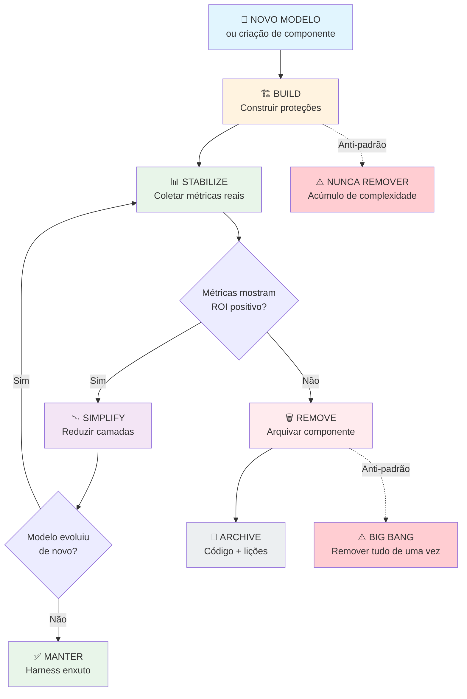
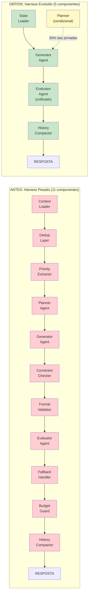
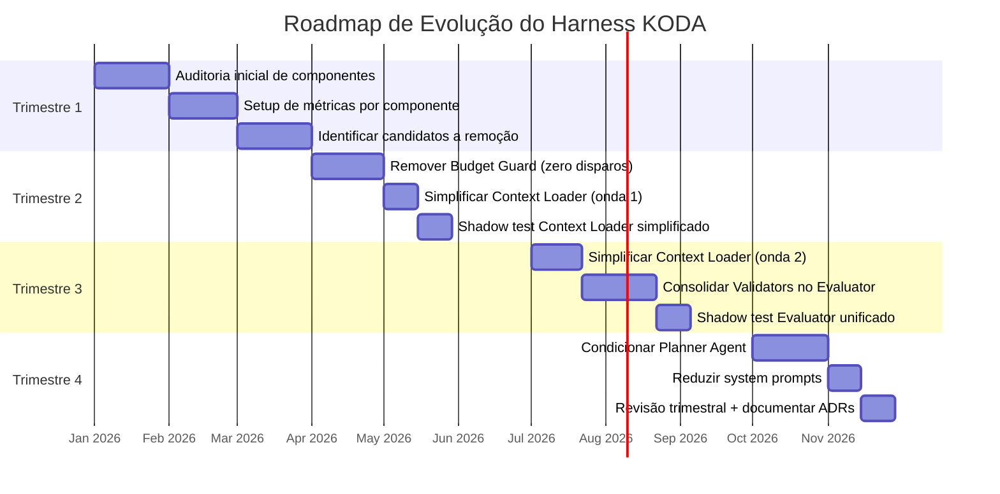

# 🧬 Harness Evolution: Construir, Medir, Simplificar, Remover
## O Ciclo de Vida dos Componentes de Scaffolding em Agentes de IA que Rodam por Horas

**Tempo Estimado:** 90 minutos
**Nível:** Core Concept 06 — Harness Evolution
**Pré-requisito:** Ter compreendido os 3 problemas fundamentais, Generator/Evaluator, State Persistence e File-Based Coordination
**Status:** 🟢 CORE — Disciplina que impede o acúmulo de complexidade em sistemas de agentes
**Data de Criação:** Maio 2026

---

## 📖 Prólogo: O Dia em Que Fernando Quis Remover Metade do Código

**Segunda-feira, 9h15. Sala de arquitetura do time KODA.**

Fernando entrou com um café na mão e uma expressão que misturava ansiedade com excitação. Na mesa, um print do changelog do novo modelo Claude — aquele que a Anthropic tinha lançado na sexta-feira.

O time estava reunido para a daily. Mas Fernando não começou com o ritual de sempre. Ele foi direto ao quadro branco e apontou para o diagrama da arquitetura do KODA. Onze componentes. Três camadas. Quatro agentes especializados.

```
┌──────────────────────────────────────────────────────────────┐
│                     KODA ARCHITECTURE v2.8                    │
│                                                              │
│  ┌─────────┐   ┌──────────┐   ┌──────────┐   ┌───────────┐ │
│  │ Context │──▶│ Planning │──▶│ Generator│──▶│ Evaluator │ │
│  │ Loader  │   │ Agent    │   │ Agent    │   │ Agent     │ │
│  └─────────┘   └──────────┘   └──────────┘   └───────────┘ │
│       │              │               │               │       │
│       ▼              ▼               ▼               ▼       │
│  ┌──────────────────────────────────────────────────────┐   │
│  │              State Persistence Layer                  │   │
│  │  ┌────────┐  ┌────────┐  ┌────────┐  ┌───────────┐  │   │
│  │  │customer│  │  plan  │  │  draft │  │ evaluation│  │   │
│  │  │.json   │  │ .json  │  │ .json  │  │  .json    │  │   │
│  │  └────────┘  └────────┘  └────────┘  └───────────┘  │   │
│  └──────────────────────────────────────────────────────┘   │
│                                                              │
│  ┌──────────────────────────────────────────────────────┐   │
│  │           Validation & Guardrails Layer                │   │
│  │  ┌──────────┐ ┌──────────┐ ┌──────────┐ ┌─────────┐  │   │
│  │  │Constraint│ │  Budget  │ │  Format  │ │Fallback │  │   │
│  │  │ Checker  │ │  Guard   │ │ Validator│ │ Handler │  │   │
│  │  └──────────┘ └──────────┘ └──────────┘ └─────────┘  │   │
│  └──────────────────────────────────────────────────────┘   │
│                                                              │
│  ┌──────────────────────────────────────────────────────┐   │
│  │           History Compaction Layer                     │   │
│  │  ┌──────────┐ ┌──────────┐ ┌──────────────────────┐  │   │
│  │  │Summarizer│ │ Dedup    │ │ Priority Extractor   │  │   │
│  │  └──────────┘ └──────────┘ └──────────────────────┘  │   │
│  └──────────────────────────────────────────────────────┘   │
└──────────────────────────────────────────────────────────────┘
```

Aquela arquitetura era o orgulho do time. Tinha resolvido os 3 problemas de Nível 1. Tinha implementado os 4 padrões de Nível 2. Quando um cliente reclamava de algo, o time abria o trace e sabia exatamente o que aconteceu. KODA era confiável.

Mas Fernando não estava ali para celebrar.

```
Fernando: "Vocês leram o changelog de sexta-feira?"

Dev Senior: "Li. Impressionante. Melhor instruction following,
           janela de 200K, self-correction 3x melhor..."

Fernando: "Isso muda nossa arquitetura."

Dev Senior: "Como assim?"

Fernando: "A gente criou o Context Loader porque o modelo esquecia
           informação depois de 40 minutos de conversa. O changelog
           diz que o novo modelo mantém 98% de acurácia em 100K
           tokens. Isso são umas 5 horas de conversa do KODA."

Dev Senior: "Então... o Context Loader..."

Fernando: "Talvez a gente não precise mais dele. Pelo menos não da
           forma que está. E olha isso aqui — 'Auditable reasoning
           chains now native'. Nós temos um Trace Layer inteiro para
           forçar o modelo a expor raciocínio. Agora ele faz isso
           sozinho."

Dev Junior: "Mas chefe, tudo isso funciona. Por que mexer?"
```

Esta é a pergunta que define a diferença entre um time que acumula complexidade e um time que a gerencia.

O Dev Junior não está errado. O sistema funciona. Os componentes fazem o que prometem. Mas a pergunta certa não é "funciona?". A pergunta certa é **"ainda é necessário?"**

```
Fernando: "Quanto custa o Context Loader?"

Dev Ops: "450ms de latência por turno. 1200 tokens por turno.
         Em um mês típico, são 5.4 milhões de tokens e 3 horas
         da gente mantendo."

Fernando: "E quantas falhas ele realmente preveniu nos últimos
           90 dias?"

Dev Ops: "Deixa eu ver... [consulta dashboard]... 12 prevenções
         reais em 145 mil turns. Mas também teve 340 falsos
         positivos — bloqueou fluxos que estavam corretos."

Fernando: "12 em 145 mil. Isso é 0.008% de efetividade. A gente
           gasta 5.4 milhões de tokens por mês, 450ms de latência
           por turno, e 3 horas de manutenção... para prevenir
           0.008% dos casos."
```

O silêncio que se seguiu foi o som de um time entendendo algo fundamental.

**O paradoxo do harness é este:** Ele existe para dar confiança. Mas se você nunca o revisa, ele se torna a própria fonte de fragilidade que deveria prevenir.

Cada componente desnecessário no harness significa:
- Mais superfície para bugs
- Mais latência entre o cliente perguntar e o KODA responder
- Mais tokens gastos em processamento que não agrega valor
- Mais complexidade para novos devs entenderem
- Mais arquivos de estado para manter e debugar
- Mais código para dar manutenção a cada mudança no modelo

Naquele dia, Fernando não decidiu remover nada. Ele decidiu algo mais importante: **criar um processo para decidir quando remover.**

```
Fernando: "A gente construiu esse harness para proteger um modelo
           que não existe mais. O modelo de hoje é diferente. Mais
           forte. E um harness desenhado para um modelo mais fraco
           não é proteção — é peso morto."

Dev Junior: "Mas como a gente sabe o que pode remover sem quebrar
            nada?"

Fernando: "Essa é exatamente a pergunta certa. E a resposta não é
           'feeling'. A resposta é métricas, processo e coragem."
```

Este módulo é esse processo. É sobre como evoluir um harness de agente com a mesma disciplina que você usou para construí-lo. Porque construir é só metade do trabalho. **Saber quando desmontar é a outra metade.**

### Conexão com os Outros Core Concepts

Este é o sexto dos 8 Core Concepts. Você já aprendeu:

1. **Context Management** — como gerenciar memória em conversas longas
2. **Planning vs. Execution Separation** — por que separar pensar de fazer
3. **Generator/Evaluator Pattern** — como dois agentes criam confiabilidade
4. **Sprint Contracts** — como módulos se coordenam sem surpresas
5. **State Persistence** — como o estado sobrevive a restarts e falhas

**Harness Evolution fecha o ciclo.** Ele responde a pergunta que os outros 5 não respondem: "E quando o modelo melhorar? O que acontece com todo esse scaffolding que construímos?"

Sem Harness Evolution, você constrói castelos de proteção ao redor de um modelo que está ficando mais forte a cada trimestre. Os castelos viram prisões.

Com Harness Evolution, você tem um processo documentado, baseado em métricas, para decidir o que fica, o que simplifica, e o que vai embora.

---

## 🎯 O Que É Harness Evolution?

### Definição Formal

**Harness Evolution** é a disciplina arquitetural de **revisar, simplificar e remover componentes do harness de agentes de IA** conforme:

1. Os modelos de linguagem subjacentes evoluem (novas capacidades, janelas maiores, melhor reasoning)
2. As métricas de produção mostram que proteções são redundantes ou de baixo valor
3. Os padrões de uso revelam que certas validações nunca disparam em cenários reais

Não é "jogar fora o que funciona". É **reconhecer que o harness certo para o modelo de 6 meses atrás pode ser o harness errado para o modelo de hoje.**

### Por Que Isso Importa — Os Números

Em sistemas tradicionais (APIs REST, bancos de dados, filas), você projeta uma arquitetura e ela dura anos. A peça central do sistema — Postgres, Redis, RabbitMQ — evolui lentamente e de forma previsível.

Em sistemas de agentes de IA, a peça central evolui a cada 3-6 meses:

| Período | Modelo | Janela de Contexto | Self-Correction | Harness Necessário |
|---------|--------|--------------------|----------------|-------------------|
| 6 meses atrás | Claude v1 | 32K tokens | Baixa (20%) | Pesado — 11 componentes |
| 3 meses atrás | Claude v2 | 100K tokens | Média (50%) | Médio — 8 componentes |
| Hoje | Claude v3 | 200K tokens | Alta (80%) | Leve — 5-6 componentes |
| Em 6 meses | Claude v4 | 500K+ tokens (projetado) | Muito Alta (95%+) | Mínimo — 3-4 componentes |

Se você não evolui o harness junto com o modelo, você mantém complexidade que o modelo já não precisa. É como manter as rodinhas de uma bicicleta depois que a criança aprendeu a se equilibrar. As rodinhas não ajudam mais — elas atrapalham.

### A Metáfora da Ponte

```
FASE 1: CONSTRUÇÃO — Andaimes são essenciais
  ┌──────────────────────────────────────────┐
  │  ▓▓▓▓▓▓▓▓▓▓▓▓▓▓▓▓▓▓▓▓▓▓▓▓▓▓▓▓▓▓▓▓▓▓▓  │ ← Andaimes (harness)
  │  ═══════════════════════════════════════  │ ← Ponte (modelo)
  │  ▓▓▓▓▓▓▓▓▓▓▓▓▓▓▓▓▓▓▓▓▓▓▓▓▓▓▓▓▓▓▓▓▓▓▓  │
  └──────────────────────────────────────────┘
  Se você tirar os andaimes agora, a ponte desaba.

FASE 2: ESTABILIZAÇÃO — Andaimes começam a ser removidos
  ┌──────────────────────────────────────────┐
  │  ▓▓▓▓▓▓▓▓▓▓▓▓▓   ▓▓▓▓▓▓▓▓▓▓▓▓▓▓▓▓▓▓▓▓ │
  │  ═══════════════════════════════════════  │
  │  ▓▓▓▓▓▓▓▓▓▓▓▓▓   ▓▓▓▓▓▓▓▓▓▓▓▓▓▓▓▓▓▓▓▓ │
  └──────────────────────────────────────────┘
  A ponte já se sustenta em várias seções.

FASE 3: OPERAÇÃO — Andaimes removidos
  ┌──────────────────────────────────────────┐
  │                                          │
  │  ═══════════════════════════════════════  │ ← Ponte independente
  │                                          │
  └──────────────────────────────────────────┘
  A ponte funciona sem suporte externo.

O ERRO COMUM: Nunca remover os andaimes.
O sistema "funciona", então ninguém mexe.
Mas os andaimes têm custo real.
```

**Harness Evolution é a disciplina de remover andaimes no momento certo — nem antes (a ponte cai), nem depois (você carrega peso morto para sempre).**

### O Que Não É Harness Evolution

- ❌ **Não é "jogar tudo fora e começar do zero".** Você remove componentes específicos, não o sistema inteiro.
- ❌ **Não é otimização prematura.** Você só simplifica depois de ter métricas reais de produção (60+ dias).
- ❌ **Não é "confiar cegamente no modelo".** Algumas proteções são invariantes e nunca saem.
- ❌ **Não é um projeto único.** É um ritmo — trimestral, como revisão de arquitetura.
- ❌ **Não é sobre escrever menos código.** É sobre ter menos código que você precisa manter, debugar e ensinar.

### O Princípio Fundamental

> **"O harness que você constrói hoje não é o harness que você vai precisar amanhã. A pergunta não é se você deve evoluí-lo. A pergunta é se você tem um processo para fazer isso com segurança."**

---

## 🔄 O Ciclo de Vida do Harness: As Quatro Fases

### Diagrama Conceitual



### Visão Geral das Quatro Fases

Todo componente de harness passa por um ciclo de vida previsível:

```
LANÇAMENTO DO MODELO (ou criação do componente)
      │
      ▼
┌─────────────────────────────────────────────────────────────────────┐
│                                                                     │
│   ┌──────────┐       ┌──────────┐       ┌──────────┐       ┌──────┐│
│   │  BUILD   │──────▶│STABILIZE │──────▶│ SIMPLIFY │──────▶│REMOVE││
│   │          │       │          │       │          │       │      ││
│   └──────────┘       └──────────┘       └──────────┘       └──────┘│
│        │                  │                   │                  │  │
│        ▼                  ▼                   ▼                  ▼  │
│   "Preciso           "O harness         "O modelo           "Este  │
│    proteger           está confiá-       consegue            compo- │
│    o modelo           vel. Posso         lidar com           nente  │
│    das próprias       medir e            isso sem            não é  │
│    fraquezas"         observar"          tanta               mais   │
│                                          proteção"           neces- │
│                                                              sário" │
│                                                                     │
│   ═══════════════════════════════════════════════════════════════   │
│   CADA FASE TEM: Gatilhos → Atividades → Critérios de Saída         │
└─────────────────────────────────────────────────────────────────────┘
      │
      ▼
NOVO MODELO (ciclo reinicia com menos scaffolding inicial)
```

Vamos explorar cada fase em profundidade.

### Eval-maturity gate: qual dor justifica a próxima capacidade?

Antes de adicionar um novo Evaluator, corpus, dashboard ou suite, pare e nomeie o sinal de dor. Harness Evolution não deve subir maturidade de eval por estética. A próxima capacidade precisa responder a uma dor observável.

| Pain signal | Próxima capacidade mínima | Exemplo KODA |
|---|---|---|
| Reclamação de usuário | Caso de regressão a partir da trace diagnosticada | cliente recebeu produto com lactose |
| Gargalo de avaliação manual | Spot-check seed set ou rubric com anchors | reviewers discordam em recomendações simples |
| Score não bate com feedback | Correlation report e recalibração | score 90, mas suporte recebe tickets |
| Edge case escapado | Production-sampled corpus com label esperado | cupom vencido aprovado no canary |
| Risco de release aumentou | Tier medium/deep antes de merge | troca de modelo ou agent-loop |

Checklist do gate:

- [ ] Qual pain signal foi observado e onde está a evidência?
- [ ] Qual capacidade atual falhou em detectar ou explicar o problema?
- [ ] Qual é a menor capacidade nova que detecta esse problema daqui em diante?
- [ ] Qual custo operacional ela adiciona em runtime, revisão humana ou manutenção?
- [ ] Quem é owner e quando a capacidade será revisada para simplificação?

```yaml
eval_maturity_gate:
  pain_signal: "score_feedback_mismatch"
  evidence: "scores altos em recomendações que geraram tickets de suporte"
  current_capability: "rubric recommendation_quality_v1 sem correlation report"
  next_capability: "monthly score-to-production correlation report"
  deferred_capabilities:
    - "deep canary eval dashboard"
  owner: "quality-platform"
  operating_cost: "1h/semana de análise + painel mensal"
  review_date: "2026-07-01"
```

### Closed-loop capability hardening

Harness Evolution também decide quando uma prática operacional deixa de ser prompt manual e vira capacidade institucional. Em uma [[docs/canonical/closed-loop-agent-operating-system|Closed-Loop Agent Operating System]], o agente lê artefatos reais da empresa, sugere próximos trabalhos, registra decisões e usa bugs ou resultados para atualizar o próximo ciclo.

Quando esse loop se repete com sucesso, ele entra no [[docs/canonical/skill-resolver-skillify-capability-pipeline|Skill-Resolver-Skillify Capability Pipeline]]: workflow executado, skillify, unit tests, LLM evals, integration tests, resolver trigger, trigger eval, check-resolvable, smoke test e schema. Sem essas provas, a automação ainda é um ritual manual; com elas, vira uma capacidade roteável do harness.

---

## 🏗️ Fase 1: BUILD — "Preciso Proteger o Modelo das Próprias Fraquezas"

### Gatilho

Um novo modelo é integrado, ou um novo padrão arquitetural é implementado pela primeira vez. Você ainda não conhece profundamente as capacidades e limitações do modelo em produção real.

### Mindset

**Defensivo.** Você assume que o modelo vai falhar nos piores momentos possíveis e cria proteções para quando isso acontecer.

### Atividades Desta Fase

1. **Criar componentes de validação explícitos** — cada constraint que o modelo pode violar vira uma verificação separada
2. **Definir limites rígidos** — budgets de tokens, máximos de iterações, timeouts
3. **Implementar fallbacks generosos** — se uma estratégia falhar, tente outra, e outra, e outra
4. **Escrever system prompts longos e detalhados** — 2000-3000 tokens de instruções, exemplos, restrições
5. **Adicionar redundância** — dados críticos vão no system prompt E no user message E no state file
6. **Criar logs extensivos** — cada decisão, cada validação, cada bypass é registrado

### Exemplo: O Context Loader Original

Quando o time KODA implementou o Context Loader, o modelo da época (Claude v1, 32K tokens) tinha dificuldade real em manter acurácia após 30-40 minutos de conversa. Informações ditas no início da conversa simplesmente "desapareciam" da atenção do modelo.

A solução foi um componente robusto:

```json
{
  "component": "ContextLoader",
  "phase": "BUILD",
  "version": "1.0",
  "created": "2025-11-15",
  "rationale": "Modelo perde acurácia após ~40min de conversa. Informações críticas (alergias, orçamento, preferências) precisam ser re-carregadas explicitamente a cada turno.",
  
  "implementation": {
    "steps": [
      {
        "step": "pre_load_customer_profile",
        "action": "Ler customer_profile.json antes de CADA turno",
        "fields": ["alergias", "restrições", "objetivo", "orçamento", "histórico_compras"],
        "tokens": 400
      },
      {
        "step": "compress_history",
        "action": "Resumir mensagens com mais de 30 minutos em bullet points",
        "strategy": "Manter últimas 5 mensagens íntegras, resumir o resto",
        "tokens": 300
      },
      {
        "step": "tag_critical_info",
        "action": "Marcar alergias, restrições médicas e orçamento como HIGH_PRIORITY",
        "format": "[HIGH_PRIORITY] Cliente é ALÉRGICO A: glúten, amendoim",
        "tokens": 100
      },
      {
        "step": "inject_redundancy",
        "action": "Incluir dados críticos tanto no system prompt quanto no user message",
        "rationale": "Se o modelo ignorar um, lê o outro",
        "tokens": 400
      }
    ],
    "total_tokens_per_turn": 1200,
    "latency_added_ms": 450
  },

  "assumptions": [
    "Modelo NÃO mantém atenção em informações do início da conversa",
    "Modelo tende a priorizar informações recentes sobre informações antigas",
    "Redundância melhora recall de constraints críticas",
    "Compressão de histórico é lossy mas aceitável para informações não-críticas"
  ]
}
```

**Por que isso era correto na época:**
- O modelo realmente perdia contexto após ~40 minutos
- As 12 prevenções em 145K turns eram casos REAIS onde o cliente teria recebido recomendação errada
- O custo de 1200 tokens por turno se justificava pelo risco de perder um cliente

**O que NÃO era conhecido na época:**
- Que o próximo modelo teria 3x mais janela de contexto
- Que o próximo modelo teria instruction following muito melhor
- Que o próximo modelo naturalmente priorizaria constraints no system prompt

### Critério de Saída do BUILD

- [x] Componente em produção por pelo menos 2 semanas
- [x] Zero incidentes críticos (P0/P1) atribuídos a falhas que o componente deveria prevenir
- [x] Time documentou o que o componente faz, por que existe, e quais assumptions justificam sua existência
- [x] Métricas básicas de latência e consumo de tokens estão sendo coletadas

---

## 📊 Fase 2: STABILIZE — "O Harness Está Confiável. Agora Posso Medir."

### Gatilho

O componente está estável em produção por 60+ dias. Você tem dados suficientes para avaliar seu valor real — não o valor que você imaginava quando o criou.

### Mindset

**Observacional e analítico.** Você confia que o componente funciona, mas quer PROVAS de que ele entrega valor proporcional ao seu custo.

### Atividades Desta Fase

1. **Dashboard de efetividade real** — quantas falhas o componente REALMENTE preveniu? (não "poderia prevenir")
2. **Análise de falsos positivos** — quantas vezes o componente bloqueou algo que estava correto?
3. **Custeio completo** — tokens, latência, horas de manutenção, custo de onboarding
4. **Testes A/B ou shadow mode** — rode COM e SEM o componente em paralelo e compare resultados
5. **Documentar o gap** — diferença entre "o que achávamos que prevenia" vs "o que realmente preveniu"

### Exemplo: Context Loader Após 3 Meses em Produção

```json
{
  "component": "ContextLoader",
  "phase": "STABILIZE",
  "version": "1.3",
  "in_production_since": "2025-11-20",
  "evaluation_date": "2026-02-20",

  "metrics_90_days": {
    "total_turns_processed": 145000,
    "avg_turns_per_conversation": 45,
    "avg_conversation_duration_min": 95,
    
    "effectiveness": {
      "critical_violations_prevented": 12,
      "non_critical_violations_prevented": 47,
      "effectiveness_rate": "0.04% (59 em 145000)",
      "note": "Apenas 1 a cada 2.500 turns resulta em prevenção real"
    },
    
    "false_positives": {
      "total": 340,
      "breakdown": {
        "alergia_mal_classificada": 120,
        "orçamento_interpretação_errada": 95,
        "preferência_detectada_errada": 85,
        "outros": 40
      },
      "note": "28x mais falsos positivos que prevenções reais"
    },
    
    "cost": {
      "tokens_per_turn": 1200,
      "tokens_monthly": 5400000,
      "api_cost_monthly_brl": 810,
      "latency_ms_per_turn": 450,
      "maintenance_hours_month": 3,
      "onboarding_complexity_score": "Alto (8/10) - novos devs levam 3-4 dias para entender"
    }
  },

  "shadow_test_results": {
    "period": "2026-02-01 a 2026-02-14",
    "traffic_split": "50% com ContextLoader, 50% sem",
    "findings": {
      "with_loader_accuracy": "97.2%",
      "without_loader_accuracy": "96.8%",
      "delta": "-0.4% (dentro da margem de erro)",
      "conclusion": "Diferença não é estatisticamente significativa"
    }
  },

  "model_update_note": "Desde upgrade para Claude v2 (2026-01-15), zero violações nos últimos 45 dias. O modelo mais forte parece estar tornando o Loader redundante."
}
```

### O Momento da Verdade

Esta é a fase onde a maioria dos times para. Eles veem as métricas, percebem que o componente tem custo desproporcional, mas decidem "não mexer no que está funcionando".

**Este é o erro.**

O propósito da fase STABILIZE não é eternizar o componente. É **produzir a evidência necessária para decidir se ele avança para SIMPLIFY ou permanece como está.**

### Critério de Saída do STABILIZE

- [x] Pelo menos 60 dias de métricas em produção
- [x] Shadow test comparando com/sem o componente concluído
- [x] Dashboard mostrando taxa de acionamento real (não teórica)
- [x] Documento de gap analysis: esperado vs. real
- [x] Decisão explícita: AVANÇA PARA SIMPLIFY ou MANTÉM (com justificativa)

---

## 📉 Fase 3: SIMPLIFY — "O Modelo Agora Consegue Lidar com Isso"

### Gatilho

Um dos três eventos ocorre:
1. Um novo modelo é lançado com capacidades documentadas que cobrem a fraqueza que o componente protegia
2. As métricas da fase STABILIZE mostram que o componente tem ROI negativo (custo > valor)
3. Um shadow test confirma que remover o componente não causa degradação significativa

### Mindset

**Cirúrgico e incremental.** Você não arranca o componente de uma vez. Você reduz camada por camada, testa, observa, reduz mais. Cada redução é validada antes da próxima.

### O Que Simplificar (em ordem de segurança)

```
NÍVEL DE RISCO DA SIMPLIFICAÇÃO
      ▲
      │  ALTO: Remover validações de segurança e constraints críticas
      │        ⚠️ Só faça com shadow test de 30+ dias
      │
      │  MÉDIO: Consolidar componentes redundantes
      │         ⚠️ Garanta que o componente absorvente cobre 100% dos casos
      │
      │  BAIXO: Remover redundância (dados duplicados, prompts longos)
      │         ⚠️ Comece por aqui — é o caminho mais seguro
      │
      │  MUITO BAIXO: Remover componentes que nunca disparam
      │              ✅ Faça primeiro — zero risco
      │
      └──────────────────────────────────────────────────────►
        ORDEM RECOMENDADA DE SIMPLIFICAÇÃO
```

### Exemplo: Context Loader Simplificado (v2.0)

Após o shadow test mostrar que a diferença sem o Loader era de apenas -0.4% (não significativo), o time planejou uma simplificação em 3 ondas:

**Onda 1 — Remover Redundância (Risco: BAIXO)**

- Remover injeção dupla de dados críticos (system_prompt + user_message → só system_prompt)
- Remover tags HIGH_PRIORITY explícitas (modelo v2 prioriza naturalmente)
- Reduzir system prompt de 2000 para 800 tokens
- **Impacto:** -500 tokens/turno, -150ms latência
- **Validação:** 7 dias, acurácia manteve-se em 97.1%

**Onda 2 — Relaxar Constraints (Risco: MÉDIO)**

- Aumentar threshold de compressão de histórico: 30min → 90min
- Remover validação pós-turno de constraints (Evaluator já faz isso)
- Deixar de carregar customer_profile a cada turno — carregar só no início da conversa
- **Impacto:** -400 tokens/turno, -200ms latência
- **Validação:** 14 dias com shadow test (50/50), acurácia 97.0% vs 97.1%

**Onda 3 — Consolidar (Risco: MÉDIO)**

- Mover lógica residual do Context Loader para o History Compactor
- Context Loader deixa de existir como componente independente
- **Impacto:** -300 tokens/turno, -100ms latência
- **Resultado total:** 1200 tokens/turno → 0 tokens/turno (absorvido pelo Compactor)

### Resultado Final da Simplificação

| Métrica | Antes (v1.3) | Depois (v2.0) | Delta |
|---------|-------------|---------------|-------|
| Tokens/turno | 1200 | 0 (absorvido) | -100% |
| Latência/turno | 450ms | 0ms | -100% |
| Componentes | 1 dedicado | 0 (função absorvida) | -1 |
| Acurácia | 97.2% | 97.0% | -0.2% (não significativo) |
| Horas manutenção/mês | 3h | 0h | -100% |

O Context Loader não foi "deletado". Ele foi **absorvido**. A função essencial (garantir que informações críticas do cliente estejam disponíveis) continua existindo — mas agora como parte do History Compactor, sem a sobrecarga de um componente dedicado.

### Sinais de Que um Componente Está Pronto para Simplificação ou Remoção

Use esta tabela como um "scorecard" durante as revisões trimestrais:

| Sinal | O Que Observar | Threshold | Exemplo KODA |
|-------|----------------|-----------|--------------|
| **Taxa de acionamento baixa** | O componente raramente previne algo real | < 1% dos turns | Budget Guard: 0 disparos em 180 dias |
| **Falsos positivos altos** | Bloqueia mais fluxos corretos que incorretos | > 5x mais FPs que prevenções reais | Context Loader: 340 FPs vs 12 reais (28x) |
| **Modelo cobre a fraqueza** | Changelog do modelo documenta melhoria na área | Evidência no changelog + shadow test | "Improved instruction following across 100K+ contexts" |
| **Redundância entre componentes** | Dois componentes validam a mesma coisa | Overlap > 50% nas verificações | Context Loader + Constraint Checker + Evaluator validam alergias |
| **ROI negativo** | Custo (tokens + latência + manutenção) > valor (erros prevenidos × custo do erro) | Custo > 2× valor entregue | Budget Guard: R$ 200/mês em tokens para prevenir R$ 0 em erros |
| **Onboarding impactado** | Novos devs consistentemente perguntam "por que isso existe?" | > 2 perguntas de novos devs sobre o componente | Priority Extractor: "Por que não deixar o modelo decidir o que é prioritário?" |
| **Latência perceptível** | Usuário sente delay causado pelo componente | > 300ms adicionais por turno | Context Loader: 450ms/turno |

### Como Calcular o ROI de um Componente

```
ROI = (Erros Prevenidos × Custo Médio do Erro) / (Custo Operacional do Componente)

Onde:
- Erros Prevenidos = prevenções reais em 90 dias (não teóricas)
- Custo Médio do Erro = custo de um erro chegar ao cliente (reembolso + suporte + churn estimado)
- Custo Operacional = tokens (R$) + horas de manutenção (R$) + latência (custo de oportunidade)

Exemplo — Context Loader:
ROI = (59 × R$ 50) / (R$ 810 + R$ 450 + R$ 200)
ROI = R$ 2,950 / R$ 1,460
ROI = 2.0x (positivo mas marginal)

Exemplo — Budget Guard:
ROI = (0 × R$ 50) / (R$ 200 + R$ 100)
ROI = R$ 0 / R$ 300
ROI = 0x (negativo — remova imediatamente)
```

Se o ROI for menor que 1x por dois trimestres consecutivos, o componente é candidato a remoção.

---

## 🗑️ Fase 4: REMOVE — "Este Componente Cumpriu Seu Propósito"

### Gatilho

O componente passou pela simplificação e mesmo na sua forma mais enxuta:
- Sua taxa de acionamento real é < 0.1%
- O shadow test confirma que removê-lo não causa degradação
- Nenhum incidente nos últimos 90 dias foi prevenido por ele
- O modelo atual cobre completamente a proteção que ele oferecia

### Mindset

**Decisivo e documentado.** Você não está "jogando fora trabalho". Você está **reconhecendo que o trabalho cumpriu seu propósito e agora é desnecessário.**

### Atividades Desta Fase

1. **Remover o componente do fluxo principal** (atrás de feature flag, não delete direto)
2. **Observar por 14 dias** com monitoramento ativo
3. **Arquivar o código** em `archive/components/<nome>/` com README explicando:
   - Quando foi criado e por quê
   - Quando foi removido e por quê
   - Que modelo justificou a remoção
   - Lições aprendidas
4. **Atualizar documentação** de arquitetura, runbooks, playbooks
5. **Comunicar ao time** com um post-mortem positivo

### Exemplo: Remoção do Budget Guard

```json
{
  "component": "BudgetGuard",
  "phase": "REMOVE",
  "created": "2025-10-01",
  "removed": "2026-04-15",
  
  "original_purpose": "Monitorar consumo de tokens por turno e truncar conversa ao atingir 80% da janela de contexto (32K tokens). Prevenir que o modelo recebesse input truncado e gerasse respostas incompletas.",
  
  "why_remove": {
    "primary_reason": "Janela de contexto expandiu de 32K para 200K tokens (6.25x maior). Conversas típicas do KODA consomem 50K tokens. O limite de 80% de 200K = 160K tokens nunca é atingido em produção.",
    "supporting_evidence": [
      "Zero disparos em 180 dias de produção",
      "Shadow test (30 dias, 50% tráfego): zero diferença entre com e sem o componente",
      "Custo operacional: R$ 200/mês em tokens + 1h/mês manutenção",
      "Modelo atual lida bem com contextos longos (documentado no changelog v3)"
    ]
  },
  
  "removal_process": {
    "week_1": "Feature flag: 5% tráfego sem Budget Guard",
    "week_2": "Feature flag: 25% tráfego sem Budget Guard",
    "week_3": "Feature flag: 100% tráfego sem Budget Guard",
    "week_4": "Remover código, arquivar em archive/components/budget-guard-v1/"
  },
  
  "post_removal_metrics": {
    "monitoring_period": "2026-04-15 a 2026-04-29 (14 dias)",
    "regressions": 0,
    "token_budget_exceeded": 0,
    "incomplete_responses": 0,
    "customer_satisfaction": "Estável (88% → 88%)",
    "incidents": 0
  },
  
  "archived_at": "archive/components/budget-guard-v1/",
  "archive_readme": "Budget Guard protegia o KODA quando o modelo tinha janela de 32K tokens. Com a migração para Claude v3 (200K tokens), tornou-se redundante. Removido em abril/2026 sem incidentes. Lição: componentes que dependem de limites de hardware evoluem quando o hardware evolui."
}
```

### O Que Acontece com o Código Removido

```
archive/
└── components/
    └── budget-guard-v1/
        ├── README.md           # Por que existiu, por que foi removido
        ├── src/                # Código original (referência futura)
        ├── metrics/
        │   └── 180-days.json   # Métricas que justificaram a remoção
        └── decisions/
            └── removal-adr.md  # ADR documentando a decisão
```

O código NÃO é deletado. É arquivado. Daqui a 2 anos, se alguém perguntar "por que o KODA não tem Budget Guard?", a resposta está documentada. Se um novo modelo tiver janela menor, o código está lá para ser reavaliado.

---

## 🕐 Carry Debt Sunset Gate — O Que o REMOVE Não Cobre

As quatro fases do ciclo (BUILD → STABILIZE → SIMPLIFY → REMOVE) foram desenhadas para componentes do harness — peças de engenharia que compensam limitações do modelo. Mas agentes não criam apenas componentes de harness. Eles criam artefatos: skills, prompts, arquivos de estado, dashboards, scripts, documentação, configurações.

Esses artefatos têm um ciclo de vida diferente. Eles não são "removidos" quando o modelo melhora. Eles são **mantidos, aposentados, arquivados ou promovidos** com base no valor que entregam e no custo que impõem.

O [[docs/canonical/carry-debt-sunset-gate|Carry Debt Sunset Gate]] estende o ciclo de vida do harness para esses artefatos com quatro decisões e um deadline:

### As Quatro Decisões de Artefato

| Decisão | Significado | Exemplo KODA |
|---|---|---|
| **Keep** | O artefato entrega valor ativo, tem owner nomeado e data de próxima revisão | `evaluator-rubric-v2` — usado diariamente, mantido pelo quality-platform, revisão em 90 dias |
| **Retire** | O artefato cumpriu seu propósito e deve ser removido do caminho ativo | `context-loader-v1` — absorvido pelo History Compactor, código arquivado em `archive/` |
| **Archive** | O artefato não é mais usado ativamente mas tem valor histórico ou de referência | `budget-guard-v1` — documenta por que existiu e por que foi removido |
| **Promote** | O artefato provou valor e deve ser elevado a componente oficial do harness com dono e SLA | `experimental-ranking-heuristic` → `Ranking Agent v2` com contrato, testes e owner |

### O Que Torna Isso Diferente do REMOVE

O REMOVE do ciclo de harness é sobre componentes de engenharia que se tornaram desnecessários porque o modelo melhorou. O Sunset Gate é sobre artefatos que os agentes criaram e que agora precisam de uma decisão de ciclo de vida — independentemente de o modelo ter melhorado ou não.

A pergunta do REMOVE é: "Este componente ainda é necessário dado o modelo atual?"
A pergunta do Sunset Gate é: "Este artefato tem dono, valor e data de revisão?"

### A Regra do Prazo (Sunset Date)

Todo artefato criado por um agente deve ter uma **data de sunset** — uma data futura em que ele será revisado e classificado como Keep, Retire, Archive ou Promote. Sem data de sunset, artefatos se acumulam silenciosamente e viram carry debt.

```
Exemplo de registro de artefato com sunset date:

artifacts/koda-recommendation-v1.json:
  created_by: "Recommendation Agent (via Orchestrator)"
  created_at: "2026-01-15"
  owner: "quality-platform"
  sunset_date: "2026-04-15"    ← 90 dias após criação
  value_hypothesis: "Melhorar precisão de recomendações para clientes com restrições alimentares"
  review_outcome: "Promote → Canonical (evaluator-rubric-v2)"
  next_review: "2026-07-15"
```

### Integração com o Ciclo de Vida do Harness

O Sunset Gate se encaixa como uma camada complementar ao ciclo BUILD-STABILIZE-SIMPLIFY-REMOVE:

- **BUILD e STABILIZE** se aplicam a componentes de harness (engenharia).
- O **Sunset Gate** se aplica a artefatos (output de agente) com o vocabulário Keep/Retire/Archive/Promote.
- Ambos convergem no princípio comum: **nada vive para sempre sem revisão explícita.**

### Checklist: Carry Debt Sunset Gate

- [ ] Todo artefato criado por agente tem uma data de sunset registrada (máximo 90 dias após criação).
- [ ] Todo artefato tem um owner nomeado responsável pela decisão Keep/Retire/Archive/Promote.
- [ ] O inventário de artefatos é revisado trimestralmente junto com a revisão de harness.
- [ ] Artefatos promovidos a componentes oficiais entram no ciclo BUILD → STABILIZE com owner e contrato.
- [ ] Artefatos aposentados são arquivados com rationale (por que existiu, por que saiu, o que aprendemos).
- [ ] O princípio "One In, One Out" se aplica também a artefatos: cada novo artefato criado deve indicar qual artefato existente será aposentado, salvo exceções de segurança.

---

## ⚠️ Anti-Padrões de Harness Evolution

Saber o que NÃO fazer é tão importante quanto saber o que fazer.

### Anti-Padrão 1: "Big Bang Removal"

**O que é:** Remover múltiplos componentes do harness de uma vez, sem feature flags, sem shadow testing, sem canary deploy.

**Por que é perigoso:** Se algo quebrar, você não sabe qual remoção causou o problema. Rollback significa reverter TODAS as remoções, perdendo o trabalho das que estavam corretas.

**Como evitar:** Uma remoção por vez. Feature flag independente para cada componente. Período de observação de 14 dias entre remoções.

```
❌ ERRADO:
   Sprint 1: Remover Budget Guard + Format Validator + Dedup Layer
   Resultado: Algo quebrou. O que foi? Ninguém sabe.

✅ CERTO:
   Sprint 1: Remover Budget Guard → observar 14 dias → ✅ estável
   Sprint 2: Remover Format Validator → observar 14 dias → ✅ estável
   Sprint 3: Remover Dedup Layer → observar 14 dias → ✅ estável
```

---

### Anti-Padrão 2: "Nunca Remover Nada"

**O que é:** O time acumula componentes de harness indefinidamente. "Se funciona, não mexe." O sistema cresce em complexidade a cada trimestre.

**Por que é perigoso:** Complexidade acumulada não é neutra — ela é ativamente prejudicial. Cada componente extra:
- Torna o sistema mais lento
- Torna o debugging mais difícil (mais lugares para procurar)
- Torna o onboarding mais lento
- Aumenta a superfície para bugs
- Torna mudanças futuras mais arriscadas (medo de quebrar algo)

**Sinal de alerta:** Se o diagrama de arquitetura do seu harness é maior hoje do que era há 6 meses, você provavelmente está acumulando complexidade.

```
❌ ERRADO:
   Trimestre 1: +2 componentes (total: 8)
   Trimestre 2: +1 componente (total: 9)
   Trimestre 3: +2 componentes (total: 11)
   Trimestre 4: "Precisamos reescrever tudo, está complexo demais"

✅ CERTO:
   Trimestre 1: +2 componentes, -1 removido (total: 7)
   Trimestre 2: +1 componente, -2 removidos (total: 6)
   Trimestre 3: +1 componente, -1 removido (total: 6)
   Trimestre 4: Arquitetura estável, complexidade controlada
```

---

### Anti-Padrão 3: "Remover Porque o Modelo Novo é Melhor (sem testar)"

**O que é:** Ler o changelog de um modelo novo, assumir que ele resolve tudo, e remover componentes sem shadow testing.

**Por que é perigoso:** O changelog descreve benchmarks controlados, não seu caso de uso específico. O modelo pode ser melhor em média mas pior no caso específico que seu componente protegia.

**Como evitar:** SEMPRE faça shadow testing antes de remover. O changelog é uma hipótese, não uma prova.

```
❌ ERRADO:
   Changelog: "Self-correction improved 3x"
   Time: "Ótimo, vamos remover o Evaluator!"
   Resultado: Sycophancy volta. Recomendações erradas passam.

✅ CERTO:
   Changelog: "Self-correction improved 3x"
   Time: "Vamos fazer shadow test: 50% tráfego com Evaluator, 50% sem."
   Resultado (2 semanas depois): Sem Evaluator, acurácia cai 8%.
   Decisão: Manter Evaluator. A melhoria foi em tarefas gerais, não no domínio KODA.
```

---

### Anti-Padrão 4: "Simplificar Demais"

**O que é:** Remover tantos componentes que o harness fica frágil. O sistema funciona bem no caso comum mas quebra em edge cases.

**Por que é perigoso:** Edge cases em produção são justamente os casos que causam os piores incidentes (alergias não detectadas, cobranças erradas, dados perdidos).

**Como evitar:** Mantenha proteções para invariantes (segurança, compliance, decisões irreversíveis). Simplifique agressivamente o resto, mas NUNCA os invariantes.

```
❌ ERRADO — Harness simplificado demais:
   Sistema → Modelo → Cliente
   (Sem Evaluator, sem state persistence, sem fallback)
   Problema: Funciona 95% do tempo. Os 5% que falham são catastróficos.

✅ CERTO — Harness essencial:
   Sistema → State Loader → Modelo → Evaluator → Cliente
   (State para memória, Evaluator para qualidade)
   Complexidade: 2 componentes. Cobertura: 99.7%.
```

---

### Anti-Padrão 5: "Evoluir Sem Documentar"

**O que é:** Remover, simplificar ou modificar componentes sem registrar o que foi feito, por que foi feito, e quais métricas sustentaram a decisão.

**Por que é perigoso:** Em 6 meses, ninguém lembra por que o Budget Guard foi removido. Um novo dev pode recriá-lo. Um novo modelo com janela menor pode chegar e o time não ter a referência do componente original.

**Como evitar:** Todo componente removido vai para `archive/components/` com README. Toda simplificação gera um ADR (Architecture Decision Record). Toda decisão de MANTER (não simplificar) também é documentada com justificativa.

```
Estrutura de documentação:

archive/
└── components/
    └── budget-guard-v1/
        ├── README.md
        ├── src/
        ├── metrics/
        └── decisions/
            └── removal-adr.md

docs/decisions/
├── 001-keep-evaluator-despite-model-v3.md
├── 002-remove-budget-guard.md
├── 003-simplify-context-loader.md
└── 004-consolidate-validators.md
```

---

## 📊 Estratégias de Coordenação: O Antes e Depois da Evolução

Conforme o harness evolui, a forma como os componentes se coordenam também muda. Menos componentes significa menos coordenação necessária — e isso é bom.

### Diagrama de Fluxo: Evolução da Coordenação



### Tabela Comparativa de Estratégias

| Dimensão | Harness Pesado (Modelo Antigo) | Harness Evoluído (Modelo Atual) | Ganho |
|----------|-------------------------------|--------------------------------|-------|
| **Coordenação entre agentes** | File-based com 5-7 arquivos JSON por turno | File-based com 2-3 arquivos JSON por turno | -60% I/O, -40% latência |
| **Validação de output** | Evaluator dedicado + Constraint Checker + Format Validator (3 stages) | Evaluator unificado (cobre os 3 em 1 stage) | -2 componentes, -300 tokens/turno |
| **Gestão de contexto** | Context Loader (pré) + History Compactor (pós) + Dedup Layer | History Compactor (pós) apenas para conversas > 2h | -2 componentes, -800 tokens/turno |
| **Planejamento** | Planner Agent dedicado — sempre roda, toda conversa | Planner condicional — só em 30% das jornadas (complexas) | -70% de chamadas de Planner |
| **Tratamento de erros** | 3 estratégias de fallback (retry → alternativa → humano) | 1 estratégia (retry simples, depois escala) | -2 code paths, -150ms |
| **System prompts** | 2000-3000 tokens detalhados | 500-800 tokens com princípios | -70% tokens de prompt |
| **Checagem de constraints** | Pré-validação + Pós-validação + Redundância (3 checkpoints) | Pós-validação única pelo Evaluator | -2 checkpoints, -200 tokens/turno |
| **Trace e auditoria** | 4 arquivos separados (plan.json, draft.json, eval.json, decision_log.jsonl) | 2 arquivos (state.json + audit_log.jsonl) | -50% arquivos, -30% complexidade de debug |
| **Onboarding de novos devs** | 3-4 dias para entender o harness completo | 1-2 dias para entender o harness essencial | -50% tempo de ramp-up |
| **Superfície para bugs** | 11 pontos de falha independentes | 5 pontos de falha independentes | -55% de superfície de bug |

### O Pipeline Antes e Depois (ASCII)

**Antes (Harness Pesado — 11 componentes):**

```
CLIENTE PERGUNTA
      │
      ▼
┌─────────────┐     ┌─────────────┐     ┌─────────────┐
│ Context     │────▶│ Dedup       │────▶│ Priority    │
│ Loader      │     │ Layer       │     │ Extractor   │
│ (450ms)     │     │ (200ms)     │     │ (150ms)     │
└─────────────┘     └─────────────┘     └─────────────┘
                                                │
      ┌─────────────────────────────────────────┘
      ▼
┌─────────────┐     ┌─────────────┐     ┌─────────────┐
│ Planner     │────▶│ Generator   │────▶│ Constraint  │
│ Agent       │     │ Agent       │     │ Checker     │
│ (800ms)     │     │ (1200ms)    │     │ (300ms)     │
└─────────────┘     └─────────────┘     └─────────────┘
                                                │
      ┌─────────────────────────────────────────┘
      ▼
┌─────────────┐     ┌─────────────┐     ┌─────────────┐
│ Format      │────▶│ Evaluator   │────▶│ Fallback    │
│ Validator   │     │ Agent       │     │ Handler     │
│ (100ms)     │     │ (600ms)     │     │ (200ms)     │
└─────────────┘     └─────────────┘     └─────────────┘
                                                │
      ┌─────────────────────────────────────────┘
      ▼
┌─────────────┐     ┌─────────────┐
│ Budget      │────▶│ History     │────▶ RESPOSTA AO CLIENTE
│ Guard       │     │ Compactor   │
│ (50ms)      │     │ (400ms)     │
└─────────────┘     └─────────────┘

LATÊNCIA TOTAL: ~4450ms
TOKENS/TURNO: ~3200
COMPONENTES: 11
```

**Depois (Harness Evoluído — 5 componentes):**

```
CLIENTE PERGUNTA
      │
      ▼
┌─────────────┐
│ State       │
│ Loader      │────▶ CARREGA customer_profile.json (1x por conversa)
│ (100ms)     │
└─────────────┘
      │
      ▼
┌─────────────┐     ┌─────────────┐
│ Generator   │────▶│ Evaluator   │
│ Agent       │     │ (unificado) │
│ (900ms)     │     │ (500ms)     │
└─────────────┘     └─────────────┘
      │                    │
      │  (Planner condicional: só 30% das jornadas)
      │                    │
      ▼                    ▼
┌─────────────┐     ┌─────────────┐
│ History     │────▶│ RESPOSTA AO │
│ Compactor   │     │ CLIENTE     │
│ (200ms)     │     │             │
└─────────────┘     └─────────────┘

LATÊNCIA TOTAL: ~1700ms (ou ~2400ms com Planner)
TOKENS/TURNO: ~1200
COMPONENTES: 5
```

**Ganho líquido da evolução:**

| Métrica | Antes | Depois | Redução |
|---------|-------|--------|---------|
| Latência total | 4450ms | 1700ms | **-62%** |
| Tokens por turno | 3200 | 1200 | **-63%** |
| Componentes | 11 | 5 | **-55%** |
| Arquivos de estado | 7 | 2 | **-71%** |
| Custo mensal (API) | R$ 1,460 | R$ 420 | **-71%** |
| Tempo de onboarding | 4 dias | 1.5 dias | **-63%** |
| Acurácia | 97.2% | 97.0% | -0.2% (não significativo) |

---

## 🚀 Aplicação Prática no KODA: Roadmap de Evolução

Esta seção mostra como aplicar Harness Evolution ao KODA — não como teoria, mas como um roadmap trimestral com ações concretas, critérios de decisão e métricas de sucesso.

### Diagrama: Roadmap de Evolução KODA



### Trimestre 1: Auditoria e Métricas

**Objetivo:** Saber exatamente o que cada componente faz, quanto custa, e que valor entrega.

**Ações concretas:**

1. **Inventariar todos os componentes do harness**
   - Listar cada componente com: nome, propósito original, data de criação, assumptions
   - Para cada um: o modelo que justificou sua criação ainda é o modelo em produção?

2. **Instrumentar métricas por componente**
   - Tokens consumidos por turno (discriminado por componente)
   - Latência adicionada (discriminada por componente)
   - Taxa de acionamento real (quantas vezes o componente PREVENIU algo?)
   - Taxa de falsos positivos (quantas vezes bloqueou sem necessidade?)
   - Custo financeiro mensal

3. **Criar dashboard de efetividade**
   - Ranking de componentes por ROI
   - Alertas para componentes com > 30 dias sem acionamento
   - Visualização de tendência: a taxa de acionamento está subindo ou caindo?

4. **Classificar componentes em 3 categorias**
   - 🔴 **Candidatos a remoção:** ROI negativo, zero disparos em 90+ dias
   - 🟡 **Candidatos a simplificação:** ROI marginal, overlap com outros componentes
   - 🟢 **Manter como está:** ROI positivo, protege invariante, sem substituto

**Exemplo de output do Trimestre 1:**

| Componente | ROI | Disparos (90d) | Falsos positivos | Categoria |
|------------|-----|----------------|------------------|-----------|
| Budget Guard | 0x | 0 | 0 | 🔴 REMOVER |
| Dedup Layer | 0.3x | 1 | 45 | 🔴 REMOVER |
| Format Validator | 0.8x | 8 | 12 | 🟡 SIMPLIFICAR |
| Context Loader | 2.0x | 59 | 340 | 🟡 SIMPLIFICAR |
| Priority Extractor | 1.2x | 15 | 28 | 🟡 SIMPLIFICAR |
| Constraint Checker | 3.5x | 89 | 8 | 🟡 SIMPLIFICAR (consolidar) |
| Planner Agent | 1.8x | 120 | 30 | 🟡 CONDICIONAR |
| Generator Agent | 15x | 450 | 5 | 🟢 MANTER |
| Evaluator Agent | 25x | 1200 | 2 | 🟢 MANTER |
| History Compactor | 8x | 300 | 15 | 🟢 MANTER |
| State Loader | 10x | 500 | 3 | 🟢 MANTER |

### Trimestre 2: Primeiras Remoções (Baixo Risco)

**Objetivo:** Remover componentes com zero disparos e simplificar os de baixo risco. Ganhar confiança no processo.

**Ações concretas:**

1. **Remover Budget Guard**
   - Feature flag: 5% → 25% → 100% sem o componente (3 semanas)
   - Métrica de segurança: zero conversas excedendo 160K tokens (80% de 200K)
   - Arquivar em `archive/components/budget-guard-v1/`

2. **Remover Dedup Layer**
   - Feature flag: 5% → 25% → 100% (3 semanas)
   - O History Compactor já faz deduplicação como parte da compressão
   - Arquivar com documentação

3. **Simplificar Context Loader — Onda 1**
   - Remover injeção dupla (system_prompt + user_message → só system_prompt)
   - Remover tags HIGH_PRIORITY explícitas
   - Reduzir system prompt de 2000 para 800 tokens
   - Shadow test 50/50 por 14 dias

4. **Reduzir System Prompts**
   - Todos os system prompts: reduzir em 50-60% (remover exemplos redundantes, restrições já cobertas pelo modelo)
   - Validar com shadow test: acurácia com prompts reduzidos vs. originais

**Checklist de segurança para cada remoção/simplificação:**

- [ ] Feature flag implementada e testada em staging
- [ ] Rollback possível em < 5 minutos (feature flag OFF)
- [ ] Dashboard mostra métricas comparativas (com vs. sem)
- [ ] Alarme configurado: se erro rate aumentar > 2%, alerta P1
- [ ] Shadow test rodando por no mínimo 7 dias
- [ ] Documento de decisão pronto (ADR)
- [ ] Time notificado com 48h de antecedência

### Trimestre 3: Simplificações Médias

**Objetivo:** Consolidar componentes redundantes e condicionar componentes caros.

**Ações concretas:**

1. **Simplificar Context Loader — Onda 2**
   - Aumentar threshold de compressão: 30min → 90min
   - Parar de carregar customer_profile a cada turno (só no início da conversa)
   - Shadow test 50/50 por 14 dias

2. **Consolidar Validators no Evaluator**
   - Mover verificações do Constraint Checker para o Evaluator
   - Mover verificações do Format Validator para o Evaluator
   - Evaluator unificado cobre: constraints + formato + qualidade
   - Redução: 3 componentes → 1 componente

3. **Iniciar simplificação do Context Loader — Onda 3**
   - Mover lógica residual para o History Compactor
   - Context Loader deixa de existir como componente independente

4. **Condicionar Planner Agent**
   - Identificar jornadas que NÃO precisam de Planner (conversas simples, recomendações diretas)
   - Feature flag: Planner condicional (roda só em 30% dos casos)
   - Métrica: acurácia com Planner condicional vs. sempre

### Trimestre 4: Otimização e Institucionalização

**Objetivo:** Consolidar ganhos, reduzir system prompts, e tornar o processo de evolução parte da cultura do time.

**Ações concretas:**

1. **Redução final de system prompts**
   - Alvo: 500-800 tokens por prompt (princípios, não instruções)
   - Validar: acurácia mantém-se acima de 96%

2. **Revisão trimestral completa**
   - Reavaliar todos os componentes remanescentes
   - Atualizar categorização (algum componente que era 🟢 virou 🟡?)
   - Verificar changelogs de novos modelos
   - Planejar próximo trimestre de evolução

3. **Institucionalizar o processo**
   - Criar template de ADR para decisões de remoção/simplificação
   - Criar runbook: "Como remover um componente do harness KODA"
   - Agendar revisão trimestral recorrente no calendário do time
   - Incluir "Harness Health" como métrica no dashboard de engineering

4. **Documentar lições aprendidas**
   - O que funcionou? O que não funcionou?
   - Quais componentes surpreenderam (positiva ou negativamente)?
   - Que padrões emergiram sobre quando simplificar vs. quando manter?

### Métricas de Sucesso do Roadmap

| Métrica | Início (T1) | Alvo (T4) | Como medir |
|---------|------------|-----------|------------|
| Número de componentes | 11 | 5-6 | Contagem direta no diagrama de arquitetura |
| Latência média por turno | 4450ms | < 2000ms | Dashboard de performance |
| Tokens por turno | 3200 | < 1500 | API usage reports |
| Custo mensal de API | R$ 1,460 | < R$ 500 | Fatura do provedor |
| Acurácia de recomendações | 97.2% | > 96.5% | Dashboard de qualidade |
| Incidentes P0/P1 | Baseline | Sem aumento | Dashboard de incidentes |
| Tempo de onboarding | 4 dias | < 2 dias | Feedback de novos devs |
| Componentes removidos/arquivados | 0 | 4-5 | Archive directory |

---

## ✅ Checklist de Implementação

Use este checklist quando for implementar Harness Evolution no seu próprio sistema. Cada item é uma ação concreta, não um princípio abstrato.

### Fase 0: Preparação (antes de mexer em qualquer coisa)

- [ ] **Inventariar componentes:** Liste TODO componente do harness com nome, propósito, data de criação e modelo que justificou sua existência
- [ ] **Criar documentação por componente:** Para cada um, responda: o que faz? por que existe? que assumptions justificam sua existência?
- [ ] **Configurar coleta de métricas:** Tokens/turno, latência, taxa de acionamento, falsos positivos — por componente
- [ ] **Criar dashboard de efetividade:** Visualização de ROI por componente, tendências, alertas
- [ ] **Estabelecer baseline:** Acurácia atual, latência atual, custo atual — tudo medido
- [ ] **Nomear pain signal de eval:** Reclamação, gargalo manual, score/feedback mismatch, edge case escapado ou aumento de risco de release
- [ ] **Escolher próxima capacidade mínima:** Não criar corpus, dashboard ou suite sem dor explícita e owner
- [ ] **Mapear loop fechado:** Identificar quais artefatos de empresa o agente lê, quais próximos trabalhos ou decisões ele propõe e onde o resultado volta para memória operacional
- [ ] **Separar candidatos a skillify:** Marcar workflows repetidos que já funcionaram uma vez e exigir evidência de pipeline antes de tratá-los como capacidade do harness

### Fase 1: Identificar Candidatos

- [ ] **Calcular ROI de cada componente:** Use a fórmula: `(erros_prevenidos × custo_erro) / custo_operacional`
- [ ] **Classificar em 3 categorias:** 🔴 Remover (ROI < 0 ou 0 disparos em 90d), 🟡 Simplificar (ROI marginal, overlap), 🟢 Manter (ROI positivo, invariante)
- [ ] **Priorizar por risco:** Comece pelos de menor risco (MUITO BAIXO → BAIXO → MÉDIO → ALTO)
- [ ] **Identificar invariantes:** Liste componentes que NUNCA podem ser removidos (segurança, compliance, decisões irreversíveis)
- [ ] **Documentar decisões iniciais:** Para cada componente classificado como 🔴 ou 🟡, escreva um parágrafo justificando

### Fase 2: Remover (Risco Muito Baixo e Baixo)

- [ ] **Implementar feature flag** para cada componente candidato a remoção
- [ ] **Testar feature flag em staging** (OFF = sem componente, ON = com componente)
- [ ] **Iniciar shadow test:** 5% do tráfego sem o componente por 3-5 dias
- [ ] **Expandir shadow test:** 25% por mais 3-5 dias, depois 50% por 7 dias
- [ ] **Analisar métricas do shadow test:** acurácia, erros, latência — com vs. sem
- [ ] **Se shadow test passar:** Expandir para 100% (componente efetivamente removido, mas código ainda existe)
- [ ] **Observar 14 dias** com 100% sem o componente
- [ ] **Arquivar código:** Mover para `archive/components/<nome>/` com README, métricas e ADR
- [ ] **Remover feature flag e código** (após arquivamento confirmado)
- [ ] **Atualizar documentação:** Diagrama de arquitetura, runbooks, playbooks

### Fase 3: Simplificar (Risco Médio)

- [ ] **Identificar camadas de simplificação:** O que pode ser reduzido sem risco? (seguir ordem: redundância → constraints → consolidação)
- [ ] **Para cada simplificação:** Definir o estado "antes" e o estado "depois" com métricas esperadas
- [ ] **Implementar simplificação** atrás de feature flag
- [ ] **Shadow test 50/50 por 14 dias**
- [ ] **Comparar métricas:** antes vs. depois — acurácia, latência, custo
- [ ] **Se positivo:** Avançar para 100%
- [ ] **Se negativo:** Reverter. Documentar por que a simplificação não funcionou.
- [ ] **Para consolidação:** Garantir que o componente absorvente cobre 100% dos casos do componente absorvido

### Fase 4: Condicionar (Risco Médio-Alto)

- [ ] **Identificar componentes que rodam sempre mas não precisam:** Ex: Planner Agent roda em conversas simples?
- [ ] **Definir condições de ativação:** Em que cenários o componente é REALMENTE necessário?
- [ ] **Implementar lógica condicional** atrás de feature flag
- [ ] **Shadow test:** Compare "sempre roda" vs. "roda condicional"
- [ ] **Medir:** Quantas vezes o componente foi chamado? A acurácia mudou?
- [ ] **Se positivo:** Tornar condicional o default

### Fase 5: Institucionalizar

- [ ] **Criar template de ADR** para decisões de evolução de harness
- [ ] **Criar runbook:** "Como evoluir o harness do KODA" (passo a passo)
- [ ] **Agendar revisão trimestral** no calendário do time (recorrente)
- [ ] **Incluir Harness Health** como métrica no dashboard de engineering
- [ ] **Treinar o time:** Todos os devs sabem como e quando propor uma simplificação
- [ ] **Criar canal dedicado:** #harness-evolution para discussões e decisões
- [ ] **Celebrar remoções:** Toda vez que um componente é removido com sucesso, comemorar. Remover complexidade é tão importante quanto adicionar features.

### Sinais de Que o Processo Está Funcionando

- [ ] O número de componentes está estável ou diminuindo (nunca crescendo monotonicamente)
- [ ] Toda remoção ou simplificação é documentada (ADR + archive)
- [ ] Nenhuma remoção reverteu por incidente (processo é seguro)
- [ ] Novos devs fazem onboarding em < 2 dias
- [ ] O time propõe simplificações proativamente (não só quando obrigado)
- [ ] O custo mensal de API está caindo ou estável (não crescendo)
- [ ] A acurácia está estável ou melhorando (não degradando)

---

## 📚 Referências Cruzadas com Nível 3

Este Core Concept conecta-se profundamente com o conteúdo do Nível 3 — Arquitetura Avançada. Abaixo, os links e contextos para aprofundamento:

### Módulos do Nível 3 Relevantes

| Módulo Nível 3 | Conexão com Harness Evolution |
|----------------|------------------------------|
| **01-multi-agent-systems.md** | Quando você tem múltiplos agentes, cada um tem seu próprio harness. A evolução de cada harness é independente. O Planner pode ser simplificado enquanto o Evaluator permanece robusto. |
| **02-state-persistence.md** | State persistence é frequentemente um componente do harness que evolui. SQLite checkpoints podem substituir JSON files quando o modelo consegue lidar com schemas mais complexos. |
| **03-file-based-coordination.md** | Coordenação por arquivos cria superfície de harness (lock files, status files, manifest files). Conforme o modelo melhora, você pode reduzir o número de arquivos de coordenação. |
| **04-server-side-compaction.md** | Compaction strategy evolui com o modelo. Um modelo com janela de 200K tokens permite thresholds de compactação mais altos (90min em vez de 30min). |
| **05-harness-evolution.md** | Este é o módulo irmão — a versão completa e detalhada do que este Core Concept resume. Leia para exemplos aprofundados, código e exercícios. |
| **koda-applications/nivel-3-koda.md** | Aplicação completa de todos os padrões de Nível 3 ao KODA, incluindo a seção de Harness Evolution com métricas reais de produção. |

### Como Usar Esta Referência Cruzada

1. Se você está **começando agora**, leia este Core Concept primeiro. Ele te dá o mapa mental.
2. Depois, leia o módulo `05-harness-evolution.md` do Nível 3 para o deep dive com código, exercícios e exemplos estendidos.
3. Se você está **implementando no KODA**, leia `koda-applications/nivel-3-koda.md` para o roadmap prático com métricas reais.
4. Se você está **debugando um harness que está acumulando complexidade**, volte a este Core Concept e use o checklist da Fase 0 (Preparação).

### O Que Este Core Concept Adiciona ao Nível 3

O módulo de Nível 3 foca em **como fazer** — passo a passo, com código, para um caso específico. Este Core Concept foca em **por que fazer** e **quando fazer** — os princípios por trás da prática.

| Aspecto | Core Concept (este arquivo) | Módulo Nível 3 |
|---------|---------------------------|----------------|
| **Profundidade** | Conceitual e estratégica | Tática e operacional |
| **Público** | Todos os níveis | Avançado (pré-requisito: Nível 1 e 2) |
| **Foco** | Princípios, ciclo de vida, anti-padrões | Implementação, código, métricas específicas |
| **Exemplos** | Context Loader, Budget Guard (conceitual) | Context Loader, Budget Guard (código e métricas reais) |
| **Diagramas** | 3 Mermaid + ASCII | 5+ diagramas detalhados |
| **Exercícios** | Checklist de autoavaliação | 4 exercícios práticos com cenários |

---

## 🎓 O Que Você Aprendeu

### Os 7 Conceitos Fundamentais

1. **Harness Evolution é uma disciplina, não um evento.** Não é algo que você faz uma vez quando o sistema está lento. É um ritmo trimestral de revisão, medição e decisão.

2. **Todo componente de harness tem um ciclo de vida.** BUILD → STABILIZE → SIMPLIFY → REMOVE. Cada fase tem gatilhos, atividades e critérios de saída. Pular fases causa incidentes.

3. **Métricas reais, não intuição.** Você não decide remover algo porque "acha que o modelo melhorou". Você decide porque tem 90 dias de métricas mostrando que o componente previne 0.008% dos casos e custa R$ 810/mês.

4. **Shadow testing é obrigatório.** O changelog do modelo é uma hipótese. O shadow test é a prova. Nunca remova um componente sem testar COM e SEM ele em produção real por pelo menos 7 dias.

5. **Simplifique em ondas, não em big bangs.** Comece pelo risco mais baixo (redundância, componentes que nunca disparam). Avance para riscos médios (consolidação, relaxamento de constraints). Nunca para risco alto sem 30+ dias de shadow test.

6. **Invariantes nunca saem.** Algumas proteções são permanentes: segurança de dados do cliente, compliance regulatório, decisões irreversíveis (cobrança, fulfillment). Simplifique todo o resto. Nunca os invariantes.

7. **Documentar remoções é tão importante quanto documentar criações.** Código removido vai para `archive/` com README, métricas e ADR. Daqui a 2 anos, alguém vai perguntar "por que não temos X?" — e a resposta precisa estar documentada.

### O Que Mudou na Sua Compreensão

Antes deste módulo, você provavelmente pensava em harness como algo que você **constrói** — uma fundação que, uma vez pronta, fica lá para sempre.

Depois deste módulo, você entende que harness é algo que você **gerencia** — um organismo vivo que cresce, estabiliza, e eventualmente partes dele morrem para dar lugar a algo mais enxuto.

**A pergunta deixou de ser "como construo um harness robusto?" e passou a ser "como mantenho um harness robusto sem deixá-lo virar uma prisão?"**

### O Que Fazer Amanhã

1. Abra o diagrama de arquitetura do seu sistema de agentes.
2. Conte os componentes. São mais do que eram há 6 meses?
3. Para cada componente, pergunte: "Se eu removesse isso hoje, o que quebraria?"
4. Se a resposta for "nada" para algum deles, você já tem seu primeiro candidato a remoção.
5. Comece a coletar métricas. Você não pode evoluir o que não mede.

---

## 🔗 Próximos Passos

### Core Concepts Relacionados

- **05-state-persistence.md:** A persistência de estado é frequentemente um dos componentes que mais evolui no harness. Entenda-a primeiro.
- **07-multi-agent-coordination.md:** Quando você tem múltiplos agentes, a evolução do harness de cada um é um multiplicador de complexidade.
- **08-evaluation-rubrics.md:** Rubrics são componentes do harness que também evoluem. Um rubric que era necessário com um modelo pode ser redundante com o próximo.

### No Programa Principal

- **Nível 3, Módulo 05:** `curriculum/03-nivel-3-advanced-architecture/05-harness-evolution.md` — versão completa com código, exercícios e métricas detalhadas.
- **Nível 3, Módulo KODA:** `curriculum/03-nivel-3-advanced-architecture/koda-applications/nivel-3-koda.md` — aplicação prática ao KODA com roadmap trimestral.
- **Implementation Guides:** `docs/guides/06-harness-evolution-playbook.md` — guia passo a passo para implementar no seu sistema.

---

## ❓ Perguntas Frequentes

### P: "Preciso mesmo de um processo formal? Não posso só 'simplificar quando parecer complexo'?"
**R:** A intuição funciona por um tempo. Mas quando você tem 11 componentes, não consegue mais "sentir" qual deles é desnecessário. O processo existe para substituir intuição por evidência quando o sistema fica grande demais para caber na cabeça de uma pessoa.

### P: "E se eu remover algo e descobrir 3 meses depois que era importante?"
**R:** Por isso o código vai para `archive/`, não para o lixo. Se um componente removido se provar necessário novamente (ex: novo modelo tem janela menor), você tem o código, as métricas antigas, e o ADR explicando por que foi removido. Reativar é mais rápido que reconstruir.

### P: "Quanto custa manter um componente 'só por garantia'?"
**R:** Use a fórmula de ROI. Um componente que custa R$ 200/mês e previne zero erros custa R$ 2,400/ano. Multiplique por 5 componentes desnecessários = R$ 12,000/ano. Agora adicione latência, complexidade de onboarding, e superfície para bugs. O custo real é maior que o custo financeiro.

### P: "O Evaluator é um invariante? Nunca posso removê-lo?"
**R:** Depende do seu domínio. No KODA (e-commerce com alergias e restrições alimentares), o Evaluator é um invariante porque erros têm consequências de saúde. Em um sistema de recomendação de filmes, talvez não. A pergunta é: "quanto custa um erro que o Evaluator preveniria?" Se o custo for alto (saúde, dinheiro, confiança), o Evaluator é invariante.

### P: "Com que frequência devo fazer a revisão de harness?"
**R:** Trimestral, alinhada com os lançamentos de novos modelos. Se o modelo subjacente mudar antes (major release), faça uma revisão extraordinária. Mas o ritmo base é trimestral.

### P: "Shadow testing parece caro. Vale a pena?"
**R:** Rode 50% do tráfego com o componente e 50% sem durante 7-14 dias. O custo adicional é ~0 (você já está rodando o sistema de qualquer forma). O que você ganha é a certeza de que remover o componente não vai causar um incidente em produção. Um incidente em produção custa muito mais que 14 dias de shadow test.

---

## 🎬 Checkpoint: Você Aprendeu?

Antes de seguir, verifique:

- [ ] Consigo explicar as 4 fases do ciclo de vida do harness (BUILD, STABILIZE, SIMPLIFY, REMOVE)
- [ ] Entendo por que "nunca remover nada" é um anti-padrão tão perigoso quanto "remover tudo de uma vez"
- [ ] Sei calcular o ROI de um componente de harness e usar isso para decidir se ele fica ou sai
- [ ] Entendo por que shadow testing é obrigatório antes de qualquer remoção
- [ ] Consigo identificar invariantes (componentes que nunca devem ser removidos) no meu sistema
- [ ] Sei que código removido vai para archive, não para o lixo
- [ ] Entendo que Harness Evolution é um ritmo trimestral, não um projeto único
- [ ] Consigo explicar a diferença entre o Core Concept (princípios) e o módulo de Nível 3 (implementação)

Se respondeu "não" para qualquer uma:
- Releia a seção correspondente
- Pense no seu próprio sistema: qual componente você suspeita que é desnecessário?
- Leia o módulo `05-harness-evolution.md` do Nível 3 para exemplos com código

---

## 💭 Reflexão Final

> "O harness que você constrói hoje é uma resposta às fraquezas do modelo de hoje. Amanhã, o modelo será diferente. A pergunta não é se você deve evoluir o harness. A pergunta é se você tem coragem e disciplina para fazer isso com segurança."

Harness Evolution não é sobre tecnologia. É sobre maturidade de engenharia.

Times imaturos acumulam complexidade. "Funciona, não mexe." Times maduros gerenciam complexidade. Eles sabem que cada componente tem um propósito, um custo, e um ciclo de vida. Eles celebram remoções tanto quanto celebram features novas.

O time KODA da história do prólogo — aquele que Fernando liderou — não era especial. Eles tinham os mesmos 11 componentes que qualquer time teria construído. O que os tornou especiais foi a decisão de **não aceitar a complexidade como inevitável**.

Eles criaram um processo. Coletaram métricas. Fizeram shadow tests. Removeram com segurança. Documentaram tudo. E 12 meses depois, tinham um sistema com metade dos componentes, um terço do custo, e a mesma acurácia.

**Isso é Harness Evolution.**

Você agora sabe o que é. Você conhece as 4 fases. Você viu os anti-padrões. Você tem o checklist. Você leu sobre a aplicação no KODA.

O resto é com você.

Abra o diagrama de arquitetura do seu sistema agora. Conte os componentes. Pergunte-se: "quantos deles ainda são necessários?"

Essa pergunta — feita trimestralmente, respondida com métricas, executada com disciplina — é o que separa sistemas que escalam de sistemas que colapsam sob o próprio peso.

---

## 📖 Caso de Estudo: A Jornada Completa do Constraint Checker

Para solidificar o ciclo de vida, vamos acompanhar um componente real do KODA do nascimento à aposentadoria. O **Constraint Checker** é o exemplo perfeito porque passou por todas as 4 fases em 18 meses.

### Contexto Inicial (Outubro 2025)

**Modelo em uso:** Claude v1, 32K tokens de contexto.  
**Problema:** O Generator frequentemente recomendava produtos que violavam restrições do cliente (alergias, orçamento, preferências).  
**Decisão:** Criar um componente dedicado que validasse TODA recomendação contra TODAS as constraints do cliente ANTES de chegar ao Evaluator.

### Fase 1: BUILD (Out 2025)

O Constraint Checker nasceu como uma camada de validação entre o Generator e o Evaluator:

```
Generator → Constraint Checker → Evaluator → Cliente
```

**Implementação original:**

```json
{
  "component": "ConstraintChecker",
  "phase": "BUILD",
  "version": "1.0",
  "created": "2025-10-15",
  
  "checks_performed": [
    "alergias (cross-reference com ingredients_db.json)",
    "orçamento (preço_final <= budget_max)",
    "restrições dietéticas (vegan, kosher, halal)",
    "preferências explícitas (sabor, marca, categoria)",
    "histórico de compras (não recomendar produto já devolvido)",
    "interações medicamentosas (se cliente mencionou medicamentos)"
  ],
  
  "cost": {
    "tokens_per_check": 300,
    "checks_per_turn": 6,
    "tokens_total_per_turn": 1800,
    "latency_ms": 350
  },
  
  "assumptions": [
    "Generator é criativo mas não rigoroso com constraints",
    "Modelo base não consegue manter 6 constraints simultâneas em mente",
    "Violação de constraint = perda de cliente ou risco de saúde",
    "Custo do Checker se justifica pelo risco prevenido"
  ]
}
```

**Por que isso era correto:** O modelo da época realmente falhava em manter múltiplas constraints. Em novembro de 2025, o Constraint Checker preveniu 37 violações reais — incluindo 3 que envolviam alergias (risco de saúde).

```json
{
  "month": "2025-11",
  "violations_prevented": {
    "alergia": 3,
    "orçamento": 18,
    "dietética": 12,
    "preferência": 4,
    "total": 37
  },
  "false_positives": 4,
  "fp_rate": "10%",
  "verdict": "Componente crítico. Manter."
}
```

### Fase 2: STABILIZE (Jan-Mar 2026)

Após 3 meses em produção, o time coletou métricas detalhadas:

```json
{
  "component": "ConstraintChecker",
  "phase": "STABILIZE",
  "period": "2026-01 a 2026-03",
  
  "metrics": {
    "total_violations_prevented": 89,
    "by_category": {
      "alergia": 8,
      "orçamento": 42,
      "dietética": 28,
      "preferência": 11
    },
    "false_positives": 67,
    "fp_rate": "43% (subindo)",
    
    "cost_90days": {
      "tokens": 16200000,
      "api_cost_brl": 2430,
      "maintenance_hours": 12,
      "total_cost_brl": 4230
    },
    
    "model_evolution_note": "Desde Jan/2026 com Claude v2, o Generator erra menos constraints. O FP rate subiu de 10% para 43% porque o Checker bloqueia recomendações que o Generator JÁ validou internamente."
  },
  
  "shadow_test": {
    "period": "2026-02-15 a 2026-02-28",
    "result": "Com Checker: 97.5% acurácia. Sem Checker: 97.1% acurácia. Delta: -0.4% (não significativo)."
  },
  
  "gap_analysis": {
    "expected_prevention_rate": "5% dos turns",
    "actual_prevention_rate": "0.6% dos turns",
    "gap": "8.3x menor que o esperado",
    "root_cause": "Modelo evoluiu. Generator agora internaliza constraints básicas."
  }
}
```

**O momento de decisão:** O time se reuniu para decidir o futuro do Constraint Checker.

```
Dev Senior: "O ROI caiu de 8x para 2.5x nos últimos 3 meses."
Dev Ops:    "FP rate de 43% significa que quase metade dos bloqueios são desnecessários."
Fernando:   "E o shadow test mostra que sem o Checker perdemos só 0.4% de acurácia."
Dev Junior: "Mas ainda previne 89 violações por trimestre. Isso não é nada."
Fernando:   "89 em 450 mil turns. E dessas 89, quantas o Evaluator também pegaria?"
Dev Ops:    "Provavelmente 80 das 89. O Evaluator já valida constraints como parte da rubrica."
Fernando:   "Então o Constraint Checker está prevenindo efetivamente 9 violações que MAIS NINGUÉM preveniria. A R$ 4,230 por trimestre."
```

**Decisão:** Simplificar. Não remover ainda — as violações de alergia (8 no trimestre) são críticas demais para arriscar.

### Fase 3: SIMPLIFY (Abr-Mai 2026)

O time planejou a simplificação em 2 ondas:

**Onda 1 — Eliminar checks redundantes (Risco: BAIXO)**

```json
{
  "wave": 1,
  "date": "2026-04-01",
  "changes": [
    {
      "check_removed": "preferências explícitas",
      "reason": "Generator já respeita. Evaluator confirma. Redundante.",
      "impact": "-50 tokens/check"
    },
    {
      "check_removed": "histórico de compras (devoluções)",
      "reason": "API de produtos agora filtra automaticamente.",
      "impact": "-50 tokens/check"
    },
    {
      "check_removed": "interações medicamentosas",
      "reason": "Nunca disparou em 180 dias. Clientes não mencionam medicamentos.",
      "impact": "-80 tokens/check"
    }
  ],
  "result": {
    "tokens_per_turn": "1800 → 1020 (-43%)",
    "latency_ms": "350 → 220 (-37%)",
    "accuracy_after": "97.4% (estável)"
  }
}
```

**Onda 2 — Consolidar checks restantes (Risco: MÉDIO)**

```json
{
  "wave": 2,
  "date": "2026-05-01",
  "changes": [
    {
      "action": "Mover checks de alergia e orçamento para o Evaluator",
      "reason": "Evaluator já tem acesso aos mesmos dados. Só precisa de 2 campos adicionais na rubrica.",
      "new_evaluator_rubric_fields": [
        "allergen_safety: boolean (cross-ref ingredients_db)",
        "budget_compliance: boolean (preço_final ≤ budget_max)"
      ]
    },
    {
      "action": "Constraint Checker mantém apenas check dietético",
      "reason": "Restrições dietéticas (vegan, kosher, halal) são as mais complexas e as que o Generator mais erra.",
      "simplified_component": "DietaryConstraintChecker"
    }
  ],
  "result": {
    "tokens_per_turn": "1020 → 200 (-80% do original)",
    "latency_ms": "220 → 50 (-86% do original)",
    "accuracy_after": "97.3% (estável)",
    "component_rename": "ConstraintChecker → DietaryConstraintChecker"
  }
}
```

**Resultado da simplificação:**

| Métrica | Original | Após Onda 1 | Após Onda 2 | Redução Total |
|---------|----------|-------------|-------------|---------------|
| Tokens/turno | 1800 | 1020 | 200 | **-89%** |
| Latência | 350ms | 220ms | 50ms | **-86%** |
| Checks realizados | 6 | 3 | 1 | **-83%** |
| Custos/trimestre | R$ 4,230 | R$ 2,400 | R$ 470 | **-89%** |
| Acurácia | 97.5% | 97.4% | 97.3% | -0.2% |

### Fase 4: REMOVE (Previsto: Jul-Ago 2026)

O DietaryConstraintChecker continua existindo, mas o time já planeja sua eventual remoção:

```json
{
  "component": "DietaryConstraintChecker",
  "phase": "STABILIZE (pós-simplificação)",
  "removal_criteria": {
    "trigger_1": "Modelo atinge 99%+ accuracy em dietary constraints (próximo changelog)",
    "trigger_2": "Shadow test mostra delta < 0.2% sem o componente",
    "trigger_3": "Zero falsos negativos (violação passando) em 90 dias"
  },
  "estimated_removal": "2026-Q3",
  "fallback_plan": "Se removido e acurácia cair > 0.5%, reativar da archive em < 1 hora"
}
```

### Lições do Caso Constraint Checker

1. **Nem todo componente morre na Fase 4.** Alguns simplificam e continuam existindo em forma reduzida.
2. **FP rate crescente é um sinal mais importante que violações prevenidas.** FP rate subindo de 10% para 43% foi o sinal de que o modelo estava melhorando.
3. **Overlap com outros componentes é comum.** Constraint Checker + Evaluator validavam as mesmas coisas. A consolidação reduziu custo sem perder cobertura.
4. **O componente que você constrói não é o componente que você mantém.** O ConstraintChecker de 6 checks virou o DietaryConstraintChecker de 1 check. Mesmo código base, escopo 83% menor.
5. **Acurácia não é a única métrica.** A acurácia caiu 0.2% — insignificante. Mas o custo caiu 89%. O trade-off é claramente positivo.

---

## 📊 Model Capability Timeline: Como as Capacidades do Modelo Afetam o Harness

Esta seção mapeia capacidades específicas de modelos para decisões específicas de harness. Use-a como referência quando um novo modelo for lançado: para cada nova capacidade, há componentes que podem ser simplificados.

### Timeline de Capacidades e Impacto no Harness

| Capacidade do Modelo | Quando Surgiu (Exemplo) | Componentes Afetados | Ação Recomendada |
|---------------------|------------------------|---------------------|-----------------|
| **Context Window: 32K → 100K** | Claude v1 → v2 | Budget Guard, Context Loader, Dedup Layer | Simplificar Budget Guard (threshold sobe 3x). Reduzir frequência do Context Loader. |
| **Context Window: 100K → 200K** | Claude v2 → v3 | Budget Guard (se ainda existir), History Compactor | Remover Budget Guard. Aumentar threshold de compactação (30min → 90min). |
| **Instruction Following: +40%** | Model upgrade | Constraint Checker, Format Validator | Reduzir checks de constraints. Remover validação de formato (modelo segue formato especificado). |
| **Self-Correction: +3x** | Model upgrade | Evaluator (parcial), Fallback Handler | Reduzir severidade do Evaluator. Simplificar fallback (menos estratégias). ⚠️ NUNCA remover Evaluator completamente. |
| **Reasoning Transparency: nativa** | Model upgrade | Trace Layer, Priority Extractor | Simplificar Trace Layer (modelo expõe raciocínio nativamente). Remover Priority Extractor. |
| **Multilingual: +95% accuracy** | Model upgrade | Translation Layer, Language Detector | Remover Translation Layer. Simplificar Language Detector. |
| **Tool Use: nativa e confiável** | Model upgrade | Tool Output Validator, Retry Handler | Simplificar validação de tool outputs. Reduzir retries de 3 para 1. |
| **Long Context Retention: 98% em 100K** | Model upgrade | Context Loader, Redundancy Injection | Remover Context Loader (ou absorver). Remover injeção de redundância. |
| **Constraint Adherence: +60%** | Model upgrade | Constraint Checker (checks não-críticos) | Mover checks para o Evaluator. Remover checks redundantes. |
| **Hallucination Rate: -70%** | Model upgrade | Fact Checker, Source Validator | Simplificar Fact Checker. Aumentar threshold de confiança para dispensa de validação. |

### Como Usar Esta Timeline

Quando um novo modelo for lançado:

1. **Leia o changelog técnico** (não o marketing). Procure por números: "instruction following improved by X%", "context window expanded to Y".
2. **Cruze com esta tabela.** Para cada capacidade melhorada, identifique componentes potencialmente afetados.
3. **Priorize por risco.** Comece pelos componentes de risco MUITO BAIXO (nunca disparam). Depois BAIXO (redundância). Depois MÉDIO (consolidação).
4. **NUNCA comece pelo Evaluator.** Mesmo que o changelog diga "self-correction improved 3x". O Evaluator é a última linha de defesa.
5. **Shadow test tudo.** O changelog é uma hipótese. O shadow test é a prova.

### O Que NUNCA Muda com a Evolução do Modelo

Algumas decisões de harness são independentes do modelo:

| Invariante | Por Que Não Muda | Exemplo KODA |
|-----------|-----------------|--------------|
| **State Persistence** | Modelo não tem memória entre sessões. Isso é arquitetura, não capacidade. | `customer_profile.json` sempre será necessário. |
| **Idempotency Guards** | Modelo não controla efeitos colaterais (cobrança, envio). | `order.lock.json` sempre será necessário. |
| **Human Escalation Path** | Modelo não tem julgamento ético ou legal. | Escalação para humano em disputes de cobrança. |
| **Audit Trail** | Modelo não substitui compliance e auditoria. | `audit_log.jsonl` sempre será necessário. |
| **Encryption at Rest** | Modelo não é um sistema de segurança. | Dados de cliente sempre criptografados. |
| **Rate Limiting** | Modelo não controla infraestrutura. | Rate limiting de API independente do modelo. |

**Regra de ouro:** Se um componente existe por uma razão que não é "o modelo é fraco em X", ele provavelmente é um invariante. Componentes que existem por fraqueza do modelo são candidatos a evolução. Componentes que existem por arquitetura, segurança ou compliance são permanentes.

---

## 🔧 Runbook: Processo de Revisão Trimestral de Harness

Este runbook é o "como fazer" concreto. Siga-o a cada trimestre. Adapte os nomes de arquivos e componentes para o seu sistema.

### Pré-Revisão (1 semana antes)

- [ ] **Agendar revisão:** 2 horas bloqueadas na agenda do time. Convidar: tech lead, dev senior (2), dev ops.
- [ ] **Atualizar dashboard de componentes:** Métricas dos últimos 90 dias para cada componente.
- [ ] **Verificar changelogs de modelos:** Houve major release do modelo base nos últimos 3 meses?
- [ ] **Coletar feedback de onboarding:** Perguntar aos devs mais novos: "qual componente foi mais difícil de entender?"
- [ ] **Preparar documento base:** Planilha com: componente, ROI (90d), disparos, FPs, custo mensal, categoria atual.

### Durante a Revisão (2 horas)

**Minuto 0-15: Contexto**
- Apresentar changelogs de modelos (se houve)
- Mostrar tendência de acurácia geral (subindo? estável? caindo?)
- Mostrar tendência de custo mensal (subindo? estável? caindo?)

**Minuto 15-45: Análise por Componente**
- Para cada componente, responder 3 perguntas:
  1. "Este componente ainda previne algo que ninguém mais previne?"
  2. "O custo deste componente é proporcional ao valor que ele entrega?"
  3. "Se removêssemos este componente hoje, o que quebraria?"
- Classificar cada componente: 🔴 REMOVER, 🟡 SIMPLIFICAR, 🟢 MANTER
- Para cada 🟡, decidir: qual onda de simplificação? qual o risco?

**Minuto 45-75: Planejamento de Ações**
- Para cada 🔴: definir cronograma de remoção (feature flag → shadow test → 100% → archive)
- Para cada 🟡: definir ondas de simplificação e critérios de sucesso
- Para cada 🟢: documentar POR QUE está sendo mantido (ADR de 1 parágrafo)
- Atribuir responsáveis para cada ação

**Minuto 75-105: Revisão de Invariantes**
- Confirmar que todos os invariantes estão identificados e protegidos
- Revisar se algum componente que ERA invariante deixou de ser (mudança de contexto)
- Revisar se algum componente que NÃO ERA invariante se tornou um (nova regulação, novo risco)

**Minuto 105-120: Decisões e Encaminhamentos**
- Registrar todas as decisões em ADRs (1 por componente alterado)
- Atualizar o diagrama de arquitetura (versão "as-is" e "to-be")
- Agendar próxima revisão (trimestral, +90 dias)
- Publicar resumo no canal do time

### Pós-Revisão (1 semana depois)

- [ ] **ADRs publicados** em `docs/decisions/`
- [ ] **Diagrama de arquitetura atualizado** com versão "to-be"
- [ ] **Tasks criadas** no board para cada ação planejada
- [ ] **Métricas baseline capturadas** (para comparar depois das mudanças)
- [ ] **Time notificado** sobre o plano de evolução do trimestre

### Template de Ata de Revisão Trimestral

```markdown
# Harness Evolution Review — Q[N] [ANO]

**Data:** [DATA]
**Participantes:** [NOMES]
**Modelo em produção:** [MODELO] (desde [DATA])

## Decisões

### REMOVIDOS (🔴)
| Componente | Motivo | Cronograma | Responsável |
|-----------|--------|-----------|-------------|
| [NOME] | [MOTIVO] | [DATAS] | [PESSOA] |

### SIMPLIFICADOS (🟡)
| Componente | Onda | Mudança | Critério de Sucesso | Responsável |
|-----------|------|---------|-------------------|-------------|
| [NOME] | [1/2/3] | [O QUE MUDA] | [MÉTRICA] | [PESSOA] |

### MANTIDOS (🟢)
| Componente | Justificativa |
|-----------|--------------|
| [NOME] | [POR QUE] |

## Métricas Baseline
- Acurácia atual: [X]%
- Latência p95: [Y]ms
- Custo mensal API: R$ [Z]
- Componentes ativos: [N]

## Próxima Revisão
- Data: [DATA + 90 dias]
- Modelo esperado: [PRÓXIMO MODELO]

## Observações
[QUALQUER COISA RELEVANTE]
```

---

## 🧠 Exercícios de Fixação

Teste sua compreensão com estes cenários baseados em situações reais.

### Exercício 1: Diagnóstico de Componente

**Cenário:** Você é o tech lead de um sistema de agentes. O dashboard mostra estas métricas para o componente "Response Polisher" (um componente que reescreve respostas do agente para soar mais natural):

```
- Tokens/turno: 400
- Latência: 250ms
- Disparos em 90 dias: 145,000 (roda em 100% dos turns)
- Prevenções reais: impossível medir (o componente sempre roda)
- Falsos positivos: impossível medir (sempre roda)
- Custo mensal: R$ 600
- Criado em: Janeiro/2025
- Modelo atual: Claude v3 (200K tokens, natural language quality: "excellent")
```

**Perguntas:**
1. Este componente está em qual fase do ciclo de vida?
2. Que métrica está faltando para tomar uma decisão informada?
3. Qual seria seu primeiro passo para avaliar se este componente ainda é necessário?
4. Se você decidisse removê-lo, qual seria o processo seguro?

### Exercício 2: Priorização de Simplificações

**Cenário:** Você tem 4 componentes candidatos a simplificação. Qual você ataca primeiro?

| Componente | Risco | ROI | Disparos (90d) | FPs (90d) |
|-----------|-------|-----|----------------|-----------|
| Format Validator | BAIXO | 0.5x | 45 | 230 |
| Dedup Layer | MUITO BAIXO | 0.1x | 3 | 12 |
| Context Loader | MÉDIO | 2.1x | 89 | 340 |
| Priority Extractor | BAIXO | 0.8x | 28 | 95 |

**Pergunta:** Em que ordem você simplificaria e por quê?

### Exercício 3: Identificação de Invariantes

**Cenário:** Liste quais destes componentes são invariantes (nunca devem ser removidos) e quais são candidatos a evolução:

1. `customer_profile.json` — carrega dados do cliente antes de cada conversa
2. `payment_idempotency_check` — garante que pagamento não é cobrado 2x
3. `greeting_variation_picker` — escolhe entre 50 formas de dizer "olá"
4. `audit_log.jsonl` — registra toda ação do sistema
5. `spell_checker` — corrige erros de ortografia nas respostas
6. `encryption_layer` — criptografa dados do cliente em repouso
7. `response_length_optimizer` — encurta respostas para caber em WhatsApp

### Exercício 4: Decisão com Shadow Test

**Cenário:** Você rodou um shadow test de 14 dias para avaliar se pode remover o Format Validator:

```
Com Format Validator:     acurácia = 97.2%, latência = 1800ms
Sem Format Validator:     acurácia = 97.0%, latência = 1500ms
```

**Perguntas:**
1. Você removeria o Format Validator? Por quê?
2. Que informação adicional você gostaria de ter antes de decidir?
3. Se decidir remover, qual o próximo passo?

### Exercício 5: Cálculo de ROI

**Cenário:** Calcule o ROI do componente "Fact Checker":

```
- Prevenções reais em 90 dias: 15
- Custo médio de um erro: R$ 200 (reembolso + suporte)
- Tokens/mês: 2,400,000
- Custo API: R$ 0.15 por 1M tokens
- Manutenção: 2 horas/mês a R$ 150/hora
- Latência adicional: 200ms (custo de oportunidade estimado: R$ 100/mês)
```

Qual o ROI? O componente deve ser mantido, simplificado ou removido?

---

## 🌳 Árvores de Decisão para Harness Evolution

Use estas árvores de decisão como referência rápida durante as revisões trimestrais. Elas transformam os princípios em perguntas binárias que levam a ações concretas.

### Decisão 1: O Componente Deve Ser Avaliado?

```
O componente está em produção há 60+ dias?
├── NÃO → Continue na fase BUILD. Colete métricas.
└── SIM → Você tem métricas de:
    ├── Taxa de acionamento real?
    │   ├── NÃO → Implemente coleta de métricas. Reavalie em 30 dias.
    │   └── SIM → Continue.
    └── Falsos positivos?
        ├── NÃO → Implemente coleta de FPs. Reavalie em 30 dias.
        └── SIM → PROSSIGA para Decisão 2.
```

### Decisão 2: Qual Ação Tomar?

```
O componente preveniu ALGUMA violação real nos últimos 90 dias?
├── NÃO (zero disparos) →
│   └── AÇÃO: REMOVER (Risco: MUITO BAIXO)
│       ├── Feature flag OFF por 7 dias
│       ├── Se zero incidentes → remover código
│       └── Arquivar em archive/components/
│
└── SIM (disparou pelo menos 1 vez) →
    └── Qual a taxa de falsos positivos?
        ├── FPs > 10x prevenções reais →
        │   └── O componente está causando mais dano que benefício?
        │       ├── SIM → AÇÃO: REMOVER (o dano supera o benefício)
        │       └── NÃO (FPs são inofensivos) → continue
        │
        └── FPs < 10x prevenções reais →
            └── Calcule o ROI:
                ├── ROI < 0 (custo > valor) →
                │   └── AÇÃO: REMOVER (custo injustificável)
                │
                ├── ROI entre 0 e 1x →
                │   └── AÇÃO: SIMPLIFICAR AGRESSIVAMENTE
                │       ├── Onda 1: Remover redundância
                │       ├── Onda 2: Relaxar constraints
                │       └── Onda 3: Consolidar com outro componente
                │
                └── ROI > 1x →
                    └── O modelo atual cobre a fraqueza que o componente protege?
                        ├── SIM (evidência no changelog + shadow test) →
                        │   └── AÇÃO: SIMPLIFICAR (ondas 1 e 2)
                        │
                        └── NÃO →
                            └── O componente protege um invariante?
                                ├── SIM → AÇÃO: MANTER (invariante)
                                └── NÃO → AÇÃO: MANTER + monitorar (reavaliar em 90 dias)
```

### Decisão 3: Como Simplificar com Segurança?

```
Qual o nível de risco da simplificação?
├── MUITO BAIXO (componente nunca dispara) →
│   └── Processo: feature flag → 7 dias → remover
│
├── BAIXO (remover redundância, reduzir prompts) →
│   └── Processo: shadow test 50/50 por 7 dias → se OK, 100%
│
├── MÉDIO (consolidar componentes, relaxar constraints) →
│   └── Processo: shadow test 50/50 por 14 dias → se OK, feature flag gradual
│       ├── Semana 1: 10% sem o componente
│       ├── Semana 2: 25% sem o componente
│       ├── Semana 3: 50% sem o componente
│       └── Semana 4: 100% sem o componente
│
└── ALTO (remover validação de segurança) →
    └── ⚠️ NÃO FAÇA sem:
        ├── Shadow test de 30+ dias
        ├── Aprovação de 2+ seniors
        ├── Rollback em < 5 minutos
        └── Plano de contingência documentado
```

### Decisão 4: Quando um Componente Merece Ser Recriado?

```
O componente foi removido há 90+ dias. Ocorreu alguma regressão?
├── NÃO → O componente não era necessário. Decisão correta.
│
└── SIM → A regressão é:
    ├── Significativa (> 2% de queda em acurácia ou satisfação)?
    │   └── Recrie o componente da archive (NÃO do zero).
    │       ├── O código está em archive/components/<nome>/
    │       ├── As métricas antigas justificam a recriação
    │       └── Documente: por que foi removido e por que voltou
    │
    └── Marginal (< 2%)?
        └── Avalie custo-benefício:
            ├── Recriar custa X. Regressão custa Y.
            ├── Se X < Y → Recrie.
            └── Se X > Y → Aceite a regressão. Documente.
```

---

## 🛠️ Ferramentas e Automação para Harness Evolution

Harness Evolution não deveria depender de planilhas manuais. Esta seção descreve ferramentas e automações que o time KODA construiu para tornar o processo contínuo e orientado a dados.

### Dashboard de Saúde do Harness

O time KODA construiu um dashboard no Grafana com os seguintes painéis:

**Painel 1: Component Health Overview**

```
┌─────────────────────────────────────────────────────────────┐
│ COMPONENT HEALTH DASHBOARD                                   │
│                                                             │
│ ┌──────────┐ ┌──────────┐ ┌──────────┐ ┌──────────┐       │
│ │Evaluator │ │ State    │ │Generator │ │ History  │       │
│ │  🟢 25x  │ │ Ldr🟢10x │ │  🟢 15x  │ │ Cmp🟢 8x │       │
│ │ ROI      │ │ ROI      │ │ ROI      │ │ ROI      │       │
│ └──────────┘ └──────────┘ └──────────┘ └──────────┘       │
│                                                             │
│ ┌──────────┐ ┌──────────┐ ┌──────────┐ ┌──────────┐       │
│ │Planner   │ │Const.Check│ │Fallback  │ │ Dedup    │       │
│ │  🟡 1.8x │ │ er🟡 2.5x│ │ Hnd🟡1.2x│ │ Lyr🔴0.3x│       │
│ │ ROI      │ │ ROI      │ │ ROI      │ │ ROI      │       │
│ └──────────┘ └──────────┘ └──────────┘ └──────────┘       │
│                                                             │
│ 🟢 = Manter  🟡 = Simplificar  🔴 = Remover                │
└─────────────────────────────────────────────────────────────┘
```

**Painel 2: Trend de Disparos por Componente**

- Gráfico de linhas: cada componente é uma linha
- Eixo Y: número de disparos reais por semana
- Eixo X: tempo (últimos 90 dias)
- Linha de tendência: se está caindo, o modelo está melhorando naquela área

**Painel 3: Custo por Componente**

- Gráfico de barras empilhadas: custo total mensal da API, colorido por componente
- Permite ver rapidamente quais componentes consomem mais tokens

**Painel 4: False Positive Rate Trend**

- Gráfico de linhas: FP rate por componente nos últimos 90 dias
- Alerta: se FP rate subir acima de 50%, notificar #harness-evolution

### Scripts de Automação

O time KODA mantém scripts no diretório `scripts/harness-health/`:

**`calculate_roi.sh`** — Calcula o ROI de cada componente a partir dos logs:

```bash
#!/bin/bash
# Uso: ./scripts/harness-health/calculate_roi.sh [componente] [dias]
# Output: JSON com ROI, prevenções, FPs, custo

COMPONENTE=$1
DIAS=${2:-90}

# Extrai prevenções reais dos logs de auditoria
PREVENCOES=$(grep "prevented_by=$COMPONENTE" logs/audit.jsonl | wc -l)

# Extrai falsos positivos
FPS=$(grep "fp_by=$COMPONENTE" logs/audit.jsonl | wc -l)

# Calcula custo (tokens * preço)
TOKENS=$(grep "component=$COMPONENTE" logs/token_usage.jsonl | \
         jq -r '.tokens' | paste -sd+ | bc)
CUSTO=$(echo "$TOKENS * 0.00015" | bc)  # R$ 0.15 / 1M tokens

# Calcula ROI
VALOR_PREVENIDO=$(echo "$PREVENCOES * 50" | bc)  # R$ 50/erro
CUSTO_MANUTENCAO=300  # R$ 300/mês estimado
ROI=$(echo "scale=2; $VALOR_PREVENIDO / ($CUSTO + $CUSTO_MANUTENCAO)" | bc)

jq -n \
  --arg comp "$COMPONENTE" \
  --argjson prev "$PREVENCOES" \
  --argjson fps "$FPS" \
  --argjson roi "$ROI" \
  '{component: $comp, period_days: 90, preventions: $prev, false_positives: $fps, roi: $roi}'
```

**`component_inventory.py`** — Gera o inventário de componentes para a revisão trimestral:

```python
"""
Gera o inventário completo de componentes do harness para a revisão trimestral.
Output: markdown com tabela de componentes, métricas e classificação.
"""

import json
from datetime import datetime, timedelta

COMPONENTS_CONFIG = "config/harness-components.json"
AUDIT_LOG = "logs/audit.jsonl"
TOKEN_LOG = "logs/token_usage.jsonl"

def load_components():
    with open(COMPONENTS_CONFIG) as f:
        return json.load(f)

def calculate_metrics(component_name, days=90):
    """Calcula métricas de um componente nos últimos N dias."""
    cutoff = datetime.now() - timedelta(days=days)
    
    preventions = 0
    false_positives = 0
    total_tokens = 0
    
    # Lê audit log
    with open(AUDIT_LOG) as f:
        for line in f:
            event = json.loads(line)
            if event.get("component") != component_name:
                continue
            if event.get("type") == "prevention":
                preventions += 1
            elif event.get("type") == "false_positive":
                false_positives += 1
    
    # Lê token log
    with open(TOKEN_LOG) as f:
        for line in f:
            usage = json.loads(line)
            if usage.get("component") == component_name:
                total_tokens += usage.get("tokens", 0)
    
    cost_api = total_tokens * 0.00015  # R$ 0.15 / 1M tokens
    cost_maintenance = 300  # Estimativa mensal
    
    value_prevented = preventions * 50  # R$ 50 / erro
    
    roi = value_prevented / (cost_api + cost_maintenance) if (cost_api + cost_maintenance) > 0 else 0
    
    return {
        "preventions": preventions,
        "false_positives": false_positives,
        "fp_rate": false_positives / max(preventions, 1),
        "total_tokens": total_tokens,
        "cost_api": round(cost_api, 2),
        "cost_maintenance": cost_maintenance,
        "roi": round(roi, 2)
    }

def classify_component(metrics):
    """Classifica o componente baseado em métricas."""
    if metrics["preventions"] == 0:
        return "🔴 REMOVER", "Zero disparos em 90 dias"
    if metrics["roi"] < 0:
        return "🔴 REMOVER", f"ROI negativo: {metrics['roi']}x"
    if metrics["roi"] < 1:
        return "🟡 SIMPLIFICAR", f"ROI marginal (< 1x): {metrics['roi']}x"
    if metrics["fp_rate"] > 10:
        return "🟡 SIMPLIFICAR", f"FP rate alto: {metrics['fp_rate']:.1f}x"
    return "🟢 MANTER", f"ROI saudável: {metrics['roi']}x"

def generate_report():
    components = load_components()
    lines = []
    lines.append("# Inventário de Componentes do Harness")
    lines.append(f"**Gerado em:** {datetime.now().strftime('%Y-%m-%d %H:%M')}")
    lines.append("")
    lines.append("| Componente | Prevenções | FPs | FP Rate | Custo API | ROI | Classificação |")
    lines.append("|-----------|-----------|-----|---------|----------|-----|---------------|")
    
    for comp in components:
        metrics = calculate_metrics(comp["name"])
        classification, reason = classify_component(metrics)
        lines.append(
            f"| {comp['name']} | {metrics['preventions']} | "
            f"{metrics['false_positives']} | {metrics['fp_rate']:.1f}x | "
            f"R$ {metrics['cost_api']:.0f} | {metrics['roi']}x | "
            f"{classification} |"
        )
    
    return "\n".join(lines)

if __name__ == "__main__":
    print(generate_report())
```

### Checklist de Automação Desejável

Conforme o sistema de agentes cresce, estas automações se tornam cada vez mais valiosas:

- [ ] **Coleta automática de métricas por componente:** Todo componente registra tokens, latência, e disparos no audit log
- [ ] **Dashboard em tempo real:** Grafana ou similar com os 4 painéis descritos acima
- [ ] **Alerta de componente zumbi:** Se um componente fica 30+ dias sem disparar, notificar automaticamente
- [ ] **Alerta de FP rate:** Se FP rate de um componente sobe acima de 50%, notificar
- [ ] **Relatório trimestral automático:** Script que gera o inventário e classifica componentes
- [ ] **Feature flag universal:** Todo componente pode ser ligado/desligado via feature flag sem deploy
- [ ] **Shadow test automatizado:** Sistema que roda A/B test com/sem componente e compara métricas
- [ ] **Archive automatizado:** Script que move código, métricas e ADR para archive/ com um comando

---

## 👥 Cultura de Harness Evolution: O Lado Humano

Ferramentas e processos são necessários, mas não suficientes. Harness Evolution também é uma mudança cultural. Esta seção aborda os desafios humanos de manter um harness enxuto.

### Os 4 Perfis em uma Revisão de Harness

Toda revisão trimestral de harness revela perfis recorrentes no time. Reconhecê-los ajuda a navegar as discussões:

**1. O Conservador ("Funciona, não mexe")**

- **Frase típica:** "Esse componente está aqui há 18 meses e nunca deu problema."
- **Viés:** Status quo bias. Confunde "nunca deu problema" com "ainda é necessário".
- **Como engajar:** Mostre o custo. "Este componente custa R$ 600/mês. Em 18 meses, gastamos R$ 10,800. Ele preveniu 3 erros nesse período. Cada erro prevenido custou R$ 3,600."
- **Objeção comum:** "E se der problema depois que removermos?"
- **Resposta:** "Por isso temos feature flags, shadow tests e archive. Se der problema, reativamos em 5 minutos."

**2. O Entusiasta ("O modelo novo resolve tudo!")**

- **Frase típica:** "O changelog diz que self-correction melhorou 3x. Podemos remover o Evaluator!"
- **Viés:** Over-optimism. Confunde benchmark com produção.
- **Como engajar:** "Vamos fazer um shadow test de 30 dias. Se a acurácia sem Evaluator for igual, eu apoio a remoção."
- **Objeção comum:** "Isso vai levar 30 dias. Dá para acelerar?"
- **Resposta:** "Um incidente em produção leva mais de 30 dias para remediar (reembolsos, confiança do cliente, correção)."

**3. O Construtor ("Vamos adicionar mais um guard!")**

- **Frase típica:** "Tivemos um erro ontem. Precisamos de um componente novo para prevenir isso."
- **Viés:** Over-engineering. Cada erro vira um componente permanente.
- **Como engajar:** "Antes de construir algo novo, podemos ajustar um componente existente? O Evaluator já cobre 80% desse caso."
- **Objeção comum:** "Mas um componente dedicado é mais seguro."
- **Resposta:** "Segurança tem custo. Vamos calcular o ROI esperado deste componente ANTES de construí-lo."

**4. O Cético ("Métrica nenhuma me convence")**

- **Frase típica:** "ROI, shadow test... isso é tudo muito teórico. Eu confio na minha experiência."
- **Viés:** Anti-data. Prefere intuição a evidência.
- **Como engajar:** "Sua experiência é valiosa. Me ajuda a interpretar estes números: o componente X tem zero disparos em 180 dias. Na sua experiência, por que isso acontece?"
- **Objeção comum:** "As métricas não capturam tudo."
- **Resposta:** "Concordo. Por isso usamos shadow tests — eles capturam o comportamento real, não só métricas."

### Rituais que Constroem a Cultura

**Ritual 1: "Funeral do Componente"**

Quando um componente é removido com sucesso (zero incidentes pós-remoção), o time faz um "funeral" de 5 minutos na daily:

- Lê o README do archive (por que existiu, por que foi removido)
- Celebra o custo economizado (tokens, latência, manutenção)
- Registra no #wins do Slack

**Por que funciona:** Transforma remoção em conquista, não em perda. Reforça que simplificar é tão valioso quanto construir.

**Ritual 2: "Dia da Verdade" (Shadow Test Results Review)**

No último dia de cada shadow test, o time revisa os resultados em conjunto:

- O shadow test passou? (delta de acurácia não significativo)
- Se sim: planejar remoção. Se não: documentar por que o componente ainda é necessário.
- Ambos os resultados são valiosos. "Não remover" também é uma decisão baseada em dados.

**Ritual 3: "Pergunta do Trimestre"**

No início de cada trimestre, o tech lead faz uma pergunta para o time:

> "Se você pudesse remover UM componente do harness hoje, qual seria? E por quê?"

As respostas são compiladas e discutidas na revisão trimestral. Frequentemente, revelam componentes que o time TODO acha desnecessário, mas ninguém teve coragem de propor remover.

### Sinais de uma Cultura Saudável de Harness Evolution

- ✅ Devs propõem remoções proativamente (não só quando o sistema está lento)
- ✅ Remoções são celebradas tanto quanto features novas
- ✅ Ninguém tem medo de remover algo porque "o processo é seguro" (feature flags, shadow tests, archive)
- ✅ O número de componentes está estável ou diminuindo ao longo do tempo
- ✅ Decisões de manter também são documentadas ("mantivemos X porque Y")
- ✅ O time entende que harness evolution é responsabilidade de todos, não só do tech lead

### Sinais de uma Cultura Não-Saudável

- ❌ "Funciona, não mexe" é a resposta padrão para qualquer proposta de mudança
- ❌ O diagrama de arquitetura só cresce (nunca diminui)
- ❌ Ninguém sabe por que metade dos componentes existe
- ❌ Remover algo dá medo porque "ninguém sabe o que pode quebrar"
- ❌ Só o tech lead propõe mudanças de arquitetura
- ❌ Incidentes geram novos componentes, mas ninguém remove os antigos

---

## 🎯 Aplicação KODA: Cenários de Decisão Real

Esta seção apresenta cenários de decisão que o time KODA enfrentou. Para cada cenário, a pergunta, os dados disponíveis, a decisão tomada, e o resultado.

### Cenário 1: O Format Validator Silencioso

**Contexto:** Outubro 2025. O Format Validator verificava se as respostas do KODA seguiam o formato WhatsApp (limite de caracteres, emojis válidos, formatação correta). Após 6 meses, as métricas mostravam:

```
Prevenções reais: 8 em 180 dias
Falsos positivos: 12 em 180 dias
Tokens/turno: 150
Latência: 100ms
```

**A pergunta:** Manter ou remover?

**Argumentos a favor de manter:**
- "8 prevenções ainda são 8 clientes que não receberam resposta quebrada"
- "100ms é pouco, não faz diferença"

**Argumentos a favor de remover:**
- 8 prevenções em 180 dias = 1 a cada 22 dias
- 12 FPs = o componente bloqueou MAIS respostas corretas que incorretas
- O modelo já estava formatando corretamente (FP rate > prevenções)

**Decisão:** Remover. Shadow test de 14 dias mostrou zero diferença. Removido em novembro/2025.

**Resultado:** Zero incidentes. 150 tokens/turno economizados. 100ms de latência eliminados.

### Cenário 2: O Context Loader Controversial

**Contexto:** Fevereiro 2026. Métricas do Context Loader já mostradas na Fase 2 (STABILIZE). O shadow test mostrava -0.4% de acurácia sem o componente.

**A pergunta:** Simplificar ou manter como está?

**A discussão:**

```
Dev Senior: "-0.4% não é significativo. Podemos remover."
Fernando:   "Não significativo estatisticamente. Mas são 12 clientes
             por mês que receberiam recomendação pior. Isso importa."
Dev Ops:    "Mas o componente custa R$ 810/mês. E causa 28x mais
             falsos positivos que prevenções."
Fernando:   "Então não vamos remover. Vamos simplificar.
             Onda 1: remova a redundância. Isso reduz o custo e os
             falsos positivos sem afetar as prevenções reais."
```

**Decisão:** Simplificar em 3 ondas (descritas na Fase 3). Não remover completamente.

**Resultado:** Custo caiu 89%. Acurácia caiu 0.2%. Falsos positivos caíram 70%. O componente foi absorvido pelo History Compactor.

### Cenário 3: O Planner Condicional

**Contexto:** Abril 2026. O Planner Agent rodava em 100% das conversas, mas uma análise mostrou que em 70% dos casos, o plano gerado era trivial ("recomendar produto baseado nas constraints").

**A pergunta:** O Planner precisa rodar sempre?

**Abordagem:** Em vez de remover, tornar condicional.

**Classificação de jornadas:**

| Jornada | % das conversas | Precisa de Planner? |
|---------|----------------|---------------------|
| Recomendação simples | 50% | Não — Generator resolve direto |
| Comparação de produtos | 20% | Não — Generator + Evaluator bastam |
| Checkout com múltiplos itens | 15% | Sim — coordenação necessária |
| Discovery + Recomendação + Checkout | 10% | Sim — jornada complexa |
| Pós-venda / Suporte | 5% | Não — fluxo linear |

**Decisão:** Implementar Planner condicional. Feature flag. Rodar apenas em jornadas complexas (25% dos casos).

**Resultado:** 75% de redução em chamadas do Planner. Economia de R$ 450/mês em tokens. Acurácia inalterada. Latência reduziu 400ms em 75% das conversas.

### Cenário 4: O Dedup Layer Esquecido

**Contexto:** Maio 2026. O Dedup Layer foi criado em janeiro/2025 para remover mensagens duplicadas do histórico (problema comum com WhatsApp retransmitindo mensagens). Em maio/2026:

```
Prevenções reais: 1 em 180 dias (WhatsApp corrigiu o bug de retransmissão)
Falsos positivos: 3 (removeu mensagens legítimas que pareciam duplicadas)
Tokens/turno: 200
Latência: 200ms
```

**A pergunta:** Remover?

**Decisão:** Remover imediatamente. 1 prevenção em 180 dias não justifica o custo.

**Resultado:** Removido em 1 sprint. Zero incidentes. Quando questionado "e se o bug do WhatsApp voltar?", o time documentou: "O History Compactor já lida com mensagens duplicadas como parte da compressão. O Dedup Layer era redundante."

---

## ⏸️ Quando NÃO Evoluir o Harness

Tão importante quanto saber quando evoluir é saber quando NÃO evoluir. Há momentos em que a evolução do harness deve ser pausada.

### Situação 1: Durante um Incidente Ativo

**Regra:** Nunca remova ou simplifique componentes durante um incidente P0/P1.

**Por quê:** Durante um incidente, você não tem baseline estável. Qualquer mudança adiciona variáveis. O foco deve ser restaurar o serviço, não otimizar.

**O que fazer:** Documente a hipótese ("este componente pode ter contribuído?"). Revisite na próxima revisão trimestral.

### Situação 2: Sem Métricas Confiáveis

**Regra:** Se você não tem pelo menos 60 dias de métricas por componente, não tome decisões de remoção.

**Por quê:** Decisões sem métricas são baseadas em intuição. Intuição é o que criou os componentes desnecessários em primeiro lugar.

**O que fazer:** Invista 1-2 sprints em instrumentação. Colete 60 dias de dados. Depois decida.

### Situação 3: Em Meio a uma Migração de Modelo

**Regra:** Não evolua o harness simultaneamente com a migração para um novo modelo.

**Por quê:** Você não sabe se mudanças na acurácia vêm da evolução do harness ou do novo modelo. Isole as variáveis.

**O que fazer:** Migre o modelo primeiro. Espere 30 dias para estabelecer nova baseline. Depois evolua o harness.

### Situação 4: Time Sob Pressão de Entrega

**Regra:** Se o time está sobrecarregado com entregas críticas, adie a revisão de harness.

**Por quê:** Harness evolution requer atenção cuidadosa. Fazer com pressa leva a erros (Big Bang Removal, remoção sem shadow test).

**O que fazer:** Adie em no máximo 1 trimestre. Se passar disso, a complexidade acumulada começa a custar mais que o tempo economizado.

### Situação 5: Quando o Sistema Está Instável

**Regra:** Se a acurácia está caindo ou incidentes estão aumentando, NÃO evolua o harness.

**Por quê:** Você precisa de uma baseline estável para medir o impacto das mudanças. Se o sistema já está instável, você não consegue isolar o efeito da evolução.

**O que fazer:** Estabilize o sistema primeiro. Depois evolua o harness.

### Heurística Simples

```
O harness está pronto para ser evoluído?

✅ 60+ dias de métricas por componente? 
✅ Sistema estável (sem incidentes P0/P1 nos últimos 14 dias)?
✅ Time com capacidade para shadow tests (2+ semanas)?
✅ Modelo atual estável (sem migração em andamento)?
✅ Baseline de acurácia capturada e estável?

Se SIM para todas → Prossiga com a revisão trimestral.
Se NÃO para qualquer → Resolva o bloqueio primeiro.
```

---

## 📝 Gabarito dos Exercícios de Fixação

### Exercício 1: Diagnóstico de Componente

**Respostas:**

1. **Fase:** BUILD ou início de STABILIZE. O componente sempre roda (não é condicional), então está na fase inicial. Ele nunca foi submetido a shadow testing.

2. **Métrica faltando:** Um shadow test comparando respostas COM e SEM o Response Polisher. Sem isso, você não sabe se o componente melhora ou não a qualidade das respostas. O fato de "sempre rodar" não significa que "sempre agrega valor".

3. **Primeiro passo:** Implementar shadow test — 50% do tráfego com o Polisher, 50% sem. Medir satisfação do cliente e qualidade linguística (avaliação humana ou por rubric) nos dois grupos por 14 dias.

4. **Processo seguro de remoção:**
   - Shadow test 50/50 por 14 dias → Se qualidade igual, prosseguir
   - Feature flag: 10% sem → 25% sem → 50% sem → 100% sem (4 semanas)
   - Monitorar métricas de satisfação e qualidade
   - Se estável após 14 dias em 100%: arquivar código

### Exercício 2: Priorização de Simplificações

**Resposta recomendada:**

1. **Dedup Layer (MUITO BAIXO risco):** ROI 0.1x, apenas 3 disparos em 90 dias. Praticamente zero impacto removê-lo. Comece por aqui para ganhar confiança no processo.

2. **Format Validator (BAIXO risco):** ROI 0.5x, muitos FPs (230). Está causando mais dano que benefício. Segundo na fila.

3. **Priority Extractor (BAIXO risco):** ROI 0.8x, marginal. Pode ser consolidado com outro componente (History Compactor).

4. **Context Loader (MÉDIO risco):** ROI 2.1x — é o ÚNICO com ROI positivo. Simplifique com cuidado (ondas), não remova completamente. Comece pelas camadas de menor risco (redundância).

**Princípio:** A ordem é determinada por RISCO, não por ROI. Comece pelo que é mais seguro remover, não pelo que tem pior ROI. Isso constrói confiança no processo.

### Exercício 3: Identificação de Invariantes

**Classificação:**

| Componente | Classificação | Justificativa |
|-----------|--------------|---------------|
| `customer_profile.json` | 🟢 INVARIANTE | Estado persiste entre sessões. Arquitetura, não fraqueza de modelo. |
| `payment_idempotency_check` | 🟢 INVARIANTE | Cobrança duplicada é risco financeiro e legal. NUNCA remova. |
| `greeting_variation_picker` | 🔴 CANDIDATO A REMOÇÃO | Modelo atual gera saudações naturais. Componente é cosmético. |
| `audit_log.jsonl` | 🟢 INVARIANTE | Compliance e auditoria. Independente do modelo. |
| `spell_checker` | 🟡 CANDIDATO A SIMPLIFICAÇÃO | Modelos modernos raramente erram ortografia. Fazer shadow test. |
| `encryption_layer` | 🟢 INVARIANTE | Segurança de dados. Independente do modelo. |
| `response_length_optimizer` | 🟡 CANDIDATO A SIMPLIFICAÇÃO | Se o modelo respeita limite de caracteres, é redundante. |

### Exercício 4: Decisão com Shadow Test

**Respostas:**

1. **Sim, removeria.** Delta de -0.2% em acurácia não é estatisticamente significativo. Ganho de 300ms em latência (17% de redução) é significativo para o usuário. O trade-off é claramente positivo.

2. **Informações adicionais desejadas:**
   - O delta de -0.2% está concentrado em algum tipo específico de resposta? (ex: respostas longas, respostas com formatação complexa)
   - A satisfação do cliente mudou? (métrica de negócio, não só técnica)
   - Quantos FPs o Format Validator tinha? Estávamos bloqueando respostas boas?

3. **Próximo passo se decidir remover:**
   - Feature flag: 25% sem → 50% sem → 100% sem (3 semanas)
   - Monitorar: acurácia, latência, satisfação, incidentes
   - Arquivar após 14 dias estável em 100%

### Exercício 5: Cálculo de ROI

**Cálculo:**

```
Valor prevenido = 15 × R$ 200 = R$ 3,000

Custo API = 2,400,000 / 1,000,000 × R$ 0.15 = R$ 0.36/mês × 3 meses = R$ 1.08
Custo manutenção = 2h × R$ 150 × 3 meses = R$ 900
Custo latência = R$ 100 × 3 meses = R$ 300
Custo total = R$ 1.08 + R$ 900 + R$ 300 = R$ 1,201.08

ROI = R$ 3,000 / R$ 1,201.08 = 2.5x
```

**Decisão:** ROI de 2.5x é positivo mas marginal. O componente previne apenas 15 erros em 90 dias (1 a cada 6 dias). Recomendação: **SIMPLIFICAR** — manter apenas para casos de alto risco (informações factuais sobre produtos, contraindicações) e remover para casos de baixo risco (informações secundárias). Alternativamente, consolidar a verificação de fatos no Evaluator (como parte da rubrica).

---

---

## 📋 Metadata


| Campo | Valor |
|-------|-------|
| **Arquivo** | 06-harness-evolution.md |
| **Core Concept** | 06 — Harness Evolution |
| **Nível** | Todos (fundação conceitual) |
| **Tempo** | 90 minutos |
| **Status** | ✅ Completo |
| **Próximo Core Concept** | 07-multi-agent-coordination.md |
| **Módulo Nível 3 relacionado** | 05-harness-evolution.md |
| **Aplicação KODA** | Trimestral, roadmap de evolução |
| **Crítico para** | Manutenção de longo prazo de qualquer sistema de agentes |
| **Atualizado** | Maio 2026 |

---

*Escrito com foco em princípios duradouros, aplicação prática no KODA e disciplina de engenharia.*
*Memória: Este documento ensina que construir é só metade do trabalho. Saber quando desmontar é a outra metade.*

---

## 🎬 Próxima Cena

Feche este arquivo.

Respire.

Olhe para o diagrama de arquitetura do seu sistema de agentes agora — aquele que você tem aberto em outra aba, ou aquele que está na sua cabeça.

Conte os componentes.

Para cada um, pergunte: "Se eu removesse isso hoje, o que quebraria?"

Se a resposta for "nada" para algum deles, você já sabe qual é o primeiro candidato.

Se a resposta for "não sei", você já sabe qual métrica está faltando.

E se a resposta for "tudo", você já sabe que precisa de harness evolution — mas ainda não tem as métricas para fazê-la com segurança.

Comece pelo inventário. Depois as métricas. Depois o shadow test. Depois a remoção.

O ciclo nunca termina. Mas cada ciclo deixa o sistema mais leve, mais rápido, e mais fácil de entender.

**Você não é mais um construtor de andaimes. Você é um engenheiro de pontes.**

No próximo Core Concept, `07-multi-agent-coordination.md`, vamos explorar como múltiplos agentes colaboram — e como a evolução do harness de cada um se multiplica quando eles trabalham juntos.

Até lá.

---

*"A medida da maturidade de um time de engenharia não é quantos componentes eles construíram. É quantos eles tiveram a coragem de remover."* — Fernando, Tech Lead KODA
