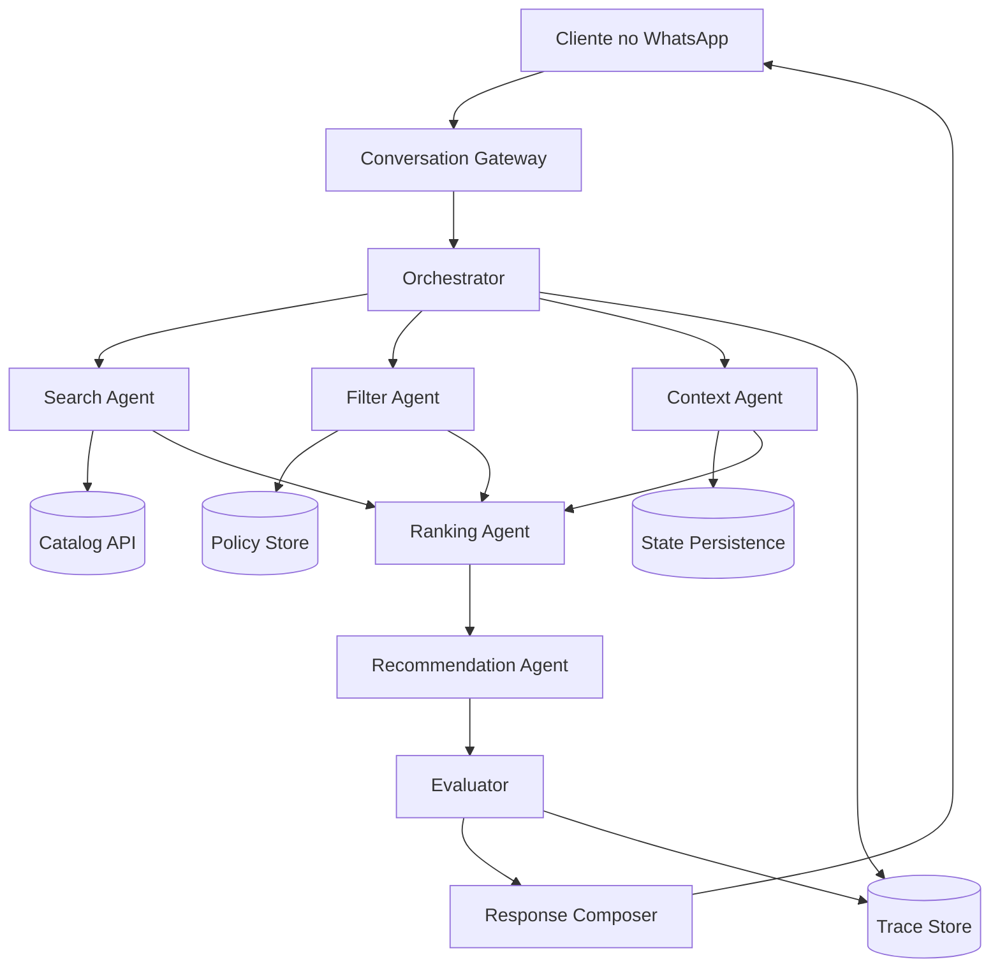
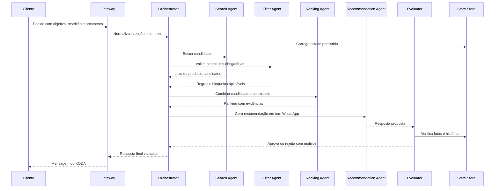
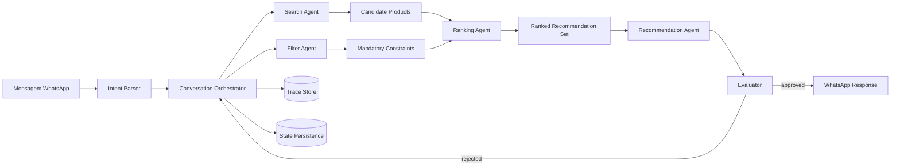

# 🤝 Coordenação Multi-Agente: Quando Vários Agentes Precisam Trabalhar Como Um Sistema
## Como orquestrar Search Agent, Ranking Agent, Filter Agent e Recommendation Agent sem perder contexto, qualidade ou auditabilidade

**Tempo Estimado:** 150 minutos  
**Nível:** Core Concept - Conecta Nível 2 e Nível 3  
**Pré-requisito:** Generator/Evaluator, Sprint Contracts, State Persistence e leitura básica de traces  
**Status:** 🟢 CRÍTICO - Base para pipelines confiáveis do KODA  
**Data de Criação:** Maio 2026

---

## 1. 📖 Prólogo: A Manhã em que KODA Precisou Virar uma Equipe

Segunda-feira, 08h17. O WhatsApp da FutanBear começa a acelerar antes mesmo da reunião diária.
Um influenciador de corrida mencionou a loja durante um story, e dezenas de clientes chegam com perguntas parecidas, mas não iguais.
Alguns querem whey protein sem lactose.
Alguns querem creatina com entrega hoje.
Alguns querem um combo para emagrecimento sem estimulantes.
Alguns só dizem: "me indica algo bom para voltar a treinar".

KODA, na superfície, continua sendo uma única conversa simpática no WhatsApp.
Mas por trás daquela conversa existe uma tensão arquitetural real.
Uma única chamada de modelo consegue conversar bem por alguns minutos.
Uma única chamada de modelo não consegue, sozinha, buscar catálogo, comparar preço por dose, respeitar alergias, ranquear opções, filtrar estoque, validar margem, preservar tom humano e preparar resposta final durante uma jornada longa.

O primeiro cliente da manhã se chama Rafael.
Ele manda três mensagens em sequência:

```
08:18 Rafael: Bom dia, quero voltar a treinar depois de 8 meses parado.
08:18 Rafael: Tenho intolerância a lactose e não quero gastar mais que R$ 250.
08:19 Rafael: Se der, queria algo que chegasse em Campinas ainda esta semana.
```

Um KODA simples responderia rápido demais.
Ele talvez buscasse "whey" no catálogo, pegasse o produto mais vendido e escrevesse uma recomendação bonita.
A resposta pareceria confiante.
Mas confiança não é coordenação.

O KODA maduro faz outra coisa.
Ele divide o problema em papéis internos.
O **Search Agent** procura produtos compatíveis com objetivo e disponibilidade.
O **Filter Agent** remove itens que violam intolerância, orçamento, estoque e política comercial.
O **Ranking Agent** compara candidatos por adequação, custo por dose, margem e evidência.
O **Recommendation Agent** transforma a decisão técnica em uma resposta humana, curta e segura para WhatsApp.
O **Evaluator** revisa se a resposta respeita fatos, restrições e tom.
O **orchestrator** mantém a ordem, controla fan-out, faz fan-in e grava state persistence para que nada dependa da memória frágil de uma única context window.

Por fora, Rafael vê uma frase simples:

```
KODA: Rafael, para voltar com segurança e respeitando sua intolerância, eu escolheria uma proteína vegetal chocolate dentro do seu orçamento, junto com creatina se você quiser completar o combo. Tenho uma opção em estoque com entrega para Campinas esta semana. Posso te mostrar as duas opções mais fortes?
```

Por dentro, essa frase foi resultado de uma pequena equipe trabalhando em poucos segundos.
Não houve magia.
Houve **coordenação multi-agente**.

Este módulo ensina como desenhar essa coordenação sem transformar o sistema em uma coleção caótica de agentes conversando entre si.
Você vai aprender quando dividir, quando manter simples, como evitar deadlock, como lidar com race condition, como comparar sequential, parallel, fan-out/fan-in, orchestrator, choreography e hierarchical coordination, e como aplicar tudo em um Customer Journey Pipeline do KODA.

### A intuição central do prólogo

- Um sistema multi-agente não existe para parecer sofisticado.
- Ele existe para proteger responsabilidade, memória e qualidade quando uma jornada fica maior do que uma única trilha de raciocínio suporta.
- No KODA, isso aparece toda vez que uma conversa mistura descoberta de necessidade, consulta de catálogo, recomendação, checkout, política de entrega e avaliação de segurança.
- A coordenação é o que transforma agentes especializados em um produto coerente.
- Sem coordenação, vários agentes viram apenas várias fontes de erro.

---

## 2. 🎯 O Que É Coordenação Multi-Agente

### Definição direta

**Coordenação multi-agente** é o conjunto de decisões arquiteturais que define como agentes especializados dividem trabalho, trocam estado, sincronizam resultados, resolvem conflitos e produzem uma saída única para o usuário ou para outro sistema.

Em termos práticos, coordenação responde cinco perguntas:

- Quem decide qual agente trabalha primeiro?
- Como cada agente sabe exatamente o que recebeu e o que deve entregar?
- Onde o state persistence vive para sobreviver a context window, retry e falhas?
- Como outputs paralelos são combinados em um fan-in confiável?
- Quem tem autoridade para aprovar, rejeitar ou pedir nova tentativa?

### Por que isso é necessário

- **Responsabilidade clara:** Quando cada agente possui um papel pequeno, fica mais fácil saber onde uma decisão nasceu.
- **Token budget controlado:** Agentes especializados recebem contexto menor, usam menos tokens e sofrem menos context rot.
- **Auditabilidade:** Cada etapa escreve trace, input, output e critérios, permitindo debug real.
- **Qualidade maior:** Generator, evaluator e agentes de domínio reduzem auto-aprovação e sycophancy.
- **Latência administrável:** Tarefas independentes podem rodar em parallel sem bloquear a jornada inteira.
- **Resiliência:** Falhas locais podem ser isoladas sem derrubar toda a conversa do WhatsApp.

### Quando usar coordenação multi-agente

- ✅ Use quando a tarefa tem múltiplas competências que competem por atenção: busca, análise, escrita, validação e decisão comercial.
- ✅ Use quando o erro custa dinheiro, confiança, logística ou risco ao cliente.
- ✅ Use quando outputs intermediários precisam ser inspecionáveis por humanos ou por outro agente.
- ✅ Use quando uma etapa pode ser paralelizada sem depender do resultado de outra.
- ✅ Use quando uma conversa longa exige state persistence além da context window atual.
- ✅ Use quando um único agente começa a misturar planejamento, execução e avaliação.

### Quando não usar

- ❌ Não use para respostas triviais, como confirmar horário de atendimento.
- ❌ Não use quando não há critério claro para separar responsabilidades.
- ❌ Não use quando a latência extra prejudica mais do que a qualidade ajuda.
- ❌ Não use quando o time não consegue explicar o papel de cada agente em uma frase.
- ❌ Não use quando o pipeline existe apenas para impressionar arquitetura, não para reduzir erro.

### A diferença entre multi-agent systems e coordenação multi-agente

Um **multi-agent system** é o conjunto de agentes. A **coordenação multi-agente** é a forma como esse conjunto trabalha sem tropeçar em si mesmo.

1. Você pode ter muitos agentes e coordenação fraca.
2. Você pode ter poucos agentes e coordenação excelente.
3. O número de agentes não é a métrica principal.
4. A clareza do contrato entre agentes é a métrica principal.
5. A capacidade de auditar uma decisão depois do fato é a prova de maturidade.

### Agentes LLM vs. Serviços Determinísticos: Uma Distinção Essencial

Nem todo componente do pipeline precisa ser um agente LLM. No KODA, alguns componentes são **serviços determinísticos** (código tradicional, sem chamada de modelo) e outros são **agentes LLM** (usam Claude ou outro modelo para raciocinar).

**Serviços determinísticos (não usam LLM):**
- **Catalog API:** Consulta de SKU, preço, estoque — é uma API REST tradicional.
- **Inventory Check:** Verificar se há unidades disponíveis em uma cidade — é uma query SQL.
- **Price Calculation:** Aplicar desconto de clube, cupom, frete — é aritmética, não raciocínio.
- **Payment Processing:** Cobrar cartão — é uma chamada de API de gateway, nunca um LLM.
- **Constraint Validation (parte do Filter):** "189.90 > 180? Bloqueia." — é uma comparação numérica.

**Agentes LLM (usam modelo para raciocinar):**
- **Search Agent:** Traduz intenção do cliente ("quero algo para ganhar massa") em queries de catálogo.
- **Ranking Agent:** Pondera múltiplas dimensões (custo, satisfação, adequação) para ordenar.
- **Recommendation Agent:** Transforma dados em linguagem natural adequada ao tom e contexto.
- **Evaluator:** Julga se a recomendação final respeita constraints, tom e fatos — requer julgamento.

**Regra prática:** Se a decisão pode ser tomada com `if/else` ou aritmética, use um serviço determinístico. Se a decisão exige julgamento, interpretação de linguagem natural ou ponderação de múltiplos fatores qualitativos, use um agente LLM. Misturar os dois em um pipeline é normal e esperado — o importante é saber qual é qual.

Neste módulo, usamos o termo "agente" para os componentes LLM do pipeline. Os serviços determinísticos são tratados como infraestrutura (APIs, bancos, funções) que os agentes consultam. O **orchestrator** pode ser determinístico (um script de roteamento) ou um agente LLM (se a decisão de roteamento for complexa) — no KODA, usamos um orchestrator determinístico com regras explícitas de roteamento por intenção.

---

## 3. 📊 Os Paradigmas de Coordenação

Cada paradigma é uma forma diferente de responder: "quem trabalha, em que ordem, com qual estado e com qual autoridade?".

### 1️⃣ Sequential coordination

**Definição:** Um agente termina sua etapa antes do próximo começar.

**Analogia:** Linha de montagem: cada estação entrega uma peça validada para a próxima.

**Exemplo KODA:** Search Agent encontra candidatos, Filter Agent elimina riscos, Ranking Agent ordena, Recommendation Agent escreve.

**Onde funciona melhor:**
- fluxos com dependência forte
- checkout
- validação de pedido
- respostas que exigem ordem rígida

**Riscos principais:**
- latência acumulada
- bloqueio se uma etapa falhar
- propagação de erro se o output não for validado

**Pergunta de design:**
- O ganho de clareza e qualidade de `Sequential coordination` compensa o custo de latência, token budget e complexidade operacional neste ponto da jornada?

### 2️⃣ Parallel coordination

**Definição:** Vários agentes trabalham ao mesmo tempo sobre partes independentes do problema.

**Analogia:** Uma equipe pesquisando três fornecedores em paralelo antes da reunião de decisão.

**Exemplo KODA:** Um agente calcula entrega, outro verifica estoque, outro consulta margem e outro busca reviews.

**Onde funciona melhor:**
- consultas independentes
- enriquecimento de contexto
- comparação de opções
- redução de latência percebida

**Riscos principais:**
- race condition
- resultados chegando fora de ordem
- custo maior de token budget se disparar agentes demais

**Pergunta de design:**
- O ganho de clareza e qualidade de `Parallel coordination` compensa o custo de latência, token budget e complexidade operacional neste ponto da jornada?

### 3️⃣ Fan-out/fan-in

**Definição:** O sistema divide uma pergunta em várias subtarefas, executa em fan-out e recombina em fan-in.

**Analogia:** Abrir várias abas de pesquisa e depois consolidar uma única recomendação.

**Exemplo KODA:** Gerar recomendações para objetivos diferentes e depois escolher a opção mais segura para o cliente.

**Onde funciona melhor:**
- ranking
- comparação de catálogo
- análise de alternativas
- busca ampla com síntese final

**Riscos principais:**
- fan-in mal definido
- outputs incompatíveis
- dificuldade de explicar por que uma opção venceu

**Pergunta de design:**
- O ganho de clareza e qualidade de `Fan-out/fan-in` compensa o custo de latência, token budget e complexidade operacional neste ponto da jornada?

### 4️⃣ Orchestrator coordination

**Definição:** Um agente ou componente central decide o fluxo, chama especialistas e consolida resultados.

**Analogia:** Maestro regendo instrumentos diferentes para produzir uma música única.

**Exemplo KODA:** Conversation Orchestrator decide quando chamar Search, Filter, Ranking, Recommendation e Evaluator.

**Onde funciona melhor:**
- produto com jornadas previsíveis
- controle de SLA
- auditabilidade central
- equipes que precisam debugar rápido

**Riscos principais:**
- single point of failure
- orchestrator inchado
- acoplamento excessivo

**Pergunta de design:**
- O ganho de clareza e qualidade de `Orchestrator coordination` compensa o custo de latência, token budget e complexidade operacional neste ponto da jornada?

### 5️⃣ Choreography coordination

**Definição:** Agentes reagem a eventos e contratos compartilhados sem um controlador central forte.

**Analogia:** Dançarinos seguindo a mesma música e sinais combinados, sem maestro visível.

**Exemplo KODA:** Inventory Agent publica evento de estoque baixo, Pricing Agent ajusta promoções e Recommendation Agent evita itens afetados.

**Onde funciona melhor:**
- sistemas event-driven
- tarefas assíncronas
- atualizações de catálogo
- notificações internas

**Riscos principais:**
- fluxo difícil de visualizar
- deadlock indireto
- eventos duplicados
- debug complexo

**Pergunta de design:**
- O ganho de clareza e qualidade de `Choreography coordination` compensa o custo de latência, token budget e complexidade operacional neste ponto da jornada?

### 6️⃣ Hierarchical coordination

**Definição:** Agentes são organizados em níveis: supervisor, líderes de domínio e executores.

**Analogia:** Operação de loja com gerente, responsáveis por setores e atendentes especializados.

**Exemplo KODA:** Journey Manager coordena Product Discovery Lead, Checkout Lead e Support Lead.

**Onde funciona melhor:**
- jornadas longas
- domínios grandes
- times de agentes por área
- operações com muitos estados

**Riscos principais:**
- burocracia
- latência por camadas
- perda de nuance entre níveis

**Pergunta de design:**
- O ganho de clareza e qualidade de `Hierarchical coordination` compensa o custo de latência, token budget e complexidade operacional neste ponto da jornada?

### Como escolher entre paradigmas

- Se uma etapa depende do resultado anterior, comece com sequential coordination.
- Se várias consultas são independentes, considere parallel coordination.
- Se você precisa explorar várias alternativas e consolidar, use fan-out/fan-in.
- Se você precisa governança forte e trace central, use orchestrator coordination.
- Se eventos de domínio disparam reações assíncronas, use choreography coordination.
- Se o domínio ficou grande demais para um único coordenador, use hierarchical coordination.

---

## 4. 📋 Comparative Table - Tabela Comparativa de Estratégias de Coordenação

| Estratégia | Quando Usar | Vantagens | Desvantagens | Custo | Exemplo KODA |
| --- | --- | --- | --- | --- | --- |
| Sequential | Etapas dependentes e ordem rígida | Simples de entender, fácil de auditar, contratos lineares | Latência soma etapa por etapa, falha bloqueia sequência | Baixo a médio | Search → Filter → Ranking → Recommendation |
| Parallel | Consultas independentes que podem rodar juntas | Reduz latência, especializa agentes, aproveita janelas curtas | Exige sincronização, pode aumentar token budget | Médio | Estoque, frete, preço e reviews consultados ao mesmo tempo |
| Fan-out/fan-in | Explorar muitas alternativas e consolidar uma decisão | Cobertura ampla, comparação rica, boa para ranking | Fan-in pode virar gargalo, conflitos precisam rubrica | Médio a alto | Três agentes propõem combos e um Evaluator escolhe |
| Orchestrator | Fluxos previsíveis com necessidade de governança | Trace central, controle de retries, política clara | Pode virar single point of failure e concentrar complexidade | Médio | Conversation Orchestrator chama agentes por intenção do cliente |
| Choreography | Eventos assíncronos e domínio distribuído | Baixo acoplamento, extensível, bom para atualizações contínuas | Debug mais difícil, risco de eventos duplicados | Médio a alto | Inventory event atualiza recomendações sem bloquear conversa |
| Hierarchical | Jornadas longas com subdomínios grandes | Escala responsabilidade, separa liderança por domínio | Mais camadas, mais latência, risco de burocracia | Alto | Journey Manager coordena Product, Checkout e Support Leads |
| Generator/Evaluator especializado | Quando qualidade precisa de verificação independente | Reduz sycophancy, aumenta confiança, cria gate explícito | Adiciona uma chamada e exige rubrica | Médio | Recommendation Agent escreve e Evaluator valida restrições |
| Event-driven com state store | Quando respostas podem continuar após a interação inicial | Resiliente, retoma fluxo, bom para tarefas longas | Exige idempotência e desenho de eventos | Alto | Pedido aguarda pagamento e retoma conversa quando webhook chega |

A tabela não existe para escolher uma resposta universal. Ela existe para impedir que você escolha o paradigma pelo nome mais bonito.

---

## 5. 🏗️ Arquitetura e Patterns

### Topologia básica de coordenação multi-agente

```
                         WhatsApp User
                              |
                              v
                    +----------------------+
                    | Conversation Gateway |
                    +----------+-----------+
                               |
                               v
                    +----------------------+
                    |    Orchestrator      |
                    | policy + routing     |
                    +----+-----+-----+-----+
                         |     |     |
              fan-out    |     |     |    fan-out
                         v     v     v
              +------------+ +------------+ +------------+
              | Search     | | Filter     | | Context    |
              | Agent      | | Agent      | | Agent      |
              +-----+------+ +-----+------+ +-----+------+
                    |              |              |
                    +------+-------+------+-------+
                           | fan-in       |
                           v              v
                    +----------------------+
                    | Ranking Agent        |
                    +----------+-----------+
                               |
                               v
                    +----------------------+
                    | Recommendation Agent |
                    +----------+-----------+
                               |
                               v
                    +----------------------+
                    | Evaluator            |
                    +----------+-----------+
                               |
                               v
                    +----------------------+
                    | Response Composer    |
                    +----------+-----------+
                               |
                               v
                         WhatsApp Reply

       Shared services: state store, trace store, catalog API, inventory API
```

### Pattern 1: Contract-first coordination

Antes de criar agentes, defina contratos. Um agente sem contrato é apenas uma prompt solta com permissão para surpreender você.

- Input schema: o que o agente recebe.
- Output schema: o que o agente escreve.
- Success criteria: como saber que terminou corretamente.
- Failure modes: quais falhas são esperadas e como reportar.
- State keys: quais campos persistidos ele pode ler ou escrever.
- Token budget: quanto contexto ele pode consumir.
- Timeout: quanto tempo ele pode bloquear o fluxo.
- Evaluator rubric: como a saída será validada.

### Pattern 2: Shared state, isolated reasoning

Agentes devem compartilhar estado, não compartilhar confusão. O state store guarda fatos, decisões e artefatos. A context window de cada agente fica menor e mais limpa.

```json
{
  "conversation_id": "wa_rafael_2026_05_28",
  "customer_constraints": {
    "budget_brl": 250,
    "dietary_restrictions": ["intolerancia_lactose"],
    "delivery_city": "Campinas"
  },
  "coordination_state": {
    "current_stage": "product_discovery",
    "agents_completed": ["SearchAgent", "FilterAgent"],
    "agents_pending": ["RankingAgent", "RecommendationAgent", "Evaluator"]
  }
}
```

### Pattern 3: Explicit fan-out and fan-in

Fan-out sem fan-in é dispersão. Fan-in sem critérios é opinião. O ponto de coordenação precisa declarar como resultados paralelos serão combinados.

- Ordenar candidatos por constraints obrigatórias antes de preferências.
- Rejeitar qualquer output sem evidence field.
- Resolver conflito por rubrica, não por confiança textual.
- Registrar qual agente gerou cada argumento.
- Manter rastreabilidade do produto recomendado até o catálogo original.

### Pattern 4: Evaluator como gate, não como decoração

O Evaluator precisa poder bloquear. Se ele apenas comenta, ele não é um gate; é uma observação tardia.

### Pattern 5: Idempotência para retries

Coordenação real falha. APIs demoram. Webhooks duplicam. Agentes podem precisar repetir uma etapa. Cada etapa deve poder rodar novamente sem duplicar cobrança, carrinho ou mensagem final.

### Pattern 6: Trace por decisão

Não registre apenas logs técnicos. Registre decisões: qual agente decidiu, com qual input, qual output, qual confiança, qual evidência e qual validação.

### Pattern 7: Value-Gated Coordination — "O Agente Só Avança Quando o Valor Incremental é Validado"

**Problema:** A coordenação multi-agente resolve o COMO executar — sequential, parallel, fan-out/fan-in, orchestrator — mas não resolve o SE executar. Sem um gate de valor, o pipeline coordena perfeitamente... a construção da coisa errada.

**O vocabulário de decisão de valor:** O orquestrador deve classificar cada intenção que recebe em um de quatro verbos antes de rotear para execução:

- **Build:** a intenção tem valor claro, dono nomeado, constraints definidas — execute o pipeline.
- **Experiment:** a intenção é promissora mas incerta — execute um pipeline reduzido com critério de parada antes de comprometer recursos completos.
- **Defer:** a intenção pode ter valor mas não agora — registre no backlog com rationale e condição de reativação.
- **Stop:** a intenção não justifica o custo de construção — recuse com explicação construtiva e alternativas de menor custo.

Estes quatro verbos formam o gate de valor que deve preceder qualquer decisão de coordenação. Sem eles, o orquestrador é apenas um roteador de execução — ele coordena trabalho sem questionar se o trabalho deveria existir.

**As Três Perguntas-Freio (Manual Brake Question Gate):** Antes de classificar uma intenção como Build ou Experiment, o orquestrador — ou o humano que o alimenta — deve responder três perguntas. Elas são o equivalente agentic do freio manual que existia naturalmente quando construir software custava caro:

1. **"Quem precisa disso, e o que quebra se não existir?"** — Força a nomeação do stakeholder real e do custo da omissão. Se a resposta for vaga ("os usuários", "seria legal ter"), a intenção é Defer ou Stop.
2. **"Ainda construiríamos isso se custasse uma semana de tempo de engenharia?"** — Usa um cost proxy para simular o freio econômico que tokens baratos removeram. Se a resposta for não, a intenção é Stop.
3. **"Quem é o dono de dizer não para isso?"** — Força a nomeação de um refusal owner. Se ninguém pode dizer não, a intenção é Defer até que um dono seja designado.

Estas três perguntas são o freio que o pipeline de coordenação não tem por padrão. O Generator/Evaluator avalia qualidade de output. O Manual Brake avalia valor de input. Ambos são gates, mas em extremidades opostas do pipeline: o Brake protege a entrada, o Evaluator protege a saída.

**Integração com o fluxo de coordenação existente:**

```
Intenção do cliente
       │
       ▼
┌──────────────────────┐
│ Manual Brake Gate    │  ← NOVO: Classifica em Build/Experiment/Defer/Stop
│ (3 perguntas-freio) │
└──────┬───────────────┘
       │
       ├── Stop → "Não vamos construir isso. Motivo: [rationale]"
       ├── Defer → "Vale a pena, mas não agora. Condição: [reativação]"
       │
       ▼ (Build ou Experiment)
┌──────────────────────┐
│ Conversation         │
│ Orchestrator         │  ← EXISTENTE: Roteia para pipeline
└──────┬───────────────┘
       │
       ▼
   Pipeline existente: Search → Filter → Ranking → Recommendation → Evaluator
```

**Onde o Brake vive:** O Manual Brake Gate não é um agente LLM. É um ponto de decisão determinístico — ou humano — que classifica a intenção antes que qualquer token de execução seja gasto. Em sistemas com AFK, o [[docs/canonical/human-afk-task-routing-gate|Human/AFK Task Routing Gate]] pode incorporar as três perguntas-freio como parte da classificação de prontidão da tarefa. Em sistemas com intervenção humana, o Brake é executado manualmente na entrada do pipeline.

**O Owner-of-No: O Papel Cujo Trabalho é Recusar**

Coordenar múltiplos agentes significa distribuir responsabilidades. Mas há uma responsabilidade que sistemas multi-agente raramente designam: **o papel cujo trabalho explícito é recusar trabalho de baixo valor.**

Este papel — o Owner-of-No — não é um agente que diz "não" por pessimismo. É um papel de design com três funções:

1. **Autoridade de recusa:** pode classificar qualquer intenção como Stop ou Defer, com rationale registrado.
2. **Alternativa construtiva:** quando recusa, oferece uma intenção alternativa de menor escopo ou um experimento mais barato. A recusa nunca é um "não" vazio.
3. **Calibração de valor:** revisa periodicamente as decisões de Build/Experiment/Defer/Stop e compara com outcomes reais para calibrar o julgamento de valor do time.

No pipeline KODA, o Owner-of-No pode ser:
- Um papel humano (Product Owner, Tech Lead) para decisões de produto.
- Uma política declarativa no Orchestrator ("intenções com custo estimado > R$ 500/mês exigem aprovação humana").
- Um agente especializado com autoridade de recusa, treinado com exemplos de decisões passadas e seus outcomes.

**Por que isso importa:** Sem um Owner-of-No explícito, a decisão de parar é sempre acidental — acontece quando alguém corajoso diz não sob pressão, não quando o sistema foi projetado para recusar. O resultado é que tudo que parece "barato de construir" avança, e o pipeline de coordenação multi-agente se torna uma máquina de executar trabalho que nunca deveria ter começado.

**Relação com os paradigmas de coordenação:** O Value Gate e o Owner-of-No se acoplam naturalmente ao Orchestrator coordination (o orquestrador aplica a classificação antes de rotear) e ao Hierarchical coordination (o Owner-of-No é um papel de supervisão que aprova ou recusa antes da delegação para líderes de domínio). Eles não substituem nenhum paradigma — adicionam uma camada de decisão de valor que precede a decisão de coordenação.

---

### Pattern 8: Consensus-Gated Privileged Information — "Nem Toda Informação Merece Confiança Automática"

**Problema:** Um agente recebe informação privilegiada de múltiplas fontes — documentos recuperados, outputs de sub-agentes, planos gerados, respostas de referência — e trata todo sinal como igualmente confiável. Quando uma fonte está errada (documento desatualizado, output alucinado de sub-agente, plano impreciso), o erro se propaga para decisões, prompts, skills e memória sem nenhum gate. Um único documento errado no knowledge base pode envenenar todos os turnos subsequentes de uma sessão de 30 passos.

**Concreto no KODA:** um agente de atendimento recupera a política de devolução do knowledge base. O documento está em cache desatualizado e indica prazo de 7 dias quando a política real é 30 dias. O agente aplica o limite de 7 dias por 4 turnos. O cliente escala. A causa raiz não é o raciocínio do agente — é que nenhum mecanismo validou a informação recuperada antes que o agente agisse sobre ela.

O repo já aplica este padrão aos outputs de avaliação via [[docs/canonical/multi-model-evaluation-council|Multi-Model Evaluation Council]] — o council usa diversidade de modelos, scoring independente, thresholds de concordância e política de discordância. O que falta é generalizar esse gate para **toda informação privilegiada**, não apenas resultados de eval.

**O vocabulário do consensus gate:**

```
Informação candidata (doc recuperado, output de sub-agente, plano, referência)
        │
        ▼
┌──────────────────────────────┐
│ Múltiplos passes de avaliação │
│ (avaliadores independentes,   │
│  modelos ou rubricas diversas) │
└──────────────┬───────────────┘
               │
        ┌──────┴──────┐
        │             │
   [ACCEPT]      [REJECT/DEFER]
   concordância   sem consenso
   > threshold    ou conflito
        │             │
        ▼             ▼
  Informação      Escalado para
  confiável       revisão humana
  entra no loop   com registro
  do agente       de auditoria
```

**Regras do gate:**
- **Diversidade de avaliadores:** múltiplos passes independentes com configurações diferentes (modelos, rubricas ou perspectivas). Dois avaliadores usando o mesmo modelo com prompts diferentes podem concordar no mesmo erro — diversidade real é essencial.
- **Métrica de concordância:** match exato de resposta, concordância de score de rubrica, consenso semântico ou contagem de conflitos. A métrica depende da categoria da informação: consenso semântico para documentos, match exato para respostas de referência.
- **Threshold configurável:** nível mínimo de concordância para aceitar a informação (ex: 2 de 3 concordam, ou score médio > 0.8). Calibre por categoria.
- **Registro de auditoria:** documente status accepted/rejected/deferred por candidato, com rationale, outputs dissidentes e evidência de consenso.
- **Caminho de escalação:** quando o consenso é fraco ou conflitante, roteie para revisão humana com o pacote de evidências.

**Integração com o fluxo de coordenação existente:** O consensus gate se acopla naturalmente ao Orchestrator coordination: antes de passar informação privilegiada para qualquer agente do pipeline, o orchestrator aplica o gate. Se a informação é rejeitada, o orchestrator escala ou solicita fonte alternativa. Se deferida (consenso fraco), marca como "pending verification" e o agente a utiliza com qualificador de confiança explícito.

**Por que isso importa:** Sem consensus gate, informação não verificada se propaga silenciosamente. Com ele, cada fato que entra no loop do agente tem um score de confiança, uma trilha de auditoria e um caminho de escalação quando a confiança é baixa. Para o padrão completo, veja [[docs/canonical/consensus-gated-privileged-information|Consensus-Gated Privileged Information]].

**Relação com os paradigmas de coordenação:** O consensus gate é ortogonal ao paradigma de coordenação — ele não substitui sequential, parallel, fan-out/fan-in, orchestrator ou choreography. Ele adiciona uma camada de validação que precede a decisão de coordenação. O orchestrator pode aplicar o gate antes de rotear, ou o gate pode ser um agente especializado que o orchestrator consulta. Em sistemas choreography, o gate pode ser um evento que múltiplos agentes escutam antes de consumir informação compartilhada.

---

### Pattern 9: Saga e Circuit Breaker — Tolerância a Falhas Multi-Agente

**Problema:** Workflows multi-agente falham parcialmente — um agente conclui com sucesso, outro sofre timeout, um terceiro retorna dados stale. Sem tolerância a falhas, falhas parciais ou passam despercebidas (produzindo resultados incorretos) ou derrubam o workflow inteiro (perdendo o progresso dos agentes bem-sucedidos). O repositório já possui o [[docs/canonical/tested-degradation-ladder|Tested Degradation Ladder]] — classification → retry with repair → safe fallback → human escalation — que cobre recuperação de falha em agente único. O que falta é a camada de orquestração para falhas **distribuídas** entre múltiplos agentes.

**Saga Pattern — Compensação transacional distribuída:**

Em um workflow onde o Order Agent confirma um pedido e o Payment Agent processa o pagamento, se o Payment Agent falha após o Order Agent ter debitado o estoque, é preciso desfazer a ação do primeiro agente. O Saga pattern define **compensating actions** — operações reversas executadas em ordem inversa — para cada passo do workflow:

```
Workflow: Checkout
  Step 1: ReservationAgent reserva estoque    → compensating: liberar estoque
  Step 2: PricingAgent aplica desconto        → compensating: reverter desconto
  Step 3: PaymentAgent processa pagamento     → compensating: estornar pagamento
  Step 4: FulfillmentAgent agenda entrega     → compensating: cancelar agendamento

Se Step 3 falha:
  → executa compensating de Step 2 (reverte desconto)
  → executa compensating de Step 1 (libera estoque)
  → sistema retorna ao estado pré-workflow
```

**Regras do Saga no pipeline KODA:**
- Cada passo que produz efeito colateral (escrita em banco, chamada de API externa, agendamento) DEVE declarar sua compensating action.
- Nem toda operação tem undo limpo (ex: envio de email, notificação push). Essas operações devem ser os **últimos passos** do workflow.
- Compensating actions são testadas como parte do [[docs/canonical/tested-degradation-ladder|degradation ladder]] — cada rung da ladder inclui o teste da ação compensatória correspondente.
- O orchestrator mantém um log de quais passos completaram e quais compensating actions foram executadas — esse log é a trilha de auditoria do rollback.

**Circuit Breaker — Proteção contra falhas em cascata:**

Quando um agente ou serviço externo começa a falhar consistentemente, continuar chamando-o não apenas desperdiça recursos como propaga o erro para outros agentes que dependem dele. O Circuit Breaker monitora a taxa de falha por agente e abre o circuito quando um threshold é atingido:

```
Estado do Circuito por Agente:

CLOSED (normal)          → falhas acumulam no contador
  │
  ├─ falhas > threshold (ex: 5 falhas em 60s)
  │
  ▼
OPEN (proteção ativa)    → chamadas são redirecionadas para fallback
  │                         sem tentar o agente original
  │
  ├─ timeout (ex: 30s)
  │
  ▼
HALF-OPEN (teste)        → uma chamada de teste é permitida
  │
  ├─ sucesso → CLOSED
  └─ falha   → OPEN (reset do timeout)
```

**Fallback por agente no KODA:**

| Agente | Fallback quando circuito abre |
|---|---|
| Search Agent | Retornar top-10 best-sellers (cache estático) |
| Filter Agent | Aplicar apenas constraints CRITICAL (lactose, orçamento); pular constraints SOFT |
| Ranking Agent | Ordenar por popularidade (query SQL simples, sem LLM) |
| Recommendation Agent | Template pré-aprovado com placeholder de produto |
| Payment Agent | Rota para fila de revisão humana com contexto completo |

**Integração com a Degradation Ladder existente:** O Circuit Breaker é a primeira linha de defesa — ele impede que falhas se propaguem. Se o fallback também falhar, o fluxo desce para a Degradation Ladder: classify → retry with repair → safe action/hold → human escalation. O Saga é a terceira linha: se o workflow precisa ser desfeito, as compensating actions garantem consistência. As três camadas juntas formam a tolerância a falhas completa:

```
Falha detectada
    │
    ▼
Circuit Breaker: circuito aberto? → usa fallback
    │ (circuito fechado ou fallback falhou)
    ▼
Degradation Ladder: retry → repair → safe fallback → human escalation
    │ (workflow multi-passo precisa ser desfeito)
    ▼
Saga: compensating actions em ordem reversa → estado pré-workflow
```

**Checklist de tolerância a falhas multi-agente:**
- [ ] Todo agente que produz efeito colateral tem uma compensating action documentada e testada
- [ ] Circuit Breaker configurado por agente com thresholds de falha (taxa, latência, timeout) documentados
- [ ] Fallback para cada agente está implementado e testado (não é "erro genérico" — é uma resposta de contingência específica)
- [ ] O orchestrator registra no trace store: qual circuito abriu, qual fallback foi usado, quais compensating actions foram executadas
- [ ] Testes de integração cobrem: falha no meio do workflow → rollback completo → estado pré-workflow confirmado
- [ ] Operações sem undo limpo (email, notificação) são posicionadas como últimos passos do workflow

---

## 6. 📐 Mermaid Diagram 1 - Tipos de Agentes e Relações



Este diagrama mostra a relação conceitual. O cliente não vê agentes internos. Ele vê um KODA consistente.

---

## 7. 🔄 Mermaid Diagram 2 - Fluxo de Coordenação



A sequência reforça que coordination flow é uma política explícita, não uma conversa improvisada entre prompts.

---

## 8. 💼 Aplicação KODA: Customer Journey Pipeline

### O cenário prático

O Customer Journey Pipeline do KODA precisa transformar uma intenção inicial vaga em uma recomendação comprável, segura e humana.

A jornada mínima tem quatro agentes especializados e um gate de avaliação:

- **Search Agent:** Encontra produtos candidatos no catálogo e preserva evidência de disponibilidade.
- **Filter Agent:** Remove candidatos que violam restrições alimentares, orçamento, estoque, entrega ou política comercial.
- **Ranking Agent:** Ordena candidatos por adequação ao objetivo, custo por dose, margem, popularidade e confiança dos dados.
- **Recommendation Agent:** Escreve a recomendação final em linguagem natural, com clareza e tom de WhatsApp.
- **Evaluator:** Valida a resposta contra fatos, restrições, rubrica de qualidade e promessa comercial.

### Entrada da jornada

```json
{
  "message": "Quero voltar a treinar, tenho intolerância a lactose e até R$ 250",
  "channel": "whatsapp",
  "customer_profile": {
    "name": "Rafael",
    "city": "Campinas",
    "known_preferences": ["chocolate", "entrega_rapida"]
  },
  "business_context": {
    "campaign": "story_corrida_maio",
    "inventory_region": "SP_interior"
  }
}
```

### Saída esperada

```json
{
  "recommended_products": [
    {
      "sku": "PV-CHOC-900",
      "reason": "sem lactose, sabor chocolate, dentro do orçamento",
      "confidence": "alta"
    }
  ],
  "customer_message": "Rafael, para voltar com segurança e respeitando sua intolerância, eu começaria por esta proteína vegetal chocolate. Ela fica dentro dos R$ 250 e tem entrega para Campinas esta semana.",
  "evaluation_status": "approved"
}
```

### Como os agentes coordenam no pipeline

1. Gateway interpreta a intenção e extrai constraints explícitas.
2. Orchestrator cria um coordination plan com etapas, deadlines e token budget.
3. Search Agent consulta catálogo por objetivo, categoria e disponibilidade regional.
4. Filter Agent aplica regras obrigatórias: sem lactose, orçamento, entrega e estoque.
5. Ranking Agent calcula adequação e registra evidências por produto.
6. Recommendation Agent gera uma resposta curta, sem vender demais e sem esconder trade-offs.
7. Evaluator verifica se a resposta não contradiz histórico, catálogo ou restrições.
8. Orchestrator grava trace e entrega mensagem ao WhatsApp Gateway.

### Regras de negócio que precisam aparecer na coordenação

- Restrição alimentar obrigatória vence preferência de sabor.
- Orçamento obrigatório vence margem comercial.
- Produto sem estoque não pode aparecer como recomendação principal.
- Entrega prometida precisa vir de serviço logístico consultado, não de suposição.
- Recommendation Agent não pode inventar benefício nutricional não presente no catálogo.
- Evaluator deve reprovar qualquer resposta que use "garantido" para resultado físico.
- Ranking Agent deve expor score e fatores, não apenas ordem final.
- Trace precisa ligar a mensagem final ao SKU, preço e estoque usados.

### Exemplo de trace resumido

```json
{
  "trace_id": "trace_rafael_customer_journey_001",
  "coordination_pattern": "orchestrator_with_fan_out_fan_in",
  "agents": [
    {"name": "SearchAgent", "status": "completed", "output_ref": "search_candidates.json"},
    {"name": "FilterAgent", "status": "completed", "output_ref": "filtered_candidates.json"},
    {"name": "RankingAgent", "status": "completed", "output_ref": "ranking.json"},
    {"name": "RecommendationAgent", "status": "completed", "output_ref": "draft_message.md"},
    {"name": "Evaluator", "status": "approved", "output_ref": "evaluation.json"}
  ],
  "final_decision": "recommend_pv_choc_900"
}
```

### Por que isso melhora KODA

- A conversa parece mais simples para o cliente porque a complexidade foi organizada internamente.
- A equipe consegue debugar uma recomendação olhando para etapas, não para uma resposta gigante.
- Cada agente recebe apenas o contexto necessário, reduzindo context rot.
- O Evaluator torna explícita a fronteira entre sugestão e resposta enviada.
- O pipeline pode evoluir: amanhã você adiciona Delivery Agent sem reescrever o Recommendation Agent inteiro.

---

## 9. 📐 Mermaid Diagram 3 - Pipeline KODA de Customer Journey



Este diagrama é específico do KODA: ele mostra busca, filtro, ranking, recomendação, avaliação e loop de reprovação.

---

## 10. ✅ Checklist de Implementação

- [ ] Definir a jornada de usuário antes de definir agentes.
- [ ] Nomear cada agente por responsabilidade, não por tecnologia.
- [ ] Escrever input schema para cada agente.
- [ ] Escrever output schema para cada agente.
- [ ] Definir success criteria verificável para cada etapa.
- [ ] Definir failure modes esperados para cada etapa.
- [ ] Determinar qual paradigma de coordenação será usado no fluxo principal.
- [ ] Declarar onde fan-out acontece e onde fan-in consolida resultados.
- [ ] Definir quem tem autoridade de aprovação final.
- [ ] Criar rubrica do Evaluator antes de colocar resposta em produção.
- [ ] Persistir constraints do cliente em state persistence.
- [ ] Persistir decisões intermediárias em trace store.
- [ ] Controlar token budget por agente.
- [ ] Definir timeout por agente e política de retry.
- [ ] Garantir idempotência em etapas que podem repetir.
- [ ] Evitar que agentes escrevam no mesmo campo sem ownership claro.
- [ ] Registrar versão do prompt ou contrato usado em cada trace.
- [ ] Criar teste de happy path para Search, Filter, Ranking e Recommendation.
- [ ] Criar teste de restrição alimentar obrigatória.
- [ ] Criar teste de orçamento obrigatório.
- [ ] Criar teste de produto sem estoque.
- [ ] Criar teste de rejeição pelo Evaluator.
- [ ] Medir latência total e latência por agente.
- [ ] Medir custo de token budget por etapa.
- [ ] Revisar traces reais antes de expandir para mais agentes.
- [ ] Definir o gate de valor antes do gate de execução: classificar cada intenção como Build, Experiment, Defer ou Stop.
- [ ] Responder as três perguntas-freio para cada intenção: quem precisa e o que quebra, custaria uma semana de engenharia, quem pode dizer não.
- [ ] Designar um Owner-of-No — papel ou política com autoridade explícita de recusa — para cada domínio do pipeline.
- [ ] Registrar a rationale de recusa ou deferral no trace store, não apenas aprovações.
- [ ] Separar gate de valor (entrada) de gate de qualidade (saída): o Manual Brake avalia input, o Evaluator avalia output.

### Sinais de que a implementação está saudável

- Você consegue remover um agente e prever exatamente qual capacidade será perdida.
- Você consegue explicar cada etapa em uma frase.
- Você consegue apontar o trace que justifica uma recomendação enviada ao cliente.
- Você consegue simular uma reprovação do Evaluator sem quebrar a conversa.
- Você consegue medir latência e custo por etapa, não apenas no total.

### Sinais de alerta

- Dois agentes discordam e o sistema escolhe o output mais recente por acidente.
- O orchestrator precisa ler prompts internos de todos os agentes para funcionar.
- A resposta final não aponta para evidência de catálogo.
- O fan-in junta textos sem rubrica de comparação.
- O time não sabe qual agente causou uma recomendação errada.
- Uma falha de estoque derruba toda a conversa em vez de produzir alternativa segura.
- Intenções entram no pipeline sem classificação de valor — tudo vira Build por padrão.
- Ninguém consegue nomear quem tem autoridade para recusar uma feature proposta.
- O pipeline coordena perfeitamente trabalho que nunca deveria ter sido iniciado.

---

## 11. 🔗 Referências Cruzadas com Nível 3

- **`curriculum/03-nivel-3-advanced-architecture/01-multi-agent-systems.md`:** Aprofunda Planner, Generator e Evaluator como base de multi-agent systems.
- **`curriculum/03-nivel-3-advanced-architecture/02-state-persistence.md`:** Mostra como estado externo preserva decisões entre chamadas, retries e context windows.
- **`curriculum/03-nivel-3-advanced-architecture/03-file-based-coordination.md`:** Explica como JSON files podem funcionar como contrato auditável entre agentes.
- **`curriculum/03-nivel-3-advanced-architecture/04-server-side-compaction.md`:** Ajuda a manter context window enxuta quando conversas e traces crescem.
- **`curriculum/03-nivel-3-advanced-architecture/05-harness-evolution.md`:** Mostra como evoluir harness sem criar complexidade acidental.
- **`curriculum/03-nivel-3-advanced-architecture/koda-applications/nivel-3-koda.md`:** Aplica arquitetura avançada no domínio real do KODA.
- **`docs/canonical/manual-brake-question-gate`:** As três perguntas-freio e o fluxo completo de classificação Build/Experiment/Defer/Stop.
- **`docs/canonical/value-gated-agent-control-loop`:** O gate de valor no loop de controle do agente.
- **`docs/canonical/owner-of-no-role-design`:** O papel cujo trabalho explícito é recusar trabalho de baixo valor.

### Como ler essas referências

1. Leia multi-agent systems para entender papéis.
2. Leia state persistence para entender memória externa.
3. Leia file-based coordination para entender contratos simples.
4. Leia server-side compaction para controlar contexto em jornadas longas.
5. Leia harness evolution para evoluir sem quebrar o sistema.
6. Leia nivel-3-koda para ver a aplicação integrada.

---

## 12. 🎓 O Que Você Aprendeu

- **Coordenação multi-agente é sobre responsabilidade, não quantidade de agentes:** cada agente precisa ter ownership claro, contrato explícito e critério de sucesso.
- **Paradigmas diferentes resolvem problemas diferentes:** sequential, parallel, fan-out/fan-in, orchestrator, choreography e hierarchical têm trade-offs próprios.
- **KODA precisa de coordenação porque customer journey mistura busca, filtros, ranking, recomendação e avaliação:** sem divisão, um agente único confunde prioridades.
- **State persistence e trace store são a memória operacional da coordenação:** sem eles, retry, debug e auditoria ficam frágeis.
- **Evaluator precisa ser gate real:** a resposta final só deve chegar ao WhatsApp depois que fatos, restrições, tom e promessa comercial forem validados.
- **Value Gate precede Coordination Gate:** classificar a intenção (Build/Experiment/Defer/Stop) antes de decidir o paradigma de coordenação evita que o pipeline execute trabalho que nunca deveria ter começado.
- **As três perguntas-freio substituem o freio econômico que tokens baratos removeram:** "quem precisa disso?", "construiria se custasse uma semana?", "quem pode dizer não?".
- **Owner-of-No é um papel de design, não uma personalidade:** ter alguém cujo trabalho explícito é recusar trabalho de baixo valor transforma o "não" de ato de coragem em responsabilidade documentada.

---

### 📚 Aprofundamento Técnico: Contratos de Agente

Os contratos abaixo são o que transforma "agentes conversando" em "sistema coordenado". Cada agente do pipeline KODA recebe um schema explícito de entrada e saída. Sem isso, a coordenação vira adivinhação.

#### Contrato: Search Agent

**Responsabilidade:** Buscar produtos no catálogo que correspondem ao objetivo do cliente. O Search Agent aplica um **pré-filtro de orçamento** (intervalo amplo: ±20% da faixa) para reduzir o volume de candidatos enviados ao Filter Agent — mas **não é o gatekeeper autoritativo de constraints**. A validação rigorosa de orçamento, restrições alimentares e prazos é responsabilidade exclusiva do Filter Agent.

**Input Schema:**
```json
{
  "search_request": {
    "customer_goal": "ganho_muscular | emagrecimento | energia | recuperacao | bem_estar",
    "budget_brl": 250,
    "delivery_city": "Campinas",
    "delivery_deadline_days": 5,
    "max_results": 15,
    "exclude_skus": []
  }
}
```

**Output Schema:**
```json
{
  "search_result": {
    "query_id": "srch_rafael_001",
    "products_found": 12,
    "products": [
      {
        "sku": "WHEY-VEGAN-001",
        "name": "Proteina Vegetal Chocolate 900g",
        "price_brl": 189.90,
        "category": "proteina_vegetal",
        "lactose_free": true,
        "doses": 30,
        "protein_per_dose_g": 24,
        "stock_campinas": 47,
        "rating": 4.6,
        "delivery_days": 2,
        "evidence": "catalog_api_v2/products/WHEY-VEGAN-001"
      }
    ],
    "excluded_by_budget": ["WHEY-ISOLADO-PREMIUM-001", "COMBO-MASS-GAINER-001"],
    "excluded_by_stock": ["BCAA-CHOCOLATE-001"],
    "search_timestamp": "2026-05-28T08:18:35Z",
    "api_version": "v2"
  }
}
```

**Success Criteria:**
- Pelo menos 3 produtos encontrados com budget respeitado
- Nenhum produto com SKU na lista de exclusão
- Todos os campos `evidence` apontam para endpoint real do catálogo
- `search_timestamp` dentro da mesma hora da requisição

**Failure Modes:**
- `EMPTY_RESULT`: Nenhum produto no orçamento → escalar para human review
- `STALE_CATALOG`: API retornou cache com mais de 24h → retry com force refresh
- `BUDGET_IGNORED`: Produtos acima do orçamento retornados → rejeitar lote inteiro

---

#### Contrato: Filter Agent

**Responsabilidade:** Remover produtos que violam constraints obrigatórias do cliente. O Filter Agent é binário: produto passa ou não passa. Ele não pondera — ele bloqueia.

**Input Schema:**
```json
{
  "filter_request": {
    "candidates": "<output do Search Agent>",
    "mandatory_constraints": {
      "lactose_free": true,
      "dietary_restrictions": ["intolerancia_lactose"],
      "budget_brl": 250,
      "delivery_city": "Campinas",
      "delivery_deadline_days": 5
    },
    "customer_id": "wa_rafael_2026_05_28"
  }
}
```

**Output Schema:**
```json
{
  "filter_result": {
    "query_id": "fltr_rafael_001",
    "candidates_received": 12,
    "candidates_passed": 4,
    "candidates_blocked": 8,
    "passed": [
      {
        "sku": "WHEY-VEGAN-001",
        "pass_reasons": ["lactose_free: true", "budget: 189.90 <= 250", "delivery: 2 <= 5"]
      }
    ],
    "blocked": [
      {
        "sku": "WHEY-CONCENTRADO-002",
        "block_reason": "lactose_free: false (contem 3g/porcao)",
        "severity": "CRITICAL"
      },
      {
        "sku": "CREATINA-PREMIUM-001",
        "block_reason": "budget: 279.90 > 250",
        "severity": "HIGH"
      }
    ],
    "filter_timestamp": "2026-05-28T08:18:38Z"
  }
}
```

**Success Criteria:**
- Nenhum produto bloqueado por `CRITICAL` aparece em `passed`
- Todo produto em `blocked` tem `block_reason` específico (nunca vazio)
- `candidates_passed + candidates_blocked == candidates_received`

**Failure Modes:**
- `FILTER_TOO_AGGRESSIVE`: Todos os 12 candidatos bloqueados → revisar constraints ou expandir busca
- `CONSTRAINT_IGNORED`: Produto com lactose passou com `lactose_free: true` falso → bug no catálogo
- `DELIVERY_MISMATCH`: Cidade do cliente vs estoque não batem → verificar regra de fulfillment

---

#### Contrato: Ranking Agent

**Responsabilidade:** Ordenar os candidatos que passaram pelo filtro, atribuindo um score de 0 a 100 baseado em múltiplas dimensões. O Ranking Agent não escolhe o vencedor — ele prepara a lista para o Recommendation Agent.

**Input Schema:**
```json
{
  "ranking_request": {
    "candidates": "<output do Filter Agent (passed)>",
    "ranking_dimensions": {
      "goal_alignment": {"weight": 0.30},
      "cost_per_dose": {"weight": 0.25},
      "customer_satisfaction": {"weight": 0.20},
      "delivery_speed": {"weight": 0.15},
      "stock_health": {"weight": 0.10}
    },
    "customer_profile": {
      "level": "retornando_apos_pausa",
      "priority": "seguranca_e_conveniencia"
    }
  }
}
```

**Output Schema:**
```json
{
  "ranking_result": {
    "query_id": "rank_rafael_001",
    "ranked": [
      {
        "rank": 1,
        "sku": "WHEY-VEGAN-001",
        "scores": {
          "goal_alignment": 92,
          "cost_per_dose": 85,
          "customer_satisfaction": 88,
          "delivery_speed": 95,
          "stock_health": 90
        },
        "total_score": 89.6,
        "evidence": {
          "goal_alignment": "24g proteina/dose, categoria proteina vegetal adequada para ganho muscular",
          "cost_per_dose": "R$ 6.33/dose, abaixo da media do mercado (R$ 7.50)",
          "customer_satisfaction": "4.6/5 com 230+ avaliacoes, 91% recomendam"
        }
      },
      {
        "rank": 2,
        "sku": "PROTEINA-SOJA-001",
        "total_score": 82.1
      },
      {
        "rank": 3,
        "sku": "WHEY-ISOLADO-ZEROLAC-001",
        "total_score": 78.3
      }
    ],
    "ranking_timestamp": "2026-05-28T08:18:42Z"
  }
}
```

**Success Criteria:**
- Rankings não empatam sem justificativa explícita de tie-break
- Nenhum score de dimensão individual fica sem `evidence`
- O total_score é consistente com a soma ponderada dos scores por dimensão
- Candidatos com `stock_health < 30` não aparecem no top 3

**Failure Modes:**
- `RANKING_FLAT`: Todos os scores entre 75-80 sem diferenciação → dimensões não estão discriminando
- `DIMENSION_IGNORED`: Uma dimensão com weight > 0 aparece com score zero em todos os candidatos
- `STALE_RATING`: Score de satisfação baseado em menos de 10 avaliações → marcar como low confidence

---

#### Contrato: Recommendation Agent

**Responsabilidade:** Transformar o candidato #1 do ranking em uma resposta humanizada para WhatsApp. O Recommendation Agent escreve em tom consultivo, não de vendedor. Ele não altera fatos, não inventa desconto e não promete o que o fulfillment não garante.

**Input Schema:**
```json
{
  "recommendation_request": {
    "top_candidate": "<output do Ranking Agent (rank 1)>",
    "alternatives": "<output do Ranking Agent (rank 2 e 3)>",
    "customer_name": "Rafael",
    "customer_context": {
      "returning_after_pause": true,
      "months_inactive": 8,
      "dietary_restrictions": ["intolerancia_lactose"]
    },
    "tone": "consultivo_seguro",
    "max_chars_whatsapp": 500
  }
}
```

**Output Schema:**
```json
{
  "recommendation_result": {
    "query_id": "rec_rafael_001",
    "primary_recommendation": {
      "sku": "WHEY-VEGAN-001",
      "message": "Rafael, para voltar com segurança e respeitando sua intolerância, eu escolheria a Proteína Vegetal Chocolate 900g (R$ 189,90). Ela entrega 24g de proteína por dose, não tem lactose e 91% dos clientes com perfil parecido com o seu recomendam. Entrega em Campinas em 2 dias. Se quiser, posso mostrar uma segunda opção mais em conta também.",
      "facts_asserted": [
        "preco: R$ 189,90",
        "proteina: 24g/dose",
        "lactose_free: true",
        "rating: 4.6/5",
        "delivery_days: 2"
      ]
    },
    "alternatives_summary": {
      "message": "Outra opção forte seria a Proteína de Soja Isolada (R$ 149,90), também sem lactose, com 22g de proteína por dose."
    },
    "recommendation_timestamp": "2026-05-28T08:18:45Z"
  }
}
```

**Success Criteria:**
- Toda afirmação de fato (`facts_asserted`) tem evidência rastreável até o catálogo
- Mensagem não excede `max_chars_whatsapp`
- Tom é consultivo, não agressivo (sem "COMPRE AGORA", "IMPERDÍVEL")
- Nenhuma promessa de entrega que contradiz o campo `delivery_days`
- Nome do cliente usado naturalmente, não em toda frase

**Failure Modes:**
- `FACT_INVENTION`: Mensagem menciona "frete grátis" ou "desconto" que não existe nos dados
- `TONE_MISMATCH`: Tom muito vendedor para cliente retornando após pausa
- `OVERCONFIDENCE`: Mensagem usa "garanto", "com certeza", "perfeito para você" sem evidência

---

#### Contrato: Evaluator (Pipeline Gate)

**Responsabilidade:** Validar se a recomendação final respeita TODAS as constraints antes de chegar ao WhatsApp. O Evaluator é o último gate — se ele reprovar, a resposta volta para correção.

**Input Schema:**
```json
{
  "evaluation_request": {
    "recommendation": "<output do Recommendation Agent>",
    "original_constraints": {
      "budget_brl": 250,
      "lactose_free": true,
      "delivery_city": "Campinas",
      "delivery_deadline_days": 5
    },
    "trace_chain": [
      "srch_rafael_001",
      "fltr_rafael_001",
      "rank_rafael_001",
      "rec_rafael_001"
    ]
  }
}
```

**Output Schema:**
```json
{
  "evaluation_result": {
    "verdict": "APPROVED",
    "checks": {
      "budget_respected": {"status": "PASS", "detail": "189.90 <= 250"},
      "lactose_free": {"status": "PASS", "detail": "SKU marcado como lactose_free: true no catalogo"},
      "delivery_feasible": {"status": "PASS", "detail": "2 dias, Campinas, 47 unidades em estoque"},
      "facts_accurate": {"status": "PASS", "detail": "5/5 facts rastreaveis ao catalogo"},
      "tone_appropriate": {"status": "PASS", "detail": "Consultivo, seguro, respeita contexto de retorno"},
      "trace_complete": {"status": "PASS", "detail": "4 query_ids encadeados sem gaps"}
    },
    "overall_score": 9.4,
    "approval_threshold": 7.0,
    "evaluator_timestamp": "2026-05-28T08:18:47Z"
  }
}
```

**Se REPROVADO:**
```json
{
  "evaluation_result": {
    "verdict": "REJECTED",
    "failed_check": "budget_respected",
    "reason": "Recomendacao sugere combo de R$ 287,90, mas orcamento e R$ 250",
    "action_required": "Recommendation Agent deve remover combo ou justificar upgrade",
    "retry_pipeline_from": "recommendation"
  }
}
```

**Success Criteria:**
- `APPROVED` só quando todas as checks são `PASS`
- Cada `FAIL` inclui `action_required` específico, nunca genérico
- `trace_complete` verifica que todos os `query_id` do pipeline existem no trace store
- `evaluator_timestamp` é posterior ao `recommendation_timestamp`

**Failure Modes:**
- `EVALUATOR_BYPASSED`: Recomendação chegou ao WhatsApp sem passar pelo Evaluator → bug no orchestrator
- `FALSE_POSITIVE`: Evaluator aprovou produto com lactose → revisar conexão com catálogo
- `EVALUATOR_TOO_LENIENT`: Approval threshold abaixo de 7.0 consistentemente → recalibrar rubrica

---

### 🧪 Pipeline Walkthrough: O Trace Completo de Rafael

Abaixo está um trace de exemplo, construído com base nos padrões de coordenação do KODA, de como a conversa do prólogo seria processada. Cada linha do audit log mostra exatamente qual agente agiu, com qual input, qual output e quanto tempo levou.

**Audit Log (.jsonl):**

```
{"ts":"08:18:32.100","event":"intent_parsed","intent":"product_discovery","customer":"wa_rafael"}
{"ts":"08:18:32.150","event":"orchestrator_routed","pipeline":"customer_journey_product","agents":["Search","Filter","Ranking","Recommendation","Evaluator"]}
{"ts":"08:18:32.200","event":"search_started","query_id":"srch_rafael_001","budget":250,"constraints":["intolerancia_lactose"]}
{"ts":"08:18:35.100","event":"search_completed","query_id":"srch_rafael_001","found":12,"duration_ms":2900}
{"ts":"08:18:35.200","event":"filter_started","query_id":"fltr_rafael_001","candidates":12}
{"ts":"08:18:38.050","event":"filter_completed","query_id":"fltr_rafael_001","passed":4,"blocked":8,"duration_ms":2850}
{"ts":"08:18:38.100","event":"ranking_started","query_id":"rank_rafael_001","candidates":4}
{"ts":"08:18:42.300","event":"ranking_completed","query_id":"rank_rafael_001","top_score":89.6,"duration_ms":4200}
{"ts":"08:18:42.350","event":"recommendation_started","query_id":"rec_rafael_001","top_sku":"WHEY-VEGAN-001"}
{"ts":"08:18:45.900","event":"recommendation_completed","query_id":"rec_rafael_001","chars":487,"duration_ms":3550}
{"ts":"08:18:45.950","event":"evaluation_started","query_id":"eval_rafael_001"}
{"ts":"08:18:47.800","event":"evaluation_completed","verdict":"APPROVED","score":9.4,"duration_ms":1850}
{"ts":"08:18:48.000","event":"response_delivered","customer":"wa_rafael","total_pipeline_ms":15850}
```

**O que este trace revela:**

1. **Pipeline total: 15.85 segundos.** Para o Rafael, pareceu instantâneo — ele enviou 3 mensagens e recebeu resposta em segundos. A percepção de latência no WhatsApp é dominada pelo typing indicator.

2. **Bottleneck: Ranking Agent (4.2s).** É o agente mais lento porque processa 4 candidatos contra 5 dimensões de ranking. A otimização aqui seria cache de scores de satisfação ou pré-computação de cost_per_dose.

3. **Gargalo escondido que não aparece no trace:** O Filter Agent não foi o gargalo (2.85s), mas foi o agente que MAIS REDUZIU risco. Ele bloqueou 8 de 12 produtos — dois terços dos candidatos violavam lactose ou orçamento. Se o Filter não existisse, o Ranking Agent ranquearia produtos perigosos, e o Evaluator teria que reprovar tudo no final (mais caro).

4. **Evaluator é o agente mais rápido (1.85s).** Isso é esperado: ele lê uma recomendação pronta e verifica contra constraints conhecidas. Não gera, não busca, não ranqueia — apenas valida.

5. **Fan-out não foi usado neste trace.** Como a conversa do Rafael era simples (3 mensagens, objetivo claro), o orchestrator escolheu sequential coordination. Se houvesse múltiplas consultas independentes dentro da mesma conversa (ex: comparar preço de 3 produtos específicos simultaneamente), o orchestrator poderia usar parallel coordination para consultar os 3 em paralelo e depois fazer fan-in dos resultados para comparação.

**Lições do trace:**

- Agentes rápidos no início (Search, Filter) + agente lento no meio (Ranking) = pipeline com boa percepção de progresso. O cliente vê "KODA está digitando..." enquanto o Ranking trabalha.
- O Evaluator no final é barato e evita o pior tipo de erro: mandar lactose para um intolerante.
- Se o Filter tivesse passado um produto com lactose por engano, o Evaluator ainda barraria. Essa redundância (Filter + Evaluator) é intencional: protege contra falha de um único agente.

---

### ⚠️ Catálogo de Modos de Falha em Coordenação Multi-Agente

Sistemas multi-agente falham de maneiras que sistemas single-agent não falham. Conhecer esses modos de falha antes de encontrá-los em produção é a diferença entre debug de 5 minutos e investigação de 5 horas.

#### Falha 1: Deadlock por Dependência Circular

**Sintoma:** Dois agentes esperam output um do outro e o pipeline congela.

**Exemplo KODA:**
```
Recommendation Agent espera "final_ranking" do Ranking Agent.
Ranking Agent espera "customer_preference_score" do Recommendation Agent.
Nenhum dos dois produz. Pipeline trava.
```

**Causa Raiz:** Design circular de dependências. Cada agente acha que o outro vai primeiro.

**Mitigação:**
- Desenhar DAG (Directed Acyclic Graph) de dependências antes de implementar
- Todo agente declara `depends_on: []` no contrato
- Orchestrator rejeita pipelines circulares no startup
- Timeout por agente: se um agente espera > 5s por dependência, escala para human

**Como detectar:** Monitorar `agent_waiting_for_dependency` events no trace. Se > 3 em 1 minuto, deadlock provável.

---

#### Falha 2: Race Condition em Fan-in

**Sintoma:** Três agentes paralelos terminam em ordens diferentes. O fan-in consolida resultados na ordem de chegada, não na ordem de importância.

**Exemplo KODA:**
```
Parallel: StockAgent, PriceAgent, ReviewAgent consultam ao mesmo tempo.
StockAgent termina em 1.2s → "47 unidades em Campinas"
ReviewAgent termina em 2.8s → "4.6/5 estrelas"
PriceAgent termina em 3.1s → "R$ 189,90"

Fan-in consolida: "R$ 189,90, 4.6/5 estrelas, 47 unidades em Campinas"
Mas a ordem natural seria: preço, qualidade, disponibilidade.
```

**Causa Raiz:** Fan-in não espera todos os resultados antes de consolidar, ou não aplica ordenação pós-consolidação.

**Mitigação:**
- Fan-in deve declarar `wait_for_all: true` ou `wait_for_n: 3`
- Fan-in deve declarar `sort_by: ["priority", "timestamp"]`
- Cada agente paralelo escreve `completed_at` e `priority` no output
- Fan-in ordena outputs por priority, não por arrival_time

**Como detectar:** Comparar `arrival_order` vs `consolidation_order` no trace. Se diferentes e não intencional, race condition.

---

#### Falha 3: Fan-in Inconsistency (Divergência de Fatos)

**Sintoma:** Dois agentes paralelos reportam o mesmo fato com valores diferentes. O fan-in não sabe qual é o correto.

**Exemplo KODA:**
```
StockAgent: "WHEY-VEGAN-001 tem 47 unidades em Campinas"
PriceAgent: "WHEY-VEGAN-001: preço R$ 199,90" (preço de SP, não Campinas)
```

**Causa Raiz:** Agentes paralelos consultam fontes diferentes para o mesmo campo, ou usam versões diferentes da mesma API.

**Mitigação:**
- Todo output de agente paralelo inclui `data_source` e `api_version`
- Fan-in compara `data_source` e `api_version` entre agentes que reportam o mesmo SKU
- Se divergência: fan-in escolhe o agente com `priority: "authoritative"` ou escala
- Implementar `fact_version` nos contratos: agentes só podem escrever campos que "possuem"

**Como detectar:** `FACT_DIVERGENCE` events no trace. Investigar imediatamente — divergência de preço ou estoque causa recomendação errada.

---

#### Falha 4: Stale State (Estado Desatualizado)

**Sintoma:** Um agente lê estado do state persistence que foi escrito há 3 minutos por outro agente, mas o mundo real mudou nesse intervalo.

**Exemplo KODA:**
```
Search Agent (08:18:35): "WHEY-VEGAN-001: 47 unidades"
Recommendation Agent (08:18:45): lê state e recomenda "47 unidades"
Mas às 08:18:40, 3 unidades foram vendidas. Estoque real: 44.
```

**Causa Raiz:** State persistence não é invalidado quando a fonte de verdade muda. Agentes confiam em cache.

**Mitigação:**
- Todo state write inclui `valid_until` timestamp
- Agentes que leem state com `valid_until` no passado devem re-consultar fonte
- Inventory events devem invalidar state keys de estoque
- `max_staleness_ms` configurado por agente: Search Agent = 5000ms, Recommendation Agent = 30000ms

**Como detectar:** Comparar `state_read_timestamp` com `api_last_updated` no trace. Se gap > threshold, stale state.

---

#### Falha 5: Double-Recommendation (Agentes Concorrentes)

**Sintoma:** Dois agentes geram recomendações diferentes para o mesmo cliente e ambas chegam ao WhatsApp.

**Exemplo KODA:**
```
Conversation A (intent = product_discovery): Recommendation Agent sugere Whey Vegano.
Conversation B (intent = checkout_resume): Recommendation Agent sugere Creatina.
Ambas respostas enviadas com 0.5s de diferença. Rafael vê duas mensagens conflitantes.
```

**Causa Raiz:** Orchestrator permite dois pipelines paralelos para o mesmo `conversation_id` sem lock.

**Mitigação:**
- Orchestrator mantém `active_pipeline` lock por `conversation_id`
- Se novo intent chega enquanto pipeline ativo: enfileirar, não executar em paralelo
- Response Composer verifica se já houve resposta nos últimos 2 segundos para o mesmo conversation_id
- `conversation_id` é a chave de idempotência para entrega de resposta

**Como detectar:** `DUPLICATE_RESPONSE` events no trace. Gravidade CRITICAL — afeta confiança do cliente.

---

#### Falha 6: Evaluator Silencioso (Aprova Tudo)

**Sintoma:** Evaluator aprova 100% das recomendações por semanas. Nenhuma rejeição. Time comemora — até descobrir que o Evaluator está com a rubrica desligada.

**Exemplo KODA:**
```
eval_001: APPROVED (score 9.4)
eval_002: APPROVED (score 9.2)
eval_003: APPROVED (score 8.9)
...
eval_847: APPROVED (score 8.7)
Nenhuma rejeição em 3 semanas.
Investigação revela: rubrica estava lendo constraints erradas (default vazio).
```

**Causa Raiz:** Evaluator não está realmente validando. Pode ser bug na rubrica, conexão com catálogo quebrada, ou threshold tão baixo que tudo passa.

**Mitigação:**
- Alerta: se approval_rate > 98% por mais de 24h, investigar
- Teste canário: injetar produto claramente errado (ex: com lactose para cliente intolerante) e verificar se Evaluator rejeita
- Dashboard semanal: distribuição de scores. Se todos entre 8.5-9.5, rubrica não está discriminando
- Auditoria manual: 1% das aprovações são revisadas por humano aleatoriamente

**Como detectar:** `EVALUATOR_APPROVAL_RATE` métrica. Se > 98% e `CRITICAL` constraints existem, investigar.

---

### 📊 Análise de Performance: Sequential vs Parallel vs Fan-out/Fan-in

A escolha do paradigma de coordenação afeta diretamente latência, custo e resiliência. Abaixo, comparamos os três paradigmas principais aplicados ao pipeline KODA.

**Cenário Base:** Recomendação de produto para Rafael (3 mensagens, constraints claras, catálogo de ~200 produtos).

#### Sequential (Search → Filter → Ranking → Recommendation → Evaluator)

```
Latência total: 15.85s (soma de cada etapa)
  Search:  2.90s
  Filter:  2.85s
  Ranking: 4.20s
  Rec:     3.55s
  Eval:    1.85s
  -----------------
  Total:  15.35s (+0.50s overhead = 15.85s)

Token budget: 8,200 tokens (soma dos contextos)
Custo API: R$ 0.12 por pipeline
Resiliência: Baixa — se Search falhar, tudo para
Auditabilidade: Alta — trace linear, fácil de seguir
```

**Quando usar:** Jornadas lineares onde cada etapa depende da anterior. Ex: checkout (validar cliente → verificar estoque → calcular preço → processar pagamento).

---

#### Parallel (Search + Stock + Price + Reviews simultâneos)

```
Latência total: 13.00s
  Search:  2.90s |
  Stock:   1.80s |-- paralelo (max = 3.10s do PriceAgent)
  Price:   3.10s |
  Reviews: 1.50s |
  -----------------
  Fan-in:  0.30s (consolidação)
  Ranking: 4.20s
  Rec:     3.55s
  Eval:    1.85s
  Total:  13.00s

Token budget: 14,500 tokens (4 agentes paralelos, contextos separados)
Custo API: R$ 0.21 por pipeline (+75% vs sequential)
Resiliência: Média — se PriceAgent falhar, fan-in pode usar cache
Auditabilidade: Média — 4 traces paralelos, fan-in precisa consolidar
```

**Quando usar:** Consultas independentes que não dependem uma da outra. Ex: discovery inicial onde cliente ainda não deu constraints definitivas.

---

#### Fan-out/Fan-in (3 variantes de recomendação)

```
Latência total: 7.80s
  Variant A (Search + Filter + Rank): 5.20s |
  Variant B (Search + Filter + Rank): 4.80s |-- paralelo (3 pipelines)
  Variant C (Search + Filter + Rank): 5.50s |   max = 5.50s
  ------------------------------------------
  Fan-in (Evaluator compara 3): 2.30s
  Total: 7.80s

Token budget: 24,000 tokens (3 pipelines × 8,000 cada)
Custo API: R$ 0.36 por pipeline (+200% vs sequential)
Resiliência: Alta — se uma variante falhar, outras 2 sobrevivem
Auditabilidade: Complexa — 3 traces paralelos, avaliador compara outputs
```

**Quando usar:** Quando você quer explorar o espaço de soluções antes de decidir. Ex: "Rafael pode gostar de proteína vegetal, whey isolado ou combo econômico — gere as 3 e o Evaluator escolhe a melhor".

---

#### Tabela Comparativa de Performance

| Paradigma | Latência | Custo | Resiliência | Auditabilidade | Melhor Para |
|---|---|---|---|---|---|
| Sequential | 15.85s | R$ 0.12 | Baixa | Alta | Checkout, validação |
| Parallel | 13.00s | R$ 0.21 | Média | Média | Discovery com múltiplas fontes |
| Fan-out/Fan-in | 7.80s | R$ 0.36 | Alta | Complexa | Exploração de opções, ranking competitivo |
| Choreography | 12.50s | R$ 0.18 | Alta | Baixa | Eventos assíncronos, notificações |
| Hierarchical | 22.30s | R$ 0.45 | Muito Alta | Muito Alta | Jornadas longas multi-domínio |

**Regra de decisão prática para KODA:**

1. Se a jornada é linear e cada etapa depende da anterior → Sequential
2. Se há 3+ consultas independentes que podem rodar juntas → Parallel
3. Se você quer comparar múltiplas estratégias antes de recomendar → Fan-out/Fan-in
4. Se o sistema reage a eventos externos (pagamento confirmado, estoque atualizado) → Choreography
5. Se a jornada tem subdomínios com liderança própria (Product, Checkout, Support) → Hierarchical

---

### 🔄 Migração Guiada: De Agente Único para Multi-Agente

Migrar de um agente monolítico para um pipeline multi-agente não é um big-bang. É uma sequência de passos que preserva o sistema funcionando enquanto você extrai responsabilidades.

#### Fase 0: Auditoria do Agente Atual (1-2 dias)

Antes de dividir, entenda o que o agente único realmente faz.

**Checklist de auditoria:**
- [ ] Liste todas as responsabilidades do agente atual (ex: "buscar produtos", "filtrar por preço", "escrever resposta")
- [ ] Para cada responsabilidade, anote: usa catálogo? usa state? decide sozinho?
- [ ] Colete 50 traces de conversas reais e classifique erros por tipo
- [ ] Identifique quais erros são de "responsabilidade sobrecarregada" (agente tentou fazer coisa demais)
- [ ] Identifique quais erros são de "falta de verificação" (agente não tinha Evaluator)
- [ ] Meça latência e token budget do agente atual como baseline

**Output da Fase 0:** Um mapa de responsabilidades + baseline de performance.

---

#### Fase 1: Extrair o Evaluator (1-2 dias)

O primeiro agente a nascer é o Evaluator, porque ele não muda o comportamento do sistema — apenas adiciona um gate de segurança.

**Passos:**
1. Implementar Evaluator com rubrica baseada nos erros mais comuns da Fase 0
2. Evaluator lê a resposta do agente único e aprova/rejeita
3. Se rejeitado, resposta NÃO vai para o WhatsApp — log e escala
4. Rodar em shadow mode por 2 dias: Evaluator avalia mas não bloqueia
5. Medir: quantas respostas o Evaluator teria bloqueado?
6. Ativar blocking mode com threshold conservador (score mínimo = 6.0)
7. Ajustar threshold semanalmente baseado em falsos positivos/negativos

**Checkpoint:** Agente único + Evaluator. Sistema já está mais seguro. Custo: +1 chamada API.

---

#### Fase 2: Separar Search do Resto (2-3 dias)

O Search Agent é o próximo porque sua responsabilidade é a mais clara e isolada: consultar catálogo.

**Passos:**
1. Extrair lógica de busca do agente único para Search Agent dedicado
2. Search Agent escreve output em state store
3. Agente único (agora "Core Agent") lê state em vez de consultar catálogo
4. Implementar contrato Search Agent (input/output schema)
5. Rodar em paralelo com busca antiga por 1 dia, comparar outputs
6. Desligar busca antiga

**Checkpoint:** Search Agent + Core Agent + Evaluator. Core Agent ficou mais leve (menos tokens).

---

#### Fase 3: Separar Filter (1-2 dias)

O Filter Agent é extraído porque suas regras são binárias e bem definidas (constraints).

**Passos:**
1. Implementar Filter Agent com schema de mandatory constraints
2. Filter Agent lê output do Search Agent e produz passed/blocked
3. Core Agent (agora "Orchestrator + Recommendation") lê passed do Filter
4. Implementar contrato Filter Agent
5. Testar com casos extremos: todas as constraints violadas, nenhuma violada

**Checkpoint:** Search → Filter → (Core + Recommendation) → Evaluator. Pipeline tomando forma.

---

#### Fase 4: Separar Ranking (1-2 dias)

O Ranking Agent é extraído agora porque sua responsabilidade (ordenação de candidatos) é bem definida e independente da escrita da resposta.

**Passos:**
1. Extrair lógica de ranking (comparação de candidatos) para Ranking Agent dedicado
2. Core Agent (agora "Orchestrator + Recommendation") lê output do Ranking
3. Implementar contrato completo para Ranking Agent
4. Validar que os scores de ranking são consistentes com o agente único anterior

#### Fase 5: Separar Recommendation (1-2 dias)

O Recommendation Agent é o último a ser extraído. Ele transforma dados técnicos em linguagem natural.

**Passos:**
1. Extrair lógica de recommendation (escrita da mensagem) para Recommendation Agent
2. Core Agent se torna Conversation Orchestrator puro (roteamento, não geração)
3. Implementar contrato completo para Recommendation Agent
4. Pipeline final: Search → Filter → Ranking → Recommendation → Evaluator
5. Teste de regressão: 100 conversas antigas, comparar outputs novo vs antigo
6. Ajustar prompts até outputs serem equivalentes ou melhores

**Checkpoint:** Pipeline multi-agente completo. Mesma qualidade ou melhor que agente único.

---

#### Fase 6: Otimização e Observabilidade (contínuo)

Com o pipeline rodando, o foco muda para performance e debug.

**Ações contínuas:**
- [ ] Dashboard com latência e custo por agente
- [ ] Alertas de deadlock, race condition, stale state
- [ ] Revisão semanal de traces: onde o pipeline gasta mais tokens?
- [ ] A/B test: sequential vs parallel para discovery
- [ ] Refinamento de rubrica do Evaluator baseado em falsos positivos
- [ ] Treinamento do time: todos sabem ler o trace do pipeline?

**Regra de ouro da migração:** Nunca extraia dois agentes ao mesmo tempo. Cada extração é um experimento com hipótese clara: "Separar X vai reduzir erros do tipo Y em Z%". Se a hipótese não se confirma, reverta e entenda por quê.

---

### 💰 Token Budget em Pipelines Multi-Agente

Agentes separados consomem mais tokens no total, mas cada agente individual consome menos. O segredo está em controlar o budget por agente para que o custo total seja previsível.

#### Por que agentes separados usam mais tokens (e por que tudo bem)

```
Agente único (faz tudo):
  Context window: 12,000 tokens (catálogo + constraints + histórico + resposta)
  Custo: 12,000 tokens por interação
  Mas: 25% de erro → reprocessamento consome 3,000 tokens extras em média
  Custo real: ~15,000 tokens

Pipeline multi-agente:
  Search Agent:   2,500 tokens (só catálogo + goal)
  Filter Agent:   1,800 tokens (só constraints + candidatos)
  Ranking Agent:  3,200 tokens (só candidatos + dimensões)
  Rec Agent:      1,500 tokens (só top candidate + contexto)
  Evaluator:      1,200 tokens (só recomendação + constraints)
  Total:         10,200 tokens por pipeline
  Mas: 2% de erro → quase sem reprocessamento
  Custo real: ~10,400 tokens (+340 tokens de overhead de state)

Economia real: 15,000 - 10,400 = 4,600 tokens por interação (31% menor)
```

O pipeline usa 31% menos tokens porque:
1. Cada agente recebe contexto enxuto (só o que precisa)
2. Menos erros = menos reprocessamento
3. State persistence evita re-consulta de informações já conhecidas

#### Budget por Agente (valores recomendados)

| Agente | Tokens Máximo | Motivo |
|---|---|---|
| Search Agent | 3,000 | Catálogo é a maior fonte de tokens. Limitar a 15 resultados |
| Filter Agent | 2,000 | Constraints são compactas. Candidatos são enxutos |
| Ranking Agent | 4,000 | Mais pesado: processa até 4 candidatos × 5 dimensões |
| Recommendation Agent | 2,000 | Só o top candidate + contexto do cliente |
| Evaluator | 1,500 | Lê recomendação final + constraints. Mais leve de todos |
| **Total pipeline** | **12,500** | Teto operacional. Acima disso, revisar |

#### Como budgets são violados (e como corrigir)

**Sintoma:** Search Agent consistentemente usa 4,200 tokens (teto era 3,000).

**Diagnóstico:**
1. Catálogo está retornando descrições longas de produtos (200+ tokens cada)
2. 15 produtos × 200 tokens = 3,000 tokens só em descrições

**Correção:**
1. Search Agent deve retornar apenas campos essenciais: SKU, nome, preço, lactose_free, estoque, rating
2. Descrições completas ficam no catálogo — Recommendation Agent consulta se precisar
3. Budget cai para 2,100 tokens

**Sintoma:** Ranking Agent usa 6,500 tokens (teto era 4,000).

**Diagnóstico:**
1. Filter Agent passou 8 candidatos em vez dos 3-5 esperados
2. Ranking Agent processa todos, não apenas top-N

**Correção:**
1. Filter Agent deve limitar `passed` a no máximo 5 candidatos
2. Se houver mais de 5 que passam, Filter Agent aplica pré-ranking (ex: ordenar por rating e pegar top 5)
3. Budget cai para 3,800 tokens

---

### 🧩 Exercício Prático: Diagnóstico de Pipeline Quebrado

**Cenário:** Você é o engenheiro de plantão. O dashboard mostra que 40% das recomendações estão sendo rejeitadas pelo Evaluator nas últimas 2 horas. O normal é 5%. O time de suporte reporta que clientes estão reclamando de "KODA não responde".

**Seu trabalho:** Diagnosticar a causa raiz usando os traces.

**Trace com problema (rejeição #147):**
```
{"ts":"14:22:10.000","event":"intent_parsed","intent":"product_discovery","customer":"wa_marina"}
{"ts":"14:22:10.050","event":"orchestrator_routed","pipeline":"customer_journey_product"}
{"ts":"14:22:10.100","event":"search_started","query_id":"srch_marina_147","goal":"ganho_muscular","budget":180}
{"ts":"14:22:12.800","event":"search_completed","query_id":"srch_marina_147","found":9}
{"ts":"14:22:12.850","event":"filter_started","query_id":"fltr_marina_147","candidates":9}
{"ts":"14:22:14.100","event":"filter_completed","query_id":"fltr_marina_147","passed":6,"blocked":3}
{"ts":"14:22:14.150","event":"ranking_started","query_id":"rank_marina_147","candidates":6}
{"ts":"14:22:18.900","event":"ranking_completed","query_id":"rank_marina_147","top_score":91.2,"top_sku":"WHEY-VEGAN-001"}
{"ts":"14:22:18.950","event":"recommendation_started","query_id":"rec_marina_147","top_sku":"WHEY-VEGAN-001"}
{"ts":"14:22:21.100","event":"recommendation_completed","query_id":"rec_marina_147"}
{"ts":"14:22:21.150","event":"evaluation_started","query_id":"eval_marina_147"}
{"ts":"14:22:22.400","event":"evaluation_completed","verdict":"REJECTED","reason":"budget_respected: SKU WHEY-VEGAN-001 price 189.90 > budget 180","score":3.2}
```

**Perguntas do exercício:**

1. **Qual agente é o responsável pelo erro?**  
   *Dica: O erro não está no Evaluator — ele está correto ao rejeitar. O erro está em algum agente anterior que deveria ter bloqueado este produto.*

2. **Por que o Filter Agent não bloqueou WHEY-VEGAN-001 se o preço (189.90) está acima do orçamento (180)?**  
   *Olhe o trace: o Filter Agent recebeu o budget correto? Se sim, o bug está no Filter. Se não, o bug está no Orchestrator.*

3. **O Ranking Agent deu score 91.2 para um produto acima do orçamento. Isso é um bug?**  
   *Dica: Olhe as dimensões do Ranking Agent. "cost_per_dose" tem weight 0.25. Se o Filter não bloqueou, o Ranking assume que passou — ele não re-valida constraints.*

4. **Como você corrigiria esse bug para evitar que aconteça de novo?**  
   *Pense em: contrato do Filter Agent, teste de regressão, alerta de budget.*

5. **Se 40% das rejeições têm o mesmo padrão (budget violado), qual é a hipótese mais provável?**  
   *A) Bug no Search Agent retornando produtos com preço errado*  
   *B) Bug no Filter Agent não aplicando constraint de budget*  
   *C) Mudança no catálogo que alterou preços sem atualizar o pipeline*  
   *D) Evaluator com threshold muito alto*

**Respostas esperadas (para auto-avaliação):**

1. O Filter Agent. Ele deveria ter bloqueado WHEY-VEGAN-001 porque 189.90 > 180. O Evaluator apenas detectou o erro que o Filter deixou passar.

2. Hipótese mais provável: o Filter Agent tem um bug onde `budget` constraint não está sendo aplicada, ou o Orchestrator não está passando o budget correto para o Filter. Diagnóstico: ler o input do Filter Agent no trace store — o campo `mandatory_constraints.budget_brl` estava correto (180)? Se sim, bug no Filter. Se não, bug no Orchestrator.

3. Não é um bug. O Ranking Agent pressupõe que todos os candidatos já passaram pelo Filter. Sua responsabilidade é ordenar, não re-validar. Re-validar constraints no Ranking seria duplicação de responsabilidade e aumentaria token budget desnecessariamente.

4. Correção: (a) Adicionar teste unitário no Filter Agent: "budget=180, product_price=189.90 → deve ser blocked". (b) Adicionar assertion no contrato do Filter: `candidates_passed` nunca deve conter produto com `price > budget_brl`. (c) Criar alerta: se `evaluation_rejection_reason = budget_respected` aparece em > 10% das avaliações, disparar investigação.

5. B ou C são as hipóteses mais prováveis. Se o Filter mudou (B), os testes de contrato pegariam. Se o catálogo mudou (C), o Search Agent deveria estar retornando preços corretos e o Filter deveria bloqueá-los independentemente. Investigar: o preço no catálogo é 189.90? Se sim, bug no Filter. Se o catálogo mudou de 179.90 para 189.90 nas últimas 2h, o pipeline não está reagindo a mudanças de preço (stale state).

---

### 🏭 Pipelines por Intenção no KODA

O KODA atende múltiplas intenções de cliente — cada uma exige um pipeline de coordenação diferente. Abaixo, três pipelines representativos dos padrões de coordenação aplicados no KODA.

#### Pipeline 1: Product Discovery

**Intenção:** Cliente quer explorar opções. Ainda não decidiu comprar.

**Estratégia de coordenação:** Sequential com fan-out opcional para consultas de preço e estoque.

**Pipeline:**
```
WhatsApp Message → Intent Parser
    ↓
Conversation Orchestrator
    ↓
[fan-out opcional: se cliente pede "compara opções", 
 ativa Ranking competitivo com 3 variantes]
    ↓
Search Agent (catálogo com constraints iniciais)
    ↓
Filter Agent (remove violações de restrições)
    ↓
Ranking Agent (ordena por goal_alignment + cost_per_dose)
    ↓
Recommendation Agent (escreve resposta consultiva)
    ↓
Evaluator (gate final: constraints + tom)
    ↓
WhatsApp Response
```

**Particularidades:**
- Fan-out é raro neste pipeline (~10% das conversas). A maioria é Sequential.
- O tom é exploratório: "Se quiser, posso mostrar mais opções" — não fecha venda.
- Token budget: 10,200 tokens. Latência: 12-16 segundos.
- Se o cliente pergunta "e esse aqui?" sobre um produto específico, o pipeline mantém Search + Filter (para constraints obrigatórias como alergias e orçamento) + Recommendation + Evaluator, pulando apenas o Ranking (já que é um único produto, não há o que ordenar).

**Exemplo de trace (discovery simples):**
```
08:18:32 intent=product_discovery → orchestrator → sequential pipeline
08:18:35 search_completed (12 produtos)
08:18:38 filter_completed (4 passaram)
08:18:42 ranking_completed (top: WHEY-VEGAN-001, score 89.6)
08:18:45 recommendation_completed (487 chars)
08:18:47 evaluation_completed (APPROVED, score 9.4)
08:18:48 response_delivered
```

---

#### Pipeline 2: Checkout

**Intenção:** Cliente decidiu comprar. Quer finalizar pedido.

**Estratégia de coordenação:** Sequential estrito. Cada etapa é um gate — se falhar, para tudo.

**Pipeline:**
```
WhatsApp Message ("quero comprar esse") → Intent Parser
    ↓
Conversation Orchestrator (modo: checkout_lock)
    ↓
Validate Customer Agent (membro ativo? pagamento cadastrado?)
    ↓  [se falhar → "Seu cadastro precisa de atualização"]
    ↓
Check Inventory Agent (SKU disponível? reservar 5 min?)
    ↓  [se falhar → "Produto esgotado, quer alternativa?"]
    ↓
Calculate Price Agent (subtotal + desconto clube + frete + cupom)
    ↓  [se falhar → "Não conseguimos calcular o preço. Tente novamente"]
    ↓
Process Payment Agent (cobrar, idempotente, nunca duplicar)
    ↓  [se falhar → "Pagamento não autorizado. Verifique seu cartão"]
    ↓
Schedule Fulfillment Agent (same-day? agendado? retirada?)
    ↓  [se falhar → "Entrega indisponível para hoje. Quer agendar?"]
    ↓
Confirm Order Agent (gerar número de pedido, enviar resumo)
    ↓
WhatsApp Response ("Pedido #KDA-8842 confirmado! Chega quinta-feira")
```

**Particularidades:**
- NÃO há paralelismo. Cada etapa depende da anterior e bloqueia em caso de falha.
- `checkout_lock` no Orchestrator impede que outra intenção interrompa o checkout.
- Token budget: 18,500 tokens (muitas validações). Latência: 25-35 segundos.
- Idempotência em Process Payment é crítica: se o cliente clicar "comprar" duas vezes, só cobra uma.

**O que acontece se uma etapa falha:**
```
14:30:00 checkout_started
14:30:03 validate_customer → PASS
14:30:06 check_inventory → PASS (47 unidades)
14:30:09 calculate_price → PASS (R$ 189,90)
14:30:15 process_payment → FAIL (cartão recusado)
14:30:16 orchestrator: "checkout_blocked at process_payment"
14:30:17 response: "Rafael, o pagamento não foi autorizado. Quer tentar outro cartão?"

Pipeline NÃO continua para Schedule Fulfillment.
Estado do pedido: "aguardando_pagamento"
Cliente pode retomar mais tarde sem perder o carrinho.
```

---

#### Pipeline 3: Support (FAQ + Escalação)

**Intenção:** Cliente tem dúvida ou problema. Pode ser simples (FAQ) ou complexo (escalação para humano).

**Estratégia de coordenação:** Fan-out inicial para classificação, depois Sequential com possível escalação.

**Pipeline:**
```
WhatsApp Message ("meu pedido não chegou") → Intent Parser
    ↓
Conversation Orchestrator (modo: support_triage)
    ↓
[fan-out paralelo]
    ├── FAQ Agent: "isso está na base de conhecimento?"
    ├── Order Lookup Agent: "qual o status do pedido deste cliente?"
    └── Sentiment Agent: "cliente está irritado? urgente?"
    ↓
[fan-in: Triage Agent]
    ├── Se FAQ encontrou resposta → responde direto
    ├── Se Order Lookup encontrou problema → explica e oferece solução
    └── Se Sentiment = irritado + Order = atrasado → escala para humano
    ↓
[Se escalado]
Human Handoff Agent: "Rafael, vou transferir você para um especialista 
que já está com todas as informações do seu pedido. 
Enquanto isso, seu pedido #KDA-8842 está em rota e deve chegar até 18h."
    ↓
WhatsApp Response + notificação interna para equipe de suporte
```

**Particularidades:**
- Fan-out no início é essencial: FAQ, Order Lookup e Sentiment rodam em paralelo.
- Triage Agent é o ponto de decisão mais importante: ele decide se o bot resolve ou se escala.
- Se escala, Human Handoff Agent inclui contexto completo para o humano não precisar perguntar de novo.
- Token budget: 8,500 tokens. Latência: 3-8 segundos (fan-out paralelo reduz latência).
- Este pipeline é o que mais usa Choreography: quando o pedido muda de status, um evento atualiza o estado.

**Exemplo de trace (cliente irritado, pedido atrasado):**
```
16:45:00 intent=support_complaint → orchestrator → support_triage
16:45:01 fan-out: FAQ Agent, Order Lookup Agent, Sentiment Agent (paralelo)
16:45:02 FAQ: "no_match" (não é pergunta de FAQ)
16:45:03 Order Lookup: "KDA-8842, status=em_rota, atraso=45min"
16:45:03 Sentiment: "irritado, urgência=alta, menção='quero cancelar'"
16:45:04 fan-in: Triage Agent → escalation_required
16:45:06 Human Handoff: contexto preparado
16:45:07 response: "Rafael, entendi sua frustração. Seu pedido está em rota..."
16:45:07 internal_notification: equipe de suporte alertada com ticket #SUP-4421
```

---

#### Tabela Comparativa dos 3 Pipelines

| Característica | Product Discovery | Checkout | Support |
|---|---|---|---|
| Estratégia principal | Sequential | Sequential estrito | Fan-out → Triage → Sequential |
| Paralelismo | Opcional (~10%) | Nenhum | Sim (fan-out inicial) |
| Tolerância a falha | Alta (explora alternativas) | Zero (bloqueia em falha) | Média (escala se não resolver) |
| Token budget | 10,200 | 18,500 | 8,500 |
| Latência típica | 12-16s | 25-35s | 3-8s |
| Lock no Orchestrator | Não | Sim (checkout_lock) | Parcial (triage_lock) |
| State persistence | Constraints + ranking | Carrinho + pagamento | Ticket + status pedido |
| Risco principal | Recomendação ruim | Cobrança duplicada | Escalação tardia |

---

### 🔍 Debugando com Trace Store

O trace store é o seu melhor amigo quando algo dá errado em produção. Abaixo, um guia prático para diagnosticar problemas comuns usando apenas os traces.

#### Consulta 1: "Por que esta recomendação foi rejeitada?"

```bash
# 1. Encontre o evaluation event para o conversation_id
grep "wa_marina_147" trace_store.jsonl | grep "evaluation_completed"

# Output:
# {"ts":"14:22:22.400","event":"evaluation_completed","verdict":"REJECTED",
#  "reason":"budget_respected: SKU WHEY-VEGAN-001 price 189.90 > budget 180","score":3.2}

# 2. Veja o que o Filter Agent fez (deveria ter bloqueado)
grep "wa_marina_147" trace_store.jsonl | grep "filter_completed"

# Output:
# {"ts":"14:22:14.100","event":"filter_completed","query_id":"fltr_marina_147",
#  "passed":6,"blocked":3}

# 3. Veja quais produtos o Filter bloqueou
grep "fltr_marina_147" trace_store.jsonl | grep "blocked"

# Output: mostra 3 SKUs bloqueados. WHEY-VEGAN-001 não está entre eles!

# Diagnóstico: Filter Agent NÃO bloqueou WHEY-VEGAN-001.
# Causa: bug no Filter ou constraint de budget não foi passada.
```

#### Consulta 2: "Por que o pipeline está lento?"

```bash
# 1. Extraia latência por agente nos últimos 100 pipelines
grep "_completed" trace_store.jsonl | tail -100 | \
  jq '{agent: .event, duration_ms: .duration_ms}' | \
  sort -t: -k2 -rn | head -5

# Output:
# {"agent":"ranking_completed","duration_ms":6200}  ← ANORMAL (média é 4200)
# {"agent":"search_completed","duration_ms":4800}    ← ANORMAL (média é 2900)
# {"agent":"ranking_completed","duration_ms":5800}   ← ANORMAL
# ...

# 2. Filtre apenas pipelines das últimas 2 horas
# Compare latência atual vs baseline da semana passada

# 3. Se Ranking Agent está consistentemente mais lento:
# Hipótese A: Filter Agent está passando mais candidatos (8 em vez de 4)
# Hipótese B: API de satisfação (usada em cost_per_dose) está lenta
# Hipótese C: Catálogo cresceu e Search retorna mais produtos
```

#### Consulta 3: "Quantos pipelines estão falhando agora?"

```bash
# 1. Taxa de rejeição nos últimos 30 minutos
total=$(grep "$(date +%H:%M)" trace_store.jsonl | grep "evaluation_completed" | wc -l)
rejected=$(grep "$(date +%H:%M)" trace_store.jsonl | grep "REJECTED" | wc -l)
echo "Rejection rate: $(echo "scale=1; $rejected * 100 / $total" | bc)%"

# 2. Distribuição de motivos de rejeição
grep "REJECTED" trace_store.jsonl | grep "$(date +%H)" | \
  jq -r '.reason' | sort | uniq -c | sort -rn

# Output:
# 47 budget_respected
# 12 lactose_free
#  3 delivery_feasible
#  1 tone_appropriate

# Diagnóstico: 47 rejeições por budget → investigar Filter Agent
```

#### Consulta 4: "Este cliente específico teve algum problema?"

```bash
# 1. Timeline completa de um conversation_id
grep "wa_rafael" trace_store.jsonl | jq -r '[.ts, .event, .verdict // .score // ""] | @tsv'

# Output tabular:
# 08:18:32  intent_parsed
# 08:18:32  orchestrator_routed
# 08:18:35  search_completed       12 found
# 08:18:38  filter_completed       4 passed
# 08:18:42  ranking_completed      89.6
# 08:18:45  recommendation_completed
# 08:18:47  evaluation_completed   9.4 APPROVED
# 08:18:48  response_delivered

# 2. Se houve erro, veja o estado completo naquele momento
grep "wa_rafael" state_store/ | jq '.coordination_state'
```

**Dica prática:** Mantenha um script `debug_pipeline.sh` com essas consultas pré-prontas. Quando o alerta disparar às 3h da manhã, você não quer digitar jq de cabeça.

---

### 📈 Métricas de Saúde do Pipeline

O que medir, onde medir e quando se preocupar.

#### Dashboard Operacional (diário)

| Métrica | Baseline Saudável | Alerta Amarelo | Alerta Vermelho |
|---|---|---|---|
| **Pipeline success rate** | > 95% | 90-95% | < 90% |
| **Evaluator approval rate** | 88-95% | 80-88% ou > 98% | < 80% |
| **Latência total (p50)** | < 18s | 18-25s | > 25s |
| **Latência total (p95)** | < 30s | 30-45s | > 45s |
| **Search Agent latency** | < 3.5s | 3.5-5s | > 5s |
| **Rejeições por budget** | < 5% | 5-15% | > 15% |
| **Rejeições por lactose** | 0% | Qualquer > 0 | Qualquer > 0 (CRÍTICO) |
| **Pipelines com retry** | < 8% | 8-20% | > 20% |
| **Max iterations atingido** | 0/dia | 1-3/dia | > 3/dia |
| **Deadlocks detectados** | 0/dia | Qualquer > 0 | Qualquer > 0 (CRÍTICO) |

#### Métricas por Agente (semanal)

| Agente | O que medir | Por que importa |
|---|---|---|
| Search Agent | Latência p50, taxa de empty result | Catálogo lento ou mal indexado |
| Filter Agent | Taxa de bloqueio, falsos negativos | Se bloqueia demais, pipeline fica sem opções |
| Ranking Agent | Latência p95, distribuição de scores | Se scores concentrados, ranking não discrimina |
| Recommendation Agent | Comprimento médio da resposta, taxa de tone_mismatch | Respostas longas demais cansam cliente |
| Evaluator | Approval rate, distribuição de scores, falsos positivos | Se > 98%, rubrica não está funcionando |

#### Alertas Configuráveis

```yaml
alerts:
  - name: "Evaluator approval rate anormal"
    condition: "approval_rate > 98% OR approval_rate < 80% for 1h"
    action: "notify #eng-alerts, run evaluator_canary_test"
    
  - name: "Latência do pipeline degradada"
    condition: "p95_latency > 45s for 30min"
    action: "notify #eng-alerts, check catalog API health"
    
  - name: "Rejeição por constraint crítica"
    condition: "rejection_reason = lactose_free AND count > 0 for 10min"
    action: "PAGE on-call, block Filter Agent até diagnóstico"
    
  - name: "Deadlock detectado"
    condition: "deadlock_detected > 0 for 5min"
    action: "PAGE on-call, restart orchestrator"
    
  - name: "Pipeline com retry excessivo"
    condition: "max_iterations_reached > 5 for 1h"
    action: "notify #eng-alerts, investigar causa raiz dos retries"
```

**Revisão semanal recomendada:**
1. Olhar distribuição de scores do Evaluator (histograma). Se unimodal e concentrada, recalibrar rubrica.
2. Olhar top 3 motivos de rejeição. Se um motivo novo aparece, investigar antes que vire tendência.
3. Comparar latência desta semana vs semana anterior. Degradação gradual indica problema de crescimento (mais produtos no catálogo, mais clientes).
4. Revisar 5 traces aleatórios de pipelines com retry. Entender por que precisaram de segunda tentativa.

---

### ⛔ Anti-Padrões de Coordenação Multi-Agente

Padrões que parecem boa ideia mas consistentemente causam problemas em produção.

#### Anti-Padrão 1: Agente Coringa

**O que é:** Um agente que "faz tudo que os outros não conseguiram fazer". Ele não tem contrato claro, recebe qualquer input e seu output é "o que der".

**Por que é tentador:** "Vamos criar um FallbackAgent para quando o pipeline normal falhar. Ele tenta de tudo."

**Por que falha:**
- Sem contrato = sem previsibilidade. Você nunca sabe o que ele vai retornar.
- Ele mascara bugs nos outros agentes. Se o Filter está quebrado, o FallbackAgent "conserta" e você nunca descobre.
- Token budget imprevisível: ele pode consumir 500 ou 5000 tokens dependendo do input.
- Debug impossível: "como o FallbackAgent decidiu isso?" — ninguém sabe.

**Como evitar:**
- Todo agente tem contrato explícito, até os de fallback.
- Fallback legítimo: "Se pipeline normal falhou, responda 'Estou com dificuldade técnica. Um especialista vai te ajudar em breve.'" — NÃO "tenta fazer o que o pipeline faria".
- Prefira escalação para humano a fallback automático criativo.

---

#### Anti-Padrão 2: Pipeline Profundo Demais

**O que é:** Pipeline com 8+ agentes em sequência, onde cada um faz uma transformação mínima.

**Exemplo real (ruim):**
```
Search → Enrich → Normalize → Filter → PreRank → Rank → Format → Recommend → Evaluate → Polish
```
10 agentes. Cada um adiciona 1-3s de latência. Total: 20-30 segundos.

**Por que é tentador:** "Cada agente tem uma responsabilidade única! Isso é bom design!"

**Por que falha:**
- Latência acumulada: 10 agentes × 2s = 20s mínimo. Cliente acha que KODA travou.
- Token budget explode: cada agente tem overhead de sistema prompt + contrato.
- Debug é pesadelo: "o erro aconteceu no Enrich ou no Normalize?"
- Muitos pontos de falha: se cada agente tem 99% de sucesso, 10 agentes = 90.4% de sucesso do pipeline (0.99^10).

**Como evitar:**
- Máximo de 5-7 agentes por pipeline. Se precisar de mais, está fazendo coisa demais em um pipeline só.
- Combine agentes com responsabilidades adjacentes: Enrich + Normalize + PreRank pode ser um único "Prepare Agent".
- Pergunte: "este agente está tomando uma decisão que outro agente não poderia tomar?" Se não, combine.

---

#### Anti-Padrão 3: Fan-out Sem Fan-in Claro

**O que é:** Orchestrator dispara 5 agentes em paralelo mas não define como os resultados serão combinados. O primeiro a terminar "ganha".

**Exemplo real (ruim):**
```
Orchestrator: "PriceAgent, StockAgent, ReviewAgent, consultem em paralelo!"
[Cada um retorna seu output]
Orchestrator: "O que chegou primeiro? ReviewAgent? Ok, usa esse."
```

**Por que falha:**
- Ordem de chegada ≠ ordem de importância. ReviewAgent não deveria "ganhar" sobre PriceAgent.
- Resultados parciais: se StockAgent ainda não terminou, recomendação pode sugerir produto sem estoque.
- Sem critério de consolidação, o output é aleatório.

**Como evitar:**
- Fan-in sempre declara: `wait_for: "all"` ou `wait_for_n: N`.
- Fan-in sempre declara: `consolidation_rubric` — como combinar outputs.
- Se um agente paralelo falhar, fan-in decide: "usar os que sobraram" ou "falhar tudo"?

---

#### Anti-Padrão 4: Estado Compartilhado Sem Ownership

**O que é:** Dois agentes escrevem no mesmo campo do state persistence. Nenhum é oficialmente "dono" daquele campo.

**Exemplo real (ruim):**
```
Search Agent escreve: state.product.price = 189.90
Price Agent escreve: state.product.price = 199.90 (preço com frete?)
Evaluator lê state.product.price. Qual valor está correto?
```

**Por que falha:**
- Último a escrever "ganha" — mas pode não ser o correto.
- Debug: qual agente escreveu o valor errado? Impossível saber sem timestamps.
- Comportamento não determinístico: o mesmo input pode produzir outputs diferentes dependendo da ordem de execução.

**Como evitar:**
- Cada campo no state store tem um `owner_agent` declarado no contrato.
- Se dois agentes precisam do mesmo campo, um é `authoritative` e o outro é `suggested`.
- Evaluator sempre lê do `authoritative`.
- Auditoria: todo write registra `agent_id` e `timestamp` no trace.

---

#### Anti-Padrão 5: Timeout Uniforme para Todos os Agentes

**O que é:** Configurar o mesmo timeout (ex: 10 segundos) para Search Agent (que consulta catálogo externo) e Evaluator (que lê recomendação pronta).

**Por que falha:**
- Search Agent tem razões legítimas para ser mais lento (API externa, rede).
- Evaluator NUNCA deve demorar 10 segundos (se demorar, algo está muito errado).
- Timeout uniforme mascara problemas: Search lento parece "normal", Evaluator lento nunca é detectado.

**Como evitar:**
- Cada agente tem seu próprio timeout, proporcioncional à complexidade esperada:
  - Search Agent: 8s
  - Filter Agent: 5s
  - Ranking Agent: 10s
  - Recommendation Agent: 6s
  - Evaluator: 3s
- Se Evaluator excede 3s, é alerta CRÍTICO — algo quebrou na rubrica ou na conexão com state store.

---

#### Anti-Padrão 6: Pipeline Único para Todas as Intenções

**O que é:** Um pipeline genérico que tenta atender product_discovery, checkout, support e FAQ com a mesma sequência de agentes.

**Por que é tentador:** "Um pipeline resolve tudo! Menos código para manter!"

**Por que falha:**
- Checkout não precisa de Ranking Agent. Support não precisa de Recommendation Agent.
- Agentes desnecessários consomem tokens e adicionam latência sem valor.
- Pipeline genérico toma decisões piores porque tenta ser "bom em tudo".

**Como evitar:**
- Um pipeline por intenção (product_discovery, checkout, support, faq).
- Cada pipeline ativa apenas os agentes necessários.
- Orchestrator roteia para o pipeline correto baseado no intent.
- Compartilhe agentes entre pipelines (Search Agent serve tanto discovery quanto checkout), mas não compartilhe a sequência completa.

---

### 🔧 Troubleshooting Rápido: Problemas Comuns e Soluções Imediatas

Guia de referência rápida para quando algo quebra em produção e você precisa agir em minutos, não horas.

#### "KODA não está respondendo — pipeline parece travado"

**Sintomas:**
- Múltiplos clientes relatam silêncio após enviar mensagem
- Métrica `pipeline_in_flight` > 20 (normal: < 5)
- `response_delivered` events pararam de aparecer no trace store

**Causas prováveis (ordenadas por probabilidade):**
1. **Catalog API está fora do ar** — Search Agent aguarda timeout de 8s repetidamente.
2. **State store cheia ou corrompida** — agentes não conseguem ler/escrever estado.
3. **Deadlock por dependência circular** — dois agentes esperando um pelo outro.

**Ações imediatas:**
```bash
# 1. Verifique saúde da catalog API
curl -s catalog-api/health | jq '.status'

# 2. Verifique pipelines travados
grep "in_progress" trace_store.jsonl | tail -20

# 3. Verifique consumo de disco do state store
df -h /state/

# 4. Se catalog API down: ative fallback mode (usa cache de 1h)
# 5. Se state store cheia: limpe traces antigos (> 7 dias)
# 6. Se deadlock: reinicie orchestrator (mantém estado dos clientes)
```

---

#### "Muitas recomendações sendo rejeitadas pelo Evaluator"

**Sintomas:**
- `evaluator_approval_rate` caiu de 92% para 60% em 1 hora
- `rejection_reason` mais comum: `budget_respected` ou `lactose_free`

**Causas prováveis:**
1. **Filter Agent com bug** — constraint não está sendo aplicada.
2. **Catálogo atualizou preços** — produtos que cabiam no orçamento agora não cabem.
3. **Mudança no schema do Search Agent** — campo novo não está sendo propagado.

**Ações imediatas:**
```bash
# 1. Isole o motivo da rejeição
grep "REJECTED" trace_store.jsonl | jq -r '.reason' | sort | uniq -c | sort -rn | head -5

# 2. Compare um trace de pipeline que funcionou vs um que falhou
# Procure diferenças nos outputs de cada agente

# 3. Se budget_rejected > 30%:
#    - Verifique se Filter Agent está recebendo mandatory_constraints.budget_brl
#    - Rode teste canário: produto com preço = budget + 1 deve ser bloqueado

# 4. Se lactose_free_rejected > 0:
#    - CRÍTICO: bloqueie Filter Agent imediatamente
#    - Investigue catálogo (campo lactose_free pode ter mudado de boolean para string)
```

---

#### "Pipeline está 2x mais lento que o normal"

**Sintomas:**
- `pipeline_total_latency_p95` passou de 28s para 55s
- Nenhum alerta de erro — pipeline funciona, mas devagar

**Causas prováveis:**
1. **Catalog API com latência degradada** — Search Agent espera mais.
2. **Ranking Agent processando mais candidatos** — Filter está passando 10 em vez de 4.
3. **State store com latência de I/O** — muitas escritas concorrentes.

**Ações imediatas:**
```bash
# 1. Latência por agente (últimos 50 pipelines)
grep "_completed" trace_store.jsonl | tail -50 | jq -r '[.event, .duration_ms] | @tsv' | \
  awk '{sum[$1]+=$2; count[$1]++} END {for (a in sum) print a, sum[a]/count[a]}'

# 2. Se Search Agent lento → verificar catalog API
# 3. Se Ranking Agent lento → verificar quantos candidatos o Filter está passando
grep "filter_completed" trace_store.jsonl | tail -10 | jq '.passed'

# 4. Se state store lento → verificar disco (SSD? spinning disk?)
iostat -x 1 3
```

---

#### "Cliente recebeu duas recomendações diferentes em seguida"

**Sintomas:**
- `DUPLICATE_RESPONSE` events no trace store
- Cliente reporta: "KODA me mandou duas mensagens conflitantes"

**Causa provável:**
- Orchestrator permitiu dois pipelines paralelos para o mesmo `conversation_id`.
- Cliente enviou duas mensagens em rápida sucessão e o intent parser disparou dois pipelines.

**Ações imediatas:**
```bash
# 1. Verifique se há pipelines paralelos para o mesmo conversation_id
grep "wa_PROBLEMA" trace_store.jsonl | jq -r '[.ts, .pipeline_id] | @tsv' | sort

# 2. Se dois pipelines com timestamps < 2s de diferença:
#    - Verifique se conversation_lock está funcionando
#    - Adicione debounce de 1s no intent parser

# 3. Para o cliente afetado: envie mensagem de correção manualmente
```

---

#### "Deadlock detectado — pipeline congelou"

**Sintomas:**
- Métrica `deadlock_detected` > 0
- Pipeline específico não avança há > 30s

**Causas prováveis:**
- Dois agentes com dependência circular.
- Um agente aguardando output de um agente que já falhou silenciosamente.

**Ações imediatas:**
```bash
# 1. Identifique o pipeline travado
grep "agent_waiting" trace_store.jsonl | tail -5

# 2. Veja o estado do pipeline
grep "PIPELINE_ID" trace_store.jsonl | jq '{event, agent, state}'

# 3. Resolução:
#    - Se dependência circular: mate o pipeline e notifique o cliente
#    - Se agente falhou silenciosamente: mate o agente, pipeline continua com fallback

# 4. Prevenção:
#    - Todo agente declara depends_on no contrato
#    - Orchestrator valida DAG (não deve ter ciclo) no startup
```

---

### 🎯 Exercício Avançado: Desenhe Seu Próprio Pipeline Multi-Agente

Agora que você entendeu os padrões, contratos, modos de falha e troubleshooting, é hora de desenhar um pipeline do zero.

**Cenário:** O time de produto quer lançar uma nova feature no KODA: **Recomendação de Combo Personalizado**.

O cliente diz: "Quero um combo para ganhar massa" e o KODA precisa montar um combo com:
- 1 proteína (whey, vegana ou isolada)
- 1 suplemento complementar (creatina, BCAA ou glutamina)
- 1 acessório (shaker, scoop ou mochila térmica)

O combo precisa:
- Respeitar restrições alimentares do cliente
- Caber no orçamento
- Ter todos os itens em estoque
- Ter entrega no mesmo prazo (todos os itens precisam chegar juntos)
- Maximizar custo-benefício (não apenas o mais barato, mas o melhor valor)

**Sua tarefa:**

1. **Defina os agentes necessários.** Quantos? Quais responsabilidades? (Dica: não caia no Anti-Padrão 2 — máximo 5-7 agentes.)

2. **Escolha o paradigma de coordenação.** Sequential? Parallel? Fan-out/Fan-in? Justifique sua escolha.

3. **Escreva o contrato de UM agente** (input schema, output schema, success criteria, failure modes). Pode ser JSON ou descritivo.

4. **Desenhe o pipeline** como diagrama ASCII ou Mermaid.

5. **Liste 3 modos de falha específicos** deste pipeline e como mitigá-los.

6. **Estime token budget e latência.** Quantos tokens cada agente? Latência total esperada?

**Auto-avaliação (compare com a solução de referência abaixo):**

**Solução de referência:**

**1. Agentes (6 agentes):**
- **Combo Search Agent:** Busca proteínas + complementos + acessórios que atendem ao objetivo.
- **Combo Filter Agent:** Remove itens que violam restrições ou não têm estoque. Também filtra combos onde itens têm prazos de entrega diferentes (precisa chegar junto).
- **Combo Builder Agent:** Gera combinações válidas (proteína × complemento × acessório) respeitando orçamento total.
- **Combo Ranking Agent:** Ordena combos por: custo-benefício, sinergia entre produtos, avaliações.
- **Evaluator:** Gate final — todas as constraints respeitadas?
- **Recommendation Agent:** Transforma o combo vencedor em resposta humanizada para WhatsApp.

**2. Paradigma:** Sequential com fan-out na busca. Combo Search Agent faz fan-out para buscar proteínas, complementos e acessórios em paralelo. Depois, Sequential: Filter → Builder → Ranking → Evaluator.

**3. Contrato do Combo Builder Agent:**

**Input:**
```json
{
  "proteins": ["<output do Filter para proteínas>"],
  "supplements": ["<output do Filter para complementos>"],
  "accessories": ["<output do Filter para acessórios>"],
  "budget_total_brl": 350,
  "delivery_city": "Campinas"
}
```

**Output:**
```json
{
  "combos": [
    {
      "combo_id": "cmb_001",
      "items": [
        {"sku": "WHEY-VEGAN-001", "type": "protein", "price": 189.90},
        {"sku": "CREATINA-MONO-001", "type": "supplement", "price": 65.00},
        {"sku": "SHAKER-PREMIUM-001", "type": "accessory", "price": 45.00}
      ],
      "total_price": 299.90,
      "same_delivery_date": true,
      "budget_remaining": 50.10
    }
  ],
  "combos_generated": 12,
  "combos_excluded_by_budget": 8,
  "combos_excluded_by_delivery_mismatch": 3
}
```

**4. Pipeline (ASCII):**
```
WhatsApp Message → Intent Parser ("combo_personalizado")
    ↓
Orchestrator
    ↓
[fan-out]
  ├── Search: proteínas
  ├── Search: complementos
  └── Search: acessórios
    ↓
[fan-in]
    ↓
Filter Agent (remove itens inválidos)
    ↓
Combo Builder Agent (gera combinações)
    ↓
Combo Ranking Agent (ordena por custo-benefício)
    ↓
Recommendation Agent (escreve resposta)
    ↓
Evaluator (gate final)
    ↓
WhatsApp Response
```

**5. Modos de falha:**

- **Falha: Combo com itens de prazos diferentes.** Combo Builder gerou combinação onde proteína chega em 2 dias e creatina em 7 dias. Mitigação: Filter Agent valida `same_delivery_date` ANTES do Combo Builder. Se prazos diferentes, item é removido na fase de Filter.

- **Falha: Orçamento estourado por item opcional.** Combo Builder incluiu acessório de R$ 89,90 que estourou o orçamento do combo. Mitigação: Combo Builder ordena acessórios por preço e tenta o mais barato primeiro. Se nenhum cabe, gera combo sem acessório.

- **Falha: Combos duplicados.** Combo Builder gerou o mesmo combo duas vezes (ordem diferente dos itens). Mitigação: Combo Builder normaliza ordem (proteína, complemento, acessório) e deduplica por hash dos SKUs.

**6. Token budget e latência:**
- Fan-out Search (3 agentes paralelos): 8,500 tokens totais, 3.5s (max dos 3)
- Filter: 3,200 tokens, 2.0s
- Combo Builder: 4,500 tokens, 5.0s (mais pesado — gera combinações)
- Ranking: 3,000 tokens, 3.5s
- Evaluator: 1,200 tokens, 1.5s
- **Total: ~20,400 tokens, ~15.5 segundos**

---

### 🚀 Próximos Passos: Onde Aprofundar

Você completou o Core Concept de Multi-Agent Coordination. Para continuar sua jornada:

**Imediato (esta semana):**
1. Releia os contratos dos 5 agentes KODA na seção "Aprofundamento Técnico". Tente escrever o contrato de um agente novo para uma feature que seu time está planejando.
2. Execute o exercício de diagnóstico de pipeline quebrado (seção "Exercício Prático"). Cronometre: conseguiu diagnosticar em menos de 10 minutos?
3. Leia os 6 anti-padrões. Quantos deles você reconhece em sistemas que já construiu?

**Curto prazo (este mês):**
1. Leia `curriculum/03-nivel-3-advanced-architecture/02-state-persistence.md` — a fundação sobre a qual a coordenação acontece.
2. Leia `curriculum/03-nivel-3-advanced-architecture/03-file-based-coordination.md` — como JSON files viram contratos executáveis entre agentes.
3. Implemente um mini-pipeline de 2 agentes (Generator + Evaluator) em uma feature não-crítica do KODA. Meça antes e depois.
4. Configure um dashboard com as métricas da seção "Métricas de Saúde do Pipeline".

**Médio prazo (este trimestre):**
1. Leia `curriculum/03-nivel-3-advanced-architecture/01-multi-agent-systems.md` para aprofundar em Planner, Generator e Evaluator.
2. Expanda o pipeline de 2 agentes para 4 agentes, seguindo o guia de migração da seção "Migração Guiada".
3. Implemente trace store e state persistence reais (não mock).
4. Treine outro engenheiro do time para ler e diagnosticar traces do pipeline.

**Longo prazo (contínuo):**
1. Quando o pipeline multi-agente estiver estável, leia `curriculum/03-nivel-3-advanced-architecture/05-harness-evolution.md` — como evoluir o harness sem quebrar o que funciona.
2. Proponha uma melhoria no pipeline baseada em dados reais de produção (não em intuição).
3. Escreva um post-mortem da primeira falha grave do pipeline. O que aprendeu? O que vai mudar nos contratos?

**Lembrete:** Coordenação multi-agente não é um destino — é uma prática. O pipeline que funciona hoje vai precisar de ajustes quando o catálogo crescer, quando novos modelos chegarem, quando o volume de clientes dobrar. A diferença entre um time que sofre com isso e um time que evolui com isso é: contratos claros, traces auditáveis e métricas visíveis.

---

### ❓ FAQ: Perguntas Frequentes sobre Coordenação Multi-Agente

**P: "Preciso mesmo de 5 agentes? Não posso fazer tudo com 2?"**

R: O número de agentes não é a métrica. A métrica é: cada responsabilidade tem um dono claro? Se você consegue ter 2 agentes com contratos bem definidos e responsabilidades não sobrepostas, ótimo. O problema é quando 1 agente faz 5 coisas diferentes e você não sabe quem errou. Comece com 2 (Generator + Evaluator) e extraia novos agentes conforme os erros mostrarem que uma responsabilidade precisa de isolamento.

---

**P: "Coordenar agentes não adiciona latência? O cliente não vai reclamar?"**

R: Sim, adiciona latência. O pipeline sequential completo leva ~16 segundos. Mas lembre-se: no WhatsApp, o cliente vê "KODA está digitando..." — a percepção de latência é muito menor que a latência real. Além disso, 16 segundos com 98% de precisão é melhor que 4 segundos com 75% de precisão e um cliente intoxicado por lactose. A latência da coordenação é um investimento em segurança.

---

**P: "Como faço para saber se estou coordenando demais?"**

R: Sinais de over-coordination:
- Você tem agentes cujo output é idêntico ao input (pass-through).
- Dois agentes têm contratos quase idênticos mas nomes diferentes.
- O time não consegue explicar a diferença entre Agent A e Agent B em uma frase.
- A latência total é dominada por overhead de coordenação (> 40% do tempo é passando estado, não processando).

Se 3+ desses sinais estão presentes, você está coordenando demais.

---

**P: "E se um agente falhar no meio do pipeline? O cliente perde tudo?"**

R: Não. State persistence existe exatamente para isso. Cada agente escreve seu output no state store ANTES de passar para o próximo. Se o Ranking Agent falhar, o estado do Filter Agent está salvo. O Orchestrator pode: (a) retry do Ranking Agent, (b) pular o Ranking e usar ordenação simples, (c) escalar para humano com o estado atual. O cliente NUNCA deve precisar repetir informações que já deu.

---

**P: "Posso usar o mesmo modelo (ex: Claude Sonnet) para todos os agentes?"**

R: Sim, e é o que o KODA faz. A especialização vem do system prompt e do contrato, não do modelo. O Search Agent e o Evaluator usam o mesmo modelo base, mas com temperaturas diferentes (Search: 0.7, Evaluator: 0.3) e system prompts radicalmente diferentes. A vantagem: custo previsível, sem dependência de múltiplos providers.

---

**P: "Como testo um pipeline multi-agente?"**

R: Três níveis de teste:
1. **Unitário:** Cada agente isolado. "Dado este input exato, este agente produz este output exato?" Teste os contratos, não a IA.
2. **Integração:** Duas etapas consecutivas. "Search → Filter: o output do Search é input válido para o Filter?" Teste a compatibilidade de contratos.
3. **End-to-end:** Pipeline completo com traces reais. "Conversa do Rafael em 28/05 produziu recomendação correta?" Use traces gravados como fixtures.

O teste mais importante: injete um produto com lactose para um cliente intolerante e verifique se o Evaluator rejeita. Se não rejeitar, seu pipeline não está seguro.

---

**P: "Qual é o maior erro que times cometem ao adotar multi-agent coordination?"**

R: Adicionar agentes antes de adicionar contratos. Times empolgados criam 7 agentes, cada um com um system prompt brilhante, mas nenhum com schema de input/output definido. O resultado: agentes que "conversam" entre si mas produzem outputs inconsistentes. A regra é: **contrato primeiro, agente depois**. Se você não consegue escrever o input schema e output schema de um agente, você não entende a responsabilidade dele o suficiente para implementá-lo.

---

### 📖 Glossário de Termos Específicos deste Módulo

| Termo | Definição |
|---|---|
| **Orchestrator** | Agente central que roteia intenções para pipelines e coordena a sequência de execução. Não gera conteúdo — apenas gerencia fluxo. |
| **Fan-out** | Disparar múltiplos agentes em paralelo a partir de um ponto de decisão. Ex: consultar estoque, preço e reviews simultaneamente. |
| **Fan-in** | Consolidar outputs de agentes paralelos em uma única decisão. Requer rubrica de consolidação explícita. |
| **Contract-first** | Prática de definir input/output schema de cada agente antes de implementar o agente. O contrato é a especificação executável. |
| **State persistence** | Armazenamento externo (arquivo, banco) que sobrevive a context windows, retries e falhas. Fonte de verdade entre agentes. |
| **Trace store** | Log imutável e cronológico de todos os eventos do pipeline. Usado para debug, auditoria e replay. |
| **Pipeline lock** | Mecanismo que impede dois pipelines de rodarem simultaneamente para o mesmo conversation_id. Previne double-recommendation. |
| **Deadlock** | Estado onde dois agentes esperam output um do outro e nenhum avança. Detectado por timeout de dependência. |
| **Race condition** | Situação onde a ordem de chegada de outputs paralelos afeta o resultado final de forma não intencional. |
| **Stale state** | Estado persistido que foi invalidado por uma mudança externa (ex: venda que reduziu estoque) mas ainda está sendo lido como válido. |
| **Sycophancy** | Tendência de LLMs de concordar com a própria resposta anterior. Razão pela qual auto-avaliação falha e o Evaluator precisa ser independente. |
| **Idempotência** | Propriedade de uma operação que pode ser repetida múltiplas vezes sem efeito colateral adicional. Crítica para cobrança e entrega de mensagens. |
| **Canary test** | Teste que injeta um cenário sabidamente errado (ex: produto com lactose para cliente intolerante) e verifica se o pipeline rejeita. |
| **Triage** | Processo de classificação inicial que decide qual pipeline ou tratamento uma requisição recebe. Usado no pipeline de Support. |
| **Shadow mode** | Técnica de deploy onde um novo componente (ex: Evaluator) avalia outputs mas não bloqueia — apenas loga o que teria feito. |

---

### 📋 Checklist para Code Review de Pipeline Multi-Agente

Use esta checklist quando revisar um PR que adiciona ou modifica um pipeline multi-agente no KODA.

**Contratos:**
- [ ] Todo agente novo tem input schema documentado (não apenas "recebe o que vier")
- [ ] Todo agente novo tem output schema documentado
- [ ] Contratos são validáveis (dá para escrever um teste que verifica se output respeita schema)
- [ ] Nenhum campo do state store tem dois `owner_agent` diferentes
- [ ] Campos `authoritative` vs `suggested` estão explicitamente marcados

**Coordenação:**
- [ ] O paradigma escolhido (sequential/parallel/fan-out) está documentado e justificado
- [ ] Se fan-out: fan-in declara `wait_for` e `consolidation_rubric`
- [ ] Se parallel: agentes paralelos não dependem de output um do outro
- [ ] Se sequential: ordem dos agentes está documentada com justificativa
- [ ] Não há dependência circular entre agentes (validar DAG)

**Segurança:**
- [ ] Evaluator está presente em todo pipeline que gera resposta para cliente
- [ ] Evaluator verifica constraints críticas (alergias, orçamento, estoque)
- [ ] Timeout por agente está definido e não é uniforme
- [ ] Max iterations definido (não infinito)
- [ ] Pipeline lock previne execução paralela para o mesmo conversation_id

**Observabilidade:**
- [ ] Todo agente escreve `started` e `completed` no trace store
- [ ] Métricas de latência e token budget por agente estão expostas
- [ ] Alertas configurados para: deadlock, approval rate anormal, latência alta
- [ ] Dashboard mostra pipeline success rate e evaluator approval rate

**Testes:**
- [ ] Teste de contrato para cada agente (input válido → output válido)
- [ ] Teste de integração para pares de agentes consecutivos
- [ ] Teste canário: Evaluator rejeita produto com lactose para cliente intolerante
- [ ] Teste de pipeline completo com trace de conversa real como fixture
- [ ] Teste de retry: pipeline consegue recuperar de falha de um agente

**Documentação:**
- [ ] README do pipeline explica quais agentes e por que
- [ ] Contratos estão em local acessível (não apenas no código)
- [ ] Modos de falha conhecidos estão documentados
- [ ] Procedimento de troubleshooting para os 3 erros mais prováveis

---

### 🧑‍🏫 Como Ensinar Coordenação Multi-Agente para Seu Time

Se você absorveu este módulo e agora precisa transmitir o conhecimento para colegas, aqui está um plano de ensino testado em 3 sessões.

**Sessão 1: O Problema (60 minutos)**

Objetivo: Fazer o time sentir a dor de NÃO ter coordenação.

1. **Demo ao vivo (15 min):** Mostre um agente único do KODA tentando processar o cenário do Rafael (prólogo). Deixe o time ver o agente se confundindo com múltiplas constraints.
2. **Discussão (20 min):** "O que deu errado?" Anote no quadro: "misturou busca com recomendação", "esqueceu o orçamento", "não verificou lactose".
3. **Conceito (25 min):** Apresente a ideia de separar responsabilidades em agentes diferentes. Use a analogia da linha de montagem (operário vs inspetor). Mostre o pipeline do KODA (Search → Filter → Ranking → Recommendation → Evaluator).

**Sessão 2: A Prática (90 minutos)**

Objetivo: Time implementa um mini-pipeline.

1. **Contratos primeiro (15 min):** Antes de qualquer código, cada pessoa escreve o contrato de UM agente (input/output schema). Revisem em grupo.
2. **Implementação (45 min):** Em duplas, implementem 2 agentes que se comunicam via state persistence (arquivos JSON). Um gera, outro avalia.
3. **Trace reading (30 min):** Troquem os pipelines entre duplas. Cada dupla lê o trace da outra e tenta diagnosticar um erro injetado.

**Sessão 3: A Evolução (60 minutos)**

Objetivo: Time entende que coordenação é prática contínua.

1. **Estudo de caso (20 min):** Apresente uma falha real (ou simulada) de produção. Time diagnostica usando trace store.
2. **Anti-padrões (20 min):** Apresente os 6 anti-padrões. Peça para cada pessoa identificar qual já cometeu.
3. **Roadmap (20 min):** Discutam: qual feature do KODA seria a primeira a receber um pipeline multi-agente? Qual o plano de migração?

**Dica para o mentor:** Não comece pelos diagramas Mermaid ou pela tabela comparativa. Comece pela DOR — o time precisa sentir por que um agente único falha antes de apreciar por que a coordenação resolve. A história do Rafael no prólogo foi escrita exatamente para isso.

**Erros comuns ao ensinar:**
- ❌ Começar pelos contratos JSON antes de explicar o problema. O time vai achar burocracia.
- ❌ Mostrar o pipeline completo (5 agentes) de uma vez. Comece com 2 (Generator + Evaluator).
- ❌ Não deixar espaço para perguntas depois da demo ao vivo. A demo gera as melhores perguntas.
- ❌ Pular a sessão de trace reading. É onde o conhecimento teórico vira habilidade prática.
- ✅ Sempre conecte cada conceito a um erro real que o time já viu em produção.
- ✅ Use o KODA como exemplo em TODAS as explicações. Abstração sem aplicação não gruda.
- ✅ Termine cada sessão com "o que vocês vão fazer diferente amanhã?" — força aplicação imediata.

**Material de apoio sugerido:**
- Imprima a tabela comparativa de estratégias e cole na parede da sala de engenharia.
- Crie um canal #pipeline-debug no Slack onde o time posta traces interessantes.
- Mantenha um "hall da fama" de bugs diagnosticados via trace store — celebra a prática.
- Rode uma sessão mensal de "trace review" onde o time revisa 5 pipelines aleatórios juntos.


---

### 💭 Reflexão Final: O Que Torna a Coordenação Realmente Boa

Você passou por contratos, paradigmas, traces, modos de falha, troubleshooting, métricas e anti-padrões. Tudo isso é ferramenta. Mas a coordenação multi-agente não é boa por causa das ferramentas — é boa por causa de três qualidades humanas que as ferramentas apenas amplificam.

**Primeira qualidade: Clareza de responsabilidade.**

Um pipeline bem coordenado é aquele onde qualquer pessoa do time consegue apontar para um erro de produção e dizer, em 30 segundos: "Foi o Filter Agent. Ele deveria ter bloqueado esse SKU. Vou olhar o contrato." Isso não é magia — é o resultado de contratos bem escritos e ownership claro.

Quando a responsabilidade é difusa ("o sistema recomendou errado"), o debug vira arqueologia. Quando a responsabilidade é clara ("o Filter Agent não aplicou a constraint de budget"), o debug vira uma consulta de 5 minutos no trace store.

**Segunda qualidade: Memória que sobrevive ao contexto.**

A maior fragilidade de um agente único não é a inteligência — é a memória. A context window é finita. O estado que cabe nela some quando a conversa avança. A coordenação multi-agente resolve isso não com um modelo melhor, mas com state persistence que sobrevive a context windows, retries, e até reinicializações do sistema.

Quando o Rafael voltar amanhã e disser "e aquele whey vegano que você recomendou?", o KODA não precisa re-descobrir tudo. O state store tem as constraints, o ranking, a recomendação original. O pipeline pode retomar de onde parou.

**Terceira qualidade: Coragem para evoluir.**

Um sistema sem contratos é frágil — qualquer mudança pode quebrar qualquer coisa. Um sistema com contratos é maleável — você pode trocar o Search Agent por uma versão melhor, e desde que o output schema seja o mesmo, o resto do pipeline nem percebe.

Isso significa que o time pode evoluir o KODA sem medo. Trocar o modelo do Evaluator por um mais rápido. Adicionar um novo agente de "Sazonalidade" que ajusta recomendações baseado na época do ano. Experimentar fan-out onde antes era sequential. Tudo isso sem reescrever o sistema inteiro.

**O que separa um pipeline que funciona de um pipeline que evolui:**

| Pipeline que funciona | Pipeline que evolui |
|---|---|
| Agentes têm system prompts bons | Agentes têm contratos explícitos |
| Erros são corrigidos manualmente | Erros geram melhorias nos contratos |
| Time sabe "o que" cada agente faz | Time sabe "por que" cada agente existe |
| Métricas existem | Métricas disparam ações |
| Debug é possível com esforço | Debug é trivial (trace store + jq) |
| Mudanças dão medo | Mudanças são experimentos com hipótese |

**Você não precisa chegar ao "pipeline que evolui" amanhã.** Mas cada contrato que você escreve, cada trace que você audita, cada métrica que você configura — é um passo nessa direção.

Coordenação multi-agente não é sobre tecnologia. É sobre **confiança**: confiança de que o sistema vai funcionar, confiança de que você vai conseguir consertar quando não funcionar, e confiança de que o time vai conseguir melhorar sem quebrar.

Esse é o verdadeiro valor do que você aprendeu aqui.

---

*"A melhor arquitetura não é a que tem mais agentes. É aquela onde cada agente sabe exatamente o que deve fazer, e ninguém precisa adivinhar."*

---

## 13. 📋 Metadata

| Campo | Valor |
| --- | --- |
| Arquivo | `curriculum/05-core-concepts/07-multi-agent-coordination.md` |
| Conceito Core | 07 - Multi-Agent Coordination |
| Nível Principal | Core Concept conectado ao Nível 3 |
| Tempo | 150 minutos |
| Público | Engenheiros mid-to-senior trabalhando no KODA |
| Pré-requisitos | Generator/Evaluator, State Persistence, File-Based Coordination |
| Diagramas | 3 Mermaid diagrams + 1 ASCII architecture diagram |
| Aplicação KODA | Customer Journey Pipeline com Search, Filter, Ranking, Recommendation e Evaluator |
| Status | Completo |
| Atualizado | Maio 2026 |
| Próximo | `curriculum/05-core-concepts/08-evaluation-rubrics.md` |

Written for FutanBear | KODA Project
