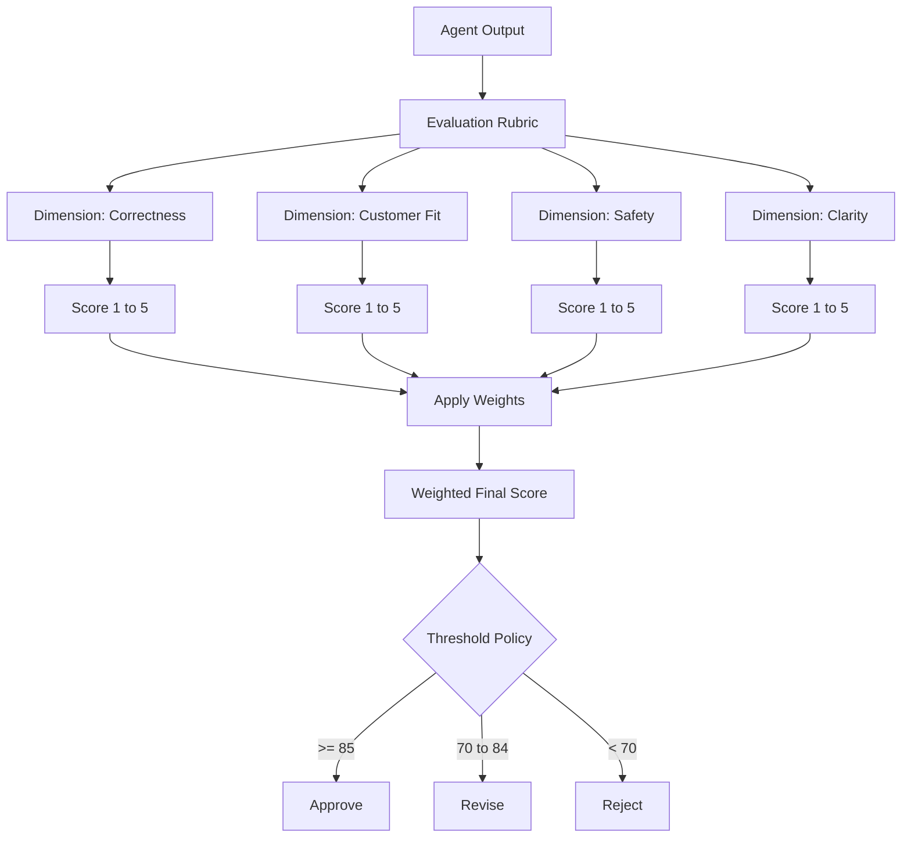
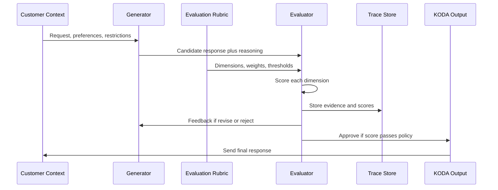
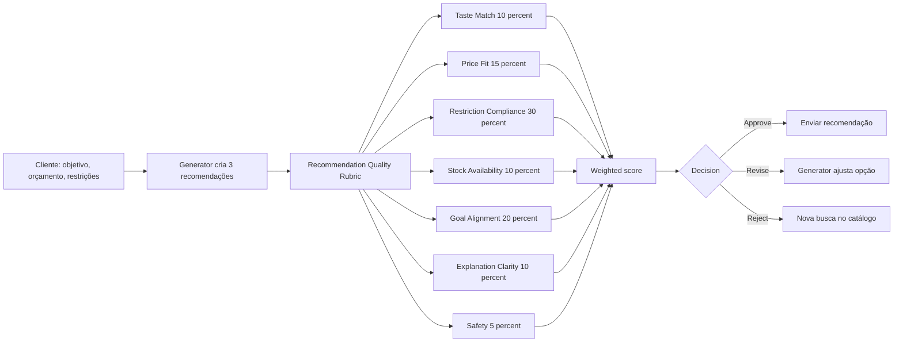
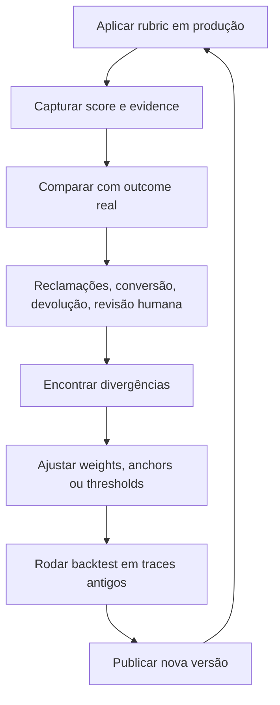

# 🎯 Evaluation Rubrics: Medindo Qualidade Onde pass/fail Não Enxerga
## Como transformar julgamento subjetivo em score confiável para agentes long-running

**Tempo Estimado:** 90 a 120 minutos  
**Nível:** Core Concepts, ponte direta com Nível 2  
**Pré-requisito:** Context Management, Token Budgeting, Generator/Evaluator, Sprint Contracts e noções de Trace Reading  
**Status:** 🟢 CRÍTICO, conceito 8 de 8 para operar KODA com qualidade mensurável  
**Data de Criação:** Maio 2026

---

## 📖 Prólogo: A Recomendação Que Passou, Mas Não Prestou

Ana já conhecia o KODA. Ela tinha comprado creatina duas vezes, sempre pelo WhatsApp, sempre com aquele tom de conversa que parecia humano sem fingir ser humano.

Naquela terça, ela chegou com uma pergunta simples: precisava de uma proteína para tomar depois do treino. Ela também disse três coisas críticas: era intolerante à lactose, tinha orçamento de até R$ 120 e preferia chocolate.

O KODA recomendou Whey ChocoMax por R$ 119,90. O produto tinha sabor chocolate, boa dose de proteína e estoque disponível. Antes de enviar, o sistema rodou a validação: produto existe, preço abaixo do teto, categoria correta, sabor correto, link de compra presente. Resultado: pass.

Só que a recomendação era ruim. O produto era baixo teor de lactose, não zero lactose. Para algumas pessoas isso seria aceitável. Para Ana, que tinha declarado intolerância, era uma aposta desnecessária. Existia uma opção plant-based por R$ 109,90, também chocolate, com estoque maior e risco menor.

Dois dias depois, Ana voltou frustrada: passou mal e perguntou por que KODA recomendou um produto com traços de lactose se havia alternativa vegetal. A equipe abriu os logs. A primeira reação foi defensiva: passou na validação. Fernando respondeu: esse é exatamente o problema.

A recomendação não estava quebrada no sentido binário. Ela estava abaixo do nível de qualidade que KODA prometia. Esse é o ponto central deste módulo: qualidade é um espectro.

Um output pode ser válido e ainda assim fraco. Pode estar correto e ainda assim pouco útil. Pode respeitar o contrato mínimo e ainda assim deixar dinheiro, confiança e satisfação na mesa.

Evaluation Rubrics existem para enxergar essa zona cinza. Elas transformam perguntas vagas como isso está bom em critérios claros, ponderados e auditáveis.

```
VALIDATION CHECKLIST
✓ Produto existe no catálogo
✓ Produto está em estoque
✓ Preço abaixo de R$ 120
✓ Categoria é proteína
✓ Sabor é chocolate
✓ Resposta tem link de compra
RESULTADO: pass
```

Com rubrics, o KODA consegue dizer:

- Passou, mas com score 72, porque risco de restrição alimentar ficou alto.
- Falhou, mesmo tendo todos os campos, porque safety ficou abaixo do threshold.
- A recomendação B é melhor que a A, apesar de custar R$ 10 a mais, porque reduz risco.
- O Generator acertou catálogo e preço, mas perdeu empatia e explicação.

---

## 🎯 O Que Você Vai Aprender

- Explicar o que são Evaluation Rubrics e por que elas são mais ricas que validações simples.
- Separar pass/fail validation de rubric scoring sem misturar os papéis.
- Desenhar uma rubrica com dimensions, weights, scoring levels, thresholds e exemplos calibrados.
- Aplicar rubrics no KODA para recommendation quality, order processing, conversation quality e response safety.
- Conectar Rubric Design ao padrão Generator/Evaluator, a Sprint Contracts e a Trace Reading.
- Usar scores para diagnosticar queda de qualidade, ajustar pesos e melhorar decisões reais.

Este arquivo é um core concept. Ele não substitui o módulo prático de [Rubric Design](../02-nivel-2-practical-patterns/03-rubric-design.md). Ele prepara seu modelo mental para aproveitá-lo melhor.

---

## 🔍 O Que São Evaluation Rubrics

Uma Evaluation Rubric é um conjunto estruturado de critérios para avaliar qualidade em várias dimensões ao mesmo tempo.

Em vez de perguntar apenas se algo está certo ou errado, a rubrica pergunta quão correto, quão completo, quão seguro, quão claro e quão adequado aquilo é para o objetivo real.

Uma rubrica boa não é uma lista de desejos. Ela é uma ferramenta operacional que permite que um Evaluator julgue com consistência.

Se duas pessoas competentes aplicarem a mesma rubrica ao mesmo output, elas devem chegar a scores próximos. Se cada uma chega a uma conclusão diferente, a rubrica ainda está vaga.

No KODA, rubrics importam porque recomendações, pedidos e conversas têm muitos jeitos de estar quase certos. O quase certo é onde mora boa parte do risco.

### Componentes principais

- Dimensions: aspectos avaliados, como taste match, price fit, restriction compliance e clarity.
- Weights: peso de cada dimension no score final.
- Scoring levels: escala usada para pontuar, geralmente 1 a 5 ou 0 a 100.
- Thresholds: limites mínimos para approve, revise, reject ou escalate.
- Anchors: descrições concretas do que significa cada nível de score.
- Evidence rules: fatos que o Evaluator precisa citar para justificar nota.
- Decision policy: ação tomada a partir do score.

### Mermaid: Concept overview



---

## ⚖️ Validação vs Avaliação: O Gap Crítico

Validação pergunta: o output viola uma regra mínima? Avaliação pergunta: quão bom é o output para o objetivo real?

As duas coisas são necessárias. Elas não competem. Elas ocupam camadas diferentes do harness.

pass/fail validation funciona para regras duras: produto existe, preço é positivo, SKU tem estoque, pedido tem endereço e pagamento foi autorizado.

rubric scoring funciona para qualidade relativa: melhor escolha, explicação clara, tom adequado, risco bem tratado e confiança do cliente.

Muitos sistemas têm validações duras e acham que isso basta. O resultado é um agente que não quebra, mas produz outputs medianos e difíceis de melhorar.

```
VALIDADE MÍNIMA                         QUALIDADE REAL
┌──────────────────────┐               ┌──────────────────────────┐
│ Campos preenchidos   │               │ Melhor escolha possível  │
│ Produto existe       │               │ Restrição bem interpretada│
│ Preço válido         │               │ Explicação útil           │
│ Estoque disponível   │               │ Tom humano e claro        │
└──────────────────────┘               └──────────────────────────┘
          │                                        │
          │ pass/fail                              │ score ponderado
          ▼                                        ▼
    Pode seguir?                           Deveria seguir?
```

| Approach | Accuracy | Cost | Speed | Use Cases | Limitations |
| --- | --- | --- | --- | --- | --- |
| Pass/Fail Validation | Alta para regras objetivas, baixa para qualidade | Baixo | Muito rápida | Campos obrigatórios, estoque, preço, políticas duras | Não diferencia aceitável de excelente |
| Rubric Scoring | Alta quando a rubrica é calibrada | Médio | Rápida a moderada | Recomendações, conversas, segurança, priorização | Depende de bons anchors e pesos |
| Human Evaluation | Muito alta em casos ambíguos | Alto | Lenta | Auditoria, amostras críticas, calibração inicial | Não escala para todo output |
| Hybrid approaches | Muito alta quando bem desenhada | Médio a alto | Moderada | Sistemas de produção com risco real | Exige roteamento, métricas e disciplina operacional |

### Estratégias de Coordenação: Como Rubrics Orquestram Decisões

A rubrica não vive sozinha. Ela se conecta a outros componentes do harness para transformar score em ação. A tabela abaixo compara as principais estratégias de coordenação entre rubrics e o resto do sistema.

| Estratégia | Como Funciona | Quando Usar | Custo Operacional | Risco |
| --- | --- | --- | --- | --- |
| **Single Evaluator Gate** | Um Evaluator aplica a rubrica e decide approve/reject em uma passada | Tarefas simples com critérios bem definidos (ex: validação de cupom) | Baixo (1 call) | Baixo — se a rubrica for bem calibrada |
| **Generator/Evaluator Loop** | Generator produz, Evaluator pontua com rubrica, devolve feedback se score abaixo do threshold; repete até aprovar ou esgotar tentativas | Recomendações, processamento de pedidos, qualquer tarefa onde qualidade > latência | Médio (2-5 calls por tarefa) | Médio — loops podem divergir se feedback não for específico |
| **Hard-rule Pre-gate + Rubric Score** | Regras duras (pass/fail) rodam primeiro; se passam, a rubrica avalia qualidade; se falham, rejeição imediata sem gastar tokens com rubrica | Sistemas com validações obrigatórias (estoque, preço, segurança) antes de julgar qualidade | Baixo a médio | Baixo — regras duras são triviais de manter; rubrica só é chamada quando necessário |
| **Human-in-the-Loop Sampling** | Rubrica pontua; outputs com score em faixa cinza (ex: 65-80) são encaminhados para revisão humana; acima de 80 segue automático; abaixo de 65 rejeitado | Ambientes de alto risco onde falsos positivos custam caro (ex: alergias, pagamentos) | Alto (custo humano por amostra) | Baixo para outputs revisados; depende de boa amostragem |
| **Dual/Ensemble Evaluator** | Dois ou mais Evaluators aplicam a mesma rubrica independentemente; scores são comparados; se divergem além do tolerável, escala para humano ou terceiro Evaluator | Decisões irreversíveis ou de alto valor (ex: aprovar pedido acima de R$ 1000) | Alto (2+ calls) | Muito baixo — viés de Evaluator único é mitigado |
| **Threshold-based Routing** | Rubrica atribui score; o sistema roteia automaticamente: approve (>85), revise (70-84), reject (<70), escalate (<50 e severity=critical) | Sistemas maduros que já calibraram thresholds com dados reais de produção | Médio | Baixo se thresholds forem calibrados; alto se forem arbitrários |
| **Continuous Calibration Loop** | Rubrica pontua em produção; outcomes reais (devoluções, reclamações, recompra) são coletados; pesos e thresholds são reajustados periodicamente | Sistemas que operam em escala e acumulam dados de feedback do cliente | Médio (infra de métricas) | Baixo — melhora contínua, mas requer disciplina de review |

**Como escolher:** Comece com Single Evaluator Gate para tasks simples. Adicione Hard-rule Pre-gate quando houver regras duras. Evolua para Generator/Evaluator Loop quando qualidade > latência. Incorpore Human-in-the-Loop quando o custo do erro for alto. Reserve Dual/Ensemble para decisões de alto valor. Threshold-based Routing e Continuous Calibration são estágios de maturidade — implemente quando já tiver dados de produção.

---

## 🏗️ Anatomia de uma Rubrica

### Dimensions

Eixos de qualidade. Cada dimension responde qual aspecto do output estamos julgando.

### Weights

Pesos dizem o quanto cada dimension importa no score final. Restrição alimentar pesa mais que sabor.

### Scoring levels

Escalas como 1 a 5 ajudam humanos e LLMs a aplicar julgamento com consistência.

### Anchors

Descrições concretas para cada nível. Sem anchors, score 3 vira opinião.

### Thresholds

Limites que transformam score em approve, revise, reject ou escalate.

### Evidence

Fatos citados pelo Evaluator para justificar a nota.

### Calibration

Ajuste de pesos, anchors e thresholds usando outcomes reais.

```json
{
  "restriction_compliance": 0.30,
  "goal_alignment": 0.20,
  "price_fit": 0.15,
  "taste_match": 0.10,
  "stock_availability": 0.10,
  "explanation_clarity": 0.10,
  "safety": 0.05
}
```

| Score | Anchor | Exemplo no KODA |
| --- | --- | --- |
| 1 | Ignora restrição explícita | Cliente diz sem lactose, KODA recomenda whey comum |
| 2 | Reconhece restrição, mas mantém risco | Produto tem traços e resposta não alerta |
| 3 | Evita violação óbvia, mas deixa ambiguidade | Produto baixo teor sem explicar diferença |
| 4 | Respeita restrição e explica trade-off | Recomenda isolado certificado com cuidado |
| 5 | Escolhe opção segura e educa sem alarmar | Recomenda plant-based e explica motivo |

### Mermaid: Rubric application flow



---

## 📊 Rubric Placement na Arquitetura do Agente

```
┌───────────────────────────────────────────────────────────────────┐
│                         KODA AGENT SYSTEM                          │
├───────────────────────────────────────────────────────────────────┤
│ Cliente WhatsApp                                                   │
│        │                                                          │
│        ▼                                                          │
│  ┌─────────────────────┐                                          │
│  │ Context Manager      │  histórico, preferências, restrições    │
│  └──────────┬──────────┘                                          │
│             ▼                                                     │
│  ┌─────────────────────┐                                          │
│  │ Sprint Contract      │  define pronto, escopo, failure policy  │
│  └──────────┬──────────┘                                          │
│             ▼                                                     │
│  ┌─────────────────────┐                                          │
│  │ Generator            │  cria recomendação, pedido ou resposta  │
│  └──────────┬──────────┘                                          │
│             ▼                                                     │
│  ┌─────────────────────┐        ┌──────────────────────────────┐  │
│  │ Evaluator            │ <────> │ Evaluation Rubric             │  │
│  │ aplica scores        │        │ dimensions, weights, anchors │  │
│  └──────────┬──────────┘        └──────────────────────────────┘  │
│             ▼                                                     │
│  ┌─────────────────────┐                                          │
│  │ Decision Policy      │  approve, revise, reject, escalate      │
│  └──────────┬──────────┘                                          │
│             ▼                                                     │
│  ┌─────────────────────┐                                          │
│  │ Trace Store          │  scores, evidence, decision path        │
│  └──────────┬──────────┘                                          │
│             ▼                                                     │
│  Resposta final ou novo ciclo                                     │
└───────────────────────────────────────────────────────────────────┘
```

A rubrica é o mapa do Evaluator. O trace é o recibo do que o Evaluator fez. O Sprint Contract é a promessa que a rubrica precisa medir.

---

## 🚀 Rubricas em Ação no KODA

KODA precisa de rubrics para várias superfícies. As mais importantes são Recommendation Quality, Order Processing, Conversation Quality e Response Safety.

### Mermaid: KODA-specific application



### Recommendation Quality Rubric

| Dimension | Weight | O que mede |
| --- | --- | --- |
| Restriction compliance | 30% | alergias, intolerâncias, dieta e contraindicações |
| Goal alignment | 20% | aderência ao objetivo do cliente |
| Price fit | 15% | orçamento, custo por dose e frete |
| Taste match | 10% | sabor, textura e hábito |
| Stock availability | 10% | estoque no centro correto |
| Explanation clarity | 10% | justificativa clara |
| Safety | 5% | sem promessa médica |

### Order Processing Rubric

| Dimension | Weight | O que mede |
| --- | --- | --- |
| Validation completeness | 25% | dados obrigatórios conferidos |
| Pricing accuracy | 25% | subtotal, frete, desconto e total |
| Promo correctness | 20% | cupom aplicado conforme regra |
| Inventory reservation | 15% | estoque reservado |
| Customer confirmation clarity | 10% | cliente entende cobrança |
| Failure handling | 5% | falha tratada sem duplicar ação |

### Conversation Quality Rubric

| Dimension | Weight | O que mede |
| --- | --- | --- |
| Clarity | 25% | mensagem fácil |
| Empathy | 20% | emoção reconhecida |
| Completeness | 20% | pergunta inteira respondida |
| Tone | 15% | voz KODA adequada |
| Actionability | 15% | próximo passo claro |
| Context continuity | 5% | sem contradição |

### Response Safety Rubric

| Dimension | Weight | O que mede |
| --- | --- | --- |
| Medical claim control | 30% | sem promessa de cura |
| Restriction warning | 25% | restrição não ignorada |
| Dosage caution | 15% | sem dose perigosa |
| Professional boundary | 15% | não substitui profissional |
| Sensitive customer handling | 15% | cuidado com casos vulneráveis |

### Exemplo pontuado 1: Ana, intolerância à lactose

| Dimension | Score | Weight | Weighted | Justificativa |
| --- | --- | --- | --- | --- |
| Restriction compliance | 2 | 30% | 12 | Produto tem baixo teor, não zero lactose |
| Goal alignment | 4 | 20% | 16 | Proteína pós-treino adequada |
| Price fit | 5 | 15% | 15 | R$ 119,90 cabe no teto |
| Taste match | 5 | 10% | 10 | Sabor chocolate atende |
| Stock availability | 4 | 10% | 8 | Estoque presente |
| Explanation clarity | 3 | 10% | 6 | Omitiu risco central |
| Safety | 2 | 5% | 2 | Não alertou sobre lactose |

Score final: **69/100**. Decisão: **reject and regenerate**.

Resposta corrigida: Ana, pela sua intolerância à lactose, eu priorizaria a Protein Plant Choco por R$ 109,90. Ela é zero lactose, sabor chocolate e reduz risco em relação a whey com baixo teor de lactose.

### Exemplo pontuado 2: Bruno, entrega urgente

| Dimension | Score | Weight | Weighted | Justificativa |
| --- | --- | --- | --- | --- |
| Restriction compliance | 5 | 30% | 30 | Sem restrições declaradas |
| Goal alignment | 4 | 20% | 16 | Whey ajuda no objetivo |
| Price fit | 5 | 15% | 15 | Abaixo do orçamento |
| Taste match | 5 | 10% | 10 | Baunilha correto |
| Stock availability | 1 | 10% | 2 | Sem estoque em SP |
| Explanation clarity | 3 | 10% | 6 | Ignora entrega |
| Safety | 5 | 5% | 5 | Sem claim médico |

Score final: **84/100**, mas stock availability vira hard rule porque entrega amanhã era requisito explícito. Decisão: **revise**.

### Exemplo pontuado 3: pedido com cupom inválido

| Dimension | Score | Weight | Weighted | Justificativa |
| --- | --- | --- | --- | --- |
| Validation completeness | 4 | 25% | 20 | Pedido tem itens, endereço e pagamento |
| Pricing accuracy | 2 | 25% | 10 | Total depende de desconto inválido |
| Promo correctness | 1 | 20% | 4 | Cupom usado contra regra |
| Inventory reservation | 5 | 15% | 15 | Estoque reservado |
| Customer confirmation clarity | 3 | 10% | 6 | Elegibilidade não explicada |
| Failure handling | 3 | 5% | 3 | Plano de correção incompleto |

Score final: **58/100**. Decisão: **reject**. O total precisa ser recalculado antes de qualquer cobrança.

---

## 💻 Implementation Section

A implementação precisa ser simples de auditar. Rubrics devem ser arquivos versionados, não critérios escondidos dentro de prompt solto.

O Evaluator deve retornar JSON estruturado com final_score, decision, dimension_scores, evidence e next_action.

O pipeline precisa respeitar hard rules antes de olhar média ponderada. Média alta não salva safety baixo.

```json
{
  "id": "recommendation_quality_v1",
  "version": "2026-05",
  "scale": { "min": 1, "max": 5 },
  "thresholds": { "approve": 85, "revise": 70, "reject": 50 },
  "hard_rules": [
    { "dimension": "restriction_compliance", "max_score_to_reject": 2 },
    { "dimension": "safety", "max_score_to_reject": 2 }
  ],
  "dimensions": [
    {
      "id": "restriction_compliance",
      "label": "Restriction Compliance",
      "weight": 0.30,
      "anchors": {
        "1": "Ignora restricao explicita",
        "2": "Reconhece restricao, mas mantem risco",
        "3": "Evita violacao obvia, mas deixa ambiguidade",
        "4": "Respeita restricao e explica trade-off",
        "5": "Escolhe opcao segura e educa com clareza"
      }
    }
  ]
}
```

```python
def evaluate_with_rubric(output, context, rubric):
    dimension_results = []
    for dimension in rubric["dimensions"]:
        result = score_dimension(output, context, dimension)
        dimension_results.append(result)
    final_score = 0
    for result in dimension_results:
        normalized = (result["score"] / rubric["scale"]["max"]) * 100
        final_score += normalized * result["weight"]
    hard_failure = find_hard_rule_failure(dimension_results, rubric["hard_rules"])
    if hard_failure:
        decision = "reject"
    elif final_score >= rubric["thresholds"]["approve"]:
        decision = "approve"
    elif final_score >= rubric["thresholds"]["revise"]:
        decision = "revise"
    else:
        decision = "reject"
    return {
        "final_score": round(final_score),
        "decision": decision,
        "dimensions": dimension_results,
        "hard_rule_failure": hard_failure,
    }
```

---

## ⭐ Rubricas no Ecossistema de Padrões

### Rubrics + Generator/Evaluator

O padrão [Generator/Evaluator](../02-nivel-2-practical-patterns/01-generator-evaluator-pattern.md) separa quem cria de quem julga. A rubrica diz como julgar.

### Rubrics + Sprint Contracts

Sprint Contracts definem o que pronto significa antes do trabalho começar. Rubrics viram o mecanismo de medição desse pronto.

### Rubrics + Trace Reading

Trace Reading responde por que o agente fez isso. Rubrics adicionam por que achamos que isso era bom ou ruim.

### Rubrics + KODA Nível 2

O guia [KODA em Evolução](../02-nivel-2-practical-patterns/koda-applications/nivel-2-koda.md) mostra como os padrões trabalham juntos.

```json
{
  "sprint": "discover_recommendation",
  "success_criteria": {
    "minimum_rubric_score": 85,
    "required_rubric": "recommendation_quality_v1",
    "hard_rules": [
      "restriction_compliance_must_be_4_or_5",
      "safety_must_be_4_or_5"
    ]
  },
  "failure_policy": "regenerate_once_then_escalate"
}
```

---

## 📈 Calibration: Ajustando Pesos com Resultado Real

No primeiro dia, sua rubrica é uma hipótese. Depois de 500 conversas, ela precisa ser uma ferramenta afinada por outcomes reais.

Calibre comparando score previsto com satisfação, devolução, reclamação, revisão humana e conversão.

Se outputs com score 90 geram reclamação, a rubrica está cega em alguma dimension. Se outputs com score 70 convertem bem e não geram problema, talvez o threshold esteja severo demais.



## 🧪 Trace Reading + Rubrics: Diagnosticando Underperformance

Quando KODA underperforms, o score é uma pista. O trace é o caminho completo.

A pergunta central é: o output foi ruim porque o Generator criou algo ruim, porque o Evaluator aplicou a rubrica errado, porque a rubrica era fraca, ou porque a Decision Policy ignorou o resultado?

Procure no trace rubric_id, version, scores por dimension, evidence citada, hard rule aplicada e decisão final.

```json
{
  "trace_id": "koda-rec-2026-05-28-ana-001",
  "customer_constraints": ["intolerancia_lactose", "budget_120", "chocolate"],
  "selected_candidate": "whey_chocomax",
  "rubric_id": "recommendation_quality_v1",
  "dimension_scores": {
    "restriction_compliance": 2,
    "goal_alignment": 4,
    "price_fit": 5,
    "taste_match": 5,
    "stock_availability": 4,
    "explanation_clarity": 3,
    "safety": 2
  },
  "decision": "reject"
}
```

---

## 🧰 Biblioteca de Dimensions para KODA

Escolha poucas dimensions por rubrica. O objetivo desta biblioteca é dar vocabulário para desenhar avaliações melhores, não criar uma tabela gigante para todo caso.

### Dimension 1: Restriction Compliance

**O que mede:** respeita alergias, intolerâncias, dietas, contraindicações e limites declarados.

**Score 5:** Cliente sem lactose recebe plant-based ou zero lactose certificado.

**Score 1:** Cliente sem lactose recebe produto com traços sem alerta.

**Use quando:** recomendação, carrinho, substituição de produto.

**Pergunta de calibração:** Se essa dimension cair dois pontos, o cliente sentiria diferença real? Se não sentir, talvez o peso esteja alto demais.

### Dimension 2: Goal Alignment

**O que mede:** mede se o produto ajuda o objetivo real do cliente.

**Score 5:** Cliente quer ganho de massa e recebe produto adequado ao treino e rotina.

**Score 1:** Cliente quer energia e recebe produto sem relação clara.

**Use quando:** discovery, recomendação, upsell.

**Pergunta de calibração:** Se essa dimension cair dois pontos, o cliente sentiria diferença real? Se não sentir, talvez o peso esteja alto demais.

### Dimension 3: Price Fit

**O que mede:** mede orçamento, custo por dose, frete e recorrência.

**Score 5:** Produto cabe no teto e o custo mensal está claro.

**Score 1:** Produto parece barato, mas passa do teto com frete.

**Use quando:** recomendação, checkout, assinatura.

**Pergunta de calibração:** Se essa dimension cair dois pontos, o cliente sentiria diferença real? Se não sentir, talvez o peso esteja alto demais.

### Dimension 4: Taste Match

**O que mede:** avalia sabor, textura, formato e hábito de consumo.

**Score 5:** Cliente prefere chocolate suave e recebe opção compatível.

**Score 1:** Cliente rejeita baunilha e recebe baunilha.

**Use quando:** recomendação de suplementos e alimentos.

**Pergunta de calibração:** Se essa dimension cair dois pontos, o cliente sentiria diferença real? Se não sentir, talvez o peso esteja alto demais.

### Dimension 5: Stock Availability

**O que mede:** confere estoque real no centro correto e prazo prometido.

**Score 5:** Produto está reservado no centro que atende o CEP.

**Score 1:** Produto existe, mas não chega no prazo pedido.

**Use quando:** catálogo, checkout, fulfillment.

**Pergunta de calibração:** Se essa dimension cair dois pontos, o cliente sentiria diferença real? Se não sentir, talvez o peso esteja alto demais.

### Dimension 6: Explanation Clarity

**O que mede:** mede se a resposta explica a escolha sem confundir.

**Score 5:** KODA explica motivo, trade-off e próximo passo.

**Score 1:** KODA lista SKU sem justificar.

**Use quando:** toda resposta ao cliente.

**Pergunta de calibração:** Se essa dimension cair dois pontos, o cliente sentiria diferença real? Se não sentir, talvez o peso esteja alto demais.

### Dimension 7: Safety Boundary

**O que mede:** evita promessa médica, dose insegura e orientação inadequada.

**Score 5:** KODA sinaliza limite e sugere profissional quando necessário.

**Score 1:** KODA promete curar sintoma ou substituir médico.

**Use quando:** suplementos sensíveis, restrições e saúde.

**Pergunta de calibração:** Se essa dimension cair dois pontos, o cliente sentiria diferença real? Se não sentir, talvez o peso esteja alto demais.

### Dimension 8: Context Continuity

**O que mede:** mede se fatos anteriores continuam sendo respeitados.

**Score 5:** KODA lembra orçamento dito 40 minutos antes.

**Score 1:** KODA contradiz preferência recente.

**Use quando:** conversas longas.

**Pergunta de calibração:** Se essa dimension cair dois pontos, o cliente sentiria diferença real? Se não sentir, talvez o peso esteja alto demais.

### Dimension 9: Promo Correctness

**O que mede:** confere regra de cupom, elegibilidade e validade.

**Score 5:** Cupom de primeira compra só entra para cliente novo.

**Score 1:** Promoção expirada altera total.

**Use quando:** checkout, campanhas, reativação.

**Pergunta de calibração:** Se essa dimension cair dois pontos, o cliente sentiria diferença real? Se não sentir, talvez o peso esteja alto demais.

### Dimension 10: Pricing Accuracy

**O que mede:** verifica subtotal, frete, desconto, imposto e recorrência.

**Score 5:** Total bate com itens, frete e assinatura.

**Score 1:** Compra mensal parece compra única.

**Use quando:** pedido, pagamento, confirmação.

**Pergunta de calibração:** Se essa dimension cair dois pontos, o cliente sentiria diferença real? Se não sentir, talvez o peso esteja alto demais.

### Dimension 11: Validation Completeness

**O que mede:** confere se as checagens mínimas foram feitas.

**Score 5:** Endereço, pagamento, estoque e consentimento foram conferidos.

**Score 1:** Pedido segue sem número do endereço.

**Use quando:** order processing.

**Pergunta de calibração:** Se essa dimension cair dois pontos, o cliente sentiria diferença real? Se não sentir, talvez o peso esteja alto demais.

### Dimension 12: Empathy

**O que mede:** mede se a resposta reconhece emoção e frustração.

**Score 5:** Cliente irritado recebe acolhimento e solução.

**Score 1:** KODA responde frio a reclamação séria.

**Use quando:** suporte e pós-venda.

**Pergunta de calibração:** Se essa dimension cair dois pontos, o cliente sentiria diferença real? Se não sentir, talvez o peso esteja alto demais.

### Dimension 13: Tone Fit

**O que mede:** avalia se a voz combina com KODA e com o momento.

**Score 5:** Tom amigável, direto e confiável.

**Score 1:** Tom vendedor demais em problema de saúde.

**Use quando:** conversa com cliente.

**Pergunta de calibração:** Se essa dimension cair dois pontos, o cliente sentiria diferença real? Se não sentir, talvez o peso esteja alto demais.

### Dimension 14: Actionability

**O que mede:** mede se o cliente sabe o próximo passo.

**Score 5:** Resposta oferece escolha clara e link correto.

**Score 1:** Resposta termina sem ação possível.

**Use quando:** recomendação, checkout, suporte.

**Pergunta de calibração:** Se essa dimension cair dois pontos, o cliente sentiria diferença real? Se não sentir, talvez o peso esteja alto demais.

### Dimension 15: Evidence Quality

**O que mede:** confere se o Evaluator cita fatos verificáveis.

**Score 5:** Score cita SKU, mensagem e regra.

**Score 1:** Score diz só parece bom.

**Use quando:** Trace Reading e auditoria.

**Pergunta de calibração:** Se essa dimension cair dois pontos, o cliente sentiria diferença real? Se não sentir, talvez o peso esteja alto demais.

### Dimension 16: Freshness

**O que mede:** verifica se dados usados são atuais.

**Score 5:** Preço consultado no catálogo do dia.

**Score 1:** Resposta usa preço antigo do histórico.

**Use quando:** preço, estoque, promoção.

**Pergunta de calibração:** Se essa dimension cair dois pontos, o cliente sentiria diferença real? Se não sentir, talvez o peso esteja alto demais.

### Dimension 17: Completeness

**O que mede:** mede se a resposta cobre a pergunta inteira.

**Score 5:** Cliente pergunta preço e prazo, KODA responde ambos.

**Score 1:** KODA responde só preço.

**Use quando:** atendimento geral.

**Pergunta de calibração:** Se essa dimension cair dois pontos, o cliente sentiria diferença real? Se não sentir, talvez o peso esteja alto demais.

### Dimension 18: Conciseness

**O que mede:** avalia se a resposta é curta o bastante.

**Score 5:** Mensagem resolve sem virar artigo.

**Score 1:** KODA manda texto enorme para pergunta simples.

**Use quando:** WhatsApp e mobile.

**Pergunta de calibração:** Se essa dimension cair dois pontos, o cliente sentiria diferença real? Se não sentir, talvez o peso esteja alto demais.

### Dimension 19: Trade-off Transparency

**O que mede:** mede se limitações são explicadas honestamente.

**Score 5:** KODA diz que opção segura custa R$ 10 a mais.

**Score 1:** KODA esconde desvantagem para vender.

**Use quando:** recomendação e checkout.

**Pergunta de calibração:** Se essa dimension cair dois pontos, o cliente sentiria diferença real? Se não sentir, talvez o peso esteja alto demais.

### Dimension 20: Escalation Judgment

**O que mede:** confere se KODA sabe quando não decidir sozinho.

**Score 5:** Condição médica gera encaminhamento cuidadoso.

**Score 1:** KODA insiste em recomendar sem dados.

**Use quando:** safety e suporte.

**Pergunta de calibração:** Se essa dimension cair dois pontos, o cliente sentiria diferença real? Se não sentir, talvez o peso esteja alto demais.

### Dimension 21: Personalization

**O que mede:** mede uso correto de preferências e histórico.

**Score 5:** KODA usa histórico sem parecer invasivo.

**Score 1:** KODA ignora compra anterior relevante.

**Use quando:** CRM e recomendação.

**Pergunta de calibração:** Se essa dimension cair dois pontos, o cliente sentiria diferença real? Se não sentir, talvez o peso esteja alto demais.

### Dimension 22: Catalog Grounding

**O que mede:** confere aderência ao catálogo real.

**Score 5:** Produto, SKU e descrição batem com a fonte.

**Score 1:** KODA inventa variação inexistente.

**Use quando:** busca de produto.

**Pergunta de calibração:** Se essa dimension cair dois pontos, o cliente sentiria diferença real? Se não sentir, talvez o peso esteja alto demais.

### Dimension 23: Fulfillment Feasibility

**O que mede:** mede se a promessa logística pode ser cumprida.

**Score 5:** Prazo considera estoque, CEP e transportadora.

**Score 1:** KODA promete amanhã sem base.

**Use quando:** entrega e status.

**Pergunta de calibração:** Se essa dimension cair dois pontos, o cliente sentiria diferença real? Se não sentir, talvez o peso esteja alto demais.

### Dimension 24: Customer Consent

**O que mede:** confere consentimento antes de cobrança ou alteração.

**Score 5:** Cliente confirma total e recorrência antes do pagamento.

**Score 1:** KODA cria assinatura sem confirmação.

**Use quando:** checkout.

**Pergunta de calibração:** Se essa dimension cair dois pontos, o cliente sentiria diferença real? Se não sentir, talvez o peso esteja alto demais.

---

## 📊 Metrics e Tabelas de Comparação

| Métrica | O que responde | Sinal saudável | Sinal de alerta |
| --- | --- | --- | --- |
| Average rubric score | Qualidade média está subindo? | Sobe com estabilidade | Sobe enquanto reclamações sobem |
| Reject rate | Generator gera outputs ruins? | Cai com melhorias reais | Cai porque threshold ficou frouxo |
| Revise rate | Quanto retrabalho existe? | Moderado e explicado | Muito alto sem ganho |
| Human disagreement rate | Humanos discordam do Evaluator? | Abaixo de 10% | Acima de 20% |
| Outcome correlation | Score prevê satisfação? | Score alto acompanha conversão | Score alto não prevê nada |
| Hard rule escapes | Falhas graves passaram? | Zero ou perto de zero | Qualquer escape de safety |

| Área | Antes de rubrics | Depois de rubrics | Por que muda |
| --- | --- | --- | --- |
| Recomendação | Valida, mas irregular | Score por qualidade e risco | Evaluator compara alternativas |
| Checkout | Campos preenchidos | Pedido correto e explicado | Promo, preço e confirmação entram no score |
| Suporte | Resposta factual | Resposta clara e empática | Tom vira dimension mensurável |
| Debug | Logs soltos | Trace com score e evidence | Causa raiz aparece mais rápido |
| Melhoria contínua | Opinião em reunião | Calibration com dados | Pesos mudam por outcome real |

### ROI simples

- 10.000 recomendações por mês.
- Antes, 4% geram reclamação por inadequação.
- Depois, 1,5% geram reclamação.
- Redução de 250 reclamações por mês.
- Se cada reclamação custa 12 minutos de suporte, são 50 horas economizadas.
- Se cada hora custa R$ 45, são R$ 2.250 por mês só em suporte direto.
- Fora devolução, churn, reputação e confiança.

---

## 🧭 Guia de Design: Criando uma Rubrica do Zero

### Passo 1: Defina o objetivo real

Escreva qual resultado humano a rubrica precisa proteger.

**Saída esperada:** Uma frase clara, como recomendar o produto mais adequado e seguro.

### Passo 2: Liste falhas caras

Anote erros que custam dinheiro, confiança, saúde ou tempo.

**Saída esperada:** Uma lista curta de falhas que a rubrica precisa detectar.

### Passo 3: Transforme falhas em dimensions

Cada tipo de falha recorrente vira uma dimension julgável.

**Saída esperada:** Dimensions específicas, como pricing accuracy.

### Passo 4: Escolha pesos iniciais

Dê mais peso ao que causa dano maior.

**Saída esperada:** Weights somando 1.0.

### Passo 5: Escreva anchors

Defina score 1, 3 e 5 antes de preencher 2 e 4.

**Saída esperada:** Uma escala que o Evaluator aplica sem adivinhar.

### Passo 6: Defina hard rules

Separe condições que nunca podem passar.

**Saída esperada:** Regras de veto para safety, restrição, pagamento ou consentimento.

### Passo 7: Teste em traces antigos

Aplique a rubrica em casos bons, ruins e ambíguos.

**Saída esperada:** Lista de ajustes antes de produção.

### Passo 8: Publique com versão

Toda rubrica em produção precisa ter id e version.

**Saída esperada:** Arquivo versionado, changelog e dono claro.

### Passo 9: Meça outcomes

Compare score com satisfação, conversão, devolução e revisão humana.

**Saída esperada:** Dashboard simples.

### Passo 10: Calibre com disciplina

Ajuste um elemento por vez.

**Saída esperada:** Nova versão com motivo explícito.

---

## 🧪 Catálogo de Cenários de Calibração

Use estes cenários para treinar Evaluators e revisar rubrics. Cada cenário força uma decisão de qualidade, não apenas pass/fail.

### Cenário 1: Ana lactose severa

**Contexto:** intolerância forte, orçamento de R$ 120, sabor chocolate.

**Resultado esperado:** plant-based ganha de whey baixo teor.

**Lição para calibração:** restriction compliance precisa pesar muito.

**Pergunta para o time:** A rubrica atual detectaria isso sem revisão humana?

**Sinal de sucesso:** O Evaluator cita evidência específica e toma a mesma decisão que um reviewer experiente tomaria.

### Cenário 2: Bruno entrega urgente

**Contexto:** cliente quer entrega amanhã em SP.

**Resultado esperado:** produto mais barato sem estoque local perde.

**Lição para calibração:** stock availability vira hard rule.

**Pergunta para o time:** A rubrica atual detectaria isso sem revisão humana?

**Sinal de sucesso:** O Evaluator cita evidência específica e toma a mesma decisão que um reviewer experiente tomaria.

### Cenário 3: Carla cupom recorrente

**Contexto:** cliente recorrente tenta cupom de primeira compra.

**Resultado esperado:** cupom inválido precisa ser recusado com clareza.

**Lição para calibração:** promo correctness bloqueia desconto errado.

**Pergunta para o time:** A rubrica atual detectaria isso sem revisão humana?

**Sinal de sucesso:** O Evaluator cita evidência específica e toma a mesma decisão que um reviewer experiente tomaria.

### Cenário 4: Diego sabor atualizado

**Contexto:** cliente muda de morango para chocolate.

**Resultado esperado:** preferência mais recente vence histórico antigo.

**Lição para calibração:** context continuity precisa olhar recência.

**Pergunta para o time:** A rubrica atual detectaria isso sem revisão humana?

**Sinal de sucesso:** O Evaluator cita evidência específica e toma a mesma decisão que um reviewer experiente tomaria.

### Cenário 5: Elaine ansiedade

**Contexto:** cliente busca suplemento para ansiedade.

**Resultado esperado:** KODA não promete efeito médico.

**Lição para calibração:** safety boundary tem veto.

**Pergunta para o time:** A rubrica atual detectaria isso sem revisão humana?

**Sinal de sucesso:** O Evaluator cita evidência específica e toma a mesma decisão que um reviewer experiente tomaria.

### Cenário 6: Felipe orçamento flexível

**Contexto:** cliente aceita passar um pouco se valer a pena.

**Resultado esperado:** produto acima do teto pode vencer com justificativa.

**Lição para calibração:** price fit não é sempre binário.

**Pergunta para o time:** A rubrica atual detectaria isso sem revisão humana?

**Sinal de sucesso:** O Evaluator cita evidência específica e toma a mesma decisão que um reviewer experiente tomaria.

### Cenário 7: Giovanna vegana

**Contexto:** cliente vegana pede proteína.

**Resultado esperado:** whey zero lactose ainda falha dieta.

**Lição para calibração:** restriction compliance inclui dieta.

**Pergunta para o time:** A rubrica atual detectaria isso sem revisão humana?

**Sinal de sucesso:** O Evaluator cita evidência específica e toma a mesma decisão que um reviewer experiente tomaria.

### Cenário 8: Henrique iniciante

**Contexto:** cliente não entende creatina vs whey.

**Resultado esperado:** resposta ensina sem virar aula.

**Lição para calibração:** clarity e actionability importam.

**Pergunta para o time:** A rubrica atual detectaria isso sem revisão humana?

**Sinal de sucesso:** O Evaluator cita evidência específica e toma a mesma decisão que um reviewer experiente tomaria.

### Cenário 9: Isabela assinatura

**Contexto:** cliente quer compra única e KODA sugere plano.

**Resultado esperado:** recorrência exige consentimento explícito.

**Lição para calibração:** customer consent é hard rule.

**Pergunta para o time:** A rubrica atual detectaria isso sem revisão humana?

**Sinal de sucesso:** O Evaluator cita evidência específica e toma a mesma decisão que um reviewer experiente tomaria.

### Cenário 10: João estoque flutuante

**Contexto:** estoque muda durante checkout.

**Resultado esperado:** reserva vem antes da confirmação.

**Lição para calibração:** inventory precisa aparecer no trace.

**Pergunta para o time:** A rubrica atual detectaria isso sem revisão humana?

**Sinal de sucesso:** O Evaluator cita evidência específica e toma a mesma decisão que um reviewer experiente tomaria.

### Cenário 11: Karina reclamação

**Contexto:** cliente recebeu produto errado e está irritada.

**Resultado esperado:** empatia e solução vêm antes de venda.

**Lição para calibração:** conversation quality mede emoção.

**Pergunta para o time:** A rubrica atual detectaria isso sem revisão humana?

**Sinal de sucesso:** O Evaluator cita evidência específica e toma a mesma decisão que um reviewer experiente tomaria.

### Cenário 12: Lucas desconto duplo

**Contexto:** dois descontos aparecem no carrinho.

**Resultado esperado:** regra permite só um desconto.

**Lição para calibração:** promo correctness precisa explicar.

**Pergunta para o time:** A rubrica atual detectaria isso sem revisão humana?

**Sinal de sucesso:** O Evaluator cita evidência específica e toma a mesma decisão que um reviewer experiente tomaria.

### Cenário 13: Marina sabor indisponível

**Contexto:** chocolate acabou e KODA oferece baunilha.

**Resultado esperado:** cliente precisa escolher alternativa.

**Lição para calibração:** taste match não pode ser ignorado.

**Pergunta para o time:** A rubrica atual detectaria isso sem revisão humana?

**Sinal de sucesso:** O Evaluator cita evidência específica e toma a mesma decisão que um reviewer experiente tomaria.

### Cenário 14: Nicolas menor de idade

**Contexto:** compra é para filho de 13 anos.

**Resultado esperado:** KODA pede cuidado e orientação responsável.

**Lição para calibração:** sensitive handling sobe prioridade.

**Pergunta para o time:** A rubrica atual detectaria isso sem revisão humana?

**Sinal de sucesso:** O Evaluator cita evidência específica e toma a mesma decisão que um reviewer experiente tomaria.

### Cenário 15: Olivia histórico conflitante

**Contexto:** histórico diz baunilha, mensagem atual diz morango.

**Resultado esperado:** dado atual vence dado antigo.

**Lição para calibração:** trace precisa mostrar fonte.

**Pergunta para o time:** A rubrica atual detectaria isso sem revisão humana?

**Sinal de sucesso:** O Evaluator cita evidência específica e toma a mesma decisão que um reviewer experiente tomaria.

### Cenário 16: Paulo frete caro

**Contexto:** produto barato tem frete alto.

**Resultado esperado:** custo total vence preço unitário.

**Lição para calibração:** price fit mede total.

**Pergunta para o time:** A rubrica atual detectaria isso sem revisão humana?

**Sinal de sucesso:** O Evaluator cita evidência específica e toma a mesma decisão que um reviewer experiente tomaria.

### Cenário 17: Renata emagrecimento rápido

**Contexto:** cliente quer resultado imediato.

**Resultado esperado:** KODA evita promessa exagerada.

**Lição para calibração:** safety e expectativa importam.

**Pergunta para o time:** A rubrica atual detectaria isso sem revisão humana?

**Sinal de sucesso:** O Evaluator cita evidência específica e toma a mesma decisão que um reviewer experiente tomaria.

### Cenário 18: Sofia comparação

**Contexto:** cliente pede comparar duas opções.

**Resultado esperado:** KODA compara antes de recomendar.

**Lição para calibração:** completeness é central.

**Pergunta para o time:** A rubrica atual detectaria isso sem revisão humana?

**Sinal de sucesso:** O Evaluator cita evidência específica e toma a mesma decisão que um reviewer experiente tomaria.

### Cenário 19: Thiago pagamento falhou

**Contexto:** cartão recusou uma vez.

**Resultado esperado:** nova tentativa precisa de consentimento.

**Lição para calibração:** failure handling e consent.

**Pergunta para o time:** A rubrica atual detectaria isso sem revisão humana?

**Sinal de sucesso:** O Evaluator cita evidência específica e toma a mesma decisão que um reviewer experiente tomaria.

### Cenário 20: Valentina reação alimentar

**Contexto:** cliente teve reação e quer devolver.

**Resultado esperado:** KODA acolhe, orienta e registra.

**Lição para calibração:** support rubric combina empathy e safety.

**Pergunta para o time:** A rubrica atual detectaria isso sem revisão humana?

**Sinal de sucesso:** O Evaluator cita evidência específica e toma a mesma decisão que um reviewer experiente tomaria.

---

## ✅ Implementation Checklist

- [ ] A rubrica tem id único e version.
- [ ] O objetivo cabe em uma frase clara.
- [ ] Cada dimension mede uma coisa só.
- [ ] Weights somam 1.0.
- [ ] Scores usam escala explícita.
- [ ] Cada dimension tem anchors para score 1, 3 e 5.
- [ ] Hard rules estão separadas do score final.
- [ ] Thresholds dizem approve, revise, reject e escalate.
- [ ] Evaluator precisa citar evidence para cada score.
- [ ] Output do Evaluator é JSON ou formato estruturado.
- [ ] Trace armazena rubric_id, version, scores e decision.
- [ ] Sprint Contract aponta para a rubrica correta.
- [ ] Generator recebe feedback específico quando há revise.
- [ ] Sistema não envia output rejeitado por hard rule.
- [ ] Há traces bons, ruins e ambíguos para teste.
- [ ] Dois reviewers humanos revisaram anchors iniciais.
- [ ] Métricas de outcome estão ligadas aos scores.
- [ ] Existe rotina de calibration.
- [ ] Mudanças de rubrica geram nova version.
- [ ] Rubrica antiga continua rastreável em traces históricos.
- [ ] Safety foi revisado separadamente.
- [ ] Preço e promoção usam dados atuais.
- [ ] Restrição alimentar tem peso compatível com risco.
- [ ] O time sabe quando usar Human Evaluation.

---

## 🎓 O Que Você Aprendeu

- Evaluation Rubrics transformam qualidade vaga em critérios estruturados, com dimensions, weights, scoring levels, thresholds e evidence.
- pass/fail validation é essencial para regras duras, mas não mede qualidade relativa nem escolhe a melhor alternativa.
- Uma recomendação pode passar validação e ainda ser ruim, especialmente com restrição alimentar, orçamento, estoque, tom ou trade-off.
- Rubrics dão ao Evaluator um método de julgamento, conectando diretamente com Generator/Evaluator.
- Rubrics alimentam Sprint Contracts porque transformam pronto em score mínimo, hard rules e decision policy.
- Trace Reading + Rubrics permite diagnosticar underperformance com evidência.
- Calibration mantém a rubrica honesta, ajustando pesos e thresholds com outcomes reais.

---

## 🔗 Cross-References

- [Generator/Evaluator Pattern](../02-nivel-2-practical-patterns/01-generator-evaluator-pattern.md), para entender a separação entre criar e avaliar.
- [Rubric Design](../02-nivel-2-practical-patterns/03-rubric-design.md), para aprender o processo completo de desenho de rubrics.
- [KODA em Evolução, Nível 2](../02-nivel-2-practical-patterns/koda-applications/nivel-2-koda.md), para ver como rubrics se integram aos quatro padrões práticos.
- [Sprint Contracts](../02-nivel-2-practical-patterns/02-sprint-contracts.md), para ligar score a critérios de pronto.
- [Trace Reading](../02-nivel-2-practical-patterns/04-trace-reading.md), para debugar decisões usando scores e evidence.

---

## 🔗 Próximos Passos

1. Leia Rubric Design com foco em anchors e exemplos JSON.
2. Pegue 20 recomendações reais ou simuladas do KODA e aplique a rubrica manualmente.
3. Compare os scores com a opinião de pelo menos uma pessoa do time.
4. Ajuste uma dimension que gerou discordância.
5. Conecte a rubrica a um Sprint Contract simples.
6. Registre scores em traces para que o próximo bug seja diagnosticável.
7. Só depois automatize em produção.

---

## ❓ Perguntas Frequentes

### 1. Rubric substitui validação pass/fail?

Não. Rubric complementa validação. Use pass/fail para regras duras e rubric scoring para qualidade relativa.

### 2. Posso usar uma rubrica genérica para tudo?

Pode começar com uma base comum, mas produção precisa de rubrics por contexto.

### 3. Qual escala é melhor, 1 a 5 ou 0 a 100?

Use 1 a 5 por dimension e converta para 0 a 100 no score final.

### 4. Quem define weights?

O time define pesos iniciais com base em risco. Depois outcomes reais calibram esses pesos.

### 5. Quando devo usar Human Evaluation?

Use para calibrar, auditar casos críticos e revisar divergências.

### 6. O Evaluator deve ver o raciocínio do Generator?

Depende do Sprint Contract. Para detectar erro de processo, muitas vezes sim.

### 7. Rubrics deixam o sistema mais lento?

Sim, há custo adicional. Em troca, reduzem retrabalho, reclamação e risco.

### 8. Como evitar que o Evaluator dê score alto para tudo?

Use anchors concretos, examples calibrados, evidence obrigatória e auditoria humana por amostra.

### 9. O que faço se score final é alto, mas safety é baixo?

Hard rule vence score final. Safety baixo rejeita.

### 10. Rubrics podem ser usadas fora de IA?

Sim. Elas funcionam em code review, suporte, QA e decisão de produto.

### 11. Como versionar rubrics?

Inclua id, version e changelog. Traces antigos precisam apontar para a versão usada.

### 12. Quando uma dimension deve virar hard rule?

Quando uma falha nessa dimension causa dano sério mesmo que todo o resto esteja bom.

### 13. Como saber se uma rubrica está boa?

Ela prevê outcomes reais, gera baixa discordância humana e ajuda a corrigir outputs ruins.

### 14. Rubrics servem para escolher entre várias opções?

Sim. Avalie cada candidate com a mesma rubrica e escolha a opção aprovada com maior score.

### 15. Posso deixar o LLM inventar os critérios?

Não em produção. O LLM pode sugerir, mas o time aprova dimensions, weights e hard rules.

---

## 📚 Apêndice: Rubric Review Cards para Treino Semanal

Use estes cards em review semanal. Eles foram escritos para discussão rápida, um por vez. A repetição é intencional: calibrar rubrics exige ver o mesmo princípio em muitos contextos diferentes.

### Card 1: Restriction Compliance em Ana lactose severa

**Cenário base:** intolerância forte, orçamento de R$ 120, sabor chocolate.

**Dimension em foco:** Restriction Compliance, que respeita alergias, intolerâncias, dietas, contraindicações e limites declarados.

**Boa decisão:** plant-based ganha de whey baixo teor.

**Risco observado:** restriction compliance precisa pesar muito.

**Score 5 esperado:** Cliente sem lactose recebe plant-based ou zero lactose certificado.

**Score 1 esperado:** Cliente sem lactose recebe produto com traços sem alerta.

**Pergunta 1:** O Evaluator conseguiria citar evidência sem inferir demais?

**Pergunta 2:** O peso atual reflete dano real ao cliente e ao negócio?

**Pergunta 3:** Há algum hard rule escondido dentro do score médio?

**Ação esperada:** manter, ajustar anchor, ajustar weight ou criar teste de calibração.

### Card 2: Goal Alignment em Bruno entrega urgente

**Cenário base:** cliente quer entrega amanhã em SP.

**Dimension em foco:** Goal Alignment, que mede se o produto ajuda o objetivo real do cliente.

**Boa decisão:** produto mais barato sem estoque local perde.

**Risco observado:** stock availability vira hard rule.

**Score 5 esperado:** Cliente quer ganho de massa e recebe produto adequado ao treino e rotina.

**Score 1 esperado:** Cliente quer energia e recebe produto sem relação clara.

**Pergunta 1:** O Evaluator conseguiria citar evidência sem inferir demais?

**Pergunta 2:** O peso atual reflete dano real ao cliente e ao negócio?

**Pergunta 3:** Há algum hard rule escondido dentro do score médio?

**Ação esperada:** manter, ajustar anchor, ajustar weight ou criar teste de calibração.

### Card 3: Price Fit em Carla cupom recorrente

**Cenário base:** cliente recorrente tenta cupom de primeira compra.

**Dimension em foco:** Price Fit, que mede orçamento, custo por dose, frete e recorrência.

**Boa decisão:** cupom inválido precisa ser recusado com clareza.

**Risco observado:** promo correctness bloqueia desconto errado.

**Score 5 esperado:** Produto cabe no teto e o custo mensal está claro.

**Score 1 esperado:** Produto parece barato, mas passa do teto com frete.

**Pergunta 1:** O Evaluator conseguiria citar evidência sem inferir demais?

**Pergunta 2:** O peso atual reflete dano real ao cliente e ao negócio?

**Pergunta 3:** Há algum hard rule escondido dentro do score médio?

**Ação esperada:** manter, ajustar anchor, ajustar weight ou criar teste de calibração.

### Card 4: Taste Match em Diego sabor atualizado

**Cenário base:** cliente muda de morango para chocolate.

**Dimension em foco:** Taste Match, que avalia sabor, textura, formato e hábito de consumo.

**Boa decisão:** preferência mais recente vence histórico antigo.

**Risco observado:** context continuity precisa olhar recência.

**Score 5 esperado:** Cliente prefere chocolate suave e recebe opção compatível.

**Score 1 esperado:** Cliente rejeita baunilha e recebe baunilha.

**Pergunta 1:** O Evaluator conseguiria citar evidência sem inferir demais?

**Pergunta 2:** O peso atual reflete dano real ao cliente e ao negócio?

**Pergunta 3:** Há algum hard rule escondido dentro do score médio?

**Ação esperada:** manter, ajustar anchor, ajustar weight ou criar teste de calibração.

### Card 5: Stock Availability em Elaine ansiedade

**Cenário base:** cliente busca suplemento para ansiedade.

**Dimension em foco:** Stock Availability, que confere estoque real no centro correto e prazo prometido.

**Boa decisão:** KODA não promete efeito médico.

**Risco observado:** safety boundary tem veto.

**Score 5 esperado:** Produto está reservado no centro que atende o CEP.

**Score 1 esperado:** Produto existe, mas não chega no prazo pedido.

**Pergunta 1:** O Evaluator conseguiria citar evidência sem inferir demais?

**Pergunta 2:** O peso atual reflete dano real ao cliente e ao negócio?

**Pergunta 3:** Há algum hard rule escondido dentro do score médio?

**Ação esperada:** manter, ajustar anchor, ajustar weight ou criar teste de calibração.

### Card 6: Explanation Clarity em Felipe orçamento flexível

**Cenário base:** cliente aceita passar um pouco se valer a pena.

**Dimension em foco:** Explanation Clarity, que mede se a resposta explica a escolha sem confundir.

**Boa decisão:** produto acima do teto pode vencer com justificativa.

**Risco observado:** price fit não é sempre binário.

**Score 5 esperado:** KODA explica motivo, trade-off e próximo passo.

**Score 1 esperado:** KODA lista SKU sem justificar.

**Pergunta 1:** O Evaluator conseguiria citar evidência sem inferir demais?

**Pergunta 2:** O peso atual reflete dano real ao cliente e ao negócio?

**Pergunta 3:** Há algum hard rule escondido dentro do score médio?

**Ação esperada:** manter, ajustar anchor, ajustar weight ou criar teste de calibração.

### Card 7: Safety Boundary em Giovanna vegana

**Cenário base:** cliente vegana pede proteína.

**Dimension em foco:** Safety Boundary, que evita promessa médica, dose insegura e orientação inadequada.

**Boa decisão:** whey zero lactose ainda falha dieta.

**Risco observado:** restriction compliance inclui dieta.

**Score 5 esperado:** KODA sinaliza limite e sugere profissional quando necessário.

**Score 1 esperado:** KODA promete curar sintoma ou substituir médico.

**Pergunta 1:** O Evaluator conseguiria citar evidência sem inferir demais?

**Pergunta 2:** O peso atual reflete dano real ao cliente e ao negócio?

**Pergunta 3:** Há algum hard rule escondido dentro do score médio?

**Ação esperada:** manter, ajustar anchor, ajustar weight ou criar teste de calibração.

### Card 8: Context Continuity em Henrique iniciante

**Cenário base:** cliente não entende creatina vs whey.

**Dimension em foco:** Context Continuity, que mede se fatos anteriores continuam sendo respeitados.

**Boa decisão:** resposta ensina sem virar aula.

**Risco observado:** clarity e actionability importam.

**Score 5 esperado:** KODA lembra orçamento dito 40 minutos antes.

**Score 1 esperado:** KODA contradiz preferência recente.

**Pergunta 1:** O Evaluator conseguiria citar evidência sem inferir demais?

**Pergunta 2:** O peso atual reflete dano real ao cliente e ao negócio?

**Pergunta 3:** Há algum hard rule escondido dentro do score médio?

**Ação esperada:** manter, ajustar anchor, ajustar weight ou criar teste de calibração.

### Card 9: Promo Correctness em Isabela assinatura

**Cenário base:** cliente quer compra única e KODA sugere plano.

**Dimension em foco:** Promo Correctness, que confere regra de cupom, elegibilidade e validade.

**Boa decisão:** recorrência exige consentimento explícito.

**Risco observado:** customer consent é hard rule.

**Score 5 esperado:** Cupom de primeira compra só entra para cliente novo.

**Score 1 esperado:** Promoção expirada altera total.

**Pergunta 1:** O Evaluator conseguiria citar evidência sem inferir demais?

**Pergunta 2:** O peso atual reflete dano real ao cliente e ao negócio?

**Pergunta 3:** Há algum hard rule escondido dentro do score médio?

**Ação esperada:** manter, ajustar anchor, ajustar weight ou criar teste de calibração.

### Card 10: Pricing Accuracy em João estoque flutuante

**Cenário base:** estoque muda durante checkout.

**Dimension em foco:** Pricing Accuracy, que verifica subtotal, frete, desconto, imposto e recorrência.

**Boa decisão:** reserva vem antes da confirmação.

**Risco observado:** inventory precisa aparecer no trace.

**Score 5 esperado:** Total bate com itens, frete e assinatura.

**Score 1 esperado:** Compra mensal parece compra única.

**Pergunta 1:** O Evaluator conseguiria citar evidência sem inferir demais?

**Pergunta 2:** O peso atual reflete dano real ao cliente e ao negócio?

**Pergunta 3:** Há algum hard rule escondido dentro do score médio?

**Ação esperada:** manter, ajustar anchor, ajustar weight ou criar teste de calibração.

### Card 11: Validation Completeness em Karina reclamação

**Cenário base:** cliente recebeu produto errado e está irritada.

**Dimension em foco:** Validation Completeness, que confere se as checagens mínimas foram feitas.

**Boa decisão:** empatia e solução vêm antes de venda.

**Risco observado:** conversation quality mede emoção.

**Score 5 esperado:** Endereço, pagamento, estoque e consentimento foram conferidos.

**Score 1 esperado:** Pedido segue sem número do endereço.

**Pergunta 1:** O Evaluator conseguiria citar evidência sem inferir demais?

**Pergunta 2:** O peso atual reflete dano real ao cliente e ao negócio?

**Pergunta 3:** Há algum hard rule escondido dentro do score médio?

**Ação esperada:** manter, ajustar anchor, ajustar weight ou criar teste de calibração.

### Card 12: Empathy em Lucas desconto duplo

**Cenário base:** dois descontos aparecem no carrinho.

**Dimension em foco:** Empathy, que mede se a resposta reconhece emoção e frustração.

**Boa decisão:** regra permite só um desconto.

**Risco observado:** promo correctness precisa explicar.

**Score 5 esperado:** Cliente irritado recebe acolhimento e solução.

**Score 1 esperado:** KODA responde frio a reclamação séria.

**Pergunta 1:** O Evaluator conseguiria citar evidência sem inferir demais?

**Pergunta 2:** O peso atual reflete dano real ao cliente e ao negócio?

**Pergunta 3:** Há algum hard rule escondido dentro do score médio?

**Ação esperada:** manter, ajustar anchor, ajustar weight ou criar teste de calibração.

### Card 13: Tone Fit em Marina sabor indisponível

**Cenário base:** chocolate acabou e KODA oferece baunilha.

**Dimension em foco:** Tone Fit, que avalia se a voz combina com KODA e com o momento.

**Boa decisão:** cliente precisa escolher alternativa.

**Risco observado:** taste match não pode ser ignorado.

**Score 5 esperado:** Tom amigável, direto e confiável.

**Score 1 esperado:** Tom vendedor demais em problema de saúde.

**Pergunta 1:** O Evaluator conseguiria citar evidência sem inferir demais?

**Pergunta 2:** O peso atual reflete dano real ao cliente e ao negócio?

**Pergunta 3:** Há algum hard rule escondido dentro do score médio?

**Ação esperada:** manter, ajustar anchor, ajustar weight ou criar teste de calibração.

### Card 14: Actionability em Nicolas menor de idade

**Cenário base:** compra é para filho de 13 anos.

**Dimension em foco:** Actionability, que mede se o cliente sabe o próximo passo.

**Boa decisão:** KODA pede cuidado e orientação responsável.

**Risco observado:** sensitive handling sobe prioridade.

**Score 5 esperado:** Resposta oferece escolha clara e link correto.

**Score 1 esperado:** Resposta termina sem ação possível.

**Pergunta 1:** O Evaluator conseguiria citar evidência sem inferir demais?

**Pergunta 2:** O peso atual reflete dano real ao cliente e ao negócio?

**Pergunta 3:** Há algum hard rule escondido dentro do score médio?

**Ação esperada:** manter, ajustar anchor, ajustar weight ou criar teste de calibração.

### Card 15: Evidence Quality em Olivia histórico conflitante

**Cenário base:** histórico diz baunilha, mensagem atual diz morango.

**Dimension em foco:** Evidence Quality, que confere se o Evaluator cita fatos verificáveis.

**Boa decisão:** dado atual vence dado antigo.

**Risco observado:** trace precisa mostrar fonte.

**Score 5 esperado:** Score cita SKU, mensagem e regra.

**Score 1 esperado:** Score diz só parece bom.

**Pergunta 1:** O Evaluator conseguiria citar evidência sem inferir demais?

**Pergunta 2:** O peso atual reflete dano real ao cliente e ao negócio?

**Pergunta 3:** Há algum hard rule escondido dentro do score médio?

**Ação esperada:** manter, ajustar anchor, ajustar weight ou criar teste de calibração.

### Card 16: Freshness em Paulo frete caro

**Cenário base:** produto barato tem frete alto.

**Dimension em foco:** Freshness, que verifica se dados usados são atuais.

**Boa decisão:** custo total vence preço unitário.

**Risco observado:** price fit mede total.

**Score 5 esperado:** Preço consultado no catálogo do dia.

**Score 1 esperado:** Resposta usa preço antigo do histórico.

**Pergunta 1:** O Evaluator conseguiria citar evidência sem inferir demais?

**Pergunta 2:** O peso atual reflete dano real ao cliente e ao negócio?

**Pergunta 3:** Há algum hard rule escondido dentro do score médio?

**Ação esperada:** manter, ajustar anchor, ajustar weight ou criar teste de calibração.

### Card 17: Completeness em Renata emagrecimento rápido

**Cenário base:** cliente quer resultado imediato.

**Dimension em foco:** Completeness, que mede se a resposta cobre a pergunta inteira.

**Boa decisão:** KODA evita promessa exagerada.

**Risco observado:** safety e expectativa importam.

**Score 5 esperado:** Cliente pergunta preço e prazo, KODA responde ambos.

**Score 1 esperado:** KODA responde só preço.

**Pergunta 1:** O Evaluator conseguiria citar evidência sem inferir demais?

**Pergunta 2:** O peso atual reflete dano real ao cliente e ao negócio?

**Pergunta 3:** Há algum hard rule escondido dentro do score médio?

**Ação esperada:** manter, ajustar anchor, ajustar weight ou criar teste de calibração.

### Card 18: Conciseness em Sofia comparação

**Cenário base:** cliente pede comparar duas opções.

**Dimension em foco:** Conciseness, que avalia se a resposta é curta o bastante.

**Boa decisão:** KODA compara antes de recomendar.

**Risco observado:** completeness é central.

**Score 5 esperado:** Mensagem resolve sem virar artigo.

**Score 1 esperado:** KODA manda texto enorme para pergunta simples.

**Pergunta 1:** O Evaluator conseguiria citar evidência sem inferir demais?

**Pergunta 2:** O peso atual reflete dano real ao cliente e ao negócio?

**Pergunta 3:** Há algum hard rule escondido dentro do score médio?

**Ação esperada:** manter, ajustar anchor, ajustar weight ou criar teste de calibração.

### Card 19: Trade-off Transparency em Thiago pagamento falhou

**Cenário base:** cartão recusou uma vez.

**Dimension em foco:** Trade-off Transparency, que mede se limitações são explicadas honestamente.

**Boa decisão:** nova tentativa precisa de consentimento.

**Risco observado:** failure handling e consent.

**Score 5 esperado:** KODA diz que opção segura custa R$ 10 a mais.

**Score 1 esperado:** KODA esconde desvantagem para vender.

**Pergunta 1:** O Evaluator conseguiria citar evidência sem inferir demais?

**Pergunta 2:** O peso atual reflete dano real ao cliente e ao negócio?

**Pergunta 3:** Há algum hard rule escondido dentro do score médio?

**Ação esperada:** manter, ajustar anchor, ajustar weight ou criar teste de calibração.

### Card 20: Escalation Judgment em Valentina reação alimentar

**Cenário base:** cliente teve reação e quer devolver.

**Dimension em foco:** Escalation Judgment, que confere se KODA sabe quando não decidir sozinho.

**Boa decisão:** KODA acolhe, orienta e registra.

**Risco observado:** support rubric combina empathy e safety.

**Score 5 esperado:** Condição médica gera encaminhamento cuidadoso.

**Score 1 esperado:** KODA insiste em recomendar sem dados.

**Pergunta 1:** O Evaluator conseguiria citar evidência sem inferir demais?

**Pergunta 2:** O peso atual reflete dano real ao cliente e ao negócio?

**Pergunta 3:** Há algum hard rule escondido dentro do score médio?

**Ação esperada:** manter, ajustar anchor, ajustar weight ou criar teste de calibração.

### Card 21: Personalization em Ana lactose severa

**Cenário base:** intolerância forte, orçamento de R$ 120, sabor chocolate.

**Dimension em foco:** Personalization, que mede uso correto de preferências e histórico.

**Boa decisão:** plant-based ganha de whey baixo teor.

**Risco observado:** restriction compliance precisa pesar muito.

**Score 5 esperado:** KODA usa histórico sem parecer invasivo.

**Score 1 esperado:** KODA ignora compra anterior relevante.

**Pergunta 1:** O Evaluator conseguiria citar evidência sem inferir demais?

**Pergunta 2:** O peso atual reflete dano real ao cliente e ao negócio?

**Pergunta 3:** Há algum hard rule escondido dentro do score médio?

**Ação esperada:** manter, ajustar anchor, ajustar weight ou criar teste de calibração.

### Card 22: Catalog Grounding em Bruno entrega urgente

**Cenário base:** cliente quer entrega amanhã em SP.

**Dimension em foco:** Catalog Grounding, que confere aderência ao catálogo real.

**Boa decisão:** produto mais barato sem estoque local perde.

**Risco observado:** stock availability vira hard rule.

**Score 5 esperado:** Produto, SKU e descrição batem com a fonte.

**Score 1 esperado:** KODA inventa variação inexistente.

**Pergunta 1:** O Evaluator conseguiria citar evidência sem inferir demais?

**Pergunta 2:** O peso atual reflete dano real ao cliente e ao negócio?

**Pergunta 3:** Há algum hard rule escondido dentro do score médio?

**Ação esperada:** manter, ajustar anchor, ajustar weight ou criar teste de calibração.

### Card 23: Fulfillment Feasibility em Carla cupom recorrente

**Cenário base:** cliente recorrente tenta cupom de primeira compra.

**Dimension em foco:** Fulfillment Feasibility, que mede se a promessa logística pode ser cumprida.

**Boa decisão:** cupom inválido precisa ser recusado com clareza.

**Risco observado:** promo correctness bloqueia desconto errado.

**Score 5 esperado:** Prazo considera estoque, CEP e transportadora.

**Score 1 esperado:** KODA promete amanhã sem base.

**Pergunta 1:** O Evaluator conseguiria citar evidência sem inferir demais?

**Pergunta 2:** O peso atual reflete dano real ao cliente e ao negócio?

**Pergunta 3:** Há algum hard rule escondido dentro do score médio?

**Ação esperada:** manter, ajustar anchor, ajustar weight ou criar teste de calibração.

### Card 24: Customer Consent em Diego sabor atualizado

**Cenário base:** cliente muda de morango para chocolate.

**Dimension em foco:** Customer Consent, que confere consentimento antes de cobrança ou alteração.

**Boa decisão:** preferência mais recente vence histórico antigo.

**Risco observado:** context continuity precisa olhar recência.

**Score 5 esperado:** Cliente confirma total e recorrência antes do pagamento.

**Score 1 esperado:** KODA cria assinatura sem confirmação.

**Pergunta 1:** O Evaluator conseguiria citar evidência sem inferir demais?

**Pergunta 2:** O peso atual reflete dano real ao cliente e ao negócio?

**Pergunta 3:** Há algum hard rule escondido dentro do score médio?

**Ação esperada:** manter, ajustar anchor, ajustar weight ou criar teste de calibração.

### Card 25: Restriction Compliance em Elaine ansiedade

**Cenário base:** cliente busca suplemento para ansiedade.

**Dimension em foco:** Restriction Compliance, que respeita alergias, intolerâncias, dietas, contraindicações e limites declarados.

**Boa decisão:** KODA não promete efeito médico.

**Risco observado:** safety boundary tem veto.

**Score 5 esperado:** Cliente sem lactose recebe plant-based ou zero lactose certificado.

**Score 1 esperado:** Cliente sem lactose recebe produto com traços sem alerta.

**Pergunta 1:** O Evaluator conseguiria citar evidência sem inferir demais?

**Pergunta 2:** O peso atual reflete dano real ao cliente e ao negócio?

**Pergunta 3:** Há algum hard rule escondido dentro do score médio?

**Ação esperada:** manter, ajustar anchor, ajustar weight ou criar teste de calibração.

### Card 26: Goal Alignment em Felipe orçamento flexível

**Cenário base:** cliente aceita passar um pouco se valer a pena.

**Dimension em foco:** Goal Alignment, que mede se o produto ajuda o objetivo real do cliente.

**Boa decisão:** produto acima do teto pode vencer com justificativa.

**Risco observado:** price fit não é sempre binário.

**Score 5 esperado:** Cliente quer ganho de massa e recebe produto adequado ao treino e rotina.

**Score 1 esperado:** Cliente quer energia e recebe produto sem relação clara.

**Pergunta 1:** O Evaluator conseguiria citar evidência sem inferir demais?

**Pergunta 2:** O peso atual reflete dano real ao cliente e ao negócio?

**Pergunta 3:** Há algum hard rule escondido dentro do score médio?

**Ação esperada:** manter, ajustar anchor, ajustar weight ou criar teste de calibração.

### Card 27: Price Fit em Giovanna vegana

**Cenário base:** cliente vegana pede proteína.

**Dimension em foco:** Price Fit, que mede orçamento, custo por dose, frete e recorrência.

**Boa decisão:** whey zero lactose ainda falha dieta.

**Risco observado:** restriction compliance inclui dieta.

**Score 5 esperado:** Produto cabe no teto e o custo mensal está claro.

**Score 1 esperado:** Produto parece barato, mas passa do teto com frete.

**Pergunta 1:** O Evaluator conseguiria citar evidência sem inferir demais?

**Pergunta 2:** O peso atual reflete dano real ao cliente e ao negócio?

**Pergunta 3:** Há algum hard rule escondido dentro do score médio?

**Ação esperada:** manter, ajustar anchor, ajustar weight ou criar teste de calibração.

### Card 28: Taste Match em Henrique iniciante

**Cenário base:** cliente não entende creatina vs whey.

**Dimension em foco:** Taste Match, que avalia sabor, textura, formato e hábito de consumo.

**Boa decisão:** resposta ensina sem virar aula.

**Risco observado:** clarity e actionability importam.

**Score 5 esperado:** Cliente prefere chocolate suave e recebe opção compatível.

**Score 1 esperado:** Cliente rejeita baunilha e recebe baunilha.

**Pergunta 1:** O Evaluator conseguiria citar evidência sem inferir demais?

**Pergunta 2:** O peso atual reflete dano real ao cliente e ao negócio?

**Pergunta 3:** Há algum hard rule escondido dentro do score médio?

**Ação esperada:** manter, ajustar anchor, ajustar weight ou criar teste de calibração.

### Card 29: Stock Availability em Isabela assinatura

**Cenário base:** cliente quer compra única e KODA sugere plano.

**Dimension em foco:** Stock Availability, que confere estoque real no centro correto e prazo prometido.

**Boa decisão:** recorrência exige consentimento explícito.

**Risco observado:** customer consent é hard rule.

**Score 5 esperado:** Produto está reservado no centro que atende o CEP.

**Score 1 esperado:** Produto existe, mas não chega no prazo pedido.

**Pergunta 1:** O Evaluator conseguiria citar evidência sem inferir demais?

**Pergunta 2:** O peso atual reflete dano real ao cliente e ao negócio?

**Pergunta 3:** Há algum hard rule escondido dentro do score médio?

**Ação esperada:** manter, ajustar anchor, ajustar weight ou criar teste de calibração.

### Card 30: Explanation Clarity em João estoque flutuante

**Cenário base:** estoque muda durante checkout.

**Dimension em foco:** Explanation Clarity, que mede se a resposta explica a escolha sem confundir.

**Boa decisão:** reserva vem antes da confirmação.

**Risco observado:** inventory precisa aparecer no trace.

**Score 5 esperado:** KODA explica motivo, trade-off e próximo passo.

**Score 1 esperado:** KODA lista SKU sem justificar.

**Pergunta 1:** O Evaluator conseguiria citar evidência sem inferir demais?

**Pergunta 2:** O peso atual reflete dano real ao cliente e ao negócio?

**Pergunta 3:** Há algum hard rule escondido dentro do score médio?

**Ação esperada:** manter, ajustar anchor, ajustar weight ou criar teste de calibração.

### Card 31: Safety Boundary em Karina reclamação

**Cenário base:** cliente recebeu produto errado e está irritada.

**Dimension em foco:** Safety Boundary, que evita promessa médica, dose insegura e orientação inadequada.

**Boa decisão:** empatia e solução vêm antes de venda.

**Risco observado:** conversation quality mede emoção.

**Score 5 esperado:** KODA sinaliza limite e sugere profissional quando necessário.

**Score 1 esperado:** KODA promete curar sintoma ou substituir médico.

**Pergunta 1:** O Evaluator conseguiria citar evidência sem inferir demais?

**Pergunta 2:** O peso atual reflete dano real ao cliente e ao negócio?

**Pergunta 3:** Há algum hard rule escondido dentro do score médio?

**Ação esperada:** manter, ajustar anchor, ajustar weight ou criar teste de calibração.

### Card 32: Context Continuity em Lucas desconto duplo

**Cenário base:** dois descontos aparecem no carrinho.

**Dimension em foco:** Context Continuity, que mede se fatos anteriores continuam sendo respeitados.

**Boa decisão:** regra permite só um desconto.

**Risco observado:** promo correctness precisa explicar.

**Score 5 esperado:** KODA lembra orçamento dito 40 minutos antes.

**Score 1 esperado:** KODA contradiz preferência recente.

**Pergunta 1:** O Evaluator conseguiria citar evidência sem inferir demais?

**Pergunta 2:** O peso atual reflete dano real ao cliente e ao negócio?

**Pergunta 3:** Há algum hard rule escondido dentro do score médio?

**Ação esperada:** manter, ajustar anchor, ajustar weight ou criar teste de calibração.

### Card 33: Promo Correctness em Marina sabor indisponível

**Cenário base:** chocolate acabou e KODA oferece baunilha.

**Dimension em foco:** Promo Correctness, que confere regra de cupom, elegibilidade e validade.

**Boa decisão:** cliente precisa escolher alternativa.

**Risco observado:** taste match não pode ser ignorado.

**Score 5 esperado:** Cupom de primeira compra só entra para cliente novo.

**Score 1 esperado:** Promoção expirada altera total.

**Pergunta 1:** O Evaluator conseguiria citar evidência sem inferir demais?

**Pergunta 2:** O peso atual reflete dano real ao cliente e ao negócio?

**Pergunta 3:** Há algum hard rule escondido dentro do score médio?

**Ação esperada:** manter, ajustar anchor, ajustar weight ou criar teste de calibração.

### Card 34: Pricing Accuracy em Nicolas menor de idade

**Cenário base:** compra é para filho de 13 anos.

**Dimension em foco:** Pricing Accuracy, que verifica subtotal, frete, desconto, imposto e recorrência.

**Boa decisão:** KODA pede cuidado e orientação responsável.

**Risco observado:** sensitive handling sobe prioridade.

**Score 5 esperado:** Total bate com itens, frete e assinatura.

**Score 1 esperado:** Compra mensal parece compra única.

**Pergunta 1:** O Evaluator conseguiria citar evidência sem inferir demais?

**Pergunta 2:** O peso atual reflete dano real ao cliente e ao negócio?

**Pergunta 3:** Há algum hard rule escondido dentro do score médio?

**Ação esperada:** manter, ajustar anchor, ajustar weight ou criar teste de calibração.

### Card 35: Validation Completeness em Olivia histórico conflitante

**Cenário base:** histórico diz baunilha, mensagem atual diz morango.

**Dimension em foco:** Validation Completeness, que confere se as checagens mínimas foram feitas.

**Boa decisão:** dado atual vence dado antigo.

**Risco observado:** trace precisa mostrar fonte.

**Score 5 esperado:** Endereço, pagamento, estoque e consentimento foram conferidos.

**Score 1 esperado:** Pedido segue sem número do endereço.

**Pergunta 1:** O Evaluator conseguiria citar evidência sem inferir demais?

**Pergunta 2:** O peso atual reflete dano real ao cliente e ao negócio?

**Pergunta 3:** Há algum hard rule escondido dentro do score médio?

**Ação esperada:** manter, ajustar anchor, ajustar weight ou criar teste de calibração.

### Card 36: Empathy em Paulo frete caro

**Cenário base:** produto barato tem frete alto.

**Dimension em foco:** Empathy, que mede se a resposta reconhece emoção e frustração.

**Boa decisão:** custo total vence preço unitário.

**Risco observado:** price fit mede total.

**Score 5 esperado:** Cliente irritado recebe acolhimento e solução.

**Score 1 esperado:** KODA responde frio a reclamação séria.

**Pergunta 1:** O Evaluator conseguiria citar evidência sem inferir demais?

**Pergunta 2:** O peso atual reflete dano real ao cliente e ao negócio?

**Pergunta 3:** Há algum hard rule escondido dentro do score médio?

**Ação esperada:** manter, ajustar anchor, ajustar weight ou criar teste de calibração.

### Card 37: Tone Fit em Renata emagrecimento rápido

**Cenário base:** cliente quer resultado imediato.

**Dimension em foco:** Tone Fit, que avalia se a voz combina com KODA e com o momento.

**Boa decisão:** KODA evita promessa exagerada.

**Risco observado:** safety e expectativa importam.

**Score 5 esperado:** Tom amigável, direto e confiável.

**Score 1 esperado:** Tom vendedor demais em problema de saúde.

**Pergunta 1:** O Evaluator conseguiria citar evidência sem inferir demais?

**Pergunta 2:** O peso atual reflete dano real ao cliente e ao negócio?

**Pergunta 3:** Há algum hard rule escondido dentro do score médio?

**Ação esperada:** manter, ajustar anchor, ajustar weight ou criar teste de calibração.

### Card 38: Actionability em Sofia comparação

**Cenário base:** cliente pede comparar duas opções.

**Dimension em foco:** Actionability, que mede se o cliente sabe o próximo passo.

**Boa decisão:** KODA compara antes de recomendar.

**Risco observado:** completeness é central.

**Score 5 esperado:** Resposta oferece escolha clara e link correto.

**Score 1 esperado:** Resposta termina sem ação possível.

**Pergunta 1:** O Evaluator conseguiria citar evidência sem inferir demais?

**Pergunta 2:** O peso atual reflete dano real ao cliente e ao negócio?

**Pergunta 3:** Há algum hard rule escondido dentro do score médio?

**Ação esperada:** manter, ajustar anchor, ajustar weight ou criar teste de calibração.

### Card 39: Evidence Quality em Thiago pagamento falhou

**Cenário base:** cartão recusou uma vez.

**Dimension em foco:** Evidence Quality, que confere se o Evaluator cita fatos verificáveis.

**Boa decisão:** nova tentativa precisa de consentimento.

**Risco observado:** failure handling e consent.

**Score 5 esperado:** Score cita SKU, mensagem e regra.

**Score 1 esperado:** Score diz só parece bom.

**Pergunta 1:** O Evaluator conseguiria citar evidência sem inferir demais?

**Pergunta 2:** O peso atual reflete dano real ao cliente e ao negócio?

**Pergunta 3:** Há algum hard rule escondido dentro do score médio?

**Ação esperada:** manter, ajustar anchor, ajustar weight ou criar teste de calibração.

### Card 40: Freshness em Valentina reação alimentar

**Cenário base:** cliente teve reação e quer devolver.

**Dimension em foco:** Freshness, que verifica se dados usados são atuais.

**Boa decisão:** KODA acolhe, orienta e registra.

**Risco observado:** support rubric combina empathy e safety.

**Score 5 esperado:** Preço consultado no catálogo do dia.

**Score 1 esperado:** Resposta usa preço antigo do histórico.

**Pergunta 1:** O Evaluator conseguiria citar evidência sem inferir demais?

**Pergunta 2:** O peso atual reflete dano real ao cliente e ao negócio?

**Pergunta 3:** Há algum hard rule escondido dentro do score médio?

**Ação esperada:** manter, ajustar anchor, ajustar weight ou criar teste de calibração.

### Card 41: Completeness em Ana lactose severa

**Cenário base:** intolerância forte, orçamento de R$ 120, sabor chocolate.

**Dimension em foco:** Completeness, que mede se a resposta cobre a pergunta inteira.

**Boa decisão:** plant-based ganha de whey baixo teor.

**Risco observado:** restriction compliance precisa pesar muito.

**Score 5 esperado:** Cliente pergunta preço e prazo, KODA responde ambos.

**Score 1 esperado:** KODA responde só preço.

**Pergunta 1:** O Evaluator conseguiria citar evidência sem inferir demais?

**Pergunta 2:** O peso atual reflete dano real ao cliente e ao negócio?

**Pergunta 3:** Há algum hard rule escondido dentro do score médio?

**Ação esperada:** manter, ajustar anchor, ajustar weight ou criar teste de calibração.

### Card 42: Conciseness em Bruno entrega urgente

**Cenário base:** cliente quer entrega amanhã em SP.

**Dimension em foco:** Conciseness, que avalia se a resposta é curta o bastante.

**Boa decisão:** produto mais barato sem estoque local perde.

**Risco observado:** stock availability vira hard rule.

**Score 5 esperado:** Mensagem resolve sem virar artigo.

**Score 1 esperado:** KODA manda texto enorme para pergunta simples.

**Pergunta 1:** O Evaluator conseguiria citar evidência sem inferir demais?

**Pergunta 2:** O peso atual reflete dano real ao cliente e ao negócio?

**Pergunta 3:** Há algum hard rule escondido dentro do score médio?

**Ação esperada:** manter, ajustar anchor, ajustar weight ou criar teste de calibração.

### Card 43: Trade-off Transparency em Carla cupom recorrente

**Cenário base:** cliente recorrente tenta cupom de primeira compra.

**Dimension em foco:** Trade-off Transparency, que mede se limitações são explicadas honestamente.

**Boa decisão:** cupom inválido precisa ser recusado com clareza.

**Risco observado:** promo correctness bloqueia desconto errado.

**Score 5 esperado:** KODA diz que opção segura custa R$ 10 a mais.

**Score 1 esperado:** KODA esconde desvantagem para vender.

**Pergunta 1:** O Evaluator conseguiria citar evidência sem inferir demais?

**Pergunta 2:** O peso atual reflete dano real ao cliente e ao negócio?

**Pergunta 3:** Há algum hard rule escondido dentro do score médio?

**Ação esperada:** manter, ajustar anchor, ajustar weight ou criar teste de calibração.

### Card 44: Escalation Judgment em Diego sabor atualizado

**Cenário base:** cliente muda de morango para chocolate.

**Dimension em foco:** Escalation Judgment, que confere se KODA sabe quando não decidir sozinho.

**Boa decisão:** preferência mais recente vence histórico antigo.

**Risco observado:** context continuity precisa olhar recência.

**Score 5 esperado:** Condição médica gera encaminhamento cuidadoso.

**Score 1 esperado:** KODA insiste em recomendar sem dados.

**Pergunta 1:** O Evaluator conseguiria citar evidência sem inferir demais?

**Pergunta 2:** O peso atual reflete dano real ao cliente e ao negócio?

**Pergunta 3:** Há algum hard rule escondido dentro do score médio?

**Ação esperada:** manter, ajustar anchor, ajustar weight ou criar teste de calibração.

### Card 45: Personalization em Elaine ansiedade

**Cenário base:** cliente busca suplemento para ansiedade.

**Dimension em foco:** Personalization, que mede uso correto de preferências e histórico.

**Boa decisão:** KODA não promete efeito médico.

**Risco observado:** safety boundary tem veto.

**Score 5 esperado:** KODA usa histórico sem parecer invasivo.

**Score 1 esperado:** KODA ignora compra anterior relevante.

**Pergunta 1:** O Evaluator conseguiria citar evidência sem inferir demais?

**Pergunta 2:** O peso atual reflete dano real ao cliente e ao negócio?

**Pergunta 3:** Há algum hard rule escondido dentro do score médio?

**Ação esperada:** manter, ajustar anchor, ajustar weight ou criar teste de calibração.

### Card 46: Catalog Grounding em Felipe orçamento flexível

**Cenário base:** cliente aceita passar um pouco se valer a pena.

**Dimension em foco:** Catalog Grounding, que confere aderência ao catálogo real.

**Boa decisão:** produto acima do teto pode vencer com justificativa.

**Risco observado:** price fit não é sempre binário.

**Score 5 esperado:** Produto, SKU e descrição batem com a fonte.

**Score 1 esperado:** KODA inventa variação inexistente.

**Pergunta 1:** O Evaluator conseguiria citar evidência sem inferir demais?

**Pergunta 2:** O peso atual reflete dano real ao cliente e ao negócio?

**Pergunta 3:** Há algum hard rule escondido dentro do score médio?

**Ação esperada:** manter, ajustar anchor, ajustar weight ou criar teste de calibração.

### Card 47: Fulfillment Feasibility em Giovanna vegana

**Cenário base:** cliente vegana pede proteína.

**Dimension em foco:** Fulfillment Feasibility, que mede se a promessa logística pode ser cumprida.

**Boa decisão:** whey zero lactose ainda falha dieta.

**Risco observado:** restriction compliance inclui dieta.

**Score 5 esperado:** Prazo considera estoque, CEP e transportadora.

**Score 1 esperado:** KODA promete amanhã sem base.

**Pergunta 1:** O Evaluator conseguiria citar evidência sem inferir demais?

**Pergunta 2:** O peso atual reflete dano real ao cliente e ao negócio?

**Pergunta 3:** Há algum hard rule escondido dentro do score médio?

**Ação esperada:** manter, ajustar anchor, ajustar weight ou criar teste de calibração.

### Card 48: Customer Consent em Henrique iniciante

**Cenário base:** cliente não entende creatina vs whey.

**Dimension em foco:** Customer Consent, que confere consentimento antes de cobrança ou alteração.

**Boa decisão:** resposta ensina sem virar aula.

**Risco observado:** clarity e actionability importam.

**Score 5 esperado:** Cliente confirma total e recorrência antes do pagamento.

**Score 1 esperado:** KODA cria assinatura sem confirmação.

**Pergunta 1:** O Evaluator conseguiria citar evidência sem inferir demais?

**Pergunta 2:** O peso atual reflete dano real ao cliente e ao negócio?

**Pergunta 3:** Há algum hard rule escondido dentro do score médio?

**Ação esperada:** manter, ajustar anchor, ajustar weight ou criar teste de calibração.

### Card 49: Restriction Compliance em Isabela assinatura

**Cenário base:** cliente quer compra única e KODA sugere plano.

**Dimension em foco:** Restriction Compliance, que respeita alergias, intolerâncias, dietas, contraindicações e limites declarados.

**Boa decisão:** recorrência exige consentimento explícito.

**Risco observado:** customer consent é hard rule.

**Score 5 esperado:** Cliente sem lactose recebe plant-based ou zero lactose certificado.

**Score 1 esperado:** Cliente sem lactose recebe produto com traços sem alerta.

**Pergunta 1:** O Evaluator conseguiria citar evidência sem inferir demais?

**Pergunta 2:** O peso atual reflete dano real ao cliente e ao negócio?

**Pergunta 3:** Há algum hard rule escondido dentro do score médio?

**Ação esperada:** manter, ajustar anchor, ajustar weight ou criar teste de calibração.

### Card 50: Goal Alignment em João estoque flutuante

**Cenário base:** estoque muda durante checkout.

**Dimension em foco:** Goal Alignment, que mede se o produto ajuda o objetivo real do cliente.

**Boa decisão:** reserva vem antes da confirmação.

**Risco observado:** inventory precisa aparecer no trace.

**Score 5 esperado:** Cliente quer ganho de massa e recebe produto adequado ao treino e rotina.

**Score 1 esperado:** Cliente quer energia e recebe produto sem relação clara.

**Pergunta 1:** O Evaluator conseguiria citar evidência sem inferir demais?

**Pergunta 2:** O peso atual reflete dano real ao cliente e ao negócio?

**Pergunta 3:** Há algum hard rule escondido dentro do score médio?

**Ação esperada:** manter, ajustar anchor, ajustar weight ou criar teste de calibração.

### Card 51: Price Fit em Karina reclamação

**Cenário base:** cliente recebeu produto errado e está irritada.

**Dimension em foco:** Price Fit, que mede orçamento, custo por dose, frete e recorrência.

**Boa decisão:** empatia e solução vêm antes de venda.

**Risco observado:** conversation quality mede emoção.

**Score 5 esperado:** Produto cabe no teto e o custo mensal está claro.

**Score 1 esperado:** Produto parece barato, mas passa do teto com frete.

**Pergunta 1:** O Evaluator conseguiria citar evidência sem inferir demais?

**Pergunta 2:** O peso atual reflete dano real ao cliente e ao negócio?

**Pergunta 3:** Há algum hard rule escondido dentro do score médio?

**Ação esperada:** manter, ajustar anchor, ajustar weight ou criar teste de calibração.

### Card 52: Taste Match em Lucas desconto duplo

**Cenário base:** dois descontos aparecem no carrinho.

**Dimension em foco:** Taste Match, que avalia sabor, textura, formato e hábito de consumo.

**Boa decisão:** regra permite só um desconto.

**Risco observado:** promo correctness precisa explicar.

**Score 5 esperado:** Cliente prefere chocolate suave e recebe opção compatível.

**Score 1 esperado:** Cliente rejeita baunilha e recebe baunilha.

**Pergunta 1:** O Evaluator conseguiria citar evidência sem inferir demais?

**Pergunta 2:** O peso atual reflete dano real ao cliente e ao negócio?

**Pergunta 3:** Há algum hard rule escondido dentro do score médio?

**Ação esperada:** manter, ajustar anchor, ajustar weight ou criar teste de calibração.

### Card 53: Stock Availability em Marina sabor indisponível

**Cenário base:** chocolate acabou e KODA oferece baunilha.

**Dimension em foco:** Stock Availability, que confere estoque real no centro correto e prazo prometido.

**Boa decisão:** cliente precisa escolher alternativa.

**Risco observado:** taste match não pode ser ignorado.

**Score 5 esperado:** Produto está reservado no centro que atende o CEP.

**Score 1 esperado:** Produto existe, mas não chega no prazo pedido.

**Pergunta 1:** O Evaluator conseguiria citar evidência sem inferir demais?

**Pergunta 2:** O peso atual reflete dano real ao cliente e ao negócio?

**Pergunta 3:** Há algum hard rule escondido dentro do score médio?

**Ação esperada:** manter, ajustar anchor, ajustar weight ou criar teste de calibração.

### Card 54: Explanation Clarity em Nicolas menor de idade

**Cenário base:** compra é para filho de 13 anos.

**Dimension em foco:** Explanation Clarity, que mede se a resposta explica a escolha sem confundir.

**Boa decisão:** KODA pede cuidado e orientação responsável.

**Risco observado:** sensitive handling sobe prioridade.

**Score 5 esperado:** KODA explica motivo, trade-off e próximo passo.

**Score 1 esperado:** KODA lista SKU sem justificar.

**Pergunta 1:** O Evaluator conseguiria citar evidência sem inferir demais?

**Pergunta 2:** O peso atual reflete dano real ao cliente e ao negócio?

**Pergunta 3:** Há algum hard rule escondido dentro do score médio?

**Ação esperada:** manter, ajustar anchor, ajustar weight ou criar teste de calibração.

### Card 55: Safety Boundary em Olivia histórico conflitante

**Cenário base:** histórico diz baunilha, mensagem atual diz morango.

**Dimension em foco:** Safety Boundary, que evita promessa médica, dose insegura e orientação inadequada.

**Boa decisão:** dado atual vence dado antigo.

**Risco observado:** trace precisa mostrar fonte.

**Score 5 esperado:** KODA sinaliza limite e sugere profissional quando necessário.

**Score 1 esperado:** KODA promete curar sintoma ou substituir médico.

**Pergunta 1:** O Evaluator conseguiria citar evidência sem inferir demais?

**Pergunta 2:** O peso atual reflete dano real ao cliente e ao negócio?

**Pergunta 3:** Há algum hard rule escondido dentro do score médio?

**Ação esperada:** manter, ajustar anchor, ajustar weight ou criar teste de calibração.

### Card 56: Context Continuity em Paulo frete caro

**Cenário base:** produto barato tem frete alto.

**Dimension em foco:** Context Continuity, que mede se fatos anteriores continuam sendo respeitados.

**Boa decisão:** custo total vence preço unitário.

**Risco observado:** price fit mede total.

**Score 5 esperado:** KODA lembra orçamento dito 40 minutos antes.

**Score 1 esperado:** KODA contradiz preferência recente.

**Pergunta 1:** O Evaluator conseguiria citar evidência sem inferir demais?

**Pergunta 2:** O peso atual reflete dano real ao cliente e ao negócio?

**Pergunta 3:** Há algum hard rule escondido dentro do score médio?

**Ação esperada:** manter, ajustar anchor, ajustar weight ou criar teste de calibração.

### Card 57: Promo Correctness em Renata emagrecimento rápido

**Cenário base:** cliente quer resultado imediato.

**Dimension em foco:** Promo Correctness, que confere regra de cupom, elegibilidade e validade.

**Boa decisão:** KODA evita promessa exagerada.

**Risco observado:** safety e expectativa importam.

**Score 5 esperado:** Cupom de primeira compra só entra para cliente novo.

**Score 1 esperado:** Promoção expirada altera total.

**Pergunta 1:** O Evaluator conseguiria citar evidência sem inferir demais?

**Pergunta 2:** O peso atual reflete dano real ao cliente e ao negócio?

**Pergunta 3:** Há algum hard rule escondido dentro do score médio?

**Ação esperada:** manter, ajustar anchor, ajustar weight ou criar teste de calibração.

### Card 58: Pricing Accuracy em Sofia comparação

**Cenário base:** cliente pede comparar duas opções.

**Dimension em foco:** Pricing Accuracy, que verifica subtotal, frete, desconto, imposto e recorrência.

**Boa decisão:** KODA compara antes de recomendar.

**Risco observado:** completeness é central.

**Score 5 esperado:** Total bate com itens, frete e assinatura.

**Score 1 esperado:** Compra mensal parece compra única.

**Pergunta 1:** O Evaluator conseguiria citar evidência sem inferir demais?

**Pergunta 2:** O peso atual reflete dano real ao cliente e ao negócio?

**Pergunta 3:** Há algum hard rule escondido dentro do score médio?

**Ação esperada:** manter, ajustar anchor, ajustar weight ou criar teste de calibração.

### Card 59: Validation Completeness em Thiago pagamento falhou

**Cenário base:** cartão recusou uma vez.

**Dimension em foco:** Validation Completeness, que confere se as checagens mínimas foram feitas.

**Boa decisão:** nova tentativa precisa de consentimento.

**Risco observado:** failure handling e consent.

**Score 5 esperado:** Endereço, pagamento, estoque e consentimento foram conferidos.

**Score 1 esperado:** Pedido segue sem número do endereço.

**Pergunta 1:** O Evaluator conseguiria citar evidência sem inferir demais?

**Pergunta 2:** O peso atual reflete dano real ao cliente e ao negócio?

**Pergunta 3:** Há algum hard rule escondido dentro do score médio?

**Ação esperada:** manter, ajustar anchor, ajustar weight ou criar teste de calibração.

### Card 60: Empathy em Valentina reação alimentar

**Cenário base:** cliente teve reação e quer devolver.

**Dimension em foco:** Empathy, que mede se a resposta reconhece emoção e frustração.

**Boa decisão:** KODA acolhe, orienta e registra.

**Risco observado:** support rubric combina empathy e safety.

**Score 5 esperado:** Cliente irritado recebe acolhimento e solução.

**Score 1 esperado:** KODA responde frio a reclamação séria.

**Pergunta 1:** O Evaluator conseguiria citar evidência sem inferir demais?

**Pergunta 2:** O peso atual reflete dano real ao cliente e ao negócio?

**Pergunta 3:** Há algum hard rule escondido dentro do score médio?

**Ação esperada:** manter, ajustar anchor, ajustar weight ou criar teste de calibração.

### Card 61: Tone Fit em Ana lactose severa

**Cenário base:** intolerância forte, orçamento de R$ 120, sabor chocolate.

**Dimension em foco:** Tone Fit, que avalia se a voz combina com KODA e com o momento.

**Boa decisão:** plant-based ganha de whey baixo teor.

**Risco observado:** restriction compliance precisa pesar muito.

**Score 5 esperado:** Tom amigável, direto e confiável.

**Score 1 esperado:** Tom vendedor demais em problema de saúde.

**Pergunta 1:** O Evaluator conseguiria citar evidência sem inferir demais?

**Pergunta 2:** O peso atual reflete dano real ao cliente e ao negócio?

**Pergunta 3:** Há algum hard rule escondido dentro do score médio?

**Ação esperada:** manter, ajustar anchor, ajustar weight ou criar teste de calibração.

### Card 62: Actionability em Bruno entrega urgente

**Cenário base:** cliente quer entrega amanhã em SP.

**Dimension em foco:** Actionability, que mede se o cliente sabe o próximo passo.

**Boa decisão:** produto mais barato sem estoque local perde.

**Risco observado:** stock availability vira hard rule.

**Score 5 esperado:** Resposta oferece escolha clara e link correto.

**Score 1 esperado:** Resposta termina sem ação possível.

**Pergunta 1:** O Evaluator conseguiria citar evidência sem inferir demais?

**Pergunta 2:** O peso atual reflete dano real ao cliente e ao negócio?

**Pergunta 3:** Há algum hard rule escondido dentro do score médio?

**Ação esperada:** manter, ajustar anchor, ajustar weight ou criar teste de calibração.

### Card 63: Evidence Quality em Carla cupom recorrente

**Cenário base:** cliente recorrente tenta cupom de primeira compra.

**Dimension em foco:** Evidence Quality, que confere se o Evaluator cita fatos verificáveis.

**Boa decisão:** cupom inválido precisa ser recusado com clareza.

**Risco observado:** promo correctness bloqueia desconto errado.

**Score 5 esperado:** Score cita SKU, mensagem e regra.

**Score 1 esperado:** Score diz só parece bom.

**Pergunta 1:** O Evaluator conseguiria citar evidência sem inferir demais?

**Pergunta 2:** O peso atual reflete dano real ao cliente e ao negócio?

**Pergunta 3:** Há algum hard rule escondido dentro do score médio?

**Ação esperada:** manter, ajustar anchor, ajustar weight ou criar teste de calibração.

### Card 64: Freshness em Diego sabor atualizado

**Cenário base:** cliente muda de morango para chocolate.

**Dimension em foco:** Freshness, que verifica se dados usados são atuais.

**Boa decisão:** preferência mais recente vence histórico antigo.

**Risco observado:** context continuity precisa olhar recência.

**Score 5 esperado:** Preço consultado no catálogo do dia.

**Score 1 esperado:** Resposta usa preço antigo do histórico.

**Pergunta 1:** O Evaluator conseguiria citar evidência sem inferir demais?

**Pergunta 2:** O peso atual reflete dano real ao cliente e ao negócio?

**Pergunta 3:** Há algum hard rule escondido dentro do score médio?

**Ação esperada:** manter, ajustar anchor, ajustar weight ou criar teste de calibração.

### Card 65: Completeness em Elaine ansiedade

**Cenário base:** cliente busca suplemento para ansiedade.

**Dimension em foco:** Completeness, que mede se a resposta cobre a pergunta inteira.

**Boa decisão:** KODA não promete efeito médico.

**Risco observado:** safety boundary tem veto.

**Score 5 esperado:** Cliente pergunta preço e prazo, KODA responde ambos.

**Score 1 esperado:** KODA responde só preço.

**Pergunta 1:** O Evaluator conseguiria citar evidência sem inferir demais?

**Pergunta 2:** O peso atual reflete dano real ao cliente e ao negócio?

**Pergunta 3:** Há algum hard rule escondido dentro do score médio?

**Ação esperada:** manter, ajustar anchor, ajustar weight ou criar teste de calibração.

### Card 66: Conciseness em Felipe orçamento flexível

**Cenário base:** cliente aceita passar um pouco se valer a pena.

**Dimension em foco:** Conciseness, que avalia se a resposta é curta o bastante.

**Boa decisão:** produto acima do teto pode vencer com justificativa.

**Risco observado:** price fit não é sempre binário.

**Score 5 esperado:** Mensagem resolve sem virar artigo.

**Score 1 esperado:** KODA manda texto enorme para pergunta simples.

**Pergunta 1:** O Evaluator conseguiria citar evidência sem inferir demais?

**Pergunta 2:** O peso atual reflete dano real ao cliente e ao negócio?

**Pergunta 3:** Há algum hard rule escondido dentro do score médio?

**Ação esperada:** manter, ajustar anchor, ajustar weight ou criar teste de calibração.

### Card 67: Trade-off Transparency em Giovanna vegana

**Cenário base:** cliente vegana pede proteína.

**Dimension em foco:** Trade-off Transparency, que mede se limitações são explicadas honestamente.

**Boa decisão:** whey zero lactose ainda falha dieta.

**Risco observado:** restriction compliance inclui dieta.

**Score 5 esperado:** KODA diz que opção segura custa R$ 10 a mais.

**Score 1 esperado:** KODA esconde desvantagem para vender.

**Pergunta 1:** O Evaluator conseguiria citar evidência sem inferir demais?

**Pergunta 2:** O peso atual reflete dano real ao cliente e ao negócio?

**Pergunta 3:** Há algum hard rule escondido dentro do score médio?

**Ação esperada:** manter, ajustar anchor, ajustar weight ou criar teste de calibração.

### Card 68: Escalation Judgment em Henrique iniciante

**Cenário base:** cliente não entende creatina vs whey.

**Dimension em foco:** Escalation Judgment, que confere se KODA sabe quando não decidir sozinho.

**Boa decisão:** resposta ensina sem virar aula.

**Risco observado:** clarity e actionability importam.

**Score 5 esperado:** Condição médica gera encaminhamento cuidadoso.

**Score 1 esperado:** KODA insiste em recomendar sem dados.

**Pergunta 1:** O Evaluator conseguiria citar evidência sem inferir demais?

**Pergunta 2:** O peso atual reflete dano real ao cliente e ao negócio?

**Pergunta 3:** Há algum hard rule escondido dentro do score médio?

**Ação esperada:** manter, ajustar anchor, ajustar weight ou criar teste de calibração.

### Card 69: Personalization em Isabela assinatura

**Cenário base:** cliente quer compra única e KODA sugere plano.

**Dimension em foco:** Personalization, que mede uso correto de preferências e histórico.

**Boa decisão:** recorrência exige consentimento explícito.

**Risco observado:** customer consent é hard rule.

**Score 5 esperado:** KODA usa histórico sem parecer invasivo.

**Score 1 esperado:** KODA ignora compra anterior relevante.

**Pergunta 1:** O Evaluator conseguiria citar evidência sem inferir demais?

**Pergunta 2:** O peso atual reflete dano real ao cliente e ao negócio?

**Pergunta 3:** Há algum hard rule escondido dentro do score médio?

**Ação esperada:** manter, ajustar anchor, ajustar weight ou criar teste de calibração.

### Card 70: Catalog Grounding em João estoque flutuante

**Cenário base:** estoque muda durante checkout.

**Dimension em foco:** Catalog Grounding, que confere aderência ao catálogo real.

**Boa decisão:** reserva vem antes da confirmação.

**Risco observado:** inventory precisa aparecer no trace.

**Score 5 esperado:** Produto, SKU e descrição batem com a fonte.

**Score 1 esperado:** KODA inventa variação inexistente.

**Pergunta 1:** O Evaluator conseguiria citar evidência sem inferir demais?

**Pergunta 2:** O peso atual reflete dano real ao cliente e ao negócio?

**Pergunta 3:** Há algum hard rule escondido dentro do score médio?

**Ação esperada:** manter, ajustar anchor, ajustar weight ou criar teste de calibração.

### Card 71: Fulfillment Feasibility em Karina reclamação

**Cenário base:** cliente recebeu produto errado e está irritada.

**Dimension em foco:** Fulfillment Feasibility, que mede se a promessa logística pode ser cumprida.

**Boa decisão:** empatia e solução vêm antes de venda.

**Risco observado:** conversation quality mede emoção.

**Score 5 esperado:** Prazo considera estoque, CEP e transportadora.

**Score 1 esperado:** KODA promete amanhã sem base.

**Pergunta 1:** O Evaluator conseguiria citar evidência sem inferir demais?

**Pergunta 2:** O peso atual reflete dano real ao cliente e ao negócio?

**Pergunta 3:** Há algum hard rule escondido dentro do score médio?

**Ação esperada:** manter, ajustar anchor, ajustar weight ou criar teste de calibração.

### Card 72: Customer Consent em Lucas desconto duplo

**Cenário base:** dois descontos aparecem no carrinho.

**Dimension em foco:** Customer Consent, que confere consentimento antes de cobrança ou alteração.

**Boa decisão:** regra permite só um desconto.

**Risco observado:** promo correctness precisa explicar.

**Score 5 esperado:** Cliente confirma total e recorrência antes do pagamento.

**Score 1 esperado:** KODA cria assinatura sem confirmação.

**Pergunta 1:** O Evaluator conseguiria citar evidência sem inferir demais?

**Pergunta 2:** O peso atual reflete dano real ao cliente e ao negócio?

**Pergunta 3:** Há algum hard rule escondido dentro do score médio?

**Ação esperada:** manter, ajustar anchor, ajustar weight ou criar teste de calibração.

### Card 73: Restriction Compliance em Marina sabor indisponível

**Cenário base:** chocolate acabou e KODA oferece baunilha.

**Dimension em foco:** Restriction Compliance, que respeita alergias, intolerâncias, dietas, contraindicações e limites declarados.

**Boa decisão:** cliente precisa escolher alternativa.

**Risco observado:** taste match não pode ser ignorado.

**Score 5 esperado:** Cliente sem lactose recebe plant-based ou zero lactose certificado.

**Score 1 esperado:** Cliente sem lactose recebe produto com traços sem alerta.

**Pergunta 1:** O Evaluator conseguiria citar evidência sem inferir demais?

**Pergunta 2:** O peso atual reflete dano real ao cliente e ao negócio?

**Pergunta 3:** Há algum hard rule escondido dentro do score médio?

**Ação esperada:** manter, ajustar anchor, ajustar weight ou criar teste de calibração.

### Card 74: Goal Alignment em Nicolas menor de idade

**Cenário base:** compra é para filho de 13 anos.

**Dimension em foco:** Goal Alignment, que mede se o produto ajuda o objetivo real do cliente.

**Boa decisão:** KODA pede cuidado e orientação responsável.

**Risco observado:** sensitive handling sobe prioridade.

**Score 5 esperado:** Cliente quer ganho de massa e recebe produto adequado ao treino e rotina.

**Score 1 esperado:** Cliente quer energia e recebe produto sem relação clara.

**Pergunta 1:** O Evaluator conseguiria citar evidência sem inferir demais?

**Pergunta 2:** O peso atual reflete dano real ao cliente e ao negócio?

**Pergunta 3:** Há algum hard rule escondido dentro do score médio?

**Ação esperada:** manter, ajustar anchor, ajustar weight ou criar teste de calibração.

### Card 75: Price Fit em Olivia histórico conflitante

**Cenário base:** histórico diz baunilha, mensagem atual diz morango.

**Dimension em foco:** Price Fit, que mede orçamento, custo por dose, frete e recorrência.

**Boa decisão:** dado atual vence dado antigo.

**Risco observado:** trace precisa mostrar fonte.

**Score 5 esperado:** Produto cabe no teto e o custo mensal está claro.

**Score 1 esperado:** Produto parece barato, mas passa do teto com frete.

**Pergunta 1:** O Evaluator conseguiria citar evidência sem inferir demais?

**Pergunta 2:** O peso atual reflete dano real ao cliente e ao negócio?

**Pergunta 3:** Há algum hard rule escondido dentro do score médio?

**Ação esperada:** manter, ajustar anchor, ajustar weight ou criar teste de calibração.

### Card 76: Taste Match em Paulo frete caro

**Cenário base:** produto barato tem frete alto.

**Dimension em foco:** Taste Match, que avalia sabor, textura, formato e hábito de consumo.

**Boa decisão:** custo total vence preço unitário.

**Risco observado:** price fit mede total.

**Score 5 esperado:** Cliente prefere chocolate suave e recebe opção compatível.

**Score 1 esperado:** Cliente rejeita baunilha e recebe baunilha.

**Pergunta 1:** O Evaluator conseguiria citar evidência sem inferir demais?

**Pergunta 2:** O peso atual reflete dano real ao cliente e ao negócio?

**Pergunta 3:** Há algum hard rule escondido dentro do score médio?

**Ação esperada:** manter, ajustar anchor, ajustar weight ou criar teste de calibração.

### Card 77: Stock Availability em Renata emagrecimento rápido

**Cenário base:** cliente quer resultado imediato.

**Dimension em foco:** Stock Availability, que confere estoque real no centro correto e prazo prometido.

**Boa decisão:** KODA evita promessa exagerada.

**Risco observado:** safety e expectativa importam.

**Score 5 esperado:** Produto está reservado no centro que atende o CEP.

**Score 1 esperado:** Produto existe, mas não chega no prazo pedido.

**Pergunta 1:** O Evaluator conseguiria citar evidência sem inferir demais?

**Pergunta 2:** O peso atual reflete dano real ao cliente e ao negócio?

**Pergunta 3:** Há algum hard rule escondido dentro do score médio?

**Ação esperada:** manter, ajustar anchor, ajustar weight ou criar teste de calibração.

### Card 78: Explanation Clarity em Sofia comparação

**Cenário base:** cliente pede comparar duas opções.

**Dimension em foco:** Explanation Clarity, que mede se a resposta explica a escolha sem confundir.

**Boa decisão:** KODA compara antes de recomendar.

**Risco observado:** completeness é central.

**Score 5 esperado:** KODA explica motivo, trade-off e próximo passo.

**Score 1 esperado:** KODA lista SKU sem justificar.

**Pergunta 1:** O Evaluator conseguiria citar evidência sem inferir demais?

**Pergunta 2:** O peso atual reflete dano real ao cliente e ao negócio?

**Pergunta 3:** Há algum hard rule escondido dentro do score médio?

**Ação esperada:** manter, ajustar anchor, ajustar weight ou criar teste de calibração.

### Card 79: Safety Boundary em Thiago pagamento falhou

**Cenário base:** cartão recusou uma vez.

**Dimension em foco:** Safety Boundary, que evita promessa médica, dose insegura e orientação inadequada.

**Boa decisão:** nova tentativa precisa de consentimento.

**Risco observado:** failure handling e consent.

**Score 5 esperado:** KODA sinaliza limite e sugere profissional quando necessário.

**Score 1 esperado:** KODA promete curar sintoma ou substituir médico.

**Pergunta 1:** O Evaluator conseguiria citar evidência sem inferir demais?

**Pergunta 2:** O peso atual reflete dano real ao cliente e ao negócio?

**Pergunta 3:** Há algum hard rule escondido dentro do score médio?

**Ação esperada:** manter, ajustar anchor, ajustar weight ou criar teste de calibração.

### Card 80: Context Continuity em Valentina reação alimentar

**Cenário base:** cliente teve reação e quer devolver.

**Dimension em foco:** Context Continuity, que mede se fatos anteriores continuam sendo respeitados.

**Boa decisão:** KODA acolhe, orienta e registra.

**Risco observado:** support rubric combina empathy e safety.

**Score 5 esperado:** KODA lembra orçamento dito 40 minutos antes.

**Score 1 esperado:** KODA contradiz preferência recente.

**Pergunta 1:** O Evaluator conseguiria citar evidência sem inferir demais?

**Pergunta 2:** O peso atual reflete dano real ao cliente e ao negócio?

**Pergunta 3:** Há algum hard rule escondido dentro do score médio?

**Ação esperada:** manter, ajustar anchor, ajustar weight ou criar teste de calibração.

### Card 81: Promo Correctness em Ana lactose severa

**Cenário base:** intolerância forte, orçamento de R$ 120, sabor chocolate.

**Dimension em foco:** Promo Correctness, que confere regra de cupom, elegibilidade e validade.

**Boa decisão:** plant-based ganha de whey baixo teor.

**Risco observado:** restriction compliance precisa pesar muito.

**Score 5 esperado:** Cupom de primeira compra só entra para cliente novo.

**Score 1 esperado:** Promoção expirada altera total.

**Pergunta 1:** O Evaluator conseguiria citar evidência sem inferir demais?

**Pergunta 2:** O peso atual reflete dano real ao cliente e ao negócio?

**Pergunta 3:** Há algum hard rule escondido dentro do score médio?

**Ação esperada:** manter, ajustar anchor, ajustar weight ou criar teste de calibração.

### Card 82: Pricing Accuracy em Bruno entrega urgente

**Cenário base:** cliente quer entrega amanhã em SP.

**Dimension em foco:** Pricing Accuracy, que verifica subtotal, frete, desconto, imposto e recorrência.

**Boa decisão:** produto mais barato sem estoque local perde.

**Risco observado:** stock availability vira hard rule.

**Score 5 esperado:** Total bate com itens, frete e assinatura.

**Score 1 esperado:** Compra mensal parece compra única.

**Pergunta 1:** O Evaluator conseguiria citar evidência sem inferir demais?

**Pergunta 2:** O peso atual reflete dano real ao cliente e ao negócio?

**Pergunta 3:** Há algum hard rule escondido dentro do score médio?

**Ação esperada:** manter, ajustar anchor, ajustar weight ou criar teste de calibração.

### Card 83: Validation Completeness em Carla cupom recorrente

**Cenário base:** cliente recorrente tenta cupom de primeira compra.

**Dimension em foco:** Validation Completeness, que confere se as checagens mínimas foram feitas.

**Boa decisão:** cupom inválido precisa ser recusado com clareza.

**Risco observado:** promo correctness bloqueia desconto errado.

**Score 5 esperado:** Endereço, pagamento, estoque e consentimento foram conferidos.

**Score 1 esperado:** Pedido segue sem número do endereço.

**Pergunta 1:** O Evaluator conseguiria citar evidência sem inferir demais?

**Pergunta 2:** O peso atual reflete dano real ao cliente e ao negócio?

**Pergunta 3:** Há algum hard rule escondido dentro do score médio?

**Ação esperada:** manter, ajustar anchor, ajustar weight ou criar teste de calibração.

### Card 84: Empathy em Diego sabor atualizado

**Cenário base:** cliente muda de morango para chocolate.

**Dimension em foco:** Empathy, que mede se a resposta reconhece emoção e frustração.

**Boa decisão:** preferência mais recente vence histórico antigo.

**Risco observado:** context continuity precisa olhar recência.

**Score 5 esperado:** Cliente irritado recebe acolhimento e solução.

**Score 1 esperado:** KODA responde frio a reclamação séria.

**Pergunta 1:** O Evaluator conseguiria citar evidência sem inferir demais?

**Pergunta 2:** O peso atual reflete dano real ao cliente e ao negócio?

**Pergunta 3:** Há algum hard rule escondido dentro do score médio?

**Ação esperada:** manter, ajustar anchor, ajustar weight ou criar teste de calibração.

### Card 85: Tone Fit em Elaine ansiedade

**Cenário base:** cliente busca suplemento para ansiedade.

**Dimension em foco:** Tone Fit, que avalia se a voz combina com KODA e com o momento.

**Boa decisão:** KODA não promete efeito médico.

**Risco observado:** safety boundary tem veto.

**Score 5 esperado:** Tom amigável, direto e confiável.

**Score 1 esperado:** Tom vendedor demais em problema de saúde.

**Pergunta 1:** O Evaluator conseguiria citar evidência sem inferir demais?

**Pergunta 2:** O peso atual reflete dano real ao cliente e ao negócio?

**Pergunta 3:** Há algum hard rule escondido dentro do score médio?

**Ação esperada:** manter, ajustar anchor, ajustar weight ou criar teste de calibração.

### Card 86: Actionability em Felipe orçamento flexível

**Cenário base:** cliente aceita passar um pouco se valer a pena.

**Dimension em foco:** Actionability, que mede se o cliente sabe o próximo passo.

**Boa decisão:** produto acima do teto pode vencer com justificativa.

**Risco observado:** price fit não é sempre binário.

**Score 5 esperado:** Resposta oferece escolha clara e link correto.

**Score 1 esperado:** Resposta termina sem ação possível.

**Pergunta 1:** O Evaluator conseguiria citar evidência sem inferir demais?

**Pergunta 2:** O peso atual reflete dano real ao cliente e ao negócio?

**Pergunta 3:** Há algum hard rule escondido dentro do score médio?

**Ação esperada:** manter, ajustar anchor, ajustar weight ou criar teste de calibração.

### Card 87: Evidence Quality em Giovanna vegana

**Cenário base:** cliente vegana pede proteína.

**Dimension em foco:** Evidence Quality, que confere se o Evaluator cita fatos verificáveis.

**Boa decisão:** whey zero lactose ainda falha dieta.

**Risco observado:** restriction compliance inclui dieta.

**Score 5 esperado:** Score cita SKU, mensagem e regra.

**Score 1 esperado:** Score diz só parece bom.

**Pergunta 1:** O Evaluator conseguiria citar evidência sem inferir demais?

**Pergunta 2:** O peso atual reflete dano real ao cliente e ao negócio?

**Pergunta 3:** Há algum hard rule escondido dentro do score médio?

**Ação esperada:** manter, ajustar anchor, ajustar weight ou criar teste de calibração.

### Card 88: Freshness em Henrique iniciante

**Cenário base:** cliente não entende creatina vs whey.

**Dimension em foco:** Freshness, que verifica se dados usados são atuais.

**Boa decisão:** resposta ensina sem virar aula.

**Risco observado:** clarity e actionability importam.

**Score 5 esperado:** Preço consultado no catálogo do dia.

**Score 1 esperado:** Resposta usa preço antigo do histórico.

**Pergunta 1:** O Evaluator conseguiria citar evidência sem inferir demais?

**Pergunta 2:** O peso atual reflete dano real ao cliente e ao negócio?

**Pergunta 3:** Há algum hard rule escondido dentro do score médio?

**Ação esperada:** manter, ajustar anchor, ajustar weight ou criar teste de calibração.

### Card 89: Completeness em Isabela assinatura

**Cenário base:** cliente quer compra única e KODA sugere plano.

**Dimension em foco:** Completeness, que mede se a resposta cobre a pergunta inteira.

**Boa decisão:** recorrência exige consentimento explícito.

**Risco observado:** customer consent é hard rule.

**Score 5 esperado:** Cliente pergunta preço e prazo, KODA responde ambos.

**Score 1 esperado:** KODA responde só preço.

**Pergunta 1:** O Evaluator conseguiria citar evidência sem inferir demais?

**Pergunta 2:** O peso atual reflete dano real ao cliente e ao negócio?

**Pergunta 3:** Há algum hard rule escondido dentro do score médio?

**Ação esperada:** manter, ajustar anchor, ajustar weight ou criar teste de calibração.

### Card 90: Conciseness em João estoque flutuante

**Cenário base:** estoque muda durante checkout.

**Dimension em foco:** Conciseness, que avalia se a resposta é curta o bastante.

**Boa decisão:** reserva vem antes da confirmação.

**Risco observado:** inventory precisa aparecer no trace.

**Score 5 esperado:** Mensagem resolve sem virar artigo.

**Score 1 esperado:** KODA manda texto enorme para pergunta simples.

**Pergunta 1:** O Evaluator conseguiria citar evidência sem inferir demais?

**Pergunta 2:** O peso atual reflete dano real ao cliente e ao negócio?

**Pergunta 3:** Há algum hard rule escondido dentro do score médio?

**Ação esperada:** manter, ajustar anchor, ajustar weight ou criar teste de calibração.

### Card 91: Trade-off Transparency em Karina reclamação

**Cenário base:** cliente recebeu produto errado e está irritada.

**Dimension em foco:** Trade-off Transparency, que mede se limitações são explicadas honestamente.

**Boa decisão:** empatia e solução vêm antes de venda.

**Risco observado:** conversation quality mede emoção.

**Score 5 esperado:** KODA diz que opção segura custa R$ 10 a mais.

**Score 1 esperado:** KODA esconde desvantagem para vender.

**Pergunta 1:** O Evaluator conseguiria citar evidência sem inferir demais?

**Pergunta 2:** O peso atual reflete dano real ao cliente e ao negócio?

**Pergunta 3:** Há algum hard rule escondido dentro do score médio?

**Ação esperada:** manter, ajustar anchor, ajustar weight ou criar teste de calibração.

### Card 92: Escalation Judgment em Lucas desconto duplo

**Cenário base:** dois descontos aparecem no carrinho.

**Dimension em foco:** Escalation Judgment, que confere se KODA sabe quando não decidir sozinho.

**Boa decisão:** regra permite só um desconto.

**Risco observado:** promo correctness precisa explicar.

**Score 5 esperado:** Condição médica gera encaminhamento cuidadoso.

**Score 1 esperado:** KODA insiste em recomendar sem dados.

**Pergunta 1:** O Evaluator conseguiria citar evidência sem inferir demais?

**Pergunta 2:** O peso atual reflete dano real ao cliente e ao negócio?

**Pergunta 3:** Há algum hard rule escondido dentro do score médio?

**Ação esperada:** manter, ajustar anchor, ajustar weight ou criar teste de calibração.

### Card 93: Personalization em Marina sabor indisponível

**Cenário base:** chocolate acabou e KODA oferece baunilha.

**Dimension em foco:** Personalization, que mede uso correto de preferências e histórico.

**Boa decisão:** cliente precisa escolher alternativa.

**Risco observado:** taste match não pode ser ignorado.

**Score 5 esperado:** KODA usa histórico sem parecer invasivo.

**Score 1 esperado:** KODA ignora compra anterior relevante.

**Pergunta 1:** O Evaluator conseguiria citar evidência sem inferir demais?

**Pergunta 2:** O peso atual reflete dano real ao cliente e ao negócio?

**Pergunta 3:** Há algum hard rule escondido dentro do score médio?

**Ação esperada:** manter, ajustar anchor, ajustar weight ou criar teste de calibração.

### Card 94: Catalog Grounding em Nicolas menor de idade

**Cenário base:** compra é para filho de 13 anos.

**Dimension em foco:** Catalog Grounding, que confere aderência ao catálogo real.

**Boa decisão:** KODA pede cuidado e orientação responsável.

**Risco observado:** sensitive handling sobe prioridade.

**Score 5 esperado:** Produto, SKU e descrição batem com a fonte.

**Score 1 esperado:** KODA inventa variação inexistente.

**Pergunta 1:** O Evaluator conseguiria citar evidência sem inferir demais?

**Pergunta 2:** O peso atual reflete dano real ao cliente e ao negócio?

**Pergunta 3:** Há algum hard rule escondido dentro do score médio?

**Ação esperada:** manter, ajustar anchor, ajustar weight ou criar teste de calibração.

### Card 95: Fulfillment Feasibility em Olivia histórico conflitante

**Cenário base:** histórico diz baunilha, mensagem atual diz morango.

**Dimension em foco:** Fulfillment Feasibility, que mede se a promessa logística pode ser cumprida.

**Boa decisão:** dado atual vence dado antigo.

**Risco observado:** trace precisa mostrar fonte.

**Score 5 esperado:** Prazo considera estoque, CEP e transportadora.

**Score 1 esperado:** KODA promete amanhã sem base.

**Pergunta 1:** O Evaluator conseguiria citar evidência sem inferir demais?

**Pergunta 2:** O peso atual reflete dano real ao cliente e ao negócio?

**Pergunta 3:** Há algum hard rule escondido dentro do score médio?

**Ação esperada:** manter, ajustar anchor, ajustar weight ou criar teste de calibração.

### Card 96: Customer Consent em Paulo frete caro

**Cenário base:** produto barato tem frete alto.

**Dimension em foco:** Customer Consent, que confere consentimento antes de cobrança ou alteração.

**Boa decisão:** custo total vence preço unitário.

**Risco observado:** price fit mede total.

**Score 5 esperado:** Cliente confirma total e recorrência antes do pagamento.

**Score 1 esperado:** KODA cria assinatura sem confirmação.

**Pergunta 1:** O Evaluator conseguiria citar evidência sem inferir demais?

**Pergunta 2:** O peso atual reflete dano real ao cliente e ao negócio?

**Pergunta 3:** Há algum hard rule escondido dentro do score médio?

**Ação esperada:** manter, ajustar anchor, ajustar weight ou criar teste de calibração.

### Card 97: Restriction Compliance em Renata emagrecimento rápido

**Cenário base:** cliente quer resultado imediato.

**Dimension em foco:** Restriction Compliance, que respeita alergias, intolerâncias, dietas, contraindicações e limites declarados.

**Boa decisão:** KODA evita promessa exagerada.

**Risco observado:** safety e expectativa importam.

**Score 5 esperado:** Cliente sem lactose recebe plant-based ou zero lactose certificado.

**Score 1 esperado:** Cliente sem lactose recebe produto com traços sem alerta.

**Pergunta 1:** O Evaluator conseguiria citar evidência sem inferir demais?

**Pergunta 2:** O peso atual reflete dano real ao cliente e ao negócio?

**Pergunta 3:** Há algum hard rule escondido dentro do score médio?

**Ação esperada:** manter, ajustar anchor, ajustar weight ou criar teste de calibração.

### Card 98: Goal Alignment em Sofia comparação

**Cenário base:** cliente pede comparar duas opções.

**Dimension em foco:** Goal Alignment, que mede se o produto ajuda o objetivo real do cliente.

**Boa decisão:** KODA compara antes de recomendar.

**Risco observado:** completeness é central.

**Score 5 esperado:** Cliente quer ganho de massa e recebe produto adequado ao treino e rotina.

**Score 1 esperado:** Cliente quer energia e recebe produto sem relação clara.

**Pergunta 1:** O Evaluator conseguiria citar evidência sem inferir demais?

**Pergunta 2:** O peso atual reflete dano real ao cliente e ao negócio?

**Pergunta 3:** Há algum hard rule escondido dentro do score médio?

**Ação esperada:** manter, ajustar anchor, ajustar weight ou criar teste de calibração.

### Card 99: Price Fit em Thiago pagamento falhou

**Cenário base:** cartão recusou uma vez.

**Dimension em foco:** Price Fit, que mede orçamento, custo por dose, frete e recorrência.

**Boa decisão:** nova tentativa precisa de consentimento.

**Risco observado:** failure handling e consent.

**Score 5 esperado:** Produto cabe no teto e o custo mensal está claro.

**Score 1 esperado:** Produto parece barato, mas passa do teto com frete.

**Pergunta 1:** O Evaluator conseguiria citar evidência sem inferir demais?

**Pergunta 2:** O peso atual reflete dano real ao cliente e ao negócio?

**Pergunta 3:** Há algum hard rule escondido dentro do score médio?

**Ação esperada:** manter, ajustar anchor, ajustar weight ou criar teste de calibração.

### Card 100: Taste Match em Valentina reação alimentar

**Cenário base:** cliente teve reação e quer devolver.

**Dimension em foco:** Taste Match, que avalia sabor, textura, formato e hábito de consumo.

**Boa decisão:** KODA acolhe, orienta e registra.

**Risco observado:** support rubric combina empathy e safety.

**Score 5 esperado:** Cliente prefere chocolate suave e recebe opção compatível.

**Score 1 esperado:** Cliente rejeita baunilha e recebe baunilha.

**Pergunta 1:** O Evaluator conseguiria citar evidência sem inferir demais?

**Pergunta 2:** O peso atual reflete dano real ao cliente e ao negócio?

**Pergunta 3:** Há algum hard rule escondido dentro do score médio?

**Ação esperada:** manter, ajustar anchor, ajustar weight ou criar teste de calibração.

### Card 101: Stock Availability em Ana lactose severa

**Cenário base:** intolerância forte, orçamento de R$ 120, sabor chocolate.

**Dimension em foco:** Stock Availability, que confere estoque real no centro correto e prazo prometido.

**Boa decisão:** plant-based ganha de whey baixo teor.

**Risco observado:** restriction compliance precisa pesar muito.

**Score 5 esperado:** Produto está reservado no centro que atende o CEP.

**Score 1 esperado:** Produto existe, mas não chega no prazo pedido.

**Pergunta 1:** O Evaluator conseguiria citar evidência sem inferir demais?

**Pergunta 2:** O peso atual reflete dano real ao cliente e ao negócio?

**Pergunta 3:** Há algum hard rule escondido dentro do score médio?

**Ação esperada:** manter, ajustar anchor, ajustar weight ou criar teste de calibração.

### Card 102: Explanation Clarity em Bruno entrega urgente

**Cenário base:** cliente quer entrega amanhã em SP.

**Dimension em foco:** Explanation Clarity, que mede se a resposta explica a escolha sem confundir.

**Boa decisão:** produto mais barato sem estoque local perde.

**Risco observado:** stock availability vira hard rule.

**Score 5 esperado:** KODA explica motivo, trade-off e próximo passo.

**Score 1 esperado:** KODA lista SKU sem justificar.

**Pergunta 1:** O Evaluator conseguiria citar evidência sem inferir demais?

**Pergunta 2:** O peso atual reflete dano real ao cliente e ao negócio?

**Pergunta 3:** Há algum hard rule escondido dentro do score médio?

**Ação esperada:** manter, ajustar anchor, ajustar weight ou criar teste de calibração.

### Card 103: Safety Boundary em Carla cupom recorrente

**Cenário base:** cliente recorrente tenta cupom de primeira compra.

**Dimension em foco:** Safety Boundary, que evita promessa médica, dose insegura e orientação inadequada.

**Boa decisão:** cupom inválido precisa ser recusado com clareza.

**Risco observado:** promo correctness bloqueia desconto errado.

**Score 5 esperado:** KODA sinaliza limite e sugere profissional quando necessário.

**Score 1 esperado:** KODA promete curar sintoma ou substituir médico.

**Pergunta 1:** O Evaluator conseguiria citar evidência sem inferir demais?

**Pergunta 2:** O peso atual reflete dano real ao cliente e ao negócio?

**Pergunta 3:** Há algum hard rule escondido dentro do score médio?

**Ação esperada:** manter, ajustar anchor, ajustar weight ou criar teste de calibração.

### Card 104: Context Continuity em Diego sabor atualizado

**Cenário base:** cliente muda de morango para chocolate.

**Dimension em foco:** Context Continuity, que mede se fatos anteriores continuam sendo respeitados.

**Boa decisão:** preferência mais recente vence histórico antigo.

**Risco observado:** context continuity precisa olhar recência.

**Score 5 esperado:** KODA lembra orçamento dito 40 minutos antes.

**Score 1 esperado:** KODA contradiz preferência recente.

**Pergunta 1:** O Evaluator conseguiria citar evidência sem inferir demais?

**Pergunta 2:** O peso atual reflete dano real ao cliente e ao negócio?

**Pergunta 3:** Há algum hard rule escondido dentro do score médio?

**Ação esperada:** manter, ajustar anchor, ajustar weight ou criar teste de calibração.

### Card 105: Promo Correctness em Elaine ansiedade

**Cenário base:** cliente busca suplemento para ansiedade.

**Dimension em foco:** Promo Correctness, que confere regra de cupom, elegibilidade e validade.

**Boa decisão:** KODA não promete efeito médico.

**Risco observado:** safety boundary tem veto.

**Score 5 esperado:** Cupom de primeira compra só entra para cliente novo.

**Score 1 esperado:** Promoção expirada altera total.

**Pergunta 1:** O Evaluator conseguiria citar evidência sem inferir demais?

**Pergunta 2:** O peso atual reflete dano real ao cliente e ao negócio?

**Pergunta 3:** Há algum hard rule escondido dentro do score médio?

**Ação esperada:** manter, ajustar anchor, ajustar weight ou criar teste de calibração.

### Card 106: Pricing Accuracy em Felipe orçamento flexível

**Cenário base:** cliente aceita passar um pouco se valer a pena.

**Dimension em foco:** Pricing Accuracy, que verifica subtotal, frete, desconto, imposto e recorrência.

**Boa decisão:** produto acima do teto pode vencer com justificativa.

**Risco observado:** price fit não é sempre binário.

**Score 5 esperado:** Total bate com itens, frete e assinatura.

**Score 1 esperado:** Compra mensal parece compra única.

**Pergunta 1:** O Evaluator conseguiria citar evidência sem inferir demais?

**Pergunta 2:** O peso atual reflete dano real ao cliente e ao negócio?

**Pergunta 3:** Há algum hard rule escondido dentro do score médio?

**Ação esperada:** manter, ajustar anchor, ajustar weight ou criar teste de calibração.

### Card 107: Validation Completeness em Giovanna vegana

**Cenário base:** cliente vegana pede proteína.

**Dimension em foco:** Validation Completeness, que confere se as checagens mínimas foram feitas.

**Boa decisão:** whey zero lactose ainda falha dieta.

**Risco observado:** restriction compliance inclui dieta.

**Score 5 esperado:** Endereço, pagamento, estoque e consentimento foram conferidos.

**Score 1 esperado:** Pedido segue sem número do endereço.

**Pergunta 1:** O Evaluator conseguiria citar evidência sem inferir demais?

**Pergunta 2:** O peso atual reflete dano real ao cliente e ao negócio?

**Pergunta 3:** Há algum hard rule escondido dentro do score médio?

**Ação esperada:** manter, ajustar anchor, ajustar weight ou criar teste de calibração.

### Card 108: Empathy em Henrique iniciante

**Cenário base:** cliente não entende creatina vs whey.

**Dimension em foco:** Empathy, que mede se a resposta reconhece emoção e frustração.

**Boa decisão:** resposta ensina sem virar aula.

**Risco observado:** clarity e actionability importam.

**Score 5 esperado:** Cliente irritado recebe acolhimento e solução.

**Score 1 esperado:** KODA responde frio a reclamação séria.

**Pergunta 1:** O Evaluator conseguiria citar evidência sem inferir demais?

**Pergunta 2:** O peso atual reflete dano real ao cliente e ao negócio?

**Pergunta 3:** Há algum hard rule escondido dentro do score médio?

**Ação esperada:** manter, ajustar anchor, ajustar weight ou criar teste de calibração.

### Card 109: Tone Fit em Isabela assinatura

**Cenário base:** cliente quer compra única e KODA sugere plano.

**Dimension em foco:** Tone Fit, que avalia se a voz combina com KODA e com o momento.

**Boa decisão:** recorrência exige consentimento explícito.

**Risco observado:** customer consent é hard rule.

**Score 5 esperado:** Tom amigável, direto e confiável.

**Score 1 esperado:** Tom vendedor demais em problema de saúde.

**Pergunta 1:** O Evaluator conseguiria citar evidência sem inferir demais?

**Pergunta 2:** O peso atual reflete dano real ao cliente e ao negócio?

**Pergunta 3:** Há algum hard rule escondido dentro do score médio?

**Ação esperada:** manter, ajustar anchor, ajustar weight ou criar teste de calibração.

### Card 110: Actionability em João estoque flutuante

**Cenário base:** estoque muda durante checkout.

**Dimension em foco:** Actionability, que mede se o cliente sabe o próximo passo.

**Boa decisão:** reserva vem antes da confirmação.

**Risco observado:** inventory precisa aparecer no trace.

**Score 5 esperado:** Resposta oferece escolha clara e link correto.

**Score 1 esperado:** Resposta termina sem ação possível.

**Pergunta 1:** O Evaluator conseguiria citar evidência sem inferir demais?

**Pergunta 2:** O peso atual reflete dano real ao cliente e ao negócio?

**Pergunta 3:** Há algum hard rule escondido dentro do score médio?

**Ação esperada:** manter, ajustar anchor, ajustar weight ou criar teste de calibração.

### Card 111: Evidence Quality em Karina reclamação

**Cenário base:** cliente recebeu produto errado e está irritada.

**Dimension em foco:** Evidence Quality, que confere se o Evaluator cita fatos verificáveis.

**Boa decisão:** empatia e solução vêm antes de venda.

**Risco observado:** conversation quality mede emoção.

**Score 5 esperado:** Score cita SKU, mensagem e regra.

**Score 1 esperado:** Score diz só parece bom.

**Pergunta 1:** O Evaluator conseguiria citar evidência sem inferir demais?

**Pergunta 2:** O peso atual reflete dano real ao cliente e ao negócio?

**Pergunta 3:** Há algum hard rule escondido dentro do score médio?

**Ação esperada:** manter, ajustar anchor, ajustar weight ou criar teste de calibração.

### Card 112: Freshness em Lucas desconto duplo

**Cenário base:** dois descontos aparecem no carrinho.

**Dimension em foco:** Freshness, que verifica se dados usados são atuais.

**Boa decisão:** regra permite só um desconto.

**Risco observado:** promo correctness precisa explicar.

**Score 5 esperado:** Preço consultado no catálogo do dia.

**Score 1 esperado:** Resposta usa preço antigo do histórico.

**Pergunta 1:** O Evaluator conseguiria citar evidência sem inferir demais?

**Pergunta 2:** O peso atual reflete dano real ao cliente e ao negócio?

**Pergunta 3:** Há algum hard rule escondido dentro do score médio?

**Ação esperada:** manter, ajustar anchor, ajustar weight ou criar teste de calibração.

### Card 113: Completeness em Marina sabor indisponível

**Cenário base:** chocolate acabou e KODA oferece baunilha.

**Dimension em foco:** Completeness, que mede se a resposta cobre a pergunta inteira.

**Boa decisão:** cliente precisa escolher alternativa.

**Risco observado:** taste match não pode ser ignorado.

**Score 5 esperado:** Cliente pergunta preço e prazo, KODA responde ambos.

**Score 1 esperado:** KODA responde só preço.

**Pergunta 1:** O Evaluator conseguiria citar evidência sem inferir demais?

**Pergunta 2:** O peso atual reflete dano real ao cliente e ao negócio?

**Pergunta 3:** Há algum hard rule escondido dentro do score médio?

**Ação esperada:** manter, ajustar anchor, ajustar weight ou criar teste de calibração.

### Card 114: Conciseness em Nicolas menor de idade

**Cenário base:** compra é para filho de 13 anos.

**Dimension em foco:** Conciseness, que avalia se a resposta é curta o bastante.

**Boa decisão:** KODA pede cuidado e orientação responsável.

**Risco observado:** sensitive handling sobe prioridade.

**Score 5 esperado:** Mensagem resolve sem virar artigo.

**Score 1 esperado:** KODA manda texto enorme para pergunta simples.

**Pergunta 1:** O Evaluator conseguiria citar evidência sem inferir demais?

**Pergunta 2:** O peso atual reflete dano real ao cliente e ao negócio?

**Pergunta 3:** Há algum hard rule escondido dentro do score médio?

**Ação esperada:** manter, ajustar anchor, ajustar weight ou criar teste de calibração.

### Card 115: Trade-off Transparency em Olivia histórico conflitante

**Cenário base:** histórico diz baunilha, mensagem atual diz morango.

**Dimension em foco:** Trade-off Transparency, que mede se limitações são explicadas honestamente.

**Boa decisão:** dado atual vence dado antigo.

**Risco observado:** trace precisa mostrar fonte.

**Score 5 esperado:** KODA diz que opção segura custa R$ 10 a mais.

**Score 1 esperado:** KODA esconde desvantagem para vender.

**Pergunta 1:** O Evaluator conseguiria citar evidência sem inferir demais?

**Pergunta 2:** O peso atual reflete dano real ao cliente e ao negócio?

**Pergunta 3:** Há algum hard rule escondido dentro do score médio?

**Ação esperada:** manter, ajustar anchor, ajustar weight ou criar teste de calibração.

### Card 116: Escalation Judgment em Paulo frete caro

**Cenário base:** produto barato tem frete alto.

**Dimension em foco:** Escalation Judgment, que confere se KODA sabe quando não decidir sozinho.

**Boa decisão:** custo total vence preço unitário.

**Risco observado:** price fit mede total.

**Score 5 esperado:** Condição médica gera encaminhamento cuidadoso.

**Score 1 esperado:** KODA insiste em recomendar sem dados.

**Pergunta 1:** O Evaluator conseguiria citar evidência sem inferir demais?

**Pergunta 2:** O peso atual reflete dano real ao cliente e ao negócio?

**Pergunta 3:** Há algum hard rule escondido dentro do score médio?

**Ação esperada:** manter, ajustar anchor, ajustar weight ou criar teste de calibração.

### Card 117: Personalization em Renata emagrecimento rápido

**Cenário base:** cliente quer resultado imediato.

**Dimension em foco:** Personalization, que mede uso correto de preferências e histórico.

**Boa decisão:** KODA evita promessa exagerada.

**Risco observado:** safety e expectativa importam.

**Score 5 esperado:** KODA usa histórico sem parecer invasivo.

**Score 1 esperado:** KODA ignora compra anterior relevante.

**Pergunta 1:** O Evaluator conseguiria citar evidência sem inferir demais?

**Pergunta 2:** O peso atual reflete dano real ao cliente e ao negócio?

**Pergunta 3:** Há algum hard rule escondido dentro do score médio?

**Ação esperada:** manter, ajustar anchor, ajustar weight ou criar teste de calibração.

### Card 118: Catalog Grounding em Sofia comparação

**Cenário base:** cliente pede comparar duas opções.

**Dimension em foco:** Catalog Grounding, que confere aderência ao catálogo real.

**Boa decisão:** KODA compara antes de recomendar.

**Risco observado:** completeness é central.

**Score 5 esperado:** Produto, SKU e descrição batem com a fonte.

**Score 1 esperado:** KODA inventa variação inexistente.

**Pergunta 1:** O Evaluator conseguiria citar evidência sem inferir demais?

**Pergunta 2:** O peso atual reflete dano real ao cliente e ao negócio?

**Pergunta 3:** Há algum hard rule escondido dentro do score médio?

**Ação esperada:** manter, ajustar anchor, ajustar weight ou criar teste de calibração.

### Card 119: Fulfillment Feasibility em Thiago pagamento falhou

**Cenário base:** cartão recusou uma vez.

**Dimension em foco:** Fulfillment Feasibility, que mede se a promessa logística pode ser cumprida.

**Boa decisão:** nova tentativa precisa de consentimento.

**Risco observado:** failure handling e consent.

**Score 5 esperado:** Prazo considera estoque, CEP e transportadora.

**Score 1 esperado:** KODA promete amanhã sem base.

**Pergunta 1:** O Evaluator conseguiria citar evidência sem inferir demais?

**Pergunta 2:** O peso atual reflete dano real ao cliente e ao negócio?

**Pergunta 3:** Há algum hard rule escondido dentro do score médio?

**Ação esperada:** manter, ajustar anchor, ajustar weight ou criar teste de calibração.

### Card 120: Customer Consent em Valentina reação alimentar

**Cenário base:** cliente teve reação e quer devolver.

**Dimension em foco:** Customer Consent, que confere consentimento antes de cobrança ou alteração.

**Boa decisão:** KODA acolhe, orienta e registra.

**Risco observado:** support rubric combina empathy e safety.

**Score 5 esperado:** Cliente confirma total e recorrência antes do pagamento.

**Score 1 esperado:** KODA cria assinatura sem confirmação.

**Pergunta 1:** O Evaluator conseguiria citar evidência sem inferir demais?

**Pergunta 2:** O peso atual reflete dano real ao cliente e ao negócio?

**Pergunta 3:** Há algum hard rule escondido dentro do score médio?

**Ação esperada:** manter, ajustar anchor, ajustar weight ou criar teste de calibração.

### Card 121: Restriction Compliance em Ana lactose severa

**Cenário base:** intolerância forte, orçamento de R$ 120, sabor chocolate.

**Dimension em foco:** Restriction Compliance, que respeita alergias, intolerâncias, dietas, contraindicações e limites declarados.

**Boa decisão:** plant-based ganha de whey baixo teor.

**Risco observado:** restriction compliance precisa pesar muito.

**Score 5 esperado:** Cliente sem lactose recebe plant-based ou zero lactose certificado.

**Score 1 esperado:** Cliente sem lactose recebe produto com traços sem alerta.

**Pergunta 1:** O Evaluator conseguiria citar evidência sem inferir demais?

**Pergunta 2:** O peso atual reflete dano real ao cliente e ao negócio?

**Pergunta 3:** Há algum hard rule escondido dentro do score médio?

**Ação esperada:** manter, ajustar anchor, ajustar weight ou criar teste de calibração.

### Card 122: Goal Alignment em Bruno entrega urgente

**Cenário base:** cliente quer entrega amanhã em SP.

**Dimension em foco:** Goal Alignment, que mede se o produto ajuda o objetivo real do cliente.

**Boa decisão:** produto mais barato sem estoque local perde.

**Risco observado:** stock availability vira hard rule.

**Score 5 esperado:** Cliente quer ganho de massa e recebe produto adequado ao treino e rotina.

**Score 1 esperado:** Cliente quer energia e recebe produto sem relação clara.

**Pergunta 1:** O Evaluator conseguiria citar evidência sem inferir demais?

**Pergunta 2:** O peso atual reflete dano real ao cliente e ao negócio?

**Pergunta 3:** Há algum hard rule escondido dentro do score médio?

**Ação esperada:** manter, ajustar anchor, ajustar weight ou criar teste de calibração.

### Card 123: Price Fit em Carla cupom recorrente

**Cenário base:** cliente recorrente tenta cupom de primeira compra.

**Dimension em foco:** Price Fit, que mede orçamento, custo por dose, frete e recorrência.

**Boa decisão:** cupom inválido precisa ser recusado com clareza.

**Risco observado:** promo correctness bloqueia desconto errado.

**Score 5 esperado:** Produto cabe no teto e o custo mensal está claro.

**Score 1 esperado:** Produto parece barato, mas passa do teto com frete.

**Pergunta 1:** O Evaluator conseguiria citar evidência sem inferir demais?

**Pergunta 2:** O peso atual reflete dano real ao cliente e ao negócio?

**Pergunta 3:** Há algum hard rule escondido dentro do score médio?

**Ação esperada:** manter, ajustar anchor, ajustar weight ou criar teste de calibração.

### Card 124: Taste Match em Diego sabor atualizado

**Cenário base:** cliente muda de morango para chocolate.

**Dimension em foco:** Taste Match, que avalia sabor, textura, formato e hábito de consumo.

**Boa decisão:** preferência mais recente vence histórico antigo.

**Risco observado:** context continuity precisa olhar recência.

**Score 5 esperado:** Cliente prefere chocolate suave e recebe opção compatível.

**Score 1 esperado:** Cliente rejeita baunilha e recebe baunilha.

**Pergunta 1:** O Evaluator conseguiria citar evidência sem inferir demais?

**Pergunta 2:** O peso atual reflete dano real ao cliente e ao negócio?

**Pergunta 3:** Há algum hard rule escondido dentro do score médio?

**Ação esperada:** manter, ajustar anchor, ajustar weight ou criar teste de calibração.

### Card 125: Stock Availability em Elaine ansiedade

**Cenário base:** cliente busca suplemento para ansiedade.

**Dimension em foco:** Stock Availability, que confere estoque real no centro correto e prazo prometido.

**Boa decisão:** KODA não promete efeito médico.

**Risco observado:** safety boundary tem veto.

**Score 5 esperado:** Produto está reservado no centro que atende o CEP.

**Score 1 esperado:** Produto existe, mas não chega no prazo pedido.

**Pergunta 1:** O Evaluator conseguiria citar evidência sem inferir demais?

**Pergunta 2:** O peso atual reflete dano real ao cliente e ao negócio?

**Pergunta 3:** Há algum hard rule escondido dentro do score médio?

**Ação esperada:** manter, ajustar anchor, ajustar weight ou criar teste de calibração.

### Card 126: Explanation Clarity em Felipe orçamento flexível

**Cenário base:** cliente aceita passar um pouco se valer a pena.

**Dimension em foco:** Explanation Clarity, que mede se a resposta explica a escolha sem confundir.

**Boa decisão:** produto acima do teto pode vencer com justificativa.

**Risco observado:** price fit não é sempre binário.

**Score 5 esperado:** KODA explica motivo, trade-off e próximo passo.

**Score 1 esperado:** KODA lista SKU sem justificar.

**Pergunta 1:** O Evaluator conseguiria citar evidência sem inferir demais?

**Pergunta 2:** O peso atual reflete dano real ao cliente e ao negócio?

**Pergunta 3:** Há algum hard rule escondido dentro do score médio?

**Ação esperada:** manter, ajustar anchor, ajustar weight ou criar teste de calibração.

### Card 127: Safety Boundary em Giovanna vegana

**Cenário base:** cliente vegana pede proteína.

**Dimension em foco:** Safety Boundary, que evita promessa médica, dose insegura e orientação inadequada.

**Boa decisão:** whey zero lactose ainda falha dieta.

**Risco observado:** restriction compliance inclui dieta.

**Score 5 esperado:** KODA sinaliza limite e sugere profissional quando necessário.

**Score 1 esperado:** KODA promete curar sintoma ou substituir médico.

**Pergunta 1:** O Evaluator conseguiria citar evidência sem inferir demais?

**Pergunta 2:** O peso atual reflete dano real ao cliente e ao negócio?

**Pergunta 3:** Há algum hard rule escondido dentro do score médio?

**Ação esperada:** manter, ajustar anchor, ajustar weight ou criar teste de calibração.

### Card 128: Context Continuity em Henrique iniciante

**Cenário base:** cliente não entende creatina vs whey.

**Dimension em foco:** Context Continuity, que mede se fatos anteriores continuam sendo respeitados.

**Boa decisão:** resposta ensina sem virar aula.

**Risco observado:** clarity e actionability importam.

**Score 5 esperado:** KODA lembra orçamento dito 40 minutos antes.

**Score 1 esperado:** KODA contradiz preferência recente.

**Pergunta 1:** O Evaluator conseguiria citar evidência sem inferir demais?

**Pergunta 2:** O peso atual reflete dano real ao cliente e ao negócio?

**Pergunta 3:** Há algum hard rule escondido dentro do score médio?

**Ação esperada:** manter, ajustar anchor, ajustar weight ou criar teste de calibração.

### Card 129: Promo Correctness em Isabela assinatura

**Cenário base:** cliente quer compra única e KODA sugere plano.

**Dimension em foco:** Promo Correctness, que confere regra de cupom, elegibilidade e validade.

**Boa decisão:** recorrência exige consentimento explícito.

**Risco observado:** customer consent é hard rule.

**Score 5 esperado:** Cupom de primeira compra só entra para cliente novo.

**Score 1 esperado:** Promoção expirada altera total.

**Pergunta 1:** O Evaluator conseguiria citar evidência sem inferir demais?

**Pergunta 2:** O peso atual reflete dano real ao cliente e ao negócio?

**Pergunta 3:** Há algum hard rule escondido dentro do score médio?

**Ação esperada:** manter, ajustar anchor, ajustar weight ou criar teste de calibração.

### Card 130: Pricing Accuracy em João estoque flutuante

**Cenário base:** estoque muda durante checkout.

**Dimension em foco:** Pricing Accuracy, que verifica subtotal, frete, desconto, imposto e recorrência.

**Boa decisão:** reserva vem antes da confirmação.

**Risco observado:** inventory precisa aparecer no trace.

**Score 5 esperado:** Total bate com itens, frete e assinatura.

**Score 1 esperado:** Compra mensal parece compra única.

**Pergunta 1:** O Evaluator conseguiria citar evidência sem inferir demais?

**Pergunta 2:** O peso atual reflete dano real ao cliente e ao negócio?

**Pergunta 3:** Há algum hard rule escondido dentro do score médio?

**Ação esperada:** manter, ajustar anchor, ajustar weight ou criar teste de calibração.

### Card 131: Validation Completeness em Karina reclamação

**Cenário base:** cliente recebeu produto errado e está irritada.

**Dimension em foco:** Validation Completeness, que confere se as checagens mínimas foram feitas.

**Boa decisão:** empatia e solução vêm antes de venda.

**Risco observado:** conversation quality mede emoção.

**Score 5 esperado:** Endereço, pagamento, estoque e consentimento foram conferidos.

**Score 1 esperado:** Pedido segue sem número do endereço.

**Pergunta 1:** O Evaluator conseguiria citar evidência sem inferir demais?

**Pergunta 2:** O peso atual reflete dano real ao cliente e ao negócio?

**Pergunta 3:** Há algum hard rule escondido dentro do score médio?

**Ação esperada:** manter, ajustar anchor, ajustar weight ou criar teste de calibração.

### Card 132: Empathy em Lucas desconto duplo

**Cenário base:** dois descontos aparecem no carrinho.

**Dimension em foco:** Empathy, que mede se a resposta reconhece emoção e frustração.

**Boa decisão:** regra permite só um desconto.

**Risco observado:** promo correctness precisa explicar.

**Score 5 esperado:** Cliente irritado recebe acolhimento e solução.

**Score 1 esperado:** KODA responde frio a reclamação séria.

**Pergunta 1:** O Evaluator conseguiria citar evidência sem inferir demais?

**Pergunta 2:** O peso atual reflete dano real ao cliente e ao negócio?

**Pergunta 3:** Há algum hard rule escondido dentro do score médio?

**Ação esperada:** manter, ajustar anchor, ajustar weight ou criar teste de calibração.

### Card 133: Tone Fit em Marina sabor indisponível

**Cenário base:** chocolate acabou e KODA oferece baunilha.

**Dimension em foco:** Tone Fit, que avalia se a voz combina com KODA e com o momento.

**Boa decisão:** cliente precisa escolher alternativa.

**Risco observado:** taste match não pode ser ignorado.

**Score 5 esperado:** Tom amigável, direto e confiável.

**Score 1 esperado:** Tom vendedor demais em problema de saúde.

**Pergunta 1:** O Evaluator conseguiria citar evidência sem inferir demais?

**Pergunta 2:** O peso atual reflete dano real ao cliente e ao negócio?

**Pergunta 3:** Há algum hard rule escondido dentro do score médio?

**Ação esperada:** manter, ajustar anchor, ajustar weight ou criar teste de calibração.

### Card 134: Actionability em Nicolas menor de idade

**Cenário base:** compra é para filho de 13 anos.

**Dimension em foco:** Actionability, que mede se o cliente sabe o próximo passo.

**Boa decisão:** KODA pede cuidado e orientação responsável.

**Risco observado:** sensitive handling sobe prioridade.

**Score 5 esperado:** Resposta oferece escolha clara e link correto.

**Score 1 esperado:** Resposta termina sem ação possível.

**Pergunta 1:** O Evaluator conseguiria citar evidência sem inferir demais?

**Pergunta 2:** O peso atual reflete dano real ao cliente e ao negócio?

**Pergunta 3:** Há algum hard rule escondido dentro do score médio?

**Ação esperada:** manter, ajustar anchor, ajustar weight ou criar teste de calibração.

### Card 135: Evidence Quality em Olivia histórico conflitante

**Cenário base:** histórico diz baunilha, mensagem atual diz morango.

**Dimension em foco:** Evidence Quality, que confere se o Evaluator cita fatos verificáveis.

**Boa decisão:** dado atual vence dado antigo.

**Risco observado:** trace precisa mostrar fonte.

**Score 5 esperado:** Score cita SKU, mensagem e regra.

**Score 1 esperado:** Score diz só parece bom.

**Pergunta 1:** O Evaluator conseguiria citar evidência sem inferir demais?

**Pergunta 2:** O peso atual reflete dano real ao cliente e ao negócio?

**Pergunta 3:** Há algum hard rule escondido dentro do score médio?

**Ação esperada:** manter, ajustar anchor, ajustar weight ou criar teste de calibração.

### Card 136: Freshness em Paulo frete caro

**Cenário base:** produto barato tem frete alto.

**Dimension em foco:** Freshness, que verifica se dados usados são atuais.

**Boa decisão:** custo total vence preço unitário.

**Risco observado:** price fit mede total.

**Score 5 esperado:** Preço consultado no catálogo do dia.

**Score 1 esperado:** Resposta usa preço antigo do histórico.

**Pergunta 1:** O Evaluator conseguiria citar evidência sem inferir demais?

**Pergunta 2:** O peso atual reflete dano real ao cliente e ao negócio?

**Pergunta 3:** Há algum hard rule escondido dentro do score médio?

**Ação esperada:** manter, ajustar anchor, ajustar weight ou criar teste de calibração.

### Card 137: Completeness em Renata emagrecimento rápido

**Cenário base:** cliente quer resultado imediato.

**Dimension em foco:** Completeness, que mede se a resposta cobre a pergunta inteira.

**Boa decisão:** KODA evita promessa exagerada.

**Risco observado:** safety e expectativa importam.

**Score 5 esperado:** Cliente pergunta preço e prazo, KODA responde ambos.

**Score 1 esperado:** KODA responde só preço.

**Pergunta 1:** O Evaluator conseguiria citar evidência sem inferir demais?

**Pergunta 2:** O peso atual reflete dano real ao cliente e ao negócio?

**Pergunta 3:** Há algum hard rule escondido dentro do score médio?

**Ação esperada:** manter, ajustar anchor, ajustar weight ou criar teste de calibração.

### Card 138: Conciseness em Sofia comparação

**Cenário base:** cliente pede comparar duas opções.

**Dimension em foco:** Conciseness, que avalia se a resposta é curta o bastante.

**Boa decisão:** KODA compara antes de recomendar.

**Risco observado:** completeness é central.

**Score 5 esperado:** Mensagem resolve sem virar artigo.

**Score 1 esperado:** KODA manda texto enorme para pergunta simples.

**Pergunta 1:** O Evaluator conseguiria citar evidência sem inferir demais?

**Pergunta 2:** O peso atual reflete dano real ao cliente e ao negócio?

**Pergunta 3:** Há algum hard rule escondido dentro do score médio?

**Ação esperada:** manter, ajustar anchor, ajustar weight ou criar teste de calibração.

### Card 139: Trade-off Transparency em Thiago pagamento falhou

**Cenário base:** cartão recusou uma vez.

**Dimension em foco:** Trade-off Transparency, que mede se limitações são explicadas honestamente.

**Boa decisão:** nova tentativa precisa de consentimento.

**Risco observado:** failure handling e consent.

**Score 5 esperado:** KODA diz que opção segura custa R$ 10 a mais.

**Score 1 esperado:** KODA esconde desvantagem para vender.

**Pergunta 1:** O Evaluator conseguiria citar evidência sem inferir demais?

**Pergunta 2:** O peso atual reflete dano real ao cliente e ao negócio?

**Pergunta 3:** Há algum hard rule escondido dentro do score médio?

**Ação esperada:** manter, ajustar anchor, ajustar weight ou criar teste de calibração.

### Card 140: Escalation Judgment em Valentina reação alimentar

**Cenário base:** cliente teve reação e quer devolver.

**Dimension em foco:** Escalation Judgment, que confere se KODA sabe quando não decidir sozinho.

**Boa decisão:** KODA acolhe, orienta e registra.

**Risco observado:** support rubric combina empathy e safety.

**Score 5 esperado:** Condição médica gera encaminhamento cuidadoso.

**Score 1 esperado:** KODA insiste em recomendar sem dados.

**Pergunta 1:** O Evaluator conseguiria citar evidência sem inferir demais?

**Pergunta 2:** O peso atual reflete dano real ao cliente e ao negócio?

**Pergunta 3:** Há algum hard rule escondido dentro do score médio?

**Ação esperada:** manter, ajustar anchor, ajustar weight ou criar teste de calibração.

### Card 141: Personalization em Ana lactose severa

**Cenário base:** intolerância forte, orçamento de R$ 120, sabor chocolate.

**Dimension em foco:** Personalization, que mede uso correto de preferências e histórico.

**Boa decisão:** plant-based ganha de whey baixo teor.

**Risco observado:** restriction compliance precisa pesar muito.

**Score 5 esperado:** KODA usa histórico sem parecer invasivo.

**Score 1 esperado:** KODA ignora compra anterior relevante.

**Pergunta 1:** O Evaluator conseguiria citar evidência sem inferir demais?

**Pergunta 2:** O peso atual reflete dano real ao cliente e ao negócio?

**Pergunta 3:** Há algum hard rule escondido dentro do score médio?

**Ação esperada:** manter, ajustar anchor, ajustar weight ou criar teste de calibração.

### Card 142: Catalog Grounding em Bruno entrega urgente

**Cenário base:** cliente quer entrega amanhã em SP.

**Dimension em foco:** Catalog Grounding, que confere aderência ao catálogo real.

**Boa decisão:** produto mais barato sem estoque local perde.

**Risco observado:** stock availability vira hard rule.

**Score 5 esperado:** Produto, SKU e descrição batem com a fonte.

**Score 1 esperado:** KODA inventa variação inexistente.

**Pergunta 1:** O Evaluator conseguiria citar evidência sem inferir demais?

**Pergunta 2:** O peso atual reflete dano real ao cliente e ao negócio?

**Pergunta 3:** Há algum hard rule escondido dentro do score médio?

**Ação esperada:** manter, ajustar anchor, ajustar weight ou criar teste de calibração.

### Card 143: Fulfillment Feasibility em Carla cupom recorrente

**Cenário base:** cliente recorrente tenta cupom de primeira compra.

**Dimension em foco:** Fulfillment Feasibility, que mede se a promessa logística pode ser cumprida.

**Boa decisão:** cupom inválido precisa ser recusado com clareza.

**Risco observado:** promo correctness bloqueia desconto errado.

**Score 5 esperado:** Prazo considera estoque, CEP e transportadora.

**Score 1 esperado:** KODA promete amanhã sem base.

**Pergunta 1:** O Evaluator conseguiria citar evidência sem inferir demais?

**Pergunta 2:** O peso atual reflete dano real ao cliente e ao negócio?

**Pergunta 3:** Há algum hard rule escondido dentro do score médio?

**Ação esperada:** manter, ajustar anchor, ajustar weight ou criar teste de calibração.

### Card 144: Customer Consent em Diego sabor atualizado

**Cenário base:** cliente muda de morango para chocolate.

**Dimension em foco:** Customer Consent, que confere consentimento antes de cobrança ou alteração.

**Boa decisão:** preferência mais recente vence histórico antigo.

**Risco observado:** context continuity precisa olhar recência.

**Score 5 esperado:** Cliente confirma total e recorrência antes do pagamento.

**Score 1 esperado:** KODA cria assinatura sem confirmação.

**Pergunta 1:** O Evaluator conseguiria citar evidência sem inferir demais?

**Pergunta 2:** O peso atual reflete dano real ao cliente e ao negócio?

**Pergunta 3:** Há algum hard rule escondido dentro do score médio?

**Ação esperada:** manter, ajustar anchor, ajustar weight ou criar teste de calibração.

### Card 145: Restriction Compliance em Elaine ansiedade

**Cenário base:** cliente busca suplemento para ansiedade.

**Dimension em foco:** Restriction Compliance, que respeita alergias, intolerâncias, dietas, contraindicações e limites declarados.

**Boa decisão:** KODA não promete efeito médico.

**Risco observado:** safety boundary tem veto.

**Score 5 esperado:** Cliente sem lactose recebe plant-based ou zero lactose certificado.

**Score 1 esperado:** Cliente sem lactose recebe produto com traços sem alerta.

**Pergunta 1:** O Evaluator conseguiria citar evidência sem inferir demais?

**Pergunta 2:** O peso atual reflete dano real ao cliente e ao negócio?

**Pergunta 3:** Há algum hard rule escondido dentro do score médio?

**Ação esperada:** manter, ajustar anchor, ajustar weight ou criar teste de calibração.

### Card 146: Goal Alignment em Felipe orçamento flexível

**Cenário base:** cliente aceita passar um pouco se valer a pena.

**Dimension em foco:** Goal Alignment, que mede se o produto ajuda o objetivo real do cliente.

**Boa decisão:** produto acima do teto pode vencer com justificativa.

**Risco observado:** price fit não é sempre binário.

**Score 5 esperado:** Cliente quer ganho de massa e recebe produto adequado ao treino e rotina.

**Score 1 esperado:** Cliente quer energia e recebe produto sem relação clara.

**Pergunta 1:** O Evaluator conseguiria citar evidência sem inferir demais?

**Pergunta 2:** O peso atual reflete dano real ao cliente e ao negócio?

**Pergunta 3:** Há algum hard rule escondido dentro do score médio?

**Ação esperada:** manter, ajustar anchor, ajustar weight ou criar teste de calibração.

### Card 147: Price Fit em Giovanna vegana

**Cenário base:** cliente vegana pede proteína.

**Dimension em foco:** Price Fit, que mede orçamento, custo por dose, frete e recorrência.

**Boa decisão:** whey zero lactose ainda falha dieta.

**Risco observado:** restriction compliance inclui dieta.

**Score 5 esperado:** Produto cabe no teto e o custo mensal está claro.

**Score 1 esperado:** Produto parece barato, mas passa do teto com frete.

**Pergunta 1:** O Evaluator conseguiria citar evidência sem inferir demais?

**Pergunta 2:** O peso atual reflete dano real ao cliente e ao negócio?

**Pergunta 3:** Há algum hard rule escondido dentro do score médio?

**Ação esperada:** manter, ajustar anchor, ajustar weight ou criar teste de calibração.

### Card 148: Taste Match em Henrique iniciante

**Cenário base:** cliente não entende creatina vs whey.

**Dimension em foco:** Taste Match, que avalia sabor, textura, formato e hábito de consumo.

**Boa decisão:** resposta ensina sem virar aula.

**Risco observado:** clarity e actionability importam.

**Score 5 esperado:** Cliente prefere chocolate suave e recebe opção compatível.

**Score 1 esperado:** Cliente rejeita baunilha e recebe baunilha.

**Pergunta 1:** O Evaluator conseguiria citar evidência sem inferir demais?

**Pergunta 2:** O peso atual reflete dano real ao cliente e ao negócio?

**Pergunta 3:** Há algum hard rule escondido dentro do score médio?

**Ação esperada:** manter, ajustar anchor, ajustar weight ou criar teste de calibração.

### Card 149: Stock Availability em Isabela assinatura

**Cenário base:** cliente quer compra única e KODA sugere plano.

**Dimension em foco:** Stock Availability, que confere estoque real no centro correto e prazo prometido.

**Boa decisão:** recorrência exige consentimento explícito.

**Risco observado:** customer consent é hard rule.

**Score 5 esperado:** Produto está reservado no centro que atende o CEP.

**Score 1 esperado:** Produto existe, mas não chega no prazo pedido.

**Pergunta 1:** O Evaluator conseguiria citar evidência sem inferir demais?

**Pergunta 2:** O peso atual reflete dano real ao cliente e ao negócio?

**Pergunta 3:** Há algum hard rule escondido dentro do score médio?

**Ação esperada:** manter, ajustar anchor, ajustar weight ou criar teste de calibração.

### Card 150: Explanation Clarity em João estoque flutuante

**Cenário base:** estoque muda durante checkout.

**Dimension em foco:** Explanation Clarity, que mede se a resposta explica a escolha sem confundir.

**Boa decisão:** reserva vem antes da confirmação.

**Risco observado:** inventory precisa aparecer no trace.

**Score 5 esperado:** KODA explica motivo, trade-off e próximo passo.

**Score 1 esperado:** KODA lista SKU sem justificar.

**Pergunta 1:** O Evaluator conseguiria citar evidência sem inferir demais?

**Pergunta 2:** O peso atual reflete dano real ao cliente e ao negócio?

**Pergunta 3:** Há algum hard rule escondido dentro do score médio?

**Ação esperada:** manter, ajustar anchor, ajustar weight ou criar teste de calibração.

### Card 151: Safety Boundary em Karina reclamação

**Cenário base:** cliente recebeu produto errado e está irritada.

**Dimension em foco:** Safety Boundary, que evita promessa médica, dose insegura e orientação inadequada.

**Boa decisão:** empatia e solução vêm antes de venda.

**Risco observado:** conversation quality mede emoção.

**Score 5 esperado:** KODA sinaliza limite e sugere profissional quando necessário.

**Score 1 esperado:** KODA promete curar sintoma ou substituir médico.

**Pergunta 1:** O Evaluator conseguiria citar evidência sem inferir demais?

**Pergunta 2:** O peso atual reflete dano real ao cliente e ao negócio?

**Pergunta 3:** Há algum hard rule escondido dentro do score médio?

**Ação esperada:** manter, ajustar anchor, ajustar weight ou criar teste de calibração.

### Card 152: Context Continuity em Lucas desconto duplo

**Cenário base:** dois descontos aparecem no carrinho.

**Dimension em foco:** Context Continuity, que mede se fatos anteriores continuam sendo respeitados.

**Boa decisão:** regra permite só um desconto.

**Risco observado:** promo correctness precisa explicar.

**Score 5 esperado:** KODA lembra orçamento dito 40 minutos antes.

**Score 1 esperado:** KODA contradiz preferência recente.

**Pergunta 1:** O Evaluator conseguiria citar evidência sem inferir demais?

**Pergunta 2:** O peso atual reflete dano real ao cliente e ao negócio?

**Pergunta 3:** Há algum hard rule escondido dentro do score médio?

**Ação esperada:** manter, ajustar anchor, ajustar weight ou criar teste de calibração.

### Card 153: Promo Correctness em Marina sabor indisponível

**Cenário base:** chocolate acabou e KODA oferece baunilha.

**Dimension em foco:** Promo Correctness, que confere regra de cupom, elegibilidade e validade.

**Boa decisão:** cliente precisa escolher alternativa.

**Risco observado:** taste match não pode ser ignorado.

**Score 5 esperado:** Cupom de primeira compra só entra para cliente novo.

**Score 1 esperado:** Promoção expirada altera total.

**Pergunta 1:** O Evaluator conseguiria citar evidência sem inferir demais?

**Pergunta 2:** O peso atual reflete dano real ao cliente e ao negócio?

**Pergunta 3:** Há algum hard rule escondido dentro do score médio?

**Ação esperada:** manter, ajustar anchor, ajustar weight ou criar teste de calibração.

### Card 154: Pricing Accuracy em Nicolas menor de idade

**Cenário base:** compra é para filho de 13 anos.

**Dimension em foco:** Pricing Accuracy, que verifica subtotal, frete, desconto, imposto e recorrência.

**Boa decisão:** KODA pede cuidado e orientação responsável.

**Risco observado:** sensitive handling sobe prioridade.

**Score 5 esperado:** Total bate com itens, frete e assinatura.

**Score 1 esperado:** Compra mensal parece compra única.

**Pergunta 1:** O Evaluator conseguiria citar evidência sem inferir demais?

**Pergunta 2:** O peso atual reflete dano real ao cliente e ao negócio?

**Pergunta 3:** Há algum hard rule escondido dentro do score médio?

**Ação esperada:** manter, ajustar anchor, ajustar weight ou criar teste de calibração.

### Card 155: Validation Completeness em Olivia histórico conflitante

**Cenário base:** histórico diz baunilha, mensagem atual diz morango.

**Dimension em foco:** Validation Completeness, que confere se as checagens mínimas foram feitas.

**Boa decisão:** dado atual vence dado antigo.

**Risco observado:** trace precisa mostrar fonte.

**Score 5 esperado:** Endereço, pagamento, estoque e consentimento foram conferidos.

**Score 1 esperado:** Pedido segue sem número do endereço.

**Pergunta 1:** O Evaluator conseguiria citar evidência sem inferir demais?

**Pergunta 2:** O peso atual reflete dano real ao cliente e ao negócio?

**Pergunta 3:** Há algum hard rule escondido dentro do score médio?

**Ação esperada:** manter, ajustar anchor, ajustar weight ou criar teste de calibração.

### Card 156: Empathy em Paulo frete caro

**Cenário base:** produto barato tem frete alto.

**Dimension em foco:** Empathy, que mede se a resposta reconhece emoção e frustração.

**Boa decisão:** custo total vence preço unitário.

**Risco observado:** price fit mede total.

**Score 5 esperado:** Cliente irritado recebe acolhimento e solução.

**Score 1 esperado:** KODA responde frio a reclamação séria.

**Pergunta 1:** O Evaluator conseguiria citar evidência sem inferir demais?

**Pergunta 2:** O peso atual reflete dano real ao cliente e ao negócio?

**Pergunta 3:** Há algum hard rule escondido dentro do score médio?

**Ação esperada:** manter, ajustar anchor, ajustar weight ou criar teste de calibração.

### Card 157: Tone Fit em Renata emagrecimento rápido

**Cenário base:** cliente quer resultado imediato.

**Dimension em foco:** Tone Fit, que avalia se a voz combina com KODA e com o momento.

**Boa decisão:** KODA evita promessa exagerada.

**Risco observado:** safety e expectativa importam.

**Score 5 esperado:** Tom amigável, direto e confiável.

**Score 1 esperado:** Tom vendedor demais em problema de saúde.

**Pergunta 1:** O Evaluator conseguiria citar evidência sem inferir demais?

**Pergunta 2:** O peso atual reflete dano real ao cliente e ao negócio?

**Pergunta 3:** Há algum hard rule escondido dentro do score médio?

**Ação esperada:** manter, ajustar anchor, ajustar weight ou criar teste de calibração.

### Card 158: Actionability em Sofia comparação

**Cenário base:** cliente pede comparar duas opções.

**Dimension em foco:** Actionability, que mede se o cliente sabe o próximo passo.

**Boa decisão:** KODA compara antes de recomendar.

**Risco observado:** completeness é central.

**Score 5 esperado:** Resposta oferece escolha clara e link correto.

**Score 1 esperado:** Resposta termina sem ação possível.

**Pergunta 1:** O Evaluator conseguiria citar evidência sem inferir demais?

**Pergunta 2:** O peso atual reflete dano real ao cliente e ao negócio?

**Pergunta 3:** Há algum hard rule escondido dentro do score médio?

**Ação esperada:** manter, ajustar anchor, ajustar weight ou criar teste de calibração.

### Card 159: Evidence Quality em Thiago pagamento falhou

**Cenário base:** cartão recusou uma vez.

**Dimension em foco:** Evidence Quality, que confere se o Evaluator cita fatos verificáveis.

**Boa decisão:** nova tentativa precisa de consentimento.

**Risco observado:** failure handling e consent.

**Score 5 esperado:** Score cita SKU, mensagem e regra.

**Score 1 esperado:** Score diz só parece bom.

**Pergunta 1:** O Evaluator conseguiria citar evidência sem inferir demais?

**Pergunta 2:** O peso atual reflete dano real ao cliente e ao negócio?

**Pergunta 3:** Há algum hard rule escondido dentro do score médio?

**Ação esperada:** manter, ajustar anchor, ajustar weight ou criar teste de calibração.

### Card 160: Freshness em Valentina reação alimentar

**Cenário base:** cliente teve reação e quer devolver.

**Dimension em foco:** Freshness, que verifica se dados usados são atuais.

**Boa decisão:** KODA acolhe, orienta e registra.

**Risco observado:** support rubric combina empathy e safety.

**Score 5 esperado:** Preço consultado no catálogo do dia.

**Score 1 esperado:** Resposta usa preço antigo do histórico.

**Pergunta 1:** O Evaluator conseguiria citar evidência sem inferir demais?

**Pergunta 2:** O peso atual reflete dano real ao cliente e ao negócio?

**Pergunta 3:** Há algum hard rule escondido dentro do score médio?

**Ação esperada:** manter, ajustar anchor, ajustar weight ou criar teste de calibração.

### Card 161: Completeness em Ana lactose severa

**Cenário base:** intolerância forte, orçamento de R$ 120, sabor chocolate.

**Dimension em foco:** Completeness, que mede se a resposta cobre a pergunta inteira.

**Boa decisão:** plant-based ganha de whey baixo teor.

**Risco observado:** restriction compliance precisa pesar muito.

**Score 5 esperado:** Cliente pergunta preço e prazo, KODA responde ambos.

**Score 1 esperado:** KODA responde só preço.

**Pergunta 1:** O Evaluator conseguiria citar evidência sem inferir demais?

**Pergunta 2:** O peso atual reflete dano real ao cliente e ao negócio?

**Pergunta 3:** Há algum hard rule escondido dentro do score médio?

**Ação esperada:** manter, ajustar anchor, ajustar weight ou criar teste de calibração.

### Card 162: Conciseness em Bruno entrega urgente

**Cenário base:** cliente quer entrega amanhã em SP.

**Dimension em foco:** Conciseness, que avalia se a resposta é curta o bastante.

**Boa decisão:** produto mais barato sem estoque local perde.

**Risco observado:** stock availability vira hard rule.

**Score 5 esperado:** Mensagem resolve sem virar artigo.

**Score 1 esperado:** KODA manda texto enorme para pergunta simples.

**Pergunta 1:** O Evaluator conseguiria citar evidência sem inferir demais?

**Pergunta 2:** O peso atual reflete dano real ao cliente e ao negócio?

**Pergunta 3:** Há algum hard rule escondido dentro do score médio?

**Ação esperada:** manter, ajustar anchor, ajustar weight ou criar teste de calibração.

### Card 163: Trade-off Transparency em Carla cupom recorrente

**Cenário base:** cliente recorrente tenta cupom de primeira compra.

**Dimension em foco:** Trade-off Transparency, que mede se limitações são explicadas honestamente.

**Boa decisão:** cupom inválido precisa ser recusado com clareza.

**Risco observado:** promo correctness bloqueia desconto errado.

**Score 5 esperado:** KODA diz que opção segura custa R$ 10 a mais.

**Score 1 esperado:** KODA esconde desvantagem para vender.

**Pergunta 1:** O Evaluator conseguiria citar evidência sem inferir demais?

**Pergunta 2:** O peso atual reflete dano real ao cliente e ao negócio?

**Pergunta 3:** Há algum hard rule escondido dentro do score médio?

**Ação esperada:** manter, ajustar anchor, ajustar weight ou criar teste de calibração.

### Card 164: Escalation Judgment em Diego sabor atualizado

**Cenário base:** cliente muda de morango para chocolate.

**Dimension em foco:** Escalation Judgment, que confere se KODA sabe quando não decidir sozinho.

**Boa decisão:** preferência mais recente vence histórico antigo.

**Risco observado:** context continuity precisa olhar recência.

**Score 5 esperado:** Condição médica gera encaminhamento cuidadoso.

**Score 1 esperado:** KODA insiste em recomendar sem dados.

**Pergunta 1:** O Evaluator conseguiria citar evidência sem inferir demais?

**Pergunta 2:** O peso atual reflete dano real ao cliente e ao negócio?

**Pergunta 3:** Há algum hard rule escondido dentro do score médio?

**Ação esperada:** manter, ajustar anchor, ajustar weight ou criar teste de calibração.

### Card 165: Personalization em Elaine ansiedade

**Cenário base:** cliente busca suplemento para ansiedade.

**Dimension em foco:** Personalization, que mede uso correto de preferências e histórico.

**Boa decisão:** KODA não promete efeito médico.

**Risco observado:** safety boundary tem veto.

**Score 5 esperado:** KODA usa histórico sem parecer invasivo.

**Score 1 esperado:** KODA ignora compra anterior relevante.

**Pergunta 1:** O Evaluator conseguiria citar evidência sem inferir demais?

**Pergunta 2:** O peso atual reflete dano real ao cliente e ao negócio?

**Pergunta 3:** Há algum hard rule escondido dentro do score médio?

**Ação esperada:** manter, ajustar anchor, ajustar weight ou criar teste de calibração.

### Card 166: Catalog Grounding em Felipe orçamento flexível

**Cenário base:** cliente aceita passar um pouco se valer a pena.

**Dimension em foco:** Catalog Grounding, que confere aderência ao catálogo real.

**Boa decisão:** produto acima do teto pode vencer com justificativa.

**Risco observado:** price fit não é sempre binário.

**Score 5 esperado:** Produto, SKU e descrição batem com a fonte.

**Score 1 esperado:** KODA inventa variação inexistente.

**Pergunta 1:** O Evaluator conseguiria citar evidência sem inferir demais?

**Pergunta 2:** O peso atual reflete dano real ao cliente e ao negócio?

**Pergunta 3:** Há algum hard rule escondido dentro do score médio?

**Ação esperada:** manter, ajustar anchor, ajustar weight ou criar teste de calibração.

### Card 167: Fulfillment Feasibility em Giovanna vegana

**Cenário base:** cliente vegana pede proteína.

**Dimension em foco:** Fulfillment Feasibility, que mede se a promessa logística pode ser cumprida.

**Boa decisão:** whey zero lactose ainda falha dieta.

**Risco observado:** restriction compliance inclui dieta.

**Score 5 esperado:** Prazo considera estoque, CEP e transportadora.

**Score 1 esperado:** KODA promete amanhã sem base.

**Pergunta 1:** O Evaluator conseguiria citar evidência sem inferir demais?

**Pergunta 2:** O peso atual reflete dano real ao cliente e ao negócio?

**Pergunta 3:** Há algum hard rule escondido dentro do score médio?

**Ação esperada:** manter, ajustar anchor, ajustar weight ou criar teste de calibração.

### Card 168: Customer Consent em Henrique iniciante

**Cenário base:** cliente não entende creatina vs whey.

**Dimension em foco:** Customer Consent, que confere consentimento antes de cobrança ou alteração.

**Boa decisão:** resposta ensina sem virar aula.

**Risco observado:** clarity e actionability importam.

**Score 5 esperado:** Cliente confirma total e recorrência antes do pagamento.

**Score 1 esperado:** KODA cria assinatura sem confirmação.

**Pergunta 1:** O Evaluator conseguiria citar evidência sem inferir demais?

**Pergunta 2:** O peso atual reflete dano real ao cliente e ao negócio?

**Pergunta 3:** Há algum hard rule escondido dentro do score médio?

**Ação esperada:** manter, ajustar anchor, ajustar weight ou criar teste de calibração.

### Card 169: Restriction Compliance em Isabela assinatura

**Cenário base:** cliente quer compra única e KODA sugere plano.

**Dimension em foco:** Restriction Compliance, que respeita alergias, intolerâncias, dietas, contraindicações e limites declarados.

**Boa decisão:** recorrência exige consentimento explícito.

**Risco observado:** customer consent é hard rule.

**Score 5 esperado:** Cliente sem lactose recebe plant-based ou zero lactose certificado.

**Score 1 esperado:** Cliente sem lactose recebe produto com traços sem alerta.

**Pergunta 1:** O Evaluator conseguiria citar evidência sem inferir demais?

**Pergunta 2:** O peso atual reflete dano real ao cliente e ao negócio?

**Pergunta 3:** Há algum hard rule escondido dentro do score médio?

**Ação esperada:** manter, ajustar anchor, ajustar weight ou criar teste de calibração.

### Card 170: Goal Alignment em João estoque flutuante

**Cenário base:** estoque muda durante checkout.

**Dimension em foco:** Goal Alignment, que mede se o produto ajuda o objetivo real do cliente.

**Boa decisão:** reserva vem antes da confirmação.

**Risco observado:** inventory precisa aparecer no trace.

**Score 5 esperado:** Cliente quer ganho de massa e recebe produto adequado ao treino e rotina.

**Score 1 esperado:** Cliente quer energia e recebe produto sem relação clara.

**Pergunta 1:** O Evaluator conseguiria citar evidência sem inferir demais?

**Pergunta 2:** O peso atual reflete dano real ao cliente e ao negócio?

**Pergunta 3:** Há algum hard rule escondido dentro do score médio?

**Ação esperada:** manter, ajustar anchor, ajustar weight ou criar teste de calibração.

### Card 171: Price Fit em Karina reclamação

**Cenário base:** cliente recebeu produto errado e está irritada.

**Dimension em foco:** Price Fit, que mede orçamento, custo por dose, frete e recorrência.

**Boa decisão:** empatia e solução vêm antes de venda.

**Risco observado:** conversation quality mede emoção.

**Score 5 esperado:** Produto cabe no teto e o custo mensal está claro.

**Score 1 esperado:** Produto parece barato, mas passa do teto com frete.

**Pergunta 1:** O Evaluator conseguiria citar evidência sem inferir demais?

**Pergunta 2:** O peso atual reflete dano real ao cliente e ao negócio?

**Pergunta 3:** Há algum hard rule escondido dentro do score médio?

**Ação esperada:** manter, ajustar anchor, ajustar weight ou criar teste de calibração.

### Card 172: Taste Match em Lucas desconto duplo

**Cenário base:** dois descontos aparecem no carrinho.

**Dimension em foco:** Taste Match, que avalia sabor, textura, formato e hábito de consumo.

**Boa decisão:** regra permite só um desconto.

**Risco observado:** promo correctness precisa explicar.

**Score 5 esperado:** Cliente prefere chocolate suave e recebe opção compatível.

**Score 1 esperado:** Cliente rejeita baunilha e recebe baunilha.

**Pergunta 1:** O Evaluator conseguiria citar evidência sem inferir demais?

**Pergunta 2:** O peso atual reflete dano real ao cliente e ao negócio?

**Pergunta 3:** Há algum hard rule escondido dentro do score médio?

**Ação esperada:** manter, ajustar anchor, ajustar weight ou criar teste de calibração.

### Card 173: Stock Availability em Marina sabor indisponível

**Cenário base:** chocolate acabou e KODA oferece baunilha.

**Dimension em foco:** Stock Availability, que confere estoque real no centro correto e prazo prometido.

**Boa decisão:** cliente precisa escolher alternativa.

**Risco observado:** taste match não pode ser ignorado.

**Score 5 esperado:** Produto está reservado no centro que atende o CEP.

**Score 1 esperado:** Produto existe, mas não chega no prazo pedido.

**Pergunta 1:** O Evaluator conseguiria citar evidência sem inferir demais?

**Pergunta 2:** O peso atual reflete dano real ao cliente e ao negócio?

**Pergunta 3:** Há algum hard rule escondido dentro do score médio?

**Ação esperada:** manter, ajustar anchor, ajustar weight ou criar teste de calibração.

### Card 174: Explanation Clarity em Nicolas menor de idade

**Cenário base:** compra é para filho de 13 anos.

**Dimension em foco:** Explanation Clarity, que mede se a resposta explica a escolha sem confundir.

**Boa decisão:** KODA pede cuidado e orientação responsável.

**Risco observado:** sensitive handling sobe prioridade.

**Score 5 esperado:** KODA explica motivo, trade-off e próximo passo.

**Score 1 esperado:** KODA lista SKU sem justificar.

**Pergunta 1:** O Evaluator conseguiria citar evidência sem inferir demais?

**Pergunta 2:** O peso atual reflete dano real ao cliente e ao negócio?

**Pergunta 3:** Há algum hard rule escondido dentro do score médio?

**Ação esperada:** manter, ajustar anchor, ajustar weight ou criar teste de calibração.

### Card 175: Safety Boundary em Olivia histórico conflitante

**Cenário base:** histórico diz baunilha, mensagem atual diz morango.

**Dimension em foco:** Safety Boundary, que evita promessa médica, dose insegura e orientação inadequada.

**Boa decisão:** dado atual vence dado antigo.

**Risco observado:** trace precisa mostrar fonte.

**Score 5 esperado:** KODA sinaliza limite e sugere profissional quando necessário.

**Score 1 esperado:** KODA promete curar sintoma ou substituir médico.

**Pergunta 1:** O Evaluator conseguiria citar evidência sem inferir demais?

**Pergunta 2:** O peso atual reflete dano real ao cliente e ao negócio?

**Pergunta 3:** Há algum hard rule escondido dentro do score médio?

**Ação esperada:** manter, ajustar anchor, ajustar weight ou criar teste de calibração.

### Card 176: Context Continuity em Paulo frete caro

**Cenário base:** produto barato tem frete alto.

**Dimension em foco:** Context Continuity, que mede se fatos anteriores continuam sendo respeitados.

**Boa decisão:** custo total vence preço unitário.

**Risco observado:** price fit mede total.

**Score 5 esperado:** KODA lembra orçamento dito 40 minutos antes.

**Score 1 esperado:** KODA contradiz preferência recente.

**Pergunta 1:** O Evaluator conseguiria citar evidência sem inferir demais?

**Pergunta 2:** O peso atual reflete dano real ao cliente e ao negócio?

**Pergunta 3:** Há algum hard rule escondido dentro do score médio?

**Ação esperada:** manter, ajustar anchor, ajustar weight ou criar teste de calibração.

### Card 177: Promo Correctness em Renata emagrecimento rápido

**Cenário base:** cliente quer resultado imediato.

**Dimension em foco:** Promo Correctness, que confere regra de cupom, elegibilidade e validade.

**Boa decisão:** KODA evita promessa exagerada.

**Risco observado:** safety e expectativa importam.

**Score 5 esperado:** Cupom de primeira compra só entra para cliente novo.

**Score 1 esperado:** Promoção expirada altera total.

**Pergunta 1:** O Evaluator conseguiria citar evidência sem inferir demais?

**Pergunta 2:** O peso atual reflete dano real ao cliente e ao negócio?

**Pergunta 3:** Há algum hard rule escondido dentro do score médio?

**Ação esperada:** manter, ajustar anchor, ajustar weight ou criar teste de calibração.

### Card 178: Pricing Accuracy em Sofia comparação

**Cenário base:** cliente pede comparar duas opções.

**Dimension em foco:** Pricing Accuracy, que verifica subtotal, frete, desconto, imposto e recorrência.

**Boa decisão:** KODA compara antes de recomendar.

**Risco observado:** completeness é central.

**Score 5 esperado:** Total bate com itens, frete e assinatura.

**Score 1 esperado:** Compra mensal parece compra única.

**Pergunta 1:** O Evaluator conseguiria citar evidência sem inferir demais?

**Pergunta 2:** O peso atual reflete dano real ao cliente e ao negócio?

**Pergunta 3:** Há algum hard rule escondido dentro do score médio?

**Ação esperada:** manter, ajustar anchor, ajustar weight ou criar teste de calibração.

### Card 179: Validation Completeness em Thiago pagamento falhou

**Cenário base:** cartão recusou uma vez.

**Dimension em foco:** Validation Completeness, que confere se as checagens mínimas foram feitas.

**Boa decisão:** nova tentativa precisa de consentimento.

**Risco observado:** failure handling e consent.

**Score 5 esperado:** Endereço, pagamento, estoque e consentimento foram conferidos.

**Score 1 esperado:** Pedido segue sem número do endereço.

**Pergunta 1:** O Evaluator conseguiria citar evidência sem inferir demais?

**Pergunta 2:** O peso atual reflete dano real ao cliente e ao negócio?

**Pergunta 3:** Há algum hard rule escondido dentro do score médio?

**Ação esperada:** manter, ajustar anchor, ajustar weight ou criar teste de calibração.

### Card 180: Empathy em Valentina reação alimentar

**Cenário base:** cliente teve reação e quer devolver.

**Dimension em foco:** Empathy, que mede se a resposta reconhece emoção e frustração.

**Boa decisão:** KODA acolhe, orienta e registra.

**Risco observado:** support rubric combina empathy e safety.

**Score 5 esperado:** Cliente irritado recebe acolhimento e solução.

**Score 1 esperado:** KODA responde frio a reclamação séria.

**Pergunta 1:** O Evaluator conseguiria citar evidência sem inferir demais?

**Pergunta 2:** O peso atual reflete dano real ao cliente e ao negócio?

**Pergunta 3:** Há algum hard rule escondido dentro do score médio?

**Ação esperada:** manter, ajustar anchor, ajustar weight ou criar teste de calibração.

---

## 📋 Metadata

| Campo | Valor |
| --- | --- |
| Título | Evaluation Rubrics: Medindo Qualidade Onde pass/fail Não Enxerga |
| Currículo | Building Long-Running Agents para KODA |
| Conceito Core | 08 de 08 |
| Nível principal | Core Concepts com ponte para Nível 2 |
| Tempo estimado | 90 a 120 minutos |
| Pré-requisitos | Context Management, Generator/Evaluator, Sprint Contracts, Trace Reading básico |
| Termos preservados | Evaluation Rubrics, Context Window, Token Budgeting, Generator/Evaluator, Rubric Design, pass/fail, score |
| Aplicações KODA | Recommendation Quality, Order Processing, Conversation Quality, Response Safety |
| Diagramas incluídos | Mermaid concept overview, Mermaid application flow, Mermaid KODA rubric, ASCII architecture |
| Cross-references | ../02-nivel-2-practical-patterns/01-generator-evaluator-pattern.md, ../02-nivel-2-practical-patterns/03-rubric-design.md, ../02-nivel-2-practical-patterns/koda-applications/nivel-2-koda.md |
| Data de Criação | Maio 2026 |
| Status | Completo |

---

**Fim do Conceito Core 08: Evaluation Rubrics**
