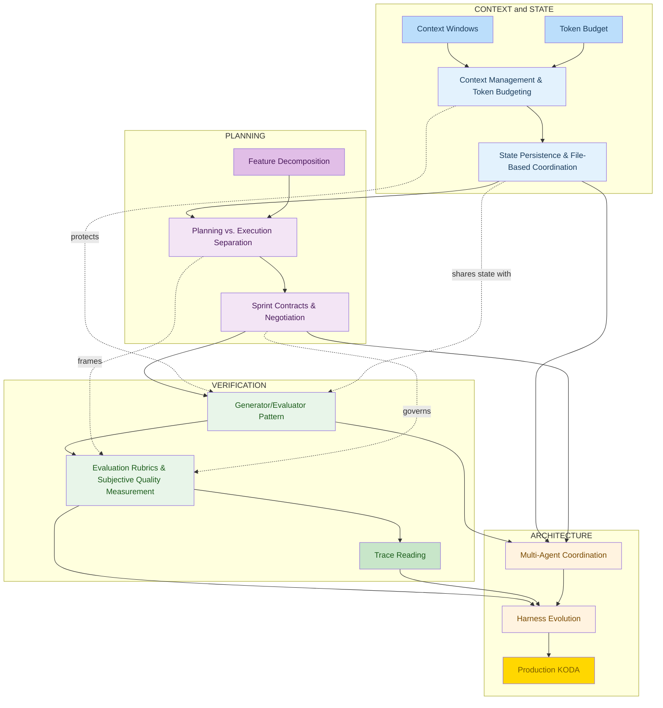
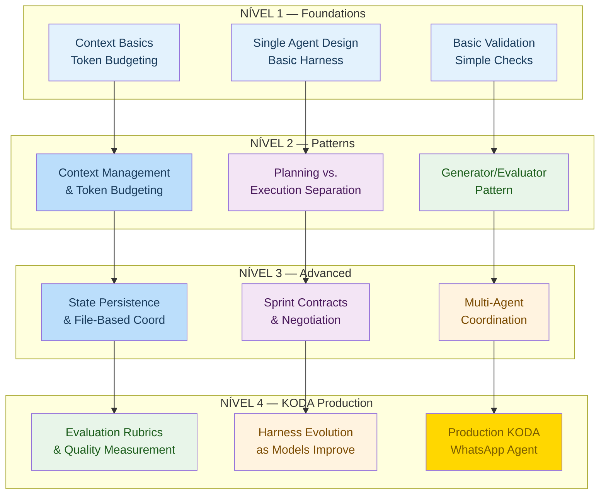
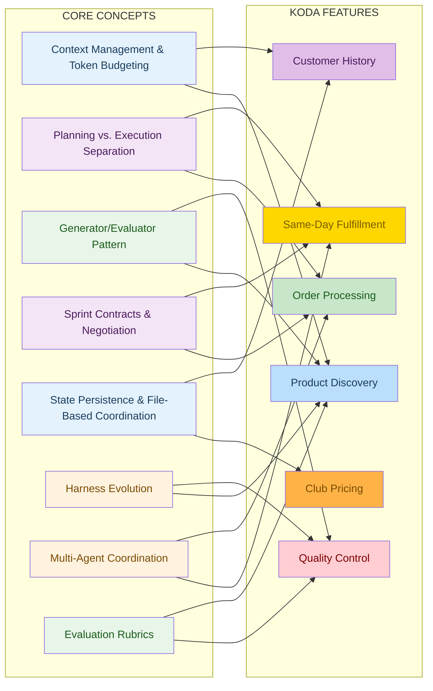

# 🧠 Concept Ecosystem
## Como os 8 Conceitos Core se Conectam na Arquitetura de Long-Running Agents do KODA

**Tempo Estimado:** 120 minutos  
**Nível:** 6 - Knowledge Graphs e Síntese Arquitetural  
**Pré-requisito:** Ter lido os 8 Core Concepts e os módulos de Nível 1, Nível 2 e Nível 3  
**Status:** 🟢 COMPLETO - Mapa central para integrar todo o currículo  
**Data de Criação:** Maio 2026

---

## 📖 Prólogo: A Noite em Que o Mapa Salvou KODA

Sexta-feira, 20h17.

KODA estava no horário mais perigoso da semana.

Clientes saindo da academia, gente comprando suplemento para começar a dieta na segunda, pedidos de entrega rápida, dúvidas sobre whey, creatina, pré-treino, preço de clube e retirada no mesmo dia.

No dashboard, tudo parecia normal.

As respostas estavam rápidas.

A taxa de conversão estava boa.

O time já pensava em encerrar o dia.

Então apareceu a conversa da Marina.

Marina não era uma cliente difícil.

Ela era o tipo de cliente que revela se o sistema realmente entende o que está fazendo.

Ela começou com uma pergunta simples: "tem creatina sem sabor?"

Depois contou que comprava para o marido.

Depois explicou que precisava de entrega hoje.

Depois lembrou que fazia parte do clube.

Depois perguntou se podia incluir um whey vegano no mesmo pedido.

Depois mudou o endereço.

Depois pediu para confirmar se o produto não tinha lactose.

Nada disso, isoladamente, era difícil.

O problema era a soma.

Se KODA esquecesse uma restrição, a recomendação ficaria perigosa.

Se misturasse planejamento com execução, o pedido sairia torto.

Se aprovasse a própria resposta sem crítica, um erro passaria com confiança.

Se os módulos não combinassem contrato, cada parte acharia que outra parte cuidou do detalhe.

Se o estado não persistisse, a troca de endereço sumiria.

Se a coordenação multi-agent fosse solta, fulfillment e pricing falariam línguas diferentes.

Se o harness não evoluísse, a equipe continuaria carregando checks antigos demais ou fracos demais.

Se não houvesse rubric, ninguém saberia se a resposta era apenas válida ou realmente boa.

Fernando olhou para o trace e percebeu algo que muda a forma como você enxerga agentes longos.

Nenhum conceito do currículo funciona sozinho.

Context Management sem State Persistence vira uma memória elegante, mas curta.

Planning vs. Execution sem Sprint Contracts vira intenção bonita, mas sem acordo operacional.

Generator/Evaluator sem Evaluation Rubrics vira crítica vaga.

Multi-Agent Coordination sem Harness Evolution vira uma arquitetura que envelhece rápido.

O que salvou a conversa da Marina não foi uma técnica isolada.

Foi o ecossistema.

Um conjunto de conceitos conectados, cada um cobrindo a fraqueza do outro.

KODA manteve o histórico da Marina fora da janela imediata.

Planejou o pedido antes de executar.

Negociou contratos entre módulos.

Gerou uma recomendação.

Avaliou essa recomendação com critérios claros.

Coordenou fulfillment e pricing.

Registrou tudo para aprendizado posterior.

E quando o modelo melhorou duas semanas depois, o harness foi ajustado sem reescrever o sistema inteiro.

Este módulo existe para esse momento.

Você já viu peças separadas.

Agora vai ver o mapa.

Não como decoração.

Como instrumento de arquitetura.

Ao final, você deve conseguir olhar para qualquer feature do KODA e responder três perguntas com segurança:

* Quais conceitos precisam estar presentes para essa feature funcionar por horas?
* Quais dependências vêm antes das outras?
* Qual estratégia de coordenação protege qualidade sem criar peso desnecessário?

---

## 🎯 O Que É o Concept Ecosystem?

### Definição Simples

O **Concept Ecosystem** é o mapa de relações entre os 8 Core Concepts do currículo de long-running agents.

Ele responde a uma pergunta que aparece quando a equipe começa a sair dos módulos individuais:

> "Como tudo isso trabalha junto quando KODA está em produção, falando com clientes reais, por horas, com dinheiro, estoque e confiança em jogo?"

A resposta curta é: os conceitos formam quatro domínios.

* **Context & State:** o que KODA lembra, comprime, persiste e recupera.
* **Planning:** como KODA decide o trabalho antes de executar.
* **Verification:** como KODA julga se o output é correto e bom.
* **Architecture:** como KODA coordena agentes, harnesses e evolução ao longo do tempo.

A resposta longa é este módulo inteiro.

### Por Que Isso Importa?

Quando você aprende conceitos isolados, cada um parece uma solução completa.

Context Management parece resolver memória.

Generator/Evaluator parece resolver qualidade.

Sprint Contracts parecem resolver coordenação.

Mas produção não respeita fronteiras didáticas.

Um erro de recomendação pode começar como contexto velho, virar planejamento confuso, passar por avaliação fraca e explodir como problema de fulfillment.

Por isso, o mapa importa.

Ele mostra onde uma decisão local cria consequência global.

Também mostra onde começar.

Se você implementa Multi-Agent Coordination antes de State Persistence, cria agentes especializados que esquecem o que deveriam compartilhar.

Se cria Rubrics antes de separar Generator e Evaluator, melhora um pouco, mas ainda deixa o mesmo agente defender o próprio trabalho.

Se cria Sprint Contracts antes de separar Planning de Execution, escreve contratos sem um plano estável para contratar.

O ecossistema evita esse erro comum: escolher a técnica mais interessante em vez da dependência mais necessária.

### A Regra de Ouro

> Em long-running agents, conceitos não são ferramentas soltas. São órgãos de um mesmo sistema.

Se um órgão falha, outro compensa até certo ponto.
Se vários falham juntos, o agente perde o foco.

---

## 🗺️ Visão Rápida dos 4 Domínios

Antes de entrar nos detalhes, veja o mapa mental básico.

```
┌──────────────────────────────────────────────────────────────────────┐
│                         CONCEPT ECOSYSTEM                            │
├──────────────────────────────────────────────────────────────────────┤
│                                                                      │
│  LAYER 1: CONTEXT & STATE                                            │
│  ┌──────────────────────────────┐  ┌──────────────────────────────┐  │
│  │ Context Management           │  │ State Persistence            │  │
│  │ Token Budgeting              │  │ File-Based Coordination      │  │
│  └──────────────┬───────────────┘  └──────────────┬───────────────┘  │
│                 │                                 │                  │
│                 ▼                                 ▼                  │
│  LAYER 2: PLANNING                                                  │
│  ┌──────────────────────────────┐  ┌──────────────────────────────┐  │
│  │ Planning vs Execution        │  │ Sprint Contracts             │  │
│  │ Separation                   │  │ Negotiation                  │  │
│  └──────────────┬───────────────┘  └──────────────┬───────────────┘  │
│                 │                                 │                  │
│                 ▼                                 ▼                  │
│  LAYER 3: VERIFICATION                                              │
│  ┌──────────────────────────────┐  ┌──────────────────────────────┐  │
│  │ Generator/Evaluator          │  │ Evaluation Rubrics           │  │
│  │ Pattern                      │  │ Quality Measurement          │  │
│  └──────────────┬───────────────┘  └──────────────┬───────────────┘  │
│                 │                                 │                  │
│                 ▼                                 ▼                  │
│  LAYER 4: ARCHITECTURE                                               │
│  ┌──────────────────────────────┐  ┌──────────────────────────────┐  │
│  │ Multi-Agent Coordination     │  │ Harness Evolution            │  │
│  │ Specialized Agents           │  │ Model-Aware Adaptation       │  │
│  └──────────────────────────────┘  └──────────────────────────────┘  │
│                                                                      │
└──────────────────────────────────────────────────────────────────────┘
```

Leia esse diagrama de baixo para cima quando estiver pensando em maturidade arquitetural.
Leia de cima para baixo quando estiver desenhando uma feature nova.

---

## 🧩 Os 8 Core Concepts

Esta seção é um recap curto, mas denso.
A ideia não é repetir todos os módulos anteriores.
A ideia é lembrar o papel de cada conceito dentro do ecossistema.

### 1️⃣ Context Management & Token Budgeting

**Domínio principal:** Context & State

**Em uma frase:** Mantém a conversa útil dentro de um limite físico de tokens.

**No KODA:** KODA sabe o que lembrar, o que comprimir e o que buscar fora da janela antes de responder.

**Quando aparece em produção:**

* Conversa passa de 30 minutos e o histórico começa a pesar.
* Cliente mistura preferências antigas com uma pergunta nova.
* O modelo precisa escolher entre lembrar tudo ou responder bem agora.
* A equipe precisa decidir o que fica no prompt e o que sai para memória externa.

**Pergunta de diagnóstico:**

> O que estamos mantendo no contexto, por quê, e até quando?

---

### 2️⃣ Planning vs. Execution Separation

**Domínio principal:** Planning

**Em uma frase:** Separa pensar o plano de executar o passo seguinte.

**No KODA:** KODA não tenta vender, validar estoque, calcular frete e cobrar no mesmo impulso.

**Quando aparece em produção:**

* Pedido tem várias etapas dependentes.
* KODA precisa decidir antes de mexer em estoque, preço ou pagamento.
* Uma resposta impulsiva pode criar promessa que o sistema não consegue cumprir.
* O trace precisa mostrar plano separado da execução real.

**Pergunta de diagnóstico:**

> Qual é o plano explícito antes de executar a próxima ação?

---

### 3️⃣ Generator/Evaluator Pattern

**Domínio principal:** Verification

**Em uma frase:** Separa criação de julgamento crítico.

**No KODA:** KODA gera uma recomendação e outro componente verifica se ela é correta, segura e boa.

**Quando aparece em produção:**

* Recomendação pode estar tecnicamente válida, mas errada para o cliente.
* Um agente sozinho tende a defender a resposta que acabou de gerar.
* Erros custam confiança, reembolso ou risco de saúde.
* A equipe precisa de aprovação crítica antes de enviar.

**Pergunta de diagnóstico:**

> Quem julga a resposta sem ter sido quem a criou?

---

### 4️⃣ Sprint Contracts & Negotiation

**Domínio principal:** Planning

**Em uma frase:** Transforma intenção em contrato explícito entre partes do sistema.

**No KODA:** KODA combina o que cada módulo vai entregar antes de processar um pedido.

**Quando aparece em produção:**

* Módulos dependem uns dos outros.
* Busca entrega produto, pricing entrega preço, fulfillment entrega prazo.
* Cada parte precisa prometer formato, escopo, prazo e critérios de sucesso.
* Quando uma promessa muda, a negociação evita surpresa.

**Pergunta de diagnóstico:**

> Que contrato cada módulo prometeu cumprir?

---

### 5️⃣ State Persistence & File-Based Coordination

**Domínio principal:** Context & State

**Em uma frase:** Guarda estado fora da memória imediata do modelo.

**No KODA:** KODA preserva alergias, preferências, carrinho, status de pagamento e histórico de compra.

**Quando aparece em produção:**

* KODA precisa lembrar preferências entre sessões.
* Agentes paralelos precisam compartilhar fatos sem depender da mesma context window.
* Carrinho, pagamento e endereço precisam sobreviver a retries.
* Debug exige arquivos ou registros legíveis.

**Pergunta de diagnóstico:**

> Onde o estado verdadeiro vive quando o prompt não basta?

---

### 6️⃣ Harness Evolution (as Models Improve)

**Domínio principal:** Architecture

**Em uma frase:** Mantém o harness adaptável conforme modelos ficam melhores.

**No KODA:** KODA simplifica checks quando o modelo amadurece e reforça checks onde o risco continua alto.

**Quando aparece em produção:**

* Modelos novos tornam certos checks redundantes.
* Riscos de negócio continuam mesmo quando a inteligência bruta melhora.
* A equipe precisa retirar peso sem retirar segurança.
* O harness vira produto vivo, não andaime esquecido.

**Pergunta de diagnóstico:**

> Que parte do harness deve mudar quando o modelo muda?

---

### 7️⃣ Multi-Agent Coordination

**Domínio principal:** Architecture

**Em uma frase:** Orquestra agentes especializados sem perder alinhamento.

**No KODA:** KODA coordena discovery, pricing, fulfillment, QA e atendimento em um fluxo único.

**Quando aparece em produção:**

* Uma feature exige especialistas.
* Discovery, pricing, fulfillment e QA precisam trabalhar juntos.
* Paralelismo melhora tempo, mas aumenta risco de desalinhamento.
* Coordenação vira capacidade central.

**Pergunta de diagnóstico:**

> Quem coordena os agentes quando cada um sabe apenas seu pedaço?

---

### 8️⃣ Evaluation Rubrics & Subjective Quality Measurement

**Domínio principal:** Verification

**Em uma frase:** Mede qualidade subjetiva com critérios claros.

**No KODA:** KODA avalia tom, adequação, segurança, precisão e utilidade antes de falar com o cliente.

**Quando aparece em produção:**

* Qualidade não cabe em aprovado ou reprovado.
* Tom, precisão, segurança e utilidade precisam de notas separadas.
* KODA precisa melhorar recomendações com feedback mensurável.
* O time precisa calibrar o que significa bom.

**Pergunta de diagnóstico:**

> Qual critério transforma qualidade subjetiva em medida discutível?

---

## 🌐 Diagrama Principal: Complete Concept Ecosystem

O diagrama abaixo segue a estrutura do mega-grafo `eco` em `00-all-diagrams.txt`, mas usa os 8 Core Concepts completos como nós principais.
Os quatro domínios permanecem os mesmos: Context & State, Planning, Verification e Architecture.



### Como Ler Este Grafo

* Comece em Context Windows e Token Budget.
* Eles empurram você para Context Management.
* Context Management revela que memória imediata não basta.
* State Persistence vira a base compartilhada.
* Com estado confiável, você consegue planejar sem adivinhar.
* Planning vs. Execution cria o espaço para Sprint Contracts.
* Sprint Contracts tornam o output verificável.
* Generator/Evaluator usa esse output para criar e julgar.
* Evaluation Rubrics definem o que significa bom.
* Trace Reading mostra onde a qualidade caiu.
* Multi-Agent Coordination junta especialistas.
* Harness Evolution ajusta o sistema conforme modelos, dados e riscos mudam.

Se você pular uma seta, a feature até pode funcionar em demo.
Mas em produção, a lacuna aparece como bug estranho.

---

## 🔗 Como os Conceitos se Interconectam

Vamos entrar nos quatro domínios como se estivéssemos lendo uma conversa real do KODA por dentro.

### 🧭 Domínio: Context & State

Este domínio responde uma pergunta central:

> "O que KODA precisa saber agora, e onde esse conhecimento deve viver depois?"

Cliente fala que não pode consumir lactose.

KODA não pode confiar que essa frase ficará viva na context window por duas horas.

O fato precisa virar estado persistido.

Depois, qualquer agente que participe da conversa precisa recuperar esse fato antes de recomendar.

**Conceitos principais deste domínio:**

* **Context Management & Token Budgeting:** Mantém a conversa útil dentro de um limite físico de tokens.
* **State Persistence & File-Based Coordination:** Guarda estado fora da memória imediata do modelo.

**Falha típica quando este domínio é fraco:**

KODA pede a mesma informação duas vezes, esquece alergia, perde histórico de clube ou monta carrinho com dado velho.

---

### 🧭 Domínio: Planning

Este domínio responde uma pergunta central:

> "Qual trabalho será feito, em qual ordem, com quais promessas?"

Cliente monta carrinho com quatro itens.

KODA primeiro planeja validação, preço, estoque, entrega e pagamento.

Depois cada módulo assina um Sprint Contract pequeno.

O pedido deixa de ser uma bola de neve e vira uma sequência auditável.

**Conceitos principais deste domínio:**

* **Planning vs. Execution Separation:** Separa pensar o plano de executar o passo seguinte.
* **Sprint Contracts & Negotiation:** Transforma intenção em contrato explícito entre partes do sistema.

**Falha típica quando este domínio é fraco:**

KODA pula etapas, promete entrega antes de checar estoque, ou executa ações na ordem errada.

---

### 🧭 Domínio: Verification

Este domínio responde uma pergunta central:

> "Como sabemos que a resposta não é apenas plausível, mas correta e boa?"

Generator monta uma recomendação elegante.

Evaluator verifica se ela respeita restrições, catálogo e tom.

Rubric atribui notas separadas para precisão, adequação, segurança e clareza.

Se falha, o trace explica onde corrigir.

**Conceitos principais deste domínio:**

* **Generator/Evaluator Pattern:** Separa criação de julgamento crítico.
* **Evaluation Rubrics & Subjective Quality Measurement:** Mede qualidade subjetiva com critérios claros.

**Falha típica quando este domínio é fraco:**

KODA envia resposta bonita com erro factual, tom ruim ou recomendação incompatível com o cliente.

---

### 🧭 Domínio: Architecture

Este domínio responde uma pergunta central:

> "Como vários agentes e harnesses continuam coerentes enquanto o sistema cresce?"

Discovery encontra produto.

Pricing calcula desconto.

Fulfillment promete entrega.

Quality Control bloqueia risco.

Harness Evolution remove ou reforça etapas conforme evidência real.

**Conceitos principais deste domínio:**

* **Harness Evolution (as Models Improve):** Mantém o harness adaptável conforme modelos ficam melhores.
* **Multi-Agent Coordination:** Orquestra agentes especializados sem perder alinhamento.

**Falha típica quando este domínio é fraco:**

Agentes especializados fazem partes certas, mas o sistema final fica incoerente, caro ou difícil de evoluir.

---

## 🏗️ Complete Ecosystem Architecture

Agora vamos quebrar a arquitetura completa em relações concretas.
Pense nesta seção como o mapa que um tech lead usa antes de aprovar uma feature grande do KODA.

### Camada 1: Entrada Conversacional

Tudo começa no WhatsApp.

A mensagem do cliente parece pequena.

Mas por trás dela há histórico, preferências, estado de carrinho, catálogo, estoque, regras de preço e risco de qualidade.

A primeira decisão arquitetural é não jogar tudo isso na context window sem critério.

KODA precisa montar um contexto de trabalho.

Esse contexto deve ser pequeno o suficiente para caber no token budget.

Também deve ser rico o suficiente para não perder fatos críticos.

**Fluxo interno:**

```
Mensagem do cliente
  ↓
Context selector
  ↓
Estado persistido relevante
  ↓
Resumo compacto da conversa
  ↓
Contexto pronto para planejar
```

### Camada 2: Planejamento Antes da Ação

Com contexto pronto, KODA ainda não deve agir.

A tentação é responder rápido.

Em tarefas simples, tudo bem.

Em tarefas longas, agir cedo demais cria dívida invisível.

Planning vs. Execution Separation força o sistema a escrever o que pretende fazer.

Sprint Contracts transformam esse plano em promessas pequenas.

**Exemplo:**

```
Plano: processar pedido da Marina
  1. Confirmar restrições alimentares
  2. Validar produtos do carrinho
  3. Aplicar preço de clube
  4. Verificar estoque local
  5. Checar same-day fulfillment
  6. Montar resposta final
```

### Camada 3: Verificação Como Gate

Depois que uma solução existe, ela ainda não está pronta.

Generator/Evaluator cria distância crítica.

Evaluation Rubrics dão ao Evaluator uma régua clara.

Sem rubric, o Evaluator vira uma opinião.

Com rubric, ele vira um gate reproduzível.

**Rubric mínima para recomendação KODA:**

| Dimensão | Pergunta | Peso |
|---|---|---|
| Precisão | Produto, preço, estoque e restrições estão corretos? | 35% |
| Adequação | A recomendação combina com objetivo e histórico? | 25% |
| Segurança | Há risco alimentar, médico ou financeiro? | 20% |
| Clareza | A resposta é fácil de entender no WhatsApp? | 10% |
| Tom | A conversa soa humana, útil e confiante sem exagero? | 10% |

### Camada 4: Coordenação e Evolução

Quando uma feature cresce, um agente único começa a ficar pesado.

Multi-Agent Coordination divide responsabilidade.

Mas divisão sem coordenação vira ruído.

Por isso, os contratos, o estado e as rubrics continuam presentes.

Harness Evolution observa evidência real e ajusta a arquitetura.

O sistema não fica preso ao desenho do primeiro dia.

**Resultado esperado:**

* KODA responde com memória consistente.
* KODA executa pedido em etapas claras.
* KODA bloqueia respostas ruins antes do cliente ver.
* KODA aprende onde simplificar e onde reforçar.

---

## ⚖️ Coordination Strategies

Nem toda feature precisa da mesma estratégia de coordenação.
O erro comum é transformar tudo em multi-agent complexo cedo demais.
A tabela abaixo ajuda a escolher com sobriedade.

| Estratégia | Abordagem | Complexidade | Melhor Caso de Uso | Aplicabilidade no KODA | Trade-offs |
|---|---|---|---|---|---|
| Single Agent com Context Discipline | Um agente responde usando contexto selecionado e token budget claro | Baixa | Perguntas simples, status de pedido, FAQ de produto | Boa para respostas rápidas de estoque, preço base e dúvidas curtas | Barato e simples, mas fraco para tarefas com risco composto |
| Sequential Pipeline | Etapas fixas passam estado de uma para outra | Média | Order Processing, validação de carrinho, checkout guiado | Excelente quando a ordem é conhecida e auditável | Fácil de debugar, mas pode ficar rígido quando o caso foge do fluxo |
| Generator/Evaluator Gate | Um componente gera, outro avalia com rubric | Média | Product Discovery, Quality Control, resposta sensível | Crítico para recomendações, segurança alimentar e tom de WhatsApp | Aumenta custo e latência, mas reduz erro caro |
| Contract-Based Multi-Agent | Vários agentes negociam contratos e compartilham estado | Alta | Same-Day Fulfillment, Club Pricing com exceções, pedidos multi-item | Forte quando discovery, pricing, fulfillment e QA precisam atuar juntos | Poderoso, mas exige State Persistence, contratos e trace claro |
| Evolutionary Harness Loop | Harness observa métricas e muda com evidência | Alta | Sistema em produção com volume e mudanças de modelo | Essencial para KODA não carregar checks velhos nem remover proteção cedo | Requer disciplina operacional e métricas confiáveis |

### Como Escolher na Prática

* **Se a resposta não move dinheiro, estoque ou saúde, comece simples.** Use Single Agent com Context Discipline.
* **Se há ordem clara e dependências previsíveis, use pipeline.** Order Processing se beneficia disso.
* **Se a resposta pode estar bonita e errada, use Generator/Evaluator.** Product Discovery quase sempre precisa desse gate.
* **Se vários módulos precisam decidir juntos, use contracts.** Same-Day Fulfillment costuma exigir essa coordenação.
* **Se a feature já está em produção e recebe volume, evolua o harness.** O desenho inicial nunca deve ser tratado como sagrado.

### O Anti-Padrão

O anti-padrão é escolher a arquitetura pela aparência de sofisticação.
KODA não ganha nada quando uma FAQ simples passa por cinco agentes.
Também não ganha nada quando uma recomendação com risco alimentar sai de um agente único sem gate.
A boa arquitetura combina risco com coordenação.

---

## 🧭 Flow Diagram: Sequência de Aprendizado e Implementação

Este diagrama segue o grafo `learn` de `00-all-diagrams.txt`: aprender fundações antes de padrões, padrões antes de coordenação, coordenação antes de produção KODA. A estrutura de 4 níveis com subgrafos foi preservada; os nós foram expandidos para os nomes completos dos conceitos.



### A Leitura Correta

Não trate esse fluxo como burocracia.
Ele é uma proteção contra confusão.
A equipe que aprende Evaluation Rubrics antes de entender Generator/Evaluator sabe medir, mas não sabe onde colocar a medição.
A equipe que aprende Multi-Agent Coordination antes de State Persistence cria agentes que precisam conversar o tempo todo porque não compartilham estado confiável.
A equipe que aprende Harness Evolution cedo demais quer mudar o harness antes de saber o que ele protege.

---

## ⛓️ Dependency Chains e Progressão de Aprendizado

Aqui estão as cadeias que mais aparecem no KODA.
Use esta seção quando estiver planejando onboarding ou priorizando arquitetura.

### Cadeia de Memória

1. **Context Management & Token Budgeting**
2. **State Persistence & File-Based Coordination**
3. **Multi-Agent Coordination**
4. **Harness Evolution (as Models Improve)**

**Por que esta cadeia importa:** Sem memória confiável, coordenação vira conversa solta entre agentes.

**Sinal de que você pulou uma etapa:**

Dois agentes dão respostas diferentes porque cada um viu um recorte diferente da conversa.

---

### Cadeia de Trabalho

1. **Planning vs. Execution Separation**
2. **Sprint Contracts & Negotiation**
3. **Generator/Evaluator Pattern**
4. **Evaluation Rubrics & Subjective Quality Measurement**

**Por que esta cadeia importa:** Sem plano e contrato, avaliação chega tarde e julga um output sem estrutura.

**Sinal de que você pulou uma etapa:**

Evaluator rejeita outputs por motivos que deveriam ter sido definidos antes da execução.

---

### Cadeia de Qualidade

1. **Generator/Evaluator Pattern**
2. **Evaluation Rubrics & Subjective Quality Measurement**
3. **Harness Evolution (as Models Improve)**
4. **Multi-Agent Coordination**

**Por que esta cadeia importa:** Qualidade começa no gate, mas vira arquitetura quando precisa escalar.

**Sinal de que você pulou uma etapa:**

A equipe sabe que algo ficou ruim, mas não consegue transformar isso em ajuste de harness.

---

### Cadeia de Produção KODA

1. **Context Management & Token Budgeting**
2. **Planning vs. Execution Separation**
3. **State Persistence & File-Based Coordination**
4. **Sprint Contracts & Negotiation**
5. **Generator/Evaluator Pattern**
6. **Evaluation Rubrics & Subjective Quality Measurement**
7. **Multi-Agent Coordination**
8. **Harness Evolution (as Models Improve)**

**Por que esta cadeia importa:** Para uma feature crítica, todos aparecem em algum nível.

**Sinal de que você pulou uma etapa:**

A feature funciona em demo e degrada quando conversa, estoque, preço e entrega entram juntos.

---

## 🚀 KODA em Prática: O Ecossistema no WhatsApp

Vamos voltar para a Marina.
Agora, em vez de olhar os conceitos como lista, vamos acompanhar uma conversa completa.

### Cena 1: A Pergunta Simples Que Não Era Simples

```
Marina: Oi, vocês têm creatina sem sabor para entregar hoje?
```

KODA poderia responder em meio segundo.
Mas o ecossistema faz uma pausa invisível.

**Context Management & Token Budgeting** pergunta:

* O que do histórico da Marina importa agora?
* Ela já comprou creatina antes?
* Há restrições alimentares registradas?
* Quanto espaço de contexto vale gastar com detalhes antigos?

**State Persistence & File-Based Coordination** responde com fatos salvos:

```
customer_id: marina_482
club_member: true
last_purchase: whey vegano chocolate
delivery_city: Sao Paulo
known_restrictions: lactose sensitivity
preferred_channel: WhatsApp
```

A pergunta era sobre creatina.
Mas a conversa já carrega clube, cidade, histórico e restrição.

### Cena 2: O Plano Antes da Promessa

KODA não deve prometer entrega hoje antes de verificar estoque local e rota.
Então **Planning vs. Execution Separation** cria um plano curto.

```
Plano operacional
1. Buscar creatina sem sabor em estoque local
2. Confirmar elegibilidade same-day
3. Aplicar preço de clube
4. Preparar resposta com opções reais
5. Verificar qualidade antes de enviar
```

Depois, **Sprint Contracts & Negotiation** transforma isso em promessas.

```
Product Discovery promete: devolver até 3 produtos disponíveis
Pricing promete: aplicar clube uma vez, sem desconto duplicado
Fulfillment promete: informar janela real de entrega
Quality Control promete: bloquear resposta com estoque ou preço incerto
```

Agora cada parte sabe o que deve entregar.
Mais importante: cada parte sabe o que não deve inventar.

### Cena 3: Geração e Avaliação

**Generator/Evaluator Pattern** entra quando KODA monta a resposta.

```
Generator:
Encontrei Creatina Monohidratada Sem Sabor 300g, preço clube R$ 79, entrega hoje entre 18h e 21h.
Também há Creatina Creapure Sem Sabor 250g, preço clube R$ 119, entrega amanhã.
Recomendação: primeira opção, porque atende entrega hoje e preço melhor.
```

O Evaluator não pergunta se a resposta é bonita.
Ele pergunta se é segura.
Ele usa **Evaluation Rubrics & Subjective Quality Measurement**.

| Critério | Resultado | Observação |
|---|---|---|
| Precisão de estoque | 10/10 | Produto disponível em unidade local |
| Preço de clube | 10/10 | Desconto aplicado uma vez |
| Fulfillment | 9/10 | Janela informada com margem real |
| Adequação ao cliente | 8/10 | Histórico sugere suplemento compatível |
| Clareza no WhatsApp | 9/10 | Resposta curta, direta e útil |

Resposta aprovada.

### Cena 4: Coordenação Multi-Agent Sem Teatro

Por trás de uma resposta simples, vários agentes trabalharam.
Isso não precisa aparecer para a Marina.
O usuário final não quer ver arquitetura.
Quer confiança.

**Multi-Agent Coordination** garante que Product Discovery, Pricing, Fulfillment e Quality Control trabalhem sobre o mesmo estado.
Sem isso, Pricing poderia aplicar clube em um produto que Fulfillment não consegue entregar hoje.
Ou Fulfillment poderia prometer prazo para um item que Product Discovery escolheu apenas como alternativa.

### Cena 5: Evolução do Harness

Duas semanas depois, o modelo novo começa a lidar melhor com resumo de conversa.
A equipe KODA mede que algumas verificações de clareza podem ficar mais leves.
Mas as verificações de alergia, preço e estoque continuam rígidas.

Isso é **Harness Evolution (as Models Improve)**.
Não é trocar tudo porque o modelo ficou melhor.
É ajustar com cuidado.
O harness protege riscos de negócio, não apenas limitações do modelo.

---

## 🧬 KODA Application Diagram: Features Para Concepts

Este diagrama segue o grafo `feat` de `00-all-diagrams.txt` como base, usando as mesmas features e os 8 conceitos completos. As arestas tracejadas são relações secundárias sugeridas pela prática de produção do KODA, que expandem o mapeamento original.



---

## 🧪 Feature por Feature: Como o Ecossistema Aparece

### Product Discovery

**O que a feature faz:** encontrar produtos que combinam com intenção, restrição e momento do cliente.

**Conceitos envolvidos:**

* Context Management & Token Budgeting
* Generator/Evaluator Pattern
* Evaluation Rubrics & Subjective Quality Measurement
* Harness Evolution (as Models Improve)

**Cena concreta:**

Cliente pede algo vago: "um whey bom para começar".

KODA precisa recuperar histórico, gerar opções, avaliar adequação e melhorar o harness quando dados mostram erro recorrente.

**Pergunta que o time deve fazer:**

> Se Product Discovery falhar, qual conceito deveria ter segurado a falha primeiro?

---

### Order Processing

**O que a feature faz:** transformar intenção de compra em pedido verificável.

**Conceitos envolvidos:**

* Planning vs. Execution Separation
* Sprint Contracts & Negotiation
* Multi-Agent Coordination
* State Persistence & File-Based Coordination

**Cena concreta:**

Pedido não é uma resposta, é um processo.

Plano, contrato, estado e coordenação evitam pagamento errado, item fora de estoque e promessa falsa.

**Pergunta que o time deve fazer:**

> Se Order Processing falhar, qual conceito deveria ter segurado a falha primeiro?

---

### Same-Day Fulfillment

**O que a feature faz:** coordenar estoque, rota, SLA e comunicação rápida.

**Conceitos envolvidos:**

* Planning vs. Execution Separation
* Sprint Contracts & Negotiation
* Multi-Agent Coordination
* State Persistence & File-Based Coordination

**Cena concreta:**

Entrega no mesmo dia exige tempo real.

KODA coordena estoque, rota, cut-off e comunicação sem deixar um agente inventar prazo.

**Pergunta que o time deve fazer:**

> Se Same-Day Fulfillment falhar, qual conceito deveria ter segurado a falha primeiro?

---

### Club Pricing

**O que a feature faz:** aplicar preço de clube sem quebrar margem nem duplicar desconto.

**Conceitos envolvidos:**

* State Persistence & File-Based Coordination
* Sprint Contracts & Negotiation
* Evaluation Rubrics & Subjective Quality Measurement
* Harness Evolution (as Models Improve)

**Cena concreta:**

Preço de clube parece simples até existir cupom, combo e exceção.

Estado persistido mostra elegibilidade, contratos evitam desconto duplicado, rubrics checam margem.

**Pergunta que o time deve fazer:**

> Se Club Pricing falhar, qual conceito deveria ter segurado a falha primeiro?

---

### Customer History

**O que a feature faz:** lembrar preferências reais sem repetir perguntas cansativas.

**Conceitos envolvidos:**

* Context Management & Token Budgeting
* State Persistence & File-Based Coordination
* Harness Evolution (as Models Improve)

**Cena concreta:**

Histórico é memória de relacionamento.

KODA usa o passado sem transformar cada conversa em um prompt gigante.

**Pergunta que o time deve fazer:**

> Se Customer History falhar, qual conceito deveria ter segurado a falha primeiro?

---

### Quality Control

**O que a feature faz:** bloquear recomendações ruins antes que cheguem ao WhatsApp.

**Conceitos envolvidos:**

* Generator/Evaluator Pattern
* Evaluation Rubrics & Subjective Quality Measurement
* Harness Evolution (as Models Improve)
* Multi-Agent Coordination

**Cena concreta:**

Quality Control é onde plausível encontra realidade.

KODA bloqueia outputs que soam bons, mas falham em preço, segurança, tom ou adequação.

**Pergunta que o time deve fazer:**

> Se Quality Control falhar, qual conceito deveria ter segurado a falha primeiro?

---

## 🔍 Relações Importantes Entre Conceitos

A seguir, vamos olhar as conexões mais importantes do ecossistema.
Esta parte é longa de propósito.
Ela treina seu olhar para ver arquitetura, não apenas tópicos.

### Context Management & Token Budgeting + State Persistence & File-Based Coordination

**Princípio:** Context Management decide o que cabe agora. State Persistence decide o que vive depois.

**Exemplo KODA:** KODA não precisa carregar todo o histórico de Marina, mas precisa persistir alergia, clube e endereço atual.

**Erro se a relação for ignorada:**

Context Management é otimizado para manter a janela limpa, mas dados críticos que deveriam ser persistidos são descartados na compressão. A conversa fica rápida e vazia: o agente responde bem, mas esquece fatos que mudam o resultado do pedido.

---

### Context Management & Token Budgeting + Planning vs. Execution Separation

**Princípio:** Um plano bom depende de contexto limpo.

**Exemplo KODA:** Se o contexto confunde endereço antigo e novo, o plano de fulfillment nasce errado.

**Erro se a relação for ignorada:**

O planejador herda contexto poluído (dados antigos misturados com novos) e produz um plano internamente consistente, mas baseado em premissas erradas. A execução segue perfeitamente um plano que já nasceu torto.

---

### Context Management & Token Budgeting + Generator/Evaluator Pattern

**Princípio:** Generator e Evaluator precisam ver o contexto certo, mas não necessariamente o mesmo recorte.

**Exemplo KODA:** Generator pode ver catálogo amplo. Evaluator precisa ver restrições críticas e rubric.

**Erro se a relação for ignorada:**

Ambos recebem o mesmo contexto completo, desperdiçando tokens e poluindo o Evaluator com informação irrelevante. O Evaluator fica sobrecarregado e perde precisão nos critérios que realmente importam, aprovando outputs que deveria rejeitar.

---

### Planning vs. Execution Separation + Sprint Contracts & Negotiation

**Princípio:** Planejamento cria intenção. Contratos criam compromisso.

**Exemplo KODA:** KODA planeja validar pedido e cada módulo promete o artefato que vai entregar.

**Erro se a relação for ignorada:**

O planejador descreve o que fazer, mas ninguém assume responsabilidade explícita. Cada módulo acha que o outro vai cuidar da etapa crítica. O resultado é um vácuo de accountability: todos concordaram com o plano, ninguém entregou a execução.

---

### Planning vs. Execution Separation + Generator/Evaluator Pattern

**Princípio:** Separar execução torna mais fácil avaliar cada output.

**Exemplo KODA:** Evaluator não julga uma bola de pensamentos, julga uma recomendação concreta.

**Erro se a relação for ignorada:**

O Generator produz outputs sem estrutura clara (texto livre, sem seções, sem contrato). O Evaluator não consegue isolar o que avaliar e acaba julgando estilo em vez de correção. A qualidade da avaliação cai porque o input não foi pensado para ser avaliável.

---

### Sprint Contracts & Negotiation + Multi-Agent Coordination

**Princípio:** Contratos são a gramática de colaboração entre agentes.

**Exemplo KODA:** Pricing e fulfillment não disputam verdade, cada um entrega o que combinou.

**Erro se a relação for ignorada:**

Agentes entram em loop de renegociação porque não há contrato formal definindo escopo e critério de saída. Cada agente interpreta a tarefa de forma diferente, produzindo resultados incompatíveis que exigem retrabalho constante.

---

### State Persistence & File-Based Coordination + Multi-Agent Coordination

**Princípio:** Agentes coordenam melhor quando compartilham estado externo confiável.

**Exemplo KODA:** O agente de QA lê o mesmo carrinho que o agente de pagamento usou.

**Erro se a relação for ignorada:**

Cada agente mantém sua própria cópia de estado em memória, e as cópias divergem silenciosamente. QA aprova um pedido com preço de clube, mas pagamento processa o preço cheio porque leu uma versão anterior do carrinho. O cliente recebe cobrança errada.

---

### Generator/Evaluator Pattern + Evaluation Rubrics & Subjective Quality Measurement

**Princípio:** Evaluator precisa de critérios, não só de instinto.

**Exemplo KODA:** A recomendação passa porque pontuou bem em precisão, segurança e clareza.

**Erro se a relação for ignorada:**

O Evaluator julga com critérios vagos ("parece bom", "soa confiante") e aprova outputs com falhas objetivas. Sem rubric, a avaliação vira opinião. O sistema acredita que está com 98% de qualidade, mas está aprovando recomendações perigosas com confiança inabalável.

---

### Evaluation Rubrics & Subjective Quality Measurement + Harness Evolution (as Models Improve)

**Princípio:** Rubrics produzem sinais para evoluir o harness.

**Exemplo KODA:** Se clareza melhora com modelo novo, o threshold pode mudar. Se segurança não melhora, continua rígida.

**Erro se a relação for ignorada:**

O harness nunca é ajustado porque não há métrica objetiva para decidir. Checks que eram necessários no modelo antigo continuam rodando e consumindo tokens. Checks que deveriam ser adicionados para cobrir novos riscos nunca são criados. O harness envelhece sem que ninguém perceba.

---

### Multi-Agent Coordination + Harness Evolution (as Models Improve)

**Princípio:** Coordenação revela onde o harness pesa ou protege.

**Exemplo KODA:** KODA descobre que fulfillment precisa de contrato mais forte no horário de pico.

**Erro se a relação for ignorada:**

A arquitetura multi-agent funciona, mas o harness nunca é adaptado às descobertas da coordenação. O sistema acumula proteções desnecessárias e ignora gaps reais. A equipe sabe que algo está errado, mas não tem mecanismo para traduzir observação operacional em mudança de harness.

---

## 📚 Cartões de Estudo do Ecossistema

Use os cartões abaixo em workshops. Cada conceito tem de 12 a 18 cartões organizados por pergunta.

**Nota para o instrutor:** Os cartões seguem uma estrutura consistente de pergunta, discussão, exemplo e resposta esperada. Os exemplos são pontos de partida — customize com casos reais do KODA da sua semana. A repetição intencional da estrutura serve para criar um ritmo de workshop; a repetição de conteúdo genérico deve ser substituída por exemplos vivos da operação.
Cada cartão é curto, mas força uma conversa real.
Eles também ajudam a atingir fluência, que é o objetivo deste módulo.

### Bloco de Cartões: Context Management & Token Budgeting

**Domínio:** Context & State

**Ideia base:** Mantém a conversa útil dentro de um limite físico de tokens.

#### Cartão 1: Context Management & Token Budgeting em sintoma

**Pergunta:** Qual sintoma aparece primeiro quando este conceito está ausente?

**Como discutir:** Procure a menor falha observável antes do incidente grande.

**Exemplo KODA:** Context Management aplicado: KODA mantém coerência em conversas de 2+ horas no WhatsApp.

**Resposta esperada:** O sintoma aparece quando KODA parece confiante, mas perde uma condição que já existia na conversa.

#### Cartão 2: Context Management & Token Budgeting em decisão

**Pergunta:** Qual decisão arquitetural este conceito força?

**Como discutir:** Não aceite resposta genérica. Peça uma escolha concreta.

**Exemplo KODA:** Context Management aplicado: KODA mantém coerência em conversas de 2+ horas no WhatsApp.

**Resposta esperada:** A decisão é explicitar onde o conceito entra no fluxo, antes de escrever prompts ou dividir agentes.

#### Cartão 3: Context Management & Token Budgeting em estado

**Pergunta:** Que informação precisa virar estado persistido?

**Como discutir:** Se o cliente ficaria irritado ao repetir, provavelmente deve ser lembrado.

**Exemplo KODA:** Context Management aplicado: KODA mantém coerência em conversas de 2+ horas no WhatsApp.

**Resposta esperada:** O estado relevante inclui fatos que mudam o resultado, como restrição, endereço, clube, carrinho e promessa feita.

#### Cartão 4: Context Management & Token Budgeting em risco

**Pergunta:** Que risco de negócio este conceito reduz?

**Como discutir:** Conecte técnica com confiança, receita, segurança ou custo.

**Exemplo KODA:** Context Management aplicado: KODA mantém coerência em conversas de 2+ horas no WhatsApp.

**Resposta esperada:** O risco reduzido é uma mistura de erro operacional, perda de confiança e custo de correção.

#### Cartão 5: Context Management & Token Budgeting em trace

**Pergunta:** Que linha de trace provaria que este conceito funcionou?

**Como discutir:** Sem evidência, a arquitetura vira crença.

**Exemplo KODA:** Context Management aplicado: KODA mantém coerência em conversas de 2+ horas no WhatsApp.

**Resposta esperada:** O trace deve mostrar input, decisão, output, critério usado e resultado observado.

#### Cartão 6: Context Management & Token Budgeting em falha

**Pergunta:** Como a falha aparece no WhatsApp?

**Como discutir:** Traduza bug interno para experiência do cliente.

**Exemplo KODA:** Context Management aplicado: KODA mantém coerência em conversas de 2+ horas no WhatsApp.

**Resposta esperada:** No WhatsApp, a falha aparece como pergunta repetida, promessa errada ou recomendação que ignora o cliente.

#### Cartão 7: Context Management & Token Budgeting em handoff

**Pergunta:** Que handoff depende deste conceito?

**Como discutir:** Procure fronteiras entre módulos, agentes ou etapas.

**Exemplo KODA:** Context Management aplicado: KODA mantém coerência em conversas de 2+ horas no WhatsApp.

**Resposta esperada:** O handoff crítico é aquele em que uma parte assume que outra parte preservou contexto, contrato ou critério.

#### Cartão 8: Context Management & Token Budgeting em rubric

**Pergunta:** Qual critério de qualidade combina com este conceito?

**Como discutir:** Transforme bom em critério observável.

**Exemplo KODA:** Context Management aplicado: KODA mantém coerência em conversas de 2+ horas no WhatsApp.

**Resposta esperada:** O critério deve medir precisão, adequação, segurança ou clareza, conforme o risco da feature.

#### Cartão 9: Context Management & Token Budgeting em custo

**Pergunta:** Qual custo aumenta quando este conceito é aplicado?

**Como discutir:** Toda proteção tem preço em latência, tokens ou complexidade.

**Exemplo KODA:** Context Management aplicado: KODA mantém coerência em conversas de 2+ horas no WhatsApp.

**Resposta esperada:** O custo costuma ser mais tokens, mais latência, mais arquivos ou mais disciplina operacional.

#### Cartão 10: Context Management & Token Budgeting em benefício

**Pergunta:** Qual benefício compensa esse custo?

**Como discutir:** Mostre o retorno operacional, não só a elegância técnica.

**Exemplo KODA:** Context Management aplicado: KODA mantém coerência em conversas de 2+ horas no WhatsApp.

**Resposta esperada:** O benefício é reduzir falhas silenciosas antes que elas cheguem ao cliente.

#### Cartão 11: Context Management & Token Budgeting em limite

**Pergunta:** Quando este conceito não deve ser usado com força total?

**Como discutir:** Simplicidade também é uma escolha arquitetural.

**Exemplo KODA:** Context Management aplicado: KODA mantém coerência em conversas de 2+ horas no WhatsApp.

**Resposta esperada:** Use menos peso quando a ação é reversível, simples e sem risco financeiro ou de saúde.

#### Cartão 12: Context Management & Token Budgeting em dependência

**Pergunta:** Qual conceito precisa vir antes?

**Como discutir:** Aprendizado fora de ordem cria ilusões de domínio.

**Exemplo KODA:** Context Management aplicado: KODA mantém coerência em conversas de 2+ horas no WhatsApp.

**Resposta esperada:** A dependência correta aparece no grafo de aprendizado, não na preferência pessoal da equipe.

#### Cartão 13: Context Management & Token Budgeting em evolução

**Pergunta:** Como este conceito muda quando o modelo melhora?

**Como discutir:** Separe limitação do modelo de risco do negócio.

**Exemplo KODA:** Context Management aplicado: KODA mantém coerência em conversas de 2+ horas no WhatsApp.

**Resposta esperada:** Quando o modelo melhora, a equipe mede antes de remover proteção.

#### Cartão 14: Context Management & Token Budgeting em KODA

**Pergunta:** Qual feature do KODA mais depende deste conceito?

**Como discutir:** Escolha uma feature concreta, não uma categoria vaga.

**Exemplo KODA:** Context Management aplicado: KODA mantém coerência em conversas de 2+ horas no WhatsApp.

**Resposta esperada:** A feature mais dependente é aquela onde o erro seria visível para o cliente em menos de uma conversa.

#### Cartão 15: Context Management & Token Budgeting em métrica

**Pergunta:** Que métrica mostra melhora?

**Como discutir:** Prefira medidas que o time pode acompanhar toda semana.

**Exemplo KODA:** Context Management aplicado: KODA mantém coerência em conversas de 2+ horas no WhatsApp.

**Resposta esperada:** A métrica deve combinar qualidade interna com impacto externo, como approval rate e satisfação.

#### Cartão 16: Context Management & Token Budgeting em exemplo

**Pergunta:** Qual exemplo curto você usaria para ensinar isso?

**Como discutir:** Se você não consegue contar, ainda não entendeu direito.

**Exemplo KODA:** Context Management aplicado: KODA mantém coerência em conversas de 2+ horas no WhatsApp.

**Resposta esperada:** Um bom exemplo cabe em uma conversa curta com cliente, decisão interna e consequência clara.

#### Cartão 17: Context Management & Token Budgeting em anti-padrão

**Pergunta:** Qual anti-padrão este conceito evita?

**Como discutir:** Nomear o erro ajuda a equipe a reconhecer cedo.

**Exemplo KODA:** Context Management aplicado: KODA mantém coerência em conversas de 2+ horas no WhatsApp.

**Resposta esperada:** O anti-padrão é confiar em inteligência bruta quando o problema pede estrutura.

#### Cartão 18: Context Management & Token Budgeting em checkpoint

**Pergunta:** Qual checkpoint confirma maturidade?

**Como discutir:** Maturidade é comportamento repetível, não leitura concluída.

**Exemplo KODA:** Context Management aplicado: KODA mantém coerência em conversas de 2+ horas no WhatsApp.

**Resposta esperada:** O checkpoint é a equipe conseguir explicar, aplicar e debugar o conceito sem depender de memória solta.

---

### Bloco de Cartões: Planning vs. Execution Separation

**Domínio:** Planning

**Ideia base:** Separa pensar o plano de executar o passo seguinte.

#### Cartão 19: Planning vs. Execution Separation em sintoma

**Pergunta:** Qual sintoma aparece primeiro quando este conceito está ausente?

**Como discutir:** Procure a menor falha observável antes do incidente grande.

**Exemplo KODA:** Planning/Execution separados: KODA planeja cada etapa do pedido antes de executar.

**Resposta esperada:** O sintoma aparece quando KODA parece confiante, mas perde uma condição que já existia na conversa.

#### Cartão 20: Planning vs. Execution Separation em decisão

**Pergunta:** Qual decisão arquitetural este conceito força?

**Como discutir:** Não aceite resposta genérica. Peça uma escolha concreta.

**Exemplo KODA:** Planning/Execution separados: KODA planeja cada etapa do pedido antes de executar.

**Resposta esperada:** A decisão é explicitar onde o conceito entra no fluxo, antes de escrever prompts ou dividir agentes.

#### Cartão 21: Planning vs. Execution Separation em estado

**Pergunta:** Que informação precisa virar estado persistido?

**Como discutir:** Se o cliente ficaria irritado ao repetir, provavelmente deve ser lembrado.

**Exemplo KODA:** Planning/Execution separados: KODA planeja cada etapa do pedido antes de executar.

**Resposta esperada:** O estado relevante inclui fatos que mudam o resultado, como restrição, endereço, clube, carrinho e promessa feita.

#### Cartão 22: Planning vs. Execution Separation em risco

**Pergunta:** Que risco de negócio este conceito reduz?

**Como discutir:** Conecte técnica com confiança, receita, segurança ou custo.

**Exemplo KODA:** Planning/Execution separados: KODA planeja cada etapa do pedido antes de executar.

**Resposta esperada:** O risco reduzido é uma mistura de erro operacional, perda de confiança e custo de correção.

#### Cartão 23: Planning vs. Execution Separation em trace

**Pergunta:** Que linha de trace provaria que este conceito funcionou?

**Como discutir:** Sem evidência, a arquitetura vira crença.

**Exemplo KODA:** Planning/Execution separados: KODA planeja cada etapa do pedido antes de executar.

**Resposta esperada:** O trace deve mostrar input, decisão, output, critério usado e resultado observado.

#### Cartão 24: Planning vs. Execution Separation em falha

**Pergunta:** Como a falha aparece no WhatsApp?

**Como discutir:** Traduza bug interno para experiência do cliente.

**Exemplo KODA:** Planning/Execution separados: KODA planeja cada etapa do pedido antes de executar.

**Resposta esperada:** No WhatsApp, a falha aparece como pergunta repetida, promessa errada ou recomendação que ignora o cliente.

#### Cartão 25: Planning vs. Execution Separation em handoff

**Pergunta:** Que handoff depende deste conceito?

**Como discutir:** Procure fronteiras entre módulos, agentes ou etapas.

**Exemplo KODA:** Planning/Execution separados: KODA planeja cada etapa do pedido antes de executar.

**Resposta esperada:** O handoff crítico é aquele em que uma parte assume que outra parte preservou contexto, contrato ou critério.

#### Cartão 26: Planning vs. Execution Separation em rubric

**Pergunta:** Qual critério de qualidade combina com este conceito?

**Como discutir:** Transforme bom em critério observável.

**Exemplo KODA:** Planning/Execution separados: KODA planeja cada etapa do pedido antes de executar.

**Resposta esperada:** O critério deve medir precisão, adequação, segurança ou clareza, conforme o risco da feature.

#### Cartão 27: Planning vs. Execution Separation em custo

**Pergunta:** Qual custo aumenta quando este conceito é aplicado?

**Como discutir:** Toda proteção tem preço em latência, tokens ou complexidade.

**Exemplo KODA:** Planning/Execution separados: KODA planeja cada etapa do pedido antes de executar.

**Resposta esperada:** O custo costuma ser mais tokens, mais latência, mais arquivos ou mais disciplina operacional.

#### Cartão 28: Planning vs. Execution Separation em benefício

**Pergunta:** Qual benefício compensa esse custo?

**Como discutir:** Mostre o retorno operacional, não só a elegância técnica.

**Exemplo KODA:** Planning/Execution separados: KODA planeja cada etapa do pedido antes de executar.

**Resposta esperada:** O benefício é reduzir falhas silenciosas antes que elas cheguem ao cliente.

#### Cartão 29: Planning vs. Execution Separation em limite

**Pergunta:** Quando este conceito não deve ser usado com força total?

**Como discutir:** Simplicidade também é uma escolha arquitetural.

**Exemplo KODA:** Planning/Execution separados: KODA planeja cada etapa do pedido antes de executar.

**Resposta esperada:** Use menos peso quando a ação é reversível, simples e sem risco financeiro ou de saúde.

#### Cartão 30: Planning vs. Execution Separation em dependência

**Pergunta:** Qual conceito precisa vir antes?

**Como discutir:** Aprendizado fora de ordem cria ilusões de domínio.

**Exemplo KODA:** Planning/Execution separados: KODA planeja cada etapa do pedido antes de executar.

**Resposta esperada:** A dependência correta aparece no grafo de aprendizado, não na preferência pessoal da equipe.

#### Cartão 31: Planning vs. Execution Separation em evolução

**Pergunta:** Como este conceito muda quando o modelo melhora?

**Como discutir:** Separe limitação do modelo de risco do negócio.

**Exemplo KODA:** Planning/Execution separados: KODA planeja cada etapa do pedido antes de executar.

**Resposta esperada:** Quando o modelo melhora, a equipe mede antes de remover proteção.

#### Cartão 32: Planning vs. Execution Separation em KODA

**Pergunta:** Qual feature do KODA mais depende deste conceito?

**Como discutir:** Escolha uma feature concreta, não uma categoria vaga.

**Exemplo KODA:** Planning/Execution separados: KODA planeja cada etapa do pedido antes de executar.

**Resposta esperada:** A feature mais dependente é aquela onde o erro seria visível para o cliente em menos de uma conversa.

#### Cartão 33: Planning vs. Execution Separation em métrica

**Pergunta:** Que métrica mostra melhora?

**Como discutir:** Prefira medidas que o time pode acompanhar toda semana.

**Exemplo KODA:** Planning/Execution separados: KODA planeja cada etapa do pedido antes de executar.

**Resposta esperada:** A métrica deve combinar qualidade interna com impacto externo, como approval rate e satisfação.

#### Cartão 34: Planning vs. Execution Separation em exemplo

**Pergunta:** Qual exemplo curto você usaria para ensinar isso?

**Como discutir:** Se você não consegue contar, ainda não entendeu direito.

**Exemplo KODA:** Planning/Execution separados: KODA planeja cada etapa do pedido antes de executar.

**Resposta esperada:** Um bom exemplo cabe em uma conversa curta com cliente, decisão interna e consequência clara.

#### Cartão 35: Planning vs. Execution Separation em anti-padrão

**Pergunta:** Qual anti-padrão este conceito evita?

**Como discutir:** Nomear o erro ajuda a equipe a reconhecer cedo.

**Exemplo KODA:** Planning/Execution separados: KODA planeja cada etapa do pedido antes de executar.

**Resposta esperada:** O anti-padrão é confiar em inteligência bruta quando o problema pede estrutura.

#### Cartão 36: Planning vs. Execution Separation em checkpoint

**Pergunta:** Qual checkpoint confirma maturidade?

**Como discutir:** Maturidade é comportamento repetível, não leitura concluída.

**Exemplo KODA:** Planning/Execution separados: KODA planeja cada etapa do pedido antes de executar.

**Resposta esperada:** O checkpoint é a equipe conseguir explicar, aplicar e debugar o conceito sem depender de memória solta.

---

### Bloco de Cartões: Generator/Evaluator Pattern

**Domínio:** Verification

**Ideia base:** Separa criação de julgamento crítico.

#### Cartão 37: Generator/Evaluator Pattern em sintoma

**Pergunta:** Qual sintoma aparece primeiro quando este conceito está ausente?

**Como discutir:** Procure a menor falha observável antes do incidente grande.

**Exemplo KODA:** Generator/Evaluator aplicado: KODA valida cada recomendação com agente separado antes de enviar.

**Resposta esperada:** O sintoma aparece quando KODA parece confiante, mas perde uma condição que já existia na conversa.

#### Cartão 38: Generator/Evaluator Pattern em decisão

**Pergunta:** Qual decisão arquitetural este conceito força?

**Como discutir:** Não aceite resposta genérica. Peça uma escolha concreta.

**Exemplo KODA:** Generator/Evaluator aplicado: KODA valida cada recomendação com agente separado antes de enviar.

**Resposta esperada:** A decisão é explicitar onde o conceito entra no fluxo, antes de escrever prompts ou dividir agentes.

#### Cartão 39: Generator/Evaluator Pattern em estado

**Pergunta:** Que informação precisa virar estado persistido?

**Como discutir:** Se o cliente ficaria irritado ao repetir, provavelmente deve ser lembrado.

**Exemplo KODA:** Generator/Evaluator aplicado: KODA valida cada recomendação com agente separado antes de enviar.

**Resposta esperada:** O estado relevante inclui fatos que mudam o resultado, como restrição, endereço, clube, carrinho e promessa feita.

#### Cartão 40: Generator/Evaluator Pattern em risco

**Pergunta:** Que risco de negócio este conceito reduz?

**Como discutir:** Conecte técnica com confiança, receita, segurança ou custo.

**Exemplo KODA:** Generator/Evaluator aplicado: KODA valida cada recomendação com agente separado antes de enviar.

**Resposta esperada:** O risco reduzido é uma mistura de erro operacional, perda de confiança e custo de correção.

#### Cartão 41: Generator/Evaluator Pattern em trace

**Pergunta:** Que linha de trace provaria que este conceito funcionou?

**Como discutir:** Sem evidência, a arquitetura vira crença.

**Exemplo KODA:** Generator/Evaluator aplicado: KODA valida cada recomendação com agente separado antes de enviar.

**Resposta esperada:** O trace deve mostrar input, decisão, output, critério usado e resultado observado.

#### Cartão 42: Generator/Evaluator Pattern em falha

**Pergunta:** Como a falha aparece no WhatsApp?

**Como discutir:** Traduza bug interno para experiência do cliente.

**Exemplo KODA:** Generator/Evaluator aplicado: KODA valida cada recomendação com agente separado antes de enviar.

**Resposta esperada:** No WhatsApp, a falha aparece como pergunta repetida, promessa errada ou recomendação que ignora o cliente.

#### Cartão 43: Generator/Evaluator Pattern em handoff

**Pergunta:** Que handoff depende deste conceito?

**Como discutir:** Procure fronteiras entre módulos, agentes ou etapas.

**Exemplo KODA:** Generator/Evaluator aplicado: KODA valida cada recomendação com agente separado antes de enviar.

**Resposta esperada:** O handoff crítico é aquele em que uma parte assume que outra parte preservou contexto, contrato ou critério.

#### Cartão 44: Generator/Evaluator Pattern em rubric

**Pergunta:** Qual critério de qualidade combina com este conceito?

**Como discutir:** Transforme bom em critério observável.

**Exemplo KODA:** Generator/Evaluator aplicado: KODA valida cada recomendação com agente separado antes de enviar.

**Resposta esperada:** O critério deve medir precisão, adequação, segurança ou clareza, conforme o risco da feature.

#### Cartão 45: Generator/Evaluator Pattern em custo

**Pergunta:** Qual custo aumenta quando este conceito é aplicado?

**Como discutir:** Toda proteção tem preço em latência, tokens ou complexidade.

**Exemplo KODA:** Generator/Evaluator aplicado: KODA valida cada recomendação com agente separado antes de enviar.

**Resposta esperada:** O custo costuma ser mais tokens, mais latência, mais arquivos ou mais disciplina operacional.

#### Cartão 46: Generator/Evaluator Pattern em benefício

**Pergunta:** Qual benefício compensa esse custo?

**Como discutir:** Mostre o retorno operacional, não só a elegância técnica.

**Exemplo KODA:** Generator/Evaluator aplicado: KODA valida cada recomendação com agente separado antes de enviar.

**Resposta esperada:** O benefício é reduzir falhas silenciosas antes que elas cheguem ao cliente.

#### Cartão 47: Generator/Evaluator Pattern em limite

**Pergunta:** Quando este conceito não deve ser usado com força total?

**Como discutir:** Simplicidade também é uma escolha arquitetural.

**Exemplo KODA:** Generator/Evaluator aplicado: KODA valida cada recomendação com agente separado antes de enviar.

**Resposta esperada:** Use menos peso quando a ação é reversível, simples e sem risco financeiro ou de saúde.

#### Cartão 48: Generator/Evaluator Pattern em dependência

**Pergunta:** Qual conceito precisa vir antes?

**Como discutir:** Aprendizado fora de ordem cria ilusões de domínio.

**Exemplo KODA:** Generator/Evaluator aplicado: KODA valida cada recomendação com agente separado antes de enviar.

**Resposta esperada:** A dependência correta aparece no grafo de aprendizado, não na preferência pessoal da equipe.

#### Cartão 49: Generator/Evaluator Pattern em evolução

**Pergunta:** Como este conceito muda quando o modelo melhora?

**Como discutir:** Separe limitação do modelo de risco do negócio.

**Exemplo KODA:** Generator/Evaluator aplicado: KODA valida cada recomendação com agente separado antes de enviar.

**Resposta esperada:** Quando o modelo melhora, a equipe mede antes de remover proteção.

#### Cartão 50: Generator/Evaluator Pattern em KODA

**Pergunta:** Qual feature do KODA mais depende deste conceito?

**Como discutir:** Escolha uma feature concreta, não uma categoria vaga.

**Exemplo KODA:** Generator/Evaluator aplicado: KODA valida cada recomendação com agente separado antes de enviar.

**Resposta esperada:** A feature mais dependente é aquela onde o erro seria visível para o cliente em menos de uma conversa.

#### Cartão 51: Generator/Evaluator Pattern em métrica

**Pergunta:** Que métrica mostra melhora?

**Como discutir:** Prefira medidas que o time pode acompanhar toda semana.

**Exemplo KODA:** Generator/Evaluator aplicado: KODA valida cada recomendação com agente separado antes de enviar.

**Resposta esperada:** A métrica deve combinar qualidade interna com impacto externo, como approval rate e satisfação.

#### Cartão 52: Generator/Evaluator Pattern em exemplo

**Pergunta:** Qual exemplo curto você usaria para ensinar isso?

**Como discutir:** Se você não consegue contar, ainda não entendeu direito.

**Exemplo KODA:** Generator/Evaluator aplicado: KODA valida cada recomendação com agente separado antes de enviar.

**Resposta esperada:** Um bom exemplo cabe em uma conversa curta com cliente, decisão interna e consequência clara.

#### Cartão 53: Generator/Evaluator Pattern em anti-padrão

**Pergunta:** Qual anti-padrão este conceito evita?

**Como discutir:** Nomear o erro ajuda a equipe a reconhecer cedo.

**Exemplo KODA:** Generator/Evaluator aplicado: KODA valida cada recomendação com agente separado antes de enviar.

**Resposta esperada:** O anti-padrão é confiar em inteligência bruta quando o problema pede estrutura.

#### Cartão 54: Generator/Evaluator Pattern em checkpoint

**Pergunta:** Qual checkpoint confirma maturidade?

**Como discutir:** Maturidade é comportamento repetível, não leitura concluída.

**Exemplo KODA:** Generator/Evaluator aplicado: KODA valida cada recomendação com agente separado antes de enviar.

**Resposta esperada:** O checkpoint é a equipe conseguir explicar, aplicar e debugar o conceito sem depender de memória solta.

---

### Bloco de Cartões: Sprint Contracts & Negotiation

**Domínio:** Planning

**Ideia base:** Transforma intenção em contrato explícito entre partes do sistema.

#### Cartão 55: Sprint Contracts & Negotiation em sintoma

**Pergunta:** Qual sintoma aparece primeiro quando este conceito está ausente?

**Como discutir:** Procure a menor falha observável antes do incidente grande.

**Exemplo KODA:** Sprint Contracts aplicados: KODA combina o que cada módulo vai entregar antes de processar um pedido.

**Resposta esperada:** O sintoma aparece quando KODA parece confiante, mas perde uma condição que já existia na conversa.

#### Cartão 56: Sprint Contracts & Negotiation em decisão

**Pergunta:** Qual decisão arquitetural este conceito força?

**Como discutir:** Não aceite resposta genérica. Peça uma escolha concreta.

**Exemplo KODA:** Sprint Contracts aplicados: KODA combina o que cada módulo vai entregar antes de processar um pedido.

**Resposta esperada:** A decisão é explicitar onde o conceito entra no fluxo, antes de escrever prompts ou dividir agentes.

#### Cartão 57: Sprint Contracts & Negotiation em estado

**Pergunta:** Que informação precisa virar estado persistido?

**Como discutir:** Se o cliente ficaria irritado ao repetir, provavelmente deve ser lembrado.

**Exemplo KODA:** Sprint Contracts aplicados: KODA combina o que cada módulo vai entregar antes de processar um pedido.

**Resposta esperada:** O estado relevante inclui fatos que mudam o resultado, como restrição, endereço, clube, carrinho e promessa feita.

#### Cartão 58: Sprint Contracts & Negotiation em risco

**Pergunta:** Que risco de negócio este conceito reduz?

**Como discutir:** Conecte técnica com confiança, receita, segurança ou custo.

**Exemplo KODA:** Sprint Contracts aplicados: KODA combina o que cada módulo vai entregar antes de processar um pedido.

**Resposta esperada:** O risco reduzido é uma mistura de erro operacional, perda de confiança e custo de correção.

#### Cartão 59: Sprint Contracts & Negotiation em trace

**Pergunta:** Que linha de trace provaria que este conceito funcionou?

**Como discutir:** Sem evidência, a arquitetura vira crença.

**Exemplo KODA:** Sprint Contracts aplicados: KODA combina o que cada módulo vai entregar antes de processar um pedido.

**Resposta esperada:** O trace deve mostrar input, decisão, output, critério usado e resultado observado.

#### Cartão 60: Sprint Contracts & Negotiation em falha

**Pergunta:** Como a falha aparece no WhatsApp?

**Como discutir:** Traduza bug interno para experiência do cliente.

**Exemplo KODA:** Sprint Contracts aplicados: KODA combina o que cada módulo vai entregar antes de processar um pedido.

**Resposta esperada:** No WhatsApp, a falha aparece como pergunta repetida, promessa errada ou recomendação que ignora o cliente.

#### Cartão 61: Sprint Contracts & Negotiation em handoff

**Pergunta:** Que handoff depende deste conceito?

**Como discutir:** Procure fronteiras entre módulos, agentes ou etapas.

**Exemplo KODA:** Sprint Contracts aplicados: KODA combina o que cada módulo vai entregar antes de processar um pedido.

**Resposta esperada:** O handoff crítico é aquele em que uma parte assume que outra parte preservou contexto, contrato ou critério.

#### Cartão 62: Sprint Contracts & Negotiation em rubric

**Pergunta:** Qual critério de qualidade combina com este conceito?

**Como discutir:** Transforme bom em critério observável.

**Exemplo KODA:** Sprint Contracts aplicados: KODA combina o que cada módulo vai entregar antes de processar um pedido.

**Resposta esperada:** O critério deve medir precisão, adequação, segurança ou clareza, conforme o risco da feature.

#### Cartão 63: Sprint Contracts & Negotiation em custo

**Pergunta:** Qual custo aumenta quando este conceito é aplicado?

**Como discutir:** Toda proteção tem preço em latência, tokens ou complexidade.

**Exemplo KODA:** Sprint Contracts aplicados: KODA combina o que cada módulo vai entregar antes de processar um pedido.

**Resposta esperada:** O custo costuma ser mais tokens, mais latência, mais arquivos ou mais disciplina operacional.

#### Cartão 64: Sprint Contracts & Negotiation em benefício

**Pergunta:** Qual benefício compensa esse custo?

**Como discutir:** Mostre o retorno operacional, não só a elegância técnica.

**Exemplo KODA:** Sprint Contracts aplicados: KODA combina o que cada módulo vai entregar antes de processar um pedido.

**Resposta esperada:** O benefício é reduzir falhas silenciosas antes que elas cheguem ao cliente.

#### Cartão 65: Sprint Contracts & Negotiation em limite

**Pergunta:** Quando este conceito não deve ser usado com força total?

**Como discutir:** Simplicidade também é uma escolha arquitetural.

**Exemplo KODA:** Sprint Contracts aplicados: KODA combina o que cada módulo vai entregar antes de processar um pedido.

**Resposta esperada:** Use menos peso quando a ação é reversível, simples e sem risco financeiro ou de saúde.

#### Cartão 66: Sprint Contracts & Negotiation em dependência

**Pergunta:** Qual conceito precisa vir antes?

**Como discutir:** Aprendizado fora de ordem cria ilusões de domínio.

**Exemplo KODA:** Sprint Contracts aplicados: KODA combina o que cada módulo vai entregar antes de processar um pedido.

**Resposta esperada:** A dependência correta aparece no grafo de aprendizado, não na preferência pessoal da equipe.

#### Cartão 67: Sprint Contracts & Negotiation em evolução

**Pergunta:** Como este conceito muda quando o modelo melhora?

**Como discutir:** Separe limitação do modelo de risco do negócio.

**Exemplo KODA:** Sprint Contracts aplicados: KODA combina o que cada módulo vai entregar antes de processar um pedido.

**Resposta esperada:** Quando o modelo melhora, a equipe mede antes de remover proteção.

#### Cartão 68: Sprint Contracts & Negotiation em KODA

**Pergunta:** Qual feature do KODA mais depende deste conceito?

**Como discutir:** Escolha uma feature concreta, não uma categoria vaga.

**Exemplo KODA:** Sprint Contracts aplicados: KODA combina o que cada módulo vai entregar antes de processar um pedido.

**Resposta esperada:** A feature mais dependente é aquela onde o erro seria visível para o cliente em menos de uma conversa.

#### Cartão 69: Sprint Contracts & Negotiation em métrica

**Pergunta:** Que métrica mostra melhora?

**Como discutir:** Prefira medidas que o time pode acompanhar toda semana.

**Exemplo KODA:** Sprint Contracts aplicados: KODA combina o que cada módulo vai entregar antes de processar um pedido.

**Resposta esperada:** A métrica deve combinar qualidade interna com impacto externo, como approval rate e satisfação.

#### Cartão 70: Sprint Contracts & Negotiation em exemplo

**Pergunta:** Qual exemplo curto você usaria para ensinar isso?

**Como discutir:** Se você não consegue contar, ainda não entendeu direito.

**Exemplo KODA:** Sprint Contracts aplicados: KODA combina o que cada módulo vai entregar antes de processar um pedido.

**Resposta esperada:** Um bom exemplo cabe em uma conversa curta com cliente, decisão interna e consequência clara.

#### Cartão 71: Sprint Contracts & Negotiation em anti-padrão

**Pergunta:** Qual anti-padrão este conceito evita?

**Como discutir:** Nomear o erro ajuda a equipe a reconhecer cedo.

**Exemplo KODA:** Sprint Contracts aplicados: KODA combina o que cada módulo vai entregar antes de processar um pedido.

**Resposta esperada:** O anti-padrão é confiar em inteligência bruta quando o problema pede estrutura.

#### Cartão 72: Sprint Contracts & Negotiation em checkpoint

**Pergunta:** Qual checkpoint confirma maturidade?

**Como discutir:** Maturidade é comportamento repetível, não leitura concluída.

**Exemplo KODA:** Sprint Contracts aplicados: KODA combina o que cada módulo vai entregar antes de processar um pedido.

**Resposta esperada:** O checkpoint é a equipe conseguir explicar, aplicar e debugar o conceito sem depender de memória solta.

---

### Bloco de Cartões: State Persistence & File-Based Coordination

**Domínio:** Context & State

**Ideia base:** Guarda estado fora da memória imediata do modelo.

#### Cartão 73: State Persistence & File-Based Coordination em sintoma

**Pergunta:** Qual sintoma aparece primeiro quando este conceito está ausente?

**Como discutir:** Procure a menor falha observável antes do incidente grande.

**Exemplo KODA:** State Persistence aplicado: KODA preserva alergias, preferências, carrinho e histórico de compra.

**Resposta esperada:** O sintoma aparece quando KODA parece confiante, mas perde uma condição que já existia na conversa.

#### Cartão 74: State Persistence & File-Based Coordination em decisão

**Pergunta:** Qual decisão arquitetural este conceito força?

**Como discutir:** Não aceite resposta genérica. Peça uma escolha concreta.

**Exemplo KODA:** State Persistence aplicado: KODA preserva alergias, preferências, carrinho e histórico de compra.

**Resposta esperada:** A decisão é explicitar onde o conceito entra no fluxo, antes de escrever prompts ou dividir agentes.

#### Cartão 75: State Persistence & File-Based Coordination em estado

**Pergunta:** Que informação precisa virar estado persistido?

**Como discutir:** Se o cliente ficaria irritado ao repetir, provavelmente deve ser lembrado.

**Exemplo KODA:** State Persistence aplicado: KODA preserva alergias, preferências, carrinho e histórico de compra.

**Resposta esperada:** O estado relevante inclui fatos que mudam o resultado, como restrição, endereço, clube, carrinho e promessa feita.

#### Cartão 76: State Persistence & File-Based Coordination em risco

**Pergunta:** Que risco de negócio este conceito reduz?

**Como discutir:** Conecte técnica com confiança, receita, segurança ou custo.

**Exemplo KODA:** State Persistence aplicado: KODA preserva alergias, preferências, carrinho e histórico de compra.

**Resposta esperada:** O risco reduzido é uma mistura de erro operacional, perda de confiança e custo de correção.

#### Cartão 77: State Persistence & File-Based Coordination em trace

**Pergunta:** Que linha de trace provaria que este conceito funcionou?

**Como discutir:** Sem evidência, a arquitetura vira crença.

**Exemplo KODA:** State Persistence aplicado: KODA preserva alergias, preferências, carrinho e histórico de compra.

**Resposta esperada:** O trace deve mostrar input, decisão, output, critério usado e resultado observado.

#### Cartão 78: State Persistence & File-Based Coordination em falha

**Pergunta:** Como a falha aparece no WhatsApp?

**Como discutir:** Traduza bug interno para experiência do cliente.

**Exemplo KODA:** State Persistence aplicado: KODA preserva alergias, preferências, carrinho e histórico de compra.

**Resposta esperada:** No WhatsApp, a falha aparece como pergunta repetida, promessa errada ou recomendação que ignora o cliente.

#### Cartão 79: State Persistence & File-Based Coordination em handoff

**Pergunta:** Que handoff depende deste conceito?

**Como discutir:** Procure fronteiras entre módulos, agentes ou etapas.

**Exemplo KODA:** State Persistence aplicado: KODA preserva alergias, preferências, carrinho e histórico de compra.

**Resposta esperada:** O handoff crítico é aquele em que uma parte assume que outra parte preservou contexto, contrato ou critério.

#### Cartão 80: State Persistence & File-Based Coordination em rubric

**Pergunta:** Qual critério de qualidade combina com este conceito?

**Como discutir:** Transforme bom em critério observável.

**Exemplo KODA:** State Persistence aplicado: KODA preserva alergias, preferências, carrinho e histórico de compra.

**Resposta esperada:** O critério deve medir precisão, adequação, segurança ou clareza, conforme o risco da feature.

#### Cartão 81: State Persistence & File-Based Coordination em custo

**Pergunta:** Qual custo aumenta quando este conceito é aplicado?

**Como discutir:** Toda proteção tem preço em latência, tokens ou complexidade.

**Exemplo KODA:** State Persistence aplicado: KODA preserva alergias, preferências, carrinho e histórico de compra.

**Resposta esperada:** O custo costuma ser mais tokens, mais latência, mais arquivos ou mais disciplina operacional.

#### Cartão 82: State Persistence & File-Based Coordination em benefício

**Pergunta:** Qual benefício compensa esse custo?

**Como discutir:** Mostre o retorno operacional, não só a elegância técnica.

**Exemplo KODA:** State Persistence aplicado: KODA preserva alergias, preferências, carrinho e histórico de compra.

**Resposta esperada:** O benefício é reduzir falhas silenciosas antes que elas cheguem ao cliente.

#### Cartão 83: State Persistence & File-Based Coordination em limite

**Pergunta:** Quando este conceito não deve ser usado com força total?

**Como discutir:** Simplicidade também é uma escolha arquitetural.

**Exemplo KODA:** State Persistence aplicado: KODA preserva alergias, preferências, carrinho e histórico de compra.

**Resposta esperada:** Use menos peso quando a ação é reversível, simples e sem risco financeiro ou de saúde.

#### Cartão 84: State Persistence & File-Based Coordination em dependência

**Pergunta:** Qual conceito precisa vir antes?

**Como discutir:** Aprendizado fora de ordem cria ilusões de domínio.

**Exemplo KODA:** State Persistence aplicado: KODA preserva alergias, preferências, carrinho e histórico de compra.

**Resposta esperada:** A dependência correta aparece no grafo de aprendizado, não na preferência pessoal da equipe.

#### Cartão 85: State Persistence & File-Based Coordination em evolução

**Pergunta:** Como este conceito muda quando o modelo melhora?

**Como discutir:** Separe limitação do modelo de risco do negócio.

**Exemplo KODA:** State Persistence aplicado: KODA preserva alergias, preferências, carrinho e histórico de compra.

**Resposta esperada:** Quando o modelo melhora, a equipe mede antes de remover proteção.

#### Cartão 86: State Persistence & File-Based Coordination em KODA

**Pergunta:** Qual feature do KODA mais depende deste conceito?

**Como discutir:** Escolha uma feature concreta, não uma categoria vaga.

**Exemplo KODA:** State Persistence aplicado: KODA preserva alergias, preferências, carrinho e histórico de compra.

**Resposta esperada:** A feature mais dependente é aquela onde o erro seria visível para o cliente em menos de uma conversa.

#### Cartão 87: State Persistence & File-Based Coordination em métrica

**Pergunta:** Que métrica mostra melhora?

**Como discutir:** Prefira medidas que o time pode acompanhar toda semana.

**Exemplo KODA:** State Persistence aplicado: KODA preserva alergias, preferências, carrinho e histórico de compra.

**Resposta esperada:** A métrica deve combinar qualidade interna com impacto externo, como approval rate e satisfação.

#### Cartão 88: State Persistence & File-Based Coordination em exemplo

**Pergunta:** Qual exemplo curto você usaria para ensinar isso?

**Como discutir:** Se você não consegue contar, ainda não entendeu direito.

**Exemplo KODA:** State Persistence aplicado: KODA preserva alergias, preferências, carrinho e histórico de compra.

**Resposta esperada:** Um bom exemplo cabe em uma conversa curta com cliente, decisão interna e consequência clara.

#### Cartão 89: State Persistence & File-Based Coordination em anti-padrão

**Pergunta:** Qual anti-padrão este conceito evita?

**Como discutir:** Nomear o erro ajuda a equipe a reconhecer cedo.

**Exemplo KODA:** State Persistence aplicado: KODA preserva alergias, preferências, carrinho e histórico de compra.

**Resposta esperada:** O anti-padrão é confiar em inteligência bruta quando o problema pede estrutura.

#### Cartão 90: State Persistence & File-Based Coordination em checkpoint

**Pergunta:** Qual checkpoint confirma maturidade?

**Como discutir:** Maturidade é comportamento repetível, não leitura concluída.

**Exemplo KODA:** State Persistence aplicado: KODA preserva alergias, preferências, carrinho e histórico de compra.

**Resposta esperada:** O checkpoint é a equipe conseguir explicar, aplicar e debugar o conceito sem depender de memória solta.

---

### Bloco de Cartões: Harness Evolution (as Models Improve)

**Domínio:** Architecture

**Ideia base:** Mantém o harness adaptável conforme modelos ficam melhores.

#### Cartão 91: Harness Evolution (as Models Improve) em sintoma

**Pergunta:** Qual sintoma aparece primeiro quando este conceito está ausente?

**Como discutir:** Procure a menor falha observável antes do incidente grande.

**Exemplo KODA:** Harness Evolution aplicado: KODA simplifica checks quando o modelo amadurece e reforça onde o risco continua.

**Resposta esperada:** O sintoma aparece quando KODA parece confiante, mas perde uma condição que já existia na conversa.

#### Cartão 92: Harness Evolution (as Models Improve) em decisão

**Pergunta:** Qual decisão arquitetural este conceito força?

**Como discutir:** Não aceite resposta genérica. Peça uma escolha concreta.

**Exemplo KODA:** Harness Evolution aplicado: KODA simplifica checks quando o modelo amadurece e reforça onde o risco continua.

**Resposta esperada:** A decisão é explicitar onde o conceito entra no fluxo, antes de escrever prompts ou dividir agentes.

#### Cartão 93: Harness Evolution (as Models Improve) em estado

**Pergunta:** Que informação precisa virar estado persistido?

**Como discutir:** Se o cliente ficaria irritado ao repetir, provavelmente deve ser lembrado.

**Exemplo KODA:** Harness Evolution aplicado: KODA simplifica checks quando o modelo amadurece e reforça onde o risco continua.

**Resposta esperada:** O estado relevante inclui fatos que mudam o resultado, como restrição, endereço, clube, carrinho e promessa feita.

#### Cartão 94: Harness Evolution (as Models Improve) em risco

**Pergunta:** Que risco de negócio este conceito reduz?

**Como discutir:** Conecte técnica com confiança, receita, segurança ou custo.

**Exemplo KODA:** Harness Evolution aplicado: KODA simplifica checks quando o modelo amadurece e reforça onde o risco continua.

**Resposta esperada:** O risco reduzido é uma mistura de erro operacional, perda de confiança e custo de correção.

#### Cartão 95: Harness Evolution (as Models Improve) em trace

**Pergunta:** Que linha de trace provaria que este conceito funcionou?

**Como discutir:** Sem evidência, a arquitetura vira crença.

**Exemplo KODA:** Harness Evolution aplicado: KODA simplifica checks quando o modelo amadurece e reforça onde o risco continua.

**Resposta esperada:** O trace deve mostrar input, decisão, output, critério usado e resultado observado.

#### Cartão 96: Harness Evolution (as Models Improve) em falha

**Pergunta:** Como a falha aparece no WhatsApp?

**Como discutir:** Traduza bug interno para experiência do cliente.

**Exemplo KODA:** Harness Evolution aplicado: KODA simplifica checks quando o modelo amadurece e reforça onde o risco continua.

**Resposta esperada:** No WhatsApp, a falha aparece como pergunta repetida, promessa errada ou recomendação que ignora o cliente.

#### Cartão 97: Harness Evolution (as Models Improve) em handoff

**Pergunta:** Que handoff depende deste conceito?

**Como discutir:** Procure fronteiras entre módulos, agentes ou etapas.

**Exemplo KODA:** Harness Evolution aplicado: KODA simplifica checks quando o modelo amadurece e reforça onde o risco continua.

**Resposta esperada:** O handoff crítico é aquele em que uma parte assume que outra parte preservou contexto, contrato ou critério.

#### Cartão 98: Harness Evolution (as Models Improve) em rubric

**Pergunta:** Qual critério de qualidade combina com este conceito?

**Como discutir:** Transforme bom em critério observável.

**Exemplo KODA:** Harness Evolution aplicado: KODA simplifica checks quando o modelo amadurece e reforça onde o risco continua.

**Resposta esperada:** O critério deve medir precisão, adequação, segurança ou clareza, conforme o risco da feature.

#### Cartão 99: Harness Evolution (as Models Improve) em custo

**Pergunta:** Qual custo aumenta quando este conceito é aplicado?

**Como discutir:** Toda proteção tem preço em latência, tokens ou complexidade.

**Exemplo KODA:** Harness Evolution aplicado: KODA simplifica checks quando o modelo amadurece e reforça onde o risco continua.

**Resposta esperada:** O custo costuma ser mais tokens, mais latência, mais arquivos ou mais disciplina operacional.

#### Cartão 100: Harness Evolution (as Models Improve) em benefício

**Pergunta:** Qual benefício compensa esse custo?

**Como discutir:** Mostre o retorno operacional, não só a elegância técnica.

**Exemplo KODA:** Harness Evolution aplicado: KODA simplifica checks quando o modelo amadurece e reforça onde o risco continua.

**Resposta esperada:** O benefício é reduzir falhas silenciosas antes que elas cheguem ao cliente.

#### Cartão 101: Harness Evolution (as Models Improve) em limite

**Pergunta:** Quando este conceito não deve ser usado com força total?

**Como discutir:** Simplicidade também é uma escolha arquitetural.

**Exemplo KODA:** Harness Evolution aplicado: KODA simplifica checks quando o modelo amadurece e reforça onde o risco continua.

**Resposta esperada:** Use menos peso quando a ação é reversível, simples e sem risco financeiro ou de saúde.

#### Cartão 102: Harness Evolution (as Models Improve) em dependência

**Pergunta:** Qual conceito precisa vir antes?

**Como discutir:** Aprendizado fora de ordem cria ilusões de domínio.

**Exemplo KODA:** Harness Evolution aplicado: KODA simplifica checks quando o modelo amadurece e reforça onde o risco continua.

**Resposta esperada:** A dependência correta aparece no grafo de aprendizado, não na preferência pessoal da equipe.

#### Cartão 103: Harness Evolution (as Models Improve) em evolução

**Pergunta:** Como este conceito muda quando o modelo melhora?

**Como discutir:** Separe limitação do modelo de risco do negócio.

**Exemplo KODA:** Harness Evolution aplicado: KODA simplifica checks quando o modelo amadurece e reforça onde o risco continua.

**Resposta esperada:** Quando o modelo melhora, a equipe mede antes de remover proteção.

#### Cartão 104: Harness Evolution (as Models Improve) em KODA

**Pergunta:** Qual feature do KODA mais depende deste conceito?

**Como discutir:** Escolha uma feature concreta, não uma categoria vaga.

**Exemplo KODA:** Harness Evolution aplicado: KODA simplifica checks quando o modelo amadurece e reforça onde o risco continua.

**Resposta esperada:** A feature mais dependente é aquela onde o erro seria visível para o cliente em menos de uma conversa.

#### Cartão 105: Harness Evolution (as Models Improve) em métrica

**Pergunta:** Que métrica mostra melhora?

**Como discutir:** Prefira medidas que o time pode acompanhar toda semana.

**Exemplo KODA:** Harness Evolution aplicado: KODA simplifica checks quando o modelo amadurece e reforça onde o risco continua.

**Resposta esperada:** A métrica deve combinar qualidade interna com impacto externo, como approval rate e satisfação.

#### Cartão 106: Harness Evolution (as Models Improve) em exemplo

**Pergunta:** Qual exemplo curto você usaria para ensinar isso?

**Como discutir:** Se você não consegue contar, ainda não entendeu direito.

**Exemplo KODA:** Harness Evolution aplicado: KODA simplifica checks quando o modelo amadurece e reforça onde o risco continua.

**Resposta esperada:** Um bom exemplo cabe em uma conversa curta com cliente, decisão interna e consequência clara.

#### Cartão 107: Harness Evolution (as Models Improve) em anti-padrão

**Pergunta:** Qual anti-padrão este conceito evita?

**Como discutir:** Nomear o erro ajuda a equipe a reconhecer cedo.

**Exemplo KODA:** Harness Evolution aplicado: KODA simplifica checks quando o modelo amadurece e reforça onde o risco continua.

**Resposta esperada:** O anti-padrão é confiar em inteligência bruta quando o problema pede estrutura.

#### Cartão 108: Harness Evolution (as Models Improve) em checkpoint

**Pergunta:** Qual checkpoint confirma maturidade?

**Como discutir:** Maturidade é comportamento repetível, não leitura concluída.

**Exemplo KODA:** Harness Evolution aplicado: KODA simplifica checks quando o modelo amadurece e reforça onde o risco continua.

**Resposta esperada:** O checkpoint é a equipe conseguir explicar, aplicar e debugar o conceito sem depender de memória solta.

---

### Bloco de Cartões: Multi-Agent Coordination

**Domínio:** Architecture

**Ideia base:** Orquestra agentes especializados sem perder alinhamento.

#### Cartão 109: Multi-Agent Coordination em sintoma

**Pergunta:** Qual sintoma aparece primeiro quando este conceito está ausente?

**Como discutir:** Procure a menor falha observável antes do incidente grande.

**Exemplo KODA:** Multi-Agent Coordination aplicado: KODA coordena discovery, pricing, fulfillment e QA em fluxo único.

**Resposta esperada:** O sintoma aparece quando KODA parece confiante, mas perde uma condição que já existia na conversa.

#### Cartão 110: Multi-Agent Coordination em decisão

**Pergunta:** Qual decisão arquitetural este conceito força?

**Como discutir:** Não aceite resposta genérica. Peça uma escolha concreta.

**Exemplo KODA:** Multi-Agent Coordination aplicado: KODA coordena discovery, pricing, fulfillment e QA em fluxo único.

**Resposta esperada:** A decisão é explicitar onde o conceito entra no fluxo, antes de escrever prompts ou dividir agentes.

#### Cartão 111: Multi-Agent Coordination em estado

**Pergunta:** Que informação precisa virar estado persistido?

**Como discutir:** Se o cliente ficaria irritado ao repetir, provavelmente deve ser lembrado.

**Exemplo KODA:** Multi-Agent Coordination aplicado: KODA coordena discovery, pricing, fulfillment e QA em fluxo único.

**Resposta esperada:** O estado relevante inclui fatos que mudam o resultado, como restrição, endereço, clube, carrinho e promessa feita.

#### Cartão 112: Multi-Agent Coordination em risco

**Pergunta:** Que risco de negócio este conceito reduz?

**Como discutir:** Conecte técnica com confiança, receita, segurança ou custo.

**Exemplo KODA:** Multi-Agent Coordination aplicado: KODA coordena discovery, pricing, fulfillment e QA em fluxo único.

**Resposta esperada:** O risco reduzido é uma mistura de erro operacional, perda de confiança e custo de correção.

#### Cartão 113: Multi-Agent Coordination em trace

**Pergunta:** Que linha de trace provaria que este conceito funcionou?

**Como discutir:** Sem evidência, a arquitetura vira crença.

**Exemplo KODA:** Multi-Agent Coordination aplicado: KODA coordena discovery, pricing, fulfillment e QA em fluxo único.

**Resposta esperada:** O trace deve mostrar input, decisão, output, critério usado e resultado observado.

#### Cartão 114: Multi-Agent Coordination em falha

**Pergunta:** Como a falha aparece no WhatsApp?

**Como discutir:** Traduza bug interno para experiência do cliente.

**Exemplo KODA:** Multi-Agent Coordination aplicado: KODA coordena discovery, pricing, fulfillment e QA em fluxo único.

**Resposta esperada:** No WhatsApp, a falha aparece como pergunta repetida, promessa errada ou recomendação que ignora o cliente.

#### Cartão 115: Multi-Agent Coordination em handoff

**Pergunta:** Que handoff depende deste conceito?

**Como discutir:** Procure fronteiras entre módulos, agentes ou etapas.

**Exemplo KODA:** Multi-Agent Coordination aplicado: KODA coordena discovery, pricing, fulfillment e QA em fluxo único.

**Resposta esperada:** O handoff crítico é aquele em que uma parte assume que outra parte preservou contexto, contrato ou critério.

#### Cartão 116: Multi-Agent Coordination em rubric

**Pergunta:** Qual critério de qualidade combina com este conceito?

**Como discutir:** Transforme bom em critério observável.

**Exemplo KODA:** Multi-Agent Coordination aplicado: KODA coordena discovery, pricing, fulfillment e QA em fluxo único.

**Resposta esperada:** O critério deve medir precisão, adequação, segurança ou clareza, conforme o risco da feature.

#### Cartão 117: Multi-Agent Coordination em custo

**Pergunta:** Qual custo aumenta quando este conceito é aplicado?

**Como discutir:** Toda proteção tem preço em latência, tokens ou complexidade.

**Exemplo KODA:** Multi-Agent Coordination aplicado: KODA coordena discovery, pricing, fulfillment e QA em fluxo único.

**Resposta esperada:** O custo costuma ser mais tokens, mais latência, mais arquivos ou mais disciplina operacional.

#### Cartão 118: Multi-Agent Coordination em benefício

**Pergunta:** Qual benefício compensa esse custo?

**Como discutir:** Mostre o retorno operacional, não só a elegância técnica.

**Exemplo KODA:** Multi-Agent Coordination aplicado: KODA coordena discovery, pricing, fulfillment e QA em fluxo único.

**Resposta esperada:** O benefício é reduzir falhas silenciosas antes que elas cheguem ao cliente.

#### Cartão 119: Multi-Agent Coordination em limite

**Pergunta:** Quando este conceito não deve ser usado com força total?

**Como discutir:** Simplicidade também é uma escolha arquitetural.

**Exemplo KODA:** Multi-Agent Coordination aplicado: KODA coordena discovery, pricing, fulfillment e QA em fluxo único.

**Resposta esperada:** Use menos peso quando a ação é reversível, simples e sem risco financeiro ou de saúde.

#### Cartão 120: Multi-Agent Coordination em dependência

**Pergunta:** Qual conceito precisa vir antes?

**Como discutir:** Aprendizado fora de ordem cria ilusões de domínio.

**Exemplo KODA:** Multi-Agent Coordination aplicado: KODA coordena discovery, pricing, fulfillment e QA em fluxo único.

**Resposta esperada:** A dependência correta aparece no grafo de aprendizado, não na preferência pessoal da equipe.

#### Cartão 121: Multi-Agent Coordination em evolução

**Pergunta:** Como este conceito muda quando o modelo melhora?

**Como discutir:** Separe limitação do modelo de risco do negócio.

**Exemplo KODA:** Multi-Agent Coordination aplicado: KODA coordena discovery, pricing, fulfillment e QA em fluxo único.

**Resposta esperada:** Quando o modelo melhora, a equipe mede antes de remover proteção.

#### Cartão 122: Multi-Agent Coordination em KODA

**Pergunta:** Qual feature do KODA mais depende deste conceito?

**Como discutir:** Escolha uma feature concreta, não uma categoria vaga.

**Exemplo KODA:** Multi-Agent Coordination aplicado: KODA coordena discovery, pricing, fulfillment e QA em fluxo único.

**Resposta esperada:** A feature mais dependente é aquela onde o erro seria visível para o cliente em menos de uma conversa.

#### Cartão 123: Multi-Agent Coordination em métrica

**Pergunta:** Que métrica mostra melhora?

**Como discutir:** Prefira medidas que o time pode acompanhar toda semana.

**Exemplo KODA:** Multi-Agent Coordination aplicado: KODA coordena discovery, pricing, fulfillment e QA em fluxo único.

**Resposta esperada:** A métrica deve combinar qualidade interna com impacto externo, como approval rate e satisfação.

#### Cartão 124: Multi-Agent Coordination em exemplo

**Pergunta:** Qual exemplo curto você usaria para ensinar isso?

**Como discutir:** Se você não consegue contar, ainda não entendeu direito.

**Exemplo KODA:** Multi-Agent Coordination aplicado: KODA coordena discovery, pricing, fulfillment e QA em fluxo único.

**Resposta esperada:** Um bom exemplo cabe em uma conversa curta com cliente, decisão interna e consequência clara.

#### Cartão 125: Multi-Agent Coordination em anti-padrão

**Pergunta:** Qual anti-padrão este conceito evita?

**Como discutir:** Nomear o erro ajuda a equipe a reconhecer cedo.

**Exemplo KODA:** Multi-Agent Coordination aplicado: KODA coordena discovery, pricing, fulfillment e QA em fluxo único.

**Resposta esperada:** O anti-padrão é confiar em inteligência bruta quando o problema pede estrutura.

#### Cartão 126: Multi-Agent Coordination em checkpoint

**Pergunta:** Qual checkpoint confirma maturidade?

**Como discutir:** Maturidade é comportamento repetível, não leitura concluída.

**Exemplo KODA:** Multi-Agent Coordination aplicado: KODA coordena discovery, pricing, fulfillment e QA em fluxo único.

**Resposta esperada:** O checkpoint é a equipe conseguir explicar, aplicar e debugar o conceito sem depender de memória solta.

---

### Bloco de Cartões: Evaluation Rubrics & Subjective Quality Measurement

**Domínio:** Verification

**Ideia base:** Mede qualidade subjetiva com critérios claros.

#### Cartão 127: Evaluation Rubrics & Subjective Quality Measurement em sintoma

**Pergunta:** Qual sintoma aparece primeiro quando este conceito está ausente?

**Como discutir:** Procure a menor falha observável antes do incidente grande.

**Exemplo KODA:** Evaluation Rubrics aplicados: KODA avalia tom, adequação, segurança e precisão antes de responder.

**Resposta esperada:** O sintoma aparece quando KODA parece confiante, mas perde uma condição que já existia na conversa.

#### Cartão 128: Evaluation Rubrics & Subjective Quality Measurement em decisão

**Pergunta:** Qual decisão arquitetural este conceito força?

**Como discutir:** Não aceite resposta genérica. Peça uma escolha concreta.

**Exemplo KODA:** Evaluation Rubrics aplicados: KODA avalia tom, adequação, segurança e precisão antes de responder.

**Resposta esperada:** A decisão é explicitar onde o conceito entra no fluxo, antes de escrever prompts ou dividir agentes.

#### Cartão 129: Evaluation Rubrics & Subjective Quality Measurement em estado

**Pergunta:** Que informação precisa virar estado persistido?

**Como discutir:** Se o cliente ficaria irritado ao repetir, provavelmente deve ser lembrado.

**Exemplo KODA:** Evaluation Rubrics aplicados: KODA avalia tom, adequação, segurança e precisão antes de responder.

**Resposta esperada:** O estado relevante inclui fatos que mudam o resultado, como restrição, endereço, clube, carrinho e promessa feita.

#### Cartão 130: Evaluation Rubrics & Subjective Quality Measurement em risco

**Pergunta:** Que risco de negócio este conceito reduz?

**Como discutir:** Conecte técnica com confiança, receita, segurança ou custo.

**Exemplo KODA:** Evaluation Rubrics aplicados: KODA avalia tom, adequação, segurança e precisão antes de responder.

**Resposta esperada:** O risco reduzido é uma mistura de erro operacional, perda de confiança e custo de correção.

#### Cartão 131: Evaluation Rubrics & Subjective Quality Measurement em trace

**Pergunta:** Que linha de trace provaria que este conceito funcionou?

**Como discutir:** Sem evidência, a arquitetura vira crença.

**Exemplo KODA:** Evaluation Rubrics aplicados: KODA avalia tom, adequação, segurança e precisão antes de responder.

**Resposta esperada:** O trace deve mostrar input, decisão, output, critério usado e resultado observado.

#### Cartão 132: Evaluation Rubrics & Subjective Quality Measurement em falha

**Pergunta:** Como a falha aparece no WhatsApp?

**Como discutir:** Traduza bug interno para experiência do cliente.

**Exemplo KODA:** Evaluation Rubrics aplicados: KODA avalia tom, adequação, segurança e precisão antes de responder.

**Resposta esperada:** No WhatsApp, a falha aparece como pergunta repetida, promessa errada ou recomendação que ignora o cliente.

#### Cartão 133: Evaluation Rubrics & Subjective Quality Measurement em handoff

**Pergunta:** Que handoff depende deste conceito?

**Como discutir:** Procure fronteiras entre módulos, agentes ou etapas.

**Exemplo KODA:** Evaluation Rubrics aplicados: KODA avalia tom, adequação, segurança e precisão antes de responder.

**Resposta esperada:** O handoff crítico é aquele em que uma parte assume que outra parte preservou contexto, contrato ou critério.

#### Cartão 134: Evaluation Rubrics & Subjective Quality Measurement em rubric

**Pergunta:** Qual critério de qualidade combina com este conceito?

**Como discutir:** Transforme bom em critério observável.

**Exemplo KODA:** Evaluation Rubrics aplicados: KODA avalia tom, adequação, segurança e precisão antes de responder.

**Resposta esperada:** O critério deve medir precisão, adequação, segurança ou clareza, conforme o risco da feature.

#### Cartão 135: Evaluation Rubrics & Subjective Quality Measurement em custo

**Pergunta:** Qual custo aumenta quando este conceito é aplicado?

**Como discutir:** Toda proteção tem preço em latência, tokens ou complexidade.

**Exemplo KODA:** Evaluation Rubrics aplicados: KODA avalia tom, adequação, segurança e precisão antes de responder.

**Resposta esperada:** O custo costuma ser mais tokens, mais latência, mais arquivos ou mais disciplina operacional.

#### Cartão 136: Evaluation Rubrics & Subjective Quality Measurement em benefício

**Pergunta:** Qual benefício compensa esse custo?

**Como discutir:** Mostre o retorno operacional, não só a elegância técnica.

**Exemplo KODA:** Evaluation Rubrics aplicados: KODA avalia tom, adequação, segurança e precisão antes de responder.

**Resposta esperada:** O benefício é reduzir falhas silenciosas antes que elas cheguem ao cliente.

#### Cartão 137: Evaluation Rubrics & Subjective Quality Measurement em limite

**Pergunta:** Quando este conceito não deve ser usado com força total?

**Como discutir:** Simplicidade também é uma escolha arquitetural.

**Exemplo KODA:** Evaluation Rubrics aplicados: KODA avalia tom, adequação, segurança e precisão antes de responder.

**Resposta esperada:** Use menos peso quando a ação é reversível, simples e sem risco financeiro ou de saúde.

#### Cartão 138: Evaluation Rubrics & Subjective Quality Measurement em dependência

**Pergunta:** Qual conceito precisa vir antes?

**Como discutir:** Aprendizado fora de ordem cria ilusões de domínio.

**Exemplo KODA:** Evaluation Rubrics aplicados: KODA avalia tom, adequação, segurança e precisão antes de responder.

**Resposta esperada:** A dependência correta aparece no grafo de aprendizado, não na preferência pessoal da equipe.

#### Cartão 139: Evaluation Rubrics & Subjective Quality Measurement em evolução

**Pergunta:** Como este conceito muda quando o modelo melhora?

**Como discutir:** Separe limitação do modelo de risco do negócio.

**Exemplo KODA:** Evaluation Rubrics aplicados: KODA avalia tom, adequação, segurança e precisão antes de responder.

**Resposta esperada:** Quando o modelo melhora, a equipe mede antes de remover proteção.

#### Cartão 140: Evaluation Rubrics & Subjective Quality Measurement em KODA

**Pergunta:** Qual feature do KODA mais depende deste conceito?

**Como discutir:** Escolha uma feature concreta, não uma categoria vaga.

**Exemplo KODA:** Evaluation Rubrics aplicados: KODA avalia tom, adequação, segurança e precisão antes de responder.

**Resposta esperada:** A feature mais dependente é aquela onde o erro seria visível para o cliente em menos de uma conversa.

#### Cartão 141: Evaluation Rubrics & Subjective Quality Measurement em métrica

**Pergunta:** Que métrica mostra melhora?

**Como discutir:** Prefira medidas que o time pode acompanhar toda semana.

**Exemplo KODA:** Evaluation Rubrics aplicados: KODA avalia tom, adequação, segurança e precisão antes de responder.

**Resposta esperada:** A métrica deve combinar qualidade interna com impacto externo, como approval rate e satisfação.

#### Cartão 142: Evaluation Rubrics & Subjective Quality Measurement em exemplo

**Pergunta:** Qual exemplo curto você usaria para ensinar isso?

**Como discutir:** Se você não consegue contar, ainda não entendeu direito.

**Exemplo KODA:** Evaluation Rubrics aplicados: KODA avalia tom, adequação, segurança e precisão antes de responder.

**Resposta esperada:** Um bom exemplo cabe em uma conversa curta com cliente, decisão interna e consequência clara.

#### Cartão 143: Evaluation Rubrics & Subjective Quality Measurement em anti-padrão

**Pergunta:** Qual anti-padrão este conceito evita?

**Como discutir:** Nomear o erro ajuda a equipe a reconhecer cedo.

**Exemplo KODA:** Evaluation Rubrics aplicados: KODA avalia tom, adequação, segurança e precisão antes de responder.

**Resposta esperada:** O anti-padrão é confiar em inteligência bruta quando o problema pede estrutura.

#### Cartão 144: Evaluation Rubrics & Subjective Quality Measurement em checkpoint

**Pergunta:** Qual checkpoint confirma maturidade?

**Como discutir:** Maturidade é comportamento repetível, não leitura concluída.

**Exemplo KODA:** Evaluation Rubrics aplicados: KODA avalia tom, adequação, segurança e precisão antes de responder.

**Resposta esperada:** O checkpoint é a equipe conseguir explicar, aplicar e debugar o conceito sem depender de memória solta.

---

## 🧠 Exercício Guiado: Diagnostique a Feature Antes de Construir

Pegue uma feature nova do KODA.
Antes de discutir modelo, prompt ou UI, responda às perguntas abaixo.

1. Qual parte da conversa precisa caber na context window?
2. Qual parte precisa virar estado persistido?
3. Qual é o plano antes da primeira ação externa?
4. Quais módulos precisam assinar Sprint Contracts?
5. Qual output será gerado por Generator?
6. Quem será o Evaluator?
7. Qual rubric define qualidade suficiente?
8. Quais agentes precisam coordenar?
9. Que trace provará que a feature funcionou?
10. Qual parte do harness deve ser revisada quando o modelo melhorar?

Se a equipe não consegue responder, ainda não está pronta para implementar.
Isso não é atraso.
É economia de retrabalho.

---

## 🧯 Falhas Comuns e Como o Ecossistema Responde

### Falha: KODA esquece alergia do cliente

**Causa provável:** Context Management selecionou mal ou State Persistence não registrou fato crítico.

**Resposta do ecossistema:** Persistir restrição, marcar como safety-critical e exigir leitura pelo Evaluator.

**Pergunta para o postmortem:**

> Qual conceito deveria ter criado o primeiro sinal de alerta?

---

### Falha: KODA promete entrega hoje sem estoque local

**Causa provável:** Planning pulou verificação e Sprint Contract de fulfillment não existia.

**Resposta do ecossistema:** Separar plano, exigir contrato de estoque e bloquear promessa sem confirmação.

**Pergunta para o postmortem:**

> Qual conceito deveria ter criado o primeiro sinal de alerta?

---

### Falha: KODA recomenda produto tecnicamente correto, mas ruim para o perfil

**Causa provável:** Generator gerou algo plausível e rubric de adequação era fraca.

**Resposta do ecossistema:** Aumentar peso de perfil, histórico e satisfação esperada na rubric.

**Pergunta para o postmortem:**

> Qual conceito deveria ter criado o primeiro sinal de alerta?

---

### Falha: Pricing aplica desconto duas vezes

**Causa provável:** State compartilhado e contrato de pricing não estavam claros.

**Resposta do ecossistema:** Persistir desconto aplicado e fazer pricing prometer regra de idempotência.

**Pergunta para o postmortem:**

> Qual conceito deveria ter criado o primeiro sinal de alerta?

---

### Falha: Agentes paralelos discordam sobre carrinho

**Causa provável:** Multi-Agent Coordination sem fonte única de verdade.

**Resposta do ecossistema:** Usar arquivo ou store de estado como contrato de leitura e escrita.

**Pergunta para o postmortem:**

> Qual conceito deveria ter criado o primeiro sinal de alerta?

---

### Falha: Harness fica caro e lento com modelo novo

**Causa provável:** Harness Evolution não revisou checks com evidência.

**Resposta do ecossistema:** Medir falhas reais, simplificar checks de baixo risco e manter gates críticos.

**Pergunta para o postmortem:**

> Qual conceito deveria ter criado o primeiro sinal de alerta?

---

## ✅ O Que Voce Aprendeu

Você chegou ao fim do mapa central do currículo.
Se este módulo funcionou, os 8 conceitos deixaram de parecer capítulos separados.
Eles agora formam uma arquitetura mental.

### Resumo em 8 Pontos

* Context Management & Token Budgeting decide o que entra na mente imediata de KODA.
* State Persistence & File-Based Coordination decide o que sobrevive fora da context window.
* Planning vs. Execution Separation impede que KODA pense e aja no mesmo impulso confuso.
* Sprint Contracts & Negotiation transforma planos em promessas verificáveis.
* Generator/Evaluator Pattern separa criação de julgamento crítico.
* Evaluation Rubrics & Subjective Quality Measurement transforma qualidade em critério discutível.
* Multi-Agent Coordination permite especialização sem perder alinhamento.
* Harness Evolution mantém o sistema vivo conforme modelos, dados e riscos mudam.

### Checklist de Entendimento

* [ ] Consigo explicar os quatro domínios do Concept Ecosystem.
* [ ] Consigo listar os 8 Core Concepts sem criar conceitos extras.
* [ ] Consigo desenhar como Context & State alimenta Planning.
* [ ] Consigo explicar por que Planning precisa de Verification.
* [ ] Consigo mostrar como Verification alimenta Architecture.
* [ ] Consigo escolher uma coordination strategy apropriada para uma feature KODA.
* [ ] Consigo mapear Product Discovery aos conceitos certos.
* [ ] Consigo mapear Order Processing aos conceitos certos.
* [ ] Consigo mapear Same-Day Fulfillment aos conceitos certos.
* [ ] Consigo mapear Club Pricing aos conceitos certos.
* [ ] Consigo mapear Customer History aos conceitos certos.
* [ ] Consigo mapear Quality Control aos conceitos certos.
* [ ] Consigo ler os três Mermaid diagrams deste módulo e explicar cada seta principal.
* [ ] Consigo identificar a primeira dependência que falta quando uma feature falha.
* [ ] Consigo explicar por que harnesses evoluem, mas riscos de negócio continuam.

### Se Algo Ainda Parece Nebuloso

Volte para a seção de cartões de estudo.
Escolha o conceito que parece menos claro.
Explique em voz alta usando uma feature real do KODA.
Se você consegue contar a história, entende o conceito.
Se só consegue repetir definição, ainda falta prática.

---

## 🔗 Próximos Passos

Depois deste módulo, siga para os outros knowledge graphs da seção 06 (quando disponíveis).

* `02-koda-feature-dependencies.md`, para aprofundar feature por feature.
* `03-learning-progression.md`, para transformar o mapa em plano de onboarding.
* `04-problem-solution-mapping.md`, para ligar falhas reais a padrões arquiteturais.

Enquanto esses módulos não chegam, revise os diagramas em `00-all-diagrams.txt` e os arquivos em `detailed-graphs/`.

Se você lidera o time KODA, use este módulo em workshop.
Peça para cada pessoa escolher uma feature e mapear quais conceitos aparecem.
Depois compare os mapas.
As diferenças de interpretação vão revelar onde a equipe ainda precisa alinhar arquitetura.

---

## 💭 Reflexão Final

Um agente longo não falha porque falta uma técnica mágica.
Ele falha quando suas partes certas não conversam.

O Concept Ecosystem é o antídoto contra essa fragmentação.
Ele te lembra que memória, planejamento, verificação e arquitetura são partes de uma mesma conversa.
No KODA, essa conversa acontece enquanto um cliente espera resposta no WhatsApp.
Por isso o mapa precisa ser claro.
Por isso as relações importam.
Por isso você não está apenas aprendendo conceitos.
Você está aprendendo a manter confiança por horas.

---

## 📋 Metadata

| Campo | Valor |
|---|---|
| Arquivo | 01-concept-ecosystem.md |
| Seção | 06-knowledge-graphs |
| Nível | Knowledge Graphs e Síntese |
| Tempo | 120 minutos |
| Status | Completo |
| Conceitos | 8 Core Concepts |
| Domínios | Context & State, Planning, Verification, Architecture |
| Aplicação | KODA WhatsApp supplement sales agent |
| Atualizado | Maio 2026 |

