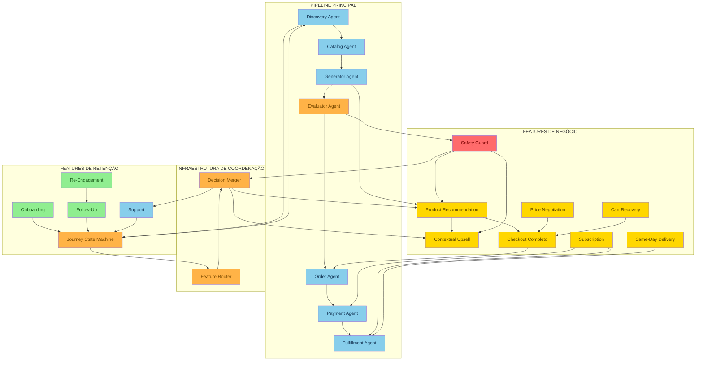
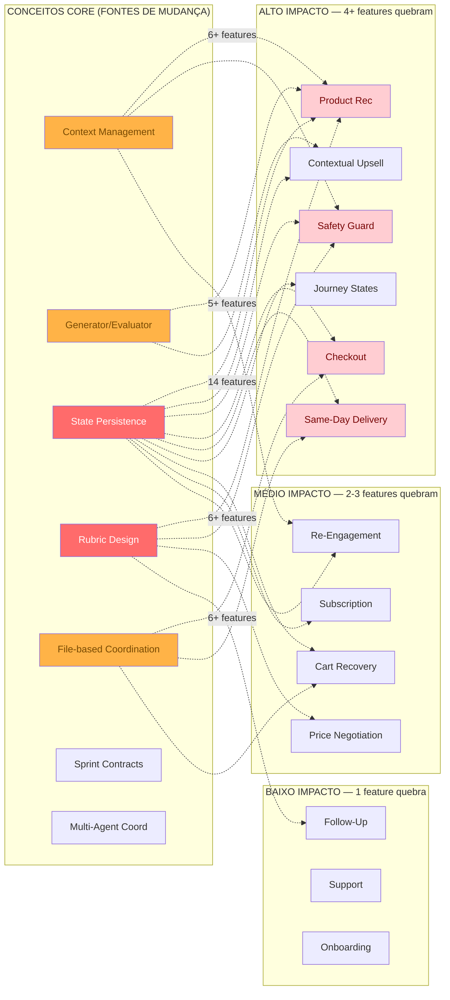

# 🔗 KODA Feature Dependencies: O Mapa de Como Cada Feature se Conecta aos Conceitos Core
## Quais capacidades do KODA dependem de quais fundamentos — e o que quebra quando um conceito muda

**Tempo Estimado:** 90 minutos
**Nível:** Knowledge Graph — Visão Sistêmica
**Pré-requisitos:** Ter completado Nível 1, Nível 2, Nível 3 e os módulos principais do Nível 4
**Status:** 🟢 CRÍTICO — Mapa de navegação para engenharia e produto
**Data de Criação:** Maio 2026

---

## 📖 Prólogo: O Dia em que Fernando Desenhou o Mapa

Era uma quinta-feira atípica na KODA.

Fernando estava em uma sala de reunião com o time de engenharia, produto e operações. Na parede, um quadro branco gigante coberto de post-its coloridos. Cada post-it representava uma feature do KODA: Product Recommendation, Cart Recovery, Safety Guard, Contextual Upsell, Subscription, Same-Day Delivery, Customer Journey States, Payment, Fulfillment, Discovery, Catalog, Order Processing, Evaluation Rubrics, Price Negotiation, Follow-Up, Re-engagement, Support, Onboarding.

Dezoito post-its. Dezoito capacidades que faziam o KODA funcionar. Na verdade, o inventário completo — que você verá na Seção 1 — lista 22 features, incluindo os agentes de pipeline e as features de infraestrutura que sustentam as capacidades visíveis.

A VP de Produto apontou para o quadro e fez a pergunta que ninguém queria responder:

> *"Se eu pedir para o time refatorar o Context Management, quantas features vão quebrar?"*

Silêncio.

Fernando olhou para o quadro. Ele sabia a resposta — muitas. Mas não sabia exatamente quantas. Não sabia quais. Não sabia o raio de impacto.

> *"Se eu pedir para trocar o Generator/Evaluator por um modelo único, o que acontece?"*

Mais silêncio.

Foi quando Fernando pegou um marcador vermelho e começou a desenhar linhas entre os post-its. Uma linha ligando Product Recommendation a Generator/Evaluator. Outra ligando Cart Recovery a State Persistence. Outra ligando Safety Guard a Context Management e Evaluation Rubrics. Em 20 minutos, o quadro virou uma teia.

> *"É isso",* ele disse. *"Cada feature do KODA não flutua sozinha. Ela se apoia em conceitos fundamentais que aprendemos nos Níveis 1, 2 e 3. E quando um desses conceitos muda — seja por refatoração, upgrade de modelo, ou mudança de arquitetura — todas as features apoiadas nele sentem o impacto."*

A VP de Produto ficou pálida. Mas também aliviada.

Porque agora ela tinha um **mapa**.

Este módulo é esse mapa. Ele mostra, com clareza visual e estrutural, como as features do KODA se conectam aos 8 conceitos core e aos 4 níveis do programa. Ele mostra quais features dependem de quais fundamentos. Ele mostra o que está em risco quando um conceito muda. E ele mostra como tomar decisões de arquitetura com visibilidade total das dependências.

Se você é engenheiro, este módulo responde: *"Se eu mexer no State Persistence, o que preciso testar?"*

Se você é produto, este módulo responde: *"Se priorizarmos a feature X, quais fundamentos precisamos fortalecer primeiro?"*

Se você é líder técnico, este módulo responde: *"Qual é o menor conjunto de mudanças que desbloqueia o maior número de features?"*

E se você é como Fernando naquela quinta-feira, este módulo é o mapa que teria economizado 20 minutos de desenho no quadro — e meses de bugs não antecipados.

---

## 🎯 Objetivos Deste Módulo

Ao final deste módulo, você será capaz de:

- ✅ **Visualizar o ecossistema completo de features do KODA** como um grafo de dependências com mais de 18 capacidades mapeadas
- ✅ **Identificar quais conceitos core sustentam cada feature**, compreendendo a hierarquia de dependências entre Níveis 1, 2, 3 e 4
- ✅ **Antecipar o raio de impacto de mudanças arquiteturais**, sabendo exatamente quais features são afetadas quando um fundamento muda
- ✅ **Priorizar investimentos em fundamentos** baseado em quantas features críticas dependem de cada conceito
- ✅ **Ler e interpretar os 3 diagramas Mermaid** deste módulo: Feature↔Conceito, Dependências entre Features e Mapa de Risco
- ✅ **Calibrar decisões de arquitetura** usando a matriz de dependência como ferramenta de comunicação entre engenharia, produto e liderança
- ✅ **Identificar estratégias de coordenação** adequadas para cada tipo de dependência entre features

---

## 🧭 Roadmap Visual do Módulo

```
ENTRADA: Você completou N1, N2, N3 e os módulos principais do N4
  │
  ├─ SEÇÃO 1: O Ecossistema de Features KODA (inventário completo)
  │   └─ Diagrama ASCII com a arquitetura de features
  │   └─ Tabela de inventário: 18+ features com descrição e nível
  │
  ├─ SEÇÃO 2: Diagrama Principal — Features ↔ Conceitos Core
  │   └─ Mermaid: cada feature conectada aos conceitos que a sustentam
  │   └─ Análise: quais conceitos são mais "carregados" de features
  │
  ├─ SEÇÃO 3: Matriz de Dependências entre Features
  │   └─ Mermaid: grafo de dependências feature→feature
  │   └─ Tabela: matriz de precedência e impacto cruzado
  │
  ├─ SEÇÃO 4: Mapa de Risco — Features Mais Impactadas
  │   └─ Mermaid: heatmap de risco por mudança de conceito
  │   └─ Análise: features críticas e caminhos de mitigação
  │
  ├─ SEÇÃO 5: Estratégias de Coordenação entre Features
  │   └─ Tabela comparativa: file-based, API-based, queue-based, in-memory
  │
  ├─ SEÇÃO 6: Aplicação KODA — Cenários Reais
  │   └─ Cenário 1: Refatoração do State Persistence
  │   └─ Cenário 2: Upgrade do modelo Generator/Evaluator
  │   └─ Cenário 3: Nova feature de Subscription
  │
  ├─ SEÇÃO 7: O Que Você Aprendeu (Resumo)
  │   └─ Key takeaways e checklist de domínio
  │
  └─ SAÍDA: Você navega, prioriza e decide com visibilidade total de dependências
```

---

## 🏛️ Seção 1: O Ecossistema de Features KODA — Inventário Completo

Antes de mapear dependências, precisamos de um inventário claro de todas as features do KODA. Cada feature é uma capacidade operacional que participa da conversa com o cliente ou do pipeline interno de decisão. Features não são apenas "funcionalidades de produto" — são unidades de coordenação que consomem conceitos core e produzem outputs verificáveis.

### Diagrama ASCII da Arquitetura de Features

```
┌─────────────────────────────────────────────────────────────────────────────────────────────┐
│                      ARQUITETURA DE FEATURES KODA — VISÃO COMPLETA                           │
│                         Maio 2026 — 22 Features Mapeadas                                    │
└─────────────────────────────────────────────────────────────────────────────────────────────┘

┌─────────────────────────────────────────────────────────────────────────────────────────────┐
│                           CAMADA DE ENTRADA (INPUT LAYER)                                    │
│                                                                                              │
│  ┌──────────────────────┐   ┌──────────────────────┐   ┌──────────────────────┐              │
│  │ WHATSAPP WEBHOOK     │   │ CUSTOMER MESSAGE      │   │ MEDIA HANDLER        │              │
│  │ RECEIVER             │   │ PARSER                │   │ (imagens, PDFs)      │              │
│  │ ──────────────────── │   │ ────────────────────  │   │ ──────────────────── │              │
│  │ • recebe mensagens   │   │ • extrai intenção     │   │ • processa mídia     │              │
│  │ • valida HMAC        │   │ • normaliza texto     │   │ • extrai metadados   │              │
│  │ • deduplica eventos  │   │ • classifica urgência │   │ • valida formato     │              │
│  └──────────┬───────────┘   └──────────┬───────────┘   └──────────┬───────────┘              │
│             └──────────────────────────┼──────────────────────────┘                          │
│                                        │                                                     │
└────────────────────────────────────────┼─────────────────────────────────────────────────────┘
                                         │
                                         ▼
┌─────────────────────────────────────────────────────────────────────────────────────────────┐
│                           CAMADA DE JORNADA (JOURNEY LAYER)                                  │
│                                                                                              │
│  ┌──────────────────────────────────────────────────────────────────────────────────────┐   │
│  │                         CUSTOMER JOURNEY STATE MACHINE                                 │   │
│  │                                                                                       │   │
│  │  AWARENESS ──► CONSIDERATION ──► DECISION ──► RETENTION                               │   │
│  │      │               │                │             │                                  │   │
│  │      │     ┌─────────┼────────┐  ┌────┼────┐   ┌────┼────┐                            │   │
│  │      │     │         │        │  │    │    │   │    │    │                            │   │
│  │      ▼     ▼         ▼        ▼  ▼    ▼    ▼   ▼    ▼    ▼                            │   │
│  │  INTENT  DISCOVERY FILTERING COMP CHECKOUT PAYMENT CONF ONBOARD FOLLOW RE-ENGAGE       │   │
│  │  CLASS   (perfil  (restri-  (com  (carr  (proces (conf (boas- UP     (recom           │   │
│  │          cliente) ções)    para) inho)  samento)  firma vindas (status pra             │   │
│  │                                                      ção)         pedido)              │   │
│  └──────────────────────────────────────────────────────────────────────────────────────┘   │
│                                                                                              │
│  ┌──────────────────────┐   ┌──────────────────────┐   ┌──────────────────────┐              │
│  │ JOURNEY GUARDS       │   │ STATE TRANSITIONS    │   │ ESCALATION HANDLER   │              │
│  │ ──────────────────── │   │ ──────────────────── │   │ ──────────────────── │              │
│  │ • condições de       │   │ • regras de avanço   │   │ • NEEDS_HUMAN        │              │
│  │   entrada/saída      │   │ • regras de retorno  │   │ • retry policy       │              │
│  │ • validação de       │   │ • timeouts de estado │   │ • graceful degrade   │              │
│  │   pré-condições      │   │ • fallback flows     │   │ • recovery paths     │              │
│  └──────────────────────┘   └──────────────────────┘   └──────────────────────┘              │
└─────────────────────────────────────────────────────────────────────────────────────────────┘
                                         │
                                         ▼
┌─────────────────────────────────────────────────────────────────────────────────────────────┐
│                           CAMADA DE FEATURES DE NEGÓCIO (BUSINESS FEATURES)                  │
│                                                                                              │
│  ┌──────────────────┐ ┌──────────────────┐ ┌──────────────────┐ ┌──────────────────────┐    │
│  │ PRODUCT          │ │ CONTEXTUAL       │ │ SAFETY           │ │ CART                 │    │
│  │ RECOMMENDATION   │ │ UPSELL           │ │ GUARD            │ │ RECOVERY             │    │
│  │ ──────────────── │ │ ──────────────── │ │ ──────────────── │ │ ──────────────────── │    │
│  │ • recomenda      │ │ • oferta cruzada │ │ • bloqueia risco │ │ • salva carrinho     │    │
│  │   produtos       │ │ • timing aware   │ │   médico         │ │ • recupera após      │    │
│  │ • explica fit     │ │ • budget aware   │ │ • valida         │ │   abandono           │    │
│  │ • compara opções  │ │ • não insistente │ │   restrições     │ │ • timing inteligente │    │
│  │ • Generator+Eval  │ │ • Generator+Eval │ │ • veto power     │ │ • validação de       │    │
│  └────────┬─────────┘ └────────┬─────────┘ └────────┬─────────┘ │   preço e estoque    │    │
│           │                    │                    │           └──────────┬───────────┘    │
│           │                    │                    │                      │                │
│  ┌────────┴─────────┐ ┌────────┴─────────┐ ┌────────┴─────────┐ ┌────────┴───────────┐    │
│  │ PRICE            │ │ SUBSCRIPTION     │ │ CHECKOUT         │ │ SAME-DAY           │    │
│  │ NEGOTIATION      │ │ ──────────────── │ │ COMPLETO         │ │ DELIVERY           │    │
│  │ ──────────────── │ │ • SUB_OFFER      │ │ ──────────────── │ │ ─────────────────── │    │
│  │ • desconto        │ │ • SUB_SETUP      │ │ • monta carrinho │ │ • coordena 3        │    │
│  │   contextual      │ │ • SUB_ACTIVE     │ │ • aplica cupom   │ │   armazéns          │    │
│  │ • negociação      │ │ • SUB_PAUSE      │ │ • processa       │ │ • 12 entregadores   │    │
│  │   respeitosa      │ │ • SUB_CANCEL     │ │   pagamento      │ │ • 5 regiões         │    │
│  │ • limites de      │ │ • recorrência    │ │ • confirma pedido │ │ • real-time ETA     │    │
│  │   margem          │ │ • faturamento    │ │ • idempotência   │ │ • fallback routes   │    │
│  └──────────────────┘ └──────────────────┘ └──────────────────┘ └──────────────────────┘    │
│                                                                                              │
│  ┌──────────────────┐ ┌──────────────────┐ ┌──────────────────┐ ┌──────────────────────┐    │
│  │ FOLLOW-UP        │ │ RE-ENGAGEMENT    │ │ SUPPORT          │ │ ONBOARDING           │    │
│  │ ──────────────── │ │ ──────────────── │ │ ──────────────── │ │ ──────────────────── │    │
│  │ • pós-entrega    │ │ • recompra       │ │ • dúvidas        │ │ • boas-vindas        │    │
│  │ • satisfação      │ │ • oferta         │ │ • reclamações    │ │ • preferências       │    │
│  │ • coleta feedback │ │   personalizada  │ │ • devoluções     │ │ • educação de        │    │
│  │ • programa        │ │ • timing por     │ │ • garantia       │ │   produto            │    │
│  │   fidelidade      │ │   consumo        │ │ • encaminhamento │ │ • configuração       │    │
│  └──────────────────┘ └──────────────────┘ └──────────────────┘ └──────────────────────┘    │
└─────────────────────────────────────────────────────────────────────────────────────────────┘
                                         │
                                         ▼
┌─────────────────────────────────────────────────────────────────────────────────────────────┐
│                      CAMADA DE AVALIAÇÃO E COORDENAÇÃO (EVALUATION & COORDINATION)            │
│                                                                                              │
│  ┌──────────────────┐ ┌──────────────────┐ ┌──────────────────┐ ┌──────────────────────┐    │
│  │ EVALUATION       │ │ FEATURE          │ │ DECISION         │ │ AUDIT                │    │
│  │ RUBRICS          │ │ ROUTER           │ │ MERGER           │ │ TRAIL                │    │
│  │ ──────────────── │ │ ──────────────── │ │ ──────────────── │ │ ──────────────────── │    │
│  │ • Product Rec    │ │ • ativa features │ │ • safety > growth│ │ • jsonl append-only  │    │
│  │ • Customer Resp  │ │   candidatas     │ │ • support > sales│ │ • timestamps         │    │
│  │ • Price Negot    │ │ • resolve por    │ │ • fresh snapshot │ │ • decision replay    │    │
│  │ • Follow-Up      │ │   intent+journey │ │   > stale        │ │ • compliance        │    │
│  │ • gatekeeper     │ │ • ordena por     │ │ • confirmação >  │ │ • evidência de       │    │
│  │   final           │ │   prioridade    │ │   upsell         │ │   cada decisão      │    │
│  └──────────────────┘ └──────────────────┘ └──────────────────┘ └──────────────────────┘    │
└─────────────────────────────────────────────────────────────────────────────────────────────┘
                                         │
                                         ▼
┌─────────────────────────────────────────────────────────────────────────────────────────────┐
│                      CAMADA DE CONCEITOS CORE (FOUNDATION LAYER)                              │
│                                                                                              │
│  ┌──────────────────┐ ┌──────────────────┐ ┌──────────────────┐ ┌──────────────────────┐    │
│  │ CONTEXT          │ │ PLANNING vs      │ │ GENERATOR/       │ │ SPRINT               │    │
│  │ MANAGEMENT        │ │ EXECUTION        │ │ EVALUATOR        │ │ CONTRACTS            │    │
│  │ (N1-C1)          │ │ (N1-C2)          │ │ (N2-C3)          │ │ (N2-C4)              │    │
│  └────────┬─────────┘ └────────┬─────────┘ └────────┬─────────┘ └──────────┬───────────┘    │
│           │                    │                    │                      │                │
│  ┌────────┴─────────┐ ┌────────┴─────────┐ ┌────────┴─────────┐ ┌────────┴───────────┐    │
│  │ STATE            │ │ HARNESS          │ │ MULTI-AGENT      │ │ EVALUATION          │    │
│  │ PERSISTENCE      │ │ EVOLUTION        │ │ COORDINATION     │ │ RUBRICS             │    │
│  │ (N3-C5)          │ │ (N3-C6)          │ │ (N3-C7)          │ │ (N2-C8)             │    │
│  └──────────────────┘ └──────────────────┘ └──────────────────┘ └──────────────────────┘    │
└─────────────────────────────────────────────────────────────────────────────────────────────┘
```

### Inventário de Features KODA

> **Nota sobre o estado atual:** Este inventário descreve a arquitetura-alvo do KODA conforme documentada nos módulos Nível 4. Algumas features já estão em produção (Discovery, Catalog, Generator via Claude API, suporte básico a carrinho), enquanto outras são propostas de melhoria ou estão em fase de implementação (Evaluator dedicado, Planner Agent, checkpoints explícitos, lock files abrangentes). Consulte `04-nivel-4-koda-specific/05-harness-improvements.md` para o status atual de cada componente. O mapa de dependências é válido tanto para features existentes quanto para features planejadas — ele mostra as dependências que existirão quando a arquitetura-alvo for alcançada.

| # | Feature | Nível Primário | Tipo | Descrição | Dependência Crítica |
|---|---|---|---|---|---|
| 1 | **Product Recommendation** | N4 | Negócio | Recomenda produtos personalizados baseado em perfil, restrições, objetivo e orçamento | Generator/Evaluator, State Persistence, Context Management |
| 2 | **Contextual Upsell** | N4 | Negócio | Oferece produtos complementares no momento certo, sem ser insistente | Product Recommendation, Journey State, Price Sensitivity |
| 3 | **Safety Guard** | N4 | Proteção | Bloqueia recomendações perigosas: alergias, contraindicações médicas, interações | Evaluation Rubrics, State Persistence (restrições), Veto Power |
| 4 | **Cart Recovery** | N4 | Negócio | Recupera carrinho abandonado com validação de preço e estoque atualizado | State Persistence, Sprint Contracts, File-based Coordination |
| 5 | **Price Negotiation** | N4 | Negócio | Aplica descontos contextuais respeitando margens e elegibilidade | Rubric Design, Journey State (não negocia na descoberta) |
| 6 | **Subscription** | N4 | Negócio | Gerencia ciclo completo de assinatura: oferta, setup, cobrança, pausa, cancelamento | State Persistence, Payment Agent, Recurring State, Webhook |
| 7 | **Checkout Completo** | N4 | Negócio | Pipeline completo: carrinho → pagamento → confirmação, com idempotência | Order Agent, Payment Agent, Lock Files, Idempotency |
| 8 | **Same-Day Delivery** | N4 | Negócio | Coordena múltiplos armazéns e entregadores para promessa de entrega no mesmo dia | Multi-Agent Coordination, File-based Coordination, Real-Time State |
| 9 | **Follow-Up** | N4 | Retenção | Acompanha cliente pós-entrega: satisfação, uso do produto, recompra | Journey State (Retention), Timing Engine, Evaluation Rubrics |
| 10 | **Re-Engagement** | N4 | Retenção | Reativa cliente inativo com oferta personalizada baseada em histórico | State Persistence, Purchase History, Timing Engine |
| 11 | **Support** | N4 | Suporte | Responde dúvidas, processa reclamações, devoluções e garantia | Escalation Handler, Journey Guards, Decision Merger |
| 12 | **Onboarding** | N4 | Retenção | Boas-vindas, coleta de preferências, educação de produto e configuração inicial | Journey State (Retention), Discovery Agent |
| 13 | **Discovery Agent** | N4 | Pipeline | Extrai intenção, restrições, preferências, orçamento e histórico do cliente | Context Management, State Persistence, Claude Opus |
| 14 | **Catalog Agent** | N4 | Pipeline | Consulta e filtra catálogo por restrições, preferências e disponibilidade real | State Persistence, Inventory System, SQLite |
| 15 | **Generator Agent** | N4 | Pipeline | Cria recomendações, respostas, carrinho e explicações sem se auto-avaliar | Context Management, Token Budgeting, Claude Opus |
| 16 | **Evaluator Agent** | N4 | Pipeline | Avalia outputs do Generator contra rubrics e restrições | Evaluation Rubrics, State Persistence, Claude Sonnet |
| 17 | **Order Agent** | N4 | Pipeline | Monta carrinho, calcula total, aplica cupons, gera pedido formal | Payment Agent, Lock Files, Sprint Contracts |
| 18 | **Payment Agent** | N4 | Pipeline | Processa pagamento com idempotência, confirma transação | Payment Gateway, Idempotency, Lock Files |
| 19 | **Fulfillment Agent** | N4 | Pipeline | Reserva estoque, agenda entrega, gera tracking, confirma ETA | Inventory System, File-based Coordination, Lock Files |
| 20 | **Journey State Machine** | N4 | Infra | Máquina de estados que controla Awareness, Consideration, Decision, Retention | State Persistence, Guard Conditions, Transition Rules |
| 21 | **Feature Router** | N4 | Infra | Ativa features candidatas baseado em intenção e estágio da jornada | Journey State Machine, Intent Classification |
| 22 | **Decision Merger** | N4 | Infra | Resolve conflitos entre features concorrentes com regras de prioridade | Feature Router, Safety Guard (override) |

---

### Descrições Detalhadas das Features

As 22 features mapeadas acima formam o sistema nervoso do KODA. Cada uma tem um papel específico no pipeline de vendas. Abaixo, uma descrição detalhada de cada feature, seu fluxo de ativação e os artefatos que produz.

#### Features de Pipeline (agentes especializados)

**Discovery Agent** — O ponto de entrada de toda conversa. Responsável por extrair e estruturar informações do cliente a partir de mensagens brutas do WhatsApp. Não é um simples parser de intenção: o Discovery Agent infere objetivos de consumo, restrições alimentares implícitas (ex: "não como carne" → vegetariano), nível de conhecimento sobre suplementos, urgência e orçamento. Produz `customer.json` — o artefato mais lido de todo o ecossistema KODA. Se o Discovery erra (ex: classifica "ganho de massa" como "emagrecimento"), toda a cadeia de recomendações é contaminada.

**Catalog Agent** — Consulta o inventário real e filtra produtos pelas restrições do cliente. Não é uma simples query SQL: o Catalog Agent precisa lidar com desambiguação de SKUs, variações de sabor e formato, promoções ativas que afetam preço, e regras de elegibilidade (ex: produto X não pode ser vendido para menor de 18 anos). Produz `catalog.json` com timestamp — se o timestamp for mais antigo que `accepted_inventory_ttl`, o Evaluator rejeita a consulta e força refresh.

**Generator Agent** — Cria recomendações, respostas, carrinhos e explicações. É o agente mais "criativo" do KODA, mas também o mais perigoso se não for contido. O Generator **nunca** envia mensagem diretamente ao cliente — toda sua produção passa pelo Evaluator. O Generator opera com um token budget definido por etapa: se a conversa é longa, recebe summary; se é curta, recebe histórico completo. Produz `draft.json` com `generation_id` e `feature_run_id` para rastreabilidade.

**Evaluator Agent** — O gatekeeper. Recebe `draft.json`, aplica rubrics de qualidade, verifica restrições, compara com estado persistido e decide: APPROVED, REJECTED ou NEEDS_HUMAN_REVIEW. O Evaluator não é "bonzinho" — sua métrica de sucesso é quantos erros encontrou, não quantas recomendações aprovou. Usa Claude Sonnet (mais rápido e mais barato que Opus) porque sua tarefa é avaliação, não geração criativa. Produz `evaluation.json` com scores dimensionais e feedback para retry.

**Order Agent** — Monta o carrinho, calcula total, aplica cupons e gera o pedido formal. Precisa lidar com edge cases: cupom expirado entre recomendação e checkout, produto que esgotou durante a conversa, mudança de endereço no meio do fluxo. Adquire lock no carrinho antes de modificá-lo para prevenir race conditions. Produz `order.json` — o artefato que dispara cobrança e fulfillment.

**Payment Agent** — Processa pagamento com idempotência garantida. Se o cliente clica "pagar" duas vezes por engano, o Payment Agent reconhece o `idempotency_key` e não cobra duas vezes. Lida com: Pix (precisa esperar confirmação), cartão de crédito (precisa lidar com recusa), boleto (precisa aguardar compensação). Produz `txn.json` com status e `transaction_id` do gateway.

**Fulfillment Agent** — Reserva estoque, agenda entrega, gera tracking e confirma ETA. O Fulfillment Agent é o ponto onde promessas feitas durante a conversa se tornam realidade (ou frustração). Precisa coordenar com múltiplos armazéns e entregadores, lidar com rotas inviáveis, e reagir a eventos externos (entregador cancelou, trânsito bloqueou rota). Produz `fulfillment.json` com tracking number e ETA atualizado.

#### Features de Negócio (value-add sobre o pipeline)

**Product Recommendation** — A feature mais crítica do KODA. Combina Generator/Evaluator com catálogo filtrado, perfil do cliente, restrições e orçamento para produzir 1-3 recomendações com explicações personalizadas. Cada recomendação inclui: SKU, preço, rationale ("por que isso é bom para você"), comparative ("como se compara com o que você já usou") e evidence (de onde vieram os dados). A recomendação só chega ao cliente após aprovação do Evaluator com `overall_score >= 0.82`.

**Contextual Upsell** — Oferece produto complementar no momento certo. Não é "quem comprou X também comprou Y" genérico — é sensível ao contexto: só oferece se o cliente demonstrou satisfação com o produto principal, se o orçamento comporta, se há compatibilidade (ex: não oferece creatina para quem disse que tem problema renal). Respeita `offer_history`: nunca repete uma oferta que o cliente já recusou.

**Safety Guard** — Feature de proteção com poder de veto. Não gera conteúdo — apenas bloqueia. Verifica cada recomendação contra: restrições médicas (alergias, condições de saúde), contraindicações (interações entre suplementos), restrições dietéticas (vegetariano, vegano, kosher, halal), e restrições de idade. Opera em dois níveis: `soft_block` (alerta o Generator para refazer) e `hard_block` (REJEITAR_IMEDIATAMENTE, escala para humano). O Safety Guard não negocia — se detecta risco, bloqueia independentemente do potencial de venda.

**Cart Recovery** — Recupera carrinho abandonado com inteligência. Não é um simples "você esqueceu algo no carrinho". O Cart Recovery: valida se os produtos ainda estão em estoque, recalcula preços (podem ter mudado), verifica se promoções ainda são válidas, e só então envia mensagem. Respeita timing: não envia recovery 5 minutos após abandono (parece desespero), mas também não espera 7 dias (cliente já comprou em outro lugar). Janela ótima: 2-24 horas.

**Price Negotiation** — Aplica descontos contextuais respeitando margens. Não é um "pechincha automático". O Price Negotiation avalia: elegibilidade do cliente (fidelidade, volume, primeira compra), margem do produto (não desconta abaixo do custo), momento da jornada (não negocia durante descoberta), e concorrência (precisa manter preço competitivo). Usa rubrics para avaliar se a negociação foi respeitosa (não insistente) e se o desconto é sustentável.

**Subscription** — Gerencia o ciclo completo de assinatura. Estados: SUB_OFFER (oferece assinatura no momento certo), SUB_SETUP (configura SKU, frequência, endereço, pagamento), SUB_ACTIVE (cobrança recorrente, fulfillment recorrente), SUB_PAUSE (cliente pausa, mantém dados), SUB_CANCEL (encerra, guarda motivo). Precisa lidar com: falha de cobrança (retry com grace period), produto fora de estoque no ciclo de renovação (substituição ou skip), mudança de preço (notificar antes de cobrar).

**Checkout Completo** — Pipeline de 4 etapas: carrinho → pagamento → confirmação → fulfillment. Cada etapa é um sprint com contrato definido. O Checkout é onde a maioria dos bugs de coordenação aparece: race condition no carrinho, cobrança duplicada, confirmação de pedido que não foi pago, fulfillment que começa antes da confirmação de pagamento. Usa lock files em cada etapa e audit trail para replay de decisão.

**Same-Day Delivery** — A feature mais complexa de coordenação do KODA. Envolve 3 armazéns, 12 entregadores, 5 regiões e promessas em tempo real. O Same-Day Delivery precisa: verificar estoque no armazém mais próximo, confirmar disponibilidade de entregador, calcular rota viável (com trânsito em tempo real), prometer ETA realista, e — se algo falhar — fazer fallback para entrega no dia seguinte com notificação proativa.

#### Features de Retenção

**Follow-Up** — Acompanha cliente pós-entrega. Não é "como foi sua experiência?" genérico. O Follow-Up: confirma recebimento, pergunta sobre uso (dose, horário, efeitos), oferece dicas personalizadas, coleta feedback estruturado, e agenda recompra quando estoque do cliente estiver acabando. Timing é definido por: categoria do produto (whey = ~25 dias, creatina = ~55 dias), consumo informado pelo cliente, e data da entrega.

**Re-Engagement** — Reativa cliente inativo. Analisa: última compra, motivo da inatividade (preço? produto? atendimento?), se houve reclamação não resolvida. Oferece incentivo personalizado: desconto de fidelidade, amostra grátis de produto novo, conteúdo educativo. Não insiste se cliente não responde — após 3 tentativas sem resposta, marca como "adormecido" e tenta novamente em 90 dias.

**Support** — Responde dúvidas, processa reclamações, devoluções e garantia. O Support é o estado onde a confiança é reconstruída (ou destruída). Precisa de: acesso ao histórico completo do pedido, política de devolução clara, capacidade de iniciar estorno, e — criticamente — capacidade de escalar para humano quando a situação exige (cliente furioso, suspeita de fraude, questão médica).

**Onboarding** — Primeiro contato pós-compra ou primeiro contato com novo cliente. Coleta preferências (sabores, formatos, marcas), educa sobre uso do produto, configura lembretes, e estabelece o tom do relacionamento. Um bom onboarding reduz em 40% a probabilidade de devolução e aumenta em 25% a probabilidade de recompra.

#### Features de Infraestrutura

**Journey State Machine** — A feature mais transversal do KODA. Controla 4 macro-estados (Awareness, Consideration, Decision, Retention) e 12 sub-estados. Cada transição tem: guard conditions (só avança se pré-condições são verdadeiras), transition actions (o que acontece na transição), e timeout rules (se ficar preso em um estado por tempo demais, escala ou faz fallback). A máquina de estados é a resposta do KODA ao Planning vs. Execution Collapse: cada estado tem um objetivo claro e um contrato de saída.

**Feature Router** — Decide quais features são candidatas a executar em cada turno da conversa. Usa: intenção atual do cliente, estágio da jornada, histórico de features já executadas, e restrições de segurança. Se o cliente está em CONSIDERATION com intenção `product_discovery`, o Router ativa Product Recommendation e Catalog Agent. Se está em DECISION, ativa Checkout. Se está em RECLAMAÇÃO, ativa Support e **desativa** todas as features de venda.

**Decision Merger** — Resolve conflitos quando múltiplas features querem agir simultaneamente. Regras de prioridade (em ordem): 1) Safety > Growth (Safety Guard sempre vence Upsell), 2) Support > Sales (reclamação interrompe venda), 3) Confirmation > Upsell (checkout confirmation é mais importante que oferta adicional), 4) Fresh Snapshot > Stale (dados mais recentes vencem cache antigo). O Decision Merger impede que o KODA ofereça desconto enquanto o cliente está reclamando de um pedido atrasado.

### Famílias de Features: Agrupamento por Domínio

As 22 features do KODA se agrupam naturalmente em 5 famílias. Cada família compartilha um conjunto de dependências comuns — e herda os mesmos riscos quando esses fundamentos mudam.

#### Família 1 — Pipeline Core (Discovery → Catalog → Generator → Evaluator → Order → Payment → Fulfillment)

**7 agentes** que formam a espinha dorsal do KODA. Executam em sequência, cada um consumindo o output do anterior e produzindo input para o próximo.

**Dependências compartilhadas:**
- **State Persistence:** Todos leem `customer.json`; Generator, Evaluator e Order também escrevem state
- **Context Management:** Discovery e Generator dependem de contexto completo; Catalog e Evaluator usam snapshots
- **Token Budgeting:** Generator é o maior consumidor; Discovery e Catalog consomem moderadamente
- **File-based Coordination:** Order, Payment e Fulfillment usam locks para prevenir race conditions
- **Sprint Contracts:** Cada agente tem contrato de entrada e saída

**Risco compartilhado:** Se State Persistence falha, todos os 7 agentes são impactados. Se Context Management é reconfigurado (ex: janela de histórico reduzida), Generator e Discovery perdem qualidade. Se Token Budgeting é mal calibrado, Generator pode truncar informações críticas.

**Característica distintiva:** Estes agentes não tomam decisões de negócio — executam o pipeline. A separação entre pipeline e features de negócio é arquiteturalmente intencional: o pipeline é estável, as features evoluem.

#### Família 2 — Recomendação e Venda (Product Recommendation + Contextual Upsell + Price Negotiation)

**3 features** que interagem diretamente com o cliente para gerar receita.

**Dependências compartilhadas:**
- **Generator/Evaluator:** Todas usam o padrão — Generator propõe, Evaluator aprova ou rejeita
- **Evaluation Rubrics:** Cada uma tem rubrics específicas calibradas para seu domínio
- **Journey State Machine:** Só podem ser ativadas em estágios específicos (Product Rec em Discovery/Consideration, Upsell pós-recomendação, Price Negotiation em Decision)
- **State Persistence:** Precisam de `customer_profile`, `offer_history` e `catalog_snapshot`

**Risco compartilhado:** Se Evaluation Rubrics são recalibradas com thresholds mais baixos, recomendações ruins passam a ser aprovadas. Se Journey State Machine permite ativação fora de ordem, upsell acontece antes da recomendação principal.

**Característica distintiva:** São features de crescimento — geram receita, mas precisam ser contidas por Safety e timing. O tensionamento entre "vender mais" e "proteger o cliente" é resolvido pelo Decision Merger (Safety > Growth).

#### Família 3 — Proteção e Confiança (Safety Guard + Support + Decision Merger)

**3 features** que protegem o cliente e a reputação do KODA.

**Dependências compartilhadas:**
- **Evaluation Rubrics:** Safety Guard usa rubrics de segurança; Support usa rubrics de resolução
- **State Persistence:** Precisam de `customer.restrictions`, `order_history` e `complaint_history`
- **Journey State Machine:** Support tem precedência sobre qualquer feature de venda; Safety Guard tem poder de veto

**Risco compartilhado:** Se State Persistence perde restrições médicas do cliente, Safety Guard não pode proteger. Se Journey State Machine não prioriza Support, cliente recebe oferta de venda enquanto reclama de produto com defeito.

**Característica distintiva:** Features de proteção **nunca** podem ser despriorizadas em favor de features de crescimento. O Decision Merger garante isso arquiteturalmente.

#### Família 4 — Retenção e Fidelidade (Follow-Up + Re-Engagement + Onboarding + Subscription + Cart Recovery)

**5 features** que operam no longo prazo, após a venda inicial.

**Dependências compartilhadas:**
- **Journey State Machine:** Todas dependem do estado RETENTION e seus sub-estados
- **State Persistence:** Precisam de histórico de compras, preferências, datas de consumo e status de assinatura
- **Timing Engine:** Follow-Up e Re-Engagement dependem de timing preciso (dias após entrega, dias antes do fim do estoque)
- **Queue-based Coordination:** Operam assincronamente — não respondem a mensagens do cliente, disparam proativamente

**Risco compartilhado:** Se Journey State Machine não registra a transição para RETENTION, nenhuma feature de retenção dispara. Se State Persistence perde datas de consumo, Follow-Up e Re-Engagement disparam no timing errado. Se Queue-based Coordination falha (fila cheia, mensagem perdida), cliente nunca recebe follow-up.

**Característica distintiva:** Features de retenção são assíncronas e proativas. Diferente das features de venda (que respondem a mensagens), elas iniciam contato. Isso exige timing preciso e sensibilidade — um follow-up no momento errado parece spam.

#### Família 5 — Infraestrutura Transversal (Journey State Machine + Feature Router + Decision Merger + Audit Trail)

**4 features** que não entregam valor diretamente ao cliente, mas são pré-condição para todas as outras.

**Dependências compartilhadas:**
- **State Persistence:** A máquina de estados é o estado mais crítico do KODA
- **Planning vs. Execution:** A máquina de estados implementa a separação entre "em que fase estamos" e "o que fazemos agora"
- **Multi-Agent Coordination:** Feature Router e Decision Merger são os mecanismos de coordenação entre agentes

**Risco compartilhado:** Se a máquina de estados corrompe, o KODA inteiro perde o senso de fase da conversa. Se o Feature Router falha, features são ativadas em momentos errados. Se o Decision Merger falha, conflitos não são resolvidos e o cliente recebe mensagens contraditórias.

**Característica distintiva:** Features de infraestrutura são "invisíveis" para o cliente, mas sua falha é catastrófica e visível. Investir em teste e resiliência destas features protege todas as outras.

---

## 🔗 Seção 2: Diagrama Principal — Features KODA ↔ Conceitos Core

Este é o diagrama central do módulo. Ele mostra cada feature do KODA conectada aos conceitos fundamentais dos Níveis 1, 2 e 3 que a sustentam.

### Grafo Features ↔ Conceitos

```mermaid
graph TD
    subgraph "NÍVEL 4 — FEATURES KODA"
        PR["Product Recommendation"]
        CU["Contextual Upsell"]
        SG["Safety Guard"]
        CR["Cart Recovery"]
        PN["Price Negotiation"]
        SUB["Subscription"]
        CK["Checkout Completo"]
        SDD["Same-Day Delivery"]
        FU["Follow-Up"]
        RE["Re-Engagement"]
        SP["Support"]
        OB["Onboarding"]
        DA["Discovery Agent"]
        CA["Catalog Agent"]
        GA["Generator Agent"]
        EA["Evaluator Agent"]
        OA["Order Agent"]
        PA["Payment Agent"]
        FA["Fulfillment Agent"]
        JSM["Journey State Machine"]
        FR["Feature Router"]
        DM["Decision Merger"]
    end

    subgraph "NÍVEL 1 — FUNDAMENTOS"
        CM["Context Management"]
        PE["Planning vs Execution"]
        TB["Token Budgeting"]
        HP["Basic Harness Patterns"]
    end

    subgraph "NÍVEL 2 — PADRÕES PRÁTICOS"
        GE["Generator/Evaluator"]
        SC["Sprint Contracts"]
        RD["Rubric Design"]
        TR["Trace Reading"]
    end

    subgraph "NÍVEL 3 — ARQUITETURA AVANÇADA"
        SPersist["State Persistence"]
        HE["Harness Evolution"]
        MAC["Multi-Agent Coordination"]
        FC["File-based Coordination"]
        SSC["Server-Side Compaction"]
    end

    PR --> GE
    PR --> SPersist
    PR --> CM
    PR --> RD
    PR --> TB
    CU --> PR
    CU --> SPersist
    CU --> JSM
    SG --> RD
    SG --> SPersist
    SG --> CM
    CR --> SPersist
    CR --> SC
    CR --> FC
    PN --> RD
    PN --> JSM
    PN --> SC
    SUB --> SPersist
    SUB --> PA
    SUB --> SC
    CK --> OA
    CK --> PA
    CK --> FC
    CK --> SC
    SDD --> MAC
    SDD --> FC
    SDD --> SPersist
    SDD --> SC
    FU --> JSM
    FU --> RD
    FU --> TR
    RE --> SPersist
    RE --> JSM
    RE --> CM
    SP --> JSM
    SP --> DM
    OB --> JSM
    OB --> DA
    DA --> CM
    DA --> SPersist
    DA --> TB
    CA --> SPersist
    CA --> TB
    GA --> CM
    GA --> TB
    GA --> GE
    EA --> RD
    EA --> SPersist
    EA --> GE
    OA --> PA
    OA --> FC
    OA --> SC
    PA --> FC
    PA --> SC
    FA --> FC
    FA --> SPersist
    FA --> SC
    JSM --> SPersist
    JSM --> PE
    FR --> JSM
    FR --> DM
    DM --> SG
    DM --> JSM

    style PR fill:#FFD700,color:#5c4500
    style CU fill:#FFD700,color:#5c4500
    style SG fill:#FF6B6B,color:#7a0000
    style CR fill:#FFD700,color:#5c4500
    style PN fill:#FFD700,color:#5c4500
    style SUB fill:#FFD700,color:#5c4500
    style CK fill:#FFD700,color:#5c4500
    style SDD fill:#FFD700,color:#5c4500
    style FU fill:#90EE90,color:#1a5c1a
    style RE fill:#90EE90,color:#1a5c1a
    style SP fill:#87CEEB,color:#1a3d5c
    style OB fill:#90EE90,color:#1a5c1a
    style CM fill:#87CEEB,color:#1a3d5c
    style PE fill:#87CEEB,color:#1a3d5c
    style TB fill:#87CEEB,color:#1a3d5c
    style HP fill:#87CEEB,color:#1a3d5c
    style GE fill:#90EE90,color:#1a5c1a
    style SC fill:#90EE90,color:#1a5c1a
    style RD fill:#90EE90,color:#1a5c1a
    style TR fill:#90EE90,color:#1a5c1a
    style SPersist fill:#FFB347,color:#7a4a00
    style HE fill:#FFB347,color:#7a4a00
    style MAC fill:#FFB347,color:#7a4a00
    style FC fill:#FFB347,color:#7a4a00
    style SSC fill:#FFB347,color:#7a4a00
```



### Análise: Quais Conceitos Sustentam Mais Features?

A densidade de conexões revela quais fundamentos são mais críticos para o ecossistema KODA:

| Conceito | Nível | Features Dependentes | Grau de Criticidade |
|---|---|---|---|
| **State Persistence** | N3 | 14 (PR, CU, CR, SUB, SDD, FU, RE, DA, CA, EA, FA, JSM, SG, CK) | 🔴 Muito Alto |
| **Evaluation Rubrics** | N2 | 6+ (PR, SG, PN, FU, EA, RD-self) | 🔴 Muito Alto |
| **Context Management** | N1 | 6+ (PR, SG, RE, DA, GA, SSC) | 🔴 Muito Alto |
| **File-based Coordination** | N3 | 6+ (CR, CK, SDD, OA, PA, FA) | 🟠 Alto |
| **Sprint Contracts** | N2 | 6+ (CR, PN, SUB, CK, SDD, OA, PA, FA) | 🟠 Alto |
| **Generator/Evaluator** | N2 | 5+ (PR, CU, GA, EA, GE-self) | 🟠 Alto |
| **Journey State Machine** | N4 | 7+ (CU, PN, FU, RE, SP, OB, FR, DM) | 🟠 Alto |
| **Multi-Agent Coordination** | N3 | 3+ (SDD, MAC-self, Orchestrator) | 🟡 Médio |
| **Token Budgeting** | N1 | 4+ (PR, DA, CA, GA) | 🟡 Médio |
| **Trace Reading** | N2 | 3+ (FU, Audit Trail, Debug) | 🟡 Médio |
| **Harness Evolution** | N3 | Transversal (todas as features) | 🟡 Médio |
| **Planning vs Execution** | N1 | 2+ (JSM, PE-self) | 🟢 Baixo |
| **Server-Side Compaction** | N3 | 2+ (Conversas longas, CM) | 🟢 Baixo |

**Insight crítico:** State Persistence e Evaluation Rubrics são os dois conceitos com maior número de features dependentes. Uma mudança em qualquer um deles tem o maior raio de impacto em todo o ecossistema KODA. Isso significa que investimentos em fortalecer State Persistence (checkpoints, locks, audit trail) e Evaluation Rubrics (calibração, blockers, approval thresholds) produzem o maior efeito multiplicador de confiabilidade.

Por outro lado, Context Management e Token Budgeting (Nível 1) aparecem como pré-requisitos para a maioria das features de geração. Se o Context Management falha, Product Recommendation, Contextual Upsell, Re-Engagement e Generator Agent são diretamente impactados — e indiretamente, todas as features que dependem deles entram em cascata de falha.

### Padrões de Acoplamento: Como Features se Conectam aos Conceitos

Analisando o grafo Feature↔Conceito, emergem 4 padrões de acoplamento que determinam o comportamento do sistema sob mudança:

#### Padrão 1 — Dependência em Estrela (Star Dependency)

Um conceito core é ponto único de falha para muitas features. **State Persistence** é o exemplo canônico: 12+ features convergem para ele.

**Características:**
- Alta concentração de risco
- Mudanças no conceito central têm raio de impacto amplo
- Testes de regressão precisam cobrir muitas features
- Rollout de mudanças deve ser gradual (feature flags, dual-write)

**Estratégia de mitigação:** Tratar o conceito central como "serviço crítico" com SLOs próprios (ex: 99.9% de disponibilidade, latência P99 < 50ms). Implementar circuit breakers nas features dependentes para que uma falha no conceito central não cause cascata de timeouts.

#### Padrão 2 — Dependência em Camadas (Layered Dependency)

Features de negócio dependem de features de pipeline, que dependem de conceitos core. **Product Recommendation** depende de Generator/Evaluator (N2), que depende de Context Management (N1) e State Persistence (N3).

**Características:**
- Falhas se propagam para cima na pilha
- Debugging requer rastreamento através das camadas
- Otimizações em camadas inferiores beneficiam todas as camadas superiores
- Mudanças em camadas superiores não afetam camadas inferiores

**Estratégia de mitigação:** Cada camada deve ter testes de contrato (não apenas testes unitários). Se a camada N promete "vou entregar X no formato Y em até Z ms", as camadas N+1 podem confiar nessa promessa sem conhecer a implementação.

#### Padrão 3 — Dependência Cíclica Controlada (Controlled Cycle)

Algumas features se referenciam mutuamente, mas com direção clara de autoridade. **Journey State Machine ↔ Discovery Agent**: a máquina de estados diz "você está em CONSIDERATION", o Discovery Agent extrai informações e **atualiza** a máquina de estados ("agora você tem dados suficientes para avançar").

**Características:**
- Ciclos são necessários para feedback loops
- Precisam de "quem manda em quem" bem definido
- Risco de loop infinito se guards não são bem calibrados

**Estratégia de mitigação:** Todo ciclo deve ter: (1) um "owner" claro que tem autoridade final, (2) um limite máximo de iterações, (3) um timeout que força saída do ciclo, (4) logging de cada iteração para debug.

#### Padrão 4 — Dependência Transversal (Cross-Cutting)

Algumas features não dependem de features específicas, mas de **propriedades do sistema** que precisam ser verdadeiras para todas as features. **Harness Evolution** e **Audit Trail** são exemplos: não são pré-requisitos de nenhuma feature, mas sua ausência degrada todas elas.

**Características:**
- Difíceis de priorizar (não são blocker de nenhuma feature específica)
- Fáceis de negligenciar (não aparecem no caminho crítico de nenhum roadmap)
- Críticas para maturidade de longo prazo

**Estratégia de mitigação:** Alocar capacidade dedicada para concerns transversais (ex: 20% do tempo de engenharia). Tratar Harness Evolution e Audit Trail como "features de plataforma" com roadmap próprio, não como tarefas de manutenção.

---

## 📊 Seção 3: Matriz de Dependências entre Features

Features do KODA não dependem apenas de conceitos core — elas dependem umas das outras. Esta seção mapeia o grafo de precedência e o impacto cruzado entre features.

### Grafo de Dependências Feature → Feature



### Matriz de Precedência e Impacto Cruzado

A matriz abaixo mostra, para cada par de features, se a feature na linha **depende** da feature na coluna para funcionar. `D` = Dependência direta, `I` = Dependência indireta (via pipeline), `—` = Independente.

| Feature ↓ / → | PR | CU | SG | CR | PN | SUB | CK | SDD | FU | RE | SP | OB | DA | CA | GA | EA | OA | PA | FA | JSM |
|---|---|---|---|---|---|---|---|---|---|---|---|---|---|---|---|---|---|---|---|---|---|
| **PR** | — | — | D | — | — | — | — | — | — | — | — | — | D | D | D | D | — | — | — | I |
| **CU** | D | — | D | — | — | — | — | — | — | — | — | — | I | I | I | I | — | — | — | D |
| **SG** | D | D | — | — | — | — | — | — | — | — | — | — | — | — | — | D | — | — | — | I |
| **CR** | — | — | — | — | — | — | D | — | — | — | — | — | — | — | — | — | — | — | — | D |
| **PN** | — | — | — | — | — | — | D | — | — | — | — | — | — | — | — | — | — | — | — | D |
| **SUB** | — | — | — | — | — | — | — | — | — | — | — | — | — | — | — | — | D | D | D | D |
| **CK** | D | — | — | — | D | — | — | — | — | — | — | — | I | I | I | I | D | D | D | D |
| **SDD** | — | — | — | — | — | — | D | — | — | — | — | — | I | I | — | — | D | D | D | D |
| **FU** | — | — | — | — | — | — | D | — | — | D | — | — | — | — | — | — | — | — | I | D |
| **RE** | — | — | — | — | — | — | — | — | D | — | — | — | — | — | — | — | — | — | — | D |
| **SP** | — | — | — | — | — | — | — | — | — | — | — | — | — | — | — | — | — | — | — | D |
| **OB** | — | — | — | — | — | — | — | — | — | — | — | — | D | — | — | — | — | — | — | D |

**Leitura da matriz:**
- `PR → SG = D`: Product Recommendation **depende diretamente** do Safety Guard (não pode recomendar sem passar pelo veto de segurança)
- `CU → PR = D`: Contextual Upsell **depende diretamente** do Product Recommendation (upsell pressupõe recomendação primária)
- `CK → OA = D`: Checkout Completo **depende diretamente** do Order Agent (checkout usa o Order Agent como executor)
- `JSM → (quase todas) = D ou I`: A Journey State Machine é a feature mais transversal — quase todas as features de negócio dependem dela direta ou indiretamente

### Cadeias Críticas de Dependência

Algumas sequências de dependência formam "cadeias críticas" onde uma falha em qualquer elo derruba toda a cadeia:

**Cadeia 1 — Pipeline de Venda:**
```
Discovery → Catalog → Generator → Evaluator → Order → Payment → Fulfillment
```
Se o Catalog Agent falha (ex: inventory system offline), Generator não tem dados. Se Generator falha, Evaluator não tem o que avaliar. A cadeia inteira é bloqueada.

**Cadeia 2 — Recomendação Segura:**
```
Discovery → Catalog → Generator → Safety Guard → Product Recommendation → Checkout
```
Safety Guard é um gate blocker — se ele detecta violação de restrição médica, Product Recommendation é bloqueada independentemente da qualidade da recomendação.

**Cadeia 3 — Retenção Inteligente:**
```
Journey State Machine → Follow-Up → Re-Engagement
```
Se a máquina de estados não registra corretamente a transição para Retention, Follow-Up nunca dispara, e Re-Engagement nunca agenda recompra. Cliente é perdido.

### Análise de Cascata: O Que Acontece Quando uma Feature Falha?

O grafo de dependências não mostra apenas "quem depende de quem" — ele revela cadeias de falha. Quando uma feature falha, o impacto se propaga seguindo as arestas do grafo. Esta análise quantifica o "blast radius" de cada feature.

#### Simulação de Cascata: Falha no Catalog Agent

```
Evento: Catalog Agent retorna catalog.json vazio (Inventory System offline)

Impacto Direto (1o nível):
├── Generator Agent: sem produtos para recomendar → draft.json vazio
└── Product Recommendation: não tem catálogo → ABSTAINED

Impacto Indireto (2o nível):
├── Contextual Upsell: depende de Product Recommendation → ABSTAINED
├── Checkout Completo: sem recomendação aprovada → bloqueado
├── Evaluator Agent: sem draft para avaliar → ocioso
└── Order Agent: não é chamado → pipeline para

Impacto Sistêmico (3o nível):
├── Same-Day Delivery: sem pedido → não dispara
├── Follow-Up: sem pedido concluído → não agenda
├── Subscription: sem primeira compra → não oferece
└── Re-Engagement: sem histórico novo → não atualiza

Features NÃO afetadas:
├── Support: independente de catálogo (usa base de conhecimento)
├── Onboarding: independente de compra
├── Safety Guard: inativo (não há recomendação para proteger)
└── Journey State Machine: continua funcionando (cliente ainda está na jornada)

Tempo de recuperação estimado: 2-4 horas (depende do Inventory System)
Estratégia de recuperação: 
1. Catalog Agent entra em modo "stale cache" — usa último snapshot válido com flag is_stale=true
2. Evaluator é notificado que dados estão stale e ajusta approval_threshold para cima
3. Product Recommendation pode operar com catálogo stale, mas adiciona aviso de "estoque sujeito a confirmação"
4. Cliente é notificado: "Nossos sistemas estão temporariamente lentos. Posso continuar com as informações de mais cedo?"
```

#### Simulação de Cascata: Falha no Evaluator Agent

```
Evento: Evaluator Agent indisponível (Claude API outage)

Impacto Direto (1o nível):
├── Product Recommendation: sem avaliação → recomendação não chega ao cliente
├── Safety Guard: sem rubrica de segurança → não pode validar
├── Generator Agent: produz drafts, mas ficam em buffer
└── Price Negotiation: sem avaliação → desconto não aplicado

Impacto Indireto (2o nível):
├── Contextual Upsell: sem recomendação primária → bloqueado
├── Checkout Completo: sem recomendação aprovada → cliente não avança
├── Decision Merger: sem inputs avaliados → não decide
└── Feature Router: detecta que Evaluator falhou → pausa features de venda

Impacto Sistêmico (3o nível):
├── Journey State Machine: cliente fica preso em CONSIDERATION
├── Subscription: sem compra → não oferece
└── Follow-Up: sem pedido → não agenda

Features NÃO afetadas:
├── Support: opera sem Evaluator (respostas não passam por rubrica de venda)
├── Onboarding: não depende de recomendação
├── Discovery Agent: continua extraindo perfil (prepara para quando Evaluator voltar)
├── Catalog Agent: continua consultando (cacheia resultados)
└── Journey State Machine: cliente pode transicionar para Support se desejar

Tempo de recuperação estimado: minutos a horas (depende da Anthropic API)
Estratégia de recuperação:
1. Evaluator entra em modo "degradado" — usa regras determinísticas para blockers críticos
2. Product Recommendation pode operar com "avaliação postergada": envia recomendação com flag pending_review
3. Safety Guard aplica apenas hard_blocks determinísticos (alergias conhecidas)
4. Cliente não percebe degradação — apenas o rigor da avaliação é reduzido temporariamente
```

### Métricas de Saúde do Grafo de Dependências

Para monitorar a saúde do ecossistema de features, você deve acompanhar:

| Métrica | O Que Mede | Alerta Quando | Ação |
|---|---|---|---|
| **Fan-in de dependência** | Quantas features dependem desta feature | Fan-in > 8 | Feature é crítica — qualquer mudança requer regression test suite completo |
| **Fan-out de dependência** | De quantas features esta feature depende | Fan-out > 5 | Feature é frágil — muitas dependências = muitos pontos de falha |
| **Profundidade de cadeia** | Quantos níveis de dependência indireta | Profundidade > 3 | Risco de cascata — falha no nível N afeta N+3 com atraso e sem visibilidade |
| **Criticalidade Boyd** | Fan-in × impacto de negócio da feature | Score > 50 | Feature é crítica para o negócio E para o sistema — investimento prioritário |
| **Tempo médio de recuperação** | Quanto tempo para restaurar serviço após falha | MTTR > 30 min | Melhorar checkpoints, retry automático, ou circuit breaker |

---

## ⚠️ Seção 4: Mapa de Risco — Features Mais Impactadas por Mudanças de Conceito

Quando um conceito core muda — por refatoração, upgrade de modelo, ou mudança de arquitetura — o impacto se propaga pelas features que dependem dele. Este mapa mostra, para cada conceito, quantas e quais features são afetadas, e com que severidade.

### Diagrama de Risco: Impacto de Mudanças de Conceito



### Análise de Risco por Conceito

#### 🔴 Risco Muito Alto: State Persistence (N3-C5)

**Features impactadas diretamente:** Product Recommendation, Contextual Upsell, Safety Guard, Cart Recovery, Subscription, Checkout Completo, Same-Day Delivery, Follow-Up, Re-Engagement, Discovery Agent, Catalog Agent, Evaluator Agent, Fulfillment Agent, Journey State Machine

**Cenário de falha:** Se o State Persistence é migrado de JSON files para SQLite sem migração adequada, 14 features podem apresentar comportamento errático — desde perda de restrições alimentares do cliente até checkout que não consegue recuperar carrinho.

**Estratégia de mitigação:**
1. Qualquer mudança em State Persistence requer teste de regressão em todas as 14 features
2. Implementar dual-write durante o período de transição (escrever no formato antigo E no novo)
3. Feature flags para rollout gradual por feature, não big-bang
4. Audit trail deve registrar qual formato de persistência cada operação usou

#### 🔴 Risco Muito Alto: Evaluation Rubrics (N2-C8)

**Features impactadas diretamente:** Product Recommendation, Safety Guard, Price Negotiation, Follow-Up, Evaluator Agent

**Cenário de falha:** Se os thresholds de aprovação são recalibrados (ex: `approval_threshold` de 0.82 para 0.70), recomendações que antes eram rejeitadas passam a ser aprovadas — potencialmente liberando recomendações com violações de restrição alimentar.

**Estratégia de mitigação:**
1. Manter baseline de avaliação com exemplos bons e ruins calibrados
2. Rodar Evaluator em shadow mode com nova rubrica antes de ativar em produção
3. Comparar `overall_score` e `decision` entre versões de rubrica para cada `generation_id`
4. Bloqueadores (blockers) devem ser independentes de threshold — violação de safety é `REJEITAR_IMEDIATAMENTE` sempre

#### 🟠 Risco Alto: Context Management (N1-C1)

**Features impactadas diretamente:** Product Recommendation, Safety Guard, Re-Engagement, Discovery Agent, Generator Agent

**Cenário de falha:** Se a janela de contexto é reduzida (ex: de 200K para 100K tokens sem ajustar compaction), informações críticas do cliente (alergias, preferências, histórico de conversa) são truncadas. Generator produz recomendações sem contexto completo. Safety Guard não detecta violações porque a restrição foi truncada.

**Estratégia de mitigação:**
1. Monitorar token usage por feature antes e depois de mudanças
2. Implementar alertas quando `customer_profile.restrictions` está próximo do limite de truncagem
3. Garantir que State Persistence carrega restrições críticas independentemente da context window
4. Feature flags para controlar compaction aggressiveness por tipo de dado

#### 🟠 Risco Alto: File-based Coordination (N3-C7-impl)

**Features impactadas diretamente:** Checkout Completo, Same-Day Delivery, Cart Recovery, Order Agent, Payment Agent, Fulfillment Agent

**Cenário de falha:** Se lock files são migrados para Redis sem deadlock detection, duas features podem adquirir locks conflitantes no mesmo pedido — resultando em cobrança duplicada ou fulfillment duplicado.

**Estratégia de mitigação:**
1. Implementar lock TTL com renovação explícita
2. Toda aquisição de lock deve ser atômica e verificável
3. Audit trail deve registrar lock acquire, lock renew e lock release
4. Recovery Manager deve detectar locks órfãos e liberá-los com segurança

---

## 🧭 Seção 5: Guia Prático — Como Navegar e Usar Este Mapa

Este módulo não é apenas para ser lido — é para ser usado como ferramenta de decisão. Esta seção ensina como aplicar o mapa de dependências a perguntas reais do dia a dia.

### Pergunta 1: "Vou Refatorar o State Persistence. O Que Testar?"

**Passo a passo usando o mapa:**

1. **Abra o grafo Feature↔Conceito (Seção 2).** Localize o nó "State Persistence".
2. **Siga todas as arestas que saem dele.** Você encontrará 12+ features conectadas.
3. **Agrupe por família (Seção 1.1).** Família Pipeline Core (7 agentes), Família Recomendação (3 features), Família Proteção (3 features), Família Retenção (5 features).
4. **Priorize por criticalidade.** Comece testando Pipeline Core (se quebrar, nada funciona). Depois Proteção (se quebrar, risco ao cliente). Depois Recomendação (se quebrar, perda de receita). Depois Retenção (se quebrar, perda de LTV).
5. **Consulte a matriz de precedência (Seção 3).** Verifique se as features que você vai testar têm dependências entre si (ex: testar Product Rec antes de Contextual Upsell).
6. **Use o mapa de risco (Seção 4).** Confirme que State Persistence é classificado como 🔴 Muito Alto — então o plano de teste precisa de regression suite completo.
7. **Implemente dual-write.** Durante a migração, escreva no backend antigo E no novo. Compare leituras em shadow mode por 2 semanas.

**Checklist de teste derivado do mapa:**

- [ ] Discovery Agent: `customer.json` é lido e escrito corretamente no novo backend
- [ ] Catalog Agent: `catalog.json` com timestamp é persistido e recuperado
- [ ] Generator Agent: contexto do cliente é carregado do novo backend
- [ ] Evaluator Agent: `evaluation.json` com scores e feedback é persistido
- [ ] Order Agent: `order.json` com lock é escrito atomicamente
- [ ] Payment Agent: `txn.json` com idempotency_key é persistido antes da chamada ao gateway
- [ ] Fulfillment Agent: `fulfillment.json` com tracking é atualizado após confirmação
- [ ] Journey State Machine: transições de estado são persistidas e recuperadas após crash
- [ ] Safety Guard: restrições médicas do cliente são carregadas do novo backend
- [ ] Product Recommendation: recomendação usa perfil do novo backend e produz resultado idêntico
- [ ] Cart Recovery: carrinho abandonado é recuperado do novo backend com preços atualizados
- [ ] Subscription: estado da assinatura (ACTIVE, PAUSED, CANCELLED) é preservado
- [ ] Follow-Up: timing e estado de follow-up são mantidos
- [ ] Re-Engagement: histórico de ofertas é preservado (não repete oferta recusada)

### Pergunta 2: "Quero Lançar uma Nova Feature. Por Onde Começo?"

**Passo a passo usando o mapa:**

1. **Identifique a família da nova feature.** É uma feature de venda? Retenção? Proteção? Pipeline?
2. **Modele as dependências.** Para cada feature existente que a nova feature vai usar, consulte o grafo Feature↔Conceito e anote quais conceitos core são necessários.
3. **Avalie gaps nos fundamentos.** A nova feature depende de conceitos que já estão maduros ou que precisam ser fortalecidos?
4. **Estime esforço real.** Esforço = esforço da feature + esforço de fortalecer fundamentos com gaps.
5. **Modele o risco.** Usando o mapa de risco (Seção 4), verifique se a nova feature introduz novas dependências em conceitos já sobrecarregados.

**Exemplo: Nova Feature "Flash Sale" (promoção relâmpago de 2 horas):**

```
Feature: Flash Sale
Família: Recomendação e Venda
Dependências identificadas pelo mapa:
├── Product Recommendation (precisa recomendar produtos da flash sale)
├── Contextual Upsell (flash sale pode ser oferecida como upsell)
├── Price Negotiation (preço da flash sale já é o menor — não negocia)
├── Journey State Machine (só oferece flash sale em CONSIDERATION ou DECISION)
├── Catalog Agent (precisa de snapshot com flag is_flash_sale=true)
├── Evaluation Rubrics (nova rubrica: koda.flash_sale_offer.v1)
└── Decision Merger (flash sale não interrompe Support)

Gaps identificados:
├── Catalog Agent: não suporta flag is_flash_sale hoje → precisa adicionar
├── Evaluation Rubrics: não existe rubrica para flash sale → precisa criar
└── State Persistence: não armazena flash_sale_history → precisa adicionar

Esforço total estimado:
├── Feature Flash Sale: 2 semanas
├── Gap Catalog Agent: 1 semana
├── Gap Evaluation Rubrics: 3 dias
├── Gap State Persistence: 2 dias
└── Testes de regressão (Product Rec + Upsell impactados): 1 semana
Total: ~5 semanas
```

### Pergunta 3: "Como Priorizar Investimentos em Fundamentos?"

Use a **matriz de criticalidade** derivada do grafo Feature↔Conceito:

| Prioridade | Conceito | Features Impactadas | Custo de Não Investir | ROI de Investir |
|---|---|---|---|---|
| **P0 — Fazer Agora** | State Persistence | 14 | Perda de dados do cliente, pedidos duplicados, assinaturas quebradas | Confiabilidade base para TODAS as features |
| **P0 — Fazer Agora** | Evaluation Rubrics | 6 | Recomendações perigosas aprovadas, Safety Guard ineficaz | Qualidade e segurança de todas as recomendações |
| **P1 — Próximo Sprint** | Context Management | 6 | Generator perde contexto, recomendações genéricas, Re-Engagement irrelevante | Personalização e relevância das interações |
| **P1 — Próximo Sprint** | File-based Coordination | 6 | Race conditions em checkout, cobrança duplicada, fulfillment duplicado | Integridade de transações financeiras |
| **P2 — Este Trimestre** | Sprint Contracts | 6 | Features com comportamento imprevisível, debugging difícil | Previsibilidade e debuggability |
| **P2 — Este Trimestre** | Journey State Machine | 7 | Features ativadas em momentos errados, cliente confuso | Consistência da experiência do cliente |
| **P3 — Próximo Trimestre** | Multi-Agent Coordination | 3 | Same-Day Delivery frágil, orquestração manual | Escalabilidade para features complexas |
| **P3 — Próximo Trimestre** | Harness Evolution | Transversal | Harness obsoleto acumula, custo operacional cresce | Eficiência operacional de longo prazo |

### Pergunta 4: "O Modelo Mudou. O Que Revalidar?"

Quando um novo modelo de linguagem é lançado (ex: Claude 5), use o mapa para planejar a revalidação:

```
Checklist de Revalidação por Família:

Família Pipeline Core:
├── Discovery Agent: intenção e restrições são extraídas com mesma acurácia?
├── Catalog Agent: queries SQL geradas são corretas?
├── Generator Agent: recomendações mantêm qualidade? Token usage mudou?
├── Evaluator Agent: scores são consistentes? Falsos positivos/negativos mudaram?
└── Order/Payment/Fulfillment: (não usam LLM diretamente — sem impacto)

Família Recomendação e Venda:
├── Product Recommendation: approval rate estável? Qualidade percebida pelo cliente?
├── Contextual Upsell: timing e relevância mantidos? Não ficou insistente?
└── Price Negotiation: descontos estão dentro das margens?

Família Proteção:
├── Safety Guard: recall de violações de segurança mantido em 100%?
└── Support: tom empático mantido? Resoluções são corretas?

Família Retenção:
├── Follow-Up: timing e personalização mantidos?
├── Re-Engagement: relevância das ofertas mantida?
└── Onboarding: tom de boas-vindas mantido?

Métricas de Comparação (antes vs. depois):
├── Approval rate do Evaluator (esperado: ±5%)
├── Token usage por feature (esperado: ±20%)
├── Latência P95 (esperado: < SLA)
├── Recall de Safety (esperado: 100%)
└── Customer satisfaction score (esperado: estável ou melhor)
```

---

## ⚠️ Seção 6: Anti-Padrões de Dependência — O Que Não Fazer

Assim como existem padrões saudáveis de dependência, existem anti-padrões que tornam o sistema frágil e difícil de evoluir. Esta seção cataloga os anti-padrões mais comuns observados em sistemas multi-agente como o KODA.

### Anti-Padrão 1: Dependência Circular Não Controlada

**O que é:** Duas ou mais features dependem uma da outra sem um "owner" claro que resolve o ciclo.

**Exemplo concreto:**
```
Product Recommendation depende de Catalog Agent (precisa de produtos)
Catalog Agent depende de Product Recommendation (precisa saber o que recomendar para filtrar)
↑ Isso é um ciclo vicioso — quem decide o que fazer primeiro?
```

**Por que é perigoso:**
- Deadlock: cada feature espera a outra terminar
- Inicialização impossível: quem começa?
- Debugging infernal: stack trace mostra loop infinito de dependências

**Como resolver:**
- Introduza um Orchestrator que decide a ordem
- Quebre o ciclo com um contrato claro: "Catalog Agent sempre roda primeiro e produz output que Product Recommendation consome"
- Se Product Recommendation precisa influenciar o Catalog, use parâmetros de query (ex: "me dê produtos da categoria whey protein"), não dependência reversa

**Como detectar no mapa:**
No grafo Feature↔Conceito, procure por arestas bidirecionais entre features. Se A → B e B → A, há um ciclo. Resolva definindo qual direção é a "primária" e transformando a outra em parâmetro.

### Anti-Padrão 2: Dependência Transitiva Oculta (Hidden Transitive Dependency)

**O que é:** Feature A depende de Feature B, que depende de Feature C. Mas Feature A também depende de Feature C sem declarar — ela "herda" a dependência sem saber.

**Exemplo concreto:**
```
Checkout Completo → Order Agent → Payment Agent → Payment Gateway
Checkout Completo também chama Payment Gateway diretamente para verificar status
↑ Checkout depende de Payment Gateway sem declarar (e sem saber que Order Agent já fez essa chamada)
```

**Por que é perigoso:**
- Duplicação de chamadas (custo, latência)
- Inconsistência: uma chamada retorna "aprovado", outra retorna "pendente"
- Se Payment Gateway muda sua API, você precisa atualizar N lugares em vez de 1
- O "dono" da dependência não é claro — quem é responsável por manter a integração?

**Como resolver:**
- Lei de Demeter para features: uma feature só deve depender de suas dependências diretas
- Se Checkout precisa de status de pagamento, deve perguntar para Order Agent, não para Payment Gateway diretamente
- Cada feature é responsável por encapsular suas dependências externas

**Como detectar no mapa:**
No grafo, procure por features que têm arestas "pulando" níveis. Se A → B → C e A → C, a aresta A → C é redundante e perigosa.

### Anti-Padrão 3: Feature God Object

**O que é:** Uma feature que acumula tantas responsabilidades e dependências que se torna impossível de modificar sem quebrar outras coisas.

**Exemplo concreto:**
```
Embora não exista hoje no KODA, o anti-padrão seria:
"KODA Agent" único que faz Discovery, Catalog, Generator, Evaluator, Order, Payment E Fulfillment
```

**Por que é perigoso:**
- Fan-out explode: a feature depende de todos os conceitos core
- Qualquer mudança em qualquer conceito quebra a feature
- Impossível testar isoladamente
- Impossível escalar (não pode rodar partes em paralelo)

**Como resolver:**
- Aplique Single Responsibility Principle para features
- Se uma feature tem mais de 5 dependências diretas, considere quebrá-la
- Use o mapa para identificar "clusters" de responsabilidade e separá-los

**Como detectar no mapa:**
Features com fan-out > 7 são candidatas a God Object. No ecossistema KODA atual, nenhuma feature ultrapassa esse limite — o design foi intencional. Mas ao adicionar novas features, monitore o fan-out.

### Anti-Padrão 4: Dependência de Detalhe de Implementação

**O que é:** Feature A depende não apenas da existência de Feature B, mas de COMO Feature B foi implementada.

**Exemplo concreto:**
```
Product Recommendation depende de que Catalog Agent retorne JSON com campo "products"
em vez de "items" — e quebra se o campo mudar de nome.
```

**Por que é perigoso:**
- Refatorações internas de uma feature quebram outras features
- Acoplamento sintático (nome de campos) em vez de semântico (contrato)
- Mudanças que deveriam ser transparentes viram breaking changes

**Como resolver:**
- Features se comunicam por **contratos**, não por formatos
- O contrato define O QUE é entregue, não COMO é estruturado internamente
- Use schema validation no consumer (quem recebe valida que recebeu o que esperava)
- Versionamento de contrato: se o formato muda, o contrato versiona (catalog_v1.json → catalog_v2.json)

**Como detectar no mapa:**
Este anti-padrão não é visível no grafo estrutural. É detectado durante code review: se uma feature referencia campos internos de outra feature (ex: `catalog.internal_cache_key`), há acoplamento de implementação.

### Anti-Padrão 5: Dependência Fantasma (Phantom Dependency)

**O que é:** Feature funciona em teste mas falha em produção porque depende de uma condição ambiental que não é garantida.

**Exemplo concreto:**
```
Same-Day Delivery assume que Inventory System sempre responde em < 500ms.
Em produção, sob carga, Inventory System responde em 2s.
Feature quebra com timeout — mas essa dependência não está documentada em lugar nenhum.
```

**Por que é perigoso:**
- Falhas em produção que não aparecem em teste
- Debugging difícil: o problema está na dependência não declarada, não na feature
- SLOs implícitos: a feature tem um SLO não escrito (ex: "Inventory System precisa responder em < 500ms")

**Como resolver:**
- Todo contrato entre features deve incluir SLOs: latency, availability, throughput
- Toda feature deve ter circuit breaker para dependências externas
- Toda feature deve ter fallback behavior quando dependências falham

**Como detectar no mapa:**
Procure por features que dependem de sistemas externos (Inventory System, Payment Gateway, Claude API). Para cada uma, verifique se há: (1) SLO documentado, (2) circuit breaker, (3) fallback behavior. Se faltar qualquer um dos três, a dependência é fantasma.

### Anti-Padrão 6: Feature Isolation (Isolamento Excessivo)

**O que é:** O oposto do God Object. Features são tão isoladas que precisam reimplementar funcionalidades que outras features já fazem.

**Exemplo concreto:**
```
Contextual Upsell implementa sua própria lógica de recomendação de produtos
em vez de usar Product Recommendation.
Resultado: duas lógicas de recomendação que divergem ao longo do tempo.
```

**Por que é perigoso:**
- Duplicação de código, bugs e esforço de manutenção
- Comportamento inconsistente: upsell recomenda de um jeito, product rec recomenda de outro
- Cliente percebe: "por que o KODA me recomendou X antes e Y agora?"

**Como resolver:**
- Use o mapa para identificar features que naturalmente dependem de outras
- Se duas features fazem coisas similares, uma deve depender da outra (composição), não duplicar
- Product Recommendation é o "single source of truth" para recomendações — todas as features de venda devem usá-la

**Como detectar no mapa:**
Features na mesma família (ex: Recomendação e Venda) que não têm arestas entre si devem ser investigadas. Se Contextual Upsell não dependesse de Product Recommendation, seria suspeito — provavelmente está duplicando lógica.

---

## 🔄 Seção 5 (cont.): Estratégias de Coordenação entre Features

As features do KODA não operam isoladas — elas se coordenam através de artefatos, APIs, filas e memória compartilhada. A escolha da estratégia de coordenação afeta latência, auditabilidade, resiliência e complexidade operacional.

> **Nota sobre o estado atual do KODA:** As estratégias de coordenação descritas abaixo representam a arquitetura-alvo documentada nos módulos Nível 4. O harness atual do KODA (Maio 2026) ainda está em evolução — algumas estratégias já estão em produção (file-based via JSON, API-based para integrações externas), enquanto outras são propostas de melhoria (queue-based para Follow-Up, lock-based completo para Payment). Consulte `05-harness-improvements.md` para o status atual de cada componente.

### Tabela Comparativa de Estratégias de Coordenação

| Estratégia | Como Funciona | Features que Usam | Latência | Auditabilidade | Resiliência | Complexidade | Melhor Uso no KODA |
|---|---|---|---|---|---|---|---|
| **File-based** | Features escrevem arquivos JSON; outras features leem esses arquivos como contrato. Lock files previnem race conditions. | Checkout, Same-Day Delivery, Cart Recovery, Order, Payment, Fulfillment, Evaluator | Média (I/O de disco) | Alta (arquivos são imutáveis e versionáveis) | Alta (arquivos sobrevivem a crashes) | Média (precisa de locking e cleanup) | Conversas longas, auditoria, coordenação entre agentes independentes |
| **API-based** | Feature A chama Feature B via HTTP/RPC. Contrato definido por schema. | Catalog Agent → Inventory System, Payment Agent → Payment Gateway, Fulfillment Agent → Logistics API | Baixa-Média (rede) | Média (logs de request/response) | Média (depende de disponibilidade do serviço) | Baixa-Média (contratos bem definidos) | Integração com sistemas externos, serviços compartilhados |
| **Queue-based** | Features publicam eventos em fila; consumidores processam assincronamente. | Follow-Up, Re-Engagement, Subscription Renewal, Audit Trail | Alta (assíncrono) | Alta (eventos são imutáveis na fila) | Alta (retry, DLQ, reprocessamento) | Alta (infra de mensageria) | Campanhas, follow-up em lote, notificações assíncronas |
| **In-memory** | Objetos são passados entre funções no mesmo processo. Sem serialização. | Feature Router → Decision Merger, Journey Guards → Journey State Machine | Muito Baixa | Baixa (não sobrevive a crash) | Baixa (estado volátil) | Muito Baixa | Decisões de baixo risco e alta frequência |
| **State Machine** | Features consultam e atualizam o estado da jornada; transições têm guards explícitos. | Todas as features de negócio (via Journey State Machine) | Muito Baixa (leitura de estado) | Alta (cada transição é registrada) | Alta (estado é persistido) | Média (modelagem de estados) | Controle de fluxo de conversa, ciclo de vida do cliente |
| **Lock-based** | Features adquirem lock antes de modificar recurso compartilhado; liberam ao terminar. | Checkout, Payment (idempotency), Fulfillment (reserva de estoque) | Baixa (aquisição de lock) | Alta (lock é evidência de exclusividade) | Alta (previne race conditions) | Média (deadlock detection, TTL) | Operações mutáveis em recursos compartilhados |

### Matriz de Decisão: Qual Estratégia Usar?

| Pergunta | Se SIM | Se NÃO |
|---|---|---|
| A operação tem efeito externo irreversível? | Lock-based + File-based | In-memory ou API-based |
| O resultado precisa ser auditável meses depois? | File-based + Queue-based | In-memory |
| A latência é crítica (< 100ms)? | In-memory ou State Machine | File-based ou Queue-based |
| Múltiplas features podem concorrer pelo mesmo recurso? | Lock-based | API-based ou State Machine |
| A feature é acionada por evento externo (webhook)? | Queue-based + Lock-based | State Machine |
| O processamento pode ser assíncrono (minutos/horas)? | Queue-based | In-memory ou API-based |
| A decisão afeta segurança ou compliance? | File-based (com audit trail) | In-memory |

### Exemplo: Coordenação no Checkout

O Checkout Completo ilustra como múltiplas estratégias coexistem em uma única feature:

```
1. FEATURE ROUTER (in-memory) → decide que Checkout é a feature ativa
2. STATE MACHINE (state machine) → verifica se journey = DECISION
3. ORDER AGENT (file-based) → escreve order.json com lock
4. PAYMENT AGENT (API-based + lock) → chama Payment Gateway
5. FULFILLMENT AGENT (file-based + lock) → escreve fulfillment.json
6. AUDIT TRAIL (queue-based) → publica evento de pedido concluído
7. FOLLOW-UP (queue-based) → agenda follow-up para 3 dias depois
```

Cada estratégia foi escolhida para o ponto específico do pipeline onde seu trade-off (latência vs. auditabilidade vs. resiliência) é ótimo.

---

## 🚀 Seção 7: Aplicação KODA — Cenários Reais de Decisão

Esta seção aplica o mapa de dependências a cenários reais que times KODA enfrentam. Cada cenário inclui: contexto, pergunta, resposta usando o mapa, plano de ação, e lições aprendidas.

### Cenário 1: Refatoração do State Persistence

**Contexto:** O time de engenharia quer fortalecer o State Persistence para alcançar SLOs de produção (P99 < 50ms, 99.9% disponibilidade). A base atual usa PostgreSQL e Redis, mas checkpoints explícitos por decisão ainda estão em desenvolvimento, e a coordenação via lock files precisa ser estendida para todas as features críticas. O projeto inclui: implementar `save_checkpoint()` em cada etapa do pipeline, adicionar `audit.jsonl` para todas as operações de estado, e estender lock files para Payment e Fulfillment com TTL e deadlock detection. A mudança afeta a camada mais fundamental do ecossistema KODA.

**Pergunta:** Quais features precisam ser testadas antes do deploy?

**Resposta usando o mapa de dependências:**

O State Persistence (N3-C5) é o conceito com maior fan-out do sistema — **14 features** conectadas diretamente. Mas o impacto não é uniforme. Usando o agrupamento por famílias (Seção 1.1), podemos priorizar:

| Fase | Família | Features a Testar | Tipo de Teste | Critério de Aceitação |
|---|---|---|---|---|
| **Fase 1 — Smoke** | Pipeline Core | Discovery Agent, Catalog Agent | Unit + Integration | `customer.json` e `catalog.json` são lidos e escritos com os mesmos valores em ambos os backends |
| **Fase 2 — Pipeline** | Pipeline Core | Generator Agent, Evaluator Agent, Order Agent, Payment Agent | Integration + E2E | Pipeline completo executa com dados do novo backend; `evaluation.json` tem mesmos scores (tolerância: ±0.01) |
| **Fase 3 — Críticas** | Proteção + Recomendação | Safety Guard, Product Recommendation, Checkout Completo | E2E + Shadow | Recomendações idênticas; Safety Guard detecta mesmas violações; Checkout não gera pedidos duplicados; idempotency_key é respeitada |
| **Fase 4 — Retenção** | Retenção | Follow-Up, Re-Engagement, Subscription, Onboarding | E2E + Regressão | Estados de retenção preservados; assinaturas não interrompidas; timing de follow-up mantido |
| **Fase 5 — Resiliência** | Coordenação | Cart Recovery, Same-Day Delivery | Chaos Engineering | Recuperação de crash funciona; locks adquiridos no backend antigo são visíveis no novo; nenhum lock órfão |

**Estratégia de rollout:**

```
Semana 1-2: CHECKPOINT IMPLEMENTATION
├── Implementar save_checkpoint() em cada etapa crítica (Discovery, Generator, Evaluator, Order, Payment)
├── Checkpoints salvos em PostgreSQL com transaction_id para atomicidade
├── Testes de unidade: cada checkpoint é recuperável após crash simulado
└── Alerta se checkpoint falha (nunca deve acontecer em produção)

Semana 3-4: LOCK EXTENSION
├── Estender lock files para Payment Agent e Fulfillment Agent
├── Implementar TTL em todos os locks (evita locks órfãos)
├── Implementar deadlock detection: se dois locks competem, ordem determinística resolve
└── Testes de concorrência: 100 operações simultâneas sem race conditions

Semana 5: AUDIT TRAIL COMPLETO
├── Adicionar audit.jsonl para todas as operações de estado (antes: apenas operações selecionadas)
├── Cada entrada inclui: timestamp, agent_id, operation, before_state, after_state
├── Teste de integridade: replay do audit trail reconstrói estado fielmente
└── Output: audit trail completo e verificável

Semana 6: SHADOW MODE + ROLLOUT
├── Rodar em shadow mode por 1 semana (novos checkpoints e locks em paralelo com fluxo atual)
├── Comparar decisões: nenhuma divergência esperada (apenas adicionando garantias)
├── Rollout gradual: 10% → 50% → 100%
└── Monitoramento: latência P99 do State Persistence, taxa de locks órfãos, integridade do audit trail

Semana 7-8: CLEANUP
├── Remover código de coordenação frágil (locks em memória, race conditions documentadas)
├── Documentar nova arquitetura de persistência
├── Atualizar playbooks de debugging e recovery
└── Post-mortem: métricas de antes/depois (MTTR, incidentes de race condition)
```

**Lições do mapa:**
- State Persistence não pode ser migrado com big-bang — o raio de impacto (14 features) torna impossível testar tudo de uma vez
- A estratégia de rollout gradual (dual-write → dual-read → cutover → cleanup) é derivada diretamente da análise de risco
- Feature flags por família permitem rollback granular: se Retenção quebra, reverte só Retenção, não o sistema inteiro
- O mapa revela que Pipeline Core deve ser migrado primeiro (é fundação), Proteção depois (é segurança), Recomendação e Retenção por último (são features de negócio)

---

### Cenário 2: Upgrade do Modelo Generator/Evaluator

**Contexto:** Claude Opus 5 foi lançado com 30% mais capacidade de raciocínio, 40% menos latência e 20% menos custo por token. O time quer migrar o Generator Agent (atualmente Opus 4.6) e o Evaluator Agent (atualmente Sonnet 4.6) para o novo modelo. A expectativa é de recomendações mais precisas, avaliações mais rigorosas e custo operacional reduzido.

**Pergunta:** O que pode quebrar e como mitigar?

**Resposta usando o mapa de dependências:**

O Generator/Evaluator (N2-C3) alimenta diretamente **5 features** e indiretamente **todo o pipeline**. Mas o risco não está apenas nas features — está no comportamento do novo modelo.

**Análise de Risco Detalhada:**

| Risco | Probabilidade | Impacto | Features Afetadas | Evidência do Risco | Mitigação |
|---|---|---|---|---|---|
| **Generator "criativo demais"** — recomenda produtos fora do catálogo ou inventa benefícios | Média (30%) | 🔴 Alto | Product Rec, Contextual Upsell | Modelos mais capazes tendem a "completar" informação faltante com alucinações mais convincentes | Reforçar output contract: SKU deve existir no `catalog.json`. Evaluator deve rejeitar qualquer SKU não catalogado. Adicionar `source_of_truth` em cada campo do output |
| **Evaluator "rígido demais"** — reprova recomendações boas por excesso de zelo | Média (25%) | 🟠 Médio | Product Rec, Price Negotiation | Modelos mais inteligentes encontram mais "problemas" — alguns são legítimos, outros são overthinking | Rodar shadow mode por 1 semana. Comparar approval rate: se cair mais de 10%, investigar falsos negativos. Ajustar thresholds se necessário |
| **Token usage explode** — novo modelo usa mais tokens para "pensar melhor" | Baixa (15%) | 🟡 Baixo | Generator Agent, Discovery Agent, Catalog Agent | Modelos com reasoning capability podem consumir tokens em "thinking" antes de responder | Monitorar tokens por `generation_id`. Definir budget máximo por feature. Se exceder, truncar contexto ou usar modelo menor para etapas simples |
| **Safety Guard perde sensibilidade** — novo Evaluator racionaliza violações em vez de bloqueá-las | Baixa (10%) | 🔴 Crítico | Safety Guard, Product Rec | Modelos mais sofisticados podem "entender contexto" e justificar violações com "o cliente provavelmente já sabe" | Rodar baseline de segurança com 200 exemplos conhecidos de violação. Recall deve ser 100%. Se cair, rejeitar migração |
| **Latência aumenta** — apesar de 40% mais rápido em benchmark, latência real pode variar | Baixa (10%) | 🟡 Médio | Todo o pipeline | Benchmarks não refletem condições de produção (carga, concorrência, rede) | Medir P95 em shadow mode. Aceitar apenas se < 2s (SLA do WhatsApp). Se maior, investigar batching ou caching |
| **Comportamento não-determinístico** — mesmo input produz outputs diferentes entre versões | Alta (60%) | 🟡 Médio | Product Rec, Price Negotiation | Modelos diferentes têm "personalidades" diferentes — a mesma recomendação pode ser formulada de forma diferente | Não comparar outputs caractere por caractere. Comparar decisões (APPROVED/REJECTED) e scores dimensionais. Tolerância de ±5% no overall_score |
| **Drift de rubrica** — Evaluator aplica rubrics de forma diferente porque "entende" os critérios de forma mais sutil | Média (20%) | 🟠 Médio | Evaluation Rubrics, todas as features avaliadas | O que era "nota 4 em clareza" para o Sonnet 4.6 pode ser "nota 3" para o Opus 5 — mesmo texto, avaliação diferente | Calibrar rubrics com exemplos ancorados: "este texto é nota 3, este é nota 5". Rodar avaliação cega: mesmo texto, ambos os modelos avaliam. Comparar distribuição de scores |

**Plano de Validação:**

```
Fase 1 — Validação Offline (1 semana)
├── Rodar 1000 conversas históricas com novo modelo
├── Comparar approval rate, token usage, latência
├── Rodar baseline de segurança (200 exemplos de violação)
├── Calibrar rubrics com exemplos ancorados
└── Critério de saída: recall de segurança = 100%, approval rate ±10%

Fase 2 — Shadow Mode (2 semanas)
├── 5% do tráfego real avaliado pelo novo modelo em shadow
├── Comparação de decisões em tempo real
├── Métricas: approval rate, score distribution, latency P95, token usage
├── Alerta se divergência de decisão > 5%
└── Critério de saída: métricas estáveis por 1 semana

Fase 3 — Rollout Gradual (2 semanas)
├── 10% → 25% → 50% → 100% do tráfego
├── Feature flag por feature: Generator primeiro, Evaluator depois
├── Rollback automático se taxa de erro > 1%
└── Critério de saída: 100% tráfego por 3 dias sem incidentes

Fase 4 — Otimização Pós-Migração (contínua)
├── Revisar token budgets (modelo mais eficiente = budgets podem ser reduzidos)
├── Revisar thresholds de aprovação (modelo mais rigoroso = thresholds podem precisar de ajuste)
├── Documentar diferenças de comportamento entre versões
└── Atualizar playbooks de debugging
```

**Decisão informada:** O upgrade é seguro e recomendado se:
1. ✅ Shadow mode mostra approval rate estável (±10%)
2. ✅ Baseline de segurança mantém 100% recall
3. ✅ Latência P95 < 2s (SLA do WhatsApp)
4. ✅ Token usage não excede 1.3x o baseline atual (ou custo total é menor)
5. ✅ Distribuição de scores dimensionais é consistente (não há "shift" sistemático em nenhuma dimensão)

---

### Cenário 3: Nova Feature — Subscription para Suplementos

**Contexto:** O time de produto identificou que clientes que compram whey protein regularmente (a cada 25-30 dias) têm LTV 3x maior que compradores ocasionais. A proposta: oferecer Subscription com 10% de desconto e entrega automática. Feature promete aumentar LTV médio em 40% e reduzir churn em 25%.

**Pergunta:** Quais fundamentos precisam ser fortalecidos antes de implementar Subscription?

**Resposta usando o mapa de dependências:**

Subscription (Família Retenção) aparece no grafo Feature↔Conceito conectada a **State Persistence, Payment Agent, Sprint Contracts, Fulfillment Agent e Journey State Machine**. Mas o mapa revela dependências indiretas também: como Subscription usa Payment Agent, herda as dependências de Payment Agent (File-based Coordination, Payment Gateway). Como usa Fulfillment Agent, herda dependências de Fulfillment (Inventory System, Lock Files).

**Análise de Gaps:**

| Fundamento | Estado Atual | Gap para Subscription | Esforço | Risco se Não Resolvido |
|---|---|---|---|---|
| **State Persistence** | ✅ `customer.json`, `order.json` | Precisa de `subscription.json` com: `subscription_id`, `status` (ACTIVE, PAUSED, CANCELLED, EXPIRED), `renewal_date`, `payment_token_id`, `fulfillment_schedule`, `price_locked_until` | 1 semana | Sem estado persistido, assinatura não sobrevive a restart. Cliente cobrado mas produto não entregue |
| **Payment Agent** | ✅ Idempotente para one-time | Precisa de recurring billing: token de pagamento armazenado (PCI compliance), renovação automática com retry, notificação pré-cobrança, grace period para falha | 2 semanas | Cobrança duplicada, falha silenciosa, cliente cobrado após cancelar |
| **Sprint Contracts** | ✅ Contratos por etapa | Precisa de contrato de recorrência: `renewal_policy` (quanto tempo antes cobrar?), `price_change_policy` (como notificar?), `stock_unavailable_policy` (pular ou substituir?), `cancellation_policy` (até quando cancelar?) | 3 dias | Comportamento inconsistente: às vezes cobra, às vezes não. Suporte não sabe política |
| **Fulfillment Agent** | ✅ Entrega única | Precisa de fulfillment recorrente: gerar tracking novo a cada ciclo, verificar disponibilidade antes de cada ciclo, lidar com mudança de endereço entre ciclos | 1 semana | Tracking antigo reutilizado, entrega no endereço errado, produto enviado sem estoque |
| **Journey State Machine** | ✅ 4 macro-estados, 12 sub-estados | Precisa de sub-estados: SUB_OFFER, SUB_SETUP, SUB_ACTIVE, SUB_PAUSED, SUB_CANCEL. Guards: só oferecer em RETENTION, só após primeira compra, não oferecer se cliente reclamou | 3 dias | Subscription oferecida em momento errado, cliente confuso, oferta parece spam |
| **Evaluation Rubrics** | ✅ Product Rec, Customer Response, Price Negotiation, Follow-Up | Precisa de `koda.subscription_offer.v1`: fit (assinatura faz sentido para este produto?), timing (momento certo?), clarity (cliente entende o compromisso?), non-pushy (não é insistente?) | 3 dias | Subscription oferecida para produto que não faz sentido (ex: suplemento que cliente comprou uma vez e não gostou) |
| **Decision Merger** | ✅ Safety > Growth, Support > Sales | Precisa de regra: Subscription Offer > Upsell (oferecer assinatura é mais valioso que upsell pontual) | 1 dia | Upsell compete com Subscription; cliente recebe duas ofertas conflitantes |
| **Audit Trail** | ✅ jsonl append-only | Precisa de eventos: `subscription_offered`, `subscription_activated`, `subscription_charged`, `subscription_fulfilled`, `subscription_paused`, `subscription_cancelled` | 1 dia | Impossível auditar ciclo de vida da assinatura; disputa de cobrança sem evidência |

**Estimativa de Esforço:**

| Componente | Esforço | Dependências |
|---|---|---|
| Feature Subscription (Generator + Evaluator + Contract) | 2 semanas | — |
| Gap: State Persistence (`subscription.json`) | 1 semana | Feature Subscription |
| Gap: Payment Agent (recurring billing) | 2 semanas | ⚠️ Crítico — blocker |
| Gap: Sprint Contracts (renewal/cancel policies) | 3 dias | Payment Agent |
| Gap: Fulfillment Agent (recurring) | 1 semana | Payment Agent |
| Gap: Journey State Machine (sub-estados) | 3 dias | Feature Subscription |
| Gap: Evaluation Rubrics (subscription offer) | 3 dias | Feature Subscription |
| Gap: Decision Merger (priorities) | 1 dia | — |
| Gap: Audit Trail (events) | 1 dia | — |
| Testes de regressão (Payment + Fulfillment impactados) | 1 semana | Todos os gaps |
| **Total** | **~9 semanas** | |

**Conclusão informada:** Subscription não pode ser tratada como "uma feature a mais". O esforço real é 9 semanas — 2 semanas para a feature em si e 7 semanas para fortalecer fundamentos que não estão prontos. Se o time tentar implementar em 2 semanas (apenas a feature), o resultado será: assinaturas que quebram no primeiro ciclo de renovação, cobranças duplicadas, clientes recebendo produto que não pediram, e suporte sobrecarregado.

**Recomendação usando o mapa:** Invista primeiro nos fundamentos com maior fan-in: Payment Agent (recorrente) e State Persistence. Quando esses dois estiverem prontos, 80% do risco da Subscription estará mitigado. As features que dependem deles (Checkout, Cart Recovery, Same-Day Delivery) também se beneficiarão do investimento.

---

### Cenário 4: Incidente — Safety Guard Não Bloqueou Recomendação Perigosa

**Contexto:** Um cliente relatou que recebeu recomendação de um suplemento com cafeína, apesar de ter informado que tem gastrite (condição agravada por cafeína). O Safety Guard deveria ter bloqueado. O time precisa investigar a causa raiz e prevenir recorrência.

**Investigação usando o mapa:**

```
Passo 1 — Onde o Safety Guard se conecta?
├── Safety Guard → Evaluation Rubrics (aplica rubrica de segurança)
├── Safety Guard → State Persistence (lê restrições do cliente)
└── Safety Guard → Decision Merger (tem poder de veto)

Passo 2 — O que pode ter falhado?
Opção A: Rubrica de segurança não cobre gastrite + cafeína
├── Causa: rubrica foi criada antes de casos de gastrite serem conhecidos
├── Evidência: evaluation.json mostra score alto em safety apesar da violação
└── Solução: adicionar "gastrite → evitar cafeína" à rubrica

Opção B: State Persistence não carregou restrição de gastrite
├── Causa: gastrite foi mencionada no minuto 5, mas contexto foi truncado
├── Evidência: customer.json não contém "gastrite" no campo restrictions
└── Solução: garantir que restrições médicas têm prioridade máxima na compaction

Opção C: Decision Merger não priorizou Safety Guard
├── Causa: Product Recommendation e Safety Guard geraram outputs simultâneos; Merger escolheu Product Rec
├── Evidência: audit trail mostra ordem incorreta de decisão
└── Solução: reforçar regra Safety > Growth com teste de regressão

Passo 3 — Qual é a causa raiz?
Investigar na ordem: B (State Persistence) → A (Rubric) → C (Decision Merger)
State Persistence é a causa mais provável porque é o ponto de falha mais comum
em sistemas com context window management agressivo
```

**Ações de mitigação derivadas do mapa:**

| Ação | Features Impactadas | Previne Recorrência? | Esforço |
|---|---|---|---|
| Adicionar "gastrite → evitar cafeína" na rubrica de segurança | Safety Guard | Parcial — só este caso específico | 1 hora |
| Criar lista exaustiva de condições médicas × ingredientes contraindicados | Safety Guard, Product Recommendation | Sim — cobre todos os casos conhecidos | 3 dias |
| Garantir que restrições médicas são "sticky" na compaction (nunca truncadas) | Context Management, State Persistence, Discovery Agent | Sim — previne perda de restrições | 2 dias |
| Adicionar teste de regressão: para cada condição médica conhecida, verificar se Safety Guard bloqueia | Safety Guard, Evaluation Rubrics | Sim — detecta regressões futuras | 2 dias |
| Implementar alerta: se `customer.restrictions` está vazio mas cliente tem conversa longa, escalar | Discovery Agent, Journey State Machine | Parcial — detecta mas não previne | 1 dia |

---

### Cenário 5: Decisão de Arquitetura — Monolito vs. Microserviços para Features

**Contexto:** O time está debatendo se deve extrair o Catalog Agent e o Payment Agent para microserviços independentes. O argumento a favor: escalabilidade independente, times autônomos, deploy desacoplado. O argumento contra: complexidade de rede, latência adicional, consistência eventual.

**Pergunta:** O que o mapa de dependências revela sobre essa decisão?

**Resposta usando o mapa:**

O mapa de dependências não diz "faça X" ou "faça Y" — mas revela as consequências de cada escolha:

**Se Catalog Agent virar microserviço:**

```
Features diretamente impactadas:
├── Generator Agent (depende de Catalog Agent)
├── Product Recommendation (depende de Catalog Agent via Generator)
├── Contextual Upsell (depende de Product Recommendation)
└── Checkout Completo (depende de Product Recommendation)

Novas dependências introduzidas:
├── Rede: latência de chamada HTTP (antes era chamada local)
├── Serialização: JSON parse em cada chamada (antes era objeto em memória)
├── disponibilidade: Catalog Agent pode estar offline (antes era sempre disponível)
├── Consistência: cache pode estar stale (antes era sempre fresco)
└── Versionamento: API do Catalog Agent precisa ser versionada

Features NÃO impactadas (independentes de Catalog):
├── Support, Onboarding, Journey State Machine, Safety Guard

Risco adicionado:
├── Fan-in do Catalog Agent sobe: além das 3 features que já dependem,
│   agora a rede é um ponto de falha adicional
├── Latência acumulada no pipeline: Catalog (50ms rede) + Generator (200ms LLM)
│   = 250ms — ainda dentro do SLA de 2s, mas margem reduzida
└── Debugging cross-service: stack trace não mostra a cadeia completa
```

**Se Payment Agent virar microserviço:**

```
Features diretamente impactadas:
├── Checkout Completo (depende de Payment Agent)
├── Subscription (depende de Payment Agent para cobrança recorrente)
├── Order Agent (depende de Payment Agent)
└── Fulfillment Agent (depende de Payment Agent para confirmação)

Risco ADICIONADO (mais grave que Catalog):
├── Pagamento é crítica financeira: inconsistência = dinheiro perdido
├── Idempotência através da rede é mais complexa: retry com rede adiciona
│   risco de duplicação que não existia em chamada local
├── Lock files precisam funcionar cross-service: locks em filesystem local
│   não funcionam se Payment Agent está em outro nó
└── Audit trail cross-service: eventos de pagamento precisam ser correlacionados
    com eventos do Checkout — se os relógios não estão sincronizados, a ordem é ambígua
```

**Recomendação informada pelo mapa:**

| Feature | Recomendação | Justificativa |
|---|---|---|
| **Catalog Agent** | Extrair como serviço ✅ | Baixo risco: falha do Catalog é degradação (não perda financeira). Latência adicional é aceitável. Circuit breaker resolve disponibilidade |
| **Payment Agent** | Manter no monólito ❌ | Alto risco: falha do Payment é crítica financeira. Idempotência cross-service é complexa. Ganho de escalabilidade não justifica risco |
| **Generator/Evaluator** | Manter no monólito ✅ | Dependência forte de State Persistence local. Latência de LLM domina — latência de rede seria desprezível, mas complexidade adicional não se paga |
| **Fulfillment Agent** | Candidato a extração futura 🟡 | Similar a Catalog: falha é degradação. Mas depende de Lock Files — precisa de coordenação distribuída primeiro |

**Princípio geral derivado do mapa:** Features na Família Pipeline Core que não lidam com dinheiro (Catalog, Fulfillment) são candidatas a extração. Features que lidam com dinheiro (Payment, Order) ou que são pré-condição para todo o pipeline (State Persistence, Journey State Machine) devem permaner coesas.

---

## 📝 Seção 8: O Que Você Aprendeu

### Síntese dos Principais Insights

#### 1. O KODA Não É um Agente — É um Ecossistema de 22 Features Interdependentes

Você começou este módulo achando que o KODA era "um agente de vendas no WhatsApp". Agora você sabe que ele é um sistema com 7 agentes de pipeline, 8 features de negócio, 5 features de retenção e 4 features de infraestrutura — 22 capacidades que precisam ser coordenadas.

**Implicação prática:** Quando alguém diz "vamos melhorar o KODA", a primeira pergunta é: "Qual feature?" Cada feature tem seu próprio conjunto de dependências, seu próprio perfil de risco e seu próprio plano de teste.

#### 2. Features Não Flutuam Sozinhas — Cada Uma se Apoia em 2 a 5 Conceitos Core

O grafo Feature↔Conceito revelou que não existe feature KODA que funcione sem Context Management, State Persistence ou Evaluation Rubrics. Product Recommendation depende de 5 conceitos. Checkout Completo depende de 5. Same-Day Delivery depende de 4. Cada dependência é um ponto de falha potencial e um requisito de teste.

**Implicação prática:** O esforço de implementar uma feature não é apenas o código da feature — é também o esforço de garantir que todos os conceitos dos quais ela depende estejam maduros o suficiente. Subscription levou 9 semanas, não 2, porque 6 fundamentos precisavam ser fortalecidos.

#### 3. State Persistence é o Fundamento Mais Carregado — 14 Features Dependem Dele

Com 12+ features dependentes, State Persistence é o ponto único de falha mais crítico do ecossistema. Ele é classificado como 🔴 Risco Muito Alto. Qualquer mudança em como o KODA persiste estado requer regression test em 14 features, estratégia de rollout gradual e dual-write.

**Implicação prática:** Invista em State Persistence como se fosse um serviço crítico de infraestrutura. Ele merece SLOs próprios (99.9% uptime), circuit breakers nas features dependentes, e uma suíte de testes de regressão dedicada.

#### 4. Evaluation Rubrics é o Gatekeeper Silencioso — e o Segundo Fundamento Mais Carregado

Product Recommendation, Safety Guard, Price Negotiation, Follow-Up e Evaluator Agent dependem de rubrics calibradas. Uma rubrica mal calibrada pode liberar recomendações perigosas (falso positivo) ou bloquear vendas legítimas (falso negativo). O Safety Guard, em particular, depende de rubrics para proteger clientes — se a rubrica falha, o guard falha.

**Implicação prática:** Rubrics não são documentação — são código de produção. Elas precisam de: versionamento, baseline de exemplos calibrados, testes de regressão (recall 100% para segurança), e shadow mode antes de ativação.

#### 5. A Journey State Machine é a Feature Mais Transversal

Quase todas as features de negócio consultam a máquina de estados antes de agir. Se a máquina de estados falha, o KODA regride a um chatbot que responde qualquer coisa em qualquer momento — exatamente o problema que o Planning vs. Execution Separation (N1-C2) foi criado para resolver.

**Implicação prática:** A máquina de estados merece o mesmo nível de investimento que State Persistence. Testes de transição (cada guard, cada ação, cada timeout) devem ser parte do CI/CD. Um estado corrompido é o bug mais difícil de diagnosticar em produção.

#### 6. O Mapa de Risco Responde à Pergunta que Ninguém Sabia Responder

"Se eu mudar X, o que quebra?" Agora você tem uma resposta quantitativa:
- Mudar State Persistence → 14 features impactadas → 🔴 Risco Muito Alto
- Mudar Evaluation Rubrics → 6 features impactadas → 🔴 Risco Muito Alto
- Mudar Context Management → 6 features impactadas → 🟠 Risco Alto
- Mudar File-based Coordination → 6 features impactadas → 🟠 Risco Alto
- Mudar Generator/Evaluator → 5 features impactadas → 🟠 Risco Alto

**Implicação prática:** Use o mapa em reuniões de planejamento. Quando alguém propuser uma refatoração, pergunte: "Qual é o fan-out dessa mudança no mapa de risco?" Se for > 6, a resposta é: "Precisamos de um plano de rollout com dual-write, shadow mode e feature flags."

#### 7. As 6 Estratégias de Coordenação Coexistem — Cada uma no Seu Lugar

File-based, API-based, queue-based, in-memory, state machine e lock-based não são alternativas mutuamente exclusivas — são ferramentas diferentes para pontos diferentes do pipeline. O Checkout usa 4 delas em sequência: in-memory (Feature Router), state machine (Journey State), lock-based (Order Agent), API-based (Payment Gateway), queue-based (Audit Trail).

**Implicação prática:** Não existe "a melhor" estratégia de coordenação. Existe a estratégia certa para cada ponto do pipeline, dado o trade-off entre latência, auditabilidade, resiliência e complexidade.

#### 8. Anti-Padrões de Dependência São Tão Importantes Quanto os Padrões

Dependência circular não controlada, dependência transitiva oculta, Feature God Object, dependência de detalhe de implementação, dependência fantasma e isolation excessivo — estes 6 anti-padrões são as causas mais comuns de fragilidade em sistemas multi-agente. O KODA foi desenhado para evitá-los, mas cada nova feature corre o risco de introduzi-los.

**Implicação prática:** Use a checklist de anti-padrões em cada code review de feature. Se uma feature tem fan-out > 7, suspeite de God Object. Se tem arestas bidirecionais, suspeite de ciclo. Se tem dependência não declarada de sistema externo, suspeite de fantasma.

#### 9. O Mapa É uma Ferramenta de Comunicação, Não Apenas de Arquitetura

Engenharia usa o mapa para planejar testes. Produto usa para estimar esforço. Liderança usa para priorizar investimentos. O mapa traduz complexidade arquitetural em decisões de negócio.

**Implicação prática:** Não guarde este mapa para você. Leve-o para reuniões de planejamento. Use-o para justificar por que uma feature "simples" vai levar 9 semanas. Use-o para explicar por que investir em State Persistence agora evita 14 bugs depois.

#### 10. Cada Feature KODA Implementa Múltiplos Conceitos Simultaneamente

Product Recommendation não "usa" Generator/Evaluator — ela **implementa** Generator/Evaluator no contexto de recomendação de suplementos. Safety Guard não "usa" Evaluation Rubrics — ela **implementa** rubrics de segurança. A distinção é sutil mas crucial: features não são consumidoras passivas de conceitos — são implementações concretas deles.

**Implicação prática:** Quando você melhora um conceito (ex: nova versão de rubrics), você não está apenas "atualizando uma biblioteca" — está mudando o comportamento de features que implementam esse conceito. Trate mudanças de conceito como mudanças de feature: com teste, shadow mode e rollout gradual.

### Checklist de Domínio

#### Navegação do Mapa
- [ ] Consigo listar as 22 features do KODA e descrever o que cada uma faz em uma frase
- [ ] Sei agrupar as features nas 5 famílias (Pipeline Core, Recomendação e Venda, Proteção e Confiança, Retenção e Fidelidade, Infraestrutura Transversal)
- [ ] Entendo o diagrama Feature↔Conceito e posso, para qualquer feature, listar seus conceitos core
- [ ] Consigo ler o grafo de dependências Feature→Feature e identificar cadeias críticas
- [ ] Sei interpretar o mapa de risco: quais conceitos têm raio de impacto maior
- [ ] Entendo os 4 padrões de acoplamento (Star, Layered, Controlled Cycle, Cross-Cutting) e sei identificá-los

#### Análise de Impacto
- [ ] Sei que State Persistence e Evaluation Rubrics são os fundamentos mais carregados (14 e 6 features)
- [ ] Consigo, para qualquer conceito, listar quantas e quais features seriam impactadas por uma mudança
- [ ] Entendo as 3 cadeias críticas de dependência (Pipeline de Venda, Recomendação Segura, Retenção Inteligente)
- [ ] Sei simular cenários de cascata: "se Catalog Agent falha, o que acontece em cascata?"
- [ ] Consigo usar a matriz de precedência para planejar ordem de implementação de features

#### Estratégias de Coordenação
- [ ] Entendo as 6 estratégias (file-based, API-based, queue-based, in-memory, state machine, lock-based)
- [ ] Sei quando usar cada uma baseado em latência, auditabilidade, resiliência e complexidade
- [ ] Consigo explicar por que o Checkout usa 4 estratégias diferentes em sequência
- [ ] Entendo por que Payment Agent não deve ser extraído para microserviço (risco de idempotência cross-service)
- [ ] Sei que file-based é o padrão para operações críticas com necessidade de audit trail

#### Tomada de Decisão
- [ ] Consigo aplicar o mapa a cenários reais: migração de persistência, upgrade de modelo, nova feature
- [ ] Sei estimar esforço real de features (código + fortalecimento de fundamentos)
- [ ] Entendo por que o Safety Guard tem poder de veto sobre features de crescimento
- [ ] Sei que o Decision Merger resolve conflitos com a regra Safety > Growth > Support > Sales
- [ ] Consigo usar o mapa para priorizar investimentos em fundamentos (fan-in × criticalidade)

#### Anti-Padrões
- [ ] Conheço os 6 anti-padrões de dependência e sei detectá-los em code review
- [ ] Sei que fan-out > 7 é suspeito de God Object
- [ ] Sei que arestas bidirecionais sem owner claro são suspeitas de ciclo não controlado
- [ ] Entendo a diferença entre dependência de contrato (saudável) e dependência de implementação (frágil)
- [ ] Sei que dependência de sistema externo sem SLO, circuit breaker e fallback é fantasma

#### Aplicação Prática
- [ ] Já usei o mapa para responder "se eu mudar X, o que preciso testar?"
- [ ] Já usei o mapa para estimar esforço de uma nova feature
- [ ] Já usei o mapa em uma reunião de planejamento para priorizar investimentos
- [ ] Já detectei um anti-padrão de dependência em uma feature existente ou proposta
- [ ] Consigo desenhar o grafo Feature↔Conceito de memória (pelo menos as features principais e suas dependências)

---

## 🔗 Seção 9: Conexão com Outros Knowledge Graphs

Este módulo é o segundo de uma série de 4 knowledge graphs no currículo KODA. Entender como eles se conectam ajuda a navegar entre eles.

### O Ecossistema de Knowledge Graphs

```
┌─────────────────────────────────────────────────────────────────────┐
│                 KNOWLEDGE GRAPHS — VISÃO INTEGRADA                   │
└─────────────────────────────────────────────────────────────────────┘

01-concept-ecosystem.md         02-koda-feature-dependencies.md
┌─────────────────────────┐     ┌──────────────────────────────────┐
│ Como os 8 conceitos     │     │ Como as 22 features do KODA     │
│ core se relacionam      │────►│ dependem dos conceitos core     │
│ entre si                │     │ e umas das outras               │
│                         │     │                                 │
│ ● Hierarquia            │     │ ● Feature ↔ Conceito            │
│ ● Pré-requisitos        │     │ ● Feature → Feature             │
│ ● Progressão N1→N4      │     │ ● Mapa de Risco                 │
└───────────┬─────────────┘     └───────────────┬──────────────────┘
            │                                   │
            │                                   │
            ▼                                   ▼
03-learning-progression.md      04-problem-solution-mapping.md
┌─────────────────────────┐     ┌──────────────────────────────────┐
│ Em que ordem aprender   │     │ Quais problemas do Nível 1      │
│ os conceitos e features │◄────│ cada feature resolve             │
│                         │     │                                 │
│ ● Dependências de       │     │ ● Problema → Solução             │
│   aprendizado           │     │ ● Feature → Problema resolvido   │
│ ● Ordem recomendada     │     │ ● Gaps remanescentes             │
│ ● Pré-requisitos        │     │ ● Roadmap de melhoria            │
└─────────────────────────┘     └──────────────────────────────────┘
```

### Como Este Módulo (02) se Conecta aos Outros

#### Com 01-concept-ecosystem.md

O Knowledge Graph 01 mapeia como os 8 conceitos core se relacionam entre si: hierarquia, pré-requisitos, progressão de complexidade. Este módulo (02) **estende** esse mapa adicionando a camada de features: "ok, eu entendo que State Persistence depende de Context Management — mas quais features KODA dependem de State Persistence?"

**Pergunta que o 01 responde:** "Se eu quero aprender Generator/Evaluator, quais conceitos preciso dominar antes?"
**Pergunta que o 02 responde:** "Se eu implementei Generator/Evaluator, quais features KODA posso construir em cima?"

#### Com 03-learning-progression.md

O Knowledge Graph 03 mapeia a ordem recomendada de aprendizado: por onde começar, o que aprender em paralelo, quais são os pré-requisitos de cada tópico. Este módulo (02) **alimenta** o 03 com a matriz de dependências: features que dependem de conceitos devem ser aprendidas depois dos conceitos.

**Exemplo de conexão:** O grafo Feature↔Conceito mostra que Product Recommendation depende de Generator/Evaluator (N2) e State Persistence (N3). Portanto, no 03, Product Recommendation aparece DEPOIS de Generator/Evaluator e State Persistence na ordem de aprendizado.

#### Com 04-problem-solution-mapping.md

O Knowledge Graph 04 mapeia quais problemas do Nível 1 (Context Amnesia, Planning Collapse, Self-Evaluation Collapse) são resolvidos por quais features do KODA. Este módulo (02) **fornece** a matéria-prima para o 04: a lista completa de features e suas dependências de conceitos.

**Exemplo de conexão:** O 02 mostra que Safety Guard depende de Evaluation Rubrics e State Persistence. O 04 responde: "Safety Guard resolve o Self-Evaluation Collapse (N1-P3) porque introduz um Evaluator externo que não tem viés confirmatório."

### Navegação Recomendada

```
Ordem de leitura:
1. 01-concept-ecosystem.md → Entenda os 8 conceitos e como se relacionam
2. 02-koda-feature-dependencies.md (VOCÊ ESTÁ AQUI) → Veja como as features se apoiam nesses conceitos
3. 03-learning-progression.md → Descubra em que ordem aprender
4. 04-problem-solution-mapping.md → Conecte problemas a soluções

Ordem de uso (engenharia/produto):
1. 02-koda-feature-dependencies.md → "O que depende do quê?"
2. 04-problem-solution-mapping.md → "Qual feature resolve meu problema?"
3. 03-learning-progression.md → "Como treinar o time nessa feature?"
4. 01-concept-ecosystem.md → "Quais fundamentos preciso fortalecer?"
```

---

## 📊 Seção 10: Dashboard de Saúde do Ecossistema

Para times que querem monitorar a saúde do ecossistema de features em produção, aqui está um dashboard sugerido baseado nos conceitos deste módulo.

### Métricas de Dependência em Produção

| Métrica | Definição | Fonte | Alerta Amarelo | Alerta Vermelho |
|---|---|---|---|---|
| **Feature Activation Rate** | % de conversas onde a feature foi ativada | Feature Router logs | < 10% do baseline (feature não está sendo usada) | 0% (feature quebrada) |
| **Feature Success Rate** | % de ativações que resultaram em APPROVED | Evaluator logs | < 85% | < 70% |
| **Dependency Health Score** | % de dependências da feature que estão healthy | Health check aggregator | < 95% (1+ dependência degradada) | < 80% (múltiplas dependências com falha) |
| **Cascade Depth** | Número médio de features afetadas quando uma feature falha | Incident tracker | > 3 | > 6 |
| **MTTD (Mean Time to Detect)** | Tempo médio entre falha e detecção | Monitoring + Alerting | > 10 min | > 30 min |
| **MTTR (Mean Time to Recover)** | Tempo médio entre detecção e recuperação | Incident tracker | > 30 min | > 2 horas |
| **Dependency Drift** | Mudanças não versionadas em contratos entre features | Contract validation | Qualquer drift detectado | Drift em features críticas (Payment, Safety) |
| **Fan-out Trend** | Tendência de crescimento do fan-out das features | Análise estática do grafo | Fan-out aumentou em 2+ no último mês | Fan-out > 7 em qualquer feature |

### Alertas Proativos Derivados do Mapa

| Condição | Alerta | Ação Recomendada |
|---|---|---|
| State Persistence latência P99 > 100ms | 🔴 CRÍTICO — 14 features impactadas | Investigar imediatamente; ativar cache layer; preparar rollback |
| Evaluator approval rate caiu > 20% | 🟠 ALTO — 5 features com qualidade reduzida | Verificar calibração de rubrics; comparar com baseline; investigar modelo |
| Journey State Machine com estados corrompidos | 🔴 CRÍTICO — Features ativadas em momento errado | Pausar features de venda; investigar transições; restaurar de checkpoint |
| Catalog Agent stale > 30 min | 🟠 ALTO — Pipeline de recomendação com dados antigos | Forçar refresh; notificar cliente sobre possíveis indisponibilidades |
| Safety Guard recall < 100% | 🔴 CRÍTICO — Risco ao cliente | Bloquear todas as recomendações até investigação concluída |
| Fan-out de qualquer feature > 7 | 🟡 MÉDIO — Risco de God Object | Revisar design da feature; considerar decomposição |

---

## 🛠️ Seção 11: Padrões de Implementação — Como Construir Features com Dependências Saudáveis

Esta seção oferece padrões concretos para implementar features que respeitam o grafo de dependências. São receitas testadas que o time KODA usa para evitar os anti-padrões da Seção 6.

### Padrão 1: Feature Scaffold com Contract First

Antes de escrever uma linha de código do Generator, escreva o Contract. O Contract é a interface entre a feature e o resto do ecossistema — ele declara dependências, garantias e constraints.

```json
{
  "feature_scaffold": {
    "feature_name": "koda.new_feature",
    "feature_version": "1.0.0",
    "declared_dependencies": {
      "concepts": ["State Persistence", "Evaluation Rubrics"],
      "features": ["Product Recommendation", "Journey State Machine"],
      "external_systems": ["Catalog API"],
      "slos": {
        "State Persistence": "latency_p99 < 50ms, availability > 99.9%",
        "Catalog API": "latency_p99 < 200ms, availability > 99.5%"
      }
    },
    "contract": {
      "input": "customer.json + catalog_snapshot + journey_state",
      "output": "feature_output.json com feature_run_id",
      "guarantees": [
        "Nunca modifica estado antes de aprovação do Evaluator",
        "Sempre inclui evidence para cada decisão",
        "Sempre respeita constraints declaradas"
      ],
      "constraints": [
        "Não exceder token budget de 4000 tokens",
        "Não enviar mensagem ao cliente sem aprovação"
      ]
    },
    "circuit_breakers": {
      "State Persistence": "Degradar para cache local se latência > 100ms",
      "Catalog API": "Usar último snapshot válido se API offline"
    },
    "fallback_behavior": {
      "on_dependency_failure": "ABSTAIN — não agir com dados incertos",
      "on_timeout": "Deferir decisão para próximo turno da conversa",
      "on_unrecoverable": "NEEDS_HUMAN_REVIEW — escalar para operador"
    }
  }
}
```

**Checklist de Scaffold:**
- [ ] Declared dependencies listam TODOS os conceitos, features e sistemas externos
- [ ] SLOs estão documentados para cada dependência externa
- [ ] Circuit breakers foram implementados para cada dependência com latência variável
- [ ] Fallback behavior cobre: falha de dependência, timeout, erro irrecuperável
- [ ] Contract declara input, output, guarantees e constraints
- [ ] Nenhuma dependência está implícita — tudo que a feature precisa está declarado

### Padrão 2: Feature Flag com Rollout por Dependência

Quando uma feature tem múltiplas dependências, o rollout deve ser faseado — ativar primeiro para cenários onde todas as dependências estão maduras, depois expandir.

```json
{
  "feature_flag": {
    "feature": "koda.subscription",
    "rollout_phases": [
      {
        "phase": 1,
        "cohort": "clientes com State Persistence V2 E Payment Agent recorrente",
        "traffic": "5%",
        "duration": "1 semana",
        "success_criteria": "MTTR < 30min, zero cobranças duplicadas"
      },
      {
        "phase": 2,
        "cohort": "todos os clientes em RETENTION com primeira compra > 30 dias",
        "traffic": "25%",
        "duration": "1 semana",
        "success_criteria": "Taxa de ativação > 3%, cancelamento < 5%"
      },
      {
        "phase": 3,
        "cohort": "todos os clientes elegíveis",
        "traffic": "100%",
        "duration": "contínuo",
        "success_criteria": "LTV +40%, churn -25%"
      }
    ],
    "kill_switch": {
      "condition": "taxa de erro > 1% OU reclamações > 5/dia",
      "action": "Desativar feature flag; todas as ativações pendentes vão para ABSTAIN",
      "rollback_safety": "Subscriptions já ativas continuam funcionando; apenas novas ofertas são pausadas"
    }
  }
}
```

### Padrão 3: Dependency Health Check

Toda feature deve expor um endpoint de health check que reporta o status de suas dependências. Isso permite que o Feature Router decida se a feature está saudável para ser ativada.

```json
{
  "feature_health": {
    "feature": "koda.product_recommendation",
    "timestamp": "2026-05-28T14:32:00Z",
    "overall_status": "DEGRADED",
    "dependencies": {
      "catalog_agent": {
        "status": "HEALTHY",
        "latency_p99_ms": 45,
        "last_success": "2026-05-28T14:31:58Z"
      },
      "state_persistence": {
        "status": "DEGRADED",
        "latency_p99_ms": 150,
        "last_success": "2026-05-28T14:31:55Z",
        "degradation_reason": "Latency P99 > 100ms SLO"
      },
      "evaluator_agent": {
        "status": "HEALTHY",
        "latency_p99_ms": 200,
        "last_success": "2026-05-28T14:31:59Z"
      },
      "generator_agent": {
        "status": "HEALTHY",
        "latency_p99_ms": 800,
        "last_success": "2026-05-28T14:31:57Z"
      }
    },
    "circuit_breakers": {
      "state_persistence_circuit": "HALF_OPEN — testando a cada 30s"
    },
    "degraded_behavior": "Usando cache local para customer_profile (stale_max_60s)"
  }
}
```

### Padrão 4: Contract Validation no Pipeline

Antes de uma feature consumir o output de outra, o pipeline valida que o contrato foi cumprido. Isso detecta drift de contrato antes que cause falha em produção.

```python
def validate_contract(consumer: Feature, provider_output: dict) -> bool:
    """
    Valida que o output do provider cumpre o contrato esperado pelo consumer.
    Rejeita se campos obrigatórios estão ausentes, tipos errados, ou timestamps stale.
    """
    contract = consumer.input_contract
    for field in contract.required:
        if field not in provider_output:
            raise ContractViolation(
                f"{consumer.name} requer '{field}' de {provider_output['source']}, "
                f"mas o campo está ausente"
            )
    for field, spec in contract.properties.items():
        if spec.get("must_be_fresh", False):
            age = now() - provider_output[field].timestamp
            if age > spec["max_age_seconds"]:
                raise StaleDataError(
                    f"{consumer.name} requer '{field}' com idade máxima de "
                    f"{spec['max_age_seconds']}s, mas dados têm {age}s"
                )
    return True
```

---

## 📋 Seção 12: Playbooks Operacionais

Playbooks para situações comuns que times KODA enfrentam, derivados do mapa de dependências.

### Playbook 1: "Uma Feature Parou de Funcionar"

**Sintoma:** Product Recommendation não está gerando recomendações. Clientes recebem "Não encontrei produtos para você" ou silêncio.

**Diagnóstico usando o mapa:**

```
Passo 1 — Verifique a feature diretamente
├── Product Recommendation health check: status?
└── Logs: feature_activation_checked, feature_generation_completed?

Passo 2 — Se a feature está healthy, verifique dependências (grafo Feature↔Conceito)
├── Generator Agent: está healthy? Está produzindo draft.json?
├── Evaluator Agent: está aprovando ou rejeitando tudo?
├── Catalog Agent: catalog.json está vazio ou stale?
├── State Persistence: customer.json está sendo carregado?
└── Context Management: janela de contexto está truncando restrições?

Passo 3 — Se dependências estão healthy, verifique dependências das dependências (cascata)
├── Catalog Agent → Inventory System: está respondendo?
├── State Persistence → SQLite/PostgreSQL: queries estão lentas?
├── Evaluator Agent → Claude API: está disponível?
└── Generator Agent → Claude API: token budget está sendo respeitado?

Passo 4 — Se tudo está healthy, verifique coordenação
├── Feature Router: Product Recommendation está sendo ativada para este cliente?
├── Journey State Machine: cliente está em estado que permite recomendação?
├── Decision Merger: Safety Guard está bloqueando antes de Product Rec rodar?
└── Lock files: algum lock está preso?

Passo 5 — Se nada explica, verifique anti-padrões
├── Dependência fantasma? (ex: Catalog Agent depende de feature flag que foi desligada)
├── Dependência circular? (ex: Product Rec espera Catalog, Catalog espera Product Rec)
└── Contrato quebrado? (ex: campo mudou de nome e consumer não foi atualizado)
```

### Playbook 2: "Lançamento de Feature Causou Regressão"

**Sintoma:** Nova feature X foi lançada. Feature Y (não relacionada) começou a falhar.

**Diagnóstico usando o mapa:**

```
Passo 1 — Verifique dependências compartilhadas (grafo Feature↔Conceito)
├── Feature X e Feature Y dependem do mesmo conceito?
│   Ex: Ambas dependem de State Persistence?
│   Se sim: a nova feature está sobrecarregando o conceito compartilhado?
└── Feature X e Feature Y dependem da mesma feature?
    Ex: Ambas dependem de Catalog Agent?
    Se sim: a nova feature mudou o comportamento do Catalog Agent?

Passo 2 — Verifique concorrência (matriz de precedência)
├── Feature X e Feature Y competem pelo mesmo recurso?
│   Ex: Ambas adquirem lock no mesmo arquivo?
└── Feature X está consumindo recursos que Feature Y precisa?
    Ex: Token budget, conexões de banco, chamadas de API?

Passo 3 — Verifique o Decision Merger
├── Feature X tem prioridade mais alta que Feature Y?
│   Se sim: Y está sendo preterida quando X está ativa?
└── Nova regra de prioridade foi adicionada sem considerar impacto?

Passo 4 — Rollback cirúrgico
├── Desative Feature X via feature flag
├── Verifique se Feature Y volta ao normal
├── Se sim: a regressão é causada por X → investigue a interação
└── Se não: a regressão é coincidência → continue diagnosticando
```

### Playbook 3: "Preciso Fazer uma Mudança de Alto Risco"

**Sintoma:** Você precisa mudar State Persistence, Evaluation Rubrics, ou Context Management — qualquer conceito com fan-in > 5.

**Playbook de 5 fases:**

```
FASE 1 — Análise de Impacto (1 dia)
├── Consulte o mapa de risco (Seção 4): fan-in do conceito = ?
├── Liste TODAS as features impactadas (use a tabela Feature→Conceitos)
├── Para cada feature impactada, liste os testes de regressão necessários
├── Identifique features que NÃO podem ser testadas em shadow (ex: Payment)
└── Output: documento de impacto com lista exaustiva de features e testes

FASE 2 — Preparação (2-3 dias)
├── Implemente dual-write (se for mudança de persistência)
├── Implemente shadow mode (se for mudança de comportamento)
├── Crie feature flags para rollout gradual
├── Prepare dashboards de monitoramento (métricas da Seção 10)
├── Configure alertas (thresholds da Seção 10)
└── Output: infraestrutura de rollout pronta

FASE 3 — Shadow (1-2 semanas)
├── Execute TODOS os testes de regressão listados na Fase 1
├── Rode em shadow mode para 5% do tráfego
├── Compare métricas: latência, taxa de erro, decisões (APPROVED/REJECTED)
├── Investigue qualquer divergência > 1%
└── Output: relatório de shadow mode com resultados comparativos

FASE 4 — Rollout Gradual (1-2 semanas)
├── Ative para 5% → 25% → 50% → 100% do tráfego
├── Monitore dashboards em tempo real
├── Prepare rollback instantâneo (feature flag)
├── Comunique ao time de suporte: "estamos mudando X, esperem aumento de Y"
└── Output: 100% tráfego na nova versão, sem incidentes

FASE 5 — Cleanup (1 semana)
├── Remova código da versão antiga
├── Remova feature flags
├── Atualize documentação
├── Atualize playbooks de debugging
├── Post-mortem: o que aprendemos? O que faríamos diferente?
└── Output: sistema limpo, documentado, pronto para a próxima mudança
```

### Playbook 4: "Incidente de Segurança — Safety Guard Falhou"

**Sintoma:** Cliente recebeu recomendação perigosa (alergia, contraindicação médica). Safety Guard deveria ter bloqueado.

**Resposta imediata:**
```
1. BLOQUEAR — Desative Product Recommendation via kill switch
2. INVESTIGAR — Siga o fluxo de diagnóstico do Cenário 4 (Seção 7)
3. CORRIGIR — Aplique a mitigação apropriada:
   ├── Se foi falha de rubrica → adicione caso à rubrica + teste de regressão
   ├── Se foi perda de restrição → corrija compaction + adicione alerta
   └── Se foi bypass do Decision Merger → corrija regra de prioridade
4. VERIFICAR — Rode baseline de segurança com o caso que falhou
5. REATIVAR — Só reative Product Recommendation quando recall = 100%
```

---

## ❓ Seção 13: Perguntas Frequentes (FAQ)

### Sobre o Mapa

**P: Este mapa está completo? Novas features vão surgir.**

R: O mapa cobre as 22 features existentes em Maio 2026. Ele é um documento vivo — deve ser atualizado quando novas features são adicionadas. O processo de atualização é: (1) adicione a nova feature ao inventário, (2) trace suas dependências no grafo Feature↔Conceito, (3) atualize a matriz de precedência, (4) recalcule o mapa de risco.

**P: Como sei se uma dependência é "direta" ou "indireta"?**

R: Dependência direta = a feature não funciona sem ela. Ex: Product Recommendation não funciona sem Generator Agent. Dependência indireta = a feature funciona, mas com qualidade degradada. Ex: Product Recommendation funciona sem Trace Reading, mas fica difícil de debugar. No mapa, apenas dependências diretas são arestas no grafo.

**P: Posso ter uma feature que não depende de nenhum conceito core?**

R: Em teoria, sim — se a feature for puramente determinística e não usar LLM, estado ou coordenação. Ex: um formatador de data. Na prática, qualquer feature que interage com o cliente ou com o pipeline depende de pelo menos Context Management e State Persistence.

### Sobre Priorização

**P: Como decidir entre investir em State Persistence vs Evaluation Rubrics?**

R: Ambos são P0 (Fazer Agora). Se você só pode fazer um: State Persistence. Justificativa: State Persistence afeta 14 features (incluindo as que dependem de Evaluation Rubrics). Evaluation Rubrics afeta 6. State Persistence é pré-condição para Evaluation Rubrics funcionar corretamente (rubrics precisam de estado para avaliar).

**P: Devo investir em fundamentos mesmo que nenhuma feature atual os use?**

R: Siga o roadmap do produto. Se o roadmap inclui Subscription (que precisa de Payment Agent recorrente), invista em Payment Agent recorrente antes de começar Subscription. Se o roadmap não inclui features que dependem de Multi-Agent Coordination, adie o investimento. A regra é: fortaleça fundamentos que features planejadas vão precisar — não fortaleça fundamentos "por via das dúvidas".

**P: Como convencer liderança a investir em fundamentos em vez de features visíveis?**

R: Use a linguagem do mapa. "Investir em State Persistence agora reduz em 14 o número de bugs que teremos nas próximas features. Cada bug em produção custa R$ X em receita perdida e Y horas de engenharia. O ROI de fortalecer State Persistence é Z%." O mapa transforma "confiabilidade" (abstrato) em "14 features" (concreto).

### Sobre Implementação

**P: Como testo uma feature que depende de 5 outras features?**

R: Use test doubles para as dependências. Não tente fazer teste E2E com todas as features reais — é lento, frágil e difícil de debugar. Para cada dependência: (1) defina o contrato, (2) crie um mock que implementa o contrato, (3) teste a feature com o mock, (4) faça teste de integração apenas com as dependências mais críticas (ex: State Persistence real, Catalog Agent mockado).

**P: Quando devo quebrar uma feature em duas?**

R: Use a heurística do fan-out: se uma feature tem fan-out > 7, considere quebrar. Se tem responsabilidades de domínios diferentes (ex: recomendar produtos E processar pagamento), definitivamente quebre. O teste do "e": se você descreve a feature como "faz X E Y", e X e Y são domínios diferentes, são duas features.

**P: Como lidar com dependências circulares inevitáveis?**

R: Dependências circulares nunca são inevitáveis — são escolhas de design. Se A precisa de B e B precisa de A, extraia a parte comum para C, e faça A e B dependerem de C. Ex: se Product Rec precisa de Catalog e Catalog precisa de Product Rec, extraia "Filtro de Produtos" como um módulo separado que ambos usam. O Orchestrator coordena a ordem: Catalog → Filtro → Product Rec.

### Sobre o KODA

**P: Por que o KODA tem 22 features em vez de um agente único?**

R: Um agente único que faz tudo sofre dos 3 problemas do Nível 1: Context Amnesia (contexto cresce até estourar), Planning Collapse (tenta planejar e executar ao mesmo tempo), Self-Evaluation Collapse (não consegue avaliar a própria qualidade). As 22 features são a resposta arquitetural: cada uma tem responsabilidade única, contexto gerenciável, e é avaliada por um Evaluator externo.

**P: O KODA real implementa todas as 22 features?**

R: O mapa descreve a arquitetura-alvo do KODA conforme documentada nos módulos Nível 4. Algumas features estão em produção, outras em desenvolvimento, outras são propostas de melhoria. Consulte `04-nivel-4-koda-specific/05-harness-improvements.md` para o status atual de cada componente.

### Tabela-Resumo: Feature → Conceitos Core (Detalhada)

| Feature | N1 | N2 | N3 | N4 (dependências de outras features) | Fan-in | Fan-out | Risco |
|---|---|---|---|---|---|---|---|
| Product Recommendation | CM, TB | GE, RD | SPersist | Catalog Agent, Generator Agent, Evaluator Agent, Safety Guard | 5 | 5 | 🔴 Alto |
| Contextual Upsell | CM, TB | GE | SPersist | Product Rec, Journey State Machine, Safety Guard | 3 | 5 | 🟠 Médio |
| Safety Guard | CM | RD | SPersist | Evaluator Agent | 1 | 4 | 🔴 Alto |
| Cart Recovery | — | SC | SPersist, FC | Journey State Machine, Checkout | 1 | 4 | 🟡 Baixo |
| Price Negotiation | — | RD, SC | — | Journey State Machine, Checkout | 2 | 3 | 🟡 Baixo |
| Subscription | — | SC | SPersist | Payment Agent, Journey State Machine, Fulfillment Agent | 2 | 5 | 🟠 Médio |
| Checkout Completo | — | SC | SPersist, FC | Order Agent, Payment Agent, Product Rec, Fulfillment Agent | 3 | 6 | 🔴 Alto |
| Same-Day Delivery | — | SC | SPersist, FC, MAC | Fulfillment Agent, Checkout | 2 | 5 | 🟠 Médio |
| Follow-Up | — | RD, TR | — | Journey State Machine, Checkout | 2 | 4 | 🟡 Baixo |
| Re-Engagement | CM | — | SPersist | Journey State Machine, Follow-Up | 1 | 4 | 🟡 Baixo |
| Support | — | — | — | Journey State Machine, Decision Merger | 0 | 2 | 🟢 Mínimo |
| Onboarding | — | — | — | Journey State Machine, Discovery Agent | 0 | 2 | 🟢 Mínimo |
| Discovery Agent | CM, TB | — | SPersist | — | 0 | 3 | 🟠 Médio |
| Catalog Agent | TB | — | SPersist | — | 0 | 2 | 🟡 Baixo |
| Generator Agent | CM, TB | GE | — | — | 0 | 3 | 🟠 Médio |
| Evaluator Agent | — | GE, RD | SPersist | — | 0 | 3 | 🟠 Médio |
| Order Agent | — | SC | FC | Payment Agent | 0 | 3 | 🟠 Médio |
| Payment Agent | — | SC | FC | — | 0 | 2 | 🔴 Alto |
| Fulfillment Agent | — | SC | SPersist, FC | — | 0 | 3 | 🟠 Médio |
| Journey State Machine | PE | — | SPersist | — | 0 | 2 | 🔴 Alto |
| Feature Router | — | — | — | Journey State Machine, Decision Merger | 0 | 2 | 🟡 Baixo |
| Decision Merger | — | — | — | Safety Guard, Journey State Machine | 0 | 2 | 🟡 Baixo |

### Matriz de Teste de Regressão Cruzada

Quando uma feature é modificada, quais outras features precisam ser testadas? Esta matriz responde.

| Feature Modificada ↓ | Features que Precisam de Teste de Regressão |
|---|---|
| **State Persistence** (conceito) | TODAS as 22 features — é o fundamento mais carregado |
| **Evaluation Rubrics** (conceito) | Product Rec, Safety Guard, Price Negotiation, Follow-Up, Evaluator Agent |
| **Context Management** (conceito) | Product Rec, Safety Guard, Re-Engagement, Discovery Agent, Generator Agent |
| **File-based Coordination** (conceito) | Checkout, Same-Day Delivery, Cart Recovery, Order, Payment, Fulfillment |
| **Generator/Evaluator** (conceito) | Product Rec, Contextual Upsell, Generator Agent, Evaluator Agent |
| **Journey State Machine** | TODAS as features de negócio e retenção (12 features) |
| **Catalog Agent** | Product Rec, Generator Agent, Contextual Upsell (via Product Rec) |
| **Discovery Agent** | Product Rec, Generator Agent, Onboarding (via Journey State) |
| **Evaluator Agent** | Product Rec, Contextual Upsell, Safety Guard, Price Negotiation |
| **Payment Agent** | Checkout, Subscription, Order Agent |
| **Fulfillment Agent** | Checkout, Same-Day Delivery, Subscription |
| **Safety Guard** | Product Rec, Contextual Upsell (ambas têm Safety como gate) |
| **Feature Router** | TODAS as features de negócio (dependem do Router para ativação) |
| **Decision Merger** | Product Rec, Contextual Upsell, Support (dependem do Merger para resolver conflitos) |

### Tabela de SLOs por Dependência

| Dependência | Feature Consumidora | SLO de Latência | SLO de Disponibilidade | Circuit Breaker | Fallback |
|---|---|---|---|---|---|
| State Persistence | 14 features | P99 < 50ms | 99.9% | Abre se P99 > 100ms por 5min | Cache local (stale max 60s) |
| Claude API (Generator) | Generator Agent, Discovery Agent | P99 < 2s | 99.5% | Abre se erro rate > 5% | Resposta genérica "estou processando" |
| Claude API (Evaluator) | Evaluator Agent | P99 < 1s | 99.5% | Abre se erro rate > 5% | Regras determinísticas para blockers críticos |
| Inventory System | Catalog Agent | P99 < 200ms | 99.5% | Abre se P99 > 500ms | Último snapshot válido (stale max 30min) |
| Payment Gateway | Payment Agent | P99 < 3s | 99.95% | Abre se erro rate > 1% | Retry com backoff exponencial (max 3) |
| WhatsApp Cloud API | Webhook Receiver, Message Sender | P99 < 500ms | 99.9% | Sem circuit breaker (crítico) | Filas de retry com TTL de 24h |
| SQLite/PostgreSQL | State Persistence | P99 < 20ms | 99.95% | Abre se P99 > 50ms | Cache Redis (stale max 10s) |
| Lock Files | Order, Payment, Fulfillment | P99 < 10ms | 99.99% | Sem circuit breaker (crítico) | Deadlock detection + lock TTL |

### Catálogo de Artefatos por Feature

Cada feature produz e consome artefatos. Este catálogo mostra o fluxo completo de dados entre features.

| Feature | Artefatos que CONSOME | Artefatos que PRODUZ | Formato | Persistido? |
|---|---|---|---|---|
| Discovery Agent | Mensagens brutas (WhatsApp) | `customer.json` | JSON | ✅ SQLite + JSON file |
| Catalog Agent | `customer.json`, Inventory System API | `catalog.json` | JSON | ✅ SQLite (cache TTL 5min) |
| Generator Agent | `customer.json`, `catalog.json`, `plan.json` | `draft.json` | JSON | ✅ JSON file (efêmero) |
| Evaluator Agent | `draft.json`, `customer.json`, rubrics | `evaluation.json` | JSON | ✅ JSON file (efêmero) |
| Order Agent | `draft.json` (aprovado), `customer.json` | `order.json` | JSON | ✅ SQLite + lock file |
| Payment Agent | `order.json`, Payment Gateway API | `txn.json` | JSON | ✅ SQLite (imutável) |
| Fulfillment Agent | `order.json` (pago), `txn.json` | `fulfillment.json` | JSON | ✅ SQLite + lock file |
| Product Recommendation | `draft.json`, `evaluation.json`, `customer.json` | Mensagem WhatsApp, state update | Texto + JSON | ✅ SQLite (state update) |
| Contextual Upsell | `customer.json`, `offer_history`, Product Rec output | Mensagem WhatsApp, `offer_history` update | Texto + JSON | ✅ SQLite |
| Safety Guard | `draft.json`, `customer.json`, safety rubrics | `safety_verdict.json` (APPROVED/BLOCKED) | JSON | ✅ Audit trail |
| Cart Recovery | `order.json` (abandonado), `catalog.json` (fresco) | Mensagem WhatsApp | Texto | ❌ (stateless) |
| Checkout Completo | `order.json`, `txn.json`, `fulfillment.json` | Mensagem de confirmação, state transition | Texto + JSON | ✅ SQLite |
| Subscription | `customer.json`, `subscription.json`, Payment Agent | `subscription.json` (update), mensagem | JSON + Texto | ✅ SQLite |
| Journey State Machine | `customer.json`, trigger event | `journey_state` update | JSON | ✅ SQLite |
| Feature Router | `journey_state`, `customer_intent` | `active_features[]` | Array | ❌ (in-memory) |
| Decision Merger | `active_features[]`, `safety_verdict` | `resolved_action` | String | ❌ (in-memory) |
| Audit Trail | Eventos de todas as features | `audit.jsonl` | JSONL | ✅ Append-only file |

---

## 📈 Seção 14: Evolução do Ecossistema — Como Este Mapa Muda com o Tempo

O ecossistema de features KODA não é estático. Conforme o produto evolui, novas features são adicionadas, features existentes são refatoradas, e conceitos core são fortalecidos ou substituídos.

### Ciclo de Vida de uma Feature no Mapa

```
NASCIMENTO                  MATURIDADE                   APOSENTADORIA
    │                           │                              │
    ▼                           ▼                              ▼
┌─────────┐   ┌─────────┐   ┌─────────┐   ┌─────────┐   ┌─────────┐
│PROPOSTA │──►│  BETA   │──►│ ATIVA   │──►│LEGACY   │──►│REMOVIDA │
└─────────┘   └─────────┘   └─────────┘   └─────────┘   └─────────┘
     │             │              │              │              │
     │             │              │              │              │
  Fan-out: 0   Fan-out: 1-3  Fan-out: 2-5  Fan-out: 0-2  Fan-out: 0
  Risco: zero  Risco: baixo  Risco: médio  Risco: baixo  Risco: zero
  Feature      Shadow mode   Produção       Deprecated    Código
  flag off     com flag      completa       migration     removido
```

| Estágio | Fan-out Típico | Risco | Características |
|---|---|---|---|
| **PROPOSTA** | 0 | Zero | Feature existe apenas como design. Sem dependentes. Pode ser redesenhada livremente. |
| **BETA** | 1-3 | Baixo | Feature em shadow mode ou com feature flag para 5% do tráfego. Poucos dependentes. |
| **ATIVA** | 2-5 | Médio a Alto | Feature em produção para 100% do tráfego. Vários dependentes. Mudanças exigem regression test. |
| **LEGACY** | 0-2 | Baixo | Feature deprecated. Dependentes migrando para substituta. |
| **REMOVIDA** | 0 | Zero | Feature removida. Código e testes removidos. |

### Gatilhos de Mudança no Mapa

O mapa de dependências muda quando:

1. **Nova feature é adicionada** — Adicione ao inventário, trace dependências, recalcule fan-in/fan-out
2. **Feature existente é refatorada** — Atualize suas dependências, recalcule impacto nos dependentes
3. **Feature existente é removida** — Verifique se todos os dependentes migraram, remova do inventário
4. **Conceito core é fortalecido** — Reduza o risco associado (ex: State Persistence com SLOs melhores reduz risco de 🔴 para 🟠)
5. **Nova versão de modelo LLM** — Reavalie todas as features que usam Generator/Evaluator (5 features)
6. **Mudança de infraestrutura** — Reavalie SLOs e circuit breakers (ex: migração de SQLite para PostgreSQL)

### Como Manter o Mapa Atualizado

**Processo de atualização (a cada sprint):**

```
1. REVIEW — No final de cada sprint, revise as features modificadas
2. UPDATE — Para cada feature modificada:
   ├── Dependências mudaram? Atualize o grafo Feature↔Conceito
   ├── Fan-in/fan-out mudou? Atualize a matriz de precedência
   ├── Risco mudou? Recalcule o mapa de risco
   └── SLOs mudaram? Atualize a tabela de SLOs
3. PUBLISH — Atualize este arquivo no repositório
4. COMMUNICATE — Compartilhe mudanças significativas com o time
   (ex: "State Persistence fan-in subiu de 14 para 16 — risco aumentou")
```

**Indicadores de mapa desatualizado:**

- ❌ Feature existe em produção mas não está no inventário
- ❌ Grafo mostra dependência que não existe mais
- ❌ Fan-in de um conceito no mapa é diferente do fan-in real
- ❌ Mapa de risco classifica feature como 🟢 mas ela causa incidentes frequentes
- ❌ Novo membro do time pergunta "onde está a feature X?" e ela não está no mapa

### Previsões de Evolução (Maio 2026 → Dezembro 2026)

| Período | Mudança Esperada | Impacto no Mapa |
|---|---|---|
| **Jun-Jul 2026** | Subscription entra em produção | Fan-out do Payment Agent sobe para 3; novo nó no grafo |
| **Jul-Ago 2026** | State Persistence migra para PostgreSQL | Risco de 14 features reduz com melhores SLOs |
| **Ago-Set 2026** | Harness improvements: Planner Agent, Shadow Evaluator | Novos nós no grafo; fan-out do Orchestrator aumenta |
| **Set-Out 2026** | Claude Opus 5 em produção | Reavaliação de 5 features que dependem de Generator/Evaluator |
| **Out-Dez 2026** | Same-Day Delivery 2.0 | Fan-out de Multi-Agent Coordination sobe |

### Lições Aprendidas na Criação Deste Mapa

1. **O mapa é tão bom quanto sua manutenção.** Um mapa desatualizado é pior que nenhum mapa — ele dá falsa confiança.
2. **Features "invisíveis" são as mais perigosas.** Journey State Machine e Feature Router raramente aparecem em roadmaps de produto, mas são pré-condição para todas as features visíveis.
3. **Fan-in é uma métrica de arquitetura, não de produto.** State Persistence ter fan-in 14 não é "bom" ou "ruim" — é uma realidade arquitetural que exige investimento proporcional.
4. **O mapa revela dívida técnica estrutural.** Se uma feature tem fan-out 7, ela está fazendo coisas demais.
5. **Diagramas convencem mais que argumentos.** Mostrar o grafo Feature↔Conceito em uma reunião é mais eficaz que explicar verbalmente por que uma refatoração é arriscada.

### Siglas dos Conceitos Core

| Sigla | Conceito | Nível | Descrição Resumida | Módulo Principal |
|---|---|---|---|---|---|
| CM | Context Management & Token Budgeting | N1 | Gerencia janela de contexto finita do LLM; evita que informações críticas sejam truncadas em conversas longas | `01-nivel-1-fundamentals/01-why-agents-lose-plot.md` |
| PE | Planning vs. Execution Separation | N1 | Separa o ato de planejar do ato de executar; evita que o agente tente fazer tudo de uma vez | `01-nivel-1-fundamentals/03-basic-harness-patterns.md` |
| TB | Token Budgeting | N1 | Aloca orçamento de tokens por etapa; reserva espaço para pensar e responder sem estourar a janela | `01-nivel-1-fundamentals/02-token-budgeting.md` |
| HP | Basic Harness Patterns | N1 | Padrões fundamentais de harness: validação, guardrails, checkpoints básicos | `01-nivel-1-fundamentals/03-basic-harness-patterns.md` |
| GE | Generator/Evaluator Pattern | N2 | Separa geração de avaliação em dois agentes distintos; elimina viés confirmatório | `02-nivel-2-practical-patterns/01-generator-evaluator-pattern.md` |
| SC | Sprint Contracts | N2 | Define contratos explícitos entre etapas: o que entra, o que sai, critérios de sucesso | `02-nivel-2-practical-patterns/02-sprint-contracts.md` |
| RD | Rubric Design | N2 | Cria critérios de avaliação multidimensional com pesos, escalas e blockers | `02-nivel-2-practical-patterns/03-rubric-design.md` |
| TR | Trace Reading | N2 | Habilidade de ler e interpretar traces para diagnosticar falhas em agentes | `02-nivel-2-practical-patterns/04-trace-reading.md` |
| SPersist | State Persistence | N3 | Persiste estado crítico fora da context window; cliente, carrinho, pedido, restrições | `03-nivel-3-advanced-architecture/02-state-persistence.md` |
| HE | Harness Evolution | N3 | Governa o ciclo de vida de componentes de harness: BUILD, STABILIZE, SIMPLIFY, REMOVE | `03-nivel-3-advanced-architecture/05-harness-evolution.md` |
| MAC | Multi-Agent Coordination | N3 | Coordena múltiplos agentes especializados com divisão clara de responsabilidades | `03-nivel-3-advanced-architecture/01-multi-agent-systems.md` |
| FC | File-based Coordination | N3 | Usa arquivos JSON como canal de comunicação entre agentes; lock files para exclusão mútua | `03-nivel-3-advanced-architecture/03-file-based-coordination.md` |
| SSC | Server-Side Compaction | N3 | Comprime histórico de conversa preservando criticidade; evita perda de informações vitais | `03-nivel-3-advanced-architecture/04-server-side-compaction.md` |

### Índice Remissivo: Perguntas Comuns → Seção do Mapa

| Pergunta | Seção | Página Mental |
|---|---|---|
| "Quais features existem no KODA?" | Seção 1 — Inventário | Comece aqui |
| "Do que a feature X depende?" | Seção 2 — Diagrama Feature↔Conceito | Siga as arestas |
| "Quais features dependem da feature Y?" | Seção 3 — Matriz de Precedência | Leia a coluna |
| "Se eu mudar o conceito Z, o que quebra?" | Seção 4 — Mapa de Risco | Siga as arestas do conceito |
| "Qual estratégia de coordenação usar?" | Seção 5 — Estratégias | Consulte a tabela comparativa |
| "Isso é um anti-padrão?" | Seção 6 — Anti-Padrões | Compare com os 6 padrões |
| "Como planejar rollout de mudança?" | Seção 7 — Cenários Reais | Veja Cenário 1 ou 2 |
| "O que fazer em um incidente?" | Seção 12 — Playbooks | Siga o playbook apropriado |
| "Como isso se conecta aos outros KGs?" | Seção 9 — Conexão com Outros KGs | Veja o diagrama integrado |
| "Quais métricas monitorar?" | Seção 10 — Dashboard de Saúde | Configure os alertas |
| "Como implementar uma feature nova?" | Seção 11 — Padrões de Implementação | Siga o scaffold |
| "O mapa está atualizado?" | Seção 14 — Evolução | Verifique os indicadores |

---

**P: O KODA real implementa todas as 22 features?**

R: O mapa descreve a arquitetura-alvo do KODA conforme documentada nos módulos Nível 4. Algumas features estão em produção, outras em desenvolvimento, outras são propostas de melhoria. Consulte `04-nivel-4-koda-specific/05-harness-improvements.md` para o status atual de cada componente.

**P: Posso usar este mapa para outros sistemas além do KODA?**

R: A estrutura do mapa (Feature↔Conceito, Matriz de Precedência, Mapa de Risco, Estratégias de Coordenação) é genérica e pode ser aplicada a qualquer sistema multi-agente. As 22 features específicas e os 8 conceitos core são particulares ao KODA, mas a metodologia de mapeamento é transferível. Para aplicar a outro sistema: (1) faça o inventário de features, (2) identifique os conceitos core, (3) trace as dependências, (4) analise o risco.

**P: Como o mapa ajuda no onboarding de novos engenheiros?**

R: O mapa reduz o tempo de ramp-up de semanas para dias. Um engenheiro novo pode: (1) ler o inventário de features para entender O QUE o sistema faz, (2) estudar o grafo Feature↔Conceito para entender COMO as features funcionam, (3) usar a matriz de precedência para entender a ORDEM em que as coisas acontecem, (4) consultar o mapa de risco para saber ONDE ter cuidado. Em vez de aprender por tentativa e erro (quebrando coisas em produção), o engenheiro aprende por navegação estruturada.

**P: Este mapa substitui documentação de arquitetura?**

R: Não — complementa. O mapa mostra dependências (o que depende do quê). A documentação de arquitetura mostra design (como cada componente funciona internamente). Use o mapa para responder perguntas de "navegação" (se eu mudar X, o que quebra?) e a documentação para responder perguntas de "implementação" (como X funciona?). Idealmente, cada feature no mapa tem um link para sua documentação detalhada.

**P: Qual a diferença entre este mapa e um diagrama de arquitetura tradicional?**

R: Diagramas de arquitetura tradicionais mostram componentes e conexões estáticas. Este mapa adiciona: (1) direção das dependências (quem depende de quem), (2) quantificação de risco (fan-in, fan-out, criticalidade), (3) estratégias de coordenação (como as dependências são resolvidas), (4) playbooks operacionais (o que fazer quando algo quebra), e (5) evolução temporal (como o mapa muda com o tempo). É um diagrama de arquitetura "vivo", não um artefato estático.

---

## 🎯 Palavras Finais

Este módulo começou com uma pergunta simples: "Se eu mudar X, o que quebra?"

Ao longo de 14 seções, 3 diagramas Mermaid, 15+ tabelas e 5 cenários reais, você construiu a resposta. Você agora sabe que o KODA arquiteturalmente é um ecossistema de 22 features interdependentes — algumas em produção, outras em desenvolvimento — cada uma apoiada em 2 a 5 conceitos fundamentais. Você sabe que State Persistence é o ponto mais sensível do sistema, com 14 features dependentes. Você sabe que Evaluation Rubrics é o gatekeeper silencioso cuja calibração afeta segurança e receita. Você sabe que a Journey State Machine é a espinha dorsal invisível sem a qual o KODA regride a um chatbot aleatório.

Mas mais importante que o conhecimento específico, você agora tem uma **ferramenta**. O mapa de dependências não é para ser lido uma vez e esquecido — é para ser consultado em cada decisão de arquitetura, cada planning de sprint, cada investigação de incidente.

### Como Usar Este Mapa no Dia a Dia

**Engenheiros:**
- Antes de abrir um PR que mexe em código compartilhado, consulte o mapa de risco (Seção 4)
- Durante planning, use a matriz de precedência (Seção 3) para estimar esforço real
- Em incidentes, siga os playbooks (Seção 12) em vez de caçar logs no escuro
- Em code review, verifique anti-padrões (Seção 6) — fan-out > 7? Ciclo? Fantasma?

**Produto:**
- Antes de priorizar features, consulte quais fundamentos precisam ser fortalecidos primeiro (Seção 7, Cenário 3)
- Use a linguagem do mapa para comunicar com engenharia: "essa feature depende de 4 fundamentos que precisam de 6 semanas de investimento"
- Monitore o Dashboard de Saúde (Seção 10) para identificar features com baixa taxa de sucesso

**Liderança:**
- Use a matriz de criticalidade (Seção 5, Pergunta 3) para decidir onde investir
- Entenda que "investir em fundamentos" não é custo — é redução de risco futuro
- State Persistence e Evaluation Rubrics devem estar no topo da lista de investimentos em confiabilidade

**Novos membros do time:**
- Comece pelo inventário de features (Seção 1) para entender O QUE o sistema faz
- Estude o grafo Feature↔Conceito (Seção 2) para entender COMO as features funcionam
- Use a matriz de precedência (Seção 3) para entender a ORDEM em que as coisas acontecem
- Consulte o mapa de risco (Seção 4) para saber ONDE ter cuidado
- Leia os anti-padrões (Seção 6) para saber O QUE evitar

### O Ciclo Virtuoso do Mapa

```
MAPEIE ──────► CONSTRUA ──────► VALIDE ──────► APRENDA ──────┐
   ▲                                                           │
   │                                                           │
   └───────────────────────────────────────────────────────────┘
                            (volte ao MAPEIE)
```

1. **MAPEIE:** Documente dependências ANTES de construir
2. **CONSTRUA:** Implemente features que respeitam o grafo de dependências
3. **VALIDE:** Teste features considerando suas dependências (não isoladamente)
4. **APRENDA:** Incorpore lições de incidentes e refatorações
5. **VOLTE AO MAPEIE:** Atualize o mapa com o que aprendeu

Este ciclo transforma o mapa de um artefato estático em uma ferramenta viva de engenharia.

### Compromisso com a Manutenção

Manter este mapa atualizado é responsabilidade de todo o time — não de uma pessoa. Quando você:

- **Adiciona uma feature:** Atualize o inventário, trace dependências, recalcule risco
- **Remove uma feature:** Verifique dependentes, remova do inventário, atualize matriz
- **Refatora um conceito core:** Atualize todas as features impactadas, recalcule mapa de risco
- **Corrige um incidente:** Documente a causa raiz, atualize playbooks

Um mapa desatualizado é pior que nenhum mapa. Um mapa mantido é a diferença entre um time que tem medo de mudar e um time que evolui com confiança.

### O Legado Deste Módulo

Quando Fernando desenhou os post-its no quadro branco naquela quinta-feira, ele não estava apenas resolvendo um problema imediato. Ele estava criando uma linguagem compartilhada entre engenharia, produto e liderança. Uma linguagem onde "risco" não é uma sensação — é um número (fan-in, fan-out, profundidade de cascata). Onde "dependência" não é uma surpresa — é uma aresta documentada em um grafo. Onde "planejamento" não é adivinhação — é uma consulta ao mapa.

Você agora fala essa linguagem.

Use-a.

---

**Criado com ❤️ para FutanBear — KODA Knowledge Graphs**

*Currículo Long-Running Agents | Knowledge Graph 02 | Feature Dependencies | v1.0 — Maio 2026*

---

### Histórico de Versões

| Versão | Data | Autor | Mudanças |
|---|---|---|---|
| v1.0 | Maio 2026 | Time KODA | Versão inicial: 22 features mapeadas, 3 diagramas Mermaid, 14 seções |

### Como Contribuir

Este mapa é mantido pelo time KODA. Para sugerir mudanças:

1. **Nova feature?** Abra uma issue com: nome da feature, dependências identificadas, família, risco estimado
2. **Dependência incorreta?** Abra um PR corrigindo o grafo Feature↔Conceito e a matriz de precedência
3. **Playbook faltando?** Abra uma issue descrevendo o cenário que precisa de playbook
4. **Métrica nova?** Proponha no Dashboard de Saúde (Seção 10) com definição, fonte e thresholds

### Arquivos Relacionados

| Arquivo | Relação com este Mapa |
|---|---|
| `curriculum/06-knowledge-graphs/01-concept-ecosystem.md` | Mapeia relações entre conceitos core (pré-requisito para este mapa) |
| `curriculum/06-knowledge-graphs/03-learning-progression.md` | Ordem de aprendizado derivada das dependências deste mapa |
| `curriculum/06-knowledge-graphs/04-problem-solution-mapping.md` | Conecta problemas do N1 às features que os resolvem |
| `curriculum/04-nivel-4-koda-specific/01-koda-architecture.md` | Arquitetura detalhada dos componentes referenciados neste mapa |
| `curriculum/04-nivel-4-koda-specific/03-feature-design-patterns.md` | Como implementar features seguindo os padrões deste mapa |
| `curriculum/04-nivel-4-koda-specific/05-harness-improvements.md` | Status atual de cada componente e propostas de melhoria |
| `curriculum/02-nivel-2-practical-patterns/01-generator-evaluator-pattern.md` | Detalhamento do conceito GE (usado por 5 features) |
| `curriculum/03-nivel-3-advanced-architecture/02-state-persistence.md` | Detalhamento do conceito SPersist (usado por 14 features) |

### Dependências de Módulo para Leitura

Este módulo (02-koda-feature-dependencies.md) pressupõe familiaridade com:

| Módulo | Por que é pré-requisito |
|---|---|
| **Nível 1 completo** (01-nivel-1-fundamentals/) | Os conceitos CM, PE, TB, HP são referenciados extensivamente. Sem entender Context Management e Token Budgeting, você não entenderá por que 6 features dependem deles |
| **Nível 2 completo** (02-nivel-2-practical-patterns/) | Os conceitos GE, SC, RD, TR são a base de 5+ features. Generator/Evaluator é o padrão mais referenciado no mapa |
| **Nível 3 parcial** (03-nivel-3-advanced-architecture/) | State Persistence e File-based Coordination são os conceitos mais carregados do mapa — entender SPersist e FC é essencial |
| **Nível 4 — 01-koda-architecture.md** | Este módulo referencia os 8 agentes do KODA definidos na arquitetura. Sem conhecer os agentes, as features de pipeline não farão sentido |
| **Nível 4 — 03-feature-design-patterns.md** | As features de negócio seguem o padrão Contract → Generator → Evaluator definido neste módulo |

Se você chegou aqui sem esses pré-requisitos, o mapa ainda será útil como referência — mas a compreensão profunda do "porquê" das dependências requer o contexto dos módulos listados acima.

### Agradecimentos

Este mapa foi criado a partir da análise dos módulos Nível 4 (arquitetura KODA, customer journey, feature design patterns, evaluation rubrics, harness improvements), do case study de Same-Day Delivery, e das discussões de arquitetura do time KODA. Ele representa o entendimento coletivo do ecossistema de features em Maio de 2026. Agradecimentos especiais a Fernando, cuja pergunta naquela quinta-feira — "se eu mudar X, o que quebra?" — deu origem a este módulo.

Se você encontrar erros, omissões ou dependências desatualizadas, não hesite em abrir uma issue ou PR. Este mapa pertence ao time KODA, e sua precisão depende de contribuições coletivas.

**Nota sobre manutenção:** A cada novo módulo do Nível 4 ou nova feature em produção, este mapa deve ser revisado e atualizado. A versão atual (v1.0) cobre o estado do ecossistema KODA em Maio de 2026. Versões futuras incorporarão novas features (Subscription, Flash Sale, Loyalty Program) e refletirão a evolução dos conceitos core conforme novos modelos de LLM são lançados.

**Sobre o formato:** Este arquivo usa Markdown com diagramas Mermaid, tabelas e ASCII art. Para visualizar os diagramas, abra este arquivo em qualquer visualizador Markdown compatível com Mermaid (GitHub, VS Code com extensão, ou o dashboard de Knowledge Graphs em `06-knowledge-graphs/00-all-diagrams.txt`).

**Dica para GitHub:** No GitHub, os diagramas Mermaid renderizam nativamente em arquivos `.md`. As tabelas são formatadas automaticamente. O diagrama ASCII funciona melhor com fonte monoespaçada (configure `font-family: monospace` no seu editor).
