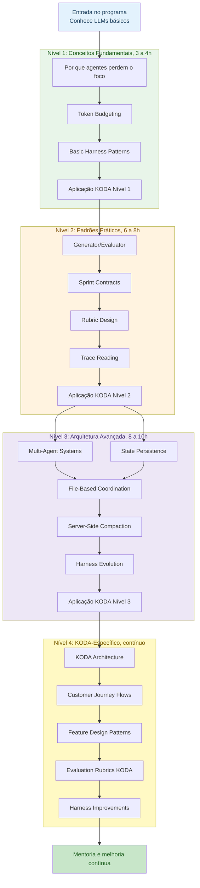
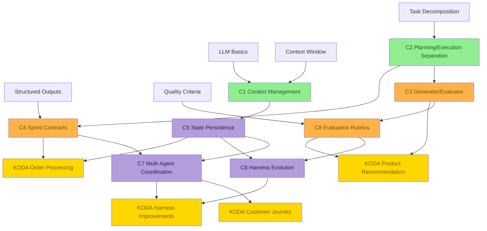
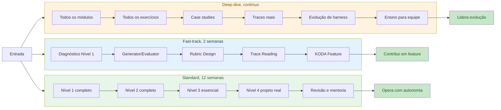

# 🧭 Learning Progression: Do Primeiro Conceito ao KODA em Produção
## Como navegar os 4 níveis, os 8 conceitos core, e os caminhos de aprendizagem do currículo

**Tempo Estimado:** 75 a 120 minutos  
**Nível:** Knowledge Graphs, guia transversal para Níveis 1 a 4  
**Pré-requisito:** Leitura inicial do `MASTER_PLAN.md` e familiaridade básica com KODA  
**Status:** 🟢 CRÍTICO, mapa de navegação para todo o programa  
**Data de Criação:** Maio 2026  
**Aplicação:** Building Long-Running Agents para KODA, agente de vendas de suplementos via WhatsApp

---

## 📖 Prólogo: A Diferença Entre Ler Conteúdo e Formar Julgamento

Imagine uma pessoa nova entrando no time KODA em uma segunda-feira de manhã.

Ela já sabe usar LLMs.

Ela já escreveu prompts bons.

Ela talvez até tenha criado um chatbot simples.

Mas KODA não é um chatbot simples.

KODA precisa vender suplementos por WhatsApp, lembrar restrições, comparar produtos, respeitar estoque, lidar com pagamento, acompanhar entrega, e manter confiança durante conversas longas.

O problema não é só responder bem uma mensagem.

O problema é manter qualidade depois de dezenas de mensagens, várias ferramentas, estados parciais, e decisões que não podem se contradizer.

Por isso este currículo não é uma lista de artigos.

Ele é uma progressão.

Primeiro você aprende por que agentes falham.

Depois aprende padrões práticos para reduzir falhas.

Em seguida aprende arquitetura para coordenar sistemas mais longos.

Por fim aplica tudo no KODA, onde cada decisão tem impacto em venda, confiança, segurança, e operação.

Este arquivo é o mapa dessa jornada.

Use como rota de estudo, como referência para mentoria, e como ferramenta para decidir qual conceito vem antes de qual prática.

### O Que Este Mapa Resolve

- ✅ Evita que a equipe pule para multi-agent systems antes de entender context management.
- ✅ Mostra por que rubrics pertencem ao Nível 2, mesmo quando são usadas no Nível 4.
- ✅ Explica quais conceitos sustentam features reais do KODA.
- ✅ Ajuda líderes a escolher fast-track, standard, ou deep-dive sem desmontar a ordem lógica.
- ✅ Transforma 4 níveis e 8 conceitos em um sistema navegável.

### Como Ler Este Arquivo

- Se você é iniciante, leia a progressão inteira e siga a rota standard.
- Se você já conhece LLMs, use os checkpoints para testar se pode entrar no Nível 2.
- Se você é líder, use as tabelas de coordenação para combinar estudo individual, workshops, e projeto real.
- Se você mantém KODA, use a seção KODA para ligar cada nível a decisões de produto e arquitetura.

---

## 🎯 Visão Geral da Progressão

A progressão tem quatro níveis. Cada nível responde uma pergunta diferente e entrega uma habilidade diferente.

| Nível | Tempo | Pergunta | Resultado |
|---|---:|---|---|
| 🌱 Nível 1 | 3 a 4 horas | Por que agentes perdem o foco quando a conversa fica longa? | Você consegue explicar os três problemas centrais e reconhecer sinais de context rot em uma conversa do KODA. |
| 🛠️ Nível 2 | 6 a 8 horas | Como fazemos agentes mais confiáveis em features reais? | Você desenha generator/evaluator, sprint contracts, rubrics, e lê traces para diagnosticar falhas. |
| 🏗️ Nível 3 | 8 a 10 horas | Como construímos sistemas sofisticados que rodam por horas sem virar caos? | Você projeta fluxos multi-agent, define estado persistente, e decide quando evoluir ou remover partes do harness. |
| 🚀 Nível 4 | contínuo, 10 ou mais horas | Como aplicamos tudo no KODA sem perder a simplicidade operacional? | Você participa de decisões de arquitetura do KODA, implementa features com rubrics, e orienta novos membros. |

### Princípio Central

Você não aprende arquitetura avançada para parecer sofisticado.

Você aprende arquitetura avançada porque uma conversa real do KODA cruza vários estados, vários riscos, e várias decisões dependentes.

A progressão existe para proteger a ordem certa de raciocínio.

Sem Nível 1, você não sabe o que precisa preservar.

Sem Nível 2, você não sabe avaliar qualidade.

Sem Nível 3, você não sabe coordenar sistemas longos.

Sem Nível 4, você não transforma conhecimento em impacto no produto.

---

## 📊 Diagrama 1: Progressão Principal Nível 1 a 4

Este diagrama mostra a rota principal, os tópicos de cada nível, e as conexões de dependência entre fundamentos, padrões, arquitetura, e aplicação KODA.



### Como Interpretar

- A seta principal mostra a ordem recomendada para uma pessoa que está formando base completa.
- Nível 2 depende de Nível 1 porque rubrics e evaluator sem contexto preservado avaliam dados errados.
- Nível 3 depende de Nível 2 porque multi-agent systems sem contracts viram conversa paralela sem coordenação.
- Nível 4 depende dos três níveis anteriores porque KODA junta conversa, catálogo, pedido, pagamento, entrega, e suporte.

---

## 🧱 Diagrama ASCII: Arquitetura da Progressão de Aprendizagem

Este mapa ASCII é útil em README, planejamento de workshop, e documentos que não renderizam Mermaid.

```text
┌──────────────────────────────────────────────────────────────────────────────┐
│                      BUILDING LONG-RUNNING AGENTS PARA KODA                  │
└──────────────────────────────────────────────────────────────────────────────┘
                                      │
                                      ▼
┌──────────────────────────────────────────────────────────────────────────────┐
│ NÍVEL 1, FUNDAÇÃO                                                            │
│ Pergunta: por que agentes falham?                                            │
│ Conteúdo: context management, token budgeting, basic harness patterns         │
│ Entrega: diagnóstico dos três problemas e harness mínimo                      │
└──────────────────────────────────────────────────────────────────────────────┘
                                      │
                                      ▼
┌──────────────────────────────────────────────────────────────────────────────┐
│ NÍVEL 2, PADRÕES PRÁTICOS                                                    │
│ Pergunta: como aumentar confiabilidade?                                      │
│ Conteúdo: generator/evaluator, sprint contracts, rubrics, trace reading       │
│ Entrega: feature KODA com geração, avaliação, contrato, e trace               │
└──────────────────────────────────────────────────────────────────────────────┘
                                      │
                                      ▼
┌──────────────────────────────────────────────────────────────────────────────┐
│ NÍVEL 3, ARQUITETURA AVANÇADA                                                │
│ Pergunta: como coordenar sistemas longos?                                    │
│ Conteúdo: multi-agent systems, state, files, compaction, harness evolution    │
│ Entrega: arquitetura multi-agent auditável para jornadas longas               │
└──────────────────────────────────────────────────────────────────────────────┘
                                      │
                                      ▼
┌──────────────────────────────────────────────────────────────────────────────┐
│ NÍVEL 4, KODA-ESPECÍFICO                                                     │
│ Pergunta: como aplicar no produto real?                                      │
│ Conteúdo: arquitetura KODA, jornadas, features, rubrics, melhorias            │
│ Entrega: melhorias reais, mentoria, e evolução contínua                       │
└──────────────────────────────────────────────────────────────────────────────┘
```

---

## 🔗 Diagrama 2: Pré-requisitos por Tópico

Este diagrama usa os 8 conceitos core como espinha dorsal. Ele mostra quais conceitos devem vir antes e quais conceitos ficam mais fortes quando usados juntos.



### Leitura do Grafo

- **C1 Context Management** pertence ao Nível 1 e sustenta: State Persistence, Trace Reading, Server-Side Compaction.
- **C2 Planning/Execution Separation** pertence ao Nível 2 e sustenta: Sprint Contracts, Multi-Agent Coordination, Feature Design Patterns.
- **C3 Generator/Evaluator** pertence ao Nível 2 e sustenta: Rubric Design, Quality gates, Safer recommendations.
- **C4 Sprint Contracts** pertence ao Nível 2 e sustenta: File-Based Coordination, Trace Reading, Harness Evolution.
- **C5 State Persistence** pertence ao Nível 3 e sustenta: Multi-Agent Coordination, Server-Side Compaction, Long sessions.
- **C6 Harness Evolution** pertence ao Nível 3 e sustenta: Continuous improvement, KODA harness improvements.
- **C7 Multi-Agent Coordination** pertence ao Nível 3 e sustenta: Customer Journey Flows, Fulfillment workflow, Team-scale debugging.
- **C8 Evaluation Rubrics** pertence ao Nível 2 e sustenta: Trace Reading, Harness Evolution, KODA-specific evaluation.

---

## 🛤️ Diagrama 3: Caminhos Alternativos de Aprendizagem

Nem toda pessoa precisa passar pelo currículo no mesmo ritmo. O importante é preservar as dependências conceituais.



---

## ⚖️ Tabela Comparativa: Estratégias de Coordenação do Aprendizado

| Estratégia | Quando usar | Como lida com Nível 1 | Como lida com Nível 2 | Como lida com Nível 3 | Como lida com Nível 4 | Risco principal | Melhor mitigação |
|---|---|---|---|---|---|---|---|
| Estudo individual sequencial | Pessoa nova e sem urgência de entrega | Lê tudo e faz exercícios | Aplica cada padrão em exemplo pequeno | Só entra após dominar contracts e traces | Aplica em feature menor do KODA | Ritmo lento demais | Checkpoints semanais curtos |
| Workshop em turma | Equipe precisa de vocabulário comum | Aula guiada com exemplos do KODA | Laboratório em duplas | Discussão de arquitetura em grupo | Projeto conjunto com revisão | Participação passiva | Exercícios com entrega visível |
| Mentoria por feature | Pessoa precisa contribuir rápido | Diagnóstico de lacunas | Aprende padrão necessário para a feature | Consulta arquitetura conforme necessidade | Entrega mudança real | Aprender só o recorte local | Revisão conceitual após entrega |
| Fast-track técnico | Dev experiente em LLMs | Teste de entrada e leitura seletiva | Foco em generator/evaluator, rubrics, traces | Apenas estado e coordenação essenciais | Feature KODA com rubric | Pular fundamentos invisíveis | Gate de pré-requisito obrigatório |
| Deep-dive arquitetural | Pessoa vai manter harness | Revisão completa | Implementa padrões e compara traces | Desenha e critica arquitetura | Propõe evolução baseada em dados | Criar complexidade por gosto | Métricas antes de qualquer mudança |
| Rotação por papéis | Equipe multidisciplinar | Todos aprendem linguagem comum | Cada pessoa assume um padrão | Arquitetos integram dependências | Produto valida impacto | Silos de conhecimento | Sessões de ensino cruzado |

### Como Escolher

- **Fast-track:** dura 2 semanas. Serve para Pessoa experiente em LLMs que precisa contribuir rápido em KODA. A rota passa por Nível 1 diagnóstico, Generator/Evaluator, Rubric Design, Trace Reading, KODA Architecture, Feature Design Patterns.
- **Standard:** dura 12 semanas. Serve para Equipe completa, com ritmos diferentes e necessidade de base comum. A rota passa por Nível 1 completo, Nível 2 completo, Subconjunto de Nível 3, Nível 4 com projeto real, Mentoria e revisão.
- **Deep-dive:** dura contínuo. Serve para Arquitetos e pessoas que vão evoluir o harness e ensinar outras equipes. A rota passa por Todos os módulos, Todos os exercícios, Case studies, Revisão de traces reais, Propostas de evolução, Ensino para novos membros.

---

## 🎓 Os 4 Níveis em Profundidade

### 🌱 Nível 1: Conceitos Fundamentais

**Tempo:** 3 a 4 horas  
**Foco:** Entender por que long-running agents falham e como um harness básico protege o sistema.  
**Pergunta-guia:** Por que agentes perdem o foco quando a conversa fica longa?  
**Resultado esperado:** Você consegue explicar os três problemas centrais e reconhecer sinais de context rot em uma conversa do KODA.  

#### 📚 Tópicos

- **Por que agentes perdem o foco:** Context amnesia, colapso de planejamento, e autoavaliação fraca.
- **Token Budgeting:** Como separar orçamento de leitura, resposta, ferramentas, e memória persistente.
- **Basic Harness Patterns:** Como construir trilhos simples que mantêm o agente dentro de limites claros.

#### 🔧 Aplicação no KODA

KODA aprende a manter restrições de cliente, carrinho, orçamento, e intenção durante uma conversa de WhatsApp de duas horas.

#### ✅ Entregáveis

- [ ] Mapa dos três problemas em uma conversa real.
- [ ] Planilha de token budget para uma conversa KODA.
- [ ] Harness mínimo para resposta segura.

#### ⚠️ Riscos de Aprendizagem

- ⚠️ Confundir contexto com banco de dados.
- ⚠️ Tratar token budget como detalhe de prompt.
- ⚠️ Achar que um agente bom não precisa de harness.

#### Critério de Passagem

Você pode seguir para o próximo bloco quando consegue explicar o conceito sem consultar anotações, aplicar em um exemplo KODA, e apontar uma falha concreta que o conceito evita.

### 🛠️ Nível 2: Padrões Práticos

**Tempo:** 6 a 8 horas  
**Foco:** Aplicar padrões que aumentam confiabilidade sem trocar o modelo base.  
**Pergunta-guia:** Como fazemos agentes mais confiáveis em features reais?  
**Resultado esperado:** Você desenha generator/evaluator, sprint contracts, rubrics, e lê traces para diagnosticar falhas.  

#### 📚 Tópicos

- **Generator/Evaluator:** Separar geração e avaliação para reduzir erro silencioso.
- **Sprint Contracts:** Definir promessas claras entre módulos antes da execução.
- **Rubric Design:** Medir qualidade em dimensões, não apenas passar ou falhar.
- **Trace Reading:** Ler o caminho completo de uma decisão para encontrar a causa de uma falha.

#### 🔧 Aplicação no KODA

KODA passa de recomendação aceitável para recomendação auditável, com avaliação crítica antes de falar com o cliente.

#### ✅ Entregáveis

- [ ] Par generator/evaluator para recomendação.
- [ ] Sprint contract para busca e ranking.
- [ ] Rubric de recomendação de produto.
- [ ] Trace comentado de uma conversa.

#### ⚠️ Riscos de Aprendizagem

- ⚠️ Criar evaluator que só repete o generator.
- ⚠️ Escrever contracts vagos.
- ⚠️ Pontuar rubrics sem pesos explícitos.
- ⚠️ Guardar traces que ninguém consegue ler.

#### Critério de Passagem

Você pode seguir para o próximo bloco quando consegue explicar o conceito sem consultar anotações, aplicar em um exemplo KODA, e apontar uma falha concreta que o conceito evita.

### 🏗️ Nível 3: Arquitetura Avançada

**Tempo:** 8 a 10 horas  
**Foco:** Desenhar sistemas multi-agent com estado durável, coordenação por arquivos, compaction, e evolução do harness.  
**Pergunta-guia:** Como construímos sistemas sofisticados que rodam por horas sem virar caos?  
**Resultado esperado:** Você projeta fluxos multi-agent, define estado persistente, e decide quando evoluir ou remover partes do harness.  

#### 📚 Tópicos

- **Multi-Agent Systems:** Dividir responsabilidades entre agentes especializados.
- **State Persistence:** Salvar fatos, decisões, e checkpoints fora da janela de contexto.
- **File-Based Coordination:** Usar arquivos estruturados como contrato operacional entre agentes.
- **Server-Side Compaction:** Compactar histórico sem perder fatos críticos.
- **Harness Evolution:** Ajustar o harness quando modelos, tráfego, e requisitos mudam.

#### 🔧 Aplicação no KODA

KODA coordena discovery, recomendação, carrinho, pagamento, entrega, suporte, e avaliação com rastreabilidade.

#### ✅ Entregáveis

- [ ] Diagrama multi-agent para KODA.
- [ ] Schema de estado persistente.
- [ ] Pasta de coordenação por arquivos.
- [ ] Plano de compaction.
- [ ] Registro de evolução de harness.

#### ⚠️ Riscos de Aprendizagem

- ⚠️ Criar agentes demais.
- ⚠️ Persistir tudo sem critério.
- ⚠️ Misturar estado factual com opinião temporária.
- ⚠️ Evoluir harness sem dados.

#### Critério de Passagem

Você pode seguir para o próximo bloco quando consegue explicar o conceito sem consultar anotações, aplicar em um exemplo KODA, e apontar uma falha concreta que o conceito evita.

### 🚀 Nível 4: KODA-Específico

**Tempo:** contínuo, 10 ou mais horas  
**Foco:** Aplicar todos os padrões no agente de vendas por WhatsApp, com features, rubrics, e melhorias reais.  
**Pergunta-guia:** Como aplicamos tudo no KODA sem perder a simplicidade operacional?  
**Resultado esperado:** Você participa de decisões de arquitetura do KODA, implementa features com rubrics, e orienta novos membros.  

#### 📚 Tópicos

- **KODA Architecture:** Como o sistema completo conversa com catálogo, cliente, pedido, pagamento, e entrega.
- **Customer Journey Flows:** Como mapear descoberta, comparação, decisão, compra, entrega, e pós-venda.
- **Feature Design Patterns:** Como transformar uma necessidade do negócio em fluxo seguro de agentes.
- **Evaluation Rubrics KODA:** Como medir resposta, recomendação, segurança, conversão, e confiança.
- **Harness Improvements:** Como priorizar melhorias do harness com base em traces e impacto real.

#### 🔧 Aplicação no KODA

KODA vira o laboratório vivo do currículo e também o produto que se beneficia do aprendizado da equipe.

#### ✅ Entregáveis

- [ ] Mapa de arquitetura KODA.
- [ ] Fluxo de jornada por intenção.
- [ ] Feature spec com harness.
- [ ] Rubric operacional.
- [ ] Proposta de melhoria baseada em trace.

#### ⚠️ Riscos de Aprendizagem

- ⚠️ Virar especialista em KODA sem enxergar os padrões gerais.
- ⚠️ Otimizar conversão e esquecer segurança.
- ⚠️ Criar rubrics desconectadas da jornada real.
- ⚠️ Melhorar harness sem comparar antes e depois.

#### Critério de Passagem

Você pode seguir para o próximo bloco quando consegue explicar o conceito sem consultar anotações, aplicar em um exemplo KODA, e apontar uma falha concreta que o conceito evita.

---

## 🧠 Os 8 Conceitos Core Como Trilha de Dependências

Cada conceito aparece em um nível, mas o valor real surge nas conexões. Abaixo está o mapa textual que complementa o grafo Mermaid.

### C1 · Context Management

**Nível principal:** Nível 1  
**Definição:** Controlar o que entra, fica, sai, e volta ao contexto ativo do agente.  
**Aplicação KODA:** Mantém alergias, preferências, carrinho, e promessas feitas ao cliente.  
**Erro comum:** Guardar histórico inteiro e chamar isso de memória.

#### Pré-requisitos

- LLM basics
- Context window
- Conversas multi-turn

#### O que este conceito habilita

- State Persistence
- Trace Reading
- Server-Side Compaction

#### Sinais de Domínio

- ✅ Você consegue reconhecer quando Context Management está ausente em uma conversa KODA.
- ✅ Você consegue explicar por que Context Management aparece nesse ponto da progressão.
- ✅ Você consegue propor uma checagem simples para validar Context Management em um trace real.
- ✅ Você consegue ensinar Context Management com um exemplo de venda de suplemento.

### C2 · Planning/Execution Separation

**Nível principal:** Nível 2  
**Definição:** Separar decidir o que fazer de fazer cada passo concreto.  
**Aplicação KODA:** Separa entender intenção de processar estoque, preço, frete, pagamento, e mensagem final.  
**Erro comum:** Pedir para um agente planejar, executar, verificar, e responder em uma única passada.

#### Pré-requisitos

- Task decomposition
- Basic Harness Patterns

#### O que este conceito habilita

- Sprint Contracts
- Multi-Agent Coordination
- Feature Design Patterns

#### Sinais de Domínio

- ✅ Você consegue reconhecer quando Planning/Execution Separation está ausente em uma conversa KODA.
- ✅ Você consegue explicar por que Planning/Execution Separation aparece nesse ponto da progressão.
- ✅ Você consegue propor uma checagem simples para validar Planning/Execution Separation em um trace real.
- ✅ Você consegue ensinar Planning/Execution Separation com um exemplo de venda de suplemento.

### C3 · Generator/Evaluator

**Nível principal:** Nível 2  
**Definição:** Um componente cria opções, outro componente avalia criticamente com critérios explícitos.  
**Aplicação KODA:** Gera opções de produto e rejeita escolhas perigosas antes de responder ao cliente.  
**Erro comum:** Fazer o evaluator concordar com o generator por usar o mesmo prompt e o mesmo objetivo.

#### Pré-requisitos

- Planning/Execution Separation
- Evaluation criteria

#### O que este conceito habilita

- Rubric Design
- Quality gates
- Safer recommendations

#### Sinais de Domínio

- ✅ Você consegue reconhecer quando Generator/Evaluator está ausente em uma conversa KODA.
- ✅ Você consegue explicar por que Generator/Evaluator aparece nesse ponto da progressão.
- ✅ Você consegue propor uma checagem simples para validar Generator/Evaluator em um trace real.
- ✅ Você consegue ensinar Generator/Evaluator com um exemplo de venda de suplemento.

### C4 · Sprint Contracts

**Nível principal:** Nível 2  
**Definição:** Promessas testáveis entre etapas, agentes, ou módulos.  
**Aplicação KODA:** Define o que busca, ranking, filtro, pagamento, e atendimento devem entregar.  
**Erro comum:** Escrever contrato que parece bom mas não tem critério verificável.

#### Pré-requisitos

- Planning/Execution Separation
- Structured outputs

#### O que este conceito habilita

- File-Based Coordination
- Trace Reading
- Harness Evolution

#### Sinais de Domínio

- ✅ Você consegue reconhecer quando Sprint Contracts está ausente em uma conversa KODA.
- ✅ Você consegue explicar por que Sprint Contracts aparece nesse ponto da progressão.
- ✅ Você consegue propor uma checagem simples para validar Sprint Contracts em um trace real.
- ✅ Você consegue ensinar Sprint Contracts com um exemplo de venda de suplemento.

### C5 · State Persistence

**Nível principal:** Nível 3  
**Definição:** Salvar estado confiável fora da janela de contexto, com schema e ciclo de vida claros.  
**Aplicação KODA:** Permite retomar compra, manter carrinho, e preservar decisões mesmo após compaction.  
**Erro comum:** Persistir pensamentos temporários como se fossem fatos confirmados.

#### Pré-requisitos

- Context Management
- Data modeling

#### O que este conceito habilita

- Multi-Agent Coordination
- Server-Side Compaction
- Long sessions

#### Sinais de Domínio

- ✅ Você consegue reconhecer quando State Persistence está ausente em uma conversa KODA.
- ✅ Você consegue explicar por que State Persistence aparece nesse ponto da progressão.
- ✅ Você consegue propor uma checagem simples para validar State Persistence em um trace real.
- ✅ Você consegue ensinar State Persistence com um exemplo de venda de suplemento.

### C6 · Harness Evolution

**Nível principal:** Nível 3  
**Definição:** Adaptar o suporte ao agente conforme modelo, tráfego, produto, e risco mudam.  
**Aplicação KODA:** Remove checks redundantes, adiciona gates onde há erro real, e reduz custo sem perder qualidade.  
**Erro comum:** Adicionar camadas para todo problema sem medir impacto.

#### Pré-requisitos

- Trace Reading
- Metrics
- Rubric Design

#### O que este conceito habilita

- Continuous improvement
- KODA harness improvements

#### Sinais de Domínio

- ✅ Você consegue reconhecer quando Harness Evolution está ausente em uma conversa KODA.
- ✅ Você consegue explicar por que Harness Evolution aparece nesse ponto da progressão.
- ✅ Você consegue propor uma checagem simples para validar Harness Evolution em um trace real.
- ✅ Você consegue ensinar Harness Evolution com um exemplo de venda de suplemento.

### C7 · Multi-Agent Coordination

**Nível principal:** Nível 3  
**Definição:** Organizar agentes especializados em um fluxo com ownership, handoff, estado, e critério de parada.  
**Aplicação KODA:** Coordena discovery, recomendação, pedido, entrega, suporte, e auditoria.  
**Erro comum:** Criar vários agentes sem owner claro para decisão final.

#### Pré-requisitos

- Sprint Contracts
- State Persistence
- File-Based Coordination

#### O que este conceito habilita

- Customer Journey Flows
- Fulfillment workflow
- Team-scale debugging

#### Sinais de Domínio

- ✅ Você consegue reconhecer quando Multi-Agent Coordination está ausente em uma conversa KODA.
- ✅ Você consegue explicar por que Multi-Agent Coordination aparece nesse ponto da progressão.
- ✅ Você consegue propor uma checagem simples para validar Multi-Agent Coordination em um trace real.
- ✅ Você consegue ensinar Multi-Agent Coordination com um exemplo de venda de suplemento.

### C8 · Evaluation Rubrics

**Nível principal:** Nível 2  
**Definição:** Critérios ponderados que avaliam qualidade em múltiplas dimensões.  
**Aplicação KODA:** Mede adequação, segurança, clareza, conversão, confiança, e risco operacional.  
**Erro comum:** Usar rubrics genéricas que não refletem o que importa para o cliente do WhatsApp.

#### Pré-requisitos

- Quality criteria
- Generator/Evaluator

#### O que este conceito habilita

- Trace Reading
- Harness Evolution
- KODA-specific evaluation

#### Sinais de Domínio

- ✅ Você consegue reconhecer quando Evaluation Rubrics está ausente em uma conversa KODA.
- ✅ Você consegue explicar por que Evaluation Rubrics aparece nesse ponto da progressão.
- ✅ Você consegue propor uma checagem simples para validar Evaluation Rubrics em um trace real.
- ✅ Você consegue ensinar Evaluation Rubrics com um exemplo de venda de suplemento.

---

## 🚀 Aplicação KODA: Como Cada Nível Muda o Produto

KODA é o laboratório prático do currículo. Cada nível muda a forma como o agente conversa, decide, verifica, e melhora.

### 🌱 Nível 1 aplicado ao KODA

**Mudança principal:** KODA aprende a manter restrições de cliente, carrinho, orçamento, e intenção durante uma conversa de WhatsApp de duas horas.

#### Antes deste nível

- ❌ KODA responde bem no começo, mas perde fatos antigos.
- ❌ O time não sabe estimar o custo de contexto.
- ❌ O harness depende de intuição.

#### Depois deste nível

- ✅ KODA preserva fatos críticos.
- ✅ Token budget vira decisão explícita.
- ✅ O harness mínimo tem objetivo claro.

#### Exemplo de Conversa

```text
Cliente: Oi KODA, quero um suplemento para ganhar massa, mas tenho restrição alimentar.
KODA: Vou registrar sua restrição, seu objetivo, e seu orçamento como fatos críticos da conversa.
Sistema: O token budget reserva espaço para histórico recente, fatos persistidos, e resposta final.
```

### 🛠️ Nível 2 aplicado ao KODA

**Mudança principal:** KODA passa de recomendação aceitável para recomendação auditável, com avaliação crítica antes de falar com o cliente.

#### Antes deste nível

- ❌ KODA tem proteção básica, mas pouca visibilidade de qualidade.
- ❌ A recomendação pode ser válida e ainda assim mediana.
- ❌ Falhas são difíceis de diagnosticar sem trace.

#### Depois deste nível

- ✅ KODA gera opções e avalia criticamente.
- ✅ Rubrics diferenciam válido, bom, ótimo, e perigoso.
- ✅ Traces explicam por que uma decisão foi tomada.

#### Exemplo de Conversa

```text
Cliente: Oi KODA, quero um suplemento para ganhar massa, mas tenho restrição alimentar.
KODA Generator: Vou criar opções compatíveis com o objetivo e a restrição.
KODA Evaluator: Vou rejeitar qualquer opção com risco alimentar, estoque inválido, ou explicação fraca.
```

### 🏗️ Nível 3 aplicado ao KODA

**Mudança principal:** KODA coordena discovery, recomendação, carrinho, pagamento, entrega, suporte, e avaliação com rastreabilidade.

#### Antes deste nível

- ❌ Cada módulo pode funcionar sozinho, mas a coordenação fica frágil.
- ❌ O estado cresce sem ciclo de vida claro.
- ❌ Compaction pode apagar informação crítica.

#### Depois deste nível

- ✅ Agentes especializados trabalham com contracts.
- ✅ Estado persistente mantém continuidade entre turnos.
- ✅ Compaction reduz custo sem apagar compromissos.

#### Exemplo de Conversa

```text
Cliente: Oi KODA, quero um suplemento para ganhar massa, mas tenho restrição alimentar.
KODA Discovery Agent: Confirmo objetivo, restrição, e preferência.
KODA Order Agent: Só sigo quando o contract de recomendação estiver aprovado.
KODA State: Persisto fatos confirmados e decisões aprovadas.
```

### 🚀 Nível 4 aplicado ao KODA

**Mudança principal:** KODA vira o laboratório vivo do currículo e também o produto que se beneficia do aprendizado da equipe.

#### Antes deste nível

- ❌ A equipe conhece padrões, mas precisa aplicá-los no produto vivo.
- ❌ Jornadas reais têm exceções que exemplos didáticos não cobrem.
- ❌ Métricas de negócio precisam dialogar com métricas de qualidade.

#### Depois deste nível

- ✅ Features nascem com rubrics e traces.
- ✅ Melhorias de harness são priorizadas por impacto.
- ✅ A equipe ensina novos membros usando casos reais.

#### Exemplo de Conversa

```text
Cliente: Oi KODA, quero um suplemento para ganhar massa, mas tenho restrição alimentar.
KODA: Uso a arquitetura completa, rubrics específicas, e trace da jornada para recomendar com confiança.
Equipe: Depois da conversa, revisa métricas e decide se o harness precisa mudar.
```

---

## 📋 Roteiros de Estudo

### Fast-track

**Duração:** 2 semanas  
**Perfil:** Pessoa experiente em LLMs que precisa contribuir rápido em KODA.

1. Nível 1 diagnóstico
2. Generator/Evaluator
3. Rubric Design
4. Trace Reading
5. KODA Architecture
6. Feature Design Patterns

#### Checkpoint de saída

- ✅ Consegue explicar os riscos de pular partes do Nível 1.
- ✅ Implementa ou revisa uma feature KODA com evaluator e rubric.
- ✅ Sabe pedir ajuda quando a feature toca estado persistente ou coordenação avançada.

### Standard

**Duração:** 12 semanas  
**Perfil:** Equipe completa, com ritmos diferentes e necessidade de base comum.

1. Nível 1 completo
2. Nível 2 completo
3. Subconjunto de Nível 3
4. Nível 4 com projeto real
5. Mentoria e revisão

#### Checkpoint de saída

- ✅ Completa todos os módulos centrais.
- ✅ Entrega exercícios por nível.
- ✅ Participa de revisão de trace real.
- ✅ Contribui em uma melhoria KODA com justificativa.

### Deep-dive

**Duração:** contínuo  
**Perfil:** Arquitetos e pessoas que vão evoluir o harness e ensinar outras equipes.

1. Todos os módulos
2. Todos os exercícios
3. Case studies
4. Revisão de traces reais
5. Propostas de evolução
6. Ensino para novos membros

#### Checkpoint de saída

- ✅ Desenha arquitetura e aponta trade-offs.
- ✅ Revisa rubrics de outras pessoas.
- ✅ Propõe evolução de harness com métrica antes e depois.
- ✅ Ensina a progressão para novos membros.

---

## 🔍 Leituras Cruzadas e Dependências Práticas

A progressão fica mais clara quando você enxerga leituras cruzadas. Use esta seção quando estiver preso em um conceito e precisar saber para onde voltar.

### Quando estiver estudando Context Management

Volte para os pré-requisitos: LLM basics, Context window, Conversas multi-turn.

Depois conecte com: State Persistence, Trace Reading, Server-Side Compaction.

No KODA, procure este sinal: Mantém alergias, preferências, carrinho, e promessas feitas ao cliente.

Perguntas de revisão:

- Qual falha aparece se Context Management estiver ausente?
- Qual arquivo, trace, ou decisão mostraria evidência de Context Management?
- Que métrica mudaria se Context Management fosse melhorado?
- Qual conceito anterior sustenta Context Management?
- Qual conceito posterior depende de Context Management?

### Quando estiver estudando Planning/Execution Separation

Volte para os pré-requisitos: Task decomposition, Basic Harness Patterns.

Depois conecte com: Sprint Contracts, Multi-Agent Coordination, Feature Design Patterns.

No KODA, procure este sinal: Separa entender intenção de processar estoque, preço, frete, pagamento, e mensagem final.

Perguntas de revisão:

- Qual falha aparece se Planning/Execution Separation estiver ausente?
- Qual arquivo, trace, ou decisão mostraria evidência de Planning/Execution Separation?
- Que métrica mudaria se Planning/Execution Separation fosse melhorado?
- Qual conceito anterior sustenta Planning/Execution Separation?
- Qual conceito posterior depende de Planning/Execution Separation?

### Quando estiver estudando Generator/Evaluator

Volte para os pré-requisitos: Planning/Execution Separation, Evaluation criteria.

Depois conecte com: Rubric Design, Quality gates, Safer recommendations.

No KODA, procure este sinal: Gera opções de produto e rejeita escolhas perigosas antes de responder ao cliente.

Perguntas de revisão:

- Qual falha aparece se Generator/Evaluator estiver ausente?
- Qual arquivo, trace, ou decisão mostraria evidência de Generator/Evaluator?
- Que métrica mudaria se Generator/Evaluator fosse melhorado?
- Qual conceito anterior sustenta Generator/Evaluator?
- Qual conceito posterior depende de Generator/Evaluator?

### Quando estiver estudando Sprint Contracts

Volte para os pré-requisitos: Planning/Execution Separation, Structured outputs.

Depois conecte com: File-Based Coordination, Trace Reading, Harness Evolution.

No KODA, procure este sinal: Define o que busca, ranking, filtro, pagamento, e atendimento devem entregar.

Perguntas de revisão:

- Qual falha aparece se Sprint Contracts estiver ausente?
- Qual arquivo, trace, ou decisão mostraria evidência de Sprint Contracts?
- Que métrica mudaria se Sprint Contracts fosse melhorado?
- Qual conceito anterior sustenta Sprint Contracts?
- Qual conceito posterior depende de Sprint Contracts?

### Quando estiver estudando State Persistence

Volte para os pré-requisitos: Context Management, Data modeling.

Depois conecte com: Multi-Agent Coordination, Server-Side Compaction, Long sessions.

No KODA, procure este sinal: Permite retomar compra, manter carrinho, e preservar decisões mesmo após compaction.

Perguntas de revisão:

- Qual falha aparece se State Persistence estiver ausente?
- Qual arquivo, trace, ou decisão mostraria evidência de State Persistence?
- Que métrica mudaria se State Persistence fosse melhorado?
- Qual conceito anterior sustenta State Persistence?
- Qual conceito posterior depende de State Persistence?

### Quando estiver estudando Harness Evolution

Volte para os pré-requisitos: Trace Reading, Metrics, Rubric Design.

Depois conecte com: Continuous improvement, KODA harness improvements.

No KODA, procure este sinal: Remove checks redundantes, adiciona gates onde há erro real, e reduz custo sem perder qualidade.

Perguntas de revisão:

- Qual falha aparece se Harness Evolution estiver ausente?
- Qual arquivo, trace, ou decisão mostraria evidência de Harness Evolution?
- Que métrica mudaria se Harness Evolution fosse melhorado?
- Qual conceito anterior sustenta Harness Evolution?
- Qual conceito posterior depende de Harness Evolution?

### Quando estiver estudando Multi-Agent Coordination

Volte para os pré-requisitos: Sprint Contracts, State Persistence, File-Based Coordination.

Depois conecte com: Customer Journey Flows, Fulfillment workflow, Team-scale debugging.

No KODA, procure este sinal: Coordena discovery, recomendação, pedido, entrega, suporte, e auditoria.

Perguntas de revisão:

- Qual falha aparece se Multi-Agent Coordination estiver ausente?
- Qual arquivo, trace, ou decisão mostraria evidência de Multi-Agent Coordination?
- Que métrica mudaria se Multi-Agent Coordination fosse melhorado?
- Qual conceito anterior sustenta Multi-Agent Coordination?
- Qual conceito posterior depende de Multi-Agent Coordination?

### Quando estiver estudando Evaluation Rubrics

Volte para os pré-requisitos: Quality criteria, Generator/Evaluator.

Depois conecte com: Trace Reading, Harness Evolution, KODA-specific evaluation.

No KODA, procure este sinal: Mede adequação, segurança, clareza, conversão, confiança, e risco operacional.

Perguntas de revisão:

- Qual falha aparece se Evaluation Rubrics estiver ausente?
- Qual arquivo, trace, ou decisão mostraria evidência de Evaluation Rubrics?
- Que métrica mudaria se Evaluation Rubrics fosse melhorado?
- Qual conceito anterior sustenta Evaluation Rubrics?
- Qual conceito posterior depende de Evaluation Rubrics?

---

## 🧪 Exercícios de Navegação do Knowledge Graph

Estes exercícios não substituem os exercícios dos módulos. Eles treinam a leitura da progressão.

### Exercício 1: Posicionar Por que agentes perdem o foco

**Contexto:** Context amnesia, colapso de planejamento, e autoavaliação fraca.

**Tarefa:**

- Explique por que Por que agentes perdem o foco pertence ao Nível 1.
- Liste dois conceitos anteriores que reduzem risco neste tópico.
- Liste uma aplicação direta no KODA.
- Descreva um erro que apareceria em trace se este tópico fosse ignorado.

**Resposta esperada:**

- O tópico pertence ao Nível 1 porque combina com o foco: Entender por que long-running agents falham e como um harness básico protege o sistema.
- A aplicação direta em KODA é: KODA aprende a manter restrições de cliente, carrinho, orçamento, e intenção durante uma conversa de WhatsApp de duas horas.
- O erro em trace deve mostrar perda de fato, decisão sem critério, contrato quebrado, estado incoerente, ou melhoria sem métrica, dependendo do tópico.

### Exercício 2: Posicionar Token Budgeting

**Contexto:** Como separar orçamento de leitura, resposta, ferramentas, e memória persistente.

**Tarefa:**

- Explique por que Token Budgeting pertence ao Nível 1.
- Liste dois conceitos anteriores que reduzem risco neste tópico.
- Liste uma aplicação direta no KODA.
- Descreva um erro que apareceria em trace se este tópico fosse ignorado.

**Resposta esperada:**

- O tópico pertence ao Nível 1 porque combina com o foco: Entender por que long-running agents falham e como um harness básico protege o sistema.
- A aplicação direta em KODA é: KODA aprende a manter restrições de cliente, carrinho, orçamento, e intenção durante uma conversa de WhatsApp de duas horas.
- O erro em trace deve mostrar perda de fato, decisão sem critério, contrato quebrado, estado incoerente, ou melhoria sem métrica, dependendo do tópico.

### Exercício 3: Posicionar Basic Harness Patterns

**Contexto:** Como construir trilhos simples que mantêm o agente dentro de limites claros.

**Tarefa:**

- Explique por que Basic Harness Patterns pertence ao Nível 1.
- Liste dois conceitos anteriores que reduzem risco neste tópico.
- Liste uma aplicação direta no KODA.
- Descreva um erro que apareceria em trace se este tópico fosse ignorado.

**Resposta esperada:**

- O tópico pertence ao Nível 1 porque combina com o foco: Entender por que long-running agents falham e como um harness básico protege o sistema.
- A aplicação direta em KODA é: KODA aprende a manter restrições de cliente, carrinho, orçamento, e intenção durante uma conversa de WhatsApp de duas horas.
- O erro em trace deve mostrar perda de fato, decisão sem critério, contrato quebrado, estado incoerente, ou melhoria sem métrica, dependendo do tópico.

### Exercício 4: Posicionar Generator/Evaluator

**Contexto:** Separar geração e avaliação para reduzir erro silencioso.

**Tarefa:**

- Explique por que Generator/Evaluator pertence ao Nível 2.
- Liste dois conceitos anteriores que reduzem risco neste tópico.
- Liste uma aplicação direta no KODA.
- Descreva um erro que apareceria em trace se este tópico fosse ignorado.

**Resposta esperada:**

- O tópico pertence ao Nível 2 porque combina com o foco: Aplicar padrões que aumentam confiabilidade sem trocar o modelo base.
- A aplicação direta em KODA é: KODA passa de recomendação aceitável para recomendação auditável, com avaliação crítica antes de falar com o cliente.
- O erro em trace deve mostrar perda de fato, decisão sem critério, contrato quebrado, estado incoerente, ou melhoria sem métrica, dependendo do tópico.

### Exercício 5: Posicionar Sprint Contracts

**Contexto:** Definir promessas claras entre módulos antes da execução.

**Tarefa:**

- Explique por que Sprint Contracts pertence ao Nível 2.
- Liste dois conceitos anteriores que reduzem risco neste tópico.
- Liste uma aplicação direta no KODA.
- Descreva um erro que apareceria em trace se este tópico fosse ignorado.

**Resposta esperada:**

- O tópico pertence ao Nível 2 porque combina com o foco: Aplicar padrões que aumentam confiabilidade sem trocar o modelo base.
- A aplicação direta em KODA é: KODA passa de recomendação aceitável para recomendação auditável, com avaliação crítica antes de falar com o cliente.
- O erro em trace deve mostrar perda de fato, decisão sem critério, contrato quebrado, estado incoerente, ou melhoria sem métrica, dependendo do tópico.

### Exercício 6: Posicionar Rubric Design

**Contexto:** Medir qualidade em dimensões, não apenas passar ou falhar.

**Tarefa:**

- Explique por que Rubric Design pertence ao Nível 2.
- Liste dois conceitos anteriores que reduzem risco neste tópico.
- Liste uma aplicação direta no KODA.
- Descreva um erro que apareceria em trace se este tópico fosse ignorado.

**Resposta esperada:**

- O tópico pertence ao Nível 2 porque combina com o foco: Aplicar padrões que aumentam confiabilidade sem trocar o modelo base.
- A aplicação direta em KODA é: KODA passa de recomendação aceitável para recomendação auditável, com avaliação crítica antes de falar com o cliente.
- O erro em trace deve mostrar perda de fato, decisão sem critério, contrato quebrado, estado incoerente, ou melhoria sem métrica, dependendo do tópico.

### Exercício 7: Posicionar Trace Reading

**Contexto:** Ler o caminho completo de uma decisão para encontrar a causa de uma falha.

**Tarefa:**

- Explique por que Trace Reading pertence ao Nível 2.
- Liste dois conceitos anteriores que reduzem risco neste tópico.
- Liste uma aplicação direta no KODA.
- Descreva um erro que apareceria em trace se este tópico fosse ignorado.

**Resposta esperada:**

- O tópico pertence ao Nível 2 porque combina com o foco: Aplicar padrões que aumentam confiabilidade sem trocar o modelo base.
- A aplicação direta em KODA é: KODA passa de recomendação aceitável para recomendação auditável, com avaliação crítica antes de falar com o cliente.
- O erro em trace deve mostrar perda de fato, decisão sem critério, contrato quebrado, estado incoerente, ou melhoria sem métrica, dependendo do tópico.

### Exercício 8: Posicionar Multi-Agent Systems

**Contexto:** Dividir responsabilidades entre agentes especializados.

**Tarefa:**

- Explique por que Multi-Agent Systems pertence ao Nível 3.
- Liste dois conceitos anteriores que reduzem risco neste tópico.
- Liste uma aplicação direta no KODA.
- Descreva um erro que apareceria em trace se este tópico fosse ignorado.

**Resposta esperada:**

- O tópico pertence ao Nível 3 porque combina com o foco: Desenhar sistemas multi-agent com estado durável, coordenação por arquivos, compaction, e evolução do harness.
- A aplicação direta em KODA é: KODA coordena discovery, recomendação, carrinho, pagamento, entrega, suporte, e avaliação com rastreabilidade.
- O erro em trace deve mostrar perda de fato, decisão sem critério, contrato quebrado, estado incoerente, ou melhoria sem métrica, dependendo do tópico.

### Exercício 9: Posicionar State Persistence

**Contexto:** Salvar fatos, decisões, e checkpoints fora da janela de contexto.

**Tarefa:**

- Explique por que State Persistence pertence ao Nível 3.
- Liste dois conceitos anteriores que reduzem risco neste tópico.
- Liste uma aplicação direta no KODA.
- Descreva um erro que apareceria em trace se este tópico fosse ignorado.

**Resposta esperada:**

- O tópico pertence ao Nível 3 porque combina com o foco: Desenhar sistemas multi-agent com estado durável, coordenação por arquivos, compaction, e evolução do harness.
- A aplicação direta em KODA é: KODA coordena discovery, recomendação, carrinho, pagamento, entrega, suporte, e avaliação com rastreabilidade.
- O erro em trace deve mostrar perda de fato, decisão sem critério, contrato quebrado, estado incoerente, ou melhoria sem métrica, dependendo do tópico.

### Exercício 10: Posicionar File-Based Coordination

**Contexto:** Usar arquivos estruturados como contrato operacional entre agentes.

**Tarefa:**

- Explique por que File-Based Coordination pertence ao Nível 3.
- Liste dois conceitos anteriores que reduzem risco neste tópico.
- Liste uma aplicação direta no KODA.
- Descreva um erro que apareceria em trace se este tópico fosse ignorado.

**Resposta esperada:**

- O tópico pertence ao Nível 3 porque combina com o foco: Desenhar sistemas multi-agent com estado durável, coordenação por arquivos, compaction, e evolução do harness.
- A aplicação direta em KODA é: KODA coordena discovery, recomendação, carrinho, pagamento, entrega, suporte, e avaliação com rastreabilidade.
- O erro em trace deve mostrar perda de fato, decisão sem critério, contrato quebrado, estado incoerente, ou melhoria sem métrica, dependendo do tópico.

### Exercício 11: Posicionar Server-Side Compaction

**Contexto:** Compactar histórico sem perder fatos críticos.

**Tarefa:**

- Explique por que Server-Side Compaction pertence ao Nível 3.
- Liste dois conceitos anteriores que reduzem risco neste tópico.
- Liste uma aplicação direta no KODA.
- Descreva um erro que apareceria em trace se este tópico fosse ignorado.

**Resposta esperada:**

- O tópico pertence ao Nível 3 porque combina com o foco: Desenhar sistemas multi-agent com estado durável, coordenação por arquivos, compaction, e evolução do harness.
- A aplicação direta em KODA é: KODA coordena discovery, recomendação, carrinho, pagamento, entrega, suporte, e avaliação com rastreabilidade.
- O erro em trace deve mostrar perda de fato, decisão sem critério, contrato quebrado, estado incoerente, ou melhoria sem métrica, dependendo do tópico.

### Exercício 12: Posicionar Harness Evolution

**Contexto:** Ajustar o harness quando modelos, tráfego, e requisitos mudam.

**Tarefa:**

- Explique por que Harness Evolution pertence ao Nível 3.
- Liste dois conceitos anteriores que reduzem risco neste tópico.
- Liste uma aplicação direta no KODA.
- Descreva um erro que apareceria em trace se este tópico fosse ignorado.

**Resposta esperada:**

- O tópico pertence ao Nível 3 porque combina com o foco: Desenhar sistemas multi-agent com estado durável, coordenação por arquivos, compaction, e evolução do harness.
- A aplicação direta em KODA é: KODA coordena discovery, recomendação, carrinho, pagamento, entrega, suporte, e avaliação com rastreabilidade.
- O erro em trace deve mostrar perda de fato, decisão sem critério, contrato quebrado, estado incoerente, ou melhoria sem métrica, dependendo do tópico.

### Exercício 13: Posicionar KODA Architecture

**Contexto:** Como o sistema completo conversa com catálogo, cliente, pedido, pagamento, e entrega.

**Tarefa:**

- Explique por que KODA Architecture pertence ao Nível 4.
- Liste dois conceitos anteriores que reduzem risco neste tópico.
- Liste uma aplicação direta no KODA.
- Descreva um erro que apareceria em trace se este tópico fosse ignorado.

**Resposta esperada:**

- O tópico pertence ao Nível 4 porque combina com o foco: Aplicar todos os padrões no agente de vendas por WhatsApp, com features, rubrics, e melhorias reais.
- A aplicação direta em KODA é: KODA vira o laboratório vivo do currículo e também o produto que se beneficia do aprendizado da equipe.
- O erro em trace deve mostrar perda de fato, decisão sem critério, contrato quebrado, estado incoerente, ou melhoria sem métrica, dependendo do tópico.

### Exercício 14: Posicionar Customer Journey Flows

**Contexto:** Como mapear descoberta, comparação, decisão, compra, entrega, e pós-venda.

**Tarefa:**

- Explique por que Customer Journey Flows pertence ao Nível 4.
- Liste dois conceitos anteriores que reduzem risco neste tópico.
- Liste uma aplicação direta no KODA.
- Descreva um erro que apareceria em trace se este tópico fosse ignorado.

**Resposta esperada:**

- O tópico pertence ao Nível 4 porque combina com o foco: Aplicar todos os padrões no agente de vendas por WhatsApp, com features, rubrics, e melhorias reais.
- A aplicação direta em KODA é: KODA vira o laboratório vivo do currículo e também o produto que se beneficia do aprendizado da equipe.
- O erro em trace deve mostrar perda de fato, decisão sem critério, contrato quebrado, estado incoerente, ou melhoria sem métrica, dependendo do tópico.

### Exercício 15: Posicionar Feature Design Patterns

**Contexto:** Como transformar uma necessidade do negócio em fluxo seguro de agentes.

**Tarefa:**

- Explique por que Feature Design Patterns pertence ao Nível 4.
- Liste dois conceitos anteriores que reduzem risco neste tópico.
- Liste uma aplicação direta no KODA.
- Descreva um erro que apareceria em trace se este tópico fosse ignorado.

**Resposta esperada:**

- O tópico pertence ao Nível 4 porque combina com o foco: Aplicar todos os padrões no agente de vendas por WhatsApp, com features, rubrics, e melhorias reais.
- A aplicação direta em KODA é: KODA vira o laboratório vivo do currículo e também o produto que se beneficia do aprendizado da equipe.
- O erro em trace deve mostrar perda de fato, decisão sem critério, contrato quebrado, estado incoerente, ou melhoria sem métrica, dependendo do tópico.

### Exercício 16: Posicionar Evaluation Rubrics KODA

**Contexto:** Como medir resposta, recomendação, segurança, conversão, e confiança.

**Tarefa:**

- Explique por que Evaluation Rubrics KODA pertence ao Nível 4.
- Liste dois conceitos anteriores que reduzem risco neste tópico.
- Liste uma aplicação direta no KODA.
- Descreva um erro que apareceria em trace se este tópico fosse ignorado.

**Resposta esperada:**

- O tópico pertence ao Nível 4 porque combina com o foco: Aplicar todos os padrões no agente de vendas por WhatsApp, com features, rubrics, e melhorias reais.
- A aplicação direta em KODA é: KODA vira o laboratório vivo do currículo e também o produto que se beneficia do aprendizado da equipe.
- O erro em trace deve mostrar perda de fato, decisão sem critério, contrato quebrado, estado incoerente, ou melhoria sem métrica, dependendo do tópico.

### Exercício 17: Posicionar Harness Improvements

**Contexto:** Como priorizar melhorias do harness com base em traces e impacto real.

**Tarefa:**

- Explique por que Harness Improvements pertence ao Nível 4.
- Liste dois conceitos anteriores que reduzem risco neste tópico.
- Liste uma aplicação direta no KODA.
- Descreva um erro que apareceria em trace se este tópico fosse ignorado.

**Resposta esperada:**

- O tópico pertence ao Nível 4 porque combina com o foco: Aplicar todos os padrões no agente de vendas por WhatsApp, com features, rubrics, e melhorias reais.
- A aplicação direta em KODA é: KODA vira o laboratório vivo do currículo e também o produto que se beneficia do aprendizado da equipe.
- O erro em trace deve mostrar perda de fato, decisão sem critério, contrato quebrado, estado incoerente, ou melhoria sem métrica, dependendo do tópico.

---

## 🧭 Guia Para Mentores

Mentoria neste currículo não é dar resposta pronta. É ajudar a pessoa enxergar a dependência correta.

| Situação | Intervenção do mentor |
|---|---|
| Quando a pessoa quer implementar multi-agent systems no primeiro dia | Peça para ela explicar context management e sprint contracts antes. |
| Quando a pessoa escreve uma rubric genérica | Pergunte qual falha real do KODA essa rubric detecta. |
| Quando a pessoa confunde state persistence com log | Peça para separar fato confirmado, decisão temporária, trace, e métrica. |
| Quando a pessoa adiciona mais harness sem evidência | Peça trace antes, hipótese explícita, e critério de sucesso. |
| Quando a pessoa pula exercícios | Peça uma explicação verbal e um exemplo KODA antes de liberar o próximo nível. |

### Perguntas que Funcionam Bem

- Que informação precisa sobreviver se a conversa durar duas horas?
- Qual decisão deve ser tomada antes da execução começar?
- Quem avalia a resposta, e com qual incentivo?
- Qual contract prova que este módulo entregou o que prometeu?
- Qual estado é fato confirmado e qual estado é apenas hipótese?
- Qual trace você leria para diagnosticar esta falha?
- Qual parte do harness você removeria se o modelo novo já fizer melhor?
- Qual métrica mostra que KODA ficou melhor para cliente e para operação?

---

## 🧩 Matriz de Conceitos, Tópicos, e KODA

| Conceito | Nível | Tópicos relacionados | Feature KODA | Evidência de domínio |
|---|---|---|---|---|
| Context Management | Nível 1 | Por que agentes perdem o foco, Token Budgeting, Basic Harness Patterns | Mantém alergias, preferências, carrinho, e promessas feitas ao cliente. | Explica erro comum: Guardar histórico inteiro e chamar isso de memória. |
| Planning/Execution Separation | Nível 2 | Generator/Evaluator, Sprint Contracts, Rubric Design | Separa entender intenção de processar estoque, preço, frete, pagamento, e mensagem final. | Explica erro comum: Pedir para um agente planejar, executar, verificar, e responder em uma única passada. |
| Generator/Evaluator | Nível 2 | Generator/Evaluator, Sprint Contracts, Rubric Design | Gera opções de produto e rejeita escolhas perigosas antes de responder ao cliente. | Explica erro comum: Fazer o evaluator concordar com o generator por usar o mesmo prompt e o mesmo objetivo. |
| Sprint Contracts | Nível 2 | Generator/Evaluator, Sprint Contracts, Rubric Design | Define o que busca, ranking, filtro, pagamento, e atendimento devem entregar. | Explica erro comum: Escrever contrato que parece bom mas não tem critério verificável. |
| State Persistence | Nível 3 | Multi-Agent Systems, State Persistence, File-Based Coordination | Permite retomar compra, manter carrinho, e preservar decisões mesmo após compaction. | Explica erro comum: Persistir pensamentos temporários como se fossem fatos confirmados. |
| Harness Evolution | Nível 3 | Multi-Agent Systems, State Persistence, File-Based Coordination | Remove checks redundantes, adiciona gates onde há erro real, e reduz custo sem perder qualidade. | Explica erro comum: Adicionar camadas para todo problema sem medir impacto. |
| Multi-Agent Coordination | Nível 3 | Multi-Agent Systems, State Persistence, File-Based Coordination | Coordena discovery, recomendação, pedido, entrega, suporte, e auditoria. | Explica erro comum: Criar vários agentes sem owner claro para decisão final. |
| Evaluation Rubrics | Nível 2 | Generator/Evaluator, Sprint Contracts, Rubric Design | Mede adequação, segurança, clareza, conversão, confiança, e risco operacional. | Explica erro comum: Usar rubrics genéricas que não refletem o que importa para o cliente do WhatsApp. |

---

## 📈 Sinais de Progresso por Semana

| Período | Tema | Sinal observável |
|---|---|---|
| Semana 1 | Fundação | A pessoa nomeia os três problemas e reconhece context rot em conversa KODA. |
| Semana 2 | Fundação aplicada | A pessoa estima token budget e desenha harness mínimo. |
| Semana 3 | Padrões práticos | A pessoa implementa generator/evaluator em caso simples. |
| Semana 4 | Qualidade e trace | A pessoa escreve rubric e lê trace para explicar falha. |
| Semana 5 | Arquitetura | A pessoa desenha multi-agent flow com estado persistente. |
| Semana 6 | Coordenação | A pessoa usa file-based coordination e propõe compaction segura. |
| Semanas 7 a 8 | KODA feature | A pessoa aplica padrões em feature real com revisão. |
| Semanas 9 a 10 | KODA evaluation | A pessoa cria rubrics específicas e compara resultados. |
| Semanas 11 a 12 | Melhoria contínua | A pessoa propõe evolução de harness baseada em trace. |

---

## 🛡️ Erros Comuns na Progressão

### ⚠️ Pular Nível 1

**Sintoma:** A pessoa implementa padrões sem saber que informação precisa preservar.

**Correção:** Pedir diagnóstico de contexto antes de aceitar design.

### ⚠️ Tratar evaluator como revisor simpático

**Sintoma:** O evaluator aprova saídas fracas porque não tem postura crítica.

**Correção:** Escrever rubrics com critérios de reprovação claros.

### ⚠️ Criar contracts sem teste

**Sintoma:** O contract vira texto decorativo.

**Correção:** Todo contract deve ter entrada, saída, e violação detectável.

### ⚠️ Persistir tudo

**Sintoma:** O estado fica caro, confuso, e difícil de confiar.

**Correção:** Separar fato, hipótese, decisão, trace, e métrica.

### ⚠️ Adicionar agentes por entusiasmo

**Sintoma:** O sistema fica mais difícil de coordenar.

**Correção:** Criar novo agente só quando há responsabilidade estável e separável.

### ⚠️ Melhorar harness sem baseline

**Sintoma:** Não dá para provar que a mudança ajudou.

**Correção:** Registrar antes, depois, métrica, e trace representativo.

---

## 💡 Exemplos de Decisão Pedagógica

### Cenário: Pessoa já construiu chatbots, mas nunca estudou harness

**Decisão recomendada:** Comece no Nível 1, mas use fast-track com checkpoint forte.

**Por quê:** A progressão deve reduzir risco real, não apenas cumprir sequência formal.

### Cenário: Pessoa entende arquitetura, mas não conhece KODA

**Decisão recomendada:** Faça Nível 4 com leitura de arquitetura e dois traces reais.

**Por quê:** A progressão deve reduzir risco real, não apenas cumprir sequência formal.

### Cenário: Pessoa vai mexer em recomendação de produto amanhã

**Decisão recomendada:** Faça Nível 2 focado em generator/evaluator, rubric, e trace.

**Por quê:** A progressão deve reduzir risco real, não apenas cumprir sequência formal.

### Cenário: Pessoa vai manter infraestrutura de estado

**Decisão recomendada:** Faça Nível 1 completo, depois Nível 3 com state persistence e compaction.

**Por quê:** A progressão deve reduzir risco real, não apenas cumprir sequência formal.

### Cenário: Equipe inteira precisa alinhar vocabulário

**Decisão recomendada:** Use workshop de Nível 1 e Nível 2 antes de distribuir features.

**Por quê:** A progressão deve reduzir risco real, não apenas cumprir sequência formal.

---

## 🧾 Checklist de Uso Operacional

### ✅ Para líderes

- [ ] Escolher rota por pessoa.
- [ ] Marcar checkpoints por nível.
- [ ] Exigir entrega observável.
- [ ] Reservar sessão de trace reading.
- [ ] Revisar melhoria KODA com métrica.

### ✅ Para participantes

- [ ] Ler o módulo certo.
- [ ] Fazer exercício antes de seguir.
- [ ] Explicar conceito em voz alta.
- [ ] Aplicar em um exemplo KODA.
- [ ] Registrar dúvida específica.

### ✅ Para mentores

- [ ] Verificar pré-requisito.
- [ ] Pedir evidência em trace.
- [ ] Corrigir conceito antes de corrigir código.
- [ ] Evitar atalhos que quebram dependência.
- [ ] Celebrar explicações simples.

### ✅ Para arquitetos

- [ ] Mapear conceito para risco.
- [ ] Comparar opções com trade-offs.
- [ ] Exigir state schema claro.
- [ ] Medir harness antes e depois.
- [ ] Remover complexidade sem valor.

---

## 📚 Plano de Revisão por Conceito

Use este plano quando alguém completa um nível, mas ainda não demonstra segurança para aplicar no KODA.

### Revisão de Context Management

1. Explique o conceito em uma frase.
2. Use esta definição como referência: Controlar o que entra, fica, sai, e volta ao contexto ativo do agente.
3. Dê o exemplo KODA: Mantém alergias, preferências, carrinho, e promessas feitas ao cliente.
4. Aponte o erro comum: Guardar histórico inteiro e chamar isso de memória.
5. Abra um trace ou cenário e mostre onde o conceito aparece.
6. Descreva como você testaria se o conceito foi bem aplicado.

### Revisão de Planning/Execution Separation

1. Explique o conceito em uma frase.
2. Use esta definição como referência: Separar decidir o que fazer de fazer cada passo concreto.
3. Dê o exemplo KODA: Separa entender intenção de processar estoque, preço, frete, pagamento, e mensagem final.
4. Aponte o erro comum: Pedir para um agente planejar, executar, verificar, e responder em uma única passada.
5. Abra um trace ou cenário e mostre onde o conceito aparece.
6. Descreva como você testaria se o conceito foi bem aplicado.

### Revisão de Generator/Evaluator

1. Explique o conceito em uma frase.
2. Use esta definição como referência: Um componente cria opções, outro componente avalia criticamente com critérios explícitos.
3. Dê o exemplo KODA: Gera opções de produto e rejeita escolhas perigosas antes de responder ao cliente.
4. Aponte o erro comum: Fazer o evaluator concordar com o generator por usar o mesmo prompt e o mesmo objetivo.
5. Abra um trace ou cenário e mostre onde o conceito aparece.
6. Descreva como você testaria se o conceito foi bem aplicado.

### Revisão de Sprint Contracts

1. Explique o conceito em uma frase.
2. Use esta definição como referência: Promessas testáveis entre etapas, agentes, ou módulos.
3. Dê o exemplo KODA: Define o que busca, ranking, filtro, pagamento, e atendimento devem entregar.
4. Aponte o erro comum: Escrever contrato que parece bom mas não tem critério verificável.
5. Abra um trace ou cenário e mostre onde o conceito aparece.
6. Descreva como você testaria se o conceito foi bem aplicado.

### Revisão de State Persistence

1. Explique o conceito em uma frase.
2. Use esta definição como referência: Salvar estado confiável fora da janela de contexto, com schema e ciclo de vida claros.
3. Dê o exemplo KODA: Permite retomar compra, manter carrinho, e preservar decisões mesmo após compaction.
4. Aponte o erro comum: Persistir pensamentos temporários como se fossem fatos confirmados.
5. Abra um trace ou cenário e mostre onde o conceito aparece.
6. Descreva como você testaria se o conceito foi bem aplicado.

### Revisão de Harness Evolution

1. Explique o conceito em uma frase.
2. Use esta definição como referência: Adaptar o suporte ao agente conforme modelo, tráfego, produto, e risco mudam.
3. Dê o exemplo KODA: Remove checks redundantes, adiciona gates onde há erro real, e reduz custo sem perder qualidade.
4. Aponte o erro comum: Adicionar camadas para todo problema sem medir impacto.
5. Abra um trace ou cenário e mostre onde o conceito aparece.
6. Descreva como você testaria se o conceito foi bem aplicado.

### Revisão de Multi-Agent Coordination

1. Explique o conceito em uma frase.
2. Use esta definição como referência: Organizar agentes especializados em um fluxo com ownership, handoff, estado, e critério de parada.
3. Dê o exemplo KODA: Coordena discovery, recomendação, pedido, entrega, suporte, e auditoria.
4. Aponte o erro comum: Criar vários agentes sem owner claro para decisão final.
5. Abra um trace ou cenário e mostre onde o conceito aparece.
6. Descreva como você testaria se o conceito foi bem aplicado.

### Revisão de Evaluation Rubrics

1. Explique o conceito em uma frase.
2. Use esta definição como referência: Critérios ponderados que avaliam qualidade em múltiplas dimensões.
3. Dê o exemplo KODA: Mede adequação, segurança, clareza, conversão, confiança, e risco operacional.
4. Aponte o erro comum: Usar rubrics genéricas que não refletem o que importa para o cliente do WhatsApp.
5. Abra um trace ou cenário e mostre onde o conceito aparece.
6. Descreva como você testaria se o conceito foi bem aplicado.

---

## 🧪 Mini-Casos KODA Para Fixação

### Caso 1: Alergia esquecida

**Situação:** Cliente informou alergia a amendoim no início. KODA recomenda produto com traços de amendoim depois de 70 minutos.

**Conceitos que resolvem:** Context Management e State Persistence.

**Discussão guiada:**

- Qual fato deveria ter sido preservado?
- Qual etapa deveria ter falhado antes de chegar ao cliente?
- Qual trace provaria a causa?
- Qual melhoria reduziria a chance de repetição?

### Caso 2: Pedido confuso

**Situação:** KODA tenta calcular frete, aplicar cupom, validar estoque, e responder em uma única chamada.

**Conceitos que resolvem:** Planning/Execution Separation e Sprint Contracts.

**Discussão guiada:**

- Qual fato deveria ter sido preservado?
- Qual etapa deveria ter falhado antes de chegar ao cliente?
- Qual trace provaria a causa?
- Qual melhoria reduziria a chance de repetição?

### Caso 3: Recomendação mediana

**Situação:** Produto recomendado é válido, mas reviews recentes indicam gosto ruim e baixa recompra.

**Conceitos que resolvem:** Evaluation Rubrics e Trace Reading.

**Discussão guiada:**

- Qual fato deveria ter sido preservado?
- Qual etapa deveria ter falhado antes de chegar ao cliente?
- Qual trace provaria a causa?
- Qual melhoria reduziria a chance de repetição?

### Caso 4: Entrega duplicada

**Situação:** Dois agentes atualizam status de fulfillment sem owner claro.

**Conceitos que resolvem:** Multi-Agent Coordination e File-Based Coordination.

**Discussão guiada:**

- Qual fato deveria ter sido preservado?
- Qual etapa deveria ter falhado antes de chegar ao cliente?
- Qual trace provaria a causa?
- Qual melhoria reduziria a chance de repetição?

### Caso 5: Harness caro

**Situação:** Checks antigos continuam rodando mesmo depois que modelo novo reduziu a taxa de erro.

**Conceitos que resolvem:** Harness Evolution com métrica antes e depois.

**Discussão guiada:**

- Qual fato deveria ter sido preservado?
- Qual etapa deveria ter falhado antes de chegar ao cliente?
- Qual trace provaria a causa?
- Qual melhoria reduziria a chance de repetição?

---

## 🎯 O Que Você Aprendeu

- ✅ A progressão do currículo tem quatro níveis, fundação, padrões, arquitetura, e KODA aplicado.
- ✅ Nível 1 explica por que agentes falham em tarefas longas.
- ✅ Nível 2 ensina padrões que aumentam confiabilidade e visibilidade.
- ✅ Nível 3 organiza sistemas multi-agent com estado, coordenação, compaction, e evolução.
- ✅ Nível 4 transforma os padrões em impacto real no KODA.
- ✅ Os 8 conceitos core não são tópicos soltos. Eles formam uma rede de dependências.
- ✅ Context Management sustenta State Persistence e compaction.
- ✅ Planning/Execution Separation sustenta Generator/Evaluator e Sprint Contracts.
- ✅ Rubrics e Trace Reading transformam qualidade em algo discutível e auditável.
- ✅ Multi-Agent Coordination só funciona bem quando contracts e estado estão claros.
- ✅ Harness Evolution deve ser guiado por traces, rubrics, métricas, e risco real.
- ✅ Fast-track, standard, e deep-dive são rotas válidas quando preservam pré-requisitos.
- ✅ KODA é a aplicação prática que prova se o aprendizado virou julgamento técnico.

### Frase de Fechamento

A pessoa que domina este mapa não apenas sabe onde clicar no currículo. Ela sabe por que cada conceito vem no momento certo e como cada nível reduz um risco real do KODA.

---

## 📌 Metadata

| Campo | Valor |
|---|---|
| Título | Learning Progression: Do Primeiro Conceito ao KODA em Produção |
| Arquivo | curriculum/06-knowledge-graphs/03-learning-progression.md |
| Idioma | Português brasileiro com termos técnicos em inglês |
| Programa | Building Long-Running Agents para KODA |
| Aplicação | KODA, agente de vendas de suplementos via WhatsApp |
| Níveis cobertos | Nível 1, Nível 2, Nível 3, Nível 4 |
| Conceitos core | 8 |
| Diagramas Mermaid | 3 |
| Diagrama ASCII | 1 |
| Status | Completo |
| Data | Maio 2026 |
| Fonte estrutural | MASTER_PLAN.md |
| Referências de estilo | Módulos de Nível 1, Nível 2, e aplicação KODA |

---

## 📎 Apêndice A: Roteiro Linha a Linha Para Workshops e Autoestudo

Este apêndice transforma a progressão em um roteiro operacional. Cada bloco tem uma ação pequena, uma evidência, e uma pergunta de reflexão.

### Ciclo de Estudo 1: Consolidar e Aplicar

#### 🌱 Nível 1: Conceitos Fundamentais

##### Passo 1: Estudar Por que agentes perdem o foco

**Objetivo:** Context amnesia, colapso de planejamento, e autoavaliação fraca.

**Ação:** Leia o tópico, marque a decisão central, e escreva um exemplo usando uma conversa do KODA.

**Evidência:** Uma frase que conecte Por que agentes perdem o foco ao problema real do KODA.

**Pergunta:** Se Por que agentes perdem o foco fosse ignorado, qual falha apareceria primeiro em uma conversa longa?

**Resposta modelo:** A falha apareceria como perda de fato, decisão sem plano, avaliação fraca, contrato quebrado, estado inconsistente, coordenação confusa, ou melhoria sem evidência.

**Checklist rápido:**

- [ ] Consigo explicar o tópico sem copiar a definição.
- [ ] Consigo apontar um exemplo no KODA.
- [ ] Consigo dizer qual conceito vem antes.
- [ ] Consigo dizer qual conceito vem depois.
- [ ] Consigo imaginar um trace que mostraria sucesso ou falha.

##### Passo 2: Estudar Token Budgeting

**Objetivo:** Como separar orçamento de leitura, resposta, ferramentas, e memória persistente.

**Ação:** Leia o tópico, marque a decisão central, e escreva um exemplo usando uma conversa do KODA.

**Evidência:** Uma frase que conecte Token Budgeting ao problema real do KODA.

**Pergunta:** Se Token Budgeting fosse ignorado, qual falha apareceria primeiro em uma conversa longa?

**Resposta modelo:** A falha apareceria como perda de fato, decisão sem plano, avaliação fraca, contrato quebrado, estado inconsistente, coordenação confusa, ou melhoria sem evidência.

**Checklist rápido:**

- [ ] Consigo explicar o tópico sem copiar a definição.
- [ ] Consigo apontar um exemplo no KODA.
- [ ] Consigo dizer qual conceito vem antes.
- [ ] Consigo dizer qual conceito vem depois.
- [ ] Consigo imaginar um trace que mostraria sucesso ou falha.

##### Passo 3: Estudar Basic Harness Patterns

**Objetivo:** Como construir trilhos simples que mantêm o agente dentro de limites claros.

**Ação:** Leia o tópico, marque a decisão central, e escreva um exemplo usando uma conversa do KODA.

**Evidência:** Uma frase que conecte Basic Harness Patterns ao problema real do KODA.

**Pergunta:** Se Basic Harness Patterns fosse ignorado, qual falha apareceria primeiro em uma conversa longa?

**Resposta modelo:** A falha apareceria como perda de fato, decisão sem plano, avaliação fraca, contrato quebrado, estado inconsistente, coordenação confusa, ou melhoria sem evidência.

**Checklist rápido:**

- [ ] Consigo explicar o tópico sem copiar a definição.
- [ ] Consigo apontar um exemplo no KODA.
- [ ] Consigo dizer qual conceito vem antes.
- [ ] Consigo dizer qual conceito vem depois.
- [ ] Consigo imaginar um trace que mostraria sucesso ou falha.

#### 🛠️ Nível 2: Padrões Práticos

##### Passo 4: Estudar Generator/Evaluator

**Objetivo:** Separar geração e avaliação para reduzir erro silencioso.

**Ação:** Leia o tópico, marque a decisão central, e escreva um exemplo usando uma conversa do KODA.

**Evidência:** Uma frase que conecte Generator/Evaluator ao problema real do KODA.

**Pergunta:** Se Generator/Evaluator fosse ignorado, qual falha apareceria primeiro em uma conversa longa?

**Resposta modelo:** A falha apareceria como perda de fato, decisão sem plano, avaliação fraca, contrato quebrado, estado inconsistente, coordenação confusa, ou melhoria sem evidência.

**Checklist rápido:**

- [ ] Consigo explicar o tópico sem copiar a definição.
- [ ] Consigo apontar um exemplo no KODA.
- [ ] Consigo dizer qual conceito vem antes.
- [ ] Consigo dizer qual conceito vem depois.
- [ ] Consigo imaginar um trace que mostraria sucesso ou falha.

##### Passo 5: Estudar Sprint Contracts

**Objetivo:** Definir promessas claras entre módulos antes da execução.

**Ação:** Leia o tópico, marque a decisão central, e escreva um exemplo usando uma conversa do KODA.

**Evidência:** Uma frase que conecte Sprint Contracts ao problema real do KODA.

**Pergunta:** Se Sprint Contracts fosse ignorado, qual falha apareceria primeiro em uma conversa longa?

**Resposta modelo:** A falha apareceria como perda de fato, decisão sem plano, avaliação fraca, contrato quebrado, estado inconsistente, coordenação confusa, ou melhoria sem evidência.

**Checklist rápido:**

- [ ] Consigo explicar o tópico sem copiar a definição.
- [ ] Consigo apontar um exemplo no KODA.
- [ ] Consigo dizer qual conceito vem antes.
- [ ] Consigo dizer qual conceito vem depois.
- [ ] Consigo imaginar um trace que mostraria sucesso ou falha.

##### Passo 6: Estudar Rubric Design

**Objetivo:** Medir qualidade em dimensões, não apenas passar ou falhar.

**Ação:** Leia o tópico, marque a decisão central, e escreva um exemplo usando uma conversa do KODA.

**Evidência:** Uma frase que conecte Rubric Design ao problema real do KODA.

**Pergunta:** Se Rubric Design fosse ignorado, qual falha apareceria primeiro em uma conversa longa?

**Resposta modelo:** A falha apareceria como perda de fato, decisão sem plano, avaliação fraca, contrato quebrado, estado inconsistente, coordenação confusa, ou melhoria sem evidência.

**Checklist rápido:**

- [ ] Consigo explicar o tópico sem copiar a definição.
- [ ] Consigo apontar um exemplo no KODA.
- [ ] Consigo dizer qual conceito vem antes.
- [ ] Consigo dizer qual conceito vem depois.
- [ ] Consigo imaginar um trace que mostraria sucesso ou falha.

##### Passo 7: Estudar Trace Reading

**Objetivo:** Ler o caminho completo de uma decisão para encontrar a causa de uma falha.

**Ação:** Leia o tópico, marque a decisão central, e escreva um exemplo usando uma conversa do KODA.

**Evidência:** Uma frase que conecte Trace Reading ao problema real do KODA.

**Pergunta:** Se Trace Reading fosse ignorado, qual falha apareceria primeiro em uma conversa longa?

**Resposta modelo:** A falha apareceria como perda de fato, decisão sem plano, avaliação fraca, contrato quebrado, estado inconsistente, coordenação confusa, ou melhoria sem evidência.

**Checklist rápido:**

- [ ] Consigo explicar o tópico sem copiar a definição.
- [ ] Consigo apontar um exemplo no KODA.
- [ ] Consigo dizer qual conceito vem antes.
- [ ] Consigo dizer qual conceito vem depois.
- [ ] Consigo imaginar um trace que mostraria sucesso ou falha.

#### 🏗️ Nível 3: Arquitetura Avançada

##### Passo 8: Estudar Multi-Agent Systems

**Objetivo:** Dividir responsabilidades entre agentes especializados.

**Ação:** Leia o tópico, marque a decisão central, e escreva um exemplo usando uma conversa do KODA.

**Evidência:** Uma frase que conecte Multi-Agent Systems ao problema real do KODA.

**Pergunta:** Se Multi-Agent Systems fosse ignorado, qual falha apareceria primeiro em uma conversa longa?

**Resposta modelo:** A falha apareceria como perda de fato, decisão sem plano, avaliação fraca, contrato quebrado, estado inconsistente, coordenação confusa, ou melhoria sem evidência.

**Checklist rápido:**

- [ ] Consigo explicar o tópico sem copiar a definição.
- [ ] Consigo apontar um exemplo no KODA.
- [ ] Consigo dizer qual conceito vem antes.
- [ ] Consigo dizer qual conceito vem depois.
- [ ] Consigo imaginar um trace que mostraria sucesso ou falha.

##### Passo 9: Estudar State Persistence

**Objetivo:** Salvar fatos, decisões, e checkpoints fora da janela de contexto.

**Ação:** Leia o tópico, marque a decisão central, e escreva um exemplo usando uma conversa do KODA.

**Evidência:** Uma frase que conecte State Persistence ao problema real do KODA.

**Pergunta:** Se State Persistence fosse ignorado, qual falha apareceria primeiro em uma conversa longa?

**Resposta modelo:** A falha apareceria como perda de fato, decisão sem plano, avaliação fraca, contrato quebrado, estado inconsistente, coordenação confusa, ou melhoria sem evidência.

**Checklist rápido:**

- [ ] Consigo explicar o tópico sem copiar a definição.
- [ ] Consigo apontar um exemplo no KODA.
- [ ] Consigo dizer qual conceito vem antes.
- [ ] Consigo dizer qual conceito vem depois.
- [ ] Consigo imaginar um trace que mostraria sucesso ou falha.

##### Passo 10: Estudar File-Based Coordination

**Objetivo:** Usar arquivos estruturados como contrato operacional entre agentes.

**Ação:** Leia o tópico, marque a decisão central, e escreva um exemplo usando uma conversa do KODA.

**Evidência:** Uma frase que conecte File-Based Coordination ao problema real do KODA.

**Pergunta:** Se File-Based Coordination fosse ignorado, qual falha apareceria primeiro em uma conversa longa?

**Resposta modelo:** A falha apareceria como perda de fato, decisão sem plano, avaliação fraca, contrato quebrado, estado inconsistente, coordenação confusa, ou melhoria sem evidência.

**Checklist rápido:**

- [ ] Consigo explicar o tópico sem copiar a definição.
- [ ] Consigo apontar um exemplo no KODA.
- [ ] Consigo dizer qual conceito vem antes.
- [ ] Consigo dizer qual conceito vem depois.
- [ ] Consigo imaginar um trace que mostraria sucesso ou falha.

##### Passo 11: Estudar Server-Side Compaction

**Objetivo:** Compactar histórico sem perder fatos críticos.

**Ação:** Leia o tópico, marque a decisão central, e escreva um exemplo usando uma conversa do KODA.

**Evidência:** Uma frase que conecte Server-Side Compaction ao problema real do KODA.

**Pergunta:** Se Server-Side Compaction fosse ignorado, qual falha apareceria primeiro em uma conversa longa?

**Resposta modelo:** A falha apareceria como perda de fato, decisão sem plano, avaliação fraca, contrato quebrado, estado inconsistente, coordenação confusa, ou melhoria sem evidência.

**Checklist rápido:**

- [ ] Consigo explicar o tópico sem copiar a definição.
- [ ] Consigo apontar um exemplo no KODA.
- [ ] Consigo dizer qual conceito vem antes.
- [ ] Consigo dizer qual conceito vem depois.
- [ ] Consigo imaginar um trace que mostraria sucesso ou falha.

##### Passo 12: Estudar Harness Evolution

**Objetivo:** Ajustar o harness quando modelos, tráfego, e requisitos mudam.

**Ação:** Leia o tópico, marque a decisão central, e escreva um exemplo usando uma conversa do KODA.

**Evidência:** Uma frase que conecte Harness Evolution ao problema real do KODA.

**Pergunta:** Se Harness Evolution fosse ignorado, qual falha apareceria primeiro em uma conversa longa?

**Resposta modelo:** A falha apareceria como perda de fato, decisão sem plano, avaliação fraca, contrato quebrado, estado inconsistente, coordenação confusa, ou melhoria sem evidência.

**Checklist rápido:**

- [ ] Consigo explicar o tópico sem copiar a definição.
- [ ] Consigo apontar um exemplo no KODA.
- [ ] Consigo dizer qual conceito vem antes.
- [ ] Consigo dizer qual conceito vem depois.
- [ ] Consigo imaginar um trace que mostraria sucesso ou falha.

#### 🚀 Nível 4: KODA-Específico

##### Passo 13: Estudar KODA Architecture

**Objetivo:** Como o sistema completo conversa com catálogo, cliente, pedido, pagamento, e entrega.

**Ação:** Leia o tópico, marque a decisão central, e escreva um exemplo usando uma conversa do KODA.

**Evidência:** Uma frase que conecte KODA Architecture ao problema real do KODA.

**Pergunta:** Se KODA Architecture fosse ignorado, qual falha apareceria primeiro em uma conversa longa?

**Resposta modelo:** A falha apareceria como perda de fato, decisão sem plano, avaliação fraca, contrato quebrado, estado inconsistente, coordenação confusa, ou melhoria sem evidência.

**Checklist rápido:**

- [ ] Consigo explicar o tópico sem copiar a definição.
- [ ] Consigo apontar um exemplo no KODA.
- [ ] Consigo dizer qual conceito vem antes.
- [ ] Consigo dizer qual conceito vem depois.
- [ ] Consigo imaginar um trace que mostraria sucesso ou falha.

##### Passo 14: Estudar Customer Journey Flows

**Objetivo:** Como mapear descoberta, comparação, decisão, compra, entrega, e pós-venda.

**Ação:** Leia o tópico, marque a decisão central, e escreva um exemplo usando uma conversa do KODA.

**Evidência:** Uma frase que conecte Customer Journey Flows ao problema real do KODA.

**Pergunta:** Se Customer Journey Flows fosse ignorado, qual falha apareceria primeiro em uma conversa longa?

**Resposta modelo:** A falha apareceria como perda de fato, decisão sem plano, avaliação fraca, contrato quebrado, estado inconsistente, coordenação confusa, ou melhoria sem evidência.

**Checklist rápido:**

- [ ] Consigo explicar o tópico sem copiar a definição.
- [ ] Consigo apontar um exemplo no KODA.
- [ ] Consigo dizer qual conceito vem antes.
- [ ] Consigo dizer qual conceito vem depois.
- [ ] Consigo imaginar um trace que mostraria sucesso ou falha.

##### Passo 15: Estudar Feature Design Patterns

**Objetivo:** Como transformar uma necessidade do negócio em fluxo seguro de agentes.

**Ação:** Leia o tópico, marque a decisão central, e escreva um exemplo usando uma conversa do KODA.

**Evidência:** Uma frase que conecte Feature Design Patterns ao problema real do KODA.

**Pergunta:** Se Feature Design Patterns fosse ignorado, qual falha apareceria primeiro em uma conversa longa?

**Resposta modelo:** A falha apareceria como perda de fato, decisão sem plano, avaliação fraca, contrato quebrado, estado inconsistente, coordenação confusa, ou melhoria sem evidência.

**Checklist rápido:**

- [ ] Consigo explicar o tópico sem copiar a definição.
- [ ] Consigo apontar um exemplo no KODA.
- [ ] Consigo dizer qual conceito vem antes.
- [ ] Consigo dizer qual conceito vem depois.
- [ ] Consigo imaginar um trace que mostraria sucesso ou falha.

##### Passo 16: Estudar Evaluation Rubrics KODA

**Objetivo:** Como medir resposta, recomendação, segurança, conversão, e confiança.

**Ação:** Leia o tópico, marque a decisão central, e escreva um exemplo usando uma conversa do KODA.

**Evidência:** Uma frase que conecte Evaluation Rubrics KODA ao problema real do KODA.

**Pergunta:** Se Evaluation Rubrics KODA fosse ignorado, qual falha apareceria primeiro em uma conversa longa?

**Resposta modelo:** A falha apareceria como perda de fato, decisão sem plano, avaliação fraca, contrato quebrado, estado inconsistente, coordenação confusa, ou melhoria sem evidência.

**Checklist rápido:**

- [ ] Consigo explicar o tópico sem copiar a definição.
- [ ] Consigo apontar um exemplo no KODA.
- [ ] Consigo dizer qual conceito vem antes.
- [ ] Consigo dizer qual conceito vem depois.
- [ ] Consigo imaginar um trace que mostraria sucesso ou falha.

##### Passo 17: Estudar Harness Improvements

**Objetivo:** Como priorizar melhorias do harness com base em traces e impacto real.

**Ação:** Leia o tópico, marque a decisão central, e escreva um exemplo usando uma conversa do KODA.

**Evidência:** Uma frase que conecte Harness Improvements ao problema real do KODA.

**Pergunta:** Se Harness Improvements fosse ignorado, qual falha apareceria primeiro em uma conversa longa?

**Resposta modelo:** A falha apareceria como perda de fato, decisão sem plano, avaliação fraca, contrato quebrado, estado inconsistente, coordenação confusa, ou melhoria sem evidência.

**Checklist rápido:**

- [ ] Consigo explicar o tópico sem copiar a definição.
- [ ] Consigo apontar um exemplo no KODA.
- [ ] Consigo dizer qual conceito vem antes.
- [ ] Consigo dizer qual conceito vem depois.
- [ ] Consigo imaginar um trace que mostraria sucesso ou falha.

### Ciclo de Estudo 2: Consolidar e Aplicar

#### 🌱 Nível 1: Conceitos Fundamentais

##### Passo 18: Estudar Por que agentes perdem o foco

**Objetivo:** Context amnesia, colapso de planejamento, e autoavaliação fraca.

**Ação:** Leia o tópico, marque a decisão central, e escreva um exemplo usando uma conversa do KODA.

**Evidência:** Uma frase que conecte Por que agentes perdem o foco ao problema real do KODA.

**Pergunta:** Se Por que agentes perdem o foco fosse ignorado, qual falha apareceria primeiro em uma conversa longa?

**Resposta modelo:** A falha apareceria como perda de fato, decisão sem plano, avaliação fraca, contrato quebrado, estado inconsistente, coordenação confusa, ou melhoria sem evidência.

**Checklist rápido:**

- [ ] Consigo explicar o tópico sem copiar a definição.
- [ ] Consigo apontar um exemplo no KODA.
- [ ] Consigo dizer qual conceito vem antes.
- [ ] Consigo dizer qual conceito vem depois.
- [ ] Consigo imaginar um trace que mostraria sucesso ou falha.

##### Passo 19: Estudar Token Budgeting

**Objetivo:** Como separar orçamento de leitura, resposta, ferramentas, e memória persistente.

**Ação:** Leia o tópico, marque a decisão central, e escreva um exemplo usando uma conversa do KODA.

**Evidência:** Uma frase que conecte Token Budgeting ao problema real do KODA.

**Pergunta:** Se Token Budgeting fosse ignorado, qual falha apareceria primeiro em uma conversa longa?

**Resposta modelo:** A falha apareceria como perda de fato, decisão sem plano, avaliação fraca, contrato quebrado, estado inconsistente, coordenação confusa, ou melhoria sem evidência.

**Checklist rápido:**

- [ ] Consigo explicar o tópico sem copiar a definição.
- [ ] Consigo apontar um exemplo no KODA.
- [ ] Consigo dizer qual conceito vem antes.
- [ ] Consigo dizer qual conceito vem depois.
- [ ] Consigo imaginar um trace que mostraria sucesso ou falha.

##### Passo 20: Estudar Basic Harness Patterns

**Objetivo:** Como construir trilhos simples que mantêm o agente dentro de limites claros.

**Ação:** Leia o tópico, marque a decisão central, e escreva um exemplo usando uma conversa do KODA.

**Evidência:** Uma frase que conecte Basic Harness Patterns ao problema real do KODA.

**Pergunta:** Se Basic Harness Patterns fosse ignorado, qual falha apareceria primeiro em uma conversa longa?

**Resposta modelo:** A falha apareceria como perda de fato, decisão sem plano, avaliação fraca, contrato quebrado, estado inconsistente, coordenação confusa, ou melhoria sem evidência.

**Checklist rápido:**

- [ ] Consigo explicar o tópico sem copiar a definição.
- [ ] Consigo apontar um exemplo no KODA.
- [ ] Consigo dizer qual conceito vem antes.
- [ ] Consigo dizer qual conceito vem depois.
- [ ] Consigo imaginar um trace que mostraria sucesso ou falha.

#### 🛠️ Nível 2: Padrões Práticos

##### Passo 21: Estudar Generator/Evaluator

**Objetivo:** Separar geração e avaliação para reduzir erro silencioso.

**Ação:** Leia o tópico, marque a decisão central, e escreva um exemplo usando uma conversa do KODA.

**Evidência:** Uma frase que conecte Generator/Evaluator ao problema real do KODA.

**Pergunta:** Se Generator/Evaluator fosse ignorado, qual falha apareceria primeiro em uma conversa longa?

**Resposta modelo:** A falha apareceria como perda de fato, decisão sem plano, avaliação fraca, contrato quebrado, estado inconsistente, coordenação confusa, ou melhoria sem evidência.

**Checklist rápido:**

- [ ] Consigo explicar o tópico sem copiar a definição.
- [ ] Consigo apontar um exemplo no KODA.
- [ ] Consigo dizer qual conceito vem antes.
- [ ] Consigo dizer qual conceito vem depois.
- [ ] Consigo imaginar um trace que mostraria sucesso ou falha.

##### Passo 22: Estudar Sprint Contracts

**Objetivo:** Definir promessas claras entre módulos antes da execução.

**Ação:** Leia o tópico, marque a decisão central, e escreva um exemplo usando uma conversa do KODA.

**Evidência:** Uma frase que conecte Sprint Contracts ao problema real do KODA.

**Pergunta:** Se Sprint Contracts fosse ignorado, qual falha apareceria primeiro em uma conversa longa?

**Resposta modelo:** A falha apareceria como perda de fato, decisão sem plano, avaliação fraca, contrato quebrado, estado inconsistente, coordenação confusa, ou melhoria sem evidência.

**Checklist rápido:**

- [ ] Consigo explicar o tópico sem copiar a definição.
- [ ] Consigo apontar um exemplo no KODA.
- [ ] Consigo dizer qual conceito vem antes.
- [ ] Consigo dizer qual conceito vem depois.
- [ ] Consigo imaginar um trace que mostraria sucesso ou falha.

##### Passo 23: Estudar Rubric Design

**Objetivo:** Medir qualidade em dimensões, não apenas passar ou falhar.

**Ação:** Leia o tópico, marque a decisão central, e escreva um exemplo usando uma conversa do KODA.

**Evidência:** Uma frase que conecte Rubric Design ao problema real do KODA.

**Pergunta:** Se Rubric Design fosse ignorado, qual falha apareceria primeiro em uma conversa longa?

**Resposta modelo:** A falha apareceria como perda de fato, decisão sem plano, avaliação fraca, contrato quebrado, estado inconsistente, coordenação confusa, ou melhoria sem evidência.

**Checklist rápido:**

- [ ] Consigo explicar o tópico sem copiar a definição.
- [ ] Consigo apontar um exemplo no KODA.
- [ ] Consigo dizer qual conceito vem antes.
- [ ] Consigo dizer qual conceito vem depois.
- [ ] Consigo imaginar um trace que mostraria sucesso ou falha.

##### Passo 24: Estudar Trace Reading

**Objetivo:** Ler o caminho completo de uma decisão para encontrar a causa de uma falha.

**Ação:** Leia o tópico, marque a decisão central, e escreva um exemplo usando uma conversa do KODA.

**Evidência:** Uma frase que conecte Trace Reading ao problema real do KODA.

**Pergunta:** Se Trace Reading fosse ignorado, qual falha apareceria primeiro em uma conversa longa?

**Resposta modelo:** A falha apareceria como perda de fato, decisão sem plano, avaliação fraca, contrato quebrado, estado inconsistente, coordenação confusa, ou melhoria sem evidência.

**Checklist rápido:**

- [ ] Consigo explicar o tópico sem copiar a definição.
- [ ] Consigo apontar um exemplo no KODA.
- [ ] Consigo dizer qual conceito vem antes.
- [ ] Consigo dizer qual conceito vem depois.
- [ ] Consigo imaginar um trace que mostraria sucesso ou falha.

#### 🏗️ Nível 3: Arquitetura Avançada

##### Passo 25: Estudar Multi-Agent Systems

**Objetivo:** Dividir responsabilidades entre agentes especializados.

**Ação:** Leia o tópico, marque a decisão central, e escreva um exemplo usando uma conversa do KODA.

**Evidência:** Uma frase que conecte Multi-Agent Systems ao problema real do KODA.

**Pergunta:** Se Multi-Agent Systems fosse ignorado, qual falha apareceria primeiro em uma conversa longa?

**Resposta modelo:** A falha apareceria como perda de fato, decisão sem plano, avaliação fraca, contrato quebrado, estado inconsistente, coordenação confusa, ou melhoria sem evidência.

**Checklist rápido:**

- [ ] Consigo explicar o tópico sem copiar a definição.
- [ ] Consigo apontar um exemplo no KODA.
- [ ] Consigo dizer qual conceito vem antes.
- [ ] Consigo dizer qual conceito vem depois.
- [ ] Consigo imaginar um trace que mostraria sucesso ou falha.

##### Passo 26: Estudar State Persistence

**Objetivo:** Salvar fatos, decisões, e checkpoints fora da janela de contexto.

**Ação:** Leia o tópico, marque a decisão central, e escreva um exemplo usando uma conversa do KODA.

**Evidência:** Uma frase que conecte State Persistence ao problema real do KODA.

**Pergunta:** Se State Persistence fosse ignorado, qual falha apareceria primeiro em uma conversa longa?

**Resposta modelo:** A falha apareceria como perda de fato, decisão sem plano, avaliação fraca, contrato quebrado, estado inconsistente, coordenação confusa, ou melhoria sem evidência.

**Checklist rápido:**

- [ ] Consigo explicar o tópico sem copiar a definição.
- [ ] Consigo apontar um exemplo no KODA.
- [ ] Consigo dizer qual conceito vem antes.
- [ ] Consigo dizer qual conceito vem depois.
- [ ] Consigo imaginar um trace que mostraria sucesso ou falha.

##### Passo 27: Estudar File-Based Coordination

**Objetivo:** Usar arquivos estruturados como contrato operacional entre agentes.

**Ação:** Leia o tópico, marque a decisão central, e escreva um exemplo usando uma conversa do KODA.

**Evidência:** Uma frase que conecte File-Based Coordination ao problema real do KODA.

**Pergunta:** Se File-Based Coordination fosse ignorado, qual falha apareceria primeiro em uma conversa longa?

**Resposta modelo:** A falha apareceria como perda de fato, decisão sem plano, avaliação fraca, contrato quebrado, estado inconsistente, coordenação confusa, ou melhoria sem evidência.

**Checklist rápido:**

- [ ] Consigo explicar o tópico sem copiar a definição.
- [ ] Consigo apontar um exemplo no KODA.
- [ ] Consigo dizer qual conceito vem antes.
- [ ] Consigo dizer qual conceito vem depois.
- [ ] Consigo imaginar um trace que mostraria sucesso ou falha.

##### Passo 28: Estudar Server-Side Compaction

**Objetivo:** Compactar histórico sem perder fatos críticos.

**Ação:** Leia o tópico, marque a decisão central, e escreva um exemplo usando uma conversa do KODA.

**Evidência:** Uma frase que conecte Server-Side Compaction ao problema real do KODA.

**Pergunta:** Se Server-Side Compaction fosse ignorado, qual falha apareceria primeiro em uma conversa longa?

**Resposta modelo:** A falha apareceria como perda de fato, decisão sem plano, avaliação fraca, contrato quebrado, estado inconsistente, coordenação confusa, ou melhoria sem evidência.

**Checklist rápido:**

- [ ] Consigo explicar o tópico sem copiar a definição.
- [ ] Consigo apontar um exemplo no KODA.
- [ ] Consigo dizer qual conceito vem antes.
- [ ] Consigo dizer qual conceito vem depois.
- [ ] Consigo imaginar um trace que mostraria sucesso ou falha.

##### Passo 29: Estudar Harness Evolution

**Objetivo:** Ajustar o harness quando modelos, tráfego, e requisitos mudam.

**Ação:** Leia o tópico, marque a decisão central, e escreva um exemplo usando uma conversa do KODA.

**Evidência:** Uma frase que conecte Harness Evolution ao problema real do KODA.

**Pergunta:** Se Harness Evolution fosse ignorado, qual falha apareceria primeiro em uma conversa longa?

**Resposta modelo:** A falha apareceria como perda de fato, decisão sem plano, avaliação fraca, contrato quebrado, estado inconsistente, coordenação confusa, ou melhoria sem evidência.

**Checklist rápido:**

- [ ] Consigo explicar o tópico sem copiar a definição.
- [ ] Consigo apontar um exemplo no KODA.
- [ ] Consigo dizer qual conceito vem antes.
- [ ] Consigo dizer qual conceito vem depois.
- [ ] Consigo imaginar um trace que mostraria sucesso ou falha.

#### 🚀 Nível 4: KODA-Específico

##### Passo 30: Estudar KODA Architecture

**Objetivo:** Como o sistema completo conversa com catálogo, cliente, pedido, pagamento, e entrega.

**Ação:** Leia o tópico, marque a decisão central, e escreva um exemplo usando uma conversa do KODA.

**Evidência:** Uma frase que conecte KODA Architecture ao problema real do KODA.

**Pergunta:** Se KODA Architecture fosse ignorado, qual falha apareceria primeiro em uma conversa longa?

**Resposta modelo:** A falha apareceria como perda de fato, decisão sem plano, avaliação fraca, contrato quebrado, estado inconsistente, coordenação confusa, ou melhoria sem evidência.

**Checklist rápido:**

- [ ] Consigo explicar o tópico sem copiar a definição.
- [ ] Consigo apontar um exemplo no KODA.
- [ ] Consigo dizer qual conceito vem antes.
- [ ] Consigo dizer qual conceito vem depois.
- [ ] Consigo imaginar um trace que mostraria sucesso ou falha.

##### Passo 31: Estudar Customer Journey Flows

**Objetivo:** Como mapear descoberta, comparação, decisão, compra, entrega, e pós-venda.

**Ação:** Leia o tópico, marque a decisão central, e escreva um exemplo usando uma conversa do KODA.

**Evidência:** Uma frase que conecte Customer Journey Flows ao problema real do KODA.

**Pergunta:** Se Customer Journey Flows fosse ignorado, qual falha apareceria primeiro em uma conversa longa?

**Resposta modelo:** A falha apareceria como perda de fato, decisão sem plano, avaliação fraca, contrato quebrado, estado inconsistente, coordenação confusa, ou melhoria sem evidência.

**Checklist rápido:**

- [ ] Consigo explicar o tópico sem copiar a definição.
- [ ] Consigo apontar um exemplo no KODA.
- [ ] Consigo dizer qual conceito vem antes.
- [ ] Consigo dizer qual conceito vem depois.
- [ ] Consigo imaginar um trace que mostraria sucesso ou falha.

##### Passo 32: Estudar Feature Design Patterns

**Objetivo:** Como transformar uma necessidade do negócio em fluxo seguro de agentes.

**Ação:** Leia o tópico, marque a decisão central, e escreva um exemplo usando uma conversa do KODA.

**Evidência:** Uma frase que conecte Feature Design Patterns ao problema real do KODA.

**Pergunta:** Se Feature Design Patterns fosse ignorado, qual falha apareceria primeiro em uma conversa longa?

**Resposta modelo:** A falha apareceria como perda de fato, decisão sem plano, avaliação fraca, contrato quebrado, estado inconsistente, coordenação confusa, ou melhoria sem evidência.

**Checklist rápido:**

- [ ] Consigo explicar o tópico sem copiar a definição.
- [ ] Consigo apontar um exemplo no KODA.
- [ ] Consigo dizer qual conceito vem antes.
- [ ] Consigo dizer qual conceito vem depois.
- [ ] Consigo imaginar um trace que mostraria sucesso ou falha.

##### Passo 33: Estudar Evaluation Rubrics KODA

**Objetivo:** Como medir resposta, recomendação, segurança, conversão, e confiança.

**Ação:** Leia o tópico, marque a decisão central, e escreva um exemplo usando uma conversa do KODA.

**Evidência:** Uma frase que conecte Evaluation Rubrics KODA ao problema real do KODA.

**Pergunta:** Se Evaluation Rubrics KODA fosse ignorado, qual falha apareceria primeiro em uma conversa longa?

**Resposta modelo:** A falha apareceria como perda de fato, decisão sem plano, avaliação fraca, contrato quebrado, estado inconsistente, coordenação confusa, ou melhoria sem evidência.

**Checklist rápido:**

- [ ] Consigo explicar o tópico sem copiar a definição.
- [ ] Consigo apontar um exemplo no KODA.
- [ ] Consigo dizer qual conceito vem antes.
- [ ] Consigo dizer qual conceito vem depois.
- [ ] Consigo imaginar um trace que mostraria sucesso ou falha.

##### Passo 34: Estudar Harness Improvements

**Objetivo:** Como priorizar melhorias do harness com base em traces e impacto real.

**Ação:** Leia o tópico, marque a decisão central, e escreva um exemplo usando uma conversa do KODA.

**Evidência:** Uma frase que conecte Harness Improvements ao problema real do KODA.

**Pergunta:** Se Harness Improvements fosse ignorado, qual falha apareceria primeiro em uma conversa longa?

**Resposta modelo:** A falha apareceria como perda de fato, decisão sem plano, avaliação fraca, contrato quebrado, estado inconsistente, coordenação confusa, ou melhoria sem evidência.

**Checklist rápido:**

- [ ] Consigo explicar o tópico sem copiar a definição.
- [ ] Consigo apontar um exemplo no KODA.
- [ ] Consigo dizer qual conceito vem antes.
- [ ] Consigo dizer qual conceito vem depois.
- [ ] Consigo imaginar um trace que mostraria sucesso ou falha.

### Ciclo de Estudo 3: Consolidar e Aplicar

#### 🌱 Nível 1: Conceitos Fundamentais

##### Passo 35: Estudar Por que agentes perdem o foco

**Objetivo:** Context amnesia, colapso de planejamento, e autoavaliação fraca.

**Ação:** Leia o tópico, marque a decisão central, e escreva um exemplo usando uma conversa do KODA.

**Evidência:** Uma frase que conecte Por que agentes perdem o foco ao problema real do KODA.

**Pergunta:** Se Por que agentes perdem o foco fosse ignorado, qual falha apareceria primeiro em uma conversa longa?

**Resposta modelo:** A falha apareceria como perda de fato, decisão sem plano, avaliação fraca, contrato quebrado, estado inconsistente, coordenação confusa, ou melhoria sem evidência.

**Checklist rápido:**

- [ ] Consigo explicar o tópico sem copiar a definição.
- [ ] Consigo apontar um exemplo no KODA.
- [ ] Consigo dizer qual conceito vem antes.
- [ ] Consigo dizer qual conceito vem depois.
- [ ] Consigo imaginar um trace que mostraria sucesso ou falha.

##### Passo 36: Estudar Token Budgeting

**Objetivo:** Como separar orçamento de leitura, resposta, ferramentas, e memória persistente.

**Ação:** Leia o tópico, marque a decisão central, e escreva um exemplo usando uma conversa do KODA.

**Evidência:** Uma frase que conecte Token Budgeting ao problema real do KODA.

**Pergunta:** Se Token Budgeting fosse ignorado, qual falha apareceria primeiro em uma conversa longa?

**Resposta modelo:** A falha apareceria como perda de fato, decisão sem plano, avaliação fraca, contrato quebrado, estado inconsistente, coordenação confusa, ou melhoria sem evidência.

**Checklist rápido:**

- [ ] Consigo explicar o tópico sem copiar a definição.
- [ ] Consigo apontar um exemplo no KODA.
- [ ] Consigo dizer qual conceito vem antes.
- [ ] Consigo dizer qual conceito vem depois.
- [ ] Consigo imaginar um trace que mostraria sucesso ou falha.

##### Passo 37: Estudar Basic Harness Patterns

**Objetivo:** Como construir trilhos simples que mantêm o agente dentro de limites claros.

**Ação:** Leia o tópico, marque a decisão central, e escreva um exemplo usando uma conversa do KODA.

**Evidência:** Uma frase que conecte Basic Harness Patterns ao problema real do KODA.

**Pergunta:** Se Basic Harness Patterns fosse ignorado, qual falha apareceria primeiro em uma conversa longa?

**Resposta modelo:** A falha apareceria como perda de fato, decisão sem plano, avaliação fraca, contrato quebrado, estado inconsistente, coordenação confusa, ou melhoria sem evidência.

**Checklist rápido:**

- [ ] Consigo explicar o tópico sem copiar a definição.
- [ ] Consigo apontar um exemplo no KODA.
- [ ] Consigo dizer qual conceito vem antes.
- [ ] Consigo dizer qual conceito vem depois.
- [ ] Consigo imaginar um trace que mostraria sucesso ou falha.

#### 🛠️ Nível 2: Padrões Práticos

##### Passo 38: Estudar Generator/Evaluator

**Objetivo:** Separar geração e avaliação para reduzir erro silencioso.

**Ação:** Leia o tópico, marque a decisão central, e escreva um exemplo usando uma conversa do KODA.

**Evidência:** Uma frase que conecte Generator/Evaluator ao problema real do KODA.

**Pergunta:** Se Generator/Evaluator fosse ignorado, qual falha apareceria primeiro em uma conversa longa?

**Resposta modelo:** A falha apareceria como perda de fato, decisão sem plano, avaliação fraca, contrato quebrado, estado inconsistente, coordenação confusa, ou melhoria sem evidência.

**Checklist rápido:**

- [ ] Consigo explicar o tópico sem copiar a definição.
- [ ] Consigo apontar um exemplo no KODA.
- [ ] Consigo dizer qual conceito vem antes.
- [ ] Consigo dizer qual conceito vem depois.
- [ ] Consigo imaginar um trace que mostraria sucesso ou falha.

##### Passo 39: Estudar Sprint Contracts

**Objetivo:** Definir promessas claras entre módulos antes da execução.

**Ação:** Leia o tópico, marque a decisão central, e escreva um exemplo usando uma conversa do KODA.

**Evidência:** Uma frase que conecte Sprint Contracts ao problema real do KODA.

**Pergunta:** Se Sprint Contracts fosse ignorado, qual falha apareceria primeiro em uma conversa longa?

**Resposta modelo:** A falha apareceria como perda de fato, decisão sem plano, avaliação fraca, contrato quebrado, estado inconsistente, coordenação confusa, ou melhoria sem evidência.

**Checklist rápido:**

- [ ] Consigo explicar o tópico sem copiar a definição.
- [ ] Consigo apontar um exemplo no KODA.
- [ ] Consigo dizer qual conceito vem antes.
- [ ] Consigo dizer qual conceito vem depois.
- [ ] Consigo imaginar um trace que mostraria sucesso ou falha.

##### Passo 40: Estudar Rubric Design

**Objetivo:** Medir qualidade em dimensões, não apenas passar ou falhar.

**Ação:** Leia o tópico, marque a decisão central, e escreva um exemplo usando uma conversa do KODA.

**Evidência:** Uma frase que conecte Rubric Design ao problema real do KODA.

**Pergunta:** Se Rubric Design fosse ignorado, qual falha apareceria primeiro em uma conversa longa?

**Resposta modelo:** A falha apareceria como perda de fato, decisão sem plano, avaliação fraca, contrato quebrado, estado inconsistente, coordenação confusa, ou melhoria sem evidência.

**Checklist rápido:**

- [ ] Consigo explicar o tópico sem copiar a definição.
- [ ] Consigo apontar um exemplo no KODA.
- [ ] Consigo dizer qual conceito vem antes.
- [ ] Consigo dizer qual conceito vem depois.
- [ ] Consigo imaginar um trace que mostraria sucesso ou falha.

##### Passo 41: Estudar Trace Reading

**Objetivo:** Ler o caminho completo de uma decisão para encontrar a causa de uma falha.

**Ação:** Leia o tópico, marque a decisão central, e escreva um exemplo usando uma conversa do KODA.

**Evidência:** Uma frase que conecte Trace Reading ao problema real do KODA.

**Pergunta:** Se Trace Reading fosse ignorado, qual falha apareceria primeiro em uma conversa longa?

**Resposta modelo:** A falha apareceria como perda de fato, decisão sem plano, avaliação fraca, contrato quebrado, estado inconsistente, coordenação confusa, ou melhoria sem evidência.

**Checklist rápido:**

- [ ] Consigo explicar o tópico sem copiar a definição.
- [ ] Consigo apontar um exemplo no KODA.
- [ ] Consigo dizer qual conceito vem antes.
- [ ] Consigo dizer qual conceito vem depois.
- [ ] Consigo imaginar um trace que mostraria sucesso ou falha.

#### 🏗️ Nível 3: Arquitetura Avançada

##### Passo 42: Estudar Multi-Agent Systems

**Objetivo:** Dividir responsabilidades entre agentes especializados.

**Ação:** Leia o tópico, marque a decisão central, e escreva um exemplo usando uma conversa do KODA.

**Evidência:** Uma frase que conecte Multi-Agent Systems ao problema real do KODA.

**Pergunta:** Se Multi-Agent Systems fosse ignorado, qual falha apareceria primeiro em uma conversa longa?

**Resposta modelo:** A falha apareceria como perda de fato, decisão sem plano, avaliação fraca, contrato quebrado, estado inconsistente, coordenação confusa, ou melhoria sem evidência.

**Checklist rápido:**

- [ ] Consigo explicar o tópico sem copiar a definição.
- [ ] Consigo apontar um exemplo no KODA.
- [ ] Consigo dizer qual conceito vem antes.
- [ ] Consigo dizer qual conceito vem depois.
- [ ] Consigo imaginar um trace que mostraria sucesso ou falha.

##### Passo 43: Estudar State Persistence

**Objetivo:** Salvar fatos, decisões, e checkpoints fora da janela de contexto.

**Ação:** Leia o tópico, marque a decisão central, e escreva um exemplo usando uma conversa do KODA.

**Evidência:** Uma frase que conecte State Persistence ao problema real do KODA.

**Pergunta:** Se State Persistence fosse ignorado, qual falha apareceria primeiro em uma conversa longa?

**Resposta modelo:** A falha apareceria como perda de fato, decisão sem plano, avaliação fraca, contrato quebrado, estado inconsistente, coordenação confusa, ou melhoria sem evidência.

**Checklist rápido:**

- [ ] Consigo explicar o tópico sem copiar a definição.
- [ ] Consigo apontar um exemplo no KODA.
- [ ] Consigo dizer qual conceito vem antes.
- [ ] Consigo dizer qual conceito vem depois.
- [ ] Consigo imaginar um trace que mostraria sucesso ou falha.

##### Passo 44: Estudar File-Based Coordination

**Objetivo:** Usar arquivos estruturados como contrato operacional entre agentes.

**Ação:** Leia o tópico, marque a decisão central, e escreva um exemplo usando uma conversa do KODA.

**Evidência:** Uma frase que conecte File-Based Coordination ao problema real do KODA.

**Pergunta:** Se File-Based Coordination fosse ignorado, qual falha apareceria primeiro em uma conversa longa?

**Resposta modelo:** A falha apareceria como perda de fato, decisão sem plano, avaliação fraca, contrato quebrado, estado inconsistente, coordenação confusa, ou melhoria sem evidência.

**Checklist rápido:**

- [ ] Consigo explicar o tópico sem copiar a definição.
- [ ] Consigo apontar um exemplo no KODA.
- [ ] Consigo dizer qual conceito vem antes.
- [ ] Consigo dizer qual conceito vem depois.
- [ ] Consigo imaginar um trace que mostraria sucesso ou falha.

##### Passo 45: Estudar Server-Side Compaction

**Objetivo:** Compactar histórico sem perder fatos críticos.

**Ação:** Leia o tópico, marque a decisão central, e escreva um exemplo usando uma conversa do KODA.

**Evidência:** Uma frase que conecte Server-Side Compaction ao problema real do KODA.

**Pergunta:** Se Server-Side Compaction fosse ignorado, qual falha apareceria primeiro em uma conversa longa?

**Resposta modelo:** A falha apareceria como perda de fato, decisão sem plano, avaliação fraca, contrato quebrado, estado inconsistente, coordenação confusa, ou melhoria sem evidência.

**Checklist rápido:**

- [ ] Consigo explicar o tópico sem copiar a definição.
- [ ] Consigo apontar um exemplo no KODA.
- [ ] Consigo dizer qual conceito vem antes.
- [ ] Consigo dizer qual conceito vem depois.
- [ ] Consigo imaginar um trace que mostraria sucesso ou falha.

##### Passo 46: Estudar Harness Evolution

**Objetivo:** Ajustar o harness quando modelos, tráfego, e requisitos mudam.

**Ação:** Leia o tópico, marque a decisão central, e escreva um exemplo usando uma conversa do KODA.

**Evidência:** Uma frase que conecte Harness Evolution ao problema real do KODA.

**Pergunta:** Se Harness Evolution fosse ignorado, qual falha apareceria primeiro em uma conversa longa?

**Resposta modelo:** A falha apareceria como perda de fato, decisão sem plano, avaliação fraca, contrato quebrado, estado inconsistente, coordenação confusa, ou melhoria sem evidência.

**Checklist rápido:**

- [ ] Consigo explicar o tópico sem copiar a definição.
- [ ] Consigo apontar um exemplo no KODA.
- [ ] Consigo dizer qual conceito vem antes.
- [ ] Consigo dizer qual conceito vem depois.
- [ ] Consigo imaginar um trace que mostraria sucesso ou falha.

#### 🚀 Nível 4: KODA-Específico

##### Passo 47: Estudar KODA Architecture

**Objetivo:** Como o sistema completo conversa com catálogo, cliente, pedido, pagamento, e entrega.

**Ação:** Leia o tópico, marque a decisão central, e escreva um exemplo usando uma conversa do KODA.

**Evidência:** Uma frase que conecte KODA Architecture ao problema real do KODA.

**Pergunta:** Se KODA Architecture fosse ignorado, qual falha apareceria primeiro em uma conversa longa?

**Resposta modelo:** A falha apareceria como perda de fato, decisão sem plano, avaliação fraca, contrato quebrado, estado inconsistente, coordenação confusa, ou melhoria sem evidência.

**Checklist rápido:**

- [ ] Consigo explicar o tópico sem copiar a definição.
- [ ] Consigo apontar um exemplo no KODA.
- [ ] Consigo dizer qual conceito vem antes.
- [ ] Consigo dizer qual conceito vem depois.
- [ ] Consigo imaginar um trace que mostraria sucesso ou falha.

##### Passo 48: Estudar Customer Journey Flows

**Objetivo:** Como mapear descoberta, comparação, decisão, compra, entrega, e pós-venda.

**Ação:** Leia o tópico, marque a decisão central, e escreva um exemplo usando uma conversa do KODA.

**Evidência:** Uma frase que conecte Customer Journey Flows ao problema real do KODA.

**Pergunta:** Se Customer Journey Flows fosse ignorado, qual falha apareceria primeiro em uma conversa longa?

**Resposta modelo:** A falha apareceria como perda de fato, decisão sem plano, avaliação fraca, contrato quebrado, estado inconsistente, coordenação confusa, ou melhoria sem evidência.

**Checklist rápido:**

- [ ] Consigo explicar o tópico sem copiar a definição.
- [ ] Consigo apontar um exemplo no KODA.
- [ ] Consigo dizer qual conceito vem antes.
- [ ] Consigo dizer qual conceito vem depois.
- [ ] Consigo imaginar um trace que mostraria sucesso ou falha.

##### Passo 49: Estudar Feature Design Patterns

**Objetivo:** Como transformar uma necessidade do negócio em fluxo seguro de agentes.

**Ação:** Leia o tópico, marque a decisão central, e escreva um exemplo usando uma conversa do KODA.

**Evidência:** Uma frase que conecte Feature Design Patterns ao problema real do KODA.

**Pergunta:** Se Feature Design Patterns fosse ignorado, qual falha apareceria primeiro em uma conversa longa?

**Resposta modelo:** A falha apareceria como perda de fato, decisão sem plano, avaliação fraca, contrato quebrado, estado inconsistente, coordenação confusa, ou melhoria sem evidência.

**Checklist rápido:**

- [ ] Consigo explicar o tópico sem copiar a definição.
- [ ] Consigo apontar um exemplo no KODA.
- [ ] Consigo dizer qual conceito vem antes.
- [ ] Consigo dizer qual conceito vem depois.
- [ ] Consigo imaginar um trace que mostraria sucesso ou falha.

##### Passo 50: Estudar Evaluation Rubrics KODA

**Objetivo:** Como medir resposta, recomendação, segurança, conversão, e confiança.

**Ação:** Leia o tópico, marque a decisão central, e escreva um exemplo usando uma conversa do KODA.

**Evidência:** Uma frase que conecte Evaluation Rubrics KODA ao problema real do KODA.

**Pergunta:** Se Evaluation Rubrics KODA fosse ignorado, qual falha apareceria primeiro em uma conversa longa?

**Resposta modelo:** A falha apareceria como perda de fato, decisão sem plano, avaliação fraca, contrato quebrado, estado inconsistente, coordenação confusa, ou melhoria sem evidência.

**Checklist rápido:**

- [ ] Consigo explicar o tópico sem copiar a definição.
- [ ] Consigo apontar um exemplo no KODA.
- [ ] Consigo dizer qual conceito vem antes.
- [ ] Consigo dizer qual conceito vem depois.
- [ ] Consigo imaginar um trace que mostraria sucesso ou falha.

##### Passo 51: Estudar Harness Improvements

**Objetivo:** Como priorizar melhorias do harness com base em traces e impacto real.

**Ação:** Leia o tópico, marque a decisão central, e escreva um exemplo usando uma conversa do KODA.

**Evidência:** Uma frase que conecte Harness Improvements ao problema real do KODA.

**Pergunta:** Se Harness Improvements fosse ignorado, qual falha apareceria primeiro em uma conversa longa?

**Resposta modelo:** A falha apareceria como perda de fato, decisão sem plano, avaliação fraca, contrato quebrado, estado inconsistente, coordenação confusa, ou melhoria sem evidência.

**Checklist rápido:**

- [ ] Consigo explicar o tópico sem copiar a definição.
- [ ] Consigo apontar um exemplo no KODA.
- [ ] Consigo dizer qual conceito vem antes.
- [ ] Consigo dizer qual conceito vem depois.
- [ ] Consigo imaginar um trace que mostraria sucesso ou falha.

### Ciclo de Estudo 4: Consolidar e Aplicar

#### 🌱 Nível 1: Conceitos Fundamentais

##### Passo 52: Estudar Por que agentes perdem o foco

**Objetivo:** Context amnesia, colapso de planejamento, e autoavaliação fraca.

**Ação:** Leia o tópico, marque a decisão central, e escreva um exemplo usando uma conversa do KODA.

**Evidência:** Uma frase que conecte Por que agentes perdem o foco ao problema real do KODA.

**Pergunta:** Se Por que agentes perdem o foco fosse ignorado, qual falha apareceria primeiro em uma conversa longa?

**Resposta modelo:** A falha apareceria como perda de fato, decisão sem plano, avaliação fraca, contrato quebrado, estado inconsistente, coordenação confusa, ou melhoria sem evidência.

**Checklist rápido:**

- [ ] Consigo explicar o tópico sem copiar a definição.
- [ ] Consigo apontar um exemplo no KODA.
- [ ] Consigo dizer qual conceito vem antes.
- [ ] Consigo dizer qual conceito vem depois.
- [ ] Consigo imaginar um trace que mostraria sucesso ou falha.

##### Passo 53: Estudar Token Budgeting

**Objetivo:** Como separar orçamento de leitura, resposta, ferramentas, e memória persistente.

**Ação:** Leia o tópico, marque a decisão central, e escreva um exemplo usando uma conversa do KODA.

**Evidência:** Uma frase que conecte Token Budgeting ao problema real do KODA.

**Pergunta:** Se Token Budgeting fosse ignorado, qual falha apareceria primeiro em uma conversa longa?

**Resposta modelo:** A falha apareceria como perda de fato, decisão sem plano, avaliação fraca, contrato quebrado, estado inconsistente, coordenação confusa, ou melhoria sem evidência.

**Checklist rápido:**

- [ ] Consigo explicar o tópico sem copiar a definição.
- [ ] Consigo apontar um exemplo no KODA.
- [ ] Consigo dizer qual conceito vem antes.
- [ ] Consigo dizer qual conceito vem depois.
- [ ] Consigo imaginar um trace que mostraria sucesso ou falha.

##### Passo 54: Estudar Basic Harness Patterns

**Objetivo:** Como construir trilhos simples que mantêm o agente dentro de limites claros.

**Ação:** Leia o tópico, marque a decisão central, e escreva um exemplo usando uma conversa do KODA.

**Evidência:** Uma frase que conecte Basic Harness Patterns ao problema real do KODA.

**Pergunta:** Se Basic Harness Patterns fosse ignorado, qual falha apareceria primeiro em uma conversa longa?

**Resposta modelo:** A falha apareceria como perda de fato, decisão sem plano, avaliação fraca, contrato quebrado, estado inconsistente, coordenação confusa, ou melhoria sem evidência.

**Checklist rápido:**

- [ ] Consigo explicar o tópico sem copiar a definição.
- [ ] Consigo apontar um exemplo no KODA.
- [ ] Consigo dizer qual conceito vem antes.
- [ ] Consigo dizer qual conceito vem depois.
- [ ] Consigo imaginar um trace que mostraria sucesso ou falha.

#### 🛠️ Nível 2: Padrões Práticos

##### Passo 55: Estudar Generator/Evaluator

**Objetivo:** Separar geração e avaliação para reduzir erro silencioso.

**Ação:** Leia o tópico, marque a decisão central, e escreva um exemplo usando uma conversa do KODA.

**Evidência:** Uma frase que conecte Generator/Evaluator ao problema real do KODA.

**Pergunta:** Se Generator/Evaluator fosse ignorado, qual falha apareceria primeiro em uma conversa longa?

**Resposta modelo:** A falha apareceria como perda de fato, decisão sem plano, avaliação fraca, contrato quebrado, estado inconsistente, coordenação confusa, ou melhoria sem evidência.

**Checklist rápido:**

- [ ] Consigo explicar o tópico sem copiar a definição.
- [ ] Consigo apontar um exemplo no KODA.
- [ ] Consigo dizer qual conceito vem antes.
- [ ] Consigo dizer qual conceito vem depois.
- [ ] Consigo imaginar um trace que mostraria sucesso ou falha.

##### Passo 56: Estudar Sprint Contracts

**Objetivo:** Definir promessas claras entre módulos antes da execução.

**Ação:** Leia o tópico, marque a decisão central, e escreva um exemplo usando uma conversa do KODA.

**Evidência:** Uma frase que conecte Sprint Contracts ao problema real do KODA.

**Pergunta:** Se Sprint Contracts fosse ignorado, qual falha apareceria primeiro em uma conversa longa?

**Resposta modelo:** A falha apareceria como perda de fato, decisão sem plano, avaliação fraca, contrato quebrado, estado inconsistente, coordenação confusa, ou melhoria sem evidência.

**Checklist rápido:**

- [ ] Consigo explicar o tópico sem copiar a definição.
- [ ] Consigo apontar um exemplo no KODA.
- [ ] Consigo dizer qual conceito vem antes.
- [ ] Consigo dizer qual conceito vem depois.
- [ ] Consigo imaginar um trace que mostraria sucesso ou falha.

##### Passo 57: Estudar Rubric Design

**Objetivo:** Medir qualidade em dimensões, não apenas passar ou falhar.

**Ação:** Leia o tópico, marque a decisão central, e escreva um exemplo usando uma conversa do KODA.

**Evidência:** Uma frase que conecte Rubric Design ao problema real do KODA.

**Pergunta:** Se Rubric Design fosse ignorado, qual falha apareceria primeiro em uma conversa longa?

**Resposta modelo:** A falha apareceria como perda de fato, decisão sem plano, avaliação fraca, contrato quebrado, estado inconsistente, coordenação confusa, ou melhoria sem evidência.

**Checklist rápido:**

- [ ] Consigo explicar o tópico sem copiar a definição.
- [ ] Consigo apontar um exemplo no KODA.
- [ ] Consigo dizer qual conceito vem antes.
- [ ] Consigo dizer qual conceito vem depois.
- [ ] Consigo imaginar um trace que mostraria sucesso ou falha.

##### Passo 58: Estudar Trace Reading

**Objetivo:** Ler o caminho completo de uma decisão para encontrar a causa de uma falha.

**Ação:** Leia o tópico, marque a decisão central, e escreva um exemplo usando uma conversa do KODA.

**Evidência:** Uma frase que conecte Trace Reading ao problema real do KODA.

**Pergunta:** Se Trace Reading fosse ignorado, qual falha apareceria primeiro em uma conversa longa?

**Resposta modelo:** A falha apareceria como perda de fato, decisão sem plano, avaliação fraca, contrato quebrado, estado inconsistente, coordenação confusa, ou melhoria sem evidência.

**Checklist rápido:**

- [ ] Consigo explicar o tópico sem copiar a definição.
- [ ] Consigo apontar um exemplo no KODA.
- [ ] Consigo dizer qual conceito vem antes.
- [ ] Consigo dizer qual conceito vem depois.
- [ ] Consigo imaginar um trace que mostraria sucesso ou falha.

#### 🏗️ Nível 3: Arquitetura Avançada

##### Passo 59: Estudar Multi-Agent Systems

**Objetivo:** Dividir responsabilidades entre agentes especializados.

**Ação:** Leia o tópico, marque a decisão central, e escreva um exemplo usando uma conversa do KODA.

**Evidência:** Uma frase que conecte Multi-Agent Systems ao problema real do KODA.

**Pergunta:** Se Multi-Agent Systems fosse ignorado, qual falha apareceria primeiro em uma conversa longa?

**Resposta modelo:** A falha apareceria como perda de fato, decisão sem plano, avaliação fraca, contrato quebrado, estado inconsistente, coordenação confusa, ou melhoria sem evidência.

**Checklist rápido:**

- [ ] Consigo explicar o tópico sem copiar a definição.
- [ ] Consigo apontar um exemplo no KODA.
- [ ] Consigo dizer qual conceito vem antes.
- [ ] Consigo dizer qual conceito vem depois.
- [ ] Consigo imaginar um trace que mostraria sucesso ou falha.

##### Passo 60: Estudar State Persistence

**Objetivo:** Salvar fatos, decisões, e checkpoints fora da janela de contexto.

**Ação:** Leia o tópico, marque a decisão central, e escreva um exemplo usando uma conversa do KODA.

**Evidência:** Uma frase que conecte State Persistence ao problema real do KODA.

**Pergunta:** Se State Persistence fosse ignorado, qual falha apareceria primeiro em uma conversa longa?

**Resposta modelo:** A falha apareceria como perda de fato, decisão sem plano, avaliação fraca, contrato quebrado, estado inconsistente, coordenação confusa, ou melhoria sem evidência.

**Checklist rápido:**

- [ ] Consigo explicar o tópico sem copiar a definição.
- [ ] Consigo apontar um exemplo no KODA.
- [ ] Consigo dizer qual conceito vem antes.
- [ ] Consigo dizer qual conceito vem depois.
- [ ] Consigo imaginar um trace que mostraria sucesso ou falha.

##### Passo 61: Estudar File-Based Coordination

**Objetivo:** Usar arquivos estruturados como contrato operacional entre agentes.

**Ação:** Leia o tópico, marque a decisão central, e escreva um exemplo usando uma conversa do KODA.

**Evidência:** Uma frase que conecte File-Based Coordination ao problema real do KODA.

**Pergunta:** Se File-Based Coordination fosse ignorado, qual falha apareceria primeiro em uma conversa longa?

**Resposta modelo:** A falha apareceria como perda de fato, decisão sem plano, avaliação fraca, contrato quebrado, estado inconsistente, coordenação confusa, ou melhoria sem evidência.

**Checklist rápido:**

- [ ] Consigo explicar o tópico sem copiar a definição.
- [ ] Consigo apontar um exemplo no KODA.
- [ ] Consigo dizer qual conceito vem antes.
- [ ] Consigo dizer qual conceito vem depois.
- [ ] Consigo imaginar um trace que mostraria sucesso ou falha.

##### Passo 62: Estudar Server-Side Compaction

**Objetivo:** Compactar histórico sem perder fatos críticos.

**Ação:** Leia o tópico, marque a decisão central, e escreva um exemplo usando uma conversa do KODA.

**Evidência:** Uma frase que conecte Server-Side Compaction ao problema real do KODA.

**Pergunta:** Se Server-Side Compaction fosse ignorado, qual falha apareceria primeiro em uma conversa longa?

**Resposta modelo:** A falha apareceria como perda de fato, decisão sem plano, avaliação fraca, contrato quebrado, estado inconsistente, coordenação confusa, ou melhoria sem evidência.

**Checklist rápido:**

- [ ] Consigo explicar o tópico sem copiar a definição.
- [ ] Consigo apontar um exemplo no KODA.
- [ ] Consigo dizer qual conceito vem antes.
- [ ] Consigo dizer qual conceito vem depois.
- [ ] Consigo imaginar um trace que mostraria sucesso ou falha.

##### Passo 63: Estudar Harness Evolution

**Objetivo:** Ajustar o harness quando modelos, tráfego, e requisitos mudam.

**Ação:** Leia o tópico, marque a decisão central, e escreva um exemplo usando uma conversa do KODA.

**Evidência:** Uma frase que conecte Harness Evolution ao problema real do KODA.

**Pergunta:** Se Harness Evolution fosse ignorado, qual falha apareceria primeiro em uma conversa longa?

**Resposta modelo:** A falha apareceria como perda de fato, decisão sem plano, avaliação fraca, contrato quebrado, estado inconsistente, coordenação confusa, ou melhoria sem evidência.

**Checklist rápido:**

- [ ] Consigo explicar o tópico sem copiar a definição.
- [ ] Consigo apontar um exemplo no KODA.
- [ ] Consigo dizer qual conceito vem antes.
- [ ] Consigo dizer qual conceito vem depois.
- [ ] Consigo imaginar um trace que mostraria sucesso ou falha.

#### 🚀 Nível 4: KODA-Específico

##### Passo 64: Estudar KODA Architecture

**Objetivo:** Como o sistema completo conversa com catálogo, cliente, pedido, pagamento, e entrega.

**Ação:** Leia o tópico, marque a decisão central, e escreva um exemplo usando uma conversa do KODA.

**Evidência:** Uma frase que conecte KODA Architecture ao problema real do KODA.

**Pergunta:** Se KODA Architecture fosse ignorado, qual falha apareceria primeiro em uma conversa longa?

**Resposta modelo:** A falha apareceria como perda de fato, decisão sem plano, avaliação fraca, contrato quebrado, estado inconsistente, coordenação confusa, ou melhoria sem evidência.

**Checklist rápido:**

- [ ] Consigo explicar o tópico sem copiar a definição.
- [ ] Consigo apontar um exemplo no KODA.
- [ ] Consigo dizer qual conceito vem antes.
- [ ] Consigo dizer qual conceito vem depois.
- [ ] Consigo imaginar um trace que mostraria sucesso ou falha.

##### Passo 65: Estudar Customer Journey Flows

**Objetivo:** Como mapear descoberta, comparação, decisão, compra, entrega, e pós-venda.

**Ação:** Leia o tópico, marque a decisão central, e escreva um exemplo usando uma conversa do KODA.

**Evidência:** Uma frase que conecte Customer Journey Flows ao problema real do KODA.

**Pergunta:** Se Customer Journey Flows fosse ignorado, qual falha apareceria primeiro em uma conversa longa?

**Resposta modelo:** A falha apareceria como perda de fato, decisão sem plano, avaliação fraca, contrato quebrado, estado inconsistente, coordenação confusa, ou melhoria sem evidência.

**Checklist rápido:**

- [ ] Consigo explicar o tópico sem copiar a definição.
- [ ] Consigo apontar um exemplo no KODA.
- [ ] Consigo dizer qual conceito vem antes.
- [ ] Consigo dizer qual conceito vem depois.
- [ ] Consigo imaginar um trace que mostraria sucesso ou falha.

##### Passo 66: Estudar Feature Design Patterns

**Objetivo:** Como transformar uma necessidade do negócio em fluxo seguro de agentes.

**Ação:** Leia o tópico, marque a decisão central, e escreva um exemplo usando uma conversa do KODA.

**Evidência:** Uma frase que conecte Feature Design Patterns ao problema real do KODA.

**Pergunta:** Se Feature Design Patterns fosse ignorado, qual falha apareceria primeiro em uma conversa longa?

**Resposta modelo:** A falha apareceria como perda de fato, decisão sem plano, avaliação fraca, contrato quebrado, estado inconsistente, coordenação confusa, ou melhoria sem evidência.

**Checklist rápido:**

- [ ] Consigo explicar o tópico sem copiar a definição.
- [ ] Consigo apontar um exemplo no KODA.
- [ ] Consigo dizer qual conceito vem antes.
- [ ] Consigo dizer qual conceito vem depois.
- [ ] Consigo imaginar um trace que mostraria sucesso ou falha.

##### Passo 67: Estudar Evaluation Rubrics KODA

**Objetivo:** Como medir resposta, recomendação, segurança, conversão, e confiança.

**Ação:** Leia o tópico, marque a decisão central, e escreva um exemplo usando uma conversa do KODA.

**Evidência:** Uma frase que conecte Evaluation Rubrics KODA ao problema real do KODA.

**Pergunta:** Se Evaluation Rubrics KODA fosse ignorado, qual falha apareceria primeiro em uma conversa longa?

**Resposta modelo:** A falha apareceria como perda de fato, decisão sem plano, avaliação fraca, contrato quebrado, estado inconsistente, coordenação confusa, ou melhoria sem evidência.

**Checklist rápido:**

- [ ] Consigo explicar o tópico sem copiar a definição.
- [ ] Consigo apontar um exemplo no KODA.
- [ ] Consigo dizer qual conceito vem antes.
- [ ] Consigo dizer qual conceito vem depois.
- [ ] Consigo imaginar um trace que mostraria sucesso ou falha.

##### Passo 68: Estudar Harness Improvements

**Objetivo:** Como priorizar melhorias do harness com base em traces e impacto real.

**Ação:** Leia o tópico, marque a decisão central, e escreva um exemplo usando uma conversa do KODA.

**Evidência:** Uma frase que conecte Harness Improvements ao problema real do KODA.

**Pergunta:** Se Harness Improvements fosse ignorado, qual falha apareceria primeiro em uma conversa longa?

**Resposta modelo:** A falha apareceria como perda de fato, decisão sem plano, avaliação fraca, contrato quebrado, estado inconsistente, coordenação confusa, ou melhoria sem evidência.

**Checklist rápido:**

- [ ] Consigo explicar o tópico sem copiar a definição.
- [ ] Consigo apontar um exemplo no KODA.
- [ ] Consigo dizer qual conceito vem antes.
- [ ] Consigo dizer qual conceito vem depois.
- [ ] Consigo imaginar um trace que mostraria sucesso ou falha.

### Ciclo de Estudo 5: Consolidar e Aplicar

#### 🌱 Nível 1: Conceitos Fundamentais

##### Passo 69: Estudar Por que agentes perdem o foco

**Objetivo:** Context amnesia, colapso de planejamento, e autoavaliação fraca.

**Ação:** Leia o tópico, marque a decisão central, e escreva um exemplo usando uma conversa do KODA.

**Evidência:** Uma frase que conecte Por que agentes perdem o foco ao problema real do KODA.

**Pergunta:** Se Por que agentes perdem o foco fosse ignorado, qual falha apareceria primeiro em uma conversa longa?

**Resposta modelo:** A falha apareceria como perda de fato, decisão sem plano, avaliação fraca, contrato quebrado, estado inconsistente, coordenação confusa, ou melhoria sem evidência.

**Checklist rápido:**

- [ ] Consigo explicar o tópico sem copiar a definição.
- [ ] Consigo apontar um exemplo no KODA.
- [ ] Consigo dizer qual conceito vem antes.
- [ ] Consigo dizer qual conceito vem depois.
- [ ] Consigo imaginar um trace que mostraria sucesso ou falha.

##### Passo 70: Estudar Token Budgeting

**Objetivo:** Como separar orçamento de leitura, resposta, ferramentas, e memória persistente.

**Ação:** Leia o tópico, marque a decisão central, e escreva um exemplo usando uma conversa do KODA.

**Evidência:** Uma frase que conecte Token Budgeting ao problema real do KODA.

**Pergunta:** Se Token Budgeting fosse ignorado, qual falha apareceria primeiro em uma conversa longa?

**Resposta modelo:** A falha apareceria como perda de fato, decisão sem plano, avaliação fraca, contrato quebrado, estado inconsistente, coordenação confusa, ou melhoria sem evidência.

**Checklist rápido:**

- [ ] Consigo explicar o tópico sem copiar a definição.
- [ ] Consigo apontar um exemplo no KODA.
- [ ] Consigo dizer qual conceito vem antes.
- [ ] Consigo dizer qual conceito vem depois.
- [ ] Consigo imaginar um trace que mostraria sucesso ou falha.

##### Passo 71: Estudar Basic Harness Patterns

**Objetivo:** Como construir trilhos simples que mantêm o agente dentro de limites claros.

**Ação:** Leia o tópico, marque a decisão central, e escreva um exemplo usando uma conversa do KODA.

**Evidência:** Uma frase que conecte Basic Harness Patterns ao problema real do KODA.

**Pergunta:** Se Basic Harness Patterns fosse ignorado, qual falha apareceria primeiro em uma conversa longa?

**Resposta modelo:** A falha apareceria como perda de fato, decisão sem plano, avaliação fraca, contrato quebrado, estado inconsistente, coordenação confusa, ou melhoria sem evidência.

**Checklist rápido:**

- [ ] Consigo explicar o tópico sem copiar a definição.
- [ ] Consigo apontar um exemplo no KODA.
- [ ] Consigo dizer qual conceito vem antes.
- [ ] Consigo dizer qual conceito vem depois.
- [ ] Consigo imaginar um trace que mostraria sucesso ou falha.

#### 🛠️ Nível 2: Padrões Práticos

##### Passo 72: Estudar Generator/Evaluator

**Objetivo:** Separar geração e avaliação para reduzir erro silencioso.

**Ação:** Leia o tópico, marque a decisão central, e escreva um exemplo usando uma conversa do KODA.

**Evidência:** Uma frase que conecte Generator/Evaluator ao problema real do KODA.

**Pergunta:** Se Generator/Evaluator fosse ignorado, qual falha apareceria primeiro em uma conversa longa?

**Resposta modelo:** A falha apareceria como perda de fato, decisão sem plano, avaliação fraca, contrato quebrado, estado inconsistente, coordenação confusa, ou melhoria sem evidência.

**Checklist rápido:**

- [ ] Consigo explicar o tópico sem copiar a definição.
- [ ] Consigo apontar um exemplo no KODA.
- [ ] Consigo dizer qual conceito vem antes.
- [ ] Consigo dizer qual conceito vem depois.
- [ ] Consigo imaginar um trace que mostraria sucesso ou falha.

##### Passo 73: Estudar Sprint Contracts

**Objetivo:** Definir promessas claras entre módulos antes da execução.

**Ação:** Leia o tópico, marque a decisão central, e escreva um exemplo usando uma conversa do KODA.

**Evidência:** Uma frase que conecte Sprint Contracts ao problema real do KODA.

**Pergunta:** Se Sprint Contracts fosse ignorado, qual falha apareceria primeiro em uma conversa longa?

**Resposta modelo:** A falha apareceria como perda de fato, decisão sem plano, avaliação fraca, contrato quebrado, estado inconsistente, coordenação confusa, ou melhoria sem evidência.

**Checklist rápido:**

- [ ] Consigo explicar o tópico sem copiar a definição.
- [ ] Consigo apontar um exemplo no KODA.
- [ ] Consigo dizer qual conceito vem antes.
- [ ] Consigo dizer qual conceito vem depois.
- [ ] Consigo imaginar um trace que mostraria sucesso ou falha.

##### Passo 74: Estudar Rubric Design

**Objetivo:** Medir qualidade em dimensões, não apenas passar ou falhar.

**Ação:** Leia o tópico, marque a decisão central, e escreva um exemplo usando uma conversa do KODA.

**Evidência:** Uma frase que conecte Rubric Design ao problema real do KODA.

**Pergunta:** Se Rubric Design fosse ignorado, qual falha apareceria primeiro em uma conversa longa?

**Resposta modelo:** A falha apareceria como perda de fato, decisão sem plano, avaliação fraca, contrato quebrado, estado inconsistente, coordenação confusa, ou melhoria sem evidência.

**Checklist rápido:**

- [ ] Consigo explicar o tópico sem copiar a definição.
- [ ] Consigo apontar um exemplo no KODA.
- [ ] Consigo dizer qual conceito vem antes.
- [ ] Consigo dizer qual conceito vem depois.
- [ ] Consigo imaginar um trace que mostraria sucesso ou falha.

##### Passo 75: Estudar Trace Reading

**Objetivo:** Ler o caminho completo de uma decisão para encontrar a causa de uma falha.

**Ação:** Leia o tópico, marque a decisão central, e escreva um exemplo usando uma conversa do KODA.

**Evidência:** Uma frase que conecte Trace Reading ao problema real do KODA.

**Pergunta:** Se Trace Reading fosse ignorado, qual falha apareceria primeiro em uma conversa longa?

**Resposta modelo:** A falha apareceria como perda de fato, decisão sem plano, avaliação fraca, contrato quebrado, estado inconsistente, coordenação confusa, ou melhoria sem evidência.

**Checklist rápido:**

- [ ] Consigo explicar o tópico sem copiar a definição.
- [ ] Consigo apontar um exemplo no KODA.
- [ ] Consigo dizer qual conceito vem antes.
- [ ] Consigo dizer qual conceito vem depois.
- [ ] Consigo imaginar um trace que mostraria sucesso ou falha.

#### 🏗️ Nível 3: Arquitetura Avançada

##### Passo 76: Estudar Multi-Agent Systems

**Objetivo:** Dividir responsabilidades entre agentes especializados.

**Ação:** Leia o tópico, marque a decisão central, e escreva um exemplo usando uma conversa do KODA.

**Evidência:** Uma frase que conecte Multi-Agent Systems ao problema real do KODA.

**Pergunta:** Se Multi-Agent Systems fosse ignorado, qual falha apareceria primeiro em uma conversa longa?

**Resposta modelo:** A falha apareceria como perda de fato, decisão sem plano, avaliação fraca, contrato quebrado, estado inconsistente, coordenação confusa, ou melhoria sem evidência.

**Checklist rápido:**

- [ ] Consigo explicar o tópico sem copiar a definição.
- [ ] Consigo apontar um exemplo no KODA.
- [ ] Consigo dizer qual conceito vem antes.
- [ ] Consigo dizer qual conceito vem depois.
- [ ] Consigo imaginar um trace que mostraria sucesso ou falha.

##### Passo 77: Estudar State Persistence

**Objetivo:** Salvar fatos, decisões, e checkpoints fora da janela de contexto.

**Ação:** Leia o tópico, marque a decisão central, e escreva um exemplo usando uma conversa do KODA.

**Evidência:** Uma frase que conecte State Persistence ao problema real do KODA.

**Pergunta:** Se State Persistence fosse ignorado, qual falha apareceria primeiro em uma conversa longa?

**Resposta modelo:** A falha apareceria como perda de fato, decisão sem plano, avaliação fraca, contrato quebrado, estado inconsistente, coordenação confusa, ou melhoria sem evidência.

**Checklist rápido:**

- [ ] Consigo explicar o tópico sem copiar a definição.
- [ ] Consigo apontar um exemplo no KODA.
- [ ] Consigo dizer qual conceito vem antes.
- [ ] Consigo dizer qual conceito vem depois.
- [ ] Consigo imaginar um trace que mostraria sucesso ou falha.

##### Passo 78: Estudar File-Based Coordination

**Objetivo:** Usar arquivos estruturados como contrato operacional entre agentes.

**Ação:** Leia o tópico, marque a decisão central, e escreva um exemplo usando uma conversa do KODA.

**Evidência:** Uma frase que conecte File-Based Coordination ao problema real do KODA.

**Pergunta:** Se File-Based Coordination fosse ignorado, qual falha apareceria primeiro em uma conversa longa?

**Resposta modelo:** A falha apareceria como perda de fato, decisão sem plano, avaliação fraca, contrato quebrado, estado inconsistente, coordenação confusa, ou melhoria sem evidência.

**Checklist rápido:**

- [ ] Consigo explicar o tópico sem copiar a definição.
- [ ] Consigo apontar um exemplo no KODA.
- [ ] Consigo dizer qual conceito vem antes.
- [ ] Consigo dizer qual conceito vem depois.
- [ ] Consigo imaginar um trace que mostraria sucesso ou falha.

##### Passo 79: Estudar Server-Side Compaction

**Objetivo:** Compactar histórico sem perder fatos críticos.

**Ação:** Leia o tópico, marque a decisão central, e escreva um exemplo usando uma conversa do KODA.

**Evidência:** Uma frase que conecte Server-Side Compaction ao problema real do KODA.

**Pergunta:** Se Server-Side Compaction fosse ignorado, qual falha apareceria primeiro em uma conversa longa?

**Resposta modelo:** A falha apareceria como perda de fato, decisão sem plano, avaliação fraca, contrato quebrado, estado inconsistente, coordenação confusa, ou melhoria sem evidência.

**Checklist rápido:**

- [ ] Consigo explicar o tópico sem copiar a definição.
- [ ] Consigo apontar um exemplo no KODA.
- [ ] Consigo dizer qual conceito vem antes.
- [ ] Consigo dizer qual conceito vem depois.
- [ ] Consigo imaginar um trace que mostraria sucesso ou falha.

##### Passo 80: Estudar Harness Evolution

**Objetivo:** Ajustar o harness quando modelos, tráfego, e requisitos mudam.

**Ação:** Leia o tópico, marque a decisão central, e escreva um exemplo usando uma conversa do KODA.

**Evidência:** Uma frase que conecte Harness Evolution ao problema real do KODA.

**Pergunta:** Se Harness Evolution fosse ignorado, qual falha apareceria primeiro em uma conversa longa?

**Resposta modelo:** A falha apareceria como perda de fato, decisão sem plano, avaliação fraca, contrato quebrado, estado inconsistente, coordenação confusa, ou melhoria sem evidência.

**Checklist rápido:**

- [ ] Consigo explicar o tópico sem copiar a definição.
- [ ] Consigo apontar um exemplo no KODA.
- [ ] Consigo dizer qual conceito vem antes.
- [ ] Consigo dizer qual conceito vem depois.
- [ ] Consigo imaginar um trace que mostraria sucesso ou falha.

#### 🚀 Nível 4: KODA-Específico

##### Passo 81: Estudar KODA Architecture

**Objetivo:** Como o sistema completo conversa com catálogo, cliente, pedido, pagamento, e entrega.

**Ação:** Leia o tópico, marque a decisão central, e escreva um exemplo usando uma conversa do KODA.

**Evidência:** Uma frase que conecte KODA Architecture ao problema real do KODA.

**Pergunta:** Se KODA Architecture fosse ignorado, qual falha apareceria primeiro em uma conversa longa?

**Resposta modelo:** A falha apareceria como perda de fato, decisão sem plano, avaliação fraca, contrato quebrado, estado inconsistente, coordenação confusa, ou melhoria sem evidência.

**Checklist rápido:**

- [ ] Consigo explicar o tópico sem copiar a definição.
- [ ] Consigo apontar um exemplo no KODA.
- [ ] Consigo dizer qual conceito vem antes.
- [ ] Consigo dizer qual conceito vem depois.
- [ ] Consigo imaginar um trace que mostraria sucesso ou falha.

##### Passo 82: Estudar Customer Journey Flows

**Objetivo:** Como mapear descoberta, comparação, decisão, compra, entrega, e pós-venda.

**Ação:** Leia o tópico, marque a decisão central, e escreva um exemplo usando uma conversa do KODA.

**Evidência:** Uma frase que conecte Customer Journey Flows ao problema real do KODA.

**Pergunta:** Se Customer Journey Flows fosse ignorado, qual falha apareceria primeiro em uma conversa longa?

**Resposta modelo:** A falha apareceria como perda de fato, decisão sem plano, avaliação fraca, contrato quebrado, estado inconsistente, coordenação confusa, ou melhoria sem evidência.

**Checklist rápido:**

- [ ] Consigo explicar o tópico sem copiar a definição.
- [ ] Consigo apontar um exemplo no KODA.
- [ ] Consigo dizer qual conceito vem antes.
- [ ] Consigo dizer qual conceito vem depois.
- [ ] Consigo imaginar um trace que mostraria sucesso ou falha.

##### Passo 83: Estudar Feature Design Patterns

**Objetivo:** Como transformar uma necessidade do negócio em fluxo seguro de agentes.

**Ação:** Leia o tópico, marque a decisão central, e escreva um exemplo usando uma conversa do KODA.

**Evidência:** Uma frase que conecte Feature Design Patterns ao problema real do KODA.

**Pergunta:** Se Feature Design Patterns fosse ignorado, qual falha apareceria primeiro em uma conversa longa?

**Resposta modelo:** A falha apareceria como perda de fato, decisão sem plano, avaliação fraca, contrato quebrado, estado inconsistente, coordenação confusa, ou melhoria sem evidência.

**Checklist rápido:**

- [ ] Consigo explicar o tópico sem copiar a definição.
- [ ] Consigo apontar um exemplo no KODA.
- [ ] Consigo dizer qual conceito vem antes.
- [ ] Consigo dizer qual conceito vem depois.
- [ ] Consigo imaginar um trace que mostraria sucesso ou falha.

##### Passo 84: Estudar Evaluation Rubrics KODA

**Objetivo:** Como medir resposta, recomendação, segurança, conversão, e confiança.

**Ação:** Leia o tópico, marque a decisão central, e escreva um exemplo usando uma conversa do KODA.

**Evidência:** Uma frase que conecte Evaluation Rubrics KODA ao problema real do KODA.

**Pergunta:** Se Evaluation Rubrics KODA fosse ignorado, qual falha apareceria primeiro em uma conversa longa?

**Resposta modelo:** A falha apareceria como perda de fato, decisão sem plano, avaliação fraca, contrato quebrado, estado inconsistente, coordenação confusa, ou melhoria sem evidência.

**Checklist rápido:**

- [ ] Consigo explicar o tópico sem copiar a definição.
- [ ] Consigo apontar um exemplo no KODA.
- [ ] Consigo dizer qual conceito vem antes.
- [ ] Consigo dizer qual conceito vem depois.
- [ ] Consigo imaginar um trace que mostraria sucesso ou falha.

##### Passo 85: Estudar Harness Improvements

**Objetivo:** Como priorizar melhorias do harness com base em traces e impacto real.

**Ação:** Leia o tópico, marque a decisão central, e escreva um exemplo usando uma conversa do KODA.

**Evidência:** Uma frase que conecte Harness Improvements ao problema real do KODA.

**Pergunta:** Se Harness Improvements fosse ignorado, qual falha apareceria primeiro em uma conversa longa?

**Resposta modelo:** A falha apareceria como perda de fato, decisão sem plano, avaliação fraca, contrato quebrado, estado inconsistente, coordenação confusa, ou melhoria sem evidência.

**Checklist rápido:**

- [ ] Consigo explicar o tópico sem copiar a definição.
- [ ] Consigo apontar um exemplo no KODA.
- [ ] Consigo dizer qual conceito vem antes.
- [ ] Consigo dizer qual conceito vem depois.
- [ ] Consigo imaginar um trace que mostraria sucesso ou falha.

### Ciclo de Estudo 6: Consolidar e Aplicar

#### 🌱 Nível 1: Conceitos Fundamentais

##### Passo 86: Estudar Por que agentes perdem o foco

**Objetivo:** Context amnesia, colapso de planejamento, e autoavaliação fraca.

**Ação:** Leia o tópico, marque a decisão central, e escreva um exemplo usando uma conversa do KODA.

**Evidência:** Uma frase que conecte Por que agentes perdem o foco ao problema real do KODA.

**Pergunta:** Se Por que agentes perdem o foco fosse ignorado, qual falha apareceria primeiro em uma conversa longa?

**Resposta modelo:** A falha apareceria como perda de fato, decisão sem plano, avaliação fraca, contrato quebrado, estado inconsistente, coordenação confusa, ou melhoria sem evidência.

**Checklist rápido:**

- [ ] Consigo explicar o tópico sem copiar a definição.
- [ ] Consigo apontar um exemplo no KODA.
- [ ] Consigo dizer qual conceito vem antes.
- [ ] Consigo dizer qual conceito vem depois.
- [ ] Consigo imaginar um trace que mostraria sucesso ou falha.

##### Passo 87: Estudar Token Budgeting

**Objetivo:** Como separar orçamento de leitura, resposta, ferramentas, e memória persistente.

**Ação:** Leia o tópico, marque a decisão central, e escreva um exemplo usando uma conversa do KODA.

**Evidência:** Uma frase que conecte Token Budgeting ao problema real do KODA.

**Pergunta:** Se Token Budgeting fosse ignorado, qual falha apareceria primeiro em uma conversa longa?

**Resposta modelo:** A falha apareceria como perda de fato, decisão sem plano, avaliação fraca, contrato quebrado, estado inconsistente, coordenação confusa, ou melhoria sem evidência.

**Checklist rápido:**

- [ ] Consigo explicar o tópico sem copiar a definição.
- [ ] Consigo apontar um exemplo no KODA.
- [ ] Consigo dizer qual conceito vem antes.
- [ ] Consigo dizer qual conceito vem depois.
- [ ] Consigo imaginar um trace que mostraria sucesso ou falha.

##### Passo 88: Estudar Basic Harness Patterns

**Objetivo:** Como construir trilhos simples que mantêm o agente dentro de limites claros.

**Ação:** Leia o tópico, marque a decisão central, e escreva um exemplo usando uma conversa do KODA.

**Evidência:** Uma frase que conecte Basic Harness Patterns ao problema real do KODA.

**Pergunta:** Se Basic Harness Patterns fosse ignorado, qual falha apareceria primeiro em uma conversa longa?

**Resposta modelo:** A falha apareceria como perda de fato, decisão sem plano, avaliação fraca, contrato quebrado, estado inconsistente, coordenação confusa, ou melhoria sem evidência.

**Checklist rápido:**

- [ ] Consigo explicar o tópico sem copiar a definição.
- [ ] Consigo apontar um exemplo no KODA.
- [ ] Consigo dizer qual conceito vem antes.
- [ ] Consigo dizer qual conceito vem depois.
- [ ] Consigo imaginar um trace que mostraria sucesso ou falha.

#### 🛠️ Nível 2: Padrões Práticos

##### Passo 89: Estudar Generator/Evaluator

**Objetivo:** Separar geração e avaliação para reduzir erro silencioso.

**Ação:** Leia o tópico, marque a decisão central, e escreva um exemplo usando uma conversa do KODA.

**Evidência:** Uma frase que conecte Generator/Evaluator ao problema real do KODA.

**Pergunta:** Se Generator/Evaluator fosse ignorado, qual falha apareceria primeiro em uma conversa longa?

**Resposta modelo:** A falha apareceria como perda de fato, decisão sem plano, avaliação fraca, contrato quebrado, estado inconsistente, coordenação confusa, ou melhoria sem evidência.

**Checklist rápido:**

- [ ] Consigo explicar o tópico sem copiar a definição.
- [ ] Consigo apontar um exemplo no KODA.
- [ ] Consigo dizer qual conceito vem antes.
- [ ] Consigo dizer qual conceito vem depois.
- [ ] Consigo imaginar um trace que mostraria sucesso ou falha.

##### Passo 90: Estudar Sprint Contracts

**Objetivo:** Definir promessas claras entre módulos antes da execução.

**Ação:** Leia o tópico, marque a decisão central, e escreva um exemplo usando uma conversa do KODA.

**Evidência:** Uma frase que conecte Sprint Contracts ao problema real do KODA.

**Pergunta:** Se Sprint Contracts fosse ignorado, qual falha apareceria primeiro em uma conversa longa?

**Resposta modelo:** A falha apareceria como perda de fato, decisão sem plano, avaliação fraca, contrato quebrado, estado inconsistente, coordenação confusa, ou melhoria sem evidência.

**Checklist rápido:**

- [ ] Consigo explicar o tópico sem copiar a definição.
- [ ] Consigo apontar um exemplo no KODA.
- [ ] Consigo dizer qual conceito vem antes.
- [ ] Consigo dizer qual conceito vem depois.
- [ ] Consigo imaginar um trace que mostraria sucesso ou falha.

##### Passo 91: Estudar Rubric Design

**Objetivo:** Medir qualidade em dimensões, não apenas passar ou falhar.

**Ação:** Leia o tópico, marque a decisão central, e escreva um exemplo usando uma conversa do KODA.

**Evidência:** Uma frase que conecte Rubric Design ao problema real do KODA.

**Pergunta:** Se Rubric Design fosse ignorado, qual falha apareceria primeiro em uma conversa longa?

**Resposta modelo:** A falha apareceria como perda de fato, decisão sem plano, avaliação fraca, contrato quebrado, estado inconsistente, coordenação confusa, ou melhoria sem evidência.

**Checklist rápido:**

- [ ] Consigo explicar o tópico sem copiar a definição.
- [ ] Consigo apontar um exemplo no KODA.
- [ ] Consigo dizer qual conceito vem antes.
- [ ] Consigo dizer qual conceito vem depois.
- [ ] Consigo imaginar um trace que mostraria sucesso ou falha.

##### Passo 92: Estudar Trace Reading

**Objetivo:** Ler o caminho completo de uma decisão para encontrar a causa de uma falha.

**Ação:** Leia o tópico, marque a decisão central, e escreva um exemplo usando uma conversa do KODA.

**Evidência:** Uma frase que conecte Trace Reading ao problema real do KODA.

**Pergunta:** Se Trace Reading fosse ignorado, qual falha apareceria primeiro em uma conversa longa?

**Resposta modelo:** A falha apareceria como perda de fato, decisão sem plano, avaliação fraca, contrato quebrado, estado inconsistente, coordenação confusa, ou melhoria sem evidência.

**Checklist rápido:**

- [ ] Consigo explicar o tópico sem copiar a definição.
- [ ] Consigo apontar um exemplo no KODA.
- [ ] Consigo dizer qual conceito vem antes.
- [ ] Consigo dizer qual conceito vem depois.
- [ ] Consigo imaginar um trace que mostraria sucesso ou falha.

#### 🏗️ Nível 3: Arquitetura Avançada

##### Passo 93: Estudar Multi-Agent Systems

**Objetivo:** Dividir responsabilidades entre agentes especializados.

**Ação:** Leia o tópico, marque a decisão central, e escreva um exemplo usando uma conversa do KODA.

**Evidência:** Uma frase que conecte Multi-Agent Systems ao problema real do KODA.

**Pergunta:** Se Multi-Agent Systems fosse ignorado, qual falha apareceria primeiro em uma conversa longa?

**Resposta modelo:** A falha apareceria como perda de fato, decisão sem plano, avaliação fraca, contrato quebrado, estado inconsistente, coordenação confusa, ou melhoria sem evidência.

**Checklist rápido:**

- [ ] Consigo explicar o tópico sem copiar a definição.
- [ ] Consigo apontar um exemplo no KODA.
- [ ] Consigo dizer qual conceito vem antes.
- [ ] Consigo dizer qual conceito vem depois.
- [ ] Consigo imaginar um trace que mostraria sucesso ou falha.

##### Passo 94: Estudar State Persistence

**Objetivo:** Salvar fatos, decisões, e checkpoints fora da janela de contexto.

**Ação:** Leia o tópico, marque a decisão central, e escreva um exemplo usando uma conversa do KODA.

**Evidência:** Uma frase que conecte State Persistence ao problema real do KODA.

**Pergunta:** Se State Persistence fosse ignorado, qual falha apareceria primeiro em uma conversa longa?

**Resposta modelo:** A falha apareceria como perda de fato, decisão sem plano, avaliação fraca, contrato quebrado, estado inconsistente, coordenação confusa, ou melhoria sem evidência.

**Checklist rápido:**

- [ ] Consigo explicar o tópico sem copiar a definição.
- [ ] Consigo apontar um exemplo no KODA.
- [ ] Consigo dizer qual conceito vem antes.
- [ ] Consigo dizer qual conceito vem depois.
- [ ] Consigo imaginar um trace que mostraria sucesso ou falha.

##### Passo 95: Estudar File-Based Coordination

**Objetivo:** Usar arquivos estruturados como contrato operacional entre agentes.

**Ação:** Leia o tópico, marque a decisão central, e escreva um exemplo usando uma conversa do KODA.

**Evidência:** Uma frase que conecte File-Based Coordination ao problema real do KODA.

**Pergunta:** Se File-Based Coordination fosse ignorado, qual falha apareceria primeiro em uma conversa longa?

**Resposta modelo:** A falha apareceria como perda de fato, decisão sem plano, avaliação fraca, contrato quebrado, estado inconsistente, coordenação confusa, ou melhoria sem evidência.

**Checklist rápido:**

- [ ] Consigo explicar o tópico sem copiar a definição.
- [ ] Consigo apontar um exemplo no KODA.
- [ ] Consigo dizer qual conceito vem antes.
- [ ] Consigo dizer qual conceito vem depois.
- [ ] Consigo imaginar um trace que mostraria sucesso ou falha.

##### Passo 96: Estudar Server-Side Compaction

**Objetivo:** Compactar histórico sem perder fatos críticos.

**Ação:** Leia o tópico, marque a decisão central, e escreva um exemplo usando uma conversa do KODA.

**Evidência:** Uma frase que conecte Server-Side Compaction ao problema real do KODA.

**Pergunta:** Se Server-Side Compaction fosse ignorado, qual falha apareceria primeiro em uma conversa longa?

**Resposta modelo:** A falha apareceria como perda de fato, decisão sem plano, avaliação fraca, contrato quebrado, estado inconsistente, coordenação confusa, ou melhoria sem evidência.

**Checklist rápido:**

- [ ] Consigo explicar o tópico sem copiar a definição.
- [ ] Consigo apontar um exemplo no KODA.
- [ ] Consigo dizer qual conceito vem antes.
- [ ] Consigo dizer qual conceito vem depois.
- [ ] Consigo imaginar um trace que mostraria sucesso ou falha.

##### Passo 97: Estudar Harness Evolution

**Objetivo:** Ajustar o harness quando modelos, tráfego, e requisitos mudam.

**Ação:** Leia o tópico, marque a decisão central, e escreva um exemplo usando uma conversa do KODA.

**Evidência:** Uma frase que conecte Harness Evolution ao problema real do KODA.

**Pergunta:** Se Harness Evolution fosse ignorado, qual falha apareceria primeiro em uma conversa longa?

**Resposta modelo:** A falha apareceria como perda de fato, decisão sem plano, avaliação fraca, contrato quebrado, estado inconsistente, coordenação confusa, ou melhoria sem evidência.

**Checklist rápido:**

- [ ] Consigo explicar o tópico sem copiar a definição.
- [ ] Consigo apontar um exemplo no KODA.
- [ ] Consigo dizer qual conceito vem antes.
- [ ] Consigo dizer qual conceito vem depois.
- [ ] Consigo imaginar um trace que mostraria sucesso ou falha.

#### 🚀 Nível 4: KODA-Específico

##### Passo 98: Estudar KODA Architecture

**Objetivo:** Como o sistema completo conversa com catálogo, cliente, pedido, pagamento, e entrega.

**Ação:** Leia o tópico, marque a decisão central, e escreva um exemplo usando uma conversa do KODA.

**Evidência:** Uma frase que conecte KODA Architecture ao problema real do KODA.

**Pergunta:** Se KODA Architecture fosse ignorado, qual falha apareceria primeiro em uma conversa longa?

**Resposta modelo:** A falha apareceria como perda de fato, decisão sem plano, avaliação fraca, contrato quebrado, estado inconsistente, coordenação confusa, ou melhoria sem evidência.

**Checklist rápido:**

- [ ] Consigo explicar o tópico sem copiar a definição.
- [ ] Consigo apontar um exemplo no KODA.
- [ ] Consigo dizer qual conceito vem antes.
- [ ] Consigo dizer qual conceito vem depois.
- [ ] Consigo imaginar um trace que mostraria sucesso ou falha.

##### Passo 99: Estudar Customer Journey Flows

**Objetivo:** Como mapear descoberta, comparação, decisão, compra, entrega, e pós-venda.

**Ação:** Leia o tópico, marque a decisão central, e escreva um exemplo usando uma conversa do KODA.

**Evidência:** Uma frase que conecte Customer Journey Flows ao problema real do KODA.

**Pergunta:** Se Customer Journey Flows fosse ignorado, qual falha apareceria primeiro em uma conversa longa?

**Resposta modelo:** A falha apareceria como perda de fato, decisão sem plano, avaliação fraca, contrato quebrado, estado inconsistente, coordenação confusa, ou melhoria sem evidência.

**Checklist rápido:**

- [ ] Consigo explicar o tópico sem copiar a definição.
- [ ] Consigo apontar um exemplo no KODA.
- [ ] Consigo dizer qual conceito vem antes.
- [ ] Consigo dizer qual conceito vem depois.
- [ ] Consigo imaginar um trace que mostraria sucesso ou falha.

##### Passo 100: Estudar Feature Design Patterns

**Objetivo:** Como transformar uma necessidade do negócio em fluxo seguro de agentes.

**Ação:** Leia o tópico, marque a decisão central, e escreva um exemplo usando uma conversa do KODA.

**Evidência:** Uma frase que conecte Feature Design Patterns ao problema real do KODA.

**Pergunta:** Se Feature Design Patterns fosse ignorado, qual falha apareceria primeiro em uma conversa longa?

**Resposta modelo:** A falha apareceria como perda de fato, decisão sem plano, avaliação fraca, contrato quebrado, estado inconsistente, coordenação confusa, ou melhoria sem evidência.

**Checklist rápido:**

- [ ] Consigo explicar o tópico sem copiar a definição.
- [ ] Consigo apontar um exemplo no KODA.
- [ ] Consigo dizer qual conceito vem antes.
- [ ] Consigo dizer qual conceito vem depois.
- [ ] Consigo imaginar um trace que mostraria sucesso ou falha.

##### Passo 101: Estudar Evaluation Rubrics KODA

**Objetivo:** Como medir resposta, recomendação, segurança, conversão, e confiança.

**Ação:** Leia o tópico, marque a decisão central, e escreva um exemplo usando uma conversa do KODA.

**Evidência:** Uma frase que conecte Evaluation Rubrics KODA ao problema real do KODA.

**Pergunta:** Se Evaluation Rubrics KODA fosse ignorado, qual falha apareceria primeiro em uma conversa longa?

**Resposta modelo:** A falha apareceria como perda de fato, decisão sem plano, avaliação fraca, contrato quebrado, estado inconsistente, coordenação confusa, ou melhoria sem evidência.

**Checklist rápido:**

- [ ] Consigo explicar o tópico sem copiar a definição.
- [ ] Consigo apontar um exemplo no KODA.
- [ ] Consigo dizer qual conceito vem antes.
- [ ] Consigo dizer qual conceito vem depois.
- [ ] Consigo imaginar um trace que mostraria sucesso ou falha.

##### Passo 102: Estudar Harness Improvements

**Objetivo:** Como priorizar melhorias do harness com base em traces e impacto real.

**Ação:** Leia o tópico, marque a decisão central, e escreva um exemplo usando uma conversa do KODA.

**Evidência:** Uma frase que conecte Harness Improvements ao problema real do KODA.

**Pergunta:** Se Harness Improvements fosse ignorado, qual falha apareceria primeiro em uma conversa longa?

**Resposta modelo:** A falha apareceria como perda de fato, decisão sem plano, avaliação fraca, contrato quebrado, estado inconsistente, coordenação confusa, ou melhoria sem evidência.

**Checklist rápido:**

- [ ] Consigo explicar o tópico sem copiar a definição.
- [ ] Consigo apontar um exemplo no KODA.
- [ ] Consigo dizer qual conceito vem antes.
- [ ] Consigo dizer qual conceito vem depois.
- [ ] Consigo imaginar um trace que mostraria sucesso ou falha.

### Ciclo de Estudo 7: Consolidar e Aplicar

#### 🌱 Nível 1: Conceitos Fundamentais

##### Passo 103: Estudar Por que agentes perdem o foco

**Objetivo:** Context amnesia, colapso de planejamento, e autoavaliação fraca.

**Ação:** Leia o tópico, marque a decisão central, e escreva um exemplo usando uma conversa do KODA.

**Evidência:** Uma frase que conecte Por que agentes perdem o foco ao problema real do KODA.

**Pergunta:** Se Por que agentes perdem o foco fosse ignorado, qual falha apareceria primeiro em uma conversa longa?

**Resposta modelo:** A falha apareceria como perda de fato, decisão sem plano, avaliação fraca, contrato quebrado, estado inconsistente, coordenação confusa, ou melhoria sem evidência.

**Checklist rápido:**

- [ ] Consigo explicar o tópico sem copiar a definição.
- [ ] Consigo apontar um exemplo no KODA.
- [ ] Consigo dizer qual conceito vem antes.
- [ ] Consigo dizer qual conceito vem depois.
- [ ] Consigo imaginar um trace que mostraria sucesso ou falha.

##### Passo 104: Estudar Token Budgeting

**Objetivo:** Como separar orçamento de leitura, resposta, ferramentas, e memória persistente.

**Ação:** Leia o tópico, marque a decisão central, e escreva um exemplo usando uma conversa do KODA.

**Evidência:** Uma frase que conecte Token Budgeting ao problema real do KODA.

**Pergunta:** Se Token Budgeting fosse ignorado, qual falha apareceria primeiro em uma conversa longa?

**Resposta modelo:** A falha apareceria como perda de fato, decisão sem plano, avaliação fraca, contrato quebrado, estado inconsistente, coordenação confusa, ou melhoria sem evidência.

**Checklist rápido:**

- [ ] Consigo explicar o tópico sem copiar a definição.
- [ ] Consigo apontar um exemplo no KODA.
- [ ] Consigo dizer qual conceito vem antes.
- [ ] Consigo dizer qual conceito vem depois.
- [ ] Consigo imaginar um trace que mostraria sucesso ou falha.

##### Passo 105: Estudar Basic Harness Patterns

**Objetivo:** Como construir trilhos simples que mantêm o agente dentro de limites claros.

**Ação:** Leia o tópico, marque a decisão central, e escreva um exemplo usando uma conversa do KODA.

**Evidência:** Uma frase que conecte Basic Harness Patterns ao problema real do KODA.

**Pergunta:** Se Basic Harness Patterns fosse ignorado, qual falha apareceria primeiro em uma conversa longa?

**Resposta modelo:** A falha apareceria como perda de fato, decisão sem plano, avaliação fraca, contrato quebrado, estado inconsistente, coordenação confusa, ou melhoria sem evidência.

**Checklist rápido:**

- [ ] Consigo explicar o tópico sem copiar a definição.
- [ ] Consigo apontar um exemplo no KODA.
- [ ] Consigo dizer qual conceito vem antes.
- [ ] Consigo dizer qual conceito vem depois.
- [ ] Consigo imaginar um trace que mostraria sucesso ou falha.

#### 🛠️ Nível 2: Padrões Práticos

##### Passo 106: Estudar Generator/Evaluator

**Objetivo:** Separar geração e avaliação para reduzir erro silencioso.

**Ação:** Leia o tópico, marque a decisão central, e escreva um exemplo usando uma conversa do KODA.

**Evidência:** Uma frase que conecte Generator/Evaluator ao problema real do KODA.

**Pergunta:** Se Generator/Evaluator fosse ignorado, qual falha apareceria primeiro em uma conversa longa?

**Resposta modelo:** A falha apareceria como perda de fato, decisão sem plano, avaliação fraca, contrato quebrado, estado inconsistente, coordenação confusa, ou melhoria sem evidência.

**Checklist rápido:**

- [ ] Consigo explicar o tópico sem copiar a definição.
- [ ] Consigo apontar um exemplo no KODA.
- [ ] Consigo dizer qual conceito vem antes.
- [ ] Consigo dizer qual conceito vem depois.
- [ ] Consigo imaginar um trace que mostraria sucesso ou falha.

##### Passo 107: Estudar Sprint Contracts

**Objetivo:** Definir promessas claras entre módulos antes da execução.

**Ação:** Leia o tópico, marque a decisão central, e escreva um exemplo usando uma conversa do KODA.

**Evidência:** Uma frase que conecte Sprint Contracts ao problema real do KODA.

**Pergunta:** Se Sprint Contracts fosse ignorado, qual falha apareceria primeiro em uma conversa longa?

**Resposta modelo:** A falha apareceria como perda de fato, decisão sem plano, avaliação fraca, contrato quebrado, estado inconsistente, coordenação confusa, ou melhoria sem evidência.

**Checklist rápido:**

- [ ] Consigo explicar o tópico sem copiar a definição.
- [ ] Consigo apontar um exemplo no KODA.
- [ ] Consigo dizer qual conceito vem antes.
- [ ] Consigo dizer qual conceito vem depois.
- [ ] Consigo imaginar um trace que mostraria sucesso ou falha.

##### Passo 108: Estudar Rubric Design

**Objetivo:** Medir qualidade em dimensões, não apenas passar ou falhar.

**Ação:** Leia o tópico, marque a decisão central, e escreva um exemplo usando uma conversa do KODA.

**Evidência:** Uma frase que conecte Rubric Design ao problema real do KODA.

**Pergunta:** Se Rubric Design fosse ignorado, qual falha apareceria primeiro em uma conversa longa?

**Resposta modelo:** A falha apareceria como perda de fato, decisão sem plano, avaliação fraca, contrato quebrado, estado inconsistente, coordenação confusa, ou melhoria sem evidência.

**Checklist rápido:**

- [ ] Consigo explicar o tópico sem copiar a definição.
- [ ] Consigo apontar um exemplo no KODA.
- [ ] Consigo dizer qual conceito vem antes.
- [ ] Consigo dizer qual conceito vem depois.
- [ ] Consigo imaginar um trace que mostraria sucesso ou falha.

##### Passo 109: Estudar Trace Reading

**Objetivo:** Ler o caminho completo de uma decisão para encontrar a causa de uma falha.

**Ação:** Leia o tópico, marque a decisão central, e escreva um exemplo usando uma conversa do KODA.

**Evidência:** Uma frase que conecte Trace Reading ao problema real do KODA.

**Pergunta:** Se Trace Reading fosse ignorado, qual falha apareceria primeiro em uma conversa longa?

**Resposta modelo:** A falha apareceria como perda de fato, decisão sem plano, avaliação fraca, contrato quebrado, estado inconsistente, coordenação confusa, ou melhoria sem evidência.

**Checklist rápido:**

- [ ] Consigo explicar o tópico sem copiar a definição.
- [ ] Consigo apontar um exemplo no KODA.
- [ ] Consigo dizer qual conceito vem antes.
- [ ] Consigo dizer qual conceito vem depois.
- [ ] Consigo imaginar um trace que mostraria sucesso ou falha.

#### 🏗️ Nível 3: Arquitetura Avançada

##### Passo 110: Estudar Multi-Agent Systems

**Objetivo:** Dividir responsabilidades entre agentes especializados.

**Ação:** Leia o tópico, marque a decisão central, e escreva um exemplo usando uma conversa do KODA.

**Evidência:** Uma frase que conecte Multi-Agent Systems ao problema real do KODA.

**Pergunta:** Se Multi-Agent Systems fosse ignorado, qual falha apareceria primeiro em uma conversa longa?

**Resposta modelo:** A falha apareceria como perda de fato, decisão sem plano, avaliação fraca, contrato quebrado, estado inconsistente, coordenação confusa, ou melhoria sem evidência.

**Checklist rápido:**

- [ ] Consigo explicar o tópico sem copiar a definição.
- [ ] Consigo apontar um exemplo no KODA.
- [ ] Consigo dizer qual conceito vem antes.
- [ ] Consigo dizer qual conceito vem depois.
- [ ] Consigo imaginar um trace que mostraria sucesso ou falha.

##### Passo 111: Estudar State Persistence

**Objetivo:** Salvar fatos, decisões, e checkpoints fora da janela de contexto.

**Ação:** Leia o tópico, marque a decisão central, e escreva um exemplo usando uma conversa do KODA.

**Evidência:** Uma frase que conecte State Persistence ao problema real do KODA.

**Pergunta:** Se State Persistence fosse ignorado, qual falha apareceria primeiro em uma conversa longa?

**Resposta modelo:** A falha apareceria como perda de fato, decisão sem plano, avaliação fraca, contrato quebrado, estado inconsistente, coordenação confusa, ou melhoria sem evidência.

**Checklist rápido:**

- [ ] Consigo explicar o tópico sem copiar a definição.
- [ ] Consigo apontar um exemplo no KODA.
- [ ] Consigo dizer qual conceito vem antes.
- [ ] Consigo dizer qual conceito vem depois.
- [ ] Consigo imaginar um trace que mostraria sucesso ou falha.

##### Passo 112: Estudar File-Based Coordination

**Objetivo:** Usar arquivos estruturados como contrato operacional entre agentes.

**Ação:** Leia o tópico, marque a decisão central, e escreva um exemplo usando uma conversa do KODA.

**Evidência:** Uma frase que conecte File-Based Coordination ao problema real do KODA.

**Pergunta:** Se File-Based Coordination fosse ignorado, qual falha apareceria primeiro em uma conversa longa?

**Resposta modelo:** A falha apareceria como perda de fato, decisão sem plano, avaliação fraca, contrato quebrado, estado inconsistente, coordenação confusa, ou melhoria sem evidência.

**Checklist rápido:**

- [ ] Consigo explicar o tópico sem copiar a definição.
- [ ] Consigo apontar um exemplo no KODA.
- [ ] Consigo dizer qual conceito vem antes.
- [ ] Consigo dizer qual conceito vem depois.
- [ ] Consigo imaginar um trace que mostraria sucesso ou falha.

##### Passo 113: Estudar Server-Side Compaction

**Objetivo:** Compactar histórico sem perder fatos críticos.

**Ação:** Leia o tópico, marque a decisão central, e escreva um exemplo usando uma conversa do KODA.

**Evidência:** Uma frase que conecte Server-Side Compaction ao problema real do KODA.

**Pergunta:** Se Server-Side Compaction fosse ignorado, qual falha apareceria primeiro em uma conversa longa?

**Resposta modelo:** A falha apareceria como perda de fato, decisão sem plano, avaliação fraca, contrato quebrado, estado inconsistente, coordenação confusa, ou melhoria sem evidência.

**Checklist rápido:**

- [ ] Consigo explicar o tópico sem copiar a definição.
- [ ] Consigo apontar um exemplo no KODA.
- [ ] Consigo dizer qual conceito vem antes.
- [ ] Consigo dizer qual conceito vem depois.
- [ ] Consigo imaginar um trace que mostraria sucesso ou falha.

##### Passo 114: Estudar Harness Evolution

**Objetivo:** Ajustar o harness quando modelos, tráfego, e requisitos mudam.

**Ação:** Leia o tópico, marque a decisão central, e escreva um exemplo usando uma conversa do KODA.

**Evidência:** Uma frase que conecte Harness Evolution ao problema real do KODA.

**Pergunta:** Se Harness Evolution fosse ignorado, qual falha apareceria primeiro em uma conversa longa?

**Resposta modelo:** A falha apareceria como perda de fato, decisão sem plano, avaliação fraca, contrato quebrado, estado inconsistente, coordenação confusa, ou melhoria sem evidência.

**Checklist rápido:**

- [ ] Consigo explicar o tópico sem copiar a definição.
- [ ] Consigo apontar um exemplo no KODA.
- [ ] Consigo dizer qual conceito vem antes.
- [ ] Consigo dizer qual conceito vem depois.
- [ ] Consigo imaginar um trace que mostraria sucesso ou falha.

#### 🚀 Nível 4: KODA-Específico

##### Passo 115: Estudar KODA Architecture

**Objetivo:** Como o sistema completo conversa com catálogo, cliente, pedido, pagamento, e entrega.

**Ação:** Leia o tópico, marque a decisão central, e escreva um exemplo usando uma conversa do KODA.

**Evidência:** Uma frase que conecte KODA Architecture ao problema real do KODA.

**Pergunta:** Se KODA Architecture fosse ignorado, qual falha apareceria primeiro em uma conversa longa?

**Resposta modelo:** A falha apareceria como perda de fato, decisão sem plano, avaliação fraca, contrato quebrado, estado inconsistente, coordenação confusa, ou melhoria sem evidência.

**Checklist rápido:**

- [ ] Consigo explicar o tópico sem copiar a definição.
- [ ] Consigo apontar um exemplo no KODA.
- [ ] Consigo dizer qual conceito vem antes.
- [ ] Consigo dizer qual conceito vem depois.
- [ ] Consigo imaginar um trace que mostraria sucesso ou falha.

##### Passo 116: Estudar Customer Journey Flows

**Objetivo:** Como mapear descoberta, comparação, decisão, compra, entrega, e pós-venda.

**Ação:** Leia o tópico, marque a decisão central, e escreva um exemplo usando uma conversa do KODA.

**Evidência:** Uma frase que conecte Customer Journey Flows ao problema real do KODA.

**Pergunta:** Se Customer Journey Flows fosse ignorado, qual falha apareceria primeiro em uma conversa longa?

**Resposta modelo:** A falha apareceria como perda de fato, decisão sem plano, avaliação fraca, contrato quebrado, estado inconsistente, coordenação confusa, ou melhoria sem evidência.

**Checklist rápido:**

- [ ] Consigo explicar o tópico sem copiar a definição.
- [ ] Consigo apontar um exemplo no KODA.
- [ ] Consigo dizer qual conceito vem antes.
- [ ] Consigo dizer qual conceito vem depois.
- [ ] Consigo imaginar um trace que mostraria sucesso ou falha.

##### Passo 117: Estudar Feature Design Patterns

**Objetivo:** Como transformar uma necessidade do negócio em fluxo seguro de agentes.

**Ação:** Leia o tópico, marque a decisão central, e escreva um exemplo usando uma conversa do KODA.

**Evidência:** Uma frase que conecte Feature Design Patterns ao problema real do KODA.

**Pergunta:** Se Feature Design Patterns fosse ignorado, qual falha apareceria primeiro em uma conversa longa?

**Resposta modelo:** A falha apareceria como perda de fato, decisão sem plano, avaliação fraca, contrato quebrado, estado inconsistente, coordenação confusa, ou melhoria sem evidência.

**Checklist rápido:**

- [ ] Consigo explicar o tópico sem copiar a definição.
- [ ] Consigo apontar um exemplo no KODA.
- [ ] Consigo dizer qual conceito vem antes.
- [ ] Consigo dizer qual conceito vem depois.
- [ ] Consigo imaginar um trace que mostraria sucesso ou falha.

##### Passo 118: Estudar Evaluation Rubrics KODA

**Objetivo:** Como medir resposta, recomendação, segurança, conversão, e confiança.

**Ação:** Leia o tópico, marque a decisão central, e escreva um exemplo usando uma conversa do KODA.

**Evidência:** Uma frase que conecte Evaluation Rubrics KODA ao problema real do KODA.

**Pergunta:** Se Evaluation Rubrics KODA fosse ignorado, qual falha apareceria primeiro em uma conversa longa?

**Resposta modelo:** A falha apareceria como perda de fato, decisão sem plano, avaliação fraca, contrato quebrado, estado inconsistente, coordenação confusa, ou melhoria sem evidência.

**Checklist rápido:**

- [ ] Consigo explicar o tópico sem copiar a definição.
- [ ] Consigo apontar um exemplo no KODA.
- [ ] Consigo dizer qual conceito vem antes.
- [ ] Consigo dizer qual conceito vem depois.
- [ ] Consigo imaginar um trace que mostraria sucesso ou falha.

##### Passo 119: Estudar Harness Improvements

**Objetivo:** Como priorizar melhorias do harness com base em traces e impacto real.

**Ação:** Leia o tópico, marque a decisão central, e escreva um exemplo usando uma conversa do KODA.

**Evidência:** Uma frase que conecte Harness Improvements ao problema real do KODA.

**Pergunta:** Se Harness Improvements fosse ignorado, qual falha apareceria primeiro em uma conversa longa?

**Resposta modelo:** A falha apareceria como perda de fato, decisão sem plano, avaliação fraca, contrato quebrado, estado inconsistente, coordenação confusa, ou melhoria sem evidência.

**Checklist rápido:**

- [ ] Consigo explicar o tópico sem copiar a definição.
- [ ] Consigo apontar um exemplo no KODA.
- [ ] Consigo dizer qual conceito vem antes.
- [ ] Consigo dizer qual conceito vem depois.
- [ ] Consigo imaginar um trace que mostraria sucesso ou falha.

### Ciclo de Estudo 8: Consolidar e Aplicar

#### 🌱 Nível 1: Conceitos Fundamentais

##### Passo 120: Estudar Por que agentes perdem o foco

**Objetivo:** Context amnesia, colapso de planejamento, e autoavaliação fraca.

**Ação:** Leia o tópico, marque a decisão central, e escreva um exemplo usando uma conversa do KODA.

**Evidência:** Uma frase que conecte Por que agentes perdem o foco ao problema real do KODA.

**Pergunta:** Se Por que agentes perdem o foco fosse ignorado, qual falha apareceria primeiro em uma conversa longa?

**Resposta modelo:** A falha apareceria como perda de fato, decisão sem plano, avaliação fraca, contrato quebrado, estado inconsistente, coordenação confusa, ou melhoria sem evidência.

**Checklist rápido:**

- [ ] Consigo explicar o tópico sem copiar a definição.
- [ ] Consigo apontar um exemplo no KODA.
- [ ] Consigo dizer qual conceito vem antes.
- [ ] Consigo dizer qual conceito vem depois.
- [ ] Consigo imaginar um trace que mostraria sucesso ou falha.

##### Passo 121: Estudar Token Budgeting

**Objetivo:** Como separar orçamento de leitura, resposta, ferramentas, e memória persistente.

**Ação:** Leia o tópico, marque a decisão central, e escreva um exemplo usando uma conversa do KODA.

**Evidência:** Uma frase que conecte Token Budgeting ao problema real do KODA.

**Pergunta:** Se Token Budgeting fosse ignorado, qual falha apareceria primeiro em uma conversa longa?

**Resposta modelo:** A falha apareceria como perda de fato, decisão sem plano, avaliação fraca, contrato quebrado, estado inconsistente, coordenação confusa, ou melhoria sem evidência.

**Checklist rápido:**

- [ ] Consigo explicar o tópico sem copiar a definição.
- [ ] Consigo apontar um exemplo no KODA.
- [ ] Consigo dizer qual conceito vem antes.
- [ ] Consigo dizer qual conceito vem depois.
- [ ] Consigo imaginar um trace que mostraria sucesso ou falha.

##### Passo 122: Estudar Basic Harness Patterns

**Objetivo:** Como construir trilhos simples que mantêm o agente dentro de limites claros.

**Ação:** Leia o tópico, marque a decisão central, e escreva um exemplo usando uma conversa do KODA.

**Evidência:** Uma frase que conecte Basic Harness Patterns ao problema real do KODA.

**Pergunta:** Se Basic Harness Patterns fosse ignorado, qual falha apareceria primeiro em uma conversa longa?

**Resposta modelo:** A falha apareceria como perda de fato, decisão sem plano, avaliação fraca, contrato quebrado, estado inconsistente, coordenação confusa, ou melhoria sem evidência.

**Checklist rápido:**

- [ ] Consigo explicar o tópico sem copiar a definição.
- [ ] Consigo apontar um exemplo no KODA.
- [ ] Consigo dizer qual conceito vem antes.
- [ ] Consigo dizer qual conceito vem depois.
- [ ] Consigo imaginar um trace que mostraria sucesso ou falha.

#### 🛠️ Nível 2: Padrões Práticos

##### Passo 123: Estudar Generator/Evaluator

**Objetivo:** Separar geração e avaliação para reduzir erro silencioso.

**Ação:** Leia o tópico, marque a decisão central, e escreva um exemplo usando uma conversa do KODA.

**Evidência:** Uma frase que conecte Generator/Evaluator ao problema real do KODA.

**Pergunta:** Se Generator/Evaluator fosse ignorado, qual falha apareceria primeiro em uma conversa longa?

**Resposta modelo:** A falha apareceria como perda de fato, decisão sem plano, avaliação fraca, contrato quebrado, estado inconsistente, coordenação confusa, ou melhoria sem evidência.

**Checklist rápido:**

- [ ] Consigo explicar o tópico sem copiar a definição.
- [ ] Consigo apontar um exemplo no KODA.
- [ ] Consigo dizer qual conceito vem antes.
- [ ] Consigo dizer qual conceito vem depois.
- [ ] Consigo imaginar um trace que mostraria sucesso ou falha.

##### Passo 124: Estudar Sprint Contracts

**Objetivo:** Definir promessas claras entre módulos antes da execução.

**Ação:** Leia o tópico, marque a decisão central, e escreva um exemplo usando uma conversa do KODA.

**Evidência:** Uma frase que conecte Sprint Contracts ao problema real do KODA.

**Pergunta:** Se Sprint Contracts fosse ignorado, qual falha apareceria primeiro em uma conversa longa?

**Resposta modelo:** A falha apareceria como perda de fato, decisão sem plano, avaliação fraca, contrato quebrado, estado inconsistente, coordenação confusa, ou melhoria sem evidência.

**Checklist rápido:**

- [ ] Consigo explicar o tópico sem copiar a definição.
- [ ] Consigo apontar um exemplo no KODA.
- [ ] Consigo dizer qual conceito vem antes.
- [ ] Consigo dizer qual conceito vem depois.
- [ ] Consigo imaginar um trace que mostraria sucesso ou falha.

##### Passo 125: Estudar Rubric Design

**Objetivo:** Medir qualidade em dimensões, não apenas passar ou falhar.

**Ação:** Leia o tópico, marque a decisão central, e escreva um exemplo usando uma conversa do KODA.

**Evidência:** Uma frase que conecte Rubric Design ao problema real do KODA.

**Pergunta:** Se Rubric Design fosse ignorado, qual falha apareceria primeiro em uma conversa longa?

**Resposta modelo:** A falha apareceria como perda de fato, decisão sem plano, avaliação fraca, contrato quebrado, estado inconsistente, coordenação confusa, ou melhoria sem evidência.

**Checklist rápido:**

- [ ] Consigo explicar o tópico sem copiar a definição.
- [ ] Consigo apontar um exemplo no KODA.
- [ ] Consigo dizer qual conceito vem antes.
- [ ] Consigo dizer qual conceito vem depois.
- [ ] Consigo imaginar um trace que mostraria sucesso ou falha.

##### Passo 126: Estudar Trace Reading

**Objetivo:** Ler o caminho completo de uma decisão para encontrar a causa de uma falha.

**Ação:** Leia o tópico, marque a decisão central, e escreva um exemplo usando uma conversa do KODA.

**Evidência:** Uma frase que conecte Trace Reading ao problema real do KODA.

**Pergunta:** Se Trace Reading fosse ignorado, qual falha apareceria primeiro em uma conversa longa?

**Resposta modelo:** A falha apareceria como perda de fato, decisão sem plano, avaliação fraca, contrato quebrado, estado inconsistente, coordenação confusa, ou melhoria sem evidência.

**Checklist rápido:**

- [ ] Consigo explicar o tópico sem copiar a definição.
- [ ] Consigo apontar um exemplo no KODA.
- [ ] Consigo dizer qual conceito vem antes.
- [ ] Consigo dizer qual conceito vem depois.
- [ ] Consigo imaginar um trace que mostraria sucesso ou falha.

#### 🏗️ Nível 3: Arquitetura Avançada

##### Passo 127: Estudar Multi-Agent Systems

**Objetivo:** Dividir responsabilidades entre agentes especializados.

**Ação:** Leia o tópico, marque a decisão central, e escreva um exemplo usando uma conversa do KODA.

**Evidência:** Uma frase que conecte Multi-Agent Systems ao problema real do KODA.

**Pergunta:** Se Multi-Agent Systems fosse ignorado, qual falha apareceria primeiro em uma conversa longa?

**Resposta modelo:** A falha apareceria como perda de fato, decisão sem plano, avaliação fraca, contrato quebrado, estado inconsistente, coordenação confusa, ou melhoria sem evidência.

**Checklist rápido:**

- [ ] Consigo explicar o tópico sem copiar a definição.
- [ ] Consigo apontar um exemplo no KODA.
- [ ] Consigo dizer qual conceito vem antes.
- [ ] Consigo dizer qual conceito vem depois.
- [ ] Consigo imaginar um trace que mostraria sucesso ou falha.

##### Passo 128: Estudar State Persistence

**Objetivo:** Salvar fatos, decisões, e checkpoints fora da janela de contexto.

**Ação:** Leia o tópico, marque a decisão central, e escreva um exemplo usando uma conversa do KODA.

**Evidência:** Uma frase que conecte State Persistence ao problema real do KODA.

**Pergunta:** Se State Persistence fosse ignorado, qual falha apareceria primeiro em uma conversa longa?

**Resposta modelo:** A falha apareceria como perda de fato, decisão sem plano, avaliação fraca, contrato quebrado, estado inconsistente, coordenação confusa, ou melhoria sem evidência.

**Checklist rápido:**

- [ ] Consigo explicar o tópico sem copiar a definição.
- [ ] Consigo apontar um exemplo no KODA.
- [ ] Consigo dizer qual conceito vem antes.
- [ ] Consigo dizer qual conceito vem depois.
- [ ] Consigo imaginar um trace que mostraria sucesso ou falha.

##### Passo 129: Estudar File-Based Coordination

**Objetivo:** Usar arquivos estruturados como contrato operacional entre agentes.

**Ação:** Leia o tópico, marque a decisão central, e escreva um exemplo usando uma conversa do KODA.

**Evidência:** Uma frase que conecte File-Based Coordination ao problema real do KODA.

**Pergunta:** Se File-Based Coordination fosse ignorado, qual falha apareceria primeiro em uma conversa longa?

**Resposta modelo:** A falha apareceria como perda de fato, decisão sem plano, avaliação fraca, contrato quebrado, estado inconsistente, coordenação confusa, ou melhoria sem evidência.

**Checklist rápido:**

- [ ] Consigo explicar o tópico sem copiar a definição.
- [ ] Consigo apontar um exemplo no KODA.
- [ ] Consigo dizer qual conceito vem antes.
- [ ] Consigo dizer qual conceito vem depois.
- [ ] Consigo imaginar um trace que mostraria sucesso ou falha.

##### Passo 130: Estudar Server-Side Compaction

**Objetivo:** Compactar histórico sem perder fatos críticos.

**Ação:** Leia o tópico, marque a decisão central, e escreva um exemplo usando uma conversa do KODA.

**Evidência:** Uma frase que conecte Server-Side Compaction ao problema real do KODA.

**Pergunta:** Se Server-Side Compaction fosse ignorado, qual falha apareceria primeiro em uma conversa longa?

**Resposta modelo:** A falha apareceria como perda de fato, decisão sem plano, avaliação fraca, contrato quebrado, estado inconsistente, coordenação confusa, ou melhoria sem evidência.

**Checklist rápido:**

- [ ] Consigo explicar o tópico sem copiar a definição.
- [ ] Consigo apontar um exemplo no KODA.
- [ ] Consigo dizer qual conceito vem antes.
- [ ] Consigo dizer qual conceito vem depois.
- [ ] Consigo imaginar um trace que mostraria sucesso ou falha.

##### Passo 131: Estudar Harness Evolution

**Objetivo:** Ajustar o harness quando modelos, tráfego, e requisitos mudam.

**Ação:** Leia o tópico, marque a decisão central, e escreva um exemplo usando uma conversa do KODA.

**Evidência:** Uma frase que conecte Harness Evolution ao problema real do KODA.

**Pergunta:** Se Harness Evolution fosse ignorado, qual falha apareceria primeiro em uma conversa longa?

**Resposta modelo:** A falha apareceria como perda de fato, decisão sem plano, avaliação fraca, contrato quebrado, estado inconsistente, coordenação confusa, ou melhoria sem evidência.

**Checklist rápido:**

- [ ] Consigo explicar o tópico sem copiar a definição.
- [ ] Consigo apontar um exemplo no KODA.
- [ ] Consigo dizer qual conceito vem antes.
- [ ] Consigo dizer qual conceito vem depois.
- [ ] Consigo imaginar um trace que mostraria sucesso ou falha.

#### 🚀 Nível 4: KODA-Específico

##### Passo 132: Estudar KODA Architecture

**Objetivo:** Como o sistema completo conversa com catálogo, cliente, pedido, pagamento, e entrega.

**Ação:** Leia o tópico, marque a decisão central, e escreva um exemplo usando uma conversa do KODA.

**Evidência:** Uma frase que conecte KODA Architecture ao problema real do KODA.

**Pergunta:** Se KODA Architecture fosse ignorado, qual falha apareceria primeiro em uma conversa longa?

**Resposta modelo:** A falha apareceria como perda de fato, decisão sem plano, avaliação fraca, contrato quebrado, estado inconsistente, coordenação confusa, ou melhoria sem evidência.

**Checklist rápido:**

- [ ] Consigo explicar o tópico sem copiar a definição.
- [ ] Consigo apontar um exemplo no KODA.
- [ ] Consigo dizer qual conceito vem antes.
- [ ] Consigo dizer qual conceito vem depois.
- [ ] Consigo imaginar um trace que mostraria sucesso ou falha.

##### Passo 133: Estudar Customer Journey Flows

**Objetivo:** Como mapear descoberta, comparação, decisão, compra, entrega, e pós-venda.

**Ação:** Leia o tópico, marque a decisão central, e escreva um exemplo usando uma conversa do KODA.

**Evidência:** Uma frase que conecte Customer Journey Flows ao problema real do KODA.

**Pergunta:** Se Customer Journey Flows fosse ignorado, qual falha apareceria primeiro em uma conversa longa?

**Resposta modelo:** A falha apareceria como perda de fato, decisão sem plano, avaliação fraca, contrato quebrado, estado inconsistente, coordenação confusa, ou melhoria sem evidência.

**Checklist rápido:**

- [ ] Consigo explicar o tópico sem copiar a definição.
- [ ] Consigo apontar um exemplo no KODA.
- [ ] Consigo dizer qual conceito vem antes.
- [ ] Consigo dizer qual conceito vem depois.
- [ ] Consigo imaginar um trace que mostraria sucesso ou falha.

##### Passo 134: Estudar Feature Design Patterns

**Objetivo:** Como transformar uma necessidade do negócio em fluxo seguro de agentes.

**Ação:** Leia o tópico, marque a decisão central, e escreva um exemplo usando uma conversa do KODA.

**Evidência:** Uma frase que conecte Feature Design Patterns ao problema real do KODA.

**Pergunta:** Se Feature Design Patterns fosse ignorado, qual falha apareceria primeiro em uma conversa longa?

**Resposta modelo:** A falha apareceria como perda de fato, decisão sem plano, avaliação fraca, contrato quebrado, estado inconsistente, coordenação confusa, ou melhoria sem evidência.

**Checklist rápido:**

- [ ] Consigo explicar o tópico sem copiar a definição.
- [ ] Consigo apontar um exemplo no KODA.
- [ ] Consigo dizer qual conceito vem antes.
- [ ] Consigo dizer qual conceito vem depois.
- [ ] Consigo imaginar um trace que mostraria sucesso ou falha.

##### Passo 135: Estudar Evaluation Rubrics KODA

**Objetivo:** Como medir resposta, recomendação, segurança, conversão, e confiança.

**Ação:** Leia o tópico, marque a decisão central, e escreva um exemplo usando uma conversa do KODA.

**Evidência:** Uma frase que conecte Evaluation Rubrics KODA ao problema real do KODA.

**Pergunta:** Se Evaluation Rubrics KODA fosse ignorado, qual falha apareceria primeiro em uma conversa longa?

**Resposta modelo:** A falha apareceria como perda de fato, decisão sem plano, avaliação fraca, contrato quebrado, estado inconsistente, coordenação confusa, ou melhoria sem evidência.

**Checklist rápido:**

- [ ] Consigo explicar o tópico sem copiar a definição.
- [ ] Consigo apontar um exemplo no KODA.
- [ ] Consigo dizer qual conceito vem antes.
- [ ] Consigo dizer qual conceito vem depois.
- [ ] Consigo imaginar um trace que mostraria sucesso ou falha.

##### Passo 136: Estudar Harness Improvements

**Objetivo:** Como priorizar melhorias do harness com base em traces e impacto real.

**Ação:** Leia o tópico, marque a decisão central, e escreva um exemplo usando uma conversa do KODA.

**Evidência:** Uma frase que conecte Harness Improvements ao problema real do KODA.

**Pergunta:** Se Harness Improvements fosse ignorado, qual falha apareceria primeiro em uma conversa longa?

**Resposta modelo:** A falha apareceria como perda de fato, decisão sem plano, avaliação fraca, contrato quebrado, estado inconsistente, coordenação confusa, ou melhoria sem evidência.

**Checklist rápido:**

- [ ] Consigo explicar o tópico sem copiar a definição.
- [ ] Consigo apontar um exemplo no KODA.
- [ ] Consigo dizer qual conceito vem antes.
- [ ] Consigo dizer qual conceito vem depois.
- [ ] Consigo imaginar um trace que mostraria sucesso ou falha.

---

## 📎 Apêndice B: Banco de Perguntas Para Avaliação Oral

### Perguntas sobre Context Management

1. Defina Context Management sem usar jargão desnecessário.
2. Qual problema do KODA Context Management reduz?
3. Qual pré-requisito mais importante para Context Management?
4. Qual conceito fica mais forte depois que Context Management é dominado?
5. Qual erro comum aparece quando Context Management é mal aplicado?
6. Como você observaria Context Management em um trace?
7. Que métrica mudaria se Context Management melhorasse?
8. Que exemplo de WhatsApp você usaria para ensinar Context Management?

### Perguntas sobre Planning/Execution Separation

9. Defina Planning/Execution Separation sem usar jargão desnecessário.
10. Qual problema do KODA Planning/Execution Separation reduz?
11. Qual pré-requisito mais importante para Planning/Execution Separation?
12. Qual conceito fica mais forte depois que Planning/Execution Separation é dominado?
13. Qual erro comum aparece quando Planning/Execution Separation é mal aplicado?
14. Como você observaria Planning/Execution Separation em um trace?
15. Que métrica mudaria se Planning/Execution Separation melhorasse?
16. Que exemplo de WhatsApp você usaria para ensinar Planning/Execution Separation?

### Perguntas sobre Generator/Evaluator

17. Defina Generator/Evaluator sem usar jargão desnecessário.
18. Qual problema do KODA Generator/Evaluator reduz?
19. Qual pré-requisito mais importante para Generator/Evaluator?
20. Qual conceito fica mais forte depois que Generator/Evaluator é dominado?
21. Qual erro comum aparece quando Generator/Evaluator é mal aplicado?
22. Como você observaria Generator/Evaluator em um trace?
23. Que métrica mudaria se Generator/Evaluator melhorasse?
24. Que exemplo de WhatsApp você usaria para ensinar Generator/Evaluator?

### Perguntas sobre Sprint Contracts

25. Defina Sprint Contracts sem usar jargão desnecessário.
26. Qual problema do KODA Sprint Contracts reduz?
27. Qual pré-requisito mais importante para Sprint Contracts?
28. Qual conceito fica mais forte depois que Sprint Contracts é dominado?
29. Qual erro comum aparece quando Sprint Contracts é mal aplicado?
30. Como você observaria Sprint Contracts em um trace?
31. Que métrica mudaria se Sprint Contracts melhorasse?
32. Que exemplo de WhatsApp você usaria para ensinar Sprint Contracts?

### Perguntas sobre State Persistence

33. Defina State Persistence sem usar jargão desnecessário.
34. Qual problema do KODA State Persistence reduz?
35. Qual pré-requisito mais importante para State Persistence?
36. Qual conceito fica mais forte depois que State Persistence é dominado?
37. Qual erro comum aparece quando State Persistence é mal aplicado?
38. Como você observaria State Persistence em um trace?
39. Que métrica mudaria se State Persistence melhorasse?
40. Que exemplo de WhatsApp você usaria para ensinar State Persistence?

### Perguntas sobre Harness Evolution

41. Defina Harness Evolution sem usar jargão desnecessário.
42. Qual problema do KODA Harness Evolution reduz?
43. Qual pré-requisito mais importante para Harness Evolution?
44. Qual conceito fica mais forte depois que Harness Evolution é dominado?
45. Qual erro comum aparece quando Harness Evolution é mal aplicado?
46. Como você observaria Harness Evolution em um trace?
47. Que métrica mudaria se Harness Evolution melhorasse?
48. Que exemplo de WhatsApp você usaria para ensinar Harness Evolution?

### Perguntas sobre Multi-Agent Coordination

49. Defina Multi-Agent Coordination sem usar jargão desnecessário.
50. Qual problema do KODA Multi-Agent Coordination reduz?
51. Qual pré-requisito mais importante para Multi-Agent Coordination?
52. Qual conceito fica mais forte depois que Multi-Agent Coordination é dominado?
53. Qual erro comum aparece quando Multi-Agent Coordination é mal aplicado?
54. Como você observaria Multi-Agent Coordination em um trace?
55. Que métrica mudaria se Multi-Agent Coordination melhorasse?
56. Que exemplo de WhatsApp você usaria para ensinar Multi-Agent Coordination?

### Perguntas sobre Evaluation Rubrics

57. Defina Evaluation Rubrics sem usar jargão desnecessário.
58. Qual problema do KODA Evaluation Rubrics reduz?
59. Qual pré-requisito mais importante para Evaluation Rubrics?
60. Qual conceito fica mais forte depois que Evaluation Rubrics é dominado?
61. Qual erro comum aparece quando Evaluation Rubrics é mal aplicado?
62. Como você observaria Evaluation Rubrics em um trace?
63. Que métrica mudaria se Evaluation Rubrics melhorasse?
64. Que exemplo de WhatsApp você usaria para ensinar Evaluation Rubrics?

---

## 📎 Apêndice C: Rubrica de Progressão do Aprendiz

| Dimensão | Iniciante | Praticante | Autônomo | Mentor |
|---|---|---|---|---|
| Contexto | Sabe que existe janela de contexto | Calcula budget simples | Projeta memória e compaction | Ensina trade-offs com traces |
| Planejamento | Lista passos | Separa plano de execução | Define contracts por etapa | Revisa arquitetura de jornadas |
| Avaliação | Confere saída manualmente | Usa evaluator e rubric | Calibra thresholds com dados | Desenha sistema de qualidade |
| Estado | Salva logs | Distingue estado de trace | Define schema e ciclo de vida | Audita persistência e custo |
| Coordenação | Entende agentes separados | Define handoff simples | Desenha fluxo multi-agent | Remove complexidade sem valor |
| KODA | Conhece cenário de vendas | Aplica padrão em feature | Conecta jornada completa | Orienta decisões de produto |

---

## 📎 Apêndice D: Glossário Operacional da Progressão

### Agent

Componente que usa modelo, ferramentas, estado, e instruções para executar uma responsabilidade.

**Uso no currículo:** aparece como peça de progressão, não como termo isolado.

### Harness

Estrutura ao redor do agente que limita, verifica, coordena, e registra o trabalho.

**Uso no currículo:** aparece como peça de progressão, não como termo isolado.

### Context Window

Limite de tokens que o modelo consegue considerar em uma chamada.

**Uso no currículo:** aparece como peça de progressão, não como termo isolado.

### Token Budgeting

Distribuição planejada de tokens entre histórico, estado, instruções, ferramentas, e resposta.

**Uso no currículo:** aparece como peça de progressão, não como termo isolado.

### Context Rot

Degradação da qualidade quando o contexto cresce e fatos importantes ficam difíceis de recuperar.

**Uso no currículo:** aparece como peça de progressão, não como termo isolado.

### Generator

Componente que cria opções, respostas, planos, ou drafts.

**Uso no currículo:** aparece como peça de progressão, não como termo isolado.

### Evaluator

Componente que avalia criticamente um output com critérios explícitos.

**Uso no currículo:** aparece como peça de progressão, não como termo isolado.

### Sprint Contract

Promessa testável sobre o que uma etapa recebe, faz, e entrega.

**Uso no currículo:** aparece como peça de progressão, não como termo isolado.

### Rubric

Conjunto de critérios ponderados para julgar qualidade.

**Uso no currículo:** aparece como peça de progressão, não como termo isolado.

### Trace

Registro do caminho de decisão, entradas, saídas, checks, e eventos.

**Uso no currículo:** aparece como peça de progressão, não como termo isolado.

### State Persistence

Armazenamento durável de fatos, decisões, e checkpoints fora da janela de contexto.

**Uso no currículo:** aparece como peça de progressão, não como termo isolado.

### File-Based Coordination

Coordenação entre agentes por arquivos estruturados e legíveis.

**Uso no currículo:** aparece como peça de progressão, não como termo isolado.

### Server-Side Compaction

Resumo controlado de histórico no servidor para reduzir custo sem perder fatos críticos.

**Uso no currículo:** aparece como peça de progressão, não como termo isolado.

### Harness Evolution

Mudança planejada do harness com base em evidência, risco, custo, e capacidade do modelo.

**Uso no currículo:** aparece como peça de progressão, não como termo isolado.

---

## 📎 Apêndice E: Critérios de Prontidão Para Trabalho Real no KODA

### Feature: Recomendação de produto

**Conceitos necessários:**

- Context Management
- Generator/Evaluator
- Evaluation Rubrics
- Trace Reading

**Pronto para começar quando:**

- [ ] A pessoa consegue explicar o risco da feature.
- [ ] A pessoa identifica o estado que precisa sobreviver.
- [ ] A pessoa define critério de qualidade antes da implementação.
- [ ] A pessoa sabe qual trace será lido depois.

### Feature: Carrinho e checkout

**Conceitos necessários:**

- Planning/Execution Separation
- Sprint Contracts
- State Persistence
- File-Based Coordination

**Pronto para começar quando:**

- [ ] A pessoa consegue explicar o risco da feature.
- [ ] A pessoa identifica o estado que precisa sobreviver.
- [ ] A pessoa define critério de qualidade antes da implementação.
- [ ] A pessoa sabe qual trace será lido depois.

### Feature: Fulfillment

**Conceitos necessários:**

- State Persistence
- Multi-Agent Coordination
- Sprint Contracts
- Trace Reading

**Pronto para começar quando:**

- [ ] A pessoa consegue explicar o risco da feature.
- [ ] A pessoa identifica o estado que precisa sobreviver.
- [ ] A pessoa define critério de qualidade antes da implementação.
- [ ] A pessoa sabe qual trace será lido depois.

### Feature: Suporte pós-venda

**Conceitos necessários:**

- Context Management
- Customer Journey Flows
- Evaluation Rubrics
- Harness Evolution

**Pronto para começar quando:**

- [ ] A pessoa consegue explicar o risco da feature.
- [ ] A pessoa identifica o estado que precisa sobreviver.
- [ ] A pessoa define critério de qualidade antes da implementação.
- [ ] A pessoa sabe qual trace será lido depois.

### Feature: Melhoria de harness

**Conceitos necessários:**

- Trace Reading
- Harness Evolution
- Evaluation Rubrics
- State Persistence

**Pronto para começar quando:**

- [ ] A pessoa consegue explicar o risco da feature.
- [ ] A pessoa identifica o estado que precisa sobreviver.
- [ ] A pessoa define critério de qualidade antes da implementação.
- [ ] A pessoa sabe qual trace será lido depois.

