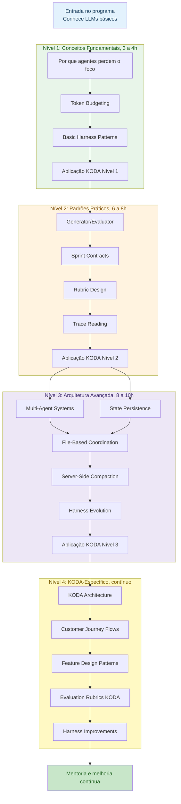
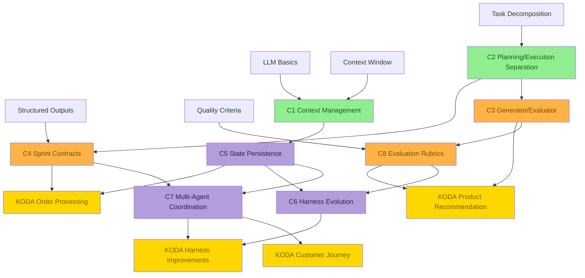
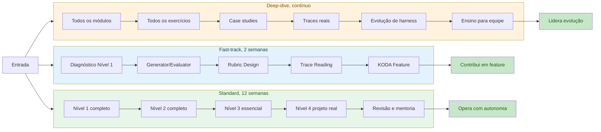

# 🧭 Learning Progression: Do Primeiro Conceito ao KODA em Produção
## Como navegar os 4 níveis, os 8 conceitos core, e os caminhos de aprendizagem do currículo

**Tempo Estimado:** 75 a 120 minutos  
**Nível:** Knowledge Graphs, guia transversal para Níveis 1 a 4  
**Pré-requisito:** Leitura inicial do `MASTER_PLAN.md` e familiaridade básica com KODA  
**Status:** 🟢 CRÍTICO, mapa de navegação para todo o programa  
**Data de Criação:** Maio 2026  
**Aplicação:** Building Long-Running Agents para KODA, agente de vendas de suplementos via WhatsApp

---

## 📖 Prólogo: A Diferença Entre Ler Conteúdo e Formar Julgamento

Imagine uma pessoa nova entrando no time KODA em uma segunda-feira de manhã.

Ela já sabe usar LLMs.

Ela já escreveu prompts bons.

Ela talvez até tenha criado um chatbot simples.

Mas KODA não é um chatbot simples.

KODA precisa vender suplementos por WhatsApp, lembrar restrições, comparar produtos, respeitar estoque, lidar com pagamento, acompanhar entrega, e manter confiança durante conversas longas.

O problema não é só responder bem uma mensagem.

O problema é manter qualidade depois de dezenas de mensagens, várias ferramentas, estados parciais, e decisões que não podem se contradizer.

Por isso este currículo não é uma lista de artigos.

Ele é uma progressão.

Primeiro você aprende por que agentes falham.

Depois aprende padrões práticos para reduzir falhas.

Em seguida aprende arquitetura para coordenar sistemas mais longos.

Por fim aplica tudo no KODA, onde cada decisão tem impacto em venda, confiança, segurança, e operação.

Este arquivo é o mapa dessa jornada.

Use como rota de estudo, como referência para mentoria, e como ferramenta para decidir qual conceito vem antes de qual prática.

### O Que Este Mapa Resolve

- ✅ Evita que a equipe pule para multi-agent systems antes de entender context management.
- ✅ Mostra por que rubrics pertencem ao Nível 2, mesmo quando são usadas no Nível 4.
- ✅ Explica quais conceitos sustentam features reais do KODA.
- ✅ Ajuda líderes a escolher fast-track, standard, ou deep-dive sem desmontar a ordem lógica.
- ✅ Transforma 4 níveis e 8 conceitos em um sistema navegável.

### Como Ler Este Arquivo

- Se você é iniciante, leia a progressão inteira e siga a rota standard.
- Se você já conhece LLMs, use os checkpoints para testar se pode entrar no Nível 2.
- Se você é líder, use as tabelas de coordenação para combinar estudo individual, workshops, e projeto real.
- Se você mantém KODA, use a seção KODA para ligar cada nível a decisões de produto e arquitetura.

---

## 🎯 Visão Geral da Progressão

A progressão tem quatro níveis. Cada nível responde uma pergunta diferente e entrega uma habilidade diferente.

| Nível | Tempo | Pergunta | Resultado |
|---|---:|---|---|
| 🌱 Nível 1 | 3 a 4 horas | Por que agentes perdem o foco quando a conversa fica longa? | Você consegue explicar os três problemas centrais e reconhecer sinais de context rot em uma conversa do KODA. |
| 🛠️ Nível 2 | 6 a 8 horas | Como fazemos agentes mais confiáveis em features reais? | Você desenha generator/evaluator, sprint contracts, rubrics, e lê traces para diagnosticar falhas. |
| 🏗️ Nível 3 | 8 a 10 horas | Como construímos sistemas sofisticados que rodam por horas sem virar caos? | Você projeta fluxos multi-agent, define estado persistente, e decide quando evoluir ou remover partes do harness. |
| 🚀 Nível 4 | contínuo, 10 ou mais horas | Como aplicamos tudo no KODA sem perder a simplicidade operacional? | Você participa de decisões de arquitetura do KODA, implementa features com rubrics, e orienta novos membros. |

### Princípio Central

Você não aprende arquitetura avançada para parecer sofisticado.

Você aprende arquitetura avançada porque uma conversa real do KODA cruza vários estados, vários riscos, e várias decisões dependentes.

A progressão existe para proteger a ordem certa de raciocínio.

Sem Nível 1, você não sabe o que precisa preservar.

Sem Nível 2, você não sabe avaliar qualidade.

Sem Nível 3, você não sabe coordenar sistemas longos.

Sem Nível 4, você não transforma conhecimento em impacto no produto.

---

## 📊 Diagrama 1: Progressão Principal Nível 1 a 4

Este diagrama mostra a rota principal, os tópicos de cada nível, e as conexões de dependência entre fundamentos, padrões, arquitetura, e aplicação KODA.



### Como Interpretar

- A seta principal mostra a ordem recomendada para uma pessoa que está formando base completa.
- Nível 2 depende de Nível 1 porque rubrics e evaluator sem contexto preservado avaliam dados errados.
- Nível 3 depende de Nível 2 porque multi-agent systems sem contracts viram conversa paralela sem coordenação.
- Nível 4 depende dos três níveis anteriores porque KODA junta conversa, catálogo, pedido, pagamento, entrega, e suporte.

---

## 🧱 Diagrama ASCII: Arquitetura da Progressão de Aprendizagem

Este mapa ASCII é útil em README, planejamento de workshop, e documentos que não renderizam Mermaid.

```text
┌──────────────────────────────────────────────────────────────────────────────┐
│                      BUILDING LONG-RUNNING AGENTS PARA KODA                  │
└──────────────────────────────────────────────────────────────────────────────┘
                                      │
                                      ▼
┌──────────────────────────────────────────────────────────────────────────────┐
│ NÍVEL 1, FUNDAÇÃO                                                            │
│ Pergunta: por que agentes falham?                                            │
│ Conteúdo: context management, token budgeting, basic harness patterns         │
│ Entrega: diagnóstico dos três problemas e harness mínimo                      │
└──────────────────────────────────────────────────────────────────────────────┘
                                      │
                                      ▼
┌──────────────────────────────────────────────────────────────────────────────┐
│ NÍVEL 2, PADRÕES PRÁTICOS                                                    │
│ Pergunta: como aumentar confiabilidade?                                      │
│ Conteúdo: generator/evaluator, sprint contracts, rubrics, trace reading       │
│ Entrega: feature KODA com geração, avaliação, contrato, e trace               │
└──────────────────────────────────────────────────────────────────────────────┘
                                      │
                                      ▼
┌──────────────────────────────────────────────────────────────────────────────┐
│ NÍVEL 3, ARQUITETURA AVANÇADA                                                │
│ Pergunta: como coordenar sistemas longos?                                    │
│ Conteúdo: multi-agent systems, state, files, compaction, harness evolution    │
│ Entrega: arquitetura multi-agent auditável para jornadas longas               │
└──────────────────────────────────────────────────────────────────────────────┘
                                      │
                                      ▼
┌──────────────────────────────────────────────────────────────────────────────┐
│ NÍVEL 4, KODA-ESPECÍFICO                                                     │
│ Pergunta: como aplicar no produto real?                                      │
│ Conteúdo: arquitetura KODA, jornadas, features, rubrics, melhorias            │
│ Entrega: melhorias reais, mentoria, e evolução contínua                       │
└──────────────────────────────────────────────────────────────────────────────┘
```

---

## 🔗 Diagrama 2: Pré-requisitos por Tópico

Este diagrama usa os 8 conceitos core como espinha dorsal. Ele mostra quais conceitos devem vir antes e quais conceitos ficam mais fortes quando usados juntos.



### Leitura do Grafo

- **C1 Context Management** pertence ao Nível 1 e sustenta: State Persistence, Trace Reading, Server-Side Compaction.
- **C2 Planning/Execution Separation** pertence ao Nível 2 e sustenta: Sprint Contracts, Multi-Agent Coordination, Feature Design Patterns.
- **C3 Generator/Evaluator** pertence ao Nível 2 e sustenta: Rubric Design, Quality gates, Safer recommendations.
- **C4 Sprint Contracts** pertence ao Nível 2 e sustenta: File-Based Coordination, Trace Reading, Harness Evolution.
- **C5 State Persistence** pertence ao Nível 3 e sustenta: Multi-Agent Coordination, Server-Side Compaction, Long sessions.
- **C6 Harness Evolution** pertence ao Nível 3 e sustenta: Continuous improvement, KODA harness improvements.
- **C7 Multi-Agent Coordination** pertence ao Nível 3 e sustenta: Customer Journey Flows, Fulfillment workflow, Team-scale debugging.
- **C8 Evaluation Rubrics** pertence ao Nível 2 e sustenta: Trace Reading, Harness Evolution, KODA-specific evaluation.

---

## 🛤️ Diagrama 3: Caminhos Alternativos de Aprendizagem

Nem toda pessoa precisa passar pelo currículo no mesmo ritmo. O importante é preservar as dependências conceituais.



---

## ⚖️ Tabela Comparativa: Estratégias de Coordenação do Aprendizado

| Estratégia | Quando usar | Como lida com Nível 1 | Como lida com Nível 2 | Como lida com Nível 3 | Como lida com Nível 4 | Risco principal | Melhor mitigação |
|---|---|---|---|---|---|---|---|
| Estudo individual sequencial | Pessoa nova e sem urgência de entrega | Lê tudo e faz exercícios | Aplica cada padrão em exemplo pequeno | Só entra após dominar contracts e traces | Aplica em feature menor do KODA | Ritmo lento demais | Checkpoints semanais curtos |
| Workshop em turma | Equipe precisa de vocabulário comum | Aula guiada com exemplos do KODA | Laboratório em duplas | Discussão de arquitetura em grupo | Projeto conjunto com revisão | Participação passiva | Exercícios com entrega visível |
| Mentoria por feature | Pessoa precisa contribuir rápido | Diagnóstico de lacunas | Aprende padrão necessário para a feature | Consulta arquitetura conforme necessidade | Entrega mudança real | Aprender só o recorte local | Revisão conceitual após entrega |
| Fast-track técnico | Dev experiente em LLMs | Teste de entrada e leitura seletiva | Foco em generator/evaluator, rubrics, traces | Apenas estado e coordenação essenciais | Feature KODA com rubric | Pular fundamentos invisíveis | Gate de pré-requisito obrigatório |
| Deep-dive arquitetural | Pessoa vai manter harness | Revisão completa | Implementa padrões e compara traces | Desenha e critica arquitetura | Propõe evolução baseada em dados | Criar complexidade por gosto | Métricas antes de qualquer mudança |
| Rotação por papéis | Equipe multidisciplinar | Todos aprendem linguagem comum | Cada pessoa assume um padrão | Arquitetos integram dependências | Produto valida impacto | Silos de conhecimento | Sessões de ensino cruzado |

### Como Escolher

- **Fast-track:** dura 2 semanas. Serve para Pessoa experiente em LLMs que precisa contribuir rápido em KODA. A rota passa por Nível 1 diagnóstico, Generator/Evaluator, Rubric Design, Trace Reading, KODA Architecture, Feature Design Patterns.
- **Standard:** dura 12 semanas. Serve para Equipe completa, com ritmos diferentes e necessidade de base comum. A rota passa por Nível 1 completo, Nível 2 completo, Subconjunto de Nível 3, Nível 4 com projeto real, Mentoria e revisão.
- **Deep-dive:** dura contínuo. Serve para Arquitetos e pessoas que vão evoluir o harness e ensinar outras equipes. A rota passa por Todos os módulos, Todos os exercícios, Case studies, Revisão de traces reais, Propostas de evolução, Ensino para novos membros.

---

## 🎓 Os 4 Níveis em Profundidade

### 🌱 Nível 1: Conceitos Fundamentais

**Tempo:** 3 a 4 horas  
**Foco:** Entender por que long-running agents falham e como um harness básico protege o sistema.  
**Pergunta-guia:** Por que agentes perdem o foco quando a conversa fica longa?  
**Resultado esperado:** Você consegue explicar os três problemas centrais e reconhecer sinais de context rot em uma conversa do KODA.  

#### 📚 Tópicos

- **Por que agentes perdem o foco:** Context amnesia, colapso de planejamento, e autoavaliação fraca.
- **Token Budgeting:** Como separar orçamento de leitura, resposta, ferramentas, e memória persistente.
- **Basic Harness Patterns:** Como construir trilhos simples que mantêm o agente dentro de limites claros.

#### 🔧 Aplicação no KODA

KODA aprende a manter restrições de cliente, carrinho, orçamento, e intenção durante uma conversa de WhatsApp de duas horas.

#### ✅ Entregáveis

- [ ] Mapa dos três problemas em uma conversa real.
- [ ] Planilha de token budget para uma conversa KODA.
- [ ] Harness mínimo para resposta segura.

#### ⚠️ Riscos de Aprendizagem

- ⚠️ Confundir contexto com banco de dados.
- ⚠️ Tratar token budget como detalhe de prompt.
- ⚠️ Achar que um agente bom não precisa de harness.

#### Critério de Passagem

Você pode seguir para o próximo bloco quando consegue explicar o conceito sem consultar anotações, aplicar em um exemplo KODA, e apontar uma falha concreta que o conceito evita.

### 🛠️ Nível 2: Padrões Práticos

**Tempo:** 6 a 8 horas  
**Foco:** Aplicar padrões que aumentam confiabilidade sem trocar o modelo base.  
**Pergunta-guia:** Como fazemos agentes mais confiáveis em features reais?  
**Resultado esperado:** Você desenha generator/evaluator, sprint contracts, rubrics, e lê traces para diagnosticar falhas.  

#### 📚 Tópicos

- **Generator/Evaluator:** Separar geração e avaliação para reduzir erro silencioso.
- **Sprint Contracts:** Definir promessas claras entre módulos antes da execução.
- **Rubric Design:** Medir qualidade em dimensões, não apenas passar ou falhar.
- **Trace Reading:** Ler o caminho completo de uma decisão para encontrar a causa de uma falha.

#### 🔧 Aplicação no KODA

KODA passa de recomendação aceitável para recomendação auditável, com avaliação crítica antes de falar com o cliente.

#### ✅ Entregáveis

- [ ] Par generator/evaluator para recomendação.
- [ ] Sprint contract para busca e ranking.
- [ ] Rubric de recomendação de produto.
- [ ] Trace comentado de uma conversa.

#### ⚠️ Riscos de Aprendizagem

- ⚠️ Criar evaluator que só repete o generator.
- ⚠️ Escrever contracts vagos.
- ⚠️ Pontuar rubrics sem pesos explícitos.
- ⚠️ Guardar traces que ninguém consegue ler.

#### Critério de Passagem

Você pode seguir para o próximo bloco quando consegue explicar o conceito sem consultar anotações, aplicar em um exemplo KODA, e apontar uma falha concreta que o conceito evita.

### 🏗️ Nível 3: Arquitetura Avançada

**Tempo:** 8 a 10 horas  
**Foco:** Desenhar sistemas multi-agent com estado durável, coordenação por arquivos, compaction, e evolução do harness.  
**Pergunta-guia:** Como construímos sistemas sofisticados que rodam por horas sem virar caos?  
**Resultado esperado:** Você projeta fluxos multi-agent, define estado persistente, e decide quando evoluir ou remover partes do harness.  

#### 📚 Tópicos

- **Multi-Agent Systems:** Dividir responsabilidades entre agentes especializados.
- **State Persistence:** Salvar fatos, decisões, e checkpoints fora da janela de contexto.
- **File-Based Coordination:** Usar arquivos estruturados como contrato operacional entre agentes.
- **Server-Side Compaction:** Compactar histórico sem perder fatos críticos.
- **Harness Evolution:** Ajustar o harness quando modelos, tráfego, e requisitos mudam.

#### 🔧 Aplicação no KODA

KODA coordena discovery, recomendação, carrinho, pagamento, entrega, suporte, e avaliação com rastreabilidade.

#### ✅ Entregáveis

- [ ] Diagrama multi-agent para KODA.
- [ ] Schema de estado persistente.
- [ ] Pasta de coordenação por arquivos.
- [ ] Plano de compaction.
- [ ] Registro de evolução de harness.

#### ⚠️ Riscos de Aprendizagem

- ⚠️ Criar agentes demais.
- ⚠️ Persistir tudo sem critério.
- ⚠️ Misturar estado factual com opinião temporária.
- ⚠️ Evoluir harness sem dados.

#### Critério de Passagem

Você pode seguir para o próximo bloco quando consegue explicar o conceito sem consultar anotações, aplicar em um exemplo KODA, e apontar uma falha concreta que o conceito evita.

### 🚀 Nível 4: KODA-Específico

**Tempo:** contínuo, 10 ou mais horas  
**Foco:** Aplicar todos os padrões no agente de vendas por WhatsApp, com features, rubrics, e melhorias reais.  
**Pergunta-guia:** Como aplicamos tudo no KODA sem perder a simplicidade operacional?  
**Resultado esperado:** Você participa de decisões de arquitetura do KODA, implementa features com rubrics, e orienta novos membros.  

#### 📚 Tópicos

- **KODA Architecture:** Como o sistema completo conversa com catálogo, cliente, pedido, pagamento, e entrega.
- **Customer Journey Flows:** Como mapear descoberta, comparação, decisão, compra, entrega, e pós-venda.
- **Feature Design Patterns:** Como transformar uma necessidade do negócio em fluxo seguro de agentes.
- **Evaluation Rubrics KODA:** Como medir resposta, recomendação, segurança, conversão, e confiança.
- **Harness Improvements:** Como priorizar melhorias do harness com base em traces e impacto real.

#### 🔧 Aplicação no KODA

KODA vira o laboratório vivo do currículo e também o produto que se beneficia do aprendizado da equipe.

#### ✅ Entregáveis

- [ ] Mapa de arquitetura KODA.
- [ ] Fluxo de jornada por intenção.
- [ ] Feature spec com harness.
- [ ] Rubric operacional.
- [ ] Proposta de melhoria baseada em trace.

#### ⚠️ Riscos de Aprendizagem

- ⚠️ Virar especialista em KODA sem enxergar os padrões gerais.
- ⚠️ Otimizar conversão e esquecer segurança.
- ⚠️ Criar rubrics desconectadas da jornada real.
- ⚠️ Melhorar harness sem comparar antes e depois.

#### Critério de Passagem

Você pode seguir para o próximo bloco quando consegue explicar o conceito sem consultar anotações, aplicar em um exemplo KODA, e apontar uma falha concreta que o conceito evita.

---

## 🧠 Os 8 Conceitos Core Como Trilha de Dependências

Cada conceito aparece em um nível, mas o valor real surge nas conexões. Abaixo está o mapa textual que complementa o grafo Mermaid.

### C1 · Context Management

**Nível principal:** Nível 1  
**Definição:** Controlar o que entra, fica, sai, e volta ao contexto ativo do agente.  
**Aplicação KODA:** Mantém alergias, preferências, carrinho, e promessas feitas ao cliente.  
**Erro comum:** Guardar histórico inteiro e chamar isso de memória.

#### Pré-requisitos

- LLM basics
- Context window
- Conversas multi-turn

#### O que este conceito habilita

- State Persistence
- Trace Reading
- Server-Side Compaction

#### Sinais de Domínio

- ✅ Você consegue reconhecer quando Context Management está ausente em uma conversa KODA.
- ✅ Você consegue explicar por que Context Management aparece nesse ponto da progressão.
- ✅ Você consegue propor uma checagem simples para validar Context Management em um trace real.
- ✅ Você consegue ensinar Context Management com um exemplo de venda de suplemento.

### C2 · Planning/Execution Separation

**Nível principal:** Nível 2  
**Definição:** Separar decidir o que fazer de fazer cada passo concreto.  
**Aplicação KODA:** Separa entender intenção de processar estoque, preço, frete, pagamento, e mensagem final.  
**Erro comum:** Pedir para um agente planejar, executar, verificar, e responder em uma única passada.

#### Pré-requisitos

- Task decomposition
- Basic Harness Patterns

#### O que este conceito habilita

- Sprint Contracts
- Multi-Agent Coordination
- Feature Design Patterns

#### Sinais de Domínio

- ✅ Você consegue reconhecer quando Planning/Execution Separation está ausente em uma conversa KODA.
- ✅ Você consegue explicar por que Planning/Execution Separation aparece nesse ponto da progressão.
- ✅ Você consegue propor uma checagem simples para validar Planning/Execution Separation em um trace real.
- ✅ Você consegue ensinar Planning/Execution Separation com um exemplo de venda de suplemento.

### C3 · Generator/Evaluator

**Nível principal:** Nível 2  
**Definição:** Um componente cria opções, outro componente avalia criticamente com critérios explícitos.  
**Aplicação KODA:** Gera opções de produto e rejeita escolhas perigosas antes de responder ao cliente.  
**Erro comum:** Fazer o evaluator concordar com o generator por usar o mesmo prompt e o mesmo objetivo.

#### Pré-requisitos

- Planning/Execution Separation
- Evaluation criteria

#### O que este conceito habilita

- Rubric Design
- Quality gates
- Safer recommendations

#### Sinais de Domínio

- ✅ Você consegue reconhecer quando Generator/Evaluator está ausente em uma conversa KODA.
- ✅ Você consegue explicar por que Generator/Evaluator aparece nesse ponto da progressão.
- ✅ Você consegue propor uma checagem simples para validar Generator/Evaluator em um trace real.
- ✅ Você consegue ensinar Generator/Evaluator com um exemplo de venda de suplemento.

### C4 · Sprint Contracts

**Nível principal:** Nível 2  
**Definição:** Promessas testáveis entre etapas, agentes, ou módulos.  
**Aplicação KODA:** Define o que busca, ranking, filtro, pagamento, e atendimento devem entregar.  
**Erro comum:** Escrever contrato que parece bom mas não tem critério verificável.

#### Pré-requisitos

- Planning/Execution Separation
- Structured outputs

#### O que este conceito habilita

- File-Based Coordination
- Trace Reading
- Harness Evolution

#### Sinais de Domínio

- ✅ Você consegue reconhecer quando Sprint Contracts está ausente em uma conversa KODA.
- ✅ Você consegue explicar por que Sprint Contracts aparece nesse ponto da progressão.
- ✅ Você consegue propor uma checagem simples para validar Sprint Contracts em um trace real.
- ✅ Você consegue ensinar Sprint Contracts com um exemplo de venda de suplemento.

### C5 · State Persistence

**Nível principal:** Nível 3  
**Definição:** Salvar estado confiável fora da janela de contexto, com schema e ciclo de vida claros.  
**Aplicação KODA:** Permite retomar compra, manter carrinho, e preservar decisões mesmo após compaction.  
**Erro comum:** Persistir pensamentos temporários como se fossem fatos confirmados.

#### Pré-requisitos

- Context Management
- Data modeling

#### O que este conceito habilita

- Multi-Agent Coordination
- Server-Side Compaction
- Long sessions

#### Sinais de Domínio

- ✅ Você consegue reconhecer quando State Persistence está ausente em uma conversa KODA.
- ✅ Você consegue explicar por que State Persistence aparece nesse ponto da progressão.
- ✅ Você consegue propor uma checagem simples para validar State Persistence em um trace real.
- ✅ Você consegue ensinar State Persistence com um exemplo de venda de suplemento.

### C6 · Harness Evolution

**Nível principal:** Nível 3  
**Definição:** Adaptar o suporte ao agente conforme modelo, tráfego, produto, e risco mudam.  
**Aplicação KODA:** Remove checks redundantes, adiciona gates onde há erro real, e reduz custo sem perder qualidade.  
**Erro comum:** Adicionar camadas para todo problema sem medir impacto.

#### Pré-requisitos

- Trace Reading
- Metrics
- Rubric Design

#### O que este conceito habilita

- Continuous improvement
- KODA harness improvements

#### Sinais de Domínio

- ✅ Você consegue reconhecer quando Harness Evolution está ausente em uma conversa KODA.
- ✅ Você consegue explicar por que Harness Evolution aparece nesse ponto da progressão.
- ✅ Você consegue propor uma checagem simples para validar Harness Evolution em um trace real.
- ✅ Você consegue ensinar Harness Evolution com um exemplo de venda de suplemento.

### C7 · Multi-Agent Coordination

**Nível principal:** Nível 3  
**Definição:** Organizar agentes especializados em um fluxo com ownership, handoff, estado, e critério de parada.  
**Aplicação KODA:** Coordena discovery, recomendação, pedido, entrega, suporte, e auditoria.  
**Erro comum:** Criar vários agentes sem owner claro para decisão final.

#### Pré-requisitos

- Sprint Contracts
- State Persistence
- File-Based Coordination

#### O que este conceito habilita

- Customer Journey Flows
- Fulfillment workflow
- Team-scale debugging

#### Sinais de Domínio

- ✅ Você consegue reconhecer quando Multi-Agent Coordination está ausente em uma conversa KODA.
- ✅ Você consegue explicar por que Multi-Agent Coordination aparece nesse ponto da progressão.
- ✅ Você consegue propor uma checagem simples para validar Multi-Agent Coordination em um trace real.
- ✅ Você consegue ensinar Multi-Agent Coordination com um exemplo de venda de suplemento.

### C8 · Evaluation Rubrics

**Nível principal:** Nível 2  
**Definição:** Critérios ponderados que avaliam qualidade em múltiplas dimensões.  
**Aplicação KODA:** Mede adequação, segurança, clareza, conversão, confiança, e risco operacional.  
**Erro comum:** Usar rubrics genéricas que não refletem o que importa para o cliente do WhatsApp.

#### Pré-requisitos

- Quality criteria
- Generator/Evaluator

#### O que este conceito habilita

- Trace Reading
- Harness Evolution
- KODA-specific evaluation

#### Sinais de Domínio

- ✅ Você consegue reconhecer quando Evaluation Rubrics está ausente em uma conversa KODA.
- ✅ Você consegue explicar por que Evaluation Rubrics aparece nesse ponto da progressão.
- ✅ Você consegue propor uma checagem simples para validar Evaluation Rubrics em um trace real.
- ✅ Você consegue ensinar Evaluation Rubrics com um exemplo de venda de suplemento.

---

## 🚀 Aplicação KODA: Como Cada Nível Muda o Produto

KODA é o laboratório prático do currículo. Cada nível muda a forma como o agente conversa, decide, verifica, e melhora.

### 🌱 Nível 1 aplicado ao KODA

**Mudança principal:** KODA aprende a manter restrições de cliente, carrinho, orçamento, e intenção durante uma conversa de WhatsApp de duas horas.

#### Antes deste nível

- ❌ KODA responde bem no começo, mas perde fatos antigos.
- ❌ O time não sabe estimar o custo de contexto.
- ❌ O harness depende de intuição.

#### Depois deste nível

- ✅ KODA preserva fatos críticos.
- ✅ Token budget vira decisão explícita.
- ✅ O harness mínimo tem objetivo claro.

#### Exemplo de Conversa

```text
Cliente: Oi KODA, quero um suplemento para ganhar massa, mas tenho restrição alimentar.
KODA: Vou registrar sua restrição, seu objetivo, e seu orçamento como fatos críticos da conversa.
Sistema: O token budget reserva espaço para histórico recente, fatos persistidos, e resposta final.
```

### 🛠️ Nível 2 aplicado ao KODA

**Mudança principal:** KODA passa de recomendação aceitável para recomendação auditável, com avaliação crítica antes de falar com o cliente.

#### Antes deste nível

- ❌ KODA tem proteção básica, mas pouca visibilidade de qualidade.
- ❌ A recomendação pode ser válida e ainda assim mediana.
- ❌ Falhas são difíceis de diagnosticar sem trace.

#### Depois deste nível

- ✅ KODA gera opções e avalia criticamente.
- ✅ Rubrics diferenciam válido, bom, ótimo, e perigoso.
- ✅ Traces explicam por que uma decisão foi tomada.

#### Exemplo de Conversa

```text
Cliente: Oi KODA, quero um suplemento para ganhar massa, mas tenho restrição alimentar.
KODA Generator: Vou criar opções compatíveis com o objetivo e a restrição.
KODA Evaluator: Vou rejeitar qualquer opção com risco alimentar, estoque inválido, ou explicação fraca.
```

### 🏗️ Nível 3 aplicado ao KODA

**Mudança principal:** KODA coordena discovery, recomendação, carrinho, pagamento, entrega, suporte, e avaliação com rastreabilidade.

#### Antes deste nível

- ❌ Cada módulo pode funcionar sozinho, mas a coordenação fica frágil.
- ❌ O estado cresce sem ciclo de vida claro.
- ❌ Compaction pode apagar informação crítica.

#### Depois deste nível

- ✅ Agentes especializados trabalham com contracts.
- ✅ Estado persistente mantém continuidade entre turnos.
- ✅ Compaction reduz custo sem apagar compromissos.

#### Exemplo de Conversa

```text
Cliente: Oi KODA, quero um suplemento para ganhar massa, mas tenho restrição alimentar.
KODA Discovery Agent: Confirmo objetivo, restrição, e preferência.
KODA Order Agent: Só sigo quando o contract de recomendação estiver aprovado.
KODA State: Persisto fatos confirmados e decisões aprovadas.
```

### 🚀 Nível 4 aplicado ao KODA

**Mudança principal:** KODA vira o laboratório vivo do currículo e também o produto que se beneficia do aprendizado da equipe.

#### Antes deste nível

- ❌ A equipe conhece padrões, mas precisa aplicá-los no produto vivo.
- ❌ Jornadas reais têm exceções que exemplos didáticos não cobrem.
- ❌ Métricas de negócio precisam dialogar com métricas de qualidade.

#### Depois deste nível

- ✅ Features nascem com rubrics e traces.
- ✅ Melhorias de harness são priorizadas por impacto.
- ✅ A equipe ensina novos membros usando casos reais.

#### Exemplo de Conversa

```text
Cliente: Oi KODA, quero um suplemento para ganhar massa, mas tenho restrição alimentar.
KODA: Uso a arquitetura completa, rubrics específicas, e trace da jornada para recomendar com confiança.
Equipe: Depois da conversa, revisa métricas e decide se o harness precisa mudar.
```

---

## 📋 Roteiros de Estudo

### Fast-track

**Duração:** 2 semanas  
**Perfil:** Pessoa experiente em LLMs que precisa contribuir rápido em KODA.

1. Nível 1 diagnóstico
2. Generator/Evaluator
3. Rubric Design
4. Trace Reading
5. KODA Architecture
6. Feature Design Patterns

#### Checkpoint de saída

- ✅ Consegue explicar os riscos de pular partes do Nível 1.
- ✅ Implementa ou revisa uma feature KODA com evaluator e rubric.
- ✅ Sabe pedir ajuda quando a feature toca estado persistente ou coordenação avançada.

### Standard

**Duração:** 12 semanas  
**Perfil:** Equipe completa, com ritmos diferentes e necessidade de base comum.

1. Nível 1 completo
2. Nível 2 completo
3. Subconjunto de Nível 3
4. Nível 4 com projeto real
5. Mentoria e revisão

#### Checkpoint de saída

- ✅ Completa todos os módulos centrais.
- ✅ Entrega exercícios por nível.
- ✅ Participa de revisão de trace real.
- ✅ Contribui em uma melhoria KODA com justificativa.

### Deep-dive

**Duração:** contínuo  
**Perfil:** Arquitetos e pessoas que vão evoluir o harness e ensinar outras equipes.

1. Todos os módulos
2. Todos os exercícios
3. Case studies
4. Revisão de traces reais
5. Propostas de evolução
6. Ensino para novos membros

#### Checkpoint de saída

- ✅ Desenha arquitetura e aponta trade-offs.
- ✅ Revisa rubrics de outras pessoas.
- ✅ Propõe evolução de harness com métrica antes e depois.
- ✅ Ensina a progressão para novos membros.

---

## 🔍 Leituras Cruzadas e Dependências Práticas

A progressão fica mais clara quando você enxerga leituras cruzadas. Use esta seção quando estiver preso em um conceito e precisar saber para onde voltar.

### Quando estiver estudando Context Management

Volte para os pré-requisitos: LLM basics, Context window, Conversas multi-turn.

Depois conecte com: State Persistence, Trace Reading, Server-Side Compaction.

No KODA, procure este sinal: Mantém alergias, preferências, carrinho, e promessas feitas ao cliente.

Perguntas de revisão:

- Qual falha aparece se Context Management estiver ausente?
- Qual arquivo, trace, ou decisão mostraria evidência de Context Management?
- Que métrica mudaria se Context Management fosse melhorado?
- Qual conceito anterior sustenta Context Management?
- Qual conceito posterior depende de Context Management?

### Quando estiver estudando Planning/Execution Separation

Volte para os pré-requisitos: Task decomposition, Basic Harness Patterns.

Depois conecte com: Sprint Contracts, Multi-Agent Coordination, Feature Design Patterns.

No KODA, procure este sinal: Separa entender intenção de processar estoque, preço, frete, pagamento, e mensagem final.

Perguntas de revisão:

- Qual falha aparece se Planning/Execution Separation estiver ausente?
- Qual arquivo, trace, ou decisão mostraria evidência de Planning/Execution Separation?
- Que métrica mudaria se Planning/Execution Separation fosse melhorado?
- Qual conceito anterior sustenta Planning/Execution Separation?
- Qual conceito posterior depende de Planning/Execution Separation?

### Quando estiver estudando Generator/Evaluator

Volte para os pré-requisitos: Planning/Execution Separation, Evaluation criteria.

Depois conecte com: Rubric Design, Quality gates, Safer recommendations.

No KODA, procure este sinal: Gera opções de produto e rejeita escolhas perigosas antes de responder ao cliente.

Perguntas de revisão:

- Qual falha aparece se Generator/Evaluator estiver ausente?
- Qual arquivo, trace, ou decisão mostraria evidência de Generator/Evaluator?
- Que métrica mudaria se Generator/Evaluator fosse melhorado?
- Qual conceito anterior sustenta Generator/Evaluator?
- Qual conceito posterior depende de Generator/Evaluator?

### Quando estiver estudando Sprint Contracts

Volte para os pré-requisitos: Planning/Execution Separation, Structured outputs.

Depois conecte com: File-Based Coordination, Trace Reading, Harness Evolution.

No KODA, procure este sinal: Define o que busca, ranking, filtro, pagamento, e atendimento devem entregar.

Perguntas de revisão:

- Qual falha aparece se Sprint Contracts estiver ausente?
- Qual arquivo, trace, ou decisão mostraria evidência de Sprint Contracts?
- Que métrica mudaria se Sprint Contracts fosse melhorado?
- Qual conceito anterior sustenta Sprint Contracts?
- Qual conceito posterior depende de Sprint Contracts?

### Quando estiver estudando State Persistence

Volte para os pré-requisitos: Context Management, Data modeling.

Depois conecte com: Multi-Agent Coordination, Server-Side Compaction, Long sessions.

No KODA, procure este sinal: Permite retomar compra, manter carrinho, e preservar decisões mesmo após compaction.

Perguntas de revisão:

- Qual falha aparece se State Persistence estiver ausente?
- Qual arquivo, trace, ou decisão mostraria evidência de State Persistence?
- Que métrica mudaria se State Persistence fosse melhorado?
- Qual conceito anterior sustenta State Persistence?
- Qual conceito posterior depende de State Persistence?

### Quando estiver estudando Harness Evolution

Volte para os pré-requisitos: Trace Reading, Metrics, Rubric Design.

Depois conecte com: Continuous improvement, KODA harness improvements.

No KODA, procure este sinal: Remove checks redundantes, adiciona gates onde há erro real, e reduz custo sem perder qualidade.

Perguntas de revisão:

- Qual falha aparece se Harness Evolution estiver ausente?
- Qual arquivo, trace, ou decisão mostraria evidência de Harness Evolution?
- Que métrica mudaria se Harness Evolution fosse melhorado?
- Qual conceito anterior sustenta Harness Evolution?
- Qual conceito posterior depende de Harness Evolution?

### Quando estiver estudando Multi-Agent Coordination

Volte para os pré-requisitos: Sprint Contracts, State Persistence, File-Based Coordination.

Depois conecte com: Customer Journey Flows, Fulfillment workflow, Team-scale debugging.

No KODA, procure este sinal: Coordena discovery, recomendação, pedido, entrega, suporte, e auditoria.

Perguntas de revisão:

- Qual falha aparece se Multi-Agent Coordination estiver ausente?
- Qual arquivo, trace, ou decisão mostraria evidência de Multi-Agent Coordination?
- Que métrica mudaria se Multi-Agent Coordination fosse melhorado?
- Qual conceito anterior sustenta Multi-Agent Coordination?
- Qual conceito posterior depende de Multi-Agent Coordination?

### Quando estiver estudando Evaluation Rubrics

Volte para os pré-requisitos: Quality criteria, Generator/Evaluator.

Depois conecte com: Trace Reading, Harness Evolution, KODA-specific evaluation.

No KODA, procure este sinal: Mede adequação, segurança, clareza, conversão, confiança, e risco operacional.

Perguntas de revisão:

- Qual falha aparece se Evaluation Rubrics estiver ausente?
- Qual arquivo, trace, ou decisão mostraria evidência de Evaluation Rubrics?
- Que métrica mudaria se Evaluation Rubrics fosse melhorado?
- Qual conceito anterior sustenta Evaluation Rubrics?
- Qual conceito posterior depende de Evaluation Rubrics?

---

## 🧪 Exercícios de Navegação do Knowledge Graph

Estes exercícios não substituem os exercícios dos módulos. Eles treinam a leitura da progressão.

| # | Tópico | Nível | Pergunta-chave | Resposta esperada |
|---|---|---|---|---|
| 1 | Por que agentes perdem o foco | 🌱 1 | Por que este tópico é o primeiro e não depende de nenhum outro? | É o ponto de partida porque explica os 3 modos de falha (context amnesia, planning collapse, self-evaluation collapse) que toda pessoa precisa reconhecer antes de aprender qualquer padrão. No KODA, aparece quando o agente esquece alergias depois de 70 minutos de conversa. |
| 2 | Token Budgeting | 🌱 1 | Como Token Budgeting depende de "Por que agentes perdem o foco"? | O tópico anterior explica que contexto é finito. Token Budgeting ensina a medir e alocar esse recurso: separar orçamento de leitura, resposta, ferramentas, e memória persistente. No KODA, evita que o agente esgote tokens antes de processar o checkout. |
| 3 | Basic Harness Patterns | 🌱 1 | Que proteção este tópico adiciona sobre Token Budgeting? | Token Budgeting gerencia recurso; Basic Harness Patterns constrói trilhos de segurança (validação de input, limites de escopo, fallback). No KODA, o harness impede que uma resposta inválida chegue ao cliente mesmo quando o orçamento está apertado. |
| 4 | Generator/Evaluator | 🛠️ 2 | Que falha de Nível 1 o Generator/Evaluator resolve diretamente? | Resolve o Self-Evaluation Collapse: em vez de o agente julgar a si mesmo, um Evaluator separado aplica rubrica. No KODA, rejeita recomendações com lactose quando o cliente é intolerante. Pré-requisito: entendeu Context Management (para que o Evaluator tenha dados corretos). |
| 5 | Sprint Contracts | 🛠️ 2 | Por que Sprint Contracts só faz sentido DEPOIS de Generator/Evaluator? | Generator/Evaluator define o padrão de separação de responsabilidades. Sprint Contracts estende isso para módulos: cada módulo promete input/output antes de executar. No KODA, o módulo de busca promete 5 produtos com campos específicos para o módulo de ranking. |
| 6 | Rubric Design | 🛠️ 2 | Como Rubric Design depende de Sprint Contracts e Generator/Evaluator? | Contracts definem o que deve ser entregue; Rubrics definem como medir a qualidade do que foi entregue. O Evaluator usa rubrics para pontuar. No KODA, uma rubric mede adequação ao perfil, custo-benefício, satisfação esperada, e viabilidade. |
| 7 | Trace Reading | 🛠️ 2 | Por que Trace Reading fecha o Nível 2? | Trace Reading é a ferramenta de diagnóstico que fecha o ciclo: você gerou, contratou, rubricou — agora lê o trace para entender onde falhou e por quê. No KODA, o trace mostra que a base de satisfação estava defasada, não que a rubric estava errada. |
| 8 | Multi-Agent Systems | 🏗️ 3 | Que pré-requisitos de Nível 2 são obrigatórios para multi-agent? | Sprint Contracts (coordenação entre agentes) e Generator/Evaluator (separação de responsabilidades). Sem contracts, agentes trocam dados inconsistentes. Sem Gen/Eval, nenhum agente verifica o output do outro. No KODA, os agentes de Discovery, Order, e Eval usam contracts JSON. |
| 9 | State Persistence | 🏗️ 3 | O que State Persistence resolve que Context Management (Nível 1) não resolve? | Context Management gerencia memória na janela de contexto. State Persistence salva fatos confirmados fora da janela — em arquivo ou banco — para sobreviver a compaction, reinício, e troca de agente. No KODA, o perfil com alergias sobrevive a 4 horas de conversa. |
| 10 | File-Based Coordination | 🏗️ 3 | Como File-Based Coordination conecta State Persistence com Multi-Agent Systems? | State Persistence define ONDE guardar. File-Based Coordination define COMO agentes leem e escrevem de forma coordenada (draft → verdict → feedback). O arquivo vira contrato operacional. No KODA, `generator_draft.json` → `evaluator_verdict.json` → `feedback.json`. |
| 11 | Server-Side Compaction | 🏗️ 3 | Por que compaction só aparece DEPOIS de State Persistence e File-Based Coordination? | Porque você só pode compactar com segurança depois de ter extraído e persistido os fatos críticos. Compaction sem state persistence apaga memória; com state, reduz custo preservando o essencial. No KODA, compacta 2h de conversa em resumo estruturado mantendo alergias, carrinho, e decisões. |
| 12 | Harness Evolution | 🏗️ 3 | Que evidência de Nível 2 (traces, rubrics) alimenta decisões de evolução? | Trace Reading mostra ONDE o harness atual falha ou é redundante. Rubric Design mostra se a qualidade está subindo ou descendo. Harness Evolution decide o que remover, adicionar, ou simplificar com base nessa evidência. No KODA, checks manuais de lactose viram desnecessários quando o modelo aprende a verificar sozinho. |
| 13 | KODA Architecture | 🚀 4 | Que conceitos dos 3 níveis anteriores a arquitetura do KODA integra? | Integra Context Management (perfil), Generator/Evaluator (recomendação), Sprint Contracts (módulos), State Persistence (carrinho), Multi-Agent Coordination (vendas + fulfillment), e Evaluation Rubrics (qualidade). É a aplicação concreta de todos os padrões. |
| 14 | Customer Journey Flows | 🚀 4 | Como Customer Journey Flows depende de KODA Architecture? | A arquitetura define os componentes; os flows mapeiam a jornada real do cliente (descoberta → comparação → decisão → compra → entrega → pós-venda) através desses componentes. No KODA, garante que nenhuma etapa da jornada fique sem agente ou sem contrato. |
| 15 | Feature Design Patterns | 🚀 4 | Como transformar uma necessidade de negócio em feature segura usando os padrões? | Feature Design Patterns aplica Generator/Evaluator + Sprint Contracts + Rubrics a uma necessidade concreta. Exemplo: feature de "desconto progressivo" vira contrato de validação de cupom + evaluator de não-duplo-desconto + rubric de política de preço. |
| 16 | Evaluation Rubrics KODA | 🚀 4 | Qual a diferença entre a rubric genérica de Nível 2 e a rubric KODA de Nível 4? | A rubric de Nível 2 mede qualidade geral (adequação, clareza). A de Nível 4 mede métricas de negócio: segurança alimentar (alergias), conversão, confiança, risco operacional, e satisfação pós-compra. É calibrada com dados reais de venda do KODA. |
| 17 | Harness Improvements | 🚀 4 | Como Harness Improvements fecha o ciclo completo do currículo? | Fecha o ciclo porque usa todas as ferramentas: traces para diagnosticar, rubrics para medir, contracts para propor mudanças, e state persistence para migrar. Toda melhoria de harness é uma decisão de engenharia baseada em evidência, não em intuição. No KODA, cada mudança tem métrica de antes/depois. |

---

## 🧭 Guia Para Mentores

Mentoria neste currículo não é dar resposta pronta. É ajudar a pessoa enxergar a dependência correta.

| Situação | Intervenção do mentor |
|---|---|
| Quando a pessoa quer implementar multi-agent systems no primeiro dia | Peça para ela explicar context management e sprint contracts antes. |
| Quando a pessoa escreve uma rubric genérica | Pergunte qual falha real do KODA essa rubric detecta. |
| Quando a pessoa confunde state persistence com log | Peça para separar fato confirmado, decisão temporária, trace, e métrica. |
| Quando a pessoa adiciona mais harness sem evidência | Peça trace antes, hipótese explícita, e critério de sucesso. |
| Quando a pessoa pula exercícios | Peça uma explicação verbal e um exemplo KODA antes de liberar o próximo nível. |

### Perguntas que Funcionam Bem

- Que informação precisa sobreviver se a conversa durar duas horas?
- Qual decisão deve ser tomada antes da execução começar?
- Quem avalia a resposta, e com qual incentivo?
- Qual contract prova que este módulo entregou o que prometeu?
- Qual estado é fato confirmado e qual estado é apenas hipótese?
- Qual trace você leria para diagnosticar esta falha?
- Qual parte do harness você removeria se o modelo novo já fizer melhor?
- Qual métrica mostra que KODA ficou melhor para cliente e para operação?

---

## 🧩 Matriz de Conceitos, Tópicos, e KODA

| Conceito | Nível | Tópicos relacionados | Feature KODA | Evidência de domínio |
|---|---|---|---|---|
| Context Management | Nível 1 | Por que agentes perdem o foco, Token Budgeting, Basic Harness Patterns | Mantém alergias, preferências, carrinho, e promessas feitas ao cliente. | Explica erro comum: Guardar histórico inteiro e chamar isso de memória. |
| Planning/Execution Separation | Nível 2 | Generator/Evaluator, Sprint Contracts, Rubric Design | Separa entender intenção de processar estoque, preço, frete, pagamento, e mensagem final. | Explica erro comum: Pedir para um agente planejar, executar, verificar, e responder em uma única passada. |
| Generator/Evaluator | Nível 2 | Generator/Evaluator, Sprint Contracts, Rubric Design | Gera opções de produto e rejeita escolhas perigosas antes de responder ao cliente. | Explica erro comum: Fazer o evaluator concordar com o generator por usar o mesmo prompt e o mesmo objetivo. |
| Sprint Contracts | Nível 2 | Generator/Evaluator, Sprint Contracts, Rubric Design | Define o que busca, ranking, filtro, pagamento, e atendimento devem entregar. | Explica erro comum: Escrever contrato que parece bom mas não tem critério verificável. |
| State Persistence | Nível 3 | Multi-Agent Systems, State Persistence, File-Based Coordination | Permite retomar compra, manter carrinho, e preservar decisões mesmo após compaction. | Explica erro comum: Persistir pensamentos temporários como se fossem fatos confirmados. |
| Harness Evolution | Nível 3 | Multi-Agent Systems, State Persistence, File-Based Coordination | Remove checks redundantes, adiciona gates onde há erro real, e reduz custo sem perder qualidade. | Explica erro comum: Adicionar camadas para todo problema sem medir impacto. |
| Multi-Agent Coordination | Nível 3 | Multi-Agent Systems, State Persistence, File-Based Coordination | Coordena discovery, recomendação, pedido, entrega, suporte, e auditoria. | Explica erro comum: Criar vários agentes sem owner claro para decisão final. |
| Evaluation Rubrics | Nível 2 | Generator/Evaluator, Sprint Contracts, Rubric Design | Mede adequação, segurança, clareza, conversão, confiança, e risco operacional. | Explica erro comum: Usar rubrics genéricas que não refletem o que importa para o cliente do WhatsApp. |

---

## 📈 Sinais de Progresso por Semana

| Período | Tema | Sinal observável |
|---|---|---|
| Semana 1 | Fundação | A pessoa nomeia os três problemas e reconhece context rot em conversa KODA. |
| Semana 2 | Fundação aplicada | A pessoa estima token budget e desenha harness mínimo. |
| Semana 3 | Padrões práticos | A pessoa implementa generator/evaluator em caso simples. |
| Semana 4 | Qualidade e trace | A pessoa escreve rubric e lê trace para explicar falha. |
| Semana 5 | Arquitetura | A pessoa desenha multi-agent flow com estado persistente. |
| Semana 6 | Coordenação | A pessoa usa file-based coordination e propõe compaction segura. |
| Semanas 7 a 8 | KODA feature | A pessoa aplica padrões em feature real com revisão. |
| Semanas 9 a 10 | KODA evaluation | A pessoa cria rubrics específicas e compara resultados. |
| Semanas 11 a 12 | Melhoria contínua | A pessoa propõe evolução de harness baseada em trace. |

---

## 🛡️ Erros Comuns na Progressão

### ⚠️ Pular Nível 1

**Sintoma:** A pessoa implementa padrões sem saber que informação precisa preservar.

**Correção:** Pedir diagnóstico de contexto antes de aceitar design.

### ⚠️ Tratar evaluator como revisor simpático

**Sintoma:** O evaluator aprova saídas fracas porque não tem postura crítica.

**Correção:** Escrever rubrics com critérios de reprovação claros.

### ⚠️ Criar contracts sem teste

**Sintoma:** O contract vira texto decorativo.

**Correção:** Todo contract deve ter entrada, saída, e violação detectável.

### ⚠️ Persistir tudo

**Sintoma:** O estado fica caro, confuso, e difícil de confiar.

**Correção:** Separar fato, hipótese, decisão, trace, e métrica.

### ⚠️ Adicionar agentes por entusiasmo

**Sintoma:** O sistema fica mais difícil de coordenar.

**Correção:** Criar novo agente só quando há responsabilidade estável e separável.

### ⚠️ Melhorar harness sem baseline

**Sintoma:** Não dá para provar que a mudança ajudou.

**Correção:** Registrar antes, depois, métrica, e trace representativo.

---

## 💡 Exemplos de Decisão Pedagógica

### Cenário: Pessoa já construiu chatbots, mas nunca estudou harness

**Decisão recomendada:** Comece no Nível 1, mas use fast-track com checkpoint forte.

**Por quê:** A progressão deve reduzir risco real, não apenas cumprir sequência formal.

### Cenário: Pessoa entende arquitetura, mas não conhece KODA

**Decisão recomendada:** Faça Nível 4 com leitura de arquitetura e dois traces reais.

**Por quê:** A progressão deve reduzir risco real, não apenas cumprir sequência formal.

### Cenário: Pessoa vai mexer em recomendação de produto amanhã

**Decisão recomendada:** Faça Nível 2 focado em generator/evaluator, rubric, e trace.

**Por quê:** A progressão deve reduzir risco real, não apenas cumprir sequência formal.

### Cenário: Pessoa vai manter infraestrutura de estado

**Decisão recomendada:** Faça Nível 1 completo, depois Nível 3 com state persistence e compaction.

**Por quê:** A progressão deve reduzir risco real, não apenas cumprir sequência formal.

### Cenário: Equipe inteira precisa alinhar vocabulário

**Decisão recomendada:** Use workshop de Nível 1 e Nível 2 antes de distribuir features.

**Por quê:** A progressão deve reduzir risco real, não apenas cumprir sequência formal.

---

## 🧾 Checklist de Uso Operacional

### ✅ Para líderes

- [ ] Escolher rota por pessoa.
- [ ] Marcar checkpoints por nível.
- [ ] Exigir entrega observável.
- [ ] Reservar sessão de trace reading.
- [ ] Revisar melhoria KODA com métrica.

### ✅ Para participantes

- [ ] Ler o módulo certo.
- [ ] Fazer exercício antes de seguir.
- [ ] Explicar conceito em voz alta.
- [ ] Aplicar em um exemplo KODA.
- [ ] Registrar dúvida específica.

### ✅ Para mentores

- [ ] Verificar pré-requisito.
- [ ] Pedir evidência em trace.
- [ ] Corrigir conceito antes de corrigir código.
- [ ] Evitar atalhos que quebram dependência.
- [ ] Celebrar explicações simples.

### ✅ Para arquitetos

- [ ] Mapear conceito para risco.
- [ ] Comparar opções com trade-offs.
- [ ] Exigir state schema claro.
- [ ] Medir harness antes e depois.
- [ ] Remover complexidade sem valor.

---

## 📚 Plano de Revisão por Conceito

Use este plano quando alguém completa um nível, mas ainda não demonstra segurança para aplicar no KODA.

### Revisão de Context Management

1. Explique o conceito em uma frase.
2. Use esta definição como referência: Controlar o que entra, fica, sai, e volta ao contexto ativo do agente.
3. Dê o exemplo KODA: Mantém alergias, preferências, carrinho, e promessas feitas ao cliente.
4. Aponte o erro comum: Guardar histórico inteiro e chamar isso de memória.
5. Abra um trace ou cenário e mostre onde o conceito aparece.
6. Descreva como você testaria se o conceito foi bem aplicado.

### Revisão de Planning/Execution Separation

1. Explique o conceito em uma frase.
2. Use esta definição como referência: Separar decidir o que fazer de fazer cada passo concreto.
3. Dê o exemplo KODA: Separa entender intenção de processar estoque, preço, frete, pagamento, e mensagem final.
4. Aponte o erro comum: Pedir para um agente planejar, executar, verificar, e responder em uma única passada.
5. Abra um trace ou cenário e mostre onde o conceito aparece.
6. Descreva como você testaria se o conceito foi bem aplicado.

### Revisão de Generator/Evaluator

1. Explique o conceito em uma frase.
2. Use esta definição como referência: Um componente cria opções, outro componente avalia criticamente com critérios explícitos.
3. Dê o exemplo KODA: Gera opções de produto e rejeita escolhas perigosas antes de responder ao cliente.
4. Aponte o erro comum: Fazer o evaluator concordar com o generator por usar o mesmo prompt e o mesmo objetivo.
5. Abra um trace ou cenário e mostre onde o conceito aparece.
6. Descreva como você testaria se o conceito foi bem aplicado.

### Revisão de Sprint Contracts

1. Explique o conceito em uma frase.
2. Use esta definição como referência: Promessas testáveis entre etapas, agentes, ou módulos.
3. Dê o exemplo KODA: Define o que busca, ranking, filtro, pagamento, e atendimento devem entregar.
4. Aponte o erro comum: Escrever contrato que parece bom mas não tem critério verificável.
5. Abra um trace ou cenário e mostre onde o conceito aparece.
6. Descreva como você testaria se o conceito foi bem aplicado.

### Revisão de State Persistence

1. Explique o conceito em uma frase.
2. Use esta definição como referência: Salvar estado confiável fora da janela de contexto, com schema e ciclo de vida claros.
3. Dê o exemplo KODA: Permite retomar compra, manter carrinho, e preservar decisões mesmo após compaction.
4. Aponte o erro comum: Persistir pensamentos temporários como se fossem fatos confirmados.
5. Abra um trace ou cenário e mostre onde o conceito aparece.
6. Descreva como você testaria se o conceito foi bem aplicado.

### Revisão de Harness Evolution

1. Explique o conceito em uma frase.
2. Use esta definição como referência: Adaptar o suporte ao agente conforme modelo, tráfego, produto, e risco mudam.
3. Dê o exemplo KODA: Remove checks redundantes, adiciona gates onde há erro real, e reduz custo sem perder qualidade.
4. Aponte o erro comum: Adicionar camadas para todo problema sem medir impacto.
5. Abra um trace ou cenário e mostre onde o conceito aparece.
6. Descreva como você testaria se o conceito foi bem aplicado.

### Revisão de Multi-Agent Coordination

1. Explique o conceito em uma frase.
2. Use esta definição como referência: Organizar agentes especializados em um fluxo com ownership, handoff, estado, e critério de parada.
3. Dê o exemplo KODA: Coordena discovery, recomendação, pedido, entrega, suporte, e auditoria.
4. Aponte o erro comum: Criar vários agentes sem owner claro para decisão final.
5. Abra um trace ou cenário e mostre onde o conceito aparece.
6. Descreva como você testaria se o conceito foi bem aplicado.

### Revisão de Evaluation Rubrics

1. Explique o conceito em uma frase.
2. Use esta definição como referência: Critérios ponderados que avaliam qualidade em múltiplas dimensões.
3. Dê o exemplo KODA: Mede adequação, segurança, clareza, conversão, confiança, e risco operacional.
4. Aponte o erro comum: Usar rubrics genéricas que não refletem o que importa para o cliente do WhatsApp.
5. Abra um trace ou cenário e mostre onde o conceito aparece.
6. Descreva como você testaria se o conceito foi bem aplicado.

---

## 🧪 Mini-Casos KODA Para Fixação

### Caso 1: Alergia esquecida

**Situação:** Cliente informou alergia a amendoim no início. KODA recomenda produto com traços de amendoim depois de 70 minutos.

**Conceitos que resolvem:** Context Management e State Persistence.

**Discussão guiada:**

- Qual fato deveria ter sido preservado?
- Qual etapa deveria ter falhado antes de chegar ao cliente?
- Qual trace provaria a causa?
- Qual melhoria reduziria a chance de repetição?

### Caso 2: Pedido confuso

**Situação:** KODA tenta calcular frete, aplicar cupom, validar estoque, e responder em uma única chamada.

**Conceitos que resolvem:** Planning/Execution Separation e Sprint Contracts.

**Discussão guiada:**

- Qual fato deveria ter sido preservado?
- Qual etapa deveria ter falhado antes de chegar ao cliente?
- Qual trace provaria a causa?
- Qual melhoria reduziria a chance de repetição?

### Caso 3: Recomendação mediana

**Situação:** Produto recomendado é válido, mas reviews recentes indicam gosto ruim e baixa recompra.

**Conceitos que resolvem:** Evaluation Rubrics e Trace Reading.

**Discussão guiada:**

- Qual fato deveria ter sido preservado?
- Qual etapa deveria ter falhado antes de chegar ao cliente?
- Qual trace provaria a causa?
- Qual melhoria reduziria a chance de repetição?

### Caso 4: Entrega duplicada

**Situação:** Dois agentes atualizam status de fulfillment sem owner claro.

**Conceitos que resolvem:** Multi-Agent Coordination e File-Based Coordination.

**Discussão guiada:**

- Qual fato deveria ter sido preservado?
- Qual etapa deveria ter falhado antes de chegar ao cliente?
- Qual trace provaria a causa?
- Qual melhoria reduziria a chance de repetição?

### Caso 5: Harness caro

**Situação:** Checks antigos continuam rodando mesmo depois que modelo novo reduziu a taxa de erro.

**Conceitos que resolvem:** Harness Evolution com métrica antes e depois.

**Discussão guiada:**

- Qual fato deveria ter sido preservado?
- Qual etapa deveria ter falhado antes de chegar ao cliente?
- Qual trace provaria a causa?
- Qual melhoria reduziria a chance de repetição?

---

## 🎯 O Que Você Aprendeu

- ✅ A progressão do currículo tem quatro níveis, fundação, padrões, arquitetura, e KODA aplicado.
- ✅ Nível 1 explica por que agentes falham em tarefas longas.
- ✅ Nível 2 ensina padrões que aumentam confiabilidade e visibilidade.
- ✅ Nível 3 organiza sistemas multi-agent com estado, coordenação, compaction, e evolução.
- ✅ Nível 4 transforma os padrões em impacto real no KODA.
- ✅ Os 8 conceitos core não são tópicos soltos. Eles formam uma rede de dependências.
- ✅ Context Management sustenta State Persistence e compaction.
- ✅ Planning/Execution Separation sustenta Generator/Evaluator e Sprint Contracts.
- ✅ Rubrics e Trace Reading transformam qualidade em algo discutível e auditável.
- ✅ Multi-Agent Coordination só funciona bem quando contracts e estado estão claros.
- ✅ Harness Evolution deve ser guiado por traces, rubrics, métricas, e risco real.
- ✅ Fast-track, standard, e deep-dive são rotas válidas quando preservam pré-requisitos.
- ✅ KODA é a aplicação prática que prova se o aprendizado virou julgamento técnico.

### Frase de Fechamento

A pessoa que domina este mapa não apenas sabe onde clicar no currículo. Ela sabe por que cada conceito vem no momento certo e como cada nível reduz um risco real do KODA.

---

## 📌 Metadata

| Campo | Valor |
|---|---|
| Título | Learning Progression: Do Primeiro Conceito ao KODA em Produção |
| Arquivo | curriculum/06-knowledge-graphs/03-learning-progression.md |
| Idioma | Português brasileiro com termos técnicos em inglês |
| Programa | Building Long-Running Agents para KODA |
| Aplicação | KODA, agente de vendas de suplementos via WhatsApp |
| Níveis cobertos | Nível 1, Nível 2, Nível 3, Nível 4 |
| Conceitos core | 8 |
| Diagramas Mermaid | 3 |
| Diagrama ASCII | 1 |
| Status | Completo |
| Data | Maio 2026 |
| Fonte estrutural | MASTER_PLAN.md |
| Referências de estilo | Módulos de Nível 1, Nível 2, e aplicação KODA |

---

## 📎 Apêndice A: Roteiro Operacional Para Workshops e Autoestudo

Este apêndice transforma a progressão em um roteiro prático. Use a tabela abaixo para navegar os passos de estudo e os checkpoints de validação. Aplique o mesmo formato para revisões (ciclos 2+): releia o tópico, produza nova evidência, e compare com a anterior.

### 🌱 Nível 1: Conceitos Fundamentais

| Passo | Tópico | Ação | Evidência |
|---|---|---|---|
| 1 | Por que agentes perdem o foco | Leia e escreva um exemplo de context rot em conversa KODA. | Frase: "KODA esqueceu alergia a glúten depois de 70 min porque..." |
| 2 | Token Budgeting | Leia e monte uma planilha de orçamento para conversa de 2h. | Planilha com colunas: leitura, resposta, ferramentas, memória persistente. |
| 3 | Basic Harness Patterns | Leia e desenhe um harness mínimo para resposta segura. | Diagrama com: validação de input → processamento → validação de output. |

**Checkpoint Nível 1:** Consigo explicar os 3 problemas e reconhecê-los em uma conversa real do KODA.

### 🛠️ Nível 2: Padrões Práticos

| Passo | Tópico | Ação | Evidência |
|---|---|---|---|
| 4 | Generator/Evaluator | Desenhe um par Gen/Eval para recomendação de whey. | Diagrama com generator draft → evaluator verdict → feedback loop. |
| 5 | Sprint Contracts | Escreva contratos de input/output para busca e ranking. | JSON com `input_contract` e `output_contract` para cada módulo. |
| 6 | Rubric Design | Crie uma rubric de 4 dimensões para recomendação. | Tabela com dimensões, pesos, e critérios de 1-5 pontos. |
| 7 | Trace Reading | Leia um trace simulado de recomendação que falhou. | Diagnóstico: "O Evaluator aprovou produto com lactose porque a base de nutrição estava defasada." |

**Checkpoint Nível 2:** Consigo desenhar um par Generator/Evaluator com contracts e rubric para uma feature KODA.

### 🏗️ Nível 3: Arquitetura Avançada

| Passo | Tópico | Ação | Evidência |
|---|---|---|---|
| 8 | Multi-Agent Systems | Desenhe 3 agentes coordenados: Discovery, Order, Eval. | Diagrama com orchestrator, fluxo de mensagens, e state store. |
| 9 | State Persistence | Modele o estado persistente de um carrinho KODA. | JSON com fatos confirmados vs. decisões temporárias. |
| 10 | File-Based Coordination | Implemente coordenação por arquivos entre 2 agentes. | Pasta com `generator_draft.json` → `evaluator_verdict.json` → `feedback.json`. |
| 11 | Server-Side Compaction | Escreva regras de compaction para conversa de 2h. | Lista: o que preservar (alergias, carrinho, decisões) e o que descartar (small talk). |
| 12 | Harness Evolution | Proponha uma melhoria de harness com evidência de trace. | Documento: "Remover check manual de lactose porque modelo novo já verifica — trace mostra 0 falsos positivos em 30 dias." |

**Checkpoint Nível 3:** Consigo projetar um sistema multi-agent com estado persistente e propor evolução baseada em evidência.

### 🚀 Nível 4: KODA-Específico

| Passo | Tópico | Ação | Evidência |
|---|---|---|---|
| 13 | KODA Architecture | Desenhe o mapa completo de componentes do KODA. | Diagrama com WhatsApp → Orchestrator → Sales/Fulfillment/Eval → Catalog/Inventory/Pricing. |
| 14 | Customer Journey Flows | Mapeie a jornada completa: descoberta até pós-venda. | Fluxograma com 6 etapas e os agentes responsáveis por cada uma. |
| 15 | Feature Design Patterns | Transforme "desconto progressivo" em feature com padrões. | Documento: contrato de validação + evaluator de não-duplo-desconto + rubric. |
| 16 | Evaluation Rubrics KODA | Crie rubric específica com métricas de negócio. | Rubric com: segurança alimentar, conversão, confiança, risco operacional. |
| 17 | Harness Improvements | Proponha melhoria com métrica de antes/depois. | Documento: "Remover X reduziu custo em Y% sem perder qualidade — evidência em trace." |

**Checkpoint Nível 4:** Consigo aplicar padrões em feature real do KODA, com rubric, trace, e métrica de impacto.

### 🔄 Para Ciclos de Revisão (2+)

Use o mesmo roteiro acima. A diferença está na profundidade da evidência:

1. **Ciclo 1 (Consolidar):** Produza a evidência mínima da tabela.
2. **Ciclo 2 (Aplicar):** Troque o exemplo genérico por um caso real do KODA.
3. **Ciclo 3 (Ensinar):** Explique o tópico para outra pessoa e anote as perguntas que surgirem.
4. **Ciclos 4+ (Melhorar):** Revise traces reais, proponha melhorias de harness, ou crie novas rubrics.

---

## 📎 Apêndice B: Banco de Perguntas Para Avaliação Oral

### Perguntas sobre Context Management

1. Defina Context Management sem usar jargão desnecessário.
2. Qual problema do KODA Context Management reduz?
3. Qual pré-requisito mais importante para Context Management?
4. Qual conceito fica mais forte depois que Context Management é dominado?
5. Qual erro comum aparece quando Context Management é mal aplicado?
6. Como você observaria Context Management em um trace?
7. Que métrica mudaria se Context Management melhorasse?
8. Que exemplo de WhatsApp você usaria para ensinar Context Management?

### Perguntas sobre Planning/Execution Separation

9. Defina Planning/Execution Separation sem usar jargão desnecessário.
10. Qual problema do KODA Planning/Execution Separation reduz?
11. Qual pré-requisito mais importante para Planning/Execution Separation?
12. Qual conceito fica mais forte depois que Planning/Execution Separation é dominado?
13. Qual erro comum aparece quando Planning/Execution Separation é mal aplicado?
14. Como você observaria Planning/Execution Separation em um trace?
15. Que métrica mudaria se Planning/Execution Separation melhorasse?
16. Que exemplo de WhatsApp você usaria para ensinar Planning/Execution Separation?

### Perguntas sobre Generator/Evaluator

17. Defina Generator/Evaluator sem usar jargão desnecessário.
18. Qual problema do KODA Generator/Evaluator reduz?
19. Qual pré-requisito mais importante para Generator/Evaluator?
20. Qual conceito fica mais forte depois que Generator/Evaluator é dominado?
21. Qual erro comum aparece quando Generator/Evaluator é mal aplicado?
22. Como você observaria Generator/Evaluator em um trace?
23. Que métrica mudaria se Generator/Evaluator melhorasse?
24. Que exemplo de WhatsApp você usaria para ensinar Generator/Evaluator?

### Perguntas sobre Sprint Contracts

25. Defina Sprint Contracts sem usar jargão desnecessário.
26. Qual problema do KODA Sprint Contracts reduz?
27. Qual pré-requisito mais importante para Sprint Contracts?
28. Qual conceito fica mais forte depois que Sprint Contracts é dominado?
29. Qual erro comum aparece quando Sprint Contracts é mal aplicado?
30. Como você observaria Sprint Contracts em um trace?
31. Que métrica mudaria se Sprint Contracts melhorasse?
32. Que exemplo de WhatsApp você usaria para ensinar Sprint Contracts?

### Perguntas sobre State Persistence

33. Defina State Persistence sem usar jargão desnecessário.
34. Qual problema do KODA State Persistence reduz?
35. Qual pré-requisito mais importante para State Persistence?
36. Qual conceito fica mais forte depois que State Persistence é dominado?
37. Qual erro comum aparece quando State Persistence é mal aplicado?
38. Como você observaria State Persistence em um trace?
39. Que métrica mudaria se State Persistence melhorasse?
40. Que exemplo de WhatsApp você usaria para ensinar State Persistence?

### Perguntas sobre Harness Evolution

41. Defina Harness Evolution sem usar jargão desnecessário.
42. Qual problema do KODA Harness Evolution reduz?
43. Qual pré-requisito mais importante para Harness Evolution?
44. Qual conceito fica mais forte depois que Harness Evolution é dominado?
45. Qual erro comum aparece quando Harness Evolution é mal aplicado?
46. Como você observaria Harness Evolution em um trace?
47. Que métrica mudaria se Harness Evolution melhorasse?
48. Que exemplo de WhatsApp você usaria para ensinar Harness Evolution?

### Perguntas sobre Multi-Agent Coordination

49. Defina Multi-Agent Coordination sem usar jargão desnecessário.
50. Qual problema do KODA Multi-Agent Coordination reduz?
51. Qual pré-requisito mais importante para Multi-Agent Coordination?
52. Qual conceito fica mais forte depois que Multi-Agent Coordination é dominado?
53. Qual erro comum aparece quando Multi-Agent Coordination é mal aplicado?
54. Como você observaria Multi-Agent Coordination em um trace?
55. Que métrica mudaria se Multi-Agent Coordination melhorasse?
56. Que exemplo de WhatsApp você usaria para ensinar Multi-Agent Coordination?

### Perguntas sobre Evaluation Rubrics

57. Defina Evaluation Rubrics sem usar jargão desnecessário.
58. Qual problema do KODA Evaluation Rubrics reduz?
59. Qual pré-requisito mais importante para Evaluation Rubrics?
60. Qual conceito fica mais forte depois que Evaluation Rubrics é dominado?
61. Qual erro comum aparece quando Evaluation Rubrics é mal aplicado?
62. Como você observaria Evaluation Rubrics em um trace?
63. Que métrica mudaria se Evaluation Rubrics melhorasse?
64. Que exemplo de WhatsApp você usaria para ensinar Evaluation Rubrics?

---

## 📎 Apêndice C: Rubrica de Progressão do Aprendiz

| Dimensão | Iniciante | Praticante | Autônomo | Mentor |
|---|---|---|---|---|
| Contexto | Sabe que existe janela de contexto | Calcula budget simples | Projeta memória e compaction | Ensina trade-offs com traces |
| Planejamento | Lista passos | Separa plano de execução | Define contracts por etapa | Revisa arquitetura de jornadas |
| Avaliação | Confere saída manualmente | Usa evaluator e rubric | Calibra thresholds com dados | Desenha sistema de qualidade |
| Estado | Salva logs | Distingue estado de trace | Define schema e ciclo de vida | Audita persistência e custo |
| Coordenação | Entende agentes separados | Define handoff simples | Desenha fluxo multi-agent | Remove complexidade sem valor |
| KODA | Conhece cenário de vendas | Aplica padrão em feature | Conecta jornada completa | Orienta decisões de produto |

---

## 📎 Apêndice D: Glossário Operacional da Progressão

### Agent

Componente que usa modelo, ferramentas, estado, e instruções para executar uma responsabilidade.

**Uso no currículo:** aparece como peça de progressão, não como termo isolado.

### Harness

Estrutura ao redor do agente que limita, verifica, coordena, e registra o trabalho.

**Uso no currículo:** aparece como peça de progressão, não como termo isolado.

### Context Window

Limite de tokens que o modelo consegue considerar em uma chamada.

**Uso no currículo:** aparece como peça de progressão, não como termo isolado.

### Token Budgeting

Distribuição planejada de tokens entre histórico, estado, instruções, ferramentas, e resposta.

**Uso no currículo:** aparece como peça de progressão, não como termo isolado.

### Context Rot

Degradação da qualidade quando o contexto cresce e fatos importantes ficam difíceis de recuperar.

**Uso no currículo:** aparece como peça de progressão, não como termo isolado.

### Generator

Componente que cria opções, respostas, planos, ou drafts.

**Uso no currículo:** aparece como peça de progressão, não como termo isolado.

### Evaluator

Componente que avalia criticamente um output com critérios explícitos.

**Uso no currículo:** aparece como peça de progressão, não como termo isolado.

### Sprint Contract

Promessa testável sobre o que uma etapa recebe, faz, e entrega.

**Uso no currículo:** aparece como peça de progressão, não como termo isolado.

### Rubric

Conjunto de critérios ponderados para julgar qualidade.

**Uso no currículo:** aparece como peça de progressão, não como termo isolado.

### Trace

Registro do caminho de decisão, entradas, saídas, checks, e eventos.

**Uso no currículo:** aparece como peça de progressão, não como termo isolado.

### State Persistence

Armazenamento durável de fatos, decisões, e checkpoints fora da janela de contexto.

**Uso no currículo:** aparece como peça de progressão, não como termo isolado.

### File-Based Coordination

Coordenação entre agentes por arquivos estruturados e legíveis.

**Uso no currículo:** aparece como peça de progressão, não como termo isolado.

### Server-Side Compaction

Resumo controlado de histórico no servidor para reduzir custo sem perder fatos críticos.

**Uso no currículo:** aparece como peça de progressão, não como termo isolado.

### Harness Evolution

Mudança planejada do harness com base em evidência, risco, custo, e capacidade do modelo.

**Uso no currículo:** aparece como peça de progressão, não como termo isolado.

---

## 📎 Apêndice E: Critérios de Prontidão Para Trabalho Real no KODA

### Feature: Recomendação de produto

**Conceitos necessários:**

- Context Management
- Generator/Evaluator
- Evaluation Rubrics
- Trace Reading

**Pronto para começar quando:**

- [ ] A pessoa consegue explicar o risco da feature.
- [ ] A pessoa identifica o estado que precisa sobreviver.
- [ ] A pessoa define critério de qualidade antes da implementação.
- [ ] A pessoa sabe qual trace será lido depois.

### Feature: Carrinho e checkout

**Conceitos necessários:**

- Planning/Execution Separation
- Sprint Contracts
- State Persistence
- File-Based Coordination

**Pronto para começar quando:**

- [ ] A pessoa consegue explicar o risco da feature.
- [ ] A pessoa identifica o estado que precisa sobreviver.
- [ ] A pessoa define critério de qualidade antes da implementação.
- [ ] A pessoa sabe qual trace será lido depois.

### Feature: Fulfillment

**Conceitos necessários:**

- State Persistence
- Multi-Agent Coordination
- Sprint Contracts
- Trace Reading

**Pronto para começar quando:**

- [ ] A pessoa consegue explicar o risco da feature.
- [ ] A pessoa identifica o estado que precisa sobreviver.
- [ ] A pessoa define critério de qualidade antes da implementação.
- [ ] A pessoa sabe qual trace será lido depois.

### Feature: Suporte pós-venda

**Conceitos necessários:**

- Context Management
- Customer Journey Flows
- Evaluation Rubrics
- Harness Evolution

**Pronto para começar quando:**

- [ ] A pessoa consegue explicar o risco da feature.
- [ ] A pessoa identifica o estado que precisa sobreviver.
- [ ] A pessoa define critério de qualidade antes da implementação.
- [ ] A pessoa sabe qual trace será lido depois.

### Feature: Melhoria de harness

**Conceitos necessários:**

- Trace Reading
- Harness Evolution
- Evaluation Rubrics
- State Persistence

**Pronto para começar quando:**

- [ ] A pessoa consegue explicar o risco da feature.
- [ ] A pessoa identifica o estado que precisa sobreviver.
- [ ] A pessoa define critério de qualidade antes da implementação.
- [ ] A pessoa sabe qual trace será lido depois.

