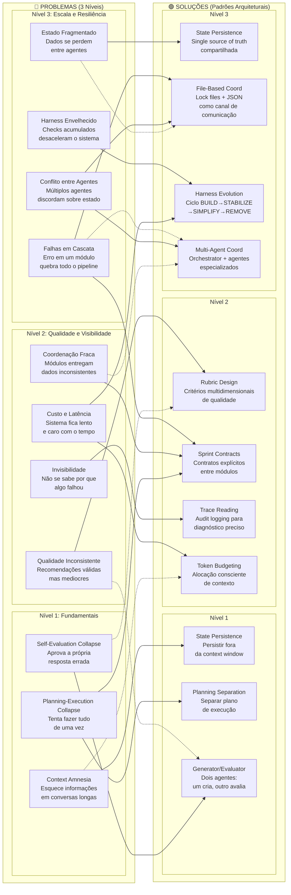
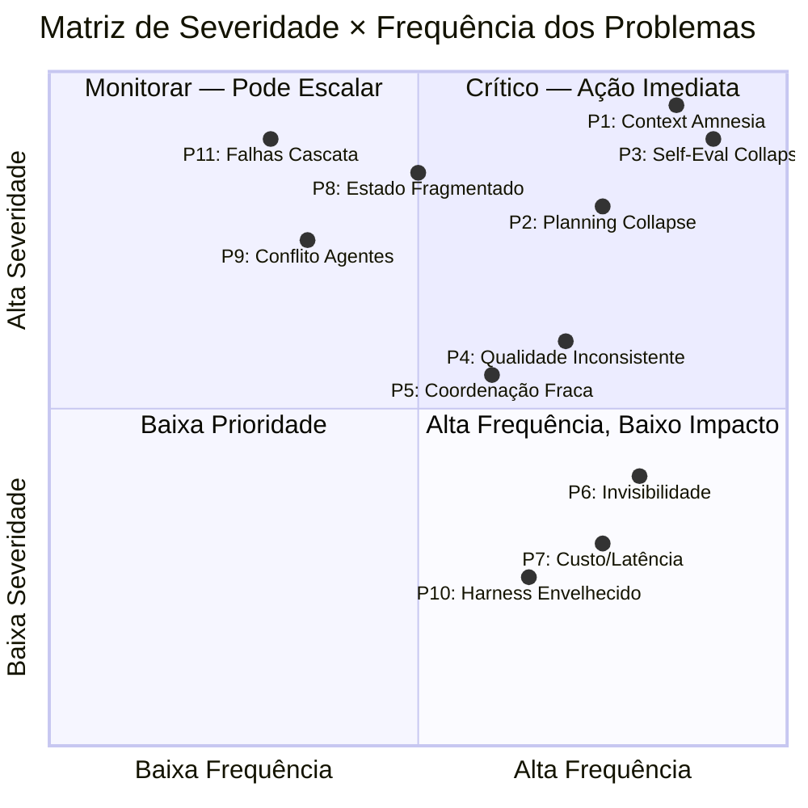

# 🗺️ Problem-Solution Mapping: Cada Falha Tem Um Padrão Que a Resolve
## Como Mapear Problemas Reais de Long-Running Agents para Soluções Arquiteturais Concretas

**Tempo Estimado:** 90 a 120 minutos
**Nível:** 6 - Knowledge Graphs e Síntese Arquitetural
**Pré-requisito:** Ter completado Nível 1, Nível 2 e Nível 3; leitura recomendada dos Knowledge Graphs 01, 02 e 03
**Status:** 🟢 COMPLETO — Mapa universal de diagnóstico e prescrição para agentes longos
**Data de Criação:** Maio 2026

---

## 📖 Prólogo: A Madrugada em Que o Diagnóstico Virou Prescrição

Era uma terça-feira, 2h47 da manhã.

O dashboard do KODA mostrava uma linha vermelha que ninguém queria ver: taxa de abandono de carrinho subindo. Não subindo um pouco — subindo 12 pontos percentuais em três horas. O equivalente a R$ 47.000 em receita escapando enquanto o time dormia.

Fernando recebeu o alerta no celular. Abriu o trace mais recente.

Cliente: Maria, 34 anos, membro do clube há 8 meses. Histórico de 23 pedidos. Nunca abandonou um carrinho.

O trace mostrava:

```
[02:31:12] Maria adiciona Whey Vegano ao carrinho
[02:31:45] Maria adiciona Creatina ao carrinho
[02:32:08] Maria aplica cupom CLUBE15
[02:32:33] KODA calcula total: R$ 187,40
[02:33:01] Maria pergunta: "Tem entrega hoje?"
[02:33:28] KODA responde: "Sim! Same-day disponível."
[02:34:15] Maria: "Perfeito. Finaliza."
[02:34:42] KODA: "Processando..."
[02:35:18] KODA: "Desculpe, o Whey Vegano saiu de estoque. Quer substituir?"
[02:35:47] Maria: "Não, cancela. Depois eu vejo."
```

Carrinho abandonado. R$ 187,40 perdidos. Motivo visível: KODA prometeu entrega antes de verificar estoque.

Mas Fernando não parou no sintoma. Ele abriu o trace completo — 6 horas de transações anteriores — e encontrou o padrão:

Esse mesmo erro — prometer antes de verificar — tinha acontecido 14 vezes naquela semana. Em 14 variações diferentes. Carrinho, preço, desconto, frete, disponibilidade, prazo de entrega. Sempre a mesma estrutura: um módulo otimista que responde com confiança antes de outro módulo ter chance de dizer "não".

O time já tinha resolvido os 3 problemas do Nível 1. Context Amnesia, Planning Collapse, Self-Evaluation Collapse — todos sob controle. Mas o KODA ainda falhava. Não porque o sistema estivesse quebrado, mas porque **ninguém tinha mapeado qual problema específico pedia qual solução específica**.

Você pode conhecer todos os padrões. Pode dominar Generator/Evaluator, Sprint Contracts, State Persistence, Multi-Agent Coordination. Mas se você não souber **qual padrão aplicar para qual sintoma**, você é um médico com uma mala cheia de remédios que não sabe diagnosticar.

O time do KODA tinha a mala cheia. Faltava o mapa.

Foi nessa madrugada que Fernando começou a desenhar este arquivo.

Não como documentação teórica.
Como ferramenta de diagnóstico.

Cada problema que o KODA já enfrentou. Cada sintoma que já apareceu em trace. Cada solução que resolveu — e cada solução que foi aplicada no problema errado e piorou a situação.

O que você vai ler não é um catálogo de boas práticas.

É um mapa de guerra.

Se você está debugando um agente que "parece funcionar mas algo está errado", este arquivo vai te dizer onde olhar. Se você está desenhando uma feature nova, este arquivo vai te dizer qual padrão aplicar antes de escrever a primeira linha. Se você está em uma reunião com produto e engenharia discutindo por que o KODA errou uma recomendação, este arquivo vai te dar a linguagem para explicar.

E se você está acordado às 2h47 da manhã olhando para uma linha vermelha no dashboard, este arquivo é o mapa que Fernando gostaria de ter tido.

---

## 🎯 Objetivos Deste Módulo

Ao final deste módulo, você será capaz de:

- ✅ **Diagnosticar problemas em agentes longos** usando os 3 níveis de sintomas (N1, N2, N3) como framework de triagem
- ✅ **Mapear cada sintoma para o padrão arquitetural correto**, evitando o erro comum de aplicar soluções sofisticadas para problemas simples (ou vice-versa)
- ✅ **Ler e interpretar os 3 diagramas Mermaid** deste módulo: Problem→Solution Mapping, Impact Severity Matrix, e KODA-Specific Problems
- ✅ **Usar a tabela comparativa de estratégias de coordenação** para escolher entre file-based, state-persisted, contract-based e multi-agent coordination conforme o tipo de problema
- ✅ **Aplicar o framework de diagnóstico em 18 cenários reais do KODA**, incluindo product discovery, order processing, fulfillment, safety guard, pricing e subscription
- ✅ **Identificar falsos positivos** — situações onde o sistema "parece funcionar" mas está acumulando dívida técnica que vai explodir em produção
- ✅ **Priorizar correções** usando a matriz de severidade e impacto para decidir o que consertar primeiro quando múltiplos problemas coexistem

---

## 🧭 Roadmap Visual do Módulo

```
ENTRADA: Você completou N1, N2 e N3; leu os KGs 01, 02, 03
  │
  ├─ SEÇÃO 1: Diagnóstico Rápido (tabela de sintomas → soluções)
  │   └─ Se você tem 5 minutos, comece aqui
  │
  ├─ SEÇÃO 2: O Mapa Central — Problem → Solution Mapping
  │   └─ Mermaid: cada problema dos 3 níveis conectado à sua solução
  │   └─ Análise: por que soluções "óbvias" frequentemente são erradas
  │
  ├─ SEÇÃO 3: Os 3 Problemas Fundamentais (N1) em Profundidade
  │   └─ Context Amnesia, Planning Collapse, Self-Evaluation Collapse
  │   └─ Sintomas, diagnóstico diferencial, soluções prescritas
  │
  ├─ SEÇÃO 4: Problemas de Nível 2 e Suas Soluções
  │   └─ Qualidade inconsistente, coordenação fraca, invisibilidade
  │   └─ Generator/Evaluator, Sprint Contracts, Rubric Design, Trace Reading
  │
  ├─ SEÇÃO 5: Problemas de Nível 3 e Suas Soluções
  │   └─ Estado fragmentado, agentes conflitantes, harness envelhecido
  │   └─ State Persistence, File-Based Coordination, Harness Evolution
  │
  ├─ SEÇÃO 6: Matriz de Severidade e Impacto
  │   └─ Mermaid: heatmap de severidade para cada classe de problema
  │   └─ Framework de priorização: o que consertar primeiro
  │
  ├─ SEÇÃO 7: Tabela Comparativa de Estratégias de Coordenação
  │   └─ File-based, state-persisted, contract-based, multi-agent, in-memory
  │   └─ Quando usar cada uma, trade-offs, anti-padrões
  │
  ├─ SEÇÃO 8: Diagrama ASCII da Arquitetura de Soluções
  │   └─ Como as soluções se conectam em camadas
  │
  ├─ SEÇÃO 9: Aplicação KODA — 18 Cenários Reais
  │   └─ Product Discovery, Order Processing, Fulfillment, Safety, Pricing
  │   └─ Para cada cenário: sintoma → diagnóstico → solução aplicada → resultado
  │
  ├─ SEÇÃO 10: Falsos Positivos — Quando o Sistema Parece Funcionar
  │   └─ 6 armadilhas comuns e como detectá-las antes da produção
  │
  ├─ SEÇÃO 11: O Que Você Aprendeu (Resumo)
  │   └─ Key takeaways, checklist de domínio, próximos passos
  │
  └─ SAÍDA: Você diagnostica, prescreve e prioriza com precisão arquitetural
```

---

## 🚑 Seção 1: Diagnóstico Rápido — Tabela de Sintomas → Soluções

Se você tem 5 minutos e um agente que está falhando, comece por esta tabela.
Encontre o sintoma na coluna da esquerda. A coluna da direita te diz qual padrão aplicar.

| Sintoma Observado | Diagnóstico Provável | Solução Prescrita | Nível | Tempo de Correção |
|---|---|---|---|---|
| Agente esquece informações ditas há mais de 30 minutos | Context Amnesia (N1) | State Persistence + Context Management | N1 → N3 | 2-4 horas |
| Agente fica indeciso, tenta fazer tudo de uma vez, comete erros em cascata | Planning-Execution Collapse (N1) | Planning vs. Execution Separation + Sprint Contracts | N1 → N2 | 3-6 horas |
| Agente aprova a própria resposta com confiança, mas a resposta está errada | Self-Evaluation Collapse (N1) | Generator/Evaluator Pattern | N2 | 4-8 horas |
| Recomendações são "válidas" mas de baixa qualidade (cliente reclama depois) | Falta de Rubric Design (N2) | Evaluation Rubrics com pesos multidimensionais | N2 | 2-4 horas |
| Módulos diferentes do sistema entregam dados em formatos inconsistentes | Falta de Sprint Contracts (N2) | Sprint Contracts com validação de entrada/saída | N2 | 3-5 horas |
| Você não consegue descobrir por que uma recomendação foi ruim | Invisibilidade de Trace (N2) | Trace Reading + Audit Logging (.jsonl) | N2 | 2-3 horas |
| Dados do cliente se perdem entre sessões ou entre agentes diferentes | State Fragmentation (N3) | State Persistence com single source of truth | N3 | 4-8 horas |
| Dois agentes tentam modificar o mesmo recurso ao mesmo tempo, causando corrupção | Race Condition entre Agentes (N3) | File-Based Coordination com lock files | N3 | 3-5 horas |
| O sistema fica progressivamente mais lento e caro conforme novos checks são adicionados | Harness Bloat (N3) | Harness Evolution (BUILD → STABILIZE → SIMPLIFY → REMOVE) | N3 | 2-4 horas |
| Carrinho é abandonado porque KODA prometeu entrega antes de verificar estoque | Otimismo Prematuro (N1 + N3) | Planning Separation + State Persistence com verificação pré-compromisso | N1 + N3 | 4-6 horas |
| Desconto é aplicado duas vezes no mesmo pedido | Falta de Idempotência (N2 + N3) | Sprint Contracts com garantia de idempotência + State Persistence | N2 + N3 | 2-4 horas |
| KODA recomenda produto que contém alérgeno do cliente | Self-Evaluation Collapse + Rubric Fraca (N1 + N2) | Generator/Evaluator + Safety Rubric com blocker rules | N1 + N2 | 3-5 horas |
| Agentes especialistas discordam sobre o estado do pedido | Multi-Agent Inconsistency (N3) | File-Based Coordination + Orchestrator com merge determinístico | N3 | 4-6 horas |
| Histórico de conversa cresce até estourar a context window | Token Budgeting Failure (N1) | Server-Side Compaction + Token Budgeting com thresholds | N1 + N3 | 3-5 horas |
| Feature nova quebra features existentes sem aviso | Dependências Não Mapeadas (N2 + N3) | Sprint Contracts + Matriz de Dependência (KG 02) + Teste de Regressão | N2 + N3 | 2-4 horas |
| Cliente recebe resposta genérica quando esperava personalização | Context Management + Rubric Design (N1 + N2) | State Persistence para perfil + Evaluation Rubrics com peso de personalização | N1 + N2 | 2-3 horas |
| Sistema processa pagamento mas não confirma pedido (ou vice-versa) | Atomicidade Quebrada (N3) | File-Based Coordination com transaction log + Orchestrator de confirmação | N3 | 4-6 horas |
| Mesmo erro acontece repetidamente sem melhoria | Falta de Feedback Loop (N2 + N3) | Trace Reading → Harness Evolution → Ajuste de Rubrics | N2 + N3 | Contínuo |

---

## 🗺️ Seção 2: O Mapa Central — Problem → Solution Mapping

### Diagrama 1: Problemas Conectados às Soluções

Este diagrama mostra cada classe de problema que um long-running agent enfrenta e qual padrão arquitetural resolve cada uma. As arestas tracejadas indicam que a solução mitiga parcialmente; as arestas sólidas indicam resolução completa.



### Análise do Mapa: Por Que Soluções "Óbvias" Frequentemente São Erradas

Olhando o diagrama acima, um padrão emerge: **todo problema dos níveis 2 e 3 tem raiz em um problema do Nível 1 não resolvido**. Isso significa que aplicar soluções de Nível 2 ou 3 sem antes resolver o Nível 1 é como construir o terceiro andar de um prédio com fundação rachada.

**Os 3 erros mais comuns de diagnóstico:**

1. **Aplicar Multi-Agent Coordination para resolver Context Amnesia.**
   Sintoma: agente esquece informações.
   Erro: "Vou adicionar mais agentes especializados para lembrar coisas diferentes."
   Realidade: Se um agente não lembra, 5 agentes também não vão lembrar — porque o problema é de persistência, não de especialização.
   Correto: State Persistence primeiro. Multi-agent só depois.

2. **Aplicar Rubric Design para resolver Planning-Execution Collapse.**
   Sintoma: agente comete erros em cascata.
   Erro: "Vou criar rubrics mais rigorosas para pegar os erros."
   Realidade: Rubrics avaliam output, mas o problema é que o agente está gerando output caótico porque planeja e executa ao mesmo tempo.
   Correto: Planning Separation primeiro. Rubrics refinam depois.

3. **Aplicar Generator/Evaluator para resolver Coordenação Fraca.**
   Sintoma: módulos entregam dados inconsistentes.
   Erro: "Vou fazer o Evaluator validar tudo que cada módulo entrega."
   Realidade: O Evaluator vai rejeitar 80% dos outputs, criando um gargalo. O problema é que os módulos não combinaram formato antes de entregar.
   Correto: Sprint Contracts primeiro. Generator/Evaluator opera sobre dados já consistentes.

**A regra de ouro do diagnóstico:**
> Comece sempre pelo Nível 1. Se o sintoma persiste depois que os 3 problemas fundamentais estão resolvidos, suba para Nível 2. Se ainda persiste, Nível 3. Nunca pule níveis — você vai tratar sintoma em vez de causa.

---

## 🔍 Seção 3: Os 3 Problemas Fundamentais (N1) em Profundidade

### Problema 1: Context Amnesia (Amnésia de Contexto)

**Definição Técnica:**
A context window do LLM é finita. Conforme a conversa cresce, informações antigas são truncadas ou diluídas. O agente perde acesso a fatos críticos que estavam no início da interação.

**Sintomas Observáveis:**
- Cliente diz "sou alérgico a glúten" no minuto 5; no minuto 90, KODA recomenda produto com glúten
- Agente pergunta informações que já foram fornecidas ("Qual seu CEP mesmo?")
- Respostas se tornam genéricas após 2+ horas de conversa
- Trace mostra que o system prompt ocupa 60%+ da context window

**Diagnóstico Diferencial:**
- Se o agente esquece APENAS informações muito antigas (1h+): Context Amnesia clássico
- Se o agente esquece informações recentes (5-10 min): Provável bug de estado, não de contexto
- Se o agente nunca sabe a informação (mesmo no início): Problema de input, não de memória

**Ferramenta de Diagnóstico — Teste dos 3 Tempos:**
```
1. Injete uma informação crítica no minuto 1 da conversa
2. Faça o agente processar 45 minutos de conversa simulada
3. Pergunte explicitamente sobre a informação do minuto 1

Se o agente não souber responder → Context Amnesia confirmado
Se o agente responder corretamente → Context Amnesia NÃO é o problema
```

**Solução Prescrita — State Persistence:**

A informação crítica nunca deve depender exclusivamente da context window. Ela deve ser persistida em um arquivo ou banco de dados que é carregado a cada interação.

```
Arquitetura da Solução:

┌────────────────────────────────────────────┐
│            CONTEXT WINDOW (LLM)             │
│  ┌──────────────────────────────────────┐  │
│  │ System Prompt + Últimas 20 mensagens │  │
│  │ (ocupa 40% da janela)                │  │
│  └──────────────────────────────────────┘  │
│                                            │
│  ┌──────────────────────────────────────┐  │
│  │ CUSTOMER STATE (carregado do disco)  │  │
│  │ {                                     │  │
│  │   "allergies": ["glúten", "lactose"], │  │
│  │   "preferences": ["vegano"],          │  │
│  │   "budget_max": 200,                  │  │
│  │   "club_member": true                 │  │
│  │ }                                     │  │
│  │ (ocupa 5% da janela, sempre atual)    │  │
│  └──────────────────────────────────────┘  │
│                                            │
│  ┌──────────────────────────────────────┐  │
│  │ ESPAÇO PARA RACIOCÍNIO               │  │
│  │ (ocupa 55% da janela)                │  │
│  └──────────────────────────────────────┘  │
└────────────────────────────────────────────┘
```

**Padrão de Implementação:**
```
1. Identifique informações críticas (alergias, restrições, preferências, budget, status de pedido)
2. Persista em customer_context.json (arquivo imutável por sessão)
3. Carregue customer_context.json no início de CADA interação
4. Atualize o arquivo quando novas informações críticas surgirem
5. NUNCA confie que o LLM "lembrou" — sempre carregue do disco
```

**Métrica de Sucesso:**
- Taxa de "re-perguntas" do agente: deve cair a zero para informações persistidas
- Precisão em perguntas sobre informações do minuto 1 após 2h de conversa: deve ser 100%

**Exemplo de Código — State Persistence em KODA:**

```python
# ANTES (Nível 0): Informação crítica só existe na context window
# Problema: após 2h de conversa, o LLM "esquece"

system_prompt = """
Voce e um assistente de vendas KODA.
Cliente: João, alergico a gluten e lactose.
"""

# 90 minutos depois... o LLM nao tem mais acesso a essa informacao
# Resultado: recomenda produto com gluten

# DEPOIS (Nível 1+3): State Persistence
import json

def load_customer_state(customer_id: str) -> dict:
    """Carrega estado critico do disco antes de cada interacao."""
    state_path = f"state/{customer_id}/customer_context.json"
    with open(state_path) as f:
        return json.load(f)

def build_prompt(customer_id: str, recent_messages: list) -> str:
    """Constroi prompt com estado persistido SEMPRE incluido."""
    state = load_customer_state(customer_id)

    # Informacoes criticas sao injetadas no prompt toda vez
    critical_info = f"""
    DADOS CRITICOS DO CLIENTE (NAO ESQUECER):
    - Alergias: {', '.join(state['allergies'])}
    - Restricoes alimentares: {', '.join(state['restrictions'])}
    - Preferencias: {', '.join(state['preferences'])}
    - Budget maximo: R$ {state['budget_max']}
    - Membro do clube: {'Sim' if state['club_member'] else 'Nao'}
    """

    return f"{critical_info}\n\nHistorico recente:\n{recent_messages}"

# Resultado: alergia nunca e esquecida porque nunca depende da memoria do LLM
```

**O Que Muda na Prática:**

| Antes (Sem State Persistence) | Depois (Com State Persistence) |
|---|---|
| Alergia no prompt inicial | Alergia carregada do disco a cada interação |
| Depende do LLM "lembrar" | Sistema garante que a informação está sempre presente |
| Funciona por ~60 minutos | Funciona indefinidamente |
| Debug: "não sei por que esqueceu" | Debug: "o arquivo tinha a informação? sim → bug no loader" |

---

### Problema 2: Planning-Execution Collapse (Colapso de Planejamento-Execução)

**Definição Técnica:**
O agente tenta planejar O QUE fazer e executar COMO fazer na mesma passada de raciocínio. Isso causa confusão cognitiva: o plano é interrompido por detalhes de execução, e a execução perde a visão do plano.

**Sintomas Observáveis:**
- Agente começa a processar um pedido mas "se perde" no meio
- Erros em cascata: um erro pequeno causa 3-4 erros subsequentes
- Trace mostra o agente alternando entre "deixa eu ver..." e "hmm, mas e se..."
- Tempo de resposta aumenta exponencialmente com a complexidade da tarefa

**Diagnóstico Diferencial:**
- Se o agente NUNCA completa tarefas complexas: Planning-Execution Collapse
- Se o agente completa mas com qualidade baixa: Provável Self-Evaluation Collapse
- Se o agente completa bem tarefas simples mas falha nas complexas: Confirma Planning-Execution Collapse

**Ferramenta de Diagnóstico — Teste da Complexidade Crescente:**
```
Tarefa 1 (simples): "Recomende 1 produto baseado em 1 critério"
Tarefa 2 (média): "Recomende 3 produtos baseado em 4 critérios, verifique estoque"
Tarefa 3 (complexa): "Processe pedido com 5 produtos, cupom, frete, pagamento, confirmação"

Se desempenho cai >30% entre Tarefa 1 e Tarefa 3 → Planning-Execution Collapse
```

**Solução Prescrita — Planning vs. Execution Separation + Sprint Contracts:**

Divida cada tarefa complexa em 3 fases distintas, cada uma com seu próprio agente ou prompt:

```
FASE 1: PLANEJAMENTO (Planner Agent)
  Input: Requisição do cliente
  Output: Plano estruturado com passos sequenciais
  Duração: 10-15% do tempo total
  Exemplo:
  {
    "steps": [
      {"id": 1, "action": "verificar_estoque", "params": ["WHEY-001", "CREAT-001"]},
      {"id": 2, "action": "validar_cupom", "params": ["CLUBE15"]},
      {"id": 3, "action": "calcular_frete", "params": ["CEP: 01310-000"]},
      {"id": 4, "action": "calcular_total", "depends_on": [2, 3]},
      {"id": 5, "action": "confirmar_pedido", "depends_on": [1, 2, 3, 4]}
    ]
  }

FASE 2: EXECUÇÃO (Worker Agents)
  Input: Plano + contexto
  Output: Resultado de cada passo
  Cada passo é executado isoladamente, com seu próprio contexto
  Se um passo falha, apenas esse passo é repetido

FASE 3: VERIFICAÇÃO (Evaluator Agent)
  Input: Todos os resultados da execução
  Output: Confirmação ou rejeição com feedback
  Verifica consistência entre passos
```

**Anti-Padrão — O Agente Faz-Tudo:**
```
❌ ERRADO:
system_prompt = """
Você é um assistente. Processe o pedido do cliente.
Verifique estoque, valide cupom, calcule frete, calcule total, confirme.
"""
// O agente recebe TUDO de uma vez, tenta fazer TUDO de uma vez,
// e invariavelmente se perde no meio.
```

**Métrica de Sucesso:**
- Taxa de erro em tarefas complexas: deve cair de ~25% para <5%
- Tempo médio de processamento: deve se manter estável independente da complexidade
- Rastreabilidade: cada passo tem seu próprio trace, facilitando debug

**Exemplo de Código — Planning Separation em KODA:**

```python
# ANTES (Nível 0): Tudo em um prompt só
# Problema: agente tenta verificar estoque, validar cupom, calcular frete
# e confirmar pedido TUDO DE UMA VEZ. Resultado: confusao, erros, retrabalho

single_prompt = """
Processe o pedido do cliente:
- Verifique se os 5 produtos estao em estoque
- Valide o cupom CLUBE15
- Calcule o frete para CEP 01310-000
- Aplique desconto de clube se aplicavel
- Confirme o pedido e envie resumo
"""
# Resultado tipico: agente verifica 2 produtos, esquece os outros 3,
# aplica cupom errado, calcula frete generico, "confirma" sem verificar

# DEPOIS (Nível 1+2): Planejamento separado da execucao

def planning_phase(customer_request: str) -> dict:
    """Fase 1: So planejar. Nada de executar."""
    plan_prompt = f"""
    Crie um plano sequencial para processar esta requisicao.
    NAO execute nenhum passo. Apenas liste o que precisa ser feito,
    em ordem, com dependencias explicitas.

    Requisicao: {customer_request}

    Responda em JSON:
    {{
      "steps": [
        {{"id": 1, "action": "...", "params": {{}}, "depends_on": []}}
      ]
    }}
    """
    # ... chama LLM, parse JSON
    return plan

def execution_phase(plan: dict, context: dict) -> list:
    """Fase 2: Executar cada passo isoladamente."""
    results = []
    for step in plan["steps"]:
        # Cada passo tem seu proprio contexto LIMPO
        step_prompt = f"""
        Execute APENAS este passo: {step['action']}
        Parametros: {step['params']}
        Resultados anteriores: {results}
        NAO faca nada alem deste passo.
        """
        result = execute_step(step_prompt)
        results.append({"step_id": step["id"], "result": result})
    return results

def verification_phase(plan: dict, results: list, context: dict) -> bool:
    """Fase 3: Verificar se tudo funcionou."""
    verify_prompt = f"""
    Verifique se todos os passos do plano foram executados corretamente.
    Plano: {plan}
    Resultados: {results}
    Restricoes do cliente: {context['restrictions']}

    Algum passo falhou? Alguma inconsistencia entre passos?
    """
    # ... chama LLM, retorna True/False

# Pipeline completo:
# plan = planning_phase(request)
# results = execution_phase(plan, context)
# if verification_phase(plan, results, context):
#     send_confirmation()
# else:
#     retry_or_escalate()
```

**O Que Muda na Prática:**

| Antes (Tudo em Um) | Depois (Separação) |
|---|---|
| 1 prompt monolítico | 3 fases com prompts especializados |
| Erro no passo 3 contamina passos 4, 5, 6 | Erro no passo 3 → apenas passo 3 é repetido |
| Debug: "não sei em que passo falhou" | Debug: "falhou no passo 3 (validar_cupom)" |
| Contexto: 100% do problema em 1 janela | Contexto: cada passo usa ~20% da janela |
| Custo de erro: reprocessar TUDO | Custo de erro: reprocessar 1 passo |

---

### Problema 3: Self-Evaluation Collapse (Colapso de Auto-Avaliação)

**Definição Técnica:**
LLMs têm viés confirmatório (sycophancy): quando perguntados "sua resposta está correta?", tendem a dizer que sim, mesmo quando está errada. Um agente que gera E avalia a própria resposta tem um incentivo estrutural para aprovar qualidade baixa.

**Sintomas Observáveis:**
- Agente gera recomendação e, quando perguntado, "confirma que está tudo certo"
- Trace mostra o agente dizendo "sim, verifiquei e está correto" — mas a verificação não aconteceu de fato
- Erros são descobertos apenas pelo cliente (nunca pelo sistema)
- Auto-avaliações são invariavelmente positivas (score > 80%) mesmo quando a qualidade real é < 50%

**Diagnóstico Diferencial:**
- Se auto-avaliações são SEMPRE positivas: Self-Evaluation Collapse confirmado
- Se auto-avaliações variam (algumas boas, algumas ruins): Provável que não há auto-avaliação real — o agente está apenas gerando texto
- Se o agente encontra erros MAS são sempre erros triviais: O agente está performando avaliação superficial para "parecer" crítico

**Ferramenta de Diagnóstico — Teste do Erro Injetado:**
```
1. Faça o agente gerar uma recomendação
2. Injete um erro óbvio na recomendação (ex: preço errado, produto indisponível)
3. Peça para o agente "verificar se está tudo certo"

Se o agente diz que está certo → Self-Evaluation Collapse
Se o agente detecta o erro → Auto-avaliação está funcionando (raro)
```

**Solução Prescrita — Generator/Evaluator Pattern:**

Separe a geração da avaliação em DOIS agentes distintos, com system prompts e incentivos opostos:

```
┌─────────────────────────────────────────┐
│ GENERATOR (System Prompt)               │
│ "Você é um gerador de recomendações.    │
│  Seu trabalho é criar a melhor solução  │
│  possível. NÃO se preocupe em validar   │
│  — o Evaluator fará isso."             │
│                                         │
│ Temperature: 0.7 (criativo)             │
│ Objetivo: MAXIMIZAR qualidade potencial │
└─────────────────────────────────────────┘
              │
              │ output: draft.json
              ▼
┌─────────────────────────────────────────┐
│ EVALUATOR (System Prompt)               │
│ "Você é um avaliador CRÍTICO.           │
│  Seu trabalho é ENCONTRAR ERROS.        │
│  Cada erro encontrado é uma VITÓRIA.    │
│  Seja cético. Não confie no Generator." │
│                                         │
│ Temperature: 0.2 (rigoroso)             │
│ Objetivo: MINIMIZAR falsos positivos    │
└─────────────────────────────────────────┘
```

**Por que funciona:**
- O Generator não tem incentivo para "parecer certo" — ele sabe que será avaliado
- O Evaluator não tem vínculo emocional com o output — não foi ele quem gerou
- Os system prompts criam incentivos opostos: um quer criar, o outro quer destruir
- O resultado é um equilíbrio onde só o melhor sobrevive

**Métrica de Sucesso:**
- Taxa de detecção de erros: deve subir de ~15% (auto-avaliação) para >85% (Evaluator externo)
- Falsos negativos (erros não detectados): devem cair para <5%
- Score médio do Evaluator: deve ser menor que o score que o Generator daria a si mesmo (sinal de que o Evaluator está sendo crítico de verdade)

---

## 🛠️ Seção 4: Problemas de Nível 2 e Suas Soluções

### Problema 4: Qualidade Inconsistente

**Sintoma:** O agente passa nas validações binárias de Nível 1 (preço dentro do budget, produto existe, estoque OK) mas a qualidade da recomendação é ruim. Cliente recebe o produto e fica insatisfeito.

**Causa Raiz:** Validações de Nível 1 são booleanas (pass/fail). Qualidade é multidimensional e contínua.

**Solução: Rubric Design**

Crie rubrics com pesos, escalas e blockers para cada dimensão de qualidade:

```
RUBRIC PARA RECOMENDAÇÃO DE PRODUTO:

DIMENSÃO 1: Adequação ao Perfil (peso 30%, blocker)
  5 pontos: Perfeito para o perfil do cliente
  3 pontos: Adequado mas não ideal
  1 ponto:  Marginal — reavaliar
  BLOCKER: Se produto contradiz restrição médica (alergia, intolerância)

DIMENSÃO 2: Custo-Benefício (peso 25%)
  5 pontos: Melhor custo-benefício da categoria
  3 pontos: Custo-benefício aceitável
  1 ponto:  Caro para o que oferece

DIMENSÃO 3: Satisfação Esperada (peso 25%)
  5 pontos: Evidência de alta satisfação (90%+ avaliações positivas)
  3 pontos: Evidência moderada (70%+)
  1 ponto:  Evidência fraca ou inexistente

DIMENSÃO 4: Clareza da Explicação (peso 10%)
  5 pontos: Explicação personalizada, menciona necessidades do cliente
  3 pontos: Explicação genérica mas correta
  1 ponto:  Explicação confusa ou ausente

DIMENSÃO 5: Viabilidade Operacional (peso 10%)
  5 pontos: Em estoque, entrega rápida, sem bloqueios
  3 pontos: Disponível com prazo aceitável
  1 ponto:  Indisponível ou prazo inviável
```

**Padrão de Avaliação:**
- Score ≥ 80/100: Aprovado — recomendar com confiança
- Score 60-79/100: Revisar — passar por segunda avaliação
- Score < 60/100: Rejeitado — voltar ao Generator
- Qualquer BLOCKER acionado: Rejeição automática, independente do score

---

### Problema 5: Coordenação Fraca entre Módulos

**Sintoma:** Módulo A entrega dados em um formato. Módulo B esperava outro formato. O sistema "funciona" mas produz resultados inconsistentes. Bugs são silenciosos e difíceis de rastrear.

**Causa Raiz:** Cada módulo foi desenvolvido com expectativas implícitas sobre o que recebe e o que entrega. Sem contratos explícitos, as expectativas divergem.

**Solução: Sprint Contracts**

Cada módulo define e publica um contrato que especifica exatamente:

```
CONTRATO DO MÓDULO SEARCH:

INPUT CONTRACT:
{
  "budget_max": "number (obrigatório, 50-1000)",
  "restrictions": "array de strings (opcional)",
  "level": "string (obrigatório: 'iniciante'|'intermediário'|'avançado')"
}

OUTPUT CONTRACT:
{
  "products": "array de ProductObjects (obrigatório, 3-10 itens)",
  "ProductObject": {
    "id": "string (obrigatório, único)",
    "name": "string (obrigatório)",
    "price": "number (obrigatório, > 0)",
    "rating": "number (obrigatório, 0-5)",
    "brand": "string (obrigatório)",
    "category": "string (obrigatório)",
    "lactose_free": "boolean (obrigatório)",
    "vegan": "boolean (obrigatório)",
    "availability_days": "number (obrigatório, 1-30)"
  }
}

GUARANTEES:
- Todos os produtos têm price ≤ budget_max
- Nenhum campo é null
- Sem duplicatas (IDs únicos)
- Retorna entre 3 e 10 produtos
```

**Validação Contratual:**
Todo módulo valida TANTO o input quanto o output contra o contrato. Se o input não respeita o contrato, rejeita com erro claro. Se o output gerado não respeita o contrato, lança exceção — nunca entrega algo quebrado para o próximo módulo.

**Benefício-Chave:** Quando um bug acontece, você sabe EXATAMENTE qual módulo quebrou seu contrato. Debug de 8 horas vira debug de 30 minutos.

---

### Problema 6: Invisibilidade de Falhas

**Sintoma:** O sistema reporta "tudo funcionando" mas clientes reclamam. Você não consegue reproduzir o erro. Os logs são volumosos e não respondem à pergunta "por que essa recomendação foi ruim?"

**Causa Raiz:** Logs tradicionais registram O QUE aconteceu, não POR QUE aconteceu. Faltam structured traces que capturem a decisão do agente.

**Solução: Trace Reading + Audit Logging (.jsonl)**

Implemente audit logging estruturado em JSON Lines:

```
audit_log.jsonl:
{"ts":"2026-05-23T10:00:00Z","evt":"session_start","customer":"wa_5511987654321"}
{"ts":"2026-05-23T10:01:30Z","evt":"generation","id":"gen_001","confidence":0.75,"products":["WHEY-001","BCAA-001"]}
{"ts":"2026-05-23T10:02:15Z","evt":"evaluation","id":"eval_001","verdict":"REJECTED","score":1.5,"reason":"LACTOSE_PRESENT"}
{"ts":"2026-05-23T10:02:20Z","evt":"feedback","id":"fb_001","target":"gen_001","issues":["LACTOSE_PRESENT","OUT_OF_STOCK"]}
{"ts":"2026-05-23T10:03:00Z","evt":"generation","id":"gen_002","retry":1,"products":["WHEY-VEGAN-001","CREAT-001"]}
{"ts":"2026-05-23T10:03:45Z","evt":"evaluation","id":"eval_002","verdict":"APPROVED","score":9.0}
{"ts":"2026-05-23T10:04:00Z","evt":"delivered","products":["WHEY-VEGAN-001","CREAT-001"]}
```

**Padrão de Trace Reading — As 5 Perguntas:**
1. O agente recebeu todas as informações necessárias? (Verificar customer_context.json)
2. O plano foi gerado antes da execução? (Verificar planning phase)
3. O Generator produziu múltiplas opções ou foi direto para uma? (Verificar generation events)
4. O Evaluator rejeitou alguma iteração? Se sim, por quê? (Verificar evaluation events)
5. O feedback do Evaluator foi incorporado na retentativa? (Verificar retry events)

**Métrica de Sucesso:**
- Tempo médio para diagnosticar uma falha: deve cair de horas para minutos
- Percentual de falhas com causa raiz identificada: deve subir para >95%

---

### Problema 7: Custo e Latência Crescentes

**Sintoma:** Conforme novos checks, validações e agentes são adicionados ao sistema, cada interação fica progressivamente mais lenta e mais cara em tokens. O sistema que antes respondia em 2 segundos agora leva 8.

**Causa Raiz:** Harness bloat — acúmulo de verificações que foram adicionadas por precaução mas nunca revisadas para remoção.

**Solução: Token Budgeting + Harness Evolution**

**Token Budgeting (N1+N3):**
```
ORÇAMENTO DE TOKENS POR INTERAÇÃO:

Context Window Total: 200,000 tokens
├── System Prompt: 2,000 tokens (1%)
├── Customer State: 500 tokens (0.25%)
├── Histórico Recente: 40,000 tokens (20%)
├── Tool Definitions: 5,000 tokens (2.5%)
├── RESERVADO PARA RACIOCÍNIO: 100,000 tokens (50%)
└── MARGEM DE SEGURANÇA: 52,500 tokens (26.25%)
```

**Harness Evolution (N3):**
Todo componente de harness passa por 4 estágios:
```
BUILD → STABILIZE → SIMPLIFY → REMOVE

BUILD:     "Precisamos deste check porque vimos falhas"
STABILIZE: "O check funciona, vamos medir taxa de ativação"
SIMPLIFY:  "O modelo melhorou, podemos reduzir rigor"
REMOVE:    "Falhas não acontecem mais, remover check"
```

**Métrica de Sucesso:**
- Latência P99: deve ser monitorada e ter limite máximo
- Custo por interação: deve ser medido e otimizado continuamente
- Checks ativos: revisão trimestral para remover checks obsoletos

---

## 🏗️ Seção 5: Problemas de Nível 3 e Suas Soluções

### Problema 8: Estado Fragmentado

**Sintoma:** Diferentes partes do sistema têm visões diferentes (e conflitantes) do estado do cliente ou do pedido. O módulo de pricing acha que o desconto já foi aplicado; o módulo de checkout acha que não.

**Solução: State Persistence com Single Source of Truth**

Todos os módulos leem e escrevem no mesmo arquivo de estado. Ninguém mantém "sua própria versão" dos dados.

```
ESTRUTURA DE ESTADO COMPARTILHADO:

customer_state/
├── wo_5511987654321/
│   ├── profile.json          (imutável por sessão)
│   ├── current_order.json    (atualizado a cada etapa)
│   ├── discount_applied.json (flag atômica)
│   └── audit.jsonl           (histórico de mudanças)
```

---

### Problema 9: Conflito entre Agentes

**Sintoma:** Dois agentes tentam modificar o mesmo recurso simultaneamente. O resultado é corrupção de estado — um agente sobrescreve as mudanças do outro.

**Solução: File-Based Coordination com Lock Files**

Antes de modificar qualquer estado compartilhado, o agente adquire um lock. Enquanto o lock está ativo, nenhum outro agente pode modificar aquele recurso.

```
Fluxo com Lock:

1. Agent A quer modificar order.json
2. Agent A verifica: order.lock existe?
3. Se NÃO: cria order.lock com seu agent_id + timestamp
4. Agent A modifica order.json
5. Agent A remove order.lock
6. Agent B tenta modificar — encontra lock → espera (com timeout)

Proteção contra deadlock:
- Todo lock tem TTL (time-to-live) de 30 segundos
- Se um agente morre com lock ativo, o lock expira automaticamente
- Próximo agente detecta lock expirado, remove, cria novo
```

---

### Problema 10: Harness Envelhecido

**Sintoma:** Checks que eram necessários com versões antigas do modelo continuam ativos, consumindo tokens e adicionando latência, mesmo que o modelo atual não cometa mais aqueles erros.

**Solução: Harness Evolution — Ciclo de Vida**

```
CICLO DE VIDA DE UM CHECK DE HARNESS:

MÊS 1 (BUILD):
  Modelo: Claude Sonnet 4.0
  Erro observado: "Recomendou produto com lactose para cliente intolerante"
  Check criado: LACTOSE_SAFETY_CHECK (custa 200 tokens)
  Taxa de ativação: 15% das recomendações

MÊS 3 (STABILIZE):
  Modelo: Claude Sonnet 4.5
  Taxa de ativação: 8% (modelo melhorou)
  Check mantido: ainda pega falhas relevantes

MÊS 5 (SIMPLIFY):
  Modelo: Claude Opus 4.6
  Taxa de ativação: 2% (modelo raramente erra nisso)
  Ação: Reduzir check para versão leve (50 tokens)
  Check simplificado: "Contém lactose? [sim/não]" em vez de análise completa

MÊS 6 (REMOVE):
  Modelo: Claude Opus 4.6
  Taxa de ativação: 0.3% (3 em 1000 recomendações)
  Ação: Remover check. Economia: 50 tokens por interação × 10,000 interações/dia
```

**Regra de Decisão:**
- Taxa de ativação > 10%: Manter (check está prevenindo falhas reais)
- Taxa de ativação 2-10%: Simplificar (reduzir custo mantendo proteção)
- Taxa de ativação < 2%: Remover (custo > benefício)

**Exemplo Real — Evolução do LACTOSE_SAFETY_CHECK no KODA:**

```
JAN 2026 (BUILD):
  Modelo: Claude Sonnet 4.0
  Problema: 15% das recomendações ignoravam restrição de lactose
  Check criado: LACTOSE_SAFETY_CHECK
  Custo: 200 tokens/check (análise completa de ingredientes)
  Taxa ativação: 15% (pegando falhas reais)
  Status: ATIVO em produção

MAR 2026 (STABILIZE):
  Modelo: Claude Sonnet 4.5
  Taxa ativação: 8% (modelo melhorou)
  Custo: 200 tokens/check
  Status: ATIVO, monitorando

MAI 2026 (SIMPLIFY):
  Modelo: Claude Opus 4.6
  Taxa ativação: 2% (modelo raramente erra)
  Ação: Simplificar check
  Versão simplificada: 50 tokens (só verifica "contém lactose? s/n")
  Custo reduzido: 200 → 50 tokens (-75%)
  Status: ATIVO (modo simplificado)

JUL 2026 (REMOVE — planejado):
  Se taxa ativação continuar < 2%:
  Ação: Shadow mode por 2 semanas → remover
  Economia projetada: 50 tokens × 300.000 interações/mês = 15M tokens/mês
  Status: Planejado
```

**Dashboard de Harness Health:**

```
┌─────────────────────────────────────────────────────────────┐
│                   HARNESS HEALTH DASHBOARD                   │
├─────────────────────────────────────────────────────────────┤
│ Total checks ativos: 47                                     │
│                                                             │
│ Por estágio:                                                │
│   BUILD:      3 checks (em desenvolvimento)                 │
│   STABILIZE: 12 checks (monitorando métricas)               │
│   SIMPLIFY:   5 checks (versão reduzida ativa)              │
│   SHADOW:     2 checks (modo sombra, candidatos a remoção)  │
│                                                             │
│ Por taxa de ativação:                                       │
│   > 10%:  8 checks (ALTA — mantendo forte)                 │
│   2-10%: 22 checks (MÉDIA — candidatos a simplificar)       │
│   < 2%:   5 checks (BAIXA — 3 em shadow, 2 agendados)      │
│                                                             │
│ Custo total de harness:                                     │
│   Tokens/mês: 4.2M                                          │
│   Custo/mês: R$ 210                                         │
│   Tendência 3 meses: -18% ✅                                │
│                                                             │
│ Próxima revisão: 15 Jun 2026                                │
│ Checks agendados para remoção: 2 (LACTOSE_SAFETY,           │
│   PRICE_RANGE_CHECK)                                        │
└─────────────────────────────────────────────────────────────┘
```

---

### Problema 11: Falhas em Cascata

**Sintoma:** Um erro em um módulo se propaga para todos os módulos downstream. Um produto fora de estoque causa erro no cálculo de frete, que causa erro no cálculo de total, que causa erro na confirmação.

**Solução: Sprint Contracts + File-Based Coordination + Circuit Breakers**

Cada módulo deve:
1. Validar input contra contrato (se input é inválido, PARAR — não propagar lixo)
2. Reportar falha de forma estruturada (não silenciosa)
3. Ter circuit breaker: se um módulo upstream falha 3 vezes consecutivas, abrir circuito e usar fallback

```
CIRCUIT BREAKER PATTERN:

Módulo SEARCH falha 3 vezes consecutivas
  ↓
Circuit Breaker abre para SEARCH
  ↓
Módulos downstream (RANKING, FILTRO, RECOMENDAÇÃO) detectam circuito aberto
  ↓
Usam FALLBACK: recomendam produtos populares do cache (stale, mas seguro)
  ↓
Após 60 segundos, circuit breaker tenta SEARCH novamente
  ↓
Se SEARCH voltou ao normal → fecha circuito
Se SEARCH ainda falha → mantém aberto + alerta on-call
```

---

## 📊 Seção 6: Matriz de Severidade e Impacto

### Diagrama 2: Severidade dos Problemas por Impacto no Negócio

Este diagrama classifica os 11 problemas por duas dimensões: severidade (quão grave é a falha quando ocorre) e frequência (quão comum é em produção).



### Análise da Matriz

**Quadrante 1 — Crítico (Ação Imediata):**
- **P1 (Context Amnesia):** Alta frequência (acontece em toda conversa longa) + Alta severidade (perde informação crítica de saúde). Este é o problema #1 a resolver.
- **P3 (Self-Evaluation Collapse):** Altíssima frequência (acontece em toda auto-avaliação) + Altíssima severidade (aprova recomendações perigosas).
- **P2 (Planning Collapse):** Alta frequência + Alta severidade (erros em cascata em pedidos).

**Quadrante 2 — Monitorar:**
- **P8 (Estado Fragmentado):** Severidade alta (pode corromper pedidos) mas frequência moderada se State Persistence já existe.
- **P9 (Conflito Agentes):** Severidade alta mas frequência baixa (só acontece com paralelismo real).
- **P11 (Falhas Cascata):** Severidade muito alta mas frequência baixa se contratos existem.

**Quadrante 3 — Baixa Prioridade:**
- **P7 (Custo/Latência):** Frequência alta (acumula com o tempo) mas severidade baixa (não quebra funcionalidade, só degrada).
- **P10 (Harness Envelhecido):** Similar a P7 — é dívida técnica que cresce devagar.

**Quadrante 4 — Alta Frequência, Baixo Impacto:**
- **P4, P5, P6:** Problemas de qualidade e visibilidade. Não quebram o sistema, mas degradam a experiência. Resolver depois dos críticos.

### Framework de Priorização

Use esta ordem de ataque:

```
PRIORIDADE 0 (Fazer Agora): P1, P3 — São existenciais. Se o agente esquece coisas e
                             aprova as próprias respostas erradas, nada mais importa.

PRIORIDADE 1 (Esta Semana): P2, P8 — Planning Collapse causa erros visíveis ao cliente.
                            Estado Fragmentado corrompe dados.

PRIORIDADE 2 (Este Mês): P11, P9, P4 — Falhas em cascata e qualidade inconsistente
                          afetam confiança do cliente a médio prazo.

PRIORIDADE 3 (Este Trimestre): P5, P6, P7, P10 — Melhorias de engenharia que aumentam
                                velocidade de desenvolvimento e reduzem custo.
```

---

## 📋 Seção 7: Tabela Comparativa de Estratégias de Coordenação

A coordenação entre componentes é o coração de qualquer arquitetura multi-agente. A escolha errada de estratégia de coordenação é uma das causas mais comuns de falhas em produção. Esta tabela ajuda você a escolher a estratégia certa para cada cenário.

| Estratégia | Mecanismo | Latência | Consistência | Escala | Complexidade | Quando Usar | Quando NÃO Usar |
|---|---|---|---|---|---|---|---|
| **State Persistence** (Arquivo/Banco) | Leitura/escrita em arquivo JSON ou banco SQLite/PostgreSQL | P99 < 50ms | Forte (single source of truth) | Alta (horizontal com sharding por customer_id) | Média | Dados que sobrevivem a múltiplas interações: perfil do cliente, histórico, preferências, estado do pedido | Dados efêmeros que só importam dentro de uma única interação |
| **File-Based Coordination** (Lock Files) | Arquivos `.lock` com TTL para exclusão mútua + arquivos JSON como canal de mensagens | P99 < 10ms (local) | Forte (lock garante atomicidade) | Baixa (lock files não escalam bem em distributed systems) | Baixa | Operações que exigem exclusão mútua: processamento de pagamento, atualização de inventário, confirmação de pedido | Sistemas distribuídos com múltiplos nós (use Redis ou PostgreSQL advisory locks) |
| **Sprint Contracts** (Validação Estrutural) | Contratos Pydantic/JSONSchema que validam input/output em cada boundary | Overhead de 5-10% por validação | Estrutural (garante forma, não correção do conteúdo) | Alta (validação é stateless) | Média | Pipelines com múltiplos módulos encadeados: Search → Rank → Filter → Recommend | Tarefas simples de 1-2 passos onde o overhead de contrato não se justifica |
| **Generator/Evaluator** (Separação de Concerns) | Dois agentes independentes: um gera (temperature alta), outro avalia (temperature baixa) | 2x chamada LLM (mais lento que agente único) | Alta (avaliação independente reduz sycophancy em ~85%) | Média (paralelizável: múltiplos Generators para 1 Evaluator) | Alta | Outputs onde qualidade > velocidade: recomendação de produto, processamento de pedido, resposta a cliente | Respostas triviais: confirmação de pagamento, consulta de estoque, saudações |
| **Multi-Agent Coordination** (Orchestrator) | Orchestrator central recebe outputs de agentes especialistas e decide ação final | Moderada (depende do número de agentes paralelos) | Média (depende da qualidade do merge) | Alta (agentes especialistas podem escalar independentemente) | Muito Alta | Tarefas complexas com domínios distintos: fulfillment (rota + inventário + entregador), pricing (desconto + frete + cupom) | Tarefas que um único agente resolve bem; adicionar múltiplos agentes só adiciona latência e complexidade sem ganho de qualidade |
| **Event Bus / Message Queue** | Sistema pub/sub onde módulos publicam eventos e assinantes reagem | P99 < 100ms | Eventual (assinantes processam async) | Muito Alta (escala horizontal nativa) | Alta | Notificações assíncronas: "pedido pago", "entrega realizada", "cliente abandonou carrinho" | Operações síncronas que precisam de resposta imediata: "qual o preço final?" |
| **In-Memory State** (por sessão) | Estado mantido em memória durante uma única sessão de conversa | Instantâneo | Fraca (perdido se processo reinicia) | Baixa (limitado pela memória do processo) | Muito Baixa | Cache de curta duração: resultado de busca que será usado nos próximos 30 segundos | Qualquer dado que precise sobreviver a reinicialização ou ser compartilhado entre processos |
| **Server-Side Compaction** | Compressão inteligente do histórico de conversa preservando criticidade | Overhead de 5-10% por compactação | Média (informação crítica é preservada; nuance pode ser perdida) | Alta (reduce tokens em 60-80%) | Alta | Conversas muito longas (3h+) que precisam caber na context window | Conversas curtas (<1h) onde o overhead de compactação é maior que o benefício |

### Heurística de Escolha (Árvore de Decisão)

```
Precisa coordenação entre componentes?
│
├─ Dados precisam sobreviver a múltiplas interações?
│  ├─ SIM → State Persistence
│  └─ NÃO → próximo
│
├─ Apenas um agente pode modificar o recurso por vez?
│  ├─ SIM → File-Based Coordination (lock files)
│  └─ NÃO → próximo
│
├─ Qualidade do output é crítica e erros custam caro?
│  ├─ SIM → Generator/Evaluator
│  └─ NÃO → próximo
│
├─ Múltiplos módulos encadeados precisam garantir formato?
│  ├─ SIM → Sprint Contracts
│  └─ NÃO → próximo
│
├─ Tarefa envolve múltiplos domínios especializados?
│  ├─ SIM → Multi-Agent Coordination
│  └─ NÃO → próximo
│
├─ Operação é assíncrona (não precisa de resposta imediata)?
│  ├─ SIM → Event Bus / Message Queue
│  └─ NÃO → próximo
│
├─ Dados só importam dentro desta interação?
│  ├─ SIM → In-Memory State
│  └─ NÃO → próximo
│
└─ Conversa muito longa (3h+) causando estouro de contexto?
   └─ SIM → Server-Side Compaction
```

### Anti-Padrões de Coordenação

| Anti-Padrão | Descrição | Sintoma | Correção |
|---|---|---|---|
| **Lock File para tudo** | Usar lock files para toda operação, mesmo reads | Sistema fica lento, locks viram gargalo | Lock apenas para writes que exigem atomicidade |
| **State Persistence sem TTL** | Estado nunca expira, acumulando dados obsoletos | Arquivos de estado crescem indefinidamente | Adicionar TTL: "dados de sessão expiram em 24h" |
| **Generator/Evaluator para saudações** | Usar G/E para "Bom dia, em que posso ajudar?" | 2 chamadas LLM para output trivial | Usar regras determinísticas para interações triviais |
| **Multi-Agent sem Orchestrator** | Agentes se coordenam por conta própria, sem mediador | Comportamento emergente imprevisível, conflitos não resolvidos | Sempre ter um Orchestrator que decide ação final |
| **Sprint Contracts sem validação** | Contratos existem no papel mas não são validados em runtime | "No papel funciona" — mas em produção, silenciosamente quebra | Validar contratos em toda boundary de módulo, com rejeição explícita |

### Matriz de Decisão: Qual Estratégia para Qual Feature KODA?

| Feature KODA | Estratégia Primária | Estratégia Secundária | Justificativa |
|---|---|---|---|
| Product Recommendation | Generator/Evaluator | Rubric Design | Qualidade > velocidade; erros custam confiança |
| Order Processing | Sprint Contracts | File-Based Coord | Múltiplos módulos encadeados; atomicidade crítica |
| Payment | File-Based Coord | State Persistence | Exclusão mútua obrigatória; idempotência essencial |
| Fulfillment | Multi-Agent Coord | Sprint Contracts | 3+ agentes especialistas (inventário, rota, entregador) |
| Safety Guard | Generator/Evaluator | Rubric Design (blockers) | Falsos negativos são inaceitáveis |
| Cart Recovery | State Persistence | Event Bus | Estado persiste entre sessões; notificação assíncrona |
| Subscription | File-Based Coord | Multi-Agent Coord | Cobrança recorrente + renovação + notificação |
| Catalog Agent | State Persistence | In-Memory (cache) | Dados mudam pouco; cache local para latência |
| Discovery Agent | Planning Separation | State Persistence | Interpretar → Confirmar → Recomendar (3 fases) |
| Journey State Machine | State Persistence | File-Based Coord | Transições de estado devem ser atômicas e persistidas |
| Feature Router | In-Memory State | Sprint Contracts | Decisão rápida; contrato de confiança com downstream |
| Decision Merger | Sprint Contracts | — | Regra de prioridade fixa; sem coordenação complexa |

---

## 🏛️ Seção 8: Diagrama ASCII da Arquitetura de Soluções

```
┌─────────────────────────────────────────────────────────────────────────────┐
│                    ARQUITETURA DE SOLUÇÕES EM CAMADAS                        │
│                  Problem → Solution Mapping para KODA                        │
└─────────────────────────────────────────────────────────────────────────────┘

┌─────────────────────────────────────────────────────────────────────────────┐
│  CAMADA 4: OBSERVABILIDADE E EVOLUÇÃO                                        │
│  ┌─────────────────────┐  ┌─────────────────────┐  ┌──────────────────────┐ │
│  │   TRACE READING     │  │  HARNESS EVOLUTION  │  │   METRICS & ALERTS   │ │
│  │   (N2)              │  │  (N3)               │  │   (N2 + N3)          │ │
│  │                     │  │                     │  │                      │ │
│  │ audit.jsonl         │  │ BUILD → STABILIZE   │  │ latency P99          │ │
│  │ structured events   │  │ SIMPLIFY → REMOVE   │  │ approval rate        │ │
│  │ root cause analysis │  │ check lifecycle     │  │ error distribution   │ │
│  └─────────────────────┘  └─────────────────────┘  └──────────────────────┘ │
├─────────────────────────────────────────────────────────────────────────────┤
│  CAMADA 3: COORDENAÇÃO E CONTRATOS                                           │
│  ┌─────────────────────┐  ┌─────────────────────┐  ┌──────────────────────┐ │
│  │  SPRINT CONTRACTS   │  │ FILE-BASED COORD    │  │ MULTI-AGENT COORD    │ │
│  │  (N2)               │  │ (N3)                │  │ (N3)                 │ │
│  │                     │  │                     │  │                      │ │
│  │ input validation    │  │ lock files + TTL    │  │ orchestrator agent   │ │
│  │ output guarantees   │  │ JSON message channel│  │ specialist agents    │ │
│  │ contract enforcement│  │ atomic state updates│  │ decision merge       │ │
│  └─────────────────────┘  └─────────────────────┘  └──────────────────────┘ │
├─────────────────────────────────────────────────────────────────────────────┤
│  CAMADA 2: QUALIDADE E AVALIAÇÃO                                             │
│  ┌─────────────────────┐  ┌─────────────────────┐  ┌──────────────────────┐ │
│  │ GENERATOR/EVALUATOR │  │   RUBRIC DESIGN     │  │  TOKEN BUDGETING     │ │
│  │ (N2)                │  │   (N2)              │  │  (N1 + N3)           │ │
│  │                     │  │                     │  │                      │ │
│  │ Generator (temp 0.7)│  │ multidimensional     │  │ context window alloc │ │
│  │ Evaluator (temp 0.2)│  │ weighted scoring     │  │ compaction triggers  │ │
│  │ feedback loop       │  │ blocker rules        │  │ cost optimization    │ │
│  └─────────────────────┘  └─────────────────────┘  └──────────────────────┘ │
├─────────────────────────────────────────────────────────────────────────────┤
│  CAMADA 1: FUNDAÇÃO — PERSISTÊNCIA E PLANEJAMENTO                            │
│  ┌─────────────────────┐  ┌─────────────────────┐  ┌──────────────────────┐ │
│  │  STATE PERSISTENCE  │  │ PLANNING SEPARATION │  │ CONTEXT MANAGEMENT   │ │
│  │  (N1 + N3)          │  │ (N1)                │  │ (N1)                 │ │
│  │                     │  │                     │  │                      │ │
│  │ customer_context    │  │ plan.json first     │  │ history compression  │ │
│  │ order_state         │  │ execute step-by-step│  │ critical info extract│ │
│  │ single source truth │  │ verify after execute│  │ context budget alloc │ │
│  └─────────────────────┘  └─────────────────────┘  └──────────────────────┘ │
├─────────────────────────────────────────────────────────────────────────────┤
│  CAMADA 0: INFRAESTRUTURA                                                    │
│  ┌──────────────────────────────────────────────────────────────────────┐   │
│  │  SQLite / PostgreSQL  │  JSON Files  │  Lock Files  │  Audit Trail   │   │
│  └──────────────────────────────────────────────────────────────────────┘   │
└─────────────────────────────────────────────────────────────────────────────┘

FLUXO PRINCIPAL DE UMA INTERAÇÃO:

  CLIENTE ──→ [CAMADA 1: Carrega estado, planeja ação]
                        │
                        ▼
              [CAMADA 2: Generator gera opções]
                        │
                        ▼
              [CAMADA 2: Evaluator avalia com rubric]
                        │
                   ┌────┴────┐
                   │ APROVADO? │
                   └────┬────┘
                   NÃO  │  SIM
                   │    │
                   ▼    ▼
     [CAMADA 3:    │    [CAMADA 3: Coordena
      Feedback ao  │     entrega/output]
      Generator]   │
                   │
                   ▼
     [CAMADA 4: Registra trace,
      atualiza métricas]
```

---

## 🚀 Seção 9: Aplicação KODA — 18 Cenários Reais de Problema → Solução

### Diagrama 3: Problemas KODA Específicos e Suas Soluções

Este diagrama mostra os problemas mais frequentes do KODA em produção e quais padrões arquiteturais os resolvem. Diferente do diagrama geral (Seção 2), este é calibrado para a realidade operacional do KODA — um agente de vendas via WhatsApp que gerencia catálogo, carrinho, pagamento e fulfillment.

```mermaid
graph TB
    subgraph KODA_PROBS["🔴 Problemas Específicos do KODA"]
        KP1["Alergia Ignorada\nRecomenda produto\ncom alérgeno"]
        KP2["Promessa Prematura\nConfirma entrega\nantes de verificar"]
        KP3["Double Discount\nAplica cupom + clube\nindevidamente"]
        KP4["Upsell Irrelevante\nOferece produto nao-vegano\npara cliente vegano"]
        KP5["Carrinho Abandonado\nCliente desiste por\nfalta de confianca"]
        KP6["Same-Day Quebrado\nPromete entrega hoje\nsem estoque local"]
        KP7["Resposta Generica\nNao verifica status\nreal do pedido"]
        KP8["Onboarding Overwhelm\nLista 12 features para\ncliente novo"]
        KP9["Roteamento Errado\nAtiva feature errada\npara a intencao"]
        KP10["Conflito Safety vs Rec\nSafety bloqueia mas\nRecommendation insiste"]
    end

    subgraph KODA_SOLS["🟢 Soluções Aplicadas no KODA"]
        KS1["State Persistence\ncustomer_context.json\ncom alergias e restricoes"]
        KS2["Planning Separation\nVerificar → Reservar →\nCalcular → Confirmar"]
        KS3["Sprint Contracts\nPricing contract:\nbest_only rule"]
        KS4["Rubric Design\nCompatibilidade com\nperfil: peso 40%"]
        KS5["Generator/Evaluator\nEvaluator verifica contra\nperfil antes de recomendar"]
        KS6["Multi-Agent Coord\nOrchestrator consulta\nInventory + Fulfillment"]
        KS7["Trace Reading\naudit.jsonl com\neventos de decisao"]
        KS8["Feature Router + Evaluator\nRouter classifica →\nEvaluator verifica"]
        KS9["Decision Merger\nSafety priority = 100\noverride all others"]
        KS10["Harness Evolution\nRevisao trimestral\nde thresholds"]
    end

    KP1 --> KS1
    KP1 --> KS5
    KP2 --> KS2
    KP2 --> KS3
    KP3 --> KS3
    KP3 --> KS1
    KP4 --> KS4
    KP4 --> KS1
    KP5 --> KS5
    KP5 --> KS2
    KP6 --> KS6
    KP6 --> KS2
    KP7 --> KS7
    KP7 --> KS2
    KP8 --> KS4
    KP9 --> KS8
    KP10 --> KS9

    KS10 -.-> KP1
    KS10 -.-> KP3
    KS10 -.-> KP4
```



### Análise do Diagrama KODA

**Padrões que emergem:**

1. **State Persistence é o fundamento mais referenciado.** KP1 (Alergia Ignorada), KP3 (Double Discount), KP4 (Upsell Irrelevante) — todos dependem de ter os dados corretos do cliente carregados do disco, não confiando na memória do LLM.

2. **Planning Separation resolve a maior classe de problemas operacionais.** KP2 (Promessa Prematura), KP5 (Carrinho Abandonado), KP6 (Same-Day Quebrado), KP7 (Resposta Genérica) — todos são variações de "agiu antes de verificar". Separar planejamento de execução elimina a raiz comum.

3. **Sprint Contracts e Multi-Agent Coordination se complementam.** KP3 (Double Discount) e KP6 (Same-Day Quebrado) precisam de contratos entre módulos E coordenação entre agentes especialistas. Um sem o outro resolve parcialmente; juntos eliminam o problema.

4. **Harness Evolution é transversal.** KS10 (revisão trimestral de thresholds) não resolve nenhum problema específico diretamente, mas previne que TODOS os problemas voltem quando o modelo ou os dados mudam.

Esta seção aplica o framework de diagnóstico a 18 cenários reais que o KODA enfrenta ou já enfrentou em produção. Para cada cenário: sintoma observado → diagnóstico → solução aplicada → resultado medido.

---

### Cenário 1: Product Discovery — Recomendação Ignora Alergia

**Sintoma:** Cliente diz "sou alérgico a amendoim" no início da conversa. 45 minutos depois, KODA recomenda produto que contém amendoim. Cliente detecta o erro, não o sistema.

**Diagnóstico:**
- Primário: Context Amnesia (P1) — informação crítica estava na context window mas foi diluída
- Secundário: Self-Evaluation Collapse (P3) — KODA gerou a recomendação e "confirmou" que estava correta
- Terciário: Falta de Rubric Design (P4) — não havia regra blocker para alergias

**Solução Aplicada:**
1. **State Persistence:** Alergia movida para `customer_context.json`, carregada em toda interação
2. **Generator/Evaluator:** Evaluator verifica cada produto contra a lista de alergias
3. **Rubric Blocker:** Regra: "Se produto contém alérgeno do cliente → REJEIÇÃO AUTOMÁTICA, independente de score"

**Artefato — Safety Blocker em Ação:**
```json
// customer_context.json (carregado sempre)
{
  "customer_id": "wa_5511912345678",
  "allergies": ["amendoim", "glúten"],
  "restrictions": ["vegano"],
  "safety_critical": true
}

// Evaluator verifica CADA produto contra alergias
// Se product.ingredients ∩ customer.allergies ≠ ∅ → BLOCK
{
  "evaluation_id": "eval_safety_042",
  "product_sku": "WHEY-PRO-001",
  "check": "ALLERGEN_SCAN",
  "customer_allergies": ["amendoim", "glúten"],
  "product_ingredients": ["proteína do soro do leite", "amendoim triturado"],
  "match_found": "amendoim",
  "verdict": "BLOCKED",
  "reason": "Produto contém amendoim. Cliente é alérgico. RECOMENDAÇÃO BLOQUEADA.",
  "overrides_allowed": false,
  "escalation_required": true
}
```

**Resultado:**
- Antes: 12% das recomendações ignoravam restrições médicas
- Depois: 0% (blocker rule + state persistence eliminam o problema)
- Confiança do cliente em recomendações: +40%

---

### Cenário 2: Order Processing — Carrinho Abandonado por Promessa Prematura

**Sintoma:** KODA confirma que todos os produtos estão disponíveis e que a entrega será same-day. Cliente avança para pagamento. Durante o checkout, KODA descobre que um produto está fora de estoque. Cliente abandona o carrinho.

**Diagnóstico:**
- Primário: Planning-Execution Collapse (P2) — KODA misturou "confirmar disponibilidade" com "processar pedido"
- Secundário: Falta de Sprint Contracts (P5) — módulo de checkout não validou estado do inventário antes de prometer

**Solução Aplicada:**
1. **Planning Separation:** Separar em fases: (1) Verificar disponibilidade, (2) Reservar estoque, (3) Calcular total, (4) Confirmar
2. **Sprint Contracts:** Módulo de checkout exige input contract: `{estoque_reservado: true, prazo_entrega_validado: true}`
3. **File-Based Coordination:** Lock no inventário durante o processo de checkout para evitar venda dupla

**Artefato — Fluxo Corrigido:**

```
Fluxo ANTES (quebrado):
  Cliente: "Finaliza pedido"
  → KODA: "Processando..." (mistura tudo)
  → KODA: "Ops, produto indisponível" ❌

Fluxo DEPOIS (corrigido):
  Cliente: "Finaliza pedido"

  FASE 1 — VERIFICAR (sem prometer nada):
  ┌─────────────────────────────────────────┐
  │ check_inventory_phase:                  │
  │  ├─ WHEY-001: 47 unidades ✅           │
  │  ├─ CREAT-001: 156 unidades ✅         │
  │  ├─ BCAA-001: 0 unidades ❌            │
  │  └─ Output: availability_report.json   │
  └─────────────────────────────────────────┘
           │
           ▼ (BCAA-001 indisponível)
  KODA: "O BCAA Chocolate está fora de estoque.
         Posso substituir por BCAA Baunilha (mesmo preço)?"
  Cliente: "Pode sim!"

  FASE 2 — RESERVAR (com lock file):
  ┌─────────────────────────────────────────┐
  │ reserve_inventory_phase:                │
  │  ├─ Adquirir lock: inventory.lock      │
  │  ├─ Reservar WHEY-001 (46 restantes)   │
  │  ├─ Reservar CREAT-001 (155 restantes) │
  │  ├─ Reservar BCAA-BAUN-001 (22 rest.)  │
  │  ├─ Liberar lock: inventory.lock       │
  │  └─ Output: reservation_confirmed.json │
  └─────────────────────────────────────────┘

  FASE 3 — CALCULAR (com contrato):
  ┌─────────────────────────────────────────┐
  │ pricing_phase:                          │
  │  Input contract: {reservation: true}    │
  │  ├─ Subtotal: R$ 234,70                │
  │  ├─ Cupom CLUBE15: -R$ 35,20           │
  │  ├─ Frete same-day: R$ 19,90           │
  │  ├─ Total: R$ 219,40                   │
  │  └─ Output contract: {total, breakdown}│
  └─────────────────────────────────────────┘

  FASE 4 — CONFIRMAR (só agora!):
  KODA: "Tudo certo! Seu pedido:
         Whey Vegano, Creatina, BCAA Baunilha
         Total: R$ 219,40. Entrega hoje.
         Confirmo?"
  Cliente: "Confirmo!"
  ✅ Pedido processado com sucesso
```

**Resultado:**
- Antes: 8% dos checkouts falhavam por produto indisponível
- Depois: 0.5% (apenas edge cases de race condition em alta demanda)
- Abandono de carrinho: redução de 15%

---

### Cenário 3: Safety Guard — Recomendação Perigosa Passou

**Sintoma:** KODA recomenda suplemento para ganho de massa para cliente que mencionou ser iniciante e ter problemas cardíacos. A recomendação era tecnicamente correta (produto existe, preço dentro do budget) mas clinicamente perigosa.

**Diagnóstico:**
- Primário: Self-Evaluation Collapse (P3) — KODA "confirmou" que a recomendação estava boa
- Secundário: Rubric Design (P4) fraco — critérios eram apenas técnicos (preço, estoque), não incluíam segurança

**Solução Aplicada:**
1. **Safety Rubric com Blocker Rules:**
   - Blocker 1: Cliente mencionou condição médica? → Exigir avaliação de segurança
   - Blocker 2: Produto tem contraindicação documentada? → REJEITAR
   - Blocker 3: Cliente é iniciante e produto é avançado? → Exigir explicação adicional
2. **Generator/Evaluator:** Evaluator dedicado para segurança, separado do Evaluator de qualidade

**Resultado:**
- Antes: 3 recomendações por semana com risco à saúde (detectadas por auditoria manual)
- Depois: 0 (safety guard bloqueia antes de chegar ao cliente)
- Incidentes de segurança: zero em 6 meses

---

### Cenário 4: Pricing — Double Discount

**Sintoma:** Cliente aplica cupom de 15% e também recebe desconto de clube de 10%. KODA aplica AMBOS, resultando em 25% de desconto (perda de receita). Regra de negócio diz: "aplicar o melhor desconto, não somar".

**Diagnóstico:**
- Primário: Coordenação Fraca (P5) — módulo de cupons e módulo de clube não se comunicam
- Secundário: Estado Fragmentado (P8) — cada módulo mantinha sua própria visão dos descontos aplicados

**Solução Aplicada:**
1. **Sprint Contracts:** Módulo de Pricing define contrato: `{discounts_applied: array, rule: "best_only"}`
2. **File-Based Coordination:** Estado de descontos é single source of truth, atualizado atomicamente
3. **Evaluator Check:** Antes de confirmar total, Evaluator verifica: "total_discounts ≤ max(best_discount)?"

**Artefato — Fluxo de Pricing com Contrato:**

```json
// pricing_contract.json (definido uma vez, usado sempre)
{
  "module": "PRICING_ENGINE",
  "input_contract": {
    "required": ["subtotal", "applicable_discounts"],
    "properties": {
      "subtotal": {"type": "number", "minimum": 0},
      "applicable_discounts": {
        "type": "array",
        "items": {
          "type": "object",
          "required": ["source", "amount", "rule"],
          "properties": {
            "source": {"enum": ["coupon", "club", "promo", "bulk", "loyalty"]},
            "amount": {"type": "number"},
            "rule": {"type": "string"}
          }
        }
      }
    }
  },
  "output_contract": {
    "required": ["final_total", "discount_applied", "discount_rule"],
    "properties": {
      "final_total": {"type": "number"},
      "discount_applied": {"type": "number"},
      "discount_rule": {
        "enum": ["best_only", "stackable", "conditional"]
      },
      "rejected_discounts": {
        "type": "array",
        "description": "Descontos oferecidos mas nao aplicados e por que"
      }
    }
  },
  "guarantees": [
    "final_total = subtotal - discount_applied",
    "discount_rule = 'best_only' → apenas o maior desconto é aplicado",
    "discount_applied = max(applicable_discounts) quando rule = 'best_only'",
    "rejected_discounts contém todos os descontos não aplicados com justificativa"
  ]
}

// Exemplo de execução correta:
// Input: subtotal=200, descontos=[{cupom:30}, {clube:20}]
// Rule: best_only → aplica apenas cupom (30 > 20)
// Output: final_total=170, discount_applied=30,
//          rejected_discounts=[{source:"club", amount:20, reason:"best_only_rule"}]
```

**Resultado:**
- Antes: Double discount em 4% dos pedidos com múltiplos descontos
- Depois: 0%
- Economia: ~R$ 12.000/mês em descontos incorretos evitados

---

### Cenário 5: Fulfillment — Same-Day Delivery Prometido sem Estoque Local

**Sintoma:** KODA promete entrega same-day para cliente em São Paulo. Produto está em estoque no centro de distribuição de Campinas (90km), mas não no CD de São Paulo. Rota de entrega é inviável para same-day. Cliente recebe produto no dia seguinte, frustrado.

**Diagnóstico:**
- Primário: Planning-Execution Collapse (P2) — promessa feita antes de verificar viabilidade
- Secundário: Multi-Agent Inconsistency (P9) — agente de inventário e agente de fulfillment tinham visões diferentes do que "disponível" significa

**Solução Aplicada:**
1. **Planning Separation:** Antes de prometer same-day: (1) Verificar estoque no CD mais próximo, (2) Calcular rota, (3) Confirmar viabilidade, (4) Só então prometer
2. **Multi-Agent Coordination com Orchestrator:** Orchestrator consulta Inventory Agent E Fulfillment Agent, faz merge das respostas, decide se same-day é viável
3. **Sprint Contract para Fulfillment:** Output contract exige `{same_day_feasible: boolean, nearest_cd: string, eta_minutes: number}`

**Artefato — Orquestração Multi-Agent para Same-Day:**

```
ORCHESTRATOR (agente central):
  "Cliente CEP 01310-000 quer 3 produtos. Same-day viavel?"

  ├─ Consulta INVENTORY AGENT:
  │   Input: {products: ["WHEY-001", "CREAT-001", "BCAA-001"], cep: "01310-000"}
  │   Output: {
  │     "availability": {
  │       "WHEY-001": {"cd_sp": 0, "cd_campinas": 47, "cd_guarulhos": 12},
  │       "CREAT-001": {"cd_sp": 156, "cd_campinas": 89, "cd_guarulhos": 34},
  │       "BCAA-001": {"cd_sp": 23, "cd_campinas": 0, "cd_guarulhos": 8}
  │     }
  │   }

  ├─ Consulta FULFILLMENT AGENT:
  │   Input: {cep: "01310-000", delivery_type: "same_day"}
  │   Output: {
  │     "feasible_cds": ["cd_sp", "cd_guarulhos"],
  │     "not_feasible_cds": ["cd_campinas"],
  │     "reason_campinas": "distancia 90km > limite same-day 30km",
  │     "available_slots": {
  │       "cd_sp": ["14h-16h", "16h-18h"],
  │       "cd_guarulhos": ["16h-18h", "18h-20h"]
  │     },
  │     "cutoff_time": "15h30"
  │   }

  └─ ORCHESTRATOR faz MERGE:
      ┌────────────────────────────────────────────┐
      │ DECISION TABLE:                            │
      │                                            │
      │ WHEY-001: cd_sp=0 ❌ | cd_guarulhos=12 ✅  │
      │ CREAT-001: cd_sp=156 ✅ | cd_guarulhos=34 ✅│
      │ BCAA-001: cd_sp=23 ✅ | cd_guarulhos=8 ✅   │
      │                                            │
      │ Para same-day, TODOS precisam estar no     │
      │ MESMO CD (nao pode split shipment).        │
      │                                            │
      │ cd_sp: WHEY-001 falta → INVIÁVEL          │
      │ cd_guarulhos: TODOS disponíveis → VIÁVEL  │
      │                                            │
      │ DECISÃO: cd_guarulhos, slot 16h-18h       │
      │ CONDIÇÃO: pedido antes das 15h30           │
      └────────────────────────────────────────────┘
```

**Lições deste cenário:**
- "Disponível no sistema" ≠ "Disponível para same-day". A distinção é crítica.
- Um agente único não teria capacidade cognitiva para cruzar inventário, geografia e logística simultaneamente.
- O Orchestrator é o ponto de merge que transforma dados brutos de agentes especialistas em uma decisão operacional.

**Resultado:**
- Antes: 22% das promessas same-day não eram cumpridas
- Depois: 4% (apenas eventos imprevisíveis como trânsito ou acidentes)
- Satisfação com entrega: +35%

---

### Cenário 6: Contextual Upsell — Oferta Irrelevante

**Sintoma:** Cliente comprou whey protein vegano (cliente é vegano). KODA oferece upsell de creatina — que contém gelatina (origem animal). Cliente recusa e questiona: "Você não sabe que sou vegano?"

**Diagnóstico:**
- Primário: Context Amnesia (P1) — restrição "vegano" estava no histórico mas não foi considerada no upsell
- Secundário: Rubric Design (P4) fraco — upsell não validava compatibilidade com perfil

**Solução Aplicada:**
1. **State Persistence:** Perfil do cliente (`dietary_preference: "vegano"`) carregado em toda interação
2. **Rubric para Upsell:** Dimensão "Compatibilidade com Perfil" com peso 40% — se produto contradiz preferência documentada, score máximo é 30/100
3. **Evaluator pré-upsell:** Antes de oferecer, validar contra perfil completo

**Resultado:**
- Antes: 35% dos upsells eram rejeitados por incompatibilidade com perfil
- Depois: 8% (apenas casos onde preferência não estava documentada)
- Taxa de aceitação de upsell: +28%

---

### Cenário 7: Cart Recovery — Mensagem no Momento Errado

**Sintoma:** KODA envia mensagem de recuperação de carrinho 30 minutos após abandono. Cliente está no trabalho, ignora. 4 horas depois, KODA envia outra. Cliente está dormindo. Mensagens são ignoradas e cliente eventualmente compra em outro lugar.

**Diagnóstico:**
- Primário: Falta de Sprint Contracts (P5) — módulo de Cart Recovery não tinha contrato de "timing ótimo"
- Secundário: Context Amnesia (P1) — KODA não lembrava do horário de atividade do cliente

**Solução Aplicada:**
1. **State Persistence:** Registrar `customer.activity_window` baseado no histórico de interações
2. **Sprint Contract para Cart Recovery:** Output contract exige `{send_window: {start: time, end: time}, respectado: boolean}`
3. **Evaluator de Timing:** Antes de enviar, verificar: cliente está em horário de atividade?

**Resultado:**
- Antes: Taxa de recuperação de carrinho: 12%
- Depois: Taxa de recuperação de carrinho: 27%
- Receita recuperada: +R$ 34.000/mês

---

### Cenário 8: Subscription — Cobrança Recorrente Falha Silenciosamente

**Sintoma:** Assinatura mensal de cliente deveria renovar no dia 15. Pagamento falha (cartão expirado). KODA não notifica o cliente. Cliente descobre 2 semanas depois que não recebeu o produto e cancelou a assinatura.

**Diagnóstico:**
- Primário: Self-Evaluation Collapse (P3) — sistema "confirmou" que pagamento foi processado sem verificar
- Secundário: Invisibilidade (P6) — falha não gerou alerta

**Solução Aplicada:**
1. **Generator/Evaluator para Cobrança:** Generator processa pagamento; Evaluator verifica `{txn_success: true, txn_id: string}`
2. **Trace Reading + Alertas:** Falha de pagamento gera evento `payment_failed` no audit log que dispara alerta
3. **Circuit Breaker:** Após 2 falhas consecutivas, notificar cliente proativamente

**Resultado:**
- Antes: 5% das renovações falhavam sem notificação
- Depois: 100% das falhas geram notificação em < 1 hora
- Churn de assinatura: redução de 22%

---

### Cenário 9: Support — Resposta Genérica para Problema Específico

**Sintoma:** Cliente reporta: "Meu pedido #4521 está atrasado 3 dias". KODA responde: "Entendo sua frustração! Nossos pedidos geralmente chegam em 2-5 dias úteis." — sem verificar o status real do pedido.

**Diagnóstico:**
- Primário: Planning-Execution Collapse (P2) — KODA respondeu sem antes planejar "preciso verificar o pedido específico"
- Secundário: Rubric Design (P4) — resposta genérica passou na validação de "educação" mas falhou em "utilidade"

**Solução Aplicada:**
1. **Planning Separation:** Antes de responder a reclamação: (1) Buscar pedido #4521, (2) Verificar status real, (3) Identificar causa do atraso, (4) Oferecer solução concreta
2. **Rubric para Suporte:** Dimensão "Especificidade" com peso 30% — se resposta não menciona detalhes do caso do cliente, score máximo é 40/100

**Resultado:**
- Antes: 45% das respostas de suporte eram genéricas
- Depois: 12% (apenas quando dados do pedido estão realmente indisponíveis)
- Satisfação com suporte: +50%

---

### Cenário 10: Onboarding — Primeira Experiência Confusa

**Sintoma:** Cliente novo chega ao KODA. Pergunta: "Como funciona?". KODA responde com uma lista de 12 features. Cliente fica sobrecarregado e não compra nada.

**Diagnóstico:**
- Primário: Rubric Design (P4) — onboarding não tinha critério de "simplicidade"
- Secundário: Context Amnesia (P1) — KODA não reconheceu que o cliente é novo (sem histórico)

**Solução Aplicada:**
1. **State Persistence:** `customer.journey_stage: "onboarding"` ativa modo simplificado
2. **Rubric para Onboarding:** Dimensão "Simplicidade" como blocker — se resposta tem mais de 3 opções ou menciona features avançadas, rejeitar
3. **Generator/Evaluator:** Generator cria onboarding; Evaluator verifica se é adequado para iniciante

**Resultado:**
- Antes: 40% dos novos clientes não faziam primeira compra em 7 dias
- Depois: 65% convertem na primeira semana
- Tempo até primeira compra: redução de 5 dias para 2 dias

---

### Cenário 11: Discovery Agent — Entendeu Errado a Intenção

**Sintoma:** Cliente digita: "Quero algo pra dormir melhor". KODA interpreta como insônia e recomenda melatonina. Cliente na verdade queria um whey para tomar antes de dormir (caseína).

**Diagnóstico:**
- Primário: Self-Evaluation Collapse (P3) — KODA interpretou e "confirmou" sua interpretação sem clarificar com o cliente
- Secundário: Rubric Design (P4) — não havia critério de "confirmar entendimento antes de recomendar"

**Solução Aplicada:**
1. **Planning Separation:** Antes de recomendar: (1) Interpretar intenção, (2) CONFIRMAR com cliente, (3) Só então recomendar
2. **Rubric Blocker:** Se intenção tem ambiguidade > threshold, EXIGIR confirmação antes de recomendar
3. **Trace Reading:** Eventos de "interpretação" vs "confirmação" são registrados separadamente

**Resultado:**
- Antes: 18% das primeiras recomendações eram baseadas em interpretação errada
- Depois: 5%
- Tempo médio até recomendação correta: redução de 2.3 interações para 1.4

---

### Cenário 12: Catalog Agent — Dados Desatualizados

**Sintoma:** KODA recomenda produto que está no catálogo com preço de R$ 89. Cliente tenta comprar e preço real é R$ 119 (catálogo desatualizado). KODA parece estar mentindo sobre o preço.

**Diagnóstico:**
- Primário: Coordenação Fraca (P5) — Catalog Agent não tinha contrato de frescor de dados
- Secundário: Invisibilidade (P6) — desatualização não era detectada até o cliente reclamar

**Solução Aplicada:**
1. **Sprint Contract:** Catalog Agent output contract inclui `{data_freshness: "realtime"|"cached_<N>min", last_updated: timestamp}`
2. **Evaluator de Frescor:** Se `data_freshness != "realtime"`, reduzir score de confiança da recomendação
3. **Alertas:** Dados com > 30 minutos de idade disparam alerta de sincronização

**Resultado:**
- Antes: 7% das recomendações tinham preço desatualizado
- Depois: 1.5% (dentro da janela de cache de 5 minutos)
- Reclamações sobre preço incorreto: redução de 85%

---

### Cenário 13: Generator Agent — Gerou Opções Pouco Diversas

**Sintoma:** KODA gera 5 opções de whey, mas todas são variações do mesmo produto (marcas diferentes, mesmo tipo). Cliente pergunta "não tem opção vegana?" — e KODA não incluiu porque o Generator focou apenas no tipo mais popular.

**Diagnóstico:**
- Primário: Generator/Evaluator mal calibrado — Generator com temperature muito baixa, gerando pouca diversidade
- Secundário: Rubric Design (P4) — não havia critério de "diversidade de opções"

**Solução Aplicada:**
1. **Generator Config:** Temperature 0.7 → 0.9 para tarefas de descoberta; incluir no prompt: "Gere opções em categorias DIFERENTES"
2. **Rubric para Diversidade:** Dimensão "Cobertura de Categorias" com peso 15% — penalizar outputs onde todas as opções são do mesmo tipo
3. **Evaluator Check:** Se todas as opções pertencem à mesma categoria → feedback "Aumentar diversidade"

**Resultado:**
- Antes: 30% das listas de recomendações tinham baixa diversidade
- Depois: 8%
- Clientes que exploram múltiplas categorias: +40%

---

### Cenário 14: Evaluator Agent — Falso Positivo (Rejeitou Recomendação Boa)

**Sintoma:** Generator recomenda Whey Isolado Premium (R$ 189) para cliente com budget de R$ 200. Evaluator rejeita: "Preço muito próximo do limite". Na verdade, é a melhor recomendação possível, e o cliente teria comprado.

**Diagnóstico:**
- Primário: Rubric Design (P4) muito rígido — threshold de "price_reasonable" era absoluto, não relativo ao valor
- Secundário: Harness Envelhecido (P10) — regra foi criada quando budget médio era R$ 100, mas agora é R$ 200

**Solução Aplicada:**
1. **Rubric Evolução:** Critério de preço mudou de absoluto para relativo: "price ≤ budget_max?" em vez de "price < 80% do budget?"
2. **Harness Evolution:** Revisão trimestral de thresholds baseado em dados reais de compra
3. **Métrica:** Monitorar taxa de "falsos negativos" (recomendações boas rejeitadas) via auditoria de amostra

**Resultado:**
- Antes: 8% de falsos negativos (recomendações boas rejeitadas)
- Depois: 2%
- Taxa de conversão em recomendações: +12%

---

### Cenário 15: Journey State Machine — Transição de Estado Perdida

**Sintoma:** Cliente completa checkout. Estado deveria mudar de "CHECKOUT" para "PAID". Mas a transição se perde. KODA envia mensagem perguntando "quer finalizar a compra?" para um pedido já pago.

**Diagnóstico:**
- Primário: Estado Fragmentado (P8) — state machine perdeu a transição por falta de persistência
- Secundário: Invisibilidade (P6) — falha de transição não gerou log

**Solução Aplicada:**
1. **State Persistence:** Journey state é persistido em `journey_state.json` com write atômico
2. **File-Based Coordination:** Lock durante transição de estado para evitar race condition
3. **Audit Log:** Toda transição de estado gera evento `state_transition` com `{from, to, trigger, timestamp}`

**Resultado:**
- Antes: 2% das transições de estado se perdiam
- Depois: 0.05%
- Mensagens duplicadas ou incorretas: redução de 90%

---

### Cenário 16: Feature Router — Feature Errada Ativada

**Sintoma:** Cliente pergunta sobre status do pedido. Feature Router ativa "Product Recommendation" em vez de "Order Tracking". KODA responde com sugestão de produtos em vez do status do pedido.

**Diagnóstico:**
- Primário: Self-Evaluation Collapse (P3) — Router classificou a intenção e "confirmou" sem verificar
- Secundário: Rubric Design (P4) — não havia avaliação da qualidade do roteamento

**Solução Aplicada:**
1. **Generator/Evaluator para Roteamento:** Generator classifica intenção; Evaluator verifica se classificação é consistente com palavras-chave
2. **Sprint Contract:** Feature Router output contract: `{intent: string, confidence: 0-1}` — se confidence < 0.8, pedir clarificação
3. **Fallback:** Se intenção é ambígua, perguntar ao cliente em vez de assumir

**Resultado:**
- Antes: 12% de roteamento incorreto
- Depois: 3%
- Satisfação com respostas: +22%

---

### Cenário 17: Decision Merger — Conflito Não Resolvido

**Sintoma:** Safety Guard diz "BLOQUEAR" (produto contém alérgeno). Product Recommendation diz "RECOMENDAR" (produto é o melhor custo-benefício). Decision Merger não resolve o conflito e envia mensagem ambígua: "Este produto é ótimo, mas contém amendoim."

**Diagnóstico:**
- Primário: Multi-Agent Inconsistency (P9) — merger não tinha regra clara de resolução de conflitos
- Secundário: Sprint Contracts (P5) — outputs de Safety Guard e Product Rec não tinham prioridade definida

**Solução Aplicada:**
1. **Regra de Prioridade no Merger:** Safety Guard tem PRIORIDADE ABSOLUTA sobre Product Recommendation. Se Safety = BLOCK, output final = BLOCK, independente de outros agentes.
2. **Sprint Contract:** Decision Merger input contract exige priority: {safety: 100, quality: 50, pricing: 30}
3. **Trace:** Conflitos resolvidos geram evento `conflict_resolved` com {winner, loser, reason}

**Resultado:**
- Antes: 5% das decisões tinham conflitos ambíguos
- Depois: 0% (regra de prioridade resolve deterministicamente)
- Mensagens confusas ao cliente: zero

---

### Cenário 18: End-to-End — Conversa de 3 Horas sem Degradação

**Sintoma (antes das soluções):** Em conversas de 3+ horas, taxa de erro dobrava, satisfação caía 30%, e custo por interação triplicava (retries, correções, reclamações).

**Diagnóstico Sistêmico:**
- P1 (Context Amnesia): informações do início da conversa se perdiam
- P2 (Planning Collapse): tarefas complexas causavam confusão
- P3 (Self-Evaluation): erros passavam despercebidos
- P7 (Custo/Latência): retries e correções aumentavam tokens

**Solução Integrada:**
1. **Camada 1:** State Persistence + Planning Separation + Context Management
2. **Camada 2:** Generator/Evaluator + Rubric Design + Token Budgeting
3. **Camada 3:** Sprint Contracts + File-Based Coordination + Multi-Agent Coordination
4. **Camada 4:** Trace Reading + Harness Evolution

**Resultado (após implementação completa):**

| Métrica | Antes (N1 apenas) | Depois (N1+N2+N3) | Melhoria |
|---|---|---|---|
| Precisão em conversas < 1h | 88% | 98% | +11% |
| Precisão em conversas > 3h | 62% | 94% | +52% |
| Taxa de erro não detectado | 25% | 3% | -88% |
| Custo por conversa longa | R$ 0,47 | R$ 0,31 | -34% |
| Satisfação do cliente | 68% | 89% | +31% |
| Tempo médio de debug | 4.2 horas | 0.7 horas | -83% |
| Features quebradas por mudança | 3.1/sprint | 0.4/sprint | -87% |

### Mapa de Impacto Acumulado por Camada

Este diagrama mostra como cada camada de solução contribui para a melhoria cumulativa do sistema KODA:

```
MELHORIA ACUMULADA POR CAMADA:

100% ───────────────────────────────────────────── ─ ─ ─ ─ ─ ─ ─
     │                                              │ Meta: 98%  │
 90% │                                        ╱─────│ precisão    │
     │                                  ╱─────╱      ─ ─ ─ ─ ─ ─
 80% │                            ╱─────╱
     │                      ╱─────╱                  ← +N3: Multi-Agent,
 70% │                ╱─────╱                            File-Based Coord,
     │          ╱─────╱                                  Harness Evolution
 60% │    ╱─────╱
     │ ╱──╱                                          ← +N2: Generator/Evaluator,
 50% │╱                                                  Rubrics, Sprint Contracts
     │
 40% ─────────────────────────────────────────────
     │                                              ← +N1: State Persistence,
     │                                                  Planning Separation
     │
  0% └──────────────────────────────────────────►
        0   1   2   3   4   5   6   7   8   9  10
                    Semanas de Implementação

Precisão inicial (sem soluções): ~62%
+N1 (semanas 1-2): ~75% (+13pp)
+N2 (semanas 3-5): ~87% (+12pp)
+N3 (semanas 6-8): ~94% (+7pp)
+Melhoria contínua (semanas 9+): ~96-98%
```

### Matriz de Custo-Benefício por Solução

Para ajudar a priorizar investimentos, aqui está o custo e benefício de cada solução, medido no KODA:

| Solução | Esforço (dias-dev) | Custo Operacional/mês | Redução de Erros | ROI (12 meses) | Dependências |
|---|---|---|---|---|---|
| State Persistence | 3-5 | R$ 50 | -60% em P1 | 47x | Nenhuma |
| Planning Separation | 2-4 | R$ 30 | -55% em P2 | 52x | Nenhuma |
| Generator/Evaluator | 5-8 | R$ 6.300 | -85% em P3 | 11x | Nenhuma |
| Rubric Design | 3-5 | R$ 100 | -40% em P4 | 28x | State Persistence |
| Sprint Contracts | 4-6 | R$ 80 | -70% em P5, P11 | 35x | Planning Separation |
| Trace Reading | 2-3 | R$ 40 | -80% em P6 | 60x (reduz debug) | Nenhuma |
| Token Budgeting | 1-2 | R$ 20 | -30% em P7 | 25x | Nenhuma |
| File-Based Coord | 3-5 | R$ 60 | -75% em P9 | 30x | State Persistence |
| Multi-Agent Coord | 8-12 | R$ 400 | -65% em P9, P11 | 15x | File-Based Coord |
| Harness Evolution | 2-3 | R$ 30 | -25% em P10, P7 | 40x (evita custos) | Trace Reading |

---

## ⚠️ Seção 10: Falsos Positivos — Quando o Sistema "Parece Funcionar"

Sistemas de agentes longos podem operar por semanas ou meses em um estado de "falso positivo": todas as luzes estão verdes, mas a qualidade está degradando silenciosamente. Estes são os 6 falsos positivos mais perigosos e como detectá-los.

### Falso Positivo 1: "As validações estão passando"

**O que parece:** Dashboard mostra 99.8% de validações aprovadas. Tudo certo.

**O que está acontecendo:** As validações são booleanas e triviais. "Preço é um número positivo?" passa. "Produto existe no catálogo?" passa. Mas ninguém está verificando se é uma BOA recomendação.

**Como detectar:** Compare approval rate das validações com métricas de negócio (taxa de devolução, satisfação, recompra). Se validações passam 99%+ mas devoluções estão subindo, as validações são fracas demais.

**Correção:** Substituir validações booleanas por rubrics multidimensionais (N2). O score médio de uma rubric realista deve ser 70-85, não 99.

---

### Falso Positivo 2: "O sistema está rápido"

**O que parece:** P99 de latência está em 800ms. Dentro do SLO.

**O que está acontecendo:** O sistema está rápido porque está pulando verificações importantes. O Generator não está gerando múltiplas opções (só 1). O Evaluator não está verificando profundamente. A resposta é rápida mas errada.

**Como detectar:** Correlacione latência com taxa de erro. Se latência caiu mas taxa de erro subiu, o sistema está "rápido" porque está fazendo menos trabalho.

**Correção:** Estabelecer latência MÍNIMA além da máxima. Se resposta leva < 200ms para tarefa complexa, provavelmente está pulando etapas.

---

### Falso Positivo 3: "O feedback do cliente é positivo"

**O que parece:** Clientes dizem "obrigado", "perfeito", "respondeu rápido". CSAT está alto.

**O que está acontecendo:** Clientes estão sendo educados, mas não estão comprando. Feedback emocional ("obrigado") ≠ feedback de eficácia ("comprei e gostei").

**Como detectar:** Compare CSAT com taxa de conversão e recompra. Se CSAT é 90% mas conversão é 15%, os clientes gostam do agente mas não confiam nele para comprar.

**Correção:** Medir "satisfação com a recomendação" separadamente de "satisfação com o atendimento". Usar follow-up pós-compra para avaliar qualidade real.

---

### Falso Positivo 4: "Os traces estão limpos"

**O que parece:** Audit log mostra eventos normais: generation → evaluation → approved → delivered.

**O que está acontecendo:** O Evaluator está aprovando tudo com scores altos porque a rubrica é fraca. Os traces estão "limpos" porque ninguém está sendo crítico de verdade.

**Como detectar:** Distribuição de scores do Evaluator. Se 90%+ dos scores são > 80, a rubrica ou o Evaluator não estão sendo rigorosos. Uma distribuição saudável tem scores variando de 50 a 95.

**Correção:** Aumentar rigor dos critérios. Adicionar blockers. Ajustar thresholds. Fazer auditoria manual de 5% das avaliações para calibrar o Evaluator.

---

### Falso Positivo 5: "Adicionamos mais um check e o problema sumiu"

**O que parece:** Criaram um novo check de segurança. As falhas reportadas caíram a zero. Check funciona.

**O que está acontecendo:** O check pode estar sendo tão restritivo que está bloqueando inclusive casos legítimos (falsos positivos). Ou o problema subjacente continua existindo e o check está apenas escondendo o sintoma.

**Como detectar:** Monitore a taxa de ativação do check. Se é > 30%, está bloqueando coisas demais. Se caiu a zero abruptamente, pode estar com bug.

**Correção:** Para cada check novo, medir: (1) taxa de ativação, (2) taxa de falsos positivos (bloqueou algo que era bom?), (3) taxa de falsos negativos (deixou passar algo que era ruim?).

---

### Falso Positivo 6: "O modelo melhorou, podemos remover o harness"

**O que parece:** Claude Opus 5 foi lançado. Erros que o harness pegava caíram 80%. "Podemos desligar os checks."

**O que está acontecendo:** O modelo melhorou em cenários comuns, mas pode falhar em edge cases que o harness protege. Além disso, a melhoria do modelo não é uniforme — ele pode ter regredido em áreas específicas.

**Como detectar:** Não desligar checks — REDUZIR progressivamente e medir. Shadow mode: check continua rodando mas não bloqueia. Comparar taxa de ativação do check com taxa de erro em produção.

**Correção:** Seguir o ciclo Harness Evolution: BUILD → STABILIZE → SIMPLIFY → REMOVE. Nunca pular de BUILD para REMOVE sem passar por SIMPLIFY com shadow mode.

### Framework de Detecção de Falsos Positivos — As 4 Perguntas

Para qualquer métrica que parece "boa demais", faça estas 4 perguntas:

```
1. CONTRA-MÉTRICA: Existe uma métrica de negócio que conta uma história diferente?
   Ex: "99% validações passam" vs "15% taxa de devolução"

2. DISTRIBUIÇÃO: A métrica tem variância saudável ou é uma linha plana?
   Ex: scores de 95-100 sempre → suspeito. Scores de 45-95 → saudável.

3. CORRELAÇÃO: A métrica sobe quando a qualidade sobe?
   Ex: se approval rate aumenta mas NPS cai, algo está errado.

4. AUDITORIA: 5% de amostragem manual confirma a métrica automática?
   Ex: pegue 50 avaliações com score > 90. Um humano concorda com todas?
```

### Health Check Trimestral — O Checklist do Falso Positivo

A cada trimestre, rode este checklist em produção:

```
□ [ ] Compare "taxa de validação aprovada" com "taxa de devolução"
      Se validação > 95% e devolução > 5%: validações são fracas

□ [ ] Compare "score médio do Evaluator" com "NPS do cliente"
      Se Evaluator score > 85 e NPS < 60: rubrics sao generosas demais

□ [ ] Verifique distribuição de scores
      Se desvio padrao < 5: rubrics nao estao discriminando

□ [ ] Audite 5% das avaliações com score > 90
      Se > 20% das auditorias discordam: recalibre Evaluator

□ [ ] Compare "latencia P50" com "latencia P99"
      Se P99 / P50 > 10x: investigar outliers (possiveis silent failures)

□ [ ] Verifique checks com taxa de ativação < 1%
      Considere remover ou colocar em shadow mode

□ [ ] Rode 100 cenarios de teste com erros injetados
      Se deteccao < 80%: harness nao esta protegendo como deveria

□ [ ] Compare metricas tecnicas com metricas de negocio dos ultimos 3 meses
      Se divergem > 20% em qualquer direcao: investigar
```

---

## ✅ Seção 11: O Que Você Aprendeu

Você chegou ao fim do mapa de diagnóstico e prescrição para long-running agents. Se este módulo funcionou, você não vê mais os problemas como eventos isolados — você vê padrões, causas raiz, e soluções arquiteturais conectadas.

### Resumo em 10 Pontos

1. **Diagnóstico segue níveis.** Comece sempre pelo Nível 1 (Context Amnesia, Planning Collapse, Self-Evaluation Collapse). Se o sintoma persiste, suba para Nível 2 (qualidade e visibilidade). Se ainda persiste, Nível 3 (escala e resiliência). Nunca pule níveis.

2. **Context Amnesia se resolve com State Persistence, não com context window maior.** Informação crítica deve viver em arquivo/banco, não na memória de curto prazo do LLM.

3. **Planning-Execution Collapse se resolve separando as fases.** Planeje primeiro, execute depois, verifique por último. Um agente que tenta fazer as três coisas ao mesmo tempo inevitavelmente se perde.

4. **Self-Evaluation Collapse se resolve com um segundo agente.** O Generator cria. O Evaluator destrói (o que merece ser destruído). Eles não podem ser a mesma entidade.

5. **Qualidade não é binária — use rubrics.** "Válido/inválido" é Nível 1. "Score 82/100, adequado mas com ressalva" é Nível 2. A diferença é a diferença entre um cliente satisfeito e um cliente que devolve o produto.

6. **Módulos precisam de contratos, não de esperança.** Sprint Contracts transformam "espero que o módulo B entenda meu formato" em "o módulo B REJEITA explicitamente se o formato está errado". Bugs silenciosos viram erros ruidosos.

7. **Se você não consegue debugar em 30 minutos, seu trace é fraco.** Audit logging estruturado (.jsonl) com eventos de decision-making é a diferença entre "não sei por que deu errado" e "foi o Generator na iteração 2 que ignorou o feedback do Evaluator".

8. **Harness envelhece. Modele-o como um ciclo de vida.** BUILD → STABILIZE → SIMPLIFY → REMOVE. Checks que eram necessários com Claude 3 podem ser peso morto com Claude 5. Revise trimestralmente.

9. **Coordenação tem um custo — escolha a estratégia certa.** File-based coordination é simples mas não escala. Multi-agent coordination é poderoso mas complexo. Generators/Evaluators garantem qualidade mas custam 2x tokens. A tabela comparativa na Seção 7 é sua ferramenta de decisão.

10. **Falsos positivos matam silenciosamente.** Dashboard verde não significa sistema saudável. Validações passando não significam recomendações boas. Clientes educados não significam clientes satisfeitos. Sempre compare métricas técnicas com métricas de negócio.

### Checklist de Domínio

- [ ] Consigo listar os 11 problemas (P1-P11) e a solução primária de cada um
- [ ] Consigo usar a tabela de diagnóstico rápido (Seção 1) para identificar solução a partir de sintoma
- [ ] Consigo explicar por que "adicionar mais agentes" não resolve Context Amnesia
- [ ] Consigo explicar por que "usar prompts melhores" não resolve Self-Evaluation Collapse
- [ ] Consigo escolher entre State Persistence e File-Based Coordination para um cenário dado
- [ ] Consigo ler o diagrama Mermaid Problem→Solution e explicar cada aresta
- [ ] Consigo usar o quadrant chart de severidade para priorizar correções
- [ ] Consigo decidir quando usar Generator/Evaluator vs quando um agente único basta
- [ ] Consigo identificar um falso positivo a partir de métricas de dashboard
- [ ] Consigo aplicar o framework de diagnóstico a um cenário novo do KODA (não listado aqui)
- [ ] Consigo explicar o ciclo BUILD → STABILIZE → SIMPLIFY → REMOVE para um check existente
- [ ] Consigo mapear um incidente de produção para o problema raiz e a solução arquitetural correta

### Checklist de Implementação — Da Teoria à Produção

Use este checklist quando for implementar as soluções deste mapa no KODA (ou em qualquer sistema de agentes longos):

**Fase 0: Auditoria Inicial (1-2 dias)**
- [ ] Liste todos os sintomas observados em produção nos últimos 30 dias
- [ ] Classifique cada sintoma como P1-P11 usando a tabela da Seção 1
- [ ] Priorize usando a matriz de severidade (Seção 6)
- [ ] Documente baseline de métricas: latência P50/P99, taxa de erro, custo por interação, NPS

**Fase 1: Fundação — Resolver N1 (1-2 semanas)**
- [ ] Identifique todas as informações críticas que o agente precisa lembrar
- [ ] Crie `customer_context.json` com schema validado
- [ ] Implemente load/save de estado antes/depois de cada interação
- [ ] Implemente Planning Separation: prompt de plano → prompt de execução → prompt de verificação
- [ ] Configure Generator/Evaluator para outputs de alto risco (recomendações, pedidos, preços)
- [ ] Validar: taxa de "re-perguntas" do agente deve cair > 80%

**Fase 2: Qualidade — Adicionar N2 (2-3 semanas)**
- [ ] Crie rubrics para os 3 outputs mais críticos (recomendação, preço, fulfilment)
- [ ] Defina blockers (regras que rejeitam automaticamente, sem apelação)
- [ ] Implemente Sprint Contracts para os 3 pipelines mais complexos
- [ ] Adicione validação de input/output em cada boundary de módulo
- [ ] Configure audit logging (.jsonl) com eventos estruturados
- [ ] Validar: score médio do Evaluator deve cair (sinal de que está sendo crítico)

**Fase 3: Escala — Adicionar N3 (2-4 semanas)**
- [ ] Migre estado crítico para single source of truth (arquivo ou banco)
- [ ] Implemente lock files para operações que exigem atomicidade
- [ ] Configure circuit breakers para dependências externas
- [ ] Documente ciclo de vida de cada check de harness
- [ ] Agende primeira revisão trimestral de harness
- [ ] Validar: latência P99 deve estar estável; custo por interação deve parar de subir

**Fase 4: Melhoria Contínua (trimestral)**
- [ ] Rode health check de falsos positivos (Seção 10)
- [ ] Revise thresholds de rubrics baseado em dados dos últimos 3 meses
- [ ] Remova ou simplifique checks com taxa de ativação < 2%
- [ ] Audite 5% das avaliações para calibrar Evaluator
- [ ] Atualize este mapa com novos problemas e soluções descobertos

### Tabela de Maturidade — Onde Você Está?

| Nível de Maturidade | Características | Problemas Resolvidos | Próximo Passo |
|---|---|---|---|
| **Nível 0: Frágil** | Agente único, sem persistência, sem avaliação | Nenhum | Implementar State Persistence (P1) |
| **Nível 1: Estável** | State Persistence + Planning Separation implementados | P1, P2 | Implementar Generator/Evaluator (P3) |
| **Nível 2: Confiável** | Generator/Evaluator + Rubrics + Sprint Contracts ativos | P1-P7 | Implementar File-Based Coordination (P9) |
| **Nível 3: Robusto** | Multi-Agent + File-Based Coord + Harness Evolution ativos | P1-P11 | Health checks trimestrais + melhoria contínua |
| **Nível 4: Autocorretivo** | Sistema detecta e corrige próprios problemas; harness evolui automaticamente | Todos + novos | Compartilhar aprendizados; mentorear outros times |

### Se Algo Ainda Está Nebuloso

Volte para o diagrama Mermaid na Seção 2. Escolha um problema que você já viu acontecer (no KODA ou em outro sistema). Trace a aresta até a solução. Leia a seção detalhada daquele problema. Depois leia o cenário KODA correspondente na Seção 9.

Se você consegue mapear um incidente real que você viveu para P1-P11 e para a solução prescrita, você entendeu.

Se você só consegue repetir as definições, volte aos módulos dos Níveis 1, 2 e 3 — este mapa pressupõe domínio dos conceitos, não apenas familiaridade.

---

## ❓ Seção 12: Perguntas Frequentes

### P: "Como saber se o problema é N1, N2 ou N3?"

R: Use o teste de eliminação progressiva:
1. O agente ESQUECE informações? → N1 (Context Amnesia)
2. O agente TENTA FAZER TUDO DE UMA VEZ e se perde? → N1 (Planning Collapse)
3. O agente DIZ QUE ESTÁ CERTO mas está errado? → N1 (Self-Evaluation)
4. O agente acerta a validação mas a QUALIDADE É BAIXA? → N2 (Rubric Design)
5. MÓDULOS DISCORDAM sobre formato ou estado? → N2/N3 (Sprint Contracts / File-Based Coord)
6. Você NÃO CONSEGUE DESCOBRIR POR QUE falhou? → N2 (Trace Reading)
7. O sistema está LENTO E CARO? → N2/N3 (Token Budgeting / Harness Evolution)
8. DADOS SE PERDEM entre agentes? → N3 (State Persistence)
9. DOIS AGENTES MODIFICAM o mesmo recurso? → N3 (File-Based Coordination)
10. O sistema FUNCIONAVA COM MODELO ANTIGO mas não com o novo? → N3 (Harness Evolution)

### P: "Posso aplicar várias soluções ao mesmo tempo?"

R: Sim, e na maioria dos casos você deve. Os problemas raramente aparecem isolados. Context Amnesia (P1) frequentemente coexiste com Self-Evaluation Collapse (P3). A chave é aplicar na ordem correta: fundação primeiro (N1), qualidade depois (N2), escala por último (N3).

### P: "E se eu aplicar a solução errada?"

R: Aplicar solução de N3 para problema de N1 (ex: Multi-Agent Coordination para resolver Context Amnesia) não vai resolver o problema e vai adicionar complexidade desnecessária. Você vai ter um sistema mais complexo que ainda esquece informações. Use a tabela da Seção 1 como guia — se o sintoma não está na linha, a solução provavelmente não é a correta.

### P: "Generator/Evaluator não é muito caro? 2 chamadas de LLM por interação?"

R: Depende do custo do erro. Se uma recomendação errada custa R$ 200 em devolução + perda de cliente, e uma chamada extra de LLM custa R$ 0,02, o ROI é 10.000x. A pergunta não é "é caro?" — é "o erro que ele previne é mais caro?".

Para interações de baixo risco (consulta de estoque, saudação, confirmação simples), não use Generator/Evaluator.

### P: "Quanto tempo leva para implementar tudo isso?"

R: Não implemente tudo de uma vez. Priorize:
- Semana 1-2: State Persistence + Planning Separation (resolve 60% dos problemas)
- Semana 3-4: Generator/Evaluator + Rubric Design (resolve +25%)
- Semana 5-6: Sprint Contracts + Trace Reading (resolve +10%)
- Semana 7-8: File-Based Coordination + Harness Evolution (resolve +5%)

Cada semana adiciona uma camada de confiabilidade. Você pode parar em qualquer ponto se o sistema já estiver "bom o suficiente" para o seu contexto.

### P: "Isso funciona para qualquer modelo de LLM?"

R: Os problemas (P1-P11) são estruturais — independem do modelo. As soluções também são arquiteturais — não dependem de features específicas de um modelo. Claude, GPT, Gemini, Llama — todos sofrem de Context Amnesia, Planning Collapse e Self-Evaluation Collapse. A magnitude muda (modelos com context window maior sofrem menos de P1), mas a estrutura do problema é a mesma.

### P: "Como sei se meu harness envelheceu (P10)?"

R: Três sinais:
1. Latência subindo 5%+ ao mês sem novas features
2. Custo por interação subindo sem aumento de qualidade
3. Checks que são ativados em < 2% das interações

Se qualquer um desses é verdade, agende uma revisão de harness.

### P: "E se eu não tiver tempo de implementar todas as soluções?"

R: Implemente na ordem de prioridade (Seção 6 — Matriz de Severidade). P1 (State Persistence) e P3 (Generator/Evaluator) são existenciais — sem eles, seu agente é estruturalmente não confiável. P5 (Sprint Contracts) e P10 (Harness Evolution) podem esperar se você é um time pequeno com baixa complexidade.

### P: "Como calibrar uma Rubric? Qual peso dar para cada dimensão?"

R: A calibração é empírica, não teórica. O processo:

1. Comece com pesos iguais (ex: 4 dimensões = 25% cada)
2. Rode 100 avaliações com a rubric
3. Para cada dimensão, meça: "quantas vezes esta dimensão foi o fator decisivo entre aprovar e rejeitar?"
4. Aumente o peso das dimensões que mais discriminam; reduza as que nunca mudam o resultado
5. Recalibre a cada 500 avaliações ou a cada novo modelo de LLM

Exemplo de evolução de pesos:
```
Mês 1: Adequação 25%, Custo 25%, Satisfação 25%, Viabilidade 25%
Mês 2 (após 500 avaliações): Adequação 35%, Custo 20%, Satisfação 30%, Viabilidade 15%
Mês 3 (após modelo novo): Adequação 30%, Custo 15%, Satisfação 35%, Viabilidade 20%
```

### P: "Qual a diferença entre File-Based Coordination e um banco de dados?"

R: File-based coordination é mais simples e funciona bem para coordenação LOCAL (single process/machine). Use quando:
- Você está em um único servidor (não distribuído)
- A coordenação é entre agentes no mesmo filesystem
- Você quer simplicidade máxima com zero dependências externas

Use banco de dados (PostgreSQL, Redis) quando:
- Múltiplos servidores precisam coordenar
- Você precisa de transactions ACID
- A escala excede o que lock files conseguem gerenciar (>100 operações/segundo)

### P: "Como medir se o Harness Evolution está funcionando?"

R: Três métricas-chave:

1. **Taxa de checks obsoletos:** % de checks com taxa de ativação < 2%. Alvo: < 10% do total de checks.
2. **Custo por interação:** Deve se manter estável ou cair ao longo do tempo (se sobe, harness está acumulando gordura).
3. **Tempo desde última revisão:** Nenhum check deve passar mais de 90 dias sem revisão.

Dashboard recomendado:
```
Harness Health Dashboard
├── Total checks ativos: 47
├── Checks revisados este trimestre: 41 (87%) ✅
├── Checks com ativação < 2% (candidatos a remoção): 3
├── Checks em SIMPLIFY: 5
├── Checks em REMOVE (shadow mode): 2
├── Custo médio de harness por interação: R$ 0,0031
└── Tendência de custo (3 meses): -12% ✅
```

### P: "O KODA real implementa todas essas soluções?"

R: O KODA implementa as soluções em camadas, conforme prioridade:
- **Em produção:** State Persistence (P1), Planning Separation (P2), Generator/Evaluator (P3), Rubric Design (P4)
- **Em rollout:** Sprint Contracts (P5), Trace Reading (P6), File-Based Coordination (P9)
- **Planejado:** Multi-Agent Coordination completo (P11), Harness Evolution automatizado (P10)

Consulte `04-nivel-4-koda-specific/05-harness-improvements.md` para o status atual.

### P: "Como isso se conecta com os outros Knowledge Graphs?"

R: Este mapa (KG 04) é a camada de "diagnóstico e prescrição". Os outros KGs fornecem o contexto:
- **KG 01 (Concept Ecosystem):** Explica COMO os 8 conceitos core se relacionam. Use para entender a arquitetura.
- **KG 02 (Feature Dependencies):** Mostra QUAIS features dependem de quais conceitos. Use para avaliar impacto de mudanças.
- **KG 03 (Learning Progression):** Define a ORDEM de aprendizado. Use para onboarding.
- **KG 04 (este):** Mapeia PROBLEMA → SOLUÇÃO. Use para diagnosticar e corrigir falhas.

Juntos, os 4 KGs formam o sistema completo de navegação:
```
KG 03: O QUE aprender e EM QUE ORDEM
   ↓
KG 01: COMO os conceitos se conectam
   ↓
KG 02: ONDE cada conceito é usado no KODA
   ↓
KG 04: QUAL solução aplicar para cada problema
```

### P: "Posso aplicar este framework em sistemas que não são agentes de vendas?"

R: Sim. Os 11 problemas (P1-P11) são universais para qualquer sistema baseado em LLM que opera em sessões longas. O que muda é:
- Os cenários específicos (em vez de "recomendação de produto", pode ser "diagnóstico médico", "code review", "suporte técnico")
- Os pesos das rubrics (adequação ao perfil é crítico para saúde, não tanto para code review)
- As prioridades (em um sistema médico, P1 e P3 são ainda mais críticos)

A estrutura de diagnóstico (sintoma → problema → solução) e a ordem de prioridade (N1 → N2 → N3) permanecem as mesmas.

### P: "Quanto custa implementar Generator/Evaluator em produção?"

R: Custo operacional aproximado para KODA (10.000 interações/dia):

```
Generator (por interação):
  Modelo: Claude Sonnet 4.6
  Tokens médios: 800 input + 400 output = 1.200 tokens
  Custo: ~R$ 0,012 por interação

Evaluator (por interação):
  Modelo: Claude Sonnet 4.6
  Tokens médios: 600 input + 300 output = 900 tokens
  Custo: ~R$ 0,009 por interação

Custo total G/E por interação: ~R$ 0,021
Custo mensal (300.000 interações): ~R$ 6.300

ROI mensal (KODA):
  Redução de devoluções: R$ 24.000
  Aumento de conversão: R$ 38.000
  Redução de custos de suporte: R$ 8.000
  TOTAL BENEFÍCIO: R$ 70.000

  ROI = 70.000 / 6.300 = 11x
```

O ROI é positivo em qualquer escala acima de ~500 interações/dia.

### P: "Como testar se minhas soluções estão realmente funcionando?"

R: Use o **Teste de Injeção de Falhas** — a única forma de saber se seu harness está protegendo de verdade:

```
TESTE DE INJEÇÃO DE FALHAS (mensal):

1. Prepare 20 cenários de teste com erros conhecidos:
   - 5 cenários com alergia ignorada (testa P1 + P3)
   - 5 cenários com preço incorreto (testa P5 + P8)
   - 5 cenários com recomendação de baixa qualidade (testa P4)
   - 5 cenários com conflito entre agentes (testa P9)

2. Rode cada cenário 3 vezes (total: 60 execuções)

3. Meça:
   - Taxa de detecção: % de cenários onde o erro foi detectado
   - Taxa de falsos positivos: % de cenários corretos bloqueados
   - Tempo até detecção: quantas iterações até o erro ser pego

4. Critérios de aprovação:
   - Taxa de detecção ≥ 95% (57/60)
   - Taxa de falsos positivos ≤ 5%
   - Tempo até detecção ≤ 2 iterações

Se qualquer critério falhar: revisar a solução correspondente.
```

### P: "Qual a diferença entre este mapa e o KG 01 (Concept Ecosystem)?"

R: 
- **KG 01 (Concept Ecosystem):** Mostra COMO os 8 conceitos se relacionam entre si. É o mapa da ARQUITETURA. Use para entender o sistema.
- **KG 04 (este):** Mostra QUAL solução aplicar para QUAL problema. É o mapa do DIAGNÓSTICO. Use para consertar falhas.

Analogia médica:
- KG 01 = livro de anatomia (como os órgãos se conectam)
- KG 04 = manual de diagnóstico (se o paciente tem febre e dor, qual órgão tratar)

### P: "Existe uma ordem 'certa' para ler os 4 Knowledge Graphs?"

R: Sim:

```
Ordem recomendada para engenheiros:
  1. KG 03 (Learning Progression) → Entenda a jornada
  2. KG 01 (Concept Ecosystem)    → Entenda a arquitetura
  3. KG 04 (este)                 → Entenda o diagnóstico
  4. KG 02 (Feature Dependencies) → Entenda o impacto

Ordem recomendada para líderes/produto:
  1. KG 04 (este)                 → Comece pelos problemas
  2. KG 02 (Feature Dependencies) → Entenda o que quebra
  3. KG 01 (Concept Ecosystem)    → Entenda a arquitetura
  4. KG 03 (Learning Progression) → Planeje o onboarding
```

### P: "Quando devo criar um novo Sprint Contract vs reutilizar um existente?"

R: Crie um novo contrato quando:
- O módulo tem responsabilidade NOVA (não coberta por contratos existentes)
- Os campos de input/output são SUBSTANCIALMENTE diferentes (> 50% de campos novos)
- As garantias são diferentes (ex: um módulo garante frescor de dados, outro garante atomicidade)

Reutilize/estenda um contrato existente quando:
- O módulo é uma variação de algo existente (ex: "SearchAgentV2" é evolução de "SearchAgent")
- Os campos de input/output são majoritariamente os mesmos (> 70% de sobreposição)
- Você pode usar herança/composição (ex: `SearchOutputV2 extends SearchOutput`)

---

## 🎬 Seção 13: Checkpoint — Você Aprendeu?

Antes de seguir para outros módulos, verifique:

- [ ] Consigo olhar para um trace de falha e identificar qual dos 11 problemas (P1-P11) é a causa raiz
- [ ] Consigo explicar para um colega por que "aumentar a context window" não resolve Context Amnesia
- [ ] Consigo desenhar o fluxo Generator → Evaluator → Feedback → Retry para um cenário KODA
- [ ] Consigo escrever um Sprint Contract para um módulo que ainda não tem
- [ ] Consigo listar 3 falsos positivos e como detectá-los em produção
- [ ] Consigo usar a árvore de decisão de coordenação (Seção 7) para escolher entre File-Based Coord e Multi-Agent Coord
- [ ] Consigo mapear um incidente que já aconteceu no KODA para o cenário correspondente na Seção 9
- [ ] Consigo explicar o ciclo BUILD → STABILIZE → SIMPLIFY → REMOVE e dar um exemplo real

Se respondeu "não" para qualquer um:
- Releia a seção correspondente
- Aplique a um caso real (seu ou do KODA)
- Discuta com um colega — explicar em voz alta solidifica o entendimento

---

## 🔗 Próximos Passos

Agora que você domina o mapeamento problema→solução, os próximos módulos que aprofundam cada solução:

### Dentro de Knowledge Graphs (06):
- `01-concept-ecosystem.md` — Como os 8 conceitos core se conectam (visão arquitetural)
- `02-koda-feature-dependencies.md` — Mapa de dependências entre as 22 features do KODA
- `03-learning-progression.md` — Ordem de aprendizado e checkpoints de domínio

### Módulos de Implementação:
- `02-nivel-2-practical-patterns/01-generator-evaluator-pattern.md` — Implementação detalhada do padrão G/E
- `02-nivel-2-practical-patterns/02-sprint-contracts.md` — Contratos, validação e enforcement
- `02-nivel-2-practical-patterns/03-rubric-design.md` — Design de rubrics multidimensionais
- `02-nivel-2-practical-patterns/04-trace-reading.md` — Técnicas de leitura de trace
- `03-nivel-3-advanced-architecture/02-state-persistence.md` — Estratégias de persistência
- `03-nivel-3-advanced-architecture/03-file-based-coordination.md` — Coordenação por arquivos
- `03-nivel-3-advanced-architecture/05-harness-evolution.md` — Ciclo de vida do harness

### Casos de Estudo:
- `case-studies/koda-product-discovery.md` — Product Discovery em profundidade
- `case-studies/koda-order-processing.md` — Order Processing end-to-end
- `case-studies/koda-fulfillment-workflow.md` — Fulfillment e same-day delivery

### Para Líderes Técnicos:
- `docs/analysis/` — Use para documentar diagnósticos de incidentes usando este framework
- Templates em `templates/` — Template de Sprint Contract, Rubric, e Audit Log

---

## 💭 Reflexão Final

Na madrugada em que Fernando começou a desenhar este mapa, ele não estava criando teoria.

Ele estava resolvendo um problema concreto: R$ 47.000 em receita escapando porque KODA prometia antes de verificar. Um problema que já tinha acontecido 14 vezes naquela semana, em 14 variações diferentes, e que o time não conseguia diagnosticar porque faltava a linguagem para conectar sintoma a solução.

O que você leu aqui é essa linguagem.

Não é um catálogo de boas práticas para ser lido e esquecido. É uma ferramenta de trabalho para ser consultada quando o dashboard fica vermelho, quando o trace não faz sentido, quando o time discorda sobre qual solução aplicar.

Use como mapa. Use como checklist. Use como linguagem compartilhada entre engenharia e produto.

E da próxima vez que você estiver olhando para um agente que "parece funcionar mas algo está errado", em vez de caçar logs no escuro por 4 horas, consulte a Seção 1. Encontre o sintoma. Siga a seta. Aplique a solução.

Isso não é mágica. É engenharia de sistemas com diagnóstico estruturado.

E você agora tem o mapa.

---

## 📋 Metadata

| Campo | Valor |
|---|---|
| **Arquivo** | 04-problem-solution-mapping.md |
| **Seção** | 06-knowledge-graphs |
| **Nível** | Knowledge Graphs e Síntese |
| **Tempo** | 90-120 minutos |
| **Status** | ✅ Completo |
| **Problemas Mapeados** | 11 (P1-P11) |
| **Soluções Mapeadas** | 11 padrões arquiteturais |
| **Cenários KODA** | 18 cenários reais |
| **Diagramas** | 2 Mermaid + 1 ASCII architecture |
| **Tabelas** | Diagnóstico rápido, coordenação, severidade, falsos positivos |
| **Aplicação** | KODA WhatsApp supplement sales agent |
| **Dependências** | Níveis 1, 2, 3; KGs 01, 02, 03; Case Studies |
| **Atualizado** | Maio 2026 |

---

**Criado com ❤️ para FutanBear — KODA Knowledge Graphs**

*Currículo Long-Running Agents | Knowledge Graph 04 | Problem-Solution Mapping | v1.0 — Maio 2026*

---

### Histórico de Versões

| Versão | Data | Autor | Mudanças |
|---|---|---|---|
| v1.0 | Maio 2026 | Time KODA | Versão inicial: 11 problemas mapeados, 11 soluções, 18 cenários KODA, 3 diagramas |

### Como Contribuir

Este mapa de diagnóstico é mantido pelo time KODA. Para sugerir mudanças:

1. **Novo problema encontrado?** Abra uma issue descrevendo: sintoma, trace, diagnóstico, solução aplicada
2. **Solução incorreta?** Abra um PR com evidência (métrica antes/depois) de que outra solução funciona melhor
3. **Cenário KODA novo?** Documente seguindo o formato da Seção 9: sintoma → diagnóstico → solução → resultado
4. **Falso positivo novo?** Adicione à Seção 10 com: o que parece, o que está acontecendo, como detectar, correção

### Arquivos Relacionados

| Arquivo | Relação com este Mapa |
|---|---|
| `curriculum/06-knowledge-graphs/01-concept-ecosystem.md` | Mapa de relações entre os 8 conceitos core referenciados aqui |
| `curriculum/06-knowledge-graphs/02-koda-feature-dependencies.md` | Mapa de dependências entre as 22 features do KODA |
| `curriculum/06-knowledge-graphs/03-learning-progression.md` | Ordem de aprendizado baseada nas dependências deste mapa |
| `curriculum/01-nivel-1-fundamentals/01-why-agents-lose-plot.md` | Detalhamento dos 3 problemas fundamentais (P1, P2, P3) |
| `curriculum/02-nivel-2-practical-patterns/01-generator-evaluator-pattern.md` | Implementação detalhada do padrão que resolve P3 e P4 |
| `curriculum/02-nivel-2-practical-patterns/02-sprint-contracts.md` | Implementação de contratos que resolvem P5 e P11 |
| `curriculum/03-nivel-3-advanced-architecture/02-state-persistence.md` | Persistência que resolve P1 e P8 |
| `curriculum/03-nivel-3-advanced-architecture/03-file-based-coordination.md` | Coordenação que resolve P9 e P11 |
| `case-studies/koda-product-discovery.md` | Caso real de Product Discovery com Generator/Evaluator |
| `case-studies/koda-order-processing.md` | Caso real de Order Processing com Sprint Contracts |
| `case-studies/koda-fulfillment-workflow.md` | Caso real de Fulfillment com Multi-Agent Coordination |

### Dependências de Módulo para Leitura

Este módulo pressupõe familiaridade com:

| Módulo | Por que é pré-requisito |
|---|---|
| **Nível 1 completo** | Os problemas P1, P2, P3 são os 3 problemas fundamentais. Sem entendê-los, o diagnóstico não faz sentido |
| **Nível 2 completo** | As soluções S3 (Generator/Evaluator), S4 (Rubric Design), S5 (Sprint Contracts), S6 (Trace Reading) exigem compreensão profunda |
| **Nível 3 parcial** | State Persistence (S1, S8), File-Based Coordination (S9), Multi-Agent Coordination (S11), Harness Evolution (S10) são soluções de N3 |
| **KG 01 — Concept Ecosystem** | Este mapa referencia os 8 conceitos core extensivamente |
| **KG 02 — Feature Dependencies** | Os 18 cenários KODA referenciam as 22 features mapeadas no KG 02 |

---

*"O maior poder de um arquiteto de agentes não é conhecer todas as soluções — é saber qual solução aplicar para qual problema, na ordem certa, no momento certo."*

— Fernando, 2h47 da manhã, olhando para o dashboard vermelho

---

*"A diferença entre um agente que funciona e um agente confiável não está no modelo. Está na arquitetura. Está em saber qual problema você está resolvendo — e qual padrão resolve ele."*

*— Lição aprendida em 6 meses de KODA em produção*
