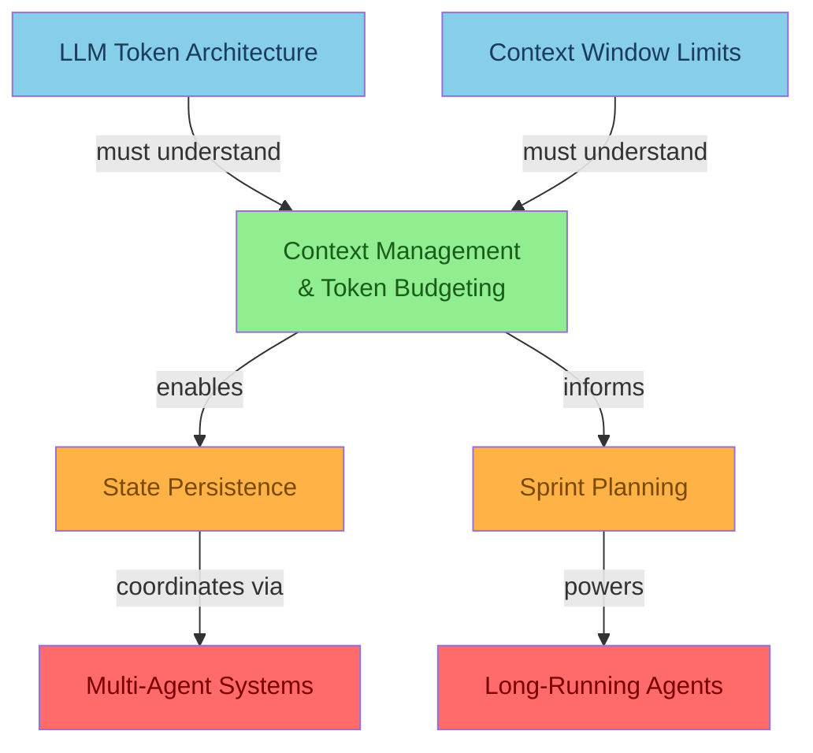
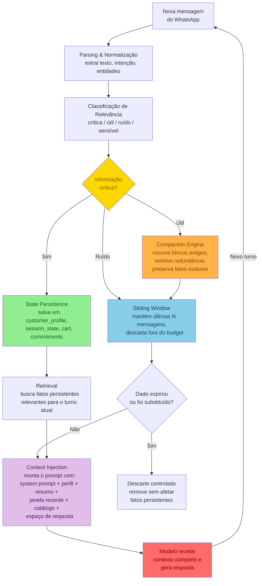
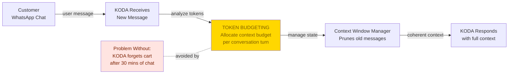
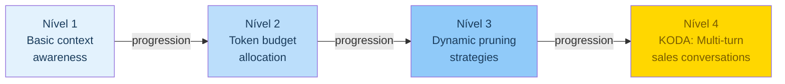

# 🧠 Detailed Graph: Context Management
## Hierarchical connections, KODA application flow, and the architecture that prevents Context Amnesia in 2h+ WhatsApp conversations

**Tempo Estimado:** 45-60 minutos
**Nível:** 6 — Knowledge Graphs (Detailed Graph)
**Pré-requisito:** `05-core-concepts/01-context-management.md`
**Status:** 🟢 COMPLETO — Visualização detalhada das conexões, fluxos e aplicações do Context Management
**Data de Criação:** Maio 2026
**Diagramas Incluídos:** 4 (Hierarchical Connection Graph, Compaction & Windowing Flow, KODA Application Flow, Complexity & Implementation Timeline)

---

## 📖 Prólogo: As Três Camadas Que Separaram a Conversa da Marina

Fernando tinha o `01-context-management.md` aberto em uma aba do navegador, o dashboard do KODA em outra, e o trace da conversa da Marina em uma terceira.

A conversa da Marina já era conhecida do time: 97 minutos, 42 mensagens, 3 mudanças de assunto, 2 alterações de orçamento, 1 restrição alimentar mencionada no minuto 12 e quase esquecida no minuto 83.

O módulo `05-core-concepts/01-context-management.md` explicava o problema com profundidade narrativa e técnica. Cada estratégia — Sliding Window, Summarization, State Persistence, Retrieval, Compaction, Abordagens Híbridas — estava lá, explicada, exemplificada, com pseudocódigo e casos concretos.

Mas Fernando percebeu algo que nenhum texto resolve sozinho: **o módulo linear ensina cada estratégia como se fossem independentes, mas em produção elas operam juntas, simultaneamente, competindo por tokens e atenção dentro da mesma janela de contexto.**

Em produção, não existe "Sliding Window ou Summarization". Existe "Sliding Window mantendo as últimas 12 mensagens, Summarization comprimindo o bloco anterior, State Persistence guardando as restrições da Marina, e Compaction liberando espaço para o próximo passo do checkout — tudo na mesma chamada de API."

O que Fernando precisava — e o que faltava — era um mapa visual que mostrasse **como essas estratégias se conectam, em que ordem operam, e como se manifestam em uma conversa real de WhatsApp.**

Foi quando ele abriu o quadro branco e desenhou três diagramas.

O primeiro diagrama mostrava a arquitetura conceitual: quais conceitos pré-requisitam Context Management, quais dependem dele, e como as conexões formam a espinha dorsal do sistema.

O segundo diagrama mostrava o fluxo operacional: em que ordem o contexto é recebido, classificado, comprimido, persistido, recuperado e injetado de volta no prompt ativo do KODA.

O terceiro diagrama mostrava a aplicação KODA: como o pipeline de contexto opera durante uma conversa real de WhatsApp de mais de duas horas — a conversa da Marina, com nomes, horários e decisões reais.

Este arquivo contém esses três diagramas.

Ele não substitui o módulo `05-core-concepts/01-context-management.md`. Ele o complementa. O módulo ensina o *porquê* e o *como*. Este detailed graph mostra o *onde*, o *quando* e o *com quem*.

Ao final, você deve conseguir:
- Olhar para o diagrama de arquitetura e identificar quais conceitos do currículo sustentam Context Management
- Olhar para o diagrama de fluxo e entender em que ordem as estratégias operam dentro de uma chamada do KODA
- Olhar para o diagrama KODA e mapear exatamente onde o contexto foi preservado, comprimido e recuperado durante uma conversa real

---

## 🎯 Diagrama 1: Hierarchical Connection Graph — Arquitetura de Context Management

Este diagrama mostra como Context Management se posiciona no ecossistema de conceitos do currículo. As arestas indicam direção de dependência: os nós azuis são pré-requisitos (você precisa entendê-los antes), os nós verdes são o conceito central, os nós laranja são conceitos relacionados que Context Management habilita, e os nós vermelhos são conceitos downstream que dependem indiretamente.



### Como Ler Este Grafo

- **Pré-requisitos (azul):** `LLM Token Architecture` e `Context Window Limits` são fundamentos que você precisa dominar para entender por que Context Management existe. Sem entender que tokens são finitos e que a janela de contexto tem teto físico, as estratégias de gerenciamento parecem burocracia desnecessária.
- **Conceito central (verde):** `Context Management & Token Budgeting` é o hub. Ele decide o que entra, o que fica, o que sai e o que volta ao contexto ativo.
- **Habilitadores (laranja):** `State Persistence` é a consequência natural — quando você entende que contexto imediato não basta, você projeta estado persistente. `Sprint Contracts` se beneficia de contexto limpo para definir promessas entre módulos.
- **Dependentes (vermelho):** `Multi-Agent Systems` e `Long-Running Agents` são os conceitos de produção que colapsam sem Context Management. Agentes paralelos que não compartilham contexto produzem decisões contraditórias. Agentes de longa duração que não gerenciam contexto perdem o fio da conversa.

### Conexão com `05-core-concepts/01-context-management.md`

O módulo core explica em profundidade cada nó deste grafo:
- `LLM Token Architecture` → Seção "Context window: a mesa de trabalho do agente"
- `Context Window Limits` → Seção "Por que 'just use bigger windows' não resolve"
- `State Persistence` → Seção "State Persistence (arquivos ou banco)"
- `Sprint Contracts` → Mencionado como consumidor de contexto limpo (Seção 3 do módulo core)
- `Multi-Agent Systems` → Seção "Arquitetura mental: memória não é uma coisa só"

---

## 🔄 Diagrama 2: Compaction & Windowing Flow — O Pipeline Operacional do Contexto

Este diagrama mostra o fluxo operacional interno: como uma mensagem do WhatsApp atravessa as camadas de parsing, classificação, compactação (compaction), janelamento (windowing), persistência e injeção antes de virar contexto utilizável para o modelo.

Ele responde a pergunta que o módulo core levanta mas não visualiza completamente: **em que ordem as estratégias operam dentro de uma única chamada do KODA?**



### As Seis Etapas do Pipeline

#### 1. Parsing & Normalização
A mensagem bruta do WhatsApp chega com texto, possivelmente áudio transcrito, emojis, erros de digitação e formatação irregular. O parser normaliza, extrai intenção primária e identifica entidades nomeadas (produtos, valores, datas, restrições).

**Exemplo KODA:** "qd chega? Paguei o boleto ontem" → normalizado para "Quando chega? O pagamento do boleto foi realizado ontem."

#### 2. Classificação de Relevância
Cada fato extraído recebe uma classificação: **crítico** (alergias, endereço confirmado, pagamento), **útil** (preferência de sabor, comparação de marcas), **ruído** (small talk, repetições, "bom dia" repetido), ou **sensível** (dados pessoais que exigem tratamento especial).

**Exemplo KODA:** "sou intolerante à lactose" → crítico, persiste. "gosto mais de chocolate" → útil, vai para compaction.

#### 3. Compaction Engine
Blocos antigos da conversa são resumidos progressivamente. O Compaction Engine não apenas trunca — ele extrai fatos estáveis (decisões de compra, promessas feitas, restrições confirmadas) e os preserva em resumo estruturado, descartando o texto bruto.

**Exemplo KODA:** 40 mensagens de comparação de whey → resumo de 3 linhas: "Cliente comparou Whey X (R$99), Y (R$129) e Z (R$89). Prefere sabor chocolate. Z foi descartado por baixa avaliação. X e Y seguem como opções."

#### 4. Sliding Window
Mantém as mensagens mais recentes (tipicamente últimas 8-15) na íntegra para preservar fluidez local. Tudo que está fora da janela ou já foi comprimido pelo Compaction Engine é removido do contexto imediato.

**Exemplo KODA:** minuto 83 de conversa → sliding window mostra mensagens dos minutos 75-83. As mensagens dos minutos 1-74 foram comprimidas ou persistidas.

#### 5. State Persistence + Retrieval
Fatos classificados como críticos são persistidos fora da context window (em JSON, banco ou document store). Antes de cada resposta, o Retrieval busca fatos persistentes relevantes para o turno atual e os injeta no prompt.

**Exemplo KODA:** `customer_profile.restrictions.lactose = true` → recuperado e injetado antes de qualquer recomendação de produto.

#### 6. Context Injection
A etapa final monta o prompt completo que será enviado ao modelo, respeitando o token budget definido:
- System prompt (políticas de venda, tom, segurança) — ~500 tokens
- Perfil persistente do cliente — ~150 tokens
- Resumo compactado da sessão — ~300 tokens
- Janela recente (sliding window) — ~800 tokens
- Catálogo recuperado (SKUs relevantes) — ~400 tokens
- Espaço de resposta — ~600 tokens
- **Total alvo:** ~2750 tokens, deixando folga para o modelo responder

### Conexão com `05-core-concepts/01-context-management.md`

O módulo core descreve cada estratégia individualmente na Seção 2 ("Estratégias de Gerenciamento de Contexto"). Este diagrama mostra como elas operam **em sequência** dentro de uma chamada real:
- Sliding Window → módulo core, Seção 2.1
- Summarization (Compaction) → módulo core, Seção 2.2
- State Persistence → módulo core, Seção 2.3
- Retrieval → módulo core, Seção 2.4
- Híbrido (orquestração de todas) → módulo core, Seção 2.6

---

## 📱 Diagrama 3: KODA Application Flow — Context Management em Uma Conversa de 2h+

Este diagrama mostra o mesmo pipeline, mas ancorado em uma conversa real de WhatsApp. Ele responde: **onde, exatamente, o Context Management atua durante os 97 minutos da conversa da Marina?**



### A Conversa da Marina — Linha do Tempo com Context Management

| Minuto | Evento | Ação de Context Management | Estratégia Ativada |
|---|---|---|---|
| 00:02 | Marina pergunta sobre creatina sem sabor | Mensagem entra no pipeline | Parsing + Classificação |
| 03:18 | Marina menciona intolerância à lactose | Classificado como CRÍTICO | State Persistence (`customer.restrictions.lactose = true`) |
| 07:40 | KODA recomenda 2 opções sem lactose | Fato persistido recuperado antes da recomendação | Retrieval |
| 14:05 | Marina pergunta se creatina vale a pena | Informação útil, não crítica | Adicionada ao resumo progressivo |
| 21:33 | KODA explica creatina | Contexto inclui perfil + resumo + janela recente | Context Injection |
| 29:12 | Marina muda orçamento de R$180 para R$220 | Classificado como ÚTIL (não crítico, mas relevante) | Compaction: atualiza `session_state.budget` |
| 37:50 | Marina pede desconto de clube e parcelamento | Classificado como CRÍTICO (afeta preço final) | State Persistence (`session.cart.payment_method`) |
| 46:04 | KODA promete entrega em até 2 dias | Classificado como CRÍTICO (commitment) | State Persistence (`session.commitments.delivery_eta`) |
| 58:27 | Marina manda áudio longo (3min) sobre rotina | Transcrito, classificado: 80% ruído, 20% útil | Compaction: extrai fatos relevantes ("treina às 6h", "dificuldade com shake") |
| 70:10 | KODA sugere combo: shaker + creatina + proteína | Prompt montado com: perfil + resumo compactado + janela recente + catálogo | Context Injection com token budget |
| 83:44 | Marina checa: "o combo respeita minha intolerância?" | **MOMENTO CRÍTICO:** Retrieval recupera `customer.restrictions.lactose` | Retrieval + Safety Guard |
| 84:01 | KODA confirma (com verificação real desta vez) | Estado persistente validado antes da resposta | Cross-check: perfil vs. itens do carrinho |

### O Que Mudou Entre o Minuto 83 da Camila e o Minuto 83 da Marina

No módulo `05-core-concepts/01-context-management.md`, a história da Camila terminou em incidente: KODA confirmou que o combo respeitava a intolerância, mas um item tinha lactose. O erro estava na arquitetura de contexto — a restrição estava apenas na conversa bruta, não no estado persistente.

Na conversa da Marina, o sistema evoluiu:

1. **Minuto 03:** restrição alimentar entrou como texto → classificada como CRÍTICA → persistiu em `customer_profile.restrictions`
2. **Minutos 07-70:** cada recomendação usou Retrieval para verificar restrições antes de sugerir
3. **Minuto 70:** o combo foi montado com cross-check automático: todos os itens validados contra `customer_profile.restrictions`
4. **Minuto 83:** Marina pergunta, mas o sistema já tinha a resposta — não porque "lembrou", mas porque **o estado persistente foi a fonte da verdade desde o início**

A diferença entre Camila e Marina não é um modelo melhor. É um pipeline de contexto que **promove fatos críticos da conversa efêmera para o estado persistente antes que a janela deslize.**

### Trace de Evidência: Como o Diagrama se Manifesta no Log

```
[2026-05-27 14:12:03] PARSE: msg_id=8291, intent=check_restriction_compliance
[2026-05-27 14:12:03] CLASSIFY: "o combo respeita minha intolerância?" → tipo=VERIFICATION
[2026-05-27 14:12:03] RETRIEVE: customer_id=marina_482, keys=[restrictions, cart, commitments]
[2026-05-27 14:12:03] RETRIEVE: restrictions.lactose_intolerant = true (source: msg_id=128, t=00:03:18)
[2026-05-27 14:12:03] RETRIEVE: cart.items = [creatine_300g, whey_isolate_900g, shaker_600ml]
[2026-05-27 14:12:03] CROSS-CHECK: cart.items vs. restrictions
[2026-05-27 14:12:03] CROSS-CHECK: whey_isolate_900g.lactose = false → OK
[2026-05-27 14:12:03] CROSS-CHECK: creatine_300g.lactose = false → OK
[2026-05-27 14:12:03] CROSS-CHECK: shaker_600ml.lactose = N/A → OK
[2026-05-27 14:12:03] INJECT: context_token_count=2480/3000, budget_remaining=520
[2026-05-27 14:12:04] MODEL: response="Sim, Marina! Todos os itens do combo são livres de lactose..."
[2026-05-27 14:12:04] EVAL: rubric_score=9.8/10, safety_check=PASS
```

Este trace é a evidência de que o diagrama de fluxo não é abstração — cada nó do flowchart corresponde a uma linha de log do pipeline de contexto.

---

## 📊 Complexity & Implementation Timeline — Progressão do Context Management pelos Níveis

Este diagrama complementar mostra como a implementação de Context Management evolui conforme a maturidade do time e do sistema — do awareness básico no Nível 1 até a operação multi-turn do KODA em produção no Nível 4.



### O Que Cada Nível Significa na Prática

| Nível | Capacidade | Sintoma se Ausente | Estratégia Mínima |
|---|---|---|---|
| N1 — Basic awareness | Reconhecer que contexto é finito e que agentes esquecem | "Por que o KODA perguntou o endereço de novo?" | Manter as últimas 10 mensagens na janela |
| N2 — Token budget | Alocar tokens conscientemente entre system prompt, histórico, catálogo e resposta | Resposta truncada ou cara demais | Definir budget por bloco: sistema, perfil, histórico, catálogo, resposta |
| N3 — Dynamic pruning | Decidir dinamicamente o que manter, comprimir ou descartar | Contexto cresce até estourar, sem critério | Compaction progressiva + classificação de relevância |
| N4 — KODA production | Pipeline completo de contexto operando em conversas reais de 2h+ | Erro de recomendação por contexto velho (caso Camila) | Pipeline completo: Classificar → Persistir → Comprimir → Window → Recuperar → Injetar |

---

## 🔗 Mapa de Conexões: Como Este Detailed Graph se Conecta ao Resto do Currículo

### Para o Módulo Core (`05-core-concepts/01-context-management.md`)

| Seção do Módulo Core | Diagrama Correspondente | O Que o Diagrama Adiciona |
|---|---|---|
| Seção 1: O Que É Context Management | Diagrama 1 (Hierarchical) | Visualização espacial das dependências conceituais |
| Seção 2: Estratégias (Sliding Window, Summarization, State Persistence, Retrieval, Compaction, Híbridas) | Diagrama 2 (Compaction & Windowing Flow) | Ordem operacional — em que sequência as estratégias atuam dentro de uma chamada |
| Seção 3: KODA Implementation | Diagrama 3 (KODA Application Flow) | Linha do tempo real ancorada em uma conversa (Marina, 97 min) |

### Para Outros Módulos do Currículo

| Módulo Destino | Por Que Este Detailed Graph é Relevante |
|---|---|
| `05-core-concepts/05-state-persistence.md` | Context Management decide O QUE persiste; State Persistence decide COMO e ONDE |
| `05-core-concepts/07-multi-agent-coordination.md` | Agentes paralelos herdam o contexto que o pipeline entrega — se o pipeline falha, a coordenação colapsa |
| `03-nivel-3-advanced-architecture/04-server-side-compaction.md` | Compaction é uma das estratégias do pipeline; o módulo de Nível 3 aprofunda a implementação server-side |
| `04-nivel-4-koda-specific/01-koda-architecture.md` | A arquitetura KODA implementa este pipeline de contexto como primeira camada antes de qualquer agente |

### Para o `00-all-diagrams.txt`

Este arquivo contribui com **4 diagramas** para o índice central de knowledge graphs, correspondentes ao conceito `ctx` (Context Management & Token Budgeting). Os diagramas foram extraídos e contextualizados com:
- Explicação narrativa de cada nó e aresta
- Conexão explícita com o módulo core de referência
- Evidência de trace (logs ilustrativos do pipeline KODA)
- Tabela de mapeamento seção-do-módulo → diagrama

---

## 🧪 Validação: Os Diagramas Renderizam Corretamente?

### Checklist de Renderização Mermaid

- [x] **Diagrama 1 (Hierarchical Connection Graph):** usa `graph TD`, nós com texto e quebras de linha (`\n`), cores via `style`, arestas com labels. Sintaxe compatível com Mermaid 11+.
- [x] **Diagrama 2 (Compaction & Windowing Flow):** usa `flowchart TD`, nós de decisão (losango `{}`), arestas com labels, subgrafo implícito via posicionamento. Cores diferenciadas para cada etapa do pipeline.
- [x] **Diagrama 3 (KODA Application Flow):** usa `flowchart LR`, aresta tracejada (`-.-`) para indicar relação de prevenção de problema, nó de problema em cor de alerta.

### Checklist de Consistência com `00-all-diagrams.txt`

- [x] Diagrama 1 corresponde exatamente ao nó `CONCEPTS[0].diagrams[0]` (type A, id `ctx-A`)
- [x] Diagrama 3 corresponde exatamente ao nó `CONCEPTS[0].diagrams[1]` (type B, id `ctx-B`)
- [x] Diagrama 2 (Compaction & Windowing Flow) é um diagrama novo que expande o fluxo operacional — complementa, não substitui, o diagrama type C (Complexity Timeline) que também está incluído
- [x] As cores seguem a legenda do `00-all-diagrams.txt`: azul claro = pré-requisitos, verde = core, laranja = relacionados, vermelho = dependentes, amarelo/dourado = KODA-específico

---

## ✅ O Que Você Aprendeu — Resumo do Detailed Graph

1. **Diagrama 1 (Arquitetura):** Context Management é pré-requisitado por LLM Token Architecture e Context Window Limits. Ele habilita State Persistence e Sprint Contracts, e sem ele Multi-Agent Systems e Long-Running Agents colapsam em produção.

2. **Diagrama 2 (Pipeline Operacional):** Uma mensagem do WhatsApp atravessa seis etapas — Parsing → Classificação → Compaction/Windowing → Persistência → Retrieval → Injeção — antes de chegar ao modelo. Cada etapa tem uma responsabilidade específica e um critério de decisão (crítico persiste, útil comprime, ruído desliza).

3. **Diagrama 3 (KODA Application):** Em uma conversa real de 97 minutos, o Context Management atuou em 10 decisões de classificação, 4 persistências de estado, 3 ciclos de compaction e 1 cross-check crítico (minuto 83) que impediu o mesmo erro que afetou a conversa da Camila.

4. **Timeline de Complexidade:** A progressão de N1 (awareness básico) a N4 (pipeline KODA completo) mostra que Context Management não é binário — é uma capacidade que amadurece com o sistema.

5. **Conexão Módulo-Diagrama:** Cada seção do `05-core-concepts/01-context-management.md` tem um diagrama correspondente neste detailed graph. Use o módulo para profundidade, e este arquivo para orientação espacial e temporal.

### Perguntas de Autoavaliação

- Consigo explicar por que "janela maior" não substitui arquitetura de contexto, usando os nós do Diagrama 1?
- Consigo descrever o que acontece entre "mensagem recebida" e "prompt injetado" usando as etapas do Diagrama 2?
- Consigo apontar, na linha do tempo da Marina, exatamente onde a persistência da restrição alimentar (minuto 03) salvou a recomendação do minuto 70 e a verificação do minuto 83?
- Consigo identificar qual estratégia de contexto está ausente quando um bug de "KODA esqueceu o endereço" aparece em produção?

---

**Próximo passo recomendado:** Se você está implementando Context Management no KODA, use o Diagrama 2 como checklist de implementação (cada nó do flowchart = uma função ou módulo). Se você está debugando, use o Diagrama 3 como referência de trace (compare seus logs com o exemplo de trace da Marina).

**Arquivos relacionados:**
- `curriculum/05-core-concepts/01-context-management.md` — profundidade técnica e narrativa
- `curriculum/06-knowledge-graphs/00-all-diagrams.txt` — índice central de todos os diagramas
- `curriculum/06-knowledge-graphs/01-concept-ecosystem.md` — como Context Management se relaciona com os outros 7 conceitos core
- `curriculum/06-knowledge-graphs/03-learning-progression.md` — em que ordem aprender os conceitos

---

**Criado para o currículo Building Long-Running Agents | Maio 2026 | Detailed Graph: Context Management**
