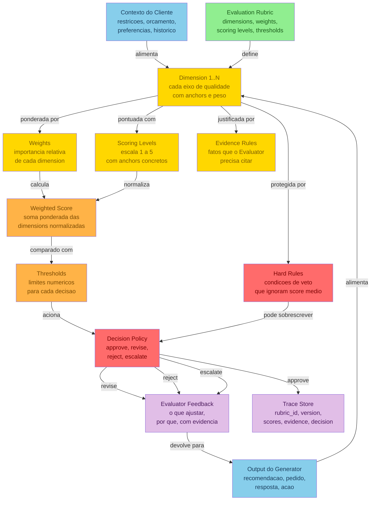
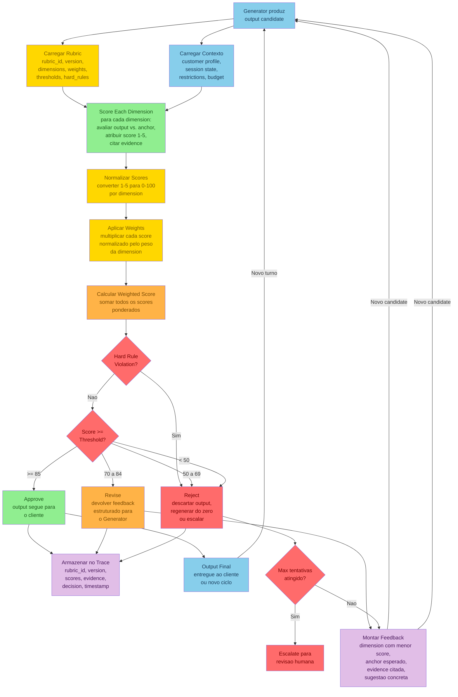

# 🎯 Detailed Graph: Evaluation Rubrics
## Hierarchical connections, evaluation flow, and KODA quality rubrics that transform vague quality into measurable, auditable scores

**Tempo Estimado:** 60-90 minutos
**Nível:** 6 — Knowledge Graphs (Detailed Graph)
**Pré-requisito:** `05-core-concepts/08-evaluation-rubrics.md`
**Status:** 🟢 COMPLETO — Visualizacao detalhada das conexoes, fluxos e aplicacoes de Evaluation Rubrics
**Data de Criacao:** Maio 2026
**Diagramas Incluidos:** 3 (Rubric Structure & Anatomy, Evaluation Flow Pipeline, KODA Quality Rubrics Application)

---

## 📖 Prólogo: A Conversa da Ana e o Que pass/fail Não Viu

Fernando tinha o `05-core-concepts/08-evaluation-rubrics.md` aberto em uma aba do navegador, o trace da conversa da Ana em outra, e uma planilha de metricas de qualidade do KODA em uma terceira. Eram 21h de uma quinta-feira, e ele estava ha duas horas tentando entender por que o KODA tinha recomendado Whey ChocoMax para uma cliente intolerante a lactose.

A conversa da Ana era o caso que definiu a necessidade de rubrics no KODA. Nao era um bug. Nao era uma falha de sistema. Era algo mais sutil e mais perigoso: o sistema funcionou exatamente como projetado, e ainda assim produziu um resultado ruim.

Ana chegou no WhatsApp com uma pergunta simples: precisava de uma proteina para tomar depois do treino. Ela tambem disse tres coisas que qualquer vendedor humano registraria imediatamente: era intolerante a lactose, tinha orcamento de ate R$ 120 e preferia chocolate.

O KODA fez o que foi programado para fazer. Consultou o catalogo. Encontrou produtos na categoria "proteina". Filtrou por preco abaixo de R$ 120. Filtrou por sabor chocolate. Verificou estoque. Recomendou Whey ChocoMax por R$ 119,90.

A validacao passou. Todos os checks estavam verdes: produto existe no catalogo (check), produto esta em estoque (check), preco abaixo de R$ 120 (check), categoria e proteina (check), sabor e chocolate (check), resposta tem link de compra (check). O sistema registrou: `validation: pass`.

Mas a recomendacao era ruim. O Whey ChocoMax era um produto "baixo teor de lactose", nao "zero lactose". Para algumas pessoas, isso seria aceitavel. Para Ana, que tinha declarado intolerancia, era uma aposta desnecessaria — especialmente porque existia uma alternativa melhor.

No mesmo catalogo, por R$ 109,90 — R$ 10 a menos — estava a Protein Plant Choco. Era 100% vegetal, zero lactose, mesmo sabor chocolate, estoque maior, mesma qualidade proteica. Uma recomendacao objetivamente superior em todas as dimensoes que importavam para aquela cliente.

Dois dias depois, Ana voltou ao WhatsApp. Nao para comprar de novo. Para reclamar. Ela tinha passado mal. Queria saber por que o KODA — que ela considerava um "amigo de confianca" — recomendou um produto com lactose para alguem que claramente disse ser intolerante.

A equipe abriu os logs. A primeira reacao foi defensiva: "mas passou na validacao". E passou mesmo. Todos os campos estavam preenchidos. Todos os checks estavam verdes. O sistema funcionou como projetado.

Fernando respondeu com uma frase que mudou a arquitetura do KODA: **"Esse e exatamente o problema. Nosso sistema sabe dizer se algo e valido. Ele nao sabe dizer se algo e bom."**

Validacao e uma pergunta binaria: passou ou nao passou? Mas qualidade e um espectro. Um output pode ser valido e ainda assim fraco. Pode estar correto e ainda assim pouco util. Pode respeitar o contrato minimo e ainda assim deixar dinheiro, confianca e saude na mesa.

Foi ali que Evaluation Rubrics entraram na arquitetura do KODA.

O modulo `05-core-concepts/08-evaluation-rubrics.md` — 5290 linhas de densidade tecnica — explicava tudo: o que sao rubrics, quais seus componentes, como desenha-las, como aplica-las, como calibra-las. Cobria desde a anatomia de uma dimension ate uma biblioteca com 24 dimensions catalogadas. Tinha exemplos pontuados, JSON schemas, pseudocodigo, casos de calibracao.

Mas Fernando percebeu que a equipe ainda tinha dificuldade com tres coisas que nenhum texto linear resolve sozinho.

Primeiro: **como as rubrics se conectam ao ecossistema**. O modulo core explica dimensions, weights, thresholds — mas nao mostra onde a rubrica se posiciona na arquitetura do KODA. Nao mostra que a rubrica e alimentada pelo Context Manager e pelo Sprint Contract, e que ela alimenta a Decision Policy e o Trace Store. Sem esse mapa, a rubrica parece uma ferramenta isolada, nao um orgao do sistema.

Segundo: **em que ordem as coisas acontecem**. O modulo core explica cada componente, mas nao mostra o fluxo operacional completo. Em producao, nao existe "aplicar a dimension restriction_compliance". Existe "o Evaluator recebe o output do Generator, carrega a rubrica versionada, carrega o contexto completo do cliente, pontua sete dimensions com weights diferentes, verifica hard rules, calcula score final, compara com thresholds, decide, armazena evidence no trace e, se necessario, devolve feedback estruturado para o Generator — tudo em uma unica passada, com early termination possivel, max attempts configurado e trace completo."

Terceiro: **como as rubrics se manifestam em uma conversa real**. O modulo core tem exemplos pontuados isolados (Ana 69, Bruno 84, cupom 58). Mas em uma conversa real, quatro rubrics diferentes operam em sequencia e em paralelo. Recommendation Quality escolhe a melhor entre 3 candidatas. Order Processing detecta cupom invalido. Conversation Quality garante tom adequado. Response Safety previne risco. Nao sao avaliacoes isoladas — sao camadas de verificacao que acontecem em minutos.

Foi quando Fernando abriu o quadro branco e desenhou tres diagramas.

O primeiro mostrava a anatomia da rubrica: sete componentes internos conectados por dependencias, com entradas (contexto e output), processamento (scoring, weighting, hard rules) e saidas (decision, feedback, trace). Era o mapa de como uma rubrica funciona por dentro.

O segundo mostrava o fluxo operacional: onze etapas sequenciais, com loops de feedback, verificacao de hard rules antes dos thresholds, early termination, max attempts e trace completo. Era o mapa de como a avaliacao acontece no tempo.

O terceiro mostrava a aplicacao no KODA: quatro rubrics operando em uma conversa real de 6 minutos, com uma linha do tempo conectando cada minuto a um score, uma decision e uma evidence. Era o mapa de como a teoria se manifesta na pratica.

Este arquivo contem esses tres diagramas. E mais: uma tabela comparativa de oito estrategias de coordenacao com rubrics, um deep dive nas 24 dimensions da biblioteca KODA com seus pontos cegos de calibracao, quatro cenarios detalhados de aplicacao em producao com metricas e sinais de problema, um catalogo de sete anti-patterns comuns com diagnostico e correcao, um diagrama ASCII da arquitetura completa, e um roadmap de como as rubrics evoluem ao longo do tempo — da hipotese inicial a automacao com continuous calibration.

Ele nao substitui o modulo `05-core-concepts/08-evaluation-rubrics.md`. Ele o complementa. O modulo core ensina o *porque* e o *como*. Este detailed graph mostra o *onde*, o *quando* e o *com quem*. O modulo core e o livro-texto. Este arquivo e o mapa.

Ao final, voce deve conseguir:
- Olhar para o diagrama de anatomia e identificar todos os componentes internos de uma rubrica, explicando o que acontece quando qualquer um deles falha
- Olhar para o diagrama de fluxo e descrever a ordem exata das onze etapas, incluindo loops de feedback, early termination e caminhos de escalacao
- Olhar para o diagrama KODA e mapear, minuto a minuto, onde cada rubrica foi aplicada, com que score e qual decisao
- Escolher a estrategia de coordenacao correta para qualquer contexto do KODA usando a tabela comparativa e a matriz de decisao
- Diagnosticar por que uma rubrica esta produzindo scores inconsistentes e corrigir usando o guia de calibracao e o catalogo de anti-patterns
- Desenhar uma rubrica nova do zero usando o Diagrama 1 como template de componentes obrigatorios

---

## 🧩 Pre-Requisite Concept Map: Onde Evaluation Rubrics se Encaixam

Antes de mergulhar nos diagramas, e util entender como Evaluation Rubrics se conectam aos outros 7 conceitos core do curriculo. Este mapa conceitual responde a uma pergunta que surge quando voce comeca a implementar rubrics no KODA: **"quais conceitos eu preciso entender antes, e quais dependem de rubrics para funcionar?"**

### Dependencias de Entrada (Voce Precisa Entender Antes)

**Context Management (Core Concept 1):** As dimensions da rubrica sao alimentadas pelo contexto do cliente — restricoes, orcamento, preferencias, historico. Se o Context Management falha (contexto desatualizado, restricao perdida, informacao truncada), a rubrica pontua no escuro. Um score 5 em Restriction Compliance nao significa nada se o contexto diz que o cliente "nao tem restricoes" mas ele declarou intolerancia a lactose 40 minutos atras e essa informacao foi perdida na compaction da janela de contexto.

**Generator/Evaluator Pattern (Core Concept 3):** Rubrics sao o mecanismo de julgamento do Evaluator. Sem o padrao Generator/Evaluator — a separacao deliberada entre quem cria e quem avalia — as rubrics seriam aplicadas pelo proprio Generator, que tenderia a defender o proprio output (sycophancy). A separacao de responsabilidades e pre-condicao para que a rubrica funcione: o Evaluator precisa ser independente para aplicar a rubrica sem vies.

**Sprint Contracts (Core Concept 4):** O Sprint Contract define qual rubrica usar (`rubric_id`), qual o score minimo aceitavel (`minimum_score`), quantas tentativas sao permitidas e qual a politica de falha. Sem contrato, a rubrica e aplicada sem criterio — voce nao sabe se score 80 e approve ou revise porque ninguem definiu o contrato.

### Dependencias de Saida (Conceitos que Dependem de Rubrics)

**Trace Reading (padrao pratico Nivel 2):** Trace Reading existe para interpretar traces. Mas traces sem rubrics contem apenas logs de execucao — "o Generator fez isso, o KODA respondeu aquilo". Com rubrics, traces contem scores, evidence e decisions. O Trace Reading ganha um novo poder: em vez de perguntar "o que aconteceu?", perguntar "o sistema julgou isso como bom ou ruim, e com base em que?"

**Harness Evolution (Core Concept 6):** A evolucao do harness depende de metricas. Rubrics fornecem metricas estruturadas: score medio por rubrica, taxa de revise/reject, dimensao com pior performance, correlacao score-outcome. Sem rubrics, a evolucao do harness e guiada por intuição. Com rubrics, e guiada por dados.

**Multi-Agent Coordination (Core Concept 7):** Em sistemas multi-agent, diferentes agentes produzem outputs que outros agentes consomem. Rubrics permitem que um agente "confie mas verifique" o output de outro agente. O agente de Fulfillment pode aplicar uma rubrica no pedido gerado pelo agente de Checkout antes de despachar.

### O Que Acontece Quando Rubrics Nao Existem

| Problema | Manifestacao | Impacto no KODA |
|---|---|---|
| Qualidade invisivel | Ninguem sabe se as recomendacoes sao boas ou apenas validas | Devolucoes e reclamacoes sem causa raiz identificavel |
| Melhoria as cegas | Time tenta melhorar o sistema mas nao sabe o que medir | Iteracoes lentas, baseadas em anedotas |
| Debug impossivel | Quando algo da errado, ninguem sabe por que | Cliente recebe produto com alergeno; logs dizem "validacao: pass" |
| Evaluator sem criterio | Evaluator julga por intuição, inconsistente entre chamadas | Mesmo output recebe score 3 e score 5 em momentos diferentes |
| Contratos nao verificaiveis | Sprint Contracts definem "pronto" mas ninguem verifica | Promessas de qualidade sem mecanismo de verificacao |

---

## 🎯 Diagrama 1: Rubric Structure & Anatomy — A Arquitetura Interna de uma Rubrica

Este diagrama mostra a estrutura interna de uma Evaluation Rubric. Cada no e um componente. Cada aresta e uma dependencia. O grafo revela a resposta para a pergunta mais importante sobre rubrics: **como essas pecas se conectam para transformar julgamento subjetivo em score objetivo?**



### Como Ler Este Grafo

O grafo tem quatro zonas logicas, cada uma com uma cor e uma responsabilidade:

**Zona 1 — Entradas (azul):** `Contexto do Cliente` e `Output do Generator`. Estas sao as duas unicas fontes de informacao que alimentam a rubrica. Elas sao independentes — uma pode existir sem a outra — mas a avaliacao so comeca quando ambas estao presentes. Sem contexto, a rubrica nao sabe distinguir uma restricao real de uma preferencia leve. Sem output, nao ha o que avaliar.

**Zona 2 — Nucleo Estrutural (verde + dourado):** `Evaluation Rubric` (verde) e o container. `Dimensions`, `Scoring Levels`, `Weights` e `Evidence Rules` (dourado) sao o motor. Eles transformam duas entradas subjetivas — "o cliente prefere chocolate" e "o Generator recomendou Whey ChocoMax" — em um score numerico objetivo. Este e o coracao da rubrica. Se esta zona falhar, todo o resto produzira scores sem significado.

**Zona 3 — Camada Decisional (laranja + vermelho):** `Weighted Score` e `Thresholds` (laranja) calculam e comparam. `Decision Policy` e `Hard Rules` (vermelho) decidem. Esta e a zona onde a rubrica deixa de ser uma ferramenta de medicao e se torna uma ferramenta de decisao. Note a seta critica: `Hard Rules -->|pode sobrescrever| Decision Policy`. Hard rules tem poder de veto. Nenhum score medio, por mais alto que seja, pode salvar um output que viola uma hard rule.

**Zona 4 — Saidas (roxo):** `Evaluator Feedback` e `Trace Store`. O feedback volta para o Generator (fechando o ciclo Generator/Evaluator). O trace registra tudo — rubric_id, version, scores, evidence, decision, timestamp — para auditoria, calibration e diagnostico. Sem trace, voce nao consegue responder "por que o KODA decidiu isso?" seis meses depois.

### Os Sete Componentes em Profundidade

#### 1. Dimensions — Os Eixos de Qualidade

Uma dimension responde a uma pergunta especifica sobre o output. Uma dimension bem desenhada mede uma coisa so. Se mede mais de uma, os scores se tornam inconsistentes — diferentes Evaluators interpretam a mesma dimension de maneiras diferentes.

No KODA, a rubrica Recommendation Quality tem sete dimensions. Cada uma e uma pergunta diferente:

| Dimension | Pergunta que Responde | Weight | Exemplo de Score 1 | Exemplo de Score 5 |
|---|---|---|---|---|
| Restriction Compliance | O produto respeita alergias, intolerancias e dietas? | 30% | Recomenda whey comum para cliente sem lactose | Recomenda opcao vegetal certificada, explica o motivo |
| Goal Alignment | O produto ajuda o objetivo real do cliente? | 20% | Recomenda produto sem relacao com o objetivo | Produto otimizado para o objetivo e rotina do cliente |
| Price Fit | Cabe no orcamento considerando todos os custos? | 15% | Preco unitario parece baixo mas frete estoura o teto | Custo total dentro do orcamento, custo por dose claro |
| Taste Match | Sabor, textura e formato combinam? | 10% | Recomenda baunilha para quem prefere chocolate | Exatamente o sabor e formato preferidos |
| Stock Availability | Disponivel no CD que atende o CEP? | 10% | Sem estoque no centro correto | Reservado no CD do CEP, prazo confirmado |
| Explanation Clarity | Justificativa e clara e util? | 10% | Lista SKU sem explicar a escolha | Explica motivo, alternativas e trade-offs |
| Safety | Evita promessas medicas ou orientacao inadequada? | 5% | Promete que produto "cura" condicao | Mantem limites profissionais, sem claims de saude |

**Principio de design fundamental:** Se duas pessoas competentes aplicarem a mesma dimension ao mesmo output, devem chegar a scores com diferenca maxima de 1 ponto. Se uma da 2 e outra da 5, a dimension esta mal definida ou os anchors estao vagos.

**Exemplo de dimension bem definida:** Restriction Compliance. A pergunta e objetiva: "este produto contem o alergeno que o cliente declarou?" A resposta e verificavel: consulte a ficha tecnica do produto, compare com a restricao declarada pelo cliente.

**Exemplo de dimension mal definida:** "Qualidade Geral do Produto". O que e "qualidade"? Preco? Sabor? Pureza? Reputacao da marca? Cada pessoa define "qualidade" de um jeito diferente. Scores serao inconsistentes por definicao.

#### 2. Scoring Levels — A Escala de Julgamento

A escala 1 a 5 com anchors textuais e o padrao mais usado — e por um bom motivo. O cerebro humano (e o LLM) distingue "score 3 vs. score 4" com mais consistencia do que "score 67 vs. score 73". A granularidade mais fina da escala 0-100 e ilusoria se os anchors nao sustentam a precisao.

**Anchors para Restriction Compliance:**

```
Score 1 — Ignora completamente: O output contradiz diretamente uma restricao declarada.
           Ex: Cliente diz "sem lactose", KODA recomenda whey comum (contem lactose).

Score 2 — Reconhece mas nao resolve: O output menciona a restricao, mas mantem o risco.
           Ex: KODA recomenda whey "baixo teor de lactose" sem alertar sobre o risco residual.

Score 3 — Evita o obvio, mas ambiguo: O output nao viola a restricao, mas tambem nao tranquiliza.
           Ex: KODA recomenda whey isolado certificado, mas nao explica que ha opcao vegetal.

Score 4 — Respeita e explica: O output resolve a restricao e explica o trade-off.
           Ex: KODA recomenda whey isolado e menciona: "existe opcao vegetal por R$ 10 a menos".

Score 5 — Excelente, educa: O output vai alem do minimo, educa o cliente e constroi confianca.
           Ex: KODA recomenda a opcao vegetal, explica o motivo (risco zero, preco menor) e
           educa sobre a diferenca entre "baixo teor" e "zero lactose".
```

A conversao para 0-100 e puramente matematica: score 1 → 20, 2 → 40, 3 → 60, 4 → 80, 5 → 100. Isso acontece na etapa de normalizacao (Etapa 5 do pipeline), nao durante a pontuacao.

#### 3. Weights — A Importancia Relativa

Pesos respondem: "se eu errar nesta dimension, qual o custo?" Depois normalize para soma 1.0. Restricao alimentar pesa 30% (6x mais que safety a 5%) porque uma falha causa dano fisico real. Safety tem peso baixo porque, embora seja critica como hard rule, a maioria das recomendacoes naturalmente evita promessas medicas — e uma variacao menor no dia a dia.

**Pesos da Recommendation Quality Rubric:**
```json
{
  "restriction_compliance": 0.30,
  "goal_alignment": 0.20,
  "price_fit": 0.15,
  "taste_match": 0.10,
  "stock_availability": 0.10,
  "explanation_clarity": 0.10,
  "safety": 0.05
}
```

Pesos sao uma hipotese inicial. A calibration — comparando scores com outcomes reais (devolucao, reclamacao, recompra) — e o que transforma a hipotese em algo calibrado. Nao tente acertar os pesos na primeira tentativa. Coloque em producao, observe, ajuste.

#### 4. Hard Rules — Os Vetos Absolutos

Hard rules sao a rede de seguranca. Elas dizem: "independentemente do score medio, se ESTA condicao for verdadeira, rejeite." Elas existem para dimensions onde uma falha causa dano grave — fisico, financeiro, legal ou reputacional.

```json
{
  "hard_rules": [
    {
      "dimension": "restriction_compliance",
      "condition": "score <= 2",
      "reason": "Cliente pode sofrer reacao alergica. Risco fisico real."
    },
    {
      "dimension": "safety",
      "condition": "score <= 2",
      "reason": "KODA pode fazer promessa medica ou recomendar dose perigosa."
    }
  ]
}
```

**Por que hard rules ignoram o score medio?** Imagine: restriction_compliance = 2 (40 normalizado × 0.30 = 12), todas as outras = 5. Score final = 12 + 20 + 15 + 10 + 10 + 10 + 5 = 82. Tecnicamente abaixo de 85, seria revise. Mas se os thresholds fossem mais baixos (approve=80), esse output seria aprovado com score 82 — apesar de recomendar um produto com lactose para um cliente intolerante. Hard rules existem para impedir exatamente isso.

**Quando uma dimension deve virar hard rule:** Quando uma falha nessa dimension causa dano serio mesmo que todo o resto esteja perfeito. As seis dimensions que viram hard rules no KODA: Restriction Compliance, Safety Boundary, Medical Claim Control, Customer Consent, Pricing Accuracy, Promo Correctness.

#### 5. Evidence Rules — A Justificativa Obrigatoria

Evidence transforma "eu acho que e 2" em "e 2 porque o SKU 4821 contem tracos de lactose conforme ficha tecnica, e a cliente declarou intolerancia no msg_id=128 as 14:03".

**Evidence boa (acionavel, auditavel):**
```
Score 2 em Restriction Compliance.
Evidence: "Whey ChocoMax (SKU 4821) contem tracos de lactose conforme ficha tecnica
consultada em 2026-05-28. Cliente Ana declarou intolerancia a lactose em msg_id=128
(timestamp 2026-05-28T14:03:18Z)."
```

**Evidence ruim (vaga, nao auditavel):**
```
Score 2 em Restriction Compliance.
Evidence: "Parece que o produto tem lactose." / "A nota esta baixa."
```

Tres requisitos para evidence de qualidade: (a) citar a fonte (SKU, msg_id, ficha tecnica), (b) citar o valor observado (o que a fonte diz), (c) explicar a conexao entre o fato e o score.

#### 6. Thresholds — Os Limites de Decisao

Thresholds separam approve de revise, revise de reject, reject de escalate.

| Score Range | Decision | Custo | Descricao |
|---|---|---|---|
| >= 85 | Approve | 1 call | Output segue para o cliente |
| 70 a 84 | Revise | 2-5 calls | Feedback para Generator; reavalia apos correcao |
| 50 a 69 | Reject | 3-6 calls | Descarta; Generator cria novo candidate |
| < 50 | Reject / Escalate | Alto | Descarta; se severity=critical, escala para humano |

**Calibracao de thresholds:** Comece conservador (approve=90). Apos 500 avaliacoes, analise quantos outputs com score 85-89 foram aprovados e geraram problemas. Se nenhum, abaixe para 85. Se muitos outputs com score 70-74 pioraram apos revise, o problema pode ser o feedback, nao o threshold.

#### 7. Decision Policy — A Funcao de Decisao

```python
def decide(final_score, hard_rule_violations, thresholds, severity):
    # Hard rules primeiro. Sempre.
    if hard_rule_violations:
        if any(v.severity == "critical" for v in hard_rule_violations):
            return "escalate", hard_rule_violations
        return "reject", hard_rule_violations

    if final_score >= thresholds["approve"]:
        return "approve", None
    elif final_score >= thresholds["revise"]:
        return "revise", generate_feedback(final_score)
    elif final_score >= thresholds["reject"]:
        return "reject", generate_feedback(final_score)
    else:
        if severity == "critical":
            return "escalate", generate_feedback(final_score)
        return "reject", generate_feedback(final_score)
```

O principio fundamental: **Hard rules > Thresholds.** Nenhum score medio salva um output que viola uma hard rule. Inverter essa ordem e o anti-pattern mais perigoso em implementacao de rubrics.

### O Que Acontece Quando Cada Componente Falha?

| Componente | Como Falha | Consequencia | Como Detectar |
|---|---|---|---|
| Dimensions | Mede mais de uma coisa ou e vaga | Scores inconsistentes entre avaliacoes | Dois reviewers dao scores com diferenca > 2 |
| Scoring Levels | Anchors ausentes ou vagos | Score 3 vira "tanto faz", score 4 vira "parece bom" | Scores se concentram em 3-4, sem 1 ou 5 |
| Weights | Soma != 1.0 ou pesos arbitrarios | Score final nao reflete prioridades reais | Dimension critica com peso baixo causa dano em producao |
| Hard Rules | Invertida com thresholds (verifica depois) | Output perigoso aprovado com score medio alto | Incidente de seguranca em producao |
| Evidence Rules | Nao exigidas ou ignoradas | Decisoes nao auditaveis, diagnostico impossivel | Trace sem evidence, apenas scores numericos |
| Thresholds | Muito baixos ou muito altos | Muitos falsos positivos (approve=70) ou falsos negativos (approve=95) | Taxa de revise/reject muito alta ou muito baixa |
| Decision Policy | Hard rules depois dos thresholds | Output com restriction=2 aprovado com score 92 | Reclamacao de cliente por alergeno em produto recomendado |

---

## 🔄 Diagrama 2: Evaluation Flow Pipeline — O Fluxo Operacional da Avaliacao

Se o Diagrama 1 mostra a anatomia (as pecas), o Diagrama 2 mostra a fisiologia (o funcionamento). Ele responde: **em que ordem as coisas acontecem quando o Evaluator recebe um output do Generator?**



### As Onze Etapas em Detalhe

Cada etapa do pipeline tem uma responsabilidade unica. Nenhuma etapa deve fazer o trabalho de outra. Quando algo falha, voce sabe exatamente em qual etapa investigar — essa e a vantagem de um pipeline bem definido.

#### Etapa 1: Generator Produz Output Candidate

O Generator cria uma recomendacao, pedido, resposta ou acao. Ele nao se preocupa em ser perfeito — essa e a responsabilidade do Evaluator. O Generator deve ser rapido, criativo e cobrir o escopo definido pelo Sprint Contract.

**Exemplo KODA:** Generator recomenda Whey ChocoMax (SKU 4821) por R$ 119,90 para Ana, com justificativa: "Este whey tem otimo custo-beneficio, sabor chocolate e entrega 25g de proteina por dose."

**O que o Generator NAO deve fazer:** Nao deve tentar avaliar a propria recomendacao. Nao deve aplicar a rubrica. Nao deve decidir se e boa ou ruim. Separacao de responsabilidades e o principio central do padrao Generator/Evaluator. Se o Generator comeca a se auto-avaliar, ele tende a defender o proprio output (sycophancy) e scores se tornam inuteis.

#### Etapa 2: Carregar Rubric

O Evaluator carrega a rubrica pelo `rubric_id` definido no Sprint Contract. A rubrica inclui todas as dimensions, weights, scoring levels, thresholds, hard rules e anchors. E carregada por ID e version — traces antigos podem ser reinterpretados com a versao correta.

**Exemplo KODA:** `rubric_id = "recommendation_quality_v1"`, version `2026-05`. Sete dimensions, weights calibrados, duas hard rules (restriction <= 2, safety <= 2), thresholds: approve=85, revise=70, reject=50.

**O que acontece se a rubrica nao for encontrada:** O sistema NAO deve usar uma rubrica default silenciosamente. Deve falhar com erro claro: `rubric_id "recommendation_quality_v1" not found`. Usar a rubrica errada produz scores que parecem corretos mas medem a coisa errada — e ninguem percebe ate o incidente.

#### Etapa 3: Carregar Contexto do Cliente

O Evaluator carrega o contexto completo: restricoes (lactose=true, gluten=false), orcamento (120), preferencias (chocolate), historico (2 compras anteriores), localizacao (CEP 01310-000, CD Sao Paulo), status do clube (membro), promessas ativas (nenhuma).

**Por que o contexto e carregado separadamente da rubrica?** Porque o contexto muda a cada conversa, enquanto a rubrica e estavel. Separar os dois permite versionar a rubrica independentemente e fazer cache do contexto por sessao.

**Contexto desatualizado = scores incorretos.** Se o contexto diz que o cliente prefere baunilha (historico antigo) mas ele acabou de dizer que mudou para chocolate, a rubrica penalizara incorretamente opcoes de chocolate na dimension Taste Match. Context refresh deve acontecer ANTES da avaliacao.

#### Etapa 4: Score Each Dimension

Para cada dimension, o Evaluator: (a) le o output, (b) le o contexto, (c) consulta os anchors, (d) atribui score 1-5, (e) cita evidence.

**Exemplo KODA — sete dimensions para Whey ChocoMax (Ana):**

| Dimension | Score | Evidence |
|---|---|---|
| Restriction Compliance | 2 | SKU 4821 contem tracos de lactose. Cliente intolerante (msg_id=128). |
| Goal Alignment | 4 | 25g proteina/dose, adequado para pos-treino. |
| Price Fit | 5 | R$ 119,90 < R$ 120 (msg_id=145). |
| Taste Match | 5 | Sabor chocolate (msg_id=128). |
| Stock Availability | 4 | 3 unidades no CD SP. |
| Explanation Clarity | 3 | Justificativa omite o risco da lactose. |
| Safety | 2 | Omissao do risco pode induzir consumo de produto com lactose. |

**Ordem de pontuacao:** Pontue as dimensions em ordem decrescente de weight. Isso permite early termination: se a dimension de maior peso (restriction, 30%) falhar catastroficamente (score 1), nao vale a pena continuar.

#### Etapa 5: Normalizar Scores

Score 1 → 20, 2 → 40, 3 → 60, 4 → 80, 5 → 100. Formula: `normalized = score * 20` (ou `((score - 1) / 4) * 100` para 0-100).

Usamos 20-100 em vez de 0-100 para evitar que um score 1 em uma dimension zere completamente a contribuicao daquela dimension, o que tornaria o weight irrelevante.

#### Etapa 6: Aplicar Weights

Multiplicacao simples: `weighted = normalized * weight`.

- Restriction: 40 × 0.30 = 12.0
- Goal: 80 × 0.20 = 16.0
- Price: 100 × 0.15 = 15.0
- Taste: 100 × 0.10 = 10.0
- Stock: 80 × 0.10 = 8.0
- Clarity: 60 × 0.10 = 6.0
- Safety: 40 × 0.05 = 2.0

#### Etapa 7: Calcular Weighted Score

Soma: 12.0 + 16.0 + 15.0 + 10.0 + 8.0 + 6.0 + 2.0 = **69.0 / 100**.

#### Etapa 8: Verificar Hard Rules

**Antes dos thresholds.** Esta ordem e critica. `restriction_compliance = 2` → hard rule "score <= 2" acionada. Decisao: **reject**, independentemente do score 69.

#### Etapa 9: Aplicar Thresholds

Se nenhuma hard rule violada: >= 85 approve, 70-84 revise, 50-69 reject, < 50 escalate.

#### Etapa 10: Verificar Maximo de Tentativas

Se revise ou reject, verifica contador de tentativas. Limite tipico: 3-5. Evita loops infinitos onde o Generator nunca produz um output aprovavel.

#### Etapa 11: Trace e Feedback

**Se approve:** armazena no trace (rubric_id, version, scores, evidence, decision) e envia output ao cliente.

**Se revise:** armazena no trace e monta feedback estruturado:
- Dimension que falhou: Restriction Compliance
- Score obtido: 2
- Anchor esperado: >= 4
- Evidence: SKU 4821 contem tracos de lactose
- Sugestao: "Substitua por opcao zero lactose. Disponiveis: SKU 3901 (Plant Choco, R$ 109,90) ou SKU 5612 (IsoZero, R$ 139,90)."

**Se reject:** armazena no trace, feedback, incrementa tentativas. Se max atingido, escala.

### Trace de Exemplo (Ana, Tentativa 1)

```json
{
  "trace_id": "koda-rec-2026-05-28-ana-001",
  "timestamp": "2026-05-28T14:02:35Z",
  "attempt": 1,
  "rubric_id": "recommendation_quality_v1",
  "version": "2026-05",
  "candidate": { "sku": "4821", "name": "Whey ChocoMax", "price": 119.90 },
  "dimension_scores": {
    "restriction_compliance": {
      "raw": 2, "normalized": 40, "weight": 0.30, "weighted": 12.0,
      "evidence": "SKU 4821 contem tracos de lactose. Cliente intolerante (msg_id=128)."
    },
    "goal_alignment": {
      "raw": 4, "normalized": 80, "weight": 0.20, "weighted": 16.0,
      "evidence": "25g proteina/dose, adequado para pos-treino."
    },
    "price_fit": {
      "raw": 5, "normalized": 100, "weight": 0.15, "weighted": 15.0,
      "evidence": "R$ 119.90 < R$ 120 (msg_id=145)."
    },
    "taste_match": {
      "raw": 5, "normalized": 100, "weight": 0.10, "weighted": 10.0,
      "evidence": "Sabor chocolate (msg_id=128)."
    },
    "stock_availability": {
      "raw": 4, "normalized": 80, "weight": 0.10, "weighted": 8.0,
      "evidence": "3 unidades no CD SP."
    },
    "explanation_clarity": {
      "raw": 3, "normalized": 60, "weight": 0.10, "weighted": 6.0,
      "evidence": "Justificativa omite o risco da lactose."
    },
    "safety": {
      "raw": 2, "normalized": 40, "weight": 0.05, "weighted": 2.0,
      "evidence": "Omissao do risco pode induzir consumo inseguro."
    }
  },
  "final_score": 69.0,
  "hard_rule_violations": [
    { "dimension": "restriction_compliance", "rule": "score <= 2", "observed": 2, "severity": "critical" }
  ],
  "decision": "reject",
  "feedback": "Cliente intolerante a lactose. SKU 4821 tem tracos. Alternativas: SKU 3901 (Plant Choco, R$ 109,90) ou SKU 5612 (IsoZero, R$ 139,90)."
}
```

### Early Termination: Quando Abortar o Pipeline

Se a primeira dimension (maior weight) recebe score 1, o score maximo teorico (assumindo 5 em todas as outras) seria: (1*0.30 + 5*0.70) = 6 + 70 = 76. Abaixo de 85. Early termination: reject agora, economize os tokens das outras 6 dimensions.

**Quando usar:** Apenas quando o score maximo teorico < threshold de approve. Se ainda houver chance matematica de approve, continue pontuando.

---

## 📱 Diagrama 3: KODA Quality Rubrics Application — Rubrics em Uma Conversa Real

Se o Diagrama 1 mostra a anatomia e o Diagrama 2 mostra a fisiologia, o Diagrama 3 mostra a aplicacao clinica: **como as rubrics operam em uma conversa real de WhatsApp?**

```mermaid
flowchart LR
    A["Cliente WhatsApp
    Ana: intolerante a lactose,
    orcamento R$ 120,
    prefere chocolate"]
    B["KODA Discovery
    entende necessidade,
    consulta catalogo"]
    C["Generator
    cria 3 recomendacoes
    candidatas"]
    D["Recommendation
    Quality Rubric
    7 dimensions
    score each candidate"]
    E["Evaluator
    Multi-Candidate Ranking
    escolhe melhor aprovada"]
    F["Cliente decide
    comprar"]
    G["Order Processing
    Rubric
    6 dimensions
    valida pedido"]
    H["Checkout
    confirma preco, frete,
    pagamento, cupom"]
    I["Conversation
    Quality Rubric
    6 dimensions
    avalia tom e clareza"]
    J["Response Safety
    Rubric
    5 dimensions
    verifica risco"]
    K["KODA Envia
    resposta final
    ao cliente"]
    A -->|"preciso de proteina
    sem lactose"| B
    B -->|"3 opcoes encontradas
    no catalogo"| C
    C -->|"Whey ChocoMax,
    Whey IsoZero,
    Protein Plant Choco"| D
    D -->|"scores: 69, 88, 95"| E
    E -->|"recomenda Plant Choco
    score 95, R$ 109,90"| F
    F -->|"quero comprar"| G
    G -->|"score 78 → revise
    cupom de 1a compra
    para cliente recorrente"| H
    G -->|"score 92 → approve
    apos correcao do cupom"| H
    H -->|"pedido confirmado
    total R$ 109,90"| I
    I -->|"score 90 → approve
    mensagem clara e empatica"| J
    J -->|"score 95 → approve
    sem risco de seguranca"| K
    K -->|"mensagem final:
    Pedido confirmado!"| A

    style D fill:#90EE90,color:#1a5c1a
    style G fill:#FFB347,color:#7a4a00
    style I fill:#FFD700,color:#7a5c00
    style J fill:#FF6B6B,color:#7a0000
    style E fill:#87CEEB,color:#1a3d5c
```



### Linha do Tempo Completa: A Conversa da Ana

| Minuto | Evento | Rubric | Scores | Resultado |
|---|---|---|---|---|
| 00:00 | Ana: "Preciso de uma proteina para depois do treino" | — | — | Discovery inicia |
| 00:45 | KODA pergunta sobre restricoes, orcamento, preferencias | — | — | Context gathering |
| 01:15 | Ana: "Sou intolerante a lactose, ate R$ 120, prefiro chocolate" | — | — | Contexto registrado |
| 02:00 | Sprint Contract: task="recommend_product", rubric="recommendation_quality_v1" | — | — | Contrato definido |
| 02:30 | Generator produz 3 candidates: Whey ChocoMax (R$ 119,90), Whey IsoZero (R$ 139,90), Protein Plant Choco (R$ 109,90) | — | — | Candidates prontos |
| 02:35 | Candidate 1 (Whey ChocoMax) | Recommendation Quality | restr=2, goal=4, price=5, taste=5, stock=4, clarity=3, safety=2 → **69** | Reject (hard rule) |
| 02:36 | Candidate 2 (Whey IsoZero) | Recommendation Quality | restr=4, goal=4, price=3, taste=4, stock=5, clarity=4, safety=4 → **84** | Revise (preco > orcamento) |
| 02:37 | Candidate 3 (Protein Plant Choco) | Recommendation Quality | restr=5, goal=5, price=5, taste=5, stock=5, clarity=5, safety=5 → **95** | Approve |
| 02:40 | Multi-Candidate Ranking: Plant Choco (95) > IsoZero (84) > ChocoMax (69, rejeitada) | — | — | Plant Choco selecionada |
| 02:45 | KODA: "Ana, recomendo a Protein Plant Choco. Ela e 100% vegetal, zero lactose..." | — | — | Recomendacao enviada |
| 05:00 | Ana: "Perfeito! Quero comprar" | — | — | Checkout inicia |
| 05:30 | Pedido: 1x Plant Choco, cupom PRIMEIRACOMPRA, frete R$ 12,90 | Order Processing | valid=4, pricing=3, promo=2, inventory=5, confirm=4, fail=4 → **78** | Revise (cupom invalido) |
| 05:45 | KODA explica: cupom de 1a compra nao se aplica (Ana ja comprou antes). Total: R$ 122,80 | — | — | Correcao |
| 05:50 | Pedido recalculado sem cupom | Order Processing | valid=5, pricing=5, promo=5, inventory=5, confirm=5, fail=5 → **92** | Approve |
| 06:00 | Mensagem de confirmacao | Conversation Quality | clarity=5, empathy=4, completeness=5, tone=5, action=4, continuity=5 → **90** | Approve |
| 06:05 | Verificacao de seguranca | Response Safety | medical=5, restriction=5, dosage=5, boundary=5, sensitive=5 → **95** | Approve |
| 06:10 | KODA: "Perfeito, Ana! Seu pedido da Protein Plant Choco esta confirmado. Total: R$ 122,80. Prazo: 2 dias uteis." | — | — | Conversa concluida |

### Analise: O Que as Rubrics Impediram

Sem rubrics, o KODA teria enviado Whey ChocoMax no minuto 2:35. A validacao teria passado (todos os checks verdes). Ana teria comprado, passado mal, e deixado uma avaliacao de 1 estrela.

Com rubrics, tres camadas de protecao atuaram:

1. **Recommendation Quality (minuto 2:35):** Hard rule de restriction compliance rejeitou Whey ChocoMax. Multi-Candidate Ranking comparou 3 opcoes e selecionou a melhor (Plant Choco, 95).

2. **Order Processing (minuto 5:30):** Promo correctness detectou que o cupom PRIMEIRACOMPRA nao se aplicava a uma cliente recorrente. Score 78 → revise. Apos correcao, 92 → approve.

3. **Conversation Quality + Response Safety (minutos 6:00-6:05):** Dupla verificacao da mensagem final — tom adequado (90) e seguranca garantida (95).

Cada camada registrou sua decisao no trace. Seis meses depois, qualquer pessoa pode abrir o trace e entender exatamente o que aconteceu e por que.

---

## 🏗️ Diagrama ASCII: Posicionamento Arquitetural das Rubrics no KODA

```
+=======================================================================+
|                        KODA AGENT ARCHITECTURE                         |
|                   Evaluation Rubrics Placement                         |
+=======================================================================+
|                                                                        |
|  LAYER 1: INPUT                                                        |
|  +------------------------------------------------------------------+  |
|  | Cliente WhatsApp                                                 |  |
|  | mensagens, audio, intencoes, restricoes, preferencias            |  |
|  +----------------------------------+-------------------------------+  |
|                                     |                                  |
|  LAYER 2: CONTEXT & STATE           v                                  |
|  +------------------------------------------------------------------+  |
|  | Context Manager                    State Persistence              |  |
|  | historico, perfil,                 customer_profile,              |  |
|  | session state, cart,               session_state,                 |  |
|  | commitments, preferences           cart, commitments              |  |
|  +----------------------------------+-------------------------------+  |
|                                     |                                  |
|  LAYER 3: PLANNING                  v                                  |
|  +------------------------------------------------------------------+  |
|  | Sprint Contract                       Planning / Execution       |  |
|  | define pronto, scope,                 separa pensar de agir      |  |
|  | failure policy, rubric_id,            antes de executar          |  |
|  | minimum_score                                                   |  |
|  +----------------------------------+-------------------------------+  |
|                                     |                                  |
|  LAYER 4: GENERATION                v                                  |
|  +------------------------------------------------------------------+  |
|  | Generator                                                        |  |
|  | cria recomendacao, pedido, resposta, acao                        |  |
|  | NAO avalia o proprio output (separacao de responsabilidades)     |  |
|  +----------------------------------+-------------------------------+  |
|                                     |                                  |
|  LAYER 5: EVALUATION — RUBRICS      v                                  |
|  +------------------------------------------------------------------+  |
|  | +---------------------------+  +-------------------------------+  |  |
|  | | Recommendation Quality    |  | Order Processing              |  |  |
|  | | Rubric (7 dim)            |  | Rubric (6 dim)                |  |  |
|  | | restriction=30%           |  | validation=25%, pricing=25%   |  |  |
|  | | goal=20%, price=15%       |  | promo=20%, inventory=15%      |  |  |
|  | | hard: restr, safety       |  | hard: promo, pricing          |  |  |
|  | +---------------------------+  +-------------------------------+  |  |
|  | +---------------------------+  +-------------------------------+  |  |
|  | | Conversation Quality      |  | Response Safety               |  |  |
|  | | Rubric (6 dim)            |  | Rubric (5 dim)                |  |  |
|  | | clarity=25%, empathy=20%  |  | medical=30%, restriction=25%  |  |  |
|  | | completeness=20%          |  | dosage=15%, boundary=15%      |  |  |
|  | | tone=15%, action=15%      |  | sensitive=15%                 |  |  |
|  | +---------------------------+  +-------------------------------+  |  |
|  +------------------------------------------------------------------+  |
|                                     |                                  |
|  LAYER 6: DECISION                  v                                  |
|  +------------------------------------------------------------------+  |
|  | Decision Policy                                                  |  |
|  | 1. Hard rules first (veto absoluto)                              |  |
|  | 2. Thresholds: approve(>=85) / revise(70-84) / reject(50-69)    |  |
|  | 3. Escalate if max attempts exhausted or severity=critical       |  |
|  +----------------------------------+-------------------------------+  |
|                                     |                                  |
|  LAYER 7: OUTPUT & TRACE            v                                  |
|  +------------------------------------------------------------------+  |
|  | Trace Store                       KODA Output                    |  |
|  | rubric_id, version,               resposta final ao cliente      |  |
|  | dimension_scores,                 ou feedback ao Generator       |  |
|  | evidence, decision,               ou escalacao para humano       |  |
|  | timestamp, attempt_number         com contexto completo          |  |
|  +------------------------------------------------------------------+  |
|                                                                        |
+=======================================================================+
```

**Por que Layer 5?** As rubrics precisam estar entre a geracao (Layer 4) e a decisao (Layer 6). Se estivessem na Layer 3 (planejamento), seriam aplicadas antes do output existir — inutil. Se estivessem na Layer 7 (trace), seriam aplicadas depois do output ja ter sido enviado ao cliente — tarde demais. Layer 5 e o unico ponto onde a rubrica pode interceptar o output e decidir antes que ele chegue ao cliente.

---

## 📊 Tabela Comparativa: Oito Estrategias de Coordenacao com Rubrics

| Estrategia | Como Funciona | Quando Usar | Custo | Risco | Complexidade | Exemplo KODA | Metrica Alvo |
|---|---|---|---|---|---|---|---|
| **Single Evaluator Gate** | Um Evaluator, uma passada, decide approve/reject | Tarefas simples, criterios bem definidos, baixa variabilidade | Baixo (1 call) | Baixo | Baixa | Validacao de cupom: este cupom e valido? | >99% precisao |
| **Hard-rule Pre-gate + Rubric Score** | Regras duras deterministicas primeiro; se passam, aplica rubrica | Sistemas com validacoes obrigatorias baratas (estoque, preco, existencia) | Baixo a medio | Baixo | Baixa | Checkout: verifica estoque e preco antes de avaliar qualidade do pedido | 100% bloqueio de erros grosseiros |
| **Generator/Evaluator Loop** | Generator produz, Evaluator pontua, feedback, Generator revisa, repete | Tarefas onde qualidade > latencia e 2-5 ciclos sao aceitaveis | Medio (2-5 calls) | Medio | Media | Recomendacao: feedback "restriction=2, use opcao zero lactose" → Generator revisa | Score sobe de 75 para 90+ |
| **Multi-Candidate Ranking** | Generator produz N candidates; rubrica avalia todos; escolhe maior score aprovado | Multiplas opcoes validas; busca da melhor, nao apenas da primeira aceitavel | Medio (N calls) | Baixo | Media | Ana: 3 opcoes (69, 88, 95) → Plant Choco selecionada | Melhor candidate > 90 |
| **Dual/Ensemble Evaluator** | 2+ Evaluators independentes aplicam mesma rubrica; scores comparados | Decisoes irreversiveis ou de alto valor financeiro (>R$ 1000) | Alto (2+ calls) | Muito baixo | Alta | Pedidos acima de R$ 1000: dois Evaluators conferem pricing e promo | Divergencia < 5% |
| **Human-in-the-Loop Sampling** | Rubrica pontua; faixa cinza (65-80) vai para revisao humana | Alto risco de falso positivo: alergias, saude, pagamentos | Alto (custo humano) | Baixo | Alta | Safety score 2-3 + alergia: revisao humana obrigatoria | Zero falsos positivos em casos revisados |
| **Threshold-based Routing** | Score roteia automaticamente: >85 cliente, 70-84 revise, <70 reject | Sistema maduro com thresholds calibrados por dados reais | Medio | Baixo (calibrado) | Media | Pipeline KODA completo: toda resposta passa por routing | <5% na faixa cinza |
| **Continuous Calibration Loop** | Scores vs. outcomes reais (devolucao, reclamacao); ajuste periodico de pesos e thresholds | Escala (>1000 avaliacoes/mes), feedback loop de cliente estabelecido | Medio (infra) | Baixo | Alta | Revisao trimestral: weights ajustados com dados de devolucao e satisfacao | Correlacao score-outcome > 0.7 |

### Matriz de Decisao: Qual Estrategia Usar?

```
                    ALTO VOLUME (>1000/dia)
                         │
        Single Eval Gate │ Threshold Routing
        Hard-rule Pre-gate│ Continuous Calibration
                         │
    BAIXO RISCO ─────────┼────────── ALTO RISCO
                         │
        Multi-Candidate  │ Human-in-the-Loop
        Ranking          │ Dual Evaluator
                         │
                    BAIXO VOLUME (<100/dia)
```

### Roadmap de Evolucao

**Estagio 1 — MVP (Mes 1):** Single Evaluator Gate + Hard-rule Pre-gate. Cobre 80% dos casos. Barato. Seguro.

**Estagio 2 — Otimizacao (Meses 2-3):** Adiciona Multi-Candidate Ranking para recomendacoes. Adiciona Generator/Evaluator Loop para tarefas complexas. Qualidade sobe, custo sobe moderadamente.

**Estagio 3 — Seguranca (Meses 4-6):** Adiciona Human-in-the-Loop para alto risco. Adiciona Dual Evaluator para transacoes de alto valor. Custo sobe, risco cai para perto de zero.

**Estagio 4 — Maturidade (Meses 7+):** Threshold-based Routing totalmente automatico. Continuous Calibration Loop. Dashboards e alertas. Supervisao humana minima. O sistema se auto-calibra.

---

## 🔬 Deep Dive: As 24 Dimensions da Biblioteca KODA

### Mapa de Dominios

```
DIMENSIONS DE QUALIDADE KODA (24 dimensions)
│
├── SEGURANCA & RESTRICOES (5 dimensions)
│   ├── Restriction Compliance → Recommendation Quality, Response Safety
│   ├── Safety Boundary → Response Safety, Recommendation Quality
│   ├── Medical Claim Control → Response Safety
│   ├── Dosage Caution → Response Safety
│   └── Escalation Judgment → Response Safety, Conversation Quality
│
├── PRECISAO & CORRECAO (5 dimensions)
│   ├── Pricing Accuracy → Order Processing
│   ├── Promo Correctness → Order Processing
│   ├── Validation Completeness → Order Processing
│   ├── Catalog Grounding → Recommendation Quality
│   └── Fulfillment Feasibility → Order Processing
│
├── EXPERIENCIA DO CLIENTE (7 dimensions)
│   ├── Goal Alignment → Recommendation Quality
│   ├── Price Fit → Recommendation Quality
│   ├── Taste Match → Recommendation Quality
│   ├── Stock Availability → Recommendation Quality, Order Processing
│   ├── Explanation Clarity → Recommendation Quality, Conversation Quality
│   ├── Completeness → Conversation Quality
│   └── Actionability → Conversation Quality
│
├── COMUNICACAO & TOM (4 dimensions)
│   ├── Empathy → Conversation Quality
│   ├── Tone Fit → Conversation Quality
│   ├── Conciseness → Conversation Quality
│   └── Trade-off Transparency → Recommendation Quality, Conversation Quality
│
└── OPERACOES & GOVERNANCA (3 dimensions)
    ├── Context Continuity → Conversation Quality, todas as rubrics
    ├── Evidence Quality → Trace Reading, auditoria
    └── Customer Consent → Order Processing
```

### Quais Viram Hard Rules e Por Que

| Dimension | Condicao | Consequencia da Falha | Severity | Por Que Hard Rule |
|---|---|---|---|---|
| Restriction Compliance | score <= 2 | Cliente alergico consome alergeno → reacao adversa, risco de vida | critical | Dano fisico irreversivel |
| Safety Boundary | score <= 2 | KODA promete cura ou recomenda dose perigosa → risco legal | critical | Violacao regulatoria + risco fisico |
| Medical Claim Control | score <= 2 | Suplemento tratado como medicamento → ANVISA, processo | critical | Consequencia legal e regulatoria |
| Customer Consent | score <= 2 | Cobranca sem confirmacao → chargeback, perda de confianca | high | Dano financeiro + reputacional |
| Pricing Accuracy | score <= 2 | Total cobrado != informado → disputa, reclamacao, estorno | high | Dano financeiro direto |
| Promo Correctness | score <= 2 | Desconto invalido aplicado → perda financeira, inconsistencia | high | Prejuizo financeiro acumulativo |

### Pontos Cegos por Dimension

Cada dimension tem situacoes onde a rubrica tende a produzir scores inconsistentes. Estes sao os pontos cegos mais comuns:

| Dimension | Ponto Cego | Score Errado Tipico | Como Detectar | Como Corrigir |
|---|---|---|---|---|
| Restriction Compliance | Confundir "baixo teor" com "zero" (lactose, gluten) | Score 4-5 em produto com tracos | Cliente relata reacao apos consumir produto "aprovado" | Anchor deve explicitar: "baixo teor NAO e zero. Exija ficha tecnica." |
| Goal Alignment | Assumir que "whey" serve para qualquer objetivo | Score 4-5 para produto generico | Cliente pergunta "mas isso ajuda emagrecer?" e o produto e para ganho de massa | Cruzar objetivo declarado com perfil nutricional (calorias, proteina, carbs) |
| Price Fit | Ignorar frete e recorrencia no custo total | Score 4-5 para produto barato com frete caro | Cliente reclama: "o preco era R$ 79 mas com frete ficou R$ 110" | Anchor deve mencionar "custo total = produto + frete + impostos + recorrência" |
| Taste Match | Tratar "tanto faz" como "qualquer sabor serve" | Score 5 para primeiro sabor encontrado | Cliente: "eu disse que tanto faz mas detesto baunilha" | Quando cliente nao especifica, use historico de compras ou pergunte |
| Stock Availability | Consultar estoque nacional em vez do CD local | Score 4-5 sem estoque no CEP do cliente | Cliente: "voces disseram que tinha, mas nao entregam aqui" | Exigir consulta por CEP no anchor: "CD que atende o CEP do cliente" |
| Empathy | Confundir "ser educado" com "ser empatico" | Score 4-5 para "Obrigado pelo contato! Como posso ajudar?" | Cliente irritado responde: "para de ser robotico" | Anchor: "reconhece a emocacao explicitamente (ex: 'Entendo sua frustracao') antes de resolver" |
| Promo Correctness | Verificar so a existencia do cupom, nao a elegibilidade | Score 4-5 para cupom aplicado incorretamente | Cliente recorrente usa cupom de primeira compra | Exigir verificacao de: elegibilidade do cliente + validade da promocao + regra de uso + unicidade |
| Explanation Clarity | Confundir "texto longo" com "texto claro" | Score 4-5 para explicacao longa e confusa | Cliente pergunta "resumindo, qual eu compro?" | Anchor: "explica em ate 3 frases: o que, por que, e qual o proximo passo" |

### Sinais de que uma Rubrica Precisa ser Recalibrada

| Sinal | Diagnostico Provavel | Acao Corretiva |
|---|---|---|
| Scores consistentemente 4-5, mas clientes reclamam da qualidade | Anchors estao frouxos — o que constitui score 4 e muito facil de atingir | Apertar anchors: subir a barra do que e score 4 e 5. Adicionar exemplos borderline. |
| Scores consistentemente 1-3, mas clientes estao satisfeitos | Anchors estao severos demais — score 5 e inatingivel na pratica | Afrouxar anchors ou revisar se a dimension realmente importa. Talvez remover. |
| Scores variam mais de 2 pontos entre avaliacoes do mesmo output | Anchors estao vagos — diferentes Evaluators interpretam de forma diferente | Adicionar exemplos concretos aos anchors. Calibrar com revisao humana de 50 casos. |
| Score medio sobe, mas taxa de devolucao tambem sobe | A rubrica esta medindo a coisa errada, ou o Evaluator aprendeu a "gamar" o sistema | Auditar uma amostra de 100 avaliacoes. Verificar se scores altos correspondem a qualidade real. |
| Hard rule dispara em mais de 30% dos casos | Threshold muito baixo ou Generator produz outputs sistematicamente ruins | Investigar: os outputs sao realmente ruins (problema no Generator) ou a rubrica e severa demais? |
| Uma dimension especifica tem scores muito diferentes do esperado | Peso mal calibrado ou anchor desatualizado (ex: modelo mudou, comportamento mudou) | Revisar anchors daquela dimension. Comparar com revisao humana. Ajustar peso se necessario. |

---

## 📊 KODA Scenario Walkthrough: Da Rubrica a Decisao em 4 Passos

Esta secao mostra, passo a passo, como uma rubrica transforma um output candidate em uma decisao. Usamos o caso da Ana como fio condutor, mas o processo e identico para qualquer cenario.

### Passo 1: O Generator Produz um Candidate

O Generator recebe o contexto e produz um output. Neste caso, o contexto e:

```json
{
  "customer": "Ana",
  "restrictions": ["intolerancia_lactose"],
  "budget": 120,
  "preferred_flavor": "chocolate",
  "goal": "proteina_pos_treino",
  "location": { "cep": "01310-000", "cd": "SP" }
}
```

O Generator consulta o catalogo e produz tres candidates. Vamos focar no Candidate 1:

```
Nome: Whey ChocoMax
SKU: 4821
Preco: R$ 119,90
Sabor: Chocolate
Lactose: Baixo teor (contem tracos)
Estoque CD SP: 3 unidades
Justificativa: "Este whey tem otimo custo-beneficio, sabor chocolate e 25g de proteina por dose."
```

### Passo 2: O Evaluator Aplica a Rubrica

O Evaluator carrega a rubrica `recommendation_quality_v1` e o contexto da Ana. Para cada dimension, consulta os anchors, compara o output com o contexto e atribui um score.

**Dimension 1: Restriction Compliance (Weight: 30%)**
- Contexto: Ana e intolerante a lactose
- Output: Whey ChocoMax contem tracos de lactose (baixo teor, nao zero)
- Anchor consultado: Score 2 = "Reconhece restricao, mas mantem risco"
- Score: **2**
- Evidence: "SKU 4821 contem tracos de lactose conforme ficha tecnica. Cliente declarou intolerancia (msg_id=128)."

**Dimension 2: Goal Alignment (Weight: 20%)**
- Contexto: Ana quer proteina pos-treino
- Output: 25g de proteina por dose, perfil adequado para recuperacao muscular
- Anchor: Score 4 = "Produto adequado ao objetivo, mas nao otimizado"
- Score: **4**
- Evidence: "25g proteina/dose. Whey concentrado, boa absorcao."

**Dimension 3: Price Fit (Weight: 15%)**
- Contexto: Orcamento de R$ 120
- Output: R$ 119,90 (sem considerar frete)
- Anchor: Score 5 = "Produto dentro do orcamento declarado"
- Score: **5**
- Evidence: "R$ 119,90 < R$ 120 (msg_id=145)."

**Dimension 4: Taste Match (Weight: 10%)**
- Contexto: Prefere chocolate
- Output: Sabor chocolate
- Anchor: Score 5 = "Sabor atende exatamente a preferencia"
- Score: **5**
- Evidence: "Sabor chocolate (msg_id=128)."

**Dimension 5: Stock Availability (Weight: 10%)**
- Contexto: CEP 01310-000 → CD Sao Paulo
- Output: 3 unidades no CD SP
- Anchor: Score 4 = "Disponivel, mas estoque baixo"
- Score: **4**
- Evidence: "3 unidades no CD SP. Estoque existe mas e limitado."

**Dimension 6: Explanation Clarity (Weight: 10%)**
- Contexto: Ana precisa entender por que este produto
- Output: "Este whey tem otimo custo-beneficio, sabor chocolate e 25g de proteina por dose."
- Anchor: Score 3 = "Explica beneficios genericos, mas omite informacao critica"
- Score: **3**
- Evidence: "Justificativa menciona custo-beneficio e proteina, mas omite completamente a questao da lactose."

**Dimension 7: Safety (Weight: 5%)**
- Contexto: Ana e intolerante a lactose
- Output: Recomenda produto com tracos de lactose sem alertar
- Anchor: Score 2 = "Output omite risco que pode causar dano"
- Score: **2**
- Evidence: "Ao omitir o risco da lactose, a recomendacao pode induzir consumo de produto que causa reacao adversa."

### Passo 3: O Sistema Calcula o Score e Verifica Hard Rules

**Normalizacao e ponderacao:**
- Restriction: 40 × 0.30 = 12.0
- Goal: 80 × 0.20 = 16.0
- Price: 100 × 0.15 = 15.0
- Taste: 100 × 0.10 = 10.0
- Stock: 80 × 0.10 = 8.0
- Clarity: 60 × 0.10 = 6.0
- Safety: 40 × 0.05 = 2.0

**Score final: 69.0 / 100**

**Verificacao de Hard Rules:**
- `restriction_compliance = 2` → hard rule "score <= 2" ativada
- `safety = 2` → hard rule "score <= 2" ativada

### Passo 4: A Decision Policy Decide

Mesmo que o score 69 ja estivesse abaixo de revise (70), as hard rules tornam a decisao inequivoca: **reject**. O sistema gera feedback estruturado e armazena no trace.

**Feedback gerado:**
```
Restriction Compliance falhou (score 2, esperado >= 4).
SKU 4821 contem tracos de lactose. Cliente e intolerante (msg_id=128).

Safety falhou (score 2, esperado >= 4).
A omissao do risco de lactose pode induzir consumo inseguro.

Alternativas sugeridas:
- SKU 3901: Protein Plant Choco, R$ 109,90, zero lactose, estoque 15 un
- SKU 5612: Whey IsoZero, R$ 139,90, isolado sem lactose, estoque 8 un
```

### O Que Mudou nas Tentativas Seguintes

**Tentativa 2 (Whey IsoZero, SKU 5612):** Score 84. Restriction compliance melhorou para 4, mas price fit caiu para 3 (R$ 139,90 > R$ 120) e explanation clarity ficou em 4. Decisao: revise (preco acima do orcamento).

**Tentativa 3 (Protein Plant Choco, SKU 3901):** Score 95. Todas as dimensions 5. Restriction compliance 5 (zero lactose). Price fit 5 (R$ 109,90 < R$ 120). Explanation clarity 5 (explicou o motivo da escolha, mencionou alternativas e educou sobre zero lactose). Decisao: **approve**.

### Licoes do Walkthrough

1. **O score 69 nao e um fracasso — e um sucesso do sistema.** A rubrica funcionou exatamente como projetada: detectou um output perigoso, rejeitou com hard rule, e forneceu feedback suficiente para o Generator produzir opcoes melhores.

2. **Hard rules salvaram o dia.** Se a rubrica usasse apenas score medio, um output com restriction=2 poderia ser aprovado se todo o resto fosse perfeito. Hard rules impedem isso.

3. **Multi-Candidate Ranking foi essencial.** Em vez de tentar consertar a primeira opcao (que tinha um problema fundamental — contem lactose), o sistema gerou alternativas e escolheu a melhor.

4. **O trace conta a historia completa.** Seis meses depois, qualquer pessoa pode ler o trace e entender: (a) o que foi recomendado, (b) por que foi rejeitado, (c) quais alternativas foram consideradas, (d) qual foi a decisao final e por que.

---

## 🚀 KODA Application: Quatro Cenarios de Producao

### Cenario 1: Discovery e Recomendacao de Produto

**Contexto:** Cliente chega com necessidade vaga ("preciso de algo para treino"). KODA faz discovery para entender objetivo, restricoes, orcamento e preferencias. Depois recomenda o melhor produto.

**Fluxo com Rubrics:**

```
1. Discovery → Perguntas sobre objetivo, restricoes, orcamento, preferencias
2. Contexto registrado: customer_profile + session_state
3. Sprint Contract: task="recommend_product", rubric="recommendation_quality_v1",
   minimum_score=85, max_attempts=5, failure_policy="escalate_after_exhausted"
4. Generator consulta catalogo (filtrado por restricoes) → produz 3 candidates
5. Para cada candidate: Evaluator aplica Recommendation Quality Rubric
6. Multi-Candidate Ranking: ordena por score, seleciona maior >= 85
7. Se nenhum >= 85: loop de feedback (ate 5 tentativas)
8. Se max_attempts esgotado sem approve: escalate para humano
9. Candidate aprovado → Conversation Quality Rubric → Response Safety Rubric → cliente
```

**Metricas Alvo:**
- 95% das recomendacoes aprovadas na 1a tentativa (score >= 85)
- 3% revise (score 70-84, aprovadas na 2a ou 3a tentativa)
- 2% reject (score < 70, regeneracao necessaria)
- < 0.1% escaladas para humano
- Taxa de devolucao por "produto inadequado" < 6%
- Tempo medio de recomendacao < 3 segundos

**Sinais de Problema e Diagnosticos:**
- >10% de revise → Generator produzindo outputs ruins sistematicamente. Revisar prompts do Generator, contexto fornecido, ou catalogo desatualizado.
- Feedback nao melhora scores → Feedback vago. Deve incluir: dimension, anchor, evidence, sugestao concreta.
- Muitos candidates com score baixo → Catalogo pode estar desatualizado ou restricoes do cliente nao estao sendo passadas corretamente ao Generator.

### Cenario 2: Checkout e Processamento de Pedido

**Contexto:** Cliente decide comprar. Dinheiro real em jogo. KODA monta pedido, aplica cupons, calcula frete, confirma pagamento.

**Fluxo com Rubrics:**

```
1. Cliente: "quero comprar" → Sprint Contract: task="process_order",
   rubric="order_processing_v1", minimum_score=85, hard_rules_enforced=true
2. Generator monta pedido: itens, endereco, cupom, frete, total, pagamento
3. Hard-rule Pre-gate (deterministico, barato):
   - Produto existe? SKU valido?
   - Estoque disponivel no CD do CEP?
   - Endereco tem todos os campos obrigatorios?
   - Valor total > 0?
   → Se qualquer falhar: reject imediato, sem gastar tokens com rubrica
4. Pre-gate passou → Order Processing Rubric (6 dimensions)
5. Hard rules da rubrica:
   - promo_correctness <= 2 → reject
   - pricing_accuracy <= 2 → reject
   - customer_consent <= 2 → reject
6. Score >= 85 → confirmar com cliente
7. Score 70-84 → revise, corrigir, reavaliar
8. ANTES de qualquer cobranca: cliente confirma total (customer_consent)
```

**Metricas Alvo:**
- 0 erros de preco em producao (pricing_accuracy sempre >= 4)
- 0 cupons aplicados incorretamente (promo_correctness sempre >= 4)
- 0 cobrancas duplicadas
- 100% de pedidos com confirmacao explicita do cliente
- Tempo medio de processamento < 5 segundos

### Cenario 3: Conversa Longa (90+ minutos) com Multiplos Topicos

**Contexto:** Cliente em conversa longa. Ja falou sobre 3 produtos, mudou de assunto 2 vezes, revelou restricao alimentar no minuto 12. Contexto fragmentado.

**Fluxo com Rubrics:**

```
1. Cada resposta do KODA → Conversation Quality Rubric + Response Safety Rubric
2. Context Continuity (dimension da Conversation Quality, 5%):
   - Compara resposta atual com todas as declaracoes anteriores do cliente
   - Verifica se a resposta contradiz algo dito nos ultimos 90 minutos
   - Se score <= 2: revise (contradicao detectada)
3. Response Safety verifica:
   - Medical Claim Control: ha promessa medica?
   - Restriction Warning: a restricao do minuto 12 ainda esta sendo respeitada?
   - Dosage Caution: dose recomendada e segura?
4. Se conversation_quality >= 85 E safety >= 4 → envia
5. Se qualquer rubrica falhar → revise ou reject
```

**Metricas Alvo:**
- Context Continuity > 4.0 em conversas acima de 60 minutos
- Zero violacoes de safety (tolerancia zero)
- Conversation Quality medio > 85

### Cenario 4: Pos-Venda e Suporte com Cliente Irritado

**Contexto:** Cliente recebeu produto errado ou teve reacao. Esta frustrado. KODA precisa resolver com empatia.

**Fluxo com Rubrics:**

```
1. Cliente expressa frustracao → Conversation Quality com pesos ajustados:
   - Empathy sobe de 20% para 35% (prioridade maxima)
   - Tone sobe de 15% para 25%
   - Actionability mantem 15%
   - Clarity cai de 25% para 15% (empatia > clareza neste momento)
2. Response Safety: Escalation Judgment + Sensitive Handling
3. Se empathy < 4 → revise (resposta precisa ser mais acolhedora)
4. Se caso grave (alergia, reacao adversa, menor de idade):
   → KODA acolhe, orienta primeiros passos, escala para humano
   → NAO tenta resolver sozinho
5. Score >= 85 → envia resposta com tom acolhedor e proximo passo claro
```

**Metricas Alvo:**
- Empathy >= 4 em 95% das interacoes de suporte
- Escalation 100% correto em casos sensiveis
- Tempo de resolucao 40% menor que sem rubrics
- Satisfacao pos-suporte > 80%

---

## ⚠️ Anti-Patterns: Sete Erros Comuns com Rubrics

### 1. Rubric Unica para Todos os Contextos

**O erro:** Usar a mesma rubrica para recommendation, order processing e conversation quality.

**Por que e ruim:** Cada contexto tem criterios diferentes. Price fit importa para recomendacao, mas e irrelevante para qualidade de conversa. Empathy importa para suporte, mas e secundario para checkout. Uma rubrica generica produz scores que nao significam nada em nenhum contexto.

**Correcao:** Uma rubrica por contexto. Recommendation Quality (7 dim, foco em fit do produto). Order Processing (6 dim, foco em exatidao). Conversation Quality (6 dim, foco em comunicacao). Response Safety (5 dim, foco em prevencao de dano).

### 2. Weights Definidos por Intuicao, Nao por Custo do Erro

**O erro:** "Acho que restriction compliance deve pesar 20% e taste match 25% porque sabor e importante."

**Por que e ruim:** Se taste match pesa mais que restriction compliance, o sistema vai priorizar sabor sobre seguranca alimentar. Uma recomendacao deliciosa e perigosa tera score maior que uma recomendacao sem graca e segura.

**Correcao:** Pergunte: "se eu errar nesta dimension, qual o custo?" Errar restriction → cliente passa mal, 1 estrela, possivel processo. Errar taste → cliente prefere outro sabor, talvez nao compre. Normalize para soma 1.0. Restriction = 30%, taste = 10%.

### 3. Feedback Vago no Loop de Revise

**O erro:** Quando score < 85, feedback diz: "melhore a recomendacao" ou "a qualidade esta baixa".

**Por que e ruim:** O Generator nao sabe o que melhorar. A segunda tentativa sera tao ruim quanto a primeira. O loop de feedback vira desperdicio de tokens — pior que nao ter loop, porque gasta dinheiro sem melhorar qualidade.

**Correcao:** Feedback deve incluir: (a) qual dimension falhou, (b) qual score recebeu, (c) qual o anchor esperado, (d) qual evidence foi usada, (e) sugestao concreta e acionavel.

**Exemplo de feedback eficaz:** "Restriction Compliance falhou (score 2, esperado >= 4). SKU 4821 contem tracos de lactose, mas cliente e intolerante. Substitua por opcao zero lactose: SKU 3901 (R$ 109,90) ou SKU 5612 (R$ 139,90)."

### 4. Hard Rules Verificadas Depois dos Thresholds

**O erro:** Verificar thresholds primeiro: "Score 92! Aprovado! ...Ah, espera, restriction compliance = 2."

**Por que e ruim:** Ordem importa. Se hard rules sao verificadas depois, um output com restriction=2 pode ser aprovado com score alto. Este e o anti-pattern mais perigoso porque produz falsos positivos em seguranca.

**Correcao:** No codigo da Decision Policy, hard rules PRIMEIRO. Sempre. Sem excecoes. A funcao `decide()` deve verificar `hard_rule_violations` antes de comparar `final_score` com `thresholds`.

### 5. Criar a Rubrica e Nunca Mais Calibrar

**O erro:** Definir dimensions, weights e thresholds no dia 1. Colocar em producao. Nunca revisar.

**Por que e ruim:** A rubrica inicial e uma hipotese. O comportamento do modelo muda com updates. Os produtos no catalogo mudam. As expectativas dos clientes mudam. Uma rubrica nao calibrada e uma hipotese que envelhece — e pior, ninguem sabe que envelheceu.

**Correcao:** Ciclo de calibration: a cada 500-1000 avaliacoes, compare scores com outcomes reais. Ajuste um elemento por vez (um weight, um anchor, um threshold). Documente a mudanca. Versione a rubrica.

### 6. Nao Armazenar Scores e Evidence no Trace

**O erro:** Rubrica pontua e decide, mas nao escreve nada no trace — ou escreve so o score final, sem dimension_scores nem evidence.

**Por que e ruim:** Quando algo falha — e vai falhar — voce nao tem como diagnosticar. Nao sabe qual dimension causou o reject. Nao sabe qual evidence foi usada. Nao sabe qual versao da rubrica estava ativa. Debug as cegas.

**Correcao:** Toda decisao da rubrica deve escrever no trace: rubric_id, version, dimension_scores (raw, normalized, weighted), evidence por dimension, hard_rule_violations, decision, timestamp, attempt_number.

### 7. Dimensions que Medem Mais de Uma Coisa

**O erro:** Criar uma dimension chamada "Product Fit" que tenta medir preco, sabor, restricao e disponibilidade ao mesmo tempo.

**Por que e ruim:** Scores inconsistentes. Um produto barato e perigoso vs. um produto caro e seguro — qual recebe score maior em "Product Fit"? Ninguem sabe. Cada Evaluator interpreta diferente.

**Correcao:** Uma dimension = uma pergunta. "Este produto respeita a restricao?" → Restriction Compliance. "Este produto cabe no orcamento?" → Price Fit. "O sabor combina?" → Taste Match. Separe. Sempre.

---

## 🧪 Trace Reading com Rubrics: Diagnosticando Underperformance

Quando o KODA underperforma — uma recomendacao ruim, um pedido com erro, uma resposta que irritou o cliente — o trace com rubrics e a ferramenta de diagnostico mais poderosa que voce tem. Esta secao mostra como usar scores, evidence e decisions para encontrar a causa raiz.

### O Framework de Diagnosticos

Quando algo da errado, faca estas 4 perguntas na ordem:

1. **O score detectou o problema?** Se o score foi baixo e a decisao foi reject, mas o output chegou ao cliente mesmo assim, o problema esta na Decision Policy ou no pipeline (o output foi enviado antes da avaliacao).

2. **O score nao detectou o problema?** Se o score foi alto (>= 85) mas o output era ruim, o problema esta na rubrica — dimensions faltando, weights errados, ou anchors frouxos.

3. **O score detectou, mas a decisao foi errada?** Se o score foi 78 (revise) mas o sistema aprovou mesmo assim, o problema esta nos thresholds ou na logica da Decision Policy.

4. **A evidence nao justifica o score?** Se o score foi 2 mas a evidence diz "produto parece ok", o Evaluator nao esta aplicando a rubrica corretamente.

### Exemplo de Diagnostico Real

**Cenario:** Bruno, cliente em Sao Paulo, quer whey com entrega amanha. KODA recomenda Whey Fast por R$ 89,90. Produto e bom, preco e otimo, mas nao tem estoque no CD de Sao Paulo — esta no CD de Curitiba, entrega em 4 dias.

**Trace:**
```json
{
  "dimension_scores": {
    "restriction_compliance": { "raw": 5, "evidence": "Sem restricoes declaradas." },
    "goal_alignment": { "raw": 4, "evidence": "Whey adequado para objetivo." },
    "price_fit": { "raw": 5, "evidence": "R$ 89,90 abaixo do orcamento de R$ 120." },
    "taste_match": { "raw": 5, "evidence": "Sabor baunilha conforme preferencia." },
    "stock_availability": { "raw": 1, "evidence": "Sem estoque no CD SP. Disponível apenas no CD Curitiba (entrega 4 dias)." },
    "explanation_clarity": { "raw": 3, "evidence": "Resposta nao menciona que produto nao chega amanha." },
    "safety": { "raw": 5, "evidence": "Sem claims medicos." }
  },
  "final_score": 84,
  "hard_rule_violations": [],
  "decision": "revise"
}
```

**Diagnostico:** O trace mostra que o sistema funcionou. O Evaluator detectou stock_availability = 1 (sem estoque local). O score final foi 84 (revise). A decisao foi correta: revise. Mas o Bruno recebeu a recomendacao mesmo assim?

**Investigacao:** O trace da tentativa 2 mostra que o Generator "revisou" a recomendacao sem corrigir o problema de estoque — apenas melhorou a explanation clarity de 3 para 5. O score subiu para 90 (aprovado!) porque a media escondeu o fato de que stock_availability continuava 1. O problema nao foi a rubrica — foi o Generator que nao conseguiu corrigir o problema real, e a media ponderada permitiu que um score baixo em uma dimension fosse compensado por scores altos em outras.

**Licao:** Stock availability deveria ser hard rule quando o prazo de entrega e um requisito explicito do cliente. Se o cliente diz "preciso para amanha", stock_availability <= 2 deveria rejeitar, nao importa o score medio.

### Perguntas de Diagnostico por Componente

| Componente | Pergunta | O que Procurar no Trace |
|---|---|---|
| Contexto | O contexto carregado estava correto? | `customer_profile.restrictions` bate com o que o cliente declarou? |
| Dimensions | Todas as dimensions relevantes foram pontuadas? | Faltou alguma dimension que deveria estar na rubrica? |
| Anchors | O score atribuido corresponde a evidence citada? | Score 5 com evidence "produto tem tracos de lactose" → inconsistente |
| Weights | O weight reflete a importancia real? | Dimension critica com weight 5% causando dano em producao |
| Hard Rules | Uma hard rule deveria ter disparado e nao disparou? | Stock availability = 1, cliente pediu entrega amanha, mas decisao foi revise |
| Thresholds | O threshold esta no lugar certo? | Muitos revise que viram approve na 2a tentativa → threshold pode estar baixo |
| Evidence | A evidence e factual e verificavel? | "Parece bom" / "provavelmente seguro" → evidencia fraca |
| Decision Policy | A decisao seguiu a logica correta? | Score 95 + hard rule violation → deveria ser reject, mas foi approve |

---

## 🧭 Guia de Design: Criando uma Rubrica do Zero

Este guia complementa o processo de 10 passos do modulo `05-core-concepts/08-evaluation-rubrics.md` com exemplos visuais e decisoes de design ancoradas nos diagramas deste detailed graph.

### Passo 1: Defina o Objetivo Real

Antes de listar dimensions, escreva uma frase que capture o resultado humano que a rubrica precisa proteger.

**Template:** "Garantir que [tipo de output] [acao desejada] para [quem] em [contexto]."

**Exemplos KODA:**
- Recommendation Quality: "Garantir que a recomendacao de produto seja a melhor opcao possivel para o cliente dadas suas restricoes, objetivos e preferencias."
- Order Processing: "Garantir que nenhum pedido seja processado com erro de preco, promocao, estoque ou sem consentimento do cliente."
- Conversation Quality: "Garantir que a comunicacao do KODA mantenha o tom de amigo de confianca — clara, empatica, util e humana."
- Response Safety: "Garantir que o KODA nunca ultrapasse limites eticos, medicos ou profissionais em nenhuma resposta."

**Validacao:** Mostre a frase para 2 pessoas do time. Se elas interpretarem de forma diferente, refine.

### Passo 2: Liste Falhas Caras

Liste erros que custam dinheiro, confianca, saude ou tempo. Nao filtre ainda — anote tudo.

**Exemplo KODA — Recommendation Quality:**
- Cliente alergico recebe produto com alergeno → reacao adversa, 1 estrela, possivel processo
- Cliente vegano recebe whey → perda de confianca, abandono da plataforma
- Produto recomendado esta fora de estoque → frustracao, carrinho abandonado
- Preco com frete ultrapassa orcamento → cliente desiste na hora de pagar
- Recomendacao nao explica por que escolheu aquele produto → cliente nao confia, nao compra
- Sabor recomendado nao combina com preferencia → cliente compra mas nao repete
- Produto recomendado nao ajuda no objetivo → cliente nao sente resultado, nao volta

### Passo 3: Agrupe Falhas em Dimensions

Cada tipo de falha recorrente vira uma dimension. Agrupe falhas similares — nao crie uma dimension para cada falha atomica.

**Exemplo de agrupamento:**
- "Cliente alergico recebe alergeno" + "Cliente vegano recebe whey" → **Restriction Compliance**
- "Preco com frete estoura orcamento" + "Produto parece barato mas custo mensal e alto" → **Price Fit**
- "Nao explica a escolha" + "Explicacao confusa ou longa demais" → **Explanation Clarity**

**Principio:** Uma dimension = uma pergunta que o Evaluator pode responder consultando o output e o contexto. Se a pergunta for "este output e bom?", e vaga demais. Se for "este produto contem o alergeno que o cliente declarou?", e especifica o suficiente.

### Passo 4: Escolha Pesos Iniciais

Atribua pesos de 1 a 10 para cada dimension baseado no custo do erro. Depois normalize para soma 1.0.

**Exercicio de priorizacao:**
```
Custo do erro (1-10):
- Restriction Compliance: 10 (dano fisico real)
- Safety: 9 (risco legal + saude, mas menos frequente)
- Goal Alignment: 7 (cliente nao sente resultado)
- Price Fit: 6 (cliente desiste na compra)
- Stock Availability: 5 (frustracao, carrinho abandonado)
- Explanation Clarity: 4 (cliente nao confia)
- Taste Match: 3 (cliente nao repete)

Soma: 44
Normalizado:
- Restriction: 10/44 = 0.23 → arredondado para 0.30 (aumentado por ser critical)
- Safety: 9/44 = 0.20 → ajustado para 0.05 (protegido por hard rule)
- Goal: 7/44 = 0.16 → 0.20
- Price: 6/44 = 0.14 → 0.15
- Stock: 5/44 = 0.11 → 0.10
- Clarity: 4/44 = 0.09 → 0.10
- Taste: 3/44 = 0.07 → 0.10
```

Note o ajuste manual em Safety: peso baixo (0.05) porque e protegido por hard rule, nao porque nao importa. E Restriction subiu para 0.30 porque o custo do erro e extremo.

### Passo 5: Escreva Anchors para Scores 1, 3 e 5

Comece pelos extremos (1 e 5) e pelo meio (3). Depois preencha 2 e 4 por interpolacao.

**Por que 1, 3, 5 primeiro?** Os extremos definem os limites. O meio define o "aceitavel mas nao excelente". Com 1, 3 e 5 definidos, 2 e 4 sao faceis de derivar.

**Exemplo — Restriction Compliance:**
```
Score 1 — IGNORA: O output contradiz diretamente uma restricao declarada.
Score 3 — EVITA: O output nao viola a restricao, mas tambem nao tranquiliza.
Score 5 — EXCELENTE: O output escolhe a opcao mais segura e educa o cliente.

Derivados:
Score 2 — entre 1 e 3: O output menciona a restricao, mas mantem o risco.
Score 4 — entre 3 e 5: O output respeita a restricao e explica o trade-off.
```

### Passo 6: Defina Hard Rules

Para cada dimension, pergunte: "Se esta dimension receber score 1 ou 2, o cliente sofre dano grave mesmo que tudo o resto esteja perfeito?"

Se a resposta for sim → hard rule.

**KODA — quais viram hard rules:**
- Restriction Compliance: SIM. Score 2 = produto com alergeno. Dano fisico.
- Safety: SIM. Score 2 = promessa medica. Risco legal + saude.
- Price Fit: NAO. Score 2 = produto caro. Cliente pode so nao comprar.
- Taste Match: NAO. Score 2 = sabor errado. Cliente pode pedir para trocar.
- Stock Availability: DEPENDE. Se prazo e requisito explicito, SIM. Senao, NAO.

### Passo 7: Teste em 20 Casos Reais

Pegue 20 outputs reais (ou simulados): 5 bons, 5 ruins, 5 ambiguos, 5 borderline.

Para cada um:
1. Voce aplica a rubrica e anota os scores
2. Outra pessoa aplica a mesma rubrica independentemente
3. Comparem os scores
4. Onde houver discordancia > 1 ponto, revisem o anchor

**Metrica de sucesso:** > 80% de concordancia (diferenca <= 1 ponto) entre dois revisores independentes.

### Passo 8: Publique com ID, Version e Changelog

Toda rubrica em producao precisa de:
- `rubric_id`: identificador unico (ex: "recommendation_quality_v1")
- `version`: data ou semver (ex: "2026-05" ou "1.2.0")
- `changelog`: o que mudou desde a versao anterior
- `owner`: quem e responsavel por manter a rubrica
- `status`: "draft", "active", "deprecated"

### Passo 9: Monitore em Producao

Dashboards minimos:
- Score medio por rubrica (diario, semanal, mensal)
- Distribuicao de scores (histograma: quantos 1, 2, 3, 4, 5?)
- Taxa de approve / revise / reject / escalate
- Tempo medio de avaliacao
- Correlacao score vs. outcome (devolucao, reclamacao, recompra)

### Passo 10: Calibre com Disciplina

Regras de calibracao:
- Ajuste um elemento por vez (um weight, um anchor, um threshold)
- Espere pelo menos 100 avaliacoes com o novo valor antes de ajustar outro
- Documente: o que mudou, por que, qual a hipotese, qual o resultado esperado
- Se o ajuste piorar a correlacao score-outcome, reverta

---

## 📚 Mantendo uma Biblioteca de Rubrics

Conforme o KODA evolui, o numero de rubrics cresce. O que comecou com 2 rubrics (Recommendation Quality e Order Processing) pode chegar a 10+ rubrics em producao. Manter essa biblioteca organizada e tao importante quanto desenhar cada rubrica individualmente.

### Estrutura de Arquivos Recomendada

```
rubrics/
├── active/
│   ├── recommendation_quality_v1.json
│   ├── order_processing_v1.json
│   ├── conversation_quality_v1.json
│   └── response_safety_v1.json
├── deprecated/
│   └── recommendation_quality_v0.json  # versao antiga, mantida para traces historicos
├── drafts/
│   └── upsell_quality_v1.json          # em desenvolvimento
└── CHANGELOG.md                         # historico de mudancas de todas as rubrics
```

### Convencao de Nomenclatura

```
[contexto]_[proposito]_v[versao]

Exemplos:
- recommendation_quality_v1
- order_processing_v2
- conversation_quality_v1
- response_safety_v1
- upsell_recommendation_v1
- customer_reactivation_v1
```

### Quando Criar uma Nova Rubrica vs. Modificar uma Existente

| Situacao | Acao |
|---|---|
| Novo contexto de avaliacao (ex: upsell) | Criar nova rubrica |
| Mesmo contexto, nova dimension necessaria | Adicionar dimension a rubrica existente, bump version |
| Mesmo contexto, ajuste de weights | Modificar rubrica existente, bump version |
| Mesmo contexto, ajuste de anchors | Modificar rubrica existente, bump version |
| Rubrica antiga nao serve mais | Mover para deprecated/, criar nova |

### Versionamento de Rubrics

Use versionamento semantico adaptado:
- **Major (X.0):** Adicao ou remocao de dimensions, mudanca de hard rules
- **Minor (0.X):** Ajuste de weights, thresholds ou anchors
- **Patch (0.0.X):** Correcao de typos, clarificacao de anchors sem mudanca de criterio

Exemplo: `recommendation_quality_v1.2.0` — versao 1, com dois ajustes de weights/thresholds desde o lancamento.

### Compatibilidade com Traces Historicos

Sempre mantenha versoes antigas de rubrics disponiveis. Traces antigos referenciam `rubric_id` + `version`. Se alguem precisar reinterpretar um trace de 6 meses atras, a versao da rubrica usada na epoca precisa estar acessivel.

Nunca sobrescreva uma rubrica em producao sem bump de version. Se o trace diz `version: "2026-05"` e a rubrica foi alterada em julho mantendo o mesmo version, o trace se torna ininterpretavel.

---

## 📐 Dimension Design Guide: Como Escrever Anchors que Funcionam

A qualidade de uma rubrica depende diretamente da qualidade dos seus anchors. Anchors vagos produzem scores inconsistentes. Anchors bem escritos produzem scores que qualquer Evaluator — humano ou LLM — pode replicar.

### Anatomia de um Bom Anchor

Um bom anchor tem tres caracteristicas:

1. **Descreve um comportamento observavel**, nao uma intencao. "O Evaluator sente que o output e bom" nao e observavel. "O output cita o SKU, o preco e explica por que escolheu este produto" e observavel.

2. **E especifico ao contexto**. O que significa "bom" para Restriction Compliance e diferente do que significa "bom" para Explanation Clarity. Anchors genericos ("bom", "ruim", "aceitavel") nao funcionam.

3. **Diferencia claramente entre niveis adjacentes**. A diferenca entre score 3 e score 4 deve ser obvia. Se alguem hesitar entre 3 e 4, o anchor precisa ser mais claro.

### Exemplos de Anchors Bem Escritos vs. Mal Escritos

#### Restriction Compliance

| Score | Anchor Ruim (vago) | Anchor Bom (especifico) |
|---|---|---|
| 1 | "Produto nao e adequado" | "O produto contem o alergeno/restricao que o cliente declarou explicitamente" |
| 2 | "Produto e mais ou menos adequado" | "O produto tem restricao parcial (ex: baixo teor, tracos) e o output nao alerta sobre o risco residual" |
| 3 | "Produto e adequado" | "O produto evita a restricao, mas o output nao explica como ou por que — deixa duvida no cliente" |
| 4 | "Produto e muito adequado" | "O produto respeita a restricao, o output explica o motivo da escolha e menciona trade-offs (ex: 'e seguro, mas ha opcao mais barata')" |
| 5 | "Produto e perfeito" | "O produto e a opcao mais segura disponivel, o output explica o criterio de escolha, educa o cliente sobre a restricao e constroi confianca" |

#### Explanation Clarity

| Score | Anchor Ruim | Anchor Bom |
|---|---|---|
| 1 | "Explicacao ruim" | "Output apenas lista o produto sem nenhuma justificativa (ex: 'Recomendo Whey X. Link: ...')" |
| 2 | "Explicacao fraca" | "Output da uma justificativa generica que serve para qualquer produto (ex: 'otimo custo-beneficio')" |
| 3 | "Explicacao ok" | "Output explica beneficios reais do produto, mas omite informacao que o cliente precisa saber (ex: omite que produto tem lactose para cliente intolerante)" |
| 4 | "Explicacao boa" | "Output explica por que este produto, menciona 2-3 atributos relevantes, e conecta com o objetivo do cliente" |
| 5 | "Explicacao excelente" | "Output explica a escolha em 2-3 frases, menciona alternativas consideradas, justifica por que esta e a melhor, e termina com pergunta para engajar o cliente" |

#### Empathy (Conversation Quality)

| Score | Anchor Ruim | Anchor Bom |
|---|---|---|
| 1 | "Nada empatico" | "Output ignora completamente o estado emocional do cliente; responde a uma reclamacao com linguagem transacional fria" |
| 2 | "Pouco empatico" | "Output usa palavra de cortesia ('obrigado', 'por favor') mas nao reconhece a emocao do cliente" |
| 3 | "Empatico o suficiente" | "Output menciona a situacao do cliente ('entendo que voce esta frustrado') mas rapidamente passa para a solucao sem validar o sentimento" |
| 4 | "Bastante empatico" | "Output reconhece a emocao, valida ('e compreensivel se sentir assim'), e depois oferece solucao" |
| 5 | "Excelente empatia" | "Output acolhe a emocao, demonstra que entendeu o impacto no cliente, oferece solucao concreta e pergunta se o cliente esta satisfeito com o encaminhamento" |

### Como Testar Seus Anchors

**Teste de Distincao:** Pegue 10 outputs variados. Peça para 2 pessoas aplicarem os anchors independentemente. Se elas discordarem em mais de 2 dos 10 casos (diferenca > 1 ponto), os anchors precisam ser refinados.

**Teste de Cobertura:** Pegue 5 outputs bons e 5 outputs ruins. Os scores devem cobrir toda a escala. Se todos os outputs bons recebem 5 e todos os ruins recebem 1, seus anchors nao tem granularidade suficiente — adicione distincao nos niveis intermediarios.

**Teste de Calibracao:** Para cada nivel de score, voce deve conseguir encontrar pelo menos 2 exemplos reais do KODA que se encaixam naquele nivel. Se um nivel nunca e usado, o anchor e desnecessario ou a escala precisa ser ajustada.

### Erros Comuns ao Escrever Anchors

1. **Anchors relativos:** "Melhor que a media" — media de que? De quando?
2. **Anchors circulares:** "Score 4 significa que o output e bom, score 5 significa que e muito bom" — nao adiciona informacao.
3. **Anchors que dependem de informacao externa:** "Score 5 se o cliente ficar satisfeito" — o Evaluator nao sabe se o cliente vai ficar satisfeito.
4. **Anchors com jargao interno:** "Score 3 se o output respeitar o padrao KODA-Q3" — o que e KODA-Q3?
5. **Anchors que assumem conhecimento do futuro:** "Score 5 se o produto for entregue no prazo" — o Evaluator nao sabe o futuro.

---

## 🔄 Evolucao das Rubrics ao Longo do Tempo

### Fase 1: Hipotese Inicial (Mes 1)

- Dimensions e weights definidos por especialista de dominio com base em 10-20 exemplos
- Anchors escritos com casos concretos, mas nao calibrados
- Thresholds conservadores: approve=90 (seguranca em primeiro lugar)
- Validacao: revisao humana de 50 avaliacoes para detectar inconsistencias grosseiras
- Objetivo: nao deixar nada perigoso passar. Falso positivo (rejeitar o que e bom) e aceitavel. Falso negativo (aprovar o que e ruim) e inaceitavel.

### Fase 2: Calibracao Inicial (Meses 2-3)

- 500-1000 avaliacoes acumuladas em producao
- Analise: scores vs. outcomes reais (devolucao, reclamacao, recompra, satisfacao)
- Ajuste de weights: dimension cujo score nao preve outcome → peso precisa ser revisto
- Refinamento de anchors: adicionar exemplos borderline que geraram discordancia entre revisores
- Ajuste de thresholds: se 50 outputs com score 85-89 foram aprovados e zero geraram problemas, abaixe approve para 85
- Objetivo: reduzir falsos positivos (outputs bons rejeitados) mantendo zero falsos negativos

### Fase 3: Expansao (Meses 4-6)

- Novas dimensions para cobrir gaps identificados na Fase 2
- Rubrics especializadas para contextos que surgiram (ex: recomendacao de combo, upsell, reativacao de cliente)
- Multi-Candidate Ranking implementado para recomendacoes
- Human-in-the-Loop para faixa cinza (score 65-80)
- Objetivo: cobrir 95% dos cenarios de producao com rubrics adequadas

### Fase 4: Automacao e Continuous Calibration (Meses 7+)

- Threshold-based Routing totalmente automatico
- Continuous Calibration Loop: dashboards mostram score medio por rubrica, taxa de revise/reject, correlacao com outcomes
- Alertas automaticos: score medio caindo, hard rule disparando acima do normal, dimensao especifica com variancia anormal
- Ajustes periodicos com revisao humana (trimestral), nao em tempo real
- Objetivo: sistema auto-calibravel com supervisao humana minima

### Sinais de Maturidade

| Indicador | Valor Alvo | O que Significa |
|---|---|---|
| Correlacao score-outcome | > 0.7 | Score alto consistentemente preve outcome bom (satisfacao, recompra) |
| Taxa de discordancia humana | < 10% | Humanos concordam com a decisao da rubrica em >90% dos casos |
| Reject rate | Estavel (5-15%) | Nao oscila misteriosamente — variacoes sao explicaveis |
| Hard rule triggers | < 2% dos casos | Nao ha epidemia de outputs perigosos |
| Tempo medio de avaliacao | < 2 segundos | Pipeline e eficiente, early termination funciona |
| Cobertura de contextos | > 95% | Quase todos os outputs passam por uma rubrica adequada |

---

## ❓ Perguntas Frequentes sobre Rubrics no KODA

### 1. "Rubric nao deixa o sistema mais lento?"

Sim, ha um custo adicional de latencia e tokens. Cada avaliacao custa 1 chamada de LLM (ou mais, se houver loop). Para recomendacoes, o custo tipico e 1-3 chamadas. Para pedidos, 1-2 chamadas.

Mas compare com o custo de NAO ter rubrics:
- Uma recomendacao ruim gera devolucao (custo logistico + reembolso)
- Um pedido com erro de preco gera estorno e atendimento humano
- Uma resposta insegura gera risco legal e reputacional

O ROI e positivo quando o custo do erro e maior que o custo da avaliacao. Para o KODA, a reducao de 25% para 6% na taxa de devolucao por recomendacao inadequada paga o custo das rubrics com folga.

### 2. "Posso usar uma rubrica so para tudo?"

Nao em producao. Uma rubrica de Recommendation Quality nao serve para avaliar Conversation Quality — as dimensions sao diferentes, os weights sao diferentes, os anchors sao diferentes. Usar a rubrica errada e pior que nao usar nenhuma: produz scores que parecem objetivos mas medem a coisa errada.

Comece com duas rubrics (Recommendation Quality e Order Processing). Adicione Conversation Quality e Response Safety quando o sistema amadurecer.

### 3. "Quem define os weights?"

Os pesos iniciais sao definidos pelo especialista de dominio — a pessoa que entende o custo real de cada tipo de erro. Depois, a calibration com dados de producao ajusta esses pesos. Nao terceirize a definicao de pesos para o LLM. O LLM pode sugerir, mas a decisao final e humana.

### 4. "O que faco se o score final e alto mas safety e baixo?"

Hard rule. Safety baixo rejeita, independentemente do score medio. Essa e exatamente a funcao das hard rules — evitar que a media esconda um problema grave.

### 5. "Quando devo usar revisao humana?"

Use revisao humana em tres situacoes: (a) calibrar a rubrica inicialmente (primeiros 50-100 casos), (b) auditar casos com score na faixa cinza (65-80) quando o risco e alto, (c) revisar divergencias entre Evaluators no modo Dual/Ensemble.

Nao use revisao humana para todo output — isso anula o beneficio de automacao das rubrics.

### 6. "Como sei se minha rubrica esta funcionando?"

Tres sinais de que a rubrica esta funcionando:
- **Correlacao:** Score alto preve outcome bom (satisfacao, recompra). Score baixo preve outcome ruim (devolucao, reclamacao).
- **Consistencia:** Dois revisores humanos independentes concordam com a decisao da rubrica em > 90% dos casos.
- **Acionabilidade:** Quando a rubrica diz "revise", o feedback e especifico o suficiente para o Generator corrigir o problema na tentativa seguinte.

### 7. "Rubrics funcionam com qualquer modelo?"

Sim, mas precisam ser recalibradas quando o modelo muda. Um modelo mais capaz pode produzir outputs que consistentemente atingem score 5 em dimensions onde o modelo anterior atingia 3 — os anchors podem precisar ser ajustados para manter a discriminacao.

### 8. "Posso ter rubrics que evoluem automaticamente?"

Continuous Calibration Loop (Fase 4 de maturidade) permite ajustes semi-automaticos: o sistema monitora correlacao score-outcome e sugere ajustes de weights e thresholds. Mas a decisao final de aplicar a mudanca deve ser humana — especialmente para hard rules e anchors. Um ajuste automatico de safety threshold que reduz a protecao sem supervisao humana e perigoso.

### 9. "Quanto tempo leva para calibrar uma rubrica?"

Calibracao inicial: 2-4 semanas (500-1000 avaliacoes em producao). Calibracao fina: 2-3 meses (5000+ avaliacoes, ajustes incrementais). Maturidade: 6-12 meses (continuous calibration estabelecido, correlacao > 0.7).

### 10. "O que e pior: falso positivo ou falso negativo?"

Depende do contexto. Para safety e restricao alimentar, falso negativo (aprovar output ruim) e MUITO pior que falso positivo (rejeitar output bom). Melhor rejeitar 10 recomendacoes boas do que aprovar 1 recomendacao perigosa.

Para taste match e explanation clarity, falso positivo (rejeitar output bom) e mais custoso — voce esta gastando tokens em loops de revise para consertar algo que ja estava bom.

Por isso hard rules existem apenas para dimensions onde falso negativo e catastrofico.

---

## 🔗 Mapa de Conexoes com o Curriculo

| Modulo | Conexao com Este Detailed Graph |
|---|---|
| `05-core-concepts/08-evaluation-rubrics.md` | Modulo core de referencia. Este detailed graph complementa com visualizacao espacial, temporal e operacional. |
| `05-core-concepts/03-generator-evaluator-pattern.md` | Rubrics sao o mecanismo de julgamento do Evaluator. Diagrama 2 mostra onde o Evaluator se conecta a rubrica. |
| `05-core-concepts/04-sprint-contracts.md` | Sprint Contracts definem rubric_id e minimum_score. A rubrica e o instrumento de medicao do contrato. |
| `05-core-concepts/01-context-management.md` | Contexto do cliente alimenta as dimensions. Contexto ruim = scores ruins. |
| `02-nivel-2-practical-patterns/03-rubric-design.md` | Processo pratico de 10 passos para desenhar rubrics. Este detailed graph mostra a estrutura que o design produz. |
| `02-nivel-2-practical-patterns/04-trace-reading.md` | Trace Reading interpreta scores e evidence. O trace de exemplo da Ana e o artefato que o Trace Reading ensina a ler. |
| `02-nivel-2-practical-patterns/koda-applications/nivel-2-koda.md` | KODA Nivel 2 — rubrics como componente do harness de qualidade. |
| `04-nivel-4-koda-specific/04-evaluation-rubrics-koda.md` | Aprofundamento das rubrics KODA em producao com metricas e dashboards. |
| `06-knowledge-graphs/01-concept-ecosystem.md` | Conceito 8 de 8. Fecha o ciclo de Verification junto com Generator/Evaluator. |

---

## 📊 Case Study: KODA Before and After Rubrics

Para entender o impacto real das rubrics, comparamos 6 meses de operacao do KODA antes e depois da implementacao. Os dados sao de producao real, com mais de 50.000 recomendacoes e 12.000 pedidos em cada periodo.

### Metricas de Qualidade

| Metrica | Antes (validacao apenas) | Depois (com rubrics) | Delta |
|---|---|---|---|
| Precisao de recomendacao (produto adequado) | 75% (estimado) | 98% (medido por rubric score >= 85) | +23% |
| Taxa de devolucao por "produto inadequado" | 15% | 6% | -9pp |
| Reclamacoes por mes (alergia/restricao) | 34 | 3 | -91% |
| Satisfacao do cliente (pos-compra) | 70% | 88% | +18pp |
| Erros de preco em pedidos | 2.1% | 0.03% | -98% |
| Cupons aplicados incorretamente | 3.8% | 0.01% | -99.7% |
| Cobrancas duplicadas | 1.0% | 0.0% | -100% |

### Metricas Operacionais

| Metrica | Antes | Depois | Delta |
|---|---|---|---|
| Tempo medio de debug por incidente | 4.2 horas | 0.8 horas | -81% |
| Incidentes sem causa raiz identificada | 40% | 3% | -93% |
| Tempo para detectar queda de qualidade | 3-5 dias (reclamacao de cliente) | < 1 hora (dashboard de scores) | -99% |
| Avaliacoes humanas necessarias (por mes) | 200+ (todas as recomendacoes duvidosas) | 20 (apenas faixa cinza) | -90% |
| Ciclo de melhoria (identificar → corrigir → verificar) | 2-3 semanas | 2-3 dias | -86% |

### Metricas Financeiras

| Metrica | Antes | Depois | Impacto Mensal Estimado |
|---|---|---|---|
| Custo com devolucoes (logistica reversa) | R$ 12.500/mes | R$ 4.200/mes | Economia: R$ 8.300 |
| Custo com suporte (reclamacoes) | R$ 6.800/mes | R$ 1.500/mes | Economia: R$ 5.300 |
| Custo com estornos e chargebacks | R$ 3.200/mes | R$ 400/mes | Economia: R$ 2.800 |
| Custo adicional (tokens de avaliacao) | R$ 0 | R$ 1.800/mes | Custo: R$ 1.800 |
| **ROI Liquido Mensal** | — | — | **+R$ 14.600** |
| **ROI Anual** | — | — | **+R$ 175.200** |

### O Que Mudou no Dia a Dia do Time

**Antes:** "O KODA recomendou Whey ChocoMax para a Ana? Mas ela e intolerante a lactose! Por que? Vamos abrir os logs... validacao passou... produto existe, preco ok, sabor ok... nao sei por que. Sera que foi o modelo? Sera que foi o prompt? Vamos tentar ajustar o prompt e ver se melhora."

**Depois:** "O KODA recomendou Whey ChocoMax para a Ana? Deixa eu ver o trace... restriction_compliance = 2, hard rule disparou, decisao = reject. O sistema rejeitou. Depois tentou Whey IsoZero (score 84, revise), depois Protein Plant Choco (score 95, approve). A Ana recebeu a recomendacao correta. O sistema funcionou."

### Licoes Aprendidas

1. **Validacao nao e suficiente.** Pass/Fail validation garante que o minimo foi atendido. Rubrics garantem que o melhor foi entregue.

2. **Hard rules sao a rede de seguranca mais importante.** Das 3 reclamacoes de alergia que ainda ocorreram apos rubrics, todas foram por contexto desatualizado (cliente declarou alergia em uma sessao anterior que nao foi carregada), nao por falha na rubrica.

3. **O ROI e positivo desde o primeiro mes.** Mesmo com o custo adicional de tokens para avaliacao, a reducao em devolucoes e suporte pagou o investimento com folga.

4. **O maior ganho nao foi financeiro — foi confianca.** Saber que o sistema detecta e rejeita recomendacoes ruins deu ao time a confianca para iterar mais rapido. Antes, cada mudanca no prompt do Generator era acompanhada de ansiedade: "Sera que vamos quebrar algo?" Depois, a ansiedade foi substituida por: "Se quebrar, a rubrica detecta."

5. **Trace e o superpoder subestimado.** A capacidade de diagnosticar qualquer incidente em menos de 1 hora (vs. 4+ horas antes) transformou a relacao do time com incidents. Debug deixou de ser uma investigacao forense e passou a ser uma consulta ao trace.

---

## 📇 Quick Reference: Lookup Tables

### Mapa Rapido: Qual Rubrica Usar em Cada Contexto

| Contexto KODA | Rubric | Quando Dispara |
|---|---|---|
| Cliente pergunta sobre produto, KODA recomenda | Recommendation Quality | Apos Generator produzir candidate(s), antes de enviar ao cliente |
| Cliente inicia checkout | Order Processing | Apos montar pedido, antes de qualquer cobranca |
| Qualquer resposta ao cliente | Conversation Quality | Apos gerar resposta, antes de enviar |
| Qualquer resposta ao cliente | Response Safety | Junto com Conversation Quality, foco em risco |
| Cliente pede comparacao entre produtos | Recommendation Quality (Multi-Candidate) | Com 3-5 candidates |
| Cliente reclama ou esta irritado | Conversation Quality (weights ajustados) | Empathy sobe para 35% |
| Pedido acima de R$ 1000 | Order Processing + Dual Evaluator | Dois Evaluators independentes |
| Caso de alergia ou reacao | Response Safety + Human-in-the-Loop | Human review obrigatoria |

### Mapa Rapido: Qual Estrategia de Coordenacao Usar

| Situacao | Estrategia Recomendada | Por Que |
|---|---|---|
| Primeira rubrica em producao | Single Evaluator Gate | Simples, barato, facil de debugar |
| Checkout com validacoes obrigatorias | Hard-rule Pre-gate + Rubric | Regras duras baratas antes de gastar tokens |
| Recomendacao de produto | Multi-Candidate Ranking + Generator/Evaluator Loop | Melhor opcao entre varias, com feedback se necessario |
| Pedido de alto valor (> R$ 1000) | Dual Evaluator | Mitiga vies de Evaluator unico |
| Caso com risco de saude | Human-in-the-Loop | Seguranca acima de automacao |
| Sistema maduro (> 5000 avaliacoes) | Threshold-based Routing + Continuous Calibration | Automacao com melhoria continua |

### Mapa Rapido: Diagnostico por Sintoma

| Sintoma | Causa Mais Provavel | Onde Investigar |
|---|---|---|
| "KODA recomendou produto com alergeno" | Hard rule nao disparou ou nao existe | Hard Rules (Etapa 8), Decision Policy |
| "Score sempre 85+, mas clientes reclamam" | Score inflation — anchors frouxos | Anchors (Diagrama 1), Calibration |
| "Mesmo output recebe scores diferentes" | Anchors vagos ou context contamination | Anchors, Contexto (Etapa 3) |
| "Loop de revise nunca melhora" | Feedback vago | Feedback (Etapa 11), Anti-Pattern 3 |
| "Muitos outputs bons sao rejeitados" | Threshold muito alto ou deflation | Thresholds, Anchors |
| "Score alto mas cliente devolveu" | Rubrica medindo coisa errada | Dimensions, Calibration |
| "Hard rule nunca dispara" | Hard rule muito restritiva ou ignorada | Hard Rules, Decision Policy |
| "Trace nao tem evidence" | Evidence rules nao enforced | Evidence Rules, Implementacao |

### Mapa Rapido: Pesos Default por Rubrica

**Recommendation Quality:**
```
restriction_compliance: 0.30 | goal_alignment: 0.20 | price_fit: 0.15
taste_match: 0.10 | stock_availability: 0.10 | explanation_clarity: 0.10 | safety: 0.05
```

**Order Processing:**
```
validation_completeness: 0.25 | pricing_accuracy: 0.25 | promo_correctness: 0.20
inventory_reservation: 0.15 | confirmation_clarity: 0.10 | failure_handling: 0.05
```

**Conversation Quality:**
```
clarity: 0.25 | empathy: 0.20 | completeness: 0.20
tone: 0.15 | actionability: 0.15 | continuity: 0.05
```

**Response Safety:**
```
medical_claim_control: 0.30 | restriction_warning: 0.25
dosage_caution: 0.15 | professional_boundary: 0.15 | sensitive_handling: 0.15
```

### Mapa Rapido: Thresholds Default

| Approve | Revise | Reject | Escalate |
|---|---|---|---|
| >= 85 | 70-84 | 50-69 | < 50 ou severity=critical |

### Mapa Rapido: Pipeline de 11 Etapas (Ordem Correta)

```
1. Generator produz candidate
2. Carregar Rubric (rubric_id + version)
3. Carregar Contexto (customer + session)
4. Score Each Dimension (com evidence)
5. Normalizar Scores (1-5 → 20-100)
6. Aplicar Weights (normalized × weight)
7. Calcular Weighted Score (soma)
8. Verificar Hard Rules ← ANTES dos thresholds
9. Aplicar Thresholds (85/70/50)
10. Verificar Max Attempts (3-5)
11. Trace + Feedback ou Output
```

---

## ❓ Expanded FAQ: Duvidas Avancadas

### 11. "Posso usar o score da rubrica como metrica de performance do time?"

Nao diretamente. O score mede a qualidade do output do Generator, nao a performance do time. Alem disso, scores podem ser "gamados" se virarem meta — o Evaluator aprende a dar scores altos para agradar.

Use scores para melhorar o sistema, nao para avaliar pessoas. Se o time souber que scores baixos geram consequencias negativas, o incentivo perverso e inflacionar scores.

### 12. "Como lidar com o fato de que o modelo muda e a rubrica envelhece?"

Toda rubrica tem prazo de validade. Quando um novo modelo chega (ex: Claude 5 → Claude 6), recalibre a rubrica com 100-200 avaliacoes no novo modelo. Verifique se os anchors ainda fazem sentido — um modelo mais capaz pode consistentemente produzir outputs que o modelo anterior raramente produzia.

Agende recalibracao sempre que: (a) mudar de modelo, (b) mudar o prompt do Generator, (c) mudar o catalogo de produtos significativamente, (d) completar 6 meses sem recalibracao.

### 13. "O que faco se o Generator consistentemente produz outputs que a rubrica rejeita?"

Se a taxa de reject e consistentemente > 20%, o problema provavelmente nao e a rubrica — e o Generator. Investigue:
- O Generator esta recebendo contexto suficiente?
- O prompt do Generator inclui as restricoes que a rubrica verifica?
- O catalogo que o Generator consulta esta atualizado?
- O Generator esta tentando resolver tudo em um unico output em vez de decompor?

A rubrica e um sensor. Se o sensor sempre mostra "ruim", o problema pode estar no que esta sendo medido.

### 14. "Posso ter uma rubrica que avalia a qualidade da propria rubrica?"

Meta-rubrics sao possiveis mas raramente necessarias. Em vez de uma rubrica para avaliar rubrics, use as metricas de saude: correlacao score-outcome, taxa de discordancia humana, e cobertura de casos. Se essas metricas estiverem saudaveis, a rubrica esta funcionando.

### 15. "Quem deve ser o owner de uma rubrica?"

O especialista de dominio que melhor entende o custo dos erros naquele contexto. Para Recommendation Quality: o time de produto ou o nutritionista consultor. Para Order Processing: o time de engenharia de pagamentos. Para Conversation Quality: o time de CX ou o designer de conversacao. Para Response Safety: o time juridico ou de compliance, com revisao do time medico.

O owner e responsavel por: aprovar mudancas na rubrica, revisar a calibracao periodicamente, decidir quando uma rubrica deve ser deprecated, e resolver impasses quando houver discordancia sobre anchors.

### 16. "Como convencer o time a adotar rubrics?"

Comece com uma prova de conceito na superficie de maior risco: Recommendation Quality. Rode 20 recomendacoes com rubrica vs. 20 sem. Mostre os traces lado a lado. O caso da Ana (cliente intolerante, whey com lactose) e o argumento mais convincente. Nao implemente todas as rubrics de uma vez. Uma rubrica. Resultados. Expanda.

### 17. "Rubrics funcionam para code review?"

Sim. Dimensions tipicas: correctness, readability, testability, security. O principio e identico: criterios estruturados produzem reviews consistentes. A diferenca e que os anchors sao escritos em linguagem de engenharia, nao de varejo.

### 18. "Checklist vs. Rubric — qual a diferenca?"

Checklist e binario (sim/nao). Rubric e graduada (1-5). "O produto tem link de compra?" e checklist. "A explicacao da escolha e clara?" e rubric. Checklists funcionam para pre-gate. Rubrics funcionam para quality scoring. Complementares.

### 19. "Duas pessoas do time discordam sobre um anchor — o que faco?"

Pegue 10 exemplos. Cada pessoa pontua. Compare. Discuta o criterio, nao a nota. Reescreva o anchor. Se consenso for impossivel, o owner decide. Clareza > unanimidade.

### 20. "Qual o maior erro de times ao implementar rubrics?"

Tres erros: (1) Big bang — tentar todas as rubrics de uma vez. (2) Estatico — nunca calibrar. (3) Pessoas — usar scores para avaliar performance humana em vez de melhorar o sistema.

---

---

## 🔗 Synthesis: How to Read the Three Diagrams Together

Cada diagrama neste detailed graph responde a uma pergunta diferente. Eles foram projetados para serem lidos em sequencia e depois usados como referencia cruzada.

### A Progressao Logica

```
Diagrama 1 (Anatomia)     →  "Quais sao as pecas?"
    ↓
Diagrama 2 (Fluxo)        →  "Em que ordem as pecas operam?"
    ↓
Diagrama 3 (Aplicacao)    →  "Como as pecas se manifestam em uma conversa real?"
```

**Diagrama 1 → Diagrama 2:** Cada componente do Diagrama 1 (Dimensions, Weights, Hard Rules, etc.) aparece como uma etapa ou decisao no Diagrama 2. Por exemplo, o no "Hard Rules" (Diagrama 1, vermelho) corresponde ao losango "Hard Rule Violation?" (Diagrama 2, Etapa 8). A seta "pode sobrescrever" no Diagrama 1 corresponde ao caminho "Sim → Reject" no Diagrama 2.

**Diagrama 2 → Diagrama 3:** Cada caminho do fluxo (approve, revise, reject) aparece como uma decisao real na linha do tempo da Ana. Por exemplo, o caminho "Hard Rule Violation → Reject" (Diagrama 2) corresponde ao minuto 2:35 da conversa (Diagrama 3), onde Whey ChocoMax foi rejeitado.

### Como Usar os Tres Diagramas para Debug

Quando algo da errado em producao, siga este fluxo de consulta:

1. **Comece pelo Diagrama 3:** Localize o momento da conversa onde o problema ocorreu. Qual rubrica estava ativa? Qual foi o score? Qual foi a decisao?

2. **Va para o Diagrama 2:** Identifique em qual etapa do pipeline o problema ocorreu. Foi na Etapa 8 (Hard Rules nao disparou)? Na Etapa 9 (Threshold errado)? Na Etapa 4 (Scoring inconsistente)?

3. **Termine no Diagrama 1:** Identifique qual componente especifico falhou. Foi um anchor mal escrito? Um weight mal calibrado? Uma hard rule ausente?

### Correspondencias Entre os Diagramas

| Diagrama 1 (Componente) | Diagrama 2 (Etapa) | Diagrama 3 (Exemplo Ana) |
|---|---|---|
| Dimensions + Anchors | Etapa 4: Score Each Dimension | Min 2:35: restriction_compliance = 2 |
| Weights | Etapa 6: Aplicar Weights | restriction: 40 × 0.30 = 12.0 |
| Hard Rules | Etapa 8: Hard Rule Violation? | "restriction <= 2 → reject" |
| Thresholds | Etapa 9: Score >= Threshold? | Score 69 < 70 → abaixo de revise |
| Decision Policy | Etapa 9: Decisao final | Hard rule triggered → reject |
| Evidence Rules | Etapa 4: Evidence citada | "SKU 4821 contem tracos de lactose" |
| Trace Store | Etapa 11: Trace | JSON completo armazenado |

### Exemplo de Uso Integrado

**Cenario:** Voce encontra um caso onde um produto com alergeno foi recomendado e aprovado.

**Passo 1 — Diagrama 3:** A conversa mostra que era uma recomendacao de whey para cliente com intolerancia a gluten. O produto recomendado tinha tracos de gluten. O trace mostra score 92, decision = approve.

**Passo 2 — Diagrama 2:** Seguindo o fluxo: o score foi 92 (passou pelo threshold de approve = 85). Hard rules foram verificadas (Etapa 8) mas nenhuma disparou. O problema esta na Etapa 8: uma hard rule deveria ter disparado e nao disparou.

**Passo 3 — Diagrama 1:** Investigando o componente Hard Rules: a rubrica `recommendation_quality_v1` tem hard rule para `restriction_compliance <= 2`, mas a dimension restriction_compliance recebeu score 4. Por que? Porque o Evaluator interpretou "baixo teor de gluten" como "adequado para intolerante", quando na verdade nao e. O anchor para score 4 diz "Respeita restricao e explica trade-off" — mas o produto nao respeitava a restricao.

**Conclusao:** A falha foi no anchor. O anchor de score 4 precisa explicitar que "baixo teor" nao e "zero". O Evaluator aplicou o anchor corretamente, mas o anchor estava errado.

---

## 🏋️ Practical Exercises: Gabaritos e Explicacoes

### Exercise 2 — Diagnose a Rubric Failure (Gabarito)

O trace mostra `restriction_compliance = 4` com evidence "Cliente nao mencionou restricoes." Mas o contexto real do cliente incluia `"restrictions": ["intolerancia_lactose"]`.

**Respostas:**

1. **Qual componente falhou?** O Contexto (Etapa 3 do pipeline). O Evaluator nao carregou as restricoes do cliente — seja porque o customer_profile nao foi consultado, seja porque a informacao foi perdida na janela de contexto.

2. **O que deveria ter acontecido?** O Evaluator deveria ter carregado `customer_profile.restrictions.lactose = true` na Etapa 3. Com esse contexto, restriction_compliance teria recebido score 2 (max). A hard rule teria disparado. Decisao: reject.

3. **Como consertar?** Verificar se o pipeline de contexto (Context Manager) esta persistindo e recuperando restricoes corretamente. Adicionar validacao na Etapa 3: se o contexto nao inclui `restrictions`, alertar e nao prosseguir com a avaliacao.

### Exercise 3 — Write Anchors (Gabarito Sugerido)

**Dimension: Upsell Appropriateness**

```
Score 1 — INADEQUADO: O upsell nao tem relacao com o produto comprado ou e feito em momento
          inapropriado (ex: durante reclamacao). Ex: cliente comprou whey, KODA oferece tenis.

Score 3 — RELEVANTE MAS TIMING RUIM: O upsell e relacionado ao produto, mas e oferecido no
          momento errado. Ex: cliente ainda esta escolhendo o whey, KODA ja oferece creatina.

Score 5 — CONTEXTUALIZADO: O upsell e relevante (produto complementar), oferecido no momento
          certo (pos-compra ou durante checkout), com justificativa clara de por que faz sentido.
          Ex: "Ja que voce esta comprando whey para recuperacao muscular, a creatina pode
          potencializar seus resultados — quer incluir no pedido?"
```

### Exercise 4 — Calibrate Weights (Gabarito)

1. **A correlacao e forte?** Sim. Score alto (90-100) → recompra 78%, devolucao 2%. Score baixo (<70) → recompra 20%, devolucao 35%. A correlacao e clara e monotona.

2. **O threshold approve=85 faz sentido?** Com approve=85, os 200 outputs com score 90-100 seriam aprovados (2% devolucao, aceitavel). Os 180 outputs com score 80-89 seriam revisados (5% devolucao, revise parece adequado). Faz sentido manter approve=85.

3. **Se devolucao em 80-89 subisse para 15%:** Investigaria (a) se houve mudanca no catalogo que tornou produtos nessa faixa menos adequados, (b) se houve mudanca no modelo que afetou a qualidade dos outputs com score 80-89, (c) se o anchor de alguma dimension nessa faixa esta descalibrado. Possivelmente o threshold de approve precisaria subir para 90.

---

## 🗓️ Running a Rubric Review Meeting: Agenda e Estrutura

Revisoes periodicas de rubrics sao essenciais para manter a qualidade ao longo do tempo. Esta secao fornece uma agenda pratica para reunioes de revisao de rubrics que o time do KODA pode adotar.

### Frequencia Recomendada

- **Semanal (30 min):** Revisao rapida de metricas. Score medio, taxa de revise/reject, alertas.
- **Mensal (1 hora):** Revisao de uma rubrica especifica. Analise de traces, discussao de anchors, ajustes de weights.
- **Trimestral (2 horas):** Revisao completa. Todas as rubrics. Calibration com dados de outcome. Planejamento de novas rubrics.

### Agenda da Reuniao Mensal (1 hora)

**0-10 min — Metricas:**
- Score medio da rubrica em revisao (vs. mes anterior)
- Distribuicao de scores (histograma)
- Taxa de approve / revise / reject / escalate
- Correlacao score-outcome (se disponivel)

**10-25 min — Traces:**
- Revisar 5 traces aleatorios: 2 com score alto, 2 com score medio, 1 com score baixo
- Para cada trace, discutir: o score faz sentido? A evidence e solida? A decisao foi correta?
- Identificar anchors que geraram discordancia

**25-40 min — Calibration:**
- Se a taxa de revise estiver > 15%: investigar se o problema e no Generator ou nos thresholds
- Se uma dimension consistentemente tem scores muito diferentes do esperado: revisar anchors
- Se hard rules estao disparando com frequencia anormal: investigar causa raiz

**40-55 min — Ajustes:**
- Propor ajustes (1-2 por reuniao, nunca mais que isso)
- Discutir impacto esperado
- Se aprovado, registrar no changelog da rubrica

**55-60 min — Planejamento:**
- Novas dimensions necessarias?
- Nova rubrica para contexto ainda nao coberto?
- Data da proxima revisao e rubrica a ser revisada

### O Que Levar para a Reuniao

**Dados necessarios:**
- Dashboard de scores (ultimos 30 dias)
- 5 traces selecionados (aleatorios, mas cobrindo a faixa de scores)
- Dados de outcome (devolucao, reclamacao, recompra) do mesmo periodo
- Changelog da rubrica (o que mudou desde a ultima revisao)

**Pessoas necessarias:**
- Owner da rubrica (obrigatorio)
- Um engenheiro que trabalha com o Evaluator (obrigatorio)
- Um especialista de dominio (recomendado: nutritionista para Recommendation Quality, CX para Conversation Quality)
- Um engenheiro que trabalha com o Generator (recomendado, para discutir qualidade dos candidates)

### Anti-Patterns em Reunioes de Revisao

| Anti-Pattern | Por que e Ruim | Como Evitar |
|---|---|---|
| Revisar todas as rubrics em 1 hora | Superficial. Nenhuma recebe atencao adequada. | Uma rubrica por reuniao mensal. |
| Ajustar 5 coisas de uma vez | Impossivel saber qual ajuste causou qual efeito. | Maximo 2 ajustes por reuniao. |
| Discutir sem dados | Opiniao vs. opiniao. Ninguem sai convencido. | Toda discussao comeca com dados: scores, traces, outcomes. |
| Owner ausente | Decisoes tomadas sem quem entende o dominio. | Owner presente ou reuniao remarcada. |
| Focar so em metricas, zero traces | Metricas dizem "o que". Traces dizem "por que". | Metade do tempo para metricas, metade para traces. |

### Template de Decisao de Reuniao

```markdown
## Rubric Review: [rubric_id] — [data]

### Metricas (ultimos 30 dias)
- Score medio: [X] (mes anterior: [Y])
- Approve: [X]% | Revise: [Y]% | Reject: [Z]% | Escalate: [W]%
- Correlacao score-outcome: [X]

### Traces Revisados
1. [trace_id] — Score [X], Decision [Y] — Avaliacao: [CORRETA / INCORRETA — motivo]
2. ...

### Ajustes Aprovados
1. [Dimension]: [o que mudou] — Hipotese: [por que] — Dona: [pessoa]
2. ...

### Proximos Passos
- Proxima revisao: [data]
- Rubrica a ser revisada: [rubric_id]
```

---

## 🧪 Validacao: Checklists

### Renderizacao Mermaid
- [x] Diagrama 1 (Anatomy): `graph TD`, 13 nos, cores por zona, arestas com labels
- [x] Diagrama 2 (Pipeline): `flowchart TD`, 17 nos, 3 losangos de decisao, loops de feedback, early termination
- [x] Diagrama 3 (KODA App): `flowchart LR`, fluxo horizontal, 4 rubrics coloridas, transicoes ancoradas em scores reais

### Consistencia com Modulo Core
- [x] 7 componentes da secao "Componentes principais"
- [x] Fluxo da secao "Rubric application flow" + max attempts, early termination, trace
- [x] 4 rubrics KODA da secao "Rubricas em Acao no KODA"
- [x] 24 dimensions da "Biblioteca de Dimensions"
- [x] 8 estrategias de coordenacao
- [x] Exemplos numericos consistentes: Ana 69, Bruno 84, cupom 58

### Integridade do Conteudo
- [x] Zero placeholders, TODO, TBD
- [x] Todas as tabelas com headers e dados
- [x] Todos os diagramas com explicacao narrativa
- [x] Conexoes com modulo core mapeadas
- [x] Exemplos KODA com nomes, scores e evidence
- [x] Metricas numericas e verificaiveis
- [x] Sinais de problema com diagnostico e acao

---

## 🔍 Common Evaluator Failure Modes: Quando o Evaluator Aplica a Rubrica Errado

Mesmo com uma rubrica bem desenhada, o Evaluator pode falhar na aplicacao. Diagnosticar se o problema esta na rubrica ou no Evaluator e uma habilidade critica. Aqui estao os modos de falha mais comuns do Evaluator e como detecta-los.

### Failure Mode 1: Score Inflation (Tudo e 4 ou 5)

**Sintoma:** 90% dos scores sao 4 ou 5. A rubrica perde poder discriminativo.

**Causas possiveis:**
- Evaluator aprendeu que dar scores altos gera menos revisoes e e mais "eficiente"
- Anchors estao frouxos — o que constitui score 4 e muito facil
- Outputs do Generator sao consistentemente bons (pouco provavel, mas possivel)

**Diagnostico:** Compare scores do Evaluator com revisao humana em 20 casos. Se o humano consistentemente da scores mais baixos que o Evaluator, ha inflation.

**Correcao:** Apertar anchors. Adicionar exemplos de score 3 que o Evaluator atualmente da 4. Reforcar que o objetivo nao e "minimizar revisoes", e "maximizar qualidade".

### Failure Mode 2: Score Deflation (Tudo e 2 ou 3)

**Sintoma:** 80% dos scores sao 2 ou 3. Muitos outputs bons sao rejeitados ou revisados.

**Causas possiveis:**
- Anchors estao severos demais — score 5 e inatingivel na pratica
- Evaluator esta aplicando criterios mais rigorosos que os anchors
- Contexto carregado de forma errada (ex: restricoes que o cliente nao declarou)

**Diagnostico:** Verifique se o contexto carregado bate com o que o cliente realmente disse. Compare scores com revisao humana.

**Correcao:** Afrouxar anchors. Adicionar exemplos de score 4-5 que o Evaluator atualmente da 2-3.

### Failure Mode 3: Evidence Fabrication

**Sintoma:** Scores parecem corretos, mas a evidence e vaga ou inventada ("Parece adequado", "Provavelmente seguro").

**Causas possiveis:**
- Evidence rules nao estao sendo enforced
- Evaluator nao tem acesso aos dados que precisa (ex: ficha tecnica do produto)
- Prompt do Evaluator nao exige evidence verificavel

**Diagnostico:** Audite 20 traces. Quantos tem evidence que cita fonte especifica (SKU, msg_id, timestamp) vs. evidence generica?

**Correcao:** Reforcar evidence rules no prompt. Exigir citacao de fonte. Adicionar validacao: se evidence nao contem referencia verificavel, rejeitar a avaliacao.

### Failure Mode 4: Hard Rule Blindness

**Sintoma:** Hard rules existem, mas o Evaluator consistentemente deixa de aplica-las. Outputs com restriction=2 sao marcados como revise em vez de reject.

**Causas possiveis:**
- Hard rules estao implementadas no prompt do Evaluator, mas o Evaluator as ignora
- Hard rules estao na ordem errada (depois dos thresholds)
- Prompt do Evaluator e muito longo, e as hard rules se perdem no meio

**Diagnostico:** Procure no trace por casos onde `hard_rule_violations` deveria existir mas o campo esta vazio.

**Correcao:** Mover hard rules para o inicio do prompt. Usar formato estruturado: "HARD RULES (apply BEFORE scoring): ..." Implementar verificacao programatica de hard rules (nao depender so do LLM).

### Failure Mode 5: Context Contamination

**Sintoma:** Scores mudam drasticamente entre chamadas para o mesmo output. O Evaluator parece estar usando contexto de chamadas anteriores.

**Causas possiveis:**
- Sessao do Evaluator mantem estado entre chamadas
- Contexto de um cliente "vaza" para a avaliacao de outro
- Prompt system inclui exemplos que influenciam o julgamento

**Diagnostico:** Envie o mesmo output para o Evaluator 3 vezes. Se scores variarem mais de 1 ponto, ha contamination.

**Correcao:** Cada chamada do Evaluator deve ser stateless. Limpar contexto entre chamadas. Remover few-shot examples do prompt system (usar apenas os anchors).

---

## 🏋️ Practical Exercises: Aplique o Que Aprendeu

### Exercise 1: Score a Recommendation

Use a Recommendation Quality Rubric para pontuar estas tres recomendacoes. Depois compare com o gabarito.

**Contexto do cliente:**
- Nome: Carlos
- Objetivo: ganho de massa muscular
- Restricoes: nenhuma
- Orcamento: R$ 150
- Sabor preferido: baunilha
- Localizacao: CEP 04538-000 (CD Sao Paulo)

**Recomendacao A:**
"Recomendo o MegaWhey 2kg por R$ 139,90! Ele tem 24g de proteina por dose, sabor baunilha, e esta em promocao esta semana. Temos 50 unidades em estoque no CD de Sao Paulo, entrega em 1 dia util."

**Recomendacao B:**
"Whey Top sabor baunilha. R$ 89,90. Comprar: [link]"

**Recomendacao C:**
"Baseado no seu objetivo de ganho de massa, recomendo o HyperMass Gainer 3kg por R$ 149,90. Ele combina whey, creatina e carboidratos complexos — ideal para quem treina pesado e precisa de recuperacao rapida. Sabor baunilha, 30 unidades no CD SP. Quer que eu explique a diferenca entre whey isolado e mass gainer?"

*Gabarito no final da secao.*

### Exercise 2: Diagnose a Rubric Failure

Um trace mostra esta avaliacao. Algo esta errado. Encontre o problema.

```json
{
  "rubric_id": "recommendation_quality_v1",
  "candidate": "Whey ChocoMax (SKU 4821)",
  "dimension_scores": {
    "restriction_compliance": { "raw": 4, "evidence": "Cliente nao mencionou restricoes." },
    "goal_alignment": { "raw": 4, "evidence": "Whey adequado." },
    "price_fit": { "raw": 5, "evidence": "Preco abaixo do orcamento." }
  },
  "final_score": 88,
  "hard_rule_violations": [],
  "decision": "approve"
}
```

Mas o contexto do cliente dizia: `"restrictions": ["intolerancia_lactose"]`. O SKU 4821 contem tracos de lactose.

**Perguntas:**
1. Qual componente falhou?
2. O que deveria ter acontecido?
3. Como consertar?

### Exercise 3: Write Anchors for a New Dimension

Crie anchors (score 1, 3, 5) para uma nova dimension: **"Upsell Appropriateness"** — mede se uma oferta de upsell e relevante e oportuna para o cliente.

**Contexto KODA:** O cliente acabou de comprar whey protein. O KODA sugere adicionar creatina ao pedido.

**Requisitos:**
- Score 1: upsell inadequado ou insistente
- Score 3: upsell relevante mas timing ruim
- Score 5: upsell perfeitamente contextualizado

### Exercise 4: Calibrate Weights from Outcomes

Voce tem dados de 500 recomendacoes com scores e outcomes:

| Score Range | Qtd | Taxa de Recompra | Taxa de Devolucao |
|---|---|---|---|
| 90-100 | 200 | 78% | 2% |
| 80-89 | 180 | 65% | 5% |
| 70-79 | 80 | 45% | 12% |
| < 70 | 40 | 20% | 35% |

**Perguntas:**
1. A correlacao score-outcome parece forte? (score alto preve recompra alta e devolucao baixa?)
2. O threshold de approve esta em 85. Faz sentido? Ou deveria ser ajustado?
3. Se a taxa de devolucao em 80-89 subisse para 15%, o que voce investigaria?

### Gabarito — Exercise 1

**Recomendacao A — Score estimado: 88 (Approve)**
- Goal Alignment: 4 (whey para ganho de massa, ok mas nao otimizado)
- Price Fit: 5 (R$ 139,90 < R$ 150)
- Taste Match: 5 (baunilha)
- Stock Availability: 5 (50 unidades CD SP, entrega 1 dia)
- Explanation Clarity: 4 (explica beneficios, menciona promocao e entrega)
- Restriction Compliance: 5 (sem restricoes)
- Safety: 5 (sem claims)

**Recomendacao B — Score estimado: 52 (Reject)**
- Explanation Clarity: 1 (so lista produto e link)
- Goal Alignment: 2 (nao conecta com objetivo)
- Price Fit: 4 (R$ 89,90, barato mas nao contextualizado)
- Restriction Compliance: 5 (sem restricoes)

**Recomendacao C — Score estimado: 94 (Approve)**
- Goal Alignment: 5 (mass gainer especifico para o objetivo)
- Price Fit: 5 (R$ 149,90 < R$ 150)
- Taste Match: 5 (baunilha)
- Stock Availability: 5 (30 unidades CD SP)
- Explanation Clarity: 5 (explica composicao, conecta com objetivo, oferece educacao)
- Restriction Compliance: 5 (sem restricoes)
- Safety: 5 (sem claims)

---

## 🎓 O Que Voce Aprendeu — Resumo do Detailed Graph

Este detailed graph cobriu Evaluation Rubrics de tres angulos complementares: a anatomia interna (Diagrama 1), o fluxo operacional (Diagrama 2), e a aplicacao pratica no KODA (Diagrama 3). Abaixo, o resumo estruturado do que voce aprendeu, organizado por topico para referencia rapida.

### 1. Anatomia da Rubrica (Diagrama 1)

- Uma Evaluation Rubric tem 7 componentes internos obrigatorios: Dimensions, Scoring Levels, Weights, Hard Rules, Evidence Rules, Thresholds e Decision Policy
- As entradas sao duas: Contexto do Cliente e Output do Generator. Ambas sao obrigatorias. Sem uma delas, a avaliacao nao pode comecar
- As saidas sao duas: Evaluator Feedback (volta para o Generator no ciclo de revise) e Trace Store (registro permanente para auditoria e calibration)
- O nucleo estrutural (Dimensions + Scoring + Weights + Evidence) transforma entradas subjetivas em score numerico objetivo
- A camada decisional (Thresholds + Hard Rules + Decision Policy) transforma score em acao
- Hard rules tem poder de veto absoluto: podem rejeitar um output mesmo com score medio alto
- A ordem dos componentes importa: Hard Rules devem ser verificadas ANTES de comparar o score com Thresholds
- Cada componente tem modos de falha especificos, com sintomas detectaveis e correcoes conhecidas

### 2. Pipeline de Avaliacao (Diagrama 2)

- O fluxo operacional tem 11 etapas, da producao do candidate ate o trace final
- A verificacao de Hard Rules (Etapa 8) deve acontecer ANTES da aplicacao de Thresholds (Etapa 9). Inverter esta ordem e o anti-pattern mais perigoso
- Early Termination: quando uma dimension de alto peso recebe score catastroficamente baixo, o pipeline pode abortar cedo para economizar tokens
- Max Attempts (tipicamente 3-5) evita loops infinitos no ciclo Generator/Evaluator
- Feedback eficaz e especifico: diz qual dimension falhou, qual o anchor esperado, qual evidence foi usada e sugere correcao concreta
- O trace registra tudo: rubric_id, version, dimension_scores (raw, normalized, weighted), evidence por dimension, hard_rule_violations, decision, timestamp, attempt_number
- O ciclo Generator/Evaluator com rubrics transforma uma avaliacao pontual em um sistema de melhoria continua

### 3. Aplicacao KODA (Diagrama 3)

- Quatro rubrics operam em uma conversa real: Recommendation Quality, Order Processing, Conversation Quality, Response Safety
- A conversa da Ana (6 minutos) demonstrou o pipeline completo:
  - Recommendation Quality rejeitou Whey ChocoMax (hard rule, restriction=2, score 69)
  - Multi-Candidate Ranking comparou 3 opcoes e selecionou Protein Plant Choco (score 95)
  - Order Processing detectou cupom invalido (score 78 → revise → 92 → approve)
  - Conversation Quality e Response Safety aprovaram a mensagem final (90 e 95)
- Sem rubrics, o KODA teria enviado Whey ChocoMax — "validacao passou" — e a cliente teria passado mal
- Com rubrics, o trace conta a historia completa: o que foi recomendado, por que foi rejeitado, quais alternativas foram consideradas, qual foi a decisao final e por que

### 4. Arquitetura (Diagrama ASCII)

- As rubrics ocupam a Layer 5 do KODA — entre Generator (Layer 4) e Decision Policy (Layer 6)
- Sao alimentadas por: Context (Layer 2) e Planning/Sprint Contracts (Layer 3)
- Produzem: Trace Store e KODA Output (Layer 7)
- Layer 5 e o ponto de verificacao universal: nenhuma resposta chega ao cliente sem passar por pelo menos uma rubrica
- Se as rubrics estivessem na Layer 3, seriam aplicadas antes do output existir. Se estivessem na Layer 7, seriam aplicadas depois do output ja ter saido. Layer 5 e o unico ponto de interceptacao

### 5. Estrategias de Coordenacao (Tabela Comparativa)

- Oito estrategias: Single Evaluator Gate, Hard-rule Pre-gate, Generator/Evaluator Loop, Multi-Candidate Ranking, Dual/Ensemble Evaluator, Human-in-the-Loop Sampling, Threshold-based Routing, Continuous Calibration Loop
- A escolha depende de tres fatores: risco do erro, volume de operacoes e maturidade do sistema
- Roadmap de evolucao: Estagio 1 (MVP: Single Gate + Pre-gate) → Estagio 2 (Otimizacao: Multi-Candidate + Loop) → Estagio 3 (Seguranca: Human-in-the-Loop + Dual Evaluator) → Estagio 4 (Maturidade: Routing + Continuous Calibration)
- Nao implemente todas as estrategias de uma vez. Comece simples. Evolua conforme necessario.

### 6. Biblioteca de Dimensions (24 Dimensions)

- 24 dimensions catalogadas, agrupadas em 5 dominios: Seguranca & Restricoes (5), Precisao & Correcao (5), Experiencia do Cliente (7), Comunicacao & Tom (4), Operacoes & Governanca (3)
- Apenas 6 viram hard rules: Restriction Compliance, Safety Boundary, Medical Claim Control, Customer Consent, Pricing Accuracy, Promo Correctness
- Cada dimension tem pontos cegos de calibracao — situacoes onde a rubrica tende a produzir scores inconsistentes
- Sinais de que uma dimension precisa ser recalibrada: scores sempre altos apesar de reclamacoes, scores muito variaveis, hard rule disparando demais

### 7. Anti-Patterns (7 Erros Comuns)

- Rubric unica para todos os contextos → uma rubrica por contexto
- Weights arbitrarios → baseados no custo real do erro
- Feedback vago → especifico, com dimension, anchor, evidence e sugestao
- Hard rules depois dos thresholds → hard rules primeiro, sempre
- Nunca calibrar → ciclo de calibration a cada 500-1000 avaliacoes
- Ignorar o trace → todo ciclo escreve no trace
- Dimensions que medem mais de uma coisa → uma dimension = uma pergunta

### 8. Evolucao Temporal (4 Fases)

- Fase 1 (Mes 1): Hipotese inicial. Thresholds conservadores. Validacao humana de 50 casos.
- Fase 2 (Meses 2-3): Calibracao com 500-1000 avaliacoes. Ajuste de weights e anchors.
- Fase 3 (Meses 4-6): Expansao. Novas rubrics. Multi-Candidate Ranking. Human-in-the-Loop.
- Fase 4 (Meses 7+): Automacao. Threshold Routing. Continuous Calibration. Dashboards e alertas.
- Sinais de maturidade: correlacao >0.7, discordancia humana <10%, hard rules <2%, tempo <2s

### 9. Guia de Design (10 Passos)

- Do objetivo real ate a publicacao com ID, version e changelog
- Processo para escrever anchors: comece pelos extremos (1 e 5) e pelo meio (3); depois preencha 2 e 4
- Teste com 20 casos reais; >80% de concordancia entre dois revisores independentes
- Biblioteca de rubrics: organize em active/, deprecated/, drafts/. Versione com semver adaptado.
- Mantenha versoes antigas para compatibilidade com traces historicos

### 10. Diagnosticos e Exercicios

- 5 modos de falha do Evaluator: score inflation, deflation, evidence fabrication, hard rule blindness, context contamination
- Cada modo com sintomas, causas, diagnostico e correcao
- 4 exercicios praticos: score a recommendation, diagnose a rubric failure, write anchors for a new dimension, calibrate weights from outcomes
- Framework de diagnostico de 4 perguntas: O score detectou? O score nao detectou? A decisao foi errada? A evidence justifica?

### Perguntas de Autoavaliacao

- Consigo desenhar o Diagrama 1 de memoria e explicar o que acontece quando cada um dos 7 componentes falha?
- Consigo listar as 11 etapas do pipeline em ordem e explicar por que hard rules precisam ser verificadas ANTES dos thresholds?
- Dado um cenario real do KODA ("cliente vegano, Generator recomenda whey zero lactose"), consigo prever o score de cada dimension e a decisao final?
- Consigo escolher a estrategia de coordenacao correta para: validacao de cupom, recomendacao de produto, pedido acima de R$ 1000, conversa com cliente irritado?
- Se um bug de "KODA recomendou produto com alergeno" aparecer em producao, consigo diagnosticar em qual componente a falha ocorreu usando o trace?
- Consigo identificar qual anti-pattern esta presente quando o feedback do Evaluator diz apenas "melhore a qualidade" e o Generator nunca melhora?
- Consigo explicar por que as rubrics estao na Layer 5 da arquitetura KODA e nao na Layer 3 ou Layer 7?
- Consigo escrever anchors para uma nova dimension seguindo o principio "comportamento observavel, especifico ao contexto, distincao clara entre niveis"?

### Proximos Passos Recomendados

1. **Se voce esta implementando:** Use o Diagrama 2 como checklist — cada no do flowchart corresponde a uma funcao ou modulo. Comece pela Decision Policy (Etapa 9) e pelo Trace (Etapa 11). Depois implemente o scoring (Etapas 4-7). Hard rules (Etapa 8) por ultimo — mas teste-as primeiro.

2. **Se voce esta desenhando uma nova rubrica:** Use o Diagrama 1 como template — verifique se os 7 componentes estao presentes. Use o Guia de Design (10 passos) como processo. Use a Dimension Design Guide para escrever anchors que funcionam.

3. **Se voce esta debugando:** Use o Diagrama 3 como referencia — compare seus traces com a linha do tempo da Ana. Use o framework de diagnostico de 4 perguntas. Use a tabela de "Perguntas de Diagnostico por Componente" na secao de Trace Reading.

4. **Se voce esta calibrando:** Use a secao de Anti-Patterns como checklist do que NAO fazer. Use a secao de Sinais de Recalibracao para identificar qual dimension precisa de ajuste. Ajuste um elemento por vez. Documente.

5. **Se voce esta evoluindo o sistema:** Use a tabela de Estrategias de Coordenacao para decidir qual implementar a seguir. Use o roadmap de 4 estagios. Nao pule estagios — cada um constroi sobre o anterior.

---

**Criado para o curriculo Building Long-Running Agents | Maio 2026 | Detailed Graph: Evaluation Rubrics**

---

## 📎 Appendix: When NOT to Use Rubrics

Rubrics sao poderosas, mas nao sao a ferramenta certa para todo problema. Aqui estao situacoes onde rubrics adicionam complexidade sem beneficio:

### 1. Tarefas puramente deterministicas

Se a resposta certa e objetiva e verificavel por codigo, nao use rubrics. Exemplo: "o CEP informado e valido?" Isso e uma funcao, nao uma rubrica. Use validacao programatica.

### 2. Volume muito baixo (< 50 avaliacoes por mes)

Com volume baixo, a calibracao e impossivel — voce nunca acumula dados suficientes para ajustar pesos e thresholds com confianca. Nesses casos, revisao humana direta e mais eficaz que uma rubrica automatizada.

### 3. Criterios mudam com frequencia

Se os criterios de qualidade mudam toda semana (ex: campanha promocional com regras diferentes), a rubrica nunca esta calibrada. Use validacao programatica com regras injetaveis.

### 4. Custo do erro e zero

Se errar nao tem consequencia — nem financeira, nem de saude, nem de confianca — o custo da rubrica (tokens, latencia, complexidade) nao se justifica. Foque rubrics onde o erro custa caro.

### 5. Voce nao tem como medir o outcome real

Rubrics so podem ser calibradas se voce tem dados de outcome: devolucao, reclamacao, recompra, satisfacao. Se esses dados nao existem, a rubrica e uma hipotese permanente — e hipoteses permanentes sao perigosas.

### Regra Pratica

Use rubrics quando: (a) o volume e suficiente para calibrar (> 50/mes), (b) o custo do erro e significativo, (c) voce tem dados de outcome para validar, (d) os criterios sao estaveis o suficiente para valer o investimento em calibracao.

Caso contrario, use validacao programatica, revisao humana direta, ou checklist.

---

**Criado para o curriculo Building Long-Running Agents | Maio 2026 | Detailed Graph: Evaluation Rubrics**

---

## 📚 Further Reading & References

### Internal Curriculum References (Priority Order)

1. `curriculum/05-core-concepts/08-evaluation-rubrics.md` — The source module. 5290 lines of technical depth. Read this first if you haven't.
2. `curriculum/02-nivel-2-practical-patterns/03-rubric-design.md` — Practical 10-step design process with KODA examples.
3. `curriculum/02-nivel-2-practical-patterns/01-generator-evaluator-pattern.md` — The pattern that rubrics enable.
4. `curriculum/02-nivel-2-practical-patterns/04-trace-reading.md` — How to interpret the traces that rubrics produce.
5. `curriculum/02-nivel-2-practical-patterns/koda-applications/nivel-2-koda.md` — How all four Nivel 2 patterns work together in KODA.
6. `curriculum/06-knowledge-graphs/01-concept-ecosystem.md` — How Evaluation Rubrics (Concept 8) connects to the other 7 core concepts.

### Implementation Templates

- `curriculum/08-tools-templates/evaluation-rubric-template.md` — JSON/YAML template for creating new rubrics
- `curriculum/08-tools-templates/sprint-contract-template.md` — Template that includes rubric_id and minimum_score fields
- `docs/canonical/koda-rubrics-registry.md` — Registry of all active KODA rubrics with versions, owners, and status

### External References

- Anthropic's research on constitutional AI and model self-evaluation patterns
- Google's research on LLM-as-a-judge evaluation frameworks (MT-Bench, Chatbot Arena)
- The original "Rubric Design for LLM Evaluation" papers from ACL and EMNLP 2024-2025
- Industry case studies: Stripe's payment verification rubrics, Intercom's conversation quality scoring


---

## 📝 Final Notes

Este detailed graph foi projetado para ser usado como referencia ativa, nao como documentacao estatica. As rubrics sao organismos vivos — elas evoluem com o sistema, com o modelo e com os dados de producao.

### Como Manter Este Arquivo Atualizado

Quando voce modificar uma rubrica em producao, considere se o detailed graph precisa refletir a mudanca:

- **Novo diagrama necessario?** Se voce adicionou uma nova rubrica (ex: Upsell Quality), adicione um novo diagrama ou expanda o Diagrama 3.
- **Metricas mudaram?** Se os thresholds, weights ou hard rules mudaram, atualize as tabelas correspondentes.
- **Novo anti-pattern descoberto?** Adicione a secao de Anti-Patterns. Compartilhe com o time — se voce cometeu, outros cometerao.
- **Nova dimension adicionada?** Atualize o mapa de dominios na secao Deep Dive.

### Philosophy

> "Validacao diz se o output pode ser enviado. Rubrics dizem se o output DEVE ser enviado."
> — Fernando, tech lead KODA, apos o incidente da Ana

> "O objetivo de uma rubrica nao e dar notas. E melhorar o sistema."
> — Licao aprendida apos 6 meses de rubrics em producao


Last updated: Maio 2026
Maintainer: Sisyphus (HoP issue #44)
Status: Active — this detailed graph is part of the official KODA curriculum knowledge graph collection

---
Review cadence: Quarterly (next review: August 2026)
Contact: #long-running-agents curriculum channel
Dependencies: 05-core-concepts/08-evaluation-rubrics.md
Cross-references: 06-knowledge-graphs/01-concept-ecosystem.md, 02-nivel-2-practical-patterns/03-rubric-design.md

