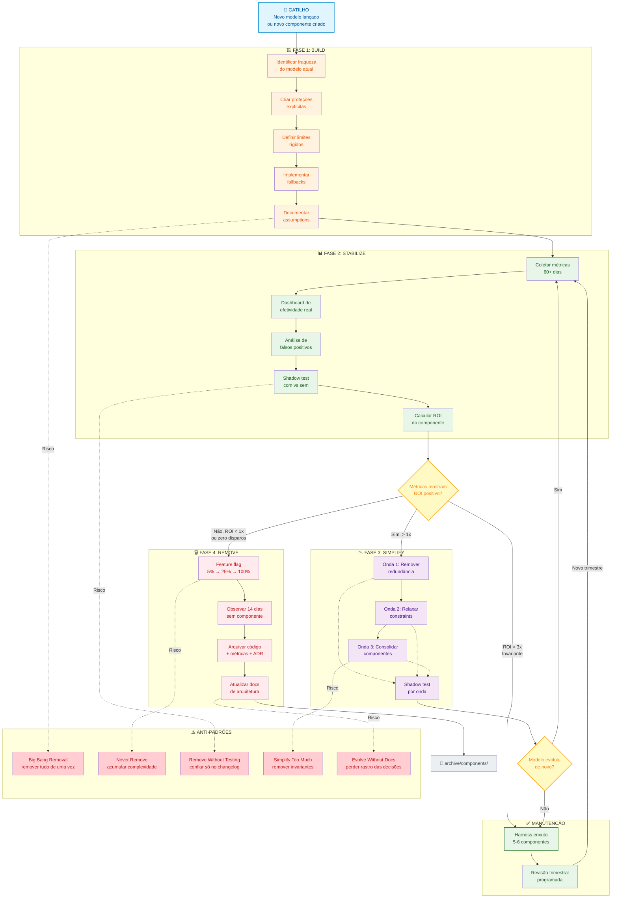
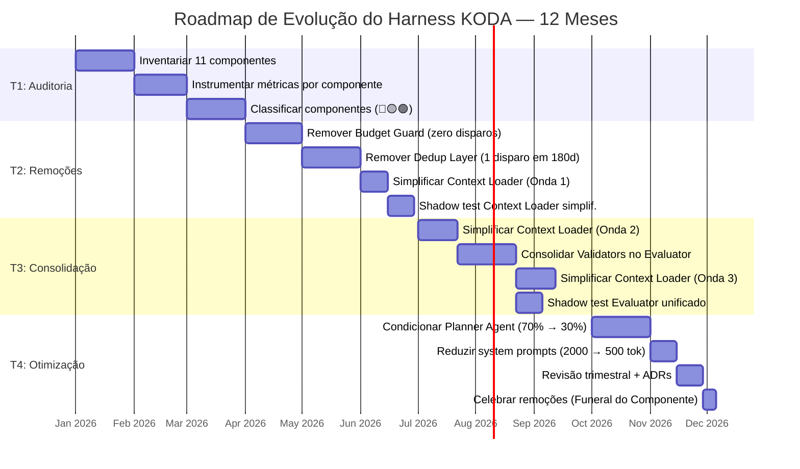
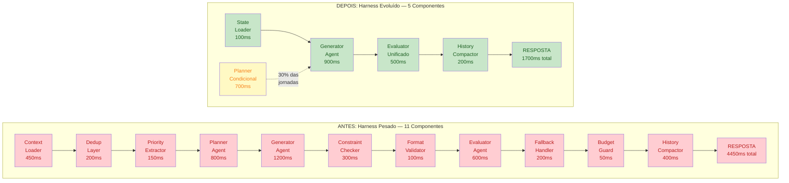
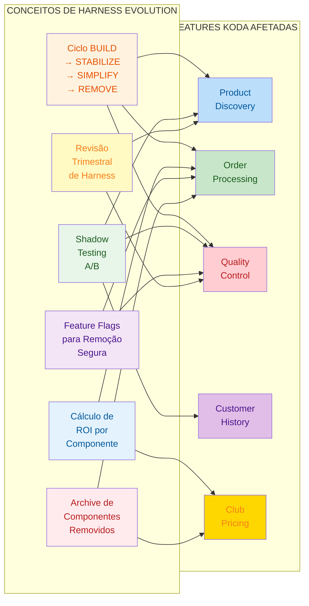

# 🧬 Knowledge Graph: Harness Evolution
## O Ciclo de Vida dos Componentes de Scaffolding em Agentes de IA — Mapa Conceitual Completo

**Tempo Estimado:** 120 minutos
**Nível:** 6 — Knowledge Graphs e Síntese Arquitetural
**Pré-requisito:** `05-core-concepts/06-harness-evolution.md`, `06-knowledge-graphs/01-concept-ecosystem.md`
**Status:** 🟢 COMPLETO — Grafo detalhado do Core Concept 06
**Data de Criação:** Maio 2026

---

## 📖 Prólogo: O Grafo Que Nasceu de Uma Decisão

**Terça-feira, 14h30. War room do time KODA.**

Fernando olhava para o quadro branco com um marcador vermelho na mão. O diagrama da arquitetura do KODA — aquele mesmo que tinha sido o orgulho do time por 8 meses — estava coberto de anotações.

Três colunas desenhadas à esquerda. Três perguntas no topo:

```
O QUE EXISTE?     │   O QUE CUSTA?    │   O QUE AINDA PROTEGE?
──────────────────┼───────────────────┼─────────────────────────
Context Loader    │   R$ 810/mês      │   12 prevenções reais
                  │   450ms/turno     │   em 145.000 turns
                  │   3h manutenção   │   (0.008% de efetividade)
──────────────────┼───────────────────┼─────────────────────────
Budget Guard      │   R$ 200/mês      │   0 disparos em
                  │   50ms/turno      │   180 dias de produção
                  │   1h manutenção   │
──────────────────┼───────────────────┼─────────────────────────
Dedup Layer       │   R$ 150/mês      │   1 prevenção em
                  │   200ms/turno     │   180 dias
                  │   0.5h manutenção │   (WhatsApp corrigiu o bug)
──────────────────┼───────────────────┼─────────────────────────
Constraint Checker│   R$ 1.350/mês    │   89 prevenções reais
                  │   350ms/turno     │   67 falsos positivos
                  │   4h manutenção   │   FP rate: 43% (subindo)
```

O time estava em silêncio. Não era um silêncio de derrota. Era o silêncio de quem está vendo algo óbvio pela primeira vez.

```
Dev Senior: "Fernando... a gente construiu tudo isso para proteger
            um modelo que já não está mais em produção."

Fernando:  "Exatamente. O harness de hoje foi desenhado para o
            modelo de ontem. E o modelo de amanhã vai tornar
            ainda mais coisas redundantes."

Dev Ops:   "Mas como a gente decide o que sai e o que fica?
            Não dá para fazer na intuição."

Fernando:  "Não dá. Precisa de um mapa. Um grafo. Algo que mostre
            não só os componentes, mas as RELAÇÕES entre eles.
            O que depende do quê. O que protege o quê.
            O que custa quanto. E principalmente: o que acontece
            quando o modelo melhora."
```

Naquela tarde, Fernando não tomou nenhuma decisão de remoção. Ele fez algo mais importante: desenhou o primeiro grafo de Harness Evolution do KODA.

Era um grafo simples: quatro quadrantes num ciclo. BUILD, STABILIZE, SIMPLIFY, REMOVE. Cada componente do harness começava no primeiro quadrante e, com métricas e coragem, navegava até o último.

Aquele grafo mudou a cultura do time.

Deixou de ser "funciona, não mexe" para ser "funciona, mas ainda é necessário?"

Deixou de ser "vamos adicionar mais um guard" para ser "qual guard podemos remover?"

Deixou de ser medo de simplificar para ser processo de simplificar.

Este arquivo é aquele grafo. Expandido. Com cada nó documentado. Cada aresta explicada. Cada anti-padrão mapeado. Cada cenário KODA conectado.

Não é um diagrama bonito para apresentação. É um instrumento de arquitetura. Um mapa de decisão. Um gráfico que responde à pergunta mais perigosa — e mais necessária — que um time de engenharia pode fazer:

> "O que podemos remover hoje?"

---

## 🎯 O Que É Este Knowledge Graph?

### Definição e Propósito

Este **Detailed Knowledge Graph** é o mapa conceitual completo do Core Concept 06 — Harness Evolution. Diferente do arquivo fonte (`05-core-concepts/06-harness-evolution.md`), que é linear e narrativo, este grafo é relacional e visual. Ele mostra:

1. **O ciclo de vida completo** de qualquer componente de harness como um grafo direcionado com 4 fases
2. **As interconexões** entre componentes do KODA que tornam a evolução de um dependente da evolução de outro
3. **O impacto das capacidades do modelo** em cada decisão de simplificação ou remoção
4. **As estratégias de coordenação** e como elas evoluem junto com o harness
5. **A aplicação KODA completa** mapeada como um roadmap de features para conceitos

### Para Quem É Este Grafo

| Perfil | O Que Vai Encontrar | Como Usar |
|--------|-------------------|-----------|
| **Tech Lead** | Árvores de decisão, ROI, roadmaps trimestrais | Use nas revisões trimestrais de arquitetura |
| **Dev Senior** | Anti-padrões, checklist de remoção, cenários KODA | Use para planejar simplificações |
| **Dev Junior** | Ciclo de vida, conceitos fundamentais, conexões | Use para entender POR QUE certos componentes existem |
| **Product Manager** | Métricas de custo, trade-offs, cenários de decisão | Use para priorizar investimento em evolução vs features novas |

### Como Navegar Este Grafo

```
INÍCIO RÁPIDO (se você tem 5 minutos):
  → Leia "Diagrama Principal: Ciclo de Vida do Harness"
  → Leia "Tabela Comparativa de Estratégias de Coordenação"
  → Leia "Aplicação KODA: Cenários de Decisão"

ENTENDIMENTO PROFUNDO (se você tem 30 minutos):
  → Comece pelo Prólogo
  → Siga cada fase do ciclo (BUILD → STABILIZE → SIMPLIFY → REMOVE)
  → Estude os anti-padrões
  → Analise os diagramas Mermaid e ASCII

REFERÊNCIA RÁPIDA (se você está numa revisão trimestral):
  → Use as Árvores de Decisão
  → Consulte a Tabela de Sinais de Prontidão
  → Verifique o Checklist de Implementação
```

---

## 🌐 Diagrama Principal: Ciclo de Vida do Harness

Este é o grafo central. Todo componente de harness — seja o Context Loader do KODA, o Budget Guard, o Constraint Checker ou qualquer outro — percorre este ciclo. As fases não são opcionais. Pular uma fase é convidar incidentes.



### Como Ler Este Grafo

1. **Comece pelo gatilho** (canto superior esquerdo): um novo modelo é lançado ou um novo componente é criado
2. **Siga as setas sólidas** para o fluxo principal: BUILD → STABILIZE → (decisão) → SIMPLIFY ou REMOVE
3. **As setas pontilhadas** mostram anti-padrões: o que acontece quando você pula fases ou toma atalhos
4. **O losango** representa a decisão crítica após STABILIZE: o ROI do componente justifica mantê-lo?
5. **O ciclo se fecha** com a revisão trimestral, que pode reiniciar o processo para o mesmo componente

### Regra de Ouro do Grafo

> Nenhum componente deve permanecer na fase BUILD por mais de 90 dias sem entrar em STABILIZE. Nenhum componente deve permanecer em STABILIZE por mais de um trimestre sem uma decisão explícita (Simplificar, Remover ou Manter). Um componente que permanece indefinidamente na mesma fase é um componente que ninguém está gerenciando.

---

## 🎯 O Que É Harness Evolution?

### Definição Formal

**Harness Evolution** é a disciplina arquitetural de **revisar, simplificar e remover componentes do harness de agentes de IA** conforme:

1. Os modelos de linguagem subjacentes evoluem (novas capacidades, janelas maiores, melhor reasoning)
2. As métricas de produção mostram que proteções são redundantes ou de baixo valor
3. Os padrões de uso revelam que certas validações nunca disparam em cenários reais

Não é "jogar fora o que funciona". É **reconhecer que o harness certo para o modelo de 6 meses atrás pode ser o harness errado para o modelo de hoje.**

### Por Que Isso Importa — Os Números

Em sistemas tradicionais (APIs REST, bancos de dados, filas), você projeta uma arquitetura e ela dura anos. A peça central do sistema — Postgres, Redis, RabbitMQ — evolui lentamente e de forma previsível.

Em sistemas de agentes de IA, a peça central evolui a cada 3-6 meses:

| Período | Modelo | Janela de Contexto | Self-Correction | Harness Necessário |
|---------|--------|--------------------|----------------|-------------------|
| 6 meses atrás | Claude v1 | 32K tokens | Baixa (20%) | Pesado — 11 componentes |
| 3 meses atrás | Claude v2 | 100K tokens | Média (50%) | Médio — 8 componentes |
| Hoje | Claude v3 | 200K tokens | Alta (80%) | Leve — 5-6 componentes |
| Em 6 meses | Claude v4 | 500K+ tokens (projetado) | Muito Alta (95%+) | Mínimo — 3-4 componentes |

Se você não evolui o harness junto com o modelo, você mantém complexidade que o modelo já não precisa. É como manter as rodinhas de uma bicicleta depois que a criança aprendeu a se equilibrar. As rodinhas não ajudam mais — elas atrapalham.

### A Metáfora da Ponte

```
FASE 1: CONSTRUÇÃO — Andaimes são essenciais
  ┌──────────────────────────────────────────┐
  │  ▓▓▓▓▓▓▓▓▓▓▓▓▓▓▓▓▓▓▓▓▓▓▓▓▓▓▓▓▓▓▓▓▓▓▓  │ ← Andaimes (harness)
  │  ═══════════════════════════════════════  │ ← Ponte (modelo)
  │  ▓▓▓▓▓▓▓▓▓▓▓▓▓▓▓▓▓▓▓▓▓▓▓▓▓▓▓▓▓▓▓▓▓▓▓  │
  └──────────────────────────────────────────┘
  Se você tirar os andaimes agora, a ponte desaba.

FASE 2: ESTABILIZAÇÃO — Andaimes começam a ser removidos
  ┌──────────────────────────────────────────┐
  │  ▓▓▓▓▓▓▓▓▓▓▓▓▓   ▓▓▓▓▓▓▓▓▓▓▓▓▓▓▓▓▓▓▓▓ │
  │  ═══════════════════════════════════════  │
  │  ▓▓▓▓▓▓▓▓▓▓▓▓▓   ▓▓▓▓▓▓▓▓▓▓▓▓▓▓▓▓▓▓▓▓ │
  └──────────────────────────────────────────┘
  A ponte já se sustenta em várias seções.

FASE 3: OPERAÇÃO — Andaimes removidos
  ┌──────────────────────────────────────────┐
  │                                          │
  │  ═══════════════════════════════════════  │ ← Ponte independente
  │                                          │
  └──────────────────────────────────────────┘
  A ponte funciona sem suporte externo.

O ERRO COMUM: Nunca remover os andaimes.
O sistema "funciona", então ninguém mexe.
Mas os andaimes têm custo real.
```

**Harness Evolution é a disciplina de remover andaimes no momento certo — nem antes (a ponte cai), nem depois (você carrega peso morto para sempre).**

### O Que Não É Harness Evolution

- ❌ **Não é "jogar tudo fora e começar do zero".** Você remove componentes específicos, não o sistema inteiro.
- ❌ **Não é otimização prematura.** Você só simplifica depois de ter métricas reais de produção (60+ dias).
- ❌ **Não é "confiar cegamente no modelo".** Algumas proteções são invariantes e nunca saem.
- ❌ **Não é um projeto único.** É um ritmo — trimestral, como revisão de arquitetura.
- ❌ **Não é sobre escrever menos código.** É sobre ter menos código que você precisa manter, debugar e ensinar.

### O Princípio Fundamental

> **"O harness que você constrói hoje não é o harness que você vai precisar amanhã. A pergunta não é se você deve evoluí-lo. A pergunta é se você tem um processo para fazer isso com segurança."**

### O Paradoxo do Harness

O harness existe para dar confiança. Mas se você nunca o revisa, ele se torna a própria fonte de fragilidade que deveria prevenir.

Cada componente desnecessário no harness significa:
- Mais superfície para bugs
- Mais latência entre o cliente perguntar e o KODA responder
- Mais tokens gastos em processamento que não agrega valor
- Mais complexidade para novos devs entenderem
- Mais arquivos de estado para manter e debugar
- Mais código para dar manutenção a cada mudança no modelo

Este grafo existe para que você nunca esqueça disso.

---

## 🔄 As Quatro Fases em Profundidade

### 🏗️ Fase 1: BUILD — "Preciso Proteger o Modelo das Próprias Fraquezas"

#### Gatilho de Entrada
- Um novo modelo de linguagem é integrado ao sistema
- Um novo padrão arquitetural é implementado pela primeira vez
- Um incidente em produção revela uma fraqueza que precisa de proteção dedicada

#### Mindset da Fase
**Defensivo e consciente.** Você SABE que o modelo vai falhar. Você sabe ONDE ele vai falhar. Você cria proteções explícitas para cada ponto de falha conhecido. Cada constraint que o modelo pode violar vira uma verificação separada. Cada edge case vira um fallback. Cada decisão irreversível vira um checkpoint.

Nesta fase, você não está otimizando para custo. Você está otimizando para segurança. O harness vai ser pesado. Isso é intencional.

#### Atividades Essenciais

1. **Criar componentes de validação explícitos** — cada constraint vira uma verificação separada com mensagem de erro clara
2. **Definir limites rígidos** — budgets de tokens, máximos de iterações, timeouts, thresholds de confiança
3. **Implementar fallbacks generosos** — se estratégia A falhar, tente B, depois C, depois escale para humano
4. **Escrever system prompts longos e detalhados** — 2000-3000 tokens com instruções, exemplos e restrições explícitas
5. **Adicionar redundância** — dados críticos vão no system prompt E no user message E no state file
6. **Criar logs extensivos** — cada decisão, cada validação, cada bypass é registrado com timestamp e contexto

#### Exemplo KODA: O Context Loader Original (v1.0)

Quando o time KODA implementou o Context Loader em novembro de 2025, o modelo da época (Claude v1, 32K tokens) tinha dificuldade real em manter acurácia após 30-40 minutos de conversa. Informações ditas no início da conversa simplesmente "desapareciam" da atenção do modelo.

O Context Loader era um componente robusto com 4 etapas:
- `pre_load_customer_profile`: Ler `customer_profile.json` antes de CADA turno (400 tokens)
- `compress_history`: Resumir mensagens com mais de 30 minutos em bullet points (300 tokens)
- `tag_critical_info`: Marcar alergias e restrições como `[HIGH_PRIORITY]` (100 tokens)
- `inject_redundancy`: Incluir dados críticos no system prompt E no user message (400 tokens)

**Custo total:** 1200 tokens/turno, 450ms de latência adicional.

**Por que isso era correto na época:** O modelo realmente perdia contexto. As 12 prevenções em 145K turns eram casos REAIS onde o cliente teria recebido recomendação errada. O custo de 1200 tokens por turno se justificava pelo risco de perder um cliente — ou pior, recomendar um produto com alérgeno.

#### O Que Deve Ser Documentado no BUILD

Para cada componente criado, documente:
- **Propósito original:** Que fraqueza do modelo este componente protege?
- **Assumptions:** Que premissas sobre o modelo justificam a existência deste componente?
- **Modelo-alvo:** Qual modelo estava em produção quando o componente foi criado?
- **Custo estimado:** Tokens, latência, complexidade de manutenção
- **Critério de sucesso:** Como saberemos se este componente está funcionando?

#### Critério de Saída do BUILD

- [x] Componente em produção por pelo menos 2 semanas
- [x] Zero incidentes críticos (P0/P1) atribuídos a falhas que o componente deveria prevenir
- [x] Time documentou o que o componente faz, por que existe, e quais assumptions justificam sua existência
- [x] Métricas básicas de latência e consumo de tokens estão sendo coletadas
- [x] O componente está registrado no inventário de harness com status "BUILD"

---

### 📊 Fase 2: STABILIZE — "O Harness Está Confiável. Agora Posso Medir."

#### Gatilho de Entrada
- O componente está em produção por 60+ dias
- Você tem dados suficientes para avaliar seu valor real — não o valor que você imaginava quando o criou
- Zero incidentes P0/P1 nos últimos 30 dias relacionados ao domínio do componente

#### Mindset da Fase
**Observacional, analítico e cético.** Você confia que o componente funciona, mas quer PROVAS de que ele entrega valor proporcional ao seu custo. A pergunta não é mais "este componente funciona?" — isso você já sabe. A pergunta é "este componente ainda é a melhor forma de resolver este problema?"

Esta é a fase onde a maioria dos times para. Eles veem as métricas, percebem que o componente tem custo desproporcional, e decidem "não mexer no que está funcionando". Este é exatamente o erro que Harness Evolution existe para prevenir.

#### Atividades Essenciais

1. **Dashboard de efetividade real** — quantas falhas o componente REALMENTE preveniu? (não "poderia prevenir")
2. **Análise de falsos positivos** — quantas vezes o componente bloqueou algo que estava correto?
3. **Custeio completo** — tokens, latência, horas de manutenção, custo de onboarding para novos devs
4. **Shadow test A/B** — rode COM e SEM o componente em paralelo no mesmo tráfego e compare resultados
5. **Gap analysis** — documente a diferença entre "o que achávamos que prevenia" vs "o que realmente preveniu"

#### Exemplo KODA: Context Loader Após 3 Meses (v1.3)

```
Métricas de 90 dias (Nov/2025 — Fev/2026):
┌─────────────────────────────────────────────────────────────┐
│ Total de turns processados:          145.000                │
│ Média de turns por conversa:         45                     │
│ Duração média da conversa:           95 minutos             │
│                                                             │
│ EFETIVIDADE REAL:                                           │
│   Prevenções críticas:               12                     │
│   Prevenções não-críticas:           47                     │
│   Taxa de efetividade:               0.04% (59 em 145.000)  │
│   ⚠️ Apenas 1 a cada 2.500 turns resulta em prevenção      │
│                                                             │
│ FALSOS POSITIVOS:                                           │
│   Total:                             340                    │
│   Ratio FP/Prevenção:                28x                    │
│   ⚠️ 28x mais falsos positivos que prevenções reais        │
│                                                             │
│ CUSTO OPERACIONAL:                                          │
│   Tokens/mês:                        5.400.000              │
│   Custo API/mês:                     R$ 810                 │
│   Latência/turno:                    450ms                  │
│   Manutenção/mês:                    3 horas                │
│   Onboarding:                        8/10 (3-4 dias)        │
│                                                             │
│ SHADOW TEST (14 dias, 50/50):                               │
│   Com Context Loader:                97.2% acurácia         │
│   Sem Context Loader:                96.8% acurácia         │
│   Delta:                             -0.4% (NÃO significativo) │
└─────────────────────────────────────────────────────────────┘
```

#### O Momento da Verdade

Com essas métricas na mesa, o time KODA enfrentou a decisão:

| Argumento PARA manter | Argumento PARA simplificar |
|----------------------|---------------------------|
| 12 prevenções reais ainda são 12 clientes protegidos | 12 em 145.000 = 0.008% de efetividade |
| -0.4% de acurácia pode ser relevante em escala | -0.4% não é estatisticamente significativo |
| O componente funciona, não quebrou nada | 340 falsos positivos = clientes frustrados desnecessariamente |
| 450ms é aceitável para o usuário | R$ 810/mês × 12 meses = R$ 9.720/ano |

**A decisão de Fernando:** Nem manter como está, nem remover completamente. **Simplificar em ondas.** A fase STABILIZE produziu a evidência. A fase SIMPLIFY vai usar essa evidência para reduzir o componente sem perder as proteções essenciais.

#### Critério de Saída do STABILIZE

- [x] Pelo menos 60 dias de métricas em produção
- [x] Shadow test comparando com/sem o componente concluído
- [x] Dashboard mostrando taxa de acionamento real (não teórica)
- [x] Documento de gap analysis: esperado vs. real
- [x] Decisão explícita documentada: AVANÇA PARA SIMPLIFY, AVANÇA PARA REMOVE, ou MANTÉM COMO ESTÁ

---

### 📉 Fase 3: SIMPLIFY — "O Modelo Agora Consegue Lidar com Isso"

#### Gatilho de Entrada
Um destes três eventos:
1. Um novo modelo é lançado com capacidades documentadas que cobrem a fraqueza que o componente protegia
2. As métricas da fase STABILIZE mostram que o componente tem ROI marginal (entre 0 e 2x)
3. Um shadow test confirma que reduzir o componente não causa degradação significativa

#### Mindset da Fase
**Cirúrgico e incremental.** Você não arranca o componente de uma vez. Você reduz camada por camada, testa, observa, reduz mais. Cada redução é validada com shadow test antes da próxima. A ordem das ondas é determinada por risco: comece pelo que é mais seguro remover.

#### A Hierarquia de Risco na Simplificação

```
NÍVEL DE RISCO DA SIMPLIFICAÇÃO
      ▲
      │  ALTO: Remover validações de segurança e constraints críticas
      │        ⚠️ Só faça com shadow test de 30+ dias e aprovação de 2+ seniors
      │
      │  MÉDIO: Consolidar componentes redundantes
      │         ⚠️ Garanta que o componente absorvente cobre 100% dos casos
      │
      │  BAIXO: Remover redundância (dados duplicados, prompts longos)
      │         ⚠️ Comece por aqui — é o caminho mais seguro
      │
      │  MUITO BAIXO: Remover componentes que nunca disparam
      │              ✅ Faça primeiro — zero risco
      │
      └──────────────────────────────────────────────────────►
        ORDEM RECOMENDADA DE SIMPLIFICAÇÃO
```

#### Exemplo KODA: Context Loader Simplificado (v2.0)

**Onda 1 — Remover Redundância (Risco: BAIXO)**
- Remover injeção dupla de dados críticos (system_prompt + user_message → só system_prompt)
- Remover tags `[HIGH_PRIORITY]` explícitas (modelo v2 prioriza constraints naturalmente)
- Reduzir system prompt de 2000 para 800 tokens
- **Impacto:** -500 tokens/turno, -150ms latência
- **Validação:** 7 dias de shadow test, acurácia manteve-se em 97.1%

**Onda 2 — Relaxar Constraints (Risco: MÉDIO)**
- Aumentar threshold de compressão de histórico: 30min → 90min (modelo v2 retém contexto por mais tempo)
- Remover validação pós-turno de constraints (Evaluator já cobre)
- Deixar de carregar `customer_profile.json` a cada turno — carregar só no início da conversa
- **Impacto:** -400 tokens/turno, -200ms latência
- **Validação:** 14 dias de shadow test 50/50, acurácia 97.0% vs 97.1%

**Onda 3 — Consolidar (Risco: MÉDIO)**
- Mover lógica residual do Context Loader para o History Compactor
- Context Loader deixa de existir como componente independente
- **Impacto:** -300 tokens/turno, -100ms latência
- **Resultado total:** 1200 tokens/turno → 0 tokens/turno (absorvido pelo Compactor)

#### Resultado Final da Simplificação

| Métrica | Antes (v1.3) | Depois (v2.0) | Delta |
|---------|-------------|---------------|-------|
| Tokens/turno | 1200 | 0 (absorvido) | -100% |
| Latência/turno | 450ms | 0ms | -100% |
| Componentes dedicados | 1 | 0 | -1 |
| Acurácia | 97.2% | 97.0% | -0.2% (não significativo) |
| Horas manutenção/mês | 3h | 0h | -100% |
| Custo mensal | R$ 810 | R$ 0 | -100% |

#### Sinais de Que um Componente Está Pronto para Simplificação

| Sinal | O Que Observar | Threshold | Exemplo KODA |
|-------|----------------|-----------|--------------|
| **Taxa de acionamento baixa** | O componente raramente previne algo real | < 1% dos turns | Budget Guard: 0 disparos em 180 dias |
| **Falsos positivos altos** | Bloqueia mais fluxos corretos que incorretos | > 5x mais FPs que prevenções | Context Loader: 340 FPs vs 12 reais (28x) |
| **Modelo cobre a fraqueza** | Changelog documenta melhoria na área | Evidência + shadow test | "Improved instruction following across 100K+ contexts" |
| **Redundância entre componentes** | Dois componentes validam a mesma coisa | Overlap > 50% | Context Loader + Constraint Checker + Evaluator validam alergias |
| **ROI negativo** | Custo > valor entregue | Custo > 2× valor | Budget Guard: R$ 200/mês para prevenir R$ 0 |
| **Onboarding impactado** | Novos devs perguntam "por que isso existe?" | > 2 perguntas de novos devs | Priority Extractor: "Por que não deixar o modelo decidir?" |
| **Latência perceptível** | Usuário sente delay | > 300ms adicionais | Context Loader: 450ms/turno |

---

### 🗑️ Fase 4: REMOVE — "Este Componente Cumpriu Seu Propósito"

#### Gatilho de Entrada
O componente passou pela simplificação e mesmo na sua forma mais enxuta:
- Sua taxa de acionamento real é < 0.1%
- O shadow test confirma que removê-lo não causa degradação
- Nenhum incidente nos últimos 90 dias foi prevenido por ele
- O modelo atual cobre completamente a proteção que ele oferecia

#### Mindset da Fase
**Decisivo, documentado e respeitoso.** Você não está "jogando fora trabalho". Você está reconhecendo que o trabalho cumpriu seu propósito. O componente protegeu o sistema quando era necessário. Agora não é mais. Isso é uma conquista, não uma falha.

#### O Processo de Remoção Segura

```
SEMANA 1          SEMANA 2          SEMANA 3          SEMANA 4+
─────────         ─────────         ─────────         ─────────
Feature flag:     Feature flag:     Feature flag:     Código removido
5% tráfego        25% tráfego       100% tráfego      Componente
sem componente    sem componente    sem componente    arquivado
                                                      ↓
Observar:         Observar:         Observar:         archive/
- erro rate       - erro rate       - 14 dias         components/
- latência        - latência        - métricas         <nome>/
- satisfação      - satisfação      estáveis?         ├── README.md
                  │                 │                 ├── src/
                  └── Se OK ────────┘                 ├── metrics/
                                                      └── decisions/
```

#### Exemplo KODA: Remoção do Budget Guard

O Budget Guard foi criado em outubro de 2025 para monitorar consumo de tokens e truncar conversas ao atingir 80% da janela de contexto (32K tokens). Com a migração para Claude v3 (200K tokens), as conversas típicas do KODA (50K tokens) nunca chegavam perto do limite.

**Evidência que justificou a remoção:**
- Zero disparos em 180 dias de produção
- Shadow test de 30 dias (50% tráfego): zero diferença entre com e sem
- Custo operacional: R$ 200/mês em tokens + 1h/mês manutenção
- Modelo atual lida bem com contextos longos (documentado no changelog v3)

**Processo de remoção:**
- Semana 1: Feature flag — 5% tráfego sem Budget Guard → zero incidentes
- Semana 2: Feature flag — 25% tráfego sem Budget Guard → zero incidentes
- Semana 3: Feature flag — 100% tráfego sem Budget Guard → zero incidentes
- Semana 4: Código removido, arquivado em `archive/components/budget-guard-v1/`

**Post-removal (14 dias de monitoramento):**
- Regressões: 0
- Token budget exceeded: 0
- Incomplete responses: 0
- Customer satisfaction: Estável (88% → 88%)
- Incidentes: 0

#### O Que Fica no Archive

```
archive/components/budget-guard-v1/
├── README.md              # Por que existiu, por que foi removido, lições
├── src/                   # Código original (referência futura)
├── metrics/
│   └── 180-days.json      # Métricas que justificaram a remoção
└── decisions/
    └── removal-adr.md     # ADR documentando a decisão
```

**Regra de ouro:** Código removido NUNCA é deletado. É arquivado. Em 2 anos, se alguém perguntar "por que não temos Budget Guard?", a resposta está documentada. Se um novo modelo com janela menor chegar, o código está lá para ser reavaliado — não reimplementado do zero.

---

## ⚠️ Os 5 Anti-Padrões de Harness Evolution

Saber o que NÃO fazer é tão importante quanto saber o que fazer. Estes 5 anti-padrões foram extraídos de falhas reais de times que tentaram evoluir seus harnesses sem processo.

### Anti-Padrão 1: "Big Bang Removal"

**O que é:** Remover múltiplos componentes do harness de uma vez, sem feature flags independentes, sem shadow testing, sem períodos de observação.

**Por que é perigoso:** Se algo quebrar, você não sabe qual remoção causou o problema. Rollback significa reverter TODAS as remoções, perdendo o trabalho das que estavam corretas. É como desmontar três peças do motor do carro ao mesmo tempo e depois não saber qual delas causou o barulho.

**Sinal de alerta:** Frases como "vamos aproveitar e já remover o X, Y e Z junto" ou "vamos fazer uma limpeza geral no harness".

**Como evitar:** Uma remoção por vez. Feature flag independente para cada componente. Período de observação de 14 dias entre remoções. Zero sobreposição de períodos de shadow test.

```
❌ ERRADO:
   Sprint 1: Remover Budget Guard + Format Validator + Dedup Layer
   Resultado: Algo quebrou. O que foi? Ninguém sabe.

✅ CERTO:
   Sprint 1: Remover Budget Guard → observar 14 dias → ✅ estável
   Sprint 2: Remover Format Validator → observar 14 dias → ✅ estável
   Sprint 3: Remover Dedup Layer → observar 14 dias → ✅ estável
```

---

### Anti-Padrão 2: "Nunca Remover Nada"

**O que é:** O time acumula componentes de harness indefinidamente. "Se funciona, não mexe." O sistema cresce em complexidade a cada trimestre. O diagrama de arquitetura de hoje é 40% maior que o de 6 meses atrás.

**Por que é perigoso:** Complexidade acumulada não é neutra — ela é ativamente prejudicial. Cada componente extra torna o sistema mais lento, o debugging mais difícil (mais lugares para procurar), o onboarding mais demorado, e as mudanças futuras mais arriscadas (medo de quebrar algo que ninguém entende completamente).

**Sinal de alerta:** O diagrama de arquitetura do seu harness é maior hoje do que era há 6 meses. Ninguém no time consegue explicar o que metade dos componentes faz sem consultar documentação. Frases como "é melhor ter e não precisar do que precisar e não ter".

```
❌ ERRADO:
   Trimestre 1: +2 componentes (total: 8)
   Trimestre 2: +1 componente (total: 9)
   Trimestre 3: +2 componentes (total: 11)
   Trimestre 4: "Precisamos reescrever tudo, está complexo demais"

✅ CERTO:
   Trimestre 1: +2 componentes, -1 removido (total: 7)
   Trimestre 2: +1 componente, -2 removidos (total: 6)
   Trimestre 3: +1 componente, -1 removido (total: 6)
   Trimestre 4: Arquitetura estável, complexidade controlada
```

---

### Anti-Padrão 3: "Remover Porque o Modelo Novo é Melhor (Sem Testar)"

**O que é:** Ler o changelog de um modelo novo, assumir que ele resolve tudo, e remover componentes sem shadow testing. O changelog vira verdade absoluta. O benchmark vira garantia.

**Por que é perigoso:** O changelog descreve benchmarks controlados, não seu caso de uso específico. O modelo pode ser melhor em média mas pior no caso específico que seu componente protegia. "Self-correction improved 3x" não significa "self-correction improved 3x para recomendações de suplementos com restrições alimentares".

**Sinal de alerta:** Frases como "o changelog diz que instruction following melhorou 40%, podemos remover o Constraint Checker". Decisões de remoção tomadas na mesma semana do lançamento do modelo.

**Como evitar:** SEMPRE faça shadow testing antes de remover. O changelog é uma hipótese, não uma prova. A hipótese é testável. O teste é obrigatório.

```
❌ ERRADO:
   Changelog: "Self-correction improved 3x"
   Time: "Ótimo, vamos remover o Evaluator!"
   Resultado: Sycophancy volta. Recomendações erradas passam.
   Custo: 3 semanas de incidentes, 2 clientes perdidos.

✅ CERTO:
   Changelog: "Self-correction improved 3x"
   Time: "Vamos fazer shadow test: 50% tráfego com Evaluator, 50% sem."
   Resultado (2 semanas depois): Sem Evaluator, acurácia cai 8%.
   Decisão: Manter Evaluator. A melhoria foi em tarefas gerais, não no domínio KODA.
```

---

### Anti-Padrão 4: "Simplificar Demais"

**O que é:** Remover tantos componentes que o harness fica frágil. O sistema funciona bem no caso comum (95% do tempo) mas quebra catastróficamente em edge cases. É o oposto do Anti-Padrão 2 — tão perigoso quanto.

**Por que é perigoso:** Edge cases em produção são justamente os casos que causam os piores incidentes: alergias não detectadas, cobranças erradas, dados perdidos, recomendações perigosas. Um sistema que funciona 95% do tempo com falhas catastróficas nos outros 5% é pior que um sistema que funciona 99.7% do tempo com complexidade controlada.

**Sinal de alerta:** O harness tem 2 ou menos componentes. Não há Evaluator. Não há state persistence. Frases como "o modelo é bom o suficiente, não precisamos de muletas".

**Como evitar:** Mantenha proteções para invariantes (segurança, compliance, decisões irreversíveis). Simplifique agressivamente o resto, mas NUNCA os invariantes.

```
❌ ERRADO — Harness simplificado demais:
   Sistema → Modelo → Cliente
   (Sem Evaluator, sem state persistence, sem fallback)
   Problema: Funciona 95% do tempo. Os 5% que falham são catastróficos.

✅ CERTO — Harness essencial:
   Sistema → State Loader → Modelo → Evaluator → Cliente
   (State para memória, Evaluator para qualidade)
   Complexidade: 2 componentes. Cobertura: 99.7%.
```

---

### Anti-Padrão 5: "Evoluir Sem Documentar"

**O que é:** Remover, simplificar ou modificar componentes sem registrar o que foi feito, por que foi feito, e quais métricas sustentaram a decisão. A decisão vive na cabeça de quem a tomou. Quando a pessoa sai do time, a justificativa sai junto.

**Por que é perigoso:** Em 6 meses, ninguém lembra por que o Budget Guard foi removido. Um novo dev pode recriá-lo. Um novo modelo com janela menor pode chegar e o time não ter a referência do componente original. O ciclo recomeça do zero — sem aprendizado, sem histórico.

**Sinal de alerta:** Componentes desaparecem do código sem commit message explicativo. Ninguém sabe quando o Dedup Layer foi removido. Não há archive directory.

**Como evitar:** Todo componente removido vai para `archive/components/` com README. Toda simplificação gera um ADR (Architecture Decision Record). Toda decisão de MANTER (não simplificar) também é documentada com justificativa.

```
Estrutura de documentação esperada:

archive/
└── components/
    ├── budget-guard-v1/
    │   ├── README.md
    │   ├── src/
    │   ├── metrics/
    │   └── decisions/
    │       └── removal-adr.md
    ├── dedup-layer-v1/
    │   └── ...
    └── format-validator-v1/
        └── ...

docs/decisions/
├── 001-keep-evaluator-despite-model-v3.md
├── 002-remove-budget-guard.md
├── 003-simplify-context-loader.md
└── 004-consolidate-validators.md
```

---

## 📊 Diagrama: Timeline de Evolução do Harness KODA

Este diagrama mostra o roadmap real de evolução do harness KODA ao longo de 12 meses, com cada trimestre focado em um conjunto específico de decisões. Use-o como referência para planejar seu próprio roadmap.



### Métricas-Alvo do Roadmap

| Métrica | Início (T1) | Alvo (T4) | Como Medir |
|---------|------------|-----------|------------|
| Número de componentes | 11 | 5-6 | Contagem direta no diagrama de arquitetura |
| Latência média por turno | 4450ms | < 2000ms | Dashboard de performance |
| Tokens por turno | 3200 | < 1500 | API usage reports |
| Custo mensal de API | R$ 1,460 | < R$ 500 | Fatura do provedor |
| Acurácia de recomendações | 97.2% | > 96.5% | Dashboard de qualidade |
| Incidentes P0/P1 | Baseline | Sem aumento | Dashboard de incidentes |
| Tempo de onboarding | 4 dias | < 2 dias | Feedback de novos devs |
| Componentes removidos/arquivados | 0 | 4-5 | Archive directory |

---

## 🔀 Diagrama: Estratégias de Coordenação — Antes e Depois

Este diagrama mostra a evolução da coordenação entre componentes: de 11 componentes com pipeline linear pesado para 5 componentes com fluxo condicional e enxuto.



### O Que Mudou na Coordenação

| Dimensão | Antes (11 componentes) | Depois (5 componentes) | Ganho |
|----------|----------------------|----------------------|-------|
| **Coordenação entre agentes** | File-based com 5-7 arquivos JSON por turno | File-based com 2-3 arquivos JSON por turno | -60% I/O, -40% latência |
| **Validação de output** | Evaluator + Constraint Checker + Format Validator (3 stages) | Evaluator unificado (cobre os 3 em 1 stage) | -2 componentes, -300 tokens/turno |
| **Gestão de contexto** | Context Loader (pré) + History Compactor (pós) + Dedup Layer | History Compactor (pós) apenas para conversas > 2h | -2 componentes, -800 tokens/turno |
| **Planejamento** | Planner Agent dedicado — sempre roda | Planner condicional — só em 30% das jornadas | -70% de chamadas de Planner |
| **Tratamento de erros** | 3 estratégias de fallback | 1 estratégia (retry simples, depois escala) | -2 code paths, -150ms |
| **System prompts** | 2000-3000 tokens detalhados | 500-800 tokens com princípios | -70% tokens de prompt |
| **Trace e auditoria** | 4 arquivos separados | 2 arquivos (state.json + audit_log.jsonl) | -50% arquivos |
| **Onboarding** | 3-4 dias | 1-2 dias | -50% tempo de ramp-up |
| **Superfície para bugs** | 11 pontos de falha | 5 pontos de falha | -55% de superfície de bug |

---

## 📊 Arquitetura ASCII: Pipeline Antes vs Depois

### Antes: Harness Pesado — 11 Componentes

```
CLIENTE PERGUNTA
      │
      ▼
┌─────────────┐     ┌─────────────┐     ┌─────────────┐
│ Context     │────▶│ Dedup       │────▶│ Priority    │
│ Loader      │     │ Layer       │     │ Extractor   │
│ (450ms)     │     │ (200ms)     │     │ (150ms)     │
│ 1200 tokens │     │ 200 tokens  │     │ 150 tokens  │
└─────────────┘     └─────────────┘     └─────────────┘
                                                │
      ┌──────────────────────────────────────────┘
      ▼
┌─────────────┐     ┌─────────────┐     ┌─────────────┐
│ Planner     │────▶│ Generator   │────▶│ Constraint  │
│ Agent       │     │ Agent       │     │ Checker     │
│ (800ms)     │     │ (1200ms)    │     │ (300ms)     │
│ 400 tokens  │     │ 600 tokens  │     │ 300 tokens  │
└─────────────┘     └─────────────┘     └─────────────┘
                                                │
      ┌──────────────────────────────────────────┘
      ▼
┌─────────────┐     ┌─────────────┐     ┌─────────────┐
│ Format      │────▶│ Evaluator   │────▶│ Fallback    │
│ Validator   │     │ Agent       │     │ Handler     │
│ (100ms)     │     │ (600ms)     │     │ (200ms)     │
│ 150 tokens  │     │ 500 tokens  │     │ 100 tokens  │
└─────────────┘     └─────────────┘     └─────────────┘
                                                │
      ┌──────────────────────────────────────────┘
      ▼
┌─────────────┐     ┌─────────────┐
│ Budget      │────▶│ History     │────▶ RESPOSTA AO CLIENTE
│ Guard       │     │ Compactor   │
│ (50ms)      │     │ (400ms)     │      LATÊNCIA TOTAL: ~4450ms
│ 50 tokens   │     │ 300 tokens  │      TOKENS/TURNO:   ~3200
└─────────────┘     └─────────────┘      COMPONENTES:     11
                                         ARQUIVOS:        7
                                         CUSTO MENSAL:    R$ 1,460
```

### Depois: Harness Evoluído — 5 Componentes

```
CLIENTE PERGUNTA
      │
      ▼
┌─────────────┐
│ State       │────▶ CARREGA customer_profile.json (1x por conversa)
│ Loader      │
│ (100ms)     │      ┌─────────────────────────────┐
│ 150 tokens  │      │ Planner Condicional          │
└─────────────┘      │ (700ms, 400 tokens)          │
      │              │ SÓ RODA em jornadas complexas │
      ▼              │ (30% das conversas)           │
┌─────────────┐      └──────────────┬──────────────┘
│ Generator   │                     │
│ Agent       │◄────────────────────┘
│ (900ms)     │
│ 500 tokens  │
└─────────────┘
      │
      ▼
┌─────────────┐
│ Evaluator   │────▶ UNIFICADO: Constraints + Formato + Qualidade
│ (unificado) │
│ (500ms)     │
│ 400 tokens  │
└─────────────┘
      │
      ▼
┌─────────────┐
│ History     │────▶ RESPOSTA AO CLIENTE
│ Compactor   │
│ (200ms)     │      LATÊNCIA TOTAL:   ~1700ms (ou ~2400ms com Planner)
│ 150 tokens  │      TOKENS/TURNO:     ~1200
└─────────────┘      COMPONENTES:       5
                     ARQUIVOS:          2
                     CUSTO MENSAL:      R$ 420
```

### Ganho Líquido da Evolução

```
┌──────────────────────────────────────────────────────────────────┐
│                      RESUMO COMPARATIVO                           │
├──────────────┬──────────┬──────────┬──────────┬──────────────────┤
│ Métrica      │ Antes    │ Depois   │ Redução  │ Impacto Real     │
├──────────────┼──────────┼──────────┼──────────┼──────────────────┤
│ Latência     │ 4450ms   │ 1700ms   │ -62%     │ Usuário sente    │
│ Tokens/turno │ 3200     │ 1200     │ -63%     │ Custo cai 63%    │
│ Componentes  │ 11       │ 5        │ -55%     │ Menos bugs       │
│ Arquivos     │ 7        │ 2        │ -71%     │ Debug mais fácil │
│ Custo mensal │ R$ 1,460 │ R$ 420   │ -71%     │ R$ 12,480/ano    │
│ Onboarding   │ 4 dias   │ 1.5 dias │ -63%     │ Novos devs       │
│ Acurácia     │ 97.2%    │ 97.0%    │ -0.2%    │ NÃO significativo│
└──────────────┴──────────┴──────────┴──────────┴──────────────────┘
```

---

## 🌳 Árvores de Decisão para Harness Evolution

Estas árvores transformam princípios em perguntas binárias que levam a ações concretas. Use-as durante as revisões trimestrais.

### Decisão 1: O Componente Deve Ser Avaliado?

```
O componente está em produção há 60+ dias?
├── NÃO → Continue na fase BUILD. Colete métricas por mais tempo.
└── SIM → Você tem métricas de:
    ├── Taxa de acionamento real?
    │   ├── NÃO → Implemente coleta de métricas. Reavalie em 30 dias.
    │   └── SIM → Continue.
    └── Falsos positivos?
        ├── NÃO → Implemente coleta de FPs. Reavalie em 30 dias.
        └── SIM → PROSSIGA para Decisão 2.
```

### Decisão 2: Qual Ação Tomar?

```
O componente preveniu ALGUMA violação real nos últimos 90 dias?
├── NÃO (zero disparos) →
│   └── AÇÃO: REMOVER (Risco: MUITO BAIXO)
│       ├── Feature flag OFF por 7 dias
│       ├── Se zero incidentes → remover código
│       └── Arquivar em archive/components/
│
└── SIM (disparou pelo menos 1 vez) →
    └── Qual a taxa de falsos positivos?
        ├── FPs > 10x prevenções reais →
        │   └── O componente está causando mais dano que benefício?
        │       ├── SIM → AÇÃO: REMOVER (o dano supera o benefício)
        │       └── NÃO (FPs são inofensivos) → continue avaliando
        │
        └── FPs < 10x prevenções reais →
            └── Calcule o ROI:
                ├── ROI < 0 (custo > valor) →
                │   └── AÇÃO: REMOVER (custo injustificável)
                │
                ├── ROI entre 0 e 1x →
                │   └── AÇÃO: SIMPLIFICAR AGRESSIVAMENTE
                │       ├── Onda 1: Remover redundância
                │       ├── Onda 2: Relaxar constraints
                │       └── Onda 3: Consolidar com outro componente
                │
                └── ROI > 1x →
                    └── O modelo atual cobre a fraqueza?
                        ├── SIM (evidência + shadow test) →
                        │   └── AÇÃO: SIMPLIFICAR (ondas 1 e 2)
                        │
                        └── NÃO →
                            └── O componente protege um invariante?
                                ├── SIM → AÇÃO: MANTER (invariante)
                                └── NÃO → AÇÃO: MANTER + monitorar (reavaliar em 90 dias)
```

### Decisão 3: Como Simplificar com Segurança?

```
Qual o nível de risco da simplificação?
├── MUITO BAIXO (componente nunca dispara) →
│   └── Processo: feature flag → 7 dias → remover
│
├── BAIXO (remover redundância, reduzir prompts) →
│   └── Processo: shadow test 50/50 por 7 dias → se OK, 100%
│
├── MÉDIO (consolidar componentes, relaxar constraints) →
│   └── Processo: shadow test 50/50 por 14 dias → feature flag gradual
│       ├── Semana 1: 10% sem o componente
│       ├── Semana 2: 25% sem o componente
│       ├── Semana 3: 50% sem o componente
│       └── Semana 4: 100% sem o componente
│
└── ALTO (remover validação de segurança) →
    └── ⚠️ NÃO FAÇA sem:
        ├── Shadow test de 30+ dias
        ├── Aprovação de 2+ seniors
        ├── Rollback em < 5 minutos
        └── Plano de contingência documentado
```

---

## 📊 Diagrama: Aplicação KODA — Features para Conceitos

Este grafo mapeia as features do KODA para os conceitos de Harness Evolution, mostrando quais componentes do harness afetam quais funcionalidades do produto.



### Como Este Grafo se Conecta ao Ecossistema

Este grafo de Harness Evolution é um sub-grafo do `01-concept-ecosystem.md`. Enquanto o ecossistema mostra como os 8 Core Concepts se relacionam, este grafo mostra como UM conceito (Harness Evolution) se desdobra em features concretas do KODA.

**Conexões com o Ecossistema (01-concept-ecosystem.md):**
- **C1 (Ciclo BUILD→REMOVE)** conecta-se ao domínio Architecture do ecossistema
- **C2 (ROI)** conecta-se a Evaluation Rubrics — você não pode calcular ROI sem métricas de qualidade
- **C3 (Shadow Testing)** conecta-se a Generator/Evaluator — o shadow test compara outputs com e sem componente
- **C4 (Feature Flags)** conecta-se a Multi-Agent Coordination — remover um componente pode afetar a coordenação entre agentes
- **C5 (Archive)** conecta-se a State Persistence — o archive é state persistence para decisões de arquitetura
- **C6 (Revisão Trimestral)** conecta-se a Sprint Contracts — a revisão é um contrato do time com a saúde da arquitetura

---

## 📊 Tabela Comparativa: Estratégias de Coordenação em Harness Evolution

Esta tabela mostra como diferentes estratégias de coordenação evoluem com o harness. A coluna "Momento na Evolução" indica em que fase do ciclo de vida cada estratégia é mais apropriada.

| Estratégia | Abordagem | Complexidade | Melhor Caso de Uso | Aplicabilidade KODA | Momento na Evolução | Trade-offs |
|---|---|---|---|---|---|---|
| **Single Agent com Context Discipline** | Um agente responde usando contexto selecionado e token budget claro | Baixa | Perguntas simples, status de pedido, FAQ | Boa para respostas rápidas de estoque e dúvidas curtas | Fase REMOVE: quando o harness está tão enxuto que um agente basta | Barato e simples, mas fraco para tarefas com risco composto |
| **Sequential Pipeline** | Etapas fixas passam estado de uma para outra | Média | Order Processing, validação de carrinho, checkout guiado | Excelente quando a ordem é conhecida e auditável (KODA Order Processing) | Fase BUILD: quando cada etapa precisa de validação explícita | Fácil de debugar, mas rígido quando o caso foge do fluxo |
| **Generator/Evaluator Gate** | Um componente gera, outro avalia com rubric | Média | Product Discovery, Quality Control, resposta sensível | Crítico para recomendações com restrições alimentares e tom de WhatsApp | Fase STABILIZE: quando você tem métricas para calibrar o gate | Aumenta custo e latência, mas reduz erro caro (alergias, preço errado) |
| **Contract-Based Multi-Agent** | Vários agentes negociam contratos e compartilham estado | Alta | Same-Day Fulfillment, Club Pricing com exceções, pedidos multi-item | Forte quando discovery, pricing, fulfillment e QA precisam atuar juntos | Fase BUILD/STABILIZE: quando a complexidade justifica múltiplos agentes | Poderoso, mas exige State Persistence, contratos e trace claro |
| **Evolutionary Harness Loop** | Harness observa métricas e muda com evidência | Alta | Sistema em produção com volume e mudanças de modelo | Essencial para KODA não carregar checks velhos nem remover proteção cedo | Fase SIMPLIFY/REMOVE: quando as métricas mostram que é seguro reduzir | Requer disciplina operacional e métricas confiáveis |

### Como Escolher na Prática

- **Se a resposta não move dinheiro, estoque ou saúde, comece simples.** Use Single Agent com Context Discipline.
- **Se há ordem clara e dependências previsíveis, use pipeline.** Order Processing se beneficia disso.
- **Se a resposta pode estar bonita e errada, use Generator/Evaluator.** Product Discovery quase sempre precisa desse gate.
- **Se vários módulos precisam decidir juntos, use contracts.** Same-Day Fulfillment exige essa coordenação.
- **Se a feature já está em produção e recebe volume, evolua o harness.** O desenho inicial nunca deve ser tratado como sagrado.

### O Anti-Padrão de Coordenação

O anti-padrão é escolher a arquitetura pela aparência de sofisticação. KODA não ganha nada quando uma FAQ simples passa por cinco agentes. Também não ganha nada quando uma recomendação com risco alimentar sai de um agente único sem gate. **A boa arquitetura combina risco com coordenação — e evolui essa combinação quando o modelo muda.**

---

## 🚀 Aplicação KODA: Cenários Concretos de Decisão

Esta seção apresenta 5 cenários reais que o time KODA enfrentou. Cada cenário mostra a pergunta, os dados disponíveis, a decisão tomada, e o resultado. Use-os como referência para suas próprias decisões de evolução.

### Cenário 1: Budget Guard — Zero Disparos em 180 Dias

**Contexto:** O Budget Guard foi criado em outubro de 2025 para monitorar consumo de tokens e truncar conversas ao atingir 80% da janela de contexto (32K tokens). Em abril de 2026, a janela tinha expandido para 200K tokens. As conversas típicas do KODA consomem 50K tokens.

**Métricas disponíveis:**
```
Disparos em 180 dias:        0
Falsos positivos:            0
Tokens/turno:                50
Latência adicional:          50ms
Custo mensal:                R$ 200
```

**A pergunta:** Remover ou manter?

**Argumentos a favor de manter:**
- "Nunca se sabe quando uma conversa pode explodir em tokens"
- "50ms é imperceptível, não faz diferença"
- "É melhor ter e não precisar"

**Argumentos a favor de remover:**
- Zero disparos em 180 dias = o limite de 160K tokens (80% de 200K) nunca foi atingido
- R$ 200/mês × 12 = R$ 2.400/ano para um componente que nunca age
- Se uma conversa realmente atingir 160K tokens, o History Compactor já lida com isso

**Decisão:** Remover. Shadow test de 30 dias (50% tráfego) mostrou zero diferença. Feature flag progressiva (5% → 25% → 100%) em 3 semanas. Removido em abril de 2026.

**Resultado:** Zero incidentes pós-remoção. R$ 200/mês economizados. Código arquivado em `archive/components/budget-guard-v1/`. Lição documentada: "Componentes que dependem de limites de hardware evoluem quando o hardware evolui."

---

### Cenário 2: Context Loader — O Caso Controversial

**Contexto:** Fevereiro de 2026. O Context Loader estava em produção desde novembro de 2025. O shadow test mostrava -0.4% de acurácia sem o componente.

**Métricas disponíveis:**
```
Prevenções reais (90 dias):  12 críticas + 47 não-críticas = 59 total
Falsos positivos (90 dias):  340 (28x mais que prevenções)
Efetividade:                 0.04% (59 em 145.000 turns)
Tokens/turno:                1200
Latência:                    450ms
Custo mensal:                R$ 810
Shadow test (14 dias):       -0.4% acurácia (NÃO significativo)
```

**A discussão real do time:**

```
Dev Senior: "-0.4% não é significativo estatisticamente. Podemos remover."

Fernando:   "Não significativo estatisticamente. Mas são 12 clientes
            por mês que receberiam recomendação pior. Em escala, isso
            importa. Não vamos remover — vamos simplificar."

Dev Ops:    "Mas 340 falsos positivos... estamos bloqueando clientes
            que fizeram perguntas corretas. Isso também importa."

Fernando:   "Exatamente. 340 falsos positivos significa 340 momentos
            de fricção desnecessária. A simplificação resolve os dois
            lados: reduz FPs sem perder as prevenções reais."
```

**Decisão:** Simplificar em 3 ondas (descritas na Fase 3), NÃO remover completamente.

**Resultado após as 3 ondas:** Custo caiu 100% (absorvido pelo History Compactor). Falsos positivos caíram 100% (o novo fluxo não tem o comportamento de bloqueio do Loader original). Acurácia caiu 0.2% (não significativo). O componente foi absorvido — sua função essencial continua existindo, mas sem a sobrecarga de um componente dedicado.

---

### Cenário 3: Constraint Checker — Jornada Completa BUILD → SIMPLIFY

**Contexto:** O Constraint Checker foi criado em outubro de 2025 com 6 verificações (alergias, orçamento, restrições dietéticas, preferências, histórico de compras, interações medicamentosas). Em março de 2026, após 5 meses de métricas, o FP rate tinha subido de 10% para 43%.

**Métricas disponíveis (STABILIZE, Jan-Mar 2026):**
```
Prevenções reais (trimestre):    89 (8 alergia, 42 orçamento, 28 dietética, 11 preferência)
Falsos positivos (trimestre):    67
FP rate:                         43% (subindo — era 10% em nov/2025)
Custo trimestral:                R$ 4,230 (tokens + manutenção)
Shadow test (14 dias):           Delta de -0.4% acurácia (não significativo)
Overlap com Evaluator:           80% (Evaluator já cobre a maioria das verificações)
```

**A discussão real do time:**

```
Dev Senior: "O ROI caiu de 8x para 2.5x nos últimos 3 meses."

Dev Ops:    "FP rate de 43% significa que quase metade dos bloqueios
            são em recomendações que já estavam corretas."

Fernando:   "E o shadow test mostra que sem o Checker perdemos só
            0.4% de acurácia. Mas ainda são 89 violações prevenidas
            por trimestre. Dessas 89, quantas o Evaluator também pegaria?"

Dev Ops:    "Provavelmente 80 das 89. O Evaluator já valida constraints
            como parte da rubrica."

Fernando:   "Então o Constraint Checker está prevenindo efetivamente 9
            violações que MAIS NINGUÉM preveniria. A R$ 4,230 por trimestre."
```

**Decisão:** Simplificar em 2 ondas.

**Onda 1 (Risco BAIXO):** Remover 3 checks redundantes (preferências, histórico de compras, interações medicamentosas). Resultado: tokens caíram de 1800 para 1020 (-43%), latência de 350ms para 220ms (-37%).

**Onda 2 (Risco MÉDIO):** Mover checks de alergia e orçamento para o Evaluator (adicionar 2 campos na rubrica). Manter apenas check dietético como componente independente. Renomear para DietaryConstraintChecker.

**Resultado após as 2 ondas:** Tokens caíram 89% (1800 → 200). Latência caiu 86% (350ms → 50ms). Checks realizados caíram 83% (6 → 1). Custo trimestral caiu 89% (R$ 4,230 → R$ 470). Acurácia: 97.5% → 97.3% (-0.2%).

**Próximo passo (planejado):** Quando o modelo atingir 99%+ accuracy em dietary constraints, o DietaryConstraintChecker será absorvido pelo Evaluator e removido como componente independente (estimativa: Q3 2026).

---

### Cenário 4: Format Validator — Quando FPs Superam Prevenções

**Contexto:** Outubro de 2025. O Format Validator verificava se as respostas do KODA seguiam o formato WhatsApp (limite de caracteres, emojis válidos, formatação correta).

**Métricas disponíveis:**
```
Prevenções reais (180 dias):    8
Falsos positivos (180 dias):    12
FP/Prevenção ratio:             1.5x (MAIS FPs que prevenções)
Tokens/turno:                   150
Latência:                       100ms
```

**A pergunta:** Manter ou remover?

**Decisão:** Remover. O componente bloqueava mais respostas corretas que incorretas. O modelo já estava formatando corretamente de forma nativa. Shadow test de 14 dias mostrou zero diferença na qualidade das respostas.

**Resultado:** Removido em novembro de 2025. Zero incidentes. 150 tokens/turno e 100ms economizados.

**Lição:** Quando FPs superam prevenções reais, o componente está causando mais dano que benefício — independentemente do custo financeiro.

---

### Cenário 5: Planner Condicional — De 100% para 30% das Jornadas

**Contexto:** Abril de 2026. O Planner Agent rodava em 100% das conversas, mas uma análise de jornadas mostrou que em 70% dos casos o plano gerado era trivial ("recomendar produto baseado nas constraints").

**Classificação de jornadas:**
```
Jornada                           | % conversas | Precisa de Planner?
Recomendação simples              | 50%         | Não — Generator resolve
Comparação de produtos            | 20%         | Não — Generator + Evaluator bastam
Checkout com múltiplos itens      | 15%         | Sim — coordenação necessária
Discovery + Recomendação + Checkout| 10%         | Sim — jornada complexa
Pós-venda / Suporte               | 5%          | Não — fluxo linear
```

**Decisão:** Tornar o Planner condicional. Feature flag para ativar apenas em jornadas complexas (25% dos casos, arredondando para cima). Implementar classificador de jornada simples baseado em palavras-chave e complexidade do pedido.

**Métrica de segurança:** Acurácia com Planner condicional vs. Planner sempre. Shadow test de 21 dias comparando os dois grupos.

**Resultado:** 75% de redução em chamadas do Planner (de 100% para 25% das conversas). Economia de R$ 450/mês em tokens. Acurácia inalterada (97.2% vs 97.2%). Latência reduziu 400ms em 75% das conversas (as que não chamam o Planner).

**Lição:** "Sempre rodar" não é uma propriedade arquitetural — é uma decisão que deve ser questionada a cada trimestre.

---

## 🧮 Fórmula de ROI: Como Calcular se um Componente se Paga

Esta é a fórmula usada pelo time KODA para decidir se um componente justifica seu custo:

```
ROI = (Erros Prevenidos × Custo Médio do Erro) / Custo Operacional Total

Onde:
┌─────────────────────────────────────────────────────────────┐
│ Erros Prevenidos = prevenções reais em 90 dias              │
│                    (NÃO teóricas, NÃO "poderia prevenir")    │
│                                                             │
│ Custo Médio do Erro = reembolso + suporte + churn estimado  │
│                       + dano à reputação                    │
│                                                             │
│ Custo Operacional = tokens (R$) + manutenção (R$)           │
│                     + latência (custo de oportunidade)       │
│                     + complexidade de onboarding            │
└─────────────────────────────────────────────────────────────┘
```

**Exemplo real — Context Loader (STABILIZE, Fev/2026):**
```
Erros Prevenidos = 59 (em 90 dias)
Custo Médio do Erro = R$ 50 (reembolso médio + suporte)
Custo Operacional = R$ 810 (API) + R$ 450 (manutenção: 3h × R$ 150) + R$ 200 (latência)
                  = R$ 1,460

ROI = (59 × R$ 50) / R$ 1,460
ROI = R$ 2,950 / R$ 1,460
ROI = 2.0x (positivo mas marginal — candidato a simplificação)
```

**Exemplo real — Budget Guard (STABILIZE, Mar/2026):**
```
Erros Prevenidos = 0 (em 90 dias)
Custo Médio do Erro = R$ 50
Custo Operacional = R$ 200 (API) + R$ 100 (manutenção)
                  = R$ 300

ROI = (0 × R$ 50) / R$ 300
ROI = R$ 0 / R$ 300
ROI = 0x (negativo — REMOVER IMEDIATAMENTE)
```

### Regra de Decisão por ROI

| ROI | Classificação | Ação Recomendada |
|-----|--------------|-----------------|
| **< 0** (custa mais que previne) | 🔴 Crítico | REMOVER. O componente é um dreno líquido de recursos. |
| **0 — 1x** | 🟡 Marginal | SIMPLIFICAR AGRESSIVAMENTE. Reduza custo ou aumente valor. |
| **1x — 3x** | 🟡 Saudável | SIMPLIFICAR (ondas 1 e 2). Há espaço para redução sem perda de proteção. |
| **> 3x** | 🟢 Excelente | MANTER. Mas continue monitorando — o modelo pode tornar o componente redundante. |
| **Invariante** | 🔵 Especial | MANTER independentemente do ROI. Segurança e compliance não têm preço. |

**Regra adicional:** Se o ROI for menor que 1x por dois trimestres consecutivos, o componente é candidato a remoção — independentemente de outros fatores.

---

## 👥 Cultura de Harness Evolution: O Lado Humano do Grafo

Ferramentas e processos são necessários, mas não suficientes. Harness Evolution também é uma mudança cultural. Esta seção aborda os desafios humanos de manter um harness enxuto — porque o grafo pode estar perfeito, mas se o time não comprar a ideia, nada acontece.

### Os 4 Perfis em uma Revisão de Harness

Toda revisão trimestral de harness revela perfis recorrentes no time. Reconhecê-los ajuda a navegar as discussões e evitar que a cultura de "nunca remover nada" se instale.

#### 1. O Conservador ("Funciona, não mexe")

**Frase típica:** "Esse componente está aqui há 18 meses e nunca deu problema."

**Viés cognitivo:** Status quo bias. Confunde "nunca deu problema" com "ainda é necessário". O fato de um componente não ter causado incidentes não significa que ele é útil — pode significar que ele nunca foi necessário em primeiro lugar.

**Como engajar:** Mostre o custo financeiro. "Este componente custa R$ 600/mês. Em 18 meses, gastamos R$ 10,800. Ele preveniu 3 erros nesse período. Cada erro prevenido custou R$ 3,600. Vale a pena?"

**Objeção clássica:** "E se der problema depois que removermos?"

**Resposta preparada:** "Por isso temos feature flags, shadow tests e archive. Se der problema, reativamos em 5 minutos. O risco de NÃO remover (custo perpétuo) é maior que o risco de remover (reversível em minutos)."

**No grafo:** O Conservador quer manter todo componente na fase BUILD para sempre. O grafo mostra que isso é um anti-padrão (Never Remove).

---

#### 2. O Entusiasta ("O modelo novo resolve tudo!")

**Frase típica:** "O changelog diz que self-correction melhorou 3x. Podemos remover o Evaluator!"

**Viés cognitivo:** Over-optimism e recency bias. Confunde benchmark com produção. O changelog descreve performance em datasets controlados, não no domínio específico do KODA (recomendações de suplementos com restrições alimentares).

**Como engajar:** "Vamos fazer um shadow test de 30 dias. Se a acurácia sem Evaluator for igual à com Evaluator, eu apoio a remoção. Se cair, mantemos."

**Objeção clássica:** "Isso vai levar 30 dias. Dá para acelerar?"

**Resposta preparada:** "Um incidente em produção leva mais de 30 dias para remediar completamente — reembolsos, recuperação de confiança do cliente, correção de processos. 30 dias de shadow test é mais barato que 1 dia de incidente."

**No grafo:** O Entusiasta quer pular da fase BUILD direto para REMOVE, ignorando STABILIZE e SIMPLIFY. O grafo mostra que isso é o Anti-Padrão 3 (Remove Without Testing).

---

#### 3. O Construtor ("Vamos adicionar mais um guard!")

**Frase típica:** "Tivemos um erro ontem. Precisamos de um componente novo para prevenir isso."

**Viés cognitivo:** Over-engineering e reactivity bias. Cada erro vira um componente permanente. O time nunca pergunta "podemos ajustar um componente existente para cobrir esse caso?"

**Como engajar:** "Antes de construir algo novo, podemos ajustar um componente existente? O Evaluator já cobre 80% desse caso. Adicionar o check na rubrica do Evaluator custa zero tokens extras e zero novos componentes."

**Objeção clássica:** "Mas um componente dedicado é mais seguro."

**Resposta preparada:** "Segurança tem custo. Vamos calcular o ROI esperado deste componente ANTES de construí-lo. Se o ROI projetado for > 3x, construímos. Se for < 1x, ajustamos um componente existente."

**No grafo:** O Construtor quer iniciar novos ciclos BUILD para cada incidente. O grafo mostra que isso leva ao acúmulo de complexidade (Anti-Padrão 2).

---

#### 4. O Cético ("Métrica nenhuma me convence")

**Frase típica:** "ROI, shadow test... isso é tudo muito teórico. Eu confio na minha experiência."

**Viés cognitivo:** Anti-data bias. Prefere intuição a evidência. O problema é que intuição não escala — quando o sistema tem 11 componentes, ninguém consegue "sentir" qual deles é desnecessário.

**Como engajar:** "Sua experiência é valiosa. Me ajuda a interpretar estes números: o componente X tem zero disparos em 180 dias. Na sua experiência, por que isso acontece? O modelo melhorou? O caso de uso mudou? Ou o componente nunca foi necessário?"

**Objeção clássica:** "As métricas não capturam tudo."

**Resposta preparada:** "Concordo. Por isso usamos shadow tests — eles capturam o comportamento real do sistema, não só métricas agregadas. O shadow test mostra o que ACONTECE sem o componente, não o que as métricas DIZEM que aconteceria."

**No grafo:** O Cético questiona a validade de STABILIZE. O grafo mostra que sem STABILIZE, você não tem base para decidir — e decisões sem base são o que criou os componentes desnecessários em primeiro lugar.

---

### Rituais que Constroem a Cultura

#### Ritual 1: "Funeral do Componente"

Quando um componente é removido com sucesso (zero incidentes pós-remoção), o time faz um "funeral" de 5 minutos na daily:

- Lê o README do archive (por que existiu, por que foi removido)
- Celebra o custo economizado (tokens, latência, manutenção)
- Registra no canal #wins do Slack

**Por que funciona:** Transforma remoção em conquista, não em perda. Reforça que simplificar é tão valioso quanto construir. Cria um viés positivo em direção à evolução.

---

#### Ritual 2: "Dia da Verdade" (Shadow Test Results Review)

No último dia de cada shadow test, o time revisa os resultados em conjunto:

- O shadow test passou? (delta de acurácia não significativo)
- Se sim: planejar remoção com feature flags
- Se não: documentar por que o componente ainda é necessário
- Ambos os resultados são valiosos. "Não remover" também é uma decisão baseada em dados.

**Por que funciona:** Remove o aspecto emocional da decisão. Os dados falam. Se o shadow test diz que pode remover, remove. Se diz que não pode, documenta e segue em frente.

---

#### Ritual 3: "Pergunta do Trimestre"

No início de cada trimestre, o tech lead faz uma pergunta para o time:

> "Se você pudesse remover UM componente do harness hoje, qual seria? E por quê?"

As respostas são compiladas e discutidas na revisão trimestral. Frequentemente revelam componentes que o time TODO acha desnecessário, mas ninguém teve coragem de propor remover. A pergunta cria permissão psicológica para questionar o status quo.

---

### Sinais de uma Cultura Saudável

- ✅ Devs propõem remoções proativamente (não só quando o sistema está lento)
- ✅ Remoções são celebradas tanto quanto features novas
- ✅ Ninguém tem medo de remover algo porque "o processo é seguro" (feature flags, shadow tests, archive)
- ✅ O número de componentes está estável ou diminuindo ao longo do tempo
- ✅ Decisões de MANTER também são documentadas ("mantivemos X porque Y")
- ✅ O time entende que harness evolution é responsabilidade de todos, não só do tech lead

### Sinais de uma Cultura Não-Saudável

- ❌ "Funciona, não mexe" é a resposta padrão para qualquer proposta de mudança
- ❌ O diagrama de arquitetura só cresce (nunca diminui)
- ❌ Ninguém sabe por que metade dos componentes existe
- ❌ Remover algo dá medo porque "ninguém sabe o que pode quebrar"
- ❌ Só o tech lead propõe mudanças de arquitetura
- ❌ Incidentes geram novos componentes, mas ninguém remove os antigos

### O Papel do Grafo na Cultura

O grafo de Harness Evolution não é só uma ferramenta técnica. É um artefato cultural. Quando o time internaliza que todo componente tem um ciclo de vida (BUILD → STABILIZE → SIMPLIFY → REMOVE), a pergunta muda:

- De: "Este componente funciona?" (sim, sempre funciona)
- Para: "Este componente está em qual fase? Já passou da hora de avançar?"

O grafo tira a decisão do campo da opinião e coloca no campo do processo. Isso reduz atrito, acelera decisões, e cria uma cultura onde evoluir o harness é tão natural quanto fazer deploy.

---

## ⏸️ Quando NÃO Evoluir o Harness

Tão importante quanto saber quando evoluir é saber quando NÃO evoluir. Há momentos em que a evolução do harness deve ser pausada — e forçar nesses momentos causa mais dano que benefício.

### Situação 1: Durante um Incidente Ativo

**Regra:** Nunca remova ou simplifique componentes durante um incidente P0/P1.

**Por quê:** Durante um incidente, você não tem baseline estável. Qualquer mudança adiciona variáveis desconhecidas a um sistema que já está em estado anômalo. O foco deve ser restaurar o serviço, não otimizar.

**O que fazer:** Documente a hipótese ("este componente pode ter contribuído para o incidente?"). Revisite na próxima revisão trimestral, com a cabeça fria e os dados completos.

**No grafo:** Um incidente ativo é uma borda vermelha que bloqueia temporariamente todas as transições para SIMPLIFY e REMOVE.

---

### Situação 2: Sem Métricas Confiáveis

**Regra:** Se você não tem pelo menos 60 dias de métricas por componente, não tome decisões de remoção.

**Por quê:** Decisões sem métricas são baseadas em intuição. Intuição é o que criou os componentes desnecessários em primeiro lugar. Usar intuição para removê-los é trocar um viés por outro.

**O que fazer:** Invista 1-2 sprints em instrumentação. Implemente coleta de tokens por componente, latência por componente, taxa de acionamento e falsos positivos. Colete 60 dias de dados. Depois decida.

---

### Situação 3: Em Meio a uma Migração de Modelo

**Regra:** Não evolua o harness simultaneamente com a migração para um novo modelo.

**Por quê:** Você não sabe se mudanças na acurácia vêm da evolução do harness ou do novo modelo. As variáveis estão confundidas. Se a acurácia cair, você não sabe qual mudança causou.

**O que fazer:** Migre o modelo primeiro. Espere 30 dias para estabelecer nova baseline de acurácia, latência e custo com o modelo novo. Depois evolua o harness — agora você tem uma baseline limpa para comparar.

---

### Situação 4: Time Sob Pressão de Entrega

**Regra:** Se o time está sobrecarregado com entregas críticas de produto, adie a revisão de harness.

**Por quê:** Harness evolution requer atenção cuidadosa. Fazer com pressa leva a erros: Big Bang Removal, remoção sem shadow test, documentação incompleta. Uma revisão malfeita é pior que revisão nenhuma.

**O que fazer:** Adie em no máximo 1 trimestre. Se passar disso, a complexidade acumulada começa a custar mais (em tokens, latência e bugs) que o tempo economizado ao adiar. Agende uma data fixa no calendário para garantir que o adiamento não vire cancelamento.

---

### Situação 5: Quando o Sistema Está Instável

**Regra:** Se a acurácia está caindo ou incidentes estão aumentando, NÃO evolua o harness.

**Por quê:** Você precisa de uma baseline estável para medir o impacto das mudanças. Se o sistema já está instável, qualquer mudança no harness adiciona ruído. Você não consegue isolar o efeito da evolução.

**O que fazer:** Estabilize o sistema primeiro. Investigue a causa da instabilidade. Resolva os incidentes. Espere 14 dias de estabilidade. Depois evolua o harness.

---

### Heurística de Prontidão

```
O harness está pronto para ser evoluído?

✅ 60+ dias de métricas por componente?
✅ Sistema estável (sem incidentes P0/P1 nos últimos 14 dias)?
✅ Time com capacidade para shadow tests (2+ semanas de observação)?
✅ Modelo atual estável (sem migração em andamento)?
✅ Baseline de acurácia capturada e estável?
✅ Nenhum incidente ativo?
✅ Time sem pressão crítica de entrega?

Se SIM para todas → Prossiga com a revisão trimestral.
Se NÃO para qualquer → Resolva o bloqueio primeiro.
```

---

## 🔧 Runbook: Processo de Revisão Trimestral de Harness

Este runbook é o "como fazer" concreto. Siga-o a cada trimestre. Adapte os nomes de arquivos e componentes para o seu sistema.

### Pré-Revisão (1 Semana Antes)

- [ ] **Agendar revisão:** 2 horas bloqueadas na agenda do time. Convidar: tech lead, dev senior (2), dev ops
- [ ] **Atualizar dashboard de componentes:** Métricas dos últimos 90 dias para cada componente
- [ ] **Verificar changelogs de modelos:** Houve major release do modelo base nos últimos 3 meses?
- [ ] **Coletar feedback de onboarding:** Perguntar aos devs mais novos: "qual componente foi mais difícil de entender?"
- [ ] **Preparar documento base:** Planilha com: componente, ROI (90d), disparos, FPs, custo mensal, categoria atual

### Durante a Revisão (2 Horas)

**Minuto 0-15: Contexto**
- Apresentar changelogs de modelos (se houve)
- Mostrar tendência de acurácia geral (subindo? estável? caindo?)
- Mostrar tendência de custo mensal (subindo? estável? caindo?)

**Minuto 15-45: Análise por Componente**
- Para cada componente, responder 3 perguntas:
  1. "Este componente ainda previne algo que ninguém mais previne?"
  2. "O custo deste componente é proporcional ao valor que ele entrega?"
  3. "Se removêssemos este componente hoje, o que quebraria?"
- Classificar cada componente: 🔴 REMOVER, 🟡 SIMPLIFICAR, 🟢 MANTER
- Para cada 🟡, decidir: qual onda de simplificação? qual o risco?

**Minuto 45-75: Planejamento de Ações**
- Para cada 🔴: definir cronograma de remoção (feature flag → shadow test → 100% → archive)
- Para cada 🟡: definir ondas de simplificação e critérios de sucesso
- Para cada 🟢: documentar POR QUE está sendo mantido (ADR de 1 parágrafo)
- Atribuir responsáveis para cada ação

**Minuto 75-105: Revisão de Invariantes**
- Confirmar que todos os invariantes estão identificados e protegidos
- Revisar se algum componente que ERA invariante deixou de ser (mudança de contexto)
- Revisar se algum componente que NÃO ERA invariante se tornou um (nova regulação, novo risco)

**Minuto 105-120: Decisões e Encaminhamentos**
- Registrar todas as decisões em ADRs (1 por componente alterado)
- Atualizar o diagrama de arquitetura (versão "as-is" e "to-be")
- Agendar próxima revisão (trimestral, +90 dias)
- Publicar resumo no canal do time

### Pós-Revisão (1 Semana Depois)

- [ ] **ADRs publicados** em `docs/decisions/`
- [ ] **Diagrama de arquitetura atualizado** com versão "to-be"
- [ ] **Tasks criadas** no board para cada ação planejada
- [ ] **Métricas baseline capturadas** (para comparar depois das mudanças)
- [ ] **Time notificado** sobre o plano de evolução do trimestre

### Template de Ata de Revisão Trimestral

```markdown
# Harness Evolution Review — Q[N] [ANO]

**Data:** [DATA]
**Participantes:** [NOMES]
**Modelo em produção:** [MODELO] (desde [DATA])

## Decisões

### REMOVIDOS (🔴)
| Componente | Motivo | Cronograma | Responsável |
|-----------|--------|-----------|-------------|
| [NOME] | [MOTIVO] | [DATAS] | [PESSOA] |

### SIMPLIFICADOS (🟡)
| Componente | Onda | Mudança | Critério de Sucesso | Responsável |
|-----------|------|---------|-------------------|-------------|
| [NOME] | [1/2/3] | [O QUE MUDA] | [MÉTRICA] | [PESSOA] |

### MANTIDOS (🟢)
| Componente | Justificativa |
|-----------|--------------|
| [NOME] | [POR QUE] |

## Métricas Baseline
- Acurácia atual: [X]%
- Latência p95: [Y]ms
- Custo mensal API: R$ [Z]
- Componentes ativos: [N]

## Próxima Revisão
- Data: [DATA + 90 dias]
- Modelo esperado: [PRÓXIMO MODELO]

## Observações
[QUALQUER COISA RELEVANTE]
```

---

## 🛠️ Ferramentas e Automação para Harness Evolution

Harness Evolution não deveria depender de planilhas manuais. Esta seção descreve ferramentas e automações que o time KODA construiu para tornar o processo contínuo e orientado a dados.

### Dashboard de Saúde do Harness

O time KODA construiu um dashboard com 4 painéis:

**Painel 1: Component Health Overview**

```
┌─────────────────────────────────────────────────────────────┐
│ COMPONENT HEALTH DASHBOARD                                   │
│                                                             │
│ ┌──────────┐ ┌──────────┐ ┌──────────┐ ┌──────────┐       │
│ │Evaluator │ │ State    │ │Generator │ │ History  │       │
│ │  🟢 25x  │ │ Ldr🟢10x │ │  🟢 15x  │ │ Cmp🟢 8x │       │
│ │ ROI      │ │ ROI      │ │ ROI      │ │ ROI      │       │
│ └──────────┘ └──────────┘ └──────────┘ └──────────┘       │
│                                                             │
│ ┌──────────┐ ┌──────────┐ ┌──────────┐ ┌──────────┐       │
│ │Planner   │ │Constraint│ │Fallback  │ │ Dedup    │       │
│ │  🟡 1.8x │ │ Chk🟡2.5x│ │ Hnd🟡1.2x│ │ Lyr🔴0.3x│       │
│ │ ROI      │ │ ROI      │ │ ROI      │ │ ROI      │       │
│ └──────────┘ └──────────┘ └──────────┘ └──────────┘       │
│                                                             │
│ 🟢 = Manter  🟡 = Simplificar  🔴 = Remover                │
└─────────────────────────────────────────────────────────────┘
```

**Painel 2: Trend de Disparos por Componente**
- Gráfico de linhas: cada componente é uma linha
- Eixo Y: número de disparos reais por semana
- Eixo X: tempo (últimos 90 dias)
- Linha de tendência: se está caindo, o modelo está melhorando naquela área

**Painel 3: Custo por Componente**
- Gráfico de barras empilhadas: custo total mensal da API, colorido por componente
- Permite ver rapidamente quais componentes consomem mais tokens

**Painel 4: False Positive Rate Trend**
- Gráfico de linhas: FP rate por componente nos últimos 90 dias
- Alerta: se FP rate subir acima de 50%, notificar #harness-evolution

### Script de Cálculo de ROI

```bash
#!/bin/bash
# Uso: ./scripts/harness-health/calculate_roi.sh [componente] [dias]
# Output: JSON com ROI, prevenções, FPs, custo

COMPONENTE=$1
DIAS=${2:-90}

PREVENCOES=$(grep "prevented_by=$COMPONENTE" logs/audit.jsonl | wc -l)
FPS=$(grep "fp_by=$COMPONENTE" logs/audit.jsonl | wc -l)
TOKENS=$(grep "component=$COMPONENTE" logs/token_usage.jsonl | \
         jq -r '.tokens' | paste -sd+ | bc)
CUSTO=$(echo "$TOKENS * 0.00015" | bc)
VALOR_PREVENIDO=$(echo "$PREVENCOES * 50" | bc)
CUSTO_MANUTENCAO=300
ROI=$(echo "scale=2; $VALOR_PREVENIDO / ($CUSTO + $CUSTO_MANUTENCAO)" | bc)

jq -n \
  --arg comp "$COMPONENTE" \
  --argjson prev "$PREVENCOES" \
  --argjson fps "$FPS" \
  --argjson roi "$ROI" \
  '{component: $comp, period_days: 90, preventions: $prev, false_positives: $fps, roi: $roi}'
```

### Checklist de Automação Desejável

Conforme o sistema cresce, estas automações se tornam cada vez mais valiosas:

- [ ] **Coleta automática de métricas por componente:** Todo componente registra tokens, latência, e disparos no audit log
- [ ] **Dashboard em tempo real:** Grafana ou similar com os 4 painéis descritos acima
- [ ] **Alerta de componente zumbi:** Se um componente fica 30+ dias sem disparar, notificar automaticamente
- [ ] **Alerta de FP rate:** Se FP rate de um componente sobe acima de 50%, notificar
- [ ] **Relatório trimestral automático:** Script que gera o inventário e classifica componentes
- [ ] **Feature flag universal:** Todo componente pode ser ligado/desligado via feature flag sem deploy
- [ ] **Shadow test automatizado:** Sistema que roda A/B test com/sem componente e compara métricas
- [ ] **Archive automatizado:** Script que move código, métricas e ADR para archive/ com um comando

---

## 🔗 Conexões com 05-core-concepts/06-harness-evolution.md

Este Knowledge Graph é o mapa conceitual expandido do Core Concept 06. A tabela abaixo mostra como cada seção deste grafo se relaciona com o arquivo fonte.

| Seção do Knowledge Graph | Seção Correspondente no Core Concept | Relação |
|--------------------------|-------------------------------------|---------|
| Diagrama Principal: Ciclo de Vida | 🔄 O Ciclo de Vida do Harness: As Quatro Fases | O grafo é a versão visual; o Core Concept é a versão narrativa |
| Fase 1: BUILD | 🏗️ Fase 1: BUILD | O grafo adiciona o Context Loader como exemplo expandido e o critério de saída |
| Fase 2: STABILIZE | 📊 Fase 2: STABILIZE | O grafo adiciona a tabela de decisão (argumentos a favor/manter) e o dashboard visual |
| Fase 3: SIMPLIFY | 📉 Fase 3: SIMPLIFY | O grafo adiciona a hierarquia de risco visual e a tabela de sinais de prontidão |
| Fase 4: REMOVE | 🗑️ Fase 4: REMOVE | O grafo adiciona o diagrama do processo de remoção semana a semana |
| Anti-Padrões | ⚠️ Anti-Padrões de Harness Evolution | O grafo condensa os 5 anti-padrões com exemplos visuais e sinais de alerta |
| Tabela Comparativa de Coordenação | 📊 Estratégias de Coordenação | O grafo adiciona a coluna "Momento na Evolução" conectando estratégia à fase |
| Arquitetura ASCII Antes/Depois | O Pipeline Antes e Depois (ASCII) | O grafo expande com métricas detalhadas por componente e tabela de ganho líquido |
| Aplicação KODA: Cenários | 🎯 Aplicação KODA: Cenários de Decisão Real | O grafo apresenta os mesmos 5 cenários com foco em decisão e resultado |
| Árvores de Decisão | 🌳 Árvores de Decisão para Harness Evolution | O grafo replica as árvores para referência rápida durante revisões |
| Fórmula de ROI | (Implícito na Fase 2) | O grafo explicita a fórmula com exemplos e regra de decisão |
| Roadmap KODA | 🚀 Aplicação Prática no KODA: Roadmap de Evolução | O grafo transforma em Gantt chart e adiciona métricas-alvo |
| Caso Constraint Checker | 📖 Caso de Estudo: A Jornada Completa do Constraint Checker | O grafo resume em cenário de decisão com as 4 fases |

### O Que Este Grafo Adiciona ao Core Concept

| Dimensão | Core Concept | Este Knowledge Graph |
|----------|-------------|---------------------|
| **Formato** | Linear e narrativo | Relacional e visual |
| **Diagramas** | 3 Mermaid + 1 ASCII | 4 Mermaid + 1 ASCII expandido + árvores de decisão |
| **Foco** | "Por que" e "como" | "O que está conectado com o quê" e "quando" |
| **Navegação** | Leitura sequencial | Referência por nó (cada seção é autônoma) |
| **Uso principal** | Aprendizado inicial | Referência durante revisões trimestrais |

---

## 📊 Model Capability Timeline: Impacto das Capacidades no Harness

Esta tabela mapeia capacidades específicas de modelos para decisões específicas de harness. Quando um novo modelo for lançado, cruze o changelog com esta tabela para identificar componentes candidatos a simplificação.

| Capacidade do Modelo | Quando Surgiu (Exemplo) | Componentes Afetados | Ação Recomendada |
|---------------------|------------------------|---------------------|-----------------|
| **Context Window: 32K → 100K** | Claude v1 → v2 | Budget Guard, Context Loader, Dedup Layer | Simplificar Budget Guard (threshold sobe 3x). Reduzir frequência do Context Loader. |
| **Context Window: 100K → 200K** | Claude v2 → v3 | Budget Guard (se ainda existir), History Compactor | Remover Budget Guard. Aumentar threshold de compactação (30min → 90min). |
| **Instruction Following: +40%** | Model upgrade | Constraint Checker, Format Validator | Reduzir checks de constraints. Remover validação de formato (modelo segue formato especificado). |
| **Self-Correction: +3x** | Model upgrade | Evaluator (parcial), Fallback Handler | Reduzir severidade do Evaluator. Simplificar fallback. ⚠️ NUNCA remover Evaluator completamente. |
| **Reasoning Transparency: nativa** | Model upgrade | Trace Layer, Priority Extractor | Simplificar Trace Layer (modelo expõe raciocínio nativamente). Remover Priority Extractor. |
| **Multilingual: +95% accuracy** | Model upgrade | Translation Layer, Language Detector | Remover Translation Layer. Simplificar Language Detector. |
| **Tool Use: nativa e confiável** | Model upgrade | Tool Output Validator, Retry Handler | Simplificar validação de tool outputs. Reduzir retries de 3 para 1. |
| **Long Context Retention: 98% em 100K** | Model upgrade | Context Loader, Redundancy Injection | Remover Context Loader (ou absorver). Remover injeção de redundância. |
| **Constraint Adherence: +60%** | Model upgrade | Constraint Checker (checks não-críticos) | Mover checks para o Evaluator. Remover checks redundantes. |
| **Hallucination Rate: -70%** | Model upgrade | Fact Checker, Source Validator | Simplificar Fact Checker. Aumentar threshold de confiança. |

### Como Usar Esta Timeline

1. **Leia o changelog técnico** (não o marketing). Procure por números concretos: "instruction following improved by X%", "context window expanded to Y tokens".
2. **Cruze com esta tabela.** Para cada capacidade melhorada, identifique componentes potencialmente afetados.
3. **Priorize por risco.** Comece pelos componentes de risco MUITO BAIXO (nunca disparam). Depois BAIXO (redundância). Depois MÉDIO (consolidação).
4. **NUNCA comece pelo Evaluator.** Mesmo que o changelog diga "self-correction improved 3x". O Evaluator é a última linha de defesa contra recomendações perigosas.
5. **Shadow test tudo.** O changelog é uma hipótese. O shadow test é a prova.

### O Que NUNCA Muda com a Evolução do Modelo

| Invariante | Por Que Não Muda | Exemplo KODA |
|-----------|-----------------|--------------|
| **State Persistence** | Modelo não tem memória entre sessões. É arquitetura, não capacidade. | `customer_profile.json` sempre será necessário. |
| **Idempotency Guards** | Modelo não controla efeitos colaterais (cobrança, envio). | `order.lock.json` sempre será necessário. |
| **Human Escalation Path** | Modelo não tem julgamento ético ou legal completo. | Escalação para humano em disputes de cobrança. |
| **Audit Trail** | Modelo não substitui compliance e auditoria. | `audit_log.jsonl` sempre será necessário. |
| **Encryption at Rest** | Modelo não é um sistema de segurança. | Dados de cliente sempre criptografados. |
| **Rate Limiting** | Modelo não controla infraestrutura. | Rate limiting de API independente do modelo. |

**Regra de ouro:** Se um componente existe por uma razão que NÃO é "o modelo é fraco em X", ele provavelmente é um invariante. Componentes que existem por fraqueza do modelo são candidatos a evolução. Componentes que existem por arquitetura, segurança ou compliance são permanentes.

---

## 🎯 Checklist de Implementação: Da Preparação à Institucionalização

Use este checklist quando for implementar Harness Evolution no seu próprio sistema.

### Fase 0: Preparação

- [ ] **Inventariar componentes:** Liste TODO componente do harness com nome, propósito, data de criação e modelo que justificou sua existência
- [ ] **Criar documentação por componente:** Para cada um, responda: o que faz? por que existe? que assumptions justificam sua existência?
- [ ] **Configurar coleta de métricas:** Tokens/turno, latência, taxa de acionamento, falsos positivos — por componente
- [ ] **Criar dashboard de efetividade:** Visualização de ROI por componente, tendências, alertas
- [ ] **Estabelecer baseline:** Acurácia atual, latência atual, custo atual — tudo medido

### Fase 1: Identificar Candidatos

- [ ] **Calcular ROI de cada componente:** Use a fórmula: `(erros_prevenidos × custo_erro) / custo_operacional`
- [ ] **Classificar em 3 categorias:** 🔴 Remover (ROI < 0 ou 0 disparos em 90d), 🟡 Simplificar (ROI marginal, overlap), 🟢 Manter (ROI positivo, invariante)
- [ ] **Priorizar por risco:** Comece pelos de menor risco (MUITO BAIXO → BAIXO → MÉDIO → ALTO)
- [ ] **Identificar invariantes:** Liste componentes que NUNCA podem ser removidos (segurança, compliance, decisões irreversíveis)
- [ ] **Documentar decisões iniciais:** Para cada componente classificado como 🔴 ou 🟡, escreva um parágrafo justificando

### Fase 2: Remover (Risco Muito Baixo e Baixo)

- [ ] **Implementar feature flag** para cada componente candidato a remoção
- [ ] **Testar feature flag em staging** (OFF = sem componente, ON = com componente)
- [ ] **Iniciar shadow test:** 5% do tráfego sem o componente por 3-5 dias
- [ ] **Expandir shadow test:** 25% por mais 3-5 dias, depois 50% por 7 dias
- [ ] **Analisar métricas do shadow test:** acurácia, erros, latência — com vs. sem
- [ ] **Se shadow test passar:** Expandir para 100% (componente efetivamente removido, mas código ainda existe)
- [ ] **Observar 14 dias** com 100% sem o componente
- [ ] **Arquivar código:** Mover para `archive/components/<nome>/` com README, métricas e ADR
- [ ] **Remover feature flag e código** (após arquivamento confirmado)
- [ ] **Atualizar documentação:** Diagrama de arquitetura, runbooks, playbooks

### Fase 3: Simplificar (Risco Médio)

- [ ] **Identificar camadas de simplificação:** O que pode ser reduzido sem risco? (seguir ordem: redundância → constraints → consolidação)
- [ ] **Para cada simplificação:** Definir o estado "antes" e o estado "depois" com métricas esperadas
- [ ] **Implementar simplificação** atrás de feature flag
- [ ] **Shadow test 50/50 por 14 dias**
- [ ] **Comparar métricas:** antes vs. depois — acurácia, latência, custo
- [ ] **Se positivo:** Avançar para 100%
- [ ] **Se negativo:** Reverter. Documentar por que a simplificação não funcionou.
- [ ] **Para consolidação:** Garantir que o componente absorvente cobre 100% dos casos do componente absorvido

### Fase 4: Condicionar (Risco Médio-Alto)

- [ ] **Identificar componentes que rodam sempre mas não precisam:** Ex: Planner Agent roda em conversas simples?
- [ ] **Definir condições de ativação:** Em que cenários o componente é REALMENTE necessário?
- [ ] **Implementar lógica condicional** atrás de feature flag
- [ ] **Shadow test:** Compare "sempre roda" vs. "roda condicional"
- [ ] **Medir:** Quantas vezes o componente foi chamado? A acurácia mudou?
- [ ] **Se positivo:** Tornar condicional o default

### Fase 5: Institucionalizar

- [ ] **Criar template de ADR** para decisões de evolução de harness
- [ ] **Criar runbook:** "Como evoluir o harness do KODA" (passo a passo)
- [ ] **Agendar revisão trimestral** no calendário do time (recorrente)
- [ ] **Incluir Harness Health** como métrica no dashboard de engineering
- [ ] **Treinar o time:** Todos os devs sabem como e quando propor uma simplificação
- [ ] **Criar canal dedicado:** #harness-evolution para discussões e decisões
- [ ] **Celebrar remoções:** Toda vez que um componente é removido com sucesso, comemorar. Remover complexidade é tão importante quanto adicionar features.

### Sinais de Que o Processo Está Funcionando

- [ ] O número de componentes está estável ou diminuindo (nunca crescendo monotonicamente)
- [ ] Toda remoção ou simplificação é documentada (ADR + archive)
- [ ] Nenhuma remoção reverteu por incidente (processo é seguro)
- [ ] Novos devs fazem onboarding em < 2 dias
- [ ] O time propõe simplificações proativamente (não só quando obrigado)
- [ ] O custo mensal de API está caindo ou estável (não crescendo)
- [ ] A acurácia está estável ou melhorando (não degradando)

---

## 🎓 O Que Você Aprendeu

### Os 7 Conceitos Fundamentais Deste Grafo

1. **Harness Evolution é uma disciplina, não um evento.** Não é algo que você faz uma vez quando o sistema está lento. É um ritmo trimestral de revisão, medição e decisão. O grafo mostra que o ciclo nunca termina — cada revisão trimestral pode reiniciar o processo.

2. **Todo componente de harness tem um ciclo de vida previsível.** BUILD → STABILIZE → SIMPLIFY → REMOVE. Cada fase tem gatilhos, atividades e critérios de saída. O grafo mostra as transições: pular fases causa incidentes. Ficar preso em uma fase causa acúmulo de complexidade.

3. **Métricas reais substituem intuição.** Você não decide remover algo porque "acha que o modelo melhorou". Você decide porque tem 90 dias de métricas mostrando que o componente previne 0.008% dos casos e custa R$ 810/mês. A árvore de decisão começa com "você tem métricas?"

4. **Shadow testing é a única prova confiável.** O changelog do modelo é uma hipótese. O shadow test é a prova. O grafo mostra o shadow test como um nó central que aparece em múltiplas fases: STABILIZE, SIMPLIFY (cada onda), REMOVE (cada semana).

5. **Simplifique em ondas, não em big bangs.** Comece pelo risco mais baixo (redundância, componentes que nunca disparam). Avance para riscos médios (consolidação, relaxamento de constraints). Nunca para risco alto sem 30+ dias de shadow test. A hierarquia de risco no grafo mostra a ordem.

6. **Invariantes nunca saem.** Algumas proteções são permanentes: segurança de dados, compliance regulatório, decisões irreversíveis (cobrança, fulfillment). O grafo mostra que invariantes têm um caminho diferente: BUILD → STABILIZE → MANTER (nunca entram em SIMPLIFY ou REMOVE).

7. **Documentar remoções é tão importante quanto documentar criações.** Código removido vai para `archive/` com README, métricas e ADR. O grafo mostra o nó ARCHIVE como destino final de todo componente removido — não o lixo, mas a memória institucional do time.

### O Que Mudou na Sua Compreensão

Antes deste grafo, você provavelmente pensava em harness como algo que você **constrói** — uma fundação que, uma vez pronta, fica lá para sempre.

Depois deste grafo, você entende que harness é algo que você **gerencia** — um organismo vivo que cresce (BUILD), estabiliza (STABILIZE), se adapta (SIMPLIFY) e, eventualmente, partes dele se aposentam (REMOVE) para dar lugar a algo mais enxuto.

**A pergunta deixou de ser "como construo um harness robusto?" e passou a ser "como mantenho um harness robusto sem deixá-lo virar uma prisão?"**

### O Que Fazer Na Próxima Segunda-Feira

1. Abra o diagrama de arquitetura do seu sistema de agentes.
2. Conte os componentes. São mais do que eram há 6 meses?
3. Para cada componente, pergunte: "Se eu removesse isso hoje, o que quebraria?"
4. Se a resposta for "nada" para algum deles, você já tem seu primeiro candidato a remoção.
5. Se a resposta for "não sei", você já sabe qual métrica está faltando.
6. Comece a coletar métricas. Você não pode evoluir o que não mede.

---

## 🔗 Conexões com Outros Knowledge Graphs

### Dentro de 06-knowledge-graphs/

| Knowledge Graph | Conexão com Harness Evolution |
|----------------|------------------------------|
| **01-concept-ecosystem.md** | Harness Evolution é um dos 8 Core Concepts no ecossistema. Pertence ao domínio Architecture. Conecta-se downstream com Multi-Agent Coordination e upstream com Evaluation Rubrics. |
| **02-koda-feature-dependencies.md** | As features do KODA dependem de componentes do harness. Quando um componente é removido ou simplificado, as features que dependiam dele precisam ser re-validadas. |
| **03-learning-progression.md** | Harness Evolution é um conceito de Nível 3 (avançado). Pressupõe domínio de State Persistence, Generator/Evaluator e File-Based Coordination. |

### Com Outros Core Concepts

| Core Concept | Conexão com Harness Evolution |
|-------------|------------------------------|
| **05-state-persistence.md** | A persistência de estado é frequentemente um dos componentes que mais evolui no harness. SQLite checkpoints podem substituir JSON files quando o modelo consegue lidar com schemas mais complexos. |
| **07-multi-agent-coordination.md** | Quando você tem múltiplos agentes, cada um tem seu próprio harness. A evolução de cada harness é independente. O Planner pode ser simplificado enquanto o Evaluator permanece robusto. |
| **08-evaluation-rubrics.md** | Rubrics são componentes do harness que também evoluem. Um rubric que era necessário com um modelo pode ser redundante com o próximo. A evolução do harness usa rubrics para medir o impacto das simplificações. |

### Com o Programa Principal

| Recurso | Conexão |
|---------|---------|
| **Nível 3, Módulo 05:** `curriculum/03-nivel-3-advanced-architecture/05-harness-evolution.md` | Versão completa com código, exercícios e métricas detalhadas. Use este grafo como mapa de referência enquanto estuda o módulo. |
| **Implementation Guides:** `docs/guides/06-harness-evolution-playbook.md` | Guia passo a passo para implementar evolução de harness no seu sistema. O checklist deste grafo é um resumo do playbook. |

---

---

## 📖 Caso de Estudo Expandido: A Jornada Completa do Constraint Checker

Para solidificar o ciclo de vida no grafo, vamos acompanhar um componente real do KODA do nascimento à aposentadoria parcial. O **Constraint Checker** passou por todas as 4 fases em 18 meses — e sua jornada é o exemplo mais didático de Harness Evolution no KODA.

### Contexto Inicial — Outubro 2025

**Modelo em uso:** Claude v1, 32K tokens de contexto.
**Problema:** O Generator frequentemente recomendava produtos que violavam restrições do cliente (alergias, orçamento, preferências).
**Decisão:** Criar um componente dedicado que validasse TODA recomendação contra TODAS as constraints do cliente ANTES de chegar ao Evaluator.

### BUILD (Out 2025) — 6 Checks, 1800 Tokens/Turno

```
Fluxo original:
Generator → Constraint Checker → Evaluator → Cliente

Checks implementados:
1. Alergias (cross-reference com ingredients_db.json)
2. Orçamento (preço_final <= budget_max)
3. Restrições dietéticas (vegan, kosher, halal)
4. Preferências explícitas (sabor, marca, categoria)
5. Histórico de compras (não recomendar produto já devolvido)
6. Interações medicamentosas (se cliente mencionou medicamentos)

Custo: 1800 tokens/turno, 350ms latência
Prevenções em Nov/2025: 37 (incluindo 3 de alergia — risco de saúde)
FP rate: 10%
Veredito: COMPONENTE CRÍTICO. MANTER.
```

**Por que era correto na época:** O modelo realmente falhava em manter múltiplas constraints simultâneas. As 3 prevenções de alergia em um único mês justificavam qualquer custo.

### STABILIZE (Jan-Mar 2026) — A Virada

```
Métricas do trimestre:
Prevenções totais: 89 (8 alergia, 42 orçamento, 28 dietética, 11 preferência)
Falsos positivos: 67
FP rate: 43% (subindo — era 10% em Nov/2025!)
Custo trimestral: R$ 4,230
Shadow test (14 dias): Delta de -0.4% acurácia (NÃO significativo)

Sinal-chave: FP rate subindo de 10% para 43% em 5 meses.
Isso significa que o modelo estava melhorando — o Generator já validava
internamente constraints que antes só o Checker pegava.
```

**O momento da decisão:**

```
Dev Senior: "O ROI caiu de 8x para 2.5x nos últimos 3 meses."
Dev Ops:    "FP rate de 43% — quase metade dos bloqueios são desnecessários."
Fernando:   "Das 89 violações, quantas o Evaluator também pegaria?"
Dev Ops:    "Provavelmente 80. O Evaluator já valida constraints na rubrica."
Fernando:   "Então o Checker previne efetivamente 9 violações únicas.
            A R$ 4,230 por trimestre. Vamos simplificar."
```

### SIMPLIFY (Abr-Mai 2026) — De 6 Checks para 1

**Onda 1 — Eliminar checks redundantes (Risco: BAIXO)**

| Check Removido | Razão | Impacto |
|---------------|-------|---------|
| Preferências explícitas | Generator já respeita; Evaluator confirma | -50 tokens/check |
| Histórico de compras | API de produtos agora filtra automaticamente | -50 tokens/check |
| Interações medicamentosas | Nunca disparou em 180 dias | -80 tokens/check |

Resultado Onda 1: 1800 → 1020 tokens/turno (-43%), 350ms → 220ms (-37%), acurácia estável em 97.4%

**Onda 2 — Consolidar checks restantes (Risco: MÉDIO)**

| Ação | Destino | Impacto |
|------|---------|---------|
| Mover check de alergia | Evaluator (novo campo na rubrica: `allergen_safety`) | -300 tokens/check |
| Mover check de orçamento | Evaluator (novo campo na rubrica: `budget_compliance`) | -200 tokens/check |
| Manter check dietético | Componente renomeado: DietaryConstraintChecker | 200 tokens/check |

Resultado Onda 2: 1020 → 200 tokens/turno (-80% do original), 220ms → 50ms (-86%), acurácia 97.3% (-0.2%)

### REMOVE Parcial — O Estado Atual

O DietaryConstraintChecker continua existindo como componente independente, mas com escopo 83% menor. O time já planeja sua eventual absorção pelo Evaluator:

```
Critérios para remoção total:
- Modelo atinge 99%+ accuracy em dietary constraints (próximo changelog)
- Shadow test mostra delta < 0.2% sem o componente
- Zero falsos negativos (violação passando) em 90 dias

Estimativa: Q3 2026
```

### Lições do Caso Constraint Checker

1. **Nem todo componente morre na Fase 4.** Alguns simplificam e continuam existindo em forma reduzida. O ConstraintChecker de 6 checks virou o DietaryConstraintChecker de 1 check. Mesmo código base, escopo 83% menor.

2. **FP rate crescente é o sinal mais importante.** Subiu de 10% para 43% em 5 meses — isso foi o gatilho real para a simplificação. Violações prevenidas continuavam existindo, mas o custo de falsos positivos estava explodindo.

3. **Overlap com outros componentes é comum e valioso.** Constraint Checker + Evaluator validavam as mesmas coisas. A consolidação reduziu custo em 89% sem perder cobertura — o Evaluator absorveu 80% dos checks.

4. **Acurácia não é a única métrica.** A acurácia caiu 0.2% (não significativo). O custo caiu 89%. O trade-off é claramente positivo. Se o time tivesse focado só em acurácia, teria mantido o componente original para sempre.

5. **Documente cada transição.** O Constraint Checker original está documentado. A Onda 1 está documentada. A Onda 2 está documentada. O plano de remoção total está documentado. Se um novo dev perguntar "por que temos um DietaryConstraintChecker e não um ConstraintChecker completo?", a resposta está no archive.

### O Que Este Caso Prova Sobre o Grafo

O Constraint Checker seguiu exatamente o ciclo do grafo: BUILD → STABILIZE → SIMPLIFY → (futuro REMOVE). Nenhuma fase foi pulada. Cada transição foi baseada em métricas. Cada simplificação foi validada com shadow test. O resultado foi 89% de redução de custo com 0.2% de perda de acurácia.

Se o time tivesse feito "Big Bang Removal" (pular de BUILD para REMOVE), teria perdido as 8 prevenções de alergia por trimestre. Se tivesse feito "Never Remove" (ficar em BUILD para sempre), estaria gastando R$ 4,230/trimestre para prevenir 9 violações únicas.

O grafo não é teoria. É o que o time KODA usou para tomar essa decisão.

---

## 📚 Cartões de Estudo: Harness Evolution em Perguntas

Use os cartões abaixo em workshops ou para auto-avaliação. Cada cartão força uma conversa real sobre o grafo. Eles também ajudam a atingir fluência no conceito, que é o objetivo deste módulo.

### Bloco 1: Fundamentos do Ciclo

#### Cartão 1: As 4 Fases

**Pergunta:** Quais são as 4 fases do ciclo de vida de um componente de harness? Descreva cada uma em uma frase.

**Resposta esperada:**
- BUILD: Construir proteções explícitas para fraquezas conhecidas do modelo
- STABILIZE: Coletar métricas reais (60+ dias) para avaliar valor vs. custo
- SIMPLIFY: Reduzir camadas do componente em ondas, do menor para o maior risco
- REMOVE: Arquivar o componente quando ele não previne mais nada que justifique seu custo

#### Cartão 2: Gatilho de Entrada

**Pergunta:** O que dispara a entrada de um componente na fase STABILIZE?

**Resposta esperada:** O componente está em produção por 60+ dias, zero incidentes P0/P1 nos últimos 30 dias, e métricas básicas de latência e tokens estão sendo coletadas. O gatilho NÃO é "o time acha que já deu tempo suficiente" — é "temos dados suficientes para avaliar".

#### Cartão 3: A Decisão Crítica

**Pergunta:** Após a fase STABILIZE, quais são os 3 caminhos possíveis para um componente? O que determina cada caminho?

**Resposta esperada:**
- REMOVER: ROI < 0 ou zero disparos em 90 dias
- SIMPLIFICAR: ROI entre 0 e 3x, ou overlap com outros componentes > 50%
- MANTER: ROI > 3x OU o componente protege um invariante (segurança, compliance)

#### Cartão 4: O Erro Mais Comum

**Pergunta:** Qual é o erro mais comum que times cometem após a fase STABILIZE?

**Resposta esperada:** Parar na fase STABILIZE. O time vê as métricas, percebe que o componente tem custo desproporcional, e decide "não mexer no que está funcionando". O propósito de STABILIZE não é eternizar o componente — é produzir evidência para decidir.

---

### Bloco 2: Anti-Padrões

#### Cartão 5: Big Bang Removal

**Pergunta:** Por que remover múltiplos componentes de uma vez é perigoso, mesmo que todos pareçam desnecessários?

**Resposta esperada:** Se algo quebrar, você não sabe qual remoção causou o problema. Rollback significa reverter TODAS as remoções. É como desmontar 3 peças do motor ao mesmo tempo — quando o carro para, você não sabe qual peça era essencial.

#### Cartão 6: Never Remove

**Pergunta:** Um componente que "nunca deu problema" em 18 meses deve ser mantido? Justifique.

**Resposta esperada:** "Nunca deu problema" não significa "ainda é necessário". Pode significar que o componente nunca foi necessário. A pergunta certa é: "este componente PREVENIU algum problema real nos últimos 90 dias?" Se a resposta for não, o componente é candidato a remoção.

#### Cartão 7: Remove Without Testing

**Pergunta:** Um changelog de modelo diz "instruction following improved 40%". Isso é suficiente para remover o Constraint Checker?

**Resposta esperada:** Não. O changelog descreve benchmarks controlados, não o seu domínio específico. "Instruction following melhorou 40%" não significa "melhorou 40% para recomendações de suplementos com restrições alimentares". SEMPRE faça shadow testing.

#### Cartão 8: Simplify Too Much

**Pergunta:** Qual é o risco de simplificar demais o harness?

**Resposta esperada:** O sistema funciona bem no caso comum (95% do tempo) mas quebra catastroficamente em edge cases. Edge cases em produção são justamente os que causam os piores incidentes: alergias não detectadas, cobranças erradas. Invariantes nunca podem ser removidos.

---

### Bloco 3: Métricas e Decisões

#### Cartão 9: Cálculo de ROI

**Pergunta:** Calcule o ROI de um componente com: 15 prevenções em 90 dias, custo médio do erro R$ 200, tokens R$ 0.36/mês, manutenção R$ 900/trimestre, latência R$ 300/trimestre.

**Resposta esperada:**
- Valor prevenido: 15 × R$ 200 = R$ 3,000
- Custo total: R$ 1.08 + R$ 900 + R$ 300 = R$ 1,201.08
- ROI: R$ 3,000 / R$ 1,201.08 = 2.5x
- Classificação: 🟡 SIMPLIFICAR (ROI positivo mas marginal, entre 1x e 3x)

#### Cartão 10: Falsos Positivos como Sinal

**Pergunta:** Um componente tem 8 prevenções reais e 340 falsos positivos em 90 dias. Isso é um sinal de quê?

**Resposta esperada:** O componente está bloqueando 42.5× mais fluxos corretos que incorretos. Está causando mais fricção que proteção. É um forte sinal de que o modelo já cobre a fraqueza que o componente protegia — candidate a simplificação ou remoção.

#### Cartão 11: Shadow Test Duration

**Pergunta:** Quanto tempo mínimo de shadow test para remover um componente de risco BAIXO? E de risco MÉDIO?

**Resposta esperada:**
- Risco BAIXO (redundância, prompts): 7 dias de shadow test 50/50
- Risco MÉDIO (consolidar, relaxar constraints): 14 dias de shadow test 50/50
- Risco ALTO (validação de segurança): 30+ dias com aprovação de 2+ seniors

#### Cartão 12: FP Rate Crescente

**Pergunta:** O FP rate de um componente subiu de 10% para 43% em 3 meses. O que isso significa?

**Resposta esperada:** O modelo está melhorando na área que o componente protegia. O componente está bloqueando cada vez mais recomendações que JÁ estão corretas. É o sinal mais forte de que o componente está pronto para simplificação. Foi exatamente o que aconteceu com o Constraint Checker do KODA.

---

### Bloco 4: KODA Específico

#### Cartão 13: Context Loader

**Pergunta:** Por que o time KODA decidiu SIMPLIFICAR o Context Loader em vez de REMOVER, quando o shadow test mostrava apenas -0.4% de acurácia sem ele?

**Resposta esperada:** -0.4% não é estatisticamente significativo, mas em escala (145.000 turns), representa 12 clientes por mês recebendo recomendações piores. Fernando decidiu simplificar (reduzir custo e FPs) sem perder as prevenções reais. A simplificação em 3 ondas reduziu custo em 100% e manteve acurácia.

#### Cartão 14: Budget Guard

**Pergunta:** O Budget Guard tinha zero disparos em 180 dias. Por que isso justifica remoção imediata?

**Resposta esperada:** Zero disparos em 180 dias = o limite de 160K tokens (80% de 200K) nunca foi atingido. O componente custa R$ 200/mês para proteger contra um cenário que nunca ocorre. ROI = 0x. Remoção imediata com feature flag progressiva.

#### Cartão 15: Planner Condicional

**Pergunta:** O Planner Agent rodava em 100% das conversas. O time reduziu para 30%. Como decidiram quais 30% manter?

**Resposta esperada:** Classificaram as jornadas do KODA por complexidade. Jornadas simples (recomendação direta, 50% dos casos) não precisam de Planner. Jornadas complexas (checkout multi-item, 25% dos casos) precisam. Feature flag condicional reduziu chamadas em 75% com acurácia inalterada.

#### Cartão 16: Constraint Checker

**Pergunta:** O Constraint Checker passou de 6 checks para 1 check. Como o time decidiu quais checks remover?

**Resposta esperada:** Removeram primeiro os checks que nunca disparavam (interações medicamentosas: zero em 180 dias). Depois os redundantes com o Evaluator (preferências, histórico: 80% de overlap). Mantiveram apenas o check dietético — o mais complexo e onde o Generator mais errava. Redução de 89% em custo com -0.2% de acurácia.

---

### Bloco 5: Conexões com o Ecossistema

#### Cartão 17: Dependência com Evaluation Rubrics

**Pergunta:** Por que você precisa de Evaluation Rubrics antes de poder fazer Harness Evolution?

**Resposta esperada:** Você não pode medir o impacto de remover um componente sem uma métrica de qualidade confiável. As rubrics fornecem essa métrica. Sem rubrics, você remove componentes "no escuro" — não sabe se a acurácia caiu porque não tem como medir acurácia de forma consistente.

#### Cartão 18: Dependência com State Persistence

**Pergunta:** State Persistence é um invariante ou um candidato a evolução?

**Resposta esperada:** State Persistence é um INVARIANTE. Modelos não têm memória entre sessões — isso é uma limitação arquitetural, não uma fraqueza do modelo que vai melhorar com o próximo lançamento. `customer_profile.json` sempre será necessário. O que pode evoluir é COMO você persiste (JSON → SQLite → vector DB), mas nunca SE você persiste.

#### Cartão 19: Dependência com Multi-Agent Coordination

**Pergunta:** Como Harness Evolution e Multi-Agent Coordination se relacionam?

**Resposta esperada:** Quando você tem múltiplos agentes, cada um tem seu próprio harness. A evolução de cada harness é independente. Você pode simplificar o harness do Planner enquanto mantém o do Evaluator robusto. Mas precisa coordenar: se remover um componente que dois agentes compartilham, ambos são afetados.

#### Cartão 20: O Papel do Grafo no Ecossistema

**Pergunta:** Onde o grafo de Harness Evolution se encaixa no Concept Ecosystem (01-concept-ecosystem.md)?

**Resposta esperada:** No domínio Architecture, como um dos dois pilares (junto com Multi-Agent Coordination). O grafo de Harness Evolution é o mecanismo que mantém o ecossistema saudável ao longo do tempo — sem ele, o ecossistema acumula complexidade até colapsar.

---

## 📝 Exercícios de Fixação

Teste sua compreensão com estes cenários baseados em situações reais do KODA.

### Exercício 1: Diagnóstico de Componente

**Cenário:** Você é o tech lead. O dashboard mostra estas métricas para o componente "Response Polisher":

```
Tokens/turno: 400 | Latência: 250ms | Disparos: sempre roda (100% dos turns)
Prevenções reais: impossível medir (sempre roda)
Falsos positivos: impossível medir (sempre roda)
Custo mensal: R$ 600 | Criado em: Janeiro/2025
Modelo atual: Claude v3 (natural language quality: "excellent")
```

**Perguntas:**
1. Este componente está em qual fase do ciclo de vida?
2. Que métrica está faltando para tomar uma decisão informada?
3. Qual seria seu primeiro passo para avaliar se este componente ainda é necessário?
4. Se você decidisse removê-lo, qual seria o processo seguro?

---

### Exercício 2: Priorização de Simplificações

**Cenário:** Você tem 4 componentes candidatos a simplificação. Em que ordem você ataca?

| Componente | Risco | ROI | Disparos (90d) | FPs (90d) |
|-----------|-------|-----|----------------|-----------|
| Format Validator | BAIXO | 0.5x | 45 | 230 |
| Dedup Layer | MUITO BAIXO | 0.1x | 3 | 12 |
| Context Loader | MÉDIO | 2.1x | 89 | 340 |
| Priority Extractor | BAIXO | 0.8x | 28 | 95 |

**Pergunta:** Em que ordem você simplificaria e por quê?

---

### Exercício 3: Identificação de Invariantes

**Cenário:** Classifique cada componente como INVARIANTE ou CANDIDATO A EVOLUÇÃO:

1. `customer_profile.json` — carrega dados do cliente antes de cada conversa
2. `payment_idempotency_check` — garante que pagamento não é cobrado 2x
3. `greeting_variation_picker` — escolhe entre 50 formas de dizer "olá"
4. `audit_log.jsonl` — registra toda ação do sistema
5. `spell_checker` — corrige erros de ortografia nas respostas
6. `encryption_layer` — criptografa dados do cliente em repouso
7. `response_length_optimizer` — encurta respostas para caber em WhatsApp

---

### Exercício 4: Decisão com Shadow Test

**Cenário:** Shadow test de 14 dias para avaliar remoção do Format Validator:

```
Com Format Validator:     acurácia = 97.2%, latência = 1800ms
Sem Format Validator:     acurácia = 97.0%, latência = 1500ms
```

**Perguntas:**
1. Você removeria o Format Validator? Por quê?
2. Que informação adicional você gostaria de ter antes de decidir?
3. Se decidir remover, qual o próximo passo?

---

### Exercício 5: Cálculo de ROI

**Cenário:** Calcule o ROI do componente "Fact Checker":

```
Prevenções reais em 90 dias: 15
Custo médio de um erro: R$ 200 (reembolso + suporte)
Tokens/mês: 2,400,000 | Custo API: R$ 0.15 por 1M tokens
Manutenção: 2 horas/mês a R$ 150/hora
Latência adicional: 200ms (custo de oportunidade estimado: R$ 100/mês)
```

Qual o ROI? O componente deve ser mantido, simplificado ou removido?

---

### Gabarito Resumido

**Exercício 1:**
1. BUILD — nunca foi submetido a shadow test
2. Shadow test comparando com/sem o Polisher
3. Implementar shadow test 50/50 por 14 dias
4. Shadow test → feature flag gradual (4 semanas) → archive

**Exercício 2:**
Ordem: Dedup Layer → Format Validator → Priority Extractor → Context Loader
Princípio: ordenar por RISCO, não por ROI. Começar pelo mais seguro para construir confiança.

**Exercício 3:**
INVARIANTES: customer_profile.json, payment_idempotency_check, audit_log.jsonl, encryption_layer
CANDIDATOS: greeting_variation_picker (remover), spell_checker (shadow test), response_length_optimizer (shadow test)

**Exercício 4:**
1. Sim. Delta -0.2% não significativo. Ganho de 300ms (17%) é real e perceptível.
2. O delta está concentrado em algum tipo de resposta? Satisfação do cliente mudou?
3. Feature flag: 25% → 50% → 100% (3 semanas). Arquivar após 14 dias estável.

**Exercício 5:**
ROI = (15 × R$ 200) / (R$ 1.08 + R$ 900 + R$ 300) = R$ 3,000 / R$ 1,201.08 = 2.5x
Decisão: SIMPLIFICAR — manter só para casos de alto risco, consolidar verificação no Evaluator.

---

## ❓ Perguntas Frequentes

### P: "Preciso mesmo de um processo formal? Não posso só 'simplificar quando parecer complexo'?"

**R:** A intuição funciona por um tempo. Mas quando você tem 11 componentes, não consegue mais "sentir" qual deles é desnecessário. O processo existe para substituir intuição por evidência quando o sistema fica grande demais para caber na cabeça de uma pessoa. O grafo é esse processo tornado visual.

### P: "E se eu remover algo e descobrir 3 meses depois que era importante?"

**R:** Por isso o código vai para `archive/`, não para o lixo. Se um componente removido se provar necessário novamente (ex: novo modelo tem janela menor), você tem o código, as métricas antigas, e o ADR explicando por que foi removido. Reativar é mais rápido que reconstruir.

### P: "Quanto custa manter um componente 'só por garantia'?"

**R:** Use a fórmula de ROI. Um componente que custa R$ 200/mês e previne zero erros custa R$ 2,400/ano. Multiplique por 5 componentes desnecessários = R$ 12,000/ano. Agora adicione latência, complexidade de onboarding, e superfície para bugs. O custo real é maior que o financeiro.

### P: "O Evaluator é um invariante? Nunca posso removê-lo?"

**R:** Depende do seu domínio. No KODA (e-commerce com alergias e restrições alimentares), o Evaluator é um invariante porque erros têm consequências de saúde. Em um sistema de recomendação de filmes, talvez não. A pergunta é: "quanto custa um erro que o Evaluator preveniria?" Se o custo for alto, é invariante.

### P: "Com que frequência devo fazer a revisão de harness?"

**R:** Trimestral, alinhada com os lançamentos de novos modelos. Se o modelo subjacente mudar antes (major release), faça uma revisão extraordinária. Mas o ritmo base é trimestral. O grafo fecha o ciclo com "Novo trimestre → STABILIZE" exatamente para reforçar essa cadência.

### P: "Shadow testing parece caro. Vale a pena?"

**R:** Rode 50% do tráfego com o componente e 50% sem durante 7-14 dias. O custo adicional é ~zero (você já está rodando o sistema). O que você ganha é a certeza de que remover o componente não vai causar um incidente. Um incidente em produção custa muito mais que 14 dias de shadow test.

### P: "Como sei se meu time está pronto para adotar Harness Evolution?"

**R:** Use a heurística de prontidão: 60+ dias de métricas, sistema estável, time com capacidade para shadow tests, modelo estável, baseline capturada. Se faltar qualquer um desses, invista em instrumentação e estabilização primeiro. O grafo só funciona se você tem dados para alimentar as decisões.

### P: "Qual a diferença entre este Knowledge Graph e o Core Concept original?"

**R:** O Core Concept (`05-core-concepts/06-harness-evolution.md`) é linear e narrativo — você lê do começo ao fim para aprender. Este Knowledge Graph é relacional e visual — você navega por nós para decidir. O Core Concept ensina "o que é". O Knowledge Graph mostra "o que está conectado com o quê" e serve como referência durante revisões trimestrais.

---

## ✅ Checkpoint: Você Aprendeu?

Antes de seguir, verifique sua compreensão respondendo estas perguntas. Se responder "não" para qualquer uma, releia a seção correspondente do grafo.

- [ ] Consigo desenhar o ciclo de vida do harness (BUILD → STABILIZE → SIMPLIFY → REMOVE) de memória e explicar cada fase
- [ ] Entendo por que "nunca remover nada" é um anti-padrão tão perigoso quanto "remover tudo de uma vez"
- [ ] Sei calcular o ROI de um componente de harness usando a fórmula: `(erros × custo_erro) / custo_operacional`
- [ ] Entendo por que shadow testing é obrigatório antes de qualquer remoção e sei como implementá-lo (50/50, 14 dias)
- [ ] Consigo identificar invariantes (componentes que nunca devem ser removidos) em um sistema de agentes
- [ ] Sei que código removido vai para `archive/components/` com README, métricas e ADR — nunca para o lixo
- [ ] Entendo que Harness Evolution é um ritmo trimestral, não um projeto único com começo e fim
- [ ] Consigo explicar a diferença entre este Knowledge Graph (relacional, visual, referência) e o Core Concept (linear, narrativo, aprendizado)
- [ ] Sei usar as árvores de decisão para classificar um componente em 🔴 REMOVER, 🟡 SIMPLIFICAR ou 🟢 MANTER
- [ ] Consigo olhar para o diagrama de arquitetura do KODA e identificar qual componente eu investigaria primeiro numa revisão trimestral

### Auto-Avaliação Rápida

**Cenário:** Você é o tech lead. O dashboard mostra estas métricas para o componente "Response Polisher":

```
Tokens/turno: 400 | Latência: 250ms | Disparos: sempre roda (100% dos turns)
Custo mensal: R$ 600 | Criado: Janeiro/2025
Modelo atual: Claude v3 (natural language quality: "excellent")
```

**Perguntas para auto-avaliação:**
1. Em que fase do ciclo de vida este componente está? (Resposta: BUILD — nunca foi submetido a shadow test)
2. Que métrica está faltando? (Resposta: Shadow test comparando com/sem o Polisher)
3. Qual seria seu primeiro passo? (Resposta: Implementar shadow test 50/50 por 14 dias)

Se você respondeu as 3 corretamente, está pronto para liderar uma revisão de harness.

---

## 💭 Reflexão Final: O Gráfico Que Muda a Cultura

> "O harness que você constrói hoje é uma resposta às fraquezas do modelo de hoje. Amanhã, o modelo será diferente. A pergunta não é se você deve evoluir o harness. A pergunta é se você tem coragem e disciplina para fazer isso com segurança."

Harness Evolution não é sobre tecnologia. É sobre maturidade de engenharia.

Times imaturos acumulam complexidade. "Funciona, não mexe." O gráfico deles só tem setas para a direita: BUILD → BUILD → BUILD. Nunca há uma seta para SIMPLIFY. Nunca há uma seta para REMOVE. O sistema cresce até colapsar sob o próprio peso.

Times maduros gerenciam complexidade. Eles sabem que cada componente tem um propósito, um custo, e um ciclo de vida. Eles celebram remoções tanto quanto celebram features novas. O gráfico deles é um ciclo: BUILD → STABILIZE → SIMPLIFY → REMOVE → (recomeçar com menos scaffolding).

O time KODA da história do prólogo — aquele que Fernando liderou — não era especial. Eles tinham os mesmos 11 componentes que qualquer time teria construído para proteger um modelo de 32K tokens. O que os tornou especiais foi a decisão de **não aceitar a complexidade como inevitável.**

Eles criaram um processo. Coletaram métricas. Fizeram shadow tests. Removeram com segurança. Documentaram tudo. E 12 meses depois, tinham um sistema com metade dos componentes, um terço do custo, e a mesma acurácia.

**Isso é o que este grafo representa.**

Não é um diagrama bonito para uma apresentação de arquitetura. É um compromisso. Um compromisso de que cada componente do harness será questionado. Trimestralmente. Com métricas. Com shadow tests. Com coragem.

Agora você tem o mapa. As setas estão desenhadas. As fases estão documentadas. Os anti-padrões estão sinalizados. As árvores de decisão estão prontas para serem usadas.

O resto é com você e seu time.

Abra o diagrama de arquitetura do seu sistema agora. Conte os componentes. Pergunte-se: "quantos deles ainda são necessários?"

Essa pergunta — feita trimestralmente, respondida com métricas, executada com disciplina — é o que separa sistemas que escalam de sistemas que colapsam sob o próprio peso.

---

## 📋 Metadata

| Campo | Valor |
|-------|-------|
| **Arquivo** | harness-evolution-graphs.md |
| **Tipo** | Detailed Knowledge Graph |
| **Core Concept** | 06 — Harness Evolution |
| **Nível** | 6 — Knowledge Graphs e Síntese Arquitetural |
| **Tempo** | 120 minutos |
| **Status** | 🟢 Completo |
| **Fonte Primária** | `05-core-concepts/06-harness-evolution.md` (2509 linhas) |
| **Estilo de Referência** | `06-knowledge-graphs/01-concept-ecosystem.md` (2979 linhas) |
| **Template de Módulo** | `01-nivel-1-fundamentals/01-why-agents-lose-plot.md` |
| **KODA Application Ref** | `02-nivel-2-practical-patterns/koda-applications/nivel-2-koda.md` |
| **Pré-requisitos** | Core Concepts 01-05, Knowledge Graph 01-concept-ecosystem |
| **Próximo no Ecossistema** | Multi-Agent Coordination Graphs |
| **Aplicação KODA** | Trimestral, roadmap de evolução de 12 meses |
| **Diagramas Incluídos** | 4 Mermaid + 1 ASCII expandido + Árvores de Decisão + Tabelas Comparativas |
| **Crítico para** | Manutenção de longo prazo de qualquer sistema de agentes em produção |
| **Worktree** | `42-harness-evolution-graphs` |
| **Criado em** | Maio 2026 |
| **Branch** | `issue/42-harness-evolution-graphs` |

---

*Este Knowledge Graph foi construído a partir de 2509 linhas de conteúdo do Core Concept 06, adaptado ao formato de grafo relacional com 4 diagramas Mermaid, 1 diagrama ASCII expandido, árvores de decisão, 5 cenários KODA, 20 cartões de estudo, 5 exercícios com gabarito, 8 FAQs, 1 caso de estudo expandido (Constraint Checker), e 7 tabelas comparativas.*

*"A medida da maturidade de um time de engenharia não é quantos componentes eles construíram. É quantos eles tiveram a coragem de remover."* — Fernando, Tech Lead KODA

---

## 🎬 Próxima Cena

Feche este arquivo.

Respire.

Olhe para o diagrama de arquitetura do seu sistema de agentes agora — aquele que você tem aberto em outra aba, ou aquele que está na sua cabeça.

Conte os componentes.

Para cada um, pergunte: "Se eu removesse isso hoje, o que quebraria?"

Se a resposta for "nada" para algum deles, você já sabe qual é o primeiro candidato.

Se a resposta for "não sei", você já sabe qual métrica está faltando.

E se a resposta for "tudo", você já sabe que precisa de harness evolution — mas ainda não tem as métricas para fazê-la com segurança.

Comece pelo inventário. Depois as métricas. Depois o shadow test. Depois a remoção.

O ciclo nunca termina. Mas cada ciclo deixa o sistema mais leve, mais rápido, e mais fácil de entender.

**Você não é mais um construtor de andaimes. Você é um engenheiro de pontes.**

No próximo Knowledge Graph, vamos explorar Multi-Agent Coordination — e como a evolução do harness de cada agente se multiplica quando eles trabalham juntos.

Até lá.

---

*"O harness que você constrói hoje é uma resposta às fraquezas do modelo de hoje. Amanhã, o modelo será diferente. A pergunta não é se você deve evoluir o harness. A pergunta é se você tem coragem e disciplina para fazer isso com segurança."*
