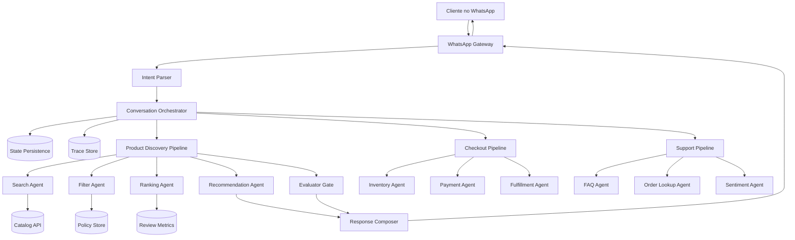
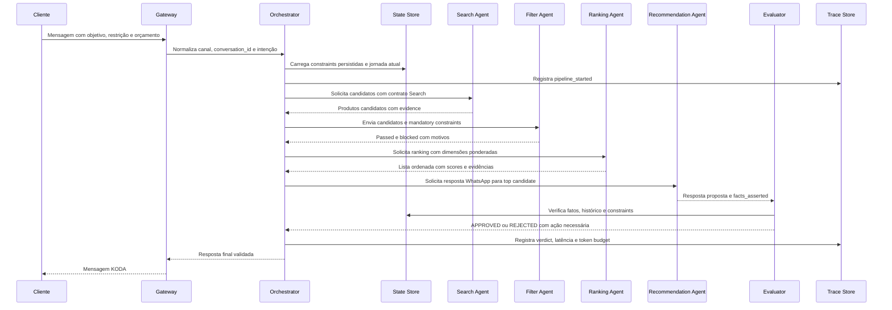
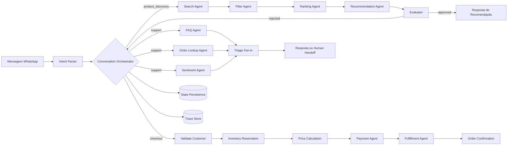

# 🧠 Knowledge Graphs de Coordenação Multi-Agente
## Como visualizar Search Agent, Filter Agent, Ranking Agent, Recommendation Agent, Evaluator e Orchestrator como um sistema coerente para KODA

**Tempo Estimado:** 150 a 180 minutos  
**Nível:** 6 - Knowledge Graphs e Síntese Arquitetural  
**Pré-requisito:** Ter lido `curriculum/05-core-concepts/07-multi-agent-coordination.md`, Generator/Evaluator, Sprint Contracts, State Persistence e Trace Reading  
**Status:** 🟢 COMPLETO - Grafo detalhado para arquitetura multi-agent do KODA  
**Data de Criação:** Maio 2026

---

## 📖 Prólogo: A Manhã em que Rafael, Marina e Fernando Viram o Mesmo Grafo

Segunda-feira, 08h17.

Rafael abriu o WhatsApp ainda no estacionamento da academia.

Ele tinha voltado a treinar depois de meses parado, queria um suplemento seguro, tinha intolerância a lactose, precisava respeitar um orçamento de R$ 250 e esperava receber em Campinas ainda naquela semana.

Na tela dele, KODA era apenas uma conversa.

Por trás da conversa, KODA era uma rede.

O Search Agent traduzia a intenção vaga em queries de catálogo.

O Filter Agent bloqueava qualquer produto que violasse restrições alimentares, orçamento ou estoque.

O Ranking Agent comparava candidatos sem confundir popularidade com adequação real.

O Recommendation Agent transformava dados técnicos em uma mensagem humana, curta e útil.

O Evaluator verificava fatos, restrições, tom e promessas comerciais antes de qualquer mensagem sair.

O Orchestrator mantinha a ordem, controlava fan-out, executava fan-in, preservava state persistence e escrevia trace store.

Enquanto isso, Marina chegava ao escritório da KODA com uma reclamação de suporte: um pedido parecia atrasado, o cliente estava irritado, e o time precisava descobrir se era caso de FAQ, Order Lookup, sentiment crítico ou escalação humana.

Fernando, líder técnico, olhou para os dois casos e percebeu que eles pareciam diferentes apenas na superfície.

No fundo, ambos exigiam a mesma pergunta arquitetural:

> Quais agentes trabalham, em qual ordem, com qual estado compartilhado, sob qual contrato, e quem decide quando existe conflito?

Essa pergunta não é respondida por uma lista de prompts.

Ela é respondida por um grafo.

Um grafo mostra dependências, autoridade, gates, caminhos de falha, pontos de sincronização, fluxos alternativos, riscos de race condition e onde o token budget cresce.

O módulo `07-multi-agent-coordination.md` ensinou o conceito em profundidade.

Este arquivo transforma o conceito em mapa visual e operacional.

Aqui você vai ver coordenação multi-agente como topologia, fluxo, pipeline de customer journey, matriz comparativa, atlas de nós, modos de falha e checklist de implementação.

A meta não é decorar diagramas.

A meta é conseguir olhar para uma feature do KODA e enxergar onde a coordenação protege o cliente, onde ela aumenta custo, onde ela cria risco, e onde ela precisa ser simplificada.

---

## 🎯 O Que É Este Knowledge Graph?

### Definição Simples

Este knowledge graph é um mapa detalhado das relações entre paradigmas de coordenação, agentes especializados, contratos, state persistence, trace store, performance, falhas e jornadas KODA.

Ele não substitui o módulo core.

Ele complementa o módulo core com visualização e síntese.

### O Que Você Vai Aprender

✅ Visualizar a topologia multi-agent usada em Product Discovery, Checkout e Support  
✅ Comparar Sequential, Parallel, Fan-out/Fan-in, Orchestrator, Choreography e Hierarchical coordination  
✅ Ler uma arquitetura ASCII e traduzir caixas em responsabilidades reais  
✅ Entender onde state persistence, trace store e token budget entram no grafo  
✅ Mapear failure modes para estratégias de coordenação  
✅ Aplicar o grafo ao Customer Journey Pipeline do KODA  
✅ Usar checklist para implementar ou revisar pipelines multi-agent

### Como Ler Este Arquivo

- Leia primeiro a visão geral e os diagramas.
- Depois estude a tabela comparativa para escolher paradigma por contexto.
- Use o atlas de nós como referência de design e revisão.
- Volte à aplicação KODA quando estiver desenhando feature real.
- Use failure modes e checklist antes de colocar qualquer pipeline em produção.

---

## 🗺️ Roadmap Visual do Módulo

```text
ENTRADA: você leu o Core Concept 07
  │
  ├─ SEÇÃO 1: paradigmas de coordenação e suas relações
  │
  ├─ SEÇÃO 2: tabela comparativa para decisão arquitetural
  │
  ├─ SEÇÃO 3: topologia multi-agent em ASCII
  │
  ├─ SEÇÃO 4: Mermaid 1, arquitetura e tipos de agentes
  │
  ├─ SEÇÃO 5: Mermaid 2, fluxo de coordenação
  │
  ├─ SEÇÃO 6: KODA Customer Journey Pipeline
  │
  ├─ SEÇÃO 7: Mermaid 3, pipeline KODA
  │
  ├─ SEÇÃO 8: atlas de nós do knowledge graph
  │
  ├─ SEÇÃO 9: performance, falhas, debugging e checklist
  │
  └─ SAÍDA: você consegue projetar e revisar coordenação multi-agent com critério
```

---
## 🎯 Paradigmas de Coordenação Como Grafo Conceitual

A coordenação multi-agente não é uma escolha binária entre agente único e muitos agentes.

Ela é um espaço de design com seis paradigmas principais, cada um com uma geometria diferente de dependência, autoridade e sincronização.

### 1️⃣ Sequential coordination

**Definição:** Um agente termina uma etapa validada antes do próximo agente começar.

**Analogia operacional:** linha de montagem com checkpoints explícitos.

**Exemplo KODA:** Search Agent → Filter Agent → Ranking Agent → Recommendation Agent → Evaluator em Product Discovery simples.

**Onde funciona melhor:** checkout, validação de pedido, pipelines com dependência forte e decisões que precisam de ordem rígida.

**Risco principal:** latência acumulada, bloqueio por falha única e propagação de erro se contratos intermediários forem fracos.

**Decisão de arquitetura:** Use quando clareza e auditabilidade importam mais que velocidade bruta.

**Leitura de grafo:**

- O nó central representa a autoridade de decisão.
- As arestas representam dependência, evento, contrato ou fluxo de dados.
- O peso da aresta representa latência, token budget, risco ou acoplamento.
- O ponto de fan-in é sempre onde conflito e qualidade precisam ser resolvidos.
- O trace store é a memória auditável do caminho percorrido.

---

### 2️⃣ Parallel coordination

**Definição:** Vários agentes trabalham ao mesmo tempo sobre partes independentes do problema.

**Analogia operacional:** equipe pesquisando fontes diferentes antes da decisão.

**Exemplo KODA:** Stock Agent, Price Agent, Review Agent e Delivery Agent consultam fontes diferentes em paralelo.

**Onde funciona melhor:** enriquecimento de contexto, consultas independentes e redução de latência percebida.

**Risco principal:** race condition, custo maior de token budget e fan-in frágil se a consolidação não espera cada resultado necessário.

**Decisão de arquitetura:** Use quando as dependências são independentes de verdade e o fan-in tem regra objetiva.

**Leitura de grafo:**

- O nó central representa a autoridade de decisão.
- As arestas representam dependência, evento, contrato ou fluxo de dados.
- O peso da aresta representa latência, token budget, risco ou acoplamento.
- O ponto de fan-in é sempre onde conflito e qualidade precisam ser resolvidos.
- O trace store é a memória auditável do caminho percorrido.

---

### 3️⃣ Fan-out/Fan-in

**Definição:** O sistema divide uma pergunta em várias subtarefas, executa em fan-out e recombina em fan-in.

**Analogia operacional:** abrir múltiplas trilhas e consolidar com rubrica.

**Exemplo KODA:** Três variantes de combo são geradas em paralelo e um Evaluator escolhe a opção mais segura e útil.

**Onde funciona melhor:** comparação de alternativas, ranking competitivo, exploração ampla e síntese final.

**Risco principal:** fan-in opinativo, outputs incompatíveis e explicação fraca sobre por que uma opção venceu.

**Decisão de arquitetura:** Use quando explorar mais de uma estratégia aumenta qualidade de decisão.

**Leitura de grafo:**

- O nó central representa a autoridade de decisão.
- As arestas representam dependência, evento, contrato ou fluxo de dados.
- O peso da aresta representa latência, token budget, risco ou acoplamento.
- O ponto de fan-in é sempre onde conflito e qualidade precisam ser resolvidos.
- O trace store é a memória auditável do caminho percorrido.

---

### 4️⃣ Orchestrator coordination

**Definição:** Um componente central decide fluxo, chama especialistas, consolida resultados e registra trace.

**Analogia operacional:** maestro com partitura e logs de execução.

**Exemplo KODA:** Conversation Orchestrator escolhe Product Discovery, Checkout ou Support e aciona agentes por intenção.

**Onde funciona melhor:** jornadas previsíveis, controle de SLA, auditoria central e debugging rápido.

**Risco principal:** single point of failure, orchestrator inchado e acoplamento excessivo.

**Decisão de arquitetura:** Use quando governança e rastreabilidade valem mais que autonomia distribuída.

**Leitura de grafo:**

- O nó central representa a autoridade de decisão.
- As arestas representam dependência, evento, contrato ou fluxo de dados.
- O peso da aresta representa latência, token budget, risco ou acoplamento.
- O ponto de fan-in é sempre onde conflito e qualidade precisam ser resolvidos.
- O trace store é a memória auditável do caminho percorrido.

---

### 5️⃣ Choreography coordination

**Definição:** Agentes reagem a eventos e contratos compartilhados sem controlador central forte.

**Analogia operacional:** dançarinos seguindo sinais compartilhados.

**Exemplo KODA:** Inventory event atualiza recomendações, Pricing event invalida carrinhos e Fulfillment event reabre follow-up.

**Onde funciona melhor:** eventos assíncronos, notificações internas, mudanças de estoque e processos que continuam após a conversa.

**Risco principal:** fluxo difícil de visualizar, eventos duplicados, deadlock indireto e debug mais complexo.

**Decisão de arquitetura:** Use quando eventos de domínio precisam propagar mudanças sem bloquear a conversa principal.

**Leitura de grafo:**

- O nó central representa a autoridade de decisão.
- As arestas representam dependência, evento, contrato ou fluxo de dados.
- O peso da aresta representa latência, token budget, risco ou acoplamento.
- O ponto de fan-in é sempre onde conflito e qualidade precisam ser resolvidos.
- O trace store é a memória auditável do caminho percorrido.

---

### 6️⃣ Hierarchical coordination

**Definição:** Agentes são organizados em níveis: supervisor, leads de domínio e executores especializados.

**Analogia operacional:** gerente, líderes de área e operadores especializados.

**Exemplo KODA:** Journey Manager coordena Product Lead, Checkout Lead e Support Lead em jornadas longas.

**Onde funciona melhor:** operações longas, muitos subdomínios, jornadas multi-stage e escalabilidade organizacional.

**Risco principal:** burocracia, latência por camadas e perda de nuance entre níveis.

**Decisão de arquitetura:** Use quando o domínio ficou grande demais para um único coordenador entender cada detalhe.

**Leitura de grafo:**

- O nó central representa a autoridade de decisão.
- As arestas representam dependência, evento, contrato ou fluxo de dados.
- O peso da aresta representa latência, token budget, risco ou acoplamento.
- O ponto de fan-in é sempre onde conflito e qualidade precisam ser resolvidos.
- O trace store é a memória auditável do caminho percorrido.

---

## 📊 Tabela Comparativa de Estratégias de Coordenação

| Estratégia | Quando Usar | Vantagens | Desvantagens | Custo | Exemplo KODA | Sinal de Alerta |
|---|---|---|---|---|---|---|
| Sequential | Etapas dependentes e ordem rígida | Fácil de entender, trace linear, contratos simples | Latência soma etapa por etapa, falha bloqueia sequência | Baixo a médio | Search → Filter → Ranking → Recommendation → Evaluator | Cliente espera demais e cada etapa usa retry próprio |
| Parallel | Consultas independentes | Reduz latência percebida, especializa contexto por agente | Exige sincronização, pode aumentar token budget | Médio | Estoque, preço, entrega e reviews consultados juntos | Resultado final muda conforme ordem de chegada |
| Fan-out/Fan-in | Explorar várias alternativas e consolidar | Cobertura ampla, boa comparação, melhora qualidade de decisão | Fan-in pode virar gargalo ou escolha subjetiva | Médio a alto | Três combos gerados e Evaluator escolhe | Nenhuma rubrica explica por que uma opção venceu |
| Orchestrator | Fluxos previsíveis com governança | Trace central, retries claros, política explícita | Single point of failure, acoplamento no coordenador | Médio | Conversation Orchestrator roteia por intenção | Orchestrator começa a gerar conteúdo de domínio |
| Choreography | Eventos assíncronos e domínio distribuído | Baixo acoplamento, extensível, bom para eventos externos | Debug difícil, eventos duplicados, causalidade difusa | Médio a alto | Inventory event invalida recomendações | Ninguém sabe qual evento causou a resposta final |
| Hierarchical | Jornadas longas com subdomínios grandes | Escala responsabilidade, separa liderança por domínio | Mais camadas, mais latência, risco de burocracia | Alto | Journey Manager coordena Product, Checkout e Support Leads | Leads repassam mensagens sem agregar decisão |

### Como Usar a Tabela

- Escolha pelo formato do problema, não pelo nome do padrão.
- Se existe dependência rígida, comece com Sequential.
- Se existem consultas independentes, considere Parallel.
- Se a qualidade depende de comparar alternativas, use Fan-out/Fan-in.
- Se o time precisa debugar rápido, prefira Orchestrator.
- Se eventos externos mudam o estado depois da conversa, adicione Choreography.
- Se o domínio ficou grande demais, suba para Hierarchical sem perder contratos locais.

---

## 🏗️ Arquitetura Multi-Agent em ASCII

Este diagrama é o mapa de referência para documentos, PRs e revisões que não renderizam Mermaid.

```text
┌──────────────────────────────────────────────────────────────────────────────────┐
│                         KODA MULTI-AGENT TOPOLOGY                                │
│                   Customer Journey + Coordination Graph                           │
└──────────────────────────────────────────────────────────────────────────────────┘
                                      │
                                      ▼
┌──────────────────────────────────────────────────────────────────────────────────┐
│                               WHATSAPP GATEWAY                                   │
│  recebe mensagem, deduplica webhook, normaliza canal, anexa conversation_id        │
└─────────────────────────────────────┬────────────────────────────────────────────┘
                                      │
                                      ▼
┌──────────────────────────────────────────────────────────────────────────────────┐
│                           CONVERSATION ORCHESTRATOR                              │
│  roteia intenção, escolhe paradigma, controla locks, retries, timeouts e trace     │
└───────────────┬─────────────────────┬─────────────────────┬──────────────────────┘
                │                     │                     │
                ▼                     ▼                     ▼
┌──────────────────────────┐ ┌──────────────────────────┐ ┌──────────────────────────┐
│ PRODUCT DISCOVERY PIPE   │ │ CHECKOUT PIPE            │ │ SUPPORT PIPE             │
│ Search → Filter → Rank   │ │ Validate → Stock → Pay   │ │ FAQ + Order + Sentiment  │
│ → Recommend → Evaluate   │ │ → Fulfill → Confirm      │ │ → Triage → Handoff       │
└──────────────┬───────────┘ └──────────────┬───────────┘ └──────────────┬───────────┘
               │                            │                            │
               └──────────────┬─────────────┴─────────────┬──────────────┘
                              │                           │
                              ▼                           ▼
┌──────────────────────────────────────────┐   ┌───────────────────────────────────┐
│              SHARED STATE STORE          │   │             TRACE STORE            │
│ constraints, journey stage, cart, facts  │   │ events, inputs, outputs, verdicts │
│ valid_until, owner_agent, version        │   │ latência, token budget, evidence   │
└──────────────────────────────────────────┘   └───────────────────────────────────┘
                              │                           │
                              ▼                           ▼
┌──────────────────────────────────────────────────────────────────────────────────┐
│                          DETERMINISTIC SERVICES                                  │
│ Catalog API | Inventory API | Pricing Service | Payment Gateway | Fulfillment     │
└──────────────────────────────────────────────────────────────────────────────────┘
```

### Leitura do Diagrama ASCII

- O Gateway não decide produto; ele protege entrada e identidade da conversa.
- O Orchestrator não deveria escrever recomendações; ele governa fluxo.
- Cada pipeline ativa apenas agentes necessários para a intenção atual.
- Shared State Store guarda fatos vivos; Trace Store guarda histórico auditável.
- Serviços determinísticos não são agentes LLM; são fontes de verdade e efeitos controlados.

---

## 📐 Mermaid Diagram 1 - Arquitetura Multi-Agent e Tipos de Agentes



Este diagrama mostra que KODA usa agentes LLM para julgamento e serviços determinísticos para fatos, pagamento e estoque.

---

## 🔄 Mermaid Diagram 2 - Fluxo de Coordenação



A sequência reforça a regra central: nada chega ao cliente sem passar por contrato, state persistence, trace e gate de avaliação quando há decisão de negócio.

---

## 💼 Aplicação KODA: Customer Journey Pipeline

### O Cenário Prático

O Customer Journey Pipeline do KODA transforma uma intenção de WhatsApp em uma decisão segura, comprável e auditável.

Ele precisa lidar com três jornadas principais:

1. **Product Discovery:** cliente explora opções, compara produtos e recebe recomendação.
2. **Checkout:** cliente decide comprar e o sistema precisa validar carrinho, preço, pagamento e entrega.
3. **Support:** cliente pede ajuda, reclama de atraso ou precisa de escalação humana.

### Product Discovery Pipeline

```text
Mensagem: 'Quero voltar a treinar, tenho intolerância a lactose e até R$ 250'
  ↓
Intent Parser: product_discovery
  ↓
Orchestrator: sequential com fan-out opcional para comparação
  ↓
Search Agent: candidatos do catálogo
  ↓
Filter Agent: bloqueio de lactose, orçamento, estoque e entrega
  ↓
Ranking Agent: score por goal_alignment, cost_per_dose, satisfação e entrega
  ↓
Recommendation Agent: resposta consultiva para WhatsApp
  ↓
Evaluator: gate de fatos, constraints e tom
  ↓
Resposta KODA validada
```

**Exemplo prático:** Rafael quer voltar a treinar depois de 8 meses. KODA recomenda proteína vegetal chocolate, explica por que respeita lactose e orçamento, e oferece mostrar uma segunda opção sem empurrar venda.

### Checkout Pipeline

```text
Mensagem: 'quero comprar esse'
  ↓
Orchestrator: checkout_lock ativo
  ↓
Validate Customer Agent: cadastro e elegibilidade
  ↓
Inventory Agent: reserva temporária do SKU
  ↓
Price Agent: subtotal, desconto, frete e cupom
  ↓
Payment Agent: cobrança idempotente
  ↓
Fulfillment Agent: agenda entrega e tracking
  ↓
Confirm Order Agent: resumo final e número do pedido
  ↓
Evaluator: confere promessa comercial antes da mensagem final
```

**Exemplo prático:** Marina decide comprar creatina e whey vegano no mesmo pedido. O checkout_lock impede que um upsell paralelo altere carrinho durante pagamento.

### Support Pipeline

```text
Mensagem: 'meu pedido não chegou e quero cancelar'
  ↓
Orchestrator: support_triage
  ↓
Fan-out paralelo:
  ├── FAQ Agent: verifica base de conhecimento
  ├── Order Lookup Agent: consulta status do pedido
  └── Sentiment Agent: mede urgência e irritação
  ↓
Fan-in Triage Agent: decide resposta direta, solução operacional ou escalação
  ↓
Human Handoff Agent: prepara contexto para especialista se necessário
  ↓
Resposta KODA com empatia e dados corretos
```

**Exemplo prático:** Cliente irritado tem pedido em rota com atraso de 45 minutos. KODA reconhece frustração, explica status, prepara handoff e evita resposta genérica.

### Contrato JSON do Pipeline de Product Discovery

```json
{
  "pipeline_id": "customer_journey_product_discovery_v1",
  "conversation_id": "wa_rafael_2026_05_28",
  "coordination_pattern": "orchestrator_sequential_with_optional_fan_out",
  "mandatory_constraints": {
    "budget_brl": 250,
    "lactose_free": true,
    "delivery_city": "Campinas",
    "delivery_deadline_days": 5
  },
  "agents": [
    {"name": "SearchAgent", "depends_on": [], "writes": ["candidate_products"]},
    {"name": "FilterAgent", "depends_on": ["SearchAgent"], "writes": ["passed_products", "blocked_products"]},
    {"name": "RankingAgent", "depends_on": ["FilterAgent"], "writes": ["ranked_products"]},
    {"name": "RecommendationAgent", "depends_on": ["RankingAgent"], "writes": ["draft_message", "facts_asserted"]},
    {"name": "Evaluator", "depends_on": ["RecommendationAgent"], "writes": ["verdict", "action_required"]}
  ],
  "success_criteria": [
    "nenhum produto com lactose chega ao RecommendationAgent",
    "cada afirmação factual tem evidence rastreável",
    "Evaluator aprova apenas quando orçamento, estoque, entrega e tom passam"
  ]
}
```

### Trace JSON Resumido

```json
{
  "trace_id": "trace_rafael_coordination_graph_001",
  "started_at": "2026-05-28T08:18:32Z",
  "events": [
    {"event": "intent_parsed", "intent": "product_discovery", "duration_ms": 80},
    {"event": "search_completed", "query_id": "srch_rafael_001", "found": 12, "duration_ms": 2900},
    {"event": "filter_completed", "query_id": "fltr_rafael_001", "passed": 4, "blocked": 8, "duration_ms": 2850},
    {"event": "ranking_completed", "query_id": "rank_rafael_001", "top_score": 89.6, "duration_ms": 4200},
    {"event": "recommendation_completed", "query_id": "rec_rafael_001", "chars": 487, "duration_ms": 3550},
    {"event": "evaluation_completed", "query_id": "eval_rafael_001", "verdict": "APPROVED", "score": 9.4, "duration_ms": 1850}
  ],
  "final_decision": "recommend_whey_vegan_chocolate",
  "customer_visible_message": "Rafael, para voltar com segurança e respeitando sua intolerância, eu começaria por esta proteína vegetal chocolate."
}
```

---

## 📐 Mermaid Diagram 3 - KODA Customer Journey Pipeline



Este diagrama mostra as três jornadas pedidas: Product Discovery, Checkout e Support, as três governadas pelo Orchestrator e registradas em state persistence e trace store.

---

## 🔗 Referências Cruzadas e Conexões Curriculares

- **`curriculum/05-core-concepts/07-multi-agent-coordination.md`:** fonte conceitual principal para paradigmas, contratos, falhas, performance e pipelines KODA.
- **`curriculum/02-nivel-2-practical-patterns/01-generator-evaluator-pattern.md`:** base do Evaluator como gate independente e antídoto contra sycophancy.
- **`curriculum/02-nivel-2-practical-patterns/02-sprint-contracts.md`:** fundação de contratos entre agentes e critérios de sucesso verificáveis.
- **`curriculum/02-nivel-2-practical-patterns/04-trace-reading.md`:** habilidade necessária para diagnosticar race condition, stale state e rejeições do Evaluator.
- **`curriculum/03-nivel-3-advanced-architecture/01-multi-agent-systems.md`:** aprofundamento em papéis de Planner, Generator, Evaluator e agentes especializados.
- **`curriculum/03-nivel-3-advanced-architecture/02-state-persistence.md`:** memória externa que permite retries, retomada de jornada e isolamento de context window.
- **`curriculum/03-nivel-3-advanced-architecture/03-file-based-coordination.md`:** forma concreta de usar JSON files como contratos e state entre agentes.
- **`curriculum/03-nivel-3-advanced-architecture/05-harness-evolution.md`:** como evoluir coordenação sem cristalizar complexidade acidental.
- **`curriculum/06-knowledge-graphs/01-concept-ecosystem.md`:** mostra onde Multi-Agent Coordination se encaixa no ecossistema dos 8 conceitos core.
- **`curriculum/06-knowledge-graphs/02-koda-feature-dependencies.md`:** mostra quais features do KODA dependem de coordenação, state e avaliação.

### Conexão com o Core Concept 07

O módulo core ensina o conteúdo profundo: definição, paradigmas, contratos, falhas, performance, migração e FAQ.

Este knowledge graph muda a lente: ele organiza o mesmo domínio como mapa visual, matriz de decisão, atlas de nós e pipeline KODA.

A diferença é importante: o core concept explica; o knowledge graph ajuda a enxergar dependências e aplicar em revisão arquitetural.

---

## 🧠 Atlas Detalhado de Nós do Knowledge Graph

Esta seção é o coração do arquivo. Cada nó descreve uma relação operacional que aparece quando coordenação multi-agente sai do desenho e entra no KODA real.

Leia como uma biblioteca de decisões. Quando revisar um pipeline, procure os nós que correspondem ao problema atual.

### 🧩 Subgrafo 1: Sequential coordination

**Resumo do subgrafo:** Um agente termina uma etapa validada antes do próximo agente começar.

**Ponto de aplicação KODA:** Search Agent → Filter Agent → Ranking Agent → Recommendation Agent → Evaluator em Product Discovery simples.

**Risco estrutural:** latência acumulada, bloqueio por falha única e propagação de erro se contratos intermediários forem fracos.

#### Nó 1.01: Sequential coordination + estado

**Relação:** Neste nó, `Sequential coordination` é analisado pela dimensão de estado: qual fato vive em state persistence e por quanto tempo.

**Sinal no grafo:** A aresta fica mais pesada quando estado deixa de ser explícito e passa a depender de interpretação implícita entre agentes.

**Aplicação KODA:** Fernando investiga rejeição anormal por budget no Evaluator; o pipeline precisa preservar estado para que a resposta final continue confiável.

**Falha associada:** Se este nó for ignorado, o sistema tende a sofrer stale state ou ownership conflitante, especialmente quando retries ou eventos paralelos aparecem.

**Pergunta de revisão:** O trace mostra claramente como estado foi tratado antes de passar para o próximo agente?

**Decisão recomendada:** Documentar estado no contrato do agente, registrar no trace store e validar no Evaluator quando afetar o cliente.

#### Nó 1.02: Sequential coordination + trace

**Relação:** Neste nó, `Sequential coordination` é analisado pela dimensão de trace: qual evidência fica disponível para auditoria.

**Sinal no grafo:** A aresta fica mais pesada quando trace deixa de ser explícito e passa a depender de interpretação implícita entre agentes.

**Aplicação KODA:** Carrinho abandona checkout e retorna duas horas depois; o pipeline precisa preservar trace para que a resposta final continue confiável.

**Falha associada:** Se este nó for ignorado, o sistema tende a sofrer debug sem evidência suficiente, especialmente quando retries ou eventos paralelos aparecem.

**Pergunta de revisão:** O trace mostra claramente como trace foi tratado antes de passar para o próximo agente?

**Decisão recomendada:** Documentar trace no contrato do agente, registrar no trace store e validar no Evaluator quando afetar o cliente.

#### Nó 1.03: Sequential coordination + latência

**Relação:** Neste nó, `Sequential coordination` é analisado pela dimensão de latência: quanto tempo a aresta adiciona à jornada.

**Sinal no grafo:** A aresta fica mais pesada quando latência deixa de ser explícito e passa a depender de interpretação implícita entre agentes.

**Aplicação KODA:** Payment webhook chega duplicado no meio do checkout; o pipeline precisa preservar latência para que a resposta final continue confiável.

**Falha associada:** Se este nó for ignorado, o sistema tende a sofrer cliente percebe silêncio ou pipeline excede SLA, especialmente quando retries ou eventos paralelos aparecem.

**Pergunta de revisão:** O trace mostra claramente como latência foi tratado antes de passar para o próximo agente?

**Decisão recomendada:** Documentar latência no contrato do agente, registrar no trace store e validar no Evaluator quando afetar o cliente.

#### Nó 1.04: Sequential coordination + token budget

**Relação:** Neste nó, `Sequential coordination` é analisado pela dimensão de token budget: quanto contexto cada agente consome.

**Sinal no grafo:** A aresta fica mais pesada quando token budget deixa de ser explícito e passa a depender de interpretação implícita entre agentes.

**Aplicação KODA:** Support triage precisa decidir entre FAQ e human handoff; o pipeline precisa preservar token budget para que a resposta final continue confiável.

**Falha associada:** Se este nó for ignorado, o sistema tende a sofrer context rot local e custo imprevisível, especialmente quando retries ou eventos paralelos aparecem.

**Pergunta de revisão:** O trace mostra claramente como token budget foi tratado antes de passar para o próximo agente?

**Decisão recomendada:** Documentar token budget no contrato do agente, registrar no trace store e validar no Evaluator quando afetar o cliente.

#### Nó 1.05: Sequential coordination + risco

**Relação:** Neste nó, `Sequential coordination` é analisado pela dimensão de risco: qual failure mode fica mais provável.

**Sinal no grafo:** A aresta fica mais pesada quando risco deixa de ser explícito e passa a depender de interpretação implícita entre agentes.

**Aplicação KODA:** Rafael pede whey sem lactose dentro de R$ 250; o pipeline precisa preservar risco para que a resposta final continue confiável.

**Falha associada:** Se este nó for ignorado, o sistema tende a sofrer erro crítico passa para resposta final, especialmente quando retries ou eventos paralelos aparecem.

**Pergunta de revisão:** O trace mostra claramente como risco foi tratado antes de passar para o próximo agente?

**Decisão recomendada:** Documentar risco no contrato do agente, registrar no trace store e validar no Evaluator quando afetar o cliente.

#### Nó 1.06: Sequential coordination + fallback

**Relação:** Neste nó, `Sequential coordination` é analisado pela dimensão de fallback: como a jornada degrada sem inventar fatos.

**Sinal no grafo:** A aresta fica mais pesada quando fallback deixa de ser explícito e passa a depender de interpretação implícita entre agentes.

**Aplicação KODA:** Fernando investiga rejeição anormal por budget no Evaluator; o pipeline precisa preservar fallback para que a resposta final continue confiável.

**Falha associada:** Se este nó for ignorado, o sistema tende a sofrer resposta criativa mascara bug operacional, especialmente quando retries ou eventos paralelos aparecem.

**Pergunta de revisão:** O trace mostra claramente como fallback foi tratado antes de passar para o próximo agente?

**Decisão recomendada:** Documentar fallback no contrato do agente, registrar no trace store e validar no Evaluator quando afetar o cliente.

#### Nó 1.07: Sequential coordination + idempotência

**Relação:** Neste nó, `Sequential coordination` é analisado pela dimensão de idempotência: como repetir sem duplicar efeito colateral.

**Sinal no grafo:** A aresta fica mais pesada quando idempotência deixa de ser explícito e passa a depender de interpretação implícita entre agentes.

**Aplicação KODA:** Carrinho abandona checkout e retorna duas horas depois; o pipeline precisa preservar idempotência para que a resposta final continue confiável.

**Falha associada:** Se este nó for ignorado, o sistema tende a sofrer cobrança, reserva ou mensagem duplicada, especialmente quando retries ou eventos paralelos aparecem.

**Pergunta de revisão:** O trace mostra claramente como idempotência foi tratado antes de passar para o próximo agente?

**Decisão recomendada:** Documentar idempotência no contrato do agente, registrar no trace store e validar no Evaluator quando afetar o cliente.

#### Nó 1.08: Sequential coordination + rubrica

**Relação:** Neste nó, `Sequential coordination` é analisado pela dimensão de rubrica: como qualidade é medida no fan-in ou gate final.

**Sinal no grafo:** A aresta fica mais pesada quando rubrica deixa de ser explícito e passa a depender de interpretação implícita entre agentes.

**Aplicação KODA:** Payment webhook chega duplicado no meio do checkout; o pipeline precisa preservar rubrica para que a resposta final continue confiável.

**Falha associada:** Se este nó for ignorado, o sistema tende a sofrer fan-in escolhe por opinião em vez de critério, especialmente quando retries ou eventos paralelos aparecem.

**Pergunta de revisão:** O trace mostra claramente como rubrica foi tratado antes de passar para o próximo agente?

**Decisão recomendada:** Documentar rubrica no contrato do agente, registrar no trace store e validar no Evaluator quando afetar o cliente.

#### Nó 1.09: Sequential coordination + autoridade

**Relação:** Neste nó, `Sequential coordination` é analisado pela dimensão de autoridade: quem pode decidir, bloquear ou pedir retry.

**Sinal no grafo:** A aresta fica mais pesada quando autoridade deixa de ser explícito e passa a depender de interpretação implícita entre agentes.

**Aplicação KODA:** Support triage precisa decidir entre FAQ e human handoff; o pipeline precisa preservar autoridade para que a resposta final continue confiável.

**Falha associada:** Se este nó for ignorado, o sistema tende a sofrer decisão duplicada ou gate ignorado, especialmente quando retries ou eventos paralelos aparecem.

**Pergunta de revisão:** O trace mostra claramente como autoridade foi tratado antes de passar para o próximo agente?

**Decisão recomendada:** Documentar autoridade no contrato do agente, registrar no trace store e validar no Evaluator quando afetar o cliente.

#### Nó 1.10: Sequential coordination + contrato

**Relação:** Neste nó, `Sequential coordination` é analisado pela dimensão de contrato: qual input e output atravessam a aresta.

**Sinal no grafo:** A aresta fica mais pesada quando contrato deixa de ser explícito e passa a depender de interpretação implícita entre agentes.

**Aplicação KODA:** Rafael pede whey sem lactose dentro de R$ 250; o pipeline precisa preservar contrato para que a resposta final continue confiável.

**Falha associada:** Se este nó for ignorado, o sistema tende a sofrer output incompatível no próximo agente, especialmente quando retries ou eventos paralelos aparecem.

**Pergunta de revisão:** O trace mostra claramente como contrato foi tratado antes de passar para o próximo agente?

**Decisão recomendada:** Documentar contrato no contrato do agente, registrar no trace store e validar no Evaluator quando afetar o cliente.

#### Nó 1.11: Sequential coordination + estado

**Relação:** Neste nó, `Sequential coordination` é analisado pela dimensão de estado: qual fato vive em state persistence e por quanto tempo.

**Sinal no grafo:** A aresta fica mais pesada quando estado deixa de ser explícito e passa a depender de interpretação implícita entre agentes.

**Aplicação KODA:** Fernando investiga rejeição anormal por budget no Evaluator; o pipeline precisa preservar estado para que a resposta final continue confiável.

**Falha associada:** Se este nó for ignorado, o sistema tende a sofrer stale state ou ownership conflitante, especialmente quando retries ou eventos paralelos aparecem.

**Pergunta de revisão:** O trace mostra claramente como estado foi tratado antes de passar para o próximo agente?

**Decisão recomendada:** Documentar estado no contrato do agente, registrar no trace store e validar no Evaluator quando afetar o cliente.

#### Nó 1.12: Sequential coordination + trace

**Relação:** Neste nó, `Sequential coordination` é analisado pela dimensão de trace: qual evidência fica disponível para auditoria.

**Sinal no grafo:** A aresta fica mais pesada quando trace deixa de ser explícito e passa a depender de interpretação implícita entre agentes.

**Aplicação KODA:** Carrinho abandona checkout e retorna duas horas depois; o pipeline precisa preservar trace para que a resposta final continue confiável.

**Falha associada:** Se este nó for ignorado, o sistema tende a sofrer debug sem evidência suficiente, especialmente quando retries ou eventos paralelos aparecem.

**Pergunta de revisão:** O trace mostra claramente como trace foi tratado antes de passar para o próximo agente?

**Decisão recomendada:** Documentar trace no contrato do agente, registrar no trace store e validar no Evaluator quando afetar o cliente.

#### Nó 1.13: Sequential coordination + latência

**Relação:** Neste nó, `Sequential coordination` é analisado pela dimensão de latência: quanto tempo a aresta adiciona à jornada.

**Sinal no grafo:** A aresta fica mais pesada quando latência deixa de ser explícito e passa a depender de interpretação implícita entre agentes.

**Aplicação KODA:** Payment webhook chega duplicado no meio do checkout; o pipeline precisa preservar latência para que a resposta final continue confiável.

**Falha associada:** Se este nó for ignorado, o sistema tende a sofrer cliente percebe silêncio ou pipeline excede SLA, especialmente quando retries ou eventos paralelos aparecem.

**Pergunta de revisão:** O trace mostra claramente como latência foi tratado antes de passar para o próximo agente?

**Decisão recomendada:** Documentar latência no contrato do agente, registrar no trace store e validar no Evaluator quando afetar o cliente.

#### Nó 1.14: Sequential coordination + token budget

**Relação:** Neste nó, `Sequential coordination` é analisado pela dimensão de token budget: quanto contexto cada agente consome.

**Sinal no grafo:** A aresta fica mais pesada quando token budget deixa de ser explícito e passa a depender de interpretação implícita entre agentes.

**Aplicação KODA:** Support triage precisa decidir entre FAQ e human handoff; o pipeline precisa preservar token budget para que a resposta final continue confiável.

**Falha associada:** Se este nó for ignorado, o sistema tende a sofrer context rot local e custo imprevisível, especialmente quando retries ou eventos paralelos aparecem.

**Pergunta de revisão:** O trace mostra claramente como token budget foi tratado antes de passar para o próximo agente?

**Decisão recomendada:** Documentar token budget no contrato do agente, registrar no trace store e validar no Evaluator quando afetar o cliente.

#### Nó 1.15: Sequential coordination + risco

**Relação:** Neste nó, `Sequential coordination` é analisado pela dimensão de risco: qual failure mode fica mais provável.

**Sinal no grafo:** A aresta fica mais pesada quando risco deixa de ser explícito e passa a depender de interpretação implícita entre agentes.

**Aplicação KODA:** Rafael pede whey sem lactose dentro de R$ 250; o pipeline precisa preservar risco para que a resposta final continue confiável.

**Falha associada:** Se este nó for ignorado, o sistema tende a sofrer erro crítico passa para resposta final, especialmente quando retries ou eventos paralelos aparecem.

**Pergunta de revisão:** O trace mostra claramente como risco foi tratado antes de passar para o próximo agente?

**Decisão recomendada:** Documentar risco no contrato do agente, registrar no trace store e validar no Evaluator quando afetar o cliente.

#### Nó 1.16: Sequential coordination + fallback

**Relação:** Neste nó, `Sequential coordination` é analisado pela dimensão de fallback: como a jornada degrada sem inventar fatos.

**Sinal no grafo:** A aresta fica mais pesada quando fallback deixa de ser explícito e passa a depender de interpretação implícita entre agentes.

**Aplicação KODA:** Fernando investiga rejeição anormal por budget no Evaluator; o pipeline precisa preservar fallback para que a resposta final continue confiável.

**Falha associada:** Se este nó for ignorado, o sistema tende a sofrer resposta criativa mascara bug operacional, especialmente quando retries ou eventos paralelos aparecem.

**Pergunta de revisão:** O trace mostra claramente como fallback foi tratado antes de passar para o próximo agente?

**Decisão recomendada:** Documentar fallback no contrato do agente, registrar no trace store e validar no Evaluator quando afetar o cliente.

#### Nó 1.17: Sequential coordination + idempotência

**Relação:** Neste nó, `Sequential coordination` é analisado pela dimensão de idempotência: como repetir sem duplicar efeito colateral.

**Sinal no grafo:** A aresta fica mais pesada quando idempotência deixa de ser explícito e passa a depender de interpretação implícita entre agentes.

**Aplicação KODA:** Carrinho abandona checkout e retorna duas horas depois; o pipeline precisa preservar idempotência para que a resposta final continue confiável.

**Falha associada:** Se este nó for ignorado, o sistema tende a sofrer cobrança, reserva ou mensagem duplicada, especialmente quando retries ou eventos paralelos aparecem.

**Pergunta de revisão:** O trace mostra claramente como idempotência foi tratado antes de passar para o próximo agente?

**Decisão recomendada:** Documentar idempotência no contrato do agente, registrar no trace store e validar no Evaluator quando afetar o cliente.

#### Nó 1.18: Sequential coordination + rubrica

**Relação:** Neste nó, `Sequential coordination` é analisado pela dimensão de rubrica: como qualidade é medida no fan-in ou gate final.

**Sinal no grafo:** A aresta fica mais pesada quando rubrica deixa de ser explícito e passa a depender de interpretação implícita entre agentes.

**Aplicação KODA:** Payment webhook chega duplicado no meio do checkout; o pipeline precisa preservar rubrica para que a resposta final continue confiável.

**Falha associada:** Se este nó for ignorado, o sistema tende a sofrer fan-in escolhe por opinião em vez de critério, especialmente quando retries ou eventos paralelos aparecem.

**Pergunta de revisão:** O trace mostra claramente como rubrica foi tratado antes de passar para o próximo agente?

**Decisão recomendada:** Documentar rubrica no contrato do agente, registrar no trace store e validar no Evaluator quando afetar o cliente.

#### Nó 1.19: Sequential coordination + autoridade

**Relação:** Neste nó, `Sequential coordination` é analisado pela dimensão de autoridade: quem pode decidir, bloquear ou pedir retry.

**Sinal no grafo:** A aresta fica mais pesada quando autoridade deixa de ser explícito e passa a depender de interpretação implícita entre agentes.

**Aplicação KODA:** Support triage precisa decidir entre FAQ e human handoff; o pipeline precisa preservar autoridade para que a resposta final continue confiável.

**Falha associada:** Se este nó for ignorado, o sistema tende a sofrer decisão duplicada ou gate ignorado, especialmente quando retries ou eventos paralelos aparecem.

**Pergunta de revisão:** O trace mostra claramente como autoridade foi tratado antes de passar para o próximo agente?

**Decisão recomendada:** Documentar autoridade no contrato do agente, registrar no trace store e validar no Evaluator quando afetar o cliente.

#### Nó 1.20: Sequential coordination + contrato

**Relação:** Neste nó, `Sequential coordination` é analisado pela dimensão de contrato: qual input e output atravessam a aresta.

**Sinal no grafo:** A aresta fica mais pesada quando contrato deixa de ser explícito e passa a depender de interpretação implícita entre agentes.

**Aplicação KODA:** Rafael pede whey sem lactose dentro de R$ 250; o pipeline precisa preservar contrato para que a resposta final continue confiável.

**Falha associada:** Se este nó for ignorado, o sistema tende a sofrer output incompatível no próximo agente, especialmente quando retries ou eventos paralelos aparecem.

**Pergunta de revisão:** O trace mostra claramente como contrato foi tratado antes de passar para o próximo agente?

**Decisão recomendada:** Documentar contrato no contrato do agente, registrar no trace store e validar no Evaluator quando afetar o cliente.

#### Nó 1.21: Sequential coordination + estado

**Relação:** Neste nó, `Sequential coordination` é analisado pela dimensão de estado: qual fato vive em state persistence e por quanto tempo.

**Sinal no grafo:** A aresta fica mais pesada quando estado deixa de ser explícito e passa a depender de interpretação implícita entre agentes.

**Aplicação KODA:** Fernando investiga rejeição anormal por budget no Evaluator; o pipeline precisa preservar estado para que a resposta final continue confiável.

**Falha associada:** Se este nó for ignorado, o sistema tende a sofrer stale state ou ownership conflitante, especialmente quando retries ou eventos paralelos aparecem.

**Pergunta de revisão:** O trace mostra claramente como estado foi tratado antes de passar para o próximo agente?

**Decisão recomendada:** Documentar estado no contrato do agente, registrar no trace store e validar no Evaluator quando afetar o cliente.

#### Nó 1.22: Sequential coordination + trace

**Relação:** Neste nó, `Sequential coordination` é analisado pela dimensão de trace: qual evidência fica disponível para auditoria.

**Sinal no grafo:** A aresta fica mais pesada quando trace deixa de ser explícito e passa a depender de interpretação implícita entre agentes.

**Aplicação KODA:** Carrinho abandona checkout e retorna duas horas depois; o pipeline precisa preservar trace para que a resposta final continue confiável.

**Falha associada:** Se este nó for ignorado, o sistema tende a sofrer debug sem evidência suficiente, especialmente quando retries ou eventos paralelos aparecem.

**Pergunta de revisão:** O trace mostra claramente como trace foi tratado antes de passar para o próximo agente?

**Decisão recomendada:** Documentar trace no contrato do agente, registrar no trace store e validar no Evaluator quando afetar o cliente.

#### Nó 1.23: Sequential coordination + latência

**Relação:** Neste nó, `Sequential coordination` é analisado pela dimensão de latência: quanto tempo a aresta adiciona à jornada.

**Sinal no grafo:** A aresta fica mais pesada quando latência deixa de ser explícito e passa a depender de interpretação implícita entre agentes.

**Aplicação KODA:** Payment webhook chega duplicado no meio do checkout; o pipeline precisa preservar latência para que a resposta final continue confiável.

**Falha associada:** Se este nó for ignorado, o sistema tende a sofrer cliente percebe silêncio ou pipeline excede SLA, especialmente quando retries ou eventos paralelos aparecem.

**Pergunta de revisão:** O trace mostra claramente como latência foi tratado antes de passar para o próximo agente?

**Decisão recomendada:** Documentar latência no contrato do agente, registrar no trace store e validar no Evaluator quando afetar o cliente.

#### Nó 1.24: Sequential coordination + token budget

**Relação:** Neste nó, `Sequential coordination` é analisado pela dimensão de token budget: quanto contexto cada agente consome.

**Sinal no grafo:** A aresta fica mais pesada quando token budget deixa de ser explícito e passa a depender de interpretação implícita entre agentes.

**Aplicação KODA:** Support triage precisa decidir entre FAQ e human handoff; o pipeline precisa preservar token budget para que a resposta final continue confiável.

**Falha associada:** Se este nó for ignorado, o sistema tende a sofrer context rot local e custo imprevisível, especialmente quando retries ou eventos paralelos aparecem.

**Pergunta de revisão:** O trace mostra claramente como token budget foi tratado antes de passar para o próximo agente?

**Decisão recomendada:** Documentar token budget no contrato do agente, registrar no trace store e validar no Evaluator quando afetar o cliente.

#### Nó 1.25: Sequential coordination + risco

**Relação:** Neste nó, `Sequential coordination` é analisado pela dimensão de risco: qual failure mode fica mais provável.

**Sinal no grafo:** A aresta fica mais pesada quando risco deixa de ser explícito e passa a depender de interpretação implícita entre agentes.

**Aplicação KODA:** Rafael pede whey sem lactose dentro de R$ 250; o pipeline precisa preservar risco para que a resposta final continue confiável.

**Falha associada:** Se este nó for ignorado, o sistema tende a sofrer erro crítico passa para resposta final, especialmente quando retries ou eventos paralelos aparecem.

**Pergunta de revisão:** O trace mostra claramente como risco foi tratado antes de passar para o próximo agente?

**Decisão recomendada:** Documentar risco no contrato do agente, registrar no trace store e validar no Evaluator quando afetar o cliente.

#### Nó 1.26: Sequential coordination + fallback

**Relação:** Neste nó, `Sequential coordination` é analisado pela dimensão de fallback: como a jornada degrada sem inventar fatos.

**Sinal no grafo:** A aresta fica mais pesada quando fallback deixa de ser explícito e passa a depender de interpretação implícita entre agentes.

**Aplicação KODA:** Fernando investiga rejeição anormal por budget no Evaluator; o pipeline precisa preservar fallback para que a resposta final continue confiável.

**Falha associada:** Se este nó for ignorado, o sistema tende a sofrer resposta criativa mascara bug operacional, especialmente quando retries ou eventos paralelos aparecem.

**Pergunta de revisão:** O trace mostra claramente como fallback foi tratado antes de passar para o próximo agente?

**Decisão recomendada:** Documentar fallback no contrato do agente, registrar no trace store e validar no Evaluator quando afetar o cliente.

#### Nó 1.27: Sequential coordination + idempotência

**Relação:** Neste nó, `Sequential coordination` é analisado pela dimensão de idempotência: como repetir sem duplicar efeito colateral.

**Sinal no grafo:** A aresta fica mais pesada quando idempotência deixa de ser explícito e passa a depender de interpretação implícita entre agentes.

**Aplicação KODA:** Carrinho abandona checkout e retorna duas horas depois; o pipeline precisa preservar idempotência para que a resposta final continue confiável.

**Falha associada:** Se este nó for ignorado, o sistema tende a sofrer cobrança, reserva ou mensagem duplicada, especialmente quando retries ou eventos paralelos aparecem.

**Pergunta de revisão:** O trace mostra claramente como idempotência foi tratado antes de passar para o próximo agente?

**Decisão recomendada:** Documentar idempotência no contrato do agente, registrar no trace store e validar no Evaluator quando afetar o cliente.

#### Nó 1.28: Sequential coordination + rubrica

**Relação:** Neste nó, `Sequential coordination` é analisado pela dimensão de rubrica: como qualidade é medida no fan-in ou gate final.

**Sinal no grafo:** A aresta fica mais pesada quando rubrica deixa de ser explícito e passa a depender de interpretação implícita entre agentes.

**Aplicação KODA:** Payment webhook chega duplicado no meio do checkout; o pipeline precisa preservar rubrica para que a resposta final continue confiável.

**Falha associada:** Se este nó for ignorado, o sistema tende a sofrer fan-in escolhe por opinião em vez de critério, especialmente quando retries ou eventos paralelos aparecem.

**Pergunta de revisão:** O trace mostra claramente como rubrica foi tratado antes de passar para o próximo agente?

**Decisão recomendada:** Documentar rubrica no contrato do agente, registrar no trace store e validar no Evaluator quando afetar o cliente.

#### Nó 1.29: Sequential coordination + autoridade

**Relação:** Neste nó, `Sequential coordination` é analisado pela dimensão de autoridade: quem pode decidir, bloquear ou pedir retry.

**Sinal no grafo:** A aresta fica mais pesada quando autoridade deixa de ser explícito e passa a depender de interpretação implícita entre agentes.

**Aplicação KODA:** Support triage precisa decidir entre FAQ e human handoff; o pipeline precisa preservar autoridade para que a resposta final continue confiável.

**Falha associada:** Se este nó for ignorado, o sistema tende a sofrer decisão duplicada ou gate ignorado, especialmente quando retries ou eventos paralelos aparecem.

**Pergunta de revisão:** O trace mostra claramente como autoridade foi tratado antes de passar para o próximo agente?

**Decisão recomendada:** Documentar autoridade no contrato do agente, registrar no trace store e validar no Evaluator quando afetar o cliente.

#### Nó 1.30: Sequential coordination + contrato

**Relação:** Neste nó, `Sequential coordination` é analisado pela dimensão de contrato: qual input e output atravessam a aresta.

**Sinal no grafo:** A aresta fica mais pesada quando contrato deixa de ser explícito e passa a depender de interpretação implícita entre agentes.

**Aplicação KODA:** Rafael pede whey sem lactose dentro de R$ 250; o pipeline precisa preservar contrato para que a resposta final continue confiável.

**Falha associada:** Se este nó for ignorado, o sistema tende a sofrer output incompatível no próximo agente, especialmente quando retries ou eventos paralelos aparecem.

**Pergunta de revisão:** O trace mostra claramente como contrato foi tratado antes de passar para o próximo agente?

**Decisão recomendada:** Documentar contrato no contrato do agente, registrar no trace store e validar no Evaluator quando afetar o cliente.

#### Nó 1.31: Sequential coordination + estado

**Relação:** Neste nó, `Sequential coordination` é analisado pela dimensão de estado: qual fato vive em state persistence e por quanto tempo.

**Sinal no grafo:** A aresta fica mais pesada quando estado deixa de ser explícito e passa a depender de interpretação implícita entre agentes.

**Aplicação KODA:** Fernando investiga rejeição anormal por budget no Evaluator; o pipeline precisa preservar estado para que a resposta final continue confiável.

**Falha associada:** Se este nó for ignorado, o sistema tende a sofrer stale state ou ownership conflitante, especialmente quando retries ou eventos paralelos aparecem.

**Pergunta de revisão:** O trace mostra claramente como estado foi tratado antes de passar para o próximo agente?

**Decisão recomendada:** Documentar estado no contrato do agente, registrar no trace store e validar no Evaluator quando afetar o cliente.

#### Nó 1.32: Sequential coordination + trace

**Relação:** Neste nó, `Sequential coordination` é analisado pela dimensão de trace: qual evidência fica disponível para auditoria.

**Sinal no grafo:** A aresta fica mais pesada quando trace deixa de ser explícito e passa a depender de interpretação implícita entre agentes.

**Aplicação KODA:** Carrinho abandona checkout e retorna duas horas depois; o pipeline precisa preservar trace para que a resposta final continue confiável.

**Falha associada:** Se este nó for ignorado, o sistema tende a sofrer debug sem evidência suficiente, especialmente quando retries ou eventos paralelos aparecem.

**Pergunta de revisão:** O trace mostra claramente como trace foi tratado antes de passar para o próximo agente?

**Decisão recomendada:** Documentar trace no contrato do agente, registrar no trace store e validar no Evaluator quando afetar o cliente.

#### Nó 1.33: Sequential coordination + latência

**Relação:** Neste nó, `Sequential coordination` é analisado pela dimensão de latência: quanto tempo a aresta adiciona à jornada.

**Sinal no grafo:** A aresta fica mais pesada quando latência deixa de ser explícito e passa a depender de interpretação implícita entre agentes.

**Aplicação KODA:** Payment webhook chega duplicado no meio do checkout; o pipeline precisa preservar latência para que a resposta final continue confiável.

**Falha associada:** Se este nó for ignorado, o sistema tende a sofrer cliente percebe silêncio ou pipeline excede SLA, especialmente quando retries ou eventos paralelos aparecem.

**Pergunta de revisão:** O trace mostra claramente como latência foi tratado antes de passar para o próximo agente?

**Decisão recomendada:** Documentar latência no contrato do agente, registrar no trace store e validar no Evaluator quando afetar o cliente.

#### Nó 1.34: Sequential coordination + token budget

**Relação:** Neste nó, `Sequential coordination` é analisado pela dimensão de token budget: quanto contexto cada agente consome.

**Sinal no grafo:** A aresta fica mais pesada quando token budget deixa de ser explícito e passa a depender de interpretação implícita entre agentes.

**Aplicação KODA:** Support triage precisa decidir entre FAQ e human handoff; o pipeline precisa preservar token budget para que a resposta final continue confiável.

**Falha associada:** Se este nó for ignorado, o sistema tende a sofrer context rot local e custo imprevisível, especialmente quando retries ou eventos paralelos aparecem.

**Pergunta de revisão:** O trace mostra claramente como token budget foi tratado antes de passar para o próximo agente?

**Decisão recomendada:** Documentar token budget no contrato do agente, registrar no trace store e validar no Evaluator quando afetar o cliente.

#### Nó 1.35: Sequential coordination + risco

**Relação:** Neste nó, `Sequential coordination` é analisado pela dimensão de risco: qual failure mode fica mais provável.

**Sinal no grafo:** A aresta fica mais pesada quando risco deixa de ser explícito e passa a depender de interpretação implícita entre agentes.

**Aplicação KODA:** Rafael pede whey sem lactose dentro de R$ 250; o pipeline precisa preservar risco para que a resposta final continue confiável.

**Falha associada:** Se este nó for ignorado, o sistema tende a sofrer erro crítico passa para resposta final, especialmente quando retries ou eventos paralelos aparecem.

**Pergunta de revisão:** O trace mostra claramente como risco foi tratado antes de passar para o próximo agente?

**Decisão recomendada:** Documentar risco no contrato do agente, registrar no trace store e validar no Evaluator quando afetar o cliente.

#### Nó 1.36: Sequential coordination + fallback

**Relação:** Neste nó, `Sequential coordination` é analisado pela dimensão de fallback: como a jornada degrada sem inventar fatos.

**Sinal no grafo:** A aresta fica mais pesada quando fallback deixa de ser explícito e passa a depender de interpretação implícita entre agentes.

**Aplicação KODA:** Fernando investiga rejeição anormal por budget no Evaluator; o pipeline precisa preservar fallback para que a resposta final continue confiável.

**Falha associada:** Se este nó for ignorado, o sistema tende a sofrer resposta criativa mascara bug operacional, especialmente quando retries ou eventos paralelos aparecem.

**Pergunta de revisão:** O trace mostra claramente como fallback foi tratado antes de passar para o próximo agente?

**Decisão recomendada:** Documentar fallback no contrato do agente, registrar no trace store e validar no Evaluator quando afetar o cliente.

#### Nó 1.37: Sequential coordination + idempotência

**Relação:** Neste nó, `Sequential coordination` é analisado pela dimensão de idempotência: como repetir sem duplicar efeito colateral.

**Sinal no grafo:** A aresta fica mais pesada quando idempotência deixa de ser explícito e passa a depender de interpretação implícita entre agentes.

**Aplicação KODA:** Carrinho abandona checkout e retorna duas horas depois; o pipeline precisa preservar idempotência para que a resposta final continue confiável.

**Falha associada:** Se este nó for ignorado, o sistema tende a sofrer cobrança, reserva ou mensagem duplicada, especialmente quando retries ou eventos paralelos aparecem.

**Pergunta de revisão:** O trace mostra claramente como idempotência foi tratado antes de passar para o próximo agente?

**Decisão recomendada:** Documentar idempotência no contrato do agente, registrar no trace store e validar no Evaluator quando afetar o cliente.

#### Nó 1.38: Sequential coordination + rubrica

**Relação:** Neste nó, `Sequential coordination` é analisado pela dimensão de rubrica: como qualidade é medida no fan-in ou gate final.

**Sinal no grafo:** A aresta fica mais pesada quando rubrica deixa de ser explícito e passa a depender de interpretação implícita entre agentes.

**Aplicação KODA:** Payment webhook chega duplicado no meio do checkout; o pipeline precisa preservar rubrica para que a resposta final continue confiável.

**Falha associada:** Se este nó for ignorado, o sistema tende a sofrer fan-in escolhe por opinião em vez de critério, especialmente quando retries ou eventos paralelos aparecem.

**Pergunta de revisão:** O trace mostra claramente como rubrica foi tratado antes de passar para o próximo agente?

**Decisão recomendada:** Documentar rubrica no contrato do agente, registrar no trace store e validar no Evaluator quando afetar o cliente.

#### Nó 1.39: Sequential coordination + autoridade

**Relação:** Neste nó, `Sequential coordination` é analisado pela dimensão de autoridade: quem pode decidir, bloquear ou pedir retry.

**Sinal no grafo:** A aresta fica mais pesada quando autoridade deixa de ser explícito e passa a depender de interpretação implícita entre agentes.

**Aplicação KODA:** Support triage precisa decidir entre FAQ e human handoff; o pipeline precisa preservar autoridade para que a resposta final continue confiável.

**Falha associada:** Se este nó for ignorado, o sistema tende a sofrer decisão duplicada ou gate ignorado, especialmente quando retries ou eventos paralelos aparecem.

**Pergunta de revisão:** O trace mostra claramente como autoridade foi tratado antes de passar para o próximo agente?

**Decisão recomendada:** Documentar autoridade no contrato do agente, registrar no trace store e validar no Evaluator quando afetar o cliente.

#### Nó 1.40: Sequential coordination + contrato

**Relação:** Neste nó, `Sequential coordination` é analisado pela dimensão de contrato: qual input e output atravessam a aresta.

**Sinal no grafo:** A aresta fica mais pesada quando contrato deixa de ser explícito e passa a depender de interpretação implícita entre agentes.

**Aplicação KODA:** Rafael pede whey sem lactose dentro de R$ 250; o pipeline precisa preservar contrato para que a resposta final continue confiável.

**Falha associada:** Se este nó for ignorado, o sistema tende a sofrer output incompatível no próximo agente, especialmente quando retries ou eventos paralelos aparecem.

**Pergunta de revisão:** O trace mostra claramente como contrato foi tratado antes de passar para o próximo agente?

**Decisão recomendada:** Documentar contrato no contrato do agente, registrar no trace store e validar no Evaluator quando afetar o cliente.

#### Nó 1.41: Sequential coordination + estado

**Relação:** Neste nó, `Sequential coordination` é analisado pela dimensão de estado: qual fato vive em state persistence e por quanto tempo.

**Sinal no grafo:** A aresta fica mais pesada quando estado deixa de ser explícito e passa a depender de interpretação implícita entre agentes.

**Aplicação KODA:** Fernando investiga rejeição anormal por budget no Evaluator; o pipeline precisa preservar estado para que a resposta final continue confiável.

**Falha associada:** Se este nó for ignorado, o sistema tende a sofrer stale state ou ownership conflitante, especialmente quando retries ou eventos paralelos aparecem.

**Pergunta de revisão:** O trace mostra claramente como estado foi tratado antes de passar para o próximo agente?

**Decisão recomendada:** Documentar estado no contrato do agente, registrar no trace store e validar no Evaluator quando afetar o cliente.

#### Nó 1.42: Sequential coordination + trace

**Relação:** Neste nó, `Sequential coordination` é analisado pela dimensão de trace: qual evidência fica disponível para auditoria.

**Sinal no grafo:** A aresta fica mais pesada quando trace deixa de ser explícito e passa a depender de interpretação implícita entre agentes.

**Aplicação KODA:** Carrinho abandona checkout e retorna duas horas depois; o pipeline precisa preservar trace para que a resposta final continue confiável.

**Falha associada:** Se este nó for ignorado, o sistema tende a sofrer debug sem evidência suficiente, especialmente quando retries ou eventos paralelos aparecem.

**Pergunta de revisão:** O trace mostra claramente como trace foi tratado antes de passar para o próximo agente?

**Decisão recomendada:** Documentar trace no contrato do agente, registrar no trace store e validar no Evaluator quando afetar o cliente.

#### Nó 1.43: Sequential coordination + latência

**Relação:** Neste nó, `Sequential coordination` é analisado pela dimensão de latência: quanto tempo a aresta adiciona à jornada.

**Sinal no grafo:** A aresta fica mais pesada quando latência deixa de ser explícito e passa a depender de interpretação implícita entre agentes.

**Aplicação KODA:** Payment webhook chega duplicado no meio do checkout; o pipeline precisa preservar latência para que a resposta final continue confiável.

**Falha associada:** Se este nó for ignorado, o sistema tende a sofrer cliente percebe silêncio ou pipeline excede SLA, especialmente quando retries ou eventos paralelos aparecem.

**Pergunta de revisão:** O trace mostra claramente como latência foi tratado antes de passar para o próximo agente?

**Decisão recomendada:** Documentar latência no contrato do agente, registrar no trace store e validar no Evaluator quando afetar o cliente.

#### Nó 1.44: Sequential coordination + token budget

**Relação:** Neste nó, `Sequential coordination` é analisado pela dimensão de token budget: quanto contexto cada agente consome.

**Sinal no grafo:** A aresta fica mais pesada quando token budget deixa de ser explícito e passa a depender de interpretação implícita entre agentes.

**Aplicação KODA:** Support triage precisa decidir entre FAQ e human handoff; o pipeline precisa preservar token budget para que a resposta final continue confiável.

**Falha associada:** Se este nó for ignorado, o sistema tende a sofrer context rot local e custo imprevisível, especialmente quando retries ou eventos paralelos aparecem.

**Pergunta de revisão:** O trace mostra claramente como token budget foi tratado antes de passar para o próximo agente?

**Decisão recomendada:** Documentar token budget no contrato do agente, registrar no trace store e validar no Evaluator quando afetar o cliente.

#### Nó 1.45: Sequential coordination + risco

**Relação:** Neste nó, `Sequential coordination` é analisado pela dimensão de risco: qual failure mode fica mais provável.

**Sinal no grafo:** A aresta fica mais pesada quando risco deixa de ser explícito e passa a depender de interpretação implícita entre agentes.

**Aplicação KODA:** Rafael pede whey sem lactose dentro de R$ 250; o pipeline precisa preservar risco para que a resposta final continue confiável.

**Falha associada:** Se este nó for ignorado, o sistema tende a sofrer erro crítico passa para resposta final, especialmente quando retries ou eventos paralelos aparecem.

**Pergunta de revisão:** O trace mostra claramente como risco foi tratado antes de passar para o próximo agente?

**Decisão recomendada:** Documentar risco no contrato do agente, registrar no trace store e validar no Evaluator quando afetar o cliente.

---

### 🧩 Subgrafo 2: Parallel coordination

**Resumo do subgrafo:** Vários agentes trabalham ao mesmo tempo sobre partes independentes do problema.

**Ponto de aplicação KODA:** Stock Agent, Price Agent, Review Agent e Delivery Agent consultam fontes diferentes em paralelo.

**Risco estrutural:** race condition, custo maior de token budget e fan-in frágil se a consolidação não espera cada resultado necessário.

#### Nó 2.01: Parallel coordination + trace

**Relação:** Neste nó, `Parallel coordination` é analisado pela dimensão de trace: qual evidência fica disponível para auditoria.

**Sinal no grafo:** A aresta fica mais pesada quando trace deixa de ser explícito e passa a depender de interpretação implícita entre agentes.

**Aplicação KODA:** Cliente irritado exige suporte sobre pedido atrasado; o pipeline precisa preservar trace para que a resposta final continue confiável.

**Falha associada:** Se este nó for ignorado, o sistema tende a sofrer debug sem evidência suficiente, especialmente quando retries ou eventos paralelos aparecem.

**Pergunta de revisão:** O trace mostra claramente como trace foi tratado antes de passar para o próximo agente?

**Decisão recomendada:** Documentar trace no contrato do agente, registrar no trace store e validar no Evaluator quando afetar o cliente.

#### Nó 2.02: Parallel coordination + latência

**Relação:** Neste nó, `Parallel coordination` é analisado pela dimensão de latência: quanto tempo a aresta adiciona à jornada.

**Sinal no grafo:** A aresta fica mais pesada quando latência deixa de ser explícito e passa a depender de interpretação implícita entre agentes.

**Aplicação KODA:** Payment webhook chega duplicado no meio do checkout; o pipeline precisa preservar latência para que a resposta final continue confiável.

**Falha associada:** Se este nó for ignorado, o sistema tende a sofrer cliente percebe silêncio ou pipeline excede SLA, especialmente quando retries ou eventos paralelos aparecem.

**Pergunta de revisão:** O trace mostra claramente como latência foi tratado antes de passar para o próximo agente?

**Decisão recomendada:** Documentar latência no contrato do agente, registrar no trace store e validar no Evaluator quando afetar o cliente.

#### Nó 2.03: Parallel coordination + token budget

**Relação:** Neste nó, `Parallel coordination` é analisado pela dimensão de token budget: quanto contexto cada agente consome.

**Sinal no grafo:** A aresta fica mais pesada quando token budget deixa de ser explícito e passa a depender de interpretação implícita entre agentes.

**Aplicação KODA:** Ranking Agent recebe candidatos demais e estoura token budget; o pipeline precisa preservar token budget para que a resposta final continue confiável.

**Falha associada:** Se este nó for ignorado, o sistema tende a sofrer context rot local e custo imprevisível, especialmente quando retries ou eventos paralelos aparecem.

**Pergunta de revisão:** O trace mostra claramente como token budget foi tratado antes de passar para o próximo agente?

**Decisão recomendada:** Documentar token budget no contrato do agente, registrar no trace store e validar no Evaluator quando afetar o cliente.

#### Nó 2.04: Parallel coordination + risco

**Relação:** Neste nó, `Parallel coordination` é analisado pela dimensão de risco: qual failure mode fica mais provável.

**Sinal no grafo:** A aresta fica mais pesada quando risco deixa de ser explícito e passa a depender de interpretação implícita entre agentes.

**Aplicação KODA:** Fernando investiga rejeição anormal por budget no Evaluator; o pipeline precisa preservar risco para que a resposta final continue confiável.

**Falha associada:** Se este nó for ignorado, o sistema tende a sofrer erro crítico passa para resposta final, especialmente quando retries ou eventos paralelos aparecem.

**Pergunta de revisão:** O trace mostra claramente como risco foi tratado antes de passar para o próximo agente?

**Decisão recomendada:** Documentar risco no contrato do agente, registrar no trace store e validar no Evaluator quando afetar o cliente.

#### Nó 2.05: Parallel coordination + fallback

**Relação:** Neste nó, `Parallel coordination` é analisado pela dimensão de fallback: como a jornada degrada sem inventar fatos.

**Sinal no grafo:** A aresta fica mais pesada quando fallback deixa de ser explícito e passa a depender de interpretação implícita entre agentes.

**Aplicação KODA:** Inventory event reduz estoque durante recomendação ativa; o pipeline precisa preservar fallback para que a resposta final continue confiável.

**Falha associada:** Se este nó for ignorado, o sistema tende a sofrer resposta criativa mascara bug operacional, especialmente quando retries ou eventos paralelos aparecem.

**Pergunta de revisão:** O trace mostra claramente como fallback foi tratado antes de passar para o próximo agente?

**Decisão recomendada:** Documentar fallback no contrato do agente, registrar no trace store e validar no Evaluator quando afetar o cliente.

#### Nó 2.06: Parallel coordination + idempotência

**Relação:** Neste nó, `Parallel coordination` é analisado pela dimensão de idempotência: como repetir sem duplicar efeito colateral.

**Sinal no grafo:** A aresta fica mais pesada quando idempotência deixa de ser explícito e passa a depender de interpretação implícita entre agentes.

**Aplicação KODA:** Support triage precisa decidir entre FAQ e human handoff; o pipeline precisa preservar idempotência para que a resposta final continue confiável.

**Falha associada:** Se este nó for ignorado, o sistema tende a sofrer cobrança, reserva ou mensagem duplicada, especialmente quando retries ou eventos paralelos aparecem.

**Pergunta de revisão:** O trace mostra claramente como idempotência foi tratado antes de passar para o próximo agente?

**Decisão recomendada:** Documentar idempotência no contrato do agente, registrar no trace store e validar no Evaluator quando afetar o cliente.

#### Nó 2.07: Parallel coordination + rubrica

**Relação:** Neste nó, `Parallel coordination` é analisado pela dimensão de rubrica: como qualidade é medida no fan-in ou gate final.

**Sinal no grafo:** A aresta fica mais pesada quando rubrica deixa de ser explícito e passa a depender de interpretação implícita entre agentes.

**Aplicação KODA:** Marina compara creatina e proteína vegetal para entrega hoje; o pipeline precisa preservar rubrica para que a resposta final continue confiável.

**Falha associada:** Se este nó for ignorado, o sistema tende a sofrer fan-in escolhe por opinião em vez de critério, especialmente quando retries ou eventos paralelos aparecem.

**Pergunta de revisão:** O trace mostra claramente como rubrica foi tratado antes de passar para o próximo agente?

**Decisão recomendada:** Documentar rubrica no contrato do agente, registrar no trace store e validar no Evaluator quando afetar o cliente.

#### Nó 2.08: Parallel coordination + autoridade

**Relação:** Neste nó, `Parallel coordination` é analisado pela dimensão de autoridade: quem pode decidir, bloquear ou pedir retry.

**Sinal no grafo:** A aresta fica mais pesada quando autoridade deixa de ser explícito e passa a depender de interpretação implícita entre agentes.

**Aplicação KODA:** Carrinho abandona checkout e retorna duas horas depois; o pipeline precisa preservar autoridade para que a resposta final continue confiável.

**Falha associada:** Se este nó for ignorado, o sistema tende a sofrer decisão duplicada ou gate ignorado, especialmente quando retries ou eventos paralelos aparecem.

**Pergunta de revisão:** O trace mostra claramente como autoridade foi tratado antes de passar para o próximo agente?

**Decisão recomendada:** Documentar autoridade no contrato do agente, registrar no trace store e validar no Evaluator quando afetar o cliente.

#### Nó 2.09: Parallel coordination + contrato

**Relação:** Neste nó, `Parallel coordination` é analisado pela dimensão de contrato: qual input e output atravessam a aresta.

**Sinal no grafo:** A aresta fica mais pesada quando contrato deixa de ser explícito e passa a depender de interpretação implícita entre agentes.

**Aplicação KODA:** Recommendation Agent tenta escrever promessa de frete sem evidence; o pipeline precisa preservar contrato para que a resposta final continue confiável.

**Falha associada:** Se este nó for ignorado, o sistema tende a sofrer output incompatível no próximo agente, especialmente quando retries ou eventos paralelos aparecem.

**Pergunta de revisão:** O trace mostra claramente como contrato foi tratado antes de passar para o próximo agente?

**Decisão recomendada:** Documentar contrato no contrato do agente, registrar no trace store e validar no Evaluator quando afetar o cliente.

#### Nó 2.10: Parallel coordination + estado

**Relação:** Neste nó, `Parallel coordination` é analisado pela dimensão de estado: qual fato vive em state persistence e por quanto tempo.

**Sinal no grafo:** A aresta fica mais pesada quando estado deixa de ser explícito e passa a depender de interpretação implícita entre agentes.

**Aplicação KODA:** Rafael pede whey sem lactose dentro de R$ 250; o pipeline precisa preservar estado para que a resposta final continue confiável.

**Falha associada:** Se este nó for ignorado, o sistema tende a sofrer stale state ou ownership conflitante, especialmente quando retries ou eventos paralelos aparecem.

**Pergunta de revisão:** O trace mostra claramente como estado foi tratado antes de passar para o próximo agente?

**Decisão recomendada:** Documentar estado no contrato do agente, registrar no trace store e validar no Evaluator quando afetar o cliente.

#### Nó 2.11: Parallel coordination + trace

**Relação:** Neste nó, `Parallel coordination` é analisado pela dimensão de trace: qual evidência fica disponível para auditoria.

**Sinal no grafo:** A aresta fica mais pesada quando trace deixa de ser explícito e passa a depender de interpretação implícita entre agentes.

**Aplicação KODA:** Cliente irritado exige suporte sobre pedido atrasado; o pipeline precisa preservar trace para que a resposta final continue confiável.

**Falha associada:** Se este nó for ignorado, o sistema tende a sofrer debug sem evidência suficiente, especialmente quando retries ou eventos paralelos aparecem.

**Pergunta de revisão:** O trace mostra claramente como trace foi tratado antes de passar para o próximo agente?

**Decisão recomendada:** Documentar trace no contrato do agente, registrar no trace store e validar no Evaluator quando afetar o cliente.

#### Nó 2.12: Parallel coordination + latência

**Relação:** Neste nó, `Parallel coordination` é analisado pela dimensão de latência: quanto tempo a aresta adiciona à jornada.

**Sinal no grafo:** A aresta fica mais pesada quando latência deixa de ser explícito e passa a depender de interpretação implícita entre agentes.

**Aplicação KODA:** Payment webhook chega duplicado no meio do checkout; o pipeline precisa preservar latência para que a resposta final continue confiável.

**Falha associada:** Se este nó for ignorado, o sistema tende a sofrer cliente percebe silêncio ou pipeline excede SLA, especialmente quando retries ou eventos paralelos aparecem.

**Pergunta de revisão:** O trace mostra claramente como latência foi tratado antes de passar para o próximo agente?

**Decisão recomendada:** Documentar latência no contrato do agente, registrar no trace store e validar no Evaluator quando afetar o cliente.

#### Nó 2.13: Parallel coordination + token budget

**Relação:** Neste nó, `Parallel coordination` é analisado pela dimensão de token budget: quanto contexto cada agente consome.

**Sinal no grafo:** A aresta fica mais pesada quando token budget deixa de ser explícito e passa a depender de interpretação implícita entre agentes.

**Aplicação KODA:** Ranking Agent recebe candidatos demais e estoura token budget; o pipeline precisa preservar token budget para que a resposta final continue confiável.

**Falha associada:** Se este nó for ignorado, o sistema tende a sofrer context rot local e custo imprevisível, especialmente quando retries ou eventos paralelos aparecem.

**Pergunta de revisão:** O trace mostra claramente como token budget foi tratado antes de passar para o próximo agente?

**Decisão recomendada:** Documentar token budget no contrato do agente, registrar no trace store e validar no Evaluator quando afetar o cliente.

#### Nó 2.14: Parallel coordination + risco

**Relação:** Neste nó, `Parallel coordination` é analisado pela dimensão de risco: qual failure mode fica mais provável.

**Sinal no grafo:** A aresta fica mais pesada quando risco deixa de ser explícito e passa a depender de interpretação implícita entre agentes.

**Aplicação KODA:** Fernando investiga rejeição anormal por budget no Evaluator; o pipeline precisa preservar risco para que a resposta final continue confiável.

**Falha associada:** Se este nó for ignorado, o sistema tende a sofrer erro crítico passa para resposta final, especialmente quando retries ou eventos paralelos aparecem.

**Pergunta de revisão:** O trace mostra claramente como risco foi tratado antes de passar para o próximo agente?

**Decisão recomendada:** Documentar risco no contrato do agente, registrar no trace store e validar no Evaluator quando afetar o cliente.

#### Nó 2.15: Parallel coordination + fallback

**Relação:** Neste nó, `Parallel coordination` é analisado pela dimensão de fallback: como a jornada degrada sem inventar fatos.

**Sinal no grafo:** A aresta fica mais pesada quando fallback deixa de ser explícito e passa a depender de interpretação implícita entre agentes.

**Aplicação KODA:** Inventory event reduz estoque durante recomendação ativa; o pipeline precisa preservar fallback para que a resposta final continue confiável.

**Falha associada:** Se este nó for ignorado, o sistema tende a sofrer resposta criativa mascara bug operacional, especialmente quando retries ou eventos paralelos aparecem.

**Pergunta de revisão:** O trace mostra claramente como fallback foi tratado antes de passar para o próximo agente?

**Decisão recomendada:** Documentar fallback no contrato do agente, registrar no trace store e validar no Evaluator quando afetar o cliente.

#### Nó 2.16: Parallel coordination + idempotência

**Relação:** Neste nó, `Parallel coordination` é analisado pela dimensão de idempotência: como repetir sem duplicar efeito colateral.

**Sinal no grafo:** A aresta fica mais pesada quando idempotência deixa de ser explícito e passa a depender de interpretação implícita entre agentes.

**Aplicação KODA:** Support triage precisa decidir entre FAQ e human handoff; o pipeline precisa preservar idempotência para que a resposta final continue confiável.

**Falha associada:** Se este nó for ignorado, o sistema tende a sofrer cobrança, reserva ou mensagem duplicada, especialmente quando retries ou eventos paralelos aparecem.

**Pergunta de revisão:** O trace mostra claramente como idempotência foi tratado antes de passar para o próximo agente?

**Decisão recomendada:** Documentar idempotência no contrato do agente, registrar no trace store e validar no Evaluator quando afetar o cliente.

#### Nó 2.17: Parallel coordination + rubrica

**Relação:** Neste nó, `Parallel coordination` é analisado pela dimensão de rubrica: como qualidade é medida no fan-in ou gate final.

**Sinal no grafo:** A aresta fica mais pesada quando rubrica deixa de ser explícito e passa a depender de interpretação implícita entre agentes.

**Aplicação KODA:** Marina compara creatina e proteína vegetal para entrega hoje; o pipeline precisa preservar rubrica para que a resposta final continue confiável.

**Falha associada:** Se este nó for ignorado, o sistema tende a sofrer fan-in escolhe por opinião em vez de critério, especialmente quando retries ou eventos paralelos aparecem.

**Pergunta de revisão:** O trace mostra claramente como rubrica foi tratado antes de passar para o próximo agente?

**Decisão recomendada:** Documentar rubrica no contrato do agente, registrar no trace store e validar no Evaluator quando afetar o cliente.

#### Nó 2.18: Parallel coordination + autoridade

**Relação:** Neste nó, `Parallel coordination` é analisado pela dimensão de autoridade: quem pode decidir, bloquear ou pedir retry.

**Sinal no grafo:** A aresta fica mais pesada quando autoridade deixa de ser explícito e passa a depender de interpretação implícita entre agentes.

**Aplicação KODA:** Carrinho abandona checkout e retorna duas horas depois; o pipeline precisa preservar autoridade para que a resposta final continue confiável.

**Falha associada:** Se este nó for ignorado, o sistema tende a sofrer decisão duplicada ou gate ignorado, especialmente quando retries ou eventos paralelos aparecem.

**Pergunta de revisão:** O trace mostra claramente como autoridade foi tratado antes de passar para o próximo agente?

**Decisão recomendada:** Documentar autoridade no contrato do agente, registrar no trace store e validar no Evaluator quando afetar o cliente.

#### Nó 2.19: Parallel coordination + contrato

**Relação:** Neste nó, `Parallel coordination` é analisado pela dimensão de contrato: qual input e output atravessam a aresta.

**Sinal no grafo:** A aresta fica mais pesada quando contrato deixa de ser explícito e passa a depender de interpretação implícita entre agentes.

**Aplicação KODA:** Recommendation Agent tenta escrever promessa de frete sem evidence; o pipeline precisa preservar contrato para que a resposta final continue confiável.

**Falha associada:** Se este nó for ignorado, o sistema tende a sofrer output incompatível no próximo agente, especialmente quando retries ou eventos paralelos aparecem.

**Pergunta de revisão:** O trace mostra claramente como contrato foi tratado antes de passar para o próximo agente?

**Decisão recomendada:** Documentar contrato no contrato do agente, registrar no trace store e validar no Evaluator quando afetar o cliente.

#### Nó 2.20: Parallel coordination + estado

**Relação:** Neste nó, `Parallel coordination` é analisado pela dimensão de estado: qual fato vive em state persistence e por quanto tempo.

**Sinal no grafo:** A aresta fica mais pesada quando estado deixa de ser explícito e passa a depender de interpretação implícita entre agentes.

**Aplicação KODA:** Rafael pede whey sem lactose dentro de R$ 250; o pipeline precisa preservar estado para que a resposta final continue confiável.

**Falha associada:** Se este nó for ignorado, o sistema tende a sofrer stale state ou ownership conflitante, especialmente quando retries ou eventos paralelos aparecem.

**Pergunta de revisão:** O trace mostra claramente como estado foi tratado antes de passar para o próximo agente?

**Decisão recomendada:** Documentar estado no contrato do agente, registrar no trace store e validar no Evaluator quando afetar o cliente.

#### Nó 2.21: Parallel coordination + trace

**Relação:** Neste nó, `Parallel coordination` é analisado pela dimensão de trace: qual evidência fica disponível para auditoria.

**Sinal no grafo:** A aresta fica mais pesada quando trace deixa de ser explícito e passa a depender de interpretação implícita entre agentes.

**Aplicação KODA:** Cliente irritado exige suporte sobre pedido atrasado; o pipeline precisa preservar trace para que a resposta final continue confiável.

**Falha associada:** Se este nó for ignorado, o sistema tende a sofrer debug sem evidência suficiente, especialmente quando retries ou eventos paralelos aparecem.

**Pergunta de revisão:** O trace mostra claramente como trace foi tratado antes de passar para o próximo agente?

**Decisão recomendada:** Documentar trace no contrato do agente, registrar no trace store e validar no Evaluator quando afetar o cliente.

#### Nó 2.22: Parallel coordination + latência

**Relação:** Neste nó, `Parallel coordination` é analisado pela dimensão de latência: quanto tempo a aresta adiciona à jornada.

**Sinal no grafo:** A aresta fica mais pesada quando latência deixa de ser explícito e passa a depender de interpretação implícita entre agentes.

**Aplicação KODA:** Payment webhook chega duplicado no meio do checkout; o pipeline precisa preservar latência para que a resposta final continue confiável.

**Falha associada:** Se este nó for ignorado, o sistema tende a sofrer cliente percebe silêncio ou pipeline excede SLA, especialmente quando retries ou eventos paralelos aparecem.

**Pergunta de revisão:** O trace mostra claramente como latência foi tratado antes de passar para o próximo agente?

**Decisão recomendada:** Documentar latência no contrato do agente, registrar no trace store e validar no Evaluator quando afetar o cliente.

#### Nó 2.23: Parallel coordination + token budget

**Relação:** Neste nó, `Parallel coordination` é analisado pela dimensão de token budget: quanto contexto cada agente consome.

**Sinal no grafo:** A aresta fica mais pesada quando token budget deixa de ser explícito e passa a depender de interpretação implícita entre agentes.

**Aplicação KODA:** Ranking Agent recebe candidatos demais e estoura token budget; o pipeline precisa preservar token budget para que a resposta final continue confiável.

**Falha associada:** Se este nó for ignorado, o sistema tende a sofrer context rot local e custo imprevisível, especialmente quando retries ou eventos paralelos aparecem.

**Pergunta de revisão:** O trace mostra claramente como token budget foi tratado antes de passar para o próximo agente?

**Decisão recomendada:** Documentar token budget no contrato do agente, registrar no trace store e validar no Evaluator quando afetar o cliente.

#### Nó 2.24: Parallel coordination + risco

**Relação:** Neste nó, `Parallel coordination` é analisado pela dimensão de risco: qual failure mode fica mais provável.

**Sinal no grafo:** A aresta fica mais pesada quando risco deixa de ser explícito e passa a depender de interpretação implícita entre agentes.

**Aplicação KODA:** Fernando investiga rejeição anormal por budget no Evaluator; o pipeline precisa preservar risco para que a resposta final continue confiável.

**Falha associada:** Se este nó for ignorado, o sistema tende a sofrer erro crítico passa para resposta final, especialmente quando retries ou eventos paralelos aparecem.

**Pergunta de revisão:** O trace mostra claramente como risco foi tratado antes de passar para o próximo agente?

**Decisão recomendada:** Documentar risco no contrato do agente, registrar no trace store e validar no Evaluator quando afetar o cliente.

#### Nó 2.25: Parallel coordination + fallback

**Relação:** Neste nó, `Parallel coordination` é analisado pela dimensão de fallback: como a jornada degrada sem inventar fatos.

**Sinal no grafo:** A aresta fica mais pesada quando fallback deixa de ser explícito e passa a depender de interpretação implícita entre agentes.

**Aplicação KODA:** Inventory event reduz estoque durante recomendação ativa; o pipeline precisa preservar fallback para que a resposta final continue confiável.

**Falha associada:** Se este nó for ignorado, o sistema tende a sofrer resposta criativa mascara bug operacional, especialmente quando retries ou eventos paralelos aparecem.

**Pergunta de revisão:** O trace mostra claramente como fallback foi tratado antes de passar para o próximo agente?

**Decisão recomendada:** Documentar fallback no contrato do agente, registrar no trace store e validar no Evaluator quando afetar o cliente.

#### Nó 2.26: Parallel coordination + idempotência

**Relação:** Neste nó, `Parallel coordination` é analisado pela dimensão de idempotência: como repetir sem duplicar efeito colateral.

**Sinal no grafo:** A aresta fica mais pesada quando idempotência deixa de ser explícito e passa a depender de interpretação implícita entre agentes.

**Aplicação KODA:** Support triage precisa decidir entre FAQ e human handoff; o pipeline precisa preservar idempotência para que a resposta final continue confiável.

**Falha associada:** Se este nó for ignorado, o sistema tende a sofrer cobrança, reserva ou mensagem duplicada, especialmente quando retries ou eventos paralelos aparecem.

**Pergunta de revisão:** O trace mostra claramente como idempotência foi tratado antes de passar para o próximo agente?

**Decisão recomendada:** Documentar idempotência no contrato do agente, registrar no trace store e validar no Evaluator quando afetar o cliente.

#### Nó 2.27: Parallel coordination + rubrica

**Relação:** Neste nó, `Parallel coordination` é analisado pela dimensão de rubrica: como qualidade é medida no fan-in ou gate final.

**Sinal no grafo:** A aresta fica mais pesada quando rubrica deixa de ser explícito e passa a depender de interpretação implícita entre agentes.

**Aplicação KODA:** Marina compara creatina e proteína vegetal para entrega hoje; o pipeline precisa preservar rubrica para que a resposta final continue confiável.

**Falha associada:** Se este nó for ignorado, o sistema tende a sofrer fan-in escolhe por opinião em vez de critério, especialmente quando retries ou eventos paralelos aparecem.

**Pergunta de revisão:** O trace mostra claramente como rubrica foi tratado antes de passar para o próximo agente?

**Decisão recomendada:** Documentar rubrica no contrato do agente, registrar no trace store e validar no Evaluator quando afetar o cliente.

#### Nó 2.28: Parallel coordination + autoridade

**Relação:** Neste nó, `Parallel coordination` é analisado pela dimensão de autoridade: quem pode decidir, bloquear ou pedir retry.

**Sinal no grafo:** A aresta fica mais pesada quando autoridade deixa de ser explícito e passa a depender de interpretação implícita entre agentes.

**Aplicação KODA:** Carrinho abandona checkout e retorna duas horas depois; o pipeline precisa preservar autoridade para que a resposta final continue confiável.

**Falha associada:** Se este nó for ignorado, o sistema tende a sofrer decisão duplicada ou gate ignorado, especialmente quando retries ou eventos paralelos aparecem.

**Pergunta de revisão:** O trace mostra claramente como autoridade foi tratado antes de passar para o próximo agente?

**Decisão recomendada:** Documentar autoridade no contrato do agente, registrar no trace store e validar no Evaluator quando afetar o cliente.

#### Nó 2.29: Parallel coordination + contrato

**Relação:** Neste nó, `Parallel coordination` é analisado pela dimensão de contrato: qual input e output atravessam a aresta.

**Sinal no grafo:** A aresta fica mais pesada quando contrato deixa de ser explícito e passa a depender de interpretação implícita entre agentes.

**Aplicação KODA:** Recommendation Agent tenta escrever promessa de frete sem evidence; o pipeline precisa preservar contrato para que a resposta final continue confiável.

**Falha associada:** Se este nó for ignorado, o sistema tende a sofrer output incompatível no próximo agente, especialmente quando retries ou eventos paralelos aparecem.

**Pergunta de revisão:** O trace mostra claramente como contrato foi tratado antes de passar para o próximo agente?

**Decisão recomendada:** Documentar contrato no contrato do agente, registrar no trace store e validar no Evaluator quando afetar o cliente.

#### Nó 2.30: Parallel coordination + estado

**Relação:** Neste nó, `Parallel coordination` é analisado pela dimensão de estado: qual fato vive em state persistence e por quanto tempo.

**Sinal no grafo:** A aresta fica mais pesada quando estado deixa de ser explícito e passa a depender de interpretação implícita entre agentes.

**Aplicação KODA:** Rafael pede whey sem lactose dentro de R$ 250; o pipeline precisa preservar estado para que a resposta final continue confiável.

**Falha associada:** Se este nó for ignorado, o sistema tende a sofrer stale state ou ownership conflitante, especialmente quando retries ou eventos paralelos aparecem.

**Pergunta de revisão:** O trace mostra claramente como estado foi tratado antes de passar para o próximo agente?

**Decisão recomendada:** Documentar estado no contrato do agente, registrar no trace store e validar no Evaluator quando afetar o cliente.

#### Nó 2.31: Parallel coordination + trace

**Relação:** Neste nó, `Parallel coordination` é analisado pela dimensão de trace: qual evidência fica disponível para auditoria.

**Sinal no grafo:** A aresta fica mais pesada quando trace deixa de ser explícito e passa a depender de interpretação implícita entre agentes.

**Aplicação KODA:** Cliente irritado exige suporte sobre pedido atrasado; o pipeline precisa preservar trace para que a resposta final continue confiável.

**Falha associada:** Se este nó for ignorado, o sistema tende a sofrer debug sem evidência suficiente, especialmente quando retries ou eventos paralelos aparecem.

**Pergunta de revisão:** O trace mostra claramente como trace foi tratado antes de passar para o próximo agente?

**Decisão recomendada:** Documentar trace no contrato do agente, registrar no trace store e validar no Evaluator quando afetar o cliente.

#### Nó 2.32: Parallel coordination + latência

**Relação:** Neste nó, `Parallel coordination` é analisado pela dimensão de latência: quanto tempo a aresta adiciona à jornada.

**Sinal no grafo:** A aresta fica mais pesada quando latência deixa de ser explícito e passa a depender de interpretação implícita entre agentes.

**Aplicação KODA:** Payment webhook chega duplicado no meio do checkout; o pipeline precisa preservar latência para que a resposta final continue confiável.

**Falha associada:** Se este nó for ignorado, o sistema tende a sofrer cliente percebe silêncio ou pipeline excede SLA, especialmente quando retries ou eventos paralelos aparecem.

**Pergunta de revisão:** O trace mostra claramente como latência foi tratado antes de passar para o próximo agente?

**Decisão recomendada:** Documentar latência no contrato do agente, registrar no trace store e validar no Evaluator quando afetar o cliente.

#### Nó 2.33: Parallel coordination + token budget

**Relação:** Neste nó, `Parallel coordination` é analisado pela dimensão de token budget: quanto contexto cada agente consome.

**Sinal no grafo:** A aresta fica mais pesada quando token budget deixa de ser explícito e passa a depender de interpretação implícita entre agentes.

**Aplicação KODA:** Ranking Agent recebe candidatos demais e estoura token budget; o pipeline precisa preservar token budget para que a resposta final continue confiável.

**Falha associada:** Se este nó for ignorado, o sistema tende a sofrer context rot local e custo imprevisível, especialmente quando retries ou eventos paralelos aparecem.

**Pergunta de revisão:** O trace mostra claramente como token budget foi tratado antes de passar para o próximo agente?

**Decisão recomendada:** Documentar token budget no contrato do agente, registrar no trace store e validar no Evaluator quando afetar o cliente.

#### Nó 2.34: Parallel coordination + risco

**Relação:** Neste nó, `Parallel coordination` é analisado pela dimensão de risco: qual failure mode fica mais provável.

**Sinal no grafo:** A aresta fica mais pesada quando risco deixa de ser explícito e passa a depender de interpretação implícita entre agentes.

**Aplicação KODA:** Fernando investiga rejeição anormal por budget no Evaluator; o pipeline precisa preservar risco para que a resposta final continue confiável.

**Falha associada:** Se este nó for ignorado, o sistema tende a sofrer erro crítico passa para resposta final, especialmente quando retries ou eventos paralelos aparecem.

**Pergunta de revisão:** O trace mostra claramente como risco foi tratado antes de passar para o próximo agente?

**Decisão recomendada:** Documentar risco no contrato do agente, registrar no trace store e validar no Evaluator quando afetar o cliente.

#### Nó 2.35: Parallel coordination + fallback

**Relação:** Neste nó, `Parallel coordination` é analisado pela dimensão de fallback: como a jornada degrada sem inventar fatos.

**Sinal no grafo:** A aresta fica mais pesada quando fallback deixa de ser explícito e passa a depender de interpretação implícita entre agentes.

**Aplicação KODA:** Inventory event reduz estoque durante recomendação ativa; o pipeline precisa preservar fallback para que a resposta final continue confiável.

**Falha associada:** Se este nó for ignorado, o sistema tende a sofrer resposta criativa mascara bug operacional, especialmente quando retries ou eventos paralelos aparecem.

**Pergunta de revisão:** O trace mostra claramente como fallback foi tratado antes de passar para o próximo agente?

**Decisão recomendada:** Documentar fallback no contrato do agente, registrar no trace store e validar no Evaluator quando afetar o cliente.

#### Nó 2.36: Parallel coordination + idempotência

**Relação:** Neste nó, `Parallel coordination` é analisado pela dimensão de idempotência: como repetir sem duplicar efeito colateral.

**Sinal no grafo:** A aresta fica mais pesada quando idempotência deixa de ser explícito e passa a depender de interpretação implícita entre agentes.

**Aplicação KODA:** Support triage precisa decidir entre FAQ e human handoff; o pipeline precisa preservar idempotência para que a resposta final continue confiável.

**Falha associada:** Se este nó for ignorado, o sistema tende a sofrer cobrança, reserva ou mensagem duplicada, especialmente quando retries ou eventos paralelos aparecem.

**Pergunta de revisão:** O trace mostra claramente como idempotência foi tratado antes de passar para o próximo agente?

**Decisão recomendada:** Documentar idempotência no contrato do agente, registrar no trace store e validar no Evaluator quando afetar o cliente.

#### Nó 2.37: Parallel coordination + rubrica

**Relação:** Neste nó, `Parallel coordination` é analisado pela dimensão de rubrica: como qualidade é medida no fan-in ou gate final.

**Sinal no grafo:** A aresta fica mais pesada quando rubrica deixa de ser explícito e passa a depender de interpretação implícita entre agentes.

**Aplicação KODA:** Marina compara creatina e proteína vegetal para entrega hoje; o pipeline precisa preservar rubrica para que a resposta final continue confiável.

**Falha associada:** Se este nó for ignorado, o sistema tende a sofrer fan-in escolhe por opinião em vez de critério, especialmente quando retries ou eventos paralelos aparecem.

**Pergunta de revisão:** O trace mostra claramente como rubrica foi tratado antes de passar para o próximo agente?

**Decisão recomendada:** Documentar rubrica no contrato do agente, registrar no trace store e validar no Evaluator quando afetar o cliente.

#### Nó 2.38: Parallel coordination + autoridade

**Relação:** Neste nó, `Parallel coordination` é analisado pela dimensão de autoridade: quem pode decidir, bloquear ou pedir retry.

**Sinal no grafo:** A aresta fica mais pesada quando autoridade deixa de ser explícito e passa a depender de interpretação implícita entre agentes.

**Aplicação KODA:** Carrinho abandona checkout e retorna duas horas depois; o pipeline precisa preservar autoridade para que a resposta final continue confiável.

**Falha associada:** Se este nó for ignorado, o sistema tende a sofrer decisão duplicada ou gate ignorado, especialmente quando retries ou eventos paralelos aparecem.

**Pergunta de revisão:** O trace mostra claramente como autoridade foi tratado antes de passar para o próximo agente?

**Decisão recomendada:** Documentar autoridade no contrato do agente, registrar no trace store e validar no Evaluator quando afetar o cliente.

#### Nó 2.39: Parallel coordination + contrato

**Relação:** Neste nó, `Parallel coordination` é analisado pela dimensão de contrato: qual input e output atravessam a aresta.

**Sinal no grafo:** A aresta fica mais pesada quando contrato deixa de ser explícito e passa a depender de interpretação implícita entre agentes.

**Aplicação KODA:** Recommendation Agent tenta escrever promessa de frete sem evidence; o pipeline precisa preservar contrato para que a resposta final continue confiável.

**Falha associada:** Se este nó for ignorado, o sistema tende a sofrer output incompatível no próximo agente, especialmente quando retries ou eventos paralelos aparecem.

**Pergunta de revisão:** O trace mostra claramente como contrato foi tratado antes de passar para o próximo agente?

**Decisão recomendada:** Documentar contrato no contrato do agente, registrar no trace store e validar no Evaluator quando afetar o cliente.

#### Nó 2.40: Parallel coordination + estado

**Relação:** Neste nó, `Parallel coordination` é analisado pela dimensão de estado: qual fato vive em state persistence e por quanto tempo.

**Sinal no grafo:** A aresta fica mais pesada quando estado deixa de ser explícito e passa a depender de interpretação implícita entre agentes.

**Aplicação KODA:** Rafael pede whey sem lactose dentro de R$ 250; o pipeline precisa preservar estado para que a resposta final continue confiável.

**Falha associada:** Se este nó for ignorado, o sistema tende a sofrer stale state ou ownership conflitante, especialmente quando retries ou eventos paralelos aparecem.

**Pergunta de revisão:** O trace mostra claramente como estado foi tratado antes de passar para o próximo agente?

**Decisão recomendada:** Documentar estado no contrato do agente, registrar no trace store e validar no Evaluator quando afetar o cliente.

#### Nó 2.41: Parallel coordination + trace

**Relação:** Neste nó, `Parallel coordination` é analisado pela dimensão de trace: qual evidência fica disponível para auditoria.

**Sinal no grafo:** A aresta fica mais pesada quando trace deixa de ser explícito e passa a depender de interpretação implícita entre agentes.

**Aplicação KODA:** Cliente irritado exige suporte sobre pedido atrasado; o pipeline precisa preservar trace para que a resposta final continue confiável.

**Falha associada:** Se este nó for ignorado, o sistema tende a sofrer debug sem evidência suficiente, especialmente quando retries ou eventos paralelos aparecem.

**Pergunta de revisão:** O trace mostra claramente como trace foi tratado antes de passar para o próximo agente?

**Decisão recomendada:** Documentar trace no contrato do agente, registrar no trace store e validar no Evaluator quando afetar o cliente.

#### Nó 2.42: Parallel coordination + latência

**Relação:** Neste nó, `Parallel coordination` é analisado pela dimensão de latência: quanto tempo a aresta adiciona à jornada.

**Sinal no grafo:** A aresta fica mais pesada quando latência deixa de ser explícito e passa a depender de interpretação implícita entre agentes.

**Aplicação KODA:** Payment webhook chega duplicado no meio do checkout; o pipeline precisa preservar latência para que a resposta final continue confiável.

**Falha associada:** Se este nó for ignorado, o sistema tende a sofrer cliente percebe silêncio ou pipeline excede SLA, especialmente quando retries ou eventos paralelos aparecem.

**Pergunta de revisão:** O trace mostra claramente como latência foi tratado antes de passar para o próximo agente?

**Decisão recomendada:** Documentar latência no contrato do agente, registrar no trace store e validar no Evaluator quando afetar o cliente.

#### Nó 2.43: Parallel coordination + token budget

**Relação:** Neste nó, `Parallel coordination` é analisado pela dimensão de token budget: quanto contexto cada agente consome.

**Sinal no grafo:** A aresta fica mais pesada quando token budget deixa de ser explícito e passa a depender de interpretação implícita entre agentes.

**Aplicação KODA:** Ranking Agent recebe candidatos demais e estoura token budget; o pipeline precisa preservar token budget para que a resposta final continue confiável.

**Falha associada:** Se este nó for ignorado, o sistema tende a sofrer context rot local e custo imprevisível, especialmente quando retries ou eventos paralelos aparecem.

**Pergunta de revisão:** O trace mostra claramente como token budget foi tratado antes de passar para o próximo agente?

**Decisão recomendada:** Documentar token budget no contrato do agente, registrar no trace store e validar no Evaluator quando afetar o cliente.

#### Nó 2.44: Parallel coordination + risco

**Relação:** Neste nó, `Parallel coordination` é analisado pela dimensão de risco: qual failure mode fica mais provável.

**Sinal no grafo:** A aresta fica mais pesada quando risco deixa de ser explícito e passa a depender de interpretação implícita entre agentes.

**Aplicação KODA:** Fernando investiga rejeição anormal por budget no Evaluator; o pipeline precisa preservar risco para que a resposta final continue confiável.

**Falha associada:** Se este nó for ignorado, o sistema tende a sofrer erro crítico passa para resposta final, especialmente quando retries ou eventos paralelos aparecem.

**Pergunta de revisão:** O trace mostra claramente como risco foi tratado antes de passar para o próximo agente?

**Decisão recomendada:** Documentar risco no contrato do agente, registrar no trace store e validar no Evaluator quando afetar o cliente.

#### Nó 2.45: Parallel coordination + fallback

**Relação:** Neste nó, `Parallel coordination` é analisado pela dimensão de fallback: como a jornada degrada sem inventar fatos.

**Sinal no grafo:** A aresta fica mais pesada quando fallback deixa de ser explícito e passa a depender de interpretação implícita entre agentes.

**Aplicação KODA:** Inventory event reduz estoque durante recomendação ativa; o pipeline precisa preservar fallback para que a resposta final continue confiável.

**Falha associada:** Se este nó for ignorado, o sistema tende a sofrer resposta criativa mascara bug operacional, especialmente quando retries ou eventos paralelos aparecem.

**Pergunta de revisão:** O trace mostra claramente como fallback foi tratado antes de passar para o próximo agente?

**Decisão recomendada:** Documentar fallback no contrato do agente, registrar no trace store e validar no Evaluator quando afetar o cliente.

---

### 🧩 Subgrafo 3: Fan-out/Fan-in

**Resumo do subgrafo:** O sistema divide uma pergunta em várias subtarefas, executa em fan-out e recombina em fan-in.

**Ponto de aplicação KODA:** Três variantes de combo são geradas em paralelo e um Evaluator escolhe a opção mais segura e útil.

**Risco estrutural:** fan-in opinativo, outputs incompatíveis e explicação fraca sobre por que uma opção venceu.

#### Nó 3.01: Fan-out/Fan-in + latência

**Relação:** Neste nó, `Fan-out/Fan-in` é analisado pela dimensão de latência: quanto tempo a aresta adiciona à jornada.

**Sinal no grafo:** A aresta fica mais pesada quando latência deixa de ser explícito e passa a depender de interpretação implícita entre agentes.

**Aplicação KODA:** Carrinho abandona checkout e retorna duas horas depois; o pipeline precisa preservar latência para que a resposta final continue confiável.

**Falha associada:** Se este nó for ignorado, o sistema tende a sofrer cliente percebe silêncio ou pipeline excede SLA, especialmente quando retries ou eventos paralelos aparecem.

**Pergunta de revisão:** O trace mostra claramente como latência foi tratado antes de passar para o próximo agente?

**Decisão recomendada:** Documentar latência no contrato do agente, registrar no trace store e validar no Evaluator quando afetar o cliente.

#### Nó 3.02: Fan-out/Fan-in + token budget

**Relação:** Neste nó, `Fan-out/Fan-in` é analisado pela dimensão de token budget: quanto contexto cada agente consome.

**Sinal no grafo:** A aresta fica mais pesada quando token budget deixa de ser explícito e passa a depender de interpretação implícita entre agentes.

**Aplicação KODA:** Support triage precisa decidir entre FAQ e human handoff; o pipeline precisa preservar token budget para que a resposta final continue confiável.

**Falha associada:** Se este nó for ignorado, o sistema tende a sofrer context rot local e custo imprevisível, especialmente quando retries ou eventos paralelos aparecem.

**Pergunta de revisão:** O trace mostra claramente como token budget foi tratado antes de passar para o próximo agente?

**Decisão recomendada:** Documentar token budget no contrato do agente, registrar no trace store e validar no Evaluator quando afetar o cliente.

#### Nó 3.03: Fan-out/Fan-in + risco

**Relação:** Neste nó, `Fan-out/Fan-in` é analisado pela dimensão de risco: qual failure mode fica mais provável.

**Sinal no grafo:** A aresta fica mais pesada quando risco deixa de ser explícito e passa a depender de interpretação implícita entre agentes.

**Aplicação KODA:** Fernando investiga rejeição anormal por budget no Evaluator; o pipeline precisa preservar risco para que a resposta final continue confiável.

**Falha associada:** Se este nó for ignorado, o sistema tende a sofrer erro crítico passa para resposta final, especialmente quando retries ou eventos paralelos aparecem.

**Pergunta de revisão:** O trace mostra claramente como risco foi tratado antes de passar para o próximo agente?

**Decisão recomendada:** Documentar risco no contrato do agente, registrar no trace store e validar no Evaluator quando afetar o cliente.

#### Nó 3.04: Fan-out/Fan-in + fallback

**Relação:** Neste nó, `Fan-out/Fan-in` é analisado pela dimensão de fallback: como a jornada degrada sem inventar fatos.

**Sinal no grafo:** A aresta fica mais pesada quando fallback deixa de ser explícito e passa a depender de interpretação implícita entre agentes.

**Aplicação KODA:** Payment webhook chega duplicado no meio do checkout; o pipeline precisa preservar fallback para que a resposta final continue confiável.

**Falha associada:** Se este nó for ignorado, o sistema tende a sofrer resposta criativa mascara bug operacional, especialmente quando retries ou eventos paralelos aparecem.

**Pergunta de revisão:** O trace mostra claramente como fallback foi tratado antes de passar para o próximo agente?

**Decisão recomendada:** Documentar fallback no contrato do agente, registrar no trace store e validar no Evaluator quando afetar o cliente.

#### Nó 3.05: Fan-out/Fan-in + idempotência

**Relação:** Neste nó, `Fan-out/Fan-in` é analisado pela dimensão de idempotência: como repetir sem duplicar efeito colateral.

**Sinal no grafo:** A aresta fica mais pesada quando idempotência deixa de ser explícito e passa a depender de interpretação implícita entre agentes.

**Aplicação KODA:** Rafael pede whey sem lactose dentro de R$ 250; o pipeline precisa preservar idempotência para que a resposta final continue confiável.

**Falha associada:** Se este nó for ignorado, o sistema tende a sofrer cobrança, reserva ou mensagem duplicada, especialmente quando retries ou eventos paralelos aparecem.

**Pergunta de revisão:** O trace mostra claramente como idempotência foi tratado antes de passar para o próximo agente?

**Decisão recomendada:** Documentar idempotência no contrato do agente, registrar no trace store e validar no Evaluator quando afetar o cliente.

#### Nó 3.06: Fan-out/Fan-in + rubrica

**Relação:** Neste nó, `Fan-out/Fan-in` é analisado pela dimensão de rubrica: como qualidade é medida no fan-in ou gate final.

**Sinal no grafo:** A aresta fica mais pesada quando rubrica deixa de ser explícito e passa a depender de interpretação implícita entre agentes.

**Aplicação KODA:** Carrinho abandona checkout e retorna duas horas depois; o pipeline precisa preservar rubrica para que a resposta final continue confiável.

**Falha associada:** Se este nó for ignorado, o sistema tende a sofrer fan-in escolhe por opinião em vez de critério, especialmente quando retries ou eventos paralelos aparecem.

**Pergunta de revisão:** O trace mostra claramente como rubrica foi tratado antes de passar para o próximo agente?

**Decisão recomendada:** Documentar rubrica no contrato do agente, registrar no trace store e validar no Evaluator quando afetar o cliente.

#### Nó 3.07: Fan-out/Fan-in + autoridade

**Relação:** Neste nó, `Fan-out/Fan-in` é analisado pela dimensão de autoridade: quem pode decidir, bloquear ou pedir retry.

**Sinal no grafo:** A aresta fica mais pesada quando autoridade deixa de ser explícito e passa a depender de interpretação implícita entre agentes.

**Aplicação KODA:** Support triage precisa decidir entre FAQ e human handoff; o pipeline precisa preservar autoridade para que a resposta final continue confiável.

**Falha associada:** Se este nó for ignorado, o sistema tende a sofrer decisão duplicada ou gate ignorado, especialmente quando retries ou eventos paralelos aparecem.

**Pergunta de revisão:** O trace mostra claramente como autoridade foi tratado antes de passar para o próximo agente?

**Decisão recomendada:** Documentar autoridade no contrato do agente, registrar no trace store e validar no Evaluator quando afetar o cliente.

#### Nó 3.08: Fan-out/Fan-in + contrato

**Relação:** Neste nó, `Fan-out/Fan-in` é analisado pela dimensão de contrato: qual input e output atravessam a aresta.

**Sinal no grafo:** A aresta fica mais pesada quando contrato deixa de ser explícito e passa a depender de interpretação implícita entre agentes.

**Aplicação KODA:** Fernando investiga rejeição anormal por budget no Evaluator; o pipeline precisa preservar contrato para que a resposta final continue confiável.

**Falha associada:** Se este nó for ignorado, o sistema tende a sofrer output incompatível no próximo agente, especialmente quando retries ou eventos paralelos aparecem.

**Pergunta de revisão:** O trace mostra claramente como contrato foi tratado antes de passar para o próximo agente?

**Decisão recomendada:** Documentar contrato no contrato do agente, registrar no trace store e validar no Evaluator quando afetar o cliente.

#### Nó 3.09: Fan-out/Fan-in + estado

**Relação:** Neste nó, `Fan-out/Fan-in` é analisado pela dimensão de estado: qual fato vive em state persistence e por quanto tempo.

**Sinal no grafo:** A aresta fica mais pesada quando estado deixa de ser explícito e passa a depender de interpretação implícita entre agentes.

**Aplicação KODA:** Payment webhook chega duplicado no meio do checkout; o pipeline precisa preservar estado para que a resposta final continue confiável.

**Falha associada:** Se este nó for ignorado, o sistema tende a sofrer stale state ou ownership conflitante, especialmente quando retries ou eventos paralelos aparecem.

**Pergunta de revisão:** O trace mostra claramente como estado foi tratado antes de passar para o próximo agente?

**Decisão recomendada:** Documentar estado no contrato do agente, registrar no trace store e validar no Evaluator quando afetar o cliente.

#### Nó 3.10: Fan-out/Fan-in + trace

**Relação:** Neste nó, `Fan-out/Fan-in` é analisado pela dimensão de trace: qual evidência fica disponível para auditoria.

**Sinal no grafo:** A aresta fica mais pesada quando trace deixa de ser explícito e passa a depender de interpretação implícita entre agentes.

**Aplicação KODA:** Rafael pede whey sem lactose dentro de R$ 250; o pipeline precisa preservar trace para que a resposta final continue confiável.

**Falha associada:** Se este nó for ignorado, o sistema tende a sofrer debug sem evidência suficiente, especialmente quando retries ou eventos paralelos aparecem.

**Pergunta de revisão:** O trace mostra claramente como trace foi tratado antes de passar para o próximo agente?

**Decisão recomendada:** Documentar trace no contrato do agente, registrar no trace store e validar no Evaluator quando afetar o cliente.

#### Nó 3.11: Fan-out/Fan-in + latência

**Relação:** Neste nó, `Fan-out/Fan-in` é analisado pela dimensão de latência: quanto tempo a aresta adiciona à jornada.

**Sinal no grafo:** A aresta fica mais pesada quando latência deixa de ser explícito e passa a depender de interpretação implícita entre agentes.

**Aplicação KODA:** Carrinho abandona checkout e retorna duas horas depois; o pipeline precisa preservar latência para que a resposta final continue confiável.

**Falha associada:** Se este nó for ignorado, o sistema tende a sofrer cliente percebe silêncio ou pipeline excede SLA, especialmente quando retries ou eventos paralelos aparecem.

**Pergunta de revisão:** O trace mostra claramente como latência foi tratado antes de passar para o próximo agente?

**Decisão recomendada:** Documentar latência no contrato do agente, registrar no trace store e validar no Evaluator quando afetar o cliente.

#### Nó 3.12: Fan-out/Fan-in + token budget

**Relação:** Neste nó, `Fan-out/Fan-in` é analisado pela dimensão de token budget: quanto contexto cada agente consome.

**Sinal no grafo:** A aresta fica mais pesada quando token budget deixa de ser explícito e passa a depender de interpretação implícita entre agentes.

**Aplicação KODA:** Support triage precisa decidir entre FAQ e human handoff; o pipeline precisa preservar token budget para que a resposta final continue confiável.

**Falha associada:** Se este nó for ignorado, o sistema tende a sofrer context rot local e custo imprevisível, especialmente quando retries ou eventos paralelos aparecem.

**Pergunta de revisão:** O trace mostra claramente como token budget foi tratado antes de passar para o próximo agente?

**Decisão recomendada:** Documentar token budget no contrato do agente, registrar no trace store e validar no Evaluator quando afetar o cliente.

#### Nó 3.13: Fan-out/Fan-in + risco

**Relação:** Neste nó, `Fan-out/Fan-in` é analisado pela dimensão de risco: qual failure mode fica mais provável.

**Sinal no grafo:** A aresta fica mais pesada quando risco deixa de ser explícito e passa a depender de interpretação implícita entre agentes.

**Aplicação KODA:** Fernando investiga rejeição anormal por budget no Evaluator; o pipeline precisa preservar risco para que a resposta final continue confiável.

**Falha associada:** Se este nó for ignorado, o sistema tende a sofrer erro crítico passa para resposta final, especialmente quando retries ou eventos paralelos aparecem.

**Pergunta de revisão:** O trace mostra claramente como risco foi tratado antes de passar para o próximo agente?

**Decisão recomendada:** Documentar risco no contrato do agente, registrar no trace store e validar no Evaluator quando afetar o cliente.

#### Nó 3.14: Fan-out/Fan-in + fallback

**Relação:** Neste nó, `Fan-out/Fan-in` é analisado pela dimensão de fallback: como a jornada degrada sem inventar fatos.

**Sinal no grafo:** A aresta fica mais pesada quando fallback deixa de ser explícito e passa a depender de interpretação implícita entre agentes.

**Aplicação KODA:** Payment webhook chega duplicado no meio do checkout; o pipeline precisa preservar fallback para que a resposta final continue confiável.

**Falha associada:** Se este nó for ignorado, o sistema tende a sofrer resposta criativa mascara bug operacional, especialmente quando retries ou eventos paralelos aparecem.

**Pergunta de revisão:** O trace mostra claramente como fallback foi tratado antes de passar para o próximo agente?

**Decisão recomendada:** Documentar fallback no contrato do agente, registrar no trace store e validar no Evaluator quando afetar o cliente.

#### Nó 3.15: Fan-out/Fan-in + idempotência

**Relação:** Neste nó, `Fan-out/Fan-in` é analisado pela dimensão de idempotência: como repetir sem duplicar efeito colateral.

**Sinal no grafo:** A aresta fica mais pesada quando idempotência deixa de ser explícito e passa a depender de interpretação implícita entre agentes.

**Aplicação KODA:** Rafael pede whey sem lactose dentro de R$ 250; o pipeline precisa preservar idempotência para que a resposta final continue confiável.

**Falha associada:** Se este nó for ignorado, o sistema tende a sofrer cobrança, reserva ou mensagem duplicada, especialmente quando retries ou eventos paralelos aparecem.

**Pergunta de revisão:** O trace mostra claramente como idempotência foi tratado antes de passar para o próximo agente?

**Decisão recomendada:** Documentar idempotência no contrato do agente, registrar no trace store e validar no Evaluator quando afetar o cliente.

#### Nó 3.16: Fan-out/Fan-in + rubrica

**Relação:** Neste nó, `Fan-out/Fan-in` é analisado pela dimensão de rubrica: como qualidade é medida no fan-in ou gate final.

**Sinal no grafo:** A aresta fica mais pesada quando rubrica deixa de ser explícito e passa a depender de interpretação implícita entre agentes.

**Aplicação KODA:** Carrinho abandona checkout e retorna duas horas depois; o pipeline precisa preservar rubrica para que a resposta final continue confiável.

**Falha associada:** Se este nó for ignorado, o sistema tende a sofrer fan-in escolhe por opinião em vez de critério, especialmente quando retries ou eventos paralelos aparecem.

**Pergunta de revisão:** O trace mostra claramente como rubrica foi tratado antes de passar para o próximo agente?

**Decisão recomendada:** Documentar rubrica no contrato do agente, registrar no trace store e validar no Evaluator quando afetar o cliente.

#### Nó 3.17: Fan-out/Fan-in + autoridade

**Relação:** Neste nó, `Fan-out/Fan-in` é analisado pela dimensão de autoridade: quem pode decidir, bloquear ou pedir retry.

**Sinal no grafo:** A aresta fica mais pesada quando autoridade deixa de ser explícito e passa a depender de interpretação implícita entre agentes.

**Aplicação KODA:** Support triage precisa decidir entre FAQ e human handoff; o pipeline precisa preservar autoridade para que a resposta final continue confiável.

**Falha associada:** Se este nó for ignorado, o sistema tende a sofrer decisão duplicada ou gate ignorado, especialmente quando retries ou eventos paralelos aparecem.

**Pergunta de revisão:** O trace mostra claramente como autoridade foi tratado antes de passar para o próximo agente?

**Decisão recomendada:** Documentar autoridade no contrato do agente, registrar no trace store e validar no Evaluator quando afetar o cliente.

#### Nó 3.18: Fan-out/Fan-in + contrato

**Relação:** Neste nó, `Fan-out/Fan-in` é analisado pela dimensão de contrato: qual input e output atravessam a aresta.

**Sinal no grafo:** A aresta fica mais pesada quando contrato deixa de ser explícito e passa a depender de interpretação implícita entre agentes.

**Aplicação KODA:** Fernando investiga rejeição anormal por budget no Evaluator; o pipeline precisa preservar contrato para que a resposta final continue confiável.

**Falha associada:** Se este nó for ignorado, o sistema tende a sofrer output incompatível no próximo agente, especialmente quando retries ou eventos paralelos aparecem.

**Pergunta de revisão:** O trace mostra claramente como contrato foi tratado antes de passar para o próximo agente?

**Decisão recomendada:** Documentar contrato no contrato do agente, registrar no trace store e validar no Evaluator quando afetar o cliente.

#### Nó 3.19: Fan-out/Fan-in + estado

**Relação:** Neste nó, `Fan-out/Fan-in` é analisado pela dimensão de estado: qual fato vive em state persistence e por quanto tempo.

**Sinal no grafo:** A aresta fica mais pesada quando estado deixa de ser explícito e passa a depender de interpretação implícita entre agentes.

**Aplicação KODA:** Payment webhook chega duplicado no meio do checkout; o pipeline precisa preservar estado para que a resposta final continue confiável.

**Falha associada:** Se este nó for ignorado, o sistema tende a sofrer stale state ou ownership conflitante, especialmente quando retries ou eventos paralelos aparecem.

**Pergunta de revisão:** O trace mostra claramente como estado foi tratado antes de passar para o próximo agente?

**Decisão recomendada:** Documentar estado no contrato do agente, registrar no trace store e validar no Evaluator quando afetar o cliente.

#### Nó 3.20: Fan-out/Fan-in + trace

**Relação:** Neste nó, `Fan-out/Fan-in` é analisado pela dimensão de trace: qual evidência fica disponível para auditoria.

**Sinal no grafo:** A aresta fica mais pesada quando trace deixa de ser explícito e passa a depender de interpretação implícita entre agentes.

**Aplicação KODA:** Rafael pede whey sem lactose dentro de R$ 250; o pipeline precisa preservar trace para que a resposta final continue confiável.

**Falha associada:** Se este nó for ignorado, o sistema tende a sofrer debug sem evidência suficiente, especialmente quando retries ou eventos paralelos aparecem.

**Pergunta de revisão:** O trace mostra claramente como trace foi tratado antes de passar para o próximo agente?

**Decisão recomendada:** Documentar trace no contrato do agente, registrar no trace store e validar no Evaluator quando afetar o cliente.

#### Nó 3.21: Fan-out/Fan-in + latência

**Relação:** Neste nó, `Fan-out/Fan-in` é analisado pela dimensão de latência: quanto tempo a aresta adiciona à jornada.

**Sinal no grafo:** A aresta fica mais pesada quando latência deixa de ser explícito e passa a depender de interpretação implícita entre agentes.

**Aplicação KODA:** Carrinho abandona checkout e retorna duas horas depois; o pipeline precisa preservar latência para que a resposta final continue confiável.

**Falha associada:** Se este nó for ignorado, o sistema tende a sofrer cliente percebe silêncio ou pipeline excede SLA, especialmente quando retries ou eventos paralelos aparecem.

**Pergunta de revisão:** O trace mostra claramente como latência foi tratado antes de passar para o próximo agente?

**Decisão recomendada:** Documentar latência no contrato do agente, registrar no trace store e validar no Evaluator quando afetar o cliente.

#### Nó 3.22: Fan-out/Fan-in + token budget

**Relação:** Neste nó, `Fan-out/Fan-in` é analisado pela dimensão de token budget: quanto contexto cada agente consome.

**Sinal no grafo:** A aresta fica mais pesada quando token budget deixa de ser explícito e passa a depender de interpretação implícita entre agentes.

**Aplicação KODA:** Support triage precisa decidir entre FAQ e human handoff; o pipeline precisa preservar token budget para que a resposta final continue confiável.

**Falha associada:** Se este nó for ignorado, o sistema tende a sofrer context rot local e custo imprevisível, especialmente quando retries ou eventos paralelos aparecem.

**Pergunta de revisão:** O trace mostra claramente como token budget foi tratado antes de passar para o próximo agente?

**Decisão recomendada:** Documentar token budget no contrato do agente, registrar no trace store e validar no Evaluator quando afetar o cliente.

#### Nó 3.23: Fan-out/Fan-in + risco

**Relação:** Neste nó, `Fan-out/Fan-in` é analisado pela dimensão de risco: qual failure mode fica mais provável.

**Sinal no grafo:** A aresta fica mais pesada quando risco deixa de ser explícito e passa a depender de interpretação implícita entre agentes.

**Aplicação KODA:** Fernando investiga rejeição anormal por budget no Evaluator; o pipeline precisa preservar risco para que a resposta final continue confiável.

**Falha associada:** Se este nó for ignorado, o sistema tende a sofrer erro crítico passa para resposta final, especialmente quando retries ou eventos paralelos aparecem.

**Pergunta de revisão:** O trace mostra claramente como risco foi tratado antes de passar para o próximo agente?

**Decisão recomendada:** Documentar risco no contrato do agente, registrar no trace store e validar no Evaluator quando afetar o cliente.

#### Nó 3.24: Fan-out/Fan-in + fallback

**Relação:** Neste nó, `Fan-out/Fan-in` é analisado pela dimensão de fallback: como a jornada degrada sem inventar fatos.

**Sinal no grafo:** A aresta fica mais pesada quando fallback deixa de ser explícito e passa a depender de interpretação implícita entre agentes.

**Aplicação KODA:** Payment webhook chega duplicado no meio do checkout; o pipeline precisa preservar fallback para que a resposta final continue confiável.

**Falha associada:** Se este nó for ignorado, o sistema tende a sofrer resposta criativa mascara bug operacional, especialmente quando retries ou eventos paralelos aparecem.

**Pergunta de revisão:** O trace mostra claramente como fallback foi tratado antes de passar para o próximo agente?

**Decisão recomendada:** Documentar fallback no contrato do agente, registrar no trace store e validar no Evaluator quando afetar o cliente.

#### Nó 3.25: Fan-out/Fan-in + idempotência

**Relação:** Neste nó, `Fan-out/Fan-in` é analisado pela dimensão de idempotência: como repetir sem duplicar efeito colateral.

**Sinal no grafo:** A aresta fica mais pesada quando idempotência deixa de ser explícito e passa a depender de interpretação implícita entre agentes.

**Aplicação KODA:** Rafael pede whey sem lactose dentro de R$ 250; o pipeline precisa preservar idempotência para que a resposta final continue confiável.

**Falha associada:** Se este nó for ignorado, o sistema tende a sofrer cobrança, reserva ou mensagem duplicada, especialmente quando retries ou eventos paralelos aparecem.

**Pergunta de revisão:** O trace mostra claramente como idempotência foi tratado antes de passar para o próximo agente?

**Decisão recomendada:** Documentar idempotência no contrato do agente, registrar no trace store e validar no Evaluator quando afetar o cliente.

#### Nó 3.26: Fan-out/Fan-in + rubrica

**Relação:** Neste nó, `Fan-out/Fan-in` é analisado pela dimensão de rubrica: como qualidade é medida no fan-in ou gate final.

**Sinal no grafo:** A aresta fica mais pesada quando rubrica deixa de ser explícito e passa a depender de interpretação implícita entre agentes.

**Aplicação KODA:** Carrinho abandona checkout e retorna duas horas depois; o pipeline precisa preservar rubrica para que a resposta final continue confiável.

**Falha associada:** Se este nó for ignorado, o sistema tende a sofrer fan-in escolhe por opinião em vez de critério, especialmente quando retries ou eventos paralelos aparecem.

**Pergunta de revisão:** O trace mostra claramente como rubrica foi tratado antes de passar para o próximo agente?

**Decisão recomendada:** Documentar rubrica no contrato do agente, registrar no trace store e validar no Evaluator quando afetar o cliente.

#### Nó 3.27: Fan-out/Fan-in + autoridade

**Relação:** Neste nó, `Fan-out/Fan-in` é analisado pela dimensão de autoridade: quem pode decidir, bloquear ou pedir retry.

**Sinal no grafo:** A aresta fica mais pesada quando autoridade deixa de ser explícito e passa a depender de interpretação implícita entre agentes.

**Aplicação KODA:** Support triage precisa decidir entre FAQ e human handoff; o pipeline precisa preservar autoridade para que a resposta final continue confiável.

**Falha associada:** Se este nó for ignorado, o sistema tende a sofrer decisão duplicada ou gate ignorado, especialmente quando retries ou eventos paralelos aparecem.

**Pergunta de revisão:** O trace mostra claramente como autoridade foi tratado antes de passar para o próximo agente?

**Decisão recomendada:** Documentar autoridade no contrato do agente, registrar no trace store e validar no Evaluator quando afetar o cliente.

#### Nó 3.28: Fan-out/Fan-in + contrato

**Relação:** Neste nó, `Fan-out/Fan-in` é analisado pela dimensão de contrato: qual input e output atravessam a aresta.

**Sinal no grafo:** A aresta fica mais pesada quando contrato deixa de ser explícito e passa a depender de interpretação implícita entre agentes.

**Aplicação KODA:** Fernando investiga rejeição anormal por budget no Evaluator; o pipeline precisa preservar contrato para que a resposta final continue confiável.

**Falha associada:** Se este nó for ignorado, o sistema tende a sofrer output incompatível no próximo agente, especialmente quando retries ou eventos paralelos aparecem.

**Pergunta de revisão:** O trace mostra claramente como contrato foi tratado antes de passar para o próximo agente?

**Decisão recomendada:** Documentar contrato no contrato do agente, registrar no trace store e validar no Evaluator quando afetar o cliente.

#### Nó 3.29: Fan-out/Fan-in + estado

**Relação:** Neste nó, `Fan-out/Fan-in` é analisado pela dimensão de estado: qual fato vive em state persistence e por quanto tempo.

**Sinal no grafo:** A aresta fica mais pesada quando estado deixa de ser explícito e passa a depender de interpretação implícita entre agentes.

**Aplicação KODA:** Payment webhook chega duplicado no meio do checkout; o pipeline precisa preservar estado para que a resposta final continue confiável.

**Falha associada:** Se este nó for ignorado, o sistema tende a sofrer stale state ou ownership conflitante, especialmente quando retries ou eventos paralelos aparecem.

**Pergunta de revisão:** O trace mostra claramente como estado foi tratado antes de passar para o próximo agente?

**Decisão recomendada:** Documentar estado no contrato do agente, registrar no trace store e validar no Evaluator quando afetar o cliente.

#### Nó 3.30: Fan-out/Fan-in + trace

**Relação:** Neste nó, `Fan-out/Fan-in` é analisado pela dimensão de trace: qual evidência fica disponível para auditoria.

**Sinal no grafo:** A aresta fica mais pesada quando trace deixa de ser explícito e passa a depender de interpretação implícita entre agentes.

**Aplicação KODA:** Rafael pede whey sem lactose dentro de R$ 250; o pipeline precisa preservar trace para que a resposta final continue confiável.

**Falha associada:** Se este nó for ignorado, o sistema tende a sofrer debug sem evidência suficiente, especialmente quando retries ou eventos paralelos aparecem.

**Pergunta de revisão:** O trace mostra claramente como trace foi tratado antes de passar para o próximo agente?

**Decisão recomendada:** Documentar trace no contrato do agente, registrar no trace store e validar no Evaluator quando afetar o cliente.

#### Nó 3.31: Fan-out/Fan-in + latência

**Relação:** Neste nó, `Fan-out/Fan-in` é analisado pela dimensão de latência: quanto tempo a aresta adiciona à jornada.

**Sinal no grafo:** A aresta fica mais pesada quando latência deixa de ser explícito e passa a depender de interpretação implícita entre agentes.

**Aplicação KODA:** Carrinho abandona checkout e retorna duas horas depois; o pipeline precisa preservar latência para que a resposta final continue confiável.

**Falha associada:** Se este nó for ignorado, o sistema tende a sofrer cliente percebe silêncio ou pipeline excede SLA, especialmente quando retries ou eventos paralelos aparecem.

**Pergunta de revisão:** O trace mostra claramente como latência foi tratado antes de passar para o próximo agente?

**Decisão recomendada:** Documentar latência no contrato do agente, registrar no trace store e validar no Evaluator quando afetar o cliente.

#### Nó 3.32: Fan-out/Fan-in + token budget

**Relação:** Neste nó, `Fan-out/Fan-in` é analisado pela dimensão de token budget: quanto contexto cada agente consome.

**Sinal no grafo:** A aresta fica mais pesada quando token budget deixa de ser explícito e passa a depender de interpretação implícita entre agentes.

**Aplicação KODA:** Support triage precisa decidir entre FAQ e human handoff; o pipeline precisa preservar token budget para que a resposta final continue confiável.

**Falha associada:** Se este nó for ignorado, o sistema tende a sofrer context rot local e custo imprevisível, especialmente quando retries ou eventos paralelos aparecem.

**Pergunta de revisão:** O trace mostra claramente como token budget foi tratado antes de passar para o próximo agente?

**Decisão recomendada:** Documentar token budget no contrato do agente, registrar no trace store e validar no Evaluator quando afetar o cliente.

#### Nó 3.33: Fan-out/Fan-in + risco

**Relação:** Neste nó, `Fan-out/Fan-in` é analisado pela dimensão de risco: qual failure mode fica mais provável.

**Sinal no grafo:** A aresta fica mais pesada quando risco deixa de ser explícito e passa a depender de interpretação implícita entre agentes.

**Aplicação KODA:** Fernando investiga rejeição anormal por budget no Evaluator; o pipeline precisa preservar risco para que a resposta final continue confiável.

**Falha associada:** Se este nó for ignorado, o sistema tende a sofrer erro crítico passa para resposta final, especialmente quando retries ou eventos paralelos aparecem.

**Pergunta de revisão:** O trace mostra claramente como risco foi tratado antes de passar para o próximo agente?

**Decisão recomendada:** Documentar risco no contrato do agente, registrar no trace store e validar no Evaluator quando afetar o cliente.

#### Nó 3.34: Fan-out/Fan-in + fallback

**Relação:** Neste nó, `Fan-out/Fan-in` é analisado pela dimensão de fallback: como a jornada degrada sem inventar fatos.

**Sinal no grafo:** A aresta fica mais pesada quando fallback deixa de ser explícito e passa a depender de interpretação implícita entre agentes.

**Aplicação KODA:** Payment webhook chega duplicado no meio do checkout; o pipeline precisa preservar fallback para que a resposta final continue confiável.

**Falha associada:** Se este nó for ignorado, o sistema tende a sofrer resposta criativa mascara bug operacional, especialmente quando retries ou eventos paralelos aparecem.

**Pergunta de revisão:** O trace mostra claramente como fallback foi tratado antes de passar para o próximo agente?

**Decisão recomendada:** Documentar fallback no contrato do agente, registrar no trace store e validar no Evaluator quando afetar o cliente.

#### Nó 3.35: Fan-out/Fan-in + idempotência

**Relação:** Neste nó, `Fan-out/Fan-in` é analisado pela dimensão de idempotência: como repetir sem duplicar efeito colateral.

**Sinal no grafo:** A aresta fica mais pesada quando idempotência deixa de ser explícito e passa a depender de interpretação implícita entre agentes.

**Aplicação KODA:** Rafael pede whey sem lactose dentro de R$ 250; o pipeline precisa preservar idempotência para que a resposta final continue confiável.

**Falha associada:** Se este nó for ignorado, o sistema tende a sofrer cobrança, reserva ou mensagem duplicada, especialmente quando retries ou eventos paralelos aparecem.

**Pergunta de revisão:** O trace mostra claramente como idempotência foi tratado antes de passar para o próximo agente?

**Decisão recomendada:** Documentar idempotência no contrato do agente, registrar no trace store e validar no Evaluator quando afetar o cliente.

#### Nó 3.36: Fan-out/Fan-in + rubrica

**Relação:** Neste nó, `Fan-out/Fan-in` é analisado pela dimensão de rubrica: como qualidade é medida no fan-in ou gate final.

**Sinal no grafo:** A aresta fica mais pesada quando rubrica deixa de ser explícito e passa a depender de interpretação implícita entre agentes.

**Aplicação KODA:** Carrinho abandona checkout e retorna duas horas depois; o pipeline precisa preservar rubrica para que a resposta final continue confiável.

**Falha associada:** Se este nó for ignorado, o sistema tende a sofrer fan-in escolhe por opinião em vez de critério, especialmente quando retries ou eventos paralelos aparecem.

**Pergunta de revisão:** O trace mostra claramente como rubrica foi tratado antes de passar para o próximo agente?

**Decisão recomendada:** Documentar rubrica no contrato do agente, registrar no trace store e validar no Evaluator quando afetar o cliente.

#### Nó 3.37: Fan-out/Fan-in + autoridade

**Relação:** Neste nó, `Fan-out/Fan-in` é analisado pela dimensão de autoridade: quem pode decidir, bloquear ou pedir retry.

**Sinal no grafo:** A aresta fica mais pesada quando autoridade deixa de ser explícito e passa a depender de interpretação implícita entre agentes.

**Aplicação KODA:** Support triage precisa decidir entre FAQ e human handoff; o pipeline precisa preservar autoridade para que a resposta final continue confiável.

**Falha associada:** Se este nó for ignorado, o sistema tende a sofrer decisão duplicada ou gate ignorado, especialmente quando retries ou eventos paralelos aparecem.

**Pergunta de revisão:** O trace mostra claramente como autoridade foi tratado antes de passar para o próximo agente?

**Decisão recomendada:** Documentar autoridade no contrato do agente, registrar no trace store e validar no Evaluator quando afetar o cliente.

#### Nó 3.38: Fan-out/Fan-in + contrato

**Relação:** Neste nó, `Fan-out/Fan-in` é analisado pela dimensão de contrato: qual input e output atravessam a aresta.

**Sinal no grafo:** A aresta fica mais pesada quando contrato deixa de ser explícito e passa a depender de interpretação implícita entre agentes.

**Aplicação KODA:** Fernando investiga rejeição anormal por budget no Evaluator; o pipeline precisa preservar contrato para que a resposta final continue confiável.

**Falha associada:** Se este nó for ignorado, o sistema tende a sofrer output incompatível no próximo agente, especialmente quando retries ou eventos paralelos aparecem.

**Pergunta de revisão:** O trace mostra claramente como contrato foi tratado antes de passar para o próximo agente?

**Decisão recomendada:** Documentar contrato no contrato do agente, registrar no trace store e validar no Evaluator quando afetar o cliente.

#### Nó 3.39: Fan-out/Fan-in + estado

**Relação:** Neste nó, `Fan-out/Fan-in` é analisado pela dimensão de estado: qual fato vive em state persistence e por quanto tempo.

**Sinal no grafo:** A aresta fica mais pesada quando estado deixa de ser explícito e passa a depender de interpretação implícita entre agentes.

**Aplicação KODA:** Payment webhook chega duplicado no meio do checkout; o pipeline precisa preservar estado para que a resposta final continue confiável.

**Falha associada:** Se este nó for ignorado, o sistema tende a sofrer stale state ou ownership conflitante, especialmente quando retries ou eventos paralelos aparecem.

**Pergunta de revisão:** O trace mostra claramente como estado foi tratado antes de passar para o próximo agente?

**Decisão recomendada:** Documentar estado no contrato do agente, registrar no trace store e validar no Evaluator quando afetar o cliente.

#### Nó 3.40: Fan-out/Fan-in + trace

**Relação:** Neste nó, `Fan-out/Fan-in` é analisado pela dimensão de trace: qual evidência fica disponível para auditoria.

**Sinal no grafo:** A aresta fica mais pesada quando trace deixa de ser explícito e passa a depender de interpretação implícita entre agentes.

**Aplicação KODA:** Rafael pede whey sem lactose dentro de R$ 250; o pipeline precisa preservar trace para que a resposta final continue confiável.

**Falha associada:** Se este nó for ignorado, o sistema tende a sofrer debug sem evidência suficiente, especialmente quando retries ou eventos paralelos aparecem.

**Pergunta de revisão:** O trace mostra claramente como trace foi tratado antes de passar para o próximo agente?

**Decisão recomendada:** Documentar trace no contrato do agente, registrar no trace store e validar no Evaluator quando afetar o cliente.

#### Nó 3.41: Fan-out/Fan-in + latência

**Relação:** Neste nó, `Fan-out/Fan-in` é analisado pela dimensão de latência: quanto tempo a aresta adiciona à jornada.

**Sinal no grafo:** A aresta fica mais pesada quando latência deixa de ser explícito e passa a depender de interpretação implícita entre agentes.

**Aplicação KODA:** Carrinho abandona checkout e retorna duas horas depois; o pipeline precisa preservar latência para que a resposta final continue confiável.

**Falha associada:** Se este nó for ignorado, o sistema tende a sofrer cliente percebe silêncio ou pipeline excede SLA, especialmente quando retries ou eventos paralelos aparecem.

**Pergunta de revisão:** O trace mostra claramente como latência foi tratado antes de passar para o próximo agente?

**Decisão recomendada:** Documentar latência no contrato do agente, registrar no trace store e validar no Evaluator quando afetar o cliente.

#### Nó 3.42: Fan-out/Fan-in + token budget

**Relação:** Neste nó, `Fan-out/Fan-in` é analisado pela dimensão de token budget: quanto contexto cada agente consome.

**Sinal no grafo:** A aresta fica mais pesada quando token budget deixa de ser explícito e passa a depender de interpretação implícita entre agentes.

**Aplicação KODA:** Support triage precisa decidir entre FAQ e human handoff; o pipeline precisa preservar token budget para que a resposta final continue confiável.

**Falha associada:** Se este nó for ignorado, o sistema tende a sofrer context rot local e custo imprevisível, especialmente quando retries ou eventos paralelos aparecem.

**Pergunta de revisão:** O trace mostra claramente como token budget foi tratado antes de passar para o próximo agente?

**Decisão recomendada:** Documentar token budget no contrato do agente, registrar no trace store e validar no Evaluator quando afetar o cliente.

#### Nó 3.43: Fan-out/Fan-in + risco

**Relação:** Neste nó, `Fan-out/Fan-in` é analisado pela dimensão de risco: qual failure mode fica mais provável.

**Sinal no grafo:** A aresta fica mais pesada quando risco deixa de ser explícito e passa a depender de interpretação implícita entre agentes.

**Aplicação KODA:** Fernando investiga rejeição anormal por budget no Evaluator; o pipeline precisa preservar risco para que a resposta final continue confiável.

**Falha associada:** Se este nó for ignorado, o sistema tende a sofrer erro crítico passa para resposta final, especialmente quando retries ou eventos paralelos aparecem.

**Pergunta de revisão:** O trace mostra claramente como risco foi tratado antes de passar para o próximo agente?

**Decisão recomendada:** Documentar risco no contrato do agente, registrar no trace store e validar no Evaluator quando afetar o cliente.

#### Nó 3.44: Fan-out/Fan-in + fallback

**Relação:** Neste nó, `Fan-out/Fan-in` é analisado pela dimensão de fallback: como a jornada degrada sem inventar fatos.

**Sinal no grafo:** A aresta fica mais pesada quando fallback deixa de ser explícito e passa a depender de interpretação implícita entre agentes.

**Aplicação KODA:** Payment webhook chega duplicado no meio do checkout; o pipeline precisa preservar fallback para que a resposta final continue confiável.

**Falha associada:** Se este nó for ignorado, o sistema tende a sofrer resposta criativa mascara bug operacional, especialmente quando retries ou eventos paralelos aparecem.

**Pergunta de revisão:** O trace mostra claramente como fallback foi tratado antes de passar para o próximo agente?

**Decisão recomendada:** Documentar fallback no contrato do agente, registrar no trace store e validar no Evaluator quando afetar o cliente.

#### Nó 3.45: Fan-out/Fan-in + idempotência

**Relação:** Neste nó, `Fan-out/Fan-in` é analisado pela dimensão de idempotência: como repetir sem duplicar efeito colateral.

**Sinal no grafo:** A aresta fica mais pesada quando idempotência deixa de ser explícito e passa a depender de interpretação implícita entre agentes.

**Aplicação KODA:** Rafael pede whey sem lactose dentro de R$ 250; o pipeline precisa preservar idempotência para que a resposta final continue confiável.

**Falha associada:** Se este nó for ignorado, o sistema tende a sofrer cobrança, reserva ou mensagem duplicada, especialmente quando retries ou eventos paralelos aparecem.

**Pergunta de revisão:** O trace mostra claramente como idempotência foi tratado antes de passar para o próximo agente?

**Decisão recomendada:** Documentar idempotência no contrato do agente, registrar no trace store e validar no Evaluator quando afetar o cliente.

---

### 🧩 Subgrafo 4: Orchestrator coordination

**Resumo do subgrafo:** Um componente central decide fluxo, chama especialistas, consolida resultados e registra trace.

**Ponto de aplicação KODA:** Conversation Orchestrator escolhe Product Discovery, Checkout ou Support e aciona agentes por intenção.

**Risco estrutural:** single point of failure, orchestrator inchado e acoplamento excessivo.

#### Nó 4.01: Orchestrator coordination + token budget

**Relação:** Neste nó, `Orchestrator coordination` é analisado pela dimensão de token budget: quanto contexto cada agente consome.

**Sinal no grafo:** A aresta fica mais pesada quando token budget deixa de ser explícito e passa a depender de interpretação implícita entre agentes.

**Aplicação KODA:** Inventory event reduz estoque durante recomendação ativa; o pipeline precisa preservar token budget para que a resposta final continue confiável.

**Falha associada:** Se este nó for ignorado, o sistema tende a sofrer context rot local e custo imprevisível, especialmente quando retries ou eventos paralelos aparecem.

**Pergunta de revisão:** O trace mostra claramente como token budget foi tratado antes de passar para o próximo agente?

**Decisão recomendada:** Documentar token budget no contrato do agente, registrar no trace store e validar no Evaluator quando afetar o cliente.

#### Nó 4.02: Orchestrator coordination + risco

**Relação:** Neste nó, `Orchestrator coordination` é analisado pela dimensão de risco: qual failure mode fica mais provável.

**Sinal no grafo:** A aresta fica mais pesada quando risco deixa de ser explícito e passa a depender de interpretação implícita entre agentes.

**Aplicação KODA:** Rafael pede whey sem lactose dentro de R$ 250; o pipeline precisa preservar risco para que a resposta final continue confiável.

**Falha associada:** Se este nó for ignorado, o sistema tende a sofrer erro crítico passa para resposta final, especialmente quando retries ou eventos paralelos aparecem.

**Pergunta de revisão:** O trace mostra claramente como risco foi tratado antes de passar para o próximo agente?

**Decisão recomendada:** Documentar risco no contrato do agente, registrar no trace store e validar no Evaluator quando afetar o cliente.

#### Nó 4.03: Orchestrator coordination + fallback

**Relação:** Neste nó, `Orchestrator coordination` é analisado pela dimensão de fallback: como a jornada degrada sem inventar fatos.

**Sinal no grafo:** A aresta fica mais pesada quando fallback deixa de ser explícito e passa a depender de interpretação implícita entre agentes.

**Aplicação KODA:** Inventory event reduz estoque durante recomendação ativa; o pipeline precisa preservar fallback para que a resposta final continue confiável.

**Falha associada:** Se este nó for ignorado, o sistema tende a sofrer resposta criativa mascara bug operacional, especialmente quando retries ou eventos paralelos aparecem.

**Pergunta de revisão:** O trace mostra claramente como fallback foi tratado antes de passar para o próximo agente?

**Decisão recomendada:** Documentar fallback no contrato do agente, registrar no trace store e validar no Evaluator quando afetar o cliente.

#### Nó 4.04: Orchestrator coordination + idempotência

**Relação:** Neste nó, `Orchestrator coordination` é analisado pela dimensão de idempotência: como repetir sem duplicar efeito colateral.

**Sinal no grafo:** A aresta fica mais pesada quando idempotência deixa de ser explícito e passa a depender de interpretação implícita entre agentes.

**Aplicação KODA:** Rafael pede whey sem lactose dentro de R$ 250; o pipeline precisa preservar idempotência para que a resposta final continue confiável.

**Falha associada:** Se este nó for ignorado, o sistema tende a sofrer cobrança, reserva ou mensagem duplicada, especialmente quando retries ou eventos paralelos aparecem.

**Pergunta de revisão:** O trace mostra claramente como idempotência foi tratado antes de passar para o próximo agente?

**Decisão recomendada:** Documentar idempotência no contrato do agente, registrar no trace store e validar no Evaluator quando afetar o cliente.

#### Nó 4.05: Orchestrator coordination + rubrica

**Relação:** Neste nó, `Orchestrator coordination` é analisado pela dimensão de rubrica: como qualidade é medida no fan-in ou gate final.

**Sinal no grafo:** A aresta fica mais pesada quando rubrica deixa de ser explícito e passa a depender de interpretação implícita entre agentes.

**Aplicação KODA:** Inventory event reduz estoque durante recomendação ativa; o pipeline precisa preservar rubrica para que a resposta final continue confiável.

**Falha associada:** Se este nó for ignorado, o sistema tende a sofrer fan-in escolhe por opinião em vez de critério, especialmente quando retries ou eventos paralelos aparecem.

**Pergunta de revisão:** O trace mostra claramente como rubrica foi tratado antes de passar para o próximo agente?

**Decisão recomendada:** Documentar rubrica no contrato do agente, registrar no trace store e validar no Evaluator quando afetar o cliente.

#### Nó 4.06: Orchestrator coordination + autoridade

**Relação:** Neste nó, `Orchestrator coordination` é analisado pela dimensão de autoridade: quem pode decidir, bloquear ou pedir retry.

**Sinal no grafo:** A aresta fica mais pesada quando autoridade deixa de ser explícito e passa a depender de interpretação implícita entre agentes.

**Aplicação KODA:** Rafael pede whey sem lactose dentro de R$ 250; o pipeline precisa preservar autoridade para que a resposta final continue confiável.

**Falha associada:** Se este nó for ignorado, o sistema tende a sofrer decisão duplicada ou gate ignorado, especialmente quando retries ou eventos paralelos aparecem.

**Pergunta de revisão:** O trace mostra claramente como autoridade foi tratado antes de passar para o próximo agente?

**Decisão recomendada:** Documentar autoridade no contrato do agente, registrar no trace store e validar no Evaluator quando afetar o cliente.

#### Nó 4.07: Orchestrator coordination + contrato

**Relação:** Neste nó, `Orchestrator coordination` é analisado pela dimensão de contrato: qual input e output atravessam a aresta.

**Sinal no grafo:** A aresta fica mais pesada quando contrato deixa de ser explícito e passa a depender de interpretação implícita entre agentes.

**Aplicação KODA:** Inventory event reduz estoque durante recomendação ativa; o pipeline precisa preservar contrato para que a resposta final continue confiável.

**Falha associada:** Se este nó for ignorado, o sistema tende a sofrer output incompatível no próximo agente, especialmente quando retries ou eventos paralelos aparecem.

**Pergunta de revisão:** O trace mostra claramente como contrato foi tratado antes de passar para o próximo agente?

**Decisão recomendada:** Documentar contrato no contrato do agente, registrar no trace store e validar no Evaluator quando afetar o cliente.

#### Nó 4.08: Orchestrator coordination + estado

**Relação:** Neste nó, `Orchestrator coordination` é analisado pela dimensão de estado: qual fato vive em state persistence e por quanto tempo.

**Sinal no grafo:** A aresta fica mais pesada quando estado deixa de ser explícito e passa a depender de interpretação implícita entre agentes.

**Aplicação KODA:** Rafael pede whey sem lactose dentro de R$ 250; o pipeline precisa preservar estado para que a resposta final continue confiável.

**Falha associada:** Se este nó for ignorado, o sistema tende a sofrer stale state ou ownership conflitante, especialmente quando retries ou eventos paralelos aparecem.

**Pergunta de revisão:** O trace mostra claramente como estado foi tratado antes de passar para o próximo agente?

**Decisão recomendada:** Documentar estado no contrato do agente, registrar no trace store e validar no Evaluator quando afetar o cliente.

#### Nó 4.09: Orchestrator coordination + trace

**Relação:** Neste nó, `Orchestrator coordination` é analisado pela dimensão de trace: qual evidência fica disponível para auditoria.

**Sinal no grafo:** A aresta fica mais pesada quando trace deixa de ser explícito e passa a depender de interpretação implícita entre agentes.

**Aplicação KODA:** Inventory event reduz estoque durante recomendação ativa; o pipeline precisa preservar trace para que a resposta final continue confiável.

**Falha associada:** Se este nó for ignorado, o sistema tende a sofrer debug sem evidência suficiente, especialmente quando retries ou eventos paralelos aparecem.

**Pergunta de revisão:** O trace mostra claramente como trace foi tratado antes de passar para o próximo agente?

**Decisão recomendada:** Documentar trace no contrato do agente, registrar no trace store e validar no Evaluator quando afetar o cliente.

#### Nó 4.10: Orchestrator coordination + latência

**Relação:** Neste nó, `Orchestrator coordination` é analisado pela dimensão de latência: quanto tempo a aresta adiciona à jornada.

**Sinal no grafo:** A aresta fica mais pesada quando latência deixa de ser explícito e passa a depender de interpretação implícita entre agentes.

**Aplicação KODA:** Rafael pede whey sem lactose dentro de R$ 250; o pipeline precisa preservar latência para que a resposta final continue confiável.

**Falha associada:** Se este nó for ignorado, o sistema tende a sofrer cliente percebe silêncio ou pipeline excede SLA, especialmente quando retries ou eventos paralelos aparecem.

**Pergunta de revisão:** O trace mostra claramente como latência foi tratado antes de passar para o próximo agente?

**Decisão recomendada:** Documentar latência no contrato do agente, registrar no trace store e validar no Evaluator quando afetar o cliente.

#### Nó 4.11: Orchestrator coordination + token budget

**Relação:** Neste nó, `Orchestrator coordination` é analisado pela dimensão de token budget: quanto contexto cada agente consome.

**Sinal no grafo:** A aresta fica mais pesada quando token budget deixa de ser explícito e passa a depender de interpretação implícita entre agentes.

**Aplicação KODA:** Inventory event reduz estoque durante recomendação ativa; o pipeline precisa preservar token budget para que a resposta final continue confiável.

**Falha associada:** Se este nó for ignorado, o sistema tende a sofrer context rot local e custo imprevisível, especialmente quando retries ou eventos paralelos aparecem.

**Pergunta de revisão:** O trace mostra claramente como token budget foi tratado antes de passar para o próximo agente?

**Decisão recomendada:** Documentar token budget no contrato do agente, registrar no trace store e validar no Evaluator quando afetar o cliente.

#### Nó 4.12: Orchestrator coordination + risco

**Relação:** Neste nó, `Orchestrator coordination` é analisado pela dimensão de risco: qual failure mode fica mais provável.

**Sinal no grafo:** A aresta fica mais pesada quando risco deixa de ser explícito e passa a depender de interpretação implícita entre agentes.

**Aplicação KODA:** Rafael pede whey sem lactose dentro de R$ 250; o pipeline precisa preservar risco para que a resposta final continue confiável.

**Falha associada:** Se este nó for ignorado, o sistema tende a sofrer erro crítico passa para resposta final, especialmente quando retries ou eventos paralelos aparecem.

**Pergunta de revisão:** O trace mostra claramente como risco foi tratado antes de passar para o próximo agente?

**Decisão recomendada:** Documentar risco no contrato do agente, registrar no trace store e validar no Evaluator quando afetar o cliente.

#### Nó 4.13: Orchestrator coordination + fallback

**Relação:** Neste nó, `Orchestrator coordination` é analisado pela dimensão de fallback: como a jornada degrada sem inventar fatos.

**Sinal no grafo:** A aresta fica mais pesada quando fallback deixa de ser explícito e passa a depender de interpretação implícita entre agentes.

**Aplicação KODA:** Inventory event reduz estoque durante recomendação ativa; o pipeline precisa preservar fallback para que a resposta final continue confiável.

**Falha associada:** Se este nó for ignorado, o sistema tende a sofrer resposta criativa mascara bug operacional, especialmente quando retries ou eventos paralelos aparecem.

**Pergunta de revisão:** O trace mostra claramente como fallback foi tratado antes de passar para o próximo agente?

**Decisão recomendada:** Documentar fallback no contrato do agente, registrar no trace store e validar no Evaluator quando afetar o cliente.

#### Nó 4.14: Orchestrator coordination + idempotência

**Relação:** Neste nó, `Orchestrator coordination` é analisado pela dimensão de idempotência: como repetir sem duplicar efeito colateral.

**Sinal no grafo:** A aresta fica mais pesada quando idempotência deixa de ser explícito e passa a depender de interpretação implícita entre agentes.

**Aplicação KODA:** Rafael pede whey sem lactose dentro de R$ 250; o pipeline precisa preservar idempotência para que a resposta final continue confiável.

**Falha associada:** Se este nó for ignorado, o sistema tende a sofrer cobrança, reserva ou mensagem duplicada, especialmente quando retries ou eventos paralelos aparecem.

**Pergunta de revisão:** O trace mostra claramente como idempotência foi tratado antes de passar para o próximo agente?

**Decisão recomendada:** Documentar idempotência no contrato do agente, registrar no trace store e validar no Evaluator quando afetar o cliente.

#### Nó 4.15: Orchestrator coordination + rubrica

**Relação:** Neste nó, `Orchestrator coordination` é analisado pela dimensão de rubrica: como qualidade é medida no fan-in ou gate final.

**Sinal no grafo:** A aresta fica mais pesada quando rubrica deixa de ser explícito e passa a depender de interpretação implícita entre agentes.

**Aplicação KODA:** Inventory event reduz estoque durante recomendação ativa; o pipeline precisa preservar rubrica para que a resposta final continue confiável.

**Falha associada:** Se este nó for ignorado, o sistema tende a sofrer fan-in escolhe por opinião em vez de critério, especialmente quando retries ou eventos paralelos aparecem.

**Pergunta de revisão:** O trace mostra claramente como rubrica foi tratado antes de passar para o próximo agente?

**Decisão recomendada:** Documentar rubrica no contrato do agente, registrar no trace store e validar no Evaluator quando afetar o cliente.

#### Nó 4.16: Orchestrator coordination + autoridade

**Relação:** Neste nó, `Orchestrator coordination` é analisado pela dimensão de autoridade: quem pode decidir, bloquear ou pedir retry.

**Sinal no grafo:** A aresta fica mais pesada quando autoridade deixa de ser explícito e passa a depender de interpretação implícita entre agentes.

**Aplicação KODA:** Rafael pede whey sem lactose dentro de R$ 250; o pipeline precisa preservar autoridade para que a resposta final continue confiável.

**Falha associada:** Se este nó for ignorado, o sistema tende a sofrer decisão duplicada ou gate ignorado, especialmente quando retries ou eventos paralelos aparecem.

**Pergunta de revisão:** O trace mostra claramente como autoridade foi tratado antes de passar para o próximo agente?

**Decisão recomendada:** Documentar autoridade no contrato do agente, registrar no trace store e validar no Evaluator quando afetar o cliente.

#### Nó 4.17: Orchestrator coordination + contrato

**Relação:** Neste nó, `Orchestrator coordination` é analisado pela dimensão de contrato: qual input e output atravessam a aresta.

**Sinal no grafo:** A aresta fica mais pesada quando contrato deixa de ser explícito e passa a depender de interpretação implícita entre agentes.

**Aplicação KODA:** Inventory event reduz estoque durante recomendação ativa; o pipeline precisa preservar contrato para que a resposta final continue confiável.

**Falha associada:** Se este nó for ignorado, o sistema tende a sofrer output incompatível no próximo agente, especialmente quando retries ou eventos paralelos aparecem.

**Pergunta de revisão:** O trace mostra claramente como contrato foi tratado antes de passar para o próximo agente?

**Decisão recomendada:** Documentar contrato no contrato do agente, registrar no trace store e validar no Evaluator quando afetar o cliente.

#### Nó 4.18: Orchestrator coordination + estado

**Relação:** Neste nó, `Orchestrator coordination` é analisado pela dimensão de estado: qual fato vive em state persistence e por quanto tempo.

**Sinal no grafo:** A aresta fica mais pesada quando estado deixa de ser explícito e passa a depender de interpretação implícita entre agentes.

**Aplicação KODA:** Rafael pede whey sem lactose dentro de R$ 250; o pipeline precisa preservar estado para que a resposta final continue confiável.

**Falha associada:** Se este nó for ignorado, o sistema tende a sofrer stale state ou ownership conflitante, especialmente quando retries ou eventos paralelos aparecem.

**Pergunta de revisão:** O trace mostra claramente como estado foi tratado antes de passar para o próximo agente?

**Decisão recomendada:** Documentar estado no contrato do agente, registrar no trace store e validar no Evaluator quando afetar o cliente.

#### Nó 4.19: Orchestrator coordination + trace

**Relação:** Neste nó, `Orchestrator coordination` é analisado pela dimensão de trace: qual evidência fica disponível para auditoria.

**Sinal no grafo:** A aresta fica mais pesada quando trace deixa de ser explícito e passa a depender de interpretação implícita entre agentes.

**Aplicação KODA:** Inventory event reduz estoque durante recomendação ativa; o pipeline precisa preservar trace para que a resposta final continue confiável.

**Falha associada:** Se este nó for ignorado, o sistema tende a sofrer debug sem evidência suficiente, especialmente quando retries ou eventos paralelos aparecem.

**Pergunta de revisão:** O trace mostra claramente como trace foi tratado antes de passar para o próximo agente?

**Decisão recomendada:** Documentar trace no contrato do agente, registrar no trace store e validar no Evaluator quando afetar o cliente.

#### Nó 4.20: Orchestrator coordination + latência

**Relação:** Neste nó, `Orchestrator coordination` é analisado pela dimensão de latência: quanto tempo a aresta adiciona à jornada.

**Sinal no grafo:** A aresta fica mais pesada quando latência deixa de ser explícito e passa a depender de interpretação implícita entre agentes.

**Aplicação KODA:** Rafael pede whey sem lactose dentro de R$ 250; o pipeline precisa preservar latência para que a resposta final continue confiável.

**Falha associada:** Se este nó for ignorado, o sistema tende a sofrer cliente percebe silêncio ou pipeline excede SLA, especialmente quando retries ou eventos paralelos aparecem.

**Pergunta de revisão:** O trace mostra claramente como latência foi tratado antes de passar para o próximo agente?

**Decisão recomendada:** Documentar latência no contrato do agente, registrar no trace store e validar no Evaluator quando afetar o cliente.

#### Nó 4.21: Orchestrator coordination + token budget

**Relação:** Neste nó, `Orchestrator coordination` é analisado pela dimensão de token budget: quanto contexto cada agente consome.

**Sinal no grafo:** A aresta fica mais pesada quando token budget deixa de ser explícito e passa a depender de interpretação implícita entre agentes.

**Aplicação KODA:** Inventory event reduz estoque durante recomendação ativa; o pipeline precisa preservar token budget para que a resposta final continue confiável.

**Falha associada:** Se este nó for ignorado, o sistema tende a sofrer context rot local e custo imprevisível, especialmente quando retries ou eventos paralelos aparecem.

**Pergunta de revisão:** O trace mostra claramente como token budget foi tratado antes de passar para o próximo agente?

**Decisão recomendada:** Documentar token budget no contrato do agente, registrar no trace store e validar no Evaluator quando afetar o cliente.

#### Nó 4.22: Orchestrator coordination + risco

**Relação:** Neste nó, `Orchestrator coordination` é analisado pela dimensão de risco: qual failure mode fica mais provável.

**Sinal no grafo:** A aresta fica mais pesada quando risco deixa de ser explícito e passa a depender de interpretação implícita entre agentes.

**Aplicação KODA:** Rafael pede whey sem lactose dentro de R$ 250; o pipeline precisa preservar risco para que a resposta final continue confiável.

**Falha associada:** Se este nó for ignorado, o sistema tende a sofrer erro crítico passa para resposta final, especialmente quando retries ou eventos paralelos aparecem.

**Pergunta de revisão:** O trace mostra claramente como risco foi tratado antes de passar para o próximo agente?

**Decisão recomendada:** Documentar risco no contrato do agente, registrar no trace store e validar no Evaluator quando afetar o cliente.

#### Nó 4.23: Orchestrator coordination + fallback

**Relação:** Neste nó, `Orchestrator coordination` é analisado pela dimensão de fallback: como a jornada degrada sem inventar fatos.

**Sinal no grafo:** A aresta fica mais pesada quando fallback deixa de ser explícito e passa a depender de interpretação implícita entre agentes.

**Aplicação KODA:** Inventory event reduz estoque durante recomendação ativa; o pipeline precisa preservar fallback para que a resposta final continue confiável.

**Falha associada:** Se este nó for ignorado, o sistema tende a sofrer resposta criativa mascara bug operacional, especialmente quando retries ou eventos paralelos aparecem.

**Pergunta de revisão:** O trace mostra claramente como fallback foi tratado antes de passar para o próximo agente?

**Decisão recomendada:** Documentar fallback no contrato do agente, registrar no trace store e validar no Evaluator quando afetar o cliente.

#### Nó 4.24: Orchestrator coordination + idempotência

**Relação:** Neste nó, `Orchestrator coordination` é analisado pela dimensão de idempotência: como repetir sem duplicar efeito colateral.

**Sinal no grafo:** A aresta fica mais pesada quando idempotência deixa de ser explícito e passa a depender de interpretação implícita entre agentes.

**Aplicação KODA:** Rafael pede whey sem lactose dentro de R$ 250; o pipeline precisa preservar idempotência para que a resposta final continue confiável.

**Falha associada:** Se este nó for ignorado, o sistema tende a sofrer cobrança, reserva ou mensagem duplicada, especialmente quando retries ou eventos paralelos aparecem.

**Pergunta de revisão:** O trace mostra claramente como idempotência foi tratado antes de passar para o próximo agente?

**Decisão recomendada:** Documentar idempotência no contrato do agente, registrar no trace store e validar no Evaluator quando afetar o cliente.

#### Nó 4.25: Orchestrator coordination + rubrica

**Relação:** Neste nó, `Orchestrator coordination` é analisado pela dimensão de rubrica: como qualidade é medida no fan-in ou gate final.

**Sinal no grafo:** A aresta fica mais pesada quando rubrica deixa de ser explícito e passa a depender de interpretação implícita entre agentes.

**Aplicação KODA:** Inventory event reduz estoque durante recomendação ativa; o pipeline precisa preservar rubrica para que a resposta final continue confiável.

**Falha associada:** Se este nó for ignorado, o sistema tende a sofrer fan-in escolhe por opinião em vez de critério, especialmente quando retries ou eventos paralelos aparecem.

**Pergunta de revisão:** O trace mostra claramente como rubrica foi tratado antes de passar para o próximo agente?

**Decisão recomendada:** Documentar rubrica no contrato do agente, registrar no trace store e validar no Evaluator quando afetar o cliente.

#### Nó 4.26: Orchestrator coordination + autoridade

**Relação:** Neste nó, `Orchestrator coordination` é analisado pela dimensão de autoridade: quem pode decidir, bloquear ou pedir retry.

**Sinal no grafo:** A aresta fica mais pesada quando autoridade deixa de ser explícito e passa a depender de interpretação implícita entre agentes.

**Aplicação KODA:** Rafael pede whey sem lactose dentro de R$ 250; o pipeline precisa preservar autoridade para que a resposta final continue confiável.

**Falha associada:** Se este nó for ignorado, o sistema tende a sofrer decisão duplicada ou gate ignorado, especialmente quando retries ou eventos paralelos aparecem.

**Pergunta de revisão:** O trace mostra claramente como autoridade foi tratado antes de passar para o próximo agente?

**Decisão recomendada:** Documentar autoridade no contrato do agente, registrar no trace store e validar no Evaluator quando afetar o cliente.

#### Nó 4.27: Orchestrator coordination + contrato

**Relação:** Neste nó, `Orchestrator coordination` é analisado pela dimensão de contrato: qual input e output atravessam a aresta.

**Sinal no grafo:** A aresta fica mais pesada quando contrato deixa de ser explícito e passa a depender de interpretação implícita entre agentes.

**Aplicação KODA:** Inventory event reduz estoque durante recomendação ativa; o pipeline precisa preservar contrato para que a resposta final continue confiável.

**Falha associada:** Se este nó for ignorado, o sistema tende a sofrer output incompatível no próximo agente, especialmente quando retries ou eventos paralelos aparecem.

**Pergunta de revisão:** O trace mostra claramente como contrato foi tratado antes de passar para o próximo agente?

**Decisão recomendada:** Documentar contrato no contrato do agente, registrar no trace store e validar no Evaluator quando afetar o cliente.

#### Nó 4.28: Orchestrator coordination + estado

**Relação:** Neste nó, `Orchestrator coordination` é analisado pela dimensão de estado: qual fato vive em state persistence e por quanto tempo.

**Sinal no grafo:** A aresta fica mais pesada quando estado deixa de ser explícito e passa a depender de interpretação implícita entre agentes.

**Aplicação KODA:** Rafael pede whey sem lactose dentro de R$ 250; o pipeline precisa preservar estado para que a resposta final continue confiável.

**Falha associada:** Se este nó for ignorado, o sistema tende a sofrer stale state ou ownership conflitante, especialmente quando retries ou eventos paralelos aparecem.

**Pergunta de revisão:** O trace mostra claramente como estado foi tratado antes de passar para o próximo agente?

**Decisão recomendada:** Documentar estado no contrato do agente, registrar no trace store e validar no Evaluator quando afetar o cliente.

#### Nó 4.29: Orchestrator coordination + trace

**Relação:** Neste nó, `Orchestrator coordination` é analisado pela dimensão de trace: qual evidência fica disponível para auditoria.

**Sinal no grafo:** A aresta fica mais pesada quando trace deixa de ser explícito e passa a depender de interpretação implícita entre agentes.

**Aplicação KODA:** Inventory event reduz estoque durante recomendação ativa; o pipeline precisa preservar trace para que a resposta final continue confiável.

**Falha associada:** Se este nó for ignorado, o sistema tende a sofrer debug sem evidência suficiente, especialmente quando retries ou eventos paralelos aparecem.

**Pergunta de revisão:** O trace mostra claramente como trace foi tratado antes de passar para o próximo agente?

**Decisão recomendada:** Documentar trace no contrato do agente, registrar no trace store e validar no Evaluator quando afetar o cliente.

#### Nó 4.30: Orchestrator coordination + latência

**Relação:** Neste nó, `Orchestrator coordination` é analisado pela dimensão de latência: quanto tempo a aresta adiciona à jornada.

**Sinal no grafo:** A aresta fica mais pesada quando latência deixa de ser explícito e passa a depender de interpretação implícita entre agentes.

**Aplicação KODA:** Rafael pede whey sem lactose dentro de R$ 250; o pipeline precisa preservar latência para que a resposta final continue confiável.

**Falha associada:** Se este nó for ignorado, o sistema tende a sofrer cliente percebe silêncio ou pipeline excede SLA, especialmente quando retries ou eventos paralelos aparecem.

**Pergunta de revisão:** O trace mostra claramente como latência foi tratado antes de passar para o próximo agente?

**Decisão recomendada:** Documentar latência no contrato do agente, registrar no trace store e validar no Evaluator quando afetar o cliente.

#### Nó 4.31: Orchestrator coordination + token budget

**Relação:** Neste nó, `Orchestrator coordination` é analisado pela dimensão de token budget: quanto contexto cada agente consome.

**Sinal no grafo:** A aresta fica mais pesada quando token budget deixa de ser explícito e passa a depender de interpretação implícita entre agentes.

**Aplicação KODA:** Inventory event reduz estoque durante recomendação ativa; o pipeline precisa preservar token budget para que a resposta final continue confiável.

**Falha associada:** Se este nó for ignorado, o sistema tende a sofrer context rot local e custo imprevisível, especialmente quando retries ou eventos paralelos aparecem.

**Pergunta de revisão:** O trace mostra claramente como token budget foi tratado antes de passar para o próximo agente?

**Decisão recomendada:** Documentar token budget no contrato do agente, registrar no trace store e validar no Evaluator quando afetar o cliente.

#### Nó 4.32: Orchestrator coordination + risco

**Relação:** Neste nó, `Orchestrator coordination` é analisado pela dimensão de risco: qual failure mode fica mais provável.

**Sinal no grafo:** A aresta fica mais pesada quando risco deixa de ser explícito e passa a depender de interpretação implícita entre agentes.

**Aplicação KODA:** Rafael pede whey sem lactose dentro de R$ 250; o pipeline precisa preservar risco para que a resposta final continue confiável.

**Falha associada:** Se este nó for ignorado, o sistema tende a sofrer erro crítico passa para resposta final, especialmente quando retries ou eventos paralelos aparecem.

**Pergunta de revisão:** O trace mostra claramente como risco foi tratado antes de passar para o próximo agente?

**Decisão recomendada:** Documentar risco no contrato do agente, registrar no trace store e validar no Evaluator quando afetar o cliente.

#### Nó 4.33: Orchestrator coordination + fallback

**Relação:** Neste nó, `Orchestrator coordination` é analisado pela dimensão de fallback: como a jornada degrada sem inventar fatos.

**Sinal no grafo:** A aresta fica mais pesada quando fallback deixa de ser explícito e passa a depender de interpretação implícita entre agentes.

**Aplicação KODA:** Inventory event reduz estoque durante recomendação ativa; o pipeline precisa preservar fallback para que a resposta final continue confiável.

**Falha associada:** Se este nó for ignorado, o sistema tende a sofrer resposta criativa mascara bug operacional, especialmente quando retries ou eventos paralelos aparecem.

**Pergunta de revisão:** O trace mostra claramente como fallback foi tratado antes de passar para o próximo agente?

**Decisão recomendada:** Documentar fallback no contrato do agente, registrar no trace store e validar no Evaluator quando afetar o cliente.

#### Nó 4.34: Orchestrator coordination + idempotência

**Relação:** Neste nó, `Orchestrator coordination` é analisado pela dimensão de idempotência: como repetir sem duplicar efeito colateral.

**Sinal no grafo:** A aresta fica mais pesada quando idempotência deixa de ser explícito e passa a depender de interpretação implícita entre agentes.

**Aplicação KODA:** Rafael pede whey sem lactose dentro de R$ 250; o pipeline precisa preservar idempotência para que a resposta final continue confiável.

**Falha associada:** Se este nó for ignorado, o sistema tende a sofrer cobrança, reserva ou mensagem duplicada, especialmente quando retries ou eventos paralelos aparecem.

**Pergunta de revisão:** O trace mostra claramente como idempotência foi tratado antes de passar para o próximo agente?

**Decisão recomendada:** Documentar idempotência no contrato do agente, registrar no trace store e validar no Evaluator quando afetar o cliente.

#### Nó 4.35: Orchestrator coordination + rubrica

**Relação:** Neste nó, `Orchestrator coordination` é analisado pela dimensão de rubrica: como qualidade é medida no fan-in ou gate final.

**Sinal no grafo:** A aresta fica mais pesada quando rubrica deixa de ser explícito e passa a depender de interpretação implícita entre agentes.

**Aplicação KODA:** Inventory event reduz estoque durante recomendação ativa; o pipeline precisa preservar rubrica para que a resposta final continue confiável.

**Falha associada:** Se este nó for ignorado, o sistema tende a sofrer fan-in escolhe por opinião em vez de critério, especialmente quando retries ou eventos paralelos aparecem.

**Pergunta de revisão:** O trace mostra claramente como rubrica foi tratado antes de passar para o próximo agente?

**Decisão recomendada:** Documentar rubrica no contrato do agente, registrar no trace store e validar no Evaluator quando afetar o cliente.

#### Nó 4.36: Orchestrator coordination + autoridade

**Relação:** Neste nó, `Orchestrator coordination` é analisado pela dimensão de autoridade: quem pode decidir, bloquear ou pedir retry.

**Sinal no grafo:** A aresta fica mais pesada quando autoridade deixa de ser explícito e passa a depender de interpretação implícita entre agentes.

**Aplicação KODA:** Rafael pede whey sem lactose dentro de R$ 250; o pipeline precisa preservar autoridade para que a resposta final continue confiável.

**Falha associada:** Se este nó for ignorado, o sistema tende a sofrer decisão duplicada ou gate ignorado, especialmente quando retries ou eventos paralelos aparecem.

**Pergunta de revisão:** O trace mostra claramente como autoridade foi tratado antes de passar para o próximo agente?

**Decisão recomendada:** Documentar autoridade no contrato do agente, registrar no trace store e validar no Evaluator quando afetar o cliente.

#### Nó 4.37: Orchestrator coordination + contrato

**Relação:** Neste nó, `Orchestrator coordination` é analisado pela dimensão de contrato: qual input e output atravessam a aresta.

**Sinal no grafo:** A aresta fica mais pesada quando contrato deixa de ser explícito e passa a depender de interpretação implícita entre agentes.

**Aplicação KODA:** Inventory event reduz estoque durante recomendação ativa; o pipeline precisa preservar contrato para que a resposta final continue confiável.

**Falha associada:** Se este nó for ignorado, o sistema tende a sofrer output incompatível no próximo agente, especialmente quando retries ou eventos paralelos aparecem.

**Pergunta de revisão:** O trace mostra claramente como contrato foi tratado antes de passar para o próximo agente?

**Decisão recomendada:** Documentar contrato no contrato do agente, registrar no trace store e validar no Evaluator quando afetar o cliente.

#### Nó 4.38: Orchestrator coordination + estado

**Relação:** Neste nó, `Orchestrator coordination` é analisado pela dimensão de estado: qual fato vive em state persistence e por quanto tempo.

**Sinal no grafo:** A aresta fica mais pesada quando estado deixa de ser explícito e passa a depender de interpretação implícita entre agentes.

**Aplicação KODA:** Rafael pede whey sem lactose dentro de R$ 250; o pipeline precisa preservar estado para que a resposta final continue confiável.

**Falha associada:** Se este nó for ignorado, o sistema tende a sofrer stale state ou ownership conflitante, especialmente quando retries ou eventos paralelos aparecem.

**Pergunta de revisão:** O trace mostra claramente como estado foi tratado antes de passar para o próximo agente?

**Decisão recomendada:** Documentar estado no contrato do agente, registrar no trace store e validar no Evaluator quando afetar o cliente.

#### Nó 4.39: Orchestrator coordination + trace

**Relação:** Neste nó, `Orchestrator coordination` é analisado pela dimensão de trace: qual evidência fica disponível para auditoria.

**Sinal no grafo:** A aresta fica mais pesada quando trace deixa de ser explícito e passa a depender de interpretação implícita entre agentes.

**Aplicação KODA:** Inventory event reduz estoque durante recomendação ativa; o pipeline precisa preservar trace para que a resposta final continue confiável.

**Falha associada:** Se este nó for ignorado, o sistema tende a sofrer debug sem evidência suficiente, especialmente quando retries ou eventos paralelos aparecem.

**Pergunta de revisão:** O trace mostra claramente como trace foi tratado antes de passar para o próximo agente?

**Decisão recomendada:** Documentar trace no contrato do agente, registrar no trace store e validar no Evaluator quando afetar o cliente.

#### Nó 4.40: Orchestrator coordination + latência

**Relação:** Neste nó, `Orchestrator coordination` é analisado pela dimensão de latência: quanto tempo a aresta adiciona à jornada.

**Sinal no grafo:** A aresta fica mais pesada quando latência deixa de ser explícito e passa a depender de interpretação implícita entre agentes.

**Aplicação KODA:** Rafael pede whey sem lactose dentro de R$ 250; o pipeline precisa preservar latência para que a resposta final continue confiável.

**Falha associada:** Se este nó for ignorado, o sistema tende a sofrer cliente percebe silêncio ou pipeline excede SLA, especialmente quando retries ou eventos paralelos aparecem.

**Pergunta de revisão:** O trace mostra claramente como latência foi tratado antes de passar para o próximo agente?

**Decisão recomendada:** Documentar latência no contrato do agente, registrar no trace store e validar no Evaluator quando afetar o cliente.

#### Nó 4.41: Orchestrator coordination + token budget

**Relação:** Neste nó, `Orchestrator coordination` é analisado pela dimensão de token budget: quanto contexto cada agente consome.

**Sinal no grafo:** A aresta fica mais pesada quando token budget deixa de ser explícito e passa a depender de interpretação implícita entre agentes.

**Aplicação KODA:** Inventory event reduz estoque durante recomendação ativa; o pipeline precisa preservar token budget para que a resposta final continue confiável.

**Falha associada:** Se este nó for ignorado, o sistema tende a sofrer context rot local e custo imprevisível, especialmente quando retries ou eventos paralelos aparecem.

**Pergunta de revisão:** O trace mostra claramente como token budget foi tratado antes de passar para o próximo agente?

**Decisão recomendada:** Documentar token budget no contrato do agente, registrar no trace store e validar no Evaluator quando afetar o cliente.

#### Nó 4.42: Orchestrator coordination + risco

**Relação:** Neste nó, `Orchestrator coordination` é analisado pela dimensão de risco: qual failure mode fica mais provável.

**Sinal no grafo:** A aresta fica mais pesada quando risco deixa de ser explícito e passa a depender de interpretação implícita entre agentes.

**Aplicação KODA:** Rafael pede whey sem lactose dentro de R$ 250; o pipeline precisa preservar risco para que a resposta final continue confiável.

**Falha associada:** Se este nó for ignorado, o sistema tende a sofrer erro crítico passa para resposta final, especialmente quando retries ou eventos paralelos aparecem.

**Pergunta de revisão:** O trace mostra claramente como risco foi tratado antes de passar para o próximo agente?

**Decisão recomendada:** Documentar risco no contrato do agente, registrar no trace store e validar no Evaluator quando afetar o cliente.

#### Nó 4.43: Orchestrator coordination + fallback

**Relação:** Neste nó, `Orchestrator coordination` é analisado pela dimensão de fallback: como a jornada degrada sem inventar fatos.

**Sinal no grafo:** A aresta fica mais pesada quando fallback deixa de ser explícito e passa a depender de interpretação implícita entre agentes.

**Aplicação KODA:** Inventory event reduz estoque durante recomendação ativa; o pipeline precisa preservar fallback para que a resposta final continue confiável.

**Falha associada:** Se este nó for ignorado, o sistema tende a sofrer resposta criativa mascara bug operacional, especialmente quando retries ou eventos paralelos aparecem.

**Pergunta de revisão:** O trace mostra claramente como fallback foi tratado antes de passar para o próximo agente?

**Decisão recomendada:** Documentar fallback no contrato do agente, registrar no trace store e validar no Evaluator quando afetar o cliente.

#### Nó 4.44: Orchestrator coordination + idempotência

**Relação:** Neste nó, `Orchestrator coordination` é analisado pela dimensão de idempotência: como repetir sem duplicar efeito colateral.

**Sinal no grafo:** A aresta fica mais pesada quando idempotência deixa de ser explícito e passa a depender de interpretação implícita entre agentes.

**Aplicação KODA:** Rafael pede whey sem lactose dentro de R$ 250; o pipeline precisa preservar idempotência para que a resposta final continue confiável.

**Falha associada:** Se este nó for ignorado, o sistema tende a sofrer cobrança, reserva ou mensagem duplicada, especialmente quando retries ou eventos paralelos aparecem.

**Pergunta de revisão:** O trace mostra claramente como idempotência foi tratado antes de passar para o próximo agente?

**Decisão recomendada:** Documentar idempotência no contrato do agente, registrar no trace store e validar no Evaluator quando afetar o cliente.

#### Nó 4.45: Orchestrator coordination + rubrica

**Relação:** Neste nó, `Orchestrator coordination` é analisado pela dimensão de rubrica: como qualidade é medida no fan-in ou gate final.

**Sinal no grafo:** A aresta fica mais pesada quando rubrica deixa de ser explícito e passa a depender de interpretação implícita entre agentes.

**Aplicação KODA:** Inventory event reduz estoque durante recomendação ativa; o pipeline precisa preservar rubrica para que a resposta final continue confiável.

**Falha associada:** Se este nó for ignorado, o sistema tende a sofrer fan-in escolhe por opinião em vez de critério, especialmente quando retries ou eventos paralelos aparecem.

**Pergunta de revisão:** O trace mostra claramente como rubrica foi tratado antes de passar para o próximo agente?

**Decisão recomendada:** Documentar rubrica no contrato do agente, registrar no trace store e validar no Evaluator quando afetar o cliente.

---

### 🧩 Subgrafo 5: Choreography coordination

**Resumo do subgrafo:** Agentes reagem a eventos e contratos compartilhados sem controlador central forte.

**Ponto de aplicação KODA:** Inventory event atualiza recomendações, Pricing event invalida carrinhos e Fulfillment event reabre follow-up.

**Risco estrutural:** fluxo difícil de visualizar, eventos duplicados, deadlock indireto e debug mais complexo.

#### Nó 5.01: Choreography coordination + risco

**Relação:** Neste nó, `Choreography coordination` é analisado pela dimensão de risco: qual failure mode fica mais provável.

**Sinal no grafo:** A aresta fica mais pesada quando risco deixa de ser explícito e passa a depender de interpretação implícita entre agentes.

**Aplicação KODA:** Payment webhook chega duplicado no meio do checkout; o pipeline precisa preservar risco para que a resposta final continue confiável.

**Falha associada:** Se este nó for ignorado, o sistema tende a sofrer erro crítico passa para resposta final, especialmente quando retries ou eventos paralelos aparecem.

**Pergunta de revisão:** O trace mostra claramente como risco foi tratado antes de passar para o próximo agente?

**Decisão recomendada:** Documentar risco no contrato do agente, registrar no trace store e validar no Evaluator quando afetar o cliente.

#### Nó 5.02: Choreography coordination + fallback

**Relação:** Neste nó, `Choreography coordination` é analisado pela dimensão de fallback: como a jornada degrada sem inventar fatos.

**Sinal no grafo:** A aresta fica mais pesada quando fallback deixa de ser explícito e passa a depender de interpretação implícita entre agentes.

**Aplicação KODA:** Fernando investiga rejeição anormal por budget no Evaluator; o pipeline precisa preservar fallback para que a resposta final continue confiável.

**Falha associada:** Se este nó for ignorado, o sistema tende a sofrer resposta criativa mascara bug operacional, especialmente quando retries ou eventos paralelos aparecem.

**Pergunta de revisão:** O trace mostra claramente como fallback foi tratado antes de passar para o próximo agente?

**Decisão recomendada:** Documentar fallback no contrato do agente, registrar no trace store e validar no Evaluator quando afetar o cliente.

#### Nó 5.03: Choreography coordination + idempotência

**Relação:** Neste nó, `Choreography coordination` é analisado pela dimensão de idempotência: como repetir sem duplicar efeito colateral.

**Sinal no grafo:** A aresta fica mais pesada quando idempotência deixa de ser explícito e passa a depender de interpretação implícita entre agentes.

**Aplicação KODA:** Support triage precisa decidir entre FAQ e human handoff; o pipeline precisa preservar idempotência para que a resposta final continue confiável.

**Falha associada:** Se este nó for ignorado, o sistema tende a sofrer cobrança, reserva ou mensagem duplicada, especialmente quando retries ou eventos paralelos aparecem.

**Pergunta de revisão:** O trace mostra claramente como idempotência foi tratado antes de passar para o próximo agente?

**Decisão recomendada:** Documentar idempotência no contrato do agente, registrar no trace store e validar no Evaluator quando afetar o cliente.

#### Nó 5.04: Choreography coordination + rubrica

**Relação:** Neste nó, `Choreography coordination` é analisado pela dimensão de rubrica: como qualidade é medida no fan-in ou gate final.

**Sinal no grafo:** A aresta fica mais pesada quando rubrica deixa de ser explícito e passa a depender de interpretação implícita entre agentes.

**Aplicação KODA:** Carrinho abandona checkout e retorna duas horas depois; o pipeline precisa preservar rubrica para que a resposta final continue confiável.

**Falha associada:** Se este nó for ignorado, o sistema tende a sofrer fan-in escolhe por opinião em vez de critério, especialmente quando retries ou eventos paralelos aparecem.

**Pergunta de revisão:** O trace mostra claramente como rubrica foi tratado antes de passar para o próximo agente?

**Decisão recomendada:** Documentar rubrica no contrato do agente, registrar no trace store e validar no Evaluator quando afetar o cliente.

#### Nó 5.05: Choreography coordination + autoridade

**Relação:** Neste nó, `Choreography coordination` é analisado pela dimensão de autoridade: quem pode decidir, bloquear ou pedir retry.

**Sinal no grafo:** A aresta fica mais pesada quando autoridade deixa de ser explícito e passa a depender de interpretação implícita entre agentes.

**Aplicação KODA:** Rafael pede whey sem lactose dentro de R$ 250; o pipeline precisa preservar autoridade para que a resposta final continue confiável.

**Falha associada:** Se este nó for ignorado, o sistema tende a sofrer decisão duplicada ou gate ignorado, especialmente quando retries ou eventos paralelos aparecem.

**Pergunta de revisão:** O trace mostra claramente como autoridade foi tratado antes de passar para o próximo agente?

**Decisão recomendada:** Documentar autoridade no contrato do agente, registrar no trace store e validar no Evaluator quando afetar o cliente.

#### Nó 5.06: Choreography coordination + contrato

**Relação:** Neste nó, `Choreography coordination` é analisado pela dimensão de contrato: qual input e output atravessam a aresta.

**Sinal no grafo:** A aresta fica mais pesada quando contrato deixa de ser explícito e passa a depender de interpretação implícita entre agentes.

**Aplicação KODA:** Payment webhook chega duplicado no meio do checkout; o pipeline precisa preservar contrato para que a resposta final continue confiável.

**Falha associada:** Se este nó for ignorado, o sistema tende a sofrer output incompatível no próximo agente, especialmente quando retries ou eventos paralelos aparecem.

**Pergunta de revisão:** O trace mostra claramente como contrato foi tratado antes de passar para o próximo agente?

**Decisão recomendada:** Documentar contrato no contrato do agente, registrar no trace store e validar no Evaluator quando afetar o cliente.

#### Nó 5.07: Choreography coordination + estado

**Relação:** Neste nó, `Choreography coordination` é analisado pela dimensão de estado: qual fato vive em state persistence e por quanto tempo.

**Sinal no grafo:** A aresta fica mais pesada quando estado deixa de ser explícito e passa a depender de interpretação implícita entre agentes.

**Aplicação KODA:** Fernando investiga rejeição anormal por budget no Evaluator; o pipeline precisa preservar estado para que a resposta final continue confiável.

**Falha associada:** Se este nó for ignorado, o sistema tende a sofrer stale state ou ownership conflitante, especialmente quando retries ou eventos paralelos aparecem.

**Pergunta de revisão:** O trace mostra claramente como estado foi tratado antes de passar para o próximo agente?

**Decisão recomendada:** Documentar estado no contrato do agente, registrar no trace store e validar no Evaluator quando afetar o cliente.

#### Nó 5.08: Choreography coordination + trace

**Relação:** Neste nó, `Choreography coordination` é analisado pela dimensão de trace: qual evidência fica disponível para auditoria.

**Sinal no grafo:** A aresta fica mais pesada quando trace deixa de ser explícito e passa a depender de interpretação implícita entre agentes.

**Aplicação KODA:** Support triage precisa decidir entre FAQ e human handoff; o pipeline precisa preservar trace para que a resposta final continue confiável.

**Falha associada:** Se este nó for ignorado, o sistema tende a sofrer debug sem evidência suficiente, especialmente quando retries ou eventos paralelos aparecem.

**Pergunta de revisão:** O trace mostra claramente como trace foi tratado antes de passar para o próximo agente?

**Decisão recomendada:** Documentar trace no contrato do agente, registrar no trace store e validar no Evaluator quando afetar o cliente.

#### Nó 5.09: Choreography coordination + latência

**Relação:** Neste nó, `Choreography coordination` é analisado pela dimensão de latência: quanto tempo a aresta adiciona à jornada.

**Sinal no grafo:** A aresta fica mais pesada quando latência deixa de ser explícito e passa a depender de interpretação implícita entre agentes.

**Aplicação KODA:** Carrinho abandona checkout e retorna duas horas depois; o pipeline precisa preservar latência para que a resposta final continue confiável.

**Falha associada:** Se este nó for ignorado, o sistema tende a sofrer cliente percebe silêncio ou pipeline excede SLA, especialmente quando retries ou eventos paralelos aparecem.

**Pergunta de revisão:** O trace mostra claramente como latência foi tratado antes de passar para o próximo agente?

**Decisão recomendada:** Documentar latência no contrato do agente, registrar no trace store e validar no Evaluator quando afetar o cliente.

#### Nó 5.10: Choreography coordination + token budget

**Relação:** Neste nó, `Choreography coordination` é analisado pela dimensão de token budget: quanto contexto cada agente consome.

**Sinal no grafo:** A aresta fica mais pesada quando token budget deixa de ser explícito e passa a depender de interpretação implícita entre agentes.

**Aplicação KODA:** Rafael pede whey sem lactose dentro de R$ 250; o pipeline precisa preservar token budget para que a resposta final continue confiável.

**Falha associada:** Se este nó for ignorado, o sistema tende a sofrer context rot local e custo imprevisível, especialmente quando retries ou eventos paralelos aparecem.

**Pergunta de revisão:** O trace mostra claramente como token budget foi tratado antes de passar para o próximo agente?

**Decisão recomendada:** Documentar token budget no contrato do agente, registrar no trace store e validar no Evaluator quando afetar o cliente.

#### Nó 5.11: Choreography coordination + risco

**Relação:** Neste nó, `Choreography coordination` é analisado pela dimensão de risco: qual failure mode fica mais provável.

**Sinal no grafo:** A aresta fica mais pesada quando risco deixa de ser explícito e passa a depender de interpretação implícita entre agentes.

**Aplicação KODA:** Payment webhook chega duplicado no meio do checkout; o pipeline precisa preservar risco para que a resposta final continue confiável.

**Falha associada:** Se este nó for ignorado, o sistema tende a sofrer erro crítico passa para resposta final, especialmente quando retries ou eventos paralelos aparecem.

**Pergunta de revisão:** O trace mostra claramente como risco foi tratado antes de passar para o próximo agente?

**Decisão recomendada:** Documentar risco no contrato do agente, registrar no trace store e validar no Evaluator quando afetar o cliente.

#### Nó 5.12: Choreography coordination + fallback

**Relação:** Neste nó, `Choreography coordination` é analisado pela dimensão de fallback: como a jornada degrada sem inventar fatos.

**Sinal no grafo:** A aresta fica mais pesada quando fallback deixa de ser explícito e passa a depender de interpretação implícita entre agentes.

**Aplicação KODA:** Fernando investiga rejeição anormal por budget no Evaluator; o pipeline precisa preservar fallback para que a resposta final continue confiável.

**Falha associada:** Se este nó for ignorado, o sistema tende a sofrer resposta criativa mascara bug operacional, especialmente quando retries ou eventos paralelos aparecem.

**Pergunta de revisão:** O trace mostra claramente como fallback foi tratado antes de passar para o próximo agente?

**Decisão recomendada:** Documentar fallback no contrato do agente, registrar no trace store e validar no Evaluator quando afetar o cliente.

#### Nó 5.13: Choreography coordination + idempotência

**Relação:** Neste nó, `Choreography coordination` é analisado pela dimensão de idempotência: como repetir sem duplicar efeito colateral.

**Sinal no grafo:** A aresta fica mais pesada quando idempotência deixa de ser explícito e passa a depender de interpretação implícita entre agentes.

**Aplicação KODA:** Support triage precisa decidir entre FAQ e human handoff; o pipeline precisa preservar idempotência para que a resposta final continue confiável.

**Falha associada:** Se este nó for ignorado, o sistema tende a sofrer cobrança, reserva ou mensagem duplicada, especialmente quando retries ou eventos paralelos aparecem.

**Pergunta de revisão:** O trace mostra claramente como idempotência foi tratado antes de passar para o próximo agente?

**Decisão recomendada:** Documentar idempotência no contrato do agente, registrar no trace store e validar no Evaluator quando afetar o cliente.

#### Nó 5.14: Choreography coordination + rubrica

**Relação:** Neste nó, `Choreography coordination` é analisado pela dimensão de rubrica: como qualidade é medida no fan-in ou gate final.

**Sinal no grafo:** A aresta fica mais pesada quando rubrica deixa de ser explícito e passa a depender de interpretação implícita entre agentes.

**Aplicação KODA:** Carrinho abandona checkout e retorna duas horas depois; o pipeline precisa preservar rubrica para que a resposta final continue confiável.

**Falha associada:** Se este nó for ignorado, o sistema tende a sofrer fan-in escolhe por opinião em vez de critério, especialmente quando retries ou eventos paralelos aparecem.

**Pergunta de revisão:** O trace mostra claramente como rubrica foi tratado antes de passar para o próximo agente?

**Decisão recomendada:** Documentar rubrica no contrato do agente, registrar no trace store e validar no Evaluator quando afetar o cliente.

#### Nó 5.15: Choreography coordination + autoridade

**Relação:** Neste nó, `Choreography coordination` é analisado pela dimensão de autoridade: quem pode decidir, bloquear ou pedir retry.

**Sinal no grafo:** A aresta fica mais pesada quando autoridade deixa de ser explícito e passa a depender de interpretação implícita entre agentes.

**Aplicação KODA:** Rafael pede whey sem lactose dentro de R$ 250; o pipeline precisa preservar autoridade para que a resposta final continue confiável.

**Falha associada:** Se este nó for ignorado, o sistema tende a sofrer decisão duplicada ou gate ignorado, especialmente quando retries ou eventos paralelos aparecem.

**Pergunta de revisão:** O trace mostra claramente como autoridade foi tratado antes de passar para o próximo agente?

**Decisão recomendada:** Documentar autoridade no contrato do agente, registrar no trace store e validar no Evaluator quando afetar o cliente.

#### Nó 5.16: Choreography coordination + contrato

**Relação:** Neste nó, `Choreography coordination` é analisado pela dimensão de contrato: qual input e output atravessam a aresta.

**Sinal no grafo:** A aresta fica mais pesada quando contrato deixa de ser explícito e passa a depender de interpretação implícita entre agentes.

**Aplicação KODA:** Payment webhook chega duplicado no meio do checkout; o pipeline precisa preservar contrato para que a resposta final continue confiável.

**Falha associada:** Se este nó for ignorado, o sistema tende a sofrer output incompatível no próximo agente, especialmente quando retries ou eventos paralelos aparecem.

**Pergunta de revisão:** O trace mostra claramente como contrato foi tratado antes de passar para o próximo agente?

**Decisão recomendada:** Documentar contrato no contrato do agente, registrar no trace store e validar no Evaluator quando afetar o cliente.

#### Nó 5.17: Choreography coordination + estado

**Relação:** Neste nó, `Choreography coordination` é analisado pela dimensão de estado: qual fato vive em state persistence e por quanto tempo.

**Sinal no grafo:** A aresta fica mais pesada quando estado deixa de ser explícito e passa a depender de interpretação implícita entre agentes.

**Aplicação KODA:** Fernando investiga rejeição anormal por budget no Evaluator; o pipeline precisa preservar estado para que a resposta final continue confiável.

**Falha associada:** Se este nó for ignorado, o sistema tende a sofrer stale state ou ownership conflitante, especialmente quando retries ou eventos paralelos aparecem.

**Pergunta de revisão:** O trace mostra claramente como estado foi tratado antes de passar para o próximo agente?

**Decisão recomendada:** Documentar estado no contrato do agente, registrar no trace store e validar no Evaluator quando afetar o cliente.

#### Nó 5.18: Choreography coordination + trace

**Relação:** Neste nó, `Choreography coordination` é analisado pela dimensão de trace: qual evidência fica disponível para auditoria.

**Sinal no grafo:** A aresta fica mais pesada quando trace deixa de ser explícito e passa a depender de interpretação implícita entre agentes.

**Aplicação KODA:** Support triage precisa decidir entre FAQ e human handoff; o pipeline precisa preservar trace para que a resposta final continue confiável.

**Falha associada:** Se este nó for ignorado, o sistema tende a sofrer debug sem evidência suficiente, especialmente quando retries ou eventos paralelos aparecem.

**Pergunta de revisão:** O trace mostra claramente como trace foi tratado antes de passar para o próximo agente?

**Decisão recomendada:** Documentar trace no contrato do agente, registrar no trace store e validar no Evaluator quando afetar o cliente.

#### Nó 5.19: Choreography coordination + latência

**Relação:** Neste nó, `Choreography coordination` é analisado pela dimensão de latência: quanto tempo a aresta adiciona à jornada.

**Sinal no grafo:** A aresta fica mais pesada quando latência deixa de ser explícito e passa a depender de interpretação implícita entre agentes.

**Aplicação KODA:** Carrinho abandona checkout e retorna duas horas depois; o pipeline precisa preservar latência para que a resposta final continue confiável.

**Falha associada:** Se este nó for ignorado, o sistema tende a sofrer cliente percebe silêncio ou pipeline excede SLA, especialmente quando retries ou eventos paralelos aparecem.

**Pergunta de revisão:** O trace mostra claramente como latência foi tratado antes de passar para o próximo agente?

**Decisão recomendada:** Documentar latência no contrato do agente, registrar no trace store e validar no Evaluator quando afetar o cliente.

#### Nó 5.20: Choreography coordination + token budget

**Relação:** Neste nó, `Choreography coordination` é analisado pela dimensão de token budget: quanto contexto cada agente consome.

**Sinal no grafo:** A aresta fica mais pesada quando token budget deixa de ser explícito e passa a depender de interpretação implícita entre agentes.

**Aplicação KODA:** Rafael pede whey sem lactose dentro de R$ 250; o pipeline precisa preservar token budget para que a resposta final continue confiável.

**Falha associada:** Se este nó for ignorado, o sistema tende a sofrer context rot local e custo imprevisível, especialmente quando retries ou eventos paralelos aparecem.

**Pergunta de revisão:** O trace mostra claramente como token budget foi tratado antes de passar para o próximo agente?

**Decisão recomendada:** Documentar token budget no contrato do agente, registrar no trace store e validar no Evaluator quando afetar o cliente.

#### Nó 5.21: Choreography coordination + risco

**Relação:** Neste nó, `Choreography coordination` é analisado pela dimensão de risco: qual failure mode fica mais provável.

**Sinal no grafo:** A aresta fica mais pesada quando risco deixa de ser explícito e passa a depender de interpretação implícita entre agentes.

**Aplicação KODA:** Payment webhook chega duplicado no meio do checkout; o pipeline precisa preservar risco para que a resposta final continue confiável.

**Falha associada:** Se este nó for ignorado, o sistema tende a sofrer erro crítico passa para resposta final, especialmente quando retries ou eventos paralelos aparecem.

**Pergunta de revisão:** O trace mostra claramente como risco foi tratado antes de passar para o próximo agente?

**Decisão recomendada:** Documentar risco no contrato do agente, registrar no trace store e validar no Evaluator quando afetar o cliente.

#### Nó 5.22: Choreography coordination + fallback

**Relação:** Neste nó, `Choreography coordination` é analisado pela dimensão de fallback: como a jornada degrada sem inventar fatos.

**Sinal no grafo:** A aresta fica mais pesada quando fallback deixa de ser explícito e passa a depender de interpretação implícita entre agentes.

**Aplicação KODA:** Fernando investiga rejeição anormal por budget no Evaluator; o pipeline precisa preservar fallback para que a resposta final continue confiável.

**Falha associada:** Se este nó for ignorado, o sistema tende a sofrer resposta criativa mascara bug operacional, especialmente quando retries ou eventos paralelos aparecem.

**Pergunta de revisão:** O trace mostra claramente como fallback foi tratado antes de passar para o próximo agente?

**Decisão recomendada:** Documentar fallback no contrato do agente, registrar no trace store e validar no Evaluator quando afetar o cliente.

#### Nó 5.23: Choreography coordination + idempotência

**Relação:** Neste nó, `Choreography coordination` é analisado pela dimensão de idempotência: como repetir sem duplicar efeito colateral.

**Sinal no grafo:** A aresta fica mais pesada quando idempotência deixa de ser explícito e passa a depender de interpretação implícita entre agentes.

**Aplicação KODA:** Support triage precisa decidir entre FAQ e human handoff; o pipeline precisa preservar idempotência para que a resposta final continue confiável.

**Falha associada:** Se este nó for ignorado, o sistema tende a sofrer cobrança, reserva ou mensagem duplicada, especialmente quando retries ou eventos paralelos aparecem.

**Pergunta de revisão:** O trace mostra claramente como idempotência foi tratado antes de passar para o próximo agente?

**Decisão recomendada:** Documentar idempotência no contrato do agente, registrar no trace store e validar no Evaluator quando afetar o cliente.

#### Nó 5.24: Choreography coordination + rubrica

**Relação:** Neste nó, `Choreography coordination` é analisado pela dimensão de rubrica: como qualidade é medida no fan-in ou gate final.

**Sinal no grafo:** A aresta fica mais pesada quando rubrica deixa de ser explícito e passa a depender de interpretação implícita entre agentes.

**Aplicação KODA:** Carrinho abandona checkout e retorna duas horas depois; o pipeline precisa preservar rubrica para que a resposta final continue confiável.

**Falha associada:** Se este nó for ignorado, o sistema tende a sofrer fan-in escolhe por opinião em vez de critério, especialmente quando retries ou eventos paralelos aparecem.

**Pergunta de revisão:** O trace mostra claramente como rubrica foi tratado antes de passar para o próximo agente?

**Decisão recomendada:** Documentar rubrica no contrato do agente, registrar no trace store e validar no Evaluator quando afetar o cliente.

#### Nó 5.25: Choreography coordination + autoridade

**Relação:** Neste nó, `Choreography coordination` é analisado pela dimensão de autoridade: quem pode decidir, bloquear ou pedir retry.

**Sinal no grafo:** A aresta fica mais pesada quando autoridade deixa de ser explícito e passa a depender de interpretação implícita entre agentes.

**Aplicação KODA:** Rafael pede whey sem lactose dentro de R$ 250; o pipeline precisa preservar autoridade para que a resposta final continue confiável.

**Falha associada:** Se este nó for ignorado, o sistema tende a sofrer decisão duplicada ou gate ignorado, especialmente quando retries ou eventos paralelos aparecem.

**Pergunta de revisão:** O trace mostra claramente como autoridade foi tratado antes de passar para o próximo agente?

**Decisão recomendada:** Documentar autoridade no contrato do agente, registrar no trace store e validar no Evaluator quando afetar o cliente.

#### Nó 5.26: Choreography coordination + contrato

**Relação:** Neste nó, `Choreography coordination` é analisado pela dimensão de contrato: qual input e output atravessam a aresta.

**Sinal no grafo:** A aresta fica mais pesada quando contrato deixa de ser explícito e passa a depender de interpretação implícita entre agentes.

**Aplicação KODA:** Payment webhook chega duplicado no meio do checkout; o pipeline precisa preservar contrato para que a resposta final continue confiável.

**Falha associada:** Se este nó for ignorado, o sistema tende a sofrer output incompatível no próximo agente, especialmente quando retries ou eventos paralelos aparecem.

**Pergunta de revisão:** O trace mostra claramente como contrato foi tratado antes de passar para o próximo agente?

**Decisão recomendada:** Documentar contrato no contrato do agente, registrar no trace store e validar no Evaluator quando afetar o cliente.

#### Nó 5.27: Choreography coordination + estado

**Relação:** Neste nó, `Choreography coordination` é analisado pela dimensão de estado: qual fato vive em state persistence e por quanto tempo.

**Sinal no grafo:** A aresta fica mais pesada quando estado deixa de ser explícito e passa a depender de interpretação implícita entre agentes.

**Aplicação KODA:** Fernando investiga rejeição anormal por budget no Evaluator; o pipeline precisa preservar estado para que a resposta final continue confiável.

**Falha associada:** Se este nó for ignorado, o sistema tende a sofrer stale state ou ownership conflitante, especialmente quando retries ou eventos paralelos aparecem.

**Pergunta de revisão:** O trace mostra claramente como estado foi tratado antes de passar para o próximo agente?

**Decisão recomendada:** Documentar estado no contrato do agente, registrar no trace store e validar no Evaluator quando afetar o cliente.

#### Nó 5.28: Choreography coordination + trace

**Relação:** Neste nó, `Choreography coordination` é analisado pela dimensão de trace: qual evidência fica disponível para auditoria.

**Sinal no grafo:** A aresta fica mais pesada quando trace deixa de ser explícito e passa a depender de interpretação implícita entre agentes.

**Aplicação KODA:** Support triage precisa decidir entre FAQ e human handoff; o pipeline precisa preservar trace para que a resposta final continue confiável.

**Falha associada:** Se este nó for ignorado, o sistema tende a sofrer debug sem evidência suficiente, especialmente quando retries ou eventos paralelos aparecem.

**Pergunta de revisão:** O trace mostra claramente como trace foi tratado antes de passar para o próximo agente?

**Decisão recomendada:** Documentar trace no contrato do agente, registrar no trace store e validar no Evaluator quando afetar o cliente.

#### Nó 5.29: Choreography coordination + latência

**Relação:** Neste nó, `Choreography coordination` é analisado pela dimensão de latência: quanto tempo a aresta adiciona à jornada.

**Sinal no grafo:** A aresta fica mais pesada quando latência deixa de ser explícito e passa a depender de interpretação implícita entre agentes.

**Aplicação KODA:** Carrinho abandona checkout e retorna duas horas depois; o pipeline precisa preservar latência para que a resposta final continue confiável.

**Falha associada:** Se este nó for ignorado, o sistema tende a sofrer cliente percebe silêncio ou pipeline excede SLA, especialmente quando retries ou eventos paralelos aparecem.

**Pergunta de revisão:** O trace mostra claramente como latência foi tratado antes de passar para o próximo agente?

**Decisão recomendada:** Documentar latência no contrato do agente, registrar no trace store e validar no Evaluator quando afetar o cliente.

#### Nó 5.30: Choreography coordination + token budget

**Relação:** Neste nó, `Choreography coordination` é analisado pela dimensão de token budget: quanto contexto cada agente consome.

**Sinal no grafo:** A aresta fica mais pesada quando token budget deixa de ser explícito e passa a depender de interpretação implícita entre agentes.

**Aplicação KODA:** Rafael pede whey sem lactose dentro de R$ 250; o pipeline precisa preservar token budget para que a resposta final continue confiável.

**Falha associada:** Se este nó for ignorado, o sistema tende a sofrer context rot local e custo imprevisível, especialmente quando retries ou eventos paralelos aparecem.

**Pergunta de revisão:** O trace mostra claramente como token budget foi tratado antes de passar para o próximo agente?

**Decisão recomendada:** Documentar token budget no contrato do agente, registrar no trace store e validar no Evaluator quando afetar o cliente.

#### Nó 5.31: Choreography coordination + risco

**Relação:** Neste nó, `Choreography coordination` é analisado pela dimensão de risco: qual failure mode fica mais provável.

**Sinal no grafo:** A aresta fica mais pesada quando risco deixa de ser explícito e passa a depender de interpretação implícita entre agentes.

**Aplicação KODA:** Payment webhook chega duplicado no meio do checkout; o pipeline precisa preservar risco para que a resposta final continue confiável.

**Falha associada:** Se este nó for ignorado, o sistema tende a sofrer erro crítico passa para resposta final, especialmente quando retries ou eventos paralelos aparecem.

**Pergunta de revisão:** O trace mostra claramente como risco foi tratado antes de passar para o próximo agente?

**Decisão recomendada:** Documentar risco no contrato do agente, registrar no trace store e validar no Evaluator quando afetar o cliente.

#### Nó 5.32: Choreography coordination + fallback

**Relação:** Neste nó, `Choreography coordination` é analisado pela dimensão de fallback: como a jornada degrada sem inventar fatos.

**Sinal no grafo:** A aresta fica mais pesada quando fallback deixa de ser explícito e passa a depender de interpretação implícita entre agentes.

**Aplicação KODA:** Fernando investiga rejeição anormal por budget no Evaluator; o pipeline precisa preservar fallback para que a resposta final continue confiável.

**Falha associada:** Se este nó for ignorado, o sistema tende a sofrer resposta criativa mascara bug operacional, especialmente quando retries ou eventos paralelos aparecem.

**Pergunta de revisão:** O trace mostra claramente como fallback foi tratado antes de passar para o próximo agente?

**Decisão recomendada:** Documentar fallback no contrato do agente, registrar no trace store e validar no Evaluator quando afetar o cliente.

#### Nó 5.33: Choreography coordination + idempotência

**Relação:** Neste nó, `Choreography coordination` é analisado pela dimensão de idempotência: como repetir sem duplicar efeito colateral.

**Sinal no grafo:** A aresta fica mais pesada quando idempotência deixa de ser explícito e passa a depender de interpretação implícita entre agentes.

**Aplicação KODA:** Support triage precisa decidir entre FAQ e human handoff; o pipeline precisa preservar idempotência para que a resposta final continue confiável.

**Falha associada:** Se este nó for ignorado, o sistema tende a sofrer cobrança, reserva ou mensagem duplicada, especialmente quando retries ou eventos paralelos aparecem.

**Pergunta de revisão:** O trace mostra claramente como idempotência foi tratado antes de passar para o próximo agente?

**Decisão recomendada:** Documentar idempotência no contrato do agente, registrar no trace store e validar no Evaluator quando afetar o cliente.

#### Nó 5.34: Choreography coordination + rubrica

**Relação:** Neste nó, `Choreography coordination` é analisado pela dimensão de rubrica: como qualidade é medida no fan-in ou gate final.

**Sinal no grafo:** A aresta fica mais pesada quando rubrica deixa de ser explícito e passa a depender de interpretação implícita entre agentes.

**Aplicação KODA:** Carrinho abandona checkout e retorna duas horas depois; o pipeline precisa preservar rubrica para que a resposta final continue confiável.

**Falha associada:** Se este nó for ignorado, o sistema tende a sofrer fan-in escolhe por opinião em vez de critério, especialmente quando retries ou eventos paralelos aparecem.

**Pergunta de revisão:** O trace mostra claramente como rubrica foi tratado antes de passar para o próximo agente?

**Decisão recomendada:** Documentar rubrica no contrato do agente, registrar no trace store e validar no Evaluator quando afetar o cliente.

#### Nó 5.35: Choreography coordination + autoridade

**Relação:** Neste nó, `Choreography coordination` é analisado pela dimensão de autoridade: quem pode decidir, bloquear ou pedir retry.

**Sinal no grafo:** A aresta fica mais pesada quando autoridade deixa de ser explícito e passa a depender de interpretação implícita entre agentes.

**Aplicação KODA:** Rafael pede whey sem lactose dentro de R$ 250; o pipeline precisa preservar autoridade para que a resposta final continue confiável.

**Falha associada:** Se este nó for ignorado, o sistema tende a sofrer decisão duplicada ou gate ignorado, especialmente quando retries ou eventos paralelos aparecem.

**Pergunta de revisão:** O trace mostra claramente como autoridade foi tratado antes de passar para o próximo agente?

**Decisão recomendada:** Documentar autoridade no contrato do agente, registrar no trace store e validar no Evaluator quando afetar o cliente.

#### Nó 5.36: Choreography coordination + contrato

**Relação:** Neste nó, `Choreography coordination` é analisado pela dimensão de contrato: qual input e output atravessam a aresta.

**Sinal no grafo:** A aresta fica mais pesada quando contrato deixa de ser explícito e passa a depender de interpretação implícita entre agentes.

**Aplicação KODA:** Payment webhook chega duplicado no meio do checkout; o pipeline precisa preservar contrato para que a resposta final continue confiável.

**Falha associada:** Se este nó for ignorado, o sistema tende a sofrer output incompatível no próximo agente, especialmente quando retries ou eventos paralelos aparecem.

**Pergunta de revisão:** O trace mostra claramente como contrato foi tratado antes de passar para o próximo agente?

**Decisão recomendada:** Documentar contrato no contrato do agente, registrar no trace store e validar no Evaluator quando afetar o cliente.

#### Nó 5.37: Choreography coordination + estado

**Relação:** Neste nó, `Choreography coordination` é analisado pela dimensão de estado: qual fato vive em state persistence e por quanto tempo.

**Sinal no grafo:** A aresta fica mais pesada quando estado deixa de ser explícito e passa a depender de interpretação implícita entre agentes.

**Aplicação KODA:** Fernando investiga rejeição anormal por budget no Evaluator; o pipeline precisa preservar estado para que a resposta final continue confiável.

**Falha associada:** Se este nó for ignorado, o sistema tende a sofrer stale state ou ownership conflitante, especialmente quando retries ou eventos paralelos aparecem.

**Pergunta de revisão:** O trace mostra claramente como estado foi tratado antes de passar para o próximo agente?

**Decisão recomendada:** Documentar estado no contrato do agente, registrar no trace store e validar no Evaluator quando afetar o cliente.

#### Nó 5.38: Choreography coordination + trace

**Relação:** Neste nó, `Choreography coordination` é analisado pela dimensão de trace: qual evidência fica disponível para auditoria.

**Sinal no grafo:** A aresta fica mais pesada quando trace deixa de ser explícito e passa a depender de interpretação implícita entre agentes.

**Aplicação KODA:** Support triage precisa decidir entre FAQ e human handoff; o pipeline precisa preservar trace para que a resposta final continue confiável.

**Falha associada:** Se este nó for ignorado, o sistema tende a sofrer debug sem evidência suficiente, especialmente quando retries ou eventos paralelos aparecem.

**Pergunta de revisão:** O trace mostra claramente como trace foi tratado antes de passar para o próximo agente?

**Decisão recomendada:** Documentar trace no contrato do agente, registrar no trace store e validar no Evaluator quando afetar o cliente.

#### Nó 5.39: Choreography coordination + latência

**Relação:** Neste nó, `Choreography coordination` é analisado pela dimensão de latência: quanto tempo a aresta adiciona à jornada.

**Sinal no grafo:** A aresta fica mais pesada quando latência deixa de ser explícito e passa a depender de interpretação implícita entre agentes.

**Aplicação KODA:** Carrinho abandona checkout e retorna duas horas depois; o pipeline precisa preservar latência para que a resposta final continue confiável.

**Falha associada:** Se este nó for ignorado, o sistema tende a sofrer cliente percebe silêncio ou pipeline excede SLA, especialmente quando retries ou eventos paralelos aparecem.

**Pergunta de revisão:** O trace mostra claramente como latência foi tratado antes de passar para o próximo agente?

**Decisão recomendada:** Documentar latência no contrato do agente, registrar no trace store e validar no Evaluator quando afetar o cliente.

#### Nó 5.40: Choreography coordination + token budget

**Relação:** Neste nó, `Choreography coordination` é analisado pela dimensão de token budget: quanto contexto cada agente consome.

**Sinal no grafo:** A aresta fica mais pesada quando token budget deixa de ser explícito e passa a depender de interpretação implícita entre agentes.

**Aplicação KODA:** Rafael pede whey sem lactose dentro de R$ 250; o pipeline precisa preservar token budget para que a resposta final continue confiável.

**Falha associada:** Se este nó for ignorado, o sistema tende a sofrer context rot local e custo imprevisível, especialmente quando retries ou eventos paralelos aparecem.

**Pergunta de revisão:** O trace mostra claramente como token budget foi tratado antes de passar para o próximo agente?

**Decisão recomendada:** Documentar token budget no contrato do agente, registrar no trace store e validar no Evaluator quando afetar o cliente.

#### Nó 5.41: Choreography coordination + risco

**Relação:** Neste nó, `Choreography coordination` é analisado pela dimensão de risco: qual failure mode fica mais provável.

**Sinal no grafo:** A aresta fica mais pesada quando risco deixa de ser explícito e passa a depender de interpretação implícita entre agentes.

**Aplicação KODA:** Payment webhook chega duplicado no meio do checkout; o pipeline precisa preservar risco para que a resposta final continue confiável.

**Falha associada:** Se este nó for ignorado, o sistema tende a sofrer erro crítico passa para resposta final, especialmente quando retries ou eventos paralelos aparecem.

**Pergunta de revisão:** O trace mostra claramente como risco foi tratado antes de passar para o próximo agente?

**Decisão recomendada:** Documentar risco no contrato do agente, registrar no trace store e validar no Evaluator quando afetar o cliente.

#### Nó 5.42: Choreography coordination + fallback

**Relação:** Neste nó, `Choreography coordination` é analisado pela dimensão de fallback: como a jornada degrada sem inventar fatos.

**Sinal no grafo:** A aresta fica mais pesada quando fallback deixa de ser explícito e passa a depender de interpretação implícita entre agentes.

**Aplicação KODA:** Fernando investiga rejeição anormal por budget no Evaluator; o pipeline precisa preservar fallback para que a resposta final continue confiável.

**Falha associada:** Se este nó for ignorado, o sistema tende a sofrer resposta criativa mascara bug operacional, especialmente quando retries ou eventos paralelos aparecem.

**Pergunta de revisão:** O trace mostra claramente como fallback foi tratado antes de passar para o próximo agente?

**Decisão recomendada:** Documentar fallback no contrato do agente, registrar no trace store e validar no Evaluator quando afetar o cliente.

#### Nó 5.43: Choreography coordination + idempotência

**Relação:** Neste nó, `Choreography coordination` é analisado pela dimensão de idempotência: como repetir sem duplicar efeito colateral.

**Sinal no grafo:** A aresta fica mais pesada quando idempotência deixa de ser explícito e passa a depender de interpretação implícita entre agentes.

**Aplicação KODA:** Support triage precisa decidir entre FAQ e human handoff; o pipeline precisa preservar idempotência para que a resposta final continue confiável.

**Falha associada:** Se este nó for ignorado, o sistema tende a sofrer cobrança, reserva ou mensagem duplicada, especialmente quando retries ou eventos paralelos aparecem.

**Pergunta de revisão:** O trace mostra claramente como idempotência foi tratado antes de passar para o próximo agente?

**Decisão recomendada:** Documentar idempotência no contrato do agente, registrar no trace store e validar no Evaluator quando afetar o cliente.

#### Nó 5.44: Choreography coordination + rubrica

**Relação:** Neste nó, `Choreography coordination` é analisado pela dimensão de rubrica: como qualidade é medida no fan-in ou gate final.

**Sinal no grafo:** A aresta fica mais pesada quando rubrica deixa de ser explícito e passa a depender de interpretação implícita entre agentes.

**Aplicação KODA:** Carrinho abandona checkout e retorna duas horas depois; o pipeline precisa preservar rubrica para que a resposta final continue confiável.

**Falha associada:** Se este nó for ignorado, o sistema tende a sofrer fan-in escolhe por opinião em vez de critério, especialmente quando retries ou eventos paralelos aparecem.

**Pergunta de revisão:** O trace mostra claramente como rubrica foi tratado antes de passar para o próximo agente?

**Decisão recomendada:** Documentar rubrica no contrato do agente, registrar no trace store e validar no Evaluator quando afetar o cliente.

#### Nó 5.45: Choreography coordination + autoridade

**Relação:** Neste nó, `Choreography coordination` é analisado pela dimensão de autoridade: quem pode decidir, bloquear ou pedir retry.

**Sinal no grafo:** A aresta fica mais pesada quando autoridade deixa de ser explícito e passa a depender de interpretação implícita entre agentes.

**Aplicação KODA:** Rafael pede whey sem lactose dentro de R$ 250; o pipeline precisa preservar autoridade para que a resposta final continue confiável.

**Falha associada:** Se este nó for ignorado, o sistema tende a sofrer decisão duplicada ou gate ignorado, especialmente quando retries ou eventos paralelos aparecem.

**Pergunta de revisão:** O trace mostra claramente como autoridade foi tratado antes de passar para o próximo agente?

**Decisão recomendada:** Documentar autoridade no contrato do agente, registrar no trace store e validar no Evaluator quando afetar o cliente.

---

### 🧩 Subgrafo 6: Hierarchical coordination

**Resumo do subgrafo:** Agentes são organizados em níveis: supervisor, leads de domínio e executores especializados.

**Ponto de aplicação KODA:** Journey Manager coordena Product Lead, Checkout Lead e Support Lead em jornadas longas.

**Risco estrutural:** burocracia, latência por camadas e perda de nuance entre níveis.

#### Nó 6.01: Hierarchical coordination + fallback

**Relação:** Neste nó, `Hierarchical coordination` é analisado pela dimensão de fallback: como a jornada degrada sem inventar fatos.

**Sinal no grafo:** A aresta fica mais pesada quando fallback deixa de ser explícito e passa a depender de interpretação implícita entre agentes.

**Aplicação KODA:** Recommendation Agent tenta escrever promessa de frete sem evidence; o pipeline precisa preservar fallback para que a resposta final continue confiável.

**Falha associada:** Se este nó for ignorado, o sistema tende a sofrer resposta criativa mascara bug operacional, especialmente quando retries ou eventos paralelos aparecem.

**Pergunta de revisão:** O trace mostra claramente como fallback foi tratado antes de passar para o próximo agente?

**Decisão recomendada:** Documentar fallback no contrato do agente, registrar no trace store e validar no Evaluator quando afetar o cliente.

#### Nó 6.02: Hierarchical coordination + idempotência

**Relação:** Neste nó, `Hierarchical coordination` é analisado pela dimensão de idempotência: como repetir sem duplicar efeito colateral.

**Sinal no grafo:** A aresta fica mais pesada quando idempotência deixa de ser explícito e passa a depender de interpretação implícita entre agentes.

**Aplicação KODA:** Carrinho abandona checkout e retorna duas horas depois; o pipeline precisa preservar idempotência para que a resposta final continue confiável.

**Falha associada:** Se este nó for ignorado, o sistema tende a sofrer cobrança, reserva ou mensagem duplicada, especialmente quando retries ou eventos paralelos aparecem.

**Pergunta de revisão:** O trace mostra claramente como idempotência foi tratado antes de passar para o próximo agente?

**Decisão recomendada:** Documentar idempotência no contrato do agente, registrar no trace store e validar no Evaluator quando afetar o cliente.

#### Nó 6.03: Hierarchical coordination + rubrica

**Relação:** Neste nó, `Hierarchical coordination` é analisado pela dimensão de rubrica: como qualidade é medida no fan-in ou gate final.

**Sinal no grafo:** A aresta fica mais pesada quando rubrica deixa de ser explícito e passa a depender de interpretação implícita entre agentes.

**Aplicação KODA:** Marina compara creatina e proteína vegetal para entrega hoje; o pipeline precisa preservar rubrica para que a resposta final continue confiável.

**Falha associada:** Se este nó for ignorado, o sistema tende a sofrer fan-in escolhe por opinião em vez de critério, especialmente quando retries ou eventos paralelos aparecem.

**Pergunta de revisão:** O trace mostra claramente como rubrica foi tratado antes de passar para o próximo agente?

**Decisão recomendada:** Documentar rubrica no contrato do agente, registrar no trace store e validar no Evaluator quando afetar o cliente.

#### Nó 6.04: Hierarchical coordination + autoridade

**Relação:** Neste nó, `Hierarchical coordination` é analisado pela dimensão de autoridade: quem pode decidir, bloquear ou pedir retry.

**Sinal no grafo:** A aresta fica mais pesada quando autoridade deixa de ser explícito e passa a depender de interpretação implícita entre agentes.

**Aplicação KODA:** Support triage precisa decidir entre FAQ e human handoff; o pipeline precisa preservar autoridade para que a resposta final continue confiável.

**Falha associada:** Se este nó for ignorado, o sistema tende a sofrer decisão duplicada ou gate ignorado, especialmente quando retries ou eventos paralelos aparecem.

**Pergunta de revisão:** O trace mostra claramente como autoridade foi tratado antes de passar para o próximo agente?

**Decisão recomendada:** Documentar autoridade no contrato do agente, registrar no trace store e validar no Evaluator quando afetar o cliente.

#### Nó 6.05: Hierarchical coordination + contrato

**Relação:** Neste nó, `Hierarchical coordination` é analisado pela dimensão de contrato: qual input e output atravessam a aresta.

**Sinal no grafo:** A aresta fica mais pesada quando contrato deixa de ser explícito e passa a depender de interpretação implícita entre agentes.

**Aplicação KODA:** Inventory event reduz estoque durante recomendação ativa; o pipeline precisa preservar contrato para que a resposta final continue confiável.

**Falha associada:** Se este nó for ignorado, o sistema tende a sofrer output incompatível no próximo agente, especialmente quando retries ou eventos paralelos aparecem.

**Pergunta de revisão:** O trace mostra claramente como contrato foi tratado antes de passar para o próximo agente?

**Decisão recomendada:** Documentar contrato no contrato do agente, registrar no trace store e validar no Evaluator quando afetar o cliente.

#### Nó 6.06: Hierarchical coordination + estado

**Relação:** Neste nó, `Hierarchical coordination` é analisado pela dimensão de estado: qual fato vive em state persistence e por quanto tempo.

**Sinal no grafo:** A aresta fica mais pesada quando estado deixa de ser explícito e passa a depender de interpretação implícita entre agentes.

**Aplicação KODA:** Fernando investiga rejeição anormal por budget no Evaluator; o pipeline precisa preservar estado para que a resposta final continue confiável.

**Falha associada:** Se este nó for ignorado, o sistema tende a sofrer stale state ou ownership conflitante, especialmente quando retries ou eventos paralelos aparecem.

**Pergunta de revisão:** O trace mostra claramente como estado foi tratado antes de passar para o próximo agente?

**Decisão recomendada:** Documentar estado no contrato do agente, registrar no trace store e validar no Evaluator quando afetar o cliente.

#### Nó 6.07: Hierarchical coordination + trace

**Relação:** Neste nó, `Hierarchical coordination` é analisado pela dimensão de trace: qual evidência fica disponível para auditoria.

**Sinal no grafo:** A aresta fica mais pesada quando trace deixa de ser explícito e passa a depender de interpretação implícita entre agentes.

**Aplicação KODA:** Ranking Agent recebe candidatos demais e estoura token budget; o pipeline precisa preservar trace para que a resposta final continue confiável.

**Falha associada:** Se este nó for ignorado, o sistema tende a sofrer debug sem evidência suficiente, especialmente quando retries ou eventos paralelos aparecem.

**Pergunta de revisão:** O trace mostra claramente como trace foi tratado antes de passar para o próximo agente?

**Decisão recomendada:** Documentar trace no contrato do agente, registrar no trace store e validar no Evaluator quando afetar o cliente.

#### Nó 6.08: Hierarchical coordination + latência

**Relação:** Neste nó, `Hierarchical coordination` é analisado pela dimensão de latência: quanto tempo a aresta adiciona à jornada.

**Sinal no grafo:** A aresta fica mais pesada quando latência deixa de ser explícito e passa a depender de interpretação implícita entre agentes.

**Aplicação KODA:** Payment webhook chega duplicado no meio do checkout; o pipeline precisa preservar latência para que a resposta final continue confiável.

**Falha associada:** Se este nó for ignorado, o sistema tende a sofrer cliente percebe silêncio ou pipeline excede SLA, especialmente quando retries ou eventos paralelos aparecem.

**Pergunta de revisão:** O trace mostra claramente como latência foi tratado antes de passar para o próximo agente?

**Decisão recomendada:** Documentar latência no contrato do agente, registrar no trace store e validar no Evaluator quando afetar o cliente.

#### Nó 6.09: Hierarchical coordination + token budget

**Relação:** Neste nó, `Hierarchical coordination` é analisado pela dimensão de token budget: quanto contexto cada agente consome.

**Sinal no grafo:** A aresta fica mais pesada quando token budget deixa de ser explícito e passa a depender de interpretação implícita entre agentes.

**Aplicação KODA:** Cliente irritado exige suporte sobre pedido atrasado; o pipeline precisa preservar token budget para que a resposta final continue confiável.

**Falha associada:** Se este nó for ignorado, o sistema tende a sofrer context rot local e custo imprevisível, especialmente quando retries ou eventos paralelos aparecem.

**Pergunta de revisão:** O trace mostra claramente como token budget foi tratado antes de passar para o próximo agente?

**Decisão recomendada:** Documentar token budget no contrato do agente, registrar no trace store e validar no Evaluator quando afetar o cliente.

#### Nó 6.10: Hierarchical coordination + risco

**Relação:** Neste nó, `Hierarchical coordination` é analisado pela dimensão de risco: qual failure mode fica mais provável.

**Sinal no grafo:** A aresta fica mais pesada quando risco deixa de ser explícito e passa a depender de interpretação implícita entre agentes.

**Aplicação KODA:** Rafael pede whey sem lactose dentro de R$ 250; o pipeline precisa preservar risco para que a resposta final continue confiável.

**Falha associada:** Se este nó for ignorado, o sistema tende a sofrer erro crítico passa para resposta final, especialmente quando retries ou eventos paralelos aparecem.

**Pergunta de revisão:** O trace mostra claramente como risco foi tratado antes de passar para o próximo agente?

**Decisão recomendada:** Documentar risco no contrato do agente, registrar no trace store e validar no Evaluator quando afetar o cliente.

#### Nó 6.11: Hierarchical coordination + fallback

**Relação:** Neste nó, `Hierarchical coordination` é analisado pela dimensão de fallback: como a jornada degrada sem inventar fatos.

**Sinal no grafo:** A aresta fica mais pesada quando fallback deixa de ser explícito e passa a depender de interpretação implícita entre agentes.

**Aplicação KODA:** Recommendation Agent tenta escrever promessa de frete sem evidence; o pipeline precisa preservar fallback para que a resposta final continue confiável.

**Falha associada:** Se este nó for ignorado, o sistema tende a sofrer resposta criativa mascara bug operacional, especialmente quando retries ou eventos paralelos aparecem.

**Pergunta de revisão:** O trace mostra claramente como fallback foi tratado antes de passar para o próximo agente?

**Decisão recomendada:** Documentar fallback no contrato do agente, registrar no trace store e validar no Evaluator quando afetar o cliente.

#### Nó 6.12: Hierarchical coordination + idempotência

**Relação:** Neste nó, `Hierarchical coordination` é analisado pela dimensão de idempotência: como repetir sem duplicar efeito colateral.

**Sinal no grafo:** A aresta fica mais pesada quando idempotência deixa de ser explícito e passa a depender de interpretação implícita entre agentes.

**Aplicação KODA:** Carrinho abandona checkout e retorna duas horas depois; o pipeline precisa preservar idempotência para que a resposta final continue confiável.

**Falha associada:** Se este nó for ignorado, o sistema tende a sofrer cobrança, reserva ou mensagem duplicada, especialmente quando retries ou eventos paralelos aparecem.

**Pergunta de revisão:** O trace mostra claramente como idempotência foi tratado antes de passar para o próximo agente?

**Decisão recomendada:** Documentar idempotência no contrato do agente, registrar no trace store e validar no Evaluator quando afetar o cliente.

#### Nó 6.13: Hierarchical coordination + rubrica

**Relação:** Neste nó, `Hierarchical coordination` é analisado pela dimensão de rubrica: como qualidade é medida no fan-in ou gate final.

**Sinal no grafo:** A aresta fica mais pesada quando rubrica deixa de ser explícito e passa a depender de interpretação implícita entre agentes.

**Aplicação KODA:** Marina compara creatina e proteína vegetal para entrega hoje; o pipeline precisa preservar rubrica para que a resposta final continue confiável.

**Falha associada:** Se este nó for ignorado, o sistema tende a sofrer fan-in escolhe por opinião em vez de critério, especialmente quando retries ou eventos paralelos aparecem.

**Pergunta de revisão:** O trace mostra claramente como rubrica foi tratado antes de passar para o próximo agente?

**Decisão recomendada:** Documentar rubrica no contrato do agente, registrar no trace store e validar no Evaluator quando afetar o cliente.

#### Nó 6.14: Hierarchical coordination + autoridade

**Relação:** Neste nó, `Hierarchical coordination` é analisado pela dimensão de autoridade: quem pode decidir, bloquear ou pedir retry.

**Sinal no grafo:** A aresta fica mais pesada quando autoridade deixa de ser explícito e passa a depender de interpretação implícita entre agentes.

**Aplicação KODA:** Support triage precisa decidir entre FAQ e human handoff; o pipeline precisa preservar autoridade para que a resposta final continue confiável.

**Falha associada:** Se este nó for ignorado, o sistema tende a sofrer decisão duplicada ou gate ignorado, especialmente quando retries ou eventos paralelos aparecem.

**Pergunta de revisão:** O trace mostra claramente como autoridade foi tratado antes de passar para o próximo agente?

**Decisão recomendada:** Documentar autoridade no contrato do agente, registrar no trace store e validar no Evaluator quando afetar o cliente.

#### Nó 6.15: Hierarchical coordination + contrato

**Relação:** Neste nó, `Hierarchical coordination` é analisado pela dimensão de contrato: qual input e output atravessam a aresta.

**Sinal no grafo:** A aresta fica mais pesada quando contrato deixa de ser explícito e passa a depender de interpretação implícita entre agentes.

**Aplicação KODA:** Inventory event reduz estoque durante recomendação ativa; o pipeline precisa preservar contrato para que a resposta final continue confiável.

**Falha associada:** Se este nó for ignorado, o sistema tende a sofrer output incompatível no próximo agente, especialmente quando retries ou eventos paralelos aparecem.

**Pergunta de revisão:** O trace mostra claramente como contrato foi tratado antes de passar para o próximo agente?

**Decisão recomendada:** Documentar contrato no contrato do agente, registrar no trace store e validar no Evaluator quando afetar o cliente.

#### Nó 6.16: Hierarchical coordination + estado

**Relação:** Neste nó, `Hierarchical coordination` é analisado pela dimensão de estado: qual fato vive em state persistence e por quanto tempo.

**Sinal no grafo:** A aresta fica mais pesada quando estado deixa de ser explícito e passa a depender de interpretação implícita entre agentes.

**Aplicação KODA:** Fernando investiga rejeição anormal por budget no Evaluator; o pipeline precisa preservar estado para que a resposta final continue confiável.

**Falha associada:** Se este nó for ignorado, o sistema tende a sofrer stale state ou ownership conflitante, especialmente quando retries ou eventos paralelos aparecem.

**Pergunta de revisão:** O trace mostra claramente como estado foi tratado antes de passar para o próximo agente?

**Decisão recomendada:** Documentar estado no contrato do agente, registrar no trace store e validar no Evaluator quando afetar o cliente.

#### Nó 6.17: Hierarchical coordination + trace

**Relação:** Neste nó, `Hierarchical coordination` é analisado pela dimensão de trace: qual evidência fica disponível para auditoria.

**Sinal no grafo:** A aresta fica mais pesada quando trace deixa de ser explícito e passa a depender de interpretação implícita entre agentes.

**Aplicação KODA:** Ranking Agent recebe candidatos demais e estoura token budget; o pipeline precisa preservar trace para que a resposta final continue confiável.

**Falha associada:** Se este nó for ignorado, o sistema tende a sofrer debug sem evidência suficiente, especialmente quando retries ou eventos paralelos aparecem.

**Pergunta de revisão:** O trace mostra claramente como trace foi tratado antes de passar para o próximo agente?

**Decisão recomendada:** Documentar trace no contrato do agente, registrar no trace store e validar no Evaluator quando afetar o cliente.

#### Nó 6.18: Hierarchical coordination + latência

**Relação:** Neste nó, `Hierarchical coordination` é analisado pela dimensão de latência: quanto tempo a aresta adiciona à jornada.

**Sinal no grafo:** A aresta fica mais pesada quando latência deixa de ser explícito e passa a depender de interpretação implícita entre agentes.

**Aplicação KODA:** Payment webhook chega duplicado no meio do checkout; o pipeline precisa preservar latência para que a resposta final continue confiável.

**Falha associada:** Se este nó for ignorado, o sistema tende a sofrer cliente percebe silêncio ou pipeline excede SLA, especialmente quando retries ou eventos paralelos aparecem.

**Pergunta de revisão:** O trace mostra claramente como latência foi tratado antes de passar para o próximo agente?

**Decisão recomendada:** Documentar latência no contrato do agente, registrar no trace store e validar no Evaluator quando afetar o cliente.

#### Nó 6.19: Hierarchical coordination + token budget

**Relação:** Neste nó, `Hierarchical coordination` é analisado pela dimensão de token budget: quanto contexto cada agente consome.

**Sinal no grafo:** A aresta fica mais pesada quando token budget deixa de ser explícito e passa a depender de interpretação implícita entre agentes.

**Aplicação KODA:** Cliente irritado exige suporte sobre pedido atrasado; o pipeline precisa preservar token budget para que a resposta final continue confiável.

**Falha associada:** Se este nó for ignorado, o sistema tende a sofrer context rot local e custo imprevisível, especialmente quando retries ou eventos paralelos aparecem.

**Pergunta de revisão:** O trace mostra claramente como token budget foi tratado antes de passar para o próximo agente?

**Decisão recomendada:** Documentar token budget no contrato do agente, registrar no trace store e validar no Evaluator quando afetar o cliente.

#### Nó 6.20: Hierarchical coordination + risco

**Relação:** Neste nó, `Hierarchical coordination` é analisado pela dimensão de risco: qual failure mode fica mais provável.

**Sinal no grafo:** A aresta fica mais pesada quando risco deixa de ser explícito e passa a depender de interpretação implícita entre agentes.

**Aplicação KODA:** Rafael pede whey sem lactose dentro de R$ 250; o pipeline precisa preservar risco para que a resposta final continue confiável.

**Falha associada:** Se este nó for ignorado, o sistema tende a sofrer erro crítico passa para resposta final, especialmente quando retries ou eventos paralelos aparecem.

**Pergunta de revisão:** O trace mostra claramente como risco foi tratado antes de passar para o próximo agente?

**Decisão recomendada:** Documentar risco no contrato do agente, registrar no trace store e validar no Evaluator quando afetar o cliente.

#### Nó 6.21: Hierarchical coordination + fallback

**Relação:** Neste nó, `Hierarchical coordination` é analisado pela dimensão de fallback: como a jornada degrada sem inventar fatos.

**Sinal no grafo:** A aresta fica mais pesada quando fallback deixa de ser explícito e passa a depender de interpretação implícita entre agentes.

**Aplicação KODA:** Recommendation Agent tenta escrever promessa de frete sem evidence; o pipeline precisa preservar fallback para que a resposta final continue confiável.

**Falha associada:** Se este nó for ignorado, o sistema tende a sofrer resposta criativa mascara bug operacional, especialmente quando retries ou eventos paralelos aparecem.

**Pergunta de revisão:** O trace mostra claramente como fallback foi tratado antes de passar para o próximo agente?

**Decisão recomendada:** Documentar fallback no contrato do agente, registrar no trace store e validar no Evaluator quando afetar o cliente.

#### Nó 6.22: Hierarchical coordination + idempotência

**Relação:** Neste nó, `Hierarchical coordination` é analisado pela dimensão de idempotência: como repetir sem duplicar efeito colateral.

**Sinal no grafo:** A aresta fica mais pesada quando idempotência deixa de ser explícito e passa a depender de interpretação implícita entre agentes.

**Aplicação KODA:** Carrinho abandona checkout e retorna duas horas depois; o pipeline precisa preservar idempotência para que a resposta final continue confiável.

**Falha associada:** Se este nó for ignorado, o sistema tende a sofrer cobrança, reserva ou mensagem duplicada, especialmente quando retries ou eventos paralelos aparecem.

**Pergunta de revisão:** O trace mostra claramente como idempotência foi tratado antes de passar para o próximo agente?

**Decisão recomendada:** Documentar idempotência no contrato do agente, registrar no trace store e validar no Evaluator quando afetar o cliente.

#### Nó 6.23: Hierarchical coordination + rubrica

**Relação:** Neste nó, `Hierarchical coordination` é analisado pela dimensão de rubrica: como qualidade é medida no fan-in ou gate final.

**Sinal no grafo:** A aresta fica mais pesada quando rubrica deixa de ser explícito e passa a depender de interpretação implícita entre agentes.

**Aplicação KODA:** Marina compara creatina e proteína vegetal para entrega hoje; o pipeline precisa preservar rubrica para que a resposta final continue confiável.

**Falha associada:** Se este nó for ignorado, o sistema tende a sofrer fan-in escolhe por opinião em vez de critério, especialmente quando retries ou eventos paralelos aparecem.

**Pergunta de revisão:** O trace mostra claramente como rubrica foi tratado antes de passar para o próximo agente?

**Decisão recomendada:** Documentar rubrica no contrato do agente, registrar no trace store e validar no Evaluator quando afetar o cliente.

#### Nó 6.24: Hierarchical coordination + autoridade

**Relação:** Neste nó, `Hierarchical coordination` é analisado pela dimensão de autoridade: quem pode decidir, bloquear ou pedir retry.

**Sinal no grafo:** A aresta fica mais pesada quando autoridade deixa de ser explícito e passa a depender de interpretação implícita entre agentes.

**Aplicação KODA:** Support triage precisa decidir entre FAQ e human handoff; o pipeline precisa preservar autoridade para que a resposta final continue confiável.

**Falha associada:** Se este nó for ignorado, o sistema tende a sofrer decisão duplicada ou gate ignorado, especialmente quando retries ou eventos paralelos aparecem.

**Pergunta de revisão:** O trace mostra claramente como autoridade foi tratado antes de passar para o próximo agente?

**Decisão recomendada:** Documentar autoridade no contrato do agente, registrar no trace store e validar no Evaluator quando afetar o cliente.

#### Nó 6.25: Hierarchical coordination + contrato

**Relação:** Neste nó, `Hierarchical coordination` é analisado pela dimensão de contrato: qual input e output atravessam a aresta.

**Sinal no grafo:** A aresta fica mais pesada quando contrato deixa de ser explícito e passa a depender de interpretação implícita entre agentes.

**Aplicação KODA:** Inventory event reduz estoque durante recomendação ativa; o pipeline precisa preservar contrato para que a resposta final continue confiável.

**Falha associada:** Se este nó for ignorado, o sistema tende a sofrer output incompatível no próximo agente, especialmente quando retries ou eventos paralelos aparecem.

**Pergunta de revisão:** O trace mostra claramente como contrato foi tratado antes de passar para o próximo agente?

**Decisão recomendada:** Documentar contrato no contrato do agente, registrar no trace store e validar no Evaluator quando afetar o cliente.

#### Nó 6.26: Hierarchical coordination + estado

**Relação:** Neste nó, `Hierarchical coordination` é analisado pela dimensão de estado: qual fato vive em state persistence e por quanto tempo.

**Sinal no grafo:** A aresta fica mais pesada quando estado deixa de ser explícito e passa a depender de interpretação implícita entre agentes.

**Aplicação KODA:** Fernando investiga rejeição anormal por budget no Evaluator; o pipeline precisa preservar estado para que a resposta final continue confiável.

**Falha associada:** Se este nó for ignorado, o sistema tende a sofrer stale state ou ownership conflitante, especialmente quando retries ou eventos paralelos aparecem.

**Pergunta de revisão:** O trace mostra claramente como estado foi tratado antes de passar para o próximo agente?

**Decisão recomendada:** Documentar estado no contrato do agente, registrar no trace store e validar no Evaluator quando afetar o cliente.

#### Nó 6.27: Hierarchical coordination + trace

**Relação:** Neste nó, `Hierarchical coordination` é analisado pela dimensão de trace: qual evidência fica disponível para auditoria.

**Sinal no grafo:** A aresta fica mais pesada quando trace deixa de ser explícito e passa a depender de interpretação implícita entre agentes.

**Aplicação KODA:** Ranking Agent recebe candidatos demais e estoura token budget; o pipeline precisa preservar trace para que a resposta final continue confiável.

**Falha associada:** Se este nó for ignorado, o sistema tende a sofrer debug sem evidência suficiente, especialmente quando retries ou eventos paralelos aparecem.

**Pergunta de revisão:** O trace mostra claramente como trace foi tratado antes de passar para o próximo agente?

**Decisão recomendada:** Documentar trace no contrato do agente, registrar no trace store e validar no Evaluator quando afetar o cliente.

#### Nó 6.28: Hierarchical coordination + latência

**Relação:** Neste nó, `Hierarchical coordination` é analisado pela dimensão de latência: quanto tempo a aresta adiciona à jornada.

**Sinal no grafo:** A aresta fica mais pesada quando latência deixa de ser explícito e passa a depender de interpretação implícita entre agentes.

**Aplicação KODA:** Payment webhook chega duplicado no meio do checkout; o pipeline precisa preservar latência para que a resposta final continue confiável.

**Falha associada:** Se este nó for ignorado, o sistema tende a sofrer cliente percebe silêncio ou pipeline excede SLA, especialmente quando retries ou eventos paralelos aparecem.

**Pergunta de revisão:** O trace mostra claramente como latência foi tratado antes de passar para o próximo agente?

**Decisão recomendada:** Documentar latência no contrato do agente, registrar no trace store e validar no Evaluator quando afetar o cliente.

#### Nó 6.29: Hierarchical coordination + token budget

**Relação:** Neste nó, `Hierarchical coordination` é analisado pela dimensão de token budget: quanto contexto cada agente consome.

**Sinal no grafo:** A aresta fica mais pesada quando token budget deixa de ser explícito e passa a depender de interpretação implícita entre agentes.

**Aplicação KODA:** Cliente irritado exige suporte sobre pedido atrasado; o pipeline precisa preservar token budget para que a resposta final continue confiável.

**Falha associada:** Se este nó for ignorado, o sistema tende a sofrer context rot local e custo imprevisível, especialmente quando retries ou eventos paralelos aparecem.

**Pergunta de revisão:** O trace mostra claramente como token budget foi tratado antes de passar para o próximo agente?

**Decisão recomendada:** Documentar token budget no contrato do agente, registrar no trace store e validar no Evaluator quando afetar o cliente.

#### Nó 6.30: Hierarchical coordination + risco

**Relação:** Neste nó, `Hierarchical coordination` é analisado pela dimensão de risco: qual failure mode fica mais provável.

**Sinal no grafo:** A aresta fica mais pesada quando risco deixa de ser explícito e passa a depender de interpretação implícita entre agentes.

**Aplicação KODA:** Rafael pede whey sem lactose dentro de R$ 250; o pipeline precisa preservar risco para que a resposta final continue confiável.

**Falha associada:** Se este nó for ignorado, o sistema tende a sofrer erro crítico passa para resposta final, especialmente quando retries ou eventos paralelos aparecem.

**Pergunta de revisão:** O trace mostra claramente como risco foi tratado antes de passar para o próximo agente?

**Decisão recomendada:** Documentar risco no contrato do agente, registrar no trace store e validar no Evaluator quando afetar o cliente.

#### Nó 6.31: Hierarchical coordination + fallback

**Relação:** Neste nó, `Hierarchical coordination` é analisado pela dimensão de fallback: como a jornada degrada sem inventar fatos.

**Sinal no grafo:** A aresta fica mais pesada quando fallback deixa de ser explícito e passa a depender de interpretação implícita entre agentes.

**Aplicação KODA:** Recommendation Agent tenta escrever promessa de frete sem evidence; o pipeline precisa preservar fallback para que a resposta final continue confiável.

**Falha associada:** Se este nó for ignorado, o sistema tende a sofrer resposta criativa mascara bug operacional, especialmente quando retries ou eventos paralelos aparecem.

**Pergunta de revisão:** O trace mostra claramente como fallback foi tratado antes de passar para o próximo agente?

**Decisão recomendada:** Documentar fallback no contrato do agente, registrar no trace store e validar no Evaluator quando afetar o cliente.

#### Nó 6.32: Hierarchical coordination + idempotência

**Relação:** Neste nó, `Hierarchical coordination` é analisado pela dimensão de idempotência: como repetir sem duplicar efeito colateral.

**Sinal no grafo:** A aresta fica mais pesada quando idempotência deixa de ser explícito e passa a depender de interpretação implícita entre agentes.

**Aplicação KODA:** Carrinho abandona checkout e retorna duas horas depois; o pipeline precisa preservar idempotência para que a resposta final continue confiável.

**Falha associada:** Se este nó for ignorado, o sistema tende a sofrer cobrança, reserva ou mensagem duplicada, especialmente quando retries ou eventos paralelos aparecem.

**Pergunta de revisão:** O trace mostra claramente como idempotência foi tratado antes de passar para o próximo agente?

**Decisão recomendada:** Documentar idempotência no contrato do agente, registrar no trace store e validar no Evaluator quando afetar o cliente.

#### Nó 6.33: Hierarchical coordination + rubrica

**Relação:** Neste nó, `Hierarchical coordination` é analisado pela dimensão de rubrica: como qualidade é medida no fan-in ou gate final.

**Sinal no grafo:** A aresta fica mais pesada quando rubrica deixa de ser explícito e passa a depender de interpretação implícita entre agentes.

**Aplicação KODA:** Marina compara creatina e proteína vegetal para entrega hoje; o pipeline precisa preservar rubrica para que a resposta final continue confiável.

**Falha associada:** Se este nó for ignorado, o sistema tende a sofrer fan-in escolhe por opinião em vez de critério, especialmente quando retries ou eventos paralelos aparecem.

**Pergunta de revisão:** O trace mostra claramente como rubrica foi tratado antes de passar para o próximo agente?

**Decisão recomendada:** Documentar rubrica no contrato do agente, registrar no trace store e validar no Evaluator quando afetar o cliente.

#### Nó 6.34: Hierarchical coordination + autoridade

**Relação:** Neste nó, `Hierarchical coordination` é analisado pela dimensão de autoridade: quem pode decidir, bloquear ou pedir retry.

**Sinal no grafo:** A aresta fica mais pesada quando autoridade deixa de ser explícito e passa a depender de interpretação implícita entre agentes.

**Aplicação KODA:** Support triage precisa decidir entre FAQ e human handoff; o pipeline precisa preservar autoridade para que a resposta final continue confiável.

**Falha associada:** Se este nó for ignorado, o sistema tende a sofrer decisão duplicada ou gate ignorado, especialmente quando retries ou eventos paralelos aparecem.

**Pergunta de revisão:** O trace mostra claramente como autoridade foi tratado antes de passar para o próximo agente?

**Decisão recomendada:** Documentar autoridade no contrato do agente, registrar no trace store e validar no Evaluator quando afetar o cliente.

#### Nó 6.35: Hierarchical coordination + contrato

**Relação:** Neste nó, `Hierarchical coordination` é analisado pela dimensão de contrato: qual input e output atravessam a aresta.

**Sinal no grafo:** A aresta fica mais pesada quando contrato deixa de ser explícito e passa a depender de interpretação implícita entre agentes.

**Aplicação KODA:** Inventory event reduz estoque durante recomendação ativa; o pipeline precisa preservar contrato para que a resposta final continue confiável.

**Falha associada:** Se este nó for ignorado, o sistema tende a sofrer output incompatível no próximo agente, especialmente quando retries ou eventos paralelos aparecem.

**Pergunta de revisão:** O trace mostra claramente como contrato foi tratado antes de passar para o próximo agente?

**Decisão recomendada:** Documentar contrato no contrato do agente, registrar no trace store e validar no Evaluator quando afetar o cliente.

#### Nó 6.36: Hierarchical coordination + estado

**Relação:** Neste nó, `Hierarchical coordination` é analisado pela dimensão de estado: qual fato vive em state persistence e por quanto tempo.

**Sinal no grafo:** A aresta fica mais pesada quando estado deixa de ser explícito e passa a depender de interpretação implícita entre agentes.

**Aplicação KODA:** Fernando investiga rejeição anormal por budget no Evaluator; o pipeline precisa preservar estado para que a resposta final continue confiável.

**Falha associada:** Se este nó for ignorado, o sistema tende a sofrer stale state ou ownership conflitante, especialmente quando retries ou eventos paralelos aparecem.

**Pergunta de revisão:** O trace mostra claramente como estado foi tratado antes de passar para o próximo agente?

**Decisão recomendada:** Documentar estado no contrato do agente, registrar no trace store e validar no Evaluator quando afetar o cliente.

#### Nó 6.37: Hierarchical coordination + trace

**Relação:** Neste nó, `Hierarchical coordination` é analisado pela dimensão de trace: qual evidência fica disponível para auditoria.

**Sinal no grafo:** A aresta fica mais pesada quando trace deixa de ser explícito e passa a depender de interpretação implícita entre agentes.

**Aplicação KODA:** Ranking Agent recebe candidatos demais e estoura token budget; o pipeline precisa preservar trace para que a resposta final continue confiável.

**Falha associada:** Se este nó for ignorado, o sistema tende a sofrer debug sem evidência suficiente, especialmente quando retries ou eventos paralelos aparecem.

**Pergunta de revisão:** O trace mostra claramente como trace foi tratado antes de passar para o próximo agente?

**Decisão recomendada:** Documentar trace no contrato do agente, registrar no trace store e validar no Evaluator quando afetar o cliente.

#### Nó 6.38: Hierarchical coordination + latência

**Relação:** Neste nó, `Hierarchical coordination` é analisado pela dimensão de latência: quanto tempo a aresta adiciona à jornada.

**Sinal no grafo:** A aresta fica mais pesada quando latência deixa de ser explícito e passa a depender de interpretação implícita entre agentes.

**Aplicação KODA:** Payment webhook chega duplicado no meio do checkout; o pipeline precisa preservar latência para que a resposta final continue confiável.

**Falha associada:** Se este nó for ignorado, o sistema tende a sofrer cliente percebe silêncio ou pipeline excede SLA, especialmente quando retries ou eventos paralelos aparecem.

**Pergunta de revisão:** O trace mostra claramente como latência foi tratado antes de passar para o próximo agente?

**Decisão recomendada:** Documentar latência no contrato do agente, registrar no trace store e validar no Evaluator quando afetar o cliente.

#### Nó 6.39: Hierarchical coordination + token budget

**Relação:** Neste nó, `Hierarchical coordination` é analisado pela dimensão de token budget: quanto contexto cada agente consome.

**Sinal no grafo:** A aresta fica mais pesada quando token budget deixa de ser explícito e passa a depender de interpretação implícita entre agentes.

**Aplicação KODA:** Cliente irritado exige suporte sobre pedido atrasado; o pipeline precisa preservar token budget para que a resposta final continue confiável.

**Falha associada:** Se este nó for ignorado, o sistema tende a sofrer context rot local e custo imprevisível, especialmente quando retries ou eventos paralelos aparecem.

**Pergunta de revisão:** O trace mostra claramente como token budget foi tratado antes de passar para o próximo agente?

**Decisão recomendada:** Documentar token budget no contrato do agente, registrar no trace store e validar no Evaluator quando afetar o cliente.

#### Nó 6.40: Hierarchical coordination + risco

**Relação:** Neste nó, `Hierarchical coordination` é analisado pela dimensão de risco: qual failure mode fica mais provável.

**Sinal no grafo:** A aresta fica mais pesada quando risco deixa de ser explícito e passa a depender de interpretação implícita entre agentes.

**Aplicação KODA:** Rafael pede whey sem lactose dentro de R$ 250; o pipeline precisa preservar risco para que a resposta final continue confiável.

**Falha associada:** Se este nó for ignorado, o sistema tende a sofrer erro crítico passa para resposta final, especialmente quando retries ou eventos paralelos aparecem.

**Pergunta de revisão:** O trace mostra claramente como risco foi tratado antes de passar para o próximo agente?

**Decisão recomendada:** Documentar risco no contrato do agente, registrar no trace store e validar no Evaluator quando afetar o cliente.

#### Nó 6.41: Hierarchical coordination + fallback

**Relação:** Neste nó, `Hierarchical coordination` é analisado pela dimensão de fallback: como a jornada degrada sem inventar fatos.

**Sinal no grafo:** A aresta fica mais pesada quando fallback deixa de ser explícito e passa a depender de interpretação implícita entre agentes.

**Aplicação KODA:** Recommendation Agent tenta escrever promessa de frete sem evidence; o pipeline precisa preservar fallback para que a resposta final continue confiável.

**Falha associada:** Se este nó for ignorado, o sistema tende a sofrer resposta criativa mascara bug operacional, especialmente quando retries ou eventos paralelos aparecem.

**Pergunta de revisão:** O trace mostra claramente como fallback foi tratado antes de passar para o próximo agente?

**Decisão recomendada:** Documentar fallback no contrato do agente, registrar no trace store e validar no Evaluator quando afetar o cliente.

#### Nó 6.42: Hierarchical coordination + idempotência

**Relação:** Neste nó, `Hierarchical coordination` é analisado pela dimensão de idempotência: como repetir sem duplicar efeito colateral.

**Sinal no grafo:** A aresta fica mais pesada quando idempotência deixa de ser explícito e passa a depender de interpretação implícita entre agentes.

**Aplicação KODA:** Carrinho abandona checkout e retorna duas horas depois; o pipeline precisa preservar idempotência para que a resposta final continue confiável.

**Falha associada:** Se este nó for ignorado, o sistema tende a sofrer cobrança, reserva ou mensagem duplicada, especialmente quando retries ou eventos paralelos aparecem.

**Pergunta de revisão:** O trace mostra claramente como idempotência foi tratado antes de passar para o próximo agente?

**Decisão recomendada:** Documentar idempotência no contrato do agente, registrar no trace store e validar no Evaluator quando afetar o cliente.

#### Nó 6.43: Hierarchical coordination + rubrica

**Relação:** Neste nó, `Hierarchical coordination` é analisado pela dimensão de rubrica: como qualidade é medida no fan-in ou gate final.

**Sinal no grafo:** A aresta fica mais pesada quando rubrica deixa de ser explícito e passa a depender de interpretação implícita entre agentes.

**Aplicação KODA:** Marina compara creatina e proteína vegetal para entrega hoje; o pipeline precisa preservar rubrica para que a resposta final continue confiável.

**Falha associada:** Se este nó for ignorado, o sistema tende a sofrer fan-in escolhe por opinião em vez de critério, especialmente quando retries ou eventos paralelos aparecem.

**Pergunta de revisão:** O trace mostra claramente como rubrica foi tratado antes de passar para o próximo agente?

**Decisão recomendada:** Documentar rubrica no contrato do agente, registrar no trace store e validar no Evaluator quando afetar o cliente.

#### Nó 6.44: Hierarchical coordination + autoridade

**Relação:** Neste nó, `Hierarchical coordination` é analisado pela dimensão de autoridade: quem pode decidir, bloquear ou pedir retry.

**Sinal no grafo:** A aresta fica mais pesada quando autoridade deixa de ser explícito e passa a depender de interpretação implícita entre agentes.

**Aplicação KODA:** Support triage precisa decidir entre FAQ e human handoff; o pipeline precisa preservar autoridade para que a resposta final continue confiável.

**Falha associada:** Se este nó for ignorado, o sistema tende a sofrer decisão duplicada ou gate ignorado, especialmente quando retries ou eventos paralelos aparecem.

**Pergunta de revisão:** O trace mostra claramente como autoridade foi tratado antes de passar para o próximo agente?

**Decisão recomendada:** Documentar autoridade no contrato do agente, registrar no trace store e validar no Evaluator quando afetar o cliente.

#### Nó 6.45: Hierarchical coordination + contrato

**Relação:** Neste nó, `Hierarchical coordination` é analisado pela dimensão de contrato: qual input e output atravessam a aresta.

**Sinal no grafo:** A aresta fica mais pesada quando contrato deixa de ser explícito e passa a depender de interpretação implícita entre agentes.

**Aplicação KODA:** Inventory event reduz estoque durante recomendação ativa; o pipeline precisa preservar contrato para que a resposta final continue confiável.

**Falha associada:** Se este nó for ignorado, o sistema tende a sofrer output incompatível no próximo agente, especialmente quando retries ou eventos paralelos aparecem.

**Pergunta de revisão:** O trace mostra claramente como contrato foi tratado antes de passar para o próximo agente?

**Decisão recomendada:** Documentar contrato no contrato do agente, registrar no trace store e validar no Evaluator quando afetar o cliente.

---

## 📊 Análise de Performance e Comparação Operacional

A performance de coordenação multi-agente deve ser lida em três camadas: latência total, custo de token budget e custo de erro evitado.

### Baseline de Latência por Estratégia

| Estratégia | Latência p50 | Token budget típico | Custo operacional | Qualidade esperada | Melhor uso |
|---|---:|---:|---:|---:|---|
| Sequential | 15 a 18s | 8K a 12K | Baixo a médio | Alta quando contratos são bons | Discovery simples e checkout linear |
| Parallel | 10 a 14s | 12K a 18K | Médio | Alta se fan-in for determinístico | Enriquecimento de preço, estoque e reviews |
| Fan-out/Fan-in | 7 a 12s | 20K a 30K | Alto | Muito alta para comparação | Combos, alternativas e ranking competitivo |
| Orchestrator | 12 a 20s | 10K a 18K | Médio | Alta com governança central | Jornada previsível com auditoria |
| Choreography | variável | 8K a 16K por evento | Médio a alto | Alta em processos assíncronos | Estoque, pagamento, fulfillment e follow-up |
| Hierarchical | 20 a 35s | 20K a 40K | Alto | Alta em jornada longa | Jornada multi-domínio e suporte avançado |

### Como Interpretar Custo

- Custo baixo não é vitória se o erro custa devolução, alergia, cobrança duplicada ou perda de confiança.
- Token budget maior pode ser aceitável se reduzir reprocessamento e suporte humano.
- Latência maior pode ser aceitável no WhatsApp se o typing indicator e a qualidade final sustentam confiança.
- O custo real deve incluir retries, rejeições, escalonamentos e tempo de engenharia em debugging.

### Fórmula Mental para KODA

```text
custo_real = custo_tokens + custo_latencia + custo_reprocessamento + custo_erro_cliente

Se custo_erro_cliente é alto, aumente coordenação.
Se custo_latencia domina e risco é baixo, simplifique coordenação.
Se custo_debug cresce, melhore trace e contratos antes de adicionar agentes.
```

### Exemplo de Trade-off

Rafael com intolerância a lactose exige Filter Agent e Evaluator mesmo que isso adicione segundos.

Uma pergunta simples sobre horário de atendimento não exige pipeline multi-agent.

A maturidade está em saber diferenciar os dois sem romantizar arquitetura pesada.

---

## 🐛 Failure Modes e Debugging de Coordenação

### Falha 1: Deadlock por Dependência Circular

**Sintoma:** dois agentes esperam output um do outro e o pipeline congela.

**Exemplo KODA:** Ranking Agent espera `customer_preference_score` do Recommendation Agent, enquanto Recommendation Agent espera `final_ranking` do Ranking Agent.

**Debug:** validar DAG de dependências e procurar `agent_waiting_for_dependency` no trace store.

**Correção:** cada contrato declara `depends_on`, e o Orchestrator rejeita ciclos no startup.

### Falha 2: Race Condition em Fan-in

**Sintoma:** o primeiro agente paralelo a terminar influencia a decisão final mesmo sem ser o mais importante.

**Exemplo KODA:** Review Agent termina antes de Price Agent e a recomendação sai sem preço atualizado.

**Debug:** comparar `arrival_order` com `consolidation_order` no trace.

**Correção:** fan-in declara `wait_for: all`, `sort_by: priority` e rubrica de consolidação.

### Falha 3: Stale State

**Sintoma:** Recommendation Agent usa estoque salvo minutos antes, mas Inventory API já mudou.

**Exemplo KODA:** KODA promete 47 unidades quando restam 44 após vendas simultâneas.

**Debug:** comparar `state_read_timestamp`, `valid_until` e `api_last_updated`.

**Correção:** state keys de estoque têm TTL curto e inventory events invalidam valores antigos.

### Falha 4: Double-Recommendation

**Sintoma:** cliente recebe duas recomendações conflitantes em sequência.

**Exemplo KODA:** Product Discovery e Checkout Resume rodam ao mesmo tempo para o mesmo conversation_id.

**Debug:** buscar pipelines paralelos com o mesmo `conversation_id` e timestamps próximos.

**Correção:** pipeline lock por conversa e idempotency key na entrega de mensagem.

### Falha 5: Evaluator Silencioso

**Sintoma:** Evaluator aprova quase tudo e não detecta casos canário.

**Exemplo KODA:** produto com lactose para cliente intolerante recebe aprovação porque constraints vieram vazias.

**Debug:** monitorar approval_rate, distribuição de scores e canary tests.

**Correção:** Evaluator precisa de rubrica explícita, threshold visível e teste canário recorrente.

### Falha 6: Estado Compartilhado Sem Ownership

**Sintoma:** dois agentes escrevem `product.price` com significados diferentes.

**Exemplo KODA:** Search Agent escreve preço base e Price Agent escreve preço com frete no mesmo campo.

**Debug:** procurar writes concorrentes no trace store por state key.

**Correção:** cada campo tem `owner_agent`, e valores derivados usam nomes próprios como `price_with_shipping_brl`.

### Consultas de Debug de Referência

```bash
rg "evaluation_completed" trace_store.jsonl
rg "DUPLICATE_RESPONSE" trace_store.jsonl
rg "agent_waiting_for_dependency" trace_store.jsonl
rg "FACT_DIVERGENCE" trace_store.jsonl
rg "pipeline_started|response_delivered" trace_store.jsonl
```

Essas consultas são exemplos didáticos de trace reading. Em produção, scripts internos devem filtrar por `conversation_id`, janela de tempo, pipeline_id e agent_id.

---

## ✅ Checklist de Implementação

Use esta checklist antes de implementar, revisar ou alterar um pipeline multi-agent do KODA.

### Definição de Jornada

- [ ] A intenção do usuário está definida antes de escolher agentes.
- [ ] O pipeline principal está ligado a Product Discovery, Checkout, Support ou outro domínio nomeado.
- [ ] A jornada declara o que o cliente verá e o que ficará apenas no trace.
- [ ] A equipe consegue explicar por que multi-agent é necessário neste caso.

### Contratos

- [ ] Cada agente tem input schema e output schema documentados.
- [ ] Cada agente declara `depends_on`.
- [ ] Cada agente declara campos de state que pode ler e escrever.
- [ ] Cada output possui evidence quando contém fato de catálogo, preço, estoque ou entrega.
- [ ] Failure modes esperados estão nomeados e têm ação definida.

### Coordenação

- [ ] O paradigma principal foi escolhido e justificado.
- [ ] Fan-out declara quais agentes rodam em paralelo e por quê.
- [ ] Fan-in declara `wait_for`, prioridade e rubrica de consolidação.
- [ ] Sequential declara por que cada etapa depende da anterior.
- [ ] Choreography declara eventos, consumidores e idempotência.
- [ ] Hierarchical declara autoridade de cada lead e limite de escalonamento.

### State Persistence e Trace

- [ ] State keys críticas têm `owner_agent`.
- [ ] State keys sensíveis a tempo têm `valid_until`.
- [ ] Trace registra `started`, `completed`, `duration_ms`, token budget e verdict.
- [ ] Trace permite reconstruir por que uma recomendação chegou ao cliente.
- [ ] Pipeline lock existe para conversation_id quando há risco de resposta duplicada.

### Segurança e Qualidade

- [ ] Evaluator é gate real, não comentário tardio.
- [ ] Constraints críticas como alergia, orçamento, estoque e entrega são verificadas antes da resposta.
- [ ] Teste canário reprova produto com lactose para cliente intolerante.
- [ ] Tom WhatsApp é avaliado para evitar agressividade comercial.
- [ ] Recommendation Agent não inventa benefícios nutricionais sem evidence.

### Performance

- [ ] Token budget por agente está definido.
- [ ] Timeout por agente é proporcional à complexidade da etapa.
- [ ] Latência total esperada cabe na experiência de WhatsApp.
- [ ] Métrica de p50 e p95 existe por pipeline e por agente.
- [ ] Existe alerta para approval_rate anormal, deadlock e rejeição crítica.

### Testes e Revisão

- [ ] Teste de contrato para cada agente.
- [ ] Teste de integração para pares consecutivos.
- [ ] Teste end-to-end com conversa do Rafael ou Marina como fixture.
- [ ] Teste de retry não duplica pagamento, reserva ou mensagem.
- [ ] Revisão humana consegue seguir o trace em menos de 10 minutos.

---

## 🎓 O Que Você Aprendeu

- **Coordenação multi-agente é um grafo de responsabilidades:** agentes não existem para parecer sofisticados; existem para isolar decisões, contratos e gates de qualidade.
- **Cada paradigma tem geometria própria:** Sequential é linear, Parallel divide fontes, Fan-out/Fan-in explora alternativas, Orchestrator governa, Choreography propaga eventos e Hierarchical escala domínios.
- **KODA precisa de múltiplos pipelines:** Product Discovery, Checkout e Support têm riscos, latências e padrões diferentes.
- **State persistence e trace store são infraestrutura central:** sem eles, retry, debugging e auditoria dependem de memória frágil da context window.
- **Evaluator precisa bloquear de verdade:** se ele apenas comenta, erros de orçamento, lactose, estoque ou promessa comercial ainda chegam ao cliente.
- **Performance é trade-off, não número isolado:** latência, token budget, custo de erro e custo de debug precisam ser lidos juntos.
- **Failure modes são previsíveis:** deadlock, race condition, stale state, double-recommendation, evaluator silencioso e ownership conflitante aparecem quando contratos são fracos.
- **A melhor arquitetura é a que evolui:** contratos explícitos permitem trocar agentes, adicionar eventos e melhorar rubricas sem reescrever tudo.

---

## 📋 Metadata

| Campo | Valor |
|---|---|
| Arquivo | `curriculum/06-knowledge-graphs/detailed-graphs/multi-agent-coordination-graphs.md` |
| Conceito Core | 07 - Multi-Agent Coordination |
| Tipo | Knowledge Graph detalhado |
| Diagramas | 3 Mermaid diagrams + 1 ASCII architecture diagram |
| Aplicação KODA | Product Discovery, Checkout, Support e Customer Journey Pipeline |
| Linguagem | Português brasileiro com technical terms em English quando necessário |
| Status | Completo |
| Atualizado | Maio 2026 |
| Próximo estudo | `curriculum/05-core-concepts/08-evaluation-rubrics.md` |

Written for FutanBear | KODA Project
