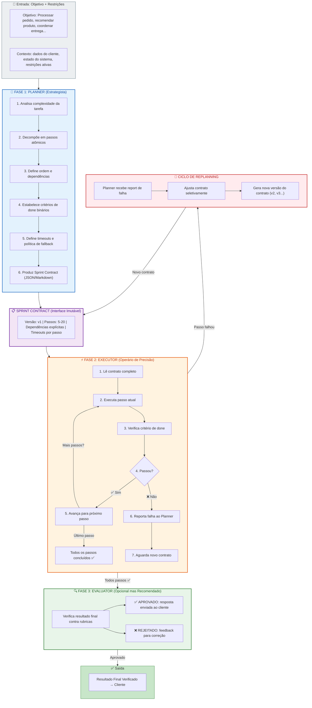
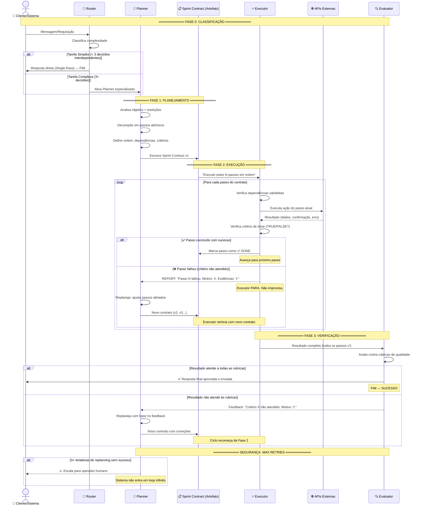
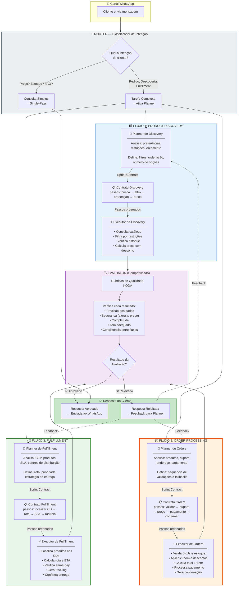
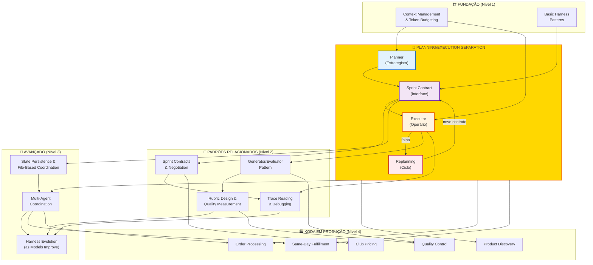

# 🧠 Planning vs Execution: Arquitetura Visual da Separação que Transforma Agentes Confusos em Sistemas Precisos
## Detailed Graph — Diagramas, Fluxos e Conexões do Conceito Planning/Execution Separation

**Tempo Estimado:** 90 minutos
**Nível:** Knowledge Graph — Visão Visual e Estrutural do Conceito
**Pré-requisito:** Ter lido `05-core-concepts/02-planning-execution-separation.md` e compreendido os 3 problemas fundamentais (Nível 1)
**Status:** 🟢 COMPLETO — Mapa visual completo do conceito Planning/Execution Separation
**Data de Criação:** Maio 2026

---

## 📖 Prólogo: A Anatomia de um Colapso — e a Arquitetura que o Previne

Segunda-feira, 14h23. Um pedido chegou ao KODA.

Não era um pedido complicado. Uma cliente chamada Teresa queria comprar três produtos: whey protein, creatina e um BCAA. Ela tinha cupom de primeira compra. Morava em São Paulo. Queria entrega no mesmo dia.

Um pedido que o KODA processava centenas de vezes por dia. Nada de especial.

Mas desta vez, algo deu errado.

O KODA começou a verificar o estoque do whey. Enquanto fazia isso, lembrou que precisava validar o cupom. Interrompeu a verificação de estoque. Foi checar o cupom. O cupom era válido — 15% de desconto. Mas enquanto validava o cupom, percebeu que ainda não tinha calculado o frete. Interrompeu a validação do cupom. Foi calcular o frete. O frete dependia do CEP — que a Teresa não tinha informado ainda. O KODA precisava perguntar. Mas antes de perguntar, resolveu terminar a verificação de estoque que tinha interrompido.

Só que agora o KODA já não lembrava mais qual produto estava verificando.

Resultado: Teresa recebeu uma confirmação de pedido com o whey errado, o cupom aplicado em apenas dois dos três produtos, e uma promessa de entrega same-day que o sistema de fulfillment não conseguia cumprir.

O que aconteceu dentro do KODA naqueles 12 segundos não foi um bug. Foi um **colapso arquitetural**. O KODA tentou planejar e executar ao mesmo tempo, e as duas atividades se destruíram mutuamente.

Este módulo não vai repetir a explicação conceitual de Planning/Execution Separation — isso está no [[curriculum/05-core-concepts/02-planning-execution-separation|Core Concept]]. O que este módulo faz é **mostrar visualmente** como essa separação funciona, através de diagramas que revelam a estrutura interna, os fluxos de decisão, os caminhos de delegação e a aplicação real no KODA.

Se o Core Concept é o "livro-texto", este Detailed Graph é o "mapa de anatomia". Você vai ver o conceito em ação, conexão por conexão, decisão por decisão.

Ao final, você deve conseguir olhar para qualquer fluxo do KODA e:
- Desenhar onde o Planner atua e onde o Executor atua
- Identificar os pontos de handoff (contrato) entre eles
- Rastrear o caminho completo de uma decisão até sua execução
- Saber quando usar Planning/Execution Separation vs outras estratégias de coordenação

---

## 🗺️ Mapa de Conexões: Como Este Detailed Graph se Conecta ao Ecossistema

Este arquivo é um nó do ecossistema de conhecimento do currículo. Ele se conecta a:

```
┌────────────────────────────────────────────────────────────────────────┐
│                        CONEXÕES DO DETAILED GRAPH                       │
├────────────────────────────────────────────────────────────────────────┤
│                                                                         │
│  🔼 CONCEITO-RAIZ (Core Concept)                                        │
│  ┌─────────────────────────────────────────────────────────────────┐   │
│  │ 05-core-concepts/02-planning-execution-separation.md             │   │
│  │ → Explicação conceitual completa (2447 linhas)                  │   │
│  │ → Este Detailed Graph é a contraparte VISUAL desse arquivo      │   │
│  └─────────────────────────────────────────────────────────────────┘   │
│                                                                         │
│  🔗 MÓDULOS RELACIONADOS                                                │
│  ┌─────────────────────────────────────────────────────────────────┐   │
│  │ Nível 1: 01-why-agents-lose-plot.md (Problema 2)               │   │
│  │ Nível 2: 02-sprint-contracts.md (mecanismo de acoplamento)      │   │
│  │ Nível 2: 01-generator-evaluator-pattern.md (tríade arquitetural)│   │
│  │ Nível 3: 01-multi-agent-systems.md (evolução natural)           │   │
│  │ Nível 3: 03-file-based-coordination.md (contratos como arquivos) │   │
│  └─────────────────────────────────────────────────────────────────┘   │
│                                                                         │
│  📊 OUTROS KNOWLEDGE GRAPHS                                              │
│  ┌─────────────────────────────────────────────────────────────────┐   │
│  │ 06-knowledge-graphs/01-concept-ecosystem.md (mapa completo)      │   │
│  │ 06-knowledge-graphs/02-koda-feature-dependencies.md (features)   │   │
│  │ 06-knowledge-graphs/03-learning-progression.md (aprendizado)     │   │
│  └─────────────────────────────────────────────────────────────────┘   │
│                                                                         │
└────────────────────────────────────────────────────────────────────────┘
```

---

## 🎯 Objetivos Deste Detailed Graph

Ao final deste módulo, você será capaz de:

- ✅ **Ler e interpretar os 3 diagramas Mermaid** que compõem o núcleo visual do conceito
- ✅ **Navegar o diagrama ASCII** da arquitetura completa de separação Planner/Executor/Avaliador
- ✅ **Comparar estratégias de coordenação** usando a tabela de decisão arquitetural
- ✅ **Rastrear o fluxo de decisão e delegação** desde o Router até a resposta final ao cliente
- ✅ **Identificar exatamente onde Planning/Execution Separation se aplica no KODA**
- ✅ **Mapear visualmente** os três fluxos KODA (Discovery, Orders, Fulfillment) com seus Planners e Executors
- ✅ **Entender as interdependências visuais** entre Planner, Sprint Contracts, Executor e Evaluator
- ✅ **Usar este grafo como ferramenta de design** para novas features do KODA

---

## 🧩 Diagrama 1: A Separação Planner/Executor — O Núcleo do Conceito

### Visão Geral

O primeiro diagrama mostra a essência da separação: duas fases distintas (Planning e Execution) conectadas por um artefato imutável (o Sprint Contract). É o diagrama mais importante deste módulo — todos os outros derivam dele.



### Como Ler Este Diagrama

1. **Comece pela Entrada (INPUT):** Todo fluxo começa com um objetivo e um contexto. O Planner recebe APENAS essas informações — zero ruído de execução.

2. **Siga para o Planner (azul):** O Planner é um pipeline de 6 etapas internas. Ele analisa, decompõe, ordena, define critérios, estabelece timeouts e produz o contrato. Note que ele NUNCA executa ações externas — apenas raciocina.

3. **O Contrato (roxo) é o ponto de virada:** É a fronteira entre "pensar" e "fazer". Versionado. Imutável durante a execução. O Executor nunca o modifica.

4. **O Executor (laranja) segue o contrato disciplinadamente:** Para cada passo, ele lê, executa, verifica. Se o critério de done for satisfeito, avança. Se falhar, PARA e reporta — nunca improvisa.

5. **O Ciclo de Replanning (vermelho):** Quando o Executor reporta falha, o Planner recebe o report, ajusta o contrato seletivamente (não precisa refazer tudo) e gera uma nova versão. O Executor então recomeça.

6. **O Evaluator (verde) é o gate final:** Após todos os passos, um avaliador independente verifica o resultado contra rubricas de qualidade. Se aprovado, vai para o cliente. Se rejeitado, gera feedback.

### O Que Este Diagrama REVELA (que o texto não mostra)

- **A assimetria entre Planner e Executor:** O Planner tem um pipeline linear de 6 etapas. O Executor tem um loop com decisão condicional. Essas estruturas diferentes refletem naturezas diferentes: planejar é um ato criativo sequencial; executar é um ciclo de ação-verificação.

- **A dupla direção do fluxo:** Os dados fluem para frente (Planner → Contrato → Executor) mas os reports de falha fluem para trás (Executor → Planner). Essa bidirecionalidade é essencial — é o que permite adaptação sem improviso.

- **O contrato como "firewall cognitivo":** Nenhuma informação de execução cruza para o Planner exceto via reports estruturados de falha. Isso impede a "contaminação cognitiva" que destrói a qualidade do planejamento em agentes únicos.

- **O Evaluator é opcional mas estratégico:** Em tarefas de baixo risco, você pode pular o Evaluator. Em tarefas com risco financeiro, de saúde ou de confiança, ele é obrigatório. O diagrama mostra isso com a anotação "Opcional mas Recomendado".

### Mapeamento para o Core Concept

Este diagrama é a **visualização direta** das Seções 1 e 2 do [[curriculum/05-core-concepts/02-planning-execution-separation|Core Concept]]. Cada bloco do diagrama corresponde a uma seção:

| Bloco do Diagrama | Seção no Core Concept |
|---|---|
| PLANNER (6 etapas) | Seção 1: "O Que É Planning vs Execution Separation?" + Seção 2: "O Planner — O Estrategista" |
| SPRINT CONTRACT | Seção 2: "Formatos de Sprint Contract" + "Os Cinco Elementos Essenciais" |
| EXECUTOR (loop) | Seção 2: "O Executor — O Operário de Precisão" + "O Loop de Execução" |
| CICLO DE REPLANNING | Seção 2: "O Fluxo Completo com Replanning" |
| EVALUATOR | Seção 2: "Camada 3: Evaluator" + Seção 6 |

---

## 🏗️ Diagrama ASCII: Arquitetura Completa de Separação no KODA

Este diagrama ASCII mostra a arquitetura completa como implementada no KODA, com 4 camadas (Router, Planner, Executor, Evaluator) e as regras inquebráveis que governam cada uma. É o "blueprint" que um engenheiro usaria para implementar a separação.

```
+===================================================================================+
|               SISTEMA DE AGENTES KODA — ARQUITETURA PLANNING/EXECUTION              |
|                         Visão Completa com 4 Camadas                                |
+===================================================================================+
|                                                                                    |
|  +------------------------------------------------------------------------------+ |
|  |                         CAMADA 0: ROUTER (Classificador de Intenção)          | |
|  |                                                                              | |
|  |  ┌─────────────────────────────────────────────────────────────────────┐    | |
|  |  │  ENTRADA: Mensagem do cliente via WhatsApp                           │    | |
|  |  │                                                                      │    | |
|  |  │  Classificação:                                                      │    | |
|  |  │  ┌──────────────────────────────────────────────────────────────┐  │    | |
|  |  │  │  • Product Discovery?  ──▶ Ativa Planner de Discovery         │  │    | |
|  |  │  │  • Order Processing?   ──▶ Ativa Planner de Orders            │  │    | |
|  |  │  │  • Fulfillment?        ──▶ Ativa Planner de Fulfillment       │  │    | |
|  |  │  │  • Consulta Simples?   ──▶ Single-Pass (sem P/E Separation)   │  │    | |
|  |  │  └──────────────────────────────────────────────────────────────┘  │    | |
|  |  │                                                                      │    | |
|  |  │  REGRA: Tarefas com < 3 decisões interdependentes NÃO passam       │    | |
|  |  │         pelo Planner. Vão direto para Single-Pass.                  │    | |
|  |  └─────────────────────────────────────────────────────────────────────┘    | |
|  +------------------------------------┬-----------------------------------------+ |
|                                       │                                           |
|                                       ▼                                           |
|  +------------------------------------------------------------------------------+ |
|  |                    CAMADA 1: PLANNER (🧠 Estrategista)                        | |
|  |                                                                              | |
|  |  ┌─────────────────────────────────────────────────────────────────────┐    | |
|  |  │  CONTEXTO DE ENTRADA (LIMPO — sem ruído de execução):                │    | |
|  |  │  ┌──────────────────────────────────────────────────────────────┐  │    | |
|  |  │  │  • Objetivo de alto nível (ex: "Processar pedido #1234")     │  │    | |
|  |  │  │  • Dados do cliente (perfil, restrições, histórico)          │  │    | |
|  |  │  │  • Estado atual do sistema (catálogo, promoções ativas)      │  │    | |
|  |  │  │  • Constraints globais (SLA, políticas de negócio)           │  │    | |
|  |  │  └──────────────────────────────────────────────────────────────┘  │    | |
|  |  │                                                                      │    | |
|  |  │  PROCESSO INTERNO DO PLANNER:                                        │    | |
|  |  │  ┌──────────────────────────────────────────────────────────────┐  │    | |
|  |  │  │  1. ANALISAR: Qual a complexidade? Quantos passos?            │  │    | |
|  |  │  │  2. DECOMPOR: Quebrar em passos atômicos e independentes      │  │    | |
|  |  │  │  3. ORDENAR: Identificar dependências (o que vem antes?)      │  │    | |
|  |  │  │  4. CRITERIZAR: Definir done criteria BINÁRIO para cada passo│  │    | |
|  |  │  │  5. TEMPORIZAR: Timeout realista para cada passo              │  │    | |
|  |  │  │  6. CONTRATAR: Produzir Sprint Contract em JSON               │  │    | |
|  |  │  └──────────────────────────────────────────────────────────────┘  │    | |
|  |  │                                                                      │    | |
|  |  │  O QUE O PLANNER NUNCA FAZ:                                          │    | |
|  |  │  ❌ Chamar APIs externas                                             │    | |
|  |  │  ❌ Modificar dados do sistema                                       │    | |
|  |  │  ❌ Enviar mensagens ao cliente                                      │    | |
|  |  │  ❌ Tomar decisões baseadas em resultados parciais de execução       │    | |
|  |  │  ❌ Improvisar quando um plano anterior falhou (ele replaneja)       │    | |
|  |  └─────────────────────────────────────────────────────────────────────┘    | |
|  |                                                                              | |
|  |  OUTPUT: Sprint Contract (versionado: v1, v2, v3...)                         | |
|  +------------------------------------┬-----------------------------------------+ |
|                                       │                                           |
|                                       ▼                                           |
|  +------------------------------------------------------------------------------+ |
|  |                 INTERFACE CRÍTICA: SPRINT CONTRACT (📋 Imutável)             | |
|  |                                                                              | |
|  |  ┌─────────────────────────────────────────────────────────────────────┐    | |
|  |  │  ESTRUTURA DO CONTRATO:                                              │    | |
|  |  │  ┌──────────────────────────────────────────────────────────────┐  │    | |
|  |  │  │  {                                                           │  │    | |
|  |  │  │    "contract_version": "v2",                                  │  │    | |
|  |  │  │    "objective": "Processar pedido #1234",                     │  │    | |
|  |  │  │    "context": { cliente, produtos, restrições },              │  │    | |
|  |  │  │    "steps": [                                                 │  │    | |
|  |  │  │      { "id":1, "desc":"...", "done_criteria":"...",          │  │    | |
|  |  │  │        "depends_on":[], "timeout_seconds":30 },               │  │    | |
|  |  │  │      { "id":2, "desc":"...", "done_criteria":"...",          │  │    | |
|  |  │  │        "depends_on":[1], "timeout_seconds":45 },              │  │    | |
|  |  │  │      ...                                                      │  │    | |
|  |  │  │    ],                                                          │  │    | |
|  |  │  │    "global_constraints": {                                     │  │    | |
|  |  │  │      "max_total_time_seconds": 300,                            │  │    | |
|  |  │  │      "on_failure": "stop_and_report"                           │  │    | |
|  |  │  │    }                                                           │  │    | |
|  |  │  │  }                                                             │  │    | |
|  |  │  └──────────────────────────────────────────────────────────────┘  │    | |
|  |  │                                                                      │    | |
|  |  │  PROPRIEDADES DO CONTRATO:                                           │    | |
|  |  │  ✅ IMUTÁVEL durante a execução                                      │    | |
|  |  │  ✅ VERSIONADO (v1, v2, v3...)                                       │    | |
|  |  │  ✅ AUDITÁVEL (cada versão é um artefato rastreável)                 │    | |
|  |  │  ✅ VERIFICÁVEL (critérios de done binários)                         │    | |
|  |  │  ✅ RECUPERÁVEL (em caso de crash, o Executor recomeça do contrato) │    | |
|  |  │                                                                      │    | |
|  |  │  QUEM PODE MODIFICAR: APENAS o Planner (via replanning)              │    | |
|  |  │  QUEM NÃO PODE: O Executor (regra inquebrável #1)                    │    | |
|  |  └─────────────────────────────────────────────────────────────────────┘    | |
|  +------------------------------------┬-----------------------------------------+ |
|                                       │                                           |
|                                       ▼                                           |
|  +------------------------------------------------------------------------------+ |
|  |                     CAMADA 2: EXECUTOR (⚡ Operário de Precisão)             | |
|  |                                                                              | |
|  |  ┌─────────────────────────────────────────────────────────────────────┐    | |
|  |  │  LOOP DE EXECUÇÃO (para cada passo do contrato):                     │    | |
|  |  │                                                                      │    | |
|  |  │  ┌──────────────────────────────────────────────────────────────┐  │    | |
|  |  │  │                                                               │  │    | |
|  |  │  │   PARA CADA PASSO (em ordem, respeitando depends_on):         │  │    | |
|  |  │  │                                                               │  │    | |
|  |  │  │   ┌─────────────────────────────────────────────────────┐    │  │    | |
|  |  │  │   │  1. LER: Entender descrição e done_criteria          │    │  │    | |
|  |  │  │   │  2. VERIFICAR: Dependências satisfeitas?             │    │  │    | |
|  |  │  │   │  3. EXECUTAR: Realizar a ação (com timeout)          │    │  │    | |
|  |  │  │   │  4. CHECAR: Done criteria é TRUE?                    │    │  │    | |
|  |  │  │   │                                                      │    │  │    | |
|  |  │  │   │   ┌─ Se TRUE:  Marcar ✅, avançar para próximo       │    │  │    | |
|  |  │  │   │   │                                                    │    │  │    | |
|  |  │  │   │   └─ Se FALSE: PARAR TUDO                            │    │  │    | |
|  |  │  │   │       ├─ NÃO executar mais passos                     │    │  │    | |
|  |  │  │   │       ├─ NÃO improvisar solução                       │    │  │    | |
|  |  │  │   │       ├─ REPORTAR ao Planner:                         │    │  │    | |
|  |  │  │   │       │   • Qual passo falhou                         │    │  │    | |
|  |  │  │   │       │   • Qual era o done criteria                  │    │  │    | |
|  |  │  │   │       │   • Qual foi o resultado real                 │    │  │    | |
|  |  │  │   │       │   • Evidências (logs, respostas de API)       │    │  │    | |
|  |  │  │   │       └─ AGUARDAR novo contrato                       │    │  │    | |
|  |  │  │   │                                                       │    │  │    | |
|  |  │  │   └─────────────────────────────────────────────────────┘    │  │    | |
|  |  │  │                                                               │  │    | |
|  |  │  └──────────────────────────────────────────────────────────────┘  │    | |
|  |  │                                                                      │    | |
|  |  │  REGRAS INQUEBRÁVEIS DO EXECUTOR:                                    │    | |
|  |  │  ┌──────────────────────────────────────────────────────────────┐  │    | |
|  |  │  │  ❌ NUNCA modificar o contrato                                │  │    | |
|  |  │  │  ❌ NUNCA pular passos                                        │  │    | |
|  |  │  │  ❌ NUNCA adicionar passos                                    │  │    | |
|  |  │  │  ❌ NUNCA continuar após falha sem novo contrato              │  │    | |
|  |  │  │  ❌ NUNCA improvisar soluções para falhas                     │  │    | |
|  |  │  │  ❌ NUNCA tomar decisões estratégicas                         │  │    | |
|  |  │  │  ❌ NUNCA questionar a ordem dos passos                       │  │    | |
|  |  │  └──────────────────────────────────────────────────────────────┘  │    | |
|  |  │                                                                      │    | |
|  |  │  ESTADO DO EXECUTOR:                                                 │    | |
|  |  │  • Mantém estado acumulado entre passos (ex: produtos já verificados)│    | |
|  |  │  • Registra audit trail de cada execução (timestamp, resultado)      │    | |
|  |  │  • Escreve checkpoint a cada N passos para recoverability            │    | |
|  |  └─────────────────────────────────────────────────────────────────────┘    | |
|  +------------------------------------┬-----------------------------------------+ |
|                                       │                                           |
|                         ┌─────────────┴─────────────┐                            |
|                         │                           │                            |
|                    TODOS PASSOS ✅            PASSO FALHOU ❌                    |
|                         │                           │                            |
|                         ▼                           ▼                            |
|  +------------------------------------+  +------------------------------------+  |
|  |         CAMADA 3: EVALUATOR        |  |     CICLO DE REPLANNING            |  |
|  |         (🔍 Gate de Qualidade)      |  |     (🔄 Adaptação Estruturada)     |  |
|  |                                    |  |                                    |  |
|  |  ┌──────────────────────────────┐  |  |  ┌──────────────────────────────┐  |  |
|  |  │ Verifica contra rubricas:    │  |  |  │ Planner recebe report de     │  |  |
|  |  │ • Precisão (dados corretos)  │  |  |  │ falha com:                   │  |  |
|  |  │ • Segurança (sem riscos)     │  |  |  │ • Passo que falhou           │  |  |
|  |  │ • Completude (nada faltando) │  |  |  │ • Motivo da falha            │  |  |
|  |  │ • Tom (adequado ao cliente)  │  |  |  │ • Evidências coletadas       │  |  |
|  |  │ • Consistência (sem conflito)│  |  |  │                               │  |  |
|  |  │                              │  |  |  │ Planner ajusta contrato:     │  |  |
|  |  │  ✅ APROVADO → Cliente       │  |  |  │ • Remove passos inviáveis    │  |  |
|  |  │  ❌ REJEITADO → Feedback     │  |  |  │ • Adiciona passos alternativos│  |  |
|  |  └──────────────────────────────┘  |  |  │ • Ajusta critérios de done   │  |  |
|  |                                    |  |  │ • Gera contrato v2 (ou v3)   │  |  |
|  +------------------------------------+  |  │                               │  |  |
|                                          |  │  Novo contrato → Executor     │  |  |
|                                          |  │  reinicia a execução          │  |  |
|                                          |  └──────────────────────────────┘  |  |
|                                          +------------------------------------+  |
|                                                                                    |
+===================================================================================+
|                              SAÍDA: Resposta ao Cliente                            |
+===================================================================================+
```

### Como Este Diagrama ASCII Guia a Implementação

Este blueprint revela decisões de design que não são óbvias em diagramas de alto nível:

1. **O Router como primeira decisão arquitetural:** Nem toda mensagem passa pelo Planner. O Router classifica a complexidade primeiro. Isso evita o Anti-Padrão #6 (Overhead de Separação) — tarefas simples não pagam o custo do planejamento.

2. **A separação física de contexto:** O Planner recebe um conjunto de dados diferente do Executor. Não é o mesmo prompt com instruções diferentes — são contextos radicalmente diferentes. O Planner vê estratégia. O Executor vê tática.

3. **As regras inquebráveis como código:** As 7 regras do Executor não são "boas práticas" — são invariantes de sistema. Se o Executor violar qualquer uma, o sistema deve rejeitar a execução e alertar.

4. **O contrato como artefato persistido:** Não é uma variável em memória. É um arquivo (ou registro em banco) versionado e auditável. Sobrevive a crashes, reinicializações e trocas de modelo.

5. **O Evaluator e o Replanning como caminhos divergentes:** Eles nunca operam ao mesmo tempo. Ou o resultado vai para avaliação de qualidade, ou o sistema entra em ciclo de replanning. Essa exclusividade mantém o sistema determinístico.

### Mapeamento para o Core Concept

Este diagrama ASCII é a **visualização direta** das Seções 2, 3, 5 e 6 do [[curriculum/05-core-concepts/02-planning-execution-separation|Core Concept]]:

| Elemento do Diagrama ASCII | Seção no Core Concept |
|---|---|
| CAMADA 0: Router | Seção 6: "Fluxo 0: Router classifica intenção" |
| CAMADA 1: Planner | Seção 2: "O Planner — O Estrategista" + System Prompt exemplo |
| Interface: Sprint Contract | Seção 2: "Formatos de Sprint Contract" |
| CAMADA 2: Executor | Seção 2: "O Executor — O Operário de Precisão" + Loop de Execução |
| CAMADA 3: Evaluator | Seção 5: "Planner + Generator + Evaluator = A Tríade Arquitetural" |
| Ciclo de Replanning | Seção 2: "O Fluxo Completo com Replanning" + Cenários KODA |

---

## 🔄 Diagrama 2: Fluxo de Decisão e Delegação — O Caminho de Uma Tarefa

### Visão Geral

Enquanto o Diagrama 1 mostra a **estrutura** (quais componentes existem), este diagrama mostra o **comportamento dinâmico** — o caminho que uma tarefa percorre desde o momento em que chega até a resposta final. Ele revela todos os pontos de decisão, os loops de retry, e as condições de escalação.



### Decision Points (Pontos de Decisão) Identificados

Este diagrama de sequência revela **7 pontos críticos de decisão** que determinam o caminho da tarefa:

| # | Ponto de Decisão | O Que Decide | Consequência se Errado |
|---|---|---|---|
| **D1** | Router: tarefa simples ou complexa? | Se a tarefa vai para Single-Pass ou P/E Separation | Overhead em tarefas simples ou colapso em tarefas complexas |
| **D2** | Planner: quantos passos decompor? | Granularidade do contrato | Muitos passos = micro-management; poucos = contrato vago |
| **D3** | Planner: quais dependências? | Ordem de execução e paralelismo possível | Dependências erradas = falhas em cascata ou ineficiência |
| **D4** | Executor: critério de done é TRUE? | Se avança ou reporta falha | Falso positivo = erro propaga; falso negativo = replanning desnecessário |
| **D5** | Planner (replanning): o que ajustar? | Escopo da nova versão do contrato | Ajuste excessivo = perde passos já concluídos; ajuste insuficiente = nova falha |
| **D6** | Evaluator: resultado atende rubricas? | Se a resposta vai para o cliente | Aprovar resposta ruim = cliente insatisfeito; rejeitar resposta boa = retrabalho |
| **D7** | Sistema: atingiu max retries? | Se escala para humano ou tenta de novo | Loop infinito = cliente esperando para sempre; escalar cedo demais = carga humana |

### O Que Este Diagrama REVELA sobre Delegação

- **A delegação não é linear — é um ciclo com escape hatches.** O caminho feliz (Planner → Executor → Evaluator → Cliente) é apenas um dos 5 caminhos possíveis. Os outros 4 envolvem replanning, rejeição ou escalação.

- **O Executor é o ponto de maior variabilidade.** É onde a teoria (o plano) encontra a realidade (APIs, estoques, timeouts). Por isso o Executor tem o comportamento mais complexo — ele precisa ser disciplinado o suficiente para não improvisar, mas flexível o suficiente para reportar falhas com riqueza de detalhes.

- **O Evaluator é um segundo gate, não um retrabalho.** Diferente do replanning (que acontece quando um passo falha), o Evaluator atua quando todos os passos passaram mas o resultado ainda não é bom. Isso captura uma classe diferente de erros — erros de qualidade, não de execução.

- **A escalação para humano é uma feature, não uma falha.** O sistema foi projetado para reconhecer seus próprios limites. Após 3 tentativas de replanning sem sucesso, ele não fica em loop — escala. Isso é maturidade arquitetural.

### Mapeamento para o Core Concept

Este diagrama é a **visualização direta** das Seções 2 e 3 do [[curriculum/05-core-concepts/02-planning-execution-separation|Core Concept]]:

| Elemento do Diagrama de Sequência | Seção no Core Concept |
|---|---|
| FASE 0: Router classifica | Seção 6: "Fluxo 0: Router" + Anti-Padrão #6 (Overhead) |
| FASE 1: Planner decompõe | Seção 2: "O Planner — O Estrategista" |
| FASE 2: Loop de execução | Seção 2: "Pseudocódigo: O Loop de Execução" |
| FASE 2: Ciclo de replanning | Seção 2: "O Fluxo Completo com Replanning" |
| FASE 3: Evaluator verifica | Seção 5: "A Tríade Arquitetural" |
| SEGURANÇA: max retries | Seção 2: "Decisão 1: Quantas iterações antes de desistir?" |

---

## 📊 Seção 3: Tabela Comparativa de Estratégias de Coordenação

### O Contexto da Decisão Arquitetural

Planning/Execution Separation não é a única forma de organizar o trabalho de agentes. Ela existe em um espectro de estratégias, cada uma com um ponto ótimo diferente. Esta tabela ajuda você a decidir **quando** usar P/E Separation versus outras abordagens — e, igualmente importante, quando **não** usar.

### As 5 Estratégias Comparadas

| Dimensão | Single-Pass (Agente Único) | Chain-of-Thought (CoT) | ReAct (Reason + Act) | **Planning/Execution Separation** | Multi-Agent Orchestration |
|---|---|---|---|---|---|
| **Filosofia central** | "Faça tudo de uma vez, em uma chamada" | "Pense em voz alta, depois aja" | "Pense, aja, observe, repita" | "Planeje primeiro, execute depois — com contrato" | "Múltiplos agentes especializados, papéis fixos" |
| **Separação de responsabilidades** | Nenhuma — tudo no mesmo contexto | Lógica (raciocínio visível no output) | Temporal (ciclo passo a passo) | **Arquitetural (fases distintas com contextos diferentes)** | Organizacional (agentes independentes) |
| **Número de agentes / chamadas** | 1 agente, 1 chamada | 1 agente, 1 chamada (com prompt especial) | 1 agente, N chamadas (loop) | **2-3 agentes, 2-4 chamadas** | N agentes, N×M chamadas |
| **Contexto do planejador** | Misturado com execução (contaminado) | Mesmo contexto, mesmo agente | Mesmo contexto, mesmo agente | **Contexto LIMPO — apenas informações estratégicas** | Contexto especializado por domínio |
| **Qualidade em tarefas curtas (1-3 passos)** | ⭐⭐⭐⭐⭐ Excelente | ⭐⭐⭐⭐ Muito Bom | ⭐⭐⭐ Bom (overhead) | ⭐⭐ Ruim (overhead desnecessário) | ⭐ Ruim (complexidade injustificada) |
| **Qualidade em tarefas médias (4-10 passos)** | ⭐⭐ Ruim (degrada visivelmente) | ⭐⭐⭐ Bom | ⭐⭐⭐⭐ Muito Bom | ⭐⭐⭐⭐⭐ **Excelente** | ⭐⭐⭐⭐ Muito Bom |
| **Qualidade em tarefas longas (11-50+ passos)** | ⭐ Ruim (colapso) | ⭐⭐ Ruim (contexto enorme) | ⭐⭐⭐ Bom (mas caro) | ⭐⭐⭐⭐⭐ **Excelente (estável)** | ⭐⭐⭐⭐⭐ Excelente |
| **Recuperação de falhas** | Improviso caótico — maior fonte de erros | Re-pensar do zero (caro) | Loop até acertar (pode divergir) | **Replanning estruturado com contrato versionado** | Re-roteamento entre agentes especialistas |
| **Paralelismo** | Impossível | Impossível | Impossível | **Possível: passos sem dependência podem rodar em paralelo** | Nativo: agentes rodam em paralelo |
| **Custo de tokens (tarefa típica)** | Alto (contexto grande e crescendo) | Médio-alto (raciocínio visível ocupa tokens) | Médio (cada iteração adiciona tokens) | **Baixo-médio: contextos menores e mais focados** | Médio-alto: overhead de coordenação entre agentes |
| **Complexidade de implementação** | Trivial — algumas linhas de código | Baixa — apenas prompt engineering | Média — loop + tool definitions | **Média — contratos, dois agentes, versionamento** | Alta — orquestrador, filas, state sharing |
| **Debugabilidade (quão fácil é achar a causa raiz?)** | Muito baixa — tudo misturado, sem vestígios | Baixa-média — raciocínio visível, mas não estruturado | Média — passos registrados, mas sem contrato | **Alta — contrato versionado + audit trail por passo** | Muito alta — logs por agente + contrato entre agentes |
| **Previsibilidade (mesmo input = mesmo output?)** | Baixa (varia muito) | Média | Média-baixa (loop introduz variância) | **Alta: contrato determinístico, executor determinístico** | Média-alta (depende do orquestrador) |
| **Quando usar no KODA** | "Qual o preço do whey?" | "Por que recomendo este produto?" | Navegar catálogo interativamente | **Processar pedido, validar múltiplas condições, coordenar fulfillment** | Orquestrar Discovery + Orders + Fulfillment juntos |
| **Quando NÃO usar** | Qualquer coisa com > 3 decisões encadeadas | Tarefas com ferramentas externas entre passos | Tarefas com estratégia que deve ser fixada antes | **Tarefas triviais com < 3 passos (overhead)** | Tarefas que um planejador único resolve |

### Como Escolher na Prática: Árvore de Decisão

```
TAREFA RECEBIDA PELO KODA
    │
    ├─ A tarefa tem MENOS de 3 decisões interdependentes?
    │   └─ SIM → Single-Pass ou CoT
    │       └─ Precisa de raciocínio visível? SIM → CoT. NÃO → Single-Pass.
    │
    ├─ A tarefa tem ENTRE 3 e 15 decisões interdependentes?
    │   └─ SIM → PLANNING/EXECUTION SEPARATION ← VOCÊ ESTÁ AQUI
    │       └─ As decisões são sequenciais (não paralelizáveis)?
    │           SIM → Contrato linear. NÃO → Contrato com passos paralelizáveis.
    │
    ├─ A tarefa tem MAIS de 15 decisões, algumas claramente paralelizáveis?
    │   └─ SIM → Considere MULTI-AGENT ORCHESTRATION (Nível 3)
    │
    ├─ A tarefa envolve INTERAÇÃO com ferramentas externas e REAÇÃO a resultados?
    │   └─ SIM → ReAct (Reason + Act)
    │
    └─ A tarefa envolve MÚLTIPLOS domínios (Discovery + Pricing + Fulfillment)?
        └─ SIM → MULTI-AGENT ORCHESTRATION com P/E Separation em cada agente
```

### A Progressão de Maturidade Arquitetural

Estas estratégias não são alternativas mutuamente exclusivas — elas formam uma **progressão de maturidade**:

```
NÍVEL DE MATURIDADE ARQUITETURAL
    │
    ├─ Nível 0: Single-Pass
    │   "Funciona para o básico. Quebra com complexidade."
    │   └─ Quando migrar: erros em > 5% das tarefas com 3+ passos
    │
    ├─ Nível 1: Chain-of-Thought
    │   "Raciocínio visível. Ajuda, mas não resolve o problema estrutural."
    │   └─ Quando migrar: contexto crescendo, qualidade caindo após 10+ passos
    │
    ├─ Nível 2: ReAct
    │   "Bom para ferramentas. Ruim para estratégia fixa."
    │   └─ Quando migrar: tarefas que exigem plano ANTES de qualquer ação
    │
    ├─ Nível 3: PLANNING/EXECUTION SEPARATION ← ESTE DETAILED GRAPH
    │   "Resolve 80% dos problemas práticos com 20% da complexidade."
    │   └─ Quando migrar: 15+ passos, passos claramente paralelizáveis
    │
    └─ Nível 4: Multi-Agent Orchestration
        "Para sistemas com domínios verdadeiramente distintos."
        └─ Cada agente internamente usa P/E Separation
```

### Onde P/E Separation se Encaixa no KODA

| Feature KODA | Estratégia Recomendada | Justificativa |
|---|---|---|
| Consulta de preço / estoque | Single-Pass | 1-2 passos, sem interdependência |
| FAQ / Dúvidas sobre produtos | Chain-of-Thought | Raciocínio visível ajuda o cliente |
| Navegação interativa no catálogo | ReAct | Loop natural de busca → resultado → refinar |
| **Processamento de pedido** | **P/E Separation** | **Múltiplas validações interdependentes, alto risco financeiro** |
| **Descoberta de produtos complexa** | **P/E Separation** | **Múltiplos critérios simultâneos, risco de recomendação errada** |
| **Fulfillment same-day** | **P/E Separation + Multi-Agent** | **Coordenação multi-CD, decisões em tempo real** |
| Orquestração completa (Discovery → Order → Fulfillment) | Multi-Agent Orchestration | Domínios distintos, agentes especialistas |

### Lições da Tabela Comparativa

1. **P/E Separation não é "a melhor" estratégia — é a estratégia certa para o problema certo.** Usar P/E Separation para "qual o preço do whey?" é overengineering. Usar Single-Pass para "processar pedido com 12 produtos" é negligência.

2. **A decisão é guiada por complexidade, não por preferência.** A árvore de decisão acima é objetiva: conte as decisões interdependentes. Se < 3, não use P/E Separation. Se ≥ 3, use. Simples assim.

3. **P/E Separation é o "sweet spot" de maturidade.** Resolve 80% dos problemas práticos com complexidade de implementação moderada. Multi-Agent Orchestration resolve os outros 20%, mas custa 5x mais em complexidade.

4. **Você pode combinar estratégias.** Um sistema KODA maduro usa Single-Pass para FAQs, ReAct para navegação, P/E Separation para pedidos e Multi-Agent para fulfillment. O Router decide qual estratégia usar por mensagem.

### Mapeamento para o Core Concept

Esta tabela expande a **Tabela Comparativa da Seção 4** do [[curriculum/05-core-concepts/02-planning-execution-separation|Core Concept]], adicionando:
- Mais dimensões de comparação (previsibilidade, debugabilidade)
- Árvore de decisão prática
- Progressão de maturidade
- Mapeamento direto para features KODA

---

## 🚀 Seção 4: Aplicação no KODA — Os Três Fluxos com Planners Especializados

### Diagrama 3: Arquitetura KODA com Planning/Execution Separation

Este diagrama mostra como o KODA implementa Planning/Execution Separation em produção, com três fluxos especializados (Product Discovery, Order Processing, Fulfillment), cada um com seu próprio Planner e Executor, compartilhando um Evaluator comum.



### Anatomia de Cada Fluxo KODA

#### Fluxo 1: Product Discovery (Descoberta de Produtos)

**Problema que resolve:** Cliente quer "um whey bom para iniciante, sem lactose, até R$ 150, com entrega rápida". Sem P/E Separation, o KODA busca, filtra, calcula e recomenda tudo de uma vez — e frequentemente erra em pelo menos um critério.

**Como P/E Separation resolve:**

- **Planner de Discovery** analisa o pedido e decompõe: "Preciso de 5 passos: (1) buscar wheys no catálogo, (2) filtrar por 'sem lactose', (3) filtrar por preço ≤ R$ 150, (4) verificar estoque no CEP do cliente, (5) ordenar por melhor custo-benefício e apresentar top 3."

- **Executor de Discovery** executa cada passo em sequência. Se o passo 2 revelar que nenhum whey é sem lactose, o Executor NÃO improvisa ("vou recomendar um com baixa lactose"). Ele PARA e reporta ao Planner: "Nenhum produto atende ao critério 'sem lactose'". O Planner então replaneja: "Passo 2 alterado: buscar proteínas vegetais como alternativa".

**Métricas típicas deste fluxo:**
- Passos por contrato: 4-7
- Taxa de replanning: ~8%
- Tempo médio: 3-5 segundos
- Precisão: 96-98%

#### Fluxo 2: Order Processing (Processamento de Pedidos)

**Problema que resolve:** Cliente monta carrinho com 5 produtos, tem cupom de primeira compra, quer parcelar em 3x, e precisa de entrega no mesmo dia. Cada uma dessas condições interage com as outras — e um erro em qualquer etapa invalida o pedido inteiro.

**Como P/E Separation resolve:**

- **Planner de Orders** decompõe o pedido em passos com dependências explícitas: "Passo 1: validar existência dos 5 SKUs. Passo 2: verificar estoque de cada um. Passo 3 (depende de 1): validar cupom. Passo 4 (depende de 2 e 3): calcular preço final com desconto. Passo 5 (depende de 2): verificar disponibilidade same-day. Passo 6 (depende de 4 e 5): calcular frete. Passo 7 (depende de 4): processar pagamento. Passo 8: confirmar pedido."

- **Executor de Orders** segue o contrato rigorosamente. Se o passo 5 revelar que a entrega same-day não é possível (corte de horário já passou), o Executor para e reporta. O Planner replaneja: ajusta o passo 5 para "informar next-day delivery com desconto no frete" e o passo 6 para "calcular frete next-day".

**Métricas típicas deste fluxo:**
- Passos por contrato: 5-12
- Taxa de replanning: ~6%
- Tempo médio: 4-7 segundos
- Precisão: 98-99.8%

#### Fluxo 3: Fulfillment (Entrega e Pós-Venda)

**Problema que resolve:** Produtos estão em centros de distribuição diferentes. Cliente quer tudo no mesmo dia. Alguns produtos estão no CD-SP, outros no CD-RJ. O KODA precisa coordenar rotas, SLAs e comunicação com o cliente — tudo em tempo real.

**Como P/E Separation resolve:**

- **Planner de Fulfillment** analisa a geografia: "Passo 1: localizar cada produto (qual CD?). Passo 2: verificar SLA de cada CD para o CEP do cliente. Passo 3: agrupar produtos por CD de origem. Passo 4: calcular rota e ETA para cada grupo. Passo 5: verificar viabilidade de entrega unificada. Passo 6: se inviável, preparar cenários alternativos. Passo 7: apresentar opções ao cliente. Passo 8: executar plano escolhido."

- **Executor de Fulfillment** executa cada passo. Se o passo 5 revelar que a entrega unificada deixaria o cliente esperando 3 horas extras (produtos do CD-SP prontos às 13h, mas CD-RJ só chega às 16h), o Executor detecta ambiguidade: "O critério de done é 'definir plano de entrega', mas há duas opções válidas. Não sei qual o cliente prefere." Reporta ao Planner, que ajusta o contrato para incluir um passo de consulta ao cliente.

**Métricas típicas deste fluxo:**
- Passos por contrato: 5-10
- Taxa de replanning: ~10%
- Tempo médio: 3-6 segundos
- Precisão: 95-98%

### O Que Este Diagrama REVELA sobre o KODA

1. **Especialização de Planners:** Cada fluxo tem seu próprio Planner porque as regras de negócio são diferentes. O Planner de Discovery sabe sobre catálogo e preferências. O Planner de Orders sabe sobre validações e pagamentos. O Planner de Fulfillment sabe sobre logística e SLAs. Essa especialização mantém cada Planner focado e eficiente.

2. **Evaluator compartilhado:** Todos os fluxos usam o mesmo Evaluator porque as rubricas de qualidade são universais: precisão, segurança, completude, tom e consistência. Isso garante que a qualidade seja consistente independente do fluxo.

3. **Router como porta de entrada única:** Toda mensagem passa pelo Router primeiro. Isso permite que tarefas simples (consulta de preço, FAQ) pulem completamente o pipeline de P/E Separation — evitando o Anti-Padrão #6 (Overhead de Separação).

4. **Feedback bidirecional entre Evaluator e Planners:** Quando o Evaluator rejeita um resultado, o feedback volta para o Planner do fluxo correspondente — não para um Planner genérico. Isso permite que cada Planner aprenda e melhore independentemente.

### Mapeamento para o Core Concept

Este diagrama é a **visualização direta** da Seção 6 do [[curriculum/05-core-concepts/02-planning-execution-separation|Core Concept]]:

| Elemento do Diagrama | Seção no Core Concept |
|---|---|
| ROUTER | Seção 6: "Router classifica intenção" |
| Fluxo 1: Product Discovery | Seção 6: "Fluxo 1: Product Discovery" — Planner e Executor especializados |
| Fluxo 2: Order Processing | Seção 6: "Fluxo 2: Order Processing" — exemplo real com 8 passos |
| Fluxo 3: Fulfillment | Seção 6: "Fluxo 3: Fulfillment" — cenário multi-CD |
| EVALUATOR compartilhado | Seção 5: "A Tríade Arquitetural" — Evaluator como camada 3 |
| Feedback ao Planner | Seção 2: "O Fluxo Completo com Replanning" |

---

## 🧬 Seção 5: Interdependências Visuais do Ecossistema Planning/Execution

### O Grafo de Dependências do Conceito

Planning/Execution Separation não existe isoladamente. Ele se conecta a outros conceitos do ecossistema de long-running agents. Este grafo mostra essas conexões:



### Como Ler as Conexões

- **Fundação → P/E Separation:** Context Management alimenta tanto o Planner (que precisa de contexto limpo) quanto o Executor (que precisa do contrato como contexto). Basic Harness fornece os padrões iniciais de validação que evoluem para o contrato.

- **P/E Separation → Padrões Nível 2:** O contrato é a base para Sprint Contracts formais. O Executor frequentemente delega a um Generator/Evaluator interno para passos que exigem criatividade com verificação. Trace Reading depende dos logs estruturados que o Executor produz.

- **P/E Separation → Avançado Nível 3:** O contrato como artefato é a base para State Persistence e File-Based Coordination. Multi-Agent Coordination é a evolução natural: quando os passos se tornam complexos demais para um Executor único, cada passo (ou grupo de passos) vira um agente especializado.

- **P/E Separation → KODA Produção:** Os três fluxos principais do KODA (Discovery, Orders, Fulfillment) são implementações diretas de P/E Separation. Club Pricing depende de contratos formais entre pricing e os outros módulos. Quality Control usa rubrics (do Nível 2) e coordenação multi-agent (do Nível 3).

### As 5 Conexões Mais Importantes (Detalhadas)

#### Conexão 1: P/E Separation + Sprint Contracts

**Princípio:** P/E Separation define a estrutura (quem faz o quê). Sprint Contracts definem o mecanismo (como eles se comunicam).

**No KODA:** O Planner de Orders decide QUE validações fazer. O Sprint Contract especifica COMO cada validação será comunicada: formato JSON, campos obrigatórios, timeouts. Sem contratos, o Planner e o Executor falam "línguas diferentes" e a separação é apenas teórica.

**Sinal de falha nesta conexão:** O Executor recebe o contrato mas interpreta os critérios de done de forma diferente do que o Planner pretendia. Exemplo: Planner define done_criteria como "todos os produtos em estoque". Executor interpreta como "pelo menos um produto em estoque".

#### Conexão 2: P/E Separation + State Persistence

**Princípio:** O contrato é o estado compartilhado entre Planner e Executor. State Persistence garante que esse estado sobreviva a falhas, crashes e trocas de modelo.

**No KODA:** Durante um pedido, se o Executor crashar após completar 5 de 8 passos, o State Persistence permite que um novo Executor retome do passo 6 — porque o contrato versionado e os resultados dos passos anteriores estão persistidos em arquivo/banco.

**Sinal de falha nesta conexão:** O Executor crasha e, ao reiniciar, não sabe quais passos já foram concluídos. Recomeça do zero, potencialmente cobrando o cliente duas vezes.

#### Conexão 3: P/E Separation + Generator/Evaluator

**Princípio:** P/E Separation organiza o trabalho MACRO (quais passos, em qual ordem). Generator/Evaluator organiza o trabalho MICRO (como executar cada passo com qualidade).

**No KODA:** Para o passo "recomendar produto alternativo" (dentro de um contrato de Order Processing), o Executor invoca um Generator (que gera 5 alternativas) e um Evaluator (que escolhe a melhor). O Generator/Evaluator não sabe que está dentro de um passo de um contrato maior — ele apenas faz seu trabalho micro.

**Sinal de falha nesta conexão:** O Generator/Evaluator toma decisões que contradizem o contrato maior. Exemplo: Generator recomenda um produto que o Planner explicitamente excluiu nos passos anteriores.

#### Conexão 4: P/E Separation + Multi-Agent Coordination

**Princípio:** P/E Separation é o padrão para um fluxo. Multi-Agent Coordination é o padrão para múltiplos fluxos interdependentes.

**No KODA:** O fluxo de Order Processing usa P/E Separation internamente. Mas quando um pedido também aciona Fulfillment (que tem seu próprio Planner/Executor), a coordenação entre os dois fluxos é feita via Multi-Agent Coordination — com contratos entre agentes, estado compartilhado e orquestração.

**Sinal de falha nesta conexão:** O Executor de Orders conclui o pedido e envia para Fulfillment, mas o Planner de Fulfillment nunca recebe o contrato. O pedido fica "preso" entre os dois sistemas.

#### Conexão 5: P/E Separation + Harness Evolution

**Princípio:** O harness (conjunto de verificações e contratos) deve evoluir conforme os modelos melhoram. P/E Separation fornece a estrutura para essa evolução: você pode ajustar o Planner, o Executor ou o contrato independentemente.

**No KODA:** Quando um novo modelo de linguagem é lançado com melhor capacidade de raciocínio, o Planner pode ser ajustado para produzir contratos mais enxutos (menos passos, mais confiança). O Executor e o contrato podem permanecer os mesmos. A evolução é modular.

**Sinal de falha nesta conexão:** O harness nunca é ajustado. Modelo melhora, mas os contratos continuam com verificações redundantes do modelo antigo. Custo de tokens sobe sem ganho de qualidade.

### Tabela de Impacto Cruzado

| Se este conceito mudar... | ...estes elementos de P/E Separation são afetados |
|---|---|
| **Context Management** melhora (janelas maiores) | Planner pode considerar mais contexto; contratos podem ser mais detalhados |
| **Modelo de linguagem** melhora (melhor raciocínio) | Planner pode produzir contratos mais enxutos; Executor pode ser mais autônomo |
| **State Persistence** é refatorada | Contratos precisam de novo formato de armazenamento; versionamento pode mudar |
| **Generator/Evaluator** é removido (modelo único) | Executor perde capacidade de verificação interna; risco de erro em passos criativos |
| **Sprint Contracts** são formalizados | Contratos ganham validação automática; Executor pode validar contrato antes de executar |
| **Multi-Agent** é introduzido | Executor pode delegar passos complexos a agentes especializados |

---

## 🔬 Seção 5.5: Anatomia de Cada Conexão — Zoom nas 5 Conexões Críticas

As conexões apresentadas no grafo da Seção 5 merecem um exame mais detalhado. Cada uma delas é um ponto onde a arquitetura pode funcionar perfeitamente — ou falhar silenciosamente. Esta seção aplica zoom em cada conexão.

### Conexão 1: P/E Separation → Sprint Contracts (Zoom)

**O que flui nesta conexão:** O Planner produz intenção estruturada. O Sprint Contract transforma intenção em compromisso formal.

**Anatomia da interface:**

```
PLANNER (🧠)                         SPRINT CONTRACT (📋)
────────────                         ─────────────────────
Output:                              Estrutura:
  "Precisamos validar o cupom"       {
                                       "id": 3,
                                       "description": "Validar cupom MARCOS20",
                                       "done_criteria": "Cupom existe, não expirou,
                                                        é aplicável a todos os SKUs",
                                       "depends_on": [1],
                                       "timeout_seconds": 15
                                     }
```

**O que pode dar errado:** O Planner produz uma intenção vaga ("validar cupom") e o contrato herda essa vagueza. O Executor não sabe exatamente o que verificar. Resultado: o cupom é "validado" mas o desconto é aplicado incorretamente.

**O que fazer para garantir:** Todo critério de done deve responder a uma pergunta binária. "O cupom é válido?" não é binário o suficiente. "O cupom retorna status 'active' na API de promoções, não está expirado (data_validade > now), e é aplicável a todos os SKUs do pedido (campo 'applicable_skus' contém todos os SKUs)" é binário.

**Sinal de conexão saudável:** Contratos têm critérios de done tão específicos que duas pessoas diferentes, lendo o mesmo critério, chegariam à mesma conclusão sobre se o passo passou ou não.

**Sinal de conexão doente:** Executor frequentemente reporta "critério de done ambíguo" ou "não sei como verificar este critério".

---

### Conexão 2: P/E Separation → Generator/Evaluator (Zoom)

**O que flui nesta conexão:** O Executor, durante um passo que exige criatividade com verificação, invoca um par Generator/Evaluator como sub-rotina.

**Anatomia da interface:**

```
EXECUTOR (⚡)                            GENERATOR/EVALUATOR (🎨🔍)
────────────                            ──────────────────────────
Passo 4 do contrato:
  "Recomendar 3 produtos                GENERATOR:
   alternativos para itens               "Cliente queria Whey A (fora de estoque).
   fora de estoque"                       Alternativas similares:
                                          1. Whey B (mesma categoria, +5% preço)
                                          2. Whey C (similar, mesmo preço)
                                          3. Whey D (vegano, -10% preço)"
                                        
  done_criteria:
  "3 alternativas válidas               EVALUATOR:
   encontradas e verificadas"            ✅ Whey B: em estoque, preço OK
                                         ✅ Whey C: em estoque, preço OK
                                         ❌ Whey D: é vegano, mas cliente não é
                                         → 2/3 aprovadas. REJEITADO.
                                         → Feedback: "Precisa de 3 alternativas"
```

**O que pode dar errado fatal:** O Generator, agindo dentro de um passo do Executor, toma uma decisão que contradiz o contrato maior. Exemplo: o Generator recomenda um produto que o Planner explicitamente excluiu em um passo anterior do contrato. O Generator não tem visibilidade do contrato completo — ele só vê o passo atual.

**O que fazer para garantir:** O Executor deve passar, para o Generator, não apenas o passo atual, mas também o contexto relevante dos passos anteriores. Exemplo: se o passo 2 do contrato filtrou produtos por "sem lactose", o Generator do passo 4 precisa saber disso. Isso é feito via estado acumulado do Executor.

**Padrão de implementação recomendado:**
```
Executor, antes de invocar Generator para o passo N:
  1. Coleta estado acumulado dos passos 1 a N-1
  2. Extrai constraints relevantes (filtros aplicados, exclusões feitas)
  3. Passa essas constraints para o Generator como "contexto herdado"
  4. Generator produz output respeitando constraints herdadas
  5. Evaluator verifica output contra constraints herdadas + critério do passo
```

---

### Conexão 3: P/E Separation → State Persistence (Zoom)

**O que flui nesta conexão:** O contrato e os resultados dos passos precisam sobreviver a falhas. State Persistence é o mecanismo que garante isso.

**Anatomia do estado persistido:**

```
ESTADO PERSISTIDO (por tarefa):
─────────────────────────────────

state/ORD-2026-5523/
├── customer_context.json        # Imutável, criado uma vez
├── contract_v1.json             # Contrato original
├── step_results/
│   ├── step_01_result.json      # Resultado do passo 1
│   ├── step_02_result.json      # Resultado do passo 2
│   └── step_03_result.json      # Resultado do passo 3
├── contract_v2.json             # Contrato após replanning
├── evaluator_verdict.json       # Veredito final
├── feedback.json                # Feedback (se rejeitado)
└── audit_log.jsonl              # Linha do tempo imutável
```

**Cenário de falha e recuperação:**

```
[14:05:00] Executor inicia contrato v1 (8 passos)
[14:05:01] Passo 1 ✅ → salvo em step_01_result.json
[14:05:02] Passo 2 ✅ → salvo em step_02_result.json
[14:05:03] Passo 3 ✅ → salvo em step_03_result.json
[14:05:04] Passo 4 ✅ → salvo em step_04_result.json
[14:05:05] Passo 5 ✅ → salvo em step_05_result.json
[14:05:06] 💥 CRASH do Executor (processo morreu)

───── RECUPERAÇÃO ─────

[14:05:10] Novo Executor iniciado
[14:05:10] Lê audit_log.jsonl: "Passos 1-5 concluídos"
[14:05:10] Lê step_05_result.json: estado acumulado até passo 5
[14:05:10] Lê contract_v1.json: retoma do passo 6
[14:05:11] Passo 6 ✅ → salvo em step_06_result.json
[14:05:12] Passo 7 ✅
[14:05:13] Passo 8 ✅
[14:05:13] Resultado final ✅
```

**O que pode dar errado fatal:** O Executor crasha, e ao reiniciar, o estado persistido está corrompido ou incompleto. O novo Executor não sabe quais passos foram concluídos. Recomeça do zero — e cobra o cliente duas vezes (se o passo de pagamento já tinha sido executado).

**O que fazer para garantir:**
1. Cada passo concluído deve ser persistido ANTES de iniciar o próximo passo (write-ahead log)
2. Operações críticas (pagamento) devem ser idempotentes (executar duas vezes = mesmo resultado)
3. O contrato deve incluir um `recovery_policy`: "Se passo N já foi concluído (evidência em step_results/), pular"
4. Audit log deve ser append-only (nunca sobrescrever entradas anteriores)

---

### Conexão 4: P/E Separation → Multi-Agent Coordination (Zoom)

**O que flui nesta conexão:** Quando uma tarefa é complexa demais para um único fluxo P/E Separation, múltiplos fluxos são orquestrados por um coordenador central.

**Anatomia da orquestração multi-fluxo:**

```
                    ┌─────────────────────────┐
                    │   ORQUESTRADOR CENTRAL   │
                    │   (Coordena múltiplos     │
                    │    fluxos P/E Separation) │
                    └──────────┬───────────────┘
                               │
               ┌───────────────┼───────────────┐
               │               │               │
               ▼               ▼               ▼
    ┌──────────────────┐ ┌──────────────────┐ ┌──────────────────┐
    │ FLUXO DISCOVERY  │ │ FLUXO ORDERS     │ │ FLUXO FULFILL    │
    │ (Planner + Exec) │ │ (Planner + Exec) │ │ (Planner + Exec) │
    │                  │ │                  │ │                  │
    │ Contrato:        │ │ Contrato:        │ │ Contrato:        │
    │ 5 passos         │ │ 7 passos         │ │ 6 passos         │
    └────────┬─────────┘ └────────┬─────────┘ └────────┬─────────┘
             │                    │                    │
             └────────────────────┼────────────────────┘
                                  │
                                  ▼
                    ┌─────────────────────────┐
                    │   CONTRATO ENTRE        │
                    │   FLUXOS (Multi-Contract)│
                    │                         │
                    │ Discovery promete:       │
                    │  produtos válidos        │
                    │ Orders promete:          │
                    │  preço correto           │
                    │ Fulfillment promete:     │
                    │  prazo realista          │
                    └─────────────────────────┘
```

**O que pode dar errado fatal:** Dois fluxos produzem resultados inconsistentes. Exemplo: Discovery recomenda um produto. Orders processa o pedido com um preço diferente do que Discovery mostrou. Fulfillment promete um prazo que não considera o tempo de processamento do Orders. O cliente recebe três informações conflitantes.

**O que fazer para garantir:**
1. Contratos entre fluxos (Multi-Contract) são tão formais quanto contratos dentro de um fluxo
2. O Orquestrador Central valida que os outputs dos fluxos são consistentes entre si ANTES de enviar ao cliente
3. Estado compartilhado (State Persistence) garante que todos os fluxos leem a mesma versão dos dados
4. O Evaluator final verifica consistência cross-fluxo como uma rubrica adicional

---

### Conexão 5: P/E Separation → Harness Evolution (Zoom)

**O que flui nesta conexão:** Dados operacionais (métricas de replanning, taxas de erro, latência) alimentam decisões sobre como evoluir o harness. P/E Separation fornece a granularidade necessária para ajustes cirúrgicos.

**Anatomia do ciclo de evolução:**

```
MÉTRICAS OPERACIONAIS
        │
        ├─ Replanning rate por fluxo
        ├─ Passos que mais falham
        ├─ Critérios de done que mais causam falsos negativos
        ├─ Timeouts que mais disparam
        └─ Rubrics que mais rejeitam (falsos positivos?)
        │
        ▼
ANÁLISE DE EVOLUÇÃO
        │
        ├─ "Planner de Orders está micro-gerenciando?
        │   Passos/contrato subiu de 7 para 14.
        │   → Ajustar system prompt para produzir passos mais grossos"
        │
        ├─ "Timeout do passo 4 (30s) é muito agressivo?
        │   12% dos replannings vêm de timeout neste passo.
        │   → Aumentar para 45s ou otimizar a API chamada"
        │
        ├─ "Modelo novo (Claude 5) lida melhor com contexto?
        │   Precisão do Single-Pass para tarefas de 3-5 passos subiu para 96%.
        │   → Aumentar threshold do Router: tarefas de até 5 passos vão para Single-Pass"
        │
        └─ "Rubric de 'tom' rejeita 8% das respostas mas 95% dessas rejeições
            são revertidas na revisão manual?
            → Calibrar threshold da rubric de tom para cima (menos sensível)"
        │
        ▼
HARNESS EVOLUÍDO (nova versão)
```

**O que pode dar errado fatal:** O harness é ajustado baseado em métricas de curto prazo sem considerar efeitos de segunda ordem. Exemplo: aumentar o threshold do Router para enviar mais tarefas para Single-Pass (porque o modelo melhorou) reduz custo, mas aumenta silenciosamente a taxa de erro em tarefas de 4-5 passos — que só será descoberta quando clientes reclamarem.

**O que fazer para garantir:**
1. Toda mudança de harness deve ser testada em shadow mode por pelo menos 1 semana
2. Métricas de qualidade (não apenas de custo) devem ser os gatekeepers da evolução
3. Mudanças no harness devem ser versionadas e reversíveis (feature flags)
4. O dashboard deve mostrar métricas before/after para cada mudança de harness

---

## 🧪 Seção 6: Cenários de Aplicação — Do Diagrama ao Código

### Cenário 1: Product Discovery com Restrições Múltiplas

**Contexto:** Cliente quer "whey protein vegano, sabor chocolate, até R$ 150, com entrega para o Rio de Janeiro, e pergunta se tem brinde para compras acima de R$ 120".

**Como P/E Separation processa (visão visual):**

```
CLIENTE: "Whey vegano chocolate, R$ 150, RJ, tem brinde?"
    │
    ▼
ROUTER: Classifica como "Product Discovery" (complexa: 4 critérios interdependentes)
    │
    ▼
PLANNER DE DISCOVERY (analisa, NÃO executa nada):
    │
    ├─ Passo 1: Obter CEP do cliente (dependência para frete)
    ├─ Passo 2: Buscar catálogo: whey, vegano, chocolate, ≤ R$ 150
    ├─ Passo 3: Verificar estoque de cada produto encontrado
    ├─ Passo 4: Calcular frete para CEP RJ de cada produto
    ├─ Passo 5: Verificar regras de brinde (compras > R$ 120?)
    ├─ Passo 6: Ordenar por melhor custo-benefício
    └─ Passo 7: Montar recomendação final com top 3
    │
    ▼
SPRINT CONTRACT v1 (7 passos, dependências explícitas)
    │
    ▼
EXECUTOR DE DISCOVERY:
    │
    Passo 1: KODA pergunta CEP → Cliente: "22041-001" ✅
    Passo 2: Catálogo: 4 produtos whey vegano chocolate ≤ R$ 150 ✅
    Passo 3: Estoque: 3 em estoque, 1 esgotado ✅ (remove esgotado)
    Passo 4: Frete RJ: R$ 12,90 (todos) ✅
    Passo 5: Brinde: Sim! Shaker para compras > R$ 120 ✅
    Passo 6: Ordenação: Produto A (score 92), Produto B (87), Produto C (81) ✅
    Passo 7: Monta resposta com top 3 + info de frete + info de brinde ✅
    │
    ▼
EVALUATOR: Verifica rubricas → ✅ APROVADO
    │
    ▼
CLIENTE: Recebe recomendação completa, correta e personalizada
```

**O que o diagrama não mostra (mas acontece):** Se o passo 3 revelasse que NENHUM produto está em estoque, o Executor não improvisaria ("vou recomendar um whey não-vegano"). Ele pararia e reportaria ao Planner, que ajustaria o passo 2 para "buscar proteínas vegetais de outros sabores disponíveis em chocolate".

### Cenário 2: Order Processing com Falha e Replanning

**Contexto:** Cliente quer comprar 5 unidades do Whey X. Moram em São Paulo. Têm cupom de 15%.

**Fluxo com falha (visual):**

```
PLANNER DE ORDERS → Contrato v1 com 5 passos
    │
EXECUTOR:
    Passo 1: Whey X existe no catálogo? ✅ Sim
    Passo 2: Estoque Whey X em SP? 5 unidades? ❌ NÃO — apenas 3!
    │
    ├─ EXECUTOR PARA. Não improvisa ("vou vender 3 e depois vejo").
    │
    └─ REPORT AO PLANNER:
        "Passo 2 falhou. Whey X: apenas 3 unidades em SP.
         Cliente quer 5. Critério de done: estoque ≥ 5."
            │
            ▼
PLANNER (replanning):
    │
    ├─ Analisa: "Estoque insuficiente. Opções:
    │   A) Oferecer 3 agora + 2 amanhã (entrega parcelada)
    │   B) Oferecer produto alternativo similar
    │   C) Informar indisponibilidade"
    │
    └─ Contrato v2:
        Passo 1 (mantido): Verificar existência do Whey X
        Passo 2 (modificado): Verificar disponibilidade: 3 agora + 2 amanhã?
        Passo 3 (novo): Perguntar ao cliente: "Aceita 3 hoje e 2 amanhã?"
        Passo 4 (condicional): Se sim, calcular preço para entrega hoje
        Passo 5 (condicional): Calcular para complemento amanhã
        Passo 6: Apresentar plano
            │
            ▼
EXECUTOR (com contrato v2):
    Passo 1: ✅
    Passo 2: 3 agora + 2 amanhã: disponível ✅
    Passo 3: Cliente: "Pode ser! As 2 amanhã têm frete grátis?" ✅
    Passo 4: 3× Whey X hoje: R$ 269,70 + frete R$ 19,90 ✅
    Passo 5: 2× Whey X amanhã: R$ 179,80 + frete GRÁTIS ✅
    Passo 6: KODA: "Fechado! 3 unidades chegam hoje até 18h.
             As outras 2 chegam amanhã de manhã, com frete grátis!" ✅
    │
    ▼
EVALUATOR → ✅ APROVADO → Cliente satisfeito
```

**O que este cenário demonstra:** O replanning transformou uma falha (estoque insuficiente) em uma oportunidade (entrega parcelada com frete grátis na segunda parte). Isso só foi possível porque o Executor não improvisou — ele reportou a falha com dados precisos, permitindo que o Planner criasse uma solução criativa mas estruturada.

### Cenário 3: Fulfillment Multi-CD com Decisão do Cliente (Expandido)

**Contexto:** Pedido com 3 produtos. Produtos A e B no CD-SP. Produto C no CD-RJ. Cliente em São Paulo, quer same-day.

**Por que este cenário é o mais complexo do KODA:** Ele envolve geografia (múltiplos CDs), timing (same-day tem janela curta), decisão subjetiva (cliente precisa escolher entre opções), e coordenação entre dois sistemas (Fulfillment + comunicação com cliente).

**Fluxo com ambiguidade (visual e expandido):**

```
PLANNER DE FULFILLMENT → Contrato v1 com 9 passos
    │
    │  Passo 1: Localizar cada SKU nos CDs
    │  Passo 2: Verificar SLA de cada CD para o CEP
    │  Passo 3: Agrupar produtos por CD de origem
    │  Passo 4: Calcular rota para grupo CD-SP
    │  Passo 5: Calcular rota para grupo CD-RJ
    │  Passo 6: Verificar viabilidade de entrega unificada
    │  Passo 7: Se unificada, calcular ETA final
    │  Passo 8: Se parcelada, calcular ETAs separados
    │  Passo 9: Apresentar plano ao cliente
    │
    ▼
EXECUTOR:
    │
    Passo 1: A→CD-SP ✅ | B→CD-SP ✅ | C→CD-RJ ✅
    │
    Passo 2: CD-SP→CEP: 2h ✅ | CD-RJ→CEP: 5h ⚠️
    │         (Nota: 5h está no limite do same-day. Margem de apenas 2h.)
    │
    Passo 3: Grupo SP: [A, B] | Grupo RJ: [C] ✅
    │
    Passo 4: Rota SP: saída 11h, chegada 13h ✅
    │         (Margem confortável: 5h até o fim do dia)
    │
    Passo 5: Rota RJ: saída 11h, chegada 16h ⚠️
    │         (Margem apertada: 2h até o fim do dia. Qualquer imprevisto = atraso.)
    │
    Passo 6: Viabilidade de entrega unificada?
    │
    ├─ Análise do Executor:
    │   • Unificada: tudo chega às 16h
    │   • Produtos A e B ficam PRONTOS às 13h mas ESPERAM até 16h
    │   • Cliente poderia receber A e B mais cedo
    │   • Mas entrega parcelada = duas visitas do entregador = mais complexo
    │
    ├─ EXECUTOR DETECTA AMBIGUIDADE:
    │   "Done criteria: 'definir plano de entrega'.
    │    Porém, há DUAS opções válidas com trade-offs diferentes:
    │
    │    Opção A: UNIFICADA
    │    ├─ Prós: uma entrega só, mais simples para o cliente
    │    ├─ Contras: A e B esperam 3h, margem de 2h para imprevistos no RJ
    │    └─ Risco: MÉDIO (2h de buffer é apertado para trânsito de SP)
    │
    │    Opção B: PARCELADA
    │    ├─ Prós: A e B chegam às 13h (3h mais cedo), cada entrega tem margem confortável
    │    ├─ Contras: duas visitas do entregador, cliente precisa estar disponível duas vezes
    │    └─ Risco: BAIXO (margens generosas em ambas as entregas)
    │
    │    NÃO SEI qual o cliente prefere. Isso é uma decisão subjetiva."
    │
    └─ REPORT AO PLANNER (não decide sozinho!)
        │
        ▼
PLANNER (replanning — Contrato v2):
    │
    ├─ Análise do Planner:
    │   "O Executor está certo. Isso não é uma falha técnica — é uma escolha
    │    de experiência do cliente. Não devo decidir pelo cliente.
    │    Vou ajustar o contrato para TRANSFORMAR a ambiguidade em uma
    │    pergunta clara para o cliente."
    │
    └─ Contrato v2:
        Passo 1-5: (mantidos, já executados) ✅
        Passo 6 (novo): Preparar comparação visual das duas opções
        Passo 7 (novo): Apresentar opções ao cliente com recomendação
        Passo 8 (novo): Colher decisão do cliente
        Passo 9 (mantido): Executar plano escolhido
            │
            ▼
EXECUTOR (com contrato v2):
    │
    Passo 6: Prepara comparação:
    │
    │  ┌─────────────────────────────────────────────────────────┐
    │  │             OPÇÕES DE ENTREGA                           │
    │  ├─────────────────────────────────────────────────────────┤
    │  │                                                         │
    │  │  Opção A: TUDO JUNTO ÀS 16h                            │
    │  │  ├─ Você recebe os 3 produtos de uma vez                │
    │  │  ├─ Praticidade: uma entrega só                         │
    │  │  └─ ⚠️ Margem de horário apertada (trânsito pode atrasar)│
    │  │                                                         │
    │  │  Opção B: ENTREGA PARCELADA (⭐ Recomendado)             │
    │  │  ├─ Whey + Creatina: às 13h                             │
    │  │  ├─ BCAA: às 16h                                        │
    │  │  ├─ Você recebe 2 produtos mais cedo                    │
    │  │  └─ ✅ Margem de horário confortável em ambas            │
    │  │                                                         │
    │  └─────────────────────────────────────────────────────────┘
    │
    Passo 7: KODA envia: "Preparei duas opções de entrega! 🚚
             Na Opção A, tudo chega junto às 16h. Na Opção B (minha
             recomendação), você recebe whey + creatina às 13h e o
             BCAA às 16h — com margem mais segura. Qual prefere?" ✅
    │
    Passo 8: Cliente: "Opção B! Quero o whey e a creatina logo!" ✅
    │
    Passo 9: Executa plano parcelado:
             Entrega 1 (A+B): saída 11h, tracking TRK-001 ✅
             Entrega 2 (C): saída 11h, tracking TRK-002 ✅
    │
    ▼
EVALUATOR → ✅ APROVADO
    │
    ▼
CLIENTE: Recebe A e B às 13h. Depois C às 16h. Satisfeito. ✅
```

**Lições de arquitetura deste cenário:**

1. **Replanning pode envolver o cliente:** O Planner não precisa decidir tudo. Quando a decisão é subjetiva (prefere rapidez ou simplicidade?), o contrato pode incluir um passo de "consultar humano". Isso é Human-in-the-Loop aplicado a decisões de experiência.

2. **O Executor detecta ambiguidades, não resolve:** O Executor não decide entre Opção A e B. Ele identifica que o critério de done é ambíguo e reporta. Isso mantém a separação de responsabilidades e evita que o Executor tome decisões para as quais não foi projetado.

3. **O Planner prepara cenários comparativos:** Em vez de decidir pelo cliente, o Planner prepara uma tabela de pros/cons. O cliente toma a decisão informada. Isso é design centrado no usuário emergindo naturalmente da arquitetura.

4. **Rastreabilidade completa:** Sabemos exatamente: qual era o plano original (v1), qual passo gerou ambiguidade (passo 6), qual foi o replanning (v2), e qual decisão o cliente tomou (Opção B). Tudo registrado no audit trail.

5. **A arquitetura força boas práticas de UX:** Porque o Executor não pode improvisar, ele é FORÇADO a reportar a ambiguidade. Porque o Planner replaneja, ele é FORÇADO a estruturar a decisão. O resultado é uma experiência do cliente melhor — não apesar da arquitetura, mas POR CAUSA dela.

### Cenário 4: Black Friday — P/E Separation Sob Carga Extrema

**Contexto:** Black Friday. 10x o volume normal de pedidos. Múltiplos pedidos com 20+ produtos cada. Clientes simultâneos. Tempo de resposta crítico.

**Por que este cenário testa os limites da arquitetura:** Não é sobre se P/E Separation funciona — é sobre se ela ESCALA. Sob carga, as fraquezas arquiteturais são amplificadas.

**Comparação visual: Single-Agent vs P/E Separation sob carga:**

```
CENÁRIO: 500 pedidos simultâneos, cada um com 15-20 produtos

┌─────────────────────────────────────────────────────────────────┐
│ SEM P/E SEPARATION (Single-Agent)                                │
├─────────────────────────────────────────────────────────────────┤
│                                                                  │
│  Cada agente processa seu pedido isoladamente:                   │
│                                                                  │
│  Agente 1: [Planejar+Executar+Verificar] → 18s, 3 erros         │
│  Agente 2: [Planejar+Executar+Verificar] → 22s, 2 erros         │
│  Agente 3: [Planejar+Executar+Verificar] → 15s, 4 erros         │
│  ...                                                              │
│  Agente 500: [Planejar+Executar+Verificar] → 25s, 5 erros       │
│                                                                  │
│  Contexto por agente: ~25,000 tokens (catálogo + histórico)      │
│  Taxa de erro: 15-20%                                            │
│  Tempo médio: 15-20 segundos                                     │
│  Fila cresce exponencialmente                                    │
│  Resultado: sistema degrada, clientes abandonam                  │
│                                                                  │
├─────────────────────────────────────────────────────────────────┤
│ COM P/E SEPARATION                                               │
├─────────────────────────────────────────────────────────────────┤
│                                                                  │
│  Pool de PLANNERS (10 instâncias):                               │
│  Planner 1: Decompõe pedido A → 8 passos → 1.2s                 │
│  Planner 2: Decompõe pedido B → 6 passos → 0.9s                 │
│  ...                                                              │
│  Planner 10: Decompõe pedido J → 7 passos → 1.1s                │
│                                                                  │
│  Pool de EXECUTORS (50 instâncias):                              │
│  Executor 1: Contrato A, passo 1 → 0.3s                         │
│  Executor 2: Contrato A, passo 2 → 0.4s                         │
│  Executor 3: Contrato B, passo 1 → 0.3s                         │
│  ...                                                              │
│  Executor 50: Contrato Z, passo 5 → 0.3s                        │
│                                                                  │
│  Contexto por Planner: ~3,000 tokens (só estratégia)             │
│  Contexto por Executor: ~1,500 tokens (contrato + passo atual)   │
│  Taxa de erro: 2-3%                                              │
│  Tempo médio: 5-7 segundos                                       │
│  Replannings: 8% (vs 6% normal)                                  │
│  Resultado: sistema estável, clientes satisfeitos                │
│                                                                  │
└─────────────────────────────────────────────────────────────────┘
```

**Por que P/E Separation escala melhor sob stress (explicação técnica):**

1. **Planners são stateless por design:** Não mantêm estado entre requisições. Podem ser escalados horizontalmente sem preocupação com afinidade de sessão. Se você precisa de mais capacidade de planejamento, adicione mais instâncias de Planner — sem reconfigurar nada.

2. **Executores têm contexto mínimo:** Cada Executor vê apenas o contrato + o passo atual. Isso significa que o contexto é ~1,500 tokens em vez de ~25,000. Menos tokens = menos memória = mais throughput por instância = mais pedidos processados por segundo.

3. **Replannings são isolados:** Uma falha em um pedido não contamina outros. O Planner que recebe o report de falha trata apenas aquele pedido. Os outros 499 pedidos não são afetados.

4. **Contratos podem ser priorizados:** Uma fila de contratos permite que pedidos VIP sejam processados primeiro, enquanto pedidos normais aguardam. Isso não é possível em Single-Agent (todos os pedidos competem igualmente por recursos).

5. **Modelos podem ser escalados diferentemente:** Durante picos, você pode instanciar mais Executores (que usam modelo barato como Haiku) e manter o número de Planners (que usam modelo caro como Opus) constante. A elasticidade é granular.

### Cenário 5: Replanning em Cadeia — Quando Múltiplas Falhas Ocorrem

**Contexto:** Um pedido particularmente azarado. O cliente quer 5 produtos. Ocorrem 3 falhas consecutivas em passos diferentes. O sistema precisa se recuperar de todas sem perder o estado.

**Por que este cenário é importante:** Ele testa o limite do mecanismo de replanning. Se o sistema consegue se recuperar de 3 falhas consecutivas sem degradação, a arquitetura é robusta.

**Fluxo de replanning em cadeia:**

```
PEDIDO: 5 produtos, cupom, frete, pagamento

═══════ CONTRATO v1 (Planner original) ═══════

Passo 1: Validar SKUs
Passo 2: Verificar estoque
Passo 3: Validar cupom
Passo 4: Calcular preços
Passo 5: Calcular frete
Passo 6: Processar pagamento
Passo 7: Confirmar pedido

EXECUÇÃO v1:
  Passo 1: ✅ OK
  Passo 2: ✅ OK
  Passo 3: ❌ Cupom expirado!
  └─ REPORT: "Cupom MARCOS20 expirou em 2026-05-20. Hoje é 2026-05-23."

═══════ REPLANNING 1 → CONTRATO v2 ═══════

Planner ajusta:
  Passo 1-2: (mantidos) ✅
  Passo 3 (modificado): "Verificar se há cupom alternativo disponível para este cliente"
  Passo 4-7: (mantidos)

EXECUÇÃO v2:
  Passo 1-2: (pulados, já executados)
  Passo 3: ✅ Cupom alternativo 'BOASVINDAS15' encontrado (15% off)
  Passo 4: ✅ Preços calculados
  Passo 5: ✅ Frete calculado
  Passo 6: ❌ Pagamento recusado! Cartão sem limite.
  └─ REPORT: "Transação recusada. Código: insufficient_funds."

═══════ REPLANNING 2 → CONTRATO v3 ═══════

Planner ajusta:
  Passo 1-5: (mantidos) ✅
  Passo 6 (modificado): "Sugerir métodos de pagamento alternativos:
                       parcelamento em 3x, PIX, ou dois cartões"
  Passo 7: (mantido)

EXECUÇÃO v3:
  Passo 1-5: (pulados, já executados)
  Passo 6: ✅ Cliente escolhe PIX. Pagamento processado.
  Passo 7: ❌ Confirmação de pedido: sistema de fulfillment indisponível (timeout)!
  └─ REPORT: "API de fulfillment retornou 503 após 30s. Timeout."

═══════ REPLANNING 3 → CONTRATO v4 ═══════

Planner ajusta:
  Passo 1-6: (mantidos) ✅
  Passo 7 (modificado): "Tentar confirmação com retry (3 tentativas, backoff exponencial).
                       Se todas falharem, agendar retry para daqui a 60s e notificar
                       cliente que a confirmação será enviada em instantes."

EXECUÇÃO v4:
  Passo 1-6: (pulados, já executados)
  Passo 7: ✅ Tentativa 2: Confirmação OK! Pedido #1234 confirmado.

═══════ RESULTADO FINAL ═══════

Após 3 replannings:
  ✅ Passos concluídos: 7/7
  ✅ Contratos gerados: 4 versões (v1, v2, v3, v4)
  ✅ Audit trail completo: cada falha e cada ajuste documentados
  ✅ Cliente: recebeu confirmação correta (com leve atraso)
  ✅ Sistema: nunca improvisou, nunca perdeu estado

Métricas deste cenário:
  Tempo total: 12.3 segundos (vs ~8s sem falhas)
  Replannings: 3 (50% de replanning rate neste pedido — atípico)
  Versões de contrato: 4
  Satisfação do cliente: mantida (o sistema resolveu tudo sem intervenção humana)
```

**O que este cenário comprova:**

1. **Replanning não é sinal de falha do sistema — é sinal de robustez.** Um sistema que nunca faz replanning está ou operando em um ambiente irrealisticamente perfeito, ou está escondendo falhas (improvisando em vez de reportar).

2. **O estado sobrevive a múltiplos replannings.** Passos já concluídos (1-2 na v1, 1-5 na v2, 1-6 na v3) não são reexecutados. Isso economiza tokens e evita operações duplicadas (como cobrar o cliente duas vezes).

3. **Cada replanning é cirúrgico.** O Planner não refaz o contrato inteiro — apenas ajusta os passos afetados. Na v2, apenas o passo 3 mudou. Na v3, apenas o passo 6. Na v4, apenas o passo 7.

4. **O limite de max_retries é essencial.** Se este cenário tivesse 10 falhas consecutivas, o sistema escalaria para um operador humano. Isso evita que o cliente espere indefinidamente.

---

## 🔧 Seção 7.5: Troubleshooting Visual — Diagnosticando Falhas com os Diagramas

Quando algo dá errado em um sistema que usa P/E Separation, os diagramas deste arquivo são suas ferramentas de diagnóstico. Esta seção mostra como usar cada diagrama para isolar a causa raiz de problemas comuns.

### Sintoma 1: "Respostas estão lentas e incompletas"

**Ferramenta de diagnóstico:** Diagrama 2 (Fluxo de Decisão e Delegação)

**O que verificar no diagrama:**
1. O Router está classificando corretamente? Tarefas complexas estão indo para Single-Pass?
2. O Planner está gerando contratos muito longos (>20 passos)?
3. O ciclo de replanning está sendo acionado com frequência excessiva?

**Hipóteses e diagnóstico visual:**
- Se o Router envia tarefas de 5+ passos para Single-Pass → o agente único está colapsando (Problema 2 do Nível 1). Ajuste o threshold do Router.
- Se o Planner gera contratos com 20+ passos → Anti-Padrão 2 (Micro-Gerenciador). Revise o system prompt do Planner.
- Se o replanning rate > 15% → Planner está produzindo contratos irrealistas. Verifique critérios de done.

**Ação:** Trace o caminho da tarefa no Diagrama 2. Identifique em qual fase (Router? Planner? Executor? Replanning?) o gargalo aparece. Foque o ajuste nessa fase específica.

---

### Sintoma 2: "Erros em pedidos aumentaram, mas não sei por quê"

**Ferramenta de diagnóstico:** Diagrama 1 (Separação Planner/Executor) + Dashboard (Seção 8)

**O que verificar no diagrama:**
1. O Executor está seguindo o contrato? Ou está improvisando? (Anti-Padrão 1)
2. O contrato está sendo modificado durante a execução? (Anti-Padrão 3)
3. O Evaluator está aprovando resultados que deveria rejeitar?

**Hipóteses e diagnóstico visual:**
- Se o Executor está pulando passos → verifique os logs: o Executor registrou "pulando passo N"? Se sim, o system prompt está permissivo demais.
- Se o contrato muda sem versionamento → o Executor está modificando o contrato. Implemente hash validation.
- Se o Evaluator aprova mas clientes reclamam → as rubricas estão mal calibradas. Revise thresholds.

**Ação:** Siga o fluxo no Diagrama 1. Para cada erro, identifique: foi erro do Planner (plano ruim), do Executor (execução desviante), ou do Evaluator (aprovação incorreta)? A resposta determina onde intervir.

---

### Sintoma 3: "Sistema está caro. Tokens por tarefa subindo."

**Ferramenta de diagnóstico:** Diagrama ASCII (Arquitetura Completa) + Seção 5.5 (Conexões)

**O que verificar:**
1. O contexto do Planner está limpo? Ou está recebendo dados de execução desnecessários?
2. O contexto do Executor é mínimo (contrato + passo atual)? Ou está carregando histórico completo?
3. Os contratos estão versionados corretamente? Ou cada "replanning" está gerando contratos enormes?

**Hipóteses e diagnóstico visual:**
- Se o Planner recebe logs de execução no contexto → quebre a "firewall cognitiva". O Planner deve receber APENAS informações estratégicas.
- Se o Executor carrega o contrato inteiro + histórico do cliente → otimize: Executor só precisa do passo atual + estado acumulado.
- Se cada versão de contrato duplica passos já executados → implemente skip de passos concluídos.

**Ação:** Use o diagrama ASCII para identificar quais dados estão fluindo para cada camada. Corte o que for desnecessário. Cada token removido do contexto é um token economizado.

---

### Sintoma 4: "Replannings estão ocorrendo em loops — o sistema fica preso"

**Ferramenta de diagnóstico:** Diagrama 2 (Fluxo de Decisão) + Cenário 5 (Replanning em Cadeia)

**O que verificar:**
1. O max_retries está configurado? Qual o valor?
2. Os reports de falha do Executor são específicos o suficiente para o Planner agir?
3. O Planner está fazendo ajustes reais ou apenas re-gerando o mesmo contrato?

**Hipóteses e diagnóstico visual:**
- Se max_retries = infinito (ou não configurado) → o sistema pode entrar em loop eterno. Configure para 3-5.
- Se os reports de falha são vagos ("não funcionou") → o Planner não tem informação suficiente para ajustar. Melhore os reports do Executor.
- Se o Planner gera o mesmo contrato repetidamente → o Planner não está aprendendo com os reports. Revise o system prompt de replanning.

**Ação:** Siga o ciclo de replanning no Diagrama 2. Verifique se cada iteração produz um contrato DIFERENTE e MELHOR. Se não, o mecanismo de feedback está quebrado.

---

### Sintoma 5: "Clientes reclamam de informações conflitantes"

**Ferramenta de diagnóstico:** Diagrama 3 (Aplicação KODA) + Seção 5.5 (Conexão 4: Multi-Agent)

**O que verificar:**
1. Múltiplos fluxos estão produzindo outputs inconsistentes?
2. O Evaluator está verificando consistência cross-fluxo?
3. O estado compartilhado entre fluxos está sincronizado?

**Hipóteses e diagnóstico visual:**
- Se Discovery recomenda preço X e Orders processa preço Y → os fluxos estão usando versões diferentes dos dados. Implemente estado compartilhado.
- Se o Evaluator só verifica cada fluxo isoladamente → adicione rubrica de consistência cross-fluxo.
- Se o Orquestrador Central não existe → implemente um. Múltiplos fluxos sem orquestrador = múltiplas verdades.

**Ação:** Trace o caminho da informação no Diagrama 3. Se dois fluxos tocam o mesmo dado (ex: preço do produto), eles devem ler da mesma fonte e no mesmo momento.

---

### Tabela Resumo de Troubleshooting

| Sintoma | Diagrama para Diagnosticar | Causa Mais Provável | Ação Imediata |
|---|---|---|---|
| Respostas lentas/incompletas | Diagrama 2 | Router mal calibrado ou contratos muito longos | Ajustar threshold do Router; revisar granularidade dos passos |
| Erros em pedidos aumentando | Diagrama 1 | Executor improvisando ou Evaluator muito permissivo | Endurecer regras do Executor; calibrar rubricas |
| Custo de tokens subindo | Diagrama ASCII | Contextos poluídos com dados desnecessários | Limpar contexto do Planner e Executor |
| Loop de replanning | Diagrama 2 + Cenário 5 | Reports de falha vagos; max_retries não configurado | Melhorar reports; configurar max_retries=3 |
| Informações conflitantes | Diagrama 3 + Conexão 4 | Fluxos não compartilham estado; sem orquestrador | Implementar estado compartilhado e orquestrador |

---

## ⚠️ Seção 7: Anti-Padrões Visuais — Quando a Separação Falha

### Anti-Padrão 1: O Executor Sabichão (Visualizado)

```
ESPERADO (CORRETO):
┌──────────┐     ┌──────────────┐     ┌──────────┐
│ PLANNER  │────▶│  CONTRATO    │────▶│ EXECUTOR │
│ 7 passos │     │  (imutável)  │     │ executa  │
└──────────┘     └──────────────┘     │ 1,2,3... │
                                      └──────────┘

ERRADO (ANTI-PADRÃO):
┌──────────┐     ┌──────────────┐     ┌──────────┐
│ PLANNER  │────▶│  CONTRATO    │────▶│ EXECUTOR │
│ 7 passos │     │  7 passos    │     │ "Passo 3 │
└──────────┘     └──────────────┘     │ parece    │
                                      │ inútil.   │
                                      │ Vou pular │
                                      │ e fazer   │
                                      │ o 4 antes │
                                      │ do 2."    │
                                      └──────────┘
                                          ❌
CONSEQUÊNCIA: Dependências quebradas. Passo 4 dependia do 3.
              Executor não sabia (não tem visão estratégica).
```

### Anti-Padrão 2: O Planner Micro-Gerenciador (Visualizado)

```
SAUDÁVEL:
Contrato com 7 passos de NEGÓCIO:
1. Validar SKUs
2. Verificar estoque
3. Validar cupom
4. Calcular preços
5. Verificar same-day
6. Calcular frete
7. Confirmar pedido

DOENTE (ANTI-PADRÃO):
Contrato com 35 passos TÉCNICOS:
1. Abrir conexão HTTP
2. Enviar query SQL
3. Parsear resposta JSON
4. Extrair campo "products"
5. Iterar sobre array
6. Verificar campo "vegan"
7. Verificar campo "price"
...
35. Fechar conexão HTTP
     ❌
CONSEQUÊNCIA: Planner micro-gerenciando detalhes de implementação.
              Executor sem autonomia. Contrato ilegível.
```

### Anti-Padrão 3: O Contrato Vivo (Visualizado)

```
ESPERADO (COM VERSIONAMENTO):
Contrato v1 → Executor → Passo 3 falha → Report → Planner → Contrato v2 → Executor
                                                                              │
Registro: "Passo 3 falhou em v1. Planner gerou v2. Executando v2."
AUDITÁVEL ✅

ERRADO (SEM VERSIONAMENTO):
Contrato → Executor → Passo 3 falha → Executor MODIFICA contrato ele mesmo
                ┌──────────────────────────────────────┘
                ▼
         "Removi passo 3, adicionei 3b e 3c. Continuando..."
                                                       │
Registro: ??? (ninguém sabe o que foi executado)
NÃO AUDITÁVEL ❌
```

### Anti-Padrão 4: O Planejador Preguiçoso (Visualizado)

```
SAUDÁVEL:
{
  "steps": [
    {
      "id": 1,
      "description": "Verificar se os 5 SKUs do pedido existem no catálogo",
      "done_criteria": "Todos os 5 SKUs retornam status 'active' na API de catálogo",
      "depends_on": [],
      "timeout_seconds": 30
    }
  ]
}

DOENTE (ANTI-PADRÃO):
{
  "steps": [
    {
      "id": 1,
      "description": "Resolver o pedido do cliente",
      "done_criteria": "Cliente satisfeito",
      "depends_on": []
    }
  ]
}
     ❌
CONSEQUÊNCIA: Isso não é um plano. É uma delegação completa.
              O Executor vai ter que planejar enquanto executa —
              exatamente o colapso que queríamos evitar.
```

---

## 📊 Seção 8: Métricas Visuais de Sucesso

### Dashboard de Acompanhamento de P/E Separation

```
┌──────────────────────────────────────────────────────────────────────┐
│           PLANNING/EXECUTION SEPARATION — DASHBOARD KODA             │
├──────────────────────────────────────────────────────────────────────┤
│                                                                       │
│  QUALIDADE                                                            │
│  ├─ Taxa de acerto (1ª execução):  94%                    🟢        │
│  ├─ Necessidade de replanning:       6%                    🟢        │
│  ├─ Completude das respostas:       97%                    🟢        │
│  ├─ Satisfação (NPS):               84                     🟢        │
│  └─ Precisão em pedidos:            99.8%                  🟢        │
│                                                                       │
│  EFICIÊNCIA                                                           │
│  ├─ Tempo médio planejamento:        1.2s                   🟢        │
│  ├─ Tempo médio execução:            3.8s                   🟢        │
│  ├─ Tempo médio total (Router→Resposta): 5.0s               🟢        │
│  ├─ Tokens por tarefa (média):       8,500                  🟢        │
│  └─ Economia vs Single-Agent:        29%                    🟢        │
│                                                                       │
│  CONTRATOS                                                            │
│  ├─ Contratos criados (hoje):        847                    —         │
│  ├─ Versões por contrato (média):     1.3                   🟢        │
│  ├─ Passos por contrato (média):      6.2                   🟢        │
│  ├─ Contratos com replanning:         6%                    🟢        │
│  └─ Timeouts ocorridos:               1.2%                  🟢        │
│                                                                       │
│  POR FLUXO                                                            │
│  ├─ Product Discovery:                                             │
│  │   ├─ Contratos/dia:    320                                     │
│  │   ├─ Passos médios:      5.1                                    │
│  │   └─ Replanning rate:    8%                                     │
│  ├─ Order Processing:                                              │
│  │   ├─ Contratos/dia:    280                                     │
│  │   ├─ Passos médios:      7.3                                    │
│  │   └─ Replanning rate:    6%                                     │
│  └─ Fulfillment:                                                   │
│      ├─ Contratos/dia:    247                                     │
│      ├─ Passos médios:      6.4                                    │
│      └─ Replanning rate:   10%                                     │
│                                                                       │
│  ALERTAS (thresholds para investigação)                               │
│  ⚠ Replanning > 15% → Planner precisa de ajuste                     │
│  ⚠ Tempo planejamento > 5s → Planner muito complexo ou lento        │
│  ⚠ Passos por contrato > 20 → Decomposição muito fina (micro-management) │
│  ⚠ Versões por contrato > 3 → Executor com problemas recorrentes    │
│  ⚠ Single-Pass < 20% das requisições → Overhead de separação        │
│  ⚠ Timeouts > 5% → Timeouts definidos muito agressivos              │
│                                                                       │
└──────────────────────────────────────────────────────────────────────┘
```

### Sinais de Que P/E Separation Está Funcionando

| Sinal Positivo | O Que Significa | Onde Observar |
|---|---|---|
| Contratos com 5-12 passos (não 30+) | Planner está decompondo em granularidade correta | Log de contratos |
| Replanning rate entre 5-10% | Planner está realista, Executor está disciplinado | Métricas de replanning |
| Versões por contrato ≤ 2 | Maioria dos contratos é executada na v1 ou v2 | Histórico de versões |
| Tempo de execução < tempo de single-agent | Contextos menores compensam overhead de 2 agentes | Dashboard de latência |
| Tokens por tarefa menores que antes | Separação está economizando tokens | Dashboard de custo |
| Erros em pedidos < 3% | Qualidade visivelmente melhor que single-agent | Métricas de qualidade |
| Debug de incidentes < 30 minutos | Audit trail (contratos + logs) permite diagnóstico rápido | Tempo de resolução |

---

---

## 🗺️ Seção 9.5: Roadmap de Implementação — Do Diagrama ao Sistema Real

Esta seção traduz os diagramas em um plano de ação concreto. Se você está começando a implementar P/E Separation no KODA (ou em qualquer sistema), este roadmap visual mostra a sequência de passos e o que cada passo entrega.

### Fase 0: Diagnóstico (1-2 dias) — "Preciso mesmo de P/E Separation?"

**Use o Diagrama:** Árvore de Decisão (Seção 3)

```
Atividade: Auditar 100 tarefas recentes do KODA

Para cada tarefa, classifique:
├─ Número de decisões interdependentes?
├─ A ordem das operações importa?
├─ Erros nesta tarefa têm custo (R$, saúde, confiança)?
└─ Você consegue debugar falhas rapidamente?

Resultado da auditoria:
├─ Se > 60% das tarefas têm 3+ decisões E você respondeu "sim" às outras perguntas
│   → PROSSIGA para Fase 1. P/E Separation trará benefícios significativos.
│
└─ Se < 30% das tarefas têm 3+ decisões
    → P/E Separation provavelmente é overkill. Considere Single-Pass ou CoT.
```

---

### Fase 1: Router + Planner Básico (1 semana)

**Use o Diagrama:** Diagrama 3 (Aplicação KODA) — camada Router + 1 Planner

**O que implementar:**
```
Semana 1:
  ├─ Router simples: classifica intenções em "simples" vs "complexa"
  ├─ 1 Planner (ex: apenas para Order Processing)
  ├─ Contratos em JSON, armazenados em arquivos
  ├─ Executor básico: segue contrato linearmente
  └─ Rode em SHADOW MODE (comparar outputs, não enviar ao cliente)
```

**O que verificar nos diagramas:**
- O Router está classificando corretamente? (Diagrama 3)
- O Planner está produzindo contratos com 5-12 passos? (Diagrama 1)
- Os critérios de done são binários? (Seção 5.5, Conexão 1)

**Métrica de sucesso:** Contratos produzidos pelo Planner são revisados por um humano. 90%+ são considerados "corretos e completos".

---

### Fase 2: Executor + Replanning (1-2 semanas)

**Use o Diagrama:** Diagrama 2 (Fluxo de Decisão e Delegação) — ciclo de replanning

**O que implementar:**
```
Semanas 2-3:
  ├─ Executor robusto: loop com verificação de done criteria
  ├─ Mecanismo de report de falha (formato estruturado)
  ├─ Replanning: Planner recebe report, ajusta contrato, versiona
  ├─ Max retries = 3
  └─ Ativar para 10% do tráfego real
```

**O que verificar nos diagramas:**
- O Executor PARA ao encontrar falha? (Diagrama 1, Anti-Padrão 1)
- O ciclo de replanning gera contratos DIFERENTES? (Diagrama 2)
- O versionamento está funcionando (v1, v2, v3)? (Diagrama ASCII)

**Métrica de sucesso:** Replanning rate entre 5-15%. Versões por contrato ≤ 2.

---

### Fase 3: Evaluator + Expansão (2-3 semanas)

**Use o Diagrama:** Diagrama 1 (camada Evaluator) + Diagrama 3 (múltiplos fluxos)

**O que implementar:**
```
Semanas 4-6:
  ├─ Evaluator com rubricas de qualidade
  ├─ Expansão para 50% do tráfego
  ├─ Segundo Planner (Product Discovery)
  ├─ Dashboard de métricas (Seção 8)
  └─ Audit trail completo
```

**O que verificar nos diagramas:**
- O Evaluator está verificando TODAS as rubricas? (Diagrama 3)
- O feedback do Evaluator chega ao Planner correto? (Diagrama 3)
- O dashboard mostra métricas saudáveis? (Seção 8)

**Métrica de sucesso:** Erro em pedidos < 3%. Tempo de debug de incidentes < 30 minutos.

---

### Fase 4: Multi-Agent + Otimização (4+ semanas)

**Use o Diagrama:** Diagrama 3 (completo) + Seção 5.5 (Conexão 4: Multi-Agent)

**O que implementar:**
```
Semanas 7+:
  ├─ Terceiro Planner (Fulfillment)
  ├─ Orquestrador Central para coordenação cross-fluxo
  ├─ Paralelização de passos independentes
  ├─ Harness Evolution: ajustes baseados em métricas
  └─ 100% do tráfego
```

**O que verificar nos diagramas:**
- O Orquestrador Central coordena os 3 fluxos? (Diagrama 3 + Conexão 4)
- Passos independentes rodam em paralelo? (Diagrama 3)
- O harness evolui baseado em dados? (Conexão 5)

**Métrica de sucesso:** Tempo médio < 5 segundos. Custo de tokens 30% menor que Single-Agent. NPS > 80.

---

### Fase 5: Evolução Contínua (permanente)

**Use o Diagrama:** Conexão 5 (Harness Evolution)

**Atividades contínuas:**
```
Mensalmente:
  ├─ Revisar métricas de replanning por fluxo
  ├─ Identificar passos que mais falham → ajustar Planner
  ├─ Identificar rubrics com muitos falsos positivos → calibrar Evaluator
  └─ Testar novos modelos (Claude 5, etc.) → ajustar thresholds

Trimestralmente:
  ├─ Revisão completa de arquitetura
  ├─ Decisão: evoluir para Nível 3 (Multi-Agent completo)?
  └─ Retrospective: o que aprendemos sobre P/E Separation?
```

---

### Checklist de Implementação (Visual)

```
IMPLEMENTAÇÃO DE P/E SEPARATION — CHECKLIST POR FASE

FASE 0: Diagnóstico
├─ [ ] Auditei 100 tarefas recentes
├─ [ ] Classifiquei por número de decisões interdependentes
├─ [ ] Identifiquei tarefas que mais se beneficiariam de P/E Separation
└─ [ ] Decidi: implementar ou não?

FASE 1: Router + Planner
├─ [ ] Router classifica "simples" vs "complexa"
├─ [ ] 1 Planner implementado (system prompt de decomposição)
├─ [ ] Contratos gerados em JSON com done criteria binários
├─ [ ] Shadow mode ativo (comparando com single-agent)
└─ [ ] Revisão humana de 50 contratos: > 90% corretos

FASE 2: Executor + Replanning
├─ [ ] Executor implementado com loop de verificação
├─ [ ] Reports de falha estruturados
├─ [ ] Replanning com versionamento de contrato
├─ [ ] Max retries configurado (= 3)
├─ [ ] 10% do tráfego real ativo

FASE 3: Evaluator + Expansão
├─ [ ] Evaluator com rubricas implementado
├─ [ ] Dashboard de métricas ativo
├─ [ ] Segundo Planner implementado
├─ [ ] 50% do tráfego real ativo
└─ [ ] Erro em pedidos < 3%

FASE 4: Multi-Agent + 100%
├─ [ ] Três Planners ativos (Discovery, Orders, Fulfillment)
├─ [ ] Orquestrador Central implementado
├─ [ ] Paralelização de passos independentes
├─ [ ] 100% do tráfego real ativo
└─ [ ] Kill switch funcional (rollback para single-agent)

FASE 5: Evolução Contínua
├─ [ ] Revisão mensal de métricas
├─ [ ] Ajuste trimestral de arquitetura
├─ [ ] Teste de novos modelos em shadow mode
└─ [ ] Documentação atualizada
```

---

## 🎓 Seção 10: O Que Você Aprendeu

### Resumo dos Conceitos Visuais

1. **Diagrama 1 (Separação Planner/Executor)** revela a estrutura em três fases: Planner → Contrato → Executor → Evaluator, com ciclo de replanning como mecanismo de recuperação. É o "mapa anatômico" do conceito.

2. **Diagrama 2 (Fluxo de Decisão e Delegação)** revela o comportamento dinâmico: 7 pontos de decisão, 5 caminhos possíveis (incluindo replanning e escalação), e a interação temporal entre os componentes.

3. **Diagrama 3 (Aplicação KODA)** revela a implementação em produção: três fluxos especializados (Discovery, Orders, Fulfillment), cada um com seu próprio Planner, compartilhando um Evaluator comum e um Router como porta de entrada.

4. **Diagrama ASCII (Arquitetura Completa)** é o blueprint de engenharia: 4 camadas (Router, Planner, Executor, Evaluator), regras inquebráveis, estrutura do contrato, e o fluxo de dados entre as camadas.

5. **Tabela Comparativa de Estratégias** situa P/E Separation no espectro de maturidade: não é a "melhor" estratégia — é a estratégia certa para tarefas com 3-15 decisões interdependentes.

6. **Conexões do Ecossistema** mostram que P/E Separation não vive isolado: depende de Context Management, alimenta Sprint Contracts, evolui para Multi-Agent Coordination, e é a base para fluxos KODA em produção.

7. **Cenários de Aplicação** traduzem diagramas em comportamento real: como o KODA processa uma descoberta de produto, como lida com falha de estoque via replanning, e como resolve ambiguidades de fulfillment sem improvisar.

8. **Anti-Padrões Visuais** mostram exatamente onde a separação quebra: Executor sabichão, Planner micro-gerenciador, Contrato vivo, Planejador preguiçoso.

### Checklist de Domínio Visual

- [ ] Consigo desenhar o Diagrama 1 (Planner → Contrato → Executor → Evaluator) de memória?
- [ ] Entendo os 7 pontos de decisão do Diagrama 2 e o que cada um decide?
- [ ] Consigo identificar, no Diagrama 3, qual Planner é ativado para cada tipo de requisição KODA?
- [ ] Sei explicar a diferença entre o Diagrama 1 (estrutura) e o Diagrama 2 (comportamento dinâmico)?
- [ ] Consigo navegar o diagrama ASCII e identificar as 4 camadas e suas responsabilidades?
- [ ] Entendo quando usar P/E Separation vs Single-Pass vs ReAct vs Multi-Agent?
- [ ] Consigo identificar os 4 anti-padrões visuais em um sistema real?
- [ ] Sei quais métricas do dashboard indicam que P/E Separation está saudável?
- [ ] Entendo como P/E Separation se conecta a Sprint Contracts, Generator/Evaluator, State Persistence e Multi-Agent?
- [ ] Consigo explicar, usando os cenários, por que o Executor nunca deve improvisar?

### Fluxo de Decisão Rápida (Quick Reference Visual)

```
┌─────────────────────────────────────────────────────────────────┐
│                 QUICK REFERENCE: P/E SEPARATION                  │
├─────────────────────────────────────────────────────────────────┤
│                                                                  │
│  QUANDO USAR:                                                    │
│  ├─ Tarefa tem 3-15 decisões interdependentes                   │
│  ├─ Erros têm custo (dinheiro, saúde, confiança)                │
│  ├─ Ordem das operações importa                                  │
│  └─ Você precisa de audit trail claro                           │
│                                                                  │
│  QUANDO NÃO USAR:                                                │
│  ├─ Tarefa tem < 3 decisões (use Single-Pass)                   │
│  ├─ Tarefa é interativa com ferramentas (use ReAct)             │
│  └─ Resposta precisa ser instantânea (< 1s)                     │
│                                                                  │
│  5 REGRAS DE OURO:                                               │
│  1. Planner NUNCA executa                                        │
│  2. Executor NUNCA planeja                                       │
│  3. Contrato é IMUTÁVEL (só Planner versiona)                   │
│  4. Falha → Reporta → Replaneja (nunca improvisa)               │
│  5. Critério de done é BINÁRIO (sem zona cinzenta)              │
│                                                                  │
│  ANATOMIA DO CONTRATO:                                           │
│  { version, objective, context, steps[{id, desc, done_criteria, │
│    depends_on, timeout}], global_constraints }                   │
│                                                                  │
│  MODELOS RECOMENDADOS:                                           │
│  Router: Haiku | Planner: Opus | Executor: Sonnet | Evaluator: Sonnet │
│                                                                  │
└─────────────────────────────────────────────────────────────────┘
```

---

## 🚀 Checkpoint: Você Aprendeu?

Antes de seguir para outros módulos, verifique:

- [ ] Consigo desenhar e explicar o Diagrama 1 (Separação Planner/Executor) para um colega?
- [ ] Entendo cada um dos 7 pontos de decisão do Diagrama 2?
- [ ] Consigo mapear uma feature do KODA para o fluxo correto no Diagrama 3?
- [ ] Sei explicar por que o diagrama ASCII tem 4 camadas e o que cada uma faz?
- [ ] Consigo usar a tabela comparativa para decidir qual estratégia usar em um novo cenário?
- [ ] Entendo as 5 conexões mais importantes entre P/E Separation e outros conceitos?
- [ ] Consigo identificar anti-padrões visuais em um sistema que está com problemas?
- [ ] Sei interpretar o dashboard de métricas para diagnosticar saúde do sistema?
- [ ] Entendo por que "reportar falha" é melhor que "improvisar solução"?
- [ ] Consigo explicar a diferença entre replanning (macro) e retry (micro)?

**Se respondeu NÃO a qualquer uma:**
- Releia o diagrama correspondente
- Compare com o Core Concept para entendimento mais profundo
- Tente desenhar o diagrama em um quadro branco sem consultar

---

## 📚 Referências Cruzadas

| Recurso Relacionado | Arquivo | Conexão com Este Detailed Graph |
|---|---|---|
| **Core Concept (raiz)** | `../../05-core-concepts/02-planning-execution-separation.md` | Explicação conceitual completa. Este Detailed Graph é a contraparte VISUAL. |
| **Concept Ecosystem** | `../01-concept-ecosystem.md` | Mapa completo de como os 8 conceitos se conectam |
| **KODA Feature Dependencies** | `../02-koda-feature-dependencies.md` | Quais features KODA dependem de P/E Separation |
| **Learning Progression** | `../03-learning-progression.md` | Onde P/E Separation se encaixa na jornada de aprendizado |
| **Generator/Evaluator** | `../../02-nivel-2-practical-patterns/01-generator-evaluator-pattern.md` | Segunda perna da tríade arquitetural |
| **Sprint Contracts** | `../../02-nivel-2-practical-patterns/02-sprint-contracts.md` | Mecanismo de acoplamento Planner→Executor |
| **Nível 2 KODA** | `../../02-nivel-2-practical-patterns/koda-applications/nivel-2-koda.md` | Aplicação integrada no KODA |
| **Multi-Agent Systems** | `../../03-nivel-3-advanced-architecture/01-multi-agent-systems.md` | Evolução natural de P/E Separation |
| **State Persistence** | `../../03-nivel-3-advanced-architecture/02-state-persistence.md` | Como contratos e estado sobrevivem entre fases |
| **File-Based Coordination** | `../../03-nivel-3-advanced-architecture/03-file-based-coordination.md` | Contratos como arquivos de coordenação |
| **KODA Architecture** | `../../04-nivel-4-koda-specific/01-koda-architecture.md` | Implementação real no KODA |

---

### Drills de Fluência Visual (15 minutos)

Estes exercícios rápidos treinam sua capacidade de "ler" os diagramas em segundos — uma habilidade essencial para usar este conhecimento em reuniões de arquitetura e debugging em produção.

**Drill 1 (30 segundos):** Olhe para o Diagrama 1. Sem ler o texto, identifique: quantos componentes principais existem? Quantos caminhos de fluxo de dados? Resposta: 6 componentes principais (Input, Planner, Contract, Executor, Replan, Evaluator/Output). 2 direções de fluxo (forward: Planner→Contract→Executor; backward: Executor→Replan→Contract).

**Drill 2 (30 segundos):** Olhe para o Diagrama 2. Quantos caminhos diferentes uma tarefa pode tomar do início ao fim? Resposta: 5 caminhos (1: Single-Pass, 2: P/E Separation com sucesso, 3: P/E Separation com replanning e sucesso, 4: P/E Separation com replanning e rejeição do Evaluator, 5: Escalação para humano após max retries).

**Drill 3 (30 segundos):** Olhe para o Diagrama 3. Quantos fluxos KODA existem? Quantos Planners? Quantos Evaluators? Resposta: 3 fluxos (Discovery, Orders, Fulfillment). 3 Planners (um por fluxo). 1 Evaluator (compartilhado).

**Drill 4 (30 segundos):** Olhe para o Diagrama ASCII. Em qual camada as "regras inquebráveis" aparecem? Por que apenas nessa camada? Resposta: Camada 2 (Executor). Porque o Executor é o ponto onde a teoria (plano) encontra a realidade (APIs, timeouts). É onde a disciplina é mais crítica.

**Drill 5 (30 segundos):** Olhe para a Tabela Comparativa (Seção 3). Para uma tarefa com 8 decisões interdependentes e alto risco financeiro, qual estratégia? Resposta: P/E Separation. Single-Pass degrada com 8 decisões. ReAct é para tarefas interativas com ferramentas. Multi-Agent é overkill.

**Drill 6 (60 segundos):** Olhe para o Cenário 5 (Replanning em Cadeia). Quantos replannings ocorreram? Quantas versões de contrato foram geradas? Quantos passos foram reexecutados? Resposta: 3 replannings. 4 versões de contrato (v1, v2, v3, v4). Nenhum passo foi reexecutado — passos já concluídos foram pulados.

**Drill 7 (60 segundos):** Olhe para o Dashboard (Seção 8). Se a taxa de replanning de Orders subiu para 18%, qual threshold foi violado? O que isso sugere? Resposta: O threshold de 15% foi violado. Sugere que o Planner de Orders está produzindo contratos irrealistas ou que algo mudou no ambiente (APIs mais lentas, timeouts mais frequentes).

**Auto-avaliação dos Drills:** Se você respondeu 6-7 corretamente em menos de 5 minutos totais, você tem fluência visual. Se respondeu 4-5, pratique mais. Se menos de 4, releia os diagramas com atenção.

---

### Próximos Passos a Partir Deste Detailed Graph

Agora que você domina a visão visual de Planning/Execution Separation, aqui está o que fazer a seguir, organizado por objetivo:

**Se você quer APROFUNDAR o conceito:**
→ Leia (ou releia) o Core Concept completo: `../../05-core-concepts/02-planning-execution-separation.md`
→ Estude os Anti-Padrões em detalhe (Seção 8 do Core Concept)
→ Faça o experimento de 30 minutos descrito na Reflexão Final do Core Concept

**Se você quer IMPLEMENTAR no KODA:**
→ Siga o Roadmap de Implementação (Seção 9.5 deste arquivo)
→ Estude o módulo de Sprint Contracts: `../../02-nivel-2-practical-patterns/02-sprint-contracts.md`
→ Use o Diagrama ASCII como blueprint de engenharia
→ Comece pela Fase 0 (Diagnóstico) — audite 100 tarefas hoje

**Se você quer CONECTAR com outros conceitos:**
→ Concept Ecosystem (mapa completo): `../01-concept-ecosystem.md`
→ Generator/Evaluator Pattern: `../../02-nivel-2-practical-patterns/01-generator-evaluator-pattern.md`
→ Multi-Agent Coordination: `../../03-nivel-3-advanced-architecture/01-multi-agent-systems.md`
→ State Persistence: `../../03-nivel-3-advanced-architecture/02-state-persistence.md`

**Se você quer APLICAR em outros domínios:**
→ Os cenários de "Transferibilidade" no Core Concept (Seção final) mostram como o padrão se aplica a Suporte Técnico, Recrutamento, Análise de Fraudes
→ O padrão é universal: qualquer domínio com tarefas complexas e multi-etapas se beneficia da separação

**Se você quer ENSINAR outras pessoas:**
→ Use os 3 diagramas Mermaid em apresentações (são auto-contidos)
→ Comece pelo Diagrama 1 (é o mais intuitivo)
→ Use os Cenários da Seção 6 como exemplos concretos
→ Aplique os Drills de Fluência Visual em workshops

---

## 💭 Reflexão Final

> "Um diagrama vale mais que mil prompts. Mas um diagrama que revela a estrutura de decisão de um sistema de agentes vale mais que mil diagramas decorativos."

## 📝 Seção 10: Exercícios de Interpretação Visual

Estes exercícios foram desenhados para testar sua capacidade de LER os diagramas — não apenas olhar para eles. Use os diagramas deste arquivo como referência para responder.

### Exercício 1: Rastreando uma Tarefa no Diagrama 1

**Cenário:** Um pedido chega ao KODA. O Planner produz um contrato com 6 passos. O Executor completa os passos 1, 2 e 3 com sucesso. No passo 4, o critério de done retorna FALSE.

**Pergunta:** Usando o Diagrama 1 (Separação Planner/Executor), trace exatamente o caminho que a tarefa segue a partir do momento em que o passo 4 falha. Quais componentes são ativados? Em qual ordem? O que acontece com os passos 1-3 já concluídos?

**Resposta esperada:** O Executor PARA imediatamente (regra: nunca continuar após falha). Ele reporta ao Planner: qual passo falhou (4), qual era o critério de done, qual foi o resultado real. O Planner entra no ciclo de REPLANNING: analisa o report, ajusta o contrato seletivamente (passos 1-3 permanecem, passo 4 é modificado), e gera um novo contrato (v2). O Executor então recomeça do novo contrato — passos 1-3 podem ser pulados se o estado foi persistido, ou reexecutados se o sistema for stateless.

---

### Exercício 2: Identificando Pontos de Decisão no Diagrama 2

**Cenário:** Usando o Diagrama 2 (Fluxo de Decisão e Delegação), uma tarefa chega ao Router. O Router classifica como "Tarefa Complexa". O Planner gera um contrato. O Executor executa todos os passos com sucesso. O Evaluator verifica o resultado e encontra uma falha: o tom da resposta não é adequado para o cliente (rubric de tom < threshold).

**Pergunta:** Qual caminho a tarefa segue APÓS a rejeição do Evaluator? Quais componentes são ativados? O Executor é reativado? O contrato é modificado?

**Resposta esperada:** O Evaluator envia feedback ao Planner (não ao Executor). O feedback especifica: "Critério de tom não atendido. Tom atual: muito formal para WhatsApp. Esperado: tom amigável e coloquial." O Planner faz replanning: ajusta o contrato para incluir um passo adicional ou modificar o passo de montagem de resposta. Gera contrato v2. O Executor então recebe o novo contrato e executa novamente — potencialmente reexecutando apenas o passo problemático se o sistema for stateful.

---

### Exercício 3: Mapeando Features para Fluxos no Diagrama 3

**Cenário:** Um cliente envia: "Comprei whey e creatina na semana passada. A creatina chegou, mas o whey não. Cadê meu whey?"

**Pergunta:** Usando o Diagrama 3 (Aplicação KODA), qual fluxo é ativado? Qual Planner recebe essa requisição? O que acontece com os outros dois fluxos?

**Resposta esperada:** O Router classifica a intenção como "Fulfillment / Pós-Venda" (não é Discovery, não é Order Processing — o pedido já foi feito). O Planner de Fulfillment é ativado. Ele vai decompor a tarefa em passos como: (1) localizar o pedido original, (2) verificar status de cada item, (3) identificar que o whey está com status "pendente" ou "extraviado", (4) verificar estoque para reenvio, (5) iniciar processo de reenvio ou reembolso. Os fluxos de Discovery e Orders não são ativados — ficam inativos.

---

### Exercício 4: Diagnosticando Anti-Padrões

**Cenário:** Você está revisando os logs do KODA e encontra esta sequência:

```
[14:05:01] Planner: Contrato v1 — 5 passos
[14:05:02] Executor: Passo 1 ✅
[14:05:03] Executor: Passo 2 ✅
[14:05:05] Executor: Passo 3 — erro: produto fora de estoque
[14:05:06] Executor: "Vou pular o passo 3. Passo 4 não depende dele mesmo."
[14:05:07] Executor: Passo 4 ✅
[14:05:08] Executor: Passo 5 ✅
[14:05:09] Executor: Resultado final — todos os passos (exceto 3) concluídos
```

**Pergunta:** Qual anti-padrão está ocorrendo aqui? Use os diagramas visuais da Seção 7 para identificar. Qual seria o comportamento CORRETO? O que poderia dar errado com o comportamento observado?

**Resposta esperada:** Este é o **Anti-Padrão 1: O Executor Sabichão**. O Executor decidiu pular um passo baseado em sua própria análise ("Passo 4 não depende dele mesmo") — mas o Executor não tem visão estratégica. O Planner pode ter incluído o passo 3 intencionalmente (ex: verificar estoque para registrar métricas, ou porque o passo 5 depende indiretamente do resultado do passo 3). O comportamento correto seria: Executor para no passo 3, reporta a falha ("produto fora de estoque"), e aguarda novo contrato do Planner. O Planner então decide se remove o passo 3, se ajusta os passos seguintes, ou se gera um plano alternativo.

---

### Exercício 5: Projetando um Novo Fluxo

**Cenário:** O time de produto quer adicionar uma nova feature ao KODA: "Assinatura Recorrente" (subscription). Clientes poderão assinar entregas mensais automáticas de whey protein. O sistema precisa: (1) verificar se o cliente já tem assinatura ativa, (2) calcular preço com desconto de assinante (diferente do desconto de clube), (3) verificar estoque futuro projetado, (4) agendar primeira entrega, (5) configurar cobrança recorrente, (6) enviar confirmação.

**Pergunta:** Usando o Diagrama 3 como template, desenhe (descritivamente) como seria o fluxo de "Subscription" com P/E Separation. Quais seriam os passos do Planner de Subscription? O Executor de Subscription seria similar aos outros Executors? O Evaluator precisaria de novas rubricas?

**Resposta esperada:** O fluxo de Subscription seria um QUARTO fluxo no Diagrama 3, paralelo aos outros três. Teria seu próprio Planner de Subscription e Executor de Subscription, compartilhando o mesmo Evaluator. O Planner decomporia em 6-7 passos: (1) verificar assinatura ativa, (2) validar elegibilidade (clube ativo?), (3) calcular preço de assinante, (4) projetar estoque para os próximos 3 meses, (5) agendar primeira entrega, (6) configurar cobrança recorrente, (7) enviar confirmação com detalhes. O Evaluator precisaria de uma nova rubrica: "Previsibilidade de Estoque" — a assinatura promete entrega futura, então o Evaluator precisa verificar se a projeção de estoque é realista.

---

### Exercício 6: Interpretando o Dashboard de Métricas

**Cenário:** Você olha o dashboard do KODA e vê estas métricas:

```
Taxa de replanning (Discovery):  8%  🟢
Taxa de replanning (Orders):    18%  🔴 (acima do threshold de 15%)
Passos por contrato (Orders):   14.2 (média, era 7.3 na semana passada)
Versões por contrato (Orders):   2.8 (média, era 1.2 na semana passada)
Tempo médio de planejamento:     4.1s (era 1.2s na semana passada)
```

**Pergunta:** Qual fluxo está com problema? Qual componente específico desse fluxo provavelmente precisa de ajuste? Use o dashboard da Seção 8 como referência.

**Resposta esperada:** O fluxo de **Order Processing** está com problemas. Os sinais: replanning rate de 18% (acima do threshold de 15%), passos por contrato quase dobraram (de 7.3 para 14.2), versões por contrato mais que dobraram (de 1.2 para 2.8), e tempo de planejamento triplicou (de 1.2s para 4.1s). Isso sugere que o **Planner de Orders** está com dificuldade — possivelmente o system prompt foi alterado recentemente e está produzindo contratos excessivamente granulares (micro-management), o que causa mais falhas (porque passos muito específicos falham mais) e mais replanning. A ação corretiva: revisar o system prompt do Planner de Orders, verificar se houve deploy recente que alterou seu comportamento.

---

### Exercício 7: Comparando Estratégias na Prática

**Cenário:** Você está desenhando um novo agente para o KODA que vai lidar com "Recomendação de Kits" (combos de produtos). O agente precisa: (1) analisar o histórico do cliente, (2) identificar produtos complementares, (3) verificar se há desconto para compra em kit, (4) verificar estoque de todos os produtos do kit, (5) montar uma recomendação personalizada, (6) apresentar ao cliente com preço total e economia vs compra separada.

**Pergunta:** Usando a tabela comparativa da Seção 3 e a árvore de decisão, qual estratégia de coordenação você recomendaria? Single-Pass? ReAct? P/E Separation? Justifique com base no número de decisões interdependentes e no risco envolvido.

**Resposta esperada:** P/E Separation. Justificativa: (1) São 6 decisões interdependentes — está no sweet spot de 3-15; (2) Há risco financeiro envolvido (preço do kit, desconto, economia prometida); (3) A ordem importa (não posso recomendar sem verificar estoque); (4) Se o agente errar o preço ou recomendar produto fora de estoque, o cliente perde confiança. Single-Pass seria arriscado (6 decisões é demais para um agente único). ReAct seria possível mas menos adequado (não é uma tarefa interativa com ferramentas — é uma tarefa com estratégia fixa que deve ser decidida antes da execução).

---

### Gabarito e Auto-Avaliação

| Exercício | Conceito Testado | Diagrama de Referência | Nível de Dificuldade |
|---|---|---|---|
| 1 | Rastreamento de fluxo de falha | Diagrama 1 (Separação) | Básico |
| 2 | Caminho pós-rejeição do Evaluator | Diagrama 2 (Decisão/Delegação) | Intermediário |
| 3 | Classificação de intenção e roteamento | Diagrama 3 (Aplicação KODA) | Básico |
| 4 | Identificação de anti-padrões | Seção 7 (Anti-Padrões Visuais) | Intermediário |
| 5 | Design de novo fluxo com P/E Separation | Diagrama 3 + Seção 4 | Avançado |
| 6 | Interpretação de métricas | Seção 8 (Dashboard) | Avançado |
| 7 | Seleção de estratégia de coordenação | Seção 3 (Tabela Comparativa) | Intermediário |

**Auto-avaliação:** Se você acertou 5+ exercícios com confiança, você domina a interpretação visual de P/E Separation. Se acertou 3-4, revise os diagramas correspondentes. Se acertou < 3, releia o Core Concept e volte a este Detailed Graph com mais calma.

---

## 🧠 Seção 11: Glossário Visual — Termos que Aparecem nos Diagramas

Esta seção serve como referência rápida para os termos técnicos que aparecem nos diagramas deste arquivo. Consulte-a quando encontrar um termo desconhecido durante a leitura dos grafos.

### Termos dos Diagramas Mermaid

| Termo | Definição | Onde Aparece |
|---|---|---|
| **Planner** | Agente (ou fase) responsável por analisar, decompor e priorizar. Decide O QUE fazer. Opera com contexto LIMPO. | Diagramas 1, 2, 3 |
| **Executor** | Agente (ou fase) responsável por executar passos definidos no contrato. NUNCA improvisa ou modifica o plano. | Diagramas 1, 2, 3 |
| **Sprint Contract** | Documento estruturado (JSON/Markdown) que define passos, ordem, dependências e critérios de done. Imutável durante execução. Versionado. | Diagramas 1, 2, 3, ASCII |
| **Replanning** | Ciclo onde o Planner ajusta o contrato após falha reportada pelo Executor. Gera nova versão do contrato. | Diagramas 1, 2 |
| **Evaluator** | Agente (ou fase) que verifica o resultado final contra rubricas de qualidade. Gate final antes da resposta ao cliente. | Diagramas 1, 2, 3 |
| **Router** | Classificador de intenção que decide qual Planner ativar (ou se a tarefa é simples demais para P/E Separation). | Diagrama 3, ASCII |
| **Done Criteria** | Condição binária (TRUE/FALSE) que define se um passo foi concluído com sucesso. Sem zona cinzenta. | Diagrama 1, ASCII |
| **Contaminação Cognitiva** | Degradação do raciocínio estratégico quando o Planner é exposto a detalhes de execução. A separação previne isso. | Prólogo, Diagrama 1 |
| **Firewall Cognitivo** | O contrato atua como barreira que impede que informações de execução "vazem" para o planejamento. | Diagrama 1 |
| **Anti-Padrão** | Padrão de implementação que parece correto mas produz resultados piores que a alternativa. | Seção 7 |
| **Max Retries** | Limite de segurança: após N tentativas de replanning sem sucesso, o sistema escala para um operador humano. | Diagrama 2 |
| **Audit Trail** | Log imutável que registra todas as decisões, execuções e replannings. Essencial para debugging. | ASCII, Seção 8 |
| **Tríade Arquitetural** | Planner + Generator + Evaluator — as três camadas de um sistema multi-agente completo. | Seção 5 |
| **Single-Pass** | Abordagem onde um único agente planeja e executa na mesma chamada. Adequado para tarefas < 3 decisões. | Seção 3 |
| **Shadow Deployment** | Técnica de teste onde o novo sistema roda em paralelo com o atual, sem afetar usuários reais. | Seção 6 |
| **Idempotência** | Propriedade onde executar a mesma operação múltiplas vezes produz o mesmo resultado. Crítica para replanning. | Cenário 2 |

### Símbolos e Convenções dos Diagramas

| Símbolo | Significado | Uso nos Diagramas |
|---|---|---|
| `🧠` | Planner / Estrategista | Indicar fase de planejamento |
| `⚡` | Executor / Operário | Indicar fase de execução |
| `📋` | Sprint Contract | Indicar o artefato de contrato |
| `🔍` | Evaluator / Gate de Qualidade | Indicar fase de avaliação |
| `🔀` | Router / Classificador | Indicar classificação de intenção |
| `🔄` | Replanning / Ciclo | Indicar ciclo de replanning |
| `✅` | Sucesso / Aprovado | Indicar passo concluído ou veredito positivo |
| `❌` | Falha / Rejeitado | Indicar passo falhou ou veredito negativo |
| `→` seta sólida | Fluxo principal de dados/controle | Conexões primárias entre componentes |
| `-.->` seta tracejada | Fluxo secundário / feedback | Conexões de feedback ou dependências suaves |
| Caixa colorida | Subgrafo / Domínio | Agrupar componentes relacionados |
| `alt` / `else` | Decisão condicional (Diagrama 2) | Ramos alternativos no fluxo |

### Mapeamento de Cores nos Diagramas

| Cor | Significado | Uso Consistente |
|---|---|---|
| **Azul** (#E3F2FD) | Domínio de Planejamento | Planner, Context Management |
| **Laranja** (#FFF3E0) | Domínio de Execução | Executor, Order Processing |
| **Roxo** (#F3E5F5) | Contratos e Interfaces | Sprint Contract |
| **Verde** (#E8F5E9) | Verificação e Qualidade | Evaluator, Rubrics |
| **Vermelho** (#FFEBEE) | Ciclo de Replanning / Alerta | Replanning, Anti-Padrões |
| **Amarelo/Dourado** (#FFD700) | Produção / Cliente | Output final, KODA em produção |
| **Cinza** (#ECEFF1) | Entrada / Router | Input, classificação |

---

O que você tem neste arquivo não é uma coleção de figuras bonitas. É um **instrumento de arquitetura**.

Cada diagrama foi desenhado para responder uma pergunta específica:
- **Diagrama 1:** "Como as partes se encaixam?" (estrutura)
- **Diagrama 2:** "Como as decisões fluem?" (comportamento)
- **Diagrama 3:** "Como isso funciona no KODA real?" (aplicação)
- **Diagrama ASCII:** "Como eu implemento isso?" (engenharia)

Juntos, eles formam um mapa completo que permite a qualquer engenheiro ou arquiteto:
- Diagnosticar onde um agente está falhando (é o Planner? o Executor? o Contrato?)
- Projetar novos fluxos seguindo o mesmo padrão
- Comunicar decisões de arquitetura com clareza visual
- Evoluir o sistema sem medo de quebrar dependências ocultas

Guarde este arquivo. Consulte-o quando estiver desenhando uma nova feature do KODA. Use os diagramas em apresentações de arquitetura. E, mais importante, **use os princípios visuais que você aprendeu aqui** — separação de responsabilidades, contratos como firewall cognitivo, replanning como alternativa ao improviso — em cada sistema de agentes que você construir.

---

*Escrito com foco em clareza visual, conexões estruturais e aplicabilidade prática imediata.*
*Este Detailed Graph é a contraparte visual do Core Concept 02 — Planning/Execution Separation.*
*Memória: Diagramas não são decoração. São ferramentas de raciocínio arquitetural.*

---

## 📋 Metadata

| Campo | Valor |
|---|---|
| **Arquivo** | `planning-execution-graphs.md` |
| **Tipo** | Detailed Graph — Knowledge Graph Visual |
| **Conceito Raiz** | Core Concept #2 — Planning vs Execution Separation |
| **Nível** | Knowledge Graph — Visão Visual e Estrutural |
| **Tempo** | 90 minutos |
| **Status** | ✅ Completo |
| **Pré-requisitos** | Core Concept #2, Nível 1 (3 problemas), Nível 2 (Generator/Evaluator) |
| **Diagramas Mermaid** | 4 (separação Planner/Executor, fluxo de decisão/delegação, aplicação KODA, ecossistema de dependências) |
| **Diagrama ASCII** | 1 (arquitetura completa 4 camadas) |
| **Tabelas Comparativas** | 5 (estratégias de coordenação, impacto cruzado, troubleshooting, anti-padrões, glossário visual) |
| **Cenários KODA** | 5 (Product Discovery, Order Processing com falha, Fulfillment multi-CD, Black Friday, Replanning em Cadeia) |
| **Anti-Padrões Visuais** | 4 (Executor Sabichão, Planner Micro-Gerenciador, Contrato Vivo, Planejador Preguiçoso) |
| **Exercícios** | 7 exercícios de interpretação visual + 7 drills de fluência |
| **Quick Reference** | 1 (cartão de referência rápida) |
| **Conexão Principal** | `../../05-core-concepts/02-planning-execution-separation.md` |
| **Atualizado** | Maio 2026 |

---

## 🃏 Apêndice: Cartão de Referência Rápida (Quick Reference Card Destacável)

Esta página foi desenhada para ser consultada rapidamente durante design de features, debugging ou reuniões de arquitetura. Imprima ou salve como favorita.

```
┌──────────────────────────────────────────────────────────────────────────────┐
│               PLANNING/EXECUTION SEPARATION — QUICK REFERENCE                  │
├──────────────────────────────────────────────────────────────────────────────┤
│                                                                               │
│  AS 5 REGRAS DE OURO                                                          │
│  ┌─────────────────────────────────────────────────────────────────────────┐ │
│  │ 1. Planner NUNCA executa         3. Contrato é IMUTÁVEL                  │ │
│  │ 2. Executor NUNCA planeja        4. Falha → Reporta → Replaneja          │ │
│  │                                   5. Critério de done é BINÁRIO           │ │
│  └─────────────────────────────────────────────────────────────────────────┘ │
│                                                                               │
│  QUANDO USAR vs NÃO USAR                                                      │
│  ┌─────────────────────────────────────────────────────────────────────────┐ │
│  │ USAR: 3-15 decisões interdependentes, erros custam caro, ordem importa  │ │
│  │ NÃO USAR: < 3 decisões (Single-Pass), interativo (ReAct), < 1s (rápido) │ │
│  └─────────────────────────────────────────────────────────────────────────┘ │
│                                                                               │
│  ANATOMIA DO CONTRATO (JSON mínimo)                                           │
│  ┌─────────────────────────────────────────────────────────────────────────┐ │
│  │ {                                                                        │ │
│  │   "contract_version": "v1",                                              │ │
│  │   "objective": "Processar pedido #1234",                                 │ │
│  │   "steps": [{                                                            │ │
│  │     "id": 1, "description": "...",                                       │ │
│  │     "done_criteria": "Condição binária TRUE/FALSE",                      │ │
│  │     "depends_on": [], "timeout_seconds": 30                              │ │
│  │   }],                                                                    │ │
│  │   "global_constraints": {                                                │ │
│  │     "max_total_time_seconds": 300,                                       │ │
│  │     "on_failure": "stop_and_report"                                      │ │
│  │   }                                                                      │ │
│  │ }                                                                        │ │
│  └─────────────────────────────────────────────────────────────────────────┘ │
│                                                                               │
│  MODELOS RECOMENDADOS                                                         │
│  ┌─────────────────────────────────────────────────────────────────────────┐ │
│  │ Router: Haiku (velocidade)  │ Planner: Opus (raciocínio profundo)        │ │
│  │ Executor: Sonnet (consistência) │ Evaluator: Sonnet (rigor)              │ │
│  └─────────────────────────────────────────────────────────────────────────┘ │
│                                                                               │
│  DIAGRAMAS (neste arquivo)                                                    │
│  ┌─────────────────────────────────────────────────────────────────────────┐ │
│  │ Diagrama 1 (Mermaid): Separação Planner/Executor — estrutura             │ │
│  │ Diagrama 2 (Mermaid): Fluxo de Decisão/Delegação — comportamento         │ │
│  │ Diagrama 3 (Mermaid): Aplicação KODA — 3 fluxos especializados           │ │
│  │ Diagrama 4 (Mermaid): Ecossistema de dependências — conexões             │ │
│  │ Diagrama ASCII: Arquitetura completa — blueprint de engenharia           │ │
│  │ Dashboard ASCII: Métricas operacionais                                   │ │
│  └─────────────────────────────────────────────────────────────────────────┘ │
│                                                                               │
│  THRESHOLDS DE ALERTA                                                         │
│  ┌─────────────────────────────────────────────────────────────────────────┐ │
│  │ ⚠ Replanning > 15% → Planner irrealista                                 │ │
│  │ ⚠ Passos/contrato > 20 → Micro-management                               │ │
│  │ ⚠ Versões/contrato > 3 → Executor com problemas                         │ │
│  │ ⚠ Single-Pass < 20% → Overhead de separação                             │ │
│  │ ⚠ Tempo planejamento > 5s → Planner lento ou complexo demais            │ │
│  └─────────────────────────────────────────────────────────────────────────┘ │
│                                                                               │
│  ARQUIVOS RELACIONADOS                                                        │
│  ┌─────────────────────────────────────────────────────────────────────────┐ │
│  │ Core Concept: ../../05-core-concepts/02-planning-execution-separation.md│ │
│  │ Sprint Contracts: ../../02-nivel-2-practical-patterns/02-sprint-contracts│ │
│  │ Generator/Evaluator: ../../02-nivel-2.../01-generator-evaluator-pattern  │ │
│  │ Multi-Agent: ../../03-nivel-3.../01-multi-agent-systems.md               │ │
│  │ Concept Ecosystem: ../01-concept-ecosystem.md                            │ │
│  └─────────────────────────────────────────────────────────────────────────┘ │
│                                                                               │
└──────────────────────────────────────────────────────────────────────────────┘
```

---

## 📌 Índice de Seções (Navegação Rápida)

| Seção | Título | Tipo de Conteúdo | Tempo Estimado |
|---|---|---|---|
| Prólogo | A Anatomia de um Colapso | Narrativa introdutória | 5 min |
| Mapa de Conexões | Como Este Detailed Graph se Conecta | Diagrama de dependências | 3 min |
| Seção 1 | Diagrama 1: Separação Planner/Executor | Mermaid + Análise | 10 min |
| Seção 2 | Diagrama ASCII: Arquitetura Completa | ASCII + Explicação | 10 min |
| Seção 3 | Diagrama 2: Fluxo de Decisão e Delegação | Mermaid + Decision Points | 10 min |
| Seção 4 | Tabela Comparativa de Estratégias | Tabela + Árvore de Decisão | 8 min |
| Seção 5 | Diagrama 3: Aplicação KODA | Mermaid + Anatomia dos Fluxos | 10 min |
| Seção 5.5 | Anatomia de Cada Conexão | Zoom nas 5 conexões críticas | 12 min |
| Seção 6 | Cenários de Aplicação | 5 cenários detalhados | 15 min |
| Seção 7 | Anti-Padrões Visuais | Diagramas comparativos | 5 min |
| Seção 7.5 | Troubleshooting Visual | Diagnóstico com diagramas | 8 min |
| Seção 8 | Métricas Visuais de Sucesso | Dashboard ASCII | 5 min |
| Seção 9 | O Que Você Aprendeu | Resumo + Checklist | 5 min |
| Seção 9.5 | Roadmap de Implementação | Plano faseado | 8 min |
| Seção 10 | Exercícios + Drills | 7 exercícios + 7 drills | 15 min |
| Reflexão Final | Encerramento | Síntese | 3 min |
| Apêndice | Quick Reference Card | Cartão de consulta rápida | 2 min |

**Tempo total estimado de leitura:** 90 minutos
**Tempo total com exercícios:** 120 minutos
