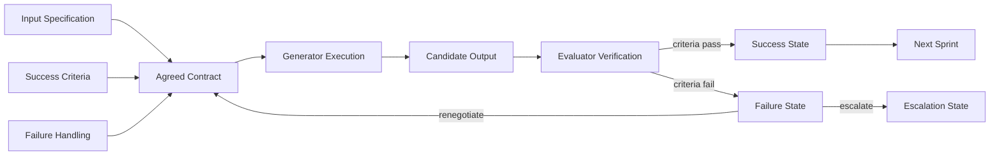
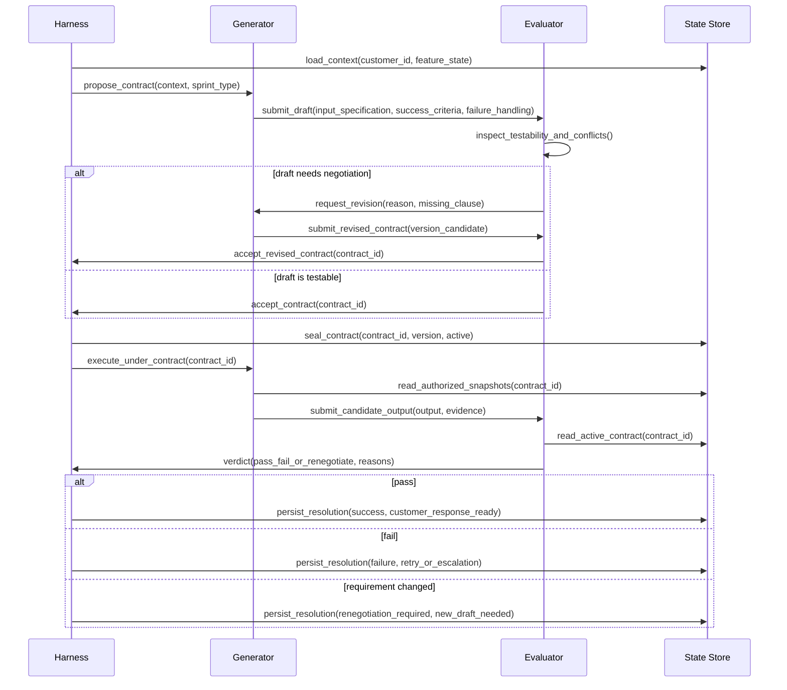
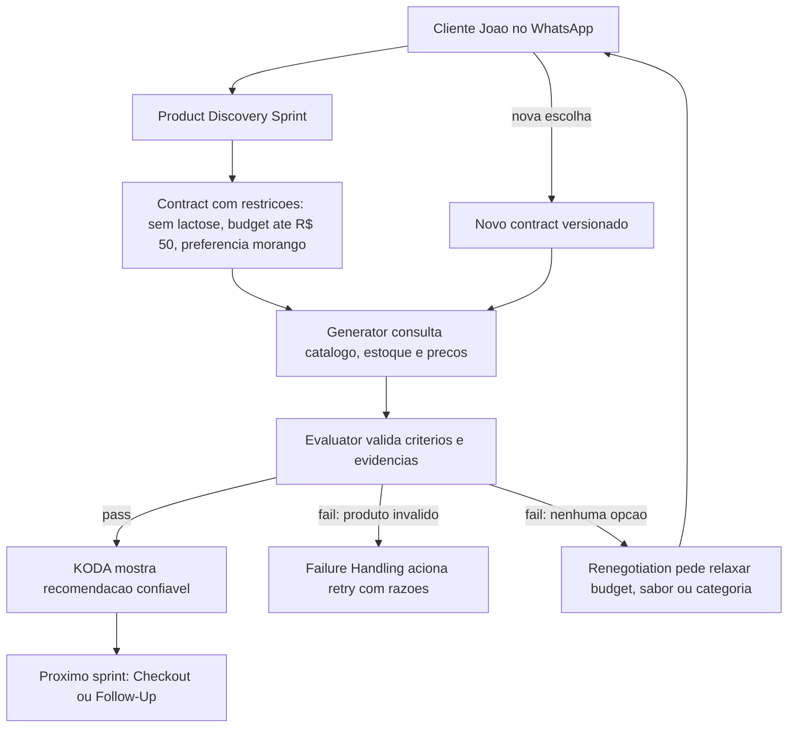

# 🎯 Sprint Contracts Knowledge Graph
## O mapa visual de como acordos testáveis transformam conversas longas do KODA em execução confiável

**Tempo Estimado:** 120 a 150 minutos
**Nível:** 6 - Knowledge Graphs e Síntese Arquitetural
**Pré-requisitos:** Nível 1 completo, Generator/Evaluator, Rubric Design, Trace Reading e leitura de `curriculum/05-core-concepts/04-sprint-contracts.md`
**Status:** 🟢 COMPLETO - Grafo detalhado de Sprint Contracts para arquitetura KODA
**Data de Criação:** Maio 2026

---

## 📖 Prólogo: O Mapa Que Transformou Promessa em Sistema

Fernando não abriu o trace procurando uma resposta bonita.

Ele abriu o trace procurando uma promessa quebrada.

KODA tinha conversado com João durante tempo suficiente para parecer humano, atento e cuidadoso.

João queria voltar a treinar.

João tinha lactose intolerance.

João tinha um limite de budget.

João preferia sabor morango.

João também estava disposto a ouvir alternativas se a recomendação fizesse sentido.

Nenhuma dessas informações era difícil isoladamente.

O problema apareceu quando elas começaram a competir por autoridade dentro da conversa.

A mensagem mais recente falava de BCAA.

A restrição mais importante falava de lactose.

A preferência mais simpática falava de morango.

O limite comercial falava de preço.

O catálogo falava de estoque.

O Evaluator falava de qualidade.

O Generator falava de fluidez.

E o harness precisava decidir o que governava o sprint atual.

Foi nesse ponto que Fernando percebeu que Sprint Contracts não eram apenas mais um padrão do Nível 2.

Eles eram o ponto onde intenção, estado, avaliação e coordenação viravam uma mesma peça de arquitetura.

Sem Sprint Contract, KODA tinha boas partes.

Com Sprint Contract, KODA tinha acordo.

A diferença parece pequena até você acompanhar uma conversa de duas horas.

Em uma conversa curta, o modelo pode sobreviver com contexto imediato.

Em uma conversa longa, o modelo precisa saber quais frases viraram compromisso.

Em uma feature simples, um prompt pode bastar.

Em Product Discovery, Checkout e Multi-Agent Coordination, prompt solto vira risco operacional.

Este grafo detalhado existe para mostrar essa diferença visualmente.

Ele não repete o módulo conceitual.

Ele reorganiza o conceito como mapa.

Você verá nós.

Verá arestas.

Verá ciclos.

Verá onde Generator/Evaluator fica mais forte.

Verá onde Rubric Design encaixa.

Verá onde Trace Reading ganha evidência.

Verá onde Harness Patterns deixam de ser apenas moldura e viram controle de fluxo.

E verá por que KODA precisa tratar cada unidade crítica de trabalho como uma promessa versionada.

A frase central deste módulo é simples:

> Sprint Contracts são a interface arquitetural entre intenção vaga e execução verificável.

Se essa frase fizer sentido apenas como definição, leia devagar.

Se fizer sentido como diagrama, você está começando a pensar como architect de long-running agents.

---

## 🧭 Como Ler Este Grafo

Este arquivo é um mapa de navegação, não uma apostila linear comum.

Leia em três passadas.

Na primeira passada, acompanhe os diagramas.

Eles mostram a forma do sistema antes dos detalhes.

Na segunda passada, leia as tabelas e o walkthrough KODA.

Eles mostram onde o conceito vira decisão de produto e engenharia.

Na terceira passada, use o atlas de nós e caminhos.

Ele serve para revisão, mentoria, design review e investigação de incidentes.

### Rota Recomendada

1. Comece pelo objetivo do módulo.
2. Leia o Diagrama 1 para entender a estrutura mínima de um Sprint Contract.
3. Leia o diagrama ASCII para localizar componentes arquiteturais.
4. Leia o Diagrama 2 para entender o lifecycle de validação.
5. Leia a tabela comparativa para decidir quando usar cada estratégia.
6. Leia a aplicação KODA para ver Product Discovery, Checkout e Multi-Agent Coordination.
7. Use o atlas como ferramenta de diagnóstico.
8. Termine em "O Que Voce Aprendeu" e responda às perguntas de verificação.

### Convenções Visuais

- **Nó** representa conceito, componente, artefato, estado ou decisão.
- **Aresta** representa dependência, fluxo, verificação, bloqueio ou renegotiation.
- **Contrato ativo** representa uma promessa que já governa execução.
- **Draft** representa proposta criticável, mas ainda não vinculante.
- **Verdict** representa decisão do Evaluator contra critérios explícitos.
- **Failure path** representa falha tratada como estado, não como improviso.

---

## 🎯 Objetivos Deste Módulo

Ao final deste grafo, você deve conseguir:

- Explicar Sprint Contracts como sistema de coordenação, não como prompt longo.
- Desenhar os três pilares: Input Specification, Success Criteria e Failure Handling.
- Mostrar como proposal, negotiation, seal, execution, verification e resolution se encadeiam.
- Localizar Contract Schema, Validator, State Store e Audit Log na arquitetura.
- Comparar Sprint Contracts com Generator/Evaluator, Rubric Design, Trace Reading, Harness Patterns e ad-hoc prompts.
- Aplicar contratos a Product Discovery, Checkout e Multi-Agent Coordination no KODA.
- Conectar Sprint Contracts aos Níveis 1, 2 e 3 do currículo.
- Diagnosticar incidentes perguntando qual cláusula do contract falhou.

---

## 🗺️ Roadmap Visual do Módulo

```text
ENTRADA: voce entende Generator/Evaluator e ja viu por que agentes longos perdem foco
  │
  ├─ SECOES 1-3: Fundacao visual
  │   └─ Forma minima, arquitetura de componentes, lifecycle de validacao
  │
  ├─ SECOES 4-5: Estrategia e modelo mental
  │   └─ Modelo mental de grafo, tabela comparativa de coordenacao
  │
  ├─ SECAO 6: Aplicacao KODA
  │   └─ Product Discovery, Checkout, Multi-Agent Coordination
  │
  ├─ SECAO 7: Conexoes curriculares
  │   └─ Nivel 1, Nivel 2, Nivel 3 e conceitos transversais
  │
  ├─ SECOES 8-9: Diagnostico
  │   └─ Anti-padroes, metrica e observabilidade
  │
  ├─ SECOES 10-11: Navegacao
  │   └─ Atlas de 27 nos, 8 caminhos de leitura
  │
  ├─ SECOES 12-17: Aplicacao avancada
  │   └─ Padroes de falha, evolucao, playbooks, trace reading, padroes de escrita, mapa de decisao
  │
  └─ SAIDA: voce consegue usar Sprint Contracts como mapa operacional de confianca
```

---

## 🧩 Seção 1: Forma Mínima de um Sprint Contract

Um Sprint Contract começa com três perguntas.

A primeira pergunta é: quais inputs governam este sprint?

A segunda pergunta é: o que conta como sucesso verificável?

A terceira pergunta é: o que acontece quando sucesso não é possível?

Essas perguntas formam a estrutura mínima.

Elas parecem simples porque bons acordos parecem simples depois de prontos.

A complexidade está em retirar ambiguidade antes da execução.

Para KODA, isso muda o modo de operar.

O Product Discovery deixa de ser "responder ao cliente com uma recomendação boa".

Ele vira "recomendar produtos que respeitam restrições, orçamento, estoque, objetivo e explicação visível".

O Checkout deixa de ser "fechar pedido".

Ele vira "montar pedido com preço, estoque, cupom, pagamento, endereço e confirmação auditáveis".

A Multi-Agent Coordination deixa de ser "vários agentes ajudam".

Ela vira "cada handoff tem input autorizado, output esperado e failure path conhecido".

### Diagrama 1: Estrutura de Sprint Contract



### Como Ler o Diagrama 1

O lado esquerdo mostra a negociação do significado de pronto.

O centro mostra o contract aceito como ponto de convergência.

O lado direito mostra execução, verificação e resolução.

A seta de Failure State para Agreed Contract é deliberada.

Ela mostra que falha não é apenas retry.

Falha pode significar que o contract precisa mudar.

Isso protege KODA contra o erro de insistir em uma promessa que o mundo já invalidou.

### Os Três Pilares Como Nós de Grafo

| Pilar | Pergunta | Saída | Risco se faltar |
|---|---|---|---|
| Input Specification | Quais dados entram e com qual autoridade? | Fontes, precedência, limites e freshness | O Generator usa contexto errado ou antigo |
| Success Criteria | O que precisa ser verdadeiro no final? | Critérios testáveis, thresholds e evidência | O Evaluator aprova por sensação |
| Failure Handling | O que fazer quando o contract não fecha? | Retry, renegotiation, customer question ou escalation | A falha vira improviso conversacional |

---

## 🏛️ Seção 2: Arquitetura de Componentes de Sprint Contracts

Sprint Contracts não vivem apenas em texto.

Eles precisam de componentes que deem forma, validação, persistência e rastreabilidade.

A arquitetura abaixo é original deste grafo.

Ela mostra como o contract passa pelo harness, orienta Generator e Evaluator, e deixa evidência no State Store e no Audit Log.

### Diagrama ASCII: Arquitetura de Componentes

```text
┌──────────────────────────────────────────────────────────────────────────────────────┐
│                  SPRINT CONTRACT COMPONENT ARCHITECTURE PARA KODA                    │
│             acordo testável entre intenção, execução, avaliação e estado             │
└──────────────────────────────────────────────────────────────────────────────────────┘

                         customer event / feature trigger
                                      │
                                      ▼
┌──────────────────────────────────────────────────────────────────────────────────────┐
│                                      HARNESS                                         │
│  roteia feature, seleciona template, controla token budget, decide próximos estados  │
└───────────────┬───────────────────────────────┬──────────────────────────────┬──────┘
                │                               │                              │
                │ proposes draft                │ reads/writes                 │ records events
                ▼                               ▼                              ▼
┌──────────────────────────┐        ┌──────────────────────────┐       ┌──────────────────────────┐
│ CONTRACT SCHEMA           │        │ STATE STORE              │       │ AUDIT LOG                │
│ ────────────────────────  │        │ ──────────────────────── │       │ ──────────────────────── │
│ identity                  │        │ contract_id              │       │ proposal_created         │
│ version                   │        │ active_version           │       │ negotiation_question     │
│ feature                   │        │ lifecycle_state          │       │ contract_sealed          │
│ input_specification       │        │ customer commitments     │       │ generator_submission     │
│ success_criteria          │        │ evidence pointers        │       │ evaluator_verdict        │
│ failure_handling          │        │ retry counters           │       │ resolution_decision      │
│ operational_limits        │        │ renegotiation history    │       │ customer_visible_output  │
└──────────────┬───────────┘        └──────────────┬───────────┘       └──────────────┬───────────┘
               │                                   │                                  │
               │ validates structure               │ supplies active contract         │ supports trace reading
               ▼                                   ▼                                  │
┌──────────────────────────┐        ┌─────────────────────────────────────────────────┘
│ VALIDATOR                │        │
│ ──────────────────────── │        │
│ required fields          │        │
│ type checks              │        │
│ state transitions        │        │
│ evidence requirements    │        │
│ invariant checks         │        │
└──────────────┬───────────┘        │
               │ contract accepted  │
               ▼                    │
┌──────────────────────────────────────────────────────────────────────────────────────┐
│                               ACTIVE CONTRACT                                       │
│         fonte de verdade para o sprint atual: escopo, critérios e falhas             │
└───────────────┬──────────────────────────────────────────────┬──────────────────────┘
                │                                              │
                │ execute within boundaries                    │ verify against clauses
                ▼                                              ▼
┌──────────────────────────┐                         ┌──────────────────────────┐
│ GENERATOR                │                         │ EVALUATOR                │
│ ──────────────────────── │                         │ ──────────────────────── │
│ consulta fontes          │                         │ compara output           │
│ monta candidate output   │                         │ checa critérios          │
│ anexa evidência          │                         │ aponta razões            │
│ respeita limites         │                         │ retorna verdict          │
└──────────────┬───────────┘                         └──────────────┬───────────┘
               │ candidate_output + evidence                        │ verdict + reasons
               └──────────────────────────────┬─────────────────────┘
                                              ▼
┌──────────────────────────────────────────────────────────────────────────────────────┐
│                                  RESOLUTION                                          │
│     success: responder ao cliente | fail: retry | changed requirement: renegotiate   │
└──────────────────────────────────────────────────────────────────────────────────────┘
```

### Leituras Arquiteturais do Diagrama ASCII

O Harness é o coordenador, não o juiz final de qualidade.

O Contract Schema define a forma do acordo.

O Validator protege estrutura e invariantes.

O State Store torna o contract durável entre turns, compaction e restarts.

O Audit Log transforma decisões em evidência.

O Generator executa dentro de limites explícitos.

O Evaluator verifica contra cláusulas, não contra preferência solta.

A Resolution decide se KODA responde, tenta de novo, renegocia ou escala.

---

## 🔄 Seção 3: Fluxo de Validação de Contrato

O lifecycle de Sprint Contracts é um ciclo de coordenação.

Ele começa quando o Harness percebe que uma feature merece uma unidade de trabalho formal.

Ele termina quando o resultado vira resposta ao cliente, próximo sprint ou falha tratada.

O ponto crítico é que validação começa antes do output existir.

O Evaluator não espera o Generator terminar para descobrir que o critério era ambíguo.

Ele critica o contract enquanto ainda é barato corrigir.

### Diagrama 2: Fluxo de Validacao de Contrato



### Estados do Lifecycle

| Estado | Dono Primário | Pergunta Governante | Saída |
|---|---|---|---|
| Proposal | Harness ou Generator | Qual acordo inicial representa a intenção? | Draft criticável |
| Negotiation | Evaluator e Generator | O draft é testável, seguro e não contraditório? | Versão revisada |
| Seal | Harness | Todos aceitam esta versão como ativa? | Contract versionado |
| Execution | Generator | O trabalho respeita limites e fontes autorizadas? | Candidate output com evidência |
| Verification | Evaluator | O output cumpre cláusulas e critérios? | Verdict com razões |
| Resolution | Harness | Qual próximo estado protege cliente e sistema? | Success, retry, renegotiation ou escalation |

---

## 🧠 Seção 4: Modelo Mental de Grafo

Sprint Contracts são mais fáceis de aplicar quando você pensa em grafos.

Cada contract é um subgrafo temporário.

Ele nasce quando uma intenção de feature encontra risco suficiente para merecer acordo.

Ele conecta dados, regras, agentes, critérios e failure paths.

Ele morre quando o sprint termina ou é substituído por uma nova versão.

### O Contract Como Subgrafo

```text
customer_intent
  ├─ declared_need
  ├─ constraints
  ├─ preferences
  └─ allowed_tradeoffs
        │
        ▼
input_specification ──► active_contract ◄── success_criteria
        │                       │                    │
        │                       ▼                    │
        │                generator_plan              │
        │                       │                    │
        ▼                       ▼                    ▼
authorized_sources ──► candidate_output ──► evaluator_verdict
                                │                    │
                                ▼                    ▼
                          audit_events ──► resolution_state
```

### Por Que a Perspectiva de Grafo Ajuda

Ela mostra dependências antes que virem bugs.

Ela revela nós sem dono.

Ela mostra critérios que não têm evidência.

Ela mostra inputs que não têm precedência.

Ela mostra failure paths que não levam a estado algum.

Ela mostra quando um contract está tentando resolver mais de um sprint.

Ela também mostra quando o contract ficou pesado demais para a tarefa.

---

## 📊 Seção 5: Estratégias de Coordenação: Tabela Comparativa

Sprint Contracts são uma estratégia de coordenação, não a única.

A pergunta correta não é "contracts ou nada".

A pergunta correta é "qual estratégia protege este tipo de risco com menor custo aceitável?".

| Estrategia | Quando Usar | Ponto Forte | Ponto Fraco | Custo (tokens) | Complexidade | Previsibilidade |
|---|---|---|---|---|---|---|
| Sprint Contracts | Quando há unidade de trabalho com risco, múltiplos critérios, mudança de requisito ou handoff entre agentes | Define acordo antes da execução e reduz ambiguidade cedo | Exige disciplina de schema, versioning e resolution | Médio no desenho; baixo em retrabalho | Média | Alta |
| Generator/Evaluator | Quando um output precisa de julgamento independente após ser produzido | Separa criação de julgamento e reduz autoaprovação | Pode avaliar tarde demais se os critérios eram vagos desde o início | Médio | Média | Média alta |
| Rubric Design | Quando a equipe precisa de critérios reutilizáveis para qualidade, segurança ou tom | Cria linguagem comum para avaliação | Pode ser ampla demais para capturar contexto específico do sprint | Baixo a médio | Baixa a média | Média |
| Trace Reading | Quando uma falha já ocorreu e a equipe precisa reconstruir a causa | Revela sequência real de decisões e evidências | É reativo; sozinho não impede a próxima falha | Médio a alto | Média | Média |
| Harness Patterns | Quando o sistema precisa controlar tool use, contexto, checkpoints, budget e estado | Dá estrutura externa estável ao agente | Sem contract, pode controlar fluxo sem saber a promessa exata | Médio | Alta | Média alta |
| Ad-hoc prompts | Quando a tarefa é exploratória, reversível e sem risco operacional | Começa rápido e permite aprendizado inicial | Ambíguo, frágil em conversas longas e difícil de auditar | Baixo no começo; alto se virar produção | Baixa | Baixa |

### Leitura da Tabela

Use ad-hoc prompts para descoberta barata.

Use Rubric Design para criar critérios reutilizáveis.

Use Generator/Evaluator para separar produção e julgamento.

Use Harness Patterns para controlar o ambiente.

Use Trace Reading para aprender com a execução real.

Use Sprint Contracts quando o custo de ambiguidade for maior que o custo de formalizar.

Em KODA, esse ponto chega cedo porque conversas misturam saúde, dinheiro, estoque e confiança.

---

## 💼 Seção 6: Aplicacao KODA — Feature Contract

A aplicação principal deste grafo é Product Discovery.

Product Discovery é o momento em que KODA descobre necessidade, restrição, preferência, orçamento e abertura para tradeoffs.

É também o momento em que uma recomendação errada parece pequena para a arquitetura, mas grande para o cliente.

Se João diz que tem lactose intolerance, isso não é detalhe.

Se João diz que não pode passar de R$ 50, isso não é decoração.

Se João aceita mudar sabor, isso é preferência negociável.

Sprint Contract separa essas classes.

### Diagrama 3: Aplicacao KODA — Feature Contract



### Walkthrough de Product Discovery com Sprint Contracts

1. João chega pelo WhatsApp e pede ajuda para voltar a treinar.
2. O Harness classifica a intenção como Product Discovery.
3. O State Store recupera preferências e restrições persistidas.
4. A mensagem atual declara lactose intolerance, budget de R$ 50 e preferência por morango.
5. O Harness propõe um contract de recomendação.
6. O Generator revisa se consegue executar com as fontes autorizadas.
7. O Evaluator critica se os critérios são testáveis.
8. A equipe define que lactose é restrição obrigatória.
9. A equipe define que budget não pode ser relaxado sem confirmação de João.
10. A equipe define que morango é preferência, não blocker.
11. O Contract Schema valida campos e estados.
12. O State Store registra a versão ativa.
13. O Audit Log registra a origem dos critérios.
14. O Generator consulta catálogo, estoque e preço.
15. O Generator monta candidate output com evidência por produto.
16. O Evaluator verifica cada recomendação contra o contract.
17. Se passar, KODA responde com confiança.
18. Se falhar, KODA não improvisa.
19. Se a restrição torna a recomendação impossível, KODA renegocia com João.
20. Se João decide comprar, Checkout recebe um novo contract.

### Contract Sketch Para Product Discovery

```yaml
contract_family: koda.product_discovery
customer_journey_stage: consideration
input_specification:
  current_intent: recomendar suplemento para retorno aos treinos
  mandatory_constraints:
    - lactose_intolerance
    - product_price_lte_50_brl
    - in_stock_now
  negotiable_preferences:
    - flavor_morango
  authorized_sources:
    - latest_customer_message
    - customer_profile_state
    - catalog_snapshot
    - inventory_snapshot
    - pricing_snapshot
success_criteria:
  minimum_valid_options: 1
  target_valid_options: 3
  each_option_must_have:
    - product_id
    - current_price
    - stock_evidence
    - lactose_free_evidence
    - customer_reason
failure_handling:
  no_valid_option: ask_customer_to_choose_constraint_to_relax
  evaluator_rejects: retry_with_specific_reasons
  customer_changes_category: create_new_contract_version
```

### Como o Contract Escala Para Checkout

Checkout muda o tipo de risco.

Product Discovery lida com recomendação.

Checkout lida com compromisso transacional.

O contract de Checkout precisa proteger preço final, estoque reservado, endereço, forma de pagamento, cupom, idempotency e confirmação visível.

O Generator de Checkout não deve inventar disponibilidade.

O Evaluator de Checkout não deve aprovar pedido sem evidência de reserva.

O Harness de Checkout não deve avançar para pagamento se o contract ainda está em draft.

O Failure Handling de Checkout precisa diferenciar falha recuperável de falha que exige humano.

#### Grafo de Escala Para Checkout

```text
product_discovery_success
  │
  ▼
checkout_contract
  ├─ input: selected_product, price_snapshot, stock_reservation, delivery_address
  ├─ criteria: total matches, stock reserved, payment authorized, message confirms terms
  ├─ failure: price_changed, out_of_stock, payment_failed, address_invalid
  └─ next: order_confirmation or safe_recovery
```

### Como o Contract Escala Para Multi-Agent Coordination

Multi-Agent Coordination aumenta o número de fronteiras.

Em vez de um Generator e um Evaluator, KODA pode ter Product Agent, Catalog Agent, Pricing Agent, Order Agent, Payment Agent e Fulfillment Agent.

Cada fronteira precisa responder a três perguntas.

O que este agente recebe?

O que este agente entrega?

Como outro componente verifica a entrega?

Sprint Contracts evitam que cada agente interprete a mesma conversa de forma diferente.

Eles transformam handoffs em acordos.

#### Exemplo de Cadeia Multi-Agent

```text
Product Agent
  └─ contract: opções válidas e justificadas
       ▼
Pricing Agent
  └─ contract: preço atual, desconto permitido e margem preservada
       ▼
Order Agent
  └─ contract: carrinho coerente com item, preço e quantidade
       ▼
Payment Agent
  └─ contract: autorização idempotente e registrada
       ▼
Fulfillment Agent
  └─ contract: estoque reservado, rota definida e ETA seguro
```

### Features Reais do KODA Tocadas Pelo Contract

| Feature KODA | Papel do Contract | Erro Evitado |
|---|---|---|
| Product Discovery | Define restrições e sucesso de recomendação | Produto incompatível, caro ou fora de estoque |
| Catalog Agent | Define fontes e snapshots autorizados | Consulta misturada entre catálogo antigo e novo |
| Generator Agent | Define limites de geração e evidência exigida | Resposta fluente sem prova |
| Evaluator Agent | Define cláusulas de avaliação | Aprovação por gosto subjetivo |
| Safety Guard | Define restrições que bloqueiam output | Ignorar alergia, intolerância ou risco |
| Checkout Completo | Define compromisso transacional | Cobrança ou pedido incoerente |
| Payment Agent | Define idempotency e confirmação | Pagamento duplicado ou sem registro |
| Fulfillment Agent | Define promessa logística | Prometer entrega sem reserva |
| Journey State Machine | Define quando avançar de etapa | Pular de discovery para checkout cedo demais |
| Decision Merger | Define prioridade entre contratos | Upsell vencendo restrição de segurança |

---

## 🔗 Seção 7: Conexoes com o Curriculo

Sprint Contracts ficam no Nível 2, mas dependem de aprendizados do Nível 1 e preparam decisões do Nível 3.

Esta seção mostra as conexões exigidas para leitura sistêmica.

### Nivel 1: Token Budgeting

Token Budgeting ensina que cada sprint tem custo.

Sprint Contracts reduzem custo ao limitar fontes, perguntas, retries e evidência necessária.

O contract responde: o que precisa entrar no prompt agora?

Ele também responde: o que pode ficar no State Store?

Sem essa separação, KODA carrega histórico demais e ainda assim perde compromisso.

### Nivel 1: Context Management

Context Management organiza a memória imediata.

Sprint Contracts dizem qual contexto tem autoridade para o sprint atual.

Mensagem atual pode superar preferência antiga.

Restrição de segurança pode superar sabor.

Snapshot de preço pode superar lembrança textual.

Isso evita que KODA trate todo texto como igualmente verdadeiro.

### Nivel 1: Harness Patterns

Harness Patterns dão estrutura externa ao modelo.

Sprint Contracts são uma das estruturas que o harness aplica.

O harness propõe contract.

O harness sela contract.

O harness envia contract ao Generator.

O harness envia contract ao Evaluator.

O harness bloqueia avanço se o verdict falha.

### Nivel 2: Generator/Evaluator

Generator/Evaluator separa criação de julgamento.

Sprint Contracts adicionam acordo antes da criação.

O Generator deixa de tentar adivinhar o alvo.

O Evaluator deixa de inventar critério depois.

Ambos passam a operar contra o mesmo artefato.

### Nivel 2: Rubric Design

Rubric Design cria linguagem de avaliação.

Sprint Contract escolhe quais partes da rubrica governam este sprint.

Uma rubrica pode avaliar tom, precisão, segurança e adequação.

O contract de João diz que lactose, budget e estoque são blockers agora.

Rubric é repertório.

Contract é compromisso situado.

### Nivel 2: Trace Reading

Trace Reading reconstrói falhas.

Sprint Contracts tornam o trace mais legível.

Em vez de ler apenas mensagens, a equipe lê draft, seal, state transition, candidate output, verdict e resolution.

A pergunta deixa de ser "por que o modelo disse isso?".

A pergunta vira "qual cláusula permitiu ou bloqueou isso?".

### Nivel 2: `sprint-contracts.md`

O módulo `curriculum/05-core-concepts/04-sprint-contracts.md` explica o conceito profundo.

Este grafo reorganiza o mesmo domínio como mapa visual e ferramenta de revisão.

O módulo prático `curriculum/02-nivel-2-practical-patterns/02-sprint-contracts.md` mostra aplicação operacional.

Leia os três em conjunto quando estiver desenhando uma feature crítica.

### Nivel 3: Multi-Agent Coordination

Multi-Agent Coordination amplia o problema.

Quando vários agentes trabalham, cada handoff precisa de contrato.

Sem contract, o Product Agent acha uma coisa, o Pricing Agent assume outra, e o Fulfillment Agent promete uma terceira.

Com contract, cada agente sabe input, output, critério e failure path.

### Nivel 3: State Persistence

State Persistence torna o contract durável.

Um contract ativo precisa sobreviver a turnos, retries, compaction e reinício.

Se o contract vive apenas no prompt, ele não é fonte confiável de verdade.

Se vive no State Store, ele pode governar execução por horas.

### Nivel 3: Harness Evolution

Harness Evolution decide quando fortalecer, simplificar ou remover proteções.

Sprint Contracts geram métricas para essa evolução.

Quais critérios falham mais?

Quais contracts geram retries demais?

Quais failure paths viram escalação humana?

Quais versões reduziram ambiguidade?

Essas perguntas transformam contracts em instrumento de aprendizado.

### Concepts Transversais

| Concept | Relação com Sprint Contracts | Pergunta de Diagnóstico |
|---|---|---|
| context-management | Define quais informações permanecem úteis e com qual autoridade | O contract diferencia contexto disponível de contexto autorizado? |
| planning-execution-separation | Impede agir antes de definir o plano e o acordo | O sprint foi planejado antes da primeira ação externa? |
| generator-evaluator | Separa quem produz de quem verifica | Ambos compartilham o mesmo contract ativo? |
| evaluation-rubrics | Dá vocabulário para critérios de qualidade | A rubric foi situada em critérios específicos do sprint? |

---

## 🧪 Seção 8: Anti-Padroes que o Grafo Revela

### Anti-Padrao 1: Contract Como Prompt Comprido

Um prompt comprido ainda pode ser ambíguo.

Contract precisa ter estado, versão, critérios e failure handling.

Se não governa decisão, é apenas texto.

### Anti-Padrao 2: Evaluator Sem Contract

Evaluator sem contract avalia com critérios implícitos.

Isso pode parecer inteligente em exemplos simples.

Em produção, vira subjetividade difícil de debugar.

### Anti-Padrao 3: Retry Sem Razão

Retry sem razão específica aumenta custo e repete erro.

Contract exige que fail venha com cláusula violada.

A razão orienta próxima ação.

### Anti-Padrao 4: Renegotiation Invisível

Quando o cliente muda requisito, o sistema precisa registrar nova versão.

Se o contract muda silenciosamente, trace e métricas perdem sentido.

### Anti-Padrao 5: Contract Para Tudo

Nem toda tarefa merece formalização.

Usar contract em exploração sem risco pode deixar KODA lento.

Arquitetura madura escolhe onde formalizar.

---

## 📈 Seção 9: Metrica, Observabilidade e Evolucao

Sprint Contracts criam métricas porque transformam promessa em artefato.

Sem contract, a equipe mede conversa inteira.

Com contract, mede cada unidade de trabalho.

### Métricas Recomendadas

| Métrica | O Que Mede | Uso Arquitetural |
|---|---|---|
| contract_creation_rate | Quantos sprints críticos recebem contract | Detectar features sem acordo formal |
| negotiation_revision_count | Quantas revisões antes do seal | Detectar critérios vagos ou templates ruins |
| evaluator_fail_rate | Percentual de outputs reprovados | Calibrar Generator, criteria e rubrics |
| renegotiation_rate | Quantas mudanças de requisito exigem nova versão | Entender volatilidade de Product Discovery |
| retry_success_rate | Quantos retries passam após razões específicas | Medir utilidade do feedback do Evaluator |
| escalation_rate | Quantas falhas chegam a humano | Identificar risco não resolvido pelo harness |
| audit_completeness | Eventos esperados presentes no log | Garantir trace reading confiável |
| customer_visible_correction_rate | Correções percebidas pelo cliente | Medir dano de falhas que escaparam |

### Ciclo de Evolucao

```text
medir contract ──► identificar cláusula fraca ──► ajustar schema ou rubric
       ▲                                                        │
       │                                                        ▼
validar em produção ◄── versionar mudança ◄── testar trace e failure path
```

---

## 🧭 Seção 10: Atlas de Nos do Sprint Contract

Use este atlas como uma lente de leitura, não como uma lista decorativa de termos.

Cada cartão abaixo descreve um ponto específico do grafo de Sprint Contracts.

A ordem segue a vida real do KODA: primeiro o sistema entende o que está em jogo, depois negocia o acordo, executa, verifica, resolve e aprende.

Os cartões são diferentes entre si porque cada nó falha de um jeito diferente.

Se dois cartões parecem resolver o mesmo problema, volte ao trace e pergunte qual decisão cada um governa.

### Cartao 001: Input Specification

**Papel:** Define o conjunto exato de dados que pode governar o sprint atual, separando mensagem recente, memória persistida, catálogo, preço e estoque.

**Aresta principal:** Liga `latest_customer_message` a `authorized_sources`; no caso de João, a frase atual sobre lactose tem mais autoridade que uma compra antiga de whey comum.

**Conexao curricular:** Conecta diretamente a Context Management porque transforma contexto bruto em contexto permitido.

**Sinal no KODA:** O Product Discovery recebe snapshot de catálogo e não consulta uma lista antiga guardada no prompt.

**Risco se ignorar:** KODA mistura preferência histórica com restrição atual e recomenda produto incompatível.

**Leitura de trace:** Procure o evento em que o harness declara fontes aceitas antes de chamar o Generator.

### Cartao 002: Success Criteria

**Papel:** Converte a ideia de "recomendação boa" em critérios que podem reprovar uma resposta, como preço, estoque, restrição alimentar e justificativa.

**Aresta principal:** Liga `active_contract` a `evaluator_verdict`; o Evaluator não inventa critérios depois que o output chega.

**Conexao curricular:** Depende de Evaluation Rubrics, mas seleciona apenas os critérios relevantes para este sprint específico.

**Sinal no KODA:** A recomendação para João só passa se cada produto tiver evidência de lactose-free, preço dentro do budget e motivo conectado ao objetivo.

**Risco se ignorar:** Uma resposta educada e persuasiva passa mesmo violando uma condição crítica.

**Leitura de trace:** Verifique se cada critério possui pelo menos uma evidência no candidate output.

### Cartao 003: Failure Handling

**Papel:** Define antecipadamente o que KODA faz quando não consegue cumprir o acordo sem quebrar confiança.

**Aresta principal:** Liga `evaluator_fail` a `next_action`; uma falha vira retry, renegotiation ou escalation, não improviso.

**Conexao curricular:** Usa Harness Patterns para transformar falha em controle de fluxo.

**Sinal no KODA:** Se não houver produto sem lactose abaixo de R$ 50, KODA pergunta se João prefere relaxar sabor, budget ou categoria.

**Risco se ignorar:** O sistema tenta parecer útil e oferece uma opção fora do contract.

**Leitura de trace:** O verdict deve apontar uma próxima ação explícita, não apenas uma nota negativa.

### Cartao 004: Agreed Contract

**Papel:** Representa o ponto em que draft, críticas e revisões viram fonte de verdade para o sprint.

**Aresta principal:** Liga `seal_contract` a `generator_start`; o Generator só começa quando há versão ativa.

**Conexao curricular:** Reforça Planning/Execution Separation porque execução não começa durante a negociação.

**Sinal no KODA:** O contrato de Product Discovery fica ativo antes da primeira consulta final ao catálogo.

**Risco se ignorar:** O alvo muda durante a execução e ninguém sabe qual critério vale.

**Leitura de trace:** Procure `contract_id`, `version` e `active` antes do candidate output.

### Cartao 005: Generator Execution

**Papel:** Executa a tarefa dentro dos limites do contract, escolhendo produtos, linguagem e ordem sem alterar restrições.

**Aresta principal:** Liga `authorized_sources` a `candidate_output`; a criatividade do Generator só opera sobre dados permitidos.

**Conexao curricular:** Fortalece Generator/Evaluator ao deixar claro que o Generator constrói, mas não aprova.

**Sinal no KODA:** O Generator pode sugerir sabor chocolate como tradeoff, mas precisa explicar que morango era preferência, não obrigação.

**Risco se ignorar:** O Generator resolve o problema errado com uma resposta bem escrita.

**Leitura de trace:** Compare as consultas feitas com a lista de fontes autorizadas.

### Cartao 006: Candidate Output

**Papel:** É o pacote submetido para avaliação, contendo resposta proposta, dados de suporte e evidência por item.

**Aresta principal:** Liga `generator_submission` a `evidence_required`; cada afirmação verificável deve carregar prova.

**Conexao curricular:** Torna Trace Reading mais objetivo porque a equipe lê o output junto das evidências, não só a mensagem final.

**Sinal no KODA:** Cada produto recomendado traz `product_id`, preço, estoque, flag lactose-free e razão ligada ao objetivo do cliente.

**Risco se ignorar:** O Evaluator precisa reconsultar tudo ou aprovar com base em texto persuasivo.

**Leitura de trace:** Um candidate output incompleto deve falhar antes de chegar ao cliente.

### Cartao 007: Evaluator Verification

**Papel:** Compara output e contract, separando falha estrutural, violação de invariant e queda de qualidade.

**Aresta principal:** Liga `candidate_output` a `verdict`; o julgamento é uma decisão registrada com razões específicas.

**Conexao curricular:** Usa Rubric Design para qualidade sem abandonar as cláusulas situadas do contract.

**Sinal no KODA:** O Evaluator rejeita `sku_123` porque custa R$ 59,90 apesar de ter descrição convincente.

**Risco se ignorar:** KODA confunde plausibilidade com conformidade.

**Leitura de trace:** Razões como `over_budget` e `missing_stock_evidence` são mais úteis que "resposta fraca".

### Cartao 008: Proposal

**Papel:** Cria um draft criticável com escopo inicial, fontes prováveis, critérios e caminhos de falha.

**Aresta principal:** Liga `feature_trigger` a `contract_draft`; o harness traduz intenção de Product Discovery em acordo inicial.

**Conexao curricular:** Aplica Planning/Execution Separation porque transforma intenção em plano antes da ação.

**Sinal no KODA:** Ao detectar "quero suplemento sem lactose até R$ 50", o harness escolhe template de discovery e preenche slots.

**Risco se ignorar:** A primeira resposta já vira execução sem ninguém discutir o significado de sucesso.

**Leitura de trace:** Um draft bom contém lacunas visíveis para crítica, não apenas instruções genéricas.

### Cartao 009: Critique e Negotiation

**Papel:** Testa se o contract pode ser avaliado, se há conflito entre critérios e se falta fonte para alguma promessa.

**Aresta principal:** Liga `draft_contract` a `revision_request`; a crítica muda o contract antes de mudar o output.

**Conexao curricular:** Expande Generator/Evaluator para antes da execução, usando o Evaluator como crítico de acordo.

**Sinal no KODA:** O Evaluator pergunta se budget inclui frete e se sabor morango é obrigatório ou negociável.

**Risco se ignorar:** A ambiguidade aparece tarde, depois que João já recebeu uma recomendação confusa.

**Leitura de trace:** Toda pergunta de negotiation deve virar revisão ou decisão explícita.

### Cartao 010: Revision

**Papel:** Atualiza o artefato ativo quando a negociação resolve uma ambiguidade concreta.

**Aresta principal:** Liga `negotiation_answer` a `contract_version_candidate`; uma decisão verbal só conta se entrar no contract.

**Conexao curricular:** Ajuda Trace Reading porque registra por que um critério mudou.

**Sinal no KODA:** Morango passa de `required_condition` para `negotiable_preference` antes da execução.

**Risco se ignorar:** A equipe acha que decidiu algo, mas o Generator continua lendo a versão antiga.

**Leitura de trace:** Compare draft e revised draft para ver a mudança exata.

### Cartao 011: Seal

**Papel:** Marca o momento em que a versão revisada deixa de ser proposta e passa a governar execução.

**Aresta principal:** Liga `contract_version_candidate` a `active_contract`; o State Store grava a versão selada.

**Conexao curricular:** Depende de State Persistence para sobreviver a turnos e compaction.

**Sinal no KODA:** O contrato `product_discovery.001` é selado antes de qualquer resposta visível para João.

**Risco se ignorar:** O sistema executa contra um draft que ainda poderia estar em disputa.

**Leitura de trace:** O evento de seal deve indicar versão, timestamp e componente que aceitou.

### Cartao 012: Contract Schema

**Papel:** Define a forma comum para contracts, incluindo identidade, input, criteria, failure handling, limites e política de auditoria.

**Aresta principal:** Liga `feature_template` a `validator`; o schema permite validar antes de confiar.

**Conexao curricular:** Prepara Harness Evolution porque versões de schema podem ser comparadas e simplificadas.

**Sinal no KODA:** Product Discovery e Checkout usam famílias diferentes, mas compartilham campos como `contract_id`, `version` e `state_policy`.

**Risco se ignorar:** Cada agente cria seu próprio formato e os handoffs ficam frágeis.

**Leitura de trace:** Um contract sem campo obrigatório deve ser rejeitado antes de chegar ao Generator.

### Cartao 013: Validator

**Papel:** Faz checagem mecânica: campos obrigatórios, tipos, estados permitidos, evidência mínima e transições válidas.

**Aresta principal:** Liga `contract_schema` a `execution_allowed`; sem validação estrutural, não há início seguro.

**Conexao curricular:** É um Harness Pattern concreto, diferente do Evaluator semântico.

**Sinal no KODA:** O Validator bloqueia um Checkout Contract sem endereço confirmado ou sem política de cupom.

**Risco se ignorar:** O Evaluator recebe trabalho que deveria ter falhado por formato básico.

**Leitura de trace:** Diferencie `schema_invalid` de `criteria_failed` para não depurar o componente errado.

### Cartao 014: State Store

**Papel:** Guarda contract ativo, versão, estado, counters de retry, compromissos visíveis e histórico de renegotiation.

**Aresta principal:** Liga `seal_contract` a `next_turn_resume`; a promessa continua válida fora da context window.

**Conexao curricular:** É a ponte direta com State Persistence.

**Sinal no KODA:** João volta no dia seguinte e KODA recupera que lactose era restrição obrigatória, não detalhe de conversa antiga.

**Risco se ignorar:** O contract some quando a conversa é compactada ou reiniciada.

**Leitura de trace:** Todo avanço de estado deve ter update persistido, não só mensagem em prompt.

### Cartao 015: Audit Log

**Papel:** Registra o porquê das decisões: proposal, crítica, seal, execução, verdict, resolution e resposta ao cliente.

**Aresta principal:** Liga `verdict_reason` a `postmortem_evidence`; o log torna a falha discutível por fatos.

**Conexao curricular:** Fortalece Trace Reading e reduz discussão subjetiva em incidentes.

**Sinal no KODA:** A equipe consegue explicar que o produto foi rejeitado por estoque, não por erro de linguagem.

**Risco se ignorar:** Debug vira reconstrução manual de conversa longa.

**Leitura de trace:** Um log útil mostra a cláusula violada e o dado que provou a violação.

### Cartao 016: Resolution

**Papel:** Decide o estado final do sprint: responder, repetir, renegociar, escalar ou abrir próximo contract.

**Aresta principal:** Liga `evaluator_verdict` a `customer_visible_action`; nenhum output deve escapar sem resolução.

**Conexao curricular:** Usa Harness Patterns para bloquear avanço quando a decisão não está clara.

**Sinal no KODA:** Depois de aprovação, Product Discovery encerra e Checkout abre novo contract separado.

**Risco se ignorar:** O sistema fica em loop ou avança apesar de falha.

**Leitura de trace:** Procure uma única resolução dominante para cada sprint.

### Cartao 017: Retry

**Papel:** Permite nova execução quando o contract continua válido e a falha foi de cumprimento, não de escopo.

**Aresta principal:** Liga `fail_with_reasons` a `generator_retry`; a repetição recebe razões específicas.

**Conexao curricular:** Conecta Generator/Evaluator com controle de loop do harness.

**Sinal no KODA:** O Generator refaz a resposta retirando produto fora do budget após rejeição do Evaluator.

**Risco se ignorar:** KODA repete a mesma falha com custo maior de tokens.

**Leitura de trace:** Retry sem mudança observável no input do Generator é sinal de loop fraco.

### Cartao 018: Renegotiation

**Papel:** Abre nova versão quando o mundo muda ou quando o contract inicial não representa mais a necessidade do cliente.

**Aresta principal:** Liga `requirement_changed` a `new_contract_version`; mudança de requisito não deve editar o passado.

**Conexao curricular:** É essencial para Multi-Agent Coordination porque cada agente precisa saber qual versão vale.

**Sinal no KODA:** João troca de whey para BCAA e o sistema não tenta reaproveitar critérios de proteína como se nada tivesse mudado.

**Risco se ignorar:** O Evaluator reprova corretamente, mas o harness insiste no contract obsoleto.

**Leitura de trace:** A nova versão deve mencionar o motivo da renegotiation.

### Cartao 019: Escalation

**Papel:** Move o caso para humano ou fallback seguro quando automação não deve continuar sozinha.

**Aresta principal:** Liga `max_retries_exceeded` a `human_review_queue`; limite operacional vira proteção de confiança.

**Conexao curricular:** Relaciona Harness Patterns e Safety Guard em situações de risco.

**Sinal no KODA:** Depois de duas falhas de pagamento com mensagens inconsistentes do gateway, KODA para e chama suporte.

**Risco se ignorar:** O agente insiste em uma ação financeira ou sensível sem certeza suficiente.

**Leitura de trace:** Escalation deve preservar contract, evidência e tentativa anterior para o humano continuar.

### Cartao 020: Precedence Rules

**Papel:** Define o que vence quando dados entram em conflito: mensagem atual, memória, regra comercial, safety ou preferência.

**Aresta principal:** Liga `current_customer_message` a `persisted_preferences` com ordem explícita de autoridade.

**Conexao curricular:** Detalha Context Management além de seleção de tokens.

**Sinal no KODA:** Histórico mostra sabor chocolate, mas João pede morango hoje; a preferência atual vence, salvo restrição de estoque ou segurança.

**Risco se ignorar:** KODA parece não ouvir o cliente porque usa dado antigo com autoridade errada.

**Leitura de trace:** Conflitos de dado devem apontar a regra que decidiu a prioridade.

### Cartao 021: Evidence

**Papel:** É a prova que permite verificar uma afirmação do output sem depender da confiança no texto do modelo.

**Aresta principal:** Liga `catalog_snapshot_id` a `recommendation_claim`; cada claim importante precisa de origem.

**Conexao curricular:** Une Trace Reading e Evaluation Rubrics em avaliação baseada em fatos.

**Sinal no KODA:** A frase "tem em estoque" precisa apontar para snapshot de inventory, não para uma memória da conversa.

**Risco se ignorar:** O Evaluator aprova afirmações sem base e o cliente descobre a falha depois.

**Leitura de trace:** Evidência ausente deve ser tratada como falha, mesmo se a recomendação parecer correta.

### Cartao 022: Version

**Papel:** Identifica qual contract, schema e critérios estavam ativos quando uma decisão foi tomada.

**Aresta principal:** Liga `contract_change` a `metrics_interpretation`; sem versão, métricas antigas e novas se misturam.

**Conexao curricular:** Apoia Harness Evolution porque permite comparar antes e depois.

**Sinal no KODA:** A versão 1.1 muda sabor de obrigatório para negociável e reduz renegotiation desnecessária.

**Risco se ignorar:** A equipe não sabe se uma melhora veio do modelo, do prompt ou do contract.

**Leitura de trace:** Toda decisão auditável deve carregar contract version.

### Cartao 023: Customer Commitment

**Papel:** Representa frases que KODA já disse ao cliente e que passam a ter peso arquitetural.

**Aresta principal:** Liga `customer_visible_response` a `future_contract_constraints`; promessa feita vira restrição para próximos sprints.

**Conexao curricular:** Conecta State Persistence a confiança conversacional.

**Sinal no KODA:** Se KODA prometeu "não vou sugerir produto com lactose", Checkout e Upsell também precisam respeitar isso.

**Risco se ignorar:** KODA contradiz uma promessa recente e perde credibilidade.

**Leitura de trace:** Compromissos visíveis devem aparecer no State Store, não só no histórico textual.

### Cartao 024: Operational Limits

**Papel:** Controla limites práticos do sprint: token budget, número de consultas, retries, perguntas ao cliente e timeouts.

**Aresta principal:** Liga `contract_execution` a `resource_guard`; o contract também protege custo e latência.

**Conexao curricular:** Aplica Token Budgeting como regra de execução, não como conselho genérico.

**Sinal no KODA:** Product Discovery permite no máximo três consultas ao catálogo antes de pedir decisão ou relaxar critério.

**Risco se ignorar:** O agente pesquisa demais, demora para responder e ainda não melhora a decisão.

**Leitura de trace:** Estouro de limite deve gerar resolution, não continuar silenciosamente.

### Cartao 025: Feature Template

**Papel:** Fornece estrutura inicial para uma família de sprints sem fingir que todos os clientes são iguais.

**Aresta principal:** Liga `feature_router` a `proposal`; o template acelera o draft, mas ainda precisa ser criticado.

**Conexao curricular:** Ajuda Harness Evolution porque templates podem ser revisados a partir de falhas reais.

**Sinal no KODA:** Product Discovery, Checkout e Fulfillment têm templates distintos com critérios próprios.

**Risco se ignorar:** O time copia um contract de recomendação para pagamento e deixa lacunas transacionais.

**Leitura de trace:** Um template saudável mostra quais campos vieram preenchidos e quais foram decididos na negociação.

### Cartao 026: Multi-Agent Handoff

**Papel:** Formaliza a passagem de responsabilidade entre agentes especializados sem perder escopo, evidência ou restrições.

**Aresta principal:** Liga `product_discovery_success` a `checkout_contract`; o output aprovado vira input autorizado do próximo agente.

**Conexao curricular:** É o ponto de encontro entre Sprint Contracts e Multi-Agent Coordination.

**Sinal no KODA:** O Checkout Agent recebe produto selecionado, preço aprovado e restrições, mas não reabre recomendação de suplementos.

**Risco se ignorar:** Cada agente reinterpreta a conversa e cria decisões incompatíveis.

**Leitura de trace:** Handoff bom tem contract de saída e contract de entrada com referências cruzadas.

### Cartao 027: Safety Guard

**Papel:** Mantém restrições de risco acima de preferências comerciais, upsell e fluidez de conversa.

**Aresta principal:** Liga `mandatory_constraints` a `decision_merger`; safety tem veto sobre recomendação e checkout.

**Conexao curricular:** Usa Evaluation Rubrics, mas opera como blocker no contract.

**Sinal no KODA:** Uma oferta de combo é bloqueada se qualquer item viola lactose intolerance declarada.

**Risco se ignorar:** Crescimento de receita vence segurança do cliente.

**Leitura de trace:** Quando safety bloqueia, o Audit Log deve registrar a restrição e a feature que tentou avançar.

---

## 🛤️ Seção 11: Caminhos de Leitura do Grafo

Os caminhos abaixo substituem a leitura genérica por trajetórias reais de decisão.

Cada caminho mostra origem, contract, validação, failure path e sinal de trace.

Use-os como exercícios de design review: se você não consegue localizar uma etapa no trace, o grafo está incompleto.

### Caminho 1: Restrição de Lactose

João escreve: "tenho intolerância à lactose, então não quero passar mal".

O Harness marca `lactose_intolerance` como mandatory constraint, não como preferência.

Input Specification autoriza mensagem atual, perfil persistido e snapshot de catálogo com flag nutricional.

Precedence Rules dizem que safety constraint vence sabor, preço promocional e upsell.

O Product Discovery Contract exige `lactose_free_evidence` para cada item recomendado.

O Generator consulta apenas produtos com evidência nutricional suficiente.

Candidate Output inclui product_id e flag de lactose-free por recomendação.

Evaluator Verification reprova qualquer item com evidência ausente, mesmo que o produto pareça adequado.

Safety Guard tem veto final antes da resposta visível.

Resolution permite resposta se todos os itens passam; caso contrário, retry com razão específica.

O Audit Log deve mostrar a cláusula de lactose como blocker aplicado.

Se João comprar depois, Checkout herda o compromisso de não inserir item com lactose no carrinho.

### Caminho 2: Budget de João

João diz que pode gastar até R$ 50 no produto principal.

A Proposal registra `budget_limit_brl: 50` e marca frete como fora do budget salvo regra comercial contrária.

Critique pergunta se o limite inclui cupom, frete ou apenas preço do item.

Revision fixa que o critério vale para preço final do produto antes do frete.

Catalog Agent retorna opções de R$ 44,90, R$ 49,90 e R$ 59,90.

Generator pode usar as duas primeiras, mas não deve mostrar a terceira como recomendação principal.

Evaluator rejeita candidate output se o item de R$ 59,90 aparecer sem renegotiation.

Failure Handling aciona pergunta ao cliente quando nenhuma opção cumpre lactose e budget ao mesmo tempo.

A mensagem segura é: "posso buscar opções acima de R$ 50 ou manter o limite e trocar sabor?".

State Store registra que budget não foi relaxado até João confirmar.

O caminho termina em recomendação aprovada ou em novo contract versionado.

O risco evitado é KODA parecer que ignorou uma restrição financeira explícita.

### Caminho 3: Mudança de Categoria

A conversa começa com whey sem lactose, mas João pergunta depois se BCAA faria mais sentido.

O Harness detecta mudança de categoria e pausa o Product Discovery Contract ativo.

Resolution classifica o evento como `requirement_changed`, não como falha do Generator.

Renegotiation abre nova versão com `category_focus: bcaa_or_alternative`.

Input Specification mantém lactose e budget porque continuam compromissos do cliente.

Success Criteria muda: agora o output precisa comparar adequação de BCAA versus proteína para o objetivo declarado.

Generator não deve reaproveitar ranking de whey como se fosse catálogo equivalente.

Evaluator verifica se a explicação deixa claro quando BCAA não substitui proteína.

Se a mudança exigir pergunta ao cliente, Failure Handling permite uma pergunta curta antes de recomendar.

Audit Log vincula a nova versão ao motivo: mudança de categoria no meio da conversa.

O caminho termina com nova recomendação ou com orientação educativa aprovada.

O risco evitado é carregar critérios obsoletos para uma categoria nova.

### Caminho 4: Checkout com Cupom

João escolhe um produto aprovado e informa que tem cupom de primeira compra.

Product Discovery encerra com success e abre um Checkout Contract separado.

Input Specification de Checkout inclui produto selecionado, quantidade, preço aprovado, cupom informado, endereço e forma de pagamento.

Contract Schema exige `coupon_policy`, `price_snapshot_id` e `stock_reservation_id`.

Validator bloqueia execução se o cupom não tiver fonte de validação.

Generator monta carrinho com subtotal, desconto, frete e total visível.

Evaluator confere se o desconto respeita elegibilidade e não altera margem mínima.

Payment Agent só recebe total depois que o Evaluator aprova carrinho e cupom.

Failure Handling distingue cupom inválido de pagamento recusado.

Se o cupom falha, KODA explica antes de cobrar.

Se pagamento falha, KODA não altera o preço nem tenta novamente sem autorização.

Audit Log registra cupom, cálculo e confirmação mostrada ao cliente.

### Caminho 5: Handoff Multi-Agent

Product Agent aprova recomendação para João e precisa passar responsabilidade ao Checkout Agent.

O handoff inclui contract_id de origem, produto escolhido, restrições mantidas, preço aprovado e evidência.

Checkout Agent não recebe a conversa inteira como autoridade principal.

Ele recebe output aprovado mais customer commitments persistidos.

O novo Checkout Contract declara que não pode substituir produto sem voltar ao cliente.

Pricing Agent valida preço e cupom sem reavaliar adequação nutricional.

Order Agent monta carrinho e grava idempotency key.

Payment Agent autoriza cobrança apenas após approval do carrinho.

Fulfillment Agent recebe pedido pago e contrato logístico próprio.

Decision Merger impede que um upsell entre no carrinho sem novo mini-contract.

Audit Log mostra cada fronteira com input de entrada e output de saída.

O risco evitado é telefone sem fio entre agentes especializados.

### Caminho 6: Falha de Estoque

Generator recomenda um produto que parecia válido no catálogo inicial.

Durante Verification, Evaluator consulta o snapshot de estoque exigido pelo contract.

O item está sem estoque na região de João.

Evaluator retorna `fail:not_in_stock` com product_id e snapshot_id.

Resolution decide entre retry e renegotiation conforme alternativas disponíveis.

Se existem produtos equivalentes em estoque, retry orienta o Generator a substituir o item.

Se não existem produtos equivalentes, Failure Handling pede escolha ao cliente.

A resposta não deve dizer "temos esse produto" nem esconder a indisponibilidade.

State Store registra que aquele SKU não deve reaparecer no mesmo sprint.

Audit Log preserva a evidência de estoque que causou reprovação.

O caminho termina em nova recomendação aprovada ou em espera por decisão do cliente.

O risco evitado é prometer compra que o KODA não consegue cumprir.

### Caminho 7: Retorno no Dia Seguinte

João volta no dia seguinte perguntando: "e aquele produto sem lactose?".

Context Management sozinho poderia trazer trechos antigos de forma incompleta.

State Store recupera customer commitments, contract version e última resolution.

O Harness verifica se o Product Discovery Contract ainda é válido ou se snapshots expiraram.

Se preço e estoque expiraram, Renegotiation técnica atualiza fontes sem apagar restrições do cliente.

Input Specification mantém lactose e budget porque foram compromissos persistidos.

Generator reconsulta catálogo e estoque frescos.

Evaluator compara a nova recomendação contra o contract restaurado.

KODA responde reconhecendo continuidade: "vou manter sem lactose e até R$ 50".

Audit Log registra retomada de sprint, refresh de snapshot e nova verificação.

O risco evitado é tratar retorno como conversa nova e esquecer restrição crítica.

O caminho mostra por que contract precisa viver fora do prompt.

### Caminho 8: Escalação para Humano

Checkout falha duas vezes porque o gateway retorna respostas inconsistentes para o mesmo pagamento.

Retry count no State Store chega ao limite definido em Operational Limits.

Resolution proíbe terceira tentativa automática.

Escalation cria pacote para humano com contract, carrinho, cupom, tentativas, erros e mensagem segura sugerida.

KODA informa João sem expor detalhes internos: "preciso confirmar seu pagamento com suporte antes de seguir".

Payment Agent não tenta nova cobrança sem autorização humana.

Audit Log preserva idempotency key e respostas do gateway.

Support Agent recebe contexto suficiente para continuar sem pedir tudo de novo.

Customer Commitment registra que KODA não confirmou pedido ainda.

O caminho termina em revisão humana, cancelamento seguro ou retomada com novo contract.

O risco evitado é cobrança duplicada ou confirmação falsa de pedido.

Esse caminho diferencia falha técnica recuperável de risco financeiro.

---

## 💼 Seção 12: Checkout Protegido por Sprint Contracts

Este complemento aprofunda a aplicação KODA sem alterar a Seção 6 original.

Checkout merece contract próprio porque muda a natureza da promessa.

No Product Discovery, KODA promete recomendação adequada.

No Checkout, KODA promete transação coerente.

A diferença é grande.

Uma recomendação ruim prejudica confiança.

Um checkout ruim pode cobrar errado, vender produto indisponível ou confirmar endereço incorreto.

Por isso o Checkout Contract deve começar apenas depois de Product Discovery terminar em success.

O input inicial é o produto aprovado, não a conversa inteira reaberta.

O contract declara `selected_product_id`.

Declara quantidade.

Declara preço visto pelo cliente.

Declara cupom informado.

Declara endereço escolhido.

Declara forma de entrega.

Declara forma de pagamento.

Declara se há consentimento para cobrança.

O Validator roda antes de qualquer chamada ao gateway.

Se falta endereço, o sprint não pode cobrar.

Se falta confirmação de quantidade, o sprint não pode reservar estoque definitivo.

Se o cupom não foi validado, o sprint não pode mostrar total final como certo.

O Generator de Checkout monta uma proposta de carrinho.

Essa proposta inclui subtotal, desconto, frete, total, prazo e itens.

Candidate Output não é ainda uma confirmação de pedido.

É uma proposta verificável.

O Evaluator confere se o subtotal bate com o snapshot de preço.

Confere se o desconto é permitido para João.

Confere se o cupom não foi usado antes.

Confere se o estoque foi reservado ou se a mensagem deixa claro que ainda falta confirmação.

Confere se o endereço pertence à área de entrega.

Confere se o texto não promete pagamento concluído antes da autorização.

Se tudo passa, Resolution permite pedir confirmação final.

Depois da confirmação, abre-se uma etapa de pagamento com idempotency key.

O Payment Agent recebe apenas total aprovado, método autorizado e idempotency key.

Ele não recalcula recomendação.

Ele não altera cupom.

Ele não troca produto.

Se o gateway aprova, o State Store registra transação e o Audit Log registra autorização.

Se o gateway recusa, Failure Handling diferencia cartão recusado, timeout e erro inconsistente.

Cartão recusado pode pedir outro método.

Timeout pode consultar status antes de tentar de novo.

Erro inconsistente pode escalar.

A confirmação ao cliente só sai quando contract, pagamento e estado concordam.

Esse fluxo impede três incidentes clássicos.

Primeiro: cobrar valor diferente do mostrado.

Segundo: confirmar produto que não está reservado.

Terceiro: repetir cobrança por retry mal definido.

Um Checkout Contract maduro também protege linguagem.

KODA não deve dizer "pedido confirmado" antes do pagamento.

Não deve dizer "cupom aplicado" antes da validação.

Não deve dizer "entrega hoje" antes de Fulfillment aprovar.

Cada frase visível vira Customer Commitment.

Esses compromissos alimentam o próximo contract.

Quando Checkout passa, Fulfillment recebe pedido pago, endereço e promessa logística permitida.

Quando Checkout falha, o cliente recebe uma explicação curta e segura.

O contract não torna checkout burocrático.

Ele evita que KODA use fluidez conversacional onde precisa de precisão transacional.

### Checklist do Checkout Contract

- Produto selecionado vem de Product Discovery aprovado.
- Preço possui snapshot atual.
- Cupom possui política e evidência de elegibilidade.
- Estoque está reservado ou claramente pendente.
- Endereço está validado para entrega.
- Total final é calculado antes de confirmação.
- Pagamento usa idempotency key.
- Retry tem limite explícito.
- Escalation preserva contexto para humano.
- Confirmação ao cliente só ocorre após resolution de success.

---

## 🤝 Seção 13: Multi-Agent Coordination com Contracts em Cada Fronteira

Multi-Agent Coordination não significa colocar vários agentes para conversar livremente.

No KODA, vários agentes livres podem criar velocidade aparente e inconsistência real.

Sprint Contracts transformam cada fronteira em passagem controlada.

A primeira fronteira é Product Discovery para Checkout.

Product Discovery entrega recomendação aprovada, justificativa e restrições preservadas.

Checkout recebe produto escolhido e compromissos, mas não reinterpreta objetivo nutricional.

A segunda fronteira é Checkout para Payment.

Checkout entrega total aprovado, consentimento e idempotency key.

Payment recebe apenas o necessário para autorização.

Payment não decide cupom.

Payment não altera carrinho.

Payment não promete entrega.

A terceira fronteira é Payment para Fulfillment.

Payment entrega transação aprovada e pedido associado.

Fulfillment recebe endereço, itens pagos e restrições logísticas.

Fulfillment não altera preço.

Fulfillment não troca produto sem novo contract.

A quarta fronteira é Fulfillment para Customer Response.

Fulfillment entrega ETA, tracking ou limitação.

Customer Response transforma isso em mensagem clara.

O Decision Merger observa todas as fronteiras.

Ele resolve conflitos entre upsell, suporte, safety e checkout.

Se Safety Guard bloqueia um item, nenhum agente posterior pode reintroduzi-lo.

Se Pricing Agent rejeita cupom, Payment não pode cobrar valor com desconto inválido.

Se Fulfillment não aprova entrega no mesmo dia, Customer Response não pode prometer hoje.

Essa arquitetura reduz fan-out mental.

Cada agente conhece seu contract local.

O Harness conhece o grafo completo.

State Store mantém os artefatos entre fronteiras.

Audit Log permite reconstruir cada passagem.

Um incidente multi-agent normalmente aparece como uma aresta fraca.

A pergunta de debug é: qual handoff perdeu restrição, evidência ou versão?

Se Product Agent entregou produto sem stock evidence, o erro nasceu antes de Checkout.

Se Checkout recalculou preço sem snapshot, o erro nasceu na fronteira de pricing.

Se Payment foi chamado duas vezes, o erro nasceu em idempotency ou retry policy.

Se Fulfillment prometeu rota sem estoque local, o erro nasceu na fronteira logística.

Sprint Contracts não eliminam especialização.

Eles tornam especialização auditável.

No KODA, isso é a diferença entre uma equipe de agentes e uma cadeia de promessas verificáveis.

### Contratos por Fronteira

| Fronteira | Input Governante | Output Esperado | Failure Path |
|---|---|---|---|
| Product Discovery -> Checkout | Produto aprovado, restrições e razão | Carrinho proposto | Reabrir escolha se item indisponível |
| Checkout -> Payment | Total aprovado e consentimento | Autorização idempotente | Pedir outro método ou escalar |
| Payment -> Fulfillment | Pedido pago e endereço | Reserva e ETA | Recalcular entrega ou avisar atraso |
| Fulfillment -> Customer Response | Status logístico | Mensagem ao cliente | Suporte humano se promessa falhar |

---

## 🔗 Seção 14: Mini-Cenarios de Conexao Curricular

Este complemento mostra como uma pessoa desenvolvedora do KODA usa Sprint Contracts junto com outros conceitos.

### Token Budgeting em Produto com Muitas Restrições

Uma dev percebe que o prompt de Product Discovery está carregando histórico completo de João.

Ela cria contract que lista apenas mensagem atual, preferências persistidas críticas e snapshots frescos.

O token budget deixa de ser corte arbitrário e vira política do sprint.

A recomendação melhora porque KODA carrega menos texto e mais autoridade.

### Context Management em Retorno de Cliente

João volta depois de horas e pergunta sobre "aquele sem lactose".

A dev não confia apenas na context window.

Ela recupera Customer Commitment e contract ativo do State Store.

Context Management seleciona o resumo; Sprint Contract define o que continua obrigatório.

### Harness Patterns em Bloqueio de Avanço

Um teste mostra que KODA às vezes responde mesmo com Evaluator fail.

A dev move a regra para o harness: sem resolution de success, resposta não sai.

O contract deixa de ser documentação e vira gate operacional.

### Generator/Evaluator em Retry Útil

O Evaluator rejeita um item por budget.

Em vez de pedir "melhore a resposta", o harness envia ao Generator a cláusula violada e o SKU específico.

O retry fica mais barato e mais provável de passar.

### Rubric Design em Qualidade Situada

A rubric geral valoriza tom consultivo e clareza.

O contract de João adiciona blockers: lactose, budget e estoque.

A dev aprende que uma resposta pode ter tom excelente e ainda falhar no sprint.

### Trace Reading em Incidente de Cupom

Um cliente recebeu total errado com cupom.

A dev lê o trace por contract: proposal, validation, candidate cart, evaluator verdict e payment call.

Ela descobre que o cupom foi mostrado antes de validation.

A correção vai para Contract Schema e Validator, não para wording do prompt.

### Multi-Agent Coordination em Checkout

Product Agent aprova produto, mas Checkout Agent troca por combo com desconto.

A dev adiciona handoff contract que proíbe substituição sem confirmação do cliente.

Coordenação deixa de depender de boa vontade entre agentes.

### State Persistence em Compaction

Uma conversa longa sofre compaction e perde detalhes textuais.

O contract persiste restrições e compromissos fora do prompt.

Após compaction, o Generator ainda recebe o acordo ativo.

### Harness Evolution em Templates

Depois de uma semana, métricas mostram muitas renegotiations por sabor.

A dev altera template para tratar sabor como preferência por padrão, salvo quando cliente declara obrigação.

A mudança recebe nova versão e pode ser comparada com a anterior.

### Planning/Execution Separation em Feature Nova

Antes de implementar Subscription, a equipe desenha contracts para oferta, aceite, pagamento recorrente e pausa.

Cada etapa tem criteria e failure handling próprios.

A feature nasce como sequência de promessas, não como prompt gigante.

---

## 🧯 Seção 15: Padrões de Falha que o Grafo Revela

O grafo de Sprint Contracts é útil porque transforma falhas vagas em padrões reconhecíveis.

Abaixo estão cinco padrões que aparecem em traces reais de agentes longos.

### Falha 1: Fonte Sem Autoridade

O trace mostra que o Generator usou uma preferência antiga de sabor contra a mensagem atual.

O contract tinha authorized sources, mas não tinha Precedence Rules.

O output parecia personalizado, mas João sentiu que não foi ouvido.

A correção não é aumentar contexto.

A correção é declarar autoridade entre fontes.

No próximo trace, a mensagem atual deve vencer memória persistida para preferências reversíveis.

Safety constraints continuam acima das duas.

### Falha 2: Critério Sem Evidência

O Evaluator aprovou recomendação porque a descrição do produto dizia "leve" e "digestivo".

O contract exigia lactose-free, mas não exigia evidence field correspondente.

O grafo mostra aresta quebrada entre Success Criteria e Evidence.

A correção é exigir flag nutricional ou fonte equivalente.

Se o catálogo não possui essa evidência, Failure Handling deve pedir alternativa segura.

O trace futuro precisa mostrar product_id e evidence pointer por item.

### Falha 3: Retry Sem Mudança

O Evaluator rejeitou output por estoque.

O harness pediu retry, mas enviou o mesmo prompt sem razão específica.

O Generator recomendou o mesmo SKU de novo.

O grafo revela ausência de aresta entre verdict reason e Generator Execution.

A correção é transformar fail em instrução objetiva: remover SKU sem estoque e buscar substituto.

Retry útil sempre carrega cláusula violada, evidência e limite de tentativas.

### Falha 4: Renegotiation Tratada Como Continuação

João mudou de whey para BCAA.

O sistema continuou usando critérios de recomendação de proteína.

O Evaluator rejeitou várias respostas, mas o contract nunca mudou.

O grafo mostra que requirement_changed deveria apontar para new contract version.

A correção é abrir renegotiation quando categoria, budget ou restrição crítica muda.

O trace precisa registrar motivo da nova versão.

### Falha 5: Handoff Sem Contract de Entrada

Product Agent aprovou uma recomendação, mas Checkout Agent recebeu apenas resumo textual.

Checkout recalculou preço, ignorou tradeoff de sabor e sugeriu combo.

O grafo mostra perda na fronteira Product Discovery -> Checkout.

A correção é criar contract de saída e contract de entrada.

O handoff deve carregar produto aprovado, restrições, preço visto e compromissos visíveis.

Decision Merger deve bloquear upsell que contradiz Safety Guard.

### Como Usar Estes Padrões em Postmortem

Comece pelo sintoma visível ao cliente.

Localize o sprint ativo no State Store.

Leia a aresta que deveria ter impedido o sintoma.

Verifique se a aresta tinha dados, critério, evidência e resolution.

Se faltou dado, corrija Input Specification.

Se faltou teste, corrija Success Criteria.

Se faltou ação, corrija Failure Handling.

Se faltou persistência, corrija State Store.

Se faltou rastro, corrija Audit Log.

Esse método evita culpar genericamente "o modelo".

Ele aponta o componente arquitetural que precisa mudar.

---

## 📈 Seção 16: Evolução do Grafo

O grafo de Sprint Contracts não nasce completo.

Ele evolui conforme KODA adiciona features e aprende com incidentes.

### v1: Product Discovery Apenas

A primeira versão cobre recomendação com restrições.

Os nós principais são Input Specification, Success Criteria, Failure Handling, Generator, Evaluator e Audit Log.

O objetivo é impedir recomendações incompatíveis com lactose, budget e estoque.

O State Store guarda contract ativo e customer commitments básicos.

O maior risco é formalizar pouco e deixar critérios no prompt.

A métrica central é evaluator_fail_rate por cláusula.

Quando v1 estabiliza, a equipe sabe quais critérios realmente bloqueiam erro.

### v2: Product Discovery + Checkout

A segunda versão adiciona transação.

O grafo ganha Checkout Contract, Coupon Validation, Payment Authorization e Idempotency.

O output aprovado de Product Discovery vira input autorizado para Checkout.

O risco muda de recomendação ruim para cobrança ou confirmação incorreta.

Operational Limits ficam mais importantes porque retries podem causar efeitos externos.

Audit Log precisa registrar cálculo de total, cupom e autorização.

A métrica central passa a incluir payment_retry_rate e cart_validation_fail_rate.

### v3: Multi-Agent Coordination

A terceira versão adiciona fronteiras entre agentes.

Product Agent, Checkout Agent, Payment Agent e Fulfillment Agent recebem contracts próprios.

O grafo deixa de ser uma linha e vira cadeia de handoffs.

Cada fronteira precisa de input, output, criteria, failure path e owner.

Decision Merger entra para resolver conflitos entre safety, upsell, suporte e fulfillment.

State Store passa a guardar relações entre contracts, não apenas contracts isolados.

Audit Log precisa permitir replay de uma jornada completa.

A métrica central passa a ser handoff_failure_rate por fronteira.

### v4: Evolução Guiada por Evidência

Depois que v3 roda em produção, a equipe começa a remover peso onde não há risco.

Contracts simples podem virar templates mais curtos.

Critérios que nunca reprovam nada são removidos ou reescritos.

Failure paths frequentes viram melhorias de produto ou catálogo.

Model upgrades podem reduzir retries, mas não removem obrigações de segurança.

A equipe compara versões antes de simplificar.

O grafo evolui como sistema vivo.

Ele não tenta prever todas as features futuras.

Ele garante que cada nova feature saiba que promessa está assumindo.

### Regra de Manutenção

Atualize o grafo quando uma feature nova cria compromisso visível ao cliente.

Atualize quando um agente novo recebe ou entrega decisão crítica.

Atualize quando um incident postmortem revela aresta ausente.

Atualize quando uma métrica mostra contract caro demais ou fraco demais.

Não atualize por estética.

Atualize quando o mapa deixa de explicar produção.

---


## 🧰 Seção 17: Playbooks de Design Review para Sprint Contracts

Esta seção adiciona material operacional para revisar contracts antes de eles chegarem à produção.

Ela não substitui os diagramas.

Ela transforma o grafo em perguntas de review.

Use estes playbooks em PRs, planning, incident review e onboarding.

### Playbook 1: Review de Input Specification

Comece perguntando qual evento disparou o sprint.

Se o evento é mensagem do cliente, copie a frase que criou obrigação.

Se o evento é mudança de estado, copie o estado anterior e o estado proposto.

Liste as fontes que o Generator pode usar.

Liste também as fontes que ele não pode usar.

Essa segunda lista evita inferência acidental.

Verifique se existe snapshot para dados voláteis.

Preço é dado volátil.

Estoque é dado volátil.

Cupom é dado volátil.

Disponibilidade logística é dado volátil.

Preferência persistida pode ser menos autoritativa que mensagem atual.

Restrição de segurança pode ser mais autoritativa que qualquer preferência.

O review deve procurar conflitos explícitos.

Mensagem atual contra histórico.

Catálogo contra texto livre.

Preço promocional contra política comercial.

Estoque local contra estoque nacional.

Se não há regra de precedência, o contract ainda está incompleto.

Um bom reviewer pergunta: o que o modelo poderia usar indevidamente aqui?

Depois pergunta: o contract bloqueia isso ou apenas espera bom senso?

A saída do review é uma lista curta de fontes autorizadas com prioridade.

Se essa lista ficar longa demais, o sprint talvez esteja grande demais.

### Playbook 2: Review de Success Criteria

Leia cada critério como se fosse um teste.

Se o critério não consegue falhar, ele não protege nada.

Troque adjetivos por condições observáveis.

"Boa recomendação" vira preço, estoque, restrição e razão.

"Resposta clara" vira máximo de opções, tradeoff explícito e próxima ação.

"Checkout correto" vira total calculado, cupom validado e pagamento autorizado.

Separe blockers de scoring.

Blocker reprova mesmo se o resto está excelente.

Scoring melhora ranking, mas não bloqueia sozinho.

Lactose para João é blocker.

Sabor morango pode ser scoring ou preferência.

Preço acima do budget é blocker até João renegociar.

Tom consultivo é critério de qualidade, mas não compensa violação de safety.

Peça evidência para cada blocker.

Se não há evidência, o critério vira fé no modelo.

Verifique também a condição de parada.

O sprint para quando encontra três opções?

Para quando encontra uma opção suficiente?

Para quando todas as categorias permitidas foram examinadas?

Sem stop condition, o agente tende a pesquisar demais ou parar cedo demais.

A saída do review é uma lista de critérios que podem reprovar um output real.

### Playbook 3: Review de Failure Handling

Imagine que nenhum produto cumpre todos os critérios.

O que KODA diz?

Imagine que o cliente muda budget no meio.

O que KODA registra?

Imagine que o Evaluator reprova por evidência ausente.

O Generator recebe qual razão?

Imagine que o gateway de pagamento fica inconsistente.

Quando o sistema para?

Failure Handling precisa diferenciar falhas.

Falha de execução pode ir para retry.

Falha de requisito pode ir para renegotiation.

Falha de risco pode ir para escalation.

Falha de dado ausente pode pedir input.

Falha de ferramenta pode aguardar ou consultar status.

Não misture todas em "tentar novamente".

Retry sem razão é desperdício.

Renegotiation sem versão é confusão.

Escalation sem pacote de contexto sobrecarrega suporte.

Um bom review exige mensagem segura para o cliente em cada failure path.

Essa mensagem não deve esconder a limitação.

Também não deve expor detalhe interno desnecessário.

A saída do review é uma tabela de falha, próxima ação e mensagem segura.

### Playbook 4: Review de Handoff

Todo handoff precisa de contrato de saída e contrato de entrada.

A saída do agente anterior não deve ser texto solto.

Ela precisa carregar evidência.

Ela precisa carregar restrições preservadas.

Ela precisa indicar versão.

Ela precisa declarar o que o próximo agente não deve reinterpretar.

No KODA, Product Discovery entrega produto aprovado e razão.

Checkout transforma isso em carrinho, não em nova recomendação.

Payment transforma carrinho aprovado em autorização, não em recálculo comercial.

Fulfillment transforma pedido pago em promessa logística, não em oferta de produto.

O reviewer deve procurar perda de autoridade.

A restrição de lactose atravessa a fronteira?

O preço visto pelo cliente atravessa a fronteira?

O cupom validado atravessa a fronteira?

A idempotency key atravessa a fronteira correta?

Se a resposta for "está no histórico", o handoff está fraco.

Handoff bom usa artefato explícito.

A saída do review é um mapa de entrada, saída, owner e failure path por fronteira.

### Playbook 5: Review de Audit Log

Audit Log não é logar tudo.

É logar o que reconstrói decisão.

Comece pelos eventos mínimos.

Contract proposed.

Negotiation question.

Revision accepted.

Contract sealed.

Generator submitted candidate.

Evaluator returned verdict.

Resolution selected next state.

Customer-visible message sent.

Para Checkout, adicione coupon validation.

Para Payment, adicione idempotency key e gateway status.

Para Fulfillment, adicione reservation e ETA evidence.

Cada evento precisa de timestamp.

Cada evento precisa de contract_id.

Cada evento precisa de version.

Cada verdict precisa de reasons.

Cada failure path precisa de next_action.

O reviewer deve tentar responder: se o cliente reclamar amanhã, conseguimos explicar?

Se a resposta depende de memória humana, o Audit Log falhou.

A saída do review é uma lista de eventos obrigatórios por contract family.

### Playbook 6: Review de Operational Limits

Operational Limits protegem custo, latência e experiência do cliente.

Defina token budget por sprint.

Defina máximo de consultas ao catálogo.

Defina máximo de perguntas antes de recomendar.

Defina máximo de retries.

Defina timeout para ferramentas externas.

Defina quando uma tentativa deve aguardar status em vez de repetir.

No Product Discovery, muitas perguntas parecem cuidado, mas podem virar atrito.

No Checkout, muitos retries podem virar risco financeiro.

No Fulfillment, muitas consultas podem atrasar confirmação.

O reviewer deve perguntar: qual limite evita insistência?

Também deve perguntar: qual limite evita resposta prematura?

Limite baixo demais força fallback ruim.

Limite alto demais cria agente teimoso.

A saída do review é uma política que equilibra segurança, custo e fluidez.

---

## 🧪 Seção 18: Exemplos de Trace Reading com Sprint Contracts

Esta seção mostra como o grafo muda a leitura de traces.

O objetivo não é adicionar mais teoria.

O objetivo é mostrar o tipo de evidência que uma pessoa do time deve procurar.

### Trace 1: Recomendação Aprovada

O trace começa com `feature_trigger: product_discovery`.

A mensagem de João declara lactose intolerance e budget de R$ 50.

O harness cria draft com três fontes autorizadas: mensagem atual, perfil e catálogo.

O Evaluator pergunta se budget inclui frete.

Revision define que budget vale para produto antes do frete.

Seal registra versão 1.0.1.

Generator consulta catálogo snapshot `cat_2026_05_28_0910`.

Candidate Output apresenta dois produtos.

Cada produto tem product_id, preço, estoque e lactose-free evidence.

Evaluator aprova com razões vazias e score de adequação suficiente.

Resolution envia resposta ao cliente.

Audit Log vincula a resposta à versão do contract.

A leitura do trace é rápida porque cada etapa tem artefato.

A equipe não precisa inferir o que o modelo "quis fazer".

Ela lê o que o sistema concordou em fazer.

### Trace 2: Recomendação Reprovada por Estoque

O trace mostra candidate output com produto `sku_whey_204`.

O preço está dentro do budget.

A flag lactose-free existe.

A justificativa é boa.

Mas o inventory snapshot indica `out_of_stock_local`.

Evaluator retorna `fail:not_in_stock`.

A razão inclui product_id e snapshot_id.

Resolution escolhe retry porque há alternativas em estoque.

Generator recebe instrução para remover `sku_whey_204`.

Segundo candidate output troca o produto por `sku_whey_118`.

Evaluator aprova.

O cliente nunca vê a opção indisponível.

O padrão revelado é: falha foi de evidência operacional, não de linguagem.

A correção futura pode ser cache de estoque mais fresco.

### Trace 3: Cupom Inválido no Checkout

O Checkout Contract inclui cupom `JOAO10`.

Validator exige política de cupom antes de cálculo final.

Coupon service retorna que o cupom vale apenas para primeira compra.

State Store mostra compra anterior.

Evaluator rejeita carrinho com desconto aplicado.

Failure Handling seleciona mensagem explicativa.

KODA diz que o cupom não está elegível e mostra total sem desconto.

Payment Agent não recebe chamada antes da nova confirmação.

Audit Log registra cupom, motivo de rejeição e mensagem ao cliente.

O incidente evitado é cobrança com desconto inválido.

O trace também prova que KODA não tentou esconder a falha.

### Trace 4: Renegotiation por Mudança de Categoria

O contract ativo é de whey.

João pergunta: "BCAA não seria melhor?".

Harness classifica como mudança de categoria.

Resolution encerra a tentativa atual como `renegotiation_required`.

Novo draft preserva lactose e budget.

Success Criteria agora exige comparação entre objetivo e categoria.

Generator explica que BCAA não substitui proteína para o objetivo declarado.

Evaluator aprova porque a resposta não força venda.

Audit Log vincula contract v1 de whey ao contract v2 de comparação.

A leitura mostra que KODA respeitou a mudança sem esquecer compromissos.

### Trace 5: Escalação por Pagamento Inconsistente

Checkout Contract passa.

Payment Agent envia autorização com idempotency key `pay_778`.

Gateway retorna timeout.

Harness consulta status antes de retry.

Gateway retorna estado ambíguo.

Retry count chega a limite 2.

Resolution seleciona escalation.

KODA informa João que vai confirmar com suporte.

Support recebe contract, carrinho, total, idempotency key e respostas do gateway.

Nenhuma terceira cobrança automática é feita.

O trace prova que a escalação protegeu cliente e empresa.

---

## 🧱 Seção 19: Padrões de Escrita para Contracts KODA

Esta seção ajuda a transformar decisões arquiteturais em linguagem consistente.

Ela evita que cada contract pareça escrito por uma pessoa diferente.

### Escreva Restrições Como Obrigações

Use frases como "todo item recomendado deve".

Evite frases como "tentar priorizar" quando o critério é obrigatório.

Obrigação ambígua enfraquece o Evaluator.

Se lactose é blocker, escreva como blocker.

Se sabor é preferência, escreva como preferência.

Se budget exige confirmação para mudar, escreva essa condição.

### Escreva Preferências Como Tradeoffs

Preferência não deve parecer falha automática.

Para João, morango é desejável.

Mas se a única opção segura e barata for baunilha, o contract pode permitir tradeoff.

Nesse caso, Success Criteria deve exigir explicação visível.

O cliente precisa entender por que a preferência não venceu.

Tradeoff sem explicação parece descuido.

### Escreva Falhas Como Estados

Não escreva "se der errado, tentar novamente".

Escreva qual erro leva a qual estado.

`no_valid_product` leva a pergunta ao cliente.

`missing_evidence` leva a retry com razão.

`payment_ambiguous` leva a status check ou escalation.

`customer_changes_category` leva a new contract version.

Estados claros reduzem loops.

### Escreva Evidência Como Campo Obrigatório

Se o Evaluator precisa verificar algo, o Generator precisa entregar a evidência.

Não deixe evidência escondida na prosa.

Use campos como `product_id`, `snapshot_id`, `price_brl`, `stock_status` e `constraint_evidence`.

A mensagem ao cliente pode ser natural.

O candidate output precisa ser verificável.

Essa separação mantém fluidez sem perder auditabilidade.

### Escreva Versioning Como Parte do Design

Não espere o primeiro incidente para versionar.

Toda mudança de critério relevante precisa de nova versão.

Mudança de wording talvez não precise.

Mudança de blocker precisa.

Mudança de fonte autorizada precisa.

Mudança de failure path precisa.

Versioning permite comparar métricas sem confundir eras diferentes.

### Escreva Customer Commitments Separadamente

Nem tudo que KODA diz vira compromisso durável.

Mas algumas frases viram.

"Vou manter sem lactose" vira compromisso.

"Vou buscar até R$ 50" vira compromisso.

"Esse total fica R$ 48,90" vira compromisso transacional até expirar snapshot.

"Entrega hoje" vira compromisso logístico se Fulfillment aprovou.

Essas frases devem entrar no State Store.

Se ficarem apenas na conversa, podem desaparecer na compaction.

### Escreva Limites Como Proteção, Não Como Punição

Max retries protege o cliente contra insistência.

Max catalog queries protege latência.

Max customer questions protege experiência.

Token budget protege custo e foco.

Timeout protege contra ferramenta externa instável.

Explique no contract o que acontece ao atingir limite.

Limite sem resolution apenas cria nova falha.

### Escreva Handoffs Com Owner

Cada contract deve deixar claro quem entrega e quem verifica.

Product Agent entrega recomendação.

Evaluator aprova recomendação.

Checkout Agent monta carrinho.

Payment Agent autoriza pagamento.

Fulfillment Agent confirma logística.

Owner claro reduz buracos entre agentes.

Quando todo mundo é dono, ninguém é dono.

---

## 🧭 Seção 20: Mapa de Decisão para Quando Usar Sprint Contracts

Sprint Contracts não devem ser aplicados mecanicamente em tudo.

Use o mapa abaixo como decisão prática.

### Use Contract Forte Quando Há Risco de Segurança

Alergia, intolerância, contraindicação e promessa médica exigem contract forte.

KODA vende suplementos, então linguagem de saúde precisa ser cuidadosa.

Mesmo quando o sistema não dá conselho médico, ele deve respeitar restrições declaradas.

Safety Guard deve ter veto.

Evaluator deve exigir evidência.

Failure Handling deve preferir pergunta ou escalation a suposição.

### Use Contract Forte Quando Há Dinheiro

Checkout, cupom, pagamento, assinatura e reembolso exigem contract forte.

Qualquer erro pode virar perda financeira ou chargeback.

Idempotency precisa estar no contract.

Total precisa ser verificável.

Consentimento precisa ser claro.

Mensagem de confirmação precisa esperar autorização.

### Use Contract Médio Quando Há Recomendação Personalizada

Product Discovery geralmente precisa de contract médio a forte.

Se a recomendação envolve apenas preferência leve, o contract pode ser curto.

Se envolve restrição corporal, budget e estoque, precisa ser forte.

A força do contract acompanha o custo de errar.

### Use Contract Leve Quando Há Exploração Reversível

Brainstorming interno pode usar contract leve.

Perguntas exploratórias sem promessa ao cliente podem usar prompt estruturado.

Mesmo assim, defina objetivo e stop condition.

Não crie schema pesado quando o custo de falha é baixo.

### Não Use Contract Quando a Conversa Ainda Busca Escopo Humano

Se o cliente ainda não declarou objetivo suficiente, talvez o sprint correto seja discovery question.

Formalizar cedo demais pode congelar uma intenção que ainda não existe.

Nesse caso, o harness deve fazer uma pergunta clara.

Depois que a intenção ganha forma, o contract aparece.

### Reavalie a Força do Contract com Métricas

Se evaluator_fail_rate é baixo e impacto é baixo, simplifique.

Se renegotiation_rate é alto, revise templates.

Se escalation_rate sobe, revise failure paths.

Se customer_visible_correction_rate sobe, revise criteria e evidence.

O grafo deve ficar mais preciso, não apenas maior.

---

## 🎓 O Que Voce Aprendeu

### Recap dos Insights Centrais

- Sprint Contracts transformam intenção em acordo explícito, versionado e verificável.
- O contract nasce antes da execução e governa o sprint até resolution.
- Input Specification separa contexto disponível de contexto autorizado.
- Success Criteria transformam qualidade em algo que pode reprovar output ruim.
- Failure Handling evita que falha vire improviso ou insistência.
- Contract Schema e Validator tornam contracts comparáveis e seguros.
- State Store faz o contract sobreviver a turnos, compaction e restart.
- Audit Log torna cada decisão reconstruível por Trace Reading.
- Generator/Evaluator melhora quando ambos trabalham contra o mesmo acordo.
- Rubric Design fornece critérios; Sprint Contracts situam esses critérios em uma unidade de trabalho.
- Harness Patterns aplicam o contract como controle de fluxo.
- Multi-Agent Coordination precisa de contracts em cada handoff crítico.
- KODA deve usar contracts em Product Discovery, Checkout, Payment, Fulfillment e Safety Guard.
- A arquitetura madura não formaliza tudo; formaliza o que machuca quando falha.

### Perguntas de Verificacao Conceitual

1. Qual é a diferença entre um Sprint Contract e um prompt longo?
2. Por que Input Specification precisa declarar precedência entre fontes?
3. Quando uma preferência do cliente deve virar critério obrigatório?
4. Como Success Criteria ajudam o Generator antes de ajudar o Evaluator?
5. Por que Failure Handling deve existir antes da falha acontecer?
6. Qual é a diferença entre retry e renegotiation?
7. Que evento no Audit Log prova que o contract foi selado?
8. Por que State Store é necessário em conversas longas do KODA?
9. Como Sprint Contracts reduzem ambiguidade em Multi-Agent Coordination?
10. Quando ad-hoc prompt é escolha melhor que Sprint Contract?

### Criterios de Mastery

- Você consegue desenhar os três pilares sem consultar o texto.
- Você consegue explicar proposal, negotiation, seal, execution, verification e resolution.
- Você consegue diferenciar Rubric Design de Sprint Contract.
- Você consegue dizer qual cláusula falhou ao ler um trace.
- Você consegue criar um contract para Product Discovery sem misturar recomendação e checkout.
- Você consegue escalar o padrão para Payment e Fulfillment sem criar um mega-contract.
- Você consegue justificar quando não usar Sprint Contract.
- Você consegue propor métricas de evolução para templates de contract.
- Você consegue orientar uma pessoa nova do time usando o diagrama ASCII.
- Você consegue conectar o conceito a Context Management, Planning/Execution, Generator/Evaluator e Evaluation Rubrics.

### Se Algo Ainda Parece Nebuloso

Volte ao Diagrama 1 e leia da esquerda para a direita.

Depois volte ao Diagrama 2 e leia por papel.

Em seguida escolha um cartão do atlas e tente localizar o nó em uma conversa real.

Se você consegue apontar evidência, você entendeu o grafo.

Se só consegue repetir definição, ainda falta trace.

---

## 📚 Proximas Leituras

- `curriculum/05-core-concepts/04-sprint-contracts.md`
- `curriculum/02-nivel-2-practical-patterns/01-generator-evaluator-pattern.md`
- `curriculum/02-nivel-2-practical-patterns/02-sprint-contracts.md`
- `curriculum/02-nivel-2-practical-patterns/03-rubric-design.md`
- `curriculum/02-nivel-2-practical-patterns/04-trace-reading.md`
- `curriculum/03-nivel-3-advanced-architecture/01-multi-agent-systems.md`
- `curriculum/03-nivel-3-advanced-architecture/02-state-persistence.md`
- `curriculum/03-nivel-3-advanced-architecture/05-harness-evolution.md`
- `curriculum/06-knowledge-graphs/01-concept-ecosystem.md`
- `curriculum/06-knowledge-graphs/02-koda-feature-dependencies.md`
- `curriculum/06-knowledge-graphs/03-learning-progression.md`

---

## 📋 Metadata

| Campo | Valor |
|---|---|
| Arquivo | `curriculum/06-knowledge-graphs/detailed-graphs/sprint-contracts-graphs.md` |
| Familia | Knowledge Graph detalhado |
| Conceito central | Sprint Contracts |
| Aplicacao principal | KODA Product Discovery, Checkout e Multi-Agent Coordination |
| Diagramas Mermaid | 3 |
| Diagrama ASCII | Arquitetura de componentes de Sprint Contracts |
| Tabela comparativa | Sprint Contracts, Generator/Evaluator, Rubric Design, Trace Reading, Harness Patterns, Ad-hoc prompts |
| Idioma | Portugues brasileiro com termos tecnicos em English |
| Status | Completo |
| Versao | v1.0 |
| Data | Maio 2026 |
| Issue | HoP #40 |

---

**Criado para o currículo KODA Long-Running Agents.**

*Knowledge Graph detalhado | Sprint Contracts | Maio 2026*
