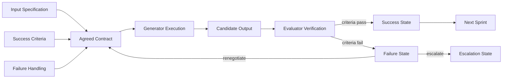
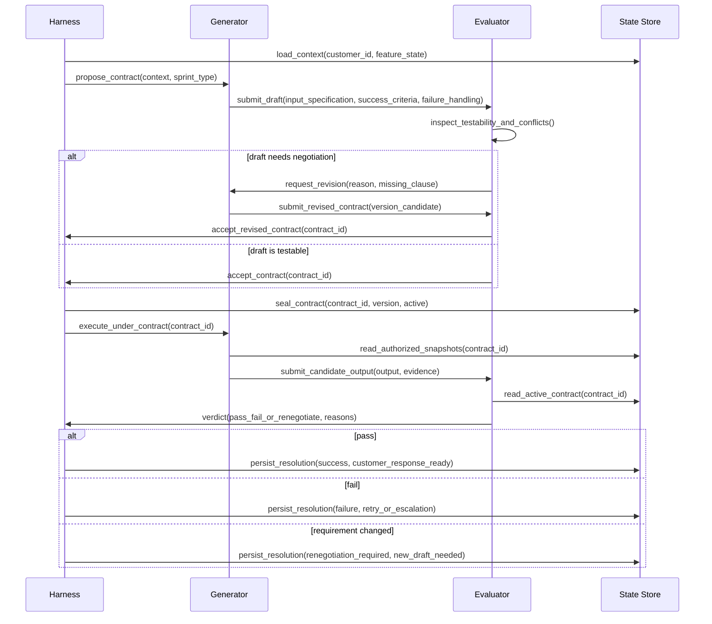
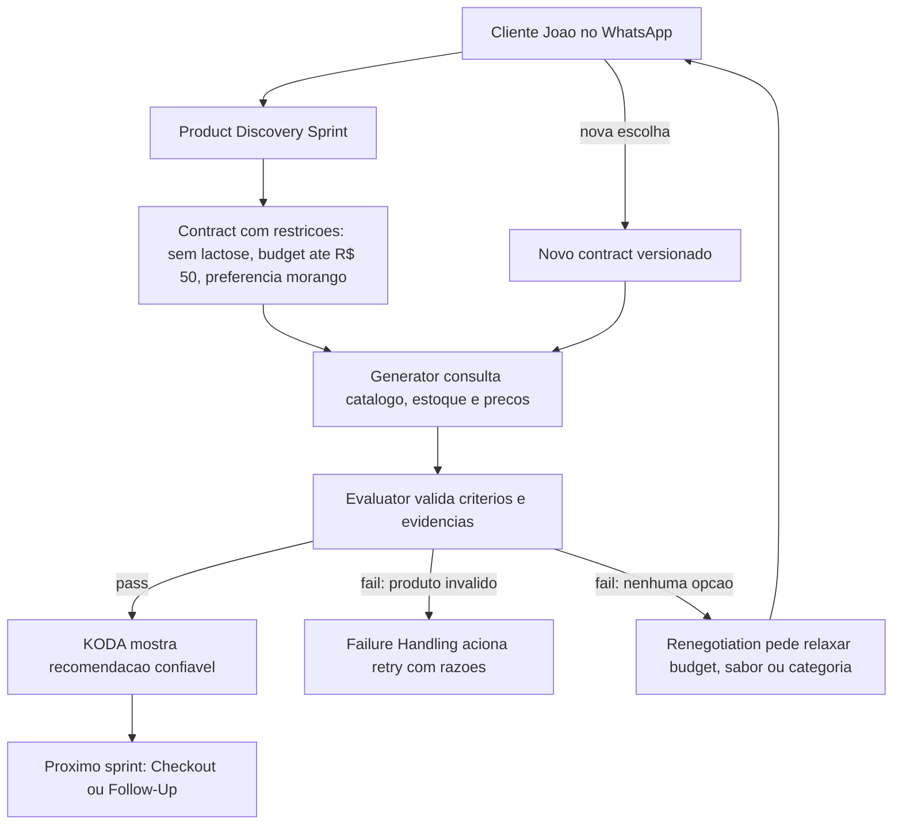

# 🎯 Sprint Contracts Knowledge Graph
## O mapa visual de como acordos testáveis transformam conversas longas do KODA em execução confiável

**Tempo Estimado:** 120 a 150 minutos
**Nível:** 6 - Knowledge Graphs e Síntese Arquitetural
**Pré-requisitos:** Nível 1 completo, Generator/Evaluator, Rubric Design, Trace Reading e leitura de `curriculum/05-core-concepts/04-sprint-contracts.md`
**Status:** 🟢 COMPLETO - Grafo detalhado de Sprint Contracts para arquitetura KODA
**Data de Criação:** Maio 2026

---

## 📖 Prólogo: O Mapa Que Transformou Promessa em Sistema

Fernando não abriu o trace procurando uma resposta bonita.

Ele abriu o trace procurando uma promessa quebrada.

KODA tinha conversado com João durante tempo suficiente para parecer humano, atento e cuidadoso.

João queria voltar a treinar.

João tinha lactose intolerance.

João tinha um limite de budget.

João preferia sabor morango.

João também estava disposto a ouvir alternativas se a recomendação fizesse sentido.

Nenhuma dessas informações era difícil isoladamente.

O problema apareceu quando elas começaram a competir por autoridade dentro da conversa.

A mensagem mais recente falava de BCAA.

A restrição mais importante falava de lactose.

A preferência mais simpática falava de morango.

O limite comercial falava de preço.

O catálogo falava de estoque.

O Evaluator falava de qualidade.

O Generator falava de fluidez.

E o harness precisava decidir o que governava o sprint atual.

Foi nesse ponto que Fernando percebeu que Sprint Contracts não eram apenas mais um padrão do Nível 2.

Eles eram o ponto onde intenção, estado, avaliação e coordenação viravam uma mesma peça de arquitetura.

Sem Sprint Contract, KODA tinha boas partes.

Com Sprint Contract, KODA tinha acordo.

A diferença parece pequena até você acompanhar uma conversa de duas horas.

Em uma conversa curta, o modelo pode sobreviver com contexto imediato.

Em uma conversa longa, o modelo precisa saber quais frases viraram compromisso.

Em uma feature simples, um prompt pode bastar.

Em Product Discovery, Checkout e Multi-Agent Coordination, prompt solto vira risco operacional.

Este grafo detalhado existe para mostrar essa diferença visualmente.

Ele não repete o módulo conceitual.

Ele reorganiza o conceito como mapa.

Você verá nós.

Verá arestas.

Verá ciclos.

Verá onde Generator/Evaluator fica mais forte.

Verá onde Rubric Design encaixa.

Verá onde Trace Reading ganha evidência.

Verá onde Harness Patterns deixam de ser apenas moldura e viram controle de fluxo.

E verá por que KODA precisa tratar cada unidade crítica de trabalho como uma promessa versionada.

A frase central deste módulo é simples:

> Sprint Contracts são a interface arquitetural entre intenção vaga e execução verificável.

Se essa frase fizer sentido apenas como definição, leia devagar.

Se fizer sentido como diagrama, você está começando a pensar como architect de long-running agents.

---

## 🧭 Como Ler Este Grafo

Este arquivo é um mapa de navegação, não uma apostila linear comum.

Leia em três passadas.

Na primeira passada, acompanhe os diagramas.

Eles mostram a forma do sistema antes dos detalhes.

Na segunda passada, leia as tabelas e o walkthrough KODA.

Eles mostram onde o conceito vira decisão de produto e engenharia.

Na terceira passada, use o atlas de nós e caminhos.

Ele serve para revisão, mentoria, design review e investigação de incidentes.

### Rota Recomendada

1. Comece pelo objetivo do módulo.
2. Leia o Diagrama 1 para entender a estrutura mínima de um Sprint Contract.
3. Leia o diagrama ASCII para localizar componentes arquiteturais.
4. Leia o Diagrama 2 para entender o lifecycle de validação.
5. Leia a tabela comparativa para decidir quando usar cada estratégia.
6. Leia a aplicação KODA para ver Product Discovery, Checkout e Multi-Agent Coordination.
7. Use o atlas como ferramenta de diagnóstico.
8. Termine em "O Que Voce Aprendeu" e responda às perguntas de verificação.

### Convenções Visuais

- **Nó** representa conceito, componente, artefato, estado ou decisão.
- **Aresta** representa dependência, fluxo, verificação, bloqueio ou renegotiation.
- **Contrato ativo** representa uma promessa que já governa execução.
- **Draft** representa proposta criticável, mas ainda não vinculante.
- **Verdict** representa decisão do Evaluator contra critérios explícitos.
- **Failure path** representa falha tratada como estado, não como improviso.

---

## 🎯 Objetivos Deste Módulo

Ao final deste grafo, você deve conseguir:

- Explicar Sprint Contracts como sistema de coordenação, não como prompt longo.
- Desenhar os três pilares: Input Specification, Success Criteria e Failure Handling.
- Mostrar como proposal, negotiation, seal, execution, verification e resolution se encadeiam.
- Localizar Contract Schema, Validator, State Store e Audit Log na arquitetura.
- Comparar Sprint Contracts com Generator/Evaluator, Rubric Design, Trace Reading, Harness Patterns e ad-hoc prompts.
- Aplicar contratos a Product Discovery, Checkout e Multi-Agent Coordination no KODA.
- Conectar Sprint Contracts aos Níveis 1, 2 e 3 do currículo.
- Diagnosticar incidentes perguntando qual cláusula do contract falhou.

---

## 🗺️ Roadmap Visual do Módulo

```text
ENTRADA: você entende Generator/Evaluator e já viu por que agentes longos perdem foco
  │
  ├─ SEÇÃO 1: Forma mínima do contract
  │   └─ Três pilares e Diagrama 1
  │
  ├─ SEÇÃO 2: Arquitetura de componentes
  │   └─ Contract Schema, Validator, State Store, Audit Log, Generator, Evaluator, Harness
  │
  ├─ SEÇÃO 3: Lifecycle de validação
  │   └─ Proposal, negotiation, seal, execution, verification, resolution
  │
  ├─ SEÇÃO 4: Estratégias de coordenação
  │   └─ Tabela comparativa e critérios de escolha
  │
  ├─ SEÇÃO 5: Aplicação KODA
  │   └─ Product Discovery, Checkout e Multi-Agent Coordination
  │
  ├─ SEÇÃO 6: Conexões com o currículo
  │   └─ Nível 1, Nível 2, Nível 3 e conceitos transversais
  │
  ├─ SEÇÃO 7: Atlas de nós e caminhos
  │   └─ Cartões de leitura para estudo e diagnóstico
  │
  └─ SAÍDA: você consegue usar Sprint Contracts como mapa operacional de confiança
```

---

## 🧩 Seção 1: Forma Mínima de um Sprint Contract

Um Sprint Contract começa com três perguntas.

A primeira pergunta é: quais inputs governam este sprint?

A segunda pergunta é: o que conta como sucesso verificável?

A terceira pergunta é: o que acontece quando sucesso não é possível?

Essas perguntas formam a estrutura mínima.

Elas parecem simples porque bons acordos parecem simples depois de prontos.

A complexidade está em retirar ambiguidade antes da execução.

Para KODA, isso muda o modo de operar.

O Product Discovery deixa de ser "responder ao cliente com uma recomendação boa".

Ele vira "recomendar produtos que respeitam restrições, orçamento, estoque, objetivo e explicação visível".

O Checkout deixa de ser "fechar pedido".

Ele vira "montar pedido com preço, estoque, cupom, pagamento, endereço e confirmação auditáveis".

A Multi-Agent Coordination deixa de ser "vários agentes ajudam".

Ela vira "cada handoff tem input autorizado, output esperado e failure path conhecido".

### Diagrama 1: Estrutura de Sprint Contract



### Como Ler o Diagrama 1

O lado esquerdo mostra a negociação do significado de pronto.

O centro mostra o contract aceito como ponto de convergência.

O lado direito mostra execução, verificação e resolução.

A seta de Failure State para Agreed Contract é deliberada.

Ela mostra que falha não é apenas retry.

Falha pode significar que o contract precisa mudar.

Isso protege KODA contra o erro de insistir em uma promessa que o mundo já invalidou.

### Os Três Pilares Como Nós de Grafo

| Pilar | Pergunta | Saída | Risco se faltar |
|---|---|---|---|
| Input Specification | Quais dados entram e com qual autoridade? | Fontes, precedência, limites e freshness | O Generator usa contexto errado ou antigo |
| Success Criteria | O que precisa ser verdadeiro no final? | Critérios testáveis, thresholds e evidência | O Evaluator aprova por sensação |
| Failure Handling | O que fazer quando o contract não fecha? | Retry, renegotiation, customer question ou escalation | A falha vira improviso conversacional |

---

## 🏛️ Seção 2: Arquitetura de Componentes de Sprint Contracts

Sprint Contracts não vivem apenas em texto.

Eles precisam de componentes que deem forma, validação, persistência e rastreabilidade.

A arquitetura abaixo é original deste grafo.

Ela mostra como o contract passa pelo harness, orienta Generator e Evaluator, e deixa evidência no State Store e no Audit Log.

### Diagrama ASCII: Arquitetura de Componentes

```text
┌──────────────────────────────────────────────────────────────────────────────────────┐
│                  SPRINT CONTRACT COMPONENT ARCHITECTURE PARA KODA                    │
│             acordo testável entre intenção, execução, avaliação e estado             │
└──────────────────────────────────────────────────────────────────────────────────────┘

                         customer event / feature trigger
                                      │
                                      ▼
┌──────────────────────────────────────────────────────────────────────────────────────┐
│                                      HARNESS                                         │
│  roteia feature, seleciona template, controla token budget, decide próximos estados  │
└───────────────┬───────────────────────────────┬──────────────────────────────┬──────┘
                │                               │                              │
                │ proposes draft                │ reads/writes                 │ records events
                ▼                               ▼                              ▼
┌──────────────────────────┐        ┌──────────────────────────┐       ┌──────────────────────────┐
│ CONTRACT SCHEMA           │        │ STATE STORE              │       │ AUDIT LOG                │
│ ────────────────────────  │        │ ──────────────────────── │       │ ──────────────────────── │
│ identity                  │        │ contract_id              │       │ proposal_created         │
│ version                   │        │ active_version           │       │ negotiation_question     │
│ feature                   │        │ lifecycle_state          │       │ contract_sealed          │
│ input_specification       │        │ customer commitments     │       │ generator_submission     │
│ success_criteria          │        │ evidence pointers        │       │ evaluator_verdict        │
│ failure_handling          │        │ retry counters           │       │ resolution_decision      │
│ operational_limits        │        │ renegotiation history    │       │ customer_visible_output  │
└──────────────┬───────────┘        └──────────────┬───────────┘       └──────────────┬───────────┘
               │                                   │                                  │
               │ validates structure               │ supplies active contract         │ supports trace reading
               ▼                                   ▼                                  │
┌──────────────────────────┐        ┌─────────────────────────────────────────────────┘
│ VALIDATOR                │        │
│ ──────────────────────── │        │
│ required fields          │        │
│ type checks              │        │
│ state transitions        │        │
│ evidence requirements    │        │
│ invariant checks         │        │
└──────────────┬───────────┘        │
               │ contract accepted  │
               ▼                    │
┌──────────────────────────────────────────────────────────────────────────────────────┐
│                               ACTIVE CONTRACT                                       │
│         fonte de verdade para o sprint atual: escopo, critérios e falhas             │
└───────────────┬──────────────────────────────────────────────┬──────────────────────┘
                │                                              │
                │ execute within boundaries                    │ verify against clauses
                ▼                                              ▼
┌──────────────────────────┐                         ┌──────────────────────────┐
│ GENERATOR                │                         │ EVALUATOR                │
│ ──────────────────────── │                         │ ──────────────────────── │
│ consulta fontes          │                         │ compara output           │
│ monta candidate output   │                         │ checa critérios          │
│ anexa evidência          │                         │ aponta razões            │
│ respeita limites         │                         │ retorna verdict          │
└──────────────┬───────────┘                         └──────────────┬───────────┘
               │ candidate_output + evidence                        │ verdict + reasons
               └──────────────────────────────┬─────────────────────┘
                                              ▼
┌──────────────────────────────────────────────────────────────────────────────────────┐
│                                  RESOLUTION                                          │
│     success: responder ao cliente | fail: retry | changed requirement: renegotiate   │
└──────────────────────────────────────────────────────────────────────────────────────┘
```

### Leituras Arquiteturais do Diagrama ASCII

O Harness é o coordenador, não o juiz final de qualidade.

O Contract Schema define a forma do acordo.

O Validator protege estrutura e invariantes.

O State Store torna o contract durável entre turns, compaction e restarts.

O Audit Log transforma decisões em evidência.

O Generator executa dentro de limites explícitos.

O Evaluator verifica contra cláusulas, não contra preferência solta.

A Resolution decide se KODA responde, tenta de novo, renegocia ou escala.

---

## 🔄 Seção 3: Fluxo de Validação de Contrato

O lifecycle de Sprint Contracts é um ciclo de coordenação.

Ele começa quando o Harness percebe que uma feature merece uma unidade de trabalho formal.

Ele termina quando o resultado vira resposta ao cliente, próximo sprint ou falha tratada.

O ponto crítico é que validação começa antes do output existir.

O Evaluator não espera o Generator terminar para descobrir que o critério era ambíguo.

Ele critica o contract enquanto ainda é barato corrigir.

### Diagrama 2: Fluxo de Validacao de Contrato



### Estados do Lifecycle

| Estado | Dono Primário | Pergunta Governante | Saída |
|---|---|---|---|
| Proposal | Harness ou Generator | Qual acordo inicial representa a intenção? | Draft criticável |
| Negotiation | Evaluator e Generator | O draft é testável, seguro e não contraditório? | Versão revisada |
| Seal | Harness | Todos aceitam esta versão como ativa? | Contract versionado |
| Execution | Generator | O trabalho respeita limites e fontes autorizadas? | Candidate output com evidência |
| Verification | Evaluator | O output cumpre cláusulas e critérios? | Verdict com razões |
| Resolution | Harness | Qual próximo estado protege cliente e sistema? | Success, retry, renegotiation ou escalation |

---

## 🧠 Seção 4: Modelo Mental de Grafo

Sprint Contracts são mais fáceis de aplicar quando você pensa em grafos.

Cada contract é um subgrafo temporário.

Ele nasce quando uma intenção de feature encontra risco suficiente para merecer acordo.

Ele conecta dados, regras, agentes, critérios e failure paths.

Ele morre quando o sprint termina ou é substituído por uma nova versão.

### O Contract Como Subgrafo

```text
customer_intent
  ├─ declared_need
  ├─ constraints
  ├─ preferences
  └─ allowed_tradeoffs
        │
        ▼
input_specification ──► active_contract ◄── success_criteria
        │                       │                    │
        │                       ▼                    │
        │                generator_plan              │
        │                       │                    │
        ▼                       ▼                    ▼
authorized_sources ──► candidate_output ──► evaluator_verdict
                                │                    │
                                ▼                    ▼
                          audit_events ──► resolution_state
```

### Por Que a Perspectiva de Grafo Ajuda

Ela mostra dependências antes que virem bugs.

Ela revela nós sem dono.

Ela mostra critérios que não têm evidência.

Ela mostra inputs que não têm precedência.

Ela mostra failure paths que não levam a estado algum.

Ela mostra quando um contract está tentando resolver mais de um sprint.

Ela também mostra quando o contract ficou pesado demais para a tarefa.

---

## 📊 Seção 5: Estratégias de Coordenação: Tabela Comparativa

Sprint Contracts são uma estratégia de coordenação, não a única.

A pergunta correta não é "contracts ou nada".

A pergunta correta é "qual estratégia protege este tipo de risco com menor custo aceitável?".

| Estrategia | Quando Usar | Ponto Forte | Ponto Fraco | Custo (tokens) | Complexidade | Previsibilidade |
|---|---|---|---|---|---|---|
| Sprint Contracts | Quando há unidade de trabalho com risco, múltiplos critérios, mudança de requisito ou handoff entre agentes | Define acordo antes da execução e reduz ambiguidade cedo | Exige disciplina de schema, versioning e resolution | Médio no desenho; baixo em retrabalho | Média | Alta |
| Generator/Evaluator | Quando um output precisa de julgamento independente após ser produzido | Separa criação de julgamento e reduz autoaprovação | Pode avaliar tarde demais se os critérios eram vagos desde o início | Médio | Média | Média alta |
| Rubric Design | Quando a equipe precisa de critérios reutilizáveis para qualidade, segurança ou tom | Cria linguagem comum para avaliação | Pode ser ampla demais para capturar contexto específico do sprint | Baixo a médio | Baixa a média | Média |
| Trace Reading | Quando uma falha já ocorreu e a equipe precisa reconstruir a causa | Revela sequência real de decisões e evidências | É reativo; sozinho não impede a próxima falha | Médio a alto | Média | Média |
| Harness Patterns | Quando o sistema precisa controlar tool use, contexto, checkpoints, budget e estado | Dá estrutura externa estável ao agente | Sem contract, pode controlar fluxo sem saber a promessa exata | Médio | Alta | Média alta |
| Ad-hoc prompts | Quando a tarefa é exploratória, reversível e sem risco operacional | Começa rápido e permite aprendizado inicial | Ambíguo, frágil em conversas longas e difícil de auditar | Baixo no começo; alto se virar produção | Baixa | Baixa |

### Leitura da Tabela

Use ad-hoc prompts para descoberta barata.

Use Rubric Design para criar critérios reutilizáveis.

Use Generator/Evaluator para separar produção e julgamento.

Use Harness Patterns para controlar o ambiente.

Use Trace Reading para aprender com a execução real.

Use Sprint Contracts quando o custo de ambiguidade for maior que o custo de formalizar.

Em KODA, esse ponto chega cedo porque conversas misturam saúde, dinheiro, estoque e confiança.

---

## 💼 Seção 6: Aplicacao KODA — Feature Contract

A aplicação principal deste grafo é Product Discovery.

Product Discovery é o momento em que KODA descobre necessidade, restrição, preferência, orçamento e abertura para tradeoffs.

É também o momento em que uma recomendação errada parece pequena para a arquitetura, mas grande para o cliente.

Se João diz que tem lactose intolerance, isso não é detalhe.

Se João diz que não pode passar de R$ 50, isso não é decoração.

Se João aceita mudar sabor, isso é preferência negociável.

Sprint Contract separa essas classes.

### Diagrama 3: Aplicacao KODA — Feature Contract



### Walkthrough de Product Discovery com Sprint Contracts

1. João chega pelo WhatsApp e pede ajuda para voltar a treinar.
2. O Harness classifica a intenção como Product Discovery.
3. O State Store recupera preferências e restrições persistidas.
4. A mensagem atual declara lactose intolerance, budget de R$ 50 e preferência por morango.
5. O Harness propõe um contract de recomendação.
6. O Generator revisa se consegue executar com as fontes autorizadas.
7. O Evaluator critica se os critérios são testáveis.
8. A equipe define que lactose é restrição obrigatória.
9. A equipe define que budget não pode ser relaxado sem confirmação de João.
10. A equipe define que morango é preferência, não blocker.
11. O Contract Schema valida campos e estados.
12. O State Store registra a versão ativa.
13. O Audit Log registra a origem dos critérios.
14. O Generator consulta catálogo, estoque e preço.
15. O Generator monta candidate output com evidência por produto.
16. O Evaluator verifica cada recomendação contra o contract.
17. Se passar, KODA responde com confiança.
18. Se falhar, KODA não improvisa.
19. Se a restrição torna a recomendação impossível, KODA renegocia com João.
20. Se João decide comprar, Checkout recebe um novo contract.

### Contract Sketch Para Product Discovery

```yaml
contract_family: koda.product_discovery
customer_journey_stage: consideration
input_specification:
  current_intent: recomendar suplemento para retorno aos treinos
  mandatory_constraints:
    - lactose_intolerance
    - product_price_lte_50_brl
    - in_stock_now
  negotiable_preferences:
    - flavor_morango
  authorized_sources:
    - latest_customer_message
    - customer_profile_state
    - catalog_snapshot
    - inventory_snapshot
    - pricing_snapshot
success_criteria:
  minimum_valid_options: 1
  target_valid_options: 3
  each_option_must_have:
    - product_id
    - current_price
    - stock_evidence
    - lactose_free_evidence
    - customer_reason
failure_handling:
  no_valid_option: ask_customer_to_choose_constraint_to_relax
  evaluator_rejects: retry_with_specific_reasons
  customer_changes_category: create_new_contract_version
```

### Como o Contract Escala Para Checkout

Checkout muda o tipo de risco.

Product Discovery lida com recomendação.

Checkout lida com compromisso transacional.

O contract de Checkout precisa proteger preço final, estoque reservado, endereço, forma de pagamento, cupom, idempotency e confirmação visível.

O Generator de Checkout não deve inventar disponibilidade.

O Evaluator de Checkout não deve aprovar pedido sem evidência de reserva.

O Harness de Checkout não deve avançar para pagamento se o contract ainda está em draft.

O Failure Handling de Checkout precisa diferenciar falha recuperável de falha que exige humano.

#### Grafo de Escala Para Checkout

```text
product_discovery_success
  │
  ▼
checkout_contract
  ├─ input: selected_product, price_snapshot, stock_reservation, delivery_address
  ├─ criteria: total matches, stock reserved, payment authorized, message confirms terms
  ├─ failure: price_changed, out_of_stock, payment_failed, address_invalid
  └─ next: order_confirmation or safe_recovery
```

### Como o Contract Escala Para Multi-Agent Coordination

Multi-Agent Coordination aumenta o número de fronteiras.

Em vez de um Generator e um Evaluator, KODA pode ter Product Agent, Catalog Agent, Pricing Agent, Order Agent, Payment Agent e Fulfillment Agent.

Cada fronteira precisa responder a três perguntas.

O que este agente recebe?

O que este agente entrega?

Como outro componente verifica a entrega?

Sprint Contracts evitam que cada agente interprete a mesma conversa de forma diferente.

Eles transformam handoffs em acordos.

#### Exemplo de Cadeia Multi-Agent

```text
Product Agent
  └─ contract: opções válidas e justificadas
       ▼
Pricing Agent
  └─ contract: preço atual, desconto permitido e margem preservada
       ▼
Order Agent
  └─ contract: carrinho coerente com item, preço e quantidade
       ▼
Payment Agent
  └─ contract: autorização idempotente e registrada
       ▼
Fulfillment Agent
  └─ contract: estoque reservado, rota definida e ETA seguro
```

### Features Reais do KODA Tocadas Pelo Contract

| Feature KODA | Papel do Contract | Erro Evitado |
|---|---|---|
| Product Discovery | Define restrições e sucesso de recomendação | Produto incompatível, caro ou fora de estoque |
| Catalog Agent | Define fontes e snapshots autorizados | Consulta misturada entre catálogo antigo e novo |
| Generator Agent | Define limites de geração e evidência exigida | Resposta fluente sem prova |
| Evaluator Agent | Define cláusulas de avaliação | Aprovação por gosto subjetivo |
| Safety Guard | Define restrições que bloqueiam output | Ignorar alergia, intolerância ou risco |
| Checkout Completo | Define compromisso transacional | Cobrança ou pedido incoerente |
| Payment Agent | Define idempotency e confirmação | Pagamento duplicado ou sem registro |
| Fulfillment Agent | Define promessa logística | Prometer entrega sem reserva |
| Journey State Machine | Define quando avançar de etapa | Pular de discovery para checkout cedo demais |
| Decision Merger | Define prioridade entre contratos | Upsell vencendo restrição de segurança |

---

## 🔗 Seção 7: Conexoes com o Curriculo

Sprint Contracts ficam no Nível 2, mas dependem de aprendizados do Nível 1 e preparam decisões do Nível 3.

Esta seção mostra as conexões exigidas para leitura sistêmica.

### Nivel 1: Token Budgeting

Token Budgeting ensina que cada sprint tem custo.

Sprint Contracts reduzem custo ao limitar fontes, perguntas, retries e evidência necessária.

O contract responde: o que precisa entrar no prompt agora?

Ele também responde: o que pode ficar no State Store?

Sem essa separação, KODA carrega histórico demais e ainda assim perde compromisso.

### Nivel 1: Context Management

Context Management organiza a memória imediata.

Sprint Contracts dizem qual contexto tem autoridade para o sprint atual.

Mensagem atual pode superar preferência antiga.

Restrição de segurança pode superar sabor.

Snapshot de preço pode superar lembrança textual.

Isso evita que KODA trate todo texto como igualmente verdadeiro.

### Nivel 1: Harness Patterns

Harness Patterns dão estrutura externa ao modelo.

Sprint Contracts são uma das estruturas que o harness aplica.

O harness propõe contract.

O harness sela contract.

O harness envia contract ao Generator.

O harness envia contract ao Evaluator.

O harness bloqueia avanço se o verdict falha.

### Nivel 2: Generator/Evaluator

Generator/Evaluator separa criação de julgamento.

Sprint Contracts adicionam acordo antes da criação.

O Generator deixa de tentar adivinhar o alvo.

O Evaluator deixa de inventar critério depois.

Ambos passam a operar contra o mesmo artefato.

### Nivel 2: Rubric Design

Rubric Design cria linguagem de avaliação.

Sprint Contract escolhe quais partes da rubrica governam este sprint.

Uma rubrica pode avaliar tom, precisão, segurança e adequação.

O contract de João diz que lactose, budget e estoque são blockers agora.

Rubric é repertório.

Contract é compromisso situado.

### Nivel 2: Trace Reading

Trace Reading reconstrói falhas.

Sprint Contracts tornam o trace mais legível.

Em vez de ler apenas mensagens, a equipe lê draft, seal, state transition, candidate output, verdict e resolution.

A pergunta deixa de ser "por que o modelo disse isso?".

A pergunta vira "qual cláusula permitiu ou bloqueou isso?".

### Nivel 2: `sprint-contracts.md`

O módulo `curriculum/05-core-concepts/04-sprint-contracts.md` explica o conceito profundo.

Este grafo reorganiza o mesmo domínio como mapa visual e ferramenta de revisão.

O módulo prático `curriculum/02-nivel-2-practical-patterns/02-sprint-contracts.md` mostra aplicação operacional.

Leia os três em conjunto quando estiver desenhando uma feature crítica.

### Nivel 3: Multi-Agent Coordination

Multi-Agent Coordination amplia o problema.

Quando vários agentes trabalham, cada handoff precisa de contrato.

Sem contract, o Product Agent acha uma coisa, o Pricing Agent assume outra, e o Fulfillment Agent promete uma terceira.

Com contract, cada agente sabe input, output, critério e failure path.

### Nivel 3: State Persistence

State Persistence torna o contract durável.

Um contract ativo precisa sobreviver a turnos, retries, compaction e reinício.

Se o contract vive apenas no prompt, ele não é fonte confiável de verdade.

Se vive no State Store, ele pode governar execução por horas.

### Nivel 3: Harness Evolution

Harness Evolution decide quando fortalecer, simplificar ou remover proteções.

Sprint Contracts geram métricas para essa evolução.

Quais critérios falham mais?

Quais contracts geram retries demais?

Quais failure paths viram escalação humana?

Quais versões reduziram ambiguidade?

Essas perguntas transformam contracts em instrumento de aprendizado.

### Concepts Transversais

| Concept | Relação com Sprint Contracts | Pergunta de Diagnóstico |
|---|---|---|
| context-management | Define quais informações permanecem úteis e com qual autoridade | O contract diferencia contexto disponível de contexto autorizado? |
| planning-execution-separation | Impede agir antes de definir o plano e o acordo | O sprint foi planejado antes da primeira ação externa? |
| generator-evaluator | Separa quem produz de quem verifica | Ambos compartilham o mesmo contract ativo? |
| evaluation-rubrics | Dá vocabulário para critérios de qualidade | A rubric foi situada em critérios específicos do sprint? |

---

## 🧪 Seção 8: Anti-Padroes que o Grafo Revela

### Anti-Padrao 1: Contract Como Prompt Comprido

Um prompt comprido ainda pode ser ambíguo.

Contract precisa ter estado, versão, critérios e failure handling.

Se não governa decisão, é apenas texto.

### Anti-Padrao 2: Evaluator Sem Contract

Evaluator sem contract avalia com critérios implícitos.

Isso pode parecer inteligente em exemplos simples.

Em produção, vira subjetividade difícil de debugar.

### Anti-Padrao 3: Retry Sem Razão

Retry sem razão específica aumenta custo e repete erro.

Contract exige que fail venha com cláusula violada.

A razão orienta próxima ação.

### Anti-Padrao 4: Renegotiation Invisível

Quando o cliente muda requisito, o sistema precisa registrar nova versão.

Se o contract muda silenciosamente, trace e métricas perdem sentido.

### Anti-Padrao 5: Contract Para Tudo

Nem toda tarefa merece formalização.

Usar contract em exploração sem risco pode deixar KODA lento.

Arquitetura madura escolhe onde formalizar.

---

## 📈 Seção 9: Metrica, Observabilidade e Evolucao

Sprint Contracts criam métricas porque transformam promessa em artefato.

Sem contract, a equipe mede conversa inteira.

Com contract, mede cada unidade de trabalho.

### Métricas Recomendadas

| Métrica | O Que Mede | Uso Arquitetural |
|---|---|---|
| contract_creation_rate | Quantos sprints críticos recebem contract | Detectar features sem acordo formal |
| negotiation_revision_count | Quantas revisões antes do seal | Detectar critérios vagos ou templates ruins |
| evaluator_fail_rate | Percentual de outputs reprovados | Calibrar Generator, criteria e rubrics |
| renegotiation_rate | Quantas mudanças de requisito exigem nova versão | Entender volatilidade de Product Discovery |
| retry_success_rate | Quantos retries passam após razões específicas | Medir utilidade do feedback do Evaluator |
| escalation_rate | Quantas falhas chegam a humano | Identificar risco não resolvido pelo harness |
| audit_completeness | Eventos esperados presentes no log | Garantir trace reading confiável |
| customer_visible_correction_rate | Correções percebidas pelo cliente | Medir dano de falhas que escaparam |

### Ciclo de Evolucao

```text
medir contract ──► identificar cláusula fraca ──► ajustar schema ou rubric
       ▲                                                        │
       │                                                        ▼
validar em produção ◄── versionar mudança ◄── testar trace e failure path
```

---

## 🧭 Seção 10: Atlas de Nos do Sprint Contract

Use estes cartões como mapa de estudo.

Cada cartão descreve um nó ou uma aresta importante do grafo.

Eles são curtos de propósito.

A intenção é facilitar revisão, mentoria e design review.
### Cartao 001: Input Specification como no do grafo

**Papel:** Input Specification define quais dados entram no sprint dentro de Sprint Contracts.

**Aresta principal:** Este no se conecta a State Store porque a relacao `autoriza` mostra quem pode usar qual informação.

**Conexao curricular:** A leitura mais forte aqui e context-management, pois o contract torna esse conceito verificavel no sprint.

**Sinal no KODA:** Em Product Discovery, Checkout ou handoff multi-agent, este no aparece quando a conversa precisa preservar compromisso alem da resposta imediata.

**Pergunta de diagnostico:** Que evidencia mostra que Input Specification foi respeitado antes de KODA responder ao cliente?

**Risco se ignorar:** fonte autorizada sem precedência vira ruído.

**Criterio de dominio:** Voce consegue apontar no trace onde este no foi criado, validado, usado e encerrado.

---

### Cartao 002: Success Criteria como no do grafo

**Papel:** Success Criteria define o que conta como pronto dentro de Sprint Contracts.

**Aresta principal:** Este no se conecta a Audit Log porque a relacao `bloqueia` mostra onde o contract impede avanço inseguro.

**Conexao curricular:** A leitura mais forte aqui e evaluation-rubrics, pois o contract torna esse conceito verificavel no sprint.

**Sinal no KODA:** Em Product Discovery, Checkout ou handoff multi-agent, este no aparece quando a conversa precisa preservar compromisso alem da resposta imediata.

**Pergunta de diagnostico:** Que evidencia mostra que Success Criteria foi respeitado antes de KODA responder ao cliente?

**Risco se ignorar:** critério que não reprova nada é decoração.

**Criterio de dominio:** Voce consegue apontar no trace onde este no foi criado, validado, usado e encerrado.

---

### Cartao 003: Failure Handling como no do grafo

**Papel:** Failure Handling define como falhar sem improviso dentro de Sprint Contracts.

**Aresta principal:** Este no se conecta a Validator porque a relacao `evidencia` mostra qual prova acompanha o output.

**Conexao curricular:** A leitura mais forte aqui e harness-patterns, pois o contract torna esse conceito verificavel no sprint.

**Sinal no KODA:** Em Product Discovery, Checkout ou handoff multi-agent, este no aparece quando a conversa precisa preservar compromisso alem da resposta imediata.

**Pergunta de diagnostico:** Que evidencia mostra que Failure Handling foi respeitado antes de KODA responder ao cliente?

**Risco se ignorar:** falha sem caminho vira retry cego.

**Criterio de dominio:** Voce consegue apontar no trace onde este no foi criado, validado, usado e encerrado.

---

### Cartao 004: Agreed Contract como no do grafo

**Papel:** Agreed Contract congela o acordo ativo dentro de Sprint Contracts.

**Aresta principal:** Este no se conecta a Contract Schema porque a relacao `versiona` mostra quando uma mudança vira nova realidade.

**Conexao curricular:** A leitura mais forte aqui e planning-execution-separation, pois o contract torna esse conceito verificavel no sprint.

**Sinal no KODA:** Em Product Discovery, Checkout ou handoff multi-agent, este no aparece quando a conversa precisa preservar compromisso alem da resposta imediata.

**Pergunta de diagnostico:** Que evidencia mostra que Agreed Contract foi respeitado antes de KODA responder ao cliente?

**Risco se ignorar:** sem seal há moving target.

**Criterio de dominio:** Voce consegue apontar no trace onde este no foi criado, validado, usado e encerrado.

---

### Cartao 005: Generator Execution como no do grafo

**Papel:** Generator Execution produz dentro dos limites dentro de Sprint Contracts.

**Aresta principal:** Este no se conecta a Proposal porque a relacao `coordena` mostra handoff entre papéis diferentes.

**Conexao curricular:** A leitura mais forte aqui e generator-evaluator, pois o contract torna esse conceito verificavel no sprint.

**Sinal no KODA:** Em Product Discovery, Checkout ou handoff multi-agent, este no aparece quando a conversa precisa preservar compromisso alem da resposta imediata.

**Pergunta de diagnostico:** Que evidencia mostra que Generator Execution foi respeitado antes de KODA responder ao cliente?

**Risco se ignorar:** criatividade sem limite vira risco.

**Criterio de dominio:** Voce consegue apontar no trace onde este no foi criado, validado, usado e encerrado.

---

### Cartao 006: Candidate Output como no do grafo

**Papel:** Candidate Output carrega resposta e evidência dentro de Sprint Contracts.

**Aresta principal:** Este no se conecta a Critique porque a relacao `prioriza` mostra precedência entre restrição e preferência.

**Conexao curricular:** A leitura mais forte aqui e trace-reading, pois o contract torna esse conceito verificavel no sprint.

**Sinal no KODA:** Em Product Discovery, Checkout ou handoff multi-agent, este no aparece quando a conversa precisa preservar compromisso alem da resposta imediata.

**Pergunta de diagnostico:** Que evidencia mostra que Candidate Output foi respeitado antes de KODA responder ao cliente?

**Risco se ignorar:** output sem evidência enfraquece avaliação.

**Criterio de dominio:** Voce consegue apontar no trace onde este no foi criado, validado, usado e encerrado.

---

### Cartao 007: Evaluator Verification como no do grafo

**Papel:** Evaluator Verification julga contra cláusulas dentro de Sprint Contracts.

**Aresta principal:** Este no se conecta a Revision porque a relacao `audita` mostra como o trace fica reconstruível.

**Conexao curricular:** A leitura mais forte aqui e evaluation-rubrics, pois o contract torna esse conceito verificavel no sprint.

**Sinal no KODA:** Em Product Discovery, Checkout ou handoff multi-agent, este no aparece quando a conversa precisa preservar compromisso alem da resposta imediata.

**Pergunta de diagnostico:** Que evidencia mostra que Evaluator Verification foi respeitado antes de KODA responder ao cliente?

**Risco se ignorar:** julgamento sem contract vira gosto.

**Criterio de dominio:** Voce consegue apontar no trace onde este no foi criado, validado, usado e encerrado.

---

### Cartao 008: State Store como no do grafo

**Papel:** State Store mantém versão e estado dentro de Sprint Contracts.

**Aresta principal:** Este no se conecta a Seal porque a relacao `limita` mostra como token budget vira regra operacional.

**Conexao curricular:** A leitura mais forte aqui e state-persistence, pois o contract torna esse conceito verificavel no sprint.

**Sinal no KODA:** Em Product Discovery, Checkout ou handoff multi-agent, este no aparece quando a conversa precisa preservar compromisso alem da resposta imediata.

**Pergunta de diagnostico:** Que evidencia mostra que State Store foi respeitado antes de KODA responder ao cliente?

**Risco se ignorar:** contract só no prompt não dura.

**Criterio de dominio:** Voce consegue apontar no trace onde este no foi criado, validado, usado e encerrado.

---

### Cartao 009: Audit Log como no do grafo

**Papel:** Audit Log registra decisão e motivo dentro de Sprint Contracts.

**Aresta principal:** Este no se conecta a Resolution porque a relacao `renegocia` mostra quando retry não é suficiente.

**Conexao curricular:** A leitura mais forte aqui e trace-reading, pois o contract torna esse conceito verificavel no sprint.

**Sinal no KODA:** Em Product Discovery, Checkout ou handoff multi-agent, este no aparece quando a conversa precisa preservar compromisso alem da resposta imediata.

**Pergunta de diagnostico:** Que evidencia mostra que Audit Log foi respeitado antes de KODA responder ao cliente?

**Risco se ignorar:** sem log a equipe reconstrói por palpite.

**Criterio de dominio:** Voce consegue apontar no trace onde este no foi criado, validado, usado e encerrado.

---

### Cartao 010: Validator como no do grafo

**Papel:** Validator checa estrutura e invariantes dentro de Sprint Contracts.

**Aresta principal:** Este no se conecta a Renegotiation porque a relacao `resolve` mostra o próximo estado após verdict.

**Conexao curricular:** A leitura mais forte aqui e harness-patterns, pois o contract torna esse conceito verificavel no sprint.

**Sinal no KODA:** Em Product Discovery, Checkout ou handoff multi-agent, este no aparece quando a conversa precisa preservar compromisso alem da resposta imediata.

**Pergunta de diagnostico:** Que evidencia mostra que Validator foi respeitado antes de KODA responder ao cliente?

**Risco se ignorar:** schema flexível demais permite contract quebrado.

**Criterio de dominio:** Voce consegue apontar no trace onde este no foi criado, validado, usado e encerrado.

---

### Cartao 011: Contract Schema como no do grafo

**Papel:** Contract Schema padroniza campos e tipos dentro de Sprint Contracts.

**Aresta principal:** Este no se conecta a Escalation porque a relacao `autoriza` mostra quem pode usar qual informação.

**Conexao curricular:** A leitura mais forte aqui e harness-evolution, pois o contract torna esse conceito verificavel no sprint.

**Sinal no KODA:** Em Product Discovery, Checkout ou handoff multi-agent, este no aparece quando a conversa precisa preservar compromisso alem da resposta imediata.

**Pergunta de diagnostico:** Que evidencia mostra que Contract Schema foi respeitado antes de KODA responder ao cliente?

**Risco se ignorar:** sem schema cada equipe cria dialeto.

**Criterio de dominio:** Voce consegue apontar no trace onde este no foi criado, validado, usado e encerrado.

---

### Cartao 012: Proposal como no do grafo

**Papel:** Proposal cria draft criticável dentro de Sprint Contracts.

**Aresta principal:** Este no se conecta a Product Discovery porque a relacao `bloqueia` mostra onde o contract impede avanço inseguro.

**Conexao curricular:** A leitura mais forte aqui e planning-execution-separation, pois o contract torna esse conceito verificavel no sprint.

**Sinal no KODA:** Em Product Discovery, Checkout ou handoff multi-agent, este no aparece quando a conversa precisa preservar compromisso alem da resposta imediata.

**Pergunta de diagnostico:** Que evidencia mostra que Proposal foi respeitado antes de KODA responder ao cliente?

**Risco se ignorar:** proposta perfeita demais demora; vaga demais não ajuda.

**Criterio de dominio:** Voce consegue apontar no trace onde este no foi criado, validado, usado e encerrado.

---

### Cartao 013: Critique como no do grafo

**Papel:** Critique testa ambiguidade cedo dentro de Sprint Contracts.

**Aresta principal:** Este no se conecta a Checkout porque a relacao `evidencia` mostra qual prova acompanha o output.

**Conexao curricular:** A leitura mais forte aqui e generator-evaluator, pois o contract torna esse conceito verificavel no sprint.

**Sinal no KODA:** Em Product Discovery, Checkout ou handoff multi-agent, este no aparece quando a conversa precisa preservar compromisso alem da resposta imediata.

**Pergunta de diagnostico:** Que evidencia mostra que Critique foi respeitado antes de KODA responder ao cliente?

**Risco se ignorar:** crítica tardia custa confiança.

**Criterio de dominio:** Voce consegue apontar no trace onde este no foi criado, validado, usado e encerrado.

---

### Cartao 014: Revision como no do grafo

**Papel:** Revision incorpora decisões no artefato dentro de Sprint Contracts.

**Aresta principal:** Este no se conecta a Payment Agent porque a relacao `versiona` mostra quando uma mudança vira nova realidade.

**Conexao curricular:** A leitura mais forte aqui e trace-reading, pois o contract torna esse conceito verificavel no sprint.

**Sinal no KODA:** Em Product Discovery, Checkout ou handoff multi-agent, este no aparece quando a conversa precisa preservar compromisso alem da resposta imediata.

**Pergunta de diagnostico:** Que evidencia mostra que Revision foi respeitado antes de KODA responder ao cliente?

**Risco se ignorar:** decisão fora do contract se perde.

**Criterio de dominio:** Voce consegue apontar no trace onde este no foi criado, validado, usado e encerrado.

---

### Cartao 015: Seal como no do grafo

**Papel:** Seal torna versão governante dentro de Sprint Contracts.

**Aresta principal:** Este no se conecta a Fulfillment Agent porque a relacao `coordena` mostra handoff entre papéis diferentes.

**Conexao curricular:** A leitura mais forte aqui e state-persistence, pois o contract torna esse conceito verificavel no sprint.

**Sinal no KODA:** Em Product Discovery, Checkout ou handoff multi-agent, este no aparece quando a conversa precisa preservar compromisso alem da resposta imediata.

**Pergunta de diagnostico:** Que evidencia mostra que Seal foi respeitado antes de KODA responder ao cliente?

**Risco se ignorar:** aceite implícito não protege produção.

**Criterio de dominio:** Voce consegue apontar no trace onde este no foi criado, validado, usado e encerrado.

---

### Cartao 016: Resolution como no do grafo

**Papel:** Resolution decide próximo estado dentro de Sprint Contracts.

**Aresta principal:** Este no se conecta a Safety Guard porque a relacao `prioriza` mostra precedência entre restrição e preferência.

**Conexao curricular:** A leitura mais forte aqui e harness-patterns, pois o contract torna esse conceito verificavel no sprint.

**Sinal no KODA:** Em Product Discovery, Checkout ou handoff multi-agent, este no aparece quando a conversa precisa preservar compromisso alem da resposta imediata.

**Pergunta de diagnostico:** Que evidencia mostra que Resolution foi respeitado antes de KODA responder ao cliente?

**Risco se ignorar:** sem resolution o loop não termina.

**Criterio de dominio:** Voce consegue apontar no trace onde este no foi criado, validado, usado e encerrado.

---

### Cartao 017: Renegotiation como no do grafo

**Papel:** Renegotiation cria nova versão quando o mundo muda dentro de Sprint Contracts.

**Aresta principal:** Este no se conecta a Journey State Machine porque a relacao `audita` mostra como o trace fica reconstruível.

**Conexao curricular:** A leitura mais forte aqui e multi-agent-coordination, pois o contract torna esse conceito verificavel no sprint.

**Sinal no KODA:** Em Product Discovery, Checkout ou handoff multi-agent, este no aparece quando a conversa precisa preservar compromisso alem da resposta imediata.

**Pergunta de diagnostico:** Que evidencia mostra que Renegotiation foi respeitado antes de KODA responder ao cliente?

**Risco se ignorar:** mudar critério em silêncio quebra métricas.

**Criterio de dominio:** Voce consegue apontar no trace onde este no foi criado, validado, usado e encerrado.

---

### Cartao 018: Escalation como no do grafo

**Papel:** Escalation leva risco a humano ou fallback seguro dentro de Sprint Contracts.

**Aresta principal:** Este no se conecta a Decision Merger porque a relacao `limita` mostra como token budget vira regra operacional.

**Conexao curricular:** A leitura mais forte aqui e harness-patterns, pois o contract torna esse conceito verificavel no sprint.

**Sinal no KODA:** Em Product Discovery, Checkout ou handoff multi-agent, este no aparece quando a conversa precisa preservar compromisso alem da resposta imediata.

**Pergunta de diagnostico:** Que evidencia mostra que Escalation foi respeitado antes de KODA responder ao cliente?

**Risco se ignorar:** automatizar além do seguro corrói confiança.

**Criterio de dominio:** Voce consegue apontar no trace onde este no foi criado, validado, usado e encerrado.

---

### Cartao 019: Product Discovery como no do grafo

**Papel:** Product Discovery aplica contract à recomendação dentro de Sprint Contracts.

**Aresta principal:** Este no se conecta a Input Specification porque a relacao `renegocia` mostra quando retry não é suficiente.

**Conexao curricular:** A leitura mais forte aqui e koda-feature, pois o contract torna esse conceito verificavel no sprint.

**Sinal no KODA:** Em Product Discovery, Checkout ou handoff multi-agent, este no aparece quando a conversa precisa preservar compromisso alem da resposta imediata.

**Pergunta de diagnostico:** Que evidencia mostra que Product Discovery foi respeitado antes de KODA responder ao cliente?

**Risco se ignorar:** cliente sente quando restrição é esquecida.

**Criterio de dominio:** Voce consegue apontar no trace onde este no foi criado, validado, usado e encerrado.

---

### Cartao 020: Checkout como no do grafo

**Papel:** Checkout aplica contract à transação dentro de Sprint Contracts.

**Aresta principal:** Este no se conecta a Success Criteria porque a relacao `resolve` mostra o próximo estado após verdict.

**Conexao curricular:** A leitura mais forte aqui e koda-feature, pois o contract torna esse conceito verificavel no sprint.

**Sinal no KODA:** Em Product Discovery, Checkout ou handoff multi-agent, este no aparece quando a conversa precisa preservar compromisso alem da resposta imediata.

**Pergunta de diagnostico:** Que evidencia mostra que Checkout foi respeitado antes de KODA responder ao cliente?

**Risco se ignorar:** pedido sem contrato expõe dinheiro e estoque.

**Criterio de dominio:** Voce consegue apontar no trace onde este no foi criado, validado, usado e encerrado.

---

### Cartao 021: Payment Agent como no do grafo

**Papel:** Payment Agent exige idempotency dentro de Sprint Contracts.

**Aresta principal:** Este no se conecta a Failure Handling porque a relacao `autoriza` mostra quem pode usar qual informação.

**Conexao curricular:** A leitura mais forte aqui e multi-agent-coordination, pois o contract torna esse conceito verificavel no sprint.

**Sinal no KODA:** Em Product Discovery, Checkout ou handoff multi-agent, este no aparece quando a conversa precisa preservar compromisso alem da resposta imediata.

**Pergunta de diagnostico:** Que evidencia mostra que Payment Agent foi respeitado antes de KODA responder ao cliente?

**Risco se ignorar:** pagamento duplicado é falha grave.

**Criterio de dominio:** Voce consegue apontar no trace onde este no foi criado, validado, usado e encerrado.

---

### Cartao 022: Fulfillment Agent como no do grafo

**Papel:** Fulfillment Agent exige promessa logística verificável dentro de Sprint Contracts.

**Aresta principal:** Este no se conecta a Agreed Contract porque a relacao `bloqueia` mostra onde o contract impede avanço inseguro.

**Conexao curricular:** A leitura mais forte aqui e multi-agent-coordination, pois o contract torna esse conceito verificavel no sprint.

**Sinal no KODA:** Em Product Discovery, Checkout ou handoff multi-agent, este no aparece quando a conversa precisa preservar compromisso alem da resposta imediata.

**Pergunta de diagnostico:** Que evidencia mostra que Fulfillment Agent foi respeitado antes de KODA responder ao cliente?

**Risco se ignorar:** entrega prometida sem reserva vira incidente.

**Criterio de dominio:** Voce consegue apontar no trace onde este no foi criado, validado, usado e encerrado.

---

### Cartao 023: Safety Guard como no do grafo

**Papel:** Safety Guard bloqueia violação crítica dentro de Sprint Contracts.

**Aresta principal:** Este no se conecta a Generator Execution porque a relacao `evidencia` mostra qual prova acompanha o output.

**Conexao curricular:** A leitura mais forte aqui e evaluation-rubrics, pois o contract torna esse conceito verificavel no sprint.

**Sinal no KODA:** Em Product Discovery, Checkout ou handoff multi-agent, este no aparece quando a conversa precisa preservar compromisso alem da resposta imediata.

**Pergunta de diagnostico:** Que evidencia mostra que Safety Guard foi respeitado antes de KODA responder ao cliente?

**Risco se ignorar:** segurança não pode ser preferência.

**Criterio de dominio:** Voce consegue apontar no trace onde este no foi criado, validado, usado e encerrado.

---

### Cartao 024: Journey State Machine como no do grafo

**Papel:** Journey State Machine controla mudança de etapa dentro de Sprint Contracts.

**Aresta principal:** Este no se conecta a Candidate Output porque a relacao `versiona` mostra quando uma mudança vira nova realidade.

**Conexao curricular:** A leitura mais forte aqui e state-persistence, pois o contract torna esse conceito verificavel no sprint.

**Sinal no KODA:** Em Product Discovery, Checkout ou handoff multi-agent, este no aparece quando a conversa precisa preservar compromisso alem da resposta imediata.

**Pergunta de diagnostico:** Que evidencia mostra que Journey State Machine foi respeitado antes de KODA responder ao cliente?

**Risco se ignorar:** avançar cedo demais muda a conversa.

**Criterio de dominio:** Voce consegue apontar no trace onde este no foi criado, validado, usado e encerrado.

---

### Cartao 025: Decision Merger como no do grafo

**Papel:** Decision Merger resolve conflito entre features dentro de Sprint Contracts.

**Aresta principal:** Este no se conecta a Evaluator Verification porque a relacao `coordena` mostra handoff entre papéis diferentes.

**Conexao curricular:** A leitura mais forte aqui e multi-agent-coordination, pois o contract torna esse conceito verificavel no sprint.

**Sinal no KODA:** Em Product Discovery, Checkout ou handoff multi-agent, este no aparece quando a conversa precisa preservar compromisso alem da resposta imediata.

**Pergunta de diagnostico:** Que evidencia mostra que Decision Merger foi respeitado antes de KODA responder ao cliente?

**Risco se ignorar:** upsell não pode vencer segurança.

**Criterio de dominio:** Voce consegue apontar no trace onde este no foi criado, validado, usado e encerrado.

---

### Cartao 026: Input Specification como no do grafo

**Papel:** Input Specification define quais dados entram no sprint dentro de Sprint Contracts.

**Aresta principal:** Este no se conecta a State Store porque a relacao `prioriza` mostra precedência entre restrição e preferência.

**Conexao curricular:** A leitura mais forte aqui e context-management, pois o contract torna esse conceito verificavel no sprint.

**Sinal no KODA:** Em Product Discovery, Checkout ou handoff multi-agent, este no aparece quando a conversa precisa preservar compromisso alem da resposta imediata.

**Pergunta de diagnostico:** Que evidencia mostra que Input Specification foi respeitado antes de KODA responder ao cliente?

**Risco se ignorar:** fonte autorizada sem precedência vira ruído.

**Criterio de dominio:** Voce consegue apontar no trace onde este no foi criado, validado, usado e encerrado.

---

### Cartao 027: Success Criteria como no do grafo

**Papel:** Success Criteria define o que conta como pronto dentro de Sprint Contracts.

**Aresta principal:** Este no se conecta a Audit Log porque a relacao `audita` mostra como o trace fica reconstruível.

**Conexao curricular:** A leitura mais forte aqui e evaluation-rubrics, pois o contract torna esse conceito verificavel no sprint.

**Sinal no KODA:** Em Product Discovery, Checkout ou handoff multi-agent, este no aparece quando a conversa precisa preservar compromisso alem da resposta imediata.

**Pergunta de diagnostico:** Que evidencia mostra que Success Criteria foi respeitado antes de KODA responder ao cliente?

**Risco se ignorar:** critério que não reprova nada é decoração.

**Criterio de dominio:** Voce consegue apontar no trace onde este no foi criado, validado, usado e encerrado.

---

### Cartao 028: Failure Handling como no do grafo

**Papel:** Failure Handling define como falhar sem improviso dentro de Sprint Contracts.

**Aresta principal:** Este no se conecta a Validator porque a relacao `limita` mostra como token budget vira regra operacional.

**Conexao curricular:** A leitura mais forte aqui e harness-patterns, pois o contract torna esse conceito verificavel no sprint.

**Sinal no KODA:** Em Product Discovery, Checkout ou handoff multi-agent, este no aparece quando a conversa precisa preservar compromisso alem da resposta imediata.

**Pergunta de diagnostico:** Que evidencia mostra que Failure Handling foi respeitado antes de KODA responder ao cliente?

**Risco se ignorar:** falha sem caminho vira retry cego.

**Criterio de dominio:** Voce consegue apontar no trace onde este no foi criado, validado, usado e encerrado.

---

### Cartao 029: Agreed Contract como no do grafo

**Papel:** Agreed Contract congela o acordo ativo dentro de Sprint Contracts.

**Aresta principal:** Este no se conecta a Contract Schema porque a relacao `renegocia` mostra quando retry não é suficiente.

**Conexao curricular:** A leitura mais forte aqui e planning-execution-separation, pois o contract torna esse conceito verificavel no sprint.

**Sinal no KODA:** Em Product Discovery, Checkout ou handoff multi-agent, este no aparece quando a conversa precisa preservar compromisso alem da resposta imediata.

**Pergunta de diagnostico:** Que evidencia mostra que Agreed Contract foi respeitado antes de KODA responder ao cliente?

**Risco se ignorar:** sem seal há moving target.

**Criterio de dominio:** Voce consegue apontar no trace onde este no foi criado, validado, usado e encerrado.

---

### Cartao 030: Generator Execution como no do grafo

**Papel:** Generator Execution produz dentro dos limites dentro de Sprint Contracts.

**Aresta principal:** Este no se conecta a Proposal porque a relacao `resolve` mostra o próximo estado após verdict.

**Conexao curricular:** A leitura mais forte aqui e generator-evaluator, pois o contract torna esse conceito verificavel no sprint.

**Sinal no KODA:** Em Product Discovery, Checkout ou handoff multi-agent, este no aparece quando a conversa precisa preservar compromisso alem da resposta imediata.

**Pergunta de diagnostico:** Que evidencia mostra que Generator Execution foi respeitado antes de KODA responder ao cliente?

**Risco se ignorar:** criatividade sem limite vira risco.

**Criterio de dominio:** Voce consegue apontar no trace onde este no foi criado, validado, usado e encerrado.

---

### Cartao 031: Candidate Output como no do grafo

**Papel:** Candidate Output carrega resposta e evidência dentro de Sprint Contracts.

**Aresta principal:** Este no se conecta a Critique porque a relacao `autoriza` mostra quem pode usar qual informação.

**Conexao curricular:** A leitura mais forte aqui e trace-reading, pois o contract torna esse conceito verificavel no sprint.

**Sinal no KODA:** Em Product Discovery, Checkout ou handoff multi-agent, este no aparece quando a conversa precisa preservar compromisso alem da resposta imediata.

**Pergunta de diagnostico:** Que evidencia mostra que Candidate Output foi respeitado antes de KODA responder ao cliente?

**Risco se ignorar:** output sem evidência enfraquece avaliação.

**Criterio de dominio:** Voce consegue apontar no trace onde este no foi criado, validado, usado e encerrado.

---

### Cartao 032: Evaluator Verification como no do grafo

**Papel:** Evaluator Verification julga contra cláusulas dentro de Sprint Contracts.

**Aresta principal:** Este no se conecta a Revision porque a relacao `bloqueia` mostra onde o contract impede avanço inseguro.

**Conexao curricular:** A leitura mais forte aqui e evaluation-rubrics, pois o contract torna esse conceito verificavel no sprint.

**Sinal no KODA:** Em Product Discovery, Checkout ou handoff multi-agent, este no aparece quando a conversa precisa preservar compromisso alem da resposta imediata.

**Pergunta de diagnostico:** Que evidencia mostra que Evaluator Verification foi respeitado antes de KODA responder ao cliente?

**Risco se ignorar:** julgamento sem contract vira gosto.

**Criterio de dominio:** Voce consegue apontar no trace onde este no foi criado, validado, usado e encerrado.

---

### Cartao 033: State Store como no do grafo

**Papel:** State Store mantém versão e estado dentro de Sprint Contracts.

**Aresta principal:** Este no se conecta a Seal porque a relacao `evidencia` mostra qual prova acompanha o output.

**Conexao curricular:** A leitura mais forte aqui e state-persistence, pois o contract torna esse conceito verificavel no sprint.

**Sinal no KODA:** Em Product Discovery, Checkout ou handoff multi-agent, este no aparece quando a conversa precisa preservar compromisso alem da resposta imediata.

**Pergunta de diagnostico:** Que evidencia mostra que State Store foi respeitado antes de KODA responder ao cliente?

**Risco se ignorar:** contract só no prompt não dura.

**Criterio de dominio:** Voce consegue apontar no trace onde este no foi criado, validado, usado e encerrado.

---

### Cartao 034: Audit Log como no do grafo

**Papel:** Audit Log registra decisão e motivo dentro de Sprint Contracts.

**Aresta principal:** Este no se conecta a Resolution porque a relacao `versiona` mostra quando uma mudança vira nova realidade.

**Conexao curricular:** A leitura mais forte aqui e trace-reading, pois o contract torna esse conceito verificavel no sprint.

**Sinal no KODA:** Em Product Discovery, Checkout ou handoff multi-agent, este no aparece quando a conversa precisa preservar compromisso alem da resposta imediata.

**Pergunta de diagnostico:** Que evidencia mostra que Audit Log foi respeitado antes de KODA responder ao cliente?

**Risco se ignorar:** sem log a equipe reconstrói por palpite.

**Criterio de dominio:** Voce consegue apontar no trace onde este no foi criado, validado, usado e encerrado.

---

### Cartao 035: Validator como no do grafo

**Papel:** Validator checa estrutura e invariantes dentro de Sprint Contracts.

**Aresta principal:** Este no se conecta a Renegotiation porque a relacao `coordena` mostra handoff entre papéis diferentes.

**Conexao curricular:** A leitura mais forte aqui e harness-patterns, pois o contract torna esse conceito verificavel no sprint.

**Sinal no KODA:** Em Product Discovery, Checkout ou handoff multi-agent, este no aparece quando a conversa precisa preservar compromisso alem da resposta imediata.

**Pergunta de diagnostico:** Que evidencia mostra que Validator foi respeitado antes de KODA responder ao cliente?

**Risco se ignorar:** schema flexível demais permite contract quebrado.

**Criterio de dominio:** Voce consegue apontar no trace onde este no foi criado, validado, usado e encerrado.

---

### Cartao 036: Contract Schema como no do grafo

**Papel:** Contract Schema padroniza campos e tipos dentro de Sprint Contracts.

**Aresta principal:** Este no se conecta a Escalation porque a relacao `prioriza` mostra precedência entre restrição e preferência.

**Conexao curricular:** A leitura mais forte aqui e harness-evolution, pois o contract torna esse conceito verificavel no sprint.

**Sinal no KODA:** Em Product Discovery, Checkout ou handoff multi-agent, este no aparece quando a conversa precisa preservar compromisso alem da resposta imediata.

**Pergunta de diagnostico:** Que evidencia mostra que Contract Schema foi respeitado antes de KODA responder ao cliente?

**Risco se ignorar:** sem schema cada equipe cria dialeto.

**Criterio de dominio:** Voce consegue apontar no trace onde este no foi criado, validado, usado e encerrado.

---

### Cartao 037: Proposal como no do grafo

**Papel:** Proposal cria draft criticável dentro de Sprint Contracts.

**Aresta principal:** Este no se conecta a Product Discovery porque a relacao `audita` mostra como o trace fica reconstruível.

**Conexao curricular:** A leitura mais forte aqui e planning-execution-separation, pois o contract torna esse conceito verificavel no sprint.

**Sinal no KODA:** Em Product Discovery, Checkout ou handoff multi-agent, este no aparece quando a conversa precisa preservar compromisso alem da resposta imediata.

**Pergunta de diagnostico:** Que evidencia mostra que Proposal foi respeitado antes de KODA responder ao cliente?

**Risco se ignorar:** proposta perfeita demais demora; vaga demais não ajuda.

**Criterio de dominio:** Voce consegue apontar no trace onde este no foi criado, validado, usado e encerrado.

---

### Cartao 038: Critique como no do grafo

**Papel:** Critique testa ambiguidade cedo dentro de Sprint Contracts.

**Aresta principal:** Este no se conecta a Checkout porque a relacao `limita` mostra como token budget vira regra operacional.

**Conexao curricular:** A leitura mais forte aqui e generator-evaluator, pois o contract torna esse conceito verificavel no sprint.

**Sinal no KODA:** Em Product Discovery, Checkout ou handoff multi-agent, este no aparece quando a conversa precisa preservar compromisso alem da resposta imediata.

**Pergunta de diagnostico:** Que evidencia mostra que Critique foi respeitado antes de KODA responder ao cliente?

**Risco se ignorar:** crítica tardia custa confiança.

**Criterio de dominio:** Voce consegue apontar no trace onde este no foi criado, validado, usado e encerrado.

---

### Cartao 039: Revision como no do grafo

**Papel:** Revision incorpora decisões no artefato dentro de Sprint Contracts.

**Aresta principal:** Este no se conecta a Payment Agent porque a relacao `renegocia` mostra quando retry não é suficiente.

**Conexao curricular:** A leitura mais forte aqui e trace-reading, pois o contract torna esse conceito verificavel no sprint.

**Sinal no KODA:** Em Product Discovery, Checkout ou handoff multi-agent, este no aparece quando a conversa precisa preservar compromisso alem da resposta imediata.

**Pergunta de diagnostico:** Que evidencia mostra que Revision foi respeitado antes de KODA responder ao cliente?

**Risco se ignorar:** decisão fora do contract se perde.

**Criterio de dominio:** Voce consegue apontar no trace onde este no foi criado, validado, usado e encerrado.

---

### Cartao 040: Seal como no do grafo

**Papel:** Seal torna versão governante dentro de Sprint Contracts.

**Aresta principal:** Este no se conecta a Fulfillment Agent porque a relacao `resolve` mostra o próximo estado após verdict.

**Conexao curricular:** A leitura mais forte aqui e state-persistence, pois o contract torna esse conceito verificavel no sprint.

**Sinal no KODA:** Em Product Discovery, Checkout ou handoff multi-agent, este no aparece quando a conversa precisa preservar compromisso alem da resposta imediata.

**Pergunta de diagnostico:** Que evidencia mostra que Seal foi respeitado antes de KODA responder ao cliente?

**Risco se ignorar:** aceite implícito não protege produção.

**Criterio de dominio:** Voce consegue apontar no trace onde este no foi criado, validado, usado e encerrado.

---

### Cartao 041: Resolution como no do grafo

**Papel:** Resolution decide próximo estado dentro de Sprint Contracts.

**Aresta principal:** Este no se conecta a Safety Guard porque a relacao `autoriza` mostra quem pode usar qual informação.

**Conexao curricular:** A leitura mais forte aqui e harness-patterns, pois o contract torna esse conceito verificavel no sprint.

**Sinal no KODA:** Em Product Discovery, Checkout ou handoff multi-agent, este no aparece quando a conversa precisa preservar compromisso alem da resposta imediata.

**Pergunta de diagnostico:** Que evidencia mostra que Resolution foi respeitado antes de KODA responder ao cliente?

**Risco se ignorar:** sem resolution o loop não termina.

**Criterio de dominio:** Voce consegue apontar no trace onde este no foi criado, validado, usado e encerrado.

---

### Cartao 042: Renegotiation como no do grafo

**Papel:** Renegotiation cria nova versão quando o mundo muda dentro de Sprint Contracts.

**Aresta principal:** Este no se conecta a Journey State Machine porque a relacao `bloqueia` mostra onde o contract impede avanço inseguro.

**Conexao curricular:** A leitura mais forte aqui e multi-agent-coordination, pois o contract torna esse conceito verificavel no sprint.

**Sinal no KODA:** Em Product Discovery, Checkout ou handoff multi-agent, este no aparece quando a conversa precisa preservar compromisso alem da resposta imediata.

**Pergunta de diagnostico:** Que evidencia mostra que Renegotiation foi respeitado antes de KODA responder ao cliente?

**Risco se ignorar:** mudar critério em silêncio quebra métricas.

**Criterio de dominio:** Voce consegue apontar no trace onde este no foi criado, validado, usado e encerrado.

---

### Cartao 043: Escalation como no do grafo

**Papel:** Escalation leva risco a humano ou fallback seguro dentro de Sprint Contracts.

**Aresta principal:** Este no se conecta a Decision Merger porque a relacao `evidencia` mostra qual prova acompanha o output.

**Conexao curricular:** A leitura mais forte aqui e harness-patterns, pois o contract torna esse conceito verificavel no sprint.

**Sinal no KODA:** Em Product Discovery, Checkout ou handoff multi-agent, este no aparece quando a conversa precisa preservar compromisso alem da resposta imediata.

**Pergunta de diagnostico:** Que evidencia mostra que Escalation foi respeitado antes de KODA responder ao cliente?

**Risco se ignorar:** automatizar além do seguro corrói confiança.

**Criterio de dominio:** Voce consegue apontar no trace onde este no foi criado, validado, usado e encerrado.

---

### Cartao 044: Product Discovery como no do grafo

**Papel:** Product Discovery aplica contract à recomendação dentro de Sprint Contracts.

**Aresta principal:** Este no se conecta a Input Specification porque a relacao `versiona` mostra quando uma mudança vira nova realidade.

**Conexao curricular:** A leitura mais forte aqui e koda-feature, pois o contract torna esse conceito verificavel no sprint.

**Sinal no KODA:** Em Product Discovery, Checkout ou handoff multi-agent, este no aparece quando a conversa precisa preservar compromisso alem da resposta imediata.

**Pergunta de diagnostico:** Que evidencia mostra que Product Discovery foi respeitado antes de KODA responder ao cliente?

**Risco se ignorar:** cliente sente quando restrição é esquecida.

**Criterio de dominio:** Voce consegue apontar no trace onde este no foi criado, validado, usado e encerrado.

---

### Cartao 045: Checkout como no do grafo

**Papel:** Checkout aplica contract à transação dentro de Sprint Contracts.

**Aresta principal:** Este no se conecta a Success Criteria porque a relacao `coordena` mostra handoff entre papéis diferentes.

**Conexao curricular:** A leitura mais forte aqui e koda-feature, pois o contract torna esse conceito verificavel no sprint.

**Sinal no KODA:** Em Product Discovery, Checkout ou handoff multi-agent, este no aparece quando a conversa precisa preservar compromisso alem da resposta imediata.

**Pergunta de diagnostico:** Que evidencia mostra que Checkout foi respeitado antes de KODA responder ao cliente?

**Risco se ignorar:** pedido sem contrato expõe dinheiro e estoque.

**Criterio de dominio:** Voce consegue apontar no trace onde este no foi criado, validado, usado e encerrado.

---

### Cartao 046: Payment Agent como no do grafo

**Papel:** Payment Agent exige idempotency dentro de Sprint Contracts.

**Aresta principal:** Este no se conecta a Failure Handling porque a relacao `prioriza` mostra precedência entre restrição e preferência.

**Conexao curricular:** A leitura mais forte aqui e multi-agent-coordination, pois o contract torna esse conceito verificavel no sprint.

**Sinal no KODA:** Em Product Discovery, Checkout ou handoff multi-agent, este no aparece quando a conversa precisa preservar compromisso alem da resposta imediata.

**Pergunta de diagnostico:** Que evidencia mostra que Payment Agent foi respeitado antes de KODA responder ao cliente?

**Risco se ignorar:** pagamento duplicado é falha grave.

**Criterio de dominio:** Voce consegue apontar no trace onde este no foi criado, validado, usado e encerrado.

---

### Cartao 047: Fulfillment Agent como no do grafo

**Papel:** Fulfillment Agent exige promessa logística verificável dentro de Sprint Contracts.

**Aresta principal:** Este no se conecta a Agreed Contract porque a relacao `audita` mostra como o trace fica reconstruível.

**Conexao curricular:** A leitura mais forte aqui e multi-agent-coordination, pois o contract torna esse conceito verificavel no sprint.

**Sinal no KODA:** Em Product Discovery, Checkout ou handoff multi-agent, este no aparece quando a conversa precisa preservar compromisso alem da resposta imediata.

**Pergunta de diagnostico:** Que evidencia mostra que Fulfillment Agent foi respeitado antes de KODA responder ao cliente?

**Risco se ignorar:** entrega prometida sem reserva vira incidente.

**Criterio de dominio:** Voce consegue apontar no trace onde este no foi criado, validado, usado e encerrado.

---

### Cartao 048: Safety Guard como no do grafo

**Papel:** Safety Guard bloqueia violação crítica dentro de Sprint Contracts.

**Aresta principal:** Este no se conecta a Generator Execution porque a relacao `limita` mostra como token budget vira regra operacional.

**Conexao curricular:** A leitura mais forte aqui e evaluation-rubrics, pois o contract torna esse conceito verificavel no sprint.

**Sinal no KODA:** Em Product Discovery, Checkout ou handoff multi-agent, este no aparece quando a conversa precisa preservar compromisso alem da resposta imediata.

**Pergunta de diagnostico:** Que evidencia mostra que Safety Guard foi respeitado antes de KODA responder ao cliente?

**Risco se ignorar:** segurança não pode ser preferência.

**Criterio de dominio:** Voce consegue apontar no trace onde este no foi criado, validado, usado e encerrado.

---

### Cartao 049: Journey State Machine como no do grafo

**Papel:** Journey State Machine controla mudança de etapa dentro de Sprint Contracts.

**Aresta principal:** Este no se conecta a Candidate Output porque a relacao `renegocia` mostra quando retry não é suficiente.

**Conexao curricular:** A leitura mais forte aqui e state-persistence, pois o contract torna esse conceito verificavel no sprint.

**Sinal no KODA:** Em Product Discovery, Checkout ou handoff multi-agent, este no aparece quando a conversa precisa preservar compromisso alem da resposta imediata.

**Pergunta de diagnostico:** Que evidencia mostra que Journey State Machine foi respeitado antes de KODA responder ao cliente?

**Risco se ignorar:** avançar cedo demais muda a conversa.

**Criterio de dominio:** Voce consegue apontar no trace onde este no foi criado, validado, usado e encerrado.

---

### Cartao 050: Decision Merger como no do grafo

**Papel:** Decision Merger resolve conflito entre features dentro de Sprint Contracts.

**Aresta principal:** Este no se conecta a Evaluator Verification porque a relacao `resolve` mostra o próximo estado após verdict.

**Conexao curricular:** A leitura mais forte aqui e multi-agent-coordination, pois o contract torna esse conceito verificavel no sprint.

**Sinal no KODA:** Em Product Discovery, Checkout ou handoff multi-agent, este no aparece quando a conversa precisa preservar compromisso alem da resposta imediata.

**Pergunta de diagnostico:** Que evidencia mostra que Decision Merger foi respeitado antes de KODA responder ao cliente?

**Risco se ignorar:** upsell não pode vencer segurança.

**Criterio de dominio:** Voce consegue apontar no trace onde este no foi criado, validado, usado e encerrado.

---

### Cartao 051: Input Specification como no do grafo

**Papel:** Input Specification define quais dados entram no sprint dentro de Sprint Contracts.

**Aresta principal:** Este no se conecta a State Store porque a relacao `autoriza` mostra quem pode usar qual informação.

**Conexao curricular:** A leitura mais forte aqui e context-management, pois o contract torna esse conceito verificavel no sprint.

**Sinal no KODA:** Em Product Discovery, Checkout ou handoff multi-agent, este no aparece quando a conversa precisa preservar compromisso alem da resposta imediata.

**Pergunta de diagnostico:** Que evidencia mostra que Input Specification foi respeitado antes de KODA responder ao cliente?

**Risco se ignorar:** fonte autorizada sem precedência vira ruído.

**Criterio de dominio:** Voce consegue apontar no trace onde este no foi criado, validado, usado e encerrado.

---

### Cartao 052: Success Criteria como no do grafo

**Papel:** Success Criteria define o que conta como pronto dentro de Sprint Contracts.

**Aresta principal:** Este no se conecta a Audit Log porque a relacao `bloqueia` mostra onde o contract impede avanço inseguro.

**Conexao curricular:** A leitura mais forte aqui e evaluation-rubrics, pois o contract torna esse conceito verificavel no sprint.

**Sinal no KODA:** Em Product Discovery, Checkout ou handoff multi-agent, este no aparece quando a conversa precisa preservar compromisso alem da resposta imediata.

**Pergunta de diagnostico:** Que evidencia mostra que Success Criteria foi respeitado antes de KODA responder ao cliente?

**Risco se ignorar:** critério que não reprova nada é decoração.

**Criterio de dominio:** Voce consegue apontar no trace onde este no foi criado, validado, usado e encerrado.

---

### Cartao 053: Failure Handling como no do grafo

**Papel:** Failure Handling define como falhar sem improviso dentro de Sprint Contracts.

**Aresta principal:** Este no se conecta a Validator porque a relacao `evidencia` mostra qual prova acompanha o output.

**Conexao curricular:** A leitura mais forte aqui e harness-patterns, pois o contract torna esse conceito verificavel no sprint.

**Sinal no KODA:** Em Product Discovery, Checkout ou handoff multi-agent, este no aparece quando a conversa precisa preservar compromisso alem da resposta imediata.

**Pergunta de diagnostico:** Que evidencia mostra que Failure Handling foi respeitado antes de KODA responder ao cliente?

**Risco se ignorar:** falha sem caminho vira retry cego.

**Criterio de dominio:** Voce consegue apontar no trace onde este no foi criado, validado, usado e encerrado.

---

### Cartao 054: Agreed Contract como no do grafo

**Papel:** Agreed Contract congela o acordo ativo dentro de Sprint Contracts.

**Aresta principal:** Este no se conecta a Contract Schema porque a relacao `versiona` mostra quando uma mudança vira nova realidade.

**Conexao curricular:** A leitura mais forte aqui e planning-execution-separation, pois o contract torna esse conceito verificavel no sprint.

**Sinal no KODA:** Em Product Discovery, Checkout ou handoff multi-agent, este no aparece quando a conversa precisa preservar compromisso alem da resposta imediata.

**Pergunta de diagnostico:** Que evidencia mostra que Agreed Contract foi respeitado antes de KODA responder ao cliente?

**Risco se ignorar:** sem seal há moving target.

**Criterio de dominio:** Voce consegue apontar no trace onde este no foi criado, validado, usado e encerrado.

---

### Cartao 055: Generator Execution como no do grafo

**Papel:** Generator Execution produz dentro dos limites dentro de Sprint Contracts.

**Aresta principal:** Este no se conecta a Proposal porque a relacao `coordena` mostra handoff entre papéis diferentes.

**Conexao curricular:** A leitura mais forte aqui e generator-evaluator, pois o contract torna esse conceito verificavel no sprint.

**Sinal no KODA:** Em Product Discovery, Checkout ou handoff multi-agent, este no aparece quando a conversa precisa preservar compromisso alem da resposta imediata.

**Pergunta de diagnostico:** Que evidencia mostra que Generator Execution foi respeitado antes de KODA responder ao cliente?

**Risco se ignorar:** criatividade sem limite vira risco.

**Criterio de dominio:** Voce consegue apontar no trace onde este no foi criado, validado, usado e encerrado.

---

### Cartao 056: Candidate Output como no do grafo

**Papel:** Candidate Output carrega resposta e evidência dentro de Sprint Contracts.

**Aresta principal:** Este no se conecta a Critique porque a relacao `prioriza` mostra precedência entre restrição e preferência.

**Conexao curricular:** A leitura mais forte aqui e trace-reading, pois o contract torna esse conceito verificavel no sprint.

**Sinal no KODA:** Em Product Discovery, Checkout ou handoff multi-agent, este no aparece quando a conversa precisa preservar compromisso alem da resposta imediata.

**Pergunta de diagnostico:** Que evidencia mostra que Candidate Output foi respeitado antes de KODA responder ao cliente?

**Risco se ignorar:** output sem evidência enfraquece avaliação.

**Criterio de dominio:** Voce consegue apontar no trace onde este no foi criado, validado, usado e encerrado.

---

### Cartao 057: Evaluator Verification como no do grafo

**Papel:** Evaluator Verification julga contra cláusulas dentro de Sprint Contracts.

**Aresta principal:** Este no se conecta a Revision porque a relacao `audita` mostra como o trace fica reconstruível.

**Conexao curricular:** A leitura mais forte aqui e evaluation-rubrics, pois o contract torna esse conceito verificavel no sprint.

**Sinal no KODA:** Em Product Discovery, Checkout ou handoff multi-agent, este no aparece quando a conversa precisa preservar compromisso alem da resposta imediata.

**Pergunta de diagnostico:** Que evidencia mostra que Evaluator Verification foi respeitado antes de KODA responder ao cliente?

**Risco se ignorar:** julgamento sem contract vira gosto.

**Criterio de dominio:** Voce consegue apontar no trace onde este no foi criado, validado, usado e encerrado.

---

### Cartao 058: State Store como no do grafo

**Papel:** State Store mantém versão e estado dentro de Sprint Contracts.

**Aresta principal:** Este no se conecta a Seal porque a relacao `limita` mostra como token budget vira regra operacional.

**Conexao curricular:** A leitura mais forte aqui e state-persistence, pois o contract torna esse conceito verificavel no sprint.

**Sinal no KODA:** Em Product Discovery, Checkout ou handoff multi-agent, este no aparece quando a conversa precisa preservar compromisso alem da resposta imediata.

**Pergunta de diagnostico:** Que evidencia mostra que State Store foi respeitado antes de KODA responder ao cliente?

**Risco se ignorar:** contract só no prompt não dura.

**Criterio de dominio:** Voce consegue apontar no trace onde este no foi criado, validado, usado e encerrado.

---

### Cartao 059: Audit Log como no do grafo

**Papel:** Audit Log registra decisão e motivo dentro de Sprint Contracts.

**Aresta principal:** Este no se conecta a Resolution porque a relacao `renegocia` mostra quando retry não é suficiente.

**Conexao curricular:** A leitura mais forte aqui e trace-reading, pois o contract torna esse conceito verificavel no sprint.

**Sinal no KODA:** Em Product Discovery, Checkout ou handoff multi-agent, este no aparece quando a conversa precisa preservar compromisso alem da resposta imediata.

**Pergunta de diagnostico:** Que evidencia mostra que Audit Log foi respeitado antes de KODA responder ao cliente?

**Risco se ignorar:** sem log a equipe reconstrói por palpite.

**Criterio de dominio:** Voce consegue apontar no trace onde este no foi criado, validado, usado e encerrado.

---

### Cartao 060: Validator como no do grafo

**Papel:** Validator checa estrutura e invariantes dentro de Sprint Contracts.

**Aresta principal:** Este no se conecta a Renegotiation porque a relacao `resolve` mostra o próximo estado após verdict.

**Conexao curricular:** A leitura mais forte aqui e harness-patterns, pois o contract torna esse conceito verificavel no sprint.

**Sinal no KODA:** Em Product Discovery, Checkout ou handoff multi-agent, este no aparece quando a conversa precisa preservar compromisso alem da resposta imediata.

**Pergunta de diagnostico:** Que evidencia mostra que Validator foi respeitado antes de KODA responder ao cliente?

**Risco se ignorar:** schema flexível demais permite contract quebrado.

**Criterio de dominio:** Voce consegue apontar no trace onde este no foi criado, validado, usado e encerrado.

---

### Cartao 061: Contract Schema como no do grafo

**Papel:** Contract Schema padroniza campos e tipos dentro de Sprint Contracts.

**Aresta principal:** Este no se conecta a Escalation porque a relacao `autoriza` mostra quem pode usar qual informação.

**Conexao curricular:** A leitura mais forte aqui e harness-evolution, pois o contract torna esse conceito verificavel no sprint.

**Sinal no KODA:** Em Product Discovery, Checkout ou handoff multi-agent, este no aparece quando a conversa precisa preservar compromisso alem da resposta imediata.

**Pergunta de diagnostico:** Que evidencia mostra que Contract Schema foi respeitado antes de KODA responder ao cliente?

**Risco se ignorar:** sem schema cada equipe cria dialeto.

**Criterio de dominio:** Voce consegue apontar no trace onde este no foi criado, validado, usado e encerrado.

---

### Cartao 062: Proposal como no do grafo

**Papel:** Proposal cria draft criticável dentro de Sprint Contracts.

**Aresta principal:** Este no se conecta a Product Discovery porque a relacao `bloqueia` mostra onde o contract impede avanço inseguro.

**Conexao curricular:** A leitura mais forte aqui e planning-execution-separation, pois o contract torna esse conceito verificavel no sprint.

**Sinal no KODA:** Em Product Discovery, Checkout ou handoff multi-agent, este no aparece quando a conversa precisa preservar compromisso alem da resposta imediata.

**Pergunta de diagnostico:** Que evidencia mostra que Proposal foi respeitado antes de KODA responder ao cliente?

**Risco se ignorar:** proposta perfeita demais demora; vaga demais não ajuda.

**Criterio de dominio:** Voce consegue apontar no trace onde este no foi criado, validado, usado e encerrado.

---

### Cartao 063: Critique como no do grafo

**Papel:** Critique testa ambiguidade cedo dentro de Sprint Contracts.

**Aresta principal:** Este no se conecta a Checkout porque a relacao `evidencia` mostra qual prova acompanha o output.

**Conexao curricular:** A leitura mais forte aqui e generator-evaluator, pois o contract torna esse conceito verificavel no sprint.

**Sinal no KODA:** Em Product Discovery, Checkout ou handoff multi-agent, este no aparece quando a conversa precisa preservar compromisso alem da resposta imediata.

**Pergunta de diagnostico:** Que evidencia mostra que Critique foi respeitado antes de KODA responder ao cliente?

**Risco se ignorar:** crítica tardia custa confiança.

**Criterio de dominio:** Voce consegue apontar no trace onde este no foi criado, validado, usado e encerrado.

---

### Cartao 064: Revision como no do grafo

**Papel:** Revision incorpora decisões no artefato dentro de Sprint Contracts.

**Aresta principal:** Este no se conecta a Payment Agent porque a relacao `versiona` mostra quando uma mudança vira nova realidade.

**Conexao curricular:** A leitura mais forte aqui e trace-reading, pois o contract torna esse conceito verificavel no sprint.

**Sinal no KODA:** Em Product Discovery, Checkout ou handoff multi-agent, este no aparece quando a conversa precisa preservar compromisso alem da resposta imediata.

**Pergunta de diagnostico:** Que evidencia mostra que Revision foi respeitado antes de KODA responder ao cliente?

**Risco se ignorar:** decisão fora do contract se perde.

**Criterio de dominio:** Voce consegue apontar no trace onde este no foi criado, validado, usado e encerrado.

---

### Cartao 065: Seal como no do grafo

**Papel:** Seal torna versão governante dentro de Sprint Contracts.

**Aresta principal:** Este no se conecta a Fulfillment Agent porque a relacao `coordena` mostra handoff entre papéis diferentes.

**Conexao curricular:** A leitura mais forte aqui e state-persistence, pois o contract torna esse conceito verificavel no sprint.

**Sinal no KODA:** Em Product Discovery, Checkout ou handoff multi-agent, este no aparece quando a conversa precisa preservar compromisso alem da resposta imediata.

**Pergunta de diagnostico:** Que evidencia mostra que Seal foi respeitado antes de KODA responder ao cliente?

**Risco se ignorar:** aceite implícito não protege produção.

**Criterio de dominio:** Voce consegue apontar no trace onde este no foi criado, validado, usado e encerrado.

---

### Cartao 066: Resolution como no do grafo

**Papel:** Resolution decide próximo estado dentro de Sprint Contracts.

**Aresta principal:** Este no se conecta a Safety Guard porque a relacao `prioriza` mostra precedência entre restrição e preferência.

**Conexao curricular:** A leitura mais forte aqui e harness-patterns, pois o contract torna esse conceito verificavel no sprint.

**Sinal no KODA:** Em Product Discovery, Checkout ou handoff multi-agent, este no aparece quando a conversa precisa preservar compromisso alem da resposta imediata.

**Pergunta de diagnostico:** Que evidencia mostra que Resolution foi respeitado antes de KODA responder ao cliente?

**Risco se ignorar:** sem resolution o loop não termina.

**Criterio de dominio:** Voce consegue apontar no trace onde este no foi criado, validado, usado e encerrado.

---

### Cartao 067: Renegotiation como no do grafo

**Papel:** Renegotiation cria nova versão quando o mundo muda dentro de Sprint Contracts.

**Aresta principal:** Este no se conecta a Journey State Machine porque a relacao `audita` mostra como o trace fica reconstruível.

**Conexao curricular:** A leitura mais forte aqui e multi-agent-coordination, pois o contract torna esse conceito verificavel no sprint.

**Sinal no KODA:** Em Product Discovery, Checkout ou handoff multi-agent, este no aparece quando a conversa precisa preservar compromisso alem da resposta imediata.

**Pergunta de diagnostico:** Que evidencia mostra que Renegotiation foi respeitado antes de KODA responder ao cliente?

**Risco se ignorar:** mudar critério em silêncio quebra métricas.

**Criterio de dominio:** Voce consegue apontar no trace onde este no foi criado, validado, usado e encerrado.

---

### Cartao 068: Escalation como no do grafo

**Papel:** Escalation leva risco a humano ou fallback seguro dentro de Sprint Contracts.

**Aresta principal:** Este no se conecta a Decision Merger porque a relacao `limita` mostra como token budget vira regra operacional.

**Conexao curricular:** A leitura mais forte aqui e harness-patterns, pois o contract torna esse conceito verificavel no sprint.

**Sinal no KODA:** Em Product Discovery, Checkout ou handoff multi-agent, este no aparece quando a conversa precisa preservar compromisso alem da resposta imediata.

**Pergunta de diagnostico:** Que evidencia mostra que Escalation foi respeitado antes de KODA responder ao cliente?

**Risco se ignorar:** automatizar além do seguro corrói confiança.

**Criterio de dominio:** Voce consegue apontar no trace onde este no foi criado, validado, usado e encerrado.

---

### Cartao 069: Product Discovery como no do grafo

**Papel:** Product Discovery aplica contract à recomendação dentro de Sprint Contracts.

**Aresta principal:** Este no se conecta a Input Specification porque a relacao `renegocia` mostra quando retry não é suficiente.

**Conexao curricular:** A leitura mais forte aqui e koda-feature, pois o contract torna esse conceito verificavel no sprint.

**Sinal no KODA:** Em Product Discovery, Checkout ou handoff multi-agent, este no aparece quando a conversa precisa preservar compromisso alem da resposta imediata.

**Pergunta de diagnostico:** Que evidencia mostra que Product Discovery foi respeitado antes de KODA responder ao cliente?

**Risco se ignorar:** cliente sente quando restrição é esquecida.

**Criterio de dominio:** Voce consegue apontar no trace onde este no foi criado, validado, usado e encerrado.

---

### Cartao 070: Checkout como no do grafo

**Papel:** Checkout aplica contract à transação dentro de Sprint Contracts.

**Aresta principal:** Este no se conecta a Success Criteria porque a relacao `resolve` mostra o próximo estado após verdict.

**Conexao curricular:** A leitura mais forte aqui e koda-feature, pois o contract torna esse conceito verificavel no sprint.

**Sinal no KODA:** Em Product Discovery, Checkout ou handoff multi-agent, este no aparece quando a conversa precisa preservar compromisso alem da resposta imediata.

**Pergunta de diagnostico:** Que evidencia mostra que Checkout foi respeitado antes de KODA responder ao cliente?

**Risco se ignorar:** pedido sem contrato expõe dinheiro e estoque.

**Criterio de dominio:** Voce consegue apontar no trace onde este no foi criado, validado, usado e encerrado.

---

### Cartao 071: Payment Agent como no do grafo

**Papel:** Payment Agent exige idempotency dentro de Sprint Contracts.

**Aresta principal:** Este no se conecta a Failure Handling porque a relacao `autoriza` mostra quem pode usar qual informação.

**Conexao curricular:** A leitura mais forte aqui e multi-agent-coordination, pois o contract torna esse conceito verificavel no sprint.

**Sinal no KODA:** Em Product Discovery, Checkout ou handoff multi-agent, este no aparece quando a conversa precisa preservar compromisso alem da resposta imediata.

**Pergunta de diagnostico:** Que evidencia mostra que Payment Agent foi respeitado antes de KODA responder ao cliente?

**Risco se ignorar:** pagamento duplicado é falha grave.

**Criterio de dominio:** Voce consegue apontar no trace onde este no foi criado, validado, usado e encerrado.

---

### Cartao 072: Fulfillment Agent como no do grafo

**Papel:** Fulfillment Agent exige promessa logística verificável dentro de Sprint Contracts.

**Aresta principal:** Este no se conecta a Agreed Contract porque a relacao `bloqueia` mostra onde o contract impede avanço inseguro.

**Conexao curricular:** A leitura mais forte aqui e multi-agent-coordination, pois o contract torna esse conceito verificavel no sprint.

**Sinal no KODA:** Em Product Discovery, Checkout ou handoff multi-agent, este no aparece quando a conversa precisa preservar compromisso alem da resposta imediata.

**Pergunta de diagnostico:** Que evidencia mostra que Fulfillment Agent foi respeitado antes de KODA responder ao cliente?

**Risco se ignorar:** entrega prometida sem reserva vira incidente.

**Criterio de dominio:** Voce consegue apontar no trace onde este no foi criado, validado, usado e encerrado.

---

### Cartao 073: Safety Guard como no do grafo

**Papel:** Safety Guard bloqueia violação crítica dentro de Sprint Contracts.

**Aresta principal:** Este no se conecta a Generator Execution porque a relacao `evidencia` mostra qual prova acompanha o output.

**Conexao curricular:** A leitura mais forte aqui e evaluation-rubrics, pois o contract torna esse conceito verificavel no sprint.

**Sinal no KODA:** Em Product Discovery, Checkout ou handoff multi-agent, este no aparece quando a conversa precisa preservar compromisso alem da resposta imediata.

**Pergunta de diagnostico:** Que evidencia mostra que Safety Guard foi respeitado antes de KODA responder ao cliente?

**Risco se ignorar:** segurança não pode ser preferência.

**Criterio de dominio:** Voce consegue apontar no trace onde este no foi criado, validado, usado e encerrado.

---

### Cartao 074: Journey State Machine como no do grafo

**Papel:** Journey State Machine controla mudança de etapa dentro de Sprint Contracts.

**Aresta principal:** Este no se conecta a Candidate Output porque a relacao `versiona` mostra quando uma mudança vira nova realidade.

**Conexao curricular:** A leitura mais forte aqui e state-persistence, pois o contract torna esse conceito verificavel no sprint.

**Sinal no KODA:** Em Product Discovery, Checkout ou handoff multi-agent, este no aparece quando a conversa precisa preservar compromisso alem da resposta imediata.

**Pergunta de diagnostico:** Que evidencia mostra que Journey State Machine foi respeitado antes de KODA responder ao cliente?

**Risco se ignorar:** avançar cedo demais muda a conversa.

**Criterio de dominio:** Voce consegue apontar no trace onde este no foi criado, validado, usado e encerrado.

---

### Cartao 075: Decision Merger como no do grafo

**Papel:** Decision Merger resolve conflito entre features dentro de Sprint Contracts.

**Aresta principal:** Este no se conecta a Evaluator Verification porque a relacao `coordena` mostra handoff entre papéis diferentes.

**Conexao curricular:** A leitura mais forte aqui e multi-agent-coordination, pois o contract torna esse conceito verificavel no sprint.

**Sinal no KODA:** Em Product Discovery, Checkout ou handoff multi-agent, este no aparece quando a conversa precisa preservar compromisso alem da resposta imediata.

**Pergunta de diagnostico:** Que evidencia mostra que Decision Merger foi respeitado antes de KODA responder ao cliente?

**Risco se ignorar:** upsell não pode vencer segurança.

**Criterio de dominio:** Voce consegue apontar no trace onde este no foi criado, validado, usado e encerrado.

---

### Cartao 076: Input Specification como no do grafo

**Papel:** Input Specification define quais dados entram no sprint dentro de Sprint Contracts.

**Aresta principal:** Este no se conecta a State Store porque a relacao `prioriza` mostra precedência entre restrição e preferência.

**Conexao curricular:** A leitura mais forte aqui e context-management, pois o contract torna esse conceito verificavel no sprint.

**Sinal no KODA:** Em Product Discovery, Checkout ou handoff multi-agent, este no aparece quando a conversa precisa preservar compromisso alem da resposta imediata.

**Pergunta de diagnostico:** Que evidencia mostra que Input Specification foi respeitado antes de KODA responder ao cliente?

**Risco se ignorar:** fonte autorizada sem precedência vira ruído.

**Criterio de dominio:** Voce consegue apontar no trace onde este no foi criado, validado, usado e encerrado.

---

### Cartao 077: Success Criteria como no do grafo

**Papel:** Success Criteria define o que conta como pronto dentro de Sprint Contracts.

**Aresta principal:** Este no se conecta a Audit Log porque a relacao `audita` mostra como o trace fica reconstruível.

**Conexao curricular:** A leitura mais forte aqui e evaluation-rubrics, pois o contract torna esse conceito verificavel no sprint.

**Sinal no KODA:** Em Product Discovery, Checkout ou handoff multi-agent, este no aparece quando a conversa precisa preservar compromisso alem da resposta imediata.

**Pergunta de diagnostico:** Que evidencia mostra que Success Criteria foi respeitado antes de KODA responder ao cliente?

**Risco se ignorar:** critério que não reprova nada é decoração.

**Criterio de dominio:** Voce consegue apontar no trace onde este no foi criado, validado, usado e encerrado.

---

### Cartao 078: Failure Handling como no do grafo

**Papel:** Failure Handling define como falhar sem improviso dentro de Sprint Contracts.

**Aresta principal:** Este no se conecta a Validator porque a relacao `limita` mostra como token budget vira regra operacional.

**Conexao curricular:** A leitura mais forte aqui e harness-patterns, pois o contract torna esse conceito verificavel no sprint.

**Sinal no KODA:** Em Product Discovery, Checkout ou handoff multi-agent, este no aparece quando a conversa precisa preservar compromisso alem da resposta imediata.

**Pergunta de diagnostico:** Que evidencia mostra que Failure Handling foi respeitado antes de KODA responder ao cliente?

**Risco se ignorar:** falha sem caminho vira retry cego.

**Criterio de dominio:** Voce consegue apontar no trace onde este no foi criado, validado, usado e encerrado.

---

### Cartao 079: Agreed Contract como no do grafo

**Papel:** Agreed Contract congela o acordo ativo dentro de Sprint Contracts.

**Aresta principal:** Este no se conecta a Contract Schema porque a relacao `renegocia` mostra quando retry não é suficiente.

**Conexao curricular:** A leitura mais forte aqui e planning-execution-separation, pois o contract torna esse conceito verificavel no sprint.

**Sinal no KODA:** Em Product Discovery, Checkout ou handoff multi-agent, este no aparece quando a conversa precisa preservar compromisso alem da resposta imediata.

**Pergunta de diagnostico:** Que evidencia mostra que Agreed Contract foi respeitado antes de KODA responder ao cliente?

**Risco se ignorar:** sem seal há moving target.

**Criterio de dominio:** Voce consegue apontar no trace onde este no foi criado, validado, usado e encerrado.

---

### Cartao 080: Generator Execution como no do grafo

**Papel:** Generator Execution produz dentro dos limites dentro de Sprint Contracts.

**Aresta principal:** Este no se conecta a Proposal porque a relacao `resolve` mostra o próximo estado após verdict.

**Conexao curricular:** A leitura mais forte aqui e generator-evaluator, pois o contract torna esse conceito verificavel no sprint.

**Sinal no KODA:** Em Product Discovery, Checkout ou handoff multi-agent, este no aparece quando a conversa precisa preservar compromisso alem da resposta imediata.

**Pergunta de diagnostico:** Que evidencia mostra que Generator Execution foi respeitado antes de KODA responder ao cliente?

**Risco se ignorar:** criatividade sem limite vira risco.

**Criterio de dominio:** Voce consegue apontar no trace onde este no foi criado, validado, usado e encerrado.

---

### Cartao 081: Candidate Output como no do grafo

**Papel:** Candidate Output carrega resposta e evidência dentro de Sprint Contracts.

**Aresta principal:** Este no se conecta a Critique porque a relacao `autoriza` mostra quem pode usar qual informação.

**Conexao curricular:** A leitura mais forte aqui e trace-reading, pois o contract torna esse conceito verificavel no sprint.

**Sinal no KODA:** Em Product Discovery, Checkout ou handoff multi-agent, este no aparece quando a conversa precisa preservar compromisso alem da resposta imediata.

**Pergunta de diagnostico:** Que evidencia mostra que Candidate Output foi respeitado antes de KODA responder ao cliente?

**Risco se ignorar:** output sem evidência enfraquece avaliação.

**Criterio de dominio:** Voce consegue apontar no trace onde este no foi criado, validado, usado e encerrado.

---

### Cartao 082: Evaluator Verification como no do grafo

**Papel:** Evaluator Verification julga contra cláusulas dentro de Sprint Contracts.

**Aresta principal:** Este no se conecta a Revision porque a relacao `bloqueia` mostra onde o contract impede avanço inseguro.

**Conexao curricular:** A leitura mais forte aqui e evaluation-rubrics, pois o contract torna esse conceito verificavel no sprint.

**Sinal no KODA:** Em Product Discovery, Checkout ou handoff multi-agent, este no aparece quando a conversa precisa preservar compromisso alem da resposta imediata.

**Pergunta de diagnostico:** Que evidencia mostra que Evaluator Verification foi respeitado antes de KODA responder ao cliente?

**Risco se ignorar:** julgamento sem contract vira gosto.

**Criterio de dominio:** Voce consegue apontar no trace onde este no foi criado, validado, usado e encerrado.

---

### Cartao 083: State Store como no do grafo

**Papel:** State Store mantém versão e estado dentro de Sprint Contracts.

**Aresta principal:** Este no se conecta a Seal porque a relacao `evidencia` mostra qual prova acompanha o output.

**Conexao curricular:** A leitura mais forte aqui e state-persistence, pois o contract torna esse conceito verificavel no sprint.

**Sinal no KODA:** Em Product Discovery, Checkout ou handoff multi-agent, este no aparece quando a conversa precisa preservar compromisso alem da resposta imediata.

**Pergunta de diagnostico:** Que evidencia mostra que State Store foi respeitado antes de KODA responder ao cliente?

**Risco se ignorar:** contract só no prompt não dura.

**Criterio de dominio:** Voce consegue apontar no trace onde este no foi criado, validado, usado e encerrado.

---

### Cartao 084: Audit Log como no do grafo

**Papel:** Audit Log registra decisão e motivo dentro de Sprint Contracts.

**Aresta principal:** Este no se conecta a Resolution porque a relacao `versiona` mostra quando uma mudança vira nova realidade.

**Conexao curricular:** A leitura mais forte aqui e trace-reading, pois o contract torna esse conceito verificavel no sprint.

**Sinal no KODA:** Em Product Discovery, Checkout ou handoff multi-agent, este no aparece quando a conversa precisa preservar compromisso alem da resposta imediata.

**Pergunta de diagnostico:** Que evidencia mostra que Audit Log foi respeitado antes de KODA responder ao cliente?

**Risco se ignorar:** sem log a equipe reconstrói por palpite.

**Criterio de dominio:** Voce consegue apontar no trace onde este no foi criado, validado, usado e encerrado.

---

### Cartao 085: Validator como no do grafo

**Papel:** Validator checa estrutura e invariantes dentro de Sprint Contracts.

**Aresta principal:** Este no se conecta a Renegotiation porque a relacao `coordena` mostra handoff entre papéis diferentes.

**Conexao curricular:** A leitura mais forte aqui e harness-patterns, pois o contract torna esse conceito verificavel no sprint.

**Sinal no KODA:** Em Product Discovery, Checkout ou handoff multi-agent, este no aparece quando a conversa precisa preservar compromisso alem da resposta imediata.

**Pergunta de diagnostico:** Que evidencia mostra que Validator foi respeitado antes de KODA responder ao cliente?

**Risco se ignorar:** schema flexível demais permite contract quebrado.

**Criterio de dominio:** Voce consegue apontar no trace onde este no foi criado, validado, usado e encerrado.

---

### Cartao 086: Contract Schema como no do grafo

**Papel:** Contract Schema padroniza campos e tipos dentro de Sprint Contracts.

**Aresta principal:** Este no se conecta a Escalation porque a relacao `prioriza` mostra precedência entre restrição e preferência.

**Conexao curricular:** A leitura mais forte aqui e harness-evolution, pois o contract torna esse conceito verificavel no sprint.

**Sinal no KODA:** Em Product Discovery, Checkout ou handoff multi-agent, este no aparece quando a conversa precisa preservar compromisso alem da resposta imediata.

**Pergunta de diagnostico:** Que evidencia mostra que Contract Schema foi respeitado antes de KODA responder ao cliente?

**Risco se ignorar:** sem schema cada equipe cria dialeto.

**Criterio de dominio:** Voce consegue apontar no trace onde este no foi criado, validado, usado e encerrado.

---

### Cartao 087: Proposal como no do grafo

**Papel:** Proposal cria draft criticável dentro de Sprint Contracts.

**Aresta principal:** Este no se conecta a Product Discovery porque a relacao `audita` mostra como o trace fica reconstruível.

**Conexao curricular:** A leitura mais forte aqui e planning-execution-separation, pois o contract torna esse conceito verificavel no sprint.

**Sinal no KODA:** Em Product Discovery, Checkout ou handoff multi-agent, este no aparece quando a conversa precisa preservar compromisso alem da resposta imediata.

**Pergunta de diagnostico:** Que evidencia mostra que Proposal foi respeitado antes de KODA responder ao cliente?

**Risco se ignorar:** proposta perfeita demais demora; vaga demais não ajuda.

**Criterio de dominio:** Voce consegue apontar no trace onde este no foi criado, validado, usado e encerrado.

---

### Cartao 088: Critique como no do grafo

**Papel:** Critique testa ambiguidade cedo dentro de Sprint Contracts.

**Aresta principal:** Este no se conecta a Checkout porque a relacao `limita` mostra como token budget vira regra operacional.

**Conexao curricular:** A leitura mais forte aqui e generator-evaluator, pois o contract torna esse conceito verificavel no sprint.

**Sinal no KODA:** Em Product Discovery, Checkout ou handoff multi-agent, este no aparece quando a conversa precisa preservar compromisso alem da resposta imediata.

**Pergunta de diagnostico:** Que evidencia mostra que Critique foi respeitado antes de KODA responder ao cliente?

**Risco se ignorar:** crítica tardia custa confiança.

**Criterio de dominio:** Voce consegue apontar no trace onde este no foi criado, validado, usado e encerrado.

---

### Cartao 089: Revision como no do grafo

**Papel:** Revision incorpora decisões no artefato dentro de Sprint Contracts.

**Aresta principal:** Este no se conecta a Payment Agent porque a relacao `renegocia` mostra quando retry não é suficiente.

**Conexao curricular:** A leitura mais forte aqui e trace-reading, pois o contract torna esse conceito verificavel no sprint.

**Sinal no KODA:** Em Product Discovery, Checkout ou handoff multi-agent, este no aparece quando a conversa precisa preservar compromisso alem da resposta imediata.

**Pergunta de diagnostico:** Que evidencia mostra que Revision foi respeitado antes de KODA responder ao cliente?

**Risco se ignorar:** decisão fora do contract se perde.

**Criterio de dominio:** Voce consegue apontar no trace onde este no foi criado, validado, usado e encerrado.

---

### Cartao 090: Seal como no do grafo

**Papel:** Seal torna versão governante dentro de Sprint Contracts.

**Aresta principal:** Este no se conecta a Fulfillment Agent porque a relacao `resolve` mostra o próximo estado após verdict.

**Conexao curricular:** A leitura mais forte aqui e state-persistence, pois o contract torna esse conceito verificavel no sprint.

**Sinal no KODA:** Em Product Discovery, Checkout ou handoff multi-agent, este no aparece quando a conversa precisa preservar compromisso alem da resposta imediata.

**Pergunta de diagnostico:** Que evidencia mostra que Seal foi respeitado antes de KODA responder ao cliente?

**Risco se ignorar:** aceite implícito não protege produção.

**Criterio de dominio:** Voce consegue apontar no trace onde este no foi criado, validado, usado e encerrado.

---

### Cartao 091: Resolution como no do grafo

**Papel:** Resolution decide próximo estado dentro de Sprint Contracts.

**Aresta principal:** Este no se conecta a Safety Guard porque a relacao `autoriza` mostra quem pode usar qual informação.

**Conexao curricular:** A leitura mais forte aqui e harness-patterns, pois o contract torna esse conceito verificavel no sprint.

**Sinal no KODA:** Em Product Discovery, Checkout ou handoff multi-agent, este no aparece quando a conversa precisa preservar compromisso alem da resposta imediata.

**Pergunta de diagnostico:** Que evidencia mostra que Resolution foi respeitado antes de KODA responder ao cliente?

**Risco se ignorar:** sem resolution o loop não termina.

**Criterio de dominio:** Voce consegue apontar no trace onde este no foi criado, validado, usado e encerrado.

---

### Cartao 092: Renegotiation como no do grafo

**Papel:** Renegotiation cria nova versão quando o mundo muda dentro de Sprint Contracts.

**Aresta principal:** Este no se conecta a Journey State Machine porque a relacao `bloqueia` mostra onde o contract impede avanço inseguro.

**Conexao curricular:** A leitura mais forte aqui e multi-agent-coordination, pois o contract torna esse conceito verificavel no sprint.

**Sinal no KODA:** Em Product Discovery, Checkout ou handoff multi-agent, este no aparece quando a conversa precisa preservar compromisso alem da resposta imediata.

**Pergunta de diagnostico:** Que evidencia mostra que Renegotiation foi respeitado antes de KODA responder ao cliente?

**Risco se ignorar:** mudar critério em silêncio quebra métricas.

**Criterio de dominio:** Voce consegue apontar no trace onde este no foi criado, validado, usado e encerrado.

---

### Cartao 093: Escalation como no do grafo

**Papel:** Escalation leva risco a humano ou fallback seguro dentro de Sprint Contracts.

**Aresta principal:** Este no se conecta a Decision Merger porque a relacao `evidencia` mostra qual prova acompanha o output.

**Conexao curricular:** A leitura mais forte aqui e harness-patterns, pois o contract torna esse conceito verificavel no sprint.

**Sinal no KODA:** Em Product Discovery, Checkout ou handoff multi-agent, este no aparece quando a conversa precisa preservar compromisso alem da resposta imediata.

**Pergunta de diagnostico:** Que evidencia mostra que Escalation foi respeitado antes de KODA responder ao cliente?

**Risco se ignorar:** automatizar além do seguro corrói confiança.

**Criterio de dominio:** Voce consegue apontar no trace onde este no foi criado, validado, usado e encerrado.

---

### Cartao 094: Product Discovery como no do grafo

**Papel:** Product Discovery aplica contract à recomendação dentro de Sprint Contracts.

**Aresta principal:** Este no se conecta a Input Specification porque a relacao `versiona` mostra quando uma mudança vira nova realidade.

**Conexao curricular:** A leitura mais forte aqui e koda-feature, pois o contract torna esse conceito verificavel no sprint.

**Sinal no KODA:** Em Product Discovery, Checkout ou handoff multi-agent, este no aparece quando a conversa precisa preservar compromisso alem da resposta imediata.

**Pergunta de diagnostico:** Que evidencia mostra que Product Discovery foi respeitado antes de KODA responder ao cliente?

**Risco se ignorar:** cliente sente quando restrição é esquecida.

**Criterio de dominio:** Voce consegue apontar no trace onde este no foi criado, validado, usado e encerrado.

---

### Cartao 095: Checkout como no do grafo

**Papel:** Checkout aplica contract à transação dentro de Sprint Contracts.

**Aresta principal:** Este no se conecta a Success Criteria porque a relacao `coordena` mostra handoff entre papéis diferentes.

**Conexao curricular:** A leitura mais forte aqui e koda-feature, pois o contract torna esse conceito verificavel no sprint.

**Sinal no KODA:** Em Product Discovery, Checkout ou handoff multi-agent, este no aparece quando a conversa precisa preservar compromisso alem da resposta imediata.

**Pergunta de diagnostico:** Que evidencia mostra que Checkout foi respeitado antes de KODA responder ao cliente?

**Risco se ignorar:** pedido sem contrato expõe dinheiro e estoque.

**Criterio de dominio:** Voce consegue apontar no trace onde este no foi criado, validado, usado e encerrado.

---

### Cartao 096: Payment Agent como no do grafo

**Papel:** Payment Agent exige idempotency dentro de Sprint Contracts.

**Aresta principal:** Este no se conecta a Failure Handling porque a relacao `prioriza` mostra precedência entre restrição e preferência.

**Conexao curricular:** A leitura mais forte aqui e multi-agent-coordination, pois o contract torna esse conceito verificavel no sprint.

**Sinal no KODA:** Em Product Discovery, Checkout ou handoff multi-agent, este no aparece quando a conversa precisa preservar compromisso alem da resposta imediata.

**Pergunta de diagnostico:** Que evidencia mostra que Payment Agent foi respeitado antes de KODA responder ao cliente?

**Risco se ignorar:** pagamento duplicado é falha grave.

**Criterio de dominio:** Voce consegue apontar no trace onde este no foi criado, validado, usado e encerrado.

---

### Cartao 097: Fulfillment Agent como no do grafo

**Papel:** Fulfillment Agent exige promessa logística verificável dentro de Sprint Contracts.

**Aresta principal:** Este no se conecta a Agreed Contract porque a relacao `audita` mostra como o trace fica reconstruível.

**Conexao curricular:** A leitura mais forte aqui e multi-agent-coordination, pois o contract torna esse conceito verificavel no sprint.

**Sinal no KODA:** Em Product Discovery, Checkout ou handoff multi-agent, este no aparece quando a conversa precisa preservar compromisso alem da resposta imediata.

**Pergunta de diagnostico:** Que evidencia mostra que Fulfillment Agent foi respeitado antes de KODA responder ao cliente?

**Risco se ignorar:** entrega prometida sem reserva vira incidente.

**Criterio de dominio:** Voce consegue apontar no trace onde este no foi criado, validado, usado e encerrado.

---

### Cartao 098: Safety Guard como no do grafo

**Papel:** Safety Guard bloqueia violação crítica dentro de Sprint Contracts.

**Aresta principal:** Este no se conecta a Generator Execution porque a relacao `limita` mostra como token budget vira regra operacional.

**Conexao curricular:** A leitura mais forte aqui e evaluation-rubrics, pois o contract torna esse conceito verificavel no sprint.

**Sinal no KODA:** Em Product Discovery, Checkout ou handoff multi-agent, este no aparece quando a conversa precisa preservar compromisso alem da resposta imediata.

**Pergunta de diagnostico:** Que evidencia mostra que Safety Guard foi respeitado antes de KODA responder ao cliente?

**Risco se ignorar:** segurança não pode ser preferência.

**Criterio de dominio:** Voce consegue apontar no trace onde este no foi criado, validado, usado e encerrado.

---

### Cartao 099: Journey State Machine como no do grafo

**Papel:** Journey State Machine controla mudança de etapa dentro de Sprint Contracts.

**Aresta principal:** Este no se conecta a Candidate Output porque a relacao `renegocia` mostra quando retry não é suficiente.

**Conexao curricular:** A leitura mais forte aqui e state-persistence, pois o contract torna esse conceito verificavel no sprint.

**Sinal no KODA:** Em Product Discovery, Checkout ou handoff multi-agent, este no aparece quando a conversa precisa preservar compromisso alem da resposta imediata.

**Pergunta de diagnostico:** Que evidencia mostra que Journey State Machine foi respeitado antes de KODA responder ao cliente?

**Risco se ignorar:** avançar cedo demais muda a conversa.

**Criterio de dominio:** Voce consegue apontar no trace onde este no foi criado, validado, usado e encerrado.

---

### Cartao 100: Decision Merger como no do grafo

**Papel:** Decision Merger resolve conflito entre features dentro de Sprint Contracts.

**Aresta principal:** Este no se conecta a Evaluator Verification porque a relacao `resolve` mostra o próximo estado após verdict.

**Conexao curricular:** A leitura mais forte aqui e multi-agent-coordination, pois o contract torna esse conceito verificavel no sprint.

**Sinal no KODA:** Em Product Discovery, Checkout ou handoff multi-agent, este no aparece quando a conversa precisa preservar compromisso alem da resposta imediata.

**Pergunta de diagnostico:** Que evidencia mostra que Decision Merger foi respeitado antes de KODA responder ao cliente?

**Risco se ignorar:** upsell não pode vencer segurança.

**Criterio de dominio:** Voce consegue apontar no trace onde este no foi criado, validado, usado e encerrado.

---

### Cartao 101: Input Specification como no do grafo

**Papel:** Input Specification define quais dados entram no sprint dentro de Sprint Contracts.

**Aresta principal:** Este no se conecta a State Store porque a relacao `autoriza` mostra quem pode usar qual informação.

**Conexao curricular:** A leitura mais forte aqui e context-management, pois o contract torna esse conceito verificavel no sprint.

**Sinal no KODA:** Em Product Discovery, Checkout ou handoff multi-agent, este no aparece quando a conversa precisa preservar compromisso alem da resposta imediata.

**Pergunta de diagnostico:** Que evidencia mostra que Input Specification foi respeitado antes de KODA responder ao cliente?

**Risco se ignorar:** fonte autorizada sem precedência vira ruído.

**Criterio de dominio:** Voce consegue apontar no trace onde este no foi criado, validado, usado e encerrado.

---

### Cartao 102: Success Criteria como no do grafo

**Papel:** Success Criteria define o que conta como pronto dentro de Sprint Contracts.

**Aresta principal:** Este no se conecta a Audit Log porque a relacao `bloqueia` mostra onde o contract impede avanço inseguro.

**Conexao curricular:** A leitura mais forte aqui e evaluation-rubrics, pois o contract torna esse conceito verificavel no sprint.

**Sinal no KODA:** Em Product Discovery, Checkout ou handoff multi-agent, este no aparece quando a conversa precisa preservar compromisso alem da resposta imediata.

**Pergunta de diagnostico:** Que evidencia mostra que Success Criteria foi respeitado antes de KODA responder ao cliente?

**Risco se ignorar:** critério que não reprova nada é decoração.

**Criterio de dominio:** Voce consegue apontar no trace onde este no foi criado, validado, usado e encerrado.

---

### Cartao 103: Failure Handling como no do grafo

**Papel:** Failure Handling define como falhar sem improviso dentro de Sprint Contracts.

**Aresta principal:** Este no se conecta a Validator porque a relacao `evidencia` mostra qual prova acompanha o output.

**Conexao curricular:** A leitura mais forte aqui e harness-patterns, pois o contract torna esse conceito verificavel no sprint.

**Sinal no KODA:** Em Product Discovery, Checkout ou handoff multi-agent, este no aparece quando a conversa precisa preservar compromisso alem da resposta imediata.

**Pergunta de diagnostico:** Que evidencia mostra que Failure Handling foi respeitado antes de KODA responder ao cliente?

**Risco se ignorar:** falha sem caminho vira retry cego.

**Criterio de dominio:** Voce consegue apontar no trace onde este no foi criado, validado, usado e encerrado.

---

### Cartao 104: Agreed Contract como no do grafo

**Papel:** Agreed Contract congela o acordo ativo dentro de Sprint Contracts.

**Aresta principal:** Este no se conecta a Contract Schema porque a relacao `versiona` mostra quando uma mudança vira nova realidade.

**Conexao curricular:** A leitura mais forte aqui e planning-execution-separation, pois o contract torna esse conceito verificavel no sprint.

**Sinal no KODA:** Em Product Discovery, Checkout ou handoff multi-agent, este no aparece quando a conversa precisa preservar compromisso alem da resposta imediata.

**Pergunta de diagnostico:** Que evidencia mostra que Agreed Contract foi respeitado antes de KODA responder ao cliente?

**Risco se ignorar:** sem seal há moving target.

**Criterio de dominio:** Voce consegue apontar no trace onde este no foi criado, validado, usado e encerrado.

---

### Cartao 105: Generator Execution como no do grafo

**Papel:** Generator Execution produz dentro dos limites dentro de Sprint Contracts.

**Aresta principal:** Este no se conecta a Proposal porque a relacao `coordena` mostra handoff entre papéis diferentes.

**Conexao curricular:** A leitura mais forte aqui e generator-evaluator, pois o contract torna esse conceito verificavel no sprint.

**Sinal no KODA:** Em Product Discovery, Checkout ou handoff multi-agent, este no aparece quando a conversa precisa preservar compromisso alem da resposta imediata.

**Pergunta de diagnostico:** Que evidencia mostra que Generator Execution foi respeitado antes de KODA responder ao cliente?

**Risco se ignorar:** criatividade sem limite vira risco.

**Criterio de dominio:** Voce consegue apontar no trace onde este no foi criado, validado, usado e encerrado.

---

### Cartao 106: Candidate Output como no do grafo

**Papel:** Candidate Output carrega resposta e evidência dentro de Sprint Contracts.

**Aresta principal:** Este no se conecta a Critique porque a relacao `prioriza` mostra precedência entre restrição e preferência.

**Conexao curricular:** A leitura mais forte aqui e trace-reading, pois o contract torna esse conceito verificavel no sprint.

**Sinal no KODA:** Em Product Discovery, Checkout ou handoff multi-agent, este no aparece quando a conversa precisa preservar compromisso alem da resposta imediata.

**Pergunta de diagnostico:** Que evidencia mostra que Candidate Output foi respeitado antes de KODA responder ao cliente?

**Risco se ignorar:** output sem evidência enfraquece avaliação.

**Criterio de dominio:** Voce consegue apontar no trace onde este no foi criado, validado, usado e encerrado.

---

### Cartao 107: Evaluator Verification como no do grafo

**Papel:** Evaluator Verification julga contra cláusulas dentro de Sprint Contracts.

**Aresta principal:** Este no se conecta a Revision porque a relacao `audita` mostra como o trace fica reconstruível.

**Conexao curricular:** A leitura mais forte aqui e evaluation-rubrics, pois o contract torna esse conceito verificavel no sprint.

**Sinal no KODA:** Em Product Discovery, Checkout ou handoff multi-agent, este no aparece quando a conversa precisa preservar compromisso alem da resposta imediata.

**Pergunta de diagnostico:** Que evidencia mostra que Evaluator Verification foi respeitado antes de KODA responder ao cliente?

**Risco se ignorar:** julgamento sem contract vira gosto.

**Criterio de dominio:** Voce consegue apontar no trace onde este no foi criado, validado, usado e encerrado.

---

### Cartao 108: State Store como no do grafo

**Papel:** State Store mantém versão e estado dentro de Sprint Contracts.

**Aresta principal:** Este no se conecta a Seal porque a relacao `limita` mostra como token budget vira regra operacional.

**Conexao curricular:** A leitura mais forte aqui e state-persistence, pois o contract torna esse conceito verificavel no sprint.

**Sinal no KODA:** Em Product Discovery, Checkout ou handoff multi-agent, este no aparece quando a conversa precisa preservar compromisso alem da resposta imediata.

**Pergunta de diagnostico:** Que evidencia mostra que State Store foi respeitado antes de KODA responder ao cliente?

**Risco se ignorar:** contract só no prompt não dura.

**Criterio de dominio:** Voce consegue apontar no trace onde este no foi criado, validado, usado e encerrado.

---

### Cartao 109: Audit Log como no do grafo

**Papel:** Audit Log registra decisão e motivo dentro de Sprint Contracts.

**Aresta principal:** Este no se conecta a Resolution porque a relacao `renegocia` mostra quando retry não é suficiente.

**Conexao curricular:** A leitura mais forte aqui e trace-reading, pois o contract torna esse conceito verificavel no sprint.

**Sinal no KODA:** Em Product Discovery, Checkout ou handoff multi-agent, este no aparece quando a conversa precisa preservar compromisso alem da resposta imediata.

**Pergunta de diagnostico:** Que evidencia mostra que Audit Log foi respeitado antes de KODA responder ao cliente?

**Risco se ignorar:** sem log a equipe reconstrói por palpite.

**Criterio de dominio:** Voce consegue apontar no trace onde este no foi criado, validado, usado e encerrado.

---

### Cartao 110: Validator como no do grafo

**Papel:** Validator checa estrutura e invariantes dentro de Sprint Contracts.

**Aresta principal:** Este no se conecta a Renegotiation porque a relacao `resolve` mostra o próximo estado após verdict.

**Conexao curricular:** A leitura mais forte aqui e harness-patterns, pois o contract torna esse conceito verificavel no sprint.

**Sinal no KODA:** Em Product Discovery, Checkout ou handoff multi-agent, este no aparece quando a conversa precisa preservar compromisso alem da resposta imediata.

**Pergunta de diagnostico:** Que evidencia mostra que Validator foi respeitado antes de KODA responder ao cliente?

**Risco se ignorar:** schema flexível demais permite contract quebrado.

**Criterio de dominio:** Voce consegue apontar no trace onde este no foi criado, validado, usado e encerrado.

---

### Cartao 111: Contract Schema como no do grafo

**Papel:** Contract Schema padroniza campos e tipos dentro de Sprint Contracts.

**Aresta principal:** Este no se conecta a Escalation porque a relacao `autoriza` mostra quem pode usar qual informação.

**Conexao curricular:** A leitura mais forte aqui e harness-evolution, pois o contract torna esse conceito verificavel no sprint.

**Sinal no KODA:** Em Product Discovery, Checkout ou handoff multi-agent, este no aparece quando a conversa precisa preservar compromisso alem da resposta imediata.

**Pergunta de diagnostico:** Que evidencia mostra que Contract Schema foi respeitado antes de KODA responder ao cliente?

**Risco se ignorar:** sem schema cada equipe cria dialeto.

**Criterio de dominio:** Voce consegue apontar no trace onde este no foi criado, validado, usado e encerrado.

---

### Cartao 112: Proposal como no do grafo

**Papel:** Proposal cria draft criticável dentro de Sprint Contracts.

**Aresta principal:** Este no se conecta a Product Discovery porque a relacao `bloqueia` mostra onde o contract impede avanço inseguro.

**Conexao curricular:** A leitura mais forte aqui e planning-execution-separation, pois o contract torna esse conceito verificavel no sprint.

**Sinal no KODA:** Em Product Discovery, Checkout ou handoff multi-agent, este no aparece quando a conversa precisa preservar compromisso alem da resposta imediata.

**Pergunta de diagnostico:** Que evidencia mostra que Proposal foi respeitado antes de KODA responder ao cliente?

**Risco se ignorar:** proposta perfeita demais demora; vaga demais não ajuda.

**Criterio de dominio:** Voce consegue apontar no trace onde este no foi criado, validado, usado e encerrado.

---

### Cartao 113: Critique como no do grafo

**Papel:** Critique testa ambiguidade cedo dentro de Sprint Contracts.

**Aresta principal:** Este no se conecta a Checkout porque a relacao `evidencia` mostra qual prova acompanha o output.

**Conexao curricular:** A leitura mais forte aqui e generator-evaluator, pois o contract torna esse conceito verificavel no sprint.

**Sinal no KODA:** Em Product Discovery, Checkout ou handoff multi-agent, este no aparece quando a conversa precisa preservar compromisso alem da resposta imediata.

**Pergunta de diagnostico:** Que evidencia mostra que Critique foi respeitado antes de KODA responder ao cliente?

**Risco se ignorar:** crítica tardia custa confiança.

**Criterio de dominio:** Voce consegue apontar no trace onde este no foi criado, validado, usado e encerrado.

---

### Cartao 114: Revision como no do grafo

**Papel:** Revision incorpora decisões no artefato dentro de Sprint Contracts.

**Aresta principal:** Este no se conecta a Payment Agent porque a relacao `versiona` mostra quando uma mudança vira nova realidade.

**Conexao curricular:** A leitura mais forte aqui e trace-reading, pois o contract torna esse conceito verificavel no sprint.

**Sinal no KODA:** Em Product Discovery, Checkout ou handoff multi-agent, este no aparece quando a conversa precisa preservar compromisso alem da resposta imediata.

**Pergunta de diagnostico:** Que evidencia mostra que Revision foi respeitado antes de KODA responder ao cliente?

**Risco se ignorar:** decisão fora do contract se perde.

**Criterio de dominio:** Voce consegue apontar no trace onde este no foi criado, validado, usado e encerrado.

---

### Cartao 115: Seal como no do grafo

**Papel:** Seal torna versão governante dentro de Sprint Contracts.

**Aresta principal:** Este no se conecta a Fulfillment Agent porque a relacao `coordena` mostra handoff entre papéis diferentes.

**Conexao curricular:** A leitura mais forte aqui e state-persistence, pois o contract torna esse conceito verificavel no sprint.

**Sinal no KODA:** Em Product Discovery, Checkout ou handoff multi-agent, este no aparece quando a conversa precisa preservar compromisso alem da resposta imediata.

**Pergunta de diagnostico:** Que evidencia mostra que Seal foi respeitado antes de KODA responder ao cliente?

**Risco se ignorar:** aceite implícito não protege produção.

**Criterio de dominio:** Voce consegue apontar no trace onde este no foi criado, validado, usado e encerrado.

---

### Cartao 116: Resolution como no do grafo

**Papel:** Resolution decide próximo estado dentro de Sprint Contracts.

**Aresta principal:** Este no se conecta a Safety Guard porque a relacao `prioriza` mostra precedência entre restrição e preferência.

**Conexao curricular:** A leitura mais forte aqui e harness-patterns, pois o contract torna esse conceito verificavel no sprint.

**Sinal no KODA:** Em Product Discovery, Checkout ou handoff multi-agent, este no aparece quando a conversa precisa preservar compromisso alem da resposta imediata.

**Pergunta de diagnostico:** Que evidencia mostra que Resolution foi respeitado antes de KODA responder ao cliente?

**Risco se ignorar:** sem resolution o loop não termina.

**Criterio de dominio:** Voce consegue apontar no trace onde este no foi criado, validado, usado e encerrado.

---

### Cartao 117: Renegotiation como no do grafo

**Papel:** Renegotiation cria nova versão quando o mundo muda dentro de Sprint Contracts.

**Aresta principal:** Este no se conecta a Journey State Machine porque a relacao `audita` mostra como o trace fica reconstruível.

**Conexao curricular:** A leitura mais forte aqui e multi-agent-coordination, pois o contract torna esse conceito verificavel no sprint.

**Sinal no KODA:** Em Product Discovery, Checkout ou handoff multi-agent, este no aparece quando a conversa precisa preservar compromisso alem da resposta imediata.

**Pergunta de diagnostico:** Que evidencia mostra que Renegotiation foi respeitado antes de KODA responder ao cliente?

**Risco se ignorar:** mudar critério em silêncio quebra métricas.

**Criterio de dominio:** Voce consegue apontar no trace onde este no foi criado, validado, usado e encerrado.

---

### Cartao 118: Escalation como no do grafo

**Papel:** Escalation leva risco a humano ou fallback seguro dentro de Sprint Contracts.

**Aresta principal:** Este no se conecta a Decision Merger porque a relacao `limita` mostra como token budget vira regra operacional.

**Conexao curricular:** A leitura mais forte aqui e harness-patterns, pois o contract torna esse conceito verificavel no sprint.

**Sinal no KODA:** Em Product Discovery, Checkout ou handoff multi-agent, este no aparece quando a conversa precisa preservar compromisso alem da resposta imediata.

**Pergunta de diagnostico:** Que evidencia mostra que Escalation foi respeitado antes de KODA responder ao cliente?

**Risco se ignorar:** automatizar além do seguro corrói confiança.

**Criterio de dominio:** Voce consegue apontar no trace onde este no foi criado, validado, usado e encerrado.

---

### Cartao 119: Product Discovery como no do grafo

**Papel:** Product Discovery aplica contract à recomendação dentro de Sprint Contracts.

**Aresta principal:** Este no se conecta a Input Specification porque a relacao `renegocia` mostra quando retry não é suficiente.

**Conexao curricular:** A leitura mais forte aqui e koda-feature, pois o contract torna esse conceito verificavel no sprint.

**Sinal no KODA:** Em Product Discovery, Checkout ou handoff multi-agent, este no aparece quando a conversa precisa preservar compromisso alem da resposta imediata.

**Pergunta de diagnostico:** Que evidencia mostra que Product Discovery foi respeitado antes de KODA responder ao cliente?

**Risco se ignorar:** cliente sente quando restrição é esquecida.

**Criterio de dominio:** Voce consegue apontar no trace onde este no foi criado, validado, usado e encerrado.

---

### Cartao 120: Checkout como no do grafo

**Papel:** Checkout aplica contract à transação dentro de Sprint Contracts.

**Aresta principal:** Este no se conecta a Success Criteria porque a relacao `resolve` mostra o próximo estado após verdict.

**Conexao curricular:** A leitura mais forte aqui e koda-feature, pois o contract torna esse conceito verificavel no sprint.

**Sinal no KODA:** Em Product Discovery, Checkout ou handoff multi-agent, este no aparece quando a conversa precisa preservar compromisso alem da resposta imediata.

**Pergunta de diagnostico:** Que evidencia mostra que Checkout foi respeitado antes de KODA responder ao cliente?

**Risco se ignorar:** pedido sem contrato expõe dinheiro e estoque.

**Criterio de dominio:** Voce consegue apontar no trace onde este no foi criado, validado, usado e encerrado.

---

### Cartao 121: Payment Agent como no do grafo

**Papel:** Payment Agent exige idempotency dentro de Sprint Contracts.

**Aresta principal:** Este no se conecta a Failure Handling porque a relacao `autoriza` mostra quem pode usar qual informação.

**Conexao curricular:** A leitura mais forte aqui e multi-agent-coordination, pois o contract torna esse conceito verificavel no sprint.

**Sinal no KODA:** Em Product Discovery, Checkout ou handoff multi-agent, este no aparece quando a conversa precisa preservar compromisso alem da resposta imediata.

**Pergunta de diagnostico:** Que evidencia mostra que Payment Agent foi respeitado antes de KODA responder ao cliente?

**Risco se ignorar:** pagamento duplicado é falha grave.

**Criterio de dominio:** Voce consegue apontar no trace onde este no foi criado, validado, usado e encerrado.

---

### Cartao 122: Fulfillment Agent como no do grafo

**Papel:** Fulfillment Agent exige promessa logística verificável dentro de Sprint Contracts.

**Aresta principal:** Este no se conecta a Agreed Contract porque a relacao `bloqueia` mostra onde o contract impede avanço inseguro.

**Conexao curricular:** A leitura mais forte aqui e multi-agent-coordination, pois o contract torna esse conceito verificavel no sprint.

**Sinal no KODA:** Em Product Discovery, Checkout ou handoff multi-agent, este no aparece quando a conversa precisa preservar compromisso alem da resposta imediata.

**Pergunta de diagnostico:** Que evidencia mostra que Fulfillment Agent foi respeitado antes de KODA responder ao cliente?

**Risco se ignorar:** entrega prometida sem reserva vira incidente.

**Criterio de dominio:** Voce consegue apontar no trace onde este no foi criado, validado, usado e encerrado.

---

### Cartao 123: Safety Guard como no do grafo

**Papel:** Safety Guard bloqueia violação crítica dentro de Sprint Contracts.

**Aresta principal:** Este no se conecta a Generator Execution porque a relacao `evidencia` mostra qual prova acompanha o output.

**Conexao curricular:** A leitura mais forte aqui e evaluation-rubrics, pois o contract torna esse conceito verificavel no sprint.

**Sinal no KODA:** Em Product Discovery, Checkout ou handoff multi-agent, este no aparece quando a conversa precisa preservar compromisso alem da resposta imediata.

**Pergunta de diagnostico:** Que evidencia mostra que Safety Guard foi respeitado antes de KODA responder ao cliente?

**Risco se ignorar:** segurança não pode ser preferência.

**Criterio de dominio:** Voce consegue apontar no trace onde este no foi criado, validado, usado e encerrado.

---

### Cartao 124: Journey State Machine como no do grafo

**Papel:** Journey State Machine controla mudança de etapa dentro de Sprint Contracts.

**Aresta principal:** Este no se conecta a Candidate Output porque a relacao `versiona` mostra quando uma mudança vira nova realidade.

**Conexao curricular:** A leitura mais forte aqui e state-persistence, pois o contract torna esse conceito verificavel no sprint.

**Sinal no KODA:** Em Product Discovery, Checkout ou handoff multi-agent, este no aparece quando a conversa precisa preservar compromisso alem da resposta imediata.

**Pergunta de diagnostico:** Que evidencia mostra que Journey State Machine foi respeitado antes de KODA responder ao cliente?

**Risco se ignorar:** avançar cedo demais muda a conversa.

**Criterio de dominio:** Voce consegue apontar no trace onde este no foi criado, validado, usado e encerrado.

---

### Cartao 125: Decision Merger como no do grafo

**Papel:** Decision Merger resolve conflito entre features dentro de Sprint Contracts.

**Aresta principal:** Este no se conecta a Evaluator Verification porque a relacao `coordena` mostra handoff entre papéis diferentes.

**Conexao curricular:** A leitura mais forte aqui e multi-agent-coordination, pois o contract torna esse conceito verificavel no sprint.

**Sinal no KODA:** Em Product Discovery, Checkout ou handoff multi-agent, este no aparece quando a conversa precisa preservar compromisso alem da resposta imediata.

**Pergunta de diagnostico:** Que evidencia mostra que Decision Merger foi respeitado antes de KODA responder ao cliente?

**Risco se ignorar:** upsell não pode vencer segurança.

**Criterio de dominio:** Voce consegue apontar no trace onde este no foi criado, validado, usado e encerrado.

---

### Cartao 126: Input Specification como no do grafo

**Papel:** Input Specification define quais dados entram no sprint dentro de Sprint Contracts.

**Aresta principal:** Este no se conecta a State Store porque a relacao `prioriza` mostra precedência entre restrição e preferência.

**Conexao curricular:** A leitura mais forte aqui e context-management, pois o contract torna esse conceito verificavel no sprint.

**Sinal no KODA:** Em Product Discovery, Checkout ou handoff multi-agent, este no aparece quando a conversa precisa preservar compromisso alem da resposta imediata.

**Pergunta de diagnostico:** Que evidencia mostra que Input Specification foi respeitado antes de KODA responder ao cliente?

**Risco se ignorar:** fonte autorizada sem precedência vira ruído.

**Criterio de dominio:** Voce consegue apontar no trace onde este no foi criado, validado, usado e encerrado.

---

### Cartao 127: Success Criteria como no do grafo

**Papel:** Success Criteria define o que conta como pronto dentro de Sprint Contracts.

**Aresta principal:** Este no se conecta a Audit Log porque a relacao `audita` mostra como o trace fica reconstruível.

**Conexao curricular:** A leitura mais forte aqui e evaluation-rubrics, pois o contract torna esse conceito verificavel no sprint.

**Sinal no KODA:** Em Product Discovery, Checkout ou handoff multi-agent, este no aparece quando a conversa precisa preservar compromisso alem da resposta imediata.

**Pergunta de diagnostico:** Que evidencia mostra que Success Criteria foi respeitado antes de KODA responder ao cliente?

**Risco se ignorar:** critério que não reprova nada é decoração.

**Criterio de dominio:** Voce consegue apontar no trace onde este no foi criado, validado, usado e encerrado.

---

### Cartao 128: Failure Handling como no do grafo

**Papel:** Failure Handling define como falhar sem improviso dentro de Sprint Contracts.

**Aresta principal:** Este no se conecta a Validator porque a relacao `limita` mostra como token budget vira regra operacional.

**Conexao curricular:** A leitura mais forte aqui e harness-patterns, pois o contract torna esse conceito verificavel no sprint.

**Sinal no KODA:** Em Product Discovery, Checkout ou handoff multi-agent, este no aparece quando a conversa precisa preservar compromisso alem da resposta imediata.

**Pergunta de diagnostico:** Que evidencia mostra que Failure Handling foi respeitado antes de KODA responder ao cliente?

**Risco se ignorar:** falha sem caminho vira retry cego.

**Criterio de dominio:** Voce consegue apontar no trace onde este no foi criado, validado, usado e encerrado.

---

### Cartao 129: Agreed Contract como no do grafo

**Papel:** Agreed Contract congela o acordo ativo dentro de Sprint Contracts.

**Aresta principal:** Este no se conecta a Contract Schema porque a relacao `renegocia` mostra quando retry não é suficiente.

**Conexao curricular:** A leitura mais forte aqui e planning-execution-separation, pois o contract torna esse conceito verificavel no sprint.

**Sinal no KODA:** Em Product Discovery, Checkout ou handoff multi-agent, este no aparece quando a conversa precisa preservar compromisso alem da resposta imediata.

**Pergunta de diagnostico:** Que evidencia mostra que Agreed Contract foi respeitado antes de KODA responder ao cliente?

**Risco se ignorar:** sem seal há moving target.

**Criterio de dominio:** Voce consegue apontar no trace onde este no foi criado, validado, usado e encerrado.

---

### Cartao 130: Generator Execution como no do grafo

**Papel:** Generator Execution produz dentro dos limites dentro de Sprint Contracts.

**Aresta principal:** Este no se conecta a Proposal porque a relacao `resolve` mostra o próximo estado após verdict.

**Conexao curricular:** A leitura mais forte aqui e generator-evaluator, pois o contract torna esse conceito verificavel no sprint.

**Sinal no KODA:** Em Product Discovery, Checkout ou handoff multi-agent, este no aparece quando a conversa precisa preservar compromisso alem da resposta imediata.

**Pergunta de diagnostico:** Que evidencia mostra que Generator Execution foi respeitado antes de KODA responder ao cliente?

**Risco se ignorar:** criatividade sem limite vira risco.

**Criterio de dominio:** Voce consegue apontar no trace onde este no foi criado, validado, usado e encerrado.

---

### Cartao 131: Candidate Output como no do grafo

**Papel:** Candidate Output carrega resposta e evidência dentro de Sprint Contracts.

**Aresta principal:** Este no se conecta a Critique porque a relacao `autoriza` mostra quem pode usar qual informação.

**Conexao curricular:** A leitura mais forte aqui e trace-reading, pois o contract torna esse conceito verificavel no sprint.

**Sinal no KODA:** Em Product Discovery, Checkout ou handoff multi-agent, este no aparece quando a conversa precisa preservar compromisso alem da resposta imediata.

**Pergunta de diagnostico:** Que evidencia mostra que Candidate Output foi respeitado antes de KODA responder ao cliente?

**Risco se ignorar:** output sem evidência enfraquece avaliação.

**Criterio de dominio:** Voce consegue apontar no trace onde este no foi criado, validado, usado e encerrado.

---

### Cartao 132: Evaluator Verification como no do grafo

**Papel:** Evaluator Verification julga contra cláusulas dentro de Sprint Contracts.

**Aresta principal:** Este no se conecta a Revision porque a relacao `bloqueia` mostra onde o contract impede avanço inseguro.

**Conexao curricular:** A leitura mais forte aqui e evaluation-rubrics, pois o contract torna esse conceito verificavel no sprint.

**Sinal no KODA:** Em Product Discovery, Checkout ou handoff multi-agent, este no aparece quando a conversa precisa preservar compromisso alem da resposta imediata.

**Pergunta de diagnostico:** Que evidencia mostra que Evaluator Verification foi respeitado antes de KODA responder ao cliente?

**Risco se ignorar:** julgamento sem contract vira gosto.

**Criterio de dominio:** Voce consegue apontar no trace onde este no foi criado, validado, usado e encerrado.

---

### Cartao 133: State Store como no do grafo

**Papel:** State Store mantém versão e estado dentro de Sprint Contracts.

**Aresta principal:** Este no se conecta a Seal porque a relacao `evidencia` mostra qual prova acompanha o output.

**Conexao curricular:** A leitura mais forte aqui e state-persistence, pois o contract torna esse conceito verificavel no sprint.

**Sinal no KODA:** Em Product Discovery, Checkout ou handoff multi-agent, este no aparece quando a conversa precisa preservar compromisso alem da resposta imediata.

**Pergunta de diagnostico:** Que evidencia mostra que State Store foi respeitado antes de KODA responder ao cliente?

**Risco se ignorar:** contract só no prompt não dura.

**Criterio de dominio:** Voce consegue apontar no trace onde este no foi criado, validado, usado e encerrado.

---

### Cartao 134: Audit Log como no do grafo

**Papel:** Audit Log registra decisão e motivo dentro de Sprint Contracts.

**Aresta principal:** Este no se conecta a Resolution porque a relacao `versiona` mostra quando uma mudança vira nova realidade.

**Conexao curricular:** A leitura mais forte aqui e trace-reading, pois o contract torna esse conceito verificavel no sprint.

**Sinal no KODA:** Em Product Discovery, Checkout ou handoff multi-agent, este no aparece quando a conversa precisa preservar compromisso alem da resposta imediata.

**Pergunta de diagnostico:** Que evidencia mostra que Audit Log foi respeitado antes de KODA responder ao cliente?

**Risco se ignorar:** sem log a equipe reconstrói por palpite.

**Criterio de dominio:** Voce consegue apontar no trace onde este no foi criado, validado, usado e encerrado.

---

### Cartao 135: Validator como no do grafo

**Papel:** Validator checa estrutura e invariantes dentro de Sprint Contracts.

**Aresta principal:** Este no se conecta a Renegotiation porque a relacao `coordena` mostra handoff entre papéis diferentes.

**Conexao curricular:** A leitura mais forte aqui e harness-patterns, pois o contract torna esse conceito verificavel no sprint.

**Sinal no KODA:** Em Product Discovery, Checkout ou handoff multi-agent, este no aparece quando a conversa precisa preservar compromisso alem da resposta imediata.

**Pergunta de diagnostico:** Que evidencia mostra que Validator foi respeitado antes de KODA responder ao cliente?

**Risco se ignorar:** schema flexível demais permite contract quebrado.

**Criterio de dominio:** Voce consegue apontar no trace onde este no foi criado, validado, usado e encerrado.

---

### Cartao 136: Contract Schema como no do grafo

**Papel:** Contract Schema padroniza campos e tipos dentro de Sprint Contracts.

**Aresta principal:** Este no se conecta a Escalation porque a relacao `prioriza` mostra precedência entre restrição e preferência.

**Conexao curricular:** A leitura mais forte aqui e harness-evolution, pois o contract torna esse conceito verificavel no sprint.

**Sinal no KODA:** Em Product Discovery, Checkout ou handoff multi-agent, este no aparece quando a conversa precisa preservar compromisso alem da resposta imediata.

**Pergunta de diagnostico:** Que evidencia mostra que Contract Schema foi respeitado antes de KODA responder ao cliente?

**Risco se ignorar:** sem schema cada equipe cria dialeto.

**Criterio de dominio:** Voce consegue apontar no trace onde este no foi criado, validado, usado e encerrado.

---

### Cartao 137: Proposal como no do grafo

**Papel:** Proposal cria draft criticável dentro de Sprint Contracts.

**Aresta principal:** Este no se conecta a Product Discovery porque a relacao `audita` mostra como o trace fica reconstruível.

**Conexao curricular:** A leitura mais forte aqui e planning-execution-separation, pois o contract torna esse conceito verificavel no sprint.

**Sinal no KODA:** Em Product Discovery, Checkout ou handoff multi-agent, este no aparece quando a conversa precisa preservar compromisso alem da resposta imediata.

**Pergunta de diagnostico:** Que evidencia mostra que Proposal foi respeitado antes de KODA responder ao cliente?

**Risco se ignorar:** proposta perfeita demais demora; vaga demais não ajuda.

**Criterio de dominio:** Voce consegue apontar no trace onde este no foi criado, validado, usado e encerrado.

---

### Cartao 138: Critique como no do grafo

**Papel:** Critique testa ambiguidade cedo dentro de Sprint Contracts.

**Aresta principal:** Este no se conecta a Checkout porque a relacao `limita` mostra como token budget vira regra operacional.

**Conexao curricular:** A leitura mais forte aqui e generator-evaluator, pois o contract torna esse conceito verificavel no sprint.

**Sinal no KODA:** Em Product Discovery, Checkout ou handoff multi-agent, este no aparece quando a conversa precisa preservar compromisso alem da resposta imediata.

**Pergunta de diagnostico:** Que evidencia mostra que Critique foi respeitado antes de KODA responder ao cliente?

**Risco se ignorar:** crítica tardia custa confiança.

**Criterio de dominio:** Voce consegue apontar no trace onde este no foi criado, validado, usado e encerrado.

---

### Cartao 139: Revision como no do grafo

**Papel:** Revision incorpora decisões no artefato dentro de Sprint Contracts.

**Aresta principal:** Este no se conecta a Payment Agent porque a relacao `renegocia` mostra quando retry não é suficiente.

**Conexao curricular:** A leitura mais forte aqui e trace-reading, pois o contract torna esse conceito verificavel no sprint.

**Sinal no KODA:** Em Product Discovery, Checkout ou handoff multi-agent, este no aparece quando a conversa precisa preservar compromisso alem da resposta imediata.

**Pergunta de diagnostico:** Que evidencia mostra que Revision foi respeitado antes de KODA responder ao cliente?

**Risco se ignorar:** decisão fora do contract se perde.

**Criterio de dominio:** Voce consegue apontar no trace onde este no foi criado, validado, usado e encerrado.

---

### Cartao 140: Seal como no do grafo

**Papel:** Seal torna versão governante dentro de Sprint Contracts.

**Aresta principal:** Este no se conecta a Fulfillment Agent porque a relacao `resolve` mostra o próximo estado após verdict.

**Conexao curricular:** A leitura mais forte aqui e state-persistence, pois o contract torna esse conceito verificavel no sprint.

**Sinal no KODA:** Em Product Discovery, Checkout ou handoff multi-agent, este no aparece quando a conversa precisa preservar compromisso alem da resposta imediata.

**Pergunta de diagnostico:** Que evidencia mostra que Seal foi respeitado antes de KODA responder ao cliente?

**Risco se ignorar:** aceite implícito não protege produção.

**Criterio de dominio:** Voce consegue apontar no trace onde este no foi criado, validado, usado e encerrado.

---

### Cartao 141: Resolution como no do grafo

**Papel:** Resolution decide próximo estado dentro de Sprint Contracts.

**Aresta principal:** Este no se conecta a Safety Guard porque a relacao `autoriza` mostra quem pode usar qual informação.

**Conexao curricular:** A leitura mais forte aqui e harness-patterns, pois o contract torna esse conceito verificavel no sprint.

**Sinal no KODA:** Em Product Discovery, Checkout ou handoff multi-agent, este no aparece quando a conversa precisa preservar compromisso alem da resposta imediata.

**Pergunta de diagnostico:** Que evidencia mostra que Resolution foi respeitado antes de KODA responder ao cliente?

**Risco se ignorar:** sem resolution o loop não termina.

**Criterio de dominio:** Voce consegue apontar no trace onde este no foi criado, validado, usado e encerrado.

---

### Cartao 142: Renegotiation como no do grafo

**Papel:** Renegotiation cria nova versão quando o mundo muda dentro de Sprint Contracts.

**Aresta principal:** Este no se conecta a Journey State Machine porque a relacao `bloqueia` mostra onde o contract impede avanço inseguro.

**Conexao curricular:** A leitura mais forte aqui e multi-agent-coordination, pois o contract torna esse conceito verificavel no sprint.

**Sinal no KODA:** Em Product Discovery, Checkout ou handoff multi-agent, este no aparece quando a conversa precisa preservar compromisso alem da resposta imediata.

**Pergunta de diagnostico:** Que evidencia mostra que Renegotiation foi respeitado antes de KODA responder ao cliente?

**Risco se ignorar:** mudar critério em silêncio quebra métricas.

**Criterio de dominio:** Voce consegue apontar no trace onde este no foi criado, validado, usado e encerrado.

---

### Cartao 143: Escalation como no do grafo

**Papel:** Escalation leva risco a humano ou fallback seguro dentro de Sprint Contracts.

**Aresta principal:** Este no se conecta a Decision Merger porque a relacao `evidencia` mostra qual prova acompanha o output.

**Conexao curricular:** A leitura mais forte aqui e harness-patterns, pois o contract torna esse conceito verificavel no sprint.

**Sinal no KODA:** Em Product Discovery, Checkout ou handoff multi-agent, este no aparece quando a conversa precisa preservar compromisso alem da resposta imediata.

**Pergunta de diagnostico:** Que evidencia mostra que Escalation foi respeitado antes de KODA responder ao cliente?

**Risco se ignorar:** automatizar além do seguro corrói confiança.

**Criterio de dominio:** Voce consegue apontar no trace onde este no foi criado, validado, usado e encerrado.

---

### Cartao 144: Product Discovery como no do grafo

**Papel:** Product Discovery aplica contract à recomendação dentro de Sprint Contracts.

**Aresta principal:** Este no se conecta a Input Specification porque a relacao `versiona` mostra quando uma mudança vira nova realidade.

**Conexao curricular:** A leitura mais forte aqui e koda-feature, pois o contract torna esse conceito verificavel no sprint.

**Sinal no KODA:** Em Product Discovery, Checkout ou handoff multi-agent, este no aparece quando a conversa precisa preservar compromisso alem da resposta imediata.

**Pergunta de diagnostico:** Que evidencia mostra que Product Discovery foi respeitado antes de KODA responder ao cliente?

**Risco se ignorar:** cliente sente quando restrição é esquecida.

**Criterio de dominio:** Voce consegue apontar no trace onde este no foi criado, validado, usado e encerrado.

---

### Cartao 145: Checkout como no do grafo

**Papel:** Checkout aplica contract à transação dentro de Sprint Contracts.

**Aresta principal:** Este no se conecta a Success Criteria porque a relacao `coordena` mostra handoff entre papéis diferentes.

**Conexao curricular:** A leitura mais forte aqui e koda-feature, pois o contract torna esse conceito verificavel no sprint.

**Sinal no KODA:** Em Product Discovery, Checkout ou handoff multi-agent, este no aparece quando a conversa precisa preservar compromisso alem da resposta imediata.

**Pergunta de diagnostico:** Que evidencia mostra que Checkout foi respeitado antes de KODA responder ao cliente?

**Risco se ignorar:** pedido sem contrato expõe dinheiro e estoque.

**Criterio de dominio:** Voce consegue apontar no trace onde este no foi criado, validado, usado e encerrado.

---

### Cartao 146: Payment Agent como no do grafo

**Papel:** Payment Agent exige idempotency dentro de Sprint Contracts.

**Aresta principal:** Este no se conecta a Failure Handling porque a relacao `prioriza` mostra precedência entre restrição e preferência.

**Conexao curricular:** A leitura mais forte aqui e multi-agent-coordination, pois o contract torna esse conceito verificavel no sprint.

**Sinal no KODA:** Em Product Discovery, Checkout ou handoff multi-agent, este no aparece quando a conversa precisa preservar compromisso alem da resposta imediata.

**Pergunta de diagnostico:** Que evidencia mostra que Payment Agent foi respeitado antes de KODA responder ao cliente?

**Risco se ignorar:** pagamento duplicado é falha grave.

**Criterio de dominio:** Voce consegue apontar no trace onde este no foi criado, validado, usado e encerrado.

---

### Cartao 147: Fulfillment Agent como no do grafo

**Papel:** Fulfillment Agent exige promessa logística verificável dentro de Sprint Contracts.

**Aresta principal:** Este no se conecta a Agreed Contract porque a relacao `audita` mostra como o trace fica reconstruível.

**Conexao curricular:** A leitura mais forte aqui e multi-agent-coordination, pois o contract torna esse conceito verificavel no sprint.

**Sinal no KODA:** Em Product Discovery, Checkout ou handoff multi-agent, este no aparece quando a conversa precisa preservar compromisso alem da resposta imediata.

**Pergunta de diagnostico:** Que evidencia mostra que Fulfillment Agent foi respeitado antes de KODA responder ao cliente?

**Risco se ignorar:** entrega prometida sem reserva vira incidente.

**Criterio de dominio:** Voce consegue apontar no trace onde este no foi criado, validado, usado e encerrado.

---

### Cartao 148: Safety Guard como no do grafo

**Papel:** Safety Guard bloqueia violação crítica dentro de Sprint Contracts.

**Aresta principal:** Este no se conecta a Generator Execution porque a relacao `limita` mostra como token budget vira regra operacional.

**Conexao curricular:** A leitura mais forte aqui e evaluation-rubrics, pois o contract torna esse conceito verificavel no sprint.

**Sinal no KODA:** Em Product Discovery, Checkout ou handoff multi-agent, este no aparece quando a conversa precisa preservar compromisso alem da resposta imediata.

**Pergunta de diagnostico:** Que evidencia mostra que Safety Guard foi respeitado antes de KODA responder ao cliente?

**Risco se ignorar:** segurança não pode ser preferência.

**Criterio de dominio:** Voce consegue apontar no trace onde este no foi criado, validado, usado e encerrado.

---

### Cartao 149: Journey State Machine como no do grafo

**Papel:** Journey State Machine controla mudança de etapa dentro de Sprint Contracts.

**Aresta principal:** Este no se conecta a Candidate Output porque a relacao `renegocia` mostra quando retry não é suficiente.

**Conexao curricular:** A leitura mais forte aqui e state-persistence, pois o contract torna esse conceito verificavel no sprint.

**Sinal no KODA:** Em Product Discovery, Checkout ou handoff multi-agent, este no aparece quando a conversa precisa preservar compromisso alem da resposta imediata.

**Pergunta de diagnostico:** Que evidencia mostra que Journey State Machine foi respeitado antes de KODA responder ao cliente?

**Risco se ignorar:** avançar cedo demais muda a conversa.

**Criterio de dominio:** Voce consegue apontar no trace onde este no foi criado, validado, usado e encerrado.

---

### Cartao 150: Decision Merger como no do grafo

**Papel:** Decision Merger resolve conflito entre features dentro de Sprint Contracts.

**Aresta principal:** Este no se conecta a Evaluator Verification porque a relacao `resolve` mostra o próximo estado após verdict.

**Conexao curricular:** A leitura mais forte aqui e multi-agent-coordination, pois o contract torna esse conceito verificavel no sprint.

**Sinal no KODA:** Em Product Discovery, Checkout ou handoff multi-agent, este no aparece quando a conversa precisa preservar compromisso alem da resposta imediata.

**Pergunta de diagnostico:** Que evidencia mostra que Decision Merger foi respeitado antes de KODA responder ao cliente?

**Risco se ignorar:** upsell não pode vencer segurança.

**Criterio de dominio:** Voce consegue apontar no trace onde este no foi criado, validado, usado e encerrado.

---

### Cartao 151: Input Specification como no do grafo

**Papel:** Input Specification define quais dados entram no sprint dentro de Sprint Contracts.

**Aresta principal:** Este no se conecta a State Store porque a relacao `autoriza` mostra quem pode usar qual informação.

**Conexao curricular:** A leitura mais forte aqui e context-management, pois o contract torna esse conceito verificavel no sprint.

**Sinal no KODA:** Em Product Discovery, Checkout ou handoff multi-agent, este no aparece quando a conversa precisa preservar compromisso alem da resposta imediata.

**Pergunta de diagnostico:** Que evidencia mostra que Input Specification foi respeitado antes de KODA responder ao cliente?

**Risco se ignorar:** fonte autorizada sem precedência vira ruído.

**Criterio de dominio:** Voce consegue apontar no trace onde este no foi criado, validado, usado e encerrado.

---

### Cartao 152: Success Criteria como no do grafo

**Papel:** Success Criteria define o que conta como pronto dentro de Sprint Contracts.

**Aresta principal:** Este no se conecta a Audit Log porque a relacao `bloqueia` mostra onde o contract impede avanço inseguro.

**Conexao curricular:** A leitura mais forte aqui e evaluation-rubrics, pois o contract torna esse conceito verificavel no sprint.

**Sinal no KODA:** Em Product Discovery, Checkout ou handoff multi-agent, este no aparece quando a conversa precisa preservar compromisso alem da resposta imediata.

**Pergunta de diagnostico:** Que evidencia mostra que Success Criteria foi respeitado antes de KODA responder ao cliente?

**Risco se ignorar:** critério que não reprova nada é decoração.

**Criterio de dominio:** Voce consegue apontar no trace onde este no foi criado, validado, usado e encerrado.

---

### Cartao 153: Failure Handling como no do grafo

**Papel:** Failure Handling define como falhar sem improviso dentro de Sprint Contracts.

**Aresta principal:** Este no se conecta a Validator porque a relacao `evidencia` mostra qual prova acompanha o output.

**Conexao curricular:** A leitura mais forte aqui e harness-patterns, pois o contract torna esse conceito verificavel no sprint.

**Sinal no KODA:** Em Product Discovery, Checkout ou handoff multi-agent, este no aparece quando a conversa precisa preservar compromisso alem da resposta imediata.

**Pergunta de diagnostico:** Que evidencia mostra que Failure Handling foi respeitado antes de KODA responder ao cliente?

**Risco se ignorar:** falha sem caminho vira retry cego.

**Criterio de dominio:** Voce consegue apontar no trace onde este no foi criado, validado, usado e encerrado.

---

### Cartao 154: Agreed Contract como no do grafo

**Papel:** Agreed Contract congela o acordo ativo dentro de Sprint Contracts.

**Aresta principal:** Este no se conecta a Contract Schema porque a relacao `versiona` mostra quando uma mudança vira nova realidade.

**Conexao curricular:** A leitura mais forte aqui e planning-execution-separation, pois o contract torna esse conceito verificavel no sprint.

**Sinal no KODA:** Em Product Discovery, Checkout ou handoff multi-agent, este no aparece quando a conversa precisa preservar compromisso alem da resposta imediata.

**Pergunta de diagnostico:** Que evidencia mostra que Agreed Contract foi respeitado antes de KODA responder ao cliente?

**Risco se ignorar:** sem seal há moving target.

**Criterio de dominio:** Voce consegue apontar no trace onde este no foi criado, validado, usado e encerrado.

---

### Cartao 155: Generator Execution como no do grafo

**Papel:** Generator Execution produz dentro dos limites dentro de Sprint Contracts.

**Aresta principal:** Este no se conecta a Proposal porque a relacao `coordena` mostra handoff entre papéis diferentes.

**Conexao curricular:** A leitura mais forte aqui e generator-evaluator, pois o contract torna esse conceito verificavel no sprint.

**Sinal no KODA:** Em Product Discovery, Checkout ou handoff multi-agent, este no aparece quando a conversa precisa preservar compromisso alem da resposta imediata.

**Pergunta de diagnostico:** Que evidencia mostra que Generator Execution foi respeitado antes de KODA responder ao cliente?

**Risco se ignorar:** criatividade sem limite vira risco.

**Criterio de dominio:** Voce consegue apontar no trace onde este no foi criado, validado, usado e encerrado.

---

### Cartao 156: Candidate Output como no do grafo

**Papel:** Candidate Output carrega resposta e evidência dentro de Sprint Contracts.

**Aresta principal:** Este no se conecta a Critique porque a relacao `prioriza` mostra precedência entre restrição e preferência.

**Conexao curricular:** A leitura mais forte aqui e trace-reading, pois o contract torna esse conceito verificavel no sprint.

**Sinal no KODA:** Em Product Discovery, Checkout ou handoff multi-agent, este no aparece quando a conversa precisa preservar compromisso alem da resposta imediata.

**Pergunta de diagnostico:** Que evidencia mostra que Candidate Output foi respeitado antes de KODA responder ao cliente?

**Risco se ignorar:** output sem evidência enfraquece avaliação.

**Criterio de dominio:** Voce consegue apontar no trace onde este no foi criado, validado, usado e encerrado.

---

### Cartao 157: Evaluator Verification como no do grafo

**Papel:** Evaluator Verification julga contra cláusulas dentro de Sprint Contracts.

**Aresta principal:** Este no se conecta a Revision porque a relacao `audita` mostra como o trace fica reconstruível.

**Conexao curricular:** A leitura mais forte aqui e evaluation-rubrics, pois o contract torna esse conceito verificavel no sprint.

**Sinal no KODA:** Em Product Discovery, Checkout ou handoff multi-agent, este no aparece quando a conversa precisa preservar compromisso alem da resposta imediata.

**Pergunta de diagnostico:** Que evidencia mostra que Evaluator Verification foi respeitado antes de KODA responder ao cliente?

**Risco se ignorar:** julgamento sem contract vira gosto.

**Criterio de dominio:** Voce consegue apontar no trace onde este no foi criado, validado, usado e encerrado.

---

### Cartao 158: State Store como no do grafo

**Papel:** State Store mantém versão e estado dentro de Sprint Contracts.

**Aresta principal:** Este no se conecta a Seal porque a relacao `limita` mostra como token budget vira regra operacional.

**Conexao curricular:** A leitura mais forte aqui e state-persistence, pois o contract torna esse conceito verificavel no sprint.

**Sinal no KODA:** Em Product Discovery, Checkout ou handoff multi-agent, este no aparece quando a conversa precisa preservar compromisso alem da resposta imediata.

**Pergunta de diagnostico:** Que evidencia mostra que State Store foi respeitado antes de KODA responder ao cliente?

**Risco se ignorar:** contract só no prompt não dura.

**Criterio de dominio:** Voce consegue apontar no trace onde este no foi criado, validado, usado e encerrado.

---

### Cartao 159: Audit Log como no do grafo

**Papel:** Audit Log registra decisão e motivo dentro de Sprint Contracts.

**Aresta principal:** Este no se conecta a Resolution porque a relacao `renegocia` mostra quando retry não é suficiente.

**Conexao curricular:** A leitura mais forte aqui e trace-reading, pois o contract torna esse conceito verificavel no sprint.

**Sinal no KODA:** Em Product Discovery, Checkout ou handoff multi-agent, este no aparece quando a conversa precisa preservar compromisso alem da resposta imediata.

**Pergunta de diagnostico:** Que evidencia mostra que Audit Log foi respeitado antes de KODA responder ao cliente?

**Risco se ignorar:** sem log a equipe reconstrói por palpite.

**Criterio de dominio:** Voce consegue apontar no trace onde este no foi criado, validado, usado e encerrado.

---

### Cartao 160: Validator como no do grafo

**Papel:** Validator checa estrutura e invariantes dentro de Sprint Contracts.

**Aresta principal:** Este no se conecta a Renegotiation porque a relacao `resolve` mostra o próximo estado após verdict.

**Conexao curricular:** A leitura mais forte aqui e harness-patterns, pois o contract torna esse conceito verificavel no sprint.

**Sinal no KODA:** Em Product Discovery, Checkout ou handoff multi-agent, este no aparece quando a conversa precisa preservar compromisso alem da resposta imediata.

**Pergunta de diagnostico:** Que evidencia mostra que Validator foi respeitado antes de KODA responder ao cliente?

**Risco se ignorar:** schema flexível demais permite contract quebrado.

**Criterio de dominio:** Voce consegue apontar no trace onde este no foi criado, validado, usado e encerrado.

---

### Cartao 161: Contract Schema como no do grafo

**Papel:** Contract Schema padroniza campos e tipos dentro de Sprint Contracts.

**Aresta principal:** Este no se conecta a Escalation porque a relacao `autoriza` mostra quem pode usar qual informação.

**Conexao curricular:** A leitura mais forte aqui e harness-evolution, pois o contract torna esse conceito verificavel no sprint.

**Sinal no KODA:** Em Product Discovery, Checkout ou handoff multi-agent, este no aparece quando a conversa precisa preservar compromisso alem da resposta imediata.

**Pergunta de diagnostico:** Que evidencia mostra que Contract Schema foi respeitado antes de KODA responder ao cliente?

**Risco se ignorar:** sem schema cada equipe cria dialeto.

**Criterio de dominio:** Voce consegue apontar no trace onde este no foi criado, validado, usado e encerrado.

---

### Cartao 162: Proposal como no do grafo

**Papel:** Proposal cria draft criticável dentro de Sprint Contracts.

**Aresta principal:** Este no se conecta a Product Discovery porque a relacao `bloqueia` mostra onde o contract impede avanço inseguro.

**Conexao curricular:** A leitura mais forte aqui e planning-execution-separation, pois o contract torna esse conceito verificavel no sprint.

**Sinal no KODA:** Em Product Discovery, Checkout ou handoff multi-agent, este no aparece quando a conversa precisa preservar compromisso alem da resposta imediata.

**Pergunta de diagnostico:** Que evidencia mostra que Proposal foi respeitado antes de KODA responder ao cliente?

**Risco se ignorar:** proposta perfeita demais demora; vaga demais não ajuda.

**Criterio de dominio:** Voce consegue apontar no trace onde este no foi criado, validado, usado e encerrado.

---

### Cartao 163: Critique como no do grafo

**Papel:** Critique testa ambiguidade cedo dentro de Sprint Contracts.

**Aresta principal:** Este no se conecta a Checkout porque a relacao `evidencia` mostra qual prova acompanha o output.

**Conexao curricular:** A leitura mais forte aqui e generator-evaluator, pois o contract torna esse conceito verificavel no sprint.

**Sinal no KODA:** Em Product Discovery, Checkout ou handoff multi-agent, este no aparece quando a conversa precisa preservar compromisso alem da resposta imediata.

**Pergunta de diagnostico:** Que evidencia mostra que Critique foi respeitado antes de KODA responder ao cliente?

**Risco se ignorar:** crítica tardia custa confiança.

**Criterio de dominio:** Voce consegue apontar no trace onde este no foi criado, validado, usado e encerrado.

---

### Cartao 164: Revision como no do grafo

**Papel:** Revision incorpora decisões no artefato dentro de Sprint Contracts.

**Aresta principal:** Este no se conecta a Payment Agent porque a relacao `versiona` mostra quando uma mudança vira nova realidade.

**Conexao curricular:** A leitura mais forte aqui e trace-reading, pois o contract torna esse conceito verificavel no sprint.

**Sinal no KODA:** Em Product Discovery, Checkout ou handoff multi-agent, este no aparece quando a conversa precisa preservar compromisso alem da resposta imediata.

**Pergunta de diagnostico:** Que evidencia mostra que Revision foi respeitado antes de KODA responder ao cliente?

**Risco se ignorar:** decisão fora do contract se perde.

**Criterio de dominio:** Voce consegue apontar no trace onde este no foi criado, validado, usado e encerrado.

---

### Cartao 165: Seal como no do grafo

**Papel:** Seal torna versão governante dentro de Sprint Contracts.

**Aresta principal:** Este no se conecta a Fulfillment Agent porque a relacao `coordena` mostra handoff entre papéis diferentes.

**Conexao curricular:** A leitura mais forte aqui e state-persistence, pois o contract torna esse conceito verificavel no sprint.

**Sinal no KODA:** Em Product Discovery, Checkout ou handoff multi-agent, este no aparece quando a conversa precisa preservar compromisso alem da resposta imediata.

**Pergunta de diagnostico:** Que evidencia mostra que Seal foi respeitado antes de KODA responder ao cliente?

**Risco se ignorar:** aceite implícito não protege produção.

**Criterio de dominio:** Voce consegue apontar no trace onde este no foi criado, validado, usado e encerrado.

---

### Cartao 166: Resolution como no do grafo

**Papel:** Resolution decide próximo estado dentro de Sprint Contracts.

**Aresta principal:** Este no se conecta a Safety Guard porque a relacao `prioriza` mostra precedência entre restrição e preferência.

**Conexao curricular:** A leitura mais forte aqui e harness-patterns, pois o contract torna esse conceito verificavel no sprint.

**Sinal no KODA:** Em Product Discovery, Checkout ou handoff multi-agent, este no aparece quando a conversa precisa preservar compromisso alem da resposta imediata.

**Pergunta de diagnostico:** Que evidencia mostra que Resolution foi respeitado antes de KODA responder ao cliente?

**Risco se ignorar:** sem resolution o loop não termina.

**Criterio de dominio:** Voce consegue apontar no trace onde este no foi criado, validado, usado e encerrado.

---

### Cartao 167: Renegotiation como no do grafo

**Papel:** Renegotiation cria nova versão quando o mundo muda dentro de Sprint Contracts.

**Aresta principal:** Este no se conecta a Journey State Machine porque a relacao `audita` mostra como o trace fica reconstruível.

**Conexao curricular:** A leitura mais forte aqui e multi-agent-coordination, pois o contract torna esse conceito verificavel no sprint.

**Sinal no KODA:** Em Product Discovery, Checkout ou handoff multi-agent, este no aparece quando a conversa precisa preservar compromisso alem da resposta imediata.

**Pergunta de diagnostico:** Que evidencia mostra que Renegotiation foi respeitado antes de KODA responder ao cliente?

**Risco se ignorar:** mudar critério em silêncio quebra métricas.

**Criterio de dominio:** Voce consegue apontar no trace onde este no foi criado, validado, usado e encerrado.

---

### Cartao 168: Escalation como no do grafo

**Papel:** Escalation leva risco a humano ou fallback seguro dentro de Sprint Contracts.

**Aresta principal:** Este no se conecta a Decision Merger porque a relacao `limita` mostra como token budget vira regra operacional.

**Conexao curricular:** A leitura mais forte aqui e harness-patterns, pois o contract torna esse conceito verificavel no sprint.

**Sinal no KODA:** Em Product Discovery, Checkout ou handoff multi-agent, este no aparece quando a conversa precisa preservar compromisso alem da resposta imediata.

**Pergunta de diagnostico:** Que evidencia mostra que Escalation foi respeitado antes de KODA responder ao cliente?

**Risco se ignorar:** automatizar além do seguro corrói confiança.

**Criterio de dominio:** Voce consegue apontar no trace onde este no foi criado, validado, usado e encerrado.

---

### Cartao 169: Product Discovery como no do grafo

**Papel:** Product Discovery aplica contract à recomendação dentro de Sprint Contracts.

**Aresta principal:** Este no se conecta a Input Specification porque a relacao `renegocia` mostra quando retry não é suficiente.

**Conexao curricular:** A leitura mais forte aqui e koda-feature, pois o contract torna esse conceito verificavel no sprint.

**Sinal no KODA:** Em Product Discovery, Checkout ou handoff multi-agent, este no aparece quando a conversa precisa preservar compromisso alem da resposta imediata.

**Pergunta de diagnostico:** Que evidencia mostra que Product Discovery foi respeitado antes de KODA responder ao cliente?

**Risco se ignorar:** cliente sente quando restrição é esquecida.

**Criterio de dominio:** Voce consegue apontar no trace onde este no foi criado, validado, usado e encerrado.

---

### Cartao 170: Checkout como no do grafo

**Papel:** Checkout aplica contract à transação dentro de Sprint Contracts.

**Aresta principal:** Este no se conecta a Success Criteria porque a relacao `resolve` mostra o próximo estado após verdict.

**Conexao curricular:** A leitura mais forte aqui e koda-feature, pois o contract torna esse conceito verificavel no sprint.

**Sinal no KODA:** Em Product Discovery, Checkout ou handoff multi-agent, este no aparece quando a conversa precisa preservar compromisso alem da resposta imediata.

**Pergunta de diagnostico:** Que evidencia mostra que Checkout foi respeitado antes de KODA responder ao cliente?

**Risco se ignorar:** pedido sem contrato expõe dinheiro e estoque.

**Criterio de dominio:** Voce consegue apontar no trace onde este no foi criado, validado, usado e encerrado.

---

### Cartao 171: Payment Agent como no do grafo

**Papel:** Payment Agent exige idempotency dentro de Sprint Contracts.

**Aresta principal:** Este no se conecta a Failure Handling porque a relacao `autoriza` mostra quem pode usar qual informação.

**Conexao curricular:** A leitura mais forte aqui e multi-agent-coordination, pois o contract torna esse conceito verificavel no sprint.

**Sinal no KODA:** Em Product Discovery, Checkout ou handoff multi-agent, este no aparece quando a conversa precisa preservar compromisso alem da resposta imediata.

**Pergunta de diagnostico:** Que evidencia mostra que Payment Agent foi respeitado antes de KODA responder ao cliente?

**Risco se ignorar:** pagamento duplicado é falha grave.

**Criterio de dominio:** Voce consegue apontar no trace onde este no foi criado, validado, usado e encerrado.

---

### Cartao 172: Fulfillment Agent como no do grafo

**Papel:** Fulfillment Agent exige promessa logística verificável dentro de Sprint Contracts.

**Aresta principal:** Este no se conecta a Agreed Contract porque a relacao `bloqueia` mostra onde o contract impede avanço inseguro.

**Conexao curricular:** A leitura mais forte aqui e multi-agent-coordination, pois o contract torna esse conceito verificavel no sprint.

**Sinal no KODA:** Em Product Discovery, Checkout ou handoff multi-agent, este no aparece quando a conversa precisa preservar compromisso alem da resposta imediata.

**Pergunta de diagnostico:** Que evidencia mostra que Fulfillment Agent foi respeitado antes de KODA responder ao cliente?

**Risco se ignorar:** entrega prometida sem reserva vira incidente.

**Criterio de dominio:** Voce consegue apontar no trace onde este no foi criado, validado, usado e encerrado.

---

### Cartao 173: Safety Guard como no do grafo

**Papel:** Safety Guard bloqueia violação crítica dentro de Sprint Contracts.

**Aresta principal:** Este no se conecta a Generator Execution porque a relacao `evidencia` mostra qual prova acompanha o output.

**Conexao curricular:** A leitura mais forte aqui e evaluation-rubrics, pois o contract torna esse conceito verificavel no sprint.

**Sinal no KODA:** Em Product Discovery, Checkout ou handoff multi-agent, este no aparece quando a conversa precisa preservar compromisso alem da resposta imediata.

**Pergunta de diagnostico:** Que evidencia mostra que Safety Guard foi respeitado antes de KODA responder ao cliente?

**Risco se ignorar:** segurança não pode ser preferência.

**Criterio de dominio:** Voce consegue apontar no trace onde este no foi criado, validado, usado e encerrado.

---

### Cartao 174: Journey State Machine como no do grafo

**Papel:** Journey State Machine controla mudança de etapa dentro de Sprint Contracts.

**Aresta principal:** Este no se conecta a Candidate Output porque a relacao `versiona` mostra quando uma mudança vira nova realidade.

**Conexao curricular:** A leitura mais forte aqui e state-persistence, pois o contract torna esse conceito verificavel no sprint.

**Sinal no KODA:** Em Product Discovery, Checkout ou handoff multi-agent, este no aparece quando a conversa precisa preservar compromisso alem da resposta imediata.

**Pergunta de diagnostico:** Que evidencia mostra que Journey State Machine foi respeitado antes de KODA responder ao cliente?

**Risco se ignorar:** avançar cedo demais muda a conversa.

**Criterio de dominio:** Voce consegue apontar no trace onde este no foi criado, validado, usado e encerrado.

---

### Cartao 175: Decision Merger como no do grafo

**Papel:** Decision Merger resolve conflito entre features dentro de Sprint Contracts.

**Aresta principal:** Este no se conecta a Evaluator Verification porque a relacao `coordena` mostra handoff entre papéis diferentes.

**Conexao curricular:** A leitura mais forte aqui e multi-agent-coordination, pois o contract torna esse conceito verificavel no sprint.

**Sinal no KODA:** Em Product Discovery, Checkout ou handoff multi-agent, este no aparece quando a conversa precisa preservar compromisso alem da resposta imediata.

**Pergunta de diagnostico:** Que evidencia mostra que Decision Merger foi respeitado antes de KODA responder ao cliente?

**Risco se ignorar:** upsell não pode vencer segurança.

**Criterio de dominio:** Voce consegue apontar no trace onde este no foi criado, validado, usado e encerrado.

---

### Cartao 176: Input Specification como no do grafo

**Papel:** Input Specification define quais dados entram no sprint dentro de Sprint Contracts.

**Aresta principal:** Este no se conecta a State Store porque a relacao `prioriza` mostra precedência entre restrição e preferência.

**Conexao curricular:** A leitura mais forte aqui e context-management, pois o contract torna esse conceito verificavel no sprint.

**Sinal no KODA:** Em Product Discovery, Checkout ou handoff multi-agent, este no aparece quando a conversa precisa preservar compromisso alem da resposta imediata.

**Pergunta de diagnostico:** Que evidencia mostra que Input Specification foi respeitado antes de KODA responder ao cliente?

**Risco se ignorar:** fonte autorizada sem precedência vira ruído.

**Criterio de dominio:** Voce consegue apontar no trace onde este no foi criado, validado, usado e encerrado.

---

### Cartao 177: Success Criteria como no do grafo

**Papel:** Success Criteria define o que conta como pronto dentro de Sprint Contracts.

**Aresta principal:** Este no se conecta a Audit Log porque a relacao `audita` mostra como o trace fica reconstruível.

**Conexao curricular:** A leitura mais forte aqui e evaluation-rubrics, pois o contract torna esse conceito verificavel no sprint.

**Sinal no KODA:** Em Product Discovery, Checkout ou handoff multi-agent, este no aparece quando a conversa precisa preservar compromisso alem da resposta imediata.

**Pergunta de diagnostico:** Que evidencia mostra que Success Criteria foi respeitado antes de KODA responder ao cliente?

**Risco se ignorar:** critério que não reprova nada é decoração.

**Criterio de dominio:** Voce consegue apontar no trace onde este no foi criado, validado, usado e encerrado.

---

### Cartao 178: Failure Handling como no do grafo

**Papel:** Failure Handling define como falhar sem improviso dentro de Sprint Contracts.

**Aresta principal:** Este no se conecta a Validator porque a relacao `limita` mostra como token budget vira regra operacional.

**Conexao curricular:** A leitura mais forte aqui e harness-patterns, pois o contract torna esse conceito verificavel no sprint.

**Sinal no KODA:** Em Product Discovery, Checkout ou handoff multi-agent, este no aparece quando a conversa precisa preservar compromisso alem da resposta imediata.

**Pergunta de diagnostico:** Que evidencia mostra que Failure Handling foi respeitado antes de KODA responder ao cliente?

**Risco se ignorar:** falha sem caminho vira retry cego.

**Criterio de dominio:** Voce consegue apontar no trace onde este no foi criado, validado, usado e encerrado.

---

### Cartao 179: Agreed Contract como no do grafo

**Papel:** Agreed Contract congela o acordo ativo dentro de Sprint Contracts.

**Aresta principal:** Este no se conecta a Contract Schema porque a relacao `renegocia` mostra quando retry não é suficiente.

**Conexao curricular:** A leitura mais forte aqui e planning-execution-separation, pois o contract torna esse conceito verificavel no sprint.

**Sinal no KODA:** Em Product Discovery, Checkout ou handoff multi-agent, este no aparece quando a conversa precisa preservar compromisso alem da resposta imediata.

**Pergunta de diagnostico:** Que evidencia mostra que Agreed Contract foi respeitado antes de KODA responder ao cliente?

**Risco se ignorar:** sem seal há moving target.

**Criterio de dominio:** Voce consegue apontar no trace onde este no foi criado, validado, usado e encerrado.

---

### Cartao 180: Generator Execution como no do grafo

**Papel:** Generator Execution produz dentro dos limites dentro de Sprint Contracts.

**Aresta principal:** Este no se conecta a Proposal porque a relacao `resolve` mostra o próximo estado após verdict.

**Conexao curricular:** A leitura mais forte aqui e generator-evaluator, pois o contract torna esse conceito verificavel no sprint.

**Sinal no KODA:** Em Product Discovery, Checkout ou handoff multi-agent, este no aparece quando a conversa precisa preservar compromisso alem da resposta imediata.

**Pergunta de diagnostico:** Que evidencia mostra que Generator Execution foi respeitado antes de KODA responder ao cliente?

**Risco se ignorar:** criatividade sem limite vira risco.

**Criterio de dominio:** Voce consegue apontar no trace onde este no foi criado, validado, usado e encerrado.

---

## 🛤️ Seção 11: Caminhos de Leitura do Grafo

Os cartões anteriores descrevem nós.

Agora vamos ler caminhos.

Um caminho mostra como uma decisão percorre o sistema.

Cada caminho abaixo pode ser usado em review técnico.
### Caminho 001: Restricao de Lactose

1. **Origem:** O caminho comeca em `mensagem atual`.
2. **Formalizacao:** O primeiro ponto arquitetural e `Input Specification`.
3. **Coordenacao:** O caminho passa por `Safety Guard` para evitar interpretacao solta.
4. **Verificacao:** A evidencia chega em `Evaluator Verification` antes de qualquer resposta final.
5. **Resultado:** O estado desejado e `resposta segura`.
6. **Leitura de trace:** Se algo falhar, procure a primeira aresta sem evidencia suficiente.
7. **Pergunta para review:** Este caminho tem input, criterio, failure path e audit event?

### Caminho 002: Budget de Joao

1. **Origem:** O caminho comeca em `preferencia declarada`.
2. **Formalizacao:** O primeiro ponto arquitetural e `Success Criteria`.
3. **Coordenacao:** O caminho passa por `Catalog Snapshot` para evitar interpretacao solta.
4. **Verificacao:** A evidencia chega em `Failure Handling` antes de qualquer resposta final.
5. **Resultado:** O estado desejado e `renegotiation honesta`.
6. **Leitura de trace:** Se algo falhar, procure a primeira aresta sem evidencia suficiente.
7. **Pergunta para review:** Este caminho tem input, criterio, failure path e audit event?

### Caminho 003: Sabor Morango

1. **Origem:** O caminho comeca em `preferencia negociavel`.
2. **Formalizacao:** O primeiro ponto arquitetural e `precedence rules`.
3. **Coordenacao:** O caminho passa por `Generator Execution` para evitar interpretacao solta.
4. **Verificacao:** A evidencia chega em `candidate output` antes de qualquer resposta final.
5. **Resultado:** O estado desejado e `explicacao de tradeoff`.
6. **Leitura de trace:** Se algo falhar, procure a primeira aresta sem evidencia suficiente.
7. **Pergunta para review:** Este caminho tem input, criterio, failure path e audit event?

### Caminho 004: Estoque Atual

1. **Origem:** O caminho comeca em `inventory snapshot`.
2. **Formalizacao:** O primeiro ponto arquitetural e `Contract Schema`.
3. **Coordenacao:** O caminho passa por `Validator` para evitar interpretacao solta.
4. **Verificacao:** A evidencia chega em `Evaluator Verification` antes de qualquer resposta final.
5. **Resultado:** O estado desejado e `bloqueio de produto indisponivel`.
6. **Leitura de trace:** Se algo falhar, procure a primeira aresta sem evidencia suficiente.
7. **Pergunta para review:** Este caminho tem input, criterio, failure path e audit event?

### Caminho 005: Checkout Seguro

1. **Origem:** O caminho comeca em `selected product`.
2. **Formalizacao:** O primeiro ponto arquitetural e `Checkout Contract`.
3. **Coordenacao:** O caminho passa por `Payment Agent` para evitar interpretacao solta.
4. **Verificacao:** A evidencia chega em `Audit Log` antes de qualquer resposta final.
5. **Resultado:** O estado desejado e `order confirmation`.
6. **Leitura de trace:** Se algo falhar, procure a primeira aresta sem evidencia suficiente.
7. **Pergunta para review:** Este caminho tem input, criterio, failure path e audit event?

### Caminho 006: Handoff de Pricing

1. **Origem:** O caminho comeca em `cart state`.
2. **Formalizacao:** O primeiro ponto arquitetural e `Pricing Contract`.
3. **Coordenacao:** O caminho passa por `Decision Merger` para evitar interpretacao solta.
4. **Verificacao:** A evidencia chega em `State Store` antes de qualquer resposta final.
5. **Resultado:** O estado desejado e `preco final coerente`.
6. **Leitura de trace:** Se algo falhar, procure a primeira aresta sem evidencia suficiente.
7. **Pergunta para review:** Este caminho tem input, criterio, failure path e audit event?

### Caminho 007: Entrega Mesmo Dia

1. **Origem:** O caminho comeca em `delivery address`.
2. **Formalizacao:** O primeiro ponto arquitetural e `Fulfillment Contract`.
3. **Coordenacao:** O caminho passa por `route evidence` para evitar interpretacao solta.
4. **Verificacao:** A evidencia chega em `Evaluator Verification` antes de qualquer resposta final.
5. **Resultado:** O estado desejado e `ETA confiavel`.
6. **Leitura de trace:** Se algo falhar, procure a primeira aresta sem evidencia suficiente.
7. **Pergunta para review:** Este caminho tem input, criterio, failure path e audit event?

### Caminho 008: Retry com Razao

1. **Origem:** O caminho comeca em `failed verdict`.
2. **Formalizacao:** O primeiro ponto arquitetural e `failure reasons`.
3. **Coordenacao:** O caminho passa por `Generator Revision` para evitar interpretacao solta.
4. **Verificacao:** A evidencia chega em `new candidate` antes de qualquer resposta final.
5. **Resultado:** O estado desejado e `pass ou escalation`.
6. **Leitura de trace:** Se algo falhar, procure a primeira aresta sem evidencia suficiente.
7. **Pergunta para review:** Este caminho tem input, criterio, failure path e audit event?

### Caminho 009: Mudanca de Categoria

1. **Origem:** O caminho comeca em `cliente muda whey para BCAA`.
2. **Formalizacao:** O primeiro ponto arquitetural e `Renegotiation`.
3. **Coordenacao:** O caminho passa por `new contract version` para evitar interpretacao solta.
4. **Verificacao:** A evidencia chega em `fresh criteria` antes de qualquer resposta final.
5. **Resultado:** O estado desejado e `nova recomendacao`.
6. **Leitura de trace:** Se algo falhar, procure a primeira aresta sem evidencia suficiente.
7. **Pergunta para review:** Este caminho tem input, criterio, failure path e audit event?

### Caminho 010: Aprendizado do Harness

1. **Origem:** O caminho comeca em `audit events`.
2. **Formalizacao:** O primeiro ponto arquitetural e `metric aggregation`.
3. **Coordenacao:** O caminho passa por `Harness Evolution` para evitar interpretacao solta.
4. **Verificacao:** A evidencia chega em `contract template update` antes de qualquer resposta final.
5. **Resultado:** O estado desejado e `menos ambiguidade`.
6. **Leitura de trace:** Se algo falhar, procure a primeira aresta sem evidencia suficiente.
7. **Pergunta para review:** Este caminho tem input, criterio, failure path e audit event?

### Caminho 011: Restricao de Lactose

1. **Origem:** O caminho comeca em `mensagem atual`.
2. **Formalizacao:** O primeiro ponto arquitetural e `Input Specification`.
3. **Coordenacao:** O caminho passa por `Safety Guard` para evitar interpretacao solta.
4. **Verificacao:** A evidencia chega em `Evaluator Verification` antes de qualquer resposta final.
5. **Resultado:** O estado desejado e `resposta segura`.
6. **Leitura de trace:** Se algo falhar, procure a primeira aresta sem evidencia suficiente.
7. **Pergunta para review:** Este caminho tem input, criterio, failure path e audit event?

### Caminho 012: Budget de Joao

1. **Origem:** O caminho comeca em `preferencia declarada`.
2. **Formalizacao:** O primeiro ponto arquitetural e `Success Criteria`.
3. **Coordenacao:** O caminho passa por `Catalog Snapshot` para evitar interpretacao solta.
4. **Verificacao:** A evidencia chega em `Failure Handling` antes de qualquer resposta final.
5. **Resultado:** O estado desejado e `renegotiation honesta`.
6. **Leitura de trace:** Se algo falhar, procure a primeira aresta sem evidencia suficiente.
7. **Pergunta para review:** Este caminho tem input, criterio, failure path e audit event?

### Caminho 013: Sabor Morango

1. **Origem:** O caminho comeca em `preferencia negociavel`.
2. **Formalizacao:** O primeiro ponto arquitetural e `precedence rules`.
3. **Coordenacao:** O caminho passa por `Generator Execution` para evitar interpretacao solta.
4. **Verificacao:** A evidencia chega em `candidate output` antes de qualquer resposta final.
5. **Resultado:** O estado desejado e `explicacao de tradeoff`.
6. **Leitura de trace:** Se algo falhar, procure a primeira aresta sem evidencia suficiente.
7. **Pergunta para review:** Este caminho tem input, criterio, failure path e audit event?

### Caminho 014: Estoque Atual

1. **Origem:** O caminho comeca em `inventory snapshot`.
2. **Formalizacao:** O primeiro ponto arquitetural e `Contract Schema`.
3. **Coordenacao:** O caminho passa por `Validator` para evitar interpretacao solta.
4. **Verificacao:** A evidencia chega em `Evaluator Verification` antes de qualquer resposta final.
5. **Resultado:** O estado desejado e `bloqueio de produto indisponivel`.
6. **Leitura de trace:** Se algo falhar, procure a primeira aresta sem evidencia suficiente.
7. **Pergunta para review:** Este caminho tem input, criterio, failure path e audit event?

### Caminho 015: Checkout Seguro

1. **Origem:** O caminho comeca em `selected product`.
2. **Formalizacao:** O primeiro ponto arquitetural e `Checkout Contract`.
3. **Coordenacao:** O caminho passa por `Payment Agent` para evitar interpretacao solta.
4. **Verificacao:** A evidencia chega em `Audit Log` antes de qualquer resposta final.
5. **Resultado:** O estado desejado e `order confirmation`.
6. **Leitura de trace:** Se algo falhar, procure a primeira aresta sem evidencia suficiente.
7. **Pergunta para review:** Este caminho tem input, criterio, failure path e audit event?

### Caminho 016: Handoff de Pricing

1. **Origem:** O caminho comeca em `cart state`.
2. **Formalizacao:** O primeiro ponto arquitetural e `Pricing Contract`.
3. **Coordenacao:** O caminho passa por `Decision Merger` para evitar interpretacao solta.
4. **Verificacao:** A evidencia chega em `State Store` antes de qualquer resposta final.
5. **Resultado:** O estado desejado e `preco final coerente`.
6. **Leitura de trace:** Se algo falhar, procure a primeira aresta sem evidencia suficiente.
7. **Pergunta para review:** Este caminho tem input, criterio, failure path e audit event?

### Caminho 017: Entrega Mesmo Dia

1. **Origem:** O caminho comeca em `delivery address`.
2. **Formalizacao:** O primeiro ponto arquitetural e `Fulfillment Contract`.
3. **Coordenacao:** O caminho passa por `route evidence` para evitar interpretacao solta.
4. **Verificacao:** A evidencia chega em `Evaluator Verification` antes de qualquer resposta final.
5. **Resultado:** O estado desejado e `ETA confiavel`.
6. **Leitura de trace:** Se algo falhar, procure a primeira aresta sem evidencia suficiente.
7. **Pergunta para review:** Este caminho tem input, criterio, failure path e audit event?

### Caminho 018: Retry com Razao

1. **Origem:** O caminho comeca em `failed verdict`.
2. **Formalizacao:** O primeiro ponto arquitetural e `failure reasons`.
3. **Coordenacao:** O caminho passa por `Generator Revision` para evitar interpretacao solta.
4. **Verificacao:** A evidencia chega em `new candidate` antes de qualquer resposta final.
5. **Resultado:** O estado desejado e `pass ou escalation`.
6. **Leitura de trace:** Se algo falhar, procure a primeira aresta sem evidencia suficiente.
7. **Pergunta para review:** Este caminho tem input, criterio, failure path e audit event?

### Caminho 019: Mudanca de Categoria

1. **Origem:** O caminho comeca em `cliente muda whey para BCAA`.
2. **Formalizacao:** O primeiro ponto arquitetural e `Renegotiation`.
3. **Coordenacao:** O caminho passa por `new contract version` para evitar interpretacao solta.
4. **Verificacao:** A evidencia chega em `fresh criteria` antes de qualquer resposta final.
5. **Resultado:** O estado desejado e `nova recomendacao`.
6. **Leitura de trace:** Se algo falhar, procure a primeira aresta sem evidencia suficiente.
7. **Pergunta para review:** Este caminho tem input, criterio, failure path e audit event?

### Caminho 020: Aprendizado do Harness

1. **Origem:** O caminho comeca em `audit events`.
2. **Formalizacao:** O primeiro ponto arquitetural e `metric aggregation`.
3. **Coordenacao:** O caminho passa por `Harness Evolution` para evitar interpretacao solta.
4. **Verificacao:** A evidencia chega em `contract template update` antes de qualquer resposta final.
5. **Resultado:** O estado desejado e `menos ambiguidade`.
6. **Leitura de trace:** Se algo falhar, procure a primeira aresta sem evidencia suficiente.
7. **Pergunta para review:** Este caminho tem input, criterio, failure path e audit event?

### Caminho 021: Restricao de Lactose

1. **Origem:** O caminho comeca em `mensagem atual`.
2. **Formalizacao:** O primeiro ponto arquitetural e `Input Specification`.
3. **Coordenacao:** O caminho passa por `Safety Guard` para evitar interpretacao solta.
4. **Verificacao:** A evidencia chega em `Evaluator Verification` antes de qualquer resposta final.
5. **Resultado:** O estado desejado e `resposta segura`.
6. **Leitura de trace:** Se algo falhar, procure a primeira aresta sem evidencia suficiente.
7. **Pergunta para review:** Este caminho tem input, criterio, failure path e audit event?

### Caminho 022: Budget de Joao

1. **Origem:** O caminho comeca em `preferencia declarada`.
2. **Formalizacao:** O primeiro ponto arquitetural e `Success Criteria`.
3. **Coordenacao:** O caminho passa por `Catalog Snapshot` para evitar interpretacao solta.
4. **Verificacao:** A evidencia chega em `Failure Handling` antes de qualquer resposta final.
5. **Resultado:** O estado desejado e `renegotiation honesta`.
6. **Leitura de trace:** Se algo falhar, procure a primeira aresta sem evidencia suficiente.
7. **Pergunta para review:** Este caminho tem input, criterio, failure path e audit event?

### Caminho 023: Sabor Morango

1. **Origem:** O caminho comeca em `preferencia negociavel`.
2. **Formalizacao:** O primeiro ponto arquitetural e `precedence rules`.
3. **Coordenacao:** O caminho passa por `Generator Execution` para evitar interpretacao solta.
4. **Verificacao:** A evidencia chega em `candidate output` antes de qualquer resposta final.
5. **Resultado:** O estado desejado e `explicacao de tradeoff`.
6. **Leitura de trace:** Se algo falhar, procure a primeira aresta sem evidencia suficiente.
7. **Pergunta para review:** Este caminho tem input, criterio, failure path e audit event?

### Caminho 024: Estoque Atual

1. **Origem:** O caminho comeca em `inventory snapshot`.
2. **Formalizacao:** O primeiro ponto arquitetural e `Contract Schema`.
3. **Coordenacao:** O caminho passa por `Validator` para evitar interpretacao solta.
4. **Verificacao:** A evidencia chega em `Evaluator Verification` antes de qualquer resposta final.
5. **Resultado:** O estado desejado e `bloqueio de produto indisponivel`.
6. **Leitura de trace:** Se algo falhar, procure a primeira aresta sem evidencia suficiente.
7. **Pergunta para review:** Este caminho tem input, criterio, failure path e audit event?

### Caminho 025: Checkout Seguro

1. **Origem:** O caminho comeca em `selected product`.
2. **Formalizacao:** O primeiro ponto arquitetural e `Checkout Contract`.
3. **Coordenacao:** O caminho passa por `Payment Agent` para evitar interpretacao solta.
4. **Verificacao:** A evidencia chega em `Audit Log` antes de qualquer resposta final.
5. **Resultado:** O estado desejado e `order confirmation`.
6. **Leitura de trace:** Se algo falhar, procure a primeira aresta sem evidencia suficiente.
7. **Pergunta para review:** Este caminho tem input, criterio, failure path e audit event?

### Caminho 026: Handoff de Pricing

1. **Origem:** O caminho comeca em `cart state`.
2. **Formalizacao:** O primeiro ponto arquitetural e `Pricing Contract`.
3. **Coordenacao:** O caminho passa por `Decision Merger` para evitar interpretacao solta.
4. **Verificacao:** A evidencia chega em `State Store` antes de qualquer resposta final.
5. **Resultado:** O estado desejado e `preco final coerente`.
6. **Leitura de trace:** Se algo falhar, procure a primeira aresta sem evidencia suficiente.
7. **Pergunta para review:** Este caminho tem input, criterio, failure path e audit event?

### Caminho 027: Entrega Mesmo Dia

1. **Origem:** O caminho comeca em `delivery address`.
2. **Formalizacao:** O primeiro ponto arquitetural e `Fulfillment Contract`.
3. **Coordenacao:** O caminho passa por `route evidence` para evitar interpretacao solta.
4. **Verificacao:** A evidencia chega em `Evaluator Verification` antes de qualquer resposta final.
5. **Resultado:** O estado desejado e `ETA confiavel`.
6. **Leitura de trace:** Se algo falhar, procure a primeira aresta sem evidencia suficiente.
7. **Pergunta para review:** Este caminho tem input, criterio, failure path e audit event?

### Caminho 028: Retry com Razao

1. **Origem:** O caminho comeca em `failed verdict`.
2. **Formalizacao:** O primeiro ponto arquitetural e `failure reasons`.
3. **Coordenacao:** O caminho passa por `Generator Revision` para evitar interpretacao solta.
4. **Verificacao:** A evidencia chega em `new candidate` antes de qualquer resposta final.
5. **Resultado:** O estado desejado e `pass ou escalation`.
6. **Leitura de trace:** Se algo falhar, procure a primeira aresta sem evidencia suficiente.
7. **Pergunta para review:** Este caminho tem input, criterio, failure path e audit event?

### Caminho 029: Mudanca de Categoria

1. **Origem:** O caminho comeca em `cliente muda whey para BCAA`.
2. **Formalizacao:** O primeiro ponto arquitetural e `Renegotiation`.
3. **Coordenacao:** O caminho passa por `new contract version` para evitar interpretacao solta.
4. **Verificacao:** A evidencia chega em `fresh criteria` antes de qualquer resposta final.
5. **Resultado:** O estado desejado e `nova recomendacao`.
6. **Leitura de trace:** Se algo falhar, procure a primeira aresta sem evidencia suficiente.
7. **Pergunta para review:** Este caminho tem input, criterio, failure path e audit event?

### Caminho 030: Aprendizado do Harness

1. **Origem:** O caminho comeca em `audit events`.
2. **Formalizacao:** O primeiro ponto arquitetural e `metric aggregation`.
3. **Coordenacao:** O caminho passa por `Harness Evolution` para evitar interpretacao solta.
4. **Verificacao:** A evidencia chega em `contract template update` antes de qualquer resposta final.
5. **Resultado:** O estado desejado e `menos ambiguidade`.
6. **Leitura de trace:** Se algo falhar, procure a primeira aresta sem evidencia suficiente.
7. **Pergunta para review:** Este caminho tem input, criterio, failure path e audit event?

### Caminho 031: Restricao de Lactose

1. **Origem:** O caminho comeca em `mensagem atual`.
2. **Formalizacao:** O primeiro ponto arquitetural e `Input Specification`.
3. **Coordenacao:** O caminho passa por `Safety Guard` para evitar interpretacao solta.
4. **Verificacao:** A evidencia chega em `Evaluator Verification` antes de qualquer resposta final.
5. **Resultado:** O estado desejado e `resposta segura`.
6. **Leitura de trace:** Se algo falhar, procure a primeira aresta sem evidencia suficiente.
7. **Pergunta para review:** Este caminho tem input, criterio, failure path e audit event?

### Caminho 032: Budget de Joao

1. **Origem:** O caminho comeca em `preferencia declarada`.
2. **Formalizacao:** O primeiro ponto arquitetural e `Success Criteria`.
3. **Coordenacao:** O caminho passa por `Catalog Snapshot` para evitar interpretacao solta.
4. **Verificacao:** A evidencia chega em `Failure Handling` antes de qualquer resposta final.
5. **Resultado:** O estado desejado e `renegotiation honesta`.
6. **Leitura de trace:** Se algo falhar, procure a primeira aresta sem evidencia suficiente.
7. **Pergunta para review:** Este caminho tem input, criterio, failure path e audit event?

### Caminho 033: Sabor Morango

1. **Origem:** O caminho comeca em `preferencia negociavel`.
2. **Formalizacao:** O primeiro ponto arquitetural e `precedence rules`.
3. **Coordenacao:** O caminho passa por `Generator Execution` para evitar interpretacao solta.
4. **Verificacao:** A evidencia chega em `candidate output` antes de qualquer resposta final.
5. **Resultado:** O estado desejado e `explicacao de tradeoff`.
6. **Leitura de trace:** Se algo falhar, procure a primeira aresta sem evidencia suficiente.
7. **Pergunta para review:** Este caminho tem input, criterio, failure path e audit event?

### Caminho 034: Estoque Atual

1. **Origem:** O caminho comeca em `inventory snapshot`.
2. **Formalizacao:** O primeiro ponto arquitetural e `Contract Schema`.
3. **Coordenacao:** O caminho passa por `Validator` para evitar interpretacao solta.
4. **Verificacao:** A evidencia chega em `Evaluator Verification` antes de qualquer resposta final.
5. **Resultado:** O estado desejado e `bloqueio de produto indisponivel`.
6. **Leitura de trace:** Se algo falhar, procure a primeira aresta sem evidencia suficiente.
7. **Pergunta para review:** Este caminho tem input, criterio, failure path e audit event?

### Caminho 035: Checkout Seguro

1. **Origem:** O caminho comeca em `selected product`.
2. **Formalizacao:** O primeiro ponto arquitetural e `Checkout Contract`.
3. **Coordenacao:** O caminho passa por `Payment Agent` para evitar interpretacao solta.
4. **Verificacao:** A evidencia chega em `Audit Log` antes de qualquer resposta final.
5. **Resultado:** O estado desejado e `order confirmation`.
6. **Leitura de trace:** Se algo falhar, procure a primeira aresta sem evidencia suficiente.
7. **Pergunta para review:** Este caminho tem input, criterio, failure path e audit event?

### Caminho 036: Handoff de Pricing

1. **Origem:** O caminho comeca em `cart state`.
2. **Formalizacao:** O primeiro ponto arquitetural e `Pricing Contract`.
3. **Coordenacao:** O caminho passa por `Decision Merger` para evitar interpretacao solta.
4. **Verificacao:** A evidencia chega em `State Store` antes de qualquer resposta final.
5. **Resultado:** O estado desejado e `preco final coerente`.
6. **Leitura de trace:** Se algo falhar, procure a primeira aresta sem evidencia suficiente.
7. **Pergunta para review:** Este caminho tem input, criterio, failure path e audit event?

### Caminho 037: Entrega Mesmo Dia

1. **Origem:** O caminho comeca em `delivery address`.
2. **Formalizacao:** O primeiro ponto arquitetural e `Fulfillment Contract`.
3. **Coordenacao:** O caminho passa por `route evidence` para evitar interpretacao solta.
4. **Verificacao:** A evidencia chega em `Evaluator Verification` antes de qualquer resposta final.
5. **Resultado:** O estado desejado e `ETA confiavel`.
6. **Leitura de trace:** Se algo falhar, procure a primeira aresta sem evidencia suficiente.
7. **Pergunta para review:** Este caminho tem input, criterio, failure path e audit event?

### Caminho 038: Retry com Razao

1. **Origem:** O caminho comeca em `failed verdict`.
2. **Formalizacao:** O primeiro ponto arquitetural e `failure reasons`.
3. **Coordenacao:** O caminho passa por `Generator Revision` para evitar interpretacao solta.
4. **Verificacao:** A evidencia chega em `new candidate` antes de qualquer resposta final.
5. **Resultado:** O estado desejado e `pass ou escalation`.
6. **Leitura de trace:** Se algo falhar, procure a primeira aresta sem evidencia suficiente.
7. **Pergunta para review:** Este caminho tem input, criterio, failure path e audit event?

### Caminho 039: Mudanca de Categoria

1. **Origem:** O caminho comeca em `cliente muda whey para BCAA`.
2. **Formalizacao:** O primeiro ponto arquitetural e `Renegotiation`.
3. **Coordenacao:** O caminho passa por `new contract version` para evitar interpretacao solta.
4. **Verificacao:** A evidencia chega em `fresh criteria` antes de qualquer resposta final.
5. **Resultado:** O estado desejado e `nova recomendacao`.
6. **Leitura de trace:** Se algo falhar, procure a primeira aresta sem evidencia suficiente.
7. **Pergunta para review:** Este caminho tem input, criterio, failure path e audit event?

### Caminho 040: Aprendizado do Harness

1. **Origem:** O caminho comeca em `audit events`.
2. **Formalizacao:** O primeiro ponto arquitetural e `metric aggregation`.
3. **Coordenacao:** O caminho passa por `Harness Evolution` para evitar interpretacao solta.
4. **Verificacao:** A evidencia chega em `contract template update` antes de qualquer resposta final.
5. **Resultado:** O estado desejado e `menos ambiguidade`.
6. **Leitura de trace:** Se algo falhar, procure a primeira aresta sem evidencia suficiente.
7. **Pergunta para review:** Este caminho tem input, criterio, failure path e audit event?

### Caminho 041: Restricao de Lactose

1. **Origem:** O caminho comeca em `mensagem atual`.
2. **Formalizacao:** O primeiro ponto arquitetural e `Input Specification`.
3. **Coordenacao:** O caminho passa por `Safety Guard` para evitar interpretacao solta.
4. **Verificacao:** A evidencia chega em `Evaluator Verification` antes de qualquer resposta final.
5. **Resultado:** O estado desejado e `resposta segura`.
6. **Leitura de trace:** Se algo falhar, procure a primeira aresta sem evidencia suficiente.
7. **Pergunta para review:** Este caminho tem input, criterio, failure path e audit event?

### Caminho 042: Budget de Joao

1. **Origem:** O caminho comeca em `preferencia declarada`.
2. **Formalizacao:** O primeiro ponto arquitetural e `Success Criteria`.
3. **Coordenacao:** O caminho passa por `Catalog Snapshot` para evitar interpretacao solta.
4. **Verificacao:** A evidencia chega em `Failure Handling` antes de qualquer resposta final.
5. **Resultado:** O estado desejado e `renegotiation honesta`.
6. **Leitura de trace:** Se algo falhar, procure a primeira aresta sem evidencia suficiente.
7. **Pergunta para review:** Este caminho tem input, criterio, failure path e audit event?

### Caminho 043: Sabor Morango

1. **Origem:** O caminho comeca em `preferencia negociavel`.
2. **Formalizacao:** O primeiro ponto arquitetural e `precedence rules`.
3. **Coordenacao:** O caminho passa por `Generator Execution` para evitar interpretacao solta.
4. **Verificacao:** A evidencia chega em `candidate output` antes de qualquer resposta final.
5. **Resultado:** O estado desejado e `explicacao de tradeoff`.
6. **Leitura de trace:** Se algo falhar, procure a primeira aresta sem evidencia suficiente.
7. **Pergunta para review:** Este caminho tem input, criterio, failure path e audit event?

### Caminho 044: Estoque Atual

1. **Origem:** O caminho comeca em `inventory snapshot`.
2. **Formalizacao:** O primeiro ponto arquitetural e `Contract Schema`.
3. **Coordenacao:** O caminho passa por `Validator` para evitar interpretacao solta.
4. **Verificacao:** A evidencia chega em `Evaluator Verification` antes de qualquer resposta final.
5. **Resultado:** O estado desejado e `bloqueio de produto indisponivel`.
6. **Leitura de trace:** Se algo falhar, procure a primeira aresta sem evidencia suficiente.
7. **Pergunta para review:** Este caminho tem input, criterio, failure path e audit event?

### Caminho 045: Checkout Seguro

1. **Origem:** O caminho comeca em `selected product`.
2. **Formalizacao:** O primeiro ponto arquitetural e `Checkout Contract`.
3. **Coordenacao:** O caminho passa por `Payment Agent` para evitar interpretacao solta.
4. **Verificacao:** A evidencia chega em `Audit Log` antes de qualquer resposta final.
5. **Resultado:** O estado desejado e `order confirmation`.
6. **Leitura de trace:** Se algo falhar, procure a primeira aresta sem evidencia suficiente.
7. **Pergunta para review:** Este caminho tem input, criterio, failure path e audit event?

### Caminho 046: Handoff de Pricing

1. **Origem:** O caminho comeca em `cart state`.
2. **Formalizacao:** O primeiro ponto arquitetural e `Pricing Contract`.
3. **Coordenacao:** O caminho passa por `Decision Merger` para evitar interpretacao solta.
4. **Verificacao:** A evidencia chega em `State Store` antes de qualquer resposta final.
5. **Resultado:** O estado desejado e `preco final coerente`.
6. **Leitura de trace:** Se algo falhar, procure a primeira aresta sem evidencia suficiente.
7. **Pergunta para review:** Este caminho tem input, criterio, failure path e audit event?

### Caminho 047: Entrega Mesmo Dia

1. **Origem:** O caminho comeca em `delivery address`.
2. **Formalizacao:** O primeiro ponto arquitetural e `Fulfillment Contract`.
3. **Coordenacao:** O caminho passa por `route evidence` para evitar interpretacao solta.
4. **Verificacao:** A evidencia chega em `Evaluator Verification` antes de qualquer resposta final.
5. **Resultado:** O estado desejado e `ETA confiavel`.
6. **Leitura de trace:** Se algo falhar, procure a primeira aresta sem evidencia suficiente.
7. **Pergunta para review:** Este caminho tem input, criterio, failure path e audit event?

### Caminho 048: Retry com Razao

1. **Origem:** O caminho comeca em `failed verdict`.
2. **Formalizacao:** O primeiro ponto arquitetural e `failure reasons`.
3. **Coordenacao:** O caminho passa por `Generator Revision` para evitar interpretacao solta.
4. **Verificacao:** A evidencia chega em `new candidate` antes de qualquer resposta final.
5. **Resultado:** O estado desejado e `pass ou escalation`.
6. **Leitura de trace:** Se algo falhar, procure a primeira aresta sem evidencia suficiente.
7. **Pergunta para review:** Este caminho tem input, criterio, failure path e audit event?

### Caminho 049: Mudanca de Categoria

1. **Origem:** O caminho comeca em `cliente muda whey para BCAA`.
2. **Formalizacao:** O primeiro ponto arquitetural e `Renegotiation`.
3. **Coordenacao:** O caminho passa por `new contract version` para evitar interpretacao solta.
4. **Verificacao:** A evidencia chega em `fresh criteria` antes de qualquer resposta final.
5. **Resultado:** O estado desejado e `nova recomendacao`.
6. **Leitura de trace:** Se algo falhar, procure a primeira aresta sem evidencia suficiente.
7. **Pergunta para review:** Este caminho tem input, criterio, failure path e audit event?

### Caminho 050: Aprendizado do Harness

1. **Origem:** O caminho comeca em `audit events`.
2. **Formalizacao:** O primeiro ponto arquitetural e `metric aggregation`.
3. **Coordenacao:** O caminho passa por `Harness Evolution` para evitar interpretacao solta.
4. **Verificacao:** A evidencia chega em `contract template update` antes de qualquer resposta final.
5. **Resultado:** O estado desejado e `menos ambiguidade`.
6. **Leitura de trace:** Se algo falhar, procure a primeira aresta sem evidencia suficiente.
7. **Pergunta para review:** Este caminho tem input, criterio, failure path e audit event?

### Caminho 051: Restricao de Lactose

1. **Origem:** O caminho comeca em `mensagem atual`.
2. **Formalizacao:** O primeiro ponto arquitetural e `Input Specification`.
3. **Coordenacao:** O caminho passa por `Safety Guard` para evitar interpretacao solta.
4. **Verificacao:** A evidencia chega em `Evaluator Verification` antes de qualquer resposta final.
5. **Resultado:** O estado desejado e `resposta segura`.
6. **Leitura de trace:** Se algo falhar, procure a primeira aresta sem evidencia suficiente.
7. **Pergunta para review:** Este caminho tem input, criterio, failure path e audit event?

### Caminho 052: Budget de Joao

1. **Origem:** O caminho comeca em `preferencia declarada`.
2. **Formalizacao:** O primeiro ponto arquitetural e `Success Criteria`.
3. **Coordenacao:** O caminho passa por `Catalog Snapshot` para evitar interpretacao solta.
4. **Verificacao:** A evidencia chega em `Failure Handling` antes de qualquer resposta final.
5. **Resultado:** O estado desejado e `renegotiation honesta`.
6. **Leitura de trace:** Se algo falhar, procure a primeira aresta sem evidencia suficiente.
7. **Pergunta para review:** Este caminho tem input, criterio, failure path e audit event?

### Caminho 053: Sabor Morango

1. **Origem:** O caminho comeca em `preferencia negociavel`.
2. **Formalizacao:** O primeiro ponto arquitetural e `precedence rules`.
3. **Coordenacao:** O caminho passa por `Generator Execution` para evitar interpretacao solta.
4. **Verificacao:** A evidencia chega em `candidate output` antes de qualquer resposta final.
5. **Resultado:** O estado desejado e `explicacao de tradeoff`.
6. **Leitura de trace:** Se algo falhar, procure a primeira aresta sem evidencia suficiente.
7. **Pergunta para review:** Este caminho tem input, criterio, failure path e audit event?

### Caminho 054: Estoque Atual

1. **Origem:** O caminho comeca em `inventory snapshot`.
2. **Formalizacao:** O primeiro ponto arquitetural e `Contract Schema`.
3. **Coordenacao:** O caminho passa por `Validator` para evitar interpretacao solta.
4. **Verificacao:** A evidencia chega em `Evaluator Verification` antes de qualquer resposta final.
5. **Resultado:** O estado desejado e `bloqueio de produto indisponivel`.
6. **Leitura de trace:** Se algo falhar, procure a primeira aresta sem evidencia suficiente.
7. **Pergunta para review:** Este caminho tem input, criterio, failure path e audit event?

### Caminho 055: Checkout Seguro

1. **Origem:** O caminho comeca em `selected product`.
2. **Formalizacao:** O primeiro ponto arquitetural e `Checkout Contract`.
3. **Coordenacao:** O caminho passa por `Payment Agent` para evitar interpretacao solta.
4. **Verificacao:** A evidencia chega em `Audit Log` antes de qualquer resposta final.
5. **Resultado:** O estado desejado e `order confirmation`.
6. **Leitura de trace:** Se algo falhar, procure a primeira aresta sem evidencia suficiente.
7. **Pergunta para review:** Este caminho tem input, criterio, failure path e audit event?

### Caminho 056: Handoff de Pricing

1. **Origem:** O caminho comeca em `cart state`.
2. **Formalizacao:** O primeiro ponto arquitetural e `Pricing Contract`.
3. **Coordenacao:** O caminho passa por `Decision Merger` para evitar interpretacao solta.
4. **Verificacao:** A evidencia chega em `State Store` antes de qualquer resposta final.
5. **Resultado:** O estado desejado e `preco final coerente`.
6. **Leitura de trace:** Se algo falhar, procure a primeira aresta sem evidencia suficiente.
7. **Pergunta para review:** Este caminho tem input, criterio, failure path e audit event?

### Caminho 057: Entrega Mesmo Dia

1. **Origem:** O caminho comeca em `delivery address`.
2. **Formalizacao:** O primeiro ponto arquitetural e `Fulfillment Contract`.
3. **Coordenacao:** O caminho passa por `route evidence` para evitar interpretacao solta.
4. **Verificacao:** A evidencia chega em `Evaluator Verification` antes de qualquer resposta final.
5. **Resultado:** O estado desejado e `ETA confiavel`.
6. **Leitura de trace:** Se algo falhar, procure a primeira aresta sem evidencia suficiente.
7. **Pergunta para review:** Este caminho tem input, criterio, failure path e audit event?

### Caminho 058: Retry com Razao

1. **Origem:** O caminho comeca em `failed verdict`.
2. **Formalizacao:** O primeiro ponto arquitetural e `failure reasons`.
3. **Coordenacao:** O caminho passa por `Generator Revision` para evitar interpretacao solta.
4. **Verificacao:** A evidencia chega em `new candidate` antes de qualquer resposta final.
5. **Resultado:** O estado desejado e `pass ou escalation`.
6. **Leitura de trace:** Se algo falhar, procure a primeira aresta sem evidencia suficiente.
7. **Pergunta para review:** Este caminho tem input, criterio, failure path e audit event?

### Caminho 059: Mudanca de Categoria

1. **Origem:** O caminho comeca em `cliente muda whey para BCAA`.
2. **Formalizacao:** O primeiro ponto arquitetural e `Renegotiation`.
3. **Coordenacao:** O caminho passa por `new contract version` para evitar interpretacao solta.
4. **Verificacao:** A evidencia chega em `fresh criteria` antes de qualquer resposta final.
5. **Resultado:** O estado desejado e `nova recomendacao`.
6. **Leitura de trace:** Se algo falhar, procure a primeira aresta sem evidencia suficiente.
7. **Pergunta para review:** Este caminho tem input, criterio, failure path e audit event?

### Caminho 060: Aprendizado do Harness

1. **Origem:** O caminho comeca em `audit events`.
2. **Formalizacao:** O primeiro ponto arquitetural e `metric aggregation`.
3. **Coordenacao:** O caminho passa por `Harness Evolution` para evitar interpretacao solta.
4. **Verificacao:** A evidencia chega em `contract template update` antes de qualquer resposta final.
5. **Resultado:** O estado desejado e `menos ambiguidade`.
6. **Leitura de trace:** Se algo falhar, procure a primeira aresta sem evidencia suficiente.
7. **Pergunta para review:** Este caminho tem input, criterio, failure path e audit event?

### Caminho 061: Restricao de Lactose

1. **Origem:** O caminho comeca em `mensagem atual`.
2. **Formalizacao:** O primeiro ponto arquitetural e `Input Specification`.
3. **Coordenacao:** O caminho passa por `Safety Guard` para evitar interpretacao solta.
4. **Verificacao:** A evidencia chega em `Evaluator Verification` antes de qualquer resposta final.
5. **Resultado:** O estado desejado e `resposta segura`.
6. **Leitura de trace:** Se algo falhar, procure a primeira aresta sem evidencia suficiente.
7. **Pergunta para review:** Este caminho tem input, criterio, failure path e audit event?

### Caminho 062: Budget de Joao

1. **Origem:** O caminho comeca em `preferencia declarada`.
2. **Formalizacao:** O primeiro ponto arquitetural e `Success Criteria`.
3. **Coordenacao:** O caminho passa por `Catalog Snapshot` para evitar interpretacao solta.
4. **Verificacao:** A evidencia chega em `Failure Handling` antes de qualquer resposta final.
5. **Resultado:** O estado desejado e `renegotiation honesta`.
6. **Leitura de trace:** Se algo falhar, procure a primeira aresta sem evidencia suficiente.
7. **Pergunta para review:** Este caminho tem input, criterio, failure path e audit event?

### Caminho 063: Sabor Morango

1. **Origem:** O caminho comeca em `preferencia negociavel`.
2. **Formalizacao:** O primeiro ponto arquitetural e `precedence rules`.
3. **Coordenacao:** O caminho passa por `Generator Execution` para evitar interpretacao solta.
4. **Verificacao:** A evidencia chega em `candidate output` antes de qualquer resposta final.
5. **Resultado:** O estado desejado e `explicacao de tradeoff`.
6. **Leitura de trace:** Se algo falhar, procure a primeira aresta sem evidencia suficiente.
7. **Pergunta para review:** Este caminho tem input, criterio, failure path e audit event?

### Caminho 064: Estoque Atual

1. **Origem:** O caminho comeca em `inventory snapshot`.
2. **Formalizacao:** O primeiro ponto arquitetural e `Contract Schema`.
3. **Coordenacao:** O caminho passa por `Validator` para evitar interpretacao solta.
4. **Verificacao:** A evidencia chega em `Evaluator Verification` antes de qualquer resposta final.
5. **Resultado:** O estado desejado e `bloqueio de produto indisponivel`.
6. **Leitura de trace:** Se algo falhar, procure a primeira aresta sem evidencia suficiente.
7. **Pergunta para review:** Este caminho tem input, criterio, failure path e audit event?

### Caminho 065: Checkout Seguro

1. **Origem:** O caminho comeca em `selected product`.
2. **Formalizacao:** O primeiro ponto arquitetural e `Checkout Contract`.
3. **Coordenacao:** O caminho passa por `Payment Agent` para evitar interpretacao solta.
4. **Verificacao:** A evidencia chega em `Audit Log` antes de qualquer resposta final.
5. **Resultado:** O estado desejado e `order confirmation`.
6. **Leitura de trace:** Se algo falhar, procure a primeira aresta sem evidencia suficiente.
7. **Pergunta para review:** Este caminho tem input, criterio, failure path e audit event?

### Caminho 066: Handoff de Pricing

1. **Origem:** O caminho comeca em `cart state`.
2. **Formalizacao:** O primeiro ponto arquitetural e `Pricing Contract`.
3. **Coordenacao:** O caminho passa por `Decision Merger` para evitar interpretacao solta.
4. **Verificacao:** A evidencia chega em `State Store` antes de qualquer resposta final.
5. **Resultado:** O estado desejado e `preco final coerente`.
6. **Leitura de trace:** Se algo falhar, procure a primeira aresta sem evidencia suficiente.
7. **Pergunta para review:** Este caminho tem input, criterio, failure path e audit event?

### Caminho 067: Entrega Mesmo Dia

1. **Origem:** O caminho comeca em `delivery address`.
2. **Formalizacao:** O primeiro ponto arquitetural e `Fulfillment Contract`.
3. **Coordenacao:** O caminho passa por `route evidence` para evitar interpretacao solta.
4. **Verificacao:** A evidencia chega em `Evaluator Verification` antes de qualquer resposta final.
5. **Resultado:** O estado desejado e `ETA confiavel`.
6. **Leitura de trace:** Se algo falhar, procure a primeira aresta sem evidencia suficiente.
7. **Pergunta para review:** Este caminho tem input, criterio, failure path e audit event?

### Caminho 068: Retry com Razao

1. **Origem:** O caminho comeca em `failed verdict`.
2. **Formalizacao:** O primeiro ponto arquitetural e `failure reasons`.
3. **Coordenacao:** O caminho passa por `Generator Revision` para evitar interpretacao solta.
4. **Verificacao:** A evidencia chega em `new candidate` antes de qualquer resposta final.
5. **Resultado:** O estado desejado e `pass ou escalation`.
6. **Leitura de trace:** Se algo falhar, procure a primeira aresta sem evidencia suficiente.
7. **Pergunta para review:** Este caminho tem input, criterio, failure path e audit event?

### Caminho 069: Mudanca de Categoria

1. **Origem:** O caminho comeca em `cliente muda whey para BCAA`.
2. **Formalizacao:** O primeiro ponto arquitetural e `Renegotiation`.
3. **Coordenacao:** O caminho passa por `new contract version` para evitar interpretacao solta.
4. **Verificacao:** A evidencia chega em `fresh criteria` antes de qualquer resposta final.
5. **Resultado:** O estado desejado e `nova recomendacao`.
6. **Leitura de trace:** Se algo falhar, procure a primeira aresta sem evidencia suficiente.
7. **Pergunta para review:** Este caminho tem input, criterio, failure path e audit event?

### Caminho 070: Aprendizado do Harness

1. **Origem:** O caminho comeca em `audit events`.
2. **Formalizacao:** O primeiro ponto arquitetural e `metric aggregation`.
3. **Coordenacao:** O caminho passa por `Harness Evolution` para evitar interpretacao solta.
4. **Verificacao:** A evidencia chega em `contract template update` antes de qualquer resposta final.
5. **Resultado:** O estado desejado e `menos ambiguidade`.
6. **Leitura de trace:** Se algo falhar, procure a primeira aresta sem evidencia suficiente.
7. **Pergunta para review:** Este caminho tem input, criterio, failure path e audit event?

### Caminho 071: Restricao de Lactose

1. **Origem:** O caminho comeca em `mensagem atual`.
2. **Formalizacao:** O primeiro ponto arquitetural e `Input Specification`.
3. **Coordenacao:** O caminho passa por `Safety Guard` para evitar interpretacao solta.
4. **Verificacao:** A evidencia chega em `Evaluator Verification` antes de qualquer resposta final.
5. **Resultado:** O estado desejado e `resposta segura`.
6. **Leitura de trace:** Se algo falhar, procure a primeira aresta sem evidencia suficiente.
7. **Pergunta para review:** Este caminho tem input, criterio, failure path e audit event?

### Caminho 072: Budget de Joao

1. **Origem:** O caminho comeca em `preferencia declarada`.
2. **Formalizacao:** O primeiro ponto arquitetural e `Success Criteria`.
3. **Coordenacao:** O caminho passa por `Catalog Snapshot` para evitar interpretacao solta.
4. **Verificacao:** A evidencia chega em `Failure Handling` antes de qualquer resposta final.
5. **Resultado:** O estado desejado e `renegotiation honesta`.
6. **Leitura de trace:** Se algo falhar, procure a primeira aresta sem evidencia suficiente.
7. **Pergunta para review:** Este caminho tem input, criterio, failure path e audit event?

### Caminho 073: Sabor Morango

1. **Origem:** O caminho comeca em `preferencia negociavel`.
2. **Formalizacao:** O primeiro ponto arquitetural e `precedence rules`.
3. **Coordenacao:** O caminho passa por `Generator Execution` para evitar interpretacao solta.
4. **Verificacao:** A evidencia chega em `candidate output` antes de qualquer resposta final.
5. **Resultado:** O estado desejado e `explicacao de tradeoff`.
6. **Leitura de trace:** Se algo falhar, procure a primeira aresta sem evidencia suficiente.
7. **Pergunta para review:** Este caminho tem input, criterio, failure path e audit event?

### Caminho 074: Estoque Atual

1. **Origem:** O caminho comeca em `inventory snapshot`.
2. **Formalizacao:** O primeiro ponto arquitetural e `Contract Schema`.
3. **Coordenacao:** O caminho passa por `Validator` para evitar interpretacao solta.
4. **Verificacao:** A evidencia chega em `Evaluator Verification` antes de qualquer resposta final.
5. **Resultado:** O estado desejado e `bloqueio de produto indisponivel`.
6. **Leitura de trace:** Se algo falhar, procure a primeira aresta sem evidencia suficiente.
7. **Pergunta para review:** Este caminho tem input, criterio, failure path e audit event?

### Caminho 075: Checkout Seguro

1. **Origem:** O caminho comeca em `selected product`.
2. **Formalizacao:** O primeiro ponto arquitetural e `Checkout Contract`.
3. **Coordenacao:** O caminho passa por `Payment Agent` para evitar interpretacao solta.
4. **Verificacao:** A evidencia chega em `Audit Log` antes de qualquer resposta final.
5. **Resultado:** O estado desejado e `order confirmation`.
6. **Leitura de trace:** Se algo falhar, procure a primeira aresta sem evidencia suficiente.
7. **Pergunta para review:** Este caminho tem input, criterio, failure path e audit event?

### Caminho 076: Handoff de Pricing

1. **Origem:** O caminho comeca em `cart state`.
2. **Formalizacao:** O primeiro ponto arquitetural e `Pricing Contract`.
3. **Coordenacao:** O caminho passa por `Decision Merger` para evitar interpretacao solta.
4. **Verificacao:** A evidencia chega em `State Store` antes de qualquer resposta final.
5. **Resultado:** O estado desejado e `preco final coerente`.
6. **Leitura de trace:** Se algo falhar, procure a primeira aresta sem evidencia suficiente.
7. **Pergunta para review:** Este caminho tem input, criterio, failure path e audit event?

### Caminho 077: Entrega Mesmo Dia

1. **Origem:** O caminho comeca em `delivery address`.
2. **Formalizacao:** O primeiro ponto arquitetural e `Fulfillment Contract`.
3. **Coordenacao:** O caminho passa por `route evidence` para evitar interpretacao solta.
4. **Verificacao:** A evidencia chega em `Evaluator Verification` antes de qualquer resposta final.
5. **Resultado:** O estado desejado e `ETA confiavel`.
6. **Leitura de trace:** Se algo falhar, procure a primeira aresta sem evidencia suficiente.
7. **Pergunta para review:** Este caminho tem input, criterio, failure path e audit event?

### Caminho 078: Retry com Razao

1. **Origem:** O caminho comeca em `failed verdict`.
2. **Formalizacao:** O primeiro ponto arquitetural e `failure reasons`.
3. **Coordenacao:** O caminho passa por `Generator Revision` para evitar interpretacao solta.
4. **Verificacao:** A evidencia chega em `new candidate` antes de qualquer resposta final.
5. **Resultado:** O estado desejado e `pass ou escalation`.
6. **Leitura de trace:** Se algo falhar, procure a primeira aresta sem evidencia suficiente.
7. **Pergunta para review:** Este caminho tem input, criterio, failure path e audit event?

### Caminho 079: Mudanca de Categoria

1. **Origem:** O caminho comeca em `cliente muda whey para BCAA`.
2. **Formalizacao:** O primeiro ponto arquitetural e `Renegotiation`.
3. **Coordenacao:** O caminho passa por `new contract version` para evitar interpretacao solta.
4. **Verificacao:** A evidencia chega em `fresh criteria` antes de qualquer resposta final.
5. **Resultado:** O estado desejado e `nova recomendacao`.
6. **Leitura de trace:** Se algo falhar, procure a primeira aresta sem evidencia suficiente.
7. **Pergunta para review:** Este caminho tem input, criterio, failure path e audit event?

### Caminho 080: Aprendizado do Harness

1. **Origem:** O caminho comeca em `audit events`.
2. **Formalizacao:** O primeiro ponto arquitetural e `metric aggregation`.
3. **Coordenacao:** O caminho passa por `Harness Evolution` para evitar interpretacao solta.
4. **Verificacao:** A evidencia chega em `contract template update` antes de qualquer resposta final.
5. **Resultado:** O estado desejado e `menos ambiguidade`.
6. **Leitura de trace:** Se algo falhar, procure a primeira aresta sem evidencia suficiente.
7. **Pergunta para review:** Este caminho tem input, criterio, failure path e audit event?

### Caminho 081: Restricao de Lactose

1. **Origem:** O caminho comeca em `mensagem atual`.
2. **Formalizacao:** O primeiro ponto arquitetural e `Input Specification`.
3. **Coordenacao:** O caminho passa por `Safety Guard` para evitar interpretacao solta.
4. **Verificacao:** A evidencia chega em `Evaluator Verification` antes de qualquer resposta final.
5. **Resultado:** O estado desejado e `resposta segura`.
6. **Leitura de trace:** Se algo falhar, procure a primeira aresta sem evidencia suficiente.
7. **Pergunta para review:** Este caminho tem input, criterio, failure path e audit event?

### Caminho 082: Budget de Joao

1. **Origem:** O caminho comeca em `preferencia declarada`.
2. **Formalizacao:** O primeiro ponto arquitetural e `Success Criteria`.
3. **Coordenacao:** O caminho passa por `Catalog Snapshot` para evitar interpretacao solta.
4. **Verificacao:** A evidencia chega em `Failure Handling` antes de qualquer resposta final.
5. **Resultado:** O estado desejado e `renegotiation honesta`.
6. **Leitura de trace:** Se algo falhar, procure a primeira aresta sem evidencia suficiente.
7. **Pergunta para review:** Este caminho tem input, criterio, failure path e audit event?

### Caminho 083: Sabor Morango

1. **Origem:** O caminho comeca em `preferencia negociavel`.
2. **Formalizacao:** O primeiro ponto arquitetural e `precedence rules`.
3. **Coordenacao:** O caminho passa por `Generator Execution` para evitar interpretacao solta.
4. **Verificacao:** A evidencia chega em `candidate output` antes de qualquer resposta final.
5. **Resultado:** O estado desejado e `explicacao de tradeoff`.
6. **Leitura de trace:** Se algo falhar, procure a primeira aresta sem evidencia suficiente.
7. **Pergunta para review:** Este caminho tem input, criterio, failure path e audit event?

### Caminho 084: Estoque Atual

1. **Origem:** O caminho comeca em `inventory snapshot`.
2. **Formalizacao:** O primeiro ponto arquitetural e `Contract Schema`.
3. **Coordenacao:** O caminho passa por `Validator` para evitar interpretacao solta.
4. **Verificacao:** A evidencia chega em `Evaluator Verification` antes de qualquer resposta final.
5. **Resultado:** O estado desejado e `bloqueio de produto indisponivel`.
6. **Leitura de trace:** Se algo falhar, procure a primeira aresta sem evidencia suficiente.
7. **Pergunta para review:** Este caminho tem input, criterio, failure path e audit event?

### Caminho 085: Checkout Seguro

1. **Origem:** O caminho comeca em `selected product`.
2. **Formalizacao:** O primeiro ponto arquitetural e `Checkout Contract`.
3. **Coordenacao:** O caminho passa por `Payment Agent` para evitar interpretacao solta.
4. **Verificacao:** A evidencia chega em `Audit Log` antes de qualquer resposta final.
5. **Resultado:** O estado desejado e `order confirmation`.
6. **Leitura de trace:** Se algo falhar, procure a primeira aresta sem evidencia suficiente.
7. **Pergunta para review:** Este caminho tem input, criterio, failure path e audit event?

### Caminho 086: Handoff de Pricing

1. **Origem:** O caminho comeca em `cart state`.
2. **Formalizacao:** O primeiro ponto arquitetural e `Pricing Contract`.
3. **Coordenacao:** O caminho passa por `Decision Merger` para evitar interpretacao solta.
4. **Verificacao:** A evidencia chega em `State Store` antes de qualquer resposta final.
5. **Resultado:** O estado desejado e `preco final coerente`.
6. **Leitura de trace:** Se algo falhar, procure a primeira aresta sem evidencia suficiente.
7. **Pergunta para review:** Este caminho tem input, criterio, failure path e audit event?

### Caminho 087: Entrega Mesmo Dia

1. **Origem:** O caminho comeca em `delivery address`.
2. **Formalizacao:** O primeiro ponto arquitetural e `Fulfillment Contract`.
3. **Coordenacao:** O caminho passa por `route evidence` para evitar interpretacao solta.
4. **Verificacao:** A evidencia chega em `Evaluator Verification` antes de qualquer resposta final.
5. **Resultado:** O estado desejado e `ETA confiavel`.
6. **Leitura de trace:** Se algo falhar, procure a primeira aresta sem evidencia suficiente.
7. **Pergunta para review:** Este caminho tem input, criterio, failure path e audit event?

### Caminho 088: Retry com Razao

1. **Origem:** O caminho comeca em `failed verdict`.
2. **Formalizacao:** O primeiro ponto arquitetural e `failure reasons`.
3. **Coordenacao:** O caminho passa por `Generator Revision` para evitar interpretacao solta.
4. **Verificacao:** A evidencia chega em `new candidate` antes de qualquer resposta final.
5. **Resultado:** O estado desejado e `pass ou escalation`.
6. **Leitura de trace:** Se algo falhar, procure a primeira aresta sem evidencia suficiente.
7. **Pergunta para review:** Este caminho tem input, criterio, failure path e audit event?

### Caminho 089: Mudanca de Categoria

1. **Origem:** O caminho comeca em `cliente muda whey para BCAA`.
2. **Formalizacao:** O primeiro ponto arquitetural e `Renegotiation`.
3. **Coordenacao:** O caminho passa por `new contract version` para evitar interpretacao solta.
4. **Verificacao:** A evidencia chega em `fresh criteria` antes de qualquer resposta final.
5. **Resultado:** O estado desejado e `nova recomendacao`.
6. **Leitura de trace:** Se algo falhar, procure a primeira aresta sem evidencia suficiente.
7. **Pergunta para review:** Este caminho tem input, criterio, failure path e audit event?

### Caminho 090: Aprendizado do Harness

1. **Origem:** O caminho comeca em `audit events`.
2. **Formalizacao:** O primeiro ponto arquitetural e `metric aggregation`.
3. **Coordenacao:** O caminho passa por `Harness Evolution` para evitar interpretacao solta.
4. **Verificacao:** A evidencia chega em `contract template update` antes de qualquer resposta final.
5. **Resultado:** O estado desejado e `menos ambiguidade`.
6. **Leitura de trace:** Se algo falhar, procure a primeira aresta sem evidencia suficiente.
7. **Pergunta para review:** Este caminho tem input, criterio, failure path e audit event?

### Caminho 091: Restricao de Lactose

1. **Origem:** O caminho comeca em `mensagem atual`.
2. **Formalizacao:** O primeiro ponto arquitetural e `Input Specification`.
3. **Coordenacao:** O caminho passa por `Safety Guard` para evitar interpretacao solta.
4. **Verificacao:** A evidencia chega em `Evaluator Verification` antes de qualquer resposta final.
5. **Resultado:** O estado desejado e `resposta segura`.
6. **Leitura de trace:** Se algo falhar, procure a primeira aresta sem evidencia suficiente.
7. **Pergunta para review:** Este caminho tem input, criterio, failure path e audit event?

### Caminho 092: Budget de Joao

1. **Origem:** O caminho comeca em `preferencia declarada`.
2. **Formalizacao:** O primeiro ponto arquitetural e `Success Criteria`.
3. **Coordenacao:** O caminho passa por `Catalog Snapshot` para evitar interpretacao solta.
4. **Verificacao:** A evidencia chega em `Failure Handling` antes de qualquer resposta final.
5. **Resultado:** O estado desejado e `renegotiation honesta`.
6. **Leitura de trace:** Se algo falhar, procure a primeira aresta sem evidencia suficiente.
7. **Pergunta para review:** Este caminho tem input, criterio, failure path e audit event?

### Caminho 093: Sabor Morango

1. **Origem:** O caminho comeca em `preferencia negociavel`.
2. **Formalizacao:** O primeiro ponto arquitetural e `precedence rules`.
3. **Coordenacao:** O caminho passa por `Generator Execution` para evitar interpretacao solta.
4. **Verificacao:** A evidencia chega em `candidate output` antes de qualquer resposta final.
5. **Resultado:** O estado desejado e `explicacao de tradeoff`.
6. **Leitura de trace:** Se algo falhar, procure a primeira aresta sem evidencia suficiente.
7. **Pergunta para review:** Este caminho tem input, criterio, failure path e audit event?

### Caminho 094: Estoque Atual

1. **Origem:** O caminho comeca em `inventory snapshot`.
2. **Formalizacao:** O primeiro ponto arquitetural e `Contract Schema`.
3. **Coordenacao:** O caminho passa por `Validator` para evitar interpretacao solta.
4. **Verificacao:** A evidencia chega em `Evaluator Verification` antes de qualquer resposta final.
5. **Resultado:** O estado desejado e `bloqueio de produto indisponivel`.
6. **Leitura de trace:** Se algo falhar, procure a primeira aresta sem evidencia suficiente.
7. **Pergunta para review:** Este caminho tem input, criterio, failure path e audit event?

### Caminho 095: Checkout Seguro

1. **Origem:** O caminho comeca em `selected product`.
2. **Formalizacao:** O primeiro ponto arquitetural e `Checkout Contract`.
3. **Coordenacao:** O caminho passa por `Payment Agent` para evitar interpretacao solta.
4. **Verificacao:** A evidencia chega em `Audit Log` antes de qualquer resposta final.
5. **Resultado:** O estado desejado e `order confirmation`.
6. **Leitura de trace:** Se algo falhar, procure a primeira aresta sem evidencia suficiente.
7. **Pergunta para review:** Este caminho tem input, criterio, failure path e audit event?

### Caminho 096: Handoff de Pricing

1. **Origem:** O caminho comeca em `cart state`.
2. **Formalizacao:** O primeiro ponto arquitetural e `Pricing Contract`.
3. **Coordenacao:** O caminho passa por `Decision Merger` para evitar interpretacao solta.
4. **Verificacao:** A evidencia chega em `State Store` antes de qualquer resposta final.
5. **Resultado:** O estado desejado e `preco final coerente`.
6. **Leitura de trace:** Se algo falhar, procure a primeira aresta sem evidencia suficiente.
7. **Pergunta para review:** Este caminho tem input, criterio, failure path e audit event?

### Caminho 097: Entrega Mesmo Dia

1. **Origem:** O caminho comeca em `delivery address`.
2. **Formalizacao:** O primeiro ponto arquitetural e `Fulfillment Contract`.
3. **Coordenacao:** O caminho passa por `route evidence` para evitar interpretacao solta.
4. **Verificacao:** A evidencia chega em `Evaluator Verification` antes de qualquer resposta final.
5. **Resultado:** O estado desejado e `ETA confiavel`.
6. **Leitura de trace:** Se algo falhar, procure a primeira aresta sem evidencia suficiente.
7. **Pergunta para review:** Este caminho tem input, criterio, failure path e audit event?

### Caminho 098: Retry com Razao

1. **Origem:** O caminho comeca em `failed verdict`.
2. **Formalizacao:** O primeiro ponto arquitetural e `failure reasons`.
3. **Coordenacao:** O caminho passa por `Generator Revision` para evitar interpretacao solta.
4. **Verificacao:** A evidencia chega em `new candidate` antes de qualquer resposta final.
5. **Resultado:** O estado desejado e `pass ou escalation`.
6. **Leitura de trace:** Se algo falhar, procure a primeira aresta sem evidencia suficiente.
7. **Pergunta para review:** Este caminho tem input, criterio, failure path e audit event?

### Caminho 099: Mudanca de Categoria

1. **Origem:** O caminho comeca em `cliente muda whey para BCAA`.
2. **Formalizacao:** O primeiro ponto arquitetural e `Renegotiation`.
3. **Coordenacao:** O caminho passa por `new contract version` para evitar interpretacao solta.
4. **Verificacao:** A evidencia chega em `fresh criteria` antes de qualquer resposta final.
5. **Resultado:** O estado desejado e `nova recomendacao`.
6. **Leitura de trace:** Se algo falhar, procure a primeira aresta sem evidencia suficiente.
7. **Pergunta para review:** Este caminho tem input, criterio, failure path e audit event?

### Caminho 100: Aprendizado do Harness

1. **Origem:** O caminho comeca em `audit events`.
2. **Formalizacao:** O primeiro ponto arquitetural e `metric aggregation`.
3. **Coordenacao:** O caminho passa por `Harness Evolution` para evitar interpretacao solta.
4. **Verificacao:** A evidencia chega em `contract template update` antes de qualquer resposta final.
5. **Resultado:** O estado desejado e `menos ambiguidade`.
6. **Leitura de trace:** Se algo falhar, procure a primeira aresta sem evidencia suficiente.
7. **Pergunta para review:** Este caminho tem input, criterio, failure path e audit event?

### Caminho 101: Restricao de Lactose

1. **Origem:** O caminho comeca em `mensagem atual`.
2. **Formalizacao:** O primeiro ponto arquitetural e `Input Specification`.
3. **Coordenacao:** O caminho passa por `Safety Guard` para evitar interpretacao solta.
4. **Verificacao:** A evidencia chega em `Evaluator Verification` antes de qualquer resposta final.
5. **Resultado:** O estado desejado e `resposta segura`.
6. **Leitura de trace:** Se algo falhar, procure a primeira aresta sem evidencia suficiente.
7. **Pergunta para review:** Este caminho tem input, criterio, failure path e audit event?

### Caminho 102: Budget de Joao

1. **Origem:** O caminho comeca em `preferencia declarada`.
2. **Formalizacao:** O primeiro ponto arquitetural e `Success Criteria`.
3. **Coordenacao:** O caminho passa por `Catalog Snapshot` para evitar interpretacao solta.
4. **Verificacao:** A evidencia chega em `Failure Handling` antes de qualquer resposta final.
5. **Resultado:** O estado desejado e `renegotiation honesta`.
6. **Leitura de trace:** Se algo falhar, procure a primeira aresta sem evidencia suficiente.
7. **Pergunta para review:** Este caminho tem input, criterio, failure path e audit event?

### Caminho 103: Sabor Morango

1. **Origem:** O caminho comeca em `preferencia negociavel`.
2. **Formalizacao:** O primeiro ponto arquitetural e `precedence rules`.
3. **Coordenacao:** O caminho passa por `Generator Execution` para evitar interpretacao solta.
4. **Verificacao:** A evidencia chega em `candidate output` antes de qualquer resposta final.
5. **Resultado:** O estado desejado e `explicacao de tradeoff`.
6. **Leitura de trace:** Se algo falhar, procure a primeira aresta sem evidencia suficiente.
7. **Pergunta para review:** Este caminho tem input, criterio, failure path e audit event?

### Caminho 104: Estoque Atual

1. **Origem:** O caminho comeca em `inventory snapshot`.
2. **Formalizacao:** O primeiro ponto arquitetural e `Contract Schema`.
3. **Coordenacao:** O caminho passa por `Validator` para evitar interpretacao solta.
4. **Verificacao:** A evidencia chega em `Evaluator Verification` antes de qualquer resposta final.
5. **Resultado:** O estado desejado e `bloqueio de produto indisponivel`.
6. **Leitura de trace:** Se algo falhar, procure a primeira aresta sem evidencia suficiente.
7. **Pergunta para review:** Este caminho tem input, criterio, failure path e audit event?

### Caminho 105: Checkout Seguro

1. **Origem:** O caminho comeca em `selected product`.
2. **Formalizacao:** O primeiro ponto arquitetural e `Checkout Contract`.
3. **Coordenacao:** O caminho passa por `Payment Agent` para evitar interpretacao solta.
4. **Verificacao:** A evidencia chega em `Audit Log` antes de qualquer resposta final.
5. **Resultado:** O estado desejado e `order confirmation`.
6. **Leitura de trace:** Se algo falhar, procure a primeira aresta sem evidencia suficiente.
7. **Pergunta para review:** Este caminho tem input, criterio, failure path e audit event?

### Caminho 106: Handoff de Pricing

1. **Origem:** O caminho comeca em `cart state`.
2. **Formalizacao:** O primeiro ponto arquitetural e `Pricing Contract`.
3. **Coordenacao:** O caminho passa por `Decision Merger` para evitar interpretacao solta.
4. **Verificacao:** A evidencia chega em `State Store` antes de qualquer resposta final.
5. **Resultado:** O estado desejado e `preco final coerente`.
6. **Leitura de trace:** Se algo falhar, procure a primeira aresta sem evidencia suficiente.
7. **Pergunta para review:** Este caminho tem input, criterio, failure path e audit event?

### Caminho 107: Entrega Mesmo Dia

1. **Origem:** O caminho comeca em `delivery address`.
2. **Formalizacao:** O primeiro ponto arquitetural e `Fulfillment Contract`.
3. **Coordenacao:** O caminho passa por `route evidence` para evitar interpretacao solta.
4. **Verificacao:** A evidencia chega em `Evaluator Verification` antes de qualquer resposta final.
5. **Resultado:** O estado desejado e `ETA confiavel`.
6. **Leitura de trace:** Se algo falhar, procure a primeira aresta sem evidencia suficiente.
7. **Pergunta para review:** Este caminho tem input, criterio, failure path e audit event?

### Caminho 108: Retry com Razao

1. **Origem:** O caminho comeca em `failed verdict`.
2. **Formalizacao:** O primeiro ponto arquitetural e `failure reasons`.
3. **Coordenacao:** O caminho passa por `Generator Revision` para evitar interpretacao solta.
4. **Verificacao:** A evidencia chega em `new candidate` antes de qualquer resposta final.
5. **Resultado:** O estado desejado e `pass ou escalation`.
6. **Leitura de trace:** Se algo falhar, procure a primeira aresta sem evidencia suficiente.
7. **Pergunta para review:** Este caminho tem input, criterio, failure path e audit event?

### Caminho 109: Mudanca de Categoria

1. **Origem:** O caminho comeca em `cliente muda whey para BCAA`.
2. **Formalizacao:** O primeiro ponto arquitetural e `Renegotiation`.
3. **Coordenacao:** O caminho passa por `new contract version` para evitar interpretacao solta.
4. **Verificacao:** A evidencia chega em `fresh criteria` antes de qualquer resposta final.
5. **Resultado:** O estado desejado e `nova recomendacao`.
6. **Leitura de trace:** Se algo falhar, procure a primeira aresta sem evidencia suficiente.
7. **Pergunta para review:** Este caminho tem input, criterio, failure path e audit event?

### Caminho 110: Aprendizado do Harness

1. **Origem:** O caminho comeca em `audit events`.
2. **Formalizacao:** O primeiro ponto arquitetural e `metric aggregation`.
3. **Coordenacao:** O caminho passa por `Harness Evolution` para evitar interpretacao solta.
4. **Verificacao:** A evidencia chega em `contract template update` antes de qualquer resposta final.
5. **Resultado:** O estado desejado e `menos ambiguidade`.
6. **Leitura de trace:** Se algo falhar, procure a primeira aresta sem evidencia suficiente.
7. **Pergunta para review:** Este caminho tem input, criterio, failure path e audit event?

### Caminho 111: Restricao de Lactose

1. **Origem:** O caminho comeca em `mensagem atual`.
2. **Formalizacao:** O primeiro ponto arquitetural e `Input Specification`.
3. **Coordenacao:** O caminho passa por `Safety Guard` para evitar interpretacao solta.
4. **Verificacao:** A evidencia chega em `Evaluator Verification` antes de qualquer resposta final.
5. **Resultado:** O estado desejado e `resposta segura`.
6. **Leitura de trace:** Se algo falhar, procure a primeira aresta sem evidencia suficiente.
7. **Pergunta para review:** Este caminho tem input, criterio, failure path e audit event?

### Caminho 112: Budget de Joao

1. **Origem:** O caminho comeca em `preferencia declarada`.
2. **Formalizacao:** O primeiro ponto arquitetural e `Success Criteria`.
3. **Coordenacao:** O caminho passa por `Catalog Snapshot` para evitar interpretacao solta.
4. **Verificacao:** A evidencia chega em `Failure Handling` antes de qualquer resposta final.
5. **Resultado:** O estado desejado e `renegotiation honesta`.
6. **Leitura de trace:** Se algo falhar, procure a primeira aresta sem evidencia suficiente.
7. **Pergunta para review:** Este caminho tem input, criterio, failure path e audit event?

### Caminho 113: Sabor Morango

1. **Origem:** O caminho comeca em `preferencia negociavel`.
2. **Formalizacao:** O primeiro ponto arquitetural e `precedence rules`.
3. **Coordenacao:** O caminho passa por `Generator Execution` para evitar interpretacao solta.
4. **Verificacao:** A evidencia chega em `candidate output` antes de qualquer resposta final.
5. **Resultado:** O estado desejado e `explicacao de tradeoff`.
6. **Leitura de trace:** Se algo falhar, procure a primeira aresta sem evidencia suficiente.
7. **Pergunta para review:** Este caminho tem input, criterio, failure path e audit event?

### Caminho 114: Estoque Atual

1. **Origem:** O caminho comeca em `inventory snapshot`.
2. **Formalizacao:** O primeiro ponto arquitetural e `Contract Schema`.
3. **Coordenacao:** O caminho passa por `Validator` para evitar interpretacao solta.
4. **Verificacao:** A evidencia chega em `Evaluator Verification` antes de qualquer resposta final.
5. **Resultado:** O estado desejado e `bloqueio de produto indisponivel`.
6. **Leitura de trace:** Se algo falhar, procure a primeira aresta sem evidencia suficiente.
7. **Pergunta para review:** Este caminho tem input, criterio, failure path e audit event?

### Caminho 115: Checkout Seguro

1. **Origem:** O caminho comeca em `selected product`.
2. **Formalizacao:** O primeiro ponto arquitetural e `Checkout Contract`.
3. **Coordenacao:** O caminho passa por `Payment Agent` para evitar interpretacao solta.
4. **Verificacao:** A evidencia chega em `Audit Log` antes de qualquer resposta final.
5. **Resultado:** O estado desejado e `order confirmation`.
6. **Leitura de trace:** Se algo falhar, procure a primeira aresta sem evidencia suficiente.
7. **Pergunta para review:** Este caminho tem input, criterio, failure path e audit event?

### Caminho 116: Handoff de Pricing

1. **Origem:** O caminho comeca em `cart state`.
2. **Formalizacao:** O primeiro ponto arquitetural e `Pricing Contract`.
3. **Coordenacao:** O caminho passa por `Decision Merger` para evitar interpretacao solta.
4. **Verificacao:** A evidencia chega em `State Store` antes de qualquer resposta final.
5. **Resultado:** O estado desejado e `preco final coerente`.
6. **Leitura de trace:** Se algo falhar, procure a primeira aresta sem evidencia suficiente.
7. **Pergunta para review:** Este caminho tem input, criterio, failure path e audit event?

### Caminho 117: Entrega Mesmo Dia

1. **Origem:** O caminho comeca em `delivery address`.
2. **Formalizacao:** O primeiro ponto arquitetural e `Fulfillment Contract`.
3. **Coordenacao:** O caminho passa por `route evidence` para evitar interpretacao solta.
4. **Verificacao:** A evidencia chega em `Evaluator Verification` antes de qualquer resposta final.
5. **Resultado:** O estado desejado e `ETA confiavel`.
6. **Leitura de trace:** Se algo falhar, procure a primeira aresta sem evidencia suficiente.
7. **Pergunta para review:** Este caminho tem input, criterio, failure path e audit event?

### Caminho 118: Retry com Razao

1. **Origem:** O caminho comeca em `failed verdict`.
2. **Formalizacao:** O primeiro ponto arquitetural e `failure reasons`.
3. **Coordenacao:** O caminho passa por `Generator Revision` para evitar interpretacao solta.
4. **Verificacao:** A evidencia chega em `new candidate` antes de qualquer resposta final.
5. **Resultado:** O estado desejado e `pass ou escalation`.
6. **Leitura de trace:** Se algo falhar, procure a primeira aresta sem evidencia suficiente.
7. **Pergunta para review:** Este caminho tem input, criterio, failure path e audit event?

### Caminho 119: Mudanca de Categoria

1. **Origem:** O caminho comeca em `cliente muda whey para BCAA`.
2. **Formalizacao:** O primeiro ponto arquitetural e `Renegotiation`.
3. **Coordenacao:** O caminho passa por `new contract version` para evitar interpretacao solta.
4. **Verificacao:** A evidencia chega em `fresh criteria` antes de qualquer resposta final.
5. **Resultado:** O estado desejado e `nova recomendacao`.
6. **Leitura de trace:** Se algo falhar, procure a primeira aresta sem evidencia suficiente.
7. **Pergunta para review:** Este caminho tem input, criterio, failure path e audit event?

### Caminho 120: Aprendizado do Harness

1. **Origem:** O caminho comeca em `audit events`.
2. **Formalizacao:** O primeiro ponto arquitetural e `metric aggregation`.
3. **Coordenacao:** O caminho passa por `Harness Evolution` para evitar interpretacao solta.
4. **Verificacao:** A evidencia chega em `contract template update` antes de qualquer resposta final.
5. **Resultado:** O estado desejado e `menos ambiguidade`.
6. **Leitura de trace:** Se algo falhar, procure a primeira aresta sem evidencia suficiente.
7. **Pergunta para review:** Este caminho tem input, criterio, failure path e audit event?

---

## 🧯 Seção 12: Playbook de Diagnostico

Use este playbook quando uma conversa do KODA falhar apesar de parecer bem escrita.

### Passo 1: Localize o Contract

Pergunte se o sprint tinha contract ativo.

Se não tinha, a falha pode ser ausência de acordo.

Se tinha, registre `contract_id`, versão e estado.

### Passo 2: Compare Input Disponivel e Input Autorizado

Nem todo dado visto pelo modelo deveria governar a decisão.

Procure conflito entre mensagem atual, memória persistida, catálogo e regra de negócio.

### Passo 3: Leia Success Criteria Como Teste

Cada critério deveria ser capaz de reprovar algo.

Se nenhum critério reprovaria o output problemático, o contract estava fraco.

### Passo 4: Leia Failure Handling Como Protocolo

Falha boa aponta próxima ação.

Falha ruim gera desculpa, repetição ou improviso.

### Passo 5: Verifique Audit Log

O audit log deve permitir reconstruir proposal, negotiation, seal, execution, verification e resolution.

Se falta evento, o trace está incompleto.

### Passo 6: Decida Entre Retry, Renegotiation e Escalation

Retry serve quando a execução errou contra contract ainda válido.

Renegotiation serve quando o requisito mudou ou era ambíguo.

Escalation serve quando risco excede autonomia segura.

---

## 🎓 O Que Voce Aprendeu

### Recap dos Insights Centrais

- Sprint Contracts transformam intenção em acordo explícito, versionado e verificável.
- O contract nasce antes da execução e governa o sprint até resolution.
- Input Specification separa contexto disponível de contexto autorizado.
- Success Criteria transformam qualidade em algo que pode reprovar output ruim.
- Failure Handling evita que falha vire improviso ou insistência.
- Contract Schema e Validator tornam contracts comparáveis e seguros.
- State Store faz o contract sobreviver a turnos, compaction e restart.
- Audit Log torna cada decisão reconstruível por Trace Reading.
- Generator/Evaluator melhora quando ambos trabalham contra o mesmo acordo.
- Rubric Design fornece critérios; Sprint Contracts situam esses critérios em uma unidade de trabalho.
- Harness Patterns aplicam o contract como controle de fluxo.
- Multi-Agent Coordination precisa de contracts em cada handoff crítico.
- KODA deve usar contracts em Product Discovery, Checkout, Payment, Fulfillment e Safety Guard.
- A arquitetura madura não formaliza tudo; formaliza o que machuca quando falha.

### Perguntas de Verificacao Conceitual

1. Qual é a diferença entre um Sprint Contract e um prompt longo?
2. Por que Input Specification precisa declarar precedência entre fontes?
3. Quando uma preferência do cliente deve virar critério obrigatório?
4. Como Success Criteria ajudam o Generator antes de ajudar o Evaluator?
5. Por que Failure Handling deve existir antes da falha acontecer?
6. Qual é a diferença entre retry e renegotiation?
7. Que evento no Audit Log prova que o contract foi selado?
8. Por que State Store é necessário em conversas longas do KODA?
9. Como Sprint Contracts reduzem ambiguidade em Multi-Agent Coordination?
10. Quando ad-hoc prompt é escolha melhor que Sprint Contract?

### Criterios de Mastery

- Você consegue desenhar os três pilares sem consultar o texto.
- Você consegue explicar proposal, negotiation, seal, execution, verification e resolution.
- Você consegue diferenciar Rubric Design de Sprint Contract.
- Você consegue dizer qual cláusula falhou ao ler um trace.
- Você consegue criar um contract para Product Discovery sem misturar recomendação e checkout.
- Você consegue escalar o padrão para Payment e Fulfillment sem criar um mega-contract.
- Você consegue justificar quando não usar Sprint Contract.
- Você consegue propor métricas de evolução para templates de contract.
- Você consegue orientar uma pessoa nova do time usando o diagrama ASCII.
- Você consegue conectar o conceito a Context Management, Planning/Execution, Generator/Evaluator e Evaluation Rubrics.

### Se Algo Ainda Parece Nebuloso

Volte ao Diagrama 1 e leia da esquerda para a direita.

Depois volte ao Diagrama 2 e leia por papel.

Em seguida escolha um cartão do atlas e tente localizar o nó em uma conversa real.

Se você consegue apontar evidência, você entendeu o grafo.

Se só consegue repetir definição, ainda falta trace.

---

## 📚 Proximas Leituras

- `curriculum/05-core-concepts/04-sprint-contracts.md`
- `curriculum/02-nivel-2-practical-patterns/01-generator-evaluator-pattern.md`
- `curriculum/02-nivel-2-practical-patterns/02-sprint-contracts.md`
- `curriculum/02-nivel-2-practical-patterns/03-rubric-design.md`
- `curriculum/02-nivel-2-practical-patterns/04-trace-reading.md`
- `curriculum/03-nivel-3-advanced-architecture/01-multi-agent-systems.md`
- `curriculum/03-nivel-3-advanced-architecture/02-state-persistence.md`
- `curriculum/03-nivel-3-advanced-architecture/05-harness-evolution.md`
- `curriculum/06-knowledge-graphs/01-concept-ecosystem.md`
- `curriculum/06-knowledge-graphs/02-koda-feature-dependencies.md`
- `curriculum/06-knowledge-graphs/03-learning-progression.md`

---

## 📋 Metadata

| Campo | Valor |
|---|---|
| Arquivo | `curriculum/06-knowledge-graphs/detailed-graphs/sprint-contracts-graphs.md` |
| Familia | Knowledge Graph detalhado |
| Conceito central | Sprint Contracts |
| Aplicacao principal | KODA Product Discovery, Checkout e Multi-Agent Coordination |
| Diagramas Mermaid | 3 |
| Diagrama ASCII | Arquitetura de componentes de Sprint Contracts |
| Tabela comparativa | Sprint Contracts, Generator/Evaluator, Rubric Design, Trace Reading, Harness Patterns, Ad-hoc prompts |
| Idioma | Portugues brasileiro com termos tecnicos em English |
| Status | Completo |
| Versao | v1.0 |
| Data | Maio 2026 |
| Issue | HoP #40 |

---

**Criado para o currículo KODA Long-Running Agents.**

*Knowledge Graph detalhado | Sprint Contracts | Maio 2026*
