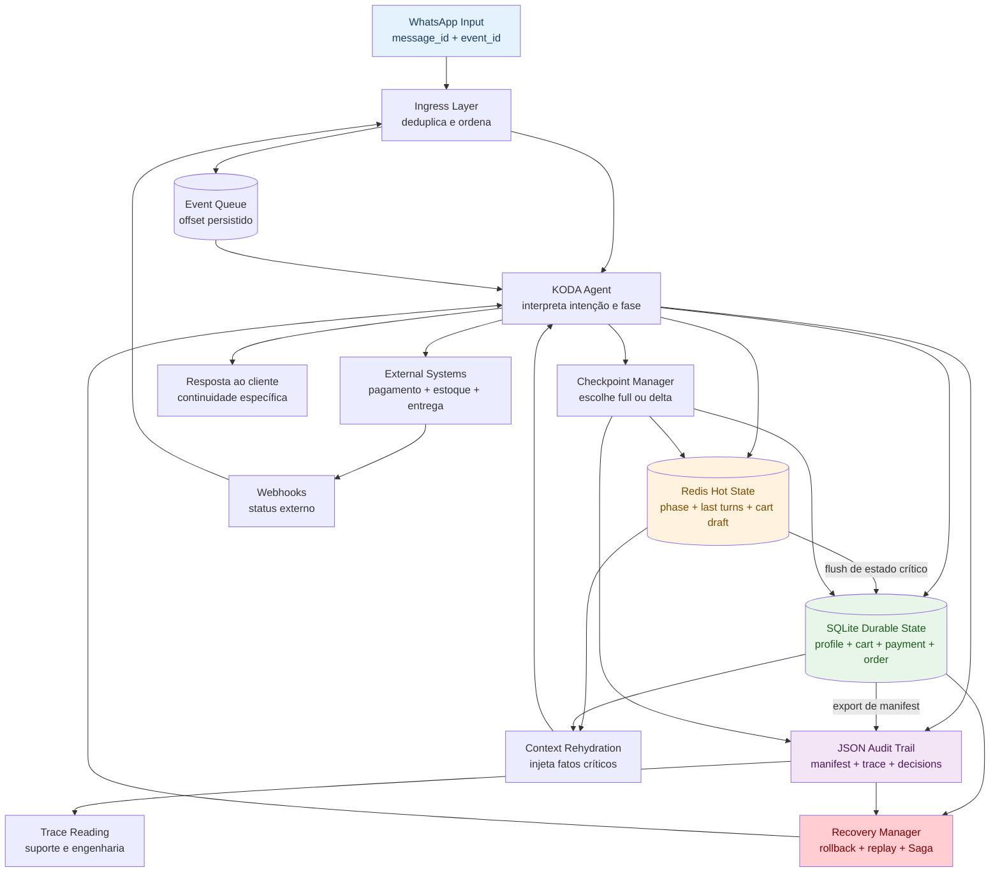
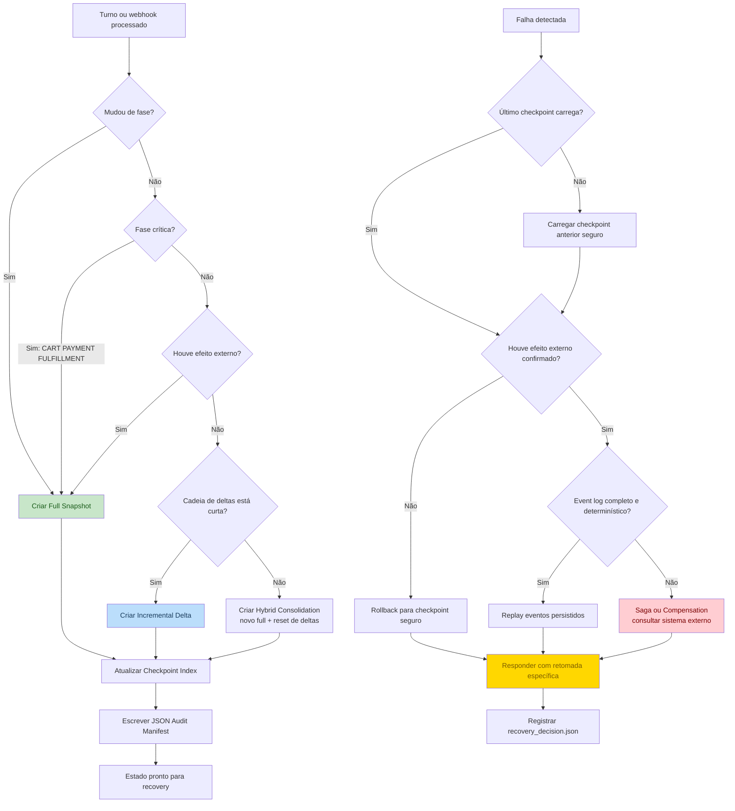
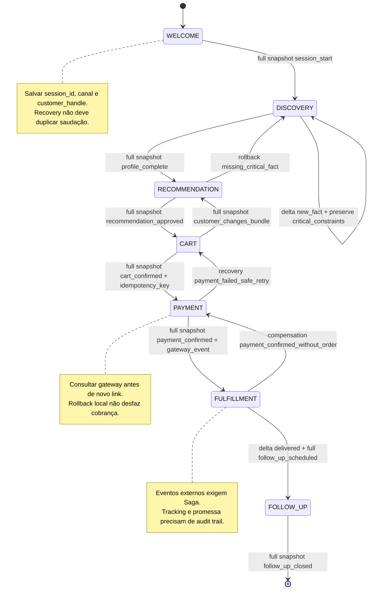

# 🧠 Grafos de State Persistence
## Mapas de conhecimento para persistência, checkpointing e recovery em long-running agents do KODA

**Tempo Estimado:** 150 minutos  
**Nível:** 6 - Knowledge Graphs detalhados  
**Pré-requisitos:** Ter completado Nível 1, Nível 2, Nível 3 e lido `curriculum/05-core-concepts/05-state-persistence.md`  
**Status:** 🟢 COMPLETO - Grafo detalhado para arquitetura, operação e treinamento  
**Data de Criação:** Maio 2026

---

## 📖 Prólogo: A Madrugada em Que o Grafo Lembrou

Às 02h13 de uma terça-feira, Clara recebeu o alerta que ninguém quer receber: o KODA estava respondendo no WhatsApp, mas a fila de pagamento mostrava eventos duplicados.

Não era um outage total. Esse era justamente o problema.

Quando tudo cai, o incidente é óbvio. Quando apenas a memória fica inconsistente, o sistema continua falando com confiança enquanto a verdade operacional começa a rachar.

A conversa que abriu o incidente era da Marina. Ela tinha começado perguntando por creatina sem sabor, depois explicou que precisava de entrega no mesmo dia, depois informou sensibilidade a lactose, depois mudou o endereço, depois aceitou uma recomendação e, no final, pediu para trocar o sabor do whey.

Nada disso era estranho para um vendedor humano. Para um agente long-running, cada frase era uma atualização de estado que precisava sobreviver a tempo, falha, coordenação e sistemas externos.

O deploy das 02h10 reiniciou um worker. Redis voltou rápido. SQLite estava íntegro. O audit trail existia. Ainda assim, o KODA parecia indeciso: o carrinho estava em `PAYMENT`, mas o último evento persistido dizia `CART`; o gateway possuía um link válido, mas o manifest de suporte apontava para uma tentativa anterior.

Clara não precisava de mais logs soltos. Ela precisava de um mapa.

Ela abriu o grafo de persistência e começou pelas arestas, não pelos arquivos. `WhatsApp event` levava a `session state`. `session state` levava a `checkpoint index`. `checkpoint index` levava a `recovery decision`. `recovery decision` perguntava: houve efeito externo? Sim. Então rollback local não bastava. Era caso de `Saga` com consulta ao gateway e compensação possível.

Em dez minutos, a equipe sabia o que fazer: carregar o último full snapshot do carrinho, aplicar os deltas até o evento confirmado, consultar o gateway pelo `payment_id`, não gerar novo link sem verificar idempotência, registrar a decisão em JSON audit e responder à Marina com contexto específico.

A resposta enviada não mencionou Redis, SQLite, JSON, checkpoint ou Saga. A resposta dizia: "Marina, seu carrinho continua salvo com a creatina sem sabor e o whey trocado. O pagamento anterior ficou pendente; vou validar o link antes de gerar outro."

Para Marina, aquilo pareceu continuidade. Para Clara, foi o grafo funcionando.

Este módulo existe para esse tipo de madrugada.

O core concept `curriculum/05-core-concepts/05-state-persistence.md` explica profundamente o que é persistir estado. Este arquivo transforma esse conhecimento em mapas: nós, arestas, camadas, decisões, checkpoints, recovery paths, contratos por fase e relações com KODA.

A ideia não é decorar tecnologias. A ideia é enxergar dependências.

Quando você vê a arquitetura como grafo, entende por que um `payment_id` sem `idempotency_key` é uma aresta quebrada; por que um checkpoint sem `phase` é um nó mudo; por que Redis rápido não substitui SQLite durável; por que JSON audit não é luxo, mas ponte entre engenharia, suporte e produto.

Um agente long-running não é definido por quanto tempo fica acordado. É definido por quão corretamente consegue continuar depois de ser interrompido.

State persistence graphs são a forma de ensinar essa continuidade para humanos e para sistemas.

---

## 🎯 O Que É o State Persistence Graph?

### Definição simples

Um **State Persistence Graph** é o mapa explícito das relações entre estado, backend, checkpoint, recovery, coordenação e experiência do cliente em um agente long-running.

Ele responde à pergunta que o código isolado não responde bem:

> Quando algo falhar, qual dado prova onde a jornada estava, qual camada deve ser lida, qual estratégia de recovery é segura e qual mensagem deve chegar ao cliente?

No KODA, esse grafo conecta WhatsApp, Agent, Redis hot state, SQLite durable state, JSON audit trail, checkpoint index, recovery manager, Gateway de pagamento, Fulfillment e Support.

### Por que isso importa

- Porque `context window` é memória de trabalho, não fonte de verdade.
- Porque conversas de compra misturam fatos leves, restrições críticas e efeitos externos.
- Porque falhas não respeitam fronteiras didáticas entre módulos.
- Porque recuperação correta depende de saber se houve efeito externo.
- Porque suporte precisa explicar o incidente sem ler todo o código.
- Porque arquitetura de persistência mal mapeada cria confiança falsa.

### A regra de ouro

> Se uma informação muda o próximo passo correto do KODA, ela precisa aparecer no grafo como estado, com dono, backend, checkpoint e recovery.

O grafo não substitui implementação. Ele impede implementação cega.

---

## 🗺️ Roadmap Visual do Módulo

```
ENTRADA: Você leu State Persistence no core concept
  |
  +-- SEÇÃO 1: visão do grafo e arquitetura em camadas
  |     +-- ASCII architecture diagram
  |     +-- Mermaid multi-layer
  |
  +-- SEÇÃO 2: tabelas comparativas de backend, checkpoint e recovery
  |     +-- Full Snapshot vs Incremental Delta vs Hybrid
  |     +-- Rollback vs Replay vs Compensation/Saga
  |
  +-- SEÇÃO 3: fluxo de checkpoint e recovery
  |     +-- decisão por fase, risco e efeito externo
  |
  +-- SEÇÃO 4: KODA Customer State Machine com persistência
  |     +-- contratos por fase
  |     +-- campos, backends e regras de recovery
  |
  +-- SEÇÃO 5: coordenação com persistência
  |     +-- Sequential, Parallel, Event-driven, Orquestrado e Choreography
  |
  +-- SEÇÃO 6: anti-padrões, métricas, checklist e cartões de estudo
  |
SAÍDA: Você consegue desenhar, revisar e depurar state persistence em KODA
```

---

## 📊 Visão Geral: Arquitetura de Persistência Como Grafo

O grafo de persistência tem cinco famílias de nós.

| Família de nós | Pergunta que responde | Exemplos no KODA | Falha quando ausente |
| --- | --- | --- | --- |
| Entrada | Que evento iniciou ou retomou a jornada? | `WhatsApp message`, webhook, retorno do cliente | O sistema não sabe se processou uma mensagem |
| Estado | Que fato muda o próximo passo correto? | `cart`, `phase`, `constraints`, `payment_id` | O agente responde como se nada tivesse acontecido |
| Camada | Onde o fato vive e com qual promessa? | Redis, SQLite, JSON audit, event log | Latência, durabilidade e auditoria ficam misturadas |
| Checkpoint | Qual ponto seguro permite retomada? | full snapshot, delta, hybrid | Recovery volta para ponto ambíguo |
| Recovery | Que estratégia é segura depois da falha? | rollback, replay, Saga | Retry duplica efeito externo ou perde trabalho |

A diferença entre uma lista e um grafo está nas arestas. Arestas mostram dependência, direção, autoridade e risco.

### Diagrama ASCII: mapa de camadas e responsabilidades

```
+--------------------------------------------------------------------------------+
|                         STATE PERSISTENCE GRAPH - KODA                         |
+--------------------------------------------------------------------------------+
|                                                                                |
|  +--------------------+        +---------------------------+                    |
|  | WhatsApp / Input   | -----> | KODA Agent / Orchestrator |                    |
|  | event_id, message  |        | phase, intent, next step  |                    |
|  +---------+----------+        +-------------+-------------+                    |
|            |                                 |                                  |
|            v                                 v                                  |
|  +--------------------+        +---------------------------+                    |
|  | Event Queue        |        | Context Rehydration      |                    |
|  | offset, ordering   |        | critical facts, summary  |                    |
|  +---------+----------+        +-------------+-------------+                    |
|            |                                 |                                  |
|            v                                 v                                  |
|  +--------------------+   hot  +---------------------------+                    |
|  | Redis Hot State    | <----> | Active Session State      |                    |
|  | TTL, low latency   |        | cart draft, last turns    |                    |
|  +---------+----------+        +-------------+-------------+                    |
|            | flush/checkpoint                |                                  |
|            v                                 v                                  |
|  +--------------------+ durable +--------------------------+                    |
|  | SQLite Durable     | <-----> | Checkpoint Index         |                    |
|  | profile, order     |        | full, delta, safe point  |                    |
|  +---------+----------+        +-------------+-------------+                    |
|            | manifest/export                 |                                  |
|            v                                 v                                  |
|  +--------------------+ audit  +---------------------------+                    |
|  | JSON Audit Trail   | <----> | Recovery Manager         |                    |
|  | manifest, traces   |        | rollback, replay, Saga   |                    |
|  +---------+----------+        +-------------+-------------+                    |
|            |                                 |                                  |
|            v                                 v                                  |
|  +--------------------+        +---------------------------+                    |
|  | Support / Trace    |        | Customer Response        |                    |
|  | explain incident   |        | specific continuation    |                    |
|  +--------------------+        +---------------------------+                    |
|                                                                                |
+--------------------------------------------------------------------------------+
```

Leia o diagrama de cima para baixo quando estiver desenhando a feature. Leia de baixo para cima quando estiver depurando recovery.

---

## 🌐 Diagrama 1: Arquitetura de Persistência Multi-Layer

Este diagrama expande a arquitetura do core concept para a leitura de knowledge graph. Ele mostra fluxo de estado, não apenas fluxo de mensagem.



A leitura central é simples: Redis acelera, SQLite preserva, JSON explica. O Agent não deve confundir essas promessas.

---

## 🧱 Camadas de Persistência e Promessas Arquiteturais

### Redis hot state

**Promessa principal:** latência baixa para sessão ativa.

**Risco se mal usado:** perde valor quando usado como fonte única.

**Exemplo KODA:** session phase, last turns, cart draft.

**Pergunta de revisão:** esta camada está guardando apenas o que sua promessa consegue sustentar?

### SQLite durable state

**Promessa principal:** consulta, durabilidade e transação local.

**Risco se mal usado:** exige schema e migração disciplinados.

**Exemplo KODA:** customer profile, order state, payment state.

**Pergunta de revisão:** esta camada está guardando apenas o que sua promessa consegue sustentar?

### JSON audit trail

**Promessa principal:** leitura humana e trace reading.

**Risco se mal usado:** fraco para concorrência sem lock.

**Exemplo KODA:** manifest, checkpoints, recovery decisions.

**Pergunta de revisão:** esta camada está guardando apenas o que sua promessa consegue sustentar?

### Event log

**Promessa principal:** replay e auditoria temporal.

**Risco se mal usado:** só funciona se eventos forem completos.

**Exemplo KODA:** turn events, webhook events, integration outputs.

**Pergunta de revisão:** esta camada está guardando apenas o que sua promessa consegue sustentar?

### Context window

**Promessa principal:** raciocínio imediato do modelo.

**Risco se mal usado:** não sobrevive a chamada ou restart.

**Exemplo KODA:** resumo curado e fatos críticos injetados.

**Pergunta de revisão:** esta camada está guardando apenas o que sua promessa consegue sustentar?

| Camada | Latência | Durabilidade | Auditabilidade | Melhor uso | Erro clássico |
| --- | --- | --- | --- | --- | --- |
| Context window | Muito baixa | Nenhuma após a chamada | Baixa | raciocínio imediato | tratar prompt como banco |
| Redis hot state | Muito baixa | Variável | Média se usar streams | sessão ativa | usar sem AOF como fonte única |
| SQLite durable state | Baixa | Alta com WAL e backup | Boa com tabelas de evento | estado consultável | schema sem versão |
| JSON audit trail | Baixa a média | Alta com escrita atômica | Muito alta | debug humano | sobrescrever arquivo sem lock |
| Event log | Média | Alta se append-only | Muito alta | replay e integração | evento sem payload suficiente |

---

## 🔄 Estratégias de Checkpointing

Checkpointing é a decisão de transformar estado mutável em ponto de retomada. O grafo ajuda porque mostra onde um checkpoint precisa nascer: em transição de fase, antes de efeito externo, depois de confirmação externa e periodicamente em conversas longas.

| Estratégia | O que salva | Custo de escrita | Custo de recovery | Quando usar no KODA | Risco dominante |
| --- | --- | --- | --- | --- | --- |
| Full Snapshot | todo estado necessário para retomar | alto em estado grande | baixo | entrada de sessão, mudança de fase, carrinho, pagamento, fulfillment | snapshot grande demais ou com dados irrelevantes |
| Incremental Delta | somente mudanças desde uma base | baixo | médio a alto se cadeia longa | fatos novos no Discovery, objeções, tracking events | base ambígua ou delta corrompido |
| Hybrid | full periódico mais deltas intermediários | médio | baixo a médio | produção KODA com conversas longas | política de consolidação mal calibrada |

### Full Snapshot

**Princípio:** prefira quando o próximo recovery precisa ser simples e seguro.

**Gatilhos típicos:** mudança de fase, pagamento, pedido, estoque, entrega, retorno entre sessões.

**Leitura no grafo:** encontre o nó de fase, siga até o nó de risco, depois escolha a aresta de checkpoint que reduz ambiguidade sem salvar ruído.

### Incremental Delta

**Princípio:** prefira quando o estado muda pouco e com frequência.

**Gatilhos típicos:** fato de discovery, objeção, preferência fraca, evento de tracking.

**Leitura no grafo:** encontre o nó de fase, siga até o nó de risco, depois escolha a aresta de checkpoint que reduz ambiguidade sem salvar ruído.

### Hybrid

**Princípio:** prefira quando conversa longa precisa de custo controlado e recovery rápido.

**Gatilhos típicos:** full por fase e delta por turno interno.

**Leitura no grafo:** encontre o nó de fase, siga até o nó de risco, depois escolha a aresta de checkpoint que reduz ambiguidade sem salvar ruído.

---

## 🧭 Diagrama 2: Fluxo de Checkpoint e Recovery

Este diagrama combina decisão de checkpoint e caminho de recovery. Ele mostra que a estratégia correta depende de fase, criticidade, efeito externo e completude do event log.



A parte mais importante do fluxo é a pergunta sobre efeito externo. Rollback local não desfaz cobrança, reserva ou entrega.

---

## 🛠️ Estratégias de Recovery

| Estratégia | Ideia central | Pré-requisito | Melhor caso | Resposta segura ao cliente | Perigo se mal aplicada |
| --- | --- | --- | --- | --- | --- |
| Rollback | voltar ao último checkpoint seguro | snapshot confiável e sem efeito externo irreversível | crash antes de enviar resposta ou antes de gateway | retomar do ponto salvo sem inventar | perder trabalho após checkpoint ou esconder falha |
| Replay | reexecutar eventos desde base conhecida | event log completo, tool outputs versionados e determinismo | reconstrução após deploy ou corrupção parcial | seguir como se processamento tivesse continuado | LLM ou API nova produzir resultado diferente |
| Compensation/Saga | desfazer ou reconciliar efeitos externos | ação compensatória por etapa externa | pagamento, estoque, entrega, cupom | explicar próximo passo sem duplicar cobrança | compensação falhar e exigir suporte humano |

### Rollback no grafo

Rollback é uma aresta curta: `failure -> latest safe checkpoint -> response`. Ela deve ser usada quando o mundo externo ainda não mudou.

**Pergunta operacional:** o suporte consegue explicar por que esta estratégia foi escolhida olhando o manifest?

### Replay no grafo

Replay é uma trilha: `checkpoint -> event log -> deterministic processor -> rebuilt state`. Ele exige versões de prompt, modelo, tool output e schema.

**Pergunta operacional:** o suporte consegue explicar por que esta estratégia foi escolhida olhando o manifest?

### Compensation/Saga no grafo

Compensation/Saga é um subgrafo: cada ação externa tem uma ação de compensação, uma consulta de verdade externa e um registro de decisão.

**Pergunta operacional:** o suporte consegue explicar por que esta estratégia foi escolhida olhando o manifest?

---

## 🚀 Aplicação Prática no KODA

A aplicação prática no KODA é modelar a conversa como `Customer State Machine` persistida. Cada fase tem contrato próprio: dados mínimos, backend principal, checkpoint strategy, regra de recovery e mensagem de retomada.

### Diagrama 3: KODA Customer State Machine com Persistência



### Contratos de persistência por fase

| Fase | Objetivo | Estado mínimo | Checkpoint strategy | Recovery correto |
| --- | --- | --- | --- | --- |
| WELCOME | abrir sessão | session_id, canal, customer_handle, locale | full snapshot inicial | retomar sem repetir saudação |
| DISCOVERY | coletar objetivo e restrições | goal, constraints, budget_cents, missing_facts | delta por fato e full ao completar perfil | perguntar apenas a lacuna restante |
| RECOMMENDATION | produzir recomendação aprovada | catalog_version, candidate_skus, evaluator_score, approved_bundle | full após aprovação do Evaluator | reexibir ou revalidar recomendação |
| CART | confirmar carrinho | cart_id, items, locked_prices, shipping_option, expires_at | full em cada confirmação | restaurar carrinho e confirmar intenção |
| PAYMENT | processar pagamento | payment_id, payment_link, gateway_status, idempotency_key | full antes e depois do gateway | consultar gateway antes de retry |
| FULFILLMENT | cumprir pedido | order_id, reservation_id, carrier, tracking_code, promised_date | delta por evento e full em marcos críticos | não duplicar reserva nem promessa |
| FOLLOW_UP | acompanhar pós-venda | follow_up_id, order_id, scheduled_for, customer_feedback | full ao agendar e delta por resposta | retomar suporte do pedido correto |

### Fase `WELCOME`

**Objetivo operacional:** abrir sessão.

**Campos mínimos:** `session_id, canal, customer_handle, locale`.

**Estratégia de checkpoint:** full snapshot inicial.

**Regra de recovery:** retomar sem repetir saudação.

**Contrato de prompt:** a context window recebe apenas o resumo da fase, os fatos críticos e a próxima ação esperada.

**Contrato de auditoria:** o JSON audit registra a origem dos campos que sustentam promessa, preço, segurança ou pagamento.

### Fase `DISCOVERY`

**Objetivo operacional:** coletar objetivo e restrições.

**Campos mínimos:** `goal, constraints, budget_cents, missing_facts`.

**Estratégia de checkpoint:** delta por fato e full ao completar perfil.

**Regra de recovery:** perguntar apenas a lacuna restante.

**Contrato de prompt:** a context window recebe apenas o resumo da fase, os fatos críticos e a próxima ação esperada.

**Contrato de auditoria:** o JSON audit registra a origem dos campos que sustentam promessa, preço, segurança ou pagamento.

### Fase `RECOMMENDATION`

**Objetivo operacional:** produzir recomendação aprovada.

**Campos mínimos:** `catalog_version, candidate_skus, evaluator_score, approved_bundle`.

**Estratégia de checkpoint:** full após aprovação do Evaluator.

**Regra de recovery:** reexibir ou revalidar recomendação.

**Contrato de prompt:** a context window recebe apenas o resumo da fase, os fatos críticos e a próxima ação esperada.

**Contrato de auditoria:** o JSON audit registra a origem dos campos que sustentam promessa, preço, segurança ou pagamento.

### Fase `CART`

**Objetivo operacional:** confirmar carrinho.

**Campos mínimos:** `cart_id, items, locked_prices, shipping_option, expires_at`.

**Estratégia de checkpoint:** full em cada confirmação.

**Regra de recovery:** restaurar carrinho e confirmar intenção.

**Contrato de prompt:** a context window recebe apenas o resumo da fase, os fatos críticos e a próxima ação esperada.

**Contrato de auditoria:** o JSON audit registra a origem dos campos que sustentam promessa, preço, segurança ou pagamento.

### Fase `PAYMENT`

**Objetivo operacional:** processar pagamento.

**Campos mínimos:** `payment_id, payment_link, gateway_status, idempotency_key`.

**Estratégia de checkpoint:** full antes e depois do gateway.

**Regra de recovery:** consultar gateway antes de retry.

**Contrato de prompt:** a context window recebe apenas o resumo da fase, os fatos críticos e a próxima ação esperada.

**Contrato de auditoria:** o JSON audit registra a origem dos campos que sustentam promessa, preço, segurança ou pagamento.

### Fase `FULFILLMENT`

**Objetivo operacional:** cumprir pedido.

**Campos mínimos:** `order_id, reservation_id, carrier, tracking_code, promised_date`.

**Estratégia de checkpoint:** delta por evento e full em marcos críticos.

**Regra de recovery:** não duplicar reserva nem promessa.

**Contrato de prompt:** a context window recebe apenas o resumo da fase, os fatos críticos e a próxima ação esperada.

**Contrato de auditoria:** o JSON audit registra a origem dos campos que sustentam promessa, preço, segurança ou pagamento.

### Fase `FOLLOW_UP`

**Objetivo operacional:** acompanhar pós-venda.

**Campos mínimos:** `follow_up_id, order_id, scheduled_for, customer_feedback`.

**Estratégia de checkpoint:** full ao agendar e delta por resposta.

**Regra de recovery:** retomar suporte do pedido correto.

**Contrato de prompt:** a context window recebe apenas o resumo da fase, os fatos críticos e a próxima ação esperada.

**Contrato de auditoria:** o JSON audit registra a origem dos campos que sustentam promessa, preço, segurança ou pagamento.

---

## 🔗 Arestas Críticas do Grafo de Persistência

Abaixo estão as relações que mais aparecem em revisões de arquitetura. Cada aresta deve ser visível em código, schema, runbook ou teste.

### Aresta 1: `WhatsApp Event` → `Event Queue`

**Sentido:** `WhatsApp Event` produz ou autoriza `Event Queue`.

**Por que existe:** preserva ordem e deduplicação.

**Pergunta de revisão:** se essa aresta quebrar, qual teste ou alerta detecta antes do cliente?

### Aresta 2: `Event Queue` → `Processing Offset`

**Sentido:** `Event Queue` produz ou autoriza `Processing Offset`.

**Por que existe:** prova até onde a sessão avançou.

**Pergunta de revisão:** se essa aresta quebrar, qual teste ou alerta detecta antes do cliente?

### Aresta 3: `Processing Offset` → `Idempotency Key`

**Sentido:** `Processing Offset` produz ou autoriza `Idempotency Key`.

**Por que existe:** evita repetir operação lógica.

**Pergunta de revisão:** se essa aresta quebrar, qual teste ou alerta detecta antes do cliente?

### Aresta 4: `Discovery Fact` → `Critical Facts`

**Sentido:** `Discovery Fact` produz ou autoriza `Critical Facts`.

**Por que existe:** separa restrição crítica de preferência fraca.

**Pergunta de revisão:** se essa aresta quebrar, qual teste ou alerta detecta antes do cliente?

### Aresta 5: `Critical Facts` → `Context Rehydration`

**Sentido:** `Critical Facts` produz ou autoriza `Context Rehydration`.

**Por que existe:** garante que o prompt não esquece segurança.

**Pergunta de revisão:** se essa aresta quebrar, qual teste ou alerta detecta antes do cliente?

### Aresta 6: `Context Rehydration` → `Generator`

**Sentido:** `Context Rehydration` produz ou autoriza `Generator`.

**Por que existe:** fornece somente estado útil para gerar.

**Pergunta de revisão:** se essa aresta quebrar, qual teste ou alerta detecta antes do cliente?

### Aresta 7: `Generator Output` → `Evaluator`

**Sentido:** `Generator Output` produz ou autoriza `Evaluator`.

**Por que existe:** impede envio sem julgamento independente.

**Pergunta de revisão:** se essa aresta quebrar, qual teste ou alerta detecta antes do cliente?

### Aresta 8: `Evaluator` → `Approved Recommendation`

**Sentido:** `Evaluator` produz ou autoriza `Approved Recommendation`.

**Por que existe:** transforma draft em verdade operacional.

**Pergunta de revisão:** se essa aresta quebrar, qual teste ou alerta detecta antes do cliente?

### Aresta 9: `Approved Recommendation` → `Catalog Version`

**Sentido:** `Approved Recommendation` produz ou autoriza `Catalog Version`.

**Por que existe:** amarra decisão ao catálogo visto.

**Pergunta de revisão:** se essa aresta quebrar, qual teste ou alerta detecta antes do cliente?

### Aresta 10: `Catalog Version` → `Cart`

**Sentido:** `Catalog Version` produz ou autoriza `Cart`.

**Por que existe:** evita recalcular promessa com regra nova.

**Pergunta de revisão:** se essa aresta quebrar, qual teste ou alerta detecta antes do cliente?

### Aresta 11: `Cart` → `Locked Price`

**Sentido:** `Cart` produz ou autoriza `Locked Price`.

**Por que existe:** protege confiança comercial.

**Pergunta de revisão:** se essa aresta quebrar, qual teste ou alerta detecta antes do cliente?

### Aresta 12: `Locked Price` → `Payment Attempt`

**Sentido:** `Locked Price` produz ou autoriza `Payment Attempt`.

**Por que existe:** garante que o gateway cobra a promessa correta.

**Pergunta de revisão:** se essa aresta quebrar, qual teste ou alerta detecta antes do cliente?

### Aresta 13: `Payment Attempt` → `Gateway Status`

**Sentido:** `Payment Attempt` produz ou autoriza `Gateway Status`.

**Por que existe:** distingue pendente, pago, recusado e desconhecido.

**Pergunta de revisão:** se essa aresta quebrar, qual teste ou alerta detecta antes do cliente?

### Aresta 14: `Gateway Status` → `Fulfillment`

**Sentido:** `Gateway Status` produz ou autoriza `Fulfillment`.

**Por que existe:** só entrega quando pagamento é confirmado.

**Pergunta de revisão:** se essa aresta quebrar, qual teste ou alerta detecta antes do cliente?

### Aresta 15: `Fulfillment Event` → `Follow-Up`

**Sentido:** `Fulfillment Event` produz ou autoriza `Follow-Up`.

**Por que existe:** pós-venda pertence a pedido concreto.

**Pergunta de revisão:** se essa aresta quebrar, qual teste ou alerta detecta antes do cliente?

### Aresta 16: `Checkpoint` → `Recovery Manager`

**Sentido:** `Checkpoint` produz ou autoriza `Recovery Manager`.

**Por que existe:** define ponto seguro de retomada.

**Pergunta de revisão:** se essa aresta quebrar, qual teste ou alerta detecta antes do cliente?

### Aresta 17: `Recovery Manager` → `Support Manifest`

**Sentido:** `Recovery Manager` produz ou autoriza `Support Manifest`.

**Por que existe:** explica decisão para humanos.

**Pergunta de revisão:** se essa aresta quebrar, qual teste ou alerta detecta antes do cliente?

### Aresta 18: `Support Manifest` → `Customer Response`

**Sentido:** `Support Manifest` produz ou autoriza `Customer Response`.

**Por que existe:** transforma recovery técnico em continuidade humana.

**Pergunta de revisão:** se essa aresta quebrar, qual teste ou alerta detecta antes do cliente?

### Aresta 19: `Schema Version` → `Migration`

**Sentido:** `Schema Version` produz ou autoriza `Migration`.

**Por que existe:** protege deploy e rollback.

**Pergunta de revisão:** se essa aresta quebrar, qual teste ou alerta detecta antes do cliente?

### Aresta 20: `Prompt Version` → `Replay`

**Sentido:** `Prompt Version` produz ou autoriza `Replay`.

**Por que existe:** torna reprocessamento auditável.

**Pergunta de revisão:** se essa aresta quebrar, qual teste ou alerta detecta antes do cliente?

### Aresta 21: `Rubric Version` → `Evaluator Decision`

**Sentido:** `Rubric Version` produz ou autoriza `Evaluator Decision`.

**Por que existe:** explica aprovação antiga.

**Pergunta de revisão:** se essa aresta quebrar, qual teste ou alerta detecta antes do cliente?

### Aresta 22: `Lock` → `Shared Resource`

**Sentido:** `Lock` produz ou autoriza `Shared Resource`.

**Por que existe:** previne corrida em carrinho, pedido e pagamento.

**Pergunta de revisão:** se essa aresta quebrar, qual teste ou alerta detecta antes do cliente?

### Aresta 23: `Saga Step` → `Compensation Step`

**Sentido:** `Saga Step` produz ou autoriza `Compensation Step`.

**Por que existe:** mantém efeito externo reconciliável.

**Pergunta de revisão:** se essa aresta quebrar, qual teste ou alerta detecta antes do cliente?

### Aresta 24: `Audit Trail` → `Trace Reading`

**Sentido:** `Audit Trail` produz ou autoriza `Trace Reading`.

**Por que existe:** permite depurar sem adivinhar.

**Pergunta de revisão:** se essa aresta quebrar, qual teste ou alerta detecta antes do cliente?

---

## ⚖️ Coordenação com Persistência

State persistence muda o comportamento das estratégias de coordenação. Sem persistência, cada estratégia depende de memória frágil. Com persistência, cada estratégia ganha retomada, auditoria e redução de retrabalho.

| Estratégia de Coordenação | Sem Persistência | Com Persistência | Ganho |
| --- | --- | --- | --- |
| **Sequential** (Planner → Generator → Evaluator) | falha do Evaluator força recomeço do pipeline | `plan.json` e `generation.json` permitem reexecutar só o Evaluator | retrabalho cai e cada etapa vira auditável |
| **Parallel** (N Generators concorrentes) | não se sabe quais outputs terminaram | cada worker grava output único e status próprio | reexecuta apenas ausentes e elimina inconsistência silenciosa |
| **Event-driven** (agentes reagem a eventos) | crash perde evento em memória | fila durável guarda offset confirmado por agente | eventos perdidos viram reprocessamento controlado |
| **Orquestrado** (orchestrator central) | morte do orchestrator apaga progresso | `pipeline_state.json` registra fase, agentes concluídos e próximos passos | retomada do último checkpoint em vez de restart total |
| **Choreography** (agentes autônomos) | agentes não sabem se dependentes terminaram | `state/sessions/{id}/agents/{agent}/status.json` torna progresso observável | coordenação descentralizada fica recuperável |

### Como escolher

- Use Sequential quando a ordem é clara e o custo de cada etapa justifica checkpoints intermediários.
- Use Parallel quando há alternativas independentes e outputs podem ser comparados depois.
- Use Event-driven quando a origem da verdade é uma sequência de eventos externos ou webhooks.
- Use Orquestrado quando uma autoridade central precisa decidir fase, retry e dependências.
- Use Choreography quando agentes especializados podem operar com status público e contratos claros.

---

## 🧪 Casos Reais: Como Ler o Grafo Durante Incidentes

### Caso: Pedro

**Falha observada:** restart durante pagamento.

**Fase afetada:** `PAYMENT`.

**Estado mínimo que deve existir:** `cart, payment_id, idempotency_key`.

**Recovery correto:** validar link existente antes de gerar outro.

**Leitura do grafo:** comece pelo evento, encontre a fase persistida, confira checkpoint, verifique efeito externo e registre a decisão no audit trail.

### Caso: Marina

**Falha observada:** evento repetido cria risco de pedido duplicado.

**Fase afetada:** `CART`.

**Estado mínimo que deve existir:** `last_processed_event_id, cart_id, order_lock`.

**Recovery correto:** ignorar evento já confirmado.

**Leitura do grafo:** comece pelo evento, encontre a fase persistida, confira checkpoint, verifique efeito externo e registre a decisão no audit trail.

### Caso: Rafael

**Falha observada:** restrição de cafeína some em conversa longa.

**Fase afetada:** `DISCOVERY`.

**Estado mínimo que deve existir:** `critical_constraints, summary_version`.

**Recovery correto:** reidratar prompt com fato crítico.

**Leitura do grafo:** comece pelo evento, encontre a fase persistida, confira checkpoint, verifique efeito externo e registre a decisão no audit trail.

### Caso: Bianca

**Falha observada:** cupom aplicado antes da regra.

**Fase afetada:** `PAYMENT`.

**Estado mínimo que deve existir:** `coupon_attempt, validation_status`.

**Recovery correto:** compensar ou remover cupom inválido.

**Leitura do grafo:** comece pelo evento, encontre a fase persistida, confira checkpoint, verifique efeito externo e registre a decisão no audit trail.

### Caso: Lucas

**Falha observada:** cliente volta três dias depois.

**Fase afetada:** `RECOMMENDATION`.

**Estado mínimo que deve existir:** `approved_recommendation, catalog_version`.

**Recovery correto:** confirmar intenção antes de seguir.

**Leitura do grafo:** comece pelo evento, encontre a fase persistida, confira checkpoint, verifique efeito externo e registre a decisão no audit trail.

### Caso: Ana

**Falha observada:** glúten tratado como preferência fraca.

**Fase afetada:** `DISCOVERY`.

**Estado mínimo que deve existir:** `constraint_type, severity, source_turn`.

**Recovery correto:** bloquear produto inseguro.

**Leitura do grafo:** comece pelo evento, encontre a fase persistida, confira checkpoint, verifique efeito externo e registre a decisão no audit trail.

### Caso: João

**Falha observada:** fluxo B2B misturado com pessoa física.

**Fase afetada:** `DISCOVERY`.

**Estado mínimo que deve existir:** `customer_segment, billing_profile`.

**Recovery correto:** rotear para contrato B2B.

**Leitura do grafo:** comece pelo evento, encontre a fase persistida, confira checkpoint, verifique efeito externo e registre a decisão no audit trail.

### Caso: Nina

**Falha observada:** sabor indisponível após recomendação.

**Fase afetada:** `RECOMMENDATION`.

**Estado mínimo que deve existir:** `catalog_snapshot, availability_checked_at`.

**Recovery correto:** revalidar antes do carrinho.

**Leitura do grafo:** comece pelo evento, encontre a fase persistida, confira checkpoint, verifique efeito externo e registre a decisão no audit trail.

### Caso: Caio

**Falha observada:** critério de preço por dose esquecido.

**Fase afetada:** `RECOMMENDATION`.

**Estado mínimo que deve existir:** `ranking_criteria, rejected_options`.

**Recovery correto:** explicar com o critério persistido.

**Leitura do grafo:** comece pelo evento, encontre a fase persistida, confira checkpoint, verifique efeito externo e registre a decisão no audit trail.

### Caso: Lara

**Falha observada:** suporte promete prazo sem entrega real.

**Fase afetada:** `FULFILLMENT`.

**Estado mínimo que deve existir:** `tracking_status, promised_date, carrier_event`.

**Recovery correto:** responder com status confirmado.

**Leitura do grafo:** comece pelo evento, encontre a fase persistida, confira checkpoint, verifique efeito externo e registre a decisão no audit trail.

### Caso: Otávio

**Falha observada:** dois endereços competem.

**Fase afetada:** `CART`.

**Estado mínimo que deve existir:** `shipping_options, selected_address_id`.

**Recovery correto:** pedir confirmação antes do pagamento.

**Leitura do grafo:** comece pelo evento, encontre a fase persistida, confira checkpoint, verifique efeito externo e registre a decisão no audit trail.

### Caso: Sofia

**Falha observada:** objeção importante vira resposta genérica.

**Fase afetada:** `RECOMMENDATION`.

**Estado mínimo que deve existir:** `decision_factors, objections, confidence`.

**Recovery correto:** retomar trade-off principal.

**Leitura do grafo:** comece pelo evento, encontre a fase persistida, confira checkpoint, verifique efeito externo e registre a decisão no audit trail.

### Caso: Bruno

**Falha observada:** pagamento aprovado não chega ao fulfillment.

**Fase afetada:** `PAYMENT`.

**Estado mínimo que deve existir:** `payment_status, order_id, event_offset`.

**Recovery correto:** criar fulfillment do evento confirmado.

**Leitura do grafo:** comece pelo evento, encontre a fase persistida, confira checkpoint, verifique efeito externo e registre a decisão no audit trail.

### Caso: Clara

**Falha observada:** worker reinicia durante avaliação.

**Fase afetada:** `RECOMMENDATION`.

**Estado mínimo que deve existir:** `generation_output, evaluator_status`.

**Recovery correto:** executar apenas Evaluator novamente.

**Leitura do grafo:** comece pelo evento, encontre a fase persistida, confira checkpoint, verifique efeito externo e registre a decisão no audit trail.

### Caso: Diego

**Falha observada:** duas mensagens rápidas saem de ordem.

**Fase afetada:** `DISCOVERY`.

**Estado mínimo que deve existir:** `event_queue, processing_lock`.

**Recovery correto:** processar pelo offset persistido.

**Leitura do grafo:** comece pelo evento, encontre a fase persistida, confira checkpoint, verifique efeito externo e registre a decisão no audit trail.

### Caso: Elisa

**Falha observada:** catálogo muda antes do carrinho.

**Fase afetada:** `CART`.

**Estado mínimo que deve existir:** `catalog_version, price_locked_until`.

**Recovery correto:** honrar preço ou pedir confirmação.

**Leitura do grafo:** comece pelo evento, encontre a fase persistida, confira checkpoint, verifique efeito externo e registre a decisão no audit trail.

### Caso: Fábio

**Falha observada:** produto retirado por segurança.

**Fase afetada:** `RECOMMENDATION`.

**Estado mínimo que deve existir:** `safety_status, policy_version`.

**Recovery correto:** bloquear recomendação antiga.

**Leitura do grafo:** comece pelo evento, encontre a fase persistida, confira checkpoint, verifique efeito externo e registre a decisão no audit trail.

### Caso: Giovana

**Falha observada:** follow-up cai na conversa errada.

**Fase afetada:** `FOLLOW_UP`.

**Estado mínimo que deve existir:** `order_id, follow_up_id, scheduled_for`.

**Recovery correto:** abrir pós-venda correto.

**Leitura do grafo:** comece pelo evento, encontre a fase persistida, confira checkpoint, verifique efeito externo e registre a decisão no audit trail.

### Caso: Henrique

**Falha observada:** timeout no gateway.

**Fase afetada:** `PAYMENT`.

**Estado mínimo que deve existir:** `payment_attempt, idempotency_key`.

**Recovery correto:** consultar gateway antes de retry.

**Leitura do grafo:** comece pelo evento, encontre a fase persistida, confira checkpoint, verifique efeito externo e registre a decisão no audit trail.

### Caso: Isabela

**Falha observada:** resumo remove alergia rara.

**Fase afetada:** `DISCOVERY`.

**Estado mínimo que deve existir:** `critical_facts, compaction_policy`.

**Recovery correto:** recompactar preservando alergia.

**Leitura do grafo:** comece pelo evento, encontre a fase persistida, confira checkpoint, verifique efeito externo e registre a decisão no audit trail.

---

## 🚫 Anti-Padrões de State Persistence Graphs

### Anti-Padrão 1: `save-only-at-end`

**Como aparece:** salvar apenas no final da jornada.

**Por que falha:** crash no minuto 44 apaga 43 minutos de decisão.

**Correção arquitetural:** checkpoint por transição de fase e antes de efeito externo.

**Sinal no grafo:** existe nó sem aresta de recovery, camada com promessa errada ou efeito externo sem Saga.

### Anti-Padrão 2: `monolithic-state-file`

**Como aparece:** colocar todo estado em um arquivo gigante.

**Por que falha:** conflito de writers, parse lento e debug ruim.

**Correção arquitetural:** particionar por perfil, carrinho, pagamento, fulfillment e audit.

**Sinal no grafo:** existe nó sem aresta de recovery, camada com promessa errada ou efeito externo sem Saga.

### Anti-Padrão 3: `redis-without-persistence`

**Como aparece:** usar Redis como única fonte de verdade.

**Por que falha:** restart remove sessões e carrinhos ativos.

**Correção arquitetural:** Redis quente, SQLite durável e JSON para auditoria.

**Sinal no grafo:** existe nó sem aresta de recovery, camada com promessa errada ou efeito externo sem Saga.

### Anti-Padrão 4: `checkpoint-without-phase-metadata`

**Como aparece:** salvar dados sem fase e próxima ação.

**Por que falha:** recovery carrega conteúdo mas não sabe o que fazer.

**Correção arquitetural:** incluir phase, turn_number e next_expected_action.

**Sinal no grafo:** existe nó sem aresta de recovery, camada com promessa errada ou efeito externo sem Saga.

### Anti-Padrão 5: `overwrite-without-atomic-write`

**Como aparece:** sobrescrever JSON diretamente.

**Por que falha:** crash deixa arquivo truncado.

**Correção arquitetural:** write temp, fsync e rename atômico.

**Sinal no grafo:** existe nó sem aresta de recovery, camada com promessa errada ou efeito externo sem Saga.

### Anti-Padrão 6: `silent-fail-on-load`

**Como aparece:** falha de load vira sessão vazia.

**Por que falha:** cliente percebe amnésia como descaso.

**Correção arquitetural:** tentar checkpoint anterior e registrar incidente.

**Sinal no grafo:** existe nó sem aresta de recovery, camada com promessa errada ou efeito externo sem Saga.

### Anti-Padrão 7: `unversioned-schema`

**Como aparece:** mudar formato sem schema_version.

**Por que falha:** deploy novo interpreta estado antigo errado.

**Correção arquitetural:** versionar schema e migrar explicitamente.

**Sinal no grafo:** existe nó sem aresta de recovery, camada com promessa errada ou efeito externo sem Saga.

### Anti-Padrão 8: `external-effect-before-checkpoint`

**Como aparece:** chamar gateway antes de salvar intenção.

**Por que falha:** mundo externo muda sem registro local.

**Correção arquitetural:** checkpoint antes de pagamento, estoque e entrega.

**Sinal no grafo:** existe nó sem aresta de recovery, camada com promessa errada ou efeito externo sem Saga.

### Anti-Padrão 9: `no-idempotency-key`

**Como aparece:** retry sem identidade estável.

**Por que falha:** duplicidade financeira ou logística.

**Correção arquitetural:** chave por sessão, carrinho e operação lógica.

**Sinal no grafo:** existe nó sem aresta de recovery, camada com promessa errada ou efeito externo sem Saga.

### Anti-Padrão 10: `audit-trail-as-afterthought`

**Como aparece:** guardar só estado final.

**Por que falha:** incidente fica inexplicável.

**Correção arquitetural:** manifest, inputs, outputs e recovery decisions.

**Sinal no grafo:** existe nó sem aresta de recovery, camada com promessa errada ou efeito externo sem Saga.

---

## 📏 Métricas Para Saber se o Grafo Funciona

| Métrica | O que mede | Alerta quando | Ação sugerida |
| --- | --- | --- | --- |
| Recovery success rate | percentual de sessões recuperadas sem reiniciar jornada | abaixo de 99% em fase comum ou abaixo de 99,9% em pagamento | abrir trace, conferir checkpoint index e revisar arestas do grafo |
| Recovery latency | tempo entre detectar falha e retomar estado útil | acima de 1s em sessão ativa ou 5s em replay curto | abrir trace, conferir checkpoint index e revisar arestas do grafo |
| Checkpoint freshness | distância entre último checkpoint e último turno | maior que 1 turno em fase crítica | abrir trace, conferir checkpoint index e revisar arestas do grafo |
| State load failure rate | falhas por arquivo ausente, schema inválido ou corrupção | qualquer pico acima do normal | abrir trace, conferir checkpoint index e revisar arestas do grafo |
| Duplicate external action rate | pagamentos, pedidos ou reservas duplicadas | qualquer valor acima de zero | abrir trace, conferir checkpoint index e revisar arestas do grafo |
| Audit completeness | respostas com manifest completo | abaixo de 99% em produção | abrir trace, conferir checkpoint index e revisar arestas do grafo |
| Context rehydration accuracy | prompts com fatos críticos corretos | abaixo de 99% para restrições e pagamento | abrir trace, conferir checkpoint index e revisar arestas do grafo |
| Abandoned cart recovery revenue | receita recuperada por carrinho retomado | queda após implantação de recovery | abrir trace, conferir checkpoint index e revisar arestas do grafo |
| Support reconstruction time | tempo para suporte explicar incidente | acima de 5 minutos em caso comum | abrir trace, conferir checkpoint index e revisar arestas do grafo |
| Schema migration error rate | falhas após mudança de formato | qualquer erro em deploy saudável | abrir trace, conferir checkpoint index e revisar arestas do grafo |

### Métrica: Recovery success rate

**Definição:** percentual de sessões recuperadas sem reiniciar jornada.

**Alerta:** abaixo de 99% em fase comum ou abaixo de 99,9% em pagamento.

**Uso no grafo:** associe a métrica ao nó que falhou e à aresta que deveria ter prevenido o incidente.

### Métrica: Recovery latency

**Definição:** tempo entre detectar falha e retomar estado útil.

**Alerta:** acima de 1s em sessão ativa ou 5s em replay curto.

**Uso no grafo:** associe a métrica ao nó que falhou e à aresta que deveria ter prevenido o incidente.

### Métrica: Checkpoint freshness

**Definição:** distância entre último checkpoint e último turno.

**Alerta:** maior que 1 turno em fase crítica.

**Uso no grafo:** associe a métrica ao nó que falhou e à aresta que deveria ter prevenido o incidente.

### Métrica: State load failure rate

**Definição:** falhas por arquivo ausente, schema inválido ou corrupção.

**Alerta:** qualquer pico acima do normal.

**Uso no grafo:** associe a métrica ao nó que falhou e à aresta que deveria ter prevenido o incidente.

### Métrica: Duplicate external action rate

**Definição:** pagamentos, pedidos ou reservas duplicadas.

**Alerta:** qualquer valor acima de zero.

**Uso no grafo:** associe a métrica ao nó que falhou e à aresta que deveria ter prevenido o incidente.

### Métrica: Audit completeness

**Definição:** respostas com manifest completo.

**Alerta:** abaixo de 99% em produção.

**Uso no grafo:** associe a métrica ao nó que falhou e à aresta que deveria ter prevenido o incidente.

### Métrica: Context rehydration accuracy

**Definição:** prompts com fatos críticos corretos.

**Alerta:** abaixo de 99% para restrições e pagamento.

**Uso no grafo:** associe a métrica ao nó que falhou e à aresta que deveria ter prevenido o incidente.

### Métrica: Abandoned cart recovery revenue

**Definição:** receita recuperada por carrinho retomado.

**Alerta:** queda após implantação de recovery.

**Uso no grafo:** associe a métrica ao nó que falhou e à aresta que deveria ter prevenido o incidente.

### Métrica: Support reconstruction time

**Definição:** tempo para suporte explicar incidente.

**Alerta:** acima de 5 minutos em caso comum.

**Uso no grafo:** associe a métrica ao nó que falhou e à aresta que deveria ter prevenido o incidente.

### Métrica: Schema migration error rate

**Definição:** falhas após mudança de formato.

**Alerta:** qualquer erro em deploy saudável.

**Uso no grafo:** associe a métrica ao nó que falhou e à aresta que deveria ter prevenido o incidente.

---

## ✅ Checklist de State Persistence Graphs

- [ ] Definir fases explícitas da jornada do agente.
- [ ] Listar quais dados mudam o próximo passo correto em cada fase.
- [ ] Separar estado operacional de histórico conversacional.
- [ ] Separar estado quente, durável e audit trail.
- [ ] Escolher backend por promessa: latência, durabilidade, auditoria ou query.
- [ ] Incluir `session_id` em todo artefato de estado.
- [ ] Incluir `customer_id` quando o estado pertence a uma pessoa.
- [ ] Incluir `phase` em todo checkpoint recuperável.
- [ ] Incluir `turn_number` e `last_processed_event_id` em eventos e checkpoints.
- [ ] Incluir `schema_version` em todo arquivo persistido.
- [ ] Incluir `next_expected_action` em todo snapshot recuperável.
- [ ] Criar full snapshot ao abrir sessão.
- [ ] Criar full snapshot em toda transição de fase.
- [ ] Criar full snapshot antes de pagamento, estoque, entrega ou cupom.
- [ ] Criar delta checkpoint em turns internos de baixo risco.
- [ ] Consolidar cadeias longas de delta com novo full snapshot.
- [ ] Usar escrita atômica para JSON files.
- [ ] Usar lock, fila ou partição quando houver múltiplos writers.
- [ ] Persistir idempotency key para operações externas.
- [ ] Persistir status de tentativa para timeout.
- [ ] Consultar sistema externo antes de repetir operação sensível.
- [ ] Implementar rollback para falhas transitórias sem efeito externo.
- [ ] Implementar replay apenas com event log completo e versões registradas.
- [ ] Implementar Compensation/Saga para pagamento, estoque e entrega.
- [ ] Registrar recovery decisions em audit trail.
- [ ] Testar crash entre fases críticas.
- [ ] Testar arquivo JSON truncado.
- [ ] Testar Redis indisponível quando SQLite deve continuar sendo fonte durável.
- [ ] Testar cliente voltando dias depois.
- [ ] Medir taxa de recuperação bem-sucedida.
- [ ] Medir tempo médio de recovery.
- [ ] Medir vendas salvas por carrinho recuperado.
- [ ] Treinar suporte para ler manifest e checkpoints.
- [ ] Documentar política de retenção por tipo de estado.
- [ ] Documentar migração de schema antes de alterar formato.
- [ ] Criar dashboard para sessões em fase crítica.
- [ ] Revisar anti-padrões após cada incidente de estado.

---

## 🧠 Atlas de Nós do Grafo

Esta seção transforma os conceitos em cartões de estudo. Use em workshops, reviews de arquitetura e onboarding de engenheiros que já completaram os níveis anteriores.

### Nó 1: Context Window

**Papel no grafo:** mesa de trabalho do modelo.

**Uso no KODA:** recebe somente estado necessário para pensar agora.

**Arestas de entrada típicas:** evento, fase, contrato ou output de ferramenta que produz esse estado.

**Arestas de saída típicas:** checkpoint, prompt reidratado, decisão de recovery ou resposta ao cliente.

**Erro comum:** tratar este nó como detalhe técnico em vez de contrato operacional.

**Pergunta de revisão:** se este nó ficar ausente, qual comportamento errado aparece no WhatsApp?

### Nó 2: Hot State

**Papel no grafo:** estado rápido de sessão.

**Uso no KODA:** acelera turns ativos sem virar fonte de verdade.

**Arestas de entrada típicas:** evento, fase, contrato ou output de ferramenta que produz esse estado.

**Arestas de saída típicas:** checkpoint, prompt reidratado, decisão de recovery ou resposta ao cliente.

**Erro comum:** tratar este nó como detalhe técnico em vez de contrato operacional.

**Pergunta de revisão:** se este nó ficar ausente, qual comportamento errado aparece no WhatsApp?

### Nó 3: Durable State

**Papel no grafo:** estado que precisa sobreviver.

**Uso no KODA:** preserva carrinho, pagamento, perfil e fase.

**Arestas de entrada típicas:** evento, fase, contrato ou output de ferramenta que produz esse estado.

**Arestas de saída típicas:** checkpoint, prompt reidratado, decisão de recovery ou resposta ao cliente.

**Erro comum:** tratar este nó como detalhe técnico em vez de contrato operacional.

**Pergunta de revisão:** se este nó ficar ausente, qual comportamento errado aparece no WhatsApp?

### Nó 4: Audit Trail

**Papel no grafo:** evidência legível do que aconteceu.

**Uso no KODA:** permite suporte e engenharia explicarem incidentes.

**Arestas de entrada típicas:** evento, fase, contrato ou output de ferramenta que produz esse estado.

**Arestas de saída típicas:** checkpoint, prompt reidratado, decisão de recovery ou resposta ao cliente.

**Erro comum:** tratar este nó como detalhe técnico em vez de contrato operacional.

**Pergunta de revisão:** se este nó ficar ausente, qual comportamento errado aparece no WhatsApp?

### Nó 5: Checkpoint Index

**Papel no grafo:** catálogo dos pontos seguros.

**Uso no KODA:** permite encontrar último estado confiável.

**Arestas de entrada típicas:** evento, fase, contrato ou output de ferramenta que produz esse estado.

**Arestas de saída típicas:** checkpoint, prompt reidratado, decisão de recovery ou resposta ao cliente.

**Erro comum:** tratar este nó como detalhe técnico em vez de contrato operacional.

**Pergunta de revisão:** se este nó ficar ausente, qual comportamento errado aparece no WhatsApp?

### Nó 6: Full Snapshot

**Papel no grafo:** cópia completa em ponto seguro.

**Uso no KODA:** simplifica recovery em fase crítica.

**Arestas de entrada típicas:** evento, fase, contrato ou output de ferramenta que produz esse estado.

**Arestas de saída típicas:** checkpoint, prompt reidratado, decisão de recovery ou resposta ao cliente.

**Erro comum:** tratar este nó como detalhe técnico em vez de contrato operacional.

**Pergunta de revisão:** se este nó ficar ausente, qual comportamento errado aparece no WhatsApp?

### Nó 7: Incremental Delta

**Papel no grafo:** registro da mudança desde a base.

**Uso no KODA:** reduz custo de escrita em turn interno.

**Arestas de entrada típicas:** evento, fase, contrato ou output de ferramenta que produz esse estado.

**Arestas de saída típicas:** checkpoint, prompt reidratado, decisão de recovery ou resposta ao cliente.

**Erro comum:** tratar este nó como detalhe técnico em vez de contrato operacional.

**Pergunta de revisão:** se este nó ficar ausente, qual comportamento errado aparece no WhatsApp?

### Nó 8: Hybrid Checkpoint

**Papel no grafo:** full periódico mais deltas.

**Uso no KODA:** equilibra durabilidade e eficiência.

**Arestas de entrada típicas:** evento, fase, contrato ou output de ferramenta que produz esse estado.

**Arestas de saída típicas:** checkpoint, prompt reidratado, decisão de recovery ou resposta ao cliente.

**Erro comum:** tratar este nó como detalhe técnico em vez de contrato operacional.

**Pergunta de revisão:** se este nó ficar ausente, qual comportamento errado aparece no WhatsApp?

### Nó 9: Rollback

**Papel no grafo:** retorno ao último ponto seguro.

**Uso no KODA:** resolve falha sem efeito externo.

**Arestas de entrada típicas:** evento, fase, contrato ou output de ferramenta que produz esse estado.

**Arestas de saída típicas:** checkpoint, prompt reidratado, decisão de recovery ou resposta ao cliente.

**Erro comum:** tratar este nó como detalhe técnico em vez de contrato operacional.

**Pergunta de revisão:** se este nó ficar ausente, qual comportamento errado aparece no WhatsApp?

### Nó 10: Replay

**Papel no grafo:** reconstrução por eventos.

**Uso no KODA:** depende de event log e determinismo.

**Arestas de entrada típicas:** evento, fase, contrato ou output de ferramenta que produz esse estado.

**Arestas de saída típicas:** checkpoint, prompt reidratado, decisão de recovery ou resposta ao cliente.

**Erro comum:** tratar este nó como detalhe técnico em vez de contrato operacional.

**Pergunta de revisão:** se este nó ficar ausente, qual comportamento errado aparece no WhatsApp?

### Nó 11: Compensation/Saga

**Papel no grafo:** ação compensatória para efeito externo.

**Uso no KODA:** protege pagamento, estoque e entrega.

**Arestas de entrada típicas:** evento, fase, contrato ou output de ferramenta que produz esse estado.

**Arestas de saída típicas:** checkpoint, prompt reidratado, decisão de recovery ou resposta ao cliente.

**Erro comum:** tratar este nó como detalhe técnico em vez de contrato operacional.

**Pergunta de revisão:** se este nó ficar ausente, qual comportamento errado aparece no WhatsApp?

### Nó 12: Idempotency Key

**Papel no grafo:** identidade estável de retry.

**Uso no KODA:** evita cobrança, pedido ou reserva duplicada.

**Arestas de entrada típicas:** evento, fase, contrato ou output de ferramenta que produz esse estado.

**Arestas de saída típicas:** checkpoint, prompt reidratado, decisão de recovery ou resposta ao cliente.

**Erro comum:** tratar este nó como detalhe técnico em vez de contrato operacional.

**Pergunta de revisão:** se este nó ficar ausente, qual comportamento errado aparece no WhatsApp?

### Nó 13: Schema Version

**Papel no grafo:** versão explícita do formato.

**Uso no KODA:** protege recovery após deploy.

**Arestas de entrada típicas:** evento, fase, contrato ou output de ferramenta que produz esse estado.

**Arestas de saída típicas:** checkpoint, prompt reidratado, decisão de recovery ou resposta ao cliente.

**Erro comum:** tratar este nó como detalhe técnico em vez de contrato operacional.

**Pergunta de revisão:** se este nó ficar ausente, qual comportamento errado aparece no WhatsApp?

### Nó 14: Prompt Version

**Papel no grafo:** versão da instrução usada.

**Uso no KODA:** torna replay com LLM explicável.

**Arestas de entrada típicas:** evento, fase, contrato ou output de ferramenta que produz esse estado.

**Arestas de saída típicas:** checkpoint, prompt reidratado, decisão de recovery ou resposta ao cliente.

**Erro comum:** tratar este nó como detalhe técnico em vez de contrato operacional.

**Pergunta de revisão:** se este nó ficar ausente, qual comportamento errado aparece no WhatsApp?

### Nó 15: Rubric Version

**Papel no grafo:** versão do critério de avaliação.

**Uso no KODA:** explica aprovação ou rejeição antiga.

**Arestas de entrada típicas:** evento, fase, contrato ou output de ferramenta que produz esse estado.

**Arestas de saída típicas:** checkpoint, prompt reidratado, decisão de recovery ou resposta ao cliente.

**Erro comum:** tratar este nó como detalhe técnico em vez de contrato operacional.

**Pergunta de revisão:** se este nó ficar ausente, qual comportamento errado aparece no WhatsApp?

### Nó 16: Catalog Version

**Papel no grafo:** versão dos produtos consultados.

**Uso no KODA:** protege preço e disponibilidade prometidos.

**Arestas de entrada típicas:** evento, fase, contrato ou output de ferramenta que produz esse estado.

**Arestas de saída típicas:** checkpoint, prompt reidratado, decisão de recovery ou resposta ao cliente.

**Erro comum:** tratar este nó como detalhe técnico em vez de contrato operacional.

**Pergunta de revisão:** se este nó ficar ausente, qual comportamento errado aparece no WhatsApp?

### Nó 17: Lock

**Papel no grafo:** exclusividade temporária em recurso.

**Uso no KODA:** evita corrida entre Order, Payment e Fulfillment.

**Arestas de entrada típicas:** evento, fase, contrato ou output de ferramenta que produz esse estado.

**Arestas de saída típicas:** checkpoint, prompt reidratado, decisão de recovery ou resposta ao cliente.

**Erro comum:** tratar este nó como detalhe técnico em vez de contrato operacional.

**Pergunta de revisão:** se este nó ficar ausente, qual comportamento errado aparece no WhatsApp?

### Nó 18: Processing Offset

**Papel no grafo:** último evento confirmado.

**Uso no KODA:** evita perder ou duplicar mensagens.

**Arestas de entrada típicas:** evento, fase, contrato ou output de ferramenta que produz esse estado.

**Arestas de saída típicas:** checkpoint, prompt reidratado, decisão de recovery ou resposta ao cliente.

**Erro comum:** tratar este nó como detalhe técnico em vez de contrato operacional.

**Pergunta de revisão:** se este nó ficar ausente, qual comportamento errado aparece no WhatsApp?

### Nó 19: Recovery Decision

**Papel no grafo:** registro da estratégia escolhida.

**Uso no KODA:** mostra por que rollback, replay ou Saga foi usado.

**Arestas de entrada típicas:** evento, fase, contrato ou output de ferramenta que produz esse estado.

**Arestas de saída típicas:** checkpoint, prompt reidratado, decisão de recovery ou resposta ao cliente.

**Erro comum:** tratar este nó como detalhe técnico em vez de contrato operacional.

**Pergunta de revisão:** se este nó ficar ausente, qual comportamento errado aparece no WhatsApp?

### Nó 20: Support Manifest

**Papel no grafo:** resumo operacional para humanos.

**Uso no KODA:** reduz tempo de reconstrução de incidentes.

**Arestas de entrada típicas:** evento, fase, contrato ou output de ferramenta que produz esse estado.

**Arestas de saída típicas:** checkpoint, prompt reidratado, decisão de recovery ou resposta ao cliente.

**Erro comum:** tratar este nó como detalhe técnico em vez de contrato operacional.

**Pergunta de revisão:** se este nó ficar ausente, qual comportamento errado aparece no WhatsApp?

---

## 🧾 Matriz Expandida de Campos por Fase KODA

### Campos da fase `WELCOME`

- `session_id`
  - Criticidade: média.
  - Backend recomendado: SQLite ou JSON audit conforme retenção.
  - Checkpoint recomendado: delta ou hybrid.
  - Regra de recovery: carregar campo com fase, origem e validade antes de responder.
- `channel`
  - Criticidade: média.
  - Backend recomendado: SQLite ou JSON audit conforme retenção.
  - Checkpoint recomendado: delta ou hybrid.
  - Regra de recovery: carregar campo com fase, origem e validade antes de responder.
- `customer_handle`
  - Criticidade: média.
  - Backend recomendado: SQLite ou JSON audit conforme retenção.
  - Checkpoint recomendado: delta ou hybrid.
  - Regra de recovery: carregar campo com fase, origem e validade antes de responder.
- `started_at`
  - Criticidade: média.
  - Backend recomendado: SQLite ou JSON audit conforme retenção.
  - Checkpoint recomendado: delta ou hybrid.
  - Regra de recovery: carregar campo com fase, origem e validade antes de responder.
- `locale`
  - Criticidade: média.
  - Backend recomendado: SQLite ou JSON audit conforme retenção.
  - Checkpoint recomendado: delta ou hybrid.
  - Regra de recovery: carregar campo com fase, origem e validade antes de responder.
- `entrypoint`
  - Criticidade: média.
  - Backend recomendado: SQLite ou JSON audit conforme retenção.
  - Checkpoint recomendado: delta ou hybrid.
  - Regra de recovery: carregar campo com fase, origem e validade antes de responder.
- `first_message_id`
  - Criticidade: média.
  - Backend recomendado: SQLite ou JSON audit conforme retenção.
  - Checkpoint recomendado: delta ou hybrid.
  - Regra de recovery: carregar campo com fase, origem e validade antes de responder.
- `consent_status`
  - Criticidade: alta.
  - Backend recomendado: Redis + SQLite.
  - Checkpoint recomendado: delta ou hybrid.
  - Regra de recovery: carregar campo com fase, origem e validade antes de responder.

Critério de qualidade: um recovery nessa fase deve conseguir explicar por que cada campo existe e qual promessa ele protege.

### Campos da fase `DISCOVERY`

- `goal`
  - Criticidade: alta.
  - Backend recomendado: Redis + SQLite.
  - Checkpoint recomendado: delta ou hybrid.
  - Regra de recovery: carregar campo com fase, origem e validade antes de responder.
- `constraints`
  - Criticidade: média.
  - Backend recomendado: SQLite ou JSON audit conforme retenção.
  - Checkpoint recomendado: delta ou hybrid.
  - Regra de recovery: carregar campo com fase, origem e validade antes de responder.
- `budget_cents`
  - Criticidade: alta.
  - Backend recomendado: Redis + SQLite.
  - Checkpoint recomendado: delta ou hybrid.
  - Regra de recovery: carregar campo com fase, origem e validade antes de responder.
- `training_time`
  - Criticidade: média.
  - Backend recomendado: SQLite ou JSON audit conforme retenção.
  - Checkpoint recomendado: delta ou hybrid.
  - Regra de recovery: carregar campo com fase, origem e validade antes de responder.
- `dietary_restrictions`
  - Criticidade: crítica.
  - Backend recomendado: SQLite + JSON audit.
  - Checkpoint recomendado: full snapshot.
  - Regra de recovery: carregar campo com fase, origem e validade antes de responder.
- `flavor_preferences`
  - Criticidade: média.
  - Backend recomendado: SQLite ou JSON audit conforme retenção.
  - Checkpoint recomendado: delta ou hybrid.
  - Regra de recovery: carregar campo com fase, origem e validade antes de responder.
- `experience_level`
  - Criticidade: média.
  - Backend recomendado: SQLite ou JSON audit conforme retenção.
  - Checkpoint recomendado: delta ou hybrid.
  - Regra de recovery: carregar campo com fase, origem e validade antes de responder.
- `missing_facts`
  - Criticidade: média.
  - Backend recomendado: SQLite ou JSON audit conforme retenção.
  - Checkpoint recomendado: delta ou hybrid.
  - Regra de recovery: carregar campo com fase, origem e validade antes de responder.

Critério de qualidade: um recovery nessa fase deve conseguir explicar por que cada campo existe e qual promessa ele protege.

### Campos da fase `RECOMMENDATION`

- `catalog_version`
  - Criticidade: alta.
  - Backend recomendado: Redis + SQLite.
  - Checkpoint recomendado: delta ou hybrid.
  - Regra de recovery: carregar campo com fase, origem e validade antes de responder.
- `candidate_skus`
  - Criticidade: média.
  - Backend recomendado: SQLite ou JSON audit conforme retenção.
  - Checkpoint recomendado: delta ou hybrid.
  - Regra de recovery: carregar campo com fase, origem e validade antes de responder.
- `ranking_criteria`
  - Criticidade: média.
  - Backend recomendado: SQLite ou JSON audit conforme retenção.
  - Checkpoint recomendado: delta ou hybrid.
  - Regra de recovery: carregar campo com fase, origem e validade antes de responder.
- `evaluator_score`
  - Criticidade: média.
  - Backend recomendado: SQLite ou JSON audit conforme retenção.
  - Checkpoint recomendado: delta ou hybrid.
  - Regra de recovery: carregar campo com fase, origem e validade antes de responder.
- `rejected_skus`
  - Criticidade: média.
  - Backend recomendado: SQLite ou JSON audit conforme retenção.
  - Checkpoint recomendado: delta ou hybrid.
  - Regra de recovery: carregar campo com fase, origem e validade antes de responder.
- `approved_bundle`
  - Criticidade: média.
  - Backend recomendado: SQLite ou JSON audit conforme retenção.
  - Checkpoint recomendado: delta ou hybrid.
  - Regra de recovery: carregar campo com fase, origem e validade antes de responder.
- `explanation_summary`
  - Criticidade: média.
  - Backend recomendado: SQLite ou JSON audit conforme retenção.
  - Checkpoint recomendado: delta ou hybrid.
  - Regra de recovery: carregar campo com fase, origem e validade antes de responder.
- `valid_until`
  - Criticidade: média.
  - Backend recomendado: SQLite ou JSON audit conforme retenção.
  - Checkpoint recomendado: delta ou hybrid.
  - Regra de recovery: carregar campo com fase, origem e validade antes de responder.

Critério de qualidade: um recovery nessa fase deve conseguir explicar por que cada campo existe e qual promessa ele protege.

### Campos da fase `CART`

- `cart_id`
  - Criticidade: crítica.
  - Backend recomendado: SQLite + JSON audit.
  - Checkpoint recomendado: full snapshot.
  - Regra de recovery: carregar campo com fase, origem e validade antes de responder.
- `items`
  - Criticidade: média.
  - Backend recomendado: SQLite ou JSON audit conforme retenção.
  - Checkpoint recomendado: delta ou hybrid.
  - Regra de recovery: carregar campo com fase, origem e validade antes de responder.
- `locked_prices`
  - Criticidade: média.
  - Backend recomendado: SQLite ou JSON audit conforme retenção.
  - Checkpoint recomendado: delta ou hybrid.
  - Regra de recovery: carregar campo com fase, origem e validade antes de responder.
- `shipping_option`
  - Criticidade: média.
  - Backend recomendado: SQLite ou JSON audit conforme retenção.
  - Checkpoint recomendado: delta ou hybrid.
  - Regra de recovery: carregar campo com fase, origem e validade antes de responder.
- `coupon_code`
  - Criticidade: média.
  - Backend recomendado: SQLite ou JSON audit conforme retenção.
  - Checkpoint recomendado: delta ou hybrid.
  - Regra de recovery: carregar campo com fase, origem e validade antes de responder.
- `total_cents`
  - Criticidade: alta.
  - Backend recomendado: Redis + SQLite.
  - Checkpoint recomendado: delta ou hybrid.
  - Regra de recovery: carregar campo com fase, origem e validade antes de responder.
- `cart_status`
  - Criticidade: alta.
  - Backend recomendado: Redis + SQLite.
  - Checkpoint recomendado: delta ou hybrid.
  - Regra de recovery: carregar campo com fase, origem e validade antes de responder.
- `expires_at`
  - Criticidade: média.
  - Backend recomendado: SQLite ou JSON audit conforme retenção.
  - Checkpoint recomendado: delta ou hybrid.
  - Regra de recovery: carregar campo com fase, origem e validade antes de responder.

Critério de qualidade: um recovery nessa fase deve conseguir explicar por que cada campo existe e qual promessa ele protege.

### Campos da fase `PAYMENT`

- `payment_id`
  - Criticidade: crítica.
  - Backend recomendado: SQLite + JSON audit.
  - Checkpoint recomendado: full snapshot.
  - Regra de recovery: carregar campo com fase, origem e validade antes de responder.
- `payment_link`
  - Criticidade: média.
  - Backend recomendado: SQLite ou JSON audit conforme retenção.
  - Checkpoint recomendado: delta ou hybrid.
  - Regra de recovery: carregar campo com fase, origem e validade antes de responder.
- `gateway_status`
  - Criticidade: alta.
  - Backend recomendado: Redis + SQLite.
  - Checkpoint recomendado: delta ou hybrid.
  - Regra de recovery: carregar campo com fase, origem e validade antes de responder.
- `idempotency_key`
  - Criticidade: crítica.
  - Backend recomendado: SQLite + JSON audit.
  - Checkpoint recomendado: full snapshot.
  - Regra de recovery: carregar campo com fase, origem e validade antes de responder.
- `attempt_number`
  - Criticidade: média.
  - Backend recomendado: SQLite ou JSON audit conforme retenção.
  - Checkpoint recomendado: delta ou hybrid.
  - Regra de recovery: carregar campo com fase, origem e validade antes de responder.
- `expires_at`
  - Criticidade: média.
  - Backend recomendado: SQLite ou JSON audit conforme retenção.
  - Checkpoint recomendado: delta ou hybrid.
  - Regra de recovery: carregar campo com fase, origem e validade antes de responder.
- `last_gateway_check`
  - Criticidade: média.
  - Backend recomendado: SQLite ou JSON audit conforme retenção.
  - Checkpoint recomendado: delta ou hybrid.
  - Regra de recovery: carregar campo com fase, origem e validade antes de responder.
- `safe_retry`
  - Criticidade: média.
  - Backend recomendado: SQLite ou JSON audit conforme retenção.
  - Checkpoint recomendado: delta ou hybrid.
  - Regra de recovery: carregar campo com fase, origem e validade antes de responder.

Critério de qualidade: um recovery nessa fase deve conseguir explicar por que cada campo existe e qual promessa ele protege.

### Campos da fase `FULFILLMENT`

- `order_id`
  - Criticidade: crítica.
  - Backend recomendado: SQLite + JSON audit.
  - Checkpoint recomendado: full snapshot.
  - Regra de recovery: carregar campo com fase, origem e validade antes de responder.
- `reservation_id`
  - Criticidade: média.
  - Backend recomendado: SQLite ou JSON audit conforme retenção.
  - Checkpoint recomendado: delta ou hybrid.
  - Regra de recovery: carregar campo com fase, origem e validade antes de responder.
- `warehouse`
  - Criticidade: média.
  - Backend recomendado: SQLite ou JSON audit conforme retenção.
  - Checkpoint recomendado: delta ou hybrid.
  - Regra de recovery: carregar campo com fase, origem e validade antes de responder.
- `carrier`
  - Criticidade: média.
  - Backend recomendado: SQLite ou JSON audit conforme retenção.
  - Checkpoint recomendado: delta ou hybrid.
  - Regra de recovery: carregar campo com fase, origem e validade antes de responder.
- `tracking_code`
  - Criticidade: crítica.
  - Backend recomendado: SQLite + JSON audit.
  - Checkpoint recomendado: full snapshot.
  - Regra de recovery: carregar campo com fase, origem e validade antes de responder.
- `promised_date`
  - Criticidade: média.
  - Backend recomendado: SQLite ou JSON audit conforme retenção.
  - Checkpoint recomendado: delta ou hybrid.
  - Regra de recovery: carregar campo com fase, origem e validade antes de responder.
- `fulfillment_status`
  - Criticidade: alta.
  - Backend recomendado: Redis + SQLite.
  - Checkpoint recomendado: delta ou hybrid.
  - Regra de recovery: carregar campo com fase, origem e validade antes de responder.
- `last_event_at`
  - Criticidade: média.
  - Backend recomendado: SQLite ou JSON audit conforme retenção.
  - Checkpoint recomendado: delta ou hybrid.
  - Regra de recovery: carregar campo com fase, origem e validade antes de responder.

Critério de qualidade: um recovery nessa fase deve conseguir explicar por que cada campo existe e qual promessa ele protege.

### Campos da fase `FOLLOW_UP`

- `follow_up_id`
  - Criticidade: média.
  - Backend recomendado: SQLite ou JSON audit conforme retenção.
  - Checkpoint recomendado: delta ou hybrid.
  - Regra de recovery: carregar campo com fase, origem e validade antes de responder.
- `order_id`
  - Criticidade: crítica.
  - Backend recomendado: SQLite + JSON audit.
  - Checkpoint recomendado: full snapshot.
  - Regra de recovery: carregar campo com fase, origem e validade antes de responder.
- `scheduled_for`
  - Criticidade: média.
  - Backend recomendado: SQLite ou JSON audit conforme retenção.
  - Checkpoint recomendado: delta ou hybrid.
  - Regra de recovery: carregar campo com fase, origem e validade antes de responder.
- `message_template`
  - Criticidade: média.
  - Backend recomendado: SQLite ou JSON audit conforme retenção.
  - Checkpoint recomendado: delta ou hybrid.
  - Regra de recovery: carregar campo com fase, origem e validade antes de responder.
- `customer_feedback`
  - Criticidade: média.
  - Backend recomendado: SQLite ou JSON audit conforme retenção.
  - Checkpoint recomendado: delta ou hybrid.
  - Regra de recovery: carregar campo com fase, origem e validade antes de responder.
- `support_needed`
  - Criticidade: média.
  - Backend recomendado: SQLite ou JSON audit conforme retenção.
  - Checkpoint recomendado: delta ou hybrid.
  - Regra de recovery: carregar campo com fase, origem e validade antes de responder.
- `closed_at`
  - Criticidade: média.
  - Backend recomendado: SQLite ou JSON audit conforme retenção.
  - Checkpoint recomendado: delta ou hybrid.
  - Regra de recovery: carregar campo com fase, origem e validade antes de responder.
- `retention_signal`
  - Criticidade: média.
  - Backend recomendado: SQLite ou JSON audit conforme retenção.
  - Checkpoint recomendado: delta ou hybrid.
  - Regra de recovery: carregar campo com fase, origem e validade antes de responder.

Critério de qualidade: um recovery nessa fase deve conseguir explicar por que cada campo existe e qual promessa ele protege.

---

## 🧩 Cartões de Estudo: Decisões de Persistência

### Cartão 1: Persistir antes de prometer em sintoma

**Princípio:** preço, prazo, SKU e pagamento devem ser salvos antes da resposta.

**Pergunta:** qual falha visível no WhatsApp aparece quando essa decisão é ignorada?

**Resposta esperada:** pergunta repetida, promessa contraditória, carrinho perdido ou retry inseguro.

**Exemplo KODA:** use uma conversa de carrinho, pagamento ou restrição alimentar para tornar a discussão concreta.

### Cartão 2: Persistir antes de prometer em decisão

**Princípio:** preço, prazo, SKU e pagamento devem ser salvos antes da resposta.

**Pergunta:** que nó e que aresta precisam aparecer no grafo para esta decisão existir?

**Resposta esperada:** o estado tem dono, backend, checkpoint, fase e recovery definido.

**Exemplo KODA:** use uma conversa de carrinho, pagamento ou restrição alimentar para tornar a discussão concreta.

### Cartão 3: Persistir antes de prometer em teste

**Princípio:** preço, prazo, SKU e pagamento devem ser salvos antes da resposta.

**Pergunta:** que teste prova que a decisão funciona sob falha?

**Resposta esperada:** simular crash, timeout, evento duplicado ou retorno tardio e observar retomada específica.

**Exemplo KODA:** use uma conversa de carrinho, pagamento ou restrição alimentar para tornar a discussão concreta.

### Cartão 4: Persistir antes de prometer em métrica

**Princípio:** preço, prazo, SKU e pagamento devem ser salvos antes da resposta.

**Pergunta:** qual métrica revela degradação dessa decisão?

**Resposta esperada:** recovery success rate, duplicate external action rate, audit completeness ou support reconstruction time.

**Exemplo KODA:** use uma conversa de carrinho, pagamento ou restrição alimentar para tornar a discussão concreta.

### Cartão 5: Separar rascunho de verdade em sintoma

**Princípio:** draft do Generator não é recomendação aprovada.

**Pergunta:** qual falha visível no WhatsApp aparece quando essa decisão é ignorada?

**Resposta esperada:** pergunta repetida, promessa contraditória, carrinho perdido ou retry inseguro.

**Exemplo KODA:** use uma conversa de carrinho, pagamento ou restrição alimentar para tornar a discussão concreta.

### Cartão 6: Separar rascunho de verdade em decisão

**Princípio:** draft do Generator não é recomendação aprovada.

**Pergunta:** que nó e que aresta precisam aparecer no grafo para esta decisão existir?

**Resposta esperada:** o estado tem dono, backend, checkpoint, fase e recovery definido.

**Exemplo KODA:** use uma conversa de carrinho, pagamento ou restrição alimentar para tornar a discussão concreta.

### Cartão 7: Separar rascunho de verdade em teste

**Princípio:** draft do Generator não é recomendação aprovada.

**Pergunta:** que teste prova que a decisão funciona sob falha?

**Resposta esperada:** simular crash, timeout, evento duplicado ou retorno tardio e observar retomada específica.

**Exemplo KODA:** use uma conversa de carrinho, pagamento ou restrição alimentar para tornar a discussão concreta.

### Cartão 8: Separar rascunho de verdade em métrica

**Princípio:** draft do Generator não é recomendação aprovada.

**Pergunta:** qual métrica revela degradação dessa decisão?

**Resposta esperada:** recovery success rate, duplicate external action rate, audit completeness ou support reconstruction time.

**Exemplo KODA:** use uma conversa de carrinho, pagamento ou restrição alimentar para tornar a discussão concreta.

### Cartão 9: Registrar fonte do fato em sintoma

**Princípio:** restrição crítica precisa apontar para turno ou evento.

**Pergunta:** qual falha visível no WhatsApp aparece quando essa decisão é ignorada?

**Resposta esperada:** pergunta repetida, promessa contraditória, carrinho perdido ou retry inseguro.

**Exemplo KODA:** use uma conversa de carrinho, pagamento ou restrição alimentar para tornar a discussão concreta.

### Cartão 10: Registrar fonte do fato em decisão

**Princípio:** restrição crítica precisa apontar para turno ou evento.

**Pergunta:** que nó e que aresta precisam aparecer no grafo para esta decisão existir?

**Resposta esperada:** o estado tem dono, backend, checkpoint, fase e recovery definido.

**Exemplo KODA:** use uma conversa de carrinho, pagamento ou restrição alimentar para tornar a discussão concreta.

### Cartão 11: Registrar fonte do fato em teste

**Princípio:** restrição crítica precisa apontar para turno ou evento.

**Pergunta:** que teste prova que a decisão funciona sob falha?

**Resposta esperada:** simular crash, timeout, evento duplicado ou retorno tardio e observar retomada específica.

**Exemplo KODA:** use uma conversa de carrinho, pagamento ou restrição alimentar para tornar a discussão concreta.

### Cartão 12: Registrar fonte do fato em métrica

**Princípio:** restrição crítica precisa apontar para turno ou evento.

**Pergunta:** qual métrica revela degradação dessa decisão?

**Resposta esperada:** recovery success rate, duplicate external action rate, audit completeness ou support reconstruction time.

**Exemplo KODA:** use uma conversa de carrinho, pagamento ou restrição alimentar para tornar a discussão concreta.

### Cartão 13: Preferir leitura simples em recovery em sintoma

**Princípio:** recuperação sob pressão não deve depender de busca complexa.

**Pergunta:** qual falha visível no WhatsApp aparece quando essa decisão é ignorada?

**Resposta esperada:** pergunta repetida, promessa contraditória, carrinho perdido ou retry inseguro.

**Exemplo KODA:** use uma conversa de carrinho, pagamento ou restrição alimentar para tornar a discussão concreta.

### Cartão 14: Preferir leitura simples em recovery em decisão

**Princípio:** recuperação sob pressão não deve depender de busca complexa.

**Pergunta:** que nó e que aresta precisam aparecer no grafo para esta decisão existir?

**Resposta esperada:** o estado tem dono, backend, checkpoint, fase e recovery definido.

**Exemplo KODA:** use uma conversa de carrinho, pagamento ou restrição alimentar para tornar a discussão concreta.

### Cartão 15: Preferir leitura simples em recovery em teste

**Princípio:** recuperação sob pressão não deve depender de busca complexa.

**Pergunta:** que teste prova que a decisão funciona sob falha?

**Resposta esperada:** simular crash, timeout, evento duplicado ou retorno tardio e observar retomada específica.

**Exemplo KODA:** use uma conversa de carrinho, pagamento ou restrição alimentar para tornar a discussão concreta.

### Cartão 16: Preferir leitura simples em recovery em métrica

**Princípio:** recuperação sob pressão não deve depender de busca complexa.

**Pergunta:** qual métrica revela degradação dessa decisão?

**Resposta esperada:** recovery success rate, duplicate external action rate, audit completeness ou support reconstruction time.

**Exemplo KODA:** use uma conversa de carrinho, pagamento ou restrição alimentar para tornar a discussão concreta.

### Cartão 17: Não esconder falha de load em sintoma

**Princípio:** falha ao carregar estado é incidente, não conversa nova.

**Pergunta:** qual falha visível no WhatsApp aparece quando essa decisão é ignorada?

**Resposta esperada:** pergunta repetida, promessa contraditória, carrinho perdido ou retry inseguro.

**Exemplo KODA:** use uma conversa de carrinho, pagamento ou restrição alimentar para tornar a discussão concreta.

### Cartão 18: Não esconder falha de load em decisão

**Princípio:** falha ao carregar estado é incidente, não conversa nova.

**Pergunta:** que nó e que aresta precisam aparecer no grafo para esta decisão existir?

**Resposta esperada:** o estado tem dono, backend, checkpoint, fase e recovery definido.

**Exemplo KODA:** use uma conversa de carrinho, pagamento ou restrição alimentar para tornar a discussão concreta.

### Cartão 19: Não esconder falha de load em teste

**Princípio:** falha ao carregar estado é incidente, não conversa nova.

**Pergunta:** que teste prova que a decisão funciona sob falha?

**Resposta esperada:** simular crash, timeout, evento duplicado ou retorno tardio e observar retomada específica.

**Exemplo KODA:** use uma conversa de carrinho, pagamento ou restrição alimentar para tornar a discussão concreta.

### Cartão 20: Não esconder falha de load em métrica

**Princípio:** falha ao carregar estado é incidente, não conversa nova.

**Pergunta:** qual métrica revela degradação dessa decisão?

**Resposta esperada:** recovery success rate, duplicate external action rate, audit completeness ou support reconstruction time.

**Exemplo KODA:** use uma conversa de carrinho, pagamento ou restrição alimentar para tornar a discussão concreta.

### Cartão 21: Manter fase explícita em sintoma

**Princípio:** dados sem fase não indicam próximo passo.

**Pergunta:** qual falha visível no WhatsApp aparece quando essa decisão é ignorada?

**Resposta esperada:** pergunta repetida, promessa contraditória, carrinho perdido ou retry inseguro.

**Exemplo KODA:** use uma conversa de carrinho, pagamento ou restrição alimentar para tornar a discussão concreta.

### Cartão 22: Manter fase explícita em decisão

**Princípio:** dados sem fase não indicam próximo passo.

**Pergunta:** que nó e que aresta precisam aparecer no grafo para esta decisão existir?

**Resposta esperada:** o estado tem dono, backend, checkpoint, fase e recovery definido.

**Exemplo KODA:** use uma conversa de carrinho, pagamento ou restrição alimentar para tornar a discussão concreta.

### Cartão 23: Manter fase explícita em teste

**Princípio:** dados sem fase não indicam próximo passo.

**Pergunta:** que teste prova que a decisão funciona sob falha?

**Resposta esperada:** simular crash, timeout, evento duplicado ou retorno tardio e observar retomada específica.

**Exemplo KODA:** use uma conversa de carrinho, pagamento ou restrição alimentar para tornar a discussão concreta.

### Cartão 24: Manter fase explícita em métrica

**Princípio:** dados sem fase não indicam próximo passo.

**Pergunta:** qual métrica revela degradação dessa decisão?

**Resposta esperada:** recovery success rate, duplicate external action rate, audit completeness ou support reconstruction time.

**Exemplo KODA:** use uma conversa de carrinho, pagamento ou restrição alimentar para tornar a discussão concreta.

### Cartão 25: Tratar sistemas externos como verdade parcial em sintoma

**Princípio:** gateway e estoque podem mudar enquanto o agente cai.

**Pergunta:** qual falha visível no WhatsApp aparece quando essa decisão é ignorada?

**Resposta esperada:** pergunta repetida, promessa contraditória, carrinho perdido ou retry inseguro.

**Exemplo KODA:** use uma conversa de carrinho, pagamento ou restrição alimentar para tornar a discussão concreta.

### Cartão 26: Tratar sistemas externos como verdade parcial em decisão

**Princípio:** gateway e estoque podem mudar enquanto o agente cai.

**Pergunta:** que nó e que aresta precisam aparecer no grafo para esta decisão existir?

**Resposta esperada:** o estado tem dono, backend, checkpoint, fase e recovery definido.

**Exemplo KODA:** use uma conversa de carrinho, pagamento ou restrição alimentar para tornar a discussão concreta.

### Cartão 27: Tratar sistemas externos como verdade parcial em teste

**Princípio:** gateway e estoque podem mudar enquanto o agente cai.

**Pergunta:** que teste prova que a decisão funciona sob falha?

**Resposta esperada:** simular crash, timeout, evento duplicado ou retorno tardio e observar retomada específica.

**Exemplo KODA:** use uma conversa de carrinho, pagamento ou restrição alimentar para tornar a discussão concreta.

### Cartão 28: Tratar sistemas externos como verdade parcial em métrica

**Princípio:** gateway e estoque podem mudar enquanto o agente cai.

**Pergunta:** qual métrica revela degradação dessa decisão?

**Resposta esperada:** recovery success rate, duplicate external action rate, audit completeness ou support reconstruction time.

**Exemplo KODA:** use uma conversa de carrinho, pagamento ou restrição alimentar para tornar a discussão concreta.

### Cartão 29: Versionar decisões em sintoma

**Princípio:** prompt, rubric, catálogo e schema precisam de versão.

**Pergunta:** qual falha visível no WhatsApp aparece quando essa decisão é ignorada?

**Resposta esperada:** pergunta repetida, promessa contraditória, carrinho perdido ou retry inseguro.

**Exemplo KODA:** use uma conversa de carrinho, pagamento ou restrição alimentar para tornar a discussão concreta.

### Cartão 30: Versionar decisões em decisão

**Princípio:** prompt, rubric, catálogo e schema precisam de versão.

**Pergunta:** que nó e que aresta precisam aparecer no grafo para esta decisão existir?

**Resposta esperada:** o estado tem dono, backend, checkpoint, fase e recovery definido.

**Exemplo KODA:** use uma conversa de carrinho, pagamento ou restrição alimentar para tornar a discussão concreta.

### Cartão 31: Versionar decisões em teste

**Princípio:** prompt, rubric, catálogo e schema precisam de versão.

**Pergunta:** que teste prova que a decisão funciona sob falha?

**Resposta esperada:** simular crash, timeout, evento duplicado ou retorno tardio e observar retomada específica.

**Exemplo KODA:** use uma conversa de carrinho, pagamento ou restrição alimentar para tornar a discussão concreta.

### Cartão 32: Versionar decisões em métrica

**Princípio:** prompt, rubric, catálogo e schema precisam de versão.

**Pergunta:** qual métrica revela degradação dessa decisão?

**Resposta esperada:** recovery success rate, duplicate external action rate, audit completeness ou support reconstruction time.

**Exemplo KODA:** use uma conversa de carrinho, pagamento ou restrição alimentar para tornar a discussão concreta.

### Cartão 33: Projetar para suporte em sintoma

**Princípio:** manifest deve ser compreensível por humano.

**Pergunta:** qual falha visível no WhatsApp aparece quando essa decisão é ignorada?

**Resposta esperada:** pergunta repetida, promessa contraditória, carrinho perdido ou retry inseguro.

**Exemplo KODA:** use uma conversa de carrinho, pagamento ou restrição alimentar para tornar a discussão concreta.

### Cartão 34: Projetar para suporte em decisão

**Princípio:** manifest deve ser compreensível por humano.

**Pergunta:** que nó e que aresta precisam aparecer no grafo para esta decisão existir?

**Resposta esperada:** o estado tem dono, backend, checkpoint, fase e recovery definido.

**Exemplo KODA:** use uma conversa de carrinho, pagamento ou restrição alimentar para tornar a discussão concreta.

### Cartão 35: Projetar para suporte em teste

**Princípio:** manifest deve ser compreensível por humano.

**Pergunta:** que teste prova que a decisão funciona sob falha?

**Resposta esperada:** simular crash, timeout, evento duplicado ou retorno tardio e observar retomada específica.

**Exemplo KODA:** use uma conversa de carrinho, pagamento ou restrição alimentar para tornar a discussão concreta.

### Cartão 36: Projetar para suporte em métrica

**Princípio:** manifest deve ser compreensível por humano.

**Pergunta:** qual métrica revela degradação dessa decisão?

**Resposta esperada:** recovery success rate, duplicate external action rate, audit completeness ou support reconstruction time.

**Exemplo KODA:** use uma conversa de carrinho, pagamento ou restrição alimentar para tornar a discussão concreta.

### Cartão 37: Medir recovery em sintoma

**Princípio:** sem métrica, recovery vira esperança.

**Pergunta:** qual falha visível no WhatsApp aparece quando essa decisão é ignorada?

**Resposta esperada:** pergunta repetida, promessa contraditória, carrinho perdido ou retry inseguro.

**Exemplo KODA:** use uma conversa de carrinho, pagamento ou restrição alimentar para tornar a discussão concreta.

### Cartão 38: Medir recovery em decisão

**Princípio:** sem métrica, recovery vira esperança.

**Pergunta:** que nó e que aresta precisam aparecer no grafo para esta decisão existir?

**Resposta esperada:** o estado tem dono, backend, checkpoint, fase e recovery definido.

**Exemplo KODA:** use uma conversa de carrinho, pagamento ou restrição alimentar para tornar a discussão concreta.

### Cartão 39: Medir recovery em teste

**Princípio:** sem métrica, recovery vira esperança.

**Pergunta:** que teste prova que a decisão funciona sob falha?

**Resposta esperada:** simular crash, timeout, evento duplicado ou retorno tardio e observar retomada específica.

**Exemplo KODA:** use uma conversa de carrinho, pagamento ou restrição alimentar para tornar a discussão concreta.

### Cartão 40: Medir recovery em métrica

**Princípio:** sem métrica, recovery vira esperança.

**Pergunta:** qual métrica revela degradação dessa decisão?

**Resposta esperada:** recovery success rate, duplicate external action rate, audit completeness ou support reconstruction time.

**Exemplo KODA:** use uma conversa de carrinho, pagamento ou restrição alimentar para tornar a discussão concreta.

### Cartão 41: Separar fato crítico de resumo em sintoma

**Princípio:** compaction não pode apagar segurança.

**Pergunta:** qual falha visível no WhatsApp aparece quando essa decisão é ignorada?

**Resposta esperada:** pergunta repetida, promessa contraditória, carrinho perdido ou retry inseguro.

**Exemplo KODA:** use uma conversa de carrinho, pagamento ou restrição alimentar para tornar a discussão concreta.

### Cartão 42: Separar fato crítico de resumo em decisão

**Princípio:** compaction não pode apagar segurança.

**Pergunta:** que nó e que aresta precisam aparecer no grafo para esta decisão existir?

**Resposta esperada:** o estado tem dono, backend, checkpoint, fase e recovery definido.

**Exemplo KODA:** use uma conversa de carrinho, pagamento ou restrição alimentar para tornar a discussão concreta.

### Cartão 43: Separar fato crítico de resumo em teste

**Princípio:** compaction não pode apagar segurança.

**Pergunta:** que teste prova que a decisão funciona sob falha?

**Resposta esperada:** simular crash, timeout, evento duplicado ou retorno tardio e observar retomada específica.

**Exemplo KODA:** use uma conversa de carrinho, pagamento ou restrição alimentar para tornar a discussão concreta.

### Cartão 44: Separar fato crítico de resumo em métrica

**Princípio:** compaction não pode apagar segurança.

**Pergunta:** qual métrica revela degradação dessa decisão?

**Resposta esperada:** recovery success rate, duplicate external action rate, audit completeness ou support reconstruction time.

**Exemplo KODA:** use uma conversa de carrinho, pagamento ou restrição alimentar para tornar a discussão concreta.

### Cartão 45: Salvar idempotência cedo em sintoma

**Princípio:** retry seguro começa antes da chamada externa.

**Pergunta:** qual falha visível no WhatsApp aparece quando essa decisão é ignorada?

**Resposta esperada:** pergunta repetida, promessa contraditória, carrinho perdido ou retry inseguro.

**Exemplo KODA:** use uma conversa de carrinho, pagamento ou restrição alimentar para tornar a discussão concreta.

### Cartão 46: Salvar idempotência cedo em decisão

**Princípio:** retry seguro começa antes da chamada externa.

**Pergunta:** que nó e que aresta precisam aparecer no grafo para esta decisão existir?

**Resposta esperada:** o estado tem dono, backend, checkpoint, fase e recovery definido.

**Exemplo KODA:** use uma conversa de carrinho, pagamento ou restrição alimentar para tornar a discussão concreta.

### Cartão 47: Salvar idempotência cedo em teste

**Princípio:** retry seguro começa antes da chamada externa.

**Pergunta:** que teste prova que a decisão funciona sob falha?

**Resposta esperada:** simular crash, timeout, evento duplicado ou retorno tardio e observar retomada específica.

**Exemplo KODA:** use uma conversa de carrinho, pagamento ou restrição alimentar para tornar a discussão concreta.

### Cartão 48: Salvar idempotência cedo em métrica

**Princípio:** retry seguro começa antes da chamada externa.

**Pergunta:** qual métrica revela degradação dessa decisão?

**Resposta esperada:** recovery success rate, duplicate external action rate, audit completeness ou support reconstruction time.

**Exemplo KODA:** use uma conversa de carrinho, pagamento ou restrição alimentar para tornar a discussão concreta.

### Cartão 49: Controlar locks órfãos em sintoma

**Princípio:** exclusividade sem TTL vira deadlock.

**Pergunta:** qual falha visível no WhatsApp aparece quando essa decisão é ignorada?

**Resposta esperada:** pergunta repetida, promessa contraditória, carrinho perdido ou retry inseguro.

**Exemplo KODA:** use uma conversa de carrinho, pagamento ou restrição alimentar para tornar a discussão concreta.

### Cartão 50: Controlar locks órfãos em decisão

**Princípio:** exclusividade sem TTL vira deadlock.

**Pergunta:** que nó e que aresta precisam aparecer no grafo para esta decisão existir?

**Resposta esperada:** o estado tem dono, backend, checkpoint, fase e recovery definido.

**Exemplo KODA:** use uma conversa de carrinho, pagamento ou restrição alimentar para tornar a discussão concreta.

### Cartão 51: Controlar locks órfãos em teste

**Princípio:** exclusividade sem TTL vira deadlock.

**Pergunta:** que teste prova que a decisão funciona sob falha?

**Resposta esperada:** simular crash, timeout, evento duplicado ou retorno tardio e observar retomada específica.

**Exemplo KODA:** use uma conversa de carrinho, pagamento ou restrição alimentar para tornar a discussão concreta.

### Cartão 52: Controlar locks órfãos em métrica

**Princípio:** exclusividade sem TTL vira deadlock.

**Pergunta:** qual métrica revela degradação dessa decisão?

**Resposta esperada:** recovery success rate, duplicate external action rate, audit completeness ou support reconstruction time.

**Exemplo KODA:** use uma conversa de carrinho, pagamento ou restrição alimentar para tornar a discussão concreta.

### Cartão 53: Consolidar deltas em sintoma

**Princípio:** cadeia longa aumenta tempo e risco de recovery.

**Pergunta:** qual falha visível no WhatsApp aparece quando essa decisão é ignorada?

**Resposta esperada:** pergunta repetida, promessa contraditória, carrinho perdido ou retry inseguro.

**Exemplo KODA:** use uma conversa de carrinho, pagamento ou restrição alimentar para tornar a discussão concreta.

### Cartão 54: Consolidar deltas em decisão

**Princípio:** cadeia longa aumenta tempo e risco de recovery.

**Pergunta:** que nó e que aresta precisam aparecer no grafo para esta decisão existir?

**Resposta esperada:** o estado tem dono, backend, checkpoint, fase e recovery definido.

**Exemplo KODA:** use uma conversa de carrinho, pagamento ou restrição alimentar para tornar a discussão concreta.

### Cartão 55: Consolidar deltas em teste

**Princípio:** cadeia longa aumenta tempo e risco de recovery.

**Pergunta:** que teste prova que a decisão funciona sob falha?

**Resposta esperada:** simular crash, timeout, evento duplicado ou retorno tardio e observar retomada específica.

**Exemplo KODA:** use uma conversa de carrinho, pagamento ou restrição alimentar para tornar a discussão concreta.

### Cartão 56: Consolidar deltas em métrica

**Princípio:** cadeia longa aumenta tempo e risco de recovery.

**Pergunta:** qual métrica revela degradação dessa decisão?

**Resposta esperada:** recovery success rate, duplicate external action rate, audit completeness ou support reconstruction time.

**Exemplo KODA:** use uma conversa de carrinho, pagamento ou restrição alimentar para tornar a discussão concreta.

### Cartão 57: Consultar antes de repetir em sintoma

**Princípio:** status desconhecido no gateway não autoriza novo link.

**Pergunta:** qual falha visível no WhatsApp aparece quando essa decisão é ignorada?

**Resposta esperada:** pergunta repetida, promessa contraditória, carrinho perdido ou retry inseguro.

**Exemplo KODA:** use uma conversa de carrinho, pagamento ou restrição alimentar para tornar a discussão concreta.

### Cartão 58: Consultar antes de repetir em decisão

**Princípio:** status desconhecido no gateway não autoriza novo link.

**Pergunta:** que nó e que aresta precisam aparecer no grafo para esta decisão existir?

**Resposta esperada:** o estado tem dono, backend, checkpoint, fase e recovery definido.

**Exemplo KODA:** use uma conversa de carrinho, pagamento ou restrição alimentar para tornar a discussão concreta.

### Cartão 59: Consultar antes de repetir em teste

**Princípio:** status desconhecido no gateway não autoriza novo link.

**Pergunta:** que teste prova que a decisão funciona sob falha?

**Resposta esperada:** simular crash, timeout, evento duplicado ou retorno tardio e observar retomada específica.

**Exemplo KODA:** use uma conversa de carrinho, pagamento ou restrição alimentar para tornar a discussão concreta.

### Cartão 60: Consultar antes de repetir em métrica

**Princípio:** status desconhecido no gateway não autoriza novo link.

**Pergunta:** qual métrica revela degradação dessa decisão?

**Resposta esperada:** recovery success rate, duplicate external action rate, audit completeness ou support reconstruction time.

**Exemplo KODA:** use uma conversa de carrinho, pagamento ou restrição alimentar para tornar a discussão concreta.

### Cartão 61: Confirmar intenção antiga em sintoma

**Princípio:** retorno depois de dias não deve assumir vontade antiga.

**Pergunta:** qual falha visível no WhatsApp aparece quando essa decisão é ignorada?

**Resposta esperada:** pergunta repetida, promessa contraditória, carrinho perdido ou retry inseguro.

**Exemplo KODA:** use uma conversa de carrinho, pagamento ou restrição alimentar para tornar a discussão concreta.

### Cartão 62: Confirmar intenção antiga em decisão

**Princípio:** retorno depois de dias não deve assumir vontade antiga.

**Pergunta:** que nó e que aresta precisam aparecer no grafo para esta decisão existir?

**Resposta esperada:** o estado tem dono, backend, checkpoint, fase e recovery definido.

**Exemplo KODA:** use uma conversa de carrinho, pagamento ou restrição alimentar para tornar a discussão concreta.

### Cartão 63: Confirmar intenção antiga em teste

**Princípio:** retorno depois de dias não deve assumir vontade antiga.

**Pergunta:** que teste prova que a decisão funciona sob falha?

**Resposta esperada:** simular crash, timeout, evento duplicado ou retorno tardio e observar retomada específica.

**Exemplo KODA:** use uma conversa de carrinho, pagamento ou restrição alimentar para tornar a discussão concreta.

### Cartão 64: Confirmar intenção antiga em métrica

**Princípio:** retorno depois de dias não deve assumir vontade antiga.

**Pergunta:** qual métrica revela degradação dessa decisão?

**Resposta esperada:** recovery success rate, duplicate external action rate, audit completeness ou support reconstruction time.

**Exemplo KODA:** use uma conversa de carrinho, pagamento ou restrição alimentar para tornar a discussão concreta.

### Cartão 65: Persistir promessa ao cliente em sintoma

**Princípio:** promessa sem fonte vira contradição futura.

**Pergunta:** qual falha visível no WhatsApp aparece quando essa decisão é ignorada?

**Resposta esperada:** pergunta repetida, promessa contraditória, carrinho perdido ou retry inseguro.

**Exemplo KODA:** use uma conversa de carrinho, pagamento ou restrição alimentar para tornar a discussão concreta.

### Cartão 66: Persistir promessa ao cliente em decisão

**Princípio:** promessa sem fonte vira contradição futura.

**Pergunta:** que nó e que aresta precisam aparecer no grafo para esta decisão existir?

**Resposta esperada:** o estado tem dono, backend, checkpoint, fase e recovery definido.

**Exemplo KODA:** use uma conversa de carrinho, pagamento ou restrição alimentar para tornar a discussão concreta.

### Cartão 67: Persistir promessa ao cliente em teste

**Princípio:** promessa sem fonte vira contradição futura.

**Pergunta:** que teste prova que a decisão funciona sob falha?

**Resposta esperada:** simular crash, timeout, evento duplicado ou retorno tardio e observar retomada específica.

**Exemplo KODA:** use uma conversa de carrinho, pagamento ou restrição alimentar para tornar a discussão concreta.

### Cartão 68: Persistir promessa ao cliente em métrica

**Princípio:** promessa sem fonte vira contradição futura.

**Pergunta:** qual métrica revela degradação dessa decisão?

**Resposta esperada:** recovery success rate, duplicate external action rate, audit completeness ou support reconstruction time.

**Exemplo KODA:** use uma conversa de carrinho, pagamento ou restrição alimentar para tornar a discussão concreta.

### Cartão 69: Testar crash real em sintoma

**Princípio:** build verde não prova recovery.

**Pergunta:** qual falha visível no WhatsApp aparece quando essa decisão é ignorada?

**Resposta esperada:** pergunta repetida, promessa contraditória, carrinho perdido ou retry inseguro.

**Exemplo KODA:** use uma conversa de carrinho, pagamento ou restrição alimentar para tornar a discussão concreta.

### Cartão 70: Testar crash real em decisão

**Princípio:** build verde não prova recovery.

**Pergunta:** que nó e que aresta precisam aparecer no grafo para esta decisão existir?

**Resposta esperada:** o estado tem dono, backend, checkpoint, fase e recovery definido.

**Exemplo KODA:** use uma conversa de carrinho, pagamento ou restrição alimentar para tornar a discussão concreta.

### Cartão 71: Testar crash real em teste

**Princípio:** build verde não prova recovery.

**Pergunta:** que teste prova que a decisão funciona sob falha?

**Resposta esperada:** simular crash, timeout, evento duplicado ou retorno tardio e observar retomada específica.

**Exemplo KODA:** use uma conversa de carrinho, pagamento ou restrição alimentar para tornar a discussão concreta.

### Cartão 72: Testar crash real em métrica

**Princípio:** build verde não prova recovery.

**Pergunta:** qual métrica revela degradação dessa decisão?

**Resposta esperada:** recovery success rate, duplicate external action rate, audit completeness ou support reconstruction time.

**Exemplo KODA:** use uma conversa de carrinho, pagamento ou restrição alimentar para tornar a discussão concreta.

### Cartão 73: Documentar retenção em sintoma

**Princípio:** persistência amplia responsabilidade de privacidade.

**Pergunta:** qual falha visível no WhatsApp aparece quando essa decisão é ignorada?

**Resposta esperada:** pergunta repetida, promessa contraditória, carrinho perdido ou retry inseguro.

**Exemplo KODA:** use uma conversa de carrinho, pagamento ou restrição alimentar para tornar a discussão concreta.

### Cartão 74: Documentar retenção em decisão

**Princípio:** persistência amplia responsabilidade de privacidade.

**Pergunta:** que nó e que aresta precisam aparecer no grafo para esta decisão existir?

**Resposta esperada:** o estado tem dono, backend, checkpoint, fase e recovery definido.

**Exemplo KODA:** use uma conversa de carrinho, pagamento ou restrição alimentar para tornar a discussão concreta.

### Cartão 75: Documentar retenção em teste

**Princípio:** persistência amplia responsabilidade de privacidade.

**Pergunta:** que teste prova que a decisão funciona sob falha?

**Resposta esperada:** simular crash, timeout, evento duplicado ou retorno tardio e observar retomada específica.

**Exemplo KODA:** use uma conversa de carrinho, pagamento ou restrição alimentar para tornar a discussão concreta.

### Cartão 76: Documentar retenção em métrica

**Princípio:** persistência amplia responsabilidade de privacidade.

**Pergunta:** qual métrica revela degradação dessa decisão?

**Resposta esperada:** recovery success rate, duplicate external action rate, audit completeness ou support reconstruction time.

**Exemplo KODA:** use uma conversa de carrinho, pagamento ou restrição alimentar para tornar a discussão concreta.

### Cartão 77: Usar o grafo em PR review em sintoma

**Princípio:** mudança de estado é mudança de contrato.

**Pergunta:** qual falha visível no WhatsApp aparece quando essa decisão é ignorada?

**Resposta esperada:** pergunta repetida, promessa contraditória, carrinho perdido ou retry inseguro.

**Exemplo KODA:** use uma conversa de carrinho, pagamento ou restrição alimentar para tornar a discussão concreta.

### Cartão 78: Usar o grafo em PR review em decisão

**Princípio:** mudança de estado é mudança de contrato.

**Pergunta:** que nó e que aresta precisam aparecer no grafo para esta decisão existir?

**Resposta esperada:** o estado tem dono, backend, checkpoint, fase e recovery definido.

**Exemplo KODA:** use uma conversa de carrinho, pagamento ou restrição alimentar para tornar a discussão concreta.

### Cartão 79: Usar o grafo em PR review em teste

**Princípio:** mudança de estado é mudança de contrato.

**Pergunta:** que teste prova que a decisão funciona sob falha?

**Resposta esperada:** simular crash, timeout, evento duplicado ou retorno tardio e observar retomada específica.

**Exemplo KODA:** use uma conversa de carrinho, pagamento ou restrição alimentar para tornar a discussão concreta.

### Cartão 80: Usar o grafo em PR review em métrica

**Princípio:** mudança de estado é mudança de contrato.

**Pergunta:** qual métrica revela degradação dessa decisão?

**Resposta esperada:** recovery success rate, duplicate external action rate, audit completeness ou support reconstruction time.

**Exemplo KODA:** use uma conversa de carrinho, pagamento ou restrição alimentar para tornar a discussão concreta.

---

## 🎯 O Que Você Aprendeu

- `State Persistence Graph` é o mapa das relações entre estado, backend, checkpoint, recovery e experiência do cliente.
- `Context window` é mesa de trabalho, não fonte de verdade.
- Estado é qualquer informação que muda o próximo passo correto do agente.
- Redis, SQLite e JSON audit têm promessas diferentes e complementares.
- Redis acelera sessão ativa, mas não deve ser fonte durável única sem configuração adequada.
- SQLite preserva estado consultável e transacional.
- JSON audit trail explica decisões para suporte, engenharia e produto.
- Full Snapshot simplifica recovery em fases críticas.
- Incremental Delta reduz escrita em turns internos de baixo risco.
- Hybrid combina segurança e eficiência em produção.
- Rollback serve para falhas sem efeito externo irreversível.
- Replay exige event log completo, versões e determinismo.
- Compensation/Saga é necessária quando pagamento, estoque ou entrega já mudaram o mundo externo.
- Checkpoint sem `phase`, `turn_number` e `next_expected_action` é incompleto.
- Idempotency key protege retries de pagamento, pedido e reserva.
- Schema, prompt, rubric e catalog versions tornam recovery auditável.
- KODA deve ser lido como Customer State Machine persistida.
- Cada fase do KODA tem contrato próprio de dados, backend, checkpoint e recovery.
- Coordenação sequencial, paralela, event-driven, orquestrada e choreography melhoram quando compartilham estado persistido.
- Anti-padrões de persistência costumam aparecer como amnésia, duplicidade, corrupção silenciosa ou suporte cego.
- Métricas de recovery mostram se a arquitetura funciona fora do happy path.
- O melhor recovery é específico o bastante para o cliente sentir continuidade e simples o bastante para suporte explicar.

---

## 📚 Referências Cruzadas

- `curriculum/05-core-concepts/05-state-persistence.md`: fonte principal deste módulo; aprofunda camadas, checkpoints, recovery, KODA state machine, anti-padrões e apêndices operacionais.
- `curriculum/03-nivel-3-advanced-architecture/02-state-persistence.md`: implementação didática e base de arquitetura avançada.
- `curriculum/03-nivel-3-advanced-architecture/03-file-based-coordination.md`: coordenação por artefatos, locks e status files.
- `curriculum/03-nivel-3-advanced-architecture/04-server-side-compaction.md`: relação entre compactação, fatos críticos e reidratação de prompt.
- `curriculum/03-nivel-3-advanced-architecture/01-multi-agent-systems.md`: coordenação entre agentes que compartilham estado externo.
- `curriculum/02-nivel-2-practical-patterns/01-generator-evaluator-pattern.md`: separação entre geração e avaliação que depende de estado confiável.
- `curriculum/02-nivel-2-practical-patterns/02-sprint-contracts.md`: contratos que transformam outputs persistidos em promessas verificáveis.
- `curriculum/02-nivel-2-practical-patterns/03-rubric-design.md`: critérios que precisam de versão para replay e auditoria.
- `curriculum/02-nivel-2-practical-patterns/04-trace-reading.md`: leitura de audit trail e manifests para explicar incidentes.
- `curriculum/04-nivel-4-koda-specific/01-koda-architecture.md`: arquitetura KODA onde estes grafos são aplicados.
- `curriculum/04-nivel-4-koda-specific/02-customer-journey-flows.md`: jornadas de cliente que viram fases persistidas.
- `curriculum/04-nivel-4-koda-specific/03-feature-design-patterns.md`: features que dependem de persistência por contrato.
- `curriculum/04-nivel-4-koda-specific/04-evaluation-rubrics-koda.md`: rubrics KODA que devem ser persistidas por versão.
- `curriculum/04-nivel-4-koda-specific/05-harness-improvements.md`: evolução do harness guiada por métricas e incidentes.
- `curriculum/06-knowledge-graphs/01-concept-ecosystem.md`: padrão estrutural para ler conceitos como ecossistema.
- `curriculum/06-knowledge-graphs/02-koda-feature-dependencies.md`: padrão de análise de features, dependências e raio de impacto.

---

## 💭 Reflexão Final

State persistence parece infraestrutura até a primeira conversa importante ser recuperada.

Antes disso, Redis, SQLite, JSON, checkpoints e Saga parecem decisões de engenharia. Depois disso, eles aparecem pelo que realmente são: mecanismos de respeito pelo tempo do cliente e pela verdade operacional do negócio.

O KODA não ganha confiança porque nunca falha. Nenhum sistema real merece essa promessa. O KODA ganha confiança quando falha de forma recuperável, auditável e honesta.

O grafo ajuda porque obriga a equipe a ver relações. Um carrinho não é apenas um objeto. Ele se conecta a preço travado, catálogo, frete, cupom, intenção do cliente, pagamento, fulfillment, audit trail e mensagem de retomada. Um `payment_id` não é apenas um campo. Ele se conecta a gateway, idempotency key, retry, Saga e suporte. Uma restrição alimentar não é apenas texto. Ela se conecta a Safety Guard, Evaluator, context rehydration e confiança humana.

Quando essas conexões ficam explícitas, o sistema para de depender de memória tribal. A equipe consegue revisar PRs com critério. Suporte consegue explicar incidentes. Produto consegue entender abandonos. Engenharia consegue migrar schema sem quebrar a jornada. E o cliente consegue voltar depois de uma falha sem sentir que está começando do zero.

No fim, o melhor state persistence graph desaparece da experiência do cliente. Ele desaparece porque funcionou.

O cliente não vê o checkpoint. Ele vê continuidade.

O cliente não vê a Saga. Ele vê que não foi cobrado duas vezes.

O cliente não vê o audit trail. Ele vê que o suporte sabe do que está falando.

Esse é o padrão de maturidade para agentes long-running: não lembrar tudo, mas lembrar o que muda a próxima decisão correta e saber continuar quando o mundo interrompe.

---

*Escrito para o currículo KODA de long-running agents, como complemento visual e operacional de `curriculum/05-core-concepts/05-state-persistence.md`.*
