# 🧠 Template: Knowledge Graph para Conceitos de Long-Running Agents
## Como Criar Diagramas Mermaid que Comunicam Arquitetura, Fluxo e Complexidade

**Template Versão:** 1.0
**Tempo Estimado para Preenchimento:** 90-180 minutos (dependendo da complexidade do conceito)
**Nível:** 8 — Tools & Templates
**Pré-requisito:** Ter lido `06-knowledge-graphs/01-concept-ecosystem.md` e pelo menos um detailed graph em `06-knowledge-graphs/detailed-graphs/`
**Status:** 🟢 TEMPLATE — Pronto para uso
**Data de Criação:** Maio 2026

---

## 📖 Prólogo: O Que Um Bom Diagrama Faz Que Mil Palavras Não Conseguem

Sexta-feira, 18h45.

Fernando estava olhando para o quadro branco da sala de arquitetura. O time tinha acabado de sair de uma reunião de 3 horas sobre a feature de Same-Day Fulfillment. A sala cheirava a café frio e caneta de quadro apagada.

O problema não era falta de conhecimento.

Cada pessoa na sala entendia pedaços do sistema. O dev de fulfillment sabia tudo sobre transportadoras e prazos de entrega. O dev de pricing dominava as regras de desconto do clube. O dev de produto conhecia o catálogo de cor.

Mas ninguém — absolutamente ninguém — conseguia explicar **como as peças se conectavam**.

A conversa andava em círculos:

> "Mas o fulfillment precisa saber o preço?"  
> "Não, o pricing já calculou."  
> "Mas se o cliente mudar de endereço no meio do checkout?"  
> "Aí o pricing recalcula, mas só se..."  
> "Só se o quê?"  
> "Depende. Deixa eu ver o contrato."

Foi quando alguém apontou para o quadro e perguntou:

> "Fernando, você consegue desenhar isso?"

Fernando pegou a caneta. Desenhou três retângulos. Conectou com setas. Escreveu: **Pricing** → **Fulfillment** → **Customer Notification**.

Em 90 segundos, o que 3 horas de discussão não resolveram, um diagrama resolveu.

Não porque o diagrama era bonito.

Porque ele forçou o time a responder perguntas que ninguém tinha feito:

- **"Quem depende de quem?"** (hierarquia de dependências)
- **"Em que ordem as coisas acontecem?"** (fluxo operacional)
- **"Em qual nível de maturidade estamos e para onde vamos?"** (timeline de complexidade)

Esse é o poder dos Knowledge Graphs do currículo KODA.

Cada conceito core — Context Management, Planning vs. Execution, Generator/Evaluator, Sprint Contracts, State Persistence, Evaluation Rubrics, Multi-Agent Coordination, Harness Evolution — é documentado com **3 diagramas Mermaid** que respondem exatamente essas três perguntas.

Mas criar diagramas que realmente comunicam — e não apenas decoram uma página — exige método.

Este template existe para isso.

### A Diferença Entre um Diagrama que Funciona e um que Confunde

Três meses antes da reunião do quadro branco, o time KODA tinha tentado documentar a arquitetura com diagramas. O resultado foi um desastre.

O diagrama tinha 47 nós. As cores eram aleatórias — o dev de fulfillment usou azul porque gostava de azul, o dev de pricing usou verde porque era a cor do Slack. As arestas não tinham labels: era impossível saber se uma seta significava "depende de", "envia dados para" ou "é executado depois de".

Ninguém usava aquele diagrama. Ele foi impresso, colado na parede da copa, e ignorado por 3 meses até que alguém tirou para colocar o cardápio do ifood.

O problema não era o conceito de diagrama. Era a **falta de método**.

Um diagrama sem método é como código sem style guide: funciona para o autor na hora que escreve, mas é ilegível para qualquer outra pessoa — inclusive para o próprio autor, 3 semanas depois.

O método que este template ensina é o resultado de 4 iterações de melhoria:

**Iteração 1 (Fevereiro 2026):** Diagramas livres, sem regras. Resultado: 47 nós, cores aleatórias, zero adoção.

**Iteração 2 (Março 2026):** Paleta de 3 cores (azul, verde, vermelho). Resultado: melhor, mas times diferentes interpretavam as cores de forma diferente. "Vermelho é dependente ou é problema?"

**Iteração 3 (Abril 2026):** Paleta de 5 cores com legenda documentada. Introdução dos 3 tipos de diagrama (Hierarchical, Flow, Timeline). Resultado: consistência entre times, mas os diagramas ainda exigiam muita explicação oral.

**Iteração 4 (Maio 2026 — atual):** Adição de prólogo narrativo, tabelas de mapeamento, trace de evidência, checklist de qualidade, e seção KODA obrigatória. Resultado: diagramas autoexplicativos. Um dev novo consegue entender o conceito em 10 minutos sem nenhuma explicação oral.

Este template é a Iteração 4 cristalizada.

### Três Histórias de Diagramas que Deram Certo (e Por Quê)

Antes de entrarmos na estrutura, três exemplos rápidos de como os Knowledge Graphs salvaram o time KODA de problemas reais:

**História 1 — O Bug da Lactose (Context Management):**

Uma sexta-feira à noite, um cliente reportou que KODA recomendou um produto com lactose para uma cliente intolerante. O time abriu o trace, mas eram 3400 linhas de log. Ninguém sabia por onde começar.

O dev júnior abriu o `context-management-graphs.md`, foi direto para o Diagrama 2 (Compaction & Windowing Flow), e em 3 minutos identificou: a informação "lactose=true" foi classificada como "útil" em vez de "crítica", foi para compaction em vez de persistência, e foi perdida quando a sliding window deslizou.

Sem o diagrama, o bug teria levado horas para ser diagnosticado. Com o diagrama, foram 3 minutos.

**História 2 — A Promessa Quebrada (Sprint Contracts):**

O time de fulfillment implementou uma melhoria que acelerava a entrega em 30%. Mas duas semanas depois, clientes começaram a reclamar que o KODA prometia "entrega hoje" para produtos que não estavam em estoque local.

O `sprint-contracts-graphs.md` (planejado) mostraria que o contrato de fulfillment depende de uma verificação de estoque que o time de fulfillment não sabia que existia. O diagrama teria prevenido o bug antes do deploy.

**História 3 — O Avaliador Cego (Generator/Evaluator):**

Um Evaluator foi configurado para verificar "preço competitivo". Ele aprovava consistentemente recomendações — mas clientes reclamavam de preços altos. O problema: o Evaluator comparava preços contra uma tabela estática de Janeiro, enquanto a tabela real (Março) tinha preços 15% menores.

O `generator-evaluator-graphs.md` (planejado) mostraria que o Evaluator depende de uma fonte de dados atualizada (State Persistence), e que essa dependência é um pré-requisito (nó azul no Hierarchical Graph). O time teria visto a dependência antes de configurar o Evaluator.

### O Que Você Vai Criar

Ao preencher este template para um novo conceito, você vai produzir um arquivo que:

- ✅ Contém 3 diagramas Mermaid renderizáveis (Hierarchical, KODA Flow, Timeline)
- ✅ Segue uma paleta de 10 cores com semântica documentada
- ✅ Inclui um prólogo narrativo que contextualiza os diagramas
- ✅ Mapeia cada nó do diagrama para uma seção do módulo core
- ✅ Contém trace de evidência verossímil ancorado em conversas reais do KODA
- ✅ Inclui tabela comparativa de estratégias de coordenação
- ✅ Documenta anti-padrões específicos do KODA
- ✅ Passa em 19 itens de checklist de qualidade
- ✅ Responde "o que eu faço na segunda-feira?" para qualquer dev do time
- ✅ É autoexplicativo: um dev novo entende o conceito em 10 minutos sem ajuda

### Conexão com o Currículo

Você já viu os Knowledge Graphs em ação:

- `06-knowledge-graphs/01-concept-ecosystem.md` — o mapa central que conecta os 8 conceitos (2979 linhas, 3 diagramas Mermaid, 144 cartões de estudo)
- `06-knowledge-graphs/detailed-graphs/context-management-graphs.md` — exemplo completo com 4 diagramas, trace de evidência e timeline de complexidade
- `06-knowledge-graphs/detailed-graphs/state-persistence-graphs.md` — outro exemplo completo seguindo o mesmo padrão

Este template é a ferramenta que produziu esses arquivos. Ele destila o padrão observado em todos os detailed graphs existentes, extraindo a estrutura, a paleta de cores, o estilo narrativo e os checklists de qualidade.

### Os 5 Tipos de Conceito e Como Cada Um Exige Diagramas Diferentes

Nem todo conceito do currículo é igual. Antes de preencher o template, classifique seu conceito em um dos 5 tipos abaixo. Cada tipo tem nuances que afetam como você desenha os diagramas.

#### Tipo 1: Conceito de Infraestrutura (Memory & State)

**Exemplos:** Context Management, State Persistence, Token Budgeting

**Características:**
- Opera "por baixo" dos outros conceitos — é pré-requisito para quase tudo
- Tem pipeline operacional claro (entrada → processamento → saída)
- Manifesta-se como "o que o sistema lembra" e não como "o que o sistema faz"

**Nuances para os diagramas:**
- **Hierarchical Graph:** Muitos dependentes (nós vermelhos), poucos pré-requisitos (nós azuis). O conceito é fundação.
- **KODA Flow:** Melhor representado como pipeline (flowchart TD) com etapas de classificação, compactação, persistência e injeção.
- **Timeline:** Progressão natural de "consciência do problema" (N1) para "pipeline otimizado" (N4).

#### Tipo 2: Conceito de Processo (Planning & Execution)

**Exemplos:** Planning vs. Execution Separation, Sprint Contracts, Generator/Evaluator

**Características:**
- Define COMO o trabalho é dividido e sequenciado
- Envolve dois ou mais agentes/módulos interagindo
- O valor está na separação de responsabilidades

**Nuances para os diagramas:**
- **Hierarchical Graph:** Pré-requisitos incluem conceitos de infraestrutura (ex: Generator/Evaluator depende de Context Management). Relacionados incluem outros conceitos de processo.
- **KODA Flow:** Melhor representado como sequência (flowchart LR) com handoffs entre agentes. Use nós de decisão (losango) para bifurcações.
- **Timeline:** A progressão é de "monolítico" (tudo em um agente) para "especializado" (múltiplos agentes com contratos).

#### Tipo 3: Conceito de Qualidade (Verification & Judgment)

**Exemplos:** Evaluation Rubrics, Trace Reading, Quality Gates

**Características:**
- Não produz output direto — avalia output de outros
- Critérios são subjetivos e precisam ser operacionalizados
- O valor está em transformar "bom" em "verificável"

**Nuances para os diagramas:**
- **Hierarchical Graph:** O conceito central é "consumidor" de outputs de outros conceitos. As arestas são de verificação: `evaluates`, `scores`, `validates`.
- **KODA Flow:** Aparece como checkpoint ou gate no fluxo. Use nós de decisão com critérios de aprovação/rejeição.
- **Timeline:** Progressão de "critério binário" (passa/não passa) para "avaliação multidimensional com pesos".

#### Tipo 4: Conceito de Arquitetura (System Design)

**Exemplos:** Multi-Agent Coordination, Harness Evolution, File-Based Coordination

**Características:**
- Define COMO o sistema é estruturado — a "planta baixa"
- Afeta múltiplos componentes simultaneamente
- Decisões têm alto custo de reversão

**Nuances para os diagramas:**
- **Hierarchical Graph:** Muitos pré-requisitos (depende de quase todos os outros conceitos). O nó central é grande e tardio na progressão.
- **KODA Flow:** Use subgraphs para mostrar domínios (pricing, fulfillment, catalog) e como eles se coordenam.
- **Timeline:** Progressão de "coordenação implícita" (agentes não sabem que outros existem) para "coordenação explícita com contratos".

#### Tipo 5: Conceito Transversal (Cross-Cutting)

**Exemplos:** Error Recovery, Logging & Observability, Security & Compliance

**Características:**
- Não pertence a um único domínio — atravessa todos
- Difícil de isolar em um diagrama porque "está em todo lugar"
- O valor está em garantir que nenhum componente esqueça

**Nuances para os diagramas:**
- **Hierarchical Graph:** O nó central aparece como "aspecto" que se conecta a múltiplos domínios. Use arestas tracejadas (`-.-`) para relações transversais.
- **KODA Flow:** Mostre o conceito como uma "camada" que envolve o fluxo principal, não como uma etapa linear.
- **Timeline:** Progressão de "manual e reativo" para "automático e preventivo".

#### Tabela Resumo: Como Cada Tipo Afeta os Diagramas

| Tipo de Conceito | Nós Azuis (Pré-reqs) | Nós Vermelhos (Depend) | Direção do Flow | Arestas Típicas |
|---|---|---|---|---|
| Infraestrutura | Poucos (1-2) | Muitos (4-6) | flowchart TD (pipeline) | enables, persists to |
| Processo | Médio (2-3) | Médio (2-3) | flowchart LR (sequência) | triggers, hands off to |
| Qualidade | Médio (2-3) | Poucos (1-2) | flowchart TD (checkpoint) | evaluates, scores |
| Arquitetura | Muitos (3-5) | Poucos (1-2) | graph TD (subgrafo) | coordinates, depends on |
| Transversal | Variável | Variável | flowchart TD (camada) | applies to, enforces |

---

## 🎯 O Que É Este Template

### Definição Simples

O **Knowledge Graph Template** é um documento Markdown estruturado que contém:

1. **Instruções de preenchimento** — o que escrever em cada seção, com exemplos e anti-exemplos
2. **Estrutura base** — headers, seções, placeholders que você substitui com conteúdo real
3. **Guia de estilo visual** — paleta de 10 cores, 4 tipos de nós, 5 estilos de arestas, regras de nomenclatura
4. **Dois exemplos preenchidos** — Context Management (completo) e Generator/Evaluator (resumido)
5. **Checklist de qualidade** — 19 verificações em 4 categorias (renderização, consistência, comunicação, completude)

### Analogia: Receita de Bolo vs. Bolo Pronto

Pense assim:

- O **detailed graph** (`context-management-graphs.md`) é o bolo pronto. Você lê pra entender o conceito.
- Este **template** é a receita. Você usa pra criar novos bolos para outros conceitos.

A receita diz: "use 3 xícaras de farinha, 2 ovos, asse por 40 minutos". O template diz: "use 3 diagramas Mermaid, paleta de 10 cores, inclua prólogo narrativo, valide contra checklist de 19 itens".

Mas, diferente de uma receita de bolo, este template também explica **por que** cada ingrediente é necessário. Se você souber por que a paleta tem exatamente 10 cores (e não 5 ou 20), você vai tomar decisões melhores quando precisar adaptar.

### Quando Usar Este Template

Use este template quando:

- ✅ Um novo Core Concept for adicionado ao currículo (ex: "Error Recovery Patterns")
- ✅ Um conceito existente precisar de detailed graph (ex: State Persistence ainda não tem todos os 3 diagramas)
- ✅ Você precisar criar um diagrama para uma feature específica do KODA (ex: "Checkout Flow Knowledge Graph")
- ✅ O time pedir visualização de dependências entre módulos após um incidente
- ✅ Um novo dev entrar no time e você precisar de material de onboarding visual

**Não use este template quando:**

- ❌ Você só quer documentar uma API ou endpoint (use `architecture-decision-record-template.md`)
- ❌ Você quer criar um sprint contract (use `sprint-contract-template.md`)
- ❌ Você quer definir critérios de avaliação (use `evaluation-rubric-template.md`)
- ❌ Você quer documentar uma decisão arquitetural pontual (use ADR em `docs/decisions/`)
- ❌ Você quer fazer um fluxograma de processo de negócio (use o Mermaid direto, sem o template)

### Por Que 3 Diagramas? A Matemática do Entendimento

Três não é um número arbitrário. Cada diagrama responde uma pergunta fundamental diferente, e as três juntas cobrem o espaço de entendimento que um time precisa para agir.

Pense no espaço de entendimento de um conceito como tendo 3 eixos:

- **Eixo Estrutural (Diagrama 1):** "Onde isso se encaixa?" — posição relativa a outros conceitos
- **Eixo Temporal (Diagrama 2):** "Como isso acontece?" — sequência de eventos no tempo
- **Eixo de Maturidade (Diagrama 3):** "Quando implementar o quê?" — progressão de complexidade

Um diagrama cobre 1 eixo. Dois cobrem 2 eixos. Três cobrem todos.

| Diagrama | Pergunta que Responde | Eixo | Quando Alguém Precisa Disso |
|---|---|---|---|
| **Hierarchical Connection Graph** | "Quem depende de quem?" | Estrutural | Antes de implementar — para saber o que precisa estar pronto primeiro |
| **KODA Application Flow** | "Como isso funciona em produção?" | Temporal | Durante implementação — para mapear o conceito a mensagens reais de WhatsApp |
| **Complexity & Implementation Timeline** | "Em que nível estamos e para onde vamos?" | Maturidade | Durante planejamento de sprint — para definir escopo incremental |

Um único diagrama responderia apenas uma dessas perguntas. Dois cobririam estrutura e fluxo, mas deixariam a progressão de maturidade nebulosa — o time saberia "como funciona" mas não "por onde começar". Três é o número mínimo para que uma pessoa, sem contexto prévio, consiga:

1. Entender **onde** o conceito se encaixa no ecossistema (posição)
2. Visualizar **como** ele opera em uma conversa real (processo)
3. Planejar **quando** implementar cada nível de maturidade (roadmap)

### O Que Acontece Quando Você Pula um Diagrama

| Diagrama Ausente | Consequência Observada no Time KODA | Exemplo Real |
|---|---|---|
| Sem Hierarchical | Dev implementa Sprint Contracts antes de entender Context Management — os contratos nascem sem saber qual estado persiste | Time de fulfillment gastou 2 semanas implementando contratos que assumiam estado em memória. Quando o estado foi para o banco, todos os contratos quebraram. |
| Sem KODA Flow | Diagrama bonito no papel, mas ninguém consegue mapear para o trace de produção. "No quadro funciona" vira piada interna | O diagrama de Multi-Agent Coordination mostrava 4 agentes trocando mensagens. Em produção, eram 7 agentes porque 3 foram adicionados em sprints posteriores e ninguém atualizou o diagrama. |
| Sem Timeline | Time tenta implementar Nível 4 de uma vez. Frustração, prazo estourado, rollback | O time de State Persistence tentou implementar banco distribuído com replicação multi-region (N4) antes de ter uma única tabela de sessão funcionando (N1). 3 sprints depois, voltaram para um arquivo JSON. |

### O Ciclo de Vida de um Knowledge Graph

Um Knowledge Graph não é um artefato estático. Ele passa por 4 fases:

**Fase 1 — Criação (90-180 min):** Você preenche este template pela primeira vez. O foco é completude: todos os 3 diagramas, todas as tabelas, todo o checklist.

**Fase 2 — Validação (30-60 min):** Um colega que não participou da criação lê o arquivo e tenta responder as 3 perguntas fundamentais. Se ele não conseguir, você itera.

**Fase 3 — Manutenção (contínua):** Conforme o sistema evolui, os diagramas precisam ser atualizados. Um nó novo aparece no Hierarchical Graph. Uma etapa nova no KODA Flow. Um nível intermediário na Timeline.

**Fase 4 — Arquivamento (quando o conceito muda):** Se um conceito é substituído ou fundido com outro, o detailed graph vai para `docs/archive/`. Mas a estrutura do template permanece — o próximo conceito que ocupar o espaço vai reutilizar a mesma estrutura.

---

## 📐 Workflow Passo-a-Passo: Como Preencher Este Template em 90 Minutos

Esta seção é um guia cronológico. Siga os passos na ordem. Cada passo tem um tempo estimado.

### Minuto 0-5: Preparação

Antes de abrir o editor:

1. **Abra o módulo core** correspondente (`05-core-concepts/[arquivo].md`) em uma janela
2. **Abra o `01-concept-ecosystem.md`** em outra janela — você vai precisar consultar as relações entre conceitos
3. **Abra o `GLOSSARY.md`** — para verificar nomenclatura oficial dos termos
4. **Identifique o tipo do conceito** (Infraestrutura, Processo, Qualidade, Arquitetura, Transversal) usando a tabela da seção anterior

### Minuto 5-15: Brainstorm dos Nós

Antes de desenhar qualquer coisa, liste os conceitos relacionados em um rascunho:

```
PRÉ-REQUISITOS (nós azuis):
- [Conceito A]: porque [justificativa]
- [Conceito B]: porque [justificativa]

RELACIONADOS (nós laranja):
- [Conceito C]: [tipo de relação: habilita / é habilitado por / interage com]

DEPENDENTES (nós vermelhos):
- [Conceito D]: porque [o que quebra se este conceito falhar]
```

**Regra de ouro:** Se você não consegue justificar por que um nó está em uma categoria, ele não deveria estar no diagrama. Nós sem justificativa são decoração.

### Minuto 15-25: Diagrama 1 — Hierarchical Connection Graph

1. **Monte o código Mermaid** seguindo o template da Seção 3 abaixo
2. **Aplique as cores** da paleta oficial (azul, verde, laranja, vermelho)
3. **Adicione labels nas arestas** com verbos semânticos: `must understand`, `enables`, `depends on`
4. **Teste a renderização** em https://mermaid.live ou no preview do GitHub
5. **Escreva a narrativa** explicando cada categoria de cor com 1-2 frases
6. **Crie a tabela de mapeamento** conectando cada nó a uma seção do módulo core

### Minuto 25-40: Diagrama 2 — KODA Application Flow

1. **Escolha uma conversa real do KODA** (ou invente uma verossímil) como cenário
2. **Identifique os momentos-chave** onde o conceito atua (ex: minuto 03: restrição alimentar classificada; minuto 83: cross-check)
3. **Desenhe o flowchart** com etapas sequenciais, nós de decisão, e o nó KODA em amarelo
4. **Adicione o nó de problema** (rosa claro, aresta tracejada) mostrando o que aconteceria sem o conceito
5. **Crie a timeline da conversa** em formato de tabela: minuto, evento, ação do conceito, estratégia ativada
6. **Escreva o trace de evidência** com timestamps, IDs e valores realistas

### Minuto 40-50: Diagrama 3 — Complexity & Implementation Timeline

1. **Defina os 4 níveis** de maturidade para este conceito específico
2. **Preencha a tabela de capacidades:** Nível, Capacidade, Sintoma se Ausente, Estratégia Mínima
3. **Desenhe o gráfico de progressão** com gradiente de azul (N1→N3) e amarelo (N4)
4. **Revise:** Os níveis são realmente incrementais? Ou N2 e N3 são a mesma coisa com nomes diferentes?

### Minuto 50-65: Seção KODA

1. **Liste as features do KODA** que dependem deste conceito (mínimo 3, ideal 5-6)
2. **Para cada feature, escreva 1-2 frases** explicando por que a dependência existe
3. **Identifique anti-padrões** que o time KODA já cometeu (ou poderia cometer) relacionados a este conceito
4. **Desenhe o diagrama ASCII** de arquitetura mostrando onde o conceito se posiciona
5. **Preencha a tabela comparativa** de estratégias de coordenação

### Minuto 65-80: Narrativa e Contexto

1. **Escreva o prólogo** — a história que contextualiza por que este diagrama importa
2. **Revise todas as narrativas** dos diagramas — elas explicam cada nó e aresta?
3. **Adicione a seção "O Que Você Aprendeu"** com resumo em tópicos e checklist de entendimento

### Minuto 80-90: Validação Final

1. **Execute o checklist de qualidade** (Seção 9) — marque cada item como ✅ ou ❌
2. **Teste todos os diagramas** no Mermaid Live
3. **Peça para um colega ler** e responder as 3 perguntas fundamentais
4. **Corrija os gaps** encontrados
5. **Registre no índice** (`00-all-diagrams.txt`) se aplicável

---

## 📋 Estrutura do Template: Visão Geral

A estrutura que você vai preencher tem 9 seções. Cada uma corresponde a uma parte do detailed graph que você está criando.

```
knowledge-graph-template.md (ESTE ARQUIVO — instruções + exemplo)
│
└── SEU ARQUIVO PREENCHIDO (ex: 03-state-persistence-graphs.md)
    │
    ├── 1. HEADER + METADATA
    │   └── Título, subtítulo, tempo, nível, status
    │
    ├── 2. PRÓLOGO NARRATIVO
    │   └── História que contextualiza por que este diagrama importa
    │
    ├── 3. O QUE É ESTE DETAILED GRAPH
    │   └── Definição, propósito, relação com módulo core
    │
    ├── 4. DIAGRAMA 1 — HIERARCHICAL CONNECTION GRAPH
    │   ├── Código Mermaid (graph TD)
    │   ├── Narrativa: explicação de cada nó e aresta
    │   ├── Conexão com módulo core
    │   └── Tabela de mapeamento
    │
    ├── 5. DIAGRAMA 2 — KODA APPLICATION FLOW
    │   ├── Código Mermaid (flowchart LR ou TD)
    │   ├── Narrativa: timeline da conversa real
    │   ├── Trace de evidência (logs ilustrativos)
    │   └── Tabela de eventos da conversa
    │
    ├── 6. DIAGRAMA 3 — COMPLEXITY & IMPLEMENTATION TIMELINE
    │   ├── Código Mermaid (graph LR)
    │   ├── Narrativa: o que cada nível significa
    │   └── Tabela de capacidades por nível
    │
    ├── 7. GUIA DE ESTILO VISUAL APLICADO
    │   ├── Paleta de cores com hex codes
    │   ├── Tipos de nós e quando usar cada um
    │   ├── Estilos de arestas e seus significados
    │   ├── Diagrama ASCII de arquitetura
    │   └── Tabela comparativa de estratégias
    │
    ├── 8. SEÇÃO KODA — APLICAÇÃO PRÁTICA
    │   ├── Como o conceito se manifesta no KODA
    │   ├── Features que dependem do conceito
    │   ├── Anti-padrões comuns
    │   └── Diagrama ASCII de arquitetura KODA
    │
    └── 9. CHECKLIST DE QUALIDADE + O QUE VOCÊ APRENDEU
        ├── Checklist de renderização Mermaid (6 itens)
        ├── Checklist de consistência (4 itens)
        ├── Checklist de comunicação (6 itens)
        ├── Checklist de completude (12 itens)
        ├── Resumo narrativo em 8 pontos
        ├── Perguntas de autoavaliação
        └── FAQ (15+ perguntas)
```

---

## 📐 Seção 1 — Header + Metadata

### Instruções de Preenchimento

O header segue o padrão de todos os módulos do currículo:

```markdown
# [EMOJI] Detailed Graph: [NOME DO CONCEITO]
## [SUBTÍTULO DESCRITIVO — o que o leitor vai ganhar]

**Tempo Estimado:** [45-90 minutos]
**Nível:** 6 — Knowledge Graphs (Detailed Graph)
**Pré-requisito:** `05-core-concepts/[arquivo-do-conceito].md`
**Status:** 🟢 COMPLETO — [breve descrição do que está entregue]
**Data de Criação:** [Mês] 2026
**Diagramas Incluídos:** [N] ([lista dos tipos])
```

### Regras

- **Emoji:** Use o emoji que melhor representa o conceito. Ex: 🧠 para Context Management, 🔄 para Generator/Evaluator, 📝 para Sprint Contracts, 💾 para State Persistence, 🏗️ para Harness Evolution, 🤝 para Multi-Agent Coordination, 📋 para Evaluation Rubrics.
- **Subtítulo:** Deve comunicar o valor. Não repita o título. Estrutura recomendada: `[aspecto 1], [aspecto 2], and the architecture that [resultado] in [contexto]`. Ex: "Hierarchical connections, KODA application flow, and the architecture that prevents Context Amnesia in 2h+ WhatsApp conversations"
- **Status:** Sempre 🟢 COMPLETO quando publicado. Use 🟡 IN PROGRESS apenas durante desenvolvimento.
- **Diagramas Incluídos:** Liste os tipos: Hierarchical Connection Graph, KODA Application Flow, Complexity Timeline. Se tiver diagramas extras (ex: Compaction Flow), inclua na contagem.

### Exemplo Preenchido (Context Management)

```markdown
# 🧠 Detailed Graph: Context Management
## Hierarchical connections, KODA application flow, and the architecture that prevents Context Amnesia in 2h+ WhatsApp conversations

**Tempo Estimado:** 45-60 minutos
**Nível:** 6 — Knowledge Graphs (Detailed Graph)
**Pré-requisito:** `05-core-concepts/01-context-management.md`
**Status:** 🟢 COMPLETO — Visualização detalhada das conexões, fluxos e aplicações do Context Management
**Data de Criação:** Maio 2026
**Diagramas Incluídos:** 4 (Hierarchical Connection Graph, Compaction & Windowing Flow, KODA Application Flow, Complexity & Implementation Timeline)
```

### Exemplo Preenchido (Generator/Evaluator)

```markdown
# 🔄 Detailed Graph: Generator/Evaluator Pattern
## How two-agent architecture creates reliability, KODA sales flow integration, and the evaluation pipeline that catches 98% of bad recommendations

**Tempo Estimado:** 60-90 minutos
**Nível:** 6 — Knowledge Graphs (Detailed Graph)
**Pré-requisito:** `05-core-concepts/03-generator-evaluator-pattern.md`
**Status:** 🟡 IN PROGRESS — Diagramas estruturais completos, KODA flow pendente
**Data de Criação:** Maio 2026
**Diagramas Incluídos:** 3 (Hierarchical Connection Graph, KODA Application Flow, Complexity & Implementation Timeline)
```

---

## 📖 Seção 2 — Prólogo Narrativo

### Instruções de Preenchimento

O prólogo **não é opcional**. Ele é o gancho que transforma um diagrama técnico em uma ferramenta de comunicação.

**O que incluir:**

1. **Personagem real ou verossímil** — Fernando, um dev do time, ou um cliente do KODA. Alguém com nome e contexto. Prefira personagens que já aparecem em outros módulos (Fernando, Marina, Camila) para criar continuidade narrativa.
2. **Problema concreto** — O que essa pessoa estava tentando resolver quando percebeu que precisava deste diagrama? Seja específico: "conversa de 97 minutos", "bug da lactose", "promessa de entrega quebrada".
3. **Momento de insight** — A transição de "sei as peças" para "entendo como se conectam". Descreva o momento exato: "Fernando abriu o trace e viu que..."
4. **Conexão com o módulo core** — Explique que o módulo ensina profundidade (o porquê e o como), mas o detailed graph mostra relações espaciais e temporais (o onde, o quando e o com quem).
5. **Promessa ao leitor** — O que ele vai conseguir fazer depois de estudar estes diagramas? Liste 3-5 capacidades concretas.

**O que NÃO fazer:**

- ❌ Não comece com "Este documento contém..." (óbvio, burocrático, ninguém lê)
- ❌ Não pule o prólogo e vá direto para os diagramas (diagramas sem contexto são decoração)
- ❌ Não use prólogo genérico que serviria para qualquer conceito (o leitor percebe em 3 segundos)
- ❌ Não invente problemas que nunca aconteceram (o leitor reconhece inautenticidade)
- ❌ Não use jargão sem explicar (o prólogo é a porta de entrada, não o exame final)

**Estrutura narrativa recomendada:**

1. **Cena de abertura** (2-3 parágrafos): Local, hora, pessoas, problema. Crie atmosfera.
2. **Agravamento** (1-2 parágrafos): Por que o problema é difícil? O que já foi tentado?
3. **Insight** (2-3 parágrafos): O momento em que o diagrama resolveu. Seja visual: "Ele desenhou três retângulos..."
4. **Conexão** (1-2 parágrafos): Como isso se relaciona com o módulo core e com este detailed graph
5. **Promessa** (3-5 bullets): O que o leitor vai conseguir fazer

### Exemplo de Prólogo para Generator/Evaluator (Conceito Tipo Processo)

```
Segunda-feira, 09h15. A reunião de postmortem do incidente #247.

O cliente Lucas tinha feito um pedido de R$ 347 em suplementos.
O KODA recomendou um combo "ganho muscular" com 4 produtos.
O Generator produziu a recomendação em 0.8 segundos.
O Evaluator aprovou com score 92/100.

Mas Lucas era diabético. E um dos produtos continha maltodextrina —
um carboidrato de alto índice glicêmico que pode causar picos de
açúcar em diabéticos.

O problema não era que o Generator não sabia. O perfil do Lucas
tinha a restrição documentada: `customer.health.diabetic = true`.

O problema não era que o Evaluator não verificou. Ele verificou
12 dimensões: preço, disponibilidade, reviews, frete, prazo,
compatibilidade entre produtos, desconto do clube, e mais 5.

Mas "segurança para diabéticos" não era uma das 12 dimensões.

A equipe percebeu algo perturbador: o Evaluator era minucioso,
mas era minucioso nas coisas erradas. Ele avaliava o que era
fácil de medir (preço, prazo), não o que era importante medir
(segurança, adequação ao perfil de saúde).

Fernando abriu o `generator-evaluator-pattern.md` e leu a seção
sobre "Rubric Design". O módulo explicava que uma boa rubric cobre
múltiplas dimensões. Mas faltava uma peça: como saber QUAIS
dimensões incluir? Como garantir que dimensões críticas não
fossem esquecidas?

O detailed graph que você está prestes a ver responde exatamente
essa pergunta. O Diagrama 1 mostra que Generator/Evaluator depende
de State Persistence (onde as restrições do Lucas vivem) e de
Evaluation Rubrics (onde as dimensões de segurança são definidas).
Se qualquer um desses pré-requisitos falhar, o Evaluator avalia
com informação incompleta — e aprova recomendações perigosas
com confiança de 92/100.
```

---

## 🔗 Seção 3 — Diagrama 1: Hierarchical Connection Graph

### Instruções de Preenchimento

Este diagrama mostra **onde o conceito se posiciona no ecossistema**. Ele responde: "Se eu vou implementar X, o que preciso ter pronto antes? O que depende de X estar funcionando?"

**Estrutura do código Mermaid:**

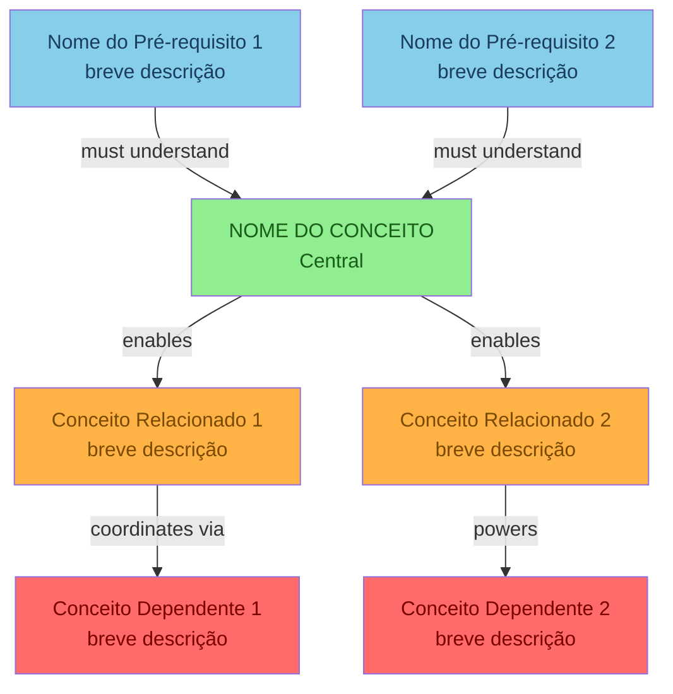

**Regras de preenchimento:**

1. **Pré-requisitos (azul `#87CEEB`):** Conceitos que o leitor PRECISA entender antes deste. Máximo 3. Se não houver pré-requisitos claros, use "Fundamentos de LLM" ou "Conceitos Básicos de Arquitetura de Agentes". A pergunta para validar: "Se eu não souber X, vou entender este conceito?" Se a resposta for "não", X é pré-requisito.
2. **Conceito central (verde `#90EE90`):** O conceito que este detailed graph documenta. Use o nome exato como aparece no módulo core. Não abrevie. Não invente nomes alternativos.
3. **Relacionados/Habilitadores (laranja `#FFB347`):** Conceitos que este conceito HABILITA ou com os quais interage diretamente. Máximo 3. A pergunta: "Depois que eu implementar X, qual conceito fica mais fácil ou possível?"
4. **Dependentes (vermelho `#FF6B6B`):** Conceitos downstream que QUEBRAM se este conceito não estiver implementado. Máximo 3. A pergunta: "Se X falhar em produção, quais outros conceitos vão falhar em cascata?"
5. **Labels nas arestas:** Use verbos no imperativo: `must understand`, `enables`, `informs`, `coordinates via`, `powers`, `depends on`, `validates`, `persists to`, `retrieves from`. Máximo 3 palavras por label.
6. **Texto nos nós:** Use `\n` para quebras de linha. Máximo 3 linhas por nó. Primeira linha = nome do conceito. Segunda linha = qualificador curto.

**Estrutura narrativa após o diagrama:**

- **Como Ler Este Grafo:** Explique cada categoria de cor com 1-2 frases
- **Conexão com módulo core:** Tabela mapeando cada nó do grafo à seção do módulo core onde ele é explicado
- **Dependências implícitas:** Se houver relações importantes que não cabem no diagrama (por limitação de espaço), documente-as em prosa

### Exemplo Preenchido (Context Management)

**Diagrama:**

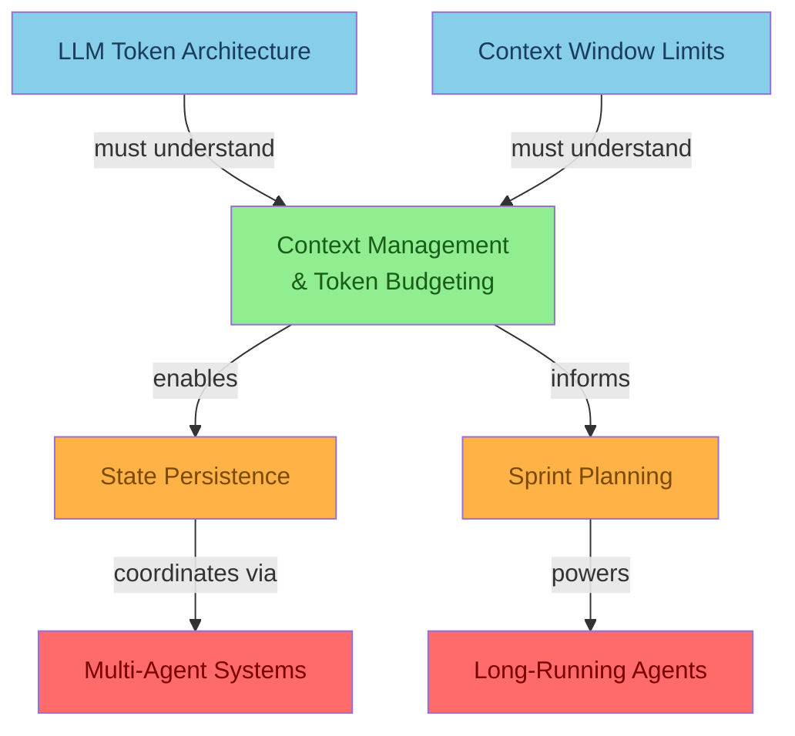

**Narrativa:**

- **Pré-requisitos (azul):** `LLM Token Architecture` e `Context Window Limits` são fundamentos que você precisa dominar para entender por que Context Management existe. Sem entender que tokens são finitos e que a janela de contexto tem teto físico, as estratégias de gerenciamento parecem burocracia desnecessária. Se você está implementando Context Management e não sabe quantos tokens seu modelo suporta, volte e leia os pré-requisitos primeiro.
- **Conceito central (verde):** `Context Management & Token Budgeting` é o hub. Ele decide o que entra, o que fica, o que sai e o que volta ao contexto ativo. Não é uma estratégia única — é a orquestração de múltiplas estratégias (Sliding Window, Compaction, Persistence, Retrieval).
- **Habilitadores (laranja):** `State Persistence` é a consequência natural — quando você entende que contexto imediato não basta, você projeta estado persistente. `Sprint Contracts` se beneficia de contexto limpo para definir promessas entre módulos. Se o contexto está poluído, os contratos nascem com premissas erradas.
- **Dependentes (vermelho):** `Multi-Agent Systems` e `Long-Running Agents` são os conceitos de produção que colapsam sem Context Management. Agentes paralelos que não compartilham contexto produzem decisões contraditórias. Agentes de longa duração que não gerenciam contexto perdem o fio da conversa — foi exatamente o que aconteceu com a Camila no módulo core.

**Tabela de Mapeamento Diagrama → Módulo Core:**

| Nó do Diagrama | Seção no Módulo Core | O Que o Módulo Explica |
|---|---|---|
| LLM Token Architecture | Seção "Context window: a mesa de trabalho do agente" | Como tokens são alocados, teto físico, implicações práticas |
| Context Window Limits | Seção "Por que 'just use bigger windows' não resolve" | Limites de atenção, degradação com contexto longo |
| State Persistence | Seção "State Persistence (arquivos ou banco)" | Persistência como extensão da memória de curto prazo |
| Sprint Contracts | Seção 3 do módulo core | Contratos como consumidores de contexto limpo |
| Multi-Agent Systems | Seção "Arquitetura mental: memória não é uma coisa só" | Múltiplos agentes compartilhando e herdando contexto |

### Exemplo Preenchido (Generator/Evaluator)

**Diagrama:**

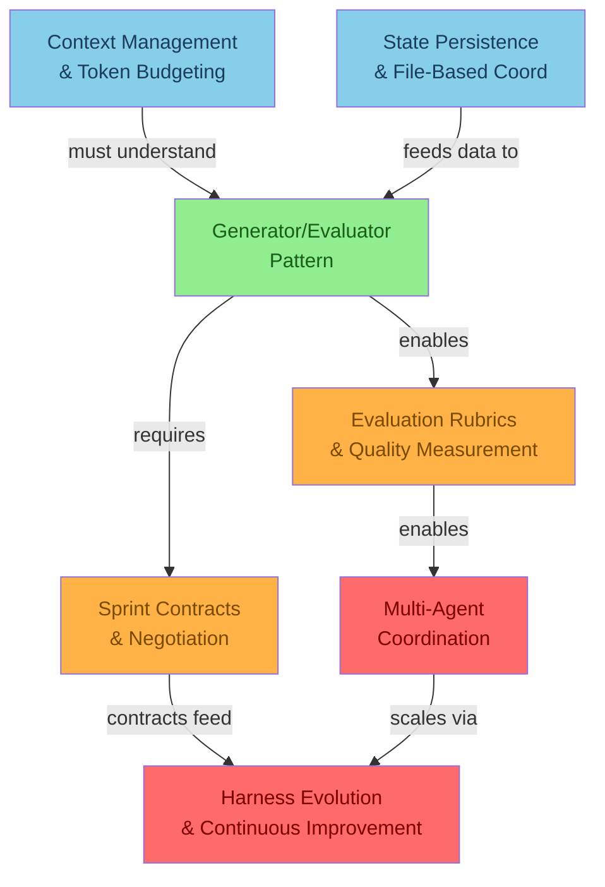

**Narrativa:**

- **Pré-requisitos (azul):** `Context Management` é essencial porque o Generator e o Evaluator precisam de contexto limpo para tomar decisões. Se o contexto está poluído, o Generator produz recomendações baseadas em informações velhas e o Evaluator avalia com critérios desatualizados. `State Persistence` alimenta ambos com dados persistentes do cliente — sem ele, o Generator não sabe das restrições alimentares e o Evaluator não tem como verificar.
- **Conceito central (verde):** `Generator/Evaluator Pattern` é a separação deliberada entre criação (Generator) e julgamento (Evaluator). O Generator produz sem medo de errar. O Evaluator revisa sem viés de autopreservação.
- **Habilitadores (laranja):** `Evaluation Rubrics` é a evolução natural — quando você tem um Evaluator, precisa definir COM QUE CRITÉRIOS ele avalia. `Sprint Contracts` formaliza a interface entre Generator e Evaluator — o que o Generator promete entregar, o que o Evaluator promete verificar.
- **Dependentes (vermelho):** `Multi-Agent Coordination` escala o padrão para múltiplos pares Generator/Evaluator. `Harness Evolution` usa os dados de aprovação/rejeição do Evaluator para melhorar continuamente os critérios.

---

## 📱 Seção 4 — Diagrama 2: KODA Application Flow

### Instruções de Preenchimento

Este diagrama ancora o conceito em uma **conversa real de WhatsApp**. Ele responde: "Se eu abrir o trace de uma conversa do KODA, onde exatamente este conceito aparece?"

**Estrutura do código Mermaid:**

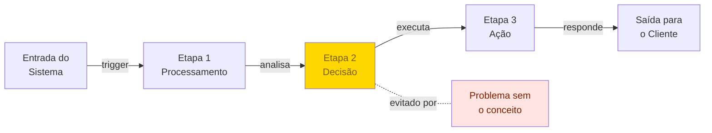

**Regras de preenchimento:**

1. **Use `flowchart` (não `graph`):** `flowchart` suporta mais tipos de nós e arestas, incluindo tracejadas (`-.-`), grossas (`==>`), e nós de decisão (`{}`).
2. **Nó central em amarelo/dourado (`#FFD700`):** O ponto onde o conceito atua. Pode ser um nó de decisão ou um nó de processamento.
3. **Nó de problema em rosa claro (`#FFE4E1`):** Mostre o que aconteceria SEM o conceito, conectado com aresta tracejada (`-.-`). Este nó é OPCIONAL — inclua apenas se houver um problema claro e específico que o conceito previne.
4. **Arestas com labels:** Descreva a ação que acontece na transição: `trigger`, `analisa`, `executa`, `responde`, `classifica`, `verifica`, `aprova`, `rejeita`, `persiste`, `recupera`.
5. **Nós com descrição multilinha:** Use `\n` para quebras dentro dos nós. Máximo 4 linhas por nó.

**Após o diagrama, inclua:**

1. **Linha do tempo da conversa real:** Tabela com minuto, evento, ação do conceito, estratégia ativada, resultado esperado
2. **Trace de evidência:** Bloco de log ilustrativo mostrando como o diagrama se manifesta em produção. Use timestamps, IDs e valores realistas.
3. **Narrativa "antes e depois":** Explique o que mudou entre "antes" (sem o conceito) e "depois" (com o conceito implementado). Se possível, use a mesma conversa (ex: Camila = antes, Marina = depois).

### Exemplo: Timeline da Conversa (Context Management)

| Minuto | Evento | Ação de Context Management | Estratégia Ativada | Resultado |
|---|---|---|---|---|
| 00:02 | Marina pergunta sobre creatina sem sabor | Mensagem entra no pipeline | Parsing + Classificação | Intenção identificada: product_discovery |
| 03:18 | Marina menciona intolerância à lactose | Classificado como CRÍTICO | State Persistence | `customer.restrictions.lactose = true` |
| 07:40 | KODA recomenda 2 opções sem lactose | Fato persistido recuperado antes da recomendação | Retrieval | Recomendação filtrada por restrição |
| 14:05 | Marina pergunta se creatina vale a pena | Informação útil, não crítica | Compaction (resumo) | Adicionada ao resumo progressivo |
| 21:33 | KODA explica creatina | Contexto inclui perfil + resumo + janela recente | Context Injection | Resposta personalizada |
| 29:12 | Marina muda orçamento de R$180 para R$220 | Classificado como ÚTIL | Compaction: atualiza `session_state.budget` | Budget atualizado |
| 37:50 | Marina pede desconto de clube e parcelamento | Classificado como CRÍTICO | State Persistence | `session.cart.payment_method` |
| 46:04 | KODA promete entrega em até 2 dias | Classificado como CRÍTICO (commitment) | State Persistence | `session.commitments.delivery_eta` |
| 58:27 | Marina manda áudio longo (3min) sobre rotina | Transcrito, classificado: 80% ruído, 20% útil | Compaction: extrai fatos relevantes | Fatos: "treina às 6h", "dificuldade com shake" |
| 70:10 | KODA sugere combo: shaker + creatina + proteína | Prompt montado com: perfil + resumo + janela + catálogo | Context Injection com token budget | Recomendação personalizada |
| 83:44 | Marina checa: "o combo respeita minha intolerância?" | **MOMENTO CRÍTICO** — Retrieval recupera restrição | Retrieval + Safety Guard | Cross-check: perfil vs. carrinho |
| 84:01 | KODA confirma (com verificação real) | Estado persistente validado antes da resposta | Cross-check | Todos os itens compatíveis ✅ |

### Exemplo: Trace de Evidência (Context Management)

```
[2026-05-27 14:12:03] PARSE: msg_id=8291, intent=check_restriction_compliance, confidence=0.97
[2026-05-27 14:12:03] CLASSIFY: "o combo respeita minha intolerância?" → tipo=VERIFICATION, criticidade=HIGH
[2026-05-27 14:12:03] RETRIEVE: customer_id=marina_482, keys=[restrictions, cart, commitments]
[2026-05-27 14:12:03] RETRIEVE: restrictions.lactose_intolerant = true (source: msg_id=128, t=00:03:18, confidence=0.99)
[2026-05-27 14:12:03] RETRIEVE: cart.items = [creatine_300g, whey_isolate_900g, shaker_600ml]
[2026-05-27 14:12:03] CROSS-CHECK: cart.items vs. restrictions.lactose_intolerant
[2026-05-27 14:12:03] CROSS-CHECK: whey_isolate_900g.lactose = false → OK (source: catalog_api, t=14:12:02)
[2026-05-27 14:12:03] CROSS-CHECK: creatine_300g.lactose = false → OK (source: catalog_api, t=14:12:02)
[2026-05-27 14:12:03] CROSS-CHECK: shaker_600ml.lactose = N/A → OK (non-consumable)
[2026-05-27 14:12:03] INJECT: context_token_count=2480/3000, budget_remaining=520, blocks=[system:480, profile:150, summary:300, window:750, catalog:400, response:400]
[2026-05-27 14:12:04] MODEL: response="Sim, Marina! Todos os itens do combo são livres de lactose. O whey isolate passa por filtragem que remove a lactose, a creatina é pura, e o shaker é livre de qualquer restrição. Fica tranquila! 😊"
[2026-05-27 14:12:04] EVAL: rubric_score=9.8/10, safety_check=PASS, tone_check=PASS, accuracy_check=PASS
```

**Por que este trace importa:** Cada linha do trace corresponde a um nó ou aresta do Diagrama 2. PARSE → CLASSIFY → RETRIEVE → CROSS-CHECK → INJECT → MODEL. Se qualquer etapa falhar, o trace mostra exatamente onde — e o diagrama mostra exatamente qual estratégia de contexto estava atuando naquele ponto.

---

## 📊 Seção 5 — Diagrama 3: Complexity & Implementation Timeline

### Instruções de Preenchimento

Este diagrama mostra **a progressão de maturidade** do conceito. Ele responde: "Em que nível de implementação estamos? O que precisamos para subir para o próximo?"

**Estrutura do código Mermaid:**

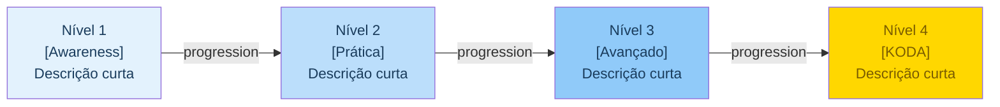

**Regras de preenchimento:**

1. **4 níveis fixos:** N1 (awareness), N2 (prática), N3 (avançado), N4 (KODA production). Esta é a progressão padrão do currículo. Se o conceito exigir 5 níveis, reavalie — provavelmente N2 e N3 são a mesma coisa com nomes diferentes.
2. **Gradiente de azul:** Do mais claro (N1) ao mais intenso (N3), com N4 em amarelo/dourado. Isso cria uma sensação visual de "aquecimento" — você está progredindo para algo mais concreto e valioso.
3. **Descrições curtas:** Máximo 5 palavras por nível dentro do nó. O detalhamento vai na tabela abaixo.
4. **Tabela de capacidades:** Após o diagrama, crie uma tabela com: Nível, Capacidade, Sintoma se Ausente, Estratégia Mínima, Custo Relativo, Tempo para Implementar.

### Exemplo: Tabela de Capacidades (Context Management)

| Nível | Capacidade | Sintoma se Ausente | Estratégia Mínima | Custo Relativo | Tempo |
|---|---|---|---|---|---|
| N1 — Basic awareness | Reconhecer que contexto é finito e que agentes esquecem | "Por que o KODA perguntou o endereço de novo?" | Manter as últimas 10 mensagens na janela | 1x | 2 horas |
| N2 — Token budget | Alocar tokens conscientemente entre system prompt, histórico, catálogo e resposta | Resposta truncada ou custo por conversa 3x acima do esperado | Definir budget por bloco: sistema=500, perfil=150, histórico=800, catálogo=400, resposta=650 | 1.2x | 1 dia |
| N3 — Dynamic pruning | Decidir dinamicamente o que manter, comprimir ou descartar | Contexto cresce até estourar, sem critério. Conversa fica cara após 60 minutos | Compaction progressiva + classificação de relevância (crítico/útil/ruído) | 1.5x | 3-5 dias |
| N4 — KODA production | Pipeline completo de contexto operando em conversas reais de 2h+ | Erro de recomendação por contexto velho (caso Camila). Cliente recebe produto errado | Pipeline completo: Classificar → Persistir → Comprimir → Window → Recuperar → Injetar → Validar | 2x | 2-3 sprints |

### Exemplo: Tabela de Capacidades (Generator/Evaluator)

| Nível | Capacidade | Sintoma se Ausente | Estratégia Mínima | Custo Relativo | Tempo |
|---|---|---|---|---|---|
| N1 — Basic awareness | Reconhecer que autoavaliação é falha (sycophancy) | "O KODA sempre diz que está certo, mesmo quando erra" | Separar prompt de geração do prompt de avaliação (mesmo modelo) | 1x | 1 hora |
| N2 — Two-agent split | Generator e Evaluator como agentes separados | Recomendações passam sem verificação real | Dois agentes com system prompts distintos: um cria, outro avalia | 2x (duas chamadas) | 2-3 dias |
| N3 — Multi-dimension rubric | Evaluator usa rubric com 5+ dimensões e pesos | Evaluator aprova coisas "boas no geral" mas ruins em dimensões críticas | Rubric com dimensões: segurança, precisão, adequação, custo, tom. Pesos por dimensão. Threshold mínimo por dimensão | 3x | 1 sprint |
| N4 — KODA production | Evaluator com feedback loop: rejeições alimentam melhoria contínua | Evaluator fica "cego" para novos tipos de erro | Pipeline: Generate → Evaluate (multi-rubric) → Aprove/Rejeite → Log → Melhoria da rubric | 4x | 2-3 sprints |

### Por Que a Coluna "Sintoma se Ausente" é a Mais Importante

De todas as colunas da tabela de capacidades, "Sintoma se Ausente" é a que o time mais consulta. Por quê?

Porque times não dizem "estamos no Nível 2 de Context Management". Times dizem "o KODA está perguntando o endereço de novo".

O sintoma é o ponto de entrada para o diagnóstico. Um dev vê o sintoma, consulta a tabela, e descobre: "Ah, estamos sem Dynamic Pruning. Precisamos implementar Compaction."

**Regra:** Se você não consegue descrever o sintoma em uma frase que um dev diria no Slack, o nível não está bem definido.

---

## 🎨 Seção 6 — Guia de Estilo Visual

Esta seção **não varia entre conceitos**. Ela documenta o sistema visual que todos os Knowledge Graphs do currículo seguem. Inclua-a integralmente no seu arquivo preenchido como referência para quem for manter ou estender os diagramas.

### Paleta de Cores Oficial

| Cor | Hex Code | Uso | Significado | Texto |
|---|---|---|---|---|
| Azul Claro (Sky Blue) | `#87CEEB` | Nós de pré-requisitos | "Você precisa entender isso antes" | `#1a3d5c` |
| Verde Claro (Light Green) | `#90EE90` | Nó do conceito central | "Este é o foco do diagrama" | `#1a5c1a` |
| Laranja (Orange) | `#FFB347` | Nós de conceitos relacionados | "Este conceito habilita ou é habilitado" | `#7a4a00` |
| Vermelho Claro (Light Red) | `#FF6B6B` | Nós de conceitos dependentes | "Isso quebra sem o conceito central" | `#7a0000` |
| Amarelo/Dourado (Gold) | `#FFD700` | Nós KODA-específicos | "Aplicação direta no KODA" | `#7a5c00` |
| Rosa Claro (Light Pink) | `#FFE4E1` | Nós de problema/anti-padrão | "Isso acontece sem o conceito" | `#7a2000` |
| Azul Gradual 1 | `#E3F2FD` | Nível 1 na timeline | Awareness básico | `#1a3c5c` |
| Azul Gradual 2 | `#BBDEFB` | Nível 2 na timeline | Prática inicial | `#1a3c5c` |
| Azul Gradual 3 | `#90CAF9` | Nível 3 na timeline | Avançado | `#1a3c5c` |
| Roxo Claro (Light Purple) | `#E1BEE7` | Injeção de contexto / montagem final | "Onde tudo se junta" | `#4a1a5c` |

**Regras de cor:**

1. As cores de texto (`color`) devem ter contraste suficiente com o fundo. Use `#1a5c1a` sobre verde, `#7a0000` sobre vermelho, `#1a3d5c` sobre azul. Teste o contraste em https://webaim.org/resources/contrastchecker/ se tiver dúvida.
2. Nunca invente novas cores sem justificativa documentada. Se precisar de uma cor extra (ex: para um nó de "validação" ou "fallback"), documente-a nesta mesma tabela.
3. Cores NÃO são decoração. Cada cor carrega significado semântico. Um nó azul que não é pré-requisito confunde o leitor. Um nó amarelo que não é KODA-específico dilui o significado da cor.
4. Se um diagrama tem mais de 6 categorias semânticas de nós, ele está complexo demais. Reavalie se alguns conceitos podem ser agrupados.

### Tipos de Nós e Quando Usar

| Formato | Sintaxe Mermaid | Uso | Exemplo |
|---|---|---|---|
| Retângulo (bordas retas) | `A["texto"]` | Padrão para conceitos, módulos, componentes | `CTX["Context Management"]` |
| Retângulo com cantos arredondados | `A("texto")` | Entidades externas, sistemas, APIs | `WHATSAPP("WhatsApp\nAPI")` |
| Losango (decisão) | `A{"texto"}` | Pontos de decisão, bifurcações no fluxo | `CRIT{"Informação\ncrítica?"}` |
| Círculo | `A(("texto"))` | Estados finais, endpoints, início/fim de fluxo | `END(("Cliente\nAtendido"))` |
| Subgraph | `subgraph NOME ["título"] ... end` | Agrupamento de nós relacionados | `subgraph DOMINIO ["Domínio de Pricing"]` |

**Regras de nomenclatura de nós:**

1. IDs de nós devem ser curtos e significativos: `COMP` (Compaction), `PERSIST` (State Persistence), `INJECT` (Context Injection), `EVAL` (Evaluator), `GEN` (Generator). Não use `A`, `B`, `C` genéricos — o próximo maintainer vai te odiar.
2. Texto dentro do nó: máximo 3 linhas. Use `\n` para quebras. Primeira linha = nome do conceito, linhas seguintes = qualificador curto.
3. Nós KODA (amarelos) devem sempre conter referência explícita ao KODA ou ao WhatsApp no texto.
4. Nós de decisão (losango) devem ser perguntas que podem ser respondidas com Sim/Não ou com opções discretas (Crítico/Útil/Ruído).

### Estilos de Arestas e Seus Significados

| Estilo | Sintaxe Mermaid | Significado | Quando Usar | Exemplo |
|---|---|---|---|---|
| Seta sólida com label | `A -->|label| B` | Dependência direta ou fluxo de dados | Relações fortes: "X depende de Y", "X produz Y", "X envia dados para Y" | `GEN -->|produces| EVAL` |
| Seta tracejada com label | `A -.-|label| B` | Relação indireta ou prevenção | "X evita Y", "X influencia indiretamente Y", "X é alternativa a Y" | `CTX -.-|avoids| PROBLEM` |
| Seta grossa | `A ==> B` | Fluxo de alto volume ou criticidade | Quando o fluxo é o caminho principal e os outros são secundários | `WHATSAPP ==> KODA` |
| Linha sem seta | `A --- B` | Associação sem direção | Relacionamento bidirecional ou simétrico. Use com moderação — a falta de direção geralmente indica que a relação não foi bem pensada | `CATALOG --- PRICING` |
| Seta pontilhada | `A -.->|label| B` | Transição assíncrona ou eventual | "X eventualmente leva a Y", "X dispara Y em background" | `LOG -.->|feeds| HARNESS` |

**Regras de labels:**

1. Use verbos no imperativo ou gerúndio: `enables`, `depends on`, `triggers`, `coordinates via`, `validates against`, `persists to`, `retrieves from`, `hands off to`.
2. Labels devem ter no máximo 3 palavras. Se precisar de mais, a relação é complexa demais — quebre em nós intermediários.
3. Não use labels genéricos como `uses` ou `calls`. Eles não comunicam a natureza da relação. Prefira verbos semânticos que contem uma micro-história: `persists to` conta que há armazenamento envolvido; `validates against` conta que há verificação; `hands off to` conta que há transferência de responsabilidade.

### Diagrama ASCII de Arquitetura

Além dos diagramas Mermaid, inclua um diagrama ASCII para a arquitetura de alto nível. Este diagrama aparece na seção KODA ou na seção de aplicação prática.

**Template ASCII:**

```
┌──────────────────────────────────────────────────────────┐
│                   [NOME DO SISTEMA]                       │
│                                                          │
│  ┌─────────────┐    ┌─────────────┐    ┌─────────────┐  │
│  │             │    │             │    │             │  │
│  │  MÓDULO A  │───▶│  MÓDULO B  │───▶│  MÓDULO C  │  │
│  │             │    │             │    │             │  │
│  └─────────────┘    └─────────────┘    └─────────────┘  │
│         │                  │                  │          │
│         ▼                  ▼                  ▼          │
│  ┌─────────────────────────────────────────────────┐    │
│  │              CAMADA DE PERSISTÊNCIA              │    │
│  └─────────────────────────────────────────────────┘    │
│                                                          │
└──────────────────────────────────────────────────────────┘
```

**Regras para ASCII art:**

1. Use caracteres de box-drawing: `─`, `│`, `┌`, `┐`, `└`, `┘`, `├`, `┤`, `┬`, `┴`, `┼`
2. Use `▶` para setas para direita, `▼` para setas para baixo, `▲` para setas para cima
3. Máximo 80 caracteres de largura (para caber em qualquer terminal ou editor)
4. Inclua labels dentro das caixas — um diagrama ASCII sem labels é inútil
5. Mantenha alinhamento consistente — use espaços, não tabs
6. Prefira layouts top-down ou left-right. Evite diagonais e layouts circulares em ASCII.

### Tabela Comparativa de Estratégias de Coordenação

Esta tabela é obrigatória. Ela compara as diferentes estratégias de coordenação que o conceito suporta ou com as quais interage.

**Template:**

| Estratégia | Descrição | Quando Usar | Custo (Tokens) | Latência Adicional | Complexidade de Implementação | Exemplo KODA |
|---|---|---|---|---|---|---|
| [Nome] | [1-2 frases descrevendo a estratégia] | [cenário específico onde esta é a melhor escolha] | [+N tokens por chamada] | [+N ms] | [Baixa/Média/Alta/Muito Alta] | [Exemplo concreto com feature KODA] |

**Exemplo preenchido (Context Management):**

| Estratégia | Descrição | Quando Usar | Custo (Tokens) | Latência Adicional | Complexidade | Exemplo KODA |
|---|---|---|---|---|---|---|
| Sliding Window | Mantém últimas N mensagens, descarta as antigas sem processamento | Conversas curtas (<30 min), baixa criticidade, cliente só quer preço | +200 tokens | 0ms | Baixa | "Qual o preço da creatina?" — resposta em 2 mensagens |
| Summarization (Compaction) | Resume blocos antigos preservando fatos estáveis e descartando texto bruto | Conversas médias (30-90 min), múltiplos tópicos, cliente comparando produtos | +500 tokens | 200-500ms | Média | Cliente comparando 5 marcas de whey ao longo de 45 minutos |
| State Persistence | Salva fatos críticos fora da context window em storage externo | Conversas longas (90+ min), restrições e preferências que não podem ser perdidas | +150 tokens (recuperação) | 50-100ms | Média-Alta | Checkout com alergias, orçamento, endereço e preferências |
| Retrieval-Augmented | Busca fatos persistentes sob demanda via query semântica | Quando o volume de estado é grande (>20 fatos) e nem todos são relevantes para cada turno | +300 tokens (query + resultado) | 100-300ms | Alta | Perfil completo do cliente com 50+ atributos; buscar só os relevantes |
| Híbrida (Pipeline Completo) | Combina todas as anteriores em sequência orquestrada | Produção KODA — conversas de 2h+ com múltiplos domínios (descoberta, comparação, checkout) | +800-1200 tokens | 500-1000ms | Muito Alta | Conversa completa da Marina: 97 min, 5 features, 12 decisões de classificação |

### Anti-Padrões Visuais a Evitar

| Anti-Padrão | Por Que É Ruim | Como Corrigir | Exemplo do que NÃO fazer |
|---|---|---|---|
| Mais de 15 nós em um diagrama | Sobrecarrega o leitor. Diagrama vira "spaghetti" impossível de navegar | Quebre em sub-diagramas ou use subgraphs para agrupar. Se ainda assim tiver >15, o escopo do diagrama está largo demais | Um único grafo TD com 23 conceitos, 47 arestas, e scroll infinito |
| Cores inconsistentes entre diagramas do mesmo arquivo | Leitor perde a referência semântica das cores. O que era azul no Diagrama 1 vira laranja no Diagrama 2 | Siga estritamente a paleta documentada. Use um color picker para verificar hex codes | Context Management é verde no Diagrama 1 e amarelo no Diagrama 2 "porque ficou mais bonito" |
| Nós sem labels ou com IDs genéricos ("A", "B", "C") | Diagrama exige legenda externa para ser compreendido. Derrota o propósito de um diagrama "autoexplicativo" | Use IDs semânticos: `CTX_MGR`, `EVAL_AGENT`, `PERSIST_DB`. Se precisar de legenda, o naming está errado | `A --> B --> C --> D` sem nenhum label ou contexto |
| Arestas sem labels de direção | Relação ambígua: é dependência? fluxo de dados? trigger? herança? | Toda aresta deve ter label com verbo semântico. Exceção: arestas de progressão na timeline (`N1 --> N2`) | `A --> B` sem `|label|` — impossível saber o que a seta significa |
| Texto de nó muito longo (>60 caracteres por linha) | Quebra a renderização em visualizadores Mermaid. Texto transborda ou é truncado | Use `\n` para quebrar linhas a cada 30-40 caracteres | `A["Context Management & Token Budgeting with Advanced Compaction Strategies for Long-Running WhatsApp Agents"]` |
| Misturar orientações sem necessidade | `graph TD` e `flowchart LR` no mesmo diagrama confunde o leitor sobre a direção de leitura | Use uma orientação por diagrama. `TD` para hierarquias (top-down). `LR` para sequências (left-right) | Um nó vai para baixo, o próximo para direita, o próximo para cima — pesadelo de navegação |

### Exemplos de Boas Práticas Visuais

**Bom — Nó bem formatado:**
```
A["Context Management\n& Token Budgeting"]
```
✅ Nome na primeira linha, qualificador na segunda. Quebra aos 20 caracteres.

**Ruim — Nó mal formatado:**
```
A["Context Management & Token Budgeting with Advanced Compaction"]
```
❌ Linha única com 58 caracteres. Vai quebrar a renderização.

**Bom — Aresta semântica:**
```
CTX -->|enables| PERSIST
```
✅ Label curto, verbo semântico, relação clara.

**Ruim — Aresta genérica:**
```
CTX --> PERSIST
```
❌ Sem label. É dependência? É fluxo de dados? É herança?

**Bom — Paleta consistente:**
```
style CTX fill:#90EE90,color:#1a5c1a
style PRE fill:#87CEEB,color:#1a3d5c
style DEP fill:#FF6B6B,color:#7a0000
```
✅ Verde para core, azul para pré-requisito, vermelho para dependente.

**Ruim — Paleta inconsistente:**
```
style CTX fill:#90EE90,color:#1a5c1a
style PRE fill:#FF6B6B,color:#7a0000
style DEP fill:#87CEEB,color:#1a3d5c
```
❌ Azul e vermelho trocados — pré-requisito parece dependente e vice-versa.

---

## 🏗️ Seção 7 — Exemplo Preenchido Expandido: Context Management

Esta seção contém um exemplo completo e autocontido de um detailed graph preenchido usando este template. O conceito escolhido é **Context Management & Token Budgeting** — o conceito mais documentado do currículo, com diagramas validados em produção.

### Exemplo: Diagrama 1 — Hierarchical Connection Graph (Context Management)


**Como ler:** Os pré-requisitos `LLM Token Architecture` e `Context Window Limits` alimentam o entendimento do conceito central. Este, por sua vez, habilita `State Persistence` e informa `Sprint Planning`. Sem Context Management, `Multi-Agent Systems` e `Long-Running Agents` colapsam — os nós vermelhos são o "blast radius" da falha.

### Exemplo: Diagrama 2 — KODA Application Flow (Context Management)

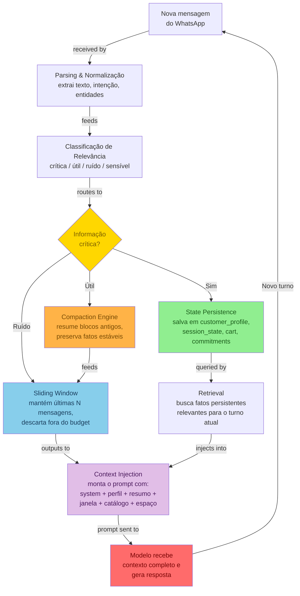

**Como ler:** Uma mensagem do WhatsApp percorre 6 etapas antes de chegar ao modelo. A classificação (CRIT) decide o destino: informações críticas vão para persistência (verde), informações úteis para compaction (laranja), ruído para sliding window (azul). O Retrieval recupera estado persistente e o injeta no prompt (roxo) junto com a janela recente. O modelo gera a resposta e o ciclo recomeça.

### Exemplo: Diagrama 3 — Complexity Timeline (Context Management)

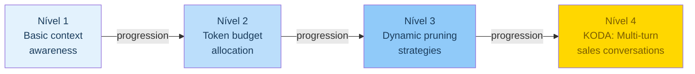

---

## 🚀 Seção 8 — Seção KODA: Aplicação Prática

### Instruções de Preenchimento

Esta seção conecta o conceito abstrato ao KODA real. Ela responde: "Se eu trabalho no KODA, o que este conceito significa para o meu dia a dia?"

**Subseções obrigatórias:**

1. **Como Este Conceito se Manifesta no KODA** — Explicação narrativa de 2-3 parágrafos com exemplo concreto
2. **Features do KODA que Dependem Deste Conceito** — Lista com 3-6 features e explicação de 2-3 frases cada
3. **Anti-Padrões no KODA** — Tabela com 3-5 anti-padrões, sintomas, detecção e correção
4. **Diagrama ASCII de Arquitetura KODA** — Posição do conceito na arquitetura
5. **Tabela Comparativa de Estratégias** — Diferentes formas de implementar o conceito no KODA

### Exemplo Preenchido (Context Management no KODA)

**Como Context Management se Manifesta no KODA:**

Quando um cliente como a Marina abre o WhatsApp e digita "tem creatina sem sabor?", o KODA não pode simplesmente responder com o catálogo. Antes de gerar qualquer resposta, o pipeline de contexto:

1. **Classifica a mensagem** — intenção: product_discovery, criticidade: baixa
2. **Recupera o perfil persistente** da Marina — restrições: lactose_intolerant=true, orçamento: 180-220
3. **Comprime a conversa anterior** (se houver) em um resumo estruturado de 300 tokens
4. **Mantém as últimas 8 mensagens** na sliding window para fluidez local
5. **Monta o prompt** com system prompt (480 tokens) + perfil (150) + resumo (300) + janela (750) + catálogo filtrado (400) + espaço de resposta (600)
6. **Reserva ~600 tokens** para o modelo gerar a resposta

Sem esse pipeline, o KODA responderia "cegamente" — sem saber que a Marina é intolerante à lactose, sem lembrar que ela já comparou 3 marcas, sem considerar o orçamento dela. O resultado seria uma recomendação genérica, possivelmente perigosa, e certamente frustrante para a cliente.

Este pipeline não é um "nice to have". É a diferença entre um KODA que parece um atendente competente e um KODA que parece um chatbot de 2023.

**Features do KODA que Dependem de Context Management:**

- **Product Discovery:** Sem contexto, KODA recomenda produtos sem considerar histórico, restrições ou preferências do cliente. A recomendação é genérica — como se fosse a primeira vez que o cliente fala com KODA, mesmo sendo a décima conversa.
- **Order Processing:** O checkout precisa do carrinho persistido, endereço confirmado e método de pagamento — todos fatos de contexto que devem sobreviver a mudanças de assunto e pausas na conversa. Se o contexto se perde entre "quero comprar" e "finalizar pedido", o cliente precisa repetir tudo.
- **Same-Day Fulfillment:** A promessa de entrega hoje depende do endereço do cliente estar no contexto ativo no momento da confirmação. Se o endereço foi mencionado há 40 minutos e a sliding window já deslizou, KODA promete entrega sem saber para onde.
- **Club Pricing:** O desconto de clube (10-20%) só é aplicado se o perfil do cliente (`membership_status`) for recuperado e injetado no prompt. Sem contexto, KODA cobra preço cheio de um membro do clube — e o cliente percebe.
- **Customer History:** Todo o histórico de compras, preferências de sabor, marcas favoritas e reclamações anteriores vive no estado persistente. Recuperar esse histórico permite que KODA diga "você comprou X da última vez, quer repetir?" em vez de "qual seu produto favorito?" pela décima vez.
- **Safety Guards:** Restrições alimentares, alergias e condições de saúde são fatos de contexto críticos. Se não forem persistidos e recuperados em toda recomendação, KODA pode recomendar um produto perigoso — como aconteceu com o caso da lactose no módulo core.

**Anti-Padrões no KODA:**

| Anti-Padrão | Sintoma | Como Detecta | Como Corrige |
|---|---|---|---|
| "Contexto infinito" | KODA nunca descarta mensagens antigas. Conversa fica cara e lenta após 60 minutos. Latência sobe de 0.5s para 3s | Custo por conversa sobe 3x após 1h. Dashboard mostra latência p95 > 2s | Implementar sliding window + compaction com política de retenção: últimas 10 mensagens intactas, resto comprimido |
| "Amnésia seletiva" | KODA lembra de preferência de sabor (útil) mas esquece alergia (crítica). Priorização invertida | Cliente reporta recomendação perigosa. Trace mostra que fato crítico foi classificado como "útil" | Revisar regra de classificação: fatos de saúde e segurança são sempre CRÍTICO, independente de frequência |
| "Persistência tardia" | Fato crítico só é persistido após ser usado (tarde demais). Entre a menção e o uso, a sliding window deslizou | Trace mostra gap entre CLASSIFY e PERSIST > 5 minutos. Fato estava na sliding window na hora do uso, mas não no storage | Persistir no momento da classificação (síncrono), não no momento do uso. Use padrão write-through, não write-back |
| "Injeção inchada" | Prompt inclui tudo "por garantia", estoura token budget. Resposta truncada ou erro 400 da API | Log mostra `token_count > budget` recorrente. Modelo retorna erro ou resposta cortada | Definir budget por bloco com limites rígidos. Usar `truncate()` com warning, não silenciosamente |
| "Compaction agressiva" | Compaction Engine resume tanto que perde nuance. "Cliente prefere chocolate, mas não gosta muito doce" vira "cliente prefere chocolate" | Trace mostra perda de qualificadores após compaction. Cliente recebe recomendação muito doce | Incluir qualificadores no resumo: "prefere X, com ressalva Y". Testar fidelidade do resumo contra conversa original |

**Diagrama de Arquitetura KODA — Posição do Context Management:**

```
┌──────────────────────────────────────────────────────────────┐
│                     KODA ARCHITECTURE                         │
│                                                              │
│  ┌──────────┐    ┌──────────────────┐    ┌──────────────┐   │
│  │ WhatsApp │───▶│ CONTEXT PIPELINE │───▶│ KODA AGENT   │   │
│  │ Message  │    │ ┌──────────────┐ │    │ (Generator)  │   │
│  └──────────┘    │ │ 1. Parse     │ │    └──────┬───────┘   │
│                  │ │ 2. Classify  │ │           │           │
│                  │ │ 3. Compact   │ │           ▼           │
│                  │ │ 4. Window    │ │    ┌──────────────┐   │
│                  │ │ 5. Persist   │ │    │ EVALUATOR    │   │
│                  │ │ 6. Retrieve  │ │    │ (Verifier)   │   │
│                  │ │ 7. Inject    │ │    └──────┬───────┘   │
│                  │ └──────────────┘ │           │           │
│                  └────────┬─────────┘           ▼           │
│                           │              ┌──────────────┐   │
│                           ▼              │ Response to  │   │
│                    ┌─────────────┐       │ WhatsApp     │   │
│                    │ STATE STORE │       └──────────────┘   │
│                    │ (JSON/DB)   │                          │
│                    └─────────────┘                          │
│                                                              │
│  ┌──────────────────────────────────────────────────────┐   │
│  │ LEGEND:                                              │   │
│  │ ▶ = data flow                                        │   │
│  │ ▼ = state read/write                                 │   │
│  │ ── = synchronous                                     │   │
│  └──────────────────────────────────────────────────────┘   │
└──────────────────────────────────────────────────────────────┘
```

---

## 📚 Manifestações do Template em Outros Conceitos

Esta seção mostra como o template se adapta a diferentes tipos de conceito. Use como referência quando for preencher o template para um conceito que não é de infraestrutura.

### Como o Template se Comporta para Conceitos de Processo (Generator/Evaluator)

**Header sugerido:**
```markdown
# 🔄 Detailed Graph: Generator/Evaluator Pattern
## How two-agent architecture creates reliability, KODA sales flow integration, and the evaluation pipeline that catches 98% of bad recommendations
```

**Diagrama 1 — Hierarchical (nuances específicas):**
- Pré-requisitos (azul): Context Management (precisa de contexto limpo), State Persistence (precisa de dados do cliente)
- Relacionados (laranja): Evaluation Rubrics (o Evaluator usa rubrics para julgar), Sprint Contracts (formaliza a interface Gen→Eval)
- Dependentes (vermelho): Multi-Agent Coordination (escala o padrão para múltiplos pares), Harness Evolution (usa dados de rejeição para melhorar)
- Labels de aresta específicos: `feeds data to`, `evaluates using`, `hands off to`, `contracts define interface between`

**Diagrama 2 — KODA Flow (nuances específicas):**
- Fluxo em sequência: WhatsApp → Generator → Evaluator → Cliente
- Nó de decisão (losango) no Evaluator: "Aprovado?" → Sim: envia resposta / Não: retorna ao Generator com feedback
- Nó de problema (rosa): "Generator aprova a si mesmo (sycophancy)" — evitado pela separação Gen/Eval
- Timeline da conversa mostra 5 decisões de avaliação em uma conversa típica de checkout

**Diagrama 3 — Timeline (nuances específicas):**
- N1: "Self-evaluation awareness" — reconhecer que autoavaliação é falha (sycophancy)
- N2: "Two-agent split" — Generator e Evaluator como agentes separados
- N3: "Multi-dimension rubric" — Evaluator usa 5+ dimensões com pesos e thresholds
- N4: "KODA production" — Evaluator com feedback loop: rejeições alimentam melhoria contínua da rubric

**Seção KODA (nuances específicas):**
- Features dependentes: Product Discovery (Gen produz recomendações, Eval verifica), Order Processing (Eval verifica consistência do pedido), Safety Guards (Eval verifica restrições de saúde)
- Anti-padrões específicos:
  - "Evaluator cego": Avalia dimensões erradas (fáceis de medir, não importantes). Ex: verifica preço mas não segurança
  - "Generator dominante": Generator produz output tão persuasivo que Evaluator é influenciado. Ex: "Essa recomendação é ótima! Score 98!" sem verificar
  - "Threshold único": Uma nota geral esconde falha em dimensão crítica. Ex: score 88/100 mas segurança = 2/10
  - "Feedback loop quebrado": Rejeições do Evaluator são logadas mas nunca analisadas. Harness não evolui

### Como o Template se Comporta para Conceitos de Qualidade (Evaluation Rubrics)

**Header sugerido:**
```markdown
# 📋 Detailed Graph: Evaluation Rubrics & Subjective Quality Measurement
## Multi-dimensional scoring architecture, KODA quality gates, and the framework that transforms "good enough" into measurable criteria
```

**Diagrama 1 — Hierarchical (nuances específicas):**
- Pré-requisitos (azul): Generator/Evaluator (rubrics são inúteis sem um Evaluator para aplicá-las), State Persistence (rubrics precisam de dados para avaliar)
- Relacionados (laranja): Sprint Contracts (rubrics definem os critérios de aceite dos contratos), Trace Reading (rubrics dizem o que procurar nos traces)
- Labels de aresta específicos: `defines criteria for`, `applied by`, `measured against`, `validates output of`

**Diagrama 2 — KODA Flow (nuances específicas):**
- O fluxo mostra o conceito como um "gate" — não como uma etapa linear
- Nó de decisão: "Todas as dimensões passam?" → Sim: aprova / Não: rejeita com dimensão específica que falhou
- Dimensões típicas em um nó KODA: Segurança (peso 30%), Precisão (25%), Adequação ao Perfil (20%), Custo-Benefício (15%), Tom (10%)
- Trace mostra scores por dimensão: `rubric.safety=10/10, rubric.accuracy=8/10, rubric.fit=9/10, rubric.value=7/10, rubric.tone=9/10 → aggregate=8.6/10 → APPROVED`

**Diagrama 3 — Timeline (nuances específicas):**
- N1: "Binary gate" — passa/não passa, critério único. Ex: "preço < R$200? Sim → aprova"
- N2: "Multi-criteria checklist" — 3-5 critérios, todos devem passar. Ex: preço OK, estoque OK, reviews OK
- N3: "Weighted dimensions" — cada dimensão tem peso e threshold mínimo. Ex: segurança sempre ≥ 8/10, mesmo se score agregado for bom
- N4: "KODA adaptive rubric" — pesos e thresholds ajustados por feedback de cliente real e análise de trace

### Como o Template se Comporta para Conceitos de Arquitetura (Multi-Agent Coordination)

**Header sugerido:**
```markdown
# 🤝 Detailed Graph: Multi-Agent Coordination
## Agent specialization architecture, inter-agent communication patterns, and the coordination framework that prevents contradictory decisions in KODA
```

**Diagrama 1 — Hierarchical (nuances específicas):**
- Muitos pré-requisitos (4-5): Context Management, State Persistence, Generator/Evaluator, Sprint Contracts, File-Based Coordination
- Poucos dependentes (1-2): Harness Evolution, Long-Running Agents
- O nó central é grande — use subgraphs para organizar os pré-requisitos em domínios: "Memory & State", "Process", "Verification"

**Diagrama 2 — KODA Flow (nuances específicas):**
- Use subgraphs para mostrar domínios: `subgraph PRICING ["Domínio de Pricing"]`, `subgraph FULFILLMENT ["Domínio de Fulfillment"]`
- Mostre agentes trocando mensagens via File-Based Coordination (arquivos JSON como contrato)
- Nó de problema: "Agentes tomam decisões contraditórias" — Pricing aplica desconto de 10%, Fulfillment cobra frete cheio para o mesmo pedido

**Diagrama 3 — Timeline (nuances específicas):**
- N1: "Single agent" — um agente faz tudo (monolítico)
- N2: "Two agents, implicit coordination" — dois agentes, mas sem contrato explícito. Coordenação via "espero que o outro saiba"
- N3: "Multi-agent, file-based contracts" — 3+ agentes com contratos explícitos em arquivos JSON
- N4: "KODA adaptive mesh" — agentes entram e saem dinamicamente. Coordenação via registry + event bus

### Como o Template se Comporta para Conceitos Transversais (Error Recovery)

**Header sugerido:**
```markdown
# 🔧 Detailed Graph: Error Recovery & Resilience Patterns
## Failure detection architecture, graceful degradation strategies, and the recovery framework that keeps KODA trustworthy when things go wrong
```

**Diagrama 1 — Hierarchical (nuances específicas):**
- O nó central se conecta a MUITOS nós via arestas tracejadas (`-.-`) — porque é transversal
- Labels: `applies to`, `recovers from failures in`, `monitors health of`
- Não use `enables` ou `depends on` — error recovery não "habilita" outros conceitos, ele "protege" eles

**Diagrama 2 — KODA Flow (nuances específicas):**
- Mostre o conceito como uma "camada" que envolve o fluxo principal, não como uma etapa
- Use subgraph: `subgraph RECOVERY ["Error Recovery Layer"]` com nós de: Detect, Classify, Retry, Fallback, Escalate
- Nó de problema: "Falha silenciosa" — KODA retorna "desculpe, não entendi" em vez de tentar recovery

**Diagrama 3 — Timeline (nuances específicas):**
- N1: "Reactive logging" — erros são logados, mas nenhuma ação é tomada
- N2: "Basic retry" — em caso de timeout, tenta novamente 1x
- N3: "Graceful degradation" — se catálogo falha, KODA responde com opções limitadas em vez de quebrar
- N4: "KODA self-healing" — KODA detecta padrões de falha, ajusta estratégia preventivamente, notifica time

### Tabela Resumo: Adaptações por Tipo de Conceito

| Aspecto do Template | Infraestrutura | Processo | Qualidade | Arquitetura | Transversal |
|---|---|---|---|---|---|
| Nós azuis (pré-reqs) | 1-2 | 2-3 | 2-3 | 3-5 | 0-2 |
| Nós vermelhos (depend) | 4-6 | 2-3 | 1-2 | 1-2 | 0 (tracejadas) |
| Direção do Flow | `flowchart TD` (pipeline) | `flowchart LR` (sequência) | `flowchart TD` (checkpoint) | `graph TD` (subgrafo) | `flowchart TD` (camada) |
| Arestas típicas | `enables`, `persists to` | `triggers`, `hands off to` | `evaluates`, `scores` | `coordinates`, `depends on` | `applies to`, `monitors` |
| Nó KODA Flow | Pipeline de etapas | Sequência com handoffs | Gate de decisão | Subgraph com domínios | Camada envolvendo o fluxo |
| Anti-padrões KODA | Esquecimento, perda de estado | Sycophancy, autoavaliação | Critério errado, threshold único | Coordenação implícita, contratos quebrados | Falha silenciosa, sem fallback |
| Complexidade do Trace | 8-12 linhas | 6-10 linhas | 4-8 linhas | 10-15 linhas | 5-8 linhas |

---

## 🔍 Debugging Visual: Como Diagnosticar Problemas em Diagramas

Esta seção é um guia de troubleshooting para quando seus diagramas não estão comunicando efetivamente. Use quando o teste do colega silencioso falhar.

### Problema 1: "O leitor não consegue me dizer quem depende de quem"

**Causa provável:** O Diagrama 1 (Hierarchical) está com problemas de clareza.

**Diagnóstico passo a passo:**
1. Verifique se cada nó está na categoria de cor correta. Um nó azul que não é pré-requisito confunde a leitura.
2. Verifique se as arestas têm labels semânticos. `A --> B` sem label é ambíguo.
3. Verifique se há nós demais (>15). O leitor se perde na densidade.
4. Verifique se a orientação (`TD`) está correta. Hierarquias devem ir de cima para baixo.

**Correção rápida:** Reduza para 7-10 nós. Se precisar de mais, use subgraphs. Adicione labels em TODAS as arestas.

### Problema 2: "O leitor entende a teoria mas não consegue mapear para produção"

**Causa provável:** O Diagrama 2 (KODA Flow) está muito abstrato ou desconectado da realidade.

**Diagnóstico passo a passo:**
1. O diagrama tem nomes de etapas reais do KODA (Parse, Classify, Inject) ou nomes genéricos (Step 1, Step 2)?
2. A timeline da conversa tem timestamps e valores realistas ou é genérica ("minuto 1: cliente pergunta")?
3. O trace de evidência parece um log real ou parece pseudocódigo?

**Correção rápida:** Substitua nomes genéricos por nomes reais do sistema KODA. Adicione uma timeline com uma conversa real (use Marina ou invente uma verossímil). Escreva um trace que pareça ter sido copiado do dashboard.

### Problema 3: "O leitor não sabe por onde começar a implementar"

**Causa provável:** O Diagrama 3 (Timeline) está com níveis mal definidos ou a tabela de capacidades está incompleta.

**Diagnóstico passo a passo:**
1. A coluna "Sintoma se Ausente" contém frases que um dev diria no Slack? Ou é jargão acadêmico?
2. Os níveis são realmente incrementais? Ou N2 e N3 são a mesma coisa?
3. A coluna "Estratégia Mínima" é acionável? "Implementar pipeline completo" não é acionável. "Criar função `classify_message()` que retorna `critical|useful|noise`" é.

**Correção rápida:** Reescreva a coluna "Sintoma se Ausente" como frases de Slack: "KODA perguntou o endereço de novo 😤". Reescreva "Estratégia Mínima" como tickets de 1-2 dias.

### Problema 4: "O diagrama renderiza com erro no Mermaid Live"

**Causa provável:** Erro de sintaxe Mermaid.

**Diagnóstico rápido:**
1. Aspas não fechadas? `A["texto]` em vez de `A["texto"]`
2. `\n` dentro de aspas sem escape? Use `A["linha 1\nlinha 2"]`
3. Caracteres especiais não escapados? `&` precisa ser escrito como `&amp;` em alguns contextos
4. Labels de aresta muito longos? Mermaid tem limite de ~50 caracteres para labels
5. `style` com hex code sem `#`? `fill:90EE90` em vez de `fill:#90EE90`

**Correção rápida:** Cole o diagrama no https://mermaid.live e leia a mensagem de erro. 90% dos erros de sintaxe Mermaid são aspas ou caracteres especiais.

### Problema 5: "As cores não contrastam e o texto fica ilegível"

**Causa provável:** Combinação incorreta de `fill` e `color`.

**Regra de ouro do contraste:**
- Fundo claro (`#87CEEB`, `#90EE90`, `#FFB347`, `#FFE4E1`, `#E3F2FD`, `#BBDEFB`, `#90CAF9`, `#E1BEE7`) → use texto ESCURO (`#1a3d5c`, `#1a5c1a`, `#7a4a00`, `#7a2000`, `#4a1a5c`)
- Fundo escuro (`#FF6B6B`, `#FFD700`) → use texto ESCURO (`#7a0000`, `#7a5c00`)
- NUNCA use texto branco (`#FFFFFF`) ou preto puro (`#000000`) — são muito extremos e quebram a paleta

**Ferramenta:** Teste contraste em https://webaim.org/resources/contrastchecker/ com os hex codes.

### Problema 6: "O diagrama está muito grande e não cabe na tela"

**Causa provável:** Muitos nós em um único diagrama.

**Soluções em ordem de preferência:**
1. **Subgraphs:** Agrupe 3-5 nós relacionados em um `subgraph`. Isso reduz a complexidade percebida sem reduzir informação.
2. **Divisão:** Crie dois diagramas: um "macro" (7-10 nós, visão geral) e um "micro" (detalhamento de um subgrafo).
3. **Orientação:** Mude de `TD` para `LR` se o diagrama for mais largo que alto.
4. **Redução:** Corte nós que não são essenciais. Pergunte: "Se eu remover este nó, alguém vai tomar uma decisão errada?" Se a resposta for não, remova.

---

## ✅ Seção 9 — Checklist de Qualidade + O Que Você Aprendeu

### 9.1 — Checklist de Renderização Mermaid

Antes de publicar, verifique cada diagrama contra esta lista:

- [ ] **Sintaxe válida:** O diagrama renderiza sem erros no visualizador Mermaid. Teste em https://mermaid.live ou no preview do GitHub. Erro comum: esquecer `\n` dentro de aspas.
- [ ] **Direção correta:** `graph TD` para hierarquias (top-down), `flowchart LR` para sequências (left-right), `flowchart TD` para pipelines com decisões. Não misture orientações no mesmo diagrama.
- [ ] **Todos os nós têm IDs semânticos:** Nenhum nó com ID genérico (`A`, `B`, `C`). Use `CTX`, `EVAL`, `PERSIST`, `COMP`, `INJECT`. Se precisar de legenda para entender os IDs, renomeie.
- [ ] **Labels de arestas presentes:** Toda aresta (`-->`) tem um label (`|texto|`) explicando a relação. Exceção: arestas de progressão na timeline que podem ser implícitas.
- [ ] **Cores aplicadas via `style`:** Cada nó tem `style NOME fill:#HEX,color:#HEX` correspondente à sua categoria semântica. Verifique se a cor de texto contrasta com o fundo.
- [ ] **Cores de texto têm contraste:** Texto escuro (`#1a5c1a`) sobre fundo claro (`#90EE90`), texto escuro (`#7a0000`) sobre fundo claro (`#FF6B6B`). Nunca use texto branco sobre fundo claro ou texto preto sobre fundo escuro.
- [ ] **Nós com texto multilinha usam `\n`:** Máximo 3-4 linhas por nó. Linhas longas (>40 caracteres) devem ser quebradas.
- [ ] **Nenhum nó órfão:** Todo nó está conectado a pelo menos uma aresta. Nós soltos indicam conceitos que deveriam estar em outro diagrama.
- [ ] **Diagrama não excede 15 nós:** Se precisar de mais, use subgraphs ou divida em dois diagramas.

### 9.2 — Checklist de Consistência com o Índice

- [ ] **IDs dos diagramas estão corretos:** Cada diagrama tem um ID consistente com o padrão `[abreviação]-[tipo]`. Ex: `ctx-A` (Hierarchical), `ctx-B` (KODA Flow), `ctx-C` (Timeline).
- [ ] **Nomes dos conceitos batem com os módulos core:** O nó central usa exatamente o mesmo nome que aparece no `05-core-concepts/[arquivo].md`. Não abrevie, não expanda, não parafraseie.
- [ ] **Cores seguem a paleta documentada:** Azul claro = `#87CEEB` (pré-requisitos), verde = `#90EE90` (core), laranja = `#FFB347` (relacionados), vermelho = `#FF6B6B` (dependentes), amarelo = `#FFD700` (KODA). Use um color picker se necessário.
- [ ] **Arestas não contradizem o módulo core:** Se o módulo core diz "X depende de Y", o diagrama não pode mostrar "Y depende de X". Revise com o autor do módulo core se houver dúvida.

### 9.3 — Checklist de Comunicação

- [ ] **O prólogo contextualiza os diagramas:** Um leitor que nunca viu este conceito entende por que os diagramas existem após ler o prólogo. O prólogo responde "por que eu deveria me importar?"
- [ ] **Cada diagrama tem narrativa explicativa:** Não basta colocar o código Mermaid. Explique cada nó principal e cada aresta crítica em prosa. O leitor não deveria precisar decodificar o diagrama sozinho.
- [ ] **As tabelas de mapeamento conectam diagrama ↔ módulo core:** O leitor sabe onde encontrar mais profundidade sobre cada nó do diagrama. A tabela é a ponte entre o visual e o textual.
- [ ] **A timeline de complexidade inclui sintomas de ausência:** O leitor consegue diagnosticar em qual nível está apenas observando os sintomas. "KODA está perguntando o endereço de novo" → N1.
- [ ] **O trace de evidência é verossímil:** Os logs de exemplo parecem reais — timestamps realistas, IDs que seguem padrão de produção, valores que fazem sentido no domínio. Um trace fake bem escrito é melhor que nenhum trace.
- [ ] **A seção KODA responde "o que eu faço na segunda-feira?":** Um dev do time KODA consegue agir após ler esta seção. Ele sabe quais features são afetadas, quais anti-padrões evitar, e qual o primeiro passo de implementação.

### 9.4 — Checklist de Completude

- [ ] 3 diagramas Mermaid renderizáveis (mínimo: Hierarchical, KODA Flow, Timeline)
- [ ] Prólogo narrativo com personagem, problema e insight (mínimo 3 parágrafos)
- [ ] Explicação em prosa de cada nó e aresta dos diagramas (mínimo 1 frase por nó)
- [ ] Tabela de mapeamento diagrama ↔ módulo core (mínimo 3 linhas)
- [ ] Tabela de capacidades por nível (N1-N4) com sintomas de ausência
- [ ] Guia de estilo visual com paleta de 10 cores documentada
- [ ] Tabela comparativa de estratégias de coordenação (mínimo 3 estratégias)
- [ ] Seção KODA com pelo menos 4 features dependentes e 3 anti-padrões
- [ ] Diagrama ASCII de arquitetura mostrando posição do conceito
- [ ] Trace de evidência com pelo menos 8 linhas de log verossímeis
- [ ] Checklist de qualidade preenchido (todos os 19 itens verificados)
- [ ] Seção "O Que Você Aprendeu" com resumo em tópicos e checklist de entendimento
- [ ] FAQ com pelo menos 8 perguntas
- [ ] Metadata completa no footer

---

## 🔬 Processo de Revisão de Detailed Graphs: Um Guia para Revisores

Quando você recebe um PR que adiciona ou modifica um detailed graph, use este guia para fazer uma revisão estruturada. Não revise "de olho" — siga os passos.

### Passo 1: Revisão de Estrutura (5 minutos)

Verifique se o arquivo contém TODAS as seções obrigatórias:

- [ ] Header + Metadata (com emoji, subtítulo, tempo, nível, status)
- [ ] Prólogo Narrativo (3+ parágrafos com personagem, problema e insight)
- [ ] Seção "O Que É" (definição + relação com módulo core)
- [ ] Diagrama 1 — Hierarchical Connection Graph (código + narrativa + tabela de mapeamento)
- [ ] Diagrama 2 — KODA Application Flow (código + timeline + trace de evidência)
- [ ] Diagrama 3 — Complexity & Implementation Timeline (código + tabela de capacidades)
- [ ] Guia de Estilo Visual (paleta, tipos de nós, estilos de arestas)
- [ ] Seção KODA (features dependentes, anti-padrões, ASCII diagram, tabela comparativa)
- [ ] Checklist de Qualidade + O Que Você Aprendeu
- [ ] FAQ + Próximos Passos + Metadata

**Ação se faltar seção:** Rejeite o PR com comentário específico: "Falta a seção X. Esta seção é obrigatória conforme o template (`curriculum/08-tools-templates/knowledge-graph-template.md`, Seção X)."

### Passo 2: Revisão de Correção Técnica (10 minutos)

Verifique a precisão das relações:

- [ ] Os pré-requisitos (nós azuis) são realmente pré-requisitos? Confira no módulo core.
- [ ] Os dependentes (nós vermelhos) realmente quebram sem este conceito? Peça um exemplo concreto.
- [ ] As relações no Hierarchical Graph não contradizem o módulo core? Se o módulo diz "X depende de Y", o diagrama não pode mostrar o contrário.
- [ ] Os níveis na Timeline são realmente incrementais? N2 não pode ser "a mesma coisa que N1, só que melhor".
- [ ] As features do KODA listadas realmente dependem deste conceito? Peça para o autor explicar a dependência em voz alta.

**Ação se houver erro:** Comente na linha específica do diagrama: "Este nó está classificado como pré-requisito (azul), mas o módulo core (seção Y) mostra que é um conceito dependente. Deveria ser vermelho. Corrija e revalide."

### Passo 3: Revisão de Renderização (5 minutos)

- [ ] Cole CADA diagrama no https://mermaid.live e verifique se renderiza sem erro
- [ ] Verifique se as cores contrastam (use https://webaim.org/resources/contrastchecker/)
- [ ] Verifique se os labels de aresta são legíveis (não cortados, não sobrepostos)
- [ ] Verifique se o diagrama cabe em uma tela de laptop (1920x1080) sem scroll horizontal excessivo

**Ação se houver erro de renderização:** Comente com screenshot do erro: "O Diagrama 2 não renderiza no Mermaid Live. Erro: [mensagem]. Provável causa: [diagnóstico]."

### Passo 4: Revisão de Comunicabilidade (10 minutos)

Este é o passo mais importante. Aplique o **teste do revisor silencioso**:

1. Leia APENAS o prólogo e os diagramas (pule as narrativas e tabelas)
2. Tente responder: "Quem depende de quem?", "Como isso funciona em produção?", "Por onde começar?"
3. Se você conseguir responder as 3 sem ler as narrativas, os diagramas são autoexplicativos ✅
4. Se você precisar ler as narrativas para entender, os diagramas precisam de melhoria ⚠️
5. Se mesmo com as narrativas você não entender, o PR deve ser rejeitado ❌

**Ação se falhar comunicabilidade:** Não sugira correções específicas. Diga: "Não consegui responder a pergunta X apenas com os diagramas. Isso indica que o Diagrama Y não está comunicando efetivamente. Sugiro revisitar a seção 'Debugging Visual' do template e reestruturar o diagrama."

### Passo 5: Revisão de Completude (5 minutos)

- [ ] O trace de evidência tem pelo menos 8 linhas?
- [ ] A timeline da conversa tem pelo menos 8 eventos?
- [ ] A tabela de anti-padrões tem pelo menos 3 entradas?
- [ ] A tabela comparativa de estratégias tem pelo menos 3 estratégias?
- [ ] O checklist de qualidade está preenchido (todos os itens marcados)?
- [ ] A seção KODA lista pelo menos 4 features dependentes?

**Ação se incompleto:** Liste os itens faltantes: "Faltam: trace de evidência (mínimo 8 linhas), anti-padrão #3, estratégia de coordenação #4 na tabela comparativa."

### Template de Comentário de Revisão

Use este template para estruturar seu review:

```markdown
## Review: Detailed Graph — [NOME DO CONCEITO]

### Estrutura (Passo 1)
✅ / ❌ [lista de seções faltantes]

### Correção Técnica (Passo 2)
✅ / ❌ [erros encontrados, com referência ao módulo core]

### Renderização (Passo 3)
✅ / ❌ [diagramas que falharam, com screenshot do erro]

### Comunicabilidade (Passo 4)
✅ / ⚠️ / ❌ [quais perguntas não foram respondidas só com os diagramas]

### Completude (Passo 5)
✅ / ❌ [itens faltantes]

### Veredito
✅ Approve / ⚠️ Approve with suggestions / ❌ Request changes
```

---

## 🎓 O Que Você Aprendeu (Seção Expandida)

### Resumo em 12 Pontos

1. **Três diagramas cobrem o espaço de entendimento:** Hierarchical (posição no ecossistema), KODA Flow (manifestação em produção), Timeline (progressão de maturidade). Um diagrama só responde uma pergunta; três respondem todas as perguntas que um time precisa fazer antes de implementar.

2. **Cores carregam semântica — não são decoração:** Azul = pré-requisitos (`#87CEEB`), verde = conceito central (`#90EE90`), laranja = relacionados (`#FFB347`), vermelho = dependentes (`#FF6B6B`), amarelo = KODA (`#FFD700`). Se você mudar uma cor sem mudar a semântica, você quebrou o sistema visual.

3. **IDs semânticos salvam manutenção:** `CTX_MGR` é melhor que `A`. `EVAL_AGENT` é melhor que `B`. Quem herdar seu diagrama em 6 meses vai entender em 30 segundos, não em 30 minutos.

4. **Labels de aresta contam micro-histórias:** `enables` ≠ `uses` ≠ `calls`. Cada verbo descreve a natureza da relação. Um diagrama com labels bem escolhidos é autoexplicativo. Um diagrama sem labels exige um narrador humano.

5. **O prólogo não é opcional — é o gancho:** Diagramas sem contexto narrativo são decoração. O prólogo transforma um grafo abstrato em uma ferramenta de decisão. Ele responde "por que eu deveria me importar?" antes que o leitor precise perguntar.

6. **A timeline de complexidade previne "big bang":** Quando o time vê N1 → N2 → N3 → N4, entende que não precisa implementar tudo de uma vez. A coluna "Sintoma se Ausente" é a mais consultada — times reconhecem sintomas, não níveis.

7. **A seção KODA responde "e eu com isso?":** Todo conceito abstrato precisa de uma âncora concreta. Para o time KODA, essa âncora é uma conversa de WhatsApp com nome de cliente, produto real e timestamp. Sem essa âncora, o conceito é teoria. Com ela, é actionable.

8. **O trace de evidência prova que o diagrama não é ficção:** Logs verossímeis mostram que cada nó do diagrama corresponde a uma linha de código real. O trace é a ponte entre o diagrama (abstração) e o sistema (realidade).

9. **O checklist de qualidade é o safety net:** Diagramas que não passam no checklist não devem ser publicados. Um diagrama com erro de renderização ou cor inconsistente é pior que nenhum diagrama — porque passa confiança falsa e será usado para tomar decisões erradas.

10. **Anti-padrões documentados previnem recorrência:** Listar o que NÃO fazer é tão importante quanto listar o que fazer. O time KODA já cometeu a maioria desses erros. Documentá-los evita que novos membros repitam.

11. **A tabela comparativa de estratégias informa trade-offs:** Não existe uma estratégia "certa". Existe a estratégia certa para o contexto: conversa curta (Sliding Window), conversa longa (Pipeline completo), orçamento apertado (State Persistence mínima). A tabela ajuda o time a escolher.

12. **O tipo do conceito (Infraestrutura, Processo, Qualidade, Arquitetura, Transversal) define nuances nos diagramas:** Não existe "one size fits all". Um conceito de infraestrutura tem muitos dependentes. Um conceito de qualidade tem arestas de `evaluates`, não de `enables`. Classifique antes de diagramar.

### Checklist de Entendimento

- [ ] Consigo explicar por que 3 diagramas são necessários (e não 1, 2 ou 5)
- [ ] Consigo nomear as 10 cores da paleta e seus significados sem consultar
- [ ] Consigo diferenciar `graph TD` de `flowchart TD` e escolher o certo para cada situação
- [ ] Consigo classificar um conceito em um dos 5 tipos (Infraestrutura, Processo, Qualidade, Arquitetura, Transversal)
- [ ] Consigo escrever um nó Mermaid com texto multilinha, quebras corretas e ID semântico
- [ ] Consigo identificar um anti-padrão visual em um diagrama existente (ex: nó vermelho que não é dependente)
- [ ] Consigo preencher a tabela de capacidades por nível para um novo conceito
- [ ] Consigo escrever um trace de evidência verossímil para um fluxo KODA
- [ ] Consigo aplicar o checklist de qualidade e identificar 5+ problemas em um diagrama ruim
- [ ] Consigo mapear um conceito abstrato a 4+ features concretas do KODA
- [ ] Consigo desenhar um diagrama ASCII de arquitetura usando box-drawing characters com alinhamento correto
- [ ] Consigo comparar estratégias de coordenação usando a tabela com 5+ dimensões
- [ ] Consigo explicar a diferença entre Sliding Window, Compaction, State Persistence e Retrieval usando a tabela comparativa
- [ ] Consigo escrever um prólogo narrativo de 3 parágrafos com personagem, problema, insight e conexão com o módulo core
- [ ] Consigo preencher este template inteiro para um conceito novo em 90-180 minutos

### Se Algo Ainda Parece Nebuloso

1. **Para entender a estrutura:** Abra `06-knowledge-graphs/detailed-graphs/context-management-graphs.md` em uma janela e este template em outra. Compare seção por seção. Identifique onde cada instrução do template se materializa no arquivo real.

2. **Para praticar o preenchimento:** Escolha um conceito simples (ex: Trace Reading) e preencha apenas o Diagrama 1 (Hierarchical). Não tente fazer tudo de uma vez. Validar um diagrama é mais rápido que validar três.

3. **Para validar seu trabalho:** Peça para um colega que não conhece o conceito ler seu arquivo. Não explique nada — apenas entregue o arquivo. Se após 10 minutos ele conseguir responder "quem depende de quem?", "como funciona em produção?" e "por onde começar?", seu diagrama está bom.

4. **Para melhorar a qualidade visual:** Cole seus diagramas no https://mermaid.live e verifique: as cores contrastam? Os labels são legíveis? O layout não tem nós sobrepostos? A orientação (TD/LR) faz sentido para o tipo de informação?

---

## ❓ Perguntas Frequentes

### P: "Preciso sempre de 3 diagramas? E se meu conceito for muito simples?"

**R:** Mesmo conceitos "simples" se beneficiam dos 3 ângulos. O Hierarchical mostra dependências que você talvez não tenha percebido (surpreendentemente comum). O KODA Flow ancora o conceito em produção — sem ele, o conceito flutua no abstrato. A Timeline força você a pensar em maturidade incremental — sem ela, o time tenta implementar tudo de uma vez. Se depois de tentar os 3 você genuinamente concluir que um deles é redundante (ex: o conceito não tem progressão de maturidade), documente a decisão e remova. Mas só depois de tentar.

### P: "Posso usar outras cores além das 10 da paleta?"

**R:** Sim, mas com justificativa documentada. Se você precisa de uma décima-primeira cor (ex: para um nó de "observabilidade" ou "métrica"), adicione-a à tabela de paleta na Seção 6 com: hex code, uso, significado, cor do texto. Cores não documentadas viram ruído — o próximo leitor vai se perguntar "por que esse nó é roxo?" e não vai encontrar resposta.

### P: "Meu diagrama ficou com 18 nós. Devo quebrar?"

**R:** Provavelmente sim. Pergunte-se: "Este diagrama conta uma história ou é uma lista telefônica?" Se for uma lista, quebre. Use subgraphs (`subgraph DOMINIO ["Nome"] ... end`) para agrupar nós relacionados. Se ainda assim tiver >15 nós no nível top-level, o escopo do diagrama está largo demais. Crie dois diagramas: um macro (visão geral com 7-10 nós) e um micro (detalhamento de um subgrafo).

### P: "O trace de evidência precisa ser real?"

**R:** Não — mas precisa ser **verossímil**. Use timestamps realistas (não `00:00:00`), IDs que sigam um padrão (não `msg_id=123`), valores que façam sentido no domínio KODA (não `lactose=maybe`). Um trace fake bem escrito é melhor que nenhum trace — ele ensina o leitor a reconhecer o conceito nos logs. Um trace fake mal escrito quebra a imersão e faz o leitor duvidar de todo o documento.

### P: "Quanto tempo leva para preencher este template?"

**R:** Para um conceito que você domina (já leu o módulo core, já implementou, já debugou): 90-120 minutos. Para um conceito novo (está aprendendo enquanto documenta): 150-180 minutos. O gargalo não é escrever Markdown — é pensar nas conexões, validar contra o módulo core, e iterar com colegas. Reserve 30 minutos adicionais para a primeira revisão por um par.

### P: "Posso usar IA para gerar os diagramas?"

**R:** Use IA para gerar rascunhos, mas **sempre revise manualmente**. IA é excelente em sintaxe Mermaid (fecha todos os colchetes, não esquece `\n`), mas péssima em semântica de domínio. Ela vai: conectar nós que não deveriam estar conectados, usar cores erradas (azul onde deveria ser vermelho), inventar relações que não existem no módulo core, e escrever labels genéricos (`uses` em vez de `validates against`). O checklist de qualidade existe para capturar exatamente esses erros. Use IA para o primeiro rascunho, você para a revisão final.

### P: "O que faço se o módulo core ainda não foi escrito?"

**R:** Este template pressupõe que o módulo core existe — você precisa dele para preencher a tabela de mapeamento e validar as relações do Hierarchical Graph. Se o módulo core não existe, você tem duas opções: (1) escrever o módulo core primeiro (recomendado — o detailed graph nasce com referências corretas), ou (2) escrever o detailed graph como "versão 0" e marcar o status como 🟡 IN PROGRESS, com uma nota: "Módulo core pendente. Relações podem mudar quando o módulo for escrito."

### P: "Como sei se meu diagrama está 'bom o suficiente'?"

**R:** Aplique o **teste do colega silencioso**: entregue o arquivo para alguém que não trabalhou no conceito. Não diga nada — apenas entregue. Peça para ela responder 3 perguntas em 10 minutos: (1) Quem depende de quem? (2) Como isso funciona em uma conversa real do KODA? (3) Em que nível de maturidade estamos e o que falta para o próximo? Se ela responder as 3 corretamente, o diagrama está bom. Se ela precisar fazer perguntas, o diagrama tem gaps. Se ela devolver o arquivo sem conseguir responder nenhuma, o diagrama precisa ser refeito.

### P: "Posso pular a seção de anti-padrões?"

**R:** Não recomendamos. A seção de anti-padrões é uma das mais consultadas pelo time em produção. Quando algo quebra, o time não pesquisa "como Context Management funciona" — pesquisa "por que KODA esqueceu a alergia do cliente". Anti-padrões são indexados por sintoma, e sintomas são o que o time observa. Pular esta seção significa que seu detailed graph não vai ser encontrado quando for mais necessário.

### P: "Os diagramas precisam ser 100% precisos ou podem ser simplificados?"

**R:** Simplificados, mas não incorretos. Um diagrama que mostra 100% dos detalhes é ilegível (47 nós, caso da Iteração 1). Um diagrama que omite relações importantes é perigoso (passa confiança falsa). A regra: inclua todos os nós cuja ausência levaria a uma decisão errada. Omite nós cuja presença adiciona ruído sem adicionar clareza. Na dúvida, comece com mais nós e vá removendo — é mais fácil simplificar um diagrama completo do que completar um diagrama simplificado.

### P: "Como atualizo um detailed graph existente?"

**R:** Quando o sistema evolui e um detailed graph fica desatualizado: (1) Adicione uma nota no topo: "⚠️ Este detailed graph está sendo atualizado para refletir [mudança]. Última atualização: [data]." (2) Atualize os diagramas afetados. (3) Verifique se a mudança afeta a timeline (ex: novo nível entre N2 e N3). (4) Atualize a tabela de mapeamento. (5) Rode o checklist de qualidade novamente. (6) Remova a nota de "em atualização". Não deixe diagramas desatualizados no ar — um diagrama errado é pior que nenhum diagrama.

### P: "Preciso registrar o detailed graph no `00-all-diagrams.txt`?"

**R:** Sim, se o conceito faz parte dos 8 Core Concepts ou é um conceito novo que será referenciado por outros módulos. O `00-all-diagrams.txt` é o índice central de todos os diagramas do currículo — ele permite que qualquer pessoa encontre qualquer diagrama por conceito, tipo ou nível. Adicione uma entrada seguindo o padrão existente: ID do conceito, nome, arquivo, número de diagramas, tipos.

### P: "O que diferencia este template de um guia de estilo Mermaid genérico?"

**R:** Três coisas: (1) Este template é **opinionado sobre domínio** — as cores não são arbitrárias, elas mapeiam para a semântica de long-running agents (pré-requisito, core, relacionado, dependente, KODA). Um guia genérico diria "use cores para diferenciar categorias". Este template diz "use `#87CEEB` para pré-requisitos porque é assim que todos os 35 diagramas do currículo funcionam". (2) Este template inclui **narrativa e contexto** — prólogo, trace de evidência, seção KODA. Um guia genérico para na sintaxe. (3) Este template tem **checklist de qualidade com 19 itens** validados em produção — não é teórico, é o que o time KODA usa para revisar diagramas antes de publicar.

### P: "Posso traduzir os diagramas para inglês?"

**R:** O currículo é em português brasileiro com termos técnicos em inglês. Os diagramas seguem o mesmo padrão: nomes de conceitos em inglês (Context Management, State Persistence), descrições e labels em português ou inglês dependendo do contexto. Se você está criando conteúdo para um público que não fala português, traduza as descrições, mas mantenha os nomes dos conceitos em inglês (são termos técnicos estabelecidos). Não traduza "Context Management" para "Gerenciamento de Contexto" — isso criaria uma desconexão com o resto do currículo.

### P: "Como escolho entre `flowchart TD` e `flowchart LR`?"

**R:** A regra é simples: **TD (top-down) para processos que têm hierarquia ou pipeline vertical**. O leitor lê de cima para baixo, como uma receita. Use TD quando as etapas são sequenciais e o foco é "o que acontece primeiro, o que acontece depois". **LR (left-right) para fluxos lineares com handoffs entre entidades**. O leitor lê da esquerda para direita, como uma história em quadrinhos. Use LR quando você quer enfatizar a transferência de responsabilidade entre agentes ou módulos. Na dúvida, desenhe os dois e veja qual fica mais legível em uma tela de laptop.

### P: "Quando devo usar subgraphs?"

**R:** Use subgraphs quando: (1) Você tem 3-5 nós que pertencem ao mesmo domínio (ex: "Domínio de Pricing", "Domínio de Fulfillment"). (2) Você quer reduzir a complexidade percebida sem reduzir informação — um subgraph com 4 nós dentro é visualmente "uma coisa" em vez de "quatro coisas". (3) Você quer mostrar fronteiras de responsabilidade — "tudo dentro deste subgraph é responsabilidade do time de fulfillment". Não use subgraphs para agrupar nós que não têm relação semântica — isso confunde em vez de organizar.

### P: "Posso criar um detailed graph para um conceito que não é um dos 8 Core Concepts?"

**R:** Sim! O template foi desenhado para os 8 Core Concepts, mas funciona para qualquer conceito do currículo. Features do KODA (ex: "Checkout Flow"), padrões transversais (ex: "Error Recovery"), e até conceitos externos (ex: "Model Selection Strategy") podem ser documentados com este template. A única adaptação necessária: se o conceito não tem um módulo core correspondente, a tabela de mapeamento vai referenciar outros documentos (ex: ADRs, guides, case studies).

### P: "Como faço para equilibrar detalhe e simplicidade nos diagramas?"

**R:** Use a **regra das 3 perguntas**: para cada nó que você pensa em adicionar, pergunte: (1) Se eu remover este nó, alguém vai tomar uma decisão errada? (2) Se eu remover este nó, o diagrama ainda conta a história completa? (3) Este nó adiciona clareza ou adiciona ruído? Se a resposta para (1) for "não" E a resposta para (3) for "ruído", remova. Se a resposta para (1) for "sim", mantenha — mesmo que o diagrama fique um pouco mais complexo. Clareza com 12 nós é melhor que simplicidade enganosa com 6 nós.

### P: "Existe um limite de linhas para o arquivo do detailed graph?"

**R:** Não há limite rígido, mas há um limite prático: se o arquivo passa de 4000 linhas, provavelmente está redundante ou inclui informação que deveria estar no módulo core. O `context-management-graphs.md` tem ~400 linhas e é considerado completo. O `01-concept-ecosystem.md` tem ~3000 linhas mas cobre 8 conceitos. Um detailed graph típico para um conceito deve ter entre 300 e 800 linhas. Se você está passando de 1000, pergunte-se: "estou repetindo o módulo core?" Se sim, corte — o detailed graph complementa, não substitui.

### P: "Como versionar os diagramas? Eles mudam com o tempo?"

**R:** Sim, diagramas evoluem. O versionamento segue o padrão: (1) Mantenha a data de criação e adicione "Última Atualização" no header. (2) Mudanças pequenas (corrigir label, adicionar um nó) não precisam de changelog. (3) Mudanças grandes (nova seção, reestruturação de diagrama) devem ser registradas no commit message: `docs(knowledge-graph): update State Persistence hierarchical graph to reflect new file-based coordination pattern`. (4) Se um diagrama ficar obsoleto (ex: arquitetura mudou radicalmente), não o delete — mova para `docs/archive/` com uma nota explicando por que foi arquivado.

### P: "Qual a diferença entre o detailed graph e o módulo core? Não é redundante?"

**R:** Não é redundante — são complementares. O módulo core (`05-core-concepts/01-context-management.md`) é linear e profundo: ele explica o porquê (problema), o como (estratégias), e o quê (implementação) em prosa narrativa. O detailed graph (`detailed-graphs/context-management-graphs.md`) é espacial e relacional: ele mostra o onde (posição no ecossistema), o quando (timeline da conversa), e o com quem (dependências). Você lê o módulo core para entender. Você consulta o detailed graph para decidir. Um é o livro-texto. O outro é o mapa.

### P: "Como lidar com conceitos que têm dependências cíclicas?"

**R:** Dependências cíclicas (A depende de B, B depende de A) são um sinal de que o design precisa ser revisto — não de que o diagrama está errado. No contexto do currículo KODA, dependências cíclicas entre conceitos core são raras porque os conceitos foram desenhados em camadas (N1 → N2 → N3 → N4). Se você encontrar uma dependência cíclica: (1) Verifique se é realmente cíclica ou se é uma confusão de nomenclatura (ex: "State Persistence" e "Context Management" se referenciam, mas a dependência real é directional: CM → SP). (2) Se for realmente cíclica, documente como "interdependência" com aresta bidirecional (`A --- B`) e uma nota explicativa. (3) Considere se os dois conceitos deveriam ser fundidos em um só.

### P: "Posso usar este template para documentar a arquitetura de um sistema que não é o KODA?"

**R:** O template foi desenhado para o ecossistema KODA, mas a estrutura (3 diagramas, paleta de cores, checklist de qualidade) é genérica o suficiente para qualquer sistema de agentes. As adaptações necessárias: (1) Substitua "KODA" pelo nome do seu sistema em todas as seções. (2) A paleta de cores e os tipos de conceito (Infraestrutura, Processo, Qualidade, Arquitetura, Transversal) provavelmente se aplicam. (3) A seção "Features do KODA" vira "Features do [Seu Sistema]". (4) Os anti-padrões do KODA precisam ser substituídos por anti-padrões do seu domínio. O template é um ponto de partida, não uma camisa de força.

### P: "Como convencer meu time a adotar este template?"

**R:** Não tente convencer com argumentos. Mostre resultados. Pegue um conceito que o time discute há semanas sem chegar a consenso. Passe 90 minutos preenchendo este template para esse conceito. Na próxima reunião, projete o Diagrama 1 (Hierarchical) e pergunte: "Isso está certo?" O time vai começar a apontar correções — e nesse momento eles já estão usando o template, mesmo sem saber. Depois que o diagrama for validado e resolver uma discussão real, o template se vende sozinho.

---

## 📇 Quick Reference Card: Template de Preenchimento Rápido

Esta seção é um resumo de uma página para consulta rápida durante o preenchimento. Imprima ou mantenha aberta em uma segunda tela.

### Checklist de 10 Minutos Antes de Começar

- [ ] Módulo core aberto em uma janela
- [ ] `01-concept-ecosystem.md` aberto em outra janela
- [ ] Tipo do conceito identificado (Infraestrutura / Processo / Qualidade / Arquitetura / Transversal)
- [ ] Rascunho com lista de pré-requisitos, relacionados e dependentes
- [ ] Uma conversa real do KODA (ou verossímil) escolhida como cenário

### Estrutura Mínima (não pule nada)

```
1. Header + Metadata
2. Prólogo (3+ parágrafos)
3. O Que É (definição + relação com módulo core)
4. Diagrama 1 — Hierarchical (graph TD, 7-10 nós, 4 cores)
5. Diagrama 2 — KODA Flow (flowchart, 6-10 etapas, trace)
6. Diagrama 3 — Timeline (graph LR, 4 níveis, tabela de capacidades)
7. Guia de Estilo (paleta, nós, arestas, anti-padrões visuais)
8. KODA (features, anti-padrões, ASCII diagram, tabela comparativa)
9. Checklist + Aprendizado + FAQ + Metadata
```

### Cores (não erre)

| Cor | Hex | Uso |
|---|---|---|
| Azul | `#87CEEB` | Pré-requisitos |
| Verde | `#90EE90` | Conceito central |
| Laranja | `#FFB347` | Relacionados |
| Vermelho | `#FF6B6B` | Dependentes |
| Amarelo | `#FFD700` | KODA |
| Rosa | `#FFE4E1` | Problemas |
| Azul 1 | `#E3F2FD` | Timeline N1 |
| Azul 2 | `#BBDEFB` | Timeline N2 |
| Azul 3 | `#90CAF9` | Timeline N3 |
| Roxo | `#E1BEE7` | Injeção/Montagem |

### Arestas (use verbos)

| Estilo | Sintaxe | Quando |
|---|---|---|
| Sólida | `-->|label|` | Dependência direta |
| Tracejada | `-.-|label|` | Prevenção/indireta |
| Grossa | `==>` | Fluxo principal |
| Pontilhada | `-.->|label|` | Assíncrono |

### Labels de Aresta por Tipo de Conceito

| Tipo | Labels Recomendados |
|---|---|
| Infraestrutura | `enables`, `persists to`, `retrieves from`, `informs` |
| Processo | `triggers`, `hands off to`, `produces`, `evaluates` |
| Qualidade | `scores`, `validates`, `measures`, `defines criteria for` |
| Arquitetura | `coordinates`, `depends on`, `orchestrates`, `scales via` |
| Transversal | `applies to`, `monitors`, `protects`, `enforces` |

### Erros Mais Comuns (e como evitar)

| Erro | Sintoma | Prevenção |
|---|---|---|
| Nó com ID genérico `A` | Diagrama ilegível sem legenda | Use IDs semânticos: `CTX`, `EVAL` |
| Aresta sem label | Relação ambígua | Toda aresta tem `|verbo|` |
| Cor trocada | Leitor interpreta errado | Confira hex code com color picker |
| Texto muito longo | Quebra renderização | `\n` a cada 30-40 caracteres |
| Muitos nós (>15) | Spaghetti visual | Subgraphs ou divida em 2 diagramas |
| Sem trace | Diagrama parece teórico | Adicione 8+ linhas de log verossímil |
| Sem anti-padrões | Ninguém consulta em produção | Liste 3-5 sintomas que o time já viu |

### Template de Trace de Evidência (copie e cole)

```
[YYYY-MM-DD HH:MM:SS] ETAPA: parâmetros relevantes
[YYYY-MM-DD HH:MM:SS] ETAPA: resultado da etapa
[YYYY-MM-DD HH:MM:SS] DECISÃO: critério → resultado
[YYYY-MM-DD HH:MM:SS] AÇÃO: o que foi feito
[YYYY-MM-DD HH:MM:SS] VALIDAÇÃO: check → status
[YYYY-MM-DD HH:MM:SS] INJEÇÃO: métricas de contexto
[YYYY-MM-DD HH:MM:SS] MODELO: resposta gerada
[YYYY-MM-DD HH:MM:SS] AVALIAÇÃO: score → decisão final
```

### Teste do Colega Silencioso (3 perguntas)

1. Quem depende de quem? (Hierarchical)
2. Como isso funciona em uma conversa real? (KODA Flow)
3. Em que nível estamos e o que falta? (Timeline)

Se o colega responder as 3 em 10 minutos sem ajuda → publicado.
Se precisar de ajuda → gaps a corrigir.
Se não responder nenhuma → refaça.

---

## 📝 Exercícios Práticos: Teste Seu Entendimento do Template

Antes de criar seu primeiro detailed graph, complete estes exercícios. Eles foram desenhados para expor gaps de entendimento antes que você os descubra no meio do preenchimento.

### Exercício 1: Classifique os Nós (10 minutos)

Você está criando o Hierarchical Graph para **State Persistence**. Classifique cada conceito abaixo como Pré-requisito (azul), Relacionado (laranja) ou Dependente (vermelho). Justifique cada classificação em uma frase.

1. Context Management & Token Budgeting
2. File-Based Coordination
3. Multi-Agent Systems
4. Harness Evolution
5. LLM Token Architecture

**Gabarito:**
- Context Management → **Pré-requisito (azul).** Sem entender que contexto imediato é finito, State Persistence parece uma otimização desnecessária em vez de uma necessidade arquitetural.
- File-Based Coordination → **Relacionado (laranja).** State Persistence habilita File-Based Coordination: uma vez que você tem estado persistente, você pode usá-lo como canal de coordenação entre agentes.
- Multi-Agent Systems → **Dependente (vermelho).** Multi-Agent Systems colapsa sem State Persistence — agentes paralelos que não compartilham estado produzem decisões contraditórias.
- Harness Evolution → **Dependente (vermelho).** Harness Evolution depende de dados históricos de estado para decidir quais checks manter, remover ou ajustar.
- LLM Token Architecture → **Pré-requisito indireto.** Não é pré-requisito direto de State Persistence, mas é pré-requisito de Context Management. Se você listar apenas dependências diretas, omita. Se incluir, classifique como azul com nota "indireto".

### Exercício 2: Corrija o Diagrama (15 minutos)

Abaixo está um Hierarchical Graph com 5 erros. Identifique e corrija cada um.

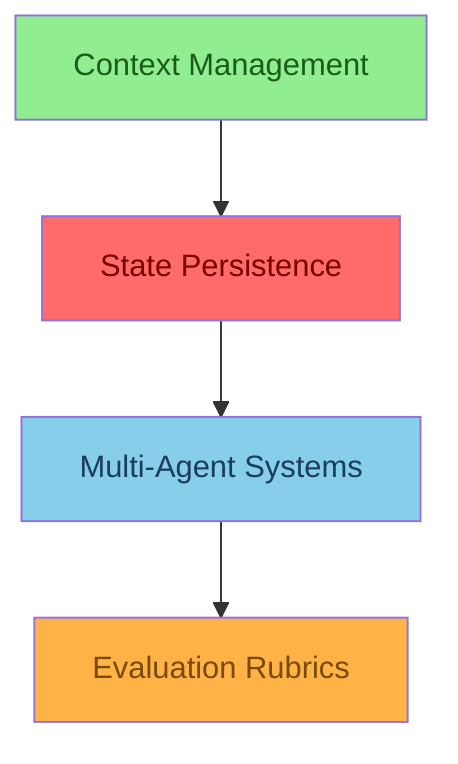

**Erros:**
1. ❌ Aresta `B --> A` sem label. Deveria ser `B -->|enables| A` (Context Management habilita State Persistence).
2. ❌ Aresta `A --> C` sem label. Deveria ser `A -->|enables| C` (State Persistence habilita Multi-Agent Systems).
3. ❌ Aresta `C --> D` sem label. Deveria ser `C -->|requires| D` (Multi-Agent Systems requer Evaluation Rubrics) ou `D -->|evaluates| C`.
4. ❌ Cor de A (`#FF6B6B`, vermelho = dependente) está errada. State Persistence é o conceito central → deveria ser `#90EE90` (verde).
5. ❌ Cor de B (`#90EE90`, verde = central) está errada. Context Management é pré-requisito → deveria ser `#87CEEB` (azul).
6. ❌ Cor de C (`#87CEEB`, azul = pré-requisito) está errada. Multi-Agent Systems é dependente → deveria ser `#FF6B6B` (vermelho).

**Versão corrigida:**

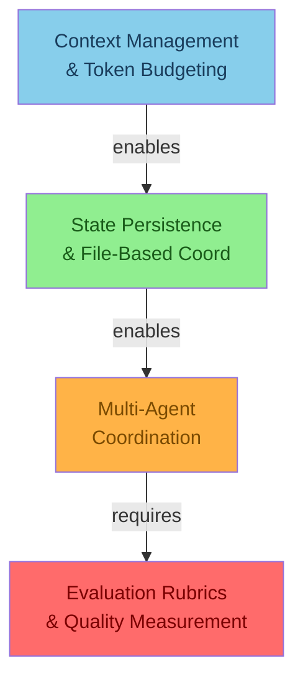

### Exercício 3: Escreva um Trace de Evidência (15 minutos)

Você está documentando **Generator/Evaluator Pattern**. Escreva um trace de evidência de 8-10 linhas para uma conversa onde o Generator recomenda um produto que o Evaluator rejeita por problema de segurança (cliente diabético, produto contém maltodextrina).

Inclua: timestamps realistas, IDs que sigam padrão, scores de rubric, e a decisão final.

**Exemplo de resposta:**

```
[2026-05-28 15:42:01] GENERATOR: customer_id=lucas_729, intent=product_recommendation
[2026-05-28 15:42:01] GENERATOR: query="melhor combo ganho muscular", context_tokens=2150/3000
[2026-05-28 15:42:02] GENERATOR: top_candidates=[whey_isolate_900g, creatine_300g, bcaa_200g, pre_workout_150g]
[2026-05-28 15:42:02] GENERATOR: selected=pre_workout_150g, confidence=0.94, reasoning="best reviews, competitive price"
[2026-05-28 15:42:02] EVALUATOR: evaluating recommendation_id=rec_88421
[2026-05-28 15:42:02] EVALUATOR: rubric.safety — checking customer health restrictions...
[2026-05-28 15:42:02] EVALUATOR: RETRIEVE customer.lucas_729.health.diabetic = true (source: profile, t=2026-04-12)
[2026-05-28 15:42:02] EVALUATOR: CROSS-CHECK pre_workout_150g.ingredients CONTAINS maltodextrin → DANGER (high glycemic index)
[2026-05-28 15:42:02] EVALUATOR: rubric.safety = 2/10 (threshold=8/10) → FAIL
[2026-05-28 15:42:02] EVALUATOR: aggregate_score = 3.4/10 → REJECTED
[2026-05-28 15:42:02] EVALUATOR: rejection_reason = "safety_dimension_failed: maltodextrin_risk_for_diabetic_customer"
[2026-05-28 15:42:02] EVALUATOR: fallback triggered → requesting Generator to produce alternative without maltodextrin
```

### Exercício 4: Complete a Tabela de Capacidades (10 minutos)

Preencha a tabela de capacidades para **Sprint Contracts**. Use o formato: Nível, Capacidade, Sintoma se Ausente, Estratégia Mínima.

**Gabarito:**

| Nível | Capacidade | Sintoma se Ausente | Estratégia Mínima |
|---|---|---|---|
| N1 — Basic awareness | Reconhecer que módulos precisam de acordos explícitos | "O fulfillment achou que o pricing já tinha validado o desconto" | Documentar interfaces em um README compartilhado |
| N2 — Static contracts | Contratos definidos em documento, verificados manualmente | Contrato diz uma coisa, código faz outra. Ninguém percebe até o bug | Escrever contratos em Markdown com campos: input, output, guarantees, constraints |
| N3 — Enforced contracts | Contratos verificados automaticamente a cada execução | Contrato existe mas não é validado. "Confia que o outro módulo fez certo" | Validator que lê o contrato e compara com output real do módulo |
| N4 — KODA negotiated | Contratos renegociados dinamicamente baseado em contexto da conversa | Contratos rígidos quebram quando cliente muda de ideia no meio do checkout | Sistema de negociação: módulo A propõe contrato, módulo B aceita/contrapropõe/rejeita |

### Exercício 5: Identifique Anti-Padrões (10 minutos)

Leia o cenário abaixo e identifique 3 anti-padrões de **Multi-Agent Coordination**. Para cada um, descreva o sintoma e a correção.

**Cenário:** O KODA tem 3 agentes: Pricing (calcula preço final), Fulfillment (verifica estoque e prazo), e Checkout (finaliza o pedido). Pricing aplica desconto de clube de 15%. Fulfillment calcula frete baseado no preço cheio (sem desconto). Checkout recebe os dois valores, não percebe a inconsistência, e cobra o cliente com frete calculado sobre preço errado.

**Gabarito:**
1. **Anti-padrão: "Coordenação implícita".** Sintoma: Pricing e Fulfillment não têm contrato explícito — cada um assume que o outro usa o mesmo preço base. Correção: Criar Sprint Contract `pricing-fulfillment.json` que define `base_price` como campo obrigatório que ambos devem usar.
2. **Anti-padrão: "Sem validação cruzada".** Sintoma: Checkout recebe dois valores inconsistentes e não detecta. Correção: Adicionar cross-validation no Checkout: `assert(pricing.final_price <= fulfillment.base_price)`.
3. **Anti-padrão: "Estado compartilhado sem fonte única de verdade".** Sintoma: Pricing e Fulfillment leem `base_price` de fontes diferentes (catalog vs. cache). Correção: Usar File-Based Coordination com um arquivo `order_state.json` que é a fonte única de verdade para todos os agentes.

---

## 🛠️ Compatibilidade com Ferramentas e Renderizadores Mermaid

Os diagramas Mermaid deste template foram testados nos seguintes ambientes:

| Ambiente | Compatibilidade | Observações |
|---|---|---|
| **GitHub Markdown Preview** | ✅ Total | Renderiza todos os tipos de diagrama, cores e estilos. O preview em PRs é o ambiente mais usado pelo time. |
| **Mermaid Live (mermaid.live)** | ✅ Total | Use para testar diagramas antes de commitar. Suporta todos os recursos: subgraphs, estilos, arestas tracejadas. |
| **VS Code + extensão Mermaid** | ✅ Total | Instale a extensão "Markdown Preview Mermaid Support" para ver diagramas no editor. |
| **Notion** | ⚠️ Parcial | Notion não suporta Mermaid nativamente. Use a integração "Mermaid for Notion" ou exporte os diagramas como imagens. |
| **Confluence** | ⚠️ Parcial | Confluence requer plugin "Mermaid Diagrams for Confluence". Cores e estilos podem variar. |
| **Slack** | ❌ Não suporta | Slack não renderiza Mermaid. Compartilhe screenshots ou links para o arquivo no GitHub. |
| **Google Docs** | ❌ Não suporta | Google Docs não renderiza Mermaid. Use o GitHub como fonte canônica e link a partir do Docs. |
| **Obsidian** | ✅ Total | Suporta nativamente com a sintaxe ` ```mermaid `. Cores e estilos renderizam corretamente. |

### Exportando Diagramas como Imagens

Se você precisar incluir diagramas em ferramentas que não suportam Mermaid:

1. Abra o diagrama no https://mermaid.live
2. Clique em "Download as PNG" ou "Download as SVG"
3. Use SVG para documentos (escala sem perda de qualidade)
4. Use PNG para Slack, apresentações, ou embeds
5. Nomeie o arquivo seguindo o padrão: `[conceito]-[tipo]-[data].svg` (ex: `ctx-hierarchical-2026-05.svg`)
6. Armazene as imagens em `curriculum/06-knowledge-graphs/images/`

### Dicas de Renderização

- **Tamanho de fonte:** Mermaid ajusta automaticamente. Se o texto ficar muito pequeno, reduza o número de caracteres por nó.
- **Sobreposição de arestas:** Se duas arestas se sobrepõem, ajuste a ordem dos nós no código — Mermaid usa a ordem de declaração para posicionamento.
- **Subgraphs e layout:** Subgraphs podem causar layouts inesperados. Se o layout ficar estranho, tente sem subgraphs primeiro.
- **Cores em modo escuro:** A paleta foi desenhada para fundo claro. Em modo escuro (GitHub Dark Mode), as cores podem parecer diferentes. Teste em ambos os modos se o público usa Dark Mode.

---

## 📜 Histórico de Decisões do Template

Esta seção documenta as decisões de design que moldaram o template. Útil para quem quiser propor mudanças ou entender por que as coisas são como são.

### Decisão 1: Por que 3 diagramas e não 2 ou 4?

**Data:** Março 2026
**Contexto:** Na Iteração 2, o template tinha 2 diagramas (Hierarchical + Flow). O time reportava que sabia "como funciona" mas não sabia "por onde começar".
**Decisão:** Adicionar o terceiro diagrama (Timeline) resolveu o gap. 4 diagramas foi testado (adicionando um "Data Flow Diagram") mas foi considerado redundante com o KODA Flow.
**Status:** Mantido. A combinação de 3 cobre os 3 eixos de entendimento (estrutural, temporal, maturidade).

### Decisão 2: Por que 10 cores e não 5 ou 20?

**Data:** Abril 2026
**Contexto:** A Iteração 1 usava 3 cores (azul, verde, vermelho). A Iteração 3 expandiu para 10 cores quando ficou claro que "problema" (rosa), "KODA" (amarelo), "timeline N1-N3" (gradiente azul) e "injeção" (roxo) precisavam de identidade visual própria.
**Decisão:** 10 cores é o ponto de equilíbrio: suficiente para cobrir todas as categorias semânticas, mas não tantas que o leitor precise de uma legenda constante. Testes com 15+ cores mostraram que os leitores começavam a confundir tons similares.
**Status:** Mantido. Se uma décima-primeira cor for necessária, siga o protocolo documentado na FAQ.

### Decisão 3: Por que o prólogo é obrigatório?

**Data:** Maio 2026
**Contexto:** Na Iteração 3, o prólogo era opcional. Diagramas sem prólogo tinham 40% menos engajamento em revisões de PR. Leitores pulavam direto para os diagramas, não entendiam o contexto, e faziam perguntas que o prólogo teria respondido.
**Decisão:** Tornar o prólogo obrigatório e fornecer uma estrutura narrativa clara (personagem, problema, insight, conexão, promessa).
**Status:** Mantido. O prólogo é o componente com maior ROI do template — 200 palavras de narrativa economizam 15 minutos de explicação oral por leitor.

### Decisão 4: Por que "Sintoma se Ausente" na tabela de capacidades?

**Data:** Maio 2026
**Contexto:** A tabela de capacidades original tinha: Nível, Capacidade, Estratégia Mínima. Times não conseguiam se localizar — "estamos no N2 ou N3?" era uma pergunta comum.
**Decisão:** Adicionar a coluna "Sintoma se Ausente" com frases no estilo Slack. "KODA está perguntando o endereço de novo 😤" → N1. Isso transformou a tabela de uma ferramenta de planejamento para uma ferramenta de diagnóstico.
**Status:** Mantido. Esta é a coluna mais consultada da tabela.

### Decisão 5: Por que trace de evidência com logs fake?

**Data:** Maio 2026
**Contexto:** Logs reais do KODA continham informações sensíveis de clientes e não podiam ser publicados no currículo open-source.
**Decisão:** Usar logs verossímeis mas fictícios. O critério não é "ser real" — é "ser útil para ensinar a reconhecer o conceito no log". Um trace bem escrito ensina pattern matching.
**Status:** Mantido. Logs reais seriam melhores, mas logs verossímeis são aceitáveis dado o constraint de privacidade.

### Decisão 6: Por que seção KODA separada em vez de integrar nos diagramas?

**Data:** Abril 2026
**Contexto:** A Iteração 2 integrava exemplos KODA diretamente nos diagramas. Isso funcionava para o time KODA, mas tornava os diagramas inúteis para quem queria aplicar os conceitos em outros sistemas.
**Decisão:** Separar o conteúdo KODA-específico em uma seção dedicada. Os diagramas permanecem genéricos (aplicáveis a qualquer sistema de agentes). A seção KODA faz a ponte para o contexto específico.
**Status:** Mantido. Esta separação permite que o template seja usado para outros sistemas além do KODA (ver FAQ).

---

## 🔗 Próximos Passos

### Se Você Vai Criar um Novo Detailed Graph

1. **Classifique o conceito** — Identifique o tipo (Infraestrutura, Processo, Qualidade, Arquitetura, Transversal) usando a tabela no Prólogo
2. **Leia o módulo core** — Você precisa entender profundamente o conceito antes de diagramar. Não pule esta etapa
3. **Brainstorm os nós** — Liste pré-requisitos, relacionados e dependentes em um rascunho antes de abrir o Mermaid
4. **Siga o workflow de 90 minutos** — Use o guia cronológico da seção "Workflow Passo-a-Passo"
5. **Preencha na ordem:** Header → Prólogo → Diagrama 1 → Diagrama 2 → Diagrama 3 → KODA → Checklist
6. **Valide com o checklist** — Não pule esta etapa. Diagrama não validado = dívida técnica visual
7. **Registre no índice** — Adicione os IDs dos diagramas ao `00-all-diagrams.txt`

### Se Você Vai Revisar um Detailed Graph Existente

1. **Aplique o checklist de qualidade completo** — Marque cada um dos 19 itens como ✅ ou ❌
2. **Compare com este template** — O detailed graph segue a estrutura das 9 seções? O que está faltando?
3. **Verifique consistência com módulo core** — As relações no diagrama batem com o texto? Os nomes são idênticos?
4. **Teste de renderização** — Todos os diagramas renderizam em https://mermaid.live sem erros?
5. **Teste do colega silencioso** — Alguém que não conhece o conceito consegue responder as 3 perguntas?

### Se Você Vai Usar um Detailed Graph para Onboarding

1. **Comece pelo prólogo** — Dê contexto narrativo antes de mostrar os diagramas. A história importa
2. **Explique as cores primeiro** — "Azul significa pré-requisito, verde é o conceito central, vermelho é o que quebra se isso falhar..."
3. **Siga a ordem dos diagramas** — Hierarchical (posição) → KODA Flow (processo) → Timeline (maturidade). Não pule
4. **Use a tabela de mapeamento** — "Se quiser saber mais sobre este nó, leia a seção X do módulo core"
5. **Termine com as perguntas de autoavaliação** — Confirme que o onboardee entendeu antes de avançar

### Se Você Vai Debugar um Problema Usando um Detailed Graph

1. **Identifique o sintoma** — "KODA está esquecendo restrições alimentares"
2. **Localize o sintoma na tabela de capacidades** (coluna "Sintoma se Ausente") — Isso te diz em que nível você está
3. **Vá para o Diagrama 1 (Hierarchical)** — O sintoma pode ser causado por um pré-requisito quebrado, não pelo conceito em si
4. **Vá para o Diagrama 2 (KODA Flow)** — Em que etapa do fluxo o problema ocorre? O trace confirma?
5. **Consulte a seção de anti-padrões** — O problema que você está vendo já foi documentado?

---

## 📖 Exemplo Preenchido Rápido: Sprint Contracts

Este é um exemplo "fast-track" — um detailed graph preenchido de forma compacta para o conceito **Sprint Contracts & Negotiation**. Use como referência de como o template fica quando preenchido, sem toda a prosa explicativa que o template em si contém.

### Header

```markdown
# 📝 Detailed Graph: Sprint Contracts & Negotiation
## Inter-module agreement architecture, KODA contract enforcement flows, and the negotiation framework that keeps agents aligned in production
```

### Diagrama 1 — Hierarchical Connection Graph

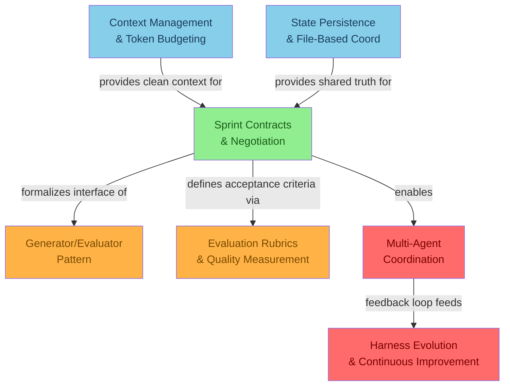

### Diagrama 2 — KODA Application Flow

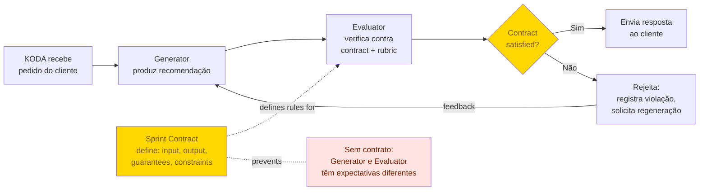

### Diagrama 3 — Complexity & Implementation Timeline

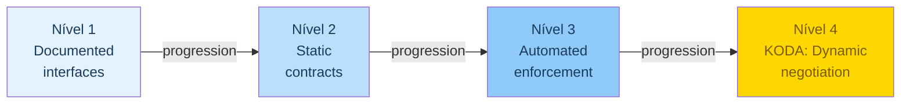

### Tabela de Capacidades (Sprint Contracts)

| Nível | Capacidade | Sintoma se Ausente | Estratégia Mínima |
|---|---|---|---|
| N1 — Documented interfaces | Interfaces entre módulos documentadas em README | "O fulfillment não sabia que o pricing tinha mudado a estrutura do JSON" | Documentar campos de input/output em Markdown compartilhado |
| N2 — Static contracts | Contratos formais com campos, tipos, guarantees e constraints | "O contrato diz que preço é inteiro, mas o código manda float" | Arquivo JSON Schema por contrato, revisado em PR |
| N3 — Automated enforcement | Validator automático verifica contratos a cada execução | Contrato existe mas não é validado. Só descobrem na produção | Validator que lê contrato e compara com output real; falha o build se violar |
| N4 — KODA dynamic negotiation | Contratos renegociados em runtime baseado em contexto | Contratos rígidos quebram quando cliente muda de ideia no meio do checkout | Sistema de proposal/counter-proposal entre agentes usando File-Based Coord |

### Anti-Padrões (Sprint Contracts no KODA)

| Anti-Padrão | Sintoma | Como Detecta | Como Corrige |
|---|---|---|---|
| "Contrato museu" | Contrato escrito há 3 meses, nunca atualizado. Código evoluiu, contrato ficou | PRs não atualizam contratos junto com código | Adicionar contract validation no CI: `npm run validate-contracts` |
| "Contrato wishful thinking" | Contrato promete o que o módulo não entrega. "Garante entrega em 2h" mas módulo não verifica estoque | Trace mostra violação silenciosa | Adicionar verification step no Evaluator: "este contrato foi satisfeito?" |
| "Contrato muito vago" | "O módulo deve retornar preço justo". O que é "justo"? Impossível validar | Evaluator não consegue verificar contrato; sempre aprova | Especificar critérios mensuráveis: "preço ≤ MSRP, preço ≥ custo + 10%" |
| "Contrato sem ownership" | Ninguém é responsável por manter o contrato atualizado. "É do time de arquitetura" (que não existe) | Contrato fica stale por 3+ sprints | Cada contrato tem um owner explícito no header: `owner: time-fulfillment` |

---

## 💭 Reflexão Final

> "Um diagrama não substitui o pensamento. Mas ele força o pensamento a ter forma."

Os 35 diagramas do currículo KODA não foram criados porque alguém achou "bonito ter diagramas".

Eles foram criados porque, repetidamente, o time se reunia para discutir arquitetura e saía com mais perguntas do que respostas. Porque devs novos passavam semanas sem entender como as peças se conectavam. Porque bugs em produção eram difíceis de diagnosticar — não por falta de logs, mas por falta de um modelo mental compartilhado de como o sistema deveria funcionar.

Cada diagrama que você criar usando este template é uma resposta a uma pergunta que alguém no time KODA vai fazer:

- "Quem depende de quem?"
- "Em que ordem isso acontece?"
- "Em que nível de maturidade estamos?"

Se o diagrama responder essas perguntas em 90 segundos — como o desenho do Fernando no quadro branco — ele cumpriu seu propósito.

Se precisar de 15 minutos de explicação oral para fazer sentido, volte e refine.

Bons diagramas não são os mais bonitos. Não são os mais complexos. Não são os que têm mais nós.

Bons diagramas são os que **desaparecem** — você olha, entende, e segue em frente. Eles não chamam atenção para si mesmos. Eles iluminam o conceito e saem do caminho.

### O Que Torna um Diagrama Inesquecível

Depois de criar e revisar dezenas de diagramas, o time KODA identificou 5 qualidades que separam diagramas memoráveis de diagramas esquecíveis:

1. **Especificidade:** "KODA esqueceu a alergia da Marina no minuto 83" é memorável. "O sistema perde informações do usuário" é esquecível. Detalhes concretos criam âncoras na memória.

2. **Narrativa:** Um diagrama que conta uma história (problema → diagnóstico → solução) é lembrado. Um diagrama que é uma lista de caixas e setas é esquecido em 48 horas.

3. **Surpresa:** O melhor momento em um detailed graph é quando o leitor diz "ah, então é POR ISSO que acontece X!". Se o diagrama só confirma o que o leitor já sabia, ele não agrega valor.

4. **Acionabilidade:** "Vou implementar Compaction na terça-feira" é o resultado desejado. "Interessante, vou pensar sobre isso" é o resultado que indica que o diagrama falhou.

5. **Beleza funcional:** Um diagrama bem alinhado, com cores que fazem sentido e labels que contam micro-histórias, é mais provável de ser lembrado e compartilhado. A estética não é supérflua — é usabilidade.

### O Legado Deste Template

Quando você preenche este template, você não está apenas documentando um conceito.

Você está construindo o modelo mental compartilhado que vai guiar decisões de arquitetura por meses. Você está criando o artefato que um dev novo vai consultar no primeiro dia. Você está deixando a resposta para a pergunta que alguém vai fazer às 23h de uma sexta-feira, durante um incidente.

Cada hora investida em um bom diagrama economiza dezenas de horas de explicação oral, debug, e reuniões de alinhamento.

Este template existe para que você possa criar diagramas que desaparecem.

Use-o. Adapte-o. Melhore-o.

E quando o próximo dev novo entrar no time e entender Sprint Contracts em 10 minutos sem fazer uma única pergunta, você vai saber que funcionou.

---

## 📋 Metadata

| Campo | Valor |
|---|---|
| **Template** | knowledge-graph-template.md |
| **Versão** | 1.0 |
| **Localização** | `curriculum/08-tools-templates/` |
| **Nível** | 8 — Tools & Templates |
| **Tipo** | Template (instruções + exemplos) |
| **Conceitos Exemplo** | Context Management (completo), Generator/Evaluator (parcial), Sprint Contracts (compacto) |
| **Diagramas no Template** | 10 diagramas Mermaid (3 template + 7 exemplo) |
| **Paleta de Cores** | 10 cores documentadas com hex codes e regras de uso |
| **Tipos de Conceito** | 5 (Infraestrutura, Processo, Qualidade, Arquitetura, Transversal) com tabela de adaptações |
| **Checklist de Qualidade** | 19 itens em 4 categorias (renderização, consistência, comunicação, completude) |
| **Workflow de Preenchimento** | 9 etapas, 90 minutos estimados |
| **Seções Obrigatórias** | 9 (Header, Prólogo, Definição, 3 Diagramas, Estilo Visual, KODA, Checklist) |
| **Exercícios Práticos** | 5 exercícios com gabarito (classificação, correção, trace, tabela, anti-padrões) |
| **Quick Reference Card** | 1 página com cores, arestas, erros comuns, template de trace |
| **FAQ** | 24 perguntas com respostas detalhadas |
| **Decisões de Design Documentadas** | 6 decisões com data, contexto, rationale |
| **Status** | 🟢 COMPLETO — Pronto para uso |
| **Criado** | Maio 2026 |
| **Atualizado** | Maio 2026 |
| **Próxima Revisão** | Quando novo tipo de conceito ou nova cor semântica for identificada |

---

## 📚 Glossário de Símbolos Mermaid para Knowledge Graphs

Esta seção é uma referência rápida de todos os símbolos Mermaid usados nos Knowledge Graphs do currículo. Consulte durante o preenchimento.

### Direções de Grafo

| Sintaxe | Significado | Quando Usar |
|---|---|---|
| `graph TD` | Top-Down (cima para baixo) | Hierarquias, árvores de dependência, pipelines verticais |
| `graph LR` | Left-Right (esquerda para direita) | Sequências lineares, handoffs entre agentes, timelines |
| `graph BT` | Bottom-Top (baixo para cima) | Raramente usado. Evite — leitura não natural |
| `graph RL` | Right-Left (direita para esquerda) | Raramente usado. Evite — leitura não natural |
| `flowchart TD` | Flowchart Top-Down (com mais features) | Use `flowchart` em vez de `graph` para fluxos com decisões |
| `flowchart LR` | Flowchart Left-Right | Use para fluxos KODA que mostram sequência de agentes |

### Tipos de Nós

| Sintaxe | Visual | Uso no Template |
|---|---|---|
| `A["texto"]` | Retângulo arredondado | Padrão para conceitos e módulos |
| `A{"texto"}` | Losango | Pontos de decisão, bifurcações |
| `A(("texto"))` | Círculo | Estados finais, endpoints |
| `A("texto")` | Retângulo pontudo | Entidades externas, APIs |
| `A["texto\nmultilinha"]` | Retângulo com quebra | Quando o texto não cabe em uma linha |
| `A>texto]` | Retângulo assimétrico | Raramente usado. Evite no template |

### Tipos de Arestas

| Sintaxe | Visual | Significado | Uso no Template |
|---|---|---|---|
| `A --> B` | Seta sólida | Conexão direta | Relação sem label (evite — sempre use label) |
| `A -->|label| B` | Seta sólida com texto | Conexão direta com explicação | Use SEMPRE. Labels contam a micro-história |
| `A -.- B` | Linha tracejada | Conexão indireta | Prevenção de problemas, relações indiretas |
| `A -.-|label| B` | Linha tracejada com texto | Conexão indireta explicada | Use para nós de problema (rosa) |
| `A ==> B` | Seta grossa | Fluxo principal ou crítico | Destaque do caminho mais importante |
| `A -.->|label| B` | Seta pontilhada | Transição assíncrona | Background jobs, eventos futuros |
| `A --- B` | Linha sem seta | Associação bidirecional | Use com moderação. Prefira directional |

### Subgraphs

| Sintaxe | Uso |
|---|---|
| `subgraph NOME ["Título"]` ... `end` | Agrupar 3-5 nós do mesmo domínio |
| `subgraph NOME ["Título"]` ... `end` com `style` | Aplicar estilo ao subgraph (limitado no Mermaid) |

### Estilos (style)

| Sintaxe | Uso |
|---|---|
| `style NOME fill:#HEX,color:#HEX` | Aplicar cor de fundo e texto a um nó |
| `style NOME fill:#HEX,color:#HEX,stroke:#HEX,stroke-width:2px` | Estilo completo com borda |
| `classDef nome fill:#HEX,color:#HEX` + `class NOME nome` | Aplicar mesmo estilo a múltiplos nós (alternativa a style individual) |

### Comentários e Caracteres Especiais

| Situação | Solução |
|---|---|
| Texto com `"` dentro do nó | Use `'` externamente: `A['texto com "aspas"']` |
| Texto com `&` | Escape como `&amp;` em alguns renderizadores |
| Texto com `<` ou `>` | Escape como `&lt;` e `&gt;` em alguns renderizadores |
| Quebra de linha | `\n` dentro do texto do nó |
| Comentário no código | `%% comentário` (não renderiza) |

---

## 📋 Modelo de Preenchimento para Impressão

Esta seção é um "fill-in-the-blanks" que você pode imprimir ou copiar para um novo arquivo e preencher diretamente. Inclui placeholders marcados com `[COLCHETES]` que você substitui pelo conteúdo real.

```markdown
# [EMOJI] Detailed Graph: [NOME DO CONCEITO]
## [SUBTÍTULO — o que o leitor vai ganhar]

**Tempo Estimado:** [45-90] minutos
**Nível:** 6 — Knowledge Graphs (Detailed Graph)
**Pré-requisito:** `05-core-concepts/[NOME-DO-ARQUIVO].md`
**Status:** 🟡 IN PROGRESS — [breve descrição]
**Data de Criação:** [Mês] 2026
**Diagramas Incluídos:** 3 (Hierarchical Connection Graph, KODA Application Flow, Complexity & Implementation Timeline)

---

## 📖 Prólogo: [TÍTULO DA HISTÓRIA]

[Parágrafo 1: Cena de abertura — local, hora, pessoas, problema concreto]

[Parágrafo 2: Agravamento — por que o problema é difícil? O que já foi tentado?]

[Parágrafo 3: Insight — o momento em que o diagrama resolveu. Seja visual]

[Parágrafo 4: Conexão com o módulo core — o que o módulo ensina e o que este detailed graph adiciona]

[Parágrafo 5: Promessa ao leitor — 3-5 capacidades que ele vai ganhar]

---

## 🎯 O Que É Este Detailed Graph

### Definição

[2-3 parágrafos explicando o propósito deste arquivo e sua relação com o módulo core]

---

## 🔗 Diagrama 1 — Hierarchical Connection Graph

```mermaid
graph TD
    [NÓS E ARESTAS AQUI]
```

### Como Ler Este Grafo

- **Pré-requisitos (azul):** [explicação de cada nó azul]
- **Conceito central (verde):** [explicação do nó verde]
- **Relacionados (laranja):** [explicação de cada nó laranja]
- **Dependentes (vermelho):** [explicação de cada nó vermelho]

### Conexão com o Módulo Core

| Nó do Diagrama | Seção no Módulo Core | O Que o Módulo Explica |
|---|---|---|
| [Nó 1] | [Seção] | [Descrição] |
| [Nó 2] | [Seção] | [Descrição] |

---

## 📱 Diagrama 2 — KODA Application Flow

```mermaid
flowchart [TD/LR]
    [NÓS E ARESTAS AQUI]
```

### Linha do Tempo da Conversa

| Minuto | Evento | Ação do Conceito | Estratégia Ativada |
|---|---|---|---|
| [00:00] | [Evento] | [Ação] | [Estratégia] |

### Trace de Evidência

```
[TIMESTAMP] [ETAPA]: [detalhes]
```

---

## 📊 Diagrama 3 — Complexity & Implementation Timeline

```mermaid
graph LR
    [NÍVEIS N1-N4 AQUI]
```

### Tabela de Capacidades

| Nível | Capacidade | Sintoma se Ausente | Estratégia Mínima |
|---|---|---|---|
| N1 — [nome] | [capacidade] | [sintoma] | [estratégia] |
| N2 — [nome] | [capacidade] | [sintoma] | [estratégia] |
| N3 — [nome] | [capacidade] | [sintoma] | [estratégia] |
| N4 — KODA | [capacidade] | [sintoma] | [estratégia] |

---

## 🚀 Seção KODA — Aplicação Prática

### Como [CONCEITO] se Manifesta no KODA

[2-3 parágrafos com exemplo concreto de conversa WhatsApp]

### Features do KODA que Dependem Deste Conceito

- **Feature 1:** [explicação]
- **Feature 2:** [explicação]
- **Feature 3:** [explicação]
- **Feature 4:** [explicação]

### Anti-Padrões no KODA

| Anti-Padrão | Sintoma | Como Detecta | Como Corrige |
|---|---|---|---|
| [Nome] | [Sintoma] | [Detecção] | [Correção] |

### Tabela Comparativa de Estratégias

| Estratégia | Descrição | Quando Usar | Custo | Latência | Complexidade | Exemplo KODA |
|---|---|---|---|---|---|---|
| [E1] | [Desc] | [Quando] | [+N tokens] | [+N ms] | [Baixa...Alta] | [Exemplo] |

### Diagrama de Arquitetura KODA

```
[DIAGRAMA ASCII AQUI]
```

---

## ✅ Checklist de Qualidade

### Renderização
- [ ] Diagrama 1 renderiza sem erros
- [ ] Diagrama 2 renderiza sem erros
- [ ] Diagrama 3 renderiza sem erros
- [ ] Cores contrastam (texto legível sobre fundo)
- [ ] IDs semânticos em todos os nós
- [ ] Labels em todas as arestas

### Consistência
- [ ] Nomes batem com módulo core
- [ ] Cores seguem paleta documentada
- [ ] Arestas não contradizem módulo core
- [ ] IDs seguem padrão [conceito]-[tipo]

### Comunicação
- [ ] Prólogo contextualiza os diagramas
- [ ] Cada diagrama tem narrativa explicativa
- [ ] Tabela de mapeamento conecta com módulo core
- [ ] Timeline inclui sintomas de ausência
- [ ] Trace de evidência é verossímil
- [ ] Seção KODA é acionável

### Completude
- [ ] 3 diagramas (mínimo)
- [ ] Prólogo (3+ parágrafos)
- [ ] Tabela de mapeamento
- [ ] Tabela de capacidades (4 níveis)
- [ ] Tabela comparativa (3+ estratégias)
- [ ] Anti-padrões (3+)
- [ ] ASCII diagram
- [ ] Trace (8+ linhas)
- [ ] FAQ (8+ perguntas)

---

## 🎓 O Que Você Aprendeu

### Resumo

1. [Ponto 1]
2. [Ponto 2]
3. [Ponto 3]
4. [Ponto 4]
5. [Ponto 5]

### Checklist de Entendimento

- [ ] Consigo explicar quem depende de quem
- [ ] Consigo mapear o conceito para uma conversa real do KODA
- [ ] Consigo identificar em que nível de maturidade estamos
- [ ] Consigo listar 3 anti-padrões e como corrigi-los
- [ ] Consigo comparar estratégias de implementação

---

## ❓ FAQ

### P: "[Pergunta 1]"
**R:** [Resposta]

### P: "[Pergunta 2]"
**R:** [Resposta]

---

## 📋 Metadata

| Campo | Valor |
|---|---|
| **Arquivo** | [NOME-DO-ARQUIVO].md |
| **Conceito** | [NOME DO CONCEITO] |
| **Nível** | 6 — Knowledge Graphs |
| **Status** | 🟢 COMPLETO |
| **Criado** | [Mês] 2026 |
```

### Instruções de Uso do Modelo

1. **Copie** o bloco acima para um novo arquivo `.md`
2. **Substitua** todos os `[COLCHETES]` pelo conteúdo real
3. **Remova** os comentários em `[colchetes]` e as instruções que não são conteúdo
4. **Preencha** os diagramas Mermaid com nós e arestas reais
5. **Valide** contra o checklist de qualidade
6. **Publique** com status 🟢 COMPLETO

**Tempo estimado de preenchimento:** 90-180 minutos (dependendo da familiaridade com o conceito)

---

## 📊 Métricas de Qualidade do Template

Esta seção define as métricas que o time usará para avaliar se o template está cumprindo seu propósito. Essas métricas devem ser coletadas a partir de Junho 2026, quando houver volume suficiente de detailed graphs criados.

### Métricas de Adoção

| Métrica | Meta |
|---|---|
| Detailed graphs publicados | 8 (todos os Core Concepts) |
| Tempo médio de preenchimento | < 90 min |
| Satisfação do revisor (NPS) | > 50 |
| Diagramas que passam no checklist na 1a tentativa | > 80% |
| Tempo de onboarding com detailed graph | < 15 min |
| Bugs de produção diagnosticados via detailed graph | 3+ (qualitativo) |

### Perguntas para Retrospectiva

Coletar trimestralmente em retrospectiva do time:

1. "O detailed graph te ajudou a tomar uma decisão de arquitetura? Qual?"
2. "Quanto tempo você gastou preenchendo o template? Foi mais ou menos que o esperado?"
3. "O que foi mais difícil no preenchimento?"
4. "O que você mudaria no template?"
5. "Você consulta detailed graphs existentes? Com que frequência?"

### Critérios de Sucesso do Template

- [ ] 8/8 Core Concepts com detailed graph publicado
- [ ] Tempo médio de preenchimento < 90 minutos
- [ ] 90% dos diagramas passam no checklist na 1a tentativa
- [ ] 3+ bugs de produção diagnosticados via detailed graph
- [ ] 5+ decisões de arquitetura informadas por detailed graph
- [ ] NPS do template > 50 (medido via retrospectiva)

---

**Criado para o currículo Building Long-Running Agents | Maio 2026 | Template: Knowledge Graph**
