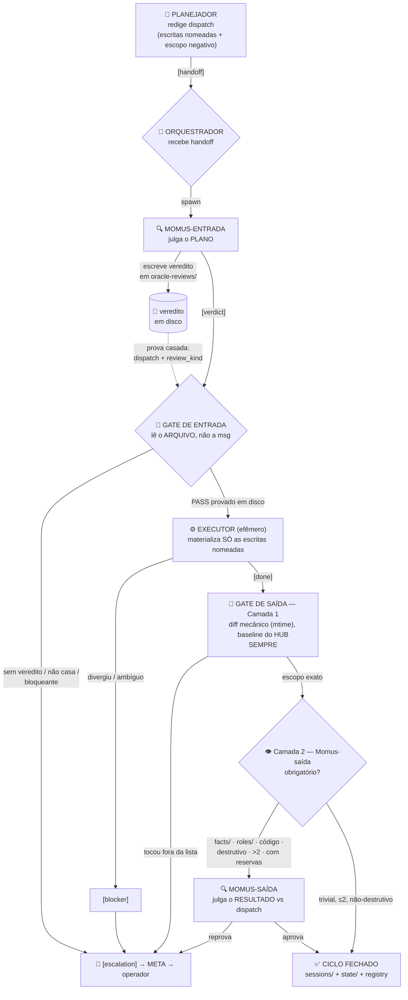

# 🔁 O loop dispatch → gate: como um artefato nasce sem porta lateral
## `dispatch → review → gate → execução efêmera → verify → registry`, passo a passo

**Tempo Estimado:** 60 minutos
**Nível:** 2 — A Máquina
**Pré-requisito:** `02-nivel-2-a-maquina/01-topologia-de-papeis.md`
**Status:** 🟢 O CORAÇÃO MECÂNICO — este é o loop que produz tudo

---

## 📖 Prólogo: o coordenador que digitou o artefato final

Um sistema de agentes mais simples — talvez o primeiro que você desenharia — tem um
coordenador esperto no centro. Ele recebe o pedido, pensa, e **escreve o resultado**. É
rápido, é direto, e funciona por um tempo.

Depois ele começa a mentir para si mesmo.

Não por má-fé. Ele mente porque é a mesma sessão que decide *o que fazer*, faz, e depois
declara *que fez certo*. Quando esses três atos moram na mesma cabeça, o terceiro é grátis:
"revisado, tudo certo" custa uma frase, e a frase sempre está disponível. O coordenador
esperto não tem como ser pego, porque o único que poderia pegá-lo é ele mesmo.

O runtime tomou a decisão oposta, e é a decisão de arquitetura mais importante do sistema:
**o coordenador não escreve o artefato final.** Ele despacha o trabalho para uma sessão
descartável, e depois **mede o disco** para ver o que aquela sessão realmente fez. O
orquestrador nunca é, ao mesmo tempo, o autor e o auditor. Ele é sempre e só o auditor.

Essa separação custa caro — sessões extras, mensagens, latência. E o sistema paga esse
custo em todo ciclo, de propósito, porque a alternativa (um coordenador que confia na
própria memória) é a fonte de toda mentira sobre estado que o Nível 3 vai catalogar.

---

## 🧠 O conceito: seis estágios, um piso que nunca desce

O **loop operacional** é o ciclo que produz *todo* artefato do sistema. Nada nasce fora
dele; não há porta lateral de escrita no vault. Ele materializa o padrão canônico
`plan-execute-verify` — plano, execução, verificação — com uma camada de review adversarial
entre o plano e a execução.

Os seis estágios:

```
dispatch → review → gate → execução efêmera → verify → registry
   │          │        │          │              │          │
planejador  Momus   orques-    executor       orques-     meta /
 redige    entrada  trador     efêmero        trador      disco
           julga    gate de    materializa    gate de     fecha o
           o plano  entrada    escritas       saída       ciclo
                               nomeadas
```

### Estágio 1 — Dispatch (o planejador redige)

O planejador escreve um **dispatch**: um contrato executável por uma sessão que não tem o
contexto dele. Ele carrega, obrigatoriamente, as **escritas nomeadas** (a lista exaustiva e
literal dos arquivos que podem ser tocados) e o **escopo negativo** (o que é proibido). Ele
grava em `dispatches/<TOPIC>/` e manda `[handoff]` ao orquestrador. *(O anatomia interna do
dispatch é a próxima lição — o intent primitivo.)*

### Estágio 2 — Review (o Momus-entrada julga o plano)

Ao receber o `handoff`, o orquestrador **não spawna executor ainda**. Ele spawna um
**Momus-entrada** efêmero, que nasce limpo e julga o *plano*: as escritas nomeadas são
exaustivas? O escopo negativo cobre as tentações concretas? A spec é executável sem
interpretação? O Momus escreve um **veredito** em `oracle-reviews/<TOPIC>/`, com proveniência
no frontmatter (`dispatch:`, `review_kind: entrada`, `veredito:`), e morre. **O arquivo é o
veredito**; a mensagem que ele manda é só o ponteiro.

### Estágio 3 — Gate de entrada (o orquestrador exige prova de Momus)

Aqui o hub faz o que o prólogo do coordenador-esperto nunca fez: **ele não confia na
mensagem, ele lê o disco.** O procedimento é mecânico e sem margem:

1. Localiza o **arquivo** de veredito em `oracle-reviews/<TOPIC>/`. Não existe? → `[escalation]`.
   Ausência de veredito **nunca** é lida como aprovação tácita.
2. **Casa a proveniência:** o campo `dispatch:` do veredito é *idêntico* ao `REF` do dispatch
   que ele vai executar? E `review_kind: entrada`? Se qualquer um não casar → `[escalation]`.
   A mera existência de um PASS na pasta nunca basta: sob paralelismo, o PASS do dispatch A
   aprovaria silenciosamente o dispatch B.
3. Tem bloqueante? → `[escalation]`. É `PASS-WITH-RESERVATIONS`? Pode seguir, mas marca o
   Momus-saída como **obrigatório**. É PASS limpo e fora da lista de escalação? → **auto-aprova
   e spawna o executor.**

> "Confiar que revisou" é proibido. A mensagem `[verdict]` não é a prova; o **arquivo** é.
> Este parágrafo existe por causa de uma cicatriz real (`incident-2026-07-09-e1-momus-skip`).

### Estágio 4 — Execução efêmera (o executor materializa, e só isso)

O orquestrador spawna um **executor** — uma sessão **descartável, uma por dispatch**. Ela lê
o dispatch como **autoridade única**, ignora qualquer contexto anterior, e materializa
**exatamente** as escritas nomeadas. Nada além ("não arrumei um typo que vi no caminho"),
nada a menos. Divergiu do plano, achou uma etapa "melhor", encontrou ambiguidade? → `[blocker]`
com o ponto exato. Um blocker é barato; um improviso é caro. Ao terminar, emite `[done]` e
**morre**.

Por que efêmera: o executor não fica vivo para "ajudar depois". Correção do que o gate achar
é *outro* dispatch, *outro* executor. A sessão que produz o artefato não é a mesma que julga
o artefato — de novo, a separação autor/auditor.

### Estágio 5 — Verify (o gate de saída, em duas camadas)

Ao receber `[done]`, o orquestrador aplica o **gate de saída**
(`dispatch-rule-post-exec-gate`), que tem duas camadas com regimes diferentes:

- **Camada 1 — diff mecânico de escritas nomeadas: SEMPRE, incondicional.** Compara o conjunto
  de arquivos efetivamente tocados contra a lista de escritas nomeadas. O vault não tem git;
  a evidência é **mtime + listagem**, contra uma **baseline que o orquestrador tomou por si
  mesmo, no instante do spawn** — não a baseline que o executor reporta. A evidência do
  executor é *corroborante, não autoritativa*; se divergir da do hub, prevalece a do hub e o
  caso escala. Tocou algo fora da lista → suspeita de substituição de passo → `[escalation]`.
- **Camada 2 — Momus-saída: condicional.** Um Momus *novo* revisa o **resultado contra o
  dispatch** (o conteúdo cumpre o contrato, ou só se parece com ele?). É **dispensado** só se
  o dispatch for trivial, ≤2 arquivos, não-destrutivo e sem arquivo sensível. É **obrigatório**
  se tocar código/config/regra, for destrutivo, tiver >2 escritas, veio com reservas, ou —
  gatilho absoluto — **tocou `facts/` ou `roles/`**: governança se revisa.

### Estágio 6 — Registry (o ciclo fecha, ou escala)

Passaram as duas camadas → **ciclo fechado**. O handoff foi persistido em `sessions/<TOPIC>/`,
o estado corrente reflete a mudança, e a meta atualiza o painel/registry. Falhou qualquer
camada → `[escalation]` à meta, que agrega no **inbox único** e chama o operador. O
`registry.md` é **derivado e não-autoritativo**: ele reflete o que está em disco, e se
divergir do disco, **o disco vence**.

---

## 🗺️ O loop inteiro, num diagrama



---

## 🚫 Duas perguntas que o loop responde

### Por que o coordenador não escreve o artefato final?

Porque **um gate cuja evidência vem do auditado não é um gate.** Se o orquestrador
escrevesse o artefato, ele seria o autor e o guardião do mesmo portão — e a única pessoa
capaz de reprovar o trabalho seria a mesma que o produziu. O loop existe para que **quem
produz e quem mede sejam sessões diferentes**, de ponta a ponta: o planejador não revisa
(Momus revisa), o executor não se aprova (o gate de saída aprova), o Momus não corrige (outro
Momus revisa a correção). A execução mora numa **sessão efêmera** precisamente para que o
coordenador tenha só uma relação com ela: medir o que ela deixou em disco.

### Por que não há porta lateral?

Porque **os spokes nunca falam entre si** (Lição 01). Se o planejador pudesse entregar o
dispatch direto ao executor, o Momus-entrada seria pulado e o gate de entrada nunca rodaria.
Se o executor pudesse escrever em `facts/` sem passar pelo gate de saída, uma regra do sistema
entraria sem revisão — e regra errada é gate silenciosamente afrouxado que se propaga por
todos os ciclos futuros. **O hub é o único ponto onde os gates são aplicados**, e é por isso
que todo tráfego passa por ele. Não há porta lateral porque uma porta lateral é, por
definição, um gate contornado.

O corolário que fecha o loop: **nada nasce fora dele.** Se um artefato existe no vault, ele
passou por um dispatch, um review, um gate de entrada, uma execução efêmera e um gate de
saída — ou é uma anomalia a escalar.

---

## 🧪 Exercício: rastreie um ciclo real e ache onde ele pararia

**Contexto.** Leitura e raciocínio sobre os charters e a regra do gate de saída. Sem escrita.

1. **Rotule os seis estágios.** Leia `roles/orchestrator.md` §2 (a tabela de reação por
   `TYPE`), §3 (gate de entrada) e §4 (gate de saída). Para cada `TYPE` da tabela (`handoff`,
   `verdict`, `done`, `blocker`, `directive`), diga a qual estágio do loop ele pertence e qual
   ação o hub toma.

2. **Onde este ciclo para?** Um dispatch toca **um** arquivo em `facts/_global/`. O executor
   emite `done`, tocou exatamente aquele arquivo, e a Camada 1 passa. O ciclo fecha sozinho?
   Justifique com a regra exata de `dispatch-rule-post-exec-gate`.

3. **A baseline de quem?** O relatório do executor diz "toquei só o arquivo X". O snapshot que
   o orquestrador tirou no spawn mostra que o arquivo Y também mudou de mtime. Qual baseline
   prevalece, e o que o hub faz? Por que a evidência do executor é "corroborante, não
   autoritativa"?

4. **Feche o buraco.** Descreva, em uma frase, o que aconteceria com o gate de entrada se o
   orquestrador aceitasse a mensagem `[verdict]` como prova em vez de exigir o arquivo em disco.

**Critério de aprovação (medição de terceiro):** suas respostas só "passam" quando **outra
pessoa** (ou outra sessão) confere contra `roles/orchestrator.md` e
`dispatch-rule-post-exec-gate` e confirma que: no passo 2 o ciclo **não** fecha sozinho
(qualquer escrita em `facts/` torna o Momus-saída obrigatório) e no passo 3 prevalece a
baseline **do hub**. Você não aprova as próprias respostas — é o mesmo princípio que o loop
inteiro implementa.

---

## 🔗 Para ir fundo

- O hub e os dois gates, na fonte: `[[vault:sisyphus-runtime/roles/orchestrator|Charter — Orquestrador]]`
- O gate de saída em duas camadas: `[[vault:sisyphus-runtime/facts/_global/dispatch-rule-post-exec-gate|Regra — Post-Exec Gate]]`
- O contrato de mensagem (mensagem = sinal, arquivo = verdade): `[[vault:sisyphus-runtime/roles/protocol|Protocolo de Mensagem]]`
- Padrão canônico — plano/execução/verificação: `[[vault:long-running-agents/docs/canonical/plan-execute-verify|Plan-Execute-Verify]]`
- Padrão canônico — o sistema operacional em loop fechado: `[[vault:long-running-agents/docs/canonical/closed-loop-agent-operating-system|Closed-Loop Agent Operating System]]`
- Próxima lição: `03-o-intent-primitivo.md` — como uma intenção vira um dispatch determinístico.
