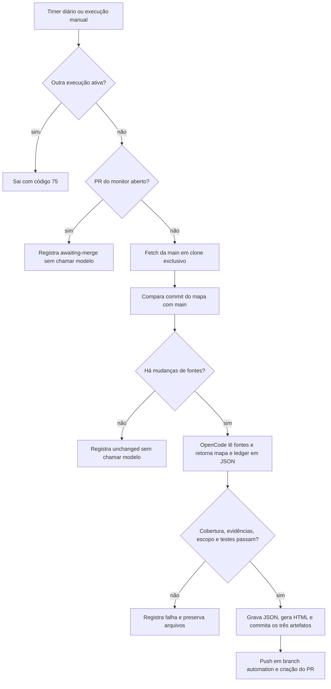

# Revisão diária de arquitetura

O timer do usuário executa diariamente às **08:00, America/Sao_Paulo**. Usa OpenCode
com `zai-coding-plan/glm-5.3-flash`, esforço de raciocínio `low`, e a autenticação existente deste host. O resultado
é um PR; a integração na `main` continua manual. Não existe merge automático.

## Fluxo completo



### 1. Entrada e exclusão mútua

O systemd chama o wrapper `architecture-review.sh`. `flock` mantém um lock do
processo durante toda a rodada. A execução manual usa o mesmo wrapper e o mesmo
lock. O sistema operacional libera o lock ao terminar o processo; não há remoção
manual de lock nem detecção por PID.

O timer tem `Persistent=true`: se o host estava desligado às 08:00, executa a rodada
pendente quando o gerenciador do usuário voltar a funcionar. Não opera com a máquina
desligada. O serviço tem limite total de 25 minutos e encerra seu grupo de processos.

### 2. Trabalho isolado e detecção

O clone exclusivo fica em `~/.local/state/architecture-monitor/checkout`.
O controlador faz fetch e fixa o SHA de `origin/main`. Nunca troca branches, edita
ou faz reset no checkout de trabalho do operador.

Se existe um PR aberto com branch `automation/architecture-map-*`, a rodada termina
como `awaiting-merge`. Esta primeira versão aguarda esse PR antes de revisar novas
mudanças; não atualiza o mesmo PR diariamente. Ao integrá-lo ou fechá-lo, a fila pode
voltar a andar. Isso evita múltiplos PRs concorrentes sobre o mesmo mapa.

Mapas, HTML e ledgers gerados não disparam nova revisão sozinhos. Assim, o merge do
PR do monitor não cria um ciclo infinito de atualizações. Documentação humana,
agentes e scripts continuam sendo fontes relevantes. O commit do mapa pode ficar
anterior à `main` quando a única diferença são artefatos derivados — esse é o
comportamento esperado, sem chamada de modelo ou avanço artificial da evidência.

### 3. Revisão pelo OpenCode

O controlador usa `opencode --pure run --agent repository-architecture-monitor`:
plugins externos ficam fora desta execução. O modelo é explícito, há um máximo
de 40 passos e um timeout de 15 minutos para o processo OpenCode. A configuração
inicial com Flash e esforço padrão ficou lenta no teste real. Highspeed foi recusado
pela assinatura disponível. O esforço explícito `low` reduz o orçamento de raciocínio
do Flash; os servidores MCP `zread`, `promptschat` e `context7` também são desativados
nesta sessão. Os gates de saída permanecem os mesmos.

A configuração desta sessão permite somente `read`, `glob` e `grep`. O controlador
fornece o diff das fontes e fixa o checkout no alvo; diffs acima de 200 KB exigem
divisão manual. O agente retorna um objeto JSON com `map` e `review`. Toda escrita,
publicação e execução de scripts pertence ao controlador. Subagentes e ferramentas
externas ficam desabilitados.
Essas permissões são regras do host, não um sandbox de sistema operacional.

O prompt entrega a fila calculada pelo Git, fixa baseline e target e exige uma
decisão por arquivo: `architecture-change`, `no-architecture-change` ou `uncertain`.
Cada decisão tem justificativa e evidência por arquivo, commit e linhas. Uma dúvida
deve ficar registrada; o agente não precisa inventar uma resposta para encerrar.

### 4. Validação e publicação

Antes de publicar, o controlador verifica:

- HEAD e os arquivos do checkout não foram modificados pelo agente de leitura.
- O mapa aponta para o alvo e seus componentes, relações e evidências são válidos.
- O ledger cobre exatamente todos os caminhos da fila, sem duplicatas ou pendências.
- Todas as evidências do ledger existem no baseline ou no alvo e têm linhas válidas.
- Os testes do monitor e do gate de revisão passam; `git diff --check` passa.

O controlador aceita somente a última mensagem de uma execução concluída sem erro.
O formato preferido é um envelope JSON; também aceita os dois blocos JSON completos
do primeiro experimento, sem ambiguidade. Aliases exatos `target` e `baseline` nos
commits de evidência são expandidos para os SHAs já conferidos e essa normalização
fica registrada. Isso não altera linhas, conclusões ou o validador de evidências.

Após validar os objetos em memória, o controlador grava os JSONs nos caminhos fixos.
O HTML é gerado pelo renderizador determinístico após a revisão. O controlador faz
commit somente de `repository-map.json`, `index.html` e `reviews/<target>.json`,
envia uma branch `automation/architecture-map-<target-curto>` e abre o PR.
Não altera a `main`, não faz force-push e não envia mensagens fora do PR.

O gate valida estrutura e rastreabilidade; não prova que as conclusões semânticas
do modelo estão corretas. A revisão do PR permanece o ponto de avaliação humana.

## Instalação e comandos operacionais

Instale a partir de um checkout com a versão desejada e os testes passando:

```bash
bash scripts/install-architecture-schedule.sh
systemctl --user daemon-reload
systemctl --user enable --now architecture-review.timer
```

O instalador copia os arquivos necessários para `~/.local/share/architecture-monitor`
e registra os caminhos absolutos de Node, OpenCode e gh disponíveis no momento.
Nenhuma credencial é copiada: usa a configuração já existente do usuário.
Essa cópia independe de mudanças de branch no seu checkout. Para atualizar o
controlador, reinstale a partir da versão revisada, com o serviço parado.

```bash
# Rodar agora pelo mesmo serviço
systemctl --user start architecture-review.service

# Consultar agenda e última execução
systemctl --user list-timers architecture-review.timer
systemctl --user status architecture-review.service
cat ~/.local/state/architecture-monitor/latest.json
journalctl --user -u architecture-review.service -n 30 --no-pager

# Pausar futuras execuções; interromper uma rodada em andamento é separado
systemctl --user disable --now architecture-review.timer
systemctl --user stop architecture-review.service

# Execução manual em terminal, com o mesmo lock
~/.local/share/architecture-monitor/scripts/architecture-review.sh

# Reaproveitar resposta concluída sem chamar o modelo novamente (mesmos commits)
~/.local/share/architecture-monitor/scripts/architecture-review.sh \
  --review-log /caminho/da/rodada/opencode.jsonl
```

`~/.local/share/architecture-monitor/runtime.env` contém apenas caminhos, repositório
e modelo. Alterar o modelo requer validar uma rodada real novamente.

## Resultados e falhas

Cada rodada tem um diretório privado em `~/.local/state/architecture-monitor/runs/`:
`status.json`, entrada Git, prompt, eventos do OpenCode, testes e corpo do PR quando
aplicável. `latest.json` resume a última rodada concluída; consulte o systemd para
saber se uma rodada está em andamento. Os arquivos têm permissões restritas ao usuário.

| Status | Significado | Próxima ação |
|---|---|---|
| `unchanged` | Nenhuma mudança de fonte desde o mapa | Aguardar próxima rodada |
| `awaiting-merge` | Já existe um PR do monitor | Revisar e integrar ou fechar o PR |
| `pr-opened` | Revisão passou pelos gates e foi publicada | Examinar mapa e ledger no PR |
| `failed` | Git, host, evidência, teste ou publicação falhou | Ler `stage`, `reason` e o diretório da rodada |

O replay só aceita uma resposta concluída e evidências que correspondam exatamente
ao baseline e target atuais. Se a main mudou, ele falha antes de escrever. A presença
de um PR pendente continua impedindo uma segunda publicação.

Falhas não provocam repetição automática na mesma rodada. O timer tenta novamente
no próximo dia, mas um clone com edições pendentes é preservado e bloqueia uma nova
revisão até inspeção. Para repetir após uma falha, pare o serviço e mova o clone para
um nome de diagnóstico, por exemplo `checkout-failed-<data>`; a próxima rodada cria
outro clone. Não apague a evidência sem examinar o problema.

Se o push funcionou e a criação do PR falhou, a branch remota é preservada. A rodada
seguinte não a sobrescreve: use a branch e o `pr-body.md` registrados para concluir
o PR, ou feche explicitamente essa tentativa antes de repetir. Logs são preservados
sem retenção automática nesta versão; acompanhe seu volume durante o experimento.

## Verificação

`npm run test:architecture` (também incluído em `test:unit`) cobre o mapa e os gates da revisão: alterações reais em Git,
adições, exclusões, renomes, revisão completa, dúvidas, evidência inválida, arquivos
fora do escopo e prevenção do ciclo de artefatos derivados. Testes não chamam LLM.
Uma execução real pelo serviço valida adicionalmente host, permissões, autenticação
e publicação. Examine o resultado registrado da rodada antes de considerar a
automação saudável.

### Primeiro resultado publicado

O OpenCode com Flash/low concluiu a leitura e devolveu o mapa e oito decisões em
cerca de cinco minutos. Como a sessão estava efetivamente restrita à leitura, o
controlador foi adaptado para consumir os objetos retornados e a resposta concluída
foi reaproveitada, sem nova chamada ao modelo. Quatorze aliases `target` nas evidências
foram expandidos para o SHA fixado; todos os gates e os 16 testes passaram.

O [PR #215](https://github.com/pavani06/long-running-agents/pull/215) contém o mapa,
HTML e ledger dessa revisão. Ele incorpora o monitor nos componentes existentes e
atualiza as evidências. Uma nova execução do serviço confirmou `awaiting-merge`, sem
chamada de modelo. O timer foi habilitado para as 08:00 de São Paulo.

Referências: [CLI do OpenCode](https://opencode.ai/docs/cli/),
[agentes e limite de passos](https://opencode.ai/docs/agents/),
[permissões](https://opencode.ai/docs/permissions/).
