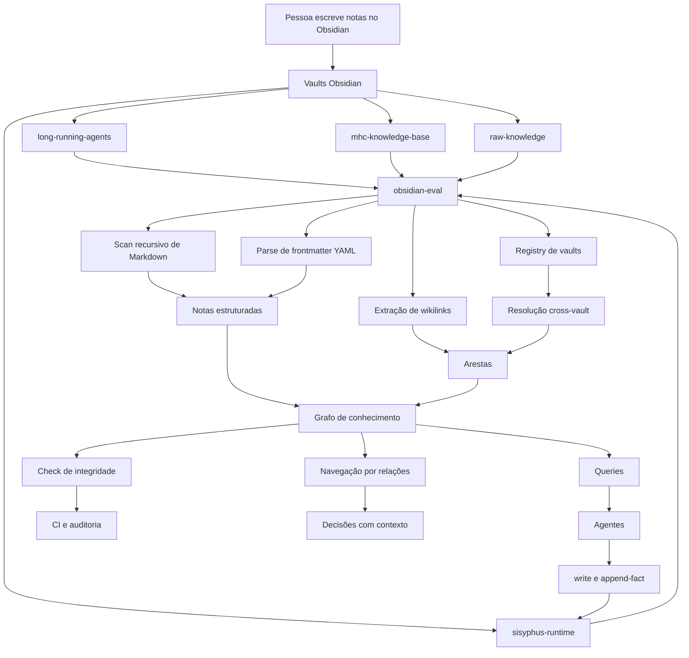
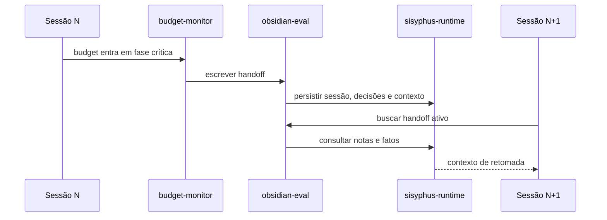

# Obsidian Eval Runtime

## Para que este documento existe

Este documento explica, em linguagem de produto e engenharia, o que é o `obsidian-eval` e quais mecanismos criamos para ligar o Obsidian aos nossos vaults de conhecimento.

A explicação curta é:

> O `obsidian-eval` transforma vaults Obsidian em um runtime de conhecimento programável. As pessoas continuam escrevendo notas no Obsidian; os agentes e scripts passam a conseguir ler, consultar, validar, conectar e escrever nesse conhecimento de forma determinística.

A explicação mais importante é: a inteligência não está apenas no LLM. Ela está na estrutura que criamos em volta do conhecimento.

Antes, os vaults eram coleções de Markdown com links úteis para humanos. Depois do `obsidian-eval`, esses mesmos vaults viraram uma rede consultável por código:

- cada nota vira um nó;
- cada wikilink vira uma aresta;
- cada frontmatter vira metadado pesquisável;
- cada vault ganha um nome estável;
- cada referência entre vaults pode ser resolvida;
- cada agente pode navegar esse grafo em vez de apenas fazer busca textual.

## O problema que resolvemos

O ecossistema tem múltiplos vaults com papéis diferentes:

| Vault | Papel |
|---|---|
| `long-running-agents` | padrões canônicos, currículo, conceitos e guias de agentes |
| `mhc-knowledge-base` | conhecimento organizacional do KODA e validações de domínio |
| `raw-knowledge` | fontes brutas ingeridas, como papers, talks e transcripts |
| `sisyphus-runtime` | memória privada de runtime: handoffs, fatos duráveis e estado corrente |
| `obsidian-eval` | o próprio pacote, usado também em dogfooding |

Sem uma camada comum, cada vault precisaria de scripts próprios para percorrer Markdown, ler frontmatter, resolver links, detectar links quebrados e encontrar notas órfãs. Isso já tinha acontecido: scripts de validação em `mhc-knowledge-base` duplicavam funções como `walkMdFiles`, `parseFrontmatter`, `extractWikilinkTargets` e `resolveWikilinkPath`.

O problema não era só duplicação de código. Era fragilidade operacional:

1. cada script interpretava wikilinks de um jeito;
2. correções precisavam ser copiadas manualmente;
3. links entre vaults não tinham um mecanismo comum;
4. agentes dependiam de busca textual ou de conhecimento prévio do path;
5. handoffs e fatos duráveis ficavam fora de uma camada de consulta consistente.

O `obsidian-eval` resolve isso criando uma biblioteca e CLI comum para todos os vaults.

## Visão de produto

Para produto, a mudança é esta:

> A documentação deixa de ser apenas um repositório de leitura e vira uma infraestrutura operacional para agentes.

Isso permite perguntas como:

- Quais padrões canônicos falam de memória?
- Quais documentos apontam para este conceito?
- Quais notas estão isoladas no grafo?
- Quais links quebraram depois de uma mudança?
- Qual handoff anterior explica o estado atual?
- Que fatos duráveis precisam ser carregados antes de uma tarefa?
- Que conhecimento público justifica uma decisão privada de runtime?

O valor prático é reduzir dependência de memória humana. Em vez de alguém lembrar onde está a informação, a ferramenta transforma a base de conhecimento em uma superfície navegável por humanos e agentes.

## Visão técnica

O pacote `@pavani/obsidian-eval` é uma biblioteca TypeScript e uma CLI. Ele não depende do app Obsidian aberto, não usa plugin Obsidian e não precisa de banco externo. Ele opera diretamente sobre o filesystem.

O fluxo técnico é:

1. receber um path de vault;
2. verificar se existe `.obsidian/`;
3. percorrer os arquivos `.md`;
4. parsear frontmatter YAML;
5. separar corpo da nota;
6. extrair wikilinks do frontmatter e do corpo;
7. resolver cada link para um path de destino;
8. construir um grafo direcionado em memória;
9. expor operações de consulta, validação e escrita.

## Grafo do sistema



## Mecanismo 1: vault registry

O registry é a tabela que dá nomes estáveis para vaults.

Em vez de cada agente carregar paths absolutos manualmente, o sistema usa nomes como:

- `long-running-agents`
- `mhc-knowledge-base`
- `raw-knowledge`
- `sisyphus-runtime`
- `obsidian-eval`

O mecanismo vive em `obsidian-eval/src/vaults.ts`.

Ele oferece três funções principais:

| Função | Papel |
|---|---|
| `resolveVaultRoot(name)` | recebe um nome de vault e devolve o path absoluto |
| `listVaults()` | lista os vaults conhecidos |
| `registerVault(name, path)` | adiciona ou sobrescreve um vault em memória |

Também existe override via `OBSIDIAN_EVAL_VAULTS`, uma env var JSON. Isso permite rodar a mesma ferramenta em outro ambiente sem editar o código.

## Mecanismo 2: detecção de vault

O `obsidian-eval` considera que um diretório é um vault quando encontra uma pasta `.obsidian/`.

Essa decisão é deliberadamente simples. Ela evita dependência do app Obsidian, de plugins, de workspaces específicos ou de configurações internas. Para a ferramenta, um vault é um diretório de Markdown com `.obsidian/`.

Isso torna o runtime portável:

- funciona em CI;
- funciona em scripts;
- funciona em sessões de agente;
- funciona sem interface gráfica;
- funciona mesmo que o Obsidian esteja fechado.

## Mecanismo 3: scan recursivo de Markdown

O scan percorre o vault e encontra todos os arquivos `.md`.

Cada arquivo vira uma estrutura `Note`:

| Campo | O que representa |
|---|---|
| `path` | path relativo dentro do vault |
| `absolutePath` | path absoluto no disco |
| `frontmatter` | YAML parseado como objeto |
| `body` | corpo da nota sem o frontmatter |
| `bodyLines` | corpo dividido por linhas |
| `bodyStartLine` | linha onde o corpo começa |

Esse detalhe de linha é importante. Ele permite que validações apontem para o lugar certo quando encontram um problema.

## Mecanismo 4: parse de frontmatter

O frontmatter é onde as notas carregam metadados.

Exemplo:

```yaml
---
title: "Epistemic Memory Graph"
type: canonical
tags: ["context-engineering", "agentes-orquestracao"]
relates-to: ["[[docs/canonical/addressable-memory-catalog|Addressable Memory Catalog]]"]
---
```

O parser lê o YAML entre os delimitadores `---` e transforma em objeto. Com isso, campos editoriais viram campos consultáveis.

Isso permite consultar por:

- `type`
- `tags`
- `status`
- `maturity`
- `repo`
- `trigger`
- `relates-to`
- qualquer outro campo usado pelos vaults.

Produto continua escrevendo documentos com metadados legíveis. O agente passa a consumir esses metadados como estrutura.

## Mecanismo 5: extração de wikilinks

Wikilinks são o formato nativo do Obsidian para conectar notas.

Exemplos:

```markdown
[[docs/canonical/external-state-persistence]]
[[docs/canonical/external-state-persistence|External State Persistence]]
```

O `obsidian-eval` extrai o target real do link. Se houver alias visual depois de `|`, ele remove o alias para resolver o destino.

O parser também encontra wikilinks embutidos em texto normal. Isso significa que relações podem aparecer tanto em listas explícitas de frontmatter quanto em prosa.

## Mecanismo 6: resolução de wikilinks

Depois de extrair o target, o runtime precisa transformá-lo em path.

As regras principais são:

1. ignorar links externos que contêm `://`;
2. remover âncoras de heading ou bloco;
3. adicionar `.md` quando o target não tem extensão;
4. resolver o path relativo ao vault.

Essa normalização preserva a experiência natural do Obsidian. Humanos escrevem `[[minha-nota]]`; a ferramenta resolve como `minha-nota.md`.

## Mecanismo 7: cross-vault wikilinks

Esse é o mecanismo que liga diversos vaults.

A sintaxe é:

```markdown
[[vault:long-running-agents/docs/canonical/evaluation-rubrics]]
```

O fluxo é:

1. detectar o prefixo `vault:<name>/`;
2. usar o registry para resolver `<name>`;
3. pegar o restante do path;
4. resolver o destino dentro do vault alvo;
5. normalizar como qualquer wikilink.

Com isso, uma nota no `sisyphus-runtime` pode apontar para um padrão em `long-running-agents`, e um handoff privado pode citar conhecimento público sem copiar conteúdo.

Esse ponto é central: ele separa propriedade e conexão.

- O vault público continua público.
- O vault privado continua privado.
- A relação entre eles continua navegável.

## Mecanismo 8: grafo direcionado

Depois do scan, o runtime constrói um grafo.

No grafo:

- notas são nós;
- wikilinks são arestas;
- a origem da aresta é a nota que contém o link;
- o destino é a nota linkada;
- a aresta registra linha, campo e texto original.

A estrutura `Edge` guarda:

| Campo | Papel |
|---|---|
| `from` | nota de origem |
| `to` | nota de destino |
| `location` | se o link veio do frontmatter ou do corpo |
| `field` | campo do frontmatter, quando aplicável |
| `line` | linha onde o link apareceu |
| `raw` | wikilink original |

Esse grafo é o que torna possível navegar conhecimento por relações, não só por palavras-chave.

## Mecanismo 9: operações do grafo

O `Graph` expõe operações fundamentais:

| Operação | Pergunta que responde |
|---|---|
| `outbound(notePath)` | O que esta nota referencia? |
| `inbound(notePath)` | Quem referencia esta nota? |
| `brokenLinks()` | Quais links apontam para notas inexistentes? |
| `orphans()` | Quais notas não recebem links? |
| `filter(predicate)` | Quais notas passam neste filtro? |
| `findByField(field, value)` | Quais notas têm este campo com este valor? |
| `findByTag(tag)` | Quais notas têm esta tag? |
| `indexBy(field)` | Como agrupar notas por este campo? |

Essas operações permitem que agentes façam pesquisa estruturada:

- encontrar todos os canônicos sobre `memory`;
- descobrir backlinks de um conceito;
- detectar documentação órfã;
- validar integridade antes de publicar;
- montar contexto antes de executar uma tarefa.

## Mecanismo 10: query DSL segura

A query DSL é a interface textual para executar operações sobre o grafo.

Exemplos:

```bash
obsidian-eval ./long-running-agents query "filter(n => n.frontmatter.type === 'canonical')"
obsidian-eval ./long-running-agents query "filter(n => n.frontmatter.tags.includes('context-engineering'))"
obsidian-eval ./long-running-agents query "findByTag('evals')"
obsidian-eval ./long-running-agents query "orphans()"
obsidian-eval ./long-running-agents query "brokenLinks()"
obsidian-eval ./long-running-agents query "inbound('docs/canonical/external-state-persistence.md')"
```

Apesar da sintaxe parecer JavaScript, ela não usa `eval()` nem `Function()`. O parser reconhece padrões fechados por regex e transforma cada comando em uma operação conhecida.

Isso é importante por segurança. Agentes podem emitir queries sem ganhar capacidade de executar código arbitrário.

## Mecanismo 11: validação de integridade

O comando `check` usa o grafo para detectar problemas de documentação:

- links quebrados;
- notas órfãs.

Com `--checks`, a CLI retorna exit code `1` quando encontra violações. Isso permite usar o runtime em CI e em gates de qualidade.

Exemplo:

```bash
obsidian-eval ./long-running-agents check --checks
```

Produto se beneficia porque a base de conhecimento passa a ter saúde observável. Não é só “tem documentação”; é “a documentação está conectada e íntegra?”.

## Mecanismo 12: escrita de notas

O runtime também escreve Markdown.

`writeNote()` cria ou sobrescreve uma nota com frontmatter YAML e corpo. Ele cria diretórios intermediários automaticamente e valida que o destino fica dentro do vault.

Isso permite que agentes persistam artefatos em formato legível por humanos.

Exemplo conceitual:

```bash
obsidian-eval ~/sisyphus-runtime write sessions/test.md \
  '{"type":"session-handoff","date":"2026-06-16"}' \
  '# Handoff\n\nResumo da sessão.'
```

## Mecanismo 13: fatos duráveis

`appendFact()` adiciona entradas a arquivos de fatos duráveis.

Se o arquivo ainda não existe, ele cria uma nota com frontmatter mínimo e uma seção `## <category>`. Se existe, ele encontra a seção correta e apensa a nova entrada.

Isso é usado para persistir coisas como:

- constraints;
- preferências;
- decisões;
- ledger de budget;
- fatos globais ou por repositório.

A decisão de manter isso como Markdown é intencional. Humanos conseguem abrir, revisar e corrigir no Obsidian; agentes conseguem consultar e reutilizar.

## Mecanismo 14: `sisyphus-runtime`

O `sisyphus-runtime` é o vault privado de operação.

Ele guarda:

- handoffs de sessão;
- fatos duráveis;
- estado corrente;
- working memory externalizada;
- open decisions;
- catálogo de contexto omitido;
- ledger de token budget.

Ele fica fora do git. Essa separação evita vazar dados privados em repositórios compartilhados.

O `obsidian-eval` é a ferramenta que torna esse vault operacional: lê handoffs, escreve novos estados, apensa fatos e conecta referências com outros vaults.

## Mecanismo 15: continuidade cross-session

O runtime permite um loop de continuidade:



Com isso, uma sessão pode terminar por limite de contexto e a próxima sessão pode retomar com memória estruturada.

## Mecanismo 16: camadas de memória

O módulo `memory-layers.ts` formaliza três movimentos:

| Função | Papel |
|---|---|
| `compressWorkingMemory()` | compacta estado corrente em resumo, decisões abertas e handles |
| `promotePatterns()` | identifica padrões recorrentes em handoffs |
| `deprecateStaleFacts()` | encontra fatos antigos ou de baixa confiança que precisam revisão |

Esse mecanismo aponta para uma evolução importante: memória não é só armazenamento. Memória precisa de ciclo de vida.

- estado corrente vira handoff;
- handoffs recorrentes viram fatos duráveis;
- fatos antigos podem ficar stale;
- padrões comprovados podem virar documentação canônica.

Isso conecta diretamente com [[docs/canonical/epistemic-memory-graph|Epistemic Memory Graph]] e [[docs/canonical/external-state-persistence|External State Persistence]].

## Mecanismo 17: CLI e API compartilhadas

O `obsidian-eval` expõe os mesmos mecanismos por CLI e por API TypeScript.

CLI:

```bash
obsidian-eval ./long-running-agents scan
obsidian-eval ./long-running-agents graph-stats
obsidian-eval ./long-running-agents query "orphans()"
obsidian-eval resolve-vault sisyphus-runtime
obsidian-eval list-vaults
```

API:

```typescript
import { scan, query, writeNote, resolveVaultRoot } from "@pavani/obsidian-eval";

const vault = scan("/mnt/c/Users/pavan/long-running-agents");
const canonicals = query(vault, "filter(n => n.frontmatter.type === 'canonical')");
const runtimeRoot = resolveVaultRoot("sisyphus-runtime");
```

Essa duplicidade é útil porque humanos usam CLI, enquanto agentes e scripts usam API. Mas a lógica é a mesma, então não há duas fontes de verdade.

## Como a pesquisa funciona na prática

Quando um agente precisa pesquisar nos vaults, o fluxo esperado é:

1. identificar o domínio da pergunta;
2. escolher um ou mais vaults relevantes;
3. rodar `scan()` ou comando CLI;
4. filtrar por frontmatter, tags ou path;
5. navegar backlinks e links de saída;
6. seguir cross-vault links quando necessário;
7. ler os arquivos finais com contexto suficiente;
8. responder citando o conhecimento usado.

Exemplo: “quais padrões falam de memória operacional?”

O agente pode:

```bash
obsidian-eval ./long-running-agents query \
  "filter(n => n.frontmatter.tags.includes('context-engineering'))"
```

Depois pode seguir `relates-to`, backlinks e canonical docs relacionados.

## O que fizemos em termos de mecanismos

Em termos concretos, o trabalho criou ou consolidou estes blocos:

| Bloco | Resultado |
|---|---|
| pacote npm | `@pavani/obsidian-eval` como biblioteca reutilizável |
| CLI | comandos `scan`, `query`, `check`, `graph-stats`, `write`, `append-fact`, `resolve-vault`, `list-vaults` |
| parser Markdown | leitura de `.md`, corpo e frontmatter |
| parser wikilink | extração e normalização de `[[...]]` |
| grafo | navegação por inbound, outbound, orphans e broken links |
| query DSL | consultas seguras por pattern matching |
| registry | resolução de nomes de vault para paths |
| cross-vault links | referências entre vaults por `vault:<name>/path` |
| escrita | criação de notas e append de fatos duráveis |
| runtime privado | integração com `sisyphus-runtime` para handoff e estado |
| memory layers | compressão, promoção e depreciação de memória |
| documentação | README curto no pacote e referência arquitetural em `.omo/docs` |

## Por que não é apenas busca textual

Busca textual responde “onde aparece esta palavra?”.

O `obsidian-eval` responde perguntas estruturais:

- “qual é o tipo deste documento?”
- “quais documentos declaram esta tag?”
- “quais notas dependem desta?”
- “quais links quebraram?”
- “quais documentos estão isolados?”
- “qual vault contém o alvo deste link?”
- “quais fatos duráveis devem sobreviver à sessão?”

Essa diferença é central. O sistema não substitui busca textual; ele adiciona uma camada de relações e metadados que a busca textual não captura.

## Por que isso importa para agentes

Agentes long-running falham quando dependem apenas do contexto ativo. Eles esquecem, perdem rastreabilidade e misturam decisões antigas com hipóteses recentes.

O `obsidian-eval` ajuda porque dá aos agentes uma memória externa navegável:

- contexto pode ser omitido do prompt e recuperado por handle;
- decisões podem ser persistidas;
- fatos podem sobreviver entre sessões;
- conhecimento canônico pode ser carregado sob demanda;
- links entre documentos preservam proveniência;
- validações detectam quando a base ficou inconsistente.

Isso operacionaliza padrões descritos em [[docs/canonical/external-state-persistence|External State Persistence]], [[docs/canonical/addressable-memory-catalog|Addressable Memory Catalog]] e [[docs/canonical/closed-loop-agent-operating-system|Closed-Loop Agent Operating System]].

## Limites atuais

O `obsidian-eval` é propositalmente simples. Ele não é:

- motor semântico com embeddings;
- banco vetorial;
- substituto do Obsidian;
- sistema de permissões completo;
- indexador incremental persistente;
- buscador full-text avançado.

Ele é a camada determinística de scan, grafo, query, validação e escrita. Isso é uma vantagem: os mecanismos são previsíveis, testáveis e fáceis de auditar.

## Próximas evoluções naturais

As evoluções mais prováveis são:

1. melhorar validações cross-vault em CI;
2. criar relatórios de saúde dos vaults;
3. indexar resultados para evitar scans repetidos em vaults grandes;
4. adicionar busca textual combinada com grafo;
5. enriquecer memória com status epistêmico;
6. promover padrões recorrentes de handoffs para canonical docs;
7. criar visualizações de grafo para produto e engenharia.

## Resumo final

O `obsidian-eval` é o conector entre Obsidian, vaults e agentes.

Ele permite que a base de conhecimento seja simultaneamente:

- legível por humanos;
- navegável no Obsidian;
- consultável por código;
- validável por scripts;
- reutilizável por agentes;
- persistente entre sessões.

A decisão arquitetural mais importante foi tratar Markdown e wikilinks como dados estruturados. A partir disso, os vaults deixam de ser pastas de notas e passam a funcionar como um runtime de conhecimento.
