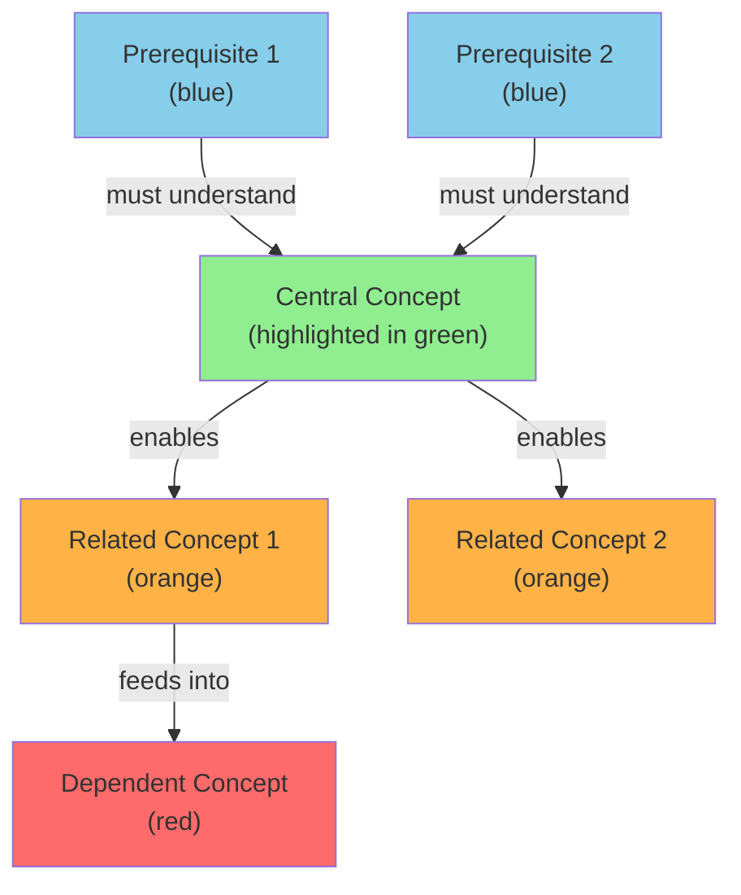
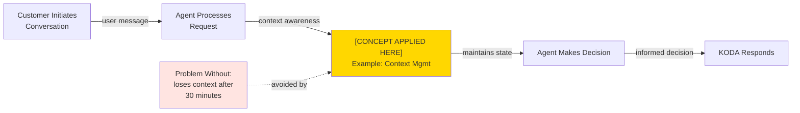
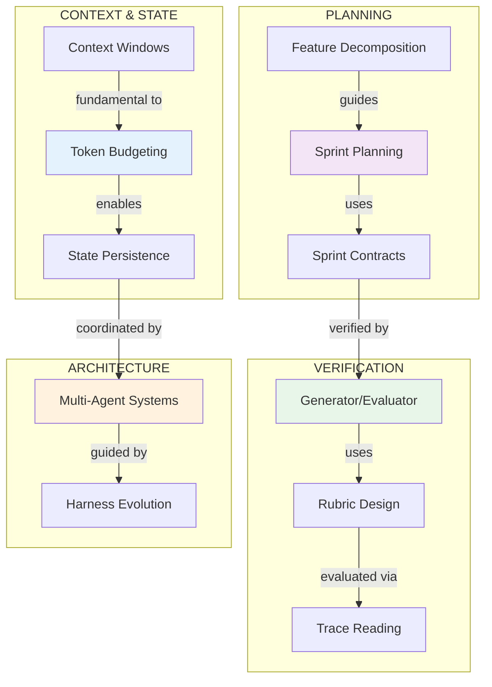
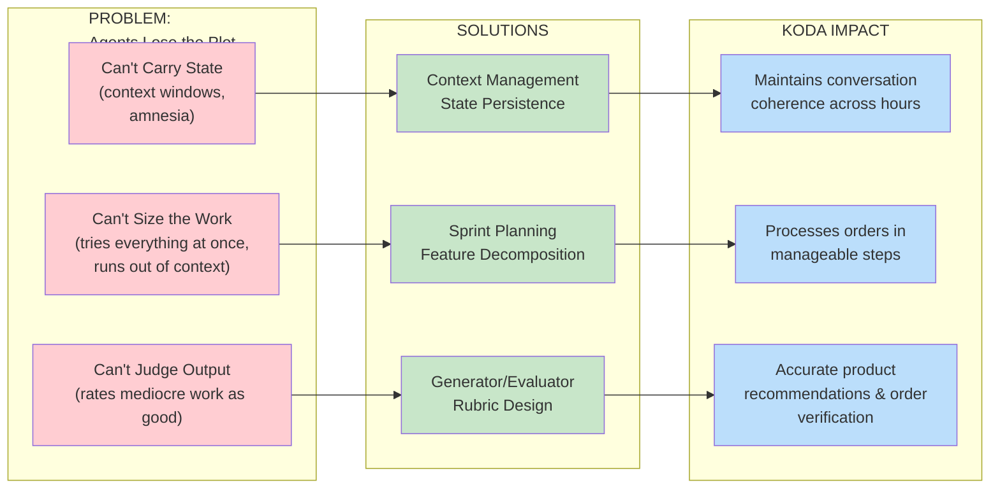

# 📝 PROMPT: Generate Knowledge Graphs in Mermaid Format

## Como Usar Este Prompt

Cole este prompt em um LLM para gerar 35+ diagramas Mermaid visualizando os conceitos.

---

## PROMPT COMPLETO

```
You are a technical documentation specialist and knowledge architect. Your task is to create comprehensive, visually clear Knowledge Graphs in Mermaid format based on Anthropic's "Build Agents That Run for Hours" presentation.

**Context:**
- Purpose: Document complex concepts from long-running agents for FutanBear's team
- Primary Application: KODA (conversational AI for sports supplement sales)
- Output Format: Mermaid diagrams (compatible with GitHub, GitLab, Notion, MkDocs, Obsidian)
- Audience: Technical team at intermediate to advanced level
- Use Case: Documentation, onboarding, architecture decisions, and reference materials

**REQUIREMENTS FOR KNOWLEDGE GRAPHS:**

## 1. **CORE CONCEPT KNOWLEDGE GRAPHS**

For each core concept, generate 3 complementary Mermaid diagrams:

### Diagram Type A: Hierarchical Connection Graph
**Purpose:** Show how a concept relates to related concepts and prerequisites
**Mermaid Format:** Graph with styled nodes
**Should Include:**
- Central concept (highlighted)
- Prerequisites (bottom)
- Related concepts (sides)
- Dependent concepts (top)
- Connection labels explaining relationships
- Color coding: Blue=Prerequisites, Green=Core, Orange=Related, Red=Dependents

**Example Structure:**


### Diagram Type B: KODA Application Flow
**Purpose:** Show exactly how this concept applies within KODA's architecture
**Mermaid Format:** Flowchart showing KODA workflow with concept integration
**Should Include:**
- KODA workflow step-by-step
- Where the concept is applied
- What problem it solves in KODA
- Data flow/state changes
- Decision points

**Example Structure:**


### Diagram Type C: Complexity & Implementation Timeline
**Purpose:** Show at which complexity level this concept is introduced and how it evolves
**Mermaid Format:** Timeline or progression diagram
**Should Include:**
- Which complexity level introduces concept
- Evolution across levels (Nível 1-4)
- Implementation complexity
- Time to master
- When to apply to KODA

---

## 2. **INTERCONNECTION MEGA-GRAPHS**

Create 2-3 large Knowledge Graphs showing how all concepts connect:

### Mega-Graph Type A: Complete Concept Ecosystem
**Purpose:** Show how all core concepts relate to each other
**Mermaid Format:** Large directed graph with multiple connection types
**Should Include:**
- All ~8-10 core concepts as nodes
- Different arrow types for different relationships:
  - Solid → "directly enables"
  - Dashed → "related to"
  - Dotted → "conflicts with / trade-off"
- Color by category (Context, Planning, Verification, Architecture, etc.)
- Size by importance/complexity
- Clustering by topic area

**Example (simplified):**


### Mega-Graph Type B: KODA Feature Dependency Graph
**Purpose:** Show how each concept is required for different KODA features
**Mermaid Format:** Bipartite graph (concepts ↔ features)
**Should Include:**
- Left side: Core concepts
- Right side: KODA features/workflows
- Connection thickness shows criticality
- Colors by feature type (Product Discovery, Order Processing, Fulfillment)

### Mega-Graph Type C: Learning Progression Dependency
**Purpose:** Show which concepts must be learned before others (Nível 1-4)
**Mermaid Format:** Layered directed graph
**Should Include:**
- Horizontal layers for each Nível (1-4)
- Vertical dependencies between levels
- Concepts ordered by learning prerequisite
- Prerequisites clearly marked

---

## 3. **PROBLEM-SOLUTION KNOWLEDGE GRAPHS**

Create graphs showing how concepts address the "three reasons agents lose the plot":

### Problem-Solution Format:


---

## 4. **DETAILED CONCEPT KNOWLEDGE GRAPHS**

For each of the 8 core concepts, generate the 3 diagram types above. Core concepts are:

1. **Context Management & Token Budgeting**
2. **Planning vs. Execution Separation**
3. **Generator/Evaluator Pattern**
4. **Sprint Contracts & Negotiation**
5. **State Persistence & File-Based Coordination**
6. **Harness Evolution (as Models Improve)**
7. **Multi-Agent Coordination**
8. **Evaluation Rubrics & Subjective Quality Measurement**

For EACH concept, provide:

**A) Hierarchical Connection Graph**
- Central concept
- Prerequisites
- Related concepts
- Dependents
- KODA applications

**B) KODA Application Flow**
- Shows real usage in KODA
- Workflow integration
- Problem solved
- Data flow

**C) Complexity Timeline**
- Nível 1: Introduction
- Nível 2: Practical application
- Nível 3: Advanced patterns
- Nível 4: KODA-specific implementation

---

## 5. **GENERATOR/EVALUATOR PATTERN (DETAILED)**

This pattern deserves deeper visualization. Provide:

### Diagram 5A: Generator/Evaluator Internal Architecture
### Diagram 5B: Generator/Evaluator vs. Self-Evaluation
### Diagram 5C: KODA's Generator/Evaluator for Order Processing

---

## 6. **HARNESS EVOLUTION GRAPH**

Show how KODA's harness evolves as Claude models improve.

---

## 7. **MULTI-AGENT COORDINATION GRAPH**

Show how Planner, Generator, and Evaluator coordinate.

---

## 8. **KODA COMPLETE SYSTEM ARCHITECTURE GRAPH**

Final mega-graph showing complete KODA system.

---

## 9. **OUTPUT SPECIFICATIONS:**

### Format Requirements:
- All diagrams must be valid Mermaid syntax
- Include alt-text descriptions for accessibility
- Add titles and descriptions above each diagram
- Provide markdown copy-paste ready code blocks

### Styling Consistency:
- Color Palette (use consistently):
  - Prerequisites: #87CEEB (Light Blue)
  - Core Concepts: #90EE90 (Light Green)
  - Related: #FFB347 (Light Orange)
  - Dependents: #FF6B6B (Light Red)
  - KODA-Specific: #FFD700 (Gold)
  - Problems: #FFCDD2 (Light Pink)
  - Solutions: #C8E6C9 (Light Green)

### File Organization:
```
/koda-knowledge-graphs/
├── 01-core-concepts/
│   ├── 01-context-management.md
│   ├── 02-planning-execution.md
│   ├── 03-generator-evaluator.md
│   ├── 04-sprint-contracts.md
│   ├── 05-state-persistence.md
│   ├── 06-harness-evolution.md
│   ├── 07-multi-agent.md
│   └── 08-evaluation-rubrics.md
├── 02-mega-graphs/
│   ├── ecosystem.md
│   ├── koda-features.md
│   └── learning-progression.md
├── 03-problem-solutions/
│   └── three-reasons-agents-lose-plot.md
├── 04-patterns/
│   ├── generator-evaluator-detailed.md
│   ├── harness-evolution.md
│   └── multi-agent-coordination.md
└── 05-complete-systems/
    └── koda-complete-architecture.md
```

---

## 10. **DELIVERABLES:**

For EACH of the 8 core concepts, provide:
1. **Hierarchical Connection Graph** (Diagram A)
2. **KODA Application Flow** (Diagram B)
3. **Complexity Timeline** (Diagram C)
4. Markdown descriptions and alt-text
5. Copy-paste ready Mermaid code

Additionally provide:
6. **3 Mega-Graphs** (complete ecosystem, KODA features, learning progression)
7. **Problem-Solution Graphs** (for all three reasons agents lose plot)
8. **Generator/Evaluator Deep-Dive** (3 specialized diagrams)
9. **Harness Evolution Timeline** (Opus 4.5 → 4.6 → Future)
10. **Multi-Agent Coordination Flow**
11. **Complete KODA System Architecture**

**Total output: 35+ Mermaid diagrams** organized, documented, and ready for:
- GitHub wikis
- Notion documentation
- MkDocs sites
- Team onboarding materials
- Architecture decision records (ADRs)

---

## Tone & Specifications:
- Clear, professional documentation style
- Descriptive captions for each diagram
- Include "Why This Matters" for business context
- Note "KODA Application" impact explicitly
- Provide both diagram code AND rendered references if possible
- Make diagrams self-explanatory (good legend, clear labels)
- Use consistent terminology across all graphs
- Include markdown frontmatter with metadata (created-date, updated-date, concept-level)

**Generate the 8 core concept graphs first, then the mega-graphs and specialized patterns. Prioritize clarity and reusability across documentation systems.**
```

---

## 📌 Notas de Uso

1. **Gere em etapas:**
   - Primeira: 8 conceitos core (3 diagramas cada = 24 diagramas)
   - Depois: 3 mega-graphs
   - Depois: Padrões especializados (11 diagramas)
   - Total: 35+ diagramas

2. **Salve em:** `06-knowledge-graphs/`

3. **Formato:** Cada conceito em arquivo separado

4. **Tempo estimado:**
   - 8 conceitos: 20-30 minutos
   - Mega-graphs: 10-15 minutos
   - Especializados: 15-20 minutos
   - Total: 45-60 minutos

5. **Outputs esperados:**
   - 35+ código Mermaid válido
   - Descrições Markdown
   - Alt-text para acessibilidade
   - Links cruzados

---

*Prompt | Knowledge Graphs | v1.0*
